## Table_Sum ary 研究结论

因子的选股作用会随时间衰减，技术类因子衰减比基本面因子快，提升调仓频率能让基本面因子规避的 IC衰减整体十分有限。但在个别月份，例如年报公告季，财报信息频繁更新时，及时更新因子数据，有可能让基本面因子表现获得阶段性增强。

以业绩超预期事件为例，季报、半年报和年报前后的收益衰减速度的不同。超预期幅度相对较低的股票在公告日前后，持续稳定的有负异常收益，及时更新财务因子数据可以及时发现负 alpha 的股票，提升因子表现；超预期幅度相对较高的股票在一季报、半年报和三季报公告后的异常收益基本在 5个交易日就反应完，幅度也不大，数据更新时间迟到一周就无法捕捉这段时间的收益；而年报公告后的异常收益在公告后 20 个交易日内要强很多，而且稳定，越早更新数据就能越早捕获这些高收益股票，增强因子表现。

报告比较了四个基本面因子的月频和日频调仓的多空组合收益。不管是原始alpha 因子还是行业市值中性化后的因子，日频调仓的多空组合收益更高，但增效大部分来自于年报公告季 3、4月份，而且分年看表现非常稳健；其它月份基本面因子的提升并不明显。

在不扣费情况下，在年报公告季 3、4月份加快调仓频率，可以提升当月全市场指数增强组合的表现。（1）基本面因子组合：周频组合在 3、4月份的单月收益比月频可以高出 20-30个 bp，日频比月频单月可以高出近 50个 bp。（2）全因子组合：周频组合比月频单月可高出近 30个 bp，日频比月频单月可高出近 80个 bp。收益提升的年份占比也都在 60%以上。说明在年报公告季提高交易频率，充分利用衰退前的 alpha能获得理论上组合收益的提升。

随着交易成本的升高，提升调仓频率带来的指数增强组合的收益提升优势会减少。（1）基本面因子组合：当交易费率为双边 0.3%时，周频组合在 3、4 月份的单月收益比月频平均可以高出约 20 个 bp，日频高出约 10 个 bp。（2）全因子组合：当交易费率为双边 0.3%时，周频在 3、4 月份的单月比月频可以高出约 10-20 个 bp，日频高出约 20-30 个 bp。而当交易费率为单边 0.3%时，周频与月频基本相当，日频相比周频还有所降低。这就说明，当交易成本较高如单边 0.3%，高换手带来的 alpha 增量已经无法覆盖其带来的交易成本，投资者可以根据交易费率情况，选择月频或周频调仓。

当交易费率较低时，即使换手率控制得和月频一致，加快调仓频率后的组合在 3、4 两个月份的收益也有所提升。投资者可以根据实际的资金容量和对应的交易费率，选择更为合适的调仓方式，从而获得阶段性收益的增量提升。

## 风险提示

- 量化模失效风险

- 市场极端环境的冲击

Table_ReportDate 报告发布日期2019 年 02 月 28 日

Table_Autho 证券分析师朱剑涛

021-63325888*6077

zhujiantao@orientsec.com.cn

Table_Contacter 联系人 刘静涵 021-63325888-3211 liujinghan@orientsec.com.cn

Table_Report 相关报告

| A 股行业内选股分析总结 日内交易特征稳定性与股票收益 Alpha与Smart Beta | 2019-01-16 2019-01-14 2018-12-02 |
| --- | --- |
| 产业链与公司股价关联 A 股是估值驱动还是盈利驱动？ | 2018-12-02 2018-12-02 |
| A 股涨跌幅排行榜效应 | 2018-11-20 |
| DFQ2018 绩效归因与基金投资分析工具 | 2018-10-26 |
| 基于 copula 的尾部相关性研究：上尾异常 相关系数因子 | 2018-10-23 |
| 东方 A 股因子风险模型(DFQ-2018) |  |
|  | 2018-09-02 |
| 盈利预测与市价隐含预期收益 | 2018-09-01 |
| 基金重仓股研究 |  |
|  | 2018-08-19 |
| 上市公司业绩预告信息研究 | 2018-08-03 |
| 公司研发费用因子探究 | 2018-06-09 |
| 因子择时 | 2018-06-02 |

在因子投资研究和实务中经常讨论到的一个话题是“财务类因子是有数据及时更新还是等财报公布后统一更新数值”，实证往往显示这两者的差别整体不大。本报告将通过数据说明，在每年三、四月份，年报信息集中披露时段，及时更新财务因子数据并调仓将获得额外的 alpha，幅度和稳健性显著高于其它月份。不过提高交易频率会增加组合换手，交易成本对策略的影响较大。

## 一、 交易频率对因子投资的影响

因子的选股作用会随时间衰减，这在我们之前报告《在 alpha 衰退之前》里面讨论过。为方便投资者参考，我们计算了图 1常用的合成大类 alpha因子的因子衰减速度（图 2），具体计算方法参考前期报告。

图 1：alpha 因子列表

| 类型 | 因子代码 | 因子说明 |
| --- | --- | --- |
|  | BP | 账面市值比 |
|  | EP | 归属母公司的净利润TTM/总市值 |
|  | CFP | 经营性现金流TTM/总市值 |
|  | EBIT2EV | 息税前利润与企业价值之比 |
|  | DP2 | 过去一年分红/总市值，以分红预案公告日为准 |
| 盈利能力 | RNOA | 净经营资产收益率 |
|  | CFROI | 投资现金收益率 |
|  | ROE | 净资产收益率 |
|  | GPOA | 总资产毛利率 |
| 业绩超预期 | UP | 预期外的RNOA |
|  | SUEO | 基于带漂移项随机游走模型计算的预期外的净利润，详见《业绩超预期类因子》 |
|  | SUE1 | 基于不带漂移项随机游走模型计算的预期外的净利润，详见《业绩超预期类因子》 |
|  | SURO | 基于带漂移项随机游走模型计算的预期外的营业收入，详见《业绩超预期类因子》 |
| 公司治理 | SUR1 | 基于不带漂移项随机游走模型计算的预期外的营业收入，详见《业绩超预期类因子》 |
| 分析师预期 | MR COV | 高管薪酬前三之和的对数 过去6个月有覆盖的机构数量，取根号 |
|  | DISP | 过去6个月盈利预测的分歧度 |
|  | EP_FY1 | 预期的估值 |
|  | PEG | PE_FY1/FY2隐含的利润增量率 |
|  | SCORE | 综合评价 |
|  | TPER | 目标价隐含的收益率 |
| 非流动性 | WFR | 加权的预期调整 |
|  | TO20 | 过去20个交易日的日均换手率对数 |
|  | ILLIQ | 20日Amihud非流动性自然对数 |
|  | IVOL60 IVR20 | 过去60个交易日的特质波动率 |
|  |  | 过去20个交易日的特异度 |
| 反转投机 | RET20 | 过去20个交易日的收益率 |
|  | MAXRET | 过去最大收益，过去60日最大3个日收益均值 |

数据来源：东方证券研究所

图 2：大类 Alpha 因子原始值的 IC 衰减示意图（测试时间 2008.12.31 – 2018.12.31）
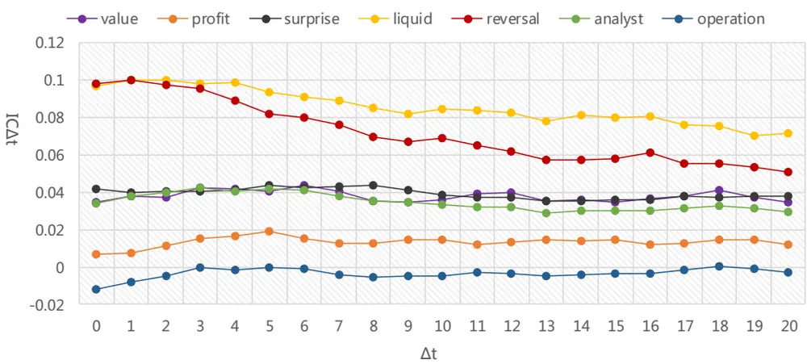
数据来源：东方证券研究所 & Wind 资讯

从图 2 可以直观看到，基本面因子的 alpha 衰减速度较慢，技术指标 liquid和 reversal的衰减速度则要快很多。从 IC 衰减曲线的形状看，IC 衰减近似指数形式，因此我们可以用用指数函数 y = a ⋅ eb⋅x去拟合 IC 衰减曲线，定量度量各个因子的 IC 衰减速度。我们采用了 60 天 IC衰减序列来进行指数函数拟合，liquid 和 reversal 因子的 Rsquare 可达到 90%，surprise 和 analyst因子的 Rsquare 可达到 80%，对 value 和 profit 的拟合效果较差。各个 alpha 因子 ic 衰减序列的指数拟合图像以及对应的半衰期如下图 3、4 所示。

图 3：大类 Alpha因子原始值的 IC衰减序列的指数函数拟合曲线
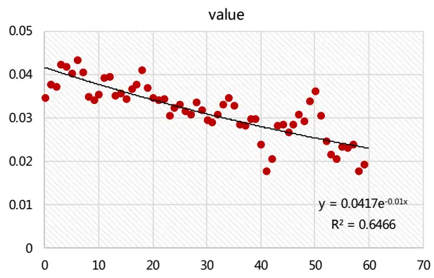

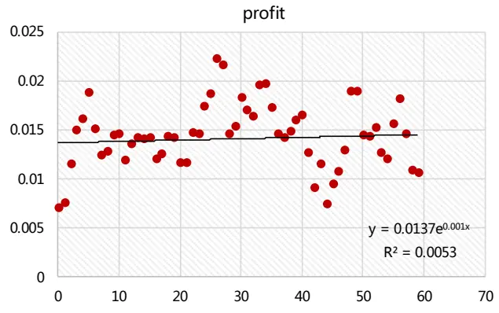

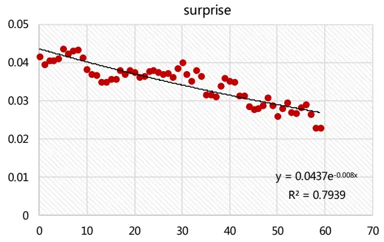

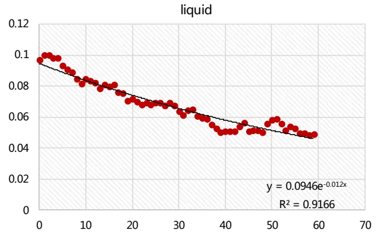

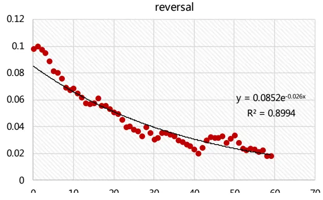
数据来源：东方证券研究所 & Wind 资讯

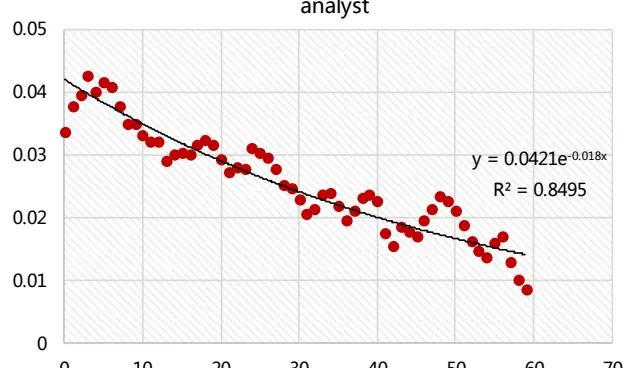

图 4：Alpha 因子半衰期
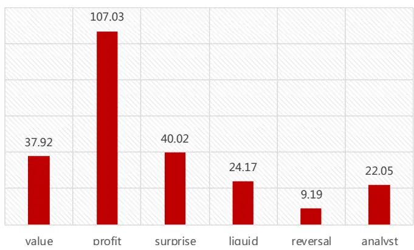
数据来源：东方证券研究所 & Wind 资讯

从图 4 来看，结论和图 2 类似，value、profit、surprise 等基本面指标的衰减速度较慢，liquid、reversal等技术类指标以及 analyst 因子的衰减速度明显更快，特别是反转因子，半衰期仅 9个交易日。所以加快交易频率整体上并不能让基本面因子规避多少 IC衰减的损失。不过基本面因子 IC衰减慢的一个很大原因是因为财务数据变化慢，在年报和季报公布季、数据更新频率高的个别月份，加快交易频率有可能让基本面因子获得局部的alpha增强。

## 二、 财报公告季的市场特征

首先，我们需要了解财务公告发布的主要月份。我们分别统计了正式财务报告、业绩预告、业绩快报的公告时间点的月份分布，可以看到：财务报告中的年报主要集中在 3、4月份，半年报，半年报集中在 7、8月份，一季报在 4月份，三季报在 10月份。

图 5：各月份公布财务报表的数量
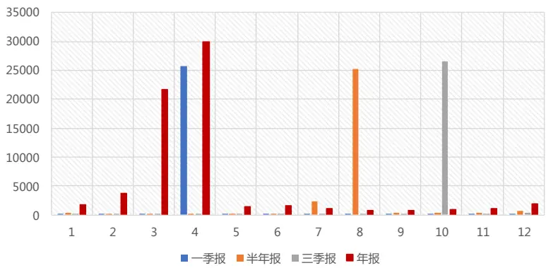
数据来源：东方证券研究所 & Wind 资讯

业绩预告主要的披露为 1、3、4、7、8、10这几个月份，其中 1月份主要公布的是年报的预告，3 月份主要是 1 季报的预告，4 月份一季报和中报的预告各半，7 月份主要是中报的预告，8月主要是三季报的预告，10 月份三季报和年报的预告各半。

图 6：各月份公布业绩预告的数量
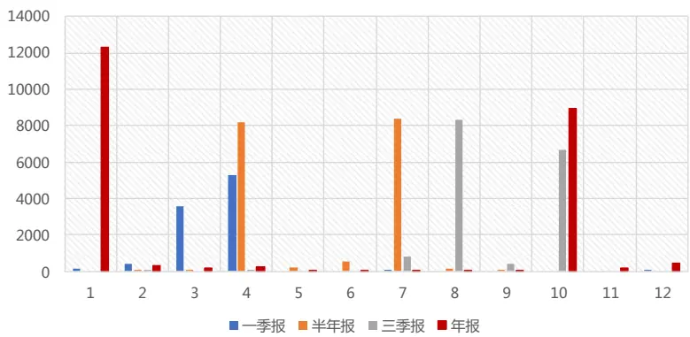
数据来源：东方证券研究所 & Wind 资讯

业绩快报主要的披露为 1、2、3、4、7、8、9这几个月份，其中 1-4月份主要公布的是年报的快报，7、8 月份主要是中报的预告，4 月份有少量一季报的快报，9 月份有少量三季报的快报。

图 7：各月份公布业绩快报的数量
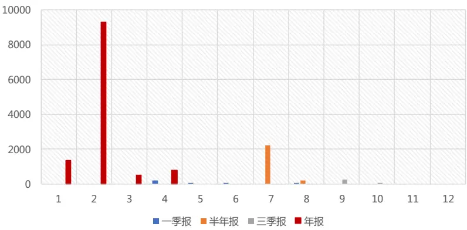
数据来源：东方证券研究所 & Wind 资讯

业绩快报主要公布的是利润表指标（营业收入、净利润等）和资产指标（净资产、总资产），我们目前的因子库中，基本面类指标中的 bp、ep、sp、ROE、ROA 等以及超预期 suirprise 因子均纳入了业绩快报数据，采用TTM方法计算。

其次，我们考察整个市场的换手率、波动率、dispersion 每月的变化情况。可以看到，dispersion 在 5 月份最高，当月波动率在 1、2、7、8 月份较高，换手率在 2、3、4、7、11 月较高。

图 8：整个市场的换手率、波动率、dispersion 每月的变化情况（测试时间 2008.12.31 –2018.12.31）
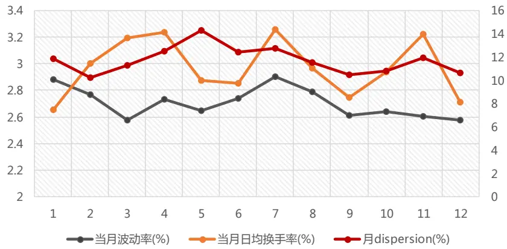
数据来源：东方证券研究所 & Wind 资讯

而后，我们以业绩超预期事件为例，按业绩超预期因子 SUE0（因子计算方法详见《20180518--- 系列（三十九） --- 业绩超预期类因子》）分组，考察因子值最大组和最小组对应财报（包含季报、半年报和年报）公布日前后的累计异常收益情况。采用当日全市场个股收益率对行业暴露虚拟变量和对数市值做横截面回归，将残差作为当日个股的异常收益。事件窗口为：事件日前后 60个交易日。从图 9和图 10 可以看到，财报公告前股价都有反应，财报信息有提前泄露的可能，但由于 A 股没有做空机制，利空释放缓慢，公告日前后，超预期幅度相对较低的股票持续稳定的有负异常收益（图 10），及时更新财务因子数据可以及时发现负 alpha的股票，提升因子表现；利好消息（图 9）在公告后反应相对公告前整体偏弱，公告后 20 个交易内，一季报、半年报和三季报的异常收益基本在 5 个交易日就反应完，幅度也不大，数据更新时间迟到一周就无法捕捉这段时间的收益；而年报的异常收益在公告后 20个交易日内要强很多，而且稳定，越早更新数据就能越早捕获这些高收益股票，增强因子表现。

图 9：SUE0最大组对应财报公布日前后的累计异常收益（测试时间 2008.12.31 – 2018.12.31）
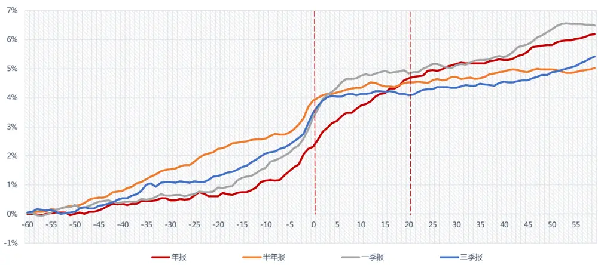
数据来源：东方证券研究所 & Wind 资讯

图 10：SUE0 最小组对应财报公布日前后的累计异常收益（测试时间 2008.12.31 – 2018.12.31）
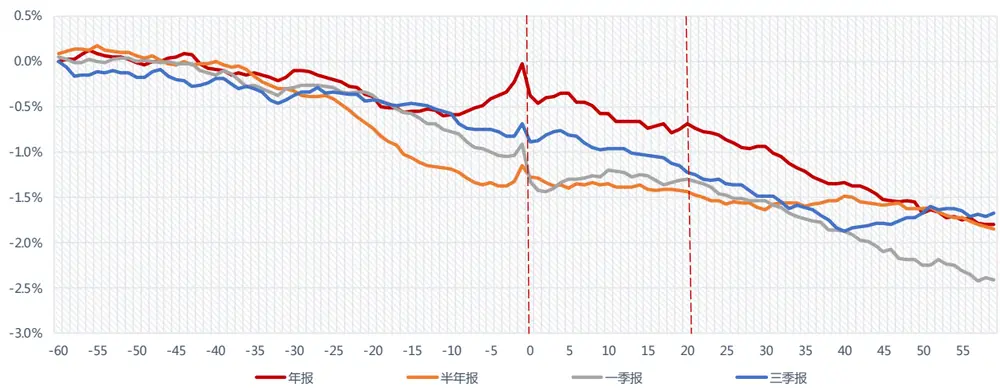
数据来源：东方证券研究所 & Wind 资讯

## 三、 年报公告期加快调仓节奏的益处

## 3.1 原始基本面 alpha 因子的增效

下面我们通过构建多空组合的方法，展示加快调仓节奏的益处。我们比较以下两种调仓方式：每天按照上月末因子值排序分组，每天按照前一天最新的因子值排序分组，将得到的月频和日频调仓下的多空组合日度收益时间序列按月份平均，观察哪个月份里日频调仓的收益提升明显。需要注意的是，此处并不能通过线性回归计算因子收益率的方式来进行分析，因为日度和月度回归得到的因子收益率不具有可比性。图 11 我们分别展示了 EP、ROE、PROFIT_GROWTH_YOY、SUE0四个原始基本面因子的结果。可以看到，4 个因子均是在日频调仓下的多空组合收益更高，从分月情况来看，年报公告季 3、4月份日频调仓下的多空组合收益均有明显提升。

图 11：原始基本面 alpha 因子的多空组合日度收益按月份对比（测试时间 2006.01.01 – 2018.12.31）

| 原始因子值 | EP |  |  | ROE |  |  | PROFIT_GROWTH_YOY |  |  | SUEO |  |  |
| --- | --- | --- | --- | --- | --- | --- | --- | --- | --- | --- | --- | --- |
| 多空月均收益 | 按上月末因子值 | 前一天因子值 | 收益提升 | 按上月末因子值 前一天因子值 |  | 收益提升 | 按上月末因子值 前一天因子值 |  | 收益提升 |  | 按上月末因子值 前一天因子值 | 收益提升 |
| 1 | 0.117% | 0.114% | -0.003% | 0.040% | 0.006% | -0.034% | 0.100% | 0.097% | -0.003% | 0.114% | 0.108% | -0.005% |
| 2 | -0.214% | -0.197% | 0017% | -0.229% | -0.226% | 0.003% | -0.091% | -0.085% | 0.006% | -0.006% | -0.007% | -0.001% |
| 3 | -0.038% | -0.021% | 0017% | -0.037% | -0.033% | 0.03% | 0.025% | 0.050% | 0.025% | 0.070% | 0.106% | 0.037% |
| 4 | 0.035% | 0.091% | 0056% | 0.068% | 0.107% | 0.040% | 0.116% | 0.183% | 0.067% | 0.135% | 0.224% | 0.089% |
| 5 | -0.180% | -0.180% | 0000% | -0.074% | -0.071% | 0.003% | -0.022% | 0.016% | 0.038% | 0.075% | 0.118% | 0.043% |
| 6 | 0.154% | 0.132% | -0.022% | 0.196% | 0.190% | -0.006% | 0.176% | 0.174% | -0.002% | 0.175% | 0.176% | 0.001% |
| 7 | 0.056% | 0.058% | 0002% | -0.011% | -0.028% | -0.017% | 0.094% | 0.097% | 0.003% | 0.108% | 0.119% | 0.011% |
| 8 | -0.043% | -0.056% | 0.013% | -0.091% | -0.076% | 0.015% | -0.065% | -0.032% | 0.033% | -0.007% | 0.050% | 0.057% |
| 9 | -0.034% | -0.034% | 0000% | -0.013% | -0.014% | -0.001% | -0.027% | -0.025% | 0.002% | 0.018% | 0.017% | -0.001% |
| 10 | 0.092% | 0.094% | 0002% | 0.031% | 0.036% | 0.005% | 0.110% | 0.152% | 0.041% | 0.141% | 0.193% | 0.052% |
| 11 | -0.051% | -0.044% | 0007% | -0.102% | -0.102% | 0.000% | -0.008% | -0.002% | 0.006% | 0.029% | 0.032% | 0.003% |
| 12 | 0.173% | 0.177% | 0005% | 0.139% | 0.132% | -0.006% | 0.092% | 0.090% | -0.002% | 0.105% | 0.101% | -0.003% |
| 平均 | 0.007% | 0.013% | 0005% | -0.005% | -0.004% | 0.001% | 0.042% | 0.059% | 0.018% | 0.079% | 0.103% | 0.024% |

## 3.2 中性化基本面 alpha 因子的增效

如果投资者是做指数增强，组合控制了行业和市值暴露，对应的 alpha 因子也需要做中性化处理，因此我们下面考察行业和市值中性化后 alpha因子的多空组合收益情况。可以看到，4个因子在中性化后均为日频调仓下的多空组合收益更高，从分月情况来看，也是在年报公告季 3、4月份日频调仓下的多空组合收益提升最明显。成长类因子在半年报和三季报公告期有明显提升，但EP和 ROE因子则没有太大变化。年报公告季加快交易频率的作用最明显。

图 12：中性化基本面 alpha 因子的多空组合日度收益按月份对比（测试时间 2006.01.01 – 2018.12.31）

| 中性化因子值 | EP |  |  | ROE |  |  | PROFIT_GROWTH_YOY |  |  | SUEO |  |
| --- | --- | --- | --- | --- | --- | --- | --- | --- | --- | --- | --- |
| 多空月均收益 | 按上月末因子值 | 前一天因子值 | 收益提升 | 按上月末因子值 前一天因子值 |  | 收益提升 | 按上月末因子值 | 前一天因子值 | 收益提升 | 按上月末因子值 | 前一天因子值 收益提升 |
| 1 | 0.155% | 0.157% | φ01% 0. | 0.068% | 0.028% | -0.040% | 0.110% | 0.115% | 0.005% 0.096% | 0.105% | 0.009% |
| 2 | -0.115% | -0.094% | 0.021% | -0.128% | -0.115% | 0.013% | -0.058% | -0.050% 0.008% | 0.010% | 0.017% | 0.008% |
| 3 | 0.026% | 0.060% | 0.035% | 0.026% | 0.041% | 0.015% | 0.030% | 0.068% 0.038% | 0.076% | 0.105% | 0.029% |
| 4 | 0.072% | 0.091% | 0.019% | 0.013% | 0.052% | 0.040% | 0.106% | 0.181% 0.075% | 0.112% | 0.203% | 0.091% |
| 5 | -0.095% | -0.081% | 0.015% | -0.024% | -0.015% | 0.009% | 0.027% | 0.050% 20023%% | 0.088% | 0.129% | 0.041% |
| 6 | 0.194% | 0.174% | -0. 020% | 0.196% | 0.190% | -0.006% | 0.145% | 0.139% -0.006% | 0.138% | 0.136% | -0.001% |
| 7 | 0.126% | 0.150% | 0.025% | 0.049% | 0.042% | -0.007% | 0.089% | 0.088% 0.000% | 0.129% | 0.129% | 0.000% |
| 8 | 0.017% | 0.004% | -0013% | -0.023% | -0.025% | -0.002% | -0.031% | -0.015% 0016% | -0.013% | 0.044% | 00557% |
| 9 | 0.024% | 0.025% | 0. 01% | -0.025% | -0.027% | -0.01% | 0.001% | 0.005% 0.005% | 0.024% | 0.026% | 0.002% |
| 10 | 0.088% | 0.093% | 0. .005% | 0.048% | 0.061% | 0.013% | 0.108% | 0.138% 030%% | 0.129% | 0.178% | 0.050% |
| 11 | 0.042% | 0.041% | -0. 001% | -0.020% | -0.018% | 0.002% | 0.018% | 0.019% 20000% | 0.048% | 0.050% | 0.002% |
| 12 | 0.167% | 0.169% | 0. 01% | 0.115% | 0.109% | -0.006% | 0.090% | 0.085% -0.004% | 0.088% | 0.087% | -0.001% |
| 平均 | 0.060% | 0.068% | 0.007% | 0.026% | 0.029% | 0.002% | 0.053% | 0.068% 0.016% | 0.077% | 0.100% | 0.024% |

数据来源：东方证券研究所 & Wind 资讯

接下来我们分年份进行对比，考察当月日频调仓下的多空组合收益出现提升的年份占比。可以看到，有超过 80%的年份，日频调仓下的多空组合收益会在年报公告季 3、4 月份出现提升，ROE成长因子更是每年四月份多有提升，表现非常稳健。

图 13：中性化基本面 alpha 因子的多空组合收益出现提升的年份占比——按月份对比

| 月份 | EP | ROE | PROFIT_GROWTH_YOY | SUEO | 平均 |
| --- | --- | --- | --- | --- | --- |
| 1 | 50.00% | 25.00% | 66.67% | 58.33% | 50.00% |
| 2 | 92.31% | 69.23% | 69.23% | 76.92% | 76.92% |
| 3 | 92.31% | 92.31% | 76.92% | 84.62% | 86.54% |
| 4 | 69.23% | 100.00% | 100.00% | 92.31% | 90.38% |
| 5 | 76.92% | 69.23% | 53.85% | 4615% | 61.54% |
| 6 | 30.77% | 30.77% | 61.54% | 61.54% | 46.15% |
| 7 | 69.23% | 46.15% | 30.77% | 69.23% | 53.85% |
| 8 | 61.54% | 69.23% | 76.92% | 69.23% | 69.23% |
| 9 | 53.85% | 30.77% | 4615% | 61.54% | 48.08% |
| 10 | 53.85% | 61.54% | 76.92% | 76.92% | 67.31% |
| 11 | 46.15% | 61.54% | 38.46% | 30.77% | 44.23% |
| 12 | 61.54% | 38.46% | 23.08% | 38.46% | 40.38% |

数据来源：东方证券研究所 & Wind 资讯

## 3.3 指数增强组合的增效

最后，我们在年报公告季 3、4 月份加快调仓频率，考察是否可以提升当月全市场指数增强组合的表现。为了和前面的内容保证一致，我们首先选取 4 个大类基本面 alpha 因子做指数增强组合，而后选用图 1 列出的 7 个大类 alpha 因子做指数增强组合，提高交易频率，看看收益的提升幅度。

指数增强组合构建时，我们将大类alpha因子等权合成得到个股zscore得分，再将个股zscore得分线性转换成预测收益率 f，银行和券商进行单独建模。风险模型采用 DFQ 风险模型（具体内容参见报告：东方 A股因子风险模型（ DFQ-2018）—— 《因子选股系列研究之四十四》），组合优化时将风险项加入约束，设置跟踪误差约束为 4%，控制行业市值完全中性，个股权重上下限分段设置。历史回溯测试的实证区间设定为 2008.12.31 – 2018.12.31。下面我们分扣费和不扣费、控换手和不控换手几种情况分别比较日频、周频和月频组合在年报公告季 3、4月份的表现。

组合优化问题设置如下：

$$
\begin{array}{rl}{\operatorname*{max:}}&{\mathbf{f}^{\prime}\mathbf{w}-\mathbf{c}^{\prime}|\mathbf{x}-\mathbf{x}0|}\\{\mathrm{st:}}&{\mathbf{w}^{\prime}\mathrm{I}=0}\\&{\mathbf{w}^{\prime}\mathrm{Indus}=\mathbf{0}}\\&{\mathbf{w}^{\prime}\mathrm{MV}=0}\\&{\operatorname*{wmin}<\mathbf{w}<wmax}\\&{\mathbf{w}^{\prime}\Sigma\mathbf{w}\leq sigma^{\wedge}2}\end{array}
$$

其中 w为主动权重，f为预期收益率向量，Σ为估计的月度协方差矩阵, sigma为跟踪误差约束，x为绝对权重，x0 为组合初始权重，首次建仓时初始权重为 0，c为换手惩罚参数。

综合来看：(1) 当交易费率较低时，加快调仓频率后的组合在 3、4 两个月份的表现会有所提升。加快调仓方式不仅可以获得更高收益，而且可以分散交易，降低冲击成本，提升策略资金容量。当交易费率为双边 0.3%时，对于纯基本面因子组合：周频组合在 3、4 月份的单月收益比月频组合平均可以高出约 20个 bp，日频单月收益比月频可以高出约 10个 bp。对于全因子组合：周频组合在 3、4月份的单月收益比月频可以高出约 10-20个 bp，日频单月收益比月频可以高出约 20-30个 bp。因而，对于费率较低的投资者而言，加快组合在 3、4 月份的调仓频率是一个很好的选择。(2 )当交易费率提升时，收益优势将减弱。而当交易费率为单边 0.3%时，沪深 300和中证 500的周频增强组合在3、4月份的收益与月频组合基本相当，日频增强组合的收益相比周频还有所降低，因而，对于费率较高的投资者而言，3、4月份采用周频或月频的调仓频率更为适宜。

此外需要注意的是，alpha 因子的表现和指数增强组合的表现并不一定完全对应。理论上因子zscore 得分高的股票，预期收益率高，组合优化时会获得更高的权重。但组合优化时我们同时控制了行业和市值中性，以及个股权重的上限，实际优化后的组合持仓权重与 zscore 得分会有偏离。我们通过对 zscore 得分进行排序构建的多空组合，反映的是理论上的组合收益情况，测试结果表明，均为日频调仓下的多空组合收益更高，且年报公告季 3、4 月份的收益提升最明显，表现也非常稳健。但投资者在应用此结论提升指数增强组合收益时，还需要全面考虑资金容量、交易费率、alpha 因子权重设置，风险控制、换手率约束等多种因素，选择更为适宜的调仓频率。

可以看到，在不扣费情况下，（1）基本面因子组合：沪深 300和中证 500的周频增强组合在3、4 月份的单月收益比月频组合平均可以高出 20-30 个 bp，日频增强组合在 3、4 月份的单月收益比月频组合平均可以高出近 50个 bp。（2）全因子组合：沪深 300和中证 500的周频增强组合在 3、4 月份的单月收益比月频组合平均可以高出 30 个 bp，日频增强组合在 3、4 月份的单月收益比月频组合平均可以高出近 80 个 bp。收益提升的年份占比都在 60%以上。说明在年报公告季提高交易频率，充分利用衰退前的 alpha 能获得理论上组合收益的提升。但提高调仓频率必然会引起换手率的提升，基本面因子和技术类因子的权重配比不一样，换手率提升的幅度也不一样。按照报告上文的 alpha 因子权重设置，在 3、4 两个月份进行的周频调仓的沪深 300 以及中证 500 组合的单边年换手率是月频组合的 1.2 倍，日频调仓下则为 1.8倍。由此交易成本是实际投资中不可回避的问题。

图 14：不扣费情况下：基本面因子——不同调仓频率下的沪深 300 、中证 500全市场增强组合 3、4月份表现
沪深300全市场

| 单月组合表现 | 月频调仓 | 周频调仓 | 周VS月 收益提升 的年份占比 | 日频调仓 | 日VS月 收益提升 的年份占比 |
| --- | --- | --- | --- | --- | --- |
| 3 | 0.34% | 0.59% | 60% | 0.80% | 80% |
| 4 | 0.24% | 0.62% | 70% | 0.77% | 90% |
| 单边换手率（年） | 2.54 | 3.03 |  | 4.82 |  |

中证500全市场

| 单月组合表现 | 月频调仓 | 周频调仓 | 周VS月 收益提升 的年份占比 | 日频调仓 | 日VS月 收益提升 的年份占比 |
| --- | --- | --- | --- | --- | --- |
| 3 | 0.93% | 1.30% | 90% | 1.61% | 90% |
| 4 | 0.77% | 0.50% | 30% | 1.23% | 80% |
| 单边换手率（年） | 3.36 | 4.00 |  | 6.13 |  |

数据来源：东方证券研究所 & Wind 资讯

图 15：不扣费情况下：全因子——不同调仓频率下的沪深 300 、中证 500 全市场增强组合 3、4 月份表现
沪深300全市场

| 单月组合表现 | 月频调仓 | 周频调仓 | 周VS月 收益提升 的年份占比 | 日频调仓 | 日VS月 收益提升 的年份占比 |
| --- | --- | --- | --- | --- | --- |
| 3 | 0.47% | 0.86% | 80% | 1.31% | 90% |
| 4 | 0.48% | 0.50% | 60% | 1.29% | 80% |
| 单边换手率（年） | 3.51 | 4.16 |  | 6.58 |  |

中证500全市场

| 单月组合表现 | 月频调仓 | 周频调仓 | 周VS月 收益提升 的年份占比 | 日频调仓 | 日VS月 收益提升 的年份占比 |
| --- | --- | --- | --- | --- | --- |
| 3 | 1.22% | 1.59% | 60% | 2.16% | 90% |
| 4 | 1.33% | 1.70% | 60% | 2.06% | 80% |
| 单边换手率（年） | 5.04 | 5.94 |  | 9.10 |  |

数据来源：东方证券研究所 & Wind 资讯

下面我们比较不同的交易成本下的组合收益情况，这里我们分别取交易成本为双边千分之三、单边千分之三，可以看到，随着交易成本的升高，提升调仓频率带来的收益提升优势会越来越小。

（1）基本面因子组合：当交易费率为双边 0.3%时，沪深 300和中证 500的周频增强组合在3、4月份的单月收益比月频组合平均可以高出约 20 个 bp，日频增强组合可以高出约 10 个 bp。而当交易费率为单边 0.3%时，沪深 300 和中证 500的周频增强组合在 3、4月份的收益与月频组合基本相当，日频增强组合的收益相比周频还有所降低，（2）全因子组合： 当交易费率为双边 0.3%时，沪深 300 和中证 500 的周频增强组合在 3、4 月份的单月比月频组合可以高出约 10-20 个 bp，日频增强组合可以高出约 20-30 个 bp。而当交易费率为单边 0.3%时，与基本面组合结论类似，这就说明，当交易成本较高时，高换手带来的 alpha 增量已经无法覆盖其带来的交易成本，日频调仓并不能带来组合收益的提升。投资者可以根据交易费率情况，选择月频或周频调仓。

沪深300全市场
图 16：扣费情况下：基本面因子——不同调仓频率下的沪深 300 、中证 500全市场增强组合 3、4月份表现

|  | 交易费率双边0.3% |  |  |  |  | 交易费率单边0.3% |  |  |  |  |
| --- | --- | --- | --- | --- | --- | --- | --- | --- | --- | --- |
| 单月组合表现 | 月频调仓 | 周频调仓 | 周VS月 收益提升 的年份占比 | 日频调仓 | 日VS月 收益提升 的年份占比 | 月频调仓 | 周频调仓 | 周VS月 收益提升 的年份占比 | 日频调仓 | 日VS月 收益提升 的年份占比 |
| 3 | 0.29% | 0.44% | 50% | 0.38% | 50% | 0.24% | 0.29% | 30% | -0.03% | 30% |
| 4 | 0.15% | 0.45% | 60% | 0.33% | 50% | 0.06% | 0.28% | 50% | -0.12% | 20% |
| 单边换手率（年） | 2.54 | 3.03 |  | 4.82 |  | 2.54 | 3.03 |  | 4.82 |  |

中证500全市场

| 交易费率双边0.3% |  |  |  |  |  | 交易费率单边0.3% |  |  |  |  |
| --- | --- | --- | --- | --- | --- | --- | --- | --- | --- | --- |
| 单月组合表现 | 月频调仓 | 周频调仓 | 周VS月 收益提升 的年份占比 | 日频调仓 | 日VS月 收益提升 的年份占比 | 月频调仓 | 周频调仓 | 周VS月 收益提升 的年份占比 | 日频调仓 | 日VS月 收益提升 的年份占比 |
| 3 | 0.85% | 1.09% | 90% | 1.08% | 70% | 0.76% | 0.88% | 80% | 0.55% | 30% |
| 4 | 0.66% | 0.29% | 10% | 0.66% | 50% | 0.56% | 0.07% | 10% | 0.10% | 10% |
| 单边换手率（年） | 3.36 | 4.00 |  | 6.13 |  | 3.36 | 4.00 |  | 6.13 |  |

数据来源：东方证券研究所 & Wind 资讯

图 17：扣费情况下：全因子——不同调仓频率下的沪深 300 、中证 500全市场增强组合 3、4月份表现
沪深300全市场

| 交易费率双边0.3% |  |  |  |  |  | 交易费率单边0.3% |  |  |  |  |
| --- | --- | --- | --- | --- | --- | --- | --- | --- | --- | --- |
| 单月组合表现 | 月频调仓 | 周频调仓 | 周VS月 收益提升 的年份占比 | 日频调仓 | 日VS月 收益提升 的年份占比 | 月频调仓 | 周频调仓 | 周VS月 收益提升 的年份占比 | 日频调仓 | 日VS月 收益提升 的年份占比 |
| 3 | 0.38% | 0.64% | 80% | 0.70% | 70% | 0.30% | 0.42% | 50% | 0.08% | 30% |
| 4 | 0.38% | 0.29% | 60% | 0.77% | 70% | 0.29% | 0.09% | 20% | 0.26% | 50% |
| 单边换手率（年） | 3.51 | 4.15 |  | 6.57 |  | 3.51 | 4.15 |  | 6.57 |  |

中证500全市场

| 交易费率双边0.3% |  |  |  |  |  | 交易费率单边0.3% |  |  |  |  |
| --- | --- | --- | --- | --- | --- | --- | --- | --- | --- | --- |
| 单月组合表现 | 月频调仓 | 周频调仓 | 周VS月 收益提升 的年份占比 | 日频调仓 | 日VS月 收益提升 的年份占比 | 月频调仓 | 周频调仓 | 周VS月 收益提升 的年份占比 | 日频调仓 | 日VS月 收益提升 的年份占比 |
| 3 | 1.10% | 1.27% | 60% | 1.35% | 60% | 0.97% | 0.96% | 40% | 0.55% | 30% |
| 4 | 1.20% | 1.42% | 60% | 1.33% | 50% | 1.07% | 1.15% | 50% | 0.61% | 20% |
| 单边换手率（年） | 5.04 | 5.94 |  | 9.10 |  | 5.04 | 5.94 |  | 9.10 |  |

数据来源：东方证券研究所 & Wind 资讯

由于加快交易频率后，组合的换手率显著提高，下面我们在不同的交易成本设置下，对日频、周频组合分别进行换手惩罚，将组合换手率调整到与月频组合相同的水平，再来比较 3、4两个月份的组合收益情况， 可以看到，（1）基本面因子组合： 当交易费率为双边 0.3%时，沪深 300和中证 500的周频和日频组合表现总体差别不大，3、4月份的单月收益比月频平均还可以高出约 10-20个 bp。 而当交易费率为单边 0.3%时，周频和日频相比月频则基本丧失了收益上的优势。（2）全因子组合：当交易费率为双边 0.3%时，沪深 300 和中证 500 的周频组合在 3、4 月份的单月收益比月频组合平均可以高出约 10-20个 bp，日频增强组合的提升更为明显，中证 500增强组合可以提升 60 个 bp，沪深 300 增强组合可以提升近 30 个 bp。 而当交易费率为单边 0.3%时，沪深300周频增强组合在 3、4月份的单月收益相比与月频组合平均可以提升 10个 bp，而中证 500的周频增强组合收益与月频组合基本相当，日频增强组合相比月频则基本丧失了收益上的优势。

图 18：设置换手惩罚后：基本面因子——不同调仓频率下的沪深 300 、中证 500全市场增强组合 3、4月份表现

| 交易费率双边0.3% |  |  |  |  | 交易费率单边0.3% |  |  |  |  |
| --- | --- | --- | --- | --- | --- | --- | --- | --- | --- |
| 单月组合表现 | 月频调仓 不加入换手惩罚项 | 周频调仓 加入换手惩罚项c=0.0005 | 周VS月 收益提升 的年份占比 | 日频调仓 | 日VS月 收益提升 的年份占比 | 月频调仓 | 周频调仓 周VS月 收益提升 加入换手惩罚项c=0.0005 的年份占比 | 日频调仓 | 日VS月 收益提升 的年份占比 |
| 3 | 0.29% | 0.46% | 60% | 加入换手惩罚项c=0.002 0.26% | 40% | 0.24% | 40% | 加入换手惩罚项c=0.002 0.05% | 30% |
| 4 | 0.15% | 0.36% | 50% | 0.22% | 50% | 0.35% 0.06% 0.22% | 50% | -0.03% | 40% |
| 单边换手率（年） | 2.54 | 2.52 |  | 2.79 |  | 2.54 2.52 |  | 2.78 |  |

| 交易费率双边0.3% |  |  |  |  |  | 交易费率单边0.3% |  |  |  |  |
| --- | --- | --- | --- | --- | --- | --- | --- | --- | --- | --- |
| 单月组合表现 | 月频调仓 不加入换手惩罚项 | 周频调仓 加入换手惩罚项c=0.0005 | 周VS月 收益提升 的年份占比 | 日频调仓 加入换手惩罚项c=0.002 | 日VS月 收益提升 的年份占比 | 月频调仓 | 周频调仓 加入换手惩罚项c=0.0005 | 周VS月 收益提升 的年份占比 | 日频调仓 加入换手惩罚项c=0.002 | 日VS月 收益提升 的年份占比 |
| 3 | 0.85% | 0.97% | 70% | 0.99% | 70% | 0.76% | 0.79% | 40% | 0.72% | 50% |
| 4 | 0.66% | 0.43% | 30% | 0.90% | 60% | 0.56% | 0.25% | 20% | 0.57% | 40% |
| 单边换手率（年） | 3.36 | 3.42 |  | 3.62 |  | 3.36 | 3.42 |  | 3.62 |  |

数据来源：东方证券研究所 & Wind 资讯

图 19：设置换手惩罚后：全因子——不同调仓频率下的沪深 300 、中证 500 全市场增强组合 3、4 月份表现

| 交易费率双边0.3% |  |  |  |  |  | 交易费率单边0.3% |  |  |  |  |
| --- | --- | --- | --- | --- | --- | --- | --- | --- | --- | --- |
| 单月组合表现 | 月频调仓 | 周频调仓 | 周VS月 收益提升 的年份占比 | 日频调仓 |  | 日VS月 收益提升 的年份占比 | 月频调仓 | 周频调仓 周VS月 收益提升 | 日频调仓 | 日VS月 收益提升 |
| 3 | 不加入换手惩罚项 0.38% | 加入换手惩罚项c=0.0005 0.84% | 100% | 加入换手惩罚项c=0.0015 0.74% | 80% | 0.30% | 加入换手惩罚项c=0.0005 0.66% | 的年份占比 80% | 加入换手惩罚项c=0.0015 | 的年份占比 |
| 4 | 0.38% | 0.43% | 60% | 0.59% | 60% | 0.29% | 0.27% | 60% | 0.46% 0.31% | 70% 50% |
| 单边换手率（年） | 3.51 | 3.44 |  | 3.58 |  | 3.51 | 3.44 |  | 3.57 |  |

中证500全市场

| 交易费率双边0.3% |  |  |  |  |  | 交易费率单边0.3% |  |  |  |  |
| --- | --- | --- | --- | --- | --- | --- | --- | --- | --- | --- |
| 单月组合表现 | 月频调仓 不加入换手惩罚项 | 周频调仓 加入换手惩罚项c=0.0005 | 周VS月 收益提升 的年份占比 | 日频调仓 加入换手惩罚项c=0.0015 | 日VS月 收益提升 的年份占比 | 月频调仓 | 周频调仓 加入换手惩罚项c=0.0005 | 周VS月 收益提升 的年份占比 | 日频调仓 加入换手惩罚项c=0.0015 | 日VS月 收益提升 的年份占比 |
| 3 | 1.10% | 1.13% | 50% | 1.77% | 80% | 0.97% | 0.87% | 30% | 0.96% | 60% |
| 4 | 1.20% | 1.36% | 60% | 1.84% | 80% | 1.07% | 1.13% | 60% | 1.04% | 30% |
| 单边换手率（年） | 5.04 | 5.08 |  | 5.26 |  | 5.04 | 5.07 |  | 5.26 |  |

数据来源：东方证券研究所 & Wind 资讯

## 四、 总结

因子的选股作用会随时间衰减，技术类因子 IC 衰减快，基本面因子衰减相对较慢，所以加快交易频率整体上并不能让基本面因子规避多少 IC 衰减的损失。不过基本面因子 IC 衰减慢的一个很大原因是因为财务数据变化慢，在年报和季报公布季、数据更新频率高的个别月份，加快交易频率有可能让基本面因子获得局部的 alpha增强。

由于 A 股没有做空机制，利空释放缓慢，公告日前后，超预期幅度相对较低的股票持续稳定的有负异常收益，及时更新财务因子数据可以及时发现负 alpha的股票，提升因子表现；利好消息在公告后反应相对公告前整体偏弱，公告后 20个交易内，一季报、半年报和三季报的异常收益基本在 5个交易日就反应完，幅度也不大，数据更新时间迟到一周就无法捕捉这段时间的收益；而年报的异常收益在公告后 20个交易日内要强很多，而且稳定，越早更新数据就能越早捕获这些高收益股票，增强因子表现。

实证显示不管是原始因子值还是行业中性化后的因子值，4类基本面因子均呈现日频调仓下的多空组合收益更高的特点，从分月情况来看，也是在年报公告季 3、4月份收益提升最明显。

在年报公告季 3、4 月份加快调仓频率，可以提升当月全市场指数增强组合的表现。(1) 当交易费率较低时，加快调仓频率后的组合在 3、4两个月份的表现会有所提升。加快调仓方式不仅可以获得更高收益，而且可以分散交易，降低冲击成本，提升策略资金容量。当交易费率为双边 0.3%时，对于纯基本面因子组合：周频组合在 3、4 月份的单月收益比月频组合平均可以高出约 20 个bp，日频单月收益比月频可以高出约 10个 bp。对于全因子组合：周频组合在 3、4月份的单月收益比月频可以高出约 10-20个 bp，日频单月收益比月频可以高出约 20-30个 bp。因而，对于费率较低的投资者而言，加快组合在 3、4月份的调仓频率是一个很好的选择。(2 )当交易费率提升时，收益优势将减弱。而当交易费率为单边 0.3%时，沪深 300和中证 500的周频增强组合在 3、4月份的收益与月频组合基本相当，日频增强组合的收益相比周频还有所降低，因而，对于费率较高的投资者而言，3、4月份采用周频或月频的调仓频率更为适宜。

## 风险提示

1. 量化模型基于历史数据分析得到，未来存在失效的风险，建议投资者紧密跟踪模型表现。

2. 极端市场环境可能对模型效果造成剧烈冲击，导致收益亏损。

## Table_Disclaimer 分析师申明

每位负责撰写本研究报告全部或部分内容的研究分析师在此作以下声明：

分析师在本报告中对所提及的证券或发行人发表的任何建议和观点均准确地反映了其个人对该证券或发行人的看法和判断；分析师薪酬的任何组成部分无论是在过去、现在及将来，均与其在本研究报告中所表述的具体建议或观点无任何直接或间接的关系。

## 投资评级和相关定义

报告发布日后的 12个月内的公司的涨跌幅相对同期的上证指数/深证成指的涨跌幅为基准；

## 公司投资评级的量化标准

买入：相对强于市场基准指数收益率 15%以上；

增持：相对强于市场基准指数收益率 5%～15%；

中性：相对于市场基准指数收益率在-5%～+5%之间波动；

减持：相对弱于市场基准指数收益率在-5%以下。

未评级——由于在报告发出之时该股票不在本公司研究覆盖范围内，分析师基于当时对该股票的研究状况，未给予投资评级相关信息。

暂停评级——根据监管制度及本公司相关规定，研究报告发布之时该投资对象可能与本公司存在潜在的利益冲突情形；亦或是研究报告发布当时该股票的价值和价格分析存在重大不确定性，缺乏足够的研究依据支持分析师给出明确投资评级；分析师在上述情况下暂停对该股票给予投资评级等信息，投资者需要注意在此报告发布之前曾给予该股票的投资评级、盈利预测及目标价格等信息不再有效。

## 行业投资评级的量化标准：

看好：相对强于市场基准指数收益率 5%以上；

中性：相对于市场基准指数收益率在-5%～+5%之间波动；

看淡：相对于市场基准指数收益率在-5%以下。

未评级：由于在报告发出之时该行业不在本公司研究覆盖范围内，分析师基于当时对该行业的研究状况，未给予投资评级等相关信息。

暂停评级：由于研究报告发布当时该行业的投资价值分析存在重大不确定性，缺乏足够的研究依据支持分析师给出明确行业投资评级；分析师在上述情况下暂停对该行业给予投资评级信息，投资者需要注意在此报告发布之前曾给予该行业的投资评级信息不再有效。

## HeadertTabl e_Discl ai mer 免责声明

本证券研究报告（以下简称“本报告”）由东方证券股份有限公司（以下简称“本公司”）制作及发布。

本报告仅供本公司的客户使用。本公司不会因接收人收到本报告而视其为本公司的当然客户。本报告的全体接收人应当采取必要措施防止本报告被转发给他人。

本报告是基于本公司认为可靠的且目前已公开的信息撰写，本公司力求但不保证该信息的准确性和完整性，客户也不应该认为该信息是准确和完整的。同时，本公司不保证文中观点或陈述不会发生任何变更，在不同时期，本公司可发出与本报告所载资料、意见及推测不一致的证券研究报告。本公司会适时更新我们的研究，但可能会因某些规定而无法做到。除了一些定期出版的证券研究报告之外，绝大多数证券研究报告是在分析师认为适当的时候不定期地发布。

在任何情况下，本报告中的信息或所表述的意见并不构成对任何人的投资建议，也没有考虑到个别客户特殊的投资目标、财务状况或需求。客户应考虑本报告中的任何意见或建议是否符合其特定状况，若有必要应寻求专家意见。本报告所载的资料、工具、意见及推测只提供给客户作参考之用，并非作为或被视为出售或购买证券或其他投资标的的邀请或向人作出邀请。

本报告中提及的投资价格和价值以及这些投资带来的收入可能会波动。过去的表现并不代表未来的表现，未来的回报也无法保证，投资者可能会损失本金。外汇汇率波动有可能对某些投资的价值或价格或来自这一投资的收入产生不良影响。那些涉及期货、期权及其它衍生工具的交易，因其包括重大的市场风险，因此并不适合所有投资者。

在任何情况下，本公司不对任何人因使用本报告中的任何内容所引致的任何损失负任何责任，投资者自主作出投资决策并自行承担投资风险，任何形式的分享证券投资收益或者分担证券投资损失的书面或口头承诺均为无效。

本报告主要以电子版形式分发，间或也会辅以印刷品形式分发，所有报告版权均归本公司所有。未经本公司事先书面协议授权，任何机构或个人不得以任何形式复制、转发或公开传播本报告的全部或部分内容。不得将报告内容作为诉讼、仲裁、传媒所引用之证明或依据，不得用于营利或用于未经允许的其它用途。

经本公司事先书面协议授权刊载或转发的，被授权机构承担相关刊载或者转发责任。不得对本报告进行任何有悖原意的引用、删节和修改。

提示客户及公众投资者慎重使用未经授权刊载或者转发的本公司证券研究报告，慎重使用公众媒体刊载的证券研究报告。

## 东方证券研究所

地址：上海市中山南路 318 号东方国际金融广场 26 楼

联系人： 王骏飞

电话：021-63325888*1131

传真：021-63326786

网址： www.dfzq.com.cn

Email： wangjunfei@orientsec.com.cn