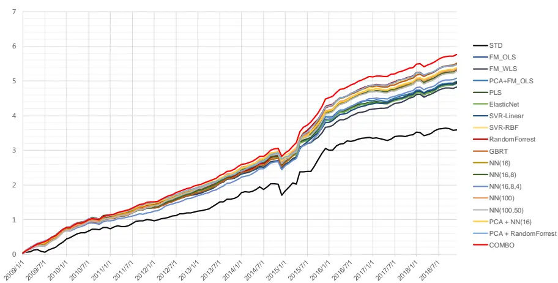
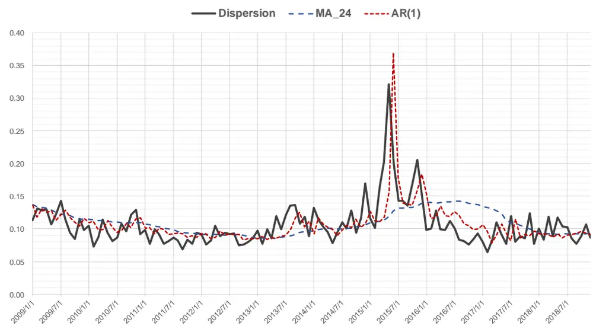
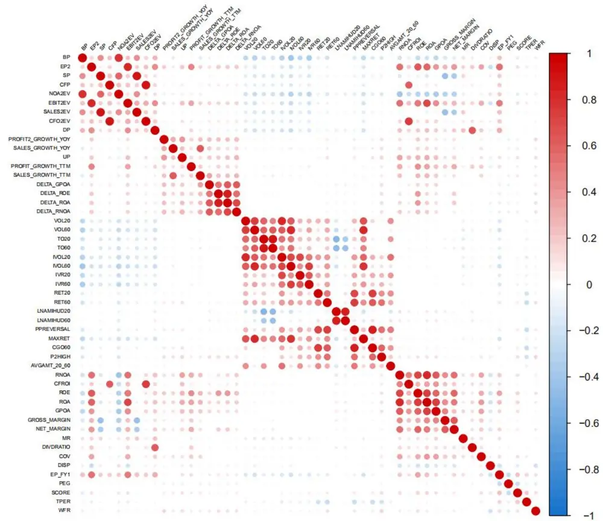
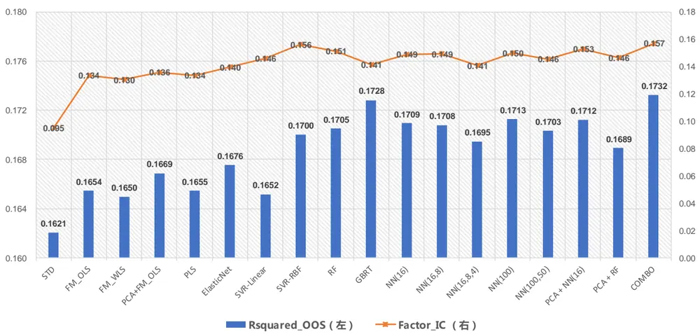
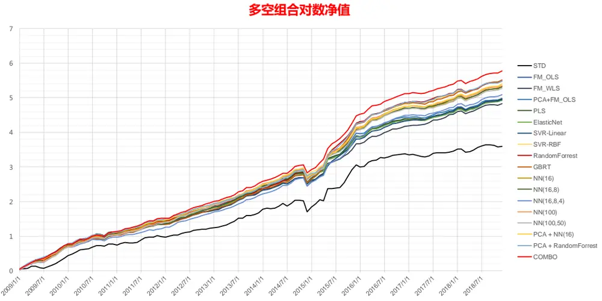
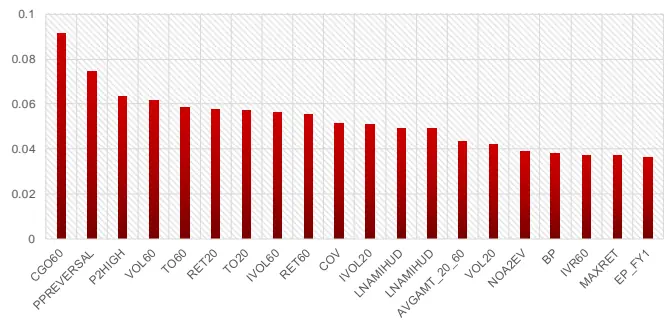
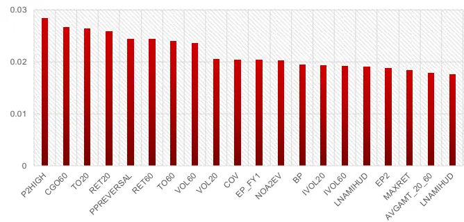

## Table_Sum ary 研究结论

Alpha因子库的不断扩容，让投资者有处理因子共线性、增加因子信息利用效率的需求，快速发展的机器学习模型为我们提供了解决这个高维预测问题的可行方案。本报告里测试了包括 Elastic Net，SVR，RandomForrest、GBRT、ANN在内的 17个模型，比较其预测能力和传统线性模型的异同。

报告里把个股超额收益率的预测拆为Dispersion 和收益率横截面zscore 两部分，前者用 AR(1)模型预测，后者用 alpha 因子作为解释变量，通过机器学习模型预测，模型训练采用单月横截面并行训练的模式。这种拆分预测的方法效果好于直接用超额收益率作为预测目标。

我们使用自己因子库里 51 个 alpha 因子作为解释变量，历史回溯区间为2009.01-2018.12，并采用样本外 Rsquared 和 DM 检验来判断两个模型预测精度的相对高低。

- 实证发现，“因子分类等权合成”的最基本方法，alpha预测能力最弱，显著弱于几乎其它所有模型。PCA降维、加 ElasticNet惩罚项做正则化都能显著提升线性模型的预测精度。

非线性模型预测能力整体显著优于线性模型，GBRT 和 RandomForrest 最佳；人工神经网络增加 Hidden Layer层数和 Neuron数量并不一定能提升预测能力；多个模型简单平均合并预测的方法效果更佳，显著优于单个模型。

投资策略组合可能有个股权重约束，无法事先获得个股权重，会出现权重大个股预测不准，预测准的股票权重小，导致模型预测精度无法反映到组合收益上的情况。这在中证 500指数增强组合里表现尤为明显，“因子分类等权合成”方法预测精度最差，但增强组合超额收益不低，最为稳健。

机器学习模型偏好技术类因子，导致策略组合的换手率较高。事先筛选因子，减少技术类因子占比可以降低机器学习策略的换手，获取更高的超额收益，但策略的整体换手水平还是偏高，需要投资者有较强的交易成本控制能力，更适合中小资金的高频操作。

## 风险提示

- 量化模型失效风险

- 市场极端环境的冲击

多空组合对数净值

Table_Report 相关报告

Table_ReportDate 报告发布日期2019 年 03 月 04 日

Table_Autho 证券分析师朱剑涛

021-63325888*6077

zhujiantao@orientsec.com.cn

执业证书编号：S0860515060001

A股涨跌幅排行榜效应 2018-11-20

DFQ2018 绩效归因与基金投资分析工具 2018-10-26

基于 copula 的尾部相关性研究：上尾异常 2018-10-23相关系数因子

东方 A股因子风险模型（DFQ-2018）2018-09-02

盈利预测与市价隐含预期收益 2018-09-01

东方证券股份有限公司及其关联机构在法律许可的范围内正在或将要与本研究报告所分析的企业发展业务关系。因此，投资者应当考虑到本公司可能存在对报告的客观性产生影响的利益冲突，不应视本证券研究报告为作出投资决策的唯一因素。

业界开展 A股因子投资研究已十年有余，各家机构都有积累自己的 alpha因子库，少则数十，多则两百往上，面临的一个共同问题是如何充分利用库里的因子信息提升 alpha预测能力。常用的“先因子分类，后线性合成”的方法实际使用效果不错，但在执行“因子该分为几个大类”、”新发现的因子该归属哪一类”等步骤时存在主观性，量化投研人员更希望能定量的处理问题，降低主观偏差。近些年火热的人工智能领域用到的各种机器学习模型，为我们解决 alpha预测这个高维问题提供了可行方案。本报告我们将用实证数据探讨非线性模型是否能比传统线性模型预测的更准？预测更准是否意味着组合收益更高？机器学习模型更适合什么类型策略等问题。

## 一、 Alpha 预测步骤

在早期的两篇报告《Alpha预测》和《东方机器选股模型 Ver 1.0》中，我们详细说明过 alpha预测过程，这里先做一个简单回顾和补充。

## 1.1 线性步骤

假设投资者在做月频的投资因子，因子库里有 K个 alpha因子，第 t个月市场上有 N只股票，第 i个股票第 t个月的收益率为 $\mathrm{R}_{\mathrm{i},\mathrm{t}},$ ；另外假设投资者用某种方法，例如：等权，把 K个因子合成了一个汇总的多因子 zscore，股票 i在第 t 个月初的合成因子取值为 $\mathrm{IX_{i,t}},$ ，那么做横截面回归

$$
\begin{array}{rlrlrl}{\mathbb{R}_{\mathrm{i},\mathrm{t}}~=~}&{{}~}&{m_{t}}&{{}+~}&{\beta_{t}\cdot X_{i,t}}&{{}=m_{t}+IC_{t}\cdot disp_{t}\cdot X_{i,t}}\end{array}\tag{i=1,2…N}
$$

OLS 方法可以得到因子收益率 $\beta_{\mathrm{t}}$ 的估计；每个月做一次横截面回归可以得到历史各个月的因子收益率估计值。截距项 $\mathbf{m_{t}}$ 的 OLS估计值等于 N只股票当月收益率的均值，对个股预测收益率的排序不影响；如果是把预测收益率输入到优化器中做组合优化，由于组合约束条件都有“个股权重之和等于 1”或“个股主动权重之和等于零”的限制， $\mathbf{m_{t}}$ 的取值对组合优化结果也不影响，我们只需关注后面乘积部分。

第 t+1 个月初，投资者可以用过去两年（24个月）因子收益率的均值作为第 t+1个月因子收益率的预测值，然后乘以月初最新的因子值 $\mathbf{X}_{\mathbf{t}+\mathbf{1}}^{\mathrm{(i)}}$ ，即可得到股票第 t+1 个月的预测收益率。由于因子收益率等于因子 IC 乘以 dispersion（全市场股票当月收益率的标准差），投资者也可类似的分别预测第 t+1 个月的 IC 和 dispersion，再相乘得到 alpha 预测值。如果是做全市场选股，因子 IC 和 dispersion 的乘积一般在 0.01 上下，可以简单的把 zscore 乘以 0.01 作为个股的预测收益率，这种做法实际使用效果也很好，需要注意的是，这种简单方法只适用全市场选股，如果做其它股票池选股，例如沪深 300成分内、银行行业内，这个乘数会不一样。

## 1.2 非线性步骤

对于机器学习里的非线性模型，一般没有上述方法中的单因子合成多因子这个步骤，而是表示成一个标准的预测模型：

$$
\mathbb{R}_{\mathrm{i},\mathrm{t}}=f(X_{i,t}^{(1)},\quad X_{i,t}^{(2)}\ldots X_{i,t}^{(K)})
$$

函数f 是我们采用的预测模型， $X_{i,t}^{(k)}$ 是第 t月股票 i在第 k个因子上的取值。实务中有两种常用方法去训练模型参数，借用 Prado (2018) 的书第 8.5 节讨论 Feature Importance 用到的名称，这两种方法可分别称作：

1) 堆叠训练（Stacked Training）。假设市场上有 3000个股票，过去两年 24个月的数据，堆叠训练的方式是把过去所有的数据混在一起训练模型，样本数量有 3000*24 = 72000 个。Prado（2018）在计算 Feauture Importance 时推荐此种方式，其中一个很直接的原因是样本数量多，符合机器学习模型参数估计对数据量的需求。Marcos Lopez de Prado 现任职于因子投资巨擘 AQR，他之前个人创立的对冲基金主要以高频交易为主，而且 Prado(2018) 书中的内容也主要针对交易数据，这种训练方法对于横截面方向为主的因子投资不一定合适。样本数量多有利于机器学习模型训练的前提条件是：不同样本里模型解释变量 X 和被解释变量 Y 之间的关系稳定；而因子投资用到的主要是低频金融数据，时间序列方向上的“异质性”较强，不同月份的股票涨跌逻辑差别大，通过时间序列方向合并截面数据增加样本数量并不一定能提升模型训练效果，训练耗费的时间也会大幅增加。

2) 平行训练（Parallelized Training）。也就是每个月横截面训练一个模型，假设过去 24 个月训练得到的模型分别为f̂ ,… f̂ ,f̂，把 t+1 月个股的最新因子数值同时输入到这 24个模型，可以得到 24 个预测收益率数值，将其简单平均或 EWMA 加权的数值作为个股 t+1 月的收益率预测值。这样单个横截面训练模型，运算量大幅下降；如果是全市场选股，1000至 3000的样本数量对常用的机器学习模型来说够用。另外，这样的处理步骤和传统的线性 alpha预测更为一致，逻辑更直观。如果投资者基于主观判断或量化模型觉得 t+1月和历史上某个月的市场环境会很像，可以加大那个月收益率预测值在最后加权时的权重，便捷调整模型。我们前期报告《东方机器选股模型 Ver 1.0》和本报告采用的都是此种模型训练方法。

## 1.3 Dispersion 预测

波动率是单个股票收益率在时间序列方向上的标准差。Dispersion 是横截面上所有股票收益率的标准差，它在时间上呈现出和波动率类似的“积聚效应”（图 1）。

图 1：A 股月度 Dispersion 变化和预测

数据来源：东方证券研究所 & Wind 资讯

传统线性步骤是用移动平均方式预测下个月市场 Dispersion，不过月度全市场 Dispersion的一阶自相关系数高达 0.69，用 AR(1)模型预测更为合适，对市场突变的反应也更为敏感（图 1）。在做完 Dispersion 预测后，我们用机器学习模型预测的不再是股票收益率，而是横截面上股票收益率标准化得到的 zscore。用预测的 zscore 乘以预测的 Dispersion 就可以得到个股相对全市场等权组合的超额收益，然后再把这个预测值和个股的真实超额收益进行比较，对比不同模型的预测准确性。我们测试过三个不同机器学习模型，这种分开预测 Disperson 和 zscore 再合成的预测方式比直接用预测超额收益要准，MSE（Mean Squared Error）更小。

另外，上述方法最终预测得到的是个股超额收益，而不是绝对收益。如果投资者用绝对收益作为预测目标，这意味着还要预测整个市场股票的平均收益在时间序列上如何变化，难度增加，准确度下降，而且如 1.1节所述，这个值对获取相对收益的因子投资策略而言无意义，因此报告采用的是超额收益的预测准确度来判断模型的好坏。

## 1.4 预测模型

本节将简单介绍报告中要用的各个预测模型，主要介绍这些模型能解决传统线性模型的哪些缺陷、实现机制和模型训练中可能碰到的问题。对模型算法感兴趣的投资者可参考 Hastie(2009)，对模型原理和实际案例使用效果感兴趣的可参考 Kuhn(2013)，书中示例是用 R 语言实现。使用Python 的投资者可参考 Geron(2017)，书中对 Scikit-Learn 和 TensorFlow 有详细介绍。

首先最基础的模型是因子分组等权合成法，记作 STD。先把因子分类等权合成一个大类因子，大类因子之间再等权合成一个汇总的 zscore。这种方法主要是通过分类的方式，部分缓解同类因子间的共线性问题。因子分类可以采用纯统计方法，也可以基于因子逻辑。鉴于因子间的相关性并不稳定，难预测，我们更偏好按因子逻辑划分的方法，但这种方法在类别设定、和因子归属上会受较大的主观因素影响。图 2列示了报告实证中用到的 51个 alpha因子和分类。

图 2：Alpha因子列表与分类

| 类别 | 因子简称 |  | 类别 VOL20 | 因子简称 | 因子计算 |
| --- | --- | --- | --- | --- | --- |
| 估 值 | BP EP2 SP CFP NOA2EV EBIT2EV SALES2EV CFO2EV | 账面市值比 扣非后的净利润TTM/总市值 营业收入TTM/总市值 经营性现金流TTM/总市值 净经营资产与企业价值之比 息税前利润与企业价值之比 营业收入与企业价值之比 |  | VOL60 TO20 TO60 IVOL20 IVOL60 | 过去20个交易日的波动率 过去60个交易日的波动率 过去20个交易日的日均换手率对数 过去60个交易日的日均换手率对数 过去20个交易日的特质波动率 过去60个交易日的特质波动率 |
|  | DP PROFIT2_GROWTH_YOY SALES_GROWTH_YOY UP | 经营性现金流与企业价值之比 过去一年分红/总市值，以分红实施公告日为准 扣非后净利润季度同比 营业收入季度同比 预期外的RNOA，剩以100 | 技 术 | IVR20 IVR60 RET20 RET60 LNAMIHUD LNAMIHUD | 过去20个交易日的特异度 过去60个交易日的特异度 过去20个交易日的收益率 过去60个交易日的收益率 20日Amihud非流动性自然对数 |
| 成长 | PROFIT_GROWTH_TTM SALES_GROWTH_TTM DELTA_GPOA | TTM净利润同比增长 TTM营业收入同比增长 | MAXRET | PPREVERSAL | 60日Amihud非流动性自然对数 乒乓球反转，过去5日均价/过去60日均价-1 过去最大收益，过去60日最大3个日收益均值 |
|  | DELTA_ROE | GPOA变动(当前TTM和一年前TTM比较) ROE变动(当前TTM和一年前TTM比较) |  | CGO60 P2HIGH | 处置效应因子，当前价/60日换手反推的持仓价-1 |
|  | DELTA_ROA | ROA变动(当前TTM和一年前TTM比较) |  |  | 当前价格除以过去243个交易日的最高价 过去20日日均成交额/过去60日日均成交额 |
|  | DELTA_RNOA | RNOA变动(当前TTM和一年前TTM比较) |  | AVGAMT 20 60 |  |
|  | RNOA |  |  |  | 过去6个月有覆盖的机构数量，取根号 |
|  | CFROI | 净经营资产收益率 投资现金收益率 |  | COV DISP | 过去6个月盈利预测的分歧度 |
|  | ROE | 净资产收益率 |  | EP_FY1 |  |
|  | ROA | 总资产报酬率 | 分 PEG 析 SCORE |  | 预期的估值 PE_FY1/FY2隐含的利润增量率 |
|  |  |  | 师 TPER WFR |  | 综合评价 |
|  | GPOA | 总资产毛利率 |  |  | 目标价隐含的收益率 |
|  | GROSS_MARGIN NET_MARGIN | 销售毛利率 销售净利率 |  |  | 加权的预期调整 |

数据来源：东方证券研究所

这些 alpha因子都做了行业市值中性化处理以降低因子间的相关性，后面在做预测模型时，解释变量除了这些 alpha因子，还有行业虚拟变量和对数市值。每个月横截面上，我们可以算一个因子数值的相关系数矩阵；然后拿历史每个月的相关系数矩阵进行平均，可得到该时间段内因子间的平均相关系数，结果如图 3所示。

图 3：风险中性化后 Alpha 因子间的平均相关系数（2007.01 – 2018.12）

数据来源：东方证券研究所 & Wind 资讯

上图的因子位置是按照其所属大类类别进行排序，在对角线上我们可以看到颜色较深的正方形区域，说明估值、成长、技术、盈利四类指标的分类比较有效，组内因子相关性整体高于组间相关性；但营运和分析师类因子，同组因子相关性并不高；技术类因子数量多，相关性复杂，从图上看，波动率和换手率因子似乎更适合拿出来单独作为一类，但剩余其它技术因子如何分组并不明朗。

第二类模型，我们直接把 51 个 alpha 因子、行业虚拟变量、对数市值放到线性回归方程中，用 OLS回归做参数估计，此模型记作 FM_OLS。OLS估计量在残差项满足正态独立同分布时，也是一致估计量。下一步，如果弱化残差项的假设，假设样本的残差项方差不同，此时要做 WLS回归来保证估计量的一致性。实证发现（参考前期报告《A股市场风险分析》）个股的市值平方根对其特质方差的倒数有较好的线性解释度，因此WLS回归的权重设置为个股市值平方根，这也是商业风险模型常用的建模方式，此模型记作 FM_WLS。

因子间的共线性不影响 OLS和WLS估计量的无偏性（Bias =0），但会增加其 Variance，降低样本外的预测准确性。在线性模型框架下，常用的处理共线性方式有三种：

1） 一元回归合并预测。这种方法是把原来 K 个解释变量的多元回归变成 K 个一元回归，把最新的解释变量数值输入到每个一元回归模型中，可得到 K 个预测值，再把这 K 个预测值进行合并。合并方法有很多，可以是简单均值、中位数，也可以基于单个模型的样本外预测误差，Rapach(2009)用此类方法来预测美国股市的风险溢价，效果好于简单的移动平均，样本外 Rsquared 更高。这种方法比较偏经验，一元回归的参数估计不受因子共线性影响，Variance 减小，但 Bias 增大，建模过程里没有 Bias 和 Variance 的权衡机制，样本外预测是否能改善会有些数据依赖，因此下文实证中并未采用。

2） 降维。PCA 是最常用的降维方法，逐步寻找投影方差最大的方向，最终保留多少个主成份可以用交叉验证（CV, Cross Validation）确定；报告下文采用的是比较经验的做法，让保留主成份的方差解释占比超过 90%，记作 PCA+FM_OLS。PCA 是一种无监督模型，投影方差最大的主成份不一定是预测能力最强的，因此我们也尝试了带监督的降维方法PLS（Partial Least Squares），它是要逐步找到解释变量的线性组合，让它和被解释变量变量之间的 covariance 最大，最终保留的成分数量由交叉验证决定。

3） 正则化（regularization）。OLS 参数估计的优化目标是最小化 SSE(Sum of SquaredErrors)，正则化方法在这个目标函数后面加上和模型参数相关的惩罚项，来控制模型参数的数量和大小，常用的惩罚项形式有 LASSO和 Ridge Regression 两种。惩罚项会降低参数估计的 Variance，但代价是增加 Bias。惩罚系数的大小可以通过交叉验证确定，用来权衡 Bias 和 Variance 的影响，提升样本外的预测。LASSO 的惩罚项是绝对值函数，不光滑，其对模型参数的惩罚结果也不光滑，共线性高、方差大的参数直接会被调整为零；而 Ridge Regression 的二阶惩罚函数形式得到的结果会相对光滑，系数的绝对值会调的很小，但不会到零。Geron(2017)建议用 ElasticNet，一种 LASSO 和 Ridge Regression的线性组合，因为 LASSO在多个解释变量存在共线性时表现很不稳定；和单纯的 RidgeRegression 比，ElasticNet 又有 Feature Selection 的功能。报告下文实证中采用了ElasticNet, Mix Ratio 设置为 0.5， 惩罚系数由交叉验证确定。

以上回归方法的优化目标都是 SSE，受异常值影响较大，SVR（Support Vector Regression）选择了一种类似 SAE（Sum of Absolute Errors）的目标函数降低异常值影响，目标函数里有一个ϵ 调节参数，拟合误差小于此参数的误差都被归零，降低扰动。另外，SVR也加入了 LASSO惩罚项来降低参数估计的 Variance。报告中采用了此模型，记作 SVR-Linear, 参数ϵ和惩罚系数由CV+GridSearch 确定。

将以上这些改进的线性模型运用于资产定价的实证中是非常必要的，而且也是近几年学术研究的一个热点。其中有两篇可对比验证的文章，Green(2017) 在美国市场构建了 94 个定价因子，用 Fama-FacBeth 回归检验发现这些因子中有 12 个能在 2003 年前提供独立信息预测横截面股票收益，但 2003-2014年降为两个。Han(2018) 用同样的因子库和历史数据重新进行了验证，但在做回归时不是像 Green(2017)那样把所有变量同时放进回归方程，而是类似 Rapach(2009)做单变量回归，然后用 LASSO或 ElasticNet方法对单模型预测进行合并，这样选出来有预测能力的因子在 2003年前后都为 30个左右，而且预测效果更好。

因子数值和股票收益之间的关系可能是非线性，这个从波动率因子分组收益类似“Short Call”期权收益的形状可看出。引入非线性结构有可能提升模型的预测结构。加入非线性的一种方法是对解释变量做非线性变化，在 SVR 模型中，利用核函数变化技巧可不用直接计算这个非线性变换函数，转而计算对应的核函数的线性组合。报告里测试了采用 RBF 核函数的 SVR，记作 SVR-RBF

另一种引入非线性的方法是采用决策树，不过单棵决策树对数据十分敏感，结构不稳定，更有价值的做法是把他当作集成学习（Ensemble Learning）的基本要素。常用的集成学习方法有随机森林（RF, Random Forrest）和 GBRT（Gradient Boosting Regression Tree）两种，后面实证中我们都有采用，个人更偏好 RF，之前报告中用的也是这个模型，主要原因是它逻辑简单，需要调的参数少，大部分问题使用效果不错。Prado(2018) 书中也对比了 Boosting 和 Bagging 的优劣，RF 可以看作 Bagging 的进一步改良。总结来看，Boosting 方法可以实现 Bias 和 Variance的双降，但更容易过拟合（overfitting）；RF 用到决策树数量更多，可以降低 Variance，不过其Bagging 和 Feature Random Selection 步骤会增加 Bias，RF 更容易 underfitting。由于金融数据的信噪比很低，过拟合很容易，RF相对更稳健。另外 RF可以并行运算，也有速度优势。

非线性模型当前最火热的当属人工神经网络（ANN），在标准的 MLP(Multi-Layer Perceptron)网络中，我们需要设定 Hidden Layer 和 Neuron 的数量，两者越大，模型能够解析出的输入输出关系越复杂，也越容易过拟合。我们报告尝试了五种网络结构：NN(16)、NN(16,8)、NN(16,8,4)、NN(100), NN(100,50)，想看看不同 Neuron 和 Hidden Layer 数量对结果的影响，ActivationFucntion 用的是 Relu (Rectified Linear Unit Function)，控制参数数量和大小的惩罚项系数通过CV 确定。投资者可以通过 TensorFlow 调整 Neuron 之间的链接实现更复杂的网络结构，但这样过拟合的概率也在增加，特别是针对时变性强的金融数据，我们后续也会在这方面继续尝试。

非线性模型在描述其算法时，往往不会像传统统计模型那样，对其变量分布做出假设，再加上其超强的非线性拟合能力，会给人造成一种“无所不能”的错觉，可以自动处理数据中可能碰到的各种问题。事实上，线性回归中的变量共线性问题一样会影响非线性模型，Omidvar（1997）有讨论共线性对 ANN 的影响（书第 222 页）, 共线性会让 backpropagation 最小化 SSE 的过程，得到模型参数的很多组解，目标函数相差不大，但参数之间的Variance 很大；而新的观测值都有测量误差，输入到 ANN做预测时，误差会通过 ANN放大降低模型预测能力。RF的决策树在决定分叉用哪个变量时也会受变量共线性影响，不过 Bagging 和 Feature Random Selection 和步骤会让这种影响减小。因此，为了考察因子共线性对非线性模型的影响，我们还尝试了两种模型：首先都用 PCA 对输入变量进行降维，然后再分别输入到 NN(16) 和 RF 中做训练和预测，这两个模型分别记作 PCA + NN(16) 和 PCA+RF。

## 二、预测精度的比较

## 2.1 比较方法

本节实证比较的是不同模型对 2009.01-2018.12 十年间 A 股个股超额收益的预测准确度，股票池剔除了上市不到半年、ST 和当月交易天数少于 10 天的股票；另外我们也剔除了银行和非银行业的股票，一方面是因为有些因子数据在银行和非银行业无法计算，另一方面是这两个行业和其它行业差别较大，我们更建议单独行业内建模（参考前期专题报告）。机器学习模型很多会有Hyperparameter 需要通过 CV来确定，通常做法是 k-fold CV，不过不同行业的股票差别较大，因此我们实证中的用的是 Stratified 5-fold CV，让不同验证集里股票数量的行业分布基本一致。每个月横截面上可以针对某个预测模型计算其当月的样本外预测 Rsquared:

$$
\mathbb{R}_{\mathsf{oos}}^{2}=1-\frac{\sum_{i=1}^{N}(r_{i}-\hat{r}_{i})^{2}}{\sum_{i=1}^{N}r_{i}^{2}}
$$

其中 $\mathrm{lr_{i}}$ 是股票 i 当月的真实超额收益， $\hat{r}_{\mathrm{i}}$ 是模型预测的该股票当月超额收益。然后再把每个月的数值进行平均得到该模型在整个回溯区间内的样本外 Rsquared。 $\mathrm{R}_{\mathsf{oos}}^{2}$ 越大说明模型越准。不同模型之间预测精准度的比较采用的是 Gu(2018)针对面板数据调整的 DM 检验（Diebold andMariano(1995)）。另外我们也计算了不同模型预测超额收益和真实收益的 IC，以便投资者参考，但不同模型 $\mathbf{R_{00s}^{2}}$ 的排序和 IC 排序可能不一样，判断模型预测准确与否以 $\mathbf{\mathbf{R_{00s}^{2}}}$ 和对应的 DM 检验结果为准。

## 2.2 实证结果

图 4：预测模型的样本外 R-squared 和 IC (2009.01 – 2018.12)
模型预测能力比较

数据来源：东方证券研究所 & Wind 资讯

图 5：不同模型预测精度比较的 DM 统计量（2009.01 – 2018.12）

|  | STD | FM_OLS | FM_WLS | PCA+FM_OLS | PLS | ElasticNetS | VR-Linear | SVR-RBF | RF | GBRT | NN(16) | NN(16,8) | NN(16,8,4) | NN(100) | NN(100,50) | PCA + NN(16) | PCA + RF | COMBO |
| --- | --- | --- | --- | --- | --- | --- | --- | --- | --- | --- | --- | --- | --- | --- | --- | --- | --- | --- |
| STD |  | 2.58 | 1.66 | 4.51 | 2.59 | 3.80 |  | 2.32 | 2.17 | 4.03 | 4.27 | 4.25 | 3.25 | 4.87 | 4.47 | 3.27 | 1.82 | 3.59 |
| FM_OLS | -2.58 |  |  | 2.05 |  | 3.28 |  |  |  | 3.26 | 3.39 | 3.22 | 1.91 | 4.11 | 3.30 | 2.30 |  | 2.87 |
| FM_WLS | -1.66 |  |  |  |  | 2.98 |  | 2.09 | 1.89 | 4.12 | 4.31 | 4.58 | 2.95 | 4.81 | 4.45 | 3.03 |  | 3.79 |
| PCA+FM_OLS | -4.51 | -2.05 |  |  | -2.02 |  |  |  |  | 2.58 | 2.41 | 2.20 |  | 2.99 | 2.14 | 1.71 |  | 2.28 |
| PLS | -2.59 |  |  | 2.02 |  | 3.26 |  |  |  | 3.25 | 3.38 | 3.21 | 1.90 | 4.10 | 3.29 | 2.29 |  | 2.86 |
| ElasticNet | -3.80 | -3.28 | -2.98 |  | -3.26 |  |  |  |  | 3.02 | 3.17 | 2.75 |  | 4.14 | 2.57 | 1.85 |  | 2.62 |
| SVR-Linear |  |  |  |  |  |  |  | 5.13 | 3.03 | 6.38 | 5.02 | 4.81 | 3.14 | 4.43 | 3.55 | 5.57 | 1.89 | 8.92 |
| SVR-RBF | -2.32 |  | -2.09 |  |  |  | -5.13 |  |  | 2.05 |  |  |  |  |  |  |  | 5.79 |
| RF | -2.17 |  | -1.89 |  |  |  | -3.03 |  |  |  |  |  |  |  |  |  | -2.85 | 2.43 |
| GBRT | -4.03 | -3.26 | -4.12 | -2.58 | -3.25 | -3.02 | -6.38 | -2.05 |  |  | -1.72 | -1.74 | -2.56 |  | -1.90 |  | -2.02 |  |
| NN(16) | -4.27 | -3.39 | -4.31 | -2.41 | -3.38 | -3.17 | -5.02 |  |  | 1.72 |  |  | -1.82 |  |  |  |  | 1.83 |
| NN(16,8) | -4.25 | -3.22 | -4.58 | -2.20 | -3.21 | -2.75 | 4.81 |  |  | 1.74 |  |  | -2.39 |  |  |  |  | 1.91 |
| NN(16,8,4) | -3.25 | -1.91 | -2.95 |  | -1.90 |  | -3.14 |  |  | 2.56 | 1.82 | 2.39 |  | 1.87 |  | 1.74 |  | 2.98 |
| NN(100) | -4.87 | -4.11 | -4.81 | -2.99 | 4.10 | -4.14 | -4.43 |  |  |  |  |  | -1.87 |  | -2.19 |  |  |  |
| NN(100,50) | -4.47 | -3.30 | -4.45 | -2.14 | -3.29 | -2.57 | -3.55 |  |  | 1.90 |  |  |  | 2.19 |  |  |  | 1.90 |
| PCA + NN(16) | -3.27 | -2.30 | -3.03 | -1.71 | -2.29 | -1.85 | -5.57 |  |  |  |  |  | -1.74 |  |  |  | -1.75 | 2.56 |
| PCA + RF | -1.82 |  |  |  |  |  | -1.89 |  | 2.85 | 2.02 |  |  |  |  |  | 1.75 |  | 3.34 |
| COMBO | -3.59 | -2.87 | -3.79 | -2.28 | -2.86 | -2.62 | -8.92 | -5.79 | -2.43 |  | -1.83 | -1.91 | -2.98 |  | -1.90 | -2.56 | -3.34 |  |

数据来源：东方证券研究所 & Wind 资讯

图 5 是两个模型间预测精度比较的 DM-Test 统计量，如果第 i 行第 j 列为空，表示两个模型的预测精度差异在统计上不显著；如果有数据且为正值，则表示模型j的预测精度显著高于模型 i；如果为负值，则反之。结合图 4和图 5可知：

1) 常用的因子分类等权合成方法（STD）预测能力是最弱的， $\mathrm{R}_{\mathsf{oos}}^{2}$ 最小，预测精度显著低于几乎其它所有模型。

2) 处理了因子共线性问题后，PCA_FM_OLS 和 ElasticNet 模型的预测显著强于标准的OLS，但 PLS模型的预测精度和 FM_OLS 基本相当。PLS和 PCA相比虽然是带着监督的降维，但如果解释变量和被解释变量之间的关系不强，这种监督机制反而会带来噪音，结果表现不如无监督的 PCA。ElasticNet 模型在线性模型里面预测能力最强。

3) 线性模型的预测精度普遍显著低于非线性模型，说明资产定价里面引入非线性结构很有必要。这里面 GBRT方法的R2 最大，预测精度显著高于 SVR_RBF和 NN(16)，和 RF无显著差异。

4) 神经网络类模型里面；NN(100)预测精度和 NN(16) 无显著差异，说明增加 Neuron数量不一定能预测更准。NN(16) 和 NN(16,8) 无显著差异、NN(16,8) 显著好于 NN(16,8,4)，NN(100) 显著好于 NN(100,50)，说明增加 Hidden Layer 数量不一定能增加模型预测能力，而且有可能因为模型参数数量的上升，增加过拟合的可能，降低预测精度。

5) PCA+RF 显著弱于 RF，PCA+NN(16) 和 NN(16) 无显著差异，说明降维处理虽然可以降低因子间的共线性，但由于因子间的相关性的不稳定，这样也增加了部分 Variance，有可能让非线性模型预测变得更差。

6) 把表现最好的四个模型 SVR_RBF, RF , GBRT、NN(16) 简单等权合成一个预测值，记为 COMBO。这种 Model Averaging 的方法可以降低整体的 Variance，提升样本外预测效果。可以看到这个模型预测精度几乎显著强于所有其它模型。

## 三、组合收益的比较

上一节比较了各个模型的预测精度，在 $\mathrm{{}^{\mathrm{{}}}{}^{\mathrm{{}}}R_{00s}^{2}}$ 指标里各个股票的权重一样。但在构建组合时各个股票的权重可能会有很大差别。如果策略组合是一个固定规则的权重设置，例如市值加权，那么在训练模型时，样本可以按照股票市值赋予权重再训练参数；但是对于指数增强组合，股票权重无法事先确定，而且组合优化结果对输入变量的误差较敏感，因此可能会出现模型虽然整体平均预测很准，但预测准的股票在策略组合里权重很小，权重大的股票又恰好预测不准的情况，模型预测精度的提高不一定能转化为策略组合收益的提升。

## 3.1 多空组合比较

先考察多空组合收益，多空组合由等权做多预测收益最高 10%股票，同时做空预测收益最低10%的股票构成。多空组合表现如图 6所示，可以看到，由于组合多头和空头都是等权，个股权重一致，所以多空组合表现和模型的预测精度基本一致，因子分类等权合成的方法表现最差，非线型模型明显好于线性模型，多模型合并（COMBO）的效果最好；但也有不一致的地方，例如PCA_FM_OLS 和 FM_OLS 的多空组合收益基本相当，而前者的预测精度是显著高于后者的，不过多空组合收益的计算与之前 DM-test检验本身不等价，个别差异属于合理范围。

图 6：因子多空组合表现（2009.01 – 2018.12）

| STD 3.25% |
| --- |
| FM_OLS 4.35% |
| FM_WLS 4.23% |
| PCA+FM_OLS 4.42% |
| PLS 4.37% |
| ElasticNet 4.34% |
| SVR-Linear 4.31% |
| SVR-RBF 4.77% |
| RF 4.81% |
| GBRT 4.86% |
| NN(16) 4.68% |
| NN(16,8) 4.68% |
| NN(16,8,4) 4.47% |
| NN(100) 4.73% |
| NN(100,50) 4.65% |
| PCA + NN(16) 4.73% |
| PCA + RF 4.80% |
| COMBO 5.08% |

数据来源：东方证券研究所 & Wind 资讯

## 3.2 中证 500 指数增强组合比较

接着我们考察中证 500全市场选股增强策略，回溯测试时间段为 2010.01 –2018.12，银行和非银行业股票采用之前报告里的行业内选股策略；组合优化时控制组合行业和市值中性、年化跟踪误差小于 4%，个股权重设置上限。在不扣费的情况下，各个模型的组合表现如图 7。由于组合里个股权重的差异，指数增强策略的超额收益的排序和之前模型预测精度的排序相关性很低。预测精度最差的因子分组等权合成(STD)模型获得的超额收益比 GBRT 和 RF 都大，跟踪误差和回撤小，信息比更高，但后两个模型的预测精度是明显高于 STD 的。此外所有的回归模型（线性+非线性）

得到的策略组合换手率显著高于 STD 模型，提升幅度超过 70%，如果扣除较高的交易费用，这些模型收益都会跑输 STD。

图 7：中证 500 指数增强组合（未扣费， 2010.01 – 2018.12）

| 年化对冲收益 | 跟踪误差 -4.0% | 最大回撤 | IR | 月胜率 83.3% | 年单边换手 | 平均持仓股票数 |
| --- | --- | --- | --- | --- | --- | --- |
| STD FM_OLS | 18.3% 16.3% | 4.8% 5.5% | -5.4% | 3.53 2.77 79.6% | 4.37 8.44 | 98.2 106.9 |
| FM_WLS | 17.6% | 5.4% | -5.8% | 3.02 | 8.23 | 108 |
| PCA+FM_OLS | 20.0% | 5.4% | 3.4 | 78.7% 80.6% | 8.1 | 108.6 |
| PLS | 16.3% 5.5% | -5.1% -5.3% | 2.78 | 79.6% | 8.43 | 106.7 |
| ElasticNet | 18.0% 5.5% | -5.2% | 3.05 | 80.6% | 8.29 | 108.7 |
| SVR-Linear | 5.4% | -6.1% | 3.13 | 78.7% | 8.43 | 110.6 |
| SVR-RBF | 18.4% 20.2% | 5.5% -5.5% | 3.36 | 76.9% | 7.92 | 106.6 |
| RF | 18.2% | 5.4% -5.3% | 3.14 | 82.4% | 7.4 | 113.5 |
| GBRT | 18.1% 5.8% | -6.5% | 2.92 | 79.6% | 7.69 | 107 |
| NN(16) | 20.3% 5.9% | -6.6% | 3.19 | 80.6% | 7.9 | 106 |
| NN(16,8) | 19.8% 5.7% | -6.0% | 3.2 | 82.4% | 7.92 | 104.7 |
| NN(16,8,4) | 18.1% 5.6% | -5.3% | 2.99 | 77.8% | 7.91 | 103.1 |
| NN(100) | 19.7% | 5.8% -5.8% | 3.14 | 79.6% | 7.79 | 106.8 |
| NN(100,50) | 19.9% 5.9% | -6.6% | 3.12 | 78.7% | 7.83 | 105.9 |
| PCA + NN(16) | 19.4% | 5.7% -5.7% | 3.14 | 80.6% | 7.63 | 106.2 |
| PCA + RF | 18.7% | 5.5% | -5.3% 3.15 | 78.7% | 7.51 | 105.5 |
| COMBO | 20.3% | 5.7% | -5.6% | 3.26 | 83.3% 7.73 | 109.3 |

数据来源：东方证券研究所 & Wind 资讯

机器学习模型把因子的选择、权重设置全交给了机器，从 500 增强组合的高换手可以猜测这些模型都偏好技术类因子，事实也确是如此。我们分别计算了 ElasticNet和 RF模型各解释变量的Feature Importance（图 8 & 图 9）；可以看到，不论是 ElasticNet 这样的线性模型，还是 RF 这样的非线性模型，Feature Importance 最高的 20个 alpha因子里非技术类因子都只有四个，前五均为技术类因子。这和 Gu(2018)对美国市场的研究成果一致，美国市场上预测作用最显著的前三类因子分别是趋势、流动性和波动率。模型偏好技术因子的一个副作用是，在技术因子失效的年份，例如 2017年，这些模型都会大幅跑输简单的 STD 模型（图 10）。

图 8：ElasticNet 模型的 Feature Importance

资料来源：东方证券研究所 & Wind 资讯

图 9：RF 模型的 Feature Importance

资料来源：东方证券研究所 & Wind 资讯

图 10：中证 500 指数增强组合分年收益（未扣费， 2010.01 – 2018.12）

|  | 2010 | 2011 | 2012 | 2013 | 2014 | 2015 | 2016 | 2017 | 2018 |
| --- | --- | --- | --- | --- | --- | --- | --- | --- | --- |
| STD | 17.7% | 14.7% | 16.2% | 14.1% | 20.8% | 23.9% | 21.3% | 11.0% | 20.6% |
| FM_OLS | 16.7% | 13.1% | 16.2% | 18.5% | 15.5% | 20.2% | 23.2% | 1.8% | 17.9% |
| FM_WLS | 19.9% | 15.8% | 19.1% | 20.3% | 15.2% | 17.9% | 23.0% | 2.5% | 21.3% |
| PCA+FM_OLS | 23.6% | 22.4% | 14.5% | 19.0% | 14.8% | 35.6% | 22.1% | 1.8% | 23.7% |
| PLS | 17.6% | 13.3% | 16.3% | 17.9% | 15.7% | 20.2% | 23.2% | 1.9% | 17.8% |
| ElasticNet | 19.3% | 15.4% | 17.1% | 20.5% | 13.5% | 28.4% | 23.1% | 1.1% | 20.5% |
| SVR-Linear | 19.8% | 14.6% | 14.0% | 25.3% | 13.1% | 32.7% | 22.6% | 0.4% | 21.0% |
| SVR-RBF | 14.6% | 21.4% | 17.1% | 25.6% | 14.6% | 32.2% | 20.4% | 5.5% | 27.0% |
| RandomForrest | 16.1% | 17.9% | 17.1% | 24.4% | 16.0% | 28.0% | 21.7% | 2.0% | 17.9% |
| GBRT | 17.2% | 16.1% | 22.1% | 21.0% | 16.6% | 19.1% | 19.8% | 4.6% | 22.6% |
| NN(16) | 17.1% | 22.3% | 19.6% | 18.9% | 12.9% | 27.6% | 24.3% | 6.3% | 29.9% |
| NN(16,8) | 16.9% | 16.2% | 26.2% | 20.5% | 16.6% | 28.7% | 22.1% | 4.4% | 23.3% |
| NN(16,8,4) | 13.1% | 14.0% | 19.2% | 12.1% | 17.9% | 34.0% | 23.5% | 6.4% | 19.6% |
| NN(100) | 18.0% | 20.4% | 19.2% | 17.7% | 16.5% | 29.3% | 23.3% | 5.4% | 24.0% |
| NN(100,50) | 15.5% | 18.7% | 21.3% | 20.2% | 14.0% | 35.9% | 22.2% | 2.5% | 25.7% |
| PCA + NN(16) | 18.6% | 22.0% | 15.8% | 17.5% | 12.8% | 27.9% | 22.3% | 7.0% | 26.9% |
| PCA + Random | 14.9% | 20.3% | 16.7% | 13.6% | 19.2% | 28.4% | 22.3% | 4.9% | 24.6% |
| COMBO | 17.7% | 20.5% | 16.5% | 24.7% | 16.8% | 26.0% | 24.2% | 5.3% | 26.7% |

数据来源：东方证券研究所 & Wind 资讯

如果想主动控制技术类因子对模型的贡献，可以考虑修改模型的底层算法，比方说 RF的决策树在选择分叉点时，会先随机的选择一些解释变量作为备选，各解释变量入选的概率相等；此时如果主动降低技术类因子入选概率有可能降低模型对技术类因子的偏好。另外一种更简便的方式是训练模型前，先主动筛选或整合因子，降低技术类因子数量占比。例如：可以先按照 STD 的方法把因子分类等权合成一个大类因子，再把这些大类因子输入到 RF 模型中；这种方法得到的中证500 增强组合年化对冲收益有 20.8%，比 STD 模型高 2.5%；跟踪误差 5.2%，最大回撤-5.3%，略大于 STD 模型；信息比 3.67 略高于 STD 模型；组合的换手率为年单边 6.3 倍，显著低于图 7里的各种回归模型，但还是要比 STD 模型高 50%左右；此时，投资者是否适合使用此模型，取决于投资者的资金规模和交易成本控制的能力；如果交易成本能控制在较低水平，进一步提升调仓频率，有可能会扩大机器学习模型的优势。

## 四、总结

机器学习模型里的变量共线性处理、CV避免过拟合、集成学习、非线性拟合、Model Averaging等技术确实可以大幅提升传统线性回归模型对个股收益的预测精度。但很多投资策略会对个股权重有约束，组合优化结果不确定性强，无法事先确定个股权重，因此可能会出现权重大的股票预测不准，预测准的股票权重小的情况，模型预测精度无法反映到组合收益上。机器学习模型偏好技术类因子，导致策略组合的换手率较高，需要投资者有较强的交易成本控制能力，更适合中小资金的高频操作。

## 风险提示

1. 量化模型基于历史数据分析得到，未来存在失效的风险，建议投资者紧密跟踪模型表现。

2. 极端市场环境可能对模型效果造成剧烈冲击，导致收益亏损。

## 参考文献

[1]. Geron, A., (2017), “Hands-On Machine Learning with Scikit-Learn and TensorFlow”, O’REILLY

[2]. Green, J., Hand.J., Zhang, X.F., (2017). “The Characteristics that Provide Independent Information about Average U.S. Monthly Stock Returns”, Review of Financial Studies Vol30, Issue(12), 4389–4436.

[3]. Gu, S., Kelly, B., Xiu D., (2018), “ Empirical Asset Pricing via Machine Learning”, Chicago Booth Research Paper No. 18-04; 31st Australasian Finance and Banking Conference 2018. Available at SSRN: https://ssrn.com/abstract=3159577

[4]. Han Y., He, A., Rapach, D., Zhou G., (2018), “What Firm Characteristics Drive US Stock Returns”, Available at SSRN: https://ssrn.com/abstract=3185335.

[5]. Kuhn, M., Johnson, K., (2013), “Applied Predictive Modeling”, Springer

[6]. Omidvar, O., Elliott, D., (1997), “Neural Systems for Control”, Academic Press

[7]. Prado, M.L., (2018), “Advances in Financial Machine Learning”, Wiley.

[8]. Rapach, D.E., Strauss, J.K., Zhou G., (2009), “Out-of-Sample Equity Premium Prediction:Consistently Beating the Historical Average”, The Review of Financial Studies, Vol( 23), Issue(2), 821–862.

## Table_Disclaimer 分析师申明

每位负责撰写本研究报告全部或部分内容的研究分析师在此作以下声明：

分析师在本报告中对所提及的证券或发行人发表的任何建议和观点均准确地反映了其个人对该证券或发行人的看法和判断；分析师薪酬的任何组成部分无论是在过去、现在及将来，均与其在本研究报告中所表述的具体建议或观点无任何直接或间接的关系。

## 投资评级和相关定义

报告发布日后的 12个月内的公司的涨跌幅相对同期的上证指数/深证成指的涨跌幅为基准；

## 公司投资评级的量化标准

买入：相对强于市场基准指数收益率 15%以上；

增持：相对强于市场基准指数收益率 5%～15%；

中性：相对于市场基准指数收益率在-5%～+5%之间波动；

减持：相对弱于市场基准指数收益率在-5%以下。

未评级——由于在报告发出之时该股票不在本公司研究覆盖范围内，分析师基于当时对该股票的研究状况，未给予投资评级相关信息。

暂停评级——根据监管制度及本公司相关规定，研究报告发布之时该投资对象可能与本公司存在潜在的利益冲突情形；亦或是研究报告发布当时该股票的价值和价格分析存在重大不确定性，缺乏足够的研究依据支持分析师给出明确投资评级；分析师在上述情况下暂停对该股票给予投资评级等信息，投资者需要注意在此报告发布之前曾给予该股票的投资评级、盈利预测及目标价格等信息不再有效。

## 行业投资评级的量化标准：

看好：相对强于市场基准指数收益率 5%以上；

中性：相对于市场基准指数收益率在-5%～+5%之间波动；

看淡：相对于市场基准指数收益率在-5%以下。

未评级：由于在报告发出之时该行业不在本公司研究覆盖范围内，分析师基于当时对该行业的研究状况，未给予投资评级等相关信息。

暂停评级：由于研究报告发布当时该行业的投资价值分析存在重大不确定性，缺乏足够的研究依据支持分析师给出明确行业投资评级；分析师在上述情况下暂停对该行业给予投资评级信息，投资者需要注意在此报告发布之前曾给予该行业的投资评级信息不再有效。

## HeadertTabl e_Discl ai mer 免责声明

本证券研究报告（以下简称“本报告”）由东方证券股份有限公司（以下简称“本公司”）制作及发布。

本报告仅供本公司的客户使用。本公司不会因接收人收到本报告而视其为本公司的当然客户。本报告的全体接收人应当采取必要措施防止本报告被转发给他人。

本报告是基于本公司认为可靠的且目前已公开的信息撰写，本公司力求但不保证该信息的准确性和完整性，客户也不应该认为该信息是准确和完整的。同时，本公司不保证文中观点或陈述不会发生任何变更，在不同时期，本公司可发出与本报告所载资料、意见及推测不一致的证券研究报告。本公司会适时更新我们的研究，但可能会因某些规定而无法做到。除了一些定期出版的证券研究报告之外，绝大多数证券研究报告是在分析师认为适当的时候不定期地发布。

在任何情况下，本报告中的信息或所表述的意见并不构成对任何人的投资建议，也没有考虑到个别客户特殊的投资目标、财务状况或需求。客户应考虑本报告中的任何意见或建议是否符合其特定状况，若有必要应寻求专家意见。本报告所载的资料、工具、意见及推测只提供给客户作参考之用，并非作为或被视为出售或购买证券或其他投资标的的邀请或向人作出邀请。

本报告中提及的投资价格和价值以及这些投资带来的收入可能会波动。过去的表现并不代表未来的表现，未来的回报也无法保证，投资者可能会损失本金。外汇汇率波动有可能对某些投资的价值或价格或来自这一投资的收入产生不良影响。那些涉及期货、期权及其它衍生工具的交易，因其包括重大的市场风险，因此并不适合所有投资者。

在任何情况下，本公司不对任何人因使用本报告中的任何内容所引致的任何损失负任何责任，投资者自主作出投资决策并自行承担投资风险，任何形式的分享证券投资收益或者分担证券投资损失的书面或口头承诺均为无效。

本报告主要以电子版形式分发，间或也会辅以印刷品形式分发，所有报告版权均归本公司所有。未经本公司事先书面协议授权，任何机构或个人不得以任何形式复制、转发或公开传播本报告的全部或部分内容。不得将报告内容作为诉讼、仲裁、传媒所引用之证明或依据，不得用于营利或用于未经允许的其它用途。

经本公司事先书面协议授权刊载或转发的，被授权机构承担相关刊载或者转发责任。不得对本报告进行任何有悖原意的引用、删节和修改。

提示客户及公众投资者慎重使用未经授权刊载或者转发的本公司证券研究报告，慎重使用公众媒体刊载的证券研究报告。

## 东方证券研究所

地址：上海市中山南路 318 号东方国际金融广场 26 楼

联系人： 王骏飞

电话： 021-63325888*1131

传真：021-63326786

网址： www.dfzq.com.cn

Email： wangjunfei@orientsec.com.cn