## Table_Sum ary 研究结论

- Alpha 因子和因子组合 FMP 完全等价，在一个股票协方差下，两者可以相互转换，通过因子组合可以完全的表征 alpha因子。理想情况下，均值方差优化框架下的组合权重完全正比例与因子组合的权重。

- 风险中性因子组合和风险中性因子的简单因子组合成比例，因子组合的收益受 IC、因子组合标准差、股票截面波动等因素影响。

Alpha 因子的线性组合和 alpha 因子对应的 FMP 的线性组合有一一对应的关系，传统的 alpha 因子线性加权可以等价于线性加权各个 alpha 因子的FMP 形成目标 FMP，由目标的 FMP 反解出加总的 alpha。

均值方差优化框架下加权因子组合权重，等价于最大化目标因子组合的夏普比，在一定条件下退化为最大化 ICIR加权，但这类加权方法高度依赖协方差和期望的估计。对于因子组合，可以通过采用 FMP 日度收益数据估计协方差，以增加样本点、减少估计误差，对于 IC，建议采用协方差的 LW 压缩估计量。

在因子收益率未知或者很难估计的情况情况下，可以考虑参考组合风险平价的理论配置在各个 alpha 因子组合上配置权重，在 alpha 因子不存在相关性的情况下 alpha因子风险平价退化为等权重配置。

- 最大化 FMP 夏普比 zscore的理论组合要优于最大化 ICIR，基于 LW 压缩估计 IC 的最大化 ICIR 显著优于基于 IC 样本协方差的最大化 ICIR，因子大类风险平价的理想组合优于因子大类等权。

在常见的指数增强中，最大化 FMP 夏普的方法在年化对冲收益和信息比两个维度上均优于最大化 ICIR 的方法，因子大类风险平价和大类等权虽然理论组合较差，但在沪深 300增强中表现并不差，而且在市场风格转变时稳定性更好。

Table_ReportDate 报告发布日期2019 年 04 月 15 日

Table_Autho 证券分析师朱剑涛

021-63325888*6077

zhujiantao@orientsec.com.cn

执业证书编号：S0860515060001

王星星

021-63325888-6108

wangxingxing@orientsec.com.cn

执业证书编号：S0860517100001

Table_Contacter 联系人王星星

021-63325888-6108

## 风险提示

- 量化模型失效风险

- 市场极端环境的冲击

不同加权方法在不同因子库下的 500增强年化对冲收益
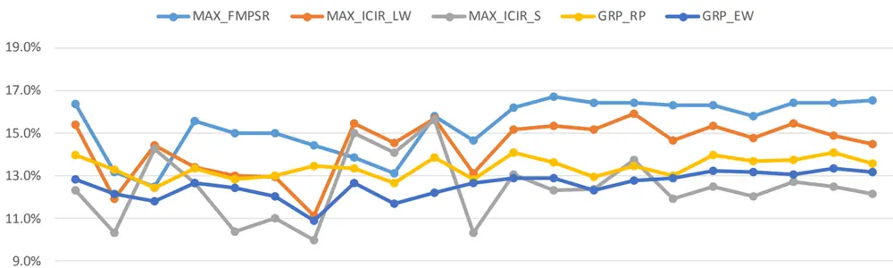
eaderTable_StaementCompany东方证券股份有限公司经相关主管机关核准具备证券投资咨询业务资格，据此开展发布证券研究报告业务。

## 一、关于因子组合

本篇报告主要从因子组合的角度阐述多因子选股体系，着重考察了从单因子到多因子的加权过程，本章先介绍因子组合的定义及其特征，关于因子组合更多的介绍建议参考 Grinold《主动投资管理》2.16 技术附录、5.16 技术附录以及 Stubbs（2013、2015）。

## 1.1 简单因子组合的定义

因子组合，又称因子模拟组合（Factor Mimicking Portfolio, FMP，下文采用 FMP 的称谓）、因子特征组合（Factor Characteristic Portfolio，FCP），广义上讲，凡是能够代表因子表现的货币中性的多空组合都可以称为因子组合，比如 Fama 和 French（1992）构建的 SMB 组合也是市值的一种因子组合，但更严格意义上，因子组合定义为对因子有单位暴露的最小方差组合。本小节的因子组合之所以“简单”是因为我们仅对考察的因子有暴露约束，对其他因子暴露没有限制，即因子α的简单因子组合由下列优化界定：

$$
\begin{array}{cc}{{\mathrm{min}}}&{{{\pmb h}^{T}{\pmb V}{\pmb h}}}\\{{\mathrm{s.t.}}}&{{{\pmb\alpha}^{T}{\pmb h}=1}}\end{array}
$$

其中，α表示 alpha因子向量，V表示股票的协方差矩阵，h表示简单因子组合的权重向量。上述带约束的优化问题很容易采用 Lagrange乘子法求解，其最优解为

$$
\pmb{h}^{*}=\frac{\pmb{V}^{-1}\pmb{\alpha}}{\pmb{\alpha}^{T}\pmb{V}^{-1}\pmb{\alpha}}
$$

上述优化问题的最优解可以写成 $h^{*}=V^{-1}$ α̃的形式，其中 $\widetilde{\alpha}=\alpha/\sqrt{\alpha^{T}V^{-1}\alpha}$ ，表示按照特定方式标准化后的α，在股票协方差给定的情况下，简单因子组合权重ℎ∗和标准化后的 alpla因子α̃存在完全一一对应的关系，alpha因子和因子组合权重可以相互转换，换言之，在股票协方差给定的情况下，因子组合可以最有效的表征 alpha因子。

将上述因子组合权重ℎ∗带入标准差公式 $\sigma_{\mathrm{A}}={\sqrt{h^{T}Vh}}{\dot{\mathrm{i}}}$ 算，三种形式的因子组合标准差分别为：

$$
\sigma_{\mathrm{A}}={\frac{1}{\sqrt{\alpha^{T}V^{-1}\alpha}}}
$$

由上式可以看出，因子组合的标准差受到股票协方差的影响，在时间序列上并不稳定。如果股票协方差为单位矩阵的倍数，即 $V=I\cdot{\overline{{\sigma_{s}}}}^{2}$ ， $\overline{{\sigma_{s}}}$ 为股票平均波动率，而且α是标准化后的 alpha因子，即 $\alpha^{T}\alpha=N$ ，N为股票数量，因子组合目标波动率即简化为

$$
\sigma_{\mathrm{A}}=\frac{\bar{\sigma}_{s}}{\sqrt{N}}
$$

虽然股票协方差矩阵正比于单位矩阵的假设过于简单，但我们大致可以看出因子组合标准差的影响因素，样本空间内股票数量越多、股票平均波动越小，因子组合的目标波动越小。在时间序列上，股票的波动率并不稳定，理论上因子组合收益率具有异方差性。

## 1.2 风格约束下的因子组合

我们在构建多因子模型时或多或少都会对组合施加一定的风险约束，相应的，也就有了风格线性约束下的因子组合，如下所示：

$$
\begin{array}{cc}{{\operatorname*{min}}}&{{\pmb{h}^{T}{\pmb{V}}{\pmb{h}}}}\\{{\mathrm{s.t.}}}&{{\pmb{\alpha}^{T}{\pmb{h}}=1}}\\{{}}&{{}}\\{{}}&{{X_{R}^{T}{\pmb{h}}=0}}\end{array}
$$

其中， $X_{R}$ 表示股票的风险暴露矩阵。

对于上述优化问题，也可以通过 Lagrange方法求解，其显式解为（Stubbs,2013,技术附录中有详细求解步骤）：

$$
\begin{array}{rl}&{h^{*}=\theta V^{-\frac{1}{2}}\Big(I-V^{-1/2}X_{R}\big(X_{R}^{T}V^{-1}X_{R}\big)^{-1}X_{R}^{T}V^{-1/2}\Big)V^{-1/2}\alpha}\\&{~=\theta V^{-1}\bar{\alpha}}\end{array}
$$

其中：

$$
\begin{array}{c}{{\Theta=\alpha^{T}\left(I-V^{-1/2}X_{R}\big(X_{R}^{T}V^{-1}X_{R}\big)^{-1}X_{R}^{T}V^{-1/2}\right)V^{-1/2}\alpha}}\\{{{}}}\\{{{}}}\\{{{\overline{{{\alpha}}}}=\left(I-X_{R}\big(X_{R}^{T}V^{-1}X_{R}\big)^{-1}X_{R}^{T}V^{-1}\right)\alpha}}\end{array}
$$

由于Θ是个正常数，所以上述方程也有于简单因子组合相同的形式，即 $V^{-1}$ α̅的形式，所以上述带约束的因子组合与α̅的简单因子组合等比例。

一般我们还会对股票风险模型进一步做结构化假设，如下：

$$
V=X_{R}FX_{R}^{T}+\Delta
$$

其中，F为风险因子协方差矩阵，∆为对角阵，表示残差收益方差。

在 $X_{R}^{T}h=0$ 的约束下，原优化问题可以简化为

$$
\begin{array}{cc}{{\operatorname*{min}}}&{{{\pmb h}^{T}\Delta{\pmb h}}}\\{{\mathrm{s.t.}}}&{{{\pmb\alpha}^{T}{\pmb h}=1}}\\{{}}&{{}}\\{{}}&{{X_{R}^{T}{\pmb h}=0}}\end{array}
$$

相应的，

$$
\begin{array}{r}{\overline{{\alpha}}=\left(I-X_{R}\left(X_{R}^{T}\Delta^{-1}X_{R}\right)^{-1}X_{R}^{T}\Delta^{-1}\right)\alpha}\end{array}
$$

进一步假设∆为正比于单位阵，那么，α̅就是α对风险因子 $X_{R}$ 线性回归的残差，即风险调整的alpha 因子。因此，α因子在风险中性约束下的因子组合，和风险调整后 alpha 因子的简单因子组合等价。

## 1.3 因子组合与 IC 的关系

由简单因子组合的权重乘以收益率可以得到因子组合的收益率，有如下形式：

$$
\textbf{ { f } }=h^{*}\cdot r=\frac{\alpha V^{-1}r}{\alpha^{T}V^{-1}\alpha}=\frac{r^{T}V^{-1}\alpha}{\sqrt{\alpha^{T}V^{-1}\alpha}\sqrt{r^{T}V^{-1}r}}\cdot\sqrt{N}\cdot\mathbf{\sigma}_{G}\sqrt{\frac{r^{T}V^{-1}r}{N}}
$$

其中， $\begin{array}{r}{\sigma_{\mathrm{A}}=\frac{1}{\sqrt{\alpha^{T}V^{-1}\alpha}}}\end{array}$ ，表示因子组合目标风险，当股票协方差V正比于单位阵时，上述因子收益可以简化为

$$
f={\frac{r^{T}\alpha}{\sqrt{\alpha^{T}\alpha}{\sqrt{r^{T}r}}}}\cdot{\sqrt{N}}\cdot\sigma_{A}{\sqrt{\frac{r^{T}r}{N}}}\ =IC\cdot{\sqrt{N}}\cdot\sigma_{A}\cdot\sigma_{r}
$$

其中， ${\pmb{\sigma}}_{r}$ 表示股票收益率在横截面上的标准差（dispersion），也就是说股票协方差单位阵的假设下，因子组合的收益等于因子 IC、股票数量的平方根、标准差和股票截面标准差四个因子的乘积，

股票协方差对角阵假设意味着股票间不存在相关性，这显然和现实相差太远，但如果我们这里考察的不是因子的原始取值，而且风险调整的 alpha因子的简单因子组合，那么只需假设风险模型具有结构化形式，残差矩阵正比于单位矩阵，因子组合收益便有上述的形式，相应的，这里的 IC是因子风险调整值和收益率的相关系数，即风险调整之后的 IC。

## 1.4 基于 FMP 的多因子构建

在 1.1节，我们讲到，因子组合 FMP 和 alpha因子可以相互转换，每个 alpha因子都可以用因子组合唯一表示，即

$$
h=V^{-1}\tilde{\alpha},~\tilde{\alpha}=\alpha/\sqrt{\alpha^{T}V^{-1}\alpha}
$$

而且，因子组合的线性组合也唯一对应着相应 alpha因子的线性组合。因子组合 $\left\{h_{j}\right\}$ 的线性组合

$$
h_{tp}=\sum_{j=1}^{m}w_{j}h_{j}
$$

两边左乘以协方差矩阵V即可得到 alpha 因子 $\left\{\alpha_{j}\right\}$ 的线性组合

$$
\sigma_{tp}\alpha_{tp}=\sum_{j=1}^{m}w_{j}\sigma_{j}\alpha_{j}
$$

其中， $\sigma_{j}=1/\sqrt{\alpha_{j}^{T}V^{-1}\alpha_{j}}$ ，表示因子 j 的因子组合的标准差。

因此，我们原来通过线性加总不同 alpha因子的得到加总的 alpha，可以相应的转化为线性加权不同 alpha 因子的因子组合，得到目标因子组合（target portfolio），然后根据目标因子组合反解出其对应的加总 alpha参与到后面的组合构建中。

Stubbs（2013、2015）提出了基于因子组合构建 alpha 模型的三个步骤：

（1） 基于各个 alpha 因子构建相应的因子组合 FMP，单因子的因子组合基于 FMP 构建alpha模型的基石。

（2） 线性加权各个单因子 alpha 的因子组合，得到目标因子组合，具体加权方法取决于投资者的目标以及对因子组合各种估计量准确性的评估，具体加权方法我们将在后面两章详细探讨。

（3）目标因子组合并没有考虑做空约束等投资中实际面临的约束条件，最后一步就是将理论的目标因子组合转换为实际投资中面临各种约束的实际组合。通常做法是反解目标因子组合中隐含的加总 alpha，调整量纲，带入有实际约束的组合优化中，求解能够实际投资的 alpha组合。

最后，我们需要注意的是，因子组合的构建高度依赖股票协方差，而股票协方差的估计很难十分准确。所幸的是，对于简单因子组合，这种估计误差在单因子转换为单因子 FMP 和目标 FMP转换为加总 alpha的两个过程中相互抵消，并不会将这种估计误差引入到 alpha因子中，但这种估计误差会影响到单个 alpha因子表现的评估，进而影响到 alpha因子的权重。对于风格中性约束下的 alpha因子，我们先将原始 alpha因子对风格因子回归，得到风险调整后的 alpha，再基于风险调整后的 alpha构建简单因子组合。

## 二、基于因子组合的加权方法

## 2.1 期望方差优化的框架

Markowitz(1952)提出的期望方差模型虽然也有自己的不足，但目前依然是多因子选股领域的主流框架。在期望方差框架下，基于 FMP 的因子加权就是找到单因子 FMP 的一组线性组合使得风险调整后的收益最大：

$$
\begin{array}{rl}{\operatorname*{max}\quad}&{{}\boldsymbol{w}^{T}\boldsymbol{E}(f)-\mathrm{~\lambda~}\boldsymbol{w}^{T}\boldsymbol{\Sigma}_{f}\boldsymbol{w}}\end{array}
$$

其中， $\pmb{w}=[w_{1},w_{2},\dots,w_{m}]^{T}$ 表示各个单因子组合的权重， $\pmb{\cal E}(f)=[E(f_{1}),E(f_{2}),\dots,E(f_{m})]^{T}$ 表示各个单因子组合的预期收益率， $\Sigma_{f}$ 表示因子组合收益率的协方差矩阵。

需要注意的是，上述优化的最优解，虽然跟λ有关，但λ仅影响最优解的倍数，并不影响各个因子的相对权重，因此在求解过程中任意设置一个参数，最后归一化权重即可。而且上述优化问题和风险约束下最大化收益的解成比例，而风险约束下最大化收益的组合有最大夏普比，组合权重成比例放大输小并不影响夏普率，因此上述方程的最优解和权重约束下最大化夏普比的解也成比例。即：

$$
\begin{array}{rl}{\operatorname*{max}\quad}&{\frac{w^{T}E(f)}{\sqrt{w^{T}\Sigma_{f}w}}}\\&{}\\{\mathrm{s.t.}\quad}&{w^{T}1=1}\end{array}
$$

由于在一定假设下， $f=IC\cdot\sqrt{N}\cdot\sigma_{A}\cdot\sigma_{r}$ ，不考虑股票数量N、目标风险 $\pmb{\sigma}_{A}$ 和股票截面波动 ${\pmb{\sigma}}_{r}$ 的影响，基于因子组合期望方差的优化就进一步转换为最优化 ICIR，

$$
\begin{array}{rl}{\operatorname*{max}}&{{}\frac{\boldsymbol{w}^{T}\boldsymbol{E}(IC)}{\sqrt{\boldsymbol{w}^{T}\Sigma_{IC}\boldsymbol{w}}}}\end{array}
$$

$$
\begin{array}{rl}{\mathsf{S}.\mathsf{t}.\quad}&{{}\pmb{w}^{T}\pmb{1}=1}\end{array}
$$

基于因子组合优化加权和基于 IC 优化加权各有利弊，IC 比因子组合收益更加纯粹，直接表示股票的选股能力，而因子组合收益除了受因子选股能力影响外，还与股票数量、目标风险、截面波动等维度的影响，因子组合的优点在于因子收益率数据比 IC 数据更加密集，方便因子收益协方差的估计，而上述优化过程对协方差非常敏感。

图 1：基于 IC 和 FMP 的因子加权流程
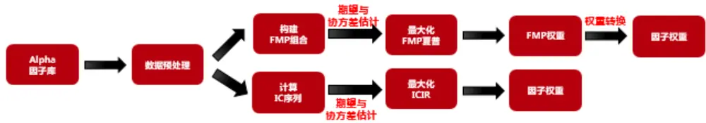
数据来源：东方证券研究所

## 2.2 因子期望收益和协方差的估计

期望方差优化看上去很诱人，但输出的结果高度依赖于输出的两个参数（期望和协方差），存在稳定性问题。对于最大化 ICIR 加权，由于我们采用月度的 IC数据，协方差估计样本较少，误差较大，基于样本协方差进行最大化 ICIR 优化稳定性很差，相应的组合收益也不可观，采用我们前期报告推荐使用的 Ledoit-Wolf估计量可以大幅改观协方差的性能，显著提高组合表现。

因子组合期望收益的估计本质上是个因子择时问题，尤其篇幅限制，这里很难展开，感兴趣的投资者可以关注我们前期报告《反转因子择时研究》和《因子择时》。在本小节，我们采用过去一段时间因子组合收益率的月度均值作为因子组合接下来一个月收益率的估计值。我们统计了东方因子库共 72个 alpha因子过去 N个月收益对未来一个月收益预测的平均预测误差，如图1。因子j最过去一段时间的预测误差定义如下：

$$
SE_{j}=\sqrt{\frac{1}{T}{\sum_{\mathrm{t}=1}^{T}}(\widehat{r_{\mathrm{j},t}}-r_{j,t})^{2}}
$$

其中， $\widehat{r_{\mathrm{J},t}}$ 表示对因子j在 t期收益率的估计， ${r}_{j,t}$ 表示因子j在 t期的真实收益率。

从图 2 我们可以看出，随着回看月份 N 的拉长，预测误差逐渐减少，但在 12 个月以后，这种误差减小的幅度逐步变缓。本文采用过去 5 年（60 个月）因子收益率的均值作为接下来一个月收益率预测的估计值，一方面考虑了因子收益率预测的准确性，另一方面基于长期均值有利于预测值的稳定性，从而降低因子权重变化、降低组合换手。

图 2：过于 N月因子收益率对未来预测的平均预测误差
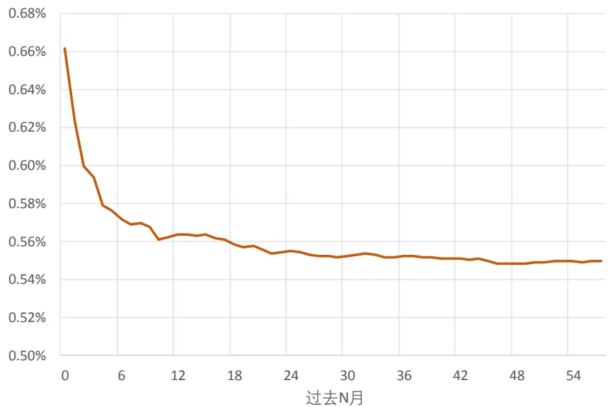
注：上述平均预测误差是 72 个 alpha 因子自 201101-201903 月度收益预测误差的均值
数据来源：wind 咨询，东方证券研究所

由于我们股票组合和因子组合的构建都是月度调仓，以一个月为考察周期的，因此理论上讲我们应该以月度收益率数据为估计样本，但月度收益率数据样本数据过少，估计误差大，我们更建议采用因子日度收益率数据估计因子组合收益率的协方差以减少估计误差，当样本数量足够多时，是否采用 LW 压缩对协方差影响很小。因此，我们选择了基于日度因子收益率数据的样本协方差作为 FMP 收益率协方差的估计。

另外，在提升优化稳健性方面，除了提升协方差估计精度的方法之外，还有就是设置一些约束条件。尤其是当因子间相关系数比较高时，优化权重对相关系数和预期收益率的估计异常敏感，以两个因子的简单情况为例，在只有两个因子时、而且两个因子收益率的波动率大小一样时，最大化信息比优化的因子权重如下最优解：

$$
w_{1}=\frac{k^{2}-\rho}{(k^{2}+1)(1-\rho)},k=\frac{E(f_{1})}{E(f_{2})}
$$

其中， $\rho$ 为两个因子收益率的相关系数。

当ρ接近 1时，相对收益k和相关系数ρ的估计误差会对权重产生较大影响，当 $k^{2}<\rho\sharp\vec{\bf{\mu}}$ ，相关性高的两个因子预期收益相差较大，就会出现做多表现好的因子做空表现差的因子的情形，这是我们在投资中不愿意看到的情形，大概率是由于估计误差的影响，因此我们可以对因子权重进行空头的限制，进而减弱数据估计误差的影响。在实际操作时，由于各个 alpha因子都有自身的逻辑，我们可以事前根据其逻辑确定因子的选股方向（因子取值越大股票收益更高、还是取值越小收益更高），在调整因子方向后，我们可以约束因子权重必须大于 0。

## 2.3 基于风险配置的因子加权

基于期望方差的优化虽然很完美，但现实中因子收益的预测及其困难，在收益收益不可预测的情况下，我们完全可以从风险配置的角度分配因子权重，M个因子组合的线性组合的标准差有如下形式：

$$
\begin{array}{r}{\sigma(w)=\sqrt{w^{T}\Sigma_{f}w}}\end{array}
$$

第j个因子的边际风险贡献为：

$$
\frac{\partial\boldsymbol{\sigma}(w)}{\partial w_{j}}=\frac{\left(\boldsymbol{\Sigma}_{f}\boldsymbol{w}\right)_{j}}{\sqrt{w^{T}\boldsymbol{\Sigma}_{f}w}}
$$

第 j 个因子的风险贡献度为：

$$
RC_{j}=w_{j}\cdot\frac{\partial\sigma(w)}{\partial w_{j}}=\frac{w_{j}\big(\Sigma_{f}w\big)_{j}}{\sqrt{w^{T}\Sigma_{f}w}}
$$

所有因子的风险贡献度之和等于总风险，相应的，第j个因子的风险贡献占比为：

$$
PCR_{j}=\frac{w_{j}\big(\pmb{\Sigma}_{f}\pmb{w}\big)_{j}}{\pmb{w}^{T}\pmb{\Sigma}_{f}\pmb{w}}
$$

对应每个风险因子，我们可以指定一个风险贡献占比序列 $\left\{pcr_{j}\right\}$ ，通过下列优化问题可以实现指定风险贡献占比的因子配置：

$$
\begin{array}{rl}{min}&{{}\displaystyle{\sum_{j=1}^{M}\left(\frac{w_{j}\big(\Sigma_{f}w\big)_{j}}{w^{T}\Sigma_{f}w}-pcr_{j}\right)^{2}}}\end{array}
$$

$$
s.t.\sum_{j=1}^{M}w_{j}=1
$$

当 $pcr_{j}=1/M$ 时，上述优化过程即实现了 alpha 因子配置的风险平价（alpha risk parity）。当因子间不存在相关性时，因子 j 的风险贡献占比退化为：

$$
PCR_{j}=\frac{w_{j}^{2}\sigma_{j}^{2}}{\sum_{j=1}^{M}w_{j}^{2}\sigma_{j}^{2}}
$$

相应的，alpha因子的风险平价配置转换为按照因子组合波动率的倒数配置因子因组合权重，而因子组合权重到 alpha因子的权重存在因子组合波动率的倍数关系，也就是说，当 alpha因子组合如果不存在相关性、理论上 alpha 因子组合的风险平价配权就相对于 alpha 因子等权。

风险平价策略一般用于资产配置策略中，每大类资产对应一个组合，而基于 alpha 因子组合风险配置权重时，每一大类对应多个因子，相应的有多个大类因子组合，如果简单按因子等权重配置风险，那么对于因子数量多的大类风险会相应对配，对于因子数量少的大类风险会相应少配。为了解决这个问题，我们可以采取大类因子风险平价的方法，类似大类等权的方法，将风险在各个大类因子间等权重配置，大类内部各因子也等权重配置风险。在因子组合不存在相关性的情况下，大类因子风险平价等价于大类等权的因子加权方法。

## 三、组合收益的比较

## 3.1 理论组合的表现

前面我们重点介绍最大化 FMP 夏普比和大类风险平价两总加权方法。最大化 FMP 夏普在一定假设下可以简化为最大化 ICIR 加权，最大化 ICIR加权涉及到 IC的协方差估计，我们建议采用LW 压缩方法估计 IC 的协方差，作为对比我们也考察了基于样本协方差估计的最大化 ICIR 加权。当因子收益未知或者估计不准时，我们可以采用采用大类因子风险平价的方法加权各个 alpha 因子，在因子收益不存在相关性的假设下退化为大类因子等权。

历史上，无做空约束、股票权重上下限约束等条件下，指数增强组合应该是加总 zscore因子组合的倍数，所以我们采用加总 zscore 的因子组合作为我们要考察的理论组合，另外，多空组合也是我们考察因子理论表现的一种常用形式。我们基于现有的因子库（6大类，72个细分因子，见附录）分别计算了下列 5 种加权方法在中证全指成分股（非金融）内 2010 年 1 月至 2019 年 3 月期间的表现情况，因子行业市值中性化，因子加权中涉及到的均值和协方差均基于过去 5 年的数据估计，因子权重均根据逻辑调整方向，加权时均约束因子权重不小于 0。

MAX_FMPSR：最大化 FMP 的夏普比，协方差根据日度收益率数据 LW 压缩估计；

MAX_ICIR_LW：最大化 ICIR，协方差根据月度 IC序列 LW 压缩估计；

MAX_ICIR_S：最大化 ICIR，协方差采用月度 IC序列样本协方差；

GRP_RP：因子大类风险平价，协方差根据日度收益率数据 LW 压缩估计；

GRP_EW：因子大类等权；

从以上几种加权方法的几个常见的业绩指标来看（图 3），最大化 FMP 夏普比的加权方法zscore 的因子组合收益和夏普比最高，RankIC的均值和多空组合的月均收益也高于与之相对于的ICIR 加权方法，但 ICIR和多空的夏普比会略逊于基于 LW 估计的 ICIR最大化，毕竟 ICIR最大化优化的目标函数是 ICIR本身，多空组合也是取决于因子排序，而 FMP 夏普比除了受 ICIR影响外还受其他因素的影响。基于 LW 压缩的 ICIR 最大化明显优化基于样本协方差的 ICIR 最大化，这受益于 IC 协方差的估计更加稳健。因子大类风险平价的加权方法和因子大类等权相比，无论是风险还是收益指数都占优，意味着因子风险在 alpha因子加权时也是有参考价值的。最大化FMP 夏普相对于因子大类风险平价全面占有，说明基于过去月均收益对因子下个月收益的估计也是有意义的，至少从我们现有的因子库看是有意义的。

图 3：各种加权方法 ZSCORE 业绩衡量指标

| 加权方法 | RanKIC |  | 多空组合 |  |  | 因子组合 |  |  |
| --- | --- | --- | --- | --- | --- | --- | --- | --- |
|  | IC均值 | ICIR | 月均收益 | 夏普比 | 最大回撤 | 月均收益 | 夏普比 | 最大回撤 |
| MAX_FMPSR | 13.0% | 6.36 | 3.7% | 4.96 | -1.64% | 1.0% | 6.32 | -0.27% |
| MAX_ICIR_LW | 11.5% | 6.58 | 3.3% | 5.11 | -3.26% | 0.8% | 5.85 | -0.48% |
| MAX_ICIR_S | 10.0% | 6.36 | 2.8% | 4.79 | -1.47% | 0.6% | 5.42 | -0.23% |
| GRP_RP | 11.0% | 4.70 | 2.9% | 3.36 | -4.37% | 0.8% | 4.18 | -1.38% |
| GRP_EW | 9.7% | 4.05 | 2.5% | 2.99 | -6.88% | 0.6% | 2.90 | -2.06% |

注：上述最大回撤表示以月度净值数据计算
数据来源：wind 咨询，东方证券研究所

图 4：各种加权方法 ZSCORE 多空组合净值
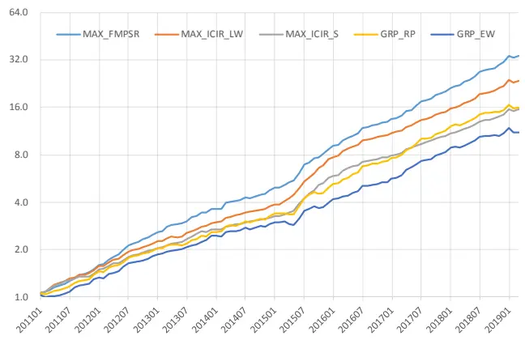
数据来源：wind 咨询，东方证券研究所

图 5：各种加权方法 ZSCORE 因子组合净值
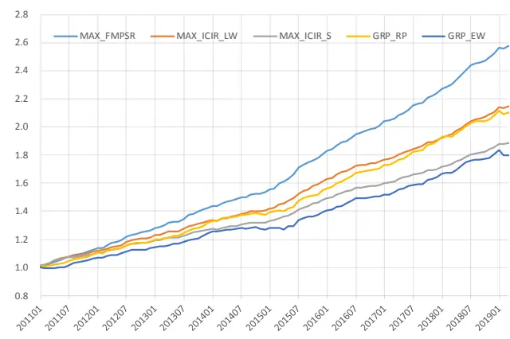
数据来源：wind 咨询，东方证券研究所

因子加权的比较高度依赖 alpha 因子库的选择，为了考察不同因子库下不同加权方法的差异下，我们在我们现有因子库的基础上生成一系列随机因子库。我们采取两种方案生成因子库，（1）在现有因子库中随机去掉部分因子，（2）在现有因子库的计算上添加部分因子和白噪音的线性组合。我们基于两者方案各生成 10个随机的因子库如下：

S0-S9:在现有因子库每个大类随机去掉一半，留下剩下的因子作为新的因子库；

T0-T9:在每个大类随机生成 5 个该大类中现有 alpha、白噪音的线性组合作为新因子加入因子库，总共 102个因子作为新的因子库；

BASE：原有的 6个大类共 72个因子，明细见附录。

分析各种加权方法在各个因子库中的理论表现，我们有如下发现：

（1） 从 zscore 的因子组合来看，最大化 FMP 方法的收益和夏普一直稳定的处于高于与之相对于的最大化 ICIR 加权，从多空组合来看，收益端最大化 FMP 依然占优，但夏普比两者互有高低。

（2） 基于 LW 估计协方差的最大化 ICIR 优化一直稳定优于基于样本协方差的结果，这也说明压缩估计量方法能够显著提高 IC协方差估计的稳定性。

（3） 因子大类等全的加权方法理论上表现最差，无论从 zscore 的多空组合还是因子组合看，无论从收益看，还是从夏普看，总是低于与之相对于的因子大类风险平价策略。

（4）无论是从多空还是从 FMP 角度看，各种加权方法对于剔除 alpha因子比较敏感（S0-S9），对于加入现有因子的线性组合表现出比较稳健的特性。

图 6：不同因子库下多空组合月均收益
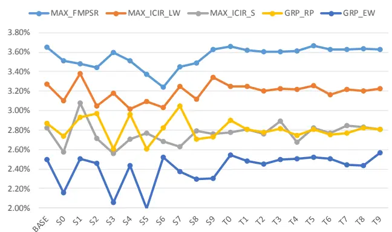
数据来源：wind 咨询、东方证券研究所

图 7：不同因子库下多空组合夏普比
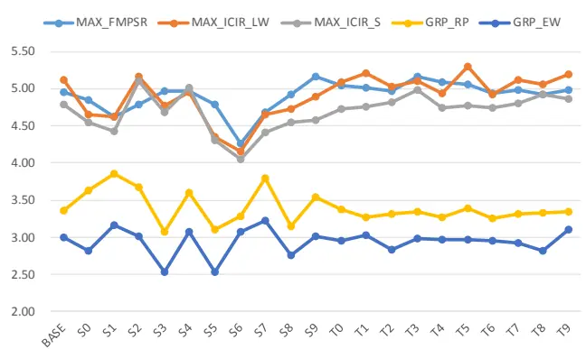
数据来源：wind 咨询、东方证券研究所

图 8：不同因子库下因子组合月均收益
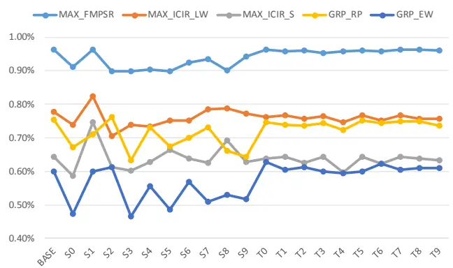
数据来源：wind 咨询、东方证券研究所

图 9：不同因子库下因子组合夏普比
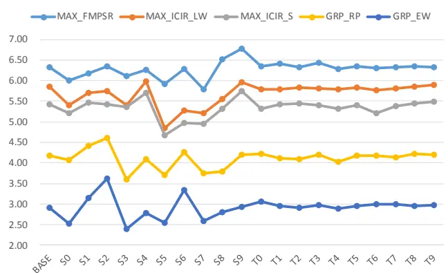
数据来源：wind 咨询、东方证券研究所

## 3.2 指数增强的表现

实际投资中有很多理论组合没有考虑到的约束，比如做空约束、权重上下限约束等，因此、理论组合表现较好并不代表实际投资中能够带来更多的收益。本小节比较了第二章提出的各种加权方法在实际指数增强中的业绩情况。本章考察的组合选股样本空间为中证全指成分股、银行、券商单独建模，行业市值完全中性、除了加权方法不同权重上限、换手惩罚等参数完全一样，费率单边千 3。

在我们基础因子库下（6大类，72个因子，见附录），各种加权方法的指数增强表现如图 10所示，分析图 10我们有如下发现：

（1）最大化FMP加权方法在三大指数增强中总体略优于最大化ICIR加权，年化波动率、换手、持股数量相差不大的情况下，沪深 300 和中证 500 增强的收益和夏普略高，1000增强相对也更有竞争力。

（2）IC 协方差估计方法对最大化 ICIR 影响很大，基于 LW 压缩估计加权的指数增强效果均大幅好于基于样本协方差估计下结果，再次说明协方差估计对最大化 ICIR加权的重要性。

（3）因子大类风险平价相对大类等权在指数增强中总体表现更好，但因子大类风险平价的换手率总体更高，这是因为大类平价有因子权重的变化、而且更偏好因子波动小的技术类因子，两方面都会带来换手的提升。

（4） 由于做空约束等的存在，因子理论组合的表现和指数增强组合表现差距很大，对于沪深 300 尤其明显，因子大类等权理论组合明显弱于其他加权方法，但沪深 300 增强效果名没有明显弱于其他加权方法。

图 10：几种加权方法指数增强业绩指标
沪深 300 增强：

| 加权方法 | 年化对冲收益 年化波动 信息比 月胜率 |  |  |  | 最大回撤 | 换手 | 平均持股数量 |
| --- | --- | --- | --- | --- | --- | --- | --- |
| MAX_FMPSR | 9.72% | 3.20% | 2.92 | 76.8% | 2.43% | 2.95 | 86.4 |
| MAX_ICIR_LW | 9.23% | 3.17% | 2.80 | 77.8% | 2.51% | 3.27 | 84.1 |
| MAX_ICIR_S | 8.68% | 3.19% | 2.63 | 73.7% | 2.77% | 3.12 | 82.8 |
| GRP_RP | 9.94% | 3.43% | 2.78 | 83.8% | 3.39% | 2.04 | 84.5 |
| GRP_EW | 9.46% | 3.44% | 2.65 | 79.8% | 3.56% | 1.52 | 82.4 |

中证 500 增强：

| 加权方法 | 年化对冲收益 年化波动 信息比 月胜率 |  |  |  | 最大回撤 换手 |  | 平均持股数量 |
| --- | --- | --- | --- | --- | --- | --- | --- |
| MAX_FMPSR | 16.38% | 4.62% | 3.30 | 80.8% | 4.47% | 5.19 | 132.2 |
| MAX_ICIR_LW | 15.41% | 4.58% | 3.15 | 76.8% | 3.18% | 5.77 | 127.5 |
| MAX_ICIR_S | 12.32% | 4.59% | 2.56 | 70.7% | 3.61% | 5.44 | 124.7 |
| GRP_RP | 13.96% | 4.65% | 2.83 | 77.8% | 3.52% | 3.34 | 129.3 |
| GRP_EW | 12.84% | 4.81% | 2.54 | 75.8% | 4.36% | 2.40 | 126.1 |

中证 1000 增强

| 加权方法 | 年化对冲收益 | 年化波动 信息比 月胜率 |  |  | 最大回撤 换手 |  | 平均持股数量 |
| --- | --- | --- | --- | --- | --- | --- | --- |
| MAX_FMPSR | 19.09% | 4.82% | 3.65 | 82.8% | 4.53% | 5.29 | 138.4 |
| MAX_ICIR_LW | 17.84% | 4.71% | 3.51 | 84.8% | 3.32% | 5.87 | 134.6 |
| MAX_ICIR_S | 15.37% | 4.66% | 3.09 | 81.8% | 3.14% | 5.51 | 132.0 |
| GRP_RP | 17.11% | 5.16% | 3.09 | 78.8% | 4.54% | 3.59 | 142.8 |
| GRP_EW | 14.75% | 5.47% | 2.54 | 73.7% | 5.75% | 2.58 | 137.4 |

数据来源：wind 咨询、东方证券研究所

虽然从长期平均来看，最大化 FMP 夏普的加权方法平价博得更高的风险调整后收益，但各个年份并不尽然，尤其在市场风格变化较大的 2017 年，最大化 FMP 夏普的组合表现显著弱于因子大类风险平价和因子大类等权，这也说明风险平价和等权最大的价值在于应对收益的不确定性，当因子未来的收益很难重复过去的表现或者很难通过择时预测时，因子大类风险平价和等权是一种保守的方案。

图 11：几种加权方法指数增强各年度对冲收益

|  | 加权方法 | 2011 | 2012 | 2013 | 2014 | 2015 | 2016 | 2017 | 2018 | 2019 |
| --- | --- | --- | --- | --- | --- | --- | --- | --- | --- | --- |
| 沪深300 | MAX_FMPSR | 7.9% | 10.7% | 12.0% | 9.2% | 19.2% | 8.8% | 5.2% | 8.0% | -0.3% |
|  | MAX_ICIR_LW | 7.2% | 11.6% | 11.6% | 6.4% | 21.6% | 8.5% | 3.3% | 6.5% | 0.4% |
|  | MAX_ICIR_S | 6.2% | 12.3% | 11.4% | 5.6% | 20.7% | 6.4% | 3.1% | 5.7% | 1.2% |
|  | GRP_RP | 7.8% | 12.3% | 11.4% | 9.1% | 15.4% | 9.3% | 9.2% | 8.1% | -0.4% |
|  | GRP EW | 7.3% | 9.4% | 8.7% | 9.5% | 15.0% | 7.8% | 11.8% | 10.0% | -1.2% |
| 中证500 | MAX_FMPSR | 15.7% | 19.4% | 15.9% | 16.3% | 39.0% | 19.2% | 4.6% | 10.7% | -2.2% |
|  | MAX_ICIR_LW | 15.6% | 15.5% | 12.9% | 12.8% | 47.2% | 14.0% | 2.4% | 12.0% | -0.3% |
|  | MAX_ICIR_S | 14.3% | 13.9% | 8.8% | 6.7% | 43.6% | 10.7% | 0.2% | 8.7% | -0.4% |
|  | GRP_RP | 16.2% | 9.2% | 12.9% | 10.9% | 26.2% | 20.4% | 10.1% | 13.5% | -2.6% |
|  | GRP EW | 7.9% | 8.2% | 13.1% | 9.6% | 23.4% | 14.0% | 16.0% | 18.9% | -3.6% |
|  | MAX_FMPSR | 16.9% | 21.9% | 16.6% | 21.1% | 30.2% | 24.5% | 11.3% | 17.4% | -1.0% |
|  | MAX_ICIR_LW | 16.2% | 23.3% | 11.0% | 14.3% | 40.5% | 18.1% | 9.6% | 15.5% | 1.5% |
|  | 中证1000MAX_ICIR_S | 14.3% | 21.4% | 8.3% | 9.3% | 39.5% | 13.9% | 7.3% | 15.3% | 0.7% |
|  | GRP_RP | 16.2% | 14.6% | 12.0% | 20.7% | 23.2% | 24.0% | 19.2% | 14.8% | -2.3% |
|  | GRP EW | 10.7% | 9.3% | 7.9% | 17.9% | 19.5% | 18.5% | 22.1% | 21.0% | -3.4% |

注：2019 年数据截止 3 月 31 日
数据来源：wind 咨询东方证券研究所

为了避免因子库对我们结论的影响，我们同样考察了随机因子库 S0-S9、T0-T9 下不同加权方法的组合表现情况（图 12-图 15），从结果来看：

（1）各种加权方法指数增强绩效在 S0-S9中的波动均显著大于 T0-T9 中的波动，说明从因子库中剔除因子对业绩的影响要大于加入线性相关的冗余因子，对我们投资中一个指示是不要随意剔除因子库中的因子即使可能和现有因子高度相关。

（2）最大化 FMPSR 的收益和信息比一般都比相应的最大化 ICIR要高（收益的相对胜率84.1%，夏普的相对胜率 80.1%），对中证 500和中证 1000增强尤其如此。

（3）因子大类风险平价总相对大类等权在沪深 300 增强业绩中没有明显优势，但在中证500和中证 1000增强中总体要优于大类等权，不仅收益和信息比平均更高，波动和回撤也相对较低。

（4） 基于样本协方差最大化 ICIR 的效果几乎在任意一个因子库、任意一个指数增强中都弱于基于 LW 压缩协方差的效果，可见协方差估计对最大化 ICIR 优化的重要性。

图 12：各种加权方法指数增强组合年化收益
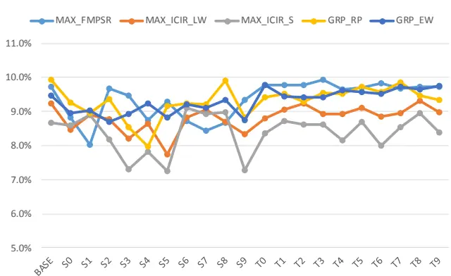

图 13：各种加权方法指数增强组合信息比
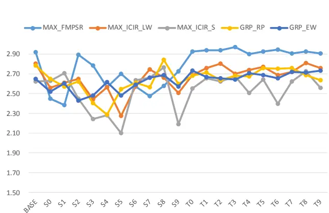

中证 500 增强：
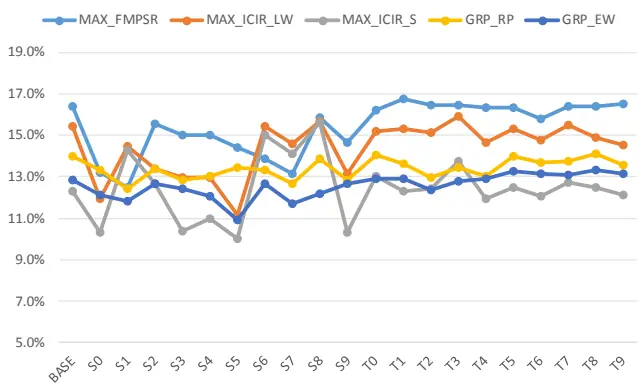
中证 1000 增强

中证 500 增强：
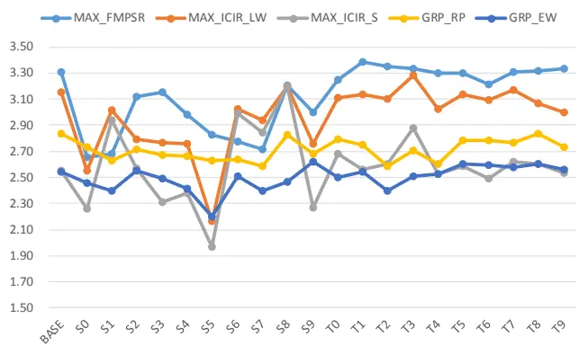

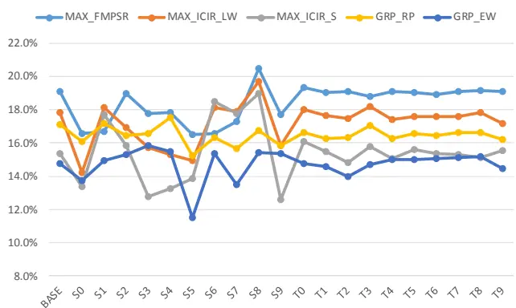
数据来源：wind 咨询、东方证券研究所

中证 1000 增强
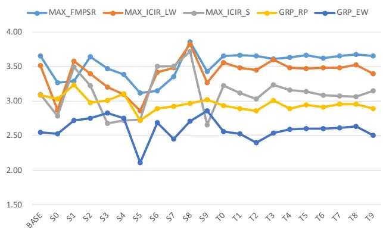
数据来源：wind 咨询、东方证券研究所

图 14：各种加权方法指数增强组合年化波动

沪深 300 增强：

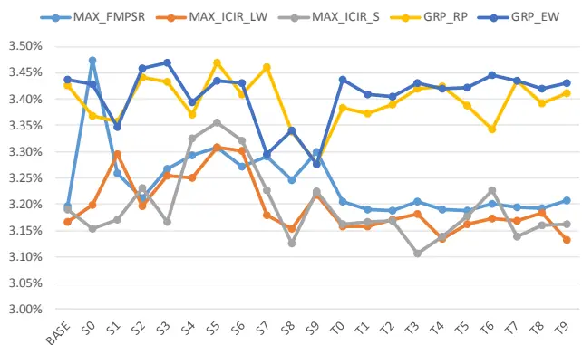
图 15：各种加权方法指数增强组合最大回撤
沪深 300 增强：

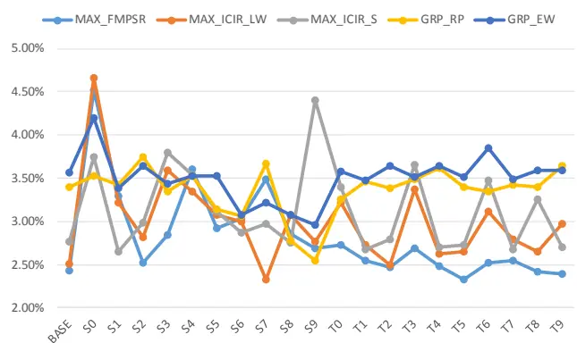
中证 500 增强：

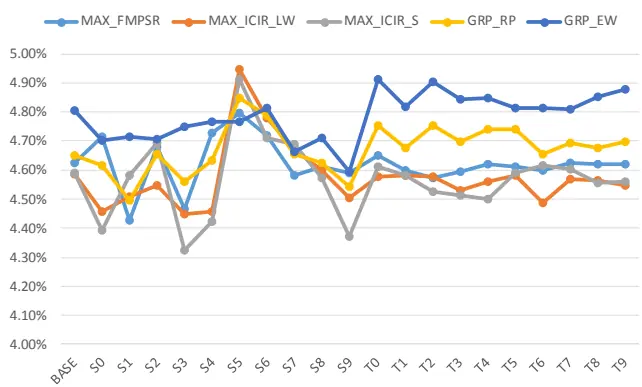
中证 500 增强：

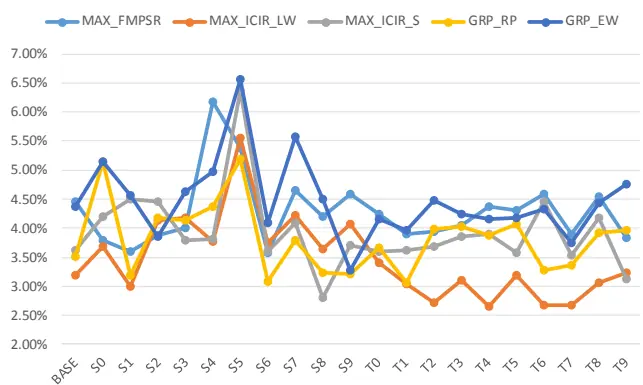
中证 1000 增强

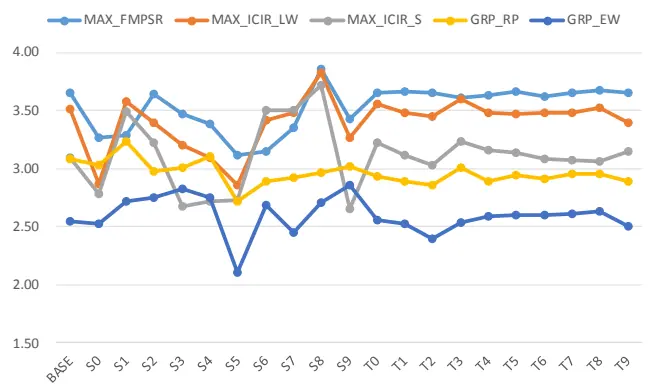
数据来源：wind 咨询、东方证券研究所

中证 1000 增强
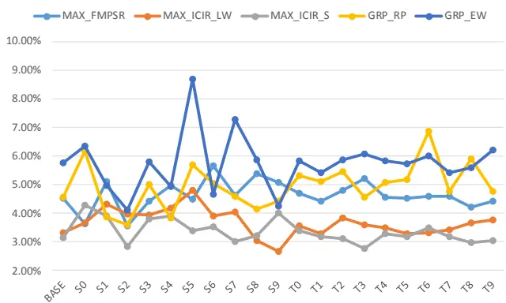
数据来源：wind 咨询、东方证券研究所

## 风险提示

1. 量化模型基于历史数据分析得到，未来存在失效的风险，建议投资者紧密跟踪模型表现。

2. 极端市场环境可能对模型效果造成剧烈冲击，导致收益亏损。

## 参考文献

[1]. Richard C. Grinold 《主动投资组合管理》（原书第二版）

[2]. Thierry Roncalli 《基于风险的资产配置策略》

[3]. Ceria S, Sivaramakrishnan K, Stubbs R A. Alpha Construction in a Consistent Investment Process[J]. 2017.

[4]. Roger C , Harindra D S , Steven T . Portfolio Constraints and the Fundamental Law of Active Management[J]. Financial Analysts Journal, 2002, 58(5):48-66.

[5]. Sorensen E H. Multiple Alpha Sources and Active Management[J]. Journal of Portfolio Management, 2004, 30(2):págs. 39-45.

[6]. Roncalli T , Weisang G . Risk Parity Portfolios with Risk Factors[J]. SSRN Electronic Journal, 2012(3).

[7]. Kind C . Risk-Based Allocation of Principal Portfolios[J]. Ssrn Electronic Journal, 2013.

[8]. De Silva H , Thorley S , Clarke R G . The Fundamental Law of Active Portfolio Management[J]. Social Science Electronic Publishing, 2006.

## 附录

图 16：东方金工因子库列表

| 大类 | 因子简称 | 因子定义 | 大类 | 因子简称 | 因子定义 |  |
| --- | --- | --- | --- | --- | --- | --- |
| 估值 | BP EP | 账面市值比 归属母公司的净利润TTM/总市值 | 营运能力 | MR DIVDRATIO | 高管薪酬前三之和的对数 股票分红比例，过去一年的股票分红金额/年报净利润 |  |
|  | EP2 | 扣非后的净利润TTM/总市值 |  | TO5 | 过去5个交易日的日均换手率对数 |  |
|  | SP | 营业收入TTM/总市值 | TO20 |  | 过去20个交易日的日均换手率对数 |  |
|  | CFP |  | TO60 | 过去60个交易日的日均换手率对数 |  |  |
|  | NOA2EV | 经营性现金流TTM/总市值 净经营资产/企业价值 | LNAMIHUD20 |  | 20日Amihud非流动性自然对数 |  |
|  | EBIT2EV | 息税前利润与企业价值之比 |  | LNAMIHUD60 | 60日Amihud非流动性自然对数 |  |
|  | SALES2EV | 营业收入与企业价值之比 |  | AVGAMT_20_60 | 过去20日日均成交额/过去60日日均成交额，乘以100处理 |  |
|  | CFO2EV | 经营性现金流/企业价值 | AVGVOL_20_240 |  | 过去20日日均成交量/过去240日日均成交量，乘以100处理 |  |
|  | DP | 过去一年分红/总市值，以分红实施公告日为准 | RET5 | 过去5个交易日的收益率 |  |  |
|  | DP2 | 过去一年分红/总市值，以分红预案公告日为准 | RET20 | 过去20个交易日的收益率 |  |  |
|  | FCFF2EV | 企业自由现金流TTM/企业价值 | RET60 | 过去60个交易日的收益率 |  |  |
| 盈利能力 | CFROI | 投资现金收益率 |  | PPREVERSAL | 乒乓球反转，过去5日均价/过去60日均价-1 |  |
|  | RNOA | 净经营资产收益率 |  | CG060 | 处置效应因子，当前价/60日换手反推的持仓价-1 |  |
|  | ROE | 净资产收益率 | 技术与反转 P2HIGH |  | 当前价格除以过去243个交易日的最高价，乘以100处理 |  |
|  | ROA | 总资产报酬率 | SB60 | 过去60个交易日计算的价差偏离度 |  |  |
|  | ROA2 | 总资产净利率 | VOL20 | 过去20个交易日的波动率 |  |  |
|  | GPOA | 总资产毛利率 | VOL60 | 过去60个交易日的波动率 |  |  |
|  | GROSS_MARGIN | 销售毛利率 | IVOL20 |  | 过去20个交易日的特质波动率 |  |
|  | NET_MARGIN | 销售净利率 |  | IVOL60 | 过去60个交易日的特质波动率 |  |
|  | PROFIT_GROWTH_YOY | 归属母公司的净利润季度同比 | IVR20 |  | 过去20个交易日的特异度 |  |
|  | SALES GROWTH YOY | 营业收入季度同比 | IVR60 |  | 过去60个交易日的特异度 |  |
|  | SALES GROWTH YOY | 营业收入季度同比 | MAXRET |  | 过去最大收益，过去60日最大3个日收益均值 |  |
|  | OCF_GTOWTH_YOY PROFIT_GROWTH_TTM | 经营性现金流季度同比 | MAXRET2 VOL120 |  | 过去最大收益，过去20日最大3个日收益均值 |  |
|  | SALES_GROWTH_TTM | TTM净利润同比增长 |  | 过去120个交易日的波动率 |  |  |
|  |  | TTM营业收入同比增长 |  | IVOL60_CAPM | 过去60个交易日的CAPM特质波动率 |  |
|  | 成长与超预期 | ASSET_GROWTH | 总资产增长率 |  | DWF_H60 | 涨幅榜单因子，榜单参数N=100，半衰期60个交易日 |
|  |  | DELTA_GPOA | GPOA变动(当前TTM和一年前TTM比较) | DLF |  | 跌幅榜单因子，榜单参数N=100，半衰期10个交易日 |
|  |  | DELTA_ROE | ROE变动(当前TTM和一年前TTM比较) |  | DWF | 涨幅榜单因子，榜单参数N=100，半衰期10个交易日 |
|  |  | DELTA_ROA | ROA变动(当前TTM和一年前TTM比较) | Cov |  | 过去6个月有覆盖的机构数量，取根号 |
| DELTA_RNOA |  | RNOA变动(当前TTM和一年前TTM比较) | DISP |  | 过去6个月盈利预测的分歧度 |  |
| UP |  | 预期外的RNOA | 分析师 | EP_FY1 | 预期的估值 |  |
| SUEO |  | 基于带漂移项随机游走模型计算的预期外的净利润 |  | PEG | PE_FY1/FY2隐含的利润增量率 |  |
| SUE1 |  | 基于不带漂移项随机游走模型计算的预期外的净利润 |  | SCORE | 综合评价 |  |
| SURO |  | 基于带漂移项随机游走模型计算的预期外的营业收入 | TPER |  | 目标价隐含的收益率 |  |
| SUR1 |  | 基于不带漂移项随机游走模型计算的预期外的营业收入 | WFR |  | 加权的预期调整 |  |

数据来源：东方证券研究所

## Tabl分析师 e_Disclaimer 申明

每位负责撰写本研究报告全部或部分内容的研究分析师在此作以下声明：

分析师在本报告中对所提及的证券或发行人发表的任何建议和观点均准确地反映了其个人对该证券或发行人的看法和判断；分析师薪酬的任何组成部分无论是在过去、现在及将来，均与其在本研究报告中所表述的具体建议或观点无任何直接或间接的关系。

## 投资评级和相关定义

报告发布日后的 12个月内的公司的涨跌幅相对同期的上证指数/深证成指的涨跌幅为基准；

## 公司投资评级的量化标准

买入：相对强于市场基准指数收益率 15%以上；

增持：相对强于市场基准指数收益率 5%～15%；

中性：相对于市场基准指数收益率在-5%～+5%之间波动；

减持：相对弱于市场基准指数收益率在-5%以下。

未评级——由于在报告发出之时该股票不在本公司研究覆盖范围内，分析师基于当时对该股票的研究状况，未给予投资评级相关信息。

暂停评级——根据监管制度及本公司相关规定，研究报告发布之时该投资对象可能与本公司存在潜在的利益冲突情形；亦或是研究报告发布当时该股票的价值和价格分析存在重大不确定性，缺乏足够的研究依据支持分析师给出明确投资评级；分析师在上述情况下暂停对该股票给予投资评级等信息，投资者需要注意在此报告发布之前曾给予该股票的投资评级、盈利预测及目标价格等信息不再有效。

## 行业投资评级的量化标准：

看好：相对强于市场基准指数收益率 5%以上；

中性：相对于市场基准指数收益率在-5%～+5%之间波动；

看淡：相对于市场基准指数收益率在-5%以下。

未评级：由于在报告发出之时该行业不在本公司研究覆盖范围内，分析师基于当时对该行业的研究状况，未给予投资评级等相关信息。

暂停评级：由于研究报告发布当时该行业的投资价值分析存在重大不确定性，缺乏足够的研究依据支持分析师给出明确行业投资评级；分析师在上述情况下暂停对该行业给予投资评级信息，投资者需要注意在此报告发布之前曾给予该行业的投资评级信息不再有效。

## HeadertTabl e_Discl ai mer 免责声明

本证券研究报告（以下简称“本报告”）由东方证券股份有限公司（以下简称“本公司”）制作及发布。

本报告仅供本公司的客户使用。本公司不会因接收人收到本报告而视其为本公司的当然客户。本报告的全体接收人应当采取必要措施防止本报告被转发给他人。

本报告是基于本公司认为可靠的且目前已公开的信息撰写，本公司力求但不保证该信息的准确性和完整性，客户也不应该认为该信息是准确和完整的。同时，本公司不保证文中观点或陈述不会发生任何变更，在不同时期，本公司可发出与本报告所载资料、意见及推测不一致的证券研究报告。本公司会适时更新我们的研究，但可能会因某些规定而无法做到。除了一些定期出版的证券研究报告之外，绝大多数证券研究报告是在分析师认为适当的时候不定期地发布。

在任何情况下，本报告中的信息或所表述的意见并不构成对任何人的投资建议，也没有考虑到个别客户特殊的投资目标、财务状况或需求。客户应考虑本报告中的任何意见或建议是否符合其特定状况，若有必要应寻求专家意见。本报告所载的资料、工具、意见及推测只提供给客户作参考之用，并非作为或被视为出售或购买证券或其他投资标的的邀请或向人作出邀请。

本报告中提及的投资价格和价值以及这些投资带来的收入可能会波动。过去的表现并不代表未来的表现，未来的回报也无法保证，投资者可能会损失本金。外汇汇率波动有可能对某些投资的价值或价格或来自这一投资的收入产生不良影响。那些涉及期货、期权及其它衍生工具的交易，因其包括重大的市场风险，因此并不适合所有投资者。

在任何情况下，本公司不对任何人因使用本报告中的任何内容所引致的任何损失负任何责任，投资者自主作出投资决策并自行承担投资风险，任何形式的分享证券投资收益或者分担证券投资损失的书面或口头承诺均为无效。

本报告主要以电子版形式分发，间或也会辅以印刷品形式分发，所有报告版权均归本公司所有。未经本公司事先书面协议授权，任何机构或个人不得以任何形式复制、转发或公开传播本报告的全部或部分内容。不得将报告内容作为诉讼、仲裁、传媒所引用之证明或依据，不得用于营利或用于未经允许的其它用途。

经本公司事先书面协议授权刊载或转发的，被授权机构承担相关刊载或者转发责任。不得对本报告进行任何有悖原意的引用、删节和修改。

提示客户及公众投资者慎重使用未经授权刊载或者转发的本公司证券研究报告，慎重使用公众媒体刊载的证券研究报告。

## 东方证券研究所

地址：上海市中山南路 318 号东方国际金融广场 26 楼

联系人： 王骏飞

电话：021-63325888*1131

传真：021-63326786

网址： www.dfzq.com.cn

Email： wangjunfei@orientsec.com.cn