## Table_Sum ary 研究结论

众所周知，波动率具有整体负向的选股效果。但从波动率因子分组收益来看，波动率因子的多空组合主要是空头端贡献的，无论在中证全指还是中证 800内，波动率最低的那组长期也是没有超额收益的。

我们基于海外对于波动率异像的研究对 股的结果做了综合的测试，主要测试了分析师偏好，基金偏好，投资者彩票偏好，套利非对称性等说法，发现主要还是投资者的彩票偏好（投机行为）导致了波动率异像，而这个投机行为同样存在于投资者对于基金产品的选择上。

此外，我们发现波动率具有套利非对称性，在综合得分较高的优质股中，波动较高的股票在未来一个月有正的超额收益，而波动较低的股票反而超额收益为负；而在得分较低的劣质股中，低波动股票表现则远好于高波动股票，这两者的叠加效果就是我们观察到波动率负向的原因之一。

基于套利非对称性特征，我们构建了波动率正向的主动量化组合，相比于常规的用低波动或低波动倒数加权的组合年化可以提升2%-3%，且今年至3月底就跑赢常规组合 5%-10%。我们还构建了波动率正向的中证 500全市场增强组合，相比于常规的波动率负向加权的组合年化提升 2%，信息比高 0.4，且今年至 3 月底就跑赢常规组合 3%。从组合风格暴露上看，优质股叠加高波动的组合在动量、波动和确定性上的风格更接近于整体基金重仓股的风格，也就说可能更偏向于主动的选股风格，且并没有在风格上有极端暴露。综合来看，这种在优质股中叠加了高波动的策略，在市场较好的年份表现均非常优秀，且长期来看收益还优于常规组合，还是有一定的价值的。

## 风险提示

- 极端市场环境可能对模型效果造成剧烈冲击，导致收益亏损。

- 量化模型基于历史数据分析得到，未来存在失效风险，建议投资者紧密跟踪模型表现。

波动率正向中证 全市场增强组合和常规波动率负向组合对比

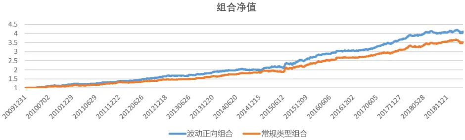

分年对冲收益
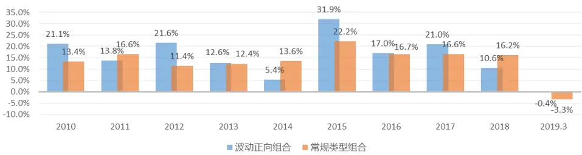
Table_Report 相关报告

eaderTable_StaementCompany东方证券股份有限公司经相关主管机关核准具备证券投资咨询业务资格，据此开展发布证券研究报告业务。

Table_ReportDate 报告发布日期2019 年 04 月 24 日

东方证券股份有限公司及其关联机构在法律许可的范围内正在或将要与本研究报告所分析的企业发展业务关系。因此，投资者应当考虑到本公司可能存在对报告的客观性产生影响的利益冲突，不应视本证券研究报告为作出投资决策的唯一因素。

Table_Autho 证券分析师朱剑涛

021-63325888*6077

zhujiantao@orientsec.com.cn

执业证书编号：S0860515060001

张惠澍

021-63325888-6123

zhanghuishu@orientsec.com.cn

执业证书编号：S0860518080001

| 公募基金产品与基金经理评价 | 2019-04-23 2019-04-22 |
| --- | --- |
| 国内公募基金历史发展与现状 |  |
| 基于因子组合FMP的因子加权方法 | 2019-04-15 |
| Alpha 预测之二：机器的比拼 | 2019-03-04 |
| 适宜快节奏的年报公告季 | 2019-02-28 |
| A 股行业内选股分析总结 | 2019-01-16 |
| 日内交易特征稳定性与股票收益 | 2019-01-14 |
| Alpha与Smart Beta | 2018-12-02 |
| 产业链与公司股价关联 | 2018-12-02 |
| A股是估值驱动还是盈利驱动？ | 2018-12-02 |
| A 股涨跌幅排行榜效应 | 2018-11-20 |
| 基于 copula 的尾部相关性研究：上尾异常 相关系数因子 | 2018-10-23 |

有关分析师的申明，见本报告最后部分。其他重要信息披露见分析师申明之后部分，或请与您的投资代表联系。并请阅读本证券研究报告最后一页的免责申明。

## 1.波动率异像

众所周知，波动率具有负向的选股效果，也就是波动率异像，图 1展示了一个月、三个月、6个月波动率因子从 2005-2019.3 在中证全指和中证 800 中的选股效果。整体来看波动率因子有着不错的选股效果，波动率较小的股票表现较好，但是从因子分组表现来看，不论在哪个样本空间中，波动率因子的多空收益都完全来源于空头端，其第一档其实并没有贡献超额收益，而第 2-4组反而超额收益较好，这个就说明如果是基于打分直接选择波动率最低的股票构建组合，那么这个组合长期是没有什么超额收益的，而如果是构建多因子模型或者是采用多因子和波动率倒数加权结合的模式，因为波动率整体有着负向的选股效果，所以还是能获得波动率贡献的超额收益的。

图 1：波动率因子表现

| 样本空间 | 因子 | rankIC | ICIR | Monthly_LSRet | Yearly_LSRet | LSMaxDown | IR |
| --- | --- | --- | --- | --- | --- | --- | --- |
| 中证全指 | Vol20 | -6.0% | -1.27 | 0.94% | 9.90% | -26.26% | 0.60 |
|  | Vol60 | -6.0% | -1.12 | 0.82% | 7.58% | -36.67% | 0.44 |
|  | Vol120 | -5.3% | -0.97 | 0.69% | 5.83% | -46.59% | 0.36 |
| 中证800 | Vol20 | -5.2% | -1.06 | 0.65% | 6.04% | -26.23% | 0.40 |
|  | Vol60 | -5.7% | -1.01 | 0.66% | 5.54% | -46.50% | 0.36 |
|  | Vol120 | -5.4% | -0.93 | 0.77% | 6.86% | -44.03% | 0.41 |

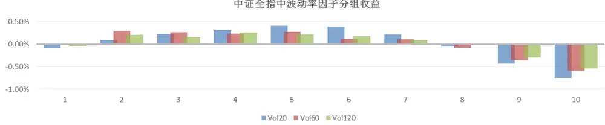

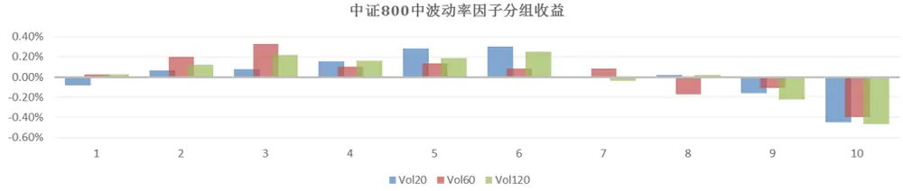
数据来源：东方证券研究所 Wind 资讯

## 2.波动率解释研究

对于波动率的异像，海外几十年来的研究也存在争议，有比较多的说法，但是并没有统一的定论，这里测试了几种主流的说法在 A 股中的实证结果，希望能对 A股波动率异像有一个更直观的理解。

## 2.1 分析师偏好

Hsu, Kudoh 和 Yamada（2013）研究发现卖方分析师的盈利预测整体是高于实际的公司盈利的，而过去高波动的股票分析师的盈利预测会相对更高，虽然投资者会对分析师整体的高盈利预测进行调整，但是盈利预测相对更高的高波动股票还是会被投资者高估，因此就会导致随后的价格修复，从而导致波动率异像。Baker 和 Haugen (2012)研究发现卖方分析师推荐股票绝对收益越高，分析师越容易获得更高的激励，因此高波动股票是分析师实现这个目的的优先选择，作者发现过去波动率较高的股票会获得更多的卖方分析师覆盖，一定程度上会助涨市场对高波动股票的需求，导致高波动股票被高估。

这里我们对上述两个解释在 A 股市场进行了测试。首先我们基于朝阳永续 2006-2019 的数据计算了股票的分析师一致预期，并构建了一致预期偏离度 EFB(earning forecast bias)，计算公式为：

$$
EFB=\frac{分析师一致预期净利润-实际净利润}{实际净资产}
$$

我们在每个报告期用样本股票过去一年(两个报告期间隔）的收益率计算波动率，并把波动率从小到大分成 10 组，计算每组的 EFB 均值，然后再统计时间序列上的分组 EFB 均值（图 2）。从结果可以看到，股票的波动率大小和同期的一致预期偏离度直观来看并没有明显的关系，但是因为EFB 的行业属性非常明显，因此最好在测试的时候调整行业的影响，我们进一步把 EFB横截面上对波动率和行业虚拟变量做回归，然后时间序列上计算波动率系数的 t_value，发现结果不显著。综合来看，实证的结果都说明 A 股的分析师一致预期并不是波动率异像的解释。

图 2：不同波动率分组下一致预期偏离度 EFB均值
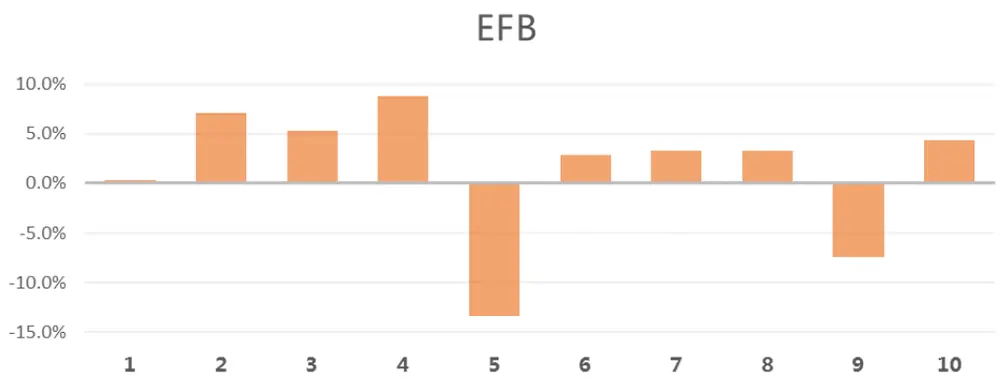
数据来源：东方证券研究所 Wind 资讯

接着我们测算了分析师覆盖度变化和同期的股票波动的关系，这里我们取过去 6 个月有报告覆盖的券商数量作为分析师覆盖因子。我们在每个月末把股票按照过去 6 个月波动率从小到大分成 10组，并计算每组的平均分析师覆盖变化 Dcov（当月末分析师覆盖-6个月前分析师覆盖）和市值调整的分析师覆盖度变化 Dcov_Adj（这是因为分析师覆盖本身会受到市值大小的影响，因此调整了市值以后更具有可比性），然后再计算每组的时间序列均值（图 3）。从结果可以看到，最低波动和最高波动的两组的分析师覆盖度均有一定的下降，可以认为过去一段时间波动特别小的股票和波动特别大的股票分析师关注度会有一定降低，这是可能是因为波动特别小的股票往往上涨动力不足而波动率太大的股票往往风险较大，所以分析师可能会一定程度上减少覆盖这类的股票，所以说 A 股并没有出现高波动的股票覆盖度变高的情况，此外分析师覆盖度变多实际上带来的是正向的 alpha，因此即使是覆盖度变高，后续依然还是有正向的 ALPHA的，并不会导致股票因为被高估而修正。

综合来看，这里测试的两点均与文献中的海外市场结果不一致，也就是说卖方分析师的关注是导致波动率异像的原因这种说法在 A 股是不成立的。

图 3：不同波动率分组下的分析师覆盖度变化(Dcov)和市值调整分析师覆盖度变化（Dcov_Adj）
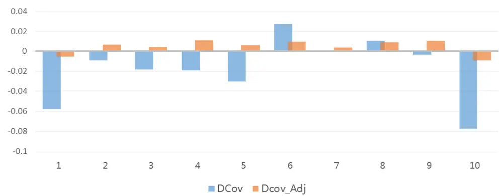
数据来源：东方证券研究所 Wind 资讯

## 2.2 投资者的彩票偏好

Blitz 和 Vliet(2007)、Baker，Bradley 和 Wurgler(2011)以及 Ilmanen(2012)研究发现高波动的股票通常也具有高的正偏度和正的极大收益（MAXRet），这种属性和彩票非常类似，而类似 CAPM模型是无法捕捉三阶矩的风险因子效果的，这也就解释了为什么 CAPM 模型不能解释高风险股票的收益。市场上的散户普遍存在彩票心理，即会偏好买入那些历史有过极高收益但高概率很小的股票，导致这种彩票型股票整体高估，因此这类股票后续会表现较差，而高波动的股票彩票属性更强，所以波动率的异像可以被投资者的彩票偏好解释。Huang、Liu、Rhee 和 Zhang（2009）研究发现特质波动率可以被短期反转所解释，在控制了短期反转之后，特质波动率和股票的期望收益之间的关系不在显著。

这里我们检验了波动率因子与反转、MAXRet 和我们之前报告《A股榜单效应研究》中提及的反映了极端收益属性的涨幅榜(DWF)因子，这里我们通过横截面回归的方式从 1 个月波动率因子中分布剥离了一个月反转（Ret1M）、一个月 MAXRet 和 DWF 因子，然后在 2006.12-2019.3 测试残差因子的选股效果，此外为了进一步剥离部分风格因素对因子的影响，我们还测试了行业市值中性化后残差因子的效果（图 4）从结果可以看到，剥离和一个月反转因子的波动率因子依然有着非常显著的选股效果，说明反转因子并不能显著的解释波动率的异像，而特质波动率等于波动率乘以特异度，其异像的来源是波动率与特异度的结合，波动率本身不能被反转所解释，但反转可以解释部分特异度中的效果，因此反转可以解释部分的特质波动率异像。而剥离了彩票属性的因子 MAXRet或 DWF 后，波动率因子的 rankIC、ICIR 均降到了 0附近，选股效果被大幅削弱了，不过多空依然还存在部分选股效果，我们认为这部分可能是由于因子中残留的风格因素导致的，从中性化后因子的值表现可以看到，剥离了 MAXRet 或 DWF 后，波动率因子完全不具备任何选股效果，也就是说波动率异像确实很大部分可以被投资者的彩票偏好所解释。

图 4：1个月波动率因子剥离其他因子后的选股效果

| 类型 | factorid | rankIC | ICIR | Monthly_LSRet Yearly_LSRet |  | LSMaxDown | IR |
| --- | --- | --- | --- | --- | --- | --- | --- |
| 原始值 | Ret1M | -0.057 | -1.233 | 0.83% | 8.29% | -30.66% | 0.51 |
|  | MAXRet | 0.016 | 0.341 | 0.85% | 8.69% | -28.74% | 0.52 |
|  | DWF | 0.006 | 0.154 | 0.59% | 5.83% | -31.79% | 0.41 |
| 中性值 | Ret1M | -0.061 | -1.818 | 1.18% | 13.97% | -15.91% | 0.99 |
|  | MAXRet | -0.007 | -0.212 | 0.03% | -0.59% | -26.88% | 0.03 |
|  | DWF | -0.006 | -0.229 | -0.08% | -1.81% | -31.73% | -0.08 |

数据来源：东方证券研究所 Wind 资讯

## 2.3 投资者对基金产品的偏好

投资业绩对资产管理规模的刺激作用。Chevalier 和 Ellison(1997)、Sirri 和 Tufano(1998)研究发现而少量业绩较好的产品可以得到较大规模的增长，而高波动股票更容易实现短线的好业绩，因此有部分资产管理公司会倾向于购买高波动股票。这样同样也会导致高波动股票的价格被高估。

我们根据 2007.12到 2019.3偏股型和普通股票型产品的季度数据（这里统计 1个亿规模及以上的基金产品）计算了产品规模增长和产品收益和波动的关系，这里我们定义产品规模增长率 $\mathrm{IFLOW_{i,t}}$ 为：

$$
\begin{array}{r}{FLOW_{i,t}=\frac{TNA_{i,t}-TNA_{i,t-1}*(1+R_{i,t})}{TNA_{i,t-1}}.}\end{array}
$$

其中 $TNA_{i.t}$ 为第 i 个基金产品在 t 时刻的资产净值， $R_{i,t}$ 为基于复权单位净值计算的收益率，这里忽略了分红对资产净值的影响。

图 5：基金产品收益分组与平均规模增长的关系
产品收益率与同期和下期规模增长的关系
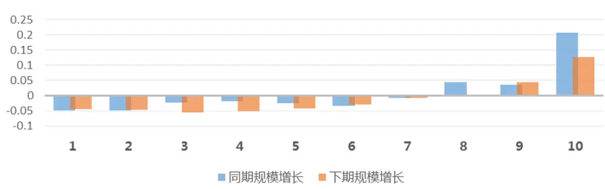
数据来源：东方证券研究所 Wind 资讯

我们首先比较了基金收益率与同季度和下季度规模增长的关系，我们按照收益率的大小把基金分成 10 组，计算每组的规模增长均值，并在时间序列上计算每组的均值（图 5）。从结果看，我们发现基金的规模增长与收益率呈现出很强的单调性，但是最大的增长主要集中在头部的 10%，说明投资者会更加关注短期业绩极好的基金产品。

从波动率的角度来看，我们比较了产品波动率与同期和下期规模增长的关系，波动率与同期和下期超额收益率的关系，以及波动率与每组中超额收益最高的 3个产品的超额收益均值（MAXRet）的关系（图 6）。首先可以看到高波动的产品不论是同期还是下期都可以获得较高的规模增长，然而产品的波动本身与同期的超额收益并没有显著的关系，且波动较高的产品下季度的平均收益率反而较低，那么为什么高波动的产品平均还能获得较大的规模增长呢，这是因为短期收益较高的明星产品多集中在高波动的分组中，而对于这部分产品，规模增长是非常快的。从 MAXRet 与波动的关系可以看到，最高波动分组中收益最好的 3 个产品的平均收益率最高，而这类产品更容易获得极高的短期规模增长，因此投资者对于基金产品的彩票偏好会导致部分基金倾向于投资高波动的股票以博取短期的规模增长，从而使得高波动股票被高估。

图 6：基金产品波动率与规模增长、收益的关系
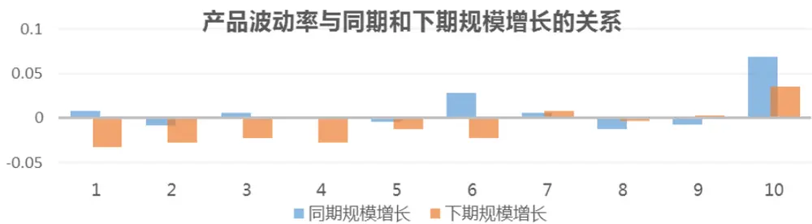

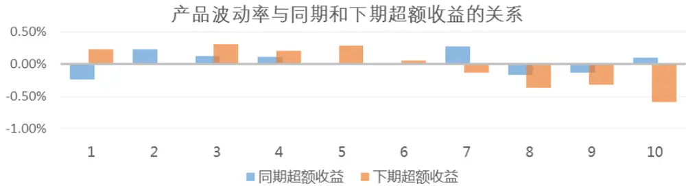

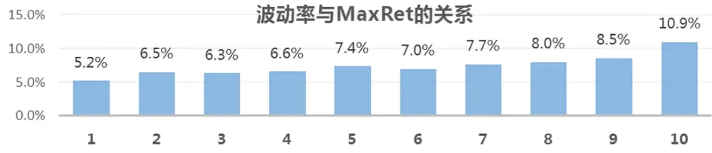
数据来源：东方证券研究所 Wind 资讯

## 2.4 套利非对称性

Stambaugh, Yu和 Yuan (2015)，研究发现特质波动率之谜可以通过套利非对称性解释，而套利非对称性的主要来源是投资者的风险厌恶和做空限制。首先对于期望收益率相近的股票，投资者更愿意持有风险较小的，这是由于理性投资者的风险厌恶导致的。而由于投资者的做空限制，买进低估的股票要比卖空被高估的股票容易，因此，被低估的错误定价比较容易被修复，而被高估的错误定价相对来说更难修复。

根据作者的理论，我们首先把股票分成高估和低估的两类，存在高估和低估可能是由于投资者的错误定价或者是过度投机等因素导致的。对于低估的股票部分，假设两个股票的期望收益率接近，那么投资者会更加倾向于买入特质波动率较低的低风险股票，因此低特质波动率的股票相对的修复程度就较高，低估程度就较低，而高特质波动率股票因为修复程度较低，低估程度较高，所以后续的收益反而较高。因此在低估的股票中，收益和特质风险的曲线斜率是向上的。在高估的股票部分，假设两个股票的期望收益率接近，那么套利投资者会更加倾向于卖出特质波动率较低的低风险股票，因此低特质波动率的股票相对的修复程度就较高，高估程度就较低，而高特质波动率股票因为修复程度较低，高估程度较高哦，所以后续的收益反而较低。因此在高估的股票中，收益和特质风险的曲线斜率是向下的。

图 7：构建合成因子所用的 ALPHA 因子列表

| 类型 | 因子代码 | 因子说明 |
| --- | --- | --- |
| 估值 | BP | 账面市值比 |
|  | EP | 归属母公司的净利润TTM/总市值 |
|  | CFP | 经营性现金流TTM/总市值 |
|  | EBIT2EV | 息税前利润与企业价值之比 |
|  | DP2 | 过去一年分红/总市值，以分红预案公告日为准 |
| 盈利能力 | RNOA | 净经营资产收益率 |
|  | CFROI | 投资现金收益率 |
|  | ROE | 净资产收益率 |
|  | GPOA | 总资产毛利率 |
| 业绩超预期 | UP | 预期外的RNOA |
|  | SUEO | 基于带漂移项随机游走模型计算的预期外的净利润，详见《业绩超预期类因子》 |
|  | SUE1 | 基于不带漂移项随机游走模型计算的预期外的净利润，详见《业绩超预期类因子》 |
|  | SURO | 基于带漂移项随机游走模型计算的预期外的营业收入，详见《业绩超预期类因子》 |
|  | SUR1 | 基于不带漂移项随机游走模型计算的预期外的营业收入，详见《业绩超预期类因子》 |
| 公司治理 | MR | 高管薪酬前三之和的对数 |
| 非流动性 | TO20 | 过去20个交易日的日均换手率对数 |
|  | ILLIQ | 20日Amihud非流动性自然对数 |
| 反转 | RET20 | 过去20个交易日的收益率 |
|  | P2HIGH | 当前价格除以过去243个交易日的最高价 |
| 分析师预期 | COV | 过去6个月有覆盖的机构数量，取根号 |
|  | DISP | 过去6个月盈利预测的分歧度 |
|  | EP_FY1 | 预期的估值 |
|  | PEG | PE_FY1/FY2隐含的利润增量率 |
|  | SCORE | 综合评价 |
|  | TPER | 目标价隐含的收益率 |
|  | WFR | 加权的预期调整 |

数据来源：东方证券研究所

根据以上的推论，在高估和低估的股票中，特质波动率和收益率呈现出负向和正向的关系。那么为什么整体看来特质波动率有显著的负向选股效果？作者认为这是因为由于做空限制，做空高估股票相对更加困难，而做多低估股票相对容易，这就导致了高估股票中低特质波动股票被修复的程度更大，因此负向斜率更陡，而低估股票中高低特质波动股票被修复的分化程度较低，从而正向斜率较平。因此两者综合的作用就导致了特质波动率整体有明显的负向选股效果。

特质波动反映的是股票的非系统风险，而波动率反映的是股票的总风险，因此上面的推论也可以很好的被用来解释波动率的异像。与作者测试海外市场类似，我们用因子库中的 ALPHA因子（除了波动、特质波动、MaxRet 等投机性因子），如图 7所示，我们通过大类等权合成的方法得到股票的综合得分，这个得分的高低其实就反映了股票的高低估情况，得分较高的股票理论上是被低估的，比如估值低的股票表现好本质上是因为这部分股票低估带来的估值修复；高超预期股票表现好，是因为相对于公司更高的增长，股票当前的价格被低估了；反转因子有效是因为过度反应导致跌的多的股票被低估，从而有价格修复，而涨的多的股票被高估，从而有后续的下跌。所以本质上来说，我们的 ALPHA度量的都是股票在某个维度被高低估的程度。因此，综合得分对于股票高低估的划分会更加准确，这里我们把股票按照综合得分分成 10组（第一组为得分最低的高估股票），在不同的组中按照波动率（特质波动率）再分成 5组，计算每个小组中的低波动（低特质波动）组合减去高波动（高特质波动）组合的下个月的收益情况，然后在时间序列上取平均，测试的区间为2006.12-2019.3，这里我们分别测试一个月（Vol20）、3 个月（Vol60）、6 个月（Vol120）的波动率（图 9）和特质波动率（图 10）的非对称特性。

从图 8的结果来看，很明显可以看到，在第一组高估的股票中，低波减去高波组合的多空收益非常明显，均在 1%以上，也就是说在高估的股票中，低波动股票表现远好于高波动股票，且强于全市场的结果。而在第十组低估股票中，波动率的表现明显反过来了，低波动减去高波动组合的多空收益均小于 0，1个月波动率的多空月收益为-0.4%，3个月波动为-0.77%，而 6个月波动为-0.86%，这就说明了在低估的股票中，过去高波动的一组股票平均表现更好。此外，可以注意到基本在 1-5组高估的股票中，波动率的多空组合均有正向的收益，而在 6-10 组低估的股票中，波动率的多空组合均为负向，而因为负向效果的收益更强，所以综合起来波动率呈现出负向的选股效果。进一步看低波和高波组合在分组内的超额收益，可以看到在高估的组中，低波的超额收益要远大于高波的负超额，但是在最低估的组中，高波的超额收益要大于低波的负超额，也就是说在低估股票中波动率多空组合的收益主要是高波动股票贡献的。这里还展示了第一组和第十组按波动率从小到大的分档超额收益，可以发现在第一组中分档是单调下降的，而在第十组中分档是单调上升的。这些结论与上面的推论是相一致的，这也就是说在低估的股票中，也可以一定程度上考虑持有高波动的股票。然而我们还注意到一点，虽然多空组合和分档超额收益展示出了很好的结果，但是从 rankIC上来看在第十组中并没有显著为正，这也就说整体来看多空和分档收益的结果可能是由于分组中间的部分股票表现较好所带来的，因此整体来看收益和波动率在第十组的秩相关并没有显著为正。

图 9 展示了特质波动率的结果，可以看到一个月和 3 个月的特质波动率，虽然在低估股票中也有高特质波动好于低特质波动的结果，但是超额收益主要由低波动贡献，6个月特质波动在低估股票中的高特质波动组表现较好，有明显的超额收益率，不过整体来看，在低估的股票中，高特质波动率股票的超额收益不明显，且从 rankIC 和分组超额收益来看，基本在第十组中也没有明显的特质波动和收益的关系。我们认为这是因为上面的理论虽然是针对特质波动率的而言的，但是绝大多数投资者会更加关注股票的整体风险，因此就会导致波动率的套利非对称性更加显著。

图 8：波动率因子在得分分组内下月的表现

| 因子 | 类型 | 1 | 2 | 3 | 4 | 5 | 6 | 7 | 8 | 9 | 10 |
| --- | --- | --- | --- | --- | --- | --- | --- | --- | --- | --- | --- |
| Vol20 | rankIC | -9.58% | -6.29% | -6.61% | -4.58% | -3.59% | -3.13% | -1.93% | 0.06% | -0.38% | -0.25% |
|  | 多空月收益 | 1.31% | 0.83% | 0.89% | 0.58% | 0.27% | -0.38% | -0.27% | -0.67% | -0.62% | -0.41% |
|  | 低波组合超额 | 0.60% | 0.34% | 0.15% | 0.15% | -0.22% | -0.37% | -0.33% | -0.44% | -0.55% | -0.16% |
|  | 高波组合超额 | -0.71% | -0.49% | -0.74% | -0.43% | -0.49% | 0.01% | -0.06% | 0.23% | 0.07% | 0.25% |
| Vol60 | rankIC | -8.50% | -5.55% | -5.74% | -3.17% | -2.32% | -1.90% | -1.84% | -0.41% | 0.22% | 0.16% |
|  | 多空月收益 | 1.28% | 0.69% | 0.81% | 0.21% | -0.11% | -0.46% | -0.30% | -0.85% | -0.79% | -0.77% |
|  | 低波组合超额 | 0.59% | 0.20% | 0.29% | 0.06% | -0.22% | -0.35% | -0.38% | -0.50% | -0.47% | -0.37% |
|  | 高波组合超额 | -0.68% | -0.48% | -0.52% | -0.15% | -0.11% | 0.11% | -0.08% | 0.34% | 0.32% | 0.40% |
| Vol120 | rankIC | -7.55% | -4.65% | -4.62% | -2.16% | -1.94% | -1.09% | -0.69% | 0.67% | 0.61% | 0.03% |
|  | 多空月收益 | 1.19% | 0.43% | 0.41% | -0.10% | -0.09% | -0.77% | -0.40% | -0.90% | -0.83% | -0.86% |
|  | 低波组合超额 | 0.41% | 0.14% | 0.09% | -0.13% | -0.26% | -0.58% | -0.39% | -0.51% | -0.40% | -0.31% |
|  | 高波组合超额 | -0.77% | -0.29% | -0.33% | -0.03% | -0.17% | 0.18% | 0.01% | 0.39% | 0.43% | 0.55% |

一个月波动率在低估和高估组中分组收益
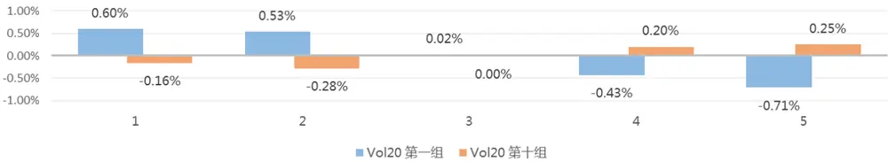

三个月波动率在低估和高估组中分组收益
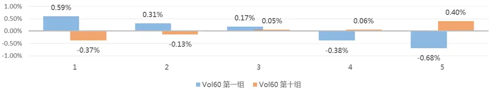

六个月波动率在低估和高估组中分组收益
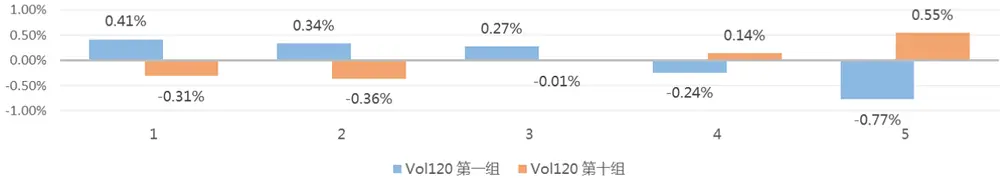
数据来源：东方证券研究所 Wind 资讯

图 9：特征波动率因子在得分分组内下月的表现

| 因子 | 类型 | 1 | 2 | 3 | 4 | 5 | 6 | 7 | 8 | 9 | 10 |
| --- | --- | --- | --- | --- | --- | --- | --- | --- | --- | --- | --- |
| iVol20 | rankIC | -13.05% | -10.79% -10.20% |  | -9.46% | -8.26% | -7.23% | -6.05% |  | -4.51% -3.88% | -2.15% |
|  | 多空月收益 | 2.56% | 2.21% | 1.77% | 1.81% | 1.30% | 0.83% | 0.95% | 0.70% | 0.31% | -0.02% |
|  | 低波组合超额 | 1.40% | 1.07% | 0.95% | 0.88% | 0.44% | 0.42% | 0.19% | 0.43% | 0.05% | -0.06% |
|  | 高波组合超额 | -1.16% | -1.14% | -0.82% | -0.92% | -0.86% | -0.40% | -0.75% | -0.27% | -0.25% | -0.04% |
| iVol60 | rankIC | -10.91% | -8.37% | -8.06% | -6.22% | -5.42% | -4.79% | -4.34% | -3.05% | -2.51% | -0.84% |
|  | 多空月收益 | 1.87% | 1.51% | 1.32% | 1.06% | 0.58% | 0.43% | 0.50% | 0.31% | 0.01% | -0.20% |
|  | 低波组合超额 | 1.10% | 0.78% | 0.66% | 0.51% | 0.34% | 0.30% | 0.05% | 0.13% | -0.04% | -0.22% |
|  | 高波组合超额 | -0.76% | -0.73% | -0.66% | -0.56% | -0.24% | -0.13% | -0.45% | -0.18% | -0.05% | -0.02% |
| iVol120 | rankIC | -9.11% | -6.37% | -6.06% | -4.29% | -3.32% | -3.18% | -2.65% | -0.85% | -1.08% | -0.57% |
|  | 多空月收益 | 1.48% | 0.88% | 0.81% | 0.54% | 0.13% | -0.01% | 0.10% | -0.51% | -0.16% | -0.57% |
|  | 低波组合超额 | 0.74% | 0.58% | 0.57% | 0.32% | 0.06% | 0.06% | -0.06% | -0.22% | 0.00% | -0.21% |
|  | 高波组合超额 | -0.74% | -0.30% | -0.25% | -0.22% | -0.07% | 0.07% | -0.16% | 0.30% | 0.17% | 0.35% |

一个月特质波动率在低估和高估组中分组收益
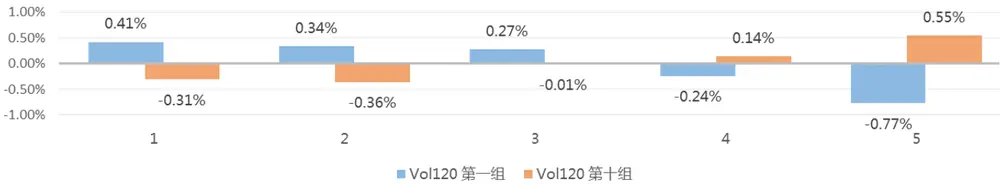

三个月特质波动率在低估和高估组中分组收益
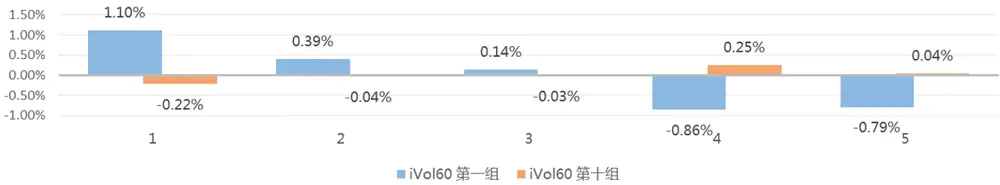

六个月特质波动率在低估和高估组中分组收益
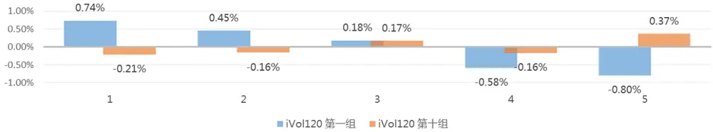
数据来源：东方证券研究所 Wind 资讯

当然光从结果上并不能断定这个现象是由于低估中的低波动股票在前期价格修复更多而导致的，这里我们做了进一步的证明。我们首先测试了每个得分分组中按波动率分成 5 组的上月收益情况（图 10），从结果可以很明显的看到在高估股票中，同期的波动率和收益的关系是正向的，这是因为投资者更多的卖出高估组中低波动股票，因子这部分股票同期表现较差，高估程度较低；而在低估组中，同期的波动率和收益关系是负向的，也就是说低估股票中低波动的股票倾向于上月涨幅较高，价格修复的程度也更大。我们进一步从基金前 10重仓股的层面来测试，我们在每个得分分组下，测试基金重仓股在组内的 3 个月波动率暴露（图 11），当然在测试的过程中我们发现高估组中的股票基金持仓占比非常少，这是因为这类股票是高估值、低成长、低盈利能力等这类的劣质股，基金基本很少持有这类股票，所以最高估两组可能不具备足够参考价值，整体来看可以发现在偏高估的组中基金的历史波动率暴露偏正向，而在低估组中偏负向，特别是在最低估组中波动率暴露为-0.25，也就是说基金也倾向于买入低估股票中的同期低波动股票，就会导致这部分股票价格修复较多，后续的高波动表现较好。这两点测试的结果均与上述的理论是一致的。

图 10：波动率因子在得分分组内上月表现情况

| 因子 | 类型 |  | 2 | 3 | 4 | 5 | 6 |  | 8 | 9 | 10 |
| --- | --- | --- | --- | --- | --- | --- | --- | --- | --- | --- | --- |
| Vol20 | rankIC | 41.61% | 25.21% | 19.41% | 15.71% | 12.49% | 8.38% | 5.63% | 2.43% | -1.84% | -5.04% |
|  | 多空月收益 | -20.42% | -8.85% | -6.06% | -5.23% | -3.95% | -2.63% | -2.01% | -1.05% | 0.03% | 1.07% |
|  | 低波组合超额 | -7.23% | -3.03% | -1.79% | -1.61% | -1.02% | -0.69% | -0.36% | 0.07% | 0.50% | 0.93% |
|  | 高波组合超额 | 13.18% | 5.82% | 4.27% | 3.63% | 2.93% | 1.94% | 1.65% | 1.12% | 0.47% | -0.14% |
| Vol60 | rankIC | 18.01% | 0.76% | -3.72% | -5.80% | -7.01% | -9.81% | -10.85% | -12.29% | -14.60% | -15.02% |
|  | 多空月收益 | -11.06% | -1.69% | 0.00% | 0.35% | 0.89% | 1.49% | 1.93% | 2.08% | 2.75% | 2.96% |
|  | 低波组合超额 | -4.95% | -1.16% | -0.29% | -0.09% | 0.29% | 0.54% | 0.72% | 0.85% | 1.19% | 1.47% |
|  | 高波组合超额 | 6.11% | 0.53% | -0.29% | -0.44% | -0.60% | -0.95% | -1.22% | -1.24% | -1.56% | -1.49% |
| Vol120 | rankIC | 9.64% | -5.75% | -9.36% | -10.83% | -11.62% | -13.37% | -14.62% | -15.51% | -17.02% | -17.44% |
|  | 多空月收益 | -7.14% | 0.50% | 1.62% | 1.72% | 1.99% | 2.78% | 2.76% | 3.04% | 3.27% | 3.54% |
|  | 低波组合超额 | -3.72% | -0.43% | 0.51% | 0.55% | 0.82% | 1.13% | 1.08% | 1.26% | 1.44% | 1.75% |
|  | 高波组合超额 | 3.42% | -0.93% | -1.11% | -1.17% | -1.17% | -1.65% | -1.68% | -1.78% | -1.83% | -1.80% |

数据来源：东方证券研究所 Wind 资讯

图 11：基金重仓股在得分分组内的波动率暴露
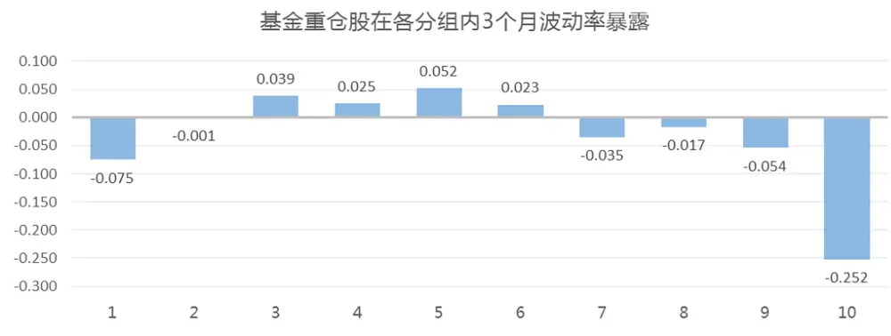
数据来源：东方证券研究所

套利非对称性虽然在 1 个月的持有期中有效，但是很多低波动相关的策略持有期都较长，所以我们这边也分别测试了 3个月波动、6个月波动持有期 3个月和 6个月波动持有期 6个月的结果（图12）。我们发现持有期拉长后，多空收益明显变弱，且从整体的 rankIC上看，第十组的 rankIC均为负，也就是说在持有期偏长的组合或指数中，波动率倒数加权应该依然是要好于波动率加权的。

图 12：波动率因子在得分分组内不同持有区间的表现

| 因子 | 持有期 | 类型 |  | 2 | 3 | 4 | 5 | 6 |  | 8 | 9 | 10 |
| --- | --- | --- | --- | --- | --- | --- | --- | --- | --- | --- | --- | --- |
| Vol60 | 3个月 | rankIC | -11.56% | -8.16% | -6.22% | -6.02% | -5.55% | -4.23% |  | -2.61% -3.91% | -3.15% | -2.96% |
|  |  | 多空月收益 | -4.38% | -2.97% | -1.44% | -0.58% | -0.32% | -0.10% | 0.74% | 0.94% | 0.66% | 0.53% |
|  |  | 低波组合超额 | 2.10% | 1.52% | 0.58% | 0.18% | -0.21% | 0.32% |  | -1.38%-1.04% | -1.24% | 0.05% |
|  |  | 高波组合超额 | -2.28% | -1.45% | -0.86% | -0.40% | -0.53% | 0.23% | -0.64% -0.11% |  | -0.59% | 0.59% |
| Vol120 | 3个月 | rankIC | -11.66% | -7.80% | -6.04% | -5.14% | -5.06% | -3.77% |  | -2.51%-1.78% | -2.12% | -2.02% |
|  |  | 多空月收益 | 4.40% | 2.49% | 1.38% | 0.53% | 0.99% | -0.47% |  | -0.87%-2.13% | -0.82% | -1.87% |
|  |  | 低波组合超额 | 2.07% | 1.02% | 0.46% | -0.22% | -0.19% | -0.39% |  | -1.09%-1.64% | -1.33% | -0.69% |
|  |  | 高波组合超额 | -2.33% | -1.47% | -0.92% | -0.75% | -1.18% | 0.08% | -0.22% | 0.49% | -0.51% | 1.18% |
| Vol120 | 6个月 | rankIC | -12.31% | -11.08% | -10.36% | -7.50% | -6.77% | -4.63% |  | -3.19% -1.90% | -1.28% | -5.97% |
|  |  | 多空月收益 | 6.36% | 5.68% | 3.41% | 0.92% | 3.29% | 0.02% |  | -2.24%-4.71% | -4.32% | -1.62% |
|  |  | 低波组合超额 | 2.41% | 1.50% | 1.55% | -0.53% | 1.41% | 0.11% | -1.30% | -2.76% | -3.24% | 0.01% |
|  |  | 高波组合超额 | -3.95% | -4.18% | -1.86% | -1.45% | -1.88% | 0.09% | 0.94% | 1.95% | 1.09% | 1.63% |

数据来源：东方证券研究所 Wind 资讯

这里我们为了更好的度量股票的高估和低估，用的是多个维度的因子合成的大类因子，这个做法与文献上是类似的。我们进一步测试了按照每个大类因子分档后的一个月套利非对称性（图 13），我们发现整体来看在低估的股票中，波动率的多空都会较弱，但是仅在估值、反转和分析师中有比较明显的效果。当然这个和理论并不矛盾，首先盈利能力和运营因子原始值几乎没有选股效果，不怎么能区分因子是否高低估，再有上述理论说的是在理想的低估股票中波动具有这个特性，因此对于高低估度量的越准确，套利非对称性就能观察的更明显，而合成因子的对于股票高低估的度量是要明显比单个大类因子更加准确的，因此观察到的特性就更加明显。

图 13：波动率因子在各大类因子分组内下月表现

| 因子 | 多空月收益 | Value | Surprise Profitibility Operation Reversal Analyst Illiquidity |  |  |  |  |  | 股息率 |
| --- | --- | --- | --- | --- | --- | --- | --- | --- | --- |
| Vol20 | 第一组 | 1.75% | 1.31% | 1.68% | 1.29% | 2.43% | 1.34% | 0.40% | 1.08% |
| Vol60 | 第十组 | -0.06% | 0.39% | 0.69% | 0.51% | -0.04% | -0.19% | 0.28% | -0.07% |
|  | 第一组 | 1.51% | 0.61% | 1.10% | 0.99% | 2.26% | 1.30% | 0.40% | 0.83% |
| Vol120 | 第十组 | -0.28% | 0.14% | 0.65% | 0.35% | -0.19% | -0.28% | 0.03% | -0.12% |
|  | 第一组 | 1.43% | 0.46% | 0.80% | 1.17% | 1.64% | 1.13% | 0.73% | 0.78% |
|  | 第十组 | -0.50% | 0.00% | 0.19% | -0.08% | -0.53% | -0.50% | -0.53% | -0.57% |

数据来源：东方证券研究所 Wind 资讯

在因子原始值中，波动率的非对称性是存在的，但是如果要构建指数增强组合，我们需要对因子做行业市值中性化，因此我们进一步对中性化后的因子进行测试，为了保持一致性，这里的波动率因子也采用的是中性化后的波动率。结果基本和原始值类似，说明这个波动率的这种非线性特质在中性化后依然存在（图 14）。

图 14：行业市值中性化的波动率因子在中性化得分分组内下月表现

| 因子 | 类型 | 1 | 2 | 3 | 4 | 5 | 6 | 7 | 8 | 9 | 10 |
| --- | --- | --- | --- | --- | --- | --- | --- | --- | --- | --- | --- |
| Vol20 | rankIC | -7.81% | -5.84% | -6.71% | -4.99% | -4.26% | -4.32% | -4.05% |  | -2.26%-1.11% | -1.00% |
|  | 多空月收益 | 0.93% | 0.57% | 1.04% | 0.47% | 0.57% | 0.69% | 0.35% |  | -0.03%-0.09% | -0.08% |
|  | 低波组合超额 | 0.41% | 0.29% | 0.44% | -0.04% | 0.11% | 0.20% | -0.16% |  | -0.11%-0.07% | -0.09% |
|  | 高波组合超额 | -0.52% | -0.28% | -0.60% | -0.51% | -0.46% | -0.50% | -0.51% | -0.09% | 0.02% | -0.01% |
| Vol60 | rankIC | -6.67% | -5.11% | -5.88% | -3.88% | -3.75% | -3.01% | -2.87% |  | -1.70% -1.00% | -0.81% |
|  | 多空月收益 | 0.77% | 0.37% | 0.72% | 0.26% | 0.28% | 0.05% | 0.03% |  | -0.33%-0.29% | -0.58% |
|  | 低波组合超额 | 0.29% | 0.28% | 0.49% | -0.09% | 0.08% | 0.00% | -0.27% |  | -0.12%-0.13% | -0.21% |
|  | 高波组合超额 | -0.48% | -0.08% | -0.23% | -0.34% | -0.19% | -0.06% | -0.31% | 0.21% | 0.16% | 0.37% |
| Vol120 | rankIC | -6.60% | -4.14% | -4.94% | -3.34% | -3.06% | -2.21% | -2.14% |  | -1.04%-0.24% | -0.71% |
|  | 多空月收益 | 0.83% | 0.13% | 0.57% | 0.10% | 0.11% | -0.06% | -0.19% |  | -0.51%-0.63% | -0.73% |
|  | 低波组合超额 | 0.31% | 0.00% | 0.23% | -0.01% | 0.00% | -0.22% | -0.31% | -0.27% | -0.32% | -0.26% |
|  | 高波组合超额 | -0.52% | -0.14% | -0.34% | -0.11% | -0.10% | -0.16% | -0.12% | 0.23% | 0.31% | 0.47% |

一个月波动率在低估和高估组中分组收益
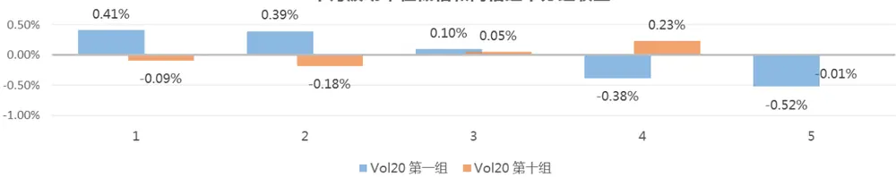

三个月波动率在低估和高估组中分组收益
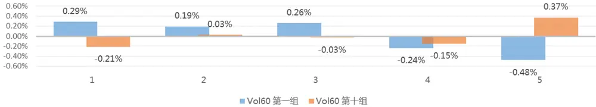

六个月波动率在低估和高估组中分组收益
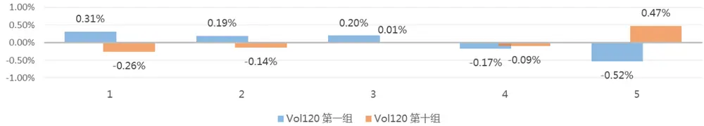
数据来源：东方证券研究所 Wind 资讯

此外，还有一个投资者比较关心的问题就是这种波动率非线性的特征在时间上是否稳定，是不是由于少数几个时间上的异常样本导致的，这里我们测试第十组中三个波动率因子不同年份的多空月收益均值（图 15）。基本上可以看到，在市场较差的年份（2008、2011、2018），第十组低估股票组中还是低波动要好于高波动的，但是在市场较好的年份，高波动是更优的，且大多数年份均是高波更优，这是因为市场整体是向上的。上述理论同样可以解释这个现象，理论认为投资者在买入低估股票时，因为期望收益类似，所以先买入低波动的，导致低波动的价格修复更多，然而在下跌的市场环境下，投资者本身买入股票的意愿也会大幅下降，这样即使是低波动的股票，投资者的买入意愿也会大幅降低，这样就会降低低波动股票的修正程度，从而这个特性被大幅削弱。而在市场较好的时候，正好相反，低波动的股票修正幅度会更大，从而高波动股票后续表现更好，因此通常来说这种波动率的非线性特征在市场较好的时候更加明显。长期来看，经济转型和改革的效率和速度都远高于预期，未来的经济增长依旧可期，所以从长时间来看 A 股应该还是整体向上的，所以这种利用波动率非线性特征在优质股中一定程度上配置高波动的策略理论上长期看还是有一定的价值的。

图 15：不同年份第十组（低估股票）内低波动减去高波动组合月均多空收益
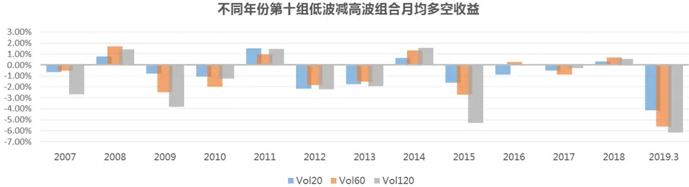
数据来源：东方证券研究所 Wind 资讯

## 2.5 波动率的延续性

根据传统的经济学理论，高风险应该具有更高的收益，但是波动率的异像与这个说法存在矛盾，过去高波动的股票未来的超额收益反而较低，但我们认为其实在波动这个层面，传统的理论其实并未失效。这是因为同期的波动是与股票的收益呈正比关系的，也就是说同期来看确实是高风险高收益的，这符合传统的理论，然而过去高波动的股票未必就是未来高波动的股票，所以收益上并不一定能战胜平均水平。

我们基于 A 股 2005.1-2019.3 月的数据测算了历史低波动和高波动股票在未来的波动分布情况。我们在每个月末按照过去一个月的股票波动率从小到大把股票分成 20组，然后计算最低波动股票（第一组）、最高波动股票（第 20 组）和第九组（中间组）股票在下个月处在各个波动率分组中的占比，然后时间序列上对这个占比取平均计算历史分布情况（图 16）。

图 16：历史波动率从小到大分组中第 1组（Low）、第 9组（Med）和第 20组（High）股票在下月波动率分组内的分布情况
历史波动率分组在下期的平均分布
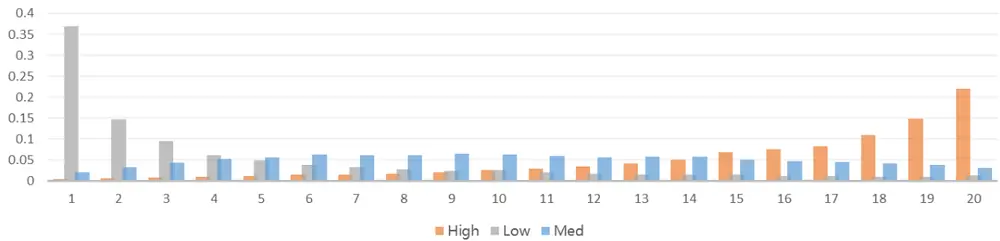

每个波动率分组下波动率均值（%）
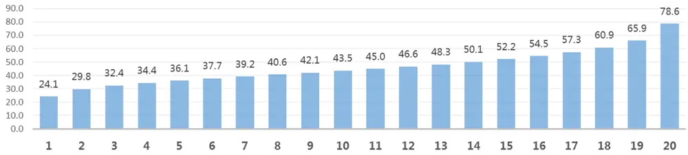
数据来源：东方证券研究所 Wind 资讯

可以很明显的看到，上期最低波动股票在下期有 37%还在第 1组中，且 50%的比例下期仍然在第1 和第 2 组中；而上期最高波动股票在下期只有 21%在第 20 组，且 50%分布在 17-20 组中；中等波动股票在下期基本上以一个正态分布的形式分布在第 9 组的两侧。这也就是说历史低波动的股票大概率下期还是波动较低，而历史高波动的股票有很大一部分下期波动率会降低。然而根据高波动高收益的理论来说，虽然高波动分组的股票波动下降了，而低波动分组的股票波动有一定的上升，但是高波动分组的股票下期仍然整体波动较高，那么为什么其下期收益反而较低呢？这个就涉及到波动率的另一个可能的特征了，我们认为波动率本身确实与同期收益有正相关关系，但是同期波动率的变化也应该也与收益率存在一定的关系，理论上说低波动的股票波动率上升是因为市场在同期给予了更多的关注，所以这类股票倾向于表现较好，而高波动的股票波动率下降是因为没有持续关注股票的资金来维持这类股票的高波动了（因为这类股票前期关注很大，整体偏高估了），因此这类股票的收益会有所下降。为了证明我们这个观点，我们测试了 2005.1-2019.3股票的横截面收益率和同期波动率(Vol)、波动率变化(Delta_Vol)的关系，这里都按照月度的时间尺度进行测算，Delta_Vol 是用股票当月的波动率减去上月的波动率计算的。按照 Fama_Macbeth 回归的方法，我们在每月末把股票截面收益率对同期的波动和波动率变化做回归，并检验了回归系数在时间序列上的显著性（图 17）。从结果来看 Vol 和 Delta_Vol 均与同期的收益率有显著的线性关系，两者系数相差不多，且 t-value均十分显著，回归的平均 Adj_Rsquare 为 17.5%。这个测试结果与上面的推论是一致的，对于低波动的股票而言，下期一部分股票波动处在相对高的位置，收益会提高，且波动的提升本身也会贡献正的收益，两者叠加就是低波动股票的下期收益，但因为历史低波动股票下期波动的提升并不多，所以整体来看低波动股票收益率并不算高；对于高波动股票而言，下期有很大一部分会变成中高波动，下降的比例较高，且因为波动率的分布本身是偏态的（图 16），这部分股票波动率下降的绝对数值较多，因此这部分波动下降会带来较大的收益损失，加上这部分股票当期的波动率分布贡献的收益，就是高波动股票的总体收益；而中波动股票下期分布较为均匀，波动上升和下降部分带来的收益基本抵消，而这类平均的下期波动水平依然处在中间，所以由波动率本身带来的收益贡献是要高于低波动股票的两个收益来源总和的，因此收益会略高于低波动股票。

图 17：股票波动率（Vol）、波动率变化（Delta_Vol）与同期横截面收益率的关系

|  | intercept | Vol | Delta_Vol Adj_Rsquare |
| --- | --- | --- | --- |
| Coef. | -0.0473 | 0.0015 | 0.0014 17.50% |
| t-value | -10.07 | 11.89 | 18.77 |

数据来源：东方证券研究所

基于上面的测试结果，可以估算出波动率因子的收益表现，以第一组低波动组为例，其估算的因子收益率公式如下：

$$
\begin{aligned}收益率=\sum 每组波动率*每组的股票占比*\mathsf{Vol}系数\ \ \ \ \ \ \ \ \ \ \ \ \ \ \ \ \ \ \ \ \ \ \ \ \ \ \ \ \ \ \ \ \ \ \ \ \ \ \ \ \ \ \ \ \ \ \ \ \ \ \ \ \ \ \ \ \ \ \ \ \ \ \ \ \ \ \ \ \ \ \ \ \ \ \ \ \ \ \ \ \ \ \ \ \ \ \ \ \ \ \ \ \ \ \ \ \ \ \ \ \ \ \ \ \ \ \ \ \ \ \ \ \ \ \ \ \ \ \ \ \ \ \ \ \ \ \ \ \ \\end{}\end{aligned}
$$

计算得到第一组的因子收益率为 6.5%，相同方法可以估算第 9组收益率为 7.5%，而第 20组的收益率为-2%。这个估算结果因为是用的历史平均的参数，且估算的是因子收益，因此量级会和第一章因子测试中的结果有差距，但是从分布来看，确实可以部分的解释为什么因子测试时第一组的收益较低，3-4组的收益较高，而第 10组的收益非常低的形态成因。

我们进一步在序列上检验波动率延续性对于同期波动率因子多空收益的解释程度，我们把多空收益对 Fama_French 3因子和历史最低波动股票下期在第一组的比例（Low）以及历史最高波动股票下期在第 20组的比例（High）做回归（图 18）。可以看到 Low的 pvalue为 0.001，且方向为负，说明低波动股票延续低波动的比例越高，波动率因子的多空表现就会较差；而 High的 pvalue为 0.011，方向也为负，说明高波动股票延续高波动的比例越高，波动率因子的多空表现就会较差。综合来看，这个因素确实是可以在除了风格以外的因素外显著的解释一部分波动率的多空收益情况。

图 18：波动率因子多空收益对 Fama_French 因子和波动率延续性指标回归结果

|  | intercept | HML | MKT | SMB | High | Low | Adj_Rsquare |
| --- | --- | --- | --- | --- | --- | --- | --- |
| coef. | 0.044 | 0.302 | -0.183 | -0.178 | -0.064 | -0.062 | 53.1% |
| t_value | 5.065 | 6.716 | -7.103 | -4.856 | -2.589 | -3.288 |  |
| p_value | 0 | 0 | 0 | 0 | 0.011 | 0.001 |  |

数据来源：东方证券研究所 Wind 资讯

## 3.组合层面对比

基于上面的结论，波动率异像可能的主要原因还是因为投资者的彩票偏好和套利非对称性，但是不管是哪个维度解释，都是因为历史波动率较高的股票容易被高估，而低波动股票容易被低估，因此会存在一定的的价格修复。

## 3.1 主动量化组合对比

这里基于波动率的套利非对称的特点，尝试对现有的主动量化组合进行一定的改进。传统的主动量化组合通常用波动率的负方向和其他因子合成，或者采用波动率倒数加权的方式赚取波动率负向的收益，这里的 2、4、6展示了利用波动率负效果构建的传统的主动量化组合。基于非对称性，我们同样构建了 1、3、5 叠加了正向波动率效果的组合，采用的方式是在得分较高的股票中合成正向波动率因子，或者选择得分较高股票按照波动率加权构建组合，以及组合 5 是叠加了上面两个效果进一步方法正向波动效果的比较极端的组合。我们分别了测试并比较了不同方式构建的组合（图 19），从 2008.12-2019.3 的表现（图 21）。

图 19：主动量化组合构建方法

| 组合代码 组合编制 |  |
| --- | --- |
| 1 | 7大类因子选择Top200股票，再把波动率因子正方向以1/8权重合成进去，再选择前100支等权 |
| 2 | 7大类因子选择Top200股票，再把波动率因子负方向以1/8权重合成进去，再选择前100支等权 |
| 3 | 7大类因子选择Top100股票波动率加权 |
| 4 | 7大类因子选择Top100股票波动率倒数加权 |
| 5 | 7大类因子选择Top200股票，再把波动率因子以1/8权重合成进去，再选择前100支波动率加权 |
| 6 | 8大类因子（7大类+波动率大类）选择Top100股票等权加权 |

数据来源：东方证券研究所

从组合的效果来说，可以看到加入了正向波动率调整的组合 1、3、5 年化收益都比波动率倒数加权组合高 2%左右，比直接把波动率负向作为 ALPHA 因子放进大类内的组合高 3%左右，收益上长期来看均有提升。而细分到每年上看差异较大，1、3、5组合在市场表现较差的 2011、2018年均比常规类型的组合差，特别是组合 4 因为用了双重了波动率调整，这 2 年的收益会相对更低一些，比如在 2018 年六个组合的收益分别为-24.7%、-25.0%、-21.4%、-25.7%、-19.2%，加入了正向波动调整的组合表现均比低波动类型的组合低 3%-5%，也就是说低波动类型的组合在市场不好的时候更抗风险。然而，高波动调整的组合也有其独特的优势，在 2009、2010、2012、2013、2015、2019这几年表现均明显好于低波动组合，比如今年截至三月底，六个组合的绝对收益率分别为 37.1%、38.7%、33.0%、41.6%、31.3%，高波动调整的组合仅 3 个月时间就比传统组合高出 4%-10%的收益率水平，这就说明调整了高波动的组合弹性更大，在市场较好的年份可以获得更高的收益，而过去市场而长期来看市场还是整体向上的，因此过去 10年来看，调整了高波动的组合表现会一定程度上好于传统的低波组合。

图 20：主动量化组合表现
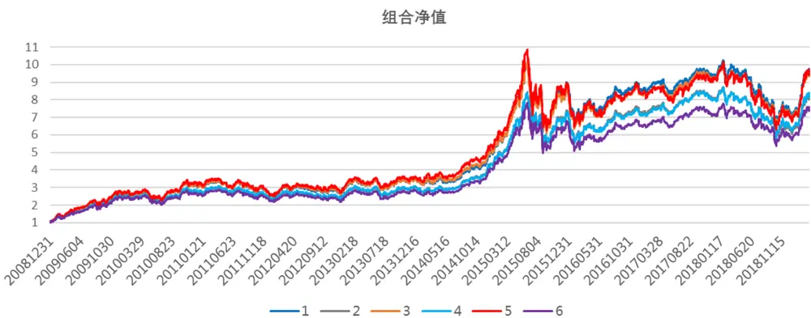

分年收益情况

| 年份 | 2009 | 2010 | 2011 | 2012 | 2013 | 2014 | 2015 | 2016 | 2017 | 2018 | 2019.3 |
| --- | --- | --- | --- | --- | --- | --- | --- | --- | --- | --- | --- |
| 1 | 166.6% | 15.3% | -15.8% | 20.9% | 8.2% | 50.5% | 71.3% | -2.1% | 10.5% | -24.7% | 37.1% |
| 2 | 156.1% | 7.2% | -14.4% | 16.8% | 7.4% | 51.3% | 61.3% | 0.6% | 11.8% | -23.5% | 34.0% |
| 3 | 171.6% | 14.1% | -16.6% | 22.3% | 7.4% | 52.6% | 62.6% | -1.7% | 12.3% | -25.0% | 38.7% |
| 4 | 154.6% | 8.4% | -12.8% | 16.5% | 5.1% | 51.1% | 59.7% | 0.1% | 12.7% | -21.4% | 33.0% |
| 5 | 177.3% | 15.8% | -18.6% | 25.5% | 7.8% | 53.6% | 59.3% | -3.8% | 11.0% | -25.7% | 41.6% |
| 6 | 147.0% | 4.5% | -12.9% | 15.2% | 6.5% | 51.3% | 58.0% | -1.7% | 10.4% | -19.2% | 31.3% |

| 组合 | 1 | 2 | 3 | 4 | 5 | 6 |
| --- | --- | --- | --- | --- | --- | --- |
| 年化收益 | 25.0% | 23.0% | 24.9% | 23.2% | 25.0% | 22.0% |
| 夏普率 | 0.97 | 0.95 | 0.95 | 0.97 | 0.93 | 0.92 |
| 最大回撤 | -38.0% | -39.7% | -39.7% | -36.5% | -42.5% | -36.4% |

数据来源：东方证券研究所 Wind 资讯

此外，从 2.4中的研究可以看出，投资者对于基金的选择也存在彩票偏好，过去一个季度表现最好的 TOP10%基金在同季度和下季度的短期规模增长远快于第二档的基金产品，因此综合来看长期不会跑输低波组合且在市场较好的时候具有高弹性的产品也具有其特有的优点。

我们进一步对组合的风格进行归因，以确认组合的高收益是否是由于部分极端风格暴露导致的。我们以上面的组合 1 和组合 6 作为代表，比较了高波动类型的组合和传统的偏低波的组合在各风格因子上相对于中证全指的暴露（图 16展示了风格因子的说明）。

图 21：风格因子说明

## Size

总市值对数

## Beta

贝叶斯压缩后的 市场Beta

## Trend

Trend_120 : MA5/MA120

Trend_240 : MA5/MA240

## Liquidity

- TO：过去252天换手率取平均

Liquidity beta：个股对数换手率， 与指数对数换手率回归

## Volatility

Stdvol：标准波动率

Ivff: Fama-French-3 特质波动率

Range：区间最高价除以最低价-1

MaxRet_6：区间收益最高的六天的收益率平均值

MinRet 6：区间收益最低的六天的收益率平均值

## Value

BP：账面市值比

EP：盈利收益率

## Growth

Delta ROE: ROE变 动(当前TTM和一年 前TTM比较)

Sales_growth：销售收入πM一年同比

Na_growth：净资产πTM一年的同比

## SOE

State Owned Enterprise, 是否国企

Cubic Size

市值幂次项

## Uncertainty

Instholder Pct:公募基金持仓比例

- Cov：分析师覆盖度

- Listdays：上市时长

数据来源：东方证券研究所

从结果看，优质股中叠加高波动的组合 1在市值暴露上偏小一些；在 beta和 volatility上的暴露比低波动的组合偏高，但仍然低于市场平均水平；在 liquidity上的暴露要高于低波动组合，也就说这类股票的流动性更好；在估值上的暴露偏低，这是因为波动率因子本身收益来源的很大一部分可以被 BP 所解释，加入了低波动因子必然会放大估值的暴露；此外，优质股中叠加高波动的组合在certainty 上的暴露要高于低波动组合，这是因为这类优质股中弹性较大的股票，更容易被分析师和公募基金所偏好，这一点与 2.2中的结论相结合，可以看出分析师偏好优质股中的高波动股票而不是单纯的高波动股票，这一点也比较符合常规的认识。

图 22：主动量化组合风格归因结果
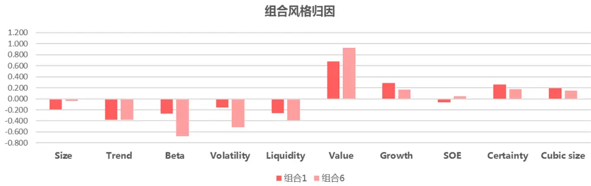
数据来源：东方证券研究所 Wind 资讯

## 3.2 指数增强组合对比

这里比较了中证 500全市场增强组合 2008.12-2019.3的表现，一种是直接在上面的 7大类因子中加入波动率大类因子（1个月、3个月、6个月波动），权重占比为 1/8，加权的时候波动率大类的方向为负向，这也是常规构建组合做法。另一种，我们直接在 7大类因子中加入正向的波动率大类因子，权重占比也为 1/8，这样做法与直觉不符，但是从组合构建的层面来看，指数增强组合虽然有各种约束条件，但是主要还是选择得分较高的股票，而正向波动率因子权重占比不高，不会大幅度改变股票的整体期望收益，主要作用接近于在 7 大类因子得分较高的股票中引入正向波动，这就类似于局部根据正向波动调整靠前的股票的得分，而对于 7 大类因子排名较后的股票，理论上在其中波动率负向效果更强，但是因为整体排名较好，即使加入了正向的波动率，也很难让其得分靠前，因此对构建增强组合并没有太大的影响。

图 23：中证 500全市场增强组合表现
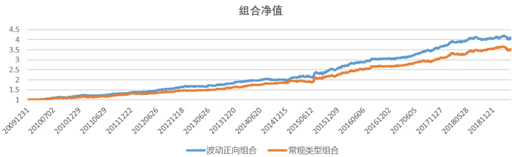

分年对冲收益
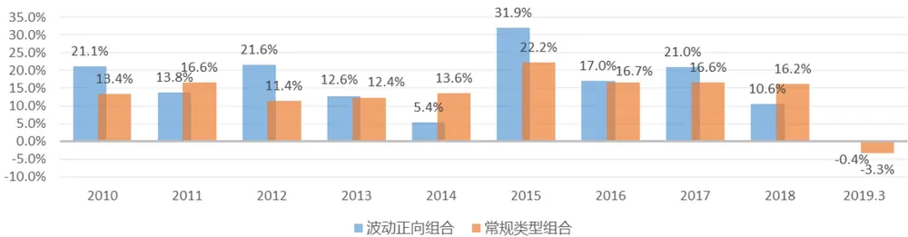

| 组合 | 对冲组合年收益 | 最大回撤 | 信息比 | 月单边换手 | 跟踪误差 |
| --- | --- | --- | --- | --- | --- |
| 波动正向组合 | 16.53% | -4.40% | 2.84 | 46.0% | 5.3% |
| 常规类型组合 | 14.64% | -5.66% | 2.49 | 43.5% | 5.4% |

数据来源：东方证券研究所 Wind 资讯

图 24展示了两个组合的对冲净值和分年的收益情况，首先从整体来说，正向波动组合的收益不仅没降低，反而比常规组合提升了 2%，且最大回撤和信息比都优于常规组合，分年来看，可以发现正向波动组合在 2010、2012、2015、2017 和 2019 均战胜了常规组合，特别是今年到 3 月底就跑赢了常规组合 3%左右，而在 2011、2014、2018则跑输了常规组合，这个结论与第二章里的测试结果是一致的，除了 2014年不太好解释外，整体来看市场好的年份正向波动组合都好于常规组合，而市场较差的时候，正向波动组合则会表现较差，整体来看市场还是向上的，因此一定程度上利用了波动非线性特征的正向波动组合其实也是有一定的价值的，当然这里是采用直接把波动率正向和其他因子合成的方式构建 ALPHA模型的，其实也可以考虑我们之前的动态情景的模型，在不同的区间用不同方向的波动率叠加，效果可能会更好一些。

图 24：中证 500全市场增强组合风格归因结果
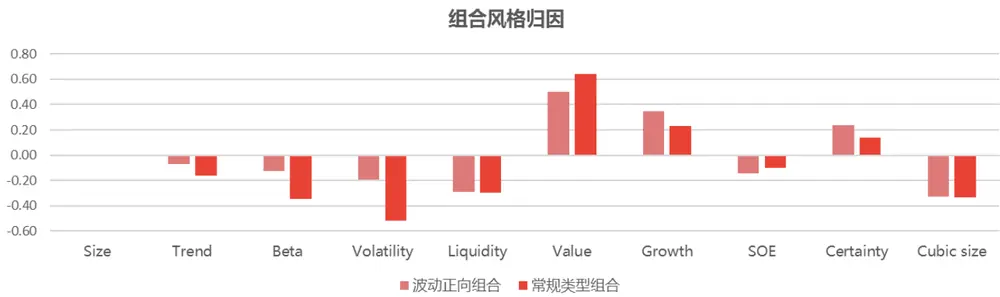
数据来源：东方证券研究所 Wind 资讯

我们也对组合的风格进行了归因，这里测算的是相对于中证 500 指数的主动暴露，可以看到波动正向组合 Trend、Beta、Volatility、Growth 和 Certainty 上的暴露更高，相比于传统的组合更加接近于整体基金重仓股的风格，也就是说更接近主动的风格，而在 Value上暴露较低，这是因为低波动因子的收益来源很大一部分是估值暴露的收益。综合来看波动正向组合在风格上并不没有什么特别极端的地方，也是可以比较放心的使用的。

## 4.总结

整体来看，波动率是存在异像的，过去低波动的股票下个月倾向于表现较好，这里我们参考海外的研究来解释波动率异像的成因，发现波动率异像主要还是投资者的彩票偏好导致的，这种彩票偏好（投机行为）不仅在于股票当中，也存在于投资者选择基金的行为当中，因此即使后续投资者结构发生变化，散户比例降低，投资者对于选择基金产品的投机性依然会持续，波动率异像长期来看应该也会持续存在。

除了异像以外，我们发现波动率在 A股存在非对称现象，即在多因子模型综合得分较高的股票（整体低估股票）中，波动率因子下个月的选股效果是正向的，而在多因子模型综合得分较低的股票（整体高估股票）中，波动率因子下个月有比市场平均更强的负向选股效果，两者叠加即是我们观察到的波动率异像。这个特性可以通过套利非对称性理论比较好的解释，且我们根据实证数据对这个现象进行了证明。不过波动率的这个非对称现象的存续期相对较短，在一个月的持仓期非常明显，但是在3个月或6个月的持仓期则不再显著，这是由于投资者的投机带来的价格修复往往时间较短，因此如果是构建 SmartBeta 指数的话，还是用波动率倒数加权会更好一些。从时间周期上看，这个特性在市场较好的年份尤为显著，而在市场较差的年份，在低估股票中仍是低波略好于高波，不过整体来看市场长期向上，因此这个特性还是有效果的。

基于波动率的非对称特性，我们构建了主动量化组合和中证 500 全市场增强组合，我们发现在叠加了正向波动的主动量化组合年化收益比常规用负向波动率的组合大约好 2%左右，且今年以来至3 月底就跑赢常规组合 5%-10%左右；而叠加了正向波动的中证 500 增强组合年化也比常规的用波动率负向构建的组合年化高 2%左右，且今年以来至 3 月底跑赢 3%。综合来看，波动率的这种非对称特性在市场较好的年份均十分明显，低估的优质股中高波动股票表现显著好于低波动，而在市场较差的年份，低估的优质股中则是低波动略好于高波动。从归因结果来看，正向波动的组合没有在某个因子上暴露特别极端的，而且我国在经济转型和改革上是高于预期的，我们认为未来经济长期增长还是有保证的，因此未来市场长期还是应该向上的，所以在优质股中适当暴露高波动的策略其实在未来也还是有一定的价值的。

## 风险提示

- 极端市场环境可能对模型效果造成剧烈冲击，导致收益亏损。

- 量化模型基于历史数据分析得到，未来存在失效风险，建议投资者紧密跟踪模型表现。

## 参考文献

1. Asness, C. S., Frazzini, A., Gormsen, N. J., & Pedersen, L. H. (2018). Betting against correlation: testing theories of the low-risk effect. Cepr Discussion Papers.

2. Baker, N. L., & Haugen, R. A. (2012). Low risk stocks outperform within all observable markets of the world. Available at SSRN 2055431.

3. Baker, M., Bradley, B., & Wurgler, J. (2011). Benchmarks as limits to arbitrage: understanding the low-volatility anomaly. Financial Analysts Journal, 67(1), 40-54.

4. Blitz, D., & Van Vliet, P. (2007). The volatility effect: lower risk without lower return. Erim Report, 34(1).

5. Chevalier, J., & Ellison, G. (1997). Risk taking by mutual funds as a response to incentives. Nber Working Papers, 105(6), 1167-1200.

6. Frazzini, A. , & Pedersen, L. H. . (2012). Betting against beta. Social Science Electronic Publishing, 111(1), 1-25.

7. Huang, W., Liu, Q., Rhee, S. G., & Zhang, L. (2010). Return reversals, idiosyncratic risk, and expected returns. Review of Financial Studies, 23(1), 147-168.

8. Hsu, J. C., Kudoh, H., & Yamada, T. (2013). When sell-side analysts meet highvolatility stocks: an alternative explanation for the low-volatility puzzle. Journal of Investment Management, 11(2), 28-46.

9. IlmanenAntti. (2012). Do financial markets reward buying or selling insurance and lottery tickets?. Financial Analysts Journal, 68(5), 26-36.

10. Stambaugh, R. F. , Yu, J. , & Yuan, Y. . (2015). Arbitrage asymmetry and the idiosyncratic volatility puzzle. The Journal of Finance, 70(5), 1903-1948.

11. Sirri, E. R., & Tufano, P. (2010). Costly search and mutual fund flows. Journal of Finance, 53(5), 1589-1622.

## Table_Disclaimer 分析师申明

每位负责撰写本研究报告全部或部分内容的研究分析师在此作以下声明：

分析师在本报告中对所提及的证券或发行人发表的任何建议和观点均准确地反映了其个人对该证券或发行人的看法和判断；分析师薪酬的任何组成部分无论是在过去、现在及将来，均与其在本研究报告中所表述的具体建议或观点无任何直接或间接的关系。

## 投资评级和相关定义

报告发布日后的 12个月内的公司的涨跌幅相对同期的上证指数/深证成指的涨跌幅为基准；

## 公司投资评级的量化标准

买入：相对强于市场基准指数收益率 15%以上；

增持：相对强于市场基准指数收益率 5%～15%；

中性：相对于市场基准指数收益率在-5%～+5%之间波动；

减持：相对弱于市场基准指数收益率在-5%以下。

未评级——由于在报告发出之时该股票不在本公司研究覆盖范围内，分析师基于当时对该股票的研究状况，未给予投资评级相关信息。

暂停评级——根据监管制度及本公司相关规定，研究报告发布之时该投资对象可能与本公司存在潜在的利益冲突情形；亦或是研究报告发布当时该股票的价值和价格分析存在重大不确定性，缺乏足够的研究依据支持分析师给出明确投资评级；分析师在上述情况下暂停对该股票给予投资评级等信息，投资者需要注意在此报告发布之前曾给予该股票的投资评级、盈利预测及目标价格等信息不再有效。

## 行业投资评级的量化标准：

看好：相对强于市场基准指数收益率 5%以上；

中性：相对于市场基准指数收益率在-5%～+5%之间波动；

看淡：相对于市场基准指数收益率在-5%以下。

未评级：由于在报告发出之时该行业不在本公司研究覆盖范围内，分析师基于当时对该行业的研究状况，未给予投资评级等相关信息。

暂停评级：由于研究报告发布当时该行业的投资价值分析存在重大不确定性，缺乏足够的研究依据支持分析师给出明确行业投资评级；分析师在上述情况下暂停对该行业给予投资评级信息，投资者需要注意在此报告发布之前曾给予该行业的投资评级信息不再有效。

## HeadertTabl e_Discl ai mer 免责声明

本证券研究报告（以下简称“本报告”）由东方证券股份有限公司（以下简称“本公司”）制作及发布。

本报告仅供本公司的客户使用。本公司不会因接收人收到本报告而视其为本公司的当然客户。本报告的全体接收人应当采取必要措施防止本报告被转发给他人。

本报告是基于本公司认为可靠的且目前已公开的信息撰写，本公司力求但不保证该信息的准确性和完整性，客户也不应该认为该信息是准确和完整的。同时，本公司不保证文中观点或陈述不会发生任何变更，在不同时期，本公司可发出与本报告所载资料、意见及推测不一致的证券研究报告。本公司会适时更新我们的研究，但可能会因某些规定而无法做到。除了一些定期出版的证券研究报告之外，绝大多数证券研究报告是在分析师认为适当的时候不定期地发布。

在任何情况下，本报告中的信息或所表述的意见并不构成对任何人的投资建议，也没有考虑到个别客户特殊的投资目标、财务状况或需求。客户应考虑本报告中的任何意见或建议是否符合其特定状况，若有必要应寻求专家意见。本报告所载的资料、工具、意见及推测只提供给客户作参考之用，并非作为或被视为出售或购买证券或其他投资标的的邀请或向人作出邀请。

本报告中提及的投资价格和价值以及这些投资带来的收入可能会波动。过去的表现并不代表未来的表现，未来的回报也无法保证，投资者可能会损失本金。外汇汇率波动有可能对某些投资的价值或价格或来自这一投资的收入产生不良影响。那些涉及期货、期权及其它衍生工具的交易，因其包括重大的市场风险，因此并不适合所有投资者。

在任何情况下，本公司不对任何人因使用本报告中的任何内容所引致的任何损失负任何责任，投资者自主作出投资决策并自行承担投资风险，任何形式的分享证券投资收益或者分担证券投资损失的书面或口头承诺均为无效。

本报告主要以电子版形式分发，间或也会辅以印刷品形式分发，所有报告版权均归本公司所有。未经本公司事先书面协议授权，任何机构或个人不得以任何形式复制、转发或公开传播本报告的全部或部分内容。不得将报告内容作为诉讼、仲裁、传媒所引用之证明或依据，不得用于营利或用于未经允许的其它用途。

经本公司事先书面协议授权刊载或转发的，被授权机构承担相关刊载或者转发责任。不得对本报告进行任何有悖原意的引用、删节和修改。

提示客户及公众投资者慎重使用未经授权刊载或者转发的本公司证券研究报告，慎重使用公众媒体刊载的证券研究报告。

## 东方证券研究所

地址：上海市中山南路 318 号东方国际金融广场 26 楼

联系人： 王骏飞

电话： 021-63325888*1131

传真：021-63326786

网址： www.dfzq.com.cn

Email： wangjunfei@orientsec.com.cn