Table_Report 相关报告

## Table_Sum ary 研究结论

民营经济数量&规模：截至 2017年底我国私营企业数量超过 2700万家，个体工商户超过 6500万户，合计占全部市场主体的 94.8%，注册资本超过 165万亿元。以私营企业为主体的民营经济活力迸发，成为经济发展主要推动力。

民营经济产业分布：第三产业始终占绝对主导，户数占比 85%，从业人数占比 70%。批发零售业，住宿和餐饮业、制造业占比最大。500强民营企业大多分布在第二产业，数量占比 67%，说明大型民营集中于第二产业。

民营经济地理位置分布：东部地区始终占主导地位，户数占比 ，且占比在不断增加，西部和东北部数量占比下滑较明显。广东最近二十年的民营经济规模增幅最大。东部地区 500强民企的数量占比高达 80%，说明中西部民营企业规模普遍较小，以中小型民营企业为主，而东部多为大型民企。

民营经济发展成就：（1）民营经济在 GDP 中的比重不断上升：截至 2017年底，民营经济产值占 GDP的比重超过了 60％；（2）民营经济在税收收入中的比重不断提高：2017年民企税收收入占全部税收收入的 52.7%；（3）民营经济吸纳就业能力显著增强：截止 2017 年私营企业和个体企业吸纳就业人数比重增至 43.93%。（4）民营经济成为科技创新的重要驱动因素。研发投入、专利产出、新产品开发效益不断提高。

民企在 A 股中的地位：（1）数量、总市值和总资产占比：民企在上市公司数量占比上已反超国企达 61%，但总市值 31%和总资产 7%的占比相比国企仍十分弱势；（2）行业分布：金融、煤炭、钢铁、国防军工、交运、电力设备等传统国有垄断行业中民营上市公司的占比较低，计算机、医药、农林牧渔、轻工制造、纺织服装等新兴产业和劳动密集型制造业中民企占比较高；（3）整体特征：大部分行业中都是民企的盈利能力更强、盈利能力分化程度更严重、现金分红比例较低，大股东持股集中度较低，管理层薪酬偏低、股价波动性大、换手率高、机构持股比例更低，研发投入强度更大，专利申请数较少。新兴制造业中民企的成长性更好。此外，民企上龙虎榜的次数更多、停牌天数更多、业绩预告准确度较差，对于净利润明显高估。ST、受证监会警告、处罚、业绩暴雷事件中也是民企居多。

现有民企指数和公募产品：目前已有 11 个民企相关的主题指数，也已经出现了区域性的民企指数（浙江民企），特定行业的民企指数（非周期民企）、定位于美股和港股中的中国民营企业（中华民企指数）。目前跟踪民企指数的公募产品较少，仅有鹏华基金一家公司发了 4只产品。

民企中的选股策略：（1）优质民企主动量化组合：年化收益可以达到 25.15%，单边年换手率 2.9倍。（2）优质民企策略指数：策略收益稳健：过去十年间年化收益可以达到 16.44%；成分股数量适中：单期成分股数量 200 只；个股权重均衡：我们控制了个股和行业权重上限，权重分布更加均衡；换手率较低：单边年换手率 0.8倍，资金容量较大。（3）大湾区民企指数：年化收益可以达到 17.6%，单边率 0.3倍。

## 风险提示

- 量化模失效风险

- 市场极端环境的冲击

Table_ReportDate 报告发布日期2019 年 04 月 24 日

Table_Autho 证券分析师朱剑涛

021-63325888*6077

zhujiantao@orientsec.com.cn

执业证书编号：S0860515060001

Table_Contacter 联系人 刘静涵 021-63325888-3211 liujinghan@orientsec.com.cn

| 波动率因子的逻辑与非对称使用 公募基金产品与基金经理评价 国内公募基金历史发展与现状 基于因子组合FMP的因子加权方法 Alpha 预测之二：机器的比拼 适宜快节奏的年报公告季 A 股行业内选股分析总结 日内交易特征稳定性与股票收益 Alpha与Smart Beta 产业链与公司股价关联 A 股是估值驱动还是盈利驱动？ A 股涨跌幅排行榜效应 DFQ2018 绩效归因与基金投资分析工具 基于 copula 的尾部相关性研究：上尾异常 | 2019-04-24 2019-04-23 2019-04-22 2019-04-15 2019-03-04 2019-02-28 2019-01-16 2019-01-14 2018-12-02 2018-12-02 2018-12-02 2018-11-20 2018-10-26 2018-10-23 东方 A 股因子风险模型(DFQ-2018) 2018-09-02 2018-09-01 2018-08-19 2018-08-03 |
| --- | --- |

## 一、 回顾：经济体制改革、民营经济政策

改革开放以来，民营经济在党和国家的政策引导支持下从弱到强、从小到大一步步发展起来，逐渐成为社会主义市场经济的重要组成部分。我国民营经济是随着经济体制改革的深化发展壮大起来的，因而，我们首先回顾新中国成立以来的我国经济体制改革历史，进而总结我国民营经济政策的演变历程。

回顾新中国成立以来的经济体制改革历史，大致经历了以下三个时期（图 1）：

图 1：中国经济体制改革历程
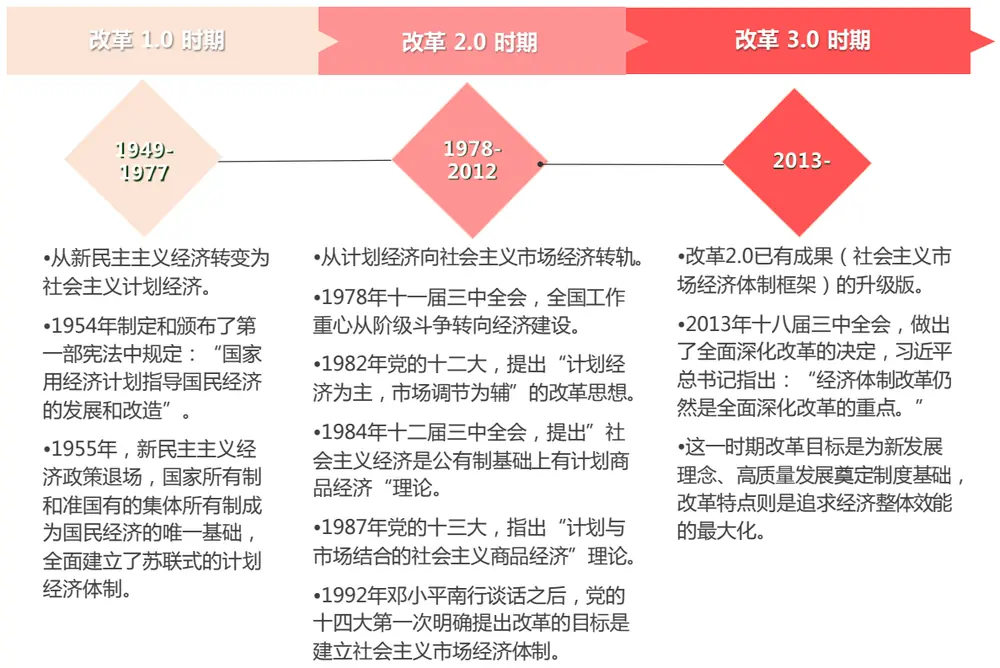
数据来源：东方证券研究所 & 国务院发展研究中心《经济体制改革进入 3.0 时代》

## 回顾改革开放以来中国民营经济改革及政策的变化，大体可分为以下六个阶段（图 2）。

2018年 9月，习主席在东北考察期间再次提出“始终关心和支持民营经济”，在监管层支持民营经济的政策导向背景下，中行“20条”、工行“10条”、农行“22条”、建行“26条”等各大行纷纷出台新一轮支持民企发展的举措，纾困民企融资，把国有企业和民营企业放在平等地位。未来民营企业在资本运作中的主体地位将更加突出。

2017年的政府工作报告中将粤港澳大湾区升级为国家战略，而民营企业是广东尤其是珠三角地区最活跃的市场主体，2018 年世界 500 强企业榜单中，上榜的 19 家粤港澳大湾区企业中，8 成是民营企业。未来民营企业在粤港澳大湾区将面临良好的发展机遇。

图 2：中国民营经济改革阶段划分

| 阶段划分 | 民营经济改革的主要特征 | 主要内容 |
| --- | --- | --- |
| 1978-1988 萌芽和起步阶段 | 由紧到宽、自下而上、从被限制到被承认 多数政策围绕民营经济的性质而制定 | 允许把它们当作资本主义经济来批判和取缔” (2)1979年，中国民营公司的合法性被确定下来了，但雇员人数未被放开。1979年中国第一家民营企业成立（上海市工商办爱国 建设公司），1980年颁发了第一张个体户执照（温州章华妹）。 (3)1980年，中共中央在全国劳动就业工作会议上提出“鼓励和扶持个体经济适当发展”的政策，国务院在相关文件中指出要 允许和提倡各种经济成分之间”开展竞争。 (4)1981年，进行改革开放后的第一次宏观调控，国务院发布《加强市场管理、打击投机倒把和走私活动的指示》，为了保国有 企业，开始了全国性的打击投机倒把，控制小工厂、私人企业与国企争利，民营企业受到压制。 (5)1982年，党的十二大提出“鼓励和支持劳动者个体经济作为公有制经济的必要的、有益的补充”。1982年宪法规定“在法律 规定范围内的城乡劳动者个体经济，是社会主义公有制经济的补充”。 |
| 1989-1991 受挫和恢复阶段 | 受创之后的逐渐恢复 多数政策仍围绕民营经济的性质而制定 | (1)1988年，党十三届三中全会提出“治理经济环境、整顿经济秩序”的改革方针，自1981年以来规模和力度最大的针对私营企 业的整顿运动开始了，大量民营企业主迫于压力捐掉企业资产、外逃，或是将自己的私营企业挂靠到国营、集体企业的旗下。此外， 对民营经济的认识也出现了波动，“不能吸收私营企业主入党”，“加强城乡个体工商户和私营企业税收征管”等措施使得民营经济 发展受到影响。 （2）1991年，全国经济体制改革工作会议明确提出，要围绕90年代经济体制改革的总目标，“建立以社会主义公有制为主体、多 种经济成分共同发展的所有制结构”。同年，江泽民在庆祝中国共产党成立70周年大会上的讲话中指出，要“采取适当的措施，逐 步使得各种经济成分在整个国民经济中所占的比例和发展范围趋于比较合理”，肯定了民营经济发展所取得的成就。 |
| 1992-2001 调整和引导阶段 | 调整之后的鼓励发展 多数政策围绕民营经济的性质和地位而制定 民营经济成为社会主义市场经济的重要组成部分 | (2)1993年，国家工商行政管理局发布了《关于促进个体私营经济发展的若干意见》，鼓励个体私营经济的发展。 (3)1997年，党的十五大报告第一次把非公有制经济纳入中国基本经济制度，把公有制为主体，多种所有制经济共同发展的制度 确立为社会主义初级阶段的基本经济制度，明确“非公有制经济是我国社会主义市场经济的重要组成部分”。 (4)1998年，中国遭遇亚洲金融危机的冲击，国有企业大量出现亏损、倒闭和职工下岗的情况，随后中央采取“国退民进”战 略，提出“抓大放小”，将国有经济收缩到资源性、垄断性行业，退出竞争性行业，让民营企业进入。 (5)1999年，九届人大二次会议通过的宪法修正案明确“在法律规定范围内的个体经济、私营经济等非公有制经济，是社会主义 市场经济的重要组成部分”。 (6)2000年，江泽民在全国统战会议上指出，要“继续鼓励、引导”非公有制经济健康发展。 |
| 2002-2007 促进和提升阶段 | 从“继续鼓励、引导”到“毫不动摇地鼓励、支持和引导” 多数政策的针对性较强，围绕增强民营经济发展信心、吸引国 内外高层次人才、引导民营企业发展高科技、推进民营企业国 际化、消除不平等待遇等而制定 | (2)2002年，党的十六大报告第一次明确提出“必须毫不动摇地鼓励、支持和引导非公有制经济共同发展”。同年通过的《中国 共产党章程(修正案)》扫除了私营企业主无法入党的障碍。 （3）2003年，党的十六届三中全会通过的《中共中央关于完善社会主义市场经济体制若干问题的决定》，提出引导非公有制经济 发展的政策措施。 (4）2004年，宪法修正案规定“国家保护个体经济、私营经济等非公有制经济的合法的权利和利益。“ （5）2005年，国务院以“3号文件”的形式发布了《关于鼓励支持和引导个体私营等非公有制经济发展的若于意见》（旧36 条），制定了36条促进非公有制经济发展的政策措施。 (6）2007年，十届人大五次会议通过《中华人民共和国物权法》和《中华人民共和国企业所得税法》，从平等保护公有财产和私 有财产、平等对待内资企业和外资企业税负两个角度保障民营经济健康发展。同年，党的十七大报告指出，要“坚持平等保护物权 |
| 2008-2012 冲击和成长阶段 | 转方式、调结构。 多数政策围绕民营企业应对金融危机带来的负面影响及其转型 施，但收效甚微。 升级而制定 | 国有企业，民营企业被边缘化，产生了“国进民退”，大批民营企业倒闭破产。 (2)2009年，国务院发布《关于进一步促进中小企业发展的若干意见》，制定了29条促进中小企业发展的政策措施。 (3)2010年，国务院颁布了《关于鼓励和引导民间投资健康发展的若于意见》（新36条)，制定了36条促进民间投资的政策措 (4)2011年，国家发展和改革委员会制定了促进民营企业发展战略性新兴产业的政策措施。 (5)2012年，国家发展和改革委员会为进一步支持小微企业健康发展和引导民营企业开展境外投资，分别制定了29条和18条政 策措施。同年，党的十八大进一步提出“毫不动摇鼓励、支持、引导非公有制经济发展，保证各种所有制经济依法平等使用生产要素 |
| 2013至今 转型和腾飞阶段 | 凝心聚力、“松绑”和“减负”。 多数政策围绕民营企业在新时代下高质量发展而制定 | 槛、加强财政资金引导、完善投融资活动、营造创新创业文化氛围，极大地推进了创新主体的涌现。 (2)2015年，《推动共建丝绸之路经济带和21世纪海上丝绸之路的愿景与行动》和《中国制造2025》发布，分别从构建以我为 主的经济合作体，和实施以质量为先的制造强国战略两个角度出发，打造了未来中国经济发展新蓝图，给民营企业发展指明了道路。 (3)2017年，党的十九大报告论述了新时代下鼓励、支持和引导民营经济转型升级的政策方针，明确指出未来将“毫不动摇鼓励 、支持、引导非公有制经济发展”、“激发和保护企业家精神”、“支持民营企业发展”，把“两个毫不动摇”写入新时代坚持和发 展中国特色社会主义的基本方略，作为党和国家一项大政方针进一步确定下来。 |

数据来源：东方证券研究所 & 《中国民营经济改革与发展 40 年: 回顾与展望》

## 二、 现状：民营经济在国民经济中的地位

## 2.1 民营经济定义

“民营”是在中国经济体制改革过程中产生的，具有强烈中国特色的词汇。（1）对于“民营企业”，我国企业分类中是没有这一概念的（图 3），工商部门也没有民营的统计口径的。按照全国工商联的界定，所有的非公有制的企业统称为民营企业，（2）对于“民营经济”，我国现行法律或者政策性文件中没有明确提及“民营经济”一词的规定，一般以非公有制经济的形式表述。单非公有制经济的范围比较大，包括公有制以外的所有经济结构形式，即个体经济、私营经济、外资经济等。而关于民营经济，一种较为认可的定义是不包括外资经济，即指除了国有及国有控股、集体经济、外商和港澳台商独资及其控股企业以外的多种所有制经济的统称。

考虑民营经济范围较之民营企业更为全面， 本节将以民营经济为分析主体。由于民营经济中主要以私营企业和个体工商户为主，因而本节下面提到的有关民营经济的统计范围仅指个体工商户和私营企业。

图 3：我国企业类型（按企业登记注册类型）
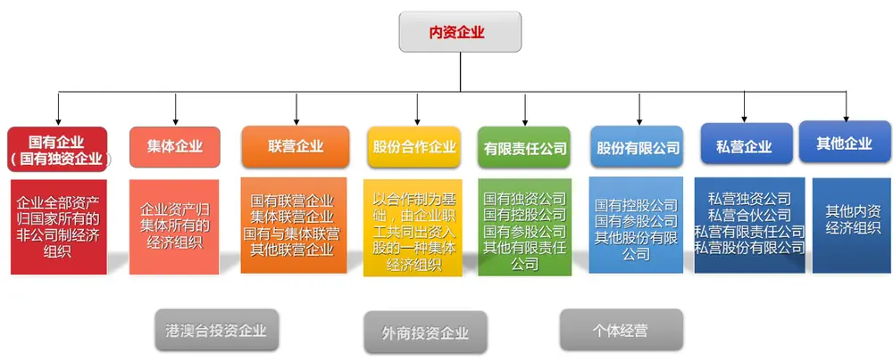
数据来源：东方证券研究所 & 国家统计局、国家工商行政管理局《关于划分企业登记注册类型的规定》（1998 年 8 月 28 日，国统字〔1998〕200 号）

## 2.2 民营经济数量、规模、结构

从民营经济数量、规模、结构的历史变化来看：2001年之前，个体经济是民营经济的主要组成部分，私营经济刚刚起步。2001 年后，私营企业的注册资金呈指数增长，个体经济的注册资金增幅则较小，但私营企业的主体户数仍少于个体工商户。2012 年党的十八大以来，民营经济蓬勃发展，私营企业数量增长 146.0%，较企业整体增速高 29.5%，私营企业注册资本增长 454.7%，较企业总体高 212.4%。截至 2017 年底，我国私营企业的数量超过 2700 万家，个体工商户超过6500万户，合计占全部市场主体的 94.8%，注册资本超过 165万亿元，以私营企业为主体的民营经济活力迸发，成为经济发展的主要推动力。

图 4：1988-2018我国民营经济主体户数和注册资金
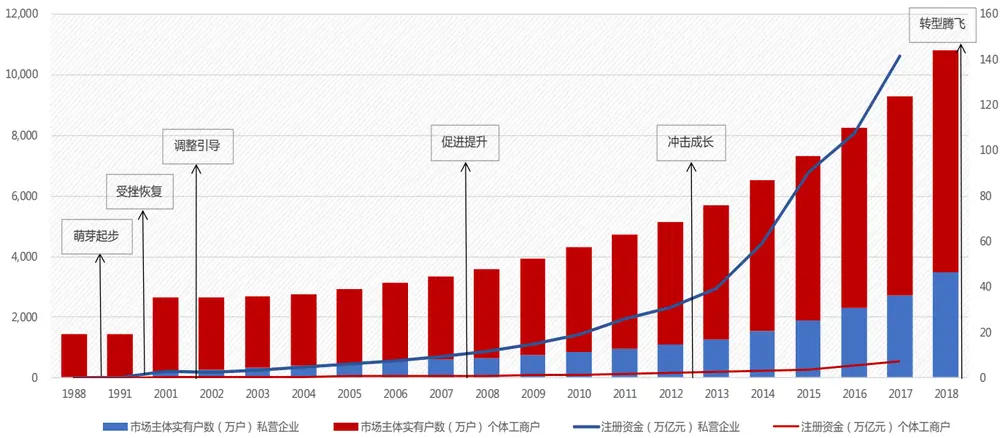
数据来源：东方证券研究所 & 国家工商总局
注：2016-2018 年个体经济和私营经济的注册资金数据未公布，2016 年、2017 的数据为笔者根据当年所有企业注册资金增长率( 33.5%,31.6%) 估算得到。

## 2.3 民营经济行业分布

在民营经济总量不断扩大的同时，其行业分布也在发生调整。总体来看呈现以下几个特点：

1.三大产业中的户数占比基本维持在 2:13:85，从业人数占比为 2:27:70，第三产业占据绝对优势，第二产业的户均雇佣人数大于第三产业。民营经济起步于“边缘行业”，就是那些资金技术门槛低，国有经济不愿意进入和不便进入的劳动密集型行业。民营经济的发展集中地发生在“吃穿用”——饮料食品、纺织服装和家用电器三大领域，比如以传统手工技术为依托的家庭工业、作坊、修理业；以劳动和经营能力为依托的餐饮、小型商贸等第三产业，因而民营经济中第三产业始终占绝对主导。第一产业占比始终很低，不超过 5%。

2.三大产业中的户数占比比较稳定，从业人数占比变化更明显一点，说明历年变化主要反映在企业人员规模上。以 2008年为界，民营经济在第二三产业的比重呈现此消彼长的状态。2008年之前民营经济在第二产业的占比不断提高，第三产业占比不断下降，这主要是由于在当时供给短缺的卖方市场下，民营经济会转入相对价格更高的工业制造领域；2008 年之后民营经济在第二产业的占比不断降低，第三产业占比有所回升，这主要是由于金融危机后原材料价格不断上升，劳工工资大幅度提高，人民币汇率升值，这三大因素对从事第二产业的民营经济非常不利，企业利润率逐渐下降，这就使得民营经济又开始涌入第一、三产业。

从具体细分行业来看，民营经济占比最大的始终是批发零售业，住宿和餐饮业、制造业。由于从业人数的变化更明显，考虑篇幅原因此处只展示从业人员的占比情况。与产业分布结论类似，2008年之前民营经济在制造业的占比不断提升，由1989年的20.61%提高到2007年的28.96%，第三产业中的批发零售贸易和餐饮业比重明显下降，由1989年的59.41%降为2007年的44.60%。此外采矿业、建筑业、电力煤气等基础性上游产业的占比也在增加。2008 年以后，民营在制造业中的比重显著下降，批发零售、住宿餐饮等服务业占比回升。2016 年底占比排名前 4 为的分别是批发和零售业 40.82%（2007：37.77%），制造业 18.11%（2007：28.96%），住宿和餐饮 8.03%（2007：6.83%），居民服务和其他服务业 6.23%（2007：5.83%）。

图 5： 1995-2016我国民营经济户数、从业人数的产业分布
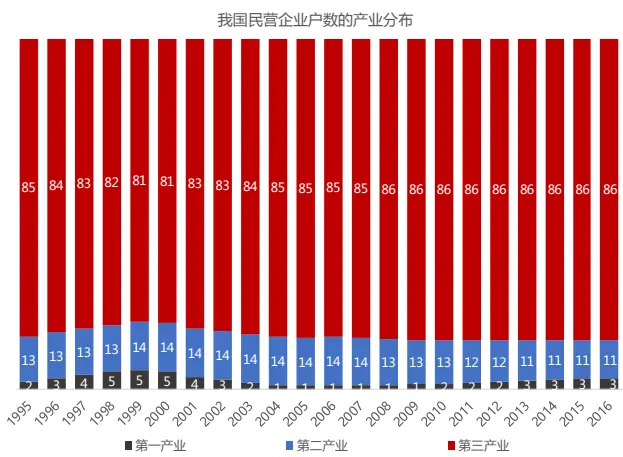
数据来源：东方证券研究所 & 中国工商行政管理年鉴

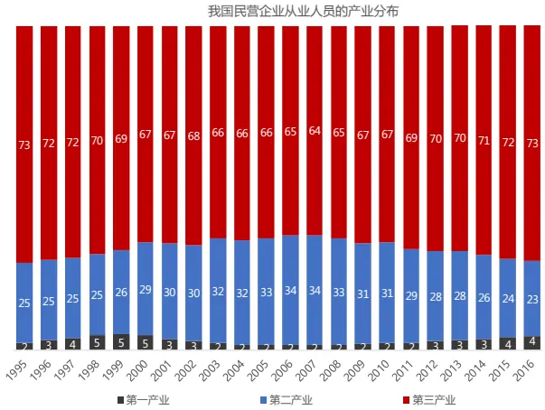
注 1：2003 年我国才印发《三次产业划分规定》，故 2003 年前的三次产业由作者自行划分。采掘、制造、建筑为第二产业，交运、批零餐饮、社服、其他行业为第三产业。2012 年我国对《三次产业划分规定》进行了修订，将原有第一产业中的三个大类调入第三产业。

图 6：1989-2016 我国民营经济从业人数的具体行业分布

| 年份 | 农、林、牧、渔业 | 采掘业 | 制造业 | 建筑业 | 交通运输仓储和邮电通信业 | 批发零售贸易和餐饮业 | 社会服务业 | 其他 |
| --- | --- | --- | --- | --- | --- | --- | --- | --- |
| 1989 | 0.12% | 0.00% | 20.61% | 1.16% | 7.70% | 59.41% | 10.00% | 0.99% |
| 1990 | 0.03% | 0.00% | 20.63% | 1.02% | 8.00% | 58.08% | 11.08% | 1.16% |
| 1991 | 0.02% | 0.00% | 22.07% | 1.10% | 8.05% | 58.05% | 9.81% | 0.91% |
| 1992 | 0.00% | 0.00% | 21.44% | 1.00% | 7.67% | 58.98% | 10.52% | 0.39% |
| 1993 | 0.00% | 1.08% | 20.88% | 1.06% | 7.69% | 58.17% | 10.10% | 1.04% |
| 1994 | 1.29% | 0.00% | 22.68% | 1.14% | 8.16% | 56.08% | 9.32% | 1.34% |
| 1995 | 2.15% | 1.10% | 22.51% | 1.25% | 7.53% | 54.23% | 9.92% | 1.32% |
| 1996 | 2.97% | 1.07% | 22.43% | 1.25% | 7.57% | 53.33% | 9.90% | 1.47% |
| 1997 | 3.75% | 1.00% | 22.36% | 1.26% | 7.38% | 52.80% | 10.02% | 1.42% |
| 1998 | 4.63% | 1.03% | 22.68% | 1.47% | 7.16% | 51.30% | 10.16% | 1.56% |
| 1999 | 5.04% | 0.95% | 23.39% | 1.56% | 6.83% | 50.37% | 10.33% | 1.52% |
| 2000 | 4.53% | 0.93% | 25.85% | 1.94% | 5.96% | 48.44% | 10.38% | 1.97% |
| 2001 | 3.29% | 0.91% | 26.43% | 2.23% | 5.58% | 48.40% | 10.82% | 2.35% |
| 2002 | 2.75% | 0.88% | 26.19% | 2.62% | 4.94% | 46.78% | 11.25% | 4.58% |
| 2003 | 2.12% | 0.98% | 28.33% | 3.03% | 4.36% | 45.44% | 11.52% | 4.21% |

| 年份 | 农、林、牧、 渔业 | 采矿业 制造业 | 电力、燃气及水的 生产和供应业 | 建筑业 | 批发和零售业 | 交通运输、仓储 和邮政业 | 住宿和餐饮业 | 信息传输、计算机服务 和软件业 | 金融业 | 房地产业 | 租赁和商务科学研究、技术服务 服务业 | 和地质勘查业 | 水利、环境和公共 设施管理业 | 居民服务和 其他服务业 | 教育 | 卫生、社会保障 和社会福利业 | 文化、体育 和娱乐业 | 其他 |
| --- | --- | --- | --- | --- | --- | --- | --- | --- | --- | --- | --- | --- | --- | --- | --- | --- | --- | --- |
| 2004 | 1.57% | 1.07% 27.62% | 0.26% | 3.27% | 38.44% | 4.21% | 7.61% | 1.28% | 0.00% | 0.98% | 2.68% | 0.00% | 0.00% | 6.42% | 0.00% | 0.18% | 0.66% | 3.76% |
| 2005 | 1.57% | \|1.10% 28.12% | 0.29% | 3.41% | 38.16% | 3.88% | 7.26% | 1.14% | 0.00% | 1.30% | 3.15% | 0.00% | 0.00% | 6.38% | 0.00% | 0.22% | 0.72% | 3.30% |
| 2006 | 1.64% | 1.14% 28.79% | 0.32% | 3.42% | 37.78% | 3.72% | 7.13% | 1.37% | 0.00% | 1.47% | 3.34% | 0.00% | 0.00% | 6.01% | 0.00% | 0.21% | 0.72% | 2.94% |
| 2007 | 1.59% | 1.08% 28.96% | 0.32% | 3.60% | 37.77% | 3.59% | 6.83% | 1.78% | 0.00% | 1.79% | 3.47% | 0.00% | 0.00% | 5.83% | 0.00% | 0.22% | 0.69% | 2.49% |
| 2008 | 1.66% | 1.06% 27.50% | 0.36% | _ 4.00% | 38.32% | 3.37% | 6.86% | 1.51% | 0.10% | 1.70% | 3.83% | 1.66% | 0.19% | 5.93% | 0.06% | 0.23% | 0.71% | 0.97% |
| 2009 | 1.98% | \|0.97% 25.689 3% | 0.34% | 4.05% | 39.78% | 3.45% | 6.57% | 1.54% | 0.14% | 1.74% | 4.18% | 1.76% | 0.19% | 5.94% | 0.07% | 0.23% | 0.71% | 0.68% |
| 2010 | 2.04% | 0.94% 25.73 3% | 0.32% | 4.27% | 39.37% | 3.00% | 6.63% | 1.51% | 0.15% | 1.82% | 4.28% | 1.97% | 0.20% | 6.21% | 0.06% | 0.22% | 0.72% | 0.55% |
| 2011 | 2.30% | 0.86% 23.80% | 0.31% | 4.05% | 41.35% | 2.80% | 6.40% | 1.41% | 0.17% | 1.84% | 4.55% | 2.05% | 0.20% | 6.32% | 0.06% | 0.21% | 0.73% | 0.55% |
| 2012 | 2.67% | 0.81% 22.62% | 0.30% | 4.04% | 39.61% | 4.14% | 6.38% | 1.97% | 0.22% | 1.90% | 4.84% | 2.22% | 0.27% | 6.17% | 0.08% | 0.39% | 0.78% | 0.57% |
| 2013 | 3.12% | \|0.80% 22.14% | 0.31% | 4.31% | 40.84% | 2.74% | 6.71% | 1.58% | 0.41% | 1.95% | 4.98% | 2.40% | 0.23% | 5.97% | 0.10% | 0.23% | 0.84% | 0.35% |
| 2014 | 3.47% | \|0.67% 20.67% | 0.30% | 4.34% | 41.48% | 2.50% | 6.79% | 1.64% | 0.42% | 1.85% | 5.45% | 2.62% | 0.25% | 6.03% | 0.11% | 0.26% | 0.91% | 0.25% |
| 2015 | 3.96% | 0.51% 19.07% | 0.27% | 4.51% | 41.17% | 2.28% | 7.32% | 1.79% | 0.49% | 1.60% | 6.36% | 2.82% | 0.24% | 5.99% | 0.13% | 0.27% | 1.02% | 0.23% |
| 2016 | 4.19% | 0.45% 18.11% | 0.25% | 4.42% | 40.82% | 2.25% | 8.03% | 1.96% | 0.40% | 1.69% | 6.23% | 2.96% | 0.24% | 6.23% | 0.16% | 0.29% | 1.13% | 0.19% |

数据来源：东方证券研究所 & 国家统计年鉴（1989-2003） & 中国工商行政管理年鉴（2004-2016）

注:2003 年，我国《国民经济行业分类》中的大类进行了大幅修订，前后项目无法完全对应，因而分开展示。2012 年的修订中在第三产业新加入三个大类：“05 农、林、牧、渔服务业”，“11 开采辅助活动”，“43 金属制品、机械和设备修理业”

从大型民营企业（指 500 强民营企业）的产业分布情况来看，2017 年底 500 强民企大多分布在第二产业，数量占比 66.6%，第三产业数量占比 32.4%，与民营经济总体在三大产业间的分布呈相反状态，说明大型民营企业集中于第二产业，中小型民营经济集中于第三产业。但从趋势来看，大型民企第二产业占比在降低，第三产业占比增加，产业结构不断优化。

从 500强民企具体细分行业来看，制造业仍占主导地位，但呈现出传统行业向新兴产业调整的趋势。2017 年黑色金属冶炼和压延加工跃居第一，传统的建筑业、批发业及有色金属冶炼业企业数量占比均有下降，计算机行业的数量占比显著提升，2017年占比已达4.6%（2012年不足1%）。

图 7：2012-2017我国民营企业 500强数量的产业分布
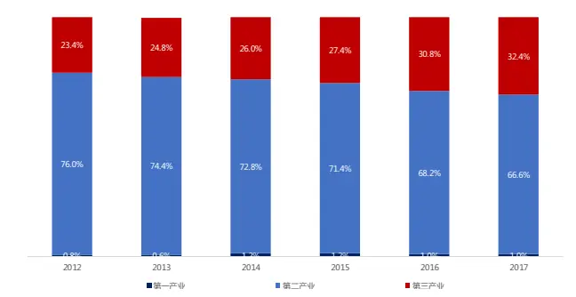
数据来源：东方证券研究所 & 中国企业年鉴

图 8：2012-2017我国民营企业 500强数量的主要行业分布

| 所属行业名称 | 2012 | 2013 | 2014 | 2015 | 2016 | 2017 |
| --- | --- | --- | --- | --- | --- | --- |
| 黑色金属冶炼和压延加工业 | 11.0% | 10.8% | 8.2% | 7.4% | 7.6% | 9.0% |
| 综合 | 5.4% | 6.8% | 5.4% | 5.8% | 7.4% | 8.2% |
| 建筑业 | 13.0% | 12.0% | 12.6% | 11.8% | 10.0% | 7.8% |
| 房地产业 | 5.6% | 5.6% | 6.4% | 7.0% | 7.4% | 7.2% |
| 批发业 | 7.8% | 6.8% | 7.6% | 6.0% | 5.8% | 5.2% |
| 有色金属冶炼和压延加工业 | 6.2% | 5.6% | 6.6% | 6.0% | 5.2% | 4.8% |
| 计算机.通讯和其他电子设备制造业 | 0.0% | 0.0% | 0.0% | 3.6% | 4.6% | 4.6% |
| 化学原料和化学制品制造业 | 4.0% | 4.8% | 4.2% | 4.2% | 3.8% | 4.6% |
| 电气机械和器材制造业 | 6.6% | 5.4% | 4.8% | 5.2% | 3.6% | 4.4% |
| 石油加工、炼焦和核燃料加工业 | 3.8% | 3.6% | 3.8% | 3.6% | 3.8% | 4.2% |
| 零售业 | 3.2% | 3.8% | 4.6% | 3.6% | 3.0% | 4.0% |

数据来源：东方证券研究所 & 中国企业年鉴

## 2.4 民营经济地理位置分布

从民营经济的地理位置分布来看，东部地区在数量上仍占主导优势地位，且占比在不断增加，西部和东北部数量占比下滑较明显。从历史分布来看，我国民营经济中东部平均占比在 40%以上，西部平均占比 25%，中部平均占比 20%以上。从具体省份来看，2017年底民营经济户数占比最高的前 4个省份全部来自东部地区：广东 10.6%，山东 8.3%，江苏 8.3%，浙江 6.1%。而 1998 年是户数占比最高的前 4个省份里中部占据两席：山东 9.2%，河北 8.8%，湖北 6.6%，河南 6.2%。其中广东最近二十年的民营经济规模增幅最大，占比由 1998年 5%提升至 2017年底 10.6%。

图 9：1998-2017我国民营经济户数的区域分布
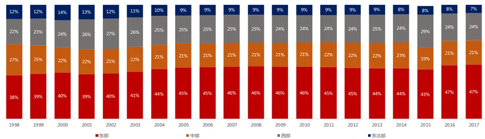
数据来源：东方证券研究所 & 国家统计年鉴

注：东部地区：有 10 个省（直辖市），包括北京、天津、河北、上海、江苏、浙江、福建、山东、广东和海南。中部地区：有 6 个省，包括山西、安徽、江西、河南、湖北和湖南。西部地区：有 12 个省（自治区、直辖市），包括内蒙古、广西、重庆、四川、贵州、云南、西藏、陕西、甘肃、青海、宁夏和新疆。东北地区：有 3 个省，包括辽宁、吉林和黑龙江。

图 10：1998-2017我国民营企业户数的具体省市分布

| 户数占比 | 北京 | 天津 | 河北 | 山西 | 内蒙古 | 辽宁 | 吉林 | 黑龙江 | 上海 | 江苏 | 浙江 | 安徽 | 福建 | 江西 | 山东 | 河南 |  | 湖南 | 广东 | 广西 | 海南 | 重庆 | 四川 | 贵州 | 云南 | 西藏 | 陕西 | 甘肃 | 青海 | 宁夏 | 新疆 |
| --- | --- | --- | --- | --- | --- | --- | --- | --- | --- | --- | --- | --- | --- | --- | --- | --- | --- | --- | --- | --- | --- | --- | --- | --- | --- | --- | --- | --- | --- | --- | --- |
| 1998 | 0.8% | 0.8% | 8.8% | 2.0% | 2.0% | 4.1% | 3.8% | 4.6% | 0.8% | 5.1% | 5.2% | 42% | 1.8% | 2.2% | 9.2% | 6.2% | 6.6% | 6.1% | 5.1% | 3.3% | 0.4% | 1.9% | 5.3% | 1.4% | 2.4% | 0.1% | 2.5% | 1.6% | 0.3% | 0.3% | 1.2% |
| 1999 | 1.0% | 0.8% | 8.8% | 1.8% | 2.4% | 4.3% | 3.6% | 45% | 0.9% | 5.5% | 5.4% | 4.5% | 1.9% | 2.3% | 9.4% | 6.3% | 4.9% | 52% | 53% | 3.5% | 0.4% | 1.6% | 5.4% | 1.4%■ | 2.4% | 0.1% | 2.9% | 1.6% | 0.3% | 0.3% | 1.3% |
| 2000 | 1.3% | 0.6% | 11.0% | 1.2% | 3.0% | 5.6% | 3.7% | 4.5% | 12% | 6.1% | 6.4% | 5.6% | 1.8% | 2.3% | 5.3% | 5.3% | 3.9% | 3.5% | 6.2% | 3.6% | 0.5% | 1.6% | 4.6% | 1.4% | 2.4% | 0.2% | 4.0% | 1.1% | 0.3% | 0.3% | 1.6% |
| 2001 | 1.5% | 0.9% | 6.3% | 1.4% | 3.3% | 6.1% | 2.6% | 43% | 1.5% | 6.9% | 6.8% | 5.9% | 1.9% | 2.3% | 5.7% | 7% | .0% | 8.4% | 7.1% | 4.0% | 0.5% | 1.7% | 4.9% | 1.6% | 2.7% | 0.2% | 4.0% | 1.2% | 0.4% | 0.4% | 1.7% |
| 2002 | 1.8% | 0.9% | 5.0% | 1.5% | 3.1% | 6.3% | 1.7% | 4.1% | 1.8% | 7.1% | 6.8% | 5.6% | 2.0% | 2.4% | 6.2% | 44% | 4.1% | 8.4% | 7.7% | 4.0% | 0.5% | 1.9% | 5.3% | 1.6% | 2.8% | 0.2% | 4.0% | 1.3% | 0.5% | 0.4% | 1.8% |
| 2003 | 2.4% | 0.9% | 4.2% | 1.7% | 2.2% | 5.7% | 1.7% | 3.7% | 2.1% | 6.6% | 7.1% | 4.8% | 2.1% | 2.4% | 6.8% | 4.9% | 43% | 3.8% | 8.2% | 3.9% | 0.6% | 2.0% | 5.8% | 1.7% | 2.9% | 0.2% | 3.2% | 1.3% | 0.5% | 0.4% | 1.8% |
| 2004 | 2.8% | 0.9% | 4.2% | 1.8% | 1.8% | 52% | 1.7% | 2.8% | 2.4% | 7.6% | 7.4% | 4.3% | 2.1% | 2.5% | 7.1% | 4.9% | 1% | 3.7% | 8.7% | .8% | 0.5% | 1.9% | 5.8% | 1.7% | 2.8% | 0.2% | 3.1% | 1.4% | 0.5% | 0.4% | 1.9% |
| 2005 | 3.2% | 0.9% | 4.2% | 1.7% | 1.8% | 5.0% | 1.8% | 2.7% | 2.6% | 7.8% | 7.2% | 2% | 2.1% | 2.6% | 6.9% | 4.9% | 1.0% | 3.7% | 9.4% | 7% | 0.5% | 1.8% | 5.9% | 1.6% | 2.7% | 0.2% | 2.9% | 1.2% | 0.5% | 0.4% | 1.8% |
| 2006 | 3.4% | 0.9% | 4.3% | 1.7% | 1.8% | 4.7% | 1.8% | 2.6% | 2.6% | 8.0% | 71% | 4.3% | 2.1% | 2.6% | 6.9% | 7% | 3.9% | 3.5% | 9.7% | 3.6% | 0.5% | 1.9% | 6.1% | 1.7% | 2.8% | 0.2% | 2.8% | 1.2% | 0.4% | 0.4% | 1.7% |
| 2007 | 3.4% | 0.9% | 4.2% | 2.2% | 1.7% | 4.5% | 1.8% | 2.6% | 2.4% | 8.2% | 6.9% | 3.9% | 2.1% | 2.6% | 6.6% | 7% | 9% | 3.4% | 10.4% | 8.5% | 0.6% | 2.1% | 6.2% | 1.7% | 2.8% | 0.2% | 2.6% | 1.3% | 0.3% | 0.5% | 1.7% |
| 2008 | 3.2% | 0.9% | 4.3% | 2.3% | 1.9% | 43% | 1.8% | 2.7% | 2.5% | 8.7% | 6.8% | 3.7% | 2.2% | 2.4% | 6.4% | 7% | .0% | 8.5% | 10.5% | 3.4% | 0.7% | 2.1% | 6.0% | 1.7% | 2.7% | 0.2% | 2.6% | 1.3% | 0.3% | 0.5% | 1.6% |
| 2009 | 3.1% | 0.9% | 3.9% | 2.3% | 2.0% | 4.4% | 2.0% | 2.7% | 2.4% | 9.0% | 6.5% | 3.7% | 2.2% | 2.5% | 6.7% | 47% | 4.1% | 8.5% | 10.3% | 3.3% | 0.7% | 2.2% | 6.0% | 1.7% | 2.9% | 0.2% | 2.3% | 1.4% | 0.3% | 0.6% | 1.5% |
| 2010 | 3.0% | 0.9% | 3.7% | 2.3% | 2.0% | 4.3% | 2.0% | 2.7% | 2.5% | 9.4% | 6.4% | 3.7% | 2.4% | 2.9% | 6.8% | 48% | 4.0% | 3.6% | 10.0% | 3.0% | 0.7% | 2.0% | 5.9% | 1.7% | 3.0% | 0.2% | 2.2% | 1.4% | 0.3% | 0.5% | 1.5% |
| 2011 | 2.8% | 0.8% | .7% | 2.3% | 2.1% | 4.1% | 2.2% | 2.7% | 2.4% | 9.5% | 6.4% | 3.6% | 2.4% | 2.9% | 6.8% | 5.0% | 43% | 3.7% | 9.7% | 2.8% | 0.7% | 2.3% | 5.9% | 1.8% | 3.0% | 0.2% | 2.2% | 1.5% | 0.3% | 0.5% | 1.4% |
| 2012 | 2.5% | 0.8% | 3.6% | 2.2% | 2.2% | 4.0% | 2.2% | 2.7% | 2.4% | 9.4% | 6.4% | 3.5% | 2.5% | 2.9% | 6.7% | 5.1% | 4.6% | 3.7% | 9.5% | 2.7% | 0.7% | 2.5% | 5.8% | 2.0% | 3.1% | 0.2% | 2.2% | 1.5% | 0.3% | 0.5% | 1.3% |
| 2013 | 2.3% | 0.8% | 3.6% | 2.1% | 2.2% | .7% | 2.3% | 2.7% | 2.3% | 9.2% | 6.2% | 3.6% | 2.6% | 2.9% | 6.8% |  |  |  |  |  |  |  |  |  |  |  |  |  |  |  |  |
| 2014 | 2.3% | 0.8% | 3.9% | 2.1% | 2.2% | 3.5% | 2.3% | 2.7% | 2.3% | 8.1% | 6.1% | 3.6% | 2.8% | 2.9% | 7.6% | 7% | 5.8% | 3.7% | 9.8% | 2.6% | 0.7% | 2.5% | 5.2% | 2.4% | 3.0% | 0.2% | 2.5% | 1.6% | 0.3% | 0.5% | 1.3% |
| 2015 | 2.3% | 0.9% | 4.2% | 2.2% | 2.1% | 3.5% | 2.2% | 2.1% | 2.4% | 7.8% | 6.1% | 3.6% | 3.1% | 2.8% | 8.0% | 1.0% | 4.5% | 5.0% | 6.2% | 73% | 2.3% | 1.3% | 2.9% | 4.6% | 2.6% | 2.6% | 0.8% | 2.2% | 1.4% | 0.4% | 0.7% |
| 2016 | 2.2% | 0.9% | 47% | 2.2% | 2.0% | 3.4% | 2.1% | 2.2% | 2.3% | 8.0% | 6.1% | 3.7% | 3.2% | 2.6% | 8.2% | 4.8% | 4.7% | 8.4% | 10.4% | 2.5% | 0.7% | 2.5% | 4.9% | 2.5% | 3.0% | 0.2% | 2.4% | 1.6% | 0.4% | 0.6% | 1.5% |
| 2017 | 2.1% | 1.0% | 4.8% | 2.1% | 1.9% | 3.2% | 2.1% | 2.1% | 2.3% | 8.3% | 6.1% | 3.9% | 3.4% | 2.4% | 8.3% | 5.1% | 4.6% | 3.4% | 10.6% | 2.5% | 0.7% | 2.4% | 5.1% | 2.5% | 2.8% | 0.2% | 2.4% | 1.5% | 0.4% | 0.6% | 1.5% |

数据来源：东方证券研究所 & 国家统计年鉴

从大型民营企业（指 500 强民营企业）的地理位置分布情况来看，2017 年东部 500 强民企的数量占比高达 80%（全体民营经济中东部数量占比 47%）,中西部 500强民企的数量占比合计仅为 19%（全体民营经济中中西部数量占比 45%），并且近五年来，东部 500强民企的数量占比还在不断上升。说明大型民企集中在东部，中西部民营企业规模普遍较小。从具体省份来看，民企 500强集中于东部沿海省份，2017 年长三角（江苏、浙江、上海、安徽）是最为集中的区域，数量占比达到 40%，环渤海区域（京津冀、山西、内蒙、山东、辽宁）占比 27%，珠三角（广东）占比12%。其中，近五年山东、广东两省的 500 强民企数量增速很快，浙江省下滑较为明显。

图 11：2012-2017 我国民营企业 500强数量的区域分布
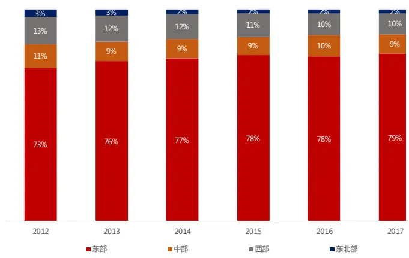
数据来源：东方证券研究所 & 中国企业年鉴

图 12：2012-2017 我国民营企业 500强数量的具体省市分布

| 省市 | 2012 | 2013 | 2014 | 2015 | 2016 | 2017 |
| --- | --- | --- | --- | --- | --- | --- |
| 浙江 | 27.8% | 27.6% | 27.6% | 26.8% | 24.0% | 18.6% |
| 江苏 | 18.6% | 19.2% | 18.2% | 18.8% | 16.4% | 17.2% |
| 山东 | 10.8% | 10.8% | 10.6% | 9.6% | 11.6% | 14.6% |
| 广东 | 4.2% | 4.8% | 8.0% | 10.0% | 11.8% | 12.0% |
| 河北 | 3.2% | 3.8% | 3.0% | 3.6% | 3.8% | 4.8% |
| 福建 | 0.8% | 1.6% | 1.4% | 1.8% | 2.0% | 4.0% |
| 上海市 | 3.2% | 3.0% | 2.8% | 2.8% | 2.6% | 3.6% |
| 河南 | 3.0% | 2.8% | 3.2% | 2.4% | 3.0% | 3.0% |
| 北京市 | 1.6% | 2.0% | 2.4% | 2.4% | 3.2% | 3.0% |
| 湖北 | 3.6% | 3.0% | 3.2% | 3.6% | 3.8% | 3.0% |
| 重庆市 | 2.2% | 2.0% | 2.2% | 2.4% | 2.2% | 2.8% |
| 四川 | 3.0% | 2.6% | 2.4% | 2.6% | 2.0% | 1.6% |
| 天津市 | 2.4% | 3.0% | 2.8% | 2.6% | 2.6% | 1.4% |
| 湖南 | 2.2% | 2.2% | 1.4% | 1.2% | 1.2% | 1.4% |
| 内蒙古 | 3.4% | 2.4% | 2.4% | 1.6% | 1.2% | 1.4% |
| 辽宁 | 2.2% | 1.8% | 1.2% | 1.4% | 1.2% | 1.2% |
| 江西 | 0.8% | 1.2% | 1.6% | 1.2% | 1.4% | 1.2% |
| 山西 | 1.6% | 0.8% | 1.0% | 0.8% | 1.0% | 1.0% |
| 陕西 | 0.8% | 1.0% | 0.8% | 0.8% | 0.8% | 1.0% |
| 安徽 | 0.6% | 0.4% | 0.6% | 0.8% | 1.0% | 0.8% |
| 宁夏 | 0.6% | 0.6% | 0.6% | 0.6% | 0.6% | 0.6% |
| 广西 | 0.2% | 0.4% | 0.2% | 0.2% | 0.2% | 0.4% |
| 吉林 | 0.2% | 0.2% | 0.2% | 0.2% | 0.4% | 0.4% |
| 新疆 | 0.4% | 0.4% | 0.4% | 0.6% | 0.4% | 0.4% |
| 云南 | 1.2% | 1.2% | 0.6% | 0.6% | 0.6% | 0.2% |
| 新疆 | 0.0% | 0.0% | 0.4% | 0.2% | 0.4% | 0.2% |
| 黑龙江 | 1.0% | 0.8% | 0.6% | 0.2% | 0.2% | 0.2% |

数据来源：东方证券研究所 & 中国企业年鉴

## 2.5 民营经济发展成就

1. 民营经济在 GDP 中的比重不断上升。1989 年，私营经济和个体经济产值在 GDP 中的比重仅为 3.86%，据国家发展改革委新闻发言人严鹏介绍，截至 2017 年底，民营经济产值占 GDP的比重超过了 60％，撑起了我国经济的“半壁江山”。其中辽宁、河南、河北、福建、浙江、内蒙古等省份的民营经济增加值占 GDP 的比重超过 60%，辽宁、河南省高达 70%以上。

图 13：2017 各省民营经济增加值占 GDP 比重

| 2017年GDP总量排名 | 省(区、市) 民营经济增加值/GDP |  | 时间 | 2016年GDP总量排名省(区、市) |  | 民营经济增加值/GDP | 时间 | 2016年GDP总量排名 | 省(区、市) 民营经济增加值/GDP |  | 时间 |
| --- | --- | --- | --- | --- | --- | --- | --- | --- | --- | --- | --- |
| 1 | 广东 | 53.8% | 2017 | 11 | 上海 | 52.0% | 2016 | 21 | 黑龙江 | 51.8% | 2017 |
| 2 | 江苏 | 55.4% | 2017 | 12 | 北京 |  |  | 22 | 内蒙古 | 65.5% | 2017 |
| 3 | 山东 | 50.8% | 2017 | 13 | 安徽 | 57.8% | 2017 | 23 | 吉林 | 51.7% | 2017 |
| 4 | 浙江 | 65.4% | 2017 | 14 | 辽宁 | 75.2% | 2017 | 24 | 山西 | 48.8% | 2017 |
| 5 | 河南 | 71.0% | 2017 | 15 | 陕西 | 54.1% | 2017 | 25 | 贵州 | 53.2% | 2017 |
| 6 | 四川 | 56.1% | 2017 | 16 | 江西 | 59.5% | 2017 | 26 | 新疆 | 32.0% | 2017 |
| 7 | 湖北 | 55.0% | 2017 | 17 | 广西 | 约60.00% | 2016 | 27 | 甘肃 | 48.2% | 2017 |
| 8 | 河北 | 67.9% | 2017 | 18 | 重庆 | 50.5% | 2017 | 28 | 海南 | 近60.00% | 2015 |
| 9 | 湖南 | 59.4% | 2017 | 19 | 天津 | 43.9% | 2017 | 29 | 宁夏 | 49.2% | 2017 |
| 10 | 福建 | 67.2% | 2017 | 20 | 云南 | 47.2% | 2017 | 30 | 青海 | 35.7% | 2017 |

数据来源：东方证券研究所 & 各省政府工作报告 & 各省国民经济和社会发展统计公报
注 1：个别城市未公布 2017 年的数据，用之前年份代替。
注 2：北京始终未公布民营经济增加值占比，但由于北京是国有经济占主导的城市，其民营经济增加值占比可能略低于上海。

2. 民营经济在税收收入中的比重不断提高。根据《中国税务年鉴》，1995年私营企业和个体企业共缴纳税收 429.6 亿元，在全国税收收入中的比重为 8%。到 2017 年二者缴纳税收额增至2.83 万亿元，比重增至 18%，相比 2016 年增速接近 27%。其中私营企业 2017 年 32.7%的税收增速远高于其他类别。此外，民营企业的税收情况可以参考由社会科学文献出版社正式发布的《民间投资与民营经济发展重要数据分析报告》，其中指出 2018年民营企业税收收入 9.6万亿，同比增长 17.6%，占全部税收收入的 56.8%，较上年提高 4.2%。此外 2017年民营企业 500强纳税总额达到 1.03 万亿元，首次突破万亿大关，占全国税收的比重为 7.6%。由于国企大多集中在产业链的上游，其产品价格是行政垄断定价，从而可以把税负顺利转嫁给中下游的企业和消费者。民营企业多处于竞争性中下游行业，税负难以转嫁，加之民企很多是从事劳动密集型行业，很多增值税无法抵扣，导致民企承担的税负较高。

图 14：2015-2017民营企业、国有及国有控股企业、涉外企业税收收入及占比
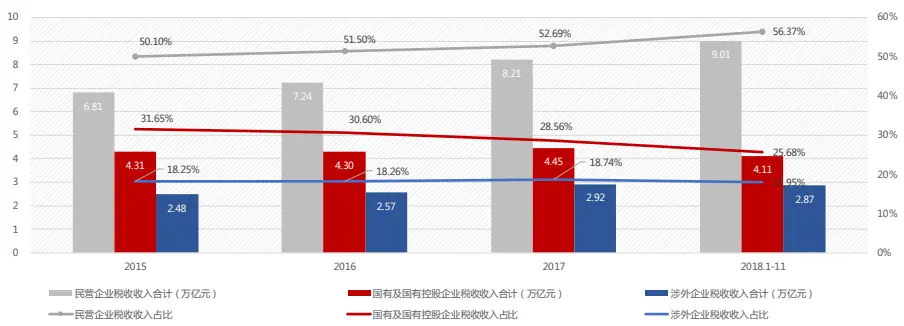
数据来源：东方证券研究所 & 民营经济发展与民间投资重要数据分析报告

图 15：2007-2017全国税收收入分企业类型统计

| 项目 合计 内资企业 |  |  |  |  |  |  |  |  |  | 港澳台投资企业 外商投资企业 个体经营· |  |  |  |
| --- | --- | --- | --- | --- | --- | --- | --- | --- | --- | --- | --- | --- | --- |
| 税收收入合计（亿元） 2017 | 155,739.29 | 118,480.97 | 国有企业 14,727.98 | 集体企业 692.51 | 股份合作企业 467.85 | 联营企业 46.24 | 有限责任公司 50,985.50 | 股份有限公司 25,857.62 | 私营企业 20,175.43 | 其他企业 |  |  |  |
| 2016 | 140,504.03 | 107,719.29 | 14,954.95 | 841.10 | 518.92 | 51.92 | 45,133.26 | 25,622.54 | 15,195.36 | 5,527.84 5,401.24 | 10,082.40 8,845.34 | 19,102.74 16,813.87 | 8,073.17 7,125.53 |
| 2015 | 136,021.83 | 104,357.90 | 15,999.33 | 885.29 | 603.54 | 70.96 |  | 67,932.61 | 13,012.16 | 5,854.00 | 8,317.25 | 16,500.00 | 6,846.69 |
| 2014 | 129,541.12 | 97,782.49 | 15,925.03 | 981.53 | 638.79 | 75.68 |  | 62,453.59 | 12,545.48 | 5,162.40 | 8,049.47 | 16,871.12 | 6,838.03 |
|  | 119,959.91 | 90,100.81 | 15,376.59 | 1,009.61 | 593.95 | 78.06 |  | 56,592.84 | 11,684.45 | 4,765.31 | 7,403.69 | 15,673.84 | 6,781.57 |
| 2013 |  |  |  |  |  |  |  |  |  |  |  |  |  |
| 2012 | 110,764.04 | 83,472.80 | 14,973.85 | 969.69 | 617.02 | 99.83 |  | 51,371.60 | 10,807.79 | 4,633.01 | 7,005.02 | 14,764.02 | 5,522.19 |
| 2011 2010 | 95,729.46 77,394.44 | 72,039.92 57,608.68 | 13,915.08 11,973.61 | 929.80 840.91 | 482.59 382.63 | 115.82 |  | 43,369.27 33,671.58 | 10,152.42 8,237.30 | 3,074.95 2,385.94 | 6,368.10 5,114.53 | 13,269.90 | 4,051.54 3,396.06 |
| 2009 | 63103.60 | 46,853.31 | 10,169.58 | 784.99 | 327.82 | 116.73 99.14 |  | 27,246.26 | 6,402.26 | 1,823.26 | 4,292.43 | 11,275.19 | 2,635.12 |
| 2008 | 57,861.80 | 42,952.24 | 10,354.66 | 822.53 | 296.89 | 110.83 |  | 23,521.22 | 5,899.68 | 1,946.42 | 3,703.19 | 9,322.73 8,415.73 | 2,790.64 |
| 2007 | 48,574.92 | 36,651.72 | 9,651.79 | 810.47 | 244.09 | 100.34 |  | 18,582.28 | 4,789.94 | 2,472.81 | 2,939.11 | 7,033.49 | 1,950.61 |

| 项目税收收入占比 | 合计 | 内资企业 |  |  |  |  |  |  |  |  |  | 港澳台投资企业 外商投资企业 |  | 个体经营· |
| --- | --- | --- | --- | --- | --- | --- | --- | --- | --- | --- | --- | --- | --- | --- |
| 2017 | 100.00% | 76.08% | 9.46% |  |  | 0.44% | 0.30% 0.03% | 32.74% | 16.60% | 12.95% | 3.55% | 6.47% | 12.27% | 5.18% |
| 2016 | 100.00% | 76.67% | 10.64% |  |  | 0.60% | 0.37% 0.04% | 32.12% | 18.24% | 10.81% | 3.84% | 6.30% | 11.97% | 5.07% |
| 2015 | 100.00% | 76.72% | 11.76% |  |  | 0.65% | 0.44% 0.05% | 0.00% | 49.94% | 9.57% | 4.30% | 6.11% | 12.13% | 5.03% |
| 2014 | 100.00% | 75.48% | 12.29% |  |  | 0.76% | 0.49% 0.06% | 0.00% | 48.21% | 9.68% | 3.99% | 6.21% | 13.02% | 5.28% |
| 2013 | 100.00% | 75.11% | 12.82% |  |  | 0.84% | 0.50% 0.07% | 0.00% | 47.18% | 9.74% | 3.97% | 6.17% | 13.07% | 5.65% |
| 2012 | 100.00% | 75.36% | 13.52% |  |  | 0.88% | 0.56% 0.09% | 0.00% | 46.38% | 9.76% | 4.18% | 6.32% | 13.33% | 4.99% |
| 2011 | 100.00% | 75.25% |  | 14.54% |  | 0.97% | 0.50% 0.12% | 0.00% | 4530% | 10.61% | 3.21% | 6.65% | 13.86% | 4.23% |
| 2010 | 100.00% | 74.44% |  |  | 15.47% | 1.09% | 0.49% 0.15% | 0.00% | 43.51% | 10.64% | 3.08% | 6.61% | 14.57% | 4.39% |
| 2009 | 100.00% | 74.25% |  |  | 16.12% | 1.24% | 0.52% 0.16% | 0.00% | 43.18% | 10.15% | 2.89% | 6.80% | 14.77% | 4.18% |
| 2008 | 100.00% | 74.23% |  |  | 17.90% | 1.42% | 0.51% 0.19% | 0.00% | 40.65% | 10.20% | 3.36% | 6.40% | 14.54% | 4.82% |
| 2007 | 100.00% | 75.45% |  |  | 19.87% | 1.67% | 0.50% 0.21% | 0.00% | 38.25% | 9.86% | 5.09% | 6.05% | 14.48% | 4.02% |

数据来源：东方证券研究所 & 中国税务年鉴

3. 民营经济吸纳就业能力显著增强。1990 年，私营企业和个体企业共吸纳就业人数为 2275万人，在总就业人口中的比重为 3.51%，其中以个体工商户为主，到 2004年私营企业就业人数首次超过个体企业。此后私营企业的就业人数增速明显加快，截止 2017 年，私营企业和个体企业共吸纳就业人数增至 3.41亿人，比重增至 43.93%。其中，私营企业和个体企业吸纳就业人数比重分别为 25.61%、18.32%。

图 16：1978-2017 我国民营经济就业人数、在总就业人员中的占比
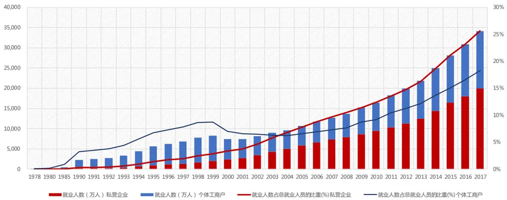
数据来源：东方证券研究所 & Wind 资讯

4. 民营经济成为科技创新的重要驱动因素。一是民营经济的研发投入不断提升。以规模以上工业企业为例，我国私营企业的研发人员全时当量、研发经费、研发项目数逐年增加，且增幅较大，

2011-2017 年间三项分别增长了 1.3 倍、2. 4 倍、2.3 倍；在整体中的比重也在逐年上升，2011-2017 年间三项占比分别提升了 11.1%、10.8%，16%。二是民营经济的专利产出不断增加。我国私营企业的专利申请数、发明专利数申请数、有效发明专利数逐年增加，2011-2017 年间三项分别增长了 1.4 倍、1. 9 倍、4.6 倍；在整体中的比重也在逐年上升，2011-2017 年间三项占比分别提升了 4.1%、4.7%，4.3%。三是民营经济的新产品开发效益不断提高。我国私营企业的新产品项目数、新产品销售收入、新产品出口销售收入在逐年增加，2011-2017年间三项分别增长了 1.8 倍、2. 1 倍、1.9 倍；在整体中的比重也在逐年上升，2011-2017 年间三项占比分别提升了 11.7%、8.9%，4.8%。

图 17：2011-2017 我国规模以上工业企业中私营企业研发投入情况

| 私营企业数量 | 2011 | 2012 | 2013 2014 2015 2016 2017 |  |  |  |  |
| --- | --- | --- | --- | --- | --- | --- | --- |
| R&D人员全时当量(万人年) | 34.51 | 41.91 | 52.36 | 60.62 | 66.20 | 73.24 | 79.08 |
| R&D 经费(亿元) | 944.00 | 1246.54 | 1690.14 | 2026.76 | 2363.58 | 2800.54 | 3188.06 |
| R&D项目数(万项) | 5.27 | 7.23 | 8.97 | 10.37 | 10.44 | 13.04 | 17.24 |
| 私营企业占比 | 2011 | 2012 | 2013 | 2014 | 2015 | 2016 | 2017 |
| R&D人员全时当量 | 17.80% | 18.66% | 20.99% | 22.95% | 25.09% | 27.10% | 28.90% |
| R&D 经费 | 15.75% | 17.31% | 20.32% | 21.90% | 23.60% | 25.59% | 26.54% |
| R&D项目数 | 22.722% | 25.15% | 27.79% | 30.27% | 33.69% | 36.12% | 38.74% |

数据来源：东方证券研究所 & 国家统计年鉴
注：从 2011 年起，规模以上工业企业的统计范围从年主营业务收入为 500 万元及以上的法人工业企业调整为年主营业务收入为 2000 万元及以上的法人工业企业。以下各表同。

图 18：2011-2017 我国规模以上工业企业中私营企业专利情况

| 私营企业数量 | 2011 | 2012 2013 2014 2015 2016 2017 |  |  |  |  |  |
| --- | --- | --- | --- | --- | --- | --- | --- |
| 专利申请数（万件） | 11.17 | 14.42 | 17.47 | 20.28 | 21.55 | 23.78 | 27.01 |
| 发明专利数（万件） | 2.92 | 3.96 | 5.07 | 6.22 | 6.71 | 7.86 | 8.45 |
| 有效发明专利数（万件） | 4.14 | 5.57 | 7.48 | 10.38 | 12.87 | 18.05 | 23.19 |
| 私营企业占比 | 2011 | 2012 | 2013 | 2014 | 2015 | 2016 | 2017 |
| 专利申请数 | 28.93% | 29.43% | 31.14% | 32.17% | 33.74% | 33.24% | 33.06% |
| 发明专利数 | 21.66% | 22.49% | 24.69% | 25.92% | 27.32% | 27.37% | 26.34% |
| 有效发明专利数 | 20.57% | 20.10% | 22.29% | 23.12% | 22.43% | 23.44% | 24.82% |

数据来源：东方证券研究所 & 国家统计年鉴

图 19：2011-2017 我国规模以上工业企业中私营企业新产品开发及生产情况

| 私营企业数量 2011 |  | 2012 | 2013 | 2014 | 2015 | 2016 | 2017 |
| --- | --- | --- | --- | --- | --- | --- | --- |
| 新产品开发项目数(万项） | 6.76 | 8.36 | 10.30 | 11.95 | 11.34 | 14.53 | 18.88 |
| 新产品销售收入(万亿元) | 1.35 | 1.65 | 2.28 | 2.74 | 3.27 | 3.90 | 4.28 |
| 新产品出口销售收入(万亿元) | 0.19 | 0.21 | 0.26 | 0.33 | 0.35 | 0.47 | 0.55 |
| 私营企业占比 | 2011 | 2012 | 2013 | 2014 | 2015 | 2016 | 2017 |
| 新产品开发项目数 | 25.38% | 39.52% | 25.85% | 28.76% | 31.78% | 34.77% | 37.09% |
| 新产品销售收入 | 13.43% | 22.37% | 14.97% | 17.77% | 19.14% | 21.66% | 22.32% |
| 新产品出口销售收入 | 9.54% | 15.88% | 9.38% | 11.52% | 12.44% | 12.08% | 14.37% |

数据来源：东方证券研究所 & 国家统计年鉴

然而，民营经济发展仍面临诸多问题：

1. 民营经济投资增速仍处在历史低位： 2013年以来，私营企业投资增速从 30%的高位迅速下滑。特别是 2016年在供给侧改革及经济下行背景下，经营风险加大，投资回报率下降，民营企业发展信心受挫，私营企业投资增速下滑至 10%。2018年以来在中央各项鼓励政策的支持下，私营企业投资增速有所回升，但仍处在历史低位。

图 20：2012-2018全国固定资产累计投资同比增速分企业类型统计
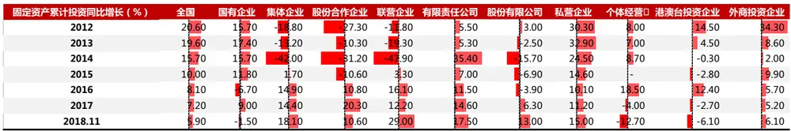
数据来源：东方证券研究所 & 国家统计年鉴

2. 民营经济生产成本持续攀高、盈利恶化：一方面原材料价格波动较大，用工成本上涨，职工工资待遇持续提高，社保、医保等费用相应增加；另一方面而市场销售疲软，产品库存上升，产品出厂价格下降，导致民企的利润空间受到多重挤压。

3. 民营经济融资难、融资贵：民营企业发展的资金来源主要靠自有资金、银行信贷和民间融资。2017年民营企业 500强的新增投资资金来源中，自有资金、银行信贷、资本市场融资分别占38%，32%，16%。

图 21：2013-2017民营企业新增投资资金来源（家）
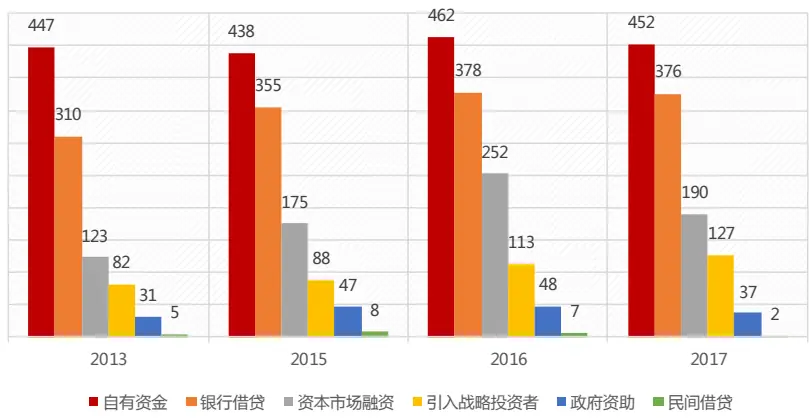
数据来源：东方证券研究所 & 全国工商联经济部《2018 中国民营企业 500 强调研分析报告》

具体来看，民企融资呈现以下几个特点：（1）由于发行债券、股票等条件较为严格，民企直接融资占比很低。2018 年，以民营企业占据主导地位的中小企业板和创业板全年募资额 3229 亿元，其中 IPO融资额 513亿元，与几万亿级别的间接融资相比差距较大。（2）对于小微企业而言，很难拿到银行信贷。从 2017年底开始，金融机构对小微企业贷款余额增速出现了明显下滑，截至

2018 年底，小微企业贷款增速降至 8.94%，而同期金融机构各项贷款余额增速达到 13.46%。

（3）民营企业即使能从银行获得贷款，通常也都在规定利率的基础上较大幅度上浮，融资成本较高。2016 年供给侧改革之后，在风险偏好下降的背景下，信用资质相对较弱的民企表内融资成本不断上升，信用利差持续走高，从不到 200 个 bp 上升到 312 个 bp，上升幅度明显高于央企和地方国企。2018年底国企与民企的信用利差为 200个 bp。（4）民间借贷利率高企，Wind数据库显示温州民间借贷利率最近两年基本上在 16%左右波动。2018 年广州小额贷款利率 1 年以上在 10%左右。宁波小额贷款利率平均在 18%以上。

图 22：2016-2018我国小微企业贷款余额、同比增速
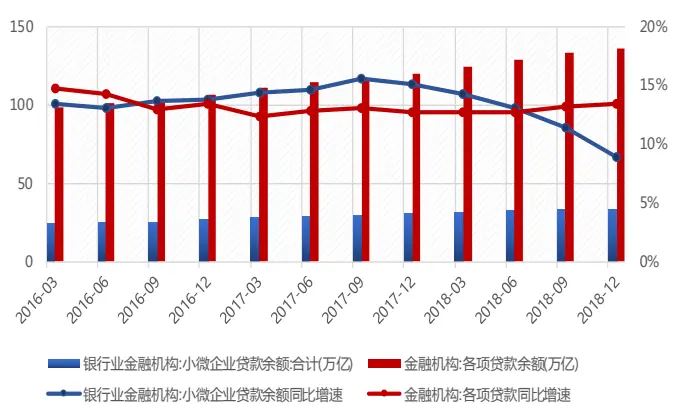
数据来源：东方证券研究所 & Wind 资讯

图 23：2016-2018我国债券市场信用利差
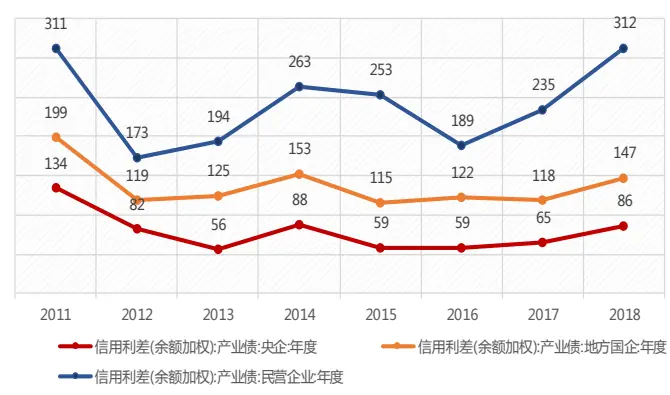
数据来源：东方证券研究所 & Wind 资讯

4. 民营经济债务风险突出：由于民企融资成本较高，经济上行期尚能周转，一旦遇上经济不景气，银根紧缩，就会陷入财务困境，“抽贷”、“断贷”导致其资金链断裂，出现流动性危机。近年来，民企信用债违约事件频发，2015-2018年民企债券违约的数量和金额占比均有明显提高，2018 年二者分别达到了 85%和 87%。截止 2018 年 12 月 31 日，非金融企业信用债券市场规模20.7万亿元，其中，民营企业1.9万亿，占比 9.2%，以不到的一成信用债规模占比，却占据违约债券数量和规模的八成多，民企面临的债务风险亟待化解。

图 24：2015-2018 我国民企信用债违约情况
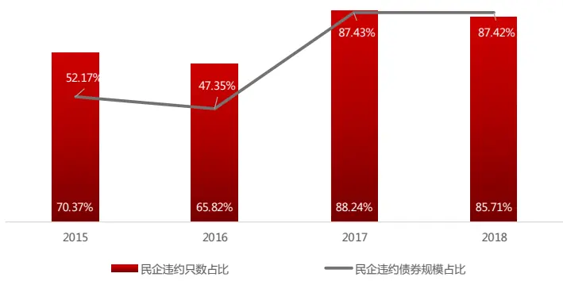
数据来源：东方证券研究所 & Wind 资讯

2018年底习总书记在民营企业家座谈会上着重提出，要着力解决民营企业融资难融资贵问题。随后在中央经济工作会议再次强调，要改善货币政策传导机制，提高直接融资比重，实施好积极的财政政策和稳健的货币政策，推动更大规模减税、更明显降费，有效缓解民营企业融资难融资贵问题。未来，民营经济有望进一步健康快速发展。

## 三、 现状：民营企业在股市中的地位

## 3.1 民企的数量、规模

A 股中的上市公司按照其实际控制人类型，可以划分为 5 个大类，概括如下图：

图 25：A 股企业所有制类型

| 公司属性 | 判断标准 |  |
| --- | --- | --- |
| 国有企业 | 中央国有企业 | 大股东/实际控制人属于国务院国资委、中央国家机关或者中央国有企/事业单位 |
|  | 地方国有企业 | 大股东/实际控制人属于地方各级国资委、地方各级政府/部门或者地方国有企/事业单位 |
| 民营企业 |  | 非公有制企业，例如个体企业、私营企业等，特点是没有国有资本，非国家控股 |
| 外资企业 | 中外合资企业 | 由外国公司或其他经济组织或个人与中国公司或其他经济组织按法律规定共同投资设立、共同经营，按各自的出资比例共担风险、共负盈亏。各方出资折算成一定的出资比例，外国合营者的出资比例一般不低于25%; |
|  | 外商独资企业 | 指外国公司或其他经济组织或个人，依照中国法律在中国境内设立的全部资本由外国投资者投资的企业(可以是一个外国投资者独资，也可以是若干外国投资者合资) |
| 集体企业 |  | 指以生产资料的劳动群众集体所有制为基础，实行共同劳动，在分配形式上以按劳分配为主（部分企业实行按劳分配和按资分配相结合）的集体经济组织。ps：集体企业是历史产物，目前已改制成股份合作制、有限公司、股份公司等 |
| 公众企业 |  | 无实际控制人 |

数据来源：东方证券研究所 & Wind 资讯

通过国企和民企的数量、总市值和总资产所占比重情况可以看到，国企的数量、总市值和总资产占比均在下降，而民企占比逐年攀升，在上市公司数量上民企已反超国企，成为 A 股市场的重要组成部分，但在总市值和总资产上民企仍十分弱势。2002 年时国企在股市中占据绝对主导地位，三项指标占比均在半数以上，数量占比 55%、总市值占比 63%、总资产占比 74%，而民企则十分弱势，数量占比为 10%，总市值和总资产占比不到 5%。2004年中小板设立、2009年创业板设立后，民企上市公司的三项占比均有大幅增加。到了 2018 年国企的数量占比减半，不足 30%，民企后来居上数量占比已超过国企，达到了 61%。国企的总市值和总资产占比分别降为 46%、42%，而民企的市值和资产占比虽有所上升，但 31%的市值占比和 7%的资产占比相比国企仍有较大差距。这也能反应出国企均是大体量的企业。

图 26：2002-2018A 股国企数量、总市值和总资产占比
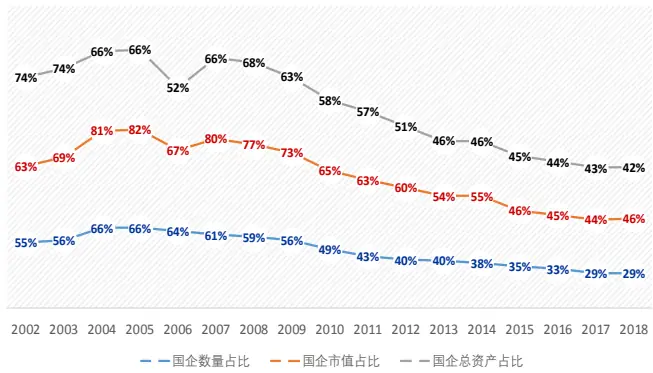
数据来源：东方证券研究所 & Wind 资讯

图 27：2002-2018A 股民企数量、总市值和总资产占比
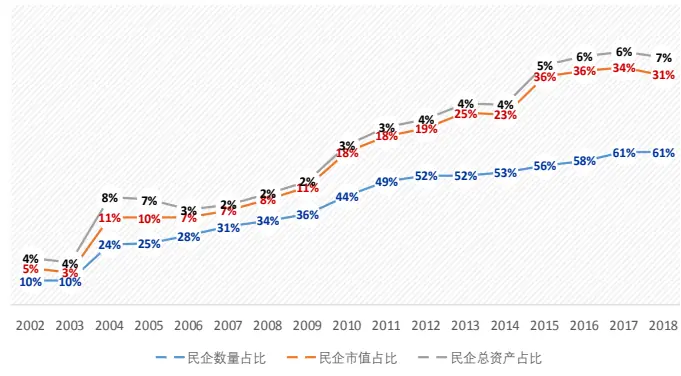
数据来源：东方证券研究所 & Wind 资讯

IPO 制度的严格限制，是导致国企和民企通过股票融资获得的资源存在差异的主要原因。从主板（包括中小板）的上市条件可以看到，我国股票市场对发行股票的融资者的要求较高，要求企业必须达到一定规模、三年持续增长、盈利等要求，而民营企业由于受到自身经营规模和管理水平的限制，往往很难达到证券市场的要求。创业板 IPO 条件有所放松、上市条件门槛较低。从上市民企的的数量变化中也能够看出，2004年中小板，2009年创业板启动后，上市民企数量、总市值、总资产均有较大幅度的增加。

图 28：主板、中小板、创业板上市条件区别

| 主板、中小板 |  | 创业板 |
| --- | --- | --- |
| 盈利要求 | (1)最近3个会计年度净利润均为正数且累计超过3,000万元， 净利润以扣除非经常性损益前后较低者为计算依据； | (1)最近2年连续盈利，最近2年净利润累计不少于1,000万元，且持续增长。 |
|  | (2)最近3个会计年度经营活动产生的现金流量净额累计超过 5,000万元；或者最近3个会计年度营业收入累计超过3亿元； | (2)最近一年盈利，且净利润不少于500万元，最近一年营业收入不少于5,000 万元，最近2年营业收入增长率均不低于30%。 |
|  | (3)最近一期不存在未弥补亏损； | (注：上述要求为选择性标准，符合其中一条即可) |
| 资产要求 | 最近一期末无形资产（扣除土地使用权、水面养殖权和采矿权等 后）占净资产的比例不高于20% | 最近一期末净资产不少于2,000万元，且不存在未弥补亏损。 |
| 主营业务要求 | 最近3年内主营业务没有发生重大变化 | 发行人应当主要经营一种业务，最近2年内没有发生重大变化。 |
| 董事及管理层 | 最近3年内没有发生重大变化 | 最近2年内未发生重大变化。 |
| 实际控制人 | 最近3年内实际控制人未发生变更 | 最近2年内实际控制人未发生变更 |
| 成长性与创新能力 | 无 | 发行人具有较高的成长性，具有一定的自主创新能力，在科技创新、制度创新、 管理创新等方面具有较强的竞争优势 |
| 募集资金用途 | 应当有明确的使用方向，原则上用于主营业务 | 发行人募集资金应当用于主营业务，并有明确的用途。募集资金数额和投资项目 应当与发行人现有生产经营规模、财务状况、技术水平和管理能力等相适应。 |
| 发审委 | 设主板发行审核委员会，25人 | 设创业板发行审核委员会 |
| 初审征求意见 | 征求省级人民政府、国家发改委意见 | 无 |
| 针对创业板的其他要求 |  | 1、发行人的经营成果对税收优惠不存在严重依赖； 2、在公司治理方面参照主板上市公司从严要求，要求董事会下设审计委员会， 并强化独立董事履职和控股股东责任； |
|  |  | 3、要求保荐人对公司成长性、自主创新能力作尽职调查和审慎判断，并出具专 |
|  |  | 项意见； 4、要求发行人的控股股东对招股说明书签署确认意见； |
|  | 板市场的投资风险及本公司所披露的风险因素，审慎作出投资决定”。 | 5、要求发行人在招股说明书显要位置做出风险提示，内容为“本次股票发行后 拟在创业板市场上市，该市场具有较高的投资风险。创业板公司具有业绩不稳定 、经营风险高等特点，投资者面临较大的市场波动风险，投资者应充分了解创业 |

数据来源：东方证券研究所 & 证监会《上市公司证券发行管理办法》
注：主板除了规模更大外，与中小板在条件上没有明显区别。

2018 年提出设立的科创板实行 IPO 注册制，旨在解决规模体量小、高成长性的科技创新型企业的融资问题。在发行条件方面，科创板不再单纯以净利润为硬指标，引入市值指标体系，允许符合科创板定位、尚未盈利或存在累计未弥补亏损的企业上市。按照预计市值的大小制定了 5 档标准，企业经营的未来预期越好、技术优势越明显，对预计市值规模的要求越低。此外，传统市场企业上市由中国证监会负责审核，科创板企业上市由上海证券交易所负责发行审核，中国证监会负责科创板股票发行注册且 20个工作日内需作出是否同意注册的意见，审核最长时限为 6个月。科创板的设立，不仅为民营中小企业提供了更加灵活有效的融资渠道，有利于支持鼓励民营企业发展，未来也有望吸引体量更大的海外中概股或独角兽企业上市。

截至 4月 24日，已经有 113家公司提交了科创板上市申请，71家已经进入问询阶段。主要集中在新一代计算机、信息技术、专用装备、医药等领域，分别占比 23%、18%、20%、13%。

图 29：科创板 IPO 审核情况（截止 2019/04/24）
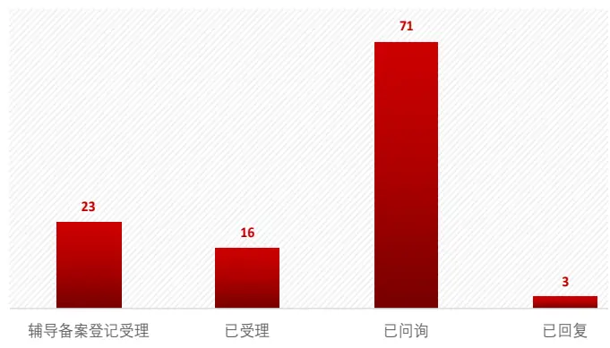
数据来源：东方证券研究所 & Wind 资讯
注：审批流程依次为：辅导登记备案受理——已受理——已问询——已回复

图 30：科创板 IPO 审核企业行业分布（按证监会（CSRC）行业分类，截止 2019/04/24）
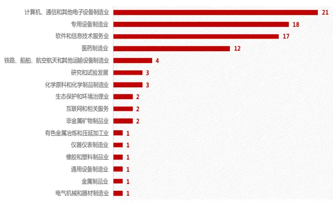
数据来源：东方证券研究所 & Wind 资讯
注：辅导登记备案受理中的企业暂无行业分类

## 3.2 民企的行业分布

从 A股各行业中的民企分布情况来看，金融、煤炭、钢铁、国防军工、交运、电力设备等传统国有垄断行业中民企上市公司的占比较低，没有上市银行属于民企，而在计算机、医药、农林牧渔、轻工制造、纺织服装等新兴产业和劳动密集型制造业中则是民企占比较高。目前我国仍存在一些领域民企进入困难，主要集中在一些高回报率的垄断行业、社会事业、基础设施、公共服务行业。在这些领域国企更容易取得准入许可，也更容易得到较为放松的管制，民企由于运行规律和管理方式的不同，往往很难得到项目，容易受到监管的“玻璃门”限制。

图31：A股各行业中的民企数量分布情况（截止2018/12/31，中信一级行业分类）
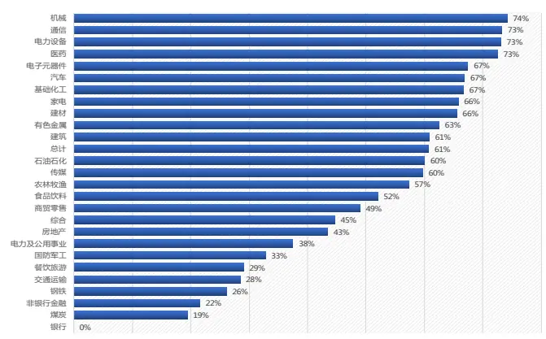
数据来源：东方证券研究所 & Wind 资讯

图 32：A 股各行业中的民企总市值分布情况（截止2018/12/31，中信一级行业分类）
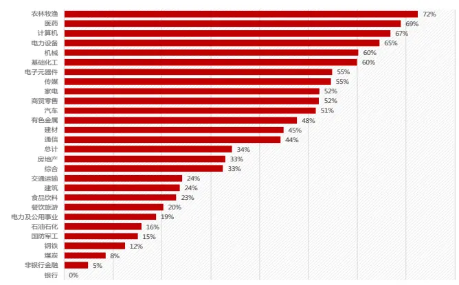
数据来源：东方证券研究所 & Wind 资讯

## 3.3 民企的整体特征

由于民企在各行业中的分布情况不均匀，直接比较全部民企和国企的各项市场及财务指标会受到行业因素的影响，因而下面我们在同行业内部比较民企和国企的各项特征。有关财务指标均使用年报（合并报表）数据，有关技术指标均使用年底数据。

从盈利的角度看：

1. 盈利公司占比：对比 2015-2017 年年报公布的净利润情况，可以看到农林牧渔、电力设备、纺织服装、机械、基础化工、汽车、石油石化、交通运输、综合这九个行业在过去三年间都是民企盈利公司占比高，说明这些行业中的民企更容易盈利。而传媒、餐饮旅游、银行则是国企占优，但是总体而言差别不大。

2. 盈利水平（ROE）：ROE受极值影响大，直接将个股平均的做法并不合理，因而我们使用整体法，用整体归母净利润除以整体归母净资产。对比 2015-2017年年报公布的 ROE情况，可以看到大部分行业中都是民企的盈利能力更强。传统制造业中的轻工制造、纺织服装、钢铁、机械、有色金属、基础化工、石油石化、电力设备、第一产业农林牧渔、传统服务业中的交通运输、餐饮旅游、房地产行业中都是民企的盈利优势更明显，此外新兴的通信、医药里也是民企占优。仅有建筑、汽车、商贸零售、食品饮料、综合、银行 6 个行业中是国企占优。

图 33：2015-2017 年报 A 股民企和国企盈利公司占比情况

|  | 2017年报 |  | 2016年报 |  | 2015年报 |  |
| --- | --- | --- | --- | --- | --- | --- |
|  | 民企盈利公司占比 | 国企盈利公司占比 | 民企盈利公司占比 | 国企盈利公司占比 | 民企盈利公司占比 国企盈利公司占比 |  |
| 电力设备 | 97% | 81% | 94% | 89% | 98% | 89% |
| 汽车 | 97% | 83% | 98% | 94% | 94% | 88% |
| 电力及公用事业 | 98% | 89% | 97% | 98% | 93% | 97% |
| 综合 | 90% | 81% | 86% | 81% | 76% | 71% |
| 石油石化 | 96% | 88% | 89% | 88% | 89% | 81% |
| 基础化工 | 97% | 89% | 96% | 75% | 94% | 74% |
| 农林牧渔 | 88% | 81% | 96% | 81% | 88% | 74% |
| 轻工制造 | 98% | 93% | 94% | 100% | 98% | 73% |
| 纺织服装 | 92% | 89% | 96% | 89% | 88% | 78% |
| 交通运输 | 100% | 97% | 100% | 97% | 94% | 95% |
| 机械 | 95% | 94% | 92% | 79% | 92% | 76% |
| 国防军工 | 95% | 95% | 85% | 100% | 90% | 90% |
| 通信 | 88% | 88% | 95% | 88% | 94% | 88% |
| 房地产 | 92% | 92% | 90% | 92% | 81% | 85% |
| 电子元器件 | 94% | 95% | 94% | 89% | 94% | 95% |
| 建材 | 84% | 86% | 91% | 81% | 91% | 57% |
| 建筑 | 96% | 97% | 97% | 95% | 96% | 97% |
| 擦铁 | 92% | 93% | 83% | 83% | 75% | 38% |
| 医药 | 98% | 100% | 99% | 98% | 97% | 96% |
| 计算机 | 93% | 96% | 96% | 96% | 95% | 89% |
| 有色金属 | 93% | 97% | 94% | 91% | 82% | 65% |
| 传媒 | 90% | 96% | 93% | 96% | 92% | 98% |
| 食品饮料 | 89% | 94% | 92% | 100% | 92% | 91% |
| 非银行金融 | 93% | 100% | 93% | 100% | 100% | 94% |
| 煤炭 | 86% | 93% | 86% | 83% | 57% | 31% |
| 餐饮旅游 | 78% | 86% | 56% | 86% | 89% | 90% |
| 家电 | 92% | 100% | 96% | 100% | 96% | 85% |
| 商贸零售 | 88% | 100% | 96% | 90% | 94% | 93% |
| 银行 |  | 100% |  | 100% |  | 100% |

数据来源：东方证券研究所 & Wind 资讯

图 34：2015-2017 年报 A 股民企和国企盈利水平情况

|  | 2017年报 |  | 2016年报 |  | 2015年报 |  |
| --- | --- | --- | --- | --- | --- | --- |
|  | 民企平均ROE% | 国企平均ROE% | 民企平均ROE% | 国企平均ROE% | 民企平均ROE% | 国企平均ROE% |
|  | (整体法) | (整体法) | (整体法) | (整体法) | (整体法) | (整体法) |
| 石油石化 | 11.20% | 3.58% | 9.09% | 1.88% | 3.96% | 3.72% |
| 纺织服装 | 9.88% | 4.42% | 9.24% | 6.71% | 9.93% | 5.74% |
| 交通运输 | 14.99% | 9.62% | 17.59% | 7.35% | 13.17% | 8.88% |
| 钢铁 | 16.97% | 12.50% | 3.77% | 2.49% | -5.30% | -11.18% |
| 通信 | 4.71% | 0.34% | 8.53% | 0.26% | 9.13% | 4.82% |
| 有色金属 | 9.25% | 4.99% | 7.17% | 2.11% | 3.77% | -1.20% |
| 轻工制造 | 12.38% | 8.31% | 10.45% | 5.54% | 10.68% | 5.53% |
| 农林牧渔 | 7.86% | 4.26% | 15.59% | 4.06% | 10.11% | -0.22% |
| 电力设备 | 8.13% | 4.94% | 8.58% | 4.11% | 9.31% | 5.40% |
| 计算机 | 7.95% | 6.27% | 7.38% | 9.90% | 8.88% | 9.49% |
| 电力及公用事业 | 8.11% | 6.84% | 8.77% | 8.93% | 8.97% | 11.25% |
| 医药 | 11.79% | 10.62% | 11.11% | 9.79% | 11.66% | 9.70% |
| 基础化工 | 9.15% | 8.00% | 8.46% | 1.99% | 9.17% | 2.84% |
| 机械 | 6.17% | 5.11% | 5.29% | 0.66% | 5.61% | 4.85% |
| 非银行金融 | 9.40% | 8.48% | 8.75% | 8.18% | 14.72% | 15.48% |
| 餐饮旅游 | 10.68% | 9.86% | 10.10% | 6.99% | 10.51% | 8.63% |
| 房地产 | 12.75% | 11.97% | 13.01% | 10.49% | 9.42% | 9.37% |
| 综合 | 4.76% | 5.60% | 3.63% | 5.95% | 2.15% | 3.64% |
| 建材 | 11.90% | 13.15% | 8.40% | 8.07% | 6.36% | 4.58% |
| 电子元器件 | 8.07% | 9.37% | 9.61% | 6.82% | 9.79% | 5.54% |
| 建筑 | 9.18% | 10.98% | 8.28% | 10.68% | 8.60% | 11.08% |
| 商贸零售 | 6.46% | 8.56% | 5.48% | 8.07% | 6.55% | 8.26% |
| 国防军工 | 1.64% | 4.02% | 5.69% | 4.20% | 5.26% | 2.13% |
| 汽车 | 9.28% | 12.42% | 12.30% | 12.72% | 11.97% | 12.92% |
| 传媒 | 3.19% | 8.13% | 9.31% | 9.23% | 9.82% | 10.12% |
| 食品饮料 | 11.83% | 17.90% | 12.40% | 15.10% | 13.03% | 15.08% |
| 煤炭 | 5.54% | 12.03% | 3.77% | 4.83% | 0.61% | -0.73% |
| 家电 | 16.46% | 24.28% | 17.40% | 18.93% | 18.08% | 12.42% |
| 银行 |  | 12.23% |  | 12.91% |  | 14.29% |

数据来源：东方证券研究所 & Wind 资讯

3. 盈利的横截面 dispersion：我们统计每年年报的个股盈利（ROE）的横截面标准差，可以看到多数行业中民企的盈利能力分化程度更严重，如电子元器件、家电、建筑、农林牧渔、交通运输、餐饮旅游、食品饮料、计算机，传媒、非银行金融，这些行业普遍市场化程度较高，民企间竞争更激烈。而在钢铁、石油石化、基础化工、银行等国有垄断企业中则是国企的盈利分化程度更高。

4. 盈利的历史波动：为了增加样本个数，我们选取个股单季 ROE 计算标准差，由于存在季节效应不同季度之间的 ROE 不可比，因而我们将个股单季 ROE 均去掉单季的均值。可以看到最明显的是在餐饮旅游行业中民企的过去三年ROE的波动远大于国企，电力设备、钢铁行业则是国企的 ROE 波动更为剧烈。

图 35：2015-2017 年报 A 股民企和国企盈利的横截面dispersion

|  | 2017年报 |  | 2016年报 |  | 2015年报 |  |
| --- | --- | --- | --- | --- | --- | --- |
|  | 民企ROE- dispersion | 国企ROE- dispersion | 民企ROE- dispersion | 国企平ROE- dispersion | 民企ROE- dispersion | 国企ROE- dispersion |
| 有色金属 | 209.85 | 8.11 | 11.19 | 5.50 | 15.83 | 26.47 |
| 电子元器件 | 126.66 | 13.15 | 13.86 | 12.25 | 16.46 | 10.16 |
| 家电 | 90.10 | 26.00 | 13.25 | 8.94 | 19.13 | 15.87 |
| 传媒 | 37.88 | 5.57 | 11.18 | 6.67 | 188.38 | 7.49 |
| 商贸零售 | 33.83 | 6.86 | 37.33 | 7.66 | 12.67 | 41.55 |
| 农林牧渔 | 39.90 | 16.41 | 15.95 | 14.81 | 17.97 | 16.59 |
| 建材 | 26.08 | 10.66 | 34.43 | 5.92 | 10.13 | 27.56 |
| 综合 | 22.23 | 10.27 | 9.69 | 19.56 | 16.41 | 19.29 |
| 食品饮料 | 21.68 | 9.74 | 12.82 | 6.67 | 26.37 | 10.76 |
| 非银行金融 | 11.16 | 3.50 | 12.81 | 3.68 | 24.92 | 13.57 |
| 机械 | 13.24 | 6.38 | 12.17 | 26.74 | 15.29 | 15.17 |
| 建筑 | 11.55 | 4.92 | 8.58 | 6.07 | 9.06 | 5.34 |
| 煤炭 | 19.31 | 14.70 | 21.72 | 17.80 | 7.54 | 15.19 |
| 餐饮旅游 | 10.60 | 6.11 | 13.27 | 12.49 | 9.89 | 7.36 |
| 交通运输 | 9.77 | 5.33 | 15.53 | 7.82 | 17.05 | 6.50 |
| 房地产 | 14.63 | 10.87 | 15.60 | 16.09 | 17.45 | 14.80 |
| 计算机 | 8.91 | 8.37 | 13.49 | 6.74 | 12.44 | 9.45 |
| 国防军工 | 4.53 | 5.31 | 8.98 | 5.00 | 12.03 | 10.31 |
| 医药 银行 | 8.50 | 9.61 | 10.97 | 14.31 | 12.54 | 14.86 |
| 电力及公用事业 | 8.50 | 1.53 11.36 | 12.39 | 1.41 5.43 |  | 1.61 |
| 纺织服装 | 8.32 |  | 12.31 |  | 9.29 | 7.72 |
| 电力设备 | 7.94 | 11.37 12.75 | 10.91 | 7.42 11.37 | 19.78 | 12.97 |
| 钢铁 | 19.80 |  |  |  | 12.59 | 8.70 |
|  |  | 29.78 | 12.94 | 21.48 | 14.03 | 136.56 |
| 轻工制造 | 10.33 | 31.77 | 17.38 | 4.94 | 14.76 | 11.37 |
| 汽车 | 9.27 | 31.25 | 9.66 | 23.53 | 16.39 | 12.30 |
| 通信 | 18.01 | 70.86 | 12.88 | 20.86 | 13.85 | 9.87 |
| 石油石化 基础化工 | 7.94 6.73 | 85.56 107.46 | 10.95 8.24 | 30.82 32.90 | 14.15 11.06 | 58.92 27.76 |

数据来源：东方证券研究所 & Wind 资讯

图 36：2015-2017年报 A股民企和国企盈利的历史波动

|  | 民企ROE波动 | 国企ROE波动 |
| --- | --- | --- |
| 餐饮旅游 | 83.80 | 2.89 |
| 基础化工 | 9.33 | 9.33 |
| 国防军工 | 6.93 | 2.04 |
| 家电 | 6.71 | 4.32 |
| 非银行金融 传媒 | 6.46 | 2.36 |
| 食品饮料 | 6.19 | 1.83 |
| 电子元器件 | 5.90 | 2.79 |
|  | 5.38 | 1.92 |
| 商贸零售 | 5.33 | 4.56 |
| 建材 房地产 | 5.28 | 4.39 |
| 农林牧渔 | 5.23 | 4.23 |
| 煤炭 | 4.91 | 5.19 |
| 综合 | 4.48 | 17.79 |
| 交通运输 | 3.97 | 11.05 |
| 有色金属 | 3.85 | 1.47 |
| 计算机 | 3.67 | 3.47 |
|  | 3.46 | 2.80 |
| 钢铁 | 3.39 | 33.47 |
| 通信 | 3.23 | 7.16 |
| 电力及公用事业 | 2.59 | 37.99 |
| 轻工制造 | 2.54 |  |
| 纺织服装 | 2.52 | 12.32 |
| 机械 |  | 3.76 |
| 石油石化 | 2.50 | 9.03 |
| 建筑 | 2.43 | 20.78 |
| 医药 | 2.32 | 1.64 |
| 汽车 | 2.13 1.94 | 2.39 |
| 电力设备 |  | 8.44 |
|  | 1.86 | 5.06 |
| 银行 |  | 0.43 |

数据来源：东方证券研究所 & Wind 资讯

从成长性的角度看：

1. 成长性（净利润同比增长率）：可以看到过去三年里尤其非银行金融、汽车、计算机、机械、医药等新兴制造业中民企的净利润同比增长率每年都能够超过国企，成长性更强。食品饮料、银行等传统行业则是国企的成长性更好，这些行业里民企上市公司的占比本身也比较低，成长空间较小。

2. 成长的横截面 dispersion：我们统计每年年报的净利润同比增长率的横截面标准差，可以看到过去三年里综合、传媒、医药行业中民企的净利润同比增长率的分化程度比较大，而银行、钢铁、煤炭行业中则是国企较大，这些行业都是国有垄断行业，民营上市公司的占比很低。

图 37：2015-2017年报 A股民企和国企的成长性

| 2017年报 |  |  | 2016年报 |  | 2015年报 |  |
| --- | --- | --- | --- | --- | --- | --- |
|  | 民企平均净利润同比 国企平均净利润同比 民企平均净利润同比 国企平均净利润同比 |  |  |  | 民企平均净利润同比 | 国企平均净利润同比 |
|  | 增长率% | 增长率% | 增长率% | 增长率% | 增长率% | 增长率% |
| 非银行金融 | 454.03 | 0.66 | 241.56 | -23.71 | 136.50 | 81.54 |
| 电力设备 | 30.10 | -364.60 | 11.95 | 33.33 | 206.78 | -26.31 |
| 电力及公用事业 | 45.09 | -131.40 | 27.81 | -1.10 | 27.63 | 54.01 |
| 建材 | 121.77 | -7.93 | 27.11 | 58.56 | 177.27 | -1029.26 |
| 汽车 | 21.83 | -105.64 | 75.59 | 16.46 | 43.32 | -42.37 |
| 计算机 | 14.92 | -22.66 | 130.87 | 90.61 | -0.90 | -25.37 |
| 石油石化 | 44.61 | 14.61 | 50.20 | -4139.32 | -1.64 | -7.10 |
| 机械 | 55.97 | 34.61 | 23.56 | -481.17 | -153.95 | -379.45 |
| 有色金属 | 129.85 | 115.55 | 54.14 | 46.42 | -109.95 | -384.25 |
| 医药 | 32.31 | 20.61 | 82.73 | 72.78 | 22.53 | 15.77 |
| 纺织服装 | -3.42 | -10.54 | -5.43 | 53.69 | -55.18 | -107.67 |
| 餐饮旅游 | 55.49 | 57.17 | -233.04 | -170.35 | 23.29 | 13.76 |
| 银行 |  | 5.80 |  | 1.88 |  | 3.33 |
| 交通运输 | 28.90 | 34.83 | 53.35 | -10.14 | -44.92 | -15.19 |
| 食品饮料 | 20.66 | 29.43 | -138.50 | 23.82 | 6.16 | 22.99 |
| 房地产 | 8.04 | 24.63 | 63.53 | -81.09 | -141.81 | -101.36 |
| 基础化工 | 37.34 | 64.98 | 13.97 | -142.23 | 5.96 | -142.10 |
| 建筑 | -4.60 | 26.68 | -2.97 | -75.00 | 0.74 | 62.76 |
| 传媒 | -45.67 | 2.60 | 445.21 | -2.70 | 422.23 | 20.34 |
| 电子元器件 | -10.72 | 45.40 | 13.40 | -19.11 | 3.38 | -100.60 |
| 通信 | -44.59 | 42.67 | 234.64 | -387.59 | -2.52 | -802.72 |
| 综合 | -108.05 | 1.03 | -9.13 | 4.40 | -107.17 | -121.45 |
| 国防军工 | -124.16 | 7.52 | 10.52 | 27.06 | -94.94 | 0.25 |
| 农林牧渔 | -217.28 | -15.25 | 98.64 | -47.26 | -78.45 | -381.88 |
| 钢铁 | 130.03 | 369.81 | -197.86 | -87.74 | -148.86 | -2062.81 |
| 轻工制造 | 5.92 | 303.73 | 62.30 | 139.82 | 12.55 | -327.36 |
| 煤炭 | 64.01 | 480.83 | -106.64 | -220.44 | -25.52 | -818.17 |
| 商贸零售 | -20.25 | 483.09 | -41.36 | -49.42 | -25.19 | -280.71 |
| 家电 | -258.83 | 383.63 | 31.06 | 247.28 | 68.65 | -439.06 |

数据来源：东方证券研究所 & Wind 资讯

图 38：2015-2017 年报 A 股民企和国企成长的横截面dispersion

|  | 2017年报 |  | 2016年报 |  | 2015年报 |  |
| --- | --- | --- | --- | --- | --- | --- |
|  | 民企净利润同比增长率 国企净利润同比增长率 dispersion | dispersion | 民企净利润同比增长率 dispersion | 国企净利润同比增长率 dispersion | 民企净利润同比增长率 dispersion | 国企净利润同比增长率 dispersion |
| 非银行金融 | 1758.59 | 36.23 | 572.68 | 53.05 | 121.67 | 248.45 |
| 农林牧渔 | 1877.45 | 506.60 | 204.42 | 382.54 | 519.23 | 1132.97 |
| 综合 | 1316.50 | 207.11 | 520.76 | 274.52 | 990.62 | 479.36 |
| 国防军工 | 666.82 | 55.36 | 72.13 | 105.62 | 464.45 | 79.43 |
| 房地产 | 756.29 | 170.11 | 199.10 | 1072.19 | 843.38 | 781.52 |
| 建材 | 713.05 | 310.41 | 189.90 | 68.00 | 1420.18 | 2478.62 |
| 传媒 | 399.14 | 64.16 | 2004.28 | 138.49 | 2315.43 | 64.94 |
| 建筑 | 327.16 | 74.18 | 254.28 | 557.83 | 59.75 | 213.30 |
| 电子元器件 | 372.74 | 126.40 | 310.96 | 259.30 | 354.79 | 750.04 |
| 通信 | 306.04 | 91.66 | 1568.27 | 1538.22 | 295.62 | 2773.18 |
| 机械 | 255.02 | 129.25 | 442.79 | 2204.89 | 1173.58 | 1627.16 |
| 医药 | 190.23 | 114.40 | 540.98 | 390.48 | 219.22 | 56.07 |
| 家电 | 1496.90 | 1444.09 | 67.49 | 533.68 | 237.24 | 1150.76 |
| 石油石化 | 106.42 | 78.99 | 258.51 | 16481.91 | 306.32 | 213.72 |
| 有色金属 | 392.73 | 370.30 | 244.74 | 669.73 | 445.23 | 747.78 |
| 银行 |  | 3.81 |  | 3.93 |  | 3.85 |
| 计算机 | 229.42 | 265.86 | 1186.09 | 278.97 | 473.06 | 136.81 |
| 交通运输 | 83.51 | 184.61 | 116.14 | 274.30 | 331.18 | 225.36 |
| 食品饮料 | 141.60 | 265.82 | 1340.11 | 78.85 | 401.74 | 100.52 |
| 餐饮旅游 | 67.61 | 195.27 | 624.85 | 585.98 | 172.14 | 102.58 |
| 汽车 | 164.74 | 378.08 | 307.75 | 360.73 | 354.39 | 254.05 |
| 纺织服装 | 195.41 | 441.28 | 364.13 | 119.78 | 326.63 | 303.45 |
| 电力及公用事业 | 343.12 | 597.64 | 137.77 | 126.49 | 101.02 | 543.81 |
| 基础化工 | 125.90 | 403.14 | 210.80 | 1225.07 | 169.66 | 1420.76 |
| 轻工制造 | 380.39 | 774.25 | 352.90 | 351.96 | 106.19 | 984.35 |
| 电力设备 | 154.67 | 1178.63 | 266.19 | 453.20 | 1743.38 | 206.28 |
| 钢铁 | 244.12 | 1300.90 | 892.81 | 1071.05 | 273.47 | 4140.76 |
| 爆炭 | 66.32 | 1474.34 | 688.26 | 2054.04 | 113.01 | 1839.73 |
| 商贸零售 | 241.91 | 2715.57 | 420.36 | 341.45 | 212.02 | 1742.00 |

数据来源：东方证券研究所 & Wind 资讯

从分红的角度看：

1. 分红公司比例：可以看到总体上差别不大。

2. 现金分红比例：我们仍使用整体法，用该年度整体累计现金分红总额/整体归母净利润，来衡量现金分红的比例。可以看到过去三年里在多数行业中都是国企的现金分红比例更高，这主要是由于：一方面国企更重视对投资者的分红回报，而且国企的大股东代表国家，高比例分红意味着大部分分红收益是上交国家的，实际只有少部分能奖励中小投资者。另一方面这些高现金分红的国企自身体量已经很大，无需进行大规模的扩张，资本支出较少，现金流充足。过去三年里仅有房地产行业是民企的分红比例较高。

图 39：2015-2017 年 A股民企和国企的分红公司比例

| 2017年报 |  |  | 2016年报 |  | 2015年报 |  |
| --- | --- | --- | --- | --- | --- | --- |
|  | 民企分红公司比例 | 国企分红公司比例 | 民企分红公司比例 | 国企分红公司比例 | 民企分红公司比例 | 国企分红公司比例 |
| 基础化工 | 90% | 63% | 85% | 53% | 81% | 47% |
| 电力设备 | 86% | 59% | 84% | 48% | 82% | 59% |
| 轻工制造 | 86% | 60% | 79% | 47% | 76% | 43% |
| 农林牧渔 | 70% | 45% | 74% | 43% | 73% | 47% |
| 汽车 | 87% | 66% | 86% | 61% | 74% | 65% |
| 纺织服装 | 80% | 67% | 81% | 44% | 75% | 67% |
| 机械 | 82% | 69% | 80% | 63% | 73% | 63% |
| 建材 | 72% | 62% | 82% | 71% | 71% | 48% |
| 钢铁 | 67% | 59% | 58% | 48% | 73% | 28% |
| 电子元器件 | 85% | 78% | 80% | 80% | 78% | 79% |
| 电力及公用事业 | 83% | 77% | 81% | 82% | 76% | 78% |
| 石油石化 | 74% | 69% | 80% | 75% | 55% | 50% |
| 医药 | 88% | 86% | 82% | 83% | 80% | 72% |
| 交通运输 | 90% | 90% | 91% | 88% | 81% | 83% |
| 建筑 | 88% | 89% | 90% | 81% | 96% | 82% |
| 国防军工 | 68% | 70% | 65% | 78% | 87% | 77% |
| 有色金属 | 68% | 71% | 54% | 53% | 49% | 38% |
| 计算机 | 84% | 89% | 90% | 88% | 86% | 88% |
| 非银行金融 | 85% | 90% | 85% | 81% | 77% | 83% |
| 煤炭 | 57% | 66% | 50% | 45% | 33% | 31% |
| 家电 | 83% | 92% | 79% | 85% | 86% | 77% |
| 食品饮料 | 79% | 89% | 79% | 79% | 70% | 70% |
| 通信 | 78% | 88% | 78% | 73% | 74% |  |
| 房地产 | 71% | 82% | 64% | 77% | 62% | 80% |
| 综合 | 52% | 67% | 44% | 62% | 53% | 66% 50% |
| 商贸零售 | 72% | 88% | 77% | 83% | 64% | 78% |
| 餐饮旅游 | 56% | 71% | 50% | 70% | 50% | 65% |
| 传媒 | 71% | 93% | 75% | 88% | 66% | 85% |
|  |  |  |  | 100% |  |  |
| 银行 |  | 100% |  |  |  | 100% |

数据来源：东方证券研究所 & Wind 资讯

图 40：2015-2017 年 A股民企和国企的现金分红比例

| 2017年报 |  |  | 2016年报 |  | 2015年报 |  |
| --- | --- | --- | --- | --- | --- | --- |
|  | 民企现金分红比例（%） | 国企现金分红比例（%） | 民企现金分红比例（%） | 国企现金分红比例（%） | 民企现金分红比例（%） | 国企现金分红比例（%） |
|  | (整体法) | (整体法) | (整体法) | (整体法) | （整体法) | （整体法) |
| 国防军工 | 0.73 | 0.21 | 0.19 | 0.21 | 0.28 | 0.50 |
|  | 0.47 | 0.06 | 0.43 | 0.60 | 0.38 | 0.81 |
| 瓣 | 0.41 | 0.29 | 0.76 | 0.60 | (0.22) | (0.03) |
| 传媒 | 0.49 | 0.37 | 0.18 | 0.29 | 0.15 | 0.18 |
| 謝 | 0.46 | 0.37 | 0.29 | 0.34 | 0.25 | 0.47 |
| 食品饮料 | 0.60 | 0.51 | 0.43 | 0.50 | 0.38 | 0.45 |
| 轻工制造 | 0.30 | 0.25 | 0.24 | 0.50 | 0.22 | 0.35 |
| 建筑 | 0.23 | 0.20 | 0.20 | 0.21 | 0.22 | 0.21 |
| 房地产 | 0.35 | 0.33 | 0.26 | 0.32 | 0.36 | 0.29 |
| 非银行金融 | 0.25 | 0.25 | 0.21 | 0.26 | 0.15 | 0.23 |
| 电子元器件 | 0.32 | 0.33 | 0.23 | 0.40 | 0.23 | 0.40 |
| 綜 | 0.25 | 0.27 | 0.11 | 0.34 | 0.20 | 0.29 |
| 机械 | 0.36 | 0.39 | 0.33 | 3.94 | 0.31 | 0.41 |
|  | 0.29 | 0.33 | 0.28 | 0.37 | 0.28 | 0.37 |
| 商贸零售 | 0.27 | 0.32 | 0.21 | 0.36 | 0.17 | 0.32 |
| 纺织服装 | 0.57 | 0.63 | 0.54 | 0.18 | 0.41 | 0.26 |
| 有色金属 | 0.28 | 0.35 | 0.20 | 0.54 | 0.32 | (0.88) |
| 基础化工 | 0.30 | 0.37 | 0.29 | 0.73 | 0.23 | 0.37 |
| 交通运输 | 0.20 | 0.31 | 0.16 | 0.38 | 0.18 | 0.32 |
| 电力设备 | 0.28 | 0.42 | 0.30 | 0.40 | 0.27 | 0.34 |
| 农林牧渔 | 0.40 | 0.55 | 0.44 | 0.53 | 0.35 | (9.28) |
| 餐饮旅游 | 0.19 | 0.37 | 0.16 | 0.46 | 0.14 | 0.33 |
| 计算机 | 0.22 | 0.40 | 0.26 | 0.23 | 0.24 | 0.29 |
| 辉 | 0.29 | 0.53 | 0.28 | 0.48 | 0.27 | 0.44 |
| 煤炭 | 0.09 | 0.37 | 0.55 | 2.01 | 0.08 | (1.51) |
| 嚮 |  | 0.30 |  | 0.28 |  | 0.29 |
| 电力及公用事业 | 0.23 | 0.56 | 0.15 | 0.46 | 0.19 | 0.48 |
| 石油石化 | 0.17 | 1.20 | 0.26 | 1.17 | 0.24 | 0.50 |
| 通信 | 0.36 | 2.68 | 0.21 | 2.57 | 0.13 | 0.36 |

数据来源：东方证券研究所 & Wind 资讯

从公司治理的角度看：

1． 股权集中度：可以看到过去三年里在绝多数行业中都是国企的第一大股东持股比例更高，仅在家电、电子元器件、轻工制造、基础化工四个行业中是民企的第一大股东持股比例更高。为了表示前十大股东的持股集中度，参考 HHI 指数的构建方法（HerfindahlHirschman Index，简称 HHI），取前十大股东持股比例的平方和来表示。该指标突出了股东持股比例之间的差距，HHI 数值越大，表明前十大股东持股比例分布的越不均匀，集中程度越高。结论与第一大股东持股比例类似，在绝大多数行业内是国企的前十大股东的持股集中度更高。

图 41：2015-2017 年 A 股民企国企的第一大股东持股比例

| 民企第一大股东持股比例 | 2017年 |  | 2016年 |  | 2015年 |  |
| --- | --- | --- | --- | --- | --- | --- |
|  | (%) | 国企第一大股东持股比例 (%) | 民企第一大股东持股比例 (%) | 国企第一大股东持股比例 (%) | 民企第一大股东持股比例 (%) | 国企第一大股东持股比例 (%) |
| 家电 | 32.77 | 29.23 | 35.19 | 29.60 | 37.45 | 30.31 |
| 纺织服装 | 33.94 | 30.47 | 34.44 | 32.53 | 32.41 | 33.64 |
| 轻工制造 | 37.32 | 34.91 | 38.86 | 35.88 | 39.46 | 37.70 |
| 电子元器件 | 31.45 | 29.92 | 32.73 | 29.08 | 34.36 | 30.48 |
| 基础化工 | 32.68 | 33.53 | 34.25 | 32.82 | 35.71 | 33.58 |
| 非银行金融 | 34.09 | 35.54 | 34.44 | 35.34 | 37.45 | 36.21 |
| 交通运输 | 42.77 | 44.24 | 39.33 | 45.79 | 38.26 | 46.06 |
| 汽车 | 35.98 | 38.84 | 38.94 | 38.59 | 39.02 | 39.97 |
| 医药 | 33.59 | 36.55 | 34.26 | 35.47 | 34.87 | 36.68 |
| 农林牧渔 | 31.55 | 34.58 | 32.66 | 33.89 | 33.68 | 34.20 |
| 商贸零售 | 34.09 | 38.12 | 33.82 | 37.98 | 33.54 | 38.17 |
| 机械 | 31.84 | 36.14 | 33.41 | 36.72 | 35.06 | 37.55 |
| 食品饮料 | 36.56 | 41.19 | 38.32 | 40.57 | 40.63 | 40.76 |
| 综台 | 24.65 | 29.50 | 25.71 | 29.54 | 26.26 | 27.51 |
| 电力设备 | 31.08 | 36.66 | 32.43 | 34.78 | 34.51 | 35.89 |
| 国防军工 | 31.42 | 37.26 | 33.27 | 36.30 | 35.05 | 35.92 |
| 计算机 | 28.54 | 34.54 | 29.75 | 36.64 | 31.33 | 34.41 |
| 畫材 | 29.49 | 36.33 | 30.09 | 36.11 | 31.82 | 37.10 |
| 房地产 | 34.66 | 41.76 | 34.68 | 40.76 | 34.32 | 42.36 |
| 有色金属 | 29.84 | 38.16 | 30.43 | 38.90 | 31.66 | 40.93 |
| 通信 | 28.26 | 38.67 | 29.73 | 38.50 | 31.59 | 38.52 |
| 电力及公用事业 | 31.26 | 41.94 | 33.74 | 42.92 | 31.17 | 43.62 |
| 餐饮旅游 | 25.85 | 37.32 | 23.61 | 36.29 | 22.77 | 37.17 |
| 石油石化 | 33.45 | 46.52 | 34.64 | 46.77 | 37.60 | 45.15 |
| 爆炭 | 38.77 | 52.08 | 41.39 | 52.97 | 46.30 | 53.38 |
| 建筑 | 31.80 | 46.17 | 33.20 | 46.96 | 35.14 | 47.76 |
| 钢铁 | 31.42 | 49.89 | 28.12 | 51.29 | 29.61 | 53.32 |
| 传媒 | 28.19 | 46.69 | 29.60 | 45.95 | 31.27 | 48.77 |
| 银行 |  | 41.65 |  | 41.61 |  | 42.03 |

数据来源：东方证券研究所 & Wind 资讯

图 42：2015-2017年 A股民企和国企的前十大股东持股比例HHI

|  | 2017年 |  | 2016年 |  | 2015年 |  |
| --- | --- | --- | --- | --- | --- | --- |
|  | 民企前10大股东持股比例 | 国企前10大股东持股比例 | 民企前10大股东持股比例 | 国企前10大股东持股比例 | 民企前10大股东持股比例 | 国企前10大股东持股比例 |
| 纺织服装 | HHI 0.16 | HHI 0.11 | HHI 0.16 | HHI 0.11 | HHI 0.16 | HHI 0.11 |
|  | 0.16 | 0.11 | 0.16 | 0.12 | 0.18 | 0.12 |
| 电子元器件 | 0.14 | 0.12 | 0.13 | 0.10 | 0.14 | 0.11 |
| 轻工制造 | 0.18 | 0.16 | 0.18 | 0.17 | 0.18 | 0.19 |
| 基础化工 | 0.15 |  |  |  | 0.15 |  |
| 非银行金融 | 0.18 | 0.14 0.19 | 0.14 0.19 | 0.13 0.18 | 0.18 | 0.13 0.19 |
| 商贸零售 | 0.16 | 0.18 | 0.16 | 0.18 | 0.16 | 0.18 |
| 交通运输 | 0.22 | 0.24 | 0.21 | 0.25 | 0.21 |  |
| 汽 | 0.17 | 0.19 | 0.17 | 0.19 | 0.18 | 0.25 0.19 |
| 农林牧渔 | 0.14 | 0.16 | 0.14 | 0.16 | 0.14 | 0.16 |
| 医药 | 0.15 | 0.17 | 0.14 | 0.16 | 0.14 | 0.16 |
| 机械 | 0.14 | 0.17 | 0.14 | 0.17 | 0.14 | 0.17 |
| 综合 | 0.09 | 0.12 | 0.09 | 0.12 | 0.10 | 0.12 |
| 电力设备 | 0.14 | 0.17 | 0.13 | 0.17 | 0.13 | 0.17 |
| 计算机 | 0.12 | 0.15 | 0.11 | 0.15 | 0.11 |  |
| 房地产 | 0.17 | 0.20 | 0.17 | 0.19 | 0.17 | 0.14 0.20 |
| 食品饮料 | 0.18 | 0.22 | 0.18 | 0.22 | 0.17 | 0.21 |
|  | 0.12 | 0.17 | 0.12 | 0.17 | 0.13 | 0.17 |
| 有色金属 | 0.13 | 0.18 | 0.13 | 0.18 | 0.13 | 0.19 |
| 国防军工 | 0.12 | 0.18 | 0.12 | 0.18 | 0.13 | 0.18 |
| 通信 | 0.12 | 0.18 | 0.12 | 0.19 | 0.13 | 0.19 |
| 餐饮旅游 | 0.09 | 0.18 | 0.09 | 0.17 | 0.09 | 0.18 |
| 电力及公用事业 | 0.13 | 0.22 | 0.13 | 0.21 | 0.13 | 0.22 |
| 建筑 | 0.15 | 0.25 | 0.15 | 0.25 | 0.14 | 0.25 |
| 煤炭 | 0.20 | 0.31 | 0.20 | 0.31 | 0.23 |  |
| 石油石化 | 0.15 | 0.28 | 0.16 | 0.28 | 0.17 | 0.31 0.30 |
| 传媒 | 0.12 | 0.27 | 0.13 | 0.27 | 0.13 | 0.27 |
|  |  | 0.29 |  | 0.30 |  |  |
| 铜铁 银行 | 0.14 | 0.29 | 0.14 | 0.29 | 0.14 | 0.31 0.29 |

数据来源：东方证券研究所 & Wind 资讯

2． 管理层薪酬：我们分别选取了管理层薪酬总额和高管前三名薪酬总额两个指标进行比较，在一般印象中，似乎国有控股的上市公司，由于受制于体制的约束，高管薪酬不如民营上市公司。但实际统计数据显示，大部分行业内国企的高管薪金水平更高。可以看到过去三年里钢铁、农林牧渔、房地产、纺织服装、基础化工行业内民企管理层薪酬和前三名高管薪酬均是民企更高。而电力设备、石油石化行业高管前三名薪酬也是民企更高。其余行业均是国企的薪酬占优。民企的管理层薪酬偏低的原因可能有两个，一方面决定薪酬的方式也主要以总股本等公司规模指标，民企公司规模相对较小；另一方面一些新兴的高新技术产业由于高成长性和高不确定性，可能更倾向于采用股权激励的手段来降低代理成本和激励经营者。

图 43：2015-2017年 A股民企国企的管理层薪酬总额

| 2017年 |  |  | 2016年 |  | 2015年 |  |
| --- | --- | --- | --- | --- | --- | --- |
|  | 民企管理层薪酬总额 国企管理层薪酬总额 |  | 民企管理层薪酬总额 国企管理层薪酬总额 |  | 民企管理层薪酬总额 国企管理层薪酬总额 |  |
|  | (万元) | (万元) | (万元) | (万元) | (万元) | (万元) |
| 钢铁 | 1221.42 | 558.72 | 544.14 | 451.80 | 887.93 | 416.57 |
| 农林牧渔 | 627.90 | 415.73 | 512.65 | 388.47 | 466.10 | 375.01 |
| 房地产 | 1217.67 | 1015.36 | 1245.85 | 786.85 | 1009.04 | 835.89 |
| 纺织服装 | 564.40 | 408.97 | 480.19 | 399.59 | 437.03 | 349.21 |
| 交通运输 | 836.15 | 705.38 | 498.47 | 632.27 | 411.80 | 646.28 |
| 国防军工 | 560.40 | 504.34 | 508.13 | 484.90 | 462.32 | 457.55 |
| 电力设备 | 492.90 | 485.11 | 475.17 | 471.06 | 440.39 | 464.13 |
| 通信 | 607.67 | 600.88 | 598.88 | 625.52 | 578.79 | 577.28 |
| 基础化工 | 530.70 | 524.22 | 488.90 | 454.06 | 465.52 | 434.24 |
| 电力及公用事业 | 557.10 | 553.93 | 505.81 | 511.56 | 438.30 | 513.59 |
| 综合 | 651.02 | 649.22 | 423.68 | 638.73 | 369.67 | 625.65 |
| 传媒 | 634.59 | 638.45 | 576.28 | 650.02 | 482.15 | 649.97 |
| 商贸零售 | 698.88 | 732.33 | 619.55 | 618.49 | 604.33 | 638.55 |
| 轻工制造 | 487.46 | 522.28 | 446.50 | 456.57 | 428.30 | 439.67 |
| 食品饮料 | 597.26 | 647.01 | 527.53 | 617.23 | 523.78 | 656.11 |
| 汽 | 607.29 | 690.90 | 576.95 | 624.60 | 534.23 | 622.42 |
| 石油石化 | 554.00 | 646.88 | 563.24 | 585.06 | 486.91 | 593.71 |
| 医药 | 645.85 | 757.73 | 609.08 | 687.76 | 587.67 | 625.19 |
| 煤炭 | 369.12 | 511.08 | 349.97 | 395.82 | 305.46 |  |
| 计算机 | 552.32 | 754.71 | 520.25 | 688.31 | 505.57 | 399.20 666.60 |
| 謝 | 529.23 | 759.81 | 411.56 | 629.69 | 387.54 | 568.60 |
| 机械 | 421.99 | 653.20 | 379.82 | 595.80 | 361.34 | 569.00 |
| 餐饮旅游 | 429.35 | 668.70 | 418.55 | 607.62 | 353.25 |  |
| 建筑 | 645.93 | 886.80 | 560.62 | 804.95 | 571.98 | 544.10 802.46 |
| 家电 | 638.04 | 918.96 | 643.31 | 789.31 | 633.88 |  |
| 有色金属 | 454.19 | 748.01 | 402.85 | 567.30 | 364.29 | 787.65 |
| 电子元器件 | 569.47 | 977.97 | 527.77 | 825.58 | 472.04 | 516.97 |
|  |  |  |  |  |  | 687.05 |
| 非银行金融 银行 | 1306.15 | 2156.84 2123.84 | 1183.44 | 2193.81 1631.62 | 1017.28 | 2286.06 2168.83 |

数据来源：东方证券研究所 & Wind 资讯

图 44：2015-2017年 A股民企和国企的高管前三名薪酬总额

|  | 2017年 |  | 2016年 |  | 2015年 |  |
| --- | --- | --- | --- | --- | --- | --- |
|  | 民企高管前三名薪酬总额 | 国企高管前三名薪酬总额 | 民企高管前三名薪酬总额 | 国企高管前三名薪酬总额 | 民企高管前三名薪酬总额 | 国企高管前三名薪酬总额 |
|  | (万元) | (万元) | (万元) | (万元) | (万元) | (万元) |
| 钢铁 | 345.17 | 208.10 | 230.92 | 156.64 | 438.70 | 134.83 |
| 农林牧渔 | 230.44 | 138.19 | 198.63 | 126.89 | 174.67 | 122.38 |
| 房地产 | 454.29 | 374.36 | 447.70 | 293.57 | 360.28 | 285.43 |
| 纺织服装 | 223.68 | 150.95 | 208.25 | 148.22 | 177.16 | 139.40 |
| 交通运输 | 327.15 | 256.73 | 203.67 | 220.28 | 167.88 | 232.96 |
| 综 | 280.24 | 212.85 | 174.99 | 270.44 | 150.37 | 192.18 |
| 传媒 | 288.60 | 237.87 | 252.89 | 227.72 | 217.91 | 227.12 |
| 轻工制造 | 204.71 | 182.35 | 188.24 | 174.95 | 169.16 | 175.52 |
| 基础化工 | 205.55 | 185.64 | 188.90 | 158.01 | 179.47 | 151.20 |
| 国防军工 | 189.75 | 171.72 | 176.34 | 174.68 | 141.31 | 156.56 |
| 商贸零售 | 287.45 | 274.74 | 220.06 | 242.51 | 226.87 | 250.63 |
| 电力设备 | 183.26 | 172.20 | 176.06 | 168.62 | 162.13 | 161.72 |
| 石油石化 | 208.59 | 198.34 | 204.57 | 174.72 | 181.24 | 174.95 |
| 电力及公用事业 | 188.87 | 181.82 | 163.48 | 172.76 | 156.55 | 174.84 |
| 汽 | 235.10 | 245.04 | 214.11 | 216.68 | 197.28 | 204.79 |
| 食品饮料 | 246.23 | 265.22 | 214.80 | 212.52 | 214.63 | 216.79 |
| 通信 | 218.97 | 245.93 | 223.71 | 226.76 | 199.09 | 217.21 |
| 深炭 | 123.97 | 157.94 | 122.77 | 125.20 | 106.18 | 129.48 |
| 机械 | 163.13 | 206.81 | 140.66 | 184.40 | 135.00 | 182.47 |
| 醫 | 233.43 | 280.01 | 220.74 | 254.77 | 217.75 | 231.73 |
| 有色金属 | 174.99 | 228.61 | 155.33 | 179.35 | 138.21 | 162.82 |
| 建筑 | 208.31 | 271.00 | 172.45 | 234.33 | 173.24 | 215.99 |
| 建材 | 217.43 | 284.23 | 165.50 | 230.73 | 147.61 | 209.71 |
| 计算机 | 202.96 | 303.69 | 186.91 | 278.03 | 171.05 | 261.69 |
| 餐饮旅游 | 159.26 | 267.40 | 144.72 | 243.71 | 120.89 | 189.07 |
| 純 | 263.46 | 397.12 | 256.19 | 343.23 | 247.21 | 338.91 |
| 电子元器件 | 229.72 | 364.54 | 208.91 | 302.08 | 184.03 | 257.76 |
| 非银行金融 | 554.49 | 707.32 | 424.43 | 697.55 | 405.44 | 717.32 |
| 银行 |  | 517.01 |  | 379.17 |  | 460.09 |

数据来源：东方证券研究所 & Wind 资讯

从技术类指标的角度看：

1． 股价波动率（过去一年股票日度收益率的年化标准差）：可以看到近八成行业中都是民企的股价波动性更大。说明民企的股价更不稳定，投资风险更大。

2． 特质波动率（Fama-French 三因子模型下过去一年股票日度残差收益率的年化标准差）：特质收益率是过去一年 Fama-French三因子时间序列回归的残差收益率，而特异收益率的波动率就是特质波动率。股价的波动很大一部分是由市值、估值等一些公共的市场风险因子引起，剔除掉这些公共因素后的剩余波动称为个股的特质波动，由个股的自身特性决定。特质波动率一般认为也能够衡量股票的投机程度。可以看到特质波动率和标准波动率表现类似，近八成行业中都是民企的股价特质波动更高。

3． 换手率（过去一年日均换手率）：换手率即为股票的成交量占流通股本的比率，也常被用来衡量股票的投机程度，股票的换手率高，说明投资者主要是为了博取短期收益，自然伴随着高的投机性。可以看到过去四年里几乎在所有行业（除银行）中都是民企的换手率更高。

图 45：2015-2018年 A股民企国企的股价波动率

|  | 2018年 |  | 2017年 |  | 2016年 |  | 2015年 |  |
| --- | --- | --- | --- | --- | --- | --- | --- | --- |
|  | 民企股价波动 国企股价波动 |  | 民企股价波动 | 国企股价波动 | 民企股价波动 | 国企股价波动 | 民企股价波动 | 国企股价波动 |
| 交通运输 | 52.32 | 33.36 | 35.25 | 29.10 | 50.98 | 37.08 | 81.96 | 69.99 |
| 电力及公用事业 | 48.22 | 32.69 | 38.78 | 26.82 | 43.44 | 36.70 | 70.98 | 69.90 |
| 石油石化 | 46.44 | 34.90 | 34.50 | 29.34 | 48.36 | 38.53 | 72.20 | 66.64 |
| 传媒 | 49.66 | 40.55 | 36.35 | 27.28 | 52.07 | 43.45 | 85.57 | 71.44 |
| 综合 | 49.03 | 40.00 | 34.74 | 33.00 | 50.59 | 45.68 | 74.59 | 75.20 |
| 机械 | 46.44 | 37.93 | 40.19 | 33.94 | 51.80 | 43.35 | 79.34 | 72.18 |
| 建筑 | 42.57 | 35.14 | 41.68 | 32.33 | 51.31 | 42.46 | 78.35 | 72.04 |
| 有色金属 | 45.77 | 38.41 | 39.07 | 36.68 | 50.84 | 50.12 | 73.23 | 69.21 |
| 煤炭 | 42.16 | 35.10 | 41.69 | 34.67 | 49.42 | 46.01 | 71.65 | 66.48 |
| 家电 | 44.28 | 37.24 | 36.69 | 30.38 | 47.91 | 44.15 | 73.66 | 68.98 |
| 非银行金融 | 44.38 | 37.65 | 32.91 | 26.52 | 46.23 | 40.24 | 67.80 | 67.51 |
| 医药 | 45.21 | 38.83 | 31.60 | 26.64 | 42.52 | 38.06 | 72.77 | 68.97 |
| 餐饮旅游 | 43.00 | 36.93 | 26.82 | 27.09 | 44.10 | 42.48 | 88.78 | 70.21 |
| 国防军工 | 47.39 | 41.43 | 39.10 | 32.56 | 52.69 | 44.66 | 78.34 | 78.04 |
| 电力设备 | 45.43 | 39.61 | 36.18 | 32.52 | 49.20 | 42.55 | 77.75 | 71.26 |
| 电子元器件 | 49.44 | 44.49 | 41.36 | 36.13 | 52.59 | 50.78 | 77.31 | 74.01 |
| 汽车 | 44.78 | 39.86 | 39.02 | 32.48 | 50.38 | 42.31 | 76.38 | 69.92 |
| 通信 | 53.91 | 50.32 | 43.50 | 36.26 | 51.21 | 48.91 | 81.65 | 78.78 |
| 钢铁 | 41.60 | 38.31 | 37.59 | 39.83 | 48.91 | 47.66 | 74.32 | 66.73 |
| 轻工制造 | 45.70 | 42.41 | 37.65 | 34.46 | 48.21 | 47.80 | 75.73 | 72.02 |
| 商贸零售 | 39.96 | 37.09 | 32.02 | 29.04 | 46.35 | 44.73 | 70.22 | 73.58 |
| 基础化工 | 44.52 | 41.84 | 37.21 | 37.28 | 49.69 | 46.85 | 75.74 | 69.56 |
| 建材 | 45.07 | 43.00 | 40.69 | 42.39 | 51.44 | 45.36 | 73.86 | 72.32 |
| 计算机 | 50.95 | 49.12 | 41.46 | 36.26 | 54.13 | 46.84 | 90.21 | 83.69 |
| 农林牧渔 | 42.91 | 41.13 | 34.84 | 31.50 | 47.16 | 46.79 | 73.88 | 71.96 |
| 房地产 | 41.60 | 40.70 | 33.00 | 32.74 | 47.59 | 47.03 | 76.24 | 72.93 |
| 食品饮料 | 42.01 | 41.68 | 33.32 | 30.83 | 46.73 | 39.46 | 71.25 | 60.38 |
| 纺织服装 | 40.90 | 43.29 | 32.76 | 30.26 | 45.56 | 45.06 | 76.45 | 78.70 |
| 银行 |  | 23.86 |  | 17.45 |  | 21.13 |  | 48.70 |

数据来源：东方证券研究所 & Wind 资讯

图 46：2015-2018 年 A 股民企和国企的特质波动率

| 民企股价特质波动 国企股价特质波动 | 2018年 |  | 2017年 民企股价特质波动 国企股价特质波动 |  | 2016年 民企股价特质波动 国企股价特质波动 |  | 2015年 民企股价特质波动 国企股价特质波动 |  |
| --- | --- | --- | --- | --- | --- | --- | --- | --- |
| 交通运输 | 43.70 | 24.51 | 30.17 | 24.61 | 36.53 | 24.41 | 61.19 | 43.85 |
| 电力及公用事业 | 38.79 | 24.51 | 34.16 | 22.50 | 28.61 | 23.12 | 47.87 | 43.34 |
| 传媒 | 39.64 | 29.63 | 31.13 | 21.58 | 34.34 | 26.25 | 62.78 | 46.42 |
| 石油石化 | 37.07 | 27.51 | 29.30 | 24.69 | 33.53 | 26.50 | 46.53 | 43.34 |
| 亲 | 35.04 | 25.93 | 31.78 | 24.88 | 34.31 | 29.50 | 52.06 | 43.20 |
| 综 | 39.91 | 30.93 | 30.96 | 26.49 | 37.85 | 30.05 | 49.10 | 45.41 |
| 煤炭 | 34.28 | 25.56 | 36.36 | 29.17 | 35.99 | 32.25 | 48.63 | 38.62 |
| 非银行金融 | 34.54 | 25.89 | 28.68 | 22.18 | 30.62 | 22.31 | 49.92 | 42.81 |
| 机械 | 36.38 | 28.30 | 33.67 | 28.05 | 36.63 | 27.77 | 55.70 | 44.37 |
| 有色金属 | 36.48 | 28.91 | 33.93 | 31.08 | 37.80 | 38.16 | 49.18 | 44.51 |
| 建筑 | 33.26 | 25.80 | 35.76 | 27.73 | 37.93 | 28.88 | 53.22 | 44.83 |
| 餐饮旅游 | 34.77 | 27.35 | 22.93 | 22.74 | 31.09 | 30.04 | 64.75 | 47.71 |
| 医药 | 35.62 | 29.31 | 26.85 | 22.31 | 28.49 | 25.05 | 49.45 | 43.81 |
| 电子元器件 | 38.41 | 32.66 | 34.82 | 29.08 | 36.74 | 34.33 | 51.90 | 45.25 |
| 电力设备 | 35.80 | 30.15 | 30.48 | 27.23 | 33.63 | 27.55 | 51.17 | 43.08 |
| 国防军工 | 35.94 | 31.21 | 31.28 | 26.65 | 34.34 | 29.06 | 53.84 | 49.80 |
| 商贸零售 | 31.93 | 27.37 | 27.38 | 23.57 | 33.63 | 29.95 | 47.21 | 45.08 |
| 通信 | 41.78 | 37.37 | 36.58 | 30.43 | 34.25 | 31.71 | 55.15 | 47.39 |
| 钢铁 | 33.71 | 29.33 | 32.43 | 33.92 | 34.92 | 34.65 | 50.46 | 43.78 |
| 汽车 | 34.74 | 30.65 | 33.58 | 27.26 | 36.26 | 28.56 | 52.30 | 43.48 |
| 轻工制造 | 36.47 | 32.71 | 32.83 | 27.29 | 35.12 | 35.92 | 53.85 | 47.01 |
| 基础化工 | 35.23 | 31.86 | 31.40 | 31.36 | 35.91 | 32.15 | 51.20 | 43.51 |
| 建材 | 35.85 | 33.00 | 35.41 | 36.14 | 37.17 | 30.25 | 49.55 | 45.42 |
| 食品饮料 | 33.67 | 30.92 | 29.03 | 25.37 | 34.97 | 28.71 | 50.86 | 39.22 |
| 房地产 | 33.41 | 31.08 | 28.83 | 28.43 | 35.57 | 33.00 | 53.84 | 45.94 |
| 计算机 | 39.03 | 37.32 | 33.74 | 29.39 | 33.29 | 28.16 | 60.13 | 53.86 |
| 农林牧渔 | 36.65 | 35.00 | 30.28 | 26.37 | 36.09 | 33.39 | 50.87 | 46.00 |
| 纺织服装 | 33.00 | 34.12 | 28.00 | 23.09 | 32.25 | 30.26 | 53.20 | 51.40 |
| 银行 |  | 14.73 |  | 14.37 |  | 12.71 |  | 29.12 |

数据来源：东方证券研究所 & Wind 资讯

图 47：2015-2018 年 A 股民企国企的换手率

|  | 2018年 |  | 2017年 |  | 2016年 |  | 2015年 |  |  |
| --- | --- | --- | --- | --- | --- | --- | --- | --- | --- |
|  | 民企换手率 | 国企换手率 | 民企换手率 | 国企换手率 | 民企换手率 | 国企换手率 | 民企换手率 | 国企换手率 |  |
|  | 交通运输 | 4.18 | 0.88 | 2.24 | 1.39 | 3.31 | 1.25 | 4.58 | 3.19 |
| 电力及公用事业 | 2.96 | 0.72 | 3.74 | 1.37 | 2.28 | 1.61 | 5.17 | 3.76 |  |
| 轻工制造 | 3.30 | 1.31 | 3.59 | 1.83 | 3.74 | 2.43 | 6.38 | 3.79 |  |
| 机械 | 2.88 | 0.95 | 3.65 | 1.92 | 4.49 | 2.15 | 6.21 | 4.41 |  |
| 汽 | 3.24 | 1.31 | 3.53 | 1.68 | 3.71 | 1.90 | 5.28 | 3.44 |  |
| 综合 | 2.72 | 0.98 | 2.61 | 1.58 | 2.59 | 2.20 | 5.79 | 4.27 |  |
| 石油石化 | 2.48 | 0.77 | 2.22 | 1.41 | 3.48 | 1.64 | 3.78 | 3.29 |  |
| 电力设备 | 2.65 | 0.96 | 2.44 | 1.40 | 3.63 | 1.93 | 5.34 | 3.69 |  |
| 传媒 | 2.77 | 1.16 | 2.44 | 1.36 | 3.53 | 1.81 | 7.09 | 3.55 |  |
| 基础化工 | 3.00 | 1.42 | 3.36 | 2.41 | 3.68 | 2.76 | 5.04 | 3.92 |  |
| 建筑 | 2.56 | 1.01 | 4.55 | 1.89 | 4.91 | 1.66 | 5.21 | 4.21 |  |
| 有色金属 | 2.84 | 1.32 | 2.96 | 2.25 | 3.83 | 3.47 | 5.68 | 4.65 |  |
| 通信 | 4.52 | 3.12 | 4.16 | 1.42 | 3.83 | 1.94 | 6.19 | 3.45 |  |
| 电子元器件 | 3.36 | 1.98 | 3.33 | 2.09 | 4.35 | 3.30 | 5.77 | 3.84 |  |
| 国防军工 | 2.75 | 1.57 | 2.80 | 1.41 | 3.44 | 1.80 | 4.84 | 3.70 |  |
| 医药 | 2.21 | 1.07 | 2.04 | 1.14 | 2.41 | 1.46 | 4.35 | 3.07 |  |
| 家电 | 1.85 | 0.83 | 2.83 | 1.31 | 3.30 | 2.02 | 4.53 | 3.91 |  |
| 煤炭 | 1.87 | 0.90 | 4.10 | 1.47 | 3.42 | 1.57 | 5.42 | 2.51 |  |
| 计算机 | 3.50 | 2.58 | 3.66 | 2.53 | 4.33 | 2.51 | 6.43 | 4.12 |  |
| 商贸零售 | 1.82 | 0.92 | 1.78 | 1.19 | 2.52 | 2.23 | 4.26 | 3.78 |  |
| 建材 | 2.51 | 1.66 | 3.86 | 2.83 | 3.46 | 2.15 | 5.62 | 3.68 |  |
| 食品饮料 | 2.26 | 1.41 | 2.43 | 1.43 | 4.27 | 1.94 | 5.70 | 3.06 |  |
| 餐饮旅游 | 1.71 | 1.02 | 0.99 | 1.40 | 2.71 | 2.22 | 4.28 | 4.57 |  |
| 农林牧渔 | 1.95 | 1.49 | 2.14 | 1.88 | 2.79 | 2.67 | 4.40 | 4.54 |  |
| 房地产 | 1.58 | 1.26 | 1.54 | 1.45 | 2.84 | 2.15 | 3.96 | 3.76 |  |
| 钢铁 | 1.39 | 1.19 | 2.63 | 1.76 | 2.94 | 1.77 | 5.32 | 3.00 |  |
| 纺织服装 | 2.01 | 1.84 | 2.66 | 1.38 | 3.06 | 2.33 | 4.74 | 4.73 |  |
| 非银行金融 | 1.11 | 1.22 | 1.76 | 2.17 | 3.02 | 1.56 | 4.71 | 4.02 |  |
| 银行 |  | 0.53 |  | 1.09 |  | 0.39 |  | 1.42 |  |

数据来源：东方证券研究所 & Wind 资讯

从信息不确定性角度看：

1． 分析师覆盖度（过去 6 个月有覆盖的机构数量，取根号）：覆盖的机构越多，信息传递效率更高，信息透明度也就更高。可以看到纺织服装、轻工制造、商贸零售、农林牧渔、传媒、电力及公用事业、电力设备、基础化工、汽车这几个行业中民企的平均覆盖度较高，说明在这些行业中的民企比较受关注。这些行业也正是民企市值占比较高的，而且分析师覆盖度与公司规模有很大相关性，大公司得到分析师的关注，在纺织服装、轻工制造、商贸零售、农林牧渔、传媒这几个行业中民企的平均市值也高于国企。而在钢铁、有色金属、建材、建筑、煤炭、餐饮旅游、食品饮料、非银行金融、银行里则是国企的平均覆盖度更高。

2． 机构持股比例：机构持仓比例越高，信息确定性越强。可以看到过去三年里在所有行业（除银行）中都是国企的机构持股比例更高，无一例外。说明的信息确定性更强，更易吸引机构投资者。

图 48：2015-2018年 A股民企国企的分析师覆盖度

|  | 2018年 |  | 2017年 |  | 2016年 |  | 2015年 |  |
| --- | --- | --- | --- | --- | --- | --- | --- | --- |
|  | 民企分析师围盖座 国企分析师围盖度 |  | 民企分析师蛋盖度 | 国企分析师置盖度 | 民企分析师置盖度 | 国企分析师置盖度 | 民企分析师蛋盖度 | 国企分析师置盖度 |
| 纺织服装 | 1.46 | 0.41 | 1.51 | 0.40 | 2.21 | 1.12 | 1.85 | 0.40 |
| 轻工制造 | 1.65 | 0.64 | 1.84 | 0.75 | 2.04 | 0.94 | 1.42 | 1.03 |
| 农林牧渔 | 1.59 | 0.75 | 1.83 | 1.01 | 2.01 | 117 | 1.77 | 1.04 |
| 传媒 | 1.38 | 0.94 | 2.25 | 1.41 | 2.25 | 1.59 | 2.17 | 1.57 |
| 商贸零售 | 1.40 | 1.02 | 1.58 | 1.21 | 1.63 | 1.45 | 1.56 | 1.30 |
| 家电 | 1.59 | 129 | 1.79 | 2.13 | 2.15 | 1.83 | 1.56 | 1.32 |
| 综合 | 0.54 | 0.31 | 0.96 | 1.07 | 1.05 | 1.28 | 1.16 | 0.77 |
| 电力及公用事业 | 1.48 | 1.26 | 2.31 | 1.39 | 2.74 | 1.61 | 2.64 | 1.45 |
| 交通运输 | 138 | 1.23 | 1.73 | 1.75 | 2.17 | 1.82 | 1.42 | 1.46 |
| 医药 | 150 | 1.39 | 1.73 | 1.79 | 1.86 | 172 | 1.74 | 1.48 |
| 房地产 | 0.79 | 0.79 | 1.06 | 1.16 | 1.50 | 1.52 | 1.37 | 1.16 |
| 电力设备 | 0.84 | 0.83 | 1.37 | 1.25 | 1.76 | 1.51 | 1.49 | 1.42 |
| 基础化工 | 1.16 | 1.15 | 1.43 | 1.42 | 1.64 | 1.20 | 1.46 | 0.79 |
| 汽车 | 117 | 1.16 | 1.58 | 1.44 | 1.86 | 141 | 1.31 | 1.24 |
| 机械 | 0.98 | 0.99 | 1.45 | 1.12 | 1.71 | 111 | 1.37 | 0.78 |
| 石油石化 | 1.88 | 1.95 | 1.88 | 1.72 | 1.72 | 1.84 | 1.56 | 1.62 |
| 钢铁 | 1.63 | 1.90 | 1.32 | 1.98 | 1.62 | 1.94 | 1.28 | 1.67 |
| 电子元器件 | 143 | 1.73 | 1.66 | 1.80 | 1.80 | 1.71 | 1.53 | 1.15 |
| 餐饮旅游 | 2.29 | 2.68 | 2.81 | 3.20 | 2.85 | 2.97 | 2.77 | 2.79 |
| 通信 | 1.03 | 1.60 | 1.70 | 2.18 | 2.25 | 2.54 | 1.73 | 1.66 |
| 有色金属 | 1.23 | 1.82 | 1.48 | 2.02 | 1.40 | 1.98 | 1.18 | 1.26 |
| 计算机 | 1.24 | 1.93 | 1.95 | 1.86 | 2.33 | 1.85 | 2.08 | 1.57 |
| 国防军工 | 1.67 | 2.37 | 2.45 | 2.41 | 2.59 | 2.23 | 2.08 | 2.21 |
| 建材 | 0.89 | 1.63 | 1.39 | 1.98 | 1.56 | 1.79 | 1.32 | 1.69 |
| 煤炭 | 1.24 | 2.10 | 127 | 2.01 | 0.57 | 1.98 | 0.97 | 1.53 |
| 食品饮料 | 1.73 | 2.60 | 1.99 | 2.81 | 1.98 | 2.65 | 1.91 | 2.38 |
| 非银行金融 | 0.46 | 1.38 | 1.30 | 2.60 | 1.98 | 3.01 | 2.48 | 2.71 |
| 建筑 | 1.14 | 2.09 | 1.61 | 2.38 | 1.84 | 1.95 | 1.72 | 1.74 |
| 银行 |  | 3.81 |  | 3.40 |  | 3.71 |  | 3.21 |

数据来源：东方证券研究所 & Wind 资讯

图 49：2015-2017年 A股民企和国企的机构持股比例

|  | 2017年 |  | 2016年 |  | 2015年 |  |
| --- | --- | --- | --- | --- | --- | --- |
|  | 民企机构持股比例 | 国企机构持股比例 | 民企机构持股比例 | 国企机构持股比例 | 民企机构持股比例 | 国企机构持股比例 |
| 非银行金融 | (%) 47.70 | (%) | (%) | (%) | (%) | (%) |
|  |  | 48.40 | 40.39 | 50.16 | 33.48 | 52.58 |
| 房地产 | 43.11 | 51.02 | 42.26 | 53.61 | 44.44 | 52.36 |
| 农林牧渔 | 33.77 | 42.94 | 33.15 | 48.08 | 39.02 | 47.62 |
| 综合 | 28.34 | 39.89 | 30.84 | 38.34 | 26.08 | 37.19 |
| 商贸零售 | 41.61 | 53.18 | 39.58 | 54.28 | 43.69 | 53.89 |
| 纺织服装 | 30.87 | 43.22 | 32.19 | 41.64 | 34.11 | 39.40 |
| 电子元器件 | 24.79 25.73 | 39.72 | 24.71 | 39.29 | 25.70 | 40.82 |
| 轻工制造 | 22.63 | 40.87 | 27.52 | 40.50 | 27.97 | 42.10 |
| 基础化工 |  | 41.18 | 24.65 | 44.60 | 27.87 | 41.91 |
| 计算机 餐饮旅游 | 18.09 35.23 | 36.64 54.08 | 20.82 | 43.18 53.18 | 26.87 | 48.36 |
| 有色金属 | 28.91 |  | 46.23 | 51.35 | 44.22 | 51.71 |
|  | 27.29 | 47.84 | 31.36 |  | 30.54 | 48.64 |
| 电力设备 | 32.60 | 46.35 52.57 | 27.80 | 47.41 | 29.10 | 45.54 |
| 医药 家电 | 30.94 | 51.19 | 35.63 | 55.31 | 37.27 | 55.59 |
| 传媒 | 24.19 |  | 34.69 | 51.11 | 38.02 | 49.84 |
| 石油石化 | 35.83 | 45.04 | 27.10 | 44.36 | 33.81 | 52.70 |
|  | 43.58 | 57.90 | 36.42 | 54.17 | 41.36 | 51.98 |
| 煤炭 |  | 65.72 | 33.13 | 66.39 | 28.51 | 67.05 |
| 交通运输 | 35.34 22.50 | 57.55 | 37.75 | 59.93 | 35.71 | 60.56 |
| 机械 钢铁 | 37.26 | 46.35 | 24.03 | 45.65 | 24.09 | 46.33 |
| 食品饮料 | 34.91 | 61.59 | 33.29 | 65.28 56.32 | 29.93 | 61.47 |
| 建材 |  | 60.19 | 33.79 |  | 33.14 | 55.65 |
|  | 26.97 | 52.91 | 30.49 | 54.37 | 29.34 | 56.59 |
| 电力及公用事业 | 28.11 | 54.07 | 33.01 | 54.46 | 34.94 | 52.83 |
| 汽车 | 25.39 | 52.16 | 34.67 | 54.51 | 36.17 | 53.43 |
| 建筑 | 19.80 | 50.89 | 22.42 | 54.13 | 25.54 | 54.87 |
| 国防军工 | 20.73 | 52.88 | 27.43 | 55.10 | 30.15 | 55.33 |
| 通信 银行 | 16.62 | 50.84 | 18.80 | 53.76 62.21 | 27.31 | 56.48 |

数据来源：东方证券研究所 & Wind 资讯

从研发 & 专利的角度看：

研发费用的会计处理有两种方式：费用化和资本化，2006 年 2月发布的《企业会计准则第 6号》中规定，企业内部研究开发项目的支出区分为研究阶段与开发阶段。研究阶段的支出应当全部费用化，计入当期损益。开发阶段的支出，符合资本化条件的，可以确认为无形资产进行摊销。我们使用研发投入规模（包括管理费用中的研发费用，以及资产负债表中的开发支出）和研发投入强度（研发投入除以营业收入，整体法）作为研发投入的度量。此外，我们还统计了上市公司（包含子公司及合营联营公司）当年的专利申请总数和截止当年的有效专利总数。

1． 研发投入规模：多数行业中民企的研发投入的绝对规模均处于劣势。但绝对规模受企业自身规模的影响比较大，民企的市值水平整体来看是不如国企的。

2． 研发投入强度：结论与绝对规模正好相反，绝多数行业中民企的研发投入强度大于国企，平均来看会高出三倍以上。民企在以计算机、通信、电子等行业为代表的高科技行业中研发投入强度均领跑。这主要是由于国有企业目前集中在行业上游，处于垄断地位，成立时间长，规模大，研发创新驱动力不强，而民企成立时间短、公司管理层里创业的年轻人占比相对较高，更有动力尝试新东西。

图 50：2015-2017年年报 A股民企国企的研发投入规模

| 2017年 |  |  | 2016年 |  | 2015年 |  |
| --- | --- | --- | --- | --- | --- | --- |
|  | 民企研发投入规模 | 国企研发投入规模 | 民企研发投入规模 | 国企研发投入规模 | 民企研发投入规模 | 国企研发投入规模 |
|  | (亿元) | (亿元) | (亿元) | (亿元) | (亿元) | (亿元) |
| 商贸零售 | 1.35 | 0.35 | 1.33 | 0.28 | 1.00 | 0.14 |
| 交通运输 | 0.89 | 0.30 | 0.53 | 0.30 | 0.21 | 0.25 |
| 农林牧渔 | 0.85 | 0.38 | 0.70 | 0.41 | 0.56 | 0.35 |
| 餐饮旅游 | 0.45 | 0.08 | 0.39 | 0.09 | 0.20 | 0.09 |
| 房地产 | 0.55 | 0.25 | 0.17 | 0.18 | 0.18 | 0.14 |
| 传媒 | 1.30 | 1.03 | 1.25 | 0.84 | 0.77 | 0.76 |
| 电力及公用事业 | 0.70 | 0.52 | 0.56 | 0.46 | 0.45 | 0.43 |
| 银行 |  |  |  |  |  |  |
| 医药 | 1.12 | 1.44 | 0.88 | 1.24 | 0.73 | 1.14 |
| 食品饮料 | 0.40 | 0.73 | 0.39 | 0.75 | 0.37 | 0.78 |
| 综台 | 0.34 | 0.76 | 0.25 | 0.57 | 0.20 | 0.34 |
| 轻工制造 | 0.73 | 1.19 | 0.58 | 0.97 | 0.51 | 0.93 |
| 纺织服装 | 0.56 | 1.02 | 0.47 | 0.97 | 0.42 | 0.83 |
| 基础化工 | 0.76 | 1.32 | 0.62 | 0.93 | 0.57 | 0.83 |
| 建材 | 0.61 | 1.42 | 0.48 | 1.18 | 0.44 | 0.94 |
| 非银行金融 | 0.38 | 1.33 | 0.55 | 0.85 | 0.33 | 0.71 |
| 煤炭 | 0.71 | 1.93 | 0.50 | 1.10 | 0.47 | 1.45 |
| 有色金属 | 0.88 | 2.83 | 0.70 | 2.43 | 0.63 | 1.92 |
| 国防军工 | 0.85 | 3.09 | 0.71 | 2.90 | 0.57 | 2.82 |
| 通信 | 1.22 | 3.84 | 1.00 | 3.46 | 0.75 | 2.95 |
| 电力设备 | 1.26 | 4.02 | 1.03 | 3.38 | 0.81 | 2.95 |
| 电子元器件 | 1.78 | 4.60 | 1.30 | 3.44 | 0.97 | 2.52 |
| 计算机 | 1.55 | 4.54 | 1.12 | 3.98 | 0.94 | 2.93 |
| 机械 | 0.64 | 3.79 | 0.46 | 3.30 | 0.39 | 3.28 |
| 家电 | 2.93 | 8.67 | 2.25 | 4.05 | 1.99 | 4.05 |
| 钢铁 | 2.27 | 8.06 | 1.45 | 6.56 | 1.45 | 6.29 |
| 汽车 | 2.24 | 8.95 | 1.85 | 7.81 | 1.41 | 6.94 |
| 石油石化 | 1.71 | 16.35 | 1.06 | 15.56 | 0.78 | 16.93 |
| 建筑 | 1.08 | 20.81 | 0.88 | 18.30 | 0.80 | 15.22 |

数据来源：东方证券研究所 & Wind 资讯

图 51：2015-2017年年报 A股民企和国企的研发投入强度

| 2017年 |  |  | 2016年 |  | 2015年 |  |
| --- | --- | --- | --- | --- | --- | --- |
|  | 民企研发投入强度（%） | 国企研发投入强度（%） | 民企研发投入强度（%） | 国企研发投入强度（%） | 民企研发投入强度（%） | 国企研发投入强度（%） |
|  | 整体法 | 整体法 | 整体法 | 整体法 | 整体法 | 整体法 |
| 计算机 | 11.23% | 6.71% | 10.80% | 5.19% | 11.13% | 4.21% |
| 国防军工 | 7.73% | 4.08% | 7.76% | 3.99% | 7.13% | 4.49% |
| 电力及公用事业 | 2.63% | 0.21% | 2.78% | 0.20% | 2.64% | 0.19% |
| 医药 | 3.46% | 1.21% | 3.26% | 1.25% | 3.20% | 1.30% |
| 通信 | 3.45% | 1.89% | 3.50% | 1.64% | 3.66% | 1.41% |
| 基础化工 | 3.03% | 1.51% | 3.07% | 1.50% | 2.99% | 1.39% |
| 传媒 | 3.12% | 1.74% | 3.53% | 1.35% | 3.11% | 0.97% |
| 建材 | 2.32% | 1.06% | 2.69% | 1.21% | 2.91% | 1.07% |
| 建筑 | 2.78% | 1.77% | 2.59% | 1.66% | 2.31% | 1.50% |
| 汽车 | 3.06% | 2.17% | 2.74% | 2.21% | 2.72% | 2.19% |
| 钢铁 | 2.36% | 1.60% | 2.53% | 1.84% | 2.57% | 1.90% |
| 综合 | 0.92% | 0.25% | 0.75% | 0.23% | 0.88% | 0.12% |
| 石油石化 | 1.08% | 0.46% | 1.04% | 0.53% | 1.03% | 0.55% |
| 交通运输 | 0.61% | 0.05% | 0.42% | 0.05% | 0.29% | 0.04% |
| 电子元器件 | 5.49% | 4.95% | 5.52% | 4.73% | 5.18% | 4.63% |
| 家电 | 3.49% | 2.99% | 3.66% | 1.62% | 3.59% | 1.78% |
| 食品饮料 | 1.31% | 0.84% | 1.40% | 1.03% | 1.40% | 1.06% |
| 有色金属 | 1.37% | 0.95% | 1.46% | 0.93% | 1.44% | 0.78% |
| 纺织服装 | 1.92% | 1.52% | 1.91% | 1.34% | 1.82% | 1.33% |
| 餐饮旅游 | 0.44% | 0.05% | 0.49% | 0.04% | 0.31% | 0.04% |
| 商贸零售 | 0.37% | 0.05% | 0.30% | 0.05% | 0.26% | 0.03% |
| 房地产 | 0.20% | 0.04% | 0.06% | 0.03% | 0.07% | 0.04% |
| 非银行金融 | 0.26% | 0.11% | 0.40% | 0.07% | 0.39% | 0.07% |
| 煤炭 | 0.68% | 0.55% | 0.68% | 0.44% | 0.62% | 0.61% |
| 机械 | 4.21% | 4.08% | 4.30% | 3.97% | 4.16% | 4.17% |
| 银行 |  | 0.00% |  | 0.00% |  | 0.00% |
| 农林牧渔 | 1.01% | 1.01% | 0.95% | 1.24% | 0.87% | 1.11% |
| 电力设备 | 3.99% | 4.26% | 3.81% | 3.94% | 3.55% | 3.68% |
| 轻工制造 | 2.46% | 2.93% | 2.42% | 3.02% | 2.45% | 2.91% |

数据来源：东方证券研究所 & Wind 资讯

3． 平均有效专利总数：大多数行业中都是国企的平均有效专利数较多，仅在非银、轻工制造、农林牧渔、传媒、电力及公用事业、基础化工六个行业中是民企占优。尤其在石油石化、钢铁、电力设备、通信、煤炭、国防军工等资源垄断性行业的国企专利数量明显偏多，这些企业与高校关系密切，更容易获得专利技术资源，而且国企更加鼓励员工申请专利，内部考核技术人员的技术能力时往往以专利数量作为考核标准，此外，国企会获得更多的专利补贴。

4． 专利申请总数： 结论与有效专利总数基本一致。大多数行业中都是国企的平均专利申请数较多，仅在轻工制造、农林牧渔、传媒、交通运输四个行业中是民企占优。

图 52：2015-2017年年报 A股民企国企的平均专利申请数

|  | 2017年 |  | 2016年 |  | 2015年 |  |
| --- | --- | --- | --- | --- | --- | --- |
|  | 民企平均专利申请数 (件) | 国企平均专利申请数 | 民企平均专利申请数 | 国企平均专利申请数 | 民企平均专利申请数 | 国企平均专利申请数 |
| 农林牧渔 | 46.73 | (件) 13.79 | (件) 52.81 | (件) 18.43 | (件) 55.76 | (件) 17.84 |
| 轻工制造 | 42.20 | 12.07 | 45.92 | 16.38 | 54.29 | 12.58 |
| 交通运输 | 53.73 | 28.69 | 47.36 | 24.74 | 32.88 | 11.36 |
| 传媒 | 44.84 | 24.53 | 96.62 | 13.14 | 86.71 | 13.68 |
| 电力及公用事业 | 67.90 | 51.91 | 68.79 | 51.54 | 34.79 | 43.67 |
| 餐饮旅游 | 1.00 | 4.40 | 1.00 | 4.40 | 5.00 | 3.33 |
| 房地产 | 15.52 | 19.39 | 17.73 | 13.00 | 13.71 | 9.60 |
| 基础化工 | 34.26 | 38.30 | 40.43 | 29.63 | 28.08 | 22.54 |
| 非银行金融 | 31.20 | 35.50 | 61.71 | 27.11 | 11.80 | 24.40 |
| 医药 | 25.19 | 34.31 | 29.55 | 39.78 | 30.30 | 36.00 |
| 食品饮料 | 15.73 | 33.26 | 20.49 | 30.28 | 22.13 | 32.29 |
| 综合 | 26.67 | 48.07 | 33.09 | 49.07 | 36.10 | 29.08 |
| 商贸零售 | 12.88 | 40.58 | 52.29 | 26.62 | 19.67 | 24.90 |
| 有色金属 | 23.40 | 59.59 | 24.22 | 48.44 | 26.11 | 46.56 |
| 建材 | 43.30 | 80.81 | 36.87 | 74.32 | 40.45 | 88.41 |
| 通信 | 73.56 | 115.38 | 66.53 | 132.87 | 60.46 | 109.00 |
| 煤炭 | 9.33 | 93.39 | 10.60 | 87.32 | 25.00 | 80.00 |
| 纺织服装 | 25.44 | 118.86 | 32.52 | 120.71 | 22.90 | 146.17 |
| 银行 |  | 95.33 |  | 71.25 |  | 89.00 |
| 机械 | 52.10 | 155.71 | 49.96 | 149.32 | 41.11 | 131.74 |
| 国防军工 | 32.72 | 159.35 | 28.60 | 154.58 | 26.15 | 150.53 |
| 电力设备 | 68.23 | 198.28 | 77.42 | 189.38 | 65.13 | 185.73 |
| 钢铁 | 37.33 | 184.85 | 38.78 | 196.11 | 43.89 | 189.24 |
| 电子元器件 | 123.38 | 335.31 | 115.52 | 368.71 | 106.24 | 272.76 |
| 汽车 | 80.93 | 331.05 | 116.96 | 381.48 | 95.26 | 309.98 |
| 计算机 | 32.71 | 364.93 | 34.71 | 222.19 | 33.59 | 179.36 |
| 家电 | 537.42 | 913.15 | 743.94 | 944.15 | 633.29 | 716.00 |
| 石油石化 | 20.81 | 433.08 | 21.24 | 806.23 | 16.56 | 867.25 |
| 建筑 | 42.17 | 549.89 | 69.37 | 457.00 | 49.97 | 380.06 |

数据来源：东方证券研究所 & 国泰安数据库

图 53：2015-2017年年报 A股民企和国企的平均有效专利数

|  | 2017年 |  | 2016年 |  | 2015年 |  |
| --- | --- | --- | --- | --- | --- | --- |
|  | 民企平均有效专利数 (件) | 国企平均有效专利数 | 民企平均有效专利数 | 国企平均有效专利数 | 民企平均有效专利数 | 国企平均有效专利数 |
| 非银行金融 | 187.57 | (件) 56.31 | (件) 137.00 | (件) 91.63 | (件) 48.83 | (件) 94.86 |
| 轻工制造 | 157.37 | 56.87 | 161.02 | 56.80 | 143.00 | 57.93 |
| 农林牧渔 | 119.50 | 35.31 | 104.18 | 30.00 | 91.19 | 20.93 |
| 传媒 | 99.48 | 28.97 | 106.26 | 22.69 | 91.63 | 19.58 |
| 电力及公用事业 | 140.76 | 118.96 | 123.51 | 103.22 | 117.11 | 82.67 |
| 基础化工 | 93.49 | 92.86 | 83.29 | 74.82 | 71.86 | 60.21 |
| 房地产 | 32.97 | 33.31 | 22.39 | 20.38 | 20.12 | 17.89 |
| 餐饮旅游 | 4.00 | 6.89 | 1.00 | 3.83 | 1.00 | 2.00 |
| 综合 | 95.67 | 108.53 |  | 84.56 |  | 76.50 |
| 商贸零售 | 36.71 | 61.12 | 141.47 | 54.07 | 65.50 | 49.79 |
| 交通运输 | 63.13 | 99.84 | 69.23 | 76.23 | 79.70 | 33.91 |
| 医药 | 105.10 | 144.78 | 104.93 | 130.60 | 97.06 | 111.53 |
| 食品饮料 | 66.92 | 134.45 | 65.59 | 118.63 | 66.65 | 101.77 |
| 银行 |  | 68.25 |  | 55.25 |  | 53.25 |
| 建材 | 133.73 | 280.05 | 130.42 | 252.42 | 110.71 | 244.33 |
| 有色金属 | 74.09 | 230.97 |  | 195.17 |  | 179.79 |
| 纺织服装 | 86.33 | 286.00 | 75.87 | 277.67 | 68.67 | 272.56 |
| 通信 | 167.41 | 392.50 | 153.53 | 342.87 | 146.02 | 301.40 |
| 煤炭 | 47.43 | 303.56 | 50.00 | 236.12 | 42.33 | 206.28 |
| 机械 | 188.31 | 487.78 | 180.15 | 406.58 | 170.87 | 378.94 |
| 国防军工 | 100.94 | 443.14 | 85.12 | 353.00 | 75.60 | 325.06 |
| 计算机 | 96.79 | 483.76 | 82.10 | 506.42 | 71.01 | 353.88 |
| 电力设备 | 224.12 | 742.15 | 197.77 | 541.15 | 162.54 | 471.19 |
| 电子元器件 | 334.05 | 876.53 | 303.21 | 691.31 | 254.11 | 501.59 |
| 钢铁 | 136.33 | 890.68 | 123.25 | 701.07 | 107.91 | 635.90 |
| 汽 | 343.61 | 1312.11 | 416.18 | 1084.31 | 400.56 | 837.80 |
| 建筑 | 137.07 | 1360.41 | 129.29 | 1074.43 | 117.74 | 883.27 |
| 家电 | 1470.04 | 2744.38 | 1339.68 | 2305.15 | 1050.06 | 1895.15 |
| 石油石化 | 71.28 | 2967.64 | 53.00 | 2501.29 | 48.24 | 2030.29 |

数据来源：东方证券研究所 &国泰安数据库

从交易异动情况的角度看：

1． 上龙虎榜的次数：对比过去十年 A 股国企和民企每年上龙虎榜的总次数和平均次数，可以看到民企每年上龙虎榜的次数都比国企多，而且最近三年对比尤为明显，2018 年民企是国企的 4.5倍。从平均次数来看，最近三年民企也明显多于国企。这也能够反映出民企的股价易出现异动、易被炒作。

2． 停牌天数：对比 A 股国企和民企每年的平均停牌天数，可以看到民企基本每年的平均停牌天数都比国企多，近两年民企的平均停牌是国企的 2 倍，这说明民企更易出现停牌情况，而停牌无疑会影响股票的正常流动性，影响投资者的自由交易。

图 54：2009-2018 国企和民企上龙虎榜的次数对比
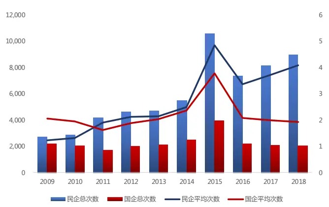
数据来源：东方证券研究所 & Wind 资讯

图 55：2009-2018 国企和民企平均停牌天数对比
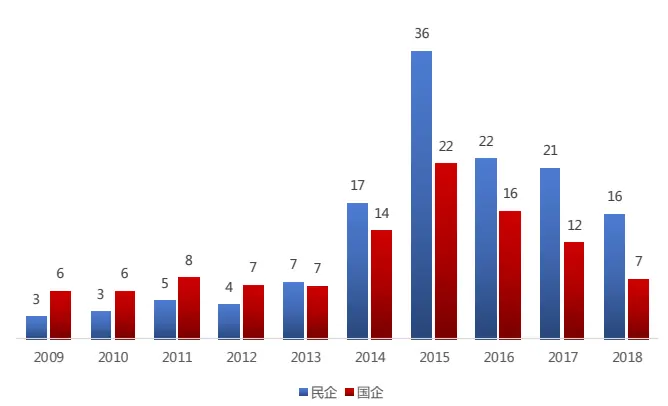
数据来源：东方证券研究所 & Wind 资讯

从业绩预告和快报准确性的角度看：

对比民企和国企业绩预告、业绩快报的准确性，可以看到差别非常明显，（1）过去十年间民企的业绩预告准确度较差，且业绩预告对于净利润明显高估，平均高估幅度达到 80%。（2）而业绩快报的预测准确度国企和民企都比较好，但民企的业绩快报预测准确度的波动幅度会略大一些。由此可见，民企的业绩预告和快报信息可靠程度相对较差。

业绩预告会给出预告净利润的上下限，我们使用上下限均值作为预告净利润预测值，而业绩快报会给出明确的净利润预测值。我们使用（实际累积净利润 - 预告净利润预测值）/|实际单季净利润| 作为业绩预告和快报偏离度指标。这个指标越小，代表业绩预告和快报越高估。可以看到：（1）业绩预告：民企的业绩预告准确度相比国企较差，民企业绩预告均值偏离度的绝对值在过去十年里的均值为 0.8，国企为 0.05；民企的业绩预告对于净利润每年都会明显高估，平均高估幅度达到 80%，2013 年更是高估了 4 倍。（2）业绩快报：业绩快报的预测准确度都比较好，民企的快报偏离度的绝对值在过去十年里的均值在 0 附近，国企为 0.04；民企的业绩快报预测准确度的波动幅度会略大一些，2013年低估 2.3倍，2015年高估 1.2倍。

图 56：2009-2018国企和民企业绩预告均值偏离度对比
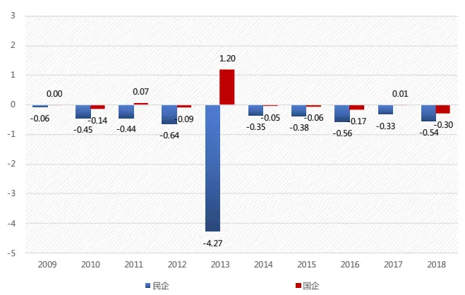
数据来源：东方证券研究所 & Wind 资讯

图 57：2009-2018国企和民企业绩快报偏离度对比
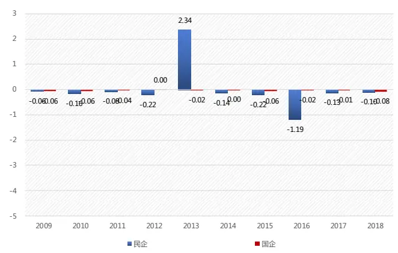
数据来源：东方证券研究所 & Wind 资讯

从意外事件的角度看：

民企鱼龙混杂，通过考察历史上 ST、过去三年里受证监会警告、处罚、业绩暴雷（年报预告预亏）里民企公司的占比，可以看到民企是意外事件的高发地，曾戴过帽的企业有 42%是民营企业。近三年受证监会警告、处罚、业绩暴雷的企业中民企占比不断攀升。受证监会处罚的企业中民企占比较低，2018年 815起案例中民企仅为 16%（公众企业受处罚较多，占 56%），而受警告和业绩暴雷的民企占比在 2018年则均超过 60%。

图 58：A股 ST、业绩暴雷、受证监会警告、处罚里民企的占比情况
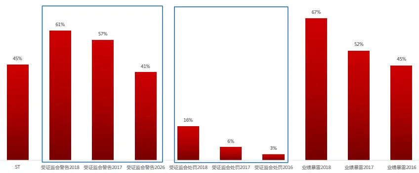
数据来源：东方证券研究所 & Wind 资讯

## 四、 产品：现有民企指数和公募产品

目前已有 11个民企相关的主题指数。2009年 8月 3日发布的国证民企领先 100指数和深证民营指数是市场上最早的民企指数。从指数编制区别来看：

（1）持股数量方面，中证民企综合指数由于直接选取沪深两市全部民营企业上市公司的股票作为指数成分股，持股数量最多，达到 2359只。民企红利和中华民企指数持股最少，仅有 30只。

（2）加权方法上，中证民企红利指数为股息率加权，深证民企发展指数为整体质押比例加权，其余指数全部采用流通市值加权。此外中证非周期民企指数还限定单个中证一级行业样本股数量不超过 20 个，使得持股行业分布更均衡。

（3）编制方法上，多数指数从市值和流动性角度选择股票，而且由于民企鱼龙混杂、有的指数还进行了进一步的筛选。1. 国证民企领先 100指数、深证民企发展指数考虑了大股东累计质押比和资产负债率，2. 中证民企成长指数旨在选取有较强外部融资需求且兼具成长和低估值特征的民企上市公司，用到的成长性指标包括扣非净利润、经营活动现金流量、营业收入增速及增速的波动率、估值指标为 PE。3. 中证民企红利指数使用了平均税后现金股息率指标。4. 中证嘉实民企龙头指数旨在选取基本面良好、盈利能力较强，且估值较低的民企，基本面指标包括营业收入、净利润、现金流净额、分红、研发支出的排名，盈利能力选用 ROE，估值选用 PB。

此外，也已经出现了区域性的民企指数（例如中证浙江民企指数），特定行业的民企指数（例如中证非周期民企）、定位于美股和港股中的中国民营企业（中华民企指数）。

图 59：现有民企相关主题指数基本信息、编制方案

| 指数简称 发布时间 发布机构 成分股数量 地区覆盖 样本空间 |  |  |  |  |  |  |  |  |
| --- | --- | --- | --- | --- | --- | --- | --- | --- |
| 国证民企领先100指数 | 民企100 2009/8/3 深圳证券信息公司 |  | 100 境内 | 由满足以下条件的沪深 A 股构成： (1)非ST、*ST股票； (2)上市时间超过六个月； (3)公司最近一年无重大违规、财务报告无重大问题； (4)公司最近一年经营无异常、无重大亏损； (5)考察期内股价无异常波动； (6)上市公司实际控制人为非国有独资、非国有控股及非外资控股。 | (1)对选样空间股票按照最近半年的A股日均成交金额从高到低排序，剔除 排名后20%的股票； (2)剔除大股东累计质押比超过85%的股票； （3）剔除资产负债率超过70%的股票（银行和保险行业除外）； (4)对选样空间剩余股票按照最近半年的A股日均总市值从高到低排序，选 取前100名股票构成指数样本股。 | 日均总市值 | 流通股本加权 | 每半年 |
| 深证民营指数 | 深证民企 2009/8/3 | 深圳证券交易所 | 100 | 由满足以下条件的深市A 股构成： (1)1.非ST、*ST的A股； (2)有一定上市交易日期，一般为六个月； 境内 (3)非ST、*ST股票； （4)公司最近一年无重大违规、财务报告无重大问题； （5）公司最近一年经营无异常、无重大亏损； （6）考察期内股价无异常波动； | 额； 后10%的股票； 取前100名股票构成初始样本股。 | (1)计算入围选样空间股票在最近半年的A股日均总市值和A股日均成交金 （2)对入围股票在最近半年的A股日均成交金额按从高到低排序，剔除排名 （3)对选样空间剩余股票按照最近半年的A股日均总市值从高到低排序，选 |  | 流通股本加权 每半年 |
| 中证民营企业综合指数 | 中证民企 2009/8/25 | 中证指数公司 | 2359 | 境内 全部 A股 |  | (1)选取全部民营企业上市公司的股票组成中证民营企业综合指数样本； (2)在沪深两市全部 A股中，主要依据上市公司定期报告和股权变动公告 判断该上市公司是否为民营企业上市公司。判断的主要标准为上市公司实际 控制人，将实际控制人为境内自然人（包括港澳台）控股的上市公司归为民 营企业上市公司。 |  | 流通股本加权 每半年 |
| 中证民企成长指数 | 民企成长 2009/8/25 | 中证指数公司 | 300 | 由满足以下条件的沪深A 股构成： 境内 （1）中证全指指数样本股； （2）实际控制人为境内自然人（包括港澳台）控股的上市公司。 |  | (2)分别按照各个公司过去三年扣非净利润、经营活动现金流量以及营业 收入的增速波动率进行降序排列，剔除排名靠前10%的股票； (3)计算单只股票的成长因子得分； (4)根据上市公司公开披露的信息，选取具有较强外部融资需求且资金用 于未来扩大再生产或投资项目的公司，同时剔除那些可能存在较为严重循环 质押或是担保的公司； (5)选取成长因子得分最高的 500 只股票且同时满足 PE 大于0； (6)按照 PE 由低到高进行升序排列，选取排名靠前的300 只股票作为指 数样本股 | 成长指标（扣非净利润、经 营活动现金流量、营业收入 过去四个财务季度环比增 速的均值） | 流通股本加权 每半年 |
| 上证民营企业50指数 | 上证民企 2009/8/25 | 中证指数公司 | 50 | 境内 在前18位； (2)不含ST 股票、*ST股票、暂停上市股票 （3)实际控制人为境内（包括港澳台）自然人的上市公司股票。 | (1)上市时间超过一个季度，除非该股票自上市以来的日均 A 股总市值在全部沪市 A 股中排 | 金额与日均总市值由高到低进行排名，再将两项排名结果相加，所得和的排 名作为股票的综合排名。 (2)选取综合排名在前50名的股票作为指数样本股。 | 日均成交金额 日均总市值 | 流通股本加权 |
| 中证民营企业红利指数 | 民企红利 2012/7/20 | 中证指数公司 | 30 | 境内 (2)过去两年连续现金分红且每年的税后现金股息率均大于0； （3)过去一年内日均总市值排名在全部 A 股的前 80%； | （1）在沪深两市上市的实际控制人为境内（包括港澳台）自然人的上市公司股票； （1）对样本空间内股票，按照过去2年的平均税后现金股息率由高到低进 行排名； | (2)选取排名在前30名的股票作为指数样本股，但市场表现异常并经指 数专家委员会认定不宜作为样本的股票除外。 | 税后现金股息率 | 股息率加权 |
| 中证浙江民营企业指数 | 浙江民企 2012/11/9 | 中证指数公司 | 359 | 境内 在前30位； (2)不含ST股票、*ST股票、暂停上市股票 (3)注册地在浙江的上市公司股票。 | (1)上市时间超过一个季度，除非该股票自上市以来的日均 A 股总市值在全部沪市A 股中排 | (1)将样本空间内所有股票作为中证浙江企业综合指数样本股 (2)将样本空间内所有股票中，实际控制人为境内（包括港澳台）自然人 的上市公司股票作为中证浙江民营企业指数样本股。 |  | 流通股本加权 |
| 中证非周期民营企业指数 | 非周民企 2015/4/7 | 中证指数公司 | 100 | 境内 以中证全指样本股中所有民营企业上市公司 | 行业 | 、非金属采矿及制品、交通运输、金融地产等行业以外的股票归为非周期性 股票。将样本空间内剩余股票中的非周期性行业股票作为待选样本。 （3）从待选样本中，按照最近一年（新股为上市以来）的A股日均总市值 由高到低进行排名，依次入选排名靠前的100个股票组成样本股，其中单 个中证一级行业样本股数量不超过20 个。 | 日均总市值 | 流通股本加权 每半年 |
| 中华交易服务中国海外民企指数 中华民企 2017/1/19 | 公司 | 中华证券交易服务 | 30 | 由满足以下条件的香港联合交易所、纽约证券交易所、纽约证券交易所MKT及纳斯达克上市的 中国民营企业普通股组成。 （1）注册地在中国大陆，或公司营运中心在中国大陆，或公司主营业务收入50%以上来自中国 境外 大陆； （2）公司为中国民营企业，实际控制人为自然人，且政府持股不超过20%； | (1)流动性甄选：样本空间股票日均成交金额不少于 50万美元； (2)市值甄选： 样本空间股票日均总市值不小于 5 亿美元(包括 A股上市部 分之市值)； (3)对样本空间的剩余股票，按照过去一年日均总市值(包括A 股上市部分 之市值)进行排序，选取排名靠前的30只股票作为指数样本股。 | 日均总市值 |  | 流通股本加权 每半年 |
| 深证民企发展指数 | 民企发展 2019/3/5 深圳证券信息公司 |  |  | 由满足以下条件的深市 A 股构成： （1）有一定上市交易日期，一般为六个月； (2)非ST、*ST股； （3）公司最近一年无重大违规、财务报告无重大问题； 境内 | 股票； (4)公司最近一年经营无异常、无重大亏损； （5）考察期内股价无异常波动； | （1）按国证二级行业分类，剔除净资产、营业收入均排名在行业后10%的 （2）按最近一年日均成交金额由大到小排序，剔除后10%；然后，剔除公司 资产负债率大于80%、大股东质押股份比例小于60%、整体质押比例小于 10%的股票； |  | 流通股本加权 每半年 |
| 中证嘉实民企龙头指数 | 民企龙头 2019/3/28 | 中证指数公司 | 50 | 由满足以下条件的沪深 A 股构成： 境内 | （1）上市时间超过1年的民营企业； (2)非ST，*ST或暂停上市股票； | (1)在样本空间内，根据过去一年日均成交金额降序排名，剔除排名后 20%的公司； (2)在剩余股票中，计算最近一年净利润、最近一年扣除非经常性损益后 的净利润、最近一年经营现金流净额，剔除任一指标为负的公司； (3)分别计算样本的 FV 排名，选取排名最高的30%股票。 额排名+分红排名+研发支 | FV排名=1/5*(营业收入排 名+净利润排名+现金流净 |  |

数据来源：东方证券研究所 & 中证指数公司 & Wind 资讯

目前跟踪民企指数的公募产品较少，仅有鹏华基金一家公司发了 4 只产品，分别跟踪上证民企和深证民企指数，截止 2019/3/31基金合计规模均不到 1个亿。

图 60：现有民企 ETF

| 证券代码 | 证券简称 | 跟踪指数 | 2019/3/31基金规模(合计，亿元) | 基金成立日 | 现任基金经理 | 2019/1/1-2019/3/31 | 复权单位净值净增长率（%） 2018/1/1-2018/12/31 | 2016/1/1-2018/12/31 | 2014/1/1-2018/12/31 |
| --- | --- | --- | --- | --- | --- | --- | --- | --- | --- |
| 159911.OF | 鹏华深证民营ETF | 深证民营 | 0.49 | 2011/9/2 | 崔俊杰罗捷 | 34.28% | -37.66% | -44.58% | -10.78% |
| 206005.OF | 鹏华上证民企50ETF联接 | 上证民企 | 0.75 | 2010/8/5 | 崔俊杰,张羽翔 | 31.87% | -28.03% | -27.04% | 15.87% |
| 206010.OF | 鹏华深证民营ETF联接 | 深证民营 | 0.42 | 2011/9/2 | 崔俊杰,罗捷 | 31.98% | -35.29% | -42.51% | -10.86% |
| 510070.OF | 鹏华上证民企50ETF | 上证民企 | 0.85 | 2010/8/5 | 崔俊杰,张羽翔 | 33.66% | -29.55% | -27.97% | 16.98% |

数据来源：东方证券研究所 & Wind 资讯

## 五、 策略：民企中的选股策略

## 5.1 优质民企量化组合

民企鱼龙混杂明显、需要进行进一步的质量筛选。我们首先构建优质民企主动量化组合，选出更为优质的民企龙头。

## 样本空间

由满足以下条件的沪深 A 股构成：

（1）Wind 分类中属于民营企业；

（2）上市时间超过 6 个月；

（3）不含 ST、*ST、PT、暂停上市等特别处理股票；

（4）调仓日正常交易;

（5） 过去一年至少 120 天的时间股票正常交易；

（6） 过去一年内日均总市值排名在全部 A 股的前 80%；

（7） 过去一年内日均成交金额排名在全部 A 股的前 80%。

后面 5 个条件剔除的股票比例在 40% - 50%。样本空间内股票的平均市值大概在 80 亿左右，与中证 500比较接近。

图 61：优质民企量化组合样本空间股票剔除比例
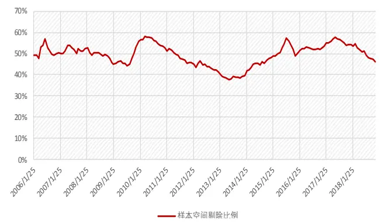
数据来源：东方证券研究所 & Wind 资讯

图 62：优质民企量化组合样本空间股票平均市值
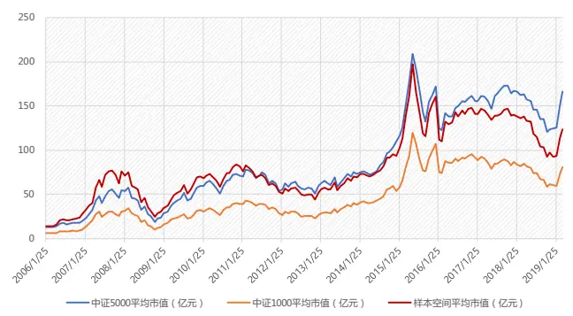
数据来源：东方证券研究所 & Wind 资讯

我们首先在上述样本空间中测试了现有因子库内 7 个大类 50 个单因子 Alpha 因子原始值的选股效果（图 56），历史回溯测试的实证区间设定为 2008.12.31–2019.03.31。结果发现，估值、成长、分析师、投机大类表现较好。

图 63：样本空间内 Alpha因子原始值的选股效果

|  |  | 78.09% |  |  |  |  |  |  |  |  | -5.52% | 23.85% | 13.20% | 6.41% | 20.37% | -2.64% | -0.11% | -4.04% | -2.01% |
| --- | --- | --- | --- | --- | --- | --- | --- | --- | --- | --- | --- | --- | --- | --- | --- | --- | --- | --- | --- |
| analyst | COV | 100.00% | 1.07% 22.49% | 0.72 | -0.26% | 44.72% | -0.18 | -0.61 | -4.08% | -32.21% -1.15% | -13.97% | 8.47% | 17.11% | -18.58% | -22.26% | -15.67% | 62.31% | 16.57% | -11.04% |
| analyst | DISP | 58.85% | -2.06% -75.64% | -2.42 | 0.34% | 51.22% | 0.31 | -0.26 | 3.97% 23.03% | 11.64% | -7.41% | 20.68% | 10.06% | -8.77% | -10.62% | 2.46% | 11.12% | 1.90% | -6.01% |
| analyst | PEG | 70.27% | -4.07% -152.32% | -4.88 | 1.27% | 67.48% | 1.43 | -0.11 | 14.08% 9.54% | 22.51% | 10.15% | 24.30% | -3.51% | 22.01% | 24.82% | 17.46% | 37.33% | -4.61% | 1.06% |
| growth growth | SUE1 SUEO | 93.56% | 4.78% 160.71% 4.59% 241.40% | 5.15 | 1.42% | 63.41% | 1.46 | -0.14 -0.08 | 16.33% 0.18% 17.65% | 35.73% | 14.26% | 35.48% | 13.49% | 3.95% | 31.81% | 2.85% | 42.16% | 20.13% | -8.32% |
| growth | growth | 93.56% 89.10% | 4.56% 153.42% | 7.73 4.91 | 1.48% 1.27% | 72.36% 63.41% | 1.93 1.30 | -0.15 | 13.89% 14.73% 9.95% | 22.98% | 13.99% | 35.96% | 23.44% | 3.56% -5.92% | 30.41% | 8.07% | 31.71% | 24.80% 15.20% | -6.30% |
| growth | PROFIT_GROWTH_YOY | 100.00% 3.98% | 152.86% | 4.89 | 1.02% | 60.98% | 1.22 |  | 11.74% 1.90% | 16.04% | 14.96% | 36.76% 38.34% | 26.92% 17.25% | 3.72% | 29.20% 11.95% | 0.33% -4.67% | 36.13% 31.89% | 18.30% | -7.87% |
| growth | PROFIT2_GROWTH_YOY | 97.10% 3.64% | 143.49% | 4.59 | 0.90% | 62.60% | 1.05 |  | -1.44% | 19.79% | 7.15% 10.86% | 35.99% | 11.48% | 7.96% | 19.81% | -0.66% | 27.25% | 6.67% | -9.63% |
| growth | PROFIT_GROWTH_TTM | 89.10% 3.56% | 167.16% | 5.35 | 0.90% | 65.04% | 1.06 | 10.22% 10.30% | 16.41% | 8.94% 13.09% |  |  | 8.47% | -4.48% | 9.83% | 2.69% | 37.34% | 6.60% | -9.78% |
| growth | SURO | 93.52% 3.45% | 188.50% | 6.04 | 1.05% | 67.48% | 1.48 | 12.29% | 15.36% | 21.16% | 7.30% 4.94% | 22.77% 25.48% | 20.96% | -6.91% | 27.94% | 2.81% | 16.90% | 12.38% | -3.56% -2.19% |
| growth | SUR1 | 93.52% 3.45% | 124.79% | 4.00 | 1.22% | 65.04% | 1.41 | 14.03% | 9.31% | 33.64% | 1.50% |  | 28.30% | -6.83% | 32.08% | -0.39% | 28.74% | 14.79% | -2.66% |
| growth | SALES_GROWTH_YOY | 100.00% 2.74% | 103.72% | 3.32 | 0.53% | 60.98% | 0.68 | -0.12 | 5.80% -13.57% | 7.58% | 1.87% | 24.58% 31.32% | 20.45% | -3.39% | 4.77% | -5.53% | 20.76% | 6.40% | -1.68% |
| growth | SALES_GROWTH_TTM | 99.70% | 1.60% 53.13% | 1.70 | 0.05% | 48.78% | 0.06 | -0.19 -0.28 | -0.13% -18.37% | 3.78% | 4.76% | 14.45% | 12.91% | -0.54% | -14.32% | -10.78% | 23.25% | 0.55% | -8.69% |
| growth | OCF_GTOWTH_YOY | 99.86% | 1.59% 116.26% | 3.72 | 0.56% | 60.98% | 1.02 | -0.08 | 6.84% 18.47% | 13.84% | 9.93% | 5.40% | 5.70% | 8.12% | 8.86% | -0.90% | 7.23% | -0.14% | -2.46% |
| growth | UP | 99.90% | 1.32% 46.10% | 1.48 | 0.41% | 51.22% | 0.48 | -0.24 | 4.38% -11.36% | 12.07% | 0.96% | 18.50% | 25.11% | -8.59% | 12.76% | -4.80% | 13.75% | -2.52% |  |
|  |  |  |  |  |  |  |  |  |  |  |  |  |  | 41.36% |  |  |  |  | -3.22% |

数据来源：东方证券研究所 & Wind 资讯

考虑因子表现，我们最终选用的因子包含四个大类 10 个单因子（图 57）。由于分析师大类因子间相关性不强，我们将其中的 EP_FY1、PEG 合并入估值大类。构建组合时，我们对样本空间内的股票计算因子综合得分，选出得分最高的 100只股票作为每一期的组合成分股。

图 64：优质民企量化组合因子列表

| 大类 | 因子简称 |  | 因子定义 |
| --- | --- | --- | --- |
| Value | BP | 账面市值比 |  |
|  | EP | 归属母公司的净利润TTM/总市值 |  |
|  | SP | 营业收入TTM/总市值 |  |
|  | EP_FY1 | 预期的估值 |  |
| Profitability | PEG | PE_FY1/FY2隐含的利润增量率 |  |
|  | CFROI | 投资现金收益率 |  |
| Growth | ROE | 净资产收益率 |  |
|  | PROFIT_GROWTH_YOY | 归属母公司的净利润季度同比 |  |
|  | SUEO | 基于带漂移项随机游走模型计算的预期外的净利润 |  |
| Lottery | VOL120 | 过去120个交易日的波动率 |  |

数据来源：东方证券研究所

组合采取流通市值加权，同时设定个股权重上限 5%，行业权重控制上限 15%。

组合的历史回溯测试的实证区间设定为 2008.12.31 – 2019.03.31。采用测试月频调仓方式。分别测试扣费与不扣费的组合，并与常用指数沪深 300、中证 500、中证 1000进行对比。可以看到，我们自己构建的优质民企主动量化组合，各项绩效指标表现明显好于常见市场指数，过去 10年间年化收益可以达到 25%，单边年换手率不到 3倍。

图 65：优质民企量化组合净值曲线（不扣费，2008.12.31 – 2019.03.31）
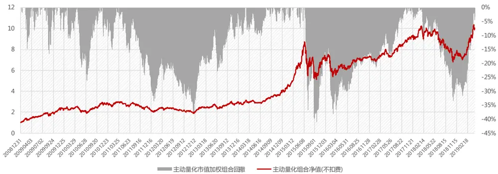
数据来源：东方证券研究所 & Wind 资讯

图 66：优质民企量化组合绩效指标（2008.12.31 – 2019.03.31）

| 主动量化组合（月度调仓，持仓数量100只） |  |  | 沪深300 | 中证500 | 中证1000 |
| --- | --- | --- | --- | --- | --- |
|  | 不扣费 | 扣费（单边千三） |  |  |  |
| 年化收益率 | 25.15% | 21.55% | 8.19% | 11.25% | 12.64% |
| 年化波动率 | 26.47% | 25.61% | 24.13% | 27.69% | 28.89% |
| sharp比率 | 0.98 | 0.89 | 0.45 | 0.52 | 0.56 |
| 最大回撤 | -40.96% | -40.82% | -46.70% | -65.20% | -72.35% |
| 年换手率（单边） | 2.94 | 2.80 | 66.82% | 66.82% | 66.82% |
| 2009 | 137.93% | 128.88% | 96.71% | 131.27% | 139.85% |
| 2010 | 15.96% | 15.72% | -12.51% | 10.07% | 17.40% |
| 2011 | -24.01% | -26.35% | -25.01% | -33.83% | -32.96% |
| 2012 | 8.33% | 6.25% | 7.55% | 0.28% | -1.43% |
| 2013 | 27.09% | 27.70% | -7.65% | 16.89% | 31.59% |
| 2014 | 39.69% | 38.61% | 51.66% | 39.01% | 34.46% |
| 2015 | 81.07% | 71.64% | 5.58% | 43.12% | 76.10% |
| 2016 | -4.35% | -7.29% | -11.28% | -17.78% | -20.01% |
| 2017 | 33.35% | 29.37% | 21.78% | -0.20% | -17.35% |
| 2018 | -23.23% | -26.34% | -25.31% | -33.32% | -36.87% |
| 2019 | 40.74% | 32.67% | 35.76% | 39.34% | 40.72% |

数据来源：东方证券研究所 & Wind 资讯

## 5.2 优质民企策略指数

下面我们构建优质民企策略指数，甄选出盈利能力强，成长性好、股价波动较小且估值较低的民企。回测显示我们的策略收益稳健、成分股数量适中、换手率较低。

策略指数的样本空间与主动量化组合设置相同。由于是构建指数，选股因子不能太多，并且要逻辑直观、容易被投资者理解，综合考虑选股逻辑、因子表现、换手率，我们最终选用的因子包含四个大类的 5 个单因子（图 54）。每一期调仓时，我们都对样本空间内的股票计算因子综合得分，选出得分最高的 200只股票作为指数样本股。

图 67：优质民企策略指数因子列表

| 大类 | 因子简称 | 因子定义 |
| --- | --- | --- |
| Value | BP | 账面市值比 |
|  | EP | 归属母公司的净利润TTM/总市值 |
| Profitability | ROE | 净资产收益率 |
| Growth | PROFIT_GROWTH_YOY | 归属母公司的净利润季度同比 |
| Lottery | VOL120 | 过去120个交易日的波动率 |

数据来源：东方证券研究所

策略指数采取流通市值加权，同时设定个股权重上限 5%，行业权重控制上限 15%。

策略的历史回溯测试的实证区间设定为 2008.12.31 – 2019.03.31，采用半年期的调仓方式，在每年 6月和 12月底进行调仓。考虑策略指数的换手率较低，持仓股票数量较多，实盘中交易状况及交易成本的影响较小，因而测试时没有扣除交易手续费，调仓时涨跌停股票也假设可以正常买卖。下图我们展示了指数的净值曲线，以及相关绩效指标，可以看到，我们构建的优质民企策略指数过去 10年间的年化收益可以达到 16%，单边率不到 1倍，从分年表现来看，2015、2017年表现都比较好。

图 68：优质民企策略指数净值曲线 & 绩效指标（2008.12.31 – 2019.03.31）

|  | 策略指数 |
| --- | --- |
| 年化收益率 | 16.44% |
| 年化波动率 | 26.30% |
| sharp比率 | 0.71 |
| 最大回撤 | -46.88% |
| 年换手率（单边) | 80.90% |
| 2009 | 133.93% |
| 2010 | 14.43% |
| 2011 | -30.14% |
| 2012 | -0.41% |
| 2013 | 18.55% |
| 2014 | 29.06% |
| 2015 | 59.71% |
| 2016 | -9.11% |
| 2017 | 20.61% |
| 2018 | -32.25% |
| 2019 | 41.64% |

数据来源：东方证券研究所 & Wind 资讯

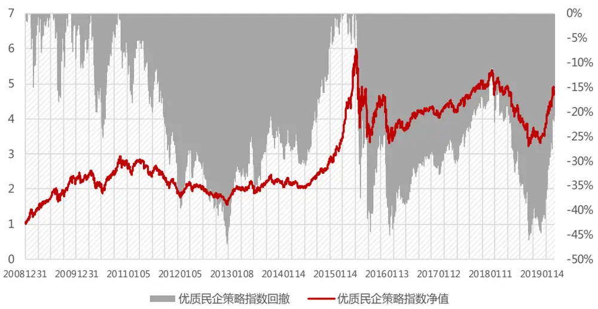

## 5.3 大湾区民企策略指数

在粤港澳大湾区成为国家战略的背景下，民企作为广东尤其是珠三角地区最活跃的市场主体，在粤港澳大湾区建设中起到了重要作用，下面我们进一步构建特定区域的大湾区民企策略指数。

样本空间

由满足以下条件的沪深 A 股构成：

（1）Wind 分类中属于民营企业；

（2）上市时间超过 6 个月；

（3） 不含 ST、*ST、PT、暂停上市等特别处理股票；

（4）调仓日正常交易;

（5） 注册地在粤港澳大湾区（包括香港、澳门两个特别行政区和广东省广州、深圳、珠海、佛山、惠州、东莞、中山、江门、肇庆（珠三角）九个地市）的上市公司股票。

每一期的股票数量如图 70，可以看到样本空间股票数量逐年增多，2018 年底达到 342 只。

将样本空间内的所有作为大湾区民营企业指数样本股。

图 69：大湾区民企策略指数样本空间股票数量
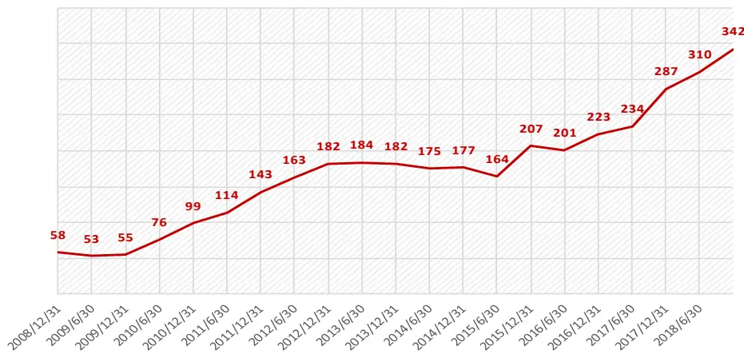
数据来源：东方证券研究所 & Wind 资讯

策略指数采取流通市值加权，同时设定个股权重上限 5%，行业权重控制上限 15%。

策略的历史回溯测试的实证区间设定为 2008.12.31 – 2019.03.31。采用半年期的调仓方式。由于是构建指数，所以没有扣除交易手续费，调仓时涨跌停股票也假设可以正常买卖。下图我们展示了指数的净值曲线，以及相关绩效指标。我们构建的大湾区民企指数过去 10年间的年化收益可以达到 17.6%，单边率 0.3倍。

图 70：大湾区民企策略指数净值曲线 & 绩效指标（2008.12.31 – 2019.03.31）

|  | 大湾区民企策略指数 |
| --- | --- |
| 年化收益率 | 17.66% |
| 年化波动率 | 29.38% |
| sharp比率 | 0.70 |
| 最大回撤 | -57.09% |
| 年换手率（单边） | 32.29% |
| 2009 | 166.83% |
| 2010 | 17.39% |
| 2011 | -37.29% |
| 2012 | -1.52% |
| 2013 | 43.61% |
| 2014 | 22.39% |
| 2015 | 89.49% |
| 2016 | -15.48% |
| 2017 | 2.74% |
| 2018 | -30.49% |
| 2019 | 41.64% |

数据来源：东方证券研究所 & Wind 资讯

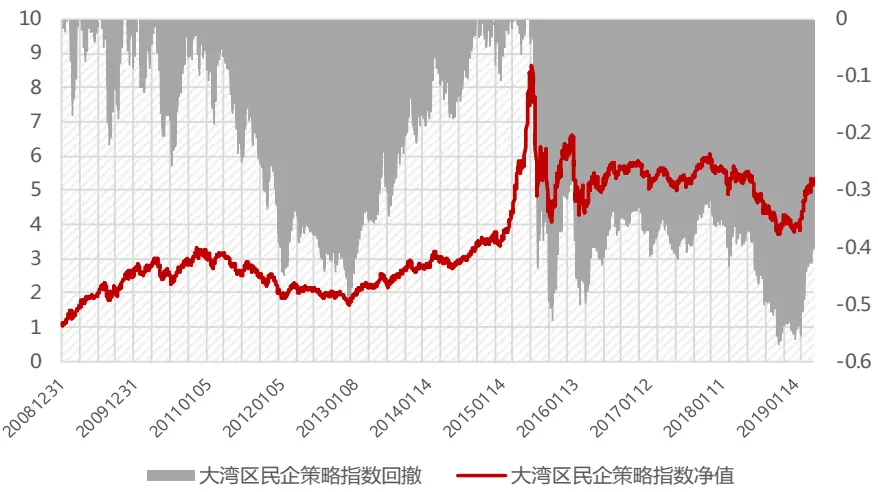

## 5.4 与现有指数对比

我们将新构建的优质民企策略指数、大湾区民企策略指数与现有 8 个民企指数进行了对比。由于现有民企指数多是从 2009年下半年才开始发布净值，因而我们在对比时将历史回溯时间统一调整为 2009 年底开始。可以看到：我们自己构建的两个民企指数的整体表现好于现有 6 个指数，仅低于民企红利指数和中华民企指数。但需要注意的是：（1）由于民企上市公司中现金分红比例普遍较低，而民企红利指数的样本空间要求是过去两年连续现金分红且每年的税后现金股息率均大于 0，因而其成分股数量较少，仅有 30只，所能容纳的资金容量较小。（2）中华民企指数的样本空间与其余指数不同，该指数选择的是在美股或港股上市的中国民营企业，成分股数量也仅为 30家。我们测算了指数间日度收益率的相关性，可以看到中华民企指数与其他指数的相关系数都在0.4左右。如果公司 QDII额度够的话，把海外的优秀民企囊括进来会更好。

图 71：民企策略指数净值曲线对比（2009.12.31 – 2019.03.31）
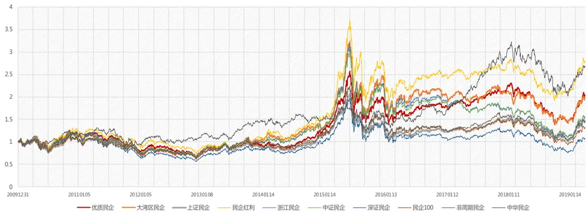
数据来源：东方证券研究所 & Wind 资讯

图 72：民企策略指数绩效指标对比（2009.12.31 – 2019.03.31）

|  | 优质民企策略指数 | 大湾区民企策略指数 | 上证民企 | 民企红利 | 浙江民企 | 中证民企 | 深证民企 | 民企100 | 非周期民企 | 中华民企 |
| --- | --- | --- | --- | --- | --- | --- | --- | --- | --- | --- |
| 年化收益率 | 8.02% | 7.74% | 4.25% | 11.71% | 4.96% | 4.90% | 0.88% | 3.08% | 4.22% | 11.21% |
| 年化波动率 | 25.42% | 28.37% | 23.68% | 26.24% | 27.09% | 25.55% | 26.42% | 24.48% | 25.70% | 21.26% |
| sharp比率 | 0.43 | 0.41 | 0.29 | 0.55 | 0.32 | 0.32 | 0.17 | 0.25 | 0.29 | 0.61 |
| 最大回撤 | -46.88% | -57.09% | -51.68% | -49.31% | -66.94% | -64.34% | -61.95% | -58.45% | -54.59% | -37.21% |
| 年换手率（单边） | 83.81% | 32.83% |  |  |  |  |  |  |  |  |
| 2010 | 14.43% | 17.39% | 2.63% | 21.17% | 14.16% | 11.40% | 5.11% | 3.90% | 14.87% | 12.41% |
| 2011 | -30.14% | -37.29% | -27.60% | -25.47% | -33.36% | -30.95% | -36.12% | -30.16% | -33.97% | -16.28% |
| 2012 | -0.41% | -1.52% | 4.70% | -4.49% | -2.61% | 1.78% | -1.05% | 6.38% | -3.18% | 18.51% |
| 2013 | 18.55% | 43.61% | 14.16% | 26.02% | 34.38% | 27.44% | 25.72% | 18.96% | 35.47% | 32.13% |
| 2014 | 29.06% | 22.39% | 30.16% | 38.15% | 27.97% | 29.31% | 15.07% | 26.48% | 9.08% | 0.79% |
| 2015 | 59.71% | 89.49% | 22.75% | 80.72% | 77.25% | 72.40% | 42.60% | 33.21% | 43.66% | 9.06% |
| 2016 | -9.11% | -15.48% | -13.84% | -8.64% | -15.54% | -16.33% | -21.16% | -18.93% | -18.87% | -0.33% |
| 2017 | 20.61% | 2.74% | 19.52% | 7.02% | -9.69% | -6.87% | 13.58% | 15.05% | 23.28% | 78.43% |
| 2018 | -32.25% | -30.49% | -29.60% | -22.21% | -35.32% | -35.35% | -36.97% | -33.78% | -32.37% | -26.34% |
| 2019 | 41.64% | 37.15% | 43.12% | 35.47% | 40.75% | 39.18% | 40.18% | 38.71% | 39.19% | 26.42% |

数据来源：东方证券研究所 & Wind 资讯

图 73：各民企指数收益率的相关性矩阵

| 收益率相关系数 | 优质民企 大湾区民企 |  | 上证民企 | 民企红利 | 浙江民企 | 中证民企 | 深证民企 | 民企100 | 非周期民企 | 中华民企 |
| --- | --- | --- | --- | --- | --- | --- | --- | --- | --- | --- |
| 优质民企 | 1.00 | 0.95 | 0.95 | 0.95 | 0.96 | 0.96 | 0.97 | 0.97 | 0.96 | 0.48 |
| 大湾区民企 | 0.95 | 1.00 | 0.89 | 0.92 | 0.98 | 0.98 | 0.96 | 0.94 | 0.95 | 0.42 |
| 上证民企 | 0.95 | 0.89 | 1.00 | 0.90 | 0.90 | 0.92 | 0.93 | 0.97 | 0.94 | 0.49 |
| 民企红利 | 0.95 | 0.92 | 0.90 | 1.00 | 0.93 | 0.94 | 0.92 | 0.93 | 0.92 | 0.44 |
| 浙江民企 | 0.96 | 0.98 | 0.90 | 0.93 | 1.00 | 0.99 | 0.96 | 0.95 | 0.95 | 0.43 |
| 中证民企 | 0.96 | 0.98 | 0.92 | 0.94 | 0.99 | 1.00 | 0.97 | 0.97 | 0.96 | 0.44 |
| 深证民企 | 0.97 | 0.96 | 0.93 | 0.92 | 0.96 | 0.97 | 1.00 | 0.98 | 0.98 | 0.46 |
| 民企100 | 0.97 | 0.94 | 0.97 | 0.93 | 0.95 | 0.97 | 0.98 | 1.00 | 0.98 | 0.49 |
| 非周期民企 | 0.96 | 0.95 | 0.94 | 0.92 | 0.95 | 0.96 | 0.98 | 0.98 | 1.00 | 0.45 |
| 中华民企 | 0.48 | 0.42 | 0.49 | 0.44 | 0.43 | 0.44 | 0.46 | 0.49 | 0.45 | 1.00 |

数据来源：东方证券研究所

图 74：各民企指数特质收益率间的相关性矩阵

| 特质收益率相关系数 |  | 优质民企 大湾区民企 | 上证民企 | 民企红利 | 浙江民企 | 中证民企 | 深证民企 | 民企100 | 非周期民企 |
| --- | --- | --- | --- | --- | --- | --- | --- | --- | --- |
| 优质民企 | 1.00 | 0.49 | 0.29 | 0.54 | 0.51 | 0.50 | 0.54 | 0.52 | 0.60 |
| 大湾区民企 | 0.49 | 1.00 | (0.05) | 0.42 | 0.82 | 0.89 | 0.66 | 0.43 | 0.63 |
| 上证民企 | 0.29 | (0.05) | 1.00 | 0.06 | (0.01) | 0.04 | 0.15 | 0.62 | 0.39 |
| 民企红利 | 0.54 | 0.42 | 0.06 | 1.00 | 0.46 | 0.41 | 0.30 | 0.25 | 0.38 |
| 浙江民企 | 0.51 | 0.82 | (0.01) | 0.46 | 1.00 | 0.90 | 0.60 | 0.40 | 0.57 |
| 中证民企 | 0.50 | 0.89 | 0.04 | 0.41 | 0.90 | 1.00 | 0.66 | 0.49 | 0.63 |
| 深证民企 | 0.54 | 0.66 | 0.15 | 0.30 | 0.60 | 0.66 | 1.00 | 0.78 | 0.85 |
| 民企100 | 0.52 | 0.43 | 0.62 | 0.25 | 0.40 | 0.49 | 0.78 | 1.00 | 0.80 |
| 非周期民企 | 0.60 | 0.63 | 0.39 | 0.38 | 0.57 | 0.63 | 0.85 | 0.80 | 1.00 |

数据来源：东方证券研究所
注：特质收益率为日收益率对中证全指日收益率回归的残差

我们对比了各民企指数的前十大权重股，可以看到，中华民企指数的成分股权重非常集中，前四大权重股的权重之和就占到了 53%。民企红利指数的前五大成分股权重也均超过了 5%。相比而言，我们构建的两个民企策略指数个股权重更为均衡。

图 75：各民企指数前十大权重股（截止 2018/12/31）

| 优质民企策略指数 |  |  | 大湾区民企策略指数 |  |  | 上证民企 |  |  | 民企红利 |  |  |
| --- | --- | --- | --- | --- | --- | --- | --- | --- | --- | --- | --- |
| 证券名称 | 行业 | 权重(%) | 证券名称 | 行业 | 权重(%) | 证券名称 | 行业 | 权重(%) | 证券名称 | 行业 | 权重(%) |
| 美的集团 | 可选消费 | 5.00 | 美的集团 | 可选消费 | 5.00 | 恒瑞医药 | 医药卫生 | 12.43 | 方大特钢 | 原材料 | 6.8 |
| 华夏幸福 | 房地产 | 3.44 | 海天味业 | 日常消费 | 5.00 | 三一重工 | 工业 | 5.6 | 龙蟒佰利 | 原材料 | 6.79 |
| 三一重工 | 工业 | 3.20 | 比亚迪 | 可选消费 | 3.23 | 海天味业 | 主要消费 | 5.13 | 康力电梯 | 工业 | 5.95 |
| 苏宁易购 | 可选消费 | 2.86 | 立讯精密 | 信息技术 | 3.09 | 隆基股份 | 工业 | 4.5 | 新希望 | 主要消费 | 5.4 |
| 新城控股 | 房地产 | 2.38 | 顺丰控股 | 工业 | 2.20 | 华夏幸福 | 金融地产 | 4.42 | 梅花生物 | 主要消费 | 5.02 |
| 海澜之家 | 可选消费 | 1.91 | 海大集团 | 日常消费 | 2.01 | 浙江龙盛 | 原材料 | 4.07 | 九牧王 | 可选消费 | 4.87 |
| 长城汽车 | 可选消费 | 1.70 | 海普瑞 | 医疗保健 | 1.62 | 恒生电子 | 信息技术 | 3.25 | 常宝股份 | 原材料 | 4.28 |
| 智飞生物 | 医疗保健 | 1.70 | 大族激光 | 信息技术 | 1.57 | 福耀玻璃 | 可选消费 | 2.78 | 顺发恒业 | 金融地产 | 4.26 |
| 广汇汽车 | 可选消费 | 1.67 | 汇川技术 | 工业 | 1.53 | 新城控股 | 金融地产 | 2.73 | 荣盛发展 | 金融地产 | 4.03 |
| 新和成 | 医疗保健 | 1.61 | 欧菲光 | 信息技术 | 1.28 | 永辉超市 | 主要消费 | 2.55 | 联发股份 | 可选消费 | 3.89 |

| 证券名称 | 行业 | 权重(%) | 简称 | 行业 | 权重(%) | 证券名称 | 行业 | 权重(%) | 证券名称 | 行业 | 权重(%) |
| --- | --- | --- | --- | --- | --- | --- | --- | --- | --- | --- | --- |
| 浙江龙盛 | 原材料 | 3.78 | 美的集团 | 可选消费 | 2.38 | 美的集团 | 可选消费 | 9.67 | 美的集团 | 可选消费 | 8.22 |
| 恒生电子 | 信息技术 | 3.01 | 恒瑞医药 | 医药卫生 | 1.59 | 温氏股份 | 日常消费 | 6.66 | 恒瑞医药 | 医疗保健 | 6.97 |
| 大华股份 | 信息技术 | 2.11 | 温氏股份 | 主要消费 | 1.36 | 东方财富 | 金融 | 3.27 | 温氏股份 | 日常消费 | 5.66 |
| 华东医药 | 医药卫生 | 1.67 | 三一重工 | 工业 | 0.72 | 中兴通讯 | 信息技术 | 3.01 | 东方财富 | 金融 | 2.78 |
| 正泰电器 | 工业 | 1.64 | 东方财富 | 信息技术 | 0.68 | 立讯精密 | 信息技术 | 2.56 | 三一重工 | 工业 | 2.52 |
| 雅戈尔 | 可选消费 | 1.57 | 海天味业 | 主要消费 | 0.66 | 科大讯飞 | 信息技术 | 2.47 | 青岛海尔 | 可选消费 | 2.44 |
| 同花顺 | 信息技术 | 1.55 | 立讯精密 | 信息技术 | 0.61 | 分众传媒 | 可选消费 | 2.08 | 海天味业 | 日常消费 | 2.19 |
| 泰格医药 | 医药卫生 | 1.48 | 隆基股份 | 工业 | 0.58 | 比亚迪 | 可选消费 | 1.94 | 立讯精密 | 信息技术 | 2.18 |
| 华友钴业 | 原材料 | 1.43 | 华夏幸福 | 金融地产 | 0.57 | 苏宁易购 | 可选消费 | 1.9 | 科大讯飞 | 信息技术 | 2.1 |
| 三花智控 | 工业 | 1.25 | 浙江龙盛 | 原材料 | 0.52 | 牧原股份 | 日常消费 | 1.63 | 隆基股份 | 信息技术 | 1.78 |

| 简称 | 行业 | 权重(%) | 简称 | 行业 | 权重(%) | 简称 | 行业 | 权重(%) | 证券名称 | 行业 | 权重(%) |
| --- | --- | --- | --- | --- | --- | --- | --- | --- | --- | --- | --- |
| 美的集团 | 可选消费 | 5.59 | 腾讯控股 | 信息技术 | 15.64 | 美的集团 | 可选消费 | 5.26 | 牧原股份 | 日常消费 | 2.45 |
| 温氏股份 | 主要消费 | 5.59 | 阿里巴巴 | 信息技术 | 15.24 | 隆基股份 | 工业 | 2.93 | 大族激光 | 信息技术 | 2.44 |
| 恒瑞医药 | 医药卫生 | 4.93 | 中国平安 | 金融地产 | 12.13 | 华夏幸福 | 金融地产 | 2.87 | 长江证券 | 金融 | 2.02 |
| 三一重工 | 工业 | 3.01 | 百度 | 信息技术 | 10.07 | TCL集团 | 可选消费 | 1.96 | 欧菲光 | 信息技术 | 1.87 |
| 东方财富 | 信息技术 | 2.86 | 京东商城 | 可选消费 | 4.36 | 新城控股 | 金融地产 | 1.77 | 东方雨虹 | 材料 | 1.28 |
| 海天味业 | 主要消费 | 2.76 | 携程网 | 可选消费 | 4.09 | 大族激光 | 信息技术 | 1.73 | 东山精密 | 信息技术 | 1.23 |
| 立讯精密 | 信息技术 | 2.56 | 小米集团-W | 电信业务 | 3.6 | 康美药业 | 医药卫生 | 1.58 | 恒逸石化 | 材料 | 1.2 |
| 隆基股份 | 工业 | 2.42 | 网易 | 信息技术 | 3.49 | 亨通光电 | 电信业务 | 1.44 | 碧水源 | 工业 | 0.99 |
| 比亚迪 | 可选消费 | 2.13 | Yum China Holdings Inc |  | 2.9 | 通威股份 | 主要消费 | 1.34 | 上海莱士 | 医疗保健 | 0.89 |
| 苏宁易购 | 可选消费 | 2.03 | 碧桂园 | 金融地产 | 2.41 | 东旭光电 | 信息技术 | 1.27 | 天邦股份 | 日常消费 | 0.89 |

数据来源：东方证券研究所 & Wind 资讯 & 中证指数公司

## 风险提示

1. 量化模型基于历史数据分析得到，未来存在失效的风险，建议投资者紧密跟踪模型表现。

2. 极端市场环境可能对模型效果造成剧烈冲击，导致收益亏损。

## Tabl分析师 e_Di sclaim er 申明

每位负责撰写本研究报告全部或部分内容的研究分析师在此作以下声明：

分析师在本报告中对所提及的证券或发行人发表的任何建议和观点均准确地反映了其个人对该证券或发行人的看法和判断；分析师薪酬的任何组成部分无论是在过去、现在及将来，均与其在本研究报告中所表述的具体建议或观点无任何直接或间接的关系。

## 投资评级和相关定义

报告发布日后的 12个月内的公司的涨跌幅相对同期的上证指数/深证成指的涨跌幅为基准；

## 公司投资评级的量化标准

买入：相对强于市场基准指数收益率 15%以上；

增持：相对强于市场基准指数收益率 5%～15%；

中性：相对于市场基准指数收益率在-5%～+5%之间波动；

减持：相对弱于市场基准指数收益率在-5%以下。

未评级——由于在报告发出之时该股票不在本公司研究覆盖范围内，分析师基于当时对该股票的研究状况，未给予投资评级相关信息。

暂停评级——根据监管制度及本公司相关规定，研究报告发布之时该投资对象可能与本公司存在潜在的利益冲突情形；亦或是研究报告发布当时该股票的价值和价格分析存在重大不确定性，缺乏足够的研究依据支持分析师给出明确投资评级；分析师在上述情况下暂停对该股票给予投资评级等信息，投资者需要注意在此报告发布之前曾给予该股票的投资评级、盈利预测及目标价格等信息不再有效。

## 行业投资评级的量化标准：

看好：相对强于市场基准指数收益率 5%以上；

中性：相对于市场基准指数收益率在-5%～+5%之间波动；

看淡：相对于市场基准指数收益率在-5%以下。

未评级：由于在报告发出之时该行业不在本公司研究覆盖范围内，分析师基于当时对该行业的研究状况，未给予投资评级等相关信息。

暂停评级：由于研究报告发布当时该行业的投资价值分析存在重大不确定性，缺乏足够的研究依据支持分析师给出明确行业投资评级；分析师在上述情况下暂停对该行业给予投资评级信息，投资者需要注意在此报告发布之前曾给予该行业的投资评级信息不再有效。

## HeadertTabl e_Discl ai mer 免责声明

本证券研究报告（以下简称“本报告”）由东方证券股份有限公司（以下简称“本公司”）制作及发布。

本报告仅供本公司的客户使用。本公司不会因接收人收到本报告而视其为本公司的当然客户。本报告的全体接收人应当采取必要措施防止本报告被转发给他人。

本报告是基于本公司认为可靠的且目前已公开的信息撰写，本公司力求但不保证该信息的准确性和完整性，客户也不应该认为该信息是准确和完整的。同时，本公司不保证文中观点或陈述不会发生任何变更，在不同时期，本公司可发出与本报告所载资料、意见及推测不一致的证券研究报告。本公司会适时更新我们的研究，但可能会因某些规定而无法做到。除了一些定期出版的证券研究报告之外，绝大多数证券研究报告是在分析师认为适当的时候不定期地发布。

在任何情况下，本报告中的信息或所表述的意见并不构成对任何人的投资建议，也没有考虑到个别客户特殊的投资目标、财务状况或需求。客户应考虑本报告中的任何意见或建议是否符合其特定状况，若有必要应寻求专家意见。本报告所载的资料、工具、意见及推测只提供给客户作参考之用，并非作为或被视为出售或购买证券或其他投资标的的邀请或向人作出邀请。

本报告中提及的投资价格和价值以及这些投资带来的收入可能会波动。过去的表现并不代表未来的表现，未来的回报也无法保证，投资者可能会损失本金。外汇汇率波动有可能对某些投资的价值或价格或来自这一投资的收入产生不良影响。那些涉及期货、期权及其它衍生工具的交易，因其包括重大的市场风险，因此并不适合所有投资者。

在任何情况下，本公司不对任何人因使用本报告中的任何内容所引致的任何损失负任何责任，投资者自主作出投资决策并自行承担投资风险，任何形式的分享证券投资收益或者分担证券投资损失的书面或口头承诺均为无效。

本报告主要以电子版形式分发，间或也会辅以印刷品形式分发，所有报告版权均归本公司所有。未经本公司事先书面协议授权，任何机构或个人不得以任何形式复制、转发或公开传播本报告的全部或部分内容。不得将报告内容作为诉讼、仲裁、传媒所引用之证明或依据，不得用于营利或用于未经允许的其它用途。

经本公司事先书面协议授权刊载或转发的，被授权机构承担相关刊载或者转发责任。不得对本报告进行任何有悖原意的引用、删节和修改。

提示客户及公众投资者慎重使用未经授权刊载或者转发的本公司证券研究报告，慎重使用公众媒体刊载的证券研究报告。

## 东方证券研究所

地址：上海市中山南路 318 号东方国际金融广场 26 楼

联系人： 王骏飞

电话：021-63325888*1131

传真：021-63326786

网址： www.dfzq.com.cn

Email： wangjunfei@orientsec.com.cn