| 优质民企策略指数 | 2019-04-24 |
| --- | --- |
| 波动率因子的逻辑与非对称使用 | 2019-04-24 |
| 公募基金产品与基金经理评价 | 2019-04-23 |
| 国内公募基金历史发展与现状 | 2019-04-22 |
| 基于因子组合FMP的因子加权方法 | 2019-04-15 |

## Table_Sum ary 研究结论

在过去 23年历史里，A股的小盘股溢价现象非常显著，市值最小的 20%股票相对市值最大的 20%的股票平均每月有 1.1%溢价。按月份统计，小盘股跑赢大盘股的占比接近六成（58.9%）；按年份统计，23年里仅有 4年发生过风格反转，2017年最为明显。

报告里用小盘股相对大盘股每个月的超额收益来度量小市值溢价，其年化波动率高达 21%，和美国股市整体波动程度相当，显著高于其它 alpha因子，对其择时的潜在收益与风险都大。

用金融时间序列数据做回归预测小盘股溢价时必须考虑数据在时间序列上的持续性，传统 OLS 方法会得到错误统计结论。报告里采用 IVX 方法做回归预测，DLM方法分析样本内各个指标对小市值溢价的动态影响，用 3PRF方法把单个指标归类合并成经济增长、资金面、通胀、情绪四大类指标。

样本内分析发现，2013年后，PPI 走势对 A股大小盘风格影响越来越大。可能解释是：经济增速下行换挡后，企业盈利对生产成本敏感性增强，大公司有规模和渠道优势，价格敏感性低于中小企业；另一方面，产业链上游公司市值较大，中下游公司市值偏小，PPI 上行，特别原材料价格上涨，有利于上游公司盈利的同时，增加中下游公司的成本，这在 2017年表现尤为明显。

样本外预测显示，A股小盘股溢价在 2011.01-2015.12间主要受市场情绪和资金面影响，最近三年则主要受通胀和经济增长因素影响。我们的数量模型可以在 57%的月份里给出小市值溢价的预测，预测准确率达 73.6%，准确把握了 2016-2017的市场风格切换。

中证 500 增强策略可以叠加上述风格择时策略，基于模型预测的大小盘风格，主动暴露市值风险。得益于择时模型最近几年的精度，叠加策略在较为激进的风险暴露设置下，相对风险中性模型，年化收益可提升近 4%，风险还有所下降，换手率和持仓股票数量基本没变。择时策略的广度不够，风险较大；风险谨慎投资者可适当降低风险暴露设置。

Table_ReportDate 报告发布日期2019 年 05 月 30 日

Table_Autho 证券分析师朱剑涛

021-63325888*6077

zhujiantao@orientsec.com.cn

执业证书编号：S0860515060001

## Table_Report 相关报告

## 风险提示

- 量化模型失效风险

- 市场极端环境的冲击

小市值溢价
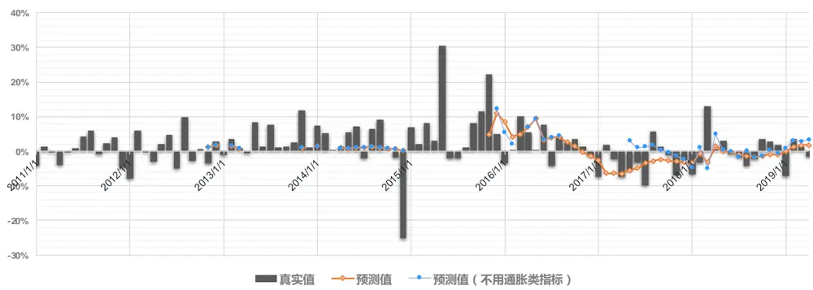
eaderTable_StaementCompany东方证券股份有限公司经相关主管机关核准具备证券投资咨询业务资格，据此开展发布证券研究报告业务。

东方证券股份有限公司及其关联机构在法律许可的范围内正在或将要与本研究报告所分析的企业发展业务关系。因此，投资者应当考虑到本公司可能存在对报告的客观性产生影响的利益冲突，不应视本证券研究报告为作出投资决策的唯一因素。

有关分析师的申明，见本报告最后部分。其他重要信息披露见分析师申明之后部分，或请与您的投资代表联系。并请阅读本证券研究报告最后一页的免责申明。

## 一、 小市值溢价的特征

1990 年 11 月 26 日上交所成立，同年 12 月 9 日开业交易，上市股票仅八只；深交所则于1990 年 12 月正式成立运作。“深安达”为其第一家上市公司。A 股近三十年发展迅速，虽然期间经历过多次 IPO 暂停（图 1 绿线部分），截至 2019.04.30，上市公司数量已达 3610 只。为保证足够的股票数量，我们对 A股小市值溢价的分析从 1996年年初开始，此时股票数量有 321个。

图 1： A 股股票数量与上证综指走势（1991.01 – 2019.04）
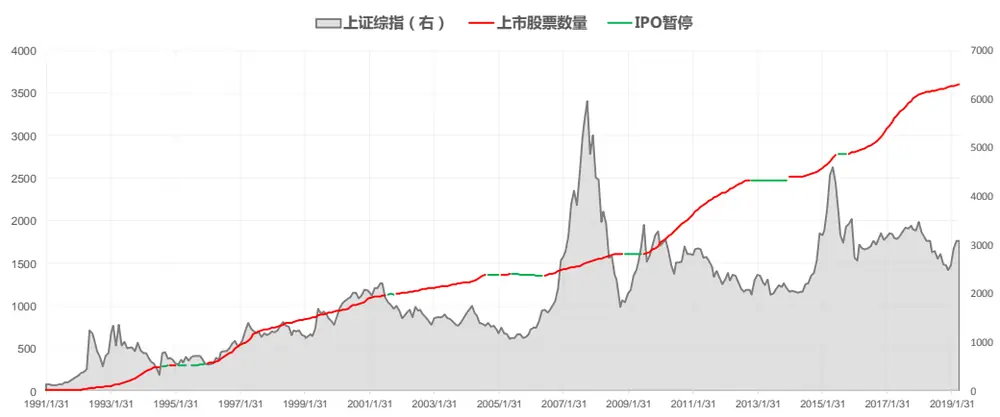
数据来源：东方证券研究所 & Wind 资讯

## 1.1 收益与波动

每月月末，我们把全市场股票按流通市值大小排序，等数量分成五组，做多市值最小的一组股票，同时做空市值最大的一组，等权构建组合，持有一个月调仓。多空组合收益即是小盘股相对大盘股的超额收益，用来度量小市值溢价程度。多空组合每个月的收益和累计净值走势如图 2所示

图 2：A 股小市值溢价的变化（1996.01 – 2019.04）
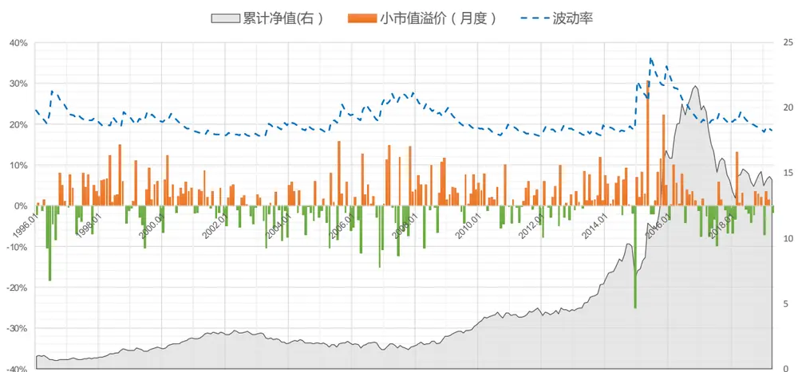
数据来源：东方证券研究所 & Wind 资讯

从过往 23年历史看，A股的小盘股溢价现象非常显著，平均每月有 1.1%溢价。按月份统计，小盘股跑赢大盘股的月份占比接近六成（58.9%）；按年份统计，23 年里仅有 4 年发生过风格反转，2017 年最为明显，小盘股月均溢价为 -3.1%，其次为 2003 年（-2.7%），1996 年（-2.6%）、2006年（-2.0%）；小盘股溢价在 2015年达到巅峰，月均高达 7.9%，其次为 1998年（4.5%），2000 年（3.3%）、2008 年（3.2%）和 2013 年（3.2%）。

度量小市值溢价的多空组合已经对冲掉了大部分 beta 因素，和市场涨跌的相关性较弱，但波动仍然很大。如果采用 GARCH(1,1)模型来计算多空组合的年化波动率，平均值高达 21%，和美国股市整体的波动程度相当，在 2015年 6月时，波动率最高冲到 36.8%。巨大的波动意味着巨大的风险，投资者做指数增强组合和对冲产品时必须控制对市值的风险暴露；另一方面也意味着巨大的机会，抓准了市场的大小盘风格变化，获取的收益可能高于常规的选股策略（图 3）。

图 3： 不同风格因子多空组合波动率比较（2006.01 – 2019.04）
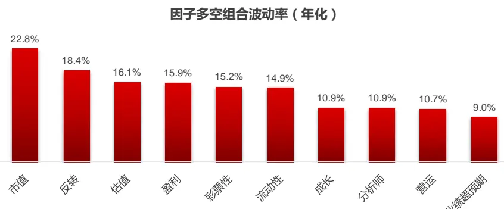
数据来源：东方证券研究所 & Wind 资讯

## 1.2 不同市值分位股票特征

我们在前期专题报告《A 股小市值溢价的来源》实证分析发现，行业因素、壳效应对 A 股的小市值溢价都有贡献，但贡献比例都很小；同行业内，大公司的基本面质量要优于小盘股。

下面进一步分析不同市值股票的基本特征，每个月月末我们把全市场股票按照流通市值从小到大排序等分成五组（分别记为 Q1至 Q5），统计每组股票的平均流通市值、EP、ROE、营业收入增长率、波动率和换手率，结果如图 4到图 9所示。A股发展初期，个股数量少，总市值小，再加上流通股比例低，市面上几乎全部都是“小盘股”，1996年初，流通市值最大的深发展也仅 23亿元；2005 年的股权分置改革启动以及后续的大型国有企业上市才让市值最大组股票真正具备了“大盘股”特性。从估值看，市值最大组（Q5）的 EP数值长期最高，对应 PE估值最低，市值最小的 60%的股票（Q1、Q2、Q3 组）最近十年估值差异不明显。从盈利和成长性看，大盘股的质量优于小盘股，和之前报告结论一致，不过这种优势在近几年显著收窄。不同市值分组股票间波动差别不大，市值最大组股票平均为 44%，最小值平均为 40%；小盘股和大盘股的换手率在 08 年金融危机之前差别也不大；但金融危机之后，小股票换手率大幅提升，Q1组平均换手率基本都在Q5组的两倍以上，小盘股的投机性明显增强。

图 4：市值分组股票流通市值变化(1996.01- 2019.04)
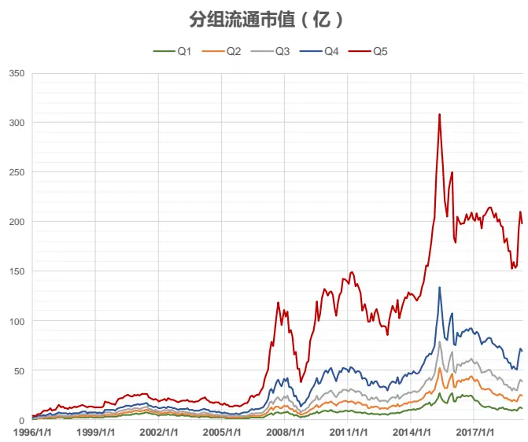
资料来源：东方证券研究所 & Wind 资讯

图 5：市值分组股票 EP 变化(1996.01- 2019.04)
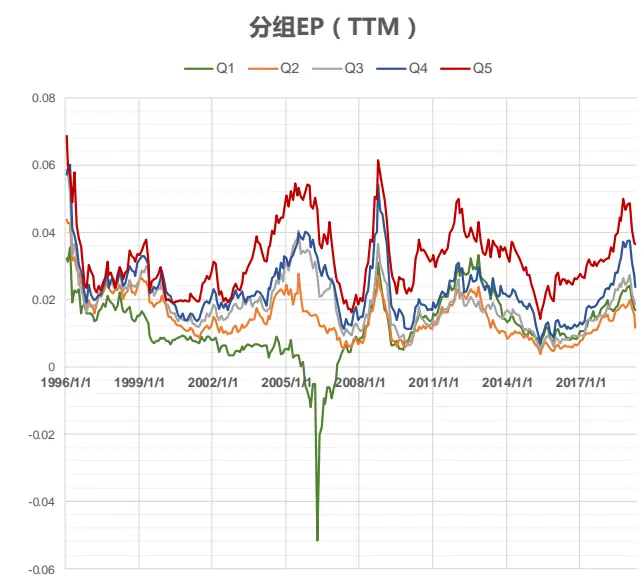
资料来源：东方证券研究所 & Wind 资讯

图 6：市值分组股票 ROE 变化(1996.01- 2019.04)
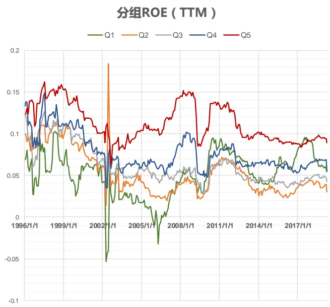
资料来源：东方证券研究所 & Wind 资讯

图 7：市值分组股票营业收入增长率变化(1996.01- 2019.04)
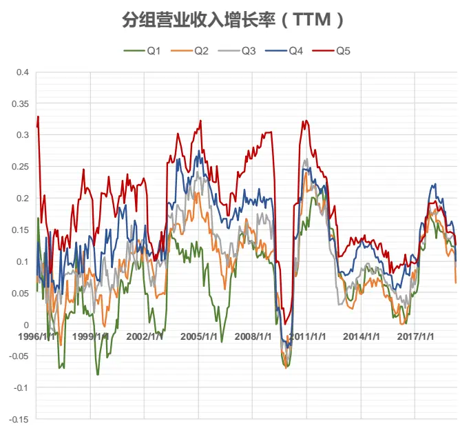
资料来源：东方证券研究所 & Wind 资讯

图 8：市值分组股票波动率变化(1996.01- 2019.04)
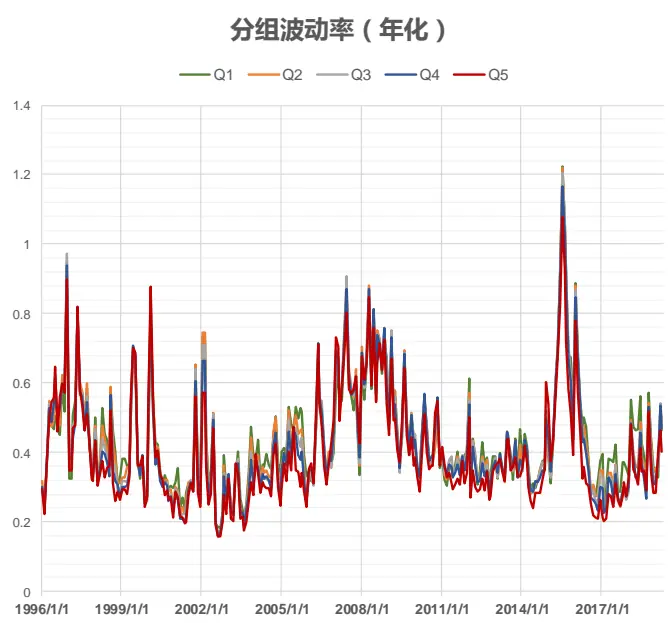
资料来源：东方证券研究所 & Wind 资讯

图 9：市值分组股票换手率变化(1996.01- 2019.04)
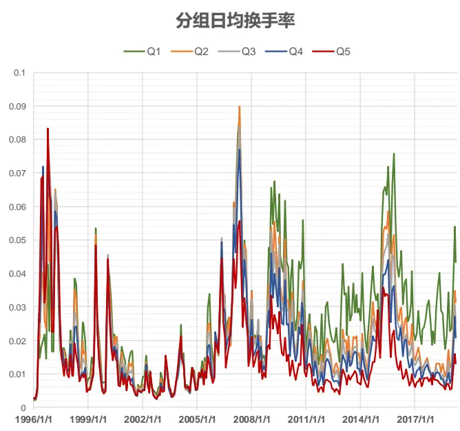
资料来源：东方证券研究所 & Wind 资讯

## 二、 分析方法

本报告的基本想法还是希望通过一些外生变量，例如：经济增长、利率、通胀、市场情绪等指标来预测市值的因子收益率，也就是上文里提到的做多小盘股做空大盘股的多空组合收益。这是一个时间序列方向的回归，实证中用到的样本数据和理论模型假设冲突较多，传统的 OLS 回归方法很多情况下不再适用。下面简单介绍一下报告里用到的三个模型基本原理。

## 2.1 预测回归模型（IVX）

时间序列回归里最经典的“伪回归”案例，是拿一个股票的价格对另一个股票的价格做回归，我们随机模拟生成了两个相关性为零的股票收益率序列，如果把两个收益率画成散点图（图 10），图形上看不到两者任何相关性；但如果把两个收益率序列分别累积计算得到两个股票的净值数据序列再做散点图（图 11），图形上可以看到这两者之间存在明显的负相关性；如果用 OLS方法对两者回归，会发现回归系数十分显著，回归方程的 Rsquared 有 51%，统计分析结果显示了一个不存在的事实。造成这种现象的原因主要是因为股票的净值序列是一个非平稳的随机游走过程，如果检验回归方程的残差，会发现残差序列也是非平稳的随机游走过程，方差趋于无穷大，和标准OLS 模型里残差平稳假设相悖，此时 OLS 方法得到估计量并非一致估计量，即使样本数量再多也不会收敛于真实模型参数。这个例子并不是说任何两个随机游走过程都会有显著相关性，而是说有显著相关性的两个随机游走过程可能事实上不存在任何逻辑关联。

图 10：模拟的两个股票收益率序列散点图
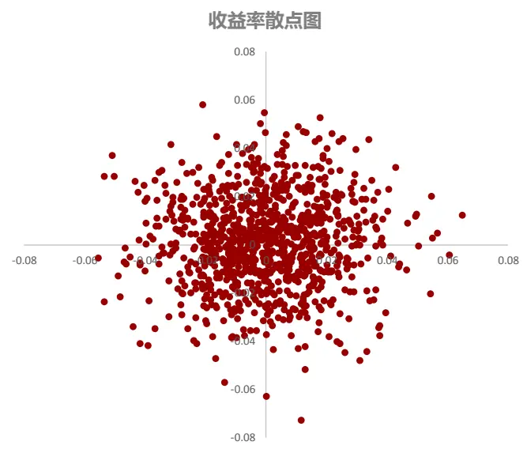
资料来源：东方证券研究所

图 11：模拟的两个股票净值序列散点图
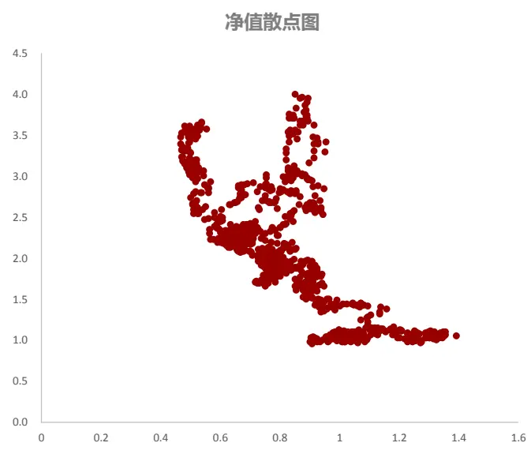
资料来源：东方证券研究所

上述伪回归问题，在宏观经济变量的预测中很容易出现，例如用 CPI 同比变化预测未来市场利率，这两个指标的变化都很接近随机游走过程，传统 OLS 方法不再适用。在本篇报告中，我们也会用到 PPI 同比指标作为外生预测变量，但预测目标是市值因子多空组合收益，分布上更接近一个平稳过程，直观感觉上述问题的影响会小些，不过如果样本数量有限，还是会产生严重的小样本偏差（small sample bias）。Stambaugh(2000)对此有过详细讨论，假设我们要用变量 $\scriptstyle{\frac{1}{2}}X_{\mathrm{t}-1}$ 预测Y ，预测回归（Predictive Regression）模型可以表示为：

$$
\begin{array}{rlr}&{}&{\boldsymbol{\Upsilon}_{\mathrm{t}}=\alpha+\beta\cdot\boldsymbol{X}_{t-1}+\boldsymbol{u}_{t}}\\&{}&\\&{}&{\boldsymbol{\Upsilon}_{\mathrm{t}}=\theta+\rho\cdot\boldsymbol{X}_{t-1}+\boldsymbol{v}_{t}}\\&{}&\\&{}&{\mathrm{\qquad\ }\mathrm{\qquad\ }\mathrm{\qquad\ }\mathrm{\ Y}_{\mathrm{t}}=\alpha+\beta\cdot\boldsymbol{X}_{t-1}}\\&{}&{\mathrm{\qquad\ }\mathrm{\qquad\ }\mathrm{\qquad\ }\mathrm{\qquad\boldsymbol{\Sigma}}=\left(\begin{array}{ll}{\sigma_{u}^{2}}&{\sigma_{uv}}\\{\sigma_{uv}}&{\sigma_{v}^{2}}\end{array}\right)}\end{array}
$$

模型里， $\{{\mathrm{X}}_{\mathrm{t}}\}$ 是一个 AR(1) 过程，ρ 的大小度量了序列的持续性（Persistence），ρ = 1 对应随机游走过程；两个回归方程的残差项满足二元联合正态分布，残差的相关系数 $\rho_{\mathrm{uv}}=\sigma_{uv}/(\sigma_{u}\sigma_{v})$ 度量了 $\{{\mathrm{X}}_{\mathrm{t}}\}$ 的内生性(Endogeneity)。此时用 OLS 方法得到的β估计量 ${\hat{\beta}}$ 的估计偏差（bias）:

$$
\begin{array}{ll}{\displaystyle\mathrm{E}\Big(\hat{\beta}-\beta\Big)=}&{-\frac{\sigma_{uv}}{\sigma_{v}^{2}}\Big(\frac{1+3\rho}{T}\Big)+O(\frac{1}{T^{2}})}\end{array}
$$

可以看到， $\{{\bf{X}}_{\bf{t}}\}$ 的持续性和内生性都会影响 OLS估计量的偏差，如果样本数量 T趋于无穷大，估计偏差会趋于零；但如果样本数量有限时，这个偏差可能很大，在常见的的金融实证中，偏差甚至会大于β̂数值。另外此时 OLS方法也会低估β̂的方差，从而放大 t 统计量，让模型变得更显著。

持续性和内生性问题在金融时间序列预测中非常普遍，我们在报告下文用了一些宏观和市场面的指标变量来预测市值因子多空组合收益，其中部分变量的内生性和持续性指标列于图 12。由于宏观金融数据经常很多呈现强季节性，因此实务中常用同比指标来剔除季节影响，但同比指标的持续性一般较强，ρ 值较大，例如固定资产投资总额同比变动、PPI 同比变动等；另外一些指标，像利率、市场 EP估值、换手率等指标本身也具备很强的持续性；在预测市值多空组合收益时，个别变量 $|\rho_{uv}|>0.1$ ，内生性问题也需关注。因此建模过程必须对β和检验统计量的计算做调整。

图 12：金融变量的持续性和内生性（2006.01 – 2019.04）

|  | 工业增加值 (同比) | 固定资产投资 总额(同比) | PMI | 消费者信心 指数(环比) | CPI | PPI | M2 增速 | 国债到期收益率 (一年) | 期限利差 | 信用利差 | EP_TTM | DP_TTM | 市场 波动率 | 市场 换手率 |
| --- | --- | --- | --- | --- | --- | --- | --- | --- | --- | --- | --- | --- | --- | --- |
| 持续性(p) | 0.676 | 1.000 | 0.818 | -0.130 | 0.955 | 0.976 | 0.984 | 0.949 | 0.930 | 0.889 | 0.918 | 0.312 | 0.729 | 0.871 |
| 内生性(ρ_uv) | -0.131 | -0.036 | -0.181 | -0.088 | 0.104 | -0.017 | -0.027 | -0.146 | 0.120 | -0.107 | -0.008 | -0.007 | -0.128 | -0.056 |

数据来源：东方证券研究所 & Wind 资讯

当|ρ| < 1时，Hirshleifer(2009)提供了一个简洁的调整公式，回归系数的统计检验可以通过Bootstrap 方法进行。不过从图 12可以看到，很多金融指标接近于随机游走状态，ρ ≈ 1，这时更推荐采用 Kostakis(2015)的 IVX 方法，它适用于四种常见持续性强度的时间序列（平稳序列、协整序列、近似协整序列、近似平稳序列），并且可以便捷的使用Wald 统计量做假设检验。这种借用工具变量的回归方法在金融时间序列预测中普适性非常强，但代价是会降低估计量收敛于真实值的速度，作者通过 Monte-Carlo模拟设定了工具变量的最优参数，使得收敛速度的下降仅从 OLS估计量的 o(n) 降为 o(n^((1+0.95)/2))，影响非常有限。这是我们之前报告《因子择时》中采用的方法，本报告将继续采用。

## 2.2 动态线性模型（DLM）

在 OLS 模型和上述 IVX 模型中，回归系数β在整个样本区间里是常数，不随时间改变，衡量的是整个区间内 $\mathrm{Y}_{\mathrm{t}}$ 对 $\cdot\mathrm{X}_{\mathrm{t}-1}$ 的平均敏感度。不过在投资研究实务中，经常发现曾经有效的指标在很长一段时间内失效， $\mathrm{Y}_{\mathrm{t}}$ 和 $X_{\mathrm{t}-1}$ 的关系并不稳定，在随时间改变。我们可以考虑对回归系数β进行动态建模来反应这种变化。

让 β “动”起来的常用方法有两类，一类是从β 的 OLS 估计算式出发：

$$
\hat{\beta}=~{\frac{cov(Y,X)}{var(X)}}
$$

等式右边的分子和分母基于整个样本区间数据计算，是常数。我们可以借鉴 GARCH模型的思想，计算条件期望值 $\operatorname{cov}(\mathrm{Y},\mathrm{X}\mid\mathcal{F}_{t})$ 和 $\mathrm{var}(\mathrm{X}\mid\mathcal{F}_{t})$ 。这里可采用随机波动率模型（SV, StochasticVolatility），也可采用高维 GARCH 模型，常用的形式包括 BEKK、DCC-GARCH、CCC-GARCH等（详细内容可参考 Mergner(2009)）。

另一类方法是把 beta 看作隐状态（Hidden State），采用 State-Space Model 的方法来估计状态值。State-Space Model 的模型设定有很多选择，报告下文采用的是最常用的随机游走形式：

$$
{\begin{array}{rl}&{{\mathrm{Y_{t}}}=\ \beta_{t}\cdot X_{t-1}+u_{t}\qquad\cdots\cdots\quad Observation\ Equation}\\&{}\\{\beta_{t}=\ \beta_{t-1}+v_{t}\qquad\quad\cdots\cdots\quad State\ Equation}\end{array}}
$$

隐状态的估计可以通过 Kalman Filter 实现， $\mathrm{u}_{\mathrm{t}}\mathrm{~,~}v_{t}$ 的协方差矩阵用极大似然方法估计，似然函数用 EM 算法（Expectation Maximization Algorithm）求解，整个过程可以利用 Python 的 pykalman包完成。

Mergner(2009) 用不同的动态线性模型（DLM, Dynamic Linear Model）计算了欧洲市场上各个行业指数的 beta系数，不同方法的结果差别不大，借助 GARCH 模型方法估算得到的动态 Beta值波动更大，锯齿形态更明显，比较后我们决定采用上述随机游走形式的 Kalman Filter。

实务中另一种获取“动态”Beta的方式是通过移动窗口来实现，但这种移动窗口方法反应会比较滞后。下图是我们分别用 DLM 和 60 天移动窗口方法估算的中信医药行业指数相对中证全指日度收益率的 beta 值，可以看到移动窗口方法得到的 beta 的波峰和波谷都明显滞后于 DLM 方法，DLM对市场变化的反应更及时。

图 13： 医药行业指数 beta（2018.01.04 – 2019.04.30）
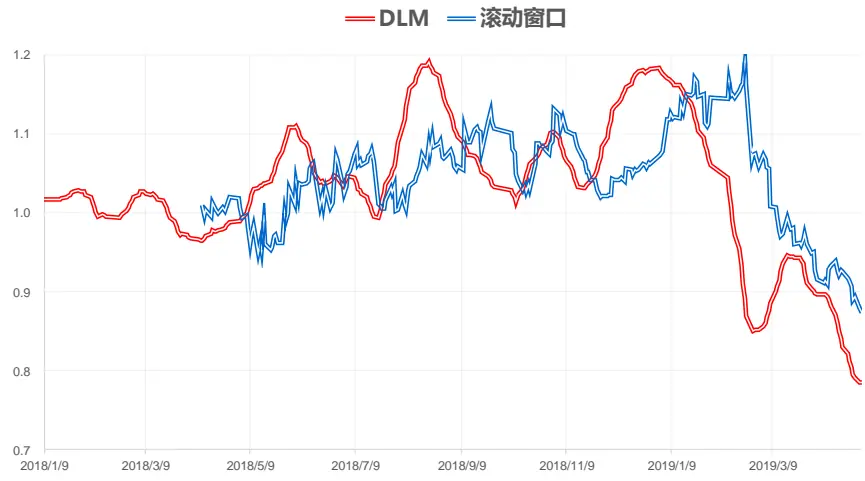
数据来源：东方证券研究所 & Wind 资讯

如果 DLM模型估算出来的动态 beta 足够”准确”，那么采用DLM动态模型做预测的效果应该优于 OLS这样的静态模型。Dangl(2012)的实证结果支持这种猜想，他用 52个指标来预测 S&P500指数的月度风险溢价（指数涨跌幅减去无风险利率），预测模型从静态模型改为动态模型后，28个指标的样本外预测能力显著提升。不过这个实证结果可能也会有些数据依赖，我们用同样的方法在A 股进行了测试，预测能力提升并不显著，可能和 A股历史数据太短，参数估计不准也有关系。另外从模型原理上讲，我们用时间段 $[\ t_{1},t_{2}]$ 内数据做参数估计，并在时刻 $\mathrm{t}_{2}\cdot$ 做预测时，关心的是状态变量 ${\displaystyle\langle\beta_{\mathrm{t}_{2}}}$ 估计准不准，但是 State Equation 里面误差项的方差 $\mathrm{var}(\mathrm{v}_{\mathrm{t}_{2}}|\mathcal{F}_{t_{2}})$ 是最大的（Durbin 2012），估计并不准确。DLM模型在本报告里仅用做样本内分析，不用做样本外预测。

## 2.3 三阶段回归滤波模型（3PRF）

当回归方程的预测变量数量较多时，我们可以考虑通过“降维”的方法来剔除噪音变量和共线性对模型的影响。主成份分析（PCA）是一种最常用的方法，但从原理上讲，第一主成份是找到变量的一个线性组合，使原变量在其上的投影方差最大，但方差最大的变量组合并不一定是预测能力最强的变量组合；相对而言，PLS（Partial Least Square）方法原理上会更合适些，它是找变量的线性组合，让其和预测目标变量的协方差最大。Kelly(2015)提出的 3PRF(Three-pass RegressionFilter)可以看做 PLS 的一种推广，引入了代理变量（proxy variable），代理变量可以根据经济理论选择或算法迭代生成，可以帮助剔除噪音变量的影响，提升模型样本外预测能力。这种方法在实证中的成功案例有三个：

1) Kelly(2013)用 3PRF 方法得到个股股息率的线性组合，这个指标对股市风险溢价的样本外预测能力显著强于传统基于整体法计算得到股市分红率。

2) Kelly(2015)对常见宏观经济总量指标的预测

3) Huang(2015)用 3PRF 构建的市场情绪指标，模型用到的六个市场量和 Baker(2006)一致，包括：分级基金折价率、市场换手率、IPO数量、IPO首日股价涨幅、分红溢价、股权融资占比。3PRF 得到的市场情绪指标对未来股市涨跌有显著负向预测效果，样本外预测能力强于 Baker(2006)用 PCA 方法得到的情绪指标。

报告下文预测市值因子多空组合收益时会用到不同类别的很多指标，我们用 3PRF 方法把它们分别合成经济增长、资金面、通胀、市场情绪四个大类指标以便样本内分析和样本外预测。

## 三、 实证结果

为了有更多的宏观数据，下文实证部分研究的是 2006.01 –2019.04 期间的月度小市值溢价，预测用到的指标如下图所示，考虑到宏观数据的可得性，在构建预测模型时，我们把所有宏观数据之后了两期，也就是说在预测 2019 年 5 月的 A 股小市值溢价时用的是 2019 年 3 月的宏观数据。这样可避免前视偏差，我们之前专题报告《因子择时》中并未考虑到这一点。

图 14： 预测模型的宏观、市值指标

| 工业增加值（同比） |  | CPI |
| --- | --- | --- |
| 经 济增长 | 进口总额(同比) | PPI |
|  | 出口总额(同比) | CPI：食品 |
|  | 固定资产投资总额(同比) | CPI：消费品 |
|  | 社会消费品零售总额（同比） | CPI：服务 |
|  | 公共财政支出（同比） | PPI：生产资料：采掘工业 |
|  | 公共财政收入（同比） | PPI：生产资料：原材料 |
|  | 实际使用外资额(同比） | PPI：生产资料：加工工业 |
|  | M1（同比） |  |
| 资金面 |  | PPI：生活资料：食品类 |
|  | M2(同比） | PPI：生活资料：衣着类 |
|  | 外汇储备变动（环比） | PPI：生活资料：一般日用品类 |
|  | 人民币有效汇率指数(环比） | PPI：生活资料：耐用消费品类 |
|  | 国债收益率（一年期） | 市场换手率 市场波动率 |
|  | 期限利差(十年期减一年期) |  |
|  | 信用利差(一年期AAA级企业债减国债） | 市值因子收益率(上一期） |

数据来源：东方证券研究所

## 3.1 样本内分析

首先分析上述指标的样本内预测能力，以下一期的市值多空组合收益为预测目标，用 IVX 方法分别对单个指标进行回归，并对回归系数做 Wald 检验，其中回归系数在 10%置信度下显著的指标如下图所示。为了让回归系数的数值大小有可比性，这些预测指标都在时间序列上做了标准化处理。可以看到，在过去 13 年多的时间里，进出口总额变动、PPI 对 A 股的市值风格影响最大，而且统计上显著；PPI上行、进出口增长时更有利于大盘股行情。

图 15：单个指标的样本内预测能力（2006.01 – 2019.04）

|  | 进口总额 | 出口总额 | 公共财政 支出 | 公共财政 收入 | 实际使用 外资额 | CPI | PPI | 有效汇率 指数 | 外汇储备 变动 | 市值因子收益 （上一期) |
| --- | --- | --- | --- | --- | --- | --- | --- | --- | --- | --- |
| β | -0.0115 | -0.0106 | 0.0005 | 0.0062 | -0.0005 | -0.0026 | -0.0148 | 0.0009 | -0.0064 | 0.0055 |
| pVal | 0.0005 | 0.0008 | 0.0555 | 0.0868 | 0.0072 | 0.0446 | 0.0004 | 0.0054 | 0.0039 | 0.0098 |

数据来源：东方证券研究所 & Wind 资讯

下面用 DLM模型得到进口总额、出口总额、PPI三个指标（数据做标准化）在样本内预测下一期市值因子收益率时的动态回归系数（图 16）。

图 16： 进口总额、出口总额、PPI三个指标（数据标准化后）的动态回归系数
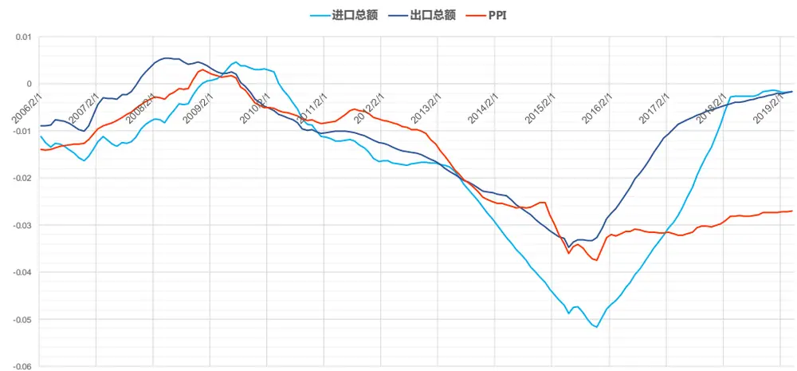
数据来源：东方证券研究所 & Wind 资讯

可以看到，A 股小市值溢价对进出口和 PPI 的敏感度从 2010 年初开始持续增强，正好对应国内经济增速换挡调整的起点（图 17），进出口的下降和 PPI 的下行都有更有利于小盘股行情。到 2015年经济增速开始稳定后，小市值溢价对进出口变化的敏感度逐渐下降，从最近半年看，回归系数接近于零，基本没有影响，而 PPI 的影响则持续稳定。可能的解释是，经济增速下行换挡后，企业盈利对生产成本的敏感性增强，大公司有规模和渠道的优势，对价格的敏感性要低于中小企业；另一方面，产业链上游的公司市值较大，中下游公司市值偏小，PPI上行，特别原材料价格上涨，有利于上游公司盈利的同时，增加中下游公司的成本，这在 2017 年表现尤为明显。

图 17： 工业增加值与 PPI 的月度变化
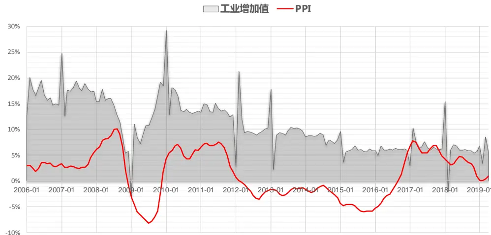
数据来源：东方证券研究所 & Wind 资讯

用 CPI 和 PPI 度量通货膨胀并用于股市分析的一个可能的潜在问题在于两个指标细分项的权重设置。CPI的细分项有食品、消费品和服务三类，其权重根据全国城乡居民家庭消费支出里各项的占比来决定；PPI的细分项权重则依据细分行业的销售产值数据。由于 A股长期的高标准 IPO审核制，上市公司的行业规模结构与实体经济有偏离，如果按照上面小市值溢价的通胀成本说法，统计局采用的细分项权重可能不一定适合于股市分析。所以报告下文直接采用了 CPI 和 PPI 的细分项数据（图 14），用 3PRF方法合成一个通胀指标 Inflation-3PRF，样本内权重为：

Inflation-3PRF = 0.069*PPI 采掘 + 0.089* PPI 原材料 +0.077*PPI 加工 – 0.039*PPI 食品 -0.018*PPI 衣着+ 0.036*PPI 日用品 -0.022 * PPI 耐用品 – 0.106*CPI 食品 – 0.074*CPI 消费品 -0.013 * CPI 服务

图 18： 合成通胀指标与其动态回归系数变化（2006.01 – 2019.04）
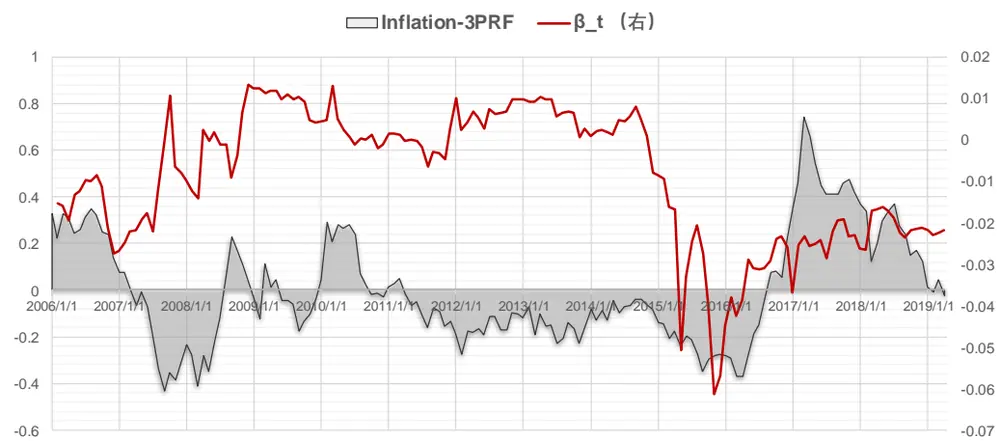
数据来源：东方证券研究所 & Wind 资讯

合成指标有点类似“PPI 减 CPI”，度量的是成本涨幅和销售价格涨幅之间的差距，其走势和 DLM 动态回归系数如图 18 所示，和之前 PPI 系数不同的是，小市值溢价对其变化的敏感度从2015年才开显著变大。这个指标的样本外预测误差（MSE）略小于 PPI，但不显著。

## 3.2 样本外预测

我们采用 60个月（五年）的滚动窗口做样本外预测，样本外预测区间为 2011.01 –2019.01，共 100个月，步骤如下：

1) 用 3PRF 方法，把不同类别里的单个指标合成大类指标，包括：经济增长、资金面、通胀、情绪四类。

2) 在 10%置信度下，用 IVX方法检验大类指标在预测回归中的系数显著性，

3) 如果没有任何大类指标显著，则模型不对下一个月作出预测

4) 如果有显著的大类指标，则把显著的大类指标合在一起做多元 IVX回归，输入最新数据，预测下个月市值多空组合收益。

模型在样本外的 100个月里，有 57个月找到了显著指标预测市值多空组合收益，57个月里有 42个月方向预测准确，正确率 73.6%，对 2016年到 2017年的风格切换把握十分精准。

图 19：样本外模型预测的市值多空组合收益和真实收益（2011.01 – 2019.04）
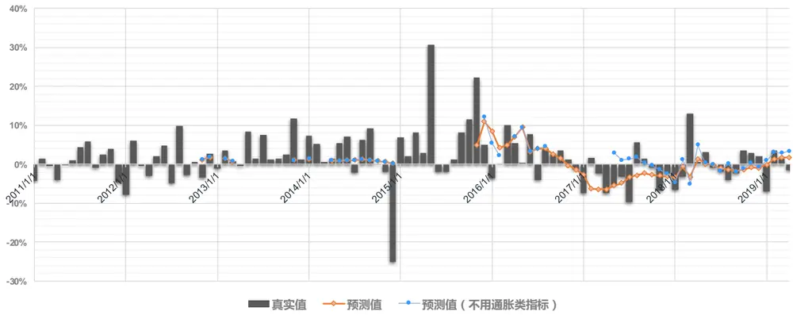
数据来源：东方证券研究所 & Wind 资讯

图 20展示了上述步骤二选到的合成大类指标，由于我们是采用五年期滚动窗口，所以当模型在 2016.01选到通胀因子时，说明通胀因素在 2011.01-2015.12 期间已经对小盘股溢价有很强的预测作用了。可以看到，A股小市值溢价的驱动因素在不停改变，早期的时候主要是市场情绪和资金面，最近三年则主要是通胀和经济增长。通胀指标对小市值溢价的预测作用在近三年表现尤为突出，如果把预测指标中的通胀类指标拿掉，预测准确度会大幅下降（图 19），特别 2016年到 2017年的风格切换，依靠其它大类指标捕捉不到。图 20和之前报告《因子择时》中结果有差别的原因在于，本报告用的是五年滚动窗口，之前报告用的是十年滚动窗口。十年长窗口下，情绪类中的市场波动因子是小市值溢价的长期驱动因素，但五年短窗口下，情绪类指标只在 2013年被选到；短窗口对市场变化的反应更敏感，但有效预测占比会降低。

图 20：小市值溢价的驱动因素（2011.01 – 2019.04）
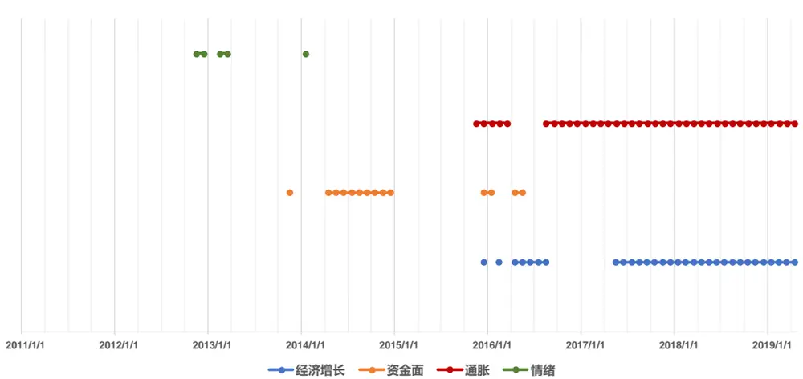
数据来源：东方证券研究所 & Wind 资讯

## 3.3 指数增强组合运用

本节我们把上面的风格择时策略和中证 500 指数增强策略（全市场选股）结合起来。策略用到的 alpha因子如附录 1所示，因子加权采用等权合成大类，大类之间再等权的方式，标准策略里行业和市值风险的主动暴露都控制为零，完全中性。有了大小盘风格择时策略后，我们可以根据模型预测的市值因子收益率大小主动暴露组合的市值风险，这里会产生两个问题：1） 市值主动暴露多少合适？2) 如何实现市值风险主动暴露？

对于第一个问题，因为市值因子收益的波动较大，通常保守的做法会把主动暴露绝对值控制在 0.5以内。但对于指数增强策略而言，可以尝试主动暴露的更激进些，因为策略的收益不仅来自于市值因子的风险暴露，还来自于组合 alpha因子暴露，即使市值风格预测错了，alpha因子收益可以抵消部分风格错判的亏损，组合回撤不一定会增加，而且从历史数据看，alpha 因子和市值因子同时失效的概率很小。

对于第二个问题，通常的做法是放开组合优化的约束条件。比方说如果预测未来市场风格偏小，可以把市值中性约束条件改为： $-0.5<\mathbf{w}\cdot\mathbf{m}\mathbf{v}<0,$ 。这里 w是组合的主动权重，mv是市值因子风险暴露。但如果预测未来市场风格偏大盘，组合优化时把约束条件放松为 $0<\mathrm{w}\cdot\mathrm{mv}<0.5$ 会发现优化出来的组合的市值暴露很多情况下接近于零，并没有去主动暴露大盘风格风险。究其原因，组合优化的目标函数是组合的 alpha暴露极大化，虽然 alpha因子做了中性化处理，和市值因子相关性为零，但组合优化的结果通常只会选择股票池里的少部分股票构建组合，基于历史数据看市值小股票的 alpha更高，因此组合优化得到的组合由有向小市值方向暴露的倾向，即使约束条件里放开了市值暴露的上限，优化得到的组合也很少会去主动暴露大盘股风险。因此这个时候，需要进一步强化约束条件，可以考虑改为 $0.5<\mathrm{w}\cdot\mathrm{mv}<1$ ，强制主动暴露大盘风险。

记择时模型预测的下月小盘股溢价为 smb，下文“风险暴露策略”采用的风险暴露设置如下：

1) 若择时模型给不出小市值溢价的预测或|smb| < 0.5%，则保持市值中性

2) 若0.5% < smb < 1%，市值约束条件设定为 −1 < w ⋅ mv < 0

3) 若1% < smb，市值约束条件设定为 −2 < w ⋅ mv < 0

4) 若−1% < smb < −0.5%，市值约束条件设定为 0.5 < w ⋅ mv < 1

5) smb < −1%，市值约束条件设定为 1 < w ⋅ mv < 2

在单边交易成本 23bp 的设置下，两个策略在 2011.02-2019.04 间的表现如下图所示。可以看到，和标准策略相比，风险暴露策略的收益显著提高，风险有所下降，换手率和持股数量基本没变。和择时模型的预测效果相对应，策略效果的增强主要来自于 2016、2017、2018三年。

图 21：指数增强策略历史回溯表现（2011.01 – 2019.04）
策略每月超额收益
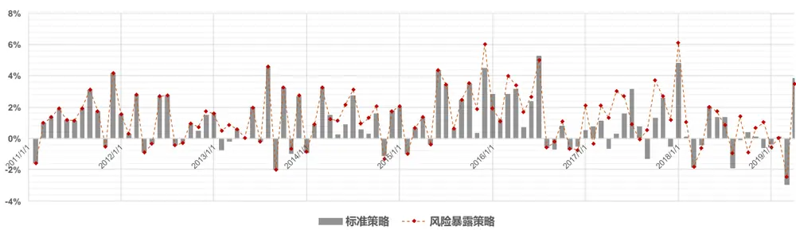

组合主动因子暴露
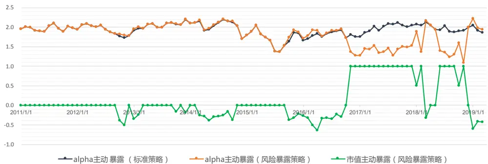

| 策略 | 年收益 | 跟踪误差 | 最大回撤 | 信息比 | 月换手率（单边） | 平均持股数量 | 月胜率 |
| --- | --- | --- | --- | --- | --- | --- | --- |
| 标准策略 | 13.4% | 5.6% | -6.2% | 2.3 | 54.6% | 73.8 | 70.7% |
| 风险暴露策略 | 17.3% | 5.6% | -4.3% | 2.9 | 54.2% | 79.5 | 74.7% |

数据来源：东方证券研究所 & Wind 资讯

从因子暴露看，风格择时模型准确判断了 2016、2017 年风格切换，风险暴露策略也相应的做了市值风险暴露；组合在 2017 年暴露大市值风险的代价是牺牲了部分 alpha 因子暴露。另外，在 2016 年 1 月，风格择时模型犯了一个大错误，预测当月小盘股溢价高达 8.5%，使得策略组合主动暴露了小市值风险，但事实上小市值溢价为 -3.6%；虽然市值风险暴露错误，但策略组合当月仍然有 1.9%的超额收益，略低于风险中性标准策略的 2.8%，组合的 alpha收益抵消了部分择时错误导致的亏损。

## 四、 总结

小市值溢价是 A股最显著的特征之一，最近几年的大小盘风格切换节奏有迹可循，PPI是其中值得重点关注的因素，经济增速换挡背景下，成本的上涨显著影响投资者对大公司和小公司的盈利预期。结合数量模型，我们可以给 57%的月份做出大小盘风格的预测，预测准确率 73.6%，指数增强策略可以根据模型的预测主动选择市值风险暴露的方向，显著提升收益。报告中策略对市值风险的暴露比较激进，虽然得益于风格择时模型近几年的高准确度，策略的收益和风险都得到了显著提升；但择时策略毕竟广度不够，模型的预测能力是否能稳健持续有很大不确定性，风险谨慎的投资者可以考虑适度降低风险暴露程度。

## 风险提示

1. 量化模型基于历史数据分析得到，未来存在失效的风险，建议投资者紧密跟踪模型表现。

2. 极端市场环境可能对模型效果造成剧烈冲击，导致收益亏损。

## 附录

图 22：指数增强策略用到的 Alpha 因子

| 大类 | 因子简称 | 因子定义 |  |
| --- | --- | --- | --- |
| Value | BP EP | 账面市值比 归属母公司的净利润TTM/总市值 |  |
|  | EP2 |  |  |
|  | SP | 扣非后的净利润TTM/总市值 |  |
|  | CFP | 营业收入TTM/总市值 |  |
|  | EBIT2EV | 经营性现金流TTM/总市值 |  |
|  | SALES2EV | 息税前利润与企业价值之比 |  |
|  | DP2 | 营业收入与企业价值之比 过去一年分红/总市值，以分红预案公告日为准 |  |
|  | CFROI | 投资现金收益率 |  |
|  | RNOA | 净经营资产收益率 |  |
|  |  | 净资产收益率 |  |
|  | Profitability | ROE | 总资产净利率 |
| ROA2 GPOA |  | 总资产毛利率 |  |
| GROSS_MARGIN |  |  |  |
| NET_MARGIN |  | 销售毛利率 |  |
|  |  | 销售净利率 |  |
| Growth | PROFIT_GROWTH_YOY 归属母公司的净利润季度同比 |  |  |
|  | SALES_GROWTH_YOY 营业收入季度同比 PROFIT_GROWTH_TTM TTM净利润同比增长 |  |  |
|  | SALES_GROWTH_TTM TTM营业收入同比增长 |  |  |
|  | DELTA_GPOA | GPOA变动(当前TTM和一年前TTM比较) |  |
|  | DELTA_ROE | ROE变动(当前TTM和一年前TTM比较) |  |
|  | DELTA_ROA DELTA_RNOA | ROA变动(当前TTM和一年前TTM比较) |  |
|  |  | RNOA变动(当前TTM和一年前TTM比较) |  |
| Operation MR |  | 高管薪酬前三之和的对数 |  |
| Liquidity | TO20 | 过去20个交易日的日均换手率对数 |  |
|  | TO60 | 过去60个交易日的日均换手率对数 |  |
|  | LNAMIHUD | 20日Amihud非流动性自然对数 |  |
|  | AVGAMT_20_60 AVGVOL_20_240 | 过去20日日均成交额/过去60日日均成交额，乘以100处理 |  |
|  |  | 过去20日日均成交量/过去240日日均成交量，乘以100处理 |  |
| Reversal | RET20 | 过去20个交易日的收益率 乒乓球反转，过去5日均价/过去60日均价-1 |  |
|  | PPREVERSAL CG060 | 处置效应因子，当前价/60日换手反推的持仓价-1 |  |
|  | P2HIGH |  |  |
|  | VOL20 | 当前价格除以过去243个交易日的最高价，乘以100处理 |  |
| Lottery |  | 过去20个交易日的波动率 |  |
|  | VOL60 IVOL60 | 过去60个交易日的波动率 |  |
|  |  | 过去60个交易日的特质波动率 |  |
|  | IVR20 | 过去20个交易日的特异度 |  |
|  | MAXRET | 过去最大收益，过去60日最大3个日收益均值 |  |
|  | VOL120 | 过去120个交易日的波动率 |  |
|  | IVOL60_CAPM | 过去60个交易日的CAPM特质波动率 |  |
| Analyst | cov | 过去6个月有覆盖的机构数量，取根号 |  |
|  | DISP EP_FY1 | 过去6个月盈利预测的分歧度 预期的估值 |  |
|  | PEG | PE_FY1/FY2隐含的利润增量率 |  |
|  | SCORE | 综合评价 |  |
|  | TPER | 目标价隐含的收益率 |  |
|  | WFR |  |  |
|  |  | 加权的预期调整 |  |
| Surprise | UP | 预期外的RNOA |  |
|  | SUEO | 基于带漂移项随机游走模型计算的预期外的净利润 |  |
|  | SUE1 | 基于不带漂移项随机游走模型计算的预期外的净利润 |  |
|  | SURO | 基于带漂移项随机游走模型计算的预期外的营业收入 |  |
|  | SUR1 | 基于不带漂移项随机游走模型计算的预期外的营业收入 |  |

数据来源：东方证券研究所

## 参考文献

[1]. Baker, M., Wrugler, J., (2012), “Investor Sentiment and Cross Section of Stock Returns”, Journal of Finance, Vol(61), pp:1645 - 1680

[2]. Dangl, T., Halling, M., (2012), “Predictive Regressions with Time-varying Coefficients”, Journal of Financial Economics, Vol(106), pp: 157-181

[3]. Durbin, J., Koopman,S.J.,(2012), “ Time Series Analysis by State Space Methods (Second Edition)”, Oxford University Press

[4]. Hirshleifer, D., How, K., Teoh, S.H., (2009), “Accruals, Cash Flows, and Aggregate Stock Returns”, Journal of Financial Economics, Vol(91), pp: 389-406

[5]. Huang, D., Jiang, F., Tu, J., Zhou, G., (2015), “Investor Sentiment Aligned: A Powerful Predictor of Stock Returns”, Review of Financial Studies, Vol(28), pp:791-837

[6]. Kelly, B., Pruitt, S., (2013), “ Market Expectations in the Cross-section of Present Values”, Journal of Finance, Vol(68), Issue(5), pp:1721-1756

[7]. Kelly, B., Pruitt, S., (2015), “ the Three-pass Regression Filter: A New Approach to Forecasting Using Many Predictors”, Journal of Econometrics, Vol(186), Issue(2), 294-316

[8]. Kostakis,A., Magdalinos, T., Stamatogiannis,P., (2015). "Robust Econometric Inference for Stock Return Predictability," Review of Financial Studies, Society for Financial Studies, 28(5), pp: 1506-1553

[9]. Merger, S., (2009), “Application of State Space Models in Finance”, Universitatsverlag Gottingen.

[10]. Stambaugh, R., (2000), “Predictive Regression”, Journal of Financial Econometrics, Vol(54), pp: 375-421

## Table_Disclaimer 分析师申明

每位负责撰写本研究报告全部或部分内容的研究分析师在此作以下声明：

分析师在本报告中对所提及的证券或发行人发表的任何建议和观点均准确地反映了其个人对该证券或发行人的看法和判断；分析师薪酬的任何组成部分无论是在过去、现在及将来，均与其在本研究报告中所表述的具体建议或观点无任何直接或间接的关系。

## 投资评级和相关定义

报告发布日后的 12个月内的公司的涨跌幅相对同期的上证指数/深证成指的涨跌幅为基准；

## 公司投资评级的量化标准

买入：相对强于市场基准指数收益率 15%以上；

增持：相对强于市场基准指数收益率 5%～15%；

中性：相对于市场基准指数收益率在-5%～+5%之间波动；

减持：相对弱于市场基准指数收益率在-5%以下。

未评级——由于在报告发出之时该股票不在本公司研究覆盖范围内，分析师基于当时对该股票的研究状况，未给予投资评级相关信息。

暂停评级——根据监管制度及本公司相关规定，研究报告发布之时该投资对象可能与本公司存在潜在的利益冲突情形；亦或是研究报告发布当时该股票的价值和价格分析存在重大不确定性，缺乏足够的研究依据支持分析师给出明确投资评级；分析师在上述情况下暂停对该股票给予投资评级等信息，投资者需要注意在此报告发布之前曾给予该股票的投资评级、盈利预测及目标价格等信息不再有效。

## 行业投资评级的量化标准：

看好：相对强于市场基准指数收益率 5%以上；

中性：相对于市场基准指数收益率在-5%～+5%之间波动；

看淡：相对于市场基准指数收益率在-5%以下。

未评级：由于在报告发出之时该行业不在本公司研究覆盖范围内，分析师基于当时对该行业的研究状况，未给予投资评级等相关信息。

暂停评级：由于研究报告发布当时该行业的投资价值分析存在重大不确定性，缺乏足够的研究依据支持分析师给出明确行业投资评级；分析师在上述情况下暂停对该行业给予投资评级信息，投资者需要注意在此报告发布之前曾给予该行业的投资评级信息不再有效。

## HeadertTabl e_Discl ai mer 免责声明

本证券研究报告（以下简称“本报告”）由东方证券股份有限公司（以下简称“本公司”）制作及发布。

本报告仅供本公司的客户使用。本公司不会因接收人收到本报告而视其为本公司的当然客户。本报告的全体接收人应当采取必要措施防止本报告被转发给他人。

本报告是基于本公司认为可靠的且目前已公开的信息撰写，本公司力求但不保证该信息的准确性和完整性，客户也不应该认为该信息是准确和完整的。同时，本公司不保证文中观点或陈述不会发生任何变更，在不同时期，本公司可发出与本报告所载资料、意见及推测不一致的证券研究报告。本公司会适时更新我们的研究，但可能会因某些规定而无法做到。除了一些定期出版的证券研究报告之外，绝大多数证券研究报告是在分析师认为适当的时候不定期地发布。

在任何情况下，本报告中的信息或所表述的意见并不构成对任何人的投资建议，也没有考虑到个别客户特殊的投资目标、财务状况或需求。客户应考虑本报告中的任何意见或建议是否符合其特定状况，若有必要应寻求专家意见。本报告所载的资料、工具、意见及推测只提供给客户作参考之用，并非作为或被视为出售或购买证券或其他投资标的的邀请或向人作出邀请。

本报告中提及的投资价格和价值以及这些投资带来的收入可能会波动。过去的表现并不代表未来的表现，未来的回报也无法保证，投资者可能会损失本金。外汇汇率波动有可能对某些投资的价值或价格或来自这一投资的收入产生不良影响。那些涉及期货、期权及其它衍生工具的交易，因其包括重大的市场风险，因此并不适合所有投资者。

在任何情况下，本公司不对任何人因使用本报告中的任何内容所引致的任何损失负任何责任，投资者自主作出投资决策并自行承担投资风险，任何形式的分享证券投资收益或者分担证券投资损失的书面或口头承诺均为无效。

本报告主要以电子版形式分发，间或也会辅以印刷品形式分发，所有报告版权均归本公司所有。未经本公司事先书面协议授权，任何机构或个人不得以任何形式复制、转发或公开传播本报告的全部或部分内容。不得将报告内容作为诉讼、仲裁、传媒所引用之证明或依据，不得用于营利或用于未经允许的其它用途。

经本公司事先书面协议授权刊载或转发的，被授权机构承担相关刊载或者转发责任。不得对本报告进行任何有悖原意的引用、删节和修改。

提示客户及公众投资者慎重使用未经授权刊载或者转发的本公司证券研究报告，慎重使用公众媒体刊载的证券研究报告。

## 东方证券研究所

地址：上海市中山南路 318 号东方国际金融广场 26 楼

联系人： 王骏飞

电话：021-63325888*1131

传真：021-63326786

网址： www.dfzq.com.cn

Email： wangjunfei@orientsec.com.cn