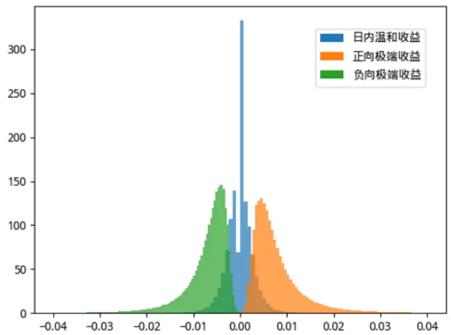
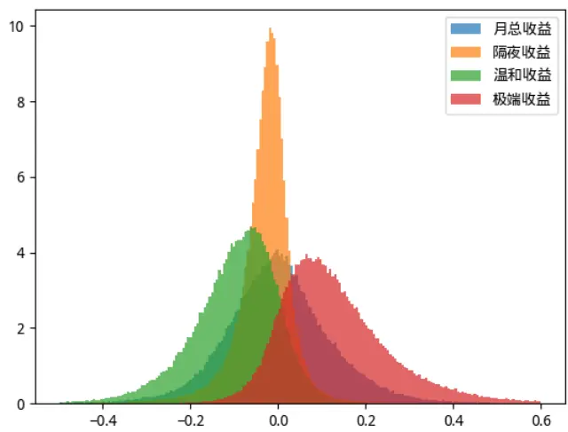
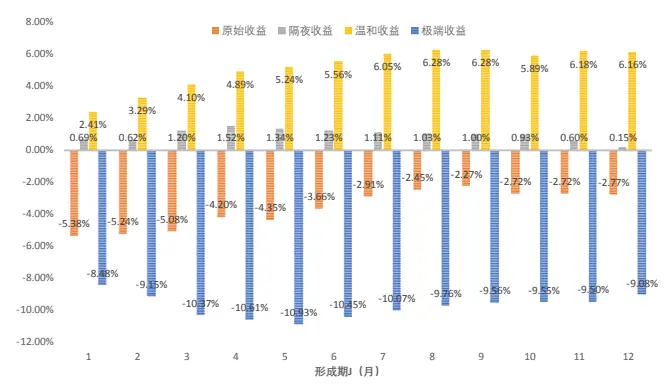
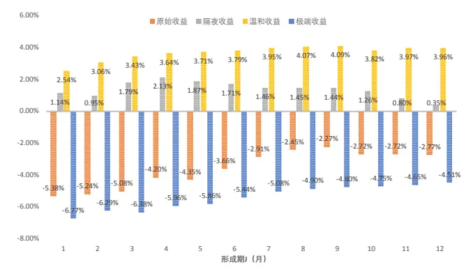
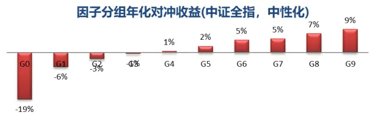
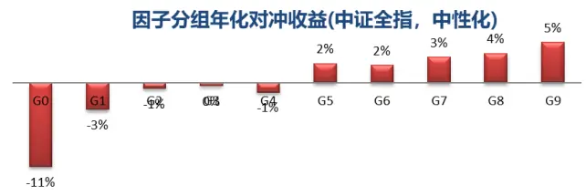
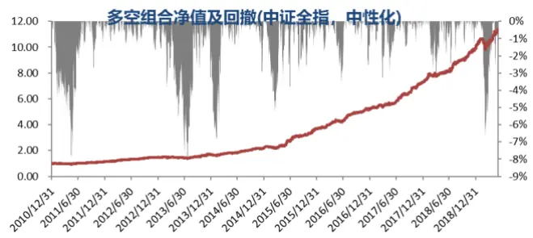
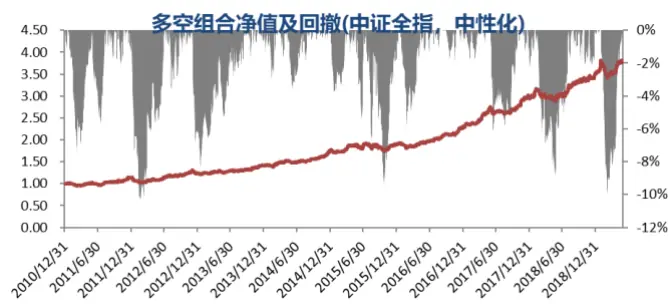
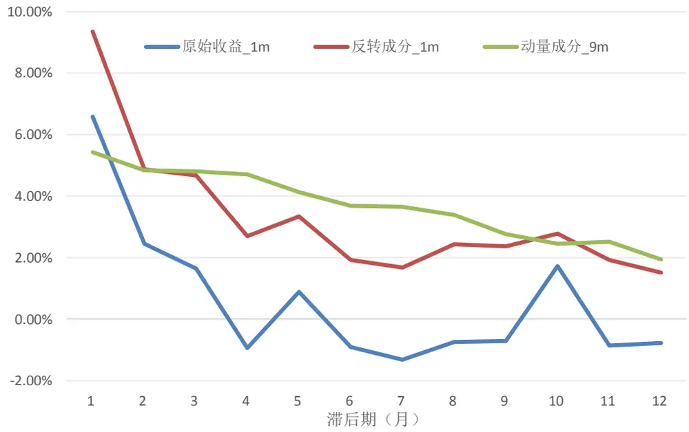

## ——因子选股系列研究之五十七

## 研究结论

A 股的原始收益在短期内表现出很强的反转效应，但是在中长期内并没有发现在海外市场普遍存在的动量，本篇报告尝试通过对股票原始收益进行分解找到真正驱动动量或者反转效应的收益成分。

我们将原始收益拆分为隔夜收益部分和盘中交易部分，在 5 分钟收益率数据的基础上借鉴因子极值处理的方法将盘中交易部分拆解成温和收益部分和极端收益部分。根据统计，A 股日内正向极端收益的频率和幅度都略高于负向极端收益，股票的上涨主要是由极端收益贡献的。

采用 Jegadeesh and Titman（1993）的 JK 组合构建方法，我们发现，隔夜收益部分和温和收益部分表现出显著的“动量”特征，极端收益部分表现出极端的“反转”特征。其中，“动量”部分在大市值股票中收益更高，“反转”部分在大小市值股票中差异不大，而原始收益的反转在大市值股票中明显更弱。

A 股原始收益的反转随着形成期和持有期的拉长变得很弱，甚至变为微弱的动量，而基于极端收益构建的多空策略收益随着形成期和持有期的拉长虽然有所一定回落，但幅度很有限，“反转”特征依然很显著，基于隔夜收益、温和收益部分构建的多空策略随着形成期和持有期的拉长“动量”特征更加明显。

通过对过去 J 个月原始收益率RawIC 的分解，我们发现原始收益负的 RawIC是隔夜收益、温和收益正的贡献和极端收益负的贡献的综合结果，随着考察月份 J 的拉长，原始收益的 RawIC 逐渐降低，但这种降低主要是由温和收益部分的正向效应变强引起的。

我们把隔夜收益、日内温和收益之和定义为原始收益的动量成分，极端收益定义为反转成分，1 个月收益的反转成分在中证全指内 RankIC 高达 9.15%，9个月收益的动量成分在大市值股票中收益更佳，沪深 300 内原始 RankIC 高达 8.16%。

- 1 个月原始收益及其反转成分RankIC 的衰减都较快，次月就衰减一半以上，而 9 个月收益的动量成分半衰期在半年以上。

- 1 个月收益的反转成分和流动性、反转、投机性等常见的技术类因子相关性较高，而 9 个月收益的动量成分在因子值上和其他因子相关性低，在剔除各大类因子后依然具有显著的选股能力。

## 风险提示

- 量化模型失效风险

- 市场极端环境的冲击

报告发布日期2019 年 07 月 01 日

证券分析师 朱剑涛021-63325888*6077zhujiantao@orientsec.com.cn执业证书编号：S0860515060001

证券分析师王星星021-63325888-6108wangxingxing@orientsec.com.cn执业证书编号：S0860517100001

联系人 王星星 021-63325888-6108 wangxingxing@orientsec.com.cn

## 一、收益的分解

## 1.1 关于动量反转

Jegadeesh（1990）发现美股的月度收益具有很强的一阶负相关，上个月表现较差的股票下个月的收益平均更高。Jegadeeshand Titman（1993）提出反转效应主要存在于超短期（1 个月以内）和超长期（3-5 年），而在 3-12 个月的中短期内存在显著的动量效应。自此，学者在美股市场发现了短期的反转（1 个月以内，也有人称超短期）、中期的动量（3-12 个月，也有人称中短期）以及长期的反转（3-5 年），动量和反转效应同时存在，只是存在于不同的时间周期。对于美国以外的股票市场，Rouwenhorst（1998，1999）研究则表明在欧洲市场 12 个国家以及一些新兴市场同样也存在动量效应。但大多学者（Chang, 1995; Chui, 2000; Hameed and Kusnadi, 2002; Griffin,Ji and Martin, 2003 等）在亚太地区仅发现反转效应，动量效应并不显著。

短期反转效应主要有两种可能解释，一种是基于情绪层面的解释，Shiller (1984)、Black (1986)、Stiglitz (1989)、 Subrahmanyam(2005)等认为股票短期反转是投资者对信息的过度反应，源于认知偏误，另一种从股票供需变化带来的流动性冲击去解释短期反转（Miller, 1988; Campbell et al.1993; Jegadeesh and Titman, 1995 等）。这两解释并不相互排斥，流动性冲击和投资者情绪反应共同造就了股票市场短期反转的存在。对于关于中期动量的原因学界并没有统一观点，但都与市场反应不足或滞后的过度反应有关。

动量或者反转本质上考察的是股票过去一段时间的收益率在截面上的选股效果，本篇报告尝试从微观角度出发对股票过去一段时间的收益率进行分解，考察是不是收益率的某些成分存在动量，另外一些成分呈现出反转，那么动量成分占主导的话总体表现出收益率的动量效应，反之就是反转效应。

## 1.2 收益的分解方式

Da, Z., Liu, Q., & Schaumburg, E. (2013)等把股票的收益率分为基本面驱动的涨跌幅和非基本面驱动的涨跌幅，发现美股的短期反转效应由非基本面部分驱动。这种拆分方法虽然对于我们理解反转效应有很大帮助，但并没有给我们提供独立的 alpha，因为作者采用分析师盈利预测调整变相度量基本面驱动的涨跌幅，非基本面驱动的涨跌幅相当于原始反转因子和分析师预期调整各个因子的非线性合成。

本篇报告中我们把股票每天的收益率（closetoclose）分解为隔夜收益率部分（closetoopen）和盘中收益率部分（opentoclose），盘中收益率进一步根据日内分钟收益率的相对大小区分为温和收益率（mildreturn）和极端收益率（extremereturn）部分。由于大部分公告发生在盘后，所以股票的公告信息大多会在隔夜收益率中反应，另外，无论短期过度反应还是流动性冲击都会伴随着股价的快速上涨或下跌，所以我们预期日内极端收益率部分很可能和短期反转有关。

由于对数收益率具有可加性，我们在收益分解时收益率均采用对数收益率形式。隔夜收益和盘中收益很好区分，温和收益和极端收益我们借鉴了因子异常值处理的方法（参见报告《选股因子数据的异常值处理和正态转换》）。

如果{xi}服从正太分布，且样本点较多，则样本中位数收敛于样本均值，1.483 倍的 MAD 收敛于样本标准差。

$$
md=median(x_{i},i=1,2,\dots,n)
$$

$$
MAD=median(|x_{i}-md|,i=1,2,\dots,n)
$$

$$
MAD_{e}=1.483\times MAD
$$

在 5%的置信度下，与中位数 md 距离在 1.96 倍 $MAD_{e}$ 以上的样本点即为异常点 $\displaystyle{\bigl(}ppf(1-$ $5\%/2)=1.96,$ ppf是标准正太分布累计分布函数的反函数）。

在每只股票的每个交易日，我们计算 48 个日内5 分钟数据对数收益率的中位数md和MAD ，偏离 md1.96 倍 ${\cdot}MAD_{e}$ 以上的所有 5 分钟对数收益率之和称为该股票当天的极端收益率（extremereturn），其他的5 分钟对数收益率之和称为该股票当天的温和收益率（mild return）。股票的区间极端收益和温和收益为区间内每天相应的收益之和。

需要提醒的是，本文没有直接采用样本标准差而用MAD 是因为标准差的计算受极值影响较大，我们也测算了置信度取 1%和 10%的情形，对本文的结果影响不大，另外，划分日内温和收益和极端收益时采用 1 分钟数据和5分钟数据对本文的结果也没有影响。

## 1.3 收益各成分的分布

我们统计在 2010 年以来中证全指成分股日内 5 分钟对数收益率、月度对数收益率及其分解后的各成分分布情况。从图 1、图 2 的结果来看， A 股日内正向极端收益的频率和幅度都略高于负向极端收益，股票的上涨主要是由极端收益贡献的，隔夜收益的波动相对较小。

图 1：日内 5 分钟对数收益率及其各成分分布

|  | 数量占比 | 均值 | 标准差 | 1/4分位数 | 中位数 | 3/4分位数 |
| --- | --- | --- | --- | --- | --- | --- |
| 日内温和收益 | 86.98% | -0.01% | 0.28% | -0.16% | 0.00% | 0.13% |
| 正向极端收益 | 7.06% | 0.80% | 0.63% | 0.42% | 0.63% | 0.96% |
| 负向极端收益 | 5.95% | -0.72% | 0.54% | -0.86% | -0.58% | -0.40% |
| 所有极端收益 | 13.02% | 0.10% | 0.96% | -0.54% | 0.28% | 0.67% |

数据来源：wind 咨询、东方证券研究所

图 2：月度对数收益率及其各成分分布

|  | 均值 | 标准差 | 1/4分位数 | 中位数 | 3/4分位数 |
| --- | --- | --- | --- | --- | --- |
| 月总收益 | 0.02% | 12.24% | -7.39% | -0.26% | 6.98% |
| 隔夜收益 | -3.01% | 6.76% | -5.58% | -2.30% | 0.33% |
| 温和收益 | -9.71% | 9.77% | -15.27% | -8.63% | -3.11% |
| 极端收益 | 12.74% | 12.29% | 4.31% | 10.89% | 19.35% |

数据来源：wind 咨询、东方证券研究所

## 二、JK 组合检验

## 2.1 数据与方法

我们采用 Jegadeesh and Titman（1993）的 JK 组合构建方法来研究 A 股原始收益及其分解后的各成分对未来收益的预测作用。考虑到数据的可获得性，我们考察区间起止于 20110101 和20190531，样本空间取同期中证全指成分股。

对于形成期 J 持有期 K的 JK组合具体构建方法如下：

（1）在每个月底根据过去 J 个月的股票收益（原始收益或者其分解后的各成分）将样本空间内的股票分为 10 组（过去收益最高的为第 10 组，最低的为第 1 组），等权或者流通市值加权构建组合，持有 K 个月；

（2）当 K=1 时，对于任意J的取值（1）中分组组合是唯一的；当 K>1 时，对于每一个 J值有 K 个分组组合，在某个月份，这 K 个分组组合分别是根据上一个月底构建的，上上个月底构建的，…，以及 K 个月前的月底构建的组合，此时对每个分组我们在每个月底等权再平衡这 K 个组合构建唯一的分组组合。

（3）在按照（2）处理后，对于每一个 J、K 的组合，有唯一的分组组合，每个月底做多第 10组做空第 1 组得到 JK 的多空组合。

由于数据限制，形成期 J 和持有期 K 取 1、2、3、6、9、12个月，共 6×6=36 个组合，没有考察超长期的组合表现。另外，考虑到目前 A 股股票数量较多且绝大多数股票为小市值股票，等权的组合构建方法更多的是体现策略在小市值股票中的表现，我们在也构建了流通市值加权的组合作为等权策略的补充。

## 2.2 JK 多空组合表现

## 2.2.1 原始收益

从图 3-图 4 的结果来看，在形成期 J 和持有期 K 都较短时 A股的确存在很强的反转效应，随着形成期 J 和持有期 K 的拉长，反转效应逐渐消失甚至表现出微弱的动量，但这种动量在统计上不显著。另外，等权构建的反转组合收益和显著性大幅高于市值加权的结果，说明反转效应在小市值股票中的表现更佳。

图 3：不同 J、K下的多空组合（原始收益，等权）月均收益均值（%）：

| J\K | 1 2 3 6 |  |  |  | 9 12 |  |
| --- | --- | --- | --- | --- | --- | --- |
| 1 | -1.83 | -1.07 | -0.84 | -0.39 | -0.13 | -0.11 |
| 2 | -1.61 | -1.02 | -0.75 | -0.29 | -0.13 | -0.09 |
| 3 | -1.81 | -0.91 | -0.68 | -0.19 | -0.08 | -0.10 |
| 6 | -1.26 | -0.56 | -0.28 | 0.04 | 0.03 | -0.08 |
| 9 | -0.69 | -0.37 | -0.28 | -0.05 | -0.11 | -0.19 |
| 12 | -0.87 | -0.42 | -0.37 | -0.20 | -0.21 | -0.27 |

月均收益 t 值：

图 4：不同 J、K下的多空组合（原始收益，市值加权）月均收益均值（%）：

| J\K | 1 2 3 6 9 12 |  |  |  |  |  |
| --- | --- | --- | --- | --- | --- | --- |
| 1 | -1.10 | -0.64 | -0.47 | -0.30 | 0.00 | -0.05 |
| 2 | -1.17 | -0.69 | -0.47 | -0.27 | 0.05 | 0.03 |
| 3 | -1.66 | -0.78 | -0.65 | -0.18 | 0.04 | 0.03 |
| 6 | -1.12 | -0.71 | -0.38 | 0.08 | 0.19 | 0.08 |
| 9 | -0.50 | -0.31 | -0.27 | 0.06 | 0.02 | -0.05 |
| 12 | -0.53 | -0.24 | -0.28 | -0.11 | -0.07 | -0.08 |

| J\K | 1 | 2 | 3 | 6 | 9 | 12 |
| --- | --- | --- | --- | --- | --- | --- |
| 1 | -3.74 | -2.99 | -3.01 | -2.01 | -0.78 | -0.75 |
| 2 | -3.15 | -2.48 | -2.07 | -1.16 | -0.57 | -0.45 |
| 3 | -3.60 | -2.08 | -1.86 | -0.65 | -0.30 | -0.42 |
| 6 | -2.49 | -1.27 | -0.65 | 0.10 | 0.10 | -0.25 |
| 9 | -1.33 | -0.79 | -0.63 | -0.11 | -0.28 | -0.53 |
| 12 | -1.72 | -0.87 | -0.78 | -0.44 | -0.48 | -0.66 |

数据来源：wind 咨询、东方证券研究所

月均收益 t 值：

| J\K | 1 | 2 | 3 | 6 | 9 | 12 |
| --- | --- | --- | --- | --- | --- | --- |
| 1 | -1.58 | -1.17 | -1.19 | -1.14 | -0.01 | -0.26 |
| 2 | -1.53 | -1.17 | -0.94 | -0.84 | 0.16 | 0.11 |
| 3 | -2.40 | -1.32 | -1.35 | -0.47 | 0.12 | 0.10 |
| 6 | -1.62 | -1.17 | -0.65 | 0.15 | 0.42 | 0.17 |
| 9 | -0.72 | -0.49 | -0.46 | 0.11 | 0.04 | -0.10 |
| 12 | -0.80 | -0.37 | -0.44 | -0.19 | -0.12 | -0.16 |

数据来源：wind 咨询、东方证券研究所

## 2.2.2 隔夜收益

如果我们在构建组合时不是看过去 J 个月的实际收益，而是仅考察隔夜收益，买入过去 J 个月隔夜收益高的股票卖出隔夜收益低的股票将取得正收益，这种收益在形成期 J 和持有期 K 较短时并不显著，在形成期和持有期都在 3 个月左右时组合表现最好，显著性也最强。对比等权和市值加权的结果，市值加权的策略收益更加可观，说明隔夜收益的选股效果在大市值股票中更加明显。

图 5：不同 J、K下的多空组合（隔夜收益，等权）月均收益均值（%）：

| J\K | 1 | 2 | 3 | 6 | 9 | 12 |
| --- | --- | --- | --- | --- | --- | --- |
| 1 | 0.42 | 0.30 | 0.40 | 0.38 | 0.29 | 0.20 |
| 2 | 0.17 | 0.37 | 0.48 | 0.41 | 0.34 | 0.23 |
| 3 | 0.42 | 0.57 | 0.58 | 0.52 | 0.38 | 0.27 |
| 6 | 0.41 | 0.49 | 0.50 | 0.47 | 0.32 | 0.23 |
| 9 | 0.43 | 0.49 | 0.49 | 0.36 | 0.23 | 0.11 |
| 12 | 0.15 | 0.27 | 0.29 | 0.23 | 0.10 | 0.01 |

图 6：不同 J、K下的多空组合（隔夜收益，市值加权）月均收益均值（%）：

| J\K | 1 2 3 6 9 12 |  |  |  |  |  |
| --- | --- | --- | --- | --- | --- | --- |
| 1 | 0.49 | 0.33 | 0.75 | 0.62 | 0.64 | 0.55 |
| 2 | 0.07 | 0.72 | 1.00 | 0.74 | 0.73 | 0.63 |
| 3 | 0.85 | 1.31 | 1.34 | 1.00 | 0.88 | 0.75 |
| 6 | 1.14 | 1.01 | 1.02 | 0.92 | 0.87 | 0.76 |
| 9 | 0.84 | 0.86 | 0.95 | 0.83 | 0.81 | 0.68 |
| 12 | 0.78 | 0.82 | 0.84 | 0.74 | 0.66 | 0.56 |

月均收益 t 值：

| J\K | 1 2 3 6 9 12 |  |  |  |  |  |
| --- | --- | --- | --- | --- | --- | --- |
| 1 | 1.43 | 1.22 | 2.01 | 2.44 | 1.99 | 1.40 |
| 2 | 0.57 | 1.46 | 2.33 | 2.28 | 2.14 | 1.49 |
| 3 | 1.45 | 2.33 | 2.71 | 2.70 | 2.20 | 1.62 |
| 6 | 1.53 | 1.93 | 2.03 | 2.12 | 1.57 | 1.16 |
| 9 | 1.53 | 1.89 | 1.95 | 1.51 | 1.02 | 0.48 |
| 12 | 0.51 | 0.99 | 1.09 | 0.90 | 0.39 | 0.06 |

数据来源：wind 咨询、东方证券研究所

月均收益 t 值：

| J\K | 1 2 |  | 3 | 6 9 12 |  |  |
| --- | --- | --- | --- | --- | --- | --- |
| 1 | 0.88 | 0.79 | 2.41 | 2.41 | 2.68 | 2.44 |
| 2 | 0.13 | 1.84 | 3.04 | 2.50 | 2.69 | 2.44 |
| 3 | 1.73 | 3.26 | 3.68 | 3.00 | 2.82 | 2.61 |
| 6 | 2.45 | 2.35 | 2.46 | 2.38 | 2.42 | 2.20 |
| 9 | 1.71 | 1.90 | 2.19 | 2.10 | 2.14 | 1.81 |
| 12 | 1.63 | 1.79 | 1.93 | 1.75 | 1.56 | 1.33 |

数据来源：wind 咨询、东方证券研究所

## 2.2.3 温和收益

和隔夜收益类似，买入区间累计温和收益高的股票卖出累计收益低的股票也可以获得正向收益，这种收益的随着形成期 J的拉长会更加明显，显著性也更强。另外，市值加权的策略收益明显高于等权，说明这种策略收益在大市值股票中更加显著。

图 7：不同 J、K下的多空组合（温和收益，等权）月均收益均值（%）：

| J\K | 1 2 3 6 9 12 |  |  |  |  |  |
| --- | --- | --- | --- | --- | --- | --- |
| 1 | 0.72 | 0.76 | 0.77 | 0.72 | 0.71 | 0.63 |
| 2 | 1.06 | 1.03 | 0.98 | 0.93 | 0.89 | 0.83 |
| 3 | 1.23 | 1.19 | 1.17 | 1.11 | 1.02 | 0.94 |
| 6 | 1.26 | 1.29 | 1.28 | 1.18 | 1.08 | 0.98 |
| 9 | 1.36 | 1.30 | 1.30 | 1.18 | 1.04 | 0.94 |
| 12 | 1.33 | 1.30 | 1.25 | 1.10 | 0.98 | 0.86 |

月均收益 t 值：

图 8：不同 J、K下的多空组合（温和收益，市值加权）月均收益均值（%）：

| J\K | 1 | 2 | 3 | 6 | 9 | 12 |
| --- | --- | --- | --- | --- | --- | --- |
| 1 | 1.45 | 1.14 | 0.98 | 0.90 | 0.92 | 0.77 |
| 2 | 1.57 | 1.43 | 1.27 | 1.05 | 1.04 | 0.93 |
| 3 | 1.62 | 1.51 | 1.45 | 1.28 | 1.18 | 1.09 |
| 6 | 1.44 | 1.45 | 1.44 | 1.25 | 1.18 | 1.11 |
| 9 | 1.52 | 1.37 | 1.36 | 1.22 | 1.13 | 1.07 |
| 12 | 1.22 | 1.21 | 1.21 | 1.11 | 1.03 | 0.97 |

| J\K | 1 2 3 6 9 12 |  |  |  |  |  |
| --- | --- | --- | --- | --- | --- | --- |
| 1 | 1.99 | 2.44 | 2.71 | 2.83 | 2.94 | 2.78 |
| 2 | 2.75 | 2.94 | 2.98 | 3.07 | 3.08 | 3.06 |
| 3 | 3.02 | 3.14 | 3.21 | 3.26 | 3.14 | 3.05 |
| 6 | 2.78 | 3.03 | 3.05 | 2.97 | 2.87 | 2.75 |
| 9 | 2.98 | 2.92 | 3.03 | 2.96 | 2.75 | 2.59 |
| 12 | 2.90 | 2.97 | 2.92 | 2.71 | 2.50 | 2.28 |

数据来源：wind 咨询、东方证券研究所

月均收益 t 值：

| J\K | 1 2 3 |  |  | 6 | 9 | 12 |
| --- | --- | --- | --- | --- | --- | --- |
| 1 | 2.36 | 2.03 | 1.85 | 1.76 | 1.82 | 1.60 |
| 2 | 2.47 | 2.31 | 2.08 | 1.78 | 1.78 | 1.65 |
| 3 | 2.39 | 2.23 | 2.17 | 1.96 | 1.83 | 1.75 |
| 6 | 1.90 | 1.95 | 1.95 | 1.72 | 1.67 | 1.60 |
| 9 | 2.00 | 1.80 | 1.82 | 1.67 | 1.59 | 1.54 |
| 12 | 1.60 | 1.63 | 1.65 | 1.54 | 1.46 | 1.40 |

数据来源：wind 咨询、东方证券研究所

## 2.2.4 极端收益

买入过去 J 个月累计极端收益低的股票卖出累计收益高的股票会取得显著大于零的正收益，相对于基于原始收益构建的策略，这种策略收益更加更高，显著性更强，随着形成期和持有期的拉长策略收益虽然有所下滑，但依然显著，而且市值加权的策略组合相比于等权构建的策略收益并没有变弱，说明这种策略表现在大市值股票中的表现并不输于小票。

图 9：不同 J、K下的多空组合（极端收益，等权）月均收益均值（%）：

| J\K | 1 2 3 6 |  |  |  | 9 12 |  |
| --- | --- | --- | --- | --- | --- | --- |
| 1 | -2.14 | -1.46 | -1.33 | -1.00 | -0.76 | -0.67 |
| 2 | -1.93 | -1.61 | -1.45 | -1.11 | -0.91 | -0.81 |
| 3 | -2.07 | -1.65 | -1.54 | -1.12 | -0.95 | -0.87 |
| 6 | -1.88 | -1.52 | -1.37 | -1.07 | -0.97 | -0.90 |
| 9 | -1.57 | -1.40 | -1.33 | -1.08 | -0.99 | -0.91 |
| 12 | -1.40 | -1.31 | -1.21 | -1.05 | -0.95 | -0.87 |

月均收益 t 值：

图 10：不同 J、K下的多空组合（极端收益，市值加权）月均收益均值（%）：

| J\K | 1 | 2 3 |  | 6 | 9 12 |  |
| --- | --- | --- | --- | --- | --- | --- |
| 1 | -2.26 | -1.51 | -1.52 | -1.26 | -0.94 | -0.88 |
| 2 | -1.94 | -1.74 | -1.76 | -1.44 | -1.11 | -1.03 |
| 3 | -2.34 | -1.99 | -1.86 | -1.38 | -1.14 | -1.05 |
| 6 | -2.02 | -1.71 | -1.58 | -1.28 | -1.12 | -1.07 |
| 9 | -1.77 | -1.52 | -1.46 | -1.25 | -1.17 | -1.08 |
| 12 | -1.40 | -1.34 | -1.25 | -1.17 | -1.09 | -1.01 |

| J\K | 1 2 3 6 9 12 |  |  |  |  |  |
| --- | --- | --- | --- | --- | --- | --- |
| 1 | -6.19 | -5.04 | -5.05 | -4.65 | -3.77 | -3.46 |
| 2 | -4.86 | -4.51 | -4.32 | -3.85 | -3.38 | -3.07 |
| 3 | -4.99 | -4.26 | -4.21 | -3.37 | -3.09 | -2.89 |
| 6 | -4.39 | -3.63 | -3.26 | -2.67 | -2.51 | -2.39 |
| 9 | -3.41 | -3.15 | -3.00 | -2.53 | -2.37 | -2.20 |
| 12 | -3.03 | -2.83 | -2.67 | -2.38 | -2.16 | -1.99 |

数据来源：wind 咨询、东方证券研究所

月均收益 t 值：

| J\K | 1 | 2 | 3 | 6 | 9 12 |  |
| --- | --- | --- | --- | --- | --- | --- |
| 1 | -4.22 | -3.29 | -3.62 | -3.39 | -2.60 | -2.49 |
| 2 | -3.29 | -3.23 | -3.23 | -2.88 | -2.29 | -2.11 |
| 3 | -3.83 | -3.22 | -2.97 | -2.34 | -1.98 | -1.84 |
| 6 | -2.92 | -2.44 | -2.24 | -1.86 | -1.64 | -1.58 |
| 9 | -2.42 | -2.10 | -2.01 | -1.75 | -1.65 | -1.53 |
| 12 | -1.91 | -1.83 | -1.70 | -1.60 | -1.50 | -1.39 |

数据来源：wind 咨询、东方证券研究所

## 2.3 动量反转收益拆分

从前面的分析中我们知道，股票收益率中有三个成分，其中隔夜收益和日内温和收益部分表现出“动量”特征，日内极端收益部分表现出“反转”特征，在相同的持有期时，随着形成期的拉长，动量部分的收益越来越强，反转部分的收益略有回落，因此从原始收益来看，持有期较短时反转效应较强，因为此时动量部分较弱，反转部分较强，总体表现出反转特征，随着持有期的拉长，动量部分越来越强，反转部分越来越弱，动量与反转相互抵消，总体并没有明显的选股效果。

上述的分析只是定性描述的，本小节我们从定量角度将原始收益率的 alpha 收益拆成上述三部分的贡献，考虑到多空组合从数学上很难拆分，我们以原始因子的 RawIC 表征因子的收益，RawIC 在数学上就是线性相关系数，假设X $\zeta=\textstyle\sum_{i}X_{i}$ ，则 X和 Y的相关系数可以拆解为

$$
{\frac{Cov(X,Y)}{\sqrt{Var(X)\cdot Var(Y)}}}=\sum_{i}{\frac{\sqrt{Var(X_{i})}}{\sqrt{Var(X)}}}\cdot{\frac{Cov(X_{i},Y)}{\sqrt{Var(X_{i})\cdot Var(Y)}}}
$$

若 X表示因子值，Y表示次月收益，则因子的 RawIC 等于因子各组成成分经过截面波动调整后的 RawIC 的和，相应的把因子的 RawIC 拆分为各个成分的贡献。

股票过去 J 个月原始收益可以拆解为隔夜收益、温和收益和极端收益，相应的月度 RawIC 均值也可以拆解为三个部分的贡献，结果如图 11 所示，从拆解的结果来看，原始收益负的 RawIC 是隔夜收益、温和收益正的贡献和极端收益负的贡献的综合结果，随着原始收益考察月份的拉长，原始收益的 RawIC 逐渐降低，但这种降低主要是由温和收益部分的正向效应变强引起的。需要注意的是，下图中各个成分的贡献并不是相应成分的 RawIC，是相应的 RawIC 经过成分截面波动和总收益截面波动之比调整之后的结果，为方便对比，我们在图12 中也展示了原始收益及其各成分的RawIC。

图 11：过去 J 个月原始收益月均 RawIC 的分解

数据来源：wind 咨询，东方证券研究所

图 12：过去 J个月原始收益及其成分的 RawIC

数据来源：wind 咨询，东方证券研究所

## 三、因子表现

## 3.1 因子测试

第二章的研究表明，原始收益中的隔夜收益、日内温和收益部分显示出“动量”特征，极端收益部分显示出“反转”特征，传统的采用过去一段时间的累计收益去捕捉动量或者反转效应并没有充分的利用收益率内部结构的信息。为了在选股中充分的利用收益率的内部结构信息，我们把区间内隔夜收益和温和收益之和称为收益率的动量成分，把极端收益部分称为收益率的反转成分。下面我们在传统的 RankIC 和多空维度下检验 1 个月收益的反转成分和 9 个月收益的动量成分的选股效果。其中 1 个月和9 个月是沿用了传统反转、动量的窗口，从第二章中 JK 组合的表现也可以看出因子检验的结果不会对这个参数太敏感。

从单因子表现的结果来看，两个因子均有显著的选股效果，其中反转成分的收益更高、稳定性更强，两个因子都是空头端的收益更加明显，反转在小市值股票中的表现优于大市值股票，动量的表现相反，在大市值股票中 RankIC 平均更高。

图 13：1 个月收益的反转成分表现

|  | 原始因子 |  | 行业市值中性化因子 |  |  |  |  |
| --- | --- | --- | --- | --- | --- | --- | --- |
|  | RankIC IC_IR | t_value | IC IC_IR t_value | 多空月收益 | 夏普率 | 月胜率 | 最大回撤 |
| 中证全指 | -9.15% -3.17 | -9.20 -8.90% | -4.30 -12.49 | 2.47% | 3.15 | 83.17% | -8.27% |
| 沪深300 | -7.77%-1.87 | -5.44 | -6.12% -2.70 -7.83 | 1.50% | 1.74 | 69.31% | -12.13% |
| 中证500 | -7.62%-2.37 | -6.88 | -6.43% -2.87 -8.33 | 1.14% | 1.30 | 64.36% | -15.14% |
| 中证800 | -7.69%-2.34 | -6.79 | -6.94%-3.36 -9.73 | 1.42% | 1.84 | 73.27% | -13.82% |
| 中证1000 | -9.12%-3.26 | -9.45 | -8.25%-4.09 | -11.87 2.28% | 2.98 | 84.16% | -9.50% |

图 14：9 个月收益的动量成分表现

|  | 原始因子 |  | 行业市值中性化因子 |  |  |  |  |  |  |
| --- | --- | --- | --- | --- | --- | --- | --- | --- | --- |
|  | RankIC IC_IR t_value |  | IC | IC_IR | t_value | 多空月收益 | 夏普率 | 月胜率 | 最大回撤 |
| 中证全指 | 5.83% | 1.42 | 4.12 | 5.31% 1.83 | 5.31 | 1.37% | 1.61 | 76.24% | -10.57% |
| 沪深300 | 8.60% | 1.30 | 3.77 | 5.75% 1.87 | 5.43 | 1.00% | 0.90 | 68.32% | -30.30% |
| 中证500 | 6.03% | 1.41 | 4.10 | 4.80% 1.54 | 4.48 | 1.01% | 1.10 | 66.34% | -12.97% |
| 中证800 | 6.89% | 1.38 | 4.00 | 5.37% 1.82 | 5.28 | 1.26% | 1.46 | 72.28% | -13.67% |
| 中证1000 | 4.61% | 1.27 | 3.69 | 4.57% 1.59 | 4.62 | 1.19% | 1.22 | 65.35% | -15.06% |

数据来源：wind 咨询、东方证券研究所

数据来源：wind 咨询、东方证券研究所

## 3.2 因子衰减

为了考察因子的衰减情况，我们测算了因子在不同滞后期下的 RankIC 月度均值，为方便比较，原始收益和一个月收益反转成分 RankIC 的方向做了调整。从结果来看，1 个月原始收益及其反转成分 RankIC 的衰减都较快，原始收益在第 3 个月 RankIC 均值降低至 2%以下，其反转成分虽然衰减也很快，但无论滞后多少期，其 RankIC 均值都相应的高于原始收益。相比之下，9 个月收益的动量部分虽然当月的 RankIC 并不是很高，但因子效果持续时间长，半年之后因子的 RankIC均值仍然高于当月 RanIC 均值的一半。

图 15：不同滞后期的月度 RankIC 均值

数据来源：wind 咨询、东方证券研究所

## 3.3 相关性分析

本小节我们主要考察 1 个月收益的反转成分和 9 个月收益的动量成分和其他各大类因子的相关性，为了更直观的观察相关性，我们对各个因子的方向都事先做了调整。从因子原始值的截面相关性（图 16 左下角）看，1 个月收益的反转成分和流动性、反转、投机性等常见的技术面指标相关性都较高，毕竟日内的极端收益往往伴随着高的投机性，但 9 个月收益的动量成分和大多数因子的相关性都不高；从因子表现的相关性来看（图 16 右上角），1 个月收益的反转成分还是和技术面因子相关性较高，9 个月收益的动量成分和估值、业绩超预期等偏基本面属性的因子也有很高的相关性。

图 16：因子相关性（左下为因子值相关性，右上为因子 RankIC 相关性）

|  | 估值 | 盈利 | 成长 | 营运能力非流动性 |  | 反转 | 投机性 | 分析师 业绩超预期反转部分_1m |  |  | 动量部分_9m |
| --- | --- | --- | --- | --- | --- | --- | --- | --- | --- | --- | --- |
| 估值 |  | -0.04 | 0.23 | 0.80 | 0.44 | -0.18 | 0.82 | 0.53 | 0.02 | 0.48 | 0.65 |
| 盈利 | 0.31 |  | 0.48 | 0.34 | -0.19 | -0.32 | -0.17 | 0.62 | 0.75 | -0.10 | 0.21 |
| 成长 | 0.17 | 0.29 |  | 0.40 | 0.01 | -0.32 | 0.08 | 0.66 | 0.76 | 0.00 | 0.19 |
| 营运能力 | 0.33 | 0.23 | 0.05 |  | 0.20 | -0.28 | 0.53 | 0.67 | 0.27 | 0.26 | 0.57 |
| 非流动性 | 0.17 | -0.04 | -0.04 | 0.04 |  | 0.14 | 0.74 | 0.16 | -0.05 | 0.69 | 0.42 |
| 反转 | 0.02 | -0.09 | -0.15 | -0.04 | 0.26 |  | -0.15 | -0.25 | -0.43 | 0.32 | -0.60 |
| 投机性 | 0.41 | 0.03 | -0.01 | 0.13 | 0.57 | 0.13 |  | 0.33 | -0.06 | 0.62 | 0.71 |
| 分析师 | 0.32 | 0.36 | 0.28 | 0.21 | 0.03 | -0.03 | 0.10 |  | 0.64 | 0.24 | 0.46 |
| 业绩超预期 | 0.05 | 0.20 | 0.54 | 0.01 | -0.05 | -0.18 | -0.04 | 0.21 |  | -0.01 | 0.28 |
| 反转部分_1m | 0.23 | 0.03 | -0.01 | 0.05 | 0.46 | 0.43 | 0.44 | 0.11 | -0.03 |  | 0.38 |
| 动量部分9m | 0.32 | 0.11 | 0.06 | 0.10 | 0.24 | -0.22 | 0.36 | 0.16 | 0.07 | 0.33 |  |

数据来源：wind 咨询、东方证券研究所

为了考察因子相对现有因子库的增量信息，我们也检验了剔除现有各大类后的残差因子表现，从图 17 的结果来看，虽然剔除各大类后因子 RankIC 的月度均值和多空的月均收益都大幅回落，但无论 RankIC 还是多空月度收益统计上都显著异于零，说明通过对原始收益的拆分为我们的因子库引入了新的信息。

图 17：剔除各大类后的残差因子表现（中证全指）

|  | 原始因子 |  |  | 行业市值中性化因子 |  |  |  |  |  |  |
| --- | --- | --- | --- | --- | --- | --- | --- | --- | --- | --- |
|  | RankIC | IC_IR | t_value | IC | IC_IR |  | t_value 多空月收益 | 夏普率 | 月胜率 | 最大回撤 |
| 反转部分_1m | 2.37% | 1.58 | 4.58 | 1.94% | 1.72 | 4.98 | 0.71% | 1.53 | 71.29% | -6.13% |
| 动量部分_9m | 3.09% | 1.68 | 4.87 | 2.30% | 1.68 | 4.88 | 0.72% | 1.36 | 70.30% | -8.38% |

数据来源：wind 咨询、东方证券研究所

## 四、结论

A 股的原始收益在短期内表现出很强的反转效应，但是在中长期内并没有发现在海外市场普遍存在的动量，本篇报告尝试通过对股票原始收益进行分解找到真正驱动动量或者反转效应的收益成分。

我们将原始收益拆分为隔夜收益部分和盘中交易部分，在 5 分钟收益率数据的基础上借鉴因子极值处理的方法可以将盘中交易部分拆解成温和收益部分和极端收益部分。根据统计，A 股日内正向极端收益的频率和幅度都略高于负向极端收益，股票的上涨主要是由极端收益贡献的。

采用 Jegadeesh and Titman（1993）的 JK 组合构建方法，我们发现，隔夜收益部分和温和收益部分表现出显著的“动量”特征，极端收益部分表现出极端的“反转”特征。其中，“动量”部分在大市值股票中收益更高，“反转”部分在大小市值股票中差异不大，而原始收益的反转在大市值股票中明显更弱。

A 股原始收益的反转随着形成期和持有期的拉长变得很弱，甚至变为微弱的动量，而基于极端收益构建的多空策略收益随着形成期和持有期的拉长虽然有所一定回落，但幅度很有限，“反转”特征依然很显著，基于隔夜收益、温和收益部分构建的多空策略随着形成期和持有期的拉长“动量”特征更加明显。

通过对过去 J 个月原始收益率 RawIC 的分解，我们发现原始收益负的 RawIC 是隔夜收益、温和收益正的贡献和极端收益负的贡献的综合结果，随着考察月份 J 的拉长，原始收益的 RawIC逐渐降低，但这种降低主要是由温和收益部分的正向效应变强引起的。

我们把隔夜收益、日内温和收益之和定义为原始收益的动量成分，极端收益定义为反转成分，1 个月收益的反转成分在中证全指内 RankIC 高达 9.15%，9 个月收益的动量成分在大市值股票中收益更佳，沪深 300 内原始 RankIC 高达 8.16%。

1 个月原始收益及其反转成分 RankIC 的衰减都较快，第二个月就衰减一半以上，而 9 个月收益的动量成分半衰期在半年以上。

1 个月收益的反转成分和流动性、反转、投机性等常见的技术类因子相关性较高，而 9 个月收益的动量成分在因子值上和其他因子相关性低，在剔除各大类因子后依然具有显著的选股能力。

## 风险提示

1. 量化模型基于历史数据分析得到，未来存在失效的风险，建议投资者紧密跟踪模型表现。

2. 极端市场环境可能对模型效果造成剧烈冲击，导致收益亏损。

## 分析师申明

每位负责撰写本研究报告全部或部分内容的研究分析师在此作以下声明：

分析师在本报告中对所提及的证券或发行人发表的任何建议和观点均准确地反映了其个人对该证券或发行人的看法和判断；分析师薪酬的任何组成部分无论是在过去、现在及将来，均与其在本研究报告中所表述的具体建议或观点无任何直接或间接的关系。

## 投资评级和相关定义

报告发布日后的 12 个月内的公司的涨跌幅相对同期的上证指数/深证成指的涨跌幅为基准；

## 公司投资评级的量化标准

买入：相对强于市场基准指数收益率 15%以上；

增持：相对强于市场基准指数收益率 5%～15%；

中性：相对于市场基准指数收益率在-5%～+5%之间波动；

减持：相对弱于市场基准指数收益率在-5%以下。

未评级 —— 由于在报告发出之时该股票不在本公司研究覆盖范围内，分析师基于当时对该股票的研究状况，未给予投资评级相关信息。

暂停评级 —— 根据监管制度及本公司相关规定，研究报告发布之时该投资对象可能与本公司存在潜在的利益冲突情形；亦或是研究报告发布当时该股票的价值和价格分析存在重大不确定性，缺乏足够的研究依据支持分析师给出明确投资评级；分析师在上述情况下暂停对该股票给予投资评级等信息，投资者需要注意在此报告发布之前曾给予该股票的投资评级、盈利预测及目标价格等信息不再有效。

## 行业投资评级的量化标准：

看好：相对强于市场基准指数收益率 5%以上；

中性：相对于市场基准指数收益率在-5%～+5%之间波动；

看淡：相对于市场基准指数收益率在-5%以下。

未评级：由于在报告发出之时该行业不在本公司研究覆盖范围内，分析师基于当时对该行业的研究状况，未给予投资评级等相关信息。

暂停评级：由于研究报告发布当时该行业的投资价值分析存在重大不确定性，缺乏足够的研究依据支持分析师给出明确行业投资评级；分析师在上述情况下暂停对该行业给予投资评级信息，投资者需要注意在此报告发布之前曾给予该行业的投资评级信息不再有效。

## HeadertTabl e_Discl ai mer 免责声明

本证券研究报告（以下简称“本报告”）由东方证券股份有限公司（以下简称“本公司”）制作及发布。

本报告仅供本公司的客户使用。本公司不会因接收人收到本报告而视其为本公司的当然客户。本报告的全体接收人应当采取必要措施防止本报告被转发给他人。

本报告是基于本公司认为可靠的且目前已公开的信息撰写，本公司力求但不保证该信息的准确性和完整性，客户也不应该认为该信息是准确和完整的。同时，本公司不保证文中观点或陈述不会发生任何变更，在不同时期，本公司可发出与本报告所载资料、意见及推测不一致的证券研究报告。本公司会适时更新我们的研究，但可能会因某些规定而无法做到。除了一些定期出版的证券研究报告之外，绝大多数证券研究报告是在分析师认为适当的时候不定期地发布。

在任何情况下，本报告中的信息或所表述的意见并不构成对任何人的投资建议，也没有考虑到个别客户特殊的投资目标、财务状况或需求。客户应考虑本报告中的任何意见或建议是否符合其特定状况，若有必要应寻求专家意见。本报告所载的资料、工具、意见及推测只提供给客户作参考之用，并非作为或被视为出售或购买证券或其他投资标的的邀请或向人作出邀请。

本报告中提及的投资价格和价值以及这些投资带来的收入可能会波动。过去的表现并不代表未来的表现，未来的回报也无法保证，投资者可能会损失本金。外汇汇率波动有可能对某些投资的价值或价格或来自这一投资的收入产生不良影响。那些涉及期货、期权及其它衍生工具的交易，因其包括重大的市场风险，因此并不适合所有投资者。

在任何情况下，本公司不对任何人因使用本报告中的任何内容所引致的任何损失负任何责任，投资者自主作出投资决策并自行承担投资风险，任何形式的分享证券投资收益或者分担证券投资损失的书面或口头承诺均为无效。

本报告主要以电子版形式分发，间或也会辅以印刷品形式分发，所有报告版权均归本公司所有。未经本公司事先书面协议授权，任何机构或个人不得以任何形式复制、转发或公开传播本报告的全部或部分内容。不得将报告内容作为诉讼、仲裁、传媒所引用之证明或依据，不得用于营利或用于未经允许的其它用途。

经本公司事先书面协议授权刊载或转发的，被授权机构承担相关刊载或者转发责任。不得对本报告进行任何有悖原意的引用、删节和修改。

提示客户及公众投资者慎重使用未经授权刊载或者转发的本公司证券研究报告，慎重使用公众媒体刊载的证券研究报告。

## 东方证券研究所

地址：上海市中山南路 318 号东方国际金融广场 26 楼

联系人： 王骏飞

电话：021-63325888*1131

传真：021-63326786

网址： www.dfzq.com.cn

Email： wangjunfei@orientsec.com.cn