## —— 《因子选股系列研究 之 五十八》

## 研究结论

沪港通、深港通是香港与上海和深圳股票交易所的合作计划。按照资金流向的不同，分为沪股通、沪港通下的港股通、深股通、深港通下的港股通四个部分。沪港通 2014 年 11 月 17 日启动，深港通 2016 年12月 5 日开通。

2019 年沪深港通的成交额和资金流入情况均呈现“北热南冷”。2019 年上半年北上合计买卖总额 4.92 万亿元人民币，已超越去年全年水平，南下仅为1.07 万亿元人民币，不到去年全年总额的一半。2019 年上半年，北上资金净流入 963.68 亿元人民币，南下仅为 738.33 亿元。

- 南北向资金均并未表现出对市场的前瞻性，无法提前预判到市场走向。相关性排序为：月频>周频>日频，但整体相关性不高，都在 20%以下。

- 北上资金长期超配食品饮料、家电、医药，低配银行、石油石化、房地产、建筑，消费板块是北上资金的核心持仓和布局重点。

- 北上资金偏好大规模、估值适中、高股息、盈利能力强、高成长、长期低波动、低换手、流动性好、低 beta、过去涨得好、公募持股占比高、分析师覆盖多的股票。高质量的大盘蓝筹、白马股是北上资金的“心头好”。

- 北上资金持仓组合表现突出，明显跑赢基准。过去 2 年半年化收益可以达到23%，同期基准组合年化收益仅为 1.47%，沪深 300 年化收益 6%。

基于双重差分模型（DID）研究沪深港通开放对市场交易特征、微观结构的影响，结果显示：北上资金流入之后，相比于其他股票，北上资金重仓股的特质波动显著下降、换手率显著提高，日内收益波动程度、日内异常收益占比、日内 Bid-Ask Spread 均显著降低，日内买卖挂单深度有所提高。

- 北上资金进入后，大幅提升了盈利因子的选股效果，大幅削弱了估值、反转投机类因子的选股效果。横截面维度的因子测试结果显示：相比非重仓股，北上资金重仓股中盈利类因子效用更强，估值、非流动性和反转投机类因子效用也更弱。时间序列维度的因子测试结果显示：在 17 年之后北上资金重仓股中盈利类因子表现大幅改善，估值、反转投机类因子表现均大幅变差。

## 风险提示

- 量化模型基于历史数据分析得到，未来存在失效的风险，建议投资者紧密跟踪模型表现。

- 极端市场环境可能对模型效果造成剧烈冲击，导致收益亏损。

## 报告发布日期

2019 年 07 月 30 日

证券分析师朱剑涛

021-63325888*6077

zhujiantao@orientsec.com.cn

执业证书编号：S0860515060001

联系人刘静涵

021-63325888-3211

liujinghan@orientsec.com.cn

## 一、 沪深港通发展历史

## 1．沪深港通简介

沪港通、深港通（简称沪深港通）是香港与内地的上海和深圳股票交易所的合作计划，使国际和内地投资者可以通过本地交易所的交易和结算系统来交易对方市场的证券。按照资金流向的不同，该互联互通机制可以分为沪股通、沪港通下的港股通、深股通、深港通下的港股通四个部分，如图 1 所示。其中沪港通 2014 年 11 月 17 日启动，深港通2016年 12月 5 日开通。

图 1：内地与香港股票市场的互联互通机制
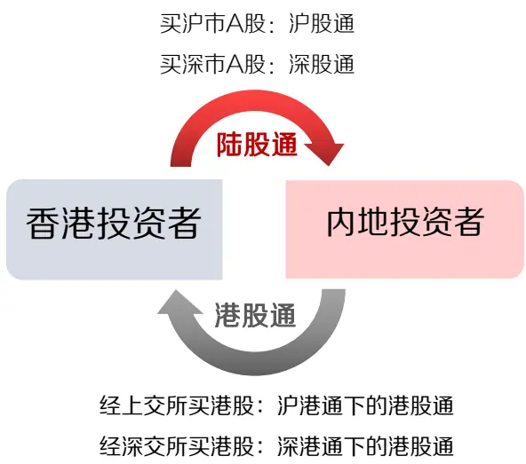
数据来源：东方证券研究所

沪港通和深港通互为补充，相关规定对比如图 2。与上证股票相比，深交所股票的平均市值更小，因此沪股通、深股通在标的证券的筛选上有明显区别。沪股通直接选取现有指数成份股，而深股通引入市值筛选标准，设定了市值最小阈值 60 亿，以防范深港通跨境市场炒作和操纵中小市值股票风险。

此外，沪深港通机制最初设立了每日额度（南北上限分别为 105 亿元和 130 亿元人民币）与年度总额度（南北上限分别为 2500 亿元和 3000 亿元人民币）限制两道闸口，经过 2015 年两地股市调整之后，于 2016 年底取消总额度限制（当时年度额度即将用尽），但仍维持每日额度限制。2018年 5 月，为配合 A股纳入 MSCI 指数，沪深港通每日额度扩大 4倍，即北上和南下每日额度分别扩大至 520 亿元和 420 亿元。额度的进一步扩大表明了监管层态度，提升了市场的流动性空间和交易顺畅度，也增强了市场中长期投资者的信心。

图 2：沪港通、深港通制度规定（截止 2019年 7月）

| 项目 | 沪港通 | 深港通 |
| --- | --- | --- |
| 投资者门槛 | 沪股通：无门槛要求 港股通：机构投资者或满足50万元人民币准入条件的个人投资者 | 同“沪港通” |
| 标的范围 | 沪股通（共580支）：上证180指数成份股、上证380指数成分股成份 股，以及上交所上市的A+H股 | 深股通（共682支)：市值60亿元人民币及以上的深证成指成 份股、市值60亿元人民币及以上的中小创新指数成份股，深交 所上市的A+H股 |
|  | 港股通（共326支）：恒生综合大型股指数、恒生综合中型股指数成份 股，A+H股 | 港股通（共482支)：沪市港股通标的股票+市值50亿港币及 以上的恒生综合小型股指数成份股 |
| 额度规模 | 沪股通：每日额度520亿人民币(2018年5月提升，原有130亿元）， 无总限额(原有3000亿的总额度限制于2016年底取消) | 沪股通：每日额度520亿人民币（2018年5月提升，原有130 亿元)，无总限额 |
|  | 港股通：每日额度420亿人民币(2018年5月提升，原有105亿元)， 无总限额(原有2500亿的总额度限制于2016年底取消） | 港股通：每日额度420亿人民币（2018年5月提升，原有105 亿元)，无总限额 |
|  | 交易制度安排沪股通：T+1,以人民币报价、交易 | 同“沪港通” |
| 交易时间 | 沪股通：两地共同交易日，上交所交易时间 | 同“沪港通” |

数据来源：东方证券研究所 & 港交所

此外，沪股通、深股通与我国 2002 年引入的 QFII 制度，均引入了境外投资者，但二者存在诸多差异，相关规定对比如图 3： （1）境外投资者结构上：QFII 主要是长期机构投资者，如养老金、公益基金、保险基金、主权基金等，而参与沪股通与深股通的境外投资者更为多样化，包括机构、散户和国际游资。（2）可投资范围上：QFII 在经批准的投资额度内，可以投资于股票、优先股、债券、基金、股指期货、资产支持证券等。2019 年初，中国证监提出扩大 QFII 和 RQFII投资范围，可投资于新三板股票，债券回购，私募投资基金，金融期货，商品期货，期权等。未来 QFII几乎可以参与国内任何金融工具投资。而沪股通、深股通的资金投资范围较窄，只能在规定额度内买卖规定范围内的上市股票。（3）资金来源地及身份构成比较上：QFII 的资格身份透明清晰，统计数据更新快，易于查找。而沪股通、深股通投资者身份及来源地不可查，较难识别。

图 3：沪股通、深股通与 QFII比较
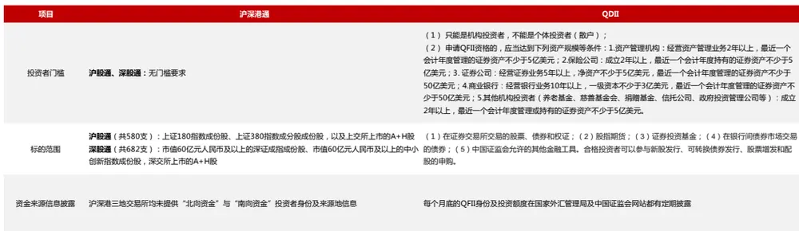
数据来源：东方证券研究所 & 《QFII 与沪深港通资金来源性质比较》

沪深港通投资者可以参与融资融券。2015 年3 月2 日，沪港通沽空机制开放，为海外投资者做空 A 股提供了又一选择。但沪港通沽空机制限制十分严格：（1）沪港通进行卖空必须向券商等机构借用有关股票或自有股票，即不能“裸卖空”；（2）有价格限制，沽空盘输入价不得低于最新成交价；（3）有卖空比率的限制，即每只股票卖空量每日限额为 1%，累计限额为 10 个连续交易日的 5%。并且，境外券商持有的融券标的股不多，沽空面临借券难的问题。截至目前，沪深港通卖空无成交量，融券余量占流通股比例为 1%，几乎可以忽略不计。沪港通沽空机制对于 A股更多的是象征意义，实质价值尚未体现。

## 2．沪深港通成交情况

对比机制开通之后的每日成交情况，呈现“北热南冷”的局面，并且 2019年上半年南北向成交差距进一步扩大。从每日成交额看，沪股通的每日成交额在 2015 年 7月 6 日达到峰值，而后出现回落，直到 2017 年后开始复苏。深股通自开通后，日成交额逐渐上升，2017 年 12 月份有所下降。2019 年北上日均成交均十分活跃，2019 年上半年的日均成交额达到 423 亿元，为去年日均成交额的两倍。而港股通在 2014 年4 月 9 日达到峰值后下降，2016 年6 月开始逐渐上升，2018年 2 月和 2019 年 2 月达到两次峰值，为 300 亿元左右。2019 年上半年的港股通日均成交额仅为不到 100 亿元，与 2018 年基本持平。从年度合计买卖总额看，2019年上半年北上与南下分别实现 4.92 万亿元人民币和 1.07 万亿元人民币，北上已超越去年全年水平，南下则不到去年全年总额的一半。

图 4：陆股通每日成交额（北上）
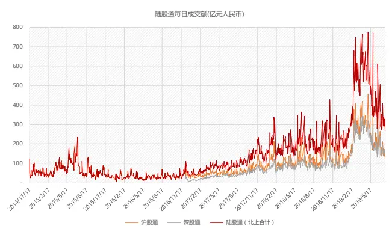
数据来源：东方证券研究所 & Wind 资讯

图 5：港股通每日成交额（南下）
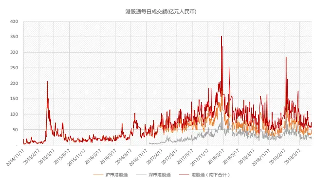
数据来源：东方证券研究所 & Wind 资讯

图 6：陆股通、港股通分年成交情况

| 当年日均成交额(亿元人民币) | 沪股通 深股通 |  |  | 陆股通（北上合计） | 沪市港股通 深市港股通 |  | 港股通（南下合计） |
| --- | --- | --- | --- | --- | --- | --- | --- |
| 2014 | 55.84 |  |  | 55.84 | 7.34 |  | 7.34 |
| 2015 | 63.68 |  |  | 63.68 | 27.09 |  | 27.09 |
| 2016 | 32.12 | 15.41 |  | 47.53 | 31.20 | 4.64 | 35.84 |
| 2017 | 55.94 | 40.46 | 96.40 |  | 64.72 | 20.10 | 84.82 |
| 2018 | 116.26 | 87.84 | 204.10 |  | 68.23 | 38.00 | 106.23 |
| 2019H1 | 224.32 | 198.33 | 422.65 |  | 58.28 | 33.86 | 92.15 |

| 当年成交总额(亿元人民币) | 沪股通 | 深股通 | 陆股通（北上合计） | 沪市港股通 | 深市港股通 | 港股通（南下合计） |
| --- | --- | --- | --- | --- | --- | --- |
| 2014 | 1,675.12 |  | 1,675.12 | 205.64 |  | 205.64 |
| 2015 | 14,710.64 |  | 14,710.64 | 6,203.76 |  | 6,203.76 |
| 2016 | 7,452.73 | 261.90 | 7,714.63 | 7,112.77 | 83.57 | 7,196.34 |
| 2017 | 13,146.22 | 9,507.05 | 22,653.27 | 14,886.35 | 4,623.31 | 19,509.66 |
| 2018 | 26,623.08 | 20,115.28 | 46,738.37 | 15,214.48 | 8,474.49 | 23,688.97 |
| 2019H1 | 26,304.98 | 22,863.08 | 49,168.07 | 6,818.69 | 3,891.75 | 10,710.44 |

数据来源：东方证券研究所 & Wind 资讯

## 3．沪深港通资金流入情况

对比机制开通之后的资金流向情况，可以看到南北上每年均有资金净流入，北上资金自 2017年开始呈现加速流入态势，南下资金 2018 年开始净流入步伐放缓。分年来看，沪股通开通后，北上资金流入较为冷清，2016 年底深股通开通后，北上资金流入才开始加速。2017 年全年沪股通＋深股通净流入近 2000 亿元，以深股通为主。2018 年北上资金净流入达到峰值，全年净流入近 3000亿元，以沪股通为主。而南下资金净流入在 2015-2017 年较多，分别为 1016 亿、2114 亿、3080亿元，以沪市港股通为主，对港股市场流动性形成有力支持。

2019年上半年，北上资金净流入 963.68 亿元人民币，南下则为 738.33 亿元，与内地股市年中表现好于港股一致。其中，北上沪股通和深股通均在 4 至 5 月出现资金净流出，合计 700 亿元人民币，反映了中美贸易摩擦不确定性增加及股指冲高状态下，外资对内地市场的减持状态；而南下沪市港股通在今年前两月净流出 400 亿港元，反映了自去年底开始沪市投资者对港股前景并不好看，深市港股通则持续获得净流入，反映出深市投资者对港股看法更为积极。

图 7：陆股通累计净流入走势（北上）
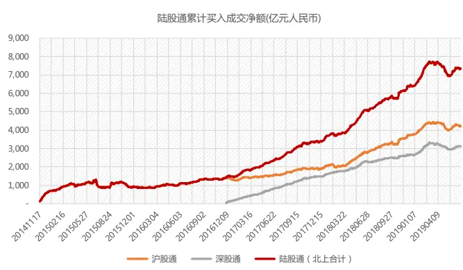
数据来源：东方证券研究所 & Wind 资讯

图 8：港股通累计净流入走势（南下）
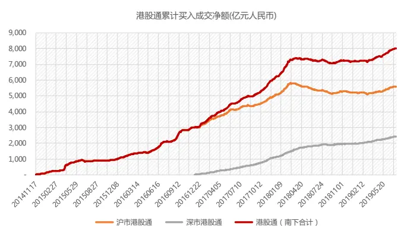
数据来源：东方证券研究所 & Wind 资讯

图 9：陆股通、港股通分年资金净流入情况

| 当年买入成交净额(亿元人民币) | 沪股通 深股通 |  | 陆股通（北上合计） 沪市港股通 深市港股通 |  |  | 港股通（南下合计） |
| --- | --- | --- | --- | --- | --- | --- |
| 2014 | 685.70 |  | 685.70 | 103.96 |  | 103.96 |
| 2015 | 185.29 |  | 185.29 | 1016.25 0.00 |  | 1016.25 |
| 2016 | 455.11 | 151.68 | 606.79 | 2051.85 | 64.81 | 2114.26 |
| 2017 | 629.73 | 1367.64 | 1997.38 | 1968.01 | 1110.24 | 3080.65 |
| 2018 | 1810.94 | 1131.24 | 2942.18 | 103.50 | 820.84 | 924.34 |
| 2019H1 | 507.36 | 456.33 | 963.68 | 328.95 | 409.38 | 738.33 |

数据来源：东方证券研究所 & Wind 资讯

## 4. 沪深港通资金是否是 smart money

由于资金流入金额和大盘指数均为非平稳序列，因而我们将二者进行一阶差分，分别统计不同时间尺度下，沪深港通资金净流入金额的变化率与未来市场涨跌幅的相关性，即过去一天/周/月的北上（南下）资金净流入金额的变化率与未来一天/周/月中证全指（恒生综指）涨跌幅的相关性。可以看到，相关性排序为：月频>周频>日频，但整体相关性不高，都在 20%以下，说明南北向资金均并未表现出对市场的前瞻性，无法提前预判到市场走向。此外，我们更关注在市场波动比较大的时候，沪深港通资金的流入情况，可以看到，在指数涨幅最高的 20%的时间里，资金净流入金额的变化率与未来一天/周/月市场涨跌幅的相关性均有所提高。

图 10：北上资金净流入金额变化率和未来中证全指涨跌的相关性

| 北向资金净流入金额变动率和未来中证全指涨跌的相关性 |  |  |  |
| --- | --- | --- | --- |
| 一天 |  | 一周 一月 |  |
| 2014 0.18% |  | 10.00% |  |
| 2015 | 2.63% | 0.49% | 43.36% |
| 2016 | 10.65% | -27.25%* | -26.57% |
| 2017 | 0.34% | 3.53% | 41.96% |
| 2018 | -4.50% | -28.04%** | -17.48% |
| 2019H1 | 12.14% | 32.87% | 90.00%** |
| 整体 | 4.39% | -7.46% | 20.69% |
| 指数涨幅最高的20% | 12.70%* | 4.82% | 21.21% |
| 指数跌幅最高的20% | 3.68% | -9.11% | 4.79% |

数据来源：东方证券研究所 & Wind 资讯

图 11：南下资金净流入金额变化率和未来恒生综指涨跌的相关性

| 南向资金净流入金额变动率和未来恒生综指涨跌的相关性 |  |  |
| --- | --- | --- |
| 一天 | 一周 | 一月 |
| 2014 | 9.14% -70.00% |  |
| 2015 | -8.52% 0.57% | 32.17% |
| 2016 | -4.27% -1.12% | -31.47% |
| 2017 | -9.65% -4.42% | -6.99% |
| 2018 | 6.11% 6.55% | -21.68% |
| 2019H1 | 3.69% 22.12% | -2.86% |
| 整体 | -2.11% 6.04% | 13.26% |
| 指数涨幅最高的20% | -10.67% 19.32% | 20.00% |
| 指数跌幅最高的20% | -5.23% 6.93% | 14.64% |

数据来源：东方证券研究所 & Wind 资讯

## 二、 北上资金的选股偏好

## 1．北上资金行业偏好

首先我们计算每个报告期北上资金的行业配置偏离度。计算方法为：首先根据北上资金在个股上的持股市值，计算其在每个行业上的配置比例，再计算每个行业的市值占比，作为各行业基准配置比例，二者相减即可得到北上资金的行业配置偏离度。可以看到：

1. 北上资金对消费行业最为偏爱，长期超配食品饮料、家电以及医药，最新一期偏离度为14.6%、8.13%、2.92%。北上资金在进行全球配置时，会着重寻找一个市场的核心资产和特征资产。A 股市场可选消费和必选消费公司占比 20%，拥有 14 亿人口的消费市场，消费升级空间广阔，而港股市场消费公司仅占 9%，因而消费板块是北上资金的核心持仓和布局重点。此外，北上资金在 2016年超配汽车、交通运输，2017年超配电子元器件，2018、2019 年超配餐饮旅游、建材。

2. 北上资金长期低配银行、石油石化、房地产、建筑，最新一期偏离度为 -10.19%、-3.84%、-1.17%、-1.6%。

图 12：北上资金的行业配置偏离度（中信一级行业）

| 行业 201 | 6/12/30 | 2017 | /3/31 | 2017 |  | /6/30 | 2017 | /9/29 | 2017/ |  | 12/29 | 2018 | /6/29 | 2018 | /9/28 | 2018/ |  | 12/28 | 2019 | /3/29 | 2019/6/28 |  | 平 | 均 |
| --- | --- | --- | --- | --- | --- | --- | --- | --- | --- | --- | --- | --- | --- | --- | --- | --- | --- | --- | --- | --- | --- | --- | --- | --- |
| 食品饮料家电 3 | 7.68% | 15 | .12% | 14 |  | 85% | 14. | 73% | 14. |  | 15% | 15. | 14% | 15. | 33% | 14 |  | 37% | 15 | .00% | 14 | 60% | 15 | 10% |
|  | 58% | 5 | 65% 8.7 |  |  | 75% | 10. | 57% | 12. |  | 12% | 9.5 | 6% | 7.8 | 7% 7.9 |  |  | 5% | 8 | 50% 8. |  | 13% | 8.2 | 7% |
| 医药电子元器件 E | 1197% | 2 | 80% 3.2 |  |  | 9% | 3.6 | 65% | 3.8 |  | 6% | 5.4 | 46% | 3.4 | 4% 2. |  |  | E% | 2 | 45% | 2. | 92% | 3. | 26% |
|  | 2.05% | 1 | 21% 4.6 |  |  | 9% | 4.6 | 3% | 4.8 |  | 8% | 4.6 | 2% | 2.8 | 6% 2.1 |  |  | 16% | 2 | 095% | 0.5 | 5% | 2. | 56% |
| 汽车 | 5.67% | 3 | 399% 2.7 |  |  | 3% | 2.3 | 7% | 2.3 |  | 2% | 1.6 | 2% | 1.6 | 6% 0.9 |  |  | 6% | -0. | 09% | -0 | 15% | 2. | 1% |
| 交通运输餐饮旅游建材 | 27% | 2 | 230% 1.7 |  |  | 0% | 0.9 | 2% | 0.9 |  | 1% | 0.6 | 7% | 1.1 | 1% 1.2 |  |  | 4% | 0 | 43% | 0. | .81% | 1. | 34% |
|  | .53% | 0 | 86% 0.6 |  |  | 2% | 0.8 | 6% | 1.4 |  | 7% | 1.7 | 8% | 1.8 | 8% 1.9 |  |  | 5% | 1 | 48% | 1. | 74% | 1. | 32% |
|  | I.69% | 11 | 83% 0.7 |  |  | 5% | 0.2 | 3% |  | 0.0 | 7% | 0.9 | 0% | 1.5 | 1% |  | 1.3 | 1% | 1 | 05% | 1. | 23% | 1.0 | 06% |
| 电力及公用事业 | 20% | 00 | 29% |  | 0.0 | 1% | 0.4 | 43% |  | 0.3 | 8% | -0.1 | 1% | -0.1 | 0% |  | 0.1 | 0% | -0 | 28% | -0 | -009% | 0.1 | 8% |
| 非银行金融轻工制造综合纺织服装钢铁农林牧渔国防军工 | .44% | 0 | 092% |  | 1.5 | 9% | 0. | 1% |  | -0.3 | 5% | -13 | 1% | -0.1 | 2% |  | -0.3 | 4% | 1 | 42% | 1 | 32% | -01 | 7% |
|  | 0.62% | -0 | 34% |  | -0.2 | 7% | -0. | 23% |  | -0.3 | 37% | -0.1 | 1% | -0.1 | 7% |  | -0. | 28% | -0 | 28% | -020 | 25% | -0 | 29% |
|  | -0.32% | -0 | .28% |  | -0.3 | 6% | -0. | 42% | -0. |  | 7% | -0. | .34% | -0. | .33% -0. |  |  | .29% | -0 | 32% | -00 | 30% | -0 | 33% |
|  | -0.38% | -0 | .42% |  | -0.4 | 8% | -0. | 37% | -0.4 |  | 41% | -0. | .89% | -0. | .24% -0.2 |  |  | 7% | -00 | 35% | -0 | -028% | -00 | 36% |
|  | -0.44% | 0 | .50% |  | -06 | 6% | -0 | 84% | -0.0. |  | 52% | -0. | .29% | 0.2 | 6% 0.0 |  |  | 3% | -02 | 4% | -0 | -043% | -0 | 36% |
|  | 1.05% | -1 | .06% |  | -07 | 7% | -0. | 35% | -0. |  | 1% | -0. | 75% | -0 | 76% -0 |  |  | 47% | -00 | .40% | -0 | 25% | -07 | 3% |
|  | 0.56% | -0 | 0.88% |  | -09 | 5% | -1 | 08% | -11 |  | 2% | -1 | 1% | -1 | 6% -1 |  |  | 02% | -1 | 07% | -0 | 92% | -0ol | 98% |
| 通信 | -0.54% | 0 | .53% |  | -08 | 4% | -0 | 84% | -0. |  | 1% | -1.0 | 1% | -1. | 9% -15 |  |  | 2% | -1 | 44% | -1 | -140% | -0o | 99% |
| 电力设备机械 日 | 11.53% | - | .60% |  | 3 | 6% | -18 | 5% | -1 |  | 2% | -0.9 | 4% | -0. | .81% -0 |  |  | 55% | 0 | .57% | -0 | 30% | -1山 | 02% |
|  | 1.72% | -1 | 10% |  | 14 | 0% | -11 | 88% | -15 |  | 4% | -1 | 10% | -0. | 75% -00 |  |  | 56% | -0 | 34% | -0 | 19% | 山 | 03% |
| 商贸零售 1 | .16% | -1 | 16% |  | 1 | 8% | -1 | 18% | -1 |  | 1% | -10 | 2% | -0. | .91% -0 |  |  | 98% | 1 | 84% | -0 | 81% -1山 |  | 03% |
| 煤炭 1 | 1.29% | - | 43% |  | 1 | 63% | -11 | 56% -1 |  |  | 0% | -1 | 9% | -18 | 8% -12 |  |  | 7% | -1 | 10% | -1 | I11% -1山 |  | 37% |
| 传媒 1 | .12% | 1 | .65% 1 |  |  | 71% | -2 | 204% -19 |  |  | 4% | -1 | 152% -0. |  | .81% -10 |  |  | 6% | 1 | 23% | -0 | 89% -14 |  | 0% |
| 有色金属基础化工 日计算机 | 1.58% | - | 68% |  | 6 | 4% | -1 | 183% | F |  | 1% | -1 | 80% | Y | 1% -15 |  |  | 8% | -f | 50% | -1 | 57% 1 |  | 70% |
|  | 1.68% | E | 78% |  | -19 | 1% | -21 | 14% | -2 |  | 03% | -17 | 0% | -11 | 46% -14 |  |  | 3% | -1 | 58% | -13 | 4% | -1 |  |
|  | 2.53% | -2 | 20% |  | -19 | 4% | -1 | 171% | -1 |  | 1% | -2 | 01% | -11 | 85% -17 |  |  | 5% | -1 | 70% | -1 | 58% | -18 |  |
| 建筑 1房地产 日 | .56% | 日 | .06% |  | -26 | 4% | -25 | 5% | -1 |  | 1% | -22 | 5% | -2 | 4% -19 |  |  | 2% | -1 | 71% | -1 | 160% | -21 |  |
|  | 2.89% | 2 | .86% -B1 |  |  | 1% -41 |  | 47% | -25 |  | 4% | -2 | 71% | -1 | 95% -13 |  |  | 3% | -1 | 07% | 1 | 17% | -22 | 1% |
| 石油石化 | 4.50% -4 |  | 28% 44 |  |  | 3% -4 |  | 28% | 1 |  | 3% | -45 | 3% | B | 03% 43 |  |  | 9% | 33 | 88% | B | 84% | 43 | 6% |
| 银行 | 3.52% |  | 19% -11. |  |  | 69% -11 |  | 98% | -12 |  | 59% | -13 | 25% | -13 | 17% |  |  | 71% | 0 | 55% | -10 | 19% | -11 | 18% |

数据来源：东方证券研究所 & Wind 资讯

## 2．北上资金风格偏好

由于北上资金在各行业的配置比例差异较大，如果直接分析其全部持股的风格偏好，很大程度上会受到行业自身风格的影响，因而下面我们分别在每个行业内部考察北上资金持股的风格暴露情况。具体计算方法为：

（1）在每个行业内，按照持股市值，计算每期北上资金在个股上的配置比重；

（2）在每个行业内，按照（1）中的权重加权，计算每期北上资金持仓组合的各指标取值；

（3）在每个行业内，计算每期北上资金持仓组合的指标取值在行业内的排名分位数。

分位数越小代表指标取值越大，排名越靠前。

规模

北上资金持仓组合的市值、公司净资产、销售收入、净利润 TTM当期绝对值，在各行业内排名都非常靠前。银行板块由于市值都比较大，分化不明显，因而其市值排名相对略靠后，为前 20%左右，其余行业内的市值排名分位数都在前 5%。代表北上资金偏好大规模的公司。

图 13：北上资金持仓组合市值在各行业内排名分位数
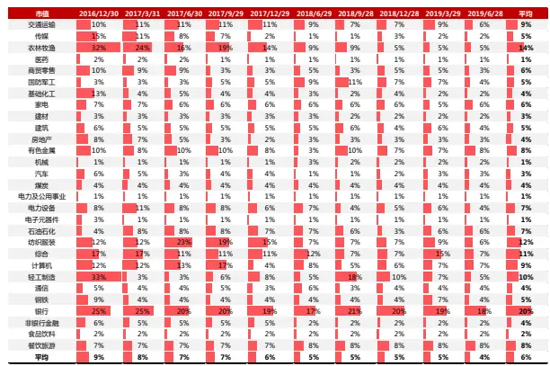
数据来源：东方证券研究所 & Wind 资讯

图 14：北上资金持仓组合净资产在各行业内排名分位数
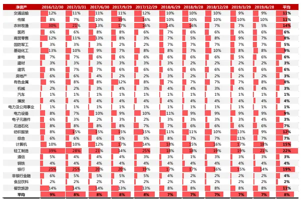
数据来源：东方证券研究所 & Wind 资讯

图 15：北上资金持仓组合销售收入在各行业内排名分位数
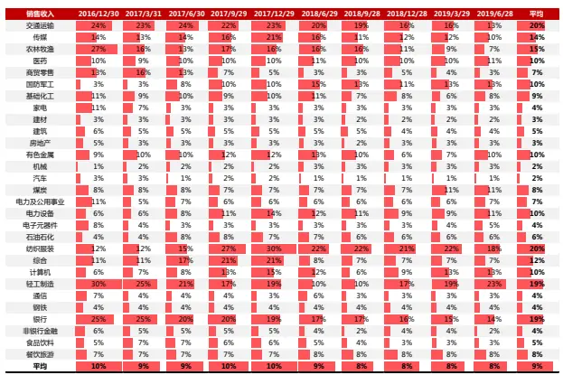
数据来源：东方证券研究所 & Wind 资讯

图 16：北上资金持仓组合净利润在各行业内排名分位数
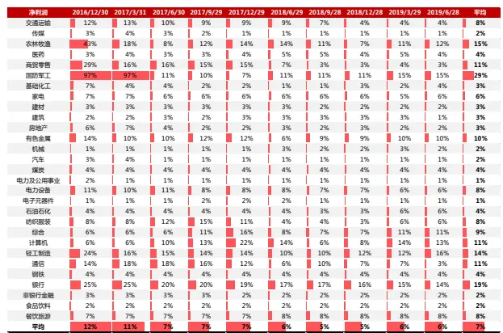
数据来源：东方证券研究所 & Wind 资讯

估值

北上资金持仓组合的 BP、EP、PEG 取值在行业内均排在中游，代表总体而言，北上资金并不十分看重公司的估值水平，低估值不是硬性要求，中等或中等偏高的估值水平都可以接受。并且近期 BP、EP 指标排名明显下滑，PEG 指标排名明显提高，意味着随着北上资金持仓股票股价上涨，其持仓估值还在进一步提高。

不同行业中，北上资金的持仓估值特点有所不通，我们将 BP、EP、PEG 倒数的各行业排名分位数取简单平均，可以看到，建筑、石油石化、建材、非银金融、家电这些强周期性行业中北上资金比较看重估值水平，持仓组合的估值偏低；计算机、餐饮旅游、医药这些新兴成长性行业中北上资金并不十分看重估值，持仓估值偏高。

北上资金持仓组合的 DP 指标在所有行业中均排在前 50%，多数还处在前 20%，代表北上资金比较关注分红情况，偏好高股息股票。

图 17：北上资金持仓组合 BP在各行业内排名分位数
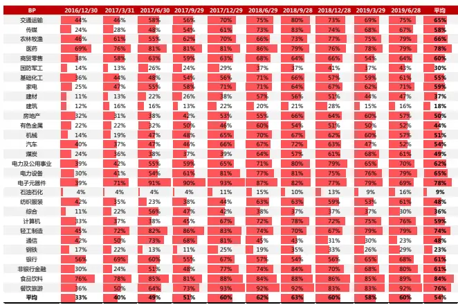
数据来源：东方证券研究所 & Wind 资讯

图 18：北上资金持仓组合 EP在各行业内排名分位数
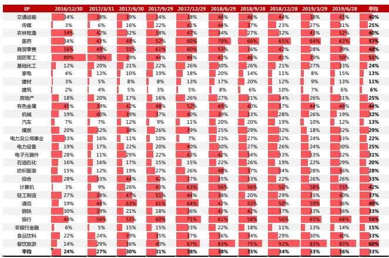
数据来源：东方证券研究所 & Wind 资讯

图 19：北上资金持仓组合 DP在各行业内排名分位数
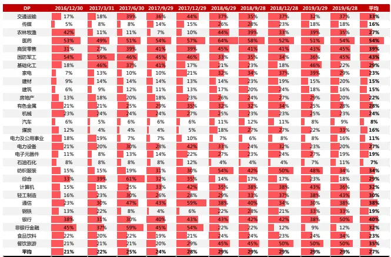
数据来源：东方证券研究所 & Wind 资讯

图 20：北上资金持仓组合 PEG 在各行业内排名分位数
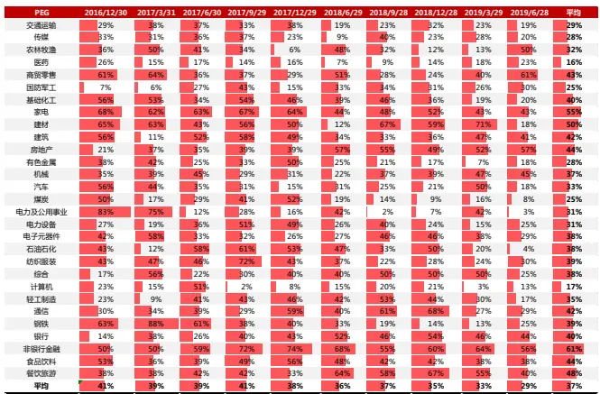
数据来源：东方证券研究所 & Wind 资讯

## 盈利能力

北上资金持仓组合的毛利率、净利率、ROE、RNOA 当年数值和来年数值，在行业内的排名也普遍比较靠前，平均在前 20%-30%，代表北上资金关注企业质地，偏好盈利能力强的公司。尤其在食品饮料、餐饮旅游、电子元器件等非周期行业内北上资金更关注企业盈利情况。在各指标中，RNOA 在行业内的排名最靠前，RNOA 是指净经营资产收益率，这也反映出北上资金都会对企业的盈利情况进行明确区分，更看重经营活动的收益能力。

此外，下一年指标数值的排名相对当年数值基本会更靠前，代表北上资金更看重公司的盈利前景，更偏好未来盈利性强的公司。

图 21：北上资金持仓组合毛利率在各行业内排名分位数

| 当年数值 |  |  |  |  | 下一年数值 |  |  |
| --- | --- | --- | --- | --- | --- | --- | --- |
| 毛利率 | 2016/12/30 | 2017/12/29 | 2018/12/28 | 平均 | 2016/12/30 | 2017/12/29 | 平均 |
| 交通运输 | 24% | 21% | 26% | 24% | 22% | 20% | 21% |
| 传媒 | 53% | 24% | 26% | 34% | 47% | 27% | 37% |
| 农林牧渔 | 49% | 37% | 20% | 35% | 41% | 28% | 34% |
| 医药 | 19% | 29% | 36% | 28% | 23% | 32% | 27% |
| 商贸零售 | 58% | 27% | 44% | 43% | 60% | 35% | 47 7% |
| 国防军工 | 78% | 63% | 63% | 68% | 75% | 63% | 69% |
| 基础化工 | 39% | 37% | 29% | 35% | 34% | 99% | 67% |
| 家电 | 43% | 38% | 39% | 40% | 32% | 82% | 57% |
| 建材 | 29% | 18% | 10% | 19% | 29% | 15% | 22% |
| 建筑 | 75% | 65% | 63% | 68% | 79% | 59% | 69% |
| 房地产 | 39% | 40% | 42% | 40% | 34% | 43% | 39% |
| 有色金属 | 41% | 31% | 24% | 32% | 40% | 23% | 32% |
| 机械 | 58% | 35% | 34% | 42% | 54% | 29% | 41% |
| 汽车 | 24% | 31% | 34% | 30% | 22% | 28% | 25% |
| 煤炭 | 16% | 29% | 25% | 23% | 44% | 32% | 38% |
| 电力及公用事业 | 6% | 2% | 7% | 5% | 2% | 3% | 3% |
| 电力设备 | 48% | 28% | 34% | 37% | 50% | 28% | 39% |
| 电子元器件 | 37% | 14% | 17% | 22% | 28% | 11% | 19% |
| 石油石化 | 40% | 41% | 50% | 44% | 40% | 44% | 42% |
| 纺织服装 | 58% | 56% | 52% | 55% | 62% | 52% | 57% |
| 综合 | 33% | 58% | 41% | 44% | 44% | 37% | 41% |
| 计算机 | 44% | 40% | 29% | 38% | 46% | 34% | 40% |
| 轻工制造 | 27% | 19% | 38% | 28% | 21% | 31% | 26% |
| 通信 | 28% | 31% | 44% | 34% | 26% | 31% | 28% |
| 钢铁 | 43% | 54% | 30% | 42% | 52% | 46% | 49% |
| 非银行金融 | 50% | 47% | 91% | 63% | 50% | 57% | 54% |
| 食品饮料 | 2% | 16% | 17% | 12% | 2% | 18% | 10% |
| 餐饮旅游 | 57% | 60% | 50% | 56% | 57% | 47 7% | 52% |
| 平均 | 40% | 35% | 36% | 37% | 40% | 38% | 39% |

数据来源：东方证券研究所 & Wind 资讯

图 22：北上资金持仓组合净利率在各行业内排名分位数

| 当年数值 |  |  |  |  | 下 年数值 |  |  |
| --- | --- | --- | --- | --- | --- | --- | --- |
| 净利率 | 2016/12/30 | 2017/12/29 | 2018/12/28 | 平均 | 2016/12/30 | 2017/12/29 | 平均 |
| 交通运输 | 14% | 12% | 18% | 14% | 14% | 12% | 13% |
| 传媒 | 47 7% | 18% | 15% | 27% | 37% | 17% | 27% |
| 农林牧渔 | 43% | 21% | 9% | 24% | 35% | 16% | 26% |
| 医药 | 31% | 28% | 32% | 30% | 33% | 25% | 29% |
| 商贸零售 | 52% | 37% | 41% | 43% | 33% | 38% | 36% |
| 国防军工 | 89% | 51% | 54% | 65% | 67% | 56% | 61% |
| 基础化工 | 36% | 31% | 22% | 30% | 33% | 99% | 66% |
| 家电 | 39% | 21% | 31% | 30% | 25% | 26% | 26% |
| 建材 | 20% | 23% | 12% | 18% | 14% | 15% | 15% |
| 建筑 | 58% | 54% | 58% | 57% | 56% | 525 | 54% |
| 房地产 | 28% | 35% | 41% | 34% | 28% | 39% | 33% |
| 有色金属 | 29% | 23% | 19% | 24% | 39% | 17% | 28% |
| 机械 | 57% | 32% | 28% | 39% | 57% | 30% | 14% |
| 汽车 | 22% | 34% | 29% | 28% | 28% | 24% | 26% |
| 煤炭 | 12% | 11% | 14% | 12% | 24% | 18% | 21% |
| 电力及公用事业 | 7% | 3% | 5% | 5% | 5% | 4% | 5% |
| 电力设备 | 34% | 19% | 25% | 26% | 44% | 24% | 34% |
| 电子元器件 | 31% | 11% | 93% | 45% | 25% | 12% | 19% |
| 石油石化 | 80% | 59% | 56% | 65% | 68% | 米 | 58% |
| 纺织服装 | 23% | 7% | 24% | 18% | 27% | 48% | 38% |
| 综合 | 11% | 11% | 7% | 10% | 11% | 5% | 8% |
| 计算机 | 1% | 53% | 40% | 45% | 62% | 48% | 55% |
| 轻工制造 | 15% | 19% | 19% | 18% | 15% | 19% | 17% |
| 通信 | 33% | 38% | 37% | 36% | 40% | 31% | 35% |
| 钢铁 | 35% | 32% | 33% | 33% | 17% | 32% | 25% |
| 银行 | 44% | 67% | 52% | 54% | 44% | 62% | 53% |
| 非银行金融 | 82% | 81% | 63% | 75% | 70% | 63% | 66% |
| 食品饮料 | 2% | 4% | 3% | 3% | 2% | 2% | 2% |
| 餐饮旅游 | 36% | 40% | 50% | 42% | 36% | 40% | 38% |
| 平均 | 36% | 30% | 32% | 33% | 34% | 32% | 33% |

数据来源：东方证券研究所 & Wind 资讯

图 23：北上资金持仓组合 ROE 在各行业内排名分位数

| 当年数值 |  |  |  | 年数值 |  |  |  |
| --- | --- | --- | --- | --- | --- | --- | --- |
| ROE | 2016/12/30 | 2017/12/29 | 2018/12/28 | 平均 | 2016/12/30 | 2017/12/29 | 平均 |
| 交通运输 | 34% | 22% | 25% | 27% | 22% | 15% | 19% |
| 传媒 | 24% | 7% | 1% | 11% | 22% | 7% | 15% |
| 农林牧渔 | 59% | 19% | 16% | 31% | 2% | 21% | 27% |
| 医药 | 9% | 9% | 17% | 12% | 11% | 12% | 12% |
| 商贸零售 | 54% | 45% | 1% | 43% | 37% | 3% | 35% |
| 国防军工 | 75% | 34% | 11% | 40% | 58% | 34% | 46% |
| 基础化工 | 22% | 10% | 13% | 15% | 7% | 43% | 25% |
| 家电 | 21% | 15% | 19% | 19% | 21% | 15% | 18% |
| 建材 | 26% | 23% | 17% | 22% | 26% | 15% | 21% |
| 建筑 | 12% | 27% | 27% | 22% | 25% | 22% | 24% |
| 房地产 | 29% | 21% | 17% | 22% | 37% | 14% | 25% |
| 有色金属 | 45% | 27% | 25% | 32% | 58% | 27% | 42% |
| 机械 | 42% | 23% | 13% | 26% | 40% | 11% | 26% |
| 汽车 | 9% | 6% | 11% | 9% | 6% | 10% | 8% |
| 煤炭 | 2% | 26% | 18% | 25% | 48% | 2% | 40% |
| 电力及公用事业 | 40% | 12% | 14% | 22% | 10% | 10% | 10% |
| 电力设备 | 22% | 9% | 8% | 13% | 22% | 10% | 16% |
| 电子元器件 | 21% | 3% | 3% | 9% | 15% | 2% | 8% |
| 石油石化 | 56% | 48% | 44% | 49% | 52% | 44% | 48% |
| 纺织服装 | 4% | 31% | 18% | 17% | 4% | 52% | 28% |
| 综合 | 3% | 2% | 19% | 28% | 28% | 26% | 27% |
| 计算机 | 13% | 49% | 30% | 31% | 45% | 37% | 41% |
| 轻工制造 | 24% | 20% | 22% | 22% | 15% | 17% | 16% |
| 通信 | 19% | 14% | 5% | 23% | 19% | 26% | 22% |
| 钢铁 | 39% | 25% | 37 odo | 34% | 61% | 29% | 45% |
| 银行 | 44% | 29% | 2% | 35% | 31% | 29% | 30% |
| 非银行金融 | 9% | 10% | 4% | 8% | 9% | 2% | 6% |
| 食品饮料 | 15% | 6% | 12% | 11% | 7% | 12% | 10% |
| 餐饮旅游 | 36% | 7% | 17% | 20% | 21% | 7% | 14% |
| 平均 | 30% | 21% | 19% | 23% | 27% | 21% | 24% |

数据来源：东方证券研究所 & Wind 资讯

图 24：北上资金持仓组合 RNOA 在各行业内排名分位数

| 当年数值 |  |  |  |  |  |  |  |  |
| --- | --- | --- | --- | --- | --- | --- | --- | --- |
| RNOA | 2016/12/30 | 2017/12/29 | 2018/12/28 |  | 平均 | 2016/12/30 | 2017/12/29 | 平均 |
| 交通运输 | 7% | 11% | 10% | 9% | 8% | 8% |  | 8% |
| 传媒 | 5% | 4% | 4% | 4% | 5% |  | 6% | 6% |
| 农林牧渔 | 54% | 14% | 11% | 26% |  | 38% | 16% | 27% |
| 医药 | 4% | 9% | 17% | 10% | 7% |  | 14% | 11% |
| 商贸零售 | 37% | 40% | 36% | 37% | 17% |  | 47% | 32% |
| 国防军工 | 78% | 41% | 17% | 46% |  | 67% | 41% | 54% |
| 基础化工 | 36% | 19% | 18% | 24% |  | 29% | 23% | 26% |
| 家电 | 32% | 18% | 19% | 23% |  | 32% | 15% | 23% |
| 建材 | 29% | 18% | 12% | 20% |  | 23% | 8% | 15% |
| 建筑 | 13% | 19% | 24% | 19% |  | 19% | 17% | 18% |
| 房地产 | 23% | 28% | 31% | 27% |  | 34% | 29% | 32% |
| 有色金属 | 47% | 16% | 18% | 27% |  | 46% | 23% | 35% |
| 机械 | 35% | 23% | 17% | 25% |  | 35% | 15% | 25% |
| 汽车 | 6% | 11% | 14% | 10% |  | 10% | 12% | 11% |
| 煤炭 | 8% | 19% | 21% | 16% |  | 24% | 21% | 23% |
| 电力及公用事业 | 54% | 23% | 21% | 33% |  | 25% | 18% | 22% |
| 电力设备 | 16% | 10% | 9% | 12% |  | 19% | 13% | 16% |
| 电子元器件 | 10% | 3% | 2% | 5% | 13% |  | 1% | 7% |
| 石油石化 | 48% | 52% | 31% | 44% |  | 56% | 30% | 43% |
| 纺织服装 | 4% | 15% | 4% | 8% |  | 4% | 19% | 11% |
| 综合 | 22% | 42% | 22% | 29% | 28% |  | 26% | 27% |
| 计算机 | 11% | 28% | 15% | 18% | 10% |  | 28% | 19% |
| 轻工制造 | 12% | 11% | 17% | 14% | 12% |  | 14% | 13% |
| 通信 | 26% | 23% | 2% | 27% |  | 26% | 4% | 30% |
| 钢铁 | 39% | 21% | 26% | 29% | 13% |  | 21% | 17% |
| 非银行金融 | 21% | 22% | 64% | 36% |  | 60% | 29% | 44% |
| 食品饮料 | 5% | 2% | 2% | 3% |  | 2% | 2% | 2% |
| 餐饮旅游 | 14% | 7% | 17% | 13% | 7% |  | 7% | 7% |
| 平均 | 25% | 20% | 19% | 21% | 24% |  | 19% | 22% |

数据来源：东方证券研究所 & Wind 资讯

## 成长性

北上资金持仓组合的销售收入和净利润的增长率，当年数值和来年数值，在行业内的排名多数处在中等偏上，而且排名逐年提升，说明北上资金偏好高成长的股票，并且对成长性的关注度还在提高。

在通信、计算机等高科技行业内北上资金持仓组合的成长性指标可以排到前 20%，说明对于TMT行业这种新兴领域，由于公司尚处于起步发展阶段，北上资金会更关注这类公司的成长性。

图 25：北上资金持仓组合销售收入增长率在各行业内排名分位数
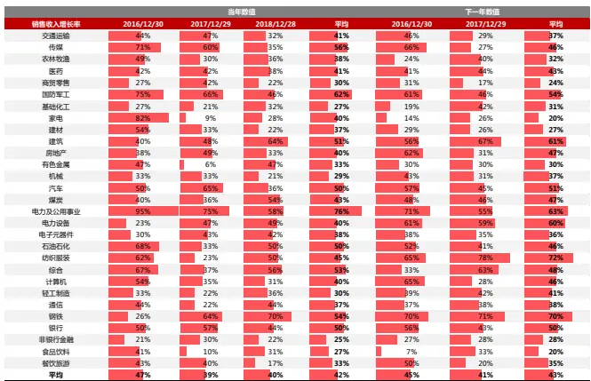
数据来源：东方证券研究所 & Wind 资讯

图 26：北上资金持仓组合净利润增长率在各行业内排名分位数
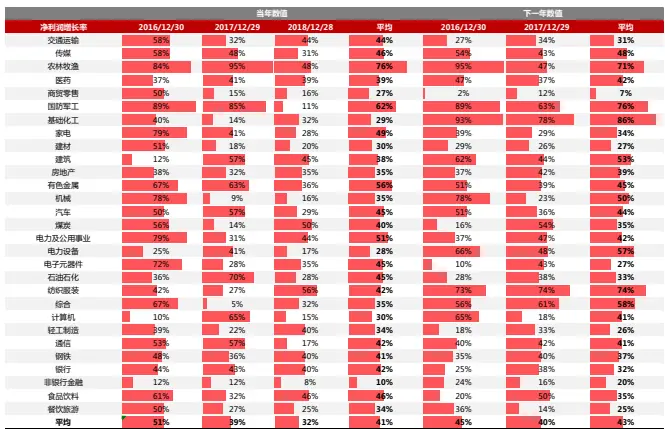
数据来源：东方证券研究所 & Wind 资讯

## 波动率 & 换手率

1. 北上资金持仓组合的波动率、换手率指标在行业内的排名均比较靠后，基本都排在后 30%-40%。并且指标考察周期周期越长，排名越靠后，排名顺序为：VOL120>VOL60>VOL20，TO60>TO20，说明北上资金对长期的技术指标更为看重，偏好长期低波动、低换手的股票。波动率和换手率都可以衡量股票的投机程度：被投机的股票一般多空分歧较大，多空博弈会导致股价高波动；投资者投机时为了博取短期收益，会频繁交易，从而导致高换手。因而，偏好长期低波动、低换手的股票，反映了北上资金投资风格稳健，倾向于投机程度较低的股票。

图 27：北上资金持仓组合 VOL20 在各行业内排名分位数
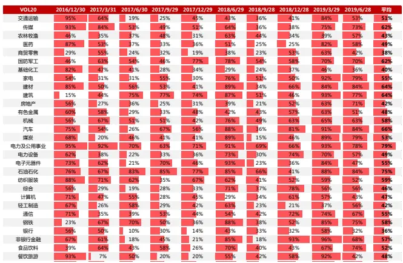
数据来源：东方证券研究所 & Wind 资讯

图 28：北上资金持仓组合 VOL60 在各行业内排名分位数
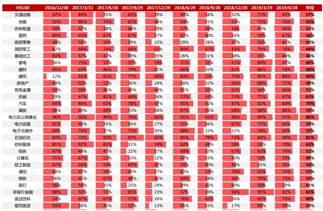
数据来源：东方证券研究所 & Wind 资讯

图 29：北上资金持仓组合 TO20 在各行业内排名分位数
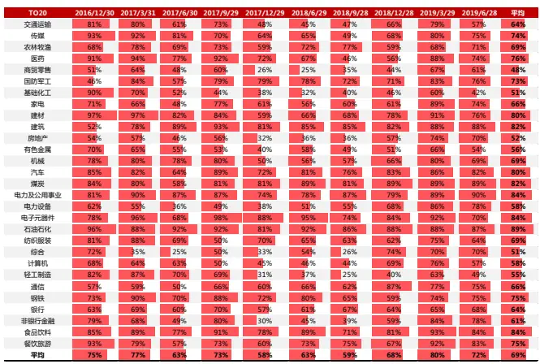
数据来源：东方证券研究所 & Wind 资讯

图 30：北上资金持仓组合 TO60 在各行业内排名分位数
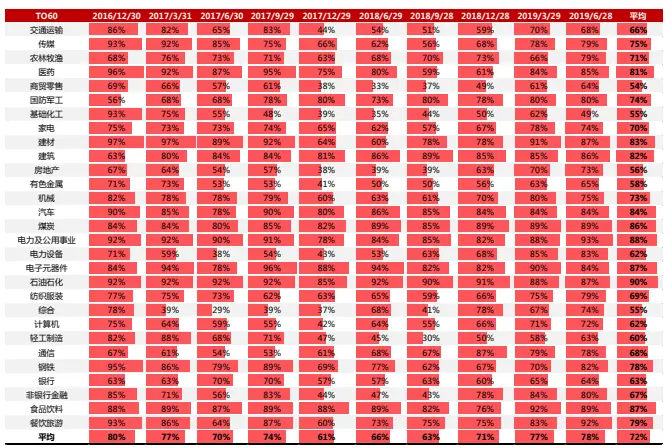
数据来源：东方证券研究所 & Wind 资讯

2. 北上资金持仓组合的非流动性指标 20 日 Amihud ILLIQ 在行业内的排名非常靠后，基本都处在行业内后 10%。月度的 Amihud ILLIQ 为股票每日涨跌幅绝对值与成交额之比的月度简单平均，捕捉的是股票单位的成交额对股价的冲击，流动性越好，单位成交额对股价的影响越小。非流动性指标排名较低说明北上资金偏好流动性好的股票。

3. 北上资金持仓组合的 beta 指标在行业内的排名比较靠后，基本都排在后 30%，说明北上资金偏好低 beta 的股票。近两年 A 股市场波动较大，低 Beta 策略的市场风险小，能够为组合提供一定的保护性，偏好低 beta的股票反映了北上资金风险偏好较低。

4. 北上资金持仓组合的过去一段时间的收益率在行业内的排名比较靠前，说明北上资金偏好过去涨得好的股票。

图 31：北上资金持仓组合 Amihud ILLIQ20 在各行业内排名分位数
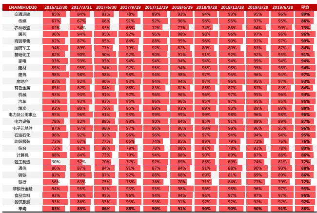
数据来源：东方证券研究所 & Wind 资讯

图 32：北上资金持仓组合 BETA 在各行业内排名分位数
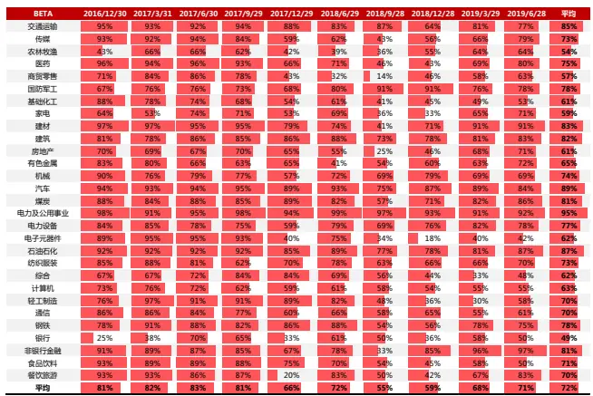
数据来源：东方证券研究所 & Wind 资讯

图 33：北上资金持仓组合 RET20 在各行业内排名分位数
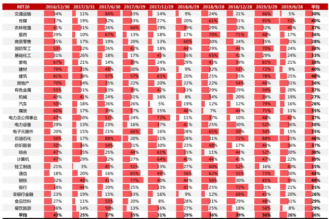
数据来源：东方证券研究所 & Wind 资讯

图 34：北上资金持仓组合 RET60 在各行业内排名分位数
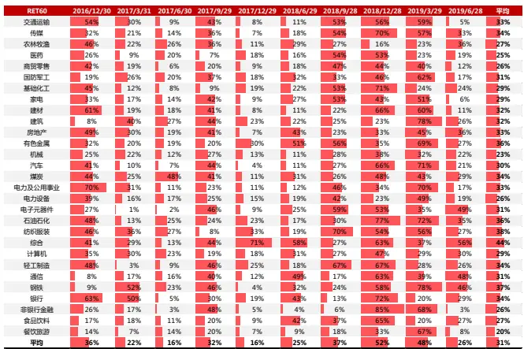
数据来源：东方证券研究所 & Wind 资讯

## 信息可靠性

1. 北上资金持仓组合公募基金持仓比例、分析师覆盖度在行业内的排名非常靠前，平均排在前 20%，说明北上资金偏好公募持股占比高、分析师覆盖多的股票。公募基金持仓比例、分析师覆盖度与市值存在一定正相关性，因而这也与北上资金偏好大市值股票有关。

2. 北上资金持仓组合一致预期评级、分析师预期调整指标在行业内的排名处于中游，说明北上资金并不是十分关注分析师的评级，以及分析师的盈利预测调整情况。有关一致预期评级、分析师预期调整指标的计算方法请参见我们之前的报告《20171202---系列（三十二）---分析师研报的数据特征与 alpha》。

图 35：北上资金持仓组合的公募基金持仓比例在各行业内排名分位数
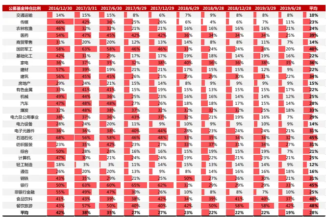
数据来源：东方证券研究所 & Wind 资讯

图 36：北上资金持仓组合分析师覆盖度在各行业内排名分位数
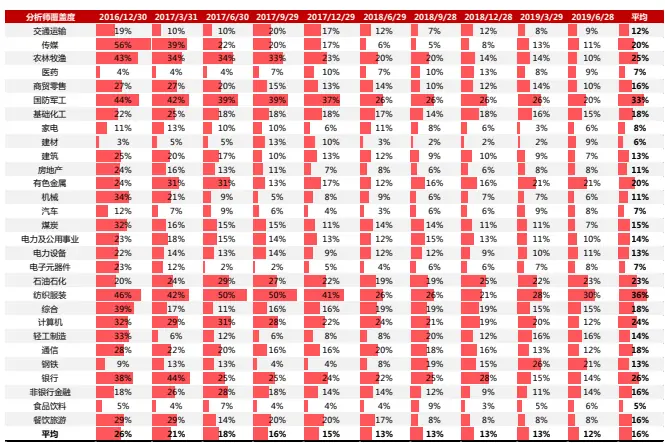
数据来源：东方证券研究所 & Wind 资讯

图 37：北上资金持仓组合的一致预期评级在各行业内排名分位数
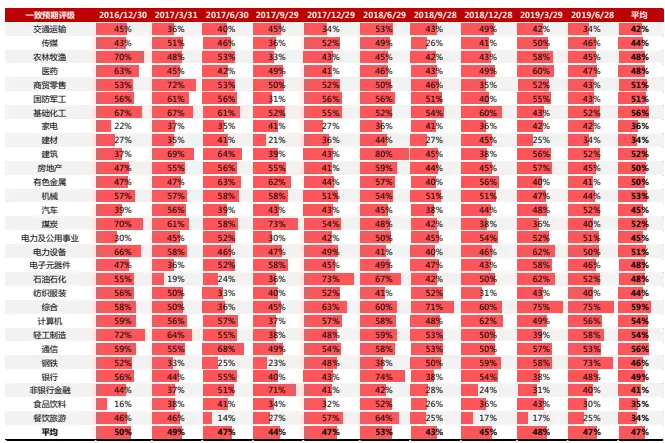
数据来源：东方证券研究所 & Wind 资讯

图 38：北上资金持仓组合加权的预期调整在各行业内排名分位数
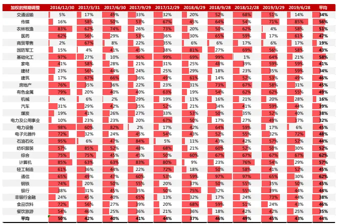
数据来源：东方证券研究所 & Wind 资讯

## 3．北上资金持仓组合表现

下面我们考察北上资金持仓组合的表现，组合中个股的权重为北上资金在个股上的配置比例，按照北上资金在个股上的持股市值占当期其在全部个股上的持股市值总和的比例计算得来。基准组合为北上资金持仓个股的市值加权组合。历史回溯测试的实证区间设定为 2016.12.30 –2019.06.28，采用月频的调仓方式。考虑组合中持仓股票数量较多，实盘中交易状况及交易成本的影响较小，因而测试时没有扣除交易手续费，调仓时涨跌停股票也假设可以正常买卖。下图我们展示了指数的净值曲线，以及相关绩效指标，可以看到，北上资金持仓组合过去 2 年半的时间里年化收益可以达到 23%，而同期基准组合年化收益率仅为 1.47%，沪深 300 年化收益 6%。从分年表现来看，2017、2019 年上半年表现都比较好。

图 39：北上资金持仓组合绩效指标（2016.12.30 – 2019.06.28）

|  | 北上资金持仓组合 | 基准组合 | 中证全指 | 沪深300 | 中证500 | 中证1000 |
| --- | --- | --- | --- | --- | --- | --- |
| 年化收益率 | 23.20% | 1.47% | -4.72% | 5.99% | -9.02% | -17.11% |
| 年化波动率 | 20.47% | 17.24% | 18.97% | 18.34% | 21.61% | 22.79% |
| sharp比率 | 1.12 | 0.17 | -0.16 | 0.41 | -0.33 | -0.71 |
| 最大回撤 | -28.20% | -30.93% | -34.78% | -32.46% | -40.11% | -52.14% |
| 年换手率（单边） | 285.64% | 188.66% |  |  |  |  |
| 2017 | 52.96% | 12.23% | 2.34% | 21.78% | -0.20% | -17.35% |
| 2018 | -19.89% | -24.39% | -29.94% | -25.31% | -33.32% | -36.87% |
| 2019H1 | 37.18% | 22.19% | 23.65% | 27.07% | 18.77% | 20.12% |

数据来源：东方证券研究所 & Wind 资讯

图 40：北上资金持仓组合净值曲线（2016.12.30 – 2019.06.28）
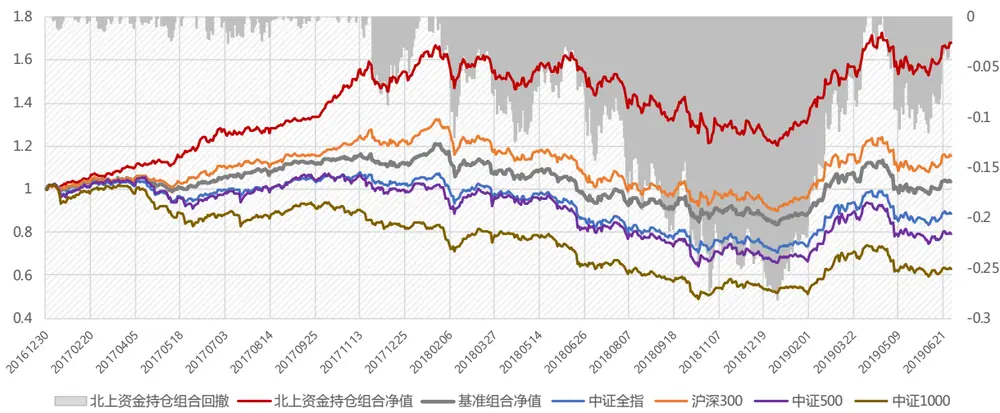
数据来源：东方证券研究所 & Wind 资讯

## 三、 市场交易特征的变化

沪深港通制度开启后，吸引了更多境外投资者参与 A 股市场，可能会引起 A 股市场的交易特征发生变化。

## 特质波动率

下面我们基于双重差分模型（DID）研究沪深港通开放对股价特质波动的影响。

双重差分模型最早由 Ashenfelter（1978）引入经济学，是估计处理效应的工具方法，常被用来对政策实施的跨期效果进行评估。处理组（即受政策影响的个体）在政策实施前后的变化，称为差分估计量。但由于经济环境也在随着时间改变，处理组的前后差异并不能准确反映处理效应。为了解决差分法的局限性，常用方法是寻找适当的控制组（即未受政策影响的个体）作为处理组的参照系，控制组在政策实施前后的变化可以被视为纯粹的时间效应，将处理组的时间序列前后变化减去控制组的时间序列前后变化，即可得到对于政策处理效应更为可靠的估计。由于是处理组差分与控制组差分的差分，因而被称为双重差分统计量，上述方法被称为双重差分模型（Difference inDifferences，记为 DD 或 DID）。当涉及多期数据时，可以通过回归的方法来得到双重差分估计量，可以证明处理组在政策干预前后的期望值变化 – 控制组在政策干预前后的期望值变化 即为回归方程中交互项的系数。

特质波动率表示的是剔除了市场常见风格波动后剩余的个股特有的波动率，用于度量归属于个股的特有风险。我们每季度都利用股票 i 过去 60 天的日收益率按以下方程对 Fama、French（1993）的三因子数据进行回归：

$$
r_{i,t}=\alpha_{i,t}+\beta_{i,t}MKT_{t}+s_{i,t}SMB_{t}+h_{i,t}HML_{t}+\varepsilon_{i,t}
$$

我们此处所用到的基于双重差分法的面板 OLS 回归模型表示如下：

$$
IVOL_{i,t}=\alpha_{1}Dt_{t}+\alpha_{2}Dg_{i}+\alpha_{1}Dt_{i}\times\alpha_{2}Dg_{i}+\sum control_{i,t}+IND_{i,t}+Date_{t}+\epsilon_{i,t}
$$

双重差分模型的构建细节如下：

1. 将股价特质波动 IVOL 设为因变量；

2. 设置分期虚拟变量 Dt，表示政策实施前后的时间效应（即使不实施政策也存在）。考虑到2017 年北上资金才开始呈现加速流入态势，因而我们定义 2017 年之后 Dt 为 1，2017 年之前 Dt为 0；

3．设置组别虚拟变量 Dg，表示处理组与控制组的固有差异（无论是否实施政策都存在）。考虑到目前 1262 只沪深港通标的股票中，大量个股的北上资金持股占比很低，其持股量占流通 A 股的占比在 1%以上的仅 542 只股票，而北上资金持股占比如果很低的话，其交易特征的变化并不能认为是北上资金带来的。因此我们选取 2017 年至今北上资金平均持股比例最高的前 500 只股票作为处理组，以中证全指中剩余股票作为控制组，当样本属于北上资金重仓股时 Dg=1，否则 Dg=0；

4. 设置政策虚拟变量，即交互项 DiD，表示处理组在政策实施后的效应，即沪深港通交易机制对北上资金重仓股的股价特质波动的影响，其在形式上可以表示为时间虚拟变量 Dt 和组别虚拟变量 Dg 的乘积（即 DiD = Dt* Dg）。当 DiD 取值为 1 时，表示北上资金重仓股在沪港深通政策开通后的股价特质波动情况，而在其他情况下，DiD 的取值都为 0；

5. 选用公司规模、资产负债率、BP、CFP、机构投资者持股比例、分析师覆盖度、上市时长、过去 60 天的收益率等变量作为控制变量 control；

6. 添加每个个体（或行业）的虚拟变量 IND，以及每个回归日期的虚拟变量 Date，来控制个体（或行业）固定效应，以及时间固定效应。需要注意的是，如果要控制时间固定效应，则不能添加分期虚拟变量 Dt，如果要控制个体固定效应，则不能添加分组虚拟变量 Dg，否则将存在共线性问题。

下面我们采用 2007 年到 2019 年 6 月底的季度数据进行上述回归，其中第（1）列未控制任何固定效应，第（ 2）列同时控制行业和时间固定效应，第（ 3）列控制个体和时间固定效应。从实证结果可以看到，三个模型中交互项 DiD 与股价特质波动 IVOL 均显著负相关（在 1%水平显著），表明北上资金流入之后，相比于其他股票，北上资金重仓股票的特质波动显著下降。说明沪港深通这一资本市场对外开放政策有助于降低 A 股市场股价特质波动。

图 41：沪深港通开放对股价特质波动的影响 —— 基于双重差分法的面板 OLS回归模型结果

|  | 季度数据 因变量 | Not control | Industry , date effect | stock , date effect |
| --- | --- | --- | --- | --- |
| 系数 | Dg | IVOL60 10.90 | IVOL60 -1.16 | IVOL60 |
| t值 |  | 115.79 | -20.03 |  |
| 系数 | Dt | 2.31 |  |  |
| t值 |  | 32.20 |  |  |
| 系数 | DiD ( Dt* Dg ) | -2.51 | -0.62 | -0.98 |
| t值 |  | -14.11 | -6.02 | -5.44 |
| 系数 | BM | 0.07 | -0.16 | -0.14 |
| t值 |  | 57.53 | -180.15 | -64.47 |
| 系数 | LEV | 0.10 | 0.01 | 0.10 |
| t值 |  | 43.15 | 5.54 | 7.44 |
| 系数 | SIZE | -10.46 | -0.57 | 1.72 |
| t值 |  | -480.56 | -26.48 | 21.46 |
| 系数 | CFP | 0.05 | -0.09 | -0.05 |
| t值 |  | 11.00 | -31.27 | -8.62 |
| 系数 | Certainty | 2.02 | -0.37 | -0.25 |
| t值 |  | 63.13 | -18.68 |  |
|  | RET60 |  |  | -5.17 |
| 系数 t值 |  | 0.23 200.40 | 0.21 219.42 | 0.21 129.01 |

数据来源：东方证券研究所 & Wind 资讯

下面我们进一步分析资本市场对外开放降低 A 股市场股价特质波动的原因。主要有两点：

1. 北上资金重仓股票的在全市场股票中的市值占比不断提高，因而特质波动率回归时个股收益能被市场收益率 MKT这一项解释的程度越大，相应的特异度就会越小，当波动率不变时，特质波动率就会降低。由于特异度=特质波动率*波动率，我们把波动率作为因变量进行上述回归，会发现交互项 DiD 与股价波动率负相关，但p 值为 0.183，在统计上不显著，因而可以认为北上资金流入之后，其重仓股票的波动率并没有明显变化。

2. 沪深港通政策的实施具有信息效应，能够促使企业提高信息披露质量，从而降低股价异质性波动。Rajgopal and Venkatachalam（2011）、Chen et al.（2012）均发现财务报告信息质量越差，股价特质波动越强，说明股价特质波动体现为信息效应。我们把应计利润作为信息质量的替代变量，进行上述双重差分回归，会发现交互项 DiD 与应计利润著负相关（在 1%水平显著），表明北上资金流入之后，其重仓股票的应计项显著降低，盈余可靠性提高，信息披露质量提升，从而可以抑制股价的特质波动。

图 42：北上资金重仓股票的在全市场股票中的市值占比
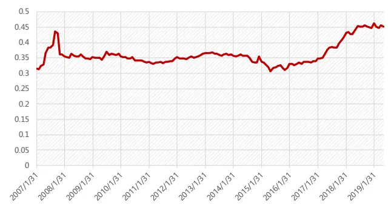
数据来源：东方证券研究所 & Wind 资讯

图 43：沪深港通开放对应计项的影响 —— 基于双重差分法的面板 OLS 回归模型结果

|  | 季度数据 因变量 | Not control ACC | Industry , date effect ACC |
| --- | --- | --- | --- |
| 系数 | Dg | 0.01 | 0.00 |
| t值 |  | 23.76 | 6.94 |
| 系数 | Dt | 0.01 |  |
| t值 |  | 22.83 |  |
| 系数 t值 | DiD ( Dt* Dg) | -0.01 -7.00 | -0.01 -6.01 |
| 系数 |  | 0.00 | 0.00 |
| t值 | BM | 98.88 | 36.54 |
| 系数 |  | 0.00 | 0.00 |
| t值 | LEV | 36.16 | 23.18 |
| 系数 |  | 0.00 | 0.01 |
| t值 | SIZE | 25.86 | 54.57 |
| 系数 |  | -0.01 | -0.01 |
| t值 | CFP | -263.50 | -266.59 |
| 系数 |  | 0.01 | 0.01 |
| t值 | Certainty | 43.94 | 36.14 |
| 系数 |  | 0.00 | 0.00 |
|  | RET60 | -8.56 |  |
| t值 |  |  | -15.69 |

数据来源：东方证券研究所 & Wind 资讯

## 换手率

我们把换手率作为因变量同样进行上述回归，会发现交互项 DiD 与换手率显著正相关（在 1%水平显著），表明北上资金流入之后，相比于其他股票，北上资金重仓股票的换手率显著提高。说明北上资金流入之后，其重仓股票的交易更活跃。

图 44：沪深港通开放对换手率的影响 —— 基于双重差分法的面板 OLS回归模型结果

|  | 季度数据 因变量 | Not control T060 | Industry , date effect T060 | stock , date effect TO60 |
| --- | --- | --- | --- | --- |
| 系数 | Dg | 0.14 | -0.06 |  |
| t值 |  | 17.91 | -8.92 |  |
| 系数 | Dt | -0.27 |  |  |
| t值 |  | -46.00 |  |  |
| 系数 | DiD ( Dt* Dg ) | 0.03 | 0.12 | 0.11 |
| t值 |  | 1.98 | 9.95 | 10.28 |
| 系数 t值 | BM | -0.01 | -0.01 | -0.01 |
|  |  | -65.10 | -76.69 | -47.97 |
| 系数 | LEV | 0.03 | 0.01 | 0.02 |
| t值 |  | 45.25 | 21.09 | 20.76 |
| 系数 | SIZE | -0.38 | -0.23 | 0.01 |
| 值 |  | -194.43 | -89.39 | 2.73 |
| 系数 | CFP | 0.00 | -0.01 | 0.00 |
| 值 |  | -3.70 | -19.49 | -6.18 |
| 系数 | Certainty | -0.02 | -0.06 | -0.06 |
| 值 |  | -8.15 | -26.69 | -19.90 |
| 系数 | RET60 | 0.01 | 0.01 | 0.01 |
| t值 |  | 105.59 | 46.74 | 50.42 |

数据来源：东方证券研究所 & Wind 资讯

## 四、 市场微观结构的变化

有海外高频交易机构借道沪深港股通参与 A 股日内交易，个股微观结构可能发生改变。

## 日内收益率的波动率

在每只股票的每个交易日，日内的 48 个 K 线对应着 48 个 5 分钟收益率（不考虑开盘价相对昨日收盘的跳开），利用这 48 个收益率我们分别计算股票 i 在交易 t 的日内 5 分钟收益率的波动率RVOLi,t：

$$
\sqrt{\frac{1}{K}{\sum}_{k=1}^{K=48}\left(r_{k}-\bar{r}\right)^{2}}
$$

我们分季度统计了北上资金重仓股、中证全指中其余股票的日内收益率的波动率。

1. 从横截面结果来看，北上资金重仓股的日内波动率普遍较小，说明这部分股票的日内收益稳定性更高，投机程度弱。

2. 从时间序列结果来看，两个股票池在 2017 年前后日内波动率变化整体不大（仅 2015 年日内波动率异常高）。

3. 从双重差分模型结果来看，仅在不控制任何固定效应时，交互项 DiD 与日内波动率显著负相关（在 1%水平显著），表明北上资金流入之后，相比于其他股票，北上资金重仓股票的日内收益波动程度有所降低。

图 45：北上资金重仓股、中证全指中剩余股票的日内收益率的波动率
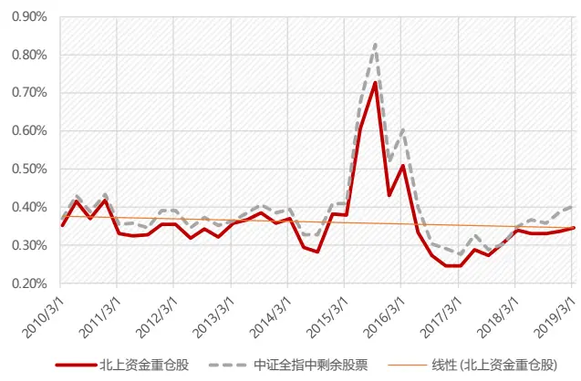
数据来源：东方证券研究所 & Wind 资讯

图 46：沪深港通开放对日内收益率的波动率的影响 ——基于双重差分法的面板 OLS 回归模型结果

| 季度数据 因变量 | Not control RVOL | Industry, date effect RVOL | Stock , date effect RVOL |
| --- | --- | --- | --- |
| Dg | 0.00 | 0.00 |  |
|  | 61.34 | -19.81 |  |
|  | 0.00 |  |  |
| Dt DiD ( Dt* Dg) | -9.04 |  |  |
|  | -3.42E-04 | 2.92E-05 2.42 | 1.07E-06 0.09 |
| BM | -10.47 0.00 | 0.00 | 0.00 |
|  | 59.21 | -91.34 | -44.88 |
| LEV | 0.00 | 0.00 | 0.00 |
|  | 77.75 | 4.94 | 7.27 |
| SIZE | 0.00 | 0.00 | 0.00 |
|  | -236.03 | -59.91 | -5.60 |
| CFP | 0.00 | 0.00 | 0.00 |
|  | Z.14 | -25.53 | -11.95 |
| Certainty | 0.00 | 0.00 | 0.00 |
|  | 33.87 | -6.80 | 5.46 |
| RET60 | 0.00 | 0.00 | 0.00 |
|  | 105.56 | 116.43 | 125.42 |

数据来源：东方证券研究所 & Wind 资讯

## 日内异常收益占比

假设变量服从正态分布，那么变量落在离均值三个标准差以外的概率为 0.003，因而可以将离均值三个标准差以外的的数据作为异常值数据。但由于样本均值和样本标准差都不是稳健统计量，其计算本身受极值的影响就非常大，因而我们这里采取了一种改进做法：把均值和标准差替换成稳健统计量，样本均值用样本中位数代替，样本标准差用样本 MAD（Median Absolute Deviation）代替，把偏离中位数三倍 MADe（1.483*MAD）以上的数据作为异常值。本节我们使用日内 5 分钟行情数据，计算日内 5 分钟收益率中异常收益的占比。

1． 从横截面结果来看，北上资金重仓股票的日内异常收益占比普遍较小，说明这部分股票的日内异常收益占比更为稳定，日内暴涨暴跌的可能性较小。

2． 从时间序列结果来看，北上资金重仓股票的日内异常收益占比呈现明显的下降趋势，而在剩余股票中降幅并不明显。

3． 从双重差分模型结果来看，在三个模型中，交互项 DiD 与日内异常收益占比均显著负相关（在 1%水平显著），表明北上资金流入之后，相比于其他股票，北上资金重仓股票的日内异常收益占比显著降低。

图 47：北上资金重仓股、中证全指中剩余股票的日内异常收益占比
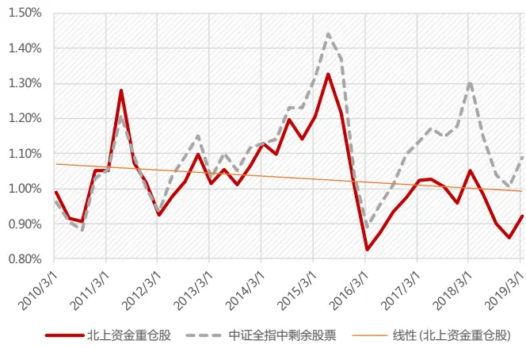
数据来源：东方证券研究所 & Wind 资讯

图 48：沪深港通开放对日内异常收益占比的影响 —— 基于双重差分法的面板 OLS 回归模型结果

|  | 季度数据 因变量 | Not control outlier | Industry , date effect outlier | Stock , date effect outlier |
| --- | --- | --- | --- | --- |
| 系数 | Dg | 0.00 | 0.00 |  |
| t值 |  | 73.78 | 5.18 |  |
| 系数 |  | 0.00 |  |  |
| t值 | Dt DiD ( Dt* Dg ) | 54.40 |  |  |
| 系数 |  | -2.21E-03 | -1.16E-03 | -1.38E-03 |
| 值 系数 |  | -24.14 0.00 | -22.99 0.00 | -29.57 0.00 |
| 值 | BM LEV | 41.97 | -109.18 | -57.26 |
| 系数 |  | 0.00 | 0.00 | 0.00 |
| 值 |  |  |  | 20.55 |
|  | SIZE | 85.92 | 10.18 | 0.00 |
| 系数 |  | 0.00 | 0.00 |  |
| t值 |  | -221.35 | -12.42 | 23.31 |
| 系数 | CFP | 0.00 | 0.00 | 0.00 |
| 值 |  | 7.46 | -17.07 | -8.66 |
| 系数 |  | 0.00 | 0.00 | 0.00 |
| t值 | Certainty | 28.75 | -22.55 | -12.15 |
| 系数 |  | 0.00 | 0.00 | 0.00 |
|  | RET60 |  |  |  |
| t值 |  | 63.62 | 5.41 | 1.94 |

数据来源：东方证券研究所 & Wind 资讯

## 日内相对买卖价差（Bid-Ask Spread）

本节我们使用股票 3 秒的 tick数据，计算（第一档卖单挂单价格 - 第一档买单挂单）/第一档买卖单挂单价格的平均值，将每天的平均值作为日内相对买卖价差 Bid-Ask Spread 指标。

1. 从横截面结果来看，北上资金重仓股票的日内 Bid-Ask Spread 普遍较小，说明市场对于这部分股票的股价分歧度较低，股票流动性越好。

2. 从时间序列结果来看，北上资金重仓股票的日内 Bid-Ask Spread 呈现明显的下降趋势，而剩余股票降幅并不明显。

3. 从双重差分模型结果来看，在三个模型中，交互项 DiD 与日内异常收益占比均显著负相关（在 1%水平显著），表明北上资金流入之后，相比于其他股票，北上资金重仓股票的日内 Bid-Ask Spread显著降低，股票流动性程度进一步提高。

图 49：北上资金重仓股、中证全指中剩余股票的日内相对买卖价差
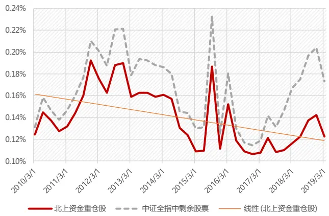
数据来源：东方证券研究所 & Wind 资讯

图 50：沪深港通开放对日内相对买卖价差的影响 —— 基于双重差分法的面板 OLS 回归模型结果

|  | 季度数据 因变量 | Not control bid ask spread | Industry , date effect bid ask spread | Stock , date effect bid ask spread |
| --- | --- | --- | --- | --- |
| 系数 | Dg | 0.00 | 0.00 |  |
| t值 |  | 34.80 | -7.01 |  |
| 系数 |  | 0.00 |  |  |
| t值 | Dt DiD ( Dt* Dg) | -22.53 |  |  |
| 系数 |  | -1.19E-04 | -7.88E-05 | -9.77E-05 |
| t值 |  | =9.14 | -723 | -11.57 |
| 系数 | BM | 0.00 | 0.00 | 0.00 |
| t值 |  | 177.47 | 81.91 | 65.08 |
| 系数 |  | 0.00 | 0.00 | 0.00 |
| t值 | LEV SIZE | 40.20 | -4.89 | 4.87 |
| 系数 |  | 0.00 | 0.00 | 0.00 |
| t值 |  | -218.29 | -69.06 | -76.27 |
| 系数 | CFP | 0.00 | 0.00 | 0.00 |
| 值 |  | 19.69 | 10.08 | 0.30 |
| 系数 |  | 0.00 | 0.00 | 0.00 |
| t值 | Certainty | -1.44 | -27.15 |  |
|  |  |  | 0.00 | -3.00 |
| 系数 | RET60 | 0.00 |  | 0.00 |
| t值 |  | 23.13 | 22.91 | 34.81 |

数据来源：东方证券研究所 & Wind 资讯

## 日内买卖挂单深度

本节我们使用股票 3 秒的 tick 数据，计算十档买单挂单总量与十档卖单单挂单总量，将每天的平均值其占流通 A 股股本比例作为买卖挂单深度指标。

1. 从横截面结果来看，北上资金重仓股票的日内买卖挂单深度普遍较小。

2. 从时间序列结果来看，两个股票池在 2017 年前后日内买卖挂单深度变化整体不大（仅2015 年日内买卖挂单深度异常高）。

3. 从双重差分模型结果来看，在控制个体和时间固定效应后中，交互项 DiD 与日内买卖挂单深度显著正相关（在 1%水平显著），表明北上资金流入之后，相比于其他股票，北上资金重仓股票的日内买卖挂单深度有所提高，股票流动性程度提高。

图 51：北上资金重仓股、中证全指中剩余股票的日内买卖挂单深度
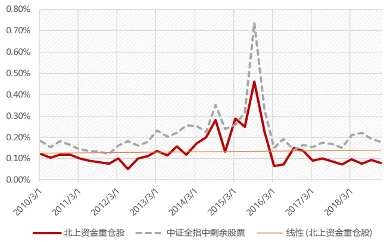
数据来源：东方证券研究所 & Wind 资讯

图 52：沪深港通开放对日内买卖挂单深度的影响 —— 基于双重差分法的面板 OLS 回归模型结果

|  | 季度数据 因变量 | Not control 买卖交易深度 | Industry , date effect 买卖交易深度 | Stock , date effect 买卖交易深度 |
| --- | --- | --- | --- | --- |
| 系数 | Dg | 0.00 | 0.00 |  |
| t值 |  | 11.86 | -5.05 |  |
| 系数 | Dt | 0.00 |  |  |
| t值 |  | -21.01 |  |  |
| 系数 | DiD ( Dt* Dg) | -1.61E-05 | 6.34E-05 | 9.57E-05 |
| t值 |  | -0.59 | 2.52 | 3.93 |
| 系数 | BM | 0.00 | 0.00 | 0.00 |
| t值 |  | 53.36 | 18.96 0.00 | 11.77 |
| 系数 | LEV | 0.00 |  | 0.00 |
| t值 |  | 18.30 | -0.60 | 6.40 |
| 系数 | SIZE | 0.00 | 0.00 | 0.00 |
| t值 |  | -133.84 | -60.26 | -30.18 |
| 系数 | CFP | 0.00 | 0.00 | 0.00 |
| t值 |  | 5.12 | -2.87 | -2.43 |
| 系数 | Certainty | 0.00 | 0.00 | 0.00 |
| t值 |  | -41.30 | -53.02 | -23.37 |
| 系数 | RET60 | 0.00 | 0.00 | 0.00 |
| t值 |  | 61.88 | 44.27 | 49.72 |

数据来源：东方证券研究所 & Wind 资讯

## 五、因子效用的变化

下面考察沪深港通开通后，北上资金的进入是否会带来因子效用的变化，所用 Alpha 因子列表如下图。通过横截面和时间序列两个维度进行分析：

1. 横截面维度：以北上资金持股量占个股流通 A 股股本的比例作为指标，每期选取占比最高的前 50%股票作为北上资金重仓股，以中证全指中剩余股票作为参照，比较 2017 年至今两个股票池中因子效用的差异。

2. 时间序列维度：以 2017 年为界，划分两个时间区间，阶段一为北上资金大规模流入前：2012 年-2017 年，阶段二为北上资金大规模流入后：2017 年至今。选取北上资金平均持股比例最高的前 500 只股票作为北上资金重仓股，以中证全指中剩余股票作为参照，分别对比阶段一和阶段二两个股票池中的因子表现。

图 53：Alpha 因子列表

| 大类 | 因子简称 | 因子定义 |  |
| --- | --- | --- | --- |
| Value | BP | 账面市值比 |  |
|  | EP | 归属母公司的净利润TTM/总市值 |  |
|  | EP2 | 扣非后的净利润TTM/总市值 |  |
|  | CFP | 经营性现金流TTM/总市值 |  |
|  | SP | 营业收入TTM/总市值 |  |
|  | EBIT2EV | 息税前利润与企业价值之比 |  |
|  | DP2 | 过去一年分红/总市值，以分红预案公告日为准 |  |
| Profit | EP_FY1 | 预期的估值 |  |
|  | PEG | PE_FY1/FY2隐含的利润增量率 |  |
|  | RNOA CFROI | 净经营资产收益率 |  |
|  | ROE | 投资现金收益率 |  |
|  | ROA2 | 净资产收益率 |  |
|  |  | 总资产净利率 |  |
|  | GPOA GROSS_MARGIN | 总资产毛利率 |  |
|  | SALES_GROWTH_YOY | 销售毛利率 营业收入季度同比 |  |
|  | PROFIT_GROWTH_TTM |  |  |
|  | PROFIT2_GROWTH_YOY | TTM净利润同比增长 扣非后净利润季度同比 |  |
|  | OCF_GTOWTH_YOY |  |  |
|  | SALES_GROWTH_TTM | 经营性现金流季度同比 |  |
| Growth PROFIT_GROWTH_YOY |  | TTM营业收入同比增长 |  |
|  | UP | 归属母公司的净利润季度同比 |  |
|  | SUEO | 预期外的RNOA 基于带漂移项随机游走模型计算的预期外的净利润，详见《业绩超预期类因子》 |  |
|  | SUE1 | 基于不带漂移项随机游走模型计算的预期外的净利润，详见《业绩超预期类因子》 |  |
|  | SURO | 基干带漂移项随机游走模型计算的预期外的营业收入，详见《业绩超预期类因子》 |  |
|  | SUR1 |  |  |
|  |  | 基于不带漂移项随机游走模型计算的预期外的营业收入，详见《业绩超预期类因子》 |  |
|  | MR | 高管薪酬前三之和的对数 |  |
| 分析师预期 | COV | 过去6个月有覆盖的机构数量，取根号 |  |
|  | DISP | 过去6个月盈利预测的分歧度 |  |
|  | SCORE | 综合评价 |  |
|  | TPER | 目标价隐含的收益率 |  |
|  | WFR | 加权的预期调整 |  |
| 非流动性 | TO20 | 过去20个交易日的日均换手率对数 |  |
|  | ILLIQ | 20日Amihud非流动性自然对数 |  |
| 反转投机 | IVOL20 | 过去20个交易日的特质波动率 |  |
|  | IVOL60 IVOL120 | 过去60个交易日的特质波动率 |  |
|  | IVR20 | 过去120个交易日的特质波动率 |  |
|  |  |  | 过去20个交易日的特异度 |
|  |  | IVR60 | 过去60个交易日的特异度 |
|  |  | RET20 | 过去20个交易日的收益率 |
|  |  | VOL20 | 过去20个交易日的波动率 |
|  |  | VOL60 | 过去60个交易日的波动率 |
|  |  | VOL120 | 过去120个交易日的波动率 |
| MAXRET | 过去最大收益，过去60日最大3个日收益均值 |  |  |

数据来源：东方证券研究所 & Wind 资讯

## 横截面维度

横截面维度的测试结果显示：

1. 相比非重仓股，北上资金重仓股中盈利类因子效用更强，IC由 2.68%升至 4.88%，IC_IR由 1.03 升至 1.95。

2. 估值类因子效用更弱，IC 由 7.74%降为 4.94%，IC_IR 由 3.76 降为 1.74。

3. 非流动性和反转投机类因子效用也更弱，非流动性 IC 由 10.26%降为 6.77%，IC_IR 由3.36 降为 2.81，反转投机 IC 由 12.31%降为 6.77%，IC_IR 由 3.75 降为 2.86。

4. 成长、分析师、公司治理类因子效果差异不大。

图 54：北上资金重仓股因子表现（2017.01.26 – 2019.06.28）

| 沪深股通 -因子表现 | 因子名称 | IC | IC_IR | tstat | 多空组合 月均收益 | 多空组合 月均胜率 | 多空组合月均 夏普比率 | 多空组合 最大回撤 | 多空组合 年化收益 | 2017 2018 |  | 2019 |
| --- | --- | --- | --- | --- | --- | --- | --- | --- | --- | --- | --- | --- |
| analyst | COV | 6.31% | 2.10 | 3.26 | 1.79% | 68.97% | 2.24 | -6.13% | 21.02% | 25.06% | 28.39% | 3.02% |
|  | DISP | -2.85% | (1.22) | (1.90) | 0.06% | 51.72% | 0.07 | -17.07% | 0.29% | 11.66% | -4.37% | -5.92% |
|  | SCORE | 0.08% | 0.06 | 0.09 | -0.14% | 48.28% | (0.27) | -9.91% | -1.63% | -0.60% | 4.43% | -7.89% |
|  | TPER | 0.51% | 0.31 | 0.48 | -0.40% | 31.03% | (0.73) | -16.68% | -4.47% | -5.22%-11.82% |  | 5.90% |
|  | WFR | 3.84% | 2.83 | 4.41 | 1.47% | 72.41% | 1.95 | -7.16% | 16.75% | 29.39% | 10.42% | 5.85% |
|  | analyst | 5.40% | 1.90 | 2.95 | 1.15% | 75.86% | 1.92 | -3.70% | 13.67% | 21.57% | 7.04% | 6.44% |
| growth | OCF_GTOWTH_YOY | 1.36% | 1.21 | 1.89 | 0.41% | 58.62% | 0.77 | -5.31% | 5.22% | 8.57% | 5.96% | -2.58% |
|  | PROFIT2_GROWTH_YOY | 5.48% | 2.65 | 4.12 | 1.39% | 72.41% | 1.73 | -7.14% | 16.78% | 19.80% | 13.68% | 8.41% |
|  | PROFIT_GROWTH_TTM | 1.98% | 0.94 | 1.46 | 0.52% | 55.17% | 0.65 | -15.11% | 5.92% | 15.21% | 1.83% | -2.00% |
|  | PROFIT_GROWTH_YOY | 4.15% | 1.85 | 2.88 | 1.26% | 68.97% | 1.32 | -8.34% | 15.01% | 18.63% | 10.95% | 7.50% |
|  | SALES_GROWTH_TTM | 2.36% | 1.10 | 1.71 | 0.53% | 48.28% | 0.88 | -11.07% | 6.44% | 7.80% | -0.71% | 8.39% |
|  | SALES_GROWTH_YOY | 4.21% | 1.98 | 3.08 | 1.29% | 68.97% | 1.98 | -6.11% | 15.75% | 17.94% | 11.93% | 9.15% |
|  | SUEO | 4.18% | 2.44 | 3.80 | 1.36% | 79.31% | 1.61 | -9.80% | 15.71% | 25.37% | 14.06% | 2.36% |
|  | SUE1 | 5.43% | 2.31 | 3.59 | 1.49% | 72.41% | 1.63 | -10.44% | 17.51% | 29.69% | 15.13% | 1.42% |
|  | SURO | 4.63% | 3.77 | 5.86 | 1.51% | 79.31% | 2.64 | -4.03% | 17.80% | 26.23% | 18.91% | 2.41% |
|  | SUR1 | 5.58% | 3.16 | 4.92 | 1.63% | 86.21% | 2.78 | -4.67% | 19.22% | 29.67% | 18.31% | 3.55% |
|  | UP | 4.87% | 2.66 | 4.13 | 1.15% | 65.52% | 1.84 | -5.09% | 14.15% | 20.84% | 3.45% | 10.88% |
|  | growth | 5.85% | 2.49 | 3.87 | 1.71% | 68.97% | 1.77 | -8.93% | 20.31% | 30.10% | 11.65% | 10.75% |
| liquid | LNAMIHUD20 | 3.68% | 1.80 | 2.80 | 0.67% | 62.07% | 0.92 | -5.55% | 7.28% | 7.13% | 17.25% | -4.27% |
|  | TO20 | -7.88% | (2.85) | (4.43) | 1.85% | 75.86% | 1.86 | -11.43% | 20.94% | 32.26% | 25.85% | 0.43% |
| lottery | liquid | 6.77% | 2.81 | 4.36 | 1.52% | 79.31% | 1.62 | -9.64% | 17.12% | 23.63% | 30.38% | -5.23% |
|  | IVOL120 | -5.85% | (2.20) | (3.41) | 1.07% | 65.52% | 0.97 | -13.70% | 11.11% | 20.01% | 13.99% | -2.63% |
|  | IVOL20 | -5.42% | (2.44) | (3.80) | 1.31% | 75.86% | 1.60 | -10.45% | 14.38% | 28.12% | 11.20% | 1.33% |
|  | IVOL60 | -6.00% | (2.27) | (3.54) | 1.39% | 72.41% | 1.48 | -10.82% | 15.56% | 23.28% | 19.61% | -0.20% |
|  | IVR20 | -2.91% | (1.52) | (2.36) | 0.73% | 65.52% | 1.43 | -4.17% | 7.85% | 7.08% | 4.69% | 9.55% |
|  | IVR60 | -2.98% | (1.60) | (2.49) | 0.85% | 72.41% | 1.65 | -3.34% | 9.30% | 9.44% | 11.46% | 4.38% |
|  | MAXRET60 | -5.95% | (2.39) | (3.71) | 1.04% | 65.52% | 1.26 | -10.53% | 11.50% | 16.72% | 12.53% | 1.61% |
|  | RET20 | -3.11% | (1.11) | (1.73) | 0.73% | 65.52% | 0.68 | -12.38% | 6.66% | 1.63% | 4.47% | 14.13% |
|  | VOL120 | -6.69% | (1.95) | (3.03) | 1.12% | 68.97% | 0.81 | -18.77% | 11.52% | 24.27% | 13.50% | -5.29% |
|  | VOL20 | -5.48% | (1.83) | (2.85) | 0.90% | 68.97% | 0.84 | -14.70% | 9.50% | 23.38% | 9.48% | -5.86% |
|  | VOL60 | -6.38% | (1.87) | (2.91) | 1.10% | 68.97% | 0.88 | -16.83% | 11.72% | 25.24% | 13.22% | -5.67% |
|  | lottery | 6.77% | 2.86 | 4.45 | 1.75% | 75.86% | 2.08 | -10.62% | 19.73% | 30.35% | 22.71% | 2.26% |
| operation | MR operation | 2.98% 2.98% | 2.15 2.15 | 3.34 3.34 | 1.20% 1.20% | 82.76% 82.76% | 2.73 2.73 | -2.58% -2.58% | 14.11% 14.11% | 29.21% 29.21% | 8.68% 8.68% | 0.43% |

数据来源：东方证券研究所 & Wind 资讯

图 55：中证全指中非北上资金重仓股因子表现（2017.01.26 – 2019.06.28）

| 非沪深股通 一因子表现 | 因子名称 | IC | IC_IR | tstat | 多空组合 月均收益 | 多空组合 月均胜率 | 多空组合月均 夏普比率 | 多空组合 最大回撤 | 多空组合 年化收益 | 2017 | 2018 2019 |  |
| --- | --- | --- | --- | --- | --- | --- | --- | --- | --- | --- | --- | --- |
| analyst | COV | 5.42% | 2.83 | 4.41 | 1.82% | 82.76% | 3.06 | -4.50% | 20.97% | 26.07% 31.00% | 1.59% |  |
|  | DISP | 0.42% | 0.26 | 0.41 | -0.07% | 37.93% (0.16) | -8.07% | -1.12% | -3.86% | -3.06% | 4.97% |  |
|  | SCORE | 0.98% | 1.52 | 2.36 | 0.33% | 68.97% | 1.21 | -3.67% | 3.88% | 10.03% 3.08% | -3.09% |  |
|  | TPER | 0.60% | 0.44 | 0.68 | 0.68% | 58.62% | 1.37 | -4.44% | 7.29% | 13.92% -2.64% | 9.38% |  |
|  | WFR | 0.72% | 0.53 | 0.83 | 1.02% | 79.31% | 2.54 | -2.23% | 11.89% | 17.41% 14.35% | -0.30% |  |
|  | analyst | 5.01% | 3.90 | 6.07 | 1.10% | 82.76% | 2.89 | -3.18% | 13.01% | 23.48% 11.86% | -0.74% |  |
| growth | OCF_GTOWTH_YOY | 1.49% | 2.54 | 3.95 | 0.12% | 55.17% | 0.34 | -6.05% | 1.77% | 5.57% -3.49% | 1.47% |  |
|  | PROFIT2_GROWTH_YOY | 4.85% | 3.02 | 4.69 | 1.27% | 82.76% | 1.71 | -9.31% 14.29% | 23.27% | 21.40% | -4.63% |  |
|  | PROFIT_GROWTH_TTM | 2.64% | 1.60 | 2.49 | 0.68% | 72.41% | 1.20 | -6.73% | 7.74% 16.26% | 6.10% | -1.86% |  |
|  | PROFIT_GROWTH_YOY | 5.03% | 3.01 | 4.68 | 1.45% | 82.76% | 2.09 | -6.18% | 16.60% | 20.19% 24.97% | 0.37% |  |
|  | SALES_GROWTH_TTM | 1.90% | 1.35 | 2.10 | 0.59% | 68.97% | 1.31 | -7.22% | 6.74% | 11.28% 2.32% | 3.70% |  |
|  | SALES_GROWTH_YOY | 3.78% | 2.73 | 4.25 | 1.15% | 86.21% | 2.51 | -2.78% | 13.39% 12.44% | 15.54% | 6.77% |  |
|  | SUEO | 4.57% | 3.80 | 5.90 | 1.78% | 86.21% | 3.32 | -2.94% | 20.96% | 24.78% 29.68% | 2.58% |  |
|  | SUE1 | 5.23% | 3.28 | 5.11 | 1.65% | 93.10% | 2.68 | -5.34% | 19.48% | 26.94% 25.86% | -0.02% |  |
|  | SURO | 3.88% | 3.98 | 6.18 | 1.32% | 93.10% | 3.46 | -3.21% | 15.32% | 16.78% 18.69% | 5.42% |  |
|  | SUR1 | 4.45% | 3.39 | 5.27 | 1.30% | 89.66% | 2.99 | -2.77% | 14.93% | 18.78% 14.47% | 6.55% |  |
|  | UP | 3.62% | 2.65 | 4.12 | 1.30% | 79.31% | 2.19 | -4.74% | 14.47% | 26.20% 14.88% | -0.39% |  |
|  | growth | 5.82% | 3.42 | 5.32 | 1.62% | 86.21% | 2.37 | -6.48% | 18.48% | 28.63% 22.21% |  |  |
|  | LNAMIHUD20 | 6.79% | 2.79 | 4.34 | 1.70% | 82.76% | 2.17 | -8.63% | 20.37% | 18.75% 39.42% | 0.50% -2.45% |  |
|  | liquid | TO20 | -11.53% | (3.15) | (4.90) | 3.39% | 79.31% 2.88 | -9.22% | 39.82% | 53.30% | 52.83% | 9.75% |
| liquid |  | 10.26% | 3.36 | 5.22 | 3.06% | 82.76% | 2.96 | -9.66% 36.33% | 44.51% | 51.45% | 7.46% |  |
| lottery | IVOL120 | -9.78% | (2.83) | (4.40) | 2.14% | 75.86% | 1.79 | -10.97% | 24.51% | 34.91% 27.49% |  |  |
|  | IVOL20 | -11.06% | (3.81) | (5.93) | 2.63% | 79.31% | 2.68 | -7.98% | 30.27% | 43.34% 36.86% | 4.93% |  |
|  | IVOL60 | -10.56% | (3.14) | (4.88) | 2.37% | 75.86% | 1.98 | -10.43% | 26.71% 37.29% | 33.72% | 6.56% |  |
|  | IVR20 | -8.25% | (3.94) | (6.13) | 2.29% | 93.10% | 4.29 | -0.55% | 26.66% 22.65% | 35.86% | 4.96% |  |
|  | IVR60 | -7.66% | (3.52) | (5.47) | 2.23% | 82.76% | 3.26 | -1.33% 25.74% | 19.10% | 39.39% | 15.20% |  |
|  | MAXRET60 | -10.23% | (3.18) | (4.94) | 2.18% | 79.31% | 1.86 | -11.87% | 24.67% 41.80% | 28.51% | 13.43% |  |
|  | RET20 | -7.08% | (2.09) | (3.24) | 2.04% | 65.52% | 1.80 | -7.36% | 22.77% 10.98% | 34.56% | 0.19% |  |
|  | VOL120 | -9.25% | (2.26) | (3.51) | 1.88% | 79.31% | 1.32 | -14.97% | 20.86% 37.34% | 20.91% | 17.75% |  |
|  | VOL20 | -9.69% | (2.66) | (4.14) | 2.21% | 82.76% | 1.94 | -11.18% | 24.73% 40.39% | 25.69% | -0.05% |  |
|  | VOL60 | -9.93% | (2.45) | (3.81) | 1.96% | 79.31% | 1.47 | -13.66% | 22.09% 32.50% | 27.25% | 4.46% |  |
|  | lottery | 12.31% | 3.75 | 5.83 | 2.90% | 82.76% | 2.53 | -8.82% | 33.43% | 42.51% 48.57% | 1.03% 6.00% |  |
|  | operation | MR | 1.72% 1.98 | 3.07 | 0.64% | 72.41% | 1.94 | -1.27% | 7.53% | 8.92% | 8.37% 1.71% |  |
|  |  | operation | 1.72% | 1.98 3.07 | 0.64% | 72.41% | 1.94 | -1.27% | 7.53% | 8.92% | 8.37% 1.71% |  |
|  |  | CFROI GPOA | 2.83% | 1.93 3.00 | 0.71% | 75.86% | 1.50 | -4.72% | 8.24% | 7.89% 14.77% | -1.18% |  |
| GROSS_MARGIN profit RNOA | 1.44% 1.22% | 0.67 0.68 | 1.04 1.06 | 0.82% | 68.97% | 1.29 0.96 | -7.29% -5.37% | 9.07% 5.19% 4.69% | 12.85% 11.44% | 0.03% |  |  |

数据来源：东方证券研究所 & Wind 资讯

## 时间序列维度

时间序列维度的测试结果显示：

1. 2017年之后，北上资金重仓股中盈利类因子表现明显大幅改善，IC从2.12%提升为4.05%，ICIR 从 1.01 提升为 1.23，而剩余股票中盈利因子效果变差，IC 从 3.07%下降为 0.55%，ICIR 从 1.04 下降为 0.59。这说明：北上资金进入后，大幅提升了盈利因子的选股效果。

2. 2017 年之后，北上资金重仓股中估值类因子表现大幅变差，IC 从 4.56%下降为 2.55%，ICIR 从 1.19 下降为 0.58，而剩余股票中估值类因子表现反而有所提高。这说明：北上资金进入后，大幅削弱了估值因子的选股效果。

3. 2017年之后，北上资金重仓股中反转投机类因子表现大幅变差，IC从7.86%下降为3.46%，ICIR 从 2.12 下降为 1.46，而剩余股票中估值类因子表现反而有所提高。这说明：北上资金进入后，大幅削弱了反转投机类因子的选股效果。

图 56：北上资金重仓股两阶段的因子表现

| 子 |  | IC均值 |  |  | ICIR |  |  |
| --- | --- | --- | --- | --- | --- | --- | --- |
| 沪深股通top500 |  | 阶段1：20120131-20161230 | 阶段2：20170131-20190628 | 变动百分比 | 阶段1：20120131-20161230 | 阶段2：20170131-20190628 | 变动百分比 |
| analyst | COV | 1.85% | 5.27% | 184.14% | 0.64 | 1.77 | 176.42% |
|  | DISP | -2.56% | -0.82% | -68.07% | (1.63) | 0.03 | -101.97% |
|  | SCORE | 3.18% | 1.16% | -63.61% | 1.59 | 1.05 | -34.27% |
|  | TPER | 4.60% | 0.92% | -79.98% | 1.80 | 0.62 | -65.78% |
|  | WFR | 2.96% | 4.33% | 46.27% | 1.54 | 2.36 | 53.78% |
|  | analyst | 5.41% | 5.29% | -2.20% | 2.10 | 2.15 | 2.51% |
| growth | OCF_GTOWTH_YOY | 0.97% | 0.34% | -64.59% | 0.63 | 0.32 | -49.12% |
|  | PROFIT2_GROWTH_YOY | 3.26% | 3.58% | 9.94% | 1.65 | 1.53 | -6.75% |
|  | PROFIT_GROWTH_TTM | 2.58% | 1.62% | -37.07% | 1.18 | 0.39 | -67.12% |
|  | PROFIT_GROWTH_YOY | 3.22% | 2.62% | -18.75% | 1.53 | 1.14 | -25.80% |
|  | SALES_GROWTH_TTM | 2.29% | 2.52% | 10.03% | 0.82 | 0.87 | 6.14% |
|  | SALES_GROWTH_YOY | 3.30% | 3.54% | 7.22% | 1.30 | 1.47 | 13.18% |
|  | SUEO | 4.02% | 4.09% | 1.97% | 2.28 | 2.05 | -10.04% |
|  | SUE1 | 4.18% | 5.29% | 26.55% | 2.00 | 2.06 | 2.87% |
|  | SURO | 2.89% | 3.45% | 19.35% | 1.66 | 2.07 | 24.65% |
|  | SUR1 | 3.36% | 4.45% | 32.49% | 1.47 | 2.16 | 47.28% |
|  | UP | 2.90% | 3.39% | 16.57% | 1.78 | 1.61 | -9.46% |
| liquid | growth | 4.35% | 4.72% | 8.51% | 1.78 | 1.74 | -1.86% |
|  | LNAMIHUD20 | 3.51% | 2.96% | -15.49% | 1.34 | 0.96 | -28.06% |
|  | TO20 | -6.46% | -7.21% | 11.58% | (1.86) | (2.47) | 32.32% |
| lottery | liquid | 5.64% -5.45% | 6.05% -2.44% | 7.25% -55.21% | 2.03 (1.53) | 2.18 (0.83) | 6.98% -45.81% |
|  | IVOL120 IVOL20 |  |  |  |  |  |  |
|  |  | -7.28% | -2.67% | -63.40% | (2.39) | (1.31) | -44.98% |
|  | IVOL60 | -6.32% | -3.73% | -41.03% | (1.87) | (1.28) | -31.51% |
|  | IVR20 | -4.89% -3.73% | -0.77% | -84.16% | (1.84) | (0.38) | -79.15% |
|  | IVR60 | -6.71% | -1.02% | -72.55% | (1.44) | (0.62) | -56.75% |
|  | MAXRET60 |  | -3.60% | -46.37% | (2.00) | (1.34) | -32.92% |
|  | RET20 | -6.15% -5.50% | -0.66% -3.41% | -89.18% -37.95% | (2.03) | (0.31) | -84.83% |
|  | VOL120 VOL20 | -5.49% | -3.07% | -44.17% | (1.36) (1.56) | (1.00) | -26.26% |
|  | VOL60 | -6.42% | -4.05% | -36.87% | (1.69) | (1.08) (1.10) | -31.01% -35.03% |
| operation | lottery | 7.86% | 3.46% | -56.02% | 2.12 | 1.46 | -31.18% |
|  | MR | 1.44% | 0.71% | -50.81% | 0.72 | 0.16 | -78.57% |
|  | operation | 1.44% | 0.71% | -50.81% | 0.72 | 0.16 | -78.57% |
| profit | CFROI | 2.73% | 3.49% | 27.83% | 1.74 | 1.56 | -10.54% |
|  | GPOA | 1.38% | 3.19% | 131.39% | 0.73 | 1.09 | 50.32% |
|  | GROSS_MARGIN | 1.64% | 2.04% | 24.25% | 0.86 | 0.61 | -29.73% |
|  | RNOA | 1.99% | 3.06% | 53.54% | 1.00 | 0.99 | -0.44% |
|  | ROA2 | 1.10% | 3.85% | 248.83% | 0.51 | 1.18 | 132.98% |
|  | ROE | 1.90% | 3.44% | 81.08% | 0.88 | 0.95 | 7.66% |
| value | profit | 2.12% | 4.05% | 91.14% | 1.01 | 1.23 | 21.77% |
|  | BP | 2.35% | -1.23% | -152.09% | 0.58 | (0.20) | -135.29% |
|  | CFP | 3.42% | 0.94% | -72.44% | 1.44 | 0.61 | -57.58% |
|  | DP2 | 3.57% | 3.48% | -2.38% | 1.62 | 1.51 | -6.69% |
|  | EBIT2EV | 3.62% | 1.80% | -50.09% | 1.33 | 0.36 | -72.77% |
|  | EP | 4.23% | 2.47% | -41.65% | 1.31 | 0.48 | -63.46% |
|  | EP2 | 3.92% | 2.85% | -27.23% | 1.28 | 0.60 | -53.27% |
|  | EP_FY1 | 4.23% | 2.74% | -35.21% | 1.24 | 0.61 | -50.91% |
|  | PEG | -4.36% | -2.98% | -31.49% | (2.48) | (1.16) | -53.44% |
|  | SP | 1.20% | 0.03% | -97.38% | 0.38 | 0.23 0.58 | -37.65% -51.45% |

数据来源：东方证券研究所 & Wind 资讯

图 57：中证全指中非北上资金重仓股两阶段的因子表现

| 因子 |  | IC均值 |  |  | ICIR |  |  |
| --- | --- | --- | --- | --- | --- | --- | --- |
| 非沪深股通重仓股 |  | 阶段1：20120131-20161230 | 阶段2：20170131-20190628 | 变动百分比 | 阶段1：20120131-20161230 | 阶段2：20170131-20190628 | 变动百分比 |
| analyst | COV | 2.95% | 3.69% | 25.26% | 0.93 | 2.10 | 127.33% |
|  | DISP | 0.99% | -0.68% | -168.37% | 0.66 | 0.08 | -88.31% |
|  | SCORE | 2.11% | 0.77% | -63.40% | 1.38 | 0.76 | -45.02% |
|  | TPER | 3.68% | 1.11% | -69.80% | 2.73 | 0.77 | -71.93% |
|  | WFR | 0.13% | 1.37% | 917.31% | 0.21 | 0.37 | 71.27% |
| growth | analyst | 5.03% | 3.79% | -24.63% | 2.31 | 2.82 | 21.88% |
|  | OCF_GTOWTH_YOY | 0.73% | 1.33% | 81.31% | 1.03 | 2.17 | 111.68% |
|  | PROFIT2_GROWTH_YOY | 4.06% | 4.31% | 6.13% | 2.84 | 2.92 | 2.85% |
|  | PROFIT_GROWTH_TTM | 4.70% | 1.05% | -77.66% | 2.22 | 1.17 | -47.19% |
|  | PROFIT_GROWTH_YOY | 4.06% | 4.26% | 5.15% | 2.54 | 2.76 | 8.34% |
|  | SALES_GROWTH_TTM | 2.88% | 0.99% | -65.71% | 1.43 | 0.93 | -34.78% |
|  | SALES_GROWTH_YOY | 3.49% | 2.78% | -20.45% | 1.99 | 2.58 | 30.13% |
|  | SUEO | 3.71% | 4.21% | 13.21% | 2.99 | 3.46 | 15.76% |
|  | SUE1 | 4.69% | 4.42% | -5.71% | 2.90 | 2.82 | -3.05% |
|  | SURO | 2.79% | 3.38% | 21.19% | 2.79 | 3.85 | 37.70% |
|  | SUR1 UP | 3.47% 3.43% | 3.51% 3.48% | 1.20% 1.53% | 2.02 | 3.32 | 64.25% |
|  | growth | 5.02% | 4.80% | -4.34% | 2.73 | 2.40 | -11.90% |
|  | LNAMIHUD20 | 6.54% | 6.12% | -6.48% | 2.53 | 3.13 | 23.74% |
| liquid | TO20 | -9.07% | -12.13% | 33.66% | 2.78 (2.83) | 2.91 (3.26) | 4.48% 15.13% |
|  | liquid | 8.75% | 10.37% | 18.58% | 3.18 | 3.43 |  |
| lottery | IVOL120 | -6.08% | -10.20% | 67.64% |  |  | 7.71% |
|  | IVOL20 | -9.93% |  |  | (2.06) | (2.91) | 40.99% |
|  |  | -8.32% | -10.62% | 6.98% | (3.93) | (3.78) | -3.96% |
|  | IVOL60 |  | -10.50% | 26.21% | (2.89) | (3.13) | 8.42% |
|  | IVR20 | -8.62% -7.59% | -7.34% | -14.83% | (5.31) | (4.01) | -24.46% |
|  | IVR60 MAXRET60 | -7.89% | -7.12% -10.19% | -6.30% 29.18% | (5.02) | (3.73) | -25.70% |
|  | RET20 | -8.03% | -6.38% | -20.52% | (2.74) (2.76) | (3.16) | 15.22% |
|  | VOL120 | -5.09% | -9.91% | 94.70% | (1.45) | (2.35) (2.28) | -14.89% |
|  | VOL20 | -7.15% | -9.51% | 32.98% | (2.24) | (2.61) | 57.59% |
|  | VOL60 | -6.72% | -9.99% | 48.64% | (1.92) |  | 16.66% |
|  | lottery | 10.01% | 12.07% | 20.58% | 3.22 | (2.39) 3.76 | 24.25% 17.04% |
| operation | MR | 2.37% | 2.28% | -3.99% | 3.03 | 1.73 | -42.83% |
|  | operation | 2.37% | 2.28% | -3.99% | 3.03 | 1.73 | -42.83% |
|  | CFROI | 1.71% | 1.82% | 6.47% | 1.49 | 1.61 | 8.08% |
|  | GPOA | 2.08% | -0.17% | -108.10% | 0.86 | 0.22 | -74.01% |
|  | GROSS_MARGIN | 1.66% | -0.42% | -125.42% | 0.57 | 0.23 | -60.30% |
|  | RNOA | 3.36% | 0.73% | -78.11% | 1.23 | 0.58 | -52.44% |
|  | ROA2 | 3.13% | -0.01% | -100.22% | 1.01 | 0.37 | -62.73% |
|  | ROE | 3.20% | 0.87% | -72.73% | 1.29 | 0.64 | -50.29% |
|  | profit | 3.07% | 0.55% | -82.17% | 1.04 | 0.59 | -43.23% |
|  | BP | 5.68% | 7.71% | 35.70% | 2.29 | 2.51 | 9.79% |
|  | CFP | 2.95% | 4.28% | 45.04% | 2.79 | 2.65 | -4.95% |
|  | DP2 | 4.84% | 4.22% | -12.86% | 3.33 | 3.15 | -5.46% |
|  | EBIT2EV | 4.73% | 4.86% | 2.82% | 3.00 | 2.78 | -7.26% |
|  | EP | 5.63% | 5.58% | -0.82% | 3.27 | 2.84 | -13.17% |
| value |  |  |  |  |  |  |  |
|  | EP2 | 4.94% | 4.60% | -6.95% | 2.79 | 2.31 | -17.21% |
|  | EP_FY1 | 6.16% | 4.54% | -26.38% | 3.79 | 2.44 | -35.59% |
|  | PEG | -2.33% | -1.30% 4.74% | -43.99% 25.95% | (2.06) 1.96 | (0.10) 2.02 | -95.34% 2.74% |

数据来源：东方证券研究所 & Wind 资讯

图 58：时间序列因子表现对比

| 阶段1:2012-2017；阶段2：2017—2019H1 |  | ic均值 变化百分比 |  |  | icir 变化百分比 |  |  |
| --- | --- | --- | --- | --- | --- | --- | --- |
|  |  |  | (1) 沪深股通重仓股 (2) 非沪深股通重仓股 | (1) - (2) | (1) 沪深股通重仓股 | (2) 非沪深股通重仓股 | (1) - (2) |
| analyst | COV | 184.14% | 25.26% | 158.87% | 176.42% | 127.33% | 49.09% |
|  | DISP | -68.07% | -168.37% | 100.31% | -101.97% | -88.31% | -13.67% |
|  | SCORE | -63.61% | -63.40% | -0.21% | -34.27% | -45.02% | 10.75% |
|  | TPER | -79.98% | -69.80% | -10.18% | -65.78% | -71.93% | 6.14% |
|  | WFR | 46.27% | 917.31% | -871.03% | 53.78% | 71.27% | -17.48% |
|  | analyst | -2.20% | -24.63% | 22.43% | 2.51% | 21.88% | -19.37% |
| growth | OCF_GTOWTH_YOY | -64.59% | 81.31% | -145.90% | -49.12% | 111.68% | -160.80% |
|  | PROFIT2_GROWTH_YOY | 9.94% | 6.13% | 3.81% | -6.75% | 2.85% | -9.60% |
|  | PROFIT_GROWTH_TTM | -37.07% | -77.66% | 40.59% | -67.12% | -47.19% | -19.94% |
|  | PROFIT_GROWTH_YOY | -18.75% | 5.15% | -23.91% | -25.80% | 8.34% | -34.13% |
|  | SALES_GROWTH_TTM | 10.03% | -65.71% | 75.74% | 6.14% | -34.78% | 40.93% |
|  | SALES_GROWTH_YOY | 7.22% | -20.45% | 27.67% | 13.18% | 30.13% | -16.95% |
|  | SUEO | 1.97% | 13.21% | -11.25% | -10.04% | 15.76% | -25.80% |
|  | SUE1 | 26.55% | -5.71% | 32.26% | 2.87% | -3.05% | 5.92% |
|  | SURO | 19.35% | 21.19% | -1.84% | 24.65% | 37.70% | -13.05% |
|  | SUR1 | 32.49% | 1.20% | 31.29% | 47.28% | 64.25% | -16.97% |
|  | UP | 16.57% 8.51% | 1.53% -4.34% | 15.04% 12.84% | -9.46% -1.86% | -11.90% | 2.44% |
| liquid | growth | -15.49% |  | -9.01% | -28.06% | 23.74% 4.48% | -25.61% |
|  | LNAMIHUD20 |  | -6.48% |  |  |  | -32.53% |
|  | TO20 | 11.58% 7.25% | 33.66% | -22.08% -11.33% | 32.32% 6.98% | 15.13% 7.71% | 17.18% |
| lottery | liquid | -55.21% | 18.58% 67.64% | -122.85% | -45.81% | 40.99% | -0.73% -86.81% |
|  | IVOL120 IVOL20 | -63.40% | 6.98% | -70.38% | -44.98% | -3.96% | -41.02% |
|  | IVOL60 | -41.03% | 26.21% | -67.25% | -31.51% | 8.42% | -39.93% |
|  | IVR20 | -84.16% | -14.83% | -69.33% | -79.15% | -24.46% |  |
|  | IVR60 | -72.55% | -6.30% | -66.26% | -56.75% | -25.70% | -54.69% |
|  | MAXRET60 | -46.37% | 29.18% | -75.55% | -32.92% | 15.22% | -31.05% |
|  |  | -89.18% | -20.52% | -68.66% | -84.83% | -14.89% | -48.13% |
|  | RET20 | -37.95% | 94.70% | -132.65% | -26.26% |  | -69.94% |
|  | VOL120 VOL20 | -44.17% | 32.98% | -77.15% | -31.01% | 57.59% 16.66% | -83.86% |
|  | VOL60 | -36.87% | 48.64% | -85.51% | -35.03% | 24.25% | -47.67% -59.28% |
|  | lottery | -56.02% | 20.58% | -76.60% | -31.18% | 17.04% | -48.23% |
| operation | MR | -50.81% | -3.99% | -46.82% | -78.57% | -42.83% | -35.74% |
|  | operation | -50.81% | -3.99% | -46.82% | -78.57% | -42.83% | -35.74% |
|  | CFROI | 27.83% | 6.47% | 21.36% | -10.54% | 8.08% | -18.62% |
| profit | GPOA | 131.39% | -108.10% | 239.49% | 50.32% | -74.01% |  |
|  | GROSS_MARGIN | 24.25% | -125.42% | 149.66% | -29.73% | -60.30% | 124.33% |
|  | RNOA | 53.54% |  | 131.65% | -0.44% | -52.44% | 30.57% |
|  | ROA2 |  | -78.11% -100.22% | 349.05% | 132.98% | -62.73% | 52.00% |
|  | ROE | 248.83% |  |  |  |  | 195.71% |
|  | profit | 81.08% 91.14% | -72.73% -82.17% | 153.82% 173.31% | 7.66% 21.77% | -50.29% -43.23% | 57.95% 64.99% |
| value | BP | -152.09% | 35.70% | -187.80% | -135.29% | 9.79% | -145.08% |
|  | CFP | -72.44% | 45.04% | -117.48% | -57.58% | -4.95% | -52.63% |
|  | DP2 | -2.38% | -12.86% |  | -6.69% | -5.46% |  |
|  | EBIT2EV | -50.09% | 2.82% | 10.48% |  |  | -1.23% |
|  | EP | -41.65% | -0.82% | -52.90% -40.84% | -72.77% -63.46% | -7.26% -13.17% | -65.50% |
|  | EP2 |  |  |  |  |  | -50.29% |
|  |  | -27.23% | -6.95% | -20.28% | -53.27% | -17.21% | -36.06% |
|  | EP_FY1 | -35.21% | -26.38% | -8.83% | -50.91% | -35.59% | -15.32% |
|  | PEG | -31.49% | -43.99% | 12.50% -123.33% | -53.44% -37.65% | -95.34% 2.74% | 41.90% |

数据来源：东方证券研究所 & Wind 资讯

不管是横截面还是时间序列维度来看，北上资金重仓股里估值因子效用都明显减弱。可能的原因有以下几点：

1. 北上资金以机构投资者为主，他们重点关注盈利能力和成长性，低估值不是硬性要求，中等或中等偏高的估值水平都可以接受。前文中对于对于北上资金风格偏好的分析可以印证这一观点，下面我们进一步考察北上资金钟爱股，看其估值较高时是否还会有大量北上资金持仓。

图 59：北上资金平均持股比例最高的 100只股票

| 排名 | 股票代码 | 股票名称 | 北上资金平均持股比例 | 排名 | 股票代码 | 股票名称 | 北上资金平均持股比例 |
| --- | --- | --- | --- | --- | --- | --- | --- |
| 1 | 600009 | 上海机场 | 28.94% | 51 | 300124 | 汇川技术 | 4.79% |
| 2 | 000710 | 贝瑞基因 | 15.53% | 52 | 000418 | 小天鹅A(退市) | 4.77% |
| 3 | 601901 | 方正证券 | 14.23% | 53 | 601318 | 中国平安 | 4.73% |
| 4 | 600660 | 福耀玻璃 | 12.81% | 54 | 001965 | 招商公路 | 4.61% |
| 5 | 600066 | 宇通客车 | 12.78% | 55 | 600138 | 中青旅 | 4.53% |
| 6 | 603816 | 顾家家居 | 12.70% | 56 | 000338 | 潍柴动力 | 4.52% |
| 7 | 600276 | 恒瑞医药 | 11.80% | 57 | 002353 | 杰瑞股份 | 4.30% |
| 8 | 603515 | 欧普照明 | 11.45% | 58 | 300015 | 爱尔眼科 | 4.21% |
| 9 | 600887 | 伊利股份 | 10.79% | 59 | 000999 | 华润三九 | 4.19% |
| 10 | 000333 | 美的集团 | 9.82% | 60 | 000726 | 鲁泰A | 4.19% |
| 11 | 002008 | 大族激光 | 9.75% | 61 | 600031 | 三一重工 | 4.17% |
| 12 | 300012 | 华测检测 | 9.41% | 62 | 002027 | 分众传媒 | 4.17% |
| 13 | 002415 | 海康威视 | 9.41% | 63 | 600323 | 瀚蓝环境 | 4.04% |
| 14 | 601888 | 中国国旅 | 8.95% | 64 | 300450 | 先导智能 | 4.02% |
| 15 | 600900 | 长江电力 | 8.44% | 65 | 002463 | 沪电股份 | 4.02% |
| 16 | 600779 | 水井坊 | 8.37% | 66 | 601021 | 春秋航空 | 4.00% |
| 17 | 600690 | 海尔智家 | 8.31% | 67 | 600406 | 国电南瑞 | 3.93% |
| 18 | 300616 | 尚品宅配 | 8.20% | 68 | 601939 | 建设银行 | 3.93% |
| 19 | 600004 | 白云机场 | 7.96% | 69 | 000789 | 万年青 | 3.87% |
| 20 | 002508 | 老板电器 | 7.62% | 70 | 000089 | 深圳机场 | 3.80% |
| 21 | 002572 | 索菲亚 | 7.48% | 71 | 002916 | 深南电路 | 3.76% |
| 22 | 000651 | 格力电器 | 7.40% | 72 | 002747 | 埃斯顿 | 3.74% |
| 23 | 600585 | 海螺水泥 | 7.40% | 73 | 600201 | 生物股份 | 3.70% |
| 24 | 300760 | 迈瑞医疗 | 7.33% | 74 | 000581 | 威孚高科 | 3.70% |
| 25 | 603288 | 海天味业 | 7.28% | 75 | 600859 | 王府井 | 3.69% |
| 26 | 002859 | 洁美科技 | 7.21% | 76 | 002727 | 一心堂 | 3.65% |
| 27 | 300347 | 泰格医药 | 7.11% | 77 | 002268 | 卫士通 | 3.63% |
| 28 | 600519 | 贵州茅台 | 7.10% | 78 | 002271 | 东方雨虹 | 3.61% |
| 29 | 600298 | 安琪酵母 | 6.89% | 79 | 600535 | 天士力 | 3.50% |
| 30 | 002507 | 涪陵榨菜 | 6.61% | 80 | 600176 | 中国巨石 | 3.49% |
| 31 | 300203 | 聚光科技 | 6.54% | 81 | 002832 | 比音勒芬 | 3.49% |
| 32 | 002120 | 韵达股份 | 6.34% | 82 | 601006 | 大秦铁路 | 3.48% |
| 33 | 000538 | 云南白药 | 6.30% | 83 | 001979 | 招商蛇口 | 3.26% |
| 34 | 603868 | 飞科电器 | 6.07% | 84 | 603589 | 口子窖 | 3.21% |
| 35 | 300433 | 蓝思科技 | 5.89% | 85 | 300349 | 金卡智能 | 3.07% |
| 36 | 603833 | 欧派家居 | 5.80% | 86 | 300136 | 信维通信 | 3.05% |
| 37 | 600885 | 宏发股份 | 5.78% | 87 | 002352 | 顺丰控股 | 3.04% |
| 38 | 600258 | 首旅酒店 | 5.77% | 88 | 002690 | 美亚光电 | 3.03% |
| 39 | 002304 | 洋河股份 | 5.53% | 89 | 600482 | 中国动力 | 2.99% |
| 40 | 601098 | 中南传媒 | 5.50% | 90 | 600872 | 中炬高新 | 2.99% |
| 41 | 300149 | 量子生物 | 5.45% | 91 | 600782 | 新钢股份 | 2.99% |
| 42 | 603939 | 益丰药房 | 5.40% | 92 | 300750 | 宁德时代 | 2.86% |
| 43 | 000858 | 五粮液 | 5.29% | 93 | 600584 | 长电科技 | 2.80% |
| 44 | 002050 | 三花智控 | 5.25% | 94 | 600125 | 铁龙物流 | 2.80% |
| 45 | 600741 | 华域汽车 | 5.16% | 95 | 000528 | 柳工 | 2.77% |
| 46 | 600867 | 通化东宝 | 5.06% | 96 | 603259 | 药明康德 | 2.73% |
| 47 | 002032 | 苏泊尔 | 4.91% | 97 | 603338 | 浙江鼎力 | 2.70% |
| 48 49 | 000423 | 东阿阿胶 海能达 | 4.89% | 98 | 601138 | 工业富联 | 2.69% 2.66% |
| 50 | 002583 002841 | 视源股份 | 4.87% 4.82% | 99 100 | 002212 002022 | 南洋股份 科华生物 | 2.61% |

数据来源：东方证券研究所 & Wind 资讯

我们从中选了几个典型的例子，考察行业内部的估值指标（PB,PE,PS,PCF）分位数与北上资金持股比例的关系，分位数越大代表个股的估值越高。可以看到，估值水平与北上持股比例相关性不大，当个股估值水平较高时，北上资金持股比例也并不会出现明显下降。

图 60：上海机场—行业内估值分位数与其北上持股比例
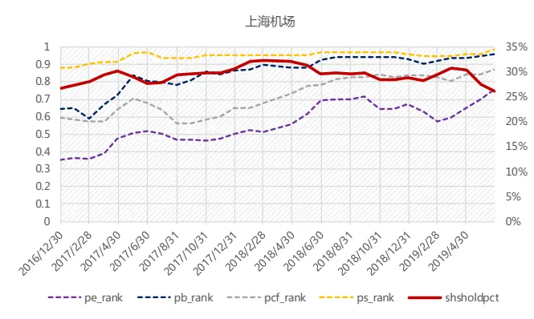
数据来源：东方证券研究所 & Wind 资讯

图 61：恒瑞医药—行业内估值分位数与其北上持股比例
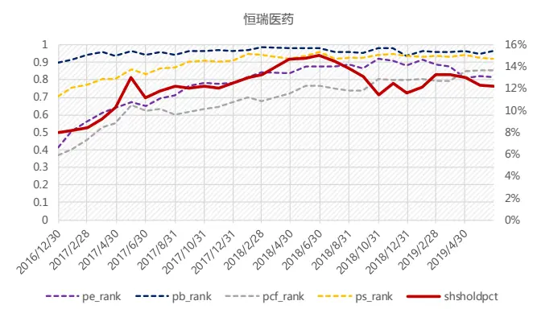
数据来源：东方证券研究所 & Wind 资讯

图 62：海康威视—行业内估值分位数与其北上持股比例
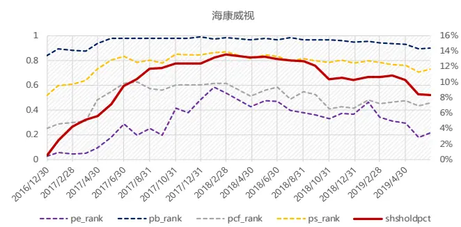
数据来源：东方证券研究所 & Wind 资讯

图 63：云南白药—行业内估值分位数与其北上持股比例
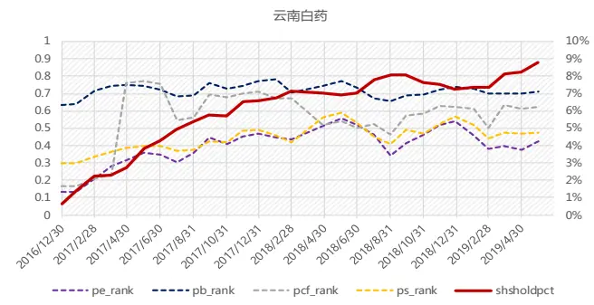
数据来源：东方证券研究所 & Wind 资讯

图 64：贵州茅台—行业内估值分位数与其北上持股比例
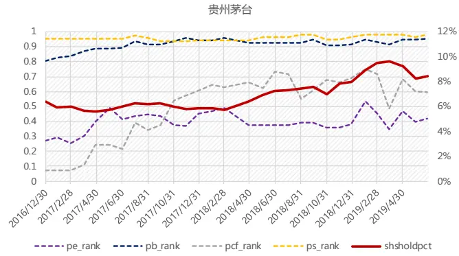
数据来源：东方证券研究所 & Wind 资讯

图 65：伊利股份—行业内估值分位数与其北上持股比例
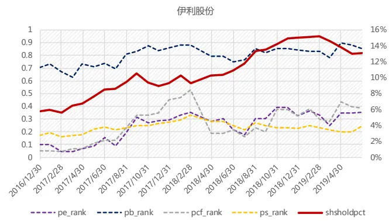
数据来源：东方证券研究所 & Wind 资讯

2. 北上资金投资逻辑相似，心仪的股票比较集中，持续资金流入使得高估值股票不一定跑输低估值股票。我们计算了北上资金的持仓分布情况，将北上资金在个股上的持股市值占当期其在全部个股上的持股市值总和的比例，作为其在个股上的持仓配置比重，将持仓配置比例占前 1%、5%、10%的个股比例求和作为其持仓集中度。可以看到，北上资金持仓非常集中且变化不大，前1%的持仓集中度就可以达到50%以上，前10%甚至可以接近90%。代表北上资金都是在集中买入头部的几十只股票。

图 66：北上资金重仓股的持仓集中度
北上资金重仓股的持仓集中度
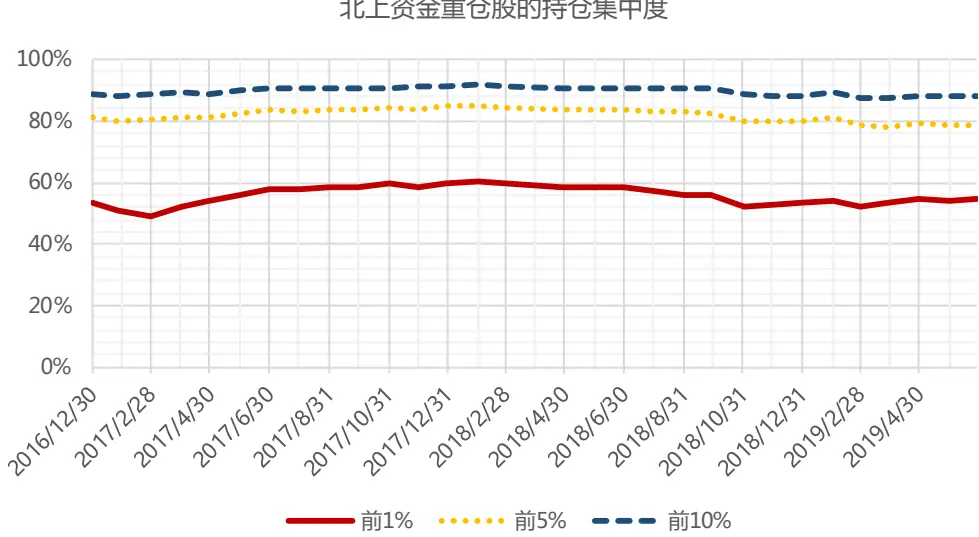
数据来源：东方证券研究所 & Wind 资讯

3. 作为对比，我们也考察了机构投资者占主导的海外成熟市场的估值因子表现。我们从对冲基金 AQR 官方网页上下载了 HML(低 PB-高 PB)因子的月度收益数据，把月度收益率累积成净值数据，并取对数以方便比较，结果如图 72 所示。我们还分别计算了金融危机前后的因子平均年收益和信息比，如图 73 所示。可以看到，在美国市场和其它成熟市场(GlobalEx US)中，金融危机后估值因子的因子收益率和信息比都出现了显著下降。未来随着 A股机构化程度和市场集中度的提升，估值因子的作用有可能进一步弱化。

图 67：全球市场选股 HML 因子表现（累积对数净值）
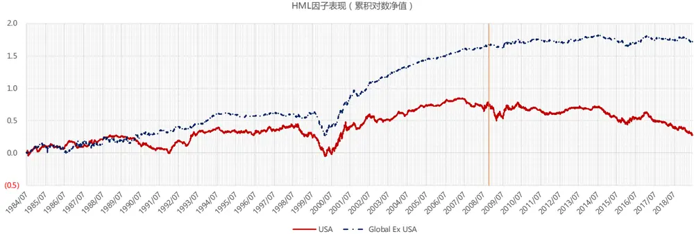
数据来源：东方证券研究所 & AQR.com

图 68：全球市场 HML因子金融危机前后表现统计

|  |  |  | USA | Global Ex USA |
| --- | --- | --- | --- | --- |
| 08年前 08年后 | 1984.07 -2008.12 | 平均年收益 | 3.2% | 7.0% |
|  |  | 信息比 平均年收益 | 0.41 -3.6% | 0.97 0.7% |
|  | 2009.01 -2018.03 | 信息比 | -0.44 | 0.17 |

数据来源：东方证券研究所 & AQR.com

## 风险提示

1. 量化模型基于历史数据分析得到，未来存在失效的风险，建议投资者紧密跟踪模型表现。

2. 极端市场环境可能对模型效果造成剧烈冲击，导致收益亏损。

## 分析师申明

每位负责撰写本研究报告全部或部分内容的研究分析师在此作以下声明：

分析师在本报告中对所提及的证券或发行人发表的任何建议和观点均准确地反映了其个人对该证券或发行人的看法和判断；分析师薪酬的任何组成部分无论是在过去、现在及将来，均与其在本研究报告中所表述的具体建议或观点无任何直接或间接的关系。

## 投资评级和相关定义

报告发布日后的 12 个月内的公司的涨跌幅相对同期的上证指数/深证成指的涨跌幅为基准；

## 公司投资评级的量化标准

买入：相对强于市场基准指数收益率 15%以上；

增持：相对强于市场基准指数收益率 5%～15%；

中性：相对于市场基准指数收益率在-5%～+5%之间波动；

减持：相对弱于市场基准指数收益率在-5%以下。

未评级 —— 由于在报告发出之时该股票不在本公司研究覆盖范围内，分析师基于当时对该股票的研究状况，未给予投资评级相关信息。

暂停评级 —— 根据监管制度及本公司相关规定，研究报告发布之时该投资对象可能与本公司存在潜在的利益冲突情形；亦或是研究报告发布当时该股票的价值和价格分析存在重大不确定性，缺乏足够的研究依据支持分析师给出明确投资评级；分析师在上述情况下暂停对该股票给予投资评级等信息，投资者需要注意在此报告发布之前曾给予该股票的投资评级、盈利预测及目标价格等信息不再有效。

## 行业投资评级的量化标准：

看好：相对强于市场基准指数收益率 5%以上；

中性：相对于市场基准指数收益率在-5%～+5%之间波动；

看淡：相对于市场基准指数收益率在-5%以下。

未评级：由于在报告发出之时该行业不在本公司研究覆盖范围内，分析师基于当时对该行业的研究状况，未给予投资评级等相关信息。

暂停评级：由于研究报告发布当时该行业的投资价值分析存在重大不确定性，缺乏足够的研究依据支持分析师给出明确行业投资评级；分析师在上述情况下暂停对该行业给予投资评级信息，投资者需要注意在此报告发布之前曾给予该行业的投资评级信息不再有效。

## HeadertTabl e_Discl ai mer 免责声明

本证券研究报告（以下简称“本报告”）由东方证券股份有限公司（以下简称“本公司”）制作及发布。

本报告仅供本公司的客户使用。本公司不会因接收人收到本报告而视其为本公司的当然客户。本报告的全体接收人应当采取必要措施防止本报告被转发给他人。

本报告是基于本公司认为可靠的且目前已公开的信息撰写，本公司力求但不保证该信息的准确性和完整性，客户也不应该认为该信息是准确和完整的。同时，本公司不保证文中观点或陈述不会发生任何变更，在不同时期，本公司可发出与本报告所载资料、意见及推测不一致的证券研究报告。本公司会适时更新我们的研究，但可能会因某些规定而无法做到。除了一些定期出版的证券研究报告之外，绝大多数证券研究报告是在分析师认为适当的时候不定期地发布。

在任何情况下，本报告中的信息或所表述的意见并不构成对任何人的投资建议，也没有考虑到个别客户特殊的投资目标、财务状况或需求。客户应考虑本报告中的任何意见或建议是否符合其特定状况，若有必要应寻求专家意见。本报告所载的资料、工具、意见及推测只提供给客户作参考之用，并非作为或被视为出售或购买证券或其他投资标的的邀请或向人作出邀请。

本报告中提及的投资价格和价值以及这些投资带来的收入可能会波动。过去的表现并不代表未来的表现，未来的回报也无法保证，投资者可能会损失本金。外汇汇率波动有可能对某些投资的价值或价格或来自这一投资的收入产生不良影响。那些涉及期货、期权及其它衍生工具的交易，因其包括重大的市场风险，因此并不适合所有投资者。

在任何情况下，本公司不对任何人因使用本报告中的任何内容所引致的任何损失负任何责任，投资者自主作出投资决策并自行承担投资风险，任何形式的分享证券投资收益或者分担证券投资损失的书面或口头承诺均为无效。

本报告主要以电子版形式分发，间或也会辅以印刷品形式分发，所有报告版权均归本公司所有。未经本公司事先书面协议授权，任何机构或个人不得以任何形式复制、转发或公开传播本报告的全部或部分内容。不得将报告内容作为诉讼、仲裁、传媒所引用之证明或依据，不得用于营利或用于未经允许的其它用途。

经本公司事先书面协议授权刊载或转发的，被授权机构承担相关刊载或者转发责任。不得对本报告进行任何有悖原意的引用、删节和修改。

提示客户及公众投资者慎重使用未经授权刊载或者转发的本公司证券研究报告，慎重使用公众媒体刊载的证券研究报告。

## 东方证券研究所

地址：上海市中山南路 318 号东方国际金融广场 26 楼

联系人： 王骏飞

电话：021-63325888*1131

传真：021-63326786

网址： www.dfzq.com.cn

Email： wangjunfei@orientsec.com.cn