## 《因子选股系列研究之 五十九》

## 研究结论

- 本篇报告基于 5 分钟的高频数据构建了跳跃 Beta 和连续 Beta 两个因子，从因子表现来看这两个因子不论原始值还是行业中性化之后在各个样本空间都具有显著的选股效果，相比常规 Beta 选股效果提升明显，而且其在大市值股票中的选股表现基本也与全市场类似。此外，这两个因子是基于过去一年的数据构建的，因此其因子衰减很慢，因子 RankIC 的半衰期大约为 9 个月。

从相关性上看，这两个因子与常规的 Beta 有着很高的相关性，说明其也属于Beta 类型的因子，但是在对常规 Beta 因子正交化之后，这两个因子仍具有较强的选股效果。此外，中性化后跳跃 Beta 与估值、非流动性、投机性的 RankIC相关性均大于 50%，而连续 Beta 仅和非流动性相关性较高。在对九大类各维度因子以及常规 Beta 做了正交化之后，跳跃 Beta 和连续 Beta 原始值的RankIC 分别为-0.028，-0.037，ICIR 分别为-2.07，-1.95；中性化后的 RankIC分别为-0.027，-0.031，ICIR 分别为-2.32，-2.18，均有着很显著的增量信息。

A 股市场的 Beta 类型因子整体表现并不特别突出，有很多因子都表现更好，不过基于 AQR 统计的结果，在美国市场和美国以外的市场中，BAB（低 Betavs. 高 Beta）组合在过去 30 年里要显著的好于 SMB（小市值 vs.大市值）组合，HML（高 BP vs. 低 BP）组合，UMD（强势股 vs. 弱势股）组合和QMJ（优质股 vs.劣质股）组合，因此我们有理由相信，随着以后 A 股逐渐与全球市场接轨，Beta 类因子应该还是会具有长期较好的选股效果的。

## 风险提示

- 极端市场环境可能对模型效果造成剧烈冲击，导致收益亏损。

- 量化模型基于历史数据分析得到，未来存在失效风险，建议投资者紧密跟踪模型表现。

## 报告发布日期

2019 年 08 月 01 日

证券分析师朱剑涛

021-63325888*6077

zhujiantao@orientsec.com.cn

执业证书编号：S0860515060001

证券分析师张惠澍

021-63325888-6123

zhanghuishu@orientsec.com.cn

执业证书编号：S0860518080001

## 1. Beta 异像

Black 等人（1972）、Millers 等人（1972）发现在美国市场中，低 beta 股票的收益要高于 CAPM 的预期，而高 beta 的股票收益要低于 CAPM 的预期，这反应出了 CAPM模型的某些不足之处。Baker等人(2011)基于美国市场1968-2008 年的数据发现过去低beta 的股票表现是要好于过去高 beta 的，这也被称为 beta异像，投资者的彩票偏好是比较主流的解释 beta 异像的原因之一。Frazzini 等人（2014）通过构建 BAB（杠杆做多低 beta 股票同时做空高 beta 的 beta 中性组合）组合来解释了 beta 异像的另一个原因：杠杆资金的限制导致了投资者很难通过杠杆做多低beta股票来放大持有组合的beta，这样就导致了他们只能买入高 beta 股票，导致高 beta 股票被高估，因此即使 BAB 组合有明显的风险调整收益，杠杆资金限制的投资者也不能进行 beta 中性套利。经作者测试除了美国市场 BAB 有显著的超额收益以外，全球大多数股票市场 BAB 组合在剥离掉 Fama-French 4 因子收益后仍具有正向的月度 ALPHA（图 1）。Asness 等人（2014）探讨了股票市场低 beta 投资相对行业、价值风格的独立性，证明了 beta 的低风险溢价主要由行业中性 BAB 贡献，而不是行业配置和价值因子。

图 1：全球多个市场 BAB 组合在剥离掉 Fama-French 4 因子后的月均 ALPHA（1984-2012）
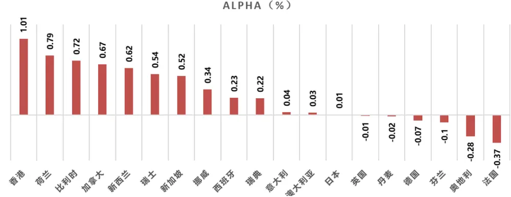
数据来源：Frazzini（2014） 东方证券研究所

传统的 CAPM 估计的 beta 虽然有着一定的选股效果，但是选股效果并不是很强。Bollerslev 等人（2003），Andersen 等人（2005,2006）基于高频数据估计出了更加准确的历史 beta。Andersen 等人(2011)基于高频数据构造已实现方差和二次幂变差，有效地将日内交易价格的方差分解为连续和跳跃的两个部分。Bollerslev 等人（2016）通过把高频的收益率数据分解成了连续和跳跃部分计算了股票和指数的连续和跳跃 beta，经测算，分解后的 beta 相比于传统的 beta 来说，能更好的解释股票的收益率。这篇报告我们基于 Bollerslev 等人（2016）中的分解方法，基于 5 分钟数据构建了连续和跳跃beta，并对这类更加精细化度量的 beta 因子表现进行了综合的测试。

## 2. Beta 的构建

## 2.1 连续 Beta 和跳跃 Beta 的定义

指数在 t 时刻的对数价格表示为 $p_{t}^{(0)}=\mathrm{Log}(P_{t}^{(0)})$ ，指数价格变动的随机微分方程可以表示为：

$$
dp_{t}^{\left(0\right)}=\alpha_{t}^{\left(0\right)}dt+\sigma_{t}^{\left(0\right)}dW_{t}+\int_{R}\ dx\tilde{\mu}\left(dt,dx\right)
$$

其中 $\alpha_{t}^{(0)}$ 为指数价格变化的漂移项， $\sigma_{t}^{(0)}dW_{t}$ 为连续的扩散项， $\tilde{\mu},$ 为衡量跳跃的变量，表示非连续的指数价格变动。个股 i 在 t 时刻的对数价格表示为 $p_{t}^{(i)}=\mathrm{Log}(P_{t}^{(i)})$ ，结合了beta 的个股价格变动的随机微分方程可以表示为：

$$
dp_{t}^{(i)}=\alpha_{t}^{(i)}dt+\beta_{t}^{(c,i)}\sigma_{t}^{(i)}dW_{t}+\int_{R}\beta_{t}^{(d,i)}x\tilde{\mu}\left(dt,dx\right)+\tilde{\sigma}_{t}^{(i)}dW_{t}^{(i)}+\int_{R}x\tilde{\mu}^{(i)}\left(dt,dx\right)\tilde{\mu}\left(dt,dx\right),
$$

其中 $\alpha_{t}^{(i)}$ dt为漂移项， $\beta_{t}^{(c,i)}$ 为股票的和市场的连续 beta，反映市场连续变化时股票的协同价格变动， $dW_{t}$ 是市场连续变化时的布朗运动，因此第二项为市场连续变化时股票价格跟随市场的连续变化，第三项为市场跳跃时股票跟随市场跳跃的过程， $\beta_{t}^{(d,i)}$ 为股票的跳跃 beta，也即市场发生跳跃时股票的价格变动情况，第四项为个股和市场连续变化正交的布朗运动，最后一项为市场不发生跳跃时个股的跳跃。

## 2.2 连续 Beta 估计

把股票第 t 天的日内价格分成 n 个间隔，则股票 i 日内第τ个时点的对谁收益率为 $r_{t:\tau}^{(i)}=$ $p_{t+\tau/n}^{(i)}-p_{t+(\tau-1)/n}^{(i)}$ ，假设市场和股票均连续，则股票的收益率可以写为：

$$
r_{s:\tau}^{(i)}=\beta_{t}^{(c,i)}r_{s:\tau}^{(0)}+\tilde{r}_{s:\tau}^{(0)}
$$

其中 $\mathrm{{s}\in[t-L,}$ t], $r_{s:\tau}^{(0)}$ 是指数的高频收益率，基于线性回归可以得到：

$$
\begin{array}{r}{\beta_{t}^{(c,i)}=\frac{\sum_{s=t-L}^{t-1}\sum_{\tau}r_{s:\tau}^{(i)}r_{s:\tau}^{(0)}}{\sum_{s=t-L}^{t-1}\sum_{\tau}\left(r_{s:\tau}^{(0)}\right)^{2}}=\frac{\sum_{s=t-L}^{t-1}\sum_{\tau}\left[\left(r_{s:\tau}^{(i)}+r_{s:\tau}^{(0)}\right)^{2}-\left(r_{s:\tau}^{(i)}+r_{s:\tau}^{(0)}\right)^{2}\right]}{4\sum_{s=t-L}^{t-1}\sum_{\tau}\left(r_{s:\tau}^{(0)}\right)^{2}}}\end{array}
$$

如果股票和市场在[t-L,t]时间段均没有发生跳跃，那么通过上述公式就可以计算连续beta，但绝大多数情况下，股票或市场会发生跳跃，因此要通过某个阈值把跳跃的部分剥离，剥离了跳跃后的连续 beta 估计公式为：

$$
\begin{array}{r}{\beta_{t}^{(c,i)}===\frac{\sum_{s=t-l}^{t-1}\sum_{\tau}\left[\left(\mathbf{r}_{s:\tau}^{(\mathrm{i})}+\mathbf{r}_{s:\tau}^{(0)}\right)^{2}\mathbf{1}_{\left\{\left.\mathbf{r}_{s:\tau}^{(\mathrm{i})}+\mathbf{r}_{s:\tau}^{(0)}\right.\leq k_{s,\tau}^{(i+0)}\right\}}-\left(\mathbf{r}_{s:\tau}^{(\mathrm{i})}+\mathbf{r}_{s:\tau}^{(0)}\right)^{2}\mathbf{1}_{\left\{\left.\mathbf{r}_{s:\tau}^{(\mathrm{i})}-\mathbf{r}_{s:\tau}^{(0)}\right.\leq k_{s,\tau}^{(i-0)}\right\}}\right]}{4\sum_{s=t-l}^{t-1}\sum_{\tau}\left(r_{s:\tau}^{(0)}\right)^{2}\mathbf{1}_{\left\{\left.\mathbf{r}_{s:\tau}^{(0)}\right.\leq k_{s,\tau}^{(0)}\right\}}}}\end{array}
$$

其中 $\vert k_{s,\tau}$ 为与收益率序列相关的阈值，基于 BoLLersLev 等人（2013）中的方法：

$$
k_{s,\tau}^{(i)}=\bar{\tau}\mathrm{n}^{-\bar{\omega}}\sqrt{\left(BV_{t}^{(i)}\wedge RV_{t}^{(i)}\right)*TOD_{\tau}^{(i)}},\tau=1,2,\ldots,n
$$

其中τ̅和ω̅都是常数，参考文献中的结果，我们设置τ̅ = 2.5， $\overline{{\omega}}=0.49$ $RV_{t}^{(i)}$ 是已实现变差，也就是一天内股票收益率的平方和，定义为：

$$
RV_{t}^{(i)}=\sum_{\tau=1}^{n}r_{t:\tau}^{(i)^{2}}
$$

$BV_{t}^{(i)}$ 是二次幂变差，也就是一天内股票收益率绝对值乘以上一时刻收益率绝对值的交叉项总和，定义为：

$$
BV_{t}^{(i)}=\frac{\pi}{2}\sum_{\tau=2}^{n}\left|r_{t:\tau}^{(i)}\right|\left|r_{t:\tau-1}^{(i)}\right|
$$

基于二次幂变差和已实现变差，可以估计股票或市场的 TOD（Time-of-Day）波动率：

$$
TOD_{\tau}^{(i)}=\frac{{n\sum_{s=t-L}^{t}{{r_{s:\tau}^{(i)}}^{2}}1(\left|{{r_{s:\tau}^{(i)}}}\right|\le{{\bar{\tau}}\mathrm{n}}^{-\bar{\omega}}\sqrt{BV_{s}^{(i)}\wedge RV_{s}^{(i)}})}}{{\sum_{s=t-L}^{t}{\sum_{\tau=1}^{n}{{r_{s:\tau}^{(i)}}^{2}}1(\left|{{r_{s:\tau}^{(i)}}}\right|\le{{\bar{\tau}}\mathrm{n}}^{-\bar{\omega}}\sqrt{BV_{t}^{(i)}\wedge RV_{t}^{(i)}})}}}
$$

其中分子上的其实是过去[t-L,t]区间的某个时间点收益率的平方和，分母是[t-L,t]区间每个时间点收益率的平方和。这个反映的是过去一段时间每个时间点的波动情况，因此TOD 的数量共有 n 个。

基于上面的公式可以看到在[t-L,t]的时间区间，股票的 $BV_{t}^{(i)}$ 和 $\boldsymbol{\ell}V_{t}^{(i)}$ 每天均有一个数值，共有 L 个， $TOD_{\tau}^{(i)}$ 则是每个时间τ均有一个数值，共有 n 个，通过 $BV_{t}^{(i)}$ $RV_{t}^{(i)}$ 和T $OD_{\tau}^{(i)}$ 的交叉相乘，就可以得到股票在[t-L,t]的时间区间上每个时间间隔的度量跳跃收益的阈值了（共 L*n 个数值），然后就可以基于这些阈值对于股票或指数在对应区间中每个时间间隔上的收益率进行划分了。

## 2.3 跳跃 Beta 估计

跳跃 beta 的估计公式为：

$$
\beta_{t}^{(d,i)}=\sqrt{\frac{\left(\sum_{s=t-l}^{t}\sum_{\tau=1}^{n}\left(r_{s:\tau}^{(i)}r_{s:\tau}^{(0)}\right)^{2}\right)}{\left(\sum_{s=t-l}^{t}\sum_{\tau=1}^{n}\left(r_{s:\tau}^{(0)}\right)^{4}\right)}}
$$

在这个公式中跳跃的收益占据主导位置，因此也不必通过上述的方法剔除掉连续部分的收益了。

## 2.4 基于贝叶斯压缩的Beta 估计

常规的 beta 是采用日频的数据基于 CAPM估计的，基于 Vasicek（1973）的研究结果，可以在常规的 beta 基础上进行贝叶斯压缩来提高 beta 在样本外的预测能力。股票 i 的压缩估计量形式上可以表示为:

$$
\beta_{i}^{shrink}\ =\lambda\cdot\beta_{i}^{prior}+(1-\lambda)\cdot\beta_{i}^{hist}
$$

其中βℎist为传统方法基于 CAPM 估算出来的 beta, $\beta_{i}^{prior}$ 为先验 beta值，这里我们取个股所在行业的平均 beta 作为压缩目标。压缩系数λ由βℎist的估计方差和 beta 先验分布的方差的相对大小决定，βℎist的估计方差越小，λ取值越小。引入先验分布，使得压缩估计量变成有偏估计，提升了 bias，但同时也降低了估计量的方差（variance），两者叠加在一起有可能提升估计量样本外的预测准确度（bias–variance tradeoff）。下面的实证数据说明了这一点。

我们将个股未来一段时间已实现的 beta 与 beta 估计值之差，作为当期个股 beta 的估计误差。由于个股情况差异较大，我们采取的方法是按照已实现的 beta 排序，将股票分组，比较各组合的估计误差。我们对比了贝叶斯压缩方法计算下的 beta 与传统 beta 的估计误差，整体来看，原有计算方法的估计误差为 34.5%，压缩后的 beta 估计误差为33%。从分组情况来看，新的估计方法也可以普遍实现估计误差的降低。这里的基于贝叶斯压缩构建的 beta 也就是我们风险模型中的 beta 因子，它对于未来的 beta 有着更好的预测作用（详见报告《东方 A 股因子风险模型（DFQ-2018）》）

图 2：不同计算方法下，beta的估计误差对比（按照已实现的 beta 从大(10)到小(1)排序）
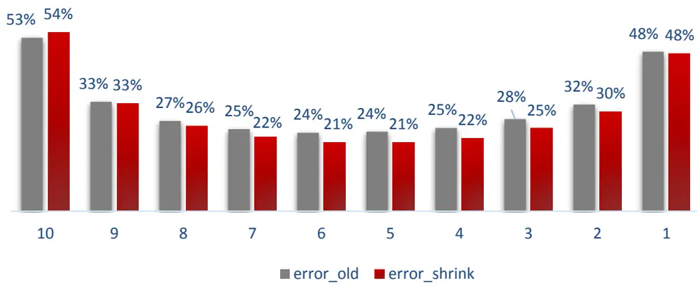
数据来源：Wind 资讯 东方证券研究所

## 3. 因子测试

## 3.1 因子表现

我们在每天基于过去 1 年的 5 分钟数据计算股票和指数的跳跃和连续 beta，加工的时候剔除了每天的 9：30 的数据。这里市场指数用的是有市场代表性的中证 800 指数，因子的构建区间为 2011.1-2019.5。同时我们还对比了同一测试区间基于 CAPM 的常规Beta 和贝叶斯压缩 Beta 的表现（基于 1 年日频数据构建）。

图 4-7 展示了 4 个 Beta 因子在中证全指、中证 1000、中证 500 和沪深300 中的表现。从结果来看，跳跃 Beta 和连续 Beta 在 4 个样本空间中均具有一定的显著选股效果，且效果均明显好于常规的 beta 或贝叶斯压缩的 beta。不过从分组超额收益看，并不是十分单调，特别是第一组超额收益要低于第二组，这种特性普遍出现在 beta 类型的因子和波动率类型的因子中。

图 3：跳跃 Beta 因子表现

|  | 原始因子 |  | 行业中性化 |  | 行业市值中性化 |  |  |  |  |
| --- | --- | --- | --- | --- | --- | --- | --- | --- | --- |
|  | RankIC | ICIR | RankIC | ICIR | RankIC | ICIR |  | 多空年化收益 多空最大回撤 多空信息比 |  |
| 沪深300 | -0.090 | -1.370 | -0.050 | -1.272 | -0.046 | -1.396 | 6.19% | -20.07% | 0.49 |
| 中证500 | -0.067 | -1.621 | -0.053 | -1.784 | -0.049 | -1.681 | 12.53% | -11.38% | 1.08 |
| 中证1000 | -0.050 | -1.749 | -0.045 | -1.885 | -0.044 | -1.916 | 8.53% | -11.14% | 0.78 |
| 中证全指 | -0.059 | -1.500 | -0.051 | -1.634 | -0.048 | -1.869 | 10.91% | -8.65% | 1.16 |

图 4：连续 Beta 因子表现

|  | 原始因子 |  | 行业中性化 |  | 行业市值中性化 |  |  |  |  |
| --- | --- | --- | --- | --- | --- | --- | --- | --- | --- |
|  | RankIC | ICIR | RankiC | ICIR | RankIC | ICIR | 多空年化收益 多空最大回撤 多空信息比 |  |  |
| 沪深300 | -0.079 | -1.177 | -0.048 | -1.144 | -0.048 | -1.343 | 9.18% | -13.41% | 0.68 |
| 中证500 | -0.053 | -1.133 | -0.041 | -1.181 | -0.046 | -1.332 | 10.35% | -11.91% | 0.75 |
| 中证1000 | -0.052 | -1.519 | -0.045 | -1.727 | -0.054 | -2.185 | 13.54% | -16.50% | 1.07 |
| 中证全指 | -0.060 | -1.487 | -0.052 | -1.626 | -0.048 | -1.580 | 11.65% | -9.85% | 1.02 |

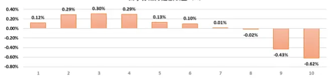

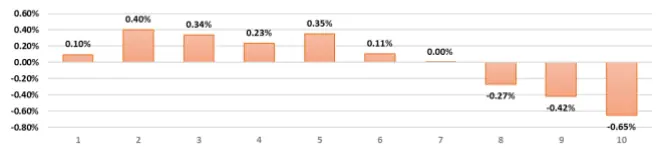

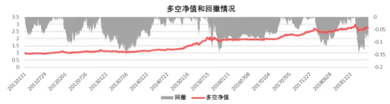
数据来源：Wind 资讯 东方证券研究所

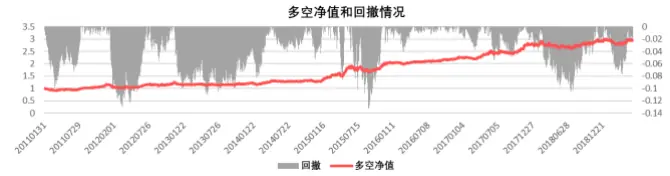
数据来源：Wind 资讯 东方证券研究所

图 5：常规 Beta 因子表现

|  | 原始因子 |  | 行业中性化 |  | 行业市值中性化 |  |  |  |  |
| --- | --- | --- | --- | --- | --- | --- | --- | --- | --- |
|  | RankIC | ICIR | RankIC | ICIR | RankIC | ICIR | 多空年化收益 多空最大回撤 多空信息比 |  |  |
| 沪深300 | -0.079 | -1.093 | -0.046 | -0.982 | -0.042 | -1.107 | 6.04% | -22.97% | 0.48 |
| 中证500 | -0.048 | -1.051 | -0.034 | -0.978 | -0.036 | -1.082 | 4.17% | -20.59% | 0.44 |
| 中证1000 | -0.026 | -0.641 | -0.021 | -0.727 | -0.031 | -1.210 | 0.68% | -20.80% | 0.12 |
| 中证全指 | -0.032 | -0.695 | -0.024 | -0.649 | -0.030 | -1.022 | 2.87% | -24.49% | 0.31 |

图 6：贝叶斯压缩 Beta 因子表现

|  | 原始因子 |  | 行业中性化 |  | 行业市值中性化 |  |  |  |  |
| --- | --- | --- | --- | --- | --- | --- | --- | --- | --- |
|  | RankIC | ICIR | RankIC | ICIR | RankIC | ICIR | 多空年化收益 多空最大回撤 多空信息比 |  |  |
| 沪深300 | -0.073 | -0.957 | -0.043 | -0.862 | -0.038 | -0.911 | 5.66% | -31.63% | 0.46 |
| 中证500 | -0.038 | -0.744 | -0.023 | -0.630 | -0.026 | -0.729 | 3.30% | -31.10% | 0.32 |
| 中证1000 | -0.017 | -0.346 | -0.006 | -0.186 | -0.017 | -0.587 | -2.90% | -28.64% | -0.17 |
| 中证全指 | -0.022 | -0.433 | -0.011 | -0.280 | -0.018 | -0.523 | -1.66% | -29.35% | -0.08 |

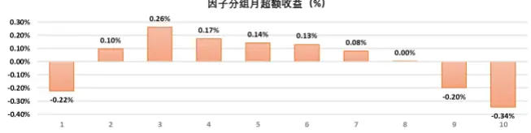

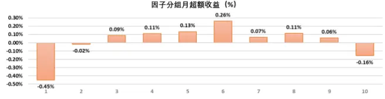

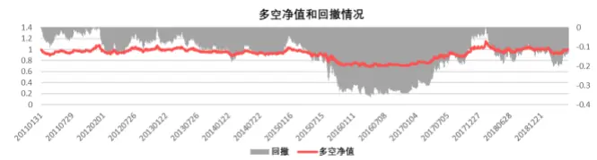
数据来源：Wind 资讯 东方证券研究所

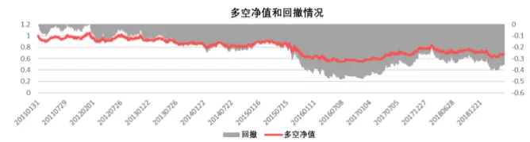
数据来源：Wind 资讯 东方证券研究所

特别值得注意的是，跳跃 beta 和连续 beta 在沪深 300 中的 RankIC 分别为-0.09 和-0.79，而行业中性化之后 RankIC 下降为-0.05 和-0.048，说明因子在沪深 300 内具有一定选行业的效果。

图 7 展示了 2019.4.30 中证全指内中信一级行业平均的跳跃、连续和常规 Beta，可以看到常规 Beta 都是介于跳跃和连续 Beta 中间的，这是因为剥离掉了跳跃项以后，个股的 Beta 基本均会低于常规的 Beta。可以看到绝大多数行业 3 种 Beta 都是同步的，但是也会出现一些不对称的特性，比如计算机行业的常规 Beta 为 1.32，非银的常规 Beta 为 1.33，两者基本相同，而其跳跃 Beta 则分别为 3.47 和 4.43，相差较大。我们以非银中的海通证券和计算机中的航天信息为例（图 8-9）,很明显可以看到（2018.4-2019.4）指数在跳跃上涨时，海通证券往往上涨幅度更大，而跳跃下跌时，海通证券的下跌幅度也更大，因此其跳跃 Beta 也就较大，但是这种日内的大幅跳价不一定与日度的价格变化有关，指数 5 分钟涨跌幅最大的两天收益分别为-0.94%和 1.33%，反而与其日内跳跃的方向相反，日内的大幅跳跃往往反映出一种日内的投机炒作行为，因此就可能会出现非银和计算机常规 Beta 相近，但是非银的跳跃 Beta 要更大的情况。

图 7：行业平均的 Beta（2019.4.30）
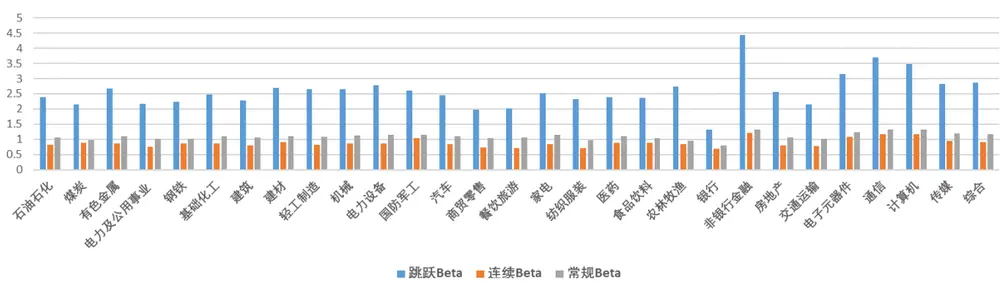
数据来源：Wind 资讯 东方证券研究所

图 8：指数 5 分钟涨幅最大时点对应的股票收益

| DATETIME | 海通证券 航天信息 |  | 指数 |
| --- | --- | --- | --- |
| 2019/2/26 9:40 | 4.6% | 1.7% | 1.1% |
| 2018/8/20 9:40 | 1.1% | 1.6% | 1.0% |
| 2018/8/16 9:40 | 0.2% | 1.3% | 0.9% |
| 2018/10/17 13:40 | 0.5% | 2.0% | 0.8% |
| 2018/10/12 9:40 | 0.5% | 0.8% | 0.8% |
| 2018/6/19 14:45 | 1.1% | 1.3% | 0.8% |
| 2018/7/6 13:10 | 0.8% | 1.8% | 0.7% |
| 2019/2/25 9:40 | 2.5% | 0.0% | 0.7% |
| 2018/11/2 13:05 | 0.8% | 0.2% | 0.7% |
| 2018/7/6 9:40 | 0.7% | 1.2% | 0.7% |

数据来源：Wind 资讯 东方证券研究所

图 9：指数 5 分钟跌幅最大时点对应的股票收益

| DATETIME 海通证券 航天信息 指数 |  |  |  |
| --- | --- | --- | --- |
| 2019/3/4 14:05 | -1.3% -0.5% -1.1% |  |  |
| 2019/2/28 9:40 | -2.8% -0.7% -0.8% |  |  |
| 2018/10/29 9:40 | -0.2% -0.6% -0.8% |  |  |
| 2019/4/29 9:45 | -2.6% -0.7% -0.8% |  |  |
| 2018/6/19 14:35 -2.0% -0.9% -0.7% |  |  |  |
| 2018/7/3 9:50 | -0.3% -0.4% -0.7% |  |  |
| 2018/10/30 9:50 -1.3% -1.7% |  |  | -0.6% |
| 2019/2/25 9:55 -1.5% |  | -1.0% | -0.6% |
| 2019/3/6 10:00 -0.8% |  | -1.0% | -0.6% |
| 2019/3/6 14:05 -0.5% |  | -0.5% | -0.6% |

数据来源：Wind 资讯 东方证券研究所

连续 beta 和跳跃 beta 是基于过去一年的 5 分钟数据构建的，因此因子衰减速度并不快，图 8 展示了行业市值中性化后因子月度 RankIC 的衰减情况（滞后期为月），可以看到基本在 9 个月左右两个因子的 RankIC 才衰减到原来的一半。

图 10：月度 RankIC 衰减情况（滞后期为月）
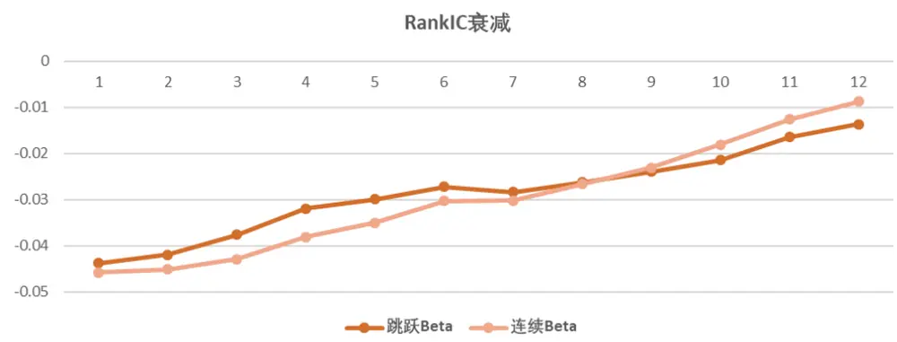
数据来源：Wind 资讯东方证券研究所

## 3.2 因子相关性分析

这里测算了连续 Beta,跳跃 Beta 和其他因子行业市值中性化以后的相关性情况（图 9），可以看到这两个 Beta 间的相关性较高，说明大多数股票价格变动是比较连续的，也就是说连续 Beta 大的股票，跳跃 Beta 也倾向于较大。此外，这两个因子和常规的 Beta 以及贝叶斯调整后的 Beta相关性也很高，说明这两个因子也确实属于 Beta 类的因子。行业市值中性化后跳跃 Beta 与其他大类因子的相关性较高，其中和估值、非流动性和投机因子的 RankIC 相关性都高于 50%，相对而言连续 Beta 和其它因子相关性要低一些，仅和非流动性因子的 RankIC 相关性高于 50%。

图 11：因子相关性情况

| 因子 | 跳跃Beta（原始值） |  | 跳跃Beta（中性化） |  | 连续Beta（原始值） |  | 连续Beta(中性化) |  |
| --- | --- | --- | --- | --- | --- | --- | --- | --- |
|  |  |  |  |  |  | 因子相关性 RankIC相关性 因子相关性 RankIC相关性 因子相关性 RankIC相关性 |  | 因子相关性 RankIC相关性 |
| 跳跃Beta |  |  |  |  | 68.7% | 80.1% | 65.5% | 79.9% |
| 连续Beta | 68.7% | 80.1% | 65.5% | 79.9% |  |  |  |  |
| 常规Beta | 52.6% | 88.9% | 45.2% | 85.2% | 66.2% | 74.7% | 64.3% | 84.5% |
| 贝叶斯调整Beta | 49.4% | 87.4% | 40.9% | 81.7% | 61.6% | 73.7% | 58.8% | 80.7% |
| 估值 | 26.4% | 64.0% | 22.7% | 51.9% | 9.7% | 22.4% | 4.4% | 11.8% |
| 盈利 | 6.8% | 23.5% | 3.1% | 6.7% | 4.0% | 34.8% | 1.8% | 25.7% |
| 成长 | -1.4% | 29.8% | -3.6% | 4.0% | -1.2% | 18.7% | -3.4% | 5.2% |
| 运营 | 7.9% | 63.5% | 6.6% | 43.5% | -0.7% | 30.0% | -1.1% | 21.6% |
| 非流动性 | 20.1% | 57.3% | 18.0% | 65.7% | 24.0% | 45.8% | 22.6% | 53.0% |
| 反转 | -10.5% | -48.7% | -7.6% | -47.1% | -11.7% | -43.0% | -11.0% | -50.4% |
| 投机 | 34.5% | 75.5% | 30.5% | 75.5% | 19.9% | 42.9% | 15.3% | 42.4% |
| 分析师 | 8.7% | 50.3% | 7.0% | 8.4% | 4.4% | 38.9% | 2.8% | 23.6% |
| 超预期 | 0.4% | 33.0% | -1.6% | 22.2% | 3.6% | 43.4% | 3.0% | 43.6% |

数据来源：东方证券研究所

可以看到基于上面的结果，跳跃和连续 Beta 与常规 Beta 的因子相关性均在 70%以上，那么为什么这两个 Beta 的选股效果要大幅好于常规 Beta呢，我们把这两个因子对 Beta 因子正交化（正交化后的表现如图 12），跳跃 Beta 正交了常规 Beta 后残差较小的股票，说明相对于其常规 Beta而言，其跳跃部分的 Beta 较低；连续 Beta 正交常规 Beta 后残差较小的股票，则说明相对于其常规 Beta 而言，其连续部分的 Beta 较低。可以看到正交化以后的跳跃和连续 Beta 仍然具有很强的选股效果，其中跳跃Beta 相对效果更好。我们以正交化之后得分较高的美的集团（2019.4.30）的特征为例，其跳跃 Beta 在市场 13%的分位水平，这反映出美的集团在日内的价格跳跃相比于同期市场跳跃较小，日内的投机特征较弱。同时，美的集团的连续 Beta 在市场 45%的分位水平，而其常规 Beta 则在市场的 72%分位水平，我们计算了美的集团日频的波动率和基于 5 分钟收益的日化波动率，发现其分别为 23.1%和 19.8%，在横向的分位水平分别为20%和 6%，也就是说美的集团的日度波动是市场偏低的，但是其日内波动相较于日间波动更低，更低的日内波动代表其在日内的价格变化中有更小的市场分歧度，投机性也相对更弱，这个特征同时也导致了其连续 Beta的市场分位小于其常规 Beta。

多空组合净值
图 12：剥离了常规 Beta 因子后连续 Beta 和跳跃 Beta 的表现

|  | 原始因子 |  | 行业市值中性化 |  |  |  |  |
| --- | --- | --- | --- | --- | --- | --- | --- |
|  | RankIC | ICIR | RankIC | ICIR |  | 多空年化收益 多空月最大回撤 多空信息比 |  |
| 跳跃Beta | -0.051 | -2.253 | -0.041 | -2.789 | 13.46% | -5.49% | 1.87 |
| 连续Beta | -0.052 | -1.653 | -0.038 | -1.618 | 13.30% | -11.79% | 1.12 |

数据来源：东方证券研究所

图 13：剥离了各大类因子后连续 Beta 和跳跃 Beta 的表现

|  | 原始因子 |  | 行业市值中性化 |  |  |  |  |
| --- | --- | --- | --- | --- | --- | --- | --- |
|  | RankIC | ICIR | RankIC | ICIR | 多空年化收益 | 多空月最大回撤 | 多空信息比 |
| 跳跃Beta | -0.028 | -2.073 | -0.027 | -2.324 | 10.02% | -4.66% | 1.66 |
| 连续Beta | -0.037 | -1.950 | -0.031 | -2.177 | 9.71% | -5.25% | 1.42 |

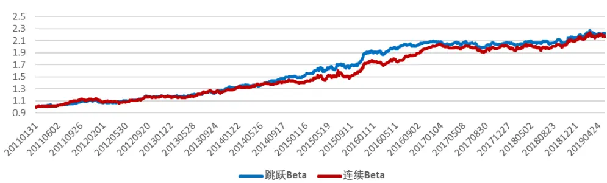
数据来源：Wind 资讯 东方证券研究所

我们进一步通过 Fama-Macbeth 回归的方式从跳跃 Beta 和连续 Beta 中剥离掉九大类因子和常规 Beta 因子，正交化以后的因子原始值和行业市值中性化后的表现如图 13 所示，可以看到不论是原始值还是中性化之后，因子仍然具有显著的选股效果，跳跃 Beta相对于连续 Beta 的增量信息更多，有着相对更好的选股效果。

## 3.3 其他市场beta因子表现

本文主要通过高频数据构建了跳跃 beta 和连续 beta，从因子表现来看，这两个因子与常规的 Beta 同属于 Beta 因子，但是表现要远好于常规的 Beta 因子。虽然综合来看，Beta 类型的因子在 A 股表现并不算很出色，相较之下有很多因子的表现都要好于这类因子，但从海外市场的近 30 年的表现来看，Beta 类型的因子A 股以外的市场中还是有着长期出色的表现的。

这里展示了 AQR 网站上统计的常规因子表现的结果，这些因子组合包括：BAB（低 Betavs. 高 Beta）组合，SMB（小市值 vs.大市值）组合，HML（高 BP vs. 低 BP）组合，UMD（强势股 vs. 弱势股）组合，QMJ（优质股 vs.劣质股）组合，详细的计算规则可以参考 Asness(2017b)和 Frazzini(2014)。基于这些因子月度收益的结果，我们绘制美国市场和美国市场以外各类因子多空组合的累积净值图（图 14），从结果可以看到 BAB组合不论是在美国市场还是美国以外的市场在过去 30 年里都是五类因子中长期表现最好的。因此我们有理由相信，随着以后 A 股逐渐与全球市场接轨，投资这结构和行为发生变化，Beta 类因子应该还是会具有长期较好的选股效果。

图 14：美国市场和美国市场以外的常规因子多空累积净值
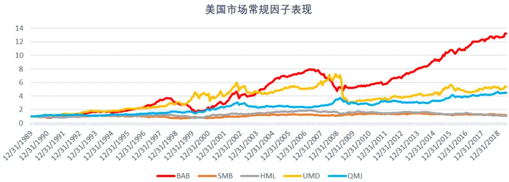

美国以外市场常规因子表现
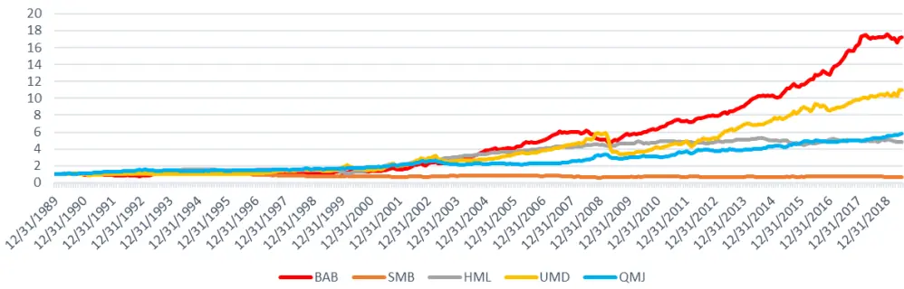
数据来源：AQR 网站 东方证券研究所

## 4. 总结

本篇报告基于 5 分钟的高频数据构建了连续 Beta 和跳跃 Beta 两个因子，从整体看这两个因子在各个样本空间都具有比常规 Beta 更强的选股效果，而且其在大市值股票中的选股表现基本也与全市场类似。这两个Beta因子是根据过去一年的5分钟数据构建的，因此其 RankIC 衰减很慢，大约 9 个月的滞后期后，其 RankIC 衰减到原来的一半。

从相关性上看，这两个因子与常规的 Beta 有着很高的相关性，说明其也属于 Beta 类型的因子。此外，中性化后跳跃 Beta 与估值、非流动性、投机性的 RankIC 相关性均大于50%，而连续 Beta 仅和非流动性相关性较高。在对九大类各维度因子以及常规 Beta 做了正交化之后，跳跃 Beta 和连续 Beta 原始值的 RankIC 分别为-0.028，-0.037，ICIR分别为-2.07，-1.95；中性化后的 RankIC 分别为-0.027，-0.031，ICIR 分别为-2.32，-2.18，均有着很显著的增量信息。

我们还展示了常规因子在美国市场和美国以外市场中过去 30年的表现，BAB（低 Betavs. 高 Beta）组合在五种类型的常规因子中均表现的最好，因此我们有理由相信，随着以后 A 股逐渐与全球市场接轨，Beta 类因子应该还是会具有长期较好的选股效果的。

## 风险提示

- 极端市场环境可能对模型效果造成剧烈冲击，导致收益亏损。

- 量化模型基于历史数据分析得到，未来存在失效风险，建议投资者紧密跟踪模型表现。

## 参考文献

APA Baker, M. , & Wurgler, B. J. . (2011). Benchmarks as limits to arbitrage: understanding the low-volatility anomaly. Financial Analysts Journal, 67(1), 40-54.

Bollerslev, T. , Todorov, V. , & Li, S. Z. . (2013). Jump tails, extreme dependencies, and the distribution of stock returns. Journal of Econometrics, 172(2), 307-324.

Bollerslev, T. , Li, S. Z. , & Todorov, V. . (2016). Roughing up beta: continuous versus discontinuous betas and the cross section of expected stock returns. Journal of Financial Economics, S0304405X16300010.

Frazzini, A., & Pedersen, L. H. (2014). Betting against beta. Journal of Financial Economics, 111(1), 1-25.

Todorov, V. , & Bollerslev, T. . (2010). Jumps and betas: a new framework for disentangling and estimating systematic risks. Journal of Econometrics, 157(2), 220-235.

## 分析师申明

每位负责撰写本研究报告全部或部分内容的研究分析师在此作以下声明：

分析师在本报告中对所提及的证券或发行人发表的任何建议和观点均准确地反映了其个人对该证券或发行人的看法和判断；分析师薪酬的任何组成部分无论是在过去、现在及将来，均与其在本研究报告中所表述的具体建议或观点无任何直接或间接的关系。

## 投资评级和相关定义

报告发布日后的 12 个月内的公司的涨跌幅相对同期的上证指数/深证成指的涨跌幅为基准；

## 公司投资评级的量化标准

买入：相对强于市场基准指数收益率 15%以上；

增持：相对强于市场基准指数收益率 5%～15%；

中性：相对于市场基准指数收益率在-5%～+5%之间波动；

减持：相对弱于市场基准指数收益率在-5%以下。

未评级 —— 由于在报告发出之时该股票不在本公司研究覆盖范围内，分析师基于当时对该股票的研究状况，未给予投资评级相关信息。

暂停评级 —— 根据监管制度及本公司相关规定，研究报告发布之时该投资对象可能与本公司存在潜在的利益冲突情形；亦或是研究报告发布当时该股票的价值和价格分析存在重大不确定性，缺乏足够的研究依据支持分析师给出明确投资评级；分析师在上述情况下暂停对该股票给予投资评级等信息，投资者需要注意在此报告发布之前曾给予该股票的投资评级、盈利预测及目标价格等信息不再有效。

## 行业投资评级的量化标准：

看好：相对强于市场基准指数收益率 5%以上；

中性：相对于市场基准指数收益率在-5%～+5%之间波动；

看淡：相对于市场基准指数收益率在-5%以下。

未评级：由于在报告发出之时该行业不在本公司研究覆盖范围内，分析师基于当时对该行业的研究状况，未给予投资评级等相关信息。

暂停评级：由于研究报告发布当时该行业的投资价值分析存在重大不确定性，缺乏足够的研究依据支持分析师给出明确行业投资评级；分析师在上述情况下暂停对该行业给予投资评级信息，投资者需要注意在此报告发布之前曾给予该行业的投资评级信息不再有效。

## HeadertTabl e_Discl ai mer 免责声明

本证券研究报告（以下简称“本报告”）由东方证券股份有限公司（以下简称“本公司”）制作及发布。

本报告仅供本公司的客户使用。本公司不会因接收人收到本报告而视其为本公司的当然客户。本报告的全体接收人应当采取必要措施防止本报告被转发给他人。

本报告是基于本公司认为可靠的且目前已公开的信息撰写，本公司力求但不保证该信息的准确性和完整性，客户也不应该认为该信息是准确和完整的。同时，本公司不保证文中观点或陈述不会发生任何变更，在不同时期，本公司可发出与本报告所载资料、意见及推测不一致的证券研究报告。本公司会适时更新我们的研究，但可能会因某些规定而无法做到。除了一些定期出版的证券研究报告之外，绝大多数证券研究报告是在分析师认为适当的时候不定期地发布。

在任何情况下，本报告中的信息或所表述的意见并不构成对任何人的投资建议，也没有考虑到个别客户特殊的投资目标、财务状况或需求。客户应考虑本报告中的任何意见或建议是否符合其特定状况，若有必要应寻求专家意见。本报告所载的资料、工具、意见及推测只提供给客户作参考之用，并非作为或被视为出售或购买证券或其他投资标的的邀请或向人作出邀请。

本报告中提及的投资价格和价值以及这些投资带来的收入可能会波动。过去的表现并不代表未来的表现，未来的回报也无法保证，投资者可能会损失本金。外汇汇率波动有可能对某些投资的价值或价格或来自这一投资的收入产生不良影响。那些涉及期货、期权及其它衍生工具的交易，因其包括重大的市场风险，因此并不适合所有投资者。

在任何情况下，本公司不对任何人因使用本报告中的任何内容所引致的任何损失负任何责任，投资者自主作出投资决策并自行承担投资风险，任何形式的分享证券投资收益或者分担证券投资损失的书面或口头承诺均为无效。

本报告主要以电子版形式分发，间或也会辅以印刷品形式分发，所有报告版权均归本公司所有。未经本公司事先书面协议授权，任何机构或个人不得以任何形式复制、转发或公开传播本报告的全部或部分内容。不得将报告内容作为诉讼、仲裁、传媒所引用之证明或依据，不得用于营利或用于未经允许的其它用途。

经本公司事先书面协议授权刊载或转发的，被授权机构承担相关刊载或者转发责任。不得对本报告进行任何有悖原意的引用、删节和修改。

提示客户及公众投资者慎重使用未经授权刊载或者转发的本公司证券研究报告，慎重使用公众媒体刊载的证券研究报告。

## 东方证券研究所

地址：上海市中山南路 318 号东方国际金融广场 26 楼

联系人： 王骏飞

电话：021-63325888*1131

传真：021-63326786

网址： www.dfzq.com.cn

Email： wangjunfei@orientsec.com.cn