## 因子选股系列研究之 六十

## 研究结论

- 股票的任何一笔成交价格都是买卖双方撮合的结果，股票价格的变动与股票的买压与卖压密切相关，如果买压较大，价格大概率上涨，如果卖压较大，价格大概率下跌。

- 如果股票的买压较大，有投资者择机逢低买入，那么股票在价格低位的成交量相对较大，反之卖压较大，则股票在价格高位的成交量较大。反过来，我们也可以通过股票价格和成交量的关系去捕捉股票的买压和卖压。

- 投资者逢低买入或者逢高卖出是个自适应的过程，即使投资者不能够事先判断局部高位、或者局部低位，也能通过自己的交易行为实现。

- 价格和成交量的关系会影响股票成交量加权价格 vwap 的水平，基于这种联系，我们提出了 APB 指标用于捕捉股票的买卖压力，APB 是等权加权均价和成交量加权均价之比的对数。

- 考虑到不同投资者交易的时间尺度有所差异，我们基于月度、5 个交易日、日内三个时间尺度分别构建了 APB_1m、APB_5d、APB_1d 共3 个度量不同时间尺度的买卖压力因子。

所有买卖压力因子均有显著的截面选股效果，过去一个月买压大的股票显著跑赢卖压大的股票，其中 APB_5d 在全市场中性化后的月度 RankIC 均值9.07%，IC_IR 为 4.59，多空月均收益 2.26%，APB_1d 月度 RankIC 均值7.87%，IC_IR 为 4.87，多空月均收益 2.31%。

- 从因子表现来看，基于月度周期度量的 APB 因子弱于基于 5日周期、日内的APB，所有的买卖压力因子在各个样本空间内表现差异不大，在大市值股票中也有十分强的选股效果，比如 APB_5d 因子在沪深 300 和中证 1000 中原始值月均 RankIC 均值分别为 8.28%和 9.16%。

- 同样基于日度数据计算的 APB_1m 和 APB_5d 相关性较高，但基于日内度量的买卖压力因子和基于日线度量的买卖压力因子相关性很低，两者之间可以很好相互补充。

- 从相关系数看，买卖压力因子和估值、成长、盈利等基本面相关因子几乎没有任何相关性，和流动性、反转、投机等技术面因子相关性也不高，回归剔除其他各大类因子后依然有显著的选股效果。

## 风险提示

- 量化模型失效风险

- 市场极端环境的冲击

报告发布日期2019 年 10 月 29 日

证券分析师 朱剑涛021-63325888*6077zhujiantao@orientsec.com.cn执业证书编号：S0860515060001

证券分析师王星星021-63325888-6108wangxingxing@orientsec.com.cn执业证书编号：S0860517100001

联系人 王星星 021-63325888-6108 wangxingxing@orientsec.com.cn

## 一、量价关系与买卖压

## 1.1 市场微观分析

从微观上看，股票的任何一笔成交价格都是买卖双方撮合的结果，在某一特定价格区域，如果买盘量大于卖盘量，低价位卖盘撮合完成后会撮合高价位的卖盘，最终成交价格上涨，相反卖盘量大于买盘，最终成交价格下跌。

我们假设市场上分成两类投资者 A 和 B，在某一时间区间内对某只股票，A 类投资者已经根据事先的研究判断决定了买卖方向，等待交易时机，该类投资者一般着眼于中长期，B 类交易者对股票没有方向判别，相机而动，属于噪音交易者或者专注于短期投机、短期套利的投资者。从以上的分析我们可以看出，来自 B 类投资者关注的视野较短，买盘或者卖盘不稳定，买卖的连续性不高，因此本期的买盘卖盘对未来影响不大。我们重点关注 A 类投资者，假设投资者已经确定在某时间区间内买入某只股票，那么一个理性的投资者应该在区间内逢低买入，这样就会造成在区间内价格相对较低的位置成交量大，价格相对较高时成交量小，相反 A 类投资者卖出时，成交量在价格较高时较大，价格较低时成交量小。通过对 A 类投资者交易行为分析，我们发现当 A类投资者买入时，股票在价格低位的成交量相对于价格高位的成交量大，当 A类投资者卖出时，股票在价格低位的成交量相对价格高位的低。

最后，我们要说明的是 A 类投资者如何识别当前价格是区间内低位还是区间内高位，从技术上讲，投资者只能从左侧看是不是高位或者低位，如果 A 类投资者在左侧高位卖出时，股票价格会向下承压，这样从右侧看处于高位的可能性也较大，相反，如果 A 类投资者在左侧低位买入，股票大概率会上涨，这样从右侧看处于低位的可能性也较大。因此，A 类投资者逢低买入或者逢高卖出是个自适应的过程，即使投资者不能够事先判断局部高位、或者局部低位，也能通过自己的交易行为实现。

图 1：两类投资者的特点

## A类投资者

- 事先既定交易方向

- 等待交易时机

- 着眼于中长期

- 买卖盘稳定性高

- 对后期股价影响大

## B类投资者

- 事先没有交易方向

- 即时完成交易

- 着眼于短期

- 买卖盘不稳定

- 对后期股价影响小

数据来源：东方证券研究所

综上，如果在在某一区间内 A 类投资者持续买入，那么成交量在价格低位相对较大，如果持续卖出，那么成交量在价格高位相对较大。因此，我们就可以根据股票价格和成交量的关系来度量 A 类投资者是买卖压力，考虑到 A 类投资者的投资尺度相对较长，买卖持续性较强，买入压力较大的股票后期相对收益可能更高，卖出压力较大的股票后期相对收益可能更低。

## 1.2 买卖压力度量

上一小节的分析指出，可以通过股票价格和成交量的关系来度量 A 类投资者的买卖压力，成交量在价格高位相对更大时卖压较大，成交量在价格低位相对更大时买压更大。

成交量和价格的关系会直接影响到区间内成交量加权价格 vwap 的大小，假设成交量和价格没有关系，每个交易日成交量一样，那么区间内价格均值就是每个交易日价格的简单平均，如果价格高位的成交量大，那么区间内 vwap 较高，如果价格低位的成交量大，那么区间内 vwap 较低。基于这个思路我们提出了一种度量股票买卖压力的方法，股票 i 在第 m 个月的均价偏差（average price bias, APB）定义如下：

$$
APB_{i,m}=ln\left(\frac{\frac{1}{T}\sum_{t=1}^{T}vwap_{i,m}^{t}}{\frac{1}{\sum_{t=1}^{T}volu_{i,m}^{t}}\sum_{t=1}^{T}volu_{i,m}^{t}\cdot vwap_{i,m}^{t}}\right)^{\frac{1}{2}}
$$

其中， $vwap_{i,m}^{t}$ 表示股票 i 在第 m 个月份第 t 个交易日的 vwap 均价， $volu_{i,m}^{t}$ 表示股票 i在第 m 个月份第 t 个交易日的成交量，这里均价和成交量都经过复权调整，股票 i 在第 m个月有 T个交易日，考虑到数据分布，指标取对数化处理。

APB 定义中的分子是各个交易日 vwap 的算术平均值，分母是各个交易日成交量加权的均值，也就是这个月度区间内的 vwap。如果股票在价格高位成交量大，那么成交量加权的均值大于算术平均，APB 取值小于零，相反，如果股票在价格低位成交量大，那么成交量加权的均值小于算术平均，APB 取值大于零，APB 取值越大，股票面临的买压越大，卖压越小。

从 20100630 至 20190930 的月度 APB 因子分布来看，APB 因子均值-1.03%，中位数-0.65%，因子值86.3%均小于零，APB 小于零意味着股票成交量在价格高位时更大，在价格低位时成交量更小，这可能和投资者的处置效应有关。

图 2：APB 月度因子分布（20100630-20190930）
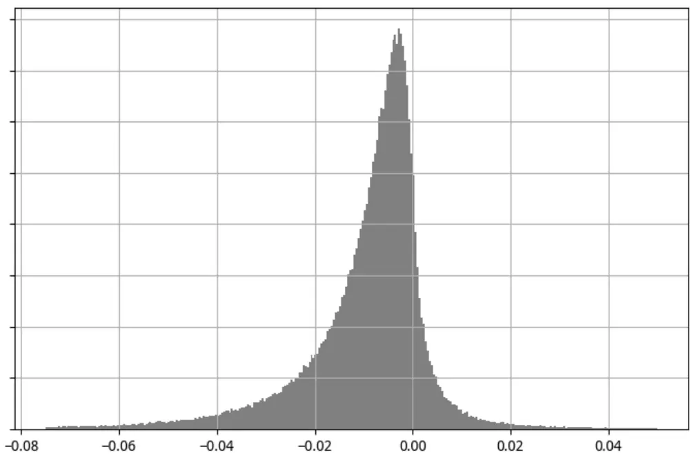
数据来源：wind 咨询，东方证券研究所

## 1.3 交易时间尺度的影响

1.2 节中阐述的因子度量以月度为周期，意味着投资者在“相机交易”时考察的时间维度是一个月，然而从我们跟客户的实际交流情况来看，大多数客户留给交易的时间窗口都没有这么长，一般当天或者一周左右的窗口期比较常见，为了和实际交易窗口期相一致，我们也在日内和 5 个交易日两个时间窗口下度量股票的买卖压力。

## 基于日内的指标度量

APB_1d：每日基于日内 5 分钟 K 线度量 APB（5 分钟等权加权均价和成交量加权均价之比的对数），过去 1 个月求均值。（理论上讲，日内成交量在时间上的分布有“volumesmile”现象，因此日内APB计算时分子上采用smile加权的均价更加合理，该方案我们也有过测算，但对结果影响不大，考虑到计算便捷性，本次还是采用等权加权）

## 基于5 个交易日的指标度量

APB_5d：基于过去5 个交易日滚动计算 APB，过去 1 个月求均值。

## 基于月度周期的指标度量

为方便表示，1.2 节中提出基于月度周期计算的 APB 因子我们分别记为 APB_1m，APB_1m、APB_5d、APB_1d共 3 个买卖压力因子虽然关注的交易窗口期不同，但都是基于过去 1 个月的行情数据计算。

## 二、买卖压力因子的表现

## 2.1 数据与说明

由于部分因子计算涉及分钟数据，考虑到数据可获得性，我们因子检验的时间起止于2010 年 6 月至 2019 年 9 月。本文主要考察因子在全市场（同期中证全指成分股）的表现，同时在“因子表现汇总”章节列出了各个压力因子在各个样本空间的表现。因子检验基于传统的 RankIC 和因子分组两种方案，因子分组时根据因子原始值或者因子行业市值调整值分为 10 组，并基于此构建多空组合。

## 2.2 因子表现汇总

对比各个买卖压力因子在各个样本空间的表现，我们不难有如下发现：

（1）所有压力相关因子均有显著的截面选股效果，过去一个月买压大的股票显著跑赢卖压大的股票，结果复合我们第一章的预期。

（2）基于月度周期计算的 APB 因子在选股表现上略弱于基于 5 日滚动和日内计算的结果，这应证了我们前面的分析，从交易层面来看，当日和一周左右的时间窗口更加合适。

（3）各个压力因子在各个样本空间内表现相差不大，各个因子在沪深 300、中证 500 和中证 1000 等市值差异较大的样本空间内 RankIC 差异很小。

图 3：买卖压力因子在各个样本空间表现汇总
因子 APB-1m：

|  | 原始因子 |  | 行业市值中性化因子 |  |  |  |  |  |  |
| --- | --- | --- | --- | --- | --- | --- | --- | --- | --- |
|  | RankIC IC_IR | t_value | IC | IC_IR | t_value | 多空月收益 | 夏普率 | 月胜率 | 最大回撤 |
| 中证全指 | 7.22% | 2.66 8.10 | 7.34% | 3.92 | 11.91 | 1.76% | 2.49 | 77.48% | -8.99% |
| 沪深300 | 7.42% | 1.81 5.50 | 5.21% | 2.44 | 7.43 | 1.35% | 1.66 | 66.67% | -11.99% |
| 中证500 | 6.47% | 2.22 6.75 | 5.22% | 2.46 | 7.48 | 0.71% | 0.83 | 60.36% | -19.48% |
| 中证800 | 6.88% | 2.08 6.34 | 5.50% | 2.83 | 8.60 | 1.11% | 1.54 | 70.27% | -11.38% |
| 中证1000 | 7.56% | 3.08 9.36 | 7.14% | 3.64 | 11.08 | 1.58% | 2.01 | 75.68% | -14.22% |

因子 APB-5d：

|  | 原始因子 |  |  | 行业市值中性化因子 |  |  |  |  |  |  |
| --- | --- | --- | --- | --- | --- | --- | --- | --- | --- | --- |
|  | RankIC | IC_IR | t_value | IC | IC_IR t_value |  | 多空月收益 | 夏普率 | 月胜率 | 最大回撤 |
| 中证全指 | 8.84% | 2.85 | 8.67 | 9.07% | 4.59 | 13.96 | 2.26% | 3.01 | 85.59% | -6.62% |
| 沪深300 | 8.28% | 1.88 | 5.73 | 6.50% | 2.99 | 9.08 | 1.59% | 1.87 | 64.86% | -15.06% |
| 中证500 | 8.03% | 2.46 | 7.47 | 7.37% | 3.25 | 9.88 | 1.39% | 1.55 | 72.07% | -15.37% |
| 中证800 | 8.01% | 2.14 | 6.51 | 7.13% | 3.45 | 10.49 | 1.59% | 1.87 | 73.87% | -15.76% |
| 中证1000 | 9.16% | 3.40 | 10.34 | 8.89% | 4.33 | 13.16 | 2.16% | 2.76 | 81.08% | -8.14% |

因子 APB-1d：

|  | 原始因子 |  |  | 行业市值中性化因子 |  |  |  |  |  |  |
| --- | --- | --- | --- | --- | --- | --- | --- | --- | --- | --- |
|  | RankIC IC_IR |  | t_value | IC | IC_IR | t_value | 多空月收益 | 夏普率 | 月胜率 | 最大回撤 |
| 中证全指 | 8.17% | 3.67 | 11.15 | 7.87% | 4.87 | 14.82 | 2.31% | 3.48 | 87.39% | -10.28% |
| 沪深300 | 7.93% | 1.95 | 5.94 | 5.74% | 2.73 | 8.31 | 1.23% | 1.54 | 67.57% | -10.87% |
| 中证500 | 7.83% | 2.92 | 8.88 | 7.67% | 3.76 | 11.44 | 2.19% | 2.50 | 79.28% | -12.55% |
| 中证800 | 8.01% | 2.74 | 8.34 | 7.12% | 3.88 | 11.79 | 2.02% | 2.96 | 83.78% | -9.14% |
| 中证1000 | 8.23% | 3.41 | 10.36 | 7.86% | 4.17 | 12.67 | 2.39% | 3.07 | 84.68% | -11.23% |

数据来源：wind 咨询，东方证券研究所

## 2.3 因子分组收益

从各个压力因子在中证全指成分股内分组年化收益来看，各分组收益基本满足单调性，买入压力大的股票未来收益更高，但所有因子的空头端收益要大幅强于多头端收益，和绝大多数技术类 alpha 因子，空头对收益贡献更大。

图 4：因子 APB-1m 分组年化收益（中证全指，中性化）
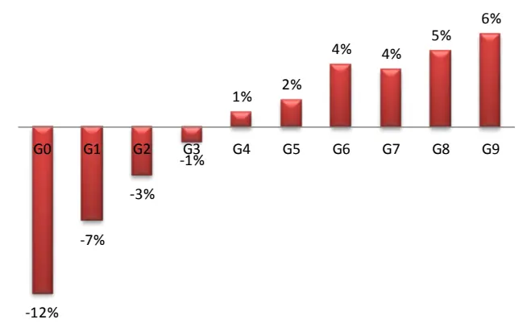
数据来源：wind 咨询，东方证券研究所

图 5：因子 APB-5d 分组年化收益（中证全指，中性化）
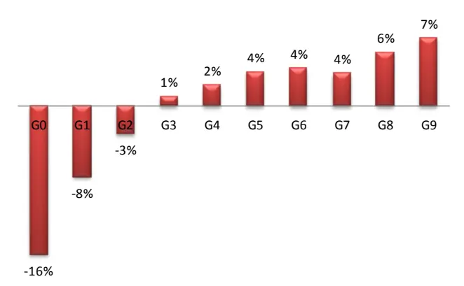
数据来源：wind 咨询，东方证券研究所

图 6：因子 APB-1d 分组年化收益（中证全指，中性化）
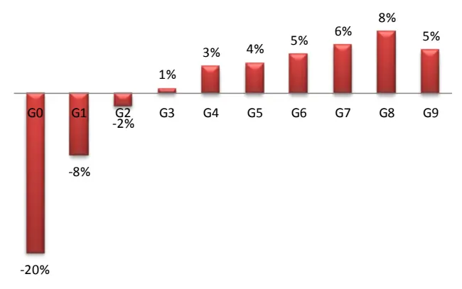
数据来源：wind 咨询，东方证券研究所

## 2.4 时间序列表现

从各个压力因子的时间序列表现来看，最近 3 年因子表现并没有明显减弱的迹象，长期来看总体比较文件，局部来看各个压力因子在 2014 年、2015 年有较大回撤，基于日内数据计算的买卖压力因子今年以来也有不小回撤。

图 7：因子 APB-5d 时间序列表现（中证全指，中性化）
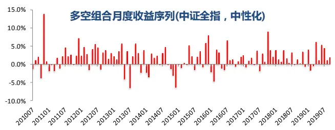

图 8：因子 APB-5d 时间序列表现（中证全指，中性化）
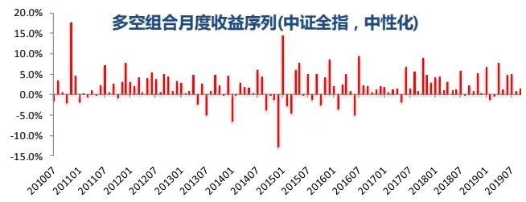

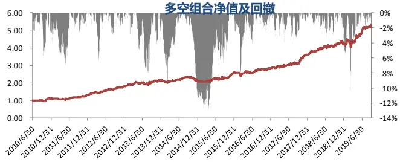
数据来源：wind 咨询，东方证券研究所

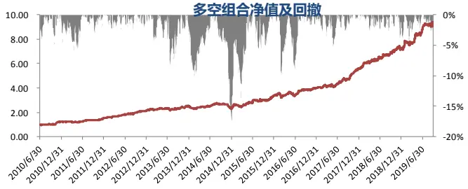
数据来源：wind 咨询，东方证券研究所

图 9：因子 APB-1d 时间序列表现（中证全指，中性化）
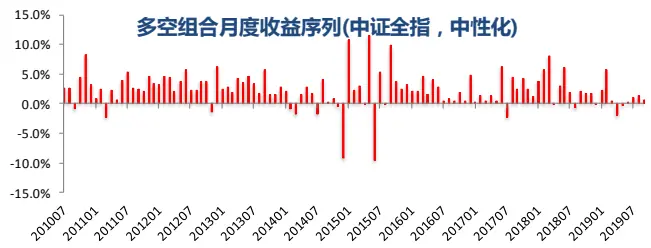

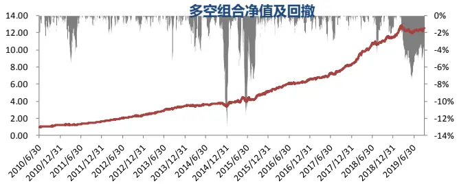
数据来源：wind 咨询，东方证券研究所

## 三、因子相关性分析

## 3.1 数据与说明

本章考察 3 个压力因子内部的相关性关系以及压力因子和其他常见技术类因子、各大类alpha 的相关性，考察时间区间同样是 2010 年 6 月至 2019年 9 月，样本空间为同期中证全指成分股（由于部分因子在金融股中取值无意义，这里样本空间剔除金融股），无特殊说明因子值均经过行业市值调整。因子两两分层时根据分层因子把样本空间分为 10 层，每一层内根据考察因子分为 10 组，汇总所有层的第 1 组和第 10 组，构建多空收益。

## 3.2 因子相关系数

从因子间的两两相关系数来看，我们有如下几点发现：

（1）从因子值看压力类因子和基本因子没有任何相关相关性，从因子表现看两者相关性也较弱。

（2）基于日内计算的两个压力因子 APB_1d 和基于日线计算的压力因子 APB_1m、APB_5d 相关性相对较弱，但同样是基于日线计算的 APB_1m 和 APB_5d 高度相关，说明采用不同的数据频率捕捉不同周期下的买卖压力可以获得多维度的 alpha 信息。

（3）压力类因子和流动性、反转、投机性指标有弱相关性，但从因子表现来看基于日内计算的压力因子和基于日线计算的压力因子与常见技术指标相关性的差异较大，但相关性水平总体不高。

图 10：压力因子与常见大类因子的相关性（左下因子值，右上 RankIC）

| ValueProfitability Growth Governance |  |  |  |  | Illiquidity Reversal |  | Lottery | Analyst | Surprise | APB 1mAPB_5d |  | APB_1d |
| --- | --- | --- | --- | --- | --- | --- | --- | --- | --- | --- | --- | --- |
| Value |  | -0.172 | -0.007 | 0.510 | 0.374 | -0.012 | 0.715 | 0.225 | -0.107 | 0.067 | 0.136 | -0.123 |
| Probability | 0.276 |  | 0.396 | 0.079 | -0.157 | -0.180 | -0.278 | 0.592 | 0.684 | 0.056 | 0.182 | 0.288 |
| Growth | 0.130 | 0.266 |  | -0.063 | -0.031 | -0.224 | -0.101 | 0.491 | 0.712 | 0.012 | 0.133 | 0.065 |
| Governance | 0.228 | 0.102 | -0.020 |  | 0.146 | 0.132 | 0.306 | 0.263 | -0.048 | 0.072 | 0.149 | 0.066 |
| Illiquidity | 0.148 | -0.029 | -0.040 | 0.053 |  | -0.056 | 0.803 | 0.114 | 0.036 | 0.462 | 0.577 | 0.093 |
| Reversal | 0.070 | -0.068 | -0.134 | 0.025 | 0.230 |  | -0.128 | -0.116 | -0.427 | 0.000 | 0.192 | 0.439 |
| Lottery | 0.367 | 0.011 | -0.023 | 0.103 | 0.553 | 0.154 |  | 0.070 | -0.109 | 0.377 | 0.346 | -0.170 |
| Analyst | 0.282 | 0.295 | 0.210 | 0.075 | 0.025 | -0.004 | 0.077 |  | 0.545 | 0.238 | 0.366 | 0.292 |
| Surprise | 0.026 0.185 |  | 0.517 | -0.025 | -0.048 | -0.171 | -0.050 | 0.183 |  | 0.120 | 0.181 | 0.112 |
| APB_1m | 0.073 | 0.071 | 0.027 | 0.028 | 0.333 | 0.157 | 0.297 | 0.112 | 0.020 |  | 0.768 | 0.228 |
| APB_5d | 0.105 | 0.077 | 0.022 | 0.037 | 0.398 | 0.323 | 0.349 | 0.132 | 0.007 | 0.692 |  | 0.466 |
| APB 1d 0.079 0.079 |  |  | 0.017 | 0.030 | 0.235 | 0.276 | 0.138 0.104 |  | 0.021 | 0.213 | 0.372 |  |

注：相关系数算法采用 spearman 秩相关系数
数据来源：wind 咨询，东方证券研究所

图 11：压力因子与常见技术类因子的相关性（左下因子值，右上 RankIC）
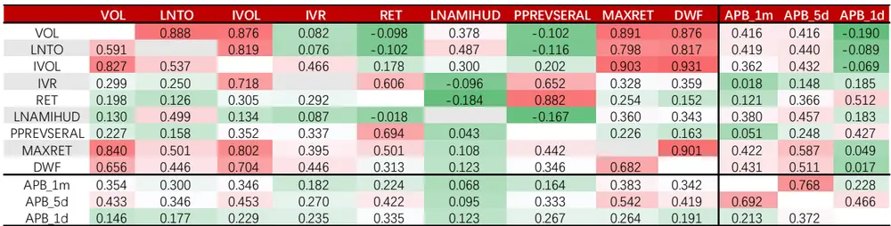
注：相关系数算法采用 spearman 秩相关系数
数据来源：wind 咨询，东方证券研究所

## 3.3 两两分层结果

从两两分层的结果来看，我们可以有如下发现：

（1）压力因子受常见各大类因子影响很小，无论考察压力因子在各大类因子分层前后的表现，还是考察各大类因子在压力因子分层前后的表现，在分层前后因子表现影响很小。

（2）经过 APB_5d 分层后 APB_1m 多空组合几乎没有收益，反之，经过 APB_1m 分层后 APB_5d 依然有很强的选股效果，我们可以猜测基于月度交易周期度量的 APB 之所以有效果有很大程度上也是因子 APB_1m 捕捉了较短交易周期下的买卖压力。

（3）基于日内信息度量的压力因子和基于日间信息度量的压力因子相对比较独立，经对方分层后自身的选股效果影响不大。

图 12：买卖压力与常见大类因子两两分层月均收益（%）及其显著性

|  |  | Value Profitability |  | Growth | Governance | Illiquidity | Reversal | Lottery | Analyst | Surprise | APB_1m | APB_5d | APB_1d |
| --- | --- | --- | --- | --- | --- | --- | --- | --- | --- | --- | --- | --- | --- |
|  | 不分层 | 1.35*** | 0.68** | 1.13*** | 0.53*** | 2.62*** | 1.59*** | 1.71*** | 1.64*** | 1.76*** | 1.73*** | 2.20*** | 2.28*** |
| 分 | Value | 0.14 | 0.43 | 0.83*** | 0.19* | 2.39*** | 1.49*** | 1.32*** | 1.33*** | 1.72*** | 1.61*** | 1.99*** | 2.19*** |
|  | Probability | 1.19*** | 0.20** | 0.92*** | 0.49*** | 2.63*** | 1.70*** | 1.68*** | 1.51*** | 1.55*** | 1.61*** | 2.12*** | 2.21*** |
|  | Growth | 1.23*** | 0.45* | 0.1 | 0.59*** | 2.67*** | 1.74*** | 1.77*** | 1.29*** | 1.28*** | 1.67*** | 2.09*** | 2.21*** |
| 层 | Governance | 1.29*** | 0.68*** | 1.17*** | -0.06 | 2.54*** | 1.53*** | 1.62*** | 1.58*** | 1.71*** | 1.69*** | 2.15*** | 2.24*** |
|  | Illiquidity | 1.02*** | 0.63** | 1.16*** | 0.33*** | 0.43*** | 0.87** | 0.48 | 1.45*** | 1.76*** | 0.99*** | 1.27*** | 2.05*** |
|  | Reversal | 1.16*** | 0.71*** | 1.25*** | 0.38*** | 2.20*** | 0.14 | 1.51*** | 1.48*** | 1.93*** | 1.45*** | 1.71*** | 1.91*** |
| 因 | Lottery | 0.72*** | 0.59** | 1.11*** | 0.27** | 1.80*** | 0.93** | 0.40*** | 1.44*** | 1.76*** | 1.25*** | 1.43*** | 2.19*** |
|  | Analyst | 0.97*** | 0.22 | 0.72*** | 0.36*** | 2.35*** | 1.51*** | 1.45*** | 0.19** | 1.40*** | 1.48*** | 1.90*** | 1.99*** |
|  | Surprise | 1.30*** | 0.44* | 0.33** | 0.62*** | 2.63*** | 1.85*** | 1.82*** | 1.23*** | 0.23*** | 1.71*** | 2.13*** | 2.25*** |
| 子 | APB_1m | 1.22*** | 0.57** | 1.05*** | 0.47*** | 2.02*** | 1.04*** | 1.20*** | 1.44*** | 1.66*** | 0.18* | 1.24*** | 1.94*** |
|  | APB_5d | 1.09*** | 0.52** | 1.00*** | 0.44*** | 1.69*** | 0.73* | 0.94** | 1.37*** | 1.59*** | 0.28* | 0.22** | 1.77*** |
|  | APB 1d | 1.08*** | 0.43* | 1.03*** | 0.38*** | 1.93*** | 0.87** | 1.25*** | 1.41*** | 1.60*** | 1.21*** | 1.35*** | 0.33*** |

注：***表示 1%表示置信度下显著， **表示 5%表示置信度下显著，*表示 10%表示置信度下显著
数据来源：wind 咨询，东方证券研究所

图 13：买卖压力与常见技术类因子两两分层月均收益（%）及其显著性

|  |  | VOL | LNTO | IVOL | IVR | RET | LNAMIHUD | PPREVSERAL | MAXRET | DWF | APB_1m | APB 5d APB 1d |  |
| --- | --- | --- | --- | --- | --- | --- | --- | --- | --- | --- | --- | --- | --- |
|  | 不分层 | 1.36*** | 2.41*** | 2.30*** | 2.07*** | 1.84*** | 1.80*** | 1.62*** | 1.70*** | 2.14*** | 1.73*** | 2.20*** | 2.28*** |
| 分 | VOL | 0.22* | 1.96*** | 1.70*** | 1.71*** | 1.11*** | 1.67*** | 0.92*** | 1.02*** | 1.53*** | 1.25*** | 1.47*** | 2.27*** |
|  | LNTO | 0.04 | 0.58*** | 1.13*** | 1.64*** | 1.31*** | 0.89*** | 1.01*** | 0.67*** | 1.27*** | 1.18*** | 1.49*** | 2.1*** |
|  | IVOL | -0.68** | 1.32*** | 0.36*** | 0.95*** | 0.91*** | 1.58*** | 0.66* | 0.13 | 0.76*** | 1.05*** | 1.25*** | 2.10*** |
| 层 | IVR | 0.82** | 1.83*** | 0.91** | 0.37*** | 1.15*** | 1.69*** | 0.96*** | 1.05*** | 1.13*** | 1.42*** | 1.67*** | 1.83*** |
|  | RET | 0.93*** | 2.09*** | 1.73*** | 1.42*** | 0.41*** | 1.79*** | 0.24 | 1.07*** | 1.44*** | 1.23*** | 1.48*** | 1.91*** |
|  | LNAMIHUD | 1.08*** | 1.68*** | 1.98*** | 1.86*** | 1.97*** | 0.42*** | 1.55*** | 1.49*** | 2.05*** | 1.64*** | 1.94*** | 2.09*** |
| 因 | PPREVSERAL | 1.11*** | 2.10*** | 1.99*** | 1.63*** | 1.20*** | 1.70*** | 0.20* | 1.33*** | 1.54*** | 1.53*** | 1.75*** | 2.01*** |
|  | MAXRET | -0.23 | 1.70*** | 1.15*** | 1.46*** | 0.87** | 1.69*** | 0.59 | 0.35*** | 1.05*** | 1.03*** | 1.29*** | 2.15*** |
|  | DWF | -0.18 | 1.49*** | 1.04*** | 1.37*** | 0.94*** | 1.54*** | 0.65* | 0.44** | 0.40*** | 0.92*** | 1.23*** | 2.02*** |
| 子 | APB_1m | 0.70** | 1.91*** | 1.65*** | 1.67*** | 1.28*** | 1.67*** | 1.22*** | 1.00*** | 1.55*** | 0.18* | 1.24*** | 1.94*** |
|  | APB_5d | 0.42 | 1.63*** | 1.31*** | 1.55*** | 0.79** | 1.64*** | 0.94** | 0.63** | 1.16*** | 0.28* | 0.22** | 1.77*** |
|  | APB 1d | 0.88** | 1.85*** | 1.65*** | 1.49*** | 1.11*** | 1.59*** | 0.96*** | 1.07*** | 1.51*** | 1.21*** | 1.35*** | 0.33*** |

注：***表示 1%表示置信度下显著， **表示 5%表示置信度下显著，*表示 10%表示置信度下显著
数据来源：wind 咨询，东方证券研究所

## 3.4 截面回归分析

通过常见的截面回归方法剔除常见各大类因子影响后，所有压力相关因子均有显著的选股效果。相比之下，基于日内信息计算的 APB 因子在剔除其他常见因子后的残差效果更加明显。

图 14：压力因子在剔除常见大类因子后的残差选股表现

|  | 原始因子 |  |  | 行业市值中性化因子 |  |  |  |  |  |  |
| --- | --- | --- | --- | --- | --- | --- | --- | --- | --- | --- |
|  | RankIC | IC_IR | t_value | IC | IC_IR | t_value | 多空月收益 | 夏普率 | 月胜率 | 最大回撤 |
| APB_1m | 1.56% | 0.97 | 2.96 | 1.71% | 1.34 | 4.08 | 0.48% | 0.90 | 65.77% | -10.70% |
| APB_5d | 2.32% | 1.29 | 3.91 | 2.40% | 1.85 | 5.61 | 0.75% | 1.41 | 69.37% | -8.32% |
| APB_1d | 5.32% | 4.00 | 12.16 | 5.01% | 4.77 | 14.51 | 1.65% | 3.22 | 85.59% | -7.19% |

数据来源：wind 咨询，东方证券研究所

## 四、结论

股票的任何一笔成交价格都是买卖双方撮合的结果，股票价格的变动与股票的买压与卖压密切相关，如果买压较大，价格大概率上涨，如果卖压较大，价格大概率下跌。

如果股票的买压较大，有投资者择机逢低买入，那么股票在价格低位的成交量相对较大，反之卖压较大，则股票在价格高位的成交量较大。反过来，我们也可以通过股票价格和成交量的关系去捕捉股票的买压和卖压。投资者逢低买入或者逢高卖出是个自适应的过程，即使投资者不能够事先判断局部高位、或者局部低位，也能通过自己的交易行为实现。

价格和成交量的关系会影响股票成交量加权价格 vwap 的水平，基于这种联系，我们提出了APB 指标用于捕捉股票的买卖压力，APB 是等权加权均价和成交量加权均价之比的对数。考虑到不同投资者交易的时间尺度有所差异，我们基于月度、5 个交易日、日内三个时间尺度分别构建了APB_1m、APB_5d、APB_1d共 3 个度量不同时间尺度的买卖压力因子。

所有买卖压力因子均有显著的截面选股效果，过去一个月买压大的股票显著跑赢卖压大的股票，其中APB_5d在全市场中性化后的月度RankIC均值9.07%，IC_IR为4.59，多空月均收益2.26%，APB_1d 月度 RankIC 均值 7.87%，IC_IR 为 4.87，多空月均收益 2.31%。

从因子表现来看，基于月度周期度量的 APB 因子弱于基于 5日周期、日内的 APB，所有的买卖压力因子在各个样本空间内表现差异不大，比如 APB_5d 因子在沪深 300 和中证 1000 中原始值月均 RankIC 均值分别为 8.28%和 9.16%。

同样基于日度数据计算的 APB_1m 和 APB_5d 相关性较高，但基于日内度量的买卖压力因子和基于日线度量的买卖压力因子相关性很低，两者之间可以很好相互补充。

从相关系数看，买卖压力因子和估值、成长、盈利等基本面相关因子几乎没有任何相关性，和流动性、反转、投机等技术面因子相关性也不高，回归剔除其他各大类因子后依然有显著的选股效果。

## 风险提示

1.量化模型基于历史数据分析得到，未来存在失效的风险，建议投资者紧密跟踪模型表现。

2.极端市场环境可能对模型效果造成剧烈冲击，导致收益亏损。

## 分析师申明

每位负责撰写本研究报告全部或部分内容的研究分析师在此作以下声明：

分析师在本报告中对所提及的证券或发行人发表的任何建议和观点均准确地反映了其个人对该证券或发行人的看法和判断；分析师薪酬的任何组成部分无论是在过去、现在及将来，均与其在本研究报告中所表述的具体建议或观点无任何直接或间接的关系。

## 投资评级和相关定义

报告发布日后的 12 个月内的公司的涨跌幅相对同期的上证指数/深证成指的涨跌幅为基准；

## 公司投资评级的量化标准

买入：相对强于市场基准指数收益率 15%以上；

增持：相对强于市场基准指数收益率 5%～15%；

中性：相对于市场基准指数收益率在-5%～+5%之间波动；

减持：相对弱于市场基准指数收益率在-5%以下。

未评级 —— 由于在报告发出之时该股票不在本公司研究覆盖范围内，分析师基于当时对该股票的研究状况，未给予投资评级相关信息。

暂停评级 —— 根据监管制度及本公司相关规定，研究报告发布之时该投资对象可能与本公司存在潜在的利益冲突情形；亦或是研究报告发布当时该股票的价值和价格分析存在重大不确定性，缺乏足够的研究依据支持分析师给出明确投资评级；分析师在上述情况下暂停对该股票给予投资评级等信息，投资者需要注意在此报告发布之前曾给予该股票的投资评级、盈利预测及目标价格等信息不再有效。

## 行业投资评级的量化标准：

看好：相对强于市场基准指数收益率 5%以上；

中性：相对于市场基准指数收益率在-5%～+5%之间波动；

看淡：相对于市场基准指数收益率在-5%以下。

未评级：由于在报告发出之时该行业不在本公司研究覆盖范围内，分析师基于当时对该行业的研究状况，未给予投资评级等相关信息。

暂停评级：由于研究报告发布当时该行业的投资价值分析存在重大不确定性，缺乏足够的研究依据支持分析师给出明确行业投资评级；分析师在上述情况下暂停对该行业给予投资评级信息，投资者需要注意在此报告发布之前曾给予该行业的投资评级信息不再有效。

## HeadertTabl e_Discl ai mer 免责声明

本证券研究报告（以下简称“本报告”）由东方证券股份有限公司（以下简称“本公司”）制作及发布。

本报告仅供本公司的客户使用。本公司不会因接收人收到本报告而视其为本公司的当然客户。本报告的全体接收人应当采取必要措施防止本报告被转发给他人。

本报告是基于本公司认为可靠的且目前已公开的信息撰写，本公司力求但不保证该信息的准确性和完整性，客户也不应该认为该信息是准确和完整的。同时，本公司不保证文中观点或陈述不会发生任何变更，在不同时期，本公司可发出与本报告所载资料、意见及推测不一致的证券研究报告。本公司会适时更新我们的研究，但可能会因某些规定而无法做到。除了一些定期出版的证券研究报告之外，绝大多数证券研究报告是在分析师认为适当的时候不定期地发布。

在任何情况下，本报告中的信息或所表述的意见并不构成对任何人的投资建议，也没有考虑到个别客户特殊的投资目标、财务状况或需求。客户应考虑本报告中的任何意见或建议是否符合其特定状况，若有必要应寻求专家意见。本报告所载的资料、工具、意见及推测只提供给客户作参考之用，并非作为或被视为出售或购买证券或其他投资标的的邀请或向人作出邀请。

本报告中提及的投资价格和价值以及这些投资带来的收入可能会波动。过去的表现并不代表未来的表现，未来的回报也无法保证，投资者可能会损失本金。外汇汇率波动有可能对某些投资的价值或价格或来自这一投资的收入产生不良影响。那些涉及期货、期权及其它衍生工具的交易，因其包括重大的市场风险，因此并不适合所有投资者。

在任何情况下，本公司不对任何人因使用本报告中的任何内容所引致的任何损失负任何责任，投资者自主作出投资决策并自行承担投资风险，任何形式的分享证券投资收益或者分担证券投资损失的书面或口头承诺均为无效。

本报告主要以电子版形式分发，间或也会辅以印刷品形式分发，所有报告版权均归本公司所有。未经本公司事先书面协议授权，任何机构或个人不得以任何形式复制、转发或公开传播本报告的全部或部分内容。不得将报告内容作为诉讼、仲裁、传媒所引用之证明或依据，不得用于营利或用于未经允许的其它用途。

经本公司事先书面协议授权刊载或转发的，被授权机构承担相关刊载或者转发责任。不得对本报告进行任何有悖原意的引用、删节和修改。

提示客户及公众投资者慎重使用未经授权刊载或者转发的本公司证券研究报告，慎重使用公众媒体刊载的证券研究报告。

## 东方证券研究所

地址：上海市中山南路 318 号东方国际金融广场 26 楼

联系人： 王骏飞

电话：021-63325888*1131

传真：021-63326786

网址： www.dfzq.com.cn

Email： wangjunfei@orientsec.com.cn