## ——因子选股系列之六十一

## 研究结论

- 目前 A 股的机构化程度相较于美国市场还存在一定的差距，但长期来看 A股的进一步机构化是必然的趋势。有研究表明，因子在不同机构持股比的股票中有着截然不同的表现，本文主要对这种特征做了详细的研究。

- 本文基于半年报和年报的基金持股加上券商的集合资管计划再加上前十大流通股中的保险、阳光私募、信托、社保和 QFII 持股再加上陆股通的持仓数据来测算每个股票的机构持仓占流通市值的比例。

研究发现机构持股占流通市值比最高的分组具有大市值，高历史收益，低Beta，低换手、高成长和高确定性的风格暴露，但是在估值、波动率还有国企民企的上的暴露其实偏向于中性。在行业配置上，机构长期超配医药、食品饮料、房地产、家电和电子元器件等行业的股票，而低配石油石化、银行、交通运输、煤炭和非银金融等行业的股票。

- 我们测试了不同的机构持股占流通市值比的股票池内的选股因子表现（2009.12-2019.9），发现估值因子在高机构持股比的股票中表现远差于在低机构持股比的股票池中，其中 BP、SP、EP_FY1 几乎长期失效，而成长因子在高机构持股比的股票中反而长期表现更好。

基于估值和成长在机构持股比不同的股票中的不同表现，我们构建了基于机构持股比划分的动态情景模型，在高机构持股比股票中降低估值因子权重，增加成长因子权重。从 2009.12-2019.9，基于动态情景模型的中证 500 增强组合年化战胜常规组合 1.1%，且 2019 年提高 3.2%，沪深 300 增强组合年化战胜常规组合 0.56%，非金融股部分年化战胜常规组合 1.35%，且 2019 年提高 2.9%。

虽然这里测试的动态情景模型存在一定样本内的因素，但是这种因子特征却是长期存在的（在北上资金入场前就存在了），因此模型也具备一定的参考价值。综合来看，基于机构持仓占流通市值比的动态情景模型能够基于市场机构化的程度自动调整情景空间，自适应不同空间的因子特征，能更好的适应未来市场进一步机构化的发展方向。

## 风险提示

- 极端市场环境可能对模型效果造成剧烈冲击，导致收益亏损。

- 量化模型基于历史数据分析得到，未来存在失效风险，建议投资者紧密跟踪模型表现。

## 报告发布日期

2019 年 10 月 29 日

证券分析师朱剑涛

021-63325888*6077

zhujiantao@orientsec.com.cn

执业证书编号：S0860515060001

证券分析师张惠澍

021-63325888-6123

zhanghuishu@orientsec.com.cn

执业证书编号：S0860518080001

## 相关报告

| A 股风险溢价(ERP) | 2019-08-30 |
| --- | --- |
| 跳跃 Beta 与连续 Beta 资本市场开放对因子投资的影响 | 2019-08-02 |
|  | 2019-07-30 |
| 温和收益的动量与极端收益的反转效应 | 2019-07-02 |
| 大小盘风格择时与投资运用 | 2019-05-30 |
| 优质民企策略指数 | 2019-04-24 |
| 波动率因子的逻辑与非对称使用 | 2019-04-24 |
| 公募基金产品与基金经理评价 | 2019-04-23 |
| 基于因子组合FMP的因子加权方法 | 2019-04-15 |

## 1.机构持股特点与因子表现

## 1.1中美市场机构化程度对比

相较于 A 股市场，美国市场发展更久，机构化程度也要更高，图 1 展示了美国市场从1951 年以来的投资者结构（投资者持股占总市值比）。可以看到美国市场占比下降最快是散户投资者，截至今年 2 季度，美国市场散户持股占比为 36.7%。规模占比上升较快的投资者类别有共同基金、境外资金、ETFs，截至今年 2 季度，上述几类投资者者持股占总市值比分别为：22.5%、15.0%和 6.3%。

图 1：美国市场投资者结构变化
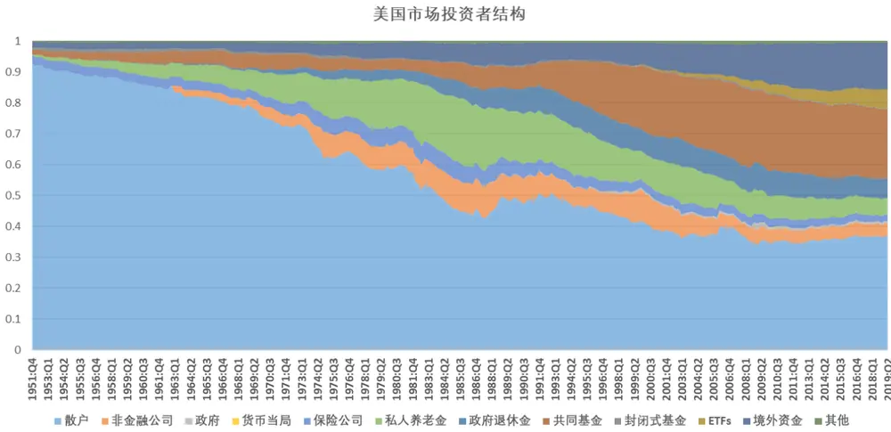
数据来源：东方证券研究所 Federal Reserve Board

根据《上海证券交易所统计年鉴 2019 卷》的结果，2018 年底上证交易所自然人投资者的持股市值占比为 19.62%，而专业机构占比为 13.92%，乍看之下散户占比很低，但这是因为 A 股相比于美股，很多一般法人的持股是基本不流通的，如果调整总市值为自由流通市值的话，那么 2018 年底上证交易所自然人投资者的持股市值占自由流通市值比为 64.47%，远高于美国市场目前的水平。图 2 展示了 2009-2018 年上海证券交易所的散户持股占自由流通市值比和散户成交金额占比，因为 2019 年的年鉴不再展示散户的成交金额占比情况，所以这里没有展示相关的数据。从整体变化来看，A 股的散户持股占自由流通市值比整体是呈下降趋势的，但是交易量却并没有明显的下滑，说明散户交易的换手率可能比以前更高。

图 2：上海证券交易所散户持股市值占自由流通市值比和成交金额占比
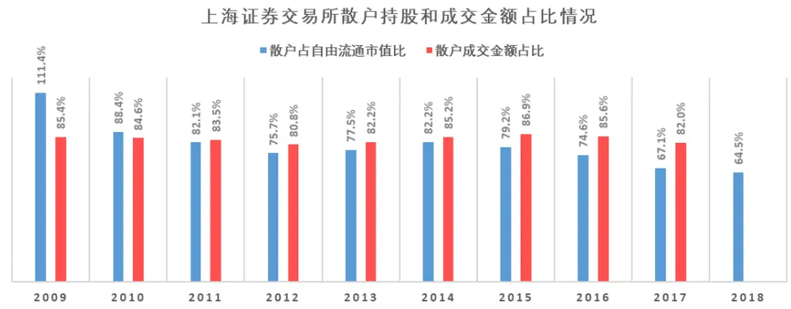
数据来源：东方证券研究所 上海证券交易所统计年鉴

## 1.2 A股机构投资者持股特点

按照《新帕尔格雷夫货币与金融词典》的定义，机构投资者就是许多西方国家管理长期储蓄的专业化的金融机构。这些机构管理着养老基金、人寿保险基金和投资基金或单位信托基金，其资金的管理和运用都由专业化人员完成。

这里我们基于半年报和年报的基金持股加上券商的集合资管计划加上前十大流通股中的保险、阳光私募、信托、社保和 QFII 持股再加上陆股通的持仓数据来测算每个股票的机构持仓占流通市值的比例（后面简称为机构持股比）。在统计的过程中没有考虑分类成一般法人和非金融公司持股的投资者的持股占比，这是因为这两个分类主要由公司大股东、中央汇金、中国证券金融股份有限公司等组成，很少参与二级市场交易，即使参与也是出于战略投资考虑，对股市造成的是短期冲击，与散户和专业机构为了获取二级市场收益频繁交易有本质不同。除了一般法人以外，前十大流通股中还包括有银行持股，根据我国规定，商业银行是不能主动持有企业股票的，而在前十大流通股东中的银行持股主要是股东质押融资违约后被银行抵扣的股份，所以不能算在机构投资者中。此外，对于保险持股的类型需要进行重新划分的，比如中国人寿的前十大流通股东中，中国人寿保险(集团)公司持股比超过 90%，而这显然不是保险类机构管理的产品的持仓，因此我们对保险持股的数据进行了划分，去除了保险机构直接持股的部分，只保留保险机构产品的持股部分。

因为没有公开数据，因此在前十大流通股之外的银行、保险、私募等持仓没有办法进行统计，但是因为通常来说这个占比并不高，而且横向比较的话每个公司的统计口径是一致的，因此对结果的影响相对有限。

基于上面的数据，我们统计了 2009 年年报-2019 年中报的机构持仓股票特征，我们把每期机构持股占流通市值高于 10%的股票划分为高机构持股比股票，低于 2%的股票划分为低机构持股比股票。图 3 展示了两个类别的股票数量，从结果可以看到机构持股占流通市值比大于 10%的股票数量从 2009 年底的 536 支增长到 2016 年底的 811 支，但是从 2017 年以来，机构的抱团特征明显，高机构持股比的股票数量也逐年降低，至 2019中报降低为 615 支。从低机构持股比的股票数量上来看，可以很明显的发现从 2017 年以来，低机构持股比的股票数量在急剧上升，从 2016 年底的 714 支增加到 2019 年中报的 1607 支，这也充分反映出机构近 3 年来的集中抱团特征。图 4 展示了这两个类别的股票数量占比，从占比上可以发现虽然机构持股比高的股票数量有所提升，但是占比反而是下降的，这是因为这 10 年时间 A 股的股票数量大幅提高，但是机构重点关注的股票数量却并没有同比例的增多，而低机构持股比的股票占比基本回到了 2013 年的水平。

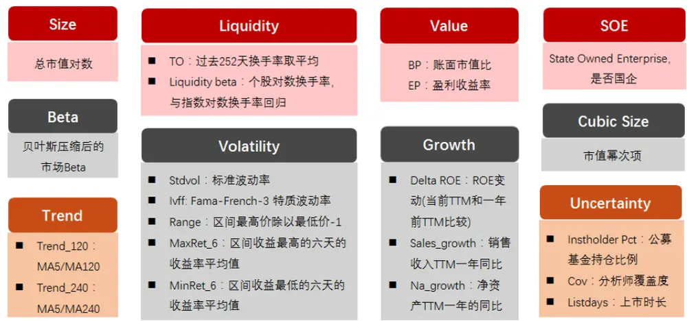
图 5：风格因子说明
数据来源：东方证券研究所

图 3：不同区间机构持股比的股票数量
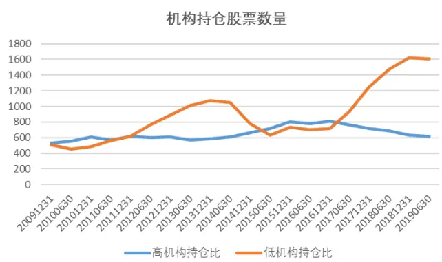
数据来源：东方证券研究所 Wind 资讯

图 4：不同区间机构持股比的股票数量占比
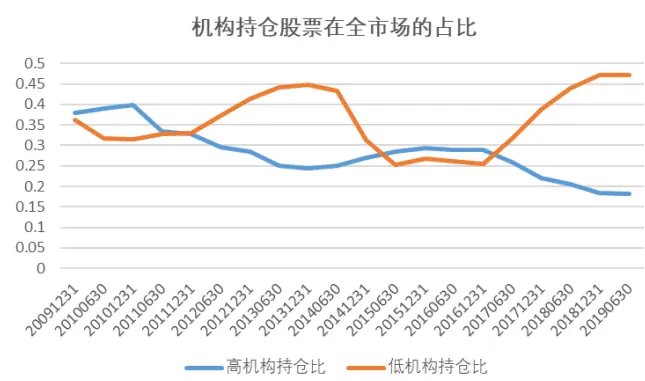
数据来源：东方证券研究所 Wind 资讯

机构持仓的股票往往具有一些很明显的风格特征，这里我们把股票按照机构持股占流通市值比的大小分成 4 组，然后分别统计每组的历史（2009.12-2019.6）平均风格暴露情况（图 6），风险因子的说明如图 5 所示。从因子暴露的情况来看，可以发现机构持股占流通市值比最高的分组具有大市值，高历史收益，低 Beta，低换手、高成长和高确定性的风格暴露，但是在估值、波动率还有国企民企的上的暴露其实偏向于中性，也就是说机构其实对于这 3 个风格并没有明显的偏好。而机构持股占流通市值比最低的分组则明显暴露于小市值、低估值、低成长等风格，说明散户投资者反而比机构投资者更关注公司的相对估值情况。

图 6：不同机构持股比股票风格暴情况
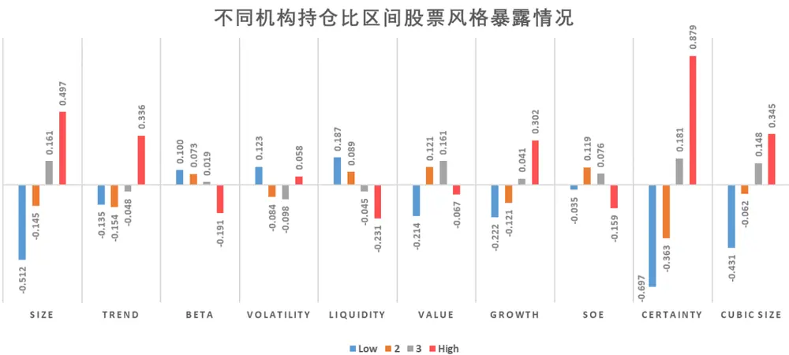
数据来源：东方证券研究所 Wind 资讯

图 7：机构持股在各行业上的主动暴露情况

| 行业 | 2009 | 2010 | 2011 | 2012 | 2013 | 2014 | 2015 | 2016 | 2017 2018 |  | 2019中报 | 平均 |
| --- | --- | --- | --- | --- | --- | --- | --- | --- | --- | --- | --- | --- |
| 医药 | 3.1% | 5.2% | 4.8% | 5.3% | 7.2% | 3.7 | 3.5% | 3.4% | 2.2% | 2.9% | 3.2% | 4.4% |
| 食品饮料 | 3.1% | 3.8% | 5.8 | 4.0% | 3.0% | 1. .1% | 0.3% | 2.2% | 4.2% | 4.8% | 6.2% | 3.5% |
| 房地产 | 1.9% | 1. .3% | 2. |  | 0.7% | 3.9% | 1.9% | 1.3% | 2. 4% | 3.0% | 2.1% | 2. 1% |
| 家电 | 2.0% | 1. 7% | 1.5% | 2. 1% | 2.8% | 1.5% | 0.5% | 1.3% | 3. 4% | 2.6% | 3.3% | 2.1 1% |
| 电子元器件 | -0.3% | 0.6% | 0.4 | 1.0% | 3.1% | 0.4 4% | 1.2% | 1.5% | 2.5 .5% | 1.2% | 0.7% | 1.3% |
| 计算机 | 0.4% | 1. .1% | 1. | 0.6% | 2.0% | 2. 2% | 2.8% | 0.1% | -0. 7% | 0.2% | 0.0% | 1.0% |
| 商贸零 售 | 3.6% | 3. .2% | 2. 1% | 0.9% | -0. 2% | 0.2% | 0.0% | -0. % | -0. 2% | -0.1% | -0.1% | 0.8% |
| 通信 | 1.0% | 1.5% |  | 0.1% | 0.0% | 0.0% | 0.9% | 0.6% | 0.1% | -0. 18% | -0. | 0.4 4% |
| 国防军工 | 0.1% | 0.3% | 0.2% | 0.1% | 0.2% | 0.7% | 1.2% | 1.2% | 0.1% | 0.2% | -0.1% | 0.4% |
| 餐饮旅游 | -0.1% | 0.2% | 0.6% | 0.2% | 0.2% | 0.2% | 0.6% | 0.3% | 0.4% | 0.8% | 0.8% | 0.4% |
| 传媒 | 0.2% | 0.0% | 0.2% | 0.2% | 1% 1. | 0.6% | 0.7% | -0.1% | -0. 1% | -0. % | -0. 4% | 0.3% |
| 汽车 | 1.6% | 0.8% | 0.5% | 0.7% | 0.5% | 0.3% | -0. 7% | 0.2% | 0.0% | -0. 1% | -0. .5% | 0.3% |
| 农林牧渔 | 0.0% | 1. 1% | 0.8% | 0.2% | 0.3% | 0.0% | 0.5% | 0.1% | -0.1% | 0.2% | 0.2% | 0.3% |
| 电力设备 | 0.5% | 1. 1.3% | 0.5% | -0. 4% | 0.8% | 0.1% | -0. .3% | -0. .3% | 0.3% | 0.1% | 0.3% | 0.2% |
| 建材 | 0.8% |  | -0.1% | 0.2% | -0. 1% | -0. .2% | -0. 2% | 0.0% | 0.2% | 0.2% | 0.3% | 0.2% |
| 基础化工 | 1.4% | 0.4% | 0.0% | 0.2% | 0.7% | 0.1% | 0.1% | 0.1% | -0 8% | -0. 5% | -1 0% | 0.1% |
| 轻工制造 | -0.2% | -0. 3% | -0.1% | -0. 3% | -0. 2% | -0.1% | 0.1% | 0.3% | 0. | 0.0% | -0. 1% | 0.0% |
| 纺织服装 | -0.3% | 0.0% | 0.4% | 0.0% | -0. 3% | -0. .3% | 0.0% | -0. 1% | -0. 2% | -0 2% | -0. 3% | -0. 1% |
| 建筑 | -0.5% | 0.2% | 0.5% | 1.4% | -0. .2% | -0 7% | 16% | 0.6% | -0 5% | -0. 5% | -0 | -0. 2% |
| 机械 | 0.7% | 0.7% | 0.3% | -0. 6% | -0. 6% | -0. 16% | -0 9% | -0 18% |  | -0. 15% | -0 7% | -0 4% |
| 综合 | -0.5% | -0. .2% | -0. 3% | -0. 4% | -0. 4% | -0. 5% | -0. .3% | 2. .8% | -0. | -0. 3% | -0 4% | -0. 6% |
| 电力及公用事业 | -1.5% | -112% | -0. 5% | 0.1% | 0.1% | -0 4% | -0. 8% | -0. 7% | -0 | 1% | -0 | -0 |
| 钢铁 | 1.1% | -0. 5% | -0 19% | 0% | -0. 8% | -0. | 1% | -0 9% |  | -0. 5% | -0 |  |
| 有色金属 | -0.1% | -0. 1% | -0 8% | 0% |  | -0. | -0. % | -0. 5% |  | 0% |  | -0 |
| 非银行金融 | -0.3% |  |  | -0. 1% |  | 0. | 4% | -1l 2% |  | % |  | % |
| 煤炭 | 0.1% | -0 |  |  | X |  | 1% | -0 8% |  | 1% |  |  |
| 交通运输 | -1.9% | 1.6% | -0. 8% |  | .5% |  |  | -0 19% |  | 17% |  |  |
|  | 4% | -9 |  |  |  |  | 0.3% | 0.1% | % | -2.9% | 2. |  |
| 银行 石油石化 | -11.5% |  |  | 6. -8. | -6. 6% |  | 3.9% | 3 7% | 3. 6% | 3.7% | B | e |

数据来源：东方证券研究所 Wind 资讯

机构投资者在行业上的偏好同样也是我们所关注的，图 7 展示了 2009 年报-2019 中报机构持股在行业上的主动权重暴露。平均来看，机构长期超配医药、食品饮料、房地产、家电和电子元器件等行业的股票，而低配石油石化、银行、交通运输、煤炭和非银金融等行业的股票。从时间演化上可以看到机构在食品饮料、家电、医药这几个行业一直是超配的，但是在 14、15 年的牛市中，机构对食品饮料和家电的配置有所下滑，不过这两个行业在最近 3 年又获得了机构的极大关注，超配程度呈上升趋势，目前超配的程度已经大幅高于历史平均了，这当中很大一部分是因为新增的北上资金更偏好于这两个行业。此外，石油石化和银行的低配最近几年有所减少，不过仍然是机构相对低配最多的行业。

此外我们还测试了机构持股占比本身的选股效果，我们在每个月末根据最新的机构持股占流通市值比数据来测试机构持股因子的表现（2009.12-2019.9），图8 展示了机构持股占流通市值比因子的表现。可以看到单纯的机构持股占流通市值比因子并没有任何的选股效果，同时也侧面反映了机构持股与市值特征的不同，因为市值因子是具有一定的选股效果的。

图 8：机构持股占流通市值比因子选股效果
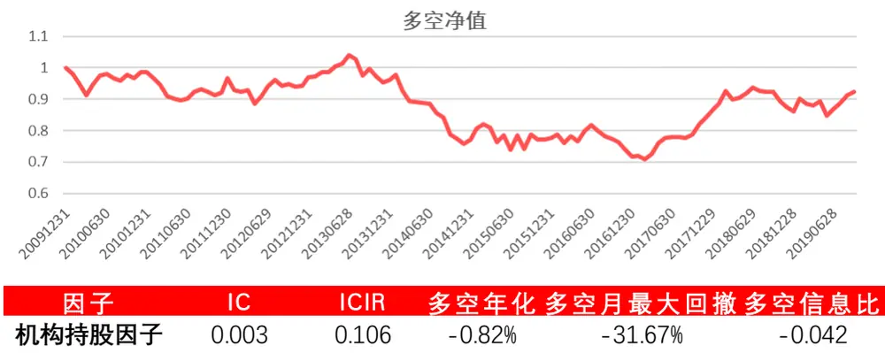
数据来源：东方证券研究所 Wind 资讯

## 2.机构持股特点与因子表现

## 2.1 机构持股与因子表现

Phalippou (2007) 测算了 1980-2001 年美国市场股票数据，发现估值溢价在高机构持股比的股票中几乎失效（图 9），作者认为这主要是因为估值溢价是由股票的错误定价导致的，投资者会对低估值公司的成长过度悲观而对高估值公司的成长过度乐观，导致这部分股票被过度的低估或高估，因此随后的价格修复就带来了估值溢价，而在机构持仓占比较高的股票中，由于机构投资者相比于散户更加理性，非理性错误定价程度较弱，因此估值溢价也较弱。

图 9：美股市场不同机构持股比分组和估值溢价的关系
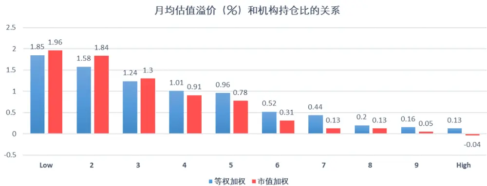
数据来源：东方证券研究所 Phalippou (2007)

图 10 展示了美国市场非散户持股占比和 HML 因子的累积净值，这里非散户持股占比除了常规的机构外还包括了外资和政府机构的持股。可以看到在时间序列上 HML 因子的表现和非散户持股占比关系不大，但是在上世纪 80 年代之后，非散户持股占比都稳定在 50%以上，而这个区间里 HML 的表现并不佳。

图 10：美国市场散户占总市值比和 HML 因子累积净值
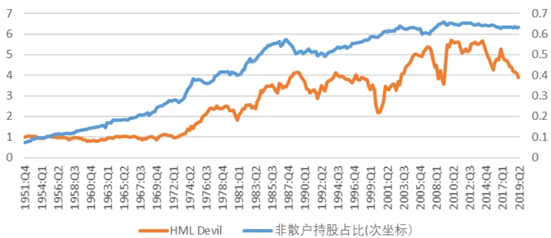
数据来源：东方证券研究所 Federal Reserve Board AQR.

基于美国市场的结果，我们认为机构持仓占比较高的股票和没有机构关注的股票在因子特征上可能存在较大差异，因此我们对不同机构持股比的股票池的因子表现做了进一步的测算（因子说明详见附录图 43）。我们在每个月末基于每个公司能取到的最新的机构持股占流通市值比数据把中证全指成分股由低到高划分成 4个股票池，并在每个股票池中测试不同类型典型因子的表现，因子测试区间为 2009.12-2019.9。因为有的因子在不同行业间的可比性较差，而机构持股占流通市值比高的股票也存在一定的行业主动暴露，因此这里测试的因子都是做了行业和市值中性的。

图 11：不同机构持股比分组下各类因子（行业市值中性）表现（2009.12-2019.9）
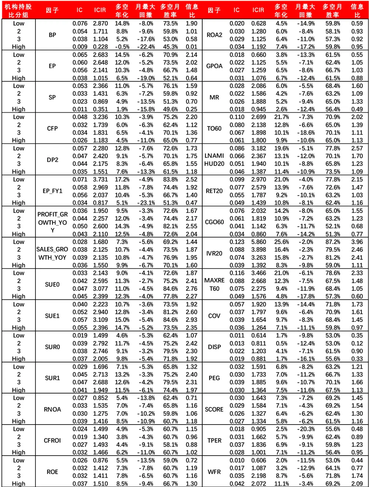
数据来源：东方证券研究所 Wind 资讯

图 11 展示了典型因子在不同的机构持股比区间的表现，可以看到与美国市场的结果类似，估值类因子在高机构持股比的分组中表现要远差于在低机构持股比的分组中，而成长、盈利因子的结果则相反，此外技术类因子普遍在低机构持股比的分组中表现更好。

## 2.2估值因子特征

图 12-17 展示了估值因子的在不同机构持股比分组中的多空累积净值，可以看到 BP、SP 和 EP_FY1 在高机构持股比分组中几乎长期失效，而剩下的 3 个估值因子在高机构持股比分组中的收益也大幅弱于低机构持股比分组中的估值表现，而且回撤更大。这个结果与美国市场的结果一致，我们认为有两个可能的原因可以解释这个现象，第一是因为相比于公司的相对估值，机构投资者可能更加关注公司的成长和盈利能力，这就导致了相对估值指标在高机构持股比的股票中选股效果较弱；第二是因为估值溢价是由股票的错误定价导致的，投资者会对低估值公司的成长过度悲观而对高估值公司的成长过度乐观，因此随后的价格修复就带来了估值溢价，而在高机构持股比的股票中，由于机构投资者更加理性，因此非理性错误定价程度较弱，估值的修复程度也较弱，所以估值表现较差。

图 12：BP 因子多空净值
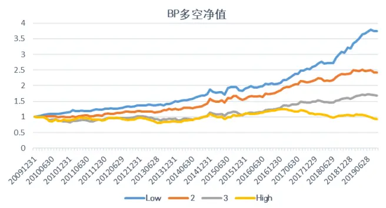
数据来源：东方证券研究所 Wind 资讯

图 13：EP 因子多空净值
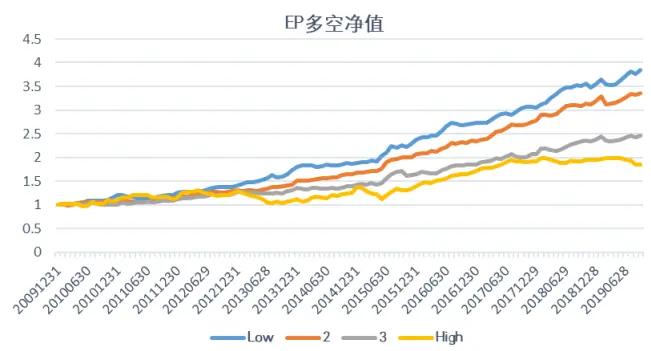
数据来源：东方证券研究所 Wind 资讯

图 14：SP 因子多空净值
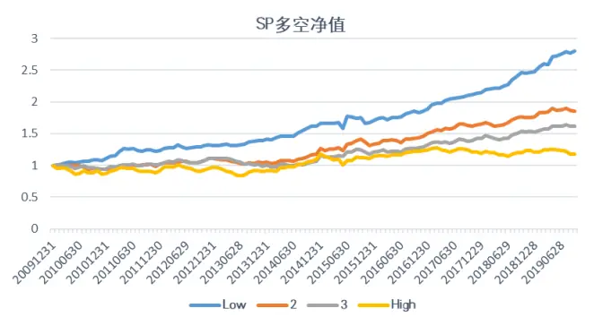
数据来源：东方证券研究所 Wind 资讯

图 15：CFP 因子多空净值
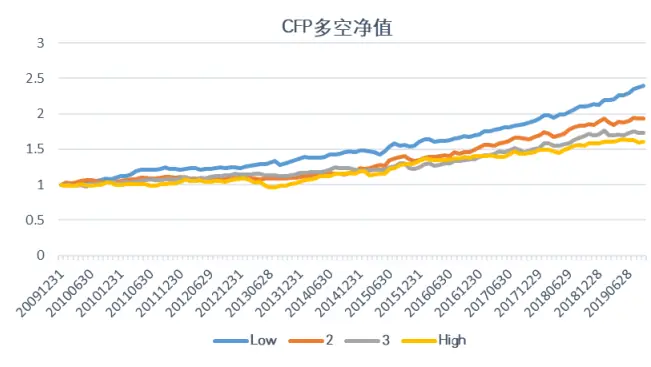
数据来源：东方证券研究所 Wind 资讯

图 16：DP 因子多空净值
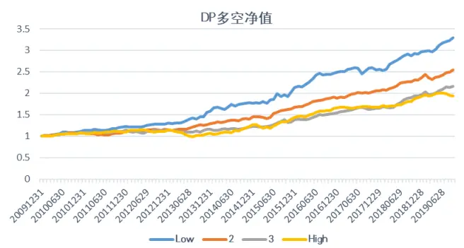
数据来源：东方证券研究所 Wind 资讯

图 17：EP_FY1 因子多空净值
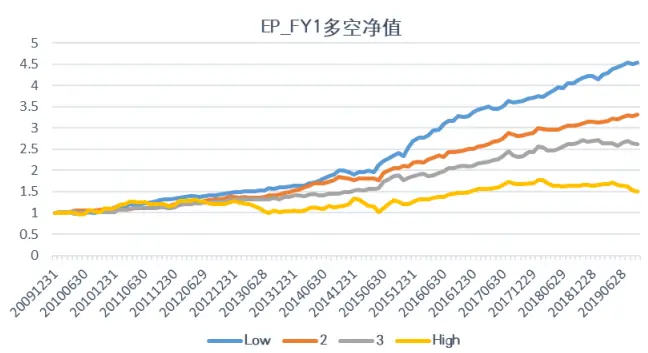
数据来源：东方证券研究所 Wind 资讯

## 2.3 成长因子特征

图 18-23 展示了成长因子的在不同机构持股比分组中的多空累积净值，可以看到与估值相反，成长类因子长期在低机构持股比的分组中表现更差，我们知道短期的成长收益主要来源于公司业绩或营收的超预期特征，这个结果一方面表明机构对于公司的成长性更加关注（机构持股比高的股票成长暴露高），同时也说明了机构对于超预期的信息反映比散户更快，这可能与散户对公司业绩和营收的关注度低于机构投资者有关。

图 18：PROFIT_GROWTH_YOY 因子多空净值
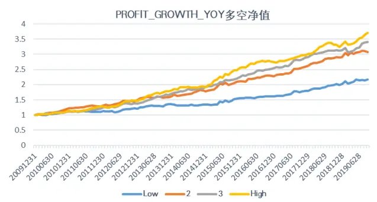
数据来源：东方证券研究所 Wind 资讯

图 19：SALES_GROWTH_YOY 因子多空净值
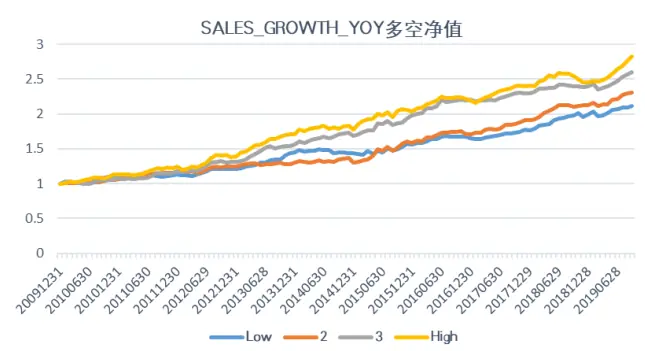
数据来源：东方证券研究所 Wind 资讯

图 20：SUE0 因子多空净值
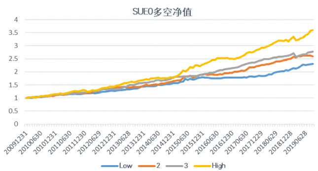
数据来源：东方证券研究所 Wind 资讯

图 21：SUE1 因子多空净值
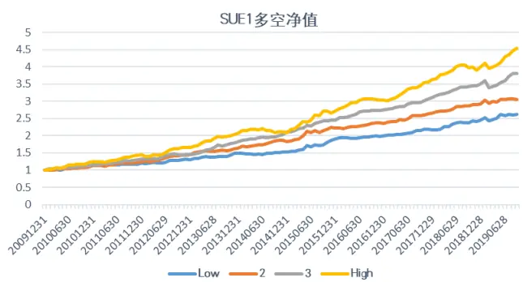
数据来源：东方证券研究所 Wind 资讯

图 22：SUR0 因子多空净值
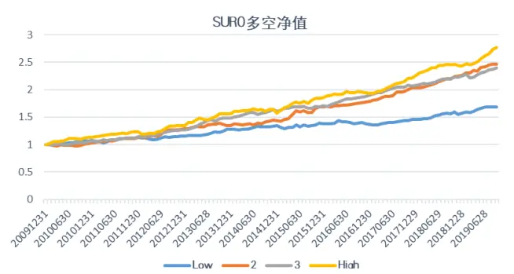
数据来源：东方证券研究所 Wind 资讯

图 23：SUR1 因子多空净值
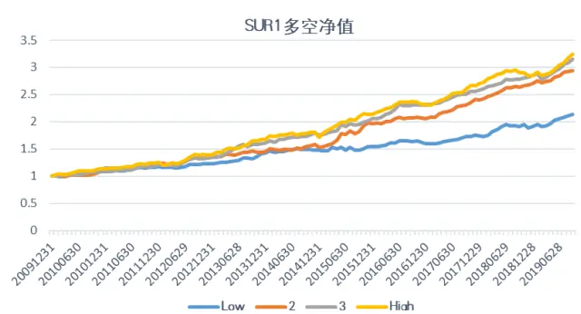
数据来源：东方证券研究所 Wind 资讯

## 2.4盈利因子特征

图 24-27 展示了盈利因子的在不同机构持股比分组中的多空累积净值，可以看到机构持股比低的分组中盈利因子表现确实会略差一些，但是这个差别主要是从 16 年底开始的，在之前其实并没有显著的差异，而且在高机构持股比的分组中，盈利因子在 16 年以前的回撤还更大，这个特征可能是因为最近 3 年外资增量资金更偏好于盈利因子，导致盈利在高机构持股比的股票中有着较好的表现。但是长期来说，盈利因子在不同的机构持股比股票中差异要远小于估值和成长因子。

图 24：RNOA 因子多空净值
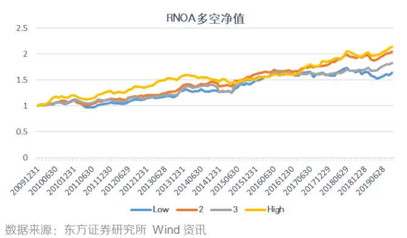

图 25：CFROI 因子多空净值
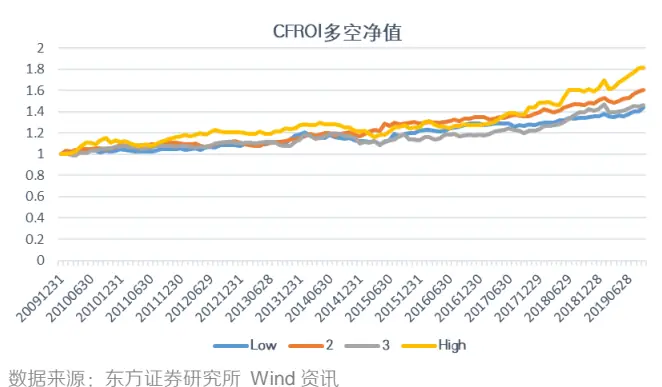

图 26：ROE 因子多空净值
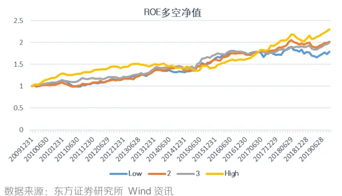

图 27：ROA 因子多空净值
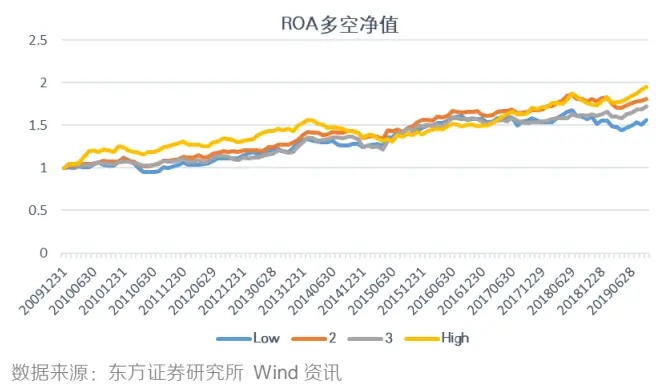

## 2.5技术类因子特征

图 28-33 展示了技术类因子的在不同机构持股比分组中的多空累积净值，可以看到技术类因子在低机构持股比的股票中表现远好于其他分组，而在高机构持股比的股票中，技术类因子虽然也有选股效果，但是表现要远逊于在低机构持股比的分组中，而且最近 2年 Ret20、CGO60 和 MaxRet 在高机构持股比的分组中选股效果较弱，这可能是因为北上资金大幅入场进一步降低了高机构持股比股票中的非理性属性。技术类因子的表现差别很容易理解，因为技术类因子的选股效果主要来源于投资者非理性行为带来的错误定价，在低机构持股比的股票中，由于少有机构在里面进行理性的交易，所以导致这些股票的投机性极高，所以错误定价程度也会明显高于高机构持股比的股票，所以技术类因子在其中表现会比较突出。

图 28：TO60 因子多空净值
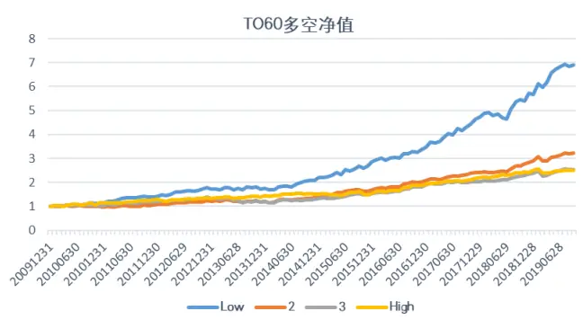
数据来源：东方证券研究所 Wind 资讯

图 29：LNAMIHUD20 因子多空净值
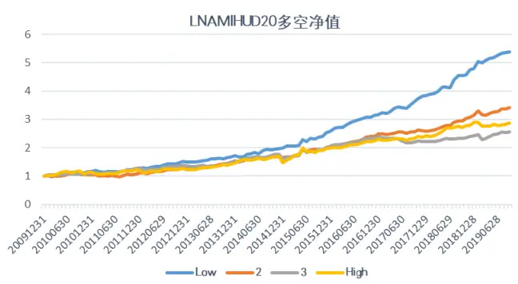
数据来源：东方证券研究所 Wind 资讯

图 30：RET20 因子多空净值
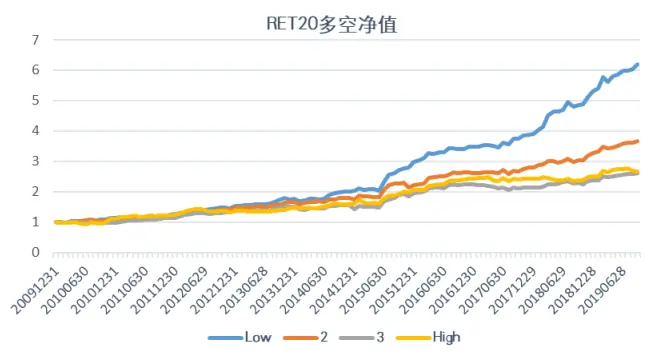
数据来源：东方证券研究所 Wind 资讯

图 31：CGO60 因子多空净值
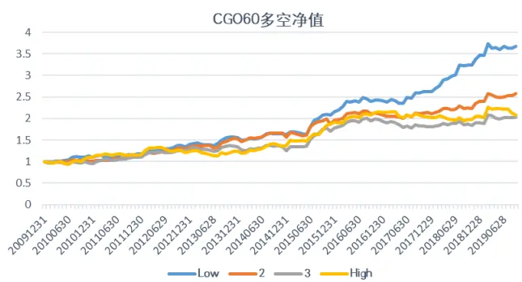
数据来源：东方证券研究所 Wind 资讯

图 32：IVR20 因子多空净值
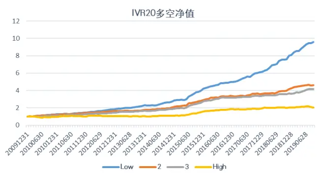
数据来源：东方证券研究所 Wind 资讯

图 33：MAXRET60 因子多空净值
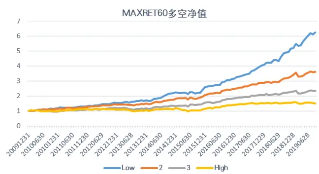
数据来源：东方证券研究所 Wind 资讯

## 2.6分析师因子特征

图 34-37 展示了分析师因子的在不同机构持股比分组中的多空累积净值，可以看到不同的分析师因子在不同的机构持股比分组中差别还是比较大的。COV 在在低机构持股比股票池中表现更好，这是因为在高机构持股比股票中，分析师的覆盖率普遍都较高，而且分析师的信息更容易被理性的机构所消化，而在低机构持股比股票中，只有较少的股票被分析师所覆盖，因此在这类股票中分析师覆盖能贡献更多的信息增益，选股效果也更好；DISP 在不同机构持股比分组中不存在显著的区分规律；PEG 是 PE 和预期成长的复合因子，而估值和成长在不同机构持股比股票中表现时相反的，因此 PEG 因子在不同机构持股比股票中的差别反而较小；SCORE 在不同机构持股比分组中不存在显著的区分规律；TPER 在高机构持股比股票中表现较好，这可能是因为分析师对机构持股比较高的股票更加关注，因此这类股票的目标价是更多分析预测的加权平均，相对误差更小，所以目标价隐含的收益率也相对更加准确，TPER 在高机构持股比股票中选股效果更好；WFR 在高机构持股比股票中表现较好，WFR 类似于用预期信息构建的未来成长因子，其逻辑与上面的成长因子类似，所以其在高机构持股比股票中有着更好的效果。

图 34：COV 因子多空净值
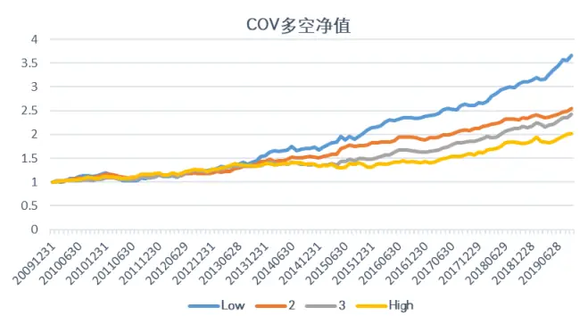
数据来源：东方证券研究所 Wind 资讯

图 35：DISP 因子多空净值
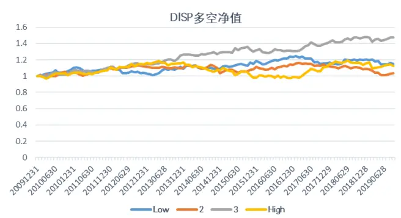
数据来源：东方证券研究所 Wind 资讯

图 36：PEG因子多空净值
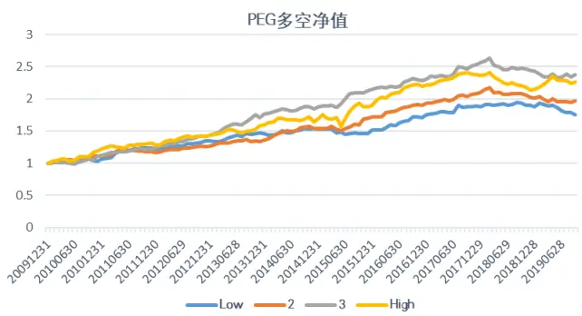
数据来源：东方证券研究所 Wind 资讯

图 37：SCORE 因子多空净值
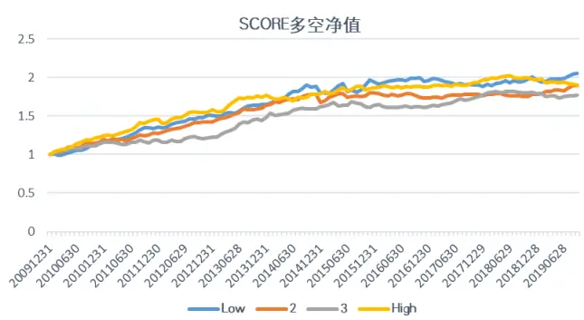
数据来源：东方证券研究所 Wind 资讯

图 38：TPER 因子多空净值
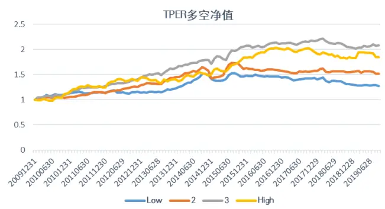
数据来源：东方证券研究所 Wind 资讯

图 39：WFR 因子多空净值
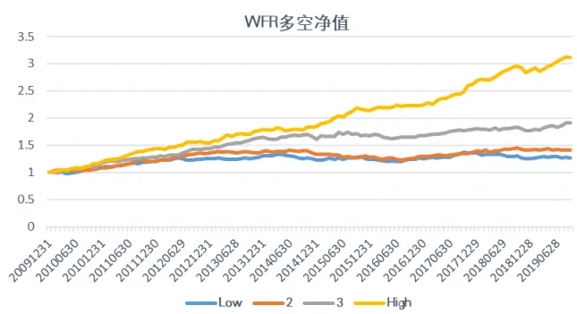
数据来源：东方证券研究所 Wind 资讯

## 3.基于机构持股特点的动态情景模型

基于上面的结果，机构持股比高的股票中最显著的特征就是估值表现几近失效，但是成长表现很好，技术类因子表现较弱但是依然具有一定的效果。因此这里我们构建一个简单的动态情景模型，与原来的基于大类等权的加权方式做对比。

这里我们测试了 2009.12-2019.9 全市场 500 和300 增强组合（行业市值中性）的表现，在构建动态情景模型的时候，我们在每个月末基于能得到最新的机构持股占流通市值比把股票池划分成两个部分（银行和券商依然基于之前的模型单独建模），划分的阈值为10%，在高机构持股比的股票池中，我们基于长期因子的表现和逻辑简单的去除估值大类因子，而把成长大类因子权重设置为原来的 2 倍；而对于低机构持股比的股票，依然保持原来的大类因子权重不变（大类因子参见附录图 43）。在两个股票池中分别计算ZSCORE 后，再根据过去 24 期收益率对 ZSCORE 回归的系数调整两个股票池的ZSCORE，这样不同的股票池的 ZSCORE 就转化成了期望收益，因此可以进行横向比较。

图 40 展示了中证 500 全市场增强组合的表现情况，加入了动态情景模型后，组合的年化收益提升1.1%，从分年的情况来看，这个过去10年里收益提升的年份有2012、2013、2014、2018、2019，仅在 2015 和 2016 年会变差一些。

图 40：中证 500 全市场增强组合表现对比
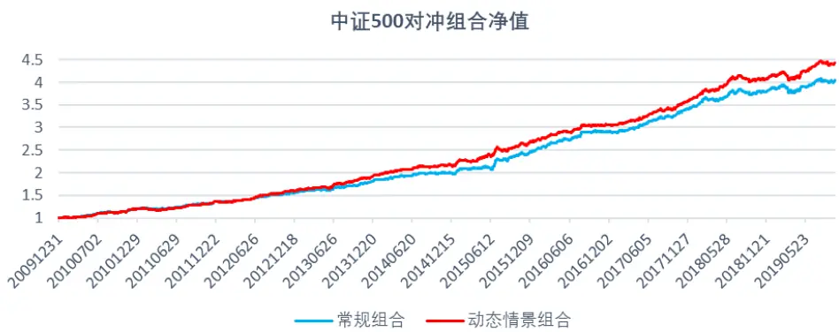

中证500对冲组合分年收益常规组合动态情景组合
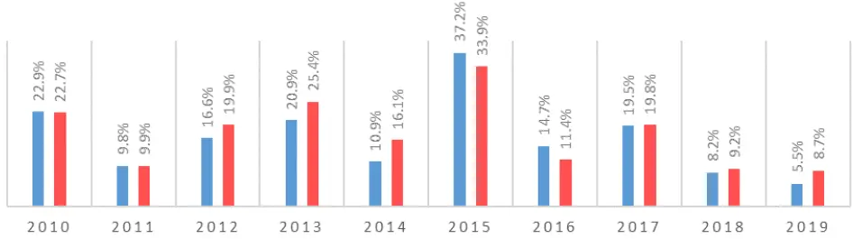

| 组合 | 年化对冲收益最大回撤 |  | IR | 月单边换手 |
| --- | --- | --- | --- | --- |
| 常规组合 | 15.45% | -4.63% | 3.06 | 33.23% |
| 动态情景组合 | 16.58% | -4.48% | 3.36 | 35.68% |

数据来源：东方证券研究所 Wind 资讯

图 41 展示沪深 300 全市场增强组合的表现情况，加入了动态情景模型后，组合的年化收益提升 0.56%，从分年的情况来看，2018 年表现比原来的模型差了 1%，但是 2019年提升了 3%，且大多数年份是有一定的提升的。在构建沪深 300 增强的时候，我们对银行和券商是按照之前报告中的模型进行单独建模的，因此这里的动态情景模型主要改变的主要是非金融部分的因子得分，所以在图 41 中我们同样展示了沪深 300 增强中非金融部分的对冲组合收益（对冲基准为非金融部分的全收益指数），从结果看到，非金融部分的提高效果有年化 1.35%，且回撤大幅下降，说明基于机构持股比的动态情景模型相比于常规的模型还是有一定的提升效果的。

图 41：沪深 300 全市场增强组合表现对比
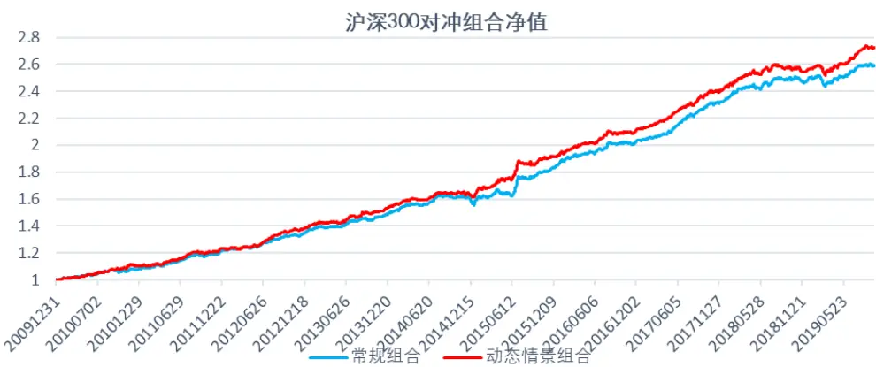
沪深300对冲组合分年收益

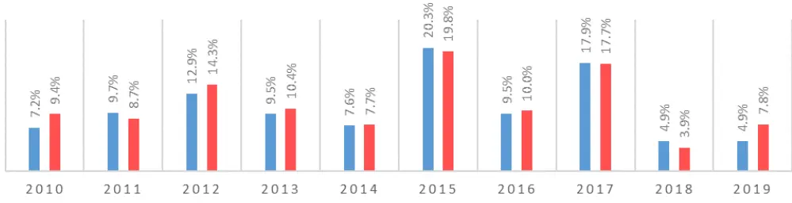

沪深300对冲组合净值（不含金融】
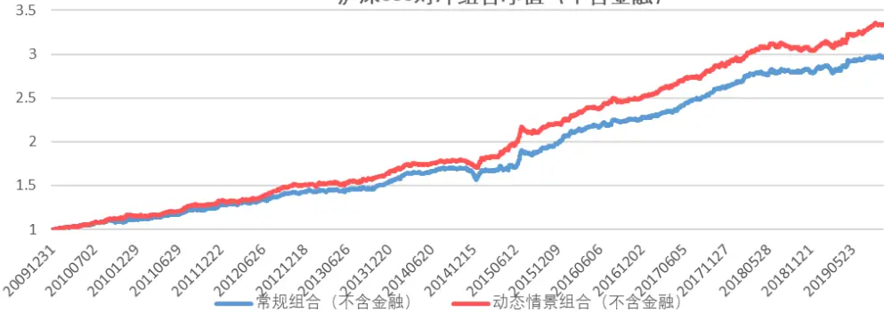

| 组合 | 年化对冲收益最大回撤 |  | IR | 月单边换手 |
| --- | --- | --- | --- | --- |
| 常规组合 | 10.30% | -4.57% | 3.24 | 22.70% |
| 动态情景组合 | 10.86% | -3.19% | 3.45 | 23.67% |
| 常规组合（非金融部分） | 11.85% | -8.08% | 2.73 |  |
| 动态情景组合（非金融部分） | 13.20% | -5.27% | 3.01 |  |

数据来源：东方证券研究所 Wind 资讯

## 4.未来机构化的展望

目前 A 股的机构化程度相较于美国市场还存在一定的差距，但是长期来看，A 股的机构化发展应该是未来的趋势。

2019 年 1 月 14 日，中国外管局称，合格境外机构投资者（QFII）总额度由 1500 亿美元增加至 3000 亿美元，以满足境外投资者扩大对中国投资需求。2019 年 3 月 1 日，MSCI 宣布将扩大中国 A 股在 MSCI 全球基准指数中的纳入因子至 20% (之前为 5%)。具体将分三个阶段落实，5 月份扩大至 10%、8 月份扩大至 15%、11 月份扩大至 20%。11 月份，将把中国 A 股中盘股纳入 MSCI 指数。整体来看，外资未来的流入 A 股是长期的趋势。

除了外资以外，保险资金也在积极考量提高证券资产的配置比重。2019 年 7 月 4 日，银保监会副主席梁涛在国新办新闻发布会上表示，经过近两年的治乱象，保险机构资金运用合规意识有了明显提升，乱象得到有效治理，保险资金运用总体平稳。关于提高保险公司权益类资产监管比例的事情，现在正在积极研究，下一步，考虑在审慎的监管原则下，赋予保险公司更多的投资自主权，进一步提高证券投资比重。目前保险公司权益类资产的监管比例上限是 30%，行业实际用的是 22.64%，跟监管的比例上限相比还有7.36 个百分点，也就是说还有一定的政策空间。

2019 年 10 月 21 日，证监会主席易会满主持召开社保基金和部分保险机构负责人座谈会。会议通报了全面深化资本市场改革的有关情况，并围绕加快资本市场改革、引导更多中长期资金入市听取意见建议。会议提出，引导更多中长期资金入市，是促进资本市场持续稳定健康发展的重要内容，也是这次全面深化资本市场改革的重要任务。会议强调，社保基金和保险机构作为资本市场重要的专业机构投资力量，在优化投资者结构、维护市场稳定发展、提升市场运行效率等方面发挥着重要作用，下一步拓展市场参与深度潜力巨大。会议也同时强调要坚持市场化思维，进一步提高权益类资产投资比重，壮大专业机构投资者力量。

除了外资、社保和险资以外，北上资金也持续的流入 A 股市场，图 42 展示了北上资金的累积流入净额，可以看到在经历了今年3-5月的小幅流出后，北上资金再度持续流入，截至 2019.10.28，累积流入已达 8473 亿。

图 42：陆股通累积规模（亿元）
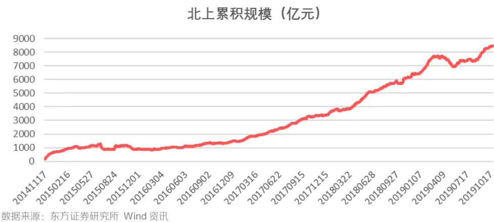

社保、险资、外资和陆股通长期流入 A 股是必然的发展趋势，而散户未来的流入量预期将相对较少，因此 A 股的机构化一定是长期的趋势。文中测试的动态情景模型虽然存在一定样本内的因素，但是这种因子特征却是过去长期存在的（在北上资金入场前就存在了），因此模型也具备一定的参考价值。综合来看，本文所提出基于机构持仓占流通市值比的动态情景模型能够基于市场机构化的程度自动调整情景空间，自适应不同空间的因子特征，能更好的适应未来市场的机构化发展方向。

## 风险提示

- 极端市场环境可能对模型效果造成剧烈冲击，导致收益亏损。

- 量化模型基于历史数据分析得到，未来存在失效风险，建议投资者紧密跟踪模型表现。

## 附录

图 43：因子说明

| 类别 | 因子代码 | 因子说明 |
| --- | --- | --- |
| 估值 | BP | 账面市值比 |
|  | EP | 归属母公司的净利润TTM/总市值 |
|  | SP | 营业收入TTM/总市值 |
|  | CFP | 经营性现金流TTM/总市值 |
|  | DP2 | 过去一年分红/总市值，以分红预案公告日为准00 |
| 成长 | EP_FY1 PROFIT GROWTH YOY | 预期的估值，详见《分析师研报的数据特征与alpha》 归属母公司的净利润季度同比 |
|  | SALES_GROWTH_YOY | 营业收入季度同比 |
|  | SUEO | 基于带漂移项随机游走模型计算的预期外的净利润，详见《业绩超预期类因子》 |
|  | SUE1 |  |
|  | SURO | 基于不带漂移项随机游走模型计算的预期外的净利润，详见《业绩超预期类因子》 |
| 盈利 | SUR1 | 基于带漂移项随机游走模型计算的预期外的营业收入，详见《业绩超预期类因子》 基于不带漂移项随机游走模型计算的预期外的营业收入，详见《业绩超预期类因子》 |
|  | RNOA | 净经营资产收益率，经营利润/净经营资产 |
|  | CFROI | 投资现金收益率，经营性现金净流入/净经营资产 |
|  | ROE | 净资产收益率 |
|  | ROA2 | 总资产净利率 |
| 公司治理 | GPOA | 总资产毛利率 |
| 非流动性 | MR | 高管薪酬前三之和的对数 |
|  | TO60 LNAMIHUD20 | 过去60个交易日的日均换手率对数 |
| 反转投机 |  | 20日Amihud非流动性自然对数 |
|  | RET20 | 过去20个交易日的收益率 |
|  | CGO60 | 处置效应因子，当前价/60日换手反推的持仓价-1 |
|  | IVR20 | 过去20个交易日的特异度 |
| 分析师 | MAXRET60 | 过去最大收益，过去60日最大3个日收益均值 |
|  | COV DISP | 过去6个月有覆盖的机构数量，取根号，详见《分析师研报的数据特征与alpha》 |
|  | PEG | 过去6个月盈利预测的分歧度，详见《分析师研报的数据特征与alpha》 |
|  | SCORE | PE_FY1/FY2隐含的利润增量率，详见《分析师研报的数据特征与alpha》 |
|  | TPER | 综合评价，详见《分析师研报的数据特征与alpha》 |
|  | WFR | 目标价隐含的收益率，详见《分析师研报的数据特征与alpha》 |

数据来源：东方证券研究所

## 分析师申明

每位负责撰写本研究报告全部或部分内容的研究分析师在此作以下声明：

分析师在本报告中对所提及的证券或发行人发表的任何建议和观点均准确地反映了其个人对该证券或发行人的看法和判断；分析师薪酬的任何组成部分无论是在过去、现在及将来，均与其在本研究报告中所表述的具体建议或观点无任何直接或间接的关系。

## 投资评级和相关定义

报告发布日后的 12 个月内的公司的涨跌幅相对同期的上证指数/深证成指的涨跌幅为基准；

## 公司投资评级的量化标准

买入：相对强于市场基准指数收益率 15%以上；

增持：相对强于市场基准指数收益率 5%～15%；

中性：相对于市场基准指数收益率在-5%～+5%之间波动；

减持：相对弱于市场基准指数收益率在-5%以下。

未评级 —— 由于在报告发出之时该股票不在本公司研究覆盖范围内，分析师基于当时对该股票的研究状况，未给予投资评级相关信息。

暂停评级 —— 根据监管制度及本公司相关规定，研究报告发布之时该投资对象可能与本公司存在潜在的利益冲突情形；亦或是研究报告发布当时该股票的价值和价格分析存在重大不确定性，缺乏足够的研究依据支持分析师给出明确投资评级；分析师在上述情况下暂停对该股票给予投资评级等信息，投资者需要注意在此报告发布之前曾给予该股票的投资评级、盈利预测及目标价格等信息不再有效。

## 行业投资评级的量化标准：

看好：相对强于市场基准指数收益率 5%以上；

中性：相对于市场基准指数收益率在-5%～+5%之间波动；

看淡：相对于市场基准指数收益率在-5%以下。

未评级：由于在报告发出之时该行业不在本公司研究覆盖范围内，分析师基于当时对该行业的研究状况，未给予投资评级等相关信息。

暂停评级：由于研究报告发布当时该行业的投资价值分析存在重大不确定性，缺乏足够的研究依据支持分析师给出明确行业投资评级；分析师在上述情况下暂停对该行业给予投资评级信息，投资者需要注意在此报告发布之前曾给予该行业的投资评级信息不再有效。

## Heade 免责声明rtTabl e_Discl ai mer

本证券研究报告（以下简称“本报告”）由东方证券股份有限公司（以下简称“本公司”）制作及发布。

本报告仅供本公司的客户使用。本公司不会因接收人收到本报告而视其为本公司的当然客户。本报告的全体接收人应当采取必要措施防止本报告被转发给他人。

本报告是基于本公司认为可靠的且目前已公开的信息撰写，本公司力求但不保证该信息的准确性和完整性，客户也不应该认为该信息是准确和完整的。同时，本公司不保证文中观点或陈述不会发生任何变更，在不同时期，本公司可发出与本报告所载资料、意见及推测不一致的证券研究报告。本公司会适时更新我们的研究，但可能会因某些规定而无法做到。除了一些定期出版的证券研究报告之外，绝大多数证券研究报告是在分析师认为适当的时候不定期地发布。

在任何情况下，本报告中的信息或所表述的意见并不构成对任何人的投资建议，也没有考虑到个别客户特殊的投资目标、财务状况或需求。客户应考虑本报告中的任何意见或建议是否符合其特定状况，若有必要应寻求专家意见。本报告所载的资料、工具、意见及推测只提供给客户作参考之用，并非作为或被视为出售或购买证券或其他投资标的的邀请或向人作出邀请。

本报告中提及的投资价格和价值以及这些投资带来的收入可能会波动。过去的表现并不代表未来的表现，未来的回报也无法保证，投资者可能会损失本金。外汇汇率波动有可能对某些投资的价值或价格或来自这一投资的收入产生不良影响。那些涉及期货、期权及其它衍生工具的交易，因其包括重大的市场风险，因此并不适合所有投资者。

在任何情况下，本公司不对任何人因使用本报告中的任何内容所引致的任何损失负任何责任，投资者自主作出投资决策并自行承担投资风险，任何形式的分享证券投资收益或者分担证券投资损失的书面或口头承诺均为无效。

本报告主要以电子版形式分发，间或也会辅以印刷品形式分发，所有报告版权均归本公司所有。未经本公司事先书面协议授权，任何机构或个人不得以任何形式复制、转发或公开传播本报告的全部或部分内容。不得将报告内容作为诉讼、仲裁、传媒所引用之证明或依据，不得用于营利或用于未经允许的其它用途。

经本公司事先书面协议授权刊载或转发的，被授权机构承担相关刊载或者转发责任。不得对本报告进行任何有悖原意的引用、删节和修改。

提示客户及公众投资者慎重使用未经授权刊载或者转发的本公司证券研究报告，慎重使用公众媒体刊载的证券研究报告。

## 东方证券研究所

地址：上海市中山南路 318 号东方国际金融广场 26 楼

联系人： 王骏飞

电话：021-63325888*1131

传真：021-63326786

网址： www.dfzq.com.cn

Email： wangjunfei@orientsec.com.cn