## —— 《因子选股系列研究 之 六十二》

## 研究结论

- A股机构化投资趋势日趋明显：（1）机构持股比例显著提高，呈现公募基金、外资及保险资金 “三足鼎立”的格局。（2）近三年公募基金规模以 15%的复合增速稳步增长，总规模达 14 万亿。基金发行持续加速，2019 年发行份额再破万亿。（3）外资持股市值直逼公募，北向资金累计净流入超 9000 亿元。外资所持 A 股市值（1.77万亿元）与公募（2.17 万亿元）的差距持续收窄。（4）险资社保进场加速。

- 基金重仓股的精细化使用方法：公募基金是 A 股最大的机构投资者，而且公募基金的信息披露及时透明，观察基金重仓股对实际投资具有较强的指导意义。本报告我们提出了一种对于基金重仓股的精细化使用方法，即先选基金，进而在优选基金中精选出超配股票，构成优选基金超配组合。在投资组合中合理配置这些超配股票，可以捕捉到来自优秀基金经理的超额收益。

优选基金：在市场公开奖项中获奖的基金组合在奖项公布后超额收益不显著，因而需要我们自己开发选基指标。本篇报告我们使用夏普比率作为选基指标，得到的季度调仓的高夏普比基金组合自 2008 年以来，相对于全市场等权基金组合，平均可以取得 4%的年化超额收益，最近三年超额收益达 6%。

优选基金超配股：完全复制优秀基金经理的前十大重仓股组合也并不能获得可观的超额收益，有进一步优选的必要。在优选基金的前十大重仓股中，再选权重排名前 10%的股票作为优选基金组合的超配股。在投资组合中合理配置这些超配股票，可以更好地捕捉到来自优秀基金经理的超额收益。

优选基金超配组合：优选基金超配组合相对于中证全指、沪深 300、中证 500指数均可以取得超过 10%的年均超额收益。最近三年组合表现尤为突出，超额收益可达 20%-30%。优选组合不能提供传统因子之外的增量 Alpha，但可以帮助我们实现不同的 Alpha 因子权重配比。医药和食品饮料行业是优选组合配置最多的行业，风格上近三年集中于高 beta、有动量效应、大市值、高估值的股票。

- 指数增强组合增效：选取优选基金组合的超配股作为调整对象。添加额外的权重约束，要求优化后的超配股绝对权重之和不小于 10%。

引入优选基金组合超配股的信息后，沪深 300 全市场指数增强组合的年化收益提升 1.4%，改进十分明显。由于银行和券商进行单独建模，相当于我们在65%的权重之中，实现了 2%的年化收益提升，改进效果十分可观。并且优选基金超配股中大部分是沪深 300 成分股，因而提高超配股的权重，并不会使得组合的跟踪误差有大幅提高。中证 500 组合年化收益可提升 0.9%， 2019年收益可提升 3.1%。

## 风险提示

- 量化模型基于历史数据分析得到，未来存在失效的风险，建议投资者紧密跟踪模型表现。

- 极端市场环境可能对模型效果造成剧烈冲击，导致收益亏损。

## 报告发布日期

2019 年 11 月 27 日

证券分析师朱剑涛

021-63325888*6077

zhujiantao@orientsec.com.cn

执业证书编号：S0860515060001

联系人刘静涵

021-63325888-3211

liujinghan@orientsec.com.cn

## 相关报告

| 基于机构持仓的因子情景分析 基于量价关系度量股票的买卖压力 | 2019-10-29 2019-10-29 |
| --- | --- |
| 债券风险模型与债基绩效评估 | 2019-09-14 |
| A 股风险溢价(ERP) |  |
|  | 2019-08-30 |
| 跳跃 Beta 与连续 Beta | 2019-08-02 |
| 资本市场开放对因子投资的影响 | 2019-07-30 |
| 温和收益的动量与极端收益的反转效应 | 2019-07-02 |
| 大小盘风格择时与投资运用 | 2019-05-30 |
| 优质民企策略指数 |  |
|  | 2019-04-24 |
| 波动率因子的逻辑与非对称使用 | 2019-04-24 |
| 公募基金产品与基金经理评价 | 2019-04-23 |
| 国内公募基金历史发展与现状 | 2019-04-22 |
| 基于因子组合FMP的因子加权方法 | 2019-04-15 |
| Alpha 预测之二:机器的比拼 | 2019-03-04 |
| 适宜快节奏的年报公告季 | 2019-02-28 |
| A 股行业内选股分析总结 | 2019-01-16 |
| 日内交易特征稳定性与股票收益 | 2019-01-14 |

A 股机构化是未来的发展趋势，机构投资者的动向值得关注。公募基金是 A 股最大的机构投资者，而且公募基金的信息披露及时透明，观察基金重仓股对实际投资具有较强的指导意义。本篇报告提出了一种对于基金重仓股的精细化使用方法，即先选基金，进而在优选基金中精选出持仓权重靠前的超配股票，构成优选基金超配组合。这些超配股票都是基金经理精选挑选的，具有强烈信心的战略性重仓配置品种，普遍具有明朗的成长前景和较高的投资价值，可以更好地反映基金经理的投资思路。在投资组合中合理配置这些超配股票，可以捕捉到来自优秀基金经理的超额收益，对原有 Alpha 因子体系形成补充，从而有效提升全市场指数增强组合的表现。

## 一、 A股机构化投资趋势

## 1.1 A股机构化程度持续提高

## 1. 机构持股比例显著提高

从上交所公布的散户持股在自由流通市值中的占比来看，过去十年间，散户持股占自由流通市值的比重呈下降趋势。2018 年底上交所中自然人投资者的持股市值在自由流通市值中的占比为64.47%，相比 2010 年底的 88.4%下降了 23.9%，降幅达 27%。可见 A股的“散户化”程度已经明显下降。

图 1：上海证券交易所散户持股市值占比（自由流通市值）
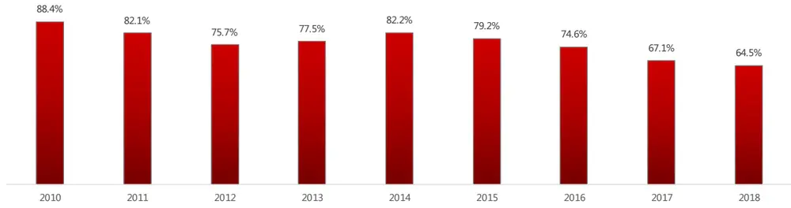
数据来源：东方证券研究所 & 上海证券交易所统计年鉴
注：由于 A 股中很多一般法人持股基本不流通，因而计算在自由流通市值中的占比更为合适。

## 2. 公募基金、陆股通、保险三足鼎立

我们将机构投资者进行拆解后归类为公募基金、券商、券商集合理财、保险、信托、社保、阳光私募、QFII、陆股通、财务公司、企业年金 11 类，考察 A股中机构投资者结构的变化。数据上做以下几点说明：1.基金持股数据来源于基金的半年报和年报，券商的集合资管计划持股数据来源于券商月报，陆股通持股数据来源于交易所网站，这三类均可收集到全部的持股数据；而保险、信托、社保、阳光私募、和 QFII 的持股数据来源于上市公司定期报告中的前十大流通股东，也就意味着只有进入了该股票的前十大流通股东，才能收集到持股数据，因而实际持股比例要高于呈现的数据；2.不考虑一般法人和非金融公司的持股，这是因为这两个分类主要由公司大股东、中央汇金、中国证券金融股份有限公司等组成，很少参与二级市场交易，即使参与也是出于战略投资考虑，对股市造成的是短期冲击，与散户和专业机构为了获取二级市场收益频繁交易有本质不同。3. 不考虑银行持股，这是因为根据我国规定，商业银行是不能主动持有企业股票的，而在前十大流通股东中的银行持股主要是股东质押融资违约后被银行抵扣的股份，所以不能算在机构投资者中。

从各类别机构投资者的持股市值占自由流通市值的比重来看，公募基金、陆股通、保险占比最高，分别约占自由流通市值的 9.1%、4.7%、2.6%，当前 A 股市场的机构投资者结构，呈现公募基金、外资及保险资金 “三足鼎立”的格局。外资、私募基金是 2015年以来最重要的增量资金。

图 2：A 股各类机构投资者持股市值占比（自由流通市值）
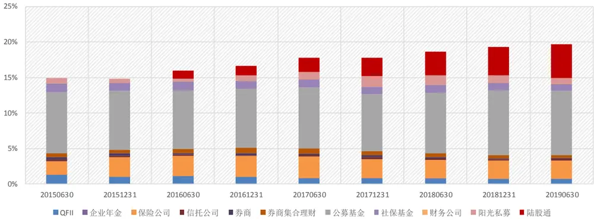
数据来源：东方证券研究所 & Wind 资讯

## 1.2 公募基金发行再破万亿

从 1998 年第一家公募基金成立以来，21 年来中国公募基金行业蓬勃发展。公募基金管理公司数量由 1998 年的 6 家增长到 2019 年的 139 家，增长速度最快的两个时期为 2001 年—2005 年和 2011 年至今，2008 年金融危机前后几乎没有增长。公募基金产品数量从最初的 27只到 2019 年的 5913 只，数量增长速度最快的时期为 2015 、2016 年。公募基金总规模从最初的 104 亿到 2019 年的 14 万亿，其中 2007 年和 2015 年是增长最快的时间点。近三年公募基金规模以 15%的复合增速稳步增长。

图 3：公募基金管理公司数量变化
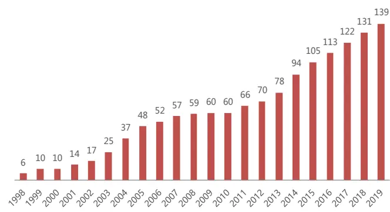
数据来源：东方证券研究所 & Wind 资讯

图 4：公募基金产品数量与规模历史变化
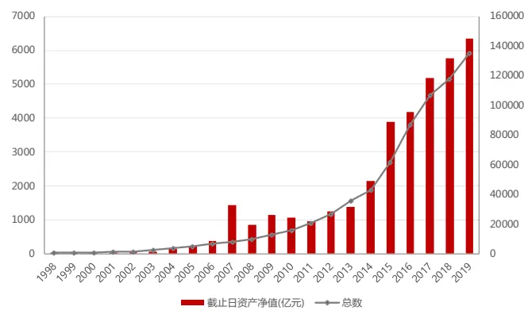
数据来源：东方证券研究所 & Wind 资讯

从基金发行情况来看，近三年基金发行持续加速，每年的新发基金数量及发行份额都在不断提高。2019 年年初至今，新成立基金达到 865 只，发行份额超 1 万亿份，这是继 2015 年之后，公募年度发行规模再度站上万亿元。从年内各月度的发行情况来看，9 月和 11 月是基金发行的高潮，单月发行份额近 2000 亿份。主要是由于：（1）今年基金产品赚钱效应明显，投资者的认购意愿提升；（2）新基金审批效率提升，产品发行速度加快，使得成立产品数量较多。今年 10 月起，证监会开展公募基金产品注册机制改革优化工作，大幅提升注册效率，主动权益类、被动权益类、混合类、债券类四大常规产品适用快速注册程序，比原注册周期缩短 2/3 以上。华安基金申报的华安优质生活混合从接收材料到拿到批文，仅用时 5 个工作日，创下近三年公募基金获批速度之最；（3）今年出现不少爆款产品，17 只基金首募规模超百亿。

图 5：公募基金管理公司数量变化
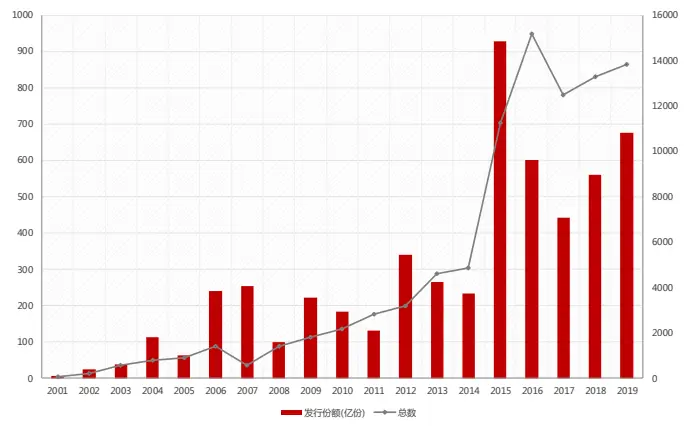
数据来源：东方证券研究所 & Wind 资讯

图 6：2019 年每月新发行基金数量及份额
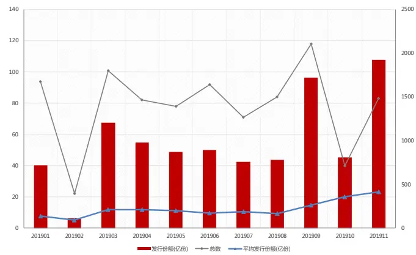
数据来源：东方证券研究所 & Wind 资讯

## 1.3 外资持股市值直逼公募

随着 2003年引进 QFII（合格境外机构投资者），2014年、2016年先后开通沪深港通，中国资本市场开放程度不断提高，外资不断涌入 A股市场。

从北上资金流入情况来看，截至 2019 年 11 月 26 日，通过沪股通和深股通进入 A 股的北向资金累计净流入超 9000亿元。按年度数据来看，近三年北上资金加速流入，年度净买入净额均在2000 亿元左右。2018 年北上资金净买入额接近 3000 亿元，2019 年年初至今北上资金净买入额已经超过 2700 亿元。今年，经历了二季度的短暂沉寂之后，三季度开始北上资金再度活跃，资金流入不断加速。9月份北向资金合计净买入646.64亿元，月度净买入额创沪/深港通开通以来新高。11 月 26 日，北向资金净买入214.30 亿元，单日净买入额创历史新高，同时也是首次单日突破 200亿元。2014 年开通以来，只有 7 次单日净买入额超过 100亿元，其中 2019 年就占到了4 次，显示出北上资金对 A 股市场未来投资机会的认可。

图 7：陆股通（北上）累计买入成交净额（亿元人民币）
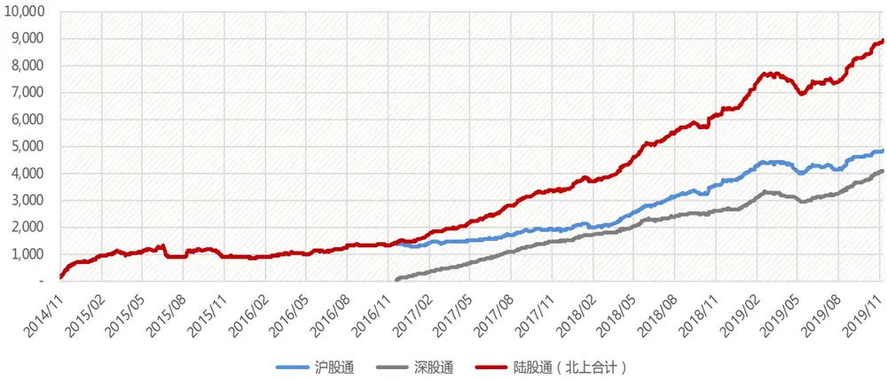
数据来源：东方证券研究所 & Wind 资讯

从持股市值情况来看，截至 2019 年三季度末，北上资金持股市值及外资持股市值均创新高，北上资金持有 A 股的市值总计达到了 1.16 万亿元，占外资持股总市值（1.77 万亿元）的 65.61%，可见沪港通、深港通已成为外资持有 A 股的主流渠道。同期境内公募基金持有 A 股市值为2.17 万亿元。从近五年持股市值的变化来看，外资所持 A 股市值与公募的差距持续收窄，当前仅相差不到 4000亿元，外资持股市值已直逼公募。但从外资在资本市场占比的国际比较来看，A股的国际化还有很大潜力。当前外资所持 A 股市值占 A 股总市值比重为 3.2%，对比美国（14.9%）、日本（32.6%）、韩国（35.7%），A 股中外资占比提升其实还有很大空间。

图 8：北上资金、境外机构与个人、境内公募基金持有 A 股市值对比
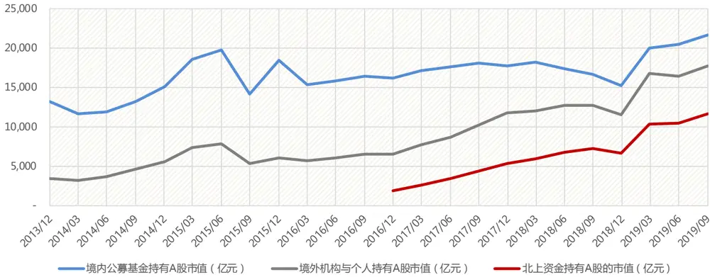
数据来源：东方证券研究所 & Wind 资讯 & 中国人民银行
注：央行披露的境外机构和个人持有境内股票规模由中国人民银行自 2013 年才开始披露，季度更新。包括外资通过 QFII（RQFII）、沪港通、深港通持有的 A 股和港澳台居民直接投资持有 A 股。

## 近年来 A股市场对外开放程度还在不断提升：

1. QFII 和 RQFII 额度限制取消：此前由于有各种审批约束条件，且汇出限制在 2018 年 6 月才取消（QFII 每月资金汇出不超过上年末境内总资产 20%的），QFII 和 RQFII 额度使用率有限。沪深港通开通后，由于通过陆股通投资 A 股没有门槛限制，且每日额度上限和可投资标的范围基本能够满足外资投资需求，外资逐步转向陆股通渠道进入 A 股，陆股通持股市值在 2018 年已超过QFII 和 RQFII。为进一步满足境外投资者对我国金融市场投资需求，2019 年 1 月 14 日，国家外汇管理局宣布将 QFII 总额度增加至 3000 亿美元，9 月 10 日宣布取消 QFII 和 RQFII 的投资额度限制，外资投资 A 股将更加便利。外汇局公布的合格境外机构投资者（QFII）投资额度审批情况显示，截至 2019 年 10 月 31 日，292 家投资机构合计获得1113.76 亿美元额度。今年以来，QFII 新增的获批额度为 103.2 亿美元已达到去年同期的 3.13 倍。

2. 国际指数扩容：MSCI 指数、富时罗素指数与标普道琼斯指数在 2019-2020 年将分别通过3 次、3 次、1 次扩容举措将 A股纳入。（1）2019 年3 月，MSCI 宣布将所有大盘 A 股（包含符合条件的创业板标的）在 MSCI 中国指数中的纳入因子由 5%增加至 20%，具体将分三个阶段落实（5 月份扩大至 10%、8 月份扩大至 15%、11 月份扩大至 20%）。11 月 26 日已完成第三阶段，同时宣布将 A 股中盘股（包含符合条件的创业板标的）一次性以 20%的纳入因子纳入MSCI中国指数。第三步扩容有望为 A 股市场带来 400 亿美元的增量资金，其中被动资金约 60 亿美元。（2）富时罗素于 2018 年 9 月 27 日宣布将中国 A 股纳入其全球股票指数系列，具体将分三个阶段落实（6 月份扩大至 5%、9 月份扩大至 15%、2020 年 3 月份扩大至 25%），2019 年 9 月23 日已完成第二阶段。根据富时罗素的官方测算，第二步扩容将给 A 股带来 40 亿美元的被动资金流入。（3）2019 年 9 月 23 日，标普公司以 25％的纳入因子将 A 股一次性纳入其新兴市场全球基准指数，有望带来 11 亿美元的被动资金流入。

景顺资管公司最近对北美、亚太和欧洲 400 多名资产所有者和专业投资者进行调查，询问他们对中国市场的看法。超过 80%的受访者表示，他们预计在未来 12 个月内增加在中国的投资。60%的受访者表示已经直接配置了中国在岸股票和固定收益类资产。可见，全球投资者对中国经济前景持乐观态度，外资对A股的配置需求在逐步提升，将来会有越来越多的海外中长期资金流入A股。

## 1.4 险资社保加速进场

由于资金体量庞大、负债周期较长，险资动向始终是资本市场关注的焦点。伴随近期金融监管高层密集“喊话”，拓宽保险资金入市比例等多项推进中长期资金入市的实质举措将加速推进。在7 月的国新办发布会上，银保监会副主席梁涛透露，银保监会正在积极研究提高保险公司权益类资产的监管比例事宜。目前保险公司权益类资产的监管比例上限是 30%，行业实际用的是 22.64%，还有一定的政策空间。

2019 年 10 月 21 日，证监会主席易会满主持召开社保基金和部分保险机构负责人座谈会。会议通报了全面深化资本市场改革的有关情况，并围绕加快资本市场改革、引导更多中长期资金入市听取意见建议。会议提出，引导更多中长期资金入市，是促进资本市场持续稳定健康发展的重要内容，也是这次全面深化资本市场改革的重要任务。会议强调，社保基金和保险机构作为资本市场重要的专业机构投资力量，在优化投资者结构、维护市场稳定发展、提升市场运行效率等方面发挥着重要作用，下一步拓展市场参与深度潜力巨大。会议也同时强调要坚持市场化思维，进一步提高权益类资产投资比重，壮大专业机构投资者力量。

综上所述，机构投资是未来 A股市场的发展趋势，机构投资者的动向值得关注。

## 二、 优选基金的超配组合

公募基金是 A 股最大的机构投资者，而且公募基金的信息披露及时透明，观察基金重仓股对实际投资具有较强的指导意义。本章，我们提出了一种对于基金重仓股的精细化使用方法，先选基金，进而在优选基金中精选出超配股票，构成优选基金超配组合，以期能够捕捉优秀基金经理的超额收益来源。

本篇报告的基金范围主要为主动权益型基金，根据 Wind 基金类型分类选择普通股票型基金以及偏股混合型基金。在测试过程中，只考虑开放式基金，选择初始基金，剔除分级基金。历史回测区间为 2007.12.31 — 2019.09.30。

## 2.1 优选基金

## 1. 基金规模初选

基金规模是评价基金产品的重要维度之一。我们基金选择的第一步，就是根据基金规模进行初选。我们按照基金当期规模排序分十组，考察各组在下季度的收益情况（用过去一年的平均规模，与用最新一期规模结果差别不大）。分组超额收益结果显示，基金收益表现会受到基金规模的影响，但二者并非线性关系，而是呈现右偏的倒 U 形。规模最大的基金明显跑输其他基金，平均一个季度贡献-0.81%的负向超额收益。极小规模基金也能带来一定超额收益，中等规模基金表现最好。

图 9：基金当期规模与下季度收益的分组回测结果
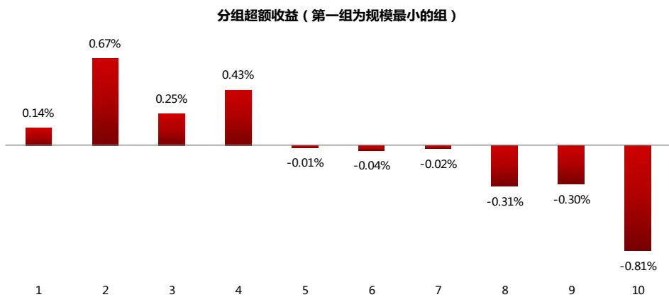
数据来源：东方证券研究所 & Wind 资讯

一般来说，基金产品规模越大，意味投资者对基金经理能力的认可度越高，基金经理实力越强。同时基金获取数据和研究服务的成本，以及管理成本和间接费用并不会随规模的增长同比例增加，这些会给基金带来正的规模经济效应。然而实证结果显示，大规模基金未来业绩表现反而不佳。可能的原因有以下几点：（1）流动性约束与价格冲击：大规模交易使得基金调仓灵活性变差，可能会错过买卖股票的最佳时机，而小基金“船小好调头”。此外大额交易带来的冲击成本也会提高。（2）基金经理管理能力限制：基金投资受限于“双十规定”（一只基金持同一股票不得超过基金资产的 10%，一个基金公司旗下所有基金持同一股票不得超过该股票市值的 10%。），被迫分散投资，很难集中仓位于少数几只精选股票，导致类指数化投资的尴尬。此外，规模做大后，维持业绩稳定是基金经理的首要目标，追求短期高收益的动力不足。（3）打新收益稀释：基金参与打新可以增厚收益，而打到手的新股是有上限的，大规模基金的打新收益会被稀释。此外，小规模基金虽然也能带来一定超额收益，但流动性较差，资质良莠不齐，更易受到日常申赎的影响，业绩波动可能较大。

综合考虑后，此处我们选择规模大于 10亿且小于 100亿的中等规模基金作为研究对象。每季度基金规模的剔除比例如下图所示。可以看到，2008 年之前，由于基金供给有限，供不应求使得基金规模迅速膨胀，共 177 只基金中百亿以上的大规模基金占比高达 50%。 金融危机之后股票基金规模迅速缩水，此后百亿以上大规模基金占比不到 10%，而 10 亿以下的小基金占比不断提高。最新一期（20190930）百亿以上大规模基金占比仅为 0.5%（5 只），10 亿以下小规模基金占比71%（753 只），剔除后的基金池数量为 307 只。

图 10：基金规模剔除比例
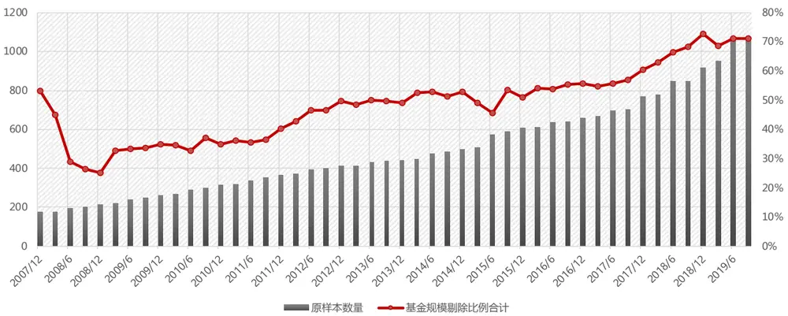
数据来源：东方证券研究所 & Wind 资讯

## 2. 选基指标

首先，我们考察市场公开奖项是否具有选基效果。我们以金牛奖为例，取当年上榜的普通股票型基金和偏股混合型基金等权构成获奖基金组合。近三年间，每年获奖基金组合中的基金数量基本在 30 个左右，平均规模在20-40 亿之间。

图 11：获奖基金组合的数量及平均规模
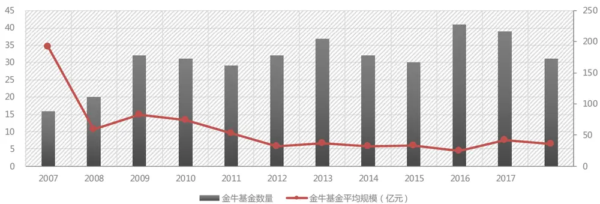
数据来源：东方证券研究所 & Wind 资讯

下面我们考察获奖基金组合在奖项实际公告后的收益情况，避免引入未来信息。需要注意的是，由于奖项一般一年公布一次，组合调仓频率为年度，因而持有期小于一年时的超额收益不能进行年化处理，持有期大于一年则进行年化处理。从结果可以看到，相对于全市场所有的普通股票型基金和偏股混合型基金（未进行规模筛选），获奖基金组合在奖项公布后的超额收益均在 0 附近，并没有显著的选基效果，而且数据更新频率太低，对投资的实用价值不高。

图 12：获奖基金组合的分年绝对收益和超额收益（持有期未满一年不进行年化）

| 绝对收益 持有期 |  |  |  |  |  |  |
| --- | --- | --- | --- | --- | --- | --- |
| 年份 | 一个月 | 三个月 | 六个月 | 一年 | 三年 | 五年 |
| 2007 | -5.8% | -24.6% | -35.9% | -51.7% | -3.3% | -7.4% |
| 2008 | 15.5% | 26.0% | 49.2% | 62.9% | 11.1% | 11.1% |
| 2009 | -7.4% | 4.7% | 18.0% | 6.0% | 2.8% | 15.9% |
| 2010 | -4.4% | -3.4% | -14.0% | -18.0% | -1.7% | 7.2% |
| 2011 | 6.9% | 4.2% | -3.5% | 13.5% | 22.7% | 13.0% |
| 2012 | 3.5% | 5.7% | 14.7% | 7.6% | 18.0% | 14.7% |
| 2013 | -2.9% | 1.9% | 12.0% | 67.3% | 16.7% | 8.6% |
| 2014 | 11.2% | 27.7% | -12.4% | -7.6% | 3.0% |  |
| 2015 | 0.9% | 2.7% | 6.7% | 8.3% | 1.7% |  |
| 2016 | -4.9% | 0.9% | 5.6% | 7.7% |  |  |
| 2017 | -3.5% | -5.3% | -15.5% | -2.3% |  |  |
| 2018 | -5.5% | -0.4% | 5.1% |  |  |  |
| 平均 | 0.3% | 3.3% | 2.5% | 8.5% | 7.9% | 9.0% |

| 超额收益 | 持有期 |  |  |  |  |  |
| --- | --- | --- | --- | --- | --- | --- |
| 年份 | 一个月 | 三个月 | 六个月 | 一年 | 三年 | 五年 |
| 2007 | 0.6% | 0.5% | -0.3% | -0.1% | 1.8% | 1.4% |
| 2008 | -1.7% | -3.0% | -5.2% | -2.6% | 2.9% | 2.7% |
| 2009 | 0.4% | 0.6% | -0.8% | 2.2% | 1.2% | 0.8% |
| 2010 | 0.9% | 1.5% | 2.4% | 3.1% | 1.9% | 1.3% |
| 2011 | 0.1% | -0.3% | -1.0% | 0.6% | -2.5% | -1.1% |
| 2012 | 0.4% | 2.1% | 1.6% | 1.0% | 0.9% | 0.9% |
| 2013 | -0.9% | -0.2% | -0.9% | -2.7% | -3.3% | -3.8% |
| 2014 | 0.0% | -1.9% | 0.3% | 0.4% | -0.6% |  |
| 2015 | 0.3% | -0.2% | 0.0% | -1.3% | -3.2% |  |
| 2016 | -0.4% | -0.3% | -0.7% | 0.0% |  |  |
| 2017 | -0.6% | 1.4% | 0.8% | 0.3% |  |  |
| 2018 | 2.2% | 2.8% | -0.5% |  |  |  |
| 平均 | 0.1% | 0.2% | -0.4% | 0.1% | -0.1% | 0.3% |

数据来源：东方证券研究所 & Wind 资讯

因而，我们仍需要继续挖掘有效的选基指标，有关择基的详细内容请参见我们后续推出的专题报告。本篇报告我们使用夏普比率作为选基指标。夏普比率，是一个可以同时对收益与风险加以综合考虑的指标，广泛运用于基金市场，目前已成为国际上用以衡量基金绩效表现的最为常用的一个标准化指标。夏普比率的核心思想就是，在固定的所能承受的风险时，追求最大报酬；在固定的预期报酬下，追求最低的风险。下面我们在进行过规模筛选后的基金池中，每季度末按照过去一年的夏普比率将基金分十组，考察 top10%基金构成的等权基金组合相对于基金池的超额收益。可以看到，季度调仓的高夏普比率基金组合自 2008年以来，相对于等权基金池，平均可以取得 4%的年化超额收益，最近三年更是可以取得平均 6%的年化超额收益。

图 13：过去一年夏普比率 top10%基金等权组合的分年收益（季度调仓）
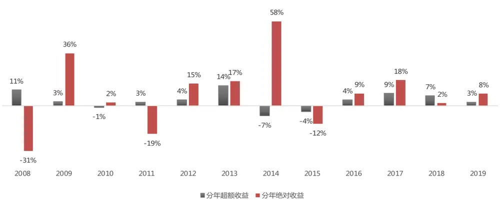
数据来源：东方证券研究所 & Wind 资讯

## 3. 优选基金情况

下图展示了我们每季度的优选基金的数量和平均规模。最近三年优选基金数量基本在 20 只-30 只之间，平均规模基本在 20 亿-30亿之间。

图 14：优选基金的数量和平均规模
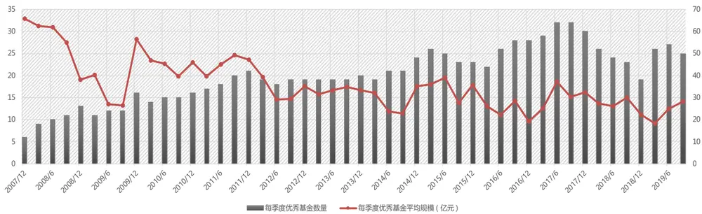
数据来源：东方证券研究所 & Wind 资讯

下面我们展示了根据 2019 年三季报信息选出的优选基金。可以看到，多数都是由明星基金经理管理的知名基金产品。

图 15：优选基金列表（2019年三季报）

| 日期 | 基金代码 | 基金简称 | 基金合计规模（亿元） | 基金经理(时任) |
| --- | --- | --- | --- | --- |
| 2019/9/30 | 83 | 汇添富消费行业 | 74.81 | 胡昕炜 |
| 2019/9/30 | 751 | 嘉实新兴产业 | 12.76 | 归凯 |
| 2019/9/30 | 1104 | 华安新丝路主题 | 13.71 | 谢昌旭 |
| 2019/9/30 | 1126 | 上投摩根卓越制造 | 16.98 | 李德辉 |
| 2019/9/30 | 1178 | 前海开源再融资主题精选 | 22.52 | 邱杰 |
| 2019/9/30 | 1410 | 信达澳银新能源产业 | 20.12 | 冯明远 |
| 2019/9/30 | 2692 | 富国创新科技 | 29.33 | 李元博 |
| 2019/9/30 | 4505 | 博时新兴消费主题 | 11.44 | 王俊,王诗瑶 |
| 2019/9/30 | 40005 | 华安宏利 | 32.36 | 王春 |
| 2019/9/30 | 40035 | 华安逆向策略 | 12.22 | 崔莹 |
| 2019/9/30 | 50026 | 博时医疗保健行业A | 33.18 | 葛晨 |
| 2019/9/30 | 160611 | 鹏华优质治理 | 11.23 | 陈璇淼 |
| 2019/9/30 | 161810 | 银华内需精选 | 17.60 | 刘辉 |
| 2019/9/30 | 162605 | 景顺长城鼎益 | 83.33 | 刘彦春 |
| 2019/9/30 | 162703 | 广发小盘成长 | 32.93 | 刘格菘 |
| 2019/9/30 | 163415 | 兴全商业模式优选 | 26.36 | 乔迁 |
| 2019/9/30 | 217005 | 招商先锋 | 16.93 | 付斌 |
| 2019/9/30 | 260104 | 景顺长城内需增长 | 16.45 | 刘彦春 |
| 2019/9/30 | 260109 | 景顺长城内需增长贰号 | 33.36 | 刘彦春 |
| 2019/9/30 | 270002 | 广发稳健增长 | 71.39 | 傅友兴 |
| 2019/9/30 | 270007 | 广发大盘成长 | 40.67 | 程琨,李琛,苗宇 |
| 2019/9/30 | 519727 | 交银成长30 | 20.13 | 郭斐 |
| 2019/9/30 | 519778 | 交银经济新动力 | 30.30 | 郭斐 |
| 2019/9/30 | 519915 | 富国消费主题 | 11.46 | 王园园,刘莉莉 |
| 2019/9/30 | 690007 | 民生加银景气行业 | 14.49 | 王亮 |

数据来源：东方证券研究所 & Wind 资讯

## 2.2 挑选优选基金的超配股

## 1. 优选基金的前十大重仓股

所谓基金重仓股，是指该股票占基金净值较大比重，对基金净值具有较大影响。一般所指的基金重仓股，是单个基金在季报中披露的权重排名前十的股票。按照基金的报告披露规则，基金管理人应当在每个季度结束之日起十五个工作日内，编制完成基金季度报告，并公布其前十大重仓股，这些信息具有相当的及时性。下面我们根据基金季报信息，统计优选基金的前十大重仓股。如果某股票由多只基金持仓，则计算其平均权重。

从优选基金组合的前十大重仓股的数量变化来看，最近三年重仓股数量明显降低，在 100 只左右，说明优选基金的抱团紧密度提高，心仪股票更加集中。从平均权重变化来看，重仓股平均持仓权重提高，当前在 6%左右，说明单个基金的持仓分散程度降低。

图 16：优选基金组合的前十大重仓股的数量和平均权重
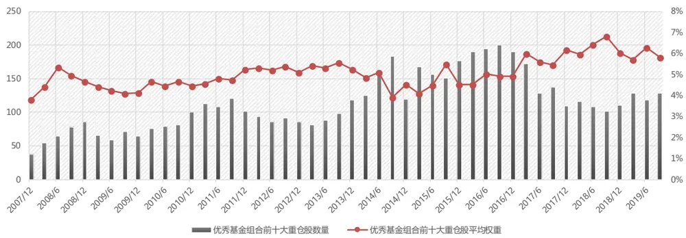
数据来源：东方证券研究所 & Wind 资讯

然而，完全复制优秀基金经理的前十大重仓股组合也并不能获得可观的超额收益，从 2008-2019 年，相对于市场指数的年均超额收益在 8%左右，相对于全市场等权组合的年均超额收益仅为 2%。因而，还有进一步优选的必要。

图 17：优选基金组合的前十大重仓股组合的分年超额收益

| 按权重加权 |  |  |  |  | 等权组合 |  |  |  |
| --- | --- | --- | --- | --- | --- | --- | --- | --- |
| 年份 | 相对于全市场等权组合 | 相对于中证全指 | 相对于沪深300 | 相对于中证500 | 相对于全市场等权组合 | 相对于中证全指 | 相对于沪深300 | 相对于中证500 |
| 2008 | -12% | 13% | 21% | -1% | -14% | 10% | 17% | -4% |
| 2009 | -19% | -1% | 7% | -16% | -17% | 3% | 11% | -13% |
| 2010 | 9% | 14% | 15% | 15% | 7% | 13% | 13% | 13% |
| 2011 | 5% | 4% | 0% | 9% | 4% | 2% | -1% | 7% |
| 2012 | 20% | 22% | 22% | 25% | 21% | 23% | 23% | 26% |
| 2013 | -12% | 13% | 31% | 0% | -12% | 13% | 31% | 0% |
| 2014 | -17% | -11% | -20% | -9% | -20% | -14% | -23% | -12% |
| 2015 | -11% | 5% | 10% | 7% | -8% | 8% | 14% | 11% |
| 2016 | 8% | 7% | 2% | 7% | 7% | 7% | 1% | 6% |
| 2017 | 26% | 15% | 2% | 17% | 23% | 12% | 0% | 14% |
| 2018 | 4% | 4% | 0% | 9% | 3% | 3% | -1% | 7% |
| 2019 | 25% | 21% | 15% | 26% | 25% | 20% | 14% | 25% |
| 历史平均（2008-2019） | 2% | 9% | 9% | 7% | 2% | 8% | 8% | 7% |
| 最近3年平均（2017-2019） | 19% | 13% | 6% | 17% | 17% | 12% | 4% | 15% |

数据来源：东方证券研究所 & Wind 资讯

## 2. 优选基金的超配股

不同基金的持仓分散程度不同，持仓集中度高的股票，其重仓股更具代表性。假设 A，B 基金均是优选基金，A 基金的第一大权重股 Sa 占比 5%，B 基金的第一大权重股 Sb 占比达到 15%，则股票 Sb 更能代表基金 B 的业绩表现，更能反映基金经理的投资思路。因而，配置股票Sb 相比配置股票 Sa 能够更好地抓住优秀基金经理带来的超额收益。因而，我们在优选基金组合的前十大重仓股中，做进一步的筛选，选出其中的超配股票。

考虑到不同基金的股票投资比例不尽相同，我们按照持股市值占基金总股票投资市值的比例对股票进行排序。在优选基金的前十大重仓股票池中，再选权重排名前 10%的股票作为优选基金组合的超配股。这些超配股票都是基金经理精选挑选的，具有强烈信心的战略性重仓配置品种，普遍具有明朗的成长前景和较高的投资价值，可以更好地反映基金经理的投资思路。在投资组合中合理配置这些超配股票，可以更好地捕捉到来自优秀基金经理的超额收益。

需要注意的是：由于银行和非银行业有单独的选股策略，因而这两个行业的股票我们不选。如果某只股票被多只基金持有，且权重排名均在前 10%，那么计算平均权重作为该股票的基金持仓权重。下图展示了我们每季度选择出来的优选基金组合超配股的数量和平均流通市值。最近三年超配股数量在 15只左右，平均流通市值显著提高，基本均在 1000亿以上。平均持仓权重变化不大，在 11%左右。

图 18：优选基金组合超配股的数量和平均流通市值
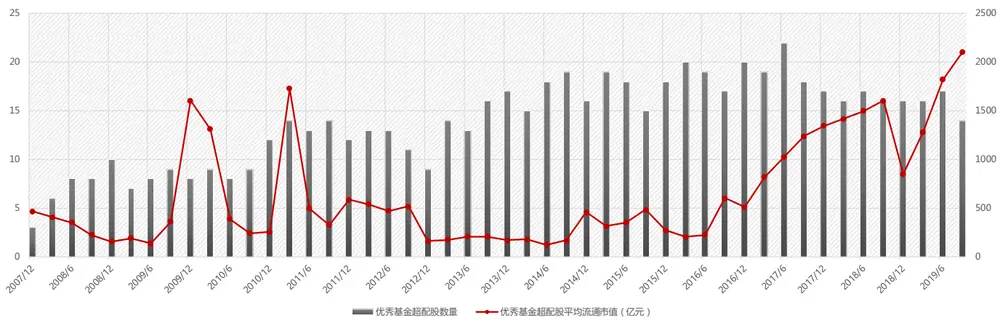
数据来源：东方证券研究所 & Wind 资讯

下面我们统计每期的优选基金超配股是否是沪深 300 或者中证 500 成分股。可以看到，平均来看，六成以上的超配股为沪深 300 成分股，中证 500 成分股平均来看仅占 15%。2017 年以来属于沪深 300 成分股的超配股比例一直处于高位，在 70%左右，反映出优选基金近三年的持仓风格越来越偏向于大盘股。

图 19：优选基金组合超配股在沪深 300 和中证 500 指数中的分布
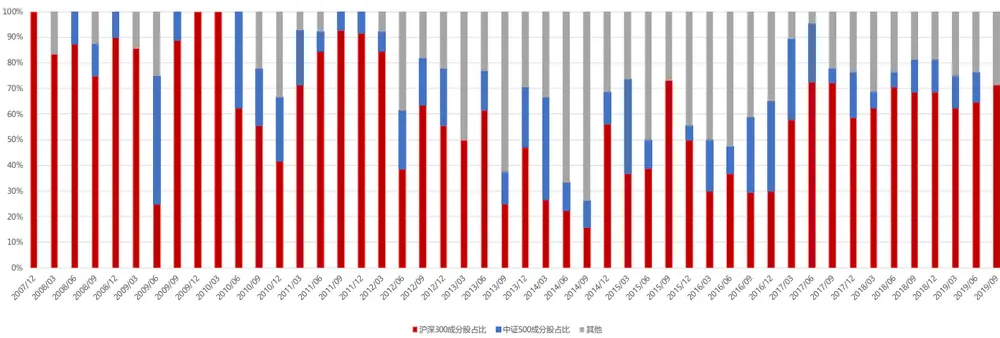
数据来源：东方证券研究所 & Wind 资讯

下面我们展示了根据 2019 年三季报信息选出的优选基金组合的超配股。可以看到，贵州茅台和五粮液被多只优选基金重仓持有。流通市值达到 1000亿以上的超大盘股有 5只，占 35%。

图 20：优选基金组合超配股列表（2019 年三季报）

| 股票代码 | 股票名称 | 流通市值(亿元) | 中信一级行业 | 是否沪深300指数成分股 | 是否中证500指数成分股 | 优秀基金平均持仓权重 | 持股基金 | 基金合计规模（亿元） | 基金过去一年sharpe比率 |
| --- | --- | --- | --- | --- | --- | --- | --- | --- | --- |
| 568 | 泸州老窖 | 1244.30 | 食品饮料 | 是 | 否 | 11.1% | 广发大盘成长 | 40.67 | 1.41 |
| 651 | 格力电器 | 3420.76 | 家电 | 是 | 否 | 10.3% | 前海开源再融资主题精选 | 22.52 | 1.50 |
| 661 | 长春高新 | 670.50 | 医药 | 是 | 否 | 10.3% | 鹏华优质治理 | 11.23 | 1.46 |
| 858 | 五粮液 | 4926.91 | 食品饮料 | 是 | 否 | 10.5% | 广发大盘成长 | 40.67 | 1.41 |
|  |  |  |  |  |  |  | 景顺长城鼎益 | 83.33 | 1.40 |
|  |  |  |  |  |  |  | 汇添富消费行业 | 74.81 | 1.44 |
|  |  |  |  |  |  |  | 华安宏利 | 32.36 | 1.42 |
| 2714 | 牧原股份 | 822.73 | 农林牧渔 | 是 | 否 | 10.1% | 景顺长城鼎益 | 83.33 | 1.40 |
| 300118 | 东方日升 | 84.40 | 电力设备 医药 | 否 | 否 | 10.5% 10.0% | 博时新兴消费主题 | 11.44 | 1.66 |
| 300357 300601 | 我武生物 | 188.81 194.72 | 医药 | 否 否 | 否 | 10.2% | 广发稳健增长 | 71.39 | 1.48 |
| 300661 | 康泰生物 圣邦股份 | 95.18 | 电子元器件 | 否 |  | 11.2% | 广发小盘成长 广发小盘成长 | 32.93 32.93 | 1.40 1.40 |
| 600438 | 通威股份 | 377.04 | 电力设备 | 是 | 否否否 | 10.9% | 博时新兴消费主题 | 11.44 | 1.66 |
|  |  |  |  |  |  |  | 汇添富消费行业 | 74.81 | 1.41 |
| 600519 |  |  |  | 是 | 否 | 10.1% | 广发大盘成长 | 40.67 | 1.44 |
|  |  |  |  |  |  |  |  | 83.33 |  |
|  |  |  |  |  |  |  | 景顺长城鼎益 | 32.36 | 1.40 1.42 |
|  |  |  |  |  |  |  | 华安宏利 |  |  |
|  |  |  |  |  |  |  | 景顺长城内需增长贰号 | 33.36 | 1.47 |
|  |  |  |  |  |  |  | 富国消费主题 景顺长城内需增长 | 11.46 16.45 | 1.64 1.53 |
|  |  |  |  |  |  |  | 华安新丝路主题 | 13.71 | 1.71 |
| 600585 | 海螺水泥 | 1653.48 | 建材 | 是 | 否否 | 11.9% | 华安宏利 | 32.36 | 1.42 |
| 601933 | 永辉超市 | 841.47 | 商贸零售 | 是 |  | 10.7% | 兴全商业模式优选 | 26.36 | 1.66 |
| 603160 | 汇顶科技 | 474.92 | 电子元器件 | 是 | 否 | 7.2% | 交银成长30 | 20.13 | 2.12 |

数据来源：东方证券研究所 & Wind 资讯

## 2.3 构造优选基金的超配组合

## 1. 组合构建方法

每季度，我们将优选基金组合的超配股，按照持仓权重加权和等权两种方法构成组合。考察该组合在下个季度的收益情况。由于基金重仓股信息要等到每个季度结束之日起十五个工作日内才能获得，因而此处我们在计算收益时将时间窗口均滞后 15 个交易日，避免引入未来信息。（例如2019/06/30 调仓时，考察的是 2019/07/19 — 2019/10/21 这 60 天中的组合收益情况）

## 2. 收益情况

从绝对收益来看，两种不同加权方法的优选基金超配组合表现差别不大，等权组合略胜一筹，二者均能明显跑赢全市场等权组合以及常见市场指数（沪深 300、中证 500、中证全指）。

图 21：优选基金超配组合的绝对收益情况
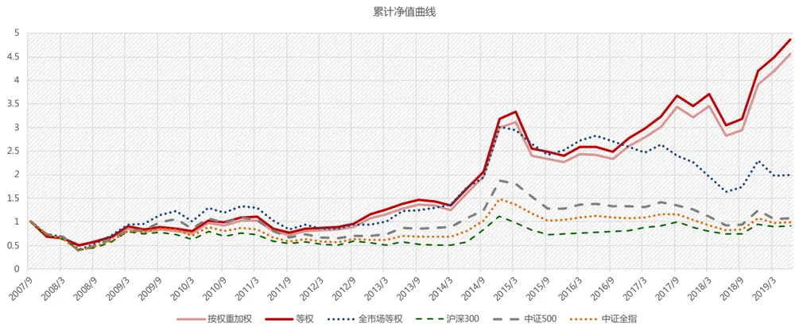
数据来源：东方证券研究所 & Wind 资讯

从超额收益来看，两种优选基金超配组合相对全市场等权组合以及常见市场指数均能取得不错的超额收益。从2008-2019年，相对于中证全指、沪深 300、中证 500 指数均可以取得超过 10%的年均超额收益。最近三年组合表现尤为突出，相对于全市场等权组合可以取得年均 30%的超额收益，相对中证全指的超额收益为 23%，相对沪深 300和中证 500指数的超额收益分别为 16%和27%。 相比于优选基金前十大重仓股组合，收益实现了翻倍提升。

图 22：优选基金超配组合的分年超额收益情况
优秀基金超配股组合（按权重加权）分年超额收益
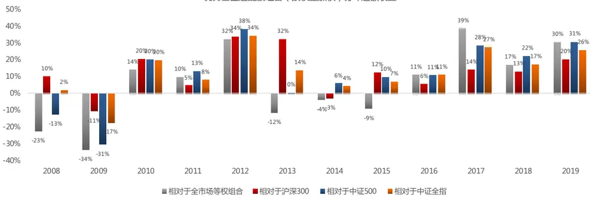

优秀基金超配股组合（等权）分年超额收益
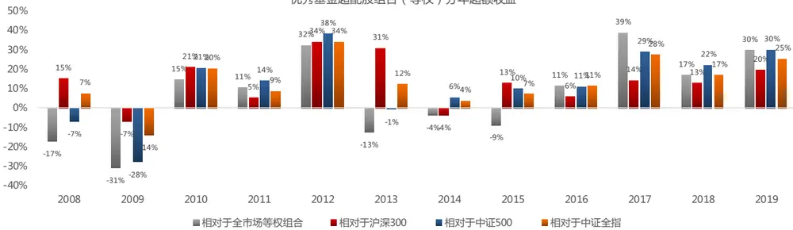

| 按权重加权 |  |  |  |  | 等权组合 |  |  |  |
| --- | --- | --- | --- | --- | --- | --- | --- | --- |
| 年份 | 相对于全市场等权组合 | 相对于中证全指 | 相对于沪深300 | 相对于中证500 | 相对于全市场等权组合 | 相对于中证全指 | 相对于沪深300 | 相对于中证500 |
| 2008 | -23% | 2% | 10% | -13% | -17% | 7% | 15% | -7% |
| 2009 | -34% | -17% | -11% | -31% | -31% | -14% | -7% | -28% |
| 2010 | 14% | 20% | 20% | 20% | 15% | 20% | 21% | 21% |
| 2011 | 10% | 8% | 5% | 13% | 11% | 9% | 5% | 14% |
| 2012 | 32% | 34% | 34% | 38% | 32% | 34% | 34% | 38% |
| 2013 | -12% | 14% | 32% | 0% | -13% | 12% | 31% | -1% |
| 2014 | -4% | 4% | -3% | 6% | -4% | 4% | -4% | 6% |
| 2015 | -9% | 7% | 12% | 10% | -9% | 7% | 13% | 10% |
| 2016 | 11% | 11% | 6% | 11% | 11% | 11% | 6% | 11% |
| 2017 | 39% | 27% | 14% | 28% | 39% | 28% | 14% | 29% |
| 2018 | 17% | 17% | 13% | 22% | 17% | 17% | 13% | 22% |
| 2019 | 30% | 26% | 20% | 31% | 30% | 25% | 20% | 30% |
| 历史平均（2008-2019） | 6% | 13% | 13% | 11% | 7% | 13% | 13% | 12% |
| 最近3年平均（2017-2019） | 29% | 23% | 16% | 27% | 29% | 23% | 16% | 27% |

数据来源：东方证券研究所 & Wind 资讯

## 3. 超额收益来源

下面我们通过回归的方式，进一步分析优选基金超配组合的超额收益来源。具体方法为：将优选基金超配组合相对于中证全指的超额收益作为因变量，市场因子（用中证全指收益率替代）、市值因子、以及市值中性化之后的七大类 Alpha 因子的多空组合收益作为自变量，进行添加截距项的时间序列 OLS 回归。

图 23：Alpha 因子列表与分类

| 大类 | 因子简称 | 因子定义 | 大类 | 因子简称 | 因子定义 |
| --- | --- | --- | --- | --- | --- |
|  | BP EP | 账面市值比 归属母公司的净利润TTM/总市值 | 公司治理 | MR | 高管薪酬前三之和的对数 |
|  | EP2 | 扣非后的净利润TTM/总市值 |  | TO20 | 过去20个交易日的日均换手率对数 |
|  | CFP | 经营性现金流TTM/总市值 | 非流动性 | ILLIQ | 20日Amihud非流动性自然对数 |
|  | SP | 营业收入TTM/总市值 息税前利润与企业价值之比 |  | IVOL20 | 过去20个交易日的特质波动率 |
|  | EBIT2EV DP2 | 过去一年分红/总市值，以分红预案公告日为准 |  | IVOL60 | 过去60个交易日的特质波动率 |
|  | EP_FY1 | 预期的估值 |  | IVOL120 | 过去120个交易日的特质波动率 |
|  | PEG | PE_FY1/FY2隐含的利润增量率 |  | IVR20 | 过去20个交易日的特异度 |
|  | RNOA | 净经营资产收益率 |  | IVR60 | 过去60个交易日的特异度 |
| Profit |  | 投资现金收益率 |  |  | 过去20个交易日的收益率 |
|  | CFROI |  | RET20 |  |  |
|  | ROE | 净资产收益率 | VOL20 | 过去20个交易日的波动率 |  |
|  | ROA2 | 总资产净利率 | VOL60 | 过去60个交易日的波动率 |  |
|  | GPOA | 总资产毛利率 | VOL120 | 过去120个交易日的波动率 |  |
|  | GROSS_MARGIN | 销售毛利率 | MAXRET | 过去最大收益，过去60日最大3个日收益均值 |  |
|  | SALES_GROWTH_YOY | 营业收入季度同比 |  |  |  |
|  | PROFIT_GROWTH_TTM | TTM净利润同比增长 |  |  |  |
| Growth | PROFIT2_GROWTH_YOY | 扣非后净利润季度同比 | 分析师预期 | COV | 过去6个月有覆盖的机构数量，取根号 |
|  | OCF_GTOWTH_YOY | 经营性现金流季度同比 |  | DISP | 过去6个月盈利预测的分歧度 |
|  | SALES_GROWTH_TTM | TTM营业收入同比增长 |  | SCORE | 综合评价 |
|  | PROFIT_GROWTH_YOY | 归属母公司的净利润季度同比 |  |  | 目标价隐含的收益率 |
|  | UP |  |  | TPER WFR | 加权的预期调整 |
|  |  | 预期外的RNOA |  |  |  |
|  | SUEO | 基于带漂移项随机游走模型计算的预期外的净利润，详见《业绩超预期类因子》 |  |  |  |
|  | SUE1 | 基于不带漂移项随机游走模型计算的预期外的净利润，详见《业绩超预期类因子》 |  |  |  |
|  | SURO | 基于带漂移项随机游走模型计算的预期外的营业收入，详见《业绩超预期类因子》 |  |  |  |
|  | SUR1 | 基于不带漂移项随机游走模型计算的预期外的营业收入，详见《业绩超预期类因子》 |  |  |  |

数据来源：东方证券研究所

首先，我们使用月度收益率进行全样本回归检验，结果显示，截距项 p 值大于0.1，说明优选基金超配组合不能提供传统因子之外的增量 Alpha，其超额收益其实是源于各类 Alpha 因子的线性组合。市场因子、估值因子系数显著为负，说明优选基金超配组合的超额收益显著来源于低 beta、高估值。

而后，我们每年都对日度收益率进行回归，考察回归系数的变化趋势。分年的回归结果显示，自变量系数在不断变化，近三年估值因子的回归系数变为负向、盈利因子变为正向，意味着优选基金超配组合近三年的超额收益来源转为高估值、高盈利，2017-2018 年市值因子系数为负，意味着这两年优选基金超配组合的超额收益来源为大市值，这都与当时的因子风格转变相吻合，说明优选基金超配组合可以帮助我们实现不同的 Alpha因子权重配比。

图 24：优选基金超配组合的回归检验结果

| 按权重加权组合 | params | pvalues | 等权组合 | params | pvalues |
| --- | --- | --- | --- | --- | --- |
| const | 0.003 | 0.58 | const | 0.002 | 0.75 |
| mktreturn | (0.127) | 0.03 | mktreturn | (0.122) | 0.02 |
| value | (0.422) | 0.03 | value | (0.399) | 0.03 |
| profit | 0.275 | 0.21 | profit | 0.259 | 0.21 |
| growth | 0.309 | 0.17 | growth | 0.320 | 0.13 |
| operation | 0.569 | 0.12 | operation | 0.601 | 0.08 |
| liquid | 0.205 | 0.33 | liquid | 0.186 | 0.35 |
| lottery | (0.118) | 0.60 | lottery | (0.104) | 0.62 |
| analyst | (0.214) | 0.37 | analyst | (0.130) | 0.56 |
| smbreturn | (0.001) | 0.99 | smbreturn | 0.015 | 0.81 |

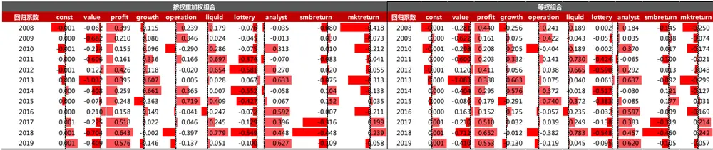
数据来源：东方证券研究所 & Wind 资讯

## 4. 行业配置

下面我们计算每个季度优选基金组合超配股在各行业上的暴露。可以看到，从 2008 年至2019 年，优选基金的超配股组合主要集中在医药、食品饮料行业，占比均达到 10%以上。其次为基础化工、电子元器件、计算机，占比达 6%以上。从最近 3年来看，医药和食品饮料仍是配置最多的行业，并且相对历史配置还有所增加，占比均达到 20%以上。此外，在基础化工、石油石化、有色金属等周期性行业上的配置比例明显下降。

图 25：优选基金超配组合的行业配置情况
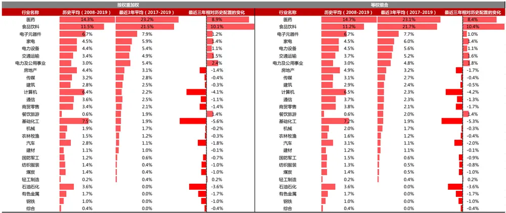
数据来源：东方证券研究所 & Wind 资讯

## 5. 风格暴露

从 2008 年至 2019 年，优选基金的超配股组合为中盘成长的风格，配置了有动量效应的、高成长、高波动、高估值、低换手、低 beta、偏民企的股票。最近 3 年优选基金的超配股组合转变为大盘风格，配置了更多高 beta、有动量效应、大市值、高估值的股票。

图 26：风格类风险因子列表与分类（东方 A 股因子风险模型——DFQ-2018）
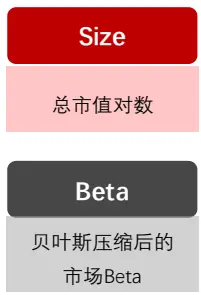

## Trend

- Trend_120：MA5/MA120

Trend_240：MA5/MA240

## Liquidity

- TO：过去252天换手率取平均

Liquidity beta：个股对数换手率， 与指数对数换手率回归

## Volatility

- Stdvol：标准波动率

- Ivff: Fama-French-3 特质波动率

- Range：区间最高价除以最低价-1

MaxRet_6：区间收益最高的六天的收益率平均值

MinRet_6：区间收益最低的六天的收益率平均值

## Value

BP：账面市值比

EP：盈利收益率

## Growth

Delta ROE：ROE变 动(当前TTM和一年 前TTM比较)

Sales_growth：销售收入TTM一年同比

- Na_growth：净资产TTM一年的同比

## SOE

State Owned Enterprise，是否国企

Cubic Size

市值幂次项

## Uncertainty

Instholder Pct：公募基金持仓比例

- Cov：分析师覆盖度

- Listdays：上市时长

数据来源：东方证券研究所

图 27：优选基金超配组合的风格暴露情况
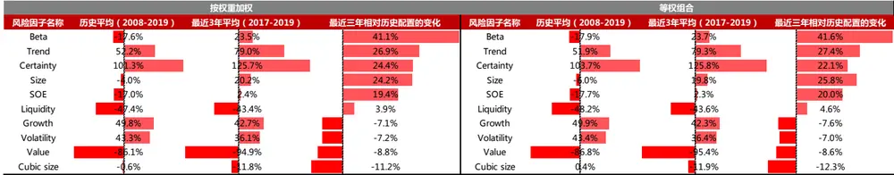
数据来源：东方证券研究所 & Wind 资讯

## 三、 指数增强组合的增效

下面我们在月频调仓的指数增强组合中引入优选基金组合超配股的信息，考察是否可以提升组合表现。历史回溯测试的实证区间设定为 2009.12.31 – 2019.10.31。

## 3.1 组合优化调整方法

在基金季报公布后，选取优选基金组合的超配股作为调整对象。由于基金重仓股信息要等到每个季度结束之日起十五个工作日内才能获得，因而需要延后一个月使用，避免引入未来信息。例如，2019 年中报的重仓股信息，要等到 2019/07/31 调仓时才能使用，在 2019/07/31-2019/10/31这三次月度调仓均使用 2019年中报的信息。

指数增强组合构建时，我们将七个大类 Alpha 因子等权合成，得到个股 zscore 得分，再将个股 zscore 得分线性转换成预测收益率 f。具体方法：每个月做一次带截距项的横截面 OLS 回归可得到历史各个月的因子收益率估计值。第 t+1 个月初，用过去两年（24 个月）因子收益率的均值作为第 t+1 个月因子收益率的预测值，然后乘以第 t +1 月初最新的因子值 $\mathrm{X}_{\mathrm{t}+1}^{\mathrm{(i)}}$ ，即可得到股票第t+1 个月的预测收益率。银行和非银行行业采用之前报告中的行业内选股策略进行单独建模，最后将三部分预测收益率合在一起，再输入到优化器中做组合优化。

风险模型采用 DFQ风险模型（具体内容参见报告：东方 A 股因子风险模型——DFQ-2018），组合优化时将风险项作为惩罚项加入目标函数，风险厌恶系数需调试。考虑到优选基金超配股的行业分布很不均衡，因而我们控制银行和非银行业完全中性，其他行业暴露放开。控制市值完全中性。个股权重上下限分段设置。

优选基金组合超配股信息的引入方法为：在组合优化中添加额外的个股权重约束：要求优化后的超配股绝对权重之和不小于 10%。

组合优化问题设置如下：

$$
\begin{array}{r}{\operatorname*{max};~\mathrm{f}^{\prime}\mathrm{w}-\lambda\mathrm{w}^{\prime}\mathrm{\tilde{Z}w}}\\{\mathrm{st}:~\operatorname*{imin}<\mathrm{w}^{\prime}\mathrm{I}<\operatorname*{imax}}\\{~\mathrm{w}^{\prime}\mathrm{MV}=0}\\{~\mathrm{wmin}<\mathrm{w}<wmax}\\{~\sum_{\mathbf{x}\mathbf{i}\geq t}targetwei}\end{array}
$$

其中 w为主动权重，x为绝对权重，f 为预期收益率向量，Σ为估计的月度协方差矩阵, λ为风险厌恶系数，targetwei 为优化后超配股的绝对权重之和的下限，wmin 为个股主动权重下限，wmax为个股主动权重上限。

## 3.2 沪深300全市场增强组合

首先我们考察沪深 300 全市场指数增强组合。在扣费（双边千三）的情况下，各个模型的组合表现如下图。引入优选基金组合超配股的信息后，沪深 300 全市场指数增强组合的年化收益提升 1.4%，改进十分明显。从分年的情况来看，在过去 9 年间有 7年可以实现收益提升，最近四年（2016、2017、2018、2019）均可提升 2%以上，仅在 2012 和 2014 年收益会变差一些。从风险控制上来看，最大回撤和跟踪误差相比常规组合略有提升，但跟踪误差仍可控制在 4%以下，最大回撤控制在 5%以下。

图 28：沪深 300 全市场增强组合表现
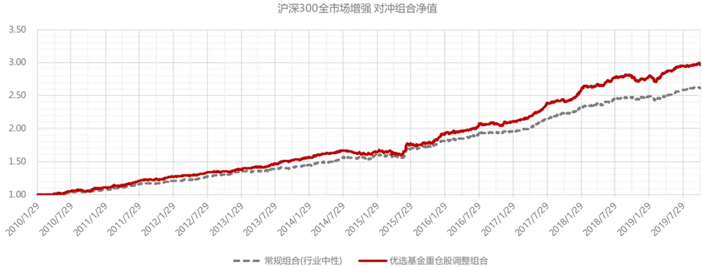

| 沪深300全市场 | 常规组合 | 优选基金重仓股调整组合 |
| --- | --- | --- |
| 信息比（年化） | 3.30 | 2.92 |
| 年化对冲收益 | 10.40% | 11.83% |
| 对冲收益最大回撤 | -3.59% | -4.81% |
| 对冲收益最大回撤出现时间点 | 20150609 | 20150605 |
| 跟踪误差（年化） | 3.01% | 3.86% |
| 单边换手率（年） | 3.01 | 3.03 |
| 持股数量 | 78.08 | 56.36 |

沪深300全市场增强组合分年收益
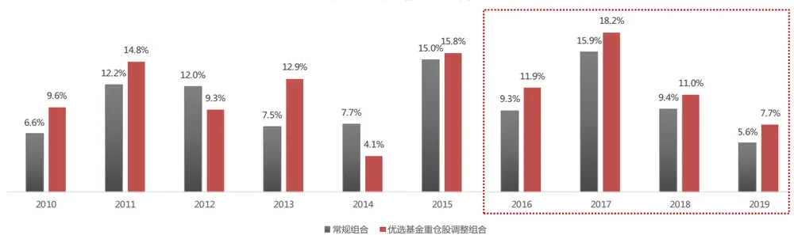
数据来源：东方证券研究所 & Wind 资讯

在构建沪深 300 增强的时候，我们对银行和券商是按照之前报告中的模型进行单独建模的，优选基金组合超配股也不包含这两个行业，因而我们的改进模型主要改变的主要是非金融部分的因子得分。沪深 300 指数中银行券商两个行业的权重占到了 35%，相当于我们在 65%的权重之中，实现了 2%的年化收益提升，改进效果十分可观。此外，由于优选基金超配股中大部分是沪深300 成分股，因而我们在沪深 300 增强组合中提高超配股的权重，并不会使得组合的跟踪误差有大幅提高，不会损失太多组合的风险控制能力。

调整后优选基金组合超配股的绝对权重之和平均为 11%，而在常规组合和基准指数沪深 300中权重之和平均仅为 5%，实现了翻倍提升。我们注意到，最近两年调整组合和常规组合在超配股权重上在有的月份上较为接近，说明在个别月份中我们的常规 Alpha 因子体系已经可以捕捉到优秀基金经理的超额收益。但在权重相差比较大的月份上，经过调整后的增强组合仍可以实现较大的收益提升空间。例如，今年上半年超配股权重提升幅度较大，在常规组合中，超配股绝对权重仅为6%左右，但在调整组合中可以达到 10%。从今年上半年收益来看，调整组合半年的对冲收益为6.71%，而常规组合仅为 3.57%，权重调整对于组合收益的改进效果显著。

图 29：沪深 300 全市场增强组合中优选基金组合超配股绝对权重之和
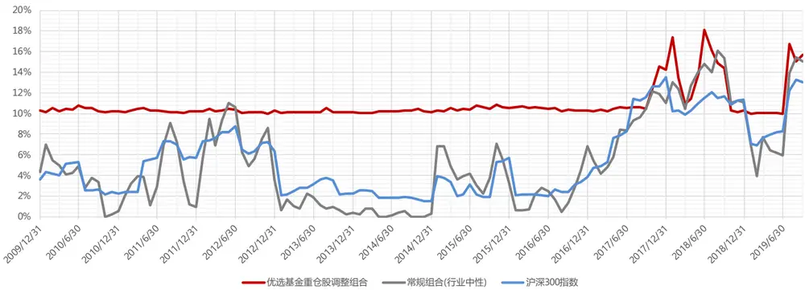
数据来源：东方证券研究所 & Wind 资讯

从各行业的平均持仓权重来看，调整后优选基金组合相比于常规的行业中性组合，行业分布更加集中。在汽车、食品饮料、纺织服装、石油石化、钢铁行业上的持仓权重明显提高，在医药、电力及公用事业、建筑、交通运输、通信行业上的持仓权重明显降低。

图 30：沪深 300 全市场增强组合各行业平均持仓权重
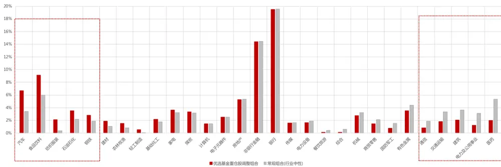
数据来源：东方证券研究所 & Wind 资讯

## 3.3 中证500全市场增强组合

接着我们考察中证 500 全市场选股增强策略。在扣费的情况下，各个模型的组合表现如下图。引入优选基金组合超配股的信息后，组合的年化收益提升 0.9%，有一定改进效果。从分年的情况来看，在过去 9年里有 6年可以实现收益提升，今年的改进效果十分明显，2019 年组合收益可提升 3.1%。仅在 2011-2013 和 2018 年收益会变差一些。从风险控制上来看，最大回撤和跟踪误差相比常规组合略有提升，但跟踪误差仍可控制在 5%以下，最大回撤控制在 5%以下。

中证500全市场增强组合分年收益
图 31：中证 500 全市场增强组合表现
中证500全市场增强对冲组合净值
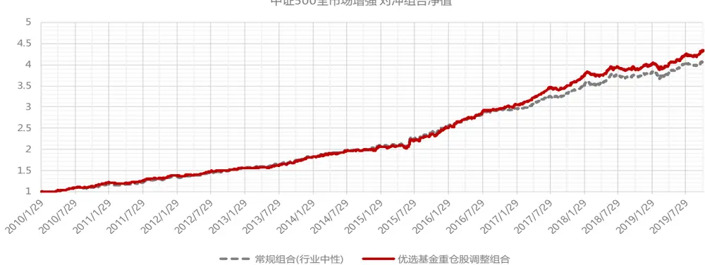

| 中证500全市场 | 常规组合 | 优选基金重仓股调整组合 |
| --- | --- | --- |
| 信息比（年化） | 3.26 | 3.07 |
| 年化对冲收益 | 15.57% | 16.42% |
| 对冲收益最大回撤 | -4.38% | -4.65% |
| 对冲收益最大回撤出现时间点 | 20190307 | 20150612 |
| 跟踪误差（年化） | 4.47% | 4.99% |
| 单边换手率（年） | 4.57 | 4.48 |
| 持股数量 | 142.38 | 115.37 |

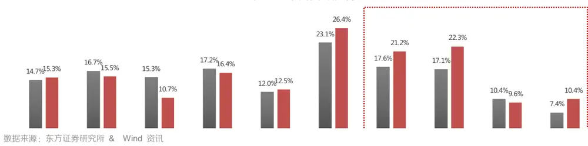

调整后优选基金组合超配股的绝对权重之和平均为10%，优化过程中如果10%下限约束失败，我们调整为 3%。而在常规组合和基准指数沪深 300 中超配股的权重之和平均仅为 1%-2%，实际权重提升十分明显。

图 32：中证 500 全市场增强组合个股绝对权重
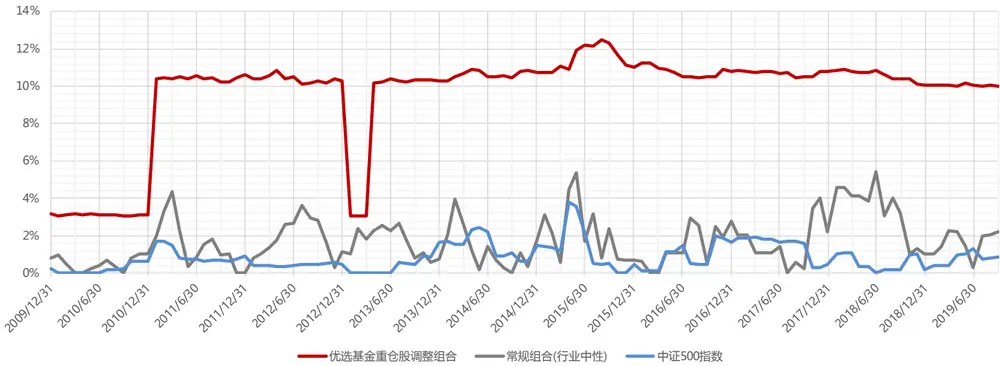
数据来源：东方证券研究所 & Wind 资讯

从各行业的平均持仓权重来看，调整后优选基金组合相比于常规的行业中性组合，行业分布更加均衡。在纺织服装、机械、钢铁、建材、食品饮料、家电行业上的持仓权重明显提高，在医药、电力及公用事业、电力设备行业上的持仓权重明显降低。

图 33：中证 500 全市场增强组合各行业平均持仓权重
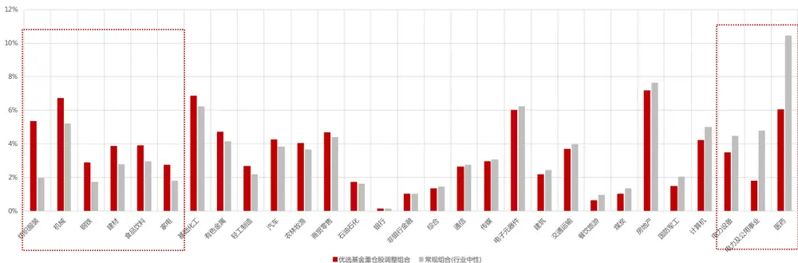
数据来源：东方证券研究所 & Wind 资讯

## 风险提示

1. 量化模型基于历史数据分析得到，未来存在失效的风险，建议投资者紧密跟踪模型表现。

2. 极端市场环境可能对模型效果造成剧烈冲击，导致收益亏损。

## 分析师申明

每位负责撰写本研究报告全部或部分内容的研究分析师在此作以下声明：

分析师在本报告中对所提及的证券或发行人发表的任何建议和观点均准确地反映了其个人对该证券或发行人的看法和判断；分析师薪酬的任何组成部分无论是在过去、现在及将来，均与其在本研究报告中所表述的具体建议或观点无任何直接或间接的关系。

## 投资评级和相关定义

报告发布日后的 12 个月内的公司的涨跌幅相对同期的上证指数/深证成指的涨跌幅为基准；

## 公司投资评级的量化标准

买入：相对强于市场基准指数收益率 15%以上；

增持：相对强于市场基准指数收益率 5%～15%；

中性：相对于市场基准指数收益率在-5%～+5%之间波动；

减持：相对弱于市场基准指数收益率在-5%以下。

未评级 —— 由于在报告发出之时该股票不在本公司研究覆盖范围内，分析师基于当时对该股票的研究状况，未给予投资评级相关信息。

暂停评级 —— 根据监管制度及本公司相关规定，研究报告发布之时该投资对象可能与本公司存在潜在的利益冲突情形；亦或是研究报告发布当时该股票的价值和价格分析存在重大不确定性，缺乏足够的研究依据支持分析师给出明确投资评级；分析师在上述情况下暂停对该股票给予投资评级等信息，投资者需要注意在此报告发布之前曾给予该股票的投资评级、盈利预测及目标价格等信息不再有效。

## 行业投资评级的量化标准：

看好：相对强于市场基准指数收益率 5%以上；

中性：相对于市场基准指数收益率在-5%～+5%之间波动；

看淡：相对于市场基准指数收益率在-5%以下。

未评级：由于在报告发出之时该行业不在本公司研究覆盖范围内，分析师基于当时对该行业的研究状况，未给予投资评级等相关信息。

暂停评级：由于研究报告发布当时该行业的投资价值分析存在重大不确定性，缺乏足够的研究依据支持分析师给出明确行业投资评级；分析师在上述情况下暂停对该行业给予投资评级信息，投资者需要注意在此报告发布之前曾给予该行业的投资评级信息不再有效。

## HeadertTabl e_Discl ai mer 免责声明

本证券研究报告（以下简称“本报告”）由东方证券股份有限公司（以下简称“本公司”）制作及发布。

本报告仅供本公司的客户使用。本公司不会因接收人收到本报告而视其为本公司的当然客户。本报告的全体接收人应当采取必要措施防止本报告被转发给他人。

本报告是基于本公司认为可靠的且目前已公开的信息撰写，本公司力求但不保证该信息的准确性和完整性，客户也不应该认为该信息是准确和完整的。同时，本公司不保证文中观点或陈述不会发生任何变更，在不同时期，本公司可发出与本报告所载资料、意见及推测不一致的证券研究报告。本公司会适时更新我们的研究，但可能会因某些规定而无法做到。除了一些定期出版的证券研究报告之外，绝大多数证券研究报告是在分析师认为适当的时候不定期地发布。

在任何情况下，本报告中的信息或所表述的意见并不构成对任何人的投资建议，也没有考虑到个别客户特殊的投资目标、财务状况或需求。客户应考虑本报告中的任何意见或建议是否符合其特定状况，若有必要应寻求专家意见。本报告所载的资料、工具、意见及推测只提供给客户作参考之用，并非作为或被视为出售或购买证券或其他投资标的的邀请或向人作出邀请。

本报告中提及的投资价格和价值以及这些投资带来的收入可能会波动。过去的表现并不代表未来的表现，未来的回报也无法保证，投资者可能会损失本金。外汇汇率波动有可能对某些投资的价值或价格或来自这一投资的收入产生不良影响。那些涉及期货、期权及其它衍生工具的交易，因其包括重大的市场风险，因此并不适合所有投资者。

在任何情况下，本公司不对任何人因使用本报告中的任何内容所引致的任何损失负任何责任，投资者自主作出投资决策并自行承担投资风险，任何形式的分享证券投资收益或者分担证券投资损失的书面或口头承诺均为无效。

本报告主要以电子版形式分发，间或也会辅以印刷品形式分发，所有报告版权均归本公司所有。未经本公司事先书面协议授权，任何机构或个人不得以任何形式复制、转发或公开传播本报告的全部或部分内容。不得将报告内容作为诉讼、仲裁、传媒所引用之证明或依据，不得用于营利或用于未经允许的其它用途。

经本公司事先书面协议授权刊载或转发的，被授权机构承担相关刊载或者转发责任。不得对本报告进行任何有悖原意的引用、删节和修改。

提示客户及公众投资者慎重使用未经授权刊载或者转发的本公司证券研究报告，慎重使用公众媒体刊载的证券研究报告。

## 东方证券研究所

地址：上海市中山南路 318 号东方国际金融广场 26 楼

联系人： 王骏飞

电话：021-63325888*1131

传真：021-63326786

网址： www.dfzq.com.cn

Email： wangjunfei@orientsec.com.cn