## —— 《因子选股系列研究 之 六十三》

## 研究结论

- 理论上，组合权重的变化源于风险模型的变化或者预期收益率的变化，降低预期收益率的换手除了选取换手比较慢的因子也要注意不能频繁变更各个因子的权重。

组合优化时由于约束的存在以及股票相对收益的变化，换手率存在下限，当换手惩罚系数大到一定水平时组合换手率逼近这一临界水平，同样由于换手率存在下限，组合优化时直接对换手率进行比较严格的约束有可能导致组合优化无可行解。

- 由于交易成本的存在，我们需要在组合优化时对换手或者交易成本进行约束或者惩罚，当交易成本越大、组合固有的换手率越高时对换手或者交易成本的惩罚应该更严格。

对于单期优化，换手率约束和换手率惩罚两种换手率控制的方法等价，但从多期考虑时，由于换手率惩罚能够实现组合换手与 alpha 的换手情况相适应，所以长期平均换手率相差不大时采用换手率惩罚的组合业绩略优于采用换手率约束的组合。

- 由于组合优化时交易成本惩罚的存在，组合权重不能及时反应最新的alpha信息，导致组合权重不仅受当前信息影响，还受过去的信息影响，相应的，组合的收益不仅和 alpha 当期的 IC 相关，也和不同滞后期的 IC 相关，也就是说和 IC 的期限结构有关。

评价因子表现时不仅需要关注因子对当期收益的影响，也应该考虑对随后多期收益的预测，在存在换手惩罚时，当期 IC 更高的 alpha 因子不一定能够给组合带来更高的收益。

- 在指数增强组合中，考虑多期 IC 的最大化 RankIC 加权方法相对单期的最大化 RankIC 加权方法在换手惩罚下有明显的业绩提升，周频全市场增强沪深300 组合在年化2 倍单边换手时前者相对后者有高达 3.5%的年化收益提升。

多期最大化 RankIC 方法相对单期最大化 RankIC 新增了一个参数ρ，但参数ρ在相当宽的一个取值范围内均可以大幅战胜相应的单期最大化 RankIC 方法，加权方法对参数敏感性低。

本文以最大化 RankIC 方法作为示例展示了在换手惩罚下因子加权方法考虑因子对多期收益影响后的效果，对于回归、机器学习等其他的动态加权方法投资者也可以做相应的经验性调整。

## 风险提示

- 量化模型失效风险

- 市场极端环境的冲击

报告发布日期2020 年 01 月 05 日

证券分析师 朱剑涛021-63325888*6077zhujiantao@orientsec.com.cn执业证书编号：S0860515060001

证券分析师王星星021-63325888-6108wangxingxing@orientsec.com.cn执业证书编号：S0860517100001

联系人 王星星 021-63325888-6108 wangxingxing@orientsec.com.cn

## 一、组合换手率的来源

本文讨论的组合主要指指数增强组合，对于指数增强组合单期的组合优化一般有如下形式：

$$
\begin{array}{rl}{\operatorname*{max}}&{{}\pmb{h}^{T}\cdot\pmb{\alpha}-\lambda\cdot\pmb{h}^{T}\pmb{\Sigma}\pmb{h}}\end{array}
$$

$$
s.t.\quad h\in C
$$

其中，h表示股票相对基准的权重向量，α表示股票的预期收益率向量（alpha），Σ表示股票的协方差矩阵，λ为风险惩罚系数，C表示股票权重向量所受的约束空间（比如风格暴露的约束、权重上下限限制等）。

如果不考虑组合优化中约束的影响，上述单期优化有显示最优解

$$
h^{*}=\frac{1}{2\lambda}\cdot\Sigma^{-1}\cdot\alpha
$$

如果进一步不考虑组合前后两期调仓期间股票相对收益的影响，那么组合权重的变化主要源于风险模型的变化或者预期收益率的变化，而预期收益率依赖于合成的 ZSCORE，ZSCORE 的变化源于合成 zscore 的因子本身的变化以及各个因子权重的变化。因此，理论上组合的换手主要源于如下三个方面：

（1） 合成 ZSCORE 的因子本身的变化。关于这部分更精确的探讨可以参考 Edward Qian（2007, Information Horizon, Portfolio Turnover, and Optimal Alpha Models）的研究，在合成因子的权重不随时间变化的情况下，要想合成的 ZSCORE 换手低，应该优先配置换手低的 alpha 因子。

（2） 合成 ZSCORE 的因子权重的变化。即使模型配置换手低的 alpha 因子，如果模型在各个 alpha 因子上配置的权重经常变化，很不稳定，那么合成 ZSCORE 的换手依然较高。

（3） 风险模型的稳定性。一般投资者很少考虑到风险模型对组合换手的影响，从本文的角度出发，选择或者评价一个风险模型时不仅要考虑风险模型对风险的刻画和控制能力，也应该考虑风险模型的稳定性，避免快速变化的风险模型给组合带来过高的换手。

另外，由于组合优化时约束的存在以及股票相对收益的变化，上一期满足约束的组合权重在经过一段时间股票涨跌后不再满足最新的组合优化约束，因为组合优化的约束是需要必须满足的，所以组合优化的换手率存在下限，即刚好能够满足组合优化约束的临界水平。由于每期股票相对涨跌的幅度不一样、约束也不一定一样，所以每期的临界水平也会不一样，因此，如果我们在组合优化时直接对组合换手率进行比较严格的约束，很有可能导致组合优化无可行解。

我们分别测算了大类等权和最大化 RankIC 两种加权方法在全市场增强沪深 300 和中证 500时随着换手惩罚系数增大组合换手率的变化。我们发现虽然两种加权方法最开始换手差异很大，但随着换手惩罚系数的增大，两者都趋同至同一个换手水平，换手降低至一定水平后，即使换手惩罚系数进一步增大也不能起到降低换手的作用。

图 1：月频指数增强组合不同换手惩罚下的年化单边换手
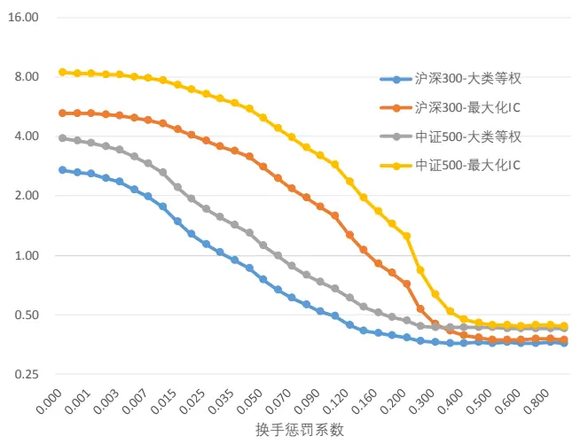
数据来源：wind 咨询, 东方证券研究所

图 2：周频指数增强组合不同换手惩罚下的年化单边换手
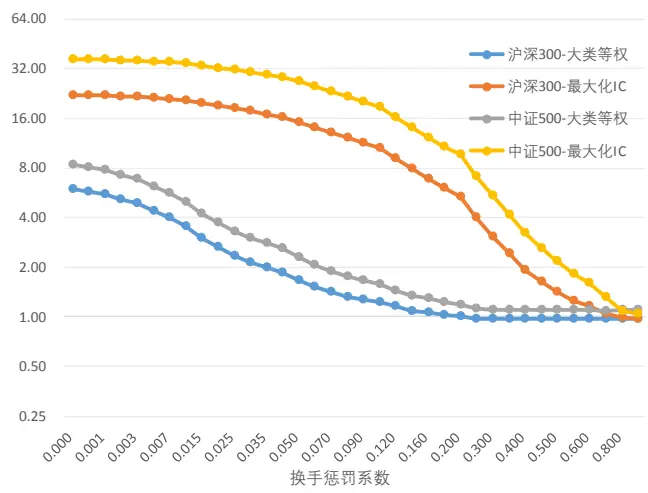
数据来源：wind 咨询,东方证券研究所

## 二、为什么要控制组合换手

传统上组合优化的目标函数采用预期收益减去风险惩罚的形式，并没有考虑交易成本的影响，这种形式对于以基本面为主的多因子模型来说可能差异不大，因为以基本面为主的组合换手率本身并不高，组合收益对交易成本不是很敏感，但如果组合固有的换手率较高，那么交易成本对组合收益的影响将不容忽略，甚至起到决定性的作用。

我们将采用如下组合优化的形式对组合换手率进行惩罚，换手率惩罚系数c取值 0，表示构建组合时不考虑换手率的影响，随着c取值的增大，对换手的惩罚越严格，相应的组合换手率也越低。

$$
\begin{array}{rl}{\operatorname*{max}}&{\ h^{T}\cdot\alpha-\lambda\cdot h^{T}\Sigma h-c\cdot|h-h_{0}|}\\&{}\\{\qquad}&{\ s.t.\quad h\in C}\end{array}
$$

其中，h表示股票相对基准的目标权重向量， $\pmb{h_{0}}$ 表示股票相对基准的初始权重向量，α表示股票的预期收益率向量（alpha，经年化处理），Σ表示股票的协方差矩阵，λ为风险惩罚系数，C表示股票权重所受的约束空间（比如风格暴露的约束、权重上下限约束等），c表示对当期换手率的惩罚系数。

我们对全市场增强沪深 300 组合和中证 500 组合在 20101231-20191129 的表现简单做了测试，为了对比研究换手惩罚的影响，我们测算了大类等权的加权方式（基本面为主，换手低）和最大 RankIC（交易面为主，换手高）两种加权方式下、月频调仓和周频调仓两种交易频率下的结果，在风险厌恶系数、风格因子约束、权重上下限约束等变量完全一样的情况下研究换手惩罚系数c对组合业绩的影响。

为便于展示，我们仅绘制了指数增强组合在不同换手水平下的年化对冲收益（图 3-图 6），实际上同一交易频率同一加权方式下的沪深 300/中证 500 增强组合的跟踪误差、最大回撤等风险指标相差很小。对比分析不同交易成本下换手惩罚系数对组合收益的影响，我们有如下发现：

周频组合：

（1）如果不考虑交易成本，最优方案是不对换手进行惩罚，此时组合换手率最高、收益率也最高，交易成本越大，组合的最优换手率越低，对换手率的惩罚应该更严格。

（2）组合固有的换手率越高时，换手惩罚越重要，周频调仓组合相对月频调仓组合惩罚换手带来的收益更高，换手率较高的最大化 RankIC 方法相对于换手率较低的大类等权方法更有必要惩罚换手。

图 3：不同换手惩罚系数对沪深 300 增强年化对冲收益的影响（大类等权）
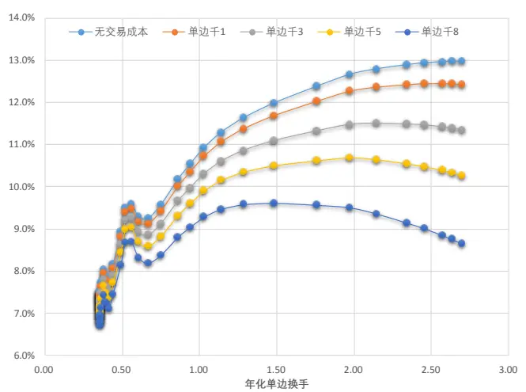

图 4：不同换手惩罚系数对沪深 300 增强年化对冲收益的影响（最大化 RankIC）
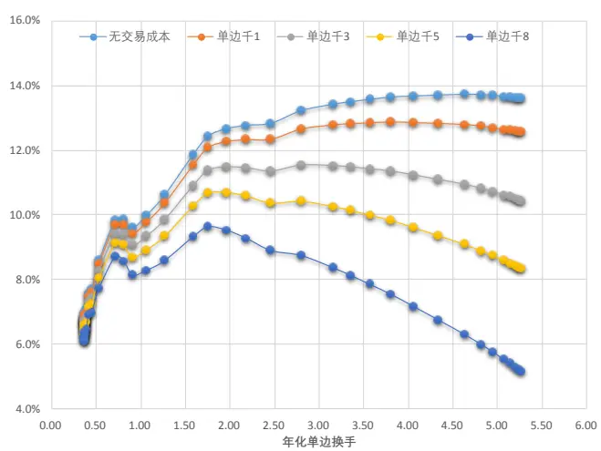
周频组合：

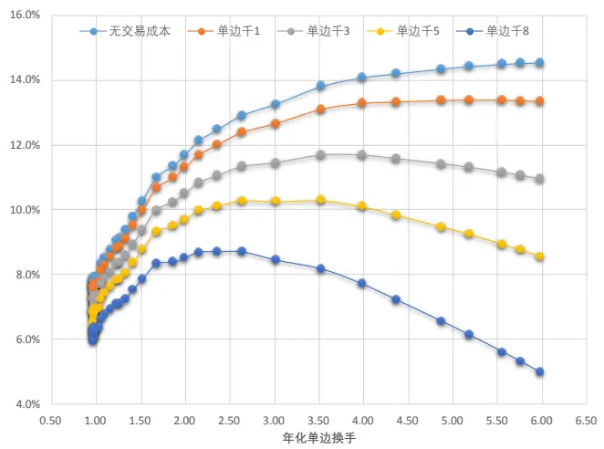
数据来源：wind 咨询，东方证券研究所

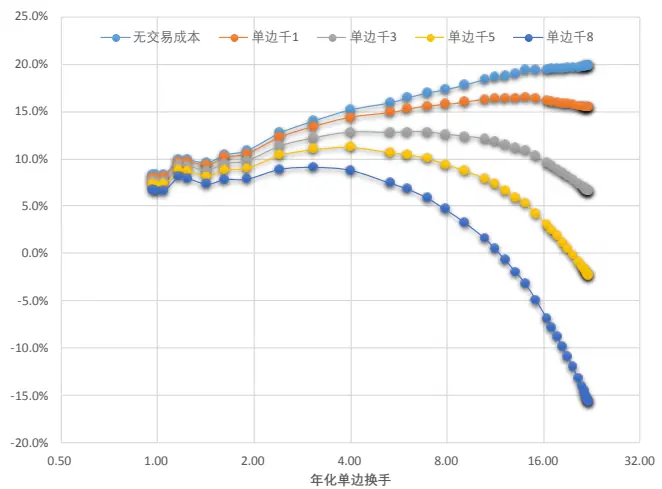
数据来源：wind 咨询，东方证券研究所

图 5：不同换手惩罚系数对中证 500 增强年化对冲收益的影响（大类等权）
月频组合：
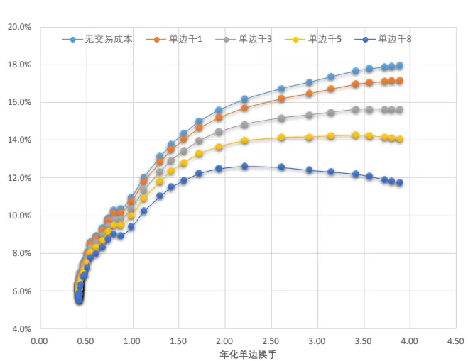

图 6：不同换手惩罚系数对中证 500 增强年化对冲收益的影响（最大化 RankIC）
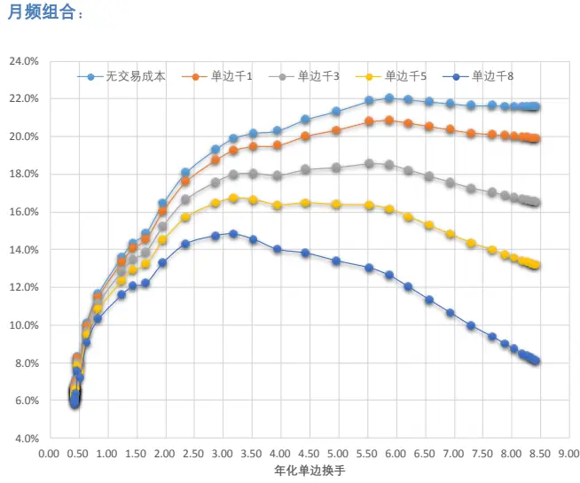
周频组合：

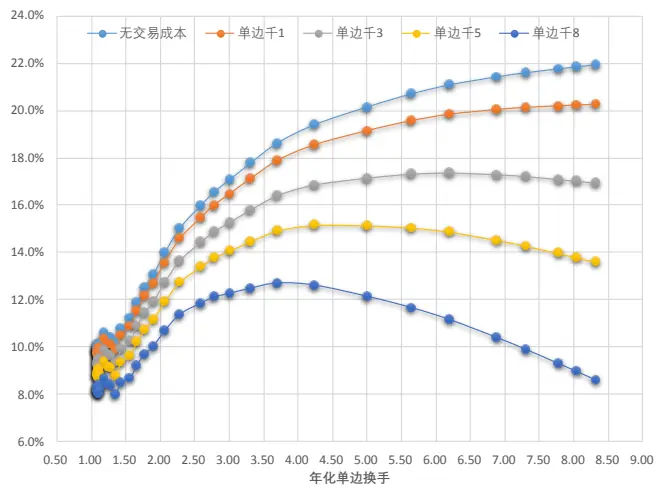
数据来源：wind 咨询，东方证券研究所
周频组合：

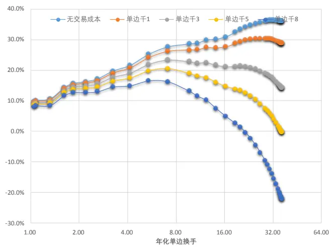
数据来源：wind 咨询，东方证券研究所

## 三、如何控制组合换手

在组合优化中控制换手一般有两种方法，一种是在目标函数中加入换手惩罚项，第二章中我们就是采用的这种方案，一种是直接在组合优化时加入换手率不能超过某一特定值的约束。对于单期的情形，由于两个优化问题具有相同的拉格朗日乘子，对于指定的换手险惩罚系数存在唯一的换手约束使两个优化问题存在完全一样的最优解，但从多期来考虑，两种控制组合换手的方法会有所差异，换手惩罚的方法保持换手惩罚系数一定，alpha 变化较大时组合换手相应会提高，而换手约束的方法无论因子变化情况如何换手水平都不会超过某个特定值。

在风险厌恶系数和其他约束等变量完全一样的情况下，我们比较了换手惩罚和换手约束两种换手控制方法对指数增强业绩的影响。具体做法是通过分别调整换手惩罚系数或者换手约束两个参数使组合长期平均换手率相差不大（年化单边换手相差 0.2 以内），此时再比较两个组合的业绩情况，由于风险厌恶系数、风格因子约束、权重上下限等维度完全一样，两个组合的跟踪误差相差很小，为便于展示，我们仅绘制了不同换手水平两种换手控制模式下组合的年化对冲收益（20101231-20191129，未扣费）。从结果来看，一般在年化单边换手水平相差不大的情况下，基于换手惩罚的换手控制方法相对于换手约束在组合收益上有更好的表现，对于周频大类等权沪深300 增强组合、最大化 RankIC 沪深 300 增强组合、大类等权中证 500 增强组合、最大化RankIC中证 500 增强组合，两种换手控制方法下的年化对冲收益均存在显著差异（t 值分别为 3.75、6.15、4.56、8.03）。

最后，需要提醒的是在组合优化时应该惩罚的是交易成本而不是换手，如果每只股票的交易成本一样而且和买卖金额无关，那么交易成本正比于换手，这里为简单起见，我们仅考虑了换手，如果投资者对交易成本有深入的建模，组合优化时对交易成本进行惩罚应该更加合理。

图 7：换手惩罚和换手约束下沪深 300 增强组合年化对冲收益对比（大类等权，周频，未扣费）
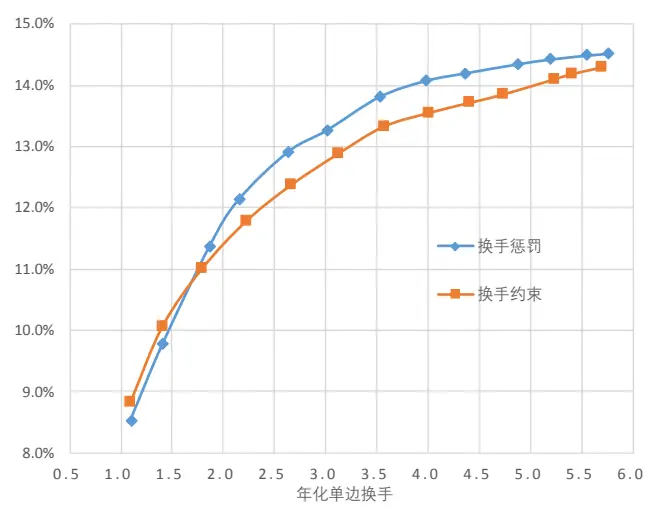
数据来源：wind 咨询，东方证券研究所

图 8：换手惩罚和换手约束下中证 500 增强组合年化对冲收益对比（大类等权，周频，未扣费）
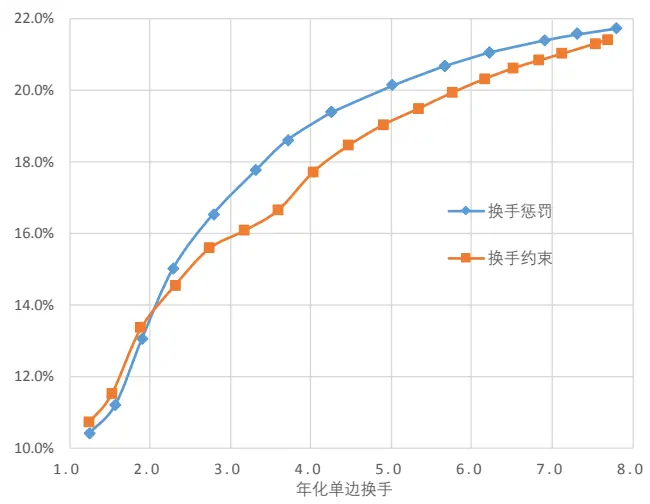
数据来源：wind 咨询，东方证券研究所

图 9：换手惩罚和换手约束下沪深 300 增强组合年化对冲收益对比（最大化 RankIC，周频，未扣费）
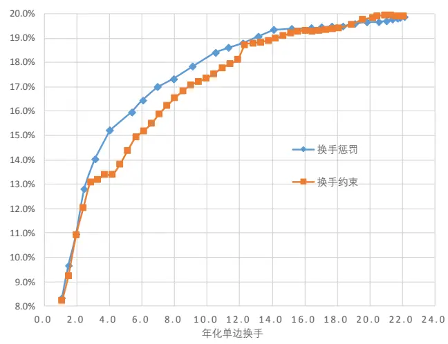
数据来源：wind 咨询，东方证券研究所

图 10：换手惩罚和换手约束下中证 500 增强组合年化对冲收益对比（最大化 RankIC，周频，未扣费）
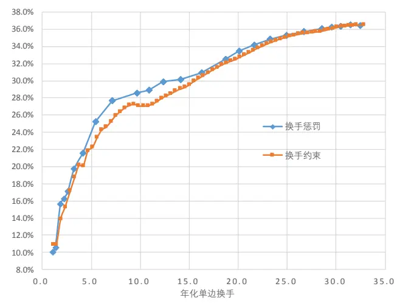
数据来源：wind 咨询，东方证券研究所

## 四、交易成本惩罚对组合优化的影响

巴克莱的自营研究主管 Leigh Sneddon (2011)在“The Tortoise and the Hare: PortfolioDynamics for ActiveManagers”中简要探讨过交易成本的存在对组合管理的影响。选股信号和组合都在随着时间变化，但是由于交易成本控制的存在，组合的权重不能及时反应最新的信号，还受历史信号的影响，反过来看，当前的选股信号不仅对接下来一期的组合收益有影响，还对未来多期的组合收益产生持续的影响，这也就要求我们不仅要关注信号在当期的收益，也要考虑信号在未来多期的收益，信号的表现也有“期限结构”。

Gerard 等 (2013)在 Sneddon（2011）的基础上更精确的描述了交易成本惩罚的影响，为了获得更好的解析性质，Gerard 假设股票的交易成本和股票协方差矩阵相关，采用如下形式的组合优化惩罚交易成本。

$$
\begin{array}{rl}{\operatorname*{max}}&{\ \displaystyle h_{t}^{T}\cdot\alpha_{t}-\frac{1}{2}\cdot\lambda\cdot h_{t}^{T}\cdot\Sigma_{t}\cdot h_{t}-\frac{1}{2}\cdot\eta\cdot(h_{t}-h_{t-1})^{T}\cdot\Sigma_{t}\cdot(h_{t}-h_{t-1})}\\{\mathrm{max}}&{\ }\\{s.t.}&{\ \displaystyle h_{t}^{T}\cdot X_{t}=0}\end{array}
$$

其中， $h_{t}$ 表示组合第 t 期的权重向量， $\alpha_{t}$ 表示股票第 t 期的预期收益率向量， $X_{t}$ 表示股票第 t期的风险因子暴露矩阵， $\Sigma_{t}$ 表示第 t 期的股票协方差矩阵， $\begin{array}{r}{\frac{1}{2}\cdot\lambda\cdot h_{t}^{T}\cdot\Sigma_{t}\cdot h_{t}}\end{array}$ 表示风险惩罚项， $\begin{array}{r}{\frac{1}{2}\cdot\eta\cdot}\end{array}$ $(h_{t}-h_{t-1})^{T}\cdot\Sigma_{t}\cdot(h_{t}-h_{t-1})$ 表示交易成本惩罚项。

在这个框架下，如果我们进一步假设风险因子 $X_{t}$ 比较稳定不随时间变化，而且股票协方差矩阵 $\overline{{\overline{{\mathbf{\alpha}}}}}\mathbf{\Sigma}\Sigma_{t}$ 满足结构化风险形式，那么上面的最优化问题有显式最优解（具体可以参考“Integrated AlphaModeling”的附录 1）。

$$
\pmb{h}_{t}=\frac{\widetilde{\pmb{\alpha}}_{t}+\eta\cdot\pmb{h}_{t-1}}{\lambda+\eta}
$$

其中， $\widetilde{\alpha}_{t}=\widehat{\alpha}_{t}/\sigma^{2}$ $\widehat{\alpha}_{t}$ 表示经过风格因子调整后的 alpha， $\sigma^{2}$ 表示股票不能被风险因子解释的残差风险。

从上述表达式我们可以得到如下启示：（1）如果没有换手惩罚 $\left(\eta=0\right)$ ，组合的权重由当前的 alpha 信息决定，组合能够及时反应最新的选股信息；（2）当组合优化考虑换手惩罚 $\left(\eta>0\right)$ 时，组合的权重不仅受最新一期 alpha 的影响而且跟组合初始权重有关，换手惩罚系数η越大，受当前 alpha 影响越小，跟组合初始权重关系越大。

如果不考虑两次调仓期间股票相对收益率的影响，组合原有的权重 $\cdot h_{t-1}$ 可以无限向前迭代，因此组合当期的权重可以写成如下形式：

$$
\pmb{h}_{t}=\sum_{p=0}^{\infty}\frac{\eta^{p}}{(\lambda+\eta)^{p+1}}\cdot\widetilde{\pmb{\alpha}}_{t-p}
$$

上述表达式从数学上论证了，当组合优化存在交易成本惩罚时，组合权重不仅和最新一期的因子取值有关还与过去多期的因子取值有关，越早期的因子取值对当期组合权重影响越小。

在已知组合权重的基础上，很容易推算组合的预期收益，参考“Integrated Alpha Modeling”的附录 3，我们可以证明组合在 t 期的收益率可以表示成如下形式：

$$
r_{t}^{p}=\pmb{h}_{t}\cdot\pmb{r}_{t}=\frac{\sigma_{\check{r}}\cdot N}{\lambda}{\sum_{p=0}^{\infty}\left(\frac{\eta}{\lambda+\eta}\right)^{p}\cdot IC_{t}^{p}}
$$

其中， $r_{t}^{p}$ 表示组合 t 期的收益率， $\sigma_{\check{r}}$ 表示股票风险调整收益的截面标准差， $IC_{t}^{p}$ 表示 alpha 滞后 $\mathsf{p}$ 期的风险调整 IC，即风格调整的 alpha 因子值和接下来第（p+1）期风格调整的股票收益率的相关系数。

因此，当存在交易成本惩罚时，组合收益不仅与 alpha 当期的 IC 有关，也受不同滞后期的 IC影响，当交易成本惩罚越大时，组合收益受后期的影响越大，换句话说，用来表征组合收益的不应该只是 alpha 当期的 IC 而是 alpha 的“IC 期限结构”。

## 五、对因子加权的启示

第四章的分析表明，当存在交易成本惩罚时组合权重不仅由最近一期的因子值决定，还受往期的因子值影响，相应的，因子对组合的影响不仅在最近一期收益中有所表现，也对后面多期的组合收益产生影响。然而，传统的动态加权方案不管是基于 IC 还是基于回归、机器学习等都只考虑了因子值和最近一期收益的关系，没有考虑因子值和之后多期收益的关系。本文以最大化RankIC的加权方法为例，尝试在加权方案中考虑因子值和随后多期收益间的关系，对于其他加权方法投资者可以自行做一些经验性的调整。

从第四章我们可知，交易成本、风险模型等满足一定假设条件时，组合的收益率正比于不同滞后期 IC 的指数加权平均值：

$$
r\propto\sum_{p=0}^{\infty}\rho^{p}\cdot IC_{t}^{p}
$$

其中， $\rho$ 是 0 到 1 之间的参数， $\rho=0{\mathbb{H}}\ b{\ ]}$ $r\propto IC$ 就是我们熟知的不考虑交易成本惩罚的结果，理论上讲ρ应该由交易成本惩罚系数λ和风险惩罚系数η决定，η相对λ越大， $\rho]$ 取值越大，对因子后期的表现应该给予更大的权重，但ρ和λ、 $\eta.$ 之间的关系是建立在一系列强假设的前提下得到的，实际投资中受到做空约束等影响，交易成本大概率也不能满足股票协方差矩阵的二次型函数。因此，对于参数ρ，我们更加建议通过历史数据调试获得，虽然ρ的取值可能带有一定的样本内性质，但只要参数比较稳健，依然是一种比较可取的方式。

对于 m 个alpha 因子线性组合 $\textstyle{\big(}f^{c}=\sum_{j=1}^{m}w_{j}\cdot f^{j}{\big)}$ 的 IC 有如下表达形式：

$$
IC^{c}=\frac{\boldsymbol{w}^{T}\cdot\boldsymbol{IC}}{\boldsymbol{w}^{T}\cdot\Sigma_{f}\cdot\boldsymbol{w}}
$$

其中，w表示各个 alpha 因子的权重向量序列，IC表示各个 alpha 因子的 IC 向量， $\Sigma_{f}$ 表示因子值的协方差矩阵（标准化后的因子值的相关系数矩阵）。

因此，多个 alpha 因子线性组合的收益率有如下形式：

$$
r\propto\sum_{p=0}^{\infty}\rho^{p}\cdot\frac{{\bf{\nabla}}w^{T}\cdot IC^{p}}{w^{T}\cdot\Sigma_{f}^{p}\cdot w}
$$

假设因子值的相关系数 $\Sigma_{f}$ 比较稳定，那么上式可以进一步写成：

$$
r\propto\frac{{\mathbf{}}{\mathbf{}}{\mathbf{}}\mathbf{}{\mathbf{}}\mathbf{{\mathbf{}}}\left(\sum_{p=0}^{\infty}\rho^{p}\cdot{\mathbf{}}{\mathbf{}}{\mathbf{}}{C}^{p}\right)}{{\mathbf{}}{\mathbf{}}{\mathbf{}}{\mathbf{}}{\mathbf{}}{\mathbf{}}^{T}\cdot\sum_{f}\cdot{\mathbf{}}{\mathbf{}}{\mathbf{}}}
$$

考虑多期问题的最大化 IC 加权方法就是选取一组因子权重w使得上式最大化，当 $\rho=0\mathbb{H}\overline{{\mathbf{\Lambda}}}$ 退化为单期的最大化 IC 方法。

从上述的分析我们可知，考虑交易成本惩罚后，与组合收益率相对应的不再是因子当期的 IC而是多期 IC 的指数加权平均值，在最大化 IC 的加权框架下，影响因子权重的也不再是因子当期的IC，而是多期加权平均的 IC，这也对我们的因子评价产生了深刻的影响，考察因子应不单关注因子对当期收益的影响，也要关注因子对后续收益的预测效果（不仅要考察当前 RankIC 也要考察RankIC 的期限结构）。

我们简单展示了部分因子的周度 RankIC 随不同滞后期的变化（RankIC 期限结构），我们发现了几个有意思的现象。

（1）估值因子 EP 虽然当期的RankIC 要弱于部分交易面因子，但衰减极慢，滞后若干期后依然有很强的选股效果。

（2）基于过去 20 个日度数据计算的特质波动率 IVol_20d 相对于过去 50 个周度数据计算的特质波动率 IVol_50w 虽然当期 RankIC 要高很多，但中长期不如后者，盈利成长的当季同比和TTM 同比也有类似的结果。说明因子计算时采用中长期的数据虽然看上去当前收益下降，但考虑交易成本惩罚后对组合收益的贡献不一定会差。

（3）20 日反转因子虽然看上去挺强，但存续期超短，主要在前两周作用，一个月之后几乎没有任何选股效果，对于交易成本惩罚较大的组合贡献收益很少。

图 11：部分因子的 RankIC 期限结构(20060701-20191129)
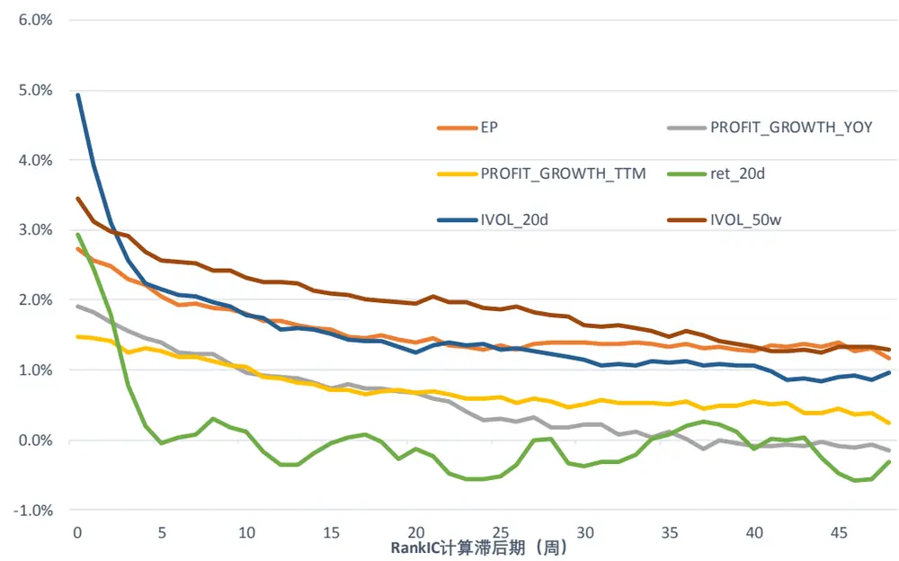
数据来源：wind 咨询，东方证券研究所

为了对比考察考虑多期问题的因子加权方法相对于单期加权方法的效果差异，我们以周频全市场增强沪深 300 和中证 500 为例，比较了多期最大化 RankIC 和单期最大化 RankIC 在换手惩罚下的选股效果，通过调整换手惩罚系数实现沪深 300 增强年化单边换手 2 倍左右、中证 500 增强年化单边换手 4 倍左右，风险惩罚系数、风格因子和权重上下限约束等组合优化时的变量完全保持一致，RankIC 的期望值和因子相关系数都取过去 5 年平均。为了考察多期最大化 RankIC 方法对参数ρ的敏感性，我们遍历了 0 到1 间的取值供投资者参考。

从图 12 和图 13 的结果来看，相对于单期的最大化 RankIC（ρ = 0）加权方法，随着参数ρ取值的增大，增强组合的对冲收益和信息比有一个先增加后减小的过程，对于年化单边 2 倍换手的沪深 300 增强组合来说，ρ取值大概在 0.90-0.96 之间组合效果最优，在跟踪误差相差不大时最高能够相对单期最大化 RankIC 收益提升 3.5%，提升幅度相当可观，对于年化 4 倍换手的中证 500增强组合来说，ρ取值大概在 0.60-0.80 之间组合效果最优，在跟踪误差相差不大时能够相对单期最大化 RankIC 收益提升 2.0%。

另外，需要说明的是，虽然多期最大化 RankIC 方法中有一个样本内的参数ρ，但参数ρ在相当宽的一个取值范围内均可以大幅战胜相应的单期最大化 RankIC 方法，因此组合测试的结果对参数ρ的敏感性低，根据样本内确定的参数ρ在未来虽然不一定是最优值，但大概率依然能够跑赢相应的单期最大化 RankIC 方法。

图 12：沪深 300 增强业绩表现（未扣费）
不同加权方法业绩表现汇总：

| 年化单边换手 | 年化对冲收益 年化跟踪误差 |  | 信息比 | 月胜率 | 最大回撤 |
| --- | --- | --- | --- | --- | --- |
| 大类等权 2.0 | 11.7% | 3.9% | 2.8 | 77.6% | 5.9% |
| ρ=0.00 | 1.9 10.9% | 3.9% | 2.6 | 80.4% | 7.4% |
| ρ=0.10 1.8 | 10.6% | 3.9% | 2.6 | 80.4% | 7.3% |
| ρ=0.20 2.1 | 12.0% | 3.9% | 2.9 | 84.1% | 6.8% |
| ρ=0.30 | 2.0 11.2% | 3.9% | 2.7 | 83.2% | 6.6% |
| ρ=0.40 | 1.8 10.6% | 3.9% | 2.6 | 82.2% | 6.7% |
| ρ=0.50 | 2.0 12.2% | 3.8% | 3.1 | 84.1% | 3.7% |
| ρ=0.60 | 1.9 11.0% | 4.0% | 2.7 | 82.2% | 5.9% |
| ρ=0.70 | 2.0 12.5% | 3.8% | 3.1 | 84.1% | 3.7% |
| ρ=0.75 | 1.8 12.0% | 3.8% | 3.0 | 82.2% | 3.9% |
| ρ=0.80 | 2.1 13.0% | 3.8% | 3.2 | 86.0% | 3.5% |
| ρ=0.85 | 2.0 13.5% | 3.8% | 3.4 | 84.1% | 3.5% |
| ρ=0.90 | 2.1 14.4% | 3.8% | 3.5 | 85.0% | 3.3% |
| ρ=0.92 | 1.9 14.2% | 3.8% | 3.5 | 85.0% | 3.5% |
| ρ=0.95 | 2.1 14.0% | 3.8% | 3.5 | 85.0% | 3.6% |
| ρ=0.96 | 2.1 14.0% | 3.8% | 3.4 | 86.0% | 3.6% |
| ρ=0.97 | 1.9 | 13.5% 3.8% | 3.3 | 84.1% | 3.6% |
| ρ=0.98 | 1.9 | 13.3% 3.8% | 3.3 | 85.0% | 3.5% |
| ρ=0.99 | 2.0 | 12.6% 4.0% | 3.0 | 85.0% | 5.9% |

图 13：周频增强业绩表现（未扣费）
不同加权方法业绩表现汇总：

| 年化单边换手 年化对冲收益 年化跟踪误差 |  |  |  |  |  |
| --- | --- | --- | --- | --- | --- |
| 大类等权 4.2 19.4% | 4.8% | 信息比 3.7 | 月胜率 82.2% | 最大回撤 4.0% |  |
| ρ=0.00 4.1 | 21.6% | 4.9% | 4.0 | 89.7% | 5.6% |
| ρ=0.10 3.9 | 21.5% | 4.8% | 4.1 | 86.9% | 5.6% |
| ρ=0.20 3.6 | 21.3% | 4.9% | 4.0 | 86.0% | 5.5% |
| ρ=0.30 4.4 | 24.0% | 4.9% | 4.4 | 87.9% | 6.0% |
| ρ=0.40 4.0 | 23.5% | 4.9% | 4.3 | 87.9% | 5.9% |
| ρ=0.50 3.5 | 22.3% | 4.9% | 4.1 | 84.1% | 5.4% |
| ρ=0.60 4.0 | 23.2% | 5.0% | 4.2 | 88.8% | 5.5% |
| ρ=0.70 4.5 | 24.7% | 5.0% | 4.4 | 88.8% | 6.2% |
| ρ=0.75 4.1 | 23.0% | 5.1% | 4.1 | 88.8% | 6.2% |
| ρ=0.80 4.0 | 22.9% | 5.2% | 4.0 | 86.0% | 6.4% |
| ρ=0.85 3.9 | 22.8% | 5.2% | 4.0 | 85.0% | 6.8% |
| ρ=0.90 4.1 | 23.5% | 5.1% | 4.1 | 85.0% | 7.1% |
| ρ=0.92 4.3 | 23.7% | 5.1% | 4.2 | 85.0% | 6.8% |
| ρ=0.95 4.1 | 23.1% | 5.1% | 4.1 | 84.1% | 6.6% |
| ρ=0.96 4.2 | 23.1% | 5.1% | 4.1 | 84.1% | 6.3% |
| ρ=0.97 4.2 | 22.7% | 5.0% | 4.1 | 86.9% | 6.1% |
| ρ=0.98 3.8 | 21.6% | 5.0% | 3.9 | 86.0% | 6.4% |
| ρ=0.99 3.9 | 21.3% | 5.0% | 3.9 | 85.0% | 6.3% |

不同加权方法分年度对冲收益：

|  | 2011 | 2012 | 2013 | 2014 | 2015 | 2016 | 2017 | 2018 | 2019 |
| --- | --- | --- | --- | --- | --- | --- | --- | --- | --- |
| 大类等权 | 10.4% | 12.2% | 8.3% | 10.8% | 15.6% | 15.7% | 15.0% | 12.2% | 4.6% |
| ρ=0.00 | 15.1% | 6.0% | 12.2% | 7.8% | 21.4% | 14.6% | 4.3% | 12.1% | 5.0% |
| ρ=0.10 | 15.5% | 6.9% | 11.9% | 6.3% | 21.2% | 13.7% | 4.6% | 11.7% | 3.9% |
| ρ=0.20 | 17.7% | 6.4% | 17.0% | 7.8% | 23.9% | 15.3% | 5.7% | 10.3% | 4.1% |
| ρ=0.30 | 16.9% | 6.7% | 15.9% | 6.6% | 23.3% | 14.5% | 4.6% | 9.6% | 3.7% |
| ρ=0.40 | 15.5% | 7.0% | 15.8% | 4.0% | 21.8% | 14.2% | 4.5% | 10.1% | 3.3% |
| ρ=0.50 | 15.2% | 7.5% | 14.9% | 8.5% | 28.1% | 15.4% | 6.4% | 12.0% | 2.7% |
| ρ=0.60 | 14.8% | 10.6% | 12.9% | 6.0% | 20.6% | 15.0% | 5.8% | 10.4% | 3.2% |
| ρ=0.70 | 14.0% | 10.8% | 13.2% | 9.7% | 27.0% | 14.9% | 7.4% | 13.1% | 2.8% |
| ρ=0.75 | 13.9% | 10.3% | 12.6% | 8.1% | 24.7% | 14.5% | 7.6% | 13.1% | 3.0% |
| ρ=0.80 | 12.7% | 11.8% | 13.2% | 10.1% | 27.0% | 15.6% | 9.1% | 13.8% | 3.6% |
| ρ=0.85 | 12.8% | 12.2% | 14.0% | 11.9% | 27.9% | 15.7% | 9.4% | 14.4% | 3.8% |
| ρ=0.90 | 12.8% | 12.8% | 14.8% | 12.7% | 29.8% | 17.0% | 9.3% | 15.0% | 5.2% |
| ρ=0.92 | 13.4% | 12.1% | 14.1% | 13.5% | 28.9% | 16.1% | 9.0% | 15.5% | 5.0% |
| ρ=0.95 | 14.2% | 11.3% | 13.5% | 13.5% | 28.8% | 16.3% | 9.1% | 14.5% | 5.3% |
| ρ=0.96 | 14.2% | 10.6% | 13.7% | 13.2% | 28.8% | 16.2% | 9.3% | 14.4% | 5.3% |
| ρ=0.97 | 14.2% | 10.2% | 12.3% | 13.2% | 28.1% | 15.8% | 9.0% | 14.1% | 5.0% |
| ρ=0.98 | 14.1% | 9.9% | 12.4% | 13.0% | 27.4% | 16.1% | 8.8% | 13.7% | 4.6% |
| ρ=0.99 | 13.8% | 10.4% | 12.3% | 12.9% | 22.8% | 16.0% | 8.3% | 13.6% | 3.6% |

不同加权方法分年度对冲收益：
数据来源：东方证券研究所

|  | 2011 | 2012 | 2013 | 2014 | 2015 | 2016 | 2017 | 2018 | 2019 |
| --- | --- | --- | --- | --- | --- | --- | --- | --- | --- |
| 大类等权 | 20.9% | 16.4% | 17.7% | 11.7% | 34.8% | 25.1% | 17.0% | 22.1% | 9.0% |
| ρ=0.00 | 33.0% | 19.5% | 26.0% | 8.3% | 45.9% | 29.4% | 6.7% | 24.2% | 5.2% |
| ρ=0.10 | 33.5% | 19.6% | 24.3% | 9.8% | 45.4% | 27.8% | 6.3% | 25.4% | 5.7% |
| ρ=0.20 | 34.4% | 19.3% | 24.3% | 11.1% | 44.7% | 27.2% | 4.7% | 24.2% | 5.7% |
| ρ=0.30 | 35.4% | 22.4% | 27.5% | 9.9% | 51.2% | 31.5% | 9.1% | 28.2% | 5.4% |
| ρ=0.40 | 34.9% | 21.5% | 26.2% | 11.2% | 49.7% | 31.7% | 8.4% | 26.9% | 5.4% |
| ρ=0.50 | 34.9% | 21.6% | 23.8% | 10.4% | 47.2% | 27.5% | 7.7% | 25.7% | 5.8% |
| ρ=0.60 | 33.5% | 21.3% | 23.2% | 13.1% | 48.4% | 31.4% | 8.0% | 27.5% | 6.2% |
| ρ=0.70 | 34.0% | 24.6% | 24.4% | 14.0% | 53.8% | 33.2% | 11.0% | 27.3% | 4.6% |
| ρ=0.75 | 33.2% | 21.0% | 21.0% | 13.7% | 52.0% | 30.9% | 9.7% | 25.0% | 4.5% |
| ρ=0.80 | 32.4% | 21.8% | 21.5% | 13.9% | 48.4% | 31.1% | 11.0% | 25.3% | 4.1% |
| ρ=0.85 | 31.2% | 22.6% | 21.6% | 16.1% | 47.2% | 29.8% | 11.6% | 25.1% | 3.5% |
| ρ=0.90 | 31.4% | 22.2% | 23.5% | 17.2% | 49.7% | 31.5% | 11.7% | 25.2% | 2.5% |
| ρ=0.92 | 31.2% | 21.6% | 23.7% | 17.9% | 50.6% | 32.2% | 12.0% | 24.7% | 3.0% |
| ρ=0.95 | 30.0% | 20.5% | 23.9% | 18.4% | 48.9% | 30.1% | 11.9% | 24.7% | 2.5% |
| ρ=0.96 | 30.7% | 20.0% | 23.1% | 18.6% | 49.3% | 30.0% | 11.8% | 25.7% | 2.5% |
| ρ=0.97 | 30.7% | 19.7% | 22.9% | 18.8% | 43.4% | 30.0% | 11.7% | 26.9% | 2.3% |
| ρ=0.98 | 29.0% | 18.6% | 21.9% | 18.6% | 42.5% | 28.8% | 10.1% | 26.4% | 1.4% |
| ρ=0.99 | 28.6% | 17.5% | 21.5% | 18.7% | 40.2% | 29.4% | 9.9% | 26.8% | 1.6% |

数据来源：东方证券研究所

## 六、总结

理论上，组合权重的变化源于风险模型的变化或者预期收益率的变化，降低预期收益率的换手除了选取换手比较慢的因子也要注意不能频繁变更各个因子的权重。组合优化时由于约束的存在以及股票相对收益的变化，换手率存在下限，当换手惩罚系数大到一定水平时组合换手率逼近这一临界水平，同样由于换手率存在下限，组合优化时直接对换手率进行比较严格的约束有可能导致组合优化无可行解。

由于交易成本的存在，我们需要在组合优化时对换手或者交易成本进行约束或者惩罚，当交易成本越大、组合固有的换手率越高时对换手或者交易成本的惩罚应该更严格。对于单期优化，换手率约束和换手率惩罚两种换手率控制的方法等价，但从多期考虑时，由于换手率惩罚能够实现组合换手与 alpha 的换手情况相适应，所以长期平均换手率相差不大时采用换手率惩罚的组合业绩略优于采用换手率约束的组合。

由于组合优化时交易成本惩罚的存在，组合权重不能及时反应最新的 alpha 信息，导致组合权重不仅受当前信息影响，还受过去的信息影响，相应的，组合的收益不仅和 alpha 当期的 IC 相关，也和不同滞后期的 IC 相关，也就是说和 IC 的期限结构有关。评价因子表现时不仅需要关注因子对当期收益的影响，也应该考虑对随后多期收益的预测，在存在换手惩罚时，当期 IC 更高的 alpha 因子不一定能够给组合带来更高的收益。

在指数增强组合中，考虑多期 IC 的最大化 RankIC 加权方法相对单期的最大化 RankIC加权方法在换手惩罚下有明显的业绩提升，周频全市场增强沪深 300 组合在年化 2 倍单边换手时前者相对后者有高达 3.5%的年化收益提升。多期最大化 RankIC 方法相对单期最大化RankIC 新增了一个参数ρ，但参数ρ在相当宽的一个取值范围内均可以大幅战胜相应的单期最大化 RankIC 方法，加权方法对参数敏感性低。

本文以最大化 RankIC 方法作为示例展示了在换手惩罚下因子加权方法考虑因子对多期收益影响后的效果，对于回归、机器学习等其他的动态加权方法投资者也可以做相应的经验性调整。

## 参考文献

[1]. Qian, E., Sorensen, E. H., & Hua, R. (2007). Information horizon, portfolio turnover, and optimal alpha models. The Journal of Portfolio Management, 34(1), 27-40.

[2]. Sneddon, L. (2008). The tortoise and the hare: Portfolio dynamics for active managers. The Journal of Investing, 17(4), 106-111.

[3]. Gârleanu, N., & Pedersen, L. H. (2013). Dynamic trading with predictable returns and transaction costs. The Journal of Finance, 68(6), 2309-2340.

[4]. Gerard, X., Guido, R., & Wesselius, P. (2013). Integrated alpha modelling. Journal of Asset Management, 14(3), 140-161.

## 风险提示

1. 量化模型基于历史数据分析得到，未来存在失效的风险，建议投资者紧密跟踪模型表现。

2. 极端市场环境可能对模型效果造成剧烈冲击，导致收益亏损。

## 分析师申明

每位负责撰写本研究报告全部或部分内容的研究分析师在此作以下声明：

分析师在本报告中对所提及的证券或发行人发表的任何建议和观点均准确地反映了其个人对该证券或发行人的看法和判断；分析师薪酬的任何组成部分无论是在过去、现在及将来，均与其在本研究报告中所表述的具体建议或观点无任何直接或间接的关系。

## 投资评级和相关定义

报告发布日后的 12 个月内的公司的涨跌幅相对同期的上证指数/深证成指的涨跌幅为基准；

## 公司投资评级的量化标准

买入：相对强于市场基准指数收益率 15%以上；

增持：相对强于市场基准指数收益率 5%～15%；

中性：相对于市场基准指数收益率在-5%～+5%之间波动；

减持：相对弱于市场基准指数收益率在-5%以下。

未评级 —— 由于在报告发出之时该股票不在本公司研究覆盖范围内，分析师基于当时对该股票的研究状况，未给予投资评级相关信息。

暂停评级 —— 根据监管制度及本公司相关规定，研究报告发布之时该投资对象可能与本公司存在潜在的利益冲突情形；亦或是研究报告发布当时该股票的价值和价格分析存在重大不确定性，缺乏足够的研究依据支持分析师给出明确投资评级；分析师在上述情况下暂停对该股票给予投资评级等信息，投资者需要注意在此报告发布之前曾给予该股票的投资评级、盈利预测及目标价格等信息不再有效。

## 行业投资评级的量化标准：

看好：相对强于市场基准指数收益率 5%以上；

中性：相对于市场基准指数收益率在-5%～+5%之间波动；

看淡：相对于市场基准指数收益率在-5%以下。

未评级：由于在报告发出之时该行业不在本公司研究覆盖范围内，分析师基于当时对该行业的研究状况，未给予投资评级等相关信息。

暂停评级：由于研究报告发布当时该行业的投资价值分析存在重大不确定性，缺乏足够的研究依据支持分析师给出明确行业投资评级；分析师在上述情况下暂停对该行业给予投资评级信息，投资者需要注意在此报告发布之前曾给予该行业的投资评级信息不再有效。

## Heade 免责声明rtTabl e_Discl ai mer

本证券研究报告（以下简称“本报告”）由东方证券股份有限公司（以下简称“本公司”）制作及发布。

本报告仅供本公司的客户使用。本公司不会因接收人收到本报告而视其为本公司的当然客户。本报告的全体接收人应当采取必要措施防止本报告被转发给他人。

本报告是基于本公司认为可靠的且目前已公开的信息撰写，本公司力求但不保证该信息的准确性和完整性，客户也不应该认为该信息是准确和完整的。同时，本公司不保证文中观点或陈述不会发生任何变更，在不同时期，本公司可发出与本报告所载资料、意见及推测不一致的证券研究报告。本公司会适时更新我们的研究，但可能会因某些规定而无法做到。除了一些定期出版的证券研究报告之外，绝大多数证券研究报告是在分析师认为适当的时候不定期地发布。

在任何情况下，本报告中的信息或所表述的意见并不构成对任何人的投资建议，也没有考虑到个别客户特殊的投资目标、财务状况或需求。客户应考虑本报告中的任何意见或建议是否符合其特定状况，若有必要应寻求专家意见。本报告所载的资料、工具、意见及推测只提供给客户作参考之用，并非作为或被视为出售或购买证券或其他投资标的的邀请或向人作出邀请。

本报告中提及的投资价格和价值以及这些投资带来的收入可能会波动。过去的表现并不代表未来的表现，未来的回报也无法保证，投资者可能会损失本金。外汇汇率波动有可能对某些投资的价值或价格或来自这一投资的收入产生不良影响。那些涉及期货、期权及其它衍生工具的交易，因其包括重大的市场风险，因此并不适合所有投资者。

在任何情况下，本公司不对任何人因使用本报告中的任何内容所引致的任何损失负任何责任，投资者自主作出投资决策并自行承担投资风险，任何形式的分享证券投资收益或者分担证券投资损失的书面或口头承诺均为无效。

本报告主要以电子版形式分发，间或也会辅以印刷品形式分发，所有报告版权均归本公司所有。未经本公司事先书面协议授权，任何机构或个人不得以任何形式复制、转发或公开传播本报告的全部或部分内容。不得将报告内容作为诉讼、仲裁、传媒所引用之证明或依据，不得用于营利或用于未经允许的其它用途。

经本公司事先书面协议授权刊载或转发的，被授权机构承担相关刊载或者转发责任。不得对本报告进行任何有悖原意的引用、删节和修改。

提示客户及公众投资者慎重使用未经授权刊载或者转发的本公司证券研究报告，慎重使用公众媒体刊载的证券研究报告。

## 东方证券研究所

地址：上海市中山南路 318 号东方国际金融广场 26 楼

电话：021-63325888

传真：021-63326786

网址： www.dfzq.com.cn