## -- 因子选股系列之（六十四）

## 研究结论

- 从 2016 年 12 月沪港通开通以来，北上资金大量流入 A 股，截至 2020 年 2月 3 日，北上资金累计流入 A 股 1.05 万亿，对 A 股带来了各方面的影响，因此无论是北上资金对市场风格影响还是北上持仓和流入流出本身的信息都是值得重点研究的。

本文基于公开的北上资金持仓数据构建了 12 个持仓特征和流入流出交易行为的因子，并在 2016.12-2019.12 区间对北上因子进行了批量测试。测试发现大多数北上因子在北上持仓股票（目前为 2150 支）、中证800 和沪深300中均具有显著的选股效果。此外，部分表现较好的北上因子也具有一定的行业选择效果。

- 北上因子与传统的大类因子相关性很低，但其中北上持仓类型的因子更像是包含了不同 ALPHA 因子风格的复合因子，所以在对常规大类因子正交化之后几乎失去效果，不过我们依然可以参考类似因子中的 ALPHA 配置情况来调整我们的不同因子的权重。基于流入流出交易行为的因子绝大多数在正交化后依然具有显著的选股效果，说明北上资金短期的交易特征与现存 ALPHA 因子关系不大。

北上因子的衰减速度较慢，半衰期基本都在 20 交易日以上，其中表现较好的几个因子半衰期在 40 个交易日左右，因此基于北上因子构建组合的话换手率并不高。

我们把有效的单因子合成北上持仓因子和北上流入流出交易行为因子，并进一步合成北上大类因子，中性化后的北上大类因子在 3 个样本空间中的RankIC 均高于 0.04，其中在沪深 300 内 RankIC 为 0.052，分组超额收益单调性较好，多头端月均超额收益均在 0.7%以上。

我们用类似的方法构建北上大类因子来测试其行业选择效果，基于北上大类因子构建的中信一级行业多空组合（前后 20%），从 2016.12-2019.12 的组合年化收益为 15%，月最大回撤-4.63%，Top 组合年化 9%，而同期全行业平均组合组合年化仅为-2.6%。根据 2020 年 1 月 23 日数据计算的前 20%行业为：食品饮料、家电、建材、通讯、医药和农林牧渔。

- 北上因子的全市场覆盖度并不高，如果构建全市场选股的话那么大量的填值会导致因子效果变化且远离正态分布，不过因为大多数机构都有规定的股票列表，而这个列表中的股票往往也是市值较大，流动性较好的股票，北上因子在其中的覆盖率还是比较可以保证的。

我们认为外资持续进入 A 股市场和 A 股市场机构化应该是未来的长期发展趋势，因此北上因子在未来应该依然能够具有一定的效果，可以给予一定的关注。

## 风险提示

- 极端市场环境可能对模型效果造成剧烈冲击，导致收益亏损。

- 量化模型基于历史数据分析得到，未来存在失效风险，建议投资者紧密跟踪模型表现。

## 报告发布日期

2020 年 02 月 07 日

证券分析师朱剑涛

021-63325888*6077

zhujiantao@orientsec.com.cn

执业证书编号：S0860515060001

证券分析师张惠澍

021-63325888-6123

zhanghuishu@orientsec.com.cn

执业证书编号：S0860518080001

相关报告

| 关于组合换手的若干问题 | 2020-01-05 |
| --- | --- |
| 来自优秀基金经理的超额收益 | 2019-11-27 |
| 基于机构持仓的因子情景分析 | 2019-10-29 |
| 基于量价关系度量股票的买卖压力 | 2019-10-29 |
| A 股风险溢价(ERP) | 2019-08-30 |
| 跳跃 Beta 与连续 Beta | 2019-08-02 |
| 资本市场开放对因子投资的影响 | 2019-07-30 |
| 温和收益的动量与极端收益的反转效应 | 2019-07-02 |
| 大小盘风格择时与投资运用 | 2019-05-30 |
| 波动率因子的逻辑与非对称使用 |  |
| 基于因子组合FMP的因子加权方法 | 2019-04-24 2019-04-15 |

## 1.北上资金的流入和持股特征

近几年来北上资金持续流入 A 股市场，为 A 股注入了新的增量资金也提高了 A 股的流动性（图 1），截至2020 年 2月 3 日，北上资金累计流入 1.05 万亿，且在 2月 3 日的暴跌当天，北上大幅流入 182 亿元，单天的流入量在过去 3 年中仅次于 2019 年 11 月26 日 MSCI 纳入当日的 214 亿元，说明北上资金对 A 股后续的长期价值还是较为看好的。此外，北上资金的流入也一定程度上影响了 A 股的因子风格（详细的对比请参考报告《资本开放对因子投资影响》）。

图 1：陆股通每日和累积流入情况
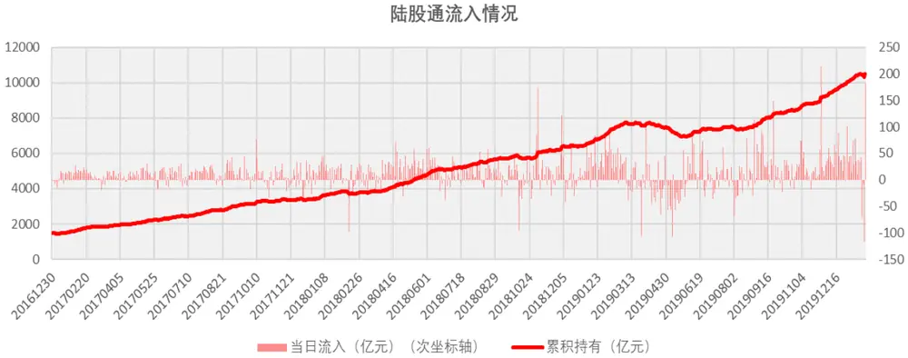
数据来源：东方证券研究所 Wind 资讯

北上资金是指通过香港交易所流入 A 股的香港或境外资金，北上资金可以买入的股票池为沪股通和深股通的成分股，沪股通和深股通总称为陆股通，其中沪股通为沪港通的一部分，于 2014 年 11 月 17 日启动，深股通为深港通的一部分，于 2016 年 12 月 5 日启动。到 2020 年1 月 23 日为止，陆股通的成分股股数量为 1289 支，而北上资金持有股票数量则为 2150 支，这是因为陆股通成分股根据图 3 所示的规则每年 6 月和 12 月进行调整，调出的股票不能再被北上资金买入而仅可以被卖出，这也就是为什么陆股通成分股数量小于北上资金持有股票数量的原因。我们从两者数量的变化可以看到，虽然陆股通的成分股 3 年来有所减少，但是陆股通的持仓股票则是稳定的持续增多的，这也反映出北上资金对于 A 股整体的长期看好，因此即使被调出成分股的股票也并没有都被北上资金完全减持，当然，被调出陆股通成分股的股票因为仅能被北上资金卖出，所以依然属于股票的负面影响因素。从陆股通持有股票的数量来看，基本上近 2/3 的 A 股有北上资金参与，而且近 3 年来这个数量相对也是较为稳定的，因此我们认为有足够的统计数据可以用来尝试对北上资金持仓和交易特征的因子进行测试。

图 2：陆股通成分股数量和北上资金持有股票数量
陆股通成分股数量和持有股票数量
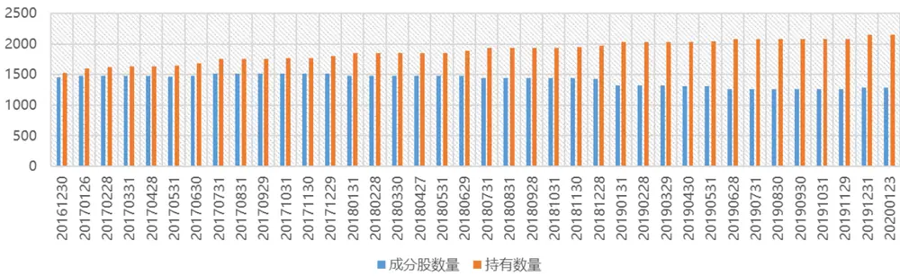
数据来源：东方证券研究所 Wind 资讯

图 3：陆股通成分股与交易规则

| 深股通 | 沪股通 |
| --- | --- |
| 深股通股票范围，是市值在60亿元人民币以上的深证成份指数和深证中小创新指数的成份股，以及A+H股上市公司在深交所上市的A股，但不包括被深交所实施风险警示、被暂停上市或进入退市整理期的股票。 | 可通过沪港通进行北向交易的合资格证券，包括上证180指数、上证380指数的成分股，以及不在上述指数成分股内但有H股同时在联交所上市及买卖的上交所上市A股。此外，沪股通股票将在以下几种情况下被暂停买入(但允许卖出)：该等沪股不再属于有关指数成分股；或该等沪股被实施风险警示；或该等沪股相应H股不再在联交所挂牌买卖。 |

数据来源：东方证券研究所 港交所

## 2.北上持仓和交易行为因子批量测试

## 2.1 因子测试

北上资金的投资者结构较为复杂，凡是通过陆股通渠道流向 A 股的均为北上资金，不过我们通常认为北上资金中主要是外资或香港的机构。北上资金的持股明细每天都会公布，这些数据可以给我们带来一定的指导价值，即便北上资金并非 smart money，我们依然可以把它当成一个大体量的投资者来研究其持仓特征和交易行为，更不用说北上资金这几年的表现都有目共睹。

我们基于北上资金每日的持股明细，批量测试了 12 个与其持仓特征或交易行为特征有关的因子，因子的构建方式如图 4 所示，测试区间为 2016.12.30-2019.12.31 共 36 个月的时间。在测试的时候，这里我们倾向于在有北上参与的股票池中构建因子，上文也提到了陆股通成分股与北上持仓数量不一致的问题，首先在因子测试的层面，每期的数量变动是不大的，其次调入和调出成分股本身也反映了股票一定的信息，即调入成分股的股票更有可能会获得北上资金流入，而调出的股票只能被持有的北上资金卖出，而如果仅在成分股内构建因子，一则覆盖度较小，二则忽略了调入调出本身的正负面信息。此外，由于北上资金持有的股票数量在全市场覆盖度不高，而大量的填值会导致因子的效果和分布都发生较大的变化，因此这里测试的最大样本空间仅选在有北上资金参与的股票当中（目前为 2150 支）。

图 4：北上因子列表

| 因子编号 因子代码 | 因子构建方式 |  | 类型 |
| --- | --- | --- | --- |
| 1 | HoldPER | 月末持仓占流通市值比 | 持仓特征 |
| 2 | MHoldPER | 过去20交易日每日的持仓占流通市值比均值 |  |
| 3 | Hold | 月末持仓市值 |  |
| 4 | MHold | 过去20交易日的持仓市值均值 | 流入流出 交易行为 |
| 5 | DHoldPER | 月末持仓占流通市值比-20个交易日之前的持仓占流通市值比 |  |
| 6 | DV2Hold | 过去5个交易日净流入量均值/过去20交易日日均持仓量 |  |
| 7 | DV2DV STD | 过去20个交易日净流入量均值/过去20个交易日流入量标准差 |  |
| 8 | DV2ABSDV | 过去5个交易日净流入量均值/过去20交易日净流入量绝对值的均值 |  |
| 9 | DV2Hold_MAXCP | 股价最高3个交易日的净流入量均值/过去20交易日日均持仓量 |  |
| 10 | DV2ABSDV_MAXCP | 股价最高3个交易日的净流入量均值/过去20交易日净流入量绝对值的均值 |  |
| 11 | DV2Hold_MAXVOL | 交易量最高3个交易日的净流入量均值/过去20交易日日均持仓量 |  |
| 12 | DV2ABSDV MAXVOL | 交易量最高3个交易日的净流入量均值/过去20交易日净流入量绝对值的均值 |  |

数据来源：东方证券研究所 Wind 资讯

图 5-6 展示了北上持有占比因子 HoldPER 和 MholdPER 因子的表现，这两个因子原始值和中性化以后因子在3个样本空间中均具有显著的选股效果，且在300内反而RankIC更高，说明其在大市值空间反而表现更好。此外，这两个因子多空组合的超额收益几乎都来自于第一组的多头端，不过其在中证 800 和沪深 300 内的表现于 2018 年较为普通。

图 7-8 展示了北上持有因子 Hold 和 Mhold 因子的表现，这两个因子原始值具有非常强的选股效果，在中证 800 和沪深 300 内的 RankIC 均高于 10%，但是在行业市值中性后，因子基本失去了选股效果，这说明这两个因子主要的收益都来源于其行业和市值的暴露，反映出北上资金过去 3 年在行业和市值上的判断带来了明显 ALPHA，但是这种特征在未来能否持续则很难确保。

图 5：HoldPER 因子测试

| 样本空间 | 原始值 |  | 行业市值中性化 |  |  |  |  |  |  |
| --- | --- | --- | --- | --- | --- | --- | --- | --- | --- |
|  | RankIC | ICIR | RankIC | ICIR | t_value | 多空月均收益 |  | 多空年化 多空最大回撤 多空组合IR |  |
| 北上持有 | 0.086 | 2.279 | 0.027 | 2.264 | 3.921 | 0.87% | 10.91% | -2.52% | 3.032 |
| 中证800 | 0.100 | 2.571 | 0.029 | 1.930 | 3.342 | 0.84% | 10.47% | -4.42% | 2.314 |
| 沪深300 | 0.118 | 2.536 | 0.039 | 1.915 | 3.317 | 0.89% | 11.03% | -5.54% | 1.765 |

图 6：MHoldPER 因子测试

| 样本空间 | 原始值 |  | 行业市值中性化 |  |  |  |  |  |  |
| --- | --- | --- | --- | --- | --- | --- | --- | --- | --- |
|  | RankIC | ICIR | RankIC | ICIR | t value | 多空月均收益 多空年化 |  | 多空最大回撤 多空组合IR |  |
| 北上持有 | 0.079 | 2.112 | 0.024 | 2.019 | 3.497 | 0.83% | 10.35% | -2.16% | 2.860 |
| 中证800 | 0.095 | 2.422 | 0.026 | 1.754 | 3.038 | 0.79% | 9.79% | -3.97% | 2.228 |
| 沪深300 | 0.114 | 2.467 | 0.032 | 1.554 | 2.691 | 0.69% | 8.45% | -6.16% | 1.377 |

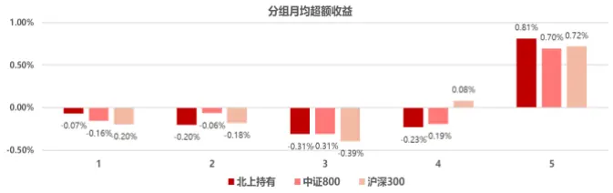

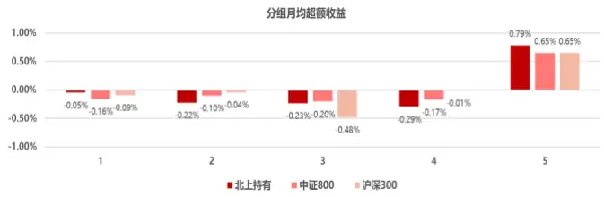

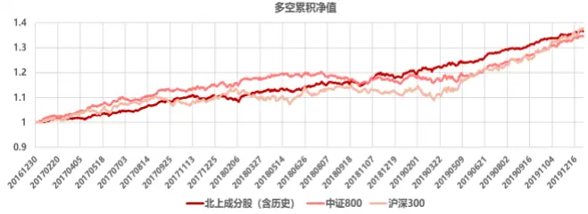
数据来源：东方证券研究所 Wind 资讯

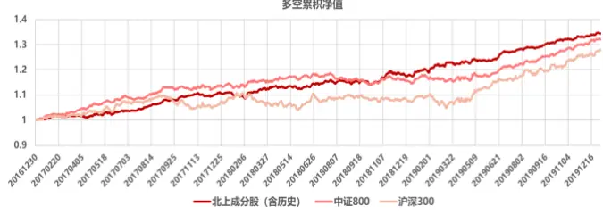
数据来源：东方证券研究所 Wind 资讯

图 7：Hold 因子测试

| 样本空间 | 原始值 |  | 行业市值中性化 |  |  |  |  |  |  |
| --- | --- | --- | --- | --- | --- | --- | --- | --- | --- |
|  | RankIC | ICIR | RankIC | ICIR |  | t_value 多空月均收益 多空年化 |  | 多空最大回撤 多空组合IR |  |
| 北上持有 | 0.092 | 1.985 | 0.011 | 0.641 | 1.110 | 0.47% | 5.63% | -5.28% | 1.238 |
| 中证800 | 0.110 | 2.204 | -0.001 | -0.054 | -0.093 | -0.22% | -2.72% | -10.59% | -0.463 |
| 沪深300 | 0.130 | 2.308 | 0.001 | 0.052 | 0.091 | 0.19% | 2.22% | -10.76% | 0.418 |

图 8：MHold 因子测试

| 样本空间 | 原始值 |  | 行业市值中性化 |  |  |  |  |  |  |
| --- | --- | --- | --- | --- | --- | --- | --- | --- | --- |
|  | RankIC | ICIR | RankIC | ICIR | t_value |  |  | 多空月均收益 多空年化 多空最大回撤 多空组合IR |  |
| 北上持有 | 0.088 | 1.912 | 0.011 | 0.633 | 1.097 | 0.42% | 5.04% | -5.79% | 1.096 |
| 中证800 | 0.107 | 2.145 | -0.002 | -0.111 | -0.193 | -0.16% | -2.11% | -10.44% | -0.324 |
| 沪深300 | 0.127 | 2.271 | -0.001 | -0.036 | -0.062 | -0.06% | -0.82% | -10.38% | -0.172 |

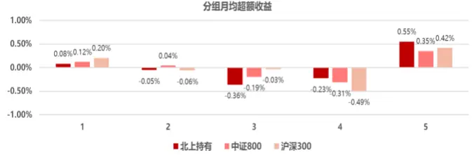

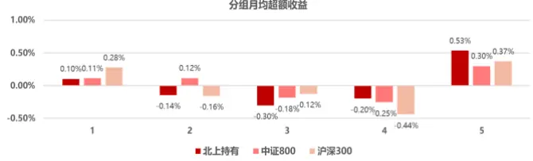

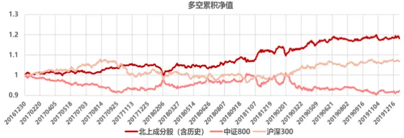
数据来源：东方证券研究所 Wind 资讯

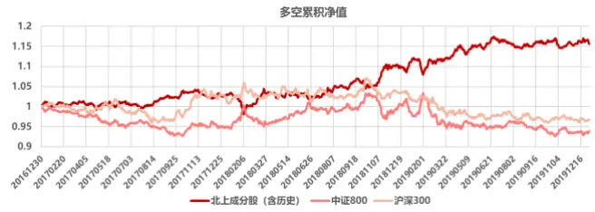
数据来源：东方证券研究所 Wind 资讯

图 9：DHoldPER 因子测试

| 样本空间 | 原始值 |  | 行业市值中性化 |  |  |  |  |  |  |
| --- | --- | --- | --- | --- | --- | --- | --- | --- | --- |
|  | RankIC | ICIR | RankIC | ICIR | t value |  |  | 多空月均收益 多空年化 多空最大回撤 多空组合IR |  |
| 北上持有 | 0.039 | 2.346 | 0.029 | 2.638 | 4.569 | 0.91% | 11.43% | -2.20% | 3.259 |
| 中证800 | 0.041 | 2.018 | 0.020 | 1.931 | 3.345 | 0.57% | 7.04% | -3.08% | 1.942 |
| 沪深300 | 0.054 | 1.947 | 0.033 | 2.169 | 3.756 | 1.09% | 13.88% | -3.36% | 3.484 |

图 10：DV2Hold 因子测试

| 样本空间 | 原始值 |  | 行业市值中性化 |  |  |  |  |  |  |
| --- | --- | --- | --- | --- | --- | --- | --- | --- | --- |
|  | RankIC | ICIR | RankIC | ICIR |  |  |  | t value 多空月均收益 多空年化 多空最大回撤 多空组合IR |  |
| 北上持有 | 0.018 | 1.551 | 0.024 | 1.864 | 3.228 | 0.57% | 7.03% | -2.98% | 2.008 |
| 中证800 | 0.026 | 1.511 | 0.029 | 2.272 | 3.936 | 0.62% | 7.59% | -7.30% | 1.641 |
| 沪深300 | 0.023 | 0.782 | 0.027 | 1.669 | 2.890 | 0.53% | 6.40% | -6.96% | 1.174 |

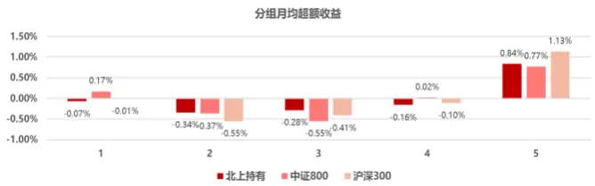

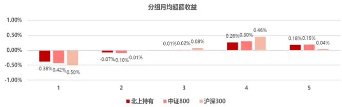

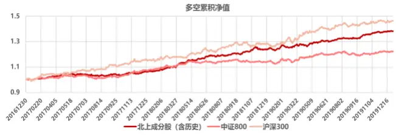
数据来源：东方证券研究所 Wind 资讯

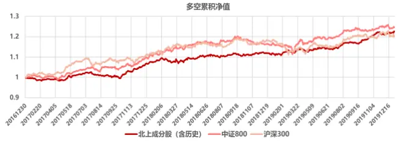
数据来源：东方证券研究所 Wind 资讯

图 11：DV2DV_STD 因子测试

| 样本空间 | 原始值 |  | 行业市值中性化 |  |  |  |  |  |  |
| --- | --- | --- | --- | --- | --- | --- | --- | --- | --- |
|  | RankIC | ICIR | RankIC | ICIR |  |  |  | t_value 多空月均收益 多空年化 多空最大回撤 多空组合IR |  |
| 北上持有 | 0.038 | 1.847 | 0.027 | 2.339 | 4.052 | 0.65% | 8.01% | -4.65% | 2.317 |
| 中证800 | 0.039 | 1.562 | 0.028 | 1.977 | 3.425 | 0.60% | 7.32% | -5.55% | 1.811 |
| 沪深300 | 0.045 | 1.441 | 0.030 | 1.644 | 2.848 | 0.78% | 9.71% | -4.11% | 1.796 |

图 12：DV2ABSDV 因子测试

| 样本空间 | 原始值 |  | 行业市值中性化 |  |  |  |  |  |  |
| --- | --- | --- | --- | --- | --- | --- | --- | --- | --- |
|  | RankIC | ICIR | RankIC | ICIR |  |  |  | t_value多空月均收益多空年化 多空最大回撤 多空组合IR |  |
| 北上持有 | 0.029 | 2.190 | 0.022 | 2.539 | 4.398 | 0.48% | 5.82% | -3.41% | 1.731 |
| 中证800 | 0.034 | 1.856 | 0.021 | 1.719 | 2.977 | 0.46% | 5.55% | -4.14% | 1.320 |
| 沪深300 | 0.035 | 1.247 | 0.026 | 1.404 | 2.433 | 0.71% | 8.73% | -4.47% | 1.622 |

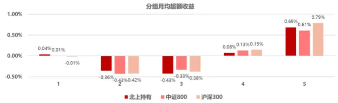

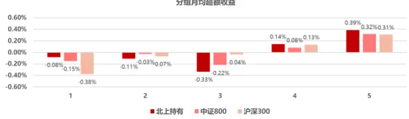

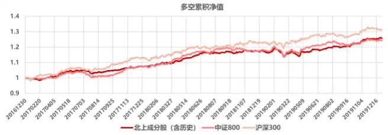
数据来源：东方证券研究所 Wind 资讯

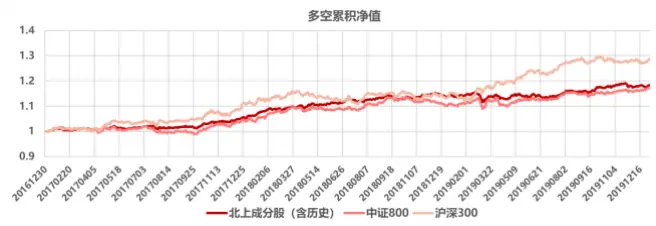
数据来源：东方证券研究所 Wind 资讯

图 9-12 是描述北上资金常规交易行为的因子 DHoldPER、DV2Hold、DV2DV_STD 和DV2ABSDV。DHoldPER 反映了月末和月初的北上资金持仓占流通市值比的变化，这个值越大说明新增的北上资金流入公司越多，是个正面的信号，从因子表现来看，不论原始值还是中性化后因子值在 3个样本空间中均具有显著的选股效果，而且在沪深 300 内反而 RankIC 最高，其多空组合回撤较小，且超额收益几乎完全来源于多头端；DV2Hold是过去 5 个交易日净流入量均值/过去 20 交易日日均持仓量，如果最近 5 日北上资金大以较大的比例流入，说明这个公司在短期被北上资金看好，未来存在一定的空间，从因子表现看，这个因子的原始值效果一般，是中性化后在 3 个样本空间中还是具有显著的选股效果的，从分组超额收益来看，因子的单调性并不很好，多空收益主要来源于空头端，且第 4 组的超额收益要高于第 5 组。DV2DV_STD 是股票过去 20 个交易日净流入量均值/过去 20 个交易日净流入量标准差，这个因子同时反映了北上资金流入量和流入量稳定性的关系，理论上说，理性的机构投资者更倾向于较为稳定的交易行为，如果关注这个股票的北上资金持续流入较多，且流入量较为稳定，那么可以推测这个公司更有可能是被较为理性的北上资金持续追捧，那么未来可能表现会更好。从因子表现上来看，这个因子无论原始值还是中性化后因子值在 3 个样本空间中均具有显著的选股效果，不过从分组超额收益来看，并不是十分单调，空头端的负超额收益反而要小于第 2 和第 3组，不过好在其多头端的超额收益很高，因此多空表现也较为稳定；DV2ABSDV 是过去 5 个交易日净流入量均值/过去 20 交易日净流入量绝对值的均值，如果最近 5 个交易日流入量相比于过去 20 交易日的净交易量更大，说明最近的北上资金流入是一种加速流入的行为，反映出北上资金对股票的乐观程度提高，因此股票未来表现可能会更好。从因子表现看，这个因子无论原始值还是中性化后因子值在 3 个样本空间中均具有显著的选股效果，而且在沪深 300内表现更好，此外，因子分组超额收益单调性较好，且多头端贡献更多的超额收益，多空组合表现也较为稳定，回撤远小于上两个因子。

图 13：DV2Hold_MAXCP 因子测试

| 样本空间 | 原始值 |  | 行业市值中性化 |  |  |  |  |  |  |
| --- | --- | --- | --- | --- | --- | --- | --- | --- | --- |
|  | RankIC | ICIR | RankIC | ICIR |  |  |  |  | t value 多空月均收益 多空年化 多空最大回撤 多空组合IR |
| 北上持有 | 0.024 | 1.929 | 0.016 | 1.944 | 3.367 | 0.45% | 5.51% | -2.99% | 1.742 |
| 中证800 | 0.031 | 1.810 | 0.027 | 1.941 | 3.362 | 0.64% | 7.82% | -5.03% | 1.877 |
| 沪深300 | 0.036 | 1.535 | 0.030 | 1.497 | 2.593 | 0.63% | 7.55% | -10.44% | 1.203 |

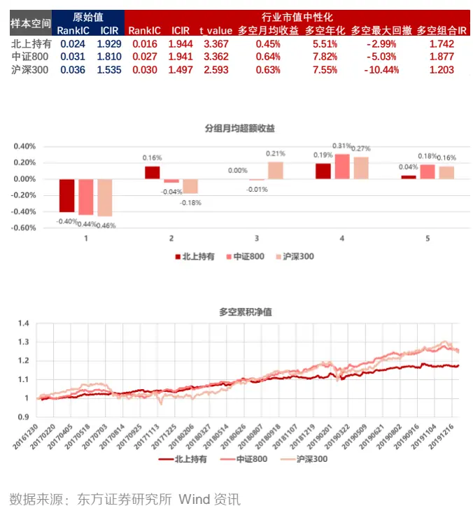

图 14：DV2ABSDV_MAXCP 因子测试

| 样本空间 | 原始值 |  | 行业市值中性化 |  |  |  |  |  |  |
| --- | --- | --- | --- | --- | --- | --- | --- | --- | --- |
|  | RankIC | ICIR | RankIC | ICIR | t_value | 多空月均收益 多空年化 多空最大回撤 多空组合IR |  |  |  |
| 北上持有 | 0.029 | 1.912 | 0.024 | 2.675 | 4.633 | 0.58% | 7.09% | -4.72% | 2.250 |
| 中证800 | 0.035 | 1.618 | 0.024 | 1.790 | 3.100 | 0.60% | 7.39% | -4.29% | 1.868 |
| 沪深300 | 0.044 | 1.726 | 0.032 | 2.022 | 3.503 | 0.86% | 10.74% | -3.90% | 2.054 |

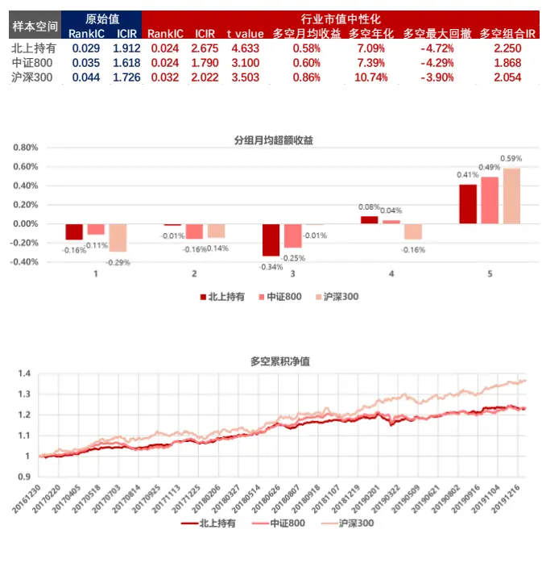
数据来源：东方证券研究所 Wind 资讯

图 15：DV2Hold_MAXVOL 因子测试

|  | 原始值 |  | 行业市值中性化 |  |  |  |  |  |  |
| --- | --- | --- | --- | --- | --- | --- | --- | --- | --- |
| 样本空间 | RankIC ICIR |  | RankIC | ICIR |  | t_value 多空月均收益多空年化 多空最大回撤多空组合IR |  |  |  |
| 北上持有 | 0.026 | 1.826 | 0.015 | 1.698 | 2.942 | 0.45% | 5.43% | -4.17% | 1.688 |
| 中证800 | 0.030 | 1.597 | 0.022 | 1.695 | 2.936 | 0.53% | 6.48% | -4.71% | 1.627 |
| 沪深300 | 0.015 | 0.599 | 0.017 | 0.894 | 1.548 | 0.23% | 2.62% | -6.91% | 0.523 |

图 16：DV2ABSDV_MAXVOL 因子测试

| 样本空间 | 原始值 |  | 行业市值中性化 |  |  |  |  |  |  |
| --- | --- | --- | --- | --- | --- | --- | --- | --- | --- |
|  | RankIC | ICIR | RankIC | ICIR |  |  |  | t value多空月均收益 多空年化 多空最大回撤 多空组合IR |  |
| 北上持有 | 0.034 | 2.097 | 0.023 | 2.215 | 3.837 | 0.49% | 6.00% | -5.55% | 1.883 |
| 中证800 | 0.039 | 1.848 | 0.025 | 1.837 | 3.182 | 0.54% | 6.60% | -4.92% | 1.680 |
| 沪深300 | 0.029 | 1.077 | 0.022 | 1.189 | 2.060 | 0.53% | 6.39% | -5.12% | 1.281 |

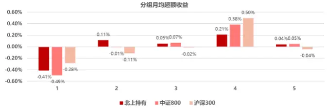

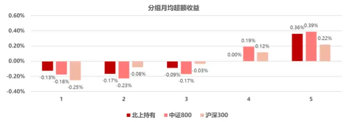

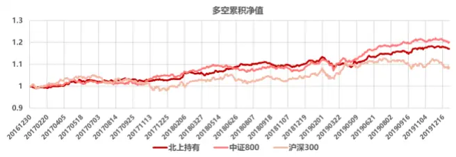
数据来源：东方证券研究所 Wind 资讯

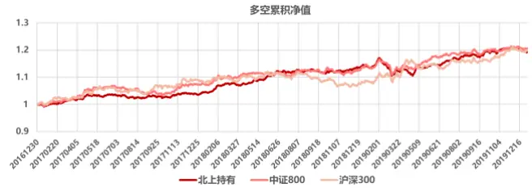
数据来源：东方证券研究所 Wind 资讯

图 13-16 是描述北上资金在特殊时间段交易行为的因子：DV2Hold_MAXCP、DV2ABSDV_MAXCP、DV2Hold_MAXVOL、DV2ABSDV_MAXVOL。DV2Hold_MAXCP是股价最高 3 个交易日的净流入量均值/过去 20 交易日日均持仓量。如果在过去一个月内股价最高的几天还有较大比例的北上资金流入，说明当前股价处于一个相对安全的价位，未来表现可能较好。从因子表现来看，因子原始值和中性化因子在 3 个样本空间中均有显著选股效果，多空组合表现较为稳定，但是超额收益主要来源于空头端；DV2ABSDV_MAXCP 是股价最高 3 个交易日的净流入量均值/过去 20 交易日净流入量绝对值的均值，如果在过去一个内股价最高的几天还有北上资金加速流入，说明当前股价处于一个较有吸引力的位置，未来表现可能会较好。从因子表现来看，因子原始值和中性化因子在 3 个样本空间中均有显著选股效果，且在沪深 300 内表现更好，分组超额收益单调性明显，多空组合表现较为稳定且超额收益主要来源于多头端。

DV2Hold_MAXCP 是交易量最高 3 个交易日的净流入量均值/过去 20 交易日日均持仓量。北上资金在股票放量的时候以较大比例进入，说明北上资金在一定程度上对股票的看好，股票未来表现可能较好。从因子表现来看，因子原始值和中性化因子在沪深 300里均没有显著的选股效果，而且分组超额收益单调性较差，多空收益主要来源于空头端。DV2ABSDV_MAXVOL 交易量最高 3 个交易日的净流入量均值/过去 20 交易日净流入量绝对值的均值。北上资金在股票放量的时候加速进入，同样说明北上资金在一定程度上对股票的看好，股票未来表现可能较好，当然这个逻辑要弱于在股票价格较高时的流入。从因子表现来看，因子原始值和中性化因子在 3 个样本空间中均有显著选股效果，但是在沪深 300 内表现较弱，分组超额收益单调性较好，且多空组合超额收益主要由多头端贡献。

## 2.2单因子的行业选择能力

根据我们之前报告的测试结果，北上资金对行业的配置存在偏好，那么北上因子是否具有一定的行业选择效果呢？这里我们对此作出了测试。因为行业和市值是高度相关的，所以这里把因子做市值中性后再考察其行业选择能力。我们把中性后的因子在行业内取均值作为这个行业的 Zscore，然后测算行业 Zscore 和中信一级行业下月收益的关系（图17），红色为 ICIR 在 5%显著性等级上显著，多空组合是根据前后 20%的行业等权收益计算的。

图 17：市值中性化后因子的行业选择能力

| 因子 | RankIC | ICIR | 多空年化 | 多空最大月回撤 | 多空IR |
| --- | --- | --- | --- | --- | --- |
| HoldPER | 0.090 | 0.988 | 4.2% | -18.3% | 0.36 |
| MHoldPER | 0.086 | 0.956 | 3.1% | -19.6% | 0.28 |
| Hold | 0.152 | 2.289 | 20.7% | -6.1% | 1.76 |
| MHold | 0.148 | 2.227 | 18.2% | -9.4% | 1.51 |
| DHoldPER | 0.070 | 1.079 | 3.1% | -9.5% | 0.37 |
| DV2Hold | -0.006 | -0.118 | -4.5% | -16.4% | -0.54 |
| DV2DV_STD | 0.051 | 0.749 | 2.8% | -9.7% | 0.36 |
| DV2ABSDV | 0.058 | 1.124 | 10.5% | -4.4% | 1.29 |
| DV2Hold_MAXCP | -0.007 | -0.136 | -5.4% | -16.0% | -0.70 |
| DV2ABSDV_MAXCP | 0.015 | 0.277 | -2.1% | -11.0% | -0.26 |
| DV2Hold_MAXVOL | 0.093 | 1.675 | 9.5% | -6.9% | 1.18 |
| DV2ABSDV_MAXVOL | 0.083 | 1.404 | 4.4% | -6.3% | 0.54 |

数据来源：东方证券研究所 Wind 资讯

从结果看，北上持有因子基本都具有一定的行业选择能力，北上交易行为因子中DHoldPER、DV2ABSDV、DV2Hold_MAXVOL 和 DV2ABSDV_MAXVOL 都具有一定行业选择效果，其中除了 DV2Hold_MAXVOL 以外的剩下 3 个因子都是上文测试下来表现较好且多头端收益较高的交易行为因子。

## 3.因子相关性和衰减情况

上面我们测算了 12 个北上因子的表现，我们接下来测算了北上因子与常规因子在北上持股样本空间中的相关性（图18）。其中上半部分是因子之间的 RankIC 相关性（中性化后因子），下半部分是北上因子和常规 9 大类因子之间的RankIC 相关性。可以看到在北上因子之间，用到类似数据的因子相关性较高，比如 HoldPER 和 MHoldPER，Hold和 Mhold，DHoldPER 和 DV2DV_STD，DV2Hold_MAXCP 和 DV2ABSDV_MAXCP，DV2Hold_MAXVOL 和 DV2ABSDV_MAXVOL，对于这些两两相关的因子，我们更加倾向于使用其中表现较好的那个。

图 18 下半部分反映了北上因子和常规大类因子的 RankIC 相关性，从相关关系来看，所有的北上因子和常规大类因子相关性都非常低，仅有北上持仓的 4 个因子和常规大类因子有着一些相关性，其中 HoldPER 和 MHoldPER 与盈利、运营、分析师和超预期因子都有 5%以上的相关性，我们在之前的报告中测算过北上资金持仓的风格，北上资金持仓在盈利、超预期、分析师等风格上均存在明显的暴露，这里的北上持仓因子虽然和这几个大类因子存在一定的相关性，但是这个相关性都很小，这是因为北上持仓的因子可以看做是某种复合因子，它虽然在某些风格上存在暴露，但是其本身与单个风格的相关性都较为有限。北上交易行为因子主要反映了北上资金流入流出的特征，它们与常规大类因子的相关性更低，基本没有太大的关系。

图 18：因子的 RankIC 相关性（中性化后）

|  | 1 | 2 | 3 | 4 | 5 | 6 | 7 | 8 | 9 | 10 | 11 | 12 |
| --- | --- | --- | --- | --- | --- | --- | --- | --- | --- | --- | --- | --- |
| HoldPER |  | 98.7% | 69.4% | 69.2% | 25.8% | 0.8% | 15.6% | 6.1% | 2.3% | 7.8% | 2.8% | 8.0% |
| MHoldPER | 98.7% |  | 69.0% | 69.7% | 17.4% | -4.1% | 8.2% | -0.1% | -0.4% | 4.6% | -0.5% | 3.9% |
| Hold | 69.4% | 69.0% |  | 99.3% | 13.5% | -2.1% | 5.3% | 1.4% | -1.6% | 3.6% | -1.8% | 2.5% |
| MHold | 69.2% | 69.7% | 99.3% |  | 9.3% | -4.2% | 1.2% | -2.0% | -3.0% | 1.7% | -3.3% | 0.2% |
| DHoldPER | 25.8% | 17.4% | 13.5% | 9.3% |  | 29.4% | 76.2% | 38.9% | 26.0% | 34.5% | 30.8% | 42.2% |
| DV2Hold | 0.8% | -4.1% | -2.1% | -4.2% | 29.4% |  | 34.3% | 68.4% | 16.9% | 15.6% | 20.0% | 17.3% |
| DV2DV_STD | 15.6% | 8.2% | 5.3% | 1.2% | 76.2% | 34.3% |  | 51.4% | 30.3% | 42.8% | 33.3% | 49.1% |
| DV2ABSDV | 6.1% | -0.1% | 1.4% | -2.0% | 38.9% | 68.4% | 51.4% |  | 16.8% | 23.5% | 18.8% | 26.3% |
| DV2Hold_MAXCP | 2.3% | -0.4% | -1.6% | -3.0% | 26.0% | 16.9% | 30.3% | 16.8% |  | 80.0% | 35.6% | 33.1% |
| DV2ABSDV_MAXCP | 7.8% | 4.6% | 3.6% | 1.7% | 34.5% | 15.6% | 42.8% | 23.5% | 80.0% |  | 33.2% | 44.3% |
| DV2Hold_MAXVOL | 2.8% | -0.5% | -1.8% | -3.3% | 30.8% | 20.0% | 33.3% | 18.8% | 35.6% | 33.2% |  | 76.4% |
| DV2ABSDV_MAXVOL | 8.0% | 3.9% | 2.5% | 0.2% | 42.2% | 17.3% | 49.1% | 26.3% | 33.1% | 44.3% | 76.4% |  |
| Value | -0.6% | -0.2% | 0.0% | 0.4% | -0.6% | -1.3% | 0.1% | 0.0% | 1.3% | 2.3% | -1.0% | -0.3% |
| Profitability | 20.4% | 20.2% | 7.6% | 7.5% | 8.6% | 4.0% | 8.8% | 4.3% | 1.9% | 3.0% | 2.3% | 3.8% |
| Growth | 2.6% | 2.5% | -3.2% | -3.3% | 4.0% | 1.0% | 3.9% | 1.4% | 1.5% | 1.1% | 2.6% | 3.0% |
| Operation | 7.3% | 7.4% | 5.3% | 5.4% | 1.5% | 0.8% | 1.1% | 0.7% | 1.0% | 1.3% | 0.5% | 1.0% |
| Liquidity | -5.1% | -5.2% | -1.8% | -1.7% | -2.5% | -0.1% | 3.6% | 1.9% | 4.2% | 6.0% | 1.3% | 2.6% |
| Reversal | -8.2% | -7.3% | -3.5% | -1.9% | -6.7% | 0.3% | -2.5% | -1.5% | -1.7% | -3.3% | -1.7% | -3.1% |
| Lottery | 0.1% | 0.3% | 1.5% | 1.7% | -1.8% | -1.4% | 1.8% | 1.6% | 4.8% | 7.1% | 0.6% | 2.5% |
| Analyst | 12.0% | 12.1% | 8.8% | 9.0% | 5.7% | 0.3% | 4.3% | 1.6% | 0.9% | 1.9% | 1.4% | 3.3% |
| Surprise | 6.2% | 5.8% | 1.9% | 1.5% | 6.3% | 2.4% | 5.2% | 2.5% | 1.9% | 1.9% | 3.1% | 3.5% |

数据来源：东方证券研究所 Wind 资讯

图 19：中性化后北上因子对9大类因子正交化后表现（北上持股样本空间）

| factorid | rankIC | ICIR | 多空月均收益 | 多空年化 | 多空最大回撤 | 多空组合IR |  | 2 | 3 | 4 | 5 |
| --- | --- | --- | --- | --- | --- | --- | --- | --- | --- | --- | --- |
| HoldPER | 0.007 | 0.480 | 0.36% | 4.34% | -4.12% | 1.05 | 0.18% | -0.14% | -0.41% | -0.18% | 0.55% |
| MHoldPER | 0.005 | 0.298 | 0.34% | 4.12% | -4.67% | 1.00 | 0.20% | -0.17% | -0.30% | -0.27% | 0.55% |
| Hold | -0.003 | -0.173 | -0.13% | -1.69% | -13.81% | -0.31 | 0.24% | -0.04% | -0.28% | -0.29% | 0.39% |
| MHold | -0.003 | -0.172 | -0.09% | -1.20% | -13.95% | -0.22 | 0.25% | -0.06% | -0.31% | -0.23% | 0.34% |
| DHoldPER | 0.018 | 1.583 | 0.71% | 8.75% | -3.60% | 2.37 | 0.06% | -0.23% | -0.39% | -0.20% | 0.77% |
| DV2Hold | 0.017 | 1.033 | 0.54% | 6.59% | -3.46% | 1.82 | -0.38% | 0.13% | 0.03% | 0.07% | 0.16% |
| DV2DV_STD | 0.013 | 1.133 | 0.37% | 4.51% | -3.15% | 1.61 | 0.16% | -0.29% | -0.32% | -0.11% | 0.55% |
| DV2ABSDV | 0.013 | 1.403 | 0.38% | 4.59% | -3.35% | 1.54 | -0.09% | 0.02% | -0.32% | 0.11% | 0.29% |
| DV2Hold_MAXCP | 0.004 | 0.543 | 0.42% | 5.06% | -2.52% | 1.74 | -0.38% | 0.31% | 0.06% | -0.02% | 0.05% |
| DV2ABSDV_MAXCP | 0.010 | 1.394 | 0.49% | 6.03% | -3.21% | 2.21 | -0.11% | 0.13% | -0.24% | -0.18% | 0.39% |
| DV2Hold_MAXVOL | 0.008 | 0.900 | 0.44% | 5.36% | -4.09% | 1.70 | -0.42% | 0.27% | 0.06% | 0.06% | 0.03% |
| DV2ABSDV_MAXVOL | 0.012 | 1.334 | 0.40% | 4.87% | -3.91% | 1.83 | -0.04% | -0.09% | -0.06% | -0.18% | 0.36% |

数据来源：东方证券研究所 Wind 资讯

图 19 测算了在北上持股样本空间中，北上因子在对 9 个常规大类因子正交化后的表现（标红色为满足 5%显著性条件）。可以看到 HoldPER 和 MholdPER 虽然和常规大类因子相关性不高，但是正交化后基本失去了选股效果，这点与之前报告中的结论是类似的，北上资金持仓反映了北上对于因子风格的偏好，因此这两个因子类似于复合因子，绝大多数 ALPHA 可以被现有的大类因子所解释，不过北上持仓因子也在一定程度上反映了香港或外资机构的因子风格偏好，也可以以此为参考来适当调整我们的因子配置权重。其他有效的因子均为交易行为因子，从表现和相关性上看，我们更倾向于推荐DHoldPER、DV2ABSDV、DV2ABSDV_MAXCP 和 DV2ABSDV_MAXVOL。

图 20 展示了中证 800 内北上因子在对 9 个常规大类因子正交化后的表现（标红色为满足5%显著性条件），可以看到除DHoldPER以外的交易特征因子均具有显著选股效果，而 DHoldPER 虽然不再显著，但是多头端超额收益依然有月均 0.62%，综合考虑后，我们还是倾向于推荐和北上持股样本空间中类似的因子。

图 20：中性化后北上因子对9大类因子正交化后表现（中证 800 样本空间）

| factorid | rankIC | ICIR | 多空月均收益 | 多空年化 | 多空最大回撤 | 多空组合IR |  | 2 | 3 | 4 | 5 |
| --- | --- | --- | --- | --- | --- | --- | --- | --- | --- | --- | --- |
| HoldPER | 0.007 | 0.527 | 0.19% | 2.24% | -6.66% | 0.52 | 0.24% | -0.03% | -0.38% | -0.26% | 0.47% |
| MHoldPER | 0.005 | 0.359 | 0.23% | 2.71% | -7.22% | 0.62 | 0.20% | 0.03% | -0.44% | -0.23% | 0.46% |
| Hold | -0.015 | -0.859 | 0.19% | 2.22% | -6.55% | 0.40 | 0.38% | -0.08% | -0.12% | -0.36% | 0.21% |
| MHold | -0.016 | -0.883 | 0.25% | 2.90% | -5.91% | 0.52 | 0.39% | -0.05% | -0.16% | -0.32% | 0.16% |
| DHoldPER | 0.008 | 0.587 | 0.34% | 4.10% | -4.23% | 0.96 | 0.25% | -0.24% | -0.45% | -0.15% | 0.62% |
| DV2Hold | 0.022 | 1.323 | 0.61% | 7.39% | -7.13% | 1.63 | -0.47% | 0.02% | 0.15% | 0.17% | 0.14% |
| DV2DV_STD | 0.013 | 0.921 | 0.38% | 4.60% | -3.63% | 1.29 | 0.07% | -0.28% | -0.19% | -0.06% | 0.47% |
| DV2ABSDV | 0.011 | 0.983 | 0.43% | 5.18% | -3.17% | 1.37 | -0.16% | 0.11% | -0.30% | 0.04% | 0.25% |
| DV2Hold_MAXCP | 0.017 | 1.098 | 0.37% | 4.44% | -3.67% | 1.15 | -0.26% | -0.22% | 0.14% | 0.21% | 0.09% |
| DV2ABSDV_MAXCP | 0.012 | 0.981 | 0.42% | 5.09% | -2.96% | 1.46 | -0.08% | 0.02% | -0.24% | -0.03% | 0.36% |
| DV2Hold_MAXVOL | 0.015 | 0.989 | 0.39% | 4.68% | -4.91% | 1.26 | -0.41% | -0.03% | 0.27% | 0.20% | -0.03% |
| DV2ABSDV_MAXVOL | 0.015 | 1.108 | 0.35% | 4.19% | -3.69% | 1.20 | -0.07% | -0.13% | -0.10% | 0.06% | 0.28% |

数据来源：东方证券研究所 Wind 资讯

图 21：中性化后北上因子衰减情况
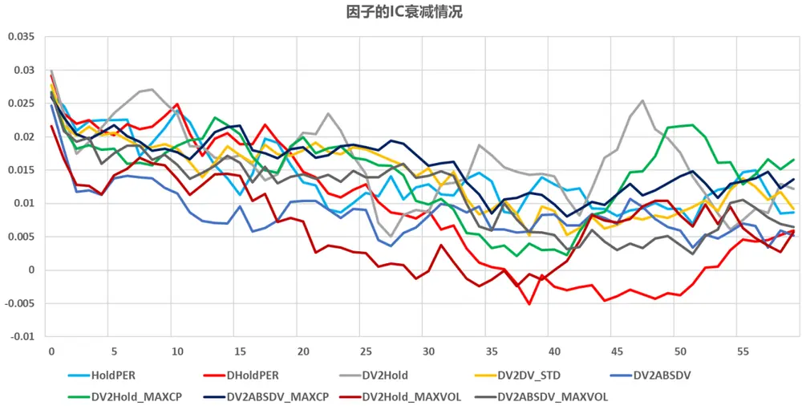
数据来源：东方证券研究所 Wind 资讯

## “慧博资讯”专业的投资研究大数据分享平台

点击进入ttp://www.hibor.com.cn图 21 展示了中性化后因子 RankIC 衰减情况，因为样本量不多，所以衰减的曲线较不平滑，不过我们仍然能够一定程度上观察因子的衰减情况，从图上看，除了DV2Hold_MAXVOL 衰减较快以外，别的因子半衰期基本都在 20 交易日以上，其中像HoldPER、DV2Hold、DV2DV_STD 和 DV2ABSDV_MAXCP 半衰期基本在 40 个交易日附近，因此如果用北上因子来构建月频级别的组合，换手率不会太高。

## 4.北上合成因子测试

## 4.1 合成因子测试

根据上文的结果，我们进一步测试北上因子合成后的效果，我们把 HoldPER 和MHoldPER 因子等权合成起来构建北上持仓因子。流入流出交易行为因子中，因存在两两相关性较高，且其中一个表现较好的特征，所以我们选择 MHold、DV2DV_STD、DV2Hold_MAXCP 和 DV2ABSDV_MAXVOL 来合成北上交易行为因子。这里的测试同样对合成因子做了市值中性。

图 22 展示了合成的北上持仓因子的表现，因为 HoldPER 和 MHoldPER 相关性很高，所以这个合成因子的表现基本与两个单独的因子相差不大。

图 23 展示了合成的北上交易行为因子的表现，因为这 4 个因子相关性不高，所以合成后的因子表现要好于单个引子，合成因子在 3 个样本空间中的 RankIC 均高于 0.03，且在沪深 300 内表现更好，RankIC 为 0.038，分组超额收益单调性较好，且多空组合超额收益主要来源于多头端，不过因子在 2018 年下半年和 2019 年 12 月表现平平。

我们进一步把上面两类因子等权合成北上大类因子，图 24 展示了因子测试结果，合成因子在 3 个样本空间中的 RankIC 均高于 0.04，其中在沪深 300 内 RankIC 为 0.052，分组超额收益单调性较好，多头端月均超额收益均在 0.7%以上。

图 22：北上持仓因子测试
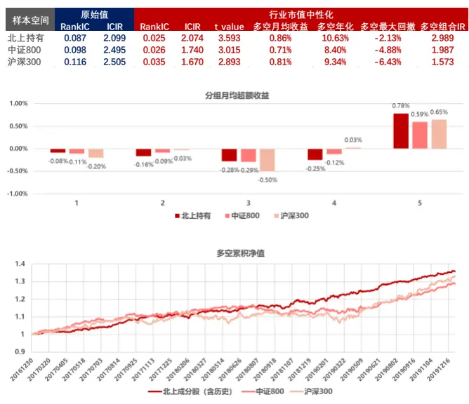
数据来源：东方证券研究所 Wind 资讯

图 23：北上流入流出交易行为因子测试
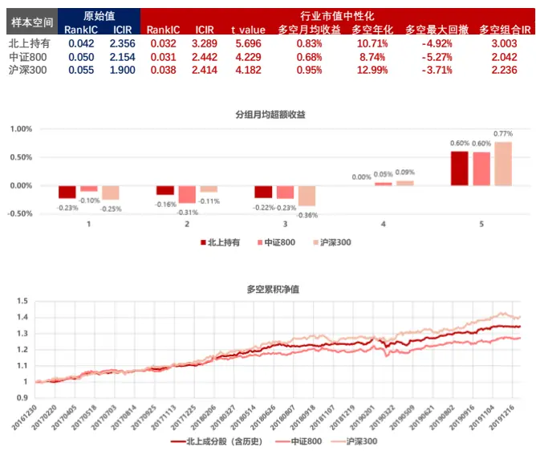
数据来源：东方证券研究所 Wind 资讯

## “慧博资讯”专业的投资研究大数据分享平台

图 24：北上大类因子测试

| 样本空间 | 原始值 |  | 行业市值中性化 |  |  |  |  |  |  |
| --- | --- | --- | --- | --- | --- | --- | --- | --- | --- |
|  | RankIC | ICIR | RankIC | ICIR | t value | 多空月均收益 | 多空年化 | 多空最大回撤 多空组合IR |  |
| 北上持有 | 0.070 | 2.429 | 0.043 | 3.861 | 6.688 | 1.08% | 14.21% | -4.29% | 3.611 |
| 中证800 | 0.083 | 2.556 | 0.043 | 3.047 | 5.278 | 1.04% | 13.38% | -6.02% | 2.747 |
| 沪深300 | 0.090 | 2.302 | 0.052 | 3.140 | 5.438 | 1.24% | 16.32% | -5.74% | 2.570 |

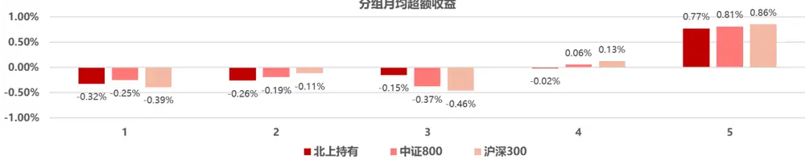

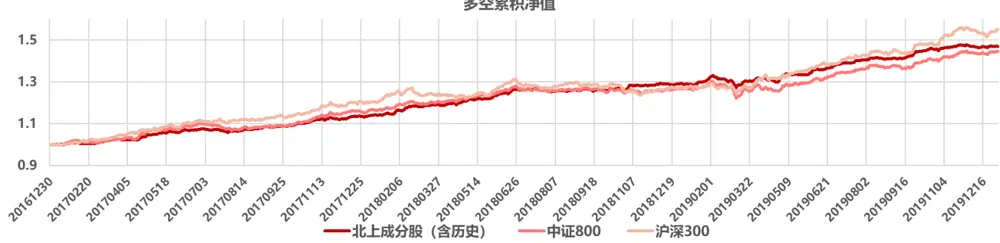
数据来源：东方证券研究所 Wind 资讯

图 25 展示了北上大类因子对常规 9 大类因子正交化后的选股效果， RankIC 都在 0.02以上，ICIR 都在 2 附近，在沪深 300 内表现更好。分组超额收益单调性较好，且得分最高组的超额收益依然有月均 0.6%以上的水平。这一结果充分表明北上大类因子具有一些常规大类因子不具有的 ALPHA 属性。

图 25：北上大类因子正交化常规大类因子后的效果

| 样本空间 | rankIC | ICIR | 多空月均收益 | 多空年化 | 多空最大回撤多空组合IR |  | 1 | 2 | 3 | 4 | 5 |
| --- | --- | --- | --- | --- | --- | --- | --- | --- | --- | --- | --- |
| 北上持股 | 0.023 | 2.368 | 0.68% | 8.40% | -1.84% | 2.66 | -0.05% | -0.18% | -0.24% | -0.15% | 0.64% |
| 中证800 | 0.023 | 1.909 | 0.66% | 8.08% | -2.70% | 2.09 | -0.03% | -0.11% | -0.41% | -0.11% | 0.63% |
| 沪深300 | 0.035 | 2.330 | 0.87% | 10.84% | -4.80% | 1.92 | -0.23% | -0.13% | -0.25% | -0.08% | 0.72% |

数据来源：东方证券研究所 Wind 资讯

## 4.2 北上因子的行业选择能力

根据 2.1 和 2.2 章节中的测试，北上持仓因子中 Hold 和 MHold 具有较强的行业选择效果但是中性化后基本没有选股效果，因此我们在 4.1 中的北上持仓因子中再加入这两个因子来测试合成因子的行业选择效果（图 26），其中多空组合为前 20%减后20%，Top组合为前 20%收益。

可以看到，北上持仓因子和北上流入流出因子都具有一定的行业选择能力，两者合成的北上大类因子构建的行业多空组合年化收益为 15%，最大回撤-4.63%，Top 组合年化

9%，而全行业平均组合的年化收益仅为-2.6%，说明北上大类因子具有一定行业选择效果。根据 2020年 1 月23 日数据计算的前 20%行业为：食品饮料、家电、建材、通讯、医药和农林牧渔。

图 26：北上合成因子行业选择能力测试

| 因子 | RankIC | ICIR | 多空年化 | 多空最大月回撤 | 多空IR |  |  | Top组合年化 Top组合最大回撤 Top组合夏普率 全行业平均年化 |  |
| --- | --- | --- | --- | --- | --- | --- | --- | --- | --- |
| 北上持仓因子 | 0.134 | 1.790 | 14.73% | -9.79% | 1.30 | 10.06% | -23.78% | 0.57 |  |
| 北上流入流出因子 | 0.086 | 1.589 | 11.82% | -4.41% | 1.56 | 4.56% | -26.06% | 0.25 | -2.60% |
| 北上大类因子 | 0.133 | 2.165 | 15.16% | -4.63% | 1.43 | 9.08% | -22.23% | 0.53 |  |

行业多空净值
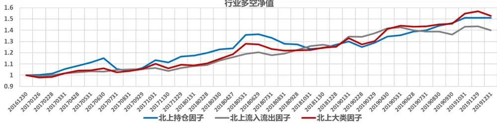

Top行业净值
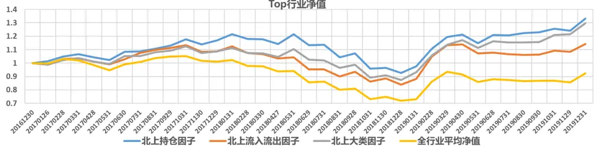
数据来源：东方证券研究所 Wind 资讯

## 5.总结

陆股通每天的持仓数据给予了我们一个很好的途径去观察香港或境外的投资者的持仓和交易特征，基于这些特征我们测试了 12 个因子在北上持股、中证 800 和沪深 300 内的表现。总体来说大部分北上因子都具有一定的选股效果，而且和常规的九大类因子几乎没有相关性，但其中的 HoldPER 和 MHoldPER 因子在对 9 个大类因子正交化后基本失去了选股效果，这是因为这两个持仓因子类似于复合因子，在某些 ALPHA 维度存在暴露，虽然其整体与常规因子相关性较低，但在剥离了常规的 ALPHA 信息后依然失去了作用，不过我们依然可以参考这种类型因子中的 ALPHA 风格来对现有的因子权重进行调整或参考。从因子的 RankIC 衰减来看，除了 DV2Hold_MAXVOL 衰减较快，其他因子的半衰期都在 20 交易日以上，其中 HoldPER、DV2Hold、DV2DV_STD 和DV2ABSDV_MAXCP 基本都在 40 交易日附近，因此北上因子的换手率并不会很高。我们把因子合成为北上持仓因子和北上流入流出交易行为因子，两个大类因子均具有较好的选股效果，进一步把这两个因子合成北上大类因子，合成因子在 3 个样本空间中的RankIC 均高于 0.04，其中在沪深 300 内 RankIC 为 0.052，分组超额收益单调性较好，多头端月均超额收益均在 0.7%以上。且北上大类因子对常规大类因子正交后依然有显著的选股效果。

除此之外，北上因子还具有一定的行业选择能力，其中 HoldPER、Hold、MHold、DHoldPER、DV2ABSDV、DV2Hold_MAXVOL 和 DV2ABSDV_MAXVO 一定的效果。把因子进一步合成北上持仓因子和北上流入流出交易行为因子，两个大类因子仍具有一定的行业选择能力，进一步把这两个因子合成北上大类因子，大类因子构成的行业多空组合年化为收益为 15%，最大回撤-4.63%。根据2020 年1月 23 日数据计算的前20%行业为：食品饮料、家电、建材、通讯、医药和农林牧渔。

北上因子在全市场覆盖率不高是一个问题，而大量的填值必然导致因子表现发生变化，且分布也会远离正态，如何把北上因子运用到全市场的模型中也是需要进一步思考的，不过好在大多数机构都有股票列表，这个列表往往都是一些市值不那么小，流动性较好的股票，因此北上因子在这个股票列表中的覆盖度应该还是比较高的，所以可以给予一定的关注。

总的来说，外资进一步流入 A 股市场以及 A 股市场机构化应该是未来的长期发展趋势，因此我们认为北上因子在未来应该依然能够具有一定的效果，存在一定的价值。

## 风险提示

- 极端市场环境可能对模型效果造成剧烈冲击，导致收益亏损。

- 量化模型基于历史数据分析得到，未来存在失效风险，建议投资者紧密跟踪模型表现。

## 分析师申明

每位负责撰写本研究报告全部或部分内容的研究分析师在此作以下声明：

分析师在本报告中对所提及的证券或发行人发表的任何建议和观点均准确地反映了其个人对该证券或发行人的看法和判断；分析师薪酬的任何组成部分无论是在过去、现在及将来，均与其在本研究报告中所表述的具体建议或观点无任何直接或间接的关系。

## 投资评级和相关定义

报告发布日后的 12 个月内的公司的涨跌幅相对同期的上证指数/深证成指的涨跌幅为基准；

## 公司投资评级的量化标准

买入：相对强于市场基准指数收益率 15%以上；

增持：相对强于市场基准指数收益率 5%～15%；

中性：相对于市场基准指数收益率在-5%～+5%之间波动；

减持：相对弱于市场基准指数收益率在-5%以下。

未评级 —— 由于在报告发出之时该股票不在本公司研究覆盖范围内，分析师基于当时对该股票的研究状况，未给予投资评级相关信息。

暂停评级 —— 根据监管制度及本公司相关规定，研究报告发布之时该投资对象可能与本公司存在潜在的利益冲突情形；亦或是研究报告发布当时该股票的价值和价格分析存在重大不确定性，缺乏足够的研究依据支持分析师给出明确投资评级；分析师在上述情况下暂停对该股票给予投资评级等信息，投资者需要注意在此报告发布之前曾给予该股票的投资评级、盈利预测及目标价格等信息不再有效。

## 行业投资评级的量化标准：

看好：相对强于市场基准指数收益率 5%以上；

中性：相对于市场基准指数收益率在-5%～+5%之间波动；

看淡：相对于市场基准指数收益率在-5%以下。

未评级：由于在报告发出之时该行业不在本公司研究覆盖范围内，分析师基于当时对该行业的研究状况，未给予投资评级等相关信息。

暂停评级：由于研究报告发布当时该行业的投资价值分析存在重大不确定性，缺乏足够的研究依据支持分析师给出明确行业投资评级；分析师在上述情况下暂停对该行业给予投资评级信息，投资者需要注意在此报告发布之前曾给予该行业的投资评级信息不再有效。

## HeadertTabl e_Discl ai mer 免责声明

本证券研究报告（以下简称“本报告”）由东方证券股份有限公司（以下简称“本公司”）制作及发布。

本报告仅供本公司的客户使用。本公司不会因接收人收到本报告而视其为本公司的当然客户。本报告的全体接收人应当采取必要措施防止本报告被转发给他人。

本报告是基于本公司认为可靠的且目前已公开的信息撰写，本公司力求但不保证该信息的准确性和完整性，客户也不应该认为该信息是准确和完整的。同时，本公司不保证文中观点或陈述不会发生任何变更，在不同时期，本公司可发出与本报告所载资料、意见及推测不一致的证券研究报告。本公司会适时更新我们的研究，但可能会因某些规定而无法做到。除了一些定期出版的证券研究报告之外，绝大多数证券研究报告是在分析师认为适当的时候不定期地发布。

在任何情况下，本报告中的信息或所表述的意见并不构成对任何人的投资建议，也没有考虑到个别客户特殊的投资目标、财务状况或需求。客户应考虑本报告中的任何意见或建议是否符合其特定状况，若有必要应寻求专家意见。本报告所载的资料、工具、意见及推测只提供给客户作参考之用，并非作为或被视为出售或购买证券或其他投资标的的邀请或向人作出邀请。

本报告中提及的投资价格和价值以及这些投资带来的收入可能会波动。过去的表现并不代表未来的表现，未来的回报也无法保证，投资者可能会损失本金。外汇汇率波动有可能对某些投资的价值或价格或来自这一投资的收入产生不良影响。那些涉及期货、期权及其它衍生工具的交易，因其包括重大的市场风险，因此并不适合所有投资者。

在任何情况下，本公司不对任何人因使用本报告中的任何内容所引致的任何损失负任何责任，投资者自主作出投资决策并自行承担投资风险，任何形式的分享证券投资收益或者分担证券投资损失的书面或口头承诺均为无效。

本报告主要以电子版形式分发，间或也会辅以印刷品形式分发，所有报告版权均归本公司所有。未经本公司事先书面协议授权，任何机构或个人不得以任何形式复制、转发或公开传播本报告的全部或部分内容。不得将报告内容作为诉讼、仲裁、传媒所引用之证明或依据，不得用于营利或用于未经允许的其它用途。

经本公司事先书面协议授权刊载或转发的，被授权机构承担相关刊载或者转发责任。不得对本报告进行任何有悖原意的引用、删节和修改。

提示客户及公众投资者慎重使用未经授权刊载或者转发的本公司证券研究报告，慎重使用公众媒体刊载的证券研究报告。

## 东方证券研究所

地址：上海市中山南路 318 号东方国际金融广场 26 楼

联系人： 王骏飞

电话：021-63325888*1131

传真：021-63326786

网址： www.dfzq.com.cn

Email： wangjunfei@orientsec.com.cn