## 研究结论

- 主动买卖单的划分方法可以分为逐笔算法和批量成交划分法两大类。

逐笔算法是把每一笔交易都进行主动买卖的划分，得到的是离散型的交易分类结果；ELO（2012）提出的批量成交划分法（BVC）是对一个区间内的总成交量进行主动买卖划分，得到的是连续型的分类结果。

- BVC 算法更适用于委托驱动市场。

在电子委托交易市场中，存在大量高频交易、订单拆分、隐藏订单、交易记录顺序错乱、订单延迟、委托撤单等噪音，使用 BVC 算法可以有效降低由于对订单过度拆分而导致的主动买卖方向划分错误的影响。

- BVC 算法得到的净主买占比 OI与股价涨跌幅的匹配程度更好。

（1）相关性更强：两种算法下的日度回归 R2 分别为 54%和 36%，相关系数分别为 73%和 59%。

（2）方向判断更准确：BVC 算法对于净主买方向判断错误的概率更小，判断错误时给出的数值也更小，这在月频层面和股价上涨时体现地尤其明显。

- 基于 BVC 算法构造的净主买占比 OI，净换手率 NTO均是可以提供额外增量信息的有效 Alpha 因子。

月频层面剔除了所有常规大类因子后， BVC 算法得到的 OI5 因子全市场IC 为-2.14%，ICIR 为-1.03，多空年化收益达 12%；NTO20 因子全市场 IC为-2.89%，ICIR为-1.63，多空收益 14%，均有显著的选股效果。而订单流算法得到的两因子正交化后均无效。

BVC 算法的 OI 和 NTO 因子使用中短周期来计算效果更强。

基于过去 5-20 个交易日构造的因子均有效，60 和 120 个交易日基本无效。

BVC 算法的 OI 和 NTO 因子在小市值股票池中因子效果更强

因子 ICIR绝对值排序：全市场>中证 500>沪深 300，在沪深 300 中无效。

BVC 算法的 OI 和 NTO 因子衰减速度比反转和流动性因子要慢。

构建月频组合时，使用这两个因子的组合换手率会低于反转和流动性类因子。

BVC 算法的 OI 和 NTO 因子的短线选股能力与反转不相上下。

因子持有期越短效果越好。BVC 算法得到的 OI5 因子持有 1 天的 ICIR 为-10.06，NTO5 为-10.27。

- BVC 算法对冲击成本 Istar 模型的整体解释力更高。

方程 1 的解释度大幅提升（2% VS 17%），方程 2 有所降低（11% VS 9%）。

## 风险提示

- 量化模型基于历史数据分析得到，未来存在失效的风险，建议投资者紧密跟踪模型表现。

- 极端市场环境可能对模型效果造成剧烈冲击，导致收益亏损。

## 报告发布日期

2020 年 02 月 26 日

证券分析师朱剑涛

021-63325888*6077

zhujiantao@orientsec.com.cn

执业证书编号：S0860515060001

联系人刘静涵

021-63325888-3211

liujinghan@orientsec.com.cn

## 相关报告

| 从北上资金中提取的系列 alpha 因子 | 2020-02-08 |
| --- | --- |
| 关于组合换手的若干问题 | 2020-01-05 |
| 利率曲线：可预测与不可预测的成分 | 2019-12-09 |
| FOF基金池的定量构建 | 2019-12-08 |
| 来自优秀基金经理的超额收益 | 2019-11-27 |
| 基于机构持仓的因子情景分析 | 2019-10-29 |
| 基于量价关系度量股票的买卖压力 | 2019-10-29 |
| 债券风险模型与债基绩效评估 | 2019-09-14 |
| A 股风险溢价(ERP） | 2019-08-30 |
| 跳跃 Beta 与连续 Beta |  |
|  | 2019-08-02 |
| 资本市场开放对因子投资的影响 | 2019-07-30 |
| 温和收益的动量与极端收益的反转效应 | 2019-07-02 |
| 大小盘风格择时与投资运用 | 2019-05-30 |
| 优质民企策略指数 | 2019-04-24 |
| 波动率因子的逻辑与非对称使用 | 2019-04-24 |
| 基于因子组合FMP的因子加权方法 | 2019-04-15 |
| Alpha 预测之二：机器的比拼 | 2019-03-04 |
| 适宜快节奏的年报公告季 | 2019-02-28 |

买卖单差额（orderimbalance）是高频领域研究的一个重点对象。买卖单差额指标与交易量指标相比，还包含着交易方向，可以反映多空双方的主动买卖意愿，以及力量抗衡状态，从而揭示出隐藏在交易行为中的信息。在针对买卖单差额的研究中，首要问题就是判断交易方向，而这需要知道所有交易参与方每笔委托和成交的信息，现实中无法获得此数据，只能依赖于特定交易分类算法去作推断。本文测试了 ELO（2012）年提出的批量成交划分法——Bulk Volume Classification （简称 BVC），该方法不需要逐笔数据，大大降低了运算量，同时减少了高频订单数据噪音的干扰，与股价涨跌幅的相关性更高。基于买卖单差额指标可以构造有效的 Alpha 因子，对交易冲击成本模型的拟合度也更高。

## 一、 主动买卖单的划分方法

投资者的委托单可以分成两类：被动性委托单和主动性委托单。委托单在委托时间上必然有先后顺序：先来的委托单子作为被动者，挂在委托队列上；后到的委托单子作为主动方促使成交，在委托队列上不可见。被动性委托单的特点是被动等待成交，为市场提供流动性，但不直接改变市场价格；主动性委托单的特点是主动寻找交易对手，消耗流动性，可以直接改变市场成交价格。主动性委托单按照买方主导还是卖方主导，又可分为主动买单和主动卖单。

对于主动买卖单的划分方法，可以分为逐笔算法和批量成交划分法两大类。逐笔算法顾名思义是把每一笔交易都进行主动买卖方向的划分，得到的是离散型的交易方向分类结果。根据所用到的行情数据不同，又可进一步细分为成交价比较法（Tick Rule）、报价比较法（Quote Rule）、Lee-Ready 判别法；而批量成交划分法（BVC）则是对一个区间内的总成交量进行主动买卖划分，得到的是连续型的分类结果。

## 1.1 成交价比较法（Tick Rule）

在所有的逐笔算法中，成交价比较法（Tick Rule）是最简单，对数据要求最少的方法，由 Blume等在 1989 年提出。

具体分类方法是：

（1） 如果当前时点的成交价格 > 上一时点的成交价格，则将交易分类为买方驱动的交易；

（2） 如果当前时点的成交价格 < 上一时点的成交价格，则将交易分类为卖方驱动交易；

（3） 如果当前时点的成交价格 = 前一成交价格，则当前交易方向与前一交易方向相同。

优点：只需要用到逐笔成交的价格数据，而且所有的交易都会被分出方向。

缺点：（1）只考虑了交易的成交价，忽视了委托报价中有价值的信息，从而浪费了利用成交价与报价的位置关系进行交易方向判别的机会。（2）对于成交价格不变的前后两笔交易，其做法是直接延续前一笔交易的方向，过度依赖于交易同向性假设。尤其在委托驱动市场中，忽略了交易中频繁发生的报价修正所包含的信息，从而无法对这部分成交价不变交易的方向进行有效判别。张格,刘玉珍（2009）指出在沪深证券交易市场（限价委托市场）中成交价不变的交易记录占比多达50%。因而成交价比较法在委托驱动市场中的整体判断准确度不高。

## 1.2 报价比较法（Quote Rule）

报价比较法（Quote Rule）由 Hasbrouck 于 1988 年针对报价驱动市场（quote-driven markets）提出。

具体分类方法是：

（1） 如果当前时点的成交价格 > 报价或买一价和卖一价 （Best Bid and Offer，BBO）的中间点，则将交易分类为买方驱动的交易；

（2） 如果当前时点的成交价格 < 报价或买一价和卖一价 （Best Bid and Offer，BBO）的中间点，则将交易分类为买方驱动的交易；

（3） 如果当前时点的成交价格 = 报价或买一价和卖一价 （Best Bid and Offer，BBO）的中间点，那么该交易不能被分类。

优点：相比成交价比较法，用到的数据更多，涉及逐笔成交价数据以及委托报价数据。由于提交、撤销、成交订单等事件均会引发委托报价变动，而且提交、撤销订单可能发生于两个交易事件之间，因而报价中包含着成交价所不能反映的信息，更为全面地描绘了交易者的行为。

缺点：（1）对于处在报价中点的交易记录无法区分出方向。（2）在报价驱动市场中，报价是由做市商报出的，而在委托驱动市场中，与报价对应的最优买卖价格是由未成交的最优限价委托形成的，是在交易中被动产生的。因此，在缺乏存货缓冲和价格平滑条款干涉的情况下，最优买卖价格很容易受到交易的影响，会发生频繁变动，这与报价驱动市场中做市商的报价粘滞性（做市商报出的报价在数秒内可以维持相对稳定不变）恰好相反。因而将报价比较法用到委托驱动市场中，会遇到报价频繁修正，报价中点很难代表有效价格等问题，适用性不强。

## 1.3 Lee-Ready 判别法

Lee-Ready 判别法是 Lee 和 Ready（1991）针对报价驱动市场（quote-driven markets）提出的一种结合成交价比较法和报价比较法来推断交易方向的混合法则。

具体分类方法是：

（1） 先按照报价比较法划分主动买卖方向；

（2） 如果成交价正好发生在买一价和卖一价的中间价位置，则再按成交价比较法和上一笔交易的成交价进行比较。

优点：在报价驱动市场中，特别是在买卖价差较大的证券或相关时间点上，成交价比较法与报价比较法很容易发生冲突。例如成交价虽然上升（下降），但如果幅度相对于价差不够大，则委托可能是在报价中点下方（上方）成交，或者成交价虽然不变，但各方向的交易持续在报价中点的某一侧成交，从而引发两种判别法在结果上的分歧。Lee-Ready 判别法较好的结合了两个法则。

缺点：Lee-Ready 判别法也是针对报价驱动市场设计的，Odders-White（2000），Chakrabarty,Li,Nguyenhe 和 Van Ness（简称 CLNV）（2007）的研究中指出，在报价驱动市场中，处于报价中点的交易记录占 15%-20%，因而使用成交价法补充报价法比较有必要。而在委托驱动市场中，交易极少会在报价中点成交，占比少于 2 %，此时 Lee-Ready算法与报价比较法差别不大，二者都没有考虑委托驱动市场特有的价格形成机制，适用性不强。

Lee 和 Ready 利用纽约证券交易所（为报价驱动市场）中的 150 只股票含交易方向记录的数据，测算出该判别法的正确率高达 90 %。虽然 Lee-Ready 判别法目前已经广泛被市场微观结构领域的研究所采用，但对该方法的质疑之也不少见。首先，在报价驱动市场中，Odders -White（2000）发现，Lee-Ready 判别法的总体正确率为 85 %，而且该方法会系统性地误判在买卖报价之间成交的、额度较小的、大盘股和成交频繁的交易。在无指定做市商的委托驱动市场中，CLNV（2007）发现，Lee-Ready判别法在美国的电子化交易市场 NSADAQ 中的正确率只有 74%，相对于其在报价驱动市场中的表现明显要差一些。

## 1.4 批量成交划分法（Bulk Volume Classification，BVC）

2012 年，Easley，Lopez de Prado 和 O'Hara（简称 ELO）提出了一种主动买卖单的批量成交划分算法：The Bulk Volume Classification（BVC）。BVC 算法并不对每一笔交易进行买卖方向的划分，而是着眼于一个“Time Bar”（时间间隔）或“Volume Bar”（成交量间隔）。根据每一个 bar 内的标准化股价变动，应用概率分布确定出每个 bar的成交量中主动买入和卖出的占比。

具体计算公式是：

$$
\begin{aligned}&V_{\tau}^{B}=V_{\tau}\square(\frac{P_{\tau}-P_{\tau-1}}{\sigma_{_{\Delta P}}},df)\\&V_{\tau}^{S}=1-V_{\tau}^{B}\\\end{aligned}
$$

其中，V 为第τ个 bar 内的成交量，VB为成交量中属于主动买入的部分， $V^{S}$ 为成交量中属于主动卖出的部分，t()是 t 分布的累积分布函数（CDF，使用 t 分布的原因是由于真实股价涨跌分布不可知）， $P_{t}-P_{t-1}$ 为第t−1个 bar 终点到第t个 bar 终点的股价涨跌， $\sigma_{\Delta P}$ 为不同 bar 之间股价涨跌的标准差， $df$ 为自由度（当标准化后的股价变动幅度不变时， $df$ 越小，主动买入的占比越小。原文献中经过测算取df=0.25）。

如果股价在同一个 bar 内从起点到终点没有变化，则该 bar 内的交易量中主动买入和卖出各占50%；如果发生股价上涨，则主动买入的占比就会提高，提升幅度取决于这个 bar 内股价的上涨幅度和过去一段时间股价变化的分布。

## 1.5 文献评述

关于交易分类算法的比较研究中，对于逐笔算法和批量成交划分法的优劣评价不尽相同。

在没有做市商的委托驱动市场中，流动性是由发出电子委托订单的交易者提供的，由计算机撮合交易。这种电子交易市场的特点是高速、碎片化，存在大量高频交易（O’Hara，2015；Menkveld，2016）、订单拆分、隐藏订单、交易记录顺序错乱、订单延迟、委托撤单（Hasbrouck and Saar，2013）等噪音，从而大幅增加了逐笔算法的计算量，也会导致分类精度的降低。ELO（2016）首先通过理论推导证明了集合的逐笔算法是有偏的：当买方驱动交易比卖方驱动交易多（少）时，集合的逐笔算法会低估（高估）买方驱动交易概率。这也就意味着，当新的潜在好消息出现时，买方驱动交易通常会比卖方驱动交易多，因而集合的逐笔算法会低估买方驱动交易的概率，反之亦然。而 BVC 分类则可以降低对订单过度拆分导致的买卖方向划分错误的影响，可以更好的反映知情交易信息。而后，他们通过分析股指期货及商品期货数据，发现在期货交易中 BVC 算法的预测准确度（accuracy ratio）优于传统逐笔算法，并且得到的净主买占比指标与以信息为基础的交易代理变量（交易价差、日内价格变化）有更强的关联性。此外，Massot，M.，Nawn，S.，& Pascual，R. （2018）的研究指出，净流入（netorderinflow，NOF）相比净主买占比是更好的衡量买卖单划分准确程度的指标。在交易中，BVC 算法对于净流入衡量的精确性更高，且更加省时高效。

然而，也有研究认为并非如此。Bidisha Chakrabarty，Roberto Pascual 和Andriy Shkilko（2015）的研究中表明，成交价比较法和 Lee-Ready 的分类精度都高于 BVC 算法，而且二者得到的主动买卖差额指标相比 BVC 算法在解释市场收益、流动性及交易成本时也毫不逊色。

## 二、 BVC 算法与订单流算法的比较

## 2.1 计算细节

前面介绍的两大类划分方法给出的主动买卖单结果的时间尺度不同：逐笔算法产生逐笔的主动买卖单分类，而批量成交划分法产生一个间隔（时间、成交量或者交易）内的主动买卖占比，所以不能对这二者的结果直接进行比较。本文将逐笔算法的多笔交易结果进行集合，得到一个间隔内的主动买卖占比，再与批量成交划分法进行比较。

## 1. BVC 算法

本文以 1min 作为最短的时间间隔（bar）。这与 ELO 选取的最佳时间相吻合，如果选择的时间间隔过短（例如 500ms），容易产生过大的噪音，影响预测的精度； 如果选择的时间间隔过长（例如 10min），则一天中覆盖的有效间隔数量太少，不利于当天股价变动分布的估计。

对于分钟数据需要进行如下处理：

（1） 判断个股每分钟的收盘价格是否等于当天的涨停价格、跌停价格，或该分钟是否无成交量，三者符合其一就去掉该股的对应分钟数据；如果停牌，则剔除该股当天所有分钟数据。交易开始时间前的集合竞价阶段（9：25-9：30）不予考虑。

（2） 需要注意的是，由于涨跌停板的存在限制了上涨和下跌的动力，因而按照下述的订单流算法，股票封涨停时，所有成交将被划分为主动卖；跌停时，所有成交将被划分为主动买。虽然涨跌停板可能在股价触及后又被打开，但是总体上我们认为涨（跌）停反映的是投资者主动买（卖）的意愿，因而订单流算法对于涨跌停时刻的交易方向划分不合理。考虑到如果当天长时间处于封板状态，则两种算法估计出的主动买卖量会有较大差异，因而公平起见，如果个股超过半天处于涨跌停状态，则剔除当天该股的所有分钟数据，不进行比较。

（3） 计算每分钟的涨跌幅（均使用收盘价），每天的分钟涨跌幅标准差，代入计算公式即可得到每分钟的主动买入和主动卖出成交量。

## 2. 订单流算法

采用Wind 计算的每日主动买卖成交量数据，该数据在算法上除了在买一价和卖一价中间成交的交易方向划分方法外，其他均与 Lee-Ready算法一致。

具体计算方法如下：

根据成交价和最优报价判断主动买卖单方向：主买：最新成交价>=卖一价 ；主卖：最新成交价<=买一价；在买一价和卖一价中间成交时，成交价接近哪个则记为哪个方向，成交价与买一卖一同样接近时记为为主动买入。

## 2.2 评价方法

要比较不同主动买卖单判别方法的优劣，首先需要确定一个基准，即交易的真实买卖方向是什么。这个在有做市商的海外股票市场比较好确定，可以将客户或经纪人的下单指令方向为真实买卖方向。国内暂无做市商制度，因此我们只能通过算出来的主动买卖成交量数据是否符合逻辑来间接评判。

在市场微观结构研究中，交易行为和股价之间的联系是一项重要的研究课题。股价的形成与发现实质上可以看作是信息融入市场后，引起投资者交易行为相应调整，进而推动价格变动的过程。在较短的时间间隔内，潜在新信息会影响投资者的主动买卖意愿；而在较长的时间间隔内，基于有效市场假说，新信息会反映到股价上。因此，如果主动买卖反映了市场上的潜在信息，那么将会与股价变动相关。此外，由于主动买卖单是市场中多空双方主动成交意愿的体现，反映了市场上的供需关系，所以大部分情况下，主买占比高时代表买方力量强劲，对个股存在超额的需求，股价应该上涨；主卖占比高时代表卖方力量强劲，对个股存在超额的供给，股价应该下跌。也就是说净主买占比和股票价格涨跌方向在大部分情况下应该是一致的。

Chordia 等人在 2002 年的研究中首先提出将日度累积净主买作为表征交易活动的变量，发现在纽约股票交易市场（为报价驱动市场）中，控制了交易量与流动性等因素后，按照 Lee-ready算法计算出的市场净主买对同期市场收益（S&P500 指数）仍具有显著影响。2004 年他们又验证了日度个股净主买与个股收益之间也存在极强的相关性。ELO （2012）的研究中直接将日度净主买占比与日度股价涨跌幅的相关性作为不同主动买卖算法的评判标准。需要注意的是，学术研究中通常会将（主动买入-主动卖出）指标称为主动买卖差额（orderimbalance），指标大于0 称为正向的买卖单差额，小于 0 称为负向的买卖单差额。为避免引发歧义，本文中统一将（主动买入-主动卖出）指标称为净主买，（主动买入-主动卖出）/总成交量指标称为净主买占比，净主买占比的绝对值称为主动买卖差额，净主买占比的绝对值/总成交量指标称为主动买卖差额占比。

基于此，本文将净主买占比和股价涨跌幅的相关性，作为评价主动买卖单判别方法的间接标准。由于订单流算法数据中深市股票的数据从 2010 年才开始有，因而历史回溯时间区间统一设定为 2010.01.05-2019.12.31。股票池为中证全指。

## 2.3 相关性分析

下面我们分别比较不同方法下得到的日度净主买占比与日内股价涨跌幅的相关系数，以及日度时间序列回归（Y：日内股价涨跌幅，X：日度净主买占比）的拟合优度（R2）。其中：

日度净主买占比 = （当日主动买入量-当日主动卖出量）/当日成交量；

股票日内涨跌幅 = 当天复权收盘价/当天复权开盘价–1。需要注意的是此处使用开盘价，避免隔夜价格变动带来的干扰。

从全市场平均结果来看，BVC 算法得到的净主买占比与日内股价涨跌幅的相关性更高，两种算法下回归的R2分别为 54%和 36%，相关系数分别为 73%和 59%。进一步，我们将所有股票在两种算法下的回归R2绘制成了散点图，可以直观地看出，位于对角线以下的股票为 BVC 算法得到的R2高于订单流算法。从散点图分布来看，绝大部分的点都位于对角线以下，说明 BVC 算法得出的日度净主买占比对日内股价涨跌幅的拟合程度更高。此外，虽然订单流算法在判断交易方向的过程中并没有用到股价变动的信息，但是其得出的日度净主买占比与日内股价涨跌幅仍具有 60%的相关性，这说明也有超过半数的信息可以通过逐笔交易反映到股价上。

图 1：日度净主买占比和日内股价涨跌幅的相关性对比结果

|  | R2 | 相关系数 |
| --- | --- | --- |
| BVC算法 | 0.54 | 0.73 |
| 订单流算法 | 0.36 | 0.59 |

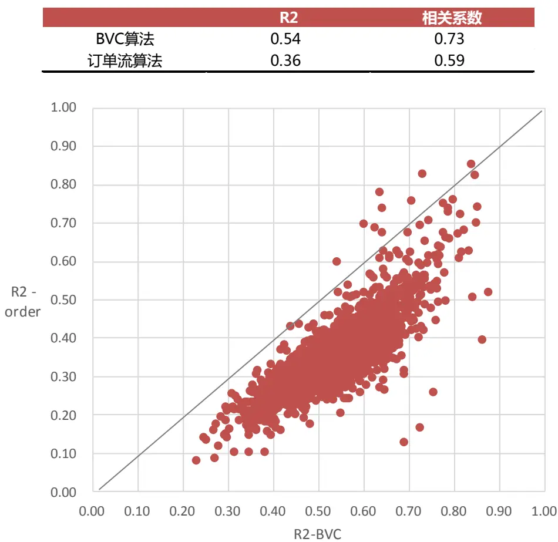
数据来源：东方证券研究所 & Wind 资讯

## 2.4 方向匹配程度分析

由于在相关关系中，方向不一致是相关性最差的情况。因而，下面我们进一步考察两种算法得到的净主买占比方向与股价涨跌方向的匹配程度。从理论上来讲，两种算法得出的净主买占比方向与股价涨跌方向都有可能出现不一致。

订单流算法，是根据成交价格与最优买卖报价的关系来确定主买还是主卖，与股价变动并没有直接联系，因此判断出的主动买卖结果对股价的影响从理论上看是涨跌都有可能。股票价格是由主动成交单与被动委托单的数量决定的，主动单是推动股价的涨跌的动力，被动单则为股价涨跌的阻力。当动力＞阻力时，股价就会向主动成交单的推动方向变化，实现股票涨跌；当动力<=阻力时，股价则原地踏步，无法实现涨跌。具体来看，订单流算法得到的净主买占比与股价涨跌幅方向相反的情况可能有以下几种：

（1）主力诱空陷阱，低位吸筹：主力资金在建仓过程中，当盘中短线浮筹比较多的时候，很可能会挂出巨量卖单制造诱空陷阱，而后吸引短线的浮筹卖出，股价大跌，从而便于低位借势吸筹。我们可以假设一个日内的极端情况便于理解：某天上午有人卖一价挂了 1 个亿的卖单，而后按卖一价买入，则都算主动买入，假设主动性买单有 9000 万，但仍不足以突破巨量卖一挂单的阻力，因而这段时间的股价很可能是在买一和卖一价之间原地踏步，无法走出涨跌走势；到了下午的时候成交极不活跃，而且都是主动性卖单砸盘，接盘能力弱，股价跌幅可能会很大。例如有人买一价挂了 100 万的买单，只要有 110 万主动卖单，就可以吃掉买一，使得后继的买一价格上的单子不断地降低价格卖出，因此最后的成交价格就是一路下跌的。因而，全天来看订单算法得到的日内净主买占比为正，但股价下跌，二者方向相反。

（2）主力诱多陷阱，高位出货：股价大幅上涨或轻微涨幅后长期直线横盘，而资金量却大量流出，这种情况经常出现在个股近期有大的涨幅，庄家大举减仓或胜利大逃亡时。主力资金为了出货可能会挂出巨量买单制造诱多陷阱，吸引更多资金进入，便于后续高位出货。

（3）多空博弈：有时一只股票可能存在多个主力资金，在股票上涨的过程中，最先进入的主力差不多想要获利了结，而后进来的主力还没有赚够，还想着拉升，这样一来多空双方就产生了博弈。订单流算法由于对订单流的过度拆分，在多空博弈的过程中很容易对区间内主动买卖的整体方向判断错误，会出现某个时间区间内股价上涨（下跌）但是净主卖（买）的情形。

BVC 算法，是根据每分钟股价涨跌幅来确定主买占比，在多空博弈而股价持续上涨或下跌的过程中，会对区间内主动买卖的整体方向做出和股价涨跌同向的判断。相反，如果区间内股价出现波段性的上涨下跌，那么 BVC 算法得到的整体主动买卖方向也可能与股价整体变动方向不一致。例如，如果股票在持续上涨或下跌的过程中，多空博弈激烈，成交量较大，那么 BVC 算法得到的净主买占比会是一个较大的正值，而订单流算法可能会得到负值；如果股票在大涨或大跌的时段没有成交量，反而是小幅波动的时段成交量很大，那么 BVC 算法得到的净主买占比就会与股价涨跌整体方向不一致。

接下来，我们在日内和日间两个维度，具体比较两种算法得到的净主买占比与股价涨跌的方向匹配程度，从而对二者在不同市场环境下的适用性有更全面的认识。

## 1. 日内

日内维度，主要考察当日净主买占比方向与当日股价涨跌方向的匹配程度。我们分别统计了两种算法得出的当日净主买占比与当日股价涨跌方向不一致的概率，以及不一致时算出的净主买占比的平均取值大小。可以看到，整体来看 BVC算法得出的日度净主买占比方向与当日股价涨跌方向的匹配程度更好：

（1） BVC 方法得到的净主买占比方向与股价涨跌方向不一致的概率低于订单流算法。在日内股价上涨的时候，BVC 方法的净主买占比方向判断错误的概率（24%）明显小于订单流方法（38%），而股价下跌时 BVC 方法（10%）略高于订单流方法（7%）；

（2） BVC方法在方向判断错误的时候，给出的净主买占比数值的绝对值低于订单流算法。BVC 方法的净主买占比方向错误的时候，数值绝对值仅在 2%左右，而订单流算法方向错误的时候数值都比较大，绝对值在 8%左右。

图 2： 两种算法对于当日股价涨跌方向判断错误的概率，以及净主买占比的均值

| 当日股价上涨（54%） | bvc<0 | order<0 | bvc>0,order>0 | bvc>0,order<0 | bvc<0,order>0 | bvc<0,order<0 |
| --- | --- | --- | --- | --- | --- | --- |
| 战 | 23.9% | 38.1% | 56.3% | 19.8% | 5.6% | 18.3% |
| 当日OI-bvc | -1.8% |  | 4.7% | 2.3% | -1.5% | -2.2% |
| 当日OI-order |  | -8.9% | 11.9% | -6.7% | 7.2% | -11.1% |

| 当日股价下跌（46%） | bvc>0 | order>0 | bvc>0,order>0 | bvc>0,order<0 | bvc<0,order>0 | bvc<0,order<0 |
| --- | --- | --- | --- | --- | --- | --- |
| 占比 | 9.9% | 7.4% | 3.5% | 6.4% | 3.9% | 74.4% |
| 当日OI-bvc | 2.1% |  | 2.7% | 1.6% | -2.6% | -4.9% |
| 当日OI-order |  | 7.7% | 9.3% | -11.5% | 6.1% | -19.6% |

数据来源：东方证券研究所 & Wind 资讯

图 3-图 6 列举了两种算法得出的当日净主买方向与当日股价涨跌幅方向不一致的具体例子。
图 3：当日大涨，bvc 算法计算的净主买占比为正，而订单流算法为负
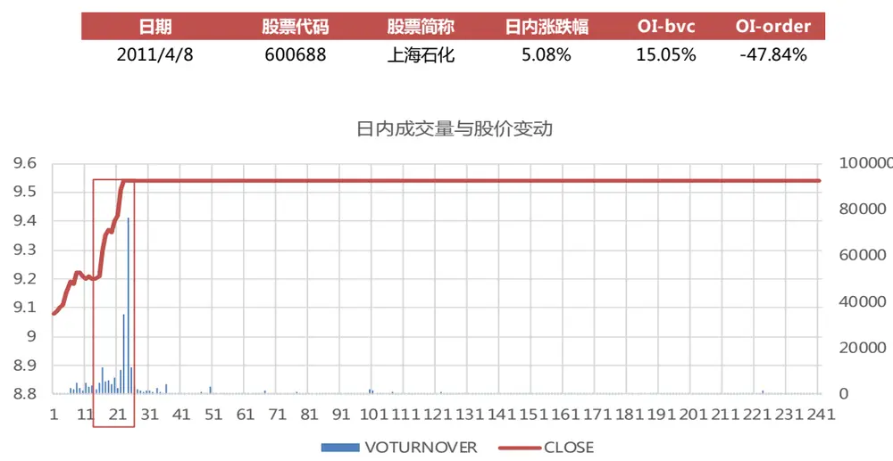
数据来源：东方证券研究所 & Wind 资讯

图 4：当日大跌，bvc 算法计算的净主买占比为负，而订单流算法为正

| 日期 | 股票代码 | 股票简称 | 日内涨跌幅 | OI-bvc | OI-order |
| --- | --- | --- | --- | --- | --- |
| 2017/8/17 | 600638 | 新黄浦 | -5.75% | -33.59% | 44.87% |

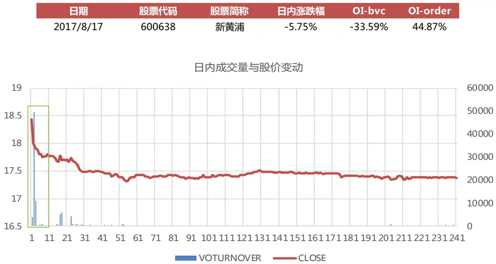
数据来源：东方证券研究所 & Wind 资讯

图 5：当日大涨，bvc 算法计算的净主买占比为负，而订单流算法为正

| 日期 | 股票代码 | 股票简称 | 日内涨跌幅 | OI-bvc | OI-order |
| --- | --- | --- | --- | --- | --- |
| 2015/8/19 | 2729 | 好利来 | 7.33% | -0.53% | 65.58% |

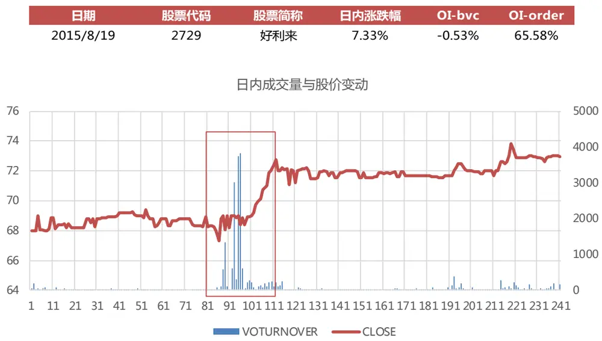
数据来源：东方证券研究所 & Wind 资讯

图 6：当日大跌，bvc 算法计算的净主买占比为正，而订单流算法为负
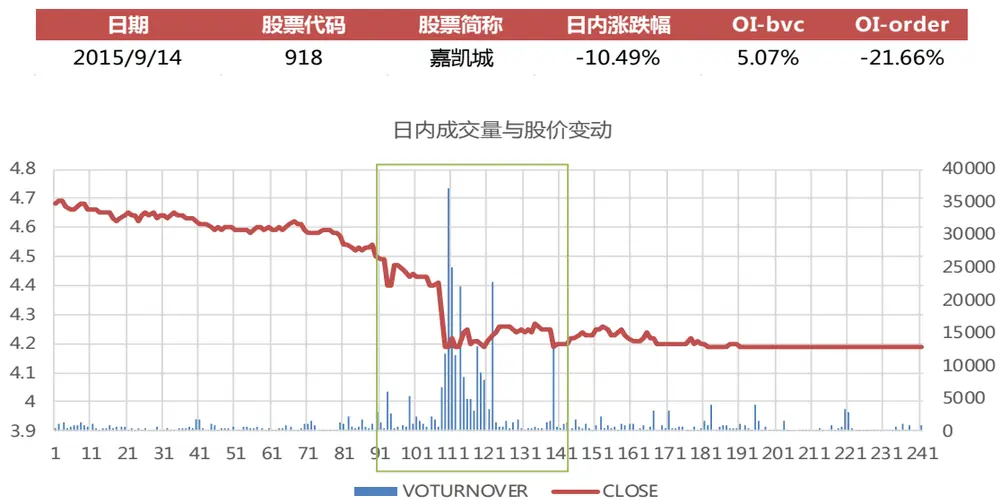
数据来源：东方证券研究所 & Wind 资讯

## 2. 日间

日间维度，主要考察当月日均净主买占比方向与当月股价涨跌方向的匹配程度。需要注意的是：（1） 在计算当月股价涨跌幅的时候，涉及到的日度涨跌幅计算时应该只考虑收盘价相对于开盘价的涨跌幅，否则隔夜价格变动会有干扰。我们的做法是先使用收盘价和开盘价计算日内涨跌幅，再把日内涨跌幅累计成净值，计算月度涨跌幅；（2）当月有效天数需大于 10 个。我们分别统计了两种算法给出的当月日均净主买方向与当月股价涨跌方向不一致的概率，以及不一致时给出的净主买占比的平均数值大小。可以看到：

（1） 相比日度，两种算法的当月净主买占比与月度股价涨跌的方向匹配度均明显变差。

（2） 月度整体对比结论与日内一致：BVC 算法得出的当月日均净主买占比与月度股价涨跌的方向匹配度更好。BVC 算法对于净主买方向判断错误的概率小于订单流算法，而且判断错误时给出的净主买占比数值绝对值明显小于订单流方法，尤其是当股价上涨的时候，订单流算法给出的净主买方向错误判断为负向的概率高达 85%，而且给出的平均数值为-5%，BVC 算法错误判断的概率仅为一半 50%，数值平均为-0.6%。

图 7：两种算法对于当月股价涨跌方向判断错误的概率，以及净主买占比的均值

| 当月股价上涨（57%） | bvc<0 | order<0 | bvc>0,order>0 | bvc>0,order<0 | bvc<0,order>0 | bvc<0,order<0 |
| --- | --- | --- | --- | --- | --- | --- |
| 占比 | 49.5% | 85.4% | 13.3% | 37.2% | 1.3% | 48.2% |
| 日均OI-bvc | -0.6% |  | 1.6% | 0.7% | -0.4% | -0.8% |
| 日均OI-order |  | -5.1% | 3.6% | -3.8% | 2.2% | -6.5% |

| 当月股价下跌（43%） | bvc>0 | order>0 | bvc>0,order>0 | bvc>0,order<0 | bvc<0,order>0 | bvc<0,order<0 |
| --- | --- | --- | --- | --- | --- | --- |
| 占比 | 9.1% | 3.0% | 1.8% | 7.3% | 1.2% | 89.7% |
| 日均OI-bvc | 1.1% |  | 1.6% | 0.6% | -0.7% | -1.6% |
| 日均OI-order |  | 3.7% | 5.1% | -6.2% | 2.2% | -9.2% |

数据来源：东方证券研究所 & Wind 资讯

图 8-图 11 列举了两种算法得出的当月日均净主买方向与当月股价涨跌幅方向不一致的情形。

图 8：当月大涨，bvc 算法计算的日均净主买占比为正，而订单流算法为负
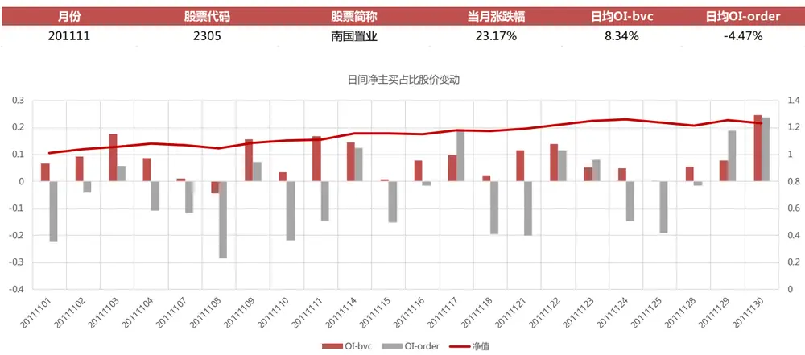
数据来源：东方证券研究所 & Wind 资讯

图 9：当月大跌，bvc 算法计算的日均净主买占比为负，而订单流算法为正
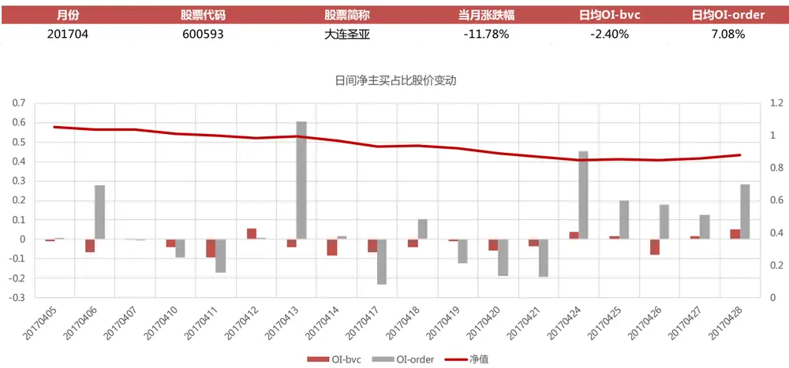
数据来源：东方证券研究所 & Wind 资讯

图 10：当月大涨，bvc 算法计算的日均净主买占比为负，而订单流算法为正
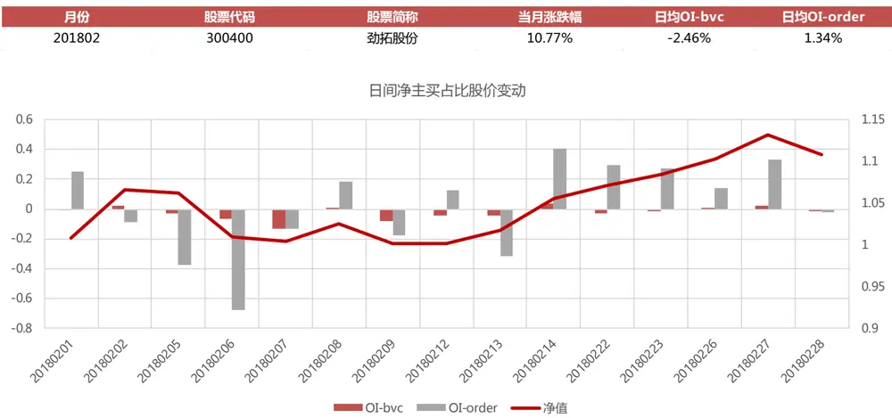
数据来源：东方证券研究所 & Wind 资讯

图 11：当月大跌，bvc 算法计算的日均净主买占比为正，而订单流算法为负
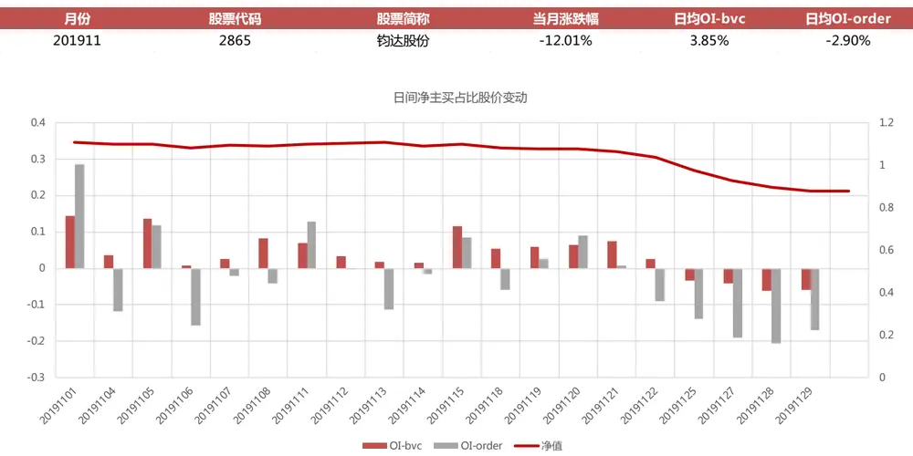
数据来源：东方证券研究所 & Wind 资讯

## 三、 Alpha 因子测试

接下来，我们根据 BVC 算法和订单流算法得到的主动买卖成交量数据，构造 Alpha 因子。

## 3.1 因子构造方法

根据 BVC 算法和订单流算法，我们可以得到个股每天的主动买入量 Vb 和主动卖出量 Vs，基于此可以构造 4 个日度因子。

## （1） 净主买占比 OI = （个股全天主动买入量–主动卖出量）/ 个股全天成交量

由于（个股全天主动买入量 + 主动卖出量） = 个股全天成交量，因而该指标衡量的是投资者主动买入的意愿。需要注意的是，该指标具有方向性：OI>0 反映市场上主动买入意愿更强烈，买方力量强劲，存在超额的需求；OI<0 则说明市场主动卖出意愿更强烈，卖方力量强劲，存在超额的供给。

Chordia 等人在 2002 年的研究中就曾提到，在报价驱动市场中，市场收益与滞后期的净主买有显著的负向相关关系，在前期出现绝对值很大的负向净主买之后，市场收益倾向于出现反转。他们在 2004 年和 2005 年的后续研究中进一步指出，个股层面净主买与未来股票收益之间也存在显著的相关关系，并得出了净主买对股票价格具有预测能力的结论。

## （2） 主动买卖差额占比 |OI| = |个股全天主动买入量–主动卖出量|/ 个股全天成交量

衡量多空双方主动买入和卖出的差异程度，代表多空双方主动成交的意愿强弱差 异，反映了多空博弈的激烈程度。需要注意的是，该指标不具有方向性：|OI|越大， 代表订单流越失衡，多空双方主动成交的意向差别越明显（多头方主动买入意愿强烈， 而空头方主动卖出意愿不强，或者空头方主动卖出意愿强烈，而多头方主动买入意愿 不强）；|OI|越小，代表主动买入卖出的订单越均衡，反映出多空双方博弈越激烈。

## （3） 净换手率 NTO =（个股全天主动买入量–主动卖出量）/ 个股流通股本

衡量市场中主动买入方的力量强弱。需要注意的是，该指标=净主买占比*换手率，净主买占比有正负方向，而换手率无方向，换手率高或者净主买占比较高对于净换手率都是正向的影响，但二者对于未来股价的影响却刚好相反。

## （4） 多空力量差异度 |NTO| = |个股全天主动买入量–主动卖出量|/ 个股流通股本

衡量市场中买卖双方的力量差异。该指标=主动买卖差额*换手率，

## 3.2 月频因子测试

## 1. 因子表现

我们将过去一段时间的日均因子值取平均，作为月频选股因子，分别考察 4个因子的原始值、行业市值中性化值，在不同股票池（中证全指、沪深 300、中证 500）中的表现。因子计算周期分别取为过去 5、10、20、60、120 个交易日，在因子计算周期内有效的日度因子值小于一半的予以剔除。历史回测区间为：2009.12.30 – 2019.12.31。

## （1）净主买占比 OI

## BVC 算法因子表现优于订单流算法

全市场中性化后的 OI-bvc 因子除 OI120 外，IC绝对值均超过 2，ICIR绝对值均超过 1，OI5\和 OI20的 ICIR绝对值超过 1.5，多空组合年化收益达到 15%以上，最大回撤仅为 5%左右，是有效的选股指标。而 OI-order 因子除 OI5 的 ICIR 达到-0.81 之外，其余周期因子 ICIR 基本均在-0.5以下，没有明显的选股效果。

## 原始值和中性化因子值效果基本相当

全市场的 OI-bvc 因子原始值和中性化因子值效果基本相当，中性化因子效果略胜一筹，OI20原始值 ICIR 为-1.22，中性化 ICIRI 为-1.51。这说明，净主买占比因子主要的收益来源并不是行业选择和市值暴露。我们也对因子的行业选择能力进行了测试，结果显示当月行业因子值与行业下月收益相关性不强，ICIR 均不显著，说明因子并不具备行业选择效果。

## 因子 IC 负向

两种算法给出的净主买占比因子的 IC 均为负，即当月平均净主买占比越高，下月收益越差。

Chordia 等人 2004 年的研究曾指出：在做市商市场中，个股收益与滞后的净主买存在正相关，但在控制了当期的净主买的影响后，二者的相关性由正变为负。对于净主买对未来收益的正向预测作用，他们从存货模型的角度给出了解释：在做市商机制下，风险厌恶的做市商为了规避存货风险，会主动进行存货调整从而产生交易需求，因此产生了沿着买卖单差额方向（买或卖）的价格压力。如果不存在做市商，就不会对价格产生正向压力。因而，在沪深股票市场这种不存在做市商的委托驱动市场中，净主买对未来收益起着负向预测作用，与文献结论并不矛盾。

此外，也有实证研究（如彭惠，2000）显示中国市场上具有较明显的“羊群效应”。大量的投资者会采取跟随行动，持续的买进或者卖出市场看好或者不看好的股票，这种过度反应产生了超额的供给与需求，导致股票的负反馈大于正反馈，表现为反转效应，即当期净主买占比越高，越有可能出现超额需求，从而下期收益会出现反转；当期净主卖占比越高，越容易出现超额供给，下期收益会出现反弹回升。

## 短周期因子效果更强

全市场中性化后的 OI-bvc 因子 ICIR 绝对值排序为：OI5>OI20>OI10>OI60>OI120，OI120 因子的 ICIR 为-0.53，失去了选股效力。这说明：在中国股票市场上主动买卖中包含的市场信息可以较快地反映到股票价格上，过去 5-20 天的信息尚未被市场完全消化，从而对次月股价有一定影响，而过去半年的信息则已经基本完全消化，对次月股价没有影响。

## 小市值股票池中因子效果更强

全市场中性化后的 OI5-bvc 因子 ICIR 绝对值排序为：全市场>中证 500>沪深 300，在沪深300中 OI5 因子的 ICIR-0.83，失去了选股效力，OI60 和 OI120 因子的 IC 转为正向。这说明：大市值股票中信息更透明，投资者也往往对大规模高流动性的股票予以更多关注，因而主动买卖中包含的信息会被市场充分反应，净主买占比与当月股票收益相关性更强，但无法对下个月的股价构成影响。

## 因子单调性

全市场中性化后的 OI20-bvc因子的分组超额收益单调性较好，收益主要是由因子值最大的第十组空头端贡献的，月均超额收益达到-0.9%，第一组多头端也贡献了 0.3%的月均超额。而 OI20-order 因子的超额收益完全是由空头端贡献的，但负向超额仍偏低，仅为-0.4%，多头端基本没有超额收益。这种分组形态主要是 OI 和当月股价涨跌幅的关系导致的。从日间例子的分析中我们已经看到，存在OI和当月股价涨跌幅方向不匹配的情况，而且在订单流算法下二者的匹配程度更差。下面我们根据 OI 因子取值方向分别进行分析：

- OI 因子值为负有两种可能：第一是在股价下跌的时候将因子方向正确判断为负向，第二是在股价上涨的时候将因子方向错误判断为负向。

对于订单流算法：当股价下跌时，虽然将 OI 正确判断为负值的概率高达 97%，但股价上涨的时候，将 OI 错误判断为负值的概率也很高，占 85%。加之市场整体来看上涨的时候居多，两种情况混在一起，导致 OI-order 因子值为负的前面几组当中，都存在很多是在股价上涨时被错误判断为负值的。此时当期上涨的股价，会对未来收益产生负向影响，而负向的 OI，对未来收益则是正向的影响，所以在反转因子的干扰下，OI-order 的第一组多头端基本没有超额收益。

对于BVC算法：在股价上涨的时候，将OI错误判断为负值的概率要低很多，占50%，所以反转因子对 OI 因子第一组多头端超额收益的负向干扰作用弱一些，因而 OI-bvc因子的第一组多头端超额收益仍可以比较高。

- OI 因子值为正有两种可能：第一是在股价上涨的时候将因子方向正确判断为正向，第二是在股价下跌的时候将因子方向错误判断为正向。

对于订单流算法：当股价下跌的时候，将 OI 错误判断为正值的概率很低，占 3%，当股价上涨的时候，将 OI 正确判断为正值的概率略高一点，占 14%。导致 OI-order后面几组较大的正值之中，都混入了少量是在股价下跌时错误判断为正值的情况。此时当期下跌的股价，会对未来收益产生正向影响，而较大的净主买占比，对未来收益则是负向的影响，所以在反转因子的干扰下，OI-order 的第八到十组空头端的负向超额收益均被削弱。

对于 BVC 算法：在股价下跌的时候，将 OI 正确错误为正值的概率很低，占 9%，但在股价上涨的时候，将 OI 正确判断为正值的概率要高很多，占 50%。加之市场整体来看上涨的时候居多，两种情况混在一起，导致 OI-order 因子值为正的最后几组当中，大部分还是对应股价上涨的时候。所以反转因子对 OI 因子第十组空头端超额收益的负向干扰作用很强，因而 OI-bvc 因子的第十组空头端的负向超额收益比较高。

因而，对于 OI-order 因子要想获得正向超额收益，只能退而求其次，当因子取值在 0 附近时，由于因子值和当前股价涨跌正相关，所以当前涨跌幅也偏低，反转因子干扰小，从而收益最高，所以呈现出的分组结果是 OI-order 因子取值居中的第五到七组有最大的正向超额收益。

图 12：全市场——中性化 OI20 因子分组超额收益
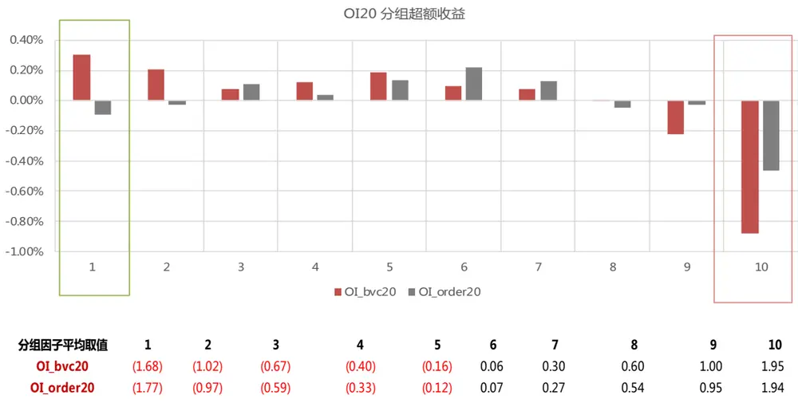

| 分组因子平均取值 | 1 | 2 | 3 | 4 | 5 | 6 | 7 | 8 | 9 | 10 |
| --- | --- | --- | --- | --- | --- | --- | --- | --- | --- | --- |
| OI_bvc20 | (1.68) | (1.02) | (0.67) | (0.40) | (0.16) | 0.06 | 0.30 | 0.60 | 1.00 | 1.95 |
| OI_order20 | (1.77) | (0.97) | (0.59) | (0.33) | (0.12) | 0.07 | 0.27 | 0.54 | 0.95 | 1.94 |

数据来源：东方证券研究所 & Wind 资讯

图 13：全市场中 OI 因子测试

| 全市场 BVC算法 原始值 O15 0110 0120 | 0160 O1120 O15 |  |  |  |  |  |  | 订单流算法 0120 OI60 |  |  |
| --- | --- | --- | --- | --- | --- | --- | --- | --- | --- | --- |
| IC | -3.38% | -2.52% | -3.85% | -3.17% | -1.87% | -1.55% | o110 -0.66% | -1.58% | -1.24% | OI120 -0.91% |
| IC_IR | -1.22 | -0.86 | -1.22 | -1.00 | -0.61 | -0.62 | -0.25 | -0.58 | -0.43 | -0.31 |
| tstat | -3.85 | -2.70 | -3.84 | -3.15 | -1.93 | -1.95 | -0.78 | -1.82 | -1.34 | -0.99 |
| long_short_r | 1.27% | 0.92% | 1.24% | 0.79% | 0.42% | 0.70% | 0.36% | 0.41% | 0.25% | 0.29% |
| long_short_win | 67.23% | 62.18% | 59.66% | 57.98% | 55.46% | 55.46% | 52.94% | 51.26% | 47.06% | 48.74% |
| long_short_sharp | 1.44 | 1.03 | 1.23 | 0.86 | 0.45 | 0.87 | 0.43 | 0.48 | 0.28 | 0.31 |
| long_short_drwandown | -13.81% | -19.57% | -14.48% | -21.33% | -26.36% | -15.44% | -22.39% | -18.57% | -18.60% | -19.29% |
| long_short_yearly | 15.61% | 11.27% | 15.28% | 9.40% | 4.61% | 8.11% | 3.95% | 4.55% | 2.60% | 3.18% |
| 2010 | 5.03% | -1.48% | 22.32% | 18.88% | 5.31% | -2.23% | -10.62% | 3.67% | -6.40% | -15.49% |
| 2011 | 14.88% | 15.89% | 14.59% | 2.04% | 7.31% | 2.83% | 8.98% | 12.51% | 6.69% | 7.57% |
| 2012 | 32.17% | 24.89% | 24.79% | 24.58% | 15.96% | 16.40% | 13.87% | 10.64% | 10.24% | 7.64% |
| 2013 | 30.91% | 16.97% | 22.78% | 7.38% | 7.43% | 18.80% | 6.36% | 8.46% | 2.11% | 1.80% |
| 2014 | -3.88% | -1.40% 50.74% | -3.52% 58.19% | 4.50% | -7.59% | -1.27% 47.46% | 8.61% | 4.59% | 11.52% | 13.74% |
| 2015 | 54.33% 31.74% | 14.75% |  | 34.87% 6.93% | 25.79% | 16.50% | 25.33% 4.62% | 16.99% 5.25% | 14.50% 1.10% | 38.84% |
| 2016 | -5.64% | -11.38% | 20.24% -11.45% | -14.54% | 4.66% -19.11% | -6.66% | -8.81% | -10.12% | -13.71% | 1.15% |
| 2017 2018 | -0.35% | -0.57% | 5.90% | 12.70% | 14.03% | -5.99% | -10.43% | -0.33% | 9.59% | -12.99% |
| 2019 | 11.51% | 12.69% | 8.90% | 1.81% | -2.06% | 5.50% | 6.32% | -4.45% | -7.38% | 5.78% -9.45% |
|  |  |  | BVC算法 |  |  |  |  | 订单流算法 |  |  |
| 全市场 中性化 | O15 | 0110 | O120 | 0160 | 01120 | 015 | 0110 | O120 | 0160 | 0120 |
| IC | -3.53% | -2.89% | -3.38% | -2.22% | -1.06% | -1.48% | -0.98% | -1.09% | -0.61% | -0.24% |
| IC_IR | -1.74 | -1.31 | -1.51 | -1.02 | -0.53 | -0.81 | -0.51 | -0.59 | -0.31 | -0.12 |
| tstat | -5.47 | -4.13 | -4.76 | -3.21 | -1.67 | -2.55 | -1.61 | -1.86 | -0.97 | -0.39 |
| long_short_r | 1.33% | 1.04% | 1.19% | 0.63% | 0.23% | 0.78% | 0.43% | 0.37% | 0.05% | 0.12% |
| long_short_win | 71.43% | 65.55% | 68.07% | 65.55% | 55.46% | 62.18% | 52.94% | 55.46% | 48.74% | 46.22% |
| long_short_sharp | 1.94 | 1.48 | 1.60 | 0.97 | 0.37 | 1.21 | 0.65 | 0.59 | 0.07 | 0.20 |
| long_short_drwandown | -4.50% | -6.34% | -5.61% | -10.87% | -12.77% | -10.16% | -12.43% | -12.17% | -13.55% | -16.53% |
| long_short_yearly | 16.83% | 13.07% | 15.02% | 7.72% | 2.83% | 9.48% | 5.00% | 4.31% | 0.42% | 1.36% |
|  | 1.66% | -0.42% | 11.89% | 7.28% | -0.56% | -0.28% | -10.90% | -1.34% | -10.20% | -11.23% |
| 2010 | 15.79% | 17.00% | 9.52% | -0.15% | 3.47% | 3.82% | 10.03% | 7.82% | 5.01% | 4.13% |
| 2011 | 32.20% | 25.65% | 25.55% | 22.94% | 17.00% | 18.33% | 11.69% | 10.56% | 9.82% | 6.52% |
| 2012 | 19.05% | 15.01% | 16.61% | 5.56% | 1.26% | 12.64% | 5.46% | 8.34% | -3.75% |  |
| 2013 | 2.84% | -0.79% | 0.58% | 4.26% | -6.74% | 4.81% | 6.20% | 7.48% | 7.74% | -5.34% |
| 2014 | 59.31% | 53.89% | 58.86% | 22.53% | 11.92% | 51.15% | 26.78% | 15.99% | 7.37% | 8.84% |
| 2015 | 25.15% | 10.64% | 13.19% | 3.93% | 2.36% | 11.27% | 5.04% | 2.41% | 0.30% | 25.81% |
| 2016 | 3.76% | 1.89% | 1.88% | -2.79% | -7.14% | -3.07% | -4.90% | -3.84% | -10.01% | 3.97% |
| 2017 | 5.68% | 4.25% | 6.96% | 10.62% | 8.59% | -1.69% | -3.76% | 0.99% -4.27% | 6.48% | -9.62% 1.85% |

数据来源：东方证券研究所 & Wind 资讯

图 14：沪深 300 中 OI 因子测试

| 沪深300 |  |  | BVC算法 0120 | 0160 | 01120 |  |  | 订单流算法 |  | 01120 |
| --- | --- | --- | --- | --- | --- | --- | --- | --- | --- | --- |
| 原始值 IC | 015 -1.70% | 0110 1.05% | -1.01% | 0.51% | 2.22% | 015 -0.37% | 0110 1.56% | 0120 0.49% | OI60 1.02% | 1.70% |
| IC_IR | -0.40 | 0.22 | -0.20 | 0.10 | 0.41 | -0.09 | 0.38 | 0.12 | 0.23 | 0.36 |
| tstat | -1.25 | 0.69 | -0.62 | 0.31 | 1.30 | -0.29 | 1.20 | 0.36 | 0.73 | 1.15 |
| long_short_r | 0.16% | 0.56% | 0.19% | 0.02% | 0.51% | 0.06% | 0.45% | 0.29% | 0.72% | 0.81% |
|  | 51.26% | 57.14% | 54.62% | 49.58% | 54.62% | 46.22% | 52.94% | 52.94% | 57.14% | 55.46% |
| long_short_win long_short_sharp | 0.11 | 0.38 | 0.12 | 0.01 | 0.29 | 0.05 | 0.36 | 0.23 | 0.59 | 0.58 |
| long_short_drwandown | -42.14% | -28.21% | -48.47% | -40.07% | -32.37% | -33.43% | -26.57% | -34.74% | -19.14% | -28.80% |
|  | 0.42% | 5.09% | 0.49% | -1.96% | 3.72% | -0.36% | 4.32% | 2.43% |  |  |
| long_short_yearly | 3.27% | -4.00% | 16.33% | -12.04% | -20.64% | 1.38% | 12.93% | 5.70% | 7.57% | 8.32% |
| 2010 | 6.89% | -7.18% | 6.18% | 6.05% | 11.82% | 0.49% | -3.49% |  | 11.45% | 30.15% |
| 2011 | 10.81% | -3.23% | -2.66% | -6.85% | -11.46% | 4.60% | 11.81% | -4.84% 11.13% | 2.52% | -4.62% |
| 2012 2013 | 14.35% | 10.72% | -5.27% | 9.55% | 6.09% | 14.66% | 3.49% | 7.38% | 0.87% | -3.38% |
| 2014 | -31.32% | 31.09% | -27.26% | 20.42% | 43.57% | -29.75% | 10.45% | 8.73% | 12.53% 7.69% | 8.61% 17.72% |
| 2015 | 38.94% | -15.74% | 56.59% | -34.97% | -19.34% | 31.94% | -19.04% | -31.15% | -14.59% | -16.54% |
| 2016 | 29.00% | -2.80% | 7.99% | 5.36% | 11.36% | 19.95% | -5.57% | -0.79% | 4.45% | -7.12% |
| 2017 | -14.65% | 35.99% | -28.45% | 35.58% | 31.68% | -11.25% | 35.47% | 24.96% | 41.48% | 58.73% |
| 2018 | -30.30% | 36.54% | -5.38% | -8.28% | -5.68% | -18.46% | 11.50% | 9.74% | 5.05% | 10.10% |
| 2019 | 1.13% | -12.33% | 8.46% | -13.29% | 10.65% | -1.79% | -5.32% | 3.62% | 14.63% | 8.95% |
|  |  |  | BVC算法 |  |  |  |  | 订单流算法 |  |  |
| 沪深300 | 015 | 0110 |  |  |  |  | 0110 |  |  |  |
| 中性化 |  |  | 0120 -1.39% | 0160 | 01120 | 015 -0.61% | 0.25% | 0120 0.34% | OI60 | O1120 |
| IC | -2.15% | -0.75% |  | 0.50% | 1.47% |  | 0.11 |  | 1.23% | 1.35% |
| IC_IR | -0.83 | -0.28 | -0.50 | 0.16 | 0.49 | -0.25 |  | 0.13 | 0.46 | 0.48 |
| tstat | -2.61 | -0.87 | -1.57 | 0.52 | 1.53 | -0.80 | 0.34 0.10% | 0.42 | 1.43 | 1.50 |
| long_short_r | 0.12% 52.10% | 0.06% | 0.38% | 0.22% | 0.50% | 0.15% | 50.42% | 0.01% | 0.29% | 0.75% |
| long_short_win |  | 46.22% | 54.62% 0.42 | 55.46% | 58.82% 0.53 | 50.42% | 0.11 | 50.42% 0.01 | 57.14% | 63.87% |
| long_short_sharp | 0.14 | 0.07 |  | 0.22 |  | 0.16 |  | -34.02% | 0.35 | 0.88 |
| long_short_drwandown | -25.27% | -26.96% | -19.49% | -32.14% | -21.62% | -24.64% | -20.16% |  | -22.68% | -16.22% |
| long_short_yearly | 1.18% | 0.46% | 4.19% 4.70% | 1.61% | 5.06% | 1.41% | 0.55% | -0.51% | 2.82% | 8.49% |
| 2010 | 1.74% | -5.30% | -1.07% | -1.01% | 4.46% | -7.90% | 1.49% | 3.07% | 10.55% | 24.42% |
| 2011 | 1.40% | 1.35% 14.95% | 11.17% | -1.61% | -5.88% | 2.49% | -2.78% -0.80% | -4.64% 5.62% | -5.40% | -2.87% -3.16% |
| 2012 | 22.16% | -5.30% | -1.92% | -15.03% | -12.51% | 18.45% |  | 4.44% | -12.42% 9.87% | 11.95% |
| 2013 | -7.62% | -3.82% | -12.22% | 3.80% 14.02% | 2.62% 18.82% | 13.53% | -2.94% 3.46% | 7.10% | -1.06% | 5.61% |
| 2014 | -13.01% | 28.71% | 47.07% | -17.92% | 2.63% | -17.35% | -1.72% | -20.96% | -8.47% | 11.98% |
| 2015 | 21.65% |  | 13.61% |  |  | 17.13% |  |  |  |  |
| 2016 | 6.65% | 0.03% | -3.71% | 3.60% 21.94% | 3.82% 30.27% | 11.72% -4.34% | -6.28% 25.38% | -12.03% 13.11% | 1.19% 28.09% | -2.60% 27.38% |

数据来源：东方证券研究所 & Wind 资讯

图 15：中证 500 中 OI 因子测试

|  |  |  | BVC算法 |  |  |  |  | 订单流算法 |  |  |
| --- | --- | --- | --- | --- | --- | --- | --- | --- | --- | --- |
| 中证500 原始值 | OI5 | o110 | O120 | OI60 | 01120 | OI5 | o110 | O120 | OI60 | 01120 |
| IC | -2.94% | -1.67% | -3.00% | -2.54% | -1.44% | -1.04% | 0.16% | -1.11% | -0.88% | -0.48% |
| IC_IR | -0.93 | -0.49 | -0.89 | -0.72 | -0.44 | -0.36 | 0.05 | -0.35 | -0.25 | -0.13 |
| tstat | -2.94 | -1.54 | -2.81 | -2.26 | -1.39 | -1.14 | 0.16 | -1.12 | -0.79 | -0.42 |
| long_short_r | 0.78% | 0.70% | 0.85% | 0.42% | 0.45% | 0.14% | -0.12% | 0.20% | 0.03% | -0.07% |
| long_short_win | 59.66% | 55.46% | 60.50% | 50.42% | 51.26% | 49.58% | 50.42% | 52.94% | 47.90% | 47.06% |
| long_short_sharp | 0.79 | 0.65 | 0.80 | 0.41 | 0.48 | 0.15 | (0.12) | 0.22 | 0.03 | (0.06) |
| long_short_drwandown | -19.90% | -26.37% | -19.95% | -25.16% | -28.06% | -30.68% | -50.87% | -30.65% | -32.81% | -41.01% |
|  | 8.99% | 8.06% | 10.00% | 4.57% | 5.23% | 0.96% | -2.29% | 1.87% | -0.57% |  |
| long_short_yearly | 4.91% | -3.26% | 15.55% | 10.98% | -1.32% | -4.68% | 17.47% | 3.54% | -4.85% | -1.79% |
| 2010 | 10.75% | 4.21% | 3.21% | 3.55% | 12.00% | 6.29% | -15.15% | 6.36% | 5.06% | -14.18% |
| 2011 |  | 18.17% | 16.99% | 26.70% | 27.60% |  |  |  | 10.31% | 12.22% |
| 2012 | 24.17% | 19.03% | 12.90% | -4.13% |  | 3.97% | -2.81% | 1.88% |  | 11.39% |
| 2013 | 29.68% | -8.21% | -11.36% | -5.17% | 2.37% | 8.52% | -10.07% | 3.38% | -7.96% | -17.72% |
| 2014 | -17.41% | 76.29% | 71.23% | 35.96% | -5.17% 40.08% | -10.68% | -0.54% | 0.44% | 6.77% | 16.20% |
| 2015 | 41.65% 14.25% | 5.91% | 18.77% | 7.42% | 11.54% | 33.08% | -28.58% | 32.56% | 27.06% 1.09% | 20.88% |
| 2016 |  | -11.75% | -11.15% | -18.50% | -22.16% | 3.55% -14.24% | 3.93% 16.81% | 0.81% -14.48% |  | 10.64% |
| 2017 | -8.87% |  | -3.82% |  | 2.43% |  |  | -12.69% | -26.17% | -24.88% |
| 2018 2019 | -7.34% 11.29% | -12.83% 13.79% | 4.14% | -2.61% 0.14% | -5.82% | -14.94% 8.41% | 22.84% -13.40% | 2.96% | -3.29% -3.70% | -7.35% -12.09% |

| 中证500 |  |  | BVC算法 |  |  |  |  | 订单流算法 |  |  |
| --- | --- | --- | --- | --- | --- | --- | --- | --- | --- | --- |
| 中性化 | 0I5 | o110 | 0120 | OI60 | 01120 | OI5 | o110 | O120 | OI60 | 01120 |
| IC | -3.03% | -2.63% | -3.16% | -1.96% | -1.03% | -1.45% | -0.94% | -1.25% | -0.50% | -0.19% |
| IC_IR | -1.35 | -1.08 | -1.33 | -0.80 | -0.49 | -0.70 | -0.42 | -0.62 | -0.23 | -0.08 |
| tstat | -4.26 | -3.40 | -4.19 | -2.53 | -1.54 | -2.21 | -1.33 | -1.95 | -0.71 | -0.26 |
| long_short_r | 0.98% | 0.97% | 0.85% | 0.57% | 0.38% | 0.32% | 0.43% | 0.08% | 0.16% | -0.07% |
| long_short_win | 67.23% | 62.18% | 62.18% | 57.98% | 52.94% | 52.10% | 54.62% | 47.90% | 48.74% | 48.74% |
| long_short_sharp | 1.28 | 1.13 | 1.01 | 0.73 | 0.55 | 0.44 | 0.54 | 0.11 | 0.20 | (0.10) |
| long_short_drwandown | -16.86% | -11.12% | -10.89% | -15.09% | -22.24% | -28.25% | -27.49% | -30.54% | -27.26% | -31.72% |
| long_short_yearly | 12.04% | 12.00% | 10.43% | 7.08% | 4.78% | 3.62% | 4.91% | 0.76% | 1.48% | -1.30% |
|  | 5.93% | 1.00% | 11.11% | -3.20% | -1.68% | -2.60% | -11.12% | -1.97% | -13.60% | -16.81% |
| 2010 | 10.77% | 6.59% | 8.03% | 3.66% | 4.16% | 3.33% | 16.54% | 3.58% | 7.79% | 5.85% |
| 2011 | 23.07% | 27.30% | 22.08% | 25.61% | 17.51% | 8.68% | 11.12% | 13.00% | 12.11% |  |
| 2012 | 29.27% | 20.96% | 7.68% | 9.74% | 10.77% | 12.55% | 10.05% | -0.11% | 1.34% | 11.36% |
| 2013 | -7.48% | -10.09% | -8.54% | -4.78% | -3.97% | -0.94% | 6.05% | -0.39% | 3.94% | -15.64% |
| 2014 | 50.17% | 68.22% | 64.07% | 53.18% | 32.51% | 22.63% | 27.96% | 16.08% | 32.77% | 11.05% |
| 2015 | 16.48% | 11.99% | 17.68% | 6.82% | 11.29% | 3.57% | 1.63% | 2.56% | 0.61% | 20.42% |
| 2016 2017 | -8.68% | 0.45% | -5.18% | -10.17% | -16.25% | -16.38% | -12.68% | -15.44% | -18.43% | 12.75% -16.36% |
| 2018 2019 | -4.69% 16.68% | 0.68% 5.66% | -1.24% -0.27% | -0.38% -2.17% | 2.74% -6.21% | -8.60% 19.19% | -10.32% 16.28% | -13.77% 7.36% | -5.67% 2.32% | -5.86% -10.43% |

数据来源：东方证券研究所 & Wind 资讯

## （2）主动买卖差额占比 |OI|

可以看到，该因子 ICIR 均小于 1，做成因子基本无效。

图 16：全市场中 OI_abs 因子测试

| 全市场 |  |  | BVC算法 |  |  |  |  | 订单流尊法 |  |  |
| --- | --- | --- | --- | --- | --- | --- | --- | --- | --- | --- |
| 原始值 | OI5_abs | OI10_abs | OI20_abs | OI60_abs | OI120_abs | OI5_abs | OI10_abs | O120_abs | OI60_abs | OI120_abs |
| IC | 1.04% | 0.21% | 1.71% 0.87 | 2.09% 0.86 | 1.18% 0.49 | 1.33% 0.65 | -0.03% -0.01 | 0.98% 0.38 | 0.88% 0.31 | 0.77% |
| IC_IR | 0.53 1.67 | 0.10 0.32 | 2.75 | 2.70 | 1.53 | 2.03 | -0.05 | 1.20 | 0.98 | 0.27 0.83 |
| tstat | 0.14% |  | 0.09% |  | 0.04% | 0.14% | 0.34% | 0.00% | -0.02% | 0.15% |
| long_short_r |  | -0.30% | 50.42% | 0.13% 48.74% | 48.74% | 48.74% | 57.98% | 42.86% | 42.86% | 47.90% |
| long_short_win | 45.38% 0.25 | 39.50% (0.49) | 0.15 | 0.18 | 0.06 | 0.19 | 0.46 | (0.00) | (0.02) | 0.15 |
| long_short_sharp | -9.55% | -32.50% | -12.15% | -28.39% | -29.75% | -18.71% | -19.70% | -27.06% | -31.55% | -27.21% |
| long_short_drwandown | 1.54% | -3.67% | 0.93% | 1.48% | 0.33% | 1.26% | 3.60% | -0.36% | -0.57% |  |
| long_short_yearly |  | -2.70% | 1.06% |  | 3.70% |  | 11.02% | -0.61% |  | 1.36% |
| 2010 | 9.24% | -2.91% | -4.17% | 10.25% |  | -3.60% |  |  | -8.07% | -15.77% |
| 2011 | -4.89% |  |  | 2.29% | 3.26% | -0.74% | -2.63% | 9.96% | 5.03% | 5.76% |
| 2012 | 3.03% | 0.32% 2.59% | 11.19% | 8.72% | 7.73% | 5.55% | -1.43% | 3.59% | 9.19% | 5.01% |
| 2013 | 6.81% |  | 6.98% -7.38% | 5.67% | 12.43% -4.32% | 12.29% | -0.29% 3.72% | 1.75% -2.80% | 0.20% | 1.11% |
| 2014 | -2.19% | -13.33% -2.95% | 4.13% | -0.96% 18.78% | 12.39% | -5.57% | 2.66% | 8.96% | 6.57% 17.73% | 12.84% |
| 2015 2016 | 0.58% 13.14% | -0.27% | 4.62% | -1.37% | -0.54% | 13.49% 15.05% | -5.21% | 2.59% |  | 41.22% |
| 2017 | -5.49% | -15.25% | -5.40% | -16.94% | -16.48% | -5.33% | 10.17% | -11.98% | -1.62% -16.98% | 0.36% -14.28% |
| 2018 | 0.42% | 2.26% | 4.36% | -1.61% | -4.24% | -11.51% | 17.51% | -1.87% | 1.06% | 0.84% |
| 2019 | -4.02% | -3.28% | -5.52% | -8.49% | -8.24% | -2.79% | 3.41% | -12.01% | -14.83% | -14.53% |
| 全市场 |  |  | BVC算法 |  |  |  |  | 订单流算法 |  |  |
| 中性化 | OI5_abs | OI10_abs | OI20_abs | OI60_abs | OI120_abs | OI5_abs | OI10_abs | O120_abs | OI60_abs | OI120_abs |
| IC | 0.71% | 0.38% | 1.30% | 1.34% | 0.55% | 1.03% | 0.15% | 0.50% | 0.34% | 0.13% |
| IC_IR | 0.51 | 0.26 | 0.92 | 0.84 | 0.35 | 0.74 | 0.10 | 0.31 | 0.18 | 0.07 |
| tstat | 1.61 | 0.83 | 2.89 | 2.64 | 1.10 | 2.34 | 0.30 | 0.98 | 0.57 | 0.23 |
| long_short_r | 0.02% | -0.16% | 0.03% | 0.03% | -0.17% | 0.17% | -0.13% | -0.08% | -0.24% | -0.02% |
| long_short_win | 46.22% | 42.86% | 47.90% | 52.94% | 48.74% | 49.58% | 42.02% | 47.06% | 41.18% | 43.70% |
| long_short_sharp | 0.05 | (0.34) | 0.06 | 0.07 | (0.37) | 0.33 | (0.28) | (0.15) | (0.42) | (0.04) |
| long_short_drwandown | -12.23% | -23.26% | -12.67% | -14.40% | -33.19% | -15.51% | -17.55% | -21.77% | -26.72% | -24.37% |
| long_short_yearly | 0.26% | -1.83% | 0.32% | 0.48% | -1.96% | 1.88% | -1.69% | -1.01% | -2.92% | -0.33% |
| 2010 | 5.30% | 2.73% | 5.63% | 3.75% | 2.23% | -1.92% | -5.46% | -2.53% | -11.72% | -10.77% |
| 2011 | -5.60% | 0.04% | -1.89% | 3.75% | 2.33% | -0.94% | 2.85% | 3.88% | 3.54% | 3.42% |
| 2012 | 3.54% | 2.05% | 8.71% | 7.31% | 7.37% | 7.16% | -0.70% | 4.65% 1.31% | 6.86% | 4.31% |
| 2013 | -2.24% | -5.71% -8.00% | 1.34% -0.61% | 2.09% -2.06% | 4.68% -6.01% | 1.11% | -1.30% -3.80% | 1.01% | -6.10% 1.94% | -5.68% |
| 2014 | -2.41% | 0.87% | -5.93% | 3.02% | -5.54% | -0.91% 18.67% | 2.08% | 2.00% | 7.42% | 6.87% 25.18% |
| 2015 | 7.00% | -1.88% | -2.75% | -4.37% | -3.43% | 14.48% | 5.70% | -2.02% | -2.35% | 2.24% |
| 2016 2017 2018 | 7.88% -4.10% -4.86% | -4.29% -1.31% | 1.63% -1.31% | -1.54% -2.30% | -7.85% -6.07% | -2.07% -8.28% | -5.83% -10.19% | -3.40% -4.86% | -12.86% -2.52% | -10.54% -1.76% |

数据来源：东方证券研究所 & Wind 资讯

图 17：沪深 300 中 OI_abs 因子测试

| 沪深300 |  |  | BVC算法 |  |  |  |  | 订单流算法 |  |  |
| --- | --- | --- | --- | --- | --- | --- | --- | --- | --- | --- |
| 原始值 | OI5_abs | O110_abs | O120_abs | O160_abs | OI120_abs | OI5_abs | O110_abs | OI20_abs | OI60_abs | Ol120_abs |
| IC | -0.06% | -1.71% | 0.12% | 0.19% | -0.60% | 0.37% | -1.32% | -0.64% | -1.15% | -1.87% |
| IC_IR | -0.02 | -0.56 | 0.04 | 0.06 | -0.17 | 0.11 | -0.37 | -0.17 | -0.26 | -0.41 |
| tstat | -0.06 | -1.77 | 0.13 | 0.19 | -0.55 | 0.35 | -1.15 | -0.53 | -0.82 | -1.28 |
| long_short_r | -0.06% | 0.34% | 0.29% | 0.04% | 0.37% | -0.24% | 0.81% | 0.40% | 0.71% | 0.81% |
| long_short_win | 57.98% | 55.46% | 54.62% | 49.58% | 56.30% | 45.38% | 58.82% | 55.46% | 56.30% | 59.66% |
| long_short_sharp | (0.06) | 0.33 | 0.26 | 0.04 | 0.35 | (0.23) | 0.71 | 0.35 | 0.53 | 0.63 |
|  | -38.75% | -18.38% | -25.69% | -31.30% | -31.46% | -32.58% | -19.85% | -25.61% | -25.48% | -22.18% |
| long_short_drwandown | -1.52% | 3.37% | 2.87% | 0.03% | 3.47% | -3.51% | 9.15% | 4.03% | 7.22% |  |
| long_short_yearly | -4.32% | -6.58% | 4.76% | 8.25% | 12.42% | -18.78% | 16.55% | 12.59% | 27.53% | 8.68% |
| 2010 |  |  | -3.05% |  |  |  |  |  |  | 31.58% |
| 2011 | 5.00% | 6.74% |  | 3.35% | 14.97% | 6.28% | -6.47% | -5.94% | 0.84% | -4.57% |
| 2012 | -11.28% | 1.10% | 6.69% | 6.83% | -2.99% | 1.65% | 12.04% | 5.79% | -2.19% | -4.30% |
| 2013 | -6.64% | 7.17% | 18.11% | -5.40% | -1.65% | 12.79% | -5.12% | -0.12% | -6.84% | 4.33% |
| 2014 | -3.44% | 12.71% | -18.24% | -0.08% | -5.61% | -10.93% | 8.72% | 7.28% | 10.61% | 11.77% |
| 2015 | -1.51% | -6.54% | 48.72% | 22.03% | -20.01% | -1.02% | 15.40% | -18.37% | -16.92% | -11.69% |
| 2016 | -10.28% | 11.27% | -1.81% | 2.00% | 0.43% | 10.23% | -9.05% | -1.39% | 4.24% | -7.80% |
| 2017 | 23.31% | 20.64% | -11.91% | -16.70% | 26.01% | -4.72% | 22.58% | 18.31% | 37.78% | 56.74% |
| 2018 2019 | 10.73% -9.39% | -9.71% 1.11% | 5.26% -8.79% | -7.77% -9.99% | 7.88% 13.13% | -13.69% -12.05% | 19.54% 23.16% | 7.65% 19.64% | -4.95% 39.77% | 1.30% 29.08% |

| 沪深300 |  |  | BVC算法 |  |  |  |  | 订单流算法 |  |  |
| --- | --- | --- | --- | --- | --- | --- | --- | --- | --- | --- |
| 中性化 | 015_abs | O110_abs | O120_abs | O160_abs | O1120_abs | OI5_abs | O110_abs | O120_abs | OI60_abs | O1120_abs |
| IC | -0.43% | -0.88% | 0.11% | 0.40% | -0.65% | 0.26% | -0.07% | -0.39% | -1.20% | -1.40% |
| IC_IR | -0.22 | -0.47 | 0.05 | 0.18 | -0.28 | 0.13 | -0.03 | -0.17 | -0.44 | -0.51 |
| tstat | -0.69 | -1.47 | 0.16 | 0.55 | -0.89 | 0.42 | -0.11 | -0.53 | -1.40 | -1.62 |
| long_short_r | 0.20% | 0.08% | 0.10% | -0.21% | 0.37% | -0.16% | 0.12% | 0.06% | 0.74% | 0.99% |
| long_short_win | 52.94% | 51.26% | 53.78% | 49.58% | 56.30% | 43.70% | 56.30% | 49.58% | 57.98% | 63.03% |
| long_short_sharp | 0.26 | 0.11 | 0.13 | (0.27) | 0.47 | (0.22) | 0.17 | 0.07 | 0.81 | 1.18 |
| long_short_drwandown | -19.08% | -16.29% | -30.86% | -40.64% | -21.20% | -28.37% | -25.22% | -39.05% | -24.14% | -15.01% |
| long_short_yearly | 1.68% | 0.42% | 1.01% | -2.65% | 3.74% | -2.10% | 1.14% | 0.16% | 8.35% | 11.66% |
| 2010 | -1.45% | 0.20% | 10.12% | -4.78% | 1.82% | -9.50% | 0.63% | 3.32% | 26.53% | 35.59% |
| 2011 | -4.21% | -2.04% | -2.65% | 6.89% | -0.49% | -2.21% | -4.32% | -6.07% | -8.18% | -6.30% |
| 2012 | -3.87% | 11.55% | 11.22% | -0.26% | 3.77% | 9.55% | 6.70% | -2.19% | -8.23% | -8.67% |
| 2013 | 3.96% | 1.10% | 7.19% | 1.31% | 5.69% | 5.16% | -17.57% | -3.31% | -0.43% | 10.07% |
|  | 11.45% | 1.60% | 3.09% | 12.42% | -8.93% | -6.97% | 8.65% | -0.32% | 5.30% | 9.04% |
| 2014 | -0.02% | -5.99% | 12.14% | 9.97% | -2.91% | 15.11% | 1.41% | -14.41% | -2.26% | 31.20% |
| 2015 | 0.48% | 6.39% | -9.08% | -1.20% | -6.81% | -0.54% | -4.43% | -8.58% | 4.61% | -2.80% |
| 2016 2017 | 6.26% | -6.21% | -4.72% | -7.47% | 11.09% | -12.38% | 7.82% | 3.14% | 30.20% | 28.57% |
|  | -0.25% | 1.46% | -9.72% | -24.33% | 17.16% | -9.43% | 16.72% | 15.27% | 18.57% | 7.08% |
| 2018 2019 | 8.25% | -0.79% | -6.53% | -15.14% | 25.04% | -8.12% | -0.53% | 20.23% | 28.64% | 25.60% |

数据来源：东方证券研究所 & Wind 资讯

| 中证500 原始值 | OI5_abs | OI10_abs | BVC算法 OI20_abs | OI60_abs OI120_abs | OI5_abs |  | 订单流算法 OI10_abs OI20_abs |  | OI60_abs | OI120_abs |
| --- | --- | --- | --- | --- | --- | --- | --- | --- | --- | --- |
| IC | 0.80% | -0.24% | 0.73% | 1.93% | 0.95% | 0.61% | -1.14% | 0.52% | 0.63% | 0.27% |
| IC_IR | 0.35 | -0.10 | 0.35 | 0.66 | 0.34 | 0.25 | -0.39 | 0.18 | 0.18 | 0.07 |
| tstat | 1.10 | -0.32 | 1.11 | 2.07 | 1.09 | 0.77 | -1.23 | 0.57 | 0.56 | 0.23 |
|  | 0.10% | 0.41% | -0.53% | 0.01% | 0.01% | -0.14% | 0.48% | -0.23% | -0.09% | -0.12% |
| long_short_r | 52.10% | 57.14% | 39.50% | 48.74% | 55.46% | 48.74% | 55.46% | 47.90% | 45.38% | 46.22% |
| long_short_win | 0.14 | 0.54 | (0.74) | 0.01 | 0.01 | (0.17) | 0.47 | (0.25) | (0.09) | (0.10) |
| long_short_sharp | -20.39% | -16.75% | -51.85% | -40.94% | -36.44% | -32.73% | -26.79% | -34.03% | -38.87% | -44.70% |
| long_short_drwandown | 0.75% | 4.36% | -6.51% | -0.40% | -0.33% | -2.38% | 5.04% | -3.36% | -1.95% |  |
| long_short_yearly | 2.41% | 9.00% | 9.86% | 3.81% | 4.01% | -5.97% | 11.15% | 2.01% | -6.45% | -2.36% -14.74% |
| 2010 | -5.03% | 7.24% | -5.87% | 5.79% | 6.09% | 7.97% | -3.48% | -0.28% | 6.44% | 12.28% |
| 2011 | -4.48% | 11.62% | -1.39% | 5.45% | 12.22% | -1.73% | 6.45% | -2.80% | 7.24% | 9.36% |
| 2012 2013 | 7.57% | 2.55% | -1.97% | 3.55% | 8.39% | 8.19% | -5.02% | -4.63% | -10.19% | -18.34% |
| 2014 | 12.98% | 21.83% | -15.97% | -7.35% | -10.99% | -9.05% | 7.72% | -10.27% | 2.85% | 12.27% |
| 2015 | 6.75% | -13.60% | -18.56% | 29.49% | 17.53% | 11.07% | -1.71% | 27.30% | 35.55% | 31.69% |
| 2016 | 0.50% | 2.20% | 3.00% | 0.60% | 7.30% | 3.87% | 1.73% | -3.15% | 0.01% | 10.10% |
| 2017 | 1.83% | 8.20% | -16.06% | -21.38% | -28.50% | -17.28% | 8.74% | -17.97% | -28.94% | -26.49% |
| 2018 | -13.80% | 0.15% | -2.21% | -15.64% | -1.40% | -11.08% | 23.02% | -10.29% | 1.47% | -5.71% |
| 2019 | 2.34% | 0.07% | -11.04% | -0.92% | -9.48% | -4.15% | 4.91% | -6.48% | -13.51% | -17.81% |
| 中证500 |  |  | BVC算法 |  |  |  |  | 订单流算法 |  |  |
| 中性化 | OI5_abs 0.56% | O110_abs 0.42% | 0120_abs 1.19% | OI60_abs 1.51% | OI120_abs | 0I5_abs 0.94% | OI10_abs 0.11% | OI20_abs | OI60_abs | O1120_abs |
| IC | 0.34 | 0.24 | 0.74 | 0.73 | 0.76% 0.41 | 0.54 | 0.06 | 0.95% | 0.32% | 0.02% |
| IC_IR | 1.06 | 0.76 | 2.32 | 2.30 | 1.30 | 1.68 | 0.19 | 0.53 1.66 | 0.15 0.46 | 0.01 |
| tstat | -0.07% | -0.21% | -0.26% | 0.31% | -0.10% | 0.04% | -0.10% | -0.30% | -0.05% | 0.03 |
| long_short_r | 49.58% | 43.70% | 42.86% | 52.94% | 49.58% | 47.06% | 47.90% | 42.02% | 48.74% | -0.22% |
| long_short_win | (0.12) | (0.33) | (0.44) | 0.50 | (0.19) | 0.06 | (0.13) | (0.47) | (0.07) | 47.06% |
| long_short_sharp | -19.57% | -28.25% |  |  |  | -22.56% | -31.69% |  |  | (0.29) |
| long_short_drwandown | -1.02% | -2.49% | -35.71% | -26.51% | -34.09% |  |  | -35.32% | -34.76% | -38.13% |
| long_short_yearly | 4.89% | 4.03% | -3.18% | 3.74% | -1.39% | 0.26% | -1.45% | -3.57% | -0.99% | -3.02% |
| 2010 | -10.06% | -3.13% | 7.91% | 1.35% | -5.40% | -10.97% | -5.56% | -1.06% | -14.86% | -15.92% |
| 2011 |  |  | -2.81% | 5.09% | 5.38% | 0.27% | 14.18% | -2.69% | 8.90% | 4.30% |
| 2012 | -7.99% | -7.68% | -5.70% | 4.36% | 7.45% | -0.46% | 5.11% | 3.20% | 8.89% | 9.59% |
| 2013 | 13.31% | -3.62% -5.65% | -3.81% | 2.33% | 5.06% | 11.48% | 4.28% | -5.12% | -1.02% | -14.73% |
| 2014 | 1.28% | 3.93% | -3.82% | 2.62% | -4.76% | -1.21% | -6.64% | -7.87% | -2.44% | 6.59% |
| 2015 | 0.37% | 1.70% | -7.64% 5.77% | 37.71% 5.53% | 16.79% | 17.31% | 0.42% -0.63% | 13.27% -2.22% | 40.06% -1.34% | 19.78% |
| 2016 | 2.17% -1.20% | -6.46% | -12.30% | -12.03% | 2.00% -14.48% | 3.97% -10.90% | -15.83% | -11.33% | -19.26% | 11.11% |
| 2017 | -12.14% | -6.05% | -5.60% | -7.82% | -9.02% | -3.31% | -9.38% | -11.68% | -5.84% | -19.30% -6.14% |

图 18：中证 500 中 OI_abs 因子测试
数据来源：东方证券研究所 & Wind 资讯

## （3）净换手率 NTO

## BVC 算法因子表现优于订单流算法

全市场中性化后的 NTO-bvc 因子除 NTO120 外，IC绝对值均超过 2，ICIR 绝对值均超过 1，其中 NTO20中性化 ICIR为-1.90，多空组合年化收益达到 16%，最大回撤仅为-8%，是很有效的选股指标。而 NTO-order 因子虽然 ICIR 绝对值均在 1 以上，但多空组合的年化收益均在 8%以下，最大回撤均超过 15%。

## 中性化因子值效果优于原始值

全市场的 NTO20-bvc 因子原始值 ICIR 为-1.30，中性化 ICIRI 为-1.90，都很显著。这说明，NTO20-bvc 因子主要的收益来源并不是行业选择和市值暴露。而 NTO20-order 因子原始值 ICIR仅为 0.53，说明 NTO-order 因子的收益来源一部分是行业选择和市值暴露。从因子行业选择能力的测试结果来看，结果显示当月行业因子值与行业下月收益的 ICIR 均小于 0.5，说明两种算法得到的 NTO因子行业选择效果也并不显著。

## BVC 算法因子 IC 负向，NTO 算法因子 IC 正向

两种算法给出的净主买占比因子的 IC 方向相反。但从 NTO-order 因子的效果来看，多空组合整体收益并不高，所以因子不完全可靠，后面我们会通过因子分组单调性和因子相关性对这一问题再来进行深入分析。

## BVC 算法过去 20 天的因子效果更强，订单流算法长周期因子效果最强

全市场中性化后NTO-bvc因子ICIR绝对值排序为：NTO20>NTO5>NTO10>NTO60>NTO120，NTO20 因子效果最强，ICIR 达到-1.9，NTO120 因子的 ICIR 为-0.73，基本失去了选股效力。而全市场中性化后 NTO-order 因子 ICIR 绝对值排序为：NTO120>NTO60>NTO20>NTO10>NTO5，NTO120 因子效果最强，ICIR 达到 1.79。

## 小市值股票池中因子效果更强

全市场中性化后的 NTO20-bvc 因子 ICIR 绝对值排序为：全市场>中证 500>沪深 300，在沪深 300中 NTO20 因子的 ICIR-0.95，多空年化收益仅有 4%，选股效力不强。

## 因子单调性

从全市场中性化后的两个 NTO20 因子的分组超额收益来看，单调性都一般，两个因子第一组和第十组均贡献负向超额收益，反而是中间组下月收益更高。但两个因子分组的单调性形态几乎完全相反。这主要是净换手的定义方法导致的：净换手 = 净主买占比 OI * 换手率 TO，净主买因子值本身有方向，而换手率因子值本身无方向，而且两个因子的 IC 都为负，这就使得可能会出现以下几种收益贡献组合情形：

- OI 因子贡献负收益，换手率贡献负收益：对于 OI-bvc 因子，正向取值最大的第十组空头端负向超额收益最大，所以当出现正向取值较大的 OI（负收益贡献），乘上较高的换手（负收益贡献）时，会得到正向取值很大的净换手，包含在净换手因子值最高的第十组中，由于二者都是负收益贡献，此时分组的负向超额收益最大。因而，NTO_bvc 因子第十组空头端的负向超额收益最大。对于 OI-order 因子，由于正向取值最大的第十组空头端的负向超额收益（-0.4%）要比 OI_bvc 小（-0.9%），因而，NTO_order因子第十组空头端的虽然也是负向超额收益，但取值偏小；由于OI-order因子负向取值最大的组也是负收益贡献，因而对于 NTO_order 因子，当出现负向取值较大的 OI（负收益贡献），乘上较高的换手（负收益贡献），会得到负向取值最大的净换手，包含在净换手因子值最小的第一组，此时二者都是负收益贡献，因而NTO_order 因子第一组多头端也是负向超额收益。而且从后面的相关性分析中可以看到，NTO-order 和换手率高度负相关，因而高换手更容易出现低 NTO，也就意味着高换手和负向取值最大的 OI 更容易组合在一起，从而导致 NTO_order 因子第一组多头端的负向超额收益更大。

- OI 因子贡献正收益，换手率贡献正收益：对于 OI_bvc 因子：负向取值较大的 OI 正向超额收益最大，所以对于 NTO_bvc 因子，当出现负向取值较大的 OI（正收益贡献），乘上较低的换手（正收益贡献）时，会得到负向但绝对值中等偏小（不是最小）的净换手取值，包含在净换手因子值的第三到四组中，由于二者都是正收益贡献，此时分组的正向超额收益最大。因而，NTO_bvc 因子中间第三第四组的因子取值为负向但绝对值中等偏小的时候正向超额收益最高。对于 OI_order 因子，由于负向取值最大的组并没有正收益贡献，反而是第五到七组正向取值中等偏小的 OI 会贡献最多的正向超额收益，所以对于 NTO_order 因子，当出现正向取值较小的 OI（正收益贡献），乘上较低的换手（正收益贡献），会得到正向取值偏小的净换手，因而 NTO_order因子中间第七第八组的超额收益最高；

- OI 因子贡献正收益，换手率贡献负收益：由于 OI-bvc 因子负向取值最大的组贡献最多的正收益，因而对于 NTO_order 因子：负向取值较大的 OI（正收益贡献），乘上较高的换手（负收益贡献），会得到负向取值最大的净换手，由于二者收益贡献相反，因而 NTO_bvc 因子第一组多头端基本没有超额收益。

图 19：全市场——中性化 NTO20 因子分组超额收益
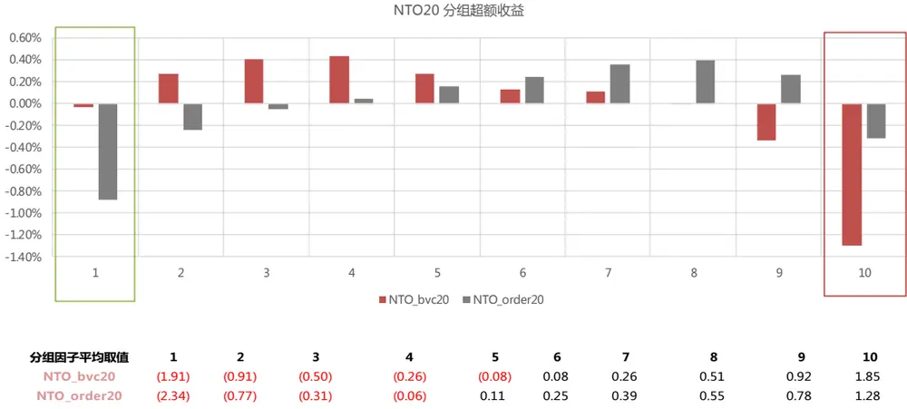
数据来源：东方证券研究所 & Wind 资讯

图 20：全市场中 NTO因子测试

| 全市场 |  |  | BVC算法 |  |  |  |  | 订单流算法 |  |  |
| --- | --- | --- | --- | --- | --- | --- | --- | --- | --- | --- |
| 原始值 IC | NTO5 -2.91% | NTO10 -1.92% | NTO20 -4.10% | NTO60 -3.20% | NTO120 -1.80% | NTO5 1.57% | NTO10 3.12% | NTO20 2.11% | NTO60 2.16% | NTO120 2.38% |
| IC_IR | -0.94 | -0.62 | -1.30 | -1.00 | -0.58 | 0.46 | 0.87 | 0.53 | 0.50 | 0.53 |
| tstat | -2.96 | -1.96 | -4.10 | -3.13 | -1.83 | 1.44 | 2.73 | 1.68 | 1.56 | 1.68 |
| long_short_r | 0.06% | -0.41% | 0.30% | 0.16% | 0.58% | 0.89% | 1.31% | 0.11% | 0.06% | 0.03% |
| long_short_win | 51.26% | 39.50% | 52.10% | 52.10% | 60.50% | 68.91% | 68.07% | 57.14% | 51.26% | 56.30% |
| long_short_sharp | 0.07 | (0.44) | 0.30 | 0.16 | 0.69 | 0.80 | 1.17 | 0.10 | 0.05 | 0.02 |
| long_short_drwandown | -35.73% | -45.81% | -36.50% | -44.23% | -20.29% | -31.31% | -20.72% | -52.50% | -56.79% | -61.52% |
| long_short_yearly | -0.08% | -5.37% | 2.84% | 1.27% | 6.84% | 10.70% | 16.24% | 0.45% | -0.26% | -0.94% |
|  | -0.45% | -9.22% | 9.52% | 12.72% | -1.27% | 13.46% | 28.71% | 3.20% | 0.15% |  |
| 2010 | -7.25% | -1.23% | 0.77% | -1.53% | -0.32% | 17.15% | 20.29% | -2.41% | 3.19% | 5.27% 3.71% |
| 2011 | 5.01% | -1.84% | 11.67% | 4.59% | 18.54% | 11.24% | 14.66% | -6.64% | -4.95% |  |
| 2012 | 27.18% | 14.27% | 26.23% | 14.51% | 22.72% | -15.04% | -10.68% | -21.33% |  | -5.57% |
| 2013 |  | -15.23% | -7.02% | 8.28% | 9.69% | 21.04% | 14.35% | 1.97% | -23.45% -9.33% | -26.74% |
| 2014 | -21.05% 33.51% | 10.19% | 27.69% | 25.16% | 30.58% | -23.50% | -11.82% | -20.95% | -24.40% | -5.96% |
| 2015 | 12.40% | 4.89% | 9.59% | 6.54% | 6.38% | 3.85% | 9.53% | -5.89% | -0.55% | -31.41% |
| 2016 | -23.87% | -30.30% | -25.46% | -27.80% | -14.68% | 43.24% | 55.46% | 42.93% | 49.38% | 3.47% |
| 2017 |  |  |  | -5.72% | 10.67% |  | 39.28% | 10.62% | 7.80% | 53.04% |
| 2018 2019 | -9.86% 0.87% | -10.18% -6.26% | -1.21% -10.97% | -13.51% | -7.78% | 28.86% 17.79% | 13.59% | 16.93% | 15.80% | 6.09% 10.03% |

| 全市场 |  |  | BVC算法 |  |  |  |  | 订单流算法 |  |  |
| --- | --- | --- | --- | --- | --- | --- | --- | --- | --- | --- |
| 中性化 | NTO5 | NTO10 | NTO20 | NTO60 | NTO120 | NTO5 | NTO10 | NTO20 | NTO60 | NTO120 |
| IC IC_IR | -3.20% | -2.74% | -3.82% | -2.57% | -1.43% | 2.22% | 3.61% 1.57 | 3.51% 1.49 | 4.17% | 4.23% |
| tstat | -1.73 -5.46 | -1.35 | -1.90 | -1.25 -3.93 | -0.73 -2.28 | 1.06 3.34 | 4.95 | 4.71 | 1.72 5.40 | 1.79 5.65 |
|  | 1.13% | -4.26 | -6.00 1.27% | 0.75% |  |  | 0.64% | 0.56% |  |  |
| long_short_r |  | 0.95% |  |  | 0.52% | 0.23% |  |  | 0.66% | 0.70% |
| long_short_win | 67.23% | 63.87% | 68.07% | 63.87% 1.08 | 57.98% | 55.46% | 63.87% | 57.98% | 59.66% | 59.66% |
| long_short_sharp | 1.53 | 1.29 | 1.69 |  | 0.75 | 0.30 | 0.76 | 0.64 | 0.76 | 0.79 |
| long_short_drwandown | -5.21% | -8.05% | -8.01% | -16.51% | -22.71% | -32.66% | -19.85% | -16.19% | -13.64% | -17.39% |
| long_short_yearly | 13.90% | 11.75% | 16.00% | 9.12% | 6.21% | 2.65% | 7.63% | 6.45% | 7.75% | 8.19% |
| 2010 | 3.88% | 1.23% | 11.35% | 10.21% | 2.78% | 7.76% | 14.06% | 3.99% | 6.21% | 12.45% |
| 2011 | 21.59% | 13.84% | 17.84% | 8.09% | 5.79% | -3.03% | -3.73% | -5.69% | -2.09% | 0.13% |
| 2012 | 22.41% | 19.43% | 32.59% | 24.22% | 11.53% | -2.64% | 3.64% | 1.03% | 0.27% | 0.31% |
| 2013 | 23.07% | 24.60% | 33.27% | 24.65% | 24.79% | -5.19% | 1.49% | -4.34% | -3.51% | -7.32% |
| 2014 | -3.08% | -1.79% | 3.76% | 17.98% | 7.24% | 3.64% | 11.02% | 9.88% | 0.41% | 5.23% |
| 2015 | 45.03% | 35.35% | 41.91% | 15.87% | 28.87% | -16.43% | -10.71% | -5.72% | 2.34% | -2.18% |
| 2016 | 22.61% | 22.89% | 16.57% | 10.72% | 7.90% | -4.26% | 2.74% | 6.06% | 11.79% | 13.58% |
| 2017 | -1.77% | -7.73% | -3.72% | -7.49% | -11.43% | 15.52% | 27.90% | 24.84% | 28.22% | 27.33% |
| 2018 2019 | 11.27% 2.25% | 12.27% 2.56% | 11.90% 0.59% | -0.56% -8.01% | 1.96% -12.08% | 13.58% 20.33% | 15.71% 16.93% | 12.98% 25.46% | 14.12% 22.13% | 10.69% 25.57% |

数据来源：东方证券研究所 & Wind 资讯

图 21：沪深 300 中 NTO因子测试

| 沪深300 |  |  | BVC算法 |  |  |  |  | 订单流算法 |  |  |
| --- | --- | --- | --- | --- | --- | --- | --- | --- | --- | --- |
| 原始值 | NTO5 | NT010 | NTO20 | NTO60 | NT0120 | NTO5 | NTO10 | NTO20 | NTO60 | NTO120 |
| IC | -1.58% | 1.06% | -2.25% | -1.73% | 0.22% | 1.63% | 4.15% | 3.05% | 3.33% | 4.27% |
| IC_IR | -0.38 | 0.23 | -0.49 | -0.39 | 0.05 | 0.39 | 0.95 | 0.65 | 0.67 | 0.84 |
| tstat | -1.20 | 0.74 | -1.54 | -1.23 | 0.15 | 1.23 | 2.99 | 2.03 | 2.10 | 2.66 |
| long_short_r | -0.24% | 0.82% | 0.10% | -0.32% | 1.03% | 0.65% | 1.44% | 1.14% | 1.00% | 1.19% |
|  | 47.06% | 53.78% | 53.78% | 46.22% | 57.98% | 62.18% | 67.23% | 63.87% | 65.55% | 62.18% |
| long_short_win | (0.19) | 0.59 | 0.07 | (0.21) | 0.73 | 0.49 | 1.07 | 0.79 | 0.66 | 0.77 |
| long_short_sharp | -57.58% | -19.32% | -37.13% | -52.57% | -21.11% | -29.59% | -19.73% | -22.94% | -28.99% |  |
| long_short_drwandown | -3.85% | 8.94% | -0.18% | -5.23% | 11.32% | 6.93% | 17.51% | 13.16% | 10.85% | -32.15% |
| long_short_yearly | 5.52% | 7.31% | 1.79% | 0.27% | 2.97% | 9.96% | 6.05% | -1.94% |  | 13.46% |
| 2010 | -3.57% | -0.83% | 12.74% | -9.74% | -5.80% | 16.13% | 20.84% | 10.09% | -1.89% | 10.19% |
| 2011 | 7.65% | -1.15% |  | 11.21% | -4.75% | -1.56% | 17.65% | 9.20% | 19.64% | 9.50% |
| 2012 | 39.06% | -3.28% | 3.58% 15.95% | 4.33% | 11.51% | -19.45% | -11.28% | -1.75% | 1.10% -6.23% | 3.23% |
| 2013 | -32.71% | 32.12% | -22.05% | -17.05% | 32.15% | 35.89% | 15.54% | 24.88% | 28.27% | 5.85% 25.72% |
| 2014 | 17.56% | -4.84% | 31.22% | 34.74% | -12.18% | -17.24% | 2.03% | -20.05% | -25.19% | -27.51% |
| 2015 | 2.06% | 5.89% | -2.42% | -20.79% | 14.14% | -0.47% | 17.53% | 30.62% | 21.77% |  |
| 2016 | -31.38% | 55.15% | -21.00% | -24.85% | 47.66% | 35.82% | 59.31% | 52.79% |  | 17.07% |
| 2017 | -10.66% | 11.91% | 5.37% | 2.89% | 11.58% | 22.02% | 38.70% | 18.27% | 69.44% 19.73% | 75.61% |
| 2018 2019 | -10.41% | -2.07% | -15.98% | -18.82% | 30.74% | 1.45% | 17.45% | 21.99% | 5.21% | 14.18% |
|  |  |  |  |  |  |  |  |  |  | 22.70% |
| 沪深300 |  | NT010 | BVC算法 | NTO60 |  |  |  | 订单流算法 |  |  |
| 中性化 | NTO5 |  | NTO20 |  | NTO120 | NTO5 | NTO10 | NTO20 | NTO60 | NTO120 |
| IC | -1.55% | -0.74% | -2.44% | -0.83% | 0.35% | 0.82% | 1.84% 0.73 | 1.59% | 2.10% | 2.44% |
| IC_IR | -0.66 -2.08 | -0.30 -0.93 | -0.95 -2.98 | -0.31 -0.97 | 0.13 0.40 | 0.34 1.08 | 2.29 | 0.62 1.96 | 0.81 | 1.06 |
| tstat | 0.44% | 0.10% | 0.38% | 0.02% |  | 0.17% | 0.63% |  | 2.54 | 3.32 |
| long_short_r | 55.46% | 49.58% | 57.14% | 43.70% | 0.37% | 53.78% | 59.66% | 0.64% | 0.80% | 0.87% |
| long_short_win | 0.44 | 0.10 | 0.40 |  | 58.82% |  |  | 61.34% | 66.39% | 64.71% |
| long_short_sharp |  |  |  | 0.02 | 0.40 | 0.16 | 0.65 | 0.67 | 0.79 | 1.01 |
| long_short_drwandown | -21.07% | -24.68% | -21.35% | -38.65% | -27.90% | -35.49% | -13.66% | -14.13% | -12.49% | -11.06% |
| long_short_yearly | 4.74% | 0.50% | 4.18% | -0.46% | 3.68% | 1.30% | 7.41% | 7.51% | 9.34% | 10.24% |
| 2010 | -4.91% | 0.00% | 4.28% | 0.01% | 17.40% | 9.74% | -3.08% | 8.08% | 6.54% | 1.33% |
|  | 20.57% | 9.63% | 11.50% | 3.36% | -11.28% | -7.58% | 0.19% | -6.17% | -0.20% | -0.01% |
| 2011 | 8.09% | 15.92% | 23.87% | 13.51% | -16.45% | -8.96% | 2.25% | 1.71% | -4.68% | 2.11% |
| 2012 | 17.30% | 7.09% | -1.41% | 2.91% | -1.48% | 2.32% | 20.10% | 22.88% | 5.99% | 5.53% |
| 2013 | -16.20% | -13.03% | -11.18% | -9.73% | 19.93% | 21.33% | 3.67% | 11.95% | 8.93% | 12.53% |
| 2014 | 44.54% | 8.53% | 29.51% | 43.02% | -4.86% | -24.87% | -3.23% | -11.69% | -1.33% | -4.06% |

数据来源：东方证券研究所 & Wind 资讯

图 22：中证 500 中 NTO因子测试

| 中证500 | NTO5 | NTO10 | BVC算法 NTO20 | NTO60 | NTO120 | NTO5 NTO10 |  | 订单流算法 NTO20 | NTO60 | NTO120 |
| --- | --- | --- | --- | --- | --- | --- | --- | --- | --- | --- |
| 原始值 IC | -2.55% | -0.93% | -3.37% | -2.85% | -1.83% | 1.67% | 3.49% | 2.63% | 3.04% | 3.47% |
| IC_IR | -0.78 | -0.28 | -1.05 | -0.83 | -0.58 | 0.51 | 1.01 | 0.73 | 0.79 | 0.92 |
|  |  | -0.89 |  | -2.60 | -1.83 | 1.59 | 3.17 | 2.29 | 2.49 |  |
| tstat | -2.46 |  | -3.31 | 0.69% |  | 0.36% | 1.70% | 0.46% | 0.61% | 2.91 0.88% |
| long_short_r | -0.48% | -0.76% | -0.16% |  | 0.44% |  | 70.59% |  |  |  |
| long_short_win | 41.18% | 39.50% | 43.70% | 52.94% | 55.46% | 52.94% |  | 53.78% | 55.46% | 60.50% |
| long_short_sharp | (0.48) | (0.72) | (0.17) | 0.67 | 0.45 | 0.33 | 1.59 | 0.41 | 0.53 | 0.83 |
| long_short_drwandown | -52.22% | -63.44% | -46.44% | -26.02% | -33.73% | -27.38% | -18.78% | -25.69% | -23.76% | -20.04% |
| long_short_yearly | -6.49% | -9.35% | -2.64% | 7.99% | 4.92% | 3.64% | 21.54% | 4.56% | 6.60% | 10.38% |
| 2010 | -4.50% | -12.58% | 14.41% | 10.17% | -1.90% | 9.74% | 37.83% | 5.86% | 4.61% | 12.97% |
| 2011 | -7.32% | -4.85% | -2.86% | 9.48% | 11.48% | 1.16% | 26.58% | 1.06% | 13.32% | 11.38% |
| 2012 | 7.49% | 0.64% | 12.18% | 27.83% | 17.56% | -2.98% | 9.88% | -5.18% | -12.17% | -5.96% |
| 2013 | 9.25% | 4.18% | -0.98% | 3.22% | 3.40% | -6.72% | -2.44% 24.31% | -4.39% 9.57% | 4.91% 3.27% | 11.62% |
| 2014 | -22.27% | -21.41% | -11.75% 22.36% | 21.99% 22.01% | 1.61% | 2.43% | 24.20% | -13.22% | -10.01% | 0.60% |
| 2015 | 8.58% | 1.35% | -0.84% | 13.54% | 44.91% | -0.46% | 18.59% | -3.36% | 13.98% | -1.42% |
| 2016 | -4.37% | -8.04% | -21.92% |  | 18.67% | -11.38% | 42.76% | 39.89% |  | 10.49% |
| 2017 | -23.10% | -25.63% | -18.36% | -19.01% | -25.88% | 29.45% | 40.62% | 22.21% | 51.06% | 39.41% |
| 2018 2019 | -20.78% 2.92% | -21.95% 1.18% | -8.54% | -3.27% -0.38% | -1.78% -6.42% | 12.50% 6.09% | -0.55% | 3.71% | 16.71% -8.08% | 24.92% |
|  |  |  |  |  |  |  |  |  |  | 3.93% |
| 中证500 | NTO5 | NTO10 | BVC算法 NTO20 | NTO60 | NT0120 | NT05 | NTO10 | 订单流算法 NTO20 | NTO60 | NT0120 |
| 中性化 | -2.77% | -2.32% | -3.57% | -2.31% | -1.47% | 1.00% | 2.01% | 1.89% | 2.94% |  |
| IC | -1.21 | -0.99 | -1.58 | -0.98 | -0.70 | 0.41 | 0.80 | 0.75 | 1.11 | 3.38% 1.32 |
| IC_IR tstat | -3.80 | -3.13 | -4.97 | -3.09 | -2.20 | 1.29 | 2.52 | 2.37 | 3.51 | 4.15 |
|  | 0.71% | 0.67% | 0.83% | 0.38% | 0.30% | 0.20% | 0.36% | 0.68% | 0.71% |  |
| long_short_r | 57.98% | 60.50% | 62.18% | 47.90% | 57.14% | 48.74% | 54.62% | 60.50% | 60.50% | 0.73% |
| long_short_win | 0.78 | 0.74 | 1.02 | 0.47 | 0.41 | 0.21 | 0.38 | 0.81 | 0.87 | 61.34% |
| long_short_sharp | -24.92% | -21.59% | -11.37% | -31.37% | -29.32% | -36.61% | -28.15% | -11.64% | -13.37% | 0.91 |
| long_short_drwandown | 8.14% | 8.01% | 10.36% | 4.37% | 3.40% | 1.75% | 3.70% | 7.86% | 8.43% | -13.42% |
| long_short_yearly | 8.77% | 0.19% | 5.25% | 0.12% | 2.33% | 9.42% | 19.94% | 11.06% | 14.92% | 8.84% |
| 2010 | 15.97% | 13.75% | 11.57% | 4.78% | 3.53% | 7.47% | -2.94% | 2.48% | 1.19% | 15.19% |
| 2011 | 18.82% | 23.93% | 21.18% | 26.87% | 13.36% | -13.14% | -4.01% | -6.48% | -10.44% | 2.52% |
| 2012 | 20.97% | 21.40% | 10.12% | 5.58% | 5.48% | -9.09% | -3.87% | 1.26% | 2.64% | -10.72% 3.60% |
| 2013 | -7.03% | -11.87% | -4.85% | 17.64% | 2.40% | -3.90% | -2.83% | 14.29% | 5.47% | 1.54% |
| 2014 | 36.87% | 38.34% | 47.14% | 17.66% | 29.26% | -5.69% | -8.94% | -2.83% | -1.69% | 13.25% |
| 2015 | 17.25% | 15.61% | 23.72% | 11.34% | 12.36% | -9.01% | 0.79% | 4.07% | 17.01% | 13.11% |
| 2016 | -13.25% | -17.14% | -7.72% | -16.78% | -15.17% | 31.04% | 31.49% | 35.95% | 38.00% 16.84% | 23.36% 12.27% |

数据来源：东方证券研究所 & Wind 资讯

## （4）多空力量差异度 |NTO|

从前面的 NTO因子的分组超额收益情况可以看到，因子值最大和最小的两组都是贡献负向超额收益，因而我们尝试将 NTO 因子取绝对值，考察因子效果。

可以看到，两种算法下得到的 NTO_abs 因子选股效果都得到了大幅提升，且 IC 均为负向。意味着市场中买卖双方的力量差异越悬殊，股票未来收益越低；双方实力越均衡，股票未来收益越高。全市场中性化后的 NTO5-abs，NTO10-abs，NTO20-abs 因子 IC 绝对值均超过 5.5%，ICIR绝对值基本均超过 3，多空组合年化收益超过 20%，最大回撤在-7%以下，是很有效的选股指标。在沪深 300 和中证 500 中选股效力有所减弱，但 ICIR 可以达到-1%~ -2%，多空组合年化收益达到 10%。

图 23：全市场中 NTO_abs 因子测试

| 订单流算法 NTO60_abs NTO120_abs |  |  |  |  |  |  |  |  |  |  |
| --- | --- | --- | --- | --- | --- | --- | --- | --- | --- | --- |
| 全市场 原始值 NTO5_abs NTO10_abs | BVC算法 NTO20_abs NTO60_abs |  |  |  | NTO120_abs NTO5_abs NTO10_abs NTO20_abs |  |  |  |  |  |
| IC | -5.07% | -5.80% | -4.49% | -3.23% | -2.93% | -4.24% | -5.31% | -4.05% | -3.30% | -3.05% |
| IC_IR | -1.38 | -1.67 | -1.33 | -0.95 | -0.89 | -1.14 | -1.44 | -1.01 | -0.74 | -0.67 |
| tstat | -4.34 | -5.26 | -4.18 | -2.99 | -2.82 | -3.58 | -4.54 | -3.17 | -2.33 | -2.10 |
| long_short_r | 1.16% | 1.57% | 1.19% | 0.91% | 0.68% | 1.02% | 1.38% | 0.96% | 0.54% | 0.40% |
| long_short_win | 68.91% | 66.39% | 67.23% | 62.18% | 58.82% | 69.75% | 63.87% | 64.71% | 57.14% | 58.82% |
| long_short_sharp | 0.97 | 1.44 | 1.12 | 0.84 | 0.66 | 0.83 | 1.16 | 0.75 | 0.37 | 0.26 |
|  | -22.43% | -14.41% | -16.02% | -19.40% | -24.36% | -28.33% | -21.02% | -26.09% | -48.73% | -56.67% |
| long_short_drwandown | 13.99% | 19.65% | 14.52% | 10.76% | 7.80% | 12.28% | 16.93% | 11.19% | 5.44% | 3.24% |
| long_short_yearly | -3.47% | 10.09% | 6.18% | -0.96% | -2.77% | -0.41% | 19.94% | 7.25% | -0.30% | 2.12% |
| 2010 | 39.17% | 35.42% | 30.78% | 21.14% | 12.19% | 23.42% | 20.60% | 10.19% | 8.69% | 8.88% |
| 2011 | 28.83% | 29.60% | 17.93% | 15.23% | 8.68% | 22.40% | 21.01% | 10.55% | 6.53% | 2.51% |
| 2012 2013 | -3.76% | 0.78% | -3.83% | -6.06% | -11.95% | -12.62% | -10.17% | -13.40% | -20.81% | -24.89% |
| 2014 | 1.09% | 16.37% | 13.64% | 5.36% | 0.16% | 13.30% | 22.03% | 21.50% | 3.04% | -1.31% |
| 2015 | -5.24% | -4.81% | -7.78% | -8.75% | -11.82% | -17.88% | -12.96% | -19.81% | -26.89% | -32.56% |
| 2016 | 4.15% | 13.68% | 14.05% | 12.44% | 14.42% | 1.62% | 6.56% | 7.20% | 4.49% | 6.43% |
| 2017 | 49.87% | 59.16% | 44.19% | 39.91% | 45.34% | 49.73% | 60.35% | 58.00% | 66.13% | 66.57% |
| 2018 | 25.43% | 26.37% | 18.85% | 16.38% | 15.66% | 36.27% | 37.28% | 22.70% | 17.54% | 16.12% |
| 2019 | 14.17% | 19.42% | 16.52% | 18.28% | 16.90% | 19.07% | 17.80% | 21.63% | 16.86% | 15.35% |
| 全市场 中性化 | NTO5_abs | NTO10_abs | BVC算法 NTO20_abs | NTO60_abs | NTO120_abs | NTO5_abs | NTO10_abs | 订单流算法 NTO20_abs | NTO60_abs | NTO120_abs |
| IC | -6.35% | -6.59% | -5.66% | -4.77% | -4.37% | -5.90% | -6.40% | -5.58% | -5.40% | -4.95% |
|  | -3.39 | -3.54 | -3.14 | -2.81 | -2.90 | -3.03 | -3.10 | -2.53 | -2.33 | -2.18 |
| IC_IR | -10.69 | -11.14 | -9.90 | -8.84 | -9.13 | -9.55 | -9.75 | -7.97 | -7.33 | -6.87 |
| tstat long_short_r | 1.94% | 2.06% | 1.83% | 1.60% | 1.48% | 1.72% | 1.86% | 1.61% | 1.39% | 1.15% |
|  | 79.83% | 82.35% | 84.03% | 79.83% | 79.83% | 82.35% | 80.67% | 70.59% | 68.91% | 65.55% |
| long_short_win long_short_sharp | 2.86 | 3.11 | 2.92 | 2.54 | 2.72 | 2.55 | 2.52 | 1.96 | 1.68 | 1.37 |
| long_short_drwandown | -7.33% | -5.38% | -5.08% | -3.39% | -3.78% | -6.73% | -7.36% | -5.91% | -6.49% | -8.38% |
|  | 25.55% | 27.19% | 23.99% | 20.65% | 18.94% | 22.63% | 24.44% | 20.73% | 17.61% | 14.20% |
| long_short_yearly | 12.67% | 12.59% | 8.84% | 8.44% | 9.16% | 10.81% | 17.47% | 10.86% | 10.90% | 9.17% |
| 2010 | 35.26% | 30.57% | 29.79% | 24.20% | 16.96% | 18.53% | 14.64% | 10.04% | 5.51% | 4.82% |
| 2011 | 24.85% | 27.82% | 18.26% | 17.57% | 14.54% | 20.00% | 23.41% | 20.49% | 18.03% | 13.38% |
| 2012 | 22.75% | 28.33% | 21.00% | 15.16% | 13.27% | 20.76% | 20.94% | 12.23% | 6.24% | 0.57% |
| 2013 | 20.77% | 25.49% | 26.65% | 19.22% | 17.51% | 25.23% | 32.62% | 28.32% | 14.81% | 13.72% |
| 2014 | 31.31% | 32.33% | 27.75% | 24.34% | 24.67% | 18.66% | 18.29% | 15.56% | 12.08% | 1.18% |
| 2015 | 13.21% | 25.03% | 24.51% | 24.74% | 21.01% | 15.14% | 17.10% | 18.24% | 20.23% | 20.02% |
| 2016 | 31.05% | 34.86% | 23.23% | 21.54% | 22.82% | 29.85% | 36.73% | 31.67% 23.85% | 35.88% 20.01% | 33.19% |

数据来源：东方证券研究所 & Wind 资讯

图 24：沪深 300 中 NTO_abs 因子测试

| 沪深300 |  |  | BVC算法 |  |  |  |  | 订单流算法 |  |  |
| --- | --- | --- | --- | --- | --- | --- | --- | --- | --- | --- |
| 原始值 | NTO5_abs | NTO10_abs | NTO20_abs | NTO60_abs | NTO120_abs | NTO5_abs | NTO10_abs | NTO20_abs | NTO60_abs | NTO120_abs |
| IC | -4.24% | -5.20% | -3.74% | -2.11% | -1.97% | -3.98% | -5.11% | -4.20% | -3.86% | -4.30% |
| IC_IR | -1.07 | -1.43 | -0.97 | -0.61 | -0.57 | -0.99 | -1.23 | -0.98 | -0.79 | -0.85 |
| tstat | -3.38 | -4.51 | -3.06 | -1.91 | -1.79 | -3.11 | -3.88 | -3.07 | -2.49 | -2.69 |
| long_short_r | 0.73% | 1.15% | 0.45% | 0.32% | 0.17% | 0.90% | 1.44% | 1.24% | 1.26% | 1.04% |
| long_short_win | 65.55% | 65.55% | 59.66% | 55.46% | 58.82% | 60.50% | 66.39% | 62.18% | 65.55% | 63.87% |
| long_short_sharp | 0.57 | 0.94 | 0.38 | 0.26 | 0.14 | 0.62 | 1.00 | 0.89 | 0.85 | 0.65 |
| long_short_drwandown | -27.77% | -18.64% | -24.78% | -31.40% | -29.51% | -27.03% | -24.09% | -22.67% | -22.37% | -32.67% |
| long_short_yearly | 7.83% | 13.56% | 4.36% | 2.88% | 1.25% | 10.00% | 17.26% | 14.57% | 14.45% |  |
| 2010 | -23.76% | -3.91% | -17.81% | -11.86% | -24.39% | -12.90% | 9.01% | -5.12% | -5.81% | 11.30% |
|  | 45.48% | 41.54% | 28.09% | 14.04% | 17.57% | 22.96% |  | 23.78% |  | 3.24% |
| 2011 | 4.88% | 7.68% | 3.75% | -7.09% | 0.82% | 4.40% | 27.29% |  | 22.45% | 21.81% |
| 2012 |  | -10.60% | -13.90% | -15.91% |  |  | 8.99% | 8.81% | 8.46% | 4.46% |
| 2013 | -4.94% 2.26% | 20.26% | 18.12% | 2.67% | -13.87% | -21.39% | -17.44% | -0.74% | -6.08% | -8.89% |
| 2014 | 10.50% | 1.87% | -3.80% | 12.38% | 3.76% 1.84% | 24.99% | 37.02% | 29.75% | 26.91% | 40.93% |
| 2015 |  | 30.49% | 16.86% | 14.03% |  | 14.52% | 15.31% | -20.25% | -21.24% | -29.58% |
| 2016 | 24.48% |  | 32.80% | 33.72% | 14.39% | 12.57% | 24.71% | 32.31% | 36.16% | 19.03% |
| 2017 | 28.09% | 50.79% | 11.75% | 16.84% | 25.58% | 53.97% | 57.09% | 55.48% | 72.07% | 69.55% |
| 2018 2019 | 16.62% -9.40% | 14.39% -2.65% | -16.63% | -18.37% | 19.89% -21.21% | 21.99% -5.79% | 20.98% 1.56% | 20.72% 16.00% | 26.05% 9.70% | 20.74% -0.89% |

| 沪深300 |  |  | BVC算法 |  |  |  |  | 订单流算法 |  |  |
| --- | --- | --- | --- | --- | --- | --- | --- | --- | --- | --- |
| 中性化 | NTO5_abs | NTO10_abs | NTO20_abs | NTO60_abs | NTO120_abs | NTO5_abs | NTO10_abs | NTO20_abs | NTO60_abs | NTO120_abs |
| IC | -3.39% | -3.47% | -2.31% | -0.88% | -1.00% | -2.77% | -2.29% | -2.02% | -2.10% | -2.45% |
| IC_IR | -1.83 | -1.53 | -1.00 | -0.41 | -0.46 | -1.31 | -1.00 | -0.93 | -0.89 | -1.13 |
| tstat | -5.76 | -4.80 | -3.16 | -1.29 | -1.45 | -4.14 | -3.16 | -2.93 | -2.79 | -3.56 |
| long_short_r | 0.89% | 0.83% | 0.43% | 0.27% | 0.43% | 0.71% | 0.38% | 0.89% | 0.91% | 0.71% |
| long_short_win | 63.87% | 65.55% | 58.82% | 54.62% | 57.14% | 61.34% | 57.14% | 63.87% | 63.03% | 63.03% |
|  | 1.22 | 1.05 | 0.53 | 0.36 | 0.58 | 0.84 | 0.47 | 1.01 | 0.95 | 0.76 |
| long_short_sharp | -10.74% | -8.29% | -16.75% | -16.74% | -15.61% | -11.73% | -12.65% | -12.58% | -13.08% | -18.91% |
| long_short_drwandown | 10.86% | 10.07% | 4.77% | 2.76% | 4.93% | 8.53% | 4.44% | 10.69% |  |  |
| long_short_yearly | -9.42% | 2.29% | -8.62% | -3.17% | -16.39% | -3.59% | -3.17% | -1.95% | 10.85% -2.09% | 8.02% |
| 2010 |  | 18.83% | 9.20% | 4.45% |  | 5.98% | 15.30% | 11.17% |  | 3.88% |
| 2011 | 17.44% | 2.74% |  |  | 12.43% |  |  |  | 0.45% | -0.49% |
| 2012 | 6.50% |  | 1.57% | -6.11% | 9.19% | 4.12% | 3.81% | 3.24% | 2.13% | 6.16% |
| 2013 | 26.40% | 11.10% | 18.49% | 12.94% | 9.66% | 11.48% | 15.09% | 15.04% | 10.56% | -5.16% |
| 2014 | 18.49% | 9.15% | 10.33% | -11.84% | 2.02% | 29.69% | 0.59% | 14.47% | 16.98% | 12.38% |
| 2015 | 17.00% | 22.29% | 7.70% | 23.89% | 2.52% | 7.79% | -2.58% | 4.96% | 13.66% | 8.63% |
| 2016 | 9.00% | 6.93% | 5.81% | 4.64% | 10.97% | 4.20% | -1.42% | 22.92% | 17.01% | 6.94% |
| 2017 | 19.23% | 18.61% | 23.62% -8.61% | 12.31% | 26.99% | 25.42% | 23.50% | 22.99% 10.94% | 26.86% | 38.35% |
| 2018 2019 | 10.49% -3.21% | 6.57% 1.80% | -6.56% | 13.09% -15.23% | 1.88% -5.62% | -3.95% 6.28% | 1.01% -6.95% | 4.01% | 9.40% 15.26% | -2.81% 19.30% |

数据来源：东方证券研究所 & Wind 资讯

图 25：中证 500 中 NTO_abs 因子测试

| 中证500 |  |  | BVC算法 |  |  |  |  | 订单流算法 |  |  |
| --- | --- | --- | --- | --- | --- | --- | --- | --- | --- | --- |
| 原始值 | NTO5_abs | NTO10_abs | NTO20_abs | NTO60_abs | NTO120_abs | NTO5_abs | NTO10_abs | NTO20_abs | NTO60_abs | NTO120_abs |
| IC | -4.38% | -5.41% | -5.02% | -3.32% | -3.26% | -4.16% | -5.80% | -4.23% | -3.90% | -3.95% |
| IC_IR | -1.41 | -1.87 | -1.84 | -1.20 | -1.34 | -1.33 | -1.91 | -1.37 | -1.03 | -1.04 |
| tstat | -4.43 | -5.90 | -5.80 | -3.77 | -4.21 | -4.17 | -6.00 | -4.30 | -3.25 | -3.27 |
| long_short_r | 0.96% | 1.62% | 1.29% | 1.12% | 1.05% | 1.18% | 1.51% | 1.14% | 1.07% | 1.03% |
| long_short_win | 68.91% | 70.59% | 68.07% | 64.71% | 64.71% | 65.55% | 73.11% | 65.55% | 54.62% | 57.14% |
| long_short_sharp | 0.94 | 1.76 | 1.46 | 1.19 | 1.39 | 1.11 | 1.49 | 1.24 | 0.93 | 0.95 |
| long_short_drwandown | -12.67% | -10.72% | -9.38% | -16.75% | -11.01% | -21.91% | -16.07% | -16.21% | -18.58% | -13.81% |
| long_short_yearly | 11.63% | 20.57% | 16.46% | 14.04% | 13.15% | 14.50% | 18.84% | 14.14% | 12.81% | 12.35% |
| 2010 | -2.89% | 24.27% | 11.29% | 8.22% | 2.71% | 17.19% | 28.40% | 15.99% | 9.74% | 5.99% |
|  | 32.82% | 40.68% | 21.55% | 24.72% | 23.57% | 19.23% | 30.12% | 14.39% | 14.27% |  |
| 2011 | 27.50% | 23.39% | 18.92% | 14.03% | 15.54% | 27.31% | 11.73% | 12.98% | -1.55% | 11.07% |
| 2012 | 0.95% | 22.59% | 24.36% | 24.69% | 21.99% | -2.31% | 9.04% | 7.93% |  | -3.05% |
| 2013 | -9.84% | 10.04% | 16.53% | 4.95% | 8.38% | 18.27% | 34.09% | 13.61% | 15.13% | 17.18% |
| 2014 | 20.84% | 18.59% | 10.82% | -5.70% | -3.04% | -1.58% | 2.06% | -0.89% | 5.07% | 5.53% |
| 2015 | 12.25% | 26.46% | 19.76% | 14.90% | 18.67% | 15.89% | 17.80% | 18.65% | -6.20% | -0.55% |
| 2016 |  | 18.33% | 14.59% | 17.28% | 23.16% | 22.34% | 24.86% | 28.54% | 18.71% | 12.12% |
| 2017 | 11.82% |  | 17.79% | 23.09% |  | 26.54% | 32.32% | 20.99% | 52.24% 27.00% | 38.85% |
| 2018 2019 | 25.83% 0.90% | 19.80% 2.95% | 4.07% | 12.26% | 17.80% 3.35% | 2.88% | 2.08% | 7.91% | 0.81% | 24.76% 14.32% |

| 中证500 |  |  | BVC算法 |  |  |  |  | 订单流算法 |  |  |
| --- | --- | --- | --- | --- | --- | --- | --- | --- | --- | --- |
| 中性化 | NTO5_abs | NTO10_abs | NTO20_abs | NTO60_abs | NTO120_abs | NTO5_abs | NTO10_abs | NTO20_abs | NTO60_abs | NTO120_abs |
| IC | -3.65% | -4.02% | -3.76% | -2.83% | -3.33% | -3.38% | -4.06% | -3.16% | -3.56% | -3.86% |
| IC_IR | -1.79 | -2.00 | -1.98 | -1.50 | -1.87 | -1.59 | -2.03 | -1.55 | -1.46 | -1.54 |
| tstat | -5.65 | -6.29 | -6.24 | -4.73 | -5.90 | -5.00 | -6.38 | -4.88 | -4.61 | -4.86 |
| long_short_r | 1.03% | 1.21% | 1.28% | 1.12% | 1.28% | 0.83% | 0.93% | 1.13% | 0.96% | 0.98% |
| long_short_win | 68.91% | 70.59% | 70.59% | 71.43% | 68.91% | 63.87% | 63.87% | 70.59% | 65.55% | 63.87% |
|  | 1.43 | 1.54 | 1.90 | 1.43 | 2.03 | 1.05 | 1.17 | 1.53 | 1.27 | 1.25 |
| long_short_sharp long_short_drwandown | -11.35% | -10.38% | -6.48% | -17.27% | -4.59% | -15.15% | -10.51% | -6.32% | -7.00% |  |
|  | 12.60% | 15.34% | 16.51% | 14.15% | 16.42% | 9.95% | 11.26% | 14.19% |  | -10.18% |
| long_short_yearly | 0.76% | 8.23% | 2.44% | -0.97% |  | 7.58% |  | 17.21% | 11.86% | 12.08% |
| 2010 |  |  | 19.49% |  | 7.61% |  | 17.79% |  | 11.83% | 13.30% |
| 2011 | 30.03% | 25.16% |  | 17.70% | 3.25% | 26.30% | 17.89% | 14.18% | 3.08% | 3.92% |
| 2012 | 13.65% | 18.21% | 8.88% | 17.34% | 16.58% | 6.67% | 8.44% | 1.85% | 3.00% | -4.92% |
| 2013 | 0.54% | 13.76% | 14.19% 18.14% | 21.71% | 18.02% | -6.70% | 4.03% | 8.59% | 5.50% | 3.77% |
| 2014 | 2.05% | 3.42% | 29.39% | 10.09% | 25.06% | 15.91% | 18.08% | 19.25% | 9.07% | 8.92% |
| 2015 | 24.98% | 11.73% | 23.68% | 0.81% | 27.26% | -2.35% | -2.88% | 7.89% | -3.88% | 19.34% |
| 2016 | 6.70% | 19.21% |  | 20.72% | 8.31% | 11.15% | 18.20% | 14.49% | 20.04% | 12.49% |
| 2017 | 13.89% | 14.83% | 0.98% 20.47% | 11.13% 23.22% | 18.23% | 14.11% | 14.10% | 23.18% 10.12% | 38.84% | 25.28% |
| 2018 2019 | 22.12% 14.60% | 19.27% 17.04% | 25.46% | 18.10% | 17.79% 21.06% | 15.74% 13.70% | 9.24% 8.18% | 24.46% | 20.74% 13.91% | 13.34% 26.17% |

数据来源：东方证券研究所 & Wind 资讯

从全市场中性化后的两个 NTO-abs20 因子的分组超额收益来看，单调性都很好。两个因子第十组空头端均贡献了月均超过 1%的负向超额收益，NTO-abs20-bvc 因子的第一组多头端贡献的正向超额收益更大，可以达到月均 0.7%，order 因子仅为 0.4%。

图 26：全市场——中性化 NTO-abs20 因子分组超额收益
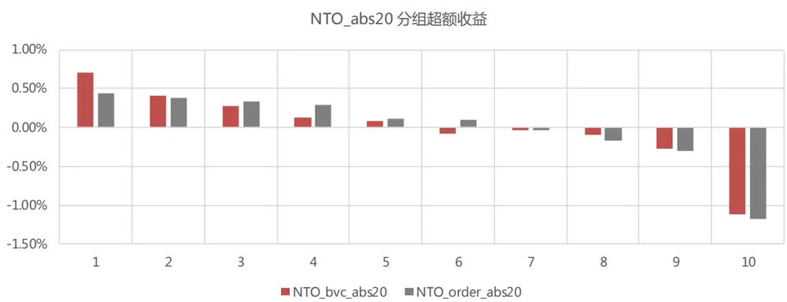
数据来源：东方证券研究所 & Wind 资讯

## 2. 因子相关性

下面我们测算中证全指中新加入的因子与常规因子的相关性。由于不同计算周期的因子相关性差异不大，所以此处我们只考察计算周期为 20 的新因子即可，2 种算法共 8 个因子。因子均进行中性化处理，计算因子值的相关性和 IC 序列的相关性。可以看到：

（1）净主买占比 OI 因子与净换手率 NTO 因子：BVC 算法计算出的两因子高度正相关，因子值和 IC 序列的相关性均接近 80%；订单流算法得到的两因子相关性仅为 50%左右。说明 BVC算法下的 NTO受 OI 的影响更大，订单流算法下的 NTO受换手率的影响较大。

（2）OI 因子与常规因子：

两种算法得到的OI因子均与反转高度正相关，BVC算法计算出的两因子IC相关性达到84%，因子值相关性也可以达到50%，订单流算法的两因子IC相关性略低为63%，因子值相关性为33%。这是由于 BVC 算法计算出的 OI 和同期个股收益的相关性更强。

两种算法得到的 OI 因子与特异度的正向相关性也较高，IC 相关性都在 50%，因子值相关性20%。特异度反应了股票收益中不能被市场、规模、估值三种常见的风格因子解释的成分占比，特异度越高说明个股涨跌与市场风格的相关性越小，交易中个股层面的信息占比越高。因此股票的特异度越高，意味着过去一段时间内被过度投机的可能性和程度越大，相应得市场上主动买入意愿也会更强烈。

## （3）NTO 因子与常规因子：

BVC 算法得到的 NTO 因子与反转高度正相关，IC 相关性达到 73%，因子值相关性为 51%，而订单流算法得到的 NTO因子与反转相关性会减半。

订单流算法得到的 NTO 因子与换手率、波动率、特质波动率、MAXRET 高度负相关，IC 相关性达到-70%左右，因子值相关性为-30%左右，而 BVC 算法得到的 NTO因子与上述因子的相关性会减半。

（4）NTO_abs 因子与常规因子：两种算法计算的 NTO_abs 因子与常规因子的相关性都比较高，与换手率、波动率、特质波动率、MAXRET高度正相关，IC 相关性达到 70%左右，因子值相关性为 30%左右，与估值类因子普遍负相关，与盈利、成长类正相关。

图 27：A 股 Alpha 因子列表

| 大类 | 因子简称 | 因子定义 | 大类 | 因子简称 | 因子定义 |
| --- | --- | --- | --- | --- | --- |
| Value | BP EP | 账面市值比 归属母公司的净利润TTM/总市值 | 公司治理 | MR | 高管薪酬前三之和的对数 过去20个交易日的日均换手率对数 |
|  | EP2 CFP SP | 扣非后的净利润TTM/总市值 经营性现金流TTM/总市值 营业收入TTM/总市值 | 非流动性 | TO20 ILLIQ | 20日Amihud非流动性自然对数 |
|  | EBIT2EV DP2 | 息税前利润与企业价值之比 过去一年分红/总市值，以分红预案公告日为准 |  | IVOL20 IVOL60 | 过去20个交易日的特质波动率 过去60个交易日的特质波动率 过去120个交易日的特质波动率 |
|  | EP_FY1 PEG RNOA | 预期的估值 PE_FY1/FY2隐含的利润增量率 净经营资产收益率 |  | IVOL120 IVR20 IVR60 RET20 | 过去20个交易日的特异度 过去60个交易日的特异度 |
|  | CFROI ROE | 投资现金收益率 净资产收益率 | 反转投机 |  | 过去20个交易日的收益率 |
|  | ROA2 GPOA GROSS_MARGIN | 总资产净利率 总资产毛利率 |  | VOL20 VOL60 VOL120 | 过去20个交易日的波动率 过去60个交易日的波动率 |
|  | SALES_GROWTH_YOY | 销售毛利率 营业收入季度同比 |  | MAXRET | 过去120个交易日的波动率 过去最大收益，过去60日最大3个日收益均值 |
|  | PROFIT_GROWTH_TTM |  |  |  |  |
|  | PROFIT2_GROWTH_YOY | TTM净利润同比增长 扣非后净利润季度同比 |  |  | 过去6个月有覆盖的机构数量，取根号 |
|  | OCF_GTOWTH_YOY | 经营性现金流季度同比 |  | COV DISP SCORE | 过去6个月盈利预测的分歧度 综合评价 |

数据来源：东方证券研究所 & Wind 资讯

图 28：全市场——中性化因子的 IC 相关性
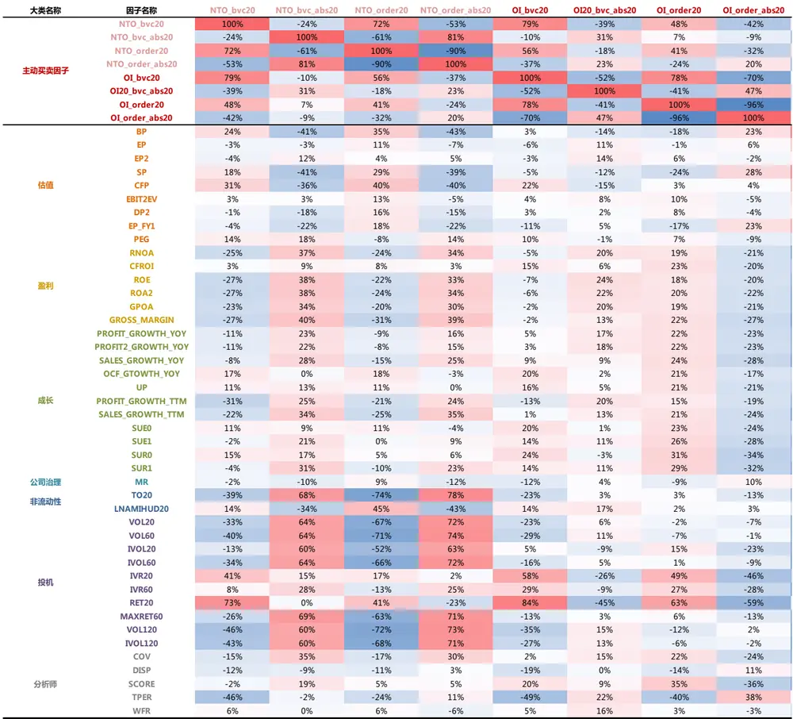
数据来源：东方证券研究所 & Wind 资讯

图 29：全市场——中性化因子值的相关性

| 大类名称 因子名称 1 2 3 4 5 |  |  |  |  |  |  |  |  |  |  |  |  |  | 6 7 8 |  |  |  |  |  |  |  |  |  |
| --- | --- | --- | --- | --- | --- | --- | --- | --- | --- | --- | --- | --- | --- | --- | --- | --- | --- | --- | --- | --- | --- | --- | --- |
| NTO_bvc20NTO_bvc_abs20NTO_order20NTO_order_abs20主动买卖因子OI_bvc20OI20_bvc_abs20OI_order20OI_order_abs20 | 100% |  |  | -13% |  | 54% |  | -38% |  |  | 78% |  |  | -38% |  |  | 44% |  |  | -39% |  |  |  |
|  | -13% |  |  | 100% |  | -29% |  | 47% |  |  | -3% |  |  | 42% |  |  | 3% |  |  | 1% |  |  |  |
|  | 54% |  |  | -29% |  | 100% |  | -82% |  |  | 41% |  |  | -11% |  |  | 58% |  |  | -50% |  |  |  |
|  | -38% |  |  | 47% |  | -82% |  | 100% |  |  | -24% |  |  | 19% |  |  | -37% |  |  | 44% |  |  |  |
|  | 78% |  |  | -3% |  | 41% |  | -24% |  |  | 100% |  |  | -48% |  |  | 57% |  |  | -50% |  |  |  |
|  | -38% |  |  | 42% |  | -11% |  | 19% |  |  | -48% |  |  | 100% |  |  | -23% |  |  | 31% |  |  |  |
|  | 44% |  |  | 3% |  | 58% |  | -37% |  |  | 57% |  |  | -23% |  |  | 100% |  |  | -90% |  |  |  |
|  | -39% |  |  | 1% |  | -50% |  | 44% |  |  | -50% |  |  | 31% |  |  | -90% |  |  | 100% |  |  |  |
| BPEPEP2 | -4% |  |  | -14% |  | 6% |  | -12% |  |  | -7% |  |  | 1% |  |  | -11% |  |  | 10% |  |  |  |
|  | -7% |  |  | -5% |  | 0% |  | -3% |  |  | -9% |  |  | 3% |  |  | -5% |  |  | 4% |  |  |  |
|  | -7% |  |  | -2% |  | -1% |  | -1% |  |  | -8% |  |  | 3% |  |  | -3% |  |  | 2% |  |  |  |
| SP估值 CFP | 0% |  |  | -13% |  | 8% |  | -12% |  |  | -3% |  |  | 0% |  |  | -6% |  |  | 5% |  |  |  |
|  | -1% |  |  | -8% |  | 5% |  | -7% |  |  | -1% |  |  | -1% |  |  | -3% |  |  | 2% |  |  |  |
| EBIT2EVDP2EP_FY1PEGRNOACFROIROE盈利ROA2GPOAGROSS_MARGIN | -6% |  |  | -4% |  | 0% |  | -2% |  |  | -7% |  |  | 3% |  |  | -4% |  |  | 3% |  |  |  |
|  | -5% |  |  | -7% |  | 3% |  | -6% |  |  | -6% |  |  | 3% |  |  | -4% |  |  | 4% |  |  |  |
|  | -6% |  |  | -7% |  | 2% |  | -5% |  |  | -8% |  |  | 3% |  |  | -6% |  |  | 5% |  |  |  |
|  | 2% |  |  | 1% |  | -1% |  | 1% |  |  | 1% |  |  | 0% |  |  | 1% |  |  | -1% |  |  |  |
|  | -5% |  |  | 4% |  | -3% |  | 4% |  |  | -3% |  |  | 2% |  |  | 4% |  |  | -4% |  |  |  |
|  | -1% |  |  | -2% |  | 2% |  | -2% |  |  | -1% |  |  | 0% |  |  | 2% |  |  | -2% |  |  |  |
|  | -5% |  |  | 4% |  | -3% |  | 4% |  |  | -4% |  |  | 2% |  |  | 4% |  |  | -4% |  |  |  |
|  | -5% |  |  | 5% |  | -4% |  | 5% |  |  | -4% |  |  | 2% |  |  | 4% |  |  | -4% |  |  |  |
|  | -3% |  |  | 3% |  | -1% |  | 2% |  |  | -2% |  |  | 1% |  |  | 5% |  |  | -5% |  |  |  |
|  | -3% |  |  | 5% |  | -4% |  | 5% |  |  | -1% |  |  | 1% |  |  | 3% |  |  | -3% |  |  |  |
| PROFIT_GROWTH_YOYPROFIT2_GROWTH_YOYSALES_GROWTH_YOYOCF_GTOWTH_YOYUP成长 PROFIT GROWTH TTMSALES_GROWTH_TTMSUEOSUE1SUROSUR1公司治理 MRTO20非流动性IVR20投机IVR60RET20MAXRET60VOL120IVOL120COVDISP分析师 SCORETPERWFR | 1% |  |  | 1% |  | 1% |  | 0% |  |  | 2% |  |  | -2% |  |  | 5% |  |  | -6% |  |  |  |
|  | 1% |  |  | 0% |  | 1% |  | -1% |  |  | 2% |  |  | -2% |  |  | 5% |  |  | -5% |  |  |  |
|  | 0% |  |  | 3% |  | -1% |  | 2% |  |  | 2% |  |  | -1% |  |  | 5% |  |  | -5% |  |  |  |
|  | 0% |  |  | -2% |  | 2% |  | -2% |  |  | 0% |  |  | -1% |  |  | 1% |  |  | -1% |  |  |  |
|  | 2% |  |  | -1% |  | 3% |  | -3% |  |  | 3% |  |  | -2% |  |  | 6% |  |  | -6% |  |  |  |
|  | -1% |  |  | 2% |  | -1% |  | 1% |  |  | -1% |  |  | -1% |  |  | 3% |  |  | -3% |  |  |  |
|  | -1% |  |  | 4% |  | -2% |  | 3% |  |  | 0% |  |  | 0% |  |  | 4% |  |  | -4% |  |  |  |
|  | 2% |  |  | 0% |  | 2% |  | -1% |  |  | 4% |  |  | -4% |  |  | 7% |  |  | -7% |  |  |  |
|  | 1% |  |  | 0% |  | 1% |  | -1% |  |  | 3% |  |  | -3% |  |  | 7% |  |  | -7% |  |  |  |
|  | 1% |  |  | 1% |  | 1% |  | 0% |  |  | 3% |  |  | -2% |  |  | 4% |  |  | -4% |  |  |  |
|  |  | 0% |  |  | 2% |  | 0% |  | 1% |  |  | 2% |  |  | -1% |  |  | 5% |  |  | -5% |  |  |
|  |  |  | -2% |  |  | -5% |  | 3% |  | -5% |  |  | -4% |  |  | 1% |  |  | -1% |  |  | 0% |  |
|  |  | -2% |  |  | 52% |  | -44% |  | 55% |  |  | 8% |  |  | -7% |  |  | 10% |  |  | -11% |  |  |
|  | INAMIHUD20 | 0% |  |  | -24% |  | 23% |  |  | -27% |  | -7% |  |  | 9% |  |  | -7% |  |  | 9% |  |  |
|  |  |  |  | 0% |  |  | 31% |  | -28% |  |  | 33% |  |  | 6% |  | -7% |  |  | 8% |  |  | -9% |
|  |  |  | -10% |  |  | 30% |  | -33% |  |  | 36% |  |  | -2% |  | -3% |  |  |  | 2% |  | -4% |  |
|  |  | 9% |  | 30% |  | -21% |  |  | 30% |  |  | 15% |  |  | -9% |  |  | 11% |  | -11% |  |  |  |
|  |  |  |  |  |  | -29% |  |  | 34% |  |  | 2% |  |  | -3% |  |  | 4% |  | -5% |  |  |  |
|  |  | 17% |  | 15% |  | -3% |  |  | 11% |  |  | 20% |  |  | -6% |  |  | 11% |  | -8% |  |  |  |
|  | 4% |  |  | 16% |  | -11% |  |  | 17% |  |  | 8% |  |  | -1% | 5% |  |  |  | -2% |  |  |  |
|  | 51% |  |  | 2% |  | 25% |  |  | -15% |  | 51% |  |  |  | -26% | 33% |  |  |  | -31% |  |  |  |
|  | -4% |  |  | 27% |  | -27% |  |  | 31% |  |  | 2% |  | -3% |  |  |  |  |  | -4% |  |  |  |
|  | -10% |  |  | 27% |  | -31% |  |  | 33% |  |  | -3% |  | -2% |  | 2% |  |  |  | -4% |  |  |  |
|  | -7% |  |  | 27% |  | -27% |  | 31% |  |  |  | 0% |  | -2% |  | 4% |  |  |  | -4% |  |  |  |
|  | -4% |  |  | 3% |  | -1% |  | 1% |  |  |  | -2% |  | 1% |  | 5% |  |  |  | -5% |  |  |  |
|  | 1% |  |  | -1% |  | 0% |  | -1% |  |  |  | 0% |  | 0% |  | -1% |  |  |  | 1% |  |  |  |
|  | 0% |  |  | 2% |  | 1% |  | 0% |  |  | 2% |  |  | 0% |  | 4% |  |  |  | -3% |  |  |  |
|  | -13% |  |  | -2% |  | -5% |  | 2% |  |  | -15% |  |  | 7% |  | -11% |  |  |  | 9% |  |  |  |
|  | 2% |  |  | 2% |  | 1% |  | 0% |  |  | 5% |  |  | -2% 5% |  |  |  |  |  | -5% |  |  |  |

数据来源：东方证券研究所 & Wind 资讯

进而我们测算中性化后的这 8 个因子在剔除所有常规大类因子之后的表现。可以看到：

（1）OI 因子：BVC 算法得到的 OI 因子剔除了常规因子后，在全市场中仍有显著的选股效果。OI5 因子的 IC为-2.14%，ICIR 为-1.03，多空组合年化收益达 12%，最大回撤为 6%。在沪深300 和中证 500 中选股效果均不再显著。订单流算法得到的 OI 因子在三个股票池中正交化之后，ICIR 绝对值均小于 0.4，完全失去了选股效力。

（2）NTO 因子：BVC 算法得到的 NTO 因子剔除了常规因子后，在全市场中仍有显著的选股效果。NTO20 因子的 IC 为-2.89%，ICIR 为-1.63，多空组合年化收益达 13.55%，最大回撤为 6%。在中证 500 中 ICIR 为-1.04 仍具有一定的选股效果，在沪深 300 中 ICIR 为-0.44，不再具有选股效力。订单流算法得到的 NTO因子在全市场中正交化以后 ICIR 虽然也超过-1，但多空组合最大回撤达到了 38%，整体收益为负，失去了选股效力。在沪深 300 和中证 500 中则完全失效。

（3）NTO_abs 因子：两种算法得到的 NTO_abs 因子剔除了常规因子后，在三个股票池中选股效果不再显著，多空组合整体收益为负。

因而综合来看，我们认为基于 BVC 算法构造出的净主买占比因子 OI，以及净换手率因子 NTO均是包含额外增量信息的有效 Alpha。

图 30：中证全指——中性化因子对常规因子正交化后的因子测试

| 全市场 | O120 OI_abs20 |  |  |  | NTO20 NTO_abs20 |  |  |  |
| --- | --- | --- | --- | --- | --- | --- | --- | --- |
| 中性化+正交化 | BVC算法 订单流算法 |  | BVC算法 | 订单流算法 | BVC算法 订单流算法 |  | BVC算法 订单流算法 |  |
| IC | -2.14% | -0.49% | 0.56% | -0.17% | -2.89% | -1.96% | 1.31% | 1.74% |
| IC_IR | -1.03 | -0.33 | 0.46 | -0.14 | -1.63 | -1.30 | 0.89 | 1.19 |
| tstat | -3.23 | -1.05 | 1.44 | -0.44 | -5.12 | -4.08 | 2.80 | 3.76 |
| long_short_r | 0.98% | -0.20% | -0.23% | -0.05% | 1.08% | -0.37% | -0.12% | 0.06% |
| long_short_win | 62.18% | 41.18% | 44.54% | 51.26% | 66.39% | 42.02% | 42.86% | 46.22% |
| long_short_sharp | 1.51 | (0.44) | (0.59) | (0.11) | 1.58 | (0.55) | (0.27) | 0.11 |
| long_short_drwandown | -6.34% | -23.85% | -29.06% | -23.54% | -6.88% | -38.38% | -22.17% | -16.37% |
| long_short_yearly | 12.06% | -2.60% | -2.73% | -0.81% | 13.55% | -4.80% | -1.48% | 0.48% |
| 2010 | 10.03% | -3.69% | 6.09% | -0.27% | 1.85% | -4.67% | 5.62% | -2.26% |
| 2011 | 7.94% | -3.22% | -6.76% | -0.03% | 13.87% | -5.34% | -8.42% | 1.93% |
| 2012 | 19.95% | -3.71% | 1.31% | -7.35% | 25.30% | -9.84% | -6.27% | -8.12% |
| 2013 | 16.84% | 2.80% | -3.05% | 0.96% | 27.46% | 11.42% | -3.84% | 8.10% |
| 2014 | -1.77% | -5.78% | -6.16% | -3.52% | 3.26% | -4.32% | -0.25% | -4.63% |
| 2015 | 47.34% | -3.79% | -8.59% | -6.14% | 36.60% | 11.36% | 8.36% | 13.34% |
| 2016 | 10.21% | 3.34% | -1.33% | -3.11% | 13.77% | 0.74% | 0.84% | 18.45% |
| 2017 | -0.92% | -4.59% | 0.58% | 8.58% | -2.57% | -22.83% | -3.38% | -10.68% |
| 2018 | 7.06% | -0.38% | -4.45% | 1.95% | 17.18% | -1.60% | 1.04% | 7.40% |
| 2019 | 9.64% | -5.78% | -4.67% | 2.74% | 2.95% | -15.91% | -7.90% | -13.49% |

数据来源：东方证券研究所 & Wind 资讯

图 31：沪深 300——中性化因子对常规因子正交化后的因子测试

| 沪深300 | OI20 OI_abs20 |  |  |  | NTO20 NTO_abs20 |  |  |  |
| --- | --- | --- | --- | --- | --- | --- | --- | --- |
| 中性化+正交化 | BVC算法 订单流算法 BVC算法 |  |  | 订单流算法 | BVC算法 订单流算法 |  | BVC算法 订单流算法 |  |
| IC | -0.82% | 0.97% | 0.05% | -1.04% | -1.06% | 0.19% | 0.48% | 0.71% |
| IC_IR | -0.32 | 0.48 | 0.03 | -0.55 | -0.44 | 0.09 | 0.25 | 0.37 |
| tstat | -1.02 | 1.51 | 0.08 | -1.73 | -1.38 | 0.28 | 0.79 | 1.18 |
| long_short_r | 0.48% | 0.09% | 0.19% | 0.20% | 0.27% | 0.28% | -0.11% | -0.20% |
| long_short_win | 49.58% | 50.42% | 52.10% | 52.10% | 47.06% | 57.14% | 46.22% | 42.02% |
| long_short_sharp | 0.58 | 0.12 | 0.26 | 0.28 | 0.31 | 0.33 | (0.15) | (0.27) |
| long_short_drwandown | -12.87% | -28.74% | -27.03% | -26.55% | -15.26% | -20.42% | -24.21% | -27.95% |
| long_short_yearly | 5.39% | 0.76% | 2.00% | 2.09% | 2.76% | 3.19% | -1.44% | -2.97% |
| 2010 | 8.83% | -5.82% | 2.70% | -2.32% | 1.35% | -6.17% | -5.41% | -7.28% |
| 2011 | -1.64% | -9.22% | -3.21% | 2.26% | 1.45% | -2.75% | -8.29% | -5.10% |
| 2012 | 17.00% | -6.15% | 8.49% | -6.42% | 20.10% | 3.56% | 1.36% | -1.90% |
| 2013 | 3.71% | 5.07% | 11.81% | -11.39% | 5.14% | 7.93% | -5.95% | -7.16% |
| 2014 | -2.56% | 11.26% | 20.04% | 0.60% | 2.56% | -3.91% | 6.63% | -2.84% |
| 20152016 | 24.26% | -6.12% | 9.66% | 0.66% | 17.96% | -13.23% | 4.26% | 14.77% |
|  | 16.57% | -7.08% | -11.42% | 1.03% | -0.56% | -1.11% | -0.01% | 1.13% |
| 2017 | -3.50% | 4.68% | 3.40% | -2.26% | -2.83% | 11.06% | -6.49% | -8.30% |
| 2018 | -1.67% | 15.03% | -10.23% | 24.29% | 4.52% | 12.00% | -1.08% | 6.22% |
| 2019 | -3.01% | 8.49% | -7.26% | 19.17% | -17.60% | 27.01% | -0.61% | -13.59% |

数据来源：东方证券研究所 & Wind 资讯

图 32：中证 500——中性化因子对常规因子正交化后的因子测试

| 中证500 | O120 OI_abs20 |  |  |  | NTO20 NTO_abs20 |  |  |  |
| --- | --- | --- | --- | --- | --- | --- | --- | --- |
| 中性化+正交化 | BVC算法 | 订单流算法 | BVC算法 | 订单流算法 | BVC算法 | 订单流算法 | BVC算法 | 订单流算法 |
| IC | -1.95% | -0.68% | 0.60% | 0.07% | -2.14% | -1.19% | 0.93% | 1.15% |
| IC_IR | -0.86 | -0.41 | 0.40 | 0.04 | -1.04 | -0.67 | 0.63 | 0.73 |
| tstat | -2.71 | -1.28 | 1.26 | 0.14 | -3.29 | -2.11 | 1.98 | 2.30 |
| long_short_r | 0.57% | -0.16% | -0.29% | 0.20% | 0.48% | -0.54% | -0.43% | -0.10% |
| long_short_win | 59.66% | 46.22% | 43.70% | 55.46% | 56.30% | 40.34% | 45.38% | 47.90% |
| long_short_sharp | 0.73 | (0.26) | (0.53) | 0.33 | 0.63 | (0.78) | (0.70) | (0.15) |
| long_short_drwandown | -13.93% | -34.20% | -34.75% | -15.09% | -17.25% | -49.21% | -46.22% | -24.38% |
| long_short_yearly | 6.55% | -2.33% | -3.64% | 2.15% | 5.83% | -6.81% | -5.55% | -1.44% |
| 2010 | 7.79% | 1.62% | 4.21% | -0.54% | 5.52% | -5.13% | 9.84% | -5.79% |
| 2011 | 3.40% | 1.89% | -6.39% | -0.70% | 7.79% | -10.66% | -11.23% | -1.40% |
| 2012 | 20.75% | 5.69% | -7.00% | 15.76% | 11.60% | -4.33% | -11.16% | -1.56% |
| 2013 | 9.91% | -11.34% | 0.34% | 9.57% | 5.09% | 4.37% | -9.36% | 7.80% |
| 2014 | -8.61% | -13.12% | -0.73% | -0.69% | -9.23% | -0.90% | -3.05% | -1.86% |
| 2015 | 37.00% | 7.53% | -14.84% | 2.09% | 37.36% | -4.73% | -8.46% | 7.75% |
| 2016 | 13.13% | -0.64% | 3.00% | 0.53% | 15.94% | -1.05% | -5.13% | 10.49% |
| 2017 | -8.54% | -12.23% | -6.50% | -7.01% | -13.23% | -13.88% | 6.55% | -16.19% |
| 2018 | 1.39% | -5.96% | -3.37% | -2.60% | 7.72% | -15.54% | -8.55% | 2.25% |
| 2019 | -3.41% | 7.84% | -3.71% | 6.83% | -6.09% | -12.32% | -9.21% | -12.36% |

数据来源：东方证券研究所 & Wind 资讯

## 3. 因子衰减

下面我们测算 BVC 算法得出的 NO20 和 OI20 原始因子 RankIC 的衰减情况。从图可以直观看到：两个因子的衰减速度比估值、盈利、成长等基本面因子快，比 liquid和 reversal 这类技术指标要慢。而后我们用指数函数拟合 IC 衰减曲线，定量度量各个因子的 IC 衰减速度，各个 Alpha因子 ic 衰减序列的指数拟合图像以及对应的半衰期如图 33、34 所示。从 60 天 IC 衰减序列的拟合效果来看，对 OI、NTO 因子的 Rsquare 可达到 80%，拟合效果较好。因而，如果用我们计算出来的 NO和 NTO因子来构建月频级别的组合，换手率会显著低于反转和流动性类因子。

图 33：全市场——原始因子值的 IC 衰减示意图
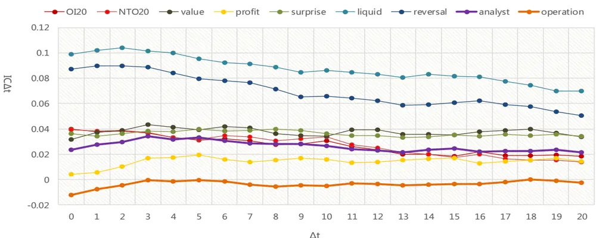
数据来源：东方证券研究所 & Wind 资讯

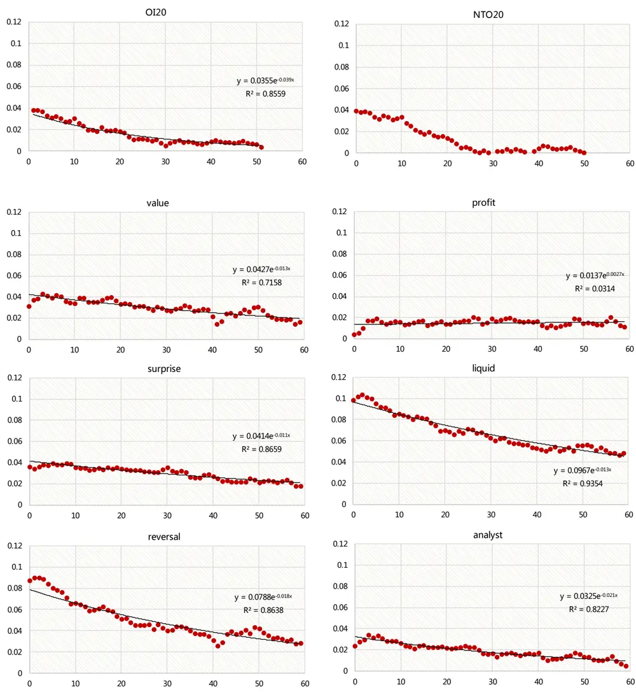
图 34：全市场——原始因子值的 IC 衰减序列的指数函数拟合曲线
数据来源：东方证券研究所 & Wind 资讯

图 35：全市场——原始因子值的 Alpha 半衰期
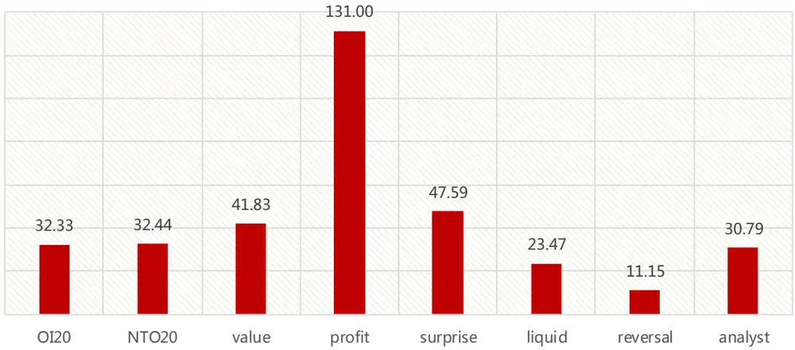
数据来源：东方证券研究所 & Wind 资讯

## 3.2 高频因子表现

下面我们缩短因子的持有期，考察前面验证过的两类有效的净主买占比和净换手率因子在全市场中的短线选股能力，并与反转因子进行对比。因子计算周期分别取为过去 5、10、20 个交易日，持有周期分别取为 1、3、5、10 个交易日。历史回测区间为：2009.12.30 – 2019.12.31。

需要特别注意的是：高频因子测试中需要剔除涨跌停股票，否则对于短周期反转因子效果影响会很大。例如，过去 5 天的反转因子进行日频调仓时，空头为过去 5 天涨的多的，这其中可能包含今天涨停的股票。而今天涨停的股票明天大概率还会上涨，甚至连续涨停，因而会给多空组合带来较大回撤。图 37 为剔除涨跌停股票前后的 RET5 因子日频调仓的多空组合净值图。

可以看到：两个因子均是持有期越短效果越好。

（1） BVC 算法：OI5 因子的 ICIR 排序分别为：持有 1 天（-10.06）>持有 3 天（-6.01）>持有 5 天（-4.66）>持有 10 天（-2.18）,NTO 因子的 ICIR 排序分别为：持有 1 天（-10.27）>持有 3 天（-5.77）>持有5 天（-4.21）>持有 10 天（-2.46），与反转因子 RET5 效果基本不相上下。

（2） 订单流算法：OI5 因子仅在持有小于 3 天的时候有效，NTO5 因子的持有期一旦缩短到5 天以内时，因子 IC 变成负向。

这反映出了，在没有做市商制度的安排的委托驱动市场中，主动交易者的交易愿望在市场上直接、迅速的以买单、卖单的形式表达，市场会更加迅速走向均衡状态，买卖单差额的持续时间会相对短一些，因此主动买卖中包含的信息对个股未来短期的收益影响最大。

图 36：全市场——不同持有期的中性化 OI \ NTO因子测试

| 持有10天 | 反转因子 |  |  | or BVC算法 |  |  |  |  |  |  |  |  | NTO 订单流算法 |  |  |
| --- | --- | --- | --- | --- | --- | --- | --- | --- | --- | --- | --- | --- | --- | --- | --- |
| 原始值 | ret_5d | ret_10d | ret_20d | OI5 | 0o110 | OI20 | OI_order5 | OI_order10 | OI_order20 | NTO5 | BVC算法 NTO10 | NTO20 | NTO_order5 | NTO_order10 | NTO_order20 |
| IC | -5.00% | -5.25% | -6.62% | -3.52% | -2.67% | -2.80% | -1.14% | -0.34% | -0.42% | -3.78% | -3.24% | -3.47% | 1.79% | 3.12% | 3.37% |
| IC_IR | -2.55 | -2.42 | -2.98 | -2.18 | -1.61 | -1.68 | -0.85 | -0.26 | -0.32 | -2.49 | -2.09 | -2.25 | 1.25 | 2.00 | 2.06 |
| tstat | -8.12 | -7.70 | -9.48 | -6.94 | -5.13 | -5.34 | -2.69 | -0.83 | -1.01 | -7.92 | -6.64 | -7.16 | 3.97 | 6.36 | 6.56 |
| long_short_r | 0.84% | 0.80% | 1.14% | 0.82% | 0.69% | 0.70% | 0.64% | 0.28% | 0.13% | 0.91% | 0.69% | 0.67% | 0.10% | 0.41% | 0.45% |
| long_short_win | 63.37% | 61.16% | 62.96% | 67.90% | 60.49% | 62.14% | 64.20% | 52.67% | 53.50% | 65.84% | 62.55% | 60.49% | 52.26% | 58.44% | 56.79% |
| long_short_sharp | 1.42 | 1.28 | 1.81 | 2.17 | 1.59 | 1.71 | 1.72 | 0.80 | 0.40 | 2.17 | 1.53 | 1.62 | 0.27 | 1.02 | 1.02 |
| long_short_drwandown | -16.33% | -13.31% | -8.73% | -4.84% | -5.76% | -7.37% | -10.43% | -12.86% | -10.04% | -5.32% | -6.96% | -8.74% | -27.81% | -18.00% | -13.14% |
| long_short_yearly | 20.88% | 20.21% | 29.67% | 21.01% | 17.36% | 17.54% | 15.98% | 6.67% | 2.88% | 23.28% | 17.10% | 16.80% | 2.16% | 10.00% | 10.87% |
| 2010 | 41.41% | 16.45% | 12.87% | 36.12% | 19.03% | 16.27% | 15.70% | -1.35% | -0.01% | 32.40% | 14.64% | 7.31% | -6.87% | 6.05% | 4.56% |
| 2011 | 17.57% | 7.34% | 18.58% | 24.14% | 8.62% | 7.86% | 18.62% | 5.58% | 2.16% | 23.60% | 19.76% | 22.30% | -9.64% | -5.62% | -0.08% |
| 2012 | 23.72% | 24.54% | 34.68% | 24.55% | 27.76% | 24.61% | 17.22% | 12.78% | 6.24% | 33.39% | 16.95% | 23.15% | -0.31% | 14.25% | 16.13% |
| 2013 | 35.88% | 22.83% | 21.00% | 25.32% | 14.44% | 15.65% | 13.20% | 5.02% | 2.20% | 37.66% | 23.16% | 23.06% | -3.72% | 7.10% | 3.41% |
| 2014 | -2.02% | -8.78% | 5.27% | 5.51% | -1.22% | -3.48% | 10.67% | -3.13% | -3.84% | 5.32% | -6.14% | -4.09% | 1.70% | 11.25% | 12.48% |
| 2015 | 26.40% | 44.52% | 86.48% | 60.06% | 80.63% | 80.76% | 89.61% | 60.55% | 25.11% | 58.67% | 65.73% | 59.95% | -7.31% | -9.06% | -7.82% |
| 2016 | 20.95% | 29.52% | 43.96% | 15.06% | 10.60% | 15.86% | 9.29% | 1.77% | 1.25% | 13.67% | 17.44% | 14.38% | 9.61% | 14.18% | 21.54% |
| 2017 | 0.20% | 5.85% | 6.64% |  |  |  | 3.60% | -0.41% | -1.25% | 6.50% |  |  | 13.38% |  | 20.60% |
|  |  | 21.33% | 46.41% | 6.35% | 6.32% | 5.91% |  |  |  |  | 4.16% | 5.13% |  | 20.35% | 12.86% |
| 2018 2019 | 16.69% 43.00% | 48.21% | 44.93% | 6.20% 21.74% | 8.35% 16.82% | 18.19% 12.43% | -3.60% 8.73% | -5.58% 4.71% | -1.92% 1.40% | 18.34% 19.16% | 18.73% 11.52% | 24.93% 6.07% | 11.01% 16.52% | 20.16% 27.38% | 30.01% |

| 持有5天 | 反转因子 |  |  |  |  |  | 订单流算法 |  |  |  |  |  | 订单流算法 |  |  |
| --- | --- | --- | --- | --- | --- | --- | --- | --- | --- | --- | --- | --- | --- | --- | --- |
| 原始值 | ret_5d | ret_10d | ret_20d | OI5 | BVC算法 on10 | OI20 | OI_order5 | OI_order10 | OI_order20 | NT05 | BVC算法 NT010 | NTO20 | NTO_order5 | NTO_order10 | NTO_order20 |
| IC | -6.81% | -5.75% | -6.45% | -5.35% | -3.86% | -3.68% | -0.15% | 1.68% | 2.18% | -4.99% | -3.55% | -3.19% | -2.58% | -1.09% | -0.89% |
| IC_IR | -4.75 | -3.90 | -4.22 | -4.66 | -3.45 | -3.38 | -0.13 | 1.54 | 1.96 | -4.21 | -3.06 | -2.80 | -2.57 | -1.15 | -0.99 |
| tstat | -14.98 | -12.28 | -13.32 | -14.71 | -10.88 | -10.68 | -0.42 | 4.85 | 6.20 | -13.28 | -9.65 | -8.83 | -8.11 | -3.63 | -3.11 |
| long_short_r | 0.71% | 0.58% | 0.72% | 0.82% | 0.51% | 0.50% | 0.18% | 0.12% | 0.16% | 0.72% | 0.52% | 0.47% | 0.64% | 0.30% | 0.19% |
| long_short_win | 68.03% | 62.47% | 63.52% | 72.95% | 65.37% | 62.70% | 54.41% | 52.05% | 53.69% | 71.31% | 66.60% | 63.73% | 69.61% | 55.94% | 55.94% |
| long_short_sharp | 2.48 | 1.98 | 2.30 | 3.87 | 2.37 | 2.42 | 0.88 | 0.56 | 0.75 | 3.65 | 2.38 | 2.30 | 3.05 | 1.55 | 1.10 |
| long_short_drwandown | -9.63% | -11.74% | -9.60% | -5.72% | -6.33% | -7.03% | -47.33% | -35.63% | -21.71% | -4.69% | -6.51% | -6.44% | -9.13% | -17.06% | -11.99% |
| long_short_yearly | 40.14% | 30.84% | 40.56% | 47.88% | 27.90% | 27.05% | 8.52% | 5.32% | 7.64% | 41.29% | 28.57% | 25.18% | 36.14% | 15.18% | 9.26% |
| 2010 | 92.65% | 46.29% | 33.21% | 74.44% | 35.09% | 21.68% | 30.47% | 3.34% | -0.01% | 60.47% | 36.41% | 26.79% | 38.51% | 5.08% | 6.03% |
| 2011 | 56.09% | 27.96% | 30.30% | 66.56% | 30.06% | 30.20% | 30.13% | -11.17% | -3.09% | 55.62% | 18.59% | 17.57% | 40.58% | 18.30% | 9.87% |
| 2012 | 44.64% | 34.34% | 37.36% | 49.65% | 26.04% | 36.58% | 16.89% | 6.46% | 9.57% | 44.62% | 36.19% | 31.64% | 35.41% | 22.05% | 12.87% |
| 2013 | 46.90% | 28.00% | 30.55% | 58.83% | 30.83% | 34.21% | 17.66% | 3.88% | -0.08% | 43.20% | 20.23% | 22.42% | 20.85% | 8.56% | 6.26% |
| 2014 | 24.97% | 11.21% | 10.14% | 52.90% | 22.03% | 7.41% | 25.09% | -5.97% | 5.78% | 35.96% | 15.85% | 4.78% | 44.30% | 15.41% | 9.77% |
| 2015 | 59.40% | 64.47% | 109.02% | 124.54% | 99.74% | 91.20% | 36.40% | -20.51% | -14.99% | 124.40% | 129.75% | 106.39% | 210.44% | 96.60% | 56.21% |
| 2016 | 38.74% | 45.60% | 53.85% | 30.34% | 29.25% | 27.79% | -3.02% | 6.52% | 11.24% | 33.82% | 21.09% | 21.29% | 26.37% | 12.35% | 3.98% |
| 2017 | 5.61% | 2.08% | 14.92% | 12.63% | 0.31% | 8.82% | -11.37% | 26.14% | 20.77% | 9.99% | 6.60% | 8.90% | 9.39% | -2.93% | -2.16% |
| 2018 | 12.90% | 15.03% | 47.27% | 22.33% | 17.11% | 25.49% | -17.48% | 28.14% | 18.61% | 14.20% | 12.93% |  |  |  | -5.42% |
| 2019 | 37.98% | 45.73% | 59.55% | 15.49% | 7.45% | 4.00% | -19.44% | 28.01% | 35.04% | 17.33% | 18.39% | 17.74% 16.15% | 0.87% 7.82% | -7.91% 8.13% | 4.27% |

| 持有3天 | 反转因子 |  |  |  |  |  | 订单流算法 |  |  | BVC算法 |  |  | NTO 订单流算法 |  |  |
| --- | --- | --- | --- | --- | --- | --- | --- | --- | --- | --- | --- | --- | --- | --- | --- |
| 原始值 | ret_5d | ret_10d | ret_20d | OI5 | BVC算法 on10 | OI20 | OI_order5 | OI_order10 | OI_order20 | NT05 | NT010 | NTO20 | NTO_order5 | NTO_order10 | NTO_order20 |
| IC | -7.03% | -5.67% | -5.77% | -5.75% | -3.96% | -3.50% | -1.08% | 0.93% | 1.51% | -5.55% | -3.91% | -3.22% | -3.23% | -1.59% | -1.11% |
| IC_IR | -6.02 | -4.76 | -4.79 | -6.01 | -4.36 | -4.06 | -1.24 | 1.07 | 1.75 | -5.77 | -4.31 | -3.69 | -4.12 | -2.18 | -1.59 |
| tstat | -19.05 | -15.06 | -15.14 | -19.01 | -13.80 | -12.84 | -3.91 | 3.38 | 5.52 | -18.24 | -13.62 | -11.66 | -13.04 | -6.90 | -5.03 |
| long_short_r | 0.44% | 0.36% | 0.43% | 0.57% | 0.36% | 0.32% | 0.18% | 0.06% | 0.10% | 0.55% | 0.38% | 0.33% | 0.50% | 0.24% | 0.17% |
| long_short_win | 67.16% | 61.43% | 62.35% | 72.59% | 64.69% | 64.81% | 56.91% | 50.99% | 51.60% | 73.83% | 65.56% | 66.05% | 70.74% | 60.99% | 59.63% |
| long_short_sharp | 2.65 | 2.04 | 2.32 | 4.50 | 2.95 | 2.67 | 1.41 | 0.46 | 0.79 | 4.50 | 3.24 | 2.82 | 3.99 | 2.07 | 1.59 |
| long_short_drwandown | -26.79% | -21.03% | -11.03% | -6.48% | -8.57% | -8.65% | -36.51% | -43.53% | -20.25% | -6.67% | -5.97% | -6.69% | -7.38% | -10.19% | -7.82% |
| long_short_yearly | 41.10% | 33.14% | 40.27% | 57.84% | 33.22% | 29.05% | 14.85% | 4.40% | 7.94% | 55.16% | 35.82% | 29.72% | 48.49% | 20.45% | 13.95% |
| 2010 | 116.56% | 55.86% | 34.32% | 99.69% | 43.43% | 25.63% | 39.23% | -6.38% | -1.76% | 97.20% | 45.50% | 29.56% | 49.74% | 11.39% | 12.08% |
| 2011 | 68.28% | 41.10% | 38.77% | 86.16% | 49.22% | 42.21% | 43.66% | -15.76% | -10.03% | 72.80% | 35.72% | 27.15% | 55.44% | 29.91% | 20.02% |
| 2012 | 69.68% | 54.29% | 52.70% | 73.51% | 52.97% | 42.12% | 29.75% | -4.65% | 1.82% | 66.81% | 53.32% | 45.23% | 52.07% | 31.52% | 23.17% |
| 2013 | 51.40% | 22.85% | 30.63% | 66.17% | 27.04% | 35.92% | 20.70% | 8.96% | -0.07% | 54.18% | 26.14% | 24.24% | 35.22% | 13.14% | 9.49% |
| 2014 | 36.13% | 17.46% | 9.70% | 60.11% | 25.02% | 10.11% | 34.32% | -8.92% | 7.65% | 47.41% | 22.91% | 8.25% | 65.92% | 22.00% | 7.62% |
| 2015 | -4.95% | 27.61% | 77.91% | 90.16% | 90.25% | 73.70% | 31.42% | -12.67% | -4.80% | 108.09% | 111.97% | 100.39% | 275.93% | 107.44% | 66.61% |
| 2016 | 37.75% | 44.11% | 48.91% | 48.97% | 33.52% | 33.06% | 8.80% | 3.83% | 9.55% | 49.01% | 32.40% | 27.23% | 34.22% | 13.08% | 6.82% |
| 2017 | 16.54% | 4.31% | 14.80% | 22.17% | 1.07% | 10.71% | -5.60% | 27.47% | 20.25% | 27.49% | 10.24% | 14.99% | 15.26% | -0.49% | 1.78% |
| 2018 | 24.32% | 25.90% | 47.36% | 39.29% | 23.42% | 24.81% | -9.00% | 26.85% | 27.16% | 30.10% | 20.75% | 21.44% | 7.90% | -2.46% | -2.46% |
| 2019 | 32.04% | 43.15% | 61.54% | 18.09% | 6.87% | 5.45% | -21.53% | 39.72% | 37.93% | 24.01% | 22.25% | 18.18% | 5.70% | 7.93% | 7.23% |

| 持有1天 | 反转因子 |  |  |  | BVC算法 | or | 订单流算法 |  |  | BVC算法 |  | NTO |  | 订单流算法 |  |
| --- | --- | --- | --- | --- | --- | --- | --- | --- | --- | --- | --- | --- | --- | --- | --- |
| 原始值 | ret_5d | ret_10d | ret_20d | 0I5 | 0110 | O120 | OI_order5 | OI_order10 | OI_order20 | NT05 | NT010 | NTO20 | NTO_order5 | NTO_order10 | NTO_order20 |
| IC | -7.59% | -6.05% | -5.29% | -6.17% | -4.45% | -3.49% | -2.00% | -0.40% | 0.39% | -6.14% | -4.36% | -3.28% | -3.38% | -1.98% | -1.25% |
| IC_IR | -10.14 | -8.05 | -7.14 | -10.06 | -7.73 | -6.56 | -3.73 | -0.77 | 0.75 | -10.27 | -7.75 | -6.20 | -7.05 | -4.59 | -3.08 |
| tstat | -32.07 | -25.47 | -22.57 | -31.83 | -24.44 | -20.74 | -11.80 | -2.44 | 2.39 | -32.49 | -24.51 | -19.63 | -22.30 | -14.50 | -9.74 |
| long_short_r | 0.34% | 0.26% | 0.23% | 0.27% | 0.17% | 0.13% | 0.06% | -0.02% | 0.04% | 0.27% | 0.17% | 0.13% | 0.11% | 0.05% | 0.02% |
| long_short_win | 68.45% | 64.21% | 62.11% | 69.48% | 64.21% | 61.79% | 56.64% | 51.95% | 49.57% | 71.70% | 65.20% | 62.98% | 62.94% | 56.07% | 53.64% |
| long_short_sharp | 5.82 | 4.51 | 4.02 | 5.83 | 3.80 | 3.20 | 1.31 | (0.58) | 1.08 | 6.38 | 4.27 | 3.45 | 3.26 | 1.55 | 0.71 |
| long_short_drwandown | -15.78% | -10.84% | -9.97% | -5.10% | -9.33% | -9.39% | -52.20% | -72.50% | -21.74% | -5.70% | -7.11% | -6.70% | -30.66% | -37.86% | -35.92% |
| long_short_yearly | 123.16% | 87.84% | 74.69% | 92.16% | 49.09% | 37.32% | 14.06% | -6.31% | 10.89% | 89.98% | 50.39% | 35.67% | 29.83% | 12.30% | 5.08% |
| 2010 | 171.50% | 94.33% | 49.51% | 156.38% | 71.36% | 38.66% | 50.29% | 11.71% | -1.56% | 134.80% | 64.59% | 43.45% | 58.78% | 21.04% | 10.73% |
| 2011 | 70.75% | 40.87% | 37.27% | 91.98% | 54.78% | 47.09% | 38.76% | 20.70% | -10.54% | 78.84% | 43.82% | 26.89% | 53.92% | 31.95% | 19.78% |
| 2012 | 99.70% | 83.84% | 73.67% | 97.41% | 67.19% | 53.94% | 24.73% | 2.14% | 5.65% | 85.28% | 63.92% | 51.89% | 40.08% | 30.26% | 19.80% |
| 2013 | 132.24% | 87.15% | 68.02% | 107.24% | 55.03% | 52.72% | 25.97% | -2.15% | -1.58% | 90.91% | 47.64% | 40.13% | 41.64% | 21.01% | 12.56% |
| 2014 | 148.48% | 89.94% | 50.33% | 98.39% | 52.68% | 24.03% | 39.21% | 8.37% | 3.15% | 98.14% | 44.51% | 18.89% | 58.83% | 23.49% | 10.80% |
| 2015 | 173.88% | 160.61% | 170.79% | 211.49% | 120.10% | 88.79% | 50.05% | 20.60% | -7.41% | 272.57% | 163.68% | 117.98% | 79.76% | 50.70% | 23.40% |
| 2016 | 93.61% | 94.95% | 79.23% | 80.26% | 45.91% | 43.97% | 8.47% | -7.03% | 12.24% | 74.46% | 40.81% | 31.39% | 21.72% | 3.94% | -0.07% |
| 2017 | 76.88% | 43.48% | 39.55% | 43.42% | 7.76% | 12.00% | -6.37% | -23.64% | 26.90% | 47.75% | 18.61% | 13.91% | 8.42% | -7.35% | -7.57% |
| 2018 | 156.45% | 95.13% | 101.60% | 63.63% | 28.53% | 22.40% | -22.57% | -35.82% | 49.42% | 55.91% | 22.66% | 14.08% | -11.51% | -19.06% | -18.56% |
| 2019 | 141.59% | 114.33% | 115.04% | 31.77% | 16.07% | 7.25% | -30.28% | -35.09% | 50.94% | 40.55% | 32.26% | 23.21% | -15.32% | -12.47% | -10.75% |

数据来源：东方证券研究所 & Wind 资讯

图 37：剔除涨跌停股票前后的RET5 因子日频调仓的多空组合净值图
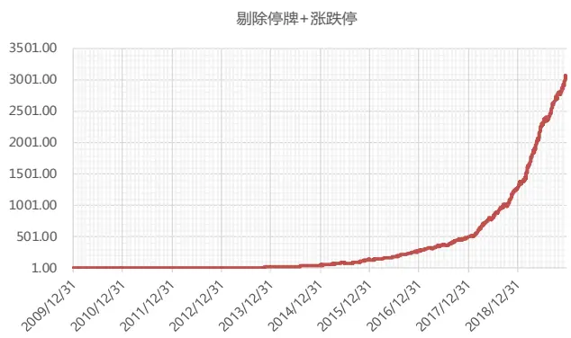
数据来源：东方证券研究所 & Wind 资讯

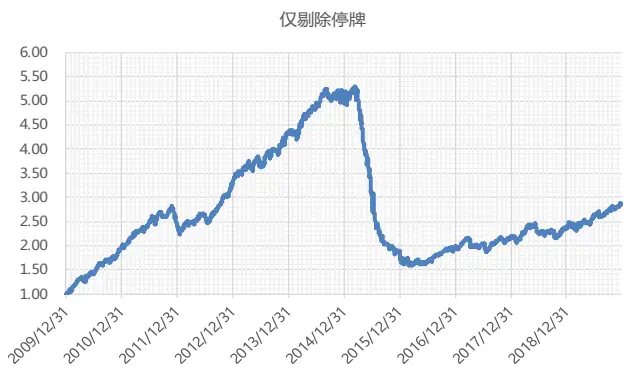

## 四、 在冲击成本模型中的应用

## 4.1 Istar 模型介绍

在之前的报告《Alpha 与 Smartbeta》中，我们介绍了冲击成本模型—I-star 模型。模型的表达式如下：其中的主动净流入量 S 正是我们前面所反复用到的净主买数据。

$$
\begin{aligned}&I^{*}=a_{1}\times\left(\frac{S}{ADV}\right)^{a_{2}}\times\sigma^{a_{3}}\\&MI=b_{1}\times POV\times I^{*}+(1-b_{1})\times I^{*}\\\end{aligned}
$$

（1）I∗度量订单的整体瞬时冲击，代表订单一次性释放后对市场价格带来的冲击，与交易策略无关。I∗与订单大小及股价波动率呈幂指数函数形式的非线性关系。其中：订单大小通过每日的主动净流入量S占过去 30个交易日平均成交量ADV的比例来衡量。个股波动率σ用过去 30个交易日的年化波动率衡量。

（2）MI表示该笔订单的交易者最终需承担的实际冲击成本，与交易策略有关。I∗中暂时性冲击的部分应由市场中所有交易者共同承担，模型用POV（主动净流入量S占当天成交量的比例） 衡量需由该笔订单的交易者承担的暂时性冲击比例。假设这个订单是在一天之内以成交量加权平均价（VWAP）来交易完成的，MI 可以表示为 $\frac{|VWAP{-}S_{0}|}{S_{0}}$ ， $S_{0}$ 为每日的开盘价格。

## 4.2 应用效果

我们在沪深 300（大市值）、中证 500（中市值）、中证 1000（小市值）三个股票池中滚动每个月分别使用最近三个月的市场数据进行回归参数估计。此处我们剔除了涨跌方向和主动买卖单方向不一样的股票，对各变量取对数，在比较 R2 时使用普通 OLS 回归，在进行参数估计时使用稳健回归，降低异常值对于回归结果的影响。

从结果中可以看到，BVC 算法对方程 1 的解释度大幅提升，而方程 2 有所降低，因而综合两个方程看，整体解释力度在提升，用 BVC算法得到的净主买数据进行交易成本建模更为合适。

图 38：Istar模型拟合效果

| ols-R2 | 方程1 |  | 方程2 |  |
| --- | --- | --- | --- | --- |
| 股票池 | 订单流算法 | BVC算法 | 订单流算法 | BVC算法 |
| 300 | 2.3% | 22.8% | 14.5% | 9.4% |
| 852 | 1.4% | 13.2% | 9.4% | 8.7% |
| 905 | 1.9% | 16.6% | 11.1% | 8.7% |

300成分内
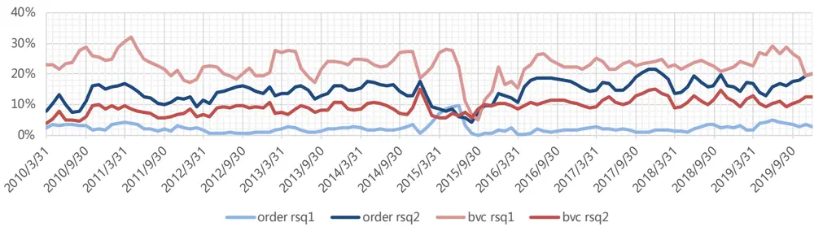

500成分内
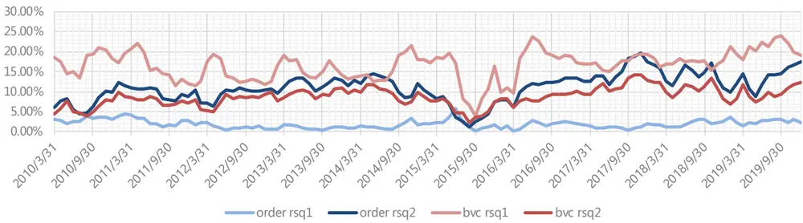

800成分内
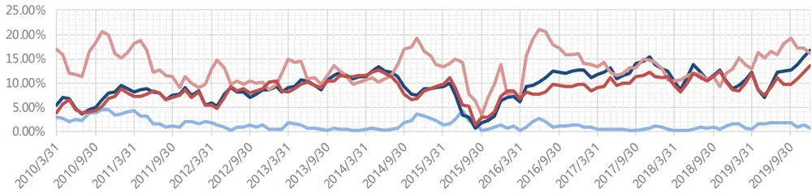
数据来源：东方证券研究所 & Wind 资讯

## 参考文献

[1]Blume,M. E.,MacKinlay,A. C.,& Terker,B. (1989). Order imbalances and stock price movements on October 19 and 20,1987. The Journal of Finance,44(4),827-848.

[2]Hasbrouck,J. (1988). Trades,quotes,inventories,and information. Journal of financial economics,22(2),229-252.

[3]张格,刘玉珍.证券交易方向判别研究——针对委托驱动的连续竞价市场的方法设计[J].山西财经大学学报,2009,31(07):98-107.

[4]Lee,C. M.,& Ready,M. J. (1991). Inferring trade direction from intraday data. The Journal of Finance,46(2),733-746.

[5]Odders-White,E. R. (2000). On the occurrence and consequences of inaccurate trade classification. Journal of Financial Markets,3(3),259-286.

[6]Chakrabarty,B.,Li,B.,Nguyen,V.,& Van Ness,R. A. (2007). Trade classification algorithms for electronic communications network trades. Journal of Banking & Finance,31(12),3806-3821.

[7]Easley,D.,Lopez de Prado,M.,& O’Hara,M. (2012). Bulk classification of trading activity. Johnson School Research Paper Series,8(6),14.

[8]O’Hara,M. (2015). High frequency market microstructure. Journal of Financial Economics,116(2),257-270.

[9]Menkveld,A. J. (2016). The economics of high-frequency trading: Taking stock. Annual Review of Financial Economics,8,1-24.

[10]Hasbrouck,J.,& Saar,G. (2013). Low-latency trading. Journal of Financial Markets,16(4),646- 679.

[11]Easley,D.,de Prado,M. L.,& O'Hara,M. (2016). Discerning information from trade data. Journal of Financial Economics,120(2),269-285.

[12]Massot,M.,Nawn,S.,& Pascual,R. (2018). Bulk Volume Classification Under the Microscope: Estimating the Net Order Flow.

[13]Chakrabarty,B.,Pascual,R.,& Shkilko,A. (2012). Trade classification algorithms: A horse race between the bulk-based and the tick-based rules. Available at SSRN,2182819.

[14]Chordia,T.,Roll,R.,& Subrahmanyam,A. (2002). Order imbalance,liquidity,and market returns. Journal of Financial economics,65(1),111-130.

[15]Chordia,T.,& Subrahmanyam,A. (2004). Order imbalance and individual stock returns: Theory and evidence. Journal of Financial Economics,72(3),485-518.

[16]彭惠.信息不对称下的羊群行为与泡沫——金融市场的微观结构理论[J].金融研究,2000(11):5-19.

## 风险提示

1. 量化模型基于历史数据分析得到，未来存在失效的风险，建议投资者紧密跟踪模型表现。

2. 极端市场环境可能对模型效果造成剧烈冲击，导致收益亏损。

## 分析师申明

每位负责撰写本研究报告全部或部分内容的研究分析师在此作以下声明：

分析师在本报告中对所提及的证券或发行人发表的任何建议和观点均准确地反映了其个人对该证券或发行人的看法和判断；分析师薪酬的任何组成部分无论是在过去、现在及将来，均与其在本研究报告中所表述的具体建议或观点无任何直接或间接的关系。

## 投资评级和相关定义

报告发布日后的 12 个月内的公司的涨跌幅相对同期的上证指数/深证成指的涨跌幅为基准；

## 公司投资评级的量化标准

买入：相对强于市场基准指数收益率 15%以上；

增持：相对强于市场基准指数收益率 5%～15%；

中性：相对于市场基准指数收益率在-5%～+5%之间波动；

减持：相对弱于市场基准指数收益率在-5%以下。

未评级 —— 由于在报告发出之时该股票不在本公司研究覆盖范围内，分析师基于当时对该股票的研究状况，未给予投资评级相关信息。

暂停评级 —— 根据监管制度及本公司相关规定，研究报告发布之时该投资对象可能与本公司存在潜在的利益冲突情形；亦或是研究报告发布当时该股票的价值和价格分析存在重大不确定性，缺乏足够的研究依据支持分析师给出明确投资评级；分析师在上述情况下暂停对该股票给予投资评级等信息，投资者需要注意在此报告发布之前曾给予该股票的投资评级、盈利预测及目标价格等信息不再有效。

## 行业投资评级的量化标准：

看好：相对强于市场基准指数收益率 5%以上；

中性：相对于市场基准指数收益率在-5%～+5%之间波动；

看淡：相对于市场基准指数收益率在-5%以下。

未评级：由于在报告发出之时该行业不在本公司研究覆盖范围内，分析师基于当时对该行业的研究状况，未给予投资评级等相关信息。

暂停评级：由于研究报告发布当时该行业的投资价值分析存在重大不确定性，缺乏足够的研究依据支持分析师给出明确行业投资评级；分析师在上述情况下暂停对该行业给予投资评级信息，投资者需要注意在此报告发布之前曾给予该行业的投资评级信息不再有效。

## HeadertTabl e_Discl ai mer 免责声明

本证券研究报告（以下简称“本报告”）由东方证券股份有限公司（以下简称“本公司”）制作及发布。

本报告仅供本公司的客户使用。本公司不会因接收人收到本报告而视其为本公司的当然客户。本报告的全体接收人应当采取必要措施防止本报告被转发给他人。

本报告是基于本公司认为可靠的且目前已公开的信息撰写，本公司力求但不保证该信息的准确性和完整性，客户也不应该认为该信息是准确和完整的。同时，本公司不保证文中观点或陈述不会发生任何变更，在不同时期，本公司可发出与本报告所载资料、意见及推测不一致的证券研究报告。本公司会适时更新我们的研究，但可能会因某些规定而无法做到。除了一些定期出版的证券研究报告之外，绝大多数证券研究报告是在分析师认为适当的时候不定期地发布。

在任何情况下，本报告中的信息或所表述的意见并不构成对任何人的投资建议，也没有考虑到个别客户特殊的投资目标、财务状况或需求。客户应考虑本报告中的任何意见或建议是否符合其特定状况，若有必要应寻求专家意见。本报告所载的资料、工具、意见及推测只提供给客户作参考之用，并非作为或被视为出售或购买证券或其他投资标的的邀请或向人作出邀请。

本报告中提及的投资价格和价值以及这些投资带来的收入可能会波动。过去的表现并不代表未来的表现，未来的回报也无法保证，投资者可能会损失本金。外汇汇率波动有可能对某些投资的价值或价格或来自这一投资的收入产生不良影响。那些涉及期货、期权及其它衍生工具的交易，因其包括重大的市场风险，因此并不适合所有投资者。

在任何情况下，本公司不对任何人因使用本报告中的任何内容所引致的任何损失负任何责任，投资者自主作出投资决策并自行承担投资风险，任何形式的分享证券投资收益或者分担证券投资损失的书面或口头承诺均为无效。

本报告主要以电子版形式分发，间或也会辅以印刷品形式分发，所有报告版权均归本公司所有。未经本公司事先书面协议授权，任何机构或个人不得以任何形式复制、转发或公开传播本报告的全部或部分内容。不得将报告内容作为诉讼、仲裁、传媒所引用之证明或依据，不得用于营利或用于未经允许的其它用途。

经本公司事先书面协议授权刊载或转发的，被授权机构承担相关刊载或者转发责任。不得对本报告进行任何有悖原意的引用、删节和修改。

提示客户及公众投资者慎重使用未经授权刊载或者转发的本公司证券研究报告，慎重使用公众媒体刊载的证券研究报告。

## 东方证券研究所

地址：上海市中山南路 318 号东方国际金融广场 26 楼

联系人： 王骏飞

电话：021-63325888*1131

传真：021-63326786

网址： www.dfzq.com.cn

Email： wangjunfei@orientsec.com.cn