## ——《因子选股系列 之 六十六》

## 研究结论

股票的买卖压力不仅对价格在成交量维度上的分布有影响，而且对价格在时间维度的分布也有影响。买入压力比较大的股票在价格相对低位时会有主动买单推高价格，因而在价格相对低位的停留时间较短，卖出压力比较大的股票在价格相对高位时会有主动卖单压低价格，因而在价格相对高位的停留时间较短。

- 不同股票的价格不具有可比性，我们采用区间内的最高价和最低价归一化股票的价格得到相对价格位置 RPP 指标，RPP 取值长期较大的股票买入压力较大，RPP 取值长期较小的股票卖出压力较大。

- 我们取时间加权平均的相对价格位置 ARPP（即 RPP 对时间的积分）作为股票是否在价格相对高位停留较长时间的度量，股票在价格相对高位停留的时间越长，ARPP取值越大。

- 考虑到不同投资者衡量价格相对高低时有不同的时间窗口，我们分别基于 1日、5 日、20 日三个时间窗口滚动计算 ARPP 指标，并做 20 个交易日的平滑得到 ARPP_1d_20d、ARPP_5d_20d、ARPP_20d_20d 共 3 个时间尺度度量的买卖压力因子。

- 3 个时间尺度度量的买卖压力因子在各个样本空间均有十分显著的选股效果，过去价格长期处于相对高位的股票未来平均收益更高，价格长期处于相对低位的股票未来平均收益更低。其中，ARPP_1d_20d 在中证全指内 RankIC 月度均值 6.8%，多空年化收益23%。

虽然 3 个 ARPP因子的空头对冲收益都强于多头，但这种非对称性并不明显，比如 ARPP_1d_20d 在中证全指内的空头对冲收益为-10.9%、多头对冲收益也高达 8.8%。

计算相对价格位置的时间窗口相差较大时，ARPP 因子取值相关性就会较低，比如 ARPP_1d_20d 和 ARPP_20d_20d 因子值相关性仅 16%，两者信息可以相互补充。

- 基于时间尺度度量的买卖压力因子和估值、成长、盈利等基本面相关因子几乎没有任何相关性，和一些常见的日间技术类因子、日内技术类因子关系都不大，回归剔除其他各大类因子后依然有显著的选股效果。

## 风险提示

- 量化模型失效风险

- 市场极端环境的冲击

报告发布日期2020 年 04 月 21 日

证券分析师 朱剑涛021-63325888*6077zhujiantao@orientsec.com.cn执业证书编号：S0860515060001

证券分析师王星星021-63325888-6108wangxingxing@orientsec.com.cn执业证书编号：S0860517100001

联系人 王星星 021-63325888-6108 wangxingxing@orientsec.com.cn

## 一、基于时间尺度的买卖压力度量

## 1.1 相对价格分布与买卖压力

我们在因子选股系列报告《基于量价关系度量股票的买卖压力》中探讨了股票买卖压力如何影响价格在成交量维度上的分布，买入压力较大的股票，投资者逢低买入，成交量在价格相对低位相对较大，卖出压力较大的股票，投资者逢高卖出，成交量在价格相对高位相对较大，因此我们可以通过股票成交量加权平均的价格 VWAP 和时间加权平均的价格 TWAP 的相对偏差 APB 因子去度量股票的买卖压力。

事实上，股票的买卖压力不仅对价格在成交量维度上的分布有影响，而且对价格在时间维度的分布也有影响。试想一只股票在某一个价格区间内游走，如果买卖压力均衡，那么它出现在价格相对高的位置和价格相对低的位置的时间是相对均衡的，也就是说长期平均来看，它有一半左右的时间出现在价格相对高的位置，一半左右的时间出现在价格相对低的位置。如果这只股票的买入压力相对较大，那么它的价格一旦出现在相对低的位置，就会有主动买单介入，结果就是价格被推到一个相对高的位置，这样它在价格相对高的位置就会停留相对更长的时间；反之，一只股票的卖出压力较大时，它的价格一旦出现在相对高的位置，就会有主动卖单介入，这样就会压低价格，导致股票在股价相对低的位置停留的时间比较长。因此，股票的买入卖出压力会影响股价在相对位置上停留的时间，买入压力大的股票在价格相对高位停留的时间较长，卖出压力大的股票在价格相对低位停留的时间相对较长，反过来，我们就可以通过股票在价格相对位置上停留的时间差异去捕捉股票的买入卖出压力。

## 1.2 时间尺度的买卖压力度量

要想通过股票相对价格在时间分布上的差异去度量买卖压力，首先要解决如何刻画相对价格，不同股票的价格数值大小完全没有可比性，而且不同股票价格的波动也有所不同。我们采用股票当期价格相对区间最高最低价的分位数作为股票相对价格位置（relative price position, RPP）的度量，具体方法如下：

$$
RPP_{i,t}=\frac{\left(P_{i,t}-L_{i}\right)}{\left(H_{i}-L_{i}\right)}
$$

其中， $RPP_{i,l}$ t表示股票 i 在某一时间区间内的时刻 t 的相对价格位置， $H_{i}$ 和 $|L_{i}$ 为该时间区间内股票 i 的最高价和最低价。

因为股票的最高价最低价依赖于时间区间，所以股票的相对价格位置也依赖时间区间，比如我们可以定义股票 i 在某一个交易内的不同时刻 t 的相对价格位置，也可以定义股票 i 在某一个月度不同时刻 t 的相对价格位置，由于考察的时间区间不一样，相对价格位置 RPP 的取值也不一样，图 1、图 2 中展示了 A 股过去 10 年在日度区间和月度区间的相对价格位置 RPP 的平均分布情况（剔除了盘中触及涨跌停的样本点）。

图 1：A 股日度区间相对价格位置 RPP 分布
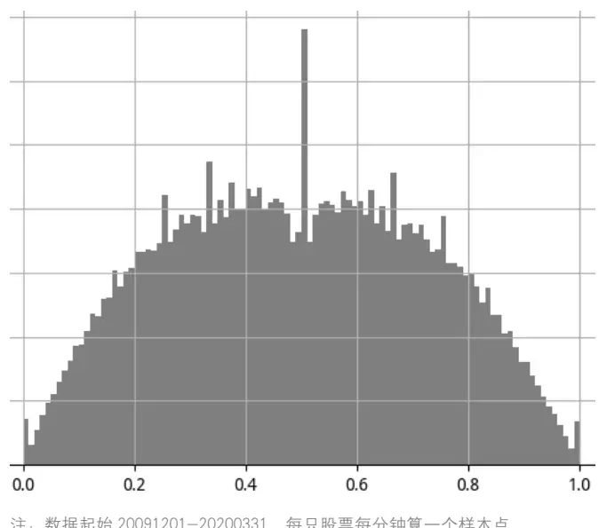
注：数据起始 20091201-20200331，每只股票每分钟算一个样本点
数据来源：wind 资讯、东方证券研究所

图 2：A 股月度区间相对价格位置 RPP 分布
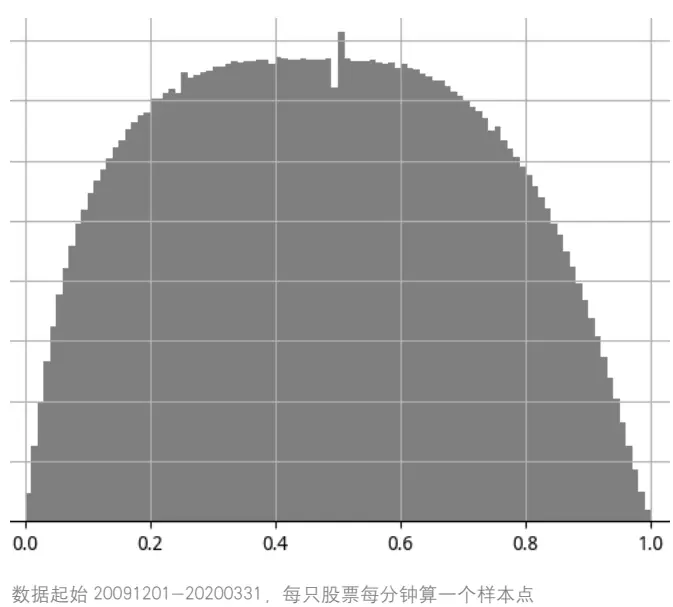
数据来源：wind 资讯、东方证券研究所

相对价格位置 RPP 的取值位于 0 到1 之间，不同股票也具有可比性，相对价格位置 RPP在高位停留时间较长时买入压力相对较大，RPP 在低位停留时间较长时卖出压力相对较大，如何度量股票相对价格位置 RPP 在高位或者低位的相对停留时间，一种简单直接的方法就是在计算 RPP在某阈值之上的时间占比，这种做法会引入一个阈值参数，这里我们建议采用时间加权平均的股票相对价格位置（time weighed average relative price position，ARPP）去度量股票在高位或者低位的相对停留时间，时间加权平均的 RPP 取值越大，说明股票在价格相对高位停留的时间越长，时间加权平均的 RPP 取值越小，说明在价格相对低位停留的时间越短。时间加权平均相对价格位置 ARPP 具体计算方法如下：

$$
ARPP_{i}=\int\limits_{0}^{T}RPP_{i,t}\cdot dt.
$$

由于 $\cdot RPP_{i,t}$ 定义中涉及的最高价 $H_{i}.$ 、最低价 $\backprime L_{i}$ 与具体时刻 t 无关，在时间区间 0 到 T 之间是恒定的，所以上述积分可以写成如下形式：

$$
ARPP_{i,t}=\frac{\left(\int_{0}^{T}P_{i,t}\cdot dt-L_{i}\right)}{\left(H_{i}-L_{i}\right)}
$$

其中， $\textstyle\int_{0}^{T}P_{i,t}$ ∙dt表示股票 i 在时间区间 0 到 T 内的时间加权平均价格，即 TWAP， $H_{i}$ 和 $|L_{i}$ 为时间区间 0 到 T内的最高价、最低价。由于一般的日行情数据不提供股票的 TWAP 价格，所以实际计算中我们采用分钟线高开低收均值在时间序列上的平均值作为区间的 TWAP。

和因子选股系列报告《基于量价关系度量股票的买卖压力》中的 APB 因子类似，不同投资者在衡量价格相对高低时也有不同的视野时间窗口，本篇报告中，我们主要探讨如下三个因子值：

ARPP_1d_20d：在每个交易日基于当天的 TWAP、最高价、最低价计算 ARPP 指标，然后20 个交易日滚动平均。

ARPP_5d_20d：基于 5 个交易日滚动的 TWAP、最高价、最低价计算 ARPP 指标，然后 20个交易日滚动平均。

ARPP_20d_20d：基于过去 20 个交易日滚动的 TWAP、最高价、最低价计算 ARPP 指标，然后 20 个交易日滚动平均。

上述三个因子我们均采用过去 20 个交易日平均的方式平滑因子值，事实上因子平滑的周期应该和实际选股策略期待的换手相适应，高换手策略应该选择更短的平滑窗口，低换手策略应该选选择更长的平滑窗口，本篇报告主要以 20 个交易日窗口为例阐述因子表现情况，其他平滑周期下的因子表现，投资者可以自行测算或者和报告联系人联系。另外，为了剔除涨跌停的影响，对任意一只股票我们剔除了盘中触及涨跌停的交易日的数据。

## 二、ARPP 因子的选股表现

## 2.1 数据与说明

由于因子计算涉及分钟数据，考虑到数据可获得性，我们因子检验的时间起止于 2009 年 12月至 2020 年 3 月。本文主要考察因子在全市场（同期中证全指成分股）的表现，同时在“因子表现汇总”章节列出了各个因子在各个样本空间的表现。因子检验基于传统的 RankIC 和因子分组两种方法，因子分组时根据因子原始值或者因子行业市值调整值分为10组，并基于此构建多空组合。

## 2.2 因子表现汇总

对比几个 ARPP 因子在各个样本空间的选股表现，我们不难有如下发现：

（1）所有的 ARPP 因子均有十分显著的选股效果，股票的价格处于相对高位的时间较长，ARPP 因子取值较大，对应的未来平均收益也更高，从因子表现的情况来看，符合我们在第一章的分析。

（2）ARPP_1d_20d 和 ARPP_5d_20d 的选股表现略优于 ARPP_20d_20d，基于短区间 RPP度量的 ARPP 因子对股票未来的收益有更强的预测作用。

（3）和绝大多数技术类 alpha 因子类似，三个 ARPP 因子在大市值样本空间内的选股表现都要弱于小市值样本空间，因子在沪深 300 中的表现弱于中证 500，在中证 500 中的选股效果又弱于中证 1000。

图 3：ARPP因子在各个样本空间表现汇总
因子 ARPP_1d_20d：

|  | 原始因子 |  |  | 行业市值中性化因子 |  |  |  |  |  |  |
| --- | --- | --- | --- | --- | --- | --- | --- | --- | --- | --- |
|  | RankIC | IC_IR | t_value | IC | IC_IR | t_value | 多空年化收益 | 夏普率 | 月胜率 | 最大回撤 |
| 中证全指 | 6.80% | 3.62 | 11.58 | 6.05% | 4.61 | 14.75 | 22.99% | 3.54 | 87.80% | -5.51% |
| 沪深300 | 4.74% | 1.43 | 4.56 | 4.02% | 1.74 | 5.58 | 11.91% | 1.21 | 69.11% | -17.15% |
| 中证500 | 6.43% | 3.07 | 9.84 | 5.25% | 3.14 | 10.05 | 17.27% | 2.25 | 73.17% | -12.82% |
| 中证800 | 5.79% | 2.29 | 7.32 | 4.96% | 3.09 | 9.88 | 18.21% | 2.33 | 80.49% | -12.23% |
| 中证1000 | 6.92% | 3.53 | 11.30 | 6.94% | 3.84 | 12.28 | 25.78% | 2.88 | 78.86% | -7.77% |

因子 ARPP_5d_20d：

|  | 原始因子 |  |  | 行业市值中性化因子 |  |  |  |  |  |  |
| --- | --- | --- | --- | --- | --- | --- | --- | --- | --- | --- |
|  | RankIC | IC_IR | t_value | IC | IC_IR | t_value | 多空年化收益 | 夏普率 | 月胜率 | 最大回撤 |
| 中证全指 | 6.92% | 3.42 | 10.95 | 6.24% | 4.56 | 14.61 | 21.57% | 3.24 | 86.99% | -4.47% |
| 沪深300 | 4.95% | 1.34 | 4.29 | 4.06% | 2.05 | 6.56 | 10.13% | 1.35 | 63.41% | -15.93% |
| 中证500 | 6.17% | 2.53 | 8.11 | 4.99% | 2.90 | 9.29 | 19.35% | 2.25 | 72.36% | -9.26% |
| 中证800 | 6.00% | 2.11 | 6.76 | 4.84% | 3.07 | 9.82 | 16.04% | 2.27 | 75.61% | -8.24% |
| 中证1000 | 6.97% | 3.52 | 11.27 | 7.14% | 4.31 | 13.79 | 22.71% | 2.73 | 78.86% | -9.09% |

因子 ARPP_20d_20d：

|  | 原始因子 |  |  | 行业市值中性化因子 |  |  |  |  |  |  |
| --- | --- | --- | --- | --- | --- | --- | --- | --- | --- | --- |
|  | RankIC | IC_IR | t_value | IC | IC_IR | t_value | 多空年化收益 | 夏普率 | 月胜率 | 最大回撤 |
| 中证全指 | 5.01% | 2.14 | 6.84 | 5.00% | 3.29 | 10.53 | 17.30% | 2.71 | 82.93% | -7.11% |
| 沪深300 | 3.27% | 0.87 | 2.79 | 3.34% | 1.49 | 4.79 | 11.40% | 1.33 | 68.29% | -9.62% |
| 中证500 | 4.51% | 1.65 | 5.27 | 4.20% | 2.29 | 7.33 | 12.59% | 1.51 | 73.98% | -11.06% |
| 中证800 | 4.10% | 1.35 | 4.31 | 3.85% | 2.17 | 6.94 | 12.92% | 1.77 | 76.42% | -8.75% |
| 中证1000 | 5.48% | 2.62 | 8.39 | 5.77% | 3.71 | 11.87 | 20.37% | 2.29 | 80.49% | -12.02% |

数据来源：wind 资讯，东方证券研究所

## 2.3 因子分组收益

从各个因子的在中证全指成分股内的分组年化对冲收益来看，各分组收益具有很强的单调性，相对价格长期处于高位的股票未来收益更高，虽然所有因子的空头端对冲收益都要强于多头，但这种非对称性并不是很明显，比如 ARPP_1d_20 的空头年化对冲收益为-10.9%，多头也有 8.8%，多空收益相差并不是很大。

图 4：因子 ARPP_1d_20d 分组年化对冲收益（中证全指，中性化）
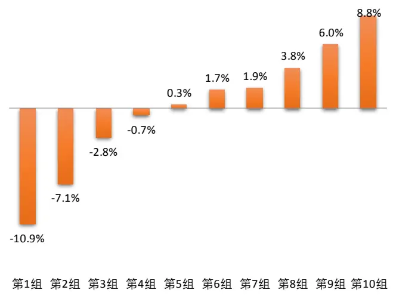
数据来源：wind 资讯，东方证券研究所

图 5：因子 ARPP_5d_20d 分组年化对冲收益（中证全指，中性化）
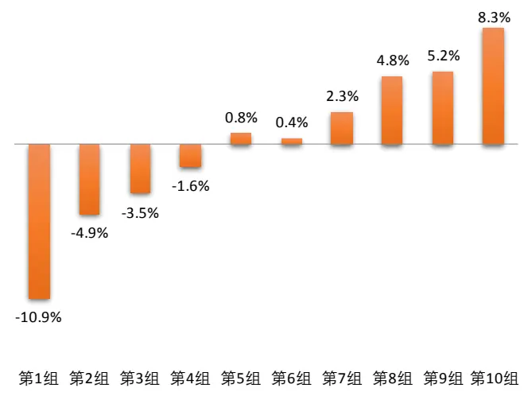
数据来源：wind 资讯，东方证券研究所

图 6：因子 ARPP_20d_20d 分组年化对冲收益（中证全指，中性化）
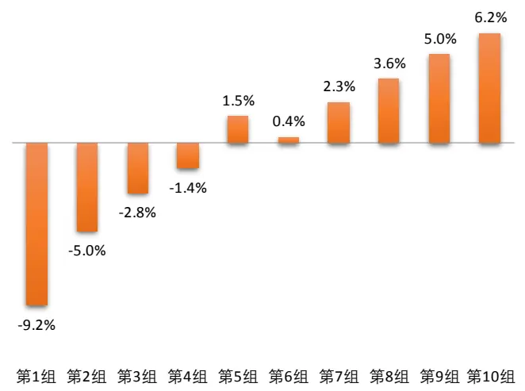
数据来源：wind 资讯，东方证券研究所

## 2.4 时间序列表现

从各个 ARPP 因子的时间序列表现来看，过去 10 年因子均有十分显著的选股效果，并没有明显的大幅回撤时点。但是 ARPP_1d_20d 因子在最近两年多空组合收益明显减弱，而ARPP_5d_20d、ARPP_20d_20d 相对会比较平稳些，这可能和 ARPP_1d_20d 因子近两年的拥挤有关，三个因子今年以来均有不错表现。

图 7：因子 ARPP_1d_20d 时序表现（中证全指，中性化）
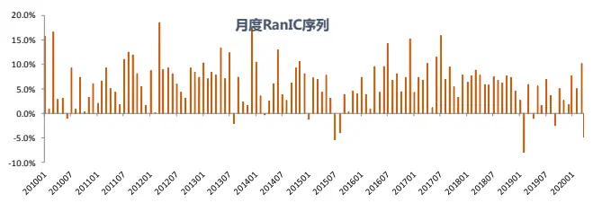

图 8：因子 ARPP_5d_20d 时序表现(中证全指，中性化）
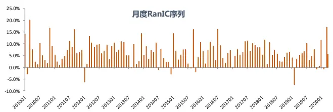

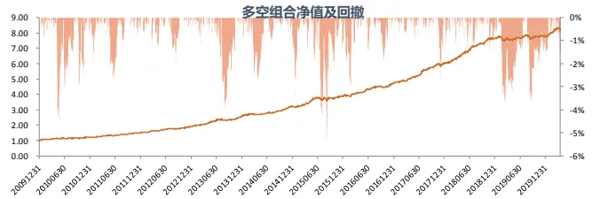
数据来源：wind 资讯，东方证券研究所

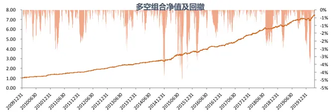
数据来源：wind 资讯，东方证券研究所

图 9：因子 ARPP_20d_20d 时序表现（中证全指,中性化）
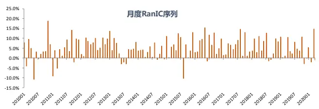

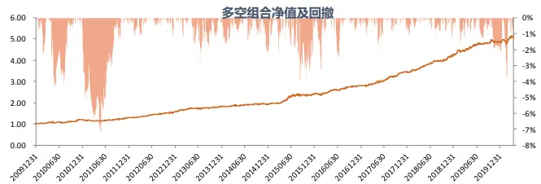
数据来源：wind 资讯，东方证券研究所

## 三、因子相关性分析

## 3.1 数据与说明

本章考察 3 个 ARPP 因子内部的相关性关系以及和各大类 alpha、其他常见技术类因子的相关性，考察时间区间同样是 2009 年 12 月至 2020 年 3 月，样本空间为同期中证全指成分股（由于部分大类因子在金融股中取值无意义，所以在考察 ARPP 和大类因子相关性时剔除了金融股），无特殊说明因子值均经过行业市值调整。因子两两分层时根据分层因子把样本空间分为 10层，每一层内再根据考察因子分为 10组，汇总所有层的第 1 组和第10 组，构建多空收益。

## 3.2 因子相关系数

从因子间的两两相关系数来看，我们有如下发现：

（1）从因子值看，三个 ARPP 因子和各大类因子相关性都很低，相关性最高的流动性因子，相关系数也就在 20%左右，ARPP_1d_20d 因子和各大类因子因子值的相关性更是都在 10%以内；从RankIC 来看，ARPP_5d_20d、ARPP_20d_20d 和流动性、分析师的相关性相对较高，在 40%左右，ARPP_1d_20d 和各大类因子的相关性都在 20%以内，甚至和反转因子有 30%的负相关。

（2）三个 ARPP 因子和其他常见的技术类因子的因子值相关性都较低，特别是和日间的技术类因子，几乎没有任何相关性，无论是从因子值还是 RankIC 的角度看，APB 因子和 ARPP_5d_20d、ARPP_20d_20d 的相关性相对较高，但和 ARPP_1d_20d 关系不大。

（3）三个不同时间周期下度量的 ARPP 因子有一定信息重叠，但基于 1 天周期度量的ARPP_1d_20d 和基于 20 天周期度量的 ARPP_20d_20d 两者相关性不大，可以相互补充。

图 10：ARPP因子与常见大类因子的相关性（左下因子值，右上 RankIC）

| Value Profitability Growth Governance |  |  |  |  | Liquidity | Reversal | Lottery | Analyst | Surprise | ARPP_1dARPP_5d |  | ARPP_20d |
| --- | --- | --- | --- | --- | --- | --- | --- | --- | --- | --- | --- | --- |
| Value |  | -0.188 | 0.028 | 0.510 | 0.441 | -0.021 | 0.756 | 0.290 | -0.078 | 0.112 | 0.006 | 0.111 |
| Profitability | 0.308 |  | 0.403 | 0.065 | -0.104 | -0.230 | -0.224 | 0.588 | 0.674 | 0.053 | 0.363 | 0.225 |
| Growth | 0.173 | 0.329 |  | -0.069 | 0.010 | -0.265 | -0.027 | 0.517 | 0.749 | 0.166 | 0.282 | 0.168 |
| Governance | 0.231 | 0.093 | -0.043 |  | 0.173 | 0.170 | 0.320 | 0.266 | -0.077 | 0.126 | 0.127 | 0.126 |
| Liquidity | 0.147 | -0.012 | -0.043 | 0.051 |  | -0.038 | 0.820 | 0.189 | 0.070 | 0.183 | 0.403 | 0.423 |
| Reversal | 0.072 | -0.068 | -0.129 | 0.032 | 0.252 |  | -0.122 | -0.086 | -0.470 | -0.302 | -0.053 | 0.072 |
| Lottery | 0.374 | 0.032 | -0.018 | 0.096 | 0.573 | 0.175 |  | 0.135 | -0.054 | 0.192 | 0.231 | 0.280 |
| Analyst | 0.310 | 0.294 | 0.235 | 0.064 | 0.034 | 0.006 | 0.091 |  | 0.571 | 0.097 | 0.425 | 0.305 |
| Surprise | 0.032 | 0.184 | 0.528 | -0.037 | -0.051 | -0.171 | -0.050 | 0.204 |  | 0.192 | 0.384 | 0.310 |
| ARPP_1d | 0.065 | 0.045 | 0.036 | 0.049 | 0.088 | -0.100 | 0.081 | 0.035 | 0.049 |  | 0.496 | 0.252 |
| ARPP_5d | 0.075 | 0.078 | 0.050 | 0.043 | 0.214 | 0.056 | 0.164 | 0.082 | 0.041 | 0.515 |  | 0.600 |
| ARPP_20d | 0.052 0.064 |  | 0.046 | 0.028 | 0.210 | 0.090 | 0.165 | 0.083 | 0.037 | 0.163 | 0.459 |  |

数据来源：wind 资讯，东方证券研究所

图 11：ARPP因子与常见日间技术类因子的相关性（左下因子值，右上 RankIC）

| VOL LNTO IVOL IVR |  |  |  |  | RET | LNAMIHUD | PPREVSERAL MAXRET DWF |  |  | ARPP_1dARPP_5d |  | ARPP_20d |
| --- | --- | --- | --- | --- | --- | --- | --- | --- | --- | --- | --- | --- |
| VOL |  | 0.907 | 0.884 | 0.179 | -0.118 | 0.417 | -0.128 | 0.904 | 0.817 | 0.207 | 0.256 | 0.275 |
| LNTO | 0.613 |  | 0.828 | 0.181 | -0.110 | 0.527 | -0.124 | 0.812 | 0.760 | 0.160 | 0.231 | 0.292 |
| IVOL | 0.826 | 0.555 |  | 0.571 | 0.189 | 0.353 | 0.202 | 0.915 | 0.930 | 0.127 | 0.246 | 0.294 |
| IVR | 0.301 | 0.259 | 0.704 |  | 0.635 | -0.021 | 0.666 | 0.430 | 0.529 | -0.052 | 0.096 | 0.186 |
| RET | 0.249 | 0.160 | 0.341 | 0.296 |  | -0.181 | 0.897 | 0.263 | 0.244 | -0.246 | 0.085 | 0.234 |
| LNAMIHUD | 0.100 | 0.468 | 0.130 | 0.080 | -0.016 |  | -0.177 | 0.344 | 0.365 | 0.233 | 0.440 | 0.383 |
| PPREVSERAL | 0.267 | 0.187 | 0.380 | 0.339 | 0.711 | 0.053 |  | 0.227 | 0.281 | -0.281 | -0.007 | 0.124 |
| MAXRET | 0.849 | 0.525 | 0.823 | 0.399 | 0.552 | 0.097 | 0.479 |  | 0.892 | 0.160 | 0.288 | 0.396 |
| DWF | 0.657 | 0.447 | 0.705 | 0.450 | 0.388 | 0.102 | 0.402 | 0.714 |  | 0.165 | 0.286 | 0.356 |
| ARPP_1d | 0.046 | 0.051 | 0.102 | 0.143 | -0.088 | 0.070 | -0.066 | 0.052 | 0.066 |  | 0.504 | 0.265 |
| ARPP_5d | 0.166 | 0.149 | 0.221 | 0.205 | 0.096 | 0.100 | 0.078 | 0.191 | 0.173 | 0.514 |  | 0.610 |
| ARPP_20d | 0.163 | 0.152 | 0.185 | 0.127 | 0.170 | 0.086 | 0.091 | 0.202 | 0.178 | 0.162 | 0.459 |  |

数据来源：wind 资讯，东方证券研究所

图 12：ARPP因子与常见日内技术类因子的相关性（左下因子值，右上 RankIC）

|  | IDSKEW IDKURT |  | IDJUMP IDMOM |  | APB_1d | APB_5d | SDRVOL | SDRSKEWSDVVOL |  | ARPP_1dARPP_5d |  | ARPP_20d |
| --- | --- | --- | --- | --- | --- | --- | --- | --- | --- | --- | --- | --- |
| IDSKEW |  | 0.525 | 0.838 | 0.444 | 0.301 | 0.676 | 0.375 | 0.562 | 0.465 | 0.064 | 0.372 | 0.539 |
| IDKURT | 0.479 |  | 0.455 | 0.251 | -0.182 | 0.219 | 0.437 | 0.886 | 0.045 | 0.232 | 0.000 | 0.170 |
| IDJUMP | 0.660 | 0.250 |  | 0.460 | 0.259 | 0.690 | 0.239 | 0.439 | 0.269 | 0.017 | 0.292 | 0.488 |
| IDMOM | 0.268 | 0.167 | 0.334 |  | -0.163 | 0.348 | 0.392 | 0.464 | 0.128 | 0.168 | 0.208 | 0.219 |
| APB_1d | 0.286 | 0.164 | 0.324 | 0.107 |  | 0.535 | 0.078 | -0.159 | 0.442 | 0.125 | 0.407 | 0.315 |
| APB_5d | 0.267 | 0.193 | 0.366 | 0.110 | 0.305 |  | 0.418 | 0.311 | 0.624 | 0.092 | 0.551 | 0.587 |
| SDRVOL | 0.196 | 0.415 | 0.147 | 0.086 | 0.156 | 0.262 |  | 0.563 | 0.471 | 0.267 | 0.285 | 0.262 |
| SDRSKEW | 0.355 | 0.887 | 0.182 | 0.145 | 0.138 | 0.230 | 0.441 |  | 0.248 | 0.356 | 0.149 | 0.257 |
| SDWVOL | 0.208 | 0.278 | 0.169 | 0.036 | 0.227 | 0.444 | 0.508 | 0.346 |  | 0.257 | 0.522 | 0.467 |
| ARPP_1d | 0.083 | 0.201 | 0.023 | 0.073 | 0.364 | 0.063 | 0.142 | 0.179 | 0.137 |  | 0.504 | 0.265 |
| ARPP_5d | 0.194 | 0.197 | 0.168 | 0.071 | 0.348 | 0.319 | 0.198 | 0.208 | 0.280 | 0.514 |  | 0.610 |
| ARPP_20d | 0.146 | 0.096 | 0.177 | 0.042 | 0.166 | 0.276 | 0.162 | 0.113 | 0.222 | 0.162 | 0.459 |  |

数据来源：wind 资讯，东方证券研究所

## 3.3 两两分层结果

和相关系数的结果相一致，两两分层的多空月均收益及其显著性对我们有如下启示：

（1）ARPP 因子和其他常见大类因子几乎没有任何关系，经过各个大类因子分层后 ARPP 因子的多空组合收益几乎没有影响，经过 ARPP 分层后各大类因子影响也十分有限。

（2）经过 APB 因子分层后，ARPP_1d_20d 和 ARPP_5d_20d 的多空收益受到一定影响，但 ARPP_1d_20d 相对比较独立，经过任意一个技术面因子分层后多空组合的月均收益都几乎没有变化。

（3）三个 ARPP 因子内部，ARPP_1d_20d 和 ARPP_20d_20d 相互可替代性不强，两者可以在信息上相互补充。

图 13：ARPP因子与常见大类因子两两分层月均收益（%）及其显著性

|  |  | Value Profitability | Growth |  | Governance | Illiquidity | Reversal | Lottery | Analyst Surprise |  | ARPP_1d ARPP_5d |  | ARPP_20d |
| --- | --- | --- | --- | --- | --- | --- | --- | --- | --- | --- | --- | --- | --- |
| 分 | 不分层 | 1.08*** | 0.71*** | 1.10*** | 0.58*** | 2.39*** | 1.34*** | 1.65*** | 1.62*** | 1.66*** | 1.77*** | 1.67*** | 1.32*** |
|  | Value | 0.28*** | 0.46 | 1.01*** | 0.36*** | 2.24*** | 1.31*** | 1.29*** | 1.39*** | 1.64*** | 1.64*** | 1.56*** | 1.18*** |
|  | Probability | 0.91*** | 0.13 | 0.88*** | 0.54*** | 2.36*** | 1.39*** | 1.51*** | 1.43*** | 1.51*** | 1.76*** | 1.55*** | 1.21*** |
| 层 | Growth | 1.00*** | 0.52** | 0.15* | 0.67*** | 2.43*** | 1.48*** | 1.62*** | 1.38*** | 1.31*** | 1.71*** | 1.62*** | 1.18*** |
|  | Governance | 1.01*** | 0.69*** | 1.09*** | -0.06 | 2.34*** | 1.28*** | 1.51*** | 1.55*** | 1.65*** | 1.73*** | 1.64*** | 1.27*** |
|  | Illiquidity | 0.76*** | 0.66*** | 1.13*** | 0.44*** | 0.48*** | 0.70* | 0.47 | 1.42*** | 1.66*** | 1.56*** | 1.21*** | 0.81*** |
| 因 | Reversal | 0.91*** | 0.74*** | 1.22*** | 0.47*** | 2.16*** | 0.12 | 1.35*** | 1.52*** | 1.79*** | 1.81*** | 1.61*** | 1.11*** |
|  | Lottery | 0.50** | 0.59** | 1.09*** | 0.37*** | 1.60*** | 0.73** | 0.28** | 1.40*** | 1.68*** | 1.58*** | 1.37*** | 1.00*** |
|  | Analyst | 0.57** | 0.2 | 0.77*** | 0.47*** | 2.17*** | 1.27*** | 1.29*** | 0.20*** | 1.37*** | 1.62*** | 1.49*** | 1.13*** |
| 子 | Surprise | 1.05*** | 0.42* | 0.31** | 0.67*** | 2.39*** | 1.58*** | 1.67*** | 1.30*** | 0.22** | 1.65*** | 1.58*** | 1.21*** |
|  | ARPP_1d | 0.95*** | 0.67*** | 1.03*** | 0.50*** | 2.29*** | 1.47*** | 1.44*** | 1.55*** | 1.61*** | 0.21** | 0.84*** | 1.07*** |
|  | ARPP_5d | 0.93*** | 0.59** | 1.06*** | 0.52*** | 2.03*** | 1.16*** | 1.32*** | 1.54*** | 1.59*** | 1.09*** | 0.15 | 0.65*** |
|  | ARPP 20d | 1.02*** | 0.60** | 1.04*** | 0.51*** | 2.10*** | 1.08*** | 1.39*** | 1.47*** | 1.53*** | 1.57*** | 1.19*** | 0.12 |

注：***表示 1%表示置信度下显著， **表示 5%表示置信度下显著，*表示 10%表示置信度下显著
数据来源：wind 资讯，东方证券研究所

图 14：ARPP因子与常见日间技术类因子两两分层月均收益（%）及其显著性

|  |  | VOL | LNTO | IVOL | IVR | RET | LNAMIHUD | PPREVSERAL | MAXRET | DWF | ARPP_1d | ARPP_5d | ARPP_20d |
| --- | --- | --- | --- | --- | --- | --- | --- | --- | --- | --- | --- | --- | --- |
|  | 不分层 | 1.16*** | 2.17*** | 2.12*** | 1.91*** | 1.85*** | 1.79*** | 1.33*** | 1.53*** | 1.86*** | 1.73*** | 1.66*** | 1.33*** |
|  | VOL | 0.13 | 1.78*** | 1.58*** | 1.50*** | 1.10*** | 1.68*** | 0.73** | 0.85*** | 1.45*** | 1.62*** | 1.37*** | 1.04*** |
| 分 | LNTO | -0.11 | 0.42*** | 1.01*** | 1.40*** | 1.37*** | 1.12*** | 0.79** | 0.57** | 1.11*** | 1.60*** | 1.38*** | 1.04*** |
|  | IVOL | -0.67** | 1.23*** | 0.25** | 0.74*** | 0.95*** | 1.57*** | 0.52 | -0.02 | 0.87*** | 1.52*** | 1.25*** | 0.94*** |
| 层 | IVR | 0.66* | 1.70*** | 0.85** | 0.17** | 1.27*** | 1.69*** | 0.81** | 0.95*** | 1.07*** | 1.42*** | 1.29*** | 1.09*** |
|  | RET | 0.73** | 1.86*** | 1.58*** | 1.25*** | 0.1 | 1.86*** | -0.03 | 0.80*** | 1.31*** | 1.76*** | 1.48*** | 0.87*** |
|  | LNAMIHUD | 0.92*** | 1.30*** | 1.81*** | 1.67*** | 1.89*** | 0.24*** | 1.31*** | 1.30*** | 1.78*** | 1.60*** | 1.37*** | 1.16*** |
|  | PPREVSERAL | 0.95*** | 1.89*** | 1.85*** | 1.45*** | 1.31*** | 1.68*** | 0.26** | 1.28*** | 1.47*** | 1.72*** | 1.56*** | 1.19*** |
| 因 | MAXRET | -0.26 | 1.56*** | 0.98*** | 1.23*** | 0.90*** | 1.76*** | 0.47 | 0.25*** | 1.06*** | 1.60*** | 1.34*** | 0.96*** |
|  | DWF | -0.23 | 1.38*** | 0.76*** | 1.12*** | 1.02*** | 1.61*** | 0.60* | 0.3 | 0.05 | 1.53*** | 1.36*** | 0.98*** |
| 子 | ARPP_1d | 1.04*** | 2.08*** | 1.87*** | 1.61*** | 2.01*** | 1.76*** | 1.49*** | 1.46*** | 1.77*** | 0.27*** | 0.83*** | 1.04*** |
|  | ARPP_5d | 0.88** | 1.92*** | 1.79*** | 1.54*** | 1.59*** | 1.67*** | 1.20*** | 1.25*** | 1.60*** | 1.08*** | 0.12 | 0.64*** |
|  | ARPP_20d | 0.89** | 1.88*** | 1.73*** | 1.67*** | 1.61*** | 1.68*** | 1.19*** | 1.26*** | 1.65*** | 1.56*** | 1.18*** | 0.04 |

注：***表示 1%表示置信度下显著， **表示 5%表示置信度下显著，*表示 10%表示置信度下显著
数据来源：wind 资讯，东方证券研究所

图 15：ARPP因子与常见常见日内技术类因子两两分层月均收益（%）及其显著性

|  | IDSKEW |  | IDKURT | IDJUMP | IDMOM | APB_1d | APB_5d | SDRVOL | SDRSKEW | SDVVOL | ARPP_1d | ARPP_5d | ARPP_20d |
| --- | --- | --- | --- | --- | --- | --- | --- | --- | --- | --- | --- | --- | --- |
| 分 | 不分层 | 1.60*** | 1.08*** | 2.04*** | 1.24*** | 2.11*** | 1.90*** | 1.31*** | 0.97*** | 1.57*** | 1.73*** | 1.66*** | 1.33*** |
|  | IDSKEW | 0.13 | 0.26 | 1.28*** | 0.80*** | 1.83*** | 1.51*** | 1.09*** | 0.37*** | 1.24*** | 1.54*** | 1.36*** | 1.04*** |
|  | IDKURT | 1.17*** | 0.14 | 1.80*** | 1.04*** | 1.94*** | 1.65*** | 1.10*** | 0.14 | 1.35*** | 1.52*** | 1.47*** | 1.18*** |
|  | IDJUMP | 0.56*** | 0.55*** | 0.29*** | 0.56** | 1.54*** | 1.27*** | 1.09*** | 0.58*** | 1.30*** | 1.69*** | 1.33*** | 0.98*** |
| 层 | IDMOM | 1.24*** | 0.89*** | 1.69*** | 0.13 | 2.00*** | 1.77*** | 1.24*** | 0.80*** | 1.52*** | 1.62*** | 1.57*** | 1.19*** |
|  | APB_1d | 0.96*** | 0.64*** | 1.27*** | 0.94*** | 0.32*** | 1.17*** | 0.98*** | 0.60*** | 1.04*** | 0.98*** | 0.85*** | 0.87*** |
|  | APB_5d | 1.07*** | 0.63*** | 1.35*** | 0.93*** | 1.49*** | 0.31*** | 0.80*** | 0.51*** | 0.60*** | 1.59*** | 0.93*** | 0.74*** |
| 因 | SDRVOL | 1.30*** | 0.56*** | 1.80*** | 1.05*** | 1.89*** | 1.62*** | 0.09 | 0.41*** | 0.79*** | 1.58*** | 1.35*** | 0.93*** |
|  | SDRSKEW | 1.35*** | 0.38** | 1.81*** | 1.11*** | 2.03*** | 1.61*** | 1.05*** | 0.27*** | 1.24*** | 1.53*** | 1.48*** | 1.13*** |
|  | SDVVOL | 1.36*** | 0.65*** | 1.83*** | 1.14*** | 1.86*** | 1.53*** | 0.81*** | 0.52*** | 0.17 | 1.55*** | 1.24*** | 0.95*** |
| 子 | ARPP_1d | 1.42*** | 0.77*** | 1.92*** | 1.13*** | 1.58*** | 1.75*** | 1.07*** | 0.72*** | 1.32*** | 0.27*** | 0.83*** | 1.04*** |
|  | ARPP_5d | 1.29*** | 0.87*** | 1.80*** | 1.11*** | 1.69*** | 1.55*** | 1.01*** | 0.73*** | 1.20*** | 1.08*** | 0.12 | 0.64*** |
|  | ARPP 20d | 1.39*** | 0.93*** | 1.73*** | 1.18*** | 1.93*** | 1.63*** | 1.13*** | 0.74*** | 1.28*** | 1.56*** | 1.18*** | 0.04 |

注：***表示 1%表示置信度下显著， **表示 5%表示置信度下显著，*表示 10%表示置信度下显著
数据来源：wind 资讯，东方证券研究所

## 3.4 截面回归分析

通过常见的截面回归方法剔除常见各大类因子影响后，三个 ARPP 因子均有显著的选股效果。相比之下，基于一天周期计算的 ARPP 因子在剔除各大类因子后的残差因子选股效果更加明显。

图 16：ARPP因子在剔除常见大类因子后的残差选股表现

|  | 原始因子 |  | 行业市值中性化因子 |  |  |  |  |  |  |
| --- | --- | --- | --- | --- | --- | --- | --- | --- | --- |
|  | RankIC IC_IR | t_value | IC | IC_IR | t_value | 多空年化收益 | 夏普率 | 月胜率 | 最大回撤 |
| ARPP_1d | 5.04% | 3.65 11.73 | 4.09% | 4.05 | 13.02 | 16.58% | 2.90 | 86.29% | -5.11% |
| ARPP_5d | 3.78% | 2.80 8.99 | 3.08% | 3.15 | 10.11 | 11.90% | 2.32 | 78.23% | -4.73% |
| ARPP_20d | 1.85% | 1.46 4.69 | 1.80% | 1.92 | 6.18 | 6.65% | 1.50 | 66.94% | -5.65% |

数据来源：wind 资讯，东方证券研究所

## 四、 结论

股票的买卖压力不仅对价格在成交量维度上的分布有影响，而且对价格在时间维度的分布也有影响。买入压力比较大的股票在价格相对低位时会有主动买单推高价格，因而在价格相对低位的停留时间较短，卖出压力比较大的股票在价格相对高位时会有主动卖单压低价格，因而在价格相对高位的停留时间较短。

不同股票的价格不具有可比性，我们采用区间内的最高价和最低价归一化股票的价格得到相对价格位置 RPP 指标，RPP 取值长期较大的股票买入压力较大，RPP 取值长期较小的股票卖出压力较大。

我们取时间加权平均的相对价格位置 ARPP（即 RPP 对时间的积分）作为股票是否在价格相对高位停留较长时间的度量，股票在价格相对高位停留的时间越长，ARPP 取值越大。考虑到不同投资者衡量价格相对高低时有不同的时间窗口，我们分别基于 1 日、5 日、20 日三个时间窗口滚动计算ARPP指标，并做20个交易日的平滑得到ARPP_1d_20d、ARPP_5d_20d、ARPP_20d_20d共 3 个时间尺度度量的买卖压力因子。

3 个时间尺度度量的买卖压力因子在各个样本空间均有十分显著的选股效果，过去价格长期处于相对高位的股票未来平均收益更高，价格长期处于相对低位的股票未来平均收益更低。其中，ARPP_1d_20d 在中证全指内 RankIC 月度均值 6.8%，多空年化收益 23%。虽然 3 个 ARPP 因子的空头对冲收益都强于多头，但这种非对称性并不明显，比如 ARPP_1d_20d 在中证全指内的空头对冲收益为-10.9%、多头对冲收益也高达 8.8%。

计算相对价格位置的时间窗口相差较大时，ARPP 因子取值相关性就会较低，比如ARPP_1d_20d 和 ARPP_20d_20d 因子值相关性仅 16%，两者信息可以相互补充。基于时间尺度度量的买卖压力因子和估值、成长、盈利等基本面相关因子几乎没有任何相关性，和一些常见的日间技术类因子、日内技术类因子关系都不大，回归剔除其他各大类因子后依然有显著的选股效果。。

## 风险提示

1.量化模型基于历史数据分析得到，未来存在失效的风险，建议投资者紧密跟踪模型表现。

2.极端市场环境可能对模型效果造成剧烈冲击，导致收益亏损。

## 分析师申明

每位负责撰写本研究报告全部或部分内容的研究分析师在此作以下声明：

分析师在本报告中对所提及的证券或发行人发表的任何建议和观点均准确地反映了其个人对该证券或发行人的看法和判断；分析师薪酬的任何组成部分无论是在过去、现在及将来，均与其在本研究报告中所表述的具体建议或观点无任何直接或间接的关系。

## 投资评级和相关定义

报告发布日后的 12 个月内的公司的涨跌幅相对同期的上证指数/深证成指的涨跌幅为基准；

## 公司投资评级的量化标准

买入：相对强于市场基准指数收益率 15%以上；

增持：相对强于市场基准指数收益率 5%～15%；

中性：相对于市场基准指数收益率在-5%～+5%之间波动；

减持：相对弱于市场基准指数收益率在-5%以下。

未评级 —— 由于在报告发出之时该股票不在本公司研究覆盖范围内，分析师基于当时对该股票的研究状况，未给予投资评级相关信息。

暂停评级 —— 根据监管制度及本公司相关规定，研究报告发布之时该投资对象可能与本公司存在潜在的利益冲突情形；亦或是研究报告发布当时该股票的价值和价格分析存在重大不确定性，缺乏足够的研究依据支持分析师给出明确投资评级；分析师在上述情况下暂停对该股票给予投资评级等信息，投资者需要注意在此报告发布之前曾给予该股票的投资评级、盈利预测及目标价格等信息不再有效。

## 行业投资评级的量化标准：

看好：相对强于市场基准指数收益率 5%以上；

中性：相对于市场基准指数收益率在-5%～+5%之间波动；

看淡：相对于市场基准指数收益率在-5%以下。

未评级：由于在报告发出之时该行业不在本公司研究覆盖范围内，分析师基于当时对该行业的研究状况，未给予投资评级等相关信息。

暂停评级：由于研究报告发布当时该行业的投资价值分析存在重大不确定性，缺乏足够的研究依据支持分析师给出明确行业投资评级；分析师在上述情况下暂停对该行业给予投资评级信息，投资者需要注意在此报告发布之前曾给予该行业的投资评级信息不再有效。

## HeadertTabl e_Discl ai mer 免责声明

本证券研究报告（以下简称“本报告”）由东方证券股份有限公司（以下简称“本公司”）制作及发布。

本报告仅供本公司的客户使用。本公司不会因接收人收到本报告而视其为本公司的当然客户。本报告的全体接收人应当采取必要措施防止本报告被转发给他人。

本报告是基于本公司认为可靠的且目前已公开的信息撰写，本公司力求但不保证该信息的准确性和完整性，客户也不应该认为该信息是准确和完整的。同时，本公司不保证文中观点或陈述不会发生任何变更，在不同时期，本公司可发出与本报告所载资料、意见及推测不一致的证券研究报告。本公司会适时更新我们的研究，但可能会因某些规定而无法做到。除了一些定期出版的证券研究报告之外，绝大多数证券研究报告是在分析师认为适当的时候不定期地发布。

在任何情况下，本报告中的信息或所表述的意见并不构成对任何人的投资建议，也没有考虑到个别客户特殊的投资目标、财务状况或需求。客户应考虑本报告中的任何意见或建议是否符合其特定状况，若有必要应寻求专家意见。本报告所载的资料、工具、意见及推测只提供给客户作参考之用，并非作为或被视为出售或购买证券或其他投资标的的邀请或向人作出邀请。

本报告中提及的投资价格和价值以及这些投资带来的收入可能会波动。过去的表现并不代表未来的表现，未来的回报也无法保证，投资者可能会损失本金。外汇汇率波动有可能对某些投资的价值或价格或来自这一投资的收入产生不良影响。那些涉及期货、期权及其它衍生工具的交易，因其包括重大的市场风险，因此并不适合所有投资者。

在任何情况下，本公司不对任何人因使用本报告中的任何内容所引致的任何损失负任何责任，投资者自主作出投资决策并自行承担投资风险，任何形式的分享证券投资收益或者分担证券投资损失的书面或口头承诺均为无效。

本报告主要以电子版形式分发，间或也会辅以印刷品形式分发，所有报告版权均归本公司所有。未经本公司事先书面协议授权，任何机构或个人不得以任何形式复制、转发或公开传播本报告的全部或部分内容。不得将报告内容作为诉讼、仲裁、传媒所引用之证明或依据，不得用于营利或用于未经允许的其它用途。

经本公司事先书面协议授权刊载或转发的，被授权机构承担相关刊载或者转发责任。不得对本报告进行任何有悖原意的引用、删节和修改。

提示客户及公众投资者慎重使用未经授权刊载或者转发的本公司证券研究报告，慎重使用公众媒体刊载的证券研究报告。

## 东方证券研究所

地址：上海市中山南路 318 号东方国际金融广场 26 楼

电话：021-63325888

传真：021-63326786

网址： www.dfzq.com.cn