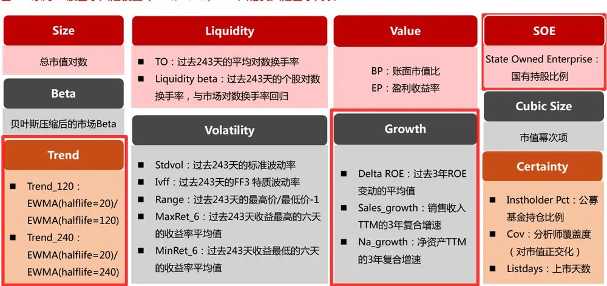
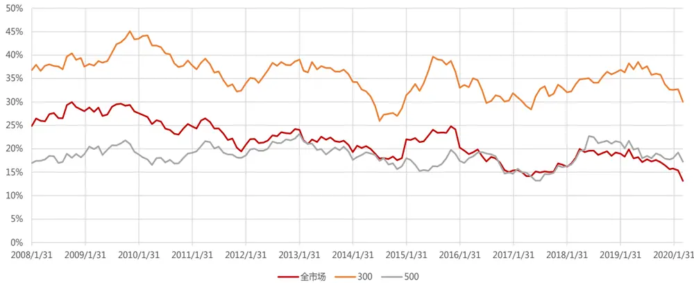
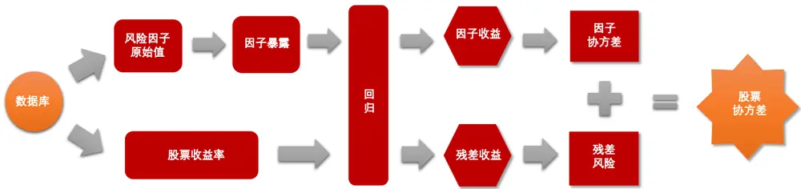
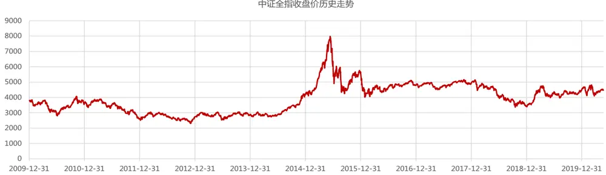
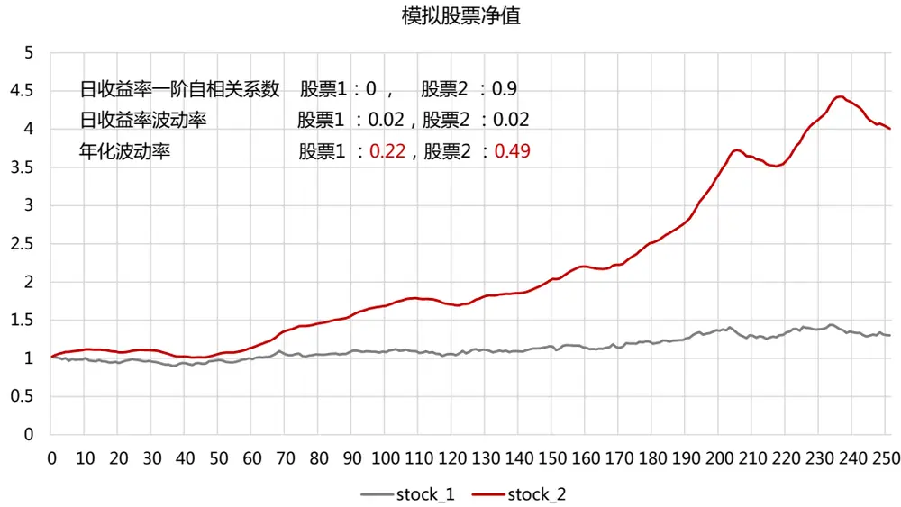
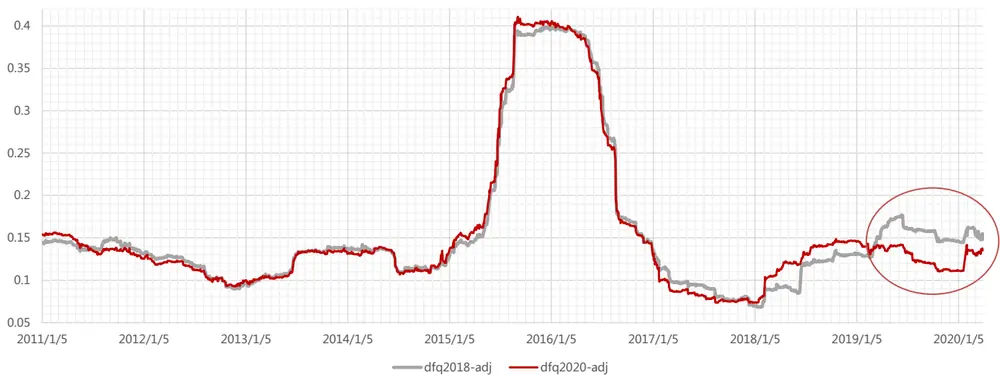
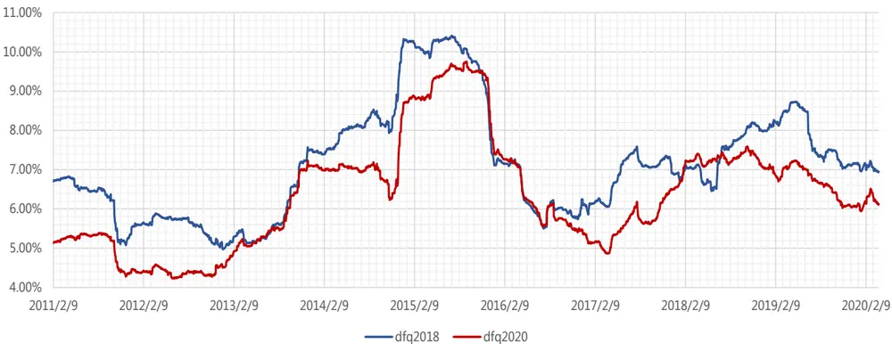
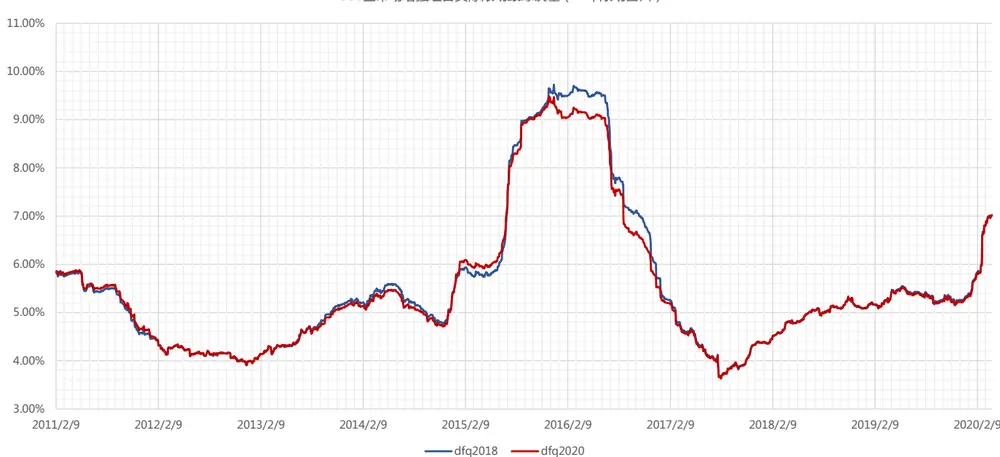
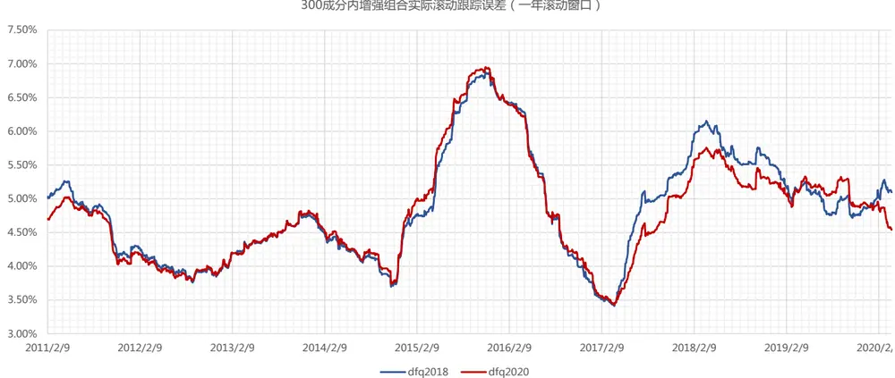
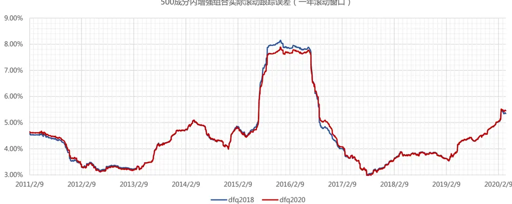

# 东方 A 股因子风险模型（DFQ-2020）

## 研究结论

- 本次风险模型升级效果：1）风险因子的逻辑性更加明确；2）减少风险模型带来的组合换手；3）降低风险预测过程中的经验性参数；4）提升模型对市场波动突变的敏感性。

- DFQ-2020 因子风险模型的风险因子库仍为 40 个，包括十大类风格风险因子，29个中信一级行业因子和市场因子。相比 DFQ-2018，我们对 Trend、Growth 和 SOE 三个风险因子的计算方法进行了改动，以使其逻辑上更合理。

DFQ-2020 因子风险模型对沪深 300 成分股的解释度最高，横截面回归Adjusted Rsquare 平均能达到 35.4%，其次为中证 500 成分股的 18.6%，全市场为 21.4%。

DFQ-2020 因子风险模型对风险因子协方差矩阵，和残差方差阵的估计算法进行了改进，以提升模型在市场突变环境下的风险预测准确度。我们对风险因子收益率和残差收益率均建立带 ARMA 的 GARCH 模型，刻画其自相关和异方差特性，对协方差矩阵估计进行了时间序列上的改进。

- DFQ-2020因子风险模型在市场突变时对个股的风险预测更为准确。在 2015年 DFQ-2020模型预测的个股下个月波动率和平均相关系数与真实值十分接近，DFQ-2018 模型则大幅低估。

- DFQ-2020 因子风险模型得出的 GMVP 组合波动率与 DFQ-2018 模型差别不显著，说明整体来看两个模型对于个股方差的预测性差别不大，但 DFQ-2020风险模型得出的 GWVP组合换手率明显降低。

DFQ-2020 因子风险模型用于沪深 300 全市场增强组合时优势较为明显，可以同时实现最大回撤和跟踪误差的降低，以及组合收益的提升，综合信息比更高。在 2015-2016 年，DFQ-2020 模型的跟踪误差相比 DFQ2018 均有降低，说明 DFQ-2020 模型对市场突变环境下对个股风险能进行更准确的预测，在给定的跟踪误差约束下，对风险控制更严格，从而可以降低组合净值波动。

我们提供东方 A 股因子风险模型（DFQ-2020）每日预测的因子暴露、风险因子收益率、残差收益率、因子协方差、残差风险。投资者可以直接从我们的云端服务器上下载数据用于组合优化、风险分析和绩效归因，我们会配套提供数据提取代码和组合优化示例函数，方便使用。

## 风险提示

- 量化模型失效风险

- 市场极端环境的冲击

报告发布日期2020 年 05 月 28 日

证券分析师朱剑涛

021-63325888*6077

zhujiantao@orientsec.com.cn

执业证书编号：S0860515060001

联系人刘静涵

021-63325888*3211

liujinghan@orientsec.com.cn

## 相关报告

| 分红对期指的影响 20200524 债券型基金出现回撤，科技类 ETF份额持 | 2020-05-24 2020-05-18 |
| --- | --- |
| 续赎回 |  |
| 基于时间尺度度量的日内买卖压力 | 2020-04-21 |
| 构建特定风格的基金组合 | 2020-03-01 |
| 跨品种无风险利率曲线构建与应用 | 2020-02-27 |
| 主动买卖单的批量成交划分法 | 2020-02-25 |
| 从北上资金中提取的系列alpha因子 | 2020-02-08 |
| 关于组合换手的若干问题 | 2020-01-05 |

## 一、风险模型的作用

## 1. 识别风险因子，控制风险暴露，降低组合净值波动。

风险因子在横截面维度对股票收益有显著影响，其带来的风险溢价在时间序列上呈现两个特点：（1）风险溢价的均值（绝对值）很小，甚至接近于零，长期看无法带来稳定的超额收益，因而无法用来选股。例如行业因子是典型的风险因子，横截面上看同行业的股票涨跌一致性高，但并不代表这个行业长期来看能获得风险溢价。（2）风险溢价的方差很大，会增加组合的波动风险，因而可以在组合优化时控制组合对某个风险因子的暴露度，来降低此类因子的影响，保证组合收益的稳定性，降低净值波动。

## 2. 提供更准确的股票收益率协方差矩阵估计，为组合优化服务。

估计股票收益的协方差矩阵主要有三类方法：（1）样本协方差矩阵：样本协防差矩阵估计是一个无偏高方差的估计量，预测效果差，而且在样本数据长度小于股票数量时，样本协方差矩阵不可求逆，优化器会放大样本协方差矩阵的估计误差，导致错误的组合权重分配；（2）纯统计模型：基于压缩估计量给出协方差矩阵估计量，再对其谱分解，近似拆解出一个结构化模型，实现协方差矩阵降维，提升组合优化速度。（3）因子模型：将股票收益分解为能够被公共风险因子解释的部分，以及不能被解释的残差收益。通过一组公共的因子来捕捉股票的波动，实现协方差矩阵降维，提升组合优化速度。我们在之前的 DFQ-2018 风险模型报告中就测试过，因子模型得出的 GWVP组合年化波动率显著低于纯统计模型，说明因子模型在理论上具备明显优势，可以对股票协方差阵做出更为准确的估计。

## 3. 基于组合持仓进行绩效归因，分析组合的风险暴露，收益来源和风险来源。

组合绩效分析主要包括收益归因和风险归因两部分，均可依据风险因子模型实现。（1）收益归因：依据组合具体持仓明细，计算组合在各个风险因子上的暴露，乘上因子收益率，即可得出各个风险因子对整体组合超额收益的贡献，从而对组合过往收益的来源进行分析。（2）风险归因（事前）：将组合当前在各个风险因子上的暴露，乘上当前预测的因子协方差矩阵，即可得出各个风险因子对整体组合风险的贡献，从而对组合当前面临的风险敞口大小进行分析。

## 二、DFQ-2020 风险模型介绍

## 2.1. 风险因子选取

我们选取了十个风格类的风险因子，因子列表如下：

图 1：东方 A 股因子风险模型（DFQ-2020）——风格类风险因子列表

数据来源：东方证券研究所

相比 DFQ-2018，我们对三个风险因子的计算方法进行了改动，以使其逻辑上更合理：

## （1） Trend

用股价的指数加权移动平均线取代均线。历史各期股价的加权系数随时间呈指数式递减，越靠近当前时刻加权系数越大，较旧的数据也给予一定的加权。改动后 Trend 因子前后两期横截面因子值的相关系数从 0.75 提升到 0.95，因子数值在时间序列上的变化更稳定。

## （2） Growth

用过去三年的成长指标取代过去一年的成长指标。可以更准确地识别个股的成长属性，避免将一些短期业绩提升的周期股识别为成长股。

## （3） SOE

用国有持股比例取代是否国企的 0-1 虚拟变量。国有持股比例 = 限售股（国家持股+国有法人持股） + 非流通股（国家持股+国有法人持股）/总股本。

横截面回归的 Rsquared 可以用来度量风险因子对股票收益的解释程度。在协方差矩阵估计中，adjusted rsquared 的参考意义更大（相比 weighted rsquared），因为协方差矩阵估计过程中，各个股票的数据地位是平等的，adjusted rsquared 越大，能被风险因子解释的方差越多，因子模型的降维效果越明显。我们分别在全市场、沪深 300 成分股、中证 500 成分股内计算 DFQ-2020模型的横截面回归 Adjusted Rsquare，其 12个月滚动值如下图所示。可以看到，DFQ-2020 模型对沪深 300股票的解释度最高，平均能达到 35.4%，其次为中证 500成分股的 18.6%，全市场为 21.4%。

图 2：DFQ-2020 风险模型 12 个月滚动 Adjusted Rsquare（统计区间：20080131-20200331）

数据来源：东方证券研究所 & Wind 资讯

## 2.2. 股票协方差矩阵的估计方法

在因子风险模型中，个股收益可以分为两部分：能够被公共风险因子解释的部分，以及不能被解释的残差收益。假定股票的残差收益率和因子收益率不相关，并且每只股票的残差收益率也不相关的情况下，则股票的协方差矩阵可以表示为：

$$
\Sigma=BFB^{'}+S
$$

其中：B 是 N 个股票在 K 个风险因子的上的因子暴露矩阵(N×K), F 是 K 个因子收益率的协方差矩阵(K×K)，S 是 N 个股票的残差收益率方差矩阵(N×N)。从结果出发的话，想要得到未来一个月的股票协方差矩阵的估计，就需要计算当前最新的个股风险因子暴露，因子协方差阵，个股风险三个变量。其中风险因子暴露可以直接由风险因子的取值计算，因子协方差矩阵可以通过过去的因子收益率估计得到，个股残差风险通过过去的个股残差收益率估计得到。股票协方差矩阵估计的具体流程如下图所示：

图 3：股票协方差矩阵估计的具体流程

数据来源：东方证券研究所

股票协方差矩阵估计包含三个关键步骤，本次我们重点对第三个步骤进行了改进：

## Step1：风险因子暴露计算

风险因子暴露在当日股票池中进行市值加权标准化，以使市值加权组合（可以近似看作中证全指或Wind 全 A 指数）的风险暴露度等于 0。

## Step2：风险因子纯因子收益率、残差收益率计算

在每天横截面上，用当天的股票收益率对上一天的风险因子暴露（29 个中信一级行业因子和十个风格因子）做加权的稳健回归（选择市值平方根作为样本点权重，解决残差异方差问题；使用huber 回归，降低股票收益率异常值对于回归结果的影响），由此得到风险因子当天的纯因子收益率，和个股当天的残差收益率。最后，我们用回归得到的 29 个行业因子收益率的市值加权均值作为市场因子（Market factor）收益率，反映按市值加权的市场组合的收益率，行业因子收益率中扣除这部分市场因子收益率，代表剔除掉市场和其它风格因子影响后的收益，便于更准确地进行风险分析。

## Step3：风险因子协方差矩阵 & 残差方差估计

风险因子协方差矩阵和残差方差，可以通过对风险因子收益率和残差收益率进行时间序列建模，来进行估计。由于风险因子收益率和残差收益率都存在自相关和异方差问题，并不是独立同分布的，因此我们对二者均建立带 ARMA 的 GARCH 模型。

## （1） 因子协方差矩阵的估计：

因子协方差矩阵的估计是一个多维 GARCH 模型问题。为减少待估参数，有学者提出了一类条件相关模型（conditionalcorrelationmodel），将条件协方差矩阵拆分为条件相关系数矩阵和条件方差。如果进一步假设条件相关系数矩阵为一个常数矩阵，不随时间变化，则称为常条件相关模型（constant conditional correlation model，CCC GARCH）。此时，条件协方差的变化完全由个股条件方差的变化引起，计算复杂度大幅降低。具体做法是：采用 CCC GARCH 模型，首先对单个因子收益率进行一维 GARCH 模型拟合，得出预测的因子方差，再计算因子收益率的历史相关系数矩阵，最终得到预测的因子协方差。

## （2） 残差方差的估计：

残差方差的估计是一维 GARCH 模型问题，但是如果对每只股票都进行 GARCH 建模，运算量很大。为降低运算复杂度，我们沿用 DFQ-2018 模型的做法，对个股进行分组，先对组合的残差收益率序列进行一维 GARCH 模型拟合，得到组合的预测方差；而后根据历史波动率的相对大小，将组合方差调整为个股方差。需要注意的是，如果假设个股残差收益率具有自相关性，那么计算个股历史波动率的时候也需要对残差收益进行 ARMA 模型拟合，不应直接计算样本方差。此外，GARCH 模型对于残差风险的估计属于时间序列维度上的改进，由于个股波动率存在均值回复问题，仍需要再对残差风险进行横截面维度的贝叶斯压缩。

## （3） 日度方差转换为月度方差：

假设组合月频调仓，需要估计的是个股未来一个月的方差，因而我们要将预测的日度方差，转化为月度方差。由于收益率存在自相关性，日度方差不具有直接的可加性，需要进行转换。

综合来看，DFQ-2018 模型的做法偏经验性，波动率调整时对于半衰期的选择比较主观，而DFQ-2020模型逻辑更严密，需要估计的参数较少。

## 三、DFQ-2020 风险模型效果

## 3.1 极端市场环境下的风险预测准确度

在市场平稳的时候，个股风险本来也较小，不同风险模型的预测误差影响不是很大，但在市场突变的时候，如果风险模型不能对个股的预测风险进行及时调整，就会对组合风险控制产生较大影响。2015 年年初开始，A 股市场波动突然加大，下面我们就以 2015.06.30 这一期为例，比较在市场突变情况下，风险模型的预测准确度。

可以看到，DFQ-2020模型预测的个股下个月波动率和平均相关系数与真实值十分接近，DFQ-2018模型则大幅低估，可见 DFQ-2020模型在市场突变时对个股的风险预测更为准确。

图 4：个股下月风险值与真实值对比（2015.06.30）

| 20150630 | 预测的个股下个月波动率（年化） | 预测的个股下个月平均相关系数 |
| --- | --- | --- |
| DFQ-2018 | 65.53% | 34.75% |
| DFQ-2020 | 102.11% | 50.97% |
| 真实值 | 111.33% | 59.49% |

数据来源：东方证券研究所 & Wind 资讯

## 3.2 GWVP 组合——理论效果

由于股票收益间的协方差是一个不可观测量，我们无法直接去比较那个方法预测的更“准”，只能比较不同方法的使用效果哪个更好。常用的比较方法是用不同方法估计得到的股票协方差矩阵预测值构建全局最小方差组合（GMVP, Global Minimum Variance Portfolio），考察 GMVP 组合在下个月的真实方差大小。由于 GMVP 组合与股票预期收益率无关，完全由股票间的协方差决定，因而模型对截面上个股风险预测越准，样本外真实方差应该越小。GMVP 组合可以通过组合优化的方式定义为：

$$
\begin{aligned}\min_{w}&w^{\prime}\cdot\sum\cdot w^{\prime}\\s.t.&\sum_{t=1}^{N}w_{_t}=1\\&w_{_t}\geq0\end{aligned}
$$

我们在中证全指、沪深 300 和中证 500 成分股中分别使用 DFQ-2018 模型和 DFQ-2020 模型构造月频 GMVP 组合，比较不同估计方法得到的 GMVP 组合年化波动率和换手率的相对大小。

需要注意的是，当收益率序列有明显的自相关性时，年化波动率计算需要根据自相关系数进行调整。下面我们举一个例子加以说明：图中是两只股票收益率随机序列的累计净值，其中股票 1为白噪声序列，无自相关性，股票 2 为 AR（1）过程，一阶自相关系数为 0.9。股票1 和股票 2 的日收益率波动率相同，但经过自相关系数调整后，二者的年化波动率差别很大。这说明，日频低波动不等于年度低波动，日频收益率序列的自相关性对年化波动率影响很大。

图 5：自相关系数对年化波动率计算的影响

数据来源：东方证券研究所

## 从月频 GMVP 组合的表现来看：

（1）两版 DFQ 风险模型不论使用月收益还是日收益率计算得到的年化波动率差别均不显著（未通过 FK 检验）。因而，两个模型对于个股方差的预测性整体来看差别不大，但 DFQ-2020风险模型得出的 GWVP组合换手率明显降低。

（2）从 2019 年开始 DFQ-2020 风险模型的波动率明显低于DFQ-2018 风险模型，且这段区间两个模型的波动率差异在统计上也显著（FK 检验的 p 值为 0.07）。因而，DFQ-2020 风险模型对于近期的风险预测更准确。

图 6：月频 GMVP 组合表现对比（统计区间：2019.12.31-2020.03.31）

| GWVP组合 |  | 全市场 |  | 沪深300 |  | 中证500 |  |
| --- | --- | --- | --- | --- | --- | --- | --- |
|  |  | DFQ2018 | DFQ2020 | DFQ2018 | DFQ2020 | DFQ2018 | DFQ2020 |
|  | 一阶自相关系数 | 21.11% | 29.67% | 19.51% | 13.84% | 13.68% | 18.35% |
|  | 标准年化波动率 | 16.97% | 17.81% | 15.90% | 16.22% | 22.10% | 22.47% |
|  | 调整年化波动率 | 20.63% | 23.52% | 19.04% | 18.43% | 25.06% | 26.62% |
| 日收益率 | 一阶自相关系数 | 7.14% | 8.34% | 2.39% | 3.47% | 7.44% | 6.98% |
|  | 标准年化波动率 | 16.27% | 15.98% | 16.89% | 17.60% | 22.85% | 23.36% |
|  | 调整年化波动率 | 17.44% | 17.33% | 17.26% | 18.18% | 24.56% | 25.00% |
|  | 年单边换手 | 3.42 | 2.80 | 2.68 | 2.51 | 3.16 | 3.08 |

全市场 GWVP组合日收益率的滚动波动率（一年滚动窗口，波动率进行调整）

数据来源：东方证券研究所 & Wind 资讯

## 3.3 指数增强组合——实践效果

下面我们构建指数增强组合，比较不同风险模型下的策略表现。除风险模型不同外，组合处理均保持一致。了更好地比较风险模型对增强组合表现的影响，我们将行业市值约束都放开，跟踪误差均约束 5%，交易费率设定双边千三。

从月频增强组合的表现来看，DFQ-2020因子风险模型，相比 DFQ2018模型仍有优势，尤其在沪深 300全市场指数增强组合中优势较为明显：

（1）可以同时实现最大回撤、跟踪误差的降低，以及组合收益的提升，综合信息比更高。

（2）在市场突变环境下对组合的风险控制更严格，从而可以降低组合净值的波动。由于 DFQ-2020 模型对市场突变环境下对个股风险能进行更准确的预测，在给定的跟踪误差约束下，对风险控制的更严格，从而可以降低组合净值的波动，因而在 2015-2016 年，DFQ-2020 模型的跟踪误差相比 DFQ2018 均有降低。

图 7：指数增强组合表现对比——沪深 300 全市场（统计区间：2019.12.31-2020.03.31）

| 沪深300全市场 |  |  |
| --- | --- | --- |
| 2009.12.31-2020.03.31 | dfq2018 | dfq2020 |
| 日度对冲收益的一阶自相关系数 | 11.12% | 10.81% |
| 信息比（年化） | 1.61 | 1.86 |
| 信息比-adj（年化） | 1.44 | 1.67 |
| 年化对冲收益 | 12.07% | 12.51% |
| 对冲收益最大回撤 | -18.56% | -14.54% |
| 对冲收益最大回撤出现时间点 | 20150515 | 20141231 |
| 跟踪误差（年化） | 7.24% | 6.45% |
| 跟踪误差adj（年化） | 8.09% | 7.18% |
| 单边换手率（年） | 4.53 | 4.48 |
| 持股数量 | 61.31 | 64.71 |
|  |  | 0.00 |
| 2010 | 20.55% | 16.03% |
| 2011 | 9.00% | 12.07% |
| 2012 | 4.71% | 7.64% |
| 2013 | 33.49% | 32.45% |
| 2014 | 13.33% | 11.95% |
| 2015 | 19.50% | 27.34% |
| 2016 | 17.54% | 18.14% |
| 2017 | 2.13% | -0.80% |
| 2018 | 0.87% | 3.85% |
| 2019 | 1.85% | -1.45% |
| 2020 | 3.35% | 4.06% |

300全市场增强组合实际滚动跟踪误差（一年滚动窗口）

数据来源：东方证券研究所 & Wind 资讯

图 8：指数增强组合表现对比——中证 500 全市场（统计区间：2019.12.31-2020.03.31）

| 2009.12.31-2020.03.31 | dfq2018 | dfq2020 |
| --- | --- | --- |
| 日度对冲收益的一阶自相关系数 | 14.84% | 15.03% |
| 信息比（年化） | 2.76 | 2.81 |
| 信息比-adj（年化） | 2.38 | 2.42 |
| 年化对冲收益 | 17.44% | 17.57% |
| 对冲收益最大回撤 | -9.26% | -9.28% |
| 对冲收益最大回撤出现时间点 | 20200225 | 20200225 |
| 跟踪误差（年化） | 5.88% | 5.82% |
| 跟踪误差adj（年化） | 6.83% | 6.77% |
| 单边换手率（年） | 4.45 | 4.45 |
| 持股数量 | 97.72 | 97.86 |
| 2010 | 20.10% | 19.74% |
| 2011 | 19.68% | 20.35% |
| 2012 |  |  |
| 2013 | 15.39% | 15.27% |
|  | 17.45% | 17.73% |
| 2014 | 15.84% | 15.73% |
| 2015 | 40.77% | 43.04% |
| 2016 | 26.29% | 25.69% |
| 2017 | 9.50% | 9.50% |
| 2018 | 10.74% | 10.63% |
| 2019 | 5.26% | 5.30% |
| 2020 | -0.58% | -0.79% |

数据来源：东方证券研究所 & Wind 资讯

图 9：指数增强组合表现对比——沪深 300 成分内（统计区间：2019.12.31-2020.03.31）沪深300成分内

| 2009.12.31-2020.03.31 | dfq2018 | dfq2020 |
| --- | --- | --- |
| 日度对冲收益的一阶自相关系数 | 9.25% | 8.88% |
| 信息比（年化） | 1.47 | 1.56 |
| 信息比-adj（年化） | 1.34 | 1.42 |
| 年化对冲收益 | 7.41% | 7.66% |
| 对冲收益最大回撤 | -5.51% | -6.31% |
| 对冲收益最大回撤出现时间点 | 20170601 | 20130701 |
| 跟踪误差（年化） | 4.94% | 4.82% |
| 跟踪误差adj（年化） | 5.42% | 5.27% |
| 单边换手率（年） | 3.41 | 3.45 |
| 持股数量 | 58.99 | 59.50 |
| 2010 | 9.61% | 8.56% |
| 2011 | 11.07% | 11.56% |
| 2012 | 6.54% | 6.59% |
| 2013 | 2.31% | 1.68% |
| 2014 | 7.78% | 7.52% |
| 2015 | 17.24% | 18.40% |
| 2016 | 7.65% | 8.69% |
| 2017 | 2.92% |  |
| 2018 | 1.58% | 6.20% 2.91% |
| 2019 | 4.68% | 3.45% |
| 2020 | 4.42% | 2.84% |

数据来源：东方证券研究所 & Wind 资讯

图 10：指数增强组合表现对比——中证 500 成分内（统计区间：2019.12.31-2020.03.31）中证500成分内

| 2009.12.31-2020.03.31 | dfq2018 | dfq2020 |
| --- | --- | --- |
| 日度对冲收益的一阶自相关系数 | 14.11% | 13.95% |
| 信息比（年化） | 2.17 | 2.23 |
| 信息比-adj（年化） | 1.89 | 1.94 |
| 年化对冲收益 | 10.62% | 10.88% |
| 对冲收益最大回撤 | -7.01% | -7.06% |
| 对冲收益最大回撤出现时间点 | 20200225 | 20200225 |
| 跟踪误差（年化） | 4.70% | 4.69% |
| 跟踪误差adj（年化） | 5.41% | 5.39% |
| 单边换手率（年） | 3.36 | 3.41 |
| 持股数量 | 102.85 | 103.15 |
| 2010 |  |  |
|  | 10.87% | 10.67% |
| 2011 | 10.79% | 11.58% |
| 2012 | 12.76% | 12.53% |
| 2013 | 9.18% | 9.68% |
| 2014 | 6.95% | 7.31% |
| 2015 | 18.36% | 17.68% |
| 2016 | 21.04% |  |
| 2017 | 10.23% | 22.16% |
| 2018 | 5.92% | 10.83% |
| 2019 | 4.62% | 5.46% |
| 2020 | -1.83% | 4.54% -1.00% |

500成分内增强组合实际滚动跟踪误差（一年滚动窗口）

数据来源：东方证券研究所 & Wind 资讯

## 四、我们能提供的服务

## 1. 提供每日预测的风险模型数据，云端服务器直接下载即可使用

我们提供东方 A 股因子风险模型（DFQ-2020）每日预测的因子暴露、风险因子收益率、残差收益率、因子协方差、残差风险。投资者可以直接从我们的云端服务器上下载数据用于组合优化、风险分析和绩效归因，我们会配套提供数据提取代码和组合优化示例函数，方便使用。

## 2. 提供组合绩效归因分析工具，对接 DFQ-2020风险模型

我们提供基于 Excel 的组合绩效归因分析工具，与 DFQ-2020 因子风险模型实现对接。

## 3. 提供组合优化方案咨询，基于开源工具运算高效

组合优化是一整套体系，涉及到四个模块，alpha 模型、风险模型、交易成本模型和其他组合约束部分，投资使用中会碰到许多技术上的问题，我们可以提供基于开源工具的高效组合优化方案咨询。

## 风险提示

1. 量化模型基于历史数据分析，未来存在失效风险，建议投资者紧密跟踪模型表现。

2. 极端市场环境可能对模型效果造成剧烈冲击，导致收益亏损。

## 分析师申明

每位负责撰写本研究报告全部或部分内容的研究分析师在此作以下声明：

分析师在本报告中对所提及的证券或发行人发表的任何建议和观点均准确地反映了其个人对该证券或发行人的看法和判断；分析师薪酬的任何组成部分无论是在过去、现在及将来，均与其在本研究报告中所表述的具体建议或观点无任何直接或间接的关系。

## 投资评级和相关定义

报告发布日后的 12 个月内的公司的涨跌幅相对同期的上证指数/深证成指的涨跌幅为基准；

## 公司投资评级的量化标准

买入：相对强于市场基准指数收益率 15%以上；

增持：相对强于市场基准指数收益率 5%～15%；

中性：相对于市场基准指数收益率在-5%～+5%之间波动；

减持：相对弱于市场基准指数收益率在-5%以下。

未评级 —— 由于在报告发出之时该股票不在本公司研究覆盖范围内，分析师基于当时对该股票的研究状况，未给予投资评级相关信息。

暂停评级 —— 根据监管制度及本公司相关规定，研究报告发布之时该投资对象可能与本公司存在潜在的利益冲突情形；亦或是研究报告发布当时该股票的价值和价格分析存在重大不确定性，缺乏足够的研究依据支持分析师给出明确投资评级；分析师在上述情况下暂停对该股票给予投资评级等信息，投资者需要注意在此报告发布之前曾给予该股票的投资评级、盈利预测及目标价格等信息不再有效。

## 行业投资评级的量化标准：

看好：相对强于市场基准指数收益率 5%以上；

中性：相对于市场基准指数收益率在-5%～+5%之间波动；

看淡：相对于市场基准指数收益率在-5%以下。

未评级：由于在报告发出之时该行业不在本公司研究覆盖范围内，分析师基于当时对该行业的研究状况，未给予投资评级等相关信息。

暂停评级：由于研究报告发布当时该行业的投资价值分析存在重大不确定性，缺乏足够的研究依据支持分析师给出明确行业投资评级；分析师在上述情况下暂停对该行业给予投资评级信息，投资者需要注意在此报告发布之前曾给予该行业的投资评级信息不再有效。

## HeadertTabl e_Discl ai mer 免责声明

本证券研究报告（以下简称“本报告”）由东方证券股份有限公司（以下简称“本公司”）制作及发布。

本报告仅供本公司的客户使用。本公司不会因接收人收到本报告而视其为本公司的当然客户。本报告的全体接收人应当采取必要措施防止本报告被转发给他人。

本报告是基于本公司认为可靠的且目前已公开的信息撰写，本公司力求但不保证该信息的准确性和完整性，客户也不应该认为该信息是准确和完整的。同时，本公司不保证文中观点或陈述不会发生任何变更，在不同时期，本公司可发出与本报告所载资料、意见及推测不一致的证券研究报告。本公司会适时更新我们的研究，但可能会因某些规定而无法做到。除了一些定期出版的证券研究报告之外，绝大多数证券研究报告是在分析师认为适当的时候不定期地发布。

在任何情况下，本报告中的信息或所表述的意见并不构成对任何人的投资建议，也没有考虑到个别客户特殊的投资目标、财务状况或需求。客户应考虑本报告中的任何意见或建议是否符合其特定状况，若有必要应寻求专家意见。本报告所载的资料、工具、意见及推测只提供给客户作参考之用，并非作为或被视为出售或购买证券或其他投资标的的邀请或向人作出邀请。

本报告中提及的投资价格和价值以及这些投资带来的收入可能会波动。过去的表现并不代表未来的表现，未来的回报也无法保证，投资者可能会损失本金。外汇汇率波动有可能对某些投资的价值或价格或来自这一投资的收入产生不良影响。那些涉及期货、期权及其它衍生工具的交易，因其包括重大的市场风险，因此并不适合所有投资者。

在任何情况下，本公司不对任何人因使用本报告中的任何内容所引致的任何损失负任何责任，投资者自主作出投资决策并自行承担投资风险，任何形式的分享证券投资收益或者分担证券投资损失的书面或口头承诺均为无效。

本报告主要以电子版形式分发，间或也会辅以印刷品形式分发，所有报告版权均归本公司所有。未经本公司事先书面协议授权，任何机构或个人不得以任何形式复制、转发或公开传播本报告的全部或部分内容。不得将报告内容作为诉讼、仲裁、传媒所引用之证明或依据，不得用于营利或用于未经允许的其它用途。

经本公司事先书面协议授权刊载或转发的，被授权机构承担相关刊载或者转发责任。不得对本报告进行任何有悖原意的引用、删节和修改。

提示客户及公众投资者慎重使用未经授权刊载或者转发的本公司证券研究报告，慎重使用公众媒体刊载的证券研究报告。

东方证券研究所

地址：上海市中山南路 318 号东方国际金融广场 26 楼

电话：021-63325888

传真：021-63326786

网址： www.dfzq.com.cn