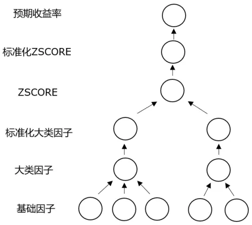
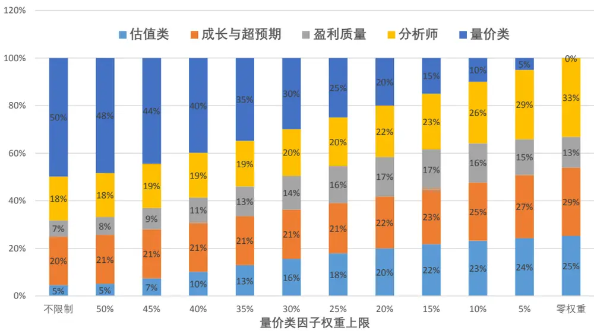
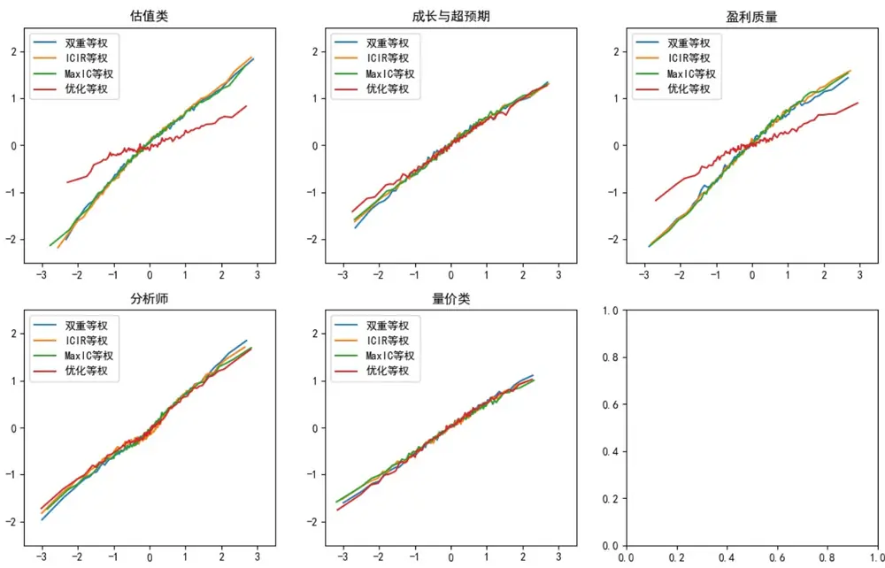
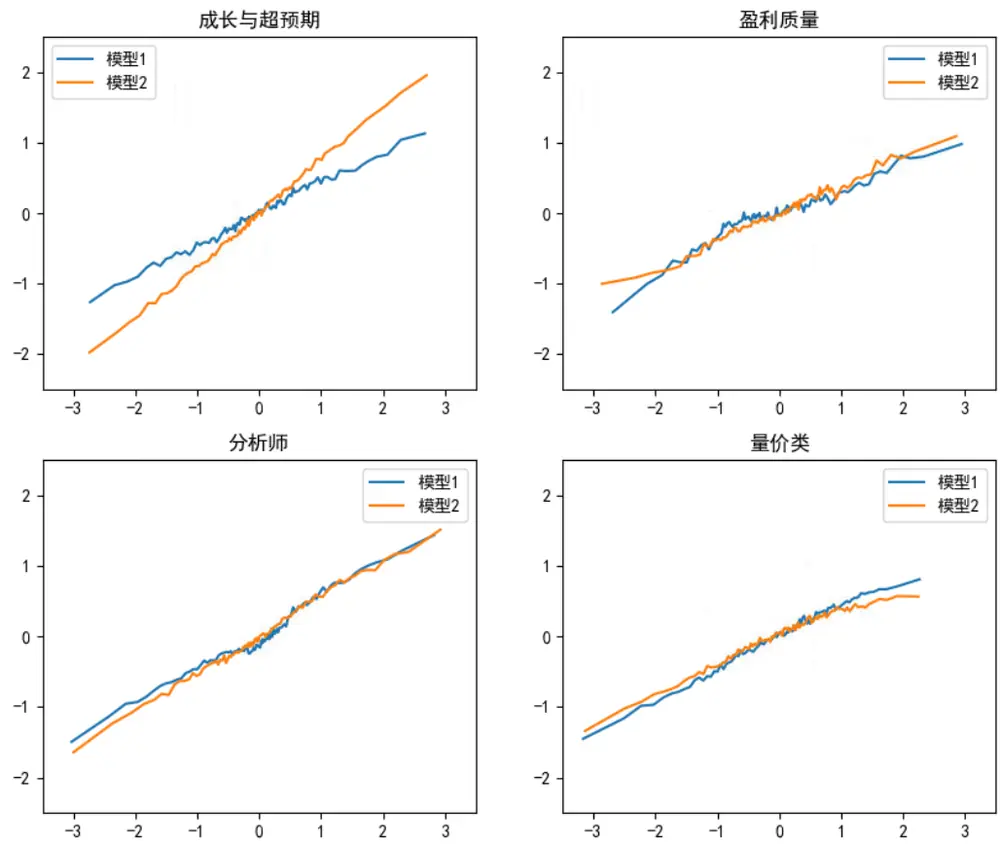

## ——因子选股系列报告之六十八

## 研究结论

传统的基于大类因子的因子加权方法可以抽象成简单的神经网络，指定损失函数后可以以一个时间截面数据作为批量通过基于梯度的优化算法学习大类因子内部的权重和大类间的权重。

- 在一定的情形下，最小化预测收益率和实际收益率的均方误差等价于最大化ZSCORE 的 IC，基于均方误差学习参数相当于找到一组参数使得模型ZSCORE 过去一段时间的平均 IC 最高。

- 如果不考虑大类因子的标准化层，基于大类的线性网络和简单线性网络等价，但之所以依然采用大类网络在于这种设计下更便于我们实践中对各个大类因子进行直接或者间接的干预。

- 我们尝试了对量价总个大类的权重进行适当的控制，发现在对大类因子进行适当程度的干预后虽然 ZSCORE 的 RankIC 和多空组合都会变弱，但指数增强组合的实际业绩却有不同程度的提升。

- 大类等权是一种常见的保守型加权方法，大类间虽然等权，但大类内部可能涉及多种不同的加权方法，等权、ICIR 加权、最大化 IC 加权等常见的合成大类的方法并没有充分考虑各个大类因子间的相关性，因此合成的单个大类因子可能表现很好，但大类等权的结果却不一定更佳。

- 通过大类网络一体化学习大类等权中各个大类因子内部权重的方法会充分考虑各个大类因子之间的相关性情况，实现多因子最优而不是单个大类因子表现最优，但是大类因子间相关性的大幅变化可能导致各大类因子对 ZSCORE的实际贡献可能和传统的大类等权有一定程度的差异，大类因子权重的设置需综合参考组合的收益、风险、换手等信息。

通过 ALE Plot 方法分析不同大类等权方式下 ZSCORE 对各大类因子的依赖情况，我们发现虽然各个大类因子合成 ZSCORE 的权重一样，但对 ZSCORE的实际贡献依然有较大差别，通过一体化学习的大类等权倾向于降低ZSCORE 对过去表现较差的大类因子的依赖。

- 我们可以将收益率预测问题转换为分类问题，采用二元交叉熵损失函数作为学习的目标，学习股票截面收益排名靠前的概率，实际测算下来相对学习均方误差损失，增强组合表现占优。但需要注意的是，二元交叉熵损失函数学习的股票排名靠前的概率和 ZSCORE 的 RankIC、增强组合收益并没有明确的关联，上述结果可能有数据依赖。

## 风险提示

- 量化模型失效风险

- 市场极端环境的冲击

报告发布日期2020 年 08 月 04 日

证券分析师 朱剑涛021-63325888*6077zhujiantao@orientsec.com.cn执业证书编号：S0860515060001

证券分析师王星星021-63325888*6108wangxingxing@orientsec.com.cn执业证书编号：S0860517100001

联系人 王星星 021-63325888*6108 wangxingxing@orientsec.com.cn

## 一、基于大类因子的加权框架

## 1.1 基于大类因子加权的网络结构

在多因子加权的实践中，为了降低问题的维度，我们一般从因子逻辑上将 alpha 因子分为估值、盈利、分析师等各个大类，单个 alpha 因子加权合成大类因子，最后加权各个大类的 alpha 因子得到最后的 ZSCORE。传统的基于大类因子的加权方法，一般是先基于大类内部单个因子的选股表现和因子相关性确定大类内部的权重，在此基础上根据各个大类因子的表现和相关性情况确定各个大类的权重，这种分层次的加权方法简单直观，而且在一定程度上避免了过拟合，但这种因子加权方法在确定大类因子内部权重时并没有考虑大类间因子的相关性，单个大类选股表现好并不一定代表多个大类的综合打分表现好。为了克服这种不一致性，我们可以借鉴神经网络端对端（endtoend）学习的优势，将基于大类因子加权的框架设计成简单的网络，大类内部的权重和大类间的权重都可以根据需要作为可学习的参数，统一学习多个大类加总指标的选股效果。

基于大类因子的加权方法一般分为单因子加总到大类因子、大类因子标准化、标准化大类因子加总到 ZSCORE、ZSCORE 标准化、标准化 ZSCORE 转化为预期收益率共 5 个步骤完成，ZSCORE 转换为预期收益率主要是量纲的调整，一般用带截距的线性变换实现，单个基础因子加权得到大类因子、标准化大类因子加权得到 ZSCORE 理论上可以设计复杂的非线性网络实现，但不是本文讨论的重点，本文采用不带截距的线性变换加权单因子到大类因子、加权大类因子到在 ZSCORE。

上述网络结构用公式表示如下：

$$
g_{m}={\sum}_{k}w_{k}^{m}\cdot x_{k}^{m}
$$

$$
g_{m}^{\prime}=std(g_{m})
$$

$$
z={\sum}_{m}w^{m}\cdot g_{m}^{\prime}
$$

$$
z^{\prime}=std(z)
$$

$$
{\hat{y}}=a+b\cdot z^{\prime}
$$

其中， $x_{k}^{m}$ 表示第 m 个大类的第 k 个因子， $w_{k}^{m}$ 表示第 m 个大类的第 k 个因子的权重，$g_{m}$ 表示第 m 个大类因子（标准化前），std表示批量标准化函数， $g_{m}^{\prime}$ 表示标准化后的第 m 个大类因子， $w^{m}$ 表示第 m 大类因子线性加权到 ZSCORE 的权重，z和z′分别表示标准化前和标准化后的 ZSCORE，ŷ表示网络预测的预期收益率，a和b表示 ZSCORE 转换为预期收益率ŷ的系数。

上述模型网络中单因子合成大类因子的权重 $w_{k}^{m}$ 、大类因子合成 ZSCORE 的权重wm是基于大类因子加权的重要参数，这两个系列参数都可以通过学习获得也可以通过经验知识事前指定，比如强行要求各个大类等权合成 ZSCORE。批量标准化函数std没有需要学习的参数，但是标准化与训练时的批量有关，为了和实际投资中的截面标准化相适应，我们在训练模型的时候每次将一个完整的时间截面数据作为一个批量学习。

需要提醒的是，如果不考虑两个标准化层，上述大类线性加权网络和直接基于基础因子的简单线性网络等价，但我们依然构建了这种基于大类因子的线性加权网络，主要原因在于把大类因子层独立出来有助于我们对大类因子权重进行直接或者间接的干预，这和我们实际操作时的习惯是一致的，由于基础因子一般有很多，我们很少直接干预，但我们经常会控制某个大类因子的权重，通过引入大类因子层就是为了便于这种操作，这一点在下文中会逐步得到体现。

## 1.2 均方误差损失函数及其和IC的关系

训练网络之前首先需要确定模型的损失函数，本篇报告暂时先采用最为常见的均方误差损失函数，关于损失函数更深入的探讨请参见第四章。对于批量为 B 的数据集，预测值 $[\hat{y}_{i}]$ }和真实值 $\{y_{i}\}$ }的均方误差损失函数定义如下：

$$
L(\theta)=\frac{1}{B}{\sum}_{i=1}^{B}(\hat{y}_{i}-y_{i})^{2}
$$

其中， $\theta]$ 为需要学习的模型参数

对应于本文的网络结构，最小化均方误差损失函数可以表示成如下形式：

$$
\operatorname*{min}_{w_{k}^{m},w^{m},a,b}\;\frac{1}{B}{\sum}_{i=1}^{B}(a+b\cdot z_{i}^{\prime}-y_{i})^{2}
$$

参数 a 和 b 并不影响 $|z_{i}^{\prime}|$ ，上述优化目标可以进一步写成如下形式：

$$
\operatorname*{min}_{w_{k}^{m},w^{m}}\operatorname*{min}_{a,b}\frac{1}{B}{\sum}_{i=1}^{B}(a+b\cdot z_{i}^{\prime}-y_{i})^{2}
$$

上述内层最优化问题就是序列 $\{y_{i}\}$ }对序列{z′}的一元线性回归，一元线性回归的最小残差平方和和自变量与因变量间的相关系数有显式关系，因此上述最优化问题进一步可以变形为：

$$
\operatorname*{min}_{w_{k}^{m},w^{m}}\;(1-corr(z_{i}^{\prime},y_{i})^{2})\cdotp\frac{1}{B}\cdotp\sum_{i=1}^{B}(y_{i}-\bar{y_{i}})^{2}
$$

其中，corr表示线性相关系数， $\overline{{y}}_{l}^{\mathrm{~1~}}$ 表示 $y_{i}$ 在批量中的均值

因为 $\begin{array}{r}{|\frac{1}{B}\cdot\sum_{i=1}^{B}(y_{i}-\overline{{y_{i}}})^{2}}\end{array}$ 2和参数 $w_{k}^{m}$ $w^{m}$ 无关，所以上述最小化问题等价于最大化z′和 $]y_{i}$ 线性相关系数的绝对值，即

$$
\operatorname*{max}_{w_{k}^{m},w^{m}}|corr(z_{i}^{\prime},y_{i})|
$$

相关系数的方向和参数 b 最优值的符号有关，可以通过适当的初始化策略保证参数 b 的取值大于 $0_{\circ}$ 因此，当预期收益率由 ZSCORE 线性转换而来时，最小化预期收益率和实际收益率的均方误差损失等价于最大化 ZSCORE 和股票收益率的线性相关系数，当训练的批量是一个时间截面的所有样本时，ZSCORE 和股票收益的线性相关系数就是我们常用来表征因子表现的 $\mathsf{IC}_{\circ}$

## 1.3 数据和训练的一些说明

和一般的动态加权方案类似，在每个月底我们根据过去 3 年的因子值和股票收益率训练模型，考察 20101231 至 20200630 期间的加总 ZSCORE 选股效果，样本空间取同期中证全指成分股（非金融部分，金融部分单独建模）。基于大类的线性网络依赖于 alpha 因子的主观分类，我们将因子库的 alpha 因子分为估值类、成长与超预期、盈利质量、分析师、量价类共 5 个大类因子。

由于每个 alpha 在事前我们都可以根据其逻辑意义判断选股方向，为了让优化的因子权重更容易理解，我们要求方向调整后每个因子前的权重系数大于零，考虑到模型训练的方便，这个权重非负的约束我们通过对负向权重惩罚实现。

大类线性加权网络中有批标准化的操作，为了和常见的截面因子标准化相适应，同时为了最小化均方误差损失函数和最大化 IC 相适应，我们在训练时采用一个时间截面的所有数据作为一个批量，过去 3 年的样本数据分为 36 个批量依次参与模型训练。在历史回测的第一个月度，模型网络中因子加权的参数都初始化为等权，ZSCORE 转换为预期收益率时 a 初始化为 0，b 初始化为 0.1，后续月份训练模型时以前一个月度训练后的模型参数作为初始值以减少训练时长。训练模型采用自适应的 Adam 优化算法。

下文涉及的指数增强均为月频调仓，选股样本空间同期中证全指成分股，金融部分单独建模，非金融部分按照本文相应的方法加权，组合优化时单行业暴露不超过 2%，市值暴露不超过 0.2，量纲年化调整后的风险厌恶系数取 20.，不做换手惩罚或者换手约束，组合表现均未扣费。关于组合换手的处理参考我们前期报告《关于组合换手的若干问题》。

## 二、对大类因子权重进行干预

## 2.1 设置量价类因子权重的上限

基于大类的网络设计很重要的一个特点就是便于对各个大类因子的权重进行直接或者间接的干预。假设我们事前对各个大类因子的表现有一定判断，完全可以事前指定部分单因子或者大类因子的权重取值，比如各个标准化后的大类因子等权合成 ZSCORE，大类内部单因子的权重交给模型去训练学习，而不是将全部的参数都交给模型。实际操作中一个比较常见的对大类因子权重的干预就是限制量价类因子的权重。由于量价类因子在全市场的 IC 和多空收益都较高，动态加权时往往会给予量价因子很高的权重，但是量价因子的收益大多集中在空头、而且在小市值股票中表现往往远好于大市值股票，所以实际增强组合发挥的作用并没有那么大，基于此，很多投资者在因子加权的实践中会适当控制量价类因子的权重。在本篇报告介绍的大类线性加权网络框架下可以通过损失函数适当的惩罚项设计控制量价类因子的权重。

假设我们要求量价类因子的权重 $w_{m}$ 不得高于 $w_{max},$ ，那么我们在原有损失函数L的基础上加上如下形式的惩罚项即可，理论上系数 c 应该取一个无穷大的数，但实际计算上由于精度的限制，c 的取值只要使得权重 $\left[w_{m}\right.$ 的变动引起c∙ $max(w_{m}-w_{max},0$ )的变动远大于损失函数L的变动即可。

$$
L+c\cdot\quad max(w_{m}-w_{max},0)
$$

从下图我们看到，当对量价类因子权重没有限制时，长期平均来看，量价类因子的权重占比达到 50%，随着对量价类因子权重的限制，量价类因子权重占比不断下降，当量价类因子权重上限限制在 40%甚至更低时，几乎每期量价类因子权重都打到上限。另一个比较有意思的现象的是，随着量价类因子的权重被不断压缩，其他大类因子的权重或多或少都会提升，其中估值因子的提升的幅度特别明显，从 5%的权重提升到 25%，由此可见，技术类因子和估值因子存在一定的相互替代关系。

图 1：不同量价类权重上限的各大类因子权重

数据来源：wind 咨询、东方证券研究所

## 2.2 不同量价类权重上限的选股表现

和权重偏离的惩罚类似，从 RankIC 和多空组合来看，在对量价类因子权重不做任何限制时多因子的 ZSCORE 表现最优，随着量价类权重上限的降低，ZSCORE 的 RankIC 和多空表现越来越差。但是从组合层面上看，适当的压低量价类因子的权重对指数增强的业绩是有益的，但量价类因子毕竟也有自己独立的 alpha，完全放弃量价类因子也不是一个很好的选择，即使从最近 3 年的业绩看，适当的引入量价类因子也能改善指数增强的收益。另外，毫无疑问的是，随着量价类因子权重的降低，组合的换手率也会逐步降低，在选择适合投资者自己的方案时也应考虑换手的影响。

图 2：不同量价类权重上限的ZSCORE 表现

|  | RankIC均值 年化ICIR IC的t值 |  |  | 多空年化收益 多空夏普 |  | 多空胜率 | 多空最大回测 | 多头月均换手 |
| --- | --- | --- | --- | --- | --- | --- | --- | --- |
| 不限制 | 16.0% | 7.72 | 23.79 | 70.2% | 5.92 | 96.5% | -7.7% | 63.5% |
| 上限50% | 15.7% | 7.55 | 23.26 | 69.2% | 5.88 | 95.6% | -7.9% | 62.5% |
| 上限45% | 15.6% | 7.53 | 23.20 | 68.7% | 5.87 | 95.6% | -8.0% | 61.7% |
| 上限40% | 15.5% | 7.48 | 23.06 | 68.0% | 5.90 | 94.7% | -7.9% | 60.1% |
| 上限35% | 15.3% | 7.43 | 22.89 | 67.6% | 5.82 | 95.6% | -8.2% | 58.1% |
| 上限30% | 14.9% | 7.30 | 22.48 | 65.3% | 5.80 | 95.6% | -8.6% | 55.6% |
| 上限25% | 14.4% | 7.10 | 21.89 | 62.4% | 5.66 | 97.4% | -8.7% | 52.7% |
| 上限20% | 13.7% | 6.78 | 20.90 | 58.1% | 5.53 | 97.4% | -9.1% | 49.5% |
| 上限15% | 12.8% | 6.35 | 19.57 | 52.3% | 5.06 | 96.5% | -9.5% | 46.1% |
| 上限10% | 11.8% | 5.82 | 17.95 | 45.1% | 4.65 | 94.7% | -9.3% | 43.0% |
| 上限5% | 10.7% | 5.25 | 16.20 | 40.7% | 4.29 | 92.1% | -10.0% | 40.9% |
| 零权重 | 9.5% | 4.66 | 14.36 | 36.8% | 3.93 | 91.2% | -9.8% | 39.6% |

数据来源：wind 咨询、东方证券研究所

图 3：不同量价类权重上限的沪深 300 增强
增强组合业绩指标

|  | 年化对冲收益 | 年化波动 | 信息比 | 月胜率 | 最大回撤 | 月均单边换手 |
| --- | --- | --- | --- | --- | --- | --- |
| 不限制 | 11.9% | 4.20% | 2.70 | 80.7% | 5.03% | 46.7% |
| 上限50% | 11.9% | 4.23% | 2.68 | 79.8% | 5.10% | 46.3% |
| 上限45% | 12.3% | 4.21% | 2.77 | 79.8% | 5.11% | 45.8% |
| 上限40% | 12.6% | 4.18% | 2.86 | 78.1% | 5.14% | 45.0% |
| 上限35% | 12.9% | 4.13% | 2.96 | 78.9% | 5.25% | 43.8% |
| 上限30% | 13.0% | 4.07% | 3.02 | 80.7% | 5.39% | 42.3% |
| 上限25% | 13.2% | 4.02% | 3.11 | 81.6% | 5.42% | 40.5% |
| 上限20% | 13.6% | 3.96% | 3.25 | 82.5% | 5.16% | 38.5% |
| 上限15% | 13.9% | 3.90% | 3.35 | 81.6% | 4.92% | 36.6% |
| 上限10% | 13.8% | 3.83% | 3.39 | 80.7% | 4.61% | 34.8% |
| 上限5% | 13.4% | 3.80% | 3.32 | 81.6% | 4.38% | 33.3% |
| 零权重 | 12.9% | 3.80% | 3.22 | 79.8% | 4.20% | 32.4% |

增强组合各年度对冲收益

图 4：不同量价类权重上限的沪深 500 增强增强组合业绩指标

| 年化对冲收益 | 年化波动 |  | 信息比 | 月胜率 | 最大回撤 | 月均单边换手 |
| --- | --- | --- | --- | --- | --- | --- |
| 不限制 | 20.7% | 5.08% | 3.73 | 86.0% | 4.14% | 69.5% |
| 上限50% | 20.3% | 5.05% | 3.68 | 86.8% | 4.26% | 68.9% |
| 上限45% | 20.8% | 5.03% | 3.78 | 86.8% | 4.24% | 68.1% |
| 上限40% | 21.3% | 5.00% | 3.90 | 86.8% | 4.31% | 66.8% |
| 上限35% | 21.8% | 4.94% | 4.01 | 87.7% | 4.30% | 65.0% |
| 上限30% | 22.2% | 4.90% | 4.12 | 90.4% | 4.47% | 63.0% |
| 上限25% | 22.7% | 4.83% | 4.26 | 92.1% | 4.56% | 60.5% |
| 上限20% | 23.2% | 4.76% | 4.40 | 89.5% | 4.45% | 57.6% |
| 上限15% | 23.1% | 4.69% | 4.46 | 89.5% | 4.12% | 54.6% |
| 上限10% | 22.7% | 4.66% | 4.41 | 89.5% | 3.78% | 51.7% |
| 上限5% | 22.1% | 4.67% | 4.30 | 89.5% | 3.53% | 49.5% |
| 零权重 | 21.6% | 4.69% | 4.19 | 86.8% | 3.44% | 48.2% |

|  | 2011年 2012年 | 2013年 | 2014年 |  | 2015年 | 2016年 | 2017年 | 2018年 | 2019年 | 2020年 |
| --- | --- | --- | --- | --- | --- | --- | --- | --- | --- | --- |
| 不限制 | 13.1% | 14.2% | 16.7% | 7.4% | 32.3% | 11.2% | 4.6% | 5.2% | 4.0% | 6.5% |
| 上限50% | 12.9% | 14.6% | 16.2% | 7.1% | 29.8% | 10.8% | 4.9% | 5.6% | 5.8% | 7.4% |
| 上限45% | 13.1% | 15.0% | 15.7% | 7.7% | 31.3% | 11.7% | 4.8% | 5.8% | 5.9% | 7.4% |
| 上限40% | 13.5% | 15.2% | 15.2% | 8.1% | 32.5% | 12.8% | 4.8% | 6.0% | 6.2% | 7.5% |
| 上限35% | 14.5% | 15.5% | 14.5% | 8.0% | 33.0% | 13.7% | 4.5% | 6.2% | 6.8% | 7.9% |
| 上限30% | 15.3% | 15.7% | 13.4% | 7.7% | 32.8% | 14.6% | 4.1% | 6.3% | 7.5% | 8.1% |
| 上限25% | 16.3% | 15.6% | 12.6% | 8.0% | 32.3% | 15.3% | 4.4% | 6.6% | 8.1% | 8.4% |
| 上限20% | 17.4% | 16.2% | 11.7% | 8.4% | 32.5% | 16.1% | 4.9% | 7.2% | 8.6% | 8.3% |
| 上限15% | 17.6% | 16.3% | 11.3% | 9.1% | 32.2% | 15.9% | 5.4% | 8.0% | 9.1% | 8.3% |
| 上限10% | 17.9% | 16.8% | 10.9% | 10.4% | 31.0% | 15.4% | 5.3% | 8.0% | 8.8% | 7.9% |
| 上限5% | 16.9% | 17.1% | 10.9% | 11.9% | 30.1% | 14.1% | 4.7% | 7.6% | 7.8% | 7.4% |
| 零权重 | 15.5% | 16.8% | 11.3% | 13.0% | 29.4% | 12.8% | 4.2% | 7.4% | 6.6% | 7.2% |

数据来源：wind 咨询、东方证券研究所

增强组合各年度对冲收益

| 2011年 2012年 |  | 2013年 |  | 2014年 | 2015年 2016年 |  | 2017年 | 2018年 |  | 2019年 2020年 |
| --- | --- | --- | --- | --- | --- | --- | --- | --- | --- | --- |
| 不限制 | 27.7% | 24.2% | 27.2% | 9.8% | 55.2% | 27.6% | 7.2% | 9.9% | 10.4% | 4.5% |
| 上限50% | 24.3% | 24.9% | 26.7% | 9.7% | 50.8% | 26.8% | 7.6% | 11.2% | 11.8% | 4.6% |
| 上限45% | 24.7% | 26.3% | 26.1% | 9.7% | 51.8% | 27.5% | 8.6% | 12.0% | 11.8% | 4.6% |
| 上限40% | 25.7% | 27.4% | 25.6% | 9.7% | 52.8% | 27.7% | 10.3% | 12.7% | 11.9% | 4.7% |
| 上限35% | 26.5% | 28.5% | 25.0% | 9.9% | 53.8% | 27.6% | 11.8% | 12.5% | 12.2% | 5.0% |
| 上限30% | 27.8% | 29.3% | 24.7% | 9.8% | 53.7% | 27.4% | 12.8% | 13.1% | 12.2% | 5.7% |
| 上限25% | 29.0% | 30.6% | 23.8% | 10.1% | 52.8% | 26.8% | 14.4% | 14.1% | 12.7% | 6.4% |
| 上限20% | 29.0% | 31.6% | 22.8% | 11.2% | 51.9% | 26.1% | 16.1% | 15.6% | 13.0% | 7.0% |
| 上限15% | 28.4% | 32.1% | 21.6% | 12.8% | 50.3% | 24.7% | 17.0% | 16.2% | 13.4% | 7.1% |
| 上限10% | 26.7% | 32.9% | 20.6% | 13.8% | 47.6% | 23.1% | 17.0% | 15.7% | 14.0% | 7.3% |
| 上限5% | 23.3% | 34.0% | 20.2% | 14.1% | 45.2% | 22.3% | 16.5% | 14.4% | 15.8% | 7.1% |
| 零权重 | 21.3% | 34.6% | 19.9% | 14.8% | 43.3% | 22.0% | 15.9% | 12.7% | 16.3% | 6.8% |

数据来源：wind 咨询、东方证券研究所

## 三、几种大类等权的比较

## 3.1 几种大类等权的构建方法

由于各个大类因子对指数增强组合实际的收益贡献很难预测，因此大类等权作为一种比较保守的因子加权方法被不少投资者在实践中采用。在大类等权的框架下，各个标准化大类因子加权合成 ZSCORE 的权重已经确定，各种大类等权加权方法的差异在于如何合成大类因子，一种最保守的做法是大类因子内部也等权合成大类因子，另外比较常见的一种做法是每个大类内部选择过去相对表现比较好的因子给与更高的权重（比如 ICIR 加权、最大化 IC加权），在本文大类线性加权网络的框架下也可以实现大类等权，如第二章所述，强行要求标准化后的大类因子等权合成 ZSCORE，各个大类因子内部的权重由模型一体化学习。

本章主要对比研究如下 4 种大类等权的加权方法：

双重等权：大类内部等权，大类间等权

ICIR 等权：大类内部根据过去 3 年的 ICIR 加权，大类间等权

MaxIC 等权：大类内部根据过去 3 年数据最大化 IC 加权，大类间等权

优化等权：大类间等权，大类内部通过最小化最终预测收益率和实际收益率的均方误差损失函数（最大化 IC）确定权重

前三种加权方法某个大类因子内部权重并不会影响其他大类因子内部权重的确定，各个大类内部权重的敲定是独立的，优化等权方法各个大类因子内部的权重是通过最大化大类等权总体表现确定的，各个大类因子内部权重相互依赖。

## 3.2 不同大类等权的选股表现

从 ZSCORE 的 RankIC 和多空组合来看，4 种大类等权方法中双重等权的表现最弱，ICIR 等权和 MaxIC 等权要略强于双重等权，但明显弱于优化等权，这点无论从 RankIC 的均值、多空收益还是 ICIR、多空夏普比等都可以看得出来。从增强组合表现层面看，基于优化等权方法构建的 300 增强组合和 500 增强组合长期业绩也要优于其他 3 种大类等权方法，因此，对于大类等权模型来讲，通过“端对端”的学习一体化确定各大类因子内部的权重的确对组合收益提升有一定帮助。但是需要引起注意的是，从下文分析可知，这种学习方法会增加成长和量价类因子的相对权重，因此组合换手率有提升；如果组合资金规模较大，扣除交易费用后，学习方法带来的收益提升可能会比较有限。

图 5：不同大类等权的 ZSCORE 表现

|  | RankIC均值 年化ICIR IC的t值 |  |  | 多空年化收益 | 多空夏普 | 多空胜率 |  | 多空最大回测 多头月均换手 |
| --- | --- | --- | --- | --- | --- | --- | --- | --- |
| 双重等权 | 10.8% | 4.26 | 13.12 | 35.6% | 3.04 | 81.6% | -13.9% | 31.0% |
| ICIR等权 | 11.4% | 4.59 | 14.14 | 41.0% | 3.52 | 86.0% | -15.0% | 33.0% |
| MaxIC等权 | 11.7% | 4.75 | 14.65 | 44.9% | 3.79 | 91.2% | -14.4% | 38.1% |
| 优化等权 | 13.9% | 7.00 | 21.57 | 58.8% | 5.59 | 96.5% | -7.9% | 50.4% |

数据来源：wind 咨询、东方证券研究所

图 6：不同大类等权的沪深 300 增强
增强组合业绩指标

|  | 年化对冲收益 | 年化波动 | 信息比 | 月胜率 | 最大回撤 | 月均单边换手 |
| --- | --- | --- | --- | --- | --- | --- |
| 双重等权 | 12.3% | 3.63% | 3.23 | 81.6% | 4.02% | 25.8% |
| ICIR等权 | 12.7% | 3.66% | 3.28 | 81.6% | 4.40% | 27.7% |
| MaxIC等权 | 12.5% | 3.68% | 3.23 | 80.7% | 4.31% | 31.4% |
| 优化等权 | 14.1% | 3.92% | 3.39 | 82.5% | 4.84% | 38.4% |

图 7：不同大类等权的沪深 500 增强
增强组合业绩指标

| 年化对冲收益 | 年化波动 | 信息比 | 月胜率 | 最大回撤 | 月均单边换手 |
| --- | --- | --- | --- | --- | --- |
| 双重等权 17.0% | 4.66% | 3.40 | 77.2% | 5.24% | 38.4% |
| ICIR等权 18.0% | 4.70% | 3.54 | 78.9% | 5.06% | 40.8% |
| MaxIC等权 19.2% | 4.71% | 3.76 | 80.7% | 5.52% | 47.4% |
| 优化等权 23.9% | 4.77% | 4.51 | 90.4% | 3.64% | 58.0% |

增强组合各年度对冲收益

|  | 2011年 2012年 |  | 2013年 2014年 |  | 2015年 | 2016年 | 2017年 | 2018年 | 2019年 | 2020年 |
| --- | --- | --- | --- | --- | --- | --- | --- | --- | --- | --- |
| 双重等权 | 13.7% | 14.5% | 11.6% | 7.1% | 23.2% | 16.4% | 12.0% | 10.7% | 6.7% | 2.2% |
| ICIR等权 | 14.2% | 16.6% | 13.2% | 6.2% | 23.9% | 16.6% | 11.6% | 11.9% | 4.6% | 2.7% |
| MaxIC等权 | 13.5% | 16.3% | 12.0% | 6.8% | 30.3% | 16.3% | 7.7% | 9.4% | 3.9% | 4.8% |
| 优化等权 | 19.5% | 15.9% | 12.2% | 9.3% | 34.3% | 15.6% | 6.4% | 7.5% | 8.7% | 6.7% |

增强组合各年度对冲收益
数据来源：wind 咨询、东方证券研究所

|  | 2011年 | 2012年 | 2013年 | 2014年 | 2015年 | 2016年 | 2017年 | 2018年 | 2019年 | 2020年 |
| --- | --- | --- | --- | --- | --- | --- | --- | --- | --- | --- |
| 双重等权 | 17.1% | 21.5% | 14.9% | 12.5% | 33.8% | 23.7% | 20.7% | 14.7% | 7.0% | -1.4% |
| ICIR等权 | 18.9% | 22.8% | 17.2% | 10.6% | 35.7% | 24.8% | 21.4% | 16.5% | 5.7% | -0.1% |
| MaxIC等权 | 17.1% | 27.7% | 16.7% | 9.0% | 44.6% | 25.5% | 21.1% | 13.2% | 7.9% | 4.0% |
| 优化等权 | 32.1% | 32.3% | 22.9% | 13.0% | 55.3% | 26.6% | 17.1% | 14.2% | 12.9% | 5.9% |

数据来源：wind 咨询、东方证券研究所

## 3.3 大类因子对 ZSCORE 的影响

不同的大类等权方法合成大类因子的方式不同，我们比较了不同方法下各大类因子的选股表现和大类因子间的相关性情况，发现了几个有意思的现象：

（1）虽然优化等权的 ZSCORE 选股表现最优，但优化等权方法下的各个大类因子表现并不突出，从 RankIC 均值来看，除了量价类因子外，其他大类因子都弱于其他三种加权方法下相应的大类因子。

（2）优化等权方法下各个大类因子两两间的任意相关系数都弱于其他三种加权方法下相应的两两相关系数，优化等权方法在确定大类因子内部权重时追求的是总体的 IC 最高，总体的 IC 不仅与单个大类自身的 IC 有关，也与各大类间的相关性有关，因此该算法下学得的权重，单个大类因子表现可能比较一般，总体 ZSCORE 的选股表现从结果上看相对其他大类等权方法更优。

图 8：双重等权下各大类因子相关性和因子表现
各大类因子相关性（左下因子值，右上 RankIC）

| 估值类 |  | 成长与超预期 盈利质量 分析师 |  |  | 量价类 |
| --- | --- | --- | --- | --- | --- |
| 估值类 |  | 0.0088 | -0.2483 | 0.2041 | 0.8208 |
| 成长与超预期 | 0.1108 |  | 0.5269 | 0.5850 | 0.0918 |
| 盈利质量 | 0.3333 | 0.2941 |  | 0.5849 | -0.1887 |
| 分析师量价类 | 0.2662 | 0.2638 | 0.2903 |  | 0.2409 |
|  | 0.4221 | 0.0109 | 0.1035 | 0.1754 |  |

图 9：ICIR 等权下各大类因子相关性和因子表现
各大类因子相关性（左下因子值，右上 RankIC）

| 估值类 |  | 成长与超预期 盈利质量 分析师 量价类 |  |  |  |
| --- | --- | --- | --- | --- | --- |
| 估值类 |  | 0.0716 | 0.0662 | 0.3946 | 0.7266 |
| 成长与超预期盈利质量 | 0.1033 |  | 0.6214 | 0.6130 | 0.0510 |
|  | 0.5154 | 0.2452 |  | 0.4816 | -0.0848 |
| 分析师量价类 | 0.2601 | 0.2708 | 0.2175 |  | 0.3438 |
|  | 0.3589 | -0.0098 | 0.1301 | 0.1522 |  |

各大类因子中证全指内选股表现

各大类因子中证全指内选股表现

|  | RankIC均值 年化ICIR |  | IC的t值 | 多空年化收益 | 多空夏普 | 多空胜率 | 多空最大回测 | 多头月均换手 |
| --- | --- | --- | --- | --- | --- | --- | --- | --- |
| 估值类 | 5.3% | 1.95 | 6.01 | 14.1% | 1.26 | 64.9% | -17.4% | 18.4% |
| 成长与超预期 | 5.6% | 3.11 | 9.59 | 22.0% | 2.56 | 80.7% | -12.2% | 28.4% |
| 盈利质量 | 3.7% | 1.35 | 4.17 | 10.2% | 0.98 | 60.5% | -20.2% | 15.2% |
| 分析师 | 6.5% | 3.62 | 11.17 | 19.9% | 2.60 | 77.2% | -5.0% | 40.0% |
| 量价类 | 12.2% | 4.34 | 13.38 | 40.6% | 2.89 | 83.3% | -10.5% | 42.3% |

数据来源：wind 咨询、东方证券研究所

|  | RankIC均值 | 年化ICIR IC的t值 |  | 多空年化收益 | 多空夏普 | 多空胜率 | 多空最大回测 | 多头月均换手 |
| --- | --- | --- | --- | --- | --- | --- | --- | --- |
| 估值类 | 5.4% | 2.30 | 7.09 | 13.9% | 1.38 | 67.5% | -17.5% | 18.7% |
| 成长与超预期 | 5.9% | 3.16 | 9.73 | 23.5% | 2.63 | 80.7% | -13.1% | 30.5% |
| 盈利质量 | 4.1% | 1.65 | 5.09 | 12.1% | 1.21 | 63.2% | -17.6% | 16.4% |
| 分析师 | 6.6% | 4.07 | 12.55 | 22.6% | 2.86 | 81.6% | -5.2% | 41.9% |
| 量价类 | 13.0% | 5.06 | 15.58 | 46.4% | 3.71 | 89.5% | -9.1% | 51.2% |

数据来源：wind 咨询、东方证券研究所

图 10：MaxIC 等权下各大类因子相关性和因子表现
各大类因子相关性（左下因子值，右上 RankIC）

| 估值类 |  | 成长与超预期 盈利质量 |  | 分析师 | 量价类 |
| --- | --- | --- | --- | --- | --- |
| 估值类 |  | -0.0395 | 0.0272 | 0.1499 | 0.5441 |
| 成长与超预期盈利质量分析师量价类 | 0.0783 |  | 0.5865 | 0.6854 | 0.1740 |
|  | 0.4276 | 0.1902 |  | 0.6784 | 0.1908 |
|  | 0.26120.2678 | 0.2407 | 0.2456 |  | 0.2421 |
|  |  | 0.0192 | 0.1156 | 0.1525 |  |

各大类因子中证全指内选股表现

图 11：优化等权下各大类因子相关性和因子表现
各大类因子相关性（左下因子值，右上 RankIC）

| 估值类 |  | 成长与超预期 盈利质量 |  | 分析师 量价类 |  |
| --- | --- | --- | --- | --- | --- |
| 估值类 |  | -0.3265 | -0.7436 | -0.3716 | 0.3191 |
| 成长与超预期盈利质量 | -0.0829 |  | 0.4490 | 0.4882 | -0.0504 |
|  | -0.3435 | 0.0255 |  | 0.5229 | -0.2188 |
| 分析师量价类 | -0.0135 | 0.1578 | 0.0897 |  | 0.0458 |
|  | 0.1826 | -0.0478 | 0.0382 | 0.0698 |  |

各大类因子中证全指内选股表现

|  | RankIC均值 年化ICIR |  |  |  |  |  |  | IC的t值 多空年化收益 多空夏普 多空胜率 多空最大回测 多头月均换手 |
| --- | --- | --- | --- | --- | --- | --- | --- | --- |
| 估值类 | 5.3% | 1.98 | 6.10 | 12.1% | 1.08 | 61.4% | -20.7% | 19.0% |
| 成长与超预期 | 6.0% | 3.24 | 9.98 | 23.9% | 2.65 | 80.7% | -12.2% | 32.6% |
| 盈利质量 | 4.0% | 1.88 | 5.80 | 11.0% | 1.28 | 64.9% | -12.8% | 17.7% |
| 分析师 | 7.1% | 3.61 | 11.13 | 26.9% | 3.06 | 79.8% | -8.8% | 42.2% |
| 量价类 | 12.9% | 6.35 | 19.56 | 49.5% | 4.24 | 92.1% | -11.6% | 64.3% |

数据来源：wind 咨询、东方证券研究所

|  | RankIC均值 年化ICIR |  | IC的t值 | 多空年化收益 | 多空夏普 |  | 多空胜率 多空最大回测 | 多头月均换手 |
| --- | --- | --- | --- | --- | --- | --- | --- | --- |
| 估值类 | 3.1% | 0.86 | 2.65 | 8.1% | 0.67 | 50.0% | -20.1% | 16.2% |
| 成长与超预期 | 5.5% | 3.71 | 11.42 | 22.6% | 2.86 | 83.3% | -9.9% | 34.8% |
| 盈利质量 | 3.2% | 1.44 | 4.43 | 9.5% | 1.08 | 64.9% | -15.8% | 13.6% |
| 分析师 | 6.2% | 3.67 | 11.32 | 23.8% | 3.28 | 84.2% | -6.7% | 46.3% |
| 量价类 | 13.5% | 6.49 | 19.99 | 54.0% | 4.45 | 93.9% | -15.9% | 69.9% |

数据来源：wind 咨询、东方证券研究所

在大类因子权重一定的情况下，大类因子间相关性的改变也会改变 ZSCORE 对各个大类因子的依赖关系，为了更直观的展示在各种大类等权加权方法下 ZSCORE 和各个大类因子的关系，我们绘制了 ZSCORE 与各大类因子间的 ALE 依赖图（Accumulated Local EffectsPlots，详细定义可以参考 Christoph Molnar 的“Interpretable Machine Learning”第 5.3 节）。

加总 ZSCORE 对大类因子的 ALE 图表征了在大类因子既定取值下 ZSCORE 取值的期望水平。分析不同大类等权方法下的 ZSCORE 对各个大类因子的部分依赖图，不难有如下发现：

（1）双重等权、ICIR 等权、MaxIC 等权三种加权方法在确定大类内部权重时均没有考虑大类因子两两间的相关性，这三种加权方法下的大类因子两两相关性比较接近，相应的从部分依赖图上看，ZSCORE 对各大类因子的依赖关系也比较一致。

（2）虽然各个大类因子间通过等权方式合成 ZSCORE，但 ZSCORE 对各个大类因子的依赖程度不一样，从依赖图的斜率来看，优化等权下估值和盈利质量类因子对 ZSCORE 的影响相对其他因子更弱，而其他加权方法下，估值和分析师对 ZSCORE 的影响明显大于其他因子。

（3）优化等权方法通过大类间相关性的调整使得估值类和盈利质量类因子对 ZSCORE的影响显著弱于其他三种大类等权方法。由于估值类和盈利质量类因子的长期表现相对其他大类因子更弱，在最大化 IC 目标函数的引导下，虽然这两个大类因子合成 ZSCORE 的权重已设定，但通过调整大类间相关性依然可以使得 ZSCORE 对这两类因子的依赖在一定范围内弱化。也就说估值和盈利这两类相对比较弱的因子在学习过程中，贡献被弱化了；但是需要注意的是弱化的程度与选用的因子、股票池有关，无法事先估算，只能通过最后组合收益、风险、换手等特征来确定是否合适。

图 12：大类等权的 ZSCORE对各大类因子的 ALE依赖图

数据来源：wind 咨询、东方证券研究所

为了研究各个大类因子对 ZSCORE 选股表现的贡献，我们借鉴 VariableImportance 的算法，计算了各个大类因子对 ZSCORE 的 RankIC 均值的边际贡献（理论上应该计算对预测损失函数的边际贡献，但在一定情况下均方损失函数和 IC 等价，考虑到 IC 更加直观，我们计算各个大类因子对 RankIC的边际贡献，每个大类因子 VariableImportance 定义为剔除该大类因子后模型学得 ZSCOER 的 RankIC 均值减少的量）。从结果来看，我们发现优化等权的方法相对其他 3 种大类等权方法，量价类因子对 RankIC 边际贡献明显增加，这在一定程度上解释了优化等权 ZSCORE 因子表现更好的背后来源。

图 13：不同大类等权下各大类因子对 ZSCORE 的 RankIC 边际贡献（Variable Importance）

|  | 估值类 | 成长与超预期 | 盈利质量 | 分析师 | 量价类 |
| --- | --- | --- | --- | --- | --- |
| 双重等权 | -0.4% | 0.4% | -0.8% | 0.2% | 3.0% |
| ICIR等权 | -0.7% | 0.5% | -1.0% | 0.3% | 3.3% |
| MaxIC等权 | -0.6% | 0.6% | -0.9% | 0.4% | 3.3% |
| 优化等权 | 0.2% | 0.8% | -0.1% | 0.1% | 4.4% |

数据来源：wind 咨询、东方证券研究所

上述所有 ZSCORE 与大类因子的依赖关系均以大类等权为基础测算，实现投资中我们会对各个大类因子的表现事前有个判断，进而在大类权重设置中得到体现，理论上讲，如果我们提高某一类因子权重后 ZSCORE 对该因子的依赖程度也会提高。假设我们原本采用优化等权的模型，但在 19 年年底认为 2020 年估值因子表现会比较弱、成长超预期因子会比较强，我们完全可以在大类线性网络中将估值因子的权重全部转移给成长超预期因子（估值大类因子的权重由 1/5 调整至0，将成长与超预期因子的权重由 1/5 调整至2/5）。记原来的优化等权为模型1，大类权重调整后的模型为模型2，通过ALE依赖图比较两种模型下ZSCORE对各大类因子的依赖，我们发现权重调整后 ZSCORE 对成长超预期的依赖明显增强，因为今年估值因子表现明显弱于成长超预期，权重调整后沪深 300 增强组合今年的对冲收益（截至20200630）由 6.7%提升至 9.4%、中证 500 增强组合的对冲收益由 5.9%提升至 7.0%，增强业绩均有所提升。

图 14：权重调整前后 ZSCORE 对各大类因子的 ALE依赖图

数据来源：wind 咨询、东方证券研究所

## 四、损失函数对组合收益的影响

## 4.1 二元分类交叉熵损失函数

目前为止，确定因子权重时我们学习的都是预测收益率和实际收益率的均方误差损失函数，这种损失函数具有很好的计算性能，当预测误差满足正太分布假设时，最小化均方误差和最大化对数似然等价。除了均方误差损失函数，学习中还经常采用的一种损失函数就是分类问题的交叉熵损失函数。我们可以尝试把收益率预测的问题转换为二元分类的问题，把因子加权的学习目标由预测收益率和实际收益率间的均方误差损失函数转换为预测股票收益是否排名靠前的二元交叉熵损失函数。

因子加权模型的预测ŷ 和和真实收益 $\mathbf{:}y_{i}$ 的均方误差损失函数有如下形式：

$$
MSE(\theta)=\frac{1}{B}{\sum}_{i=1}^{B}(\hat{y}_{i}-y_{i})^{2}
$$

我们通过 sigmoid 函数将模型的预测ŷ 转换为股票收益是否排名靠前的概率：

$$
\widehat{y_{i}^{\prime}}=\frac{1}{1+e^{-\widehat{y}_{i}}}
$$

记y′为股票 i 在当月的收益率 $\dot{z}y_{i}$ 是否在样本空间内排名前 30%的虚拟变量（是记为 1，否记为 0，排名参数 30%的稳健性在下一节讨论）

假设各样本独立，那么一个时间截面批量的似然函数为：

$$
\prod_{i=1}^{B}\widehat{y_{i}^{\prime}}^{y_{i}^{\prime}}\cdot\left(1-\widehat{y_{i}^{\prime}}\right)^{\left(1-y_{i}^{\prime}\right)}
$$

二元分类的负对数似然即为二元交叉熵损失函数（Binary Cross Entropy，BCE）

$$
\frac{1}{B}\sum_{i=1}^{B}-y_{i}^{\prime}\cdot log\left(\widehat{y_{i}^{\prime}}\right)-\left(1-y_{i}^{\prime}\right)\cdot log\left(1-\widehat{y_{i}^{\prime}}\right)
$$

我们比较了均方误差 MSE 和二元交叉熵 BCE 两种损失函数在各大类因子完全不做控制的纯动态加权和各大类因子完全等权两种加权方案下的实际选股效果。

从 ZSCORE 的 RankIC 和多空组合来看，基于二元交叉熵损失函数的加权方法都弱于相应的基于均方误差损失函数的加权方法，最小化均方误差损失等价于最大化 IC，因此基于均方误差损失函数学得的 ZSCORE 自然会有更高的 IC 值，但高的 IC并不意味着好的增强组合表现。从沪深 300 和中证 500 增强组合的实际表现看，无论是年化对冲收益还是信息比，基于二元交叉熵损失学得的权重在增强组合业绩上都有更佳的表现，对于权重自由度较大的纯动态加权来说，两者差异较大，但是如果限制了各个大类的权重必须为等权，这种差异就大幅收窄，从各个年度来看，两种损失函数造成的业绩差异在最近几年尤其明显。

但需要注意的是，二元交叉熵损失函数学习的是股票排名靠前（前 30%）的概率，这个概率和 ZSCORE 的 RankIC、增强组合收益并没有明确的关联，上述结果可能依赖因子库的选择、组合的参数设置。

图 15：MSE和 BCE 两种损失函数下的 ZSCORE 表现对比

|  | RankIC均值 | 年化ICIR IC的t值 |  | 多空年化收益 | 多空夏普 | 多空胜率 | 多空最大回测 | 多头月均换手 |
| --- | --- | --- | --- | --- | --- | --- | --- | --- |
| 动态MSE | 16.0% | 7.72 | 23.79 | 70.2% | 5.92 | 96.5% | -7.7% | 63.5% |
| 动态BCE | 14.2% | 5.77 | 17.79 | 63.0% | 4.81 | 93.9% | -11.4% | 56.7% |
| 等权MSE | 13.9% | 7.00 | 21.57 | 58.8% | 5.59 | 96.5% | -7.9% | 50.4% |
| 等权BCE | 12.8% | 5.81 | 17.90 | 54.3% | 5.16 | 94.7% | -12.0% | 46.7% |

数据来源：wind 咨询、东方证券研究所

图 16：MSE 和 BCE 两种损失函数下沪深 300增强表现对比
图 17：MSE 和 BCE 两种损失函数下中证 500增强表现对比
增强组合业绩指标

|  | 年化对冲收益 | 年化波动 | 信息比 | 月胜率 | 最大回撤 | 月均单边换手 |
| --- | --- | --- | --- | --- | --- | --- |
| 动态MSE | 11.9% | 4.20% | 2.70 | 80.7% | 5.03% | 46.7% |
| 动态BCE | 14.2% | 4.44% | 3.02 | 83.3% | 6.52% | 44.2% |
| 等权MSE | 14.1% | 3.92% | 3.39 | 82.5% | 4.84% | 38.4% |
| 等权BCE | 15.1% | 4.01% | 3.53 | 84.2% | 5.64% | 37.3% |

增强组合各年度对冲收益

增强组合业绩指标

| 年化对冲收益 | 年化波动 | 信息比 | 月胜率 | 最大回撤 | 月均单边换手 |
| --- | --- | --- | --- | --- | --- |
| 动态MSE 20.7% | 5.08% | 3.73 | 86.0% | 4.14% | 69.5% |
| 动态BCE 22.3% | 5.66% | 3.59 | 80.7% | 5.06% | 65.0% |
| 等权MSE 23.9% | 4.77% | 4.51 | 90.4% | 3.64% | 58.0% |
| 等权BCE 24.1% | 5.16% | 4.21 | 90.4% | 5.55% | 54.8% |

|  | 2011年 | 2012年 | 2013年 | 2014年 | 2015年 | 2016年 | 2017年 | 2018年 | 2019年 | 2020年 |
| --- | --- | --- | --- | --- | --- | --- | --- | --- | --- | --- |
| 动态MSE | 13.1% | 14.2% | 16.7% | 7.4% | 32.3% | 11.2% | 4.6% | 5.2% | 4.0% | 6.5% |
| 动态BCE | 13.9% | 18.2% | 20.9% | 5.4% | 32.5% | 11.3% | 8.4% | 7.1% | 8.9% | 10.6% |
| 等权MSE | 19.5% | 15.9% | 12.2% | 9.3% | 34.3% | 15.6% | 6.4% | 7.5% | 8.7% | 6.7% |
| 等权BCE | 16.1% | 19.3% | 16.7% | 8.2% | 35.3% | 14.1% | 9.1% | 9.4% | 8.4% | 9.2% |

数据来源：wind 咨询、东方证券研究所

增强组合各年度对冲收益

|  | 2011年 | 2012年 | 2013年 | 2014年 | 2015年 | 2016年 | 2017年 | 2018年 | 2019年 | 2020年 |
| --- | --- | --- | --- | --- | --- | --- | --- | --- | --- | --- |
| 动态MSE | 27.7% | 24.2% | 27.2% | 9.8% | 55.2% | 27.6% | 7.2% | 9.9% | 10.4% | 4.5% |
| 动态BCE | 26.2% | 30.5% | 30.9% | 4.1% | 47.9% | 27.1% | 8.9% | 14.5% | 16.5% | 10.4% |
| 等权MSE | 32.1% | 32.3% | 22.9% | 13.0% | 55.3% | 26.6% | 17.1% | 14.2% | 12.9% | 5.9% |
| 等权BCE | 26.8% | 33.7% | 25.5% | 8.7% | 51.8% | 26.3% | 19.8% | 19.2% | 12.4% | 8.9% |

数据来源：wind 咨询、东方证券研究所

## 4.2 分类参数的稳健性分析

采用二元交叉熵损失函数作为因子加权的学习目标涉及到一个分类参数，股票的收益率在样本空间排名前多少才算排名靠前，上一小节我们默认采用了 30%作为一个股票分类的参数，本小节我们测算了 20%至50%间共7 个分类参数下 ZSCORE 和增强组合表现，以此展示分类参数的稳健性情况。

从 ZSCORE 的表现来看，分类参数从 20%递增到50%的过程中，分类越来越均匀，相应的，ZSCORE 的 RankIC 和多空组合表现越好，但指数增强的业绩反而会变差。分类参数从 50%递减到20%的过程中，指数增强组合的业绩表现（年化对冲收益、信息比等）有一个逐渐变好并趋于平稳的过程，权重自由度更大的动态加权相对大类等权来说这个变化幅度更加显著。总体来说，增强组合的业绩对我们的分类参数在 30%附近并没有过于敏感的现象。

图 21：不同分类参数下的沪深300 增强表现（大类等权）增强组合业绩指标
图 18：不同分类参数下的 ZSCORE 表现（动态加权）

|  | RankIC均值 | 年化ICIR | IC的t值 | 多空年化收益 | 多空夏普 | 多空胜率 | 多空最大回测 | 多头月均换手 |
| --- | --- | --- | --- | --- | --- | --- | --- | --- |
| 前20% | 12.4% | 4.56 | 14.07 | 54.2% | 3.95 | 90.4% | -14.4% | 51.8% |
| 前25% | 13.3% | 5.14 | 15.83 | 58.4% | 4.34 | 92.1% | -12.4% | 53.8% |
| 前30% | 14.2% | 5.77 | 17.79 | 63.0% | 4.81 | 93.9% | -11.4% | 56.7% |
| 前35% | 14.8% | 6.32 | 19.49 | 65.4% | 5.20 | 94.7% | -10.4% | 60.0% |
| 前40% | 15.3% | 6.84 | 21.09 | 67.3% | 5.40 | 94.7% | -9.3% | 62.5% |
| 前45% | 15.7% | 7.23 | 22.30 | 69.0% | 5.75 | 97.4% | -8.9% | 63.6% |
| 前50% | 15.9% | 7.29 | 22.46 | 67.8% | 5.60 | 95.6% | -9.0% | 64.2% |

数据来源：wind 咨询、东方证券研究所

图 19：不同分类参数下的 ZSCORE 表现（大类等权）

|  | RankIC均值 | 年化ICIR | IC的t值 | 多空年化收益 | 多空夏普 | 多空胜率 | 多空最大回测 | 多头月均换手 |
| --- | --- | --- | --- | --- | --- | --- | --- | --- |
| 前20% | 11.3% | 4.69 | 14.45 | 47.6% | 4.18 | 93.9% | -13.9% | 43.7% |
| 前25% | 12.2% | 5.32 | 16.40 | 52.3% | 4.66 | 93.0% | -13.3% | 45.7% |
| 前30% | 12.8% | 5.81 | 17.90 | 54.4% | 5.16 | 94.7% | -12.0% | 46.7% |
| 前35% | 13.1% | 6.13 | 18.90 | 54.4% | 5.24 | 97.4% | -11.3% | 47.8% |
| 前40% | 13.5% | 6.43 | 19.82 | 55.6% | 5.49 | 98.2% | -10.9% | 49.2% |
| 前45% | 13.7% | 6.61 | 20.39 | 56.3% | 5.32 | 95.6% | -10.0% | 49.5% |
| 前50% | 13.8% | 6.68 | 20.59 | 57.2% | 5.36 | 94.7% | -8.4% | 49.8% |

数据来源：wind 咨询、东方证券研究所

图 20：不同分类参数下的沪深 300 增强表现（动态加权）
增强组合业绩指标

|  | 年化对冲收益 | 年化波动 | 信息比 | 月胜率 | 最大回撤 | 月均单边换手 |
| --- | --- | --- | --- | --- | --- | --- |
| 前20% | 14.6% | 4.62% | 2.97 | 79.8% | 7.04% | 42.4% |
| 前25% | 14.6% | 4.48% | 3.06 | 80.7% | 6.62% | 42.9% |
| 前30% | 14.2% | 4.44% | 3.02 | 83.3% | 6.52% | 44.2% |
| 前35% | 13.7% | 4.41% | 2.93 | 82.5% | 6.47% | 45.5% |
| 前40% | 13.0% | 4.36% | 2.83 | 81.6% | 6.18% | 46.6% |
| 前45% | 12.5% | 4.27% | 2.78 | 80.7% | 5.76% | 46.7% |
| 前50% | 12.1% | 4.20% | 2.73 | 79.8% | 5.28% | 47.0% |

增强组合各年度对冲收益

|  | 年化对冲收益 | 年化波动 | 信息比 | 月胜率 | 最大回撤 | 月均单边换手 |
| --- | --- | --- | --- | --- | --- | --- |
| 前20% | 15.2% | 4.19% | 3.39 | 81.6% | 6.01% | 35.7% |
| 前25% | 15.3% | 4.10% | 3.49 | 83.3% | 5.83% | 36.8% |
| 前30% | 15.1% | 4.01% | 3.53 | 84.2% | 5.64% | 37.3% |
| 前35% | 15.0% | 3.96% | 3.55 | 85.1% | 5.62% | 37.6% |
| 前40% | 14.6% | 3.91% | 3.49 | 83.3% | 5.46% | 37.8% |
| 前45% | 14.5% | 3.89% | 3.50 | 82.5% | 5.32% | 37.7% |
| 前50% | 14.0% | 3.87% | 3.40 | 82.5% | 5.11% | 37.8% |

|  | 2011年 2012年 |  | 2013年 | 2014年 |  | 2015年 2016年 | 2017年 | 2018年 | 2019年 | 2020年 |
| --- | --- | --- | --- | --- | --- | --- | --- | --- | --- | --- |
| 前20% | 14.6% | 17.0% | 23.5% | 5.5% | 32.9% | 8.9% | 6.9% | 8.6% | 9.7% | 13.1% |
| 前25% | 14.6% | 17.5% | 22.6% | 5.9% | 32.4% | 11.3% | 8.1% | 6.2% | 9.5% | 12.3% |
| 前30% | 13.9% | 18.2% | 20.9% | 5.4% | 32.5% | 11.3% | 8.4% | 7.1% | 8.9% | 10.6% |
| 前35% | 13.7% | 16.8% | 20.0% | 6.8% | 32.2% | 12.2% | 7.0% | 5.5% | 8.3% | 9.7% |
| 前40% | 14.5% | 15.9% | 18.2% | 7.7% | 31.9% | 11.9% | 6.3% | 4.1% | 6.5% | 8.9% |
| 前45% | 14.8% | 15.5% | 17.0% | 8.3% | 32.6% | 12.6% | 4.3% | 3.9% | 4.7% | 7.5% |
| 前50% | 14.8% | 15.9% | 17.8% | 8.2% | 31.7% | 12.3% | 3.2% | 3.9% | 3.2% | 6.1% |

数据来源：wind 咨询、东方证券研究所

增强组合各年度对冲收益

|  | 2011年 2012年 |  | 2013年 | 2014年 | 2015年 | 2016年 | 2017年 | 2018年 | 2019年 | 2020年 |
| --- | --- | --- | --- | --- | --- | --- | --- | --- | --- | --- |
| 前20% | 15.2% | 18.3% | 16.1% | 7.1% | 35.6% | 12.7% | 9.7% | 8.5% | 9.7% | 13.0% |
| 前25% | 16.2% | 20.0% | 16.9% | 7.8% | 34.9% | 13.5% | 9.5% | 8.1% | 8.8% | 11.5% |
| 前30% | 16.1% | 19.3% | 16.7% | 8.2% | 35.3% | 14.1% | 9.2% | 9.4% | 8.3% | 9.2% |
| 前35% | 17.2% | 18.9% | 15.8% | 8.6% | 35.1% | 15.4% | 8.1% | 9.1% | 7.5% | 8.6% |
| 前40% | 18.1% | 17.5% | 14.5% | 8.8% | 35.2% | 15.6% | 7.3% | 8.4% | 7.6% | 7.3% |
| 前45% | 19.2% | 17.2% | 13.0% | 9.1% | 35.5% | 16.3% | 7.2% | 7.4% | 8.6% | 6.6% |
| 前50% | 19.1% | 16.8% | 12.7% | 9.3% | 35.3% | 15.8% | 6.7% | 6.2% | 7.8% | 5.7% |

数据来源：wind 咨询、东方证券研究所

图 22：不同分类参数下的中证 500 增强表现（动态加权）
增强组合业绩指标

|  | 年化对冲收益 | 年化波动 | 信息比 | 月胜率 | 最大回撤 | 月均单边换手 |
| --- | --- | --- | --- | --- | --- | --- |
| 前20% | 23.1% | 5.96% | 3.51 | 78.1% | 5.68% | 62.4% |
| 前25% | 22.7% | 5.76% | 3.58 | 79.8% | 5.47% | 63.4% |
| 前30% | 22.3% | 5.66% | 3.59 | 80.7% | 5.06% | 65.0% |
| 前35% | 21.5% | 5.54% | 3.55 | 81.6% | 4.91% | 67.2% |
| 前40% | 21.0% | 5.44% | 3.53 | 83.3% | 4.58% | 69.1% |
| 前45% | 20.9% | 5.29% | 3.62 | 84.2% | 4.32% | 70.2% |
| 前50% | 20.7% | 5.15% | 3.68 | 85.1% | 3.89% | 70.8% |

增强组合各年度对冲收益

图 23：不同分类参数下的中证 500 增强表现（大类等权）
增强组合业绩指标

|  | 年化对冲收益 | 年化波动 | 信息比 | 月胜率 | 最大回撤 | 月均单边换手 |
| --- | --- | --- | --- | --- | --- | --- |
| 前20% | 24.4% | 5.36% | 4.09 | 86.8% | 5.66% | 52.8% |
| 前25% | 24.5% | 5.26% | 4.20 | 87.7% | 5.73% | 54.2% |
| 前30% | 24.1% | 5.16% | 4.21 | 90.4% | 5.55% | 54.8% |
| 前35% | 23.9% | 5.05% | 4.28 | 89.5% | 5.36% | 55.5% |
| 前40% | 23.8% | 4.96% | 4.33 | 90.4% | 5.00% | 56.5% |
| 前45% | 23.9% | 4.87% | 4.41 | 89.5% | 4.49% | 57.4% |
| 前50% | 23.2% | 4.79% | 4.37 | 90.4% | 3.77% | 57.9% |

|  | 2011年 2012年 |  | 2013年 | 2014年 2015年 |  | 2016年 | 2017年 | 2018年 2019年 |  | 2020年 |
| --- | --- | --- | --- | --- | --- | --- | --- | --- | --- | --- |
| 前20% | 23.4% | 32.3% | 31.9% | 3.3% | 47.6% | 25.5% | 13.2% | 14.4% | 18.6% | 13.2% |
| 前25% | 25.8% | 31.3% | 30.5% | 4.2% | 47.5% | 27.0% | 12.4% | 12.2% | 17.3% | 11.7% |
| 前30% | 26.2% | 30.5% | 30.9% | 4.1% | 47.9% | 27.1% | 8.9% | 14.5% | 16.5% | 10.4% |
| 前35% | 27.5% | 27.0% | 30.7% | 5.4% | 47.9% | 28.3% | 6.0% | 13.0% | 15.3% | 8.8% |
| 前40% | 28.7% | 26.2% | 30.3% | 6.5% | 50.0% | 28.0% | 5.9% | 11.3% | 12.2% | 6.5% |
| 前45% | 28.8% | 25.5% | 29.0% | 7.8% | 52.2% | 29.0% | 6.5% | 11.6% | 10.1% | 5.2% |
| 前50% | 27.6% | 25.4% | 28.1% | 9.0% | 54.0% | 27.4% | 6.3% | 12.1% | 8.7% | 4.7% |

数据来源：wind 咨询、东方证券研究所

增强组合各年度对冲收益

|  | 2011年 2012年 |  | 2013年 | 2014年 | 2015年 | 2016年 | 2017年 |  |  | 2018年 2019年 2020年 |
| --- | --- | --- | --- | --- | --- | --- | --- | --- | --- | --- |
| 前20% | 27.3% | 31.5% | 22.4% | 7.0% | 52.7% | 25.1% | 21.3% | 21.7% | 14.9% | 11.3% |
| 前25% | 26.1% | 35.8% | 27.1% | 8.5% | 52.5% | 26.3% | 20.9% | 16.7% | 13.3% | 10.4% |
| 前30% | 26.8% | 33.7% | 25.5% | 8.7% | 51.8% | 26.3% | 19.8% | 19.2% | 12.4% | 8.9% |
| 前35% | 28.8% | 32.4% | 24.5% | 9.1% | 51.4% | 26.8% | 18.2% | 19.3% | 12.2% | 8.9% |
| 前40% | 30.1% | 32.7% | 23.0% | 10.2% | 52.0% | 26.6% | 17.5% | 18.9% | 12.4% | 7.3% |
| 前45% | 30.9% | 31.2% | 23.7% | 11.3% | 53.2% | 27.5% | 18.3% | 17.4% | 12.0% | 6.0% |
| 前50% | 31.9% | 32.1% | 22.7% | 13.1% | 55.6% | 25.6% | 16.0% | 13.2% | 10.4% | 5.4% |

数据来源：wind 咨询、东方证券研究所

## 五、总结

传统的基于大类因子的因子加权方法可以抽象成简单的神经网络，指定损失函数后可以以一个时间截面数据作为批量通过基于梯度的优化算法学习大类因子内部的权重和大类间的权重。在一定的情形下，最小化预测收益率和实际收益率的均方误差等价于最大化 ZSCORE的 IC，基于均方误差学习参数相当于找到一组参数使得模型 ZSCORE 过去一段时间的平均IC 最高。

如果不考虑大类因子的标准化层，基于大类的线性网络和简单线性网络等价，但之所以依然采用大类网络在于这种设计下更便于我们实践中对各个大类因子进行直接或者间接的干预。我们尝试了对量价总个大类的权重进行适当的控制，发现在对大类因子进行适当程度的干预后虽然 ZSCORE 的 RankIC 和多空组合都会变弱，但指数增强组合的实际业绩却有不同程度的提升。

大类等权是一种常见的保守型加权方法，大类间虽然等权，但大类内部可能涉及多种不同的加权方法，等权、ICIR 加权、最大化 IC 加权等常见的合成大类的方法并没有充分考虑各个大类因子间的相关性，因此合成的单个大类因子可能表现很好，但大类等权的结果却不一定更佳。通过大类网络一体化学习大类等权中各个大类因子内部权重的方法会充分考虑各个大类因子之间的相关性情况，实现多因子最优而不是单个大类因子表现最优，但是大类因子间相关性的大幅变化可能导致各大类因子对 ZSCORE 的实际贡献可能和传统的大类等权有一定程度的差异，这一点须引起注意。通过 ALE Plot 方法分析不同大类等权方式下 ZSCORE对各大类因子的依赖情况，我们发现虽然各个大类因子合成 ZSCORE 的权重一样，但对ZSCORE 的实际贡献依然有较大差别，通过一体化学习的大类等权倾向于降低 ZSCORE 对过去表现较差的大类因子的依赖。

我们可以将收益率预测问题转换为分类问题，采用二元交叉熵损失函数作为学习的目标，学习股票截面收益排名靠前的概率，实际测算下来相对学习均方误差损失，增强组合表现占优。但需要注意的是，二元交叉熵损失函数学习的股票排名靠前的概率和ZSCORE的RankIC、增强组合收益并没有明确的关联，上述结果可能有数据依赖。

## 风险提示

1.量化模型基于历史数据分析得到，未来存在失效的风险，建议投资者紧密跟踪模型表现。

2.极端市场环境可能对模型效果造成剧烈冲击，导致收益亏损。

## 分析师申明

每位负责撰写本研究报告全部或部分内容的研究分析师在此作以下声明：

分析师在本报告中对所提及的证券或发行人发表的任何建议和观点均准确地反映了其个人对该证券或发行人的看法和判断；分析师薪酬的任何组成部分无论是在过去、现在及将来，均与其在本研究报告中所表述的具体建议或观点无任何直接或间接的关系。

## 投资评级和相关定义

报告发布日后的 12 个月内的公司的涨跌幅相对同期的上证指数/深证成指的涨跌幅为基准；

## 公司投资评级的量化标准

买入：相对强于市场基准指数收益率 15%以上；

增持：相对强于市场基准指数收益率 5%～15%；

中性：相对于市场基准指数收益率在-5%～+5%之间波动；

减持：相对弱于市场基准指数收益率在-5%以下。

未评级 —— 由于在报告发出之时该股票不在本公司研究覆盖范围内，分析师基于当时对该股票的研究状况，未给予投资评级相关信息。

暂停评级 —— 根据监管制度及本公司相关规定，研究报告发布之时该投资对象可能与本公司存在潜在的利益冲突情形；亦或是研究报告发布当时该股票的价值和价格分析存在重大不确定性，缺乏足够的研究依据支持分析师给出明确投资评级；分析师在上述情况下暂停对该股票给予投资评级等信息，投资者需要注意在此报告发布之前曾给予该股票的投资评级、盈利预测及目标价格等信息不再有效。

## 行业投资评级的量化标准：

看好：相对强于市场基准指数收益率 5%以上；

中性：相对于市场基准指数收益率在-5%～+5%之间波动；

看淡：相对于市场基准指数收益率在-5%以下。

未评级：由于在报告发出之时该行业不在本公司研究覆盖范围内，分析师基于当时对该行业的研究状况，未给予投资评级等相关信息。

暂停评级：由于研究报告发布当时该行业的投资价值分析存在重大不确定性，缺乏足够的研究依据支持分析师给出明确行业投资评级；分析师在上述情况下暂停对该行业给予投资评级信息，投资者需要注意在此报告发布之前曾给予该行业的投资评级信息不再有效。

## HeadertTabl e_Discl ai mer 免责声明

本证券研究报告（以下简称“本报告”）由东方证券股份有限公司（以下简称“本公司”）制作及发布。

本报告仅供本公司的客户使用。本公司不会因接收人收到本报告而视其为本公司的当然客户。本报告的全体接收人应当采取必要措施防止本报告被转发给他人。

本报告是基于本公司认为可靠的且目前已公开的信息撰写，本公司力求但不保证该信息的准确性和完整性，客户也不应该认为该信息是准确和完整的。同时，本公司不保证文中观点或陈述不会发生任何变更，在不同时期，本公司可发出与本报告所载资料、意见及推测不一致的证券研究报告。本公司会适时更新我们的研究，但可能会因某些规定而无法做到。除了一些定期出版的证券研究报告之外，绝大多数证券研究报告是在分析师认为适当的时候不定期地发布。

在任何情况下，本报告中的信息或所表述的意见并不构成对任何人的投资建议，也没有考虑到个别客户特殊的投资目标、财务状况或需求。客户应考虑本报告中的任何意见或建议是否符合其特定状况，若有必要应寻求专家意见。本报告所载的资料、工具、意见及推测只提供给客户作参考之用，并非作为或被视为出售或购买证券或其他投资标的的邀请或向人作出邀请。

本报告中提及的投资价格和价值以及这些投资带来的收入可能会波动。过去的表现并不代表未来的表现，未来的回报也无法保证，投资者可能会损失本金。外汇汇率波动有可能对某些投资的价值或价格或来自这一投资的收入产生不良影响。那些涉及期货、期权及其它衍生工具的交易，因其包括重大的市场风险，因此并不适合所有投资者。

在任何情况下，本公司不对任何人因使用本报告中的任何内容所引致的任何损失负任何责任，投资者自主作出投资决策并自行承担投资风险，任何形式的分享证券投资收益或者分担证券投资损失的书面或口头承诺均为无效。

本报告主要以电子版形式分发，间或也会辅以印刷品形式分发，所有报告版权均归本公司所有。未经本公司事先书面协议授权，任何机构或个人不得以任何形式复制、转发或公开传播本报告的全部或部分内容。不得将报告内容作为诉讼、仲裁、传媒所引用之证明或依据，不得用于营利或用于未经允许的其它用途。

经本公司事先书面协议授权刊载或转发的，被授权机构承担相关刊载或者转发责任。不得对本报告进行任何有悖原意的引用、删节和修改。

提示客户及公众投资者慎重使用未经授权刊载或者转发的本公司证券研究报告，慎重使用公众媒体刊载的证券研究报告。

## 东方证券研究所

地址：上海市中山南路 318 号东方国际金融广场 26 楼

电话：021-63325888

传真：021-63326786

网址： www.dfzq.com.cn