## ——《因子选股系列研究之六十九》

## 研究结论

- 分析师盈利预测在海外和国内都存在明显乐观偏差，本报告将尝试用线性和非线性方法定量预测乐观偏差，并修正盈利预测以期获得更准确的预测结果。

报告采用朝阳永续数据库，经筛选每年都有七、八万个样本数据，数据充足，适合机器学习模型使用；但随着最近几年新股数量的增多，研报对A股的覆盖率在下降，过去三个月内至少有一篇研报覆盖的股票目前只有一半左右。

O我们从研报、分析师、公司基本面、市场信息四个角度整理了27个变量用于预测分析师的乐观偏差；预测模型测试了线性的LASSO模型和非线性的GBRT模型，每个财年都用上一个财年的数据做训练。

从LASSO线性分析结果看，对乐观偏差影响最大的三个因素是：股票当前盈利能力、报告评级和其他分析师的盈利预测。分析师工作年限、覆盖股票数量、是否获奖对乐观偏差的影响很小。

GBRT非线性分析结果和 LASSO类似之处在于：股票当前盈利和其他分析师之前的盈利预测仍是影响乐观偏差最重要因素，但报告评级作用变得不明显；另外，公司在行业里的龙头地位和现金流对利息覆盖倍数在非线性模型中的作用得到明显提升。

- 在2010-2019的十年历史回溯实证中，除去2011和2015年，GBRT的样本外预测误差都显著低于LASSO模型。

- 基于GBRT预测乐观偏差，我们可以对分析师盈利预测做出修正，并按预测结果的可靠度对最近三个月的修正盈利预测进行加权得到新的一致预期；

和朝阳永续提供的一致预期数据对比，新方法盈利预测的准确性显著更高，提升主要来自于盈利预测乐观偏差的修正；但由于模型只能解释部分乐观偏差，因此这种修正只能部分剔除盈利预测的乐观性，修正后的盈利预测还是会有明显高估，但高估程度会明显降低。

我们分别用新方法得到的一致预期数据和朝阳永续提供的一致预期数据构造了一致预期 EP 和一致预期盈利变动两个 alpha 因子在中证 800成分股内测试。前者变化不大，但后者IC从0.02提升到0.03，而且因子的有效性在2018年后得到保持，用朝阳永续的一致预测数据计算因子则会失效。

## 风险提示

- 量化模型失效风险

- 市场极端环境的冲击

报告发布日期2020年09月01日

证券分析师朱剑涛

021-63325888*6077

zhujiantao@orientsec.com.cn

执业证书编号：S0860515060001

## 一、模型思路

分析师盈利预测是投资分析中的一个极其重要的数据，它面向未来、是证券分析师主观分析的结果，与描述历史的客观量化数据可以形成很好互补。从海外和国内的历史研究文献看1，证券分析师的盈利预测都会整体偏乐观；如何修正分析师的乐观偏差，把不同分析师的盈利预测结果加权合成一个预测准确的一致预期数据是这篇报告要着重解决的问题。模型的基本思路先简单描述如下，后文再详细展开：

Step1. 基于往年数据定量分析可能造成分析师乐观偏差的因素，例如分析师工作经验、股票所在行业成长性、其它分析师预测结果等。

Step2. 基于当前数据预测分析师当前报告的乐观偏差有多少，扣除乐观偏差得到修正后的盈利预测数据（这里非线性机器学习方法比线性方法预测效果显著更好）。

Step3. 根据上述预测模型得到每篇报告的“预测可靠度”，基于预测可靠度对最近三个月的分析师盈利预测数据加权得到一致预期。

从后文实证结果看，上述方法得到的机器增强一致预期，盈利预测准确性显著高于目前商业数据公司提供的一致预期数据；构建得到的alpha因子效果也有不同程度的改进。

## 二、数据特征

目前市场上分析师盈利预测数据的提供商主要有朝阳永续和wind资讯两家，我们在前期报告《分析师研报的数据特征与alpha》中对比过两个数据库记录的研究报告数量。朝阳永续的研报收集工作在国内开展较早，因此2015年之前他们收集的各类型研究报告数量都明显多于后者；2015年之后，两者收录的公司研究报告数量基本相当，但其它类型报告（行业报告、晨会等）还是朝阳永续更多。因此，我们这篇报告的研究将继续采用朝阳永续的盈利预测数据。

考虑到数据库前期报告数量较少，不利于机器学习模型的参数训练，因此模型历史回溯的时间段取为2009.01.30-2020.06.30；只采用年报预测数据，不限制研报类型（公司研究报告、行业报告、策略报告均可），剔除没有盈利预测的数据记录，剔除没有中信一级行业分类的数据记录。这样总共从数据库获取217,2025条数据记录。

图1统计了每年的报告数量，数据在2017年达到峰值，近9万篇，最近两年维持在7-8万篇之间；对应的分析师数量从2018年开始也有小幅下降趋势。从报告发出时点的月份分布来看（图2），季报、半年报、年报发布前的月份（3、4、8、10月）报告数量占比最高。随着最近几年上市公司数量的增多，分析师研报覆盖的上市公司数量占比明显下降（图3），今年以来，过去90天有至少有一篇研报覆盖的公司数量占比不到一半，有3篇以上报告的公司平均占比30%，5篇以上的平均占比25%；随着注册制的推行和市场龙头化演进，这个趋势可能还会延续。

图1：研究报告数量&分析师数量年度变化（2009.01-2020.06）
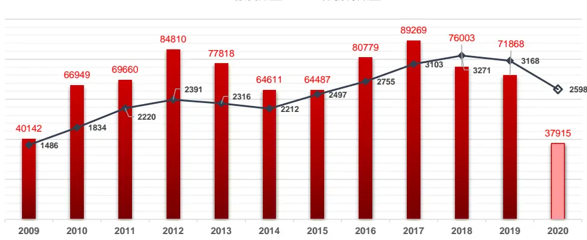
资料来源：东方证券研究所&朝阳永续

图2：不同月份的报告数量占比（2009.01-2020.06）
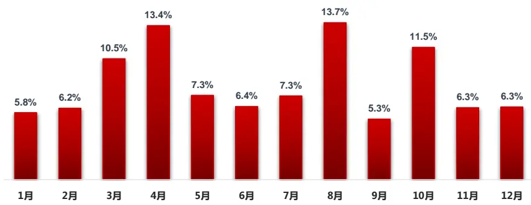
资料来源：东方证券研究所&朝阳永续

图3：研究报告覆盖A股比例月度变化（2009.01-2020.06）
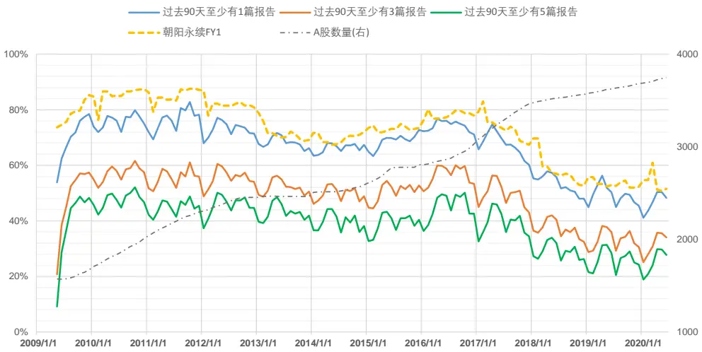
资料来源：东方证券研究所&朝阳永续

## 三、乐观偏差与预测

分析师的盈利预测存在明显乐观偏差。图4和图5统计了不同财年，分析师从上一年5月初到次年2月底的盈利预测偏差，每个月统计一次取中位数（为避免异常值的影响，用的是中位数而不是均值），考虑到大部分年报是在3、4两个月公布，因此这里未统计这两个月的盈利预测偏差。盈利预测偏差定义为：

预测偏差 = （分析师预测净利润－年报真实净利润)/上市公司总资产

这里分母选为“总资产”而不是“年报真实净利润”，主要是为了避免年报真实净利润为负数或很小的正数时，计算公式的经济意义有问题。可以看到，除去2010外，其它年份分析师的盈利预测整体都是高估的，高估幅度随着年报公布时点的临近而递减。

图4：分析师盈利预测乐观偏差（2010-2014）
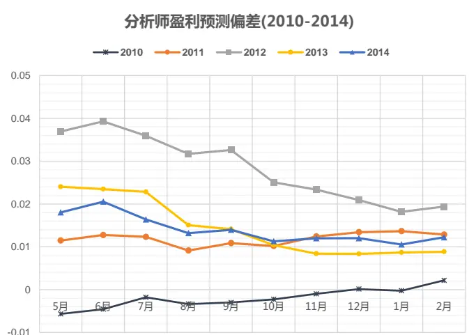
资料来源：东方证券研究所&Wind 资讯&朝阳永续

图5：分析师盈利预测乐观偏差（2015-2019）
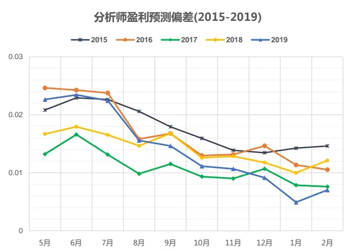
资料来源：东方证券研究所&Wind资讯&朝阳永续

既然分析师盈利预测的乐观偏差在海外和国内都系统性存在，一个直接的想法是，有没有可能通过定量的方式去预测分析师某篇报告的乐观偏差，然后把预测净利润减去乐观偏差得到修正后的盈利预测，这个盈利预测有可能更加贴近真实值。影响分析师乐观偏差的因素有很多，直觉上，成长性好、近期股价涨得多、市场关注度高的股票，分析师更容易给出乐观预期。图6列举了下文定量分析里用到的乐观偏差影响因素，每个新的财年，我们都会用上一个财年的数据来训练预测模型，基于训练好的模型来预测本财年里分析师研报的乐观偏差。比方说，2019财年，我们会用上一财年（2018.10.01-2019.04.30）期间的历史数据训练模型，用这个模型来预测2019.05.01-2020.04.30期间分析师发布的研究报告对2019年净利润预测的乐观偏差。

图6：分析师乐观偏差影响因素

|  |  | indus 公 司 |  |  |  |
| --- | --- | --- | --- | --- | --- |
| 研报相关 | rpt_rating | 研报评级 | roa | ROA(TTM) |  |
|  | rpt_dist | 研报发布日距离年报公布日时长 | d2a | 资产负债率 |  |
|  | rpt_num | 过去一年覆盖该公司的研报数量 | delta_roe | delta_roe |  |
|  | forecast_q20 | 过去一年分析师预测净利润的20%、50%、80%分位数 | certainty |  | 信息确定性(certainty 因子， DFQ2020) |
|  |  |  | indus_rev_vol | 所在行业的盈利波动性 |  |
| 分析师相关 |  |  | 面 | indus_rev_prop | 公司在行业内的营收占比 |
|  | analyst_exp | 分析师工作年限 | cash2int |  | 现金流对利息的覆盖倍数 |
|  | analyst_stks_covered分析师年内覆盖股票数量 |  | LogMV | 市值对数 |  |
|  | analyst_prize | 分析师新财富获奖得分 | bp | BP估值 |  |
|  | bias_q20 | 分析师过去一年预测偏差的20%、50%、80%分位数 | bp_quantile |  | 行业估值处于过去三年的历史分位数 |
|  | inst_analyst_num | 分析师所在机构分析师数量 |  | HS300_1m_ret | 沪深300、中证500、中证1000最近1、3、6个月涨跌幅，换手率 |
|  | inst_rpt_num | 分析师所在机构发布报告数量 |  | indus_1m_ret | 行业指数最近1、3、6个月涨跌幅 |
| delta_forecast_roa |  | 最近一次预测的盈利上调幅度 | fall_from_top | 当前股价距离年内高点距离 |  |
|  |  |  | rise_from_bot | 当前股价距离年内低点距离 |  |
|  |  |  |  | ma5_ma60_bias 5日均线偏离60日均线距离 |  |

资料来源：东方证券研究所

乐观偏差的预测模型，我们这里只比较了两个，一个是传统的线性回归模型，考虑到回归变量数量较多，变量间的共线性和噪音变量可能对回归方程的参数估计有影响，因此这里采用lasso线性回归方法，惩罚系数由交叉验证决定（CV，cross-validation）。另一个是GBRT(gradient boosting regression tree)，一种成熟的决策树回归方法，可以引入非线性，在不少工程问题上效果良好。由于每个财年的样本数据量较大，有七八万个数据，复杂结构模型有可能获得更好预测结果，感兴趣的投资者可以尝试；在本文里，GBRT已经有比较显著的效果。

首先我们用lasso回归分析各个因素对乐观偏差的影响大小，结果如图7所示

图7：lasso回归平均回归系数（2009-2019）
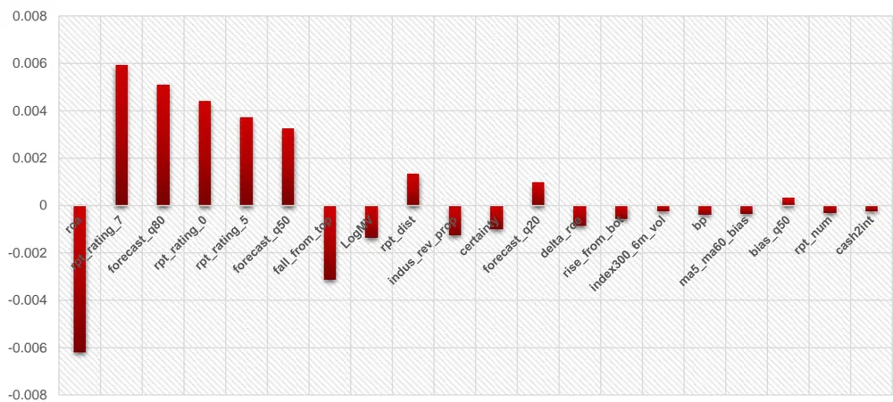
资料来源：东方证券研究所&朝阳永续 &wind 资讯

Lasso回归在每个2009-2019的每个财年都做一次，然后在时间序列上取平均；回归变量都做了zscore标准化处理使得回归系数大小具有可比性，用回归系数的平均绝对值大小度量回归变量对乐观偏差的预测影响；图7展示的是影响最大的20个因子，按照平均回归系数绝对值从大到小排序。从图中可得到如下结论：

1) 对分析师乐观偏差影响最大的三个因素分别是：股票当前的盈利(roa)、报告评级(rpt_rating_7等）和其他分析师之前的盈利预测（forecast_q80等）。盈利能力强的股票，分析师预测的乐观偏差低；之前其它分析师给的盈利预测越乐观，分析师当前报告的乐观偏差也会越大。有意思的是，投资评级最高的股票(rpt_ranking_7）和投资评级最低的股票（rpt_ranking_0）乐观偏差都会更高。

2) 符合直觉的影响因素有：市值大(LogMV)、估值低(bp)、信息确定性强(certainty)、股价从年内高点下跌幅度大(fall_from_top)、行业内龙头公司(indus_rev_prop)的乐观偏差较小；研报发布时点离年报公布时点越近（rpt_dist），乐观偏差越小。

3) 不符合直觉的影响因素有：成长性好的公司（delta_roe）乐观偏差较小，底部反弹幅度(rise_from_bot)大的公司乐观偏差也较小；这一定程度上可能和指标的定义方式，以及指标间的相关性有关。

4)对乐观偏差无显著影响的因素：分析师工作年限、研究覆盖股票数量、是否新财富得奖、供职机构大小等对其盈利预测的乐观偏差无显著影响。

以上是线性模型的分析结果，下面我们也用非线性的GBRT对上述问题进行了分析，用variableimportance（增减某个变量对模型预测误差的影响）度量各个回归变量对乐观偏差的预测作用大小，结果如图8所示：

图8：GBRT 不同财年各回归变量平均的 variable importance（2009-2019）
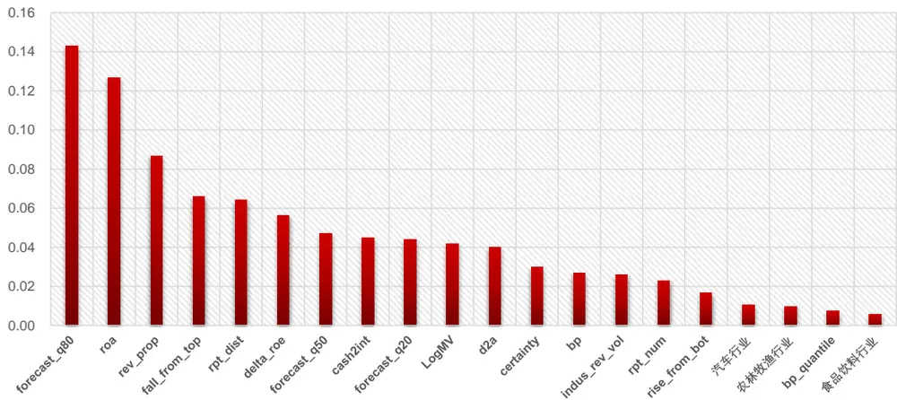
资料来源：东方证券研究所&朝阳永续 &wind 资讯

和LASSO线性模型分析结果类似的地方是:股票当前盈利(roa)和其他分析师之前的盈利预测（forecast_q80）仍是影响分析师乐观偏差的最重要因素，但报告评级(rpt_rating_7)在非线性 GBRT模型中作用不明显；另外，公司在行业里的龙头地位(rev_prop)和现金流对利息覆盖倍数(cash2int)在非线性模型中的作用得到明显提升；汽车、农林牧渔、食品饮料三个行业属性在非线性模型中对乐观偏差有显著影响，但在线性模型不明显。Variableimportance只能度量回归变量的预测作用大小，无法度量影响方向；影响方向可以使用 ALE依赖图(Accumulated Local Effects Plots)度量，我们在之前报告《因子加权过程中的大类权重控制》有过使用，感兴趣的投资者可参考。

最后，我们用上一个财年的历史数据分别训练LASSO和GBRT模型，用它们来预测下一个财年里研报的乐观偏差，并和真实的乐观偏差做比较，看看两个模型样本外预测效果；模型预测误差选用 MAE（Mean Absolute Error）度量，并用DM-test做统计检验两个模型的MAE差距是否显著。

图9：LASSO和 GBRT 对不同年份乐观偏差的样本外预测 MAE（2010-2019）
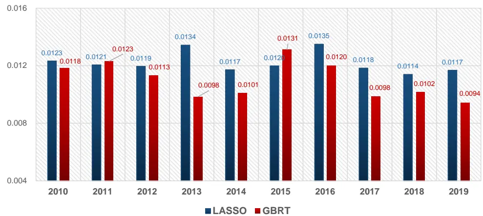
资料来源：东方证券研究所&朝阳永续 &wind资讯

从上图可以看到除2011和2015年外，其它年份GBRT样本外预测MAE都小于LASSO，MAE差距都在1%置信度下显著，非线性的引入可以显著的提升模型预测效果。

## 四、一致预期构建

用GBRT模型预测得到分析师的乐观偏差后，我们把分析师盈利预测减去预测的乐观偏差得到修正后的盈利预测，再把最近3个月里分析师的修正盈利预测加权得到一致预期。

把不同分析师的盈利预测加权合成一个市场一致预期的常用加权方式有两种：等权和时间序列加权；后者是按照报告发布时点的先后顺序，给予近期发布报告更高权重。这两种方法都忽视了不同分析师的能力差异和股票的不同特征。我们这里采用研报预测的可靠度进行加权，可靠度用GBRT模型样本外预测的 5%至95%分位数预测区间（prediction interval）的宽度进行度量，宽度越大，可靠度越低。不过从实证结果看，因为分析师的乐观偏差已经调整过，这种加权方式和等权相差不大，个别月份略微占优。

为了比较不同一致预期算法的准确性，我们计算了2011.05-2020.02期间每个月月末的股票一致净利润数据，看其和对应财年真实净利润的预测偏差绝对值的平均值(MAE)。我们考察了三种一致预期算法，分别是：朝阳永续(zyyx），预测精度加权（dfjg，参考前期报告《分析师研报的数据特征与alpha》）和上文所述的GBRT方法。

图10：不同方法得到的一致预期的样本外预测MAE(2011-2019)

|  | zyyx | dfjg | GBRT |  | zyyx | dfjg | GBRT |  | zyyx | dfjg | GBRT |
| --- | --- | --- | --- | --- | --- | --- | --- | --- | --- | --- | --- |
| 2011.05 | 0.0386 | 0.0384 | 0.0389 | 2014.05 | 0.0311 | 0.0313 | 0.0279*** | 2017.05 | 0.0314 | 0.0313 | 0.0344 |
| 2011.06 | 0.0381 | 0.0383 | 0.0351*** | 2014.06 | 0.0301 | 0.0303* | 0.0255*** | 2017.06 | 0.0308 | 0.0308 | 0.0298*** |
| 2011.07 | 0.0366 | 0.0366 | 0.0334*** | 2014.07 | 0.0297 | 0.0299 | 0.0247*** | 2017.07 | 0.0310 | 0.0311 | 0.0283*** |
| 2011.08 | 0.0324 | 0.0325 | 0.0318 | 2014.08 | 0.0268 | 0.0269 | 0.0244*** | 2017.08 | 0.0266 | 0.0267 | 0.0268 |
| 2011.09 | 0.0311 | 0.0313 | 0.0288** | 2014.09 | 0.0268 | 0.0269 | 0.0241*** | 2017.09 | 0.0263 | 0.0264 | 0.0257* |
| 2011.10 | 0.0254 | 0.0255 | 0.0262 | 2014.10 | 0.0228 | 0.0228 | 0.0225 | 2017.10 | 0.0232 | 0.0228** | 0.0241*** |
| 2011.11 | 0.0230 | 0.0227 | 0.0222** | 2014.11 | 0.0214 | 0.0217 | 0.0207* | 2017.11 | 0.0222 | 0.0221 | 0.022 |
| 2011.12 | 0.0218 | 0.0217 | 0.0202*** | 2014.12 | 0.0205 | 0.0209** | 0.0193*** | 2017.12 | 0.0214 | 0.0212 | 0.0203*** |
| 2012.01 | 0.0203 | 0.0207** | 0.0189*** | 2015.01 | 0.0189 | 0.0198*** | 0.0183** | 2018.01 | 0.0195 | 0.0198* | 0.0186** |
| 2012.02 | 0.0165 | 0.0176*** | 0.0176*** | 2015.02 | 0.0153 | 0.0179*** | 0.0172*** | 2018.02 | 0.0154 | 0.0181*** | 0.0167** |
| 2012.03 |  |  |  | 2015.03 |  |  |  | 2018.03 |  |  |  |
| 2012.04 |  |  |  | 2015.04 |  |  |  |  |  |  |  |
| 2012.05 | 0.0358 | 0.0357 | 0.0314*** | 2015.05 | 0.0391 | 0.0391 | 0.0339*** | 2018.04 2018.05 | 0.0366 | 0.0365 | 0.034*** |
| 2012.06 | 0.0354 | 0.0352 | 0.0285*** | 2015.06 | 0.0374 | 0.0375 | 0.0327*** | 2018.06 | 0.0362 | 0.0362 | 0.0325*** |
| 2012.07 | 0.0329 | 0.0331 | 0.0262*** | 2015.07 | 0.0367 | 0.0369 | 0.0304*** | 2018.07 | 0.0349 | 0.0348 | 0.0306*** |
| 2012.08 | 0.0279 | 0.0277 | 0.0234*** | 2015.08 | 0.0314 | 0.0311** | 0.0266*** | 2018.08 | 0.0298 | 0.0295** | 0.0272*** |
| 2012.09 | 0.0265 | 0.026*** | 0.0214*** | 2015.09 | 0.0312 | 0.0307** | 0.0252*** | 2018.09 | 0.0288 | 0.0287 | 0.0258*** |
| 2012.10 | 0.0222 | 0.0218 | 0.0195*** | 2015.10 | 0.0257 | 0.0252** | 0.0228*** | 2018.10 | 0.0245 | 0.0242*** | 0.024 |
| 2012.11 | 0.0197 | 0.0192** | 0.0172*** | 2015.11 | 0.0239 | 0.0239 | 0.0209*** | 2018.11 | 0.0235 | 0.0235 | 0.0217*** |
| 2012.12 | 0.0194 | 0.0194 | 0.0166*** | 2015.12 | 0.0238 | 0.0236 | 0.0196*** | 2018.12 | 0.0232 | 0.0231 | 0.0209*** |
| 2013.01 | 0.0176 | 0.0179 | 0.0159** | 2016.01 | 0.0233 | 0.0236 | 0.0191*** | 2019.01 | 0.0213 | 0.0214 | 0.0202*** |
| 2013.02 | 0.0144 | 0.0157*** | 0.015** | 2016.02 | 0.0164 | 0.0213*** | 0.0172** | 2019.02 | 0.0159 | 0.0191*** | 0.018*** |
| 2013.03 |  |  |  | 2016.03 |  |  |  | 2019.03 |  |  |  |
| 2013.04 |  |  |  | 2016.04 |  |  |  | 2019.04 |  |  |  |
| 2013.05 | 0.0288 | 0.0287 | 0.0251*** | 2016.05 | 0.0336 | 0.033** | 0.0277*** | 2019.05 | 0.0360 | 0.0358* | 0.0325*** |
| 2013.06 | 0.0281 | 0.0281 | 0.0235*** | 2016.06 | 0.0331 | 0.0329 | 0.0258*** | 2019.06 | 0.0354 | 0.0353 | 0.0313*** |
| 2013.07 | 0.0266 | 0.0267 | 0.0221*** | 2016.07 | 0.0333 | 0.0327* | 0.0249*** | 2019.07 | 0.0331 | 0.033 | 0.0287*** |
| 2013.08 | 0.0236 | 0.0235 | 0.0215*** | 2016.08 | 0.0285 | 0.0284 | 0.0235*** | 2019.08 | 0.0305 | 0.0305 | 0.0287*** |
| 2013.09 | 0.0232 | 0.0232 | 0.0215*** | 2016.09 | 0.0280 | 0.0276 | 0.0229*** | 2019.09 | 0.0294 | 0.0292** | 0.0275*** |
| 2013.10 | 0.0222 | 0.0221* | 0.0205 | 2016.10 | 0.0235 | 0.0232** | 0.021*** | 2019.10 | 0.0265 | 0.0262** | 0.026* |
| 2013.11 | 0.0250 | 0.025 | 0.0225 | 2016.11 | 0.0223 | 0.0222 | 0.0194*** | 2019.11 | 0.0263 | 0.0259*** | 0.0246*** |
| 2013.12 | 0.0237 | 0.0237 | 0.0208 | 2016.12 | 0.0220 | 0.0221 | 0.0188*** | 2019.12 | 0.0258 | 0.0256* | 0.024*** |
| 2014.01 | 0.0200 | 0.0202* | 0.02 | 2017.01 | 0.0198 | 0.0201 | 0.0174*** | 2020.01 | 0.0249 | 0.0248 | 0.0234*** |
| 2014.02 | 0.0178 | 0.0188*** | 0.0193*** | 2017.02 2017.03 | 0.0155 | 0.0188*** | 0.0168*** | 2020.02 2020.03 | 0.0236 | 0.0248*** | 0.0233 |

资料来源：东方证券研究所&朝阳永续&wind资讯

实证结果如图10所示，考虑到大部分年报在3月和4月公布，FY1的匹配会出现错位，因此3 月和4月的预测效果未计算。我们采用 DM-test 检验了dfjg、GBRT 两个模型与zyyx预测 MAE 差距的显著性，如果在1%置信度下显著，则添加 3颗星；如果在5%置信度下显著，添加2颗星；如果在1%置信度下显著，则只添加1颗星；红色的星号代表模型预测的 MAE跟 zyyx 比显著更低，预测更准；绿色的型号则代表模型预测的MAE比zyyx显著更高，预测精度较差。因此，总体来说，一个模型的红色星号数量越多，绿色星号数量越少，模型的预测精度更高。从上图可得以下结论：

1）乐观偏差的修正作用显著。我们之前开发的基于预测精度加权的dfjg方法未做乐观偏差修正，预测精度整体上和zyyx相差不大；经过乐观偏差修正的GBRT方法预测精度显著更高。

2)每年2月份，zyyx的预测都显著更准。因zyyx算法对外未公布，这里猜测可能是在研报数据外加了业绩预告、快报等信息，我们后面研究也将尝试补上这部分信息。

3）乐观偏差不能被完全修正。由于模型只能解释乐观偏差的很小一部分，预测值的方差小于真实值的方差，因此基于预测的乐观偏差去修正盈利预测并不能完全消除乐观偏差。如图11所示，修正过乐观偏差的GBRT一致预期预测仍然有明显的高估，但高估程度显著低于zyyx一致预期。

图11：不同一致预期的平均乐观偏差（2010-2019）
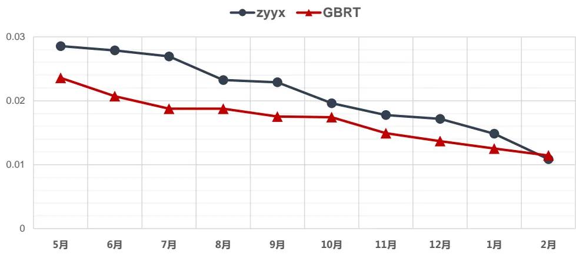
资料来源：东方证券研究所&朝阳永续 &wind资讯

## 五、alpha 因子对比

本节我们尝试用 GBRT方法得到的一致预期数据构建alpha 因子，和zyyx一致预期构建的因子做比较。考虑到两个分析师一致预期数据在中证800成分股里的数据覆盖率都在80%以上，为降低缺省值填充方法对结果的影响，这里把因子测试股票池限定在中证800成分股内。

第一个因子是一致预期月度变化。度量一致预期月度变化值，一个自然想法是用一致预期变化的百分比幅度来度量，但这样有可能忽略公司规模，比方说一个总资产千亿的公司，上个月一致预期盈利只有1000万，这个月一致预期提升到2000万，百分比增幅100%，但对于公司体量而言，这种程度的盈利预期调整几乎可以忽略。因此定义：

t期一致预期变化 = (t期一致预期净利润 - (t - 1)期一致预期净利润) ÷ t期总资产

记为 delta_cons_roa，使用 GBRT 和 zyyx 一致预期数据得到的 alpha 因子表现如图12 和图13 所示。可以看到，把一致预期数据从 zyyx替换为 GBRT 后，因子IC 从0.02提升到 0.029；特别值得注意的是，用zyyx一致预期数据算的因子从2018 年开始失效，但用GBRT数据算的因子2018年之后依然表现强劲。

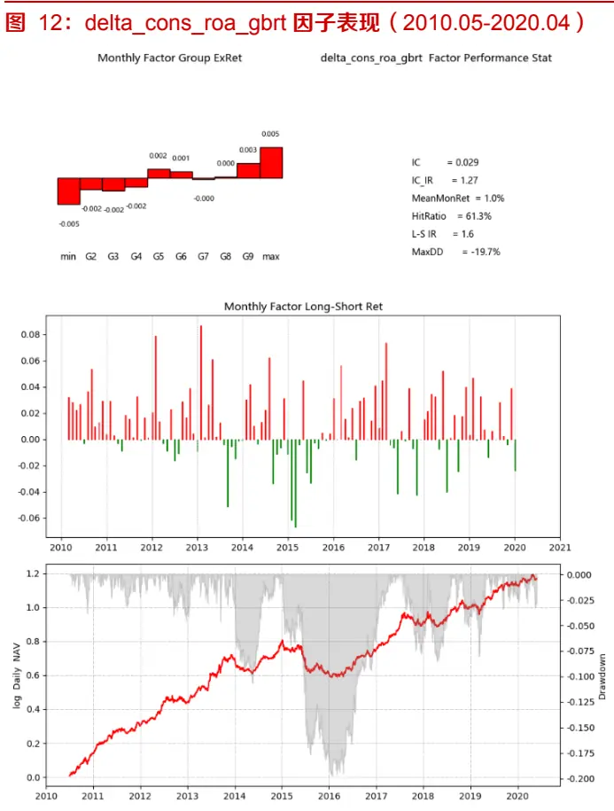
资料来源：东方证券研究所&Wind 资讯&朝阳永续

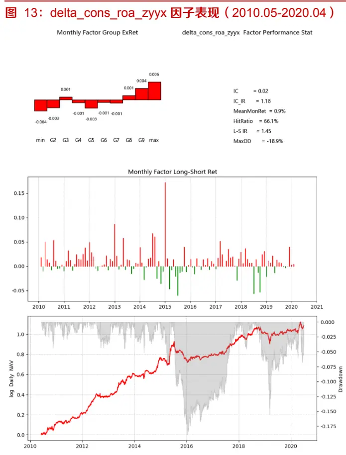
资料来源：东方证券研究所&Wind资讯&朝阳永续

第二个测试的因子是一致预期 EP。用 zyyx 数据算的 EP 因子 $IC=0.034,IC_{IR}=0.71$ 用 GBRT_adj 算的 EP 因子 $IC=0.038,IC_{IR}=0.75$ ，两者表现基本一致。

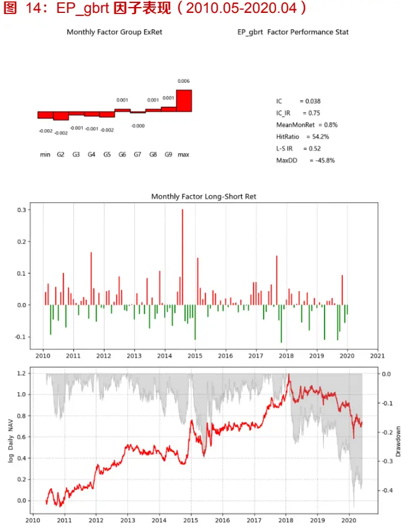
资料来源：东方证券研究所 &Wind 资讯&朝阳永续

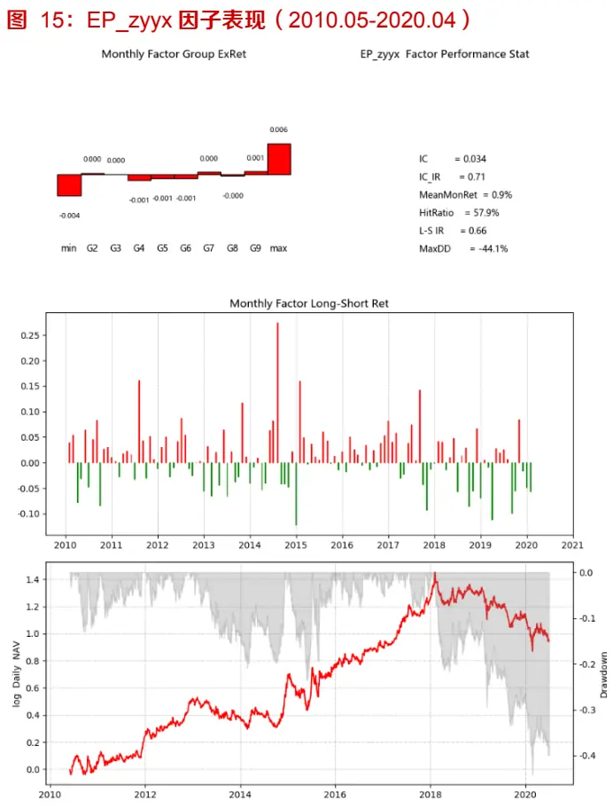
资料来源：东方证券研究所&Wind资讯&朝阳永续

## 六、总结

修正分析师盈利预测的乐观偏差能够显著提升一致预期数据的准确性，并有可能提升相关alpha因子的表现；非线性机器学习模型在预测分析师乐观偏差的精度上显著高于传统线性方法；报告里只测试了GBRT，鉴于样本数量较多，复杂结构的机器学习模型有可能进一步提升预测效果，后续我们将再跟进研究。

## 风险提示

1.量化模型基于历史数据分析得到，未来存在失效风险，建议投资者紧跟模型表现。

2. 极端市场环境可能对模型效果造成剧烈冲击，导致收益亏损。

## 分析师申明

每位负责撰写本研究报告全部或部分内容的研究分析师在此作以下声明：

分析师在本报告中对所提及的证券或发行人发表的任何建议和观点均准确地反映了其个人对该证券或发行人的看法和判断；分析师薪酬的任何组成部分无论是在过去、现在及将来，均与其在本研究报告中所表述的具体建议或观点无任何直接或间接的关系。

## 投资评级和相关定义

报告发布日后的12个月内的公司的涨跌幅相对同期的上证指数/深证成指的涨跌幅为基准；

## 公司投资评级的量化标准

买入：相对强于市场基准指数收益率15%以上；

增持：相对强于市场基准指数收益率5%～15%；

中性：相对于市场基准指数收益率在-5%～+5%之间波动；

减持：相对弱于市场基准指数收益率在-5%以下。

未评级由于在报告发出之时该股票不在本公司研究覆盖范围内，分析师基于当时对该股票的研究状况，未给予投资评级相关信息。

暂停评级根据监管制度及本公司相关规定，研究报告发布之时该投资对象可能与本公司存在潜在的利益冲突情形；亦或是研究报告发布当时该股票的价值和价格分析存在重大不确定性，缺乏足够的研究依据支持分析师给出明确投资评级；分析师在上述情况下暂停对该股票给予投资评级等信息，投资者需要注意在此报告发布之前曾给予该股票的投资评级、盈利预测及目标价格等信息不再有效。

## 行业投资评级的量化标准：

看好：相对强于市场基准指数收益率5%以上；

中性：相对于市场基准指数收益率在-5%~+5%之间波动；

看淡：相对于市场基准指数收益率在-5%以下。

未评级：由于在报告发出之时该行业不在本公司研究覆盖范围内，分析师基于当时对该行业的研究状况，未给予投资评级等相关信息。

暂停评级：由于研究报告发布当时该行业的投资价值分析存在重大不确定性，缺乏足够的研究依据支持分析师给出明确行业投资评级；分析师在上述情况下暂停对该行业给予投资评级信息，投资者需要注意在此报告发布之前曾给予该行业的投资评级信息不再有效。

## 免责声明

本证券研究报告（以下简称“本报告”）由东方证券股份有限公司（以下简称“本公司”）制作及发布。

本报告仅供本公司的客户使用。本公司不会因接收人收到本报告而视其为本公司的当然客户。本报告的全体接收人应当采取必要措施防止本报告被转发给他人。

本报告是基于本公司认为可靠的目目前已公开的信息撰写，本公司力求但不保证该信息的准确性和完整性，客户也不应该认为该信息是准确和完整的。同时，本公司不保证文中观点或陈述不会发生任何变更，在不同时期，本公司可发出与本报告所载资料、意见及推测不一致的证券研究报告。本公司会适时更新我们的研究，但可能会因某些规定而无法做到。除了一些定期出版的证券研究报告之外，绝大多数证券研究报告是在分析师认为适当的时候不定期地发布。

在任何情况下，本报告中的信息或所表述的意见并不构成对任何人的投资建议，也没有考虑到个别客户特殊的投资目标、财务状况或需求。客户应考虑本报告中的任何意见或建议是否符合其特定状况，若有必要应寻求专家意见。本报告所载的资料、工具、意见及推测只提供给客户作参考之用，并非作为或被视为出售或购买证券或其他投资标的的邀请或向人作出邀请。

本报告中提及的投资价格和价值以及这些投资带来的收入可能会波动。过去的表现并不代表未来的表现，未来的回报也无法保证，投资者可能会损失本金。外汇汇率波动有可能对某些投资的价值或价格或来自这一投资的收入产生不良影响。那些涉及期货、期权及其它衍生工具的交易，因其包括重大的市场风险，因此并不适合所有投资者。

在任何情况下，本公司不对任何人因使用本报告中的任何内容所引致的任何损失负任何责任，投资者自主作出投资决策并自行承担投资风险，任何形式的分享证券投资收益或者分担证券投资损失的书面或口头承诺均为无效。

本报告主要以电子版形式分发，间或也会辅以印刷品形式分发，所有报告版权均归本公司所有。未经本公司事先书面协议授权，任何机构或个人不得以任何形式复制、转发或公开传播本报告的全部或部分内容。不得将报告内容作为诉讼、仲裁、传媒所引用之证明或依据，不得用于营利或用于未经允许的其它用途。

经本公司事先书面协议授权刊载或转发的，被授权机构承担相关刊载或者转发责任。不得对本报告进行任何有悖原意的引用、删节和修改。

提示客户及公众投资者慎重使用未经授权刊载或者转发的本公司证券研究报告，慎重使用公众媒体刊载的证券研究报告。

## 东方证券研究所

地址：上海市中山南路318号东方国际金融广场26楼

电话：021-63325888

传真：021-63326786

网址：www.dfzq.com.cn