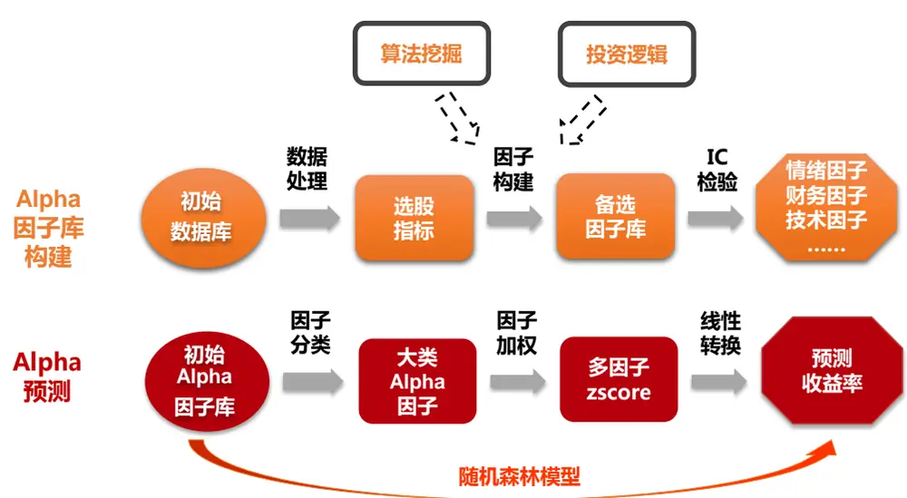
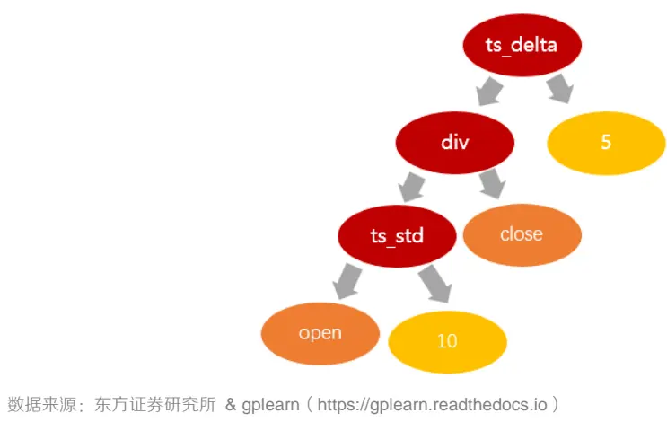
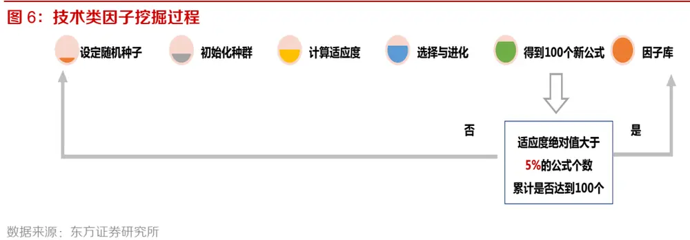
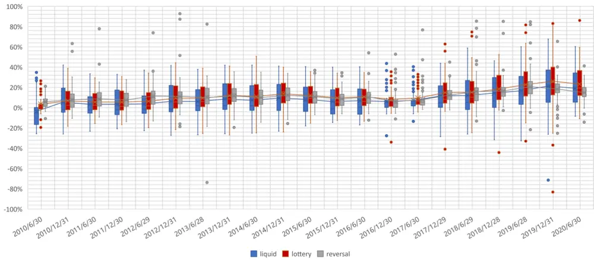
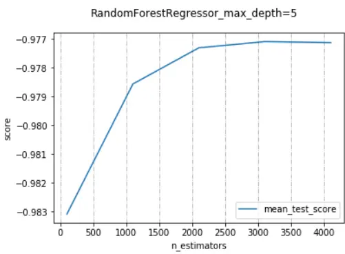
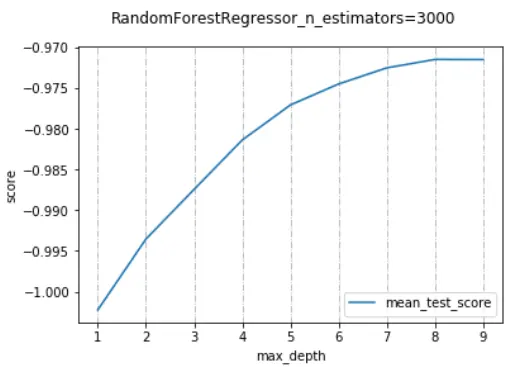
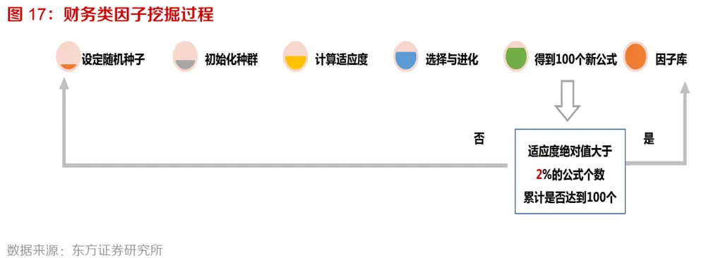
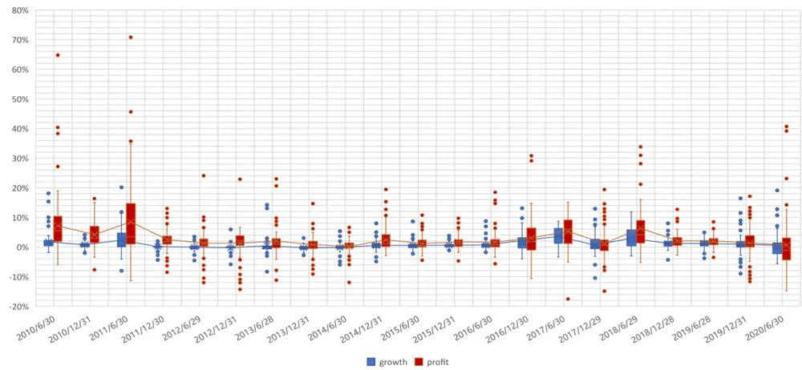

## ——《因子选股系列研究 之 七十》

## 研究结论

国内量化发展已有十余年，各家机构投资者的 Alpha因子库已有较大规模，这时面临的问题是，继续花时间和精力进行因子挖掘扩充因子库是否划算，还能带来多少增量收益。我们尝试将近年来兴起的机器学习算法应用到Alpha 模型上，进行低频层面的因子挖掘，考察机器因子库相对人工因子库的增量。

- 本文首先利用遗传规划算法进行因子挖掘，再将机器因子库与人工因子库通过随机森林模型转换为预测收益率，从组合层面进行因子库效果的整体比较。考虑到技术类因子和财务类因子历史表现差别较大，我们将这两类因子的挖掘和对比分开进行。

- 遗传规划是一种启发式的进化策略算法，可以用来进行选股因子挖掘。遗传规划算法的主要想法是模拟自然界中生物遗传进化过程，从随机生成的公式种群开始，通过不断变异优化，逐渐生成适应度更优的公式群体。

- Python 中的 gplearn 是目前最成熟的遗传规划包之一。但 gplearn 存在不能直接处理多维面板数据、不能进行时间序列运算等问题，所以不能直接运用于选股因子的挖掘，为此，我们将 gplearn 的底层代码进行了修改。

基于遗传规划算法进行因子挖掘的整体过程，包括设定随机种子、初始化种群、计算适应度、选择与进化、筛选有效因子五个步骤。回测区间为 2010.06.30–2020.06.30，每半年进行一次因子挖掘，以过去三年的月均因子收益率为适应度，每次得到 100 个有效因子，使样本外使用的因子保持最新的状态。

基于随机森林模型进行 Alpha预测，直接由初始 Alpha 因子库得到预测收益率。随机森林模型逻辑简单，参数调整容易，数据过拟合的可能性小，其基分类器决策树可实现噪音变量的剔除，适合处理多变量问题，实际应用效果好。

- 经过遗传规划算法可以从日频量价数据中挖掘出有效的月频技术类指标，叠加到传统技术类因子库中之后，多空组合收益和稳定性均有所提高，但提升并不显著。遗传算法技术类因子与传统技术类因子相比，IC、ICIR、多空组合月均收益均有提高。叠加传统技术类因子后，合成因子库的组合表现相比传统技术类因子也有所提升，最大回撤有所降低，但增量在统计上并不显著。

经过遗传规划算法可以从财务报表数据中挖掘出有效的月频财务类指标，因子整体表现不如传统财务因子，但差异也不显著。遗传算法财务类因子与传统财务类因子相比，IC、ICIR、多空组合月均收益均有降低。叠加传统财务类因子后，相比传统财务类因子，表现也有降低，差异在统计上不显著。

- 在低频领域，挖掘新因子相对成熟因子库的增量有限，组合收益更多还得靠因子择时。

## 风险提示

- 量化模型失效风险

- 市场极端环境的冲击

## 报告发布日期

2020 年 09 月 11 日

证券分析师朱剑涛

021-63325888*6077

zhujiantao@orientsec.com.cn

执业证书编号：S0860515060001

证券分析师刘静涵

021-63325888*3211

liujinghan@orientsec.com.cn

执业证书编号：S0860520080003

## 相关报告

| 机器增强一致预期 2020-09-01 |
| --- |
| 因子加权过程中的大类权重控制 2020-08-04 |
| 宏观数据季节调整与运用 2020-05-31 |
| 东方 A 股因子风险模型(DFQ-2020) 2020-05-28 |
| 基于时间尺度度量的日内买卖压力 2020-04-21 |
| 跨品种无风险利率曲线构建与应用 2020-02-27 |
| 主动买卖单的批量成交划分法 2020-02-25 |
| 从北上资金中提取的系列 alpha 因子 2020-02-08 |
| 关于组合换手的若干问题 2020-01-05 |

## 一、机器学习在 Alpha 模型中的应用

国内量化发展已有十余年，各家机构投资者的 Alpha 因子库已有较大规模，这时面临的问题是，继续花时间和精力进行因子挖掘扩充因子库是否划算，还能带来多少增量收益。我们尝试将近年来兴起的机器学习算法应用到 Alpha 模型上，进行低频层面的因子挖掘，考察机器因子库相对人工因子库的增量。

Alpha 模型主要包括 Alpha因子库构建和 Alpha 预测两部分，模型框架如图 1 所示。

## Alpha 因子库构建：

（1）传统做法是从逻辑出发，寻找逻辑合理、IC 高、IR 稳定、长期表现优秀的因子，例如常见的估值、盈利、成长、波动率等，这种做法优点是因子逻辑清晰，有一定的理论支撑，缺点是因子数量有限，且存在失效的可能；

（2）机器学习做法是从数据出发，运用遗传规划等机器学习算法对原始股票数据进行特征挖掘，建造一个大型 Alpha 因子库。这种做法的优点是：1.将因子挖掘完全交给机器，简单易行；2.挖掘出的因子数量众多，只要计算机硬件资源支持，便可以源源不断产生有效因子。虽然挖掘出的因子逻辑较难解释，但大量能贡献独立有效 Alpha 信息的因子组合在一起，仍可以帮助我们获得一个比较稳定的组合收益。缺点是存在数据过拟合的风险，因子在样本外可能失效。

## Alpha 预测：

（1）传统做法是采用线性预测的方法，从初始 Alpha 因子库开始，需要经历因子分类、大类因子加权和 ZSCORE 转收益率三个步骤；

（2）机器学习做法是采用随机森林等非线性模型，直接对初始 Alpha 因子库进行训练，得到预期收益率。相对于线性工具，机器学习模型的非线性模型最大的优势在于对抗多重共线性问题，可以容纳较多数量的因子参与训练生成模型，且模型拟合度高，有助于提升预测性能。

图 1：Alpha 模型框架

数据来源：东方证券研究所

本文首先利用遗传规划算法进行因子挖掘，再将机器因子库与人工因子库通过随机森林模型转换为预测收益率，从组合层面进行因子库效果的整体比较。

（1） 比较的是整体因子库得到的预期收益率：从单个因子层面对比机器因子和人工因子的表现意义不大，我们的做法是采用随机森林模型，将两个 Alpha 因子库分别转化为预期收益率，再进行组合构建回测，从组合层面来比较整体机器因子库和人工因子库的表现。

（2） 将技术类因子库和财务类因子库分开对比：由于技术因子和财务因子的历史表现差别比较大，技术因子整体更强一点，所以如果将技术因子和财务因子合在一起，放入机器学习模型中进行 Alpha 预测的话，机器会明显偏好技术类因子，我们将这两类因子的挖掘和对比分开进行。

（3） 机器因子库实行动态更新：由于机器挖掘出的因子存在样本内过拟合的可能，所以我们采用动态更新机器因子库的方式，每半年进行一次因子挖掘，更新因子库，使得样本外使用的因子保持最新的状态。

## 二、遗传算法介绍

机器学习挖掘选股因子时，最常用的做法是借助遗传规划算法。遗传规划是一种启发式的进化策略算法，主要想法是模拟自然界中生物遗传进化过程，从随机生成的公式种群开始，通过不断变异优化，逐渐生成适应度更优的公式群。下面简单对遗传算法和遗传规划的概念进行介绍。

遗传算法（Genetic Algorithm，GA）是进化算法的重要分支，最早是由美国密歇根大学的John holland 教授于 20 世纪 70 年代提出，是一种通过模拟自然进化过程搜索最优解的方法。遗传算法以生物学的遗传和进化理论为基础，用二进制字符串表示所研究的问题，运用一系列复制、交换、突变等遗传操作，通过迭代逐步搜索最优解。

为了克服遗传算法不能描述层次结构、不能描述计算机程序等缺陷，美国斯坦福大学的 JohnR. Koza 教授于 1992 年提出了遗传规划（Genetic Programming， GP）算法。遗传规划用层次化的计算机程序（算法树）代替字符串表达问题，具有动态可变的结构和大小，可以用于求解最优的解结构，是遗传算法的推广和更一般地形式。有关算法的原理和细节在此不多赘述，下面仅介绍算法基本流程。

基于遗传规划算法进行选股因子挖掘的基本流程如下：

（1）初始化种群：将因子的计算公式表示成树形结构，预先设置函数集和指标集，进行随机组合生成一系列因子表达式，作为第一代种群集合；

（2）计算适应度：按照一定的目标函数评估种群中个体的适应度；

（3）选择：从第一代种群集合中，选出适应度较优的一群个体作为下一代进化的父代；

（3）进化：被选择出的父代，通过表达式树结构的剪枝、交叉和叶节点突变等操作实现进化，生成子代表达式，然后继续选择子代中适应度较优的一群个体作为父代继续进化。重复选择与进化步骤，经历 N 代后，最终寻找出适应度更优的公式群。

## 三、技术类因子挖掘测试

首先，我们基于原始日频量价数据进行月频技术类因子的挖掘测试。

Python 中的 gplearn 是目前最成熟的遗传规划包之一。但 gplearn 存在不能直接处理多维面板数据、不能进行时间序列运算等问题，所以不能直接运用于选股因子的挖掘，为此，我们将 gplearn的底层代码进行了修改，使其可以进行选股因子挖掘。如需要修改后的 gplearn 代码包，可以与报告作者联系。

## 1. 测试数据

- 股票池：剔除上市不满 6 个月及所有 ST、*ST、PT、暂停上市等特别处理股票后的全部A 股，剔除停牌股当天数据。

- 回测区间：2010.06.30 – 2020.06.30

- 预测目标：个股未来 20 个交易日的收益率。

## 2. 因子表达式

遗传规划中的因子表达式一般表示成二叉树的形式，如图 2 所示。公式的输出值可以用递归的方法求得。二叉树的内部节点是函数，叶子是变量或者常数，具体取决于函数设置。

（1）叶子变量：个股日频的量价数据，共 7 个，如图 3 所示。量价数据需要进行量纲调整。

（2）节点函数：分为元素运算函数和自定义的截面运算函数两类，共 21 个，如图 4 所示。元素运算函数例如加减乘除运算，直接取两个变量对应位置上的元素进行计算即可，而截面运算函数需要在同一个截面上计算，部分截面函数还需要进行时间序列滚动运算。滚动运算的截面函数需要在变量中添加一个常数，常数取值从 1 到 20，即最多使用过去 20 天的信息进行运算。此外，需要注意函数的可容性问题，避免运算结果溢出或出错。

图 2：公式树示例（depth=3，length=7）

图 3：叶子变量列表（技术类因子挖掘）

| 名称 | 定义 |
| --- | --- |
| adjopen | 个股日频复权开盘价 |
| adjclose | 个股日频复权收盘价 |
| adjhigh | 个股日频复权最高价 |
| adjlow | 个股日频复权最低价 |
| adjvwap | 个股日频复权成交量加权平均价 |
| adjvolume | 个股日频复权成交量加权平均价 |
| pctchg | 个股日频收益率 |

数据来源：东方证券研究所 & Wind 资讯

图 4：节点函数列表（技术类因子挖掘）

| 类型 | 函数名称 | 参数个数 | 定义 |
| --- | --- | --- | --- |
| 元素运算函数 | add(X,Y) | 2 | X+Y |
| 元素运算函数 | sub(X,Y) | 2 | X-Y |
| 元素运算函数 | mul(X,Y) | 2 | X*Y |
| 元素运算函数 | div(X,Y) | 2 | X/Y(Y>=0.001) |
| 元素运算函数 | max(X,Y) | 2 | MAX(X,Y) |
| 元素运算函数 | min(X,Y) | 2 | MIN(X,Y) |
| 元素运算函数 | abs(X) | 1 | ABS(X) |
| 元素运算函数 | sqrt(X) | 1 | SQRT(ABS(X)) |
| 元素运算函数 | log(X) | 1 | LOG(ABS(X)) (X>=0.001) |
| 截面运算函数 | rank(X) | 1 | 截面排序 |
| 截面运算函数 | ortho(X,Y) | 2 | 截面X对Y回归正交化取残差 |
| 截面运算函数（带常数） | ts_delay(X,d) | 2 | d天以前的数值 |
| 截面运算函数（带常数） | ts_delta(X,d) | 2 | 当天数值-d天以前的数值 |
| 截面运算函数（带常数） | ts_sum(X,d) | 2 | 过去d天的和 |
| 截面运算函数（带常数） | ts_product(X,d) | 2 | 过去d天的累乘（为避免累乘法数值过大，若结果绝对大于10000则取对数处理） |
| 截面运算函数（带常数） | ts_max(X,d) | 2 | 过去d天的最大值 |
| 截面运算函数（带常数） | ts_min(X,d) | 2 | 过去d天的最小值 |
| 截面运算函数（带常数） | ts_mean(X,d) | 2 | 过去d+1天的均值（为避免d=1无意义，参数d自动+1处理） |
| 截面运算函数（带常数） | ts_std(X,d) | 2 | 过去d+1天的标准差（为避免d=1无意义，参数d自动+1处理） |
| 截面运算函数（带常数） | ts_cov(X,Y,d) | 3 | 过去d+1天的X和Y的协方差（为避免d=1无意义，参数d自动+1处理） |
| 截面运算函数（带常数） | ts_corr(X,Y,d) | 3 | 过去d+1天的X和Y的相关系数（为避免d=1无意义，参数d自动+1处理） |

数据来源：东方证券研究所 & gplearn（https://gplearn.readthedocs.io）

## 3. 适应度指标

因子挖掘过程中，可以使用因子在回测区间内的 IC、ICIR、因子收益率等作为适应度指标。考虑到计算因子收益率时，线性回归系数可以写成矩阵运算的形式，矩阵运算的速度较快，因而我们选择月均因子收益率指标作为适应度，考察区间为过去三年。

考虑到技术类因子的 IC 普遍较高，我们设定适应度阈值为 5%，如果大于 5%，则视为一个有效的技术因子。此处我们直接使用原始因子来计算适应度，并不进行中性化和正交化。在计算适应度之前，需要对生成的因子数据进行处理，剔除有一半股票当天因子数值缺失的日期，和所有日期取值均为缺失的股票，因子数值需要进行去异常值，标准化处理。

## 4. 遗传规划参数设置

遗传规划与其他机器学习算法不同，其参数难以使用网格搜索寻优，主要根据运算速度和因子挖掘效果调整，我们最终选择的主要参数设置如图 5 所示。例如，种群规模越大，公式之间组合的空间越大，但运算复杂度也越高。挖掘技术类因子时可选择的叶变量和节点函数均较少，因而我们选择将种群规模设置的稍小一点，为 100，即每次生成 100 个表达式，进化三代，之后结束本次挖掘，改变随机种子，更换路径重新进行挖掘。

图 5：遗传规划参数设置（技术类因子挖掘）

| 参数名称 | 参数定义 | 参数设置 |
| --- | --- | --- |
| generations | 进化的代数 | 3 |
| population_size | 种群规模(每一代个体数目即初始树的个数) | 100 |
| function_set | 用于构建和进化公式时使用的函数集 | 使用图3中的节点函数 |
| init_depth | 公式树的初始化深度，init_depth是一个二元组(min_depth,max_depth)，树的初始深度将处在[min_depth,max_depth]区间内。 | (2,4) |
| tournament_size | 进化到下一代的个体数目(每一代中tournament_size个公式会被随机选中，其中适应度最高的公式将进行变异形成下一代) | 2 |
| metric | 适应度指标 | 自定义的月均因子收益率 |
| p_crossover | 父代进行交叉变异进化的概率。 | 0.4 |
| p_subtree_mutation | 父代进行子树变异进化的概率。 | 0.01 |
| p_hoist_mutation | 父代进行Hoist变异进化的概率。 | 0.01 |
| p_point_mutation | 父代进行点变异进化的概率。 | 0.01 |
| p_point_replace | 点变异中父代每个节点进行变异进化的概率。 | 0.4 |
| max_samples | 从样本中抽取的用于评估每个树(成员)的百分比 | 0.9 |
| n_jobs | 并行计算的核数 | 28 |
| const_range | 公式中所要包含的常量取值范围。如果设为none，则无常数 | none |
| random_state | 随机数生成器使用的种子 | 1-30 |

数据来源：东方证券研究所 & gplearn（https://gplearn.readthedocs.io）

## 5. 因子挖掘

基于遗传规划算法进行技术类因子挖掘的整体过程，如图 6 所示。首先设定随机种子，保证挖掘过程可以重现，而后开始遗传算法挖掘，包括初始化种群，计算适应度，选择与进化三个步骤，每次得到 100 个新因子。如果因子的适应度绝对值大于 5%，则视为一个有效因子，加入因子库。当累计有效因子个数达到 100个时，中止挖掘进程，否则改变随机种子，更换路径重新进行挖掘。

上述因子挖掘过程每半年进行一次，以过去三年的月均因子收益率为适应度，每次得到 100个有效因子，从而使得样本外使用的因子保持最新的状态。

下图展示了 2019.12.31遗传规划因子挖掘过程的公式进化情况，可以看出，第一代公式由于是随机生成的，所以平均适应度低，表达式长，运算用时短。从第二代公式开始，平均适应度提升，公式长度减短，进化用时增加。

图 7：遗传规划挖掘过程的公式进化情况（2019.12.31，技术类因子挖掘）

| 随机种子 | 代数 | 平均适应度 | 公式平均长度 | 最高适应度 | 最优公式长度 | 进化时长（s） |
| --- | --- | --- | --- | --- | --- | --- |
| 1 | 0 | 1.86% | 7.79 | -6.63% | 6 | 303.71 |
| 1 | 1 | 2.38% | 6.81 | -6.63% | 6 | 114.53 |
| 1 | 2 | 2.74% | 6.95 | -6.40% | 9 | 129.86 |
| 2 | 0 | 1.58% | 9.00 | -7.82% | 11 | 105.06 |
| 2 | 1 | 2.15% | 9.42 | -7.82% | 11 | 122.59 |
| 2 | 2 | 2.78% | 9.02 | -7.82% | 11 | 126.99 |
| 3 | 0 | 1.91% | 8.28 | -7.91% | 5 | 115.77 |
| 3 | 1 | 2.86% | 8.13 | -7.97% | 6 | 124.41 |
| 3 | 2 | 3.76% | 7.58 | -7.97% | 6 | 135.42 |
| 4 | 0 | 1.55% | 8.76 | -7.26% | 6 | 116.20 |
| 4 | 1 | 2.26% | 8.30 | -7.97% | 4 | 124.00 |
| 4 | 2 | 3.11% | 7.99 | -7.97% | 4 | 122.86 |
| 5 | 0 | 1.65% | 9.61 | -6.95% | 7 | 117.24 |
| 5 | 1 | 2.12% | 9.84 | -6.95% | 7 | 129.06 |
| 5 | 2 | 2.56% | 9.82 | -8.34% | 11 | 118.71 |
| 6 | 0 | 1.48% | 9.05 | -6.44% | 2 | 102.14 |
| 6 | 1 | 2.08% | 8.25 | -6.21% | 8 | 109.16 |
| 6 | 2 | 2.64% | 7.97 | -7.51% | 4 | 118.41 |
| 7 | 0 | 2.03% | 8.43 | -7.97% | 6 | 113.81 |
| 7 | 1 | 2.76% | 8.73 | -7.97% | 6 | 120.97 |
| 7 | 2 | 3.51% | 9.13 | -7.97% | 6 | 119.61 |
| 8 | 0 | 1.75% | 8.98 | -6.48% | 2 | 98.83 |
| 8 | 1 | 2.48% | 8.42 | -6.48% | 2 | 113.33 |
| 8 | 2 | 2.98% | 8.85 | 6.71% | 14 | 121.71 |
| 9 | 0 | 1.58% | 9.32 | -6.44% | 3 | 118.22 |
| 9 | 1 | 2.32% 3.12% | 9.49 | -6.48% -6.48% | 2 2 | 110.27 128.20 |
| 9 | 2 |  | 9.00 |  |  |  |

数据来源：东方证券研究所 & Wind 资讯

下面我们展示 2020.06.30基于过去三年的量价数据挖掘出的技术类因子的绩效表现。下表给出了适应度最高的 50 个因子示例，列出了适应度、公式长度、深度等指标。可以看到，挖掘出的技术因子长度平均深度为 3 层，平均长度为 8，表达式相对较为复杂，也就意味着对于量价数据进行复杂的运算有可能找到更加有效的因子。

## 图 8：遗传规划挖掘出的技术类因子表现示例（2020.06.30）

| 公式编号 | 表达式 | 适应度 公式深度 公式长度 |  |  |
| --- | --- | --- | --- | --- |
| alpha_5_94 | add(ts_product(pctchg, 4.000), mul(adjvolume, sqrt(sqrt(add(adjclose, adjvolume)))) | -7.61% | 5 | 11 |
| alpha_10_13 | ts_std(sqrt(adjvolume), 18.000) | -7.40% | 2 | 4 |
| alpha_4_97 | sub(sqrt(adjvolume), ts_sum(log(pctchg), 1.000)) | -7.27% | 3 | 7 |
| alpha_10_11 | sqrt(adjvolume) | -7.25% | 1 | 2 |
| alpha_9_85 | sqrt(ts_std(ortho(adjopen, adjvolume), 3.000)) | -7.24% | 3 | 6 |
| alpha_3_18 | add(min(log(adjvolume), ts_min(adjhigh, 19.000)), min(ts_cov(adjhigh, adjclose, 20.000), rank(adjclose))) | -7.16% | 3 | 14 |
| alpha_1_92 | abs(ts_sum(log(abs(adjvolume)), 1.000)) | -7.14% | 4 | 6 |
| alpha_9_40 | max(ts_cov(ts_sum(ts_std(rank(ts_product(adjvolume, 16.000)), 5.000), 9.000), mul(add(adjvolume, adjopen), ts_corr(adjhigh, adjlow, 5.000)), 6.000), rank(ts_max(log(adjvolume), 11.000))) | -7.12% | 6 | 24 |
| alpha_9_9 | sqrt(ts_std(ts_std(adjvolume, 19.000), 3.000)) | -7.04% | 3 | 6 |
| alpha_2_87 | sub(log(adjvolume), ortho(adjopen, adjclose)) | -6.93% | 2 | 6 |
| alpha_3_77 | log(adjvolume) | -6.92% | 1 | 2 |
| alpha_4_91 | ortho(sqrt(sub(adjlow, adjvwap)), log(adjvolume)) | -6.87% | 3 | 7 |
| alpha_3_67 | add(adjvolume, min(ts_cov(adjhigh, adjclose, 20.000), rank(adjclose)) | -6.84% | 3 | 9 |
| alpha_3_40 |  | -6.83% | 1 | 2 |
| alpha_9_2 | rank(adjvolume) rank(sqrt(adjvolume)) | -6.83% | 2 |  |
| alpha_4_43 | ts_max(ts_delta(adjvolume, 20.000), 5.000) |  | 2 | 3 5 |
| alpha_6_43 |  | -6.82% | 6 |  |
| alpha_4_90 | ts_product(add(adjvolume, sqrt(sqrt(rank(ts_cov(adjvwap, adjvolume, 19.000)))), 4.000) | -6.68% | 2 | 11 |
| alpha_2_74 | min(adjvolume, ortho(adjvwap, adjvolume)) | -6.67% | 0 | 5 |
| alpha_9_34 | adjvolume | -6.67% |  | 1 |
| alpha_6_57 | abs(adjvolume) | -6.67% | 1 | 2 |
|  | min(adjhigh, adjvolume) | -6.63% | 1 | 3 |
| alpha_8_80 | ortho(sub(adjhigh, adjopen), ts_max(ts_std(adjvolume, 10.000), 4.000)) | -6.63% | 3 | 9 |
| alpha_8_91 | ts_max(ts_std(adjvolume, 10.000), 4.000) | -6.57% | 2 | 5 |
| alpha_6_30 | add(adjvolume, sqrt(adjlow)) | -6.57% | 2 | 4 |
| alpha_7_43 | add(log(pctchg), min(adjopen, min(adjopen, adjvolume))) | -6.56% | 3 | 8 |
| alpha_7_6 | add(log(pctchg), min(adjopen, adjvolume)) | -6.56% | 2 | 6 |
| alpha_5_75 | min(adjvolume, adjclose) | -6.54% | 1 | 3 |
| alpha_6_8 alpha_4_61 | log(ts_sum(adjvolume, 2.000)) | -6.52% | 2 | 4 |
| alpha_4_18 | min(adjvolume, adjopen) | -6.50% | 1 2 | 3 |
| alpha_5_78 | ts_max(sqrt(adjvolume), 12.000) | -6.50% | 2 | 4 |
| alpha_10_4 | log(ts_mean(adjvolume, 6.000)) | -6.42% | 3 | 4 |
| alpha_9_36 | ts max(abs(rank(adjvolume)), 5.000) | -6.39% | 1 | 5 |
| alpha_4_51 | ts_std(adjvolume, 6.000) | -6.39% | 1 | 3 |
| alpha_4_95 | ts_cov(adjvolume, adjhigh, 12.000) ortho(sqrt(sub(adjlow, adjvwap)), log(div(adjvolume, adjlow))) | -6.33% -6.31% | 3 | 4 9 |
| alpha_1_27 | sqrt(ts_delta(adjvolume, 18.000)) | -6.31% | 2 | 4 |
| alpha_8_30 | ortho(ts_sum(ts_sum(adjclose, 13.000), 11.000), ortho(sub(adjhigh, adjopen), ts_max(ts_std(adjvolume, 10.000), 4.000))) | -6.27% | 4 | 15 |
| alpha_7_4 | add(add(ts_cov(div(adjclose, adjlow), ts_max(adjvwap, 1.000), 10.000), abs(ts_max(adjvolume, 4.000))), min(adjopen, adjvolume)) | -6.19% | 4 | 17 |
| alpha_7_40 | ts_max(adjvolume, 4.000) | -6.17% | 1 | 3 |
| alpha_4_34 | ts_sum(ts_cov(adjvolume, adjhigh, 12.000), 3.000) | -6.12% | 2 | 6 |
| alpha_7_80 | ts_max(pctchg, 4.000) | -6.10% | 1 | 3 |
| alpha_7_38 | add(add(ts_cov(div(adjclose, adjlow), add(add(ts_cov(div(adjclose, adjlow), ts_max(adjvwap, 1.000), 10.000), abs(ts_max(adjvolume, 4.000))), abs(min(mul(adjlow, adjvolume), div(adjvwap, pctchg)), 10.000), abs(ts_max(adjvolume, 4.000))), abs(min(mul(adjlow, adjvolume), div(adjvwap, | -6.09% | 7 |  |
|  | pctchg)))) |  |  | 41 |
| alpha_4_54 alpha_8_34 | min(ts_delay(adjvwap, 19.000), ortho(adjvwap, adjvolume)) ortho(ts_max(ts_delta(adjvwap, 14.000), 19.000), ortho(sub(adjhigh, adjopen), ts_max(ts_std(adjvolume, 10.000), 4.000))) | -6.08% | 2 | 7 |
|  | add(add(ts_cov(div(adjclose, adjlow), ts_max(adjvwap, 1.000), 10.000), abs(ts_max(adjvolume, 4.000))), abs(min(ortho(pctchg, adjlow), div(adjvwap, | -6.08% | 4 | 15 |
| alpha_7_37 | pctchg)))) | -6.01% | 4 | 22 |
| alpha_1_11 | abs(ts_max(adjvolume, 13.000)) | -6.00% | 2 | 4 |
| alpha_1_54 | abs(ts_sum(ts_max(adjvolume, 13.000), 1.000)) | -6.00% | 3 | 6 |
| alpha_2_7 | ts_product(adjvolume, 8.000) | -5.98% | 1 | 3 |
| alpha_8_8 | ts_product(min(adjvolume, pctchg), 7.000) | -5.96% | 2 | 5 |
| alpha_9_49 | sub(ortho(ts_std(div(adjvolume, adjlow), 15.000), sqrt(ts_min(adjclose, 2.000))), adjvolume) | 5.95% | 4 | 12 |

数据来源：东方证券研究所 & Wind 资讯

进一步我们计算挖掘出的技术因子与现有技术类因子的相关性。人工技术类因子主要包括非流动性、反转、投机这三大类，我们用 TO20 作为非流动性的代表，RET20 作为反转的代表，VOL20作为投机的代表。可以看到，每期挖掘出的因子和技术类因子的相关性都很低，平均相关性均在20%以下。

图 9：传统技术类因子（22 个）

| 大类 | 因子简称 | 因子定义 |
| --- | --- | --- |
| 非流动性 | TO20 | 过去20个交易日的日均换手率对数 |
|  | TO60 | 过去60个交易日的日均换手率对数 |
|  | LNAMIHUD20 | 20日Amihud非流动性自然对数 |
|  | LNAMIHUD60 | 60日Amihud非流动性自然对数 |
|  | AVGAMT_20_60 | 过去20日日均成交额/过去60日日均成交额，乘以100处理 |
|  | AVGVOL_20_240 | 过去20日日均成交量/过去240日日均成交量，乘以100处理 |
| 反转 | RET20 | 过去20个交易日的收益率 |
|  | RET60 | 过去60个交易日的收益率 |
|  | PPREVERSAL | 乒乓球反转，过去5日均价/过去60日均价-1 |
|  | CG060 | 处置效应因子，当前价/60日换手反推的持仓价-1 |
|  | P2HIGH | 当前价格除以过去243个交易日的最高价，乘以100处理 |
| 投机 | VOL20 | 过去20个交易日的波动率 |
|  | VOL60 | 过去60个交易日的波动率 |
|  | VOL120 | 过去120个交易日的波动率 |
|  | IVOL20 | 过去20个交易日的特质波动率 |
|  | IVOL60 |  |
|  | VOL120 | 过去60个交易日的特质波动率 过去120个交易日的波动率 |
|  | IVOL60_CAPM | 过去60个交易日的CAPM特质波动率 |
|  | IVR20 |  |
|  | IVR60 | 过去20个交易日的特异度 |
|  | MAXRET20 | 过去60个交易日的特异度 |
|  | MAXRET60 | 过去最大收益，过去20日最大3个日收益均值 过去最大收益，过去60日最大3个日收益均值 |

数据来源：东方证券研究所

图 10：遗传规划挖掘出的技术类因子与人工技术因子的相关性分布情况

数据来源：东方证券研究所 & Wind 资讯

## 6. 组合回测

下面我们主要讨论，如何将挖掘出的因子进行有效组合，转化为预期收益率，并构建多空组合进行回测。由于前面通过遗传规划算法挖掘出的因子之间相关性关系较为复杂，存在共线性问题，直接使用传统线性模型进行 Alpha 预测的话，会增加回归估计量的方差，样本外预测准确性较低，因而我们采用随机森林模型来进行 Alpha 预测，再根据预测收益率构建组合进行回测。

Alpha 预测以及随机森林模型在之前报告中已经有过详细介绍，在此仅阐述重点细节：

（1）Alpha 预测的目标是个股超额收益：Alpha 预测过程最终得到的是个股相对市场等权组合的超额收益，而不是个股的绝对收益。如果预测绝对收益还要去预测整个市场的平均收益在时间序列上的变化，预测难度很大，对实际投资意义也不大。

（2）Alpha 预测时将个股超额收益拆分成 disperson 和 zscore 分别预测：个股相对市场等权组合的超额收益预测，可以分解成 dispersion（横截面上所有股票收益率的标准差）和横截面个股收益率zscore 两部分，我们的做法是前者用AR(1)模型预测，后者使用机器学习模型进行预测。在之前报告中我们进行过对比测试，发现分开预测 Disperson 和 zscore 再合成的预测方式比直接用预测超额收益要准，MSE（Mean Squared Error）更小。

（3）个股收益率 zscore 预测模型采用随机森林模型。在之前《机器的比拼》报告中，我们曾对比过多种 Alpha 预测的方法，其中随机森林模型优势较突出：1.逻辑简单，需要调整的参数少，而且预测结果受树结构的影响也比较小，在大部分工程问题中实际应用的效果都很不错；2.数据过拟合的可能性较小。由于金融数据的信噪比很低，过拟合很容易，所以避免过拟合的意义更大；3.随机森林的决策树分叉过程中带有变量选择的作用，由于我们用到的因子数量比较多，借助随机森林可以帮助我们将一些表现较弱的噪音变量剔除；4. python 中 sklearn 的 RandomForest 函数可以方便地实现随机森林模型，并且函数可以接受并行运算，有速度优势。

（4）随机森林模型 Hyperparameter 参数选择。随机森林模型的 Hyperparameter 参数可以通过网格搜索确定，python 中sklearn 的 GridSearchCV 函数可以实现网格搜索调参，其中模型所用的评价标准选择为 MSE，交叉验证参数选择 Stratified 5-fold CV，让不同验证集里股票数量的行业分布基本一致。理论上，可以把模型所需要的参数都输进去，得出最优化的参数配置，但是参数增多后，网格搜索的运算耗时也会增加。因而我们只需要把对模型影响最大的超参数（树的个数n_estimators 和树层数max_depth）进行调优，其余主观设置即可。由于当树的个数增加之后，单次随机森林模型训练和预测所需时间也会相应增加，而且预测 MSE 的边际变化很小，综合考虑预测效果和时间成本，我们选择 max_depth=5 和 n_estimators=200 作为最终的参数配置。

（5）个股收益率 zscore 预测模型的参数采用单月横截面平行训练的方法得到。使用过去三年的月度数据分别进行横截面模型训练，将当月底行业市值中性化因子值，行业虚拟变量和对数市值作为自变量，下月收益率 zscore 作为因变量来进行训练，得到 36 个机器学习模型，再把 t+1 月的最新因子数值分别输入到这 36 个模型中，就可以得到 36个 t+1 月的收益率 zscore 预测值，将其简单平均就可以得到个股 t+1 月的收益率 zscore 的最终预测值。

## 图 11：组合回测步骤

## 数据提取与处理

- 提取当月底的因子值 。因子值均进行缺失值填充（行业市值回归）、(1) (2) ( ), ,..., K X X X异常值处理、行业市值中性化、标准化。

## 模型训练

- 提取过去三年每月底的因子值和下月个股真实的收益率zscore。

- 因子值均进行缺失值填充、异常值处理、行业市值中性化、标准化。加入行业虚拟变量和对数市值作为模型自变量，进行随机森林模型训练，得到36个模型 $\hat{f}_{t-36},\hat{f}_{t-35},...,\hat{f}_{t-}$ 1

## 模型预测

- 把当月底处理好的个股的最新因子值，加入行业虚拟变量和对数市值作为模型自变量，同时输入到这36个随机森林模型中，可以得到36个t+1月个股收益率zscore的预测值，将其简单平均最终得到个股t+1月的收益率预测值。

## 多空组合构建

- 每月等权做多预测收益最高10%股票，做空预测收益最低10%的股票构建多空组合，计算组合表现。

- 每月计算预测收益率和下月真实收益率的IC，ICIR等指标

数据来源：东方证券研究所

图 12：随机森林模型参数调优（score = neg_mean_squared_error）

数据来源：东方证券研究所 & Wind 资讯

下面我们采用随机森林模型，对遗传规划挖掘出的技术类因子（每半年生成 100 个），传统技术类因子（22个，图 9所示），遗传算法因子+技术类因子（122 个），以及遗传算法因子正交传统技术类因子（100 个）分别进行 Alpha 预测过程，得到每月的预期收益率。计算预期收益率和真实收益率的 IC（spearman），ICIR 以及 t 统计量，并根据预期收益率构建多空组合，考察多空组合的表现。多空组合由等权做多预测收益最高 10%股票，同时做空预测收益最低 10%的股票构成。

可以看到，经过遗传规划算法可以从日频量价数据中挖掘出有效的月频技术类指标，并且叠加到传统技术类因子库中之后，组合收益和稳定性均有所提高，但这种提升在统计上并不显著：

（1）遗传算法技术类因子与传统技术类因子相比，不论是 IC、ICIR 还是多空组合月均收益、年化夏普比均有提高，IC 达到 10.11%，ICIR 达到 2.13，多空组合月均收益 2.97%，年化夏普比1.5。

（2）遗传算法技术类因子叠加传统技术类因子后，相比传统技术类因子，表现也有提升。叠加后 IC 达到 10.41%，ICIR 达到 2.19，多空组合月均收益 2.86%，年化夏普比 1.48，并且多空组合最大回撤也有明显降低，从原有 22.34%降低为 17.6%。

（3）遗传算法技术类因子对传统技术类因子正交化后，仍有显著的选股效果，IC 达到 7.57%，ICIR 达到 1.35，多空组合月均收益 2.39%。但是一对多的回归正交化并不能完全剔除原有变量的信息，正交化后的因子效果可能反而变强。

（4）对不同组合的 IC 序列和多空组合收益率序列进行了双边 T 检验，结果显示 T 检验 p 值均大于 10%，说明遗传算法因子挖掘带来的组合差异在统计上并不显著。

图 13：Alpha 模型效果对比（2010.06.30-2020.06.30，技术类因子）

| 指标 | 原有技术类因子 | 遗传算法因子 | 1+2 | 遗传算法因子正交原有技术类因子 |
| --- | --- | --- | --- | --- |
| IC-spearman | 10.06% | 10.11% | 10.41% | 7.57% |
| IC_IR | 1.91 | 2.13 | 2.19 | 1.35 |
| tstat | 7.95 | 8.86 | 9.09 | 5.60 |
| 多空组合月均收益 | 2.79% | 2.97% | 2.86% | 2.39% |
| 多空组合胜率 | 72.73% | 75.21% | 77.69% | 70.25% |
| 多空组合年化夏普比率 | 1.32 | 1.50 | 1.48 | 1.02 |
| 多空组合最大回撤 | -22.34% | -18.88% | -17.60% | -30.09% |
| 多空组合年化收益 | 19.68% | 21.39% | 20.42% | 16.26% |

| IC序列 |  |  |  |
| --- | --- | --- | --- |
|  |  | statistic | pvalue |
| 遗传算法因子 | 原有技术类因子 | 0.03 | 0.98 |
| 1+2 | 遗传算法因子 | 0.18 | 0.86 |
| 1+2 | 原有技术类因子 | 0.20 | 0.84 |
| 多空组合收益率序列 |  |  |  |
|  |  | statistic | pvalue |
| 遗传算法因子 | 原有技术类因子 | 0.25 | 0.80 |
| 1+2 | 遗传算法因子 | (0.16) | 0.87 |
| 1+2 | 原有技术类因子 | 0.09 | 0.93 |

数据来源：东方证券研究所 & Wind 资讯

## 四、财务类因子挖掘测试

下面，我们基于原始财务报表数据进行月频财务类因子的挖掘测试。由于此处因子挖掘算法的原理与上一节大致相同，本节只对做法上的区别进行阐述。

## 1. 测试数据

股票池：剔除上市不满 6 个月及所有 ST、*ST、PT、暂停上市等特别处理股票后的全部A 股，剔除停牌股当天数据。由于银行和非银行业股票部分财务指标缺失，因而我们将这两个行业剔除。

- 回测区间：20100630 – 20200630

- 预测目标：个股未来 20 个交易日的收益率。

## 2. 因子表达式

遗传规划中的因子表达式生成方法与技术类因子挖掘相同，但叶变量和节点函数设置不同。

（1）叶子变量：个股财务报表数据，要求满足每月数据缺失率最大不超过 50%，最终筛选出资产负债表指标 25个，利润指标 20个，现金流量表指标 28 个，共 73个。由于财报数据是季频的，需要将数据整理成月频，我们的做法是对于资产负债表数据按照公告日更新，缺失值用前一个非缺失值填充，对于利润表和现金流量表按照当前报告累计值+（去年年报-去年同期）计算 ttm值，并按照公告日更新，缺失值用前一个非缺失值填充，数据均转化为万元单位。

（2）节点函数：分为元素运算函数和截面运算函数两类，共 15 个。常数取值为 12,24,36，即最多使用三年前的信息进行运算。同比增长率指标计算时我们将分母小于 0 的视为缺省值，复合增长率指标计算时将分子和分母小于 0 的均视为缺省值，避免产生逻辑和运算错误。由于单纯对财务报表数据进行加减等运算，得到的因子指标在不同公司之间不可比，因而在后续随机生成公式时我们限定，最外层函数必须是除法或增长率。

图 14：节点函数列表（财务类因子挖掘）

| 类型 | 函数名称 | 参数个数 | 定义 |
| --- | --- | --- | --- |
| 元素运算函数 | add(X,Y) | 2 | X+Y |
| 元素运算函数 | sub(X,Y) | 2 | X-Y |
| 元素运算函数 | mul(X,Y) | 2 | X*Y |
| 元素运算函数 | div(X,Y) | 2 | X/Y(Y>=0.001) |
| 元素运算函数 | max(X,Y) | 2 | MAX(X,Y) |
| 元素运算函数 | min(X,Y) | 2 | MIN(X,Y) |
| 元素运算函数 | abs(X) | 1 | ABS(X) |
| 元素运算函数 | sqrt(X) | 1 | SQRT(ABS(X)) |
| 元素运算函数 | log(X) | 1 | LOG(ABS(X) (X> =0.001) |
| 截面运算函数 | rank(X) | 1 | 截面排序 |
| 截面运算函数 | ortho(X,Y) | 2 | 截面X对Y回归正交化取残差 |
| 截面运算函数（带常数） | ts_delay(X,d) | 2 | d月以前的数值 |
| 截面运算函数（带常数） | ts_delta(X,d) | 2 | 当月底数值-d月以前的数值 |
| 截面运算函数（带常数） | ts_cagr1(X,d) | 2 | (当月底数值/d月以前的数值)-1 d=12 |
| 截面运算函数（带常数） | ts_cagr2(X,d) | 2 | (当月底数值/d月以前的数值)^(1/2)-1 d=24 |
| 截面运算函数（带常数） | ts_cagr3(X,d) | 2 | (当月底数值/d月以前的数值)^(1/3)-1 d=36 |

数据来源：东方证券研究所 & gplearn（https://gplearn.readthedocs.io）

图 15：叶子变量列表（财务类因子挖掘）

| 数据来源 资产负债表 资产负债表 资产负债表 | 名称 ACCT_PAYABLE ADV_FROM_CUST 预收款项 | 定义 应付账款 |
| --- | --- | --- |
| 资产负债表 资产负债表 资产负债表 资产负债表 资产负债表 资产负债表 资产负债表 资产负债表 资产负债表 资产负债表 资产负债表 资产负债表 资产负债表 资产负债表 资产负债表 资产负债表 资产负债表 资产负债表 资产负债表 资产负债表 资产负债表 资产负债表 利润表 利润表 利润表 利润表 利润表 利润表 利润表 利润表 | CAP_STK EMPL BEN PAYABLE INTANG_ASSETS INVENTORIES LONG_TERM_DEFERRED_EXP LONG_TERM_EQY_INVEST LT_BORROW MINORITY_INT MONETARY CAP OTH PAYABLE PREPAY ST_BORROW SURPLUS RSRV TOT_ASSETS TOT_CUR_ASSETS TOT_CUR_LIAB TOT_LIAB TOT_NON_CUR_ASSETS TOT_NON_CUR_LIAB TOT_SHRHLDR_EQY_EXCL_MIN_INT UNDISTRIBUTED_PROFIT EBIT EBITDA INC_TAX LESS_FIN_EXP LESS GERL ADMIN EXP LESS IMPAIR LOSS ASSETS LESS_NON_OPER_EXP LESS_OPER_COST LESS_SELLING_DIST_EXP LESS TAXES SURCHARGES OPS MINORITY_INT_INC | 应付职工薪酬 无形资产 存货 长期待摊费用 长期股权投资 长期借款 少数股东权益 货币资金 其他应付款 预付款项 短期借款 盈余公积金 应交税费 资产总计 流动资产合计 流动负债合计 负债合计 非流动资产合计 非流动负债合计 股东权益合计(不含少数股东权益) 未分配利润 息税前利润 息税折旧摊销前利润 所得税 减:财务费用 减：管理费用 减：资产减值损失 |
| 利润表 利润表 利润表 利润表 利润表 利润表 利润表 利润表 利润表 利润表 利润表 现金流量表 现金流量表 现金流量表 现金流量表 现金流量表 现金流量表 现金流量表 现金流量表 现金流量表 现金流量表 现金流量表 现金流量表 现金流量表 现金流量表 现金流量表 现金流量表 现金流量表 现金流量表 现金流量表 现金流量表 现金流量表 现金流量表 现金流量表 现金流量表 现金流量表 现金流量表 现金流量表 | NET_PROFIT_AFTER_DED_NR_LP OPER_PROFIT OPER_REV PLUS NET INVEST INC PLUS_NON_OPER_REV TOT_OPER_COST TOT_OPER_REV TOT PROFIT AMORT_INTANG_ASSETS CASH PAID INVEST CASH_PAY_BEH_EMPL CASH_PAY_DIST_DPCP_INT_EXP CASH PAY GOODS PURCH SERV REC CASH PREPAY AMT BORR CASH_RECP_BORROW CASH RECP DISP WITHDRWL INVEST CASH_RECP_SG_AND_RS DEPR_FA_COGA_DPBA FIN_EXP FREE_CASH_FLOW INVEST_LOSS LOSS_DISP_FIOLTA NET CASH FLOWS FNC ACT NET_CASH_FLOWS_INV_ACT OTHER CASH RECP RAL OPER ACT PAY_ALL_TYP_TAX RECP_TAX_RENDS STOT_CASH_INFLOWS_FNC_ACT STOT_CASH_INFLOWS_INV_ACT STOT_CASH_INFLOWS_OPER_ACT STOT_CASH_OUTFLOWS_FNC_ACT | 减:营业外支出 减:营业成本 减:销售费用 减:营业税金及附加 少数股东损益 扣除非经常性损益后净利润（扣除少数股东损益） 净利润(不含少数股东损益) 营业利润 营业收入 加:投资净收益 加:营业外收入 营业总成本 营业总收入 利润总额 无形资产摊销 投资支付的现金 购建固定资产、无形资产和其他长期资产支付的现金 支付给职工以及为职工支付的现金 分配股利、利润或偿付利息支付的现金 购买商品、接受劳务支付的现金 偿还债务支付的现金 取得借款收到的现金 收回投资收到的现金 销售商品、提供劳务收到的现金 固定资产折旧、油气资产折耗、生产性生物资产折旧 财务费用 企业自由现金流量(FCFF) 投资损失 处置固定、无形资产和其他长期资产的损失 筹资活动产生的现金流量净额 投资活动产生的现金流量净额 经营活动产生的现金流量净额 处置固定资产、无形资产和其他长期资产收回的现金净额 支付其他与经营活动有关的现金 收到其他与经营活动有关的现金 支付的各项税费 收到的税费返还 筹资活动现金流入小计 投资活动现金流入小计 经营活动现金流入小计 筹资活动现金流出小计 |

数据来源：东方证券研究所 & Wind 资讯

## 3. 适应度指标

仍使用月均因子收益率作为适应度，考察区间为过去三年。考虑到财务类因子的 IC 相比技术类偏低，我们设定适应度阈值为 2%，如果大于 2%，则视为一个有效的财务因子。

## 4. 遗传规划参数设置

挖掘财务类因子时叶子变量较多，种群规模不宜设置的太小，因而我们设置种群规模为1000。每次生成 1000个表达式，进化三代，之后结束本次挖掘，改变随机种子，更换路径重新进行挖掘。

图 16：遗传规划参数设置（财务类因子挖掘）

| 参数名称 | 参数定义 | 参数设置 |
| --- | --- | --- |
| generations | 进化的代数 | 3 |
| population_size | 种群规模(每一代个体数目即初始树的个数) | 1000 |
| function_set | 用于构建和进化公式时使用的函数集 | 使用图3中的节点函数 |
| init_depth | 公式树的初始化深度，init_depth是一个二元组(min_depth,max_depth)，树的初始深度将处在[min_depth,max_depth]区间内。 | (1,4) |
| tournament_size | 进化到下一代的个体数目(每一代中tournament size个公式会被随机选中，其中适应度最高的公式将进行变异形成下一代) | 20 |
| metric | 适应度指标 | 自定义的月均因子收益率 |
| p_crossover | 父代进行交叉变异进化的概率。 | 0.4 |
| p_subtree_mutation | 父代进行子树变异进化的概率。 | 0.01 |
| p_hoist_mutation | 父代进行Hoist变异进化的概率。 | 0.01 |
| p_point_mutation | 父代进行点变异进化的概率。 | 0.01 |
| p_point_replace | 点变异中父代每个节点进行变异进化的概率。 | 0.4 |
| max_samples | 从样本中抽取的用于评估每个树(成员)的百分比 | 0.9 |
| n_jobs | 并行计算的核数 | 28 |
| const_range | 公式中所要包含的常量取值范围。如果设为none，则无常数 | none |
| random_state | 随机数生成器使用的种子 | 1-10 |

数据来源：东方证券研究所 & gplearn（https://gplearn.readthedocs.io）

## 5. 因子挖掘

基于遗传规划算法进行财务类因子挖掘的整体过程，如图 17所示。如果因子的适应度绝对值大于 2%，则视为一个有效因子，加入因子库。当累计有效因子个数达到 100 个时，中止挖掘进程，否则改变随机种子，更换路径重新进行挖掘。上述因子挖掘过程每半年进行一次，以过去三年的月均因子收益率为适应度，每次得到 100 个有效因子，从而使得样本外使用的因子保持最新的状态。

下面我们展示 2020.06.30基于过去三年的财务数据挖掘出的财务类因子的绩效表现。下表给出了适应度最高的 50 个因子示例，列出了适应度、公式长度、深度等指标。可以看到，挖掘出的财务因子长度平均深度为 1 层，平均长度为 3，表达式相对较为简单。这也意味着对于财务数据，并不适合进行复杂的运算，例如 X/Y，X的同比增长，X/Y 的同比增长，ΔX/Y等简洁形式更有可能产生出有效的因子。

图 18：遗传规划挖掘出的财务类因子表现示例（2020.06.30）

| 公式编号 | 表达式 | 适应度 | 公式深度 公式长度 |  |
| --- | --- | --- | --- | --- |
| alpha_0_376 | div(CASH_PAY_BEH_EMPL, TOT_ASSETS) | 3.84% |  | 3 |
| alpha_0_25 | div(FIN_EXP, CASH_PAY_BEH_EMPL) | -3.61% | 1 | 3 |
| alpha_0_458 | div(FIN_EXP, CASH_RECP_SG_AND_RS) | -3.43% | 1 | 3 |
| alpha_0_45 | div(NET_PROFIT_EXCL_MIN_INT_INC, TOT_ASSETS) | 3.41% | 1 | 3 |
| alpha_0_21 | div(FIN_EXP, STOT_CASH_INFLOWS_OPER_ACT) | -3.41% | 1 | 3 |
| alpha_0_2 | div(FIN_EXP, OPER_REV) | -3.41% | 1 | 3 |
| alpha_0_778 | div(TOT_ASSETS, CASH_PAY_BEH_EMPL) | -3.37% | 1 | 3 |
| alpha_0_30 | div(FIN_EXP, MONETARY_CAP) | -3.36% | 1 | 3 |
| alpha_0_6 | div(TOT_LIAB, CASH_PAY_BEH_EMPL) | -3.32% | 1 | 3 |
| alpha_0_58 | div(LESS_OPER_COST, OPER_REV) | -3.32% | 1 | 3 |
| alpha_0_230 | div(TOT_LIAB, CASH_RECP_SG_AND_RS) | -3.30% | 1 | 3 |
| alpha_0_568 | div(OPER_PROFIT, TOT_ASSETS) | 3.30% | 1 | 3 |
| alpha_10_1 | div(OPER_PROFIT, add(LESS_TAXES_SURCHARGES_OPS, TOT_ASSETS)) | 3.29% | 2 | 5 |
| alpha_0_948 | div(abs(FIN_EXP), MONETARY_CAP) | -3.29% | 2 | 4 |
| alpha_0_28 | div(CASH_PAY_BEH_EMPL, LESS_OPER_COST) | 3.28% | 1 | 3 |
| alpha_0_221 | div(ST_BORROW, CASH_PAY_BEH_EMPL) | -3.28% | 1 | 3 |
| alpha_0_290 | div(FIN_EXP, TOT_OPER_COST) | -3.25% | 1 | 3 |
| alpha_0_485 | div(LESS_OPER_COST, CASH_RECP_SG_AND_RS) | -3.24% | 1 | 3 |
| alpha_0_7 | div(abs(FIN_EXP), OPER_REV) | -3.22% | 2 | 4 |
| alpha_0_348 | div(FIN_EXP, TOT_ASSETS) | -3.18% | 1 | 3 |
| alpha_0_85 | div(min(TOT_LIAB, LESS_OPER_COST), CASH_PAY_BEH_EMPL) | -3.17% | 2 | 5 |
| alpha_10_20 | div(UNDISTRIBUTED_PROFIT, add(LESS_TAXES_SURCHARGES_OPS, TOT_ASSETS)) | 3.15% | 2 | 5 |
| alpha_0_13 | div(FIN_EXP, NET_CASH_FLOWS_OPER_ACT) | -3.06% | 1 | 3 |
| alpha_0_18 | div(CASH_RECP_SG_AND_RS, LESS_OPER_COST) | 3.04% | 1 | 3 |
| alpha_0_670 | div(min(TOT_LIAB, CASH_RECP_SG_AND_RS), CASH_PAY_BEH_EMPL) | -3.02% | 2 | 5 |
| alpha_0_304 | div(ST_BORROW, MONETARY_CAP) | -3.00% | 1 | 3 |
| alpha_0_86 | div(OPER_REV, LESS_OPER_COST) | 3.00% | 1 | 3 |
| alpha_0_19 | div(ST_BORROW, OPER_REV) | -2.99% | 1 | 3 |
| alpha_0_107 | div(TOT_LIAB, OPER_REV) | -2.94% | 1 | 3 |
| alpha_10_2 | div(LESS_FIN_EXP, EMPL_BEN_PAYABLE) | -2.91% | 1 | 3 |
| alpha_0_362 | div(sub(OTH_PAYABLE, LESS_SELLING_DIST_EXP), LESS_OPER_COST) | -2.88% | 2 | 5 |
| alpha_0_4 | div(FIN_EXP, LESS_OPER_COST) | -2.87% | 1 | 3 |
| alpha_0_533 | div(TOT_NON_CUR_ASSETS, CASH_PAY_ACQ_CONST_FIOLTA) | -2.82% | 1 | 3 |
| alpha_0_952 | div(CASH_RECP_BORROW, CASH_RECP_SG_AND_RS) | -2.82% | 1 | 3 |
| alpha_0_189 | div(TOT_OPER_COST, CASH_PAY_BEH_EMPL) | -2.74% | 1 | 3 |
| alpha_0_947 | div(LESS_OPER_COST, STOT_CASH_INFLOWS_OPER_ACT) | -2.74% | 1 | 3 |
| alpha_0_1 | div(FIN_EXP, LESS_SELLING_DIST_EXP) | -2.70% | 1 | 3 |
| alpha_0_17 | div(CASH_RECP_BORROW, CASH_PAY_BEH_EMPL) | -2.68% | 1 | 3 |
| alpha_0_251 | div(LESS_GERL_ADMIN_EXP, CASH_PAY_BEH_EMPL) | -2.68% | 1 | 3 |
| alpha_0_518 | div(abs(LESS_GERL_ADMIN_EXP), CASH_PAY_BEH_EMPL) | -2.67% | 2 | 4 |
| alpha_10_18 | div(LESS_FIN_EXP, TOT_LIAB) | -2.67% | 1 | 3 |
| alpha_0_39 | div(FIN_EXP, min(LESS_SELLING_DIST_EXP, LESS_OPER_COST)) | -2.65% | 2 | 5 |
| alpha_0_579 | div(TOT_NON_CUR_ASSETS, MONETARY_CAP) | -2.64% | 1 | 3 |
| alpha_0_418 | div(TOT_LIAB, NET_CASH_FLOWS_OPER_ACT) | -2.62% | 1 | 3 |
| alpha_0_266 | div(LESS_SELLING_DIST_EXP, CAP_STK) | 2.62% | 1 | 3 |
| alpha_0_375 | div(FIN_EXP, PAY_ALL_TYP_TAX) | -2.60% | 1 | 3 |
| alpha_0_237 | div(abs(FIN_EXP), LESS_OPER_COST) | -2.55% | 2 | 4 |
| alpha_0_232 | div(LESS_SELLING_DIST_EXP, LESS_OPER_COST) | 2.55% | 1 | 3 |
| alpha_0_310 | div(NET_PROFIT_EXCL_MIN_INT_INC, LESS_OPER_COST) | 2.53% | 1 | 3 |
| alpha_10_8 | div(UNDISTRIBUTED_PROFIT, TOT_NON_CUR_ASSETS) | 2.52% | 1 | 3 |

数据来源：东方证券研究所 & Wind 资讯

进一步计算挖掘出的因子与现有财务类因子的相关性。人工财务类因子主要包括盈利和成长这三大类，我们用 ROE 作为盈利因子的代表，净利润增长率 TTM 作为成长的代表。可以看到，每期挖掘出的因子和盈利成长因子的相关性都很低，平均相关性均在 10%以下。

图 19：传统财务类因子（21个）

| 大类 | 因子简称 | 因子定义 |
| --- | --- | --- |
| Profitability | CFROI | 投资现金收益率 |
|  | RNOA | 净经营资产收益率 |
|  | ROE | 净资产收益率 |
|  | ROA | 总资产报酬率 |
|  | ROA2 | 总资产净利率 |
|  | GPOA | 总资产毛利率 |
|  | GROSS_MARGIN | 销售毛利率 |
| NET_MARGIN | 销售净利率 |  |
| Growth | PROFIT_GROWTH_YOY | 归属母公司的净利润季度同比 |
|  | PROFIT2_GROWTH_YOY | 扣非后净利润季度同比 |
|  | SALES_GROWTH_YOY | 营业收入季度同比 |
|  | OCF_GTOWTH_YOY | 经营性现金流季度同比 |
|  | ASSET_GROWTH | 总资产增长率 |
|  | PROFIT_GROWTH_TTM | TTM净利润同比增长 |
|  | PROFIT2_GROWTH_TTM | TTM扣非后净利润同比增长 |
|  | SALES_GROWTH_TTM | TTM营业收入同比增长 |
|  | OCF_GTOWTH_TTM | TTM经营性现金流同比增长 |
|  | DELTA_GPOA | GPOA变动(当前TTM和一年前TTM比较) |
| DELTA_RNOA | RNOA变动(当前TTM和一年前TTM比较) |  |
| DELTA_ROE |  | ROE变动(当前TTM和一年前TTM比较) |
| DELTA_ROA |  | ROA变动(当前TTM和一年前TTM比较) |

数据来源：东方证券研究所

图 20：遗传规划挖掘出的财务类因子与人工财务因子的相关性分布情况

数据来源：东方证券研究所 & Wind 资讯

## 6. 组合回测

下面我们对遗传规划挖掘出的财务类因子（每半年生成 100个），传统财务类因子（21个），遗传算法因子+财务类因子（121 个），以及遗传算法因子正交传统财务类因子（100个），分别采用随机森林模型进行 Alpha 预测，得到每月的预期收益率后，计算预期收益率和真实收益率的IC（spearman），ICIR，t 统计量，并根据预期收益率构建多空组合，考察组合表现。

可以看到，经过遗传规划算法可以从财务报表数据中挖掘出有效的月频财务类指标，但因子整体效果不如传统财务因子。

（1）遗传算法财务类因子与传统财务类因子相比，不论是 IC、ICIR 还是多空组合月均收益均有降低。

（2）遗传算法财务类因子叠加传统财务类因子后，相比传统财务类因子，表现也有降低。

（3）遗传算法财务类因子对传统财务类因子正交化后，仍有显著的选股效果。

（4）对不同组合的 IC 序列和多空组合收益率序列进行了双边 T 检验，结果显示 T 检验 p 值均大于 10%，说明遗传算法因子挖掘带来的组合差异在统计上并不显著。

图 21：Alpha 模型效果对比（20100630-20200630，财务类因子）

| 指标 | 原有财务类21个因子 | 遗传算法100个因子 | 1+2 | 遗传算法100个因子正交原有财务类21个因子 |
| --- | --- | --- | --- | --- |
| IC-spearman | 5.49% | 4.17% | 4.81% | 5.34% |
| IC_IR | 1.10 | 0.96 | 1.14 | 1.13 |
| tstat | 4.57 | 3.99 | 4.76 | 4.70 |
| 多空组合月均收益 | 2.06% | 1.57% | 1.82% | 1.96% |
| 多空组合胜率 | 67.77% | 63.64% | 69.42% | 66.94% |
| 多空组合年化夏普比率 | 1.04 | 0.95 | 1.11 | 1.10 |
| 多空组合最大回撤 | -20.36% | -24.21% | -18.57% | -27.10% |
| 多空组合年化收益 | 14.09% | 10.62% | 12.56% | 13.39% |

| IC序列 |  |  |  |
| --- | --- | --- | --- |
|  |  | statistic | pvalue |
| 遗传算法因子 | 原有技术类因子 | (0.83) | 0.41 |
| 1+2 | 遗传算法因子 | 0.43 | 0.66 |
| 1+2 | 原有技术类因子 | (0.44) | 0.66 |
| 多空组合收益率序列 |  |  |  |
|  |  | statistic | pvalue |
| 遗传算法因子 | 原有技术类因子 | (0.78) | 0.44 |
| 1+2 | 遗传算法因子 | 0.45 | 0.66 |
| 1+2 | 原有技术类因子 | (0.38) | 0.70 |

数据来源：东方证券研究所 & Wind 资讯

## 五、总结

在 Alpha 模型中，机器学习可以使用的地方主要有两点，一是 Alpha 因子库构建，二是 Alpha预测。机器学习构造因子，是在已有的数据库里，用机器学习算法从数据出发尽可能地挖掘信息，利用机器快速大批量的数据处理分析能力，建造一个大型的 Alpha 因子库。虽然其中挖掘出的因子逻辑比较难解释，但大量能贡献独立有效 Alpha 信息的因子组合在一起，仍可以帮助我们获得一个比较稳定的组合收益。

本文首先利用遗传规划算法进行因子挖掘，再将机器因子库与人工因子库通过随机森林模型转换为预测收益率，从组合层面进行因子库效果的整体比较。考虑到技术类因子和财务类因子历史表现差别较大，我们将这两类因子的挖掘和对比分开进行。因子挖掘过程每半年进行一次，每次生成 100 个全新的因子，得到动态更新的机器因子库，而后运用随机森林模型将机器因子库和人工因子库转化为预期收益率，进行组合构建回测，从组合层面进行因子库效果的整体比较。

## 测试结果显示：

（1）经过遗传规划算法可以从日频量价数据中挖掘出有效的月频技术类指标，叠加到传统技术类因子库中之后，组合收益和稳定性均有所提高，但提升并不显著。遗传算法挖掘出的技术类因子与传统技术类因子相比，不论是 IC、ICIR 还是多空组合月均收益均有提高，IC 达到 10.11%，ICIR 达到 2.13，多空组合月均收益 2.97%。叠加传统技术类因子后，合成因子库的组合表现相比传统技术类因子有提升，最大回撤有所降低。

（2）经过遗传规划算法可以从财务报表数据中挖掘出有效的月频财务类指标，但因子整体效表现不如传统财务因子，但差异也不明显。遗传算法财务类因子与传统财务类因子相比，不论是 IC、ICIR 还是多空组合月均收益均有降低。叠加传统财务类因子后，相比传统财务类因子，表现也有降低，但差异在统计上不显著。

在低频领域，挖掘新因子相对成熟因子库的增量有限，组合收益更多还得靠因子择时。

## 风险提示

1. 量化模型基于历史数据分析，未来存在失效风险，建议投资者紧密跟踪模型表现。

2. 极端市场环境可能对模型效果造成剧烈冲击，导致收益亏损。

## 分析师申明

每位负责撰写本研究报告全部或部分内容的研究分析师在此作以下声明：

分析师在本报告中对所提及的证券或发行人发表的任何建议和观点均准确地反映了其个人对该证券或发行人的看法和判断；分析师薪酬的任何组成部分无论是在过去、现在及将来，均与其在本研究报告中所表述的具体建议或观点无任何直接或间接的关系。

## 投资评级和相关定义

报告发布日后的 12 个月内的公司的涨跌幅相对同期的上证指数/深证成指的涨跌幅为基准；

## 公司投资评级的量化标准

买入：相对强于市场基准指数收益率 15%以上；

增持：相对强于市场基准指数收益率 5%～15%；

中性：相对于市场基准指数收益率在-5%～+5%之间波动；

减持：相对弱于市场基准指数收益率在-5%以下。

未评级 —— 由于在报告发出之时该股票不在本公司研究覆盖范围内，分析师基于当时对该股票的研究状况，未给予投资评级相关信息。

暂停评级 —— 根据监管制度及本公司相关规定，研究报告发布之时该投资对象可能与本公司存在潜在的利益冲突情形；亦或是研究报告发布当时该股票的价值和价格分析存在重大不确定性，缺乏足够的研究依据支持分析师给出明确投资评级；分析师在上述情况下暂停对该股票给予投资评级等信息，投资者需要注意在此报告发布之前曾给予该股票的投资评级、盈利预测及目标价格等信息不再有效。

## 行业投资评级的量化标准：

看好：相对强于市场基准指数收益率 5%以上；

中性：相对于市场基准指数收益率在-5%～+5%之间波动；

看淡：相对于市场基准指数收益率在-5%以下。

未评级：由于在报告发出之时该行业不在本公司研究覆盖范围内，分析师基于当时对该行业的研究状况，未给予投资评级等相关信息。

暂停评级：由于研究报告发布当时该行业的投资价值分析存在重大不确定性，缺乏足够的研究依据支持分析师给出明确行业投资评级；分析师在上述情况下暂停对该行业给予投资评级信息，投资者需要注意在此报告发布之前曾给予该行业的投资评级信息不再有效。

## HeadertTabl e_Discl ai mer 免责声明

本证券研究报告（以下简称“本报告”）由东方证券股份有限公司（以下简称“本公司”）制作及发布。

本报告仅供本公司的客户使用。本公司不会因接收人收到本报告而视其为本公司的当然客户。本报告的全体接收人应当采取必要措施防止本报告被转发给他人。

本报告是基于本公司认为可靠的且目前已公开的信息撰写，本公司力求但不保证该信息的准确性和完整性，客户也不应该认为该信息是准确和完整的。同时，本公司不保证文中观点或陈述不会发生任何变更，在不同时期，本公司可发出与本报告所载资料、意见及推测不一致的证券研究报告。本公司会适时更新我们的研究，但可能会因某些规定而无法做到。除了一些定期出版的证券研究报告之外，绝大多数证券研究报告是在分析师认为适当的时候不定期地发布。

在任何情况下，本报告中的信息或所表述的意见并不构成对任何人的投资建议，也没有考虑到个别客户特殊的投资目标、财务状况或需求。客户应考虑本报告中的任何意见或建议是否符合其特定状况，若有必要应寻求专家意见。本报告所载的资料、工具、意见及推测只提供给客户作参考之用，并非作为或被视为出售或购买证券或其他投资标的的邀请或向人作出邀请。

本报告中提及的投资价格和价值以及这些投资带来的收入可能会波动。过去的表现并不代表未来的表现，未来的回报也无法保证，投资者可能会损失本金。外汇汇率波动有可能对某些投资的价值或价格或来自这一投资的收入产生不良影响。那些涉及期货、期权及其它衍生工具的交易，因其包括重大的市场风险，因此并不适合所有投资者。

在任何情况下，本公司不对任何人因使用本报告中的任何内容所引致的任何损失负任何责任，投资者自主作出投资决策并自行承担投资风险，任何形式的分享证券投资收益或者分担证券投资损失的书面或口头承诺均为无效。

本报告主要以电子版形式分发，间或也会辅以印刷品形式分发，所有报告版权均归本公司所有。未经本公司事先书面协议授权，任何机构或个人不得以任何形式复制、转发或公开传播本报告的全部或部分内容。不得将报告内容作为诉讼、仲裁、传媒所引用之证明或依据，不得用于营利或用于未经允许的其它用途。

经本公司事先书面协议授权刊载或转发的，被授权机构承担相关刊载或者转发责任。不得对本报告进行任何有悖原意的引用、删节和修改。

提示客户及公众投资者慎重使用未经授权刊载或者转发的本公司证券研究报告，慎重使用公众媒体刊载的证券研究报告。

东方证券研究所

地址：上海市中山南路 318 号东方国际金融广场 26 楼

电话：021-63325888

传真：021-63326786

网址： www.dfzq.com.cn