## ——因子选股系列研究之 七十一

## 研究结论

随着科创板和创业板注册制的推出，A 股实施了 20 多年的 10%涨跌幅限制逐步开始放开，目前 A 股已经有 26.2%的股票涨跌幅限制为20%，若不久的将来全面实现注册制，A 股现有 10%的涨跌幅限制大概率放开，为了适应未来的市场，研究涨跌停对股票价格行为的影响有其必要性和紧迫性。

长期平均来看，每天有 2%的股票触及涨停板，其中当天开板和次日开板的各占 34.8%、53.8%，能够连板的涨停占比不多，每天跌停股票占比 1.6%，其中当天开板的达到 45.6%，涨跌停的股票占比和持续时间存在显著的非对称性。

- 磁吸效应导致接近涨停的股票非理性上涨、接近跌停的股票非理性下跌，而关注度效应致使涨跌停的股票都被高估，因此涨停的股票后期大概率有负向异常收益，而跌停的股票取决于磁吸效应和关注度效应的相对强弱。

通过事件分析的方法，我们发现 A 股涨停打开后有持续稳定的负向异常收益，前 5 个交易日负收益高达 1.33%，而跌停打开的收益波动几乎可以忽略。涨停当天打开和次日打开的事件收益相差不大，连板涨停打开后的负向收益幅度更大。

- 涨停事件更多的发生在波动率大的股票分组中，但是低波股票在涨停打开后负向异常收益短期内不输高波股票，另外，高波股票的涨停事件收益持续性更强，说明波动率异象可以部分解释涨停事件的长端收益，但不能解释短端收益。

涨跌停制度实施前后，股票当日最大收益率达到 10%的“涨停”事件有完全不同的累计异常收益曲线，实施后呈显著持续的负向收益，实施前则不存在，说明涨停板的存在的确加剧了触板股票的过度反应，这一现象我们在科创板股票中也得到了验证。

- 计算动量反转因子时若剔除触及涨停交易日的收益率，反转效应便不在显著，动量效应得到加强，沪深 300 中剔除涨停影响的动量因子 RankIC 月度均值8.03%、多空年化收益 21.9%，其中多头对冲收益高达 11.3%。

涨停股票磁吸效应、关注度效应引起的过度反应是反转因子收益的重要来源，随着涨跌幅限制的放开甚至取消，反转效应大概率走弱，相应的动量效应会有所增强。

- 涨停调整的动量因子和现有各大类因子相关性并不高，横截面回归剔除各大类因子影响后依然有显著的选股效果。

## 风险提示

- 量化模型失效风险

- 市场极端环境的冲击

报告发布日期2020 年 11 月 16 日

证券分析师朱剑涛

021-63325888*6077

zhujiantao@orientsec.com.cn

执业证书编号：S0860515060001

证券分析师王星星

021-63325888*6108

wangxingxing@orientsec.com.cn

执业证书编号：S0860517100001

## 相关报告

机器因子库相对人工因子库的增量2020-09-11

机器增强一致预期2020-09-01

因子加权过程中的大类权重控制2020-08-04

## 一、关于涨跌停制度

## 1.1 A股涨跌停制度变迁

涨跌停制度属于价格限制制度的一种，是市场监管机构为了防止股票等证券价格暴涨暴跌而强行要求证券的买卖报价均不得超过前收盘价或结算价一定涨跌幅比例的制度设计。本文主要探讨 A 股涨跌停制度对价格行为的影响，因此这里我们也主要描述 A 股涨跌停制度的历史变迁。

当前 A 股以 10%涨跌幅限制为主的制度设计并不是一开始就有的，在上交所和深交所成立之初，甚至是之前的柜台交易时期，中国股票交易就设有涨跌停板，但不一定是 10%，而且两个交易所限制幅度不一样。交易所成立初期股票数量较早，涨跌停板制度也不稳定，两个交易所经常会根据自己市场的交易情况变更涨跌停板幅度，上交所甚至在一段时期对部分股票设置涨跌停板、部分股票不设置，深交所为了抑制股票上涨有段时间出现了涨跌板幅度远低于跌停板的情形。随后，考虑到交易流动性等因素，深交所于 1991 年 8月 17 日完全放开个股的涨跌停限制，上交所于次年 2 月 18 日试点放开了两只股票的涨跌幅限制，5月 21日完全放开所有个股的涨跌幅限制，所以 A 股市场在 1992年 5 月 21 日之后有段所有个股均没有涨跌停板的时间窗口，直至 1996 年 12 月 16 日两个交易所同步调整股票涨跌幅度均不能超过 10%（ST等股票为 5%，新股、重大原因长期停牌复牌首日另有规定），此后 A 股以10%为主的涨跌停板制度沿用至今。

图 1：A股市场涨跌停板制度变迁

| 上海证券交易所 |  |  | 深圳证券交易所 |  |  |
| --- | --- | --- | --- | --- | --- |
| 时间段 | 涨幅限制（%） | 跌幅限制（%） | 时间段 | 涨幅限制（%） | 跌幅限制（%） |
| 19900726 - 19901218 | 3 | 3 | 19900529 - 19900617 | 10 | 10 |
| 19901219 - 19901226 | 5 | 5 | 19900618 -19900625 | 5 | 5 |
| 19901227 - 19901230 | 1 | 1 | 19900626 - 19901118 | 1 | 5 |
| 19901231 - 19910425 | 0.5 | 0.5 | 19901119 - 19901213 | 0.5 | 5 |
| 19910426 - 19920217 | 1 | 1 | 19901214 - 19901231 | 0.5 | 1 |
| 19920218-19920520 | 1(部分个股无限制) | 1（部分个股无限制） | 19910102 - 19910816 | 0.5 | 0.5 |
| 19920521 - 19961215 | 无限制 | 无限制 | 19910817 - 19961215 | 无限制 | 无限制 |
| 19961216至今 | 10（ST等股票为5） | 10(ST等股票为5） | 19961216至今 | 10(ST等股票为5) | 10(ST等股票为5） |

注：新股、重大原因长期停牌复牌首日、科创板以及 20200824 之后的创业板不适用上述制度
数据来源：东方证券研究所

2019年 7 月22 日科创板的出现打破了涨跌停板制度二十多年平静的格局，科创板股票上市前 5 个交易日不设涨跌幅，之后执行 20%的涨跌幅限制。虽然科创板股票只占 A 股很小一部分股票，但是科创板开启了 A 股注册制改革的步伐。创业板注册制改革紧随其后，2020年 8 月 24 日，创业板注册制首批企业上市，同科创板一样，前 5 个交易日不设涨跌幅，其后实行 20%的涨跌幅限制，从当日开始，800 多只创业板老股日涨跌幅限制也将从之前的 10%放宽至 20%。截至 2020 年 11 月 12 日，科创板和创业板股票数量高达 1069 只，占到当前全部 A 股数量的 26.2%，也意味着 A 股已经有 26.2%的股票涨跌幅限制从 10%提高到了20%，随着科创板和创业板注册制的成功试点，A 股在不久的将来可能全面实现注册制，相应着，其他股票的涨跌幅限制也很有可能放宽直至取消。

最后需要补充的是，涨跌停板制度并不是 A 股特有的制度，当前欧美发达国家股票市场很少采用涨跌停板制度，但在东亚市场却很常见，目前日本、韩国、中国台湾地区的股票市场都有自己的涨跌停板制度。日本东京交易所的股票价格限制并不是采用特定的涨跌幅百分比，而是根据前收盘价的绝对大小分组对价格允许的波动幅度进行限制，比如要求前收盘价处于 1000 至 1500 日元的股票价格变动不超过 300 日元，韩国股市的价格限制在 1995 年之前是 6%，其后多次放宽限制，最新一次调整已从 15%调整至 30%，台北证券交易所股市的涨跌幅限制 2015 年 6 月从 7%调整至 10%。

## 1.2 A股涨跌板相关数据统计

我们统计了 A 股自涨跌停制度实施以来各个年度各个交易日涨跌停股票的平均占比（仅考察涨跌停板为 10%且上市满 3 个月的股票），长期平均来看每天仅有 2%的股票触及涨停板，收盘涨停的股票平均只有 1.3%，在绝大多数年份跌停的股票比涨停更少，长期平均来看仅 1.6%的股票触及跌停，收盘跌停的股票更是仅有 0.8%，在各个年度涨跌停的股票数量占比会所波动，2007 年、2008年、2015 年市场波动比较大的年份明显占比更高。

图 2：平均每日涨跌停股票数量占比
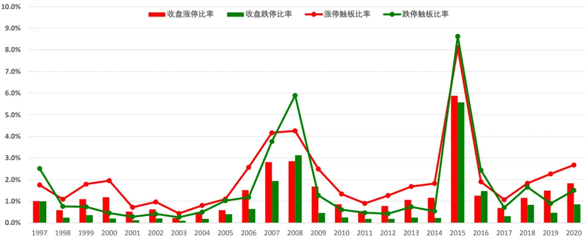
数据来源：Wind 咨询、东方证券研究所

我们同样统计了 1996 年 12 月16 日以来涨停或者跌停股票开板时间的分布（仅考察涨跌停板为 10%且上市满3 个月的股票），我们发现连板的股票并没有想象中的那么多，对于涨停股票，当天开板的占比达到 34.8%，加上次日开板的 53.8%，剩下的能够连板的涨停股仅 11.4%。

图 3：涨跌停股票开板时间占比

|  | 当天 | 次日 | 第3天 | 第4天 | 第5天 | 第6天 | 第7天 | 第8天 | 第9天 | 第10天及以后 |
| --- | --- | --- | --- | --- | --- | --- | --- | --- | --- | --- |
| 涨停 | 34.79% | 53.83% | 7.13% | 2.35% | 0.88% | 0.49% | 0.22% | 0.11% | 0.08% | 0.12% |
| 跌停 | 45.61% | 44.24% | 6.39% | 1.81% | 0.77% | 0.45% | 0.18% | 0.16% | 0.14% | 0.25% |

数据来源：Wind 咨询、东方证券研究所

从上述涨跌停的统计数据中，我们隐约可以看到涨停和跌停事件的非对称性，平均来看，同样的 10%限制，涨停出现的概率更高，而且涨停触板后持续的时间更长，我们也测算过从触板前收盘价到开板当天收盘价整个事件区间的收益，涨停事件区间平均涨 11.12%，跌停事件区间平均跌 9.87%，也存在明显的不对称性。

## 1.3 涨跌停制度对价格行为的可能影响

涨跌停制度对股票的波动率、流动性都有潜在的影响，学术界也做了很多相关的研究，本文主要探讨涨跌停制度对股票价格行为的影响，即涨跌停制度的存在是否存在 alpha 套利空间。本文主要从磁吸效应和关注度效应两个视角看涨跌停对股票 alpha 的影响。

股票的价格接近涨停或者跌停价格时，股票价格的快速波动不但没有被抑制，反而加速向涨停板或者跌停板移动，这种效应就是价格限制的磁吸效应。磁吸效应的存在可能会加剧过度反应，对于接近涨停的股票，磁吸效应的存在会导致非理性上涨直至涨停，对于接近跌停的股票，磁吸效应会导致非理性下跌直至跌停。张小涛、祝涛（2014）利用上海A 股的分笔数据分析，发现 A 股涨幅限制存在磁吸效应、跌幅限制不存在磁吸效应，唐如玉（2019）在硕士论文中也发现 A 股涨幅限制的磁吸效应强于跌幅限制。磁吸效应的这种不对称可能与做空机制的匮乏有关，当股票接近涨停时所有人都可以买，但接近跌停时只有持有股票的投资者才能卖出，上一小节中涨停股票的占比显著比跌停高可能就有磁吸效应的非对称性原因。

我们在因子选股系列报告系列之四十七《A 股涨跌幅排行榜效应》中谈到每日收盘涨跌幅排名特别靠前或者靠后的股票会得到市场额外的关注，由于做空机制的缺失，额外关注的股票会带来非理性买入，从而推高股票的价格导致未来收益变差。涨跌停股票的关注度效应和排行榜类似，涨停或者跌停的股票大多排行耪上都比较靠前，而且各个交易软件或者股票相关资讯都会推送股票涨停或者跌停的信息，从而增加涨停或者跌停股的关注度暴露。

对于涨停的股票，磁吸效应和关注度效应都会导致非理性买入，从而导致股票高估，未来大概率有负向 alpha，对于跌停的股票，磁吸效应导致非理性卖出，关注度效应导致非理性买入，未来 alpha 的方向也不确定。下文中我们首先探讨涨跌停事件后股票收益的变化，进而探讨这种收益特性对我们常见动量反转因子的影响。

## 二、涨跌停事件的 alpha 特征

## 2.1 事件研究方法

涨跌停事件的研究首先需要确定涨停或者跌停事件的事件日，考虑到可投资性，我们将股票触及涨停或者跌停后开板当天（是否开板以收盘价计算）作为事件日，比如今天涨停触板后回落收盘没有封涨停那么今天就是事件日，今天封涨停明天收盘没有涨停明天就是事件日，跌停和连板类推。

关于异常收益的计算，我们在前期报告事件驱动系列研究之三《区分真事件与伪事件——事件效应的准确度量与高效统计检验》中有过详细讨论，本文采用报告中推荐使用的特征基准模型（CBBM）计算异常收益。股票 i 在日期 t 基于 CBBM 模型的异常收益采用如下公式计算：

$$
\epsilon_{i,t}=r_{i,t}-cbb_{i,t}
$$

$cbb_{i,t}$ 是股票 i 的特征基准组合在日期 t 的收益率，特征组合根据前一交易日与股票 i 市值最接近的一个股票池等权构建。

需要说明的是，通常为了和现有的因子体系相结合，我们也会采用个股收益率对行业虚拟变量和市值对数横截面回归后的残差作为个股的异常收益，由于本文需要考察涨跌停板制度推出前后的事件收益变化，早期并没有高质量的行业分类数据，所有本文采用基于 CBBM的异常收益计算方法，仅剔除了市场和市值因子的影响。

## 2.2 涨跌停事件的累计异常收益

为了考察涨跌停事件发生后的股票收益情况，我们统计了 10%涨跌停板制度实施以来（19961216-20200731）所有上市满 3 个月且涨跌停幅度为10%的股票涨停和跌停事件的累计异常收益。

从过去 20 多年的平均水平来看，涨停事件有显著的负向异常收益，涨停事件后前 $^5$ 个交易日累计负收益高达 1.33%，随后虽然幅度有所放缓，但涨停事件累计异常收益依然持续走低。相比之下，跌停板事件在事件日的下一个交易日有小幅的回调，其后有所反弹，前 5 个交易日平均累计 12 个 BP，其后虽然也有些变动但幅度也十分之小。

从各个年度的涨跌停事件的平均累计异常收益率来看，对于涨停事件，各个年度的平均累计异常收益虽然幅度大小不一，但 24 个年度没有一个年度为正，总体比较稳定，而对于跌停事件的平均累计异常收益，有些年度为正、有些年度为负，跌停事件后并没有稳定的正向收益或者负相收益。

从涨跌停事件的平均累计异常收益的统计结果中，我们不难看出股票在涨停事件后具有显著的负向收益，尤其在前几个交易日，异常收益幅度十分明显，而对于跌停事件异常收益波动幅度很小，基本可以忽略。此结果对我们交易股票也有一定的启示，涨停板打开之后的股票无其他特殊原因尽量不要参与，如果有持仓，建议短期抛售，而对于跌停打开的股票，后期的股票收益和其他股票没有明显的差异。

图 4：涨停和跌停事件平均累计异常收益
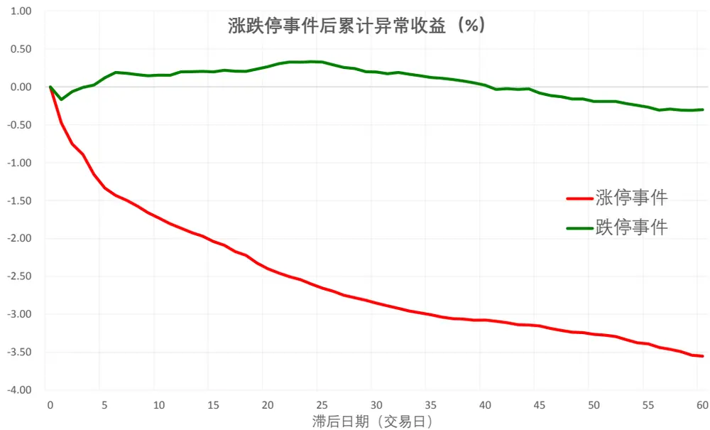

|  | 样本数 | (0,5] | (5, 10] | (10, 20] | (20, 40] | (40, 50] |
| --- | --- | --- | --- | --- | --- | --- |
| 涨停事件CAR | 158737 | -1.33 | -0.41 | -0.68 | -0.61 | -0.41 |
| 跌停事件CAR | 122095 | 0.12 | 0.02 | 0.08 | -0.11 | -0.25 |

注：数据样本为 19961216-20200731 区间内上市满 3 个月股票所有触及 10%涨跌停板的事件
数据来源：Wind 咨询、东方证券研究所

图 5：涨停事件各年度平均累计异常收益（%）
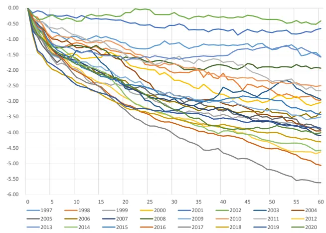
注：2020 年事件日数据截至 20200731
数据来源：Wind 咨询、东方证券研究所

图 6：跌停事件各年度平均累计异常收益（%）
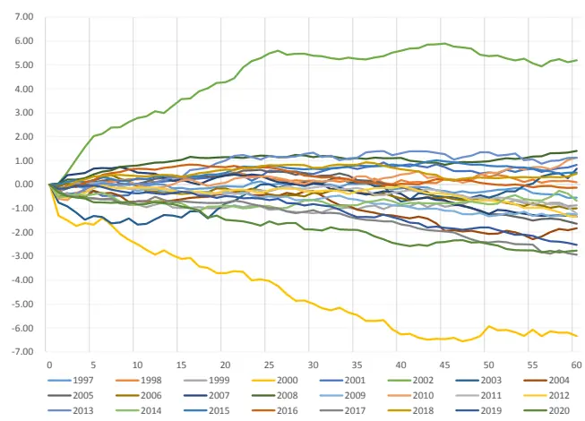
注：2020 年事件日数据截至 20200731
数据来源：Wind 咨询、东方证券研究所

## 2.3 不同涨停板数量下的累计异常收益

接下来我们统计了不同涨停板数量下的平均累计异常收益情况，首先我们发现当日开板的涨停板事件和次日开板的涨停板事件异常收益差距不大，即使有差距也是较后期才逐步拉开，事件发生后前 15 个交易日基本无差距，这意味着只要触及涨停板，即使收盘没有封涨停，也不影响涨停事件的事后负向收益。另外，连板涨停事件虽然数量上占比不大，但是负向异常收益的幅度明显要更高，连板数量越多，其后的负向收益越大。

图 7：不同涨停板数量下的累计异常收益
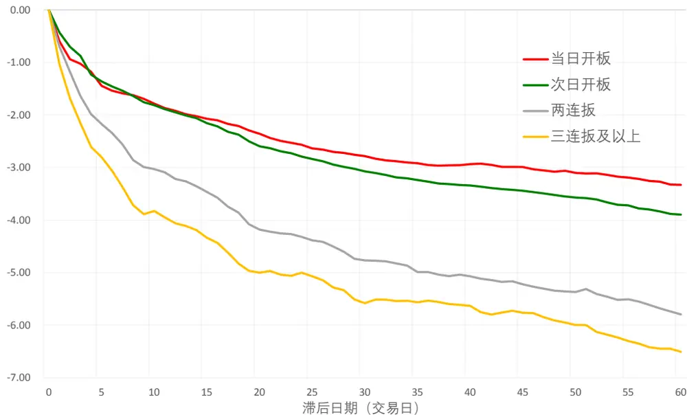

|  | 样本数 | (0,5] | (5, 10] | (10, 20] | (20, 40] | (40,50] |
| --- | --- | --- | --- | --- | --- | --- |
| 当日开板 | 67646 | -1.44 | -0.38 | -0.60 | -0.52 | -0.32 |
| 次日开板 | 101068 | -1.36 | -0.45 | -0.78 | -0.67 | -0.50 |
| 两连扳 | 17309 | -2.17 | -0.86 | -1.13 | -0.78 | -0.63 |
| 三连板及以上 | 6656 | -2.80 | -1.08 | -1.11 | -0.51 | -0.81 |

数据来源：Wind 咨询、东方证券研究所

## 2.4 涨停事件与波动率异象

涨停事件的另一个可能影响因素就是波动率，毫无疑问，涨停个股很容易出现在高波动股票中，而高波的股票长期也有负向 alpha，那么涨停事件的负向 alpha 是否缘于波动率异象？为了回答这个问题，我们在每个交易日根据过去 20 个交易日的波动率将全市场所有股票（除去上市不满 3 个月新股）平均分为 10 组，然后汇集每个交易日各个波动率分组下的股票涨停事件，绘制不同波动率分组下的涨停事件平均累计异常收益。

从各个波动率分组的涨停事件占比来看，最高波动率分组内的涨停事件竟然占比高达32%，而最低波动率分组占比不到 1%，足以说明波动率高的股票有更大的概率发生涨停事件。近一步观察各个波动率分组下涨停事件的平均累计异常收益，我们发现各个波动率分组下，涨停事件发生后的短期内（15 个交易日）异常收益差异不大，甚至低波动分组的涨停事件负向收益更大，但是 20 个交易日后低波分组便没有持续的负向收益，但是高波动率分组负向收益却一直稳定的增加。因此，我们大体可以推断，波动率异象对涨停事件的异常收益的确有一定影响，但这种影响主要发现在一个月之后，而涨停事件对股票异常收益的影响更多的发生在短期。

图 8：各波动率分组下的涨停事件占比和累计异常收益
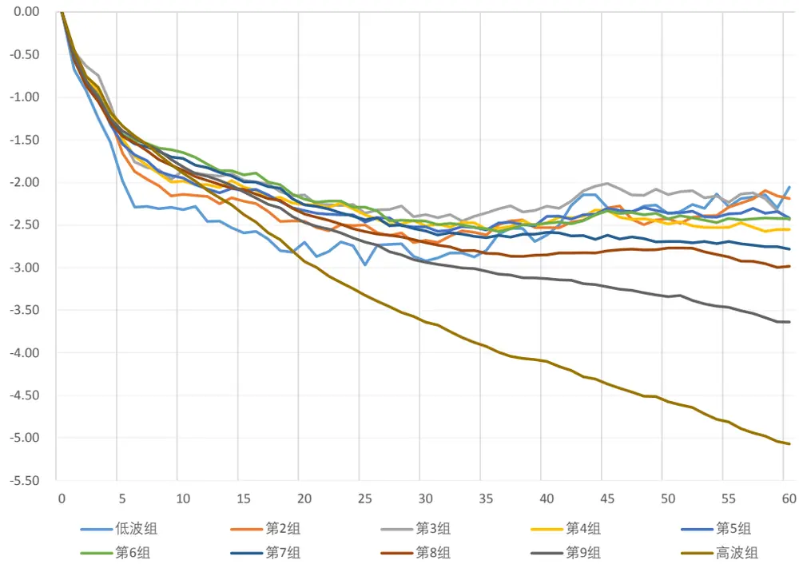

|  | 低波组 | 第2组 | 第3组 | 第4组 | 第5组 | 第6组 | 第7组 | 第8组 | 第9组 | 高波组 |
| --- | --- | --- | --- | --- | --- | --- | --- | --- | --- | --- |
| 样本占比 | 0.93% | 1.81% | 2.54% | 3.62% | 4.91% | 6.98% | 10.23% | 15.04% | 21.90% | 32.03% |
| (0,5] | -1.99 | -1.66 | -1.50 | -1.49 | -1.55 | -1.44 | -1.45 | -1.46 | -1.40 | -1.34 |
| (5,10] | -0.49 | -0.56 | -0.47 | -0.52 | -0.42 | -0.25 | -0.29 | -0.41 | -0.43 | -0.55 |
| (10,20] | -0.40 | -0.38 | -0.31 | -0.25 | -0.39 | -0.50 | -0.57 | -0.55 | -0.65 | -1.03 |
| (20,40] | 0.28 | 0.03 | -0.03 | -0.11 | 0.02 | -0.21 | -0.23 | -0.42 | -0.60 | -1.11 |
| (40,50] | 0.83 | 0.36 | -0.13 | -0.03 | 0.02 | 0.06 | -0.22 | -0.07 | -0.41 | -0.88 |

数据来源：Wind 咨询、东方证券研究所

## 三、涨停板放开后的可能影响

## 3.1 方法与数据说明

随着注册制的推进，涨停板幅度逐步放开已是大势所趋，如 1.1 节所述，这个过程事实上已经在推进，2019 年 7月 22 日科创板推出，上市前5 个交易日涨跌幅不做限制，而后实行 20%的涨跌停制度，2020年 8 月 24 日创业板实施注册制，除新股前 5 个交易日涨跌幅不做限制外，所有创业板股票涨跌幅限制均从 10%提高到20%。第二章的事件分析说明当股票的当日最高价到达 10%的涨停板时，其后有持续的负向异常收益，本章想探讨的问题是当 10%的限制取消或者提高后，股票的最高涨幅同样达到 10%甚至更高时，这种事件的负向收益是否存在。

除新股上市等少数特例外，A 股历史上有两段时间允许 10%以上的日度涨跌幅存在，一个是 19920521-19961215 沪深两市均无涨跌幅限制的日期，一个是科创板和注册制后的创业板。对于 19920521-19961215 这段时期，我们将沪深两市上市满 3 个月的股票当日最高涨幅达到或者超过 10%作为一个虚拟的“涨停板事件”，考察这些“涨停板事件”的平均累计异常收益，作为对比，我们也计算了 19961216-19991231这段涨停板政策刚实施后涨停板事件的累计异常收益。对于科创板和创业板注册制之后的这段时间，由于计算事件收益也需要一段时间的数据，说明我们仅考察 20200731 前上市满 3 个月的科创板股票，科创板股票涨停板为 20%，我们将科创板股票日内最高收益达到 10%及其以上但并未触及真实的 20%涨停板记为一种虚拟的“10%涨停板事件”考察事件收益，同时计算科创板真实涨停事件的异常收益作为对比。

## 3.2 涨停板政策前后“涨停”事件收益

我们比较了 1996 年 12 月 16 日 10%涨跌停政策实施前后股票日内最高涨幅达到 10%的事件平均累计异常收益。在涨跌停政策实施前无涨跌停的一段时期，我们将日内最高涨幅达到 10%记为虚拟涨停事件，我们发现在这段时期，股票“涨停”后平均来讲只有小幅的回调，其后股票平均累计异常收益甚至持续的小幅向上，而涨跌停政策实施后，股票涨停事件后前几个交易日大幅回落，幅度远大于政策实施前的小幅回调，而且随后事件的负向收益持续增加。在涨跌停政策实施前后各 3 年多的时间内，对于股票当日最大收益率达到 10%这样的“涨停”事件有着完全不同的累计异常收益曲线，说明涨跌停政策实施之后对股票的价格行为的确产生了影响，当涨跌停板存在时才有磁吸效应的锚，而且涨停板本身可能会带来额外的关注，涨停板的存在导致了磁吸效应、加剧了关注度效应，从而使得事件后负向收益显著增加。

图 9：涨跌停政策前后“涨停”事件累计异常收益
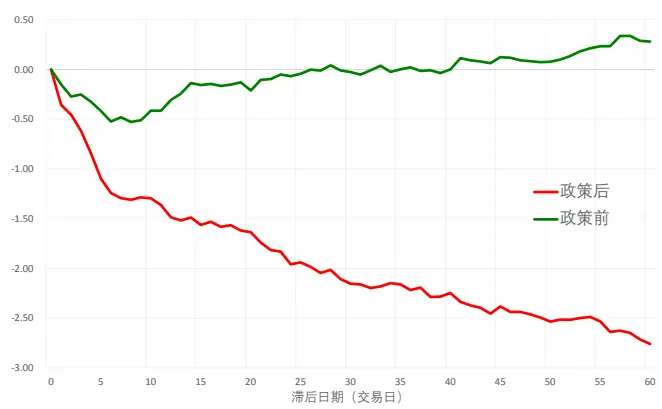

|  | 样本数 | (0,5] | (5,10] | (10,20] | (20,40] | (40,50] |
| --- | --- | --- | --- | --- | --- | --- |
| 政策前 | 10747 | -0.42 | 0.07 | 0.18 | 0.25 | 0.18 |
| 政策后 | 6988 | -1.10 | -0.16 | -0.33 | -0.60 | -0.39 |

数据来源：Wind 咨询、东方证券研究所

图 10：科创板 10%虚拟板和 20%真实板涨停事件对比
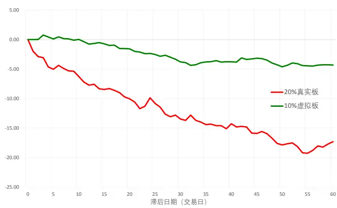

|  | 样本数 | (0,5] | (5, 10] | (10, 20] | (20,40] | (40,50] |
| --- | --- | --- | --- | --- | --- | --- |
| 10%虚拟板 | 501 | 0.11 | 0.08 | -1.65 | -2.38 | 0.01 |
| 20%真实板 | 53 | -5.03 | -1.37 | -4.28 | -4.07 | -2.84 |

数据来源：Wind 咨询、东方证券研究所

## 3.3 科创板10%虚拟板和20%真实板比较

对于科创板，我们比较了股票向上触及 10%但没有触及 20%的 10%虚拟涨停板事件和触及 20%真实涨停板事件的平均累计异常收益。对于触及 10%虚拟板的股票在短期内（10个交易日）并没有显著的负向收益，随后有小幅的负向收益，这种负向收益可能由波动率异象影响，而对于触及 20%的真实涨停事件，股票有持续稳定的大幅负向异常收益，这个结果再次说明真实存在的涨停板对“涨停”事件负向收益的重要性，没有真实存在的涨停板就不存在磁吸效应之说，而且也会影响到关注度效应，毕竟各种股票咨询网站和 app 都会额外推送各种涨停的股票。

## 四、涨停板事件对动量反转的启示

## 4.1 涨停板对动量反转的影响

由于涨停板的磁吸效应和关注度效应，股票涨停触板前后可能存在过度反应的现象，导致股票涨停事件后存在持续的负向异常收益。众所周知，A 股的短期反转效应就是过度反应的一种结果，那么涨停事件作为一种典型的过度反应对反转效应以及与反转相对应的动量有什么影响？为了考察这种影响，我们计算了典型的反转因子、动量因子以及剔除触及涨停交易日后的反转、动量因子在各个样本空间、20101231-20201031 时间区间的因子表现。因子标记如下：

REV0：过去一个月的收益率

REV1：过去一个月的收益率，剔除区间所有触及涨停交易日的收益率

MOM0：过去一年的收益率，剔除最近一个月的收益率

MOM1：过去一年的收益率，剔除最近一个月的收益率和区间所有触及涨停交易日的收益率

REV0、MOM0 为原始的反转因子和动量因子，REV1、MOM1 是涨停板调整后的反转因子和动量因子。为方便展示，REV0、REV1 计算因子表现时均调整了因子方向。

图 11：涨停调整前后动量反转因子选股表现汇总（因子原始值）

| RankIC |  |  |  |  |  |  | 多空组合 |  |  |
| --- | --- | --- | --- | --- | --- | --- | --- | --- | --- |
|  |  | 月度均值 年化ICIR |  | t值 | 年化收益 | 夏普比 | 月胜率 | 最大回撤 | TOP月换手 |
|  | REVO | 6.24% | 1.51 | 5.00 | 20.7% | 1.17 | 65.6% | -19.0% | 91.0% |
|  | REV1 | 1.27% | 0.31 | 1.04 | 3.6% | 0.29 | 46.6% | -38.4% | 86.0% |
| 中 | MOM0 | -0.21% | -0.05 | -0.16 | 0.7% | 0.13 | 51.9% | -54.9% | 36.2% |
| 008I10 | MOM1 | 4.71% | 1.10 | 3.65 | 12.4% | 0.79 | 61.8% | -43.7% | 30.8% |
|  | REVO | 4.02% | 0.86 | 2.86 | 6.9% | 0.43 | 55.7% | -39.1% | 91.2% |
|  | REV1 | 0.73% | 0.16 | 0.53 | -1.4% | 0.02 | 48.9% | -48.0% | 87.0% |
|  | MOM0 | 1.81% | 0.35 | 1.17 | 4.6% | 0.33 | 58.0% | -57.4% | 35.5% |
| 300 | MOM1 | 6.01% | 1.18 | 3.91 | 15.6% | 0.87 | 64.9% | -38.0% | 30.4% |
|  | REVO | 3.20% | 0.58 | 1.93 | 5.1% | 0.33 | 53.4% | -53.3% | 91.0% |
|  | REV1 | 0.32% | 0.06 | 0.20 | -0.7% | 0.09 | 45.8% | -48.7% | 88.0% |
|  | MOM0 | 4.03% | 0.70 | 2.32 | 13.9% | 0.71 | 63.4% | -38.7% | 34.7% |
| 中P50 | MOM1 | 8.03% | 1.34 | 4.41 | 21.9% | 1.04 | 62.6% | -35.3% | 30.4% |
|  | REVO | 4.33% | 1.01 | 3.35 | 7.8% | 0.52 | 58.0% | -30.2% | 90.7% |
|  | REV1 | 0.72% | 0.17 | 0.58 | -1.1% | 0.03 | 46.6% | -54.1% | 87.1% |
|  | MOM0 | 0.42% | 0.09 | 0.29 | 0.0% | 0.09 | 51.1% | -56.7% | 36.7% |
| 中0 | MOM1 | 5.02% | 1.08 | 3.58 | 14.9% | 0.87 | 61.8% | -36.6% | 31.5% |
|  | REVO | 6.98% | 1.84 | 6.08 | 28.7% | 1.69 | 67.2% | -20.4% | 91.4% |
|  | REV1 | 1.56% | 0.41 | 1.37 | 7.1% | 0.51 | 48.1% | -37.0% | 86.8% |
|  | MOM0 | -1.39% | -0.34 | -1.13 | -1.0% | 0.02 | 49.6% | -52.7% | 38.1% |
|  | MOM1 | 4.36% | 1.13 | 3.74 | 14.5% | 0.95 | 60.3% | -31.2% | 33.3% |

数据来源：Wind 咨询、东方证券研究所

图 12：涨停调整前后动量反转因子选股表现汇总（因子行业市值中性值）

|  |  |  |  |  |  |  | 多空组合 |  |  |
| --- | --- | --- | --- | --- | --- | --- | --- | --- | --- |
|  |  | 月度均值 | 年化ICIR | t值 | 年化收益 | 夏普比 | 月胜率 | 最大回撤 | TOP月换手 |
|  | REVO | 6.36% | 2.21 | 7.29 | 22.8% | 1.69 | 69.5% | -13.3% | 90.3% |
|  | REV1 | 1.29% | 0.45 | 1.48 | 6.5% | 0.56 | 51.9% | -34.9% | 86.0% |
| 中 | MOM0 | -0.39% | -0.13 | -0.43 | 1.6% | 0.19 | 48.1% | -38.7% | 37.6% |
|  | MOM1 | 4.87% | 1.71 | 5.65 | 15.1% | 1.32 | 68.7% | -21.1% | 33.8% |
| 中0081中 | REVO | 4.55% | 1.61 | 5.31 | 13.2% | 1.01 | 61.8% | -18.6% | 89.6% |
|  | REV1 | 1.55% | 0.55 | 1.83 | 5.0% | 0.45 | 52.7% | -36.0% | 86.5% |
|  | MOM0 | 1.13% | 0.36 | 1.19 | 5.3% | 0.48 | 54.2% | -33.9% | 37.3% |
|  | MOM1 | 4.77% | 1.56 | 5.15 | 15.5% | 1.18 | 62.6% | -22.5% | 33.7% |
| 00 | REVO | 3.78% | 1.35 | 4.47 | 10.2% | 0.85 | 61.1% | -23.0% | 88.4% |
|  | REV1 | 1.21% | 0.42 | 1.39 | 0.9% | 0.14 | 48.1% | -32.6% | 85.3% |
|  | MOM0 | 2.16% | 0.70 | 2.32 | 7.7% | 0.59 | 58.8% | -27.9% | 36.9% |
|  | MOM1 | 5.04% | 1.58 | 5.23 | 15.0% | 1.05 | 61.8% | -23.3% | 33.6% |
| 中P550 | REVO | 4.40% | 1.44 | 4.74 | 12.1% | 0.92 | 59.5% | -17.4% | 89.5% |
|  | REV1 | 1.33% | 0.45 | 1.49 | 4.8% | 0.43 | 51.1% | -37.5% | 86.8% |
|  | MOM0 | 1.23% | 0.46 | 1.53 | 3.0% | 0.32 | 49.6% | -38.5% | 43.4% |
|  | MOM1 | 4.76% | 1.66 | 5.50 | 13.7% | 1.13 | 61.1% | -21.2% | 36.3% |
|  | REVO | 6.47% | 2.29 | 7.56 | 28.7% | 2.08 | 71.8% | -15.4% | 90.4% |
|  | REV1 | 1.46% | 0.49 | 1.63 | 9.2% | 0.73 | 50.4% | -32.4% |  |
| 中10 | MOM0 | 0.20% | 0.08 | 0.25 | 2.9% | 0.31 | 54.2% |  | 86.3% |
|  | MOM1 | 4.99% | 1.80 | 5.94 | 15.1% | 1.31 | 67.9% | -31.5% -18.4% | 45.1% 37.9% |

数据来源：Wind 咨询、东方证券研究所

对比涨停调整前后动量反转因子在各个样本空间的表现，我们有如下分析：

（1）原始的反转因子 REV0 在各个样本空间均有十分显著的选股效果，但因子计算时剔除涨停交易日后，REV1 因子各个样本空间选股效果均不显著，说明传统的反转效应很可能与涨停交易日有关，涨停交易日由于磁吸效应、关注度效应存在较强的过度反应，这部分过度反应是反转效应的很大一部分收益来源，随着涨跌停限制逐步放开，传统的反转效应很可能逐步变弱甚至消失。

（2）原始的动量因子 MOM0 仅在沪深 300 这样的大市值样本空间有效，剔除涨停交易日的影响后，MOM1 在各个样本空间均有统计显著的选股效果，大市值样本空间内的选股效果更强，沪深 300 中 MOM1 因子原始值 RankIC 均值高达 8.03%，多空组合年化收益高达21.9%。学术研究表明动量效应普遍存在于全球大多数股票市场，但是在东亚市场却不显著，而东亚几个股票市场碰巧都有涨跌停限制，我们猜想涨停板加剧了过度反应可能是其中一个重要原因。

我们近一步比较了原始动量和涨停调整动量在沪深 300 中的分组表现和多头对冲净值，无论是因子原始值还是行业市值中性化调整之后，涨停调整后的动量 MOM1 相对原始动量MOM0 多头收益和空头收益都有所加强，因子原始值多头年化对冲收益高达 11.3%，时间序列上看最近 2 年 MOM1 相对 MOM0 多头对冲收益也更为丰厚。

图 13：涨停调整前后动量因子在沪深 300 中的分组收益和多头净值（因子原始值）
分组年化对冲收益
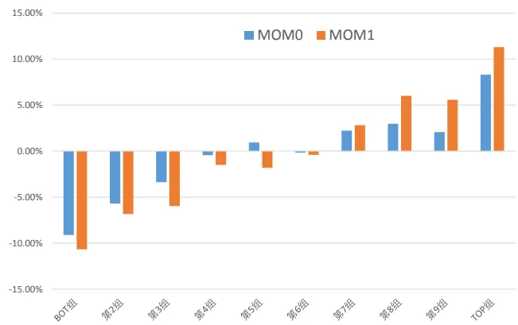

图 14：涨停调整前后动量因子在沪深 300 中的分组年化收益和多头对冲净值（因子行业市值中性值）
分组年化对冲收益
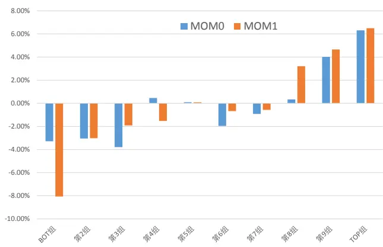

TOP 组合对冲净值
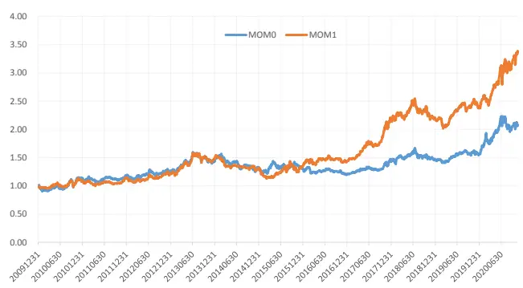
数据来源：Wind 咨询、东方证券研究所

TOP 组合对冲净值
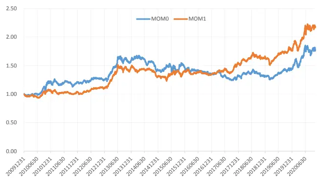
数据来源：Wind 咨询、东方证券研究所

## 4.2 动量因子相关性分析

为了阐述涨停前后的动量调整因子和常见 alpha 因子关系，我们计算了 MOM0、MOM1和估值、盈利、成长等常见大类因子在中证全指（非金融，大类因子方向已调整）的行业市值中性因子因子值、因子 RankIC 相关性，以及 MOM0、MOM1 横截面回归剔除各大类因子的中性因子值选股表现。从结果上看，首先，MOM0 和 MOM1 因子两两相关性较高，因子值相关性 43%，因子表现 58%，其次，MOM1 和常见各大类因子因子值相关性并不高，相关性最高的成长因子，相关性取值仅 22.6%，最后，我们通过横截面回归剔除各大类因子后，MOM0依然没有选股效果，但 MOM1 的 RankIC 显著大于 0，说明涨停调整的动量相对常见各大类因子在选股方面有额外的信息增量。

图 15：涨停调整前后动量因子和常见各大类因子相关性（左下因子值，右上 RankIC）

|  | MOM0 | MOM1 | Value | ProfitabilityGrowthGovernanceLiquidity |  |  |  | ReversalLottery |  | Analyst | Surprise |
| --- | --- | --- | --- | --- | --- | --- | --- | --- | --- | --- | --- |
| MOM0 |  | 0.584 | -0.426 | 0.580 0.562 |  | -0.327 | -0.242 | -0.391 | -0.423 | 0.308 | 0.672 |
| MOM1 | 0.430 |  | 0.185 | 0.430 | 0.450 | 0.005 | 0.295 | -0.653 | 0.293 | 0.473 | 0.565 |
| Value | -0.164 | 0.165 |  | -0.202 | 0.019 | 0.530 | 0.427 | 0.003 | 0.743 | 0.275 | -0.084 |
| Profitability | 0.157 | 0.210 | 0.306 |  | 0.425 | 0.094 | -0.123 | -0.246 | -0.230 | 0.589 | 0.665 |
| Growth | 0.278 | 0.226 | 0.173 | 0.336 |  | -0.025 | -0.024 | -0.256 | -0.049 | 0.535 | 0.772 |
| Governance | -0.087 | 0.035 | 0.234 | 0.096 | -0.040 |  | 0.144 | 0.166 | 0.308 | 0.311 | -0.041 |
| Liquidity | -0.138 | 0.083 | 0.149 | -0.011 | -0.046 | 0.052 |  | 0.003 | 0.814 | 0.178 | 0.026 |
| Reversal | -0.178 | -0.268 | 0.070 | -0.073 | -0.131 | 0.033 | 0.252 |  | -0.095 | -0.070 | -0.438 |
| Lottery | -0.341 | 0.174 | 0.374 | 0.033 | -0.021 | 0.104 | 0.577 | 0.174 |  | 0.124 | -0.086 |
| Analyst | 0.096 | 0.214 | 0.304 | 0.289 | 0.233 | 0.070 | 0.030 | 0.006 | 0.085 |  | 0.578 |
| Surprise | 0.218 | 0.156 | 0.027 | 0.182 | 0.529 | -0.035 | -0.056 | -0.171 | -0.057 | 0.203 |  |

数据来源：Wind 咨询、东方证券研究所

图 16：涨停调整前后动量因子剔除各大类因子的选股表现（因子行业市值中性）

|  | RankIC |  |  | 多空组合 |  |  |  |
| --- | --- | --- | --- | --- | --- | --- | --- |
|  | 月度均值 | 年化ICIR | t值 | 年化收益 | 夏普比 | 月胜率 | 最大回撤 |
| MOM0 | 0.99% | 0.57 | 1.87 | 1.7% | 0.26 | 52.7% | -24.6% |
| MOM1 | 2.39% | 1.51 | 4.98 | 6.4% | 0.92 | 64.1% | -18.1% |

数据来源：Wind 咨询、东方证券研究所

## 4.3 不同度量方法下的动量因子比较

通过剔除某些交易日的收益率去改进动量或者反转收益并不少见，本文涨停调整的动量因子就是传统的动量因子剔除涨停交易日的收益率。除了本文基于涨停调整动量因子的方法，我们也比较了基于换手和振幅两种调整动量因子的方法，具体计算方法如下：

MOM2：过去一年的收益率，剔除最近一个月的收益率和区间换手最高 20%的交易日的收益率

MOM3：过去一年的收益率，剔除最近一个月的收益率和区间振幅最大 20%的交易日的收益率

比较 MOM0、MOM1、MOM2、MOM3 的选股表现，不难发现 MOM2、MOM3 虽然在各个样本空间内的RankIC高于原始动量MOM0，但低于涨停调整的动量MOM1，而且MOM2、MOM3在沪深300成分股内的多空组合和多头组合年化收益均弱于MOM0，更弱于MOM1。

图 17：不同度量下动量因子选股表现汇总（因子原始值）

|  |  | RankIC |  |  | 多空组合 |  |  |  |  |
| --- | --- | --- | --- | --- | --- | --- | --- | --- | --- |
|  |  | 月度均值 年化ICIR |  | t值 | 年化收益 | 夏普比 | 月胜率 | 最大回撤 TOP月换手 |  |
|  | MOM0 | -0.21% | -0.05 | -0.16 | 0.7% | 0.13 | 51.9% | -54.9% | 36.2% |
|  | MOM1 | 4.71% | 1.10 | 3.65 | 12.4% | 0.79 | 61.8% | -43.7% | 30.8% |
| 中 | MOM2 | 2.31% | 0.69 | 2.29 | 3.8% | 0.34 | 57.3% | -34.4% | 37.0% |
|  | MOM3 | 3.90% | 1.23 | 4.06 | 10.7% | 0.82 | 62.6% | -21.5% | 36.3% |
| 008I中 | MOM0 | 1.81% | 0.35 | 1.17 | 4.6% | 0.33 | 58.0% | -57.4% | 35.5% |
|  | MOM1 | 6.01% | 1.18 | 3.91 | 15.6% | 0.87 | 64.9% | -38.0% | 30.4% |
|  | MOM2 | 3.79% | 0.87 | 2.88 | 8.9% | 0.58 | 60.3% | -37.2% | 34.2% |
|  | MOM3 | 3.99% | 1.01 | 3.34 | 10.9% | 0.77 | 61.1% | -23.8% | 35.9% |
| 300 | MOM0 | 4.03% | 0.70 | 2.32 | 13.9% | 0.71 | 63.4% | -38.7% | 34.7% |
|  | MOM1 | 8.03% | 1.34 | 4.41 | 21.9% | 1.04 | 62.6% | -35.3% | 30.4% |
|  | MOM2 | 5.52% | 1.00 | 3.29 | 7.9% | 0.47 | 57.3% | -48.5% | 31.4% |
|  | MOM3 | 5.17% | 1.01 | 3.32 | 12.1% | 0.73 | 61.1% | -35.0% | 33.7% |
| 中P50 | MOM0 | 0.42% | 0.09 | 0.29 | 0.0% | 0.09 | 51.1% | -56.7% | 36.7% |
|  | MOM1 | 5.02% | 1.08 | 3.58 | 14.9% | 0.87 | 61.8% | -36.6% | 31.5% |
|  | MOM2 | 2.82% | 0.72 | 2.38 | 5.5% | 0.41 | 55.7% | -32.4% | 37.8% |
|  | MOM3 | 3.07% | 0.96 | 3.18 | 8.0% | 0.65 | 62.6% | -30.5% | 38.6% |
| 中10 | MOM0 | -1.39% | -0.34 | -1.13 | -1.0% | 0.02 | 49.6% | -52.7% | 38.1% |
|  | MOM1 | 4.36% | 1.13 | 3.74 | 14.5% | 0.95 | 60.3% | -31.2% |  |
|  | MOM2 | 1.55% | 0.51 | 1.67 | 3.2% | 0.30 | 53.4% | -35.8% | 33.3% |
|  | MOM3 | 3.02% | 1.11 | 3.68 | 5.7% | 0.52 | 59.5% | -25.7% | 40.1% 39.1% |

数据来源：Wind 咨询、东方证券研究所

图 18：不同度量下动量因子选股表现汇总（因子中性值）

|  |  | RankIC |  |  | 多空组合 |  |  |  |  |
| --- | --- | --- | --- | --- | --- | --- | --- | --- | --- |
|  |  | 月度均值 | 年化ICIR | t值 | 年化收益 | 夏普比 | 月胜率： | 最大回撤 | TOP月换手 |
|  | MOM0 | -0.39% | -0.13 | -0.43 | 1.6% | 0.19 | 48.1% | -38.7% | 37.6% |
|  | MOM1 | 4.87% | 1.71 | 5.65 | 15.1% | 1.32 | 68.7% | -21.1% | 33.8% |
| 中 | MOM2 | 2.14% | 0.98 | 3.23 | 4.7% | 0.51 | 58.8% | -18.4% | 39.1% |
|  | MOM3 | 2.92% | 1.49 | 4.94 | 7.5% | 0.90 | 62.6% | -14.9% | 37.0% |
| 008I10 | MOM0 | 1.13% | 0.36 | 1.19 | 5.3% | 0.48 | 54.2% | -33.9% | 37.3% |
|  | MOM1 | 4.77% | 1.56 | 5.15 | 15.5% | 1.18 | 62.6% | -22.5% | 33.7% |
|  | MOM2 | 2.99% | 1.22 | 4.05 | 6.3% | 0.58 | 58.8% | -25.0% | 37.8% |
|  | MOM3 | 2.88% | 1.37 | 4.52 | 7.8% | 0.91 | 60.3% | -18.7% | 37.0% |
| 300 | MOM0 | 2.16% | 0.70 | 2.32 | 7.7% | 0.59 | 58.8% | -27.9% | 36.9% |
|  | MOM1 | 5.04% | 1.58 | 5.23 | 15.0% | 1.05 | 61.8% | -23.3% | 33.6% |
|  | MOM2 | 3.60% | 1.40 | 4.61 | 7.2% | 0.62 | 57.3% | -21.7% | 36.7% |
|  | MOM3 | 3.21% | 1.39 | 4.61 | 6.8% | 0.70 | 58.0% | -23.3% | 36.2% |
| 中50 | MOM0 | 1.23% | 0.46 | 1.53 | 3.0% | 0.32 | 49.6% | -38.5% | 43.4% |
|  | MOM1 | 4.76% | 1.66 | 5.50 | 13.7% | 1.13 | 61.1% | -21.2% | 36.3% |
|  | MOM2 | 2.96% | 1.33 | 4.40 | 7.5% | 0.75 | 65.6% | -23.1% | 40.5% |
|  | MOM3 | 2.75% | 1.38 | 4.57 | 8.1% | 0.87 | 60.3% | -20.7% | 39.0% |
|  | MOM0 | 0.20% | 0.08 | 0.25 | 2.9% | 0.31 | 54.2% | -31.5% | 45.1% |
| 中10 | MOM1 | 4.99% | 1.80 | 5.94 | 15.1% | 1.31 | 67.9% | -18.4% | 37.9% |
|  | MOM2 | 2.37% | 1.20 | 3.95 | 3.5% | 0.41 | 58.8% | -22.6% | 43.7% |
|  | MOM3 | 2.91% | 1.54 | 5.09 | 7.1% | 0.79 | 59.5% | -17.8% | 39.7% |

数据来源：Wind 咨询、东方证券研究所

图 19：不同度量下动量因子的分组年化收益（沪深 300，因子原始值）
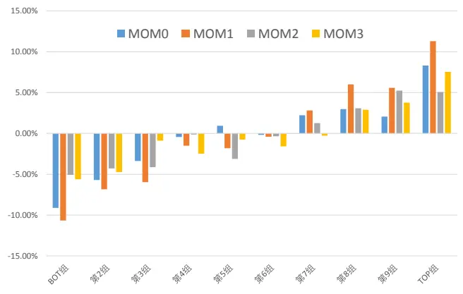
数据来源：Wind 咨询、东方证券研究所

图 20：不同度量下动量因子的分组年化收益（沪深 300，因子行业市值中性值）
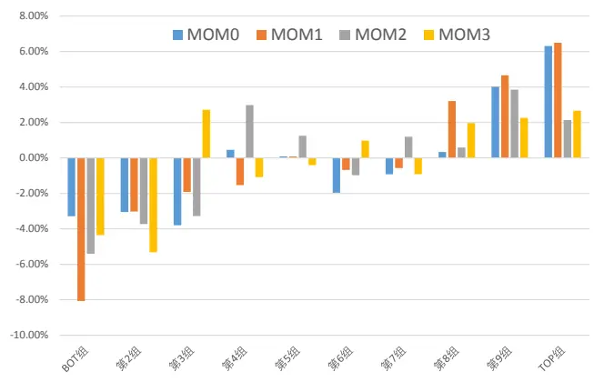
数据来源：Wind 咨询、东方证券研究所

## 五、小结

随着科创板和创业板注册制的推出，A 股实施了 20 多年的 10%涨跌幅限制逐步开始放开，目前 A 股已经有 26.2%的股票涨跌幅限制为 20%，若不久的将来全面实现注册制，A 股现有 10%的涨跌幅限制大概率放开，为了适应未来的市场，研究涨跌停对股票价格行为的影响有其必要性和紧迫性。长期平均来看，每天有 2%的股票触及涨停板，其中当天开板和次日开板的各占 34.8%、53.8%，能够连板的涨停占比不多，每天跌停股票占比 1.6%，其中当天开板的达到 45.6%，涨跌停的股票占比和持续时间存在显著的非对称性。磁吸效应导致接近涨停的股票非理性上涨、接近跌停的股票非理性下跌，而关注度效应致使涨跌停的股票都被高估，因此涨停的股票后期大概率有负向异常收益，而跌停的股票取决于磁吸效应和关注度效应的相对强弱。

通过事件分析的方法，我们发现 A 股涨停打开后有持续稳定的负向异常收益，前 5 个交易日负收益高达 1.33%，而跌停打开的收益波动几乎可以忽略。涨停当天打开和次日打开的事件收益相差不大，连板涨停打开后的负向收益幅度更大。涨停事件更多的发生在波动率大的股票分组中，但是低波股票在涨停打开后负向异常收益短期内不输高波股票，另外，高波股票的涨停事件收益持续性更强，说明波动率异象可以部分解释涨停事件的长端收益，但不能解释短端收益。涨跌停制度实施前后，股票当日最大收益率达到 10%的“涨停”事件有完全不同的累计异常收益曲线，实施后呈显著持续的负向收益，实施前则不存在，说明涨停板的存在的确加剧了触板股票的过度反应，这一现象我们在科创板股票中也得到了验证。

计算动量反转因子时若剔除触及涨停交易日的收益率，反转效应便不在显著，动量效应得到加强，沪深 300 中剔除涨停影响的动量因子 RankIC 月度均值 8.03%、多空年化收益21.9%，其中多头对冲收益高达 11.3%。涨停股票磁吸效应、关注度效应引起的过度反应是反转因子收益的重要来源，随着涨跌幅限制的放开甚至取消，反转效应大概率走弱，相应的动量效应会有所增强。涨停调整的动量因子和现有各大类因子相关性并不高，横截面回归剔除各大类因子影响后依然有显著的选股效果。

## 风险提示

1.量化模型基于历史数据分析得到，未来存在失效的风险，建议投资者紧密跟踪模型表现。

2.极端市场环境可能对模型效果造成剧烈冲击，导致收益亏损。

## 分析师申明

每位负责撰写本研究报告全部或部分内容的研究分析师在此作以下声明：

分析师在本报告中对所提及的证券或发行人发表的任何建议和观点均准确地反映了其个人对该证券或发行人的看法和判断；分析师薪酬的任何组成部分无论是在过去、现在及将来，均与其在本研究报告中所表述的具体建议或观点无任何直接或间接的关系。

## 投资评级和相关定义

报告发布日后的 12 个月内的公司的涨跌幅相对同期的上证指数/深证成指的涨跌幅为基准；

## 公司投资评级的量化标准

买入：相对强于市场基准指数收益率 15%以上；

增持：相对强于市场基准指数收益率 5%～15%；

中性：相对于市场基准指数收益率在-5%～+5%之间波动；

减持：相对弱于市场基准指数收益率在-5%以下。

未评级 —— 由于在报告发出之时该股票不在本公司研究覆盖范围内，分析师基于当时对该股票的研究状况，未给予投资评级相关信息。

暂停评级 —— 根据监管制度及本公司相关规定，研究报告发布之时该投资对象可能与本公司存在潜在的利益冲突情形；亦或是研究报告发布当时该股票的价值和价格分析存在重大不确定性，缺乏足够的研究依据支持分析师给出明确投资评级；分析师在上述情况下暂停对该股票给予投资评级等信息，投资者需要注意在此报告发布之前曾给予该股票的投资评级、盈利预测及目标价格等信息不再有效。

## 行业投资评级的量化标准：

看好：相对强于市场基准指数收益率 5%以上；

中性：相对于市场基准指数收益率在-5%～+5%之间波动；

看淡：相对于市场基准指数收益率在-5%以下。

未评级：由于在报告发出之时该行业不在本公司研究覆盖范围内，分析师基于当时对该行业的研究状况，未给予投资评级等相关信息。

暂停评级：由于研究报告发布当时该行业的投资价值分析存在重大不确定性，缺乏足够的研究依据支持分析师给出明确行业投资评级；分析师在上述情况下暂停对该行业给予投资评级信息，投资者需要注意在此报告发布之前曾给予该行业的投资评级信息不再有效。

## HeadertTabl e_Discl ai mer 免责声明

本证券研究报告（以下简称“本报告”）由东方证券股份有限公司（以下简称“本公司”）制作及发布。

本报告仅供本公司的客户使用。本公司不会因接收人收到本报告而视其为本公司的当然客户。本报告的全体接收人应当采取必要措施防止本报告被转发给他人。

本报告是基于本公司认为可靠的且目前已公开的信息撰写，本公司力求但不保证该信息的准确性和完整性，客户也不应该认为该信息是准确和完整的。同时，本公司不保证文中观点或陈述不会发生任何变更，在不同时期，本公司可发出与本报告所载资料、意见及推测不一致的证券研究报告。本公司会适时更新我们的研究，但可能会因某些规定而无法做到。除了一些定期出版的证券研究报告之外，绝大多数证券研究报告是在分析师认为适当的时候不定期地发布。

在任何情况下，本报告中的信息或所表述的意见并不构成对任何人的投资建议，也没有考虑到个别客户特殊的投资目标、财务状况或需求。客户应考虑本报告中的任何意见或建议是否符合其特定状况，若有必要应寻求专家意见。本报告所载的资料、工具、意见及推测只提供给客户作参考之用，并非作为或被视为出售或购买证券或其他投资标的的邀请或向人作出邀请。

本报告中提及的投资价格和价值以及这些投资带来的收入可能会波动。过去的表现并不代表未来的表现，未来的回报也无法保证，投资者可能会损失本金。外汇汇率波动有可能对某些投资的价值或价格或来自这一投资的收入产生不良影响。那些涉及期货、期权及其它衍生工具的交易，因其包括重大的市场风险，因此并不适合所有投资者。

在任何情况下，本公司不对任何人因使用本报告中的任何内容所引致的任何损失负任何责任，投资者自主作出投资决策并自行承担投资风险，任何形式的分享证券投资收益或者分担证券投资损失的书面或口头承诺均为无效。

本报告主要以电子版形式分发，间或也会辅以印刷品形式分发，所有报告版权均归本公司所有。未经本公司事先书面协议授权，任何机构或个人不得以任何形式复制、转发或公开传播本报告的全部或部分内容。不得将报告内容作为诉讼、仲裁、传媒所引用之证明或依据，不得用于营利或用于未经允许的其它用途。

经本公司事先书面协议授权刊载或转发的，被授权机构承担相关刊载或者转发责任。不得对本报告进行任何有悖原意的引用、删节和修改。

提示客户及公众投资者慎重使用未经授权刊载或者转发的本公司证券研究报告，慎重使用公众媒体刊载的证券研究报告。

## 东方证券研究所

地址：上海市中山南路 318 号东方国际金融广场 26 楼

电话：021-63325888

传真：021-63326786

网址： www.dfzq.com.cn