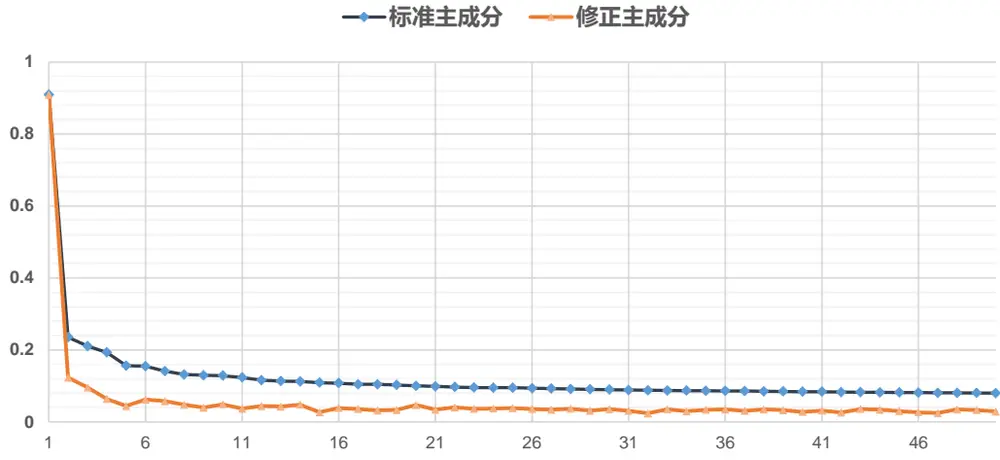
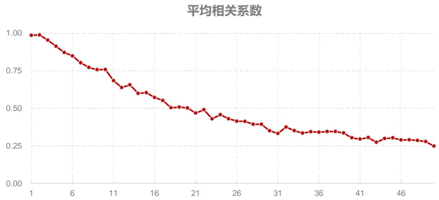
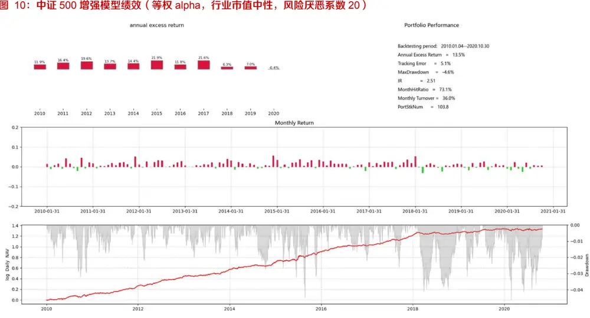
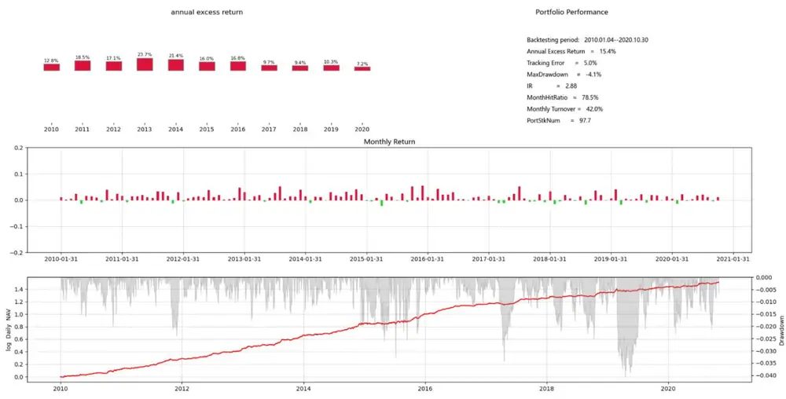
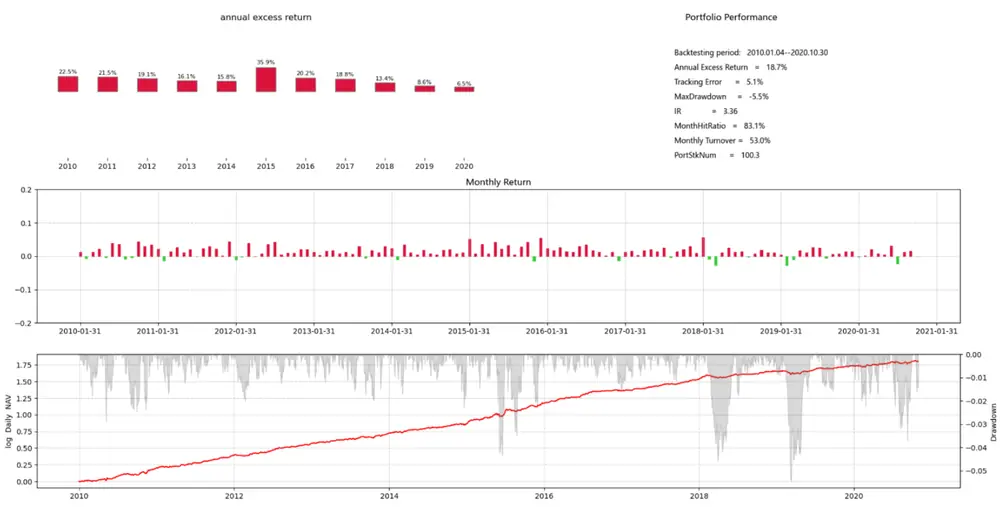
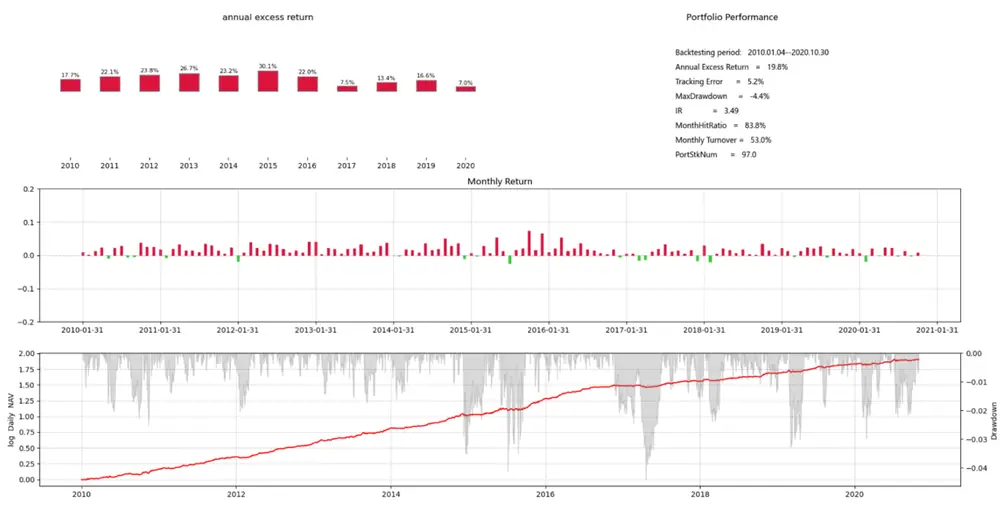

## ——因子选股系列研究之（七十二）

## 研究结论

- 股票量化组合构建最常用的是 Mean-Variance 框架，一些量化组合单纯控制跟踪误差风险也能取得不错效果，但再额外控制部分风险因子暴露，能为组合提供更高灵活度，有可能实现同等风险水平下收益增强。

“行业+市值”风险暴露是实践中最常用的风险控制方式，它出自于市场经验，实证效果不错，但是否适用于任何股票池值得探讨。在个别股票池里它有可能会过度控制风险，限制 alpha 发挥，此时可以尝试其它风险描述方式。

- 找寻其它市场风险框架的方法，一种是把常见的风险因子遍历组合，看看哪种最优，但仍受限于市场经验；另一种是用纯统计的方法，寻找股票收益率数据背后隐藏的风险因子，报告推荐采用 Barigozzi（2020）的修正 PCA 方法。

- 隐藏风险因子的因子收益率是股票池里个股收益率的线性组合，波动越大，越稳定（滞后一期截面相关性越高），组合控制对其因子暴露后，风控效果越好。

和 DFQ 2020 A 股因子风险模型对比来看，修正 PCA 方法提取的第一个隐藏风险因子跟 beta 因子高度相关，第二、三个隐藏风险因子分别跟估值、市值最相关，其它隐藏因子和常见风险因子的相关性都不高，由此可见这种统计方法提取的是一个相关性较低的新风险框架。

- 在做中证 500 指数月频增强策略时，和传统的“行业中性+市值中性”策略相比，控制前 20 至 30 个隐藏风险因子，得到组合的跟踪误差基本一致，但年化超额收益能够提高 1%-2%，回撤更小，组合换手率略微提升。

做沪深 300 指数月频增强策略时，控制隐藏风险因子暴露的组合表现不佳。可能的原因是沪深 300 指数成分里，行业权重差别绝大，行业风险突出，“行业+市值”的风险框架比隐藏风险因子更适合。而中证 500 成分股里，行业分布相对均匀，“行业+市值”的风控限制过严，限制了 alpha发挥空间，此时隐藏风险因子的框架更好。

- 提取隐藏风险因子的统计方法有很多，不同的方法可以提取出不同的风险框架，这些框架不一定比“行业+市值”更优，但值得尝试，特别是做一些之前并不熟悉的股票组合，少有市场经验可参考时。

## 风险提示

- 量化模型失效风险

- 市场极端环境的冲击

报告发布日期2020 年 12 月 13 日

证券分析师朱剑涛

021-63325888*6077

zhujiantao@orientsec.com.cn

执业证书编号：S0860515060001

## 相关报告

| 涨停板事件对股票价格行为的影响 | 2020-11-16 |
| --- | --- |
| 机器因子库相对人工因子库的增量 | 2020-09-11 |
| 机器增强一致预期 | 2020-09-01 |
| 因子加权过程中的大类权重控制 | 2020-08-04 |
| 东方A股因子风险模型(DFQ-2020) | 2020-05-28 |
| 基于时间尺度度量的日内买卖压力 | 2020-04-21 |

## 一、传统组合风控方式

量化指数增强和对冲组合目前最常用的还是 mean -variance 框架，通过在目标函数惩罚跟踪误差或在约束条件限定跟踪误差上限的模式来控制风险，本报告统一采用的是前者，组合优化的目标函数设定为：

$$
w^{T}\cdot\alpha-\frac{1}{2}\lambda w^{T}\cdot\Sigma\cdot w
$$

其中w 是组合的主动权重，α 是预测的股票收益，Σ 是股票收益率的协方差矩阵，λ 是风险厌恶系数。

有些量化组合基于跟踪误差控制就可以取得很好的绩效，例如表 1 的中证 500 月频增强组合，策略的实证设定如下：

股票池：A 股全市场，剔除上市不满三个月、ST股、停牌股、科创板

Alpha 模型：从估值、盈利、成长、营运、技术、分析师情绪五大类选取 46 个alpha因子，类别间等权，类别内也等权的方式加权合成。

- 风险模型：DFQ 2020 A 股因子风险模型

- 交易费用：0， 这里只考虑模型的纯 alpha 效果

- 交易限制：停牌股不交易、涨停股不能买入、跌停股不能卖出

实证构建了三个模拟组合：

组合 1： λ = 80，只约束个股权重上限，

组合 2：λ = 20，约束个股权重上限，行业中性，市值中性

组合 3：λ = 30，约束个股权重上限，行业暴露放开 0.02，市值暴露放开 0.2

图 1：中证 500 月频量化增强组合绩效（2010.01-2020.10）

|  | 年化超额收益 | 年化跟踪误差 | 超额最大回撤 | 信息比 | 月度单边换手 | 平均持股数量 | 月度胜率 |
| --- | --- | --- | --- | --- | --- | --- | --- |
| 组合1 | 14.8% | 5.1% | -5.1% | 2.76 | 33.9% | 185 | 73.1% |
| 组合2 | 13.5% | 5.1% | -4.7% | 2.51 | 36.2% | 103.8 | 73.1% |
| 组合3 | 14.7% | 5.1% | -4.9% | 2.74 | 35.7% | 116.4 | 76.2% |

资料来源：东方证券研究所 & Wind 资讯

可以看到，组合 1 单纯只控制了跟踪误差风险就获得了稳定的超额收益，但需要非常高的风险厌恶系数（λ = 80），对应的持股数量会明显增多；组合 2 在跟踪误差控制基础上，进一步增加了风险因子暴露约束，比如最常见的行业中性+市值中性；风险因子暴露约束一方面具有跟踪误差控制作用，因此只需要把风险厌恶系数设为 20，组合 2 跟踪误差就能和组合 1 一致；另一方面，风险因子暴露约束也在限制 Alpha 因子的“发挥空间”，损失收益，组合 3 在组合 2 基础上，适度放开了行业和市值风险约束，组合风险没有提升，组合收益增强明显。

沪深 300 增强策略的结果类似（表 2），这里也构建了三个组合：

组合 1： λ = 80，只约束个股权重上限，

组合 2：λ = 5，约束个股权重上限，行业中性，市值中性

组合 3：λ = 30，约束个股权重，银行和非银中性，其它行业放开 0.02，市值放开 0.2三个组合跟踪误差基本相当，组合 1 纯靠跟踪误差约束也能获得不错效果，但收益和最大回撤明显弱于组合 2 风险暴露+跟踪误差控制的模式。

图 2：沪深 300 月频量化增强组合绩效（2010.01-2020.10）

|  | 年化超额收益 | 年化跟踪误差 | 超额最大回撤 | 信息比 | 月度单边换手 | 平均持股数量 | 月度胜率 |
| --- | --- | --- | --- | --- | --- | --- | --- |
| 组合1 | 9.9% | 3.9% | -4.4% | 2.47 | 23.0% | 105.6 | 76.9% |
| 组合2 | 11.9% | 4.0% | -2.8% | 2.85 | 25.3% | 48.8 | 78.5% |
| 组合3 | 12.0% | 4.1% | -4.0% | 2.82 | 25.5% | 64.5 | 80.8% |

资料来源：东方证券研究所 & Wind 资讯

总体来看，“风险暴露+跟踪误差”的风险控制模式比单纯靠跟踪误差控制能获得更多的灵活性，有可能在同等风险水平下获取更高收益。但风险因子的选择比较偏经验，严控风险的同时有没有可能控制过严，导致 alpha 因子发挥空间减小；即使适度放开行业和市值暴露，它仍然会受行业分类的框架影响。是否存在另外一种风险因子搭配，对alpha 因子约束小于“行业+市值”，但一样能够有效控制风险从而提升组合收益风险比，是值得探讨的事情。寻找新风险因子搭配，一种方式是把因子风险模型（例如：DFQ2020 A 股风险模型， CNE6 等）里的风险因子各种组合遍历一遍，这种方式的一个缺点是，风险模型里的风险因子可能同时也是 alpha 因子，控制后会大幅损失收益；另一种方式是用统计方法，寻找能够解释股市波动的“隐藏风险因子（Hidden RiskFactor）”，这也是报告下文将探讨的内容。

## 二、隐藏风险因子

记 t 时刻, n 只股票收益率记为 $\pmb{x}_{\pmb{t}}=\left(x_{1,t},x_{2,t},\cdots x_{n,t}\right)^{T}$ ，常用因子模型假设

$$
x_{i,t}=\pmb{\lambda}_{\mathrm{i}}^{T}\cdot\pmb{f}_{t}+\epsilon_{i,t}
$$

其中 $\mathbf{\nabla}_{\mathbf{\nabla}}\mathbf{f}_{t}=\left(f_{1,t},f_{2,t},\cdots,f_{r,t}\right)^{T}$ 是 r 个风险因子在 t 时刻的取值， $\boldsymbol{\lambda}_{i}=(\lambda_{1},\lambda_{2},\cdots,\lambda_{r})^{T}$ 是 n个股票在r个风险因子上的风险因子暴露， $f_{t}$ 需满足一些正则性条件来保证参数估计唯一性。如果风险因子r 已知，那么可以用 n 只股票收益率序列的前 r 个主成分作为 $f_{t}$ 的估计值，每一个主成分都是全市场股票收益率的线性组合，在一定模型假设下，可以证明主成分分析（PCA）获得的风险因子和因子暴露是上述模型的一致估计（Bai (2003)）。

上述理论结果成立的前提是风险因子数量 r 已知，但这在真实市场里是不可知的，有很多统计方法来辅助 r 的确定，但这些方法大多在理论上假设股票收益率协方差矩阵的特征值存在断层（Gap），不过实证中却很难看到，因此这些方法经常高估风险因子数量，给模型整体带来较大的估计误差。Barigozzi（2020）提供了一种方法，对股票收益率协方差矩阵的特征向量进行压缩，这样即使高估了因子数量，在大样本下模型整体估计误差和已知真实 r 的 PCA 方法一致，并在仿真和真实数据测试下都取得了不错的实证结果。报告下文采用此方法计算风险因子收益和因子暴露。

常用的因子收益率，例如小盘股溢价，等于小股票组合收益率减去大股票组合收益，是全市场股票收益的一个线性组合。Barigozzi(2020) 方法得到的风险因子收益也是全市场股票收益的一个线性组合，只是这个组合里各个股票的权重完全基于统计方法得到，可能和市场经验完全无关，因此也可以称作隐藏风险因子。隐藏风险因子的经济含义无法准确解释，但我们可以看看他的一些特征，以及它们和常用风险因子的相关性。

首先，看看各个隐藏风险因子的波动情况，波动越大的风险因子，控制组合对其因子暴露后，风控效果越明显。图 3 展示了 2020.10.30 日，用 3381 只 A 股过去两年的日频收益率数据估算得到的前 50 个隐藏风险因子（也就是收益率矩阵按协方差矩阵特征值从大到小排序的前 50 个主成分）的日频标准差。为了保证因子模型参数估计的唯一性，我们要求协方差矩阵特征向量的欧式范数等于 1， 这样得到的因子收益率的单位和常用的风险因子多空组合的因子收益波动单位会不太一样，因此下图只需要看隐藏风险因子间波动的相对大小。

图 3：隐藏风险因子的日频波动（2018.10.31 – 2020.10.30）

资料来源：东方证券研究所 & Wind 资讯

可以看到，不管采用标准的 PCA 还是 Barigozzi(2020) 修正后的 PCA，第一个隐含风险因子的波动远远大于其它隐藏风险因子，而且所有个股在这个风险因子上都有符号一致，数值大小接近的因子暴露，因此第一个隐含风险因子可以近似看做 beta 风险因子。不过由于做指数增强组合的时候，一般会要求组合个股的主动权重之和等于零，让组合和基准指数同等仓位操作，已经起到了相当多的 beta 风险控制作用，因此在此基础上再额外控制第一个隐含风险因子的因子暴露，增量作用不会像图中显示的那样显著。

采用 Barigozzi(2020)的方法修正个股对隐藏风险因子的暴露后，对应风险因子的波动也都明显降低。

其次，我们计算同一个风险因子在前后两个月横截面上的相关性，相关性越高，说明风险因子取值越稳定，变化小，控制组合对其风险暴露，风控效果越好；相关性越低，风控效果越差，而且会增加组合换手率。如图 4 所示，前四个隐藏风险因子在 2010.01-2020.10 期间的平均截面相关系数在 0.9 以上，和常用的月频 BP 估值因子、市值因子的截面相关系数相当，稳定性较好，适宜用于风险控制；从第二十个隐藏风险因子开始，截面相关系数逐渐低于 0.5，接近于常用的月频技术指标的截面相关性水平，用于控制风险的效果会相对比较差。图 4 的结果是基于月频因子数据计算，如果是日频的高频alpha 组合，每日更新因子暴露数据，截面相关性会更高。

图 4：隐藏风险因子的平均截面相关系数（2010.01 – 2020.10）

资料来源：东方证券研究所 & Wind 资讯

再次，我们计算了前 30 个隐藏风险因子和 DFQ2020 A 股因子风险模型里 39 个风险因子（29 个行业+10 个风格）的平均截面相关系数，结果如图 5 所示。可以看到，和前面的分析一致，第一个隐藏风险因子和 beta 因子的相关性很高，平均达到 0.637，但它同时和流动性、波动率、市值都有一定的相关性；第二个隐藏风险因子和估值因子的相关性最高，达到 0.444，但同时也和市值、beta、波动率、动量、房地产行业、计算机行业有一定的相关性；第三个风险因子和市值的相关性最高，相关系数 0.351；剩余隐藏风险因子和 DFQ2020 风险因子的相关性整体都很低，也就说这和 DFQ2020 相比，是一套相关性较低的风控体系。这种低相关性的一个潜在附加好处是，DFQ2020 的很多因子既是风险因子，也是 alpha 因子，控制风险暴露后，组合会损失收益；隐藏风险因子的这种低相关性，有可能使得控制了风险因子暴露后，alpha 的损失也比较小。

图 5：隐藏风险因子和 DFQ2020 风险因子的相关性（2010.01 – 2020.10）

|  | 0.107 0.058 0.147 0.064 0.117 0.125 0.100 0.066 0.066 0.066 0.084 0.023 0.134 0.027 0.074 0.027 0.107 0.051 0.045 |  |  |  |  |  |  |  |  |  |  |  |  |  |  |  |  |  |  |  |  |  |  |  |  |  |  |  |
| --- | --- | --- | --- | --- | --- | --- | --- | --- | --- | --- | --- | --- | --- | --- | --- | --- | --- | --- | --- | --- | --- | --- | --- | --- | --- | --- | --- | --- |
| Trend | 0.160 |  |  |  |  |  |  |  |  |  |  |  |  |  |  |  |  |  |  |  |  |  |  |  |  |  |  | 0.037 |
|  |  |  | 0.151 |  |  |  |  |  |  | 0.078 | 0.085 |  |  |  |  |  |  |  |  |  | 0.044 | 0.048 | 0.052 |  |  |  |  |  |
|  | 0.291 0.123 | 0.184 | 0.166 | 0.104 | 0.095 | 0.096 0.095 | 0.094 0.057 | 0.096 0.070 | 0.096 0.049 | 0.075 |  | 0.068 | 0.057 | 0.066 | 0.070 | 0.080 | 0.066 | 0.062 0.041 | 0.055 | 0.046 0.059 | 0.067 | 0.059 |  | 0.052 | 0.051 0.057 | 0.042 0.047 | 0.044 |  |
| Growth SOE | 0.111 | 0.180 |  | 0.160 | 0.100 |  |  | 0.033 | 0.056 | 0.049 | 0.048 | 0.049 | 0.048 | 0.046 | 0.047 | 0.055 | 0.048 |  | 0.041 | 0.035 | 0.039 | 0.036 |  | 0.036 | 0.029 | 0.037 |  |  |
| 银行 | 0.126 | 0.047 | 0.032 | 0.044 | 0.053 | 0.048 | 0.035 | 0.032 0.081 | 0.030 0.053 | 0.029 | 0.028 | 0.030 | 0.031 | 0.028 | 0.027 | 0.023 | 0.029 | 0.027 | 0.024 | 0.022 | 0.024 | 0.025 |  |  | 0.021 | 0.021 | 0.033 0.019 |  |
| 非银行金融 | 0.139 | 0.083 | 0.090 | 0.072 | 0.095 | 0.087 | 0.084 | 0.063 |  | 0.067 | 0.059 | 0.053 | 0.058 | 0.059 | 0.054 | 0.050 | 0.049 | 0.049 | 0.051 | 0.052 | 0.056 | 0.059 | 0.024 0.065 |  |  | 0.061 | 0.053 |  |
| 医药 | 0.196 | 0.098 | 0.102 | 0.106 | 0.115 | 0.106 | 0.096 | 0.088 0.119 0.132 0.119 | 0.087 | 0.091 | 0.102 | 0.086 | 0.089 | 0.080 | 0.087 | 0.087 | 0.086 | 0.088 | 0.064 | 0.069 | 0.069 | 0.065 | 0.065 | 0.068 0.063 |  | 0.067 | 0.061 |  |
| 电子元器件 | 0.208 | 0.127 0.049 | 0.211 0.088 | 0.215 0.078 | 0.157 0.055 | 0.127 0.056 | 0.111 0.067 | 0.091 0.083 | 0.127 | 0.097 0.068 | 0.087 0.047 | 0.087 | 0.090 | 0.070 | 0.069 | 0.059 | 0.056 | 0.064 0.048 | 0.066 | 0.077 | 0.062 | 0.058 | 0.061 | 0.050 | 0.058 |  | 0.053 |  |
| 食品饮料 | 0.098 | 0.066 | 0.087 | 0.088 | 0.088 | 0.072 | 0.064 | 0.080 | 0.062 0.072 | 0.070 | 0.058 | 0.043 0.061 | 0.041 0.063 | 0.042 0.061 | 0.040 0.061 | 0.048 0.063 | 0.051 0.061 | 0.053 | 0.045 0.055 | 0.040 0.061 | 0.039 0.057 | 0.038 | 0.039 | 0.039 | 0.043 |  | 0.036 |  |
| 房地产 机械 | 0.265 | 0.203 | 0.128 | 0.138 | 0.155 | 0.107 | 0.109 | 0.096 | 0.097 | 0.080 | 0.071 | 0.089 | 0.066 | 0.065 | 0.056 | 0.064 | 0.063 | 0.056 | 0.053 | 0.042 | 0.045 | 0.053 0.045 | 0.050 0.057 | 0.053 | 0.052 |  | 0.049 0.041 |  |
| 基础化工 | 0.068 | 0.067 | 0.041 | 0.054 | 0.071 | 0.057 | 0.065 0.053 | 0.055 | 0.049 | 0.049 | 0.049 | 0.045 | 0.052 | 0.044 | 0.039 | 0.041 | 0.045 | 0.041 | 0.044 | 0.051 | 0.042 | 0.043 | 0.040 | 0.047 0.037 | 0.045 0.030 | 0.038 | 0.045 |  |
| 电力及公用事业 | 0.041 0.072 | 0.074 | 0.073 | 0.068 0.070 | 0.076 0.055 | 0.084 0.052 | 0.060 0.046 0.058 0.067 | 0.050 0.061 | 0.059 0.066 | 0.056 0.071 | 0.068 0.077 | 0.056 0.056 | 0.066 | 0.063 0.041 | 0.061 0.051 | 0.057 0.047 | 0.058 0.052 | 0.059 0.053 |  | 0.058 | 0.047 | 0.055 | 0.049 | 0.049 | 0.047 | 0.043 | 0.031 0.043 |  |
| 汽车 | 0.027 | 0.044 0.043 | 0.048 0.020 | 0.035 | 0.057 | 0.050 | 0.052 | 0.066 | 0.065 | 0.077 | 0.066 | 0.068 | 0.053 0.059 | 0.055 | 0.054 | 0.042 | 0.065 0.056 0.050 | 0.064 0.047 | 0.053 0.052 |  | 0.052 0.051 | 0.065 0.043 | 0.062 | 0.055 | 0.058 | 0.054 | 0.048 |  |
| 计算机 家电 | 0.251 | 0.089 | 0.087 | 0.127 | 0.093 | 0.093 | 0.106 | 0.068 | 0.058 | 0.066 | 0.070 | 0.070 | 0.057 | 0.055 | 0.056 | 0.054 | 0.048 0.050 0.027 | 0.055 0.026 | 0.047 | 0.039 | 0.043 |  | 0.050 0.044 | 0.049 0.039 | 0.045 0.044 | 0.040 0.043 | 0.041 0.035 |  |

资料来源：东方证券研究所 & Wind 资讯

最后补充两个技术问题的说明。一是为了保证因子模型估计的唯一性，我们要求协方差矩阵特征向量的范数等于 1，但矩阵特征分解的算法无法保证特征向量方向的唯一，旋转 180 度后仍是正确的解，也就说我们求出的隐藏风险因子暴露，可能一会儿正，一会儿负；可以人为的加入方向约束，不过对我们做组合来说，要求隐藏风险暴露为零，正负方向没有影响。另外一点，上述模型是一种静态的因子分析方法，因子暴露在过去两年里都不变，因此它可以看做是股票对这个风险因子过去两年的平均暴露，而并非最新暴露。我们尝试过用 kernel 的方法对数据进行赋权来做动态因子建模（dynamic factormodel），可以得到动态的因子暴露和因子收益率，更能迅速反应市场的变化，但这样做隐藏风险因子的截面相关性会大幅降低，风控效果也会变差。在报告测试的月频调仓的低频量化组合中，静态因子模型已经可以取得较好结果；对于高频调仓的组合，动态因子模型有可能效果更优，这有待进一步验证。

## 三、实证结果

## 3.1 中证 500 增强（等权 alpha 模型）

本章我们将实证隐藏风险因子的风控效果，回溯设置还是和报告第一节描述的一样，只是风险控制这一块我们分别尝试了控制前 1、5、10、15、20、25、30 个隐藏风险因子的因子暴露等于零的组合效果，风险厌恶系数统一设置为 20，结果如图 6 所示。“行业中性+市值中性”组合与“行业、市值适度暴露组合”与图 1的组合 2、组合 3 一致。

图 6：中证 500 月频增强模型（等权 alpha 模型，2010.01 – 2020.10，）

|  | 控制的隐藏风险因子数量 |  |  |  |  |  |  |  | 行业中性+ 市值中性 | 行业、市值 适度暴露 |
| --- | --- | --- | --- | --- | --- | --- | --- | --- | --- | --- |
|  | 0 | 1 | 5 | 10 | 15 | 20 | 25 | 30 |  |  |
| 年化超额收益 | 15.1% | 15.4% | 16.3% | 16.5% | 16.6% | 15.7% | 15.4% | 15.0% | 13.5% | 14.7% |
| 年化跟踪误差 | 7.1% | 7.0% | 6.3% | 5.7% | 5.4% | 5.3% | 5.0% | 4.9% | 5.1% | 5.1% |
| 超额最大回撤 | -9.0% | -9.2% | -6.6% | -5.1% | -5.0% | -3.8% | -4.1% | -3.7% | -4.7% | -4.9% |
| 超额信息比 | 2.03 | 2.08 | 2.43 | 2.72 | 2.87 | 2.79 | 2.88 | 2.86 | 2.51 | 2.74 |
| 月度单边换手 | 34.6% | 34.8% | 36.8% | 38.1% | 39.4% | 40.8% | 41.7% | 42.4% | 36.2% | 35.7% |
| 平均持股数量 | 84.7 | 84.9 | 88.7 | 90.7 | 93.3 | 95.6 | 97.7 | 101.4 | 103.8 | 116.4 |
| 月度胜率 | 69.2% | 69.2% | 70.8% | 73.8% | 75.4% | 76.9% | 78.5% | 76.2% | 73.1% | 76.2% |

资料来源：东方证券研究所 & Wind 资讯

可以看到，随着组合控制的隐藏风险因子数量上升，组合的跟踪误差单调递减，但跟踪误差的下降幅度边际递减，这说明隐藏风险因子确实能控制得住组合风险，但效用随着因子数量的增加呈现边际递减。

当前 25 个隐藏风险因子的暴露都被控制后，组合的跟踪误差与“行业中性+市值中性”组合基本一致，但年化超额收益要比后者高近 2%，回撤更小，换手率略微提升，说明“行业中性+市值中性”的风险控制模式在中证 500增强策略中限制了 alpha的发挥空间，即使和“行业、市值适度暴露”的组合比，控制 25 个隐藏风险因子的组合收益仍然高了近 1 个百分点。

另外，由于 2020 年个别行业强势特征明显，所以控制了行业+市值中性的组合，今年截至 10 月31 日的超额收益为 -0.4%；而控制了前 25 个隐藏风险因子的策略组合同期超额收益有 7.2%。

## 3.2中证500增强（机器学习模型）

为了验证上述结果对 alpha 模型的适应性，本节将尝试验证其它的 alpha 模型来重复上面的实证。大类等权的alpha模型是一种均衡模型，在市场风格突变的时候会比较稳健，回撤少，换手率低，但缺点是在市场风格持续强劲的市场里，收益会相对较低。与之相对的激进 alpha 模型可以采用机器学习模型（参考前期报告《机器的比拼》），它会给历史表现强劲的因子非常高的权重，好处是在风格持续的市场里收益更高，缺点是市场风格切换时，会有比较大的回撤。

我们这里采用 Catboosting 模型来做股票截面收益率的预测，和 Xgboost, LightGBM方法比，它在一些分类问题上的效果更优，特别是 feature 里面包含 categoricalvariable 时；另外它调用 GPU 资源也更加方便。机器学习 alpha 模型的效果如下图所示，可以看到 Catboosting 模型的 IC 和多空组合收益比大类等权方法显著更高，而且稳定性更强，但缺点它滞后一期的相关系数只有 0.7 不到，模型偏好量价类因子，换手会比较高，而且回撤也相应比较大。

图 7：大类等权模型与机器学习模型（2010.01 – 2020.10）

| top 10% minus bottom 10% 多空组合 |  |  |  |  |  |  |  |
| --- | --- | --- | --- | --- | --- | --- | --- |
|  | IC | IC_IR | 滞后一期相关系数 | 月均收益 | 胜率 | 信息比 | 最大回撤 |
| 大类等权 | 0.096 | 3.9 | 0.916 | 0.025 | 81.0% | 3.3 | -13.7% |
| Catboosting | 0.131 | 4.9 | 0.693 | 0.040 | 90.8% | 4.5 | -17.6% |
| 40%等权+60% Catboosting | 0.130 | 5.1 | 0.785 | 0.038 | 90.8% | 4.5 | -16.5% |

资料来源：东方证券研究所 & Wind 资讯

为实现收益、风险、换手率之间的权衡，一个直接的想法是把大类等权模型和机器学习模型粘合在一起。我们尝试过一些复杂的粘合方法，例如修改 Catboosting 和前向神经网络的 Loss Function, 让它们在学习预测股票收益率时，预测结果又不能偏离大类等权得到的 zscore 太远。这种方法实证有效，但从结果上讲，简单的把大类等权模型和机器学习模型做线性加权合成可以达到差不多的效果。投资者可以根据自己对组合收益、换手、风险的要求，设定不同的加权系数，我们这里选取的是“40%大类等权 + 60%Catboosting”，因子测试结果如上图所示。

图 8 是我们按照上一节的步骤做的中证 500 增强组合的效果，组合优化的风险厌恶系数统一设置成 20。可以看到，alpha 模型改成机器学习模型后，组合收益大幅提升，但缺点是组合换手率大幅提升（图 8 实证结果未扣除交易费用），大资金受的市场冲击会比较大；控制 30个隐藏因子后，组合风险和“行业中性+市值中性”组合基本相当，但收益仍要高出 1%。 适度放开行业、市值暴露的组合收益会更高些，但这个风控放松的过程同样可以在隐藏风险因子框架下进行，例如，只控制前 10 个隐藏风险因子，但风险厌恶系数提到 30，这时组合年化超额收益 21.4%，跟踪误差 5.4%，最大回撤 4.8%，信息比 3.6，组合表现基本相当。

图 8：中证 500 月频增强模型（机器学习模型，2010.01 – 2020.10，）

|  | 控制的隐藏风险因子数量 |  |  |  |  |  |  |  | 行业中性+ 市值中性 | 行业、市值 适度暴露 |
| --- | --- | --- | --- | --- | --- | --- | --- | --- | --- | --- |
|  | 0 | 1 | 5 | 10 | 15 | 20 | 25 | 30 |  |  |
| 年化超额收益 | 21.1% | 21.4% | 22.3% | 21.1% | 20.9% | 19.2% | 19.4% | 19.8% | 18.7% | 21.4% |
| 年化跟踪误差 | 6.9% | 6.9% | 6.4% | 5.7% | 5.5% | 5.4% | 5.3% | 5.2% | 5.1% | 5.4% |
| 超额最大回撤 | -6.3% | -6.3% | -5.9% | -5.6% | -4.5% | -4.8% | -4.3% | -4.4% | -5.5% | -5.0% |
| 超额信息比 | 2.82 | 2.85 | 3.21 | 3.4 | 3.49 | 3.3 | 3.37 | 3.49 | 3.36 | 3.64 |
| 月度单边换手 | 46.5% | 46.4% | 48.1% | 49.1% | 50.5% | 51.7% | 52.8% | 53.3% | 52.9% | 52.5% |
| 平均持股数量 | 80.7 | 81.1 | 83.6 | 85.3 | 88.7 | 91.4 | 94.4 | 97 | 100.3 | 93.4 |
| 月度胜率 | 78.5% | 76.9% | 79.2% | 78.5% | 81.5% | 81.5% | 83.1% | 83.8% | 83.1% | 84.6% |

资料来源：东方证券研究所 & Wind 资讯

## 3.3 沪深 300 增强

上述方法我们在沪深 300 指数增强策略也进行了测试，alpha模型采取大类等权的方式，结果见图 9，可以看到组合控制的隐藏风险因子数量达到 30 个的时候，组合的跟踪误差与“行业中性+市值中性”组合基本持平，但收益损失很大，而且回撤也明显更高。可能的原因是沪深 300 里面行业权重差别巨大，行业风险突出，“行业+市值”的风险描述方式更准确，比隐藏风险因子的方式更佳；而中证 500 成分股里行业分布相对均匀，行业风险相对较弱，“行业+市值”的风险描述方式是一种经验选择，此时不一定最好，隐藏风险因子的方法效果更好。

图 9：沪深 300 月频增强模型（等权 alpha 模型，2010.01 – 2020.10，）

|  | 控制的隐藏风险因子数量 |  |  |  |  |  |  |  | 行业中性+ 市值中性 | 行业、市值 适度暴露 |
| --- | --- | --- | --- | --- | --- | --- | --- | --- | --- | --- |
|  | 0 | 1 | 5 | 10 | 15 | 20 | 25 | 30 |  |  |
| 年化超额收益 | 11.1% | 10.4% | 11.5% | 11.5% | 10.0% | 8.8% | 8.1% | 7.6% | 11.9% | 12.4% |
| 年化跟踪误差 | 7.7% | 6.9% | 5.6% | 5.1% | 4.7% | 4.4% | 4.2% | 4.0% | 4.0% | 4.3% |
| 超额最大回撤 | -16.2% | -12.8% | -9.0% | -7.3% | -7.3% | -6.4% | -5.8% | -5.1% | -2.8% | -4.4% |
| 超额信息比 | 1.41 | 1.48 | 1.96 | 2.15 | 2.07 | 1.96 | 1.89 | 1.84 | 2.85 | 2.77 |
| 月度单边换手 | 27.4% | 25.9% | 27.0% | 28.9% | 30.7% | 31.6% | 32.8% | 33.5% | 25.3% | 26.3% |
| 平均持股数量 | 50.8 | 49.6 | 50.9 | 54.2 | 56.6 | 58.9 | 61.8 | 64.6 | 48.8 | 55.8 |
| 月度胜率 | 70.8% | 73.1% | 73.1% | 73.1% | 69.2% | 72.3% | 67.7% | 70.0% | 78.5% | 78.5% |

资料来源：东方证券研究所 & Wind 资讯

## 四、总结

股票市场的风险描述方式有无穷多种，常用的“行业+市值”方式是一种经验选择，逻辑性强，理解直观，它在某些股票池里是比较适合的，例如沪深 300 成分股。但在其它股票池里，这种方式不一定最佳，有可能过度控制风险，从而影响 alpha 收益，例如中证500 成分股、高频 alpha 组合，此时可以尝试其它的风险描述方式。报告里的修正 PCA方法提供了一种提取隐藏风险因子的方式，实证效果不错；理论上提取隐藏因子的方法有很多，每一种方法可以得到一种不同的风险描述方式，这些风险描述方式不一定更优，但值得尝试，特别是我们在一些不是很熟悉没有太多经验可参考的股票池里做选股时。

## 风险提示

1. 量化模型基于历史数据分析得到，未来存在失效风险，建议投资者紧跟模型表现。

2. 极端市场环境可能对模型效果造成剧烈冲击，导致收益亏损。

## 参考文献

[1]. Bai, J., (2003), “Inferential theory for factor models of large dimensions”, Econometrica, 71:1645 – 1680.

[2]. Bai, J., (2002), “Determine the number of factor models in approximate factor models”, Journal of Business and Economic Statistics, 25:52-60.

[3]. Barigozzi, M., (2020), “Consistent estimation of high-dimensional factor models when the factor model number is over-estimated”, arXiv:1811.00306.

## 附录

图 10：中证500 增强模型绩效（等权 alpha，行业市值中性，风险厌恶系数 20）

资料来源：东方证券研究所 & Wind 资讯

图 11：中证 500 增强模型绩效（等权 alpha，控制前 25 个隐藏风险因子，风险厌恶系数 20）

资料来源：东方证券研究所 & Wind 资讯
有关分析师的申明，见本报告最后部分。其他重要信息披露见分析师申明之后部分，或请与您的投资代表联系。并请阅读本证券研究报告最后一页的免责申明。

图 12：中证500 增强模型绩效（机器学习模型，行业市值中性，风险厌恶系数 20）

资料来源：东方证券研究所 & Wind 资讯

图 13：中证500 增强模型绩效（机器学习模型，控制前 30个风险因子，风险厌恶系数 20）

资料来源：东方证券研究所 & Wind 资讯

## 分析师申明

每位负责撰写本研究报告全部或部分内容的研究分析师在此作以下声明：

分析师在本报告中对所提及的证券或发行人发表的任何建议和观点均准确地反映了其个人对该证券或发行人的看法和判断；分析师薪酬的任何组成部分无论是在过去、现在及将来，均与其在本研究报告中所表述的具体建议或观点无任何直接或间接的关系。

## 投资评级和相关定义

报告发布日后的 12 个月内的公司的涨跌幅相对同期的上证指数/深证成指的涨跌幅为基准；

## 公司投资评级的量化标准

买入：相对强于市场基准指数收益率 15%以上；

增持：相对强于市场基准指数收益率 5%～15%；

中性：相对于市场基准指数收益率在-5%～+5%之间波动；

减持：相对弱于市场基准指数收益率在-5%以下。

未评级 —— 由于在报告发出之时该股票不在本公司研究覆盖范围内，分析师基于当时对该股票的研究状况，未给予投资评级相关信息。

暂停评级 —— 根据监管制度及本公司相关规定，研究报告发布之时该投资对象可能与本公司存在潜在的利益冲突情形；亦或是研究报告发布当时该股票的价值和价格分析存在重大不确定性，缺乏足够的研究依据支持分析师给出明确投资评级；分析师在上述情况下暂停对该股票给予投资评级等信息，投资者需要注意在此报告发布之前曾给予该股票的投资评级、盈利预测及目标价格等信息不再有效。

## 行业投资评级的量化标准：

看好：相对强于市场基准指数收益率 5%以上；

中性：相对于市场基准指数收益率在-5%～+5%之间波动；

看淡：相对于市场基准指数收益率在-5%以下。

未评级：由于在报告发出之时该行业不在本公司研究覆盖范围内，分析师基于当时对该行业的研究状况，未给予投资评级等相关信息。

暂停评级：由于研究报告发布当时该行业的投资价值分析存在重大不确定性，缺乏足够的研究依据支持分析师给出明确行业投资评级；分析师在上述情况下暂停对该行业给予投资评级信息，投资者需要注意在此报告发布之前曾给予该行业的投资评级信息不再有效。

## HeadertTabl e_Discl ai mer 免责声明

本证券研究报告（以下简称“本报告”）由东方证券股份有限公司（以下简称“本公司”）制作及发布。

本报告仅供本公司的客户使用。本公司不会因接收人收到本报告而视其为本公司的当然客户。本报告的全体接收人应当采取必要措施防止本报告被转发给他人。

本报告是基于本公司认为可靠的且目前已公开的信息撰写，本公司力求但不保证该信息的准确性和完整性，客户也不应该认为该信息是准确和完整的。同时，本公司不保证文中观点或陈述不会发生任何变更，在不同时期，本公司可发出与本报告所载资料、意见及推测不一致的证券研究报告。本公司会适时更新我们的研究，但可能会因某些规定而无法做到。除了一些定期出版的证券研究报告之外，绝大多数证券研究报告是在分析师认为适当的时候不定期地发布。

在任何情况下，本报告中的信息或所表述的意见并不构成对任何人的投资建议，也没有考虑到个别客户特殊的投资目标、财务状况或需求。客户应考虑本报告中的任何意见或建议是否符合其特定状况，若有必要应寻求专家意见。本报告所载的资料、工具、意见及推测只提供给客户作参考之用，并非作为或被视为出售或购买证券或其他投资标的的邀请或向人作出邀请。

本报告中提及的投资价格和价值以及这些投资带来的收入可能会波动。过去的表现并不代表未来的表现，未来的回报也无法保证，投资者可能会损失本金。外汇汇率波动有可能对某些投资的价值或价格或来自这一投资的收入产生不良影响。那些涉及期货、期权及其它衍生工具的交易，因其包括重大的市场风险，因此并不适合所有投资者。

在任何情况下，本公司不对任何人因使用本报告中的任何内容所引致的任何损失负任何责任，投资者自主作出投资决策并自行承担投资风险，任何形式的分享证券投资收益或者分担证券投资损失的书面或口头承诺均为无效。

本报告主要以电子版形式分发，间或也会辅以印刷品形式分发，所有报告版权均归本公司所有。未经本公司事先书面协议授权，任何机构或个人不得以任何形式复制、转发或公开传播本报告的全部或部分内容。不得将报告内容作为诉讼、仲裁、传媒所引用之证明或依据，不得用于营利或用于未经允许的其它用途。

经本公司事先书面协议授权刊载或转发的，被授权机构承担相关刊载或者转发责任。不得对本报告进行任何有悖原意的引用、删节和修改。

提示客户及公众投资者慎重使用未经授权刊载或者转发的本公司证券研究报告，慎重使用公众媒体刊载的证券研究报告。

## 东方证券研究所

地址：上海市中山南路 318 号东方国际金融广场 26 楼

电话：021-63325888

传真：021-63326786

网址： www.dfzq.com.cn