## ——《因子选股系列研究 之 七十三》

## 研究结论

- 分析师盈利预期的调整是分析师数据中的重要信息，分析师对于盈利预期的更新调整可以反映出其对股票推荐力度的变化。

以往的盈利预期调整指标，往往是以同一分析师在时间序列上的盈利预期为基础，将每个分析师最新的盈利预测跟自己的过往盈利预测相比，计算调整幅度，再基于分析师的预测准确度进行加权，得到盈利预测调整指标。

本报告我们给出分析师盈利上调的另一种度量方法：FOM 指标。以当前最新的分析师盈利预测作为基准，不仅与该分析师过去的盈利预测对比，而且也和过去一段时间里其它分析师的盈利预测进行对比，计算盈利预测上调和下调的比例差，反映市场中分析师对于公司盈利情况的预期变化。

在计算 FOM指标时，可以加入预告、快报、实际年报的净利润数据。除了分析师的盈利预测之外，预告、快报、实际年报中公布的净利润值也可以视为一种盈利预测，因而如果当前有财报数据公布，则以财报公布的净利润作为基准，与过去一段时间里的分析师盈利预测进行对比。

- 使用过去 12 个月的分析师数据进行计算得到的 FOM因子效果最好；加入上市公司的公告信息后，FOM因子效果可以得到提升；

使用回归法填充缺失值后，两因子的 IC均值和多空组合收益差别不大，但FOM 因子的 ICIR、多空组合夏普比更高，多空组合最大回撤更小，因子表现更稳定。FOM 因子多头端收益高于空头端，多头对收益贡献更大。

- FOM 和 WFR 因子间存在 40%相关性，和其他常见的大类因子相关性都不高。FOM 因子剔除 WFR 因子后仍然有显著的选股效果，而相反 WFR因子剔除 FOM 因子后失去了选股效力。

中证800成分内多空组合净值（行业市值中性化，回归法填充缺失值）
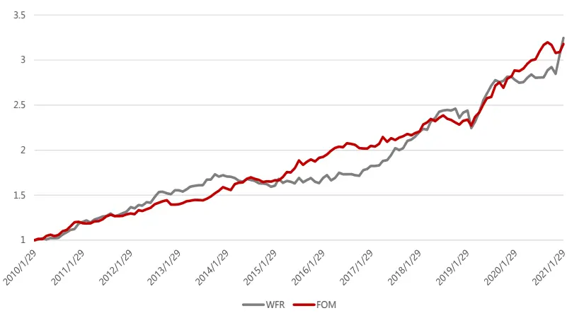

## 风险提示

- 量化模型失效风险

- 市场极端环境的冲击

## 报告发布日期

2021 年 03 月 09 日

证券分析师朱剑涛

021-63325888*6077

zhujiantao@orientsec.com.cn

执业证书编号：S0860515060001

证券分析师刘静涵

021-63325888*3211

liujinghan@orientsec.com.cn

执业证书编号：S0860520080003

## 相关报告

来自年报季业绩超预期事件的异常收益：— 2020-12-19—《事件驱动系列研究 之 五》

隐藏风险因子：组合风控的另一种选择：— 2020-12-13—因子选股系列研究之（七十二）

涨停板事件对股票价格行为的影响：——因 2020-11-16子选股系列研究之 七十一

机器因子库相对人工因子库的增量：——2020-09-11《因子选股系列研究 之 七十》

机器增强一致预期：——《因子选股系列研 2020-09-01究之六十九》

因子加权过程中的大类权重控制：——因子 2020-08-04选股系列报告之六十八

宏观数据季节调整与运用：---宏观固收量化 2020-05-31系列研究之（三）

东方 A 股因子风险模型（DFQ-2020）：东 2020-05-28方 A 股因子风险模型（DFQ-2020）

基于时间尺度度量的日内买卖压力：——2020-04-21《因子选股系列 之 六十六》

分析师盈利预期的调整是分析师数据中的重要信息，分析师对于盈利预期的更新调整可以反映出其对股票推荐力度的变化。以往的盈利预期调整指标，往往是以同一分析师在时间序列上的盈利预期变化为基础，本报告尝试以所有分析师在时间序列上的盈利预期为基础，计算盈利预期上调和下调的占比，以便更好地反映当前市场中分析师对于股票的观点变化。

## 一、 盈利预测上调的度量方法

## 1.1 分析师盈利预测上调的概率（FOM）

一般情况下，一只股票有多个分析师覆盖，每个分析师都有自己的盈利预测，也可能会不断对自己的盈利预测进行调整。以往的盈利预期调整指标，往往是以同一分析师在时间序列上的盈利预期为基础，将每个分析师最新的盈利预测跟自己的过往盈利预测相比，计算调整幅度，再基于分析师的预测准确度进行加权，得到一个汇总的盈利预测调整指标，具体算法可以参考之前研报《分析师研报的数据特征与 alpha》中的WFR 因子。

参考之前研报《来自年报季业绩超预期事件的异常收益》中 FOM 指标的构建思路，我们给出分析师盈利上调的另一种度量方法：FOM指标。该指标计算时，以当前最新的分析师盈利预测作为基准，不仅与该分析师过去的盈利预测对比，而且也和过去一段时间里其它分析师的盈利预测进行对比，计算盈利预测上调和下调的比例差，从而可以及时反映市场分析师对于公司的盈利情况的预期变化。具体计算公式为：

FOM =（K - M）/ N

（1） N：分析师针对个股当期年报业绩给出的预测报告篇数。保证预测结果的准确性，本文测试时仅纳入过去一年内的分析师报告，而且要求个股至少有 3 篇报告覆盖（N>=3），否则视为缺失值。

（2） K：过去分析师预测的净利润，比当前最新的分析师预测净利润低的报告篇数。

（3） M：过去分析师预测的净利润，比当前最新的分析师预测净利润高的报告篇数。

需要注意的是，如果当前一天内出具了多篇分析师预测报告的话，则针对每个最新预测值分别计算 FOM指标，再取均值。

FOM的取值范围为[-1,1]，FOM越大说明盈利预测上调的程度越高。FOM=1 意味着过去所有分析师预测的净利润，比当前最新的分析师预测净利润低，盈利预测上调的程度最高；FOM=-1意味着过去所有分析师预测的净利润，比当前最新的分析师预测净利润高，盈利预测下调的程度最高；FOM=0 意味着过去分析师预测的净利润，一半高于当前最新的分析师预测净利润低，一半低于，盈利预测与过去一致。

## 1.2 加入年报、快报、预告数据

除了分析师的盈利预测之外，公司在正式发布年报之前，有的还会公布业绩预告和业绩快报，预告和快报公布的净利润值也可以视为一种盈利预测，从而也可以纳入 FOM 指标的计算过程中。

## （1）业绩预告的历史情况

业绩预告为上市公司发布的最早的净利润预测数据，重要性不言而喻。

上交所和深交所关于业绩预告的披露规则不同：

上交所：对于年度报告，如果上市公司预计全年可能出现亏损、扭亏为盈、净利润较前一年度增长或下降 50%以上（基数过小的除外）等三类情况，应进行业绩预告。年度业绩预告应在报告期次年 1 月 31 日前披露。如果不存在上述三种情况可以不披露年度业绩预告。对于半年报和季度报告，也没有作强制要求。

深交所：1. 主板：预计报告期内（第一季度、半年度、第三季度和年度）出现净利润为负、扭亏为盈、实现盈利且净利润与上年同期相比上升或者下降 50％以上（基数过小的除外）、期末净资产为负、年度营业收入低于 1 千万元等情况，应进行业绩预告。年度业绩预告应在报告期次年 1月 31 日前披露。如果不存在上述情况可以不披露业绩预告。2. 中小板和创业板：2012 年之后明确要求1，应在第一季度报告、半年度报告和第三季度报告中披露对年初至下一报告期末的业绩预告。公司未在上一次定期报告中对本报告期进行业绩预告的，应及时以临时报告形式披露业绩预告。也就是说对于深交所中小板和创业板的上市公司而言，年报，中报和三季报的业绩预告是强制的。

公司披露业绩预告后，又预计本期业绩与已披露的业绩预告差异较大的，应当按及时披露业绩预告修正公告，业绩快报不能代替业绩预告的修正公告。因而同一家公司在同一报告期可能出现多篇业绩预告。

我们统计了每年的年报业绩预告的数量，每年发布年报的上市公司的数量，以及业绩预告的覆盖度，综合来看，业绩预告虽然在一些情况下并不需要披露，但是整体的披露覆盖率也是逐年增加的，尤其 2012年后预告数量大幅提升，覆盖度超过 70%。今年截至到 2月底，也已经有 2500多家上市公司发布了业绩预告。从公布时间来看，年报的业绩预告主要集中在 1、2、3、4、10、11、12 这几个月份，其中 1 月份和 10 月份最多。业绩预告和实际年报的披露时间差基本在 100 天左右，也就是 3个月。

图 1：每年的年报业绩预告覆盖度情况
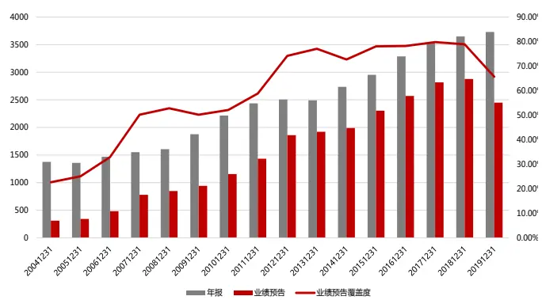
数据来源：Wind 资讯、东方证券研究所

图 2：各月份的年报业绩预告情况
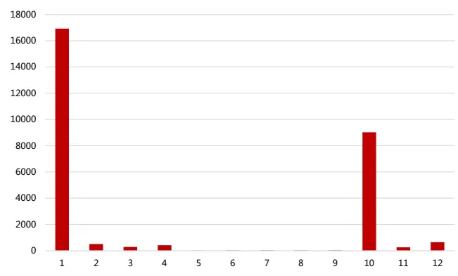
数据来源：Wind 资讯、东方证券研究所

1 2012年1 月证监会发布了《创业板信息披露业务备忘录第 11 号》要求创业板的上市公司要强制披露业绩预告，同年8月深交所修订了《中小企业板信息披露业务备忘录第1号：业绩预告、业绩快报及其修正》要求中小板的上市公司也要强制披露业绩预告。

业绩快报中，披露的只有预测净利润的上限和下限，一般做法是用上下限的均值来作为业绩预测值，再去跟实际年报净利润进行对比，从而可以计算出业绩预告准确度指标：

业绩预告准确度=（预告净利润上下限的均值 - 实际年报净利润）/ 实际年报净利润。

为避免分母过小甚至为负，将实际年报净利润低于 100 万元的样本予以剔除，该部分占比不高，占总样本的 10%。从分年结果可以看出，所有年份的准确度均值基本均大于零，说明业绩预告普遍会高估公司的实际净利润情况。但近些年业绩预告的准确度也在提升，2012年以来平均偏离基本在 10%以内。

图 3：每年的业绩预告准确度
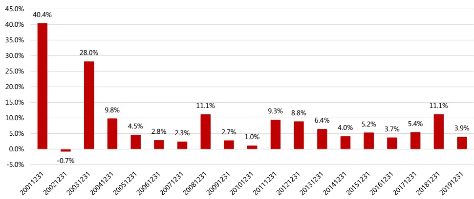
数据来源：Wind 资讯、东方证券研究所

## （2）业绩快报的历史情况

业绩快报中涵盖的数据更加全面，主要内容包括当年及上年同期主营业务收入、主营业务利润、利润总额、净利润、总资产、净资产、每股收益净资产收益率等数据和指标，同时披露比上年同期增减变动的百分比，对变动幅度超过 30%以上的项目，公司还应当说明原因。

上交所和深交所关于业绩快报的披露规则不同：

上交所：公司如果已经汇总完成当期财务数据，但因为年报尚没有编制完成，可以先行对外披露业绩快报。也就是说上交所业绩快报不是强制性披露的。

深交所：1. 主板：鼓励上市公司在定期报告披露前，主动披露定期报告业绩快报。也就是说深交所主板的业绩快报不是强制性披露的。2. 中小板和创业板：年度报告预约披露时间在 3-4 月份的公司，应在 2 月底之前披露年度业绩快报。鼓励半年度报告预约披露时间在 8 月份的公司在7 月底前披露半年度业绩快报。也就是说，年度报告预约披露时间在 3 月份之前的公司可不披露年度业绩快报，否则需要强制性披露年度业绩快报。半年报和季报业绩快报不是强制性披露的。

综合来看，业绩快报大部分不是强制披露的，覆盖度不是很高，2012年以来平均覆盖度在 50%左右。今年截至到 2 月底，有近 900 家上市公司发布了业绩快报。从公布时间来看，年报的业绩快报主要集中在 1、2、3、4这几个月份，其中 2 月份最多。业绩快报和实际年报的披露时间差基本在 40天左右，也就是 1个半月。

图 4：每年的年报业绩快报覆盖度情况
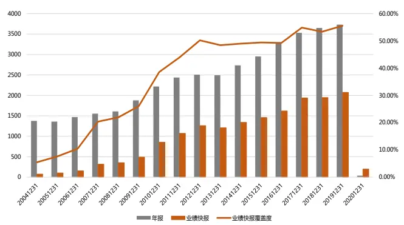
数据来源：Wind 资讯、东方证券研究所

图 5：各月份的年报业绩快报情况
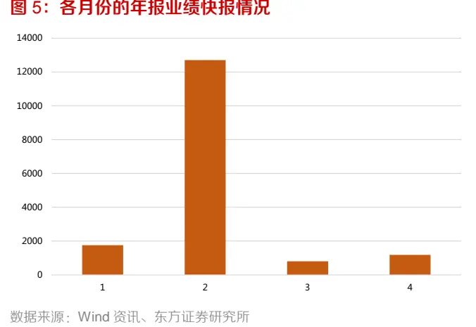

此业绩快报中，披露的是预测净利润的具体数值，从而可以计算业绩快报准确度指标：

业绩快报准确度=（快报净利润- 实际年报净利润）/ 实际年报净利润。

从分年结果可以看出，所有年份的准确度均值基本均大于零，说明业绩快报也普遍会高估公司的实际净利润情况。但业绩快报的准确度很高，2012 年以来平均偏离基本在 1%左右。

图 6：每年的业绩快报准确度
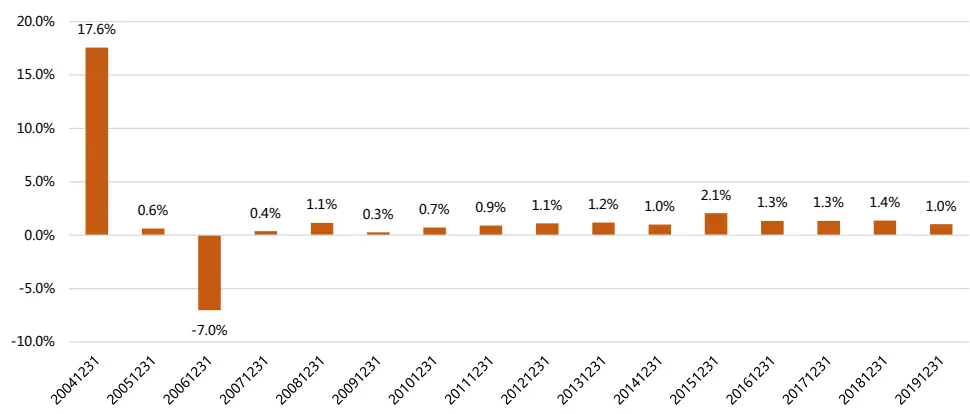
数据来源：Wind 资讯、东方证券研究所

## （3）改进 FOM 指标

除了分析师的盈利预测之外，预告、快报、实际年报公布的净利润值也可以视为一种盈利预测，因而在计算 FOM指标时，可以加入预告、快报、实际年报的净利润数据。如果当前有财报数据公布，则以财报公布的净利润作为基准，与过去一段时间里的分析师盈利预测进行对比，从而可以更加及时全面地反映公司的盈利情况的预期变化。

## 二、 盈利预期上调因子的表现

## 2.1数据与说明

考虑到朝阳永续的分析师数据收集工作开始较早（从 2006年开始有数据），并且除公司研究报告外，还收录了许多其他类型报告（行业报告、晨会）等，因此本文选择朝阳永续的分析师预测数据进行实证分析。只采用年报预测数据，不限制研报类型（公司研究报告、行业报告、策略报告均可），仅纳入朝阳永续计算一致预期时用到的机构的预测数据。

回测区间为 2009.12.31-2021.01.29。每月底，计算 FOM 因子值，与之前研报中《分析师研报的数据特征与 alpha》提出的加权盈余调整 WFR 因子进行对比。FOM 因子计算时有几点细节需要说明：

（1） 为保证预测净利润在不同公司之间可比，我们统一在 4 月 30 号切换对应的报告期，即 4 月 30 号之前预测的为上一年年报的净利润，之后预测的为当年年报的净利润。

（2） 股票池分别考察中证全指、沪深 300、中证500 股票池，并剔除银行和券商股。

下面我们首先展示每年的样本数据个数。可以看到两种盈余调整因子的覆盖度不同，FOM因子的样本数量更多，对于中证全指的平均覆盖度接近 70%，WFR 为 63%。2017 年之后两因子的覆盖度明显下降。这可能和 2017 年行龙头股行情有关，分析师对个股的关注度过于集中，小票无人关注，同时新股发行数量不断增加，导致数据覆盖度显著下降。2019 年底有1862 个股票有FOM因子数据，对 1562 个股票有WFR 因子数据，FOM因子对中证全指的覆盖度为 52%，WFR 对中证全指的覆盖度为 47%。此外，两因子在中证 800中的覆盖度均较高，平均都在 80%以上。

图 7：每年的年报业绩快报覆盖度情况
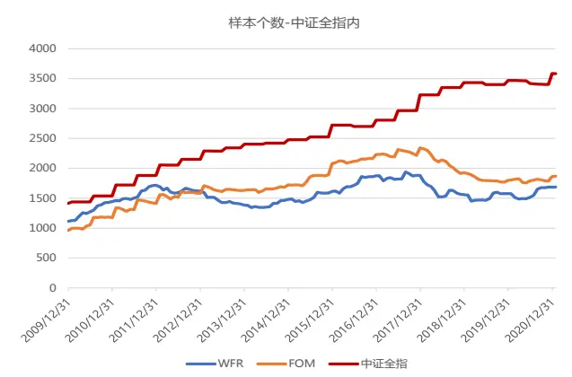
数据来源：Wind 资讯、东方证券研究所

图 8：各月份的年报业绩快报情况
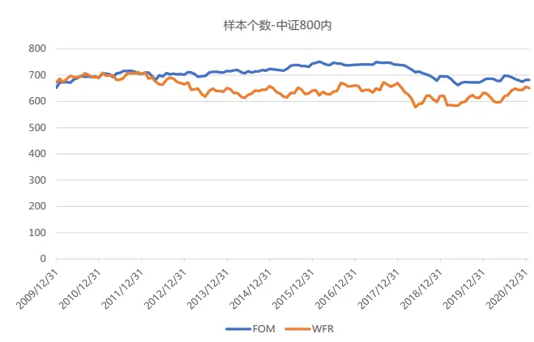
数据来源：Wind 资讯、东方证券研究所

## 2.2 因子表现汇总

## （1）计算周期的选择

首先，我们仅考虑分析师预测数据，对比考察期为过去 3、6、12 个月的 FOM 因子表现情况。因子缺失值使用行业中位数进行填充，因子检验时进行行业和市值中性化处理。从结果可以看出：三个股票池中，均为使用过去 12 个月的分析师数据进行计算得到的 FOM 因子效果最好，并且都优于原始的 WFR因子。

图 9：FOM因子 vs WFR 因子（行业市值中性化，仅考虑分析师预测数据）

| 仅分析师预测数据 行业市值中性化 | 中证全指成分内 |  |  |  | 沪深300成分内 |  |  |  | 沪深500成分内 |  |  |  |
| --- | --- | --- | --- | --- | --- | --- | --- | --- | --- | --- | --- | --- |
|  | FOM-3个月 | FOM-6个月 | FOM-12个月 | WFR | FOM-3个月 | FOM-6个月 | FOM-12个月 | WFR | FOM-3个月 | FOM-6个月 | FOM-12个月 | WFR |
| IC | 1.44% | 2.24% | 2.90% | 1.91% | 0.61% | 2.12% | 3.12% | 3.09% | 1.94% | 2.40% | 3.12% | 3.18% |
| IC_IR | 1.66 | 2.62 | 2.77 | 1.40 | 0.33 | 1.03 | 1.40 | 1.43 | 1.58 | 1.78 | 2.03 | 1.98 |
| tstat | 5.54 | 8.71 | 9.22 | 4.67 | 1.10 | 3.42 | 4.66 | 4.78 | 5.24 | 5.93 | 6.77 | 6.58 |
| long_short_r | 0.36% | 0.61% | 0.86% | 0.88% | 0.13% | 0.85% | 0.97% | 0.78% | 0.46% | 0.67% | 1.04% | 0.90% |
| long_short_win | 67.67% | 75.19% | 77.44% | 71.43% | 56.39% | 67.67% | 63.16% | 57.89% | 57.14% | 68.42% | 72.93% | 68.42% |
| long_short_sharp | 1.16 | 1.82 | 2.35 | 1.53 | 0.16 | 1.09 | 1.16 | 0.88 | 0.78 | 1.21 | 1.66 | 1.38 |
| long_short_drwandown | -4.82% | -3.66% | -3.16% | -15.81% | -35.78% | -12.44% | -13.20% | -17.06% | -13.63% | -8.84% | -13.76% | -9.08% |
| long_short_yearly | 4.32% | 7.29% | 10.56% | 10.78% | 0.91% | 10.36% | 11.81% | 8.97% | 5.09% | 7.72% | 12.33% | 10.93% |
| 2011/12/30 | 11.67% | 8.22% | 9.69% | 11.24% | 8.67% | 11.04% | 18.56% | 21.13% | 10.76% | 17.08% | 17.70% | 6.58% |
| 2012/12/31 | 3.61% | 7.57% | 12.38% | 17.05% | 0.04% | 1.38% | -1.22% | 4.27% | 0.75% | 4.32% | 15.26% | 14.79% |
| 2013/12/31 | 3.98% | 8.96% | 11.58% | 8.36% | 16.02% | 17.41% | 12.22% | -0.78% | 9.60% | 13.11% | 10.42% | 8.15% |
| 2014/12/31 | 2.01% | 3.00% | 6.80% | 5.17% | -11.56% | -4.39% | -7.38% | -7.18% | 14.92% | 0.51% | 3.94% | -0.16% |
| 2015/12/31 | 1.99% | 8.50% | 18.36% | -5.42% | -10.02% | 18.49% | 24.80% | 10.85% | 1.04% | 3.87% | 27.48% | 2.39% |
| 2016/12/30 | 1.46% | 2.07% | 10.87% | 4.11% | -3.93% | -1.10% | -2.67% | 10.53% | 1.16% | 2.21% | 15.52% | 9.52% |
| 2017/12/29 | 3.46% 4.23% | 8.47% 8.73% | 6.00% | 23.67% | -14.02% | -0.99% | 2.12% | 20.05% -0.50% | 16.78% | 17.97% | 21.33% | 17.37% |
| 2018/12/28 | 1.62% | 2.53% | 7.14% 6.61% | 9.19% | 11.81% | 21.29% | 19.70% | 0.28% | -4.83% | 0.37% | -6.01% | 25.83% |
| 2019/12/31 2020/12/31 | 5.93% | 11.72% | 10.86% | 8.40% | -1.84% | 0.41% | 13.19% 31.96% | 21.29% | 0.79% 5.37% | 3.65% | 8.79% | 16.13% |
| 2021/1/29 |  | 2.86% |  | 17.70% | 11.70% | 26.22% |  |  |  | 5.50% | 5.93% | -0.86% |
|  | 0.64% |  | 4.12% | 6.09% | -3.28% | -1.88% | 1.68% | 4.76% | 1.81% | 3.58% | 3.86% | 2.23% |

数据来源：Wind 资讯、东方证券研究所

## （2）年报、快报、预告数据的影响

逐步加入正式年报、业绩预告、快报中的净利润数据，对比 FOM 因子的表现。从结果可以看出：在全指和中证 800 股票池中，加入上市公司的公告信息后，FOM 因子效果都可以得到提升。

图 10：FOM因子 vs WFR 因子（行业市值中性化，仅考虑分析师预测数据）

| FOM-12个月 行业市值中性化 | 中证全指成分内 |  |  |  |  | 中证800成分内 |  |  |  |  |
| --- | --- | --- | --- | --- | --- | --- | --- | --- | --- | --- |
|  | 分析师 | 分析师+年报 | 分析师+年报+快报 | 分析师+年报+快报+预告 | WFR | 分析师 | 分析师+年报 | 分析师+年报+快报 | 分析师+年报+快报+预告 | WFR |
| IC | 2.90% | 3.13% | 3.28% | 3.51% | 1.91% | 2.96% | 2.97% | 2.95% | 3.13% | 3.00% |
| IC_IR | 2.77 | 3.02 | 3.08 | 3.33 | 1.40 | 1.87 | 1.92 | 1.90 | 1.99 | 1.90 |
| tstat | 9.22 | 10.06 | 10.26 | 11.07 | 4.67 | 6.23 | 6.39 | 6.34 | 6.63 | 6.32 |
| long_short_r | 0.86% | 0.90% | 0.94% | 1.03% | 0.88% | 0.95% | 0.98% | 0.95% | 0.96% | 0.78% |
| long_short_win | 77.44% | 78.95% | 78.95% | 77.44% | 71.43% | 74.44% | 73.68% | 74.44% | 72.18% | 59.40% |
| long_short_sharp | 2.35 | 2.47 | 2.58 | 2.66 | 1.53 | 1.79 | 1.96 | 1.95 | 2.02 | 1.15 |
| long_short_drwandown | -3.16% | -3.16% | -3.16% | -3.00% | -15.81% | -8.82% | -8.82% | -8.94% | -4.61% | -16.93% |
| long_short_yearly | 10.56% | 11.04% | 11.60% | 12.67% | 10.78% | 11.49% | 11.98% | 11.56% | 11.66% | 9.51% |
| 2011/12/30 | 9.69% | 10.00% | 9.01% | 11.03% | 11.24% | 9.72% | 11.13% | 10.60% | 9.29% | 13.02% |
| 2012/12/31 | 12.38% | 13.37% | 14.63% | 11.71% | 17.05% | 10.67% | 9.78% | 9.30% | 7.04% | 15.68% |
| 2013/12/31 | 11.58% | 14.28% | 13.42% | 18.40% | 8.36% | 10.77% | 13.44% | 13.88% | 16.26% | 3.49% |
| 2014/12/31 | 6.80% | 7.25% | 8.89% | 10.06% | 5.17% | 1.91% | 1.86% | 3.87% | 3.85% | -6.29% |
| 2015/12/31 | 18.36% | 17.11% | 16.57% | 22.28% | -5.42% | 26.59% | 20.77% | 18.68% | 14.46% | -10.17% |
| 2016/12/30 | 10.87% | 11.26% | 11.95% | 11.60% | 4.11% | 6.01% | 5.58% | 4.42% | 6.27% | 13.04% |
| 2017/12/29 | 6.00% | 7.46% | 8.48% | 7.50% | 23.67% | 9.38% | 11.15% | 10.64% | 9.15% | 21.60% |
| 2018/12/28 | 7.14% | 7.43% | 7.94% | 9.23% | 9.19% | 2.85% | 4.84% | 3.53% | 6.83% | 9.20% |
| 2019/12/31 | 6.61% | 8.94% | 12.68% | 13.63% | 8.40% | 13.57% | 17.12% | 17.20% | 20.48% | 17.08% |
| 2020/12/31 | 10.86% | 11.72% | 11.38% | 13.24% | 17.70% | 13.25% | 13.29% | 12.84% | 12.72% | 6.70% |
| 2021/1/29 | 4.12% | 4.12% | 4.12% | 3.77% | 6.09% | 2.56% | 2.56% | 2.56% | 2.31% | 6.30% |

数据来源：Wind 资讯、东方证券研究所

## （3）缺失值的影响

由于 FOM和 WFR因子在全指中的覆盖度较低，缺失值的处理可能会对因子结果产生较大的影响。常见的缺失值填充方法主要有行业中位数填充，和结构化填充两种。

行业中位数填充的逻辑在于，同一行业的股票由于其主营业务的相似性、资源利用的同质化及受政策和周期影响的趋同性，更倾向于暴露在相同的系统性风险中，因此公司业绩和股价变动也更趋向于一致。

结构化模填充实质上是一种回归方法，逻辑在于将股票池分为数据存在缺失的股票池 A，和不存在数据缺失股票池 B。我们认为具有相似特征的股票往往具有相似的因子值，因此首先在类别 B的样本股中，将待填充的因子对其他因子（最常见的即为行业虚拟变量和市值）进行回归，得到回归系数，随后在股票池 A 中，将回归系数与其已有因子值进行相乘，反向求得其预估因子值进行填充。

下面我们分别对比不同方法填充缺失值前后的因子表现结果。可以看出：对于覆盖度不高的因子来说，缺失值的填充方法对于因子表现的影响比较大，使用回归方程填充后得到的因子表现，和不填充缺失值，仅在有数据的股票中测试得到的因子表现更为接近，说明回归方程的填充方法效果更优。

在全指中，使用回归法填充缺失值后， FOM 因子和 WFR 因子从 IC 均值和多空组合收益上看差别不大，但 FOM 因子的 ICIR、多空组合夏普比更高，多空组合最大回撤更小，因子表现更加稳定。在 800 成分内， WFR 因子的 IC 和 ICIR 略高于 FOM 因子，但从多空组合表现上来看，仍然是 FOM因子的表现更为稳健。

图 11：FOM因子 vs WFR 因子（行业市值中性化，全指内）

| 中证全指内 行业市值中性化 | FOM-12个月-分析师+年报+快报+预告 |  |  | WFR |  |  |
| --- | --- | --- | --- | --- | --- | --- |
|  | 不填充缺失值 | 填充缺失值-行业中位数 | 填充缺失值-行业市值回归 | 不填充缺失值 | 填充缺失值-行业中位数 | 填充缺失值-行业市值回归 |
| IC | 3.66% | 3.51% | 2.69% | 3.73% | 1.91% | 2.97% |
| IC_IR | 2.55 | 3.33 | 2.53 | 2.77 | 1.40 | 1.94 |
| tstat | 8.48 | 11.07 | 8.42 | 9.23 | 4.67 | 6.48 |
| long_short_r | 1.16% | 1.03% | 1.02% | 1.00% | 0.88% | 1.06% |
| long_short_win | 75.94% | 77.44% | 78.20% | 75.19% | 71.43% | 77.44% |
| long_short_sharp | 2.35 | 2.66 | 2.69 | 1.70 | 1.53 | 2.22 |
| long_short_drwandown | -4.86% | -3.00% | -2.83% | -5.58% | -15.81% | -5.77% |
| long_short_yearly | 14.26% | 12.67% | 12.55% | 12.37% | 10.78% | 13.17% |
| 2011/12/30 | 8.99% | 11.03% | 12.39% | 9.62% | 11.24% | 10.58% |
| 2012/12/31 | 16.60% | 11.71% | 13.79% | 19.25% | 17.05% | 18.61% |
| 2013/12/31 | 24.60% | 18.40% | 17.63% | 11.39% | 8.36% | 14.88% |
| 2014/12/31 | 8.05% | 10.06% | 9.75% | 8.50% | 5.17% | 6.53% |
| 2015/12/31 | 21.50% | 22.28% | 16.98% | 11.75% | -5.42% | 14.88% |
| 2016/12/30 | 14.26% | 11.60% | 12.61% | 8.97% | 4.11% | 11.33% |
| 2017/12/29 | 9.55% | 7.50% | 7.98% | 20.35% | 23.67% | 19.02% |
| 2018/12/28 | 12.24% | 9.23% | 9.05% | 9.88% | 9.19% | 8.07% |
| 2019/12/31 | 21.39% | 13.63% | 13.35% | 8.17% | 8.40% | 10.36% |
| 2020/12/31 | 6.63% | 13.24% | 12.90% | 7.50% | 17.70% | 15.28% |
| 2021/1/29 | 2.56% | 3.77% | 4.02% | 2.10% | 6.09% | 3.95% |

数据来源：Wind 资讯、东方证券研究所

图 12：FOM因子 vs WFR 因子（行业市值中性化，中证 800 内）

| 中证800内 行业市值中性化 | FOM-12个月-分析师+年报+快报+预告 |  |  | WFR |  |  |
| --- | --- | --- | --- | --- | --- | --- |
|  | 不填充缺失值 | 填充缺失值-行业中位数 | 填充缺失值-行业市值回归 | 不填充缺失值 |  | 填充缺失值-行业中位数填充缺失值-行业市值回归 |
| IC | 3.43% | 3.13% | 3.00% | 3.60% | 3.00% | 3.64% |
| IC_IR | 1.91 | 1.99 | 1.90 | 2.12 | 1.90 | 2.17 |
| tstat | 6.37 | 6.63 | 6.33 | 7.05 | 6.32 | 7.24 |
| long_short_r | 1.10% | 0.96% | 0.91% | 0.91% | 0.78% | 0.91% |
| long_short_win | 71.43% | 72.18% | 68.42% | 62.41% | 59.40% | 66.17% |
| long_short_sharp | 1.95 | 2.02 | 1.88 | 1.31 | 1.15 | 1.45 |
| long_short_drwandown | -6.35% | -4.61% | -4.77% | -11.99% | -16.93% | -8.81% |
| long_short_yearly | 13.48% | 11.66% | 11.00% | 11.23% | 9.51% | 11.21% |
| 2011/12/30 | 9.33% | 9.29% | 6.93% | 12.44% | 13.02% | 11.21% |
| 2012/12/31 | 9.43% | 7.04% | 8.40% | 15.97% | 15.68% | 18.05% |
| 2013/12/31 | 22.01% | 16.26% | 13.81% | 9.05% | 3.49% | 10.66% |
| 2014/12/31 | 2.33% | 3.85% | 3.93% | -4.43% | -6.29% | -7.42% |
| 2015/12/31 | 27.87% | 14.46% | 15.98% | -3.42% | -10.17% | 2.52% |
| 2016/12/30 | 6.35% | 6.27% | 5.31% | 11.60% | 13.04% | 9.57% |
| 2017/12/29 | 12.52% | 9.15% | 8.59% | 24.65% | 21.60% | 20.03% |
| 2018/12/28 | 8.71% | 6.83% | 6.18% | 12.26% | 9.20% | 12.38% |
| 2019/12/31 | 24.46% | 20.48% | 21.34% | 12.31% | 17.08% | 16.51% |
| 2020/12/31 | 6.72% | 12.72% | 9.53% | 7.87% | 6.70% | 8.86% |
| 2021/1/29 | 1.07% | 2.31% | 2.89% | 6.70% | 6.30% | 5.98% |

数据来源：Wind 资讯、东方证券研究所

## （4）股票池的影响

下面我们考察不同股票池内因子表现的差异。首先，在不同市值范围的指数中，FOM因子的稳定性基本都要好于 WFR 因子。在中证全指、中证 800（沪深 300、中证 500 股票池）、中证1000、创业板指中，FOM因子的多空组合的夏普比都要更高，最大回撤更小。

图 13：FOM因子 vs WFR 因子（行业市值中性化，回归法填充缺失值）

| 填充缺失值-行业市值回归 行业市值中性化 | 中证全指内 |  | 沪深300内 |  | 中证500内 |  | 中证1000内 |  | 创业板指内 |  |
| --- | --- | --- | --- | --- | --- | --- | --- | --- | --- | --- |
|  | FOM | WFR | FOM | WFR | FOM | WFR | FOM | WFR | FOM | WFR |
| IC | 2.69% | 2.97% | 3.18% | 3.38% | 3.22% | 3.96% | 2.73% | 3.79% | 3.28% | 3.28% |
| IC_IR | 2.53 | 1.94 | 1.44 | 1.54 | 2.16 | 2.46 | 2.03 | 2.19 | 1.02 | 1.09 |
| tstat | 8.42 | 6.48 | 4.78 | 5.12 | 7.18 | 8.20 | 6.76 | 7.29 | 3.30 | 3.55 |
| long_short_r | 1.02% | 1.06% | 0.90% | 0.78% | 1.02% | 0.95% | 1.15% | 1.35% | 1.26% | 1.66% |
| long_short_win | 78.20% | 77.44% | 61.65% | 60.15% | 67.67% | 69.92% | 75.94% | 76.69% | 56.35% | 57.48% |
| long_short_sharp | 2.69 | 2.22 | 1.12 | 0.90 | 1.69 | 1.55 | 2.13 | 2.06 | 0.79 | 1.06 |
| long_short_drwandown | -2.83% | -5.77% | -13.76% | -16.18% | -6.50% | -9.63% | -4.23% | -5.80% | -18.57% | -17.97% |
| long_short_yearly | 12.55% | 13.17% | 10.90% | 9.09% | 12.10% | 11.47% | 14.23% | 16.79% | 13.66% | 20.20% |
| 2011/12/30 | 12.39% | 10.58% | 13.22% | 20.45% | 14.31% | 9.51% | 18.75% | 15.74% | 21.11% | 30.00% |
| 2012/12/31 | 13.79% | 18.61% | 2.40% | 5.75% | 15.40% | 13.72% | 20.02% | 11.99% | 29.31% | 5.71% |
| 2013/12/31 | 17.63% | 14.88% | 14.87% | 0.84% | 11.39% | 11.01% | 22.57% | 9.65% | 22.87% | 35.73% |
| 2014/12/31 | 9.75% | 6.53% | -3.24% | -11.02% | 9.24% | 4.78% | 18.11% | 17.37% | -3.23% | 17.26% |
| 2015/12/31 | 16.98% | 14.88% | 14.37% | 12.75% | 21.23% | -1.00% | 22.64% | 43.37% | 39.64% | 27.05% |
| 2016/12/30 | 12.61% | 11.33% | -2.49% | 11.21% | 17.03% | 8.40% | 10.29% | 11.87% | -1.33% | -1.68% |
| 2017/12/29 | 7.98% | 19.02% | -4.22% | 16.01% | 19.41% | 21.11% | 11.30% | 13.97% | 13.85% | 9.10% |
| 2018/12/28 | 9.05% | 8.07% | 12.84% | 2.09% | 0.82% | 25.78% | 13.61% | 11.14% | 18.62% | 19.66% |
| 2019/12/31 | 13.35% | 10.36% | 16.40% | 2.03% | 18.33% | 18.68% | 7.89% | 15.89% | 8.08% | 8.58% |
| 2020/12/31 | 12.90% | 15.28% | 34.15% | 19.24% | -4.45% | -1.20% | 12.50% | 20.94% | 20.07% | 40.88% |
| 2021/1/29 | 4.02% | 3.95% | 1.68% | 6.04% | 3.66% | 0.60% | 4.12% | 7.20% | 3.58% | 4.76% |

数据来源：Wind 资讯、东方证券研究所

其次，在不同机构持仓占比的细分股票池中，两因子均表现出在高机构持仓比的股票中表现较好的特点。盈利预期上调信息类似于用预期信息构建的未来成长因子，收益主要来源于公司盈利的超预期特征，说明机构对于公司未来的成长性更加关注，因而在机构重仓股中盈利预期上调因子更加有效。此外，FOM 因子在低机构持仓分组中的效果好于 WFR 因子，后者在低机构持仓组中基本完全失效。

图 14：FOM因子 vs WFR 因子（行业市值中性化，回归法填充缺失值，全指内不同机构持仓分组）

| 按机构持仓分域 行业市值中性化 | FOM |  |  |  |  | WFR |  |  |  |  |
| --- | --- | --- | --- | --- | --- | --- | --- | --- | --- | --- |
|  | 0 | 1（低机构持仓） | 2 | 3 | 4（高机构持仓） | 0 | 1（低机构持仓） | 2 | 3 | 4（高机构持仓） |
| IC | 2.69% | 1.19% | 2.36% | 3.02% | 3.75% | 2.97% | 0.58% | 1.57% | 3.46% | 4.74% |
| IC_IR | 2.53 | 0.66 | 1.61 | 2.20 | 1.99 | 1.94 | 0.25 | 0.94 | 1.96 | 2.43 |
| tstat | 8.42 | 2.21 | 5.35 | 7.32 | 6.63 | 6.48 | 0.85 | 3.14 | 6.54 | 8.08 |
| long_short_r | 1.02% | 0.75% | 0.80% | 1.04% | 1.24% | 1.06% | 0.44% | 0.78% | 1.22% | 1.27% |
| long_short_win | 78.20% | 65.41% | 66.92% | 69.92% | 67.67% | 77.44% | 63.16% | 65.41% | 67.67% | 69.17% |
| long_short_sharp | 2.69 | 1.27 | 1.48 | 1.69 | 1.75 | 2.22 | 0.61 | 1.10 | 1.64 | 1.73 |
| long_short_drwandown | -2.83% | -8.45% | -9.61% | -7.28% | -8.73% | -5.77% | -18.10% | -13.30% | -5.63% | -8.42% |
| long_short_yearly | 12.55% | 8.83% | 9.52% | 12.66% | 15.31% | 13.17% | 4.96% | 9.51% | 14.85% | 15.49% |
| 2011/12/30 | 12.39% | 13.99% | 3.79% | 9.18% | 15.46% | 10.58% | 19.73% | 15.53% | 6.66% | 26.55% |
| 2012/12/31 | 13.79% | 14.04% | 7.74% | 7.12% | 21.41% | 18.61% | 11.77% | 4.93% | 18.83% | 4.97% |
| 2013/12/31 | 17.63% | 16.26% | 16.41% | 20.37% | 12.50% | 14.88% | 4.60% | -8.12% | 13.18% | 30.20% |
| 2014/12/31 | 9.75% | 8.68% | 16.38% | 17.16% | 11.83% | 6.53% | -0.96% | -2.96% | -0.36% | 13.27% |
| 2015/12/31 | 16.98% | 5.38% | 11.84% | 11.75% | 25.30% | 14.88% | -6.43% | 23.09% | 22.22% | 15.45% |
| 2016/12/30 | 12.61% | 8.62% | 5.96% | 11.20% | 10.69% | 11.33% | -1.74% | 10.59% | 23.39% | 7.63% |
| 2017/12/29 | 7.98% | 0.23% | 8.80% | 11.41% | 12.95% | 19.02% | 9.11% | 14.75% | 16.05% | 23.21% |
| 2018/12/28 | 9.05% | 9.92% | 4.08% | 16.52% | 4.17% | 8.07% | 1.08% | 7.65% | 7.70% | 9.41% |
| 2019/12/31 | 13.35% | 6.99% | 13.68% | 14.73% | 13.26% | 10.36% | -7.61% | 11.52% | 16.80% | 10.09% |
| 2020/12/31 | 12.90% | 19.20% | 10.61% | 4.25% | 6.02% | 15.28% | 13.41% | 10.62% | 20.55% | 12.00% |
| 2021/1/29 | 4.02% | 1.00% | 2.10% | 3.75% | 3.10% | 3.95% | 3.30% | 0.75% | 4.84% | 3.92% |

数据来源：Wind 资讯、东方证券研究所

最后，我们在热门行业内对比两因子的表现，可以看出没有什么普遍规律，除了在家电行业中WFR 因子明显优于 FOM因子之外，其他行业差别均不显著。

图 15：FOM因子 vs WFR 因子（行业市值中性化，回归法填充缺失值，全指内不同行业）

| 中证全指成分内-回归填充 | 医药 |  | 食品饮料 |  | 家电 |  | 电子 |  | 计算机 |  |
| --- | --- | --- | --- | --- | --- | --- | --- | --- | --- | --- |
|  | WFR | adjfom12 分析师+年报+快报+预告 | WFR | adjfom12 分析师+年报+快报+预告 | WFR | adjfom12 分析师+年报+快报+预告 | WFR | adjfom12 分析师+年报+快报+预告 | WFR | adjfom12 分析师+年报+快报+预告 |
| IC | 4.50% | 3.78% | 3.78% | 4.82% | 5.24% | 1.85% | 2.00% | 1.28% | 3.10% | 3.70% |
| IC_IR | 1.16 | 1.39 | 0.74 | 1.18 | 0.98 | 0.36 | 0.49 | 0.38 | 0.72 | 1.04 |
| tstat | 3.86 | 4.63 | 2.48 | 3.94 | 3.26 | 1.19 | 1.65 | 1.26 | 2.38 | 3.46 |
| long_short_r | 1.32% | 1.31% | 1.68% | 1.23% | 1.95% | 1.11% | 1.26% | 1.40% | 1.39% | 1.49% |
| long_short_win | 62.41% | 67.67% | 63.91% | 60.90% | 62.41% | 59.40% | 57.14% | 60.90% | 58.65% | 59.40% |
| long_short_sharp | 1.21 | 1.10 | 1.10 | 0.81 | 1.09 | 0.57 | 0.91 | 1.02 | 0.83 | 0.92 |
| long_short_drwandown | -27.11% | -31.34% | -19.89% | -30.75% | -24.65% | -34.17% | -30.75% | -25.39% | -32.61% | -25.03% |
| long_short_yearly | 15.51% | 14.69% | 19.22% | 14.14% | 23.08% | 11.38% | 14.77% | 15.42% | 15.79% | 16.86% |
| 2011/12/30 | 35.68% | 25.78% | 26.96% | 42.85% | 51.88% | 6.84% | 35.35% | 17.90% | 47.32% | 31.47% |
| 2012/12/31 | 14.39% | 10.18% | 42.72% | 6.58% | 8.64% | 7.91% | 11.44% | 32.17% | 19.26% | -6.78% |
| 2013/12/31 | 13.63% | 0.07% | 37.02% | 28.82% | 8.99% | 32.22% | -0.12% | 18.48% | 26.95% | 42.03% |
| 2014/12/31 | 0.39% | -2.41% | 2.32% | 23.91% | 7.51% | -19.02% | -9.55% | 6.34% | 2.08% | -14.03% |
| 2015/12/31 | -9.94% | -21.83% | 24.83% | -23.77% | 38.38% | -16.02% | 10.63% | 38.86% | 41.48% | 28.35% |
| 2016/12/30 | -3.38% | 22.62% | -8.40% | -4.55% | 41.53% | 11.45% | 3.36% | 1.95% | 5.70% | 18.89% |
| 2017/12/29 | 34.13% | 35.18% | 16.25% | 34.28% | 28.03% | 47.56% | 16.65% | 6.27% | 21.57% | 26.75% |
| 2018/12/28 | 20.66% | 14.55% | 25.41% | 15.72% | 24.14% | 9.18% | 26.69% | 8.46% | -2.68% | -8.03% |
| 2019/12/31 | 10.84% | 29.38% | -2.63% | 3.31% | 16.60% | 16.48% | 15.51% | -2.86% | 27.16% | 4.38% |
| 2020/12/31 | 24.54% | 6.23% | 9.57% | 22.64% | 36.00% | 1.01% | 33.85% | 29.16% | 25.71% | 26.17% |
| 2021/1/29 | 3.58% | 11.73% | -3.35% | 2.20% | -2.05% | 11.81% | 8.57% | 5.75% | 7.19% | 9.17% |

数据来源：Wind 资讯、东方证券研究所

## 2.3 因子时间序列表现

在全指和 800 成分内，FOM 因子和 WFR 因子从多空组合收益上看差别不大，但 FOM 因子的多空组合稳定性更好，最大回撤明显降低。

图 16：FOM因子时间序列表现（行业市值中性化，回归法填充缺失值，全指内）
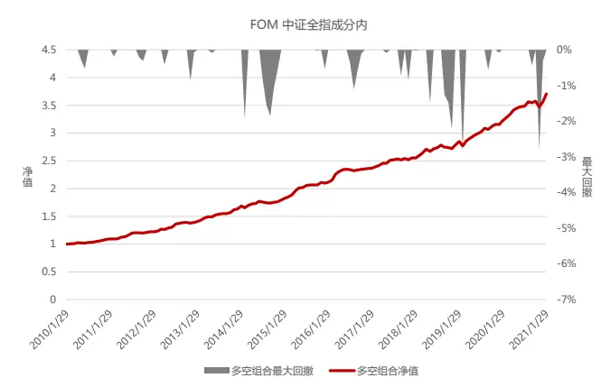
数据来源：Wind 资讯、东方证券研究所

图 17：WFR 因子时间序列表现（行业市值中性化，回归法填充缺失值，全指内）
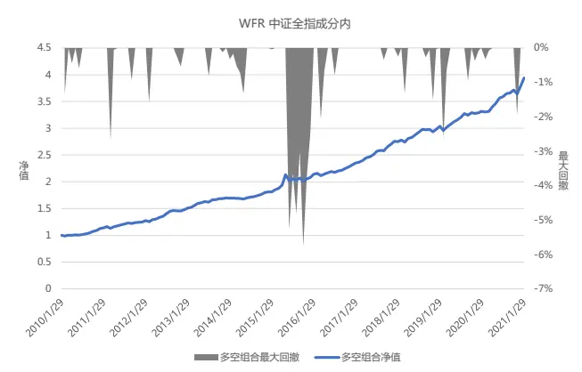
数据来源：Wind 资讯、东方证券研究所

图 18：FOM因子时间序列表现（行业市值中性化，回归法填充缺失值，800 内）
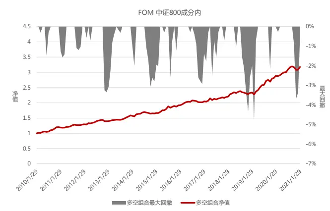
数据来源：Wind 资讯、东方证券研究所

图 19：WFR 因子时间序列表现（行业市值中性化，回归法填充缺失值，800 内）
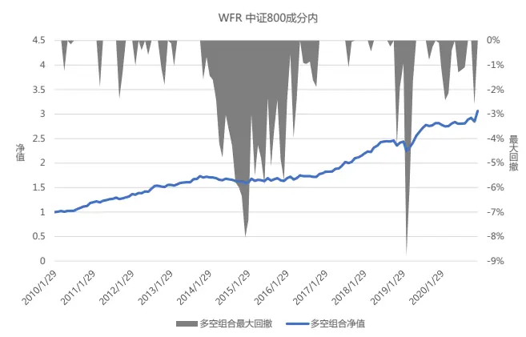
数据来源：Wind 资讯、东方证券研究所

## 2.4 因子分组收益

从各因子在中证全指成分股内分组年化收益来看，各分组收益基本满足单调性，盈利预期上调幅度大的股票未来收益更高。但WFR 因子的空头端收益跟多头端收益基本相当，而 FOM因子多头端收益高于空头端收益，多头对收益贡献更大。

在 800 成分内两个因子的分组差距更加明显。WFR 因子预测盈余向上调整幅度最大的一组并不是收益最明显的一组，因子值最大一组的年化收益仅 4%，并且空头端贡献的收益超过多头端，因子值最小一组的年化收益近 7%。而 FOM 因子仍然保持较高的单调性，因子值最大一组的年化收益最高，达到 7.22%，并且多头端收益远高于空头端收益，因子值最小一组的年化收益仅 3.6%，多头对收益贡献更大。

图 20：FOM和WFR 因子分组年化收益（行业市值中性化，回归法填充缺失值，全指内）
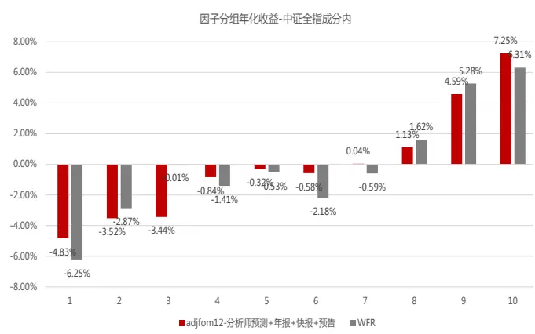
数据来源：Wind 资讯、东方证券研究所

图 21：FOM和WFR 分组年化收益（行业市值中性化，回归法填充缺失值，800 内）
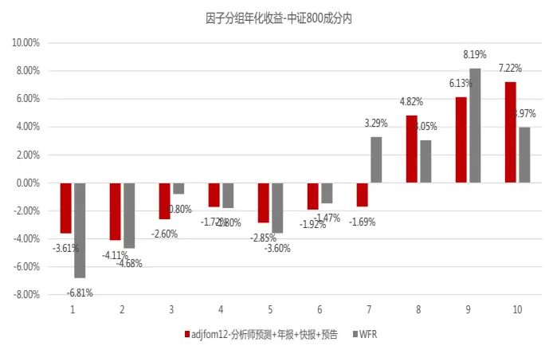
数据来源：Wind 资讯、东方证券研究所

## 三、 因子相关性分析

从因子原始值间的两两相关系数来看，FOM和WFR 因子间存在 40%相关性，和其他常见的大类因子相关性都不高。

图 22：FOM和 WFR 因子与常见大类因子的相关性
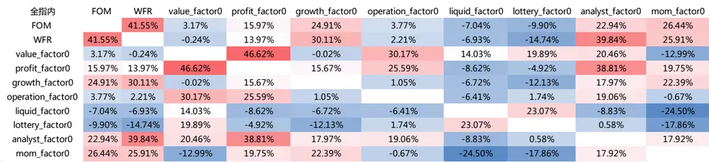
数据来源：Wind 资讯、东方证券研究所

通过常见的截面回归方法进行正交化剔除后，可以看到：1. FOM因子剔除WFR 因子后仍然有显著的选股效果，而相反WFR 因子剔除 FOM因子后失去了选股效力。2. 两因子剔除其他常见因子之后，选股效果均不显著。

图 23：FOM和WFR 因子在剔除常见大类因子后的残差选股表现

| 中证全指成分内 | FOM(对WFR正交化) | WFR(对FOM正交化) | FOM(对所有因子正交化) | WFR(对所有因子正交化) |
| --- | --- | --- | --- | --- |
| IC | 2.03% | 0.30% | 0.91% | 0.30% |
| IC_IR | 1.81 | 0.23 | 0.77 | 0.23 |
| tstat | 6.03 | 0.78 | 2.56 | 0.78 |
| long_short_r | 1.04% | 0.15% | 0.68% | 0.15% |
| long_short_win | 83.46% | 51.13% | 75.94% | 51.13% |
| long_short_sharp | 2.69 | 0.31 | 2.26 | 0.31 |
| long_short_drwandown | -3.40% | -11.34% | -3.88% | -11.34% |
| long_short_yearly | 12.78% | 1.86% | 8.20% | 1.86% |
| 2011/12/30 | 10.63% | 10.87% | 10.28% | 10.87% |
| 2012/12/31 | 16.56% | 1.29% | 9.32% | 1.29% |
| 2013/12/31 | 18.57% | -5.65% | -0.16% | -5.65% |
| 2014/12/31 | 6.60% | 5.20% | 5.14% | 5.20% |
| 2015/12/31 | 20.52% | -3.17% | 4.51% | -3.17% |
| 2016/12/30 | 5.95% | -1.05% | 6.34% | -1.05% |
| 2017/12/29 | 12.70% | 6.18% | 11.59% | 6.18% |
| 2018/12/28 | 8.43% | -0.63% | 5.48% | -0.63% |
| 2019/12/31 | 11.60% | 9.60% | 8.56% | 9.60% |
| 2020/12/31 | 15.20% | -2.82% | 11.34% | -2.82% |
| 2021/1/29 | 4.48% | -3.68% | 2.15% | -3.68% |

数据来源：Wind 资讯、东方证券研究所

## 四、总结

1. 度量分析师盈利上调情况，更稳健的指标是 FOM（the fraction of forecasts that misson the same side）。FOM指标计算时以当前最新的分析师盈利预测作为基准，不仅与该分析师过去的盈利预测对比，而且也和过去一段时间里其它分析师的盈利预测进行对比，计算盈利预测上调和下调的比例差，从而可以反映市场中分析师对于公司盈利情况的预期变化。

2. 在计算 FOM 指标时，可以加入预告、快报、实际年报的净利润数据。除了分析师的盈利预测之外，预告、快报、实际年报中公布的净利润值也可以视为一种盈利预测。如果当前有财报数据公布，则以财报公布的净利润作为基准，与过去一段时间里的分析师盈利预测进行对比。

3. 两种盈余调整因子的覆盖度不同，FOM 因子的样本数量更多。历史平均来看，FOM 对于中证全指的平均覆盖度接近 70%，WFR 为63%。2017 年之后两因子的覆盖度明显下降，到 2019年底 FOM因子对中证全指的覆盖度为 52%，WFR 对中证全指的覆盖度为 47%。此外，两因子在中证 800 中的覆盖度均较高，平均都在 80%以上。

4. （1）计算周期的选择：使用过去 12 个月的分析师数据进行计算得到的 FOM 因子效果最好。（2）年报、快报、预告数据的影响：加入上市公司的公告信息后，FOM因子效果都可以得到提升。（3）缺失值的影响：对于覆盖度不高的因子来说，缺失值的填充方法对于因子表现的影响比较大。回归方程的填充方法效果更优。（4）股票池的影响：首先，在不同市值范围的指数中，FOM 因子的稳定性基本都要好于 WFR 因子。其次，在不同机构持仓占比的细分股票池中，两因子均表现出在高机构持仓比的股票中表现较好的特点。FOM 因子在低机构持仓分组中的效果好于WFR 因子，后者在低机构持仓组中基本完全失效。在热门行业内两因子的表现不大，在家电行业中WFR 因子明显优于 FOM因子之外。

5. 因子时间序列表现：在全指和 800 成分内，FOM因子和 WFR 因子从多空组合收益上看差别不大，但 FOM因子的多空组合稳定性更好，最大回撤明显降低。

6. 因子分组收益：各分组收益基本满足单调性，盈利预期上调幅度大的股票未来收益更高。但WFR 因子的空头端收益跟多头端收益基本相当，而 FOM因子多头端收益高于空头端收益，多头对收益贡献更大。

7. 相关性分析：从因子原始值间的两两相关系数来看，FOM 和 WFR 因子间存在 40%相关性，和其他常见的大类因子相关性都不高。FOM 因子剔除 WFR 因子后仍然有显著的选股效果，而相反WFR 因子剔除 FOM因子后失去了选股效力。两因子剔除其他常见因子之后，选股效果均不显著。

## 风险提示

1. 量化模型基于历史数据分析，未来存在失效风险，建议投资者紧密跟踪模型表现。

2. 极端市场环境可能对模型效果造成剧烈冲击，导致收益亏损。

## 分析师申明

每位负责撰写本研究报告全部或部分内容的研究分析师在此作以下声明：

分析师在本报告中对所提及的证券或发行人发表的任何建议和观点均准确地反映了其个人对该证券或发行人的看法和判断；分析师薪酬的任何组成部分无论是在过去、现在及将来，均与其在本研究报告中所表述的具体建议或观点无任何直接或间接的关系。

## 投资评级和相关定义

报告发布日后的 12 个月内的公司的涨跌幅相对同期的上证指数/深证成指的涨跌幅为基准；

## 公司投资评级的量化标准

买入：相对强于市场基准指数收益率 15%以上；

增持：相对强于市场基准指数收益率 5%～15%；

中性：相对于市场基准指数收益率在-5%～+5%之间波动；

减持：相对弱于市场基准指数收益率在-5%以下。

未评级 —— 由于在报告发出之时该股票不在本公司研究覆盖范围内，分析师基于当时对该股票的研究状况，未给予投资评级相关信息。

暂停评级 —— 根据监管制度及本公司相关规定，研究报告发布之时该投资对象可能与本公司存在潜在的利益冲突情形；亦或是研究报告发布当时该股票的价值和价格分析存在重大不确定性，缺乏足够的研究依据支持分析师给出明确投资评级；分析师在上述情况下暂停对该股票给予投资评级等信息，投资者需要注意在此报告发布之前曾给予该股票的投资评级、盈利预测及目标价格等信息不再有效。

## 行业投资评级的量化标准：

看好：相对强于市场基准指数收益率 5%以上；

中性：相对于市场基准指数收益率在-5%～+5%之间波动；

看淡：相对于市场基准指数收益率在-5%以下。

未评级：由于在报告发出之时该行业不在本公司研究覆盖范围内，分析师基于当时对该行业的研究状况，未给予投资评级等相关信息。

暂停评级：由于研究报告发布当时该行业的投资价值分析存在重大不确定性，缺乏足够的研究依据支持分析师给出明确行业投资评级；分析师在上述情况下暂停对该行业给予投资评级信息，投资者需要注意在此报告发布之前曾给予该行业的投资评级信息不再有效。

## HeadertTabl e_Discl ai mer 免责声明

本证券研究报告（以下简称“本报告”）由东方证券股份有限公司（以下简称“本公司”）制作及发布。

本报告仅供本公司的客户使用。本公司不会因接收人收到本报告而视其为本公司的当然客户。本报告的全体接收人应当采取必要措施防止本报告被转发给他人。

本报告是基于本公司认为可靠的且目前已公开的信息撰写，本公司力求但不保证该信息的准确性和完整性，客户也不应该认为该信息是准确和完整的。同时，本公司不保证文中观点或陈述不会发生任何变更，在不同时期，本公司可发出与本报告所载资料、意见及推测不一致的证券研究报告。本公司会适时更新我们的研究，但可能会因某些规定而无法做到。除了一些定期出版的证券研究报告之外，绝大多数证券研究报告是在分析师认为适当的时候不定期地发布。

在任何情况下，本报告中的信息或所表述的意见并不构成对任何人的投资建议，也没有考虑到个别客户特殊的投资目标、财务状况或需求。客户应考虑本报告中的任何意见或建议是否符合其特定状况，若有必要应寻求专家意见。本报告所载的资料、工具、意见及推测只提供给客户作参考之用，并非作为或被视为出售或购买证券或其他投资标的的邀请或向人作出邀请。

本报告中提及的投资价格和价值以及这些投资带来的收入可能会波动。过去的表现并不代表未来的表现，未来的回报也无法保证，投资者可能会损失本金。外汇汇率波动有可能对某些投资的价值或价格或来自这一投资的收入产生不良影响。那些涉及期货、期权及其它衍生工具的交易，因其包括重大的市场风险，因此并不适合所有投资者。

在任何情况下，本公司不对任何人因使用本报告中的任何内容所引致的任何损失负任何责任，投资者自主作出投资决策并自行承担投资风险，任何形式的分享证券投资收益或者分担证券投资损失的书面或口头承诺均为无效。

本报告主要以电子版形式分发，间或也会辅以印刷品形式分发，所有报告版权均归本公司所有。未经本公司事先书面协议授权，任何机构或个人不得以任何形式复制、转发或公开传播本报告的全部或部分内容。不得将报告内容作为诉讼、仲裁、传媒所引用之证明或依据，不得用于营利或用于未经允许的其它用途。

经本公司事先书面协议授权刊载或转发的，被授权机构承担相关刊载或者转发责任。不得对本报告进行任何有悖原意的引用、删节和修改。

提示客户及公众投资者慎重使用未经授权刊载或者转发的本公司证券研究报告，慎重使用公众媒体刊载的证券研究报告。

## 东方证券研究所

地址：上海市中山南路 318 号东方国际金融广场 26 楼

电话：021-63325888

传真：021-63326786

网址： www.dfzq.com.cn