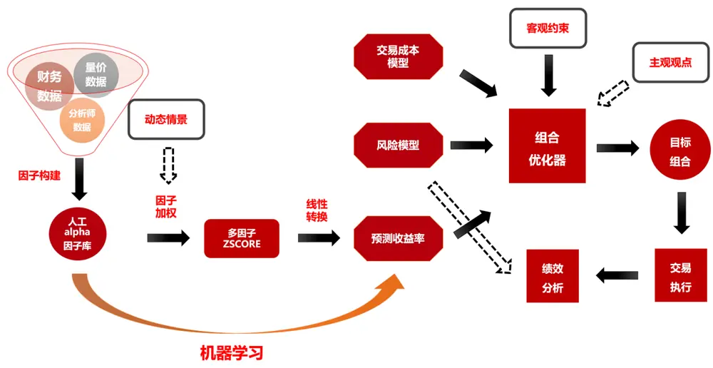
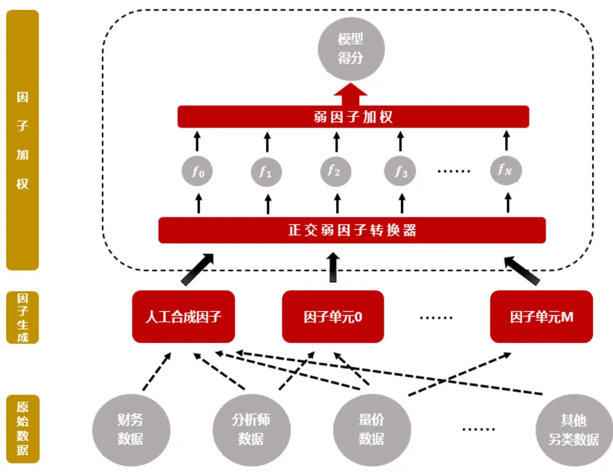
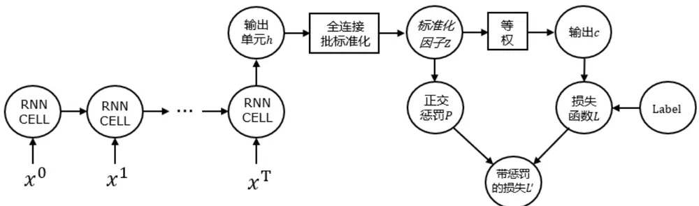
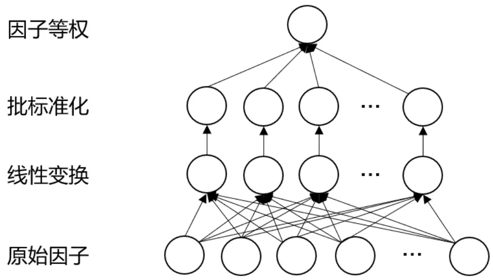
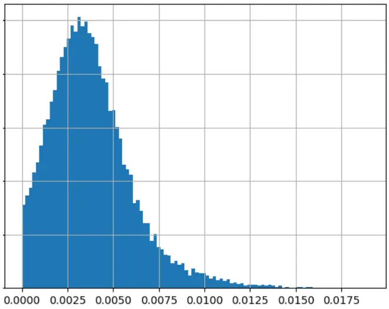
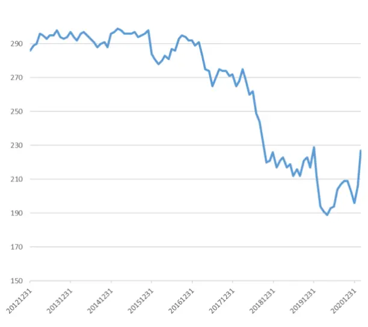
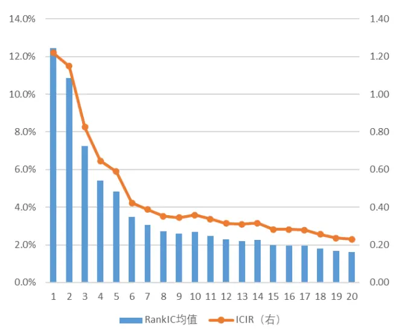
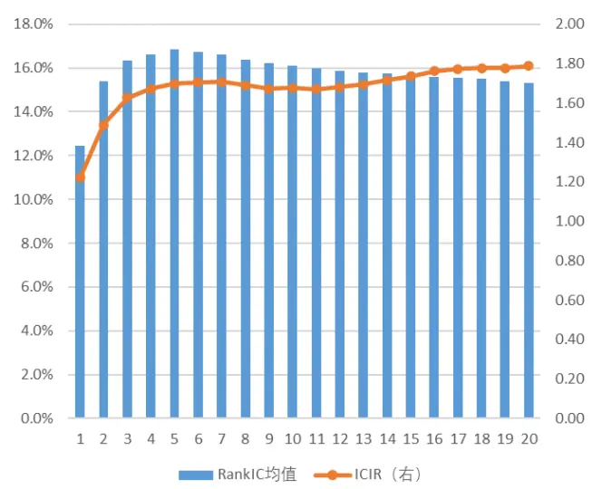
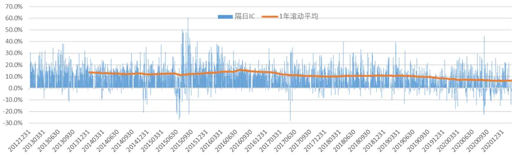
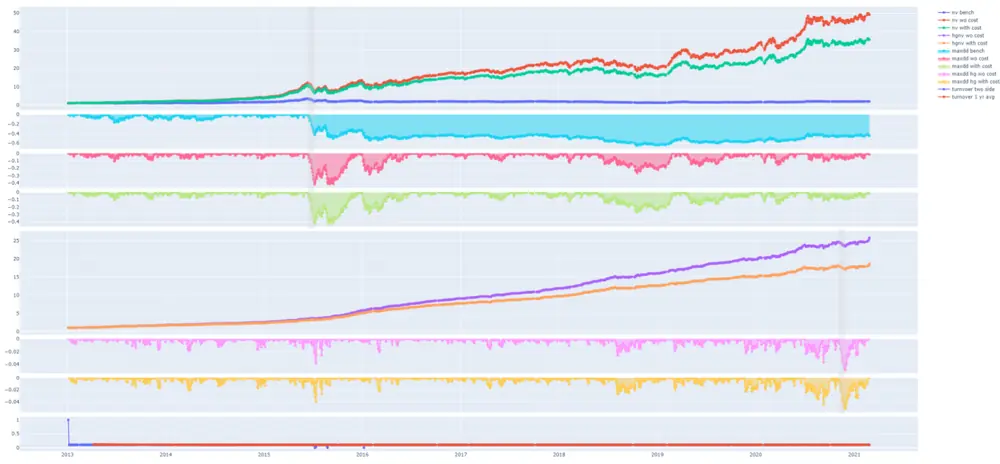

## ——因子选股系列之七十四

## 研究结论

- 多因子体系主要包括 alpha 模型、风险模型、交易成本模型和组合优化，广义的 alpha 模型分为 alpha 因子构建和因子加权，是量化从业人员的研究重心，但传统的 alpha 模型当期面临较大的挑战。

后发优势的逐渐丧失导致人工挖掘 alpha 因子的周期变长，国内外估值因子的长时间回撤，近年量价因子的批量拥挤等都是当前选股 alpha 因子层面的困境，量价因子拥挤等原因导致因子 IC 和组合绩效产生较大偏差，给以 IC 和回归为基础的动态因子加权带来挑战。

- 除了人工合成 alpha 因子外，我们可以通过设计因子单元批量产生有效的alpha 因子，以扩充因子库，考虑到因子 IC 和组合收益的不一致性，我们通过正交弱因子转换器将原始因子集合转换为相互正交的弱因子，以因子多头组合的表现加权。

遗传算法等方法也可以批量产生 alpha 因子，但由于变异的无方向性，计算效率较低，通过合理的输出层设计，可以让有监督学习的神经网络高效的批量产生大量 alpha 因子。

- 一个强 alpha 因子背后可能有很多驱动因素，可能有部分成分已经拥挤但部分成分依然能够对组合产生贡献，为了解决这个问题，我们将原始因子集合转换为相互正交的弱因子，直接从弱因子层面考察因子多头表现并指导加权。

本文生成的300个弱因子两两相关性几乎都在20%以内，单因子次日RankIC平均只有 1.8%，5 日累计 RankIC 仅 2.5%，但是大批量低相关的弱因子合成的 ZSCORE 次日 RankIC 却高达 12.5%，5 日累计 RankIC 平均 16.8%。由于单因子较弱，单因子权重较低（绝大多因子权重低于 1%，均值仅 0.38%）所以单因子的回撤对加总 ZSCORE 影响不大，模型稳定性较高。

经测算，在次日 VWAP 成交，双边千三费率下，500 增强模型 2017 年之后组合业绩大幅弱于之前，但在换手较低的情况下（日单边换手 5%以内），近几年费后也可以获取 20%左右的超额收益，另外随着组合换手的放大，虽然早期费后收益有明显增长，但近几年费后收益反而回落，说明每日高频调仓的策略近年来衰减较快，反而相对低频的策略更加稳健。

日频交易信号产生后，一般越早交易 alpha 越丰厚，对于开盘半小时 VWAP和全天 VWAP 这两种比较现实的成交价格，近三年组合业绩的差异明显小于早期，组合换手较低时几乎没有差异，说明通过抢单攫取 alpha 越来越困难，对于公募等没有交易优势的机构来讲如何提升 T+2 日及之后的 alpha 更有现实意义。

日频调仓的沪深 300 增强策略明显弱于中证 500，中证500弱于中证 1000，日频调仓增强策略在中小市值中相对更有优势。

## 风险提示

- 量化模型失效风险

- 市场极端环境的冲击

报告发布日期2021 年 03 月 11 日

证券分析师朱剑涛

021-63325888*6077

zhujiantao@orientsec.com.cn

执业证书编号：S0860515060001

证券分析师王星星

021-63325888*6108

wangxingxing@orientsec.com.cn

执业证书编号：S0860517100001

## 相关报告

因子加权过程中的大类权重控制：——因子2020-08-04选股系列报告之六十八

## 一、传统的 Alpha 模型

## 1.1 多因子选股体系

多因子选股体系可以简单的用图 1 概况，主要包括 alpha 模型、风险模型、交易成本模型和组合优化四个模块。Alpha 模型负责预测股票的收益率或者 alpha，风险模型（结构化风险模型或者统计风险模型）负责估计股票的协方差矩阵，交易成本模型对个股的交易成本进行建模，组合优化器在满足投资者不能做空、反向交易等投资者实际面临的客观约束下权衡组合的预期收益率和风险、交易成本，最终得出目标组合，量化基金经理根据目标组合执行交易，最后一般都会对组合的实际执行效果做绩效分析，找出体系的短板，不断的完善体系。

多因子体系的各个组成部分都不可获缺，alpha 模型负责对股票收益或 alpha 的预测，对组合收益的影响相对更大，也是量化机构研究的重中之重。狭义上讲，多因子体系中的 alpha模型仅指由因子库生成预测收益的过程，即因子加权，广义上，我们认为产生预测收益率或者 alpha 的整个过程都属于 Alpha 模型的范畴。

图 1：传统的多因子选股体系

数据来源：东方证券研究所

## 1.2 传统 Alpha 模型的困境

传统的因子生成过程更多依赖人工，量化研究员根据自己对市场行为的理解，构建能够捕捉市场错误定价或者风险溢价的指标，反复测试修正后加入因子库。一个逻辑明确、实证有效、且和现有因子库低相关的 alpha 因子凝结的是从业人员长期的知识积累，过去十余年由于“后发优势”的存在，国内因子研究快速发展，然而和国内其他行业类似，这种后发优势已经越来越不明显，后发优势的丧失导致因子挖掘的周期越来越长。

近年来因子层面出现的另外两个问题是估值因子的风险化和量价因子的拥挤。美股价值因子（BP）从 2007 年高点持续回撤至今，A 股从 2018 年底开始低PB 的股票持续跑输高 PB 的股票，关于“价值因子是否已死“的讨论学术界和业界都有很多、目前尚无定论，我们也无意讨论这个话题，但是毫无疑问作为多因子中一类重要 alpha 的价值因子在国内外的普遍回撤给多因子尤其是低频选股领域的多因子带来很大的挑战。

由于最近几年做高频量价策略的私募规模快速扩张，以反转、特异度为代表的量价指标交易逐渐拥挤，因子拥挤有别于市场结构变化等因子底层逻辑变化导致的失效，由于市场交易限制，因子的收益仅部分能够通过交易获取，当然也只有这部分才会拥挤，具体体现在因子在多头无效、空头有效，因子在成分股内无效、成分股外有效。因子拥挤不仅仅是某个因子失效的问题，还会给因子评价和因子加权带来很大的障碍，比如行业市值中性的特异度因子 2019 年以来全市场月度RankIC 均值依然高达 7.19%，中证 800 中也还有 2.82%，但是因子在中证 800 成分股内的多头对冲组合持续回撤。

传统的因子加权方法多以 IC 或者回归为基础，而各种回归背后大都是最小化均方误差，我们在前期报告《因子加权过程中的大类权重控制》中讲过，在一定条件下最小化均方误差等价于最大化 IC，因此 IC 和实际组合业绩的一致性假设在传统的因子加权中尤其重要，自然状态下我们可以近似接受这一假设，但是在量价因子大批量拥挤的情况下，越来越多的因子 IC 看上去可以，但组合多头收益变差，因此给因子的动态加权带来了很大障碍。为了应对 IC 和组合多头收益的不一致，业界常见的做法是在估计因子加权模型前就剔除部分多头收益差的因子，或者根据各种经验性方法调整因子权重，总体来说当前并没有业界公认的比较好的解决方案。

无论是后发优势的丧失导致新 alpha 因子的挖掘周期变长，还是估值因子的回撤、量价拥挤导致的多头收益回落，都指向了一个问题，就是传统 alpha因子构建方式原来越难以满足当前市场的需求，另外就是如何在因子加权时考虑因子 IC 和组合实际收益的不一致性，在量价指标较多的情形下尤其重要。

## 二、基于神经网络的 Alpha 模型框架

## 2.1 兼容传统 Alpha 模型的框架设计

如第一章所述，传统人工构建 Alpha 因子的方法已经遇到瓶颈，为了对人工因子库做补充，我们在传统 Alpha 模型的体系下并入因子单元模块，用算法批量生成 Alpha 因子，多个因子单元可以并行使用，人工合成的因子库和多个因子单元生成的因子集合汇集在一起传入因子加权模块。因子加权模块分为正交弱因子转换器和弱因子加权两层，正交弱因子转换器的任务是将人工和因子单元生成的若干因子转换为相互正交的大量弱因子，然后根据考虑拥挤度的因子表现作为权重加权弱因子。量价因子的拥挤是模型使用量价指标时因子加权不得不考虑的问题，部分量价因子背后有很多驱动因素，可以拆解成一些不相关的成分，有些成分可能已经有较明显的拥挤，而有些还可以为组合做贡献，因此我们在最后加权之前将所有的因子拆成相互正交的小成分，根据这些小成分的多头表现加权。

如下图的 Alpha 模型框架和我们传统的 Alpha 模型一脉相承，主要区别在于因子生成层面，除了使用传统的人工合成因子库，可以纳入生成 Alpha 因子的算法模块，另外就是在因子加权层面先将原始 Alpha 拆解成相互成交的弱因子，便于处理因子拥挤。

图 2：兼容传统 Alpha模型的框架设计

数据来源：东方证券研究所

## 2.2 因子单元——Alpha因子的生成模块

我们定义因子单元为生成 Alpha 因子的模块，传统上 Alpha 因子的构建可以理解为人为指定参数的特定算法，从这个角度讲，因子单元是传统 Alpha 因子构建方法的扩展，因子单元中一般都包含因子构建方法的参数，参数可以通过学习或者训练得到。根据因子单元输出的因子数量我们可以把因子单元分为一元因子单元和多元因子单元，一般用于预测股票收益率的机器学习模型都可以作为一元因子单元使用，基于遗传算法的因子挖掘器可以看作一种多元因子单元，但遗传算法的变异方向是随机的，计算效率相对较低，我们这里重点讨论基于神经网络监督学习方法的多元因子单元模块。

基于神经网络监督学习方法的多元因子单元和一般的神经网络区别在于输出层的设计，多元因子单元需要批量输出多个alpha，如何在一次学习中产生多个alpha因子是输出单元设计的核心。一般神经网络的输出层都是线性结构，由多个神经元 $h_{i,j}$ 汇总到输出 $\mathbf{\nabla}_{C_{i}},$ ，最后根据模型预测值 $\dot{}c_{i}$ 和真实值 $y_{i}$ 的损失函数学习模型。

$$
c_{i}=\sum_{j}w_{j}.h_{i,j}
$$

为了一次学习得到多个因子，我们改写了一般神经网络的输出层， 首先利用一个全连接层将原神经网络的多个神经元 $\cdot h_{i,j}$ 变换 $\overline{{\oplus}}h_{i,k}^{\prime}$ （如果原神经网络的多元输出比较独立，这一层原则上可以省略），接着做一道批标准化得到 $z_{i,k}$ ， $z_{i,k}$ 就是我们需要学习的多个 alpha 因子，学习的 loss 函数设定为多个因子等权得分与 label 的相关系数相反数，最后通过对标准化因子 $z_{i,k}$ 的相关系数矩阵的 L2 范数做较强的惩罚，使得输出因子尽量低相关，从而得到差异化的 alpha 因子 $\dot{\mathbf{\rho}}_{\circ}$ 当 label 为未来一段时间收益率，batch 是一个截面数据时，上述学习目标可以理解为最大化相互正交的多个因子等权得分的 $\scriptstyle{\mathsf{IC}}_{\circ}$ 在设计多元因子单元输出层时我们应用了一个关于 IC 的结论，就是相互正交的多个因子等权得分的 IC 正比于多个因子各自 IC 的平均，因此虽然我们只有一个学习目标，即最大化多个因子等权的 $\mathsf{IC}$ ，但这个学习目标会驱动各个因子的 IC 最大化。

$$
\begin{array}{r}{h_{i,k}^{\prime}=\sum_{j}w_{j,k}.h_{i,j}}\\{z_{i,k}=batch\_norm\left(h_{i,k}^{\prime}\right)}\end{array}
$$

$$
c_{i}=\frac{1}{K}\sum_{k}z_{i,k}
$$

$$
loss=-corr(c_{i},y_{i})
$$

$$
penality=\sum_{k\neq k^{\prime}}corr{\left(z_{i,k},z_{i,k^{\prime}}\right)}^{2}
$$

以一般的循环神经网络为例，我们详细阐述多元因子单元的网络结构和学习过程。在每个交易日，我们输入过去 T个交易日的特征序列，虽然每个时间步循环网络都可以有输出，但是我们选股时一般只使用最新的信息，所以默认情况下我们只取最后一个时间步的输出单元（如果想利用多个时间步的输出单元，请参考 ALSTM 的设计），从序列输入到输出单元部分可以采用 LSTM、GRU 等经典循环神经网络的设计，在循环网络输出单元之后接全连接层、批标准化生成标准化的因子，在网络训练完成后该层的输出即多元因子单元输出的因子。为了训练批量生成因子的网络，我们将训练时输出的多个标准化因子等权得到网络最后的输出，由输出和 Label 计算损失函数，同时对标准化因子相关性矩阵的 L2 范数做较惩罚，以保证学得的各个因子尽量低相关。

图 3：循环网络多元因子单元示意图

数据来源：东方证券研究所

关于因子单元的设计，行业内已经有人开始尝试，遗传算法挖因子就是其中一种，但是遗传算法由于没有目标引导，所以计算效率较低，多元因子单元在功能上类似特征提取，因此可以借鉴语音识别、图像处理等神经网络经典应用领域的研究成果，同行也已经开始研究，本文主要基于LSTM、GRU、AGRU 三个经典的时间序列模型设计因子单元，并没有对多元因子单元的特征提取结构做过多设计，后续研究我们会补充相关内容。本文对因子单元的主要创新在于多元因子单元的损失和惩罚项设计，通过这种设计方法可以通过一次训练产生多个相互正交的有效 alpha因子。

另外，需要说明的是，多元因子单元中的正交处理和因子加权层的正交处理有重叠，我们在设计多元因子单元时做正交惩罚是为了让学得的因子更加差异化，这和因子加权时的正交处理有不一样的功能设计，如果能够有其他方法能够让因子单元学得多样化的因子，因子单元也就可以不采用这样的正交惩罚。

最后，我们要补充的是，如果在组合构建时对行业市值等风格做了较强约束的话，组合的收益和风险调整后的 IC 更加匹配，那么上述学习目标稍作调整即可，即在计算相关系数之前，模型输出值 $.c_{i}$ 通过回归剔除掉行业市值等风格的影响，由于回归参数有显式的表达式，方便计算梯度，所以不影响神经网络的学习。

## 2.3 因子加权方法——正交与弱因子加权

在因子加权时，我们首先通过正交弱因子转换器将因子生成层产生的 alpha 因子转换为若干相互正交的弱因子，然后根据弱因子考虑因子拥挤后的表现加权弱因子，接下来我们分别讨论正交弱因子转换器的网络结构和弱因子加权的方法。

正交弱因子转换器本质上是因子正交方法，传统上我们经常采用 PCA 等非监督学习方法做因子正交，但这类方法都仅仅根据因子内部相关性结构做线性变换，并没有考虑到因子的选股表现，很可能得到某些正交成分对相关性结构的解释能力很强，但事实上没有选股效果。为了让得到的正交成分尽量都有一定的选股效果，我们采用了和多元因子单元输出结构类似的网络做正交弱因子转换器，具体设计方法如下图所示。原始 Alpha 因子经过全连接层做一道线性变换得到新的因子，然后经过批标准化层，最大化标准化因子等权后的 IC，因子正交通过因子相关系数矩阵的 L2 范数惩罚实现。

图 4：正交弱因子转换器网络结构

数据来源：东方证券研究所

在因子相互正交的假设下，最大化 IC 和线性回归加权都可以等价到因子 IC 加权，考虑到因子表现在时序上的稳定性，有时我们会经验性的调整为因子 ICIR 加权。理想情况下，因子的 IC 正比于因子组合的收益率，但是在因子拥挤等现实情况下，增强组合的收益和 IC 会有较大偏差，为了在因子加权时考虑到 IC 和组合收益的这种不一致性，我们经验性的采用因子在基准成分股内的多头对冲组合夏普率作为权重。

## 三、策略实践与组合分析

## 3.1 数据和训练说明

本章主要探讨上述策略框架在全市场（同期中证全指成分股）增强中证 500 的应用，同时在最后一小节也补充了策略在沪深 300 和中证 1000 增强的业绩表现。策略构建涉及如下 3 个数据集：

数据集 0：东方因子库人工构建的含基本面因子在内的 202 个 Alpha 因子

数据集 1：高开低收、VWAP、成交量共 6 个原始日线量价数据构建时序数据集，时序长度60 个交易日

数据集 2：开盘收益率、收盘收益率、日内极端收益、日内偏度、峰度、APB、ARPP 等 28个日内特征构建的时序数据集，时序长度 60 个交易日

本文涉及的上述数据集时间起止于 20060630 和 20210226，组合回测起始于 20130101，为了避免在组合回测时涉及未来数据，数据集预处理中需要估计的参数均由 20121231 之前的数据估计。

考虑到可交易性，本文学习训练的 label 选取的是隔日（T+2）的收盘价收益率，理论上，应该根据实际组合的调仓频率和换手限制情况调整 label 的长度，但是由于计算资源的稀缺性，本文没有做调整。

在因子单元层面，我们基于数据集 1、数据集 2 两个数据集，常见的 LSTM、GRU、AGRU三个经典的时间序列模型组合了 6 个因子单元，每个因子单元生成 60 个相互正交的 Alpha 因子，正交弱因子转换器将数据集0的202个因子以及上述6个因子单元生成的360个因子共562个因子转换为 300 个相互正交的弱因子，基于这 300 个弱因子加权得到 ZSCORE 用于组合构建。

模型训练我们采用 Adam 优化算法，考虑到循环神经网络的梯度爆炸问题，我们训练时采用了梯度截断技术，另外为了更高效的学习模型，学习率我们设置为自动衰减模式。

因子单元和正交弱因子转换器每年度训练一次，因子权重每个月估计一次，因子单元和正交弱转换器的训练集取 10 年数据、验证集取 1 年数据，训练集在前、验证集在后，训练集和验证集之间根据 label 调整间隔以避免数据交叉，弱因子根据过去一年的表现确定权重，因子权重确定的数据窗口和因子模型训练的验证集不重叠，因此学得的弱因子在样本外观察一年后依然有较好的选股表现才会被使用，以此进一步降低模型的过拟合。

考虑到网络训练和参数初始值有关，有一定随机性，为了降低随机性，下文中用于增强组合的因子得分是 3 次训练后平均的结果。

下文在构建指数增强组合时，我们均要求行业偏离不超过 2%，市值风格偏离不超过 0.2，组合每日调仓并在组合优化时对每日换手率做约束，业绩回测时假定买入费率千一，卖出千二，默认以次日 vwap 成交，并比较了不同成交价格对组合业绩的影响。

## 3.2 相互正交的弱因子

首先，我们统计了正交弱因子转换器生成的 300 个 alpha 因子的相关性和选股表现情况，由于因子单元和正交弱因子转换器每年度训练一次，所以我们在统计时对每个年度取平均。从左下图的数据我们可以看到，300 个 alpha 因子两两相关系数大多在 10%以内，总体比较低，说明在训练过程中的正交惩罚起到了作用，另外就是这 300个 alpha因子单因子的 RankIC 都不是很高，次日 IC 的均值和中位数不到 2%，5 日累计 RankIC 也就 2.5%的水平。

图 5：弱因子两两相关性分布（年度平均）

| -0.3 -0.2 -0.1 0.0 0.1 0.2 0.3 |
| --- |
| 均值 最小值 1/4分位数中位数3/4分位数最大值 |
| 0.022 -0.297 -0.014 0.021 0.057 0.364 |

数据来源：wind 咨询、东方证券研究所

图 6：弱因子累计 RankIC 分布（年度平均）

|  | 均值 | 最小值 | 1/4分位数 | 中位数 | 3/4分位数 | 最大值 |
| --- | --- | --- | --- | --- | --- | --- |
| 次日 | 1.8% | -3.2% | 1.0% | 1.8% | 2.7% | 6.7% |
| 2日 | 2.3% | -3.0% | 1.3% | 2.2% | 3.2% | 8.1% |
| 3日 | 2.4% | -4.5% | 1.4% | 2.3% | 3.4% | 8.8% |
| 4日 | 2.5% | -5.4% | 1.4% | 2.4% | 3.6% | 9.1% |
| 5日 | 2.5% | -5.9% | 1.3% | 2.5% | 3.6% | 9.2% |
| 6日 | 2.5% | -6.6% | 1.3% | 2.4% | 3.7% | 9.4% |
| 7日 | 2.5% | -6.8% | 1.2% | 2.4% | 3.7% | 10.2% |
| 8日 | 2.4% | -6.8% | 1.1% | 2.4% | 3.7% | 10.8% |
| 9日 | 2.4% | -6.8% | 1.1% | 2.4% | 3.8% | 11.0% |
| 10日 | 2.4% | -6.7% | 1.0% | 2.4% | 3.8% | 10.4% |
| 11日 | 2.3% | -6.4% | 1.0% | 2.3% | 3.8% | 10.1% |
| 12日 | 2.3% | -6.2% | 0.9% | 2.3% | 3.8% | 10.0% |
| 13日 | 2.3% | -6.5% | 0.9% | 2.3% | 3.8% | 10.1% |
| 14日 | 2.3% | -6.8% | 0.8% | 2.3% | 3.8% | 10.1% |
| 15日 | 2.3% | -6.9% | 0.8% | 2.3% | 3.9% | 10.2% |
| 16日 | 2.3% | -6.9% | 0.8% | 2.3% | 3.9% | 10.3% |
| 17日 | 2.3% | -6.6% | 0.7% | 2.3% | 3.9% | 10.3% |
| 18日 | 2.3% | -6.7% | 0.7% | 2.3% | 3.9% | 10.5% |
| 19日 | 2.3% | -7.2% | 0.6% | 2.3% | 3.9% | 10.7% |
| 20日 | 2.3% | -7.6% | 0.6% | 2.3% | 3.9% | 11.3% |

数据来源：wind 咨询、东方证券研究所

由于单个 alpha 因子普遍较弱，所以合成 ZSCORE 时单个 alpha 因子的权重普遍较小，以中证 500 增强为例，2013 年以来，单个 alpha 因子的权重基本都在 1%以内，在权重大于零的所有因子中，单因子权重平均仅为 0.38%，中位数0.35%，由于单个因子的权重很小，所以即使有个别因子出现较大回撤也不会对组合产生很大影响，增强了组合收益的稳健性。另外，我们观察中证500 增强持有因子数量的历史走势，可以发现很有意思的现象，在 2017 年之前，绝大多数弱因子均有效，300 个因子持有 290个左右，但 2017 年以后增强组合持有的因子数量大幅回落，因子出现大批量拥挤或者失效。

单个 alpha 因子虽然较弱，但是大量低相关的 alpha 因子可以合成很强的 ZSCORE，依然以中证 500 增强为例，2013 年以来，合成 ZSCORE 次日 RankIC 均值高达 12.5%，5 日累计 RankIC均值高达 16.8%。但时间序列上看最近几年 RankIC 回落的十分明显，2017 年之前模型ZSCORE的隔日 RankIC（T+2）均值高达 13.1%，但 2019 年以来仅 7.2%。

图 7：中证 500 增强弱因子权重分布

| 均值 | 最小值 | 1/4分位数 | 中位数 | 3/4分位数 | 最大值 |
| --- | --- | --- | --- | --- | --- |
| 0.38% | 0.00% | 0.22% | 0.35% | 0.50% | 1.90% |

数据来源：wind 咨询、东方证券研究所

图 8：中证 500 增强持有因子数量变化

数据来源：wind 咨询、东方证券研究所

图 9：模型 ZSCORE 不同滞后期单日 RankIC 均值与 ICIR（未年化）

数据来源：wind 咨询、东方证券研究所

图 10：模型 ZSCORE 不同滞后期累计 RankIC 均值与 ICIR（未年化）

数据来源：wind 咨询、东方证券研究所

图 11：模型 ZSCORE 隔日 IC（T+2）时间序列走势

数据来源：wind 咨询、东方证券研究所

## 3.3 不同换手约束下的500增强表现

比较不同换手约束下中证 500 增强各年度的业绩情况，我们不难发现日频调仓模型 2017 年之后组合业绩大幅弱于之前，但在换手较低的情况下，近几年也可以获取 20%左右的超额收益，另外随着组合换手的放大，虽然早期费后收益有明显增长，但近几年费后收益反而大幅回落，说明每日高频调仓的策略近年来衰减更快，反而相对低频的策略更加稳健。

图 12：不同换手率约束下中证 500增强费后年化对冲收益和最大回撤

|  | 区间汇总 | 2013年 | 2014年 |  | 2015年 | 2016年 2017年 | 2018年 |  | 2019年 | 2020年 | 2021年 |
| --- | --- | --- | --- | --- | --- | --- | --- | --- | --- | --- | --- |
| delta=0.01 | 年化收益 | 16.7% | 25.7% | 5.1% | 33.8% | 15.9% | 11.4% | 8.4% | 14.1% | 21.9% | 2.6% |
|  | 最大回撤 | -5.5% | -3.8% | -4.5% | -5.5% | -2.9% | -2.4% | -2.9% | -2.7% | -4.4% | -1.4% |
| delta=0.02 | 年化收益 | 27.0% | 38.4% | 15.5% | 59.4% | 29.7% | 17.8% | 17.0% | 20.8% | 23.6% | 2.9% |
|  | 最大回撤 | -5.2% | -3.0% | -3.6% | -5.2% | -3.1% | -2.8% | -3.6% | -2.2% | -4.2% | -1.8% |
| delta=0.03 | 年化收益 | 32.6% | 49.0% | 23.8% | 77.2% | 37.3% | 22.8% | 19.3% | 20.7% | 20.4% | 4.4% |
|  | 最大回撤 | -5.6% | -2.7% | -2.2% | -5.6% | -2.7% | -1.4% | -3.6% | -2.0% | -4.2% | -2.1% |
| delta=0.04 | 年化收益 | 39.0% | 61.5% | 29.7% | 96.3% | 48.9% | 25.3% | 26.5% | 21.2% | 19.7% | 4.3% |
|  | 最大回撤 | -5.6% | -2.2% | -1.9% | -5.5% | -2.4% | -1.7% | -2.7% | -2.2% | -5.6% | -2.4% |
| delta=0.05 | 年化收益 | 43.2% | 69.3% | 38.6% | 118.1% | 51.5% | 25.5% | 30.1% | 18.8% | 19.1% | 4.2% |
|  | 最大回撤 | -5.2% | -1.7% | -2.1% | -4.0% | -2.2% |  |  |  |  |  |
| delta=0.06 | 年化收益 | 46.5% | 79.7% | 46.9% | 128.4% | 62.3% | -1.7% | -2.7% | -2.3% 15.1% | -5.2% | -2.4% |
|  | 最大回撤 | -5.5% | -1.9% | -2.0% | -4.1% |  | 26.2% | 29.0% |  | 17.2% | 4.6% |
| delta=0.08 | 年化收益 | 52.4% | 95.0% | 59.2% |  | -2.5% | -1.7% | -2.8% | -2.1% | -5.5% | -2.4% |
|  |  |  |  |  | 148.9% | 73.1% | 34.6% | 31.1% | 11.1% | 13.4% | 4.3% |
| delta=0.10 | 最大回撤 年化收益 | -5.7% 56.2% | -2.0% 104.2% | -2.0% 68.4% | -3.7% | -2.3% | -1.0% | -3.9% | -2.2% | -5.7% | -2.4% |
|  |  | -5.6% |  |  | 171.5% | 82.6% | 37.6% | 30.7% | 9.1% | 9.8% | 3.0% |
| delta=0.15 | 最大回撤 年化收益 | 63.9% | -2.1% 131.7% | -2.1% | -2.8% | -2.2% | -1.6% | -3.4% | -2.5% | -5.3% | -2.8% |
|  | 最大回撤 | -5.1% |  | 88.0% -2.1% | 203.7% | 98.5% | 39.9% | 26.4% | 5.0% | 10.8% | 4.0% |
| delta=0.20 | 年化收益 | 68.7% | -1.7% 158.1% |  | -2.5% | -2.4% | -1.9% | -3.6% | -2.6% | -5.1% | -2.6% |
|  |  |  |  | 98.4% | 218.7% | 114.3% | 41.3% | 28.7% | 2.5% | 6.0% | 3.1% |
| delta=0.30 | 最大回撤 年化收益 | -5.0% 70.4% | -1.2% | -1.8% | -2.9% | -2.0% | -2.0% | -3.7% | -4.6% | -5.0% | -2.7% |
|  |  | -10.3% | 174.0% | 113.6% | 222.2% | 128.6% | 42.1% | 29.7% | -3.0% | -1.7% | 2.2% |
| delta=0.50 | 最大回撤 年化收益 |  | -1.9% | -2.0% | -3.3% | -1.9% | -2.1% | -3.7% | -7.8% | -7.8% | -2.9% |
|  |  | 59.7% | 162.6% | 106.4% | 205.8% | 111.7% | 35.1% | 25.9% | -15.1% | -8.4% | -1.7% |
| 不限制 | 最大回撤 年化收益 | -25.8% | -2.5% | -1.9% | -3.8% | -2.0% | -2.0% | -4.8% | -16.1% | -9.3% | -4.8% |
|  | 最大回撤 | 53.7% -32.5% | 151.7% -2.8% | 96.3% -2.0% | 194.1% -3.7% | 99.2% -2.0% | 33.1% -2.1% | 24.5% -5.1% | -18.3% -18.4% | -12.3% -12.9% | -2.6% -5.2% |

数据来源：wind 咨询、东方证券研究所

图 13：日单边换手 5%约束下中证 500增强时间序列表现

数据来源：wind 咨询、东方证券研究所

## 3.4 成交价格对500增强业绩的影响

对比不同成交价格下中证 500增强的费后业绩，我们可以看出如下几点：

（1）在交易信号出来之后，越早交易组合业绩越好，前收盘产生信号后，前收盘价成交业绩最佳，次日开盘其次，开盘前半小时 VWAP 优于全天 VWAP，优于收盘价。

（2）当组合换手越高，组合业绩对成交价格越明显，比如日单边换手 2%时，次日开盘价和次日收盘价成交增强组合年化对冲收益仅相差 3.1%，但日单边换手 20%时，两者相差26.6%。

（3）对于开盘半小时 VWAP和全天 VWAP 这两种比较现实的成交价格，近三年组合业绩的差异明显小于早期，组合换手较低时几乎没有差异，说明通过抢单攫取 alpha 越来越困难，对于公募等没有交易优势的机构来讲如何提升 T+2 日及之后的 alpha 更有现实意义。

图 14：不同成交价格对 500增强业绩的影响
日单边换手 2%

|  |  | 区间汇总 | 2013年 | 2014年 | 2015年 | 2016年 | 2017年 | 2018年 | 2019年 | 2020年 | 2021年 |
| --- | --- | --- | --- | --- | --- | --- | --- | --- | --- | --- | --- |
| 前收盘价 | 年化收益 | 33.6% | 44.9% | 18.4% | 67.8% | 36.3% | 22.4% | 28.3% | 28.0% | 29.9% | 3.5% |
|  | 最大回撤 | -5.2% | -3.0% | -3.9% | -5.2% | -2.8% | -1.8% | -3.5% | -1.9% | -4.3% | -1.7% |
| 开盘价 | 年化收益 | 30.9% | 42.6% | 17.0% | 66.5% | 31.8% | 20.2% | 24.3% | 23.9% | 28.5% | 2.9% |
|  | 最大回撤 | -5.1% | -2.9% | -3.5% | -5.1% | -3.4% | -2.3% | -3.6% | -2.2% | -4.6% | -1.8% |
| 开盘半小时VWAP | 年化收益 | 29.1% | 41.1% | 18.8% | 61.2% | 32.4% | 17.5% | 18.5% | 22.0% | 29.0% | 2.5% |
|  | 最大回撤 | -5.0% | -3.0% | -3.2% | -5.0% | -3.3% | -2.6% | -3.8% | -2.1% | -4.8% | -2.0% |
| VWAP | 年化收益 | 27.0% | 38.4% | 15.5% | 59.4% | 29.7% | 17.8% | 17.0% | 20.8% | 23.6% | 2.9% |
|  | 最大回撤 | -5.2% | -3.0% | -3.6% | -5.2% | -3.1% | -2.8% | -3.6% | -2.2% | -4.2% | -1.8% |
| 收盘价 | 年化收益 | 27.8% | 38.9% | 12.9% | 62.1% | 31.7% | 18.0% | 16.3% | 22.1% | 26.8% | 3.7% |
|  | 最大回撤 | -5.1% | -2.9% | -4.0% | -5.1% | -2.7% | -2.6% | -4.1% | -2.1% | -4.3% | -1.9% |

日单边换手 5%

|  |  | 区间汇总 | 2013年 | 2014年 | 2015年 | 2016年 | 2017年 | 2018年 | 2019年 | 2020年 | 2021年 |
| --- | --- | --- | --- | --- | --- | --- | --- | --- | --- | --- | --- |
| 前收盘价 | 年化收益 | 56.5% | 82.0% | 48.8% | 121.7% | 66.3% | 35.5% | 54.1% | 35.8% | 27.9% | 6.3% |
|  | 最大回撤 | -5.2% | -1.5% | -2.0% | -4.4% | -1.3% | -1.8% | -2.2% | -1.9% | -5.2% | -2.0% |
| 开盘价 | 年化收益 | 49.8% | 76.4% | 46.9% | 116.9% | 58.2% | 31.0% | 43.1% | 25.2% | 22.4% | 5.5% |
|  | 最大回撤 | -5.6% | -1.8% | -2.0% | -4.0% | -2.2% | -1.8% | -2.8% | -2.2% | -5.6% | -1.8% |
| 开盘半小时VWAP | 年化收益 | 46.4% | 75.0% | 45.0% | 120.0% | 56.4% | 27.5% | 32.3% | 19.4% | 21.1% | 5.1% |
|  | 最大回撤 | -5.2% | -1.9% | -2.0% | -4.4% | -2.1% | -1.9% | -3.0% | -2.2% | -5.2% | -2.2% |
| VWAP | 年化收益 | 43.2% | 69.3% | 38.6% | 118.1% | 51.5% | 25.5% | 30.1% | 18.8% | 19.1% | 4.2% |
|  | 最大回撤 | -5.2% | -1.7% | -2.1% | -4.0% | -2.2% | -1.7% | -2.7% | -2.3% | -5.2% | -2.4% |
| 收盘价 | 年化收益 | 41.8% | 65.4% | 32.6% | 114.6% | 49.4% | 23.8% | 29.8% | 19.7% | 21.2% |  |
|  | 最大回撤 | -5.2% | -1.9% | -2.4% | -3.9% | -2.1% | -1.6% | -2.9% | -2.4% | -5.2% | 5.3% -2.2% |

日单边换手 10%

|  |  | 区间汇总 | 2013年 | 2014年 | 2015年 | 2016年 | 2017年 | 2018年 | 2019年 | 2020年 | 2021年 |
| --- | --- | --- | --- | --- | --- | --- | --- | --- | --- | --- | --- |
| 前收盘价 | 年化收益 | 80.1% | 123.3% | 80.4% | 187.7% | 109.5% | 52.4% | 78.2% | 35.8% | 27.2% | 6.4% |
|  | 最大回撤 | -4.4% | -1.8% | -2.2% | -3.0% | -2.1% | -1.0% | -2.3% | -1.9% | -4.4% | -1.9% |
| 开盘价 | 年化收益 | 69.1% | 117.7% | 77.1% | 185.1% | 91.2% | 45.1% | 59.2% | 21.0% | 17.1% | 5.4% |
|  | 最大回撤 | -5.2% | -1.8% | -2.5% | -2.9% | -2.6% | -1.1% | -2.8% | -2.3% | -5.2% | -2.0% |
| 开盘半小时VWAP | 年化收益 | 61.7% | 113.9% | 75.6% | 181.8% | 90.5% | 39.6% | 39.2% | 9.9% | 12.6% | 4.0% |
|  | 最大回撤 | -5.2% | -2.1% | -2.1% | -2.9% | -2.5% | -1.6% | -3.3% | -2.6% | -5.2% | -2.3% |
| VWAP | 年化收益 | 56.2% | 104.2% | 68.4% | 171.5% | 82.6% | 37.6% | 30.7% | 9.1% | 9.8% | 3.0% |
|  | 最大回撤 | -5.6% | -2.1% | -2.1% | -2.8% | -2.2% | -1.6% | -3.4% | -2.5% | -5.3% | -2.8% |
| 收盘价 | 年化收益 | 52.0% | 92.2% | 60.2% | 159.1% | 74.6% | 33.2% | 28.8% | 10.0% | 12.1% | 3.1% |
|  | 最大回撤 | -5.5% | -2.3% | -2.3% | -2.6% | -2.0% | -1.7% | -3.7% | -2.5% | -5.2% | -3.0% |

日单边换手 20%

|  |  | 区间汇总 | 2013年 | 2014年 | 2015年 | 2016年 | 2017年 | 2018年 | 2019年 | 2020年 | 2021年 |
| --- | --- | --- | --- | --- | --- | --- | --- | --- | --- | --- | --- |
| 前收盘价 | 年化收益 | 103.4% | 184.2% | 112.2% | 226.6% | 144.9% | 64.8% | 108.8% | 41.6% | 28.6% | 8.0% |
|  | 最大回撤 | -4.2% | -0.9% | -1.8% | -3.2% | -1.9% | -1.6% | -1.8% | -1.5% | -4.2% | -1.6% |
| 开盘价 | 年化收益 | 87.8% | 181.0% | 107.2% | 220.2% | 120.8% | 54.9% | 79.9% | 21.7% | 14.6% | 6.4% |
|  | 最大回撤 | -5.5% | -0.9% | -1.9% | -3.0% | -2.1% | -1.9% | -2.5% | -2.2% | -5.5% | -1.7% |
| 开盘半小时VWAP | 年化收益 | 75.8% | 176.6% | 110.7% | 226.2% | 119.6% | 42.4% | 44.4% | 3.1% | 9.1% | 3.5% |
|  | 最大回撤 | -5.5% | -1.1% | -1.8% | -3.1% | -1.9% | -2.2% | -3.4% | -4.5% | -5.5% | -2.5% |
| VWAP | 年化收益 | 68.7% | 158.1% | 98.4% | 218.7% | 114.3% | 41.3% | 28.7% | 2.5% | 6.0% | 3.1% |
|  | 最大回撤 | -5.1% | -1.2% | -1.8% | -2.9% | -2.0% | -2.0% | -3.7% | -4.6% | -5.1% | -2.7% |
| 收盘价 | 年化收益 | 61.2% | 134.7% | 81.5% | 202.4% | 99.6% | 34.6% | 22.8% | 4.4% | 7.0% |  |
|  | 最大回撤 | -4.8% | -1.3% | -1.9% | -2.5% | -2.0% | -2.1% | -3.9% | -3.8% | -4.8% | 3.4% -2.9% |

数据来源：wind 咨询、东方证券研究所

## 3.5 策略在 300 和 1000 增强中的绩效

从沪深 300 和中证 1000 的实际组合业绩来看，日频调仓的沪深 300 增强策略明显弱于中证500，中证 500 弱于中证 1000，日频调仓增强策略在中小市值中相对更有优势，另外就是，无论沪深 300 还是中证 1000，策略收益在 2017 年以后均出现明显回落，组合换手较高时尤其如此。

图 15：不同换手率约束下沪深 300增强费后年化对冲收益和最大回撤

|  | 区间汇总 | 2013年 | 2014年 |  | 2015年 | 2016年 | 2017年 | 2018年 | 2019年 | 2020年 | 2021年 |
| --- | --- | --- | --- | --- | --- | --- | --- | --- | --- | --- | --- |
| delta=0.01 | 年化收益 | 11.4% | 16.8% | 8.0% | 20.0% | 9.0% | 10.3% | 4.1% | 7.4% | 14.1% | 4.1% |
|  | 最大回撤 | -3.0% | -2.8% | -3.0% | -2.6% | -1.6% | -1.2% | -1.7% | -1.2% | -2.7% | -1.3% |
|  | 年化收益 | 17.4% | 25.2% | 13.5% | 40.1% | 13.6% | 14.3% | 6.5% | 11.2% | 15.9% | 3.8% |
| delta=0.02 | 最大回撤 | -3.0% | -2.4% | -2.4% | -3.0% | -1.8% | -1.3% | -2.0% | -1.4% | -2.8% | -0.7% |
|  | 年化收益 | 21.2% | 34.6% | 21.4% | 46.3% | 18.3% | 17.6% | 9.6% | 13.4% | 12.5% | 2.8% |
| delta=0.03 | 最大回撤 | -3.5% | -2.1% | -1.8% | -3.3% | -1.8% | -1.3% | -1.8% | -1.7% | -3.5% | -1.8% |
|  | 年化收益 23.9% | 37.4% |  | 30.7% | 49.6% | 24.5% | 21.2% | 9.4% | 11.9% | 12.4% | 2.7% |
| delta=0.04 | 最大回撤 | -3.8% | -1.8% | -1.9% | -3.8% | -1.7% | -1.2% | -1.7% | -1.9% | -3.2% | -1.7% |
|  | 26.5% | 44.7% |  | 35.1% | 56.5% | 27.9% | 26.1% | 7.6% | 10.9% |  | 3.2% |
| delta=0.05 | 年化收益 最大回撤 | -3.9% | -1.7% | -1.6% | -3.9% | -1.7% |  | -2.2% | -1.8% | 11.9% |  |
|  | 26.9% |  |  | 38.2% | 58.0% |  | -1.0% |  | 8.3% | -3.1% | -1.3% |
| delta=0.06 | 年化收益 最大回撤 | -3.8% | 46.7% -1.9% | -1.8% | -3.3% | 31.2% -1.7% | 26.9% | 7.7% | -2.2% | 9.5% | 2.6% |
|  | 29.1% |  |  | 40.6% | 62.0% | 36.8% | -1.4% | -2.4% |  | -3.3% | -1.5% |
| delta=0.08 | 年化收益 最大回撤 | -4.6% | 57.2% -2.1% | -2.0% | -3.8% |  | 31.4% | 7.2% | 3.5% | 9.4% | 2.6% |
|  | 30.7% |  |  | 44.0% | 70.3% | -1.4% 40.8% | -1.2% | -3.1% | -2.3% | -3.6% | -1.7% |
| delta=0.10 | 年化收益 最大回撤 | -4.3% | 62.7% -1.6% | -2.0% |  |  | 30.8% | 7.6% | 1.1% | 8.9% | 2.1% |
|  | 32.3% |  |  | 52.5% | -4.3% 85.8% | -1.2% | -1.6% | -2.6% | -3.9% | -3.5% | -2.2% |
| delta=0.15 | 年化收益 最大回撤 | -7.0% | 65.5% |  |  | 43.7% | 31.6% | 7.8% | -4.2% | 5.4% | 1.7% |
|  | 年化收益 |  | -1.6% | -1.9% 53.1% | -4.3% | -1.3% | -1.4% | -2.6% | -6.5% | -4.0% | -3.1% |
| delta=0.20 | 最大回撤 | 31.3% -10.3% | 66.9% |  | 83.7% | 43.1% | 31.5% | 7.1% | -7.4% | 3.1% | 1.9% |
|  |  |  | -1.4% | -2.1% | -3.9% | -1.2% | -1.1% | -2.8% | -9.6% | -5.1% | -2.8% |
| delta=0.30 | 年化收益 最大回撤 | 27.7% | 62.1% | 46.8% | 84.6% | 38.6% | 26.3% | 5.2% | -9.0% | -1.0% | 1.0% |
|  |  | -16.2% | -1.5% | -2.7% | -4.5% | -1.6% | -1.5% | -5.0% | -11.0% | -6.2% | -2.6% |
| delta=0.50 | 年化收益 | 23.3% | 53.8% | 40.9% | 76.8% | 31.7% | 24.6% | 3.3% | -12.2% | -3.9% | 0.9% |
|  | 最大回撤 | -21.9% | -1.8% | -3.1% | -4.9% | -2.0% | -1.4% | -5.8% | -12.5% | -7.7% | -2.8% |
| 不限制 | 年化收益 | 23.3% | 53.6% | 41.0% | 76.5% | 31.6% | 24.6% | 3.3% | -12.2% | -3.9% | 1.0% |
|  | 最大回撤 | -21.9% | -2.0% | -3.1% | -4.9% | -2.0% | -1.4% | -5.8% | -12.5% | -7.7% | -2.8% |

数据来源：wind 咨询、东方证券研究所

图 16：不同换手率约束下中证 1000增强费后年化对冲收益和最大回撤

|  | 区间汇总 | 2013年 | 2014年 | 2015年 | 2016年 | 2017年 | 2018年 | 2019年 | 2020年 | 2021年 |
| --- | --- | --- | --- | --- | --- | --- | --- | --- | --- | --- |
| delta=0.01 | 年化收益 20.9% | 25.1% | 11.8% | 27.7% | 20.9% | 26.7% | 18.2% | 14.1% | 18.6% | 7.5% |
|  | 最大回撤 | -3.6% -2.5% | -2.6% | -2.0% | -1.7% | -0.8% | -3.2% | -2.5% | -3.6% | -2.4% |
| delta=0.02 | 年化收益 30.6% | 40.0% | 21.7% | 43.5% | 37.2% | 36.4% | 20.3% | 19.9% | 24.2% | 7.3% |
|  | 最大回撤 -3.9% | -1.3% | -2.0% | -1.9% | -0.5% | -0.8% | -3.0% | -2.8% | -3.0% | -0.7% |
| delta=0.03 | 年化收益 38.2% | 46.8% | 30.7% | 61.8% | 46.8% | 42.1% | 30.1% | 22.0% | 26.1% | 7.8% |
|  | 最大回撤 -2.8% | -1.2% | -1.6% | -1.9% | -0.7% | -0.9% | -2.4% | -2.2% | -2.8% | -0.6% |
| delta=0.04 | 年化收益 43.9% | 55.8% | 40.3% | 77.2% | 58.9% | 40.6% | 36.4% | 25.0% | 22.4% | 7.6% |
|  | 最大回撤 -3.3% | -1.0% | -1.2% | -2.5% | -0.8% | -0.9% | -2.4% | -2.5% | -3.3% | -0.6% |
| delta=0.05 | 年化收益 48.6% | 70.4% | 47.7% | 94.0% | 66.0% | 40.8% | 37.0% | 20.7% | 22.6% | 9.2% |
|  | 最大回撤 -3.7% | -0.9% | -1.6% | -1.8% | -0.7% | -0.9% | -1.9% | -3.1% | -3.7% | -0.5% |
| delta=0.06 | 年化收益 53.1% | 78.1% | 54.1% | 115.0% | 70.8% | 42.7% | 37.5% | 21.7% | 22.7% | 9.2% |
|  | 最大回撤 -3.5% | -1.1% | -1.8% | -1.1% | -1.4% |  |  |  |  |  |
| delta=0.08 | 年化收益 60.2% | 91.8% | 65.8% |  | 92.2% | -0.8% 44.9% | -2.0% | -3.4% 19.6% | -3.5% | -0.5% |
|  | 最大回撤 -3.3% | -0.9% | -1.7% | 141.3% -1.4% | -1.8% | -1.6% | 40.1% |  | 19.8% | 8.3% |
| delta=0.10 | 年化收益 64.6% | 111.5% | 74.9% | 161.5% | 102.5% | 46.3% | -2.5% | -2.7% | -3.3% | -0.6% |
|  | 最大回撤 -4.3% | -1.1% | -1.5% | -1.4% | -1.9% |  | 39.9% | 14.4% | 16.2% | 8.8% |
| delta=0.15 | 年化收益 72.4% | 134.2% | 89.5% |  |  | -1.2% | -2.8% | -3.3% 8.7% | -3.1% | -0.4% |
|  | -6.4% | -1.4% | -1.4% | 207.9% -2.2% | 120.6% -1.6% | 51.2% | 40.0% |  | 14.0% | 7.0% |
| delta=0.20 | 最大回撤 年化收益 75.8% | 145.9% |  |  |  | -1.6% | -2.4% | -4.0% | -4.2% | -1.0% |
|  | 最大回撤 -7.3% | -1.3% | 112.6% -1.2% | 219.3% -2.1% | 134.3% | 53.2% | 39.9% | 4.9% | 6.0% | 6.6% |
| delta=0.30 | 年化收益 | 163.2% | 123.7% |  | -1.7% | -1.4% | -2.4% | -4.2% | -5.1% | -1.3% |
|  | 78.1% -14.3% | -1.3% | -1.6% | 230.7% -2.7% | 139.4% | 59.1% | 41.4% | -2.5% | 0.1% | 7.8% |
| delta=0.50 | 最大回撤 年化收益 |  |  |  | -1.5% | -1.6% | -2.2% | -10.3% | -5.5% | -1.1% |
|  | 64.8% -29.9% | 150.0% -1.1% | 113.4% -1.9% | 208.0% -4.1% | 127.6% -1.4% | 54.1% | 32.7% | -16.3% | -12.8% | 5.0% |
| 不限制 | 最大回撤 |  |  |  |  | -1.8% | -3.3% | -19.7% | -12.9% | -1.8% |
|  | 年化收益 58.2% 最大回撤 -35.3% | 138.3% -1.0% | 104.5% -1.7% | 192.8% -3.8% | 110.4% -1.0% | 52.0% -1.6% | 32.1% -3.5% | -19.9% -22.7% | -16.3% -16.3% | 4.3% -1.9% |

数据来源：wind 咨询、东方证券研究所

## 四、总结

多因子体系主要包括 alpha 模型、风险模型、交易成本模型和组合优化，广义的 alpha 模型分为 alpha 因子构建和因子加权，是量化从业人员的研究重心，但传统的 alpha 模型当期面临较大的挑战。后发优势的逐渐丧失导致人工挖掘 alpha 因子的周期变长，国内外估值因子的长时间回撤，近年量价因子的批量拥挤等都是当前选股 alpha 因子层面的困境，量价因子拥挤等原因导致因子 IC 和组合绩效产生较大偏差，给以 IC 和回归为基础的动态因子加权带来挑战。

除了人工合成 alpha 因子外，我们可以通过设计因子单元批量产生有效的 alpha 因子，以扩充因子库，考虑到因子 IC 和组合收益的不一致性，我们通过正交弱因子转换器将原始因子集合转换为相互正交的弱因子，以因子多头组合的表现加权。

遗传算法等方法也可以批量产生 alpha 因子，但由于变异的无方向性，计算效率较低，通过合理的输出层设计，可以让有监督学习的神经网络高效的批量产生大量 alpha 因子。

一个强 alpha 因子背后可能有很多驱动因素，可能有部分成分已经拥挤但部分成分依然能够对组合产生贡献，为了解决这个问题，我们将原始因子集合转换为相互正交的弱因子，直接从弱因子层面考察因子多头表现并指导加权。

本文生成的300个弱因子两两相关性几乎都在20%以内，单因子次日RankIC平均只有1.8%，5 日累计 RankIC 仅 2.5%，但是大批量低相关的弱因子合成的 ZSCORE 次日 RankIC 却高达12.5%，5 日累计 RankIC 平均 16.8%。由于单因子较弱，单因子权重较低（绝大多因子权重低于1%，均值仅 0.38%）所以单因子的回撤对加总 ZSCORE 影响不大，模型稳定性较高。

经测算，在次日 VWAP 成交，双边千三费率下，500 增强模型 2017 年之后组合业绩大幅弱于之前，但在换手较低的情况下（日单边换手 5%以内），近几年费后也可以获取 20%左右的超额收益，另外随着组合换手的放大，虽然早期费后收益有明显增长，但近几年费后收益反而回落，说明每日高频调仓的策略近年来衰减较快，反而相对低频的策略更加稳健。

日频交易信号产生后，一般越早交易 alpha 越丰厚，对于开盘半小时 VWAP 和全天 VWAP 这两种比较现实的成交价格，近三年组合业绩的差异明显小于早期，组合换手较低时几乎没有差异，说明通过抢单攫取 alpha 越来越困难，对于公募等没有交易优势的机构来讲如何提升 T+2 日及之后的 alpha 更有现实意义。

日频调仓的沪深 300 增强策略明显弱于中证 500，中证 500弱于中证 1000，日频调仓增强策略在中小市值中相对更有优势。

## 风险提示

1.量化模型基于历史数据分析得到，未来存在失效的风险，建议投资者紧密跟踪模型表现。

2.极端市场环境可能对模型效果造成剧烈冲击，导致收益亏损。

## 分析师申明

每位负责撰写本研究报告全部或部分内容的研究分析师在此作以下声明：

分析师在本报告中对所提及的证券或发行人发表的任何建议和观点均准确地反映了其个人对该证券或发行人的看法和判断；分析师薪酬的任何组成部分无论是在过去、现在及将来，均与其在本研究报告中所表述的具体建议或观点无任何直接或间接的关系。

## 投资评级和相关定义

报告发布日后的 12 个月内的公司的涨跌幅相对同期的上证指数/深证成指的涨跌幅为基准；

## 公司投资评级的量化标准

买入：相对强于市场基准指数收益率 15%以上；

增持：相对强于市场基准指数收益率 5%～15%；

中性：相对于市场基准指数收益率在-5%～+5%之间波动；

减持：相对弱于市场基准指数收益率在-5%以下。

未评级 —— 由于在报告发出之时该股票不在本公司研究覆盖范围内，分析师基于当时对该股票的研究状况，未给予投资评级相关信息。

暂停评级 —— 根据监管制度及本公司相关规定，研究报告发布之时该投资对象可能与本公司存在潜在的利益冲突情形；亦或是研究报告发布当时该股票的价值和价格分析存在重大不确定性，缺乏足够的研究依据支持分析师给出明确投资评级；分析师在上述情况下暂停对该股票给予投资评级等信息，投资者需要注意在此报告发布之前曾给予该股票的投资评级、盈利预测及目标价格等信息不再有效。

## 行业投资评级的量化标准：

看好：相对强于市场基准指数收益率 5%以上；

中性：相对于市场基准指数收益率在-5%～+5%之间波动；

看淡：相对于市场基准指数收益率在-5%以下。

未评级：由于在报告发出之时该行业不在本公司研究覆盖范围内，分析师基于当时对该行业的研究状况，未给予投资评级等相关信息。

暂停评级：由于研究报告发布当时该行业的投资价值分析存在重大不确定性，缺乏足够的研究依据支持分析师给出明确行业投资评级；分析师在上述情况下暂停对该行业给予投资评级信息，投资者需要注意在此报告发布之前曾给予该行业的投资评级信息不再有效。

## Header 免责声明tTabl e_Discl ai mer

本证券研究报告（以下简称“本报告”）由东方证券股份有限公司（以下简称“本公司”）制作及发布。

本报告仅供本公司的客户使用。本公司不会因接收人收到本报告而视其为本公司的当然客户。本报告的全体接收人应当采取必要措施防止本报告被转发给他人。

本报告是基于本公司认为可靠的且目前已公开的信息撰写，本公司力求但不保证该信息的准确性和完整性，客户也不应该认为该信息是准确和完整的。同时，本公司不保证文中观点或陈述不会发生任何变更，在不同时期，本公司可发出与本报告所载资料、意见及推测不一致的证券研究报告。本公司会适时更新我们的研究，但可能会因某些规定而无法做到。除了一些定期出版的证券研究报告之外，绝大多数证券研究报告是在分析师认为适当的时候不定期地发布。

在任何情况下，本报告中的信息或所表述的意见并不构成对任何人的投资建议，也没有考虑到个别客户特殊的投资目标、财务状况或需求。客户应考虑本报告中的任何意见或建议是否符合其特定状况，若有必要应寻求专家意见。本报告所载的资料、工具、意见及推测只提供给客户作参考之用，并非作为或被视为出售或购买证券或其他投资标的的邀请或向人作出邀请。

本报告中提及的投资价格和价值以及这些投资带来的收入可能会波动。过去的表现并不代表未来的表现，未来的回报也无法保证，投资者可能会损失本金。外汇汇率波动有可能对某些投资的价值或价格或来自这一投资的收入产生不良影响。那些涉及期货、期权及其它衍生工具的交易，因其包括重大的市场风险，因此并不适合所有投资者。

在任何情况下，本公司不对任何人因使用本报告中的任何内容所引致的任何损失负任何责任，投资者自主作出投资决策并自行承担投资风险，任何形式的分享证券投资收益或者分担证券投资损失的书面或口头承诺均为无效。

本报告主要以电子版形式分发，间或也会辅以印刷品形式分发，所有报告版权均归本公司所有。未经本公司事先书面协议授权，任何机构或个人不得以任何形式复制、转发或公开传播本报告的全部或部分内容。不得将报告内容作为诉讼、仲裁、传媒所引用之证明或依据，不得用于营利或用于未经允许的其它用途。

经本公司事先书面协议授权刊载或转发的，被授权机构承担相关刊载或者转发责任。不得对本报告进行任何有悖原意的引用、删节和修改。

提示客户及公众投资者慎重使用未经授权刊载或者转发的本公司证券研究报告，慎重使用公众媒体刊载的证券研究报告。

## 东方证券研究所

地址：上海市中山南路 318 号东方国际金融广场 26 楼

电话：021-63325888

传真：021-63326786

网址： www.dfzq.com.cn