## ——《因子选股系列研究 之 七十五》

## 研究结论

⚫DFQ-2020 因子风险模型在全市场范围内 Adjusted Rsquare 平均可达到20.9%；在中证 800 成分内解释度较高，平均可达 27.9%，而在 800 成分外解释度明显下降，仅为 13.7%。因子模型对股票池有较强的依赖性，理论上不同的股票池应设定不同的风险因子，才能实现较高的收益率解释度。

- 统计模型可以避免模型设定偏误，不需要维护风险因子库，只需要用到股票收益率数据，计算更便捷。如果投资者只是单纯使用风险模型来估计协方差矩阵，输入后续的组合优化器，采用统计模型是一个可行的做法。

⚫ DFQ-STAT 模型包括三个步骤：1）压缩估计；2）波动率调整；3）谱分解。波动率调整处理可以使得模型近期的波动率变化更敏感。谱分解处理可以兼顾统计模型的高效便捷和因子模型的组合优化提速。

⚫GMVP 组合的年化波动率指标只能衡量截面上股票协方差预测相对大小的准确性，而无法衡量整体是否高估或低估。因此，我们补充一个评价维度：GMVP 组合预测的下月波动率与组合真实的下月波动率的比值。

⚫DFQ-STAT 风险模型得到的 GMVP 组合预测方差与真实方差最为接近，预测方差相比真实方差平均高估 30%，而 DFQ2020 模型和简单压缩估计量方法平均要高估 50%左右。

⚫DFQ-STAT 风险模型普适性更强，在更多特定的股票池，例如上证 50、沪深300、中证 500、中证 1000、机构重仓股、消费行业、医药行业等，都可以提供更准确的协方差矩阵估计。同时在 500 全市场指数增强组合中优势明显。

⚫ 为了便于投资者使用，我们将 DFQ-STAT 风险模型封装成了 pyd 文件，提供适应 python3.6、3.7、3.8 三个环境的版本，在 python 中直接 importcov_dfq2021_c 即可使用。感兴趣的投资者可以联系报告作者获取安装包，并开设账号。

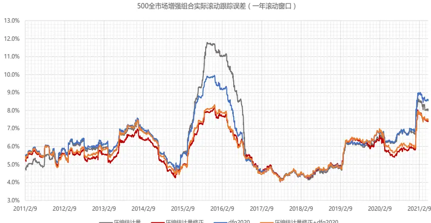

## 风险提示

⚫ 量化模型失效风险

⚫ 市场极端环境的冲击

## 报告发布日期

2021 年 06 月 03 日

证券分析师朱剑涛

021-63325888*6077

zhujiantao@orientsec.com.cn

执业证书编号：S0860515060001

证券分析师刘静涵

021-63325888*3211

liujinghan@orientsec.com.cn

执业证书编号：S0860520080003

## 相关报告

神经网络日频 alpha 模型初步实践：——因 2021-03-11子选股系列之七十四

更稳健易算的分析师盈利上调因子：——2021-03-09《因子选股系列研究 之 七十三》

隐藏风险因子：组合风控的另一种选择：— 2020-12-13—因子选股系列研究之（七十二）

涨停板事件对股票价格行为的影响：——因 2020-11-16子选股系列研究之 七十一

机器因子库相对人工因子库的增量：——2020-09-11《因子选股系列研究 之 七十》

机器增强一致预期：——《因子选股系列研 2020-09-01究之六十九》

因子加权过程中的大类权重控制：——因子2020-08-04选股系列报告之六十八

## 一、协方差矩阵估计方法的选择

风险模型的作用有三个：1） 识别风险因子、控制风险暴露，降低组合净值波动；2） 估计协方差矩阵，输入后续的组合优化器；3） 绩效归因，分析组合风险暴露，收益来源。不是所有功能都要用到风险因子，第二个功能不一定要用风险因子来做，有很多其它的统计方法。

估计股票收益的协方差矩阵主要有三类方法：1）样本协方差：样本协方差矩阵是一个无偏高方差的估计量，预测效果差，而且在样本数据长度小于股票数量时不可求逆，优化器会放大样本协方差矩阵的估计误差，导致错误的组合权重分配；2）纯统计模型：基于统计方法给出协方差矩阵估计量，再对其谱分解，近似拆解出一个结构化模型，实现协方差矩阵降维，提升组合优化速度。3）因子模型：将股票收益分解为能够被公共风险因子解释的部分，以及不能被解释的残差收益。通过一组公共的因子来捕捉股票的波动，实现协方差矩阵降维，提升组合优化速度。

如果能根据所需的股票池，寻找对应的一套风险因子，构造因子风险模型，固然是一个很好的方法，但开发和维护风险因子库的投入较大。纯统计模型的缺陷在于，通过谱分解拆分出的风险因子没有明确的经济含义，无法用于绩效归因。但如果投资者只是单纯使用风险模型来估计协方差矩阵，输入后续的组合优化器，采用统计模型也是一个可行的做法。

我们在之前的《东方 A股因子风险模型（DFQ-2018）》、《东方 A股因子风险模型（DFQ-2020）》风险模型报告中，搭建了 DFQ 因子风险模型。下图展示了在全市场、中证 800 成分股、中证 800 成分股外三个股票池中，DFQ-2020 模型的横截面回归 Adjusted Rsquare。横截面回归的 Rsquared 可以用来度量风险因子对股票收益的解释程度。可以看到：DFQ-2020 模型在全市场范围内 Adjusted Rsquare 平均可达到 20.9%；在中证 800 成分内解释度较高，平均可达 27.9%，而在 800 成分外解释度明显下降，仅为 13.7%。由此可见，因子模型对股票池有较强的依赖性，理论上不同的股票池应设定不同的风险因子，才能实现较高的收益率解释度。

图 1：DFQ-2020 风险模型在不同股票池的 12 个月滚动横截面回归 Adjusted Rsquare(统计区间：2007.12-2021.04)
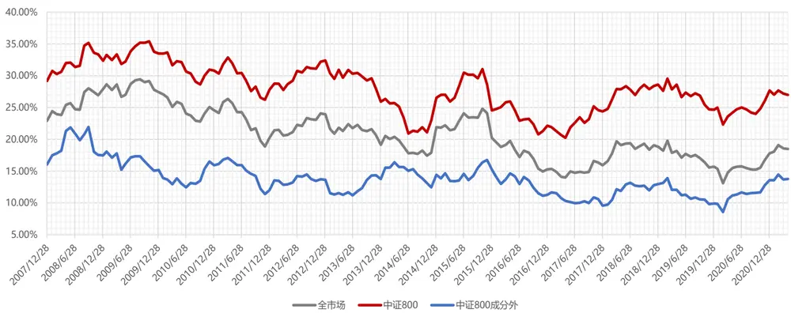
数据来源：东方证券研究所 & Wind 资讯

本文我们基于统计方法，搭建了一套能够适应不同股票池的 A股统计风险模型体系——DFQ-STAT 风险模型。跟因子模型 DFQ-2020 互为补充。投资者可以根据自己所需的股票池进行风险模型估计，仅需输入股票收益率数据，计算更便捷，一次估计用时 15 秒左右。在更多特定的股票池中，例如上证 50、沪深 300、中证 500、中证1000、机构重仓股、消费行业、医药行业等，DFQ-STAT风险模型都可以提供更准确的协方差矩阵估计。

## 二、DFQ-STAT 风险模型原理

DFQ-STAT 风险模型包括三个步骤：1）用压缩估计方法得到初始股票协方差矩阵；2）对初始协方差矩阵进行波动率调整，得到调整股票协方差矩阵；3）对调整股票协方差矩阵进行谱分解，从中近似地拆出一个因子结构，将得到的因子暴露、因子协方差、残差风险输入到组合优化中即可。

其中波动率调整处理可以使得模型近期的波动率变化更敏感。谱分解处理可以兼顾统计模型的高效便捷和因子模型的组合优化提速。

图 2：DFQ-STAT 风险模型原理
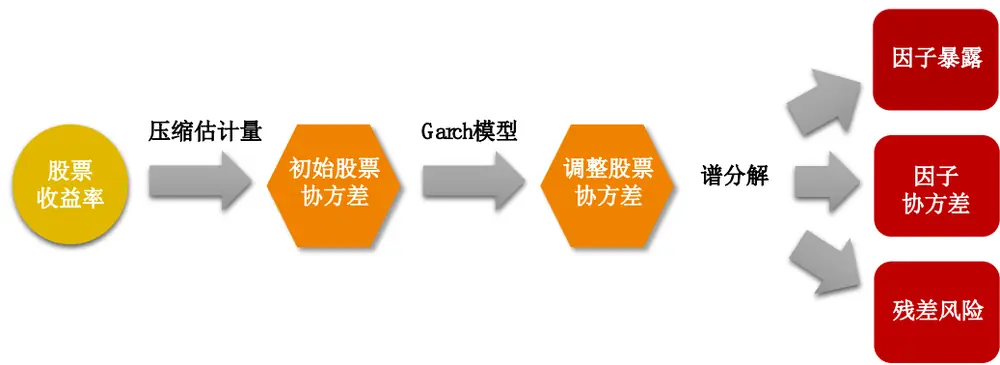
数据来源：东方证券研究所

## 2.1压缩估计量

假设我们有一个月频调仓的股票组合，首先，每个月底，我们基于 N 个股票过去三年的日度收益率数据，用 Chen (2010)提出 oracle approximating shrinkage (OAS)方法得到初始协方差矩阵估计值Σ。在假设数据是高斯分布的情况下，Chen 等人导出了一个公式，该公式旨在选择一个压缩系数，使其产生的均方误差小于 Ledoit-Wolf 压缩估计量方法。

图 3：OAS &Ledoit-Wolf 压缩估计量对比
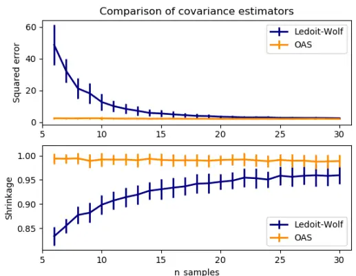
数据来源：东方证券研究所&Chen et al., “Shrinkage Algorithms for MMSE Covariance Estimation”, IEEE Trans. on Sign. Proc., Volume 58, Issue 10, October 2010.

## 2.2波动率调整

线性压缩估计量方法的前提假设是股票收益率在时间序列上独立同分布，但实际上股票收益率存在明显的波动率集聚效应。下面我们设计了一套波动率调整策略，让压缩估计量模型对近期市场变化更敏感。具体做法是：在时间序列上用 GARCH 模型估算方差，再和原始压缩估计量方差对比，计算方差调整系数，对协方差矩阵进行调整。

需要注意的是：

1. 股票方差的估计是一维 GARCH 模型问题，但是如果对每只股票都进行 GARCH 建模，运算量很大。为降低运算复杂度，我们采用聚类方法对个股进行分组，每组内的股票等权构建一个组合。对组合的收益率序列进行一维 GARCH 模型拟合，得到组合的预测方差，再和原始压缩估计量得到的组合方差进行对比，计算方差调整系数。组内股票都采用这个调整系数，这样可以降低个股数据噪音的影响，同时大幅降低运算量。

2. 调整仅针对波动率进行，不对相关系数进行调整。假设股票间相关系数不随时间变化，股票间的协方差变化完全由股票自身的波动率变化引起。这个假设借鉴了 CCC-Garch 模型，假设很强，和实际情况有偏差，但模型要估计的参数大幅减少，估计误差降低。一些容许相关系数动态变化的模型，例如 DCC-Garch 模型，要估计的参数多，估计误差大，在股票数量较多时，一些实证发现它和 CCC-Garch 模型使用效果并无显著差别。

## 2.3 谱分解

在之前的报告《风险模型提速组合优化的另一种方案》中我们就曾提到过，统计模型可以避免模型设定偏误，不需要维护风险因子库，只需要用到股票收益率数据，计算效率很高，但在组合优化时无法像结构化因子模型那样享受到降维带来的求解速度大幅提升。基于此，我们设计了一套谱分解方法，可以将股票协方差矩阵近似拆解出一个因子结构，在输入到组合优化中实现提速。

调整后的协方差矩阵Σ是一个正定矩阵，可以做如下谱分解（Spectral Decomposition）（或称为特征分解）：

$$
\Sigma=\sum_{i=1}^{N}\lambda_{i}*u_{i}*u_{i}^{T}
$$

其中 $\lambda_{\mathrm{i}},\mathrm{i}=1{,}2\ldots\mathrm{N}$ 是矩阵Σ的特征值，并按从大到小的顺序进行排列, $\mathbf{u_{i}}$ 是期对应的特征向量。股票数量较多时，Σ 的大部分特征值都很小，因此可以把谱分解拆成两部分：

$$
\Sigma=\sum_{i=1}^{K}\lambda_{i}*u_{i}*u_{i}^{T}+\sum_{i=K+1}^{N}\lambda_{i}*u_{i}*u_{i}^{T}
$$

前一部分可以写成矩阵形式 $\mathbf{B}*\mathbf{F}*B^{T}$ 。其中 B 是 $\mathrm{N}\times\mathrm{K}$ 矩阵，第j 列即为第j 个特征值对应的特征向量 $\mathbf{u_{j}},j=1\mathbf{,}2\ldots K$ ， F 是一个对角阵，对角线元素为前 K 个特征值 $\lambda_{1},\dots\lambda_{K},$ 。后面一部分可以直接取矩阵和的对角线元素来做对角阵 S 用以近似，K 取得越大，后面一部分近似带来的整体误差越小。这样Σ可以近似表示为：

$$
\Sigma\approx\mathrm{B}*\mathrm{F}*B^{T}+\mathrm{S}
$$

在上述方法中，K 的取值较为关键。K 取值越大，省略的项越少，造成的误差损失越小，但会增加运算复杂度，组合优化速度会下降，两者需要权衡。我们给出的建议取值是 $\mathbf{K}=\mathbf{80}_{\circ}$ 如果股票池内成分股个数小于 80个，则无需进行该步拆解。

## 三、实证效果对比

## 3.1 GWVP 组合——理论效果

由于股票收益间的协方差是一个不可观测量，我们无法直接去比较那个方法预测的更“准”，只能比较不同方法的使用效果哪个更好。常用的比较方法是：用股票协方差矩阵预测值构建全局最小方差组合（GMVP, Global Minimum Variance Portfolio）。

GMVP 组合可以通过组合优化的方式定义为：

$$
\begin{aligned}\min_{w}&w^{\prime}\cdot\sum\cdot w^{\prime}\\s.t.&\sum_{t=1}^{N}w_{_t}=1\\&w_{_t}\geq0\end{aligned}
$$

由于 GMVP 组合构建完全由股票间的协方差决定，约束条件也较少，因此风险模型模型对截面上个股风险预测越准，GMVP 组合样本外的真实方差应该越小。因而，可以将 GMVP 组合的年化波动率作为风险模型的评价标准。但是这种方法的问题在于，如果将协方差矩阵整体乘上一个倍数，得到的优化结果还是完全一样的，这就说明，GMVP 组合的年化波动率指标只能衡量截面上股票协方差预测相对大小的准确性，而无法衡量整体股票协方差是否高估或低估。因此，我们再补充一个评价维度： GMVP 组合预测的下月波动率与组合真实的下月波动率的比值，该比值越接近于 1，说明预测的风险越准确。

## 需要注意的是：

1. 选择不同的风险模型，生成的股票池可能会不一样。例如，为了避免过多噪音数据的干扰，用压缩估计量方法时会要求过去三年中至少有一年时间正常交易，这样会剔除备选股票池里的部分股票。但股票池的细微差别对组合收益、跟踪误差这些指标影响不大。后面我们测试时股票池均选择的是三个模型的股票池交集。

2. 当收益率序列有明显的自相关性时，年化波动率计算需要根据自相关系数进行调整。日频低波动不等于年度低波动，日频收益率序列的自相关性对年化波动率影响很大。

3. 在计算 GMVP 组合下月真实的波动率时，由于只有 20 个样本点，传统标准差估计并不准确。因而我们采用了稳健的标准差估计方法，即中位数绝对偏差(Median absolutedeviation，MAD) 。

下面我们在不同的股票池中详细对比简单压缩估计量模型、修正压缩估计量模型、DFQ2020模型得到的 GMVP组合表现，详细图表见附录。

1.从 GWVP 组合的年化波动率来看，三种方法得到的结果没有明显差别。从滚动波动率的变化图来看，在 2015-2016 年期间，压缩估计量方法下组合波动率更小，尤其在全市场、沪深 300、机构重仓股、消费行业中较为明显。

2. 从GWVP组合的换手率来看，简单压缩估计量换手最低，修正压缩估计量方法和DFQ2020方法差异不大。在中证全指、沪深 300、中证 500、中证 1000、消费行业、机构重仓股中，修正压缩估计量方法的换手低于 DFQ2020 模型，而在上证50、深证 100、创业板指、医药和军工行业中则是 DFQ2020 模型换手更低。可能的原因是，后面这些股票池成分股个数较少。

3. 从 GWVP组合的预测方差与真实方差的比值来看，修正压缩估计量方法最接近于 1，预测方差相比真实方差平均高估 30%，而 DFQ2020 模型和简单压缩估计方法平均要高估 50%左右。

由此可见，基于修正压缩估计量方法的 DFQ-STAT 风险模型普适性更强，在更多特定的股票池中，例如上证 50、沪深 300、中证 500、中证 1000、机构重仓股、消费行业、医药行业等，都可以提供更准确的协方差矩阵估计。

图 4：不同股票池月频 GMVP 组合表现对比汇总（统计区间：2009.12.31-2021.04.30）
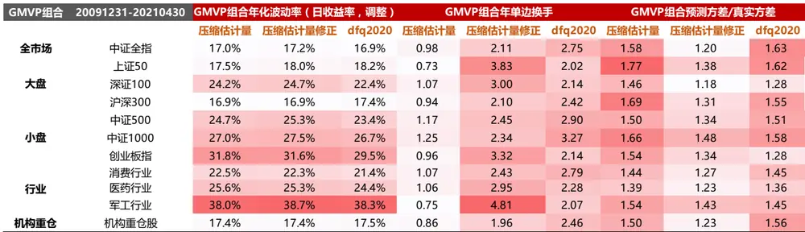
数据来源：东方证券研究所 & Wind 资讯

## 3.2 指数增强组合——实践效果

真实投资中，我们在做组合优化时，以 alpah 模型生成的股票预期收益率为目标函数，最大化组合预期收益率，而将风险模型作为跟踪误差项加入约束条件中，因而实际组合的配置结果会受到alpha 因子的影响。除了跟踪误差约束外，还会加上单个股票权重限制、风险因子主动暴露等约束，限制更严，因而不同风险模型带来的真实组合差别可能与理论的 GMVP 组合有所不同。

下面我们构建全市场指数增强组合，比较不同风险模型下的策略表现。除风险模型不同外，组合处理均保持一致。为了更好地比较风险模型对增强组合表现的影响，我们将行业市值约束都放开，跟踪误差均约束 5%，交易费率设定双边千三。需要注意的是，由于协方差矩阵都是基于历史数据估算得到，组合未来的跟踪误差大小由未来的市场波动决定，不论用什么模型，历史和未来之间总会有偏差，因此把跟踪误差项放在约束条件中并不能保证实现“设定多少就实现多少”的效果，在某些情况下，设定值和实现值会有较大偏差。从全市场 300和 500增强组合的结果来看：

1. 修正压缩估计量方法在 500全市场指数增强组合中优势明显。可以同时实现最大回撤、跟踪误差的降低，以及组合收益的提升，综合信息比更高。在市场突变环境下对组合的风险控制更严格，从而可以降低组合净值的波动。在 2015-2016 年，2020-2021 年修正压缩估计量模型的跟踪误差相比 DFQ2020 均有所降低。

2. 在 300 全市场增强组合中，统计模型均表现不佳。可能的原因是沪深 300 指数当中行业分布较为集中，金融板块占据 1/3 的权重。由于在增强组合设定中我们没有对行业暴露进行约束，因而实际组合的行业分布就可能与指数偏离较多，从而对跟踪误差的影响较大。而 DFQ2020 模型中的风险因子中包括了行业因子，可以一定程度上对行业暴露进行约束。从图 7 中也可以看到，修正压缩估计量方法明显在银行和非银上的负向暴露更大，在地产、家电等行业上的正向暴露更大。

3.全市场增强组合中，可以考虑将DFQ-2020和DFQ-STAT模型结合起来使用，效果更稳健。在统计上，将两个协方差矩阵平均是一种比较常见的做法。因而我们可以考虑将DFQ-2020和DFQ-

STAT 模型估计的股票协方差矩阵取平均，再进行谱分解，拆解出因子结构，将得到的因子暴露、因子协方差、残差风险输入到组合优化中即可。平均后的新模型在 300 和 500 全市场增强组合中都可以得到不错的效果。

图 5：指数增强组合表现对比——中证 500 全市场（统计区间：2009.12.31-2021.04.30）

| 2009.12.31-2021.04.30 | 压缩估计量 | 压缩估计量修正 | dfq2020 | 压缩估计量修正+dfq2020 |
| --- | --- | --- | --- | --- |
| 日度对冲收益的一阶自相关系数 | 15.40% | 14.33% | 15.57% | 14.69% |
| 信息比（年化） | 3.11 | 3.24 | 3.17 | 3.31 |
| 信息比-adj（年化） | 2.67 | 2.82 | 2.71 | 2.87 |
| 年化对冲收益 | 18.95% | 17.92% | 18.96% | 18.70% |
| 对冲收益最大回撤 | -11.63% | -10.81% | -13.31% | -11.43% |
| 对冲收益最大回撤出现时间点 | 20210108 | 20210108 | 20210108 | 20210108 |
| 跟踪误差（年化） | 5.63% | 5.13% | 5.54% | 5.22% |
| 跟踪误差adj（年化） | 6.55% | 5.91% | 6.46% | 6.03% |
| 单边换手率（年） 持股数量 | 4.15 | 4.24 | 4.17 | 4.21 |
|  | 96.80 | 104.66 | 101.04 | 104.93 |
| 2010 | 19.83% | 21.66% | 22.85% | 23.28% |
| 2011 | 15.37% | 15.54% | 16.23% | 16.15% |
| 2012 | 17.66% | 19.41% | 19.72% | 18.77% |
| 2013 | 33.92% | 31.01% | 35.27% | 34.04% |
| 2014 | 9.79% | 9.56% | 9.79% | 10.98% |
| 2015 | 43.16% | 32.77% | 36.11% | 34.88% |
| 2016 | 22.93% | 21.16% | 23.20% | 21.66% |
| 2017 | 14.56% | 13.82% | 13.82% | 14.08% |
| 2018 | 20.18% | 18.91% | 19.55% | 18.90% |
| 2019 | 8.50% | 10.21% | 8.86% | 9.68% |
| 2020 | 10.39% | 8.58% | 8.83% | 8.75% |
| 20210430 | 0.66% | 1.06% | 1.91% | 1.64% |

500全市场增强组合实际滚动跟踪误差（一年滚动窗口）
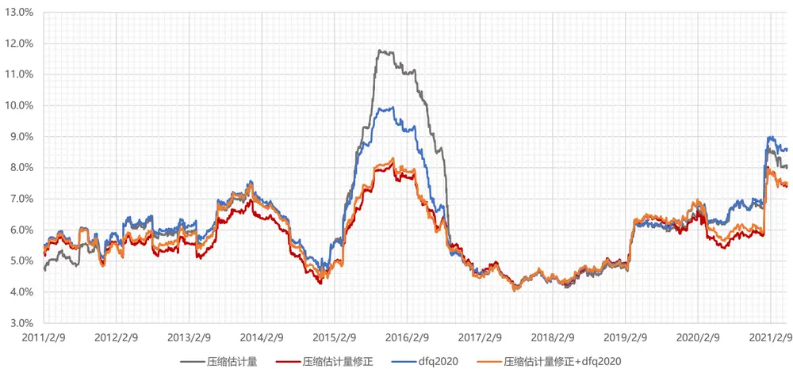
数据来源：东方证券研究所 & Wind 资讯

图 6：指数增强组合表现对比——沪深 300 全市场（统计区间：2009.12.31-2021.04.30）

| 2009.12.31-2021.04.30 | 压缩估计量 | 压缩估计量修正 | dfq2020 | 压缩估计量修正+dfq2020 |
| --- | --- | --- | --- | --- |
| 日度对冲收益的一阶自相关系数 | 12.10% | 12.75% | 11.31% | 14.28% |
| 信息比（年化） | 2.56 | 2.48 | 2.64 | 2.72 |
| 信息比-adj(年化） | 2.27 | 2.19 | 2.37 | 2.36 |
| 年化对冲收益 | 15.84% | 16.06% | 14.26% | 14.86% |
| 对冲收益最大回撤 | -11.46% | -12.76% | -11.69% | -12.36% |
| 对冲收益最大回撤出现时间点 | 20210113 | 20210113 | 20210113 | 20210113 |
| 跟踪误差（年化） | 5.81% | 6.08% | 5.09% | 5.15% |
| 跟踪误差adj(年化） | 6.55% | 6.90% | 5.69% | 5.93% |
| 单边换手率（年） 持股数量 | 3.68 | 3.98 | 3.68 | 3.78 |
|  | 66.48 | 68.51 | 73.64 | 68.74 |
| 2010 | 18.85% | 22.39% | 17.39% | 19.19% |
| 2011 | 13.05% | 12.78% | 12.14% | 12.71% |
| 2012 | 14.65% | 13.22% | 15.74% | 16.83% |
| 2013 | 34.25% | 33.30% | 34.04% | 36.57% |
| 2014 | 12.65% | 14.33% | 15.93% |  |
| 2015 | 25.18% | 19.66% | 16.51% | 17.33% |
| 2016 | 16.53% | 20.38% | 17.68% | 15.14% |
| 2017 | 11.10% | 11.50% |  | 15.23% |
| 2018 | 12.16% | 12.12% | 9.14% 6.94% | 11.97% |
| 2019 | 6.33% | 4.10% | 5.71% | 9.82% 4.95% |
| 2020 | 10.69% | 11.95% | 7.23% |  |
| 20210430 | 4.21% | 6.10% | 3.67% | 6.04% 3.43% |

300全市场增强组合实际滚动跟踪误差（一年滚动窗口）
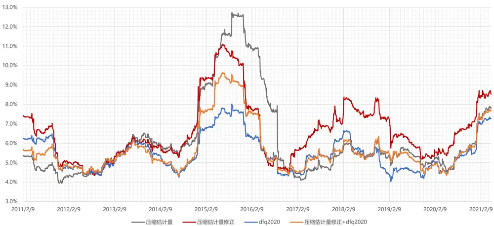
数据来源：东方证券研究所 & Wind 资讯

图 7：指数增强组合表现对比行业主动暴露——沪深 300 全市场（统计区间：2009.12.31-2021.04.30）
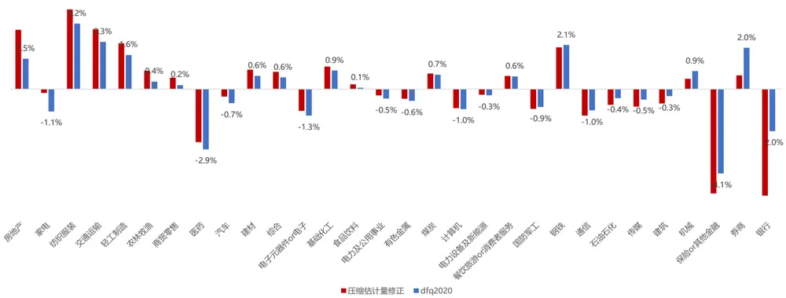
数据来源：东方证券研究所 & Wind 资讯

## 四、DFQ-STAT 风险模型使用方法

为了便于投资者使用，我们将基于修正压缩估计量方法的 DFQ-STAT 风险模型封装成了pyd 文件，提供适应 python3.6、3.7、3.8 三个环境的版本，在 python 中直接 importcov_dfq2021_c 即可使用。感兴趣的投资者可以联系报告作者获取安装包，并开设账号。

其中的 cov_dfq2021函数输入变量有五项：调仓日过去三年的个股日度收益率序列、日度行业分类序列、预测步长（预测下个月的协方差即为 21）、用户名、密码。函数运行需首先验证用户名和密码，若验证失败则无法返回结果。收益率序列可以包含缺失值，但如果缺失超过一年则无法进行计算。输出变量为股票协方差矩阵字典，包括因子暴露阵、因子协方差阵、残差风险阵。将这三个变量输入 riskfun函数，可返回预测下月个股平均波动率，和平均相关系数，便于投资者对风险大小有个直观的感知。函数运行依赖 numpy、pandas、sqlalchemy、pymysql、arch、sklearn、scipy 七个 package，需自行安装。

|  | 修改日期 | 类型 | 大小 |
| --- | --- | --- | --- |
| cov_dfq2021_c.cp36-win_amd64.pyd | 2021/5/2717:27 | PYD 文件 | 135 KB |
| cov_dfq2021_c.cp37-win_amd64.pyd | 2021/5/27 20:20 | PYD 文件 | 132 KB |
| cov_dfq2021_c.cp38-win_amd64.pyd | 2021/5/27 17:45 | PYD 文件 132 KB |  |
| fill_miss_value_c.cp36-win_amd64.pyd | 2021/5/18 18:41 | PYD 文件 | 85 KB |
| fill_miss_value_c.cp37-win_amd64.pyd | 2021/5/27 20:20 | PYD 文件 83 KB |  |
| fill_miss_value_c.cp38-win_amd64.pyd | 2021/5/27 17:50 | PYD 文件 | 84KB |
| ind_test.pkl | 2021/5/27 16:16 | PKL 文件 25,299 KB |  |
| stockret_test.pkl | 2021/5/27 16:15 PKL 文件 14,464 KB |  |  |
|  | 2021/6/1 15:47 PY文件 1KB |  |  |

## 五、结论

因子模型对股票池有较强的依赖性，理论上不同的股票池应设定不同的风险因子，才能实现较高的收益率解释度。统计模型可以避免模型设定偏误，不需要维护风险因子库，只需要用到股票收益率数据，计算更便捷。

我们基于统计方法，搭建了一套通用的风险模型体系——DFQ-STAT 风险模型。投资者可以根据自己所需的股票池进行风险模型估计，仅需输入股票收益率数据，计算更便捷，一次估计用时15 秒左右。

DFQ-STAT 模型主要原理为：先用压缩估计方法得到初始协方差矩阵，再进行波动率调整，得到调整股票协方差，最后进行谱分解，从估计的股票协方差矩阵中近似地拆出一个因子结构，将得到的因子暴露、因子协方差、残差风险输入到组合优化中即可。波动率调整处理可以使得模型近期的波动率变化更敏感。谱分解处理可以兼顾统计模型的高效便捷和因子模型的组合优化提速。

从 GMVP组合的实际表现来看，DFQ-STAT 风险模型普适性更强，得到的 GWVP组合的预测方差与真实方差最为接近。在更多特定的股票池中，例如上证 50、沪深 300、中证 500、中证1000、机构重仓股、消费行业、医药行业等，都可以提供更准确的协方差矩阵估计。同时在 500全市场指数增强组合中优势明显。

如果能根据所需的股票池，寻找对应的一套风险因子，构造因子风险模型，固然是一个很好的方法，但开发和维护风险因子库的投入较大。如果是在所有股票池中使用同样的一套风险因子，例如我们之前提供的 DFQ-2020 模型，在常规的宽基股票池（例如 300、500、800 股票池）中也可以实现不错的风险控制效果，但在一些特殊的细分股票池（例如机构重仓股、消费行业、医药行业中）中效果略差些。

因而，对于风险模型而言，如果单纯用于估计协方差矩阵，输入后续的组合优化器，采用普适性更强的统计模型，是一个很好的思路。实际应用时投资者仅需输入股票收益率数据，便可得到估计的风险模型数据，计算更便捷。我们提供的 DFQ-STAT风险模型在各种不同的股票池中对于协方差矩阵的估计均较为准确，值得投资者尝试。但需要注意的是，统计模型的缺陷在于拆分出的风险因子没有明确的经济含义，无法用于绩效归因。因而我们同时也会持续提供 DFQ-2020因子风险模型的相关数据，投资者可以按需采用。

## 风险提示

1. 量化模型基于历史数据分析，未来存在失效风险，建议投资者紧密跟踪模型表现。

2. 极端市场环境可能对模型效果造成剧烈冲击，导致收益亏损。

## 附录：GMVP 组合表现

## （1）中证全指

图 9：中证全指：月频 GMVP 组合表现对比（统计区间：2009.12.31-2021.04.30）

| GMVP组合 | 20091231-20210430 | 中证全指 |  |  |
| --- | --- | --- | --- | --- |
| 月收益率 |  | 压缩估计量 | 压缩估计量修正 | dfq2020 |
|  | 一阶自相关系数 | 16.81% | 14.12% | 27.21% |
|  | 标准年化波动率 | 16.86% | 16.68% | 17.55% |
| 日收益率 | 调整年化波动率 | 19.69% | 18.99% | 22.63% |
|  | 一阶自相关系数 | 5.16% | 4.90% | 8.11% |
|  | 标准年化波动率 | 16.19% | 16.38% | 15.66% |
|  | 调整年化波动率 | 17.01% | 17.17% | 16.94% |
|  | 年单边换手 | 0.98 | 2.11 | 2.75 |
| 预测方差/真实方差 | 均值 | 1.58 | 1.20 | 1.63 |

GWVP组合日收益率的滚动波动率（一年滚动窗口,波动率调整算法）
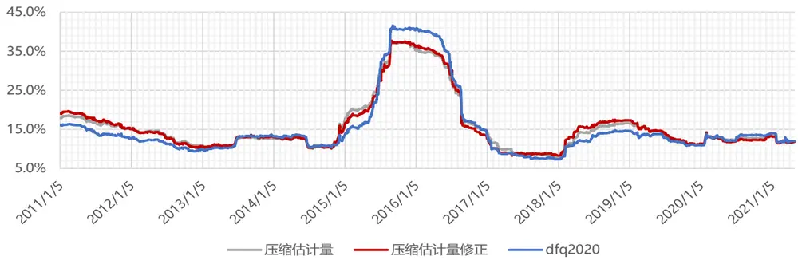

GWVP组合预测方差/真实方差
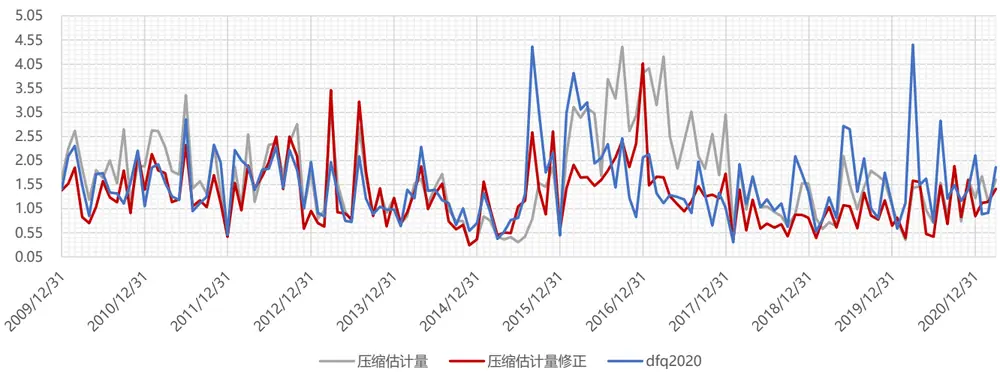
数据来源：东方证券研究所 & Wind 资讯

## （2）大盘股票池（上证 50、深证100、沪深 300）

图 10：上证 50 股票池：月频 GMVP 组合表现对比（统计区间：2009.12.31-2021.04.30）

| GMVP组合 | 20091231-20210430 | 上证50 |  |  |
| --- | --- | --- | --- | --- |
| 月收益率 |  | 压缩估计量 | 压缩估计量修正 | dfq2020 |
|  | 一阶自相关系数 | 13.13% | 14.30% | 27.23% |
|  | 标准年化波动率 | 16.43% | 16.74% | 17.69% |
| 日收益率 | 调整年化波动率 | 18.54% | 19.10% | 22.81% |
|  | 一阶自相关系数 | 0.46% | 1.75% | 2.57% |
|  | 标准年化波动率 | 17.49% | 17.70% | 17.83% |
|  | 调整年化波动率 | 17.53% | 17.97% | 18.25% |
|  | 年单边换手 | 0.73 | 3.83 | 2.02 |
| 预测方差/真实方差 | 均值 | 1.77 | 1.38 | 1.62 |

GWVP组合日收益率的滚动波动率（一年滚动窗口,波动率调整算法）
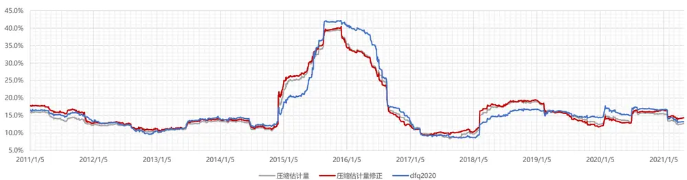

GWVP组合预测方差/真实方差
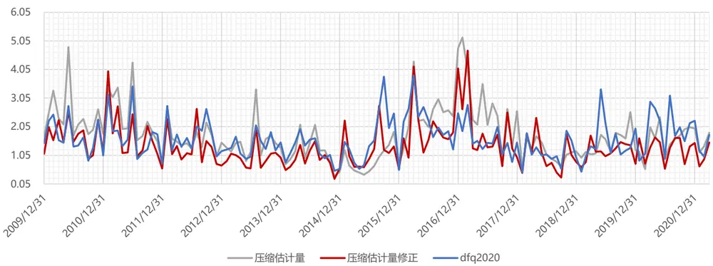
数据来源：东方证券研究所 & Wind 资讯

图 11：深证 100 股票池：月频 GMVP 组合表现对比（统计区间：2009.12.31-2021.04.30）

| GMVP组合 | 20091231-20210430 | 深证100 |  |  |
| --- | --- | --- | --- | --- |
| 月收益率 |  | 压缩估计量 | 压缩估计量修正 | dfq2020 |
|  | 一阶自相关系数 | 10.53% | 10.58% | 18.72% |
|  | 标准年化波动率 | 21.72% | 22.63% | 20.40% |
| 日收益率 | 调整年化波动率 | 23.93% | 24.94% | 24.26% |
|  | 一阶自相关系数 | 6.14% | 7.15% | 3.96% |
|  | 标准年化波动率 | 22.85% | 23.05% | 21.57% |
|  | 调整年化波动率 | 24.24% | 24.70% | 22.39% |
|  | 年单边换手 | 1.07 | 3.00 | 2.14 |
| 预测方差/真实方差 | 均值 | 1.46 | 1.18 | 1.28 |

GWVP组合日收益率的滚动波动率（一年滚动窗口,波动率调整算法）
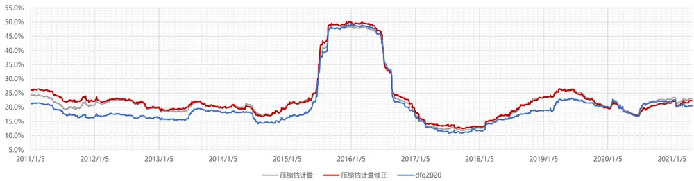

GWVP组合预测方差/真实方差
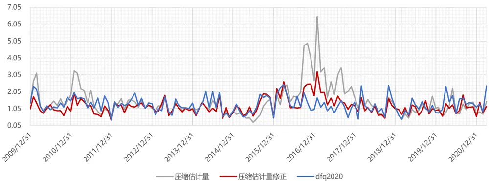
数据来源：东方证券研究所 & Wind 资讯

图 12：沪深 300 股票池：月频 GMVP 组合表现对比（统计区间：2009.12.31-2021.04.30）

| GMVP组合 | 20091231-20210430 | 沪深300 |  |  |
| --- | --- | --- | --- | --- |
| 月收益率 |  | 压缩估计量 | 压缩估计量修正 | dfq2020 |
|  | 一阶自相关系数 | 16.44% | 16.57% | 20.80% |
|  | 标准年化波动率 | 15.18% | 14.77% | 16.08% |
|  | 调整年化波动率 | 17.67% | 17.21% | 19.49% |
| 日收益率 | 一阶自相关系数 | 2.24% | 1.92% | 3.58% |
|  | 标准年化波动率 | 16.53% | 16.62% | 16.85% |
|  | 调整年化波动率 | 16.87% | 16.90% | 17.43% |
|  | 年单边换手 | 0.94 | 2.10 | 2.42 |
| 预测方差/真实方差 | 均值 | 1.69 | 1.31 | 1.55 |

GWVP组合日收益率的滚动波动率（一年滚动窗口,波动率调整算法）
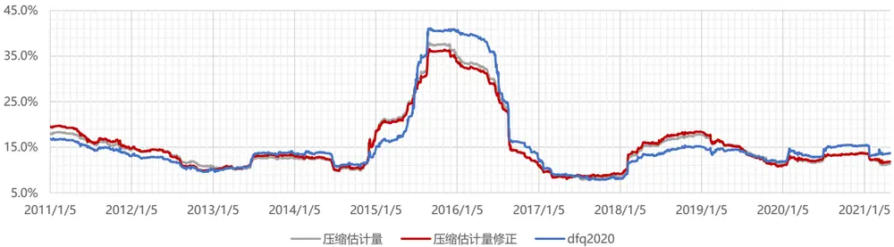

GWVP组合预测方差/真实方差
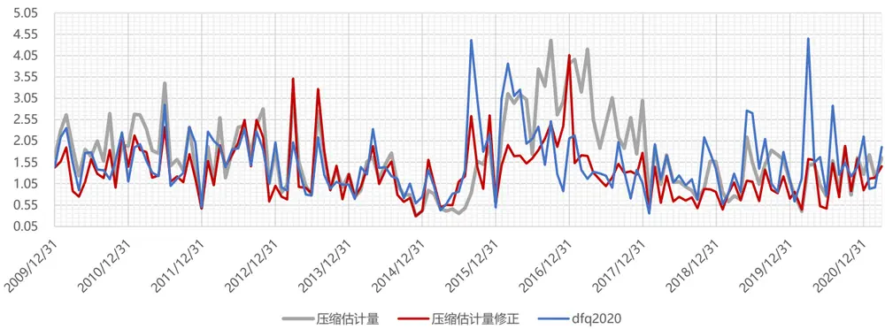
数据来源：东方证券研究所 & Wind 资讯

## （3）小盘股票池（中证 500、中证1000、创业板指）

图 13：中证 500：月频 GMVP 组合表现对比（统计区间：2009.12.31-2021.04.30）

| GMVP组合 | 20091231-20210430 | 中证500 |  |  |
| --- | --- | --- | --- | --- |
| 月收益率 |  | 压缩估计量 | 压缩估计量修正 | dfq2020 |
|  | 一阶自相关系数 | 11.51% | 9.36% | 19.42% |
|  | 标准年化波动率 | 23.92% | 23.73% | 21.52% |
| 日收益率 | 调整年化波动率 | 26.59% | 25.86% | 25.76% |
|  | 一阶自相关系数 | 5.70% | 6.44% | 8.17% |
|  | 标准年化波动率 | 23.41% | 23.82% | 21.64% |
|  | 调整年化波动率 | 24.73% | 25.35% | 23.44% |
|  | 年单边换手 | 1.17 | 2.45 | 2.90 |
| 预测方差/真实方差 | 均值 | 1.50 | 1.34 | 1.51 |

GWVP组合日收益率的滚动波动率（一年滚动窗口,波动率调整算法）
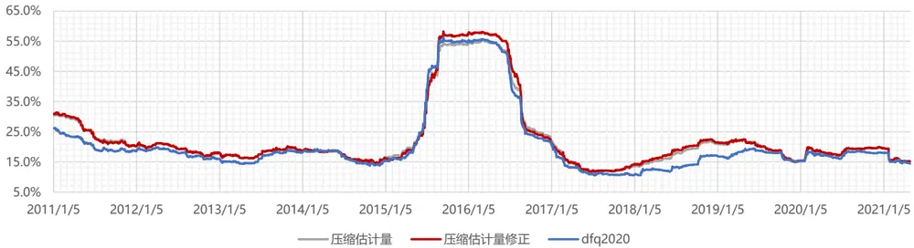

GWVP组合预测方差/真实方差
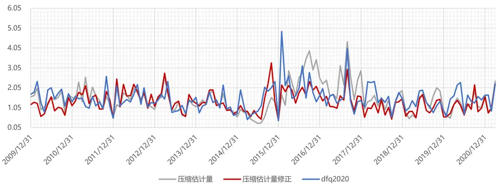
数据来源：东方证券研究所 & Wind 资讯

图 14：中证 1000：月频 GMVP 组合表现对比（统计区间：2009.12.31-2021.04.30）

| GMVP组合 | 20091231-20210430 | 中证1000 |  |  |
| --- | --- | --- | --- | --- |
| 月收益率 |  | 压缩估计量 | 压缩估计量修正 | dfq2020 |
|  | 一阶自相关系数 | 12.85% | 13.83% | 20.74% |
|  | 标准年化波动率 | 25.86% | 25.71% | 26.79% |
|  | 调整年化波动率 | 29.10% | 29.20% | 32.46% |
| 日收益率 | 一阶自相关系数 | 11.68% | 12.26% | 13.13% |
|  | 标准年化波动率 | 24.05% | 24.37% | 23.43% |
|  | 调整年化波动率 | 26.98% | 27.50% | 26.67% |
|  | 年单边换手 | 1.25 | 2.34 | 3.27 |
| 预测方差/真实方差 | 均值 | 1.66 | 1.48 | 1.58 |

GWVP组合日收益率的滚动波动率（一年滚动窗口,波动率调整算法）
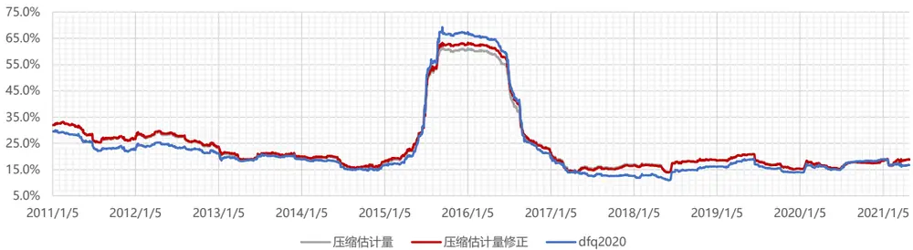

GWVP组合预测方差/真实方差
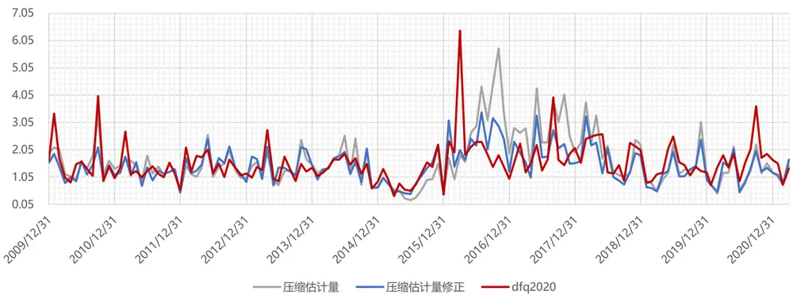
数据来源：东方证券研究所 & Wind 资讯

图 15：创业板指：月频 GMVP 组合表现对比（统计区间：2009.12.31-2021.04.30）

| GMVP组合 | 20130628-20210430 | 创业板指 |  |  |
| --- | --- | --- | --- | --- |
| 月收益率 |  | 压缩估计量 | 压缩估计量修正 | dfq2020 |
|  | 一阶自相关系数 | 14.55% | 9.60% | 18.49% |
|  | 标准年化波动率 | 29.73% | 28.65% | 27.69% |
| 日收益率 | 调整年化波动率 | 33.99% | 31.29% | 32.85% |
|  | 一阶自相关系数 | 8.62% | 6.69% | 5.96% |
|  | 标准年化波动率 | 29.27% | 29.59% | 27.86% |
|  | 调整年化波动率 | 31.84% | 31.56% | 29.50% |
|  | 年单边换手 | 0.96 | 3.32 | 2.14 |
| 预测方差/真实方差 | 均值 | 1.54 | 1.34 | 1.28 |

GWVP组合日收益率的滚动波动率（一年滚动窗口,波动率调整算法）
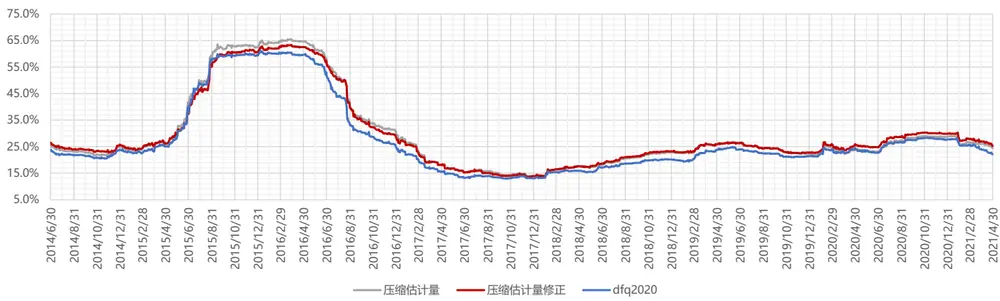

GWVP组合预测方差/真实方差
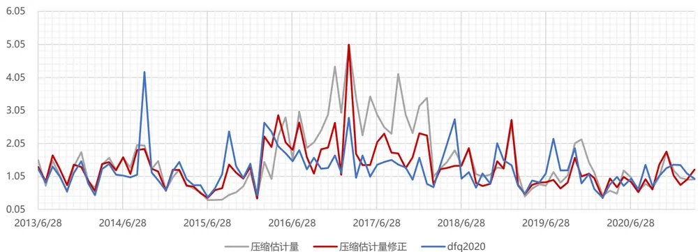
数据来源：东方证券研究所 & Wind 资讯

## （4）行业股票池（消费、医药、军工）

图 16：消费行业：月频 GMVP 组合表现对比（统计区间：2009.12.31-2021.04.30）

| GMVP组合 | 20091231-20210430 | 消费 |  |  |
| --- | --- | --- | --- | --- |
| 月收益率 |  | 压缩估计量 | 压缩估计量修正 | dfq2020 |
|  | 一阶自相关系数 | 7.10% | 6.67% | 13.66% |
|  | 标准年化波动率 | 22.85% | 23.85% | 22.07% |
| 日收益率 | 调整年化波动率 | 24.39% | 25.35% | 25.03% |
|  | 一阶自相关系数 | 7.85% | 5.97% | 7.81% |
|  | 标准年化波动率 | 20.84% | 21.05% | 19.86% |
|  | 调整年化波动率 | 22.49% | 22.29% | 21.43% |
|  | 年单边换手 | 1.07 | 2.43 | 2.79 |
| 预测方差/真实方差 | 均值 | 1.44 | 1.27 | 1.45 |

GWVP组合日收益率的滚动波动率（一年滚动窗口,波动率调整算法）
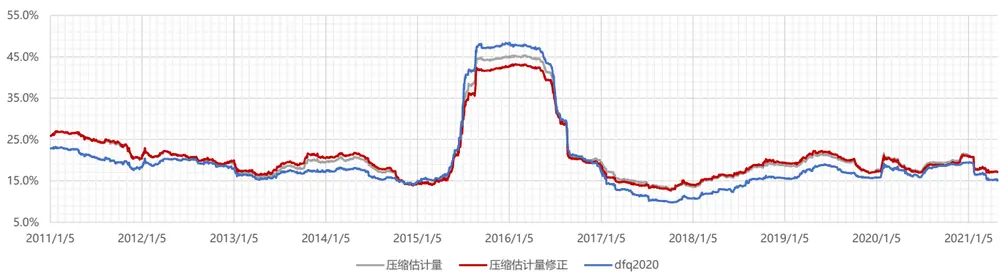

GWVP组合预测方差/真实方差
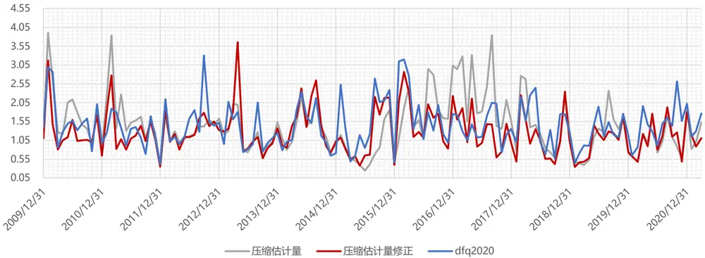
数据来源：东方证券研究所 & Wind 资讯

图 17：医药行业：月频 GMVP 组合表现对比（统计区间：2009.12.31-2021.04.30）

| GMVP组合 | 20091231-20210430 | 医药 |  |  |
| --- | --- | --- | --- | --- |
| 月收益率 |  | 压缩估计量 | 压缩估计量修正 | dfq2020 |
|  | 一阶自相关系数 | 3.46% | -0.38% | 2.91% |
|  | 标准年化波动率 | 24.37% | 24.51% | 23.04% |
| 日收益率 | 调整年化波动率 | 25.15% | 24.42% | 23.67% |
|  | 一阶自相关系数 | 9.13% | 9.31% | 8.06% |
|  | 标准年化波动率 | 23.38% | 23.12% | 22.57% |
|  | 调整年化波动率 | 25.57% | 25.32% | 24.41% |
|  | 年单边换手 | 1.06 | 2.95 | 2.28 |
| 预测方差/真实方差 | 均值 | 1.39 | 1.23 | 1.36 |

GWVP组合日收益率的滚动波动率（一年滚动窗口,波动率调整算法）
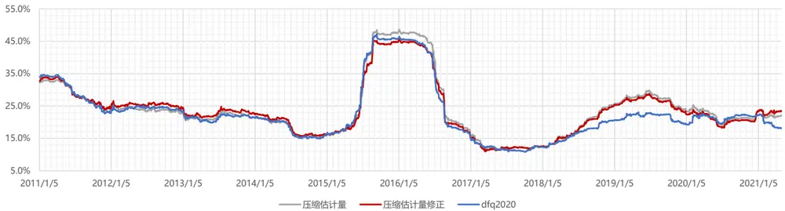

GWVP组合预测方差/真实方差
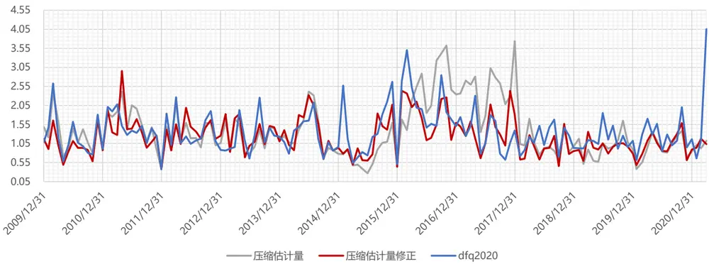
数据来源：东方证券研究所 & Wind 资讯

图 18：军工行业：月频 GMVP 组合表现对比（统计区间：2009.12.31-2021.04.30）

| GMVP组合 | 20100226-20210430 | 军工 |  |  |
| --- | --- | --- | --- | --- |
| 月收益率 |  | 压缩估计量 | 压缩估计量修正 | dfq2020 |
|  | 一阶自相关系数 | 7.11% | 7.75% | 7.14% |
|  | 标准年化波动率 | 35.53% | 35.06% | 35.39% |
| 日收益率 | 调整年化波动率 | 37.93% | 37.64% | 37.78% |
|  | 一阶自相关系数 | 11.13% | 9.99% | 10.23% |
|  | 标准年化波动率 | 34.11% | 35.08% | 34.66% |
|  | 调整年化波动率 | 38.04% | 38.69% | 38.31% |
|  | 年单边换手 | 0.75 | 4.81 | 2.07 |
| 预测方差/真实方差 | 均值 | 1.54 | 1.43 | 1.45 |

GWVP组合日收益率的滚动波动率（一年滚动窗口,波动率调整算法）
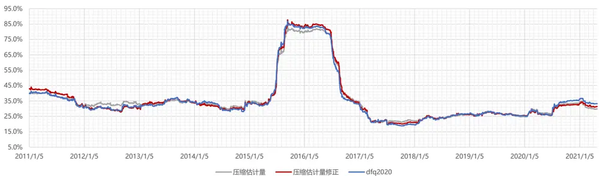

GWVP组合预测方差/真实方差
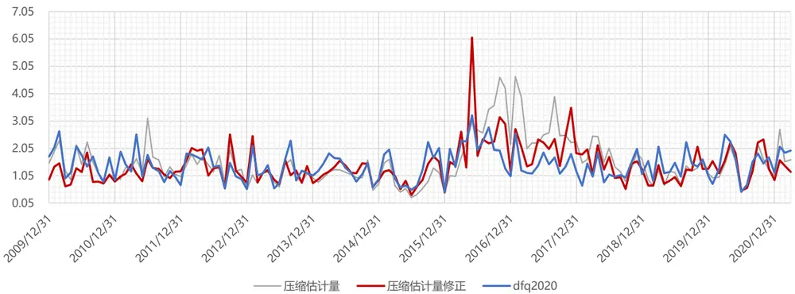
数据来源：东方证券研究所 & Wind 资讯

## （5）机构重仓股票池

图 19：中证全指：月频 GMVP 组合表现对比（统计区间：2009.12.31-2021.04.30）

| GMVP组合 | 20091231-20210430 | 机构重仓股 |  |  |
| --- | --- | --- | --- | --- |
| 月收益率 |  | 压缩估计量 | 压缩估计量修正 | dfq2020 |
|  | 一阶自相关系数 | 14.11% | 16.11% | 27.28% |
|  | 标准年化波动率 | 16.87% | 17.14% | 16.86% |
| 日收益率 | 调整年化波动率 | 19.21% | 19.89% | 21.75% |
|  | 一阶自相关系数 | 3.48% | 4.57% | 6.16% |
|  | 标准年化波动率 | 16.80% | 16.69% | 16.51% |
|  | 调整年化波动率 | 17.36% | 17.43% | 17.52% |
|  | 年单边换手 | 0.86 | 1.96 | 2.46 |
| 预测方差/真实方差 | 均值 | 1.50 | 1.23 | 1.56 |

GWVP组合日收益率的滚动波动率（一年滚动窗口,波动率调整算法）
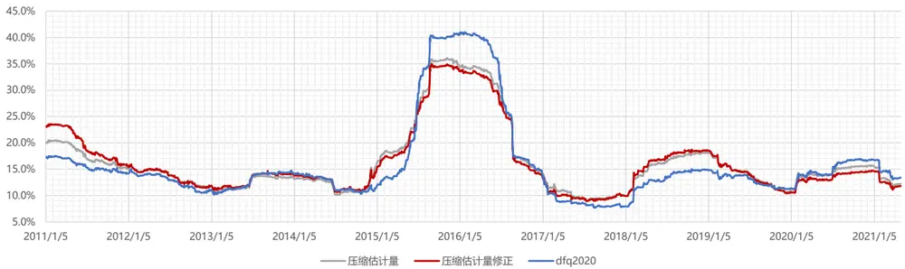

GWVP组合预测方差/真实方差
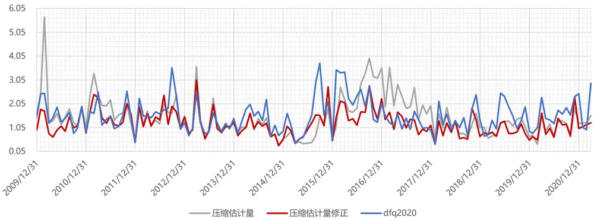
数据来源：东方证券研究所 & Wind 资讯

## 分析师申明

每位负责撰写本研究报告全部或部分内容的研究分析师在此作以下声明：

分析师在本报告中对所提及的证券或发行人发表的任何建议和观点均准确地反映了其个人对该证券或发行人的看法和判断；分析师薪酬的任何组成部分无论是在过去、现在及将来，均与其在本研究报告中所表述的具体建议或观点无任何直接或间接的关系。

## 投资评级和相关定义

报告发布日后的 12 个月内的公司的涨跌幅相对同期的上证指数/深证成指的涨跌幅为基准；

## 公司投资评级的量化标准

买入：相对强于市场基准指数收益率 15%以上；

增持：相对强于市场基准指数收益率 5%～15%；

中性：相对于市场基准指数收益率在-5%～+5%之间波动；

减持：相对弱于市场基准指数收益率在-5%以下。

未评级 —— 由于在报告发出之时该股票不在本公司研究覆盖范围内，分析师基于当时对该股票的研究状况，未给予投资评级相关信息。

暂停评级 —— 根据监管制度及本公司相关规定，研究报告发布之时该投资对象可能与本公司存在潜在的利益冲突情形；亦或是研究报告发布当时该股票的价值和价格分析存在重大不确定性，缺乏足够的研究依据支持分析师给出明确投资评级；分析师在上述情况下暂停对该股票给予投资评级等信息，投资者需要注意在此报告发布之前曾给予该股票的投资评级、盈利预测及目标价格等信息不再有效。

## 行业投资评级的量化标准：

看好：相对强于市场基准指数收益率 5%以上；

中性：相对于市场基准指数收益率在-5%～+5%之间波动；

看淡：相对于市场基准指数收益率在-5%以下。

未评级：由于在报告发出之时该行业不在本公司研究覆盖范围内，分析师基于当时对该行业的研究状况，未给予投资评级等相关信息。

暂停评级：由于研究报告发布当时该行业的投资价值分析存在重大不确定性，缺乏足够的研究依据支持分析师给出明确行业投资评级；分析师在上述情况下暂停对该行业给予投资评级信息，投资者需要注意在此报告发布之前曾给予该行业的投资评级信息不再有效。

## HeadertTabl e_Discl ai mer 免责声明

本证券研究报告（以下简称“本报告”）由东方证券股份有限公司（以下简称“本公司”）制作及发布。

本报告仅供本公司的客户使用。本公司不会因接收人收到本报告而视其为本公司的当然客户。本报告的全体接收人应当采取必要措施防止本报告被转发给他人。

本报告是基于本公司认为可靠的且目前已公开的信息撰写，本公司力求但不保证该信息的准确性和完整性，客户也不应该认为该信息是准确和完整的。同时，本公司不保证文中观点或陈述不会发生任何变更，在不同时期，本公司可发出与本报告所载资料、意见及推测不一致的证券研究报告。本公司会适时更新我们的研究，但可能会因某些规定而无法做到。除了一些定期出版的证券研究报告之外，绝大多数证券研究报告是在分析师认为适当的时候不定期地发布。

在任何情况下，本报告中的信息或所表述的意见并不构成对任何人的投资建议，也没有考虑到个别客户特殊的投资目标、财务状况或需求。客户应考虑本报告中的任何意见或建议是否符合其特定状况，若有必要应寻求专家意见。本报告所载的资料、工具、意见及推测只提供给客户作参考之用，并非作为或被视为出售或购买证券或其他投资标的的邀请或向人作出邀请。

本报告中提及的投资价格和价值以及这些投资带来的收入可能会波动。过去的表现并不代表未来的表现，未来的回报也无法保证，投资者可能会损失本金。外汇汇率波动有可能对某些投资的价值或价格或来自这一投资的收入产生不良影响。那些涉及期货、期权及其它衍生工具的交易，因其包括重大的市场风险，因此并不适合所有投资者。

在任何情况下，本公司不对任何人因使用本报告中的任何内容所引致的任何损失负任何责任，投资者自主作出投资决策并自行承担投资风险，任何形式的分享证券投资收益或者分担证券投资损失的书面或口头承诺均为无效。

本报告主要以电子版形式分发，间或也会辅以印刷品形式分发，所有报告版权均归本公司所有。未经本公司事先书面协议授权，任何机构或个人不得以任何形式复制、转发或公开传播本报告的全部或部分内容。不得将报告内容作为诉讼、仲裁、传媒所引用之证明或依据，不得用于营利或用于未经允许的其它用途。

经本公司事先书面协议授权刊载或转发的，被授权机构承担相关刊载或者转发责任。不得对本报告进行任何有悖原意的引用、删节和修改。

提示客户及公众投资者慎重使用未经授权刊载或者转发的本公司证券研究报告，慎重使用公众媒体刊载的证券研究报告。

## 东方证券研究所

地址：上海市中山南路 318 号东方国际金融广场 26 楼

电话：021-63325888

传真：021-63326786

网址： www.dfzq.com.cn