## ——因子选股系列之七十六

## 研究结论

逐笔委托订单数据包括了投资者于何时以什么价格买入或者卖出多少量股票的委托信息，而且标记了新增或者撤回的时间戳，理论上讲可以根据逐笔委托数据和交易所撮合规则重现整个交易过程，因此逐笔委托几乎包括了股票所有的交易层面信息。

⚫ 上交所和深交所的逐笔委托数据结构有所不同，具体体现在市价单、订单撤回等细节处理上，深交所逐笔委托数据最早可追溯至 2012 年下半年，上交所逐笔委托 2021 年 5 月才开始提供，本文的研究主要以深交所股票为主，基于上交所数据同样可以构建相同因子从而实现全 A 股覆盖。

开盘集合竞价第一阶段的委托单可以随意撤回，该阶段可以通过委托撤回的方法在不需要成交的情况下测算对手盘挂单的价和量，基于此，我们构建了盘前撤单比例因子用于度量股票的“镰刀”占比，盘前撤单比例越高，股票未来收益平均越差。

早盘半小时的交易更多是对夜间信息的反应，通过测算早盘买入和卖出订单的委托量大小可以判断资金雄厚的投资者在买入还是卖出，跟踪大资金的早盘交易可以获取超额收益，本文直接通过早盘买入和卖出卖出订单大小的比值作为 alpha 因子避免了主动买卖划分方法对因子构建的影响。

⚫委托订单的价格反应了投资者对股票价值的认可，我们通过委托订单价格的差异化程度可以刻画投资者对股票价格的分歧程度，在缺乏做空机制的市场下，投资者的分歧会导致股价短期高估，进而影响股票未来的收益。

投资者委托订单的价格不可避免会受最近成交价格的影响，本文用订单相对价格分歧程度度量投资者委托订单价格相对最近成交价格偏离的差异化程度。订单相对价格分歧程度相对绝对价格分歧程度选股表现略差，但和其他因子相关性更低，信息更加独立。

本文基于买入订单的委托数据改进了 APB 因子，在价格相对低位有大量买入订单的股票未来收益相对更高，改进后的 APB 因子相对原 APB 因子在RankIC、多空收益、分组表现等方面都有提升，而且在近年来原 APB 因子回撤时依然表现较好。

通过相关性分析，早盘买卖单大小比和订单相对价格分歧程度两个因子和常见 alpha 因子相关性都处于较低的水平，盘前撤单比例、订单相对价格分歧程度和波动、换手等投机性指标有一定信息重叠，改进后的 APB 相对原 APB有明显的信息增量。

## 风险提示

⚫ 量化模型失效风险

⚫ 市场极端环境的冲击

⚫ 深交所规律在上交所的适用性风险

报告发布日期2021 年 07 月 22 日

证券分析师朱剑涛

021-63325888*6077

zhujiantao@orientsec.com.cn

执业证书编号：S0860515060001

证券分析师王星星

021-63325888*6108

wangxingxing@orientsec.com.cn

执业证书编号：S0860517100001

## 相关报告

适用 A 股不同股票池的统计风险模型：— 2021-06-03—《因子选股系列研究 之 七十五》

神经网络日频 alpha 模型初步实践：——因 2021-03-11子选股系列之七十四

更稳健易算的分析师盈利上调因子：——2021-03-09《因子选股系列研究 之 七十三》

## 一、数据说明

## 2.1 股票订单数据

A 股的 L2 行情数据包括逐笔成交数据、盘口快照数据、委托队列数据和逐笔委托数据，上交所和深交所 L2 数据的数据结构、推送规则均有所差异。早期仅深交所提供股票订单委托的明细数据，基于股票订单委托明细构建的 alpha 因子仅覆盖深交所股票，因此研究相对较少，但自 2021年 5 月开始上交所的 L2 数据也新增了订单委托明细，自此股票订单明细数据覆盖沪深两市。理论上讲，对于某只股票，已知所有的挂撤单明细，整个交易过程均可以通过撮合规则模拟出来，那么逐笔成交、盘口快照、委托队列等其他 L2 数据也可以根据逐笔委托生成，由于数据收集的精度等原因，基于挂撤单数据模拟生成的 L2 数据和交易所发布的数据会有些许偏差，尽管会有偏差，但这在一定程度上也说明了股票的订单数据蕴含了几乎所有的交易层面的信息，研究的价值很大。

上交所和深交所的逐笔委托数据结构并不相同，两者都包括订单时间、委托单号、委托价格、委托量、委托方向等常规字段，但委托类型的含义并不相同，上交所的委托类型表示该委托是新增订单还是撤回订单，而深交所的订单类型表示的是订单是限价单还是市价单。上交所只有“最优五档剩余撤销“和”最优五档剩余转限价”两种市价订单，都可以转换为限价订单和撤单委托的组合表示，因此从数据上看没有专门的市价委托分类。另外，深交所委托订单是否撤回以及撤回的量需要根据委托单号关联到逐笔成交数据中查看。

图 1：逐笔委托数据核心字段

| 字段名 | 数据类型 | 字段说明 | 备注 |
| --- | --- | --- | --- |
| StkCd | ASCII字符串 | 证券编码 |  |
| OrderDate | 日期 | 日期 |  |
| OrderTime | 时间 | 时间 | 时:分:秒.毫秒 |
| Rec_no | 正整数 | 委托单号 |  |
| Size | 双精度浮点数 | 委托量 |  |
| Price | 双精度浮点数 | 委托价格 | 深交所： |
| order_kind | ASCII 字符串 | 委托类型 | 0：限价委托 1：市价委托 U：本方最优 上交所： A：委托订单(增加) D：委托订单（删除） S：状态订单 |
| function_code | ASCII 字符串 | 委托方向 | B：买入委托 S：卖出委托 T：不确定 G：借入 F：借出 |

数据来源：Wind、上交所、深交所、东方证券研究所

## 2.2 因子测试说明

由于截止报告撰写日期上交所股票仅有两个月的委托订单明细数据，所以本文因子测试的股票池仅包括相应样本空间深交所部分，考虑到数据可获得性，因子测试区间起止于20121231-20210630。

## 二、盘前撤单比例

## 2.1 因子定义

A 股的交易时间可以划分为开盘集合竞价阶段（9:15—9:25）、盘中连续竞价时间（9:30—11:30，13:00—14:57）和收盘集合竞价时间（14:57—15:00，早期上交所连续竞价至收盘），开盘集合竞价又分为 9:15—9:20 和 9:20—9:25 两个阶段，第一阶段集合竞价接受撤单，第二阶段不接受。开盘集合阶段第一阶段仅模拟撮合价格实际并不成交，因此投资者可以在 9：20 前通过挂单查看撮合价格后撤单的方法用于测试对手盘的挂单价格和委托量，基于这个逻辑，我们认为集合竞价第一阶段的撤单比例蕴含了重要信息。我们定义盘前撤单比例如下：

$$
虚肪艘单比例=\frac{9:20肪艘回的买装委托单总量}{9:20肪累+9的买装委托单总量}
$$

本文主要考察月度频率下的因子表现，取股票在过去 20 个交易日的盘前撤单比例的均值作为 alpha 因子值。从 2013 年以来的数据看，深交所股票 9 点 20 前委托的订单量平均占比仅占 3%，这 3%中平均有 7.33%的订单被撤回。

## 2.2 因子表现

我们采用常规的 RankIC 和分组两种方法考察因子的选股表现，如第一章所述，早期仅深交所股票有挂单数据，本文仅考察因子在相应样本空间的深交所股票池内的选股表现，考虑到样本池内的股票数量，构建分组组合和多空组合时中证全指的样本空间分 10 组，其他常见样本空间分 5 组，下文所述的因子中性值是经过行业市值对数截面回归调整的因子值，以此剔除行业和市值风格的影响。

图 2：常见指数成分股内的深交所股票年度平均数量
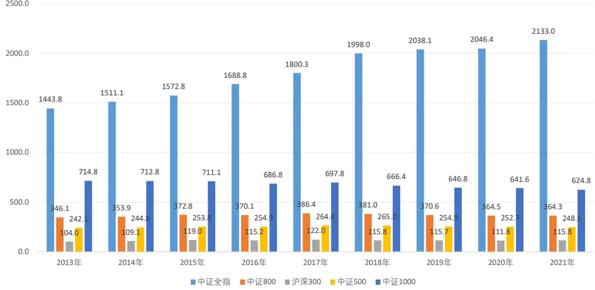
数据来源：Wind、东方证券研究所

月度 RankIC 序列：

从各样本空间的因子测试结果来看，在开盘集合竞价第一阶段撤单比例越高的股票平均表现越差，在中证全指内（深市）因子原始值和中性化值的 RankIC 都在 4%以上，分组收益总体单调，时间序列上因子持续有效，但多空组合近期波动有所加大。对比各样本空间，因子原始值各样本空间 RankIC 差异不大，但中性化后的因子沪深 300 中相对较弱。

图 3：盘前撤单比例因子在各个样本空间表现汇总（深市部分）

|  | 原始因子 |  |  | 行业市值中性化因子 |  |  |  |  |  |  |
| --- | --- | --- | --- | --- | --- | --- | --- | --- | --- | --- |
|  | RankIC | IC IR | t_value | RankIC IC IR | t_value | 多空月收益 | 夏普率 | 月胜率 | 最大回撤 | 多头月换手 |
| 中证全指 | -4.23% | -1.82 | -5.31 | -4.03% -2.47 | -7.21 | 10.60% | 1.29 | 63.73% | -6.47% | 72% |
| 中证800 | -4.82% | -1.79 | -5.23 | -3.24% -1.56 | -4.55 | 8.76% | 1.23 | 66.67% | -13.25% | 61% |
| 沪深300 | -4.27% | -1.15 | -3.36 | -2.73% -0.98 | -2.86 | 4.71% | 0.51 | 59.80% | -31.22% | 61% |
| 中证500 | -4.70% | -1.72 | -5.02 | -3.36% -1.60 | -4.65 | 8.52% | 1.23 | 68.63% | -9.11% | 63% |
| 中证1000 | -3.82% | -1.57 | -4.59 | -3.50%-2.00 | -5.82 | 8.11% | 1.13 | 61.76% | -8.21% | 63% |

数据来源：Wind、深交所、东方证券研究所

图 4：盘前撤单比例因子在中证全指内选股表现（行业市值中性，深市部分）分组对冲年化收益：
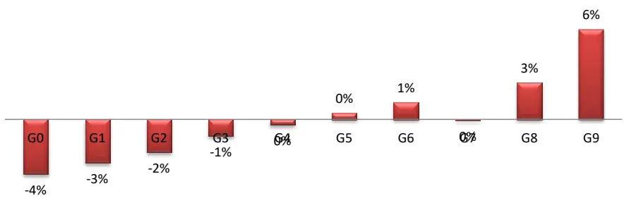

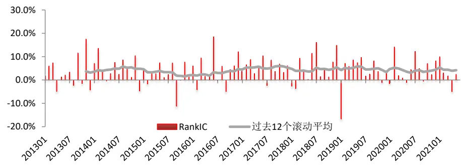
多空组合净值及回撤：

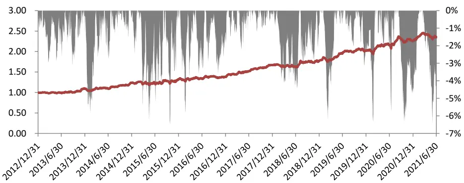
数据来源：Wind、深交所、东方证券研究所

## 三、早盘买卖单大小比

## 3.1 因子定义

相较于其他交易时段，早盘刚经过一夜的冷静期而且有更多的信息披露，所以早盘的订单相对其他时间段可能更加“理性”，通过分析早盘时间段新增的订单情况，我们可以看出该时间段内不同投资者的买卖方向，进而构建 alpha 因子，当大资金买入时跟进，当大资金卖出时退出。同样的思路，之前部分投资者采用大单主动买入占比情况去刻画这一特征，但由于任何一笔交易都有买卖双方，交易的主动买卖方向划分有一定分歧，本文基于有确定买卖方向订单数据构建了“早盘买卖单大小比”因子去刻画股票早盘买卖的投资者属性。

$$
孕盘买卖单大小托=\ln\left(\frac{10:30前的买人订单平均委托量}{10:30前的卖出订单平均委托量}\right)
$$

为了因子的分布更加正态，我们对早盘买卖单大小比进行了对数调整，同时和盘前撤单比例因子类似，我们取过去 20个交易日的早盘买卖单大小比（对数调整）的均值作为 alpha因子值。

## 3.2 因子表现

从因子测试结果来看，早盘买入订单更大的股票平均表现更好、卖出订单更大的股票表现更差，换句话说就是在早盘跟随大订单的买卖方向可以获取超额收益，而且从因子原始值来看，这种超额收益在沪深 300 这种大市值股票中更加明显，行业市值中性化后大小市值样本空间差异不大。从时间序列上看因子总体平稳，在 16 年下半年至 17 年上半年和 19 年下半年至 20 年上半年 RankIC 取值相对更高，和多数量价类因子在 15 年前后表现更好有很大差异。

图 5：开盘买卖单大小比在各个样本空间表现汇总（深市部分）

|  | 原始因子 |  |  | 行业市值中性化因子 |  |  |  |  |  |  |
| --- | --- | --- | --- | --- | --- | --- | --- | --- | --- | --- |
|  | RankIC | IC_IR | t_value | IC IC_IR | t_value | 多空月收益 | 夏普率 | 月胜率 | 最大回撤 | 多头月换手 |
| 中证全指 | 4.79% | 2.14 | 6.24 | 4.01% | 2.12 | 6.18 16.02% | 1.95 | 75.49% | -14.70% | 75% |
| 中证800 | 6.73% | 2.20 | 6.42 | 4.53% | 2.11 | 6.16 14.79% | 1.70 | 70.59% | -14.03% | 65% |
| 沪深300 | 6.92% | 1.50 | 4.37 | 3.91% | 1.32 | 3.84 11.56% | 1.08 | 59.80% | -18.76% | 64% |
| 中证500 | 6.33% | 2.12 | 6.19 | 4.75% | 2.07 | 6.03 13.19% | 1.41 | 70.59% | -15.95% | 65% |
| 中证1000 | 4.96% | 1.89 | 5.52 | 4.24% | 2.09 | 6.11 14.73% | 2.00 | 71.57% | -11.08% | 67% |

数据来源：Wind、深交所、东方证券研究所

图 6：开盘买卖单大小比在中证全指内选股表现（行业市值中性，深市部分）分组对冲年化收益：
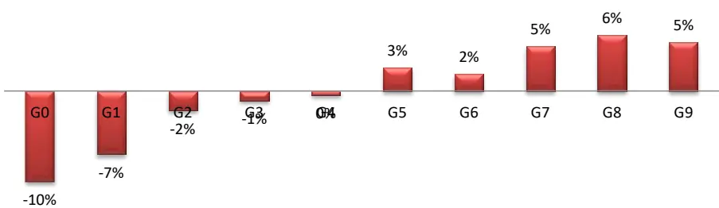

月度 RankIC 序列：
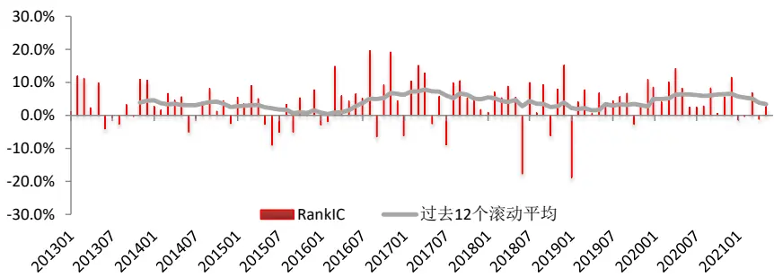
多空组合净值及回撤：

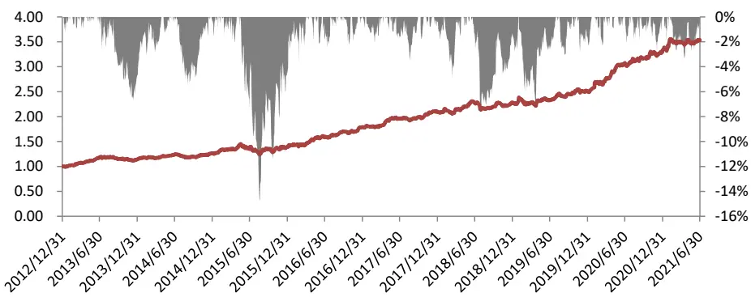
数据来源：Wind、深交所、东方证券研究所

## 四、订单价格分歧程度

## 4.1 因子定义

订单数据包括了投资者愿意在指定价格买入或者卖出特定量股票的信息，订单的价格表示了投资者对股票价值的判断，不同订单价格的分歧程度反应了投资者对股票价值的分歧，在缺乏做空机制的情形下，投资者对股票价值的分歧往往带来股票阶段性高估，股票后期的收益一般相对较差。我们采用如下方法定义订单绝对价格的分歧程度：

$$
i丁单加权平均对数价格=\frac{\sum\ln\left(i丁单价格\right)\cdot i丁单变托量}{\sum i丁单变托量}
$$

$$
\sqrt{\frac{\sum\left[ln\left(i丁单价格\right)-i丁单价格平均对数价格\right]^{2}\cdot i丁单价格量}{\sum i丁单价格量}}
$$

基于上述定义方法，我们可以得到指定股票在特定交易日的订单绝对价格分歧程度，在月度因子检验时我们同样取 20个交易日的平均值。由于不同股票的价格绝对大小不可比，所以我们在计算价格分歧程度时取订单价格的对数，相当于度量的是各订单价格相对于同一个基准价格对数收益率的分歧程度，因为将上述公式中的ln (订单价格)替换为 ln (订单价格) −ln (基准价格)完全不影响因子的取值。

由于投资者在委托买卖订单时一般会受到当前价格影响，所以我们也计算了订单相对最近成交价格对数偏差的分歧程度—订单相对价格分歧程度，计算方法将上述订单绝对价格分歧程度计算公式的ln (订单价格)替换为 $ln\left(i丁单价格\right)-ln\left(该i丁单型托的点的最新成交价格\right)$ 即可。

## 4.2 因子表现

因子检验的结果显示，无论是绝对的价格水平还是相对最新成交价格，分歧程度越大的股票未来收益率越低，和前文的预期一致。对比各样本空间，因子原始值在沪深 300 这样的大市值样本空间 RankIC 并没有明显降低，订单相对价格分歧程度在沪深 300 中原始值RankIC 反而更高。从各分组收益来看，因子收益空头端显著更强，但因子多头也有较可观的超额收益，从时间序列上看，两个价格分歧度因子总体平稳，但多空组合近年来波动有所加大。

图 7：订单绝对价格分歧程度在各个样本空间表现汇总

|  | 原始因子 |  |  | 行业市值中性化因子 |  |  |  |  |  |  |
| --- | --- | --- | --- | --- | --- | --- | --- | --- | --- | --- |
|  | RankIC | IC IR | t_value | IC IC IR | t value | 多空月收益 | 夏普率 | 月胜率 | 最大回撤 | 多头月换手 |
| 中证全指 | -7.92% | -2.51 | -7.33 | -7.01% -3.10 | -9.05 | 20.81% | 1.95 | 73.53% | -14.99% | 63% |
| 中证800 | -7.89% | -2.04 | -5.94 | -5.54% -2.25 | -6.57 | 13.64% | 1.47 | 71.57% | -15.13% | 53% |
| 沪深300 | -7.40% | -1.52 | -4.42 | -3.97% -1.37 | -3.99 | 7.74% | 0.74 | 62.75% | -22.65% | 52% |
| 中证500 | -7.45% | -1.96 | -5.71 | -6.12% -2.32 | -6.77 | 15.34% | 1.54 | 73.53% | -14.40% | 54% |
| 中证1000 | -7.43% | -2.44 | -7.12 | -6.55% -3.00 | -8.74 | 17.04% | 2.12 | 77.45% | -10.90% | 56% |

数据来源：Wind、深交所、东方证券研究所

图 8：订单相对价格分歧程度在各个样本空间表现汇总

|  | 原始因子 |  |  | 行业市值中性化因子 |  |  |  |  |  |  |
| --- | --- | --- | --- | --- | --- | --- | --- | --- | --- | --- |
|  | RankIC | IC_IR | t value | IC IC_IR | t_value | 多空月收益 | 夏普率 | 月胜率 | 最大回撤 | 多头月换手 |
| 中证全指 | -4.96% | -1.52 | -4.44 | -4.33% -2.05 | -5.99 | 14.98% | 1.72 | 70.59% | -11.63% | 61% |
| 中证800 | -6.21% | -1.60 | -4.67 | -4.27% -1.74 | -5.08 | 11.17% | 1.30 | 67.65% | -12.21% | 52% |
| 沪深300 | -6.70% | -1.42 | -4.14 | -3.58% -1.28 | -3.74 | 5.89% | 0.59 | 61.76% | -27.32% | 51% |
| 中证500 | -5.45% | -1.44 | -4.19 | -4.79% -1.84 | -5.37 | 12.89% | 1.47 | 69.61% | -13.18% | 54% |
| 中证1000 | -4.55% | -1.39 | -4.06 | -4.14% -1.92 | -5.61 | 12.27% | 1.61 | 65.69% | -11.98% | 54% |

数据来源：Wind、深交所、东方证券研究所

图 9：订单绝对价格分歧程度在中证全指内选股表现（行业市值中性，深市部分）
分组对冲年化收益：
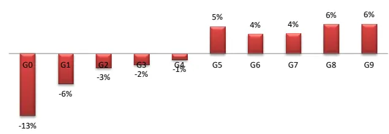
月度 RankIC 序列：

图 10：订单绝对价格分歧程度在中证全指内选股表现（行业市值中性，深市部分）
分组对冲年化收益：
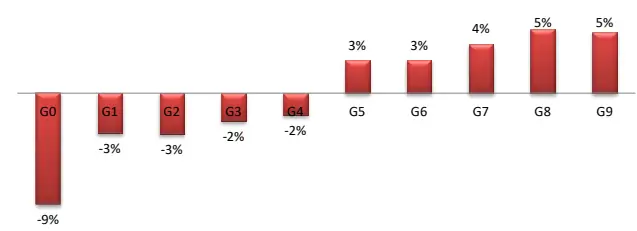

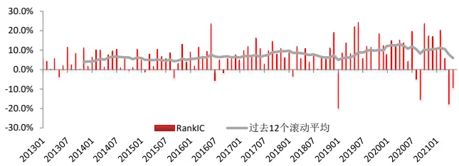
多空组合净值及回撤：

月度 RankIC 序列：
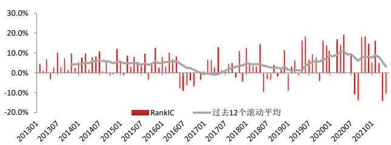
多空组合净值及回撤：

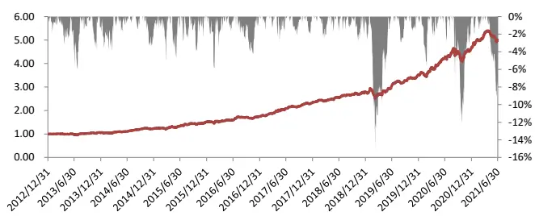
数据来源：Wind、深交所、东方证券研究所

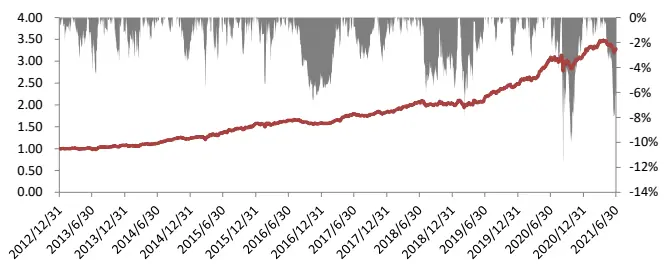
数据来源：Wind、深交所、东方证券研究所

## 五、订单数据改进的 APB 因子

## 5.1 因子定义

我们在前期因子选股系列报告《基于量价关系度量股票的买卖压力》中提出了度量股票买卖压力的APB 因子，基于日内数据的 APB因子定义如下：

$$
APB=ln\left(\frac{twap}{vwap}\right)
$$

APB 因子的核心逻辑在于股票处于相对低位时投资者大量买入会导致成交量在价格低位相对较多，通过 twap 和 vwap 的比值可以刻画成交量在价格上的分布从而度量买卖压力。

在订单数据可以获取的情况下我们可以通过直接观察买入订单的分布去刻画买卖压力，同样我们认为在股票价格相对低位新增大量买入订单的股票买入压力大，未来表现较好。在因子度量上，我们只需要加 APB 因子分母上的成交量加权价格替换为买单委托量加权的平均价格即可得到订单改进的 APB 因子。

$$
吴单逻托量加权的平均价格=\frac{\sum 吴人逻托量\cdot 新增法逻托的价格新成交价格}{\sum 吴人逻托量}
$$

当价格在相对低位涌入大量买入委托时买单委托量加权的平均价格相对 twap 更低，改进后的 APB 因子取值越大，也意味着股票的买入压力大，股价未来表现更好。同样的，在月度因子检验时我们取过去 20天的均值作为因子值。

## 5.2 因子表现

对比改进前后的APB因子，我们发现订单数据改进的 APB在各个样本空间的原始值RankIC 月度均值均高于原APB因子1%以上，多空组合收益也都有不同程度的提升。从分组收益来看，原APB因子在中证全指（深交所）内的top组合收益很低，改进后的 APB有较大幅度提升，从时间序列上看，原 APB因子的多空组合在2019年之后波动很大，收益几乎没有收益，但改进后的APB 因子的多空近几年依然稳定上行。

图 11：原始 APB 因子在各个样本空间表现汇总

|  | 原始因子 |  |  | 行业市值中性化因子 |  |  |  |  |  |  |  |
| --- | --- | --- | --- | --- | --- | --- | --- | --- | --- | --- | --- |
|  | RankIC | IC_IR | t value | IC | IC_IR | t_value | 多空月收益 | 夏普率 | 月胜率 | 最大回撤 | 多头月换手 |
| 中证全指 | 5.29% | 2.45 | 7.15 | 5.46% | 3.31 | 9.66 | 18.27% | 1.93 | 73.53% | -16.43% | 87% |
| 中证800 | 4.68% | 1.67 | 4.88 | 4.70% | 2.36 | 6.89 | 11.57% | 1.55 | 71.57% | -18.16% | 77% |
| 沪深300 | 5.09% | 1.18 | 3.43 | 4.98% | 1.76 | 5.12 | 8.70% | 0.91 | 62.75% | -20.18% | 76% |
| 中证500 | 4.43% | 1.63 | 4.75 | 4.50% | 2.01 | 5.86 | 12.17% | 1.49 | 66.67% | -14.89% | 78% |
| 中证1000 | 5.50% | 2.25 | 6.57 | 5.23% | 2.67 | 7.79 | 13.55% | 1.82 | 71.57% | -14.41% | 79% |

数据来源：Wind、深交所、东方证券研究所

图 12：改进APB 因子在各个样本空间表现汇总

|  | 原始因子 |  |  | 行业市值中性化因子 |  |  |  |  |  |  |  |
| --- | --- | --- | --- | --- | --- | --- | --- | --- | --- | --- | --- |
|  | RankIC | IC_IR | t value | IC | IC_IR | t_value | 多空月收益 | 夏普率 | 月胜率 | 最大回撤 | 多头月换手 |
| 中证全指 | 6.66% | 2.81 | 8.18 | 6.65% | 3.97 | 11.56 | 22.76% | 2.31 | 81.37% | -20.83% | 85% |
| 中证800 | 6.20% | 1.88 | 5.49 | 5.45% | 2.48 | 7.24 | 15.53% | 1.92 | 74.51% | -11.42% | 75% |
| 沪深300 | 6.90% | 1.46 | 4.26 | 5.15% | 1.70 | 4.96 | 11.99% | 1.06 | 66.67% | -23.62% | 74% |
| 中证500 | 5.71% | 1.82 | 5.30 | 5.29% | 2.19 | 6.38 | 14.67% | 1.50 | 67.65% | -11.61% | 76% |
| 中证1000 | 6.48% | 2.47 | 7.19 | 6.15% | 3.11 | 9.05 | 16.91% | 2.04 | 78.43% | -16.92% | 76% |

数据来源：Wind、深交所、东方证券研究所

图 13：原始 APB 因子在中证全指内选股表现（行业市值中性，深市部分）
分组对冲年化收益：
图 14：改进APB 因子在中证全指内选股表现（行业市值中性，深市部分）
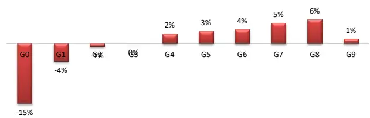

分组对冲年化收益：
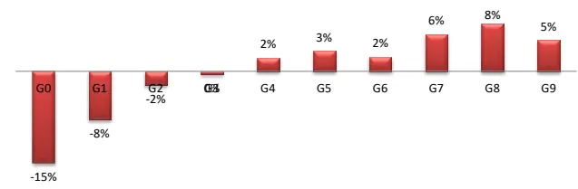

月度 RankIC 序列：
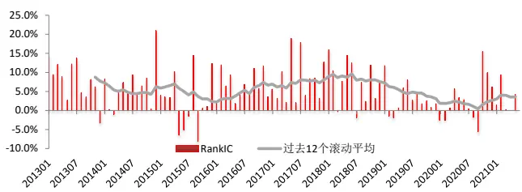
多空组合净值及回撤：

月度 RankIC 序列：
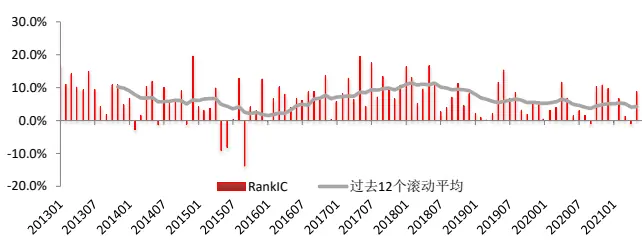
多空组合净值及回撤：

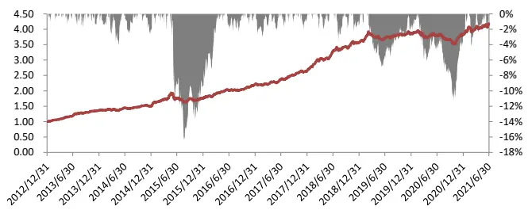
数据来源：Wind、深交所、东方证券研究所

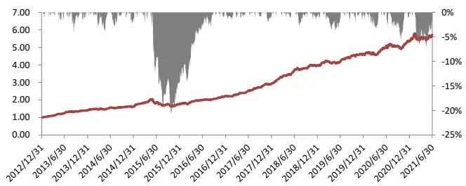
数据来源：Wind、深交所、东方证券研究所

## 六、因子相关性分析

## 6.1 与常见大类因子相关性

本文中我们基于订单数据构建了盘前撤单比例、早盘买卖单大小比、订单绝对价格分歧程度、订单相对价格分歧程度以及改进的 APB 共 5 个alpha 因子，为方便标记，在下文图标中我们分别记为 L2F0、L2F1、L2F2、L2F3、L2F4。

通过对订单类因子和各大类因子的相关性和两两分层结果进行分析，有如下发现：

（1）各订单类因子和各大类因子因子值 spearman 相关性总体处于较低的水平，盘前撤单比例、订单绝对价格分歧程度和投机类指标截面相关性相对较高，达到 30%以上。虽然因子值相关性不高，但因子表现和传统各大类因子还是有一定相关性。

（2）早盘买卖单大小比因子和反转因子有较强的负相关，因子值截面相关性和RankIC 时序相关性分别达到了-39.6%和-69.7%，经过反转分层后早盘买卖单大小比的月均多空收益从 1.44%提升到 2.0%。

（3）盘前撤单比例和非流动性有一定关联，因子值截面相关性和 RankIC 时序相关性分别达到了 29.6%和 65.1%，经过非流动性大类因子分层后盘前撤单比例多空收益不显著。

图 15：订单相关因子和常见大类因子相关性（左下因子值，右上 RankIC，中证全指深交所部分，因子原始值）

| Value |  | Profitability Growth |  | GovernanceLiquidity Reversal |  |  | Lottery | Analyst | Surprise | L2F0 | L2F1 | L2F2 | L2F3 | L2F4 |
| --- | --- | --- | --- | --- | --- | --- | --- | --- | --- | --- | --- | --- | --- | --- |
| Value |  | -0.118 | 0.142 | 0.579 | 0.569 | -0.051 | 0.862 | 0.567 | -0.003 | 0.760 | 0.065 | 0.464 | 0.085 | -0.295 |
| Profitability 0.281 |  |  | 0.698 | 0.448 | -0.338 | -0.332 | -0.242 | 0.473 | 0.732 | 0.032 | 0.337 | 0.319 | 0.441 | 0.523 |
| Growth 0.182 |  | 0.381 |  | 0.523 | -0.121 | -0.463 | 0.029 | 0.675 | 0.902 | 0.380 | 0.341 | 0.414 | 0.438 | 0.299 |
| Governance 0.278 |  | 0.201 | 0.032 |  | 0.046 | -0.314 | 0.350 | 0.660 | 0.403 | 0.493 | 0.254 | 0.476 | 0.390 | 0.105 |
| Liquidity | 0.185 | -0.031 | -0.041 | 0.013 |  | 0.323 | 0.796 | 0.237 | -0.201 | 0.651 | -0.016 | 0.375 | -0.080 | -0.082 |
| Reversal | 0.033 | -0.103 | -0.144 | -0.042 | 0.289 |  | 0.053 | -0.194 | -0.480 | -0.224 | -0.697 | -0.113 | -0.157 | -0.112 |
| Lottery | 0.410 | 0.040 | -0.001 | 0.111 | 0.601 | 0.157 |  | 0.387 | -0.104 | 0.827 | 0.098 | 0.489 | 0.031 | -0.325 |
| Analyst | 0.314 | 0.279 | 0.286 | 0.165 | 0.055 | 0.008 | 0.096 |  | 0.580 | 0.571 | 0.174 | 0.535 | 0.360 | 0.153 |
| Surprise | 0.026 | 0.202 | 0.554 | 0.004 | -0.063 | -0.177 | -0.054 | 0.226 |  | 0.246 | 0.375 | 0.292 | 0.337 | 0.369 |
| L2F0 | 0.167 | 0.075 | 0.051 | 0.083 | 0.296 | 0.010 | 0.319 | 0.083 | 0.017 |  | 0.327 | 0.640 | 0.229 | -0.086 |
| L2F1 | -0.003 | 0.073 | 0.020 | 0.006 | -0.020 | -0.396 | -0.001 | 0.013 | 0.044 | -0.071 |  | 0.296 | 0.263 | 0.214 |
| L2F2 | 0.218 | 0.179 | 0.088 | 0.120 | 0.230 | 0.026 | 0.337 | 0.149 | 0.062 | 0.184 | 0.122 |  | 0.786 | 0.202 |
| L2F3 | 0.113 | 0.186 | 0.098 | 0.102 | 0.016 | -0.058 | 0.092 | 0.124 | 0.085 | 0.092 | 0.153 | 0.904 |  | 0.310 |
| L2F4 | 0.036 | 0.166 | 0.080 | 0.053 | 0.178 0.065 |  | 0.092 0.095 |  | 0.073 | 0.091 | 0.029 0.174 0.136 |  |  |  |

数据来源：Wind、深交所、东方证券研究所

图 16：订单相关因子和常见大类因子两两分层月均收益（左下因子值，右上 RankIC，中证全指深交所部分，因子原始值）

| Value Profitability |  | Growth Governance Liquidity Reversal |  |  |  |  |  |  |  | Analyst Surprise | L2F0 | L2F1 | L2F2 | L2F3 | L2F4 |
| --- | --- | --- | --- | --- | --- | --- | --- | --- | --- | --- | --- | --- | --- | --- | --- |
|  | 不分层 | 0.4 | 0.29 | 0.92*** | -0.37 | 2.21*** | 1.03* | 1.43** | 1.07*** | 1.70*** | 0.70** | 1.44*** | 1.74*** | 1.41*** | 1.82*** |
| 分 | Value | 0.24 | -0.09 | 0.83*** | -0.49* | 2.17*** | 0.90* | 1.43*** | 1.13*** | 1.65*** | 0.59** | 1.49*** | 1.52*** | 1.27*** | 1.78*** |
|  | Probability | 0.08 | -0.04 | 0.91*** | -0.31 | 2.22*** | 1.14** | 1.41** | 1.07*** | 1.74*** | 0.66** | 1.40*** | 1.63*** | 1.22*** | 1.73*** |
|  | Growth | 0.13 | -0.07 | 0.2 | -0.39 | 2.19*** | 1.21** | 1.39** | 1.05*** | 1.60*** | 0.60** | 1.41*** | 1.63*** | 1.29*** | 1.64*** |
|  | Governance | 0.41 | 0.34 | 0.88*** | -0.04 | 2.26*** | 1.11** | 1.37** | 1.27*** | 1.76*** | 0.75*** | 1.50*** | 1.65*** | 1.36*** | 1.75*** |
|  | Illiquidity | 0.13 | 0.23 | 0.92*** | -0.4 | 0.72*** | 0.34 | 0.3 | 0.88*** | 1.87*** | 0.2 | 1.41*** | 1.24*** | 1.35*** | 1.56*** |
|  | Reversal | 0.27 | 0.12 | 0.87*** | -0.33 | 2.03*** | -0.01 | 1.16** | 1.05*** | 1.84*** | 0.63** | 2.04*** | 1.56*** | 1.32*** | 1.70*** |
|  | Lottery | -0.26 | 0.11 0.76** |  | -0.5 | 1.49*** 0.47 |  | 0.2 | 0.90*** | 1.75*** | 0.41** | 1.41*** | 1.36*** 1.45*** |  | 1.73*** |
| 因 | Analyst | -0.03 | -0.09 | 0.72** | -0.44 | 2.16*** | 0.98* | 1.11* | -0.04 | 1.55*** | 0.54** | 1.38*** | 1.69*** | 1.35*** | 1.64*** |
| 子 | Surprise | 0.26 | 0.03 | -0.05 | -0.36 | 2.32*** | 1.35** | 1.40** | 0.69** | 0.26** | 0.62** | 1.36*** | 1.59*** | 1.27*** | 1.67*** |
|  | L2F0 | 0.33 | 0.14 | 0.81** | -0.35 | 1.90*** | 0.87 | 0.9 | 1.03*** | 1.74*** | 0.26* | 1.45*** | 1.63*** | 1.42*** |  |
|  | L2F1 | 0.38 | 0.14 | 0.93*** | -0.43 | 2.12*** | 1.95*** | 1.34** | 0.95*** | 1.66*** | 0.76*** | 0.04 | 1.52*** | 1.04*** | 1.78*** 1.77*** |
|  | L2F2 | -0.17 | -0.15 | 0.65** | -0.64** | 1.73*** | 0.99* | 0.54 | 0.90*** | 1.60*** | 0.42* | 1.20*** | 0.23* | 0.27 | 1.56*** |
|  | L2F3 | 0.15 | -0.08 | 0.75** | -0.48 | 2.07*** | 1.20** | 1.05* | 0.94*** | 1.53*** | 0.55** | 1.20*** | 0.76* | 0.18 |  |
|  | L2F4 | 0.23 | -0.06 | 0.65** | -0.44 | 1.79*** | 0.58 | 1.09* | 0.89*** | 1.62*** | 0.49* | 1.56*** | 1.38*** | 1.17*** | 1.55*** 0.50*** |

数据来源：Wind、深交所、东方证券研究所

## 6.2 与常见量价因子相关性

分析订单相关因子和常见量价因子的相关性和两两分层结果，我们可以看出：

（1）早盘买卖单大小比、订单相对价格分歧程度和所有常见量价 alpha因子因子值相关性都在15%以下，部分因子甚至负相关，因子表现的相关性也处于较低水平，可见这两个因子和现有因子的信息重叠程度较低。

（2）改进后的APB因子和原APB 因子高度相关，原 APB经改进的 APB分层后选股多空组合不显著，但改进后的APB经原APB 分层后虽然收益有所回落，但多空组合月均收益依然高达1.29%，说明改进后的APB 相对原 APB因子信息增量明显。

（3）盘前撤单比例、订单绝对价格分歧程度和波动、换手等投机性指标的因子值和RankIC 都有较高相关性，在信息层面存在重叠。

图 17：订单相关因子和常见日间量价因子相关性（左下因子值，右上 RankIC，中证全指深交所部分，因子原始值）

| VOL |  | LNTO | IVOL | IVR | RET | LNAMIHUD PPREVSERAL |  | MAXRET DWF |  | L2F0 | L2F1 | L2F2 | L2F3 | L2F4 |
| --- | --- | --- | --- | --- | --- | --- | --- | --- | --- | --- | --- | --- | --- | --- |
| VOL |  | 0.923 | 0.898 | -0.018 | 0.104 | 0.044 | 0.134 | 0.931 0.903 |  | 0.845 | 0.119 | 0.517 | 0.038 | -0.274 |
| LNTO | 0.653 |  | 0.818 | -0.106 | 0.087 | -0.034 | 0.079 | 0.849 0.837 |  | 0.847 | 0.167 | 0.532 | 0.083 | -0.134 |
| IVOL | 0.836 | 0.569 |  | 0.353 | 0.383 | 0.211 | 0.425 | 0.931 | 0.967 | 0.688 | -0.096 | 0.453 | 0.006 | -0.322 |
| IVR | 0.264 | 0.187 | 0.652 |  | 0.692 | 0.404 | 0.707 | 0.223 | 0.283 | -0.196 | -0.551 | -0.113 | -0.161 | -0.169 |
| RET | 0.259 | 0.146 | 0.345 | 0.287 |  | 0.270 | 0.875 | 0.416 | 0.365 | -0.107 | -0.599 | 0.025 | -0.041 | 0.017 |
| LNAMIHUD | 0.062 | 0.178 | 0.111 | 0.105 | 0.036 |  | 0.390 | 0.168 | 0.197 | -0.140 | -0.133 | -0.287 | -0.410 | -0.063 |
| PPREVSERAL | 0.283 | 0.160 | 0.391 | 0.334 | 0.714 | 0.131 |  | 0.407 | 0.393 | -0.129 | -0.643 | -0.038 | -0.123 | -0.154 |
| MAXRET | 0.857 | 0.548 | 0.836 | 0.365 | 0.554 | 0.099 | 0.489 |  | 0.937 | 0.708 | -0.104 | 0.456 | 0.013 | -0.232 |
| DWF | 0.674 | 0.458 | 0.714 | 0.411 | 0.365 | 0.095 | 0.382 | 0.720 |  | 0.733 | -0.055 | 0.479 | 0.052 | -0.291 |
| L2F0 | 0.355 | 0.339 | 0.297 | 0.102 | 0.061 | -0.025 | 0.049 | 0.276 | 0.241 |  | 0.327 | 0.640 | 0.229 | -0.086 |
| L2F1 | -0.052 | 0.034 | -0.093 | -0.129 | -0.399 | 0.085 | -0.329 | -0.174 | -0.108 | -0.071 |  | 0.296 | 0.263 | 0.214 |
| L2F2 | 0.349 | 0.287 | 0.317 | 0.112 | 0.090 | -0.076 | 0.081 | 0.301 | 0.279 | 0.184 | 0.122 |  | 0.786 | 0.202 |
| L2F3 | 0.089 | 0.083 | 0.077 | 0.015 | 0.010 | -0.138 | -0.022 | 0.063 | 0.093 | 0.092 | 0.153 | 0.904 |  | 0.310 |
| L2F4 | 0.127 | 0.138 | 0.161 | 0.153 | 0.127 | 0.005 | 0.069 | 0.171 | 0.151 | 0.091 | 0.029 | 0.174 | 0.136 |  |

数据来源：Wind、深交所、东方证券研究所

图 18：订单相关因子和常见日间量价因子两两分层结果（左下因子值，右上 RankIC，中证全指深交所部分，因子原始值）

|  |  | VOL | LNTO | IVOL | IVR | RET | LNAMIHUD PPREVSERAL |  | MAXRET | DWF | L2F0 | L2F1 | L2F2 | L2F3 | L2F4 |
| --- | --- | --- | --- | --- | --- | --- | --- | --- | --- | --- | --- | --- | --- | --- | --- |
|  | 不分层 | 0.75 | 1.49** | 1.93*** | 2.05*** | 1.77*** | 1.99*** | 1.23** | 1.03* | 1.54*** | 0.70** | 1.44*** | 1.74*** | 1.41*** | 1.82*** |
|  | VOL | 0.45*** | 1.06*** | 1.86*** | 1.68*** | 0.90** | 2.08*** | 0.39 | 0.87*** | 1.41*** | 0.64*** | 1.53*** | 1.46*** | 1.40*** | 1.85*** |
| 分 | LNTO | 0.06 | 0.51*** | 1.19*** | 1.77*** | 1.31*** | 1.77*** | 0.74 | 0.51 | 1.38*** | 0.37** | 1.30*** | 1.43*** | 1.62*** | 1.72*** |
|  | IVOL | -0.79* | 0.51 | 0.61*** | 1.23*** | 0.84* | 2.19*** | 0.36 | 0.02 | 0.92*** | 0.25 | 1.66*** | 1.21*** | 1.26*** | 1.66*** |
|  | IVR | 0.4 | 1.01* | 0.53 | 0.26* | 1.01** | 2.04*** | 0.58 | 0.51 | 1.14*** | 0.52* | 1.67*** | 1.45*** | 1.23*** | 1.49*** |
| 层 | RET | 0.56 | 1.27** | 1.45*** | 1.41*** | 0.28* | 1.97*** | 0.08 | 0.69 | 1.39*** | 0.50** | 2.24*** | 1.53*** | 1.39*** | 1.67*** |
|  | LNAMIHUD | 0.77 | 0.94 | 1.61*** | 1.74*** | 1.89*** | 0.23 | 1.22** | 0.90* | 1.40*** | 0.65** | 1.18*** | 1.58*** | 1.23*** | 1.64*** |
| PPREVSERAL |  | 0.68 | 1.33** | 1.61*** | 1.67*** | 1.14*** | 2.04*** | 0.25 | 0.87* | 1.38*** | 0.62** | 1.85*** | 1.54*** | 1.32*** | 1.81*** |
|  | MAXRET | -0.18 | 0.98** | 1.22*** | 1.49*** | 0.78* | 2.11*** | 0.31 | 0.36** | 1.06*** | 0.49** | 1.75*** | 1.33*** | 1.28*** | 1.79*** |
| 因 | DWF | -0.42 | 0.51 | 0.72** | 1.36*** | 1.01** | 2.02*** | 0.3 | -0.08 | 0.33*** | 0.38 | 1.72*** | 1.36*** | 1.35*** | 1.68*** |
|  | L2F0 | 0.46 | 1.16** | 1.58*** | 1.99*** | 1.35*** | 2.13*** | 1.05* | 0.6 | 1.41*** | 0.26* | 1.45*** | 1.63*** | 1.42*** | 1.78*** |
| 子 | L2F1 | 0.83 | 1.40** | 1.98*** | 2.10*** | 2.46*** | 1.98*** | 1.83*** | 1.33** | 1.46*** | 0.76*** | 0.04 | 1.52*** | 1.04*** | 1.77*** |
|  | L2F2 | 0.09 | 0.82 | 1.12*** | 1.81*** | 1.47*** | 2.24*** | 1.06** | 0.43 | 1.40*** | 0.42* | 1.20*** | 0.23* | 0.27 | 1.56*** |
|  | L2F3 |  |  |  |  |  |  |  |  |  |  |  |  |  |  |
|  | L2F4 | 0.52 0.48 | 1.11** 1.03* | 1.63*** 1.46*** | 1.99*** 1.59*** | 1.61*** 1.10** | 2.38*** 2.14*** | 1.29** 0.84 | 0.87* 0.64 | 1.43*** 1.34*** | 0.55** 0.49* | 1.20*** 1.55*** | 0.76* 1.37*** | 0.18 1.17*** | 1.54*** 0.50*** |

数据来源：Wind、深交所、东方证券研究所

图 19：订单相关因子和常见日类量价因子相关性（左下因子值，右上 RankIC，中证全指深交所部分，因子原始值）

| IDSKEW |  | IDKURT IDJUMP IDMOM |  |  | SDRVOL SDRSKEW |  | SDVVOL | ARPP | APB | L2F0 | L2F1 | L2F2 | L2F3 | L2F4 |
| --- | --- | --- | --- | --- | --- | --- | --- | --- | --- | --- | --- | --- | --- | --- |
| IDSKEW |  | 0.645 | 0.642 | 0.601 | 0.634 | 0.724 | 0.482 | -0.204 | 0.204 | 0.604 | 0.062 | 0.560 | 0.247 | 0.126 |
| IDKURT | 0.484 |  | 0.284 | 0.496 | 0.738 | 0.941 | 0.224 | -0.278 | -0.225 | 0.556 | 0.009 | 0.394 | 0.190 | -0.307 |
| IDJUMP | 0.477 | 0.114 |  | 0.568 | 0.323 | 0.313 | 0.299 | -0.348 | 0.123 | 0.502 | -0.242 | 0.336 | -0.072 | -0.087 |
| IDMOM | 0.232 | 0.076 | 0.393 |  | 0.430 | 0.539 | 0.096 | -0.087 | -0.242 | 0.756 | 0.280 | 0.384 | -0.038 | -0.248 |
| SDRVOL | 0.297 | 0.547 | 0.170 | 0.095 |  | 0.796 | 0.588 | -0.115 | 0.025 | 0.563 | 0.214 | 0.564 | 0.353 | -0.003 |
| SDRSKEW | 0.477 | 0.860 | 0.150 | 0.108 | 0.505 |  | 0.386 | -0.178 | -0.132 | 0.650 | 0.140 | 0.506 | 0.264 | -0.158 |
| SDWOL | 0.264 | 0.308 | 0.175 | 0.022 | 0.459 | 0.388 |  | -0.011 | 0.246 | 0.301 | 0.159 | 0.580 | 0.409 | 0.334 |
| ARPP | 0.121 | 0.171 | -0.029 | 0.041 | 0.158 0.175 |  | 0.150 |  | 0.146 | -0.051 | 0.431 | -0.049 | -0.042 | 0.415 |
| APB | 0.193 | 0.107 | 0.197 | 0.062 | 0.138 | 0.121 | 0.178 | 0.381 |  | -0.170 | -0.102 | 0.072 | 0.207 | 0.868 |
| L2F0 | 0.145 | 0.172 | 0.160 | 0.135 | 0.162 | 0.186 | 0.199 | 0.073 | 0.020 |  | 0.327 | 0.640 | 0.229 | -0.086 |
| L2F1 | -0.048 | -0.086 | -0.139 | 0.134 | 0.002 | -0.024 | 0.004 | 0.084 | -0.041 | -0.071 |  | 0.296 | 0.263 | 0.214 |
| L2F2 | 0.206 | 0.173 | 0.225 | 0.138 | 0.199 | 0.207 | 0.246 | 0.092 | 0.101 | 0.184 | 0.122 |  | 0.786 | 0.202 |
| L2F3 | 0.127 | 0.103 | 0.035 | 0.028 | 0.116 0.131 |  | 0.178 | 0.074 | 0.079 | 0.092 | 0.153 | 0.904 |  | 0.310 |
| L2F4 | 0.190 | 0.100 | 0.152 | 0.047 | 0.161 0.161 |  | 0.287 | 0.450 | 0.868 | 0.091 | 0.029 | 0.174 | 0.136 |  |

数据来源：Wind、深交所、东方证券研究所

图 20：订单相关因子和常见日类量价因子两两分层结果（左下因子值，右上 RankIC，中证全指深交所部分，因子原始值）

|  |  | IDSKEW | IDKURT | IDJUMP | IDMOM | SDRVOL | SDRSKEW | SDVVOL | ARPP | APB | L2F0 | L2F1 | L2F2 | L2F3 | L2F4 |
| --- | --- | --- | --- | --- | --- | --- | --- | --- | --- | --- | --- | --- | --- | --- | --- |
|  | 不分层 | 1.61*** | 0.42 | 2.06*** | 1.31*** | 1.35*** | 0.83*** | 1.79*** | 1.88*** | 1.39*** | 0.70** | 1.44*** | 1.74*** | 1.41*** | 1.82*** |
|  | IDSKEW | 0.47*** | -0.32 | 1.45*** | 0.94** | 1.05*** | 0.18 | 1.39*** | 1.70*** | 1.14*** | 0.51* | 1.53*** | 1.44*** | 1.16*** | 1.49*** |
| 分 | IDKURT | 1.55*** | 0.29* | 1.89*** | 1.18*** | 1.34*** | 1.02*** | 1.73*** | 1.75*** | 1.28*** | 0.51* | 1.54*** | 1.54*** | 1.18*** | 1.72*** |
|  | IDJUMP | 0.93*** | 0.33 | 0.72*** | 0.68* | 1.29*** | 0.72*** | 1.52*** | 1.86*** | 1.13*** | 0.37 | 1.67*** | 1.34*** | 1.46*** | 1.37*** |
|  | IDMOM | 1.24*** | 0.26 | 1.61*** | 0.23 | 1.22*** | 0.64** | 1.70*** | 1.84*** | 1.17*** | 0.49** | 1.22*** | 1.66*** | 1.39*** | 1.80*** |
| 层 | SDRVOL | 1.13*** | -0.26 | 1.80*** | 1.07*** | 0.46*** | 0.38* | 1.32*** | 1.66*** | 1.14*** | 0.45 | 1.45*** | 1.48*** | 1.21*** | 1.50*** |
|  | SDRSKEW | 1.32*** | -0.24 | 1.88*** | 1.20*** | 1.09*** | 0.17 | 1.54*** | 1.69*** | 1.24*** | 0.53* | 1.53*** | 1.44*** | 1.14*** | 1.67*** |
|  | SDWVOL | 1.07*** | -0.09 | 1.64*** | 1.14*** | 0.81*** | 0.18 | 0.49*** | 1.59*** | 1.11*** | 0.33 | 1.46*** | 1.45*** | 1.14*** | 1.45*** |
| 因 | ARPP | 1.35*** | 0.22 | 2.10*** | 1.20*** | 1.18*** | 0.52* | 1.56*** | 0.15 | 0.73** | 0.56* | 1.32*** | 1.66*** | 1.24*** | 1.05*** |
|  | APB | 1.09*** | 0.19 | 1.40*** | 1.01** | 1.20*** | 0.48* | 1.37*** | 1.42*** | 0.45*** | 0.50* | 1.57*** | 1.43*** | 1.25*** | 1.29*** |
|  | L2F0 | 1.39*** | 0.27 | 1.78*** | 1.12*** | 1.22*** | 0.63** | 1.71*** | 1.86*** | 1.54*** | 0.26* | 1.45*** | 1.63*** | 1.42*** | 1.78*** |
| 子 | L2F1 | 1.58*** | 0.54 | 2.24*** | 0.97** | 1.47*** | 0.72** | 1.72*** | 1.59*** | 1.39*** | 0.76*** | 0.04 | 1.52*** | 1.04*** | 1.77*** |
|  | L2F2 | 1.15*** | 0.24 | 1.55*** | 0.98** | 1.14*** | 0.45* | 1.50*** | 1.74*** | 1.32*** | 0.42* | 1.20*** | 0.23* | 0.27 | 1.56*** |
|  | L2F3 | 1.30*** | 0.42 | 1.88*** | 1.27*** | 1.35*** | 0.66** | 1.57*** | 1.81*** | 1.26*** | 0.55** |  |  |  | 1.55*** |
|  | L2F4 | 1.13*** | 0.21 | 1.50*** | 1.13*** | 1.18*** | 0.52* | 1.26*** | 1.28*** | -0.19 | 0.49* | 1.19*** 1.56*** | 0.76* 1.37*** | 0.17 1.17*** | 0.50*** |

数据来源：Wind、深交所、东方证券研究所

## 七、结论

逐笔委托订单数据包括了投资者于何时以什么价格买入或者卖出多少量股票的委托信息，而且标记了新增或者撤回的时间戳，理论上讲可以根据逐笔委托数据和交易所撮合规则重现整个交易过程，因此逐笔委托几乎包括了股票所有的交易层面信息。

上交所和深交所的逐笔委托数据结构有所不同，具体体现在市价单、订单撤回等细节处理上，深交所逐笔委托数据最早可追溯至 2012 年下半年，上交所逐笔委托 2021 年 5月才开始提供，本文的研究主要以深交所股票为主，基于上交所数据同样可以构建相同因子从而实现全 A 股覆盖。

开盘集合竞价第一阶段的委托单可以随意撤回，该阶段可以通过委托撤回的方法在不需要成交的情况下测算对手盘挂单的价和量，基于此，我们构建了盘前撤单比例因子用于度量股票的“镰刀”占比，盘前撤单比例越高，股票未来收益平均越差。

早盘半小时的交易更多是对夜间信息的反应，通过测算早盘买入和卖出订单的委托量大小可以判断资金雄厚的投资者在买入还是卖出，跟踪大资金的早盘交易可以获取超额收益，本文直接通过早盘买入和卖出卖出订单大小的比值作为 alpha 因子避免了主动买卖划分方法对因子构建的影响。

委托订单的价格反应了投资者对股票价值的认可，我们通过委托订单价格的分歧程度可以刻画投资者对股票价格的分歧程度，在缺乏做空机制的市场下，投资者的分歧会导致股价短期高估，进而影响股票未来的收益。

投资者委托订单的价格不可避免会受最近成交价格的影响，本文用订单相对价格分歧程度度量投资者委托订单价格相对最近成交价格偏离的差异化程度。订单相对价格分歧程度相对绝对价格分歧程度选股表现略差，但和其他因子相关性更低，信息更加独立。

本文基于买入订单的委托数据改进了 APB 因子，在价格相对低位有大量买入订单的股票未来收益相对更高，改进后的 APB 因子相对原 APB 因子在 RankIC、多空收益、分组表现等方面都有提升，而且在近年来原 APB 因子回撤时依然表现较好。

通过相关性分析，早盘买卖单大小比和订单相对价格分歧程度两个因子和常见 alpha因子相关性都处于较低的水平，盘前撤单比例、订单相对价格分歧程度和波动、换手等投机性指标有一定信息重叠，改进后的 APB 相对原 APB 有明显的信息增量。

## 风险提示

1.量化模型基于历史数据分析得到，未来存在失效的风险，建议投资者紧密跟踪模型表现。

2.极端市场环境可能对模型效果造成剧烈冲击，导致收益亏损。

3.本文基于深交所数据测算因子表现，深交所的规律在上交所不一定适用。

## 分析师申明

每位负责撰写本研究报告全部或部分内容的研究分析师在此作以下声明：

分析师在本报告中对所提及的证券或发行人发表的任何建议和观点均准确地反映了其个人对该证券或发行人的看法和判断；分析师薪酬的任何组成部分无论是在过去、现在及将来，均与其在本研究报告中所表述的具体建议或观点无任何直接或间接的关系。

## 投资评级和相关定义

报告发布日后的 12 个月内的公司的涨跌幅相对同期的上证指数/深证成指的涨跌幅为基准；

## 公司投资评级的量化标准

买入：相对强于市场基准指数收益率 15%以上；

增持：相对强于市场基准指数收益率 5%～15%；

中性：相对于市场基准指数收益率在-5%～+5%之间波动；

减持：相对弱于市场基准指数收益率在-5%以下。

未评级 —— 由于在报告发出之时该股票不在本公司研究覆盖范围内，分析师基于当时对该股票的研究状况，未给予投资评级相关信息。

暂停评级 —— 根据监管制度及本公司相关规定，研究报告发布之时该投资对象可能与本公司存在潜在的利益冲突情形；亦或是研究报告发布当时该股票的价值和价格分析存在重大不确定性，缺乏足够的研究依据支持分析师给出明确投资评级；分析师在上述情况下暂停对该股票给予投资评级等信息，投资者需要注意在此报告发布之前曾给予该股票的投资评级、盈利预测及目标价格等信息不再有效。

## 行业投资评级的量化标准：

看好：相对强于市场基准指数收益率 5%以上；

中性：相对于市场基准指数收益率在-5%～+5%之间波动；

看淡：相对于市场基准指数收益率在-5%以下。

未评级：由于在报告发出之时该行业不在本公司研究覆盖范围内，分析师基于当时对该行业的研究状况，未给予投资评级等相关信息。

暂停评级：由于研究报告发布当时该行业的投资价值分析存在重大不确定性，缺乏足够的研究依据支持分析师给出明确行业投资评级；分析师在上述情况下暂停对该行业给予投资评级信息，投资者需要注意在此报告发布之前曾给予该行业的投资评级信息不再有效。

## HeadertTabl e_Discl ai mer 免责声明

本证券研究报告（以下简称“本报告”）由东方证券股份有限公司（以下简称“本公司”）制作及发布。

收人应当采取必要措施防止本报告被转发给他人。

本报告是基于本公司认为可靠的且目前已公开的信息撰写，本公司力求但不保证该信息的准确性和完整性，客户也不应该认为该信息是准确和完整的。同时，本公司不保证文中观点或陈述不会发生任何变更，在不同时期，本公司可发出与本报告所载资料、意见及推测不一致的证券研究报告。本公司会适时更新我们的研究，但可能会因某些规定而无法做到。除了一些定期出版的证券研究报告之外，绝大多数证券研究报告是在分析师认为适当的时候不定期地发布。

在任何情况下，本报告中的信息或所表述的意见并不构成对任何人的投资建议，也没有考虑到个别客户特殊的投资目标、财务状况或需求。客户应考虑本报告中的任何意见或建议是否符合其特定状况，若有必要应寻求专家意见。本报告所载的资料、工具、意见及推测只提供给客户作参考之用，并非作为或被视为出售或购买证券或其他投资标的的邀请或向人作出邀请。

本报告中提及的投资价格和价值以及这些投资带来的收入可能会波动。过去的表现并不代表未来的表现，未来的回报也无法保证，投资者可能会损失本金。外汇汇率波动有可能对某些投资的价值或价格或来自这一投资的收入产生不良影响。那些涉及期货、期权及其它衍生工具的交易，因其包括重大的市场风险，因此并不适合所有投资者。

在任何情况下，本公司不对任何人因使用本报告中的任何内容所引致的任何损失负任何责任，投资者自主作出投资决策并自行承担投资风险，任何形式的分享证券投资收益或者分担证券投资损失的书面或口头承诺均为无效。

本报告主要以电子版形式分发，间或也会辅以印刷品形式分发，所有报告版权均归本公司所有。未经本公司事先书面协议授权，任何机构或个人不得以任何形式复制、转发或公开传播本报告的全部或部分内容。不得将报告内容作为诉讼、仲裁、传媒所引用之证明或依据，不得用于营利或用于未经允许的其它用途。

经本公司事先书面协议授权刊载或转发的，被授权机构承担相关刊载或者转发责任。不得对本报告进行任何有悖原意的引用、删节和修改。

提示客户及公众投资者慎重使用未经授权刊载或者转发的本公司证券研究报告，慎重使用公众媒体刊载的证券研究报告。

## 东方证券研究所

地址：上海市中山南路 318 号东方国际金融广场 26 楼

电话：021-63325888

传真：021-63326786

网址： www.dfzq.com.cn

“慧博资讯”专业的投资研究大数据分享平台