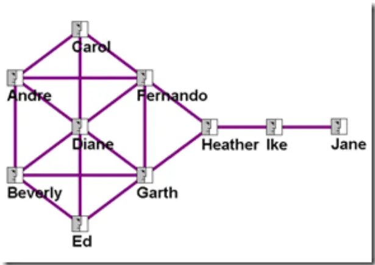
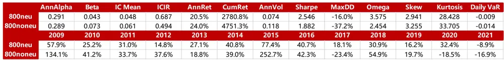
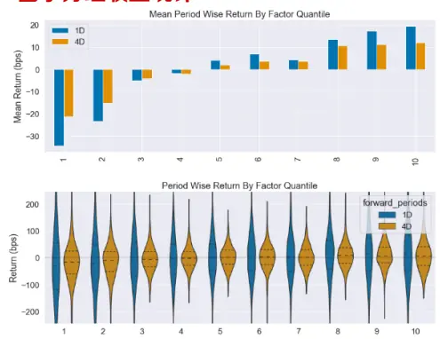
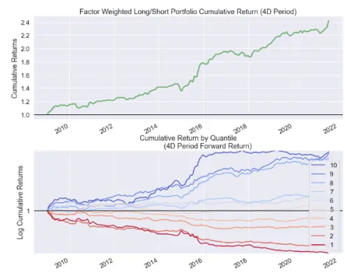
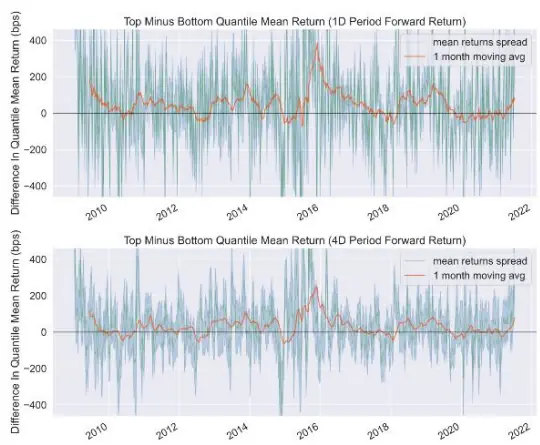
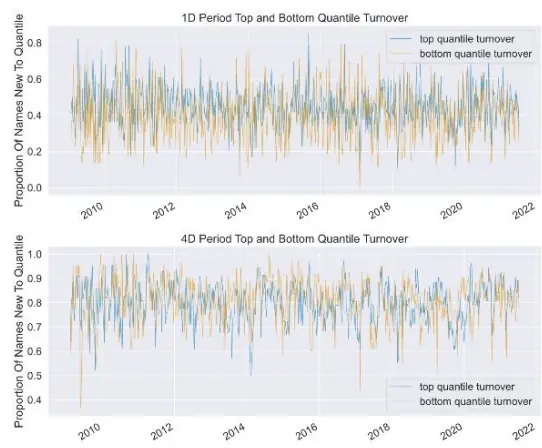
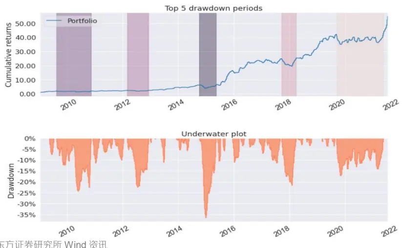
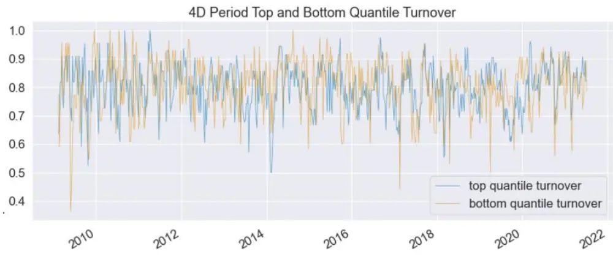
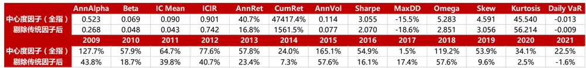
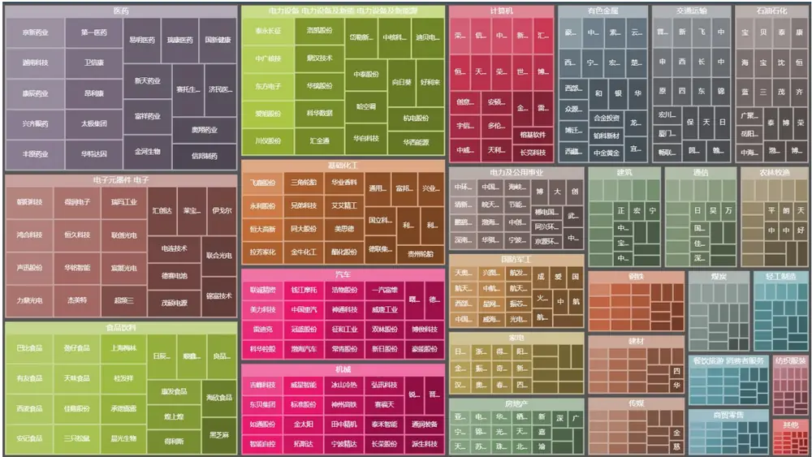

## ——《因子系列选股研究 之 七十四》

## 研究结论

股市中存在领涨、领跌的概念，领涨（跌）股对周围的股票具有带动效应，图论中的【中心度】的概念，可以用于衡量节点在网络中的重要性，对于因此本研究从图论中借鉴了这个指标，研究其在股票市场上是否存在 alpha。

本文基于个股的日收益率计算了窗口期内、股票池内的相关系数矩阵，对其进行 denoising 处理，去除噪音使其变得更加的连续，保留较高的相关系数，作为节点的连接，系数值为连接的权重，然后计算该网络各个节点的中心度，得到每只股票的中心度因子。

⚫ 对计算参数进行探究之后，确定窗口期 k=20，中心度算法为 eigenvector。

⚫ 对各个股票池进行回测之后，确定该因子偏好于小市值股票，中证 1000 > 中证 500 > 沪深 300，中证全指的表现和中证 1000 差不多。

在机构重仓中（机构占比前 15%分位的股票，当前有 560 支股票），IC 均值为 0.044 介于沪深 300 和中证 500 之间，年化收益 24.7%不及中证 500 的32.7%，但大幅超过沪深 300的 9.7%，说明中心度因子不光作用在小股票，对于滞后的机构重仓池仍然具有较强的选股能力。

行市中性化后的中心度因子，在中证 800 股成分股内，IC从 0.06 降至 0.05，年化收益从 24%降至 20.5%，降幅并不大，说明中心度因子的收益并不来自于行业和市值，而是来自个股的风险溢价。但是中性化可以显著降低中心度因子的收益波动，夏普值明显提升，从 1.88 提升至 2.55，从分年收益也可以看出中性化后的收益直到 2021 年才出现负收益。在中证 800 内，对中心度因子进行中性化处理，是一个较为稳健的选择。

中心度因子与传统的大类因子相关性很低，在对常规大类因子正交化之后，在中证全指中，仍然具有 alpha，IC 为 0.04，夏普为 2。即使相关系数矩阵具有市场 beta 的属性，但是与 beta 因子的因子收益率相关性只有 40%，其与反转因子（过去一个月的收益率）的因子收益率相关性有 50%。而行业市值中性化之后的收益率作为因子，也无法达到中心度因子的效果，所以该因子的alpha 来源只能被解释为来自“居中”本身，是一种较为独立的技术面因子。

## 风险提示

⚫ 极端市场环境可能对模型效果造成剧烈冲击，导致收益亏损。

⚫ 量化模型基于历史数据分析得到，未来存在失效风险，建议投资者紧密跟踪模型表现。

报告发布日期2021 年 08 月 15 日

证券分析师朱剑涛

021-63325888*6077

zhujiantao@orientsec.com.cn

执业证书编号：S0860515060001

联系人薛耕

021-63325888*6123

xuegeng@orientsec.com.cn

执业证书编号：S0860121070052

## 一、 思路起源

市场中股票会产生集群效应，业务类似的公司有着相关性较高的收益率序列，如果把股票看成一个点，股票之间的连接用收益率相关系数来表示，设定一个阈值（经验值为 0.1），保留较高的相关性，则可以得到一个带权重的无向图，股票的越重要，和其他股票的联系越密集，继而可以带领其他股票上涨，因此需要一种度量来衡量一支股票在市场中的“重要性”。中心度因子可以判断股票池中节点的重要性，是“股票重要性”的量化指标，中心度高的股票处于股票池最中心的位置，像一颗彗星的核心，无论彗星怎么运动都和群体保持着一致的行动。

这些中心性度量最初应用于社交网络，然后扩展到其他类型的网络分析。在社交网络中，一个基本任务是识别一个群体中哪些人比其他人更有影响力，并帮助研究人员分析和理解玩家在网络中扮演的角色。为了完成这种分析，将这些人和人与人之间的联系建模成一个网络图，其中节点代表人，节点之间的连接边代表人与人之间的联系。基于已建立的网络结构图，可以使用一系列中心性度量方法来计算哪个个体比其他个体更重要。社交网络中，一个重要人物对于局部的影响深远，比如一个流量明星的崛起，可以带动相关的影视、自媒体、经纪公司、广告公司，后者继续为其贡献流量，形成一个流量的风口，相关热度越炒越高，如果他变得不重要，后者就会孤立他，流量越来越少。

## 二、 中心度因子的计算过程

⚫ 对股票池过去k个交易日的收益率计算皮尔森相关系数矩阵；

⚫ 对相关系数矩阵进行denoise处理，保留前95%的特征值对映的特征向量，形成除噪后的相关系数矩阵；

⚫ 保留前q分位的相关系数作为图结点的连接，其系数值为路径的权重；

⚫ 用 networkx 模块形成图对象（Graph）；

⚫ 选用中心度算法计算个股因子值。

图 1：中心度的计算

数据来源：东方证券研究所

## A. Denoising 的作用

Denoising 是为了消除股票间异质波动的影响，对相关系数矩阵进行特征分解之后，这些噪音通常由较小的特征值对应的特征向量来表达，线性空间中的特征向量代表该特征空间被拉伸的方向，对应的特征值代表的被拉伸的程度，对这些拉伸程度较小的方向进行统一，有利于相关系数矩阵表达其真实含义，其数值变化更加稳定。Denoising 的方法可以去除相关系数矩阵中的噪音，保留其相关性真实的意思表达

$$
\tilde{C}_{1}=W\tilde{A}W^{\prime}
$$

$$
C_{1}=\tilde{C}_{1}\left[\left(diag[\tilde{C}_{1}]\right)^{\frac{1}{2}}\left(diag[\tilde{C}_{1}]\right)^{\frac{1}{2}^{'}}\right]^{-1}
$$

## B. 中心度的计算

节点重要性（即中心性）有多种解释，不同解释下确定中心性的度量标准也不同。然而，目前最重要的指标是度中心性、接近中心性、中介中心性、特征向量中心性。在图论中，顶点称为结点（nodes），结点的联系称为边（links）。

图 2：中心度示例

数据来源：orgnet.com

度中心性（Degree Centrality）：一个结点与其他结点直接连接边数量的总和。

在无向网络中，可以用一个节点的度数（就是社交网络中用户的好友数）来衡量Centrality。 图 2，节点 Diane 的好友数最多，有 6 个人，所以她成为了 Degree Centrality最高的节点。真实的社交网络中，Degree Centrality 高的那些人一般都是大明星，有很大的知名度，比如微博中的姚晨。

接近中心性（Closeness Centrality）：该结点到其他结点的最短路径均值的倒数。

如果节点到图中其它节点的最短距离都很小，那么认为该节点的 Closeness Centrality高。这个定义其实比 Degree Centrality 从几何上更符合中心度的概念，因为到其它节点的平均最短距离最小，意味着这个节点从几何角度看是出于图的中心位置。

在图 2 中，Fernando 和 Garth虽然好友数不如 Diane，但他们到其它所有节点的最短距离是最小的。（直观上说，Diane 虽然好友数多，但离图的右半部分的节点更加的远）Closeness Centrality 高的节点一般扮演的是八婆的角色（gossiper）。他们并不是明星，但是乐于在不同的人群之间传递消息。

特征向量中心性（Eigenvector Centrality）：邻居结点中心性的加总，是一个递归算法，初始化为1。

假设有5个相邻结点，则第一次迭代后数值为5，进行全局归一化，再次加总邻居的中心性。邻居结点的变化会反过来影响该节点，所以这是一个不断迭代的过程，每次遍历完所有节点进行归一化，接着进行下一次迭代。可证多次迭代后的这种线性变化和其连接矩阵的第一大特征根对应的特征向量成正比，所以称为特征向量中心性。

相似的算法比如斐波那契数列的变换矩阵 $\big[{}_{1}^{1}\big.\big]$ 的第一大特征值 1.618，其对应的特征向量为 $[_{0.526}^{0.851}]$ ，多次迭代之后两相邻元素的比例无限靠近此特征向量的比值。

## 三、 中心度因子的表现

以下回测结果如无特别说明都是以月频换仓。

三种中心度算法中，可以看出无论是信息分析还是收益分析，三种中心度算法在中证 800 上的表现并无明显的差异，相较之下 eigenvector 算法有着较为优秀的表现，IC 为0.06，年化收益 23.4%，夏普 1.872，最大回撤 33.7%。

图 3：锁定计算窗口为过去 20 个交易日，不同中心度算法在中证 800 成分股里的表现差异

| AnnAlpha Beta |  |  |  |  |  | AnnRet CumRet AnnVol Sharpe |  |  |  |  |  | Skew Kurtosis Daily VaR |  |  |
| --- | --- | --- | --- | --- | --- | --- | --- | --- | --- | --- | --- | --- | --- | --- |
| closeness degree | 0.300 | 0.076 | 0.051 | 0.510 | 19.9% | 2532.6% | 0.103 | 1.805 | -30.2% | 2.383 | 3.977 |  | 47.344 | -0.012 |
|  | 0.317 | 0.074 | 0.052 | 0.512 | 20.0% | 2585.9% | 0.103 | 1.819 | -30.0% |  | 2.403 | 3.973 | 47.431 | -0.012 |
|  | 0.322 | 0.076 | 0.060 | 0.504 | 23.4% | 4346.1% | 0.116 | 1.872 | -33.7% | 2.448 |  | 3.293 | 34.941 | -0.014 |
|  | eigenvector 2009 | 2010 | 2011 | 2012 | 2013 | 2014 | 2015 | 2016 | 2017 |  | 2018 | 2019 | 2020 | 2021 |
| closeness | 117.5% | 31.7% | 21.3% | 29.1% | 24.3% | 46.0% | 158.4% | 34.4% |  | -21.7% | 45.2% | 13.8% | -13.3% | -17.0% |
| degree | 117.3% | 31.8% | 21.5% | 29.3% | 25.0% | 46.0% | 158.3% | 34.8% | -21.7% |  | 46.0% | 13.8% | -13.0% | -17.0% |
| eigenvector | 135.9% | 29.2% | 30.8% | 36.6% | 19.2% | 36.2% | 246.3% | 43.0% |  | -22.8% | 53.7% | 20.3% | -13.4% | -17.7% |

数据来源：东方证券研究所 Wind 资讯

AnnAlpha, Beta：组合收益作为因变量，股票池收益均值为自变量，回归之后的回归系数为Beta，截距为 Alpha，对 Alpha 进行年化得到 AnnAlpha。

Omega：衡量的是发生概率极低的事件对投资组合整体回报的影响，比较符合对冲基金和非传统型投资的回报不符合正态分布规律的情况，更关注收益率的整体分布情况，兼顾到了收益率分布曲线的峰度和偏度，具体计算为所有的正收益的加总除以所有负收益的加总。

Skew, Kurtosis: 收益分布的偏度和峰度，绝对值越大越偏离正态分布。

Daily VaR：每期平均的在险价值，组合收益分布中，均值减去两个标准差的收益值，代表小概率的大亏损。

相关系数窗口的参数 k 决定了相关系数矩阵的稳定性和时效性，月度、季度、半年度的窗口有着较大的差异，相较之下 k=20 为较优的参数。

图 4：锁定算法，比较不同计算周期，20、60、120 个交易日，因子表现的差异

| win20 | AnnAlpha | Beta | IC Mean | ICIR | AnnRet | CumRet | AnnVol | Sharpe | MaxDD | Omega | Skew | Kurtosis | Daily VaR |
| --- | --- | --- | --- | --- | --- | --- | --- | --- | --- | --- | --- | --- | --- |
|  | 0.322 | 0.076 | 0.060 | 0.504 | 23.4% | 4346.1% | 0.116 | 1.872 | -33.7% | 2.448 | 3.293 | 34.941 | -0.014 |
| win60 | 0.130 | 0.101 | 0.042 | 0.343 | 12.5% | 744.8% | 0.118 | 1.062 | -35.7% | 1.617 | 1.631 | 31.837 | -0.014 |
| win120 | 0.086 | 0.123 | 0.029 | 0.233 | 8.8% | 361.3% | 0.133 | 0.704 | -48.8% | 1.391 | 2.023 | 42.399 | -0.016 |
| win20win60win120 | 2009 | 2010 | 2011 | 2012 | 2013 | 2014 | 2015 | 2016 | 2017 | 2018 | 2019 | 2020 | 2021 |
|  | 135.9% | 29.2% | 30.8% | 36.6% | 19.2% | 36.2% | 246.3% | 43.0% | -22.8% | 53.7% | 20.3% | -13.4% | -17.7% |
|  | 77.7% | 22.4% | 17.5% | 4.3% | -4.9% | 35.7% | 79.3% | 35.5% | -14.4% | 52.4% | 16.4% | -20.2% | -16.7% |
|  | 73.4% | 1.8% | 30.1% | -10.6% | -21.6% | 44.8% | 117.5% | 30.1% | -31.9% | 76.8% | 6.1% | -22.6% | -29.4% |

数据来源：东方证券研究所Wind 资讯

锁定算法为 eigenvector，相关系数窗口 k=20 之后，在沪深 300、中证 500、中证 1000中，alpha、IC、夏普、年化收益都依次增大，最大回撤依次减小，说明该因子在小盘股上面有着更好的效果，中证 1000 上达到了 0.1 的 IC均值，年化收益有 50%，夏普 3.34，最大回撤 13.4%

根据基金的年报和半年报，本文构成一个滞后的机构持仓数据，形成每支股票的机构持仓占比，筛选出其中超过 85 分位的个股，形成【机构重仓】股票池，具体可见《基于机构持仓的因子情景分析》。在机构重仓中，IC 均值为 0.044 介于沪深 300 和中证 500之间，年化收益 24.7%不及中证 500 的 32.7%，但大幅超过沪深 300 的 9.7%。

根据行业将中证全指内的股票分为周期版块和非周期版块，周期股包括金融地产等16 个行业，非周期股包括电子医药等 12 个行业。可以看出周期板块的 IC 为 0.092，非周期板块为 0.077，该因子对于周期股的偏好不明显。

图 5：锁定算法和计算周期，计算因子在不同股票池里的表现

|  | AnnAlpha | Beta | IC Mean ICIR AnnRet CumRet |  |  |  | AnnVol | Sharpe | MaxDD | Omega | Skew Kurtosis |  | Daily VaR |
| --- | --- | --- | --- | --- | --- | --- | --- | --- | --- | --- | --- | --- | --- |
| 沪深300 | 0.090 | 0.098 | 0.030 0.185 9.7% |  |  | 435.3% | 0.145 | 0.711 | -49.4% | 1.385 | 2.216 | 38.253 | -0.018 |
| 中证500 | 0.417 | 0.054 | 0.077 0.739 32.7% |  |  | 16835.2% | 0.113 | 2.553 | -26.5% | 3.504 | 3.541 | 30.399 | -0.013 |
| 中证800 | 0.295 | 0.073 | 0.061 0.496 24.2% |  |  | 5033.7% | 0.118 | 1.900 | -37.2% | 2.475 | 3.253 | 33.554 | -0.014 |
| 中证1000 | 0.680 | 0.051 | 0.097 1.017 49.7% |  |  | 150924.2% | 0.123 | 3.341 | -13.4% | 6.481 | 5.313 | 60.743 | -0.014 |
| 中证全指 | 0.527 | 0.069 | 0.090 0.903 |  | 40.9% | 50236.9% | 0.114 | 3.064 | -15.5% | 5.312 | 4.580 | 45.125 | -0.013 |
| 机构重仓 | 0.264 | 0.126 | 0.044 0.335 |  | 24.7% | 5390.0% | 0.154 | 1.512 | -36.4% | 2.096 | 3.717 | 52.175 | -0.018 |
| 创业板 | 0.109 | 0.084 | 0.028 0.179 8.6% |  |  | 278.8% | 0.189 | 0.531 | -61.0% | 1.270 | 1.315 | 31.709 | -0.023 |
| 周期股 | 0.543 | 0.056 | 0.092 0.958 |  | 41.4% | 53321.8% | 0.114 | 3.102 | -13.3% | 5.605 | 4.822 | 45.078 | -0.013 |
| 非周期股 | 0.419 | 0.071 | 0.077 0.768 |  | 35.0% | 23153.6% | 0.116 | 2.639 | -13.3% | 3.883 | 4.776 | 53.496 | -0.013 |
|  | 2009 | 2010 | 2011 2012 |  | 2013 | 2014 | 2015 | 2016 | 2017 | 2018 | 2019 | 2020 | 2021 |
| 沪深300 | 101.8% | -16.3% | 0.9% | 14.1% | -16.1% | 60.0% | 195.9% | 26.6% | -32.9% | 26.8% | 10.9% | -30.6% | -16.4% |
| 中证500 | 139.3% | 71.6% | 51.1% | 42.3% | 47.9% | 68.5% | 192.7% | 45.7% | 2.4% | 68.0% | 23.9% | -12.1% | -3.7% |
| 中证800 | 134.1% | 41.2% | 33.7% | 37.6% | 18.8% | 39.0% | 252.7% | 42.3% | -23.4% | 54.9% | 19.7% | -18.5% | -12.1% |
| 中证1000 | 122.1% | 73.2% | 109.8% | 102.5% | 63.7% | 28.2% | 146.4% | 75.3% | 26.6% | 147.6% | 66.7% | 33.2% | 46.5% |
| 中证全指 | 127.7% | 57.9% | 64.7% | 77.6% | 57.8% | 24.0% | 165.1% | 54.9% | 1.5% | 119.2% | 53.9% | 34.1% | 29.8% |
| 机构重仓 | 82.5% | 0.6% | 17.1% | 15.6% | 84.0% | -12.3% | 279.8% | 50.1% | -11.6% | 60.8% | 14.7% | 7.7% | 36.6% |
| 创业板 |  | 5.3% | -5.5% | -22.8% | -11.5% | 37.0% | 137.3% | 16.1% | -12.0% | 22.6% | 41.6% | -22.3% | 24.4% |
| 周期股 | 83.5% | 60.8% | 70.1% | 73.7% | 55.6% | 24.7% | 161.1% | 54.8% | 15.4% | 130.4% | 76.4% | 48.5% | 12.2% |
| 非周期股 | 126.0% | 37.8% | 48.7% | 52.5% | 57.0% | 36.8% | 136.7% | 55.9% | -0.8% | 107.9% | 36.7% | 28.8% | 14.4% |

数据来源：东方证券研究所Wind 资讯

在中证 800 股成分内对中心度因子进行行业市值中性化处理，发现 IC 从 0.06 降至0.05，年化收益从 24%降至 20.5%，降幅并不大，说明中心度因子的收益并不来自于行业和市值，而是来自个股的风险溢价。但是中性化可以显著降低中心度因子的收益波动，夏普值明显提升，从 1.88 提升至 2.55，从分年收益也可以看出中性化后的收益直到 2021年才出现负收益。

在中证 800 内，对中心度因子进行中性化处理，是一个较为稳健的选择。

图 6：因子中性化

数据来源：东方证券研究所Wind 资讯

下面为窗口参数为 k=20，股票池为机构重仓成分股，最新股票池大小为 560，未中性化的中心度因子分析，其中 1D 为周频换仓，4D 为月频换仓，可以看到该因子分组的单调性十分明显，在空头的效果好于多头，下图右上的【因子加权累计收益净值】可以看出该因子在 2017年出现了失效。

图 7：因子分组收益统计

数据来源：东方证券研究所Wind 资讯

图 8：因子加权收益净值（组间加权与组内加权）

数据来源：东方证券研究所Wind 资讯

调仓频率的影响，周频 IC 是 0.04，月频为 0.044，周频换手 40%，月频换手 80%。周频有着较高的收益率，一样的 IC 和较高的换手率。

图 9：周频与月频的对冲收益移动平均

数据来源：东方证券研究所Wind 资讯

图 10：周频与月频的换手率

数据来源：东方证券研究所Wind 资讯

下图是【多空组合回测净值】，可以看到 2017 和 2021 年出现了长时间的失效，这也可能与近年来技术因子失效有关。

图 11：机构重仓成分股内多空净值曲线和回撤

数据来源：东方证券研究所Wind 资讯

多空组合的月频的换手率均值为 80.1%，在全历史来看该换手率较高。

图 12：多空组合月频换手率

数据来源：东方证券研究所Wind 资讯

## 四、 高“中心度”股票的 Alpha 来源

由下图可以看出，在中证全指成分股内，中心度因子与 CNE5 的大类因子的收益率相关性均不高，对于动量和反转，与反转因子（过去一个月收益率）的相关性有 50.27%，不过这大约来自于相同的窗口参数的选择，总体来看中心度因子并不能明显的归类于某个大类。

图 13：中心度因子与大类因子的收益相关性

| 规模 | 中心度因子 |  |  |  |  |  |  |  |  |  |  |  |
| --- | --- | --- | --- | --- | --- | --- | --- | --- | --- | --- | --- | --- |
|  | -52.99% |  |  |  |  |  |  |  |  |  |  |  |
| 市场Beta | 40.84% | -28.63% |  |  |  |  |  |  |  |  |  |  |
| 动量 | -33.80% | 21.85% | -1.05% |  |  |  |  |  |  |  |  |  |
| 波动率 | 0.83% | -27.43% | 51.45% | 36.80% |  |  |  |  |  |  |  |  |
| 非线性市值 | -45.70% | 84.03% | -14.63% | 43.16% | -0.28% |  |  |  |  |  |  |  |
| 账面市值比 | 12.99% | 26.11% | -28.86% | -65.37% | -68.32% | -5.76% |  |  |  |  |  |  |
| 流动性 | 3.36% | -16.69% | 72.63% | 33.94% | 74.51% | 5.59% | -60.88% |  |  |  |  |  |
| 盈利市值比 | 8.88% | 25.94% | -35.39% | -51.73% | -54.29% | -2.07% | 84.68% | -59.31% |  |  |  |  |
| 成长 | -19.38% | 23.65% | 21.46% | 50.02% | 46.74% | 41.06% | -56.74% | 49.48% | -30.42% |  |  |  |
| 财务杠杆 | 24.12% | -51.75% | 18.79% | -25.30% | 19.10% | -50.69% | -9.07% | 5.65% | -10.79% | -35.82% |  |  |
| 动量(9，3) | -40.18% | 22.23% | -8.99% | 61.77% | 27.56% | 30.67% | -44.62% | 18.71% | -36.32% | 34.23% | -10.01% |  |
| 反转（1） | 50.27% | -38.82% | 32.81% | -23.75% | 11.75% | -36.38% | 8.20% | 3.87% | 13.41% | -11.45% | 18.09% | -29.07% |

数据来源：东方证券研究所Wind 资讯

在对上图的大类因子进行剔除后，中心度因子在中证全指成分股内，IC均值从 0.09降到 0.04，年化收益从 40.7%降到 16.8%，夏普从 3.1 降到了 2.1，年化 alpha 从 0.52 下降到了 0.27，所以大类因子差不多解释了一般的中心度因子，剩下一半的 alpha 不能被解释。

图 14：剔除中心度因子中的大类因子

数据来源：东方证券研究所Wind 资讯

因为该因子的计算完全源于个股的日收益率，所以本文不禁询问用行业市值中性化以后的残差收益去做类似因子是否有效。答案是无效，残差收益的 IC 均值为-0.001，接近随机预测。

所以中心度因子的 alpha 并不来源于个股的日收益率，而是来自于股票间的联系，高中心度的股票往往处于洪流的中心，带动着周围的股票，也被周围的股票所带动。

图 15：行业市值中性化以后的残差收益

| AnnAlpha |  |  |  |  |  | AnnRet CumRet | AnnVol | Sharpe | MaxDD | Omega | Skew | Kurtosis | Daily VaR |
| --- | --- | --- | --- | --- | --- | --- | --- | --- | --- | --- | --- | --- | --- |
| 中心度因子 中性化的收益率 | 0.527 | Beta 0.069 | IC Mean 0.090 | ICIR 0.903 | 40.9% | 50236.9% | 0.114 | 3.064 | -15.5% | 5.312 | 4.580 | 45.125 | -0.013 |
|  | 0.815 | 0.009 | -0.001 | -0.010 | 26.0% | 12567.1% | 0.127 | 1.887 | -19.3% | 2.806 | 6.455 | 126.157 | -0.015 |
|  | 2009 | 2010 | 2011 | 2012 | 2013 | 2014 | 2015 | 2016 | 2017 | 2018 | 2019 | 2020 | 2021 |
| 中心度因子 | 127.7% | 57.9% | 64.7% | 77.6% | 57.8% | 24.0% | 165.1% | 54.9% | 1.5% | 119.2% | 53.9% | 34.1% | 29.8% |
| 中性化的收益率 | -5.5% | 3.8% | 5.9% | 10.7% | -15.8% | 34.4% | 203.4% | 252.0% | 218.4% | 7.8% | 24.5% | 59.0% | 11.2% |

数据来源：东方证券研究所Wind 资讯

## A. 高“中心度”股票的图形展示

下图是去除金融的各行业的矩形树图，靠近左上角的个股为行业中因子值（未中性化）排名前 30 的股票，即所列为中证全指成分股中各行业的多头股票。

图 16：中证全指成分股 2021-08-06 中各行业（除金融）因子值排名前 30 的个股

数据来源：东方证券研究所

## 总结

社交网络中，朋友较多的人往往具有相匹配的影响力，本文将图论中，用于衡量网络节点重要性的“中心度”指标，引入股票市场，探究“居中”与“离群”的股票的 alpha，共三部分：因子的计算、因子的表现、因子 alpha 的来源。

计算：如何在股票市场中构建网络图并计算中心度指标？首先用过去窗口期内的股票收益率形成股票池的相关系数矩阵，接着保留该矩阵特征值 95 分位以下的特征向量，形成去噪的新矩阵，保留矩阵中较大的相关系数，至此形成了网络图，相关系数值则为连接的权重，本文选用 eigenvector 作为中心度算法，即保留最大特征值的特征向量并归一化，作为当期的中心度因子。

表现：中心度因子在中证 1000 成分股的表现好于中证 500，后者表现好于沪深 300，在周期股上的表现略好于非周期股，在中证全指成分股上的表现接近于在中证 1000 成分股上的表现，至此可以确定中心度因子偏好小市值股票。但在机构持仓的维度上，股票的机构占比高于 85 分位的股票池，中心度因子仍然具有较好的选股能力。如果在中证 800的成分股内选股，中性化后的中心度因子仍有 0.05 的 IC 均值和 20%的年化收益，且夏普相比中性化前，从 1.88 提升至 2.55。所以在选定股票池的时候，对中心度因子进行中性化处理，是一个较为稳健的选择。

Alpha 来源：中心度因子的 alpha 并不明显来自于某个大类因子，因为因子收益率的相关性并不高，其中较高的反转因子的 50.1%相关系数，可能来自于相同的窗口参数的选择。即使在中心度因子对大类因子进行正交化后，中心度因子也保留了可观的 alpha，中心化后的个股收益率作为因子也不能达到这样的效果，所以可以看出中心度是一个较为独立的技术面因子。

## 风险提示

⚫ 极端市场环境可能对模型效果造成剧烈冲击，导致收益亏损。

⚫ 量化模型基于历史数据分析得到，未来存在失效风险，建议投资者紧密跟踪模型表现。

## 分析师申明

每位负责撰写本研究报告全部或部分内容的研究分析师在此作以下声明：

分析师在本报告中对所提及的证券或发行人发表的任何建议和观点均准确地反映了其个人对该证券或发行人的看法和判断；分析师薪酬的任何组成部分无论是在过去、现在及将来，均与其在本研究报告中所表述的具体建议或观点无任何直接或间接的关系。

## 投资评级和相关定义

报告发布日后的 12 个月内的公司的涨跌幅相对同期的上证指数/深证成指的涨跌幅为基准；

## 公司投资评级的量化标准

买入：相对强于市场基准指数收益率 15%以上；

增持：相对强于市场基准指数收益率 5%～15%；

中性：相对于市场基准指数收益率在-5%～+5%之间波动；

减持：相对弱于市场基准指数收益率在-5%以下。

未评级 —— 由于在报告发出之时该股票不在本公司研究覆盖范围内，分析师基于当时对该股票的研究状况，未给予投资评级相关信息。

暂停评级 —— 根据监管制度及本公司相关规定，研究报告发布之时该投资对象可能与本公司存在潜在的利益冲突情形；亦或是研究报告发布当时该股票的价值和价格分析存在重大不确定性，缺乏足够的研究依据支持分析师给出明确投资评级；分析师在上述情况下暂停对该股票给予投资评级等信息，投资者需要注意在此报告发布之前曾给予该股票的投资评级、盈利预测及目标价格等信息不再有效。

## 行业投资评级的量化标准：

看好：相对强于市场基准指数收益率 5%以上；

中性：相对于市场基准指数收益率在-5%～+5%之间波动；

看淡：相对于市场基准指数收益率在-5%以下。

未评级：由于在报告发出之时该行业不在本公司研究覆盖范围内，分析师基于当时对该行业的研究状况，未给予投资评级等相关信息。

暂停评级：由于研究报告发布当时该行业的投资价值分析存在重大不确定性，缺乏足够的研究依据支持分析师给出明确行业投资评级；分析师在上述情况下暂停对该行业给予投资评级信息，投资者需要注意在此报告发布之前曾给予该行业的投资评级信息不再有效。

## HeadertTabl e_Discl ai mer 免责声明

本证券研究报告（以下简称“本报告”）由东方证券股份有限公司（以下简称“本公司”）制作及发布。

本报告仅供本公司的客户使用。本公司不会因接收人收到本报告而视其为本公司的当然客户。本报告的全体接收人应当采取必要措施防止本报告被转发给他人。

本报告是基于本公司认为可靠的且目前已公开的信息撰写，本公司力求但不保证该信息的准确性和完整性，客户也不应该认为该信息是准确和完整的。同时，本公司不保证文中观点或陈述不会发生任何变更，在不同时期，本公司可发出与本报告所载资料、意见及推测不一致的证券研究报告。本公司会适时更新我们的研究，但可能会因某些规定而无法做到。除了一些定期出版的证券研究报告之外，绝大多数证券研究报告是在分析师认为适当的时候不定期地发布。

在任何情况下，本报告中的信息或所表述的意见并不构成对任何人的投资建议，也没有考虑到个别客户特殊的投资目标、财务状况或需求。客户应考虑本报告中的任何意见或建议是否符合其特定状况，若有必要应寻求专家意见。本报告所载的资料、工具、意见及推测只提供给客户作参考之用，并非作为或被视为出售或购买证券或其他投资标的的邀请或向人作出邀请。

本报告中提及的投资价格和价值以及这些投资带来的收入可能会波动。过去的表现并不代表未来的表现，未来的回报也无法保证，投资者可能会损失本金。外汇汇率波动有可能对某些投资的价值或价格或来自这一投资的收入产生不良影响。那些涉及期货、期权及其它衍生工具的交易，因其包括重大的市场风险，因此并不适合所有投资者。

在任何情况下，本公司不对任何人因使用本报告中的任何内容所引致的任何损失负任何责任，投资者自主作出投资决策并自行承担投资风险，任何形式的分享证券投资收益或者分担证券投资损失的书面或口头承诺均为无效。

本报告主要以电子版形式分发，间或也会辅以印刷品形式分发，所有报告版权均归本公司所有。未经本公司事先书面协议授权，任何机构或个人不得以任何形式复制、转发或公开传播本报告的全部或部分内容。不得将报告内容作为诉讼、仲裁、传媒所引用之证明或依据，不得用于营利或用于未经允许的其它用途。

经本公司事先书面协议授权刊载或转发的，被授权机构承担相关刊载或者转发责任。不得对本报告进行任何有悖原意的引用、删节和修改。

提示客户及公众投资者慎重使用未经授权刊载或者转发的本公司证券研究报告，慎重使用公众媒体刊载的证券研究报告。

## 东方证券研究所

地址：上海市中山南路 318 号东方国际金融广场 26 楼

电话：021-63325888

传真：021-63326786

网址： www.dfzq.com.cn