## ——《因子选股系列研究 之 七十八》

## 研究结论

传统的动量因子以过去一段时间股票的收益率作为因子值。改进后的动量因子基于股票每日收益率的 rank 排名，可以剔除异常股价波动的影响，从而使得因子表现更稳健。具体计算方法参考 Chen, Tsung-Yu, et al."Rank, Sign, and Momentum."。

MOM 因子在全市场范围内无效。RANK 因子在全市场范围内，不管是原始值还是中性化，不管采用哪个考察期均有效，IC 均超过 0.02，ICIR 超过 0.6，最大回撤在 20%左右，多空组合年化收益最高可达 11%。

- MOM 因子在沪深 300 中，存在一定的选股效果，但是在中证 500 和中证1000 中几乎无效。RANK 因子不同股票池中均有效。

两因子均在高机构持仓比的股票中表现更好。RANK 因子原始值在所有考察期内，机构持股比最高的分组中 IC 均在 0.03 以上，ICIR 在 0.7 以上，中性化 RANK 因子效果基本和原始值相同。

全市场中 RANK 因子的多空组合收益比 MOM因子更高，多空组合稳定性更好，最大回撤明显降低。MOM因子的收益主要由空头端贡献，多头端仅贡献 1%-2%的正向收益。而 RANK 因子的多头端收益更高。

RANK 和 MOM因子间存在 63%相关性，和其他常见的大类因子相关性都不高。RANK 因子剔除 MOM因子后仍然有显著的选股效果，而相反 MOM因子剔除 RANK 因子后依然无选股效力，且 IC 变为负。

在行业内（消费、医药、TMT、周期等）RANK 因子表现明显优于 MOM因子，IC 在 0.03 以上，ICIR 接近 1，说明 RANK 因子的选股效果在行业内也比较明显。

⚫ 在行业层面，MOM和 RANK 因子都有明显的选行业效果。

报告发布日期2021 年 09 月 02 日

证券分析师朱剑涛

021-63325888*6077

zhujiantao@orientsec.com.cn

执业证书编号：S0860515060001

证券分析师刘静涵

021-63325888*3211

liujinghan@orientsec.com.cn

执业证书编号：S0860520080003

## 相关报告

“居中”和“离群”股的 Alpha：——《因 2021-08-15子系列选股研究之七十七》

基于委托订单数据的 alpha 因子：——因子 2021-07-22选股系列之七十六

移动大数据揭示的上市公司金融热度2021-06-10适用 A 股不同股票池的统计风险模型：—2021-06-03—《因子选股系列研究 之 七十五》

神经网络日频 alpha 模型初步实践：——因 2021-03-11子选股系列之七十四

更稳健易算的分析师盈利上调因子：——2021-03-09《因子选股系列研究 之 七十三》

## 风险提示

⚫ 量化模型失效风险

⚫ 市场极端环境的冲击

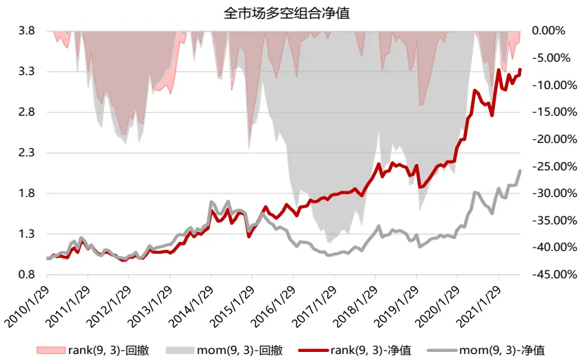

东方证券股份有限公司经相关主管机关核准具备证券投资咨询业务资格，据此开展发布证券研究报告业务。

东方证券股份有限公司及其关联机构在法律许可的范围内正在或将要与本研究报告所分析的企业发展业务关系。因此，投资者应当考虑到本公司可能存在对报告的客观性产生影响的利益冲突，不应视本证券研究报告为作出投资决策的唯一因素。

动量效应是指过去收益较高的股票，在未来一段时间内仍具有较高的收益。股票市场的动量效应最早由 Jegadeesh和 Titman (1993)在美国市场研究发现，他们发现过去 3~12 个月收益高的股票在接下来一段时间仍然表现较好，利用这一现象构造的多空组合能够获得持续的超额收益。此后，Rouwenhorst(1998)研究发现在欧洲十二个国家的股票市场存在与美国类似的动量效应，并且他还发现在一部分新兴市场也存在一定的动量效应。

然而在 A股市场中，股价的反转效应要远强于动量效应，全市场范围内没有显著的动量效应。本报告尝试构造一个更稳健的动量指标，用日收益率的 rank排名来代替收益率的绝对大小，以便降低市场过度反应对动量因子的负面影响。

## 一、动量因子的度量方法

传统的动量因子以过去一段时间股票的收益率作为因子值，由于 A 股市场短期存在明显的反转效应，所以在构造动量因子时，通常会剔除近期一段时间的收益率。动量因子的形式为MOM(N,M)，假设当前为 T0，那么 MOM(N,M)表示 T0-N-M 到 T0-M 区间内，这 N 期的股票收益。

改进后的动量因子基于股票每日收益率的 rank 排名，可以剔除异常股价波动的影响，从而使得因子表现更稳健。改进后动量因子的形式仍为 RANK(N,M)，假设当前为 T0，那么 RANK(N,M)表示 T0-N-M 到 T0-M 区间内，这 N 期的股票日收益排名得分情况。得分的具体计算方法参考 Chen,Tsung-Yu, et al. "Rank, Sign, and Momentum."。概括如下：

1. $R_{i,d}$ 代表股票 i 在d 天的日收益率， $y\big(R_{i,d}\big)$ 为横截面上 $R_{i,d}$ 的升序排名。

2. 计算每日每只股票收益率排名的标准化得分(Wright, 2000)。

$$
rank_{i,d}=(y\big(R_{i,d}\big)-\frac{N_{d}+1}{2})/\sqrt{\frac{(N_{d}+1)(N_{d}-1)}{12}}
$$

3. 计算每月每只股票收益率排名的标准化得分均值。

$$
rank_{i,D}=\frac{1}{D}{\sum}_{d=1}^{D_{j}}rank_{i,d}
$$

4. 计算因子考察期内（T0-N-M到 T0-M区间内）的股票收益率排名的标准化得分均值。

$$
rank_{i,d}(\mathsf{N},\mathsf{M})=\frac{1}{N}{\sum}_{j=t-N-M}^{t-M}(rank_{i,D_{j}})
$$

## 二、动量因子的表现

## 2.1数据与说明

回测区间为 2009.12.31-2021.08.08。每月底，计算 MOM 和 RANK 因子值。因子计算时有几点细节需要说明：

（1） 剔除当日停牌股的日收益率，剔除考察期内有效交易天数小于一半的股票。

（2） 股票池分别考察全市场、沪深 300、中证 500 股票池。

下面我们首先展示每年的样本数据个数。两因子在全市场内的覆盖度基本在 90%以上。

图 1：每期样本个数（全市场）
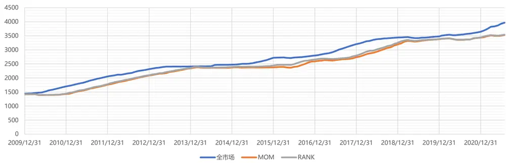
数据来源：Wind 资讯、东方证券研究所

## 2.2 因子表现汇总

## （1）计算周期的选择

首先，我们对比考察期为 (6, 1)、(6, 3)、(9, 1)、(9, 3)、(12, 1)、(12, 3)的 MOM 和 RANK 因子表现。因子缺失值使用回归法进行填充。从结果可以看出：MOM 因子在全市场范围内，不管是原始值还是中性化，不管采用哪个考察期，均无效，IC绝对值不超过 1.5%，ICIR 不超过 0.4。

图 2：MOM因子（全市场）绩效表现

| 全市场 MOM | 原始值 |  |  |  |  |  | 行业市值中性化 |  |  |  |  |  |
| --- | --- | --- | --- | --- | --- | --- | --- | --- | --- | --- | --- | --- |
|  | (6, 1) | (6, 3) | (9, 1) | (9, 3) | (12, 1) | (12, 3) | (6, 1) | (6, 3) | (9, 1) | (9,3) | (12, 1) | (12, 3) |
| IC | -0.65% | 1.26% | -0.93% | 1.12% | -0.85% | -0.20% | -0.95% | 0.53% | -1.02% | 0.70% | -0.90% | -0.30% |
| IC_IR | -0.17 | 0.33 | -0.22 | 0.28 | -0.20 | -0.05 | -0.38 | 0.22 | -0.38 | 0.29 | -0.35 | -0.13 |
| tstat | -0.57 | 1.14 | -0.74 | 0.95 | -0.67 | -0.17 | -1.29 | 0.75 | -1.29 | 0.98 | -1.18 | -0.45 |
| long_short_r | 0.01% | 0.70% | 0.14% | 0.60% | -0.01% | -0.26% | 0.08% | 0.37% | 0.17% | 0.57% | 0.09% | -0.07% |
| long_short_win | 52.14% | 57.14% | 50.71% | 54.29% | 51.43% | 49.29% | 52.86% | 55.00% | 55.71% | 60.00% | 53.57% | 45.71% |
| long_short_sharp | 0.01 | 0.54 | 0.09 | 0.42 | 0.00 | -0.19 | 0.09 | 0.45 | 0.18 | 0.65 | 0.09 | -0.09 |
| long_short_drwandown | -43.96% | -25.69% | -42.48% | -39.03% | -45.07% | -45.16% | -35.32% | -17.27% | -36.03% | -16.06% | -33.54% | -29.69% |
| long_short_yearly | -1.44% | 7.62% | -0.29% | 6.48% | -2.08% | -4.57% | 0.23% | 4.08% | 1.22% | 6.76% | 0.32% | -1.39% |
| 2011/12/30 | 13.43% | -18.86% | 22.76% | -18.23% | 25.40% | 22.47% | 9.21% | -9.81% | 11.65% | -10.83% | 11.44% | 10.48% |
| 2012/12/31 | 16.74% | -4.27% | 4.36% | 17.19% | -8.93% | -10.41% | 12.97% | -2.63% | 0.16% | 10.54% | -7.67% | -4.61% |
| 2013/12/31 | -25.60% | 26.19% | -24.50% | 21.36% | -22.65% | -12.07% | -13.87% | 16.62% | -13.60% | 20.05% | -12.14% | -7.65% |
| 2014/12/31 | -0.06% | 17.37% | 1.24% | -5.76% | 13.65% | 6.13% | 9.94% | 2.26% | 17.91% | -5.62% | 32.23% | 14.39% |
| 2015/12/31 | 44.99% | 4.12% | 55.29% | -7.25% | 38.79% | -3.11% | 11.39% | 7.23% | 22.25% | 12.56% | 9.59% | -9.59% |
| 2016/12/30 | 13.58% | -13.10% | 21.56% | -16.04% | 13.78% | 16.34% | 13.66% | -10.91% | 22.09% | -12.83% | 15.85% | 17.51% |
| 2017/12/29 | -13.19% | 16.26% | -9.50% | 22.48% | -9.66% | -12.63% | 0.19% | 6.61% | 0.07% | 8.58% | 1.32% | -1.71% |
| 2018/12/28 | -1.95% | 0.97% | 6.00% | -3.78% | 10.21% | 9.68% | -3.48% | 2.97% | 0.69% | 2.54% | -0.95% | 4.15% |
| 2019/12/31 | -7.76% | -4.52% | 2.64% | 2.64% | -5.38% | -7.27% | -4.51% | -4.92% | 1.21% | 2.12% | -3.21% | -3.27% |
| 2020/12/31 | -22.72% | 33.89% | -28.03% | 38.03% | -27.06% | -24.98% | -14.62% | 18.71% | -15.91% | 24.58% | -14.40% | -14.18% |
| 2021/8/6 | -2.48% | 17.31% | -13.51% | 19.91% | -11.15% | -2.82% | -12.70% | 20.38% | -17.69% | 19.89% | -13.36% | -7.02% |

数据来源：Wind 资讯、东方证券研究所

图 3：MOM因子（全市场）多空组合净值
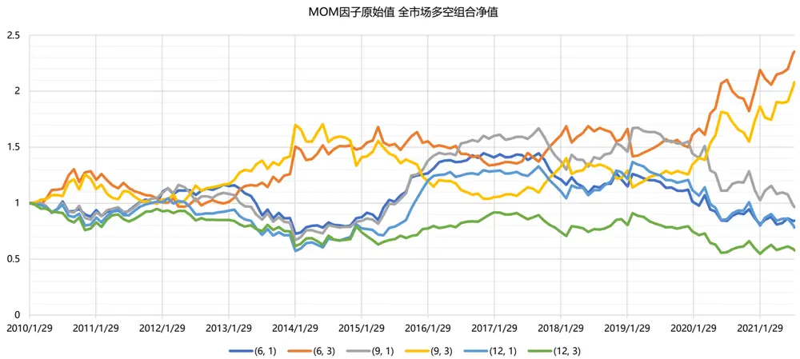
数据来源：Wind 资讯、东方证券研究所

而 RANK因子在全市场范围内，不管是原始值还是中性化，不管采用哪个考察期，因子均有效，IC 均超过 2%，ICIR 超过 0.6，最大回撤在 20%左右，多空组合年化收益最高可达 11%。

图 4：RANK 因子（全市场）绩效表现

| 全市场 RANK | 原始值 |  |  |  |  |  | 行业市值中性化 |  |  |  |  |  |
| --- | --- | --- | --- | --- | --- | --- | --- | --- | --- | --- | --- | --- |
|  | (6, 1) | (6, 3) | (9, 1) | (9,3) | (12, 1) | (12, 3) | (6, 1) | (6, 3) | (9, 1) | (9, 3) | (12, 1) | (12, 3) |
| IC | 2.48% | 2.71% | 2.51% | 2.85% | 2.29% | 2.33% | 2.01% | 2.14% | 2.16% | 2.42% | 2.07% | 2.03% |
| IC_IR | 0.70 | 0.77 | 0.68 | 0.81 | 0.62 | 0.67 | 0.83 | 0.96 | 0.87 | 1.12 | 0.88 | 0.98 |
| tstat | 2.39 | 2.62 | 2.32 | 2.76 | 2.13 | 2.29 | 2.82 | 3.27 | 2.97 | 3.83 | 2.99 | 3.34 |
| long_short_r | 0.93% | 0.95% | 0.93% | 0.95% | 0.84% | 0.78% | 0.69% | 0.72% | 0.68% | 0.67% | 0.52% | 0.41% |
| long_short_win | 60.00% | 57.86% | 61.43% | 59.29% | 57.14% | 55.00% | 57.14% | 57.14% | 59.29% | 59.29% | 58.57% | 59.29% |
| long_short_sharp | 0.74 | 0.76 | 0.69 | 0.73 | 0.62 | 0.62 | 0.77 | 0.87 | 0.75 | 0.85 | 0.59 | 0.54 |
| long_short_drwandown | -21.96% | -22.46% | -24.07% | -21.23% | -21.65% | -20.38% | -21.83% | -11.75% | -19.24% | -15.65% | -28.21% | -15.59% |
| long_short_yearly | 10.77% | 11.04% | 10.66% | 10.86% | 9.37% | 8.80% | 7.95% | 8.33% | 7.84% | 7.84% | 5.84% | 4.66% |
| 2011/12/30 | -11.63% | -19.22% | -17.29% | -17.50% | -15.98% | -16.66% | -7.25% | -8.05% | -10.87% | -9.35% | -10.35% | -9.30% |
| 2012/12/31 | -6.49% | 4.13% | 5.06% | 11.22% | 4.78% | 5.81% | 1.22% | 8.54% | 5.43% | 10.52% | 5.90% | 5.17% |
| 2013/12/31 | 40.29% | 24.52% | 36.89% | 25.74% | 25.92% | 21.51% | 34.15% | 20.33% | 26.51% | 23.01% | 22.23% | 20.00% |
| 2014/12/31 | 3.71% | 8.65% | -2.59% | -7.48% | -9.09% | -10.45% | -5.45% | 1.47% | -5.98% | -8.87% | -12.40% | -10.30% |
| 2015/12/31 | 13.22% | 20.38% | 20.74% | 27.88% | 22.42% | 40.22% | -1.45% | 4.78% | 6.28% | 10.86% | -3.60% | 8.51% |
| 2016/12/30 | 5.19% | 4.07% | 1.59% | 9.53% | 2.50% | 3.98% | -4.73% | -6.38% | -4.58% | -2.78% | -3.94% | -6.45% |
| 2017/12/29 | 14.87% | 16.33% | 16.12% | 11.72% | 11.63% | 11.97% | 8.21% | 11.42% | 10.13% | 9.20% | 9.44% | 9.58% |
| 2018/12/28 | -1.16% | 1.23% | -1.88% | 2.75% | 0.29% | -4.26% | 4.43% | 5.71% | 4.23% | 5.55% | 5.87% | 0.51% |
| 2019/12/31 | 11.67% | 1.63% | 15.58% | 7.92% | 13.85% | 6.18% | 13.46% | 3.20% | 12.62% | 7.27% | 13.07% | 6.08% |
| 2020/12/31 | 36.76% | 40.39% | 39.70% | 39.32% | 40.81% | 39.19% | 33.39% | 38.31% | 29.81% | 29.51% | 30.58% | 26.59% |
| 2021/8/6 | 6.05% | 13.71% | 7.37% | 8.71% | 6.56% | -0.34% | 8.65% | 11.43% | 10.65% | 9.97% | 7.80% | 1.63% |

数据来源：Wind 资讯、东方证券研究所

图 5：RANK 因子（全市场）多空组合净值
RANK因子原始值 全市场多空组合净值
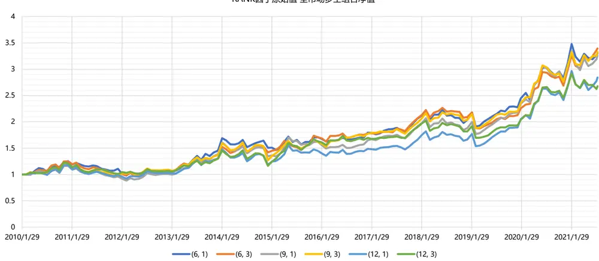
数据来源：Wind 资讯、东方证券研究所

究其原因，我们认为传统动量因子 MOM的构造并不十分合理。

1.MOM构造时所使用的数据仅为起始节点和末尾节点的股价数据，对于期间的股价信息并未充分反映。

2.MOM考察的是区间收益率的绝对值大小，数据噪音大，对异常股价波动十分敏感。散户投资者对利好消息容易过度反应，短时间急速拉抬股价，这就使得采用传统 MOM 因子选出的过去涨幅高的股票，可能只是短期拉升的结果，不具有持续性，与基本面相背离。

而 RANK 因子在构造时，考虑到了区间内每日的收益率情况，并且采用 rank 排名来替代收益率绝对大小，可以降低异常股价波动的影响，是一种更加稳健的做法。

## （2）股票池的影响

下面我们考察不同股票池内因子表现的差异。首先，在不同市值范围的指数中，RANK 因子的表现基本都要好于 MOM因子，并且在 300 中的效果优于 500，在 800中的效果优于 1000。

MOM因子在沪深 300 中，存在一定的选股效果，在中证 500 中选股效果减弱，在中证 1000中几乎无效。RANK 因子不同股票池中，IC 都能达到 2%以上，ICIR 在 0.6 左右，效果更稳健。

图 6：MOM 因子 vs RANK 因子（沪深 300）

| 沪深300 MOM | 原始值 |  |  |  |  |  | 行业市值中性化 |  |  |  |  |  |
| --- | --- | --- | --- | --- | --- | --- | --- | --- | --- | --- | --- | --- |
|  | (6, 1) | (6, 3) | (9, 1) | (9,3) | (12, 1) | (12, 3) | (6, 1) | (6, 3) | (9, 1) | (9,3) | (12, 1) | (12, 3) |
| IC | 3.23% | 4.83% | 3.79% | 5.39% | 4.10% | 3.73% | 1.39% | 2.05% | 1.83% | 2.71% | 2.01% | 1.67% |
| IC_IR | 0.58 | 0.88 | 0.64 | 0.95 | 0.69 | 0.63 | 0.41 | 0.69 | 0.55 | 0.91 | 0.60 | 0.53 |
| tstat | 1.96 | 3.02 | 2.18 | 3.23 | 2.35 | 2.15 | 1.41 | 2.37 | 1.88 | 3.09 | 2.06 | 1.80 |
| long_short_r | 1.09% | 1.31% | 1.11% | 1.30% | 1.11% | 0.92% | 0.63% | 0.64% | 0.64% | 0.71% | 0.69% | 0.57% |
| long_short_win | 61.43% | 58.57% | 59.29% | 57.86% | 57.86% | 55.71% | 62.86% | 55.71% | 62.14% | 57.86% | 59.29% | 56.43% |
| long_short_sharp | 0.70 | 0.84 | 0.67 | 0.84 | 0.70 | 0.58 | 0.67 | 0.71 | 0.68 | 0.81 | 0.73 | 0.64 |
| long_short_drwandown | -23.99% | -26.78% | -26.72% | -34.28% | -30.53% | -36.60% | -16.15% | -16.92% | -21.81% | -16.87% | -14.45% | -20.41% |
| long_short_yearly | 12.69% | 15.98% | 13.06% | 16.28% | 13.11% | 10.34% | 7.54% | 7.66% | 7.49% | 8.44% | 8.29% | 6.68% |
| 2011/12/30 | -11.33% | -3.96% | -7.20% | 2.03% | -6.51% | -10.83% | -6.95% | 8.34% | -0.87% | 9.63% | -2.14% | -0.88% |
| 2012/12/31 | -10.99% | -3.68% | -4.23% | 19.92% | 13.38% | 22.87% | -8.76% | -8.47% | 2.33% | 10.05% | 12.90% | 11.22% |
| 2013/12/31 | 41.19% | 32.06% | 41.07% | 34.83% | 28.97% | 20.29% | 13.56% | 15.05% | 13.16% | 14.19% | 20.47% | 17.17% |
| 2014/12/31 | 8.28% | 20.96% | 11.72% | 1.58% | -3.09% | -11.61% | 1.38% | 1.82% | 2.83% | -0.66% | -4.21% | -5.01% |
| 2015/12/31 | -18.61% | 3.86% | -21.58% | -12.18% | -9.63% | -0.91% | -1.67% | 5.92% | -4.93% | -1.10% | 2.04% | 2.54% |
| 2016/12/30 | 5.37% | -6.42% | -2.08% | -11.18% | -10.70% | -15.61% | 3.06% | -4.14% | -8.25% | -3.04% | -5.23% | -10.78% |
| 2017/12/29 | 37.86% | 50.63% | 46.90% | 40.29% | 39.91% | 36.99% | 18.45% | 21.05% | 21.29% | 8.92% | 8.76% | 11.41% |
| 2018/12/28 | 8.19% | 10.96% | 0.93% | 3.22% | 3.81% | 4.82% | 8.96% | 8.62% | 8.24% | 10.05% | 4.41% | 7.70% |
| 2019/12/31 | 6.51% | -5.14% | 4.79% | 11.10% | 11.49% | 2.70% | 3.47% | -1.54% | 4.97% | 0.26% | 7.61% | 4.16% |
| 2020/12/31 | 57.83% | 48.36% | 47.12% | 53.19% | 49.33% | 45.00% | 37.64% | 32.86% | 28.73% | 32.06% | 37.18% | 20.56% |
| 2021/8/6 | 24.95% | 28.70% | 29.53% | 32.96% | 25.61% | 17.20% | 17.78% | 16.13% | 12.63% | 16.70% | 12.52% | 16.25% |

| 沪深300 RANK | 原始值 |  |  |  |  |  | 行业市值中性化 |  |  |  |  |  |
| --- | --- | --- | --- | --- | --- | --- | --- | --- | --- | --- | --- | --- |
|  | (6, 1) | (6, 3) | (9, 1) | (9, 3) | (12, 1) | (12, 3) | (6, 1) | (6, 3) | (9, 1) | (9, 3) | (12, 1) | (12, 3) |
| IC | 4.80% | 4.85% | 5.12% | 4.90% | 4.64% | 4.07% | 3.44% | 3.05% | 3.92% | 3.54% | 3.86% | 3.04% |
| IC_IR | 0.90 | 0.93 | 0.95 | 0.94 | 0.86 | 0.77 | 1.08 | 1.02 | 1.19 | 1.21 | 1.20 | 1.00 |
| tstat | 3.08 | 3.17 | 3.26 | 3.20 | 2.93 | 2.64 | 3.69 | 3.48 | 4.07 | 4.13 | 4.11 | 3.40 |
| long_short_r | 1.35% | 1.23% | 1.42% | 1.17% | 1.06% | 0.92% | 0.95% | 0.83% | 0.79% | 0.83% | 0.87% | 0.67% |
| long_short_win | 60.00% | 57.86% | 59.29% | 59.29% | 59.29% | 55.71% | 62.14% | 57.86% | 63.57% | 65.71% | 63.57% | 60.71% |
| long_short_sharp | 0.92 | 0.83 | 0.95 | 0.83 | 0.74 | 0.68 | 1.02 | 0.99 | 0.91 | 1.02 | 0.98 | 0.82 |
| long_short_drwandown | -17.13% | -21.07% | -21.90% | -22.13% | -21.82% | -18.96% | -13.01% | -11.31% | -14.97% | -11.25% | -13.05% | -12.40% |
| long_short_yearly | 16.42% | 14.87% | 17.55% | 14.23% | 12.87% | 10.63% | 11.45% | 9.96% | 9.60% | 10.08% | 10.59% | 7.87% |
| 2011/12/30 | -6.33% | -12.25% | -5.08% | -10.75% | -13.47% | -10.89% | -2.08% | -0.04% | -1.96% | 0.60% | 1.18% | 2.24% |
| 2012/12/31 | -3.56% | 2.31% | 5.38% | 17.02% | 5.72% | 11.12% | -8.58% | -5.95% | 0.09% | 4.62% | 4.34% | -1.43% |
| 2013/12/31 | 33.58% | 19.79% | 34.96% | 25.54% | 23.75% | 20.21% | 16.81% | 23.49% | 22.13% | 12.65% | 21.28% | 14.99% |
| 2014/12/31 | 10.03% | 8.23% | 3.90% | -12.17% | -9.19% | -13.87% | 3.13% | 4.23% | 3.01% | -4.83% | 3.85% | -4.36% |
| 2015/12/31 | 0.88% | 2.47% | 2.85% | 5.14% | 4.32% | 9.13% | 8.87% | 0.68% | 0.72% | 2.66% | -5.34% | 2.27% |
| 2016/12/30 | 0.32% | 4.53% | 0.55% | -2.25% | -2.11% | -6.63% | 1.75% | -1.73% | -3.11% | -0.30% | 1.60% | -6.43% |
| 2017/12/29 | 48.01% | 40.58% | 48.91% | 35.20% | 40.95% | 35.80% | 32.82% | 19.15% | 23.87% | 21.06% | 20.87% | 16.29% |
| 2018/12/28 | 5.70% | 2.53% | 1.25% | 3.10% | 0.55% | -1.13% | 7.58% | 12.05% | 5.40% | 5.37% | 4.72% | 6.53% |
| 2019/12/31 | 22.32% | 18.55% | 18.29% | 18.63% | 16.87% | 12.79% | 10.10% | 10.87% | 7.03% | 14.07% | 11.58% | 7.16% |
| 2020/12/31 | 58.82% | 48.11% | 71.31% | 61.64% | 63.77% | 64.94% | 41.43% | 39.16% | 43.34% | 38.83% | 42.71% | 37.76% |
| 2021/8/6 | 21.02% | 25.17% | 26.06% | 19.06% | 21.81% | 14.14% | 21.63% | 18.58% | 17.21% | 17.69% | 16.61% | 21.50% |

数据来源：Wind 资讯、东方证券研究所

图 7：MOM 因子 vs RANK 因子（中证 500）

| 中证500 MOM | 原始值 |  |  |  |  |  | 行业市值中性化 |  |  |  |  |  |
| --- | --- | --- | --- | --- | --- | --- | --- | --- | --- | --- | --- | --- |
|  | (6, 1) | (6, 3) | (9, 1) | (9, 3) | (12, 1) | (12, 3) | (6, 1) | (6, 3) | (9, 1) | (9, 3) | (12, 1) | (12, 3) |
| IC | 0.29% | 2.13% | -0.07% | 2.13% | 0.37% | 0.61% | 0.29% | 2.08% | 0.53% | 2.39% | 0.80% | 1.18% |
| IC_IR | 0.06 | 0.49 | -0.01 | 0.46 | 0.07 | 0.13 | 0.13 | 0.96 | 0.22 | 1.03 | 0.36 | 0.50 |
| tstat | 0.21 | 1.68 | -0.05 | 1.56 | 0.25 | 0.44 | 0.43 | 3.28 | 0.77 | 3.53 | 1.23 | 1.70 |
| long_short_r | 0.42% | 0.77% | -0.19% | 0.83% | 0.30% | 0.39% | 0.20% | 0.68% | 0.30% | 0.67% | 0.13% | 0.32% |
| long_short_win | 52.14% | 52.86% | 50.71% | 57.86% | 50.00% | 54.29% | 52.86% | 62.14% | 50.00% | 57.86% | 51.43% | 56.43% |
| long_short_sharp | 0.33 | 0.65 | -0.13 | 0.65 | 0.21 | 0.30 | 0.29 | 1.01 | 0.43 | 0.91 | 0.19 | 0.43 |
| long_short_drwandown | -38.39% | -25.09% | -56.63% | -30.33% | -53.69% | -40.64% | -26.17% | -9.91% | -19.39% | -10.38% | -22.71% | -16.24% |
| long_short_yearly | 4.19% | 8.71% | -3.84% | 9.51% | 2.44% | 3.57% | 2.21% | 8.36% | 3.52% | 8.15% | 1.31% | 3.48% |
| 2011/12/30 | -12.86% | -16.67% | 22.43% | -18.35% | -14.88% | -15.85% | -7.18% | -3.54% | -7.97% | -8.86% | -5.10% | -6.44% |
| 2012/12/31 | -17.37% | -3.05% | -0.85% | 10.59% | 2.20% | 7.88% | -8.91% | 2.58% | 0.48% | 5.46% | -0.37% | 6.48% |
| 2013/12/31 | 19.56% | 21.86% | -17.62% | 22.08% | 16.23% | 19.57% | 8.19% | 13.45% | 12.90% | 16.46% | 6.68% | 11.00% |
| 2014/12/31 | -5.72% | 3.49% | 13.07% | -9.72% | -20.07% | -20.02% | -7.68% | 4.28% | -11.38% | -2.29% | -15.92% | -11.06% |
| 2015/12/31 | -11.51% | 10.01% | 26.65% | 1.91% | -20.93% | -1.84% | -0.41% | 24.05% | 7.08% | 18.69% | 0.23% | 27.07% |
| 2016/12/30 | -12.64% | -8.64% | 19.09% | -14.06% | -17.99% | -15.71% | -8.93% | -0.16% | -11.87% | -0.37% | -5.68% | -2.38% |
| 2017/12/29 | 15.68% | 19.08% | -16.23% | 32.36% | 27.09% | 24.95% | 1.96% | 5.52% | 5.29% | 14.90% | 10.51% | 11.45% |
| 2018/12/28 | 8.70% | 16.36% | -2.69% | 10.08% | 3.46% | 1.40% | 10.04% | 4.51% | 8.48% | 4.12% | -1.88% | -7.74% |
| 2019/12/31 | 10.55% | 2.15% | -6.45% | 8.39% | 12.74% | 8.95% | 1.62% | 2.83% | 3.14% | 4.29% | 6.86% | 3.82% |
| 2020/12/31 | 33.86% | 18.94% | -24.06% | 44.56% | 24.70% | 26.72% | 10.40% | 15.05% | 8.35% | 16.48% | 5.40% | 7.59% |
| 2021/8/6 | 20.32% | 26.29% | -24.92% | 23.92% | 22.06% | 8.07% | 19.04% | 21.94% | 16.57% | 21.27% | 9.61% | 4.11% |

| 中证500 RANK | 原始值 |  |  |  |  |  | 行业市值中性化 |  |  |  |  |  |
| --- | --- | --- | --- | --- | --- | --- | --- | --- | --- | --- | --- | --- |
|  | (6, 1) | (6, 3) | (9, 1) | (9, 3) | (12, 1) | (12, 3) | (6, 1) | (6, 3) | (9, 1) | (9, 3) | (12, 1) | (12, 3) |
| IC | 2.10% | 2.31% | 2.06% | 2.57% | 1.75% | 1.89% | 2.32% | 2.78% | 2.78% | 2.97% | 2.71% | 2.66% |
| IC_IR | 0.50 | 0.57 | 0.48 | 0.63 | 0.41 | 0.48 | 0.99 | 1.24 | 1.16 | 1.34 | 1.18 | 1.27 |
| tstat | 1.72 | 1.94 | 1.63 | 2.16 | 1.40 | 1.63 | 3.37 | 4.25 | 3.98 | 4.59 | 4.03 | 4.35 |
| long_short_r | 0.73% | 0.71% | 0.68% | 0.60% | 0.45% | 0.42% | 0.67% | 0.54% | 0.57% | 0.67% | 0.58% | 0.47% |
| long_short_win | 54.29% | 58.57% | 57.86% | 60.71% | 56.43% | 55.71% | 60.71% | 57.14% | 58.57% | 62.14% | 60.71% | 57.86% |
| long_short_sharp | 0.63 | 0.60 | 0.55 | 0.51 | 0.38 | 0.37 | 0.92 | 0.83 | 0.78 | 0.95 | 0.82 | 0.73 |
| long_short_drwandown | -19.74% | -24.11% | -28.99% | -27.53% | -28.47% | -27.76% | -15.48% | -11.73% | -16.01% | -14.15% | -11.35% | -10.84% |
| long_short_yearly | 8.32% | 8.01% | 7.74% | 6.59% | 4.92% | 4.29% | 8.14% | 6.38% | 6.94% | 7.95% | 6.91% | 5.47% |
| 2011/12/30 | -10.11% | -18.86% | -15.57% | -17.25% | -14.07% | -15.71% | -5.99% | -6.71% | -5.21% | -1.07% | -4.31% | -3.52% |
| 2012/12/31 | -4.66% | 2.84% | 4.08% | 4.83% | 1.62% | -3.57% | 2.07% | 3.77% | 1.58% | 4.56% | 2.77% | 4.03% |
| 2013/12/31 | 17.43% | 14.39% | 21.79% | 16.87% | 14.67% | 19.26% | 14.95% | 11.15% | 14.24% | 14.71% | 12.08% | 5.61% |
| 2014/12/31 | -8.16% | -11.01% | -13.08% | -19.88% | -16.04% | -22.89% | -10.37% | -8.11% | -10.44% | -10.98% | -8.86% | -9.95% |
| 2015/12/31 | 2.16% | 7.05% | 1.62% | 12.81% | -0.39% | 17.83% | 17.50% | 11.31% | 6.58% | 16.01% | 2.16% | 5.85% |
| 2016/12/30 | -0.74% | -6.18% | -7.88% | -2.79% | -3.89% | -6.00% | -0.70% | -1.77% | -5.59% | 3.67% | 2.05% | -2.14% |
| 2017/12/29 | 24.21% | 19.97% | 24.13% | 20.24% | 19.00% | 16.21% | 14.67% | 7.78% | 15.06% | 10.99% | 12.88% | 12.44% |
| 2018/12/28 | 11.93% | 12.07% | 8.34% | 5.79% | 4.24% | -0.98% | 14.89% | 11.32% | 11.00% | 9.22% | 9.18% | 3.61% |
| 2019/12/31 | 7.56% | 5.04% | 7.23% | 7.32% | 11.77% | 11.58% | 6.22% | 8.77% | 8.94% | 9.74% | 13.54% | 12.73% |
| 2020/12/31 | 23.68% | 26.61% | 32.70% | 26.71% | 24.71% | 22.58% | 20.33% | 16.29% | 25.19% | 19.14% | 24.15% | 22.46% |
| 2021/8/6 | 21.95% | 28.21% | 21.61% | 21.46% | 13.54% | 6.37% | 10.03% | 9.52% | 11.73% | 16.93% | 10.26% | 3.03% |

数据来源：Wind 资讯、东方证券研究所

图 8：MOM 因子 vs RANK 因子（中证 1000）

| 中证1000 MOM | 原始值 |  |  |  |  |  | 行业市值中性化 |  |  |  |  |  |
| --- | --- | --- | --- | --- | --- | --- | --- | --- | --- | --- | --- | --- |
|  | (6, 1) | (6, 3) | (9, 1) | (9, 3) | (12, 1) | (12, 3) | (6, 1) | (6, 3) | (9, 1) | (9, 3) | (12, 1) | (12, 3) |
| IC | -1.39% | 0.40% | -1.86% | 0.17% | -1.89% | -1.24% | 0.26% | 1.56% | 0.19% | 1.87% | 0.18% | 1.14% |
| IC_IR | -0.37 | 0.11 | -0.44 | 0.04 | -0.45 | -0.33 | 0.12 | 0.78 | 0.09 | 0.93 | 0.08 | 0.61 |
| tstat | -1.25 | 0.38 | -1.51 | 0.15 | -1.55 | -1.11 | 0.42 | 2.68 | 0.29 | 3.19 | 0.29 | 2.08 |
| long_short_r | 0.23% | 0.27% | 0.30% | 0.26% | 0.26% | 0.16% | 0.21% | 0.54% | 0.11% | 0.67% | 0.16% | 0.40% |
| long_short_win | 52.86% | 54.29% | 55.71% | 50.71% | 52.86% | 54.29% | 52.86% | 63.57% | 49.29% | 62.86% | 53.57% | 62.14% |
| long_short_sharp | 0.20 | 0.25 | 0.22 | 0.24 | 0.20 | 0.14 | 0.32 | 0.92 | 0.16 | 1.08 | 0.24 | 0.68 |
| long_short_drwandown | -41.12% | -30.88% | -47.01% | -41.48% | -46.56% | -39.27% | -15.87% | -11.04% | -30.88% | -9.03% | -16.76% | -12.01% |
| long_short_yearly | 1.58% | 2.21% | 2.11% | 2.41% | 1.96% | 1.17% | 2.40% | 6.36% | 0.97% | 8.03% | 1.55% | 4.65% |
| 2011/12/30 | 12.02% | -15.03% | 20.49% | -16.35% | 22.64% | 22.21% | 0.13% | 0.45% | -2.37% | -4.05% | -7.18% | -3.59% |
| 2012/12/31 | 16.54% | -2.97% | 4.95% | 8.40% | 0.98% | -1.41% | -8.90% | 3.63% | -1.83% | 7.66% | 1.21% | 3.27% |
| 2013/12/31 | -15.52% | 11.48% | -17.22% | 9.97% | -12.66% | -4.87% | 10.28% | 12.00% | 8.28% | 9.70% | 6.67% | 2.24% |
| 2014/12/31 | 0.25% | 11.56% | 5.32% | -5.33% | 13.35% | 8.64% | 3.18% | 10.05% | -2.74% | 3.09% | -6.95% | 1.36% |
| 2015/12/31 | 50.81% | -5.18% | 59.01% | -9.97% | 37.91% | 12.43% | -3.09% | 20.70% | -10.34% | 34.79% | 3.42% | 26.65% |
| 2016/12/30 | 14.82% | -14.09% | 23.59% | -13.12% | 17.75% | 20.30% | -5.94% | -1.41% | -10.55% | 0.72% | -2.77% | 4.48% |
| 2017/12/29 | -13.06% | 8.27% | -8.81% | 11.31% | -7.11% | -11.52% | 5.76% | 2.69% | 2.66% | 4.71% | 2.54% | -1.02% |
| 2018/12/28 | 4.96% | -8.55% | 10.30% | -10.20% | 9.38% | 11.13% | 2.38% | -1.96% | -2.87% | 0.99% | -2.39% | -3.79% |
| 2019/12/31 | -6.41% | -2.79% | -5.53% | 5.68% | -9.38% | -8.20% | 2.62% | -1.37% | 2.17% | 4.60% | 7.16% | 10.12% |
| 2020/12/31 | -25.88% | 27.65% | -24.20% | 32.70% | -24.72% | -22.11% | 16.37% | 14.67% | 14.01% | 17.13% | 12.16% | 16.19% |
| 2021/8/6 | -5.97% | 19.90% | -20.49% | 26.32% | -16.20% | -7.85% | 10.71% | 15.90% | 20.81% | 17.12% | 10.07% | -1.68% |

| 中证1000 RANK | 原始值 |  |  |  |  |  | 行业市值中性化 |  |  |  |  |  |
| --- | --- | --- | --- | --- | --- | --- | --- | --- | --- | --- | --- | --- |
|  | (6, 1) | (6, 3) | (9, 1) | (9, 3) | (12, 1) | (12, 3) | (6, 1) | (6, 3) | (9, 1) | (9, 3) | (12, 1) | (12, 3) |
| IC | 1.92% | 2.28% | 1.96% | 2.38% | 1.76% | 1.98% | 2.68% | 2.97% | 2.93% | 3.06% | 2.81% | 2.94% |
| IC_IR | 0.57 | 0.71 | 0.56 | 0.74 | 0.51 | 0.63 | 1.21 | 1.50 | 1.32 | 1.57 | 1.31 | 1.60 |
| tstat | 1.93 | 2.42 | 1.92 | 2.53 | 1.73 | 2.15 | 4.12 | 5.11 | 4.52 | 5.38 | 4.46 | 5.47 |
| long_short_r | 0.63% | 0.57% | 0.62% | 0.62% | 0.49% | 0.46% | 0.66% | 0.68% | 0.69% | 0.71% | 0.61% | 0.50% |
| long_short_win | 54.29% | 56.43% | 55.00% | 57.14% | 53.57% | 52.86% | 59.29% | 60.00% | 62.14% | 62.14% | 61.43% | 61.43% |
| long_short_sharp | 0.62 | 0.59 | 0.59 | 0.64 | 0.47 | 0.49 | 0.96 | 1.07 | 0.99 | 1.16 | 0.94 | 0.87 |
| long_short_drwandown | -19.86% | -22.31% | -23.42% | -21.23% | -25.81% | -22.14% | -10.44% | -10.99% | -9.62% | -11.72% | -9.57% | -9.65% |
| long_short_yearly | 7.09% | 6.22% | 6.78% | 6.88% | 5.19% | 4.82% | 7.65% | 8.04% | 8.04% | 8.37% | 6.98% | 5.69% |
| 2011/12/30 | -8.32% | -13.69% | -14.42% | -14.51% | -12.59% | -14.67% | -3.05% | -0.96% | -3.42% | -4.97% | -4.93% | -4.59% |
| 2012/12/31 | -6.41% | 1.74% | -1.59% | 6.63% | -1.60% | 3.32% | 1.69% | 5.68% | 2.67% | 12.85% | 2.13% | 6.61% |
| 2013/12/31 | 32.57% | 23.90% | 32.95% | 22.05% | 27.60% | 19.09% | 22.49% | 16.70% | 20.75% | 12.17% | 16.08% | 9.60% |
| 2014/12/31 | -1.31% | -2.08% | -6.60% | -9.86% | -11.24% | -6.71% | -0.66% | 3.16% | -0.45% | -0.90% | -2.64% | -0.31% |
| 2015/12/31 | -4.03% | 0.60% | 3.95% | 7.82% | 2.77% | 7.49% | 7.09% | 9.32% | 11.48% | 19.91% | 10.11% | 14.23% |
| 2016/12/30 | -1.23% | -3.23% | -5.44% | -0.43% | -3.01% | -4.28% | -4.66% | -3.68% | -4.91% | 3.21% | 0.30% | 1.81% |
| 2017/12/29 | 9.52% | 9.68% | 10.10% | 7.41% | 8.64% | 5.37% | 6.61% | 8.07% | 8.18% | 5.70% | 8.15% | 3.95% |
| 2018/12/28 | -2.25% | -6.73% | -2.68% | -2.23% | -7.24% | -6.44% | 0.51% | -2.93% | 0.38% | -2.21% | -1.24% | -0.09% |
| 2019/12/31 | 11.27% | 5.20% | 12.71% | 9.32% | 12.26% | 10.24% | 11.92% | 4.99% | 12.27% | 6.18% | 13.97% | 10.31% |
| 2020/12/31 | 41.75% | 29.64% | 36.45% | 32.23% | 31.47% | 32.76% | 31.67% | 32.86% | 29.68% | 27.23% | 29.12% | 24.39% |
| 2021/8/6 | 19.32% | 21.23% | 23.72% | 20.44% | 16.09% | 9.94% | 15.10% | 13.83% | 16.90% | 11.56% | 6.69% | -1.65% |

数据来源：Wind 资讯、东方证券研究所

其次，两因子均表现出在高机构持仓比的股票中表现更好的特点。MOM(6,3)和 MOM(9,3)原始值在机构持股比最高的分组中 IC 在 0.03 以上，ICIR 在 0.7 以上，说明在机构持股比高的分组中确实存在一定的动量效应。而在机构持股比最低的分组中，所有形成期的动量因子方向均为负，动量效应变成了反转效应，反映了散户投资者参与较多的股票更容易产生过度反应。中性化后MOM因子效果减弱。

RANK 因子原始值在所有考察期内，机构持股比最高的分组中 IC均在 0.03以上，ICIR在 0.7以上，中性化 RANK因子效果基本和原始值相同，整体效果更稳健。

图 9：MOM因子（全市场，不同机构持股比分组）

| 全市场 | 原始值 | 按机构持仓比例分组 | IC | IC_IR | long_short_win | long_short_sharp | long_short_drwandown | long_short_yearly |
| --- | --- | --- | --- | --- | --- | --- | --- | --- |
|  | (6, 1) | 全市场 | -0.65% | (0.17) | 52.14% | 0.01 | -43.96% | -1.44% |
|  |  | low | -3.52% | (1.01) | 61.43% | 0.73 | -29.70% | 10.63% |
|  |  | 2 | -1.51% | (0.40) | 55.00% | 0.23 | -32.20% | 2.14% |
|  |  | 3 | -0.58% | (0.13) | 47.14% | (0.09) | -45.52% | -3.01% |
|  |  | high | 1.91% | 0.38 | 55.00% | 0.35 | -55.12% | 5.70% |
|  | (6, 3) | 全市场 | 1.26% | 0.33 | 57.14% | 0.54 | -25.69% | 7.62% |
|  |  | low | -1.90% | (0.59) | 52.86% | 0.13 | -43.15% | 0.64% |
|  |  | 2 | 0.70% | 0.19 | 53.57% | 0.25 | -24.60% | 2.93% |
|  |  | 3 | 1.65% | 0.41 | 55.71% | 0.57 | -32.57% | 8.47% |
|  |  | high | 3.57% | 0.75 | 59.29% | 0.83 | -27.05% | 16.63% |
| mom | (9, 1) | 全市场 | -0.93% | (0.22) | 50.71% | 0.09 | -42.48% | -0.29% |
|  |  | low | -4.37% | (1.19) | 60.71% | 0.94 | -19.04% | 14.36% |
|  |  | 2 | -1.58% | (0.37) | 51.43% | 0.33 | -38.09% | 4.43% |
|  |  | 3 | -0.73% | (0.16) | 50.00% | 0.04 | -49.07% | -1.17% |
|  |  | high | 2.09% | 0.39 | 55.00% | 0.34 | -65.55% | 6.31% |
|  | 全市场 low | 1.12% | 0.28 | 54.29% | 0.42 | -39.03% | 6.48% |  |
|  | (9, 3) |  | -2.25% | (0.68) | 53.57% | 0.37 | -23.34% | 4.27% |
| 2 |  | 0.10% | 0.03 | 51.43% | 0.07 | -56.79% | -0.16% |  |
| 3 |  | 1.83% | 0.42 | 61.43% | 0.44 | -44.63% | 7.15% |  |
| high |  | 3.96% | 0.80 | 62.86% | 0.88 | -35.11% | 18.92% |  |
| 全市场 |  | -0.85% | (0.20) | 51.43% | (0.00) | -45.07% | -2.08% |  |
| (12, 1) |  | -4.49% | (1.22) | 61.43% | 0.90 | -20.15% | 14.18% |  |
|  | low 2 | -2.09% | (0.49) | 52.86% | 0.31 | -33.05% | 4.43% |  |
|  | 3 | -0.51% | (0.11) | 44.29% | 0.00 | -47.38% | -2.18% |  |
|  | high | 2.63% | 0.49 | 55.00% | 0.44 | -58.80% | 8.52% |  |
|  | 全市场 | -0.20% | (0.05) | 49.29% |  |  |  |  |
| (12, 3) |  |  |  | 57.14% | (0.19) 0.75 | -45.16% -19.09% | -4.57% |  |
|  |  | low | -3.14% | (0.94) |  |  |  | 10.22% |
|  |  | 2 | -1.15% | (0.29) | 47.14% | 0.07 | -31.26% | -0.09% |
|  |  | 3 | 0.28% | 0.06 | 57.86% | 0.31 | -46.17% | 3.86% |
|  |  | high | 2.44% | 0.50 | 54.29% | 0.66 | -35.68% | 12.80% |

数据来源：Wind 资讯、东方证券研究所

| 全市场 行业市值中性化 按机构持仓比例分组 |  |  | long_short_sharp | long_short drwandown | long_short_yearly |  |
| --- | --- | --- | --- | --- | --- | --- |
| (6, 1) | 全市场 | -0.95% | 0.09 | -35.32% | 0.23% |  |
|  | low | -2.10% | 0.61 | -31.29% | 6.56% |  |
|  | 2 | -1.84% | 0.60 | -24.21% | 6.57% |  |
|  | 3 | -0.63% | 0.04 | -35.28% | -0.14% |  |
|  | high | 1.20% | 0.32 | -46.61% | 3.92% |  |
| (6, 3) | 全市场 | 0.53% | 0.45 | -17.27% | 4.08% |  |
|  | low | -1.03% | 0.19 | -36.24% | 1.39% |  |
|  | 2 | -0.12% | (0.13) | -41.99% | -2.20% |  |
|  | 3 | 1.07% | 0.44 | -24.45% | 4.19% |  |
|  | high 全市场 | 1.79% | 0.78 | -25.12% | 10.83% |  |
| (9, 1) |  | -1.02% | 0.18 | -36.03% | 1.22% |  |
|  | low | -2.67% | 0.98 | -18.46% | 11.13% |  |
|  | 2 | -1.73% | 0.42 | -33.06% | 4.85% |  |
|  | 3 | -0.62% | 0.00 | -41.90% | -0.79% |  |
|  | high | 1.14% | 0.39 | -45.63% | 5.31% |  |
|  | (9, 3) | 全市场 | 0.70% | 0.65 | -16.06% | 6.76% |
| low |  | -0.68% | 0.04 | -37.49% | -0.28% |  |
| 2 |  | -0.40% | (0.20) | -38.74% | -3.27% |  |
| 3 |  | 1.19% | 0.49 | -18.57% | 5.61% |  |
| high |  | 2.18% | 1.00 | -23.11% | 13.51% |  |
| (12, 1) | 全市场 | -0.90% | 0.09 | -33.54% | 0.32% |  |
|  | low | -2.53% | 0.69 | -18.03% | 7.39% |  |
|  | 2 | -2.14% | 0.61 | -26.53% | 7.95% |  |
|  | 3 | -0.56% | 0.10 | -31.68% | 0.21% |  |
|  | high | 1.19% | 0.42 | -44.85% | 5.55% |  |
| (12, 3) | 全市场 | -0.30% | (0.09) | -29.69% | -1.39% |  |
|  | low | -1.35% | 0.56 | -19.12% | 5.78% |  |
|  | 2 | -1.26% | 0.16 | -21.39% | 1.25% |  |
|  | 3 | -0.03% | (0.15) | -36.76% | -2.29% |  |
|  | high | 1.16% | 0.79 | -21.39% | 10.15% |  |

图 10：RANK 因子（全市场，不同机构持股比分组）

| 全市场 | 原始值 | 按机构持仓比例分组 | IC | IC_IR | long_short_win | long_short_sharp | long_short_drwandown | long_short_yearly |  |
| --- | --- | --- | --- | --- | --- | --- | --- | --- | --- |
|  | (6, 1) | 全市场 | 2.48% 1.89% | 0.70 0.62 | 60.00% 55.00% | 0.74 | -21.96% | 10.77% |  |
|  |  | low 2 |  |  |  | 0.46 | -25.02% | 5.15% |  |
|  |  | 3 | 2.10% | 0.60 | 55.71% | 0.59 | -19.96% | 7.70% |  |
|  |  |  | 1.89% | 0.49 | 58.57% | 0.57 | -23.65% | 8.80% |  |
|  |  | high | 3.47% | 0.76 | 60.71% | 0.77 | -25.48% | 15.64% |  |
|  | (6, 3) | 全市场 | 2.71% | 0.77 | 57.86% | 0.76 | -22.46% | 11.04% |  |
|  |  | low | 2.06% | 0.73 | 56.43% | 0.63 | -21.33% | 7.31% |  |
|  |  | 2 | 2.69% | 0.75 | 64.29% | 0.76 | -18.53% | 10.34% |  |
|  |  | 3 high | 2.48% | 0.64 | 55.00% | 0.63 | -19.74% | 9.29% |  |
|  | (9, 1) |  |  | 3.44% | 0.80 | 61.43% | 0.68 | -25.34% | 13.14% |
| 全市场 |  |  | 2.51% | 0.68 | 61.43% | 0.69 | -24.07% | 10.66% |  |
| low |  |  | 2.10% | 0.70 | 57.86% | 0.74 | -19.42% | 9.23% |  |
|  |  | 2 | 2.26% | 0.62 | 57.86% | 0.62 | -21.28% | 7.84% |  |
|  |  | 3 high | 1.99% 3.64% | 0.49 | 57.86% 57.86% | 0.43 | -30.35% -38.30% | 6.75% |  |
|  |  |  | 2.85% | 0.77 0.81 | 59.29% | 0.62 |  | 13.10% |  |
|  |  | 全市场 | 2.41% | 0.87 | 59.29% | 0.73 | -21.23% | 10.86% |  |
|  |  | low | 2.43% | 0.69 | 56.43% | 0.74 | -19.00% | 8.19% 7.42% |  |
| (9, 3) |  | 2 3 |  | 0.67 | 59.29% | 0.58 | -24.65% | 9.63% |  |
|  | high | 2.60% |  |  | 0.63 | -30.15% |  |  |  |
|  | 全市场 | 3.75% 2.29% | 0.84 0.62 | 61.43% 57.14% | 0.68 | -28.71% | 13.40% |  |  |
|  | low | 2.39% | 0.80 | 60.71% | 0.62 0.55 | -21.65% -20.49% | 9.37% |  |  |
|  | 2 | 1.77% | 0.49 | 59.29% | 0.52 | -21.17% | 6.51% 6.25% |  |  |
| (12, 1) |  |  |  |  |  |  |  |  |  |
|  | 3 | 1.86% | 0.46 | 60.00% | 0.40 | -27.10% | 6.05% |  |  |
|  | high | 3.19% | 0.69 | 61.43% | 0.67 | -24.26% | 13.73% |  |  |
|  | 全市场 | 2.33% | 0.67 | 55.00% | 0.62 | -20.38% | 8.80% |  |  |
|  | low | 2.39% | 0.87 | 57.14% | 0.53 | -21.14% | 5.55% |  |  |
| (12, 3) | 2 | 2.16% | 0.63 | 62.14% | 0.64 | -18.77% | 8.18% |  |  |
|  | 3 | 2.06% | 0.54 | 57.14% | 0.46 | -29.23% | 6.59% |  |  |
|  | high | 2.89% | 0.66 | 60.71% | 0.66 | -22.86% | 12.37% |  |  |

数据来源：Wind 资讯、东方证券研究所

| 全市场 行业市值中性化 按机构持仓比例分组 |  | IC | long_short_sharp | long_short_drwandown | long_short_yearly |  |
| --- | --- | --- | --- | --- | --- | --- |
| (6, 1) | 全市场 | 2.01% | 0.77 | -21.83% | 7.95% |  |
|  | low | 1.29% | 0.18 | -33.53% | 1.10% |  |
|  | 2 | 1.33% | 0.26 | -29.13% | 2.15% |  |
|  | 3 | 1.67% | 0.57 | -29.07% | 6.52% |  |
|  | high | 2.86% | 0.82 | -25.47% | 11.48% |  |
| (6, 3) | 全市场 | 2.14% | 0.87 | -11.75% | 8.33% |  |
|  | low | 1.27% | 0.47 | -13.61% | 4.37% |  |
|  | 2 | 1.97% | 0.55 | -17.36% | 5.63% |  |
|  | 3 | 1.92% | 0.84 | -17.28% | 8.88% |  |
|  | high 全市场 | 2.46% | 0.67 | -21.70% | 8.65% |  |
| (9, 1) rank |  | 2.16% | 0.75 | -19.24% | 7.84% |  |
|  | low | 1.33% | 0.35 | -20.85% | 2.84% |  |
|  | 2 | 1.58% | 0.40 | -34.34% | 3.68% |  |
|  | 3 | 1.70% | 0.54 | -29.30% | 6.32% |  |
|  | high | 2.98% | 0.67 | -32.19% | 9.61% |  |
|  | (9, 3) | 全市场 | 2.42% | 0.85 | -15.65% | 7.84% |
| low |  | 1.66% | 0.55 | -13.78% | 4.45% |  |
| 2 |  | 1.85% | 0.38 | -29.08% | 3.09% |  |
| 3 |  | 2.10% | 0.68 | -17.40% | 7.59% |  |
| high |  | 2.73% | 0.87 | -16.52% | 10.13% |  |
| (12, 1) | 全市场 | 2.07% | 0.59 | -28.21% | 5.84% |  |
|  | low | 1.65% | 0.26 | -32.30% | 1.87% |  |
|  | 2 | 1.30% | 0.29 | -31.98% | 2.14% |  |
|  | 3 | 1.65% | 0.34 | -30.03% | 3.87% |  |
|  | high | 2.59% | 0.77 | -20.68% | 10.46% |  |
| (12, 3) | 全市场 | 2.03% | 0.54 | -15.59% | 4.66% |  |
|  | low | 1.54% | 0.13 | -27.48% | 0.65% |  |
|  | 2 | 1.62% | 0.32 | -15.10% | 2.43% |  |
|  | 3 | 1.59% | 0.25 | -33.85% | 2.36% |  |
|  | high | 2.04% | 0.77 | -21.24% | 9.34% |  |

## 2.3 因子时间序列表现

全市场中，不管是原始值还是中性化后，RANK 因子的多空组合收益比 MOM 因子更高，多空组合稳定性更好，最大回撤明显降低。

图 11：MOM和 RANK 因子时间序列表现（全市场，原始值）
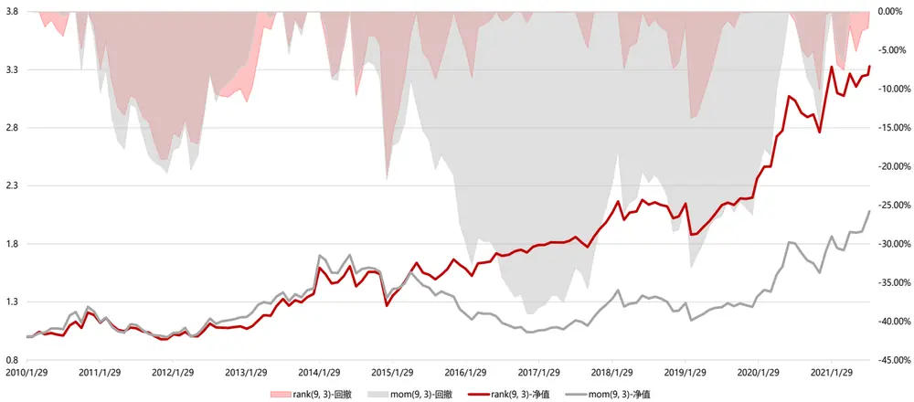
数据来源：Wind 资讯、东方证券研究所

图 12：MOM和 RANK 因子时间序列表现（全市场，中性化）
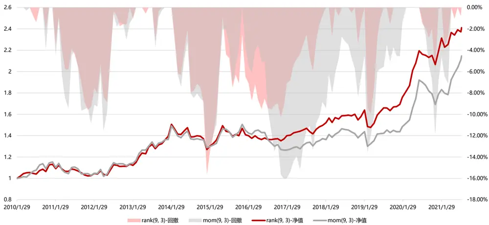
数据来源：Wind 资讯、东方证券研究所

## 2.4 因子分组收益

从各因子在全市场内分组的年化收益来看，各分组收益基本满足单调性，历史股价表现好的股票未来收益更高。MOM 因子的收益主要由空头端贡献，多头端仅贡献 1%-2%的正向收益。而RANK 因子的多头端收益更高，可以贡献 3%-5%的正向收益。

图 13：RANK 和 MOM因子分组年化收益（原始值，全指内）
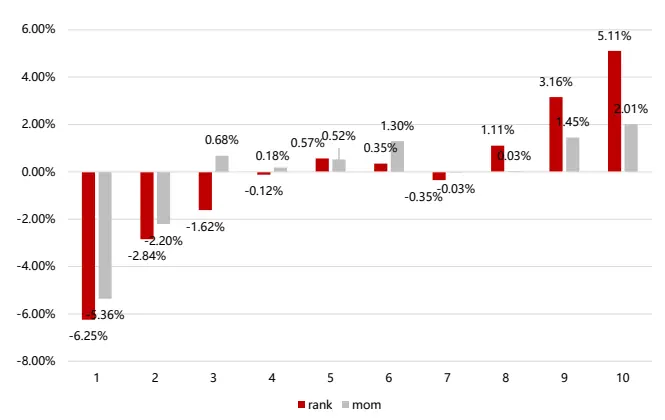
数据来源：Wind 资讯、东方证券研究所

图 14：RANK 和 MOM因子分组年化收益（中性化，全指内）
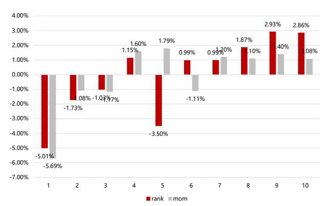
数据来源：Wind 资讯、东方证券研究所

## 三、因子相关性分析

从因子原始值间的两两相关系数来看，RANK 和 MOM 因子间存在 63%相关性，和其他常见的大类因子相关性都不高。

图 15：RANK 和 MOM因子与常见大类因子的相关性

| 全指内 MOM | MOM | RANK | value_factor0 | profit_factor0 | growth_factor0 | operation_factor0 | liquid_factor0 | lottery_factor0 | analyst_factor0 |
| --- | --- | --- | --- | --- | --- | --- | --- | --- | --- |
|  |  | 63.64% | -10.89% | 18.94% | 20.98% | 0.48% | -17.43% | -19.06% | 18.60% |
| RANK | 63.64% |  | 3.28% | 22.66% | 16.66% | 3.05% | -7.76% | -14.67% | 19.34% |
| value_factor0 | -10.89% | 3.28% |  | 36.41% | 2.90% | 29.89% | 15.83% | 16.99% | 16.16% |
| profit_factor0 | 18.94% | 22.66% | 36.41% |  | 16.00% | 24.03% | -9.78% | -8.53% | 38.66% |
| growth_factor0 | 20.98% | 16.66% | 2.90% | 16.00% |  | 2.12% | -6.24% | -16.20% | 17.59% |
| operation_factor0 | 0.48% | 3.05% | 29.89% | 24.03% | 2.12% |  | -6.67% | 0.20% | 18.79% |
| liquid_factor0 | -17.43% | -7.76% | 15.83% | -9.78% | -6.24% | -6.67% |  | 20.69% | -9.18% |
| lottery_factor0 | -19.06% | -14.67% | 16.99% | -8.53% | -16.20% | 0.20% | 20.69% |  | -2.77% |
| analyst_factor0 | 18.60% | 19.34% | 16.16% | 38.66% | 17.59% | 18.79% | -9.18% | -2.77% |  |

数据来源：Wind 资讯、东方证券研究所

通过常见的截面回归方法进行正交化剔除后，可以看到：1. RANK 因子剔除 MOM 因子后仍然有显著的选股效果，说明 RANK 因子包含了不能被 MOM 因子解释的增量信息。相反 MOM 因子剔除 RANK 因子后依然无选股效力，且 IC 变为负，这就说明历史收益率高但收益率平均排名并不靠前的股票，下个月收益会变差，这部分就是过度反应的股票。2. 两因子剔除其他常见因子之后，选股效果均不显著。

图 16：RANK 和 MOM因子在剔除常见大类因子后的残差选股表现

| 全市场原始值 | RANK(对MOM正交化) | MOM(对RANK正交化) | RANK(对所有因子正交化) | MOM(对所有因子正交化) |
| --- | --- | --- | --- | --- |
| IC | 3.06% | -1.21% | 0.42% | 0.29% |
| IC_IR | 1.37 | (0.49) | 0.25 | 0.17 |
| tstat | 4.69 | (1.67) | 0.86 | 0.58 |
| long_short_r | 0.77% | 0.09% | 0.15% | 0.19% |
| long_short_win | 62.86% | 53.57% | 54.29% | 56.43% |
| long_short_sharp | 0.99 | 0.10 | 0.25 | 0.28 |
| long_short_drwandown | -11.70% | -32.44% | -15.19% | -19.21% |
| long_short_yearly | 9.20% | -0.06% | 1.77% | 2.28% |
| 2011/12/30 | -10.60% | -0.99% | -11.29% | -1.29% |
| 2012/12/31 | 3.16% | -9.45% | 3.95% | 8.71% |
| 2013/12/31 | 21.36% | 2.94% | 4.44% | -4.16% |
| 2014/12/31 | 2.26% | 10.93% | -6.66% | 2.36% |
| 2015/12/31 | 32.75% | 34.94% | 3.38% | -7.01% |
| 2016/12/30 | 24.34% | 19.25% | 1.83% | -2.42% |
| 2017/12/29 | 0.13% | -14.76% | -0.71% | 6.06% |
| 2018/12/28 | 5.22% | 6.97% | 3.33% | 8.49% |
| 2019/12/31 | 12.45% | 10.83% | 2.27% | 1.37% |
| 2020/12/31 | 20.22% | -17.51% | 4.99% | 4.52% |
| 2021/8/6 | -5.04% | -18.10% | 15.99% | 16.09% |

数据来源：Wind 资讯、东方证券研究所

## 四、行业内选股能力

下面我们在热门行业内对比两因子的表现，可以看出在行业内 RANK 因子表现明显优于MOM 因子，IC在 3%以上，ICIR 接近 1，说明 RANK因子的选股效果在行业内也比较明显。

图 17：RANK 和 MOM因子在行业内的选股表现

| 全市场 | TMT |  | 医药 |  | 周期 |  | 消费 |  |
| --- | --- | --- | --- | --- | --- | --- | --- | --- |
|  | 原始值 RANK(6,3) | MOM(6, 3) | RANK(6,3) | MOM(6, 3) | RANK(6,3) | MOM(6, 3) | RANK(6,3) | MOM(6, 3) |
| IC | 3.25% | 1.23% | 3.98% | 2.49% | 2.84% | 1.81% | 4.46% | 2.92% |
| IC_IR | 0.92 | 0.31 | 0.97 | 0.55 | 0.73 | 0.44 | 0.87 | 0.53 |
| tstat | 3.15 | 1.04 | 3.30 | 1.86 | 2.49 | 1.50 | 2.99 | 1.80 |
| long_short_r | 0.94% | 0.47% | 0.90% | 0.76% | 0.65% | 0.52% | 1.06% | 1.18% |
| long_short_win | 57.14% | 53.57% | 57.14% | 56.43% | 62.86% | 56.43% | 56.43% | 58.57% |
|  | 0.83 | 0.38 | 0.73 | 0.59 | 0.64 | 0.48 | 0.71 | 0.76 |
| long_short_sharp long_short_drwandown | -14.97% | -28.16% | -17.58% | -20.89% | -21.38% | -24.62% | -28.43% |  |
|  | 11.02% | 4.72% | 9.88% | 8.59% | 7.61% | 6.00% | 12.03% | -20.38% |
| long_short_yearly |  |  | -4.52% | -2.59% |  |  |  | 13.63% |
| 2011/12/30 2012/12/31 | -3.64% | -3.03% |  |  | -15.50% | -15.11% | -27.19% | -10.55% |
|  | 2.66% | -0.78% | -1.75% | -0.77% | 1.94% | -2.78% | 6.00% | 3.25% |
| 2013/12/31 2014/12/31 | 4.94% | -4.08% | -9.85% 17.91% | -5.12% | 30.11% | 36.87% | 52.22% | 51.43% |
|  | 5.77% | 6.32% | 9.95% | 19.97% | -5.25% | 5.00% | 14.91% | 22.02% |
| 2015/12/31 | 18.31% | -9.76% | -2.91% | 17.07% | 31.33% | 11.43% | -0.02% | 26.84% |
| 2016/12/30 | 7.65% | -2.01% | 15.00% | -6.18% | 0.43% | -10.67% | 14.83% | -7.40% |
| 2017/12/29 | 15.62% 3.61% | 16.97% 0.12% | 7.52% | 30.41% | 8.00% | 12.73% | 45.87% | 49.01% |
| 2018/12/28 | 14.99% | 3.42% | 15.04% | 6.59% 1.77% | -0.70% | -5.26% -6.68% | 15.05% | 9.39% |
| 2019/12/31 | 27.78% | 21.06% | 55.96% | 33.75% | -2.71% 17.41% | 6.26% | 5.28% | -3.00% |
| 2020/12/31 |  |  |  |  |  |  | 8.87% | 20.03% |
| 2021/8/6 | 11.62% | 12.99% | 2.34% | 4.04% | 7.53% | 22.89% | 10.30% | 11.05% |

数据来源：Wind 资讯、东方证券研究所

图 18：RANK 和 MOM因子在行业内的多空组合净值图
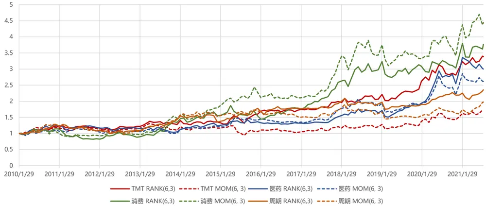
数据来源：Wind 资讯、东方证券研究所
注：TMT 包括中信一级行业中的电子,信息设备,信息服务,计算机,通信,传媒，消费包括家用电器,食品饮料，周期包括公用事业,有色金属,采掘,钢铁,房地产,化工

## 五、行业选择能力

下面我们测试两因子的行业选择效果，考察各行业的平均因子得分和下月平均收益之间的关系。可以看到在行业层面，MOM和 RANK因子都有明显的选行业效果，说明行业动量的确存在。

图 19：RANK 因子的行业选择效果

| RANK 全市场 原始值 | (6, 1) | (6, 3) | (9, 1) | (9, 3) | (12, 1) | (12, 3) |
| --- | --- | --- | --- | --- | --- | --- |
| IC | 4.84% | 5.81% | 5.15% | 5.56% | 4.02% | 3.82% |
| IC_IR | 0.51 | 0.59 | 0.53 | 0.56 | 0.41 | 0.38 |
| tstat | 1.74 | 2.01 | 1.81 | 1.91 | 1.38 | 1.30 |
| long_short_r | 0.57% | 0.55% | 0.62% | 0.56% | 0.43% | 0.39% |
| long_short_win | 58.27% | 58.27% | 53.96% | 58.27% | 52.52% | 56.83% |
| long_short_sharp | 0.51 | 0.48 | 0.54 | 0.47 | 0.36 | 0.34 |
| long_short_drwandown | -19.18% | -21.73% | -17.81% | -21.37% | -23.61% | -25.88% |
| long_short_yearly | 7.05% | 6.37% | 7.21% | 6.51% | 4.61% | 3.91% |
| 2011/12/30 | -6.19% | -18.22% | -9.34% | -18.19% | -14.02% | -21.33% |
| 2012/12/31 | -4.76% | 11.48% | 3.87% | 5.21% | 0.56% | 5.86% |
| 2013/12/31 | 29.32% | 26.60% | 41.90% | 28.19% | 30.05% | 22.92% |
| 2014/12/31 | 7.96% | 2.44% | 0.88% | -4.63% | -0.46% | -2.23% |
| 2015/12/31 | 19.54% | 10.48% | 29.41% | 41.89% | 35.92% | 38.72% |
| 2016/12/30 | 7.70% | 9.74% | 3.40% | 6.25% | 2.61% | -0.39% |
| 2017/12/29 | 7.57% | 16.19% | 11.63% | 13.54% | 3.45% | -2.38% |
| 2018/12/28 | -14.11% | -5.89% | -13.31% | -5.40% | -10.27% | -8.12% |
| 2019/12/31 | 2.82% | 1.82% | 0.97% | -0.41% | -2.56% | -5.46% |
| 2020/12/31 | 10.92% | 4.54% | 7.28% | 10.12% | 12.68% | 25.40% |
| 2021/8/6 | 14.15% | 8.62% | 12.44% | 7.36% | 5.22% | -1.83% |

数据来源：Wind 资讯、东方证券研究所

图 20：RANK 因子的行业多空组合净值
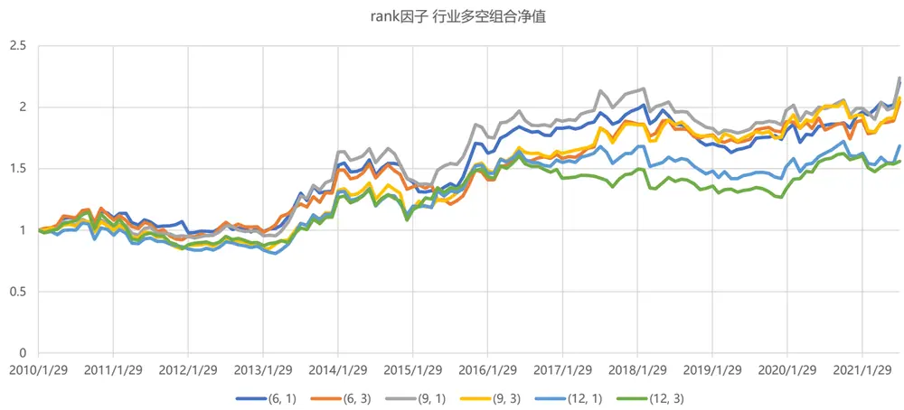
数据来源：Wind 资讯、东方证券研究所

图 21：MOM因子的行业选择效果

| MOM 全市场 原始值 | (6, 1) | (6, 3) | (9, 1) | (9, 3) | (12, 1) | (12, 3) |
| --- | --- | --- | --- | --- | --- | --- |
| IC | 4.66% | 7.69% | 4.62% | 6.31% | 4.76% | 4.12% |
| IC_IR | 0.51 | 0.85 | 0.49 | 0.65 | 0.49 | 0.41 |
| tstat | 1.73 | 2.88 | 1.68 | 2.22 | 1.68 | 1.40 |
| long_short_r | 0.59% | 0.70% | 0.40% | 0.72% | 0.70% | 0.51% |
| long_short_win | 56.83% | 58.99% | 51.80% | 56.12% | 56.83% | 58.27% |
| long_short_sharp | 0.58 | 0.69 | 0.37 | 0.59 | 0.60 | 0.41 |
| long_short_drwandown | -19.76% | -19.22% | -22.21% | -20.97% | -20.08% | -27.02% |
| long short yearly | 7.01% | 8.12% | 4.50% | 8.31% | 7.98% | 4.89% |
| 2011/12/30 | -4.20% | -15.95% | -17.53% | -15.56% | -17.44% | -20.71% |
| 2012/12/31 | -10.07% | 0.38% | 6.46% | 16.99% | 16.36% | 11.31% |
| 2013/12/31 | 24.42% | 14.63% | 30.51% | 28.15% | 31.29% | 15.49% |
| 2014/12/31 | 9.74% | 11.96% | 3.50% | -5.04% | -6.67% | -14.96% |
| 2015/12/31 | -7.44% | 28.78% | 4.66% | 12.89% | 11.32% | 28.19% |
| 2016/12/30 | 4.15% | 3.15% | 4.72% | -5.54% | 6.98% | -12.59% |
| 2017/12/29 | 9.93% | 16.87% | 7.43% | 18.99% | 16.10% | 9.87% |
| 2018/12/28 | -6.78% | 0.44% | -15.28% | -5.78% | -8.76% | -3.48% |
| 2019/12/31 | 7.96% | -8.86% | -1.86% | 7.70% | 4.11% | 3.92% |
| 2020/12/31 | 28.22% | 23.69% | 7.85% | 24.35% | 16.12% | 21.87% |
| 2021/7/30 | 9.66% | 11.86% | 18.90% | 18.79% | 14.15% | 7.90% |

数据来源：Wind 资讯、东方证券研究所

图 22：MOM因子的行业多空组合净值
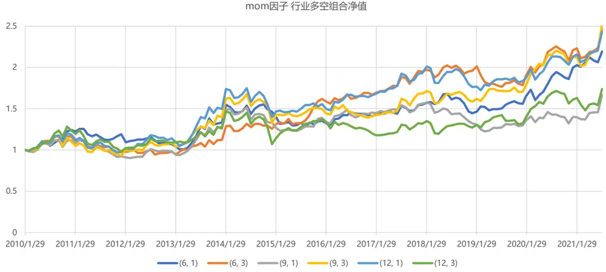
数据来源：Wind 资讯、东方证券研究所

## 六、总结

1.动量效应是指过去收益较高的股票，在未来一段时间内仍具有较高的收益。传统动量因子MOM 因子以过去一段时间股票的收益率作为因子值，这种构造方法并不十分合理。原因是：（1）MOM构造时所使用的数据仅为起始节点和末尾节点的股价数据，对于期间的股价信息并未充分反映。（2）MOM考察的是区间收益率的绝对值大小，数据噪音大，对异常股价波动十分敏感。散户投资者对利好消息容易过度反应，短时间急速拉抬股价，这就使得采用传统 MOM 因子选出的过去涨幅高的股票，可能只是短期拉升的结果，不具有持续性，与基本面相背离。

从 MOM 因子的表现来看，在全市场范围内，不管是原始值还是中性化，不管采用哪个考察期，因子均无效，IC 绝对值不超过 1.5，ICIR不超过 0.4。

2. 度量股票的动量效应，更稳价的指标是 RANK因子。RANK因子在构造时，考虑到了区间内每日的收益率情况，并且采用rank排名来替代收益率绝对大小，可以降低异常股价波动的影响。

从 RANK因子表现来看，在全市场范围内，不管是原始值还是中性化，不管采用哪个考察期，因子均有效，IC均超过 2，ICIR超过0.6，最大回撤在 20%左右，多空组合年化收益最高可达 11%。

3. 在不同市值范围的指数中，RANK 因子的表现基本都要好于 MOM 因子，并且在 300中的效果优于 500，在 800中的效果优于 1000。MOM因子在沪深 300 中，存在一定的选股效果，在中证 500 中选股效果减弱，在中证 1000 中几乎无效。RANK 因子不同股票池中，IC 都能达到2 以上，ICIR 在 0.6 左右，效果更稳健。

4. 因子均表现出在高机构持仓比的股票中表现更好的特点。MOM(6,3)和 MOM(9,3)原始值在机构持股比最高的分组中 IC 在 0.03 以上，ICIR 在 0.7 以上，中性化 MOM因子效果减弱。RANK 因子原始值在所有考察期内，机构持股比最高的分组中 IC 均在 0.03 以上，ICIR 在0.7 以上，中性化 RANK 因子效果基本和原始值相同。

5. 全市场中，RANK 因子的多空组合收益比 MOM因子更高，多空组合稳定性更好，最大回撤明显降低。MOM因子的收益主要由空头端贡献，多头端仅贡献 1%-2%的正向收益。而 RANK因子的多头端收益更高，可以贡献 3%-5%的正向收益。。

6. RANK 和 MOM因子间存在 63%相关性，和其他常见的大类因子相关性都不高。RANK 因子剔除 MOM因子后仍然有显著的选股效果，而相反 MOM因子剔除 RANK 因子后依然无选股效力，且 IC 变为负。

7.在行业内（消费、医药、TMT、周期等）RANK 因子表现明显优于 MOM 因子，IC 在0.03 以上，ICIR 接近 1，说明RANK 因子的选股效果在行业内比较明显。

8. 在行业层面，MOM和 RANK 因子都有明显的选行业效果。

## 参考文献

Chen T Y, Chou P H, Ko K C, et al. Rank, Sign, and Momentum[J].

## 风险提示

1. 量化模型基于历史数据分析，未来存在失效风险，建议投资者紧密跟踪模型表现。

2. 极端市场环境可能对模型效果造成剧烈冲击，导致收益亏损。

## 分析师申明

每位负责撰写本研究报告全部或部分内容的研究分析师在此作以下声明：

分析师在本报告中对所提及的证券或发行人发表的任何建议和观点均准确地反映了其个人对该证券或发行人的看法和判断；分析师薪酬的任何组成部分无论是在过去、现在及将来，均与其在本研究报告中所表述的具体建议或观点无任何直接或间接的关系。

## 投资评级和相关定义

报告发布日后的 12 个月内的公司的涨跌幅相对同期的上证指数/深证成指的涨跌幅为基准；

## 公司投资评级的量化标准

买入：相对强于市场基准指数收益率 15%以上；

增持：相对强于市场基准指数收益率 5%～15%；

中性：相对于市场基准指数收益率在-5%～+5%之间波动；

减持：相对弱于市场基准指数收益率在-5%以下。

未评级 —— 由于在报告发出之时该股票不在本公司研究覆盖范围内，分析师基于当时对该股票的研究状况，未给予投资评级相关信息。

暂停评级 —— 根据监管制度及本公司相关规定，研究报告发布之时该投资对象可能与本公司存在潜在的利益冲突情形；亦或是研究报告发布当时该股票的价值和价格分析存在重大不确定性，缺乏足够的研究依据支持分析师给出明确投资评级；分析师在上述情况下暂停对该股票给予投资评级等信息，投资者需要注意在此报告发布之前曾给予该股票的投资评级、盈利预测及目标价格等信息不再有效。

## 行业投资评级的量化标准：

看好：相对强于市场基准指数收益率 5%以上；

中性：相对于市场基准指数收益率在-5%～+5%之间波动；

看淡：相对于市场基准指数收益率在-5%以下。

未评级：由于在报告发出之时该行业不在本公司研究覆盖范围内，分析师基于当时对该行业的研究状况，未给予投资评级等相关信息。

暂停评级：由于研究报告发布当时该行业的投资价值分析存在重大不确定性，缺乏足够的研究依据支持分析师给出明确行业投资评级；分析师在上述情况下暂停对该行业给予投资评级信息，投资者需要注意在此报告发布之前曾给予该行业的投资评级信息不再有效。

## HeadertTabl e_Discl ai mer 免责声明

本证券研究报告（以下简称“本报告”）由东方证券股份有限公司（以下简称“本公司”）制作及发布。

本报告仅供本公司的客户使用。本公司不会因接收人收到本报告而视其为本公司的当然客户。本报告的全体接收人应当采取必要措施防止本报告被转发给他人。

本报告是基于本公司认为可靠的且目前已公开的信息撰写，本公司力求但不保证该信息的准确性和完整性，客户也不应该认为该信息是准确和完整的。同时，本公司不保证文中观点或陈述不会发生任何变更，在不同时期，本公司可发出与本报告所载资料、意见及推测不一致的证券研究报告。本公司会适时更新我们的研究，但可能会因某些规定而无法做到。除了一些定期出版的证券研究报告之外，绝大多数证券研究报告是在分析师认为适当的时候不定期地发布。

在任何情况下，本报告中的信息或所表述的意见并不构成对任何人的投资建议，也没有考虑到个别客户特殊的投资目标、财务状况或需求。客户应考虑本报告中的任何意见或建议是否符合其特定状况，若有必要应寻求专家意见。本报告所载的资料、工具、意见及推测只提供给客户作参考之用，并非作为或被视为出售或购买证券或其他投资标的的邀请或向人作出邀请。

本报告中提及的投资价格和价值以及这些投资带来的收入可能会波动。过去的表现并不代表未来的表现，未来的回报也无法保证，投资者可能会损失本金。外汇汇率波动有可能对某些投资的价值或价格或来自这一投资的收入产生不良影响。那些涉及期货、期权及其它衍生工具的交易，因其包括重大的市场风险，因此并不适合所有投资者。

在任何情况下，本公司不对任何人因使用本报告中的任何内容所引致的任何损失负任何责任，投资者自主作出投资决策并自行承担投资风险，任何形式的分享证券投资收益或者分担证券投资损失的书面或口头承诺均为无效。

本报告主要以电子版形式分发，间或也会辅以印刷品形式分发，所有报告版权均归本公司所有。未经本公司事先书面协议授权，任何机构或个人不得以任何形式复制、转发或公开传播本报告的全部或部分内容。不得将报告内容作为诉讼、仲裁、传媒所引用之证明或依据，不得用于营利或用于未经允许的其它用途。

经本公司事先书面协议授权刊载或转发的，被授权机构承担相关刊载或者转发责任。不得对本报告进行任何有悖原意的引用、删节和修改。

提示客户及公众投资者慎重使用未经授权刊载或者转发的本公司证券研究报告，慎重使用公众媒体刊载的证券研究报告。

## 东方证券研究所

地址：上海市中山南路 318 号东方国际金融广场 26 楼

电话：021-63325888

传真：021-63326786

网址： www.dfzq.com.cn