## —— 因子选股系列之 七十九

## 研究结论

⚫ 大单背后对应着资金实力更雄厚的投资者，这部分投资者相对来说更具有信息优势，跟踪大单的交易行为可能获取一定的超额收益。

⚫ A 股逐笔委托明细数据有每个订单大小的标识，但历史上仅深交所股票有覆盖，为了增加因子历史覆盖率，本文基于逐笔成交的委托单号合成订单成交金额大小，并基于此划分大小单。

⚫ 考虑到计算便利性、不同个股的差异性，我们取股票当天订单成交金额最大的5%的订单作为大单，平均金额阈值为 12.3 万元，累计金额占比 46.3%，近年来由于算法拆单等原因，订单 5%金额阈值有所下降，但累计占比几乎维持不变，说明大单拆单后大概率依然属于大单。

为了跟踪大单的买入方向，我们用大单买入占比度量了股票每日大单中买入方向的金额占比，考虑到更多的信息交易发生在早盘，我们也度量了上午 10：00 前的早盘大单买入占比。

⚫无论是大单买入占比还是早盘大单买入占比，大单买入占比高的股票普遍优于卖出占比高的股票，从因子 RankIC 和多空来看，早盘大单买入占比选股表现在各个样本空间均优于大单买入占比。

⚫ 大盘买入占比和早盘大单买入占比，在大市值股票池中的选股效果显著优于小市值股票池，早盘大单买入占比在沪深 300 中月度 RankIC 均值高达7.33%，多空年化收益为 25.4%，而在中证全指中的 RankIC 仅 3.27%，多空年化收益 12.0%，从时间序列上看，因子近两年也没有衰减的迹象。

⚫微观上讲股票每一次价格变动都源于主动订单的推动，本文汇总所有主动大单导致的涨跌幅变化得到大单涨跌幅，因子检验结果显示过去一段时间大单涨跌幅高的股票未来平均收益率更高。

大单涨跌幅和早盘大单涨跌幅因子在各个样本空间 RankIC 几乎一致，基于早盘计算的大单涨跌幅相对更优，在沪深 300 中的月度 RankIC 均值 7.37%，多空年化收益 20.4%。

本文提出的 4 个因子对大单的划分标准并不敏感，在较长平滑周期下，因子的换手率大幅降低，但因子的选股效果回落幅度有限，比如年度平滑的早盘大单买入占比因子在沪深 300 中的月均 RankIC 均值依然高达 7.17%，多空年化收益 15.36%，但 top 组合月单边换手仅 20%。

⚫ 大单买入占比、早盘大单买入占比在因子取值上和多数大类因子几乎没有任何相关性，和反转有较强的负相关，因子表现和反转完全互补，呈现一定的动量特征。

⚫ 大单涨跌幅和早盘大单涨跌幅偏好选择低波和流动性差的股票，对于该类型的股票，大单的冲击更容易反应在涨跌幅上。

## 风险提示

⚫ 量化模型失效风险

⚫ 市场极端环境的冲击

报告发布日期2021 年 10 月 27 日

证券分析师朱剑涛

021-63325888*6077

zhujiantao@orientsec.com.cn

执业证书编号：S0860515060001

证券分析师王星星

021-63325888*6108

wangxingxing@orientsec.com.cn

执业证书编号：S0860517100001

## 相关报告

存在于全市场范围内的稳健动量效应：—— 2021-09-02《因子选股系列研究 之 七十八》

“居中”和“离群”股的 Alpha：——《因 2021-08-15子系列选股研究之七十七》

基于委托订单数据的 alpha 因子：——因子 2021-07-22选股系列之七十六

## 一、数据说明

## 1.1 大单的识别

A 股的 L2 高频数据包含所有股票逐笔委托和逐笔成交的明细过程，通过分析委托和成交的过程可以解析资金的意图，从而发现可能的交易机会。无论是买入委托单还是卖出委托单，订单的金额大小在一定程度上反应了订单背后投资人的资金实力，大订单背后对应着资金实力更强的投资者，他们在股市博弈中也处于主导地位，本文主要基于大单的行为捕捉可能对选股有价值的 alpha 因子。

在 L2 数据中，订单的实际大小可以直接从委托明细中获取，但是上交所的委托明细数据从 2021 年 5 月开始才开始对外商业推送，历史数据没有覆盖，为了让因子的历史数据覆盖沪深两市，我们可以采用订单的已成交大小去拆分大小单。无论上交所还是深交所 2013年之后带委托单号的成交明细数据已经比较完善，我们可以根据委托单号汇总该单号对应的每笔成交量或者成交额，进而可以获知该订单的已成交部分的大小。显而易见，受撤单等因素影响，订单已成交大小不会超过订单的实际大小，和实际大小有一定差异，但在一定程度上也可以表征该订单背后的资金实力情况。

大单小单的划分方法目前尚没有一致认可的方法，根据分布的异常临界点、绝对金额划分都是可行的方法，本文考虑到计算的便利性、不同个股的差异性，在每个交易日每只股票选择金额最大的订单数量占比 5%的订单作为大单，分析这部分订单的行为。从 A 股订单已成交金额的分布来看，最大的前 5%订单累计金额占比达到近一半（46.3%），最大的前 1%订单累计也占比达到21.7%，但从绝对金额上看前5%的订单并不是很大，平均为12.3万元，近年来也有明显下降的趋势，可能与算法交易的拆单有关，但订单前 5%的金额占比并没有下降，暗示前 5%的订单即使拆完单可能也处于较高的水平。

图 1：A 股订单已成交金额（元）分布情况（20 天滚动）
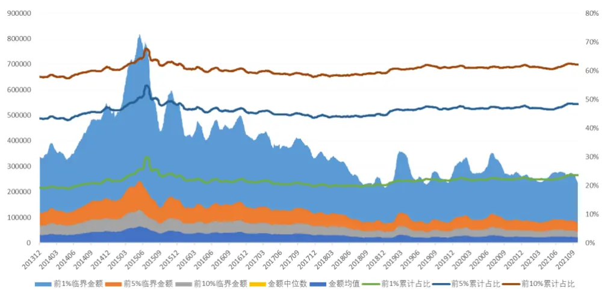

| 前1% | 前5% | 前10% | 前25% | 中位数 | 均值 | 后25% | 前1%累计占比 | 前5%累计占比 | 前10%累计占比 |
| --- | --- | --- | --- | --- | --- | --- | --- | --- | --- |
| 375061.5 | 123389.3 | 68757.4 | 26241.4 | 10140.8 | 32609.3 | 4277.0 | 21.7% | 46.3% | 60.4% |

数据来源：wind 咨询、上交所、深交所、东方证券研究所

## 1.2 因子测试说明

本文的主要目的是基于日内的大单数据提取对选股可能有用的特征，为了验证这些特征的选股有效性，我们取这些日内特征过去 20 天的均值用于选股，在月度调仓层面从 RankIC和多空分组两个角度考察因子在各个样本空间的选股效果，考虑到数据可获得性，因子测试区间起止于 20131231-20210930。

## 二、大单买入占比

## 2.1 因子定义

大单背后的投资者资金实力相对更加雄厚，假设我们认为这个群体具有信息优势，那么我们便可以根据大单的买卖方向识别这个群体总体是在买入还是卖出股票，进而跟踪大单的方向获取超额收益。某只股票在特定交易日的大单买入占比特征具体计算分为如下三步：

（1） 汇总逐笔成交数据中同一买入委托单号和卖出委托单号的所有成交金额，得到所有买单和卖单的成交金额；

（2） 取所有买单和卖单的成交金额前 5%分位数作为大单划分的临界点，分别标记成交金额大于该临界点的买单和卖单为大买单和大卖单；

（3） 取该股票在这一交易日的所有大买单成交金额之和占所有大单成交金额之和的占比作为大单买入占比特征。

另外，考虑到更多的信息交易发生在早盘，我们也计算了早盘大单买入占比特征，计算方法上就是将上述步骤（3）中的成交金额修正为发生在上午 10：00 前的成交金额。在因子测算时我们将大单买入占比和早盘大单买入占比两个特征的 20 天均值作为因子进行选股效果测算。

## 2.2 因子表现

对比大单买入占比和早盘大单买入占比在各个行业空间的因子表现（图 2-图 5），我们有如下发现：

（1）两个因子在大市值股票池中的选股效果均显著优于小市值股票池，大单买入占比因子原始值在全市场范围内几乎没有选股效果，但沪深 300 中的月均 RankIC 为 5.51%，早盘大单占比因子原始值在沪深 300 中月均 RankIC 更是高达 7.33%；

（2）早盘大单买入占比普遍优于大单买入占比因子，意味者在上午 10 点前的大单交易有更多的信息含义，跟踪早盘大单方向 alpha 更加丰厚；

（3）大单买入占比因子 top 组合收益弱于第二组和第三组，但在早盘大单买入占比因子上这个现象有所缓解；

（4）从时序上看，两个因子近年来没有任何衰减的迹象，因子表现比较稳定。

图 4：大单买入占比在中证 800 内选股表现（原始值）分组对冲年化收益
图 2：大单买入占比在各个样本空间因子表现汇总因子原始值

|  | RankIC |  |  | 多空组合 |  |  |  |  |
| --- | --- | --- | --- | --- | --- | --- | --- | --- |
|  | 月度均值 | IC_IR | t值 | 年化收益 | 夏普率 | 月胜率 | 最大回撤多头月换手 |  |
| 沪深300 | 5.51% | 1.24 | 3.47 | 20.12% | 1.21 | 66.67% | -26.78% | 74% |
| 中证500 | 2.68% | 0.94 | 2.62 | 11.71% | 1.16 | 64.52% | -10.81% | 76% |
| 中证800 | 3.58% | 1.05 | 2.92 | 13.74% | 1.13 | 60.22% | -15.06% | 75% |
| 中证1000 | 1.19% | 0.43 | 1.19 | 7.23% | 0.68 | 59.14% | -25.41% | 76% |
| 中证全指 | 1.08% | 0.39 | 1.10 | 4.95% | 0.53 | 60.22% | -24.43% | 76% |

行业市值中性

图 3：早盘大单买入占比在各个样本空间因子表现汇总因子原始值

|  | RankIC |  |  | 多空组合 |  |  |  |  |
| --- | --- | --- | --- | --- | --- | --- | --- | --- |
|  | 月度均值 | IC_IR | 值 | 年化收益 | 夏普率 | 月胜率 | 最大回撤多头月换手 |  |
| 沪深300 | 7.33% | 1.77 | 4.91 | 25.37% | 1.59 | 73.12% | -16.98% | 74% |
| 中证500 | 5.07% | 1.83 | 5.11 | 24.76% | 1.92 | 76.34% | -13.13% | 77% |
| 中证800 | 5.75% | 1.85 | 5.16 | 24.76% | 1.90 | 75.27% | -13.38% | 76% |
| 中证1000 | 3.33% | 1.30 | 3.61 | 14.99% | 1.41 | 67.74% | -17.43% | 78% |
| 中证全指 | 3.27% | 1.37 | 3.82 | 11.96% | 1.30 | 64.52% | -15.68% | 78% |

|  | RankIC |  |  | 多空组合 |  |  |  |  |
| --- | --- | --- | --- | --- | --- | --- | --- | --- |
|  | 月度均值 | IC_IR | 值 | 年化收益 | 夏普率 | 月胜率 | 最大回撤多头月换手 |  |
| 沪深300 | 3.61% | 1.53 | 4.25 | 16.16% | 1.50 | 67.74% | -14.12% | 77% |
| 中证500 | 2.15% | 1.13 | 3.15 | 9.88% | 1.18 | 66.67% | -17.45% | 76% |
| 中证800 | 2.52% | 1.30 | 3.62 | 12.63% | 1.64 | 66.67% | -9.41% | 76% |
| 中证1000 | 1.59% | 0.81 | 2.26 | 6.34% | 0.73 | 63.44% | -22.18% | 77% |
| 中证全指 | 1.11% | 0.57 | 1.59 | 4.52% | 0.60 | 62.37% | -20.59% | 76% |

行业市值中性
数据来源：wind 咨询、上交所、深交所、东方证券研究所

|  | RankIC |  |  | 多空组合 |  |  |  |  |
| --- | --- | --- | --- | --- | --- | --- | --- | --- |
|  | 月度均值 | IC_IR | 值 | 年化收益 | 夏普率 | 月胜率 | 最大回撤多头月换手 |  |
| 沪深300 | 4.51% | 1.95 | 5.42 | 23.06% | 2.11 | 76.34% | -10.14% | 76% |
| 中证500 | 4.26% | 2.36 | 6.57 | 16.38% | 1.58 | 72.04% | -13.88% | 78% |
| 中证800 | 4.31% | 2.41 | 6.70 | 18.05% | 1.96 | 72.04% | -10.22% | 77% |
| 中证1000 | 3.51% | 1.99 | 5.55 | 13.88% | 1.78 | 69.89% | -12.74% | 79% |
| 中证全指 | 3.10% | 1.86 | 5.18 | 12.44% | 1.67 | 69.89% | -13.50% | 78% |

数据来源：wind 咨询、上交所、深交所、东方证券研究所

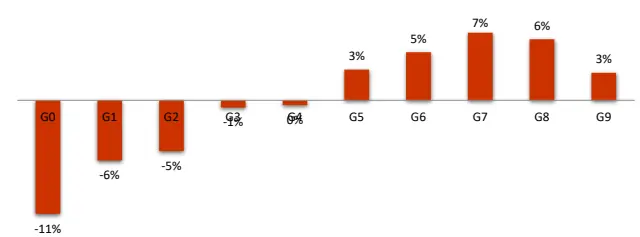

图 5：早盘大单买入占比在中证 800 内选股表现（原始值）分组对冲年化收益
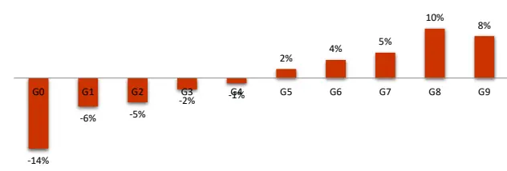

月度 RankIC 序列
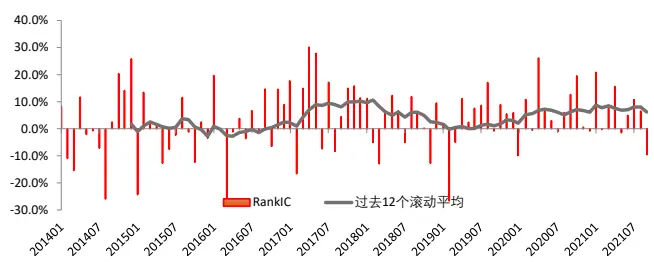
多空组合净值及回撤

月度 RankIC 序列
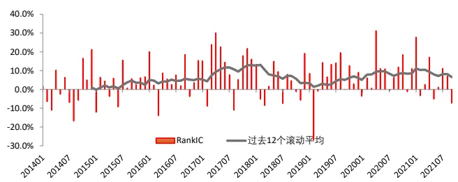

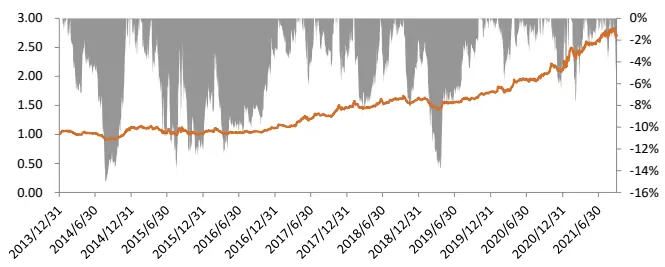
多空组合净值及回撤
数据来源：wind 咨询、上交所、深交所、东方证券研究所

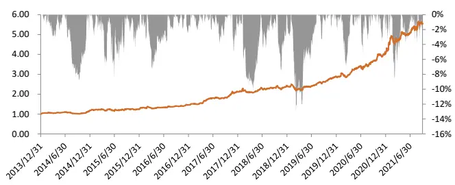
数据来源：wind 咨询、上交所、深交所、东方证券研究所

## 三、大单涨跌幅

## 3.1 因子定义

从微观层面来看，股票的每一笔成交都是两个订单撮合的结果，订单在时间轴上有先后，前面的订单被动等待成交，后边的订单主动撮合成交，我们根据时间上靠后的主动订单的大小将这一笔成交界定为大单主导的成交还是小单主导的成交，汇总所有大单成交的涨跌幅即可得到大单涨跌幅。具体计算步骤如下：

（1） 计算每一笔成交对应的对数价格变动（当前成交价格的对数-上一笔成交价格的对数），开盘和收盘集合竞价阶段所有订单集中撮合，对数价格变动设置为 0；

（2） 根据 2.1 节的步骤（1）和步骤（2）为所有的买单和卖单标记大小；

（3） 根据逐笔成交汇总求和所有主动订单为大单的对数价格变动得到大单涨跌幅。

和大单买入占比类似，我们除了基于全天的逐笔成交计算大单涨跌幅，也计算了上午10：00 前的早盘大单涨跌幅，具体做法只需在步骤（3）中仅汇总上午 10：00 前的大单涨跌幅即可。在因子测算时我们将大单涨跌幅和早盘大单涨跌幅两个特征的 20 天均值作为因子进行选股效果测算。

值得注意的是，本文计算的大单涨跌幅基于逐笔数据对每一笔成交的涨跌幅进行划分，对大单的实际买入意向和强度有精准的刻画，市面上多数大单涨跌幅的构建基于分钟线计算，汇总的是平均每笔成交金额较大的分钟线的涨跌幅，反应的大单多空博弈后的涨跌幅，在因子表现上反应的是较强的反转特性，从 3.2 节因子表现中也可以看出本文的大单涨跌幅有一定的动量效果，和基于分钟线构建的大单反转有本质的差异。

## 3.2 因子表现

因子测试结果显示，大单涨跌幅和早盘大单涨跌幅两个因子表现出明显的动量特征，即大单涨跌幅和早盘大单涨跌幅度越大的股票，后期平均持有收益越高。具体来看，有如下几个特点：

（1）两个因子在各个样本空间的 RankIC 基本一致，因子在大小市值股票中均有良好的选股效果；

（2）早盘大单涨跌幅在各个样本空间的选股表现全面优于大单涨跌幅，和大单买入占比类似，说明跟踪早盘大单买卖的 alpha 空间相对更大；

（3）两个因子在中证 800 中的分组收益总体也比较单调，多空的收益比较均衡，多头端也有显著的超额收益；

（4）两个因子的最大回撤发生在 2019 年初，今年以来虽然收益也有小幅回撤，但早盘大单涨跌幅因子多空组合又开始上行。

图 6：大单涨跌幅在各个样本空间因子表现汇总因子原始值

|  | RankIC |  |  | 多空组合 |  |  |  |  |
| --- | --- | --- | --- | --- | --- | --- | --- | --- |
|  | 月度均值 | IC_IR | t值 | 年化收益 | 夏普率 | 月胜率 | 最大回撤多头月换手 |  |
| 沪深300 | 6.31% | 1.61 | 4.48 | 15.72% | 0.97 | 65.59% | -24.79% | 77% |
| 中证500 | 5.88% | 1.86 | 5.19 | 19.66% | 1.31 | 69.89% | -24.20% | 76% |
| 中证800 | 6.08% | 1.87 | 5.20 | 18.33% | 1.26 | 70.97% | -21.56% | 76% |
| 中证1000 | 6.28% | 2.08 | 5.79 | 21.49% | 1.59 | 69.89% | -14.82% | 75% |
| 中证全指 | 6.61% | 2.35 | 6.54 | 22.73% | 1.75 | 69.89% | -17.13% | 75% |

行业市值中性

图 7：早盘大单涨跌幅在各个样本空间因子表现汇总因子原始值

|  | RankIC |  |  | 多空组合 |  |  |  |  |
| --- | --- | --- | --- | --- | --- | --- | --- | --- |
|  | 月度均值 | IC_IR | t值 | 年化收益 | 夏普率 | 月胜率 | 最大回撤多头月换手 |  |
| 沪深300 | 7.37% | 1.77 | 4.93 | 20.40% | 1.08 | 68.82% | -29.00% | 80% |
| 中证500 | 8.17% | 2.63 | 7.33 | 28.77% | 1.83 | 73.12% | -26.57% | 78% |
| 中证800 | 7.84% | 2.43 | 6.77 | 27.43% | 1.70 | 72.04% | -26.28% | 78% |
| 中证1000 | 8.13% | 2.63 | 7.32 | 32.92% | 2.42 | 76.34% | -14.97% | 78% |
| 中证全指 | 8.42% | 3.02 | 8.40 | 31.99% | 2.21 | 78.49% | -17.76% | 78% |

行业市值中性

|  | RankIC |  |  | 多空组合 |  |  |  |  |
| --- | --- | --- | --- | --- | --- | --- | --- | --- |
|  | 月度均值 | IC_IR | 值 | 年化收益 | 夏普率 | 月胜率 | 最大回撤多头月换手 |  |
| 沪深300 | 3.96% | 1.58 | 4.40 | 11.82% | 1.06 | 63.44% | -13.92% | 76% |
| 中证500 | 4.51% | 2.04 | 5.67 | 17.63% | 1.55 | 66.67% | -17.94% | 75% |
| 中证800 | 4.37% | 1.96 | 5.47 | 18.00% | 1.76 | 72.04% | -14.73% | 76% |
| 中证1000 | 5.34% | 2.25 | 6.27 | 17.02% | 1.46 | 65.59% | -15.82% | 75% |
| 中证全指 | 5.14% | 2.31 | 6.43 | 17.13% | 1.69 | 74.19% | -15.13% | 73% |

数据来源：wind 咨询、上交所、深交所、东方证券研究所

|  | RankIC |  |  | 多空组合 |  |  |  |  |
| --- | --- | --- | --- | --- | --- | --- | --- | --- |
|  | 月度均值 | IC_IR | 值 | 年化收益 | 夏普率 | 月胜率 | 最大回撤多头月换手 |  |
| 沪深300 | 4.81% | 1.87 | 5.22 | 18.81% | 1.42 | 72.04% | -17.21% | 77% |
| 中证500 | 6.91% | 3.10 | 8.62 | 26.89% | 2.19 | 75.27% | -14.09% | 75% |
| 中证800 | 6.12% | 2.77 | 7.72 | 23.91% | 2.17 | 77.42% | -19.19% | 76% |
| 中证1000 | 7.15% | 2.92 | 8.12 | 28.22% | 2.44 | 78.49% | -11.97% | 77% |
| 中证全指 | 6.96% | 3.16 | 8.80 | 24.56% | 2.39 | 76.34% | -14.59% | 76% |

数据来源：wind 咨询、上交所、深交所、东方证券研究所

图 8：大单涨跌幅在中证 800内选股表现（原始值）
分组对冲年化收益
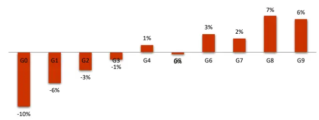

图 9：早盘大单涨跌幅在中证 800 内选股表现（原始值）分组对冲年化收益
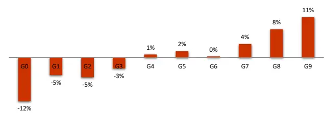

月度 RankIC 序列
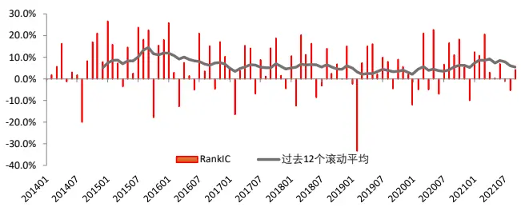
多空组合净值及回撤

月度 RankIC 序列
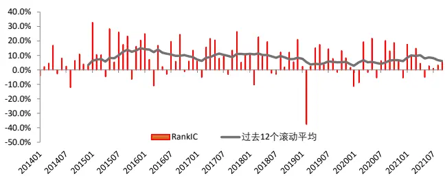

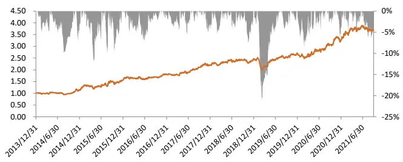
多空组合净值及回撤
数据来源：wind 咨询、上交所、深交所、东方证券研究所

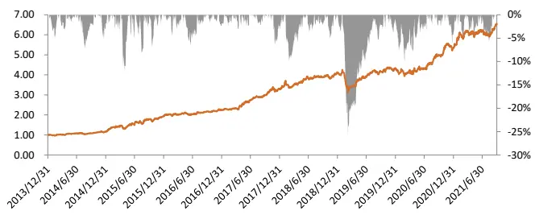
数据来源：wind 咨询、上交所、深交所、东方证券研究所

## 四、因子稳健性分析

## 4.1 不同大单划分下的因子表现

上文中涉及的大小单均采用订单已成交金额最大的 5%作为阈值进行划分，本小节主要考察划分大小单的阈值对因子表现的影响。采用完全一致的因子计算方法，我们将订单划分的阈值从 5%变更至 1%和 10%分别计算了上述 4 个 alpha 因子的表现，对比不同大单划分阈值下的因子表现，我们发现 4 个大单相关因子对订单划分阈值总体不敏感。从具体来看，对于大单买入占比和早盘大单买入占比，10%阈值的因子和5%阈值几乎一致，RankIC 和多空均略优于 1%阈值下的因子表现，小市值样本空间的差异相对会更大；对于大单涨跌幅因子，不同样本空间上会有小幅差异，沪深 300 中 1%阈值下的因子表现略好于 5%和 10%，但在小市值样本空间中结论相反；对于早盘大单涨跌幅，10%和 5%的阈值略好于1%，小市值样本空间尤其如此。

图 10：1%大单阈值下的因子表现汇总（原始值）大单买入占比

|  | RankIC |  |  | 多空组合 |  |  |  |  |
| --- | --- | --- | --- | --- | --- | --- | --- | --- |
|  | 月度均值 | IC_IR | t值 | 年化收益 | 夏普率 | 月胜率 | 最大回撤 | 多头月换手 |
| 沪深300 | 5.03% | 1.18 | 3.30 | 13.02% | 0.83 | 59.14% | -26.07% | 75% |
| 中证500 | 1.72% | 0.63 | 1.75 | 7.92% | 0.72 | 62.37% | -19.09% | 75% |
| 中证800 | 2.85% | 0.88 | 2.44 | 9.92% | 0.86 | 61.29% | -20.36% | 74% |
| 中证1000 | -0.22% | -0.09 | -0.24 | 1.09% | 0.15 | 53.76% | -24.52% | 76% |
| 中证全指 | -0.30% | -0.12 | -0.35 | 0.11% | 0.06 | 53.76% | -25.05% | 76% |

早盘大单买入占比

图 11：10%大单阈值下的因子表现汇总（原始值）大单买入占比

|  | RankIC |  |  | 多空组合 |  |  |  |  |
| --- | --- | --- | --- | --- | --- | --- | --- | --- |
|  | 月度均值 | IC_IR | t值 | 年化收益 | 夏普率 | 月胜率 | 最大回撤 | 多头月换手 |
| 沪深300 | 5.36% | 1.20 | 3.35 | 20.98% | 1.20 | 69.89% | -23.99% | 74% |
| 中证500 | 2.65% | 0.93 | 2.58 | 12.38% | 1.11 | 66.67% | -12.14% | 76% |
| 中证800 | 3.48% | 1.02 | 2.84 | 14.55% | 1.21 | 61.29% | -13.59% | 75% |
| 中证1000 | 1.90% | 0.67 | 1.86 | 8.94% | 0.82 | 59.14% | -19.62% | 76% |
| 中证全指 | 1.71% | 0.60 | 1.68 | 7.48% | 0.74 | 61.29% | -21.24% | 76% |

早盘大单买入占比

|  | RankIC |  |  | 多空组合 |  |  |  |  |
| --- | --- | --- | --- | --- | --- | --- | --- | --- |
|  | 月度均值 | IC_IR | 值 | 年化收益 | 夏普率 | 月胜率 | 最大回撤 | 多头月换手 |
| 沪深300 | 6.03% | 1.60 | 4.46 | 23.20% | 1.54 | 65.59% | -17.93% | 77% |
| 中证500 | 4.03% | 1.83 | 5.11 | 15.84% | 1.48 | 72.04% | -14.00% | 80% |
| 中证800 | 4.68% | 1.81 | 5.04 | 18.67% | 1.76 | 72.04% | -10.07% | 79% |
| 中证1000 | 2.06% | 1.02 | 2.84 | 9.19% | 1.13 | 67.74% | -14.42% | 82% |
| 中证全指 | 1.84% | 1.03 | 2.88 | 5.94% | 0.90 | 64.52% | -13.87% | 81% |

大单涨跌幅

|  | RankIC |  |  | 多空组合 |  |  |  |  |
| --- | --- | --- | --- | --- | --- | --- | --- | --- |
|  | 月度均值 | IC_IR | 值 | 年化收益 | 夏普率 | 月胜率 | 最大回撤 | 多头月换手 |
| 沪深300 | 7.72% | 1.83 | 5.10 | 26.25% | 1.66 | 69.89% | -17.18% | 75% |
| 中证500 | 5.17% | 1.83 | 5.09 | 24.50% | 1.93 | 75.27% | -13.23% | 76% |
| 中证800 | 5.93% | 1.90 | 5.28 | 25.12% | 1.94 | 72.04% | -13.36% | 75% |
| 中证1000 | 3.92% | 1.47 | 4.08 | 18.65% | 1.70 | 65.59% | -16.29% | 77% |
| 中证全指 | 3.88% | 1.53 | 4.25 | 15.08% | 1.51 | 69.89% | -15.81% | 77% |

大单涨跌幅

|  | RankIC |  |  | 多空组合 |  |  |  |  |
| --- | --- | --- | --- | --- | --- | --- | --- | --- |
|  | 月度均值 | IC_IR | 值 | 年化收益 | 夏普率 | 月胜率 | 最大回撤 | 多头月换手 |
| 沪深300 | 6.36% | 1.47 | 4.10 | 16.34% | 1.01 | 62.37% | -18.83% | 78% |
| 中证500 | 5.22% | 1.63 | 4.55 | 12.80% | 0.88 | 66.67% | -21.99% | 74% |
| 中证800 | 5.79% | 1.69 | 4.69 | 14.37% | 1.02 | 65.59% | -20.71% | 75% |
| 中证1000 | 4.68% | 1.65 | 4.60 | 16.94% | 1.33 | 68.82% | -17.95% | 74% |
| 中证全指 | 5.39% | 1.95 | 5.42 | 15.60% | 1.27 | 65.59% | -16.40% | 74% |

|  | RankIC |  |  | 多空组合 |  |  |  |  |
| --- | --- | --- | --- | --- | --- | --- | --- | --- |
|  | 月度均值 | IC_IR | 值 | 年化收益 | 夏普率 | 月胜率 | 最大回撤 | 多头月换手 |
| 沪深300 | 5.59% | 1.51 | 4.20 | 13.04% | 0.84 | 66.67% | -22.40% | 78% |
| 中证500 | 5.87% | 1.84 | 5.12 | 20.01% | 1.38 | 69.89% | -24.70% | 77% |
| 中证800 | 5.77% | 1.83 | 5.09 | 17.08% | 1.23 | 67.74% | -20.28% | 77% |
| 中证1000 | 6.83% | 2.27 | 6.32 | 25.06% | 1.77 | 73.12% | -15.69% | 76% |
| 中证全指 | 6.90% | 2.49 | 6.94 | 23.83% | 1.83 | 69.89% | -17.46% | 76% |

早盘大单涨跌幅

早盘大单涨跌幅

|  | RankIC |  |  | 多空组合 |  |  |  |  |
| --- | --- | --- | --- | --- | --- | --- | --- | --- |
|  | 月度均值 | IC_IR | t值 | 年化收益 | 夏普率 | 月胜率 | 最大回撤 | 多头月换手 |
| 沪深300 | 7.19% | 1.74 | 4.85 | 17.32% | 0.95 | 65.59% | -24.41% | 80% |
| 中证500 | 6.87% | 2.36 | 6.56 | 23.48% | 1.62 | 65.59% | -19.64% | 78% |
| 中证800 | 7.10% | 2.29 | 6.39 | 22.66% | 1.51 | 70.97% | -22.48% | 79% |
| 中证1000 | 6.95% | 2.48 | 6.90 | 26.09% | 2.14 | 78.49% | -13.22% | 79% |
| 中证全指 | 7.13% | 2.77 | 7.71 | 27.80% | 2.11 | 73.12% | -15.01% | 79% |

数据来源：wind 咨询、上交所、深交所、东方证券研究所

|  | RankIC |  |  | 多空组合 |  |  |  |  |
| --- | --- | --- | --- | --- | --- | --- | --- | --- |
|  | 月度均值 | IC_IR | t值 | 年化收益 | 夏普率 | 月胜率 | 最大回撤 | 多头月换手 |
| 沪深300 | 7.51% | 1.81 | 5.05 | 17.28% | 0.94 | 68.82% | -34.73% | 78% |
| 中证500 | 8.09% | 2.58 | 7.18 | 29.75% | 1.94 | 72.04% | -26.54% | 79% |
| 中证800 | 7.83% | 2.44 | 6.80 | 27.58% | 1.69 | 76.34% | -27.63% | 78% |
| 中证1000 | 8.65% | 2.76 | 7.68 | 33.22% | 2.25 | 74.19% | -17.18% | 78% |
| 中证全指 | 8.77% | 3.15 | 8.76 | 34.32% | 2.30 | 80.65% | -18.71% | 78% |

数据来源：wind 咨询、上交所、深交所、东方证券研究所

## 4.2 不同平滑周期下的因子表现

上文在测算因子表现时，我们取过去 20 日特征的均值作为 alpha 因子，从因子 top 组合的换手我们可以看出 20 日均值在月度调仓时 top 组合单边换手都高达 70%以上，对较大规模或者交易冲击较大的量化组合，如此高换手的 alpha 因子实际使用的成本较高。在本小节，我们尝试将 alpha 因子构建的平滑窗口拉长以降低因子换手，考察 4 个大单相关特征在较低换手下的因子表现。

对比 3 个月、12 个月和第二、三章 1 个月平滑周期下的 4 个因子表现，我们有如下结论：

（1）随着平滑周期的拉长，因子 top 组合换手率明显降低，4个因子月度平滑时月单边换手大概在 75%左右，3 个月平滑时 top 单边换手下降到 45%左右，12 个月平滑的因子 top组合换手更低，在 25%左右。

（2）从因子表现上，3 个月平滑的因子和 1 个月平滑的因子RankIC 基本一致，但因子稳定性略有下降，表现为 IC_IR 和多空组合夏普有所降低。

（3）在 12 个月这种比较长周期下平滑计算的 4 个大单因子依然有显著的选股下效果，说明基于大单构建的 alpha 因子衰减较慢，在低频选股中依然会有较显著的作用。

图 12：3 个月平滑周期下的因子表现汇总（原始值）大单买入占比

|  | RankIC |  |  | 多空组合 |  |  |  |  |
| --- | --- | --- | --- | --- | --- | --- | --- | --- |
|  | 月度均值 | IC_IR | 值 | 年化收益 | 夏普率 | 月胜率 | 最大回撤 | 多头月换手 |
| 沪深300 | 5.62% | 1.14 | 3.16 | 14.35% | 0.78 | 64.52% | -32.31% | 44% |
| 中证500 | 3.66% | 1.08 | 3.02 | 14.73% | 1.10 | 63.44% | -18.31% | 46% |
| 中证800 | 4.12% | 1.03 | 2.87 | 13.18% | 0.91 | 60.22% | -22.19% | 45% |
| 中证1000 | 1.91% | 0.61 | 1.71 | 7.87% | 0.71 | 58.06% | -19.65% | 46% |
| 中证全指 | 1.63% | 0.52 | 1.45 | 7.02% | 0.63 | 58.06% | -22.44% | 46% |

图 13：12 个月平滑周期下的因子表现汇总（原始值）大单买入占比

|  | RankIC |  |  | 多空组合 |  |  |  |  |
| --- | --- | --- | --- | --- | --- | --- | --- | --- |
|  | 月度均值 | IC_IR | t值 | 年化收益 | 夏普率 | 月胜率 | 最大回撤 | 多头月换手 |
| 沪深300 | 5.72% | 1.08 | 3.01 | 9.14% | 0.56 | 55.91% | -33.66% | 21% |
| 中证500 | 2.99% | 0.88 | 2.46 | 6.55% | 0.58 | 56.99% | -25.64% | 25% |
| 中证800 | 3.89% | 0.94 | 2.61 | 8.32% | 0.63 | 56.99% | -25.33% | 22% |
| 中证1000 | 0.97% | 0.30 | 0.83 | 2.83% | 0.28 | 54.84% | -26.06% | 26% |
| 中证全指 | 1.66% | 0.58 | 1.62 | 4.40% | 0.47 | 59.14% | -22.32% | 25% |

早盘大单买入占比

早盘大单买入占比

|  | RankIC |  |  | 多空组合 |  |  |  |  |
| --- | --- | --- | --- | --- | --- | --- | --- | --- |
|  | 月度均值 | IC_IR | 值 | 年化收益 | 夏普率 | 月胜率 | 最大回撤 | 多头月换手 |
| 沪深300 | 7.71% | 1.52 | 4.24 | 20.18% | 1.02 | 65.59% | -28.96% | 43% |
| 中证500 | 5.44% | 1.55 | 4.31 | 20.59% | 1.29 | 64.52% | -22.67% | 46% |
| 中证800 | 6.20% | 1.55 | 4.32 | 19.37% | 1.20 | 62.37% | -22.77% | 44% |
| 中证1000 | 4.01% | 1.27 | 3.54 | 18.21% | 1.35 | 69.89% | -19.13% | 48% |
| 中证全指 | 3.94% | 1.31 | 3.65 | 13.71% | 1.13 | 66.67% | -15.18% | 47% |

大单涨跌幅

|  | RankIC |  |  | 多空组合 |  |  |  |  |
| --- | --- | --- | --- | --- | --- | --- | --- | --- |
|  | 月度均值 | IC_IR | 值 | 年化收益 | 夏普率 | 月胜率 | 最大回撤 | 多头月换手 |
| 沪深300 | 7.17% | 1.35 | 3.75 | 15.36% | 0.87 | 62.37% | -46.36% | 20% |
| 中证500 | 4.45% | 1.12 | 3.13 | 10.57% | 0.72 | 60.22% | -30.45% | 25% |
| 中证800 | 5.34% | 1.23 | 3.42 | 13.58% | 0.87 | 56.99% | -36.06% | 22% |
| 中证1000 | 2.42% | 0.67 | 1.88 | 8.31% | 0.61 | 51.61% | -21.75% | 27% |
| 中证全指 | 2.85% | 0.91 | 2.53 | 8.40% | 0.72 | 59.14% | -25.69% | 25% |

大单涨跌幅

|  | RankIC |  |  | 多空组合 |  |  |  |  |
| --- | --- | --- | --- | --- | --- | --- | --- | --- |
|  | 月度均值 | IC_IR | t值 | 年化收益 | 夏普率 | 月胜率 | 最大回撤 | 多头月换手 |
| 沪深300 | 6.09% | 1.42 | 3.95 | 13.81% | 0.84 | 63.44% | -27.73% | 45% |
| 中证500 | 6.16% | 1.67 | 4.64 | 12.97% | 0.85 | 59.14% | -26.58% | 46% |
| 中证800 | 6.01% | 1.68 | 4.67 | 13.34% | 0.90 | 64.52% | -25.76% | 45% |
| 中证1000 | 6.73% | 2.01 | 5.59 | 19.05% | 1.31 | 66.67% | -21.45% | 44% |
| 中证全指 | 7.01% | 2.30 | 6.41 | 20.23% | 1.48 | 72.04% | -21.57% | 44% |

|  | RankIC |  |  | 多空组合 |  |  |  |  |
| --- | --- | --- | --- | --- | --- | --- | --- | --- |
|  | 月度均值 | IC_IR | t值 | 年化收益 | 夏普率 | 月胜率 | 最大回撤 | 多头月换手 |
| 沪深300 | 4.78% | 1.08 | 2.99 | 9.11% | 0.60 | 59.14% | -33.13% | 22% |
| 中证500 | 5.45% | 1.57 | 4.36 | 14.40% | 0.98 | 63.44% | -25.37% | 24% |
| 中证800 | 5.12% | 1.48 | 4.11 | 12.37% | 0.87 | 60.22% | -24.92% | 22% |
| 中证1000 | 5.41% | 1.78 | 4.94 | 12.84% | 0.93 | 68.82% | -30.35% | 26% |
| 中证全指 | 6.21% | 2.15 | 5.98 | 19.71% | 1.39 | 72.04% | -18.41% | 24% |

早盘大单涨跌幅

|  | RankIC |  |  | 多空组合 |  |  |  |  |
| --- | --- | --- | --- | --- | --- | --- | --- | --- |
|  | 月度均值 | IC_IR | t值 | 年化收益 | 夏普率 | 月胜率 | 最大回撤 | 多头月换手 |
| 沪深300 | 7.12% | 1.55 | 4.31 | 15.30% | 0.79 | 60.22% | -32.32% | 46% |
| 中证500 | 7.56% | 2.07 | 5.76 | 23.22% | 1.37 | 69.89% | -28.86% | 47% |
| 中证800 | 7.35% | 2.02 | 5.61 | 20.27% | 1.13 | 67.74% | -28.34% | 46% |
| 中证1000 | 8.17% | 2.39 | 6.64 | 23.15% | 1.54 | 69.89% | -20.37% | 47% |
| 中证全指 | 8.38% | 2.70 | 7.51 | 26.55% | 1.73 | 70.97% | -21.02% | 46% |

数据来源：wind 咨询、上交所、深交所、东方证券研究所

早盘大单涨跌幅

|  | RankIC |  |  | 多空组合 |  |  |  |  |
| --- | --- | --- | --- | --- | --- | --- | --- | --- |
|  | 月度均值 | IC_IR | 值 | 年化收益 | 夏普率 | 月胜率 | 最大回撤 | 多头月换手 |
| 沪深300 | 6.17% | 1.38 | 3.85 | 9.99% | 0.61 | 66.67% | -37.57% | 25% |
| 中证500 | 6.84% | 1.81 | 5.04 | 16.62% | 1.09 | 68.82% | -28.63% | 25% |
| 中证800 | 6.52% | 1.80 | 5.00 | 14.44% | 0.93 | 60.22% | -29.07% | 24% |
| 中证1000 | 6.41% | 2.00 | 5.56 | 16.66% | 1.18 | 68.82% | -26.68% | 26% |
| 中证全指 | 7.18% | 2.39 | 6.66 | 22.08% | 1.50 | 74.19% | -19.94% | 25% |

数据来源：wind 咨询、上交所、深交所、东方证券研究所

## 五、因子相关性分析

## 5.1 与常见大类因子相关性

本小节主要讨论上文中提出的 4 个大单相关的 alpha 因子和常见大类因子的相关性（为方便展示，下文图中 L2F0、L2F1、L2F2、L2F3 分别表示大单买入占比、早盘大单买入占比、大单涨跌幅和早盘大单涨跌幅），分析因子值的截面秩相关系数和 RankIC 的时序秩相关系数，有如下几点发现：

（1）大单买入占比、早盘大单买入占比在因子取值上和常见大类因子几乎没有任何相关性，因子信息度量上重叠较少；

（2）在盈利、成长、超预期等基本面表现好的时候，大单买入占比、早盘大单买入占比表现更好，和基本面因子存在一定程度上的共振，早盘大单买入占比尤其如此；

（3）大单买入占比、早盘大单买入占比无论在因子取值上还是因子表现上和反转因子都有高度负相关，表现出较强的“动量”特征；

（4）大单涨跌幅、早盘大单涨跌幅两个因子和流动性、投机性高度相关，偏好选择流动性差、波动小的股票，可以理解为流动性差、波动小的股票大单的冲击更容易反应在涨跌幅上。

（5）大单买入占比和大单涨跌虽然都是基于大单信息构建的 alpha 因子，但是两者相关性不高，信息重叠有限。

图 14：大单相关因子和常见大类因子相关性（左下因子值，右上 RankIC，因子原始值）

| Value Profitability Growth Governance |  |  |  |  | Liquidity Reversal |  | Lottery | Analyst | Surprise | L2F0 L2F1 L2F2 |  |  | L2F3 |
| --- | --- | --- | --- | --- | --- | --- | --- | --- | --- | --- | --- | --- | --- |
| Value |  | -0.020 | 0.166 | 0.680 | 0.463 | -0.208 | 0.854 | 0.636 | 0.069 | 0.229 | 0.193 | 0.200 | 0.230 |
| Profitability | 0.281 |  | 0.645 | 0.478 | -0.206 | -0.239 | -0.147 | 0.534 | 0.696 | 0.240 | 0.528 | 0.011 | 0.121 |
| Growth | 0.181 | 0.378 |  | 0.406 | -0.169 | -0.399 | 0.005 | 0.629 | 0.913 | 0.324 | 0.526 | -0.014 | 0.081 |
| Governance | 0.306 | 0.212 | 0.035 |  | 0.047 | -0.310 | 0.424 | 0.677 | 0.347 | 0.390 | 0.467 | -0.099 | -0.036 |
| Liquidity | 0.198 | -0.015 | -0.058 | 0.019 |  | 0.336 | 0.770 | 0.247 | -0.186 | -0.219 | -0.209 | 0.624 | 0.640 |
| Reversal | -0.004 | -0.102 | -0.134 | -0.049 | 0.287 |  | -0.025 | -0.186 | -0.454 | -0.883 | -0.757 | -0.150 | -0.165 |
| Lottery | 0.432 | 0.058 | -0.011 | 0.141 | 0.605 | 0.130 |  | 0.449 | -0.081 | 0.077 | 0.015 | 0.513 | 0.519 |
| Analyst | 0.337 | 0.273 | 0.267 | 0.181 | 0.051 | 0.003 | 0.106 |  | 0.570 | 0.222 | 0.426 | 0.134 | 0.258 |
| Surprise | 0.030 | 0.204 | 0.546 | 0.000 | -0.074 | -0.170 | -0.062 | 0.219 |  | 0.407 | 0.617 | 0.056 | 0.172 |
| L2F0 | -0.007 | 0.044 | 0.020 0.049 |  | -0.115 | -0.478 | -0.066 | 0.024 0.041 |  |  | 0.853 | 0.289 | 0.288 |
| L2F1 | 0.013 | 0.103 | 0.047 | 0.066 | -0.066 | -0.357 | -0.054 | 0.071 | 0.071 | 0.644 |  | 0.257 | 0.358 |
| L2F2 | 0.052 | 0.077 | -0.033 | -0.052 | 0.386 | -0.201 | 0.344 | -0.012 | -0.021 | 0.454 | 0.286 |  | 0.951 |
| L2F3 | 0.087 0.104 |  | -0.009 | -0.021 | 0.427 | -0.175 | 0.389 | 0.040 | 0.012 | 0.301 | 0.369 | 0.788 |  |

数据来源：wind 咨询、上交所、深交所、东方证券研究所

## 5.2 与常见量价因子相关性

从大单相关因子和常见日间量价因子的相关性来看，大单买入占比、早盘大单买入占比和大多日间量价负相相关，与反转的负相关尤其明显，可见大单买入占比、早盘大单买入占比和传统量价的互补性较强，大单涨跌幅、早盘大单涨跌幅和波动、换手、amihud 非流动性信息重叠明显，在一定程度上印证了上文中大单涨跌幅高的股票更容易选到流动性差、波动小的股票的结论。

图 15：大单相关因子和常见日间量价因子相关性（左下因子值，右上 RankIC，因子原始值）

| VOL |  | LNTO | IVOL | IVR RET |  | LNAMIHUD PPREVSERAL MAXRET DWF |  |  |  | L2F0 L2F1 |  | L2F2 L2F3 |  |
| --- | --- | --- | --- | --- | --- | --- | --- | --- | --- | --- | --- | --- | --- |
| VOL |  | 0.944 | 0.895 | 0.001 | 0.054 | -0.132 | 0.039 | 0.920 0.881 |  | 0.102 | 0.038 | 0.523 | 0.527 |
| LNTO | 0.665 |  | 0.854 | -0.039 | 0.059 | -0.227 | 0.009 | 0.856 | 0.840 | 0.156 | 0.143 | 0.477 | 0.512 |
| IVOL | 0.848 | 0.586 |  | 0.379 | 0.338 | 0.057 | 0.335 | 0.928 | 0.960 | -0.180 -0.177 |  | 0.512 | 0.522 |
| IVR | 0.271 | 0.201 | 0.644 |  | 0.685 | 0.390 | 0.713 | 0.262 | 0.321 | -0.688 | -0.613 | -0.018 | -0.034 |
| RET | 0.242 | 0.130 | 0.330 | 0.282 |  | 0.276 | 0.900 | 0.395 | 0.324 | -0.819 | -0.631 | -0.164 | -0.133 |
| LNAMIHUD | 0.007 | 0.089 | 0.061 | 0.081 | 0.044 |  | 0.425 | 0.039 | 0.097 | -0.436 | -0.434 | 0.407 | 0.359 |
| PPREVSERAL | 0.262 | 0.136 | 0.373 | 0.331 | 0.722 | 0.134 |  | 0.355 | 0.312 | -0.846 | -0.739 | -0.081 | -0.104 |
| MAXRET | 0.864 | 0.560 | 0.845 | 0.369 | 0.537 | 0.060 | 0.472 |  | 0.925 | -0.225 | -0.220 | 0.412 | 0.434 |
| DWF | 0.660 | 0.458 | 0.699 | 0.402 | 0.315 | 0.068 | 0.335 | 0.696 |  | -0.174 | -0.130 | 0.510 | 0.533 |
| L2F0 | -0.101 | 0.004 | -0.165 | -0.198 | -0.497 | -0.065 | -0.408 | -0.244 | -0.145 |  | 0.853 | 0.289 | 0.288 |
| L2F1 | -0.089 | 0.036 | -0.125 | -0.138 | -0.338 | -0.048 | -0.309 | -0.183 | -0.107 | 0.644 |  | 0.257 | 0.358 |
| L2F2 | 0.348 | 0.321 | 0.266 | 0.008 | -0.225 | 0.314 | -0.117 | 0.193 | 0.206 | 0.454 | 0.286 |  | 0.951 |
| L2F3 | 0.391 | 0.371 | 0.327 | 0.072 | -0.166 | 0.291 | -0.096 | 0.251 0.262 |  | 0.301 | 0.369 | 0.788 |  |

数据来源：wind 咨询、上交所、深交所、东方证券研究所

因子取值上，本文提出的 4 个 alpha 因子和日内常见 alpha 几乎都没有相关性，目前日内的 alpha 特征从大单角度出发定义的因子并不丰富，本文构建的几个大单因子在一定程度上可以作为因子库的有效补充。

图 16：大单相关因子和常见日内量价因子相关性（左下因子值，右上 RankIC，因子原始值）

|  | IDSKEW | IDKURT | IDJUMP | IDMOM | SDRVOL SDRSKEW |  | SDVVOL | ARPP | APB | L2F0 | L2F1 | L2F2 | L2F3 |
| --- | --- | --- | --- | --- | --- | --- | --- | --- | --- | --- | --- | --- | --- |
| IDSKEW |  | 0.688 | 0.666 | 0.665 | 0.697 | 0.779 | 0.486 | -0.226 | 0.365 | 0.045 | 0.207 | 0.183 | 0.288 |
| IDKURT | 0.485 |  | 0.314 | 0.701 | 0.791 | 0.949 | 0.085 | -0.308 | -0.206 | 0.285 | 0.218 | -0.034 | -0.010 |
| IDJUMP | 0.508 | 0.165 |  | 0.498 | 0.361 | 0.346 | 0.270 | -0.331 | 0.496 | -0.453 | -0.361 | 0.319 | 0.357 |
| IDMOM | 0.283 | 0.165 | 0.413 |  | 0.645 | 0.738 | 0.146 | -0.112 | -0.117 | 0.321 | 0.261 | 0.449 | 0.467 |
| SDRVOL | 0.326 | 0.575 | 0.221 | 0.171 |  | 0.850 | 0.443 | -0.170 | 0.059 | 0.280 | 0.314 | 0.230 | 0.276 |
| SDRSKEW | 0.479 | 0.874 | 0.186 | 0.172 | 0.537 |  | 0.284 | -0.220 | -0.095 | 0.347 | 0.349 | 0.099 | 0.160 |
| SDVVOL | 0.270 | 0.304 | 0.185 | 0.042 | 0.460 | 0.387 |  | 0.076 | 0.398 | 0.019 | 0.297 | 0.267 | 0.396 |
| ARPP | 0.117 | 0.168 | -0.017 | 0.058 | 0.159 | 0.175 | 0.157 |  | 0.011 | 0.329 | 0.211 | 0.229 | 0.216 |
| APB | 0.292 | 0.180 | 0.312 | 0.113 | 0.190 | 0.201 | 0.228 | 0.486 |  | -0.428 | -0.164 | 0.087 | 0.190 |
| L2F0 | -0.127 | -0.059 | -0.309 | 0.061 | -0.002 | -0.023 | -0.033 | -0.005 | -0.259 |  | 0.853 | 0.289 | 0.288 |
| L2F1 | -0.034 | -0.051 | -0.166 | 0.086 | 0.018 | -0.001 | 0.025 | 0.048 | -0.061 | 0.644 |  | 0.257 | 0.358 |
| L2F2 | -0.051 | -0.089 | 0.039 | 0.173 | 0.049 | 0.012 | 0.134 | 0.032 | -0.102 | 0.454 | 0.286 |  | 0.951 |
| L2F3 | 0.013 | -0.023 | 0.126 | 0.222 | 0.122 | 0.082 | 0.222 | 0.111 | 0.051 | 0.301 | 0.369 | 0.788 |  |

数据来源：wind 咨询、上交所、深交所、东方证券研究所

## 六、结论

大单背后对应着资金实力更雄厚的投资者，这部分投资者相对来说更具有信息优势，跟踪大单的交易行为可能获取一定的超额收益。A 股逐笔委托明细数据有每个订单大小的标识，但历史上仅深交所股票有覆盖，为了增加因子历史覆盖率，本文基于逐笔成交的委托单号合成订单成交金额大小，并基于此划分大小单。

考虑到计算便利性、不同个股的差异性，我们取股票当天订单成交金额最大的 5%的订单作为大单，平均金额阈值为 12.3 万元，累计金额占比 46.3%，近年来由于算法拆单等原因，订单 5%金额阈值有所下降，但累计占比几乎维持不变，说明大单拆单后大概率依然属于大单。

为了跟踪大单的买入方向，我们用大单买入占比度量了股票每日大单中买入方向的金额占比，考虑到更多的信息交易发生在早盘，我们也度量了上午 10：00 前的早盘大单买入占比。无论是大单买入占比还是早盘大单买入占比，大单买入占比高的股票普遍优于卖出占比高的股票，从因子RankIC 和多空来看，早盘大单买入占比选股表现在各个样本空间均优于大单买入占比。

大盘买入占比和早盘大单买入占比，在大市值股票池中的选股效果显著优于小市值股票池，早盘大单买入占比在沪深 300 中月度 RankIC 均值高达 7.33%，多空年化收益为 25.4%，而在中证全指中的 RankIC仅 3.27%，多空年化收益 12.0%，从时间序列上看，因子近两年也没有衰减的迹象。

微观上讲股票每一次价格变动都源于主动订单的推动，本文汇总所有主动大单导致的涨跌幅变化得到大单涨跌幅，因子检验结果显示过去一段时间大单涨跌幅高的股票未来平均收益率更高。大单涨跌幅和早盘大单涨跌幅因子在各个样本空间 RankIC几乎一致，基于早盘计算的大单涨跌幅相对更优，在沪深 300 中的月度 RankIC 均值 7.37%，多空年化收益 20.4%。

本文提出的 4 个因子对大单的划分标准并不敏感，在较长平滑周期下，因子的换手率大幅降低，但因子的选股效果回落幅度有限，比如年度平滑的早盘大单买入占比因子在沪深 300 中的月均 RankIC 均值依然高达 7.17%，多空年化收益 15.36%，但 top 组合月单边换手仅 20%。

大单买入占比、早盘大单买入占比在因子取值上和多数大类因子几乎没有任何相关性，和反转有较强的负相关，因子表现和反转完全互补，呈现一定的动量特征。大单涨跌幅和早盘大单涨跌幅偏好选择低波和流动性差的股票，对于该类型的股票，大单的冲击更容易反应在涨跌幅上。

## 风险提示

1.量化模型基于历史数据分析得到，未来存在失效的风险，建议投资者紧密跟踪模型表现。

2.极端市场环境可能对模型效果造成剧烈冲击，导致收益亏损。

## 分析师申明

每位负责撰写本研究报告全部或部分内容的研究分析师在此作以下声明：

分析师在本报告中对所提及的证券或发行人发表的任何建议和观点均准确地反映了其个人对该证券或发行人的看法和判断；分析师薪酬的任何组成部分无论是在过去、现在及将来，均与其在本研究报告中所表述的具体建议或观点无任何直接或间接的关系。

## 投资评级和相关定义

报告发布日后的 12 个月内的公司的涨跌幅相对同期的上证指数/深证成指的涨跌幅为基准；

## 公司投资评级的量化标准

买入：相对强于市场基准指数收益率 15%以上；

增持：相对强于市场基准指数收益率 5%～15%；

中性：相对于市场基准指数收益率在-5%～+5%之间波动；

减持：相对弱于市场基准指数收益率在-5%以下。

未评级 —— 由于在报告发出之时该股票不在本公司研究覆盖范围内，分析师基于当时对该股票的研究状况，未给予投资评级相关信息。

暂停评级 —— 根据监管制度及本公司相关规定，研究报告发布之时该投资对象可能与本公司存在潜在的利益冲突情形；亦或是研究报告发布当时该股票的价值和价格分析存在重大不确定性，缺乏足够的研究依据支持分析师给出明确投资评级；分析师在上述情况下暂停对该股票给予投资评级等信息，投资者需要注意在此报告发布之前曾给予该股票的投资评级、盈利预测及目标价格等信息不再有效。

## 行业投资评级的量化标准：

看好：相对强于市场基准指数收益率 5%以上；

中性：相对于市场基准指数收益率在-5%～+5%之间波动；

看淡：相对于市场基准指数收益率在-5%以下。

未评级：由于在报告发出之时该行业不在本公司研究覆盖范围内，分析师基于当时对该行业的研究状况，未给予投资评级等相关信息。

暂停评级：由于研究报告发布当时该行业的投资价值分析存在重大不确定性，缺乏足够的研究依据支持分析师给出明确行业投资评级；分析师在上述情况下暂停对该行业给予投资评级信息，投资者需要注意在此报告发布之前曾给予该行业的投资评级信息不再有效。

## HeadertTabl e_Discl ai mer 免责声明

本证券研究报告（以下简称“本报告”）由东方证券股份有限公司（以下简称“本公司”）制作及发布。

。本公司不会因接收人收到本报告而视其为本公司的当然客户。本报告的全体接收人应当采取必要措施防止本报告被转发给他人。

本报告是基于本公司认为可靠的且目前已公开的信息撰写，本公司力求但不保证该信息的准确性和完整性，客户也不应该认为该信息是准确和完整的。同时，本公司不保证文中观点或陈述不会发生任何变更，在不同时期，本公司可发出与本报告所载资料、意见及推测不一致的证券研究报告。本公司会适时更新我们的研究，但可能会因某些规定而无法做到。除了一些定期出版的证券研究报告之外，绝大多数证券研究报告是在分析师认为适当的时候不定期地发布。

在任何情况下，本报告中的信息或所表述的意见并不构成对任何人的投资建议，也没有考虑到个别客户特殊的投资目标、财务状况或需求。客户应考虑本报告中的任何意见或建议是否符合其特定状况，若有必要应寻求专家意见。本报告所载的资料、工具、意见及推测只提供给客户作参考之用，并非作为或被视为出售或购买证券或其他投资标的的邀请或向人作出邀请。

本报告中提及的投资价格和价值以及这些投资带来的收入可能会波动。过去的表现并不代表未来的表现，未来的回报也无法保证，投资者可能会损失本金。外汇汇率波动有可能对某些投资的价值或价格或来自这一投资的收入产生不良影响。那些涉及期货、期权及其它衍生工具的交易，因其包括重大的市场风险，因此并不适合所有投资者。

在任何情况下，本公司不对任何人因使用本报告中的任何内容所引致的任何损失负任何责任，投资者自主作出投资决策并自行承担投资风险，任何形式的分享证券投资收益或者分担证券投资损失的书面或口头承诺均为无效。

本报告主要以电子版形式分发，间或也会辅以印刷品形式分发，所有报告版权均归本公司所有。未经本公司事先书面协议授权，任何机构或个人不得以任何形式复制、转发或公开传播本报告的全部或部分内容。不得将报告内容作为诉讼、仲裁、传媒所引用之证明或依据，不得用于营利或用于未经允许的其它用途。

经本公司事先书面协议授权刊载或转发的，被授权机构承担相关刊载或者转发责任。不得对本报告进行任何有悖原意的引用、删节和修改。

提示客户及公众投资者慎重使用未经授权刊载或者转发的本公司证券研究报告，慎重使用公众媒体刊载的证券研究报告。

## 东方证券研究所

地址：上海市中山南路 318 号东方国际金融广场 26 楼

电话：021-63325888

传真：021-63326786

网址： www.dfzq.com.cn