# ——《因子选股系列研究之八十》

## 研究结论

股票的风险溢价来自于投资者所承担的股票风险。波动率作为衡量股票风险的常见指标，在实证中已被证实存在显著的风险溢价。但波动率是由收益率的二阶矩计算而来，单纯依靠二阶矩无法反映分布的整体情况，因此本文尝试从收益率分布的高阶矩及其尾部特征去度量股票风险，并探究不同风险度量方式下产生的风险溢价情况。

本文首先构建了偏度、 $\mathrm{E}_{\varphi}、\mathrm{S}_{\varphi}和\mathrm{Asym}_{\mathrm{P}}$ 这四类用于衡量收益率非对称性的因子。从测试结果看，偏度因子具有较高的 IC， $E_{\varphi}和S_{\varphi}$ 因子具有较高的 IC_IR，$\mathrm{Asym_{P}}$ 子则介于中间。在中证全指股票池内，偏度因子的 IC 为-4.14%，IC_IR 为-2.48； $\mathtt{E}_{\varphi}(3{,}1.5)$ 因子的 IC 为-3.18%，IC_IR 为-3.01；Sφ(3,1)因子的 IC 为-2.87%，IC_IR 为-3.3；AsymP因子的 IC 为-3.03%，IC_IR 为-1.91。

⚫针对收益率分布的尾部风险，我们构建了左、右尾CVaR以及Van等人（2016）提出的尾部 Beta 因子。右尾 CVaR（即 MaxRet 因子）的 IC 和 IC_IR 在这三类因子中均为最高，它在中证全指内的 IC 为-8.15%，IC_IR 为-2.72。

- 通过相关性分析，我们发现四种非对称性因子间的相关系数为正且相关性较低，说明这四种因子在衡量非对称程度时抓取的特征不完全相同。此外，各类因子与投机大类因子的相关系数均为正数；除两个描述左尾风险的因子（左尾CVaR 和尾部 Beta）外，其余因子与反转大类因子的相关性也均为正数。

⚫选用随机森林模型进行非线性 Alpha 预测。考虑到七类因子彼此间相关性较低、部分因子 IC 高但稳健性不足、部分因子 IC 低但稳健性强的特点，预计使用随机森林非线性预测的方法可以提升合成后因子的稳健性。

与原始七类因子相比，随机森林模型下的 Alpha 预测因子在稳健性上的确得到较大提升。与七类因子中 IC 最高的右尾 CVaR 因子相比，虽然 Alpha 预测因子的 IC 略低，但 IC_IR 的绝对值由 2.85 提升至 3.12，多空月收益由 1.55%提升至 1.73%，最大回撤由-19.83%降低至-11.67%，多头月超额收益由0.33%提升至 0.59%。

## 风险提示

⚫ 量化模型失效风险

⚫ 市场极端环境的冲击

因子多空组合的净值与回撤对比
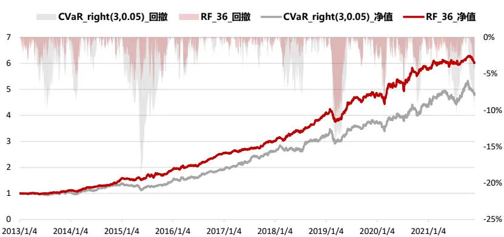

东方证券股份有限公司经相关主管机关核准具备证券投资咨询业务资格，据此开展发布证券研究报告业务。

## 报告发布日期

2021 年 12 月 25 日

证券分析师朱剑涛

021-63325888*6077

zhujiantao@orientsec.com.cn

执业证书编号：S0860515060001

联系人栾张心怿

luanzhangxinyi@orientsec.com.cn

## 相关报告

基于大单的 alpha 因子构建：—— 因子选 2021-10-27股系列之 七十九

存在于全市场范围内的稳健动量效应：—— 2021-09-02《因子选股系列研究 之 七十八》

“居中”和“离群”股的 Alpha：——《因 2021-08-15子系列选股研究之七十七》

## 一、收益率的非对称性分布与尾部特征

股票的风险溢价来自于投资者所承担的股票风险。波动率作为衡量股票风险的常见指标，在实证中已被证实存在显著的风险溢价。但波动率是基于收益率的二阶矩计算而来，单纯依靠二阶矩无法反映分布的整体情况，因此本文尝试从更多的角度去度量股票风险，如收益率分布的高阶矩及其尾部特征，并探究不同风险度量方式下产生的风险溢价。

我们首先基于收益率的高阶矩构建了偏度因子，同时参考由 Patil 等人（2012）、Jiang 等人（2020）提出的方法，建立了 $E_{\varphi}、S_{\varphi}和Asym_{P}$ 等同样用于刻画分布非对称程度的因子，通过上述因子来探究蕴含在股票收益率非对称分布中的 Alpha。此外，为定量描述收益率分布的尾部特征，我们采用 CVaR 和 Van 等人（2016）提出的尾部 beta方法，来研究存在于股票收益率尾部特征中的 Alpha。

综上，本文首先构建了四种衡量收益率非对称程度的因子，然后对收益率分布的尾部风险也分别构造了三种因子进行测试，最后使用随机森林模型将上述因子转换为预测收益率，并根据预期收益率构建多空组合，考察合成后的因子表现。

图 1：上证指数收益率分布图（2010.01-2021.11）
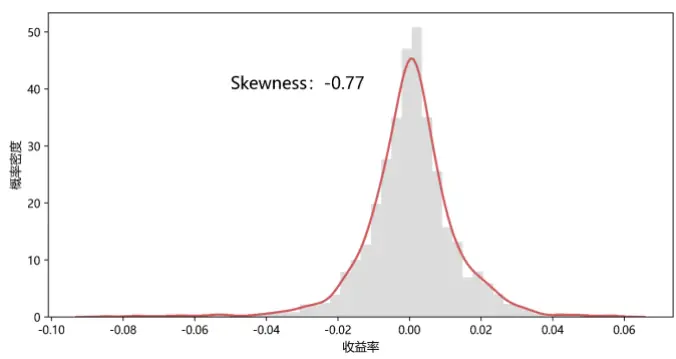
资料来源：Wind 资讯 & 东方证券研究所

图 2：深证成指收益率分布图（2010.01-2021.11）
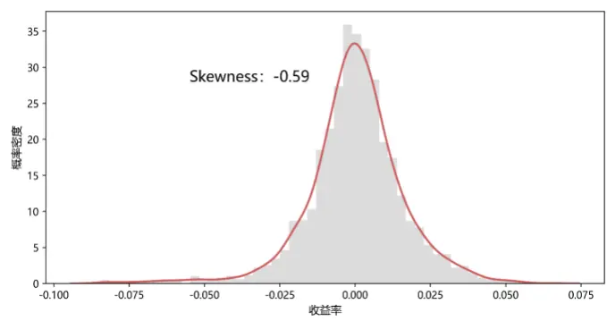
资料来源：Wind 资讯 & 东方证券研究所

## 二、非对称性的衡量因子

## 2.1 偏度因子

偏度（Skewness）是常见的对称性衡量指标，其计算公式为：

$$
Skewness=E\left[(\frac{X-\mu}{\sigma})^{3}\right]
$$

我们分别用过去 6、12 个月的日频收益率计算股票偏度因子，并对行业市值中性化后的因子在中证全指、沪深 300、中证 500 和中证 1000 四个股票池内进行回测，回测区间为 2010.01 至 2021.11。

因子测试结果显示，偏度因子在中证全指股票池里的 IC、IC_IR 最好，以Skewness_12（用过去 12 个月的数据计算得到的偏度因子）为例，其在中证全指中的IC 为-4.14%，IC_IR 为-2.48，多空组合月收益为 0.93%，最大回撤为-13.00%。

图 3：Skewness_6 因子测试结果（2010.01-2021.11）

| Skewness 6 | IC | IC_IR | p-val | 多空月收益 | 夏普值 | 月胜率 | 最大回撤 |
| --- | --- | --- | --- | --- | --- | --- | --- |
| 中证全指 | -3.92% | -2.4 | 0.00% | 0.87% | 1.53 | 69.93% | -15.39% |
| 沪深300 | -2.32% | -1.18 | 0.01% | 0.74% | 1.04 | 60.14% | -13.62% |
| 中证500 | -2.23% | -1.21 | 0.00% | 0.43% | 0.66 | 58.74% | -18.38% |
| 中证1000 | -3.41% | -1.8 | 0.00% | 0.75% | 1.06 | 65.73% | -22.41% |

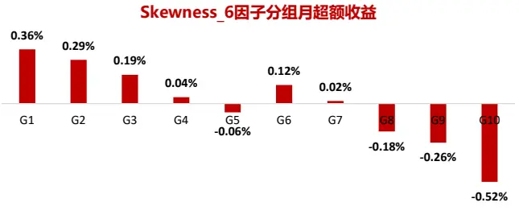
Skewness_6因子多空组合的净值与回撤

图 4：Skewness_12 因子测试结果（2010.01-2021.11）

| Skewness_12 | IC | IC_IR | p-val | 多空月收益 | 夏普值 | 月胜率 | 最大回撤 |
| --- | --- | --- | --- | --- | --- | --- | --- |
| 中证全指 | -4.14% | -2.48 | 0.00% | 0.93% | 1.47 | 65.03% | -13.00% |
| 沪深300 | -1.83% | -0.89 | 0.25% | 0.36% | 0.51 | 58.74% | -21.76% |
| 中证500 | -2.10% | -1.24 | 0.00% | 0.40% | 0.64 | 58.74% | -17.55% |
| 中证1000 | -3.74% | -1.88 | 0.00% | 0.88% | 1.13 | 67.83% | -15.62% |

Skewness_12因子分组月超额收益

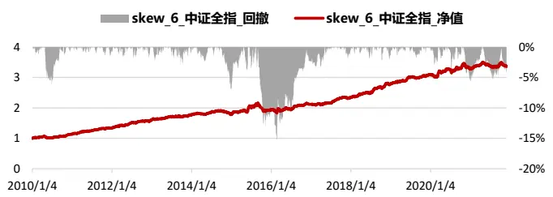

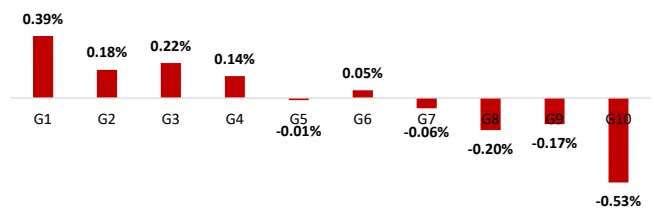
资料来源：Wind 资讯 & 东方证券研究所

Skewness_12因子多空组合的净值与回撤
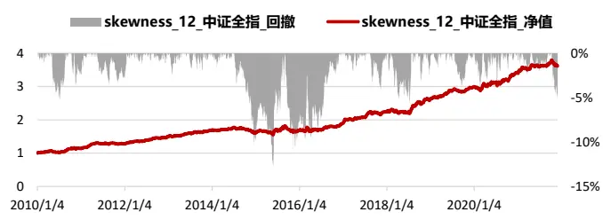
资料来源：Wind 资讯 & 东方证券研究所

## 2.2 $E_{\varphi}$ 与 $S_{\varphi}$

本文参考“Stock Return Asymmetry: Beyond Skewness” 中对股票收益非对称性的度量方法，构建了 $E_{\varphi}$ 和 $|S_{\varphi}$ 两类因子。

首先， $E_{\varphi}$ 因子是从异尾概率出发，用左、右尾概率作差的方式度量分布的对称性，其中x为标准化的日度超额收益，k为定义左、右异尾的阈值。 $E_{\varphi}$ 因子的含义非常直观，若该因子大于零，则表示该股票在过去出现大涨的概率胜于大跌的概率，而投资者出于“追涨”的心理往往乐于购买这类股票，从而使得这类股票在未来下跌的概率增大。

$$
E_{\varphi}=\int\limits_{k}^{+\infty}f(x)dx-\int\limits_{-\infty}^{-k}f(x)dx=P(x\geq k)-P(x\leq-k).
$$

$S_{\varphi}$ 因子基于熵原理构造。Racine、Massoumi（2007, 2008）曾说明，若 $\{X_{t}\}_{t=1}^{T}$ 为一个平稳过程且 $\mu_{X}=E[X_{t}]$ ，令 $\widehat{\gamma X_{t}}=-X_{t}+2\mu_{X}$ $f_{1}(x)$ $f_{2}(x)$ 分别为X 和X̃的概率密度函数，则当 $f_{1}(x){\stackrel{a.s.}{=}}f_{2}(x)$ 时， $\{X_{t}\}_{t=1}^{T}.$ 关于均值 $\mu_{X}$ 对称。因此， $f_{1}(x)$ 与 $f_{2}(x)$ 之间的距离可以用于衡量一个分布是否对称。但由于单纯的距离无法体现分布非对称性的方向，即无法区分分布是左偏还是右偏，所以 Jiang 等人（2020）在距离前乘以 $E_{\varphi}$ 因子的符号$Sign(E_{\varphi})$ ，使得 $S_{\varphi}$ 加入了非对称性方向的考量。

$$
S_{\varphi}=Sign(E_{\varphi})*\frac{1}{2}\left\{\int\limits_{-\infty}^{-k}(f_{1}^{\frac{1}{2}}-f_{2}^{\frac{1}{2}})^{2}dx+\int\limits_{k}^{+\infty}(f_{1}^{\frac{1}{2}}-f_{2}^{\frac{1}{2}})^{2}dx\right\}
$$

$S_{\varphi}$ 定义中的x和k的含义与 $E_{\varphi}$ 相同。由于 $\dot{\tau}f_{1}(x)$ $f_{2}(x)$ 的真实分布未知，所以对二者的估计采用非参数估计中的核密度估计法，核密度函数选取高斯核函数。

$$
{\widehat{f(x)}}={\cfrac{1}{nh}}\sum_{i=1}^{n}\kappa({\cfrac{r_{i}-x}{h}}).
$$

$$
\kappa(z)=\frac{1}{\sqrt{2\pi}}e^{-\frac{1}{2}z^{2}}
$$

其中， $r_{i}$ 为计算区间内标准化的日度超额收益，n为计算区间内的交易天数，ℎ为带宽。本文对带宽ℎ的估计采用 Silverman（1986）经验法则，即ℎ $\approx1.06\hat{\sigma}n^{-1/5}$ 。

我们用符号 $E_{\varphi}(m,k)$ 表示用过去m个月的数据计算 $E_{\varphi}$ 因子，且异尾阈值取k，$S_{\varphi}(m,$ k)同理。从测试结果看，相较于偏度因子， $E_{\varphi}$ 和 $]S_{\varphi}$ 因子具有更高的 IC_IR 和更低的回撤，整体表现较为稳健。例如 $E_{\varphi}$ (3,1.5)因子在中证全指内的 IC 为-3.18%，IC_IR 为-3.01，多空组合月收益为 0.76%，最大回撤为-7.31%； $S_{\varphi}(3{,}1)$ )因子在中证全职内的 IC为-2.87%，IC_IR 为-3.3，多空组合月收益为 0.72%，最大回撤为-6.87%。

## 2.3 AsymP

Patil 等人（2012）提出了一种衡量分布对称性的新方法，Xu 等人（2019）将其用于解释股票的横截面收益并得到了二者呈负相关的结论。本文也将采用 Patil 的方法构建非对称性因子，其计算公式为：

$$
Asym_{P}=\left\{\begin{aligned}-corr\big(f(r),F(r)\big)&,if\;0<var\big(f(r)\big)<\infty\\0&,if\;var\big(f(r)\big)=0\end{aligned}\right.
$$

其中， $f(r)$ 与 $F(r)$ )分别是收益率的概率密度函数和分布函数。对f(r)采取与上述 $S_{\varphi}$ 因子相同的方法估计，即非参法下的高斯核密度估计。Xu 等人（2019）发现，当某非对称分布接近于对称分布时，偏度较难识别出其中的非对称性，但 $Asym_{P}$ 却可以，因此$Asym_{P}$ 对于非对称性的衡量要比偏度更准确。

图 5： $E_{\varphi}$ （3，1.5）因子测试结果（2010.01-2021.11）

| Eφ(3,1.5) | IC | IC_IR | p-val | 多空月收益 | 夏普值 | 月胜率 | 最大回撤 |
| --- | --- | --- | --- | --- | --- | --- | --- |
| 中证全指 | -3.18% | -3.01 | 0.00% | 0.76% | 1.8 | 73.43% | -7.31% |
| 沪深300 | -3.28% | -1.97 | 0.00% | 0.69% | 0.93 | 53.85% | -10.13% |
| 中证500 | -2.18% | -1.4 | 0.00% | 0.21% | 0.31 | 55.24% | -32.24% |
| 中证1000 | -2.88% | -2.21 | 0.00% | 0.79% | 1.37 | 67.83% | -10.37% |

Eϕ(3,1.5)因子分组月超额收益
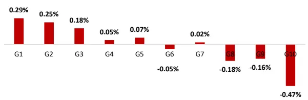

图 6： $E_{\varphi}$ （1，1.5）因子测试结果（2010.01-2021.11）

| Eφ(1,1.5) | IC | IC_IR | p-val | 多空月收益 | 夏普值 | 月胜率 | 最大回撤 |
| --- | --- | --- | --- | --- | --- | --- | --- |
| 中证全指 | -2.95% | -2.84 | 0.00% | 0.78% | 1.91 | 72.73% | -8.36% |
| 沪深300 | -1.54% | -1.07 | 0.03% | 0.05% | 0.07 | 51.75% | -26.32% |
| 中证500 | -1.44% | -1.07 | 0.03% | 0.31% | 0.56 | 60.14% | -17.45% |
| 中证1000 | -3.04% | -2.15 | 0.00% | 0.92% | 1.51 | 69.23% | -12.07% |

Eϕ(1,1.5)因子分组月超额收益

Eϕ(3,1.5)因子多空组合的净值与回撤
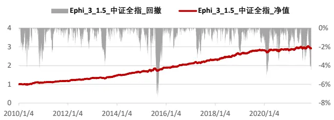
资料来源：Wind 资讯 & 东方证券研究所

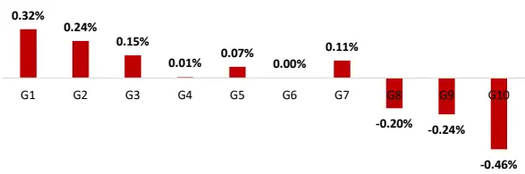

Eϕ(1,1.5)因子多空组合的净值与回撤
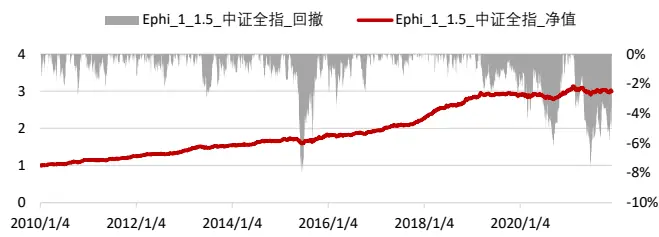
资料来源：Wind 资讯 & 东方证券研究所

图 7： $S_{\varphi}$ （3，1）因子测试结果（2010.01-2021.11）

| Sφ(3,1) | IC | IC_IR | p-val | 多空月收益 | 夏普值 | 月胜率 | 最大回撤 |
| --- | --- | --- | --- | --- | --- | --- | --- |
| 中证全指 | -2.87% | -3.3 | 0.00% | 0.72% | 2.17 | 75.52% | -6.87% |
| 沪深300 | -2.82% | -1.74 | 0.00% | 0.52% | 0.81 | 62.94% | -13.53% |
| 中证500 | -1.89% | -1.35 | 0.00% | 0.40% | 0.66 | 59.44% | -20.54% |
| 中证1000 | -2.76% | -2.31 | 0.00% | 0.66% | 1.31 | 65.03% | -9.09% |

Sϕ(3,1)因子分组月超额收益

图 8： $S_{\varphi}$ （3，1.5）因子测试结果（2010.01-2021.11）

| Sφ(3,1.5) | IC | IC_IR | p-val | 多空月收益 | 夏普值 | 月胜率 | 最大回撤 |
| --- | --- | --- | --- | --- | --- | --- | --- |
| 中证全指 | -2.60% | -2.31 | 0.00% | 0.64% | 1.44 | 65.73% | -10.01% |
| 沪深300 | -2.64% | -1.39 | 0.00% | 0.68% | 0.86 | 60.14% | -20.20% |
| 中证500 | -1.91% | -1.22 | 0.00% | 0.30% | 0.56 | 51.75% | -18.45% |
| 中证1000 | -2.59% | -1.89 | 0.00% | 0.55% | 0.98 | 61.54% | -16.71% |

Sϕ(3,1.5)因子分组月超额收益

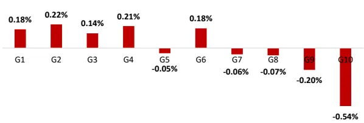

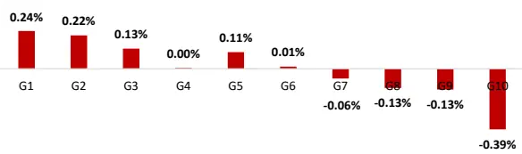

Sϕ(3,1)因子多空组合的净值与回撤
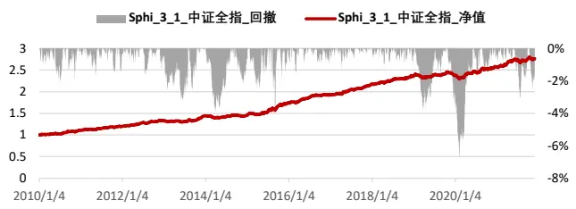
资料来源：Wind 资讯 & 东方证券研究所

Sϕ(3,1.5)因子多空组合的净值与回撤
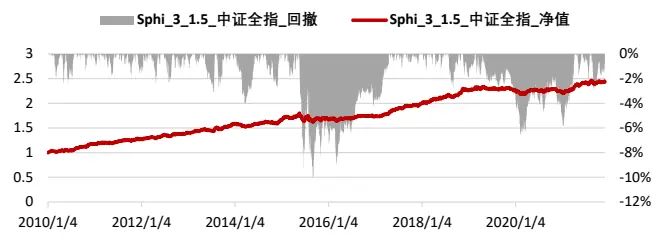
资料来源：Wind 资讯 & 东方证券研究所

图 9：Asym _1 因子测试结果（2010.01-2021.11）

| Asym_1 | IC | IC_IR | p-val | 多空月收益 | 夏普值 | 月胜率 | 最大回撤 |
| --- | --- | --- | --- | --- | --- | --- | --- |
| 中证全指 | -3.03% | -1.91 | 0.00% | 0.60% | 1.18 | 69.23% | -14.84% |
| 沪深300 | -1.06% | -0.5 | 8.37% | 0.09% | 0.12 | 51.05% | -26.27% |
| 中证500 | -1.89% | -1.1 | 0.02% | 0.39% | 0.64 | 59.44% | -15.40% |
| 中证1000 | -3.11% | -1.71 | 0.00% | 0.66% | 1.01 | 60.84% | -16.59% |

Asym_1因子分组月超额收益

图 10：Asym _3 因子测试结果（2010.01-2021.11）

| Asym_3 | IC | IC_IR | p-val | 多空月收益 | 夏普值 | 月胜率 | 最大回撤 |
| --- | --- | --- | --- | --- | --- | --- | --- |
| 中证全指 | -2.65% | -1.42 | 0.00% | 0.37% | 0.55 | 55.94% | -20.47% |
| 沪深300 | -1.70% | -0.81 | 0.60% | 0.10% | 0.12 | 49.65% | -40.14% |
| 中证500 | -1.23% | -0.64 | 2.84% | -0.02% | -0.03 | 53.85% | -41.84% |
| 中证1000 | -2.10% | -1.03 | 0.05% | 0.24% | 0.31 | 52.45% | -25.01% |

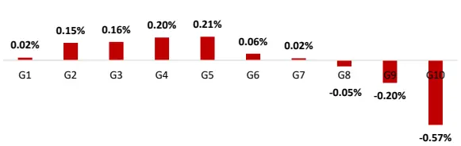
Asym_1因子多空组合的净值与回撤

Asym_3因子分组月超额收益
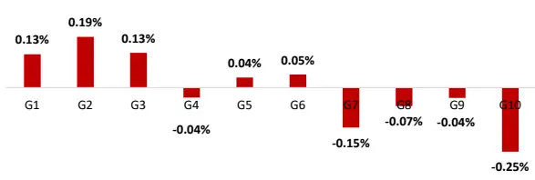

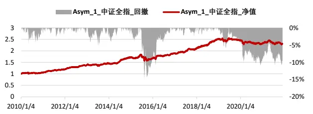
资料来源：Wind 资讯 & 东方证券研究所

Asym_3因子多空组合的净值与回撤
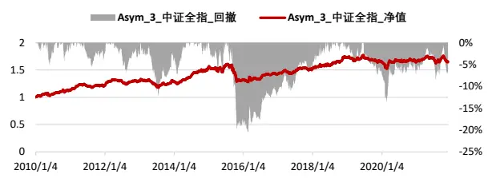
资料来源：Wind 资讯 & 东方证券研究所

我们分别用过去 1、3、6、12 个月的历史收益率计算 $.Asym_{P}$ 因子。从测试结果来看，$Asym_{P}$ 因子的稳健性略低于前述因子。具体地， $Asym_{P_{1}}$ _1（用过去 1 个月历史收益率计算得到）在中证全指中的 IC 为-3.03%，IC_IR 为-1.91，多空月收益为 0.60%，最大回撤为-14.84%，但从分组月超额收益看，各组间的超额收益并不完全单调，多头超额明显偏弱。

## 三、尾部风险的衡量因子

我们在第二部分详细介绍了偏度、 $E_{\varphi}、S_{\varphi}和Asym_{P}$ 这四种衡量非对称性的因子，这些因子是站在分布整体的角度去刻画非对称性。而在本报告的第三部分，我们将聚焦于异尾风险，尝试构建描述尾部风险的因子以寻找尾部风险 Alpha。

## 3.1 CVaR

VaR（ValueatRisk）表示在给定的置信水平α下，某资产在未来一定时期内的最大可能损失，α通常取 0.95。虽然VaR 简单易理解，但它存在两个主要缺陷，一是没有考虑损失超过 VaR 时的极端情况，二是 VaR 不具备次可加性，即组合整体的 VaR 可能大于各资产 VaR 之和。Rockafellar 等人（1999）在此基础上提出了 CVaR（ConditionalValue at Risk）的概念。CVaR 又被称作期望损失（Expected Shortfall），其含义为超出 VaR 损失部分的期望，即C $VaR_{\alpha}=E[X|X<VaR_{\alpha}]_{\circ}$为了进一步展示VaR与CVaR的区别，我们分别构造了标准正态分布和肥尾分布，这两个分布的 95%VaR 均为-1.64%，但正态分布和肥尾分布的 CVaR 分别为-2.05%和-3.65%，所以 CVaR 比 VaR更适合用来描述尾部风险。

图 11：CVaR 与 VaR 的对比
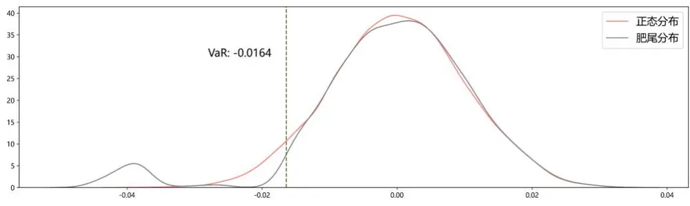
资料来源：Wind 资讯 & 东方证券研究所

考虑到左尾和右尾都会对收益率产生影响，所以我们对分布的左尾和右尾分别计算其 CVaR。为方便表述与理解，我们用 5%的左尾 CVaR 表示位于分布左侧 5%区域内的收益率均值，5%的右尾 CVaR 表示位于分布右侧 5%区域内的收益率均值。特别地，右尾 CVaR 本质和 MaxRet 因子相同，二者都是计算过去一段时间内前几个最大收益率的均值。

图 12：CVaR (12,0.05)因子测试结果（2010.01-2021.11）

| CVaR_left(12,0.05) | IC | IC_IR | p-val | 多空月收益 | 夏普值 | 月胜率 | 最大回撤 |
| --- | --- | --- | --- | --- | --- | --- | --- |
| 中证全指 | 5.56% | 1.61 | 0.00% | 0.98% | 0.85 | 64.34% | -29.24% |
| 沪深300 | 3.91% | 1.03 | 0.05% | 0.63% | 0.48 | 61.54% | -34.40% |
| 中证500 | 4.34% | 1.26 | 0.00% | 0.67% | 0.58 | 60.14% | -31.99% |
| 中证1000 | 4.96% | 1.46 | 0.00% | 0.94% | 0.81 | 61.54% | -35.44% |

图 13：CVaR (6,0.05)因子测试结果（2010.01-2021.11）

| CVaR Ieft(6,0.05) | IC | IC_IR | p-val | 多空月收益 | 夏普值 | 月胜率 | 最大回撤 |
| --- | --- | --- | --- | --- | --- | --- | --- |
| 中证全指 | 5.07% | 1.43 | 0.00% | 0.75% | 0.64 | 60.84% | -28.25% |
| 沪深300 | 3.04% | 0.81 | 0.56% | 0.36% | 0.29 | 58.04% | -32.97% |
| 中证500 | 3.74% | 1.06 | 0.04% | 0.43% | 0.37 | 60.84% | -23.87% |
| 中证1000 | 4.52% | 1.28 | 0.00% | 0.70% | 0.59 | 60.84% | -30.61% |

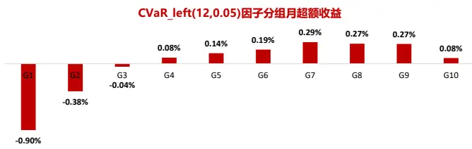

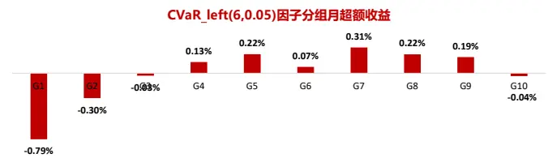

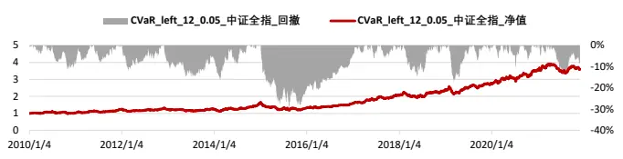
资料来源：Wind 资讯 & 东方证券研究所

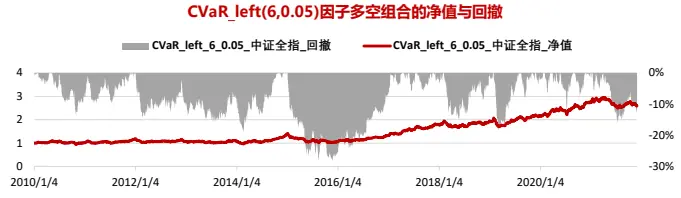
资料来源：Wind 资讯 & 东方证券研究所

$$
CVaR_{-}=E[X\mid X<VaR],P(X<VaR)=5\%
$$

$$
CVaR_{+}=E[X\mid X>VaR],P(X>VaR)=5\%
$$

我们分别用过去 1、3、6、12 个月的历史收益率计算左尾CVaR 和右尾CVaR 因子。对于左尾CVaR 因子来说，因子值越小表示股票的下跌风险越大，未来预期收益也越低。左尾CVaR 因子在长考察期内表现较好，如用过去 12 个月的历史收益率数据计算CVaR (12,0.05)因子在中证全指内的 IC 为 5.56%，IC_IR 为 1.61，多空月收益为 0.98，最大回撤为-29.24%。对于右尾CVaR 因子来说，它在短考察期内表现较好，例如用过去 3 个月数据计算得到的CVaR (3,0.05)的 IC 为-8.15%，IC_IR 为-2.72，多空组合月收益为 1.52%，最大回撤为-19.83%。

图 14：CVaR (3,0.05)因子测试结果（2010.01-2021.11）
图 15：CVaR (1,0.05)因子测试结果（2010.01-2021.11）

| CVaR right(3,0.05) | IC | IC_IR | p-val | 多空月收益 | 夏普值 | 月胜率 | 最大回撤 |
| --- | --- | --- | --- | --- | --- | --- | --- |
| 中证全指 | -8.15% | -2.72 | 0.00% | 1.52% | 1.47 | 65.73% | -19.83% |
| 沪深300 | -4.95% | -1.49 | 0.00% | 0.54% | 0.53 | 53.15% | -24.85% |
| 中证500 | -5.51% | -1.9 | 0.00% | 0.97% | 1.07 | 65.03% | -19.61% |
| 中证1000 | -7.66% | -2.6 | 0.00% | 1.29% | 1.3 | 65.73% | -18.09% |

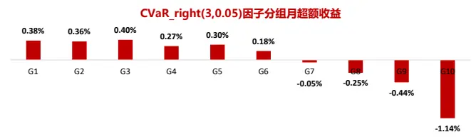

| CVaR_right(1,0.05) | IC | IC_IR | p-val | 多空月收益 | 夏普值 | 月胜率 | 最大回撤 |
| --- | --- | --- | --- | --- | --- | --- | --- |
| 中证全指 | -7.84% | -2.92 | 0.00% | 1.38% | 1.48 | 71.33% | -13.65% |
| 沪深300 | -4.05% | -1.3 | 0.00% | 0.69% | 0.73 | 61.54% | -34.87% |
| 中证500 | -4.96% | -1.96 | 0.00% | 0.61% | 0.65 | 55.94% | -21.43% |
| 中证1000 | -7.44% | -2.77 | 0.00% | 1.32% | 1.35 | 73.43% | -16.26% |

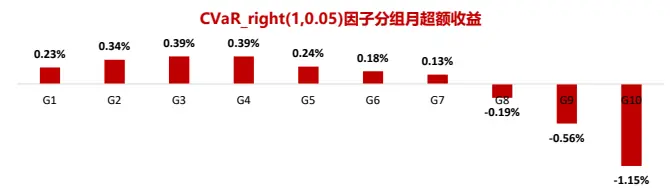

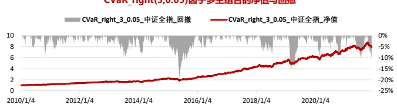
资料来源：Wind 资讯 & 东方证券研究所

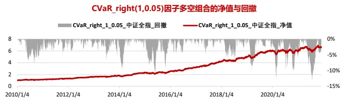
资料来源：Wind 资讯 & 东方证券研究所

## 3.2 Tail Beta

左尾风险还可以用 Van 等人（2016）提出的尾部beta 的方式衡量。令Re 、 $R_{j}^{e}{}^{.}$ 分别表示市场和股票j的超额收益，则尾部 beta 为市场超额收益超出其 VaR 时 CAPM 模型中的 beta，即

$$
R_{j}^{e}=\beta_{j}^{T}R_{m}^{e}+\varepsilon_{j},R_{m}^{e}<-VaR_{m}(\bar{p})
$$

其中，p̅常取一个很小的值如 5%，且有 $P\big(R_{m}^{e}<-VaR_{m}(\bar{p})\big)=\bar{p}_{\circ}$ 。对于尾部 beta $\beta_{j}^{T}$ 采用 Van（2011）中提出的基于极值理论的估计方法，该方法假设市场和股票的超额收益服从肥尾分布且满足

$$
P\{R_{m}^{e}<-\mu\}{\sim}A_{m}\mu^{-\alpha_{m}},P\{R_{j}^{e}<-\mu\}{\sim}A_{j}\mu^{-\alpha_{j}},当\mu\rightarrow+\infty.
$$

该方法对于 $\dot{\tau}\beta_{j}^{T}$ 的估计公式为：

$$
\widehat{\beta_{J}^{T}}:=\widehat{\tau_{J}(^{k}/n)^{1/\alpha_{m}}}\frac{Va\widehat{R_{J}(k/n)}}{Va\widehat{R_{m}(k/n)}}.
$$

令 ${\boldsymbol{\imath}}X_{t}^{(m)}=-R_{m,t}^{e},t=1{,}2\cdots n$ ，n为计算期间内交易日天数。然后将市场超额收益的 相反数 ${\cal X}_{t}^{(m)}$ 从小到大排序，得到 $X_{n,1}^{(m)}\leq X_{n,2}^{(m)}\leq\cdots\leq X_{n,n}^{(m)}。X_{t}^{(j)}、X_{n,i}^{(j)}$ 定义方式同上。取 k为n个交易日中 $R_{m}^{e}$ 损失超出其 VaR值的天数 $\left(k\approx0.05n\right)$ ，则

$$
\frac{1}{\widehat{\alpha_{m}}}=\frac{1}{k}\sum_{i=1}^{k}logX_{n,n-i+1}^{(m)}-logX_{n,n-k}^{(m)},
$$

$$
\widehat{\tau_{j}\left(k/_{n}\right)}=\frac{1}{k}\sum_{t=1}^{n}1_{\left\{X_{t}^{(j)}>X_{n,n-k}^{(j)}andX_{t}^{(m)}>X_{n,n-k}^{(m)}\right\}}.
$$

$\widehat{VaR_{j}(k/n)}、\widehat{VaR_{m}(k/n)}$ 分别表示股票j和市场第k+1大损失。尾部 beta 因子表示当市场出现极端下跌行情时，个股收益对市场收益的敏感性。若尾部 beta 越大，表示个股收益对市场的极端负收益越敏感，使得收益率低于尾部 beta 偏小的股票。

图 16：Tail Beta(12,0.05)因子测试结果（2010.01-2021.11）
图 17：Tail Beta (6,0.05)因子测试结果（2010.01-2021.11）

| Tail Beta(12,0.05) | IC | IC_IR | p-val | 多空月收益 | 夏普值 | 月胜率 | 最大回撤 |
| --- | --- | --- | --- | --- | --- | --- | --- |
| 中证全指 | -4.67% | -1.51 | 0.00% | 0.57% | 0.56 | 60.14% | -27.56% |
| 沪深300 | -2.91% | -0.87 | 0.33% | 0.59% | 0.51 | 57.34% | -32.72% |
| 中证500 | -4.09% | -1.26 | 0.00% | 0.55% | 0.55 | 62.94% | -28.60% |
| 中证1000 | -4.20% | -1.37 | 0.00% | 0.52% | 0.5 | 57.34% | -36.76% |

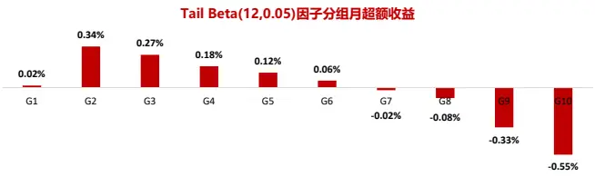

| Tail Beta(6,0.05) | IC | IC_IR | p-val | 多空月收益 | 夏普值 | 月胜率 | 最大回撤 |
| --- | --- | --- | --- | --- | --- | --- | --- |
| 中证全指 | -3.46% | -1.19 | 0.01% | 0.61% | 0.66 | 62.24% | -23.83% |
| 沪深300 | -2.38% | -0.79 | 0.75% | 0.41% | 0.36 | 52.45% | -27.85% |
| 中证500 | -2.76% | -0.91 | 0.20% | 0.31% | 0.32 | 55.94% | -30.49% |
| 中证1000 | -3.13% | -1.07 | 0.03% | 0.53% | 0.53 | 61.54% | -21.15% |

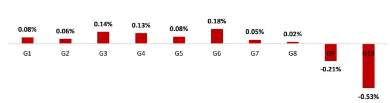

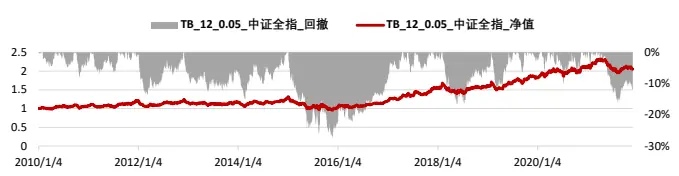
资料来源：Wind 资讯 & 东方证券研究所

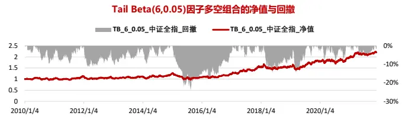
资料来源：Wind 资讯 & 东方证券研究所

尾部 beta 因子的测试结果显示，该因子与收益率的关系为负相关且用过去 12 个月的历史数据估计的因子效果相对较好，其 IC 为-4.67%，IC_IR 为-1.51，多空组合月收益为 0.57%，最大回撤为-27.56%，但多头组的月度超额收益不如空头显著。

## 四、因子相关性分析

针对前文介绍的七类因子（偏度、 $E_{\varphi}、S_{\varphi}、Asym_{P}、$ 左尾 CVaR、右尾 CVaR 和尾部 Beta），我们分别从每类因子中根据 IC、IC_IR 的综合表现各挑出一个因子，进行相关性分析与后续的随机森林预测。选出的七个因子分别是Skewness_12、 $E_{\varphi}(3{,}1.5)$ 、

$$
S_{\varphi}(3,1)\textbackslash Asym_{P-}1\textbackslash CVaR_{-}(12,0.05)\textbackslash CVaR_{+}(3,0.05)\textbackslash TailBeta(12,0.05)\textbackslash a
$$

## 4.1 七类因子间的相关性

我们首先分析上述七类因子间在横截面上的秩相关系数，有如下发现：

（1） 四类衡量非对称性的因子（Skewness_12 $E_{\varphi}(3{,}1.5)$ $S_{\varphi}(3{,}1)$ $Asym_{P-}1\;)$ 彼此间相关系数均大于零，其中 $E_{\varphi}(3{,}1.5)$ 与 $[S_{\varphi}(3{,}1)$ 的相关系数较大为0.33，其余非对称因子间的相关系数较小，说明各因子描述非对称时抓取的特征不完全相同，因子间的替代性较低；

（2） 在三类尾部风险因子中，左尾CVaR 与右尾 CVaR、TailBeta 的相关系数均小于零，而右尾 CVaR 与 Tail Beta 的相关系数大于零，这与前面我们分析左尾 CVaR 为正向因子、右尾 CVaR 与 Tail Beta 为负向因子的逻辑一致。

图 18：七类因子间的秩相关系数（2010.01-2021.11）
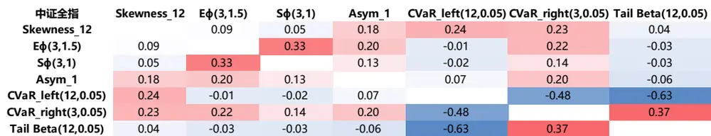
资料来源：Wind 资讯 & 东方证券研究所

## 4.2 与常见大类因子的相关性

其次，我们分析上述七个因子与常见大类因子在横截面上的秩相关系数，有如下几点发现：

图 19：与常见大类因子的相关性（2010.01-2021.11）
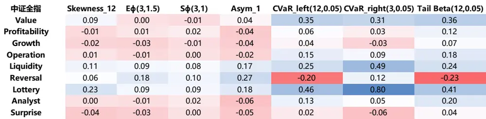
资料来源：Wind 资讯 & 东方证券研究所

（1） 七类因子与投机大类因子 Lottery 的相关系数均大于零，其中右尾 CVaR与投机大类因子的相关性最强；

（2） 四类非对称性因子与反转大类因子 Reversal 的相关系数均大于零，这与前面测试结果中偏度等因子为负向因子的结论一致。三类尾部风险因子中，只有右尾 CVaR 与反转因子相关性为正，这与右尾 CVaR 在偏短考察期内表现更好的特点一致。

## 五、随机森林模型下的 Alpha 预测

在 本 节 ， 我 们 将 前 文 选 出 的 Skewness_12、Eφ(3,1.5)、Sφ(3,1)、AsymP_1、CVaR (12,0.05)、CVaR (3,0.05)、Tail Beta(12,0.05)七个因子输入到随机森林模型中进行 Alpha 预测。有关 Alpha预测和随机森林模型在之前的报告《Alpha 预测》《东方机器选股模型 Ver1.0》《机器因子库相对人工因子库的增量》中均有详细介绍，在此仅阐述重点细节。

选用随机森林模型作为 Alpha 预测工具的原因，除去随机森林模型自身逻辑简单、不宜过拟合等优点，还考虑到七个因子彼此间相关性较弱、部分因子 IC 高但稳健性不足、部分因子 IC 低但稳健性强的特点，使用随机森林非线性预测的方法可以有效提升合成后因子的稳健性。我们将每个月底行业市值中性化后的七个因子、行业哑变量以及对数市值作为自变量，下月股票收益率标准化后的 zscore 作为因变量输入到随机森林模型中进行训练。在训练模型参数时，我们选用平行训练的方法。具体地，我们选用过去三年的月度数据逐月训练模型，在得到 36 个随机森林模型后，将最新一期的因子值输入到这 36 个模型中，再将 36 个模型返回的预测值取平均，便得到了平行训练下的最终 Alpha 预测结果。关于随机森林模型中的超参数问题，我们使用 Python 中的GridSearchCV 函数对模型中决策树个数 n_estimators 和树的最大深度 max_depth 这两个参数进行调优。在综合考虑预测效果和时间成本后，我们选择 n_estimators=5 和max_depth=500 作为最终的参数取值。

图 20：平行训练示意图
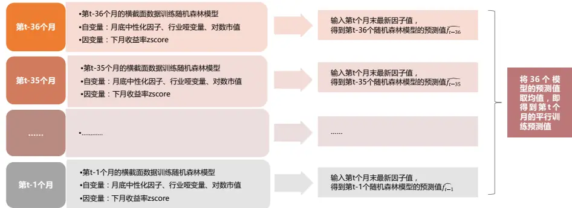
资料来源：东方证券研究所

使用平行训练得到每月底的 Alpha 预测后，我们等权做多预测收益最高的前 10%股票、做空预测收益最低的后 10%股票构建多空组合，对 Alpha 预测因子及其多空组合的表现进行测试。测试结果显示，与原始非对称性因子和尾部风险因子相比，使用随机森林模型得到的 Alpha 预测因子在各项指标上均表现优异。该因子在中证全指中的 IC为 7.18%，IC_IR 为 3.12，多空月收益为 1.73%，最大回撤为-11.67%。

与右尾 CVaR（MaxRet）相比，虽然 Alpha 预测因子的 IC 略低，但 IC_IR 绝对值由 2.85 提升至 3.12，多空月收益由 1.55%提升至 1.73%，最大回撤由-19.83%降低至-11.67%。此外，分组超额收益的单调性在 Alpha 预测因子中也得到提升。MaxRet 因子在后四组中的单调性较弱，但 Alpha 预测因子的分组收益单调性良好，多头月超额收益为 0.59%优于 MaxRet 因子的 0.33%。

图 21：随机森林 Alpha 预测因子测试结果（2013.01-2021.11）
随机森林 Alpha 预测因子

| RF_36 | IC | IC_IR | p-val | 多空月收益 | 夏普值 | 月胜率 | 最大回撤 |
| --- | --- | --- | --- | --- | --- | --- | --- |
| 中证全指 | 7.18% | 3.12 | 0.00% | 1.73% | 2.09 | 74.77% | -11.67% |
| 沪深300 | 3.66% | 1.4 | 0.01% | 0.77% | 0.91 | 58.88% | -19.78% |
| 中证500 | 4.93% | 1.95 | 0.00% | 0.86% | 1.04 | 63.55% | -14.08% |
| 中证1000 | 6.85% | 2.88 | 0.00% | 1.11% | 1.44 | 66.36% | -16.32% |

四类非对称因子与三类尾部风险因子

| 中证全指 | IC | IC_IR | p-val | 多空月收益 | 夏普值 | 月胜率 | 最大回撤 |
| --- | --- | --- | --- | --- | --- | --- | --- |
| Skewness 12 | -3.99% | -2.41 | 0.00% | 0.85% | 1.3 | 62.62% | -13.00% |
| Eφ(3,1.5) | -3.18% | -3.06 | 0.00% | 0.74% | 1.72 | 74.77% | -7.31% |
| Sφ(3,1) | -2.92% | -3.21 | 0.00% | 0.69% | 1.94 | 71.96% | -6.87% |
| Asym_1 | -2.78% | -1.68 | 0.00% | 0.50% | 0.92 | 64.49% | -14.84% |
| CVaR_left(12,0.05) | 6.22% | 1.85 | 0.00% | 1.09% | 0.92 | 64.49% | -29.24% |
| CVaR_right(3,0.05) | -8.56% | -2.85 | 0.00% | 1.55% | 1.41 | 65.42% | -19.83% |
| Tail Beta(12,0.05) | -5.26% | -1.81 | 0.00% | 0.59% | 0.58 | 60.75% | -27.56% |

因子分组月超额收益对比
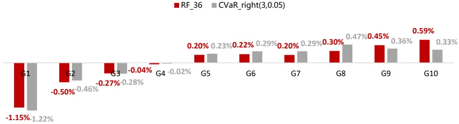

因子多空组合的净值与回撤对比
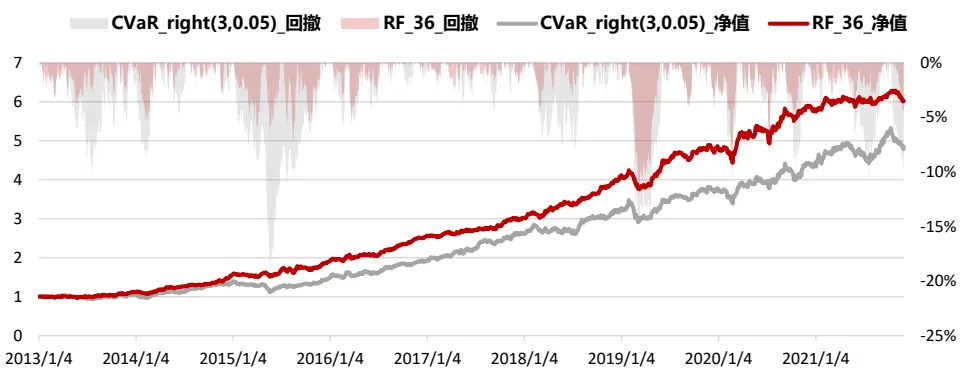
资料来源：Wind 资讯 & 东方证券研究所

## 六、总结

股票的风险溢价来自于投资者所承担的股票风险。波动率作为衡量股票风险的常见指标，在实证中已被证实存在显著的风险溢价。但波动率是基于收益率的二阶矩计算而来，单纯依靠二阶矩无法反映分布的整体情况，因此本文尝试从收益率分布的高阶矩及其尾部特征去度量股票风险，并探究不同风险度量方式下产生的风险溢价。

本文首先构建了偏度、 $,E_{\varphi}、S_{\varphi}和Asym_{P}$ 这四类因子用于衡量股票收益率的非对称性。从测试结果来看，偏度因子具有较高的 IC， $E_{\varphi}$ 和 $S_{\varphi}$ 因子具有较高的 IC_IR， $Asym_{P}$ 因子则介于四者中间。选取 2010.01 至 2021.11 为回测区间，在中证全指股票池内，Skewness_12因子的 IC 为-4.14%，IC_IR 为-2.48； $E_{\varphi}(3{,}1.5)$ 因子的 IC 为-3.18%，IC_IR为-3.01； $S_{\varphi}(3{,}1)$ 因子的 IC 为-2.87%，IC_IR 为-3.3； $Asym_{P-}1$ 因子的 IC 为-3.03%，IC_IR 为-1.91。

针对收益率分布的尾部风险，我们构建了左、右尾 CVaR 因子和 Van 等人（2016）提出的 Tail Beta 因子。右尾 CVaR（即 MaxRet 因子）的 IC 和 IC_IR 均较高，在中证全指内的 IC 为-8.15%，IC_IR 为-2.72；左尾 CVaR 的 IC 为 5.56%， $1\mathsf{C}\_\mathsf{IR}$ 为 1.61；Tail Beta 的 IC 为-4.67%，IC_IR 为-1.51。

在对上述因子进行相关性分析时，我们发现四种非对称性因子间的相关系数为正且相关性较低，说明这四种因子在描述非对称时抓取的特征不完全相同，因子间的替代性较低。此外，这些因子与投机大类因子 Lottery 的相关系数均大于零；除两个描述左尾风险的因子（左尾 CVaR 和 Tail Beta）外，其余因子与反转大类因子 Reversal 的相关性均大于零。

最后，我们从四类非对称性因子和三类尾部风险因子中各选取一个因子，使用随机森林模型进行 Alpha 预测，在平行训练方法下得到每期的 Alpha 预测值。选用随机森林模型作为Alpha预测工具的原因，除去随机森林模型自身逻辑简单、不宜过拟合等优点，还考虑到七个因子彼此间相关性较弱、部分因子 IC 高但稳健性不足、部分因子 IC 低但稳健性强的特点。我们发现，与原始七类因子相比，随机森林模型下的 Alpha 预测因子稳健性得到了较大提升。与同期 IC 最高的右尾 CVaR 因子相比，虽然 Alpha 预测因子的IC略低，但IC_IR的绝对值由2.85提升至3.12，多空月收益由1.55%提升至1.73%，最大回撤由-19.83%降低至-11.67%，多头月超额收益由 0.33%提升至 0.59%。

## 风险提示

1. 量化模型基于历史数据分析得到，未来存在失效的风险，建议投资者紧密跟踪模型表现。

2. 极端市场环境可能对模型效果造成剧烈冲击，导致收益亏损。

## 参考文献

[1] Artzner, P., F Delbaen, Eber, J. M., & Heath, D.. (1999). Coherent measures of risk. Mathematical Finance, 9(3), 203-228.

[2] Huang, B. M.. (2008). Stocks as lotteries: the implications of probability weighting for security prices. Social Science Electronic Publishing, 98(5), 2066-2100.

[3] Jiang, L., Wu, K., Zhou, G., & Zhu, Y.. (2020). Stock return asymmetry: beyond skewness. Journal of Financial and Quantitative Analysis, 1-65.

[4] Maasoumi, E., & Racine, J. S.. (2008). A robust entropy-based test of asymmetry for discrete and continuous processes. Econometric Reviews, 28(1-3), 246-261.

[5] Oordt, M. V., & Zhou, C.. (2011). Systematic risk under extremely adverse market condition. DNB Working Papers, 23(2), 214–231.

[6] Oordt, M. V., & Zhou, C.. (2016). Systematic tail risk. Ssrn Electronic Journal, 51.

[7] Patil, P. N., Patil, P. P., & Bagkavos, D.. (2012). A measure of asymmetry. Statistical Papers, 53(4), 971-985.

[8] Racine, J. S., & Maasoumi, E.. (2007). A versatile and robust metric entropy test of timereversibility, and other hypotheses. Journal of Econometrics, 138(2), 547-567.

[9] Rockafellar, R. T., & Uryasev, S.. (1999). Optimization of conditional valueat-risk. Journal of Risk, 2(3).

[10] Silverman, B. W.. (1986). Density Estimation for Statistics and Data Analysis. Chapman and Hall.

[11] Xu, Z., C He Vapatrakul, T., & Li, X.. (2019). Return asymmetry and the cross section of stock returns. Journal of International Money and Finance, 97(OCT.), 93-110.

## 分析师申明

每位负责撰写本研究报告全部或部分内容的研究分析师在此作以下声明：

分析师在本报告中对所提及的证券或发行人发表的任何建议和观点均准确地反映了其个人对该证券或发行人的看法和判断；分析师薪酬的任何组成部分无论是在过去、现在及将来，均与其在本研究报告中所表述的具体建议或观点无任何直接或间接的关系。

## 投资评级和相关定义

报告发布日后的 12 个月内的公司的涨跌幅相对同期的上证指数/深证成指的涨跌幅为基准；

## 公司投资评级的量化标准

买入：相对强于市场基准指数收益率 15%以上；

增持：相对强于市场基准指数收益率 5%～15%；

中性：相对于市场基准指数收益率在-5%～+5%之间波动；

减持：相对弱于市场基准指数收益率在-5%以下。

未评级 —— 由于在报告发出之时该股票不在本公司研究覆盖范围内，分析师基于当时对该股票的研究状况，未给予投资评级相关信息。

暂停评级 —— 根据监管制度及本公司相关规定，研究报告发布之时该投资对象可能与本公司存在潜在的利益冲突情形；亦或是研究报告发布当时该股票的价值和价格分析存在重大不确定性，缺乏足够的研究依据支持分析师给出明确投资评级；分析师在上述情况下暂停对该股票给予投资评级等信息，投资者需要注意在此报告发布之前曾给予该股票的投资评级、盈利预测及目标价格等信息不再有效。

## 行业投资评级的量化标准：

看好：相对强于市场基准指数收益率 5%以上；

中性：相对于市场基准指数收益率在-5%～+5%之间波动；

看淡：相对于市场基准指数收益率在-5%以下。

未评级：由于在报告发出之时该行业不在本公司研究覆盖范围内，分析师基于当时对该行业的研究状况，未给予投资评级等相关信息。

暂停评级：由于研究报告发布当时该行业的投资价值分析存在重大不确定性，缺乏足够的研究依据支持分析师给出明确行业投资评级；分析师在上述情况下暂停对该行业给予投资评级信息，投资者需要注意在此报告发布之前曾给予该行业的投资评级信息不再有效。

## HeadertTabl e_Discl ai mer 免责声明

本证券研究报告（以下简称“本报告”）由东方证券股份有限公司（以下简称“本公司”）制作及发布。

。本公司不会因接收人收到本报告而视其为本公司的当然客户。本报告的全体接收人应当采取必要措施防止本报告被转发给他人。

本报告是基于本公司认为可靠的且目前已公开的信息撰写，本公司力求但不保证该信息的准确性和完整性，客户也不应该认为该信息是准确和完整的。同时，本公司不保证文中观点或陈述不会发生任何变更，在不同时期，本公司可发出与本报告所载资料、意见及推测不一致的证券研究报告。本公司会适时更新我们的研究，但可能会因某些规定而无法做到。除了一些定期出版的证券研究报告之外，绝大多数证券研究报告是在分析师认为适当的时候不定期地发布。

在任何情况下，本报告中的信息或所表述的意见并不构成对任何人的投资建议，也没有考虑到个别客户特殊的投资目标、财务状况或需求。客户应考虑本报告中的任何意见或建议是否符合其特定状况，若有必要应寻求专家意见。本报告所载的资料、工具、意见及推测只提供给客户作参考之用，并非作为或被视为出售或购买证券或其他投资标的的邀请或向人作出邀请。

本报告中提及的投资价格和价值以及这些投资带来的收入可能会波动。过去的表现并不代表未来的表现，未来的回报也无法保证，投资者可能会损失本金。外汇汇率波动有可能对某些投资的价值或价格或来自这一投资的收入产生不良影响。那些涉及期货、期权及其它衍生工具的交易，因其包括重大的市场风险，因此并不适合所有投资者。

在任何情况下，本公司不对任何人因使用本报告中的任何内容所引致的任何损失负任何责任，投资者自主作出投资决策并自行承担投资风险，任何形式的分享证券投资收益或者分担证券投资损失的书面或口头承诺均为无效。

本报告主要以电子版形式分发，间或也会辅以印刷品形式分发，所有报告版权均归本公司所有。未经本公司事先书面协议授权，任何机构或个人不得以任何形式复制、转发或公开传播本报告的全部或部分内容。不得将报告内容作为诉讼、仲裁、传媒所引用之证明或依据，不得用于营利或用于未经允许的其它用途。

经本公司事先书面协议授权刊载或转发的，被授权机构承担相关刊载或者转发责任。不得对本报告进行任何有悖原意的引用、删节和修改。

提示客户及公众投资者慎重使用未经授权刊载或者转发的本公司证券研究报告，慎重使用公众媒体刊载的证券研究报告。

## 东方证券研究所

地址：上海市中山南路 318 号东方国际金融广场 26 楼

电话：021-63325888

传真：021-63326786

网址： www.dfzq.com.cn