# 周频量价指增模型

# 因子选股系列之八十一

## 研究结论

- 近年来以神经网络、决策树为代表的机器学习模型在日间高频量价选股模型中大放异彩，然而公募、保险等量化机构由于交易成本高、合规风控严等原因很难直接大规模采用高频策略，短期内借鉴高频量价中的一些方法应用在周频等相对低频的领域更有现实意义。

传统的 alpha模型一般分为alpha因子构建和因子加权两个步骤，前者我们基于循环神经网络设计多元因子单元从量价特征序列中学习长期有效且低相关的 alpha因子，后者我们采用动态加权方法给予近期表现较好的因子更高的重要性，以此兼顾更多学习样本和 alpha时变性的平衡。

本文采用原始日线数据 rawbar、分钟特征序列 mschars、L2特征序列 l2chars共三个数据集，每个数据集构建 3个因子单元，从每个数据集汇总打分的选股表现来看，同时生成多个 alpha因子的多元因子单元明显优于生成唯一预测的神经网络，另外简单直接的 rawbar并没有明显弱于精心设计的 mschars也说明因子单元强大的特征提取能力。

近年来量价因子由于因子拥挤多头收益不断回落而空头保持稳定，根据长周期数据训练的因子单元难以捕捉这种近期才出现的非线性，我们采用 LightGBM实现的GBDT动态加权因子在一定程度上缓解了这种非线性，模型得分相对 maxic在分组的多头端收益有所改善，这种改善在容易出现因子拥挤的情形下更加明显。

⚫ 损失函数直接决定了模型学习的方向，损失函数中预测收益率 label 的选择应该充分到可交易性，同时在组合存在换手控制的情形下应该适当拉长预测收益率使得组合收益和损失函数更加匹配。

本文构建的模型得分和常见非量价大类因子的因子值相关性极低，模型完全根据量价信号生成，和基本面信号信息重叠较少，两者互补优势明显，通过回归剔除其他大类因子后模型得分 RankIC小幅回落但 IC_IR 提升，top组合 2017 年以来年化收益（次日 vwap 成交，未扣费）从 42.7%小幅回落至 38.7%。

模型得分可以作为一个大类因子用于指数增强，也可以单独用来构建指数增强组合，在不考虑成分股限制、周单边换手 30%的情况下，纯量价模型中证 500 增强2017 年以来费后年化对冲收益 21.3%，沪深 300 增强 11.2%，考虑成分股 80%约束后上述收益回落至 19.1%和 11.1%。

## 风险提示

⚫ 量化模型失效风险

⚫ 市场极端环境的冲击

中证 500指数增强模型各年度业绩（次日 vwap成交，双边费率千三）

|  |  | 年化 | 2017年 | 2018年 | 2019年 | 2020年 | 2021年 | 2022年 |
| --- | --- | --- | --- | --- | --- | --- | --- | --- |
| delta=0.20 avgto=0.22 | 收益率 | 18.8% | 12.8% | 36.1% | 9.1% | 23.8% | 12.6% | 4.0% |
|  | 波动率 | 6.9% | 5.0% | 7.3% | 6.2% | 7.7% | 7.7% | 7.3% |
|  | 最大回撤 | -6.7% | -3.0% | -4.9% | -3.7% | -4.1% | -6.7% | -1.6% |
| delta=0.30 avgto=0.32 | 收益率 | 21.3% | 15.0% | 38.7% | 11.7% | 28.9% | 15.1% | 2.3% |
|  | 波动率 | 7.0% | 5.3% | 7.2% | 6.3% | 8.0% | 7.6% | 7.0% |
|  | 最大回撤 | -6.2% | -3.3% | -4.7% | -3.2% | -4.6% | -6.2% | -1.5% |
| delta=0.40 avgto=0.42 | 收益率 | 21.2% | 13.6% | 41.7% | 14.6% | 25.5% | 14.4% | 1.6% |
|  | 波动率 | 7.0% | 5.4% | 7.5% | 6.4% | 8.0% | 7.5% | 6.9% |
|  | 最大回撤 | -6.3% | -3.1% | -4.8% | -3.3% | -4.7% | -6.3% | -2.1% |
| delta=0.50 avgto=0.53 | 收益率 | 21.5% | 13.9% | 42.0% | 16.4% | 22.9% | 16.5% | 1.3% |
|  | 波动率 | 7.1% | 5.5% | 7.5% | 6.5% | 7.9% | 7.7% | 6.8% |
|  | 最大回撤 | -6.4% | -3.6% | -5.1% | -3.4% | -4.8% | -6.4% | -1.8% |

数据来源：wind、上交所、深交所、东方证券研究所

报告发布日期

2022 年 03 月 28 日

朱剑涛

021-63325888*6077

zhujiantao@orientsec.com.cn

执业证书编号：S0860515060001

王星星021-63325888*6108

wangxingxing@orientsec.com.cn

执业证书编号：S0860517100001

神经网络日频 alpha 模型初步实践：——2021-03-11因子选股系列之七十四

因子加权过程中的大类权重控制：——因 2020-08-04子选股系列报告之六十八

东方 A 股因子风险模型（DFQ-2020）：东 2020-05-28方 A 股因子风险模型（DFQ-2020）

## 一、关于量价模型

## 1.1 研究背景与目的

近年来量价选股因子的发展呈现很有意思的现象，一方面以反转、波动、换手、特异度等为代表传统量价因子多头表现接连失效，公募量化机构选股模型中直接放弃量价的不在少数，另一方面以神经网络、决策树为代表的机器学习模型在高频日间量价选股模型中大放异彩，不少专注于该类模型的量化私募规模快速扩张。由于交易成本、合规风控等原因，每日单边换手 30%以上的高频量价策略直接应用在公募很难有竞争力， 但是，我们完全可以借鉴高频量价中的一些方法应用在相对低频的领域（周频调仓或者日度单边换手低于10%的策略）。本文主要目标是从股票过去一段时间的量价特征中提取一个综合的打分评价，用于相对低频的横截面选股，该打分可以直接用来做指数增强组合，也可以和现有的低频 alpha因子结合使用。

## 1.2 模型结构概述

传统的 alpha模型一般分为 alpha因子构建和因子加权两个步骤，机器学习方法在量化选股中的应用也很容易围绕这两个步骤展开，前者如遗传算法挖因子和我们在前期报告《神经网络日频 alpha 模型初步实践》中采用的神经网络因子单元，后者常见于采用各种非线性机器学习方法做因子加权。近年来比较流行端对端的神经网络，如果把因子生成和因子加权集成一个网络中，alpha 因子只是作为隐层，那么也就实现了所谓的“end to end”，但是本文并没有采用端对端的设计，主要原因有如下 3点：

（1） 可扩张性更强，当有新的数据源或新的因子构建想法时可以设计新的因子单元并入原模型，而不改变原模型结构；

（2） 硬件资源要求更低，各因子单元和因子加权模型单独训练，每一个模型块都不会过大，对显存等硬件资源要求不高；

（3） 可以在某些模型块采用决策树等不便直接并入神经网络的模型算法，灵活性也更高。

本文采用如图1所示的alpha模型结构，包括作为因子单元输入的量价序列数据、从序列数据提取选股因子的因子单元以及合成 alpha因子的加权模型。简单介绍如下：

（1） 输入数据：股票的量价是典型的序列数据，除了使用原始的日度K线、分钟K线作为因子单元的输入数据，还可以基于每天的分钟数据或者 L2 数据生成每天的特征序列（比如每天的日内波动率序列或者大单买入占比序列）作为输入；

（2） 因子单元：本文采用《神经网络日频alpha模型初步实践》中提出的“循环神经网络多元因子单元”作为提取序列输入数据的因子单元，该因子单元以传统的循环神经网络为基础，通过设计特殊的损失和惩罚使得因子单元能够高效的生成多个有效但是相关性低的 alpha因子；

（3） 因子加权：由于量价因子持续处于失效的过程中，早期有选股效果的量价因子可能因为市场结构的变化、因子的拥挤等原因走向失效，因此我们采用动态加权的方法整合量价因子，给予近期表现好的因子更高的重要性，在第四章我们对比了最大化 IC（线性加权）和 gbdt（非线性加权）两种常见的动态加权方法。需要提醒的是，我们在《神经网络日频alpha模型初步实践》中提出的正交转换方法存在逻辑漏洞，算法会通过引入白噪音实现各个输出因子的正交从而起不到提取独立有效选股成分的效果，因此我们放弃了先正交转换后多头加权的方法。

图 1：量价 alpha模型结构
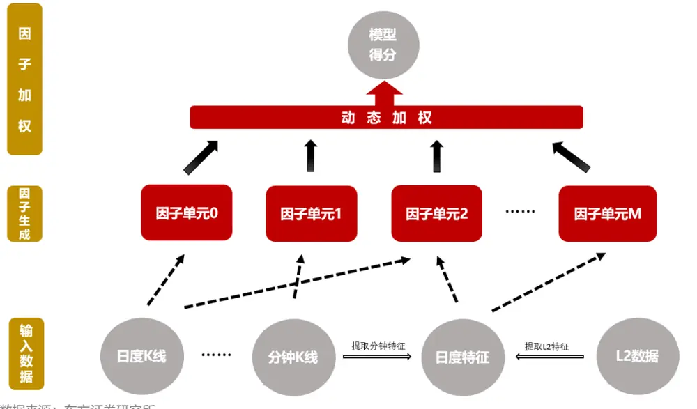
数据来源：东方证券研究所

## 1.3 数据说明

本文涉及的因子检验和组合测试起止于 20161230 和 20220228，样本空间为中证全指同期成分股，模型训练涉及的日线和分钟数据最早开始于 20060630，L2 特征最早开始于20131231。

本文默认采用T+1收盘至T+11收盘的涨跌幅作为label，关于label的详细讨论参考第四章，另外由于神经网络训练有一定的随机性，本文模型得分是 5次独立训练的平均结果。

本文的因子RankIC考察了5日收益率（5日无间隔，T+0收盘至T+5收盘）、10日收益率（10 日无间隔，T+0 收盘至 T+10 收盘）、20 日收益率（20 日无间隔，T+0 收盘至T+20 收盘）三个时间尺度，考虑到可交易性，我们也测算了三个时间尺度下间隔一个交易日的RankIC，即5日间隔1日（T+1收盘至T+6收盘）、10日间隔1日（T+1收盘至T+11收盘）、20日间隔1日（T+1收盘至 T+21收盘）。

因子的分组业绩测算时默认采用次日 vwap成交，不考虑交易成本，但是汇报了换手率，费后收益可以根据费前收益和换手率近似估算。

## 二、因子单元

## 2.1 量价时序数据集

因子单元的功能就是从不同数据集中提取出对选股可能有用的一个或多个alpha因子，巧妇难为无米之炊，信息含量高且便于训练的数据集十分重要。本文采用 3 个日度时序数据集——原始日线行情 rawbar、基于分钟线提取的特征序列 mschars、基于 L2 数据提取的特征序列 l2chars，时序长度取 30 个交易日（《神经网络日频 alpha 模型初步实践》我们取的时序长度为 60 个交易日，经测算将时序长度由 60 降低到 30 后选股表现几乎没有变化，但是模型训练时长和内存占用有较大幅度降低）。

数据集 rawbar 包括原始日线复权后的高开低收、vwap 和成交量共 6 个字段，由于不同股票的价格和成交量不具有可比性，因此我们参考 Microsoft qlib 的示例数据集 Alpha360采用每天的最新收盘价和成交量对价格和成交量序列进行量纲调整，即每个交易日将股票过去 30个交易日的价格序列都除以当天收盘价，过去 30个交易日的成交量序列都除以当天成交量，极值调整、标准化等数据预处理过程在量价序列量纲调整后进行。

数据集 mschars 涵盖了业内常用的和我们前期报告中提出的各种由分钟线构建的日度特征，包括日内偏度、峰度、日内波动率、极端收益、apb、arpp等 28个特征。

数据集 l2chars以《基于委托订单数据的 alpha因子》和《基于大单的 alpha因子构建》两篇报告为基础，收集了 23 个由 L2 数据生成的日度特征序列。数据集 l2chars 和 mschars之所以分为两个数据集是因为高质量的L2数据从2013年下旬才能够获取，而分钟数据的起始日期较早，两个数据集可获取的时间区间不一样。另外，部分 L2 特征计算涉及到逐笔委托数据，而上交所逐笔委托数据自2021年5月才开始对外商业提供，所以部分L2特征的上交所部分早期没有取值，我们在标准化之后用零填充。

上述三个数据集的预处理涉及极值调整、标准化和缺失值填充三个步骤，和常规的截面因子预处理不同，本文预处理直接针对面板数据，所有日期所有股票的同一个特征的极值点、均值、标准差均采用同一个参数，以此保持同一个特征的时序可比性和截面可比性。由于本文所有的因子和组合测试从 2017 年开始，为了不引入未来信息，上述 3 个数据集预处理过程中的参数估计由 2016年之前的数据估计。

## 2.2 因子单元模型与训练

因子单元的概念我们在报告《神经网络日频alpha模型初步实践》中首次提出，因子单元本质上是一套带参数的生成 alpha 因子的算法，相当于传统 alpha 因子定义的扩展。由于量价是典型的时间序列数据，所以本文以GRU、LSTM等经典时间序列网络模型为基础构建因子单元，根据因子单元输出的因子数量我们可以把因子单元分为一元因子单元和多元因子单元。循环网络一元因子单元就是常见的 RNN 输出接一个多对一的全连接生成唯一的预测（图 2），由该预测和未来一段时间收益率 label 计算的 IC 相反数作为损失函数逆向传播训练网络，网络训练完成后由新输入生成的单一输出 c 就是需要的 alpha 因子。循环网络多元因子单元需要在常规的 RNN 输出后一个全连接（部分情况下可省略）和批标准化层使得一个网络可以产生多个标准化输出，为了让这多个输出同时具备选股有效性和低相关性，我们将标准化因子等权得分的IC相反数作为损失函数同时叠加正交惩罚一起训练模型（图3），具体细节也可以参考前期报告《神经网络日频 alpha模型初步实践》因子单元相关章节。

和《神经网络日频 alpha 模型初步实践》一致，每个数据集我们分别以 GRU、AGRU、LSTM 为基础模型训练三个因子单元，训练集取 10 年的数据、验证集取 1 年的数据，训练集在前、验证集在后，每年滚动训练因子单元，因子单元生成的 alpha 因子样本外窗口满一年后才参与因子加权。

图 2：循环网络一元因子单元示意图
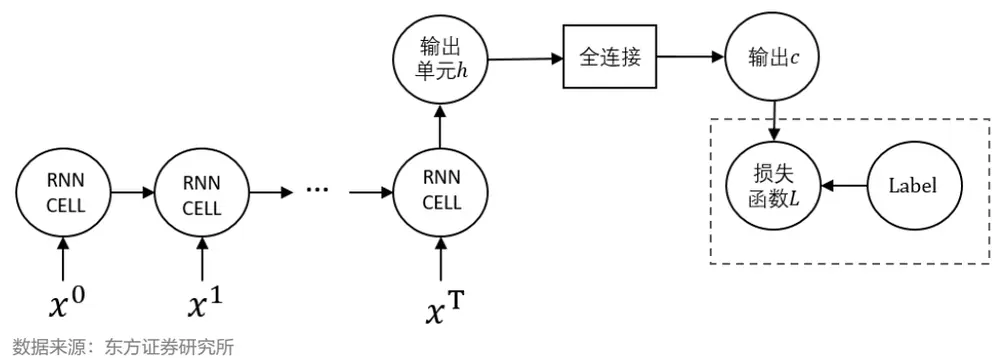
图 3：循环网络多元因子单元示意图

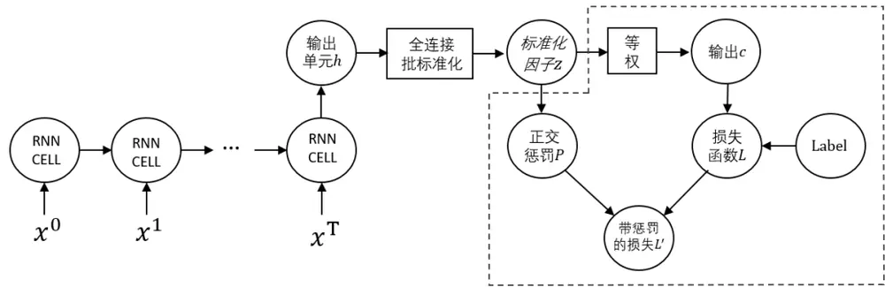
数据来源：东方证券研究所

## 2.3 各数据集选股效果

本小节描述 rawbar、mschars、l2chars 三个数据集通过因子单元生成因子的选股效果，因为每个数据集会产生多个因子，为方便比较，我们每月根据过去一年样本外因子表现最大化IC汇总这些因子得到一个综合打分，通过分析RankIC、分组收益（周度调仓、次日vwap成交、不考虑交易成本）等评估这些综合打分的选股效果。

无论是从综合打分的 RankIC（图 4、图 5）还是多头组合收益（图 6、图 7）来看，我们发现各个数据集一元因子单元的选股效果普遍弱于多元因子单元，也就是说用一个时序模型生成唯一一个 alpha 预测不如生成多个预测，背后的原因可能和 alpha 因子的时变性有关。

|  | rawbar |  | mschars |  | I2chars |  |
| --- | --- | --- | --- | --- | --- | --- |
|  | 多元 | 一元 | 多元 | 一元 | 多元 | 一元 |
| top年化对冲收益 | 25.3% | 19.5% | 24.5% | 24.6% | 18.1% | 14.1% |
| top周均单边换手 | 0.65 | 0.68 | 0.57 | 0.57 | 0.57 | 0.56 |

量价因子对股票收益有一定的预测作用，但是这种预测结构并不是一成不变的，可能是因为市场风格的变化也可能是因为某些因子过度拥挤而失效，如果简单把数据集内的所有 alpha信息都汇总到一个得分，那么就很难捕捉这种短期的结构变化，相反，多元因子单元在一定程度上可以缓解这种情况。为了解决时变性，还有一种极端的做法是只用近期的数据去训练网络，这样做当然一定程度上缓解了 alpha 时变性的问题，但是会面临数据量不够难以学习深层特征的问题，我们采用长周期训练因子单元生成多个 alpha 因子、短周期调整各因子的相对贡献在一定程度上实现了学习样本量和 alpha时变性的平衡。

另外一个比较有意思的结果是，原始量价数据集 rawbar的选股效果上并没有明显比精心设计特征的 mschars弱（RankIC略低但top组合收益率略高），也说明时序网络强大的时序特征提取能力。L2特征数据集对 5天及以上的收益率预测能力相对会弱于 rawbar和mschars，除了其特征本身的原因外，还与 L2历史数据数据不长、因子单元训练样本相对更少有关。

最后，rawbar 和 mschars 综合打分的横截面相关系数（spearman）平均为65.2%/66.9%（多元/一元），l2chars 和 rawbar、mschars 相关性平均为 47.5%/41.1%、58.9%/54.7%，虽然三个数据集有所不同，但是模型学习到的 alpha特征有高度一致性。

图 4：各数据集综合打分 RankIC均值

| 5日无间隔 10日无间隔 20日无间隔 5日间隔1日 10日间隔1日 |  |  |  |  |  |  |
| --- | --- | --- | --- | --- | --- | --- |
| rawbar_多元 | 12.8% | 14.2% | 14.6% | 11.5% | 12.8% | 20日间隔1日 13.4% |
| rawbar_一元 | 12.5% | 13.4% | 13.6% | 10.9% | 11.8% | 12.4% |
| mschars_多元 | 14.0% | 15.3% | 15.9% | 12.2% | 13.6% | 14.5% |
| mschars_一元 | 13.9% | 15.2% | 16.0% | 11.9% | 13.4% | 14.6% |
| I2chars_多元 | 12.1% | 13.5% | 14.4% | 10.5% | 12.1% | 13.2% |
| I2chars_一元 | 10.6% | 11.8% | 12.5% | 9.1% | 10.4% | 11.4% |

数据来源：wind、上交所、深交所、东方证券研究所

图 5：各数据集综合打分 IC_IR（未年化）
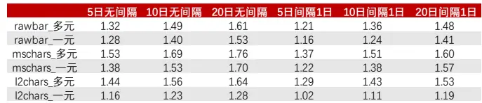
数据来源：wind、上交所、深交所、东方证券研究所

图 6：各数据集综合打分 2017年以来分组年化对冲收益

|  | rawbar |  | mschars |  | I2chars |  |
| --- | --- | --- | --- | --- | --- | --- |
|  | 多元 | 一元 | 多元 | 一元 | 多元 | 一元 |
| top年化对冲收益 | 37.9% | 32.7% | 35.2% | 34.5% | 27.1% | 23.2% |
| top周均单边换手 | 0.62 | 0.65 | 0.58 | 0.58 | 0.58 | 0.55 |

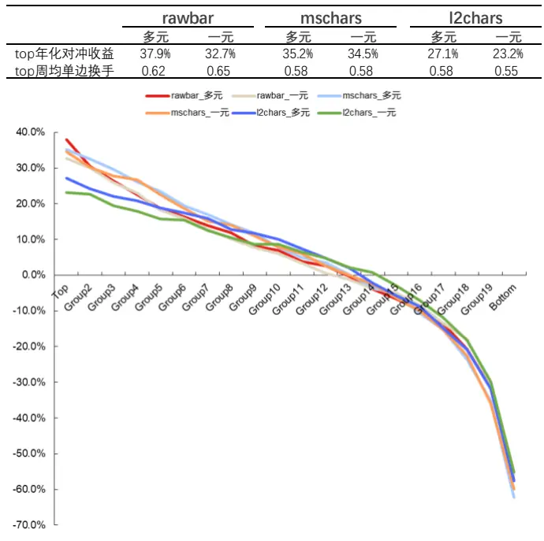
数据来源：wind、上交所、深交所、东方证券研究所

图 7：各数据集综合打分 2020年以来分组年化对冲收益
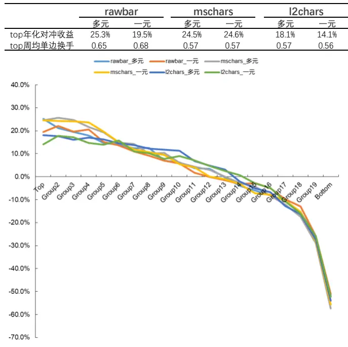
数据来源：wind、上交所、深交所、东方证券研究所

有关分析师的申明，见本报告最后部分。其他重要信息披露见分析师申明之后部分，或请与您的投资代表联系。并请阅读本证券研究报告最后一页的免责申明。

## 三、因子加权

## 3.1 线性加权和非线性加权

理论上，根据图1的alpha框架，所有的非线性问题都可以下沉到因子单元层面建模，因子加权只需要简单的线性模型即可，这和 stacking集成学习中次级学习器一般采用简单学习器的思想完全一致。然而，量价 alpha 和图像识别、语言处理等机器学习经典应用领域有一个很重要的不同，就是 alpha 系统并不是稳定的，会随着时间变化而变化，比如近年来受拥挤影响量价因子的多头收益越来越弱但空头收益没有变少。因此，即使因子单元学习的alpha 因子在训练集期间和收益率是线性关系，但随着因子多头收益的回落，这种线性关系也会转换为非线性关系，可以预见，2020 年以来量化私募规模快速扩张之后这种影响会更加明显。

对于线性模型，本文采用业内常用的最大化IC的方法，非线性模型我们采用LightGBM实现的 GBDT 回归树，GBDT 作为一种经典 boosting 方法，在各个领域有着广泛应用，相关资料汗牛充栋，在此不再赘述。LightGBM 参数我们适当做了调整以提升训练效率并防止过拟合，具体细节可以咨询报告联系人。

## 3.2 因子加权结果对比

本小节对比最大化 IC（记为 maxic）和 LightGBM版本的 GBDT（记为 lgbols）两种加权方法的选股效果。

从模型综合打分的 RankIC均值和 IC_IR来看，maxic和 lgbols 两种加权方法差异很小，几乎可以忽略不记，然而从综合打分的多头单调性和top组合收益来看，lgbols要优于maxic，这一差距在 2020 年之后更加明显，一元因子单元相对多元因子单元 maxic 和 lgbols 的差距更大。我们认为 lgbols相对 maxic多头收益更佳可能在于加权算法对部分因子多头变弱后进行的非线性调整，2020 年之后量价因子拥挤更为普遍，相应的 lgbols 与 maxic 的多头收益差距也相对更大，对于一元因子单元数据集的信息只体现在一个因子中，此时对因子的非线性调整也变得更有必要，因此一元因子单元 lgbols相对 maxic提升效果更明显，事实上，我们对日频调仓的高换手策略进行研究的时候发现两者的差距更大，原因就在于日频策略相对周期更容易出现因子拥挤、top组合收益回落更加明显。

图 8：不同加权方法综合打分RankIC均值

|  |  |  | 5日无间隔 10日无间隔 20日无间隔 | 5日间隔1日 | 10日间隔1日 | 20日间隔1日 |
| --- | --- | --- | --- | --- | --- | --- |
| maxic_多元 | 14.4% | 15.8% | 16.4% | 12.6% | 14.2% | 15.0% |
| Igbols_多元 | 14.4% | 15.8% | 16.2% | 12.7% | 14.1% | 14.8% |
| maxic_一元 | 14.4% | 15.6% | 16.4% | 12.4% | 13.8% | 14.9% |
| Igbols_一元 | 14.3% | 15.6% | 16.4% | 12.4% | 13.9% | 14.9% |

数据来源：wind、上交所、深交所、东方证券研究所

图 9：不同加权方法综合打分 IC_IR（未年化）

|  | 5日无间隔 | 10日无间隔 | 20日无间隔 | 5日间隔1日 | 10日间隔1日 | 20日间隔1日 |
| --- | --- | --- | --- | --- | --- | --- |
| maxic_多元 | 1.48 | 1.63 | 1.72 | 1.35 | 1.48 | 1.58 |
| Igbols_多元 | 1.47 | 1.64 | 1.65 | 1.34 | 1.49 | 1.51 |
| maxic_一元 | 1.41 | 1.52 | 1.69 | 1.25 | 1.36 | 1.57 |
| Igbols_一元 | 1.54 | 1.69 | 1.84 | 1.38 | 1.51 | 1.71 |

数据来源：wind、上交所、深交所、东方证券研究所

图 10：不同加权方法综合打分2017年以来分组年化对冲收益
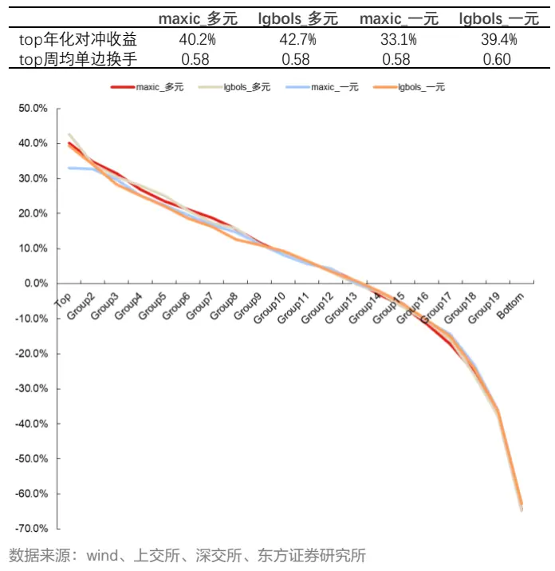

图 11：不同加权方法综合打分2020年以来分组年化对冲收益
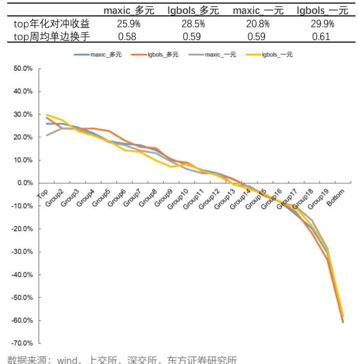

## 四、Label 的选择

## 4.1 损失函数与 Label

对于机器学习模型来说，损失函数至关重要，因为损失函数决定了学习系统的方向，因子 IC 作为业内常用的因子评价指标，我们稍作调整就可以作为神经网络的目标函数，在一定条件下回归常用的均方误损失 MSE 等价于 IC（具体可参考前期报告《因子加权过程中的大类权重控制》第 1.2节）。

无论 IC 还是 MSE 均涉及到预测收益率的选择，对于周度调仓的策略，投资者很自然的会选择预测周度收益率，然而由于交易成本和合规风控等原因，公募量化周度调仓策略或多或少都有换手的限制，我们在前期报告《关于组合换手的若干问题》中有过研究，当组合存在换手控制时，组合收益不仅与当期的 IC 有关也会与滞后期的 IC 有关，反应到收益率预测上，周度调仓策略不仅要预测下周的收益率，也要适度兼顾一周后的收益率，因此我们建议换手约束下的周度调仓策略应该适度拉长收益率预测周期，本文将周度的 5 个交易日拉长至 10个交易日。

另外，低频下我们常常采用因子值和当天收盘价至未来某个日期的收盘价收益率的相关性即 IC 去考察因子选股效果，因子值和因子预测收益率之间没有间隔，预测收益率的选择没有考虑到可交易性，对于低频alpha因子影响不大，但是如果量价机器学习模型label选择时也不考虑预测收益率的可交易性将面临较严重的后果，主要原因有两个方面：一是量价因子对第一天收益尤其是隔夜收益的预测能力相对较强，而这部分收益公募基金的交易机制很难获取，二是 label 决定了模型系统学习的目标，这部分不可获取的收益会引导模型向错误的方向学习，因此我们建议在选择预测收益率作为 label 时应该使收益率和特征数据保持一定的间隔从而充分考虑到可交易性。

综上分析，对于 T日收盘可以获取的特征，我们采用 T+1收盘至 T+11收盘共 10个交易日的收益率作为学习的 label，作为对比，我们也取 T+0 至 T+10 的收益率和 T+1 至 T+6的收益率共两组 label 测试选股效果。第二章和第三章的分析表明，采用多元因子单元和lgbols 非线性加权方法一定程度上应对能够 alpha 的时变性，具有更好的选股效果，因此下文中为避免累赘，均采用多元因子单元和 lgbols 加权方法。

## 4.2 不同 label 下 RankIC

从不同 label 下的 RankIC 均值我们可以明显看到 label 的影响，什么样的 label 就有什么样的结果，因为均方误差损失在一定条件下可以等价到 IC，所以我们可以看到 3 个 label中 T+1 收盘到 T+11 收盘的 10 日间隔 1 日的 RankIC 最大，T+0 收盘到 T+10 收盘的 10 日无间隔 RankIC 最大，T+1 收盘至 T+6 收盘的 5 日间隔 1日 RankIC 最大，这种大小关系在绝大多数年份都成立。

图 12：不同 label 下的 RankIC 均值
T+1 收盘至 T+11 收盘

| 5日无间隔 10日无间隔 20日无间隔 5日间隔1日 10日间隔1日 |  |  |  |  |  |
| --- | --- | --- | --- | --- | --- |
| 2017 | 16.1% 18.3% | 19.7% | 14.8% | 17.0% | 20日间隔1日 18.5% |
| 2018 | 19.9% 21.4% | 21.5% | 17.1% | 18.9% | 19.2% |
| 2019 | 15.7% 16.6% | 15.8% | 13.2% | 14.4% | 13.7% |
| 2020 12.5% | 14.2% | 15.4% | 11.4% | 12.9% | 14.3% |
| 2021 8.3% | 8.9% | 9.3% | 7.4% | 7.9% | 8.7% |
| 2022 11.3% | 13.9% | 14.7% | 9.4% | 12.2% | 13.4% |
| 全样本 | 14.4% 15.8% | 16.2% | 12.7% | 14.1% | 14.8% |

T+0 收盘至 T+10 收盘
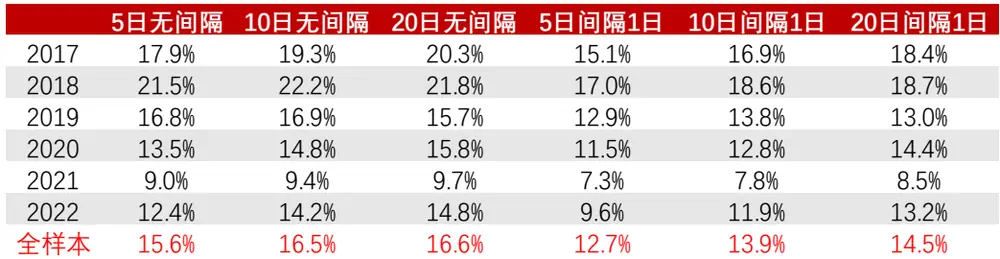

T+1 收盘至 T+6 收盘
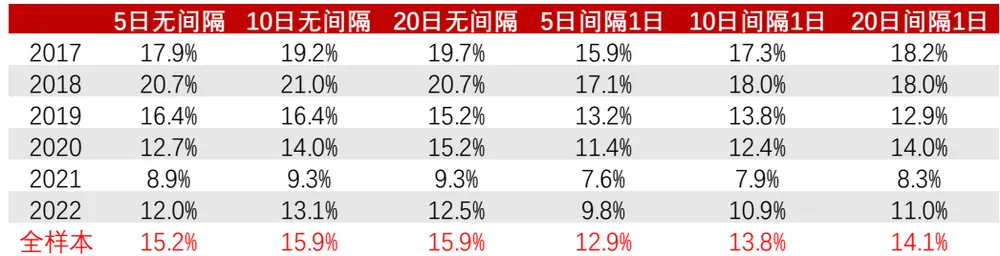
注：2022 年数据截止至 20220228
数据来源：wind、上交所、深交所、东方证券研究所

有关分析师的申明，见本报告最后部分。其他重要信息披露见分析师申明之后部分，或请与您的投资代表联系。并请阅读本证券研究报告最后一页的免责申明。

## 4.3 不同 label 下 Top 组合

为了快速的比较不同label下的实际选股效果，本小节对比了不同换手约束下的top100组合业绩表现，换手通过每周调仓的股票数量控制，比如周度换手约束不高于 20%的top100 组合，每周调整的股票数量不超过 20%，优先剔除最新排名靠后的股票，优先买入最新排名靠前的股票。本小节的组合业绩暂不考虑交易成本，投资者可以根据费前收益和组合实际换手率近似估算费后收益，成交价为当日收盘价（图 13）和次日 vwap（图 14），delta表示约束的每周单边换手，avgto表示实际的每周单边换手。

对比不同 label下当日收盘成交和次日 vwap成交的 top100表现，我们有如下发现：

（1）组合可以当日成交时，label取T+0收盘至T+10收盘时组合业绩最优，但是组合以次日vwap成交时，同样是10个交易日收益率，滞后1个交易日的T+1收盘至T+11收盘作为 label的组合业绩明显更优，随着组合换手约束变得更严格，这种差距会变小。

（2）对于没有换手约束的周度调仓组合，Label取5天收益率（T+1收盘至T+6收盘）的组合费前收益略优于 10 天收益率（T+1 收盘至 T+11 收盘）的 Label，但换手更高，费后收益不一定有优势，另外，组合存在换手约束时，5 天收益率 Label 会弱于 10 天收益率Label，换手约束越严格时，这种差距更大。

图 13：当日收盘成交的 TOP100组合业绩
T+1 收盘至 T+11 收盘

|  |  | 年化 | 2017 | 2018 | 2019 | 2020 | 2021 | 2022 |
| --- | --- | --- | --- | --- | --- | --- | --- | --- |
| delta=0.10 avgto=0.11 | 收益率 最大回撤 | 28.9% -8.3% | 25.1% -2.7% | 43.0% -4.8% | 20.9% -6.2% | 48.0% -6.7% | 8.6% -8.3% | 6.0% -1.5% |
| delta=0.20 | 收益率 | 39.8% | 36.7% | 71.8% | 27.2% | 51.7% | 14.9% | 7.6% |
| avgto=0.22 | 最大回撤 | -11.6% | -2.2% | -3.6% | -3.4% | -7.1% | -11.6% | -0.9% |
| delta=0.30 avgto=0.32 | 收益率 最大回撤 | 45.9% -11.2% | 41.1% -2.0% | 87.8% -4.4% | 34.9% -2.9% | 53.1% -7.4% | 16.6% -11.2% | 9.2% -1.0% |
| delta=0.40 | 收益率 | 50.1% | 47.0% | 96.1% | 40.3% | 54.3% | 19.6% | 8.1% |
| avgto=0.42 | 最大回撤 | -12.2% | -2.3% | -4.6% | -2.8% | -6.7% | -12.2% | -1.7% |
| delta=0.50 | 收益率 | 54.7% | 46.7% | 107.8% | 57.4% | 47.3% | 24.5% | 7.0% |
| avgto=0.53 | 最大回撤 | -12.9% | -2.0% | -4.6% | -2.5% | -6.8% | -12.9% |  |
|  |  |  |  |  |  |  |  | -2.0% |
| delta=1.00 |  | 61.1% |  | 126.5% |  |  |  |  |
| avgto=0.70 | 收益率 最大回撤 | -12.8% | 57.6% -1.9% | -3.8% | 65.4% -2.7% | 43.9% -6.6% | 30.3% -12.8% | 4.7% -3.6% |

T+0 收盘至 T+10 收盘

图 14：次日 vwap 成交的 TOP100 组合业绩
T+1 收盘至 T+11 收盘

|  |  | 年化 | 2017 | 2018 | 2019 | 2020 | 2021 | 2022 |
| --- | --- | --- | --- | --- | --- | --- | --- | --- |
| delta=0.10 avgto=0.11 | 收益率 最大回撤 | 24.1% -8.7% | 20.7% -3.0% | 34.5% -4.8% | 14.8% -7.0% | 44.8% -7.1% | 7.2% -8.7% | 4.8% -1.7% |
| delta=0.20 avgto=0.22 | 收益率 最大回撤 | 30.9% -12.5% | 29.6% -2.4% | 52.4% -3.8% | 15.9% -4.4% | 46.2% -7.6% | 12.0% -12.5% | 6.5% -0.9% |
| delta=0.30 avgto=0.32 | 收益率 最大回撤 | 34.0% -13.0% | 29.9% -2.2% | 61.2% -5.1% | 21.0% -4.1% | 47.2% -7.2% | 12.3% | 7.6% |
| delta=0.40 | 收益率 | 37.0% | 34.9% | 65.7% | 24.6% | 49.6% | -13.0% 13.4% | -1.1% 6.7% |
| avgto=0.42 delta=0.50 | 最大回撤 收益率 | -15.1% 40.3% | -2.4% 34.2% | -5.3% 70.9% | -3.7% 39.3% | -6.5% 45.2% | -15.1% 15.7% | -1.7% 6.4% |
| avgto=0.53 delta=1.00 avgto=0.70 | 最大回撤 收益率 最大回撤 | -16.2% 44.4% -16.1% | -2.1% 40.9% -2.1% | -5.5% 82.6% -4.7% | -3.1% 45.9% -3.0% | -6.7% 41.0% -6.6% | -16.2% 20.4% -16.1% | -1.9% 3.6% -3.5% |

T+0 收盘至 T+10 收盘

|  |  | 年化 | 2017 | 2018 | 2019 | 2020 | 2021 | 2022 |
| --- | --- | --- | --- | --- | --- | --- | --- | --- |
| delta=0.10 avgto=0.11 | 收益率 最大回撤 | 32.5% -8.1% | 29.6% -2.9% | 36.6% -3.5% | 26.0% -3.4% | 46.3% -6.1% | 25.0% -8.1% | 4.1% -1.0% |
| delta=0.20 avgto=0.21 | 收益率 最大回撤 | 42.2% -13.1% | 46.1% -1.9% | 69.6% -4.5% | 32.7% -3.3% | 51.3% -6.5% | 17.4% -13.1% | 4.5% -1.0% |
| delta=0.30 avgto=0.32 | 收益率 最大回撤 | 47.0% -15.1% | 49.7% -1.6% | 97.3% -4.3% | 41.5% -3.1% | 49.2% -7.4% | 11.3% -15.1% | 4.4% -1.5% |
| delta=0.40 avgto=0.43 | 收益率 最大回撤 | 55.1% -15.2% | 56.7% -2.0% | 115.2% -4.8% | 49.5% -3.2% | 53.0% -6.9% | 15.5% -15.2% | 7.0% -1.7% |
| delta=0.50 avgto=0.53 | 收益率 最大回撤 | 59.5% -16.7% 64.6% | 59.9% -1.9% 67.3% | 126.7% -3.6% 143.3% | 59.4% -3.0% 67.2% | 52.0% -6.6% | 16.5% -16.7% | 7.6% -2.1% |

|  |  | 年化 | 2017 | 2018 | 2019 | 2020 | 2021 | 2022 |
| --- | --- | --- | --- | --- | --- | --- | --- | --- |
| delta=0.10 avgto=0.12 | 收益率 最大回撤 | 24.7% -7.9% | 20.8% -3.6% | 23.5% -4.1% | 18.4% -4.1% | 40.3% -6.9% | 21.3% -7.9% | 3.5% -1.1% |
| delta=0.20 avgto=0.22 | 收益率 最大回撤 | 30.1% -14.0% | 32.9% -2.1% | 44.1% -5.0% | 19.1% -3.5% | 43.3% -7.0% | 13.8% -14.0% | 4.0% -1.6% |
| delta=0.30 avgto=0.32 | 收益率 最大回撤 | 31.5% -16.3% | 34.7% -1.8% | 59.4% -5.4% | 21.8% -3.1% | 40.1% -7.2% | 6.9% -16.3% | 4.3% -1.3% |
| delta=0.40 avgto=0.43 | 收益率 最大回撤 | 35.2% -17.0% | 36.5% -2.4% | 69.8% -6.0% | 25.0% -3.5% | 42.3% -6.5% | 7.2% -17.0% | 6.7% -1.6% |
| delta=0.50 avgto=0.53 | 收益率 最大回撤 | 37.0% -18.7% 39.8% | 39.1% -2.6% | 71.1% -5.5% 78.0% | 31.2% -3.2% 34.3% | 41.4% -6.5% | 6.6% -18.7% | 7.2% -1.9% |

T+1 收盘至 T+6 收盘

T+1 收盘至 T+6 收盘

|  |  | 年化 | 2017 | 2018 | 2019 | 2020 | 2021 | 2022 |
| --- | --- | --- | --- | --- | --- | --- | --- | --- |
| delta=0.10 avgto=0.11 | 收益率 最大回撤 | 26.6% -9.2% | 30.3% -1.7% | 33.0% -6.0% | 17.7% -3.6% | 43.8% -6.2% | 10.7% -9.2% | 3.4% -1.1% |
| delta=0.20 avgto=0.22 | 收益率 最大回撤 | 37.9% -14.6% | 42.9% -1.9% | 67.4% -3.3% | 30.7% -3.1% | 46.7% -6.2% | 11.8% -13.9% | 1.8% -1.6% |
| delta=0.30 avgto=0.32 | 收益率 最大回撤 | 44.3% -15.4% | 48.8% -2.6% | 89.2% -4.1% | 38.9% -3.0% | 47.2% -6.8% | 14.3% -15.4% | 0.2% -2.4% |
| delta=0.40 avgto=0.42 | 收益率 最大回撤 | 51.9% -14.3% | 51.5% -3.1% | 101.9% -4.0% | 52.6% -2.9% | 48.0% -6.8% | 20.6% -14.3% | 3.1% -1.4% |
| delta=0.50 avgto=0.53 | 收益率 最大回撤 | 57.2% -16.8% | 59.7% -3.3% | 114.6% -4.3% | 64.8% -2.3% | 49.9% -7.1% | 16.3% -16.8% | 3.9% -1.7% |
| delta=1.00 avgto=0.79 | 收益率 最大回撤 | 64.0% -16.4% | 67.3% -3.9% | 135.3% -3.8% | 76.9% -2.1% | 46.1% -6.2% | 20.6% -16.4% | 3.7% -1.7% |

注：2022 年数据截止至 20220228
数据来源：wind、上交所、深交所、东方证券研究所

|  |  | 年化 | 2017 | 2018 | 2019 | 2020 | 2021 | 2022 |
| --- | --- | --- | --- | --- | --- | --- | --- | --- |
| delta=0.10 avgto=0.11 | 收益率 最大回撤 | 21.1% -9.5% | 22.1% -1.9% | 23.6% -6.2% | 11.3% -3.8% | 39.3% -6.6% | 10.5% -9.5% | 3.4% -1.1% |
| delta=0.20 avgto=0.22 | 收益率 最大回撤 | 28.0% -16.1% | 31.6% -2.1% | 47.8% -3.9% | 17.4% -3.8% | 39.6% -6.5% | 9.6% -15.2% | 1.9% -1.9% |
| delta=0.30 avgto=0.32 | 收益率 最大回撤 | 32.6% -16.6% | 35.9% -2.7% | 59.6% -4.8% | 22.0% -3.5% | 40.1% -6.5% | 13.5% -16.6% | 1.2% -2.5% |
| delta=0.40 avgto=0.43 | 收益率 最大回撤 | 36.8% -15.7% | 38.0% -3.0% | 64.0% -5.2% | 31.1% -3.3% | 40.3% -6.4% | 15.9% -15.7% | 3.6% -1.8% |
| delta=0.50 avgto=0.53 | 收益率 最大回撤 | 40.2% -18.5% | 44.1% -3.6% | 69.3% -5.8% | 37.9% -3.0% | 42.9% -6.9% | 13.5% | 4.3% |
| delta=1.00 avgto=0.79 | 收益率 最大回撤 | 45.0% -19.6% | 49.9% -4.3% | 81.5% -5.3% | 47.6% -2.7% | 37.6% -6.1% | -18.2% 15.3% -19.6% | -1.7% 6.1% -1.6% |

注：2022 年数据截止至 20220228
数据来源：wind、上交所、深交所、东方证券研究所

有关分析师的申明，见本报告最后部分。其他重要信息披露见分析师申明之后部分，或请与您的投资代表联系。并请阅读本证券研究报告最后一页的免责申明。

## 五、与常见因子相关性

## 5.1 与常见因子的相关系数

分析模型得分（多元因子单元，lgbols）和常见因子的相关性，我们很容易发现：

（1）模型得分和常见非量价大类因子的因子值相关性极低，模型完全根据量价信号生成，和基本面信号信息重叠较少，两者可以互补。

（2）模型得分和大多数量价因子的因子值都有微弱的正相关，说明模型对常见量价因子有一定的信号捕捉能力，但没有过度依赖一两个常见信号。

图 15：与常见因子相关系数（spearman，左下因子值，右上 RankIC）
与常见大类因子相关系数

|  | Value | Profitability | Growth | GovernanceLiquidity |  | Reversal | Lottery | Analyst | Surprise | 模型打分 |
| --- | --- | --- | --- | --- | --- | --- | --- | --- | --- | --- |
| Value |  | 0.044 | 0.223 | 0.493 | 0.455 | -0.537 | 0.783 | 0.661 | 0.135 | 0.086 |
| Profitability | 0.249 |  | 0.626 | 0.589 | -0.169 | -0.314 | -0.048 | 0.518 | 0.649 | 0.334 |
| Growth | 0.197 | 0.369 |  | 0.467 | -0.211 | -0.441 | -0.003 | 0.655 | 0.880 | 0.355 |
| Governance | 0.248 | 0.184 | 0.020 |  | -0.016 | -0.611 | 0.325 | 0.624 | 0.397 | 0.225 |
| Liquidity | 0.195 | -0.047 | -0.089 | -0.017 |  | 0.149 | 0.813 | 0.179 | -0.304 | 0.024 |
| Reversal | -0.133 | -0.108 | -0.160 | -0.149 | 0.223 |  | -0.344 | -0.404 | -0.456 | -0.151 |
| Lottery | 0.418 | 0.043 | 0.001 | 0.114 | 0.671 | 0.002 |  | 0.385 | -0.097 | 0.061 |
| Analyst | 0.339 | 0.232 | 0.252 | 0.148 | 0.033 | -0.062 | 0.103 |  | 0.568 | 0.325 |
| Surprise | 0.036 | 0.194 | 0.543 | -0.007 | -0.117 | -0.140 | -0.054 | 0.206 |  | 0.411 |
| 模型打分 | 0.114 | 0.101 | 0.051 | 0.064 | 0.244 | 0.032 | 0.264 | 0.124 | 0.060 |  |

与常见日线量价因子相关系数

|  | VOL | LNTO | IVOL | IVR | RET | LNAMIHUD | PPREVSERALMAXRET DWF |  |  | 模型打分 |
| --- | --- | --- | --- | --- | --- | --- | --- | --- | --- | --- |
| VOL |  | 0.934 | 0.932 | -0.038 | -0.162 | 0.034 | -0.182 | 0.904 0.916 |  | 0.020 |
| LNTO | 0.705 |  | 0.843 | -0.135 | -0.227 | -0.143 | -0.245 | 0.810 0.881 |  | 0.106 |
| IVOL | 0.903 | 0.643 |  | 0.299 | 0.063 | 0.220 | -0.137 | 0.951 0.944 |  | 0.063 |
| IVR | 0.295 | 0.217 | 0.611 |  | 0.573 | 0.507 | 0.080 | 0.238 | 0.206 | 0.062 |
| RET | 0.216 | 0.114 | 0.294 | 0.258 |  | 0.394 | 0.033 | 0.230 | -0.043 | 0.025 |
| LNAMIHUD | 0.084 | 0.128 | 0.122 | 0.122 | 0.095 |  | 0.193 | 0.238 | 0.162 | -0.154 |
| PPREVSERAL | -0.003 | -0.003 | 0.002 | 0.005 | -0.007 | 0.021 |  | -0.146 | -0.178 | -0.327 |
| MAXRET | 0.888 | 0.606 | 0.876 | 0.375 | 0.518 | 0.125 | 0.002 |  | 0.889 | 0.028 |
| DWF | 0.670 | 0.507 | 0.698 | 0.381 | 0.237 | 0.116 | 0.000 | 0.686 |  | 0.093 |
| 模型打分 | 0.252 | 0.244 | 0.291 | 0.208 | 0.147 | 0.036 | -0.012 | 0.262 0.231 |  |  |

与常见日内量价因子相关系数

|  | IDSKEW | IDKURT | IDJUMP | IDMOM | SDRVOL | SDRSKEW | SDVVOL | ARPP | APB | 模型打分 |
| --- | --- | --- | --- | --- | --- | --- | --- | --- | --- | --- |
| IDSKEW |  | 0.627 | 0.659 | 0.651 | 0.660 | 0.734 | 0.552 | -0.071 | 0.488 | 0.273 |
| IDKURT | 0.488 |  | 0.339 | 0.600 | 0.830 | 0.953 | 0.272 | -0.065 | 0.050 | 0.098 |
| IDJUMP | 0.523 | 0.197 |  | 0.566 | 0.445 | 0.370 | 0.274 | -0.173 | 0.545 | 0.012 |
| IDMOM | 0.316 | 0.206 | 0.469 |  | 0.540 | 0.668 | 0.069 | -0.088 | 0.064 | 0.047 |
| SDRVOL | 0.388 | 0.640 | 0.282 | 0.224 |  | 0.839 | 0.542 | 0.007 | 0.225 | 0.287 |
| SDRSKEW | 0.475 | 0.899 | 0.210 | 0.202 | 0.607 |  | 0.423 | -0.054 | 0.107 | 0.194 |
| SDWVOL | 0.317 | 0.363 | 0.202 | 0.054 | 0.544 | 0.438 |  | 0.090 | 0.439 | 0.508 |
| ARPP | 0.132 | 0.201 | 0.000 | 0.075 | 0.192 | 0.196 | 0.165 |  | 0.349 | 0.313 |
| APB | 0.331 | 0.229 | 0.341 | 0.147 | 0.239 | 0.235 | 0.254 | 0.508 |  | 0.248 |
| 模型打分 | 0.274 | 0.199 | 0.250 | 0.170 | 0.296 | 0.214 | 0.288 | 0.215 | 0.258 |  |

数据来源：wind、上交所、深交所、东方证券研究所

## 5.2 残差因子的选股表现

为了分析模型相对于常见低频大类因子的信息增量，我们考察了样本空间内模型得分对常见大类因子回归的残差因子的选股表现。

从 RankIC 来看，对各大类因子回归后模型得分各区间 RankIC 均值都有小幅度回落，但是因子 IC_IR 反而有所提升，模型得分信息损失有限。从各分组对冲收益来看，回归之后因子多头和空头端收益都有回落，但幅度有限，TOP组合年化收益从42.7%仅回落4个百分点至 38.7%，总体影响不大，也再次说明模型得分对常见大类因子信息增量明显。另外一个比较有意思的现象是，残差因子 top 组合相对原始因子只有 2021 年收益不降反升，可能与2021年的极端行情有关。

图 16：模型得分对常见大类因子回归前后 RankIC
RankIC 均值

|  | 5日无间隔 10日无间隔 |  | 20日无间隔 |  | 5日间隔1日 10日间隔1日 20日间隔1日 |  |
| --- | --- | --- | --- | --- | --- | --- |
| 原始得分 | 14.4% | 15.8% | 16.2% | 12.7% | 14.1% | 14.8% |
| 残差得分 | 11.2% | 12.1% | 12.0% | 9.6% | 10.6% | 10.7% |

IC_IR(未年化)

| 5日无间隔 | 10日无间隔 |  | 20日无间隔 | 5日间隔1日 | 10日间隔1日 | 20日间隔1日 |
| --- | --- | --- | --- | --- | --- | --- |
| 原始得分 | 1.47 | 1.64 | 1.65 | 1.34 | 1.49 | 1.51 |
| 残差得分 | 1.56 | 1.79 | 1.89 | 1.43 | 1.64 | 1.75 |

数据来源：wind、上交所、深交所、东方证券研究所

图 17：原始得分各分组对冲收益率（相对样本空间等权）

|  | 2017 | 2018 | 2019 | 2020 | 2021 | 2022 |  | 年化 |
| --- | --- | --- | --- | --- | --- | --- | --- | --- |
| Top | 48.0% | 77.9% | 38.0% | 40.3% | 18.3% |  | 3.2% | 42.7% |
| Group2 | 36.7% | 59.2% | 31.4% | 32.4% | 16.3% |  | 2.8% | 34.1% |
| Group3 | 30.0% | 50.7% | 27.0% | 32.2% | 16.8% | 2.2% |  | 30.5% |
| Group4 | 25.6% | 40.7% | 26.9% | 28.7% | 19.6% | 2.6% |  | 27.9% |
| Group5 | 22.6% | 35.4% | 23.2% | 26.3% | 20.2% | 2.1% |  | 25.2% |
| Group6 | 19.3% | 28.8% | 19.7% | 24.4% | 14.5% | 1.2% |  | 20.9% |
| Group7 | 17.2% | 21.2% | 17.0% | 18.2% | 14.3% | 1.3% |  | 17.3% |
| Group8 | 14.4% | 19.4% | 14.5% | 19.0% | 12.8% | 1.1% |  | 15.8% |
| Group9 | 11.9% | 13.3% | 11.4% | 9.6% | 9.9% | 1.5% |  | 11.2% |
| Group10 | 8.7% | 7.1% | 10.4% | 8.9% | 9.2% |  | 1.3% | 8.9 |
| Group11 | 7.4% | 5.9% | 8.3% | 3.4% | 6.0% |  | 1.3% | 6.3% |
| Group12 | 3.1% | 0.8% | 5.7% | 3.7% | 4.7% |  | 0.1% | 3.56 |
| Group13 | 0.5% | -5.6% | 1.6% | -0.5% | 2.6% |  | 1.2% | -0.1% |
| Group14 | -2.4% | -6.6% | 0.6% | -6.6% | 2.9% |  | 0.4% | -23 光 |
| Group15 | -7.1% | -10.2% | -5.0% | -9.3% | -3.2% |  | 0.6% | -6. 3 |
| Group16 | -12.5% | -16.2% | -7.9% | -12.4% | -4.6% |  | -0.3% | -10 16% |
| Group17 | -17.4% | -23.3% | -14.0% | -16.6% | -9.5% |  | -0.9% | -16 0% |
| Group18 | -25.9% | -34.6% | -25.8% | -26.4% | -17.5% |  | -2.6% | 26 09 |
| Group19 | -38.1% | -45.8% | -37.0% | -38.0% | -29.0% |  | -4.7% | 37 6% |
| Bottom | -62.7% | -72.5% | -66.6% | -61.8% |  | -58.4% | -13.5% | -64 7% |

注：2022 年数据截止于 20220228
数据来源：wind、上交所、深交所、东方证券研究所

图 18：残差因子各分组对冲收益率（相对样本空间等权）

|  | 2017 | 2018 | 2019 | 2020 | 2021 | 2022 | 年化 |
| --- | --- | --- | --- | --- | --- | --- | --- |
| Top | 46.4% | 59.0% | 34.8% | 38.0% | 23.1% | 1.1% | 38.7% |
| Group2 | 29.1% | 46.1% | 29.4% | 33.5% | 17.9% | 1.9% | 30.4% |
| Group3 | 23.3% | 34.7% | 26.3% | 28.4% | 19.2% | 1.9% | 25.9% |
| Group4 | 21.1% | 31.5% | 22.8% | 20.6% | 18.4% | 1.7% | 22.5% |
| Group5 | 17.1% | 27.4% | 19.3% | 17.6% | 18.7% | 1.3% | 19.7 7% |
| Group6 | 14.3% | 21.9% | 16.7% | 18.0% | 14.2% | 1.5% | 16.8% |
| Group7 | 10.1% | 19.7% | 16.2% | 14.7% | 11.9% | 2.0% | 14.5% |
| Group8 | 9.0% | 16.2% | 11.0% | 11.8% | 10.8% | 1.9% | 11.8% |
| Group9 | 8.6% | 11.8% | 9.8% | 10.5% | 6.8% | 1.4% | 9.5招 |
| Group10 | 5.5% | 8.8% | 10.2% | 8.6% | 5.2% | 0.9% | 7.6 |
| Group11 | 5.7% | 4.1% | 7.5% | 3.2% | 6.1% | 0.7% | 5.3 |
| Group12 | 2.7% | 2.3% | 3.0% | 1.7% | 5.2% | 0.3% | 2.9 |
| Group13 | 1.0% | 2.1% | 1.2% | 2.8% | 2.4% | 0.7% | 2.0%6 |
| Group14 | -1.6% | -3.5% | -2.6% | -1.3% | 0.1% | 1.6% | -1.4% |
| Group15 | -5.6% | -4.9% | -6.8% | -6.3% | -1.4% | 0.1% | -4.8% |
| Group16 | -6.7% | -11.7% | -9.5% | -11.4% | -3.2% | -0.3% | -8% |
| Group17 | -13.0% | -17.9% | -13.5% | -16.1% | -10.3% | -0.8% | -139% |
| Group18 | -20.3% | -28.6% | -24.6% | -24.6% | -20.3% | -2.4% | -23 5% |
| Group19 | -35.1% | -45.7% | -36.2% | -37.0% | -33.1% | -7.3% | 37 7% |
| Bottom | -55.4% | -67.6% | -56.3% | -54.7% | -51.4% | -7.6% | -57 1% |

注：2022 年数据截止于 20220228
数据来源：wind、上交所、深交所、东方证券研究所

## 六、指数增强组合表现

## 6.1 增强组合构建说明

本章展示了模型得分在中证 500 和沪深 300 指数增强的应用效果，关于指数增强组合有如下说明：

（1）组合周度调仓，假设以信号次日 vwap 交易；

（2）dfrisk2020（参见《东方A股因子风险模型（DFQ-2020）》）的所有风格因子相对暴露不超过 0.5，所有行业因子相对暴露不超过 2%，中证 500 增强跟踪误差约束不超过5%，沪深 300增强跟踪误差约束不超过 4%。

（3）我们分别测算了每周单边换手率不超过 20%、30%、40%、50%共4组换手约束下的组合表现，也考虑了成分股不限制和成分股权重不低于 80%两种情形。

（4）组合业绩测算时假设买入成本千分之一、卖出成本千分之二，停牌和涨停不能买入、停牌和跌停不能卖出。

## 6.2 中证 500 增强组合

模型得分在中证 500 增强中总体表现良好，加上成分股权重不低于 80%的约束后组合收益有所回落，但幅度有限，模型对公募中证 500增强产品也有很大的参考价值。周单边换手从 20%放松至 30%时，增强组合费后收益有一定提升，但是随着组合换手进一步提升，增强组合业绩提升幅度有限，对成分股限制的 500增强组合业绩甚至有小幅回落。从时间序列上看，组合不同年份收益差异较大，2019年增强对冲收益一般，但 2018年超额十分显著，另外增强组合 2021年9月后一段时间回撤明显，如何控制风险也是一个很重要的课题。

图 19：中证 500指数增强组合表现（成分股不限制）
增强组合绝对收益表现汇总

|  |  | 年化 | 2017年 | 2018年 | 2019年 | 2020年 | 2021年 | 2022年 |
| --- | --- | --- | --- | --- | --- | --- | --- | --- |
| delta=0.20 avgto=0.22 | 收益率 | 20.9% | 12.8% | -9.3% | 38.3% | 49.4% | 29.9% | -3.2% |
|  | 波动率 | 21.7% | 13.6% | 25.5% | 21.9% | 26.7% | 18.0% | 20.4% |
|  | 最大回撤 | -28.4% | -10.2% | -28.4% | -18.3% | -14.5% | -14.6% | -7.1% |
| delta=0.30 avgto=0.32 | 收益率 | 23.4% | 15.0% | -7.6% | 41.5% | 55.5% | 32.7% | -4.8% |
|  | 波动率 | 21.9% | 13.9% | 25.3% | 22.4% | 27.0% | 18.5% | 20.6% |
|  | 最大回撤 | -27.3% | -9.3% | -27.3% | -18.4% | -14.2% | -14.1% | -8.9% |
| delta=0.40 avgto=0.42 | 收益率 | 23.4% | 13.7% | -5.6% | 45.2% | 51.4% | 31.9% | -5.4% |
|  | 波动率 | 22.0% | 14.0% | 25.5% | 22.5% | 27.0% | 18.5% | 20.1% |
|  | 最大回撤 | -27.7% | -9.9% | -27.7% | -16.8% | -14.7% | -14.1% | -8.6% |
| delta=0.50 avgto=0.53 | 收益率 | 23.7% | 13.9% | -5.4% | 47.4% | 48.3% | 34.3% | -5.7% |
|  | 波动率 | 22.0% | 14.2% | 25.4% | 22.6% | 26.9% | 18.5% | 20.2% |
|  | 最大回撤 | -27.8% | -10.4% | -27.8% | -16.9% | -14.6% | -13.6% | -8.8% |

增强组合对冲收益表现汇总

图 20：中证 500指数增强组合表现（成分股不低于 80%）
增强组合绝对收益表现汇总

|  |  | 年化 | 2017年 | 2018年 | 2019年 | 2020年 | 2021年 | 2022年 |
| --- | --- | --- | --- | --- | --- | --- | --- | --- |
| delta=0.20 avgto=0.21 | 收益率 | 19.0% | 15.1% | -12.0% | 30.0% | 52.0% | 30.5% | -6.3% |
|  | 波动率 | 21.7% | 14.0% | 25.6% | 22.3% | 26.6% | 17.3% | 20.7% |
|  | 最大回撤 | -28.1% | -11.3% | -28.1% | -21.3% | -13.0% | -13.1% | -10.3% |
| delta=0.30 avgto=0.32 | 收益率 | 21.2% | 18.8% | -11.4% | 37.6% | 52.8% | 29.3% | -6.1% |
|  | 波动率 | 21.6% | 13.7% | 25.8% | 22.1% | 26.6% | 17.3% | 20.0% |
|  | 最大回撤 | -28.8% | -9.9% | -28.8% | -19.7% | -13.8% | -13.8% | -9.5% |
| delta=0.40 avgto=0.42 | 收益率 | 21.1% | 19.5% | -10.8% | 36.5% | 45.4% | 36.1% | -7.0% |
|  | 波动率 | 21.7% | 14.1% | 25.7% | 22.2% | 26.8% | 17.4% | 19.8% |
|  | 最大回撤 | -28.2% | -10.1% | -28.2% | -20.0% | -14.6% | -13.8% | -10.5% |
| delta=0.50 avgto=0.52 | 收益率 | 20.2% | 18.2% | -10.1% | 37.5% | 41.8% | 33.6% | -6.8% |
|  | 波动率 | 21.8% | 14.2% | 25.9% | 22.4% | 26.8% | 17.6% | 19.5% |
|  | 最大回撤 | -27.7% | -9.8% | -27.7% | -18.8% | -14.9% | -14.6% | -9.8% |

增强组合对冲收益表现汇总

|  |  | 年化 | 2017年 | 2018年 | 2019年 | 2020年 | 2021年 | 2022年 |
| --- | --- | --- | --- | --- | --- | --- | --- | --- |
| delta=0.20 avgto=0.22 | 收益率 | 18.8% | 12.8% | 36.1% | 9.1% | 23.8% | 12.6% | 4.0% |
|  | 波动率 | 6.9% | 5.0% | 7.3% | 6.2% | 7.7% | 7.7% | 7.3% |
|  | 最大回撤 | -6.7% | -3.0% | -4.9% | -3.7% | -4.1% | -6.7% | -1.6% |
| delta=0.30 avgto=0.32 | 收益率 | 21.3% | 15.0% | 38.7% | 11.7% | 28.9% | 15.1% | 2.3% |
|  | 波动率 | 7.0% | 5.3% | 7.2% | 6.3% | 8.0% | 7.6% | 7.0% |
|  | 最大回撤 | -6.2% | -3.3% | -4.7% | -3.2% | -4.6% | -6.2% | -1.5% |
| delta=0.40 avgto=0.42 | 收益率 | 21.2% | 13.6% | 41.7% | 14.6% | 25.5% | 14.4% | 1.6% |
|  | 波动率 | 7.0% | 5.4% | 7.5% | 6.4% | 8.0% | 7.5% | 6.9% |
|  | 最大回撤 | -6.3% | -3.1% | -4.8% | -3.3% | -4.7% | -6.3% | -2.1% |
| delta=0.50 avgto=0.53 | 收益率 | 21.5% | 13.9% | 42.0% | 16.4% | 22.9% | 16.5% | 1.3% |
|  | 波动率 | 7.1% | 5.5% | 7.5% | 6.5% | 7.9% | 7.7% | 6.8% |
|  | 最大回撤 | -6.4% | -3.6% | -5.1% | -3.4% | -4.8% | -6.4% | -1.8% |

周单边换手 30%下的组合走势

|  |  | 年化 | 2017年 | 2018年 | 2019年 | 2020年 | 2021年 | 2022年 |
| --- | --- | --- | --- | --- | --- | --- | --- | --- |
| delta=0.20 avgto=0.21 | 收益率 | 17.0% | 15.1% | 32.3% | 2.7% | 25.8% | 13.1% | 0.7% |
|  | 波动率 | 6.0% | 4.3% | 5.9% | 5.1% | 7.6% | 6.4% | 5.8% |
|  | 最大回撤 | -5.5% | -1.8% | -3.3% | -4.0% | -3.6% | -5.5% | -1.2% |
| delta=0.30 avgto=0.32 | 收益率 | 19.1% | 18.8% | 33.2% | 8.6% | 26.5% | 12.0% | 0.9% |
|  | 波动率 | 6.1% | 4.5% | 6.0% | 5.5% | 7.7% | 6.5% | 5.1% |
|  | 最大回撤 | -6.5% | -1.5% | -3.8% | -3.3% | -3.5% | -6.5% | -1.0% |
| delta=0.40 avgto=0.42 | 收益率 | 19.0% | 19.6% | 34.1% | 7.7% | 20.5% | 17.9% | -0.1% |
|  | 波动率 | 6.2% | 4.5% | 6.1% | 5.7% | 7.6% | 6.7% | 4.8% |
|  | 最大回撤 | -7.0% | -1.6% | -4.0% | -2.4% | -3.8% | -7.0% | -1.1% |
| delta=0.50 avgto=0.52 | 收益率 | 18.2% | 18.2% | 35.1% | 8.6% | 17.5% | 15.8% | 0.1% |
|  | 波动率 | 6.3% | 4.5% | 6.2% | 5.9% | 7.5% | 6.8% | 5.0% |
|  | 最大回撤 | -7.6% | -1.6% | -3.2% | -2.5% | -3.8% | -7.6% | -1.3% |

周单边换手 30%下的组合走势

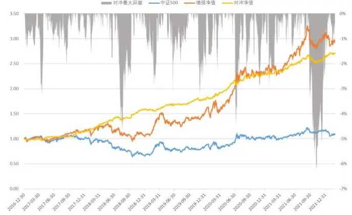
数据来源：wind、上交所、深交所、东方证券研究所

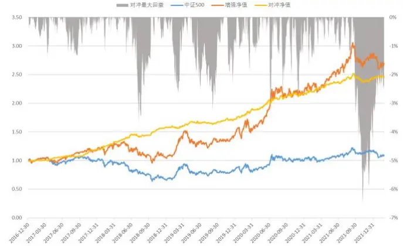
数据来源：wind、上交所、深交所、东方证券研究所

有关分析师的申明，见本报告最后部分。其他重要信息披露见分析师申明之后部分，或请与您的投资代表联系。并请阅读本证券研究报告最后一页的免责申明。

## 6.3 沪深 300 增强组合

沪深 300 增强组合对冲收益普遍弱于中证 500 增强，对于 300 增强组合，是否约束指数成分股权重不低于80%对组合收益影响不大，主要原因在于沪深300市值在样本空间内最大，市值约束的存在导致即使不做成分约束，增强组合持仓也大多数在成分股内。相对中证500 增强，过高换手对增强组合费后收益有较明显的负面影响，300 增强更偏好低换手策略。

图 21：沪深 300指数增强组合表现（成分股不限制）
增强组合绝对收益表现汇总

|  |  | 年化 | 2017年 | 2018年 | 2019年 | 2020年 | 2021年 | 2022年 |
| --- | --- | --- | --- | --- | --- | --- | --- | --- |
| delta=0.20 avgto=0.21 | 收益率 | 19.1% | 36.7% | -13.7% | 40.7% | 49.3% | 4.5% | -5.5% |
|  | 波动率 | 18.7% | 10.1% | 21.4% | 18.3% | 23.4% | 18.0% | 16.3% |
|  | 最大回撤 | -22.8% | -6.1% | -22.8% | -11.3% | -15.6% | -12.2% | -6.7% |
| delta=0.30 avgto=0.32 | 收益率 | 18.5% | 37.6% | -15.6% | 38.6% | 47.4% | 6.0% | -4.9% |
|  | 波动率 | 18.8% | 10.3% | 21.5% | 18.6% | 23.2% | 18.1% | 16.4% |
|  | 最大回撤 | -23.8% | -6.3% | -23.8% | -11.4% | -15.5% | -13.0% | -6.1% |
| delta=0.40 avgto=0.42 | 收益率 | 17.6% | 34.7% | -16.0% | 36.1% | 43.5% | 9.4% | -4.9% |
|  | 波动率 | 18.7% | 10.1% | 21.4% | 18.6% | 23.0% | 18.1% | 16.2% |
|  | 最大回撤 | -24.1% | -6.2% | -24.1% | -11.1% | -15.5% | -13.2% | -6.2% |
| delta=0.50 avgto=0.48 | 收益率 | 17.3% | 32.6% | -16.3% | 37.3% | 42.9% | 10.0% | -5.1% |
|  | 波动率 | 18.8% | 10.2% | 21.5% | 18.7% | 23.0% | 18.2% | 16.3% |
|  | 最大回撤 | -23.7% | -6.8% | -23.7% | -11.2% | -15.4% | -13.4% | -6.4% |

增强组合对冲收益表现汇总

图 22：沪深 300指数增强组合表现（成分股不低于 80%）增强组合绝对收益表现汇总

|  |  | 年化 | 2017年 | 2018年 | 2019年 | 2020年 | 2021年 | 2022年 |
| --- | --- | --- | --- | --- | --- | --- | --- | --- |
| delta=0.20 avgto=0.22 | 收益率 | 18.1% | 38.8% | -14.6% | 40.2% | 45.4% | 2.9% | -5.4% |
|  | 波动率 | 18.9% | 10.5% | 21.7% | 18.1% | 23.6% | 18.3% | 16.2% |
|  | 最大回撤 | -23.3% | -6.1% | -23.3% | -10.6% | -15.9% | -12.5% | -6.6% |
| delta=0.30 avgto=0.32 | 收益率 | 18.4% | 38.1% | -13.8% | 38.4% | 41.8% | 7.4% | -5.1% |
|  | 波动率 | 18.8% | 10.4% | 21.6% | 18.3% | 23.4% | 18.1% | 16.4% |
|  | 最大回撤 | -22.7% | -6.3% | -22.7% | -10.6% | -15.7% | -13.0% | -6.4% |
| delta=0.40 avgto=0.42 | 收益率 | 17.4% | 35.8% | -15.6% | 37.0% | 42.4% | 7.6% | -5.2% |
|  | 波动率 | 19.0% | 10.4% | 21.8% | 18.6% | 23.3% | 18.4% | 16.4% |
|  | 最大回撤 | -23.3% | -6.6% | -23.3% | -10.8% | -15.7% | -14.0% | -6.5% |
| delta=0.50 avgto=0.48 | 收益率 | 17.1% | 34.7% | -15.4% | 37.7% | 42.1% | 6.5% | -5.3% |
|  | 波动率 | 19.0% | 10.6% | 21.8% | 18.8% | 23.3% | 18.3% | 16.5% |
|  | 最大回撤 | -22.7% | -6.6% | -22.7% | -11.1% | -15.6% | -14.4% | -6.5% |

增强组合对冲收益表现汇总

|  |  | 年化 | 2017年 | 2018年 | 2019年 | 2020年 | 2021年 | 2022年 |
| --- | --- | --- | --- | --- | --- | --- | --- | --- |
| delta=0.20 avgto=0.21 | 收益率 | 11.7% | 12.3% | 15.5% | 3.2% | 17.5% | 10.0% | 1.9% |
|  | 波动率 | 5.0% | 3.8% | 4.7% | 4.9% | 5.6% | 5.8% | 4.1% |
|  | 最大回撤 | -6.1% | -2.6% | -2.8% | -5.0% | -3.3% | -6.1% | -0.8% |
| delta=0.30 avgto=0.32 | 收益率 | 11.2% | 13.1% | 13.0% | 1.7% | 16.0% | 11.6% | 2.6% |
|  | 波动率 | 5.0% | 4.0% | 4.8% | 4.9% | 5.5% | 5.7% | 4.2% |
|  | 最大回撤 | -6.0% | -1.9% | -3.1% | -4.4% | -3.6% | -6.0% | -0.8% |
| delta=0.40 avgto=0.42 | 收益率 | 10.3% | 10.7% | 12.4% | -0.1% | 12.8% | 15.2% | 2.5% |
|  | 波动率 | 5.0% | 4.1% | 4.9% | 4.9% | 5.5% | 5.8% | 4.0% |
|  | 最大回撤 | -5.7% | -3.0% | -2.9% | -4.2% | -3.9% | -5.7% | -0.7% |
| delta=0.50 avgto=0.48 | 收益率 | 10.0% | 9.0% | 12.0% | 0.8% | 12.3% | 15.8% | 2.3% |
|  | 波动率 | 5.1% | 4.2% | 4.8% | 4.9% | 5.5% | 5.8% | 4.1% |
|  | 最大回撤 | -5.9% | -3.5% | -3.1% | -3.9% | -4.0% | -5.9% | -0.7% |

周单边换手 30%下的组合走势

|  |  | 年化 | 2017年 | 2018年 | 2019年 | 2020年 | 2021年 | 2022年 |
| --- | --- | --- | --- | --- | --- | --- | --- | --- |
| delta=0.20 avgto=0.22 | 收益率 | 10.8% | 14.1% | 14.3% | 2.8% | 14.4% | 8.4% | 2.0% |
|  | 波动率 | 4.7% | 3.7% | 4.5% | 4.5% | 5.4% | 5.4% | 4.0% |
|  | 最大回撤 | -6.5% | -1.8% | -2.5% | -5.4% | -2.9% | -6.5% | -0.8% |
| delta=0.30 avgto=0.32 | 收益率 | 11.1% | 13.4% | 15.4% | 1.6% | 11.6% | 13.1% | 2.3% |
|  | 波动率 | 4.7% | 3.8% | 4.6% | 4.5% | 5.1% | 5.6% | 4.2% |
|  | 最大回撤 | -5.9% | -1.4% | -2.8% | -5.4% | -3.7% | -5.9% | -1.1% |
| delta=0.40 avgto=0.42 | 收益率 | 10.2% | 11.6% | 13.1% | 0.5% | 12.1% | 13.3% | 2.2% |
|  | 波动率 | 4.8% | 3.9% | 4.9% | 4.6% | 5.0% | 5.6% | 3.8% |
|  | 最大回撤 | -5.6% | -1.8% | -3.2% | -5.1% | -3.5% | -5.6% | -0.5% |
| delta=0.50 avgto=0.48 | 收益率 | 9.9% | 10.7% | 13.3% | 1.1% | 11.8% | 12.1% | 2.2% |
|  | 波动率 | 4.8% | 4.2% | 4.8% | 4.6% | 5.0% | 5.6% | 3.7% |
|  | 最大回撤 | -5.3% | -2.3% | -3.0% | -4.6% | -3.4% | -5.3% | -0.6% |

周单边换手 30%下的组合走势

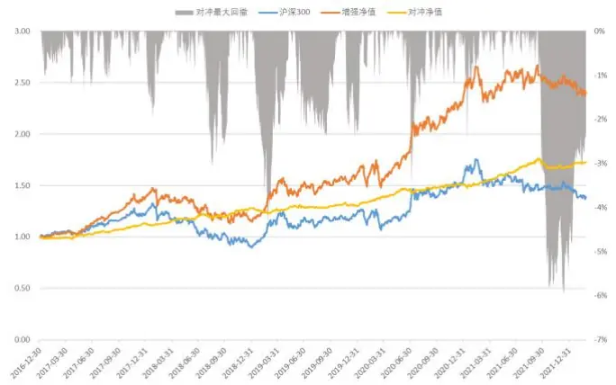
数据来源：wind、上交所、深交所、东方证券研究所

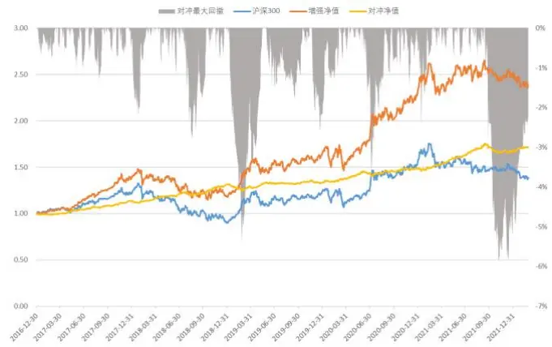
数据来源：wind、上交所、深交所、东方证券研究所

## 七、结论

近年来以神经网络、决策树为代表的机器学习模型在日间高频量价选股模型中大放异彩，然而公募、保险等量化机构由于交易成本高、合规风控严等原因很难直接大规模采用高频策略，短期内借鉴高频量价中的一些方法应用在周频等相对低频的领域更有现实意义。

传统的 alpha模型一般分为 alpha因子构建和因子加权两个步骤，前者我们基于循环神经网络设计多元因子单元从量价特征序列中学习长期有效且低相关的 alpha 因子，后者我们采用动态加权方法给予近期表现较好的因子更高的重要性，以此兼顾更多学习样本和 alpha时变性的平衡。

本文采用原始日线数据 rawbar、分钟特征序列 mschars、L2 特征序列 l2chars 共三个数据集，每个数据集构建 3 个因子单元，从每个数据集汇总打分的选股表现来看，同时生成多个alpha因子的多元因子单元明显优于生成唯一预测的神经网络，另外简单直接的rawbar并没有明显弱于精心设计的 mschars也说明因子单元强大的特征提取能力。

近年来量价因子由于因子拥挤多头收益不断回落而空头保持稳定，根据长周期数据训练的因子单元难以捕捉这种近期才出现的非线性，我们采用 LightGBM实现的 GBDT动态加权因子在一定程度上缓解了这种非线性，模型得分相对 maxic 在分组的多头端收益有所改善，这种改善在容易出现因子拥挤的情形下更加明显。

损失函数直接决定了模型学习的方向，损失函数中预测收益率 label 的选择应该充分到可交易性，同时在组合存在换手控制的情形下应该适当拉长预测收益率使得组合收益和损失函数更加匹配。

本文构建的模型得分和常见非量价大类因子的因子值相关性极低，模型完全根据量价信号生成，和基本面信号信息重叠较少，两者互补优势明显，通过回归剔除其他大类因子后模型得分RankIC小幅回落但IC_IR提升，top组合2017年以来年化收益（次日vwap成交，未扣费）从 42.7%小幅回落至38.7%。

模型得分可以作为一个大类因子用于指数增强，也可以单独用来构建指数增强组合，在不考虑成分股限制、周单边换手 30%的情况下，纯量价模型中证 500增强 2017年以来费后年化对冲收益21.3%，沪深300增强11.2%，考虑成分股80%约束后上述收益回落至19.1%和 11.1%。

## 风险提示

1. 量化模型基于历史数据分析得到，未来存在失效的风险，建议投资者紧密跟踪模型表现

2. 极端市场环境可能对模型效果造成剧烈冲击，导致业绩亏损

## Tabl e_Disclai mer 分析师申明

每位负责撰写本研究报告全部或部分内容的研究分析师在此作以下声明：

分析师在本报告中对所提及的证券或发行人发表的任何建议和观点均准确地反映了其个人对该证券或发行人的看法和判断；分析师薪酬的任何组成部分无论是在过去、现在及将来，均与其在本研究报告中所表述的具体建议或观点无任何直接或间接的关系。

## 投资评级和相关定义

报告发布日后的 12个月内的公司的涨跌幅相对同期的上证指数/深证成指的涨跌幅为基准；

## 公司投资评级的量化标准

买入：相对强于市场基准指数收益率 15%以上；

增持：相对强于市场基准指数收益率 5%～15%；

中性：相对于市场基准指数收益率在-5%～+5%之间波动；

减持：相对弱于市场基准指数收益率在-5%以下。

未评级 —— 由于在报告发出之时该股票不在本公司研究覆盖范围内，分析师基于当时对该股票的研究状况，未给予投资评级相关信息。

暂停评级 —— 根据监管制度及本公司相关规定，研究报告发布之时该投资对象可能与本公司存在潜在的利益冲突情形；亦或是研究报告发布当时该股票的价值和价格分析存在重大不确定性，缺乏足够的研究依据支持分析师给出明确投资评级；分析师在上述情况下暂停对该股票给予投资评级等信息，投资者需要注意在此报告发布之前曾给予该股票的投资评级、盈利预测及目标价格等信息不再有效。

## 行业投资评级的量化标准：

看好：相对强于市场基准指数收益率 5%以上；

中性：相对于市场基准指数收益率在-5%～+5%之间波动；

看淡：相对于市场基准指数收益率在-5%以下。

未评级：由于在报告发出之时该行业不在本公司研究覆盖范围内，分析师基于当时对该行业的研究状况，未给予投资评级等相关信息。

暂停评级：由于研究报告发布当时该行业的投资价值分析存在重大不确定性，缺乏足够的研究依据支持分析师给出明确行业投资评级；分析师在上述情况下暂停对该行业给予投资评级信息，投资者需要注意在此报告发布之前曾给予该行业的投资评级信息不再有效。

## HeadertTabl e_Discl ai mer 免责声明

本证券研究报告（以下简称“本报告”）由东方证券股份有限公司（以下简称“本公司”）制作及发布。

。本公司不会因接收人收到本报告而视其为本公司的当然客户。本报告的全体接收人应当采取必要措施防止本报告被转发给他人。

本报告是基于本公司认为可靠的且目前已公开的信息撰写，本公司力求但不保证该信息的准确性和完整性，客户也不应该认为该信息是准确和完整的。同时，本公司不保证文中观点或陈述不会发生任何变更，在不同时期，本公司可发出与本报告所载资料、意见及推测不一致的证券研究报告。本公司会适时更新我们的研究，但可能会因某些规定而无法做到。除了一些定期出版的证券研究报告之外，绝大多数证券研究报告是在分析师认为适当的时候不定期地发布。

在任何情况下，本报告中的信息或所表述的意见并不构成对任何人的投资建议，也没有考虑到个别客户特殊的投资目标、财务状况或需求。客户应考虑本报告中的任何意见或建议是否符合其特定状况，若有必要应寻求专家意见。本报告所载的资料、工具、意见及推测只提供给客户作参考之用，并非作为或被视为出售或购买证券或其他投资标的的邀请或向人作出邀请。

本报告中提及的投资价格和价值以及这些投资带来的收入可能会波动。过去的表现并不代表未来的表现，未来的回报也无法保证，投资者可能会损失本金。外汇汇率波动有可能对某些投资的价值或价格或来自这一投资的收入产生不良影响。那些涉及期货、期权及其它衍生工具的交易，因其包括重大的市场风险，因此并不适合所有投资者。

在任何情况下，本公司不对任何人因使用本报告中的任何内容所引致的任何损失负任何责任，投资者自主作出投资决策并自行承担投资风险，任何形式的分享证券投资收益或者分担证券投资损失的书面或口头承诺均为无效。

本报告主要以电子版形式分发，间或也会辅以印刷品形式分发，所有报告版权均归本公司所有。未经本公司事先书面协议授权，任何机构或个人不得以任何形式复制、转发或公开传播本报告的全部或部分内容。不得将报告内容作为诉讼、仲裁、传媒所引用之证明或依据，不得用于营利或用于未经允许的其它用途。

经本公司事先书面协议授权刊载或转发的，被授权机构承担相关刊载或者转发责任。不得对本报告进行任何有悖原意的引用、删节和修改。

提示客户及公众投资者慎重使用未经授权刊载或者转发的本公司证券研究报告，慎重使用公众媒体刊载的证券研究报告。

## 东方证券研究所

地址： 上海市中山南路 318 号东方国际金融广场 26 楼

电话：021-63325888

传真：021-63326786

网址： www.dfzq.com.cn