# 超大单冲击对大单因子的影响

# 因子选股系列之八十二

## 研究结论

在报告《基于大单的 alpha 因子构建》中，我们基于 A股的L2高频数据构建了用于捕捉大单买入方向和强度的大单买入占比和大单涨跌幅因子。本文旨在前文报告的基础上，重点研究超大单冲击对大单因子的影响，并对大单因子提出适当的改进方案。

⚫ 本文首先回顾了大单因子的定义、并分析了大单因子对大单切分阈值的敏感性，发现大单因子的正向 Alpha没有随大单阈值的降低而减弱，甚至更强，说明大单因子的选股效果并不完全来源于所谓的大单，除了迷你单之外的中大订单均有一定的动量效应。

由于过度投机、流动性冲击等影响，超大单买入短期内可能有负向 alpha冲击，考虑到不同流动性的股票过度投机的难易和流动性冲击的大小显著不同，我们根据个股当天总成交金额的一定比例作为超大单划分依据，以此剥离出超大单负向 alpha的影响。

为了量化超大单的负向 alpha冲击，我们用超大单数据构建了超大单买入占比和超大单涨跌幅这两类因子，因子测试结果证实了超大单的负向 alpha冲击，市值越小的股票池因子负向 RankIC越大，说明超大单冲击的负向效应在小票中更强。

鉴于超大单的负向冲击会削弱大单因子的“动量”特征，我们从大单数据中剔除超大单数据、仅用非超大单的大单数据构建了大单买入占比和大单涨跌幅两类因子。两类因子剔除超大影响后在沪深 300中选股效果差异不大，但是在中证 500及其他样本空间中明显更强，其中剔除超大单后的大单买入占比在沪深 300和中证全指中的 RankIC 分别为 4.90%和 8.58%。

剔除超大单后的大单因子信息衰减速度较慢，因子月度 RankIC半衰期大致在 70个交易日左右，基于大单因子构建的 JK组合（不同形成期持有期）多空年化收益显示大单因子在形成期持有期长达 3个月的中长期依然有较好的选股效果。

⚫ 剔除超大单数据后的大单买入占比与反转因子的相关性显著降低、与波动、换手的相关性显著上升，与其他因子的相关性较剔除超大单以前没有太大变化。

## 风险提示

⚫ 量化模型失效风险

⚫ 市场极端环境的冲击

剔除超大单前、后的大单买入占比（原始值）

|  |  |  | RankIC |  |  | 多空组合 |  |  |
| --- | --- | --- | --- | --- | --- | --- | --- | --- |
| 大单买入占比 (未剔除超大单) |  | IC月度均值 | IC_IR | t值 | 年化收益 | 夏普率 | 月胜率 | 最大回撤 多头月换手 |
|  | 沪深300 | 5.04% | 1.06 | 3.05 | 16.88% | 0.91 | 60.61% | -27.27% 75% |
|  | 中证500 | 3.77% | 1.23 | 3.55 | 15.12% | 1.22 68.69% | -14.14% | 77% |
|  | 中证800 | 3.95% | 1.08 | 3.11 | 14.34% 1.03 | 65.66% | -18.23% | 76% |
|  | 中证1000 | 3.05% | 1.04 | 2.99 | 14.52% | 1.29 67.68% | -16.03% | 76% |
|  | 中证全指 | 3.19% | 1.07 | 3.08 | 14.34% 1.34 | 69.70% | -16.40% | 77% |
|  |  |  |  |  | 多空组合 |  |  |  |
| 大单买入占比 (剔除超大单) |  | IC月度均值 | RankIC IC_IR | t值 | 年化收益 | 夏普率 月胜率 |  | 最大回撤多头月换手 |
|  | 沪深300 | 4.90% | 1.13 | 3.25 | 14.42% | 0.9 61.62% | -27.52% | 69% |
|  | 中证500 | 6.15% | 2.07 | 5.95 | 15.47% | 1.39 67.68% | -20.32% | 71% |
|  | 中证800 | 5.54% | 1.78 | 5.11 | 15.77% 1.41 | 70.71% | -22.09% | 70% |
|  | 中证1000 | 8.29% | 2.62 | 7.53 | 22.47% 1.88 | 73.74% | -16.80% | 69% |
|  | 中证全指 | 8.58% | 3.01 | 8.66 | 25.04% 2.41 | 77.78% | -10.50% | 70% |

报告发布日期

2022 年 05 月 20 日

朱剑涛021-63325888*6077

zhujiantao@orientsec.com.cn

执业证书编号：S0860515060001

王星星021-63325888*6108

wangxingxing@orientsec.com.cn

执业证书编号：S0860517100001

栾张心怿 luanzhangxinyi@orientsec.com.cn

周频量价指增模型——因子选股系列之八 2022-03-28十一

收 益 率 的 非 对 称 分 布 与 尾 部 蕴 含 的 2021-12-25Alpha——因子选股系列研究之八十

基于大单的 alpha 因子构建——因子选股 2021-10-27系列之七十九

在前文报告《基于大单的alpha 因子构建》中，我们基于A股L2逐笔成交数据识别股票大小单，并在此基础上构建了大单买入占比和大单涨跌幅两类因子用于捕捉相对有信息优势的大资金参与者的买卖方向和强度。本篇报告将在上述报告的基础上，重点研究超大单冲击对大单因子的影响，并对大单因子提出适当的改进方案。

## 一、大单因子的构建

在定义大单因子之前，首先需借助A股L2数据中的逐笔成交数据去识别大、小单。识别大、小单的过程可分为如下两个步骤：

（1） 按照委买单号和委卖单号，对L2逐笔成交数据中的成交金额（已成交部分）进行汇总求和，如此便可得到当天该股票所有买单和卖单的成交金额；

（2） 取所有买单和卖单成交金额的分位数（如前 30%分位数）作为大、小单的临界点，将成交金额大于该临界点的买单和卖单分别标记为大买单和大卖单。

其中，需要加以说明的有如下三点：

第一，在识别大、小单的过程中，所用到的L2高频数据为逐笔成交而非逐笔委托数据。这是因为逐笔委托在上交所股票的历史数据覆盖区间较短，所以采用逐笔成交“还原”订单成交金额去作为订单实际金额的近似估计（实际上我们在深交所股票中也对比过两种订单金额对因子选股效果的影响，几乎可以忽略不记）。

第二，当仅用单日的逐笔成交数据时，单日偶然因素的影响可能会使成交金额偏离正常的取值范围，所以本文也测试了将滚动20个交易日的订单成交金额的分位数作为识别大、小单的临界点。从因子回测的角度来看，两种方法下的因子效果差别并不明显。为计算简单起见，本文后续均采用单日而非滚动多日成交金额的分位数作为识别大、小单的依据。

第三，大、小单的识别方式并非只有分位数一种，如 Wind数据表 AShareMoneyFlow（中国A股资金流向数据）便是根绝订单的绝对金额大小，用 4万、20万和 100万这三个临界点分出了四类订单类型。关于不同大、小单识别方式的对比，感兴趣的投资者可与本报告联系人联系。

完成大、小单的识别后，便可用大单数据计算大单买入占比和大单涨跌幅这两类因子。

## 1.1 大单买入占比的定义

记股票i在交易日t的所有大买单成交金额、所有大卖单成交金额分别为 $BigBuy_{i,t}$ t和Big $Sell_{i,t}$ ，则该股票在当天的大单买入占比因子为其所有大买单成交金额占所有大单成交金额的比例，即：

$$
\mathcal{\bar{K}}\ntriangle{\cong}\mathcal{\bar{K}}\Lambda\mathsf{E}\mathsf{E}\mathsf{E}_{i,t}=\frac{BigBuy_{i,t}}{BigBuy_{i,t}+BigSell_{i,t}}
$$

此外，鉴于更多的信息交易会发生在早盘，我们也定义了早盘大单买入占比因子，即将上述公式中的 $BigBuy_{i,t}\ddag\square BigSell_{i,t}$ 限制为发生在上午10:00之前、所有的大买单和大卖单的成交金额。

## 1.2大单涨跌幅的定义

大单涨跌幅的计算过程可分为如下三步：

（1） 计算每笔成交数据对应的对数价格变动∆ln $P_{i}$ ， $\Delta lnP_{i}$ =当前成交价格的对数ln $P_{i}-$ 上一笔成交价格的对数ln $P_{i-1}$ （由于开盘和收盘集合竞价阶段中所有订单集中撮合，所以这两处时间段内的对数价格变动设置为 0）；

（2） 对于每笔成交数据中涉及到的买卖双方，将时间上靠后的订单标记为主动订单；

（3） 大单涨跌幅取所有主动订单为大单的对数价格变动之和，即大单涨跌幅 =$\textstyle\sum_{i\in S}\Delta$ ln $P_{i}$ ，其中S为所有主动订单为大单的订单集合。

通过上述计算过程可以看出，大单涨跌幅因子本质刻画的是由大单主导的已成交订单的涨跌幅。与大单买入因子类似，我们也定义了早盘大单涨跌幅因子，其计算过程只需在上述步骤（3）的集合S中再多加一个“订单成交时间早于上午 $10{:}00^{\ '}$ 的限制条件。

## 1.3因子测试说明

未特殊说明时，本文对因子测试的设定如下：取大单因子过去20个交易日的均值用于选股，在月度调仓层面对 RankIC 和多空分组两个角度考察因子在不同股票池的选股效果；回测区间选为 2013.12.31-2022.03.31。

## 1.4 大单阈值的参数敏感性分析

为探究大单因子对于大、小单阈值的敏感性，我们分别用订单成交金额的前 1%、5%、10%、20%、30%、50%和 80%这七组阈值去划分大、小单，并对不同阈值下的大单因子进行测试。通过观察图 1中的有关结果，我们得到如下几点发现：

（1） 大单因子的正向 Alpha 没有随大单阈值的降低而减弱，甚至更强。当分位数由前 1%逐渐过渡到前 50%、80%时，定义大单的成交金额阈值在逐渐降低，但大单买入占比和大单涨跌幅两类因子仍有较强的正向 Alpha，甚至更强。这说明两类大单因子的表现并不完全取决于大单，凡是中大单便都可以推动因子的表现。

（2） 对于成交金额巨大的超大单，它对大票和小票的影响不同，大市值股票依然有正向选股效果，但对小票存在负向冲击的效应。例如用前 1%分位数定义的大单买入占比在中证 1000股票池中的 RankIC为-0.72%，说明中证 1000中超大单买入的股票未来一段时间平均表现更差，这一定程度上也和之前行业内发现的大单反转现象相呼应。

进一步地，我们认为超大单会对小票产生负向冲击的原因，可能与股价的过度投机和流动性冲击有关。一方面，日常成交金额越高的股票，其股价被过度投机的成本和难度就越高；另一方面，流动性越好的股票，其发生流动性冲击的概率也越低。因此，站在过度投机和流动性冲击两个角度来看，超大单对大票和小票的冲击效应不同，小票遭受超大单负向冲击的力度会更强，所以小票的超大单因子可能会存在负向 Alpha。

图 1：不同大单阈值下的大单因子表现（原始值）

| 大单阈值 |  |  | (全天)大单买入占比 |  |  |  |  |  | (全天)大单涨跌幅 |  |  |  |  |
| --- | --- | --- | --- | --- | --- | --- | --- | --- | --- | --- | --- | --- | --- |
| 前1%分位数 |  |  | RankIC |  | 多空组合 |  |  |  | RankIC |  | 多空组合 |  |  |
|  |  |  | IC月度均值 IC_IR t值 |  | 年化收益 夏普率 月胜率 |  | 最大回撤多头月换手 |  | IC月度均值IC_IR t值 |  | 年化收益 夏普率 月胜率 | 最大回撤多头月换手 |  |
|  |  | 沪深300 | 4.30% 1.02 2.92 |  | 12.58% 0.76 58.59% |  | -24.58% 74% | 沪深300 | 5.86% 1.37 3.94 |  | 16.18% 0.98 61.62% | -20.67% 77% |  |
|  |  | 中证500 | 1.28% 0.46 1.33 |  | 7.46% 0.64 62.63% |  | -22.67% 74% | 中证500 | 5.14% | 1.58 4.54 | 13.24% 0.85 63.64% | -21.79% 73% |  |
|  |  | 中证800 | 2.29% 0.7 2 |  | 8.83% 0.73 57.58% |  | -22.88% 74% | 中证800 | 5.52% | 1.59 4.56 | 14.05% 0.98 62.63% | -21.89% 74% |  |
|  |  | 中证1000 | -0.72% -0.28 -0.81 |  | 1.62% 0.15 50.51% |  | -26.95% 75% | 中证1000 | 4.30% | 1.49 4.27 | 16.40% 1.25 70.71% | -19.50% 73% |  |
|  |  | 中证全指 | -0.69% -0.29 -0.82 |  | 0.08% 0.01 52.53% |  | -27.20% 76% | 中证全指 | 5.32% 1.91 5.48 |  | 15.52% 1.23 66.67% | -17.16% 73% |  |
| 前5%分位数 |  |  | RankIC |  | 多空组合 |  |  |  | RankIC |  | 多空组合 |  |  |
|  |  |  | IC月度均值IC_IR t值 |  | 年化收益 夏普率 月胜率 |  | 最大回撤 多头月换手 |  | IC月度均值IC_IR t值 |  | 年化收益 夏普率 月胜率 | 最大回撤 多头月换手 |  |
|  |  | 沪深300 | 4.73% 1.07 3.08 |  | 18.48% 1.11 65.66% |  | -25.64% 74% | 沪深300 | 5.83% 1.5 4.3 |  | 16.64% 1 67.68% | -24.16% 76% |  |
|  |  | 中证500 | 2.32% 0.81 2.32 |  | 10.79% 1.04 63.64% |  | -15.68% 75% | 中证500 | 5.83% 1.8 5.16 |  | 19.89% 1.31 67.68% | -24.88% 75% |  |
|  |  | 中证800 | 3.06% | 0.89 2.56 | 12.20% 0.97 56.57% |  | -16.15% 74% | 中证800 | 5.84% | 1.76 5.07 | 18.09% 1.24 66.67% | -22.55% 75% |  |
|  |  | 中证1000 | 0.62% | 0.23 0.65 | 5.91% 0.52 57.58% |  | -27.75% 75% | 中证1000 | 5.87% | 1.91 5.48 | 19.05% 1.39 66.67% | -16.34% | 74% |
|  |  | 中证全指 | 0.73% | 0.27 0.79 | 5.14% 0.5 60.61% |  | -25.71% 75% | 中证全指 | 6.58% | 2.31 6.63 | 22.00% 1.71 67.68% | -18.19% | 74% |
| 前10%分位数 |  |  |  | RanklC | 多空组合 |  |  |  | RankIC |  | 多空组合 |  |  |
|  |  |  | IC月度均值IC_IR t值 |  | 年化收益 夏普率 月胜率 |  | 最大回撤多头月换手 |  | IC月度均值IC_IR t值 |  | 年化收益 夏普率 月胜率 | 最大回撤多头月换手 |  |
|  |  | 沪深300 | 4.58% 1.03 2.96 |  | 19.22% 1.11 64.65% |  | -23.51% 74% | 沪深300 | 5.17% 1.4 4.03 |  | 14.93% 0.92 66.67% | -22.47% 77% |  |
|  |  | 中证500 | 2.37% 0.81 2.32 |  | 11.06% 0.95 63.64% |  | -14.61% 75% | 中证500 | 5.78% 1.77 5.08 |  | 20.57% 1.46 68.69% | -24.34% 76% |  |
|  |  | 中证800 | 3.03% | 0.88 2.51 | 13.59% 1.07 62.63% |  | -16.41% 74% | 中证800 | 5.53% | 1.73 4.97 | 17.89% 1.31 65.66% | -21.32% | 76% |
|  |  | 中证1000 | 1.34% | 0.48 1.37 | 7.63% 0.67 54.55% |  | -21.81% 76% | 中证1000 | 6.46% | 2.1 6.03 | 21.71% 1.57 71.72% | -16.75% | 76% |
|  |  | 中证全指 | 1.38% | 0.49 1.42 | 7.54% 0.72 61.62% |  | -23.13% 76% | 中证全指 | 6.87% | 2.44 7.02 | 22.85% 1.76 67.68% | -18.79% | 75% |
| 前20%分位数 |  |  | RankiC |  |  | 多空组合 |  |  |  | RankIC | 多空组合 |  |  |
|  |  |  | IC月度均值IC_IR t值 |  | 年化收益 | 夏普率 月胜率 | 最大回撤多头月换手 |  | IC月度均值 | IC_IR t值 | 年化收益 夏普率 月胜率 | 最大回撤多头月换手 |  |
|  |  | 沪深300 | 4.87% 1.05 3.02 |  | 16.60% | 0.9 66.67% | -28.70% 74% | 沪深300 | 5.18% 1.46 4.19 |  | 14.88% 0.95 61.62% | -25.25% 76% |  |
|  |  | 中证500 | 3.06% 1.02 2.94 |  | 13.94% | 1.13 66.67% | -14.81% 76% | 中证500 | 6.15% 1.92 5.5 |  | 20.52% 1.47 68.69% | -21.27% 77% |  |
|  |  | 中证800 | 3.51% 0.99 2.84 |  | 14.74% | 1.1 63.64% | -16.16% 75% | 中证800 | 5.72% 1.86 5.35 |  | 18.72% 1.42 70.71% | -21.07% | 76% |
|  |  | 中证1000 | 2.35% 0.8 2.29 |  | 10.56% | 0.89 55.56% | -22.09% 76% | 中证1000 | 6.75% 2.23 6.42 |  | 24.81% 1.73 71.72% | -17.13% | 76% |
|  |  | 中证全指 | 2.48% 0.84 2.42 |  | 11.79% | 1.05 65.66% | -22.07% 76% | 中证全指 | 7.09% 2.58 7.4 |  | 25.10% 1.93 73.74% | -17.69% 76% |  |
| 前30%分位数 |  |  | RankiC |  |  | 多空组合 |  |  | RankIC |  | 多空组合 |  |  |
|  |  |  | IC月度均值IC_IR t值 |  | 年化收益 夏普率 月胜率 |  | 最大回撤多头月换手 |  | IC月度均值IC_IR t值 |  | 年化收益 夏普率 月胜率 | 最大回撤多头月换手 |  |
|  |  | 沪深300 | 5.04% 1.06 3.05 |  | 16.88% 0.91 60.61% |  | -27.27% 75% | 沪深300 | 5.42% 1.53 4.4 |  | 13.49% 0.84 62.63% | -27.36% 76% |  |
|  |  | 中证500 | 3.77% 1.23 3.55 |  | 15.12% 1.22 68.69% |  | -14.14% 77% | 中证500 | 6.37% 2 5.73 |  | 21.19% 1.43 71.72% | -24.56% 77% |  |
|  |  | 中证800 | 3.95% 1.08 3.11 |  | 14.34% 1.03 65.66% |  | -18.23% 76% | 中证800 | 5.90% 1.96 5.62 |  | 18.08% 1.38 66.67% | -21.42% 76% |  |
|  |  | 中证1000 | 3.05% 1.04 2.99 |  | 14.52% 1.29 67.68% |  | -16.03% 76% | 中证1000 | 6.87% 2.38 6.83 |  | 24.20% 1.79 68.69% | -16.57% 76% |  |
|  |  | 中证全指 | 3.19% 1.07 3.08 |  | 14.34% 1.34 69.70% |  | -16.40% 77% | 中证全指 | 7.18% 2.69 7.74 |  | 25.28% 1.95 72.73% | -17.90% 76% |  |
| 前50%分位数 |  |  | RankiC |  | 多空组合 |  |  |  | RankIC |  | 多空组合 |  |  |
|  |  |  | IC月度均值IC_IR t值 |  | 年化收益 夏普率 月胜率 |  | 最大回撤多头月换手 |  | IC月度均值IC_IR t值 |  | 年化收益 夏普率 月胜率 | 最大回撤多头月换手 |  |
|  |  | 沪深300 | 5.09% 1.07 3.08 |  | 15.36% 0.82 58.59% |  | -30.39% 74% | 沪深300 | 5.42% 1.58 4.55 |  | 14.74% 0.91 62.63% | -23.02% 75% |  |
|  |  | 中证500 | 4.38% 1.39 3.99 |  | 14.55% 1.18 65.66% |  | -17.44% 78% | 中证500 | 6.34% 2.09 6.01 |  | 21.35% 1.48 72.73% | -24.16% 76% |  |
|  |  | 中证800 | 4.18% 1.13 3.24 |  | 14.17% 1 66.67% |  | -20.06% 76% | 中证800 | 5.84% 2.06 5.9 |  | 18.17% 1.34 70.71% | -20.24% 75% |  |
|  |  | 中证1000 | 4.03% 1.44 4.12 |  | 16.21% 1.54 68.69% |  | -18.08% 77% | 中证1000 | 6.73% 2.45 7.03 |  | 24.20% 1.92 74.75% | -17.09% 76% |  |
|  |  | 中证全指 | 4.07% 1.35 3.89 |  | 15.46% 1.45 72.73% |  | -15.62% 77% | 中证全指 | 7.07% 2.81 8.08 |  | 25.16% 1.97 75.76% | -16.35% 75% |  |
|  |  |  | IC月度均值IC_IR t值 |  | 年化收益 夏普率 月胜率 |  | 最大回撤多头月换手 |  | IC月度均值IC_IR t值 |  | 年化收益 夏普率 月胜率 | 最大回撤多头月换手 |  |
|  |  | 沪深300 | 3.61% 0.64 1.85 |  | 4.74% 0.23 50.51% |  | -62.40% 72% | 沪深300 | 5.46% 1.49 4.29 |  | 12.04% 0.68 63.64% | -27.49% 68% |  |
| 前80%分位数 | 分位数 | 中证500 | 3.51% 0.95 2.73 |  | 8.10% 0.52 57.58% |  | -30.91% 76% | 中证500 | 6.12% 1.99 5.72 |  | 18.97% 1.37 68.69% | -20.92% 70% |  |
|  |  | 中证800 | 3.23% 0.73 2.1 |  | 5.05% 0.29 54.55% |  | -48.65% 73% | 中证800 | 5.71% 1.9 5.46 |  | 17.34% 1.18 71.72% | -19.47% 68% |  |
|  |  | 中证1000中证全指 | 5.17% 1.46 4.24.68% 1.28 3.69 |  | 15.19% 1.04 65.66% |  | -19.91% 77% | 中证1000 | 6.92% 2.58 7.42 |  | 25.55% 1.99 73.74% | -15.60% 72% |  |
|  |  |  |  |  | 10.39% 0.71 59.60% |  | -21.43% 76% | 中证全指 | 6.81% 2.62 7.54 |  | 23.28% 1.82 76.77% | -17.01% 67% |  |

数据来源：wind & 上交所 & 深交所 & 东方证券研究所

## 二、超大单冲击的负向效应

## 2.1 超大单的定义

本文主要想考察超大单由于过度投机和流动性冲击引起的负向 alpha 冲击，流动性不同的股票过度投机的难易和流动性冲击的大小完全不同，因此超大单的定义需要考虑到股票流动性的差异，参考一般的冲击成本模型都假设订单对股票价格的冲击和订单占股票成交金额的比例成正向关系，本文将订单成交金额占该个股当天总成交金额比例超过一定阈值的订单定义为超大单，本文默认取 1%的阈值，该阈值对因子选股效果的敏感性在 3.3节进行分析。

值得注意的是，我们对于大单和超大单的定义方式不尽相同：定义大单是用当天所有订单成交金额的分位数，而定义超大单则是用当天个股总成交金额的占比，定义大单是为了找出相对金额较大、有信息优势的订单，定义超大单是为了刻画潜在的过度投机和流动性冲击的负相 alpha影响。

为更好的展现两种方法的不同，我们分别选取了三只流动性较好的大票和三只流动性较差的小票代表，在图 2中记录它们在 2021.12.20的有关订单信息。从中我们可以发现：对于大票代表如贵州茅台，尽管其单笔订单的成交金额远大于小票，但每个订单的金额占比却要远低于小票。例如贵州茅台当天所有订单金额的前5%分位数（￥1042125）几乎是岱勒新材（￥70650）的15倍，但最大订单的金额占比（0.59%）却是岱勒新材（2.91%）的五分之一。因此，采用上述方式定义的超大单可以有针对性地区分流动性好的股票和流动性差的股票。

图 2：三只大票和三只小票的订单金额信息（2021.12.20）

|  | 大市值股票代表 |  |  | 小市值股票代表 |  |  |
| --- | --- | --- | --- | --- | --- | --- |
|  | 贵州茅台 | 工商银行 | 宁德时代 | 岱勒新材 | 达威股份 | 凤竹纺织 |
| 订单金额的前0.1%分位数 | ¥10,258,904 | ¥3,966,054 | ¥6,180,000 | ¥499,414 | ¥279,088 | ¥387,199 |
| 订单金额的前1%分位数 | ¥3,303,852 | ¥463,000 | ¥1,550,373 | ¥214,435 | ¥154,287 | ¥132,467 |
| 订单金额的前5%分位数 | ¥1,042,125 | ¥107,879 | ¥608,831 | ¥70,650 | ¥65,977 | ¥47,760 |
| 当天股票总成交金额的1% | ¥66,545,965 | ¥6,861,983 | ¥96,485,331 | ¥389,063 | ¥219,852 | ¥459,753 |
| 当天股票总成交金额的5% | ¥332,729,825 | ¥34,309,913 | ¥482,426,655 | ¥1,945,317 | ¥1,099,259 | ¥2,298,765 |
| 单笔订单的最大成交金额 | ¥39,326,136 | ¥4,630,000 | ¥107,055,439 | ¥1,130,560 | ¥589,225 | ¥939,839 |
| 单笔订单的最大成交金额/当天总成交金额 | 0.59% | 0.67% | 1.11% | 2.91% | 2.68% | 2.04% |
| 订单成交金额占总成交金额1%以上的个数 | 0 | 0 | 1 | 9 | 12 | 5 |

数据来源：wind & 上交所 & 深交所 & 东方证券研究所

## 2.2超大单买入占比的因子表现

在给出超大单的定义方式之后，下面我们将从因子角度去量化说明超大单冲击的负向效应。

首先参照大单买入占比因子的定义，我们构建了超大单买入占比因子 。其中$SuperBigBuy_{i,t},SuperBigSell_{i,t}$ 分别对应股票i在交易日t的所有超大买单、超大卖单的成交金额1；若将二者限制在上午 10:00以前的超大买单和超大卖单，则可得早盘超大单买入占比因子。

$$
\frac{+\Im}{\Im\Xi}\mathcal{\perp}\frac{\ d}{\ d{\bf\mathcal{L}}}\mathcal{Q}\mathcal{L}\mathcal{\bigcap}\mathcal{\bf\ L}\mathcal{\ L}\mathcal{\mathstrut}\mathcal{\ L}\mathcal{\mathstrut}\mathcal{\ L}\mathcal{\mathstrut}\mathcal{\ L}\mathcal{\mathstrut}\mathcal{\Lambda}\mathcal{\mathstrut}\mathcal{\mathstrut}\mathcal{\ L}\mathcal{\mathstrut}\mathcal{\mathstrut}\mathcal{L}_{i,t}=\frac{Super\ :Big\ :Buy_{i,t}}{Super\ :Big\ :Buy_{i,t}+Super\ :Big\ :Sell_{i,t}}
$$

图3-图4展示了超大单买入占比和早盘超大单买入占比在沪深300、中证1000等五个股票池的测试情况。全天计算的超大单买入占比因子 IC多为负值，这说明超大买单占比越多、未来股价反转的几率越大，市值越小的股票过度投机和流动性冲击的现象更容易发生，相应的大单反转更加明显。另外，对于早盘计算的超大单因子的负向 alpha 并不是特别明显，我们认为主要是因为早盘大单由于信息优势带来的正向选股效果更加显著，和超大单的负向冲击有一定程度的抵消。

图 3：超大单买入占比的因子表现
因子原始值

|  | RanklC |  |  | 多空组合 |  |  |  |  |
| --- | --- | --- | --- | --- | --- | --- | --- | --- |
|  | IC月度均值 | IC_IR | t值 | 年化收益 | 夏普率 | 月胜率 | 最大回撤 | 多头月换手 |
| 沪深300 | 1.79% | 0.55 | 1.58 | -3.46% | -0.27 | 47.47% | -51.13% | 81% |
| 中证500 | -1.79% | -0.7 | -2.01 | 4.43% | 0.42 | 53.54% | -16.33% | 81% |
| 中证800 | -0.54% | -0.21 | -0.61 | 0.29% | 0.03 | 49.49% | -24.29% | 80% |
| 中证1000 | -4.47% | -1.88 | -5.39 | 13.93% | 1.24 | 65.66% | -19.37% | 82% |
| 中证全指 | -4.05% | -1.84 | -5.29 | 12.76% | 1.29 | 67.68% | -12.08% | 79% |

图 4：早盘超大单买入占比因子表现
因子原始值

|  | RankIC |  |  | 多空组合 |  |  |  |  |
| --- | --- | --- | --- | --- | --- | --- | --- | --- |
|  | IC月度均值 | IC_IR | t值 | 年化收益 | 夏普率 | 月胜率 | 最大回撤 | 多头月换手 |
| 沪深300 | 1.64% | 0.64 | 1.84 | -3.07% | -0.3 | 39.39% | -46.29% | 82% |
| 中证500 | 1.00% | 0.63 | 1.82 | -3.12% | -0.4 | 44.44% | -31.75% | 80% |
| 中证800 | 1.14% | 0.74 | 2.11 | -4.11% | -0.67 | 38.38% | -38.42% | 79% |
| 中证1000 | -0.19% | -0.13 | -0.37 | 0.18% | 0.02 | 55.56% | -20.63% | 81% |
| 中证全指 | -0.18% | -0.15 | -0.42 | -1.29% | -0.23 | 48.48% | -22.43% | 79% |

行业市值中性

|  | RankIC |  |  | 多空组合 |  |  |  |  |
| --- | --- | --- | --- | --- | --- | --- | --- | --- |
|  | IC月度均值 | IC_IR | t值 | 年化收益 | 夏普率 | 月胜率 | 最大回撤 | 多头月换手 |
| 沪深300 | 0.48% | 0.26 | 0.75 | -3.05% | -0.32 | 42.42% | -43.46% | 81% |
| 中证500 | -1.69% | -0.83 | -2.37 | 3.88% | 0.4 | 52.53% | -13.86% | 81% |
| 中证800 | -0.98% | -0.55 | -1.58 | 0.79% | 0.1 | 48.48% | -20.12% | 81% |
| 中证1000 | -3.80% | -2.15 | -6.18 | 12.62% | 1.34 | 67.68% | -16.03% | 81% |
| 中证全指 | -3.80% | -2.31 | -6.62 | 12.35% | 1.55 | 65.66% | -9.29% | 80% |

数据来源：wind & 上交所 & 深交所 & 东方证券研究所

行业市值中性

|  | RanklC |  |  | 多空组合 |  |  |  |  |
| --- | --- | --- | --- | --- | --- | --- | --- | --- |
|  | IC月度均值 | IC_IR | t值 | 年化收益 | 夏普率 | 月胜率 | 最大回撤 | 多头月换手 |
| 沪深300 | 0.71% | 0.42 | 1.21 | -3.82% | -0.47 | 45.45% | -41.82% | 82% |
| 中证500 | 0.66% | 0.51 | 1.45 | -3.09% | -0.43 | 46.46% | -27.94% | 81% |
| 中证800 | 0.81% | 0.72 | 2.06 | -2.73% | -0.5 | 40.40% | -26.57% | 80% |
| 中证1000 | -0.22% | -0.18 | -0.51 | -2.07% | -0.29 | 48.48% | -24.61% | 81% |
| 中证全指 | -0.37% | -0.37 | -1.05 | -1.38% | -0.29 | 51.52% | -18.09% | 80% |

数据来源：wind & 上交所 & 深交所 & 东方证券研究所

## 2.3超大单涨跌幅的因子表现

超大单涨跌幅的定义如下：

（1） 参照 1.2节的步骤（1）、（2）计算对数价格变动∆ln $P_{i}$ 、标记主动订单；

（2） 超大单涨跌幅 = $\begin{array}{r}{\sum_{i\in S}\Delta{ln}P_{i}}\end{array}$ ，其中S为所有主动订单为超大单的订单集合。

从图 5-图 6 展示的因子表现来看，超大单涨跌幅在各个股票池里的因子 IC 均为负值，且 IC在市值偏小的股票池里特别显著，例如超大单涨跌幅的原始值、行业市值中性值在中证1000里的IC分别为-6.60%和-5.30%。由于超大单涨跌幅描述的是由超大单主导的已成交订单的涨跌幅之和、再结合因子表现，可以看出用“当天个股总成交金额占比”的超大单定义方式可以较为准确地提取出对股价有负向冲击的超大单。

图 5：超大单涨跌幅的因子表现
因子原始值

|  | RankIC |  |  | 多空组合 |  |  |  |  |
| --- | --- | --- | --- | --- | --- | --- | --- | --- |
|  | IC月度均值 | IC_IR | t值 | 年化收益 | 夏普率 | 月胜率 | 最大回撤 | 多头月换手 |
| 沪深300 | -0.76% | -0.23 | -0.65 | 2.42% | 0.19 | 52.53% | -31.46% | 72% |
| 中证500 | -4.36% | -1.49 | -4.28 | 7.15% | 0.71 | 54.55% | -21.17% | 76% |
| 中证800 | -3.17% | -1.05 | -3.02 | 6.24% | 0.67 | 58.59% | -23.17% | 74% |
| 中证1000 | -6.60% | -2.5 | -7.19 | 18.67% | 2.04 | 72.73% | -10.70% | 76% |
| 中证全指 | -6.44% | -2.82 | -8.09 | 17.35% | 2.16 | 73.74% | -7.08% | 76% |

图 6：早盘超大单涨跌幅的因子表现
因子原始值

|  | RankIC |  |  | 多空组合 |  |  |  |  |
| --- | --- | --- | --- | --- | --- | --- | --- | --- |
|  | IC月度均值 | IC_IR | t值 | 年化收益 | 夏普率 | 月胜率 | 最大回撤 | 多头月换手 |
| 沪深300 | -0.14% | -0.06 | -0.17 | -1.33% | -0.16 | 46.46% | -27.89% | 77% |
| 中证500 | -1.63% | -0.75 | -2.14 | -0.06% | -0.01 | 49.49% | -24.63% | 81% |
| 中证800 | -1.16% | -0.54 | -1.55 | 1.83% | 0.28 | 50.51% | -21.06% | 78% |
| 中证1000 | -2.97% | -1.59 | -4.58 | 7.66% | 1.11 | 65.66% | -11.64% | 82% |
| 中证全指 | -3.08% | -1.89 | -5.44 | 8.19% | 1.5 | 69.70% | -6.76% | 81% |

行业市值中性

|  | RankIC |  |  | 多空组合 |  |  |  |  |
| --- | --- | --- | --- | --- | --- | --- | --- | --- |
|  | IC月度均值 | IC_IR | t值 | 年化收益 | 夏普率 | 月胜率 | 最大回撤 | 多头月换手 |
| 沪深300 | -1.45% | -0.76 | -2.17 | 4.57% | 0.56 | 57.58% | -16.00% | 74% |
| 中证500 | -4.07% | -2.57 | -7.38 | 7.68% | 0.97 | 60.61% | -12.74% | 78% |
| 中证800 | -3.38% | -2.25 | -6.47 | 7.40% | 1.32 | 66.67% | -10.59% | 76% |
| 中证1000 | -5.30% | -3.45 | -9.92 | 17.43% | 2.53 | 76.77% | -7.50% | 78% |
| 中证全指 | -5.67% | -3.82 | -10.98 | 16.50% | 2.52 | 80.81% | -4.37% | 77% |

数据来源：wind & 上交所 & 深交所 & 东方证券研究所

行业市值中性

|  | RankIC |  |  | 多空组合 |  |  |  |  |
| --- | --- | --- | --- | --- | --- | --- | --- | --- |
|  | IC月度均值 | IC_IR | t值 | 年化收益 | 夏普率 | 月胜率 | 最大回撤 | 多头月换手 |
| 沪深300 | -0.72% | -0.45 | -1.29 | -2.27% | -0.3 | 47.47% | -26.81% | 80% |
| 中证500 | -1.21% | -1.03 | -2.97 | 0.20% | 0.03 | 47.47% | -20.38% | 82% |
| 中证800 | -1.08% | -1 | -2.89 | 1.21% | 0.23 | 64.65% | -14.58% | 80% |
| 中证1000 | -2.16% | -1.95 | -5.61 | 6.75% | 1.03 | 66.67% | -11.99% | 83% |
| 中证全指 | -2.43% | -2.35 | -6.75 | 6.12% | 1.31 | 68.69% | -6.26% | 82% |

数据来源：wind & 上交所 & 深交所 & 东方证券研究所

## 三、剔除超大单影响的大单因子

在第二章，我们定义了超大单，然后借助超大单买入占比和超大单涨跌幅两个因子说明了这种定义方式确实可以较好的分离出有负向冲击效应的超大单。本章将重点展示剔除超大单影响后的大单因子表现，统一采用所有订单成交金额的前 30%分位数作为切分大单的阈值、当天个股总成交金额的 1%作为切分超大单的阈值。

## 3.1 剔除超大单影响后的大单买入占比

为方便表述，本文将用普通大单表示大单而非超大单的部分。剔除超大单影响后的大单买入因子可被定义为：

$$
\mathbb{\tilde{E}}]\lvert\lvert\int_{\partial\mathbf{r}\setminus\mathbf{E}}^{\partial\setminus\mathbf{\Phi}}\mathcal{A}\oplus\mathbf{\boxdot{\hat{E}}}\mathcal{\hat{H}}\hat{\mathbf{J}}\mathcal{X}\mathcal{\hat{H}}(\mathbf{\Phi}\mathbf{\boxdot{\hat{E}}})\mathcal{\hat{B}}\mathcal{H}\mathcal{K}\hat{\boxdot{\Phi}})\mathcal{\vec{Z}}\mathcal{K}\Lambda,\boldsymbol{\boxdot{\Xi}}\boldsymbol{\Lambda}\boldsymbol{E}\boldsymbol{\mathsf{I}}\boldsymbol{\mathsf{I}}_{i,t}=\frac{Normal~Big~Buy_{i,t}}{Normal~Big~Buy_{i,t}+Normal~Big~Sell_{i,t}}
$$

进一步地，我们可以得到大单、超大单和普通大单买入占比三者之间的关系：

$$
{\begin{array}{rl}{\qquad\star\bigoplus\limits_{\mathbb{X}}\bigwedge\bigoplus\bigwedge\big[k\big]={\frac{\#E\backslash\exists E+\overbrace{k\big\downarrow}^{\\mathbb{Z}}+{\frac{+\cdot\cdot\big\downarrow}{\cdot\big\downarrow}}\overleftrightarrow k\big\downarrow\overline{{\mathbb{X}}}}{\therefore\big\downarrow\overline{{\mathbb{X}}}+\overbrace k\overline{{\mathbb{X}}}}}=\omega_{1}\cdot{\frac{\cdot\mathrm{d}t}{\boxplus\mathbf{k}}}\bigwedge\bigoplus\big]\qquad\forall\mathbf{k}\qquad\mathsf{E}\qquad\mathsf{I}\mathsf{L}+\omega_{2}\cdot{\frac{+\cdot\mathsf{m}}{k\overline{{\mathbb{X}}}}}\wedge\overleftrightarrow k\qquad\mathsf{E}\qquad\mathsf{L}\qquad}\\{\qquad\omega_{1}={\frac{\overbrace{\mathbf{H}}\mathbf{H}\cdot\overbrace{\mathbf{X}}\mathbf{H}}^{\forall k}\bigwedge\overbrace{\mathbf{X}\qquad}^{\forall k}+\overbrace{\mathbf{H}}^{\forall k}\underbrace{\overbrace k\overline{{\mathbb{X}}}}_{\approx\mathbf{I}}},\ \omega_{2}={\frac{{\frac{+\cdot\cdot\cdot\sqrt{\Xi}}{k\overline{{\mathbb{X}}}}}\bigvee\overline{{\mathsf{X}}}+{\frac{+\cdot\cdot\cdot\cdot}{\sqrt{\Xi}}{k\overline{{\mathbb{X}}}}}\bigotimes\overline{{\mathsf{X}}}}{\qquad\overbrace k\overline{{\mathbb{X}}}\mathbf{H}}}}\end{array}}
$$

从上式可以看出，大单买入占比是普通大单和超大单两个买入占比加权平均后的结果，权重是普通大单和超大单成交金额占大单成交金额的比重。因为在 2.2 节中展示的超大单买入因子具有负向 Alpha，因此预期普通大单买入占比的正向 Alpha将在大单买入占比的基础上得到加强。

## 图 7：剔除超大单前、后的大单买入占比、早盘大单买入占比的因子表现

剔除超大单前、后的大单买入占比

| 因子 | 原始值 |  |  |  |  |  |  |  |  |  | 行业市值中性 |  |  |  |  |  |  |  |  |
| --- | --- | --- | --- | --- | --- | --- | --- | --- | --- | --- | --- | --- | --- | --- | --- | --- | --- | --- | --- |
|  | RankIC |  |  |  |  |  | 多空组合 |  |  |  | RankIC |  |  |  |  | 多空组合 |  |  |  |
| 大单买入占比 (未剔除超大单) | IC月度均值 |  |  |  |  | 夏普率 |  |  |  |  | IC月度均值 IC_IR |  |  |  |  | 夏普率 月胜率 |  |  |  |
|  | 沪深300 | IC_IR 5.04% |  | t值 3.05 | 年化收益 16.88% | 0.91 | 月胜率 60.61% | 最大回撤多头月换手 -27.27% | 75% | 沪深300 | 3.59% | 1.42 | t值 4.08 | 13.35% | 年化收益 | 1.24 | 64.65% | 最大回撤 多头月换手 -16.05% | 76% |
|  | 中证500 | 3.77% | 1.06 1.23 |  | 15.12% | 1.22 | 68.69% | -14.14% | 77% | 中证500 |  | 2.93% |  | 3.94 | 12.56% | 1.27 |  | 69.70% | -19.91% |
|  | 中证800 | 3.95% | 1.08 | 3.55 3.11 | 14.34% | 1.03 | 65.66% | -18.23% | 76% |  | 中证800 | 3.19% | 1.37 | 4.29 | 12.92% | 1.45 | 71.72% |  | 77% -12.15% 76% |
|  | 中证1000 |  |  | 2.99 |  | 14.52% | 1.29 |  | -16.03% |  | 中证1000 | 3.18% | 1.49 1.41 | 4.05 | 15.58% | 1.65 |  | 69.70% | -14.58% |
|  | 中证全指 | 3.05% 3.19% | 1.04 1.07 | 3.08 |  | 14.34% |  | 67.68% 69.70% | -16.40% | 76% 77% | 中证全指 | 3.15% | 1.45 | 4.16 | 14.37% | 1.71 |  | -14.82% | 77% 77% |
|  |  |  |  |  |  | 1.34 |  |  |  |  | RankIC |  |  |  |  | 71.72% |  |  |  |
| 大单买入占比 (剔除超大单) |  | IC月度均值 | RankIC IC_IR | t值 | 年化收益 | 夏普率 | 多空组合 月胜率 | 最大回撤多头月换手 |  |  | IC月度均值 | IC_IR | t值 |  | 年化收益 | 夏普率 | 多空组合 月胜率 |  | 最大回撤多头月换手 |
|  | 沪深300 | 4.90% | 1.13 | 3.25 | 14.42% | 0.9 | 61.62% | -27.52% | 69% | 沪深300 | 4.18% | 1.65 |  | 4.75 | 14.55% | 1.33 | 63.64% | -10.66% | 72% |
|  | 中证500 | 6.15% | 2.07 | 5.95 | 15.47% | 1.39 | 67.68% | -20.32% | 71% | 中证500 | 5.33% | 3.14 |  | 9.02 | 13.28% | 1.68 | 72.73% | -10.13% | 72% |
|  | 中证800 | 5.54% | 1.78 | 5.11 | 15.77% | 1.41 | 70.71% | -22.09% | 70% | 中证800 | 5.24% | 2.88 |  | 8.29 | 15.54% | 2.22 | 75.76% | -7.59% | 72% |
|  | 中证1000 | 8.29% | 2.62 | 7.53 | 22.47% | 1.88 | 73.74% | -16.80% | 69% | 中证1000 | 7.09% | 3.24 | 9.31 |  | 20.76% | 2.19 | 74.75% | -13.93% | 71% |
|  | 中证全指 | 8.58% | 3.01 | 8.66 | 25.04% | 2.41 | 77.78% | -10.50% | 70% | 中证全指 |  | 7.74% | 3.76 | 10.8 | 23.51% | 2.73 | 79.80% | -7.31% | 71% |

剔除超大单前、后的早盘大单买入占比

| 因子 | 原始值 |  |  |  |  |  |  |  |  |  | 行业市值中性 |  |  |  |  |  |  |
| --- | --- | --- | --- | --- | --- | --- | --- | --- | --- | --- | --- | --- | --- | --- | --- | --- | --- |
|  | RankIC IC月度均值 |  |  |  |  |  |  |  |  |  |  |  |  |  |  |  |  |
| 早盘大单买入占比 (未剔除超大单) | 沪深300 | IC_IR 7.47% 1.72 | t值 |  | 年化收益 | 夏普率 1.58 | 月胜率 | 最大回撤多头月换手 |  |  | IC月度均值 5.38% | IC_IR | t值 5.92 | 年化收益 22.25% | 夏普率 2 | 月胜率 | 最大回撤 多头月换手 |
|  |  | 1.89 | 4.93 5.43 | 26.14% 21.91% |  | 67.68% | -19.67% | 73% | 沪深300 | 4.96% | 2.06 |  |  |  | 77.78% | -17.00% | 73% |
|  | 中证500 | 5.71% |  |  |  | 1.64 | 66.67% -17.16% | 75% | 中证500 |  | 2.32 2.53 | 6.67 | 17.71% |  | 1.73 | 73.74% | -11.81% 75% |
|  | 中证800 | 6.08% | 1.84 | 5.29 | 22.19% | 1.68 | 67.68% | -17.07% 74% | 中证800 | 5.12% |  | 7.27 |  | 19.18% | 2.03 | 77.78% | -12.48% 74% |
|  | 中证1000 | 4.69% | 1.68 | 4.83 | 18.64% | 1.7 | 65.66% | -16.60% 75% | 中证1000 | 5.06% | 2.52 | 7.24 |  | 20.65% | 2.26 | 76.77% | -14.97% 76% |
|  | 中证全指 | 4.83% | 1.75 | 5.03 | 18.36% | 1.77 | 72.73% -12.76% | 75% | 中证全指 | 4.81% | 2.46 | 7.07 |  | 18.94% | 2.3 | 78.79% -10.65% | 76% |
|  |  | RankIC |  |  |  |  | 多空组合 |  |  |  | RankIC |  |  |  |  | 多空组合 |  |
| 早盘大单买入占比 (剔除超大单) |  | IC月度均值 | IC_IR | t值 | 年化收益 | 夏普率 | 月胜率 | 最大回撤 多头月换手 |  | IC月度均值 | IC_IR | t值 | 年化收益 | 夏普率 |  |  | 最大回撤 多头月换手 |
|  | 沪深300 | 6.78% | 1.8 | 5.16 | 19.03% 1.35 | 65.66% | -23.76% | 72% | 沪深300 | 4.95% | 2.1 | 6.04 | 14.17% | 1.39 | 月胜率 64.65% | -13.12% | 74% |
|  | 中证500 | 5.96% | 2.28 | 6.56 | 12.74% | 1.21 67.68% | -20.53% | 74% | 中证500 | 4.97% | 2.88 | 8.28 | 11.12% | 1.37 | 65.66% | -11.42% | 76% |
|  | 中证800 | 6.18% | 2.33 | 6.68 | 16.52% | 1.66 75.76% | -20.39% | 73% | 中证800 | 5.23% | 3.04 | 8.72 | 13.31% | 1.82 | 73.74% | -11.37% | 75% |
|  | 中证1000 | 7.13% | 2.72 | 7.81 | 19.40% | 1.94 | 71.72% -13.36% | 74% | 中证1000 | 6.28% | 3.19 | 9.16 | 16.99% | 2.01 | 70.71% | -11.18% | 75% |
|  | 中证全指 | 7.48% | 3.13 | 8.98 | 20.42% |  |  | 73% | 中证全指 | 6.52% | 3.64 | 10.45 | 18.51% | 2.43 | 72.73% | -8.20% | 75% |
|  |  |  |  |  |  | 2.33 | 74.75% | -9.88% |  |  |  |  |  |  |  |  |  |

数据来源：wind & 上交所 & 深交所 & 东方证券研究所

图 7 展示的是剔除超大单前、后，全天和早盘大单买入占比的因子表现对比，图 8-图 9 展示的是因子在中证全指内的选股表现，从中可以发现如下特点：

（1）剔除超大单后的大单买入占比和早盘大单买入占比因子选股效果普遍优于原始因子，对于中证 500、中证 1000 等中小市值股票尤其如此，沪深 300 差异并不明显。背后的原因也很容易理解，无论从股价过度投机还是流动性冲击来看，超大单对沪深 300股票的影响也比较有限。

（2）未剔除超大单的大单买入占比在大票中的选股能力优于小票，而剔除超大单后的大单买入因子在小票中的选股能力更优。例如大单买入占比的原始值在中证全指里的RankIC 由剔除前的 3.19%提升至剔除后的 8.58%，早盘大单买入占比的原始值在中证全指里的 RankIC 由剔除前的 4.83%提升至剔除后的 7.48%，这进一步说明超大单对小票的负向冲击强于大票。

（3）剔除超大单的早盘大单买入占比因子，仅在大市值股票池中的表现优于大单买入占比因子，而未剔除超大单的早盘大单买入占比因子在各个样本池的表现均优于大单买入占比。

（4）剔除超大单后的大单因子和早盘大单因子在中证全指中的分组收益单调性较好，且多空组合近期的回撤较小。

图 8：剔除超大单后的大单买入占比在中证全指内的选股表现（原始值）分组对冲年化收益
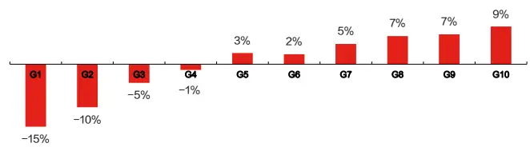
图 9：剔除超大单后的早盘大单买入占比在中证全指内的选股表现（原始值）分组对冲年化收益
月度 RankIC 序列

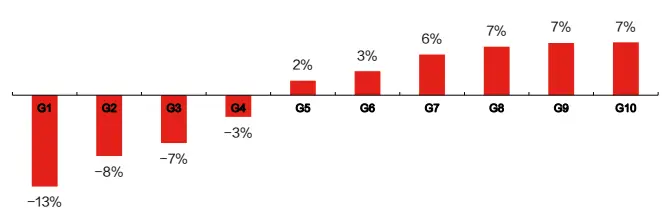

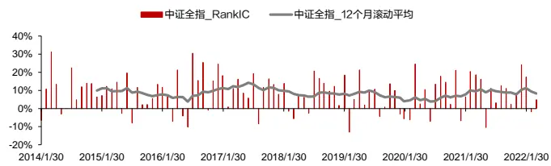
多空组合净值及回撤

月度 RankIC 序列
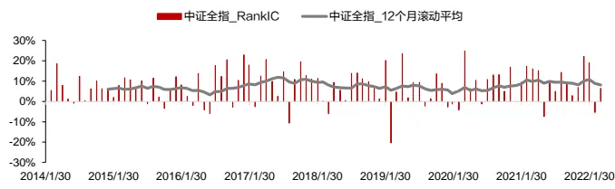
多空组合净值及回撤

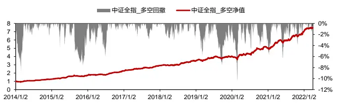
数据来源：wind & 上交所 & 深交所 & 东方证券研究所

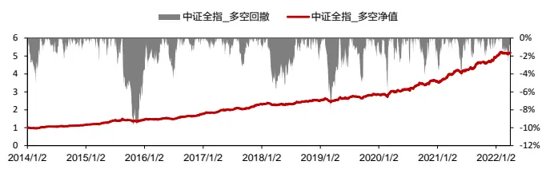
数据来源：wind & 上交所 & 深交所 & 东方证券研究所

## 3.2剔除超大单影响后的大单涨跌幅

分别记S、 $S_{1},\ S_{2}$ 为所有主动订单为大单、超大单和普通大单的订单集合， $\Delta lnP_{i}$ 为每笔成交数据下的对数价格变动，则剔除超大单影响后的普通大单涨跌幅因子= $\Sigma_{i\in S_{2}}\Delta lnP_{i}$ ，且大单、超大单、普通大单涨跌幅之间的关系为：

大单涨跌幅 $(~\sum_{i\in S}\Delta lnP_{i}~)~=$ 超大单涨跌幅 $(\sum_{i\in S_{1}}\Delta lnP_{i}\ )$ +普通大单涨跌幅 $(\sum_{i\in S_{2}}\Delta lnP_{i}\ )$

图 10-12 分别记录了剔除超大单前、后大单涨跌幅因子的变化，以及剔除超大单后的全天、早盘普通大单涨跌幅在中证全指内的选股表现，从中可以发现如下特点：

（1） 剔除超大单影响后，大单涨跌幅因子选股效果小幅提升，沪深 300 股票池基本不变。

（2） 剔除超大单前、后的大单涨跌幅因子，在小市值股票池的选股能力均优于大市值股票池，是否剔除超大单对沪深 300股票池的选股能力基本无影响。

（3） 剔除超大单前、后的早盘大单涨跌幅在各个样本池的表现均优于大单涨跌幅。

（4） 剔除超大单后的大单因子和早盘大单因子在中证全指中的分组收益单调性较好，空头超额收益较为显著。

有关分析师的申明，见本报告最后部分。其他重要信息披露见分析师申明之后部分，或请与您的投资代表联系。并请阅读本证券研究报告最后一页的免责申明。

图 10：剔除超大单前、后的大单涨跌幅、早盘大单涨跌幅的因子表现剔除超大单前、后的大单涨跌幅

| 因子 |  |  |  |  |  |  |  |  |  |  | 行业市值中性 |  |  |  |  |  |  |  |  |  |  |
| --- | --- | --- | --- | --- | --- | --- | --- | --- | --- | --- | --- | --- | --- | --- | --- | --- | --- | --- | --- | --- | --- |
|  |  |  |  |  |  |  |  |  |  |  |  |  |  |  |  |  | 夏普率 |  |  |  |  |
| 大单涨跌幅 (未剔除超大单) | 沪深300 中证500 | IC月度均值 5.42% |  |  |  |  |  |  |  |  |  | IC月度均值 IC_IR t值 |  |  |  |  |  |  |  |  |  |
|  |  |  | 1.53 | 4.4 | 13.49% | 0.84 | 夏普率 62.63% | 月胜率 -27.36% | 76% |  | 沪深300 | 3.55% | 1.44 | 4.14 | 年化收益 11.09% |  | 0.86 | 月胜率 67.68% | -23.54% | 69% |  |
|  |  |  | 6.37% | 2 | 5.73 | 21.19% | 1.43 | 71.72% | -24.56% | 77% | 中证500 |  |  |  | 5.62 | 20.34% | 1.66 | 69.70% |  | -18.82% | 72% |
|  |  | 中证800 | 5.90% | 1.96 | 5.62 | 18.08% | 1.38 | 66.67% | -21.42% | 76% |  | 中证800 | 4.29% 3.99% | 1.96 1.79 | 5.13 | 15.73% |  | 1.51 | 65.66% | -19.05% | 71% |
|  |  | 中证1000 | 6.87% | 2.38 | 6.83 | 24.20% | 1.79 | 68.69% | -16.57% | 76% |  | 中证1000 | 5.44% | 2.32 | 6.67 | 20.75% |  | 1.97 | 70.71% | -13.51% | 73% |
|  |  | 中证全指 | 7.18% | 2.69 | 7.74 | 25.28% | 1.95 | 72.73% | -17.90% | 76% |  | 中证全指 | 4.96% | 2.18 | 6.27 | 18.28% | 1.72 |  | 69.70% | -17.08% | 68% |
|  |  |  | RankIC |  |  |  |  |  |  |  |  |  | RanklC |  |  |  |  |  |  |  |  |
| 大单涨跌幅 (剔除超大单) |  |  |  |  |  |  |  |  |  |  | IC月度均值 IC_IR t值 |  |  |  |  |  |  |  |  |  |  |
|  | 沪深300 | IC月度均值 5.49% | IC_IR 1.56 |  | t值 4.47 | 年化收益 13.48% | 夏普率 0.84 | 月胜率 61.62% | 最大回撤 -27.80% | 多头月换手 76% | 沪深300 | 3.66% | 1.48 |  | 4.26 | 年化收益 10.86% | 夏普率 0.83 | 月胜率 67.68% | 最大回撤 -25.91% |  | 多头月换手 69% |
|  | 中证500 | 6.66% | 2.09 |  | 6 | 21.60% | 1.45 | 72.73% | -25.09% | 77% | 中证500 | 4.53% |  | 2.09 | 6 | 20.70% | 1.66 | 68.69% |  | -19.20% | 72% |
|  | 中证800 | 6.10% | 2.03 |  | 5.83 | 18.42% | 1.42 | 65.66% | -21.34% | 76% | 中证800 | 4.18% |  | 1.88 | 5.4 | 15.99% | 1.52 |  |  | -19.37% | 71% |
|  | 中证1000 | 7.51% | 2.57 |  | 7.39 | 26.81% | 1.99 | 71.72% | -15.93% | 77% | 中证1000 | 5.93% |  |  | 7.23 | 21.64% | 1.96 | 70.71% 72.73% | -13.23% |  | 73% |
|  |  | 中证全指 7.84% | 2.93 |  | 8.41 | 27.00% | 2.08 | 73.74% | -17.17% | 76% | 中证全指 | 5.48% | 2.52 2.41 |  | 6.93 | 19.55% | 1.85 | 71.72% | -16.65% |  | 67% |

剔除超大单前、后的早盘大单涨跌幅

| 因子 | 原始值 |  |  |  |  |  |  |  |  |  | 行业市值中性 RankIC |  |  |  |  |  |  |  |  |
| --- | --- | --- | --- | --- | --- | --- | --- | --- | --- | --- | --- | --- | --- | --- | --- | --- | --- | --- | --- |
|  | RankIC |  |  |  |  |  |  | 多头月换手 |  |  |  |  |  |  | 多空组合 月胜率 |  |  |  |  |
| 早盘大单涨跌幅 (未剔除超大单) | IC月度均值 沪深300 |  |  |  |  |  |  |  |  |  | IC_IR t值 |  |  | 夏普率 |  |  | 最大回撤 多头月换手 |  |  |
|  | 7.29% | IC_IR 1.88 | t值 5.39 | 年化收益 17.46% | 夏普率 | 65.66% | 月胜率 最大回撤 -29.40% | 75% |  | 沪深300 | IC月度均值 4.80% |  | 5.35 | 年化收益 16.34% | 1.34 | 70.71% | -21.99% |  |  |
|  |  |  |  |  | 25.55% | 0.98 1.64 | 71.72% | -27.84% |  | 中证500 | 6.29% | 1.86 2.75 | 7.89 | 24.54% |  |  | 73.74% | -19.02% | 67% 70% |
|  | 中证500 中证800 | 7.94% 7.60% | 2.47 2.42 | 7.08 6.96 | 23.36% |  | 66.67% | -29.69% | 78% 76% | 中证800 |  | 5.82% | 2.59 | 7.44 | 22.88% |  |  | -21.65% |  |
|  | 中证1000 | 8.63% | 2.84 | 8.15 | 29.76% | 1.54 2.23 | 75.76% | -16.59% | 78% | 中证1000 | 7.16% |  | 8.4 |  | 25.34% | 2 2.36 | 76.77% 78.79% | -14.09% | 69% 72% |
|  | 中证全指 | 8.85% | 3.3 | 9.47 | 30.34% | 2.28 | 77.78% | -19.18% | 78% | 中证全指 |  | 6.89% | 2.93 3.05 | 8.77 | 24.25% | 2.29 | 76.77% | -17.29% | 70% |
| 早盘大单涨跌幅 |  |  |  |  |  |  |  |  |  |  |  | RankIC |  |  |  |  |  |  |  |
|  |  |  | RanklC |  | 年化收益 |  | 多空组合 月胜率 | 最大回撤 | 多头月换手 |  |  |  |  |  |  |  | 多空组合 |  |  |
|  |  | IC月度均值 | IC_IR | t值 |  | 夏普率 |  |  |  |  |  | IC月度均值 | IC_IR | t值 | 年化收益 | 夏普率 | 月胜率 | 最大回撤 | 多头月换手 |
|  | 沪深300 | 7.31% | 1.89 | 5.42 | 18.05% | 1.01 | 65.66% | -29.39% | 75% |  | 沪深300 | 4.82% 6.40% | 1.88 2.82 | 5.41 | 16.50% | 1.32 | 68.69% | -22.43% | 67% |
|  | 中证500 | 8.08% | 2.51 2.46 | 7.2 7.07 | 25.09% 23.89% | 1.66 | 73.74% 70.71% | -26.58% | 78% -29.14% 76% |  | 中证500 中证800 | 5.87% | 2.63 | 8.11 7.55 | 23.95% 22.67% | 2.02 | 76.77% 76.77% | -18.68% | 70% 69% |
|  | 中证800 中证1000 | 7.70% 8.98% | 2.96 | 8.49 | 31.13% | 1.59 |  | -16.22% | 78% |  | 中证1000 |  |  |  | 25.86% | 2.01 2.35 | 80.81% | -21.30% -13.25% | 73% |
|  | 中证全指 | 9.22% | 3.44 |  | 9.89 | 31.88% | 2.32 2.38 | 77.78% 77.78% | -18.47% | 78% | 中证全指 | 7.37% 7.15% | 3.03 3.17 | 8.7 9.11 | 25.38% | 2.48 | 80.81% | -16.22% | 69% |

数据来源：wind & 上交所 & 深交所 & 东方证券研究所

图 11：剔除超大单后的大单涨跌幅在中证全指内的选股表现（原始值）
图 12：剔除超大单后的早盘大单涨跌幅在中证全指内的选股表现（原始值）
分组对冲年化收益
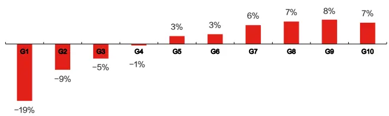

分组对冲年化收益
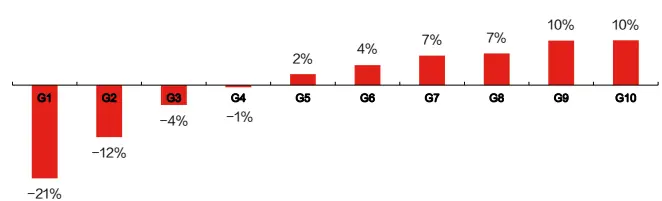

月度 RankIC 序列
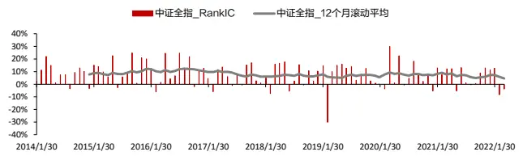

月度 RankIC 序列
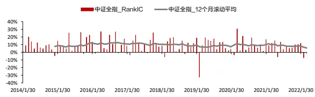

多空组合净值及回撤
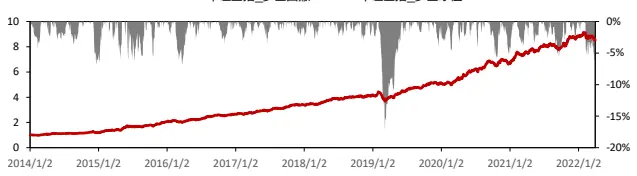
多空组合净值及回撤
数据来源：wind & 上交所 & 深交所 & 东方证券研究所

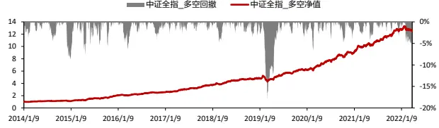
数据来源：wind & 上交所 & 深交所 & 东方证券研究所

有关分析师的申明，见本报告最后部分。其他重要信息披露见分析师申明之后部分，或请与您的投资代表联系。并请阅读本证券研究报告最后一页的免责申明。

## 3.3超大单阈值的参数敏感性分析

上文涉及的超大单均采用当日个股总成交金额的 1%为阈值进行划分，本小节测算了超大单阈值从 5%到 0.1%这个较大范围内不同取值下的大单因子表现。超大单的阈值决定了计算大单因子时需要剔除的大单的门槛，阈值越高需要剔除的大单越少，因子取值上也越接近原始大单因子。

从不同超大单阈值下（全天/早盘）大单买入占比的选股效果来看（图13），当超大单阈值取5%时，沪深300选股效果几乎没有影响，但其他样本空间有一定幅度提升，随着阈值的降低（剔除的超大单变多），多数样本空间因子效果有一个先变好后变差的过程，变好主要是因为剔除了一部分由于过度投机和流动性冲击导致的负向影响，变差是因为剔除的大单因子过多，用于捕捉资金优势一方买卖方向及强度的信息变少，这两者需要权衡，从实证结果来看，对于多数样本空间，超大单阈值位于 0.5%至 2%这个区间都可以获取一个较好的选股效果。另外需要注意的是，对于沪深 300 这样的大市值股票，剔除超大单对因子选股效果影响不大，选股效果显著提升的是包括中证 500在内的中小市值股票。

图 13：不同超大单阈值下的大单买入占比因子表现（原始值）

| 超大单阈值 | (全天)大单买入占比 RankIC |  |  |  |  |  |  |  | 早盘大单买入占比 |  |  |  |  |  |  |  |  |
| --- | --- | --- | --- | --- | --- | --- | --- | --- | --- | --- | --- | --- | --- | --- | --- | --- | --- |
|  | IC月度均值 |  |  |  | 多空组合 夏普率 |  |  |  | IC月度均值 |  | RankiC IC_IR |  | 年化收益 | 夏普率 | 多空组合 月胜率 | 最大回撤 |  |
| 对照组 未剔除超大单 | 沪深300 中证500 | IC_IR 5.04% 1.06 3.77% | t值 3.05 | 年化收益 16.88% | 0.91 | 月胜率 60.61% | 最大回撤 -27.27% | 多头月换手 75% | 沪深300 | 7.47% | 1.72 | t值 4.93 | 26.14% | 1.58 | 67.68% | -19.67% | 多头月换手 73% |
|  |  | 1.23 | 3.55 | 15.12% | 1.22 | 68.69% | -14.14% | 77% |  | 5.71% |  |  |  | 1.64 | 66.67% | -17.16% | 75% |
|  | 中证800 3.95% | 1.08 | 3.11 | 14.34% | 1.03 | 65.66% | -18.23% | 76% | 中证500 | 6.08% | 1.89 1.84 | 5.43 5.29 | 21.91% 22.19% | 1.68 | 67.68% | -17.07% | 74% |
|  | 中证1000 中证全指 | 3.05% | 1.04 | 2.99 | 14.52% | 1.29 | 67.68% | -16.03% | 76% | 中证800 中证1000 | 4.69% | 1.68 | 4.83 | 18.64% | 1.7 | 65.66% -16.60% | 75% |
| 3.19% |  | 1.07 | 3.08 | 14.34% | 1.34 | 69.70% | -16.40% | 77% | 中证全指 | 4.83% | 1.75 | 5.03 | 18.36% 1.77 | 72.73% | -12.76% | 75% |  |
|  |  | RankIC |  |  |  | 多空组合 |  |  |  | RankIC |  |  |  | 多空组合 |  |  |  |
| 当天总成交金额的 5% | 沪深300 中证500 中证800 中证1000 | IC月度均值 5.20% | IC_IR 1.09 | t值 3.12 | 年化收益 16.98% | 夏普率 0.95 | 月胜率 65.66% | 最大回撤 -20.72% | 多头月换手 76% 77% | 沪深300 | IC月度均值 7.47% | IC_IR t值 |  | 年化收益 夏普率 1.66 | 月胜率 64.65% | 最大回撤 -19.03% | 多头月换手 74% |
|  |  | 3.98% | 1.38 | 3.95 | 12.05% | 1.11 | 64.65% |  |  | 中证500 5.65% | 1.71 2 | 4.91 5.74 | 27.37% 17.47% | 1.41 | 65.66% | -19.65% | 76% |
|  |  | 4.15% | 1.17 | 3.37 | 13.62% | 1.07 | 65.66% | -18.91% -19.46% |  | 中证800 |  |  | 20.43% | 1.64 | 67.68% | -18.45% | 75% |
|  |  | 4.29% 4.94% | 1.53 | 4.39 | 14.02% | 1.32 | 69.70% | 76% -17.60% 76% | 中证1000 | 6.11% 5.13% | 1.94 1.96 | 5.56 5.63 | 15.71% | 1.56 | 69.70% | -13.11% | 76% |
| 中证全指 |  |  |  |  | 1.56 67.68% | -16.51% | 75% | 中证全指 | 5.63% | 2.17 | 6.22 | 17.89% | 1.99 | 72.73% -9.87% | 76% |  |  |
| 沪深300 当天总成交金额的 中证500 |  | IC月度均值 | RankIC IC_IR | t值 | 年化收益 | 夏普率 | 多空组合 月胜率 | 最大回撤 | 多头月换手 |  | RankIC IC月度均值 IC_IR | t值 | 年化收益 | 夏普率 | 多空组合 月胜率 | 最大回撤 | 多头月换手 |
|  |  | 5.48% | 1.2 | 3.45 | 16.55% | 0.94 | 61.62% | -23.43% | 72% | 沪深300 |  |  |  |  | 64.65% | -21.04% | 75% |
|  |  | 5.35% | 1.86 | 5.34 | 12.78% | 1.17 | 63.64% | -24.93% |  | 7.43% 中证500 6.08% | 1.82 2.28 | 5.22 6.56 | 22.96% 15.30% | 1.51 1.35 | 61.62% -21.60% | 77% |  |
| 2% 中证800 中证1000 中证全指 |  | 5.08% 1.54 6.78% 2.33 2.56 | 4.44 6.7 7.36 | 14.27% 18.50% 21.70% | 1.17 1.67 2.2 | 64.65% 71.72% 70.71% | -25.43% -13.27% -9.25% | 73% 72% 71% 71% | 中证800 中证1000 中证全指 | 6.37% 6.40% 6.81% | 2.23 2.59 2.85 | 6.42 7.44 8.18 | 17.81% 17.85% 19.66% | 1.66 1.79 2.33 | 71.72% 70.71% 74.75% | -18.72% -12.52% -8.65% | 76% 75% 74% |
| 当天总成交金额的 1% | 沪深300 中证500 中证800 | 7.28% RanklC IC月度均值 |  | t值 | 年化收益 | 夏普率 | 多空组合 月胜率 | 最大回撤 |  |  | RankIC |  |  |  | 多空组合 |  |  |
|  |  |  | IC_IR 1.13 | 3.25 |  |  |  | 多头月换手 |  | IC月度均值 | IC_IR 1.8 | t值 | 年化收益 | 夏普率 | 月胜率 最大回撤 | 多头月换手 |  |
|  | 4.90% 6.15% |  | 5.95 | 14.42% 15.47% | 0.9 1.39 | 61.62% 67.68% | -27.52% -20.32% | 69% 71% | 沪深300 中证500 | 6.78% 5.96% |  | 5.16 6.56 | 19.03% 1.35 1.21 | 65.66% 67.68% | -23.76% -20.53% | 72% 74% |  |
|  | 5.54% 8.29% 2.62 |  | 2.07 1.78 5.11 | 15.77% 22.47% | 1.41 1.88 | 70.71% 73.74% | -22.09% -16.80% | 70% 69% | 中证800 中证1000 | 6.18% 7.13% | 2.28 2.33 2.72 | 6.68 7.81 | 12.74% 16.52% 19.40% | 1.66 75.76% | -20.39% | 73% 74% |  |
| 当天总成交金额的 0.8% | 中证全指 沪深300 | 8.58% RankIC | 3.01 8.66 | 25.04% | 2.41 | 77.78% 多空组合 | -10.50% | 70% | 中证全指 | 7.48% | 3.13 | 8.98 | 20.42% | 1.94 2.33 | 71.72% -13.36% 74.75% -9.88% | 73% |  |
|  |  | IC月度均值 | IC_IR | t值 | 年化收益 | 夏普率 |  | 多头月换手 |  |  | RankIC |  |  |  | 多空组合 |  |  |
|  | 4.99% 6.31% | 1.2 | 3.45 | 15.12% | 0.98 | 月胜率 57.58% | 最大回撤 -26.97% | 68% | IC月度均值 沪深300 6.50% | IC_IR 1.8 | t值 5.18 | 年化收益 18.82% | 夏普率 1.41 | 月胜率 最大回撤 | 多头月换手 |  |  |
|  | 中证500 中证800 5.78% 中证1000 8.61% |  | 2.04 | 5.85 | 13.99% 15.31% | 1.24 1.33 64.65% | 65.66% -22.20% -25.29% | 71% 70% | 中证500 中证800 | 5.70% 5.98% | 2.13 2.25 | 6.13 6.45 | 11.71% 14.69% | 62.63% 1.06 59.60% 1.43 67.68% | -23.11% -22.43% -22.53% | 71% 73% 72% |  |

数据来源：wind & 上交所 & 深交所 & 东方证券研究所

有关分析师的申明，见本报告最后部分。其他重要信息披露见分析师申明之后部分，或请与您的投资代表联系。并请阅读本证券研究报告最后一页的免责申明。

和大单买入占比类似，适当剔除一定比例的超大单后，（全天/早盘）大单涨跌幅的选股效果多数有所改善，但差异幅度相对大单买入占比明显更小，因子对超大单阈值参数也更不敏感。

图 14：不同超大单阈值下的大单涨跌幅因子表现（原始值）

| 超大单阈值 |  | (全天)大单涨跌幅 |  |  |  | 早盘大单涨跌幅 |  |  |  |
| --- | --- | --- | --- | --- | --- | --- | --- | --- | --- |
| 对照组未剔除超大单 |  |  |  |  |  | RanklC | 多空组合 |  |  |
|  |  | IC月度均值IC_IR t值 | 年化收益夏普率 月胜率 最大回撤 多头月换手 |  |  | IC月度均值IC_IR t值 | 年化收益 夏普率 月胜率 | 最大回撤多头月换手 |  |
|  | 中证500 | 6.37% 2 5.73 | 21.19% 1.43 71.72% | -24.56% 77% | 中证500 | 7.94% 2.47 7.08 | 25.55% 1.64 71.72% | -27.84% | 78% |
|  | 中证800 | 5.90% 1.96 5.62 | 18.08% 1.38 66.67% | -21.42% 76% | 中证800 | 7.60% 2.42 6.96 | 23.36% 1.54 66.67% | -29.69% | 76% |
|  | 中证1000 | 6.87% 2.38 6.83 | 24.20% 1.79 68.69% | -16.57% 76% | 中证1000 | 8.63% 2.84 8.15 | 29.76% 2.23 75.76% | -16.59% | 78% |
|  | 中证全指 | 7.18% 2.69 7.74 | 25.28% 1.95 72.73% | -17.90% 76% | 中证全指 | 8.85% 3.3 9.47 | 30.34% 2.28 77.78% | -19.18% | 78% |
| 当天总成交金额的5% |  | RankIC | 多空组合 |  |  | RankIC | 多空组合 |  |  |
|  |  | IC月度均值 IC_IR t值 | 年化收益 夏普率 月胜率 | 最大回撤多头月换手 |  | IC月度均值IC_IR t值 | 年化收益 夏普率 月胜率 | 最大回撤多头月换手 |  |
|  | 沪深300中证500 |  |  |  |  |  |  |  |  |
|  |  | 6.38% 2 5.74 | 21.14% 1.43 70.71% | -24.52% 77% | 中证500 | 7.96% 2.47 7.1 | 25.64% 1.67 71.72% | -27.45% 78% |  |
|  | 中证800 | 5.91% 1.96 5.63 | 17.94% 1.37 66.67% | -21.42% 76% | 中证800 | 7.61% 2.43 6.97 | 23.58% 1.56 66.67% | -29.69% 76% |  |
|  | 中证1000 | 6.91% 2.39 6.86 | 24.37% 1.81 69.70% | -16.42% 76% | 中证1000 | 8.63% 2.84 8.14 | 29.95% 2.25 75.76% | -16.45% 78% |  |
|  | 中证全指 | 7.23% 2.72 7.8 | 25.35% 1.95 72.73% | -17.85% 76% | 中证全指 | 8.88% 3.3 9.49 | 30.62% 2.3 78.79% | -19.23% 78% |  |
| 当天总成交金额的2% |  |  |  |  |  |  |  |  |  |
|  |  | IC月度均值 IC_IR t值 | 年化收益 夏普率 月胜率 | 最大回撤多头月换手 |  | IC月度均值IC_IR t值 | 年化收益 夏普率 月胜率 | 最大回撤多头月换手 |  |
|  | 沪深300中证500 |  |  |  |  |  |  |  |  |
|  |  | 6.49% 2.04 5.85 | 21.66% 1.45 68.69% | -24.63% 77% | 中证500 | 8.01% 2.48 7.13 | 25.81% 1.65 69.70% | -27.57% 78% |  |
|  | 中证1000 | 7.14% 2.46 7.07 | 25.09% 1.85 70.71% | -16.31% 76% | 中证1000 | 8.76% 2.88 8.27 | 30.55% 2.32 80.81% | -16.41% 78% |  |
|  | 中证全指 | 7.48% 2.81 8.06 | 25.99% 1.99 74.75% | -17.63% 76% | 中证全指 | 9.03% 3.37 9.67 | 31.06% 2.33 78.79% | -19.29% 78% |  |
| 当天总成交金额的1% |  |  |  |  |  | RankIC | 多空组合 |  |  |
|  |  | IC月度均值IC_IR t值 | 年化收益夏普率 月胜率 | 最大回撤 多头月换手 |  | IC月度均值IC_IR t值 | 年化收益 夏普率 月胜率 | 最大回撤多头月换手 |  |
|  | 沪深300中证500 | 5.49% 1.56 4.476.66% 2.09 6 |  |  |  |  |  |  |  |
|  |  |  | 21.60% 1.45 72.73% | -25.09% 77% | 中证500 | 8.08% 2.51 7.2 | 25.09% 1.66 73.74% | -26.58% 78% |  |
|  | 中证1000 | 7.51% 2.57 7.39 | 26.81% 1.99 71.72% | -15.93% 77% | 中证1000 | 8.98% 2.96 8.49 | 31.13% 2.32 77.78% | -16.22% 78% |  |
|  | 中证全指 | 7.84% 2.93 8.41 | 27.00% 2.08 73.74% | -17.17% 76% | 中证全指 | 9.22% 3.44 9.89 | 31.88% 2.38 77.78% | -18.47% 78% |  |
| 当天总成交金额的0.8% |  |  |  |  |  |  |  |  |  |
|  |  | IC月度均值 IC_IR t值 | 年化收益 夏普率 月胜率 | 最大回撤 多头月换手 |  | IC月度均值IC_IR t值 | 年化收益 夏普率 月胜率 | 最大回撤多头月换手 |  |
|  | 沪深300中证500 | 5.50% 1.56 4.486.72% 2.11 6.05 | 13.37% 0.83 61.62%22.07% 1.49 72.73% | -27.87% 76% | 沪深300 | 7.32% 1.9 5.45 | 17.78% 0.99 66.67% | -29.64% 76% |  |
|  | 中证1000 | 7.63% 2.61 7.5 | 26.91% 2.01 71.72% | -15.52% 77% | 中证1000 | 9.05% 2.99 8.58 | 31.27% 2.31 77.78% | -15.76% 78% |  |
|  | 中证全指 | 7.97% 2.98 8.56 | 27.39% 2.12 76.77% | -17.37% 76% | 中证全指 | 9.29% 3.47 9.98 | 32.28% 2.44 80.81% | -18.59% 78% |  |
| 当天总成交金额的0.5% |  | RankIC | 多空组合 |  |  | RankIC | 多空组合 |  |  |
|  |  | IC月度均值 IC_IR t值 | 年化收益夏普率 月胜率 | 最大回撤多头月换手 |  | IC月度均值IC_IR t值 | 年化收益 夏普率 月胜率 | 最大回撤多头月换手 |  |
|  | 沪深300中证500中证800 | 5.53% 1.58 4.546.86% 2.17 6.24 | 13.18% 0.81 63.64% | -28.01% 76% | 沪深300 | 7.23% 1.88 5.39 | 19.59% 1.1 65.66% | -27.13% 75% |  |
|  |  |  | 22.29% 1.51 70.71% | -23.77% 77% | 中证500 | 8.04% 2.52 7.24 |  |  |  |
|  |  | 6.25% 2.11 6.06 | 18.42% 1.41 68.69% | -21.30% 76% | 中证800 | 7.65% 2.48 7.12 | 23.74% 1.59 67.68% | -28.75% 76% |  |
|  | 中证全指 | 8.26% 3.1 8.91 | 27.61% 2.14 75.76% | -17.25% 76% | 中证全指 | 9.42% 3.56 10.23 | 33.30% 2.54 81.82% | -18.24% 79% |  |
| 当天总成交金额的0.2% |  | RanklC | 多空组合 |  |  | RankIC | 多空组合 |  |  |
|  |  | IC月度均值IC_IR t值 | 年化收益夏普率 月胜率 | 最大回撤 多头月换手 |  | IC月度均值IC_IR t值 | 年化收益 夏普率 月胜率 | 最大回撤多头月换手 |  |
|  | 沪深300中证500中证800中证1000中证全指 | 5.44% 1.58 4.557.05% 2.27 6.526.28% 2.19 6.298.32% 2.94 8.45 | 11.84% 0.75 62.63% | -26.88% 76% | 沪深300 | 7.13% 1.88 5.41 | 19.25% 1.07 68.69% | -28.19% 76% |  |
|  |  |  | 23.73% 1.65 74.75% | -23.47% 78% | 中证500 | 7.79% 2.5 7.17 | 25.84% 1.73 70.71% | -24.75% 78% |  |
|  |  |  | 19.52% 1.49 69.70%29.35% 2.13 73.74% |  |  |  |  |  |  |
|  |  | 8.54% 3.29 9.45 | 30.23% 2.35 77.78% | -15.93% 76% | 中证全指 | 9.36% 3.66 10.52 | 33.64% 2.49 84.85% | -17.80% 79% |  |
| 当天总成交金额的0.1% |  | RankIC | 多空组合 |  |  | RankIC | 多空组合 |  |  |
|  |  | IC月度均值IC_IR t值 | 年化收益 夏普率 月胜率 | 最大回撤多头月换手 |  | IC月度均值IC_IR t值 | 年化收益 夏普率 月胜率 | 最大回撤多头月换手 |  |
|  | 沪深300中证500中证800中证1000中证全指 | 5.36% 1.6 4.587.08% 2.32 6.66 | 12.31% 0.77 63.64% | -27.30% 75% | 沪深300 | 6.85% 1.86 5.35 | 21.23% 1.13 69.70% | -28.97% 76% |  |
|  |  |  | 25.12% 1.8 75.76% | -22.10% 78% | 中证500 | 7.36% 2.49 7.15 | 24.06% 1.7 75.76% | -23.25% 80% |  |
|  |  | 6.21% 2.24 6.438.36% 3.05 8.778.41% 3.35 9.63 | 20.42% 1.63 70.71% | -18.82% 76% | 中证800 | 7.05% 2.49 7.14 | 22.63% 1.59 75.76% | -27.55% 78% |  |
|  |  |  | 29.49% 2.25 76.77%32.44% 2.04 75.76% | -13.64% 78%-26.91% 78% | 中证1000中证全指 | 8.78% 3.28 9.418.82% 3.62 10.41 | 32.31% 2.64 80.81%31.38% 2.41 83.84% | -13.47% 80%-16.38% 80% |  |

数据来源：wind & 上交所 & 深交所 & 东方证券研究所

## 四、大单因子的因子衰减

本章将研究剔除超大单后大单因子的因子衰减情况，具体从 RankIC 的衰减速度以及不同形成期持有期的多空组合收益两个角度进行分析。

## 4.1 RankIC 的衰减速度

在报告《基于大单的 alpha 因子构建》中，我们曾用 3个月、12个月的长平滑周期计算大单因子并发现长周期下的大单因子仍然具有显著的选股效果。本小节计算了剔除超大单后的大单因子不同平滑周期、不同滞后期的月度 RankIC 均值，其中滞后期是指计算 IC 时涉及到的因子值和次月收益率间的时间跨度。

图 15：大单买入占比的 RankIC衰减（中证全指、原始值）大单买入占比
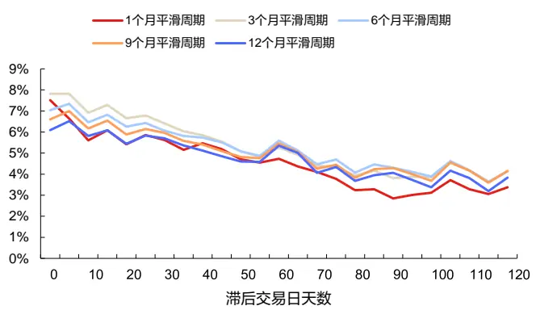
早盘大单买入占比

图 16：大单涨跌幅的 RankIC衰减（中证全指、原始值）大单涨跌幅
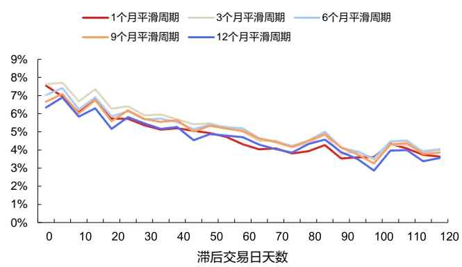

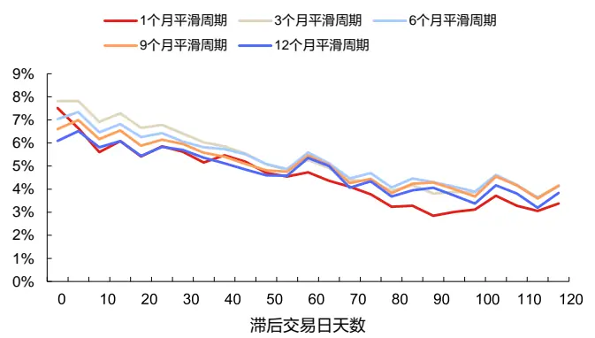
数据来源：wind & 上交所 & 深交所 & 东方证券研究所

早盘大单涨跌幅
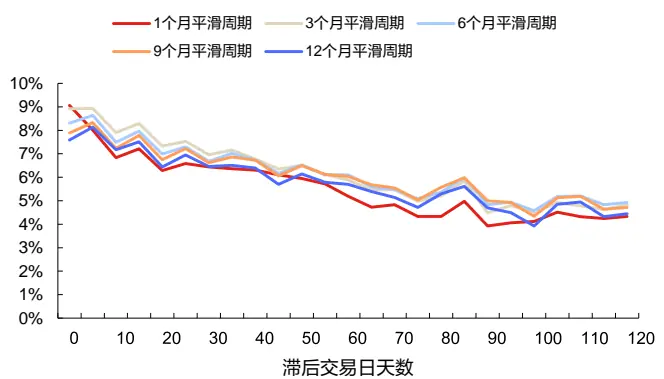
数据来源：wind & 上交所 & 深交所 & 东方证券研究所

我们分别对大单因子取 1、3、6、9、12 个月的平滑周期，并依次计算滞后期为 5、10、15……120个交易日下的月度RankIC（20个交易日），得到上述RankIC的衰减图像。从中有如下几个发现：

（1） 四类大单因子的信息衰减速度较慢，1 个月平滑期下的因子的半衰期大致都在 70 个交易日左右；

（2） 当滞后交易日天数超过 80天时，四个因子 RankIC的衰减速度明显下降。

有关分析师的申明，见本报告最后部分。其他重要信息披露见分析师申明之后部分，或请与您的投资代表联系。并请阅读本证券研究报告最后一页的免责申明。

## 4.2不同形成期持有期的多空收益

进一步地，我们参考 Jegadeesh 和 Titman 研究动量效应时采用的方法，放松对因子形成期和持有期的限制，在周频维度测试当因子形成期和持有期分别取 1、2、4、8、12、25、36、50时的年化多空收益。

下图展示的是剔除超大单后的大单买入占比和大单涨跌幅因子在中证全指股票池下计算得到的各组合年化多空收益。从图中可以看出，大单相关因子即使形成期和持有期较长时（比如形成期和持有期为12周）依然有较显著的多空收益，如果不考虑交易成本，大单因子的最优形成期大概在 2-4周、最优持有期大概在 1-2周。

图 17：大单买入占比不同形成期持有期的多空收益（等权）大单买入占比

| 形成期 持有期 | 1周 | 2周 | 4周 | 8周 | 12周 | 25周 | 36周 | 50周 |
| --- | --- | --- | --- | --- | --- | --- | --- | --- |
| 1周 | 47.39% | 37.10% | 26.17% | 18.63% | 16.31% | 11.42% | 9.80% | 8.29% |
| 2周 | 51.79% | 41.25% | 30.52% | 22.54% | 20.01% | 14.19% | 12.34% | 10.45% |
| 4周 | 48.97% | 41.85% | 33.36% | 25.02% | 22.39% | 16.12% | 14.43% | 12.25% |
| 8周 | 44.14% | 37.72% | 30.70% | 25.93% | 23.02% | 17.54% | 15.56% | 13.41% |
| 12周 | 40.35% | 35.97% | 30.69% | 25.85% | 23.09% | 17.71% | 15.57% | 13.64% |
| 25周 | 28.33% | 26.39% | 24.06% | 21.41% | 20.24% | 16.77% | 14.91% | 13.31% |
| 36周 | 24.23% | 23.28% | 22.18% | 19.83% | 18.49% | 15.37% | 13.57% | 11.28% |
| 50周 | 22.10% | 21.81% | 20.60% | 18.84% | 17.57% | 13.59% | 11.25% | 9.05% |

（早盘）大单买入占比

图 18：大单涨跌幅不同形成期持有期的多空收益（等权）大单涨跌幅

| 形成期 持有期 | 1周 | 2周 | 4周 | 8周 | 12周 | 25周 | 36周 | 50周 |
| --- | --- | --- | --- | --- | --- | --- | --- | --- |
| 1周 | 37.41% | 31.39% | 27.25% | 21.54% | 18.41% | 14.82% | 12.93% | 11.53% |
| 2周 | 40.05% | 35.41% | 30.77% | 24.87% | 21.63% | 17.66% | 15.49% | 13.87% |
| 4周 | 38.03% | 34.58% | 30.95% | 26.33% | 23.57% | 19.65% | 17.13% | 15.56% |
| 8周 | 33.42% | 30.98% | 28.04% | 25.42% | 24.06% | 19.99% | 17.36% | 16.15% |
| 12周 | 30.56% | 27.50% | 26.83% | 24.98% | 23.23% | 19.50% | 17.16% | 16.10% |
| 25周 | 26.45% | 24.34% | 23.82% | 21.98% | 20.30% | 17.22% | 15.77% | 14.68% |
| 36周 | 22.84% | 22.25% | 22.46% | 21.26% | 19.91% | 17.00% | 15.38% | 13.98% |
| 50周 | 22.68% | 21.91% | 21.89% | 20.18% | 18.87% | 15.49% | 13.54% | 12.52% |

（早盘）大单涨跌幅

| 形成期持有期 | 1周 | 2周 | 4周 | 8周 | 12周 | 25周 | 36周 | 50周 |
| --- | --- | --- | --- | --- | --- | --- | --- | --- |
| 1周 2周 4周 8周 | 34.15% | 26.07% | 19.73% | 14.50% | 12.54% | 8.74% | 7.34% | 6.36% |
|  | 39.13% | 31.25% | 24.03% | 18.34% | 16.02% | 11.53% | 9.85% | 8.51% |
|  | 40.45% | 34.61% | 27.75% | 22.78% | 20.18% | 14.64% | 12.72% | 11.02% |
|  | 39.82% | 35.42% | 30.00% | 25.67% | 23.23% | 16.68% | 14.56% | 12.71% |
|  | 35.21% | 32.97% | 28.47% | 25.68% | 23.11% | 17.56% | 15.42% | 13.61% |
|  | 27.67% | 26.66% | 24.41% | 22.19% | 20.20% | 16.65% | 15.08% | 13.37% |
| 25周 36周 | 25.31% | 24.15% | 22.67% | 20.50% | 19.38% | 16.50% | 14.65% | 12.27% |
| 50周 | 23.19% | 22.85% | 21.93% | 19.79% | 18.51% | 15.14% | 12.50% | 10.21% |

数据来源：wind & 上交所 & 深交所 & 东方证券研究所

| 形成期 持有期 | 1周 | 2周 | 4周 | 8周 | 12周 | 25周 | 36周 | 50周 |
| --- | --- | --- | --- | --- | --- | --- | --- | --- |
| 1周 | 59.58% | 46.52% | 37.37% | 28.03% | 23.69% | 18.58% | 16.05% | 14.06% |
| 2周 | 61.12% | 50.56% | 40.27% | 31.25% | 27.25% | 21.67% | 18.84% | 16.52% |
| 4周 | 57.75% | 47.40% | 38.48% | 31.36% | 28.19% | 23.04% | 20.30% | 17.96% |
| 8周 | 44.58% | 39.51% | 34.76% | 30.57% | 28.35% | 23.55% | 20.89% | 18.79% |
| 12周 | 39.23% | 35.50% | 33.38% | 30.27% | 27.97% | 23.33% | 20.69% | 18.93% |
| 25周 | 33.53% | 30.99% | 29.32% | 27.35% | 25.58% | 22.03% | 20.30% | 18.84% |
| 36周 | 31.84% | 29.58% | 28.45% | 27.20% | 25.82% | 22.12% | 20.10% | 18.20% |
| 50周 | 30.96% | 28.77% | 28.39% | 27.07% | 25.36% | 21.53% | 19.11% | 17.04% |

数据来源：wind & 上交所 & 深交所 & 东方证券研究所

## 五、因子相关性分析

## 5.1 与常见大类因子相关性

为方便表示，下图分别用 L2F0、L2F1……L2F7 表示未剔除超大单的大单买入占比、未剔除超大单的早盘大单买入占比、剔除超大单的大单买入占比、剔除超大单的早盘大单买入占比、未剔除超大单的大单涨跌幅、未剔除超大单的早盘大单涨跌幅、剔除超大单的大单涨跌幅、剔除超大单的早盘大单涨跌幅。

图 19：大单相关因子与常见大类因子相关性（左下因子值，右上 RankIC，因子原始值）

|  | Value | Profitability | Growth | Governance Liquidity |  | Reversal | Lottery | Analyst | Surprise | L2F0 | L2F1 | L2F2 | L2F3 | L2F4 | L2F5 | L2F6 | L2F7 |
| --- | --- | --- | --- | --- | --- | --- | --- | --- | --- | --- | --- | --- | --- | --- | --- | --- | --- |
| Value |  | -0.09 | 0.07 | 0.53 | 0.47 | -0.26 | 0.85 | 0.49 | -0.02 | 0.40 | 0.35 | 0.64 | 0.65 | 0.05 | 0.15 | 0.06 | 0.17 |
| Profitability | 0.30 |  | 0.62 | 0.64 | -0.26 | -0.24 | -0.23 | 0.57 | 0.68 | 0.01 | 0.31 | -0.44 | -0.28 | 0.13 | 0.18 | 0.09 | 0.14 |
| Growth | 0.18 | 0.32 |  | 0.46 | -0.25 | -0.40 | -0.12 | 0.65 | 0.90 | 0.14 | 0.36 | -0.20 | -0.07 | 0.02 | 0.09 | -0.01 | 0.06 |
| Governance | 0.36 | 0.30 | 0.07 |  | 0.02 | -0.49 | 0.36 | 0.61 | 0.46 | 0.41 | 0.58 | 0.07 | 0.19 | 0.03 | 0.14 | 0.00 | 0.11 |
| Liquidity | 0.22 | -0.03 | -0.07 | 0.05 |  | 0.32 | 0.73 | 0.14 | -0.29 | 0.00 | -0.08 | 0.70 | 0.65 | 0.50 | 0.52 | 0.53 | 0.56 |
| Reversal | -0.08 | -0.10 | -0.15 | -0.13 | 0.21 |  | -0.07 | -0.25 | -0.43 | -0.74 | -0.75 | -0.04 | -0.19 | 0.05 | -0.02 | 0.09 | 0.01 |
| Lottery | 0.43 | 0.04 | -0.02 | 0.14 | 0.61 | 0.05 |  | 0.29 | -0.20 | 0.34 | 0.23 | 0.80 | 0.77 | 0.34 | 0.42 | 0.37 | 0.44 |
| Analyst | 0.30 | 0.30 | 0.25 | 0.15 | 0.03 | -0.06 | 0.09 |  | 0.60 | 0.18 | 0.38 | 0.12 | 0.24 | 0.10 | 0.23 | 0.09 | 0.21 |
| Surprise | 0.04 | 0.19 | 0.53 | 0.02 | -0.09 | -0.14 | -0.06 | 0.19 |  | 0.16 | 0.41 | -0.30 | -0.14 | 0.05 | 0.14 | 0.02 | 0.11 |
| L2F0 | 0.06 | -0.03 | 0.02 | 0.03 | 0.00 | -0.38 | 0.05 | 0.03 | 0.03 |  | 0.87 | 0.49 | 0.59 | 0.28 | 0.32 | 0.25 | 0.30 |
| L2F1 | 0.06 | 0.05 | 0.06 | 0.07 | 0.01 | -0.34 | 0.04 | 0.09 | 0.08 | 0.74 |  | 0.30 | 0.49 | 0.25 | 0.37 | 0.22 | 0.34 |
| L2F2 | 0.17 | -0.09 | -0.04 | 0.00 | 0.40 | -0.03 | 0.37 | 0.02 | -0.04 | 0.40 | 0.33 |  | 0.93 | 0.45 | 0.48 | 0.48 | 0.51 |
| L2F3 | 0.12 | -0.04 | -0.01 | 0.02 | 0.30 | -0.10 | 0.27 | 0.04 | 0.00 | 0.37 | 0.46 | 0.68 |  | 0.50 | 0.58 | 0.52 | 0.60 |
| L2F4 | 0.05 | 0.11 | -0.02 | 0.02 | 0.35 | -0.10 | 0.30 | 0.01 | 0.01 | 0.49 | 0.38 | 0.42 | 0.36 |  | 0.93 | 1.00 | 0.94 |
| L2F5 | 0.09 | 0.13 | 0.01 | 0.05 | 0.39 | -0.12 | 0.34 | 0.05 | 0.04 | 0.38 | 0.48 | 0.39 | 0.41 | 0.77 |  | 0.93 | 1.00 |
| L2F6 | 0.06 | 0.10 | -0.02 | 0.02 | 0.38 | -0.09 | 0.31 | 0.01 | 0.01 | 0.47 | 0.36 | 0.48 | 0.39 | 0.99 | 0.77 |  | 0.94 |
| L2F7 | 0.09 | 0.12 | 0.01 | 0.04 | 0.41 | -0.11 | 0.35 | 0.05 | 0.04 | 0.37 | 0.46 | 0.42 | 0.46 | 0.77 | 0.99 | 0.78 |  |

数据来源：wind & 上交所 & 深交所 & 东方证券研究所

分析因子值的截面秩相关系数和 RankIC的时序秩相关系数，有如下几点发现：

（1）除流动性、投机性大类因子以外，剔除超大单前、后的大单因子在因子取值上和常见大类因子的相关性均较低。其中，大单涨跌幅因子（L2F4-L2F7）和流动性、投机性大类因子的相关性较高，说明大单涨跌幅偏爱低流动性、低波动的股票；

（2）剔除超大单后，大单买入占比因子（L2F2、L2F3）和投机类因子的相关性有所上升，剔除超大单后因子更加偏好低投机性的股票；

（3）在剔除超大单后，大单买入占比在因子（L2F2、L2F3）取值以及因子 IC 上与反转因子的相关性均有所降低，说明被剔除的超大单具有较强反转特征。

## 5.2与常见量价因子相关性

从大单因子与常见日间量价因子的相关性来看，一方面对于大单买入因子而言，剔除超大单后的因子（L2F2、L2F3）与反转的相关性明显减弱、与波动、换手率的相关性明显增强；另一方面对于大单涨跌幅因子而言，剔除超大单以后的因子（L2F6、L2F7）仍与波动、换手、amihud 非流动性因子有较大相关性，说明低流动性、低波动的股票大单的冲击更易体现在涨跌幅上。

图 20：大单相关因子与常见日间量价因子相关性（左下因子值，右上 RankIC，因子原始值）

|  |  | VOL | LNTO | IVOL IVR RET LNAMIHUD MAXRET DWF |  |  |  |  |  | L2F0 L2F1 L2F2 L2F3 L2F4 L2F5 |  |  |  |  |  | L2F6 L2F7 |  |
| --- | --- | --- | --- | --- | --- | --- | --- | --- | --- | --- | --- | --- | --- | --- | --- | --- | --- |
| VOL |  |  | 0.93 | 0.90 | 0.04 | 0.12 | -0.07 | 0.89 | 0.93 | 0.34 | 0.26 | 0.80 | 0.76 | 0.37 | 0.44 | 0.39 | 0.47 |
| LNTO |  | 0.66 |  | 0.86 | 0.03 | 0.13 | -0.19 | 0.82 | 0.88 | 0.38 | 0.34 | 0.76 | 0.78 | 0.32 | 0.41 | 0.34 | 0.43 |
| IVOL |  | 0.85 | 0.58 |  | 0.38 | 0.33 | 0.06 | 0.91 | 0.93 | 0.13 | 0.04 | 0.72 | 0.67 | 0.37 | 0.42 | 0.39 | 0.44 |
| IVR |  | 0.29 | 0.21 | 0.67 |  | 0.59 | 0.40 | 0.26 | 0.25 | -0.50 | -0.53 | 0.08 | -0.01 | 0.05 | -0.01 | 0.07 | 0.02 |
| RET |  | 0.19 | 0.11 | 0.29 | 0.28 |  | 0.21 | 0.43 | 0.22 | -0.62 | -0.55 | 0.04 | -0.07 | -0.04 | -0.05 | 0.00 | -0.02 |
| LNAMIHUD |  | 0.04 | 0.13 | 0.10 | 0.11 | 0.03 |  | 0.09 | 0.07 | -0.33 | -0.45 | 0.16 | 0.07 | 0.42 | 0.32 | 0.45 | 0.36 |
| MAXRET |  | 0.87 | 0.56 | 0.83 | 0.38 | 0.48 | 0.08 |  | 0.89 | 0.04 | 0.00 | 0.70 | 0.62 | 0.29 | 0.36 | 0.33 | 0.39 |
| DWF |  | 0.70 | 0.53 | 0.71 | 0.38 | 0.20 | 0.09 | 0.67 |  | 0.23 | 0.16 | 0.79 | 0.74 | 0.42 | 0.48 | 0.45 | 0.51 |
| L2F0 |  | 0.01 | 0.13 | -0.06 | -0.13 | -0.46 | 0.00 | -0.15 | 0.01 |  | 0.87 | 0.49 | 0.59 | 0.28 | 0.32 | 0.25 | 0.30 |
| L2F1 |  | 0.00 | 0.15 | -0.06 | -0.11 | -0.36 | -0.02 | -0.13 | 0.02 | 0.74 |  | 0.30 | 0.49 | 0.25 | 0.37 | 0.22 | 0.34 |
|  | L2F2 | 0.33 | 0.39 | 0.29 | 0.11 | -0.01 | 0.24 | 0.26 | 0.31 | 0.40 | 0.33 |  | 0.93 | 0.45 | 0.48 | 0.48 | 0.51 |
|  | L2F3 | 0.23 | 0.32 | 0.19 | 0.05 | -0.08 | 0.19 | 0.15 | 0.22 | 0.38 | 0.47 | 0.68 |  | 0.50 | 0.58 | 0.52 | 0.60 |
|  | L2F4 | 0.27 | 0.30 | 0.20 | 0.01 | -0.24 | 0.34 | 0.13 | 0.24 | 0.49 | 0.38 | 0.42 | 0.36 |  | 0.93 | 1.00 | 0.94 |
|  | L2F5 | 0.31 | 0.35 | 0.25 | 0.07 | -0.21 | 0.31 | 0.17 | 0.29 | 0.38 | 0.48 | 0.39 | 0.41 | 0.77 |  | 0.93 | 1.00 |
|  | L2F6 | 0.29 | 0.32 | 0.22 | 0.02 | -0.22 | 0.36 | 0.15 | 0.26 | 0.47 | 0.36 | 0.47 | 0.39 | 0.99 | 0.77 |  | 0.94 |
| L2F7 |  | 0.32 | 0.36 | 0.26 | 0.08 | -0.20 | 0.33 | 0.18 | 0.29 | 0.37 | 0.46 | 0.42 | 0.46 | 0.77 | 0.99 | 0.78 |  |

数据来源：wind & 上交所 & 深交所 & 东方证券研究所

从大单因子与常见日内量价因子的相关性来看，一方面对于因子值的相关性，大单因子值与其他日内常见因子值的相关性较低，只有 IDMOM（日内温和收益、隔夜收益之和）与大单因子的相关性略高；另一方面对于因子 IC的相关性，大单买入占比因子在剔除超大单后与其余日内因子的 IC相关性变强、大单涨跌幅因子变化不明显。

图 21：大单相关因子与常见日内量价因子相关性（左下因子值，右上 RankIC，因子原始值）

|  | IDSKEW | IDKURT | IDJUMP | IDMOM | SDRVOL | SDRSKEW | SDRVOL | ARPP | APB | L2F0 | L2F1 | L2F2 | L2F3 | L2F4 | L2F5 | L2F6 | L2F7 |
| --- | --- | --- | --- | --- | --- | --- | --- | --- | --- | --- | --- | --- | --- | --- | --- | --- | --- |
| IDSKEW |  | 0.72 | 0.66 | 0.66 | 0.69 | 0.81 | 0.48 | -0.16 | 0.46 | 0.28 | 0.39 | 0.57 | 0.60 | 0.16 | 0.26 | 0.19 | 0.28 |
| IDKURT | 0.45 |  | 0.36 | 0.62 | 0.81 | 0.95 | 0.14 | -0.21 | 0.04 | 0.46 | 0.41 | 0.56 | 0.57 | -0.10 | -0.01 | -0.09 | 0.00 |
| IDJUMP | 0.53 | 0.20 |  | 0.57 | 0.33 | 0.39 | 0.19 | -0.28 | 0.48 | -0.14 | -0.14 | 0.61 | 0.51 | 0.26 | 0.31 | 0.30 | 0.35 |
| IDMOM | 0.41 | 0.19 | 0.69 |  | 0.61 | 0.66 | 0.08 | -0.01 | 0.12 | 0.51 | 0.43 | 0.76 | 0.79 | 0.38 | 0.47 | 0.40 | 0.49 |
| SDRVOL | 0.33 | 0.58 | 0.25 | 0.25 |  | 0.86 | 0.42 | -0.08 | 0.19 | 0.44 | 0.44 | 0.56 | 0.60 | 0.15 | 0.23 | 0.16 | 0.24 |
| SDRSKEW | 0.44 | 0.87 | 0.21 | 0.19 | 0.53 |  | 0.32 | -0.16 | 0.14 | 0.48 | 0.49 | 0.58 | 0.61 | 0.03 | 0.13 | 0.04 | 0.14 |
| SDRVOL | 0.27 | 0.29 | 0.21 | 0.12 | 0.46 | 0.37 |  | 0.07 | 0.41 | 0.02 | 0.23 | 0.09 | 0.16 | 0.25 | 0.35 | 0.25 | 0.34 |
| ARPP | 0.11 | 0.16 | -0.01 | 0.10 | 0.16 | 0.17 | 0.18 |  | 0.08 | 0.21 | 0.15 | -0.05 | -0.01 | 0.22 | 0.20 | 0.21 | 0.20 |
| APB | 0.30 | 0.17 | 0.34 | 0.16 | 0.20 | 0.20 | 0.27 | 0.48 |  | -0.26 | -0.08 | 0.07 | 0.09 | 0.13 | 0.18 | 0.17 | 0.20 |
| L2F0 | 0.00 | 0.07 | -0.17 | 0.17 | 0.10 | 0.07 | 0.00 | 0.04 | -0.20 |  | 0.87 | 0.49 | 0.59 | 0.28 | 0.32 | 0.25 | 0.30 |
| L2F1 | 0.06 | 0.06 | -0.10 | 0.17 | 0.12 | 0.09 | 0.06 | 0.08 | -0.04 | 0.74 |  | 0.30 | 0.49 | 0.25 | 0.37 | 0.22 | 0.34 |
| L2F2 | 0.24 | 0.19 | 0.27 | 0.36 | 0.21 | 0.20 | 0.16 | 0.12 | 0.14 | 0.40 | 0.33 |  | 0.93 | 0.45 | 0.48 | 0.48 | 0.51 |
| L2F3 | 0.18 | 0.14 | 0.16 | 0.29 | 0.18 | 0.16 | 0.12 | 0.11 | 0.10 | 0.38 | 0.47 | 0.68 |  | 0.50 | 0.58 | 0.52 | 0.60 |
| L2F4 | -0.01 | -0.11 | 0.03 | 0.25 | 0.04 | -0.01 | 0.12 | 0.08 | -0.06 | 0.49 | 0.38 | 0.42 | 0.36 |  | 0.93 | 1.00 | 0.94 |
| L2F5 | 0.03 | -0.04 | 0.08 | 0.28 | 0.11 | 0.06 | 0.20 | 0.15 | 0.06 | 0.38 | 0.48 | 0.39 | 0.41 | 0.77 |  | 0.93 | 1.00 |
| L2F6 | 0.03 | -0.09 | 0.07 | 0.27 | 0.05 | 0.01 | 0.13 | 0.10 | -0.03 | 0.47 | 0.36 | 0.47 | 0.39 | 0.99 | 0.77 |  | 0.94 |
| L2F7 | 0.05 | -0.03 |  | 0.30 |  |  | 0.20 | 0.17 |  | 0.37 | 0.46 |  | 0.46 |  |  |  |  |
|  |  |  | 0.10 |  | 0.12 | 0.07 |  |  | 0.08 |  |  | 0.42 |  | 0.77 | 0.99 | 0.78 |  |

数据来源：wind & 上交所 & 深交所 & 东方证券研究所

## 六、结论

在报告《基于大单的alpha 因子构建》中，我们基于A股的L2高频数据构建了用于捕捉大单买入方向和强度的大单买入占比和大单涨跌幅因子。本文旨在前文报告的基础上，重点研究超大单冲击对大单因子的影响，并对大单因子提出适当的改进方案。

本文首先回顾了大单因子的定义、并分析了大单因子对大单切分阈值的敏感性，发现大单因子的正向 Alpha 没有随大单阈值的降低而减弱，甚至更强，说明大单因子的选股效果并不完全来源于所谓的大单，除了迷你单之外的中大订单均有一定的动量效应。

由于过度投机、流动性冲击等影响，超大单买入短期内可能有负向 alpha 冲击，考虑到不同流动性的股票过度投机的难易和流动性冲击的大小显著不同，我们根据个股当天总成交金额的一定比例作为超大单划分依据，以此剥离出超大单负向 alpha的影响。

为了量化超大单的负向 alpha 冲击，我们用超大单数据构建了超大单买入占比和超大单涨跌幅这两类因子，因子测试结果证实了超大单的负向 alpha 冲击，市值越小的股票池因子负向RankIC越大，说明超大单冲击的负向效应在小票中更强。

鉴于超大单的负向冲击会削弱大单因子的“动量”特征，我们从大单数据中剔除超大单数据、仅用非超大单的大单数据构建了大单买入占比和大单涨跌幅两类因子。两类因子剔除超大影响后在沪深 300 中选股效果差异不大，但是在中证 500 及其他样本空间中明显更强，其中剔除超大单后的大单买入占比在沪深 300和中证全指中的 RankIC分别为 4.90%和 8.58%。

剔除超大单后的大单因子信息衰减速度较慢，因子月度 RankIC 半衰期大致在 70 个交易日左右，基于大单因子构建的JK组合（不同形成期持有期）多空年化收益显示大单因子在形成期持有期长达 3个月的中长期依然有较好的选股效果。

剔除超大单数据后的大单买入占比与反转因子的相关性显著降低、与波动、换手的相关性显著上升，与其他因子的相关性较剔除超大单以前没有太大变化。

## 风险提示

1.量化模型基于历史数据分析得到，未来存在失效的风险，建议投资者紧密跟踪模型表现。

2.极端市场环境可能对模型效果造成剧烈冲击，导致收益亏损。

## Tabl e_Disclai mer 分析师申明

每位负责撰写本研究报告全部或部分内容的研究分析师在此作以下声明：

分析师在本报告中对所提及的证券或发行人发表的任何建议和观点均准确地反映了其个人对该证券或发行人的看法和判断；分析师薪酬的任何组成部分无论是在过去、现在及将来，均与其在本研究报告中所表述的具体建议或观点无任何直接或间接的关系。

## 投资评级和相关定义

报告发布日后的 12个月内的公司的涨跌幅相对同期的上证指数、深证成指的涨跌幅为基准；

## 公司投资评级的量化标准

买入：相对强于市场基准指数收益率 15%以上；

增持：相对强于市场基准指数收益率 5%～15%；

中性：相对于市场基准指数收益率在-5%～+5%之间波动；

减持：相对弱于市场基准指数收益率在-5%以下。

未评级 —— 由于在报告发出之时该股票不在本公司研究覆盖范围内，分析师基于当时对该股票的研究状况，未给予投资评级相关信息。

暂停评级 —— 根据监管制度及本公司相关规定，研究报告发布之时该投资对象可能与本公司存在潜在的利益冲突情形；亦或是研究报告发布当时该股票的价值和价格分析存在重大不确定性，缺乏足够的研究依据支持分析师给出明确投资评级；分析师在上述情况下暂停对该股票给予投资评级等信息，投资者需要注意在此报告发布之前曾给予该股票的投资评级、盈利预测及目标价格等信息不再有效。

## 行业投资评级的量化标准：

看好：相对强于市场基准指数收益率 5%以上；

中性：相对于市场基准指数收益率在-5%～+5%之间波动；

看淡：相对于市场基准指数收益率在-5%以下。

未评级：由于在报告发出之时该行业不在本公司研究覆盖范围内，分析师基于当时对该行业的研究状况，未给予投资评级等相关信息。

暂停评级：由于研究报告发布当时该行业的投资价值分析存在重大不确定性，缺乏足够的研究依据支持分析师给出明确行业投资评级；分析师在上述情况下暂停对该行业给予投资评级信息，投资者需要注意在此报告发布之前曾给予该行业的投资评级信息不再有效。

## HeadertTabl e_Discl ai mer 免责声明

本证券研究报告（以下简称“本报告”）由东方证券股份有限公司（以下简称“本公司”）制作及发布。

。本公司不会因接收人收到本报告而视其为本公司的当然客户。本报告的全体接收人应当采取必要措施防止本报告被转发给他人。

本报告是基于本公司认为可靠的且目前已公开的信息撰写，本公司力求但不保证该信息的准确性和完整性，客户也不应该认为该信息是准确和完整的。同时，本公司不保证文中观点或陈述不会发生任何变更，在不同时期，本公司可发出与本报告所载资料、意见及推测不一致的证券研究报告。本公司会适时更新我们的研究，但可能会因某些规定而无法做到。除了一些定期出版的证券研究报告之外，绝大多数证券研究报告是在分析师认为适当的时候不定期地发布。

在任何情况下，本报告中的信息或所表述的意见并不构成对任何人的投资建议，也没有考虑到个别客户特殊的投资目标、财务状况或需求。客户应考虑本报告中的任何意见或建议是否符合其特定状况，若有必要应寻求专家意见。本报告所载的资料、工具、意见及推测只提供给客户作参考之用，并非作为或被视为出售或购买证券或其他投资标的的邀请或向人作出邀请。

本报告中提及的投资价格和价值以及这些投资带来的收入可能会波动。过去的表现并不代表未来的表现，未来的回报也无法保证，投资者可能会损失本金。外汇汇率波动有可能对某些投资的价值或价格或来自这一投资的收入产生不良影响。那些涉及期货、期权及其它衍生工具的交易，因其包括重大的市场风险，因此并不适合所有投资者。

在任何情况下，本公司不对任何人因使用本报告中的任何内容所引致的任何损失负任何责任，投资者自主作出投资决策并自行承担投资风险，任何形式的分享证券投资收益或者分担证券投资损失的书面或口头承诺均为无效。

本报告主要以电子版形式分发，间或也会辅以印刷品形式分发，所有报告版权均归本公司所有。未经本公司事先书面协议授权，任何机构或个人不得以任何形式复制、转发或公开传播本报告的全部或部分内容。不得将报告内容作为诉讼、仲裁、传媒所引用之证明或依据，不得用于营利或用于未经允许的其它用途。

经本公司事先书面协议授权刊载或转发的，被授权机构承担相关刊载或者转发责任。不得对本报告进行任何有悖原意的引用、删节和修改。

提示客户及公众投资者慎重使用未经授权刊载或者转发的本公司证券研究报告，慎重使用公众媒体刊载的证券研究报告。

## 东方证券研究所

地址： 上海市中山南路 318 号东方国际金融广场 26 楼

电话：021-63325888

传真：021-63326786

网址： www.dfzq.com.cn