# 多模型学习量价时序特征

## 因子选股系列之八十三

## 研究结论

前期报告中我们提出了包括输入数据、因子单元和加权模型的 AI量价模型架构，并将之应用于周频调仓的选股策略，样本内和样本外均有十分显著的选股效果，本文借鉴深度学习领域的方法，对因子单元部分的时间序列模型进行扩展，以期能够提取更丰富和差异化的 alpha因子，增强模型整体表现。

深度学习近年来快速发展，日新月异，各种新的时序网络模型不断涌现，除了GRU、LSTM 等 RNN 模型，一维 CNN、Transformer 等广泛应用于时序任务中，本文借鉴相关成果，分别构建了以 CNN和 Transformer为基础的因子单元。

Bai Shaojie（2018）采用因果卷积、空洞卷积等技术对时间卷积网络 TCN做出了规范化的设计，本文提出的 RESTCN因子单元在 TCN基础上嵌入了一维残差网络以增强模型对局部量价特征的学习能力。

⚫ 本文以采用 time2vec 时间编码的 transformer encoder 为骨干构建因子单元，并在输出端做了特殊设计以充分利用各时间步输出的学习能力。

实验表明 RESTCN 和 Transformer 提取 alpha 因子的能力并不弱于 RNN 系列模型，单模型下 10 日 RankIC 均值分别达到 15.7%和 16.1%， top 组合对冲收益（20分组、周度调仓、次日 vwap成交、费前）分别达到 43.0%、42.2%。

⚫ 不同模型学习的 alpha 信息高度重叠，但是由于 RESTCN、Transformer 与 RNN 系列模型结构差异较大，模型打分相关性显著低于同 RNN系列模型。

⚫ 本文比较了两种整合多个模型学习能力的方式，一是从因子层面将不同模型学得的alpha因子合并一起作为加权模型输入，二是各个模型学得的 alpha因子各自加权生成 zscore之后再汇集，前者对加权模型处理冗余信息的能力要求更高。

⚫ 实验表明 zscore层面整合多模型的选股效果优于因子层面整合，引入 RESTCN、Transformer 后综合打分的 RankIC 和 top 组合收益均有一定提升，10 日 RankIC 均值 16.5%，top 组合年化 45.7%。

⚫ 在合适的换手下，多模型构建的 top100组合各个年度费后绝对收益均为正，周单边5%换手时也有 20%以上的超额，另外适当增加 top组合持股数量并不会显著降低组合收益。

## 风险提示

⚫ 量化模型失效风险

⚫ 市场极端环境的冲击

沪深 300指数增强模型各年度业绩（成分股 80%，次日 vwap成交，双边费率千三）

|  |  | 年化 | 2017年 | 2018年 | 2019年 | 2020年 | 2021年 | 2022年 |
| --- | --- | --- | --- | --- | --- | --- | --- | --- |
| delta=0.10 avgto=0.11 | 收益率 | 11.4% | 13.0% | 15.0% | 3.3% | 14.8% | 13.5% | 2.6% |
|  | 波动率 | 4.6% | 3.7% | 4.0% | 4.4% | 5.1% | 5.2% | 5.0% |
|  | 最大回撤 | -5.1% | -2.0% | -2.7% | -4.6% | -3.0% | -4.8% | -3.3% |
| delta=0.20 avgto=0.21 | 收益率 | 11.9% | 13.7% | 16.1% | 1.1% | 15.7% | 12.3% | 6.1% |
|  | 波动率 | 4.7% | 3.7% | 4.4% | 4.6% | 5.4% | 5.3% | 5.0% |
|  | 最大回撤 | -6.4% | -1.7% | -2.6% | -5.1% | -3.0% | -6.4% | -2.3% |
| delta=0.30 avgto=0.32 | 收益率 | 11.7% | 13.7% | 15.0% | 0.6% | 15.5% | 12.4% | 6.5% |
|  | 波动率 | 4.8% | 3.8% | 4.7% | 4.6% | 5.3% | 5.5% | 5.1% |
|  | 最大回撤 | -6.9% | -1.6% | -3.0% | -5.0% | -3.0% | -6.9% | -2.5% |
| delta=0.50 avgto=0.48 | 收益率 | 11.2% | 12.2% | 12.4% | 2.7% | 14.5% | 13.0% | 6.2% |
|  | 波动率 | 4.8% | 4.0% | 4.8% | 4.6% | 5.2% | 5.3% | 4.9% |
|  | 最大回撤 | -6.1% | -1.6% | -3.7% | -4.4% | -2.9% | -6.1% | -3.3% |

数据来源：wind、上交所、深交所、东方证券研究所

报告发布日期

2022 年 06 月 12 日

朱剑涛

021-63325888*6077

zhujiantao@orientsec.com.cn

执业证书编号：S0860515060001

王星星021-63325888*6108

wangxingxing@orientsec.com.cn

执业证书编号：S0860517100001

超大单冲击对大单因子的影响：——因子 2022-05-20选股系列之八十二

周频量价指增模型：——因子选股系列之 2022-03-28八十一

神经网络日频 alpha 模型初步实践：——2021-03-11因子选股系列之七十四

## 一、东方 AI量价模型概述

近年来神经网络、决策树等机器学习方法在量化投资领域得到了广泛应用，尤其在股票量价策略领域机器学习方法大放异彩，我们在前期报告《神经网络日频 alpha 模型初步实践》、《周频量价指增策略》中提出了如图 1的 AI量价 alpha模型框架，并将之应用于周频调仓的选股策略，样本内和样本外均有十分显著的选股效果。

如图 1 所示，我们的 AI 量价模型分三个部分，输入数据包括适当预处理后的原始量价序列和更便于模型学习有效选股信息的人工量价特征序列，因子单元是用于从量价序列数据中提取可能有用 alpha 因子的一套神经网络，神经网络采用较长区间的大样本数据训练以防止过拟合并学习深层次特征，因子加权采用短区间训练的树模型以捕捉近期 alpha 因子有效性和非线性。因子单元的长周期学习的和因子加权的短周期训练使得模型打分最后使用的因子一定是长期有效同时近期还不错的因子，在一定程度上降低了模型整体潜在的过拟合风险同时保证了模型捕捉近期alpha变化的能力。

由于输入量价数据是典型的时间序列，因子单元模块的重点就是如何对这些量价时间序列数据进行建模以提取对选股可能有用的 alpha， 在前期报告中我们采用 GRU、AGRU、LSTM 等RNN 系列模型用于量价时间序列建模，本文的研究重点是借鉴深度学习领域的方法，对因子单元部分的时间序列模型进行扩展，以期能够提取更丰富和差异化的 alpha 因子，增强模型整体表现。

图 1：东方 AI量价 alpha模型框架
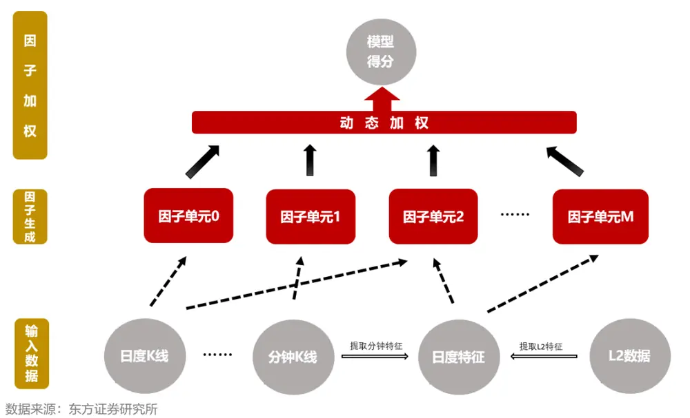

## 二、因子单元网络结构

## 2.1 时序网络研究现状

在语音识别、自然语音处理（NLP）等传统深度学习重点研究领域广泛存在着大量时间序列数据，相应的也衍生出了一系列的优秀的时间序列深度学习模型。深度学习近年来快速发展，日新月异，各种新的时序网络模型不断的涌现出来，但底层模块除了 DNN 大体上还是 RNN、CNN和 Transformer三种，本小节将简单阐述学术上这三类模型在时间序列上的应用现状。

循环神经网络或 RNN（Rumelhart et al., 1986c）是一种专门为序列数据设计的神经网络，通过递归和各个数据步共享参数的方式实现了用较小的参数规模捕捉时序信息的能力，使其具备记忆能力，因此广泛应用于自然语言处理等时序任务中。原始的RNN模型在训练过程中梯度经多时间步传播后倾向于消失或者爆炸，因此长期依赖的学习能力不足，为了缓解这一问题，各种门控 RNN 应运而生，其中最出名的便是 LSTM（Hochreiter and Schmidhuber, 1997）和 GRU（Cho et al., 2014c），后期多数 RNN系列模型的研究改进都是基于 LSTM或者 GRU 进行，比如 Qin Yao（2017）等在 LSTM 的输入序列和输出序列上引入注意力机制以更好的捕捉长期依赖问题。

卷积网络或 CNN（LeCun, 1989）是一种专门用来处理具有类似网格结构数据的神经网络，时间序列可以看作一维的网格，图像数据可以看作二维的网格。CNN 的早期研究多是基于二维图像数据进行的，但是其中网络结构设计的思想很容易应用在一维 CNN 中，比如 GoogLeNet 中无处不在的 NiN（net in net），ResNet（He Kaiming, 2016）中的残差结构。在 CNN 用于时序任务的研究中，非常值得一提有 Bai Shaojie（2018）的工作，作者采用因果卷积（casualconvolutions）防止输出时间序列用到未来信息，采用空洞卷积（dilated convolutions）使得模型能够在小卷积核下同样获得大的感受野，同时在模型中使用了残差链接和权重标准化技术，作者的模型实验表明 TCN结构在一系列任务中能够战胜 LSTM结构。

Transformer（Vaswani et al., 2017）提出至今不过短短五年，但已经在自然语言处理、计算机视觉等领域取得了巨大的成功，Transformer 使用了更具解释性的注意力机制，但是模型本身并不包括位置信息，所以需要通过位置编码传递给模型。原始的 Transformer 位置编码只有绝对位置和相对位置信息没有年月日节假日这种特殊的时间信息，而且注意力机制的计算复杂度和序列长度的平方成正比，当序列较长时计算开销较大，为了优化这些问题，后来者相续提出了Informer（zhou et al., 2021）、Autoformer（Wuet al., 2021）等 Transformer 变体。

最后，需要注意的是，用于解决现实问题的时序神经网络并不一定是单一的 RNN、CNN 或者 Transformer，比如 Bryan Lim 提出的 TFT (Temporal Fusion Transformers)模型就同时采用了LSTM 和 Transformer 的结构，利用 LSTM 对序列预处理，然后利用 Transformer 学习长周期信息。

## 2.2 本文网络结构

作为因子单元的神经网络核心功能是从量价输入序列中提取可能有选股效果的 alpha 因子，我们在前期报告《神经网络日频 alpha 模型初步实践》、《周频量价指增策略》中采用 GRU、AGRU 和 LSTM 三种 RNN 类模型为基础构建因子单元，本文借鉴时间序列神经网络领域最近的研究成果，对因子单元网络结构进行扩展，以期能够提取更丰富和差异化的 alpha 因子，增强模型整体表现。

现有主流时间序列神经网络的基础模块主要还是 RNN、CNN 或者 Transformer ，这三种结构每一种都有很多变种，前期报告中我们采用的 GRU、AGRU和 LSTM模型骨干都属于 RNN系列，为了让我们的因子单元更加多元化，我们在本篇报告中将引入 CNN 和 Transformer 系列模型，无论 CNN 还是 Transformer 在时序预测上我们都有很多选择，但其背后的核心思想大同小异，为避免冗余我们仅选择时序预测上的经典模型结构作为本文的因子单元骨干模型，CNN 结构我们采用 ResNet+TCN 的模型设计，Transformer 我们引入了 time2vec 时间编码，网络具体结构介绍如下：

## RESTCN 因子单元

Bai Shaojie（2018）对时间卷积网络（TCN，temporal convolutional network）做出了规范化的设计，并应用在多种时序任务中，TCN的网络结构如图2所示，TCN相对一般的带残差结构的一维 CNN主要做了两点调整，一是采用因果卷积（casual convolutions）使得每个时间步的输出只与该时间步之前的信息链接，从而不会引入未来信息，这也意味着TCN只有最后一个时间步的输出是汇总所有输入信息的，二是使用空洞卷积（dilated convolutions）使得模型能够在较小的卷积核下实现更大的感受野，从而更容易学习长时序信息。

图 2：TCN模型架构
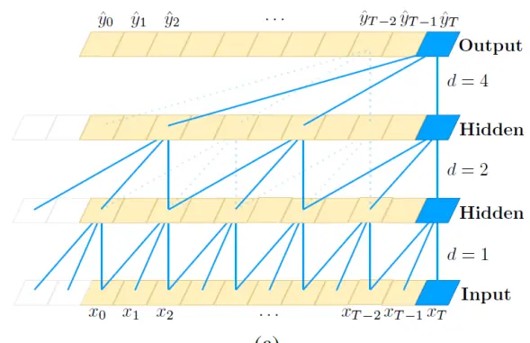
(a)

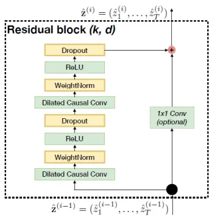
(b)

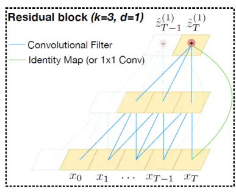
(c)
Figure 1. Architectural elements in a TCN. (a) A dilated causal convolution with dilation factors d = 1, 2, 4 and filter size k = 3. The receptive field is able to cover all values from the input sequence. (b) TCN residual block. An 1x1 convolution is added when residual input and output have different dimensions. (c) An example of residual connection in a TCN. The blue lines are filters in the residual function, and the green lines are identity mappings.
数据来源：参考文献【4】, 东方证券研究所

从图 2 的模型结构可以看出 TCN 模型在临近区域（比如前后一个时间步）的学习主要靠底层网络实现，上层网络由于卷积膨胀因子（dilation factor）取值较大，主要用于整合长周期的信息，为了增强因子单元局部特征的学习能力，我们在 TCN 的底层又嵌入了 3 层通道数为 64 的一维卷积残差块结构，实现 ResNet 和 TCN 的结合（具体结构参考图 3），这也是我们把该因子单元称为 RESTCN 的原因。最后，TCN 的输出也是一个时间序列，而我们需要的是对未来收益率分。其他重要信息披露见分析师申明之后部分，或请与您的投资代表联系。并请阅读本证券研究报告最后一页的免责申明。

有预测能力的截面 alpha因子，考虑到 TCN只有最后一个时间步整合了所有的信息，因此我们仅取最后一个时间步的输出作为我们多元因子单元的输出。

图 3：RESTCN因子单元网络结构
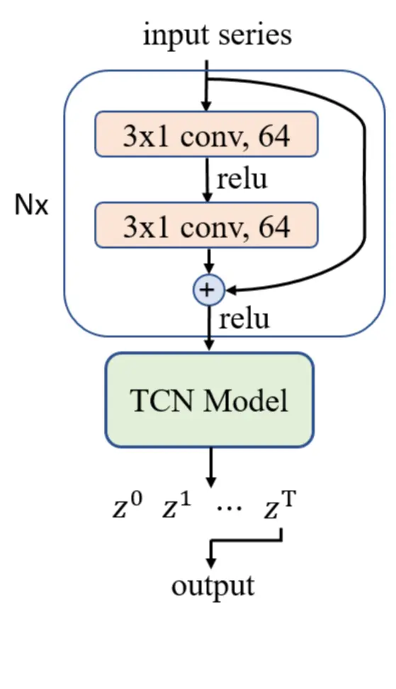
数据来源：东方证券研究所

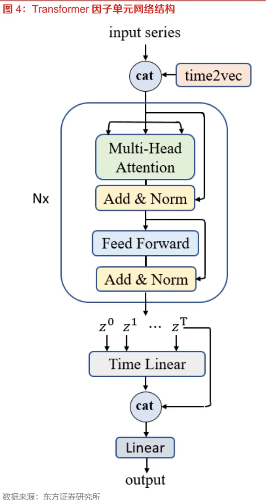

## Transformer 因子单元

Transformer 一经提出便在深度学习的各个领域取得了巨大成功，不少学者也在 Vaswani（2017）版本 Transformer 的基础上针对时间序列任务提出了各种改进方案，优化了计算复杂度，但其本质上还是注意力机制，由于本文基于30个交易日的日线特征学习，计算要求也不是很高，所以本文还是基于 Vaswani（2017）版本的 Transformer 构建因子单元。Transformer 采用encoder——decoder 架构，但是本文主要用于 alpha 因子提取，所以仅借鉴 transformer 的encoder部分构建了如图 4的因子单元。

我们的因子单元相对 Transformer（Vaswani et al., 2017）的 encoder 部分主要做了两个调整，一是将加法整合的位置编码（positional embedding）调整为拼接整合的时间编码，二是将各个时间步的输出通过特殊的设计汇总成 alpha 因子输出。如果不考虑时间维度的周期性，时间也可以按照位置编码，但是如果直接将位置信息加到输入特征数据上会丢失部分特征信息（NLP 任务中词编码后加法引入位置信息不仅和拼接等价而且可以大幅减少特征数量）， 因此我们采用拼接的方法引入时间编码信息，时间编码方式采用 Kazemi（2019）提出的 Time2Vec 方法，具体如下：

$$
\begin{array}{r}{\pmb{t2v}(\tau)[i]=\left\{\begin{aligned}&{\omega_{i}\tau+\varphi_{i},}&{\mathrm{if}\;i=0.}\\&{\mathcal{F}(\omega_{i}\tau+\varphi_{i}),}&{if\;1\leq i\leq k.}\end{aligned}\right.}\end{array}
$$

其中，k是时间编码的维度，本文取 1，即仅保留一个周期性时间编码，τ是原始时间特征，ω和φ是一组可学习的参数（实际上我们也尝试过采用固定的时间编码，因子单元效果几乎完全一致），ℱ取作者建议的正弦函数。

和 RNN、TCN 不一样，transformer encoder 的每一个时间步的输出都可以提取所有时间步的信息，为了充分利用各个时间步的学习能力，我们将所有时间步的输出通过一个时间维度的线性层汇总后再拼接最后一个时间步的输出，之后再接一个线性层到最后因子单元的输出。

因子单元的骨干网络采用 Transformer（Vaswani et al., 2017）中的多个多头注意力残差块和前馈网络残差块堆叠的结构，时间序列信息的提取主要靠注意力机制，多头注意力机制的结构如图 5所示，具体原理可参考原文，本文不再赘述。

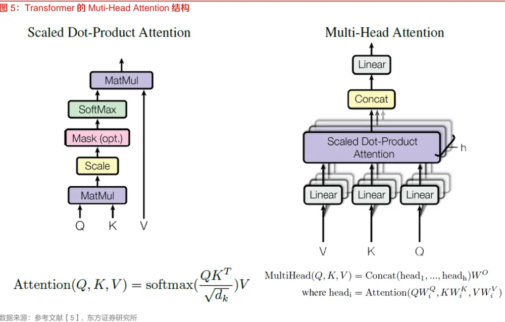

## 三、模型实验结果

## 3.1 模型实验说明

本文涉及的因子检验和组合测试起止于 20161230 和 20220531，样本空间为中证全指同期成分股，同一个模型分别对 rawbar、mschars、l2chars 三个量价序列数据集（数据集详情参考《周频量价指增策略》）训练得到三个多元因子单元，三个数据集对应的因子单元产生的所有因子样本外通过 LightGBM加权汇总至一个打分，评估该打分作为相应模型的选股表现。

本文默认采用 T+1 收盘至 T+11 收盘的涨跌幅作为 label，所有模型表现均是 10 次独立训练后平均打分的选股效果。

本文的因子 RankIC考察了 5日收益率（5日无间隔，T+0收盘至 T+5收盘）、10日收益率（10日无间隔，T+0收盘至 T+10收盘）、20日收益率（20日无间隔，T+0收盘至 T+20收盘）三个时间尺度，考虑到可交易性，我们也测算了三个时间尺度下间隔一个交易日的 RankIC，即 5日间隔1日（T+1收盘至T+6收盘）、10日间隔1日（T+1收盘至T+11收盘）、20日间隔1日（T+1收盘至 T+21收盘）。

因子的分组业绩测算默认采用次日 vwap 成交，周度调仓，不考虑交易成本，但是汇报了换手率，费后收益可以根据费前收益和换手率近似估算。

## 3.2 各模型选股效果

本小节我们比较了 GRU、AGRU、LSTM 三个我们在前期报告使用的 RNN 系列模型以及本报告新增的 RESTCN、Transformer共5个模型分别作为因子单元的综合打分选股效果。

从单个模型的选股效果来看，每个模型具有十分显著的选股效果，其中 10 日 RankIC 都在16%左右，即使考虑到可交易性，计算 RankIC 时收益率滞后一个交易日，每个模型的 10 日RankIC也在 14%以上，各模型分组对冲收益十分单调，2017年来 top组合年化对冲收益均在 42%以上，近年来由于交易拥挤等原因 top 组合收益有所回落，但 2020 年以来年化收益依然在 30%以上。

对比各个模型的 RankIC 和分组业绩，我们发现各个模型虽然结构不一，但选股效果差异不大。具体来看，AGRU在 GRU的基础上增加了注意力机制，但是相对 GRU并没有体现出优势，top 组合甚至有小幅回落，以卷积网络为核心的 RESTCN 以及靠注意力学习时序信息的Transformer按理说和 RNN系列结构差异很大，但是模型打分的 RankIC、分组业绩和 RNN系列模型高度一致，可见各类模型从量价序列中提取 alpha信息的能力大同小异。

图 6：各模型综合打分 RankIC均值

|  | 5日无间隔 10日无间隔 20日无间隔 |  |  | 5日间隔1日 |  | 10日间隔1日 20日间隔1日 |
| --- | --- | --- | --- | --- | --- | --- |
| GRU | 14.5% | 15.9% | 16.3% | 12.8% | 14.3% | 14.9% |
| AGRU | 14.5% | 16.0% | 16.6% | 12.7% | 14.3% | 15.1% |
| LSTM | 14.4% | 15.9% | 16.3% | 12.7% | 14.2% | 14.9% |
| RESTCN | 14.4% | 15.7% | 16.3% | 12.6% | 14.1% | 14.9% |
| Transformer | 14.6% | 16.1% | 16.7% | 12.7% | 14.4% | 15.2% |

数据来源：Wind，上交所，深交所，东方证券研究所

图 7：各模型综合打分 IC_IR（未年化）

|  | 5日无间隔 10日无间隔 20日无间隔 |  |  | 5日间隔1日 |  | 10日间隔1日 20日间隔1日 |
| --- | --- | --- | --- | --- | --- | --- |
| GRU | 1.47 | 1.64 | 1.68 | 1.34 | 1.49 | 1.53 |
| AGRU | 1.50 | 1.67 | 1.75 | 1.36 | 1.52 | 1.60 |
| LSTM | 1.47 | 1.64 | 1.65 | 1.34 | 1.50 | 1.51 |
| RESTCN | 1.54 | 1.71 | 1.80 | 1.40 | 1.55 | 1.65 |
| Transformer | 1.53 | 1.71 | 1.81 | 1.39 | 1.56 | 1.67 |

数据来源：Wind，上交所，深交所，东方证券研究所

图 8：各模型综合打分 2017 年以来分组年化对冲收益
TOP组合对冲收益及换手
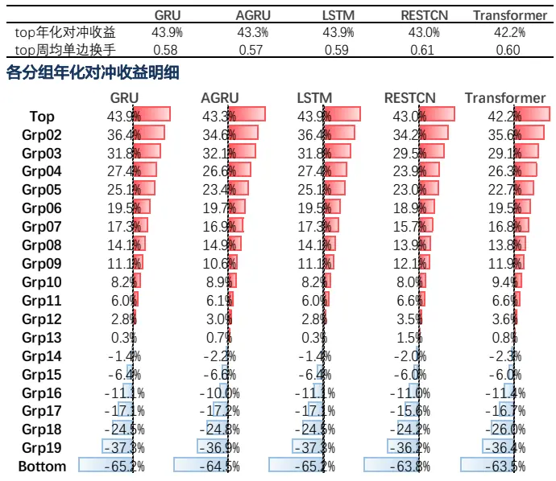
注：对冲基准为样本空间等权
数据来源：Wind，上交所，深交所，东方证券研究所

图 9：各模型综合打分 2020 年以来分组年化对冲收益
TOP组合对冲收益及换手
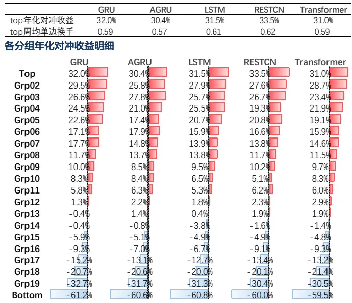
注：对冲基准为样本空间等权
数据来源：Wind，上交所，深交所，东方证券研究所

## 3.3 模型得分相关性

图 10 展示了单次训练下模型得分的平均相关系数，从对角线的相关性取值我们可以看出，完全相同的模型在不同次训练下的打分也有较大差异，这主要由模型训练过程中的随机性（比如随机初始化、随机取 batch）导致，一般而言，模型越复杂，两次训练结果的差异越大。因此，图10中的非对角线元素除了受模型差异的影响还受到训练随机性的影响，即便如此，我们也能看出 GRU、AGRU、LSTM 这个三个 RNN 模型内部相关性明显高于与 RESTCN、Transformer 的相关性。

为了削弱模型训练随机性的影响，我们统计了模型多次训练取平均后的打分两两间的截面相关系数均值（图 11），我们发现多次训练取平均后模型两两间的相关系数大幅提升，GRU、AGRU 和 LSTM 的两两相关系数大概在 94%左右，RNN 类模型、RESTCN、Transformer 两两间的相关性大约在 90%左右，模型结构的差异化一定程度上降低了模型学习结果的相关性，但是幅度有限。

图 10：单次训练下模型得分平均相关系数

|  | GRU | AGRU | LSTM | RESTCN | Transformer |
| --- | --- | --- | --- | --- | --- |
| GRU | 86.3% | 82.1% | 80.5% | 78.4% | 78.0% |
| AGRU | 82.1% | 84.4% | 79.2% | 76.8% | 77.6% |
| LSTM | 80.5% | 79.2% | 81.5% | 75.0% | 74.8% |
| RESTCN | 78.4% | 76.8% | 75.0% | 81.9% | 75.7% |
| Transformer | 78.0% | 77.6% | 74.8% | 75.7% | 81.9% |

数据来源：Wind，上交所，深交所，东方证券研究所

图 11：模型多次训练平均打分的相关系数

|  | GRU | AGRU | LSTM | RESTCN | Transformer |
| --- | --- | --- | --- | --- | --- |
| GRU | 100.0% | 94.5% | 94.1% | 91.5% | 91.0% |
| AGRU | 94.5% | 100.0% | 93.5% | 90.5% | 91.4% |
| LSTM | 94.1% | 93.5% | 100.0% | 89.7% | 89.4% |
| RESTCN | 91.5% | 90.5% | 89.7% | 100.0% | 90.4% |
| Transformer | 91.0% | 91.4% | 89.4% | 90.4% | 100.0% |

数据来源：Wind，上交所，深交所，东方证券研究所

## 四、多模型整合方式

## 4.1 多模型的两种整合方式

在前期报告《神经网络日频 alpha 模型初步实践》、《周频量价指增策略》中我们都采用了GRU、AGRU和 LSTM三个模型去学习量价时序特征，将三个模型学到的 alpha因子拼接在一起交给因子加权模型去生成最后的打分——即因子层面整合多模型信息。从第三章我们可知不同时序模型学到的 alpha 信息高度重叠，因此采用的模型越多，因子层面整合多模型的方式对加权模型处理冗余信息的要求越高，尤其对于低信噪比的收益率预测问题，这无疑对因子加权模型的设计提出了更高的挑战。在此背景下，我们又尝试了在模型打分ZSCORE层面整合多模型的方式，即每个模型学习出来的 alpha因子单独加权至综合打分 zscore，最后多模型的 zscore再按照一定权重汇总在一起（本文采用等权）。

假设每个模型得分的期望 IC 相等而且两两间相关系数一样，那么很容易可以推导出 N 个模型得分均值的 IC期望值有如下显式表达形式：

$$
E(IC^{c})=\frac{E(IC^{s})}{\sqrt{\displaystyle\frac{1}{N}(1-\rho)+\rho}},
$$

其中，E(ICs)表示单模型的期望 IC，ρ表示模型得分的相关系数

从上述公式可以看出，如果单模型表现相差不大的情况下多模型平均可以提升总体表现，但是改善幅度存在上限，该上限与模型间的相关性有关。上述公式也解释了为什么同一个模型多次训练平均后的选股效果明显优于一次训练，同一个模型每次训练的得分 IC期望值一样，但是不同次训练得分取值并不完全一样，多个 IC期望值一样但是又不完全一样的得分平均后的总体表现自然有所增强。

## 4.2 多模型整体选股效果

为了对比因子层面整合多模型信息和 ZSCORE层面整合多模型信息的差异，我们对下面 4种汇总后综合打分的选股表现（v0表示因子层面整合，v1表示 ZSCORE层面整合，RCT取至RNN、CNN、Transformer 的首字母）。

RNNv0：GRU、AGRU、LSTM 三个 RNN 模型在因子层面整合

RNNv1：GRU、AGRU、LSTM 三个 RNN 模型在 ZSCORE 层面整合

RCTv0：GRU、AGRU、LSTM、RESTCN、Transformer 共 5 个模型因子层面整合

RCTv1：GRU、AGRU、LSTM、RESTCN、Transformer 共 5 个模型 ZSCORE 层面整合

对比两种模型整合方式的选股表现，我们可以看出无论是各口径的 RankIC、ICIR还是分组top组合收益，在我们LightGBM加权模型下 ZSCORE层面的整合总体优于因子层面的整合。需要强调的是，两种多模型整合方式的相对优劣可能和加权模型有关，如果加权模型性能较强，因子层面的整合可能也很有竞争力 。

对比 RCTv1和 RNNv1的选股效果，不难发现在 RNN系列模型基础上引入 CNN、Transformer等差异化模型对总体选股表现也有一定提升，尤其是 2020年以来 top组合收益提升明显。

图 12：不同多模型整合方式 RankIC均值

| 5日无间隔 10日无间隔 20日无间隔 |  |  |  |  |  |  |
| --- | --- | --- | --- | --- | --- | --- |
| RNNv0 | 14.5% | 15.9% | 16.3% | 5日间隔1日 12.8% | 10日间隔1日 14.3% | 20日间隔1日 14.8% |
| RNNv1 | 14.8% | 16.3% | 16.7% | 13.0% | 14.5% | 15.2% |
| RCTv0 | 14.6% | 16.0% | 16.4% | 12.9% | 14.4% | 14.9% |
| RCTv1 | 15.0% | 16.5% | 17.0% | 13.2% | 14.8% | 15.5% |

数据来源：Wind，上交所，深交所，东方证券研究所

图 13：不同多模型整合方式 IC_IR（未年化）
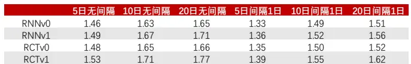
数据来源：Wind，上交所，深交所，东方证券研究所

图 14：不同多模型整合方式 2017 年以来分组年化对冲收益TOP组合对冲收益及换手
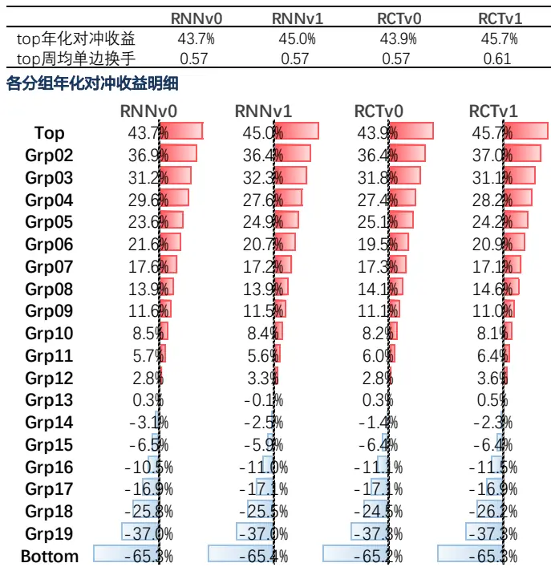
注：对冲基准为样本空间等权
数据来源：Wind，上交所，深交所，东方证券研究所

图 15：不同多模型整合方式 2020 年以来分组年化对冲收益TOP组合对冲收益及换手

|  | RNNv0 | RNNv1 | RCTv0 | RCTv1 |
| --- | --- | --- | --- | --- |
| top年化对冲收益 top周均单边换手 | 29.8% 0.58 | 32.6% 0.58 | 30.8% 0.58 | 34.3% 0.62 |
| 各分组年化对冲收益明细 |  |  |  |  |
| RNNv0 |  | RNNv1 | RCTv0 | RCTv1 |
| Top | 29.8% | 32.6% | 30.8% | 34.3% |
| Grp02 | 28.4% | 28.7% | 29.4% | 29.3% |
| Grp03 | 24.9% | 26.7% | 25.2% | 26.2% |
| Grp04 | 25.0% | 23.8% | 24.1% | 23.3% |
| Grp05 | 20.3% | 21.1% | 21.4% | 20.8% |
| Grp06 | 20.2% | 18.7% | 19.5% | 18.3% |
| Grp07 | 16.0% | 15.5% | 17.4% | 14.4% |
| Grp08 | 13.5% | 11.8% | 12.1% | 12.3% |
| Grp09 | 10.0% | 9.9% | 11.0% | 9.9% |
| Grp10 | 7.2%口 | 8.1% | 6.9% | 7.4% |
| Grp11 | 4.8% | 4.5% | 5.6% | 5.5% |
| Grp12 | 3.8% | 3.1%1 | 2.9% | 2.9% |
| Grp13 | 0.9% | -0.6% | 1.8% | 1.1% |
| Grp14 | -1.3% | -1.1% | -1.9% | -1.3% |
| Grp15 | -5.19 | -4.5% | -5.6% | -5.1% |
| Grp16 | -8.0% | -8.5% | -8.1% | -8.9% |
| Grp17 | -13.6% | -13.7% | -13.3% | -13.5% |
| Grp18 | -22.1% | -21.3% | -22.3% | -22.2% |
| Grp19 | -32.3% | -32.4% | -32.8% | -32.2% |
| Bottom | -61.6% | -61.6% | -62.1% | -61.5% |

注：对冲基准为样本空间等权
数据来源：Wind，上交所，深交所，东方证券研究所

## 五、TOP组合与增强组合

## 5.1 组合测试说明

本章展示了 GRU、AGRU、LSTM、RESTCN、Transformer 共 5 个模型 ZSCORE 层面整合的打分（RCTv1）用于构建 TOP组合和增强组合的业绩情况，关于组合回测我们有如下几点说明：

（1）所有组合周度调仓，假设次日 vwap价格成交；

（2）组合业绩测算时假设买入成本千分之一、卖出成本千分之二，停牌和涨停不能买入、停牌和跌停不能卖出；

（3）TOP组合换手约束通过控制每次调仓股票数量实现，增强组合通过组合优化换手约束实现（下图展示的 delta表示每周约束换手，avgto表示每周实际换手，单边）；

（4）增强组合 dfrisk2020（参见《东方 A股因子风险模型（DFQ-2020）》）的所有风格因子相对暴露不超过 0.5，所有行业因子相对暴露不超过 2%；

（5）沪深 300 增强跟踪误差约束不超过 4%，中证 500增强跟踪误差约束不超过 5%；

（6）TOP组合基准为样本空间（中证全指）等权，增强组合基准为对应价格指数；

（7）组合测试区间 20170101-20220601（年化栏对应区间），2022年收益率截止20220601（未年化）；

## 5.2 TOP 组合业绩

图 16展示了top100组合的业绩表现，在不同换手约束下组合各个年度均有十分显著的超额收益，除了换手极低的情况下，组合今年超额都在 20%左右，周单边换手 20%以上的组合在各个年度均实现正收益，即使在周单边 5%这种较低的换手下 top100组合也有 20%以上的超额，因此对于部分换手要求较高的投资者也有较大的应用价值。

考虑到全市场 top100组合稳定性不足、资金容量受限，我们也呈现了 top300组合的选股表现（图 17），相对 top100组合，top300的收益仅小幅回落、相对回撤更小，因此部分资金规模大、组合稳定性要求高的投资者可以考虑持仓更多股票。

图 16：TOP100 组合业绩表现
TOP100组合绝对收益汇总

|  |  | 年化 | 2017 | 2018 | 2019 | 2020 | 2021 | 2022 |
| --- | --- | --- | --- | --- | --- | --- | --- | --- |
| delta=0.05 avgto=0.06 | 收益率 最大回撤 | 19.8% -29.5% | 4.5% -14.0% | -18.7% -29.5% | 51.8% -14.7% | 50.0% -12.6% | 40.0% -10.7% | -1.9% -20.3% |
| delta=0.08 avgto=0.09 | 收益率 最大回撤 | 22.7% -29.5% | 4.4% -13.4% | -13.6% -29.5% | 47.3% -17.8% | 60.6% -13.6% | 39.7% -12.6% | 1.3% -20.9% |
| delta=0.10 avgto=0.11 | 收益率 最大回撤 | 26.7% -28.9% | 5.5% -13.5% | -10.2% -28.9% | 52.6% -15.7% | 63.3% -13.0% | 46.4% -14.3% | 3.8% -20.2% |
| delta=0.20 avgto=0.22 | 收益率 最大回撤 | 29.7% -27.2% | 8.8% -13.8% | 3.0% -27.2% | 48.6% -17.1% | 61.2% -12.0% | 45.4% -14.8% | 4.1% -19.2% |
| delta=0.30 avgto=0.32 | 收益率 最大回撤 | 28.3% -24.9% | 8.1% -14.8% | 8.9% -24.9% | 50.0% -18.7% | 53.9% | 37.8% | 2.5% |
| delta=0.50 avgto=0.53 | 收益率 | 29.7% -21.9% | 7.9% | 13.4% | 57.5% | -12.4% 55.7% | -14.7% 30.8% | -18.6% 3.7% |
| delta=1.00 avgto=0.69 | 最大回撤 收益率 最大回撤 | 28.4% -23.4% | -14.5% 7.1% -13.9% | -21.9% 13.8% -23.4% | -16.5% 57.2% -16.1% | -12.3% 51.7% -12.6% | -14.8% 29.8% -15.2% | -17.3% 2.0% -19.6% |

TOP100组合相对收益汇总（相对全指等权）

图 17：TOP300 组合业绩表现
TOP300组合绝对收益汇总

|  |  | 年化 | 2017 | 2018 | 2019 | 2020 | 2021 | 2022 |
| --- | --- | --- | --- | --- | --- | --- | --- | --- |
| delta=0.05 avgto=0.06 | 收益率 最大回撤 | 16.8% -29.2% | 0.8% -14.4% | -17.8% -29.2% | 43.5% -14.8% | 47.9% -12.5% | 34.8% -11.0% | -2.5% -20.5% |
| delta=0.08 | 收益率 最大回撤 | 21.1% -28.0% | 1.8% -13.8% | -12.5% -28.0% | 46.9% -15.1% | 55.5% -12.0% | 39.9% -12.9% | -1.2% -20.0% |
| avgto=0.09 delta=0.10 | 收益率 | 21.5% | 2.6% | -12.5% | 47.9% | 55.6% | 39.7% | -0.7% |
| avgto=0.11 delta=0.20 | 最大回撤 收益率 | -28.4% 25.4% | -13.9% 5.5% | -28.4% -1.0% | -15.1% 50.8% | -12.0% 51.3% | -13.2% 40.3% | -19.4% 1.8% |
| avgto=0.22 delta=0.30 | 最大回撤 收益率 | -26.2% 27.9% | -13.4% 7.1% | -26.2% 3.8% | -16.3% 54.9% | -13.1% 50.6% | -13.1% 40.7% | -18.3% 3.4% |
| avgto=0.32 delta=0.50 | 最大回撤 收益率 | -25.0% 28.5% | -14.1% 6.5% | -25.0% 7.3% | -15.5% 58.3% | -13.1% 47.5% | -13.1% 40.6% | -17.8% 3.3% |
| avgto=0.53 delta=1.00 | 最大回撤 收益率 | -24.2% 27.9% | -13.9% 5.5% | -24.2% 8.1% | -14.4% 58.4% | -13.3% 48.4% | -13.0% 39.3% | -18.0% 0.9% |

|  |  | 年化 | 2017 | 2018 | 2019 | 2020 | 2021 | 2022 |
| --- | --- | --- | --- | --- | --- | --- | --- | --- |
| delta=0.05 avgto=0.06 | 收益率 最大回撤 | 21.0% -11.7% | 23.3% -2.4% | 19.7% -4.3% | 17.8% -5.4% | 27.1% -5.6% | 12.2% -11.7% | 13.1% -2.6% |
| delta=0.08 | 收益率 | 24.3% | 23.1% | 27.3% | 14.7% | 36.3% | 12.2% | 17.7% |
| avgto=0.09 delta=0.10 | 最大回撤 收益率 | -9.1% 28.4% | -2.2% 24.4% | -4.0% 32.4% | -4.7% 18.8% | -7.0% 38.8% | -9.1% 17.6% | -3.3% 20.4% |
| avgto=0.11 delta=0.20 | 最大回撤 收益率 | -8.7% 31.5% | -2.5% 28.5% | -3.7% 52.1% | -4.1% 16.1% | -6.5% 36.9% | -8.7% 16.9% | -2.5% 20.9% |
| avgto=0.22 | 最大回撤 | -11.6% | -3.4% | -3.0% | -3.5% | -6.8% | -11.6% | -3.3% |
| delta=0.30 avgto=0.32 | 收益率 最大回撤 | 30.2% -12.0% | 27.6% -3.2% | 61.0% -3.9% | 17.3% -4.7% | 30.8% -6.6% | 10.8% -12.0% | 18.9% -4.3% |
| delta=0.50 | 收益率 | 31.5% | 27.4% | 67.4% | 23.1% | 32.2% | 5.1% | 20.2% |
| avgto=0.53 | 最大回撤 | -14.2% | -2.6% | -4.2% | -3.8% | -6.8% | -14.2% | -3.1% |
| delta=1.00 avgto=0.69 | 收益率 最大回撤 | 30.1% -15.8% | 26.5% -2.7% | 68.3% -4.1% | 22.8% -3.2% | 28.7% -6.7% | 4.3% -15.8% | 18.1% -3.7% |

TOP300组合相对收益汇总（相对全指等权）

|  |  | 年化 | 2017 | 2018 | 2019 | 2020 | 2021 | 2022 |
| --- | --- | --- | --- | --- | --- | --- | --- | --- |
| delta=0.05 | 收益率 | 18.1% | 19.0% -1.9% | 20.8% -3.2% | 11.6% -5.7% | 25.3% | 8.0% | 12.8% |
| avgto=0.06 delta=0.08 | 最大回撤 收益率 | -9.4% 22.5% | 20.1% | 28.7% | 14.4% | -4.6% 31.9% | -9.4% 12.3% | -2.0% 14.4% |
| avgto=0.09 delta=0.10 | 最大回撤 收益率 | -7.3% 23.0% | -1.9% 21.1% | -2.8% 28.7% | -4.8% 15.3% | -5.0% 32.1% | -7.3% 12.2% | -3.3% 15.0% |
| avgto=0.11 | 最大回撤 | -7.6% | -1.9% | -2.7% | -3.1% | -4.8% | -7.6% | -3.4% |
| delta=0.20 avgto=0.22 | 收益率 最大回撤 | 27.2% -8.5% | 24.5% -2.4% | 46.1% -2.2% | 17.8% -2.5% | 28.6% -5.1% | 12.7% -8.5% | 18.0% -2.5% |
| delta=0.30 avgto=0.32 | 收益率 最大回撤 | 29.7% -8.4% | 26.4% -2.0% | 53.4% -2.3% | 21.1% -2.3% | 28.0% -5.1% | 13.0% -8.4% | 19.9% -2.3% |
| delta=0.50 | 收益率 | 30.4% | 25.8% | 58.6% | 23.8% | 25.4% | 13.0% | 19.9% |
| avgto=0.53 | 最大回撤 | -9.1% | -1.6% | -2.0% | -1.8% | -4.8% | -9.1% | -2.5% |
| delta=1.00 avgto=0.69 | 收益率 最大回撤 | 29.8% -9.2% | 24.6% -1.8% | 59.8% -1.9% | 23.9% -1.7% | 26.1% -4.8% | 11.9% | 17.0% -2.3% |

周单边换手 20%的 TOP300组合净值走势

周单边换手 20%的 TOP100组合净值走势
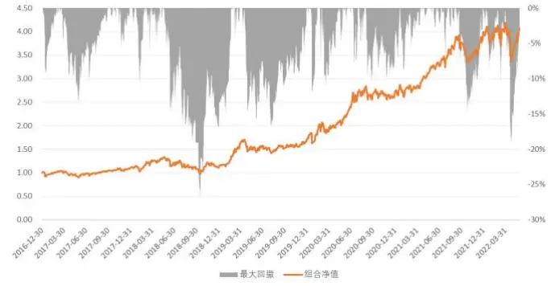
数据来源：Wind，上交所，深交所，东方证券研究所

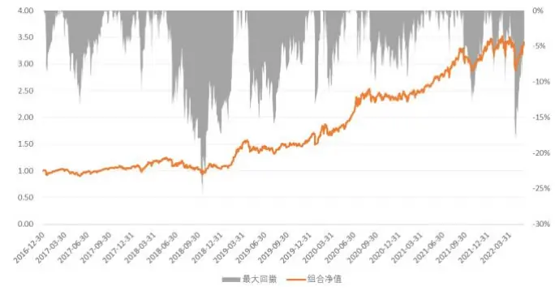
数据来源：Wind，上交所，深交所，东方证券研究所

有关分析师的申明，见本报告最后部分。其他重要信息披露见分析师申明之后部分，或请与您的投资代表联系。并请阅读本证券研究报告最后一页的免责申明。

## 5.3 沪深 300 增强组合业绩

图 18和图19展示了成分股无约束和成分股 80%约束下的沪深 300增强组合表现，对于本文的模型打分，成分股约束的沪深 300增强效果略优于成分股无约束的结果，在成分股 80%约束下不同换手的沪深 300增强组合 2017年以来年化对冲收益均超过 11%，近期没有明显衰减的迹象。

比较有意思的是，对于沪深 300增强组合，组合换手较低时费后收益并没有比高换手组合差，即使周 10%换手（年单边5倍） 下增强组合也有 11.4%的超额，相对同换手级别的低频多因子增强组合也有一定竞争力。另外，AI量价模型和传统低频多因子并非二选一的关系，本文的模型打分完全可以作为一个 alpha因子引入传统多因子体系，进一步增强多因子选股效果。

图 18：沪深 300指数增强组合表现（成分股不限制）
增强组合绝对收益表现汇总

|  |  | 年化 | 2017年 | 2018年 | 2019年 | 2020年 | 2021年 | 2022年 |
| --- | --- | --- | --- | --- | --- | --- | --- | --- |
| delta=0.10 avgto=0.11 | 收益率 | 14.5% | 33.2% | -13.5% | 39.2% | 44.1% | 6.6% | -15.9% |
|  | 波动率 | 19.0% | 10.1% | 21.4% | 18.0% | 22.8% | 18.1% | 23.5% |
|  | 最大回撤 | -26.0% | -5.9% | -23.0% | -13.3% | -16.1% | -12.2% | -23.5% |
| delta=0.20 avgto=0.21 | 收益率 | 15.2% | 36.9% | -14.7% | 36.9% | 45.6% | 6.9% | -13.6% |
|  | 波动率 | 19.0% | 10.2% | 21.1% | 18.1% | 23.2% | 18.1% | 23.0% |
|  | 最大回撤 | -24.5% | -5.7% | -24.0% | -12.7% | -16.1% | -12.6% | -21.2% |
| delta=0.30 avgto=0.32 | 收益率 | 15.3% | 36.6% | -15.7% | 38.3% | 46.7% | 4.4% | -11.7% |
|  | 波动率 | 19.1% | 10.2% | 21.2% | 18.3% | 23.1% | 18.1% | 22.7% |
|  | 最大回撤 | -25.1% | -6.2% | -24.5% | -12.4% | -15.9% | -12.7% | -19.8% |
| delta=0.50 avgto=0.47 | 收益率 | 14.6% | 31.7% | -14.6% | 38.5% | 42.8% | 6.4% | -12.0% |
|  | 波动率 | 19.1% | 10.2% | 21.2% | 18.4% | 23.0% | 18.1% | 23.3% |
|  | 最大回撤 | -24.4% | -6.4% | -23.0% | -12.3% | -15.9% | -12.8% | -20.0% |

增强组合对冲收益表现汇总

图 19：沪深 300指数增强组合表现（成分股不低于 80%）增强组合绝对收益表现汇总

|  |  | 年化 | 2017年 | 2018年 | 2019年 | 2020年 | 2021年 | 2022年 |
| --- | --- | --- | --- | --- | --- | --- | --- | --- |
| delta=0.10 avgto=0.11 | 收益率 | 16.0% | 37.5% | -14.1% | 41.0% | 45.9% | 7.7% | -15.2% |
|  | 波动率 | 19.2% | 10.3% | 21.4% | 17.8% | 23.3% | 18.4% | 23.5% |
|  | 最大回撤 | -25.7% | -5.9% | -23.4% | -11.0% | -16.7% | -12.8% | -22.5% |
| delta=0.20 avgto=0.21 | 收益率 | 16.5% | 38.3% | -13.3% | 37.9% | 47.1% | 6.6% | -12.2% |
|  | 波动率 | 19.1% | 10.5% | 21.6% | 18.0% | 23.2% | 18.0% | 23.1% |
|  | 最大回撤 | -24.3% | -6.3% | -23.7% | -11.5% | -16.3% | -12.6% | -20.0% |
| delta=0.30 avgto=0.32 | 收益率 | 16.3% | 38.4% | -14.1% | 37.2% | 46.8% | 6.7% | -11.9% |
|  | 波动率 | 19.1% | 10.4% | 21.5% | 18.2% | 23.1% | 18.3% | 22.4% |
|  | 最大回撤 | -23.6% | -6.4% | -22.9% | -11.8% | -15.6% | -12.8% | -19.5% |
| delta=0.50 avgto=0.48 | 收益率 | 15.7% | 36.5% | -16.0% | 40.0% | 45.5% | 7.3% | -12.2% |
|  | 波动率 | 19.2% | 10.4% | 21.3% | 18.4% | 23.3% | 18.2% | 23.2% |
|  | 最大回撤 | -24.7% | -6.4% | -24.0% | -11.4% | -15.8% | -13.3% | -20.1% |

增强组合对冲收益表现汇总

|  |  | 年化 | 2017年 | 2018年 | 2019年 | 2020年 | 2021年 | 2022年 |
| --- | --- | --- | --- | --- | --- | --- | --- | --- |
| delta=0.10 avgto=0.11 | 收益率 | 10.0% | 9.4% | 15.8% | 2.1% | 13.2% | 12.3% | 1.8% |
|  | 波动率 | 4.9% | 3.8% | 4.3% | 4.9% | 5.7% | 5.4% | 5.1% |
|  | 最大回撤 | -6.2% | -2.5% | -2.1% | -3.8% | -4.2% | -4.5% | -3.1% |
| delta=0.20 avgto=0.21 | 收益率 | 10.7% | 12.5% | 14.1% | 0.3% | 14.5% | 12.5% | 4.4% |
|  | 波动率 | 5.0% | 4.1% | 4.6% | 5.0% | 5.6% | 5.5% | 5.2% |
|  | 最大回撤 | -6.0% | -2.2% | -3.0% | -4.8% | -3.7% | -6.0% | -2.6% |
| delta=0.30 avgto=0.32 | 收益率 | 10.8% | 12.2% | 12.8% | 1.5% | 15.3% | 9.9% | 6.8% |
|  | 波动率 | 5.0% | 4.0% | 4.8% | 5.0% | 5.5% | 5.7% | 5.2% |
|  | 最大回撤 | -6.9% | -2.1% | -3.6% | -4.8% | -3.5% | -6.9% | -2.5% |
| delta=0.50 avgto=0.47 | 收益率 | 10.1% | 8.2% | 14.2% | 1.6% | 12.2% | 12.0% | 6.4% |
|  | 波动率 | 5.0% | 4.2% | 4.8% | 4.9% | 5.6% | 5.5% | 5.1% |
|  | 最大回撤 | -5.8% | -2.6% | -3.6% | -3.9% | -3.6% | -5.8% | -3.6% |

周单边换手 20%下的组合走势

|  |  | 年化 | 2017年 | 2018年 | 2019年 | 2020年 | 2021年 | 2022年 |
| --- | --- | --- | --- | --- | --- | --- | --- | --- |
| delta=0.10 avgto=0.11 | 收益率 | 11.4% | 13.0% | 15.0% | 3.3% | 14.8% | 13.5% | 2.6% |
|  | 波动率 | 4.6% | 3.7% | 4.0% | 4.4% | 5.1% | 5.2% | 5.0% |
|  | 最大回撤 | -5.1% | -2.0% | -2.7% | -4.6% | -3.0% | -4.8% | -3.3% |
| delta=0.20 avgto=0.21 | 收益率 | 11.9% | 13.7% | 16.1% | 1.1% | 15.7% | 12.3% | 6.1% |
|  | 波动率 | 4.7% | 3.7% | 4.4% | 4.6% | 5.4% | 5.3% | 5.0% |
|  | 最大回撤 | -6.4% | -1.7% | -2.6% | -5.1% | -3.0% | -6.4% | -2.3% |
| delta=0.30 avgto=0.32 | 收益率 | 11.7% | 13.7% | 15.0% | 0.6% | 15.5% | 12.4% | 6.5% |
|  | 波动率 | 4.8% | 3.8% | 4.7% | 4.6% | 5.3% | 5.5% | 5.1% |
|  | 最大回撤 | -6.9% | -1.6% | -3.0% | -5.0% | -3.0% | -6.9% | -2.5% |
| delta=0.50 avgto=0.48 | 收益率 | 11.2% | 12.2% | 12.4% | 2.7% | 14.5% | 13.0% | 6.2% |
|  | 波动率 | 4.8% | 4.0% | 4.8% | 4.6% | 5.2% | 5.3% | 4.9% |
|  | 最大回撤 | -6.1% | -1.6% | -3.7% | -4.4% | -2.9% | -6.1% | -3.3% |

周单边换手 20%下的组合走势

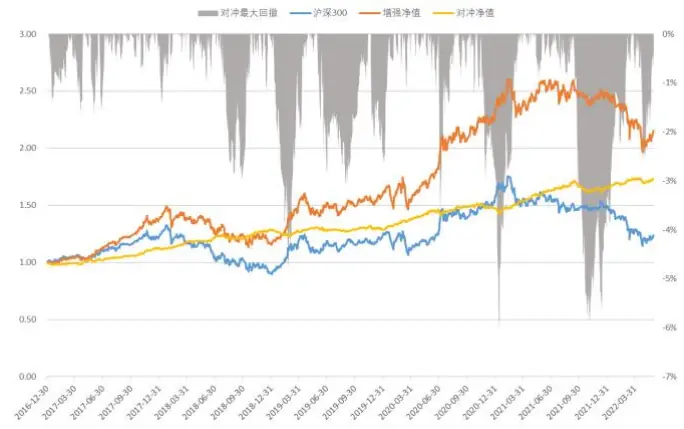
数据来源：Wind，上交所，深交所，东方证券研究所

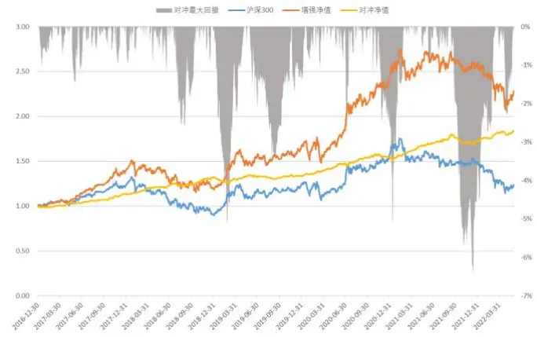
数据来源：Wind，上交所，深交所，东方证券研究所

## 5.4 中证500增强组合业绩

图 20和图21展示了成分股无约束和成分股 80%约束下的中证 500增强组合表现，对于本文的模型打分，成分股无约束的中证 500增强超额收益显著高于成分股 80%约束的结果，但跟踪误差也相对更大，组合信息比率反而略弱于后者。

对比不同换手下的组合费后收益，模型不仅在高换手下有较好的业绩，在低换手时依然有一定竞争力，投资者可以根据各自现实情况自行调整换手。从时间序列上看，组合近两年波动有所加大，收益相对早期有所回落，但是今年来依然超额显著。

图 20：中证 500指数增强组合表现（成分股不限制）
增强组合绝对收益表现汇总

|  |  | 年化 | 2017年 | 2018年 | 2019年 | 2020年 | 2021年 | 2022年 |
| --- | --- | --- | --- | --- | --- | --- | --- | --- |
| delta=0.10 avgto=0.11 | 收益率 | 16.3% | 9.5% | -13.4% | 41.1% | 44.7% | 29.2% | -9.5% |
|  | 波动率 | 21.5% | 13.5% | 24.7% | 21.3% | 26.3% | 16.7% | 26.8% |
|  | 最大回撤 | -29.3% | -11.0% | -29.3% | -17.0% | -14.0% | -12.0% | -23.4% |
| delta=0.20 avgto=0.21 | 收益率 | 17.9% | 10.9% | -6.7% | 39.0% | 47.5% | 30.2% | -11.8% |
|  | 波动率 | 21.9% | 13.9% | 25.1% | 22.1% | 26.6% | 17.2% | 26.4% |
|  | 最大回撤 | -28.8% | -11.8% | -28.8% | -18.0% | -14.2% | -13.3% | -24.5% |
| delta=0.30 avgto=0.32 | 收益率 | 17.8% | 14.3% | -7.4% | 40.1% | 47.1% | 27.6% | -13.0% |
|  | 波动率 | 22.0% | 13.8% | 25.2% | 22.2% | 26.6% | 17.2% | 27.0% |
|  | 最大回撤 | -29.2% | -11.1% | -29.2% | -18.0% | -14.1% | -13.7% | -25.3% |
| delta=0.50 avgto=0.52 | 收益率 | 19.8% | 13.2% | -3.7% | 45.2% | 47.2% | 27.3% | -10.8% |
|  | 波动率 | 22.0% | 14.1% | 25.2% | 22.1% | 26.5% | 17.2% | 27.1% |
|  | 最大回撤 | -27.8% | -10.9% | -27.8% | -16.8% | -14.0% | -13.4% | -23.8% |

增强组合对冲收益表现汇总

图 21：中证 500指数增强组合表现（成分股不低于 80%）

|  |  | 年化 | 2017年 | 2018年 | 2019年 | 2020年 | 2021年 | 2022年 |
| --- | --- | --- | --- | --- | --- | --- | --- | --- |
| delta=0.10 avgto=0.11 | 收益率 | 14.9% | 14.8% | -18.0% | 35.4% | 47.4% | 29.5% | -13.2% |
|  | 波动率 | 21.4% | 13.5% | 24.9% | 21.3% | 26.2% | 15.7% | 26.8% |
|  | 最大回撤 | -29.8% | -10.4% | -29.8% | -18.3% | -14.5% | -12.1% | -25.3% |
| delta=0.20 avgto=0.21 | 收益率 | 17.4% | 16.6% | -10.6% | 36.9% | 46.0% | 33.0% | -14.2% |
|  | 波动率 | 21.6% | 13.6% | 25.0% | 21.9% | 26.4% | 16.2% | 26.5% |
|  | 最大回撤 | -28.8% | -10.1% | -28.4% | -18.8% | -13.5% | -13.5% | -25.7% |
| delta=0.30 avgto=0.32 | 收益率 | 16.6% | 16.8% | -10.7% | 38.3% | 42.6% | 29.8% | -14.2% |
|  | 波动率 | 21.8% | 13.7% | 25.2% | 22.1% | 26.4% | 16.2% | 26.9% |
|  | 最大回撤 | -30.5% | -10.2% | -29.1% | -18.3% | -13.7% | -13.9% | -25.7% |
| delta=0.50 avgto=0.52 | 收益率 | 15.8% | 14.6% | -12.1% | 37.8% | 42.7% | 30.5% | -14.5% |
|  | 波动率 | 21.7% | 13.9% | 25.0% | 22.2% | 26.0% | 16.2% | 27.1% |
|  | 最大回撤 | -30.7% | -10.3% | -29.5% | -18.9% | -13.5% | -13.1% | -26.4% |

增强组合对冲收益表现汇总

|  |  | 年化 | 2017年 | 2018年 | 2019年 | 2020年 | 2021年 | 2022年 |
| --- | --- | --- | --- | --- | --- | --- | --- | --- |
| delta=0.10 avgto=0.11 | 收益率 | 17.0% | 9.4% | 29.8% | 11.2% | 19.8% | 11.8% | 10.5% |
|  | 波动率 | 5.9% | 4.6% | 5.7% | 5.1% | 6.8% | 6.7% | 6.7% |
|  | 最大回撤 | -6.2% | -3.2% | -2.5% | -3.5% | -5.2% | -5.8% | -2.7% |
| delta=0.20 avgto=0.21 | 收益率 | 18.7% | 10.9% | 40.1% | 9.7% | 22.1% | 12.8% | 7.6% |
|  | 波动率 | 6.2% | 4.8% | 6.2% | 5.2% | 7.3% | 6.7% | 6.9% |
|  | 最大回撤 | -5.3% | -3.5% | -3.3% | -2.9% | -5.2% | -5.3% | -3.0% |
| delta=0.30 avgto=0.32 | 收益率 | 18.6% | 14.3% | 39.0% | 10.7% | 21.8% | 10.5% | 6.2% |
|  | 波动率 | 6.3% | 4.9% | 6.3% | 5.4% | 7.4% | 6.6% | 7.2% |
|  | 最大回撤 | -5.6% | -3.2% | -3.5% | -2.6% | -4.7% | -5.6% | -3.2% |
| delta=0.50 avgto=0.52 | 收益率 | 20.6% | 13.2% | 44.5% | 14.6% | 21.9% | 10.3% | 9.0% |
|  | 波动率 | 6.4% | 4.9% | 6.7% | 5.6% | 7.3% | 6.8% | 7.0% |
|  | 最大回撤 | -5.9% | -3.6% | -3.5% | -2.2% | -4.3% | -5.9% | -2.8% |

周单边换手 20%下的组合走势

|  |  | 年化 | 2017年 | 2018年 | 2019年 | 2020年 | 2021年 | 2022年 |
| --- | --- | --- | --- | --- | --- | --- | --- | --- |
| delta=0.10 avgto=0.11 | 收益率 | 15.6% | 14.8% | 23.1% | 6.8% | 22.0% | 12.0% | 6.0% |
|  | 波动率 | 5.1% | 3.5% | 4.3% | 4.2% | 6.6% | 5.6% | 6.2% |
|  | 最大回撤 | -4.8% | -1.3% | -1.9% | -2.5% | -3.8% | -4.8% | -2.1% |
| delta=0.20 avgto=0.21 | 收益率 | 18.2% | 16.6% | 34.2% | 8.1% | 20.9% | 15.1% | 4.7% |
|  | 波动率 | 5.3% | 3.8% | 4.9% | 4.4% | 6.9% | 5.4% | 6.0% |
|  | 最大回撤 | -5.9% | -1.5% | -2.3% | -2.6% | -3.8% | -5.9% | -2.1% |
| delta=0.30 avgto=0.32 | 收益率 | 17.4% | 16.8% | 34.1% | 9.2% | 18.1% | 12.3% | 4.8% |
|  | 波动率 | 5.3% | 3.8% | 5.0% | 4.6% | 6.7% | 5.7% | 6.1% |
|  | 最大回撤 | -7.0% | -1.5% | -2.3% | -2.1% | -4.1% | -7.0% | -2.2% |
| delta=0.50 avgto=0.52 | 收益率 | 16.6% | 14.7% | 32.0% | 8.8% | 18.1% | 12.9% | 4.4% |
|  | 波动率 | 5.4% | 3.8% | 5.0% | 4.9% | 6.7% | 5.9% | 6.1% |
|  | 最大回撤 | -6.0% | -1.7% | -2.6% | -2.0% | -4.0% | -6.0% | -2.2% |

周单边换手 20%下的组合走势

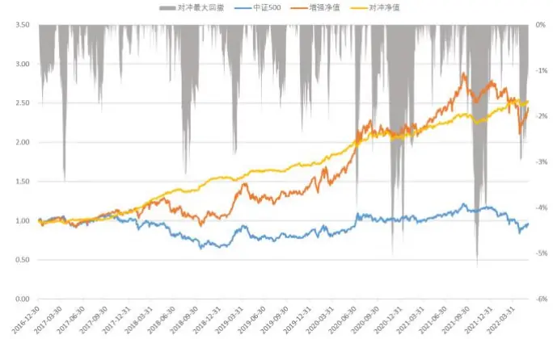
数据来源：Wind，上交所，深交所，东方证券研究所

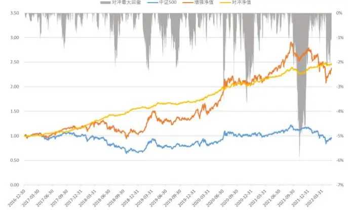
数据来源：Wind，上交所，深交所，东方证券研究所

## 七、结论

前期报告中我们提出了包括输入数据、因子单元和加权模型的 AI量价模型架构，并将之应用于周频调仓的选股策略，样本内和样本外均有十分显著的选股效果，本文借鉴深度学习领域的方法，对因子单元部分的时间序列模型进行扩展，以期能够提取更丰富和差异化的 alpha因子，增强模型整体表现。

深度学习近年来快速发展，日新月异，各种新的时序网络模型不断涌现，除了 GRU、LSTM等 RNN模型，一维 CNN、Transformer等广泛应用于时序任务中，本文借鉴相关成果，分别构建了以 CNN 和 Transformer 为基础的因子单元。

Bai Shaojie（2018）采用因果卷积、空洞卷积等技术对时间卷积网络 TCN做出了规范化的设计，本文提出的 RESTCN因子单元在 TCN基础上嵌入了一维残差网络以增强模型对局部量价特征的学习能力。

本文以采用 time2vec 时间编码的 transformer encoder 为骨干构建因子单元，并在输出端做了特殊设计以充分利用各时间步输出的学习能力。

实验表明 RESTCN 和 Transformer 提取 alpha 因子的能力并不弱于 RNN 系列模型，单模型下 10日 RankIC均值分别达到15.7%和 16.1%， top组合对冲收益（20分组、周度调仓、次日vwap 成交、费前）分别达到 43.0%、42.2%。

不同模型学习的 alpha 信息高度重叠，但是由于 RESTCN、Transformer 与 RNN 系列模型结构差异较大，模型打分相关性显著低于同 RNN系列模型。

本文比较了两种整合多个模型学习能力的方式，一是从因子层面将不同模型学得的 alpha因子合并一起作为加权模型输入，二是各个模型学得的 alpha因子各自加权生成 zscore之后再汇集，前者对加权模型处理冗余信息的能力要求更高。

实验表明 zscore层面整合多模型的选股效果优于因子层面整合，引入 RESTCN、Transformer 后综合打分的 RankIC 和 top 组合收益均有一定提升，10 日 RankIC 均值 16.5%，top 组合年化 45.7%。

在合适的换手下，多模型构建的 top100组合各个年度费后绝对收益均为正，周单边 5%换手时也有 20%以上的超额，另外适当增加 top组合持股数量并不会显著降低组合收益。

## 风险提示

1. 量化模型基于历史数据分析得到，未来存在失效的风险，建议投资者紧密跟踪模型表现

2. 极端市场环境可能对模型效果造成剧烈冲击，导致业绩亏损

## 核心参考文献

【1】 Wang, Z., Yan, W., & Oates, T. (2017, May). Time series classification from scratch with deep neural networks: A strong baseline. In 2017 International joint conference on neural networks (IJCNN) (pp. 1578-1585). IEEE.

【2】 Qin, Y., Song, D., Chen, H., Cheng, W., Jiang, G., & Cottrell, G. (2017). A dual-stage attention-based recurrent neural network for time series prediction. arXiv preprint arXiv:1704.02971.

【3】 He, K., Zhang, X., Ren, S., & Sun, J. (2016). Deep residual learning for image recognition. In Proceedings of the IEEE conference on computer vision and pattern recognition (pp. 770-778).

【4】 Bai, S., Kolter, J. Z., & Koltun, V. (2018). An empirical evaluation of generic convolutional and recurrent networks for sequence modeling. arXiv preprint arXiv:1803.01271.

【5】 Vaswani, A., Shazeer, N., Parmar, N., Uszkoreit, J., Jones, L., Gomez, A. N., ... & Polosukhin, I. (2017). Attention is all you need. Advances in neural information processing systems, 30.

【6】 Kazemi, S. M., Goel, R., Eghbali, S., Ramanan, J., Sahota, J., Thakur, S., ... & Brubaker, M. (2019). Time2vec: Learning a vector representation of time. arXiv preprint arXiv:1907.05321.

## Tabl e_Disclai mer 分析师申明

每位负责撰写本研究报告全部或部分内容的研究分析师在此作以下声明：

分析师在本报告中对所提及的证券或发行人发表的任何建议和观点均准确地反映了其个人对该证券或发行人的看法和判断；分析师薪酬的任何组成部分无论是在过去、现在及将来，均与其在本研究报告中所表述的具体建议或观点无任何直接或间接的关系。

## 投资评级和相关定义

报告发布日后的 12个月内的公司的涨跌幅相对同期的上证指数/深证成指的涨跌幅为基准；

## 公司投资评级的量化标准

买入：相对强于市场基准指数收益率 15%以上；

增持：相对强于市场基准指数收益率 5%～15%；

中性：相对于市场基准指数收益率在-5%～+5%之间波动；

减持：相对弱于市场基准指数收益率在-5%以下。

未评级 —— 由于在报告发出之时该股票不在本公司研究覆盖范围内，分析师基于当时对该股票的研究状况，未给予投资评级相关信息。

暂停评级 —— 根据监管制度及本公司相关规定，研究报告发布之时该投资对象可能与本公司存在潜在的利益冲突情形；亦或是研究报告发布当时该股票的价值和价格分析存在重大不确定性，缺乏足够的研究依据支持分析师给出明确投资评级；分析师在上述情况下暂停对该股票给予投资评级等信息，投资者需要注意在此报告发布之前曾给予该股票的投资评级、盈利预测及目标价格等信息不再有效。

## 行业投资评级的量化标准：

看好：相对强于市场基准指数收益率 5%以上；

中性：相对于市场基准指数收益率在-5%～+5%之间波动；

看淡：相对于市场基准指数收益率在-5%以下。

未评级：由于在报告发出之时该行业不在本公司研究覆盖范围内，分析师基于当时对该行业的研究状况，未给予投资评级等相关信息。

暂停评级：由于研究报告发布当时该行业的投资价值分析存在重大不确定性，缺乏足够的研究依据支持分析师给出明确行业投资评级；分析师在上述情况下暂停对该行业给予投资评级信息，投资者需要注意在此报告发布之前曾给予该行业的投资评级信息不再有效。

## HeadertTabl e_Discl ai mer 免责声明

本证券研究报告（以下简称“本报告”）由东方证券股份有限公司（以下简称“本公司”）制作及发布。

。本公司不会因接收人收到本报告而视其为本公司的当然客户。本报告的全体接收人应当采取必要措施防止本报告被转发给他人。

本报告是基于本公司认为可靠的且目前已公开的信息撰写，本公司力求但不保证该信息的准确性和完整性，客户也不应该认为该信息是准确和完整的。同时，本公司不保证文中观点或陈述不会发生任何变更，在不同时期，本公司可发出与本报告所载资料、意见及推测不一致的证券研究报告。本公司会适时更新我们的研究，但可能会因某些规定而无法做到。除了一些定期出版的证券研究报告之外，绝大多数证券研究报告是在分析师认为适当的时候不定期地发布。

在任何情况下，本报告中的信息或所表述的意见并不构成对任何人的投资建议，也没有考虑到个别客户特殊的投资目标、财务状况或需求。客户应考虑本报告中的任何意见或建议是否符合其特定状况，若有必要应寻求专家意见。本报告所载的资料、工具、意见及推测只提供给客户作参考之用，并非作为或被视为出售或购买证券或其他投资标的的邀请或向人作出邀请。

本报告中提及的投资价格和价值以及这些投资带来的收入可能会波动。过去的表现并不代表未来的表现，未来的回报也无法保证，投资者可能会损失本金。外汇汇率波动有可能对某些投资的价值或价格或来自这一投资的收入产生不良影响。那些涉及期货、期权及其它衍生工具的交易，因其包括重大的市场风险，因此并不适合所有投资者。

在任何情况下，本公司不对任何人因使用本报告中的任何内容所引致的任何损失负任何责任，投资者自主作出投资决策并自行承担投资风险，任何形式的分享证券投资收益或者分担证券投资损失的书面或口头承诺均为无效。

本报告主要以电子版形式分发，间或也会辅以印刷品形式分发，所有报告版权均归本公司所有。未经本公司事先书面协议授权，任何机构或个人不得以任何形式复制、转发或公开传播本报告的全部或部分内容。不得将报告内容作为诉讼、仲裁、传媒所引用之证明或依据，不得用于营利或用于未经允许的其它用途。

经本公司事先书面协议授权刊载或转发的，被授权机构承担相关刊载或者转发责任。不得对本报告进行任何有悖原意的引用、删节和修改。

提示客户及公众投资者慎重使用未经授权刊载或者转发的本公司证券研究报告，慎重使用公众媒体刊载的证券研究报告。

## 东方证券研究所

地址： 上海市中山南路 318 号东方国际金融广场 26 楼

电话：021-63325888

传真：021-63326786

网址： www.dfzq.com.cn