# 分析师覆盖度因子改进

## ——《因子选股系列研究 之 八十四》

## 研究结论

- 在之前的报告《稳健易算的分析师盈利上调因子》中，我们对分析师盈利预测调整因子进行了优化，本篇报告我们继续对分析师数据的研究，重点针对分析师覆盖度因子进行优化改进。

2006 年至 2021 年，分析师发布的报告总数从 36104 篇上升至 218993 篇。2022年前 7个月报告数量超过 14万篇，日均报告达 600篇。点评报告数量居首，占比达到 60%以上。3、4、8、10 月个股报告占比更高。

⚫ 常规的分析师覆盖度因子（cov）使用分析师对标的公司出具的研报总数或机构数量来计算。因子当前在中证全指中覆盖度 55%，中证800内覆盖 90%。

全指中，行业市值中性化后的分析师覆盖度因子，虽然 IC 均值较高，但稳定性较差，多头端表现不佳。21年开始因子收益出现较大回撤，多空组合 2021年和 2022年单年收益为 6%和-2%。多头端表现更差，最近两年收益均在-6%左右。在中证800中因子整体表现更弱。

公告后分析师覆盖度因子（anncov）：公告后个股获得的分析师报告越多，越可能说明该公司此次公告的业绩超预期。过去 6个月内有公告且7天内有至少一篇分析师报告的股票，当前在中证全指中的覆盖度接近 50%， 在中证 800成分内覆盖度在85%左右。

加入业绩预告、快报后，anncov因子表现进一步提升。相同计算周期下，anncov因子表现均优于 cov因子。anncov因子在大票、机构重仓股中优势更明显。在食品饮料、电力设备、国防军工、医药生物、周期等热门行业中均优于 cov因子。因子多头端表现在各股票池中均占优。

分析师首次覆盖度因子（firstcov）：分析师在研报中首次覆盖、长期未关注后重新覆盖、首次给予评级，都可能说明公司基本面出现好转或者分析师看好公司未来的发展前景。过去 6个月内有机构首次覆盖的股票，当前在中证全指中占比 45%，在中证 800内占比 77%。

firstcov因子在小票、低机构持仓组中优势更明显。在中证全指中因子多空组合年化收益相比 cov因子能提升 1%，多头组合提升 2%。2021年以来因子表现优势明显，最近两年相比 cov因子单年收益提升 10%。在食品饮料和周期行业中表现优于cov因子。因子多头端表现在各股票池中均占优。

⚫ 不能被机构持仓占比解释的分析师覆盖度因子：分析师已开始覆盖，但机构尚未重点关注的股票可能处于行情起步阶段，未来可能有突出表现。使用常规分析师覆盖度因子对最新机构持仓比例正交化来构造新因子。

cov_ortho_inshold因子优势在于多空组合稳定性好，夏普比高，回撤小，多头组合收益高。中证全指中 2021年开始因子多空组合表现明显占优，近两年相比 cov因子单年收益提升 5%。在高持仓分组中因子优势更加明显。在食品饮料、电力设备、周期行业中，因子表现优于 cov因子。

## 风险提示

量化模型失效风险

市场极端环境的冲击

报告发布日期

2022 年 08 月 23 日

王星星021-63325888*6108

wangxingxing@orientsec.com.cn

执业证书编号：S0860517100001

刘静涵021-63325888*3211

liujinghan@orientsec.com.cn

执业证书编号：S0860520080003

多模型学习量价时序特征：——因子选股 2022-06-12系列之八十三

超大单冲击对大单因子的影响：——因子 2022-05-20选股系列之八十二

周频量价指增模型：——因子选股系列之 2022-03-28八十一

收 益 率 的 非 对 称 分 布 与 尾 部 蕴 含 的 2021-12-25Alpha：——《因子选股系列研究之八十》

基于大单的 alpha 因子构建：—— 因子选 2021-10-27股系列之 七十九

存在于全市场范围内的稳健动量效应：— 2021-09-02—《因子选股系列研究 之 七十八》

“居中”和“离群”股的 Alpha：—— 2021-08-15《因子系列选股研究之七十七》

基于委托订单数据的 alpha 因子：——因 2021-07-22子选股系列之七十六

适用 A 股不同股票池的统计风险模型：— 2021-06-03—《因子选股系列研究 之 七十五》

神经网络日频 alpha 模型初步实践：——2021-03-11因子选股系列之七十四

更稳健易算的分析师盈利上调因子：——2021-03-09《因子选股系列研究 之 七十三》

卖方分析师是上市公司和投资者之间的桥梁，会通过发布研究报告的形式给出对公司的投资观点和盈利预测。近年来，分析师研报数据的热度逐渐上升，市场关注度不断提高，已成为投资者重要的信息来源。在之前的报告《稳健易算的分析师盈利上调因子》中，我们对分析师盈利预测调整因子进行了优化，本篇报告我们继续对分析师数据的研究，重点针对分析师覆盖度因子进行优化改进。

## 一、分析师研报数据概况

本文的研报数据来源于朝阳永续的盈利预测数据库，不限制研报类型（个股报告、策略报告、行业报告、晨会报告均可），仅纳入朝阳永续计算一致预期时用到的机构发布的报告数据，涉及盈利预测时仅考察对年报的预测。回测区间为 2009.12.31-2022.07.29。

随着国内权益市场的飞速发展，卖方机构数量不断扩张，所发布的研究报告也越来越多。2006 年至 2021 年，分析师发布的报告总数从 36104 篇上升至 218993 篇。2022年前 7 个月报告数量超过 14 万篇，日均报告达 600 篇。分类别来看，点评报告数量居首且占比不断提高，当前占比达到 60%以上；非个股报告次之占比不断降低，当前占比 19%；一般个股报告、深度报告占比分别仅为 9.38%、7.34%。

图 1：朝阳永续分析师报告数量分年统计
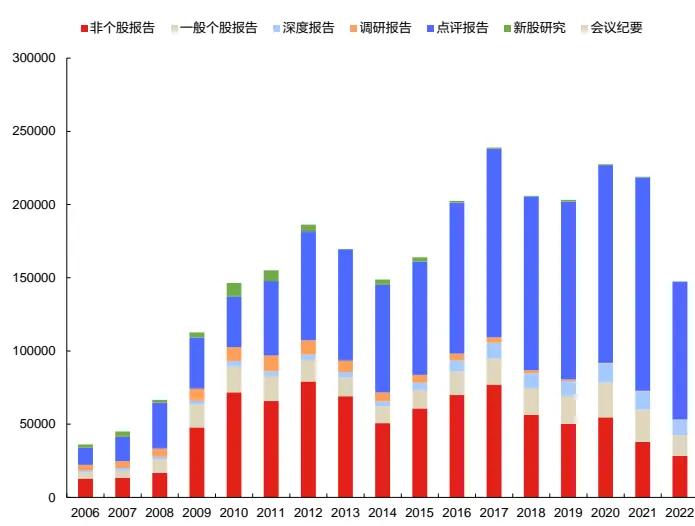
数据来源：东方证券研究所 & 朝阳永续

图 2：朝阳永续分析师报告占比分年统计
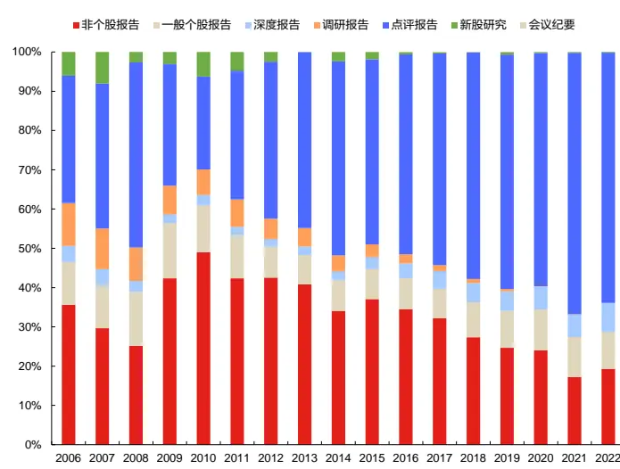
数据来源：东方证券研究所 & 朝阳永续

从各个月份的报告数量分布来看，3 月、4 月、8 月、10 月的非个股报告占比明显低于其他月份，个股报告占比明显多于其他月份。因为 3、4 月是上市公司集中披露上一年年报、当年一季报的时间点，8 月是集中披露当年中报的时间点，10 月是集中披露当年三季报的时间点。分析师一般在财报发布后会对个股观点和盈利预测数据进行更新。

图 3：朝阳永续分析师报告占比分月统计
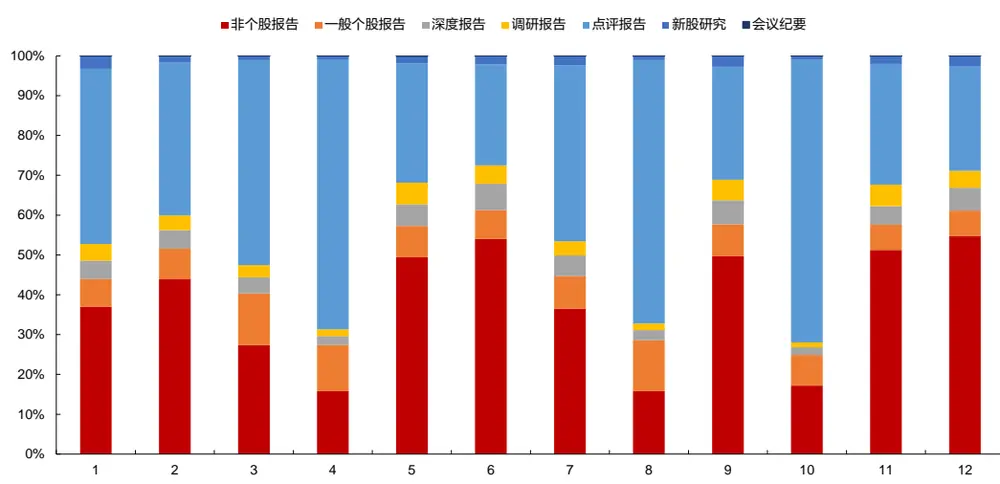
数据来源：东方证券研究所 & 朝阳永续

分析师报告中，盈利预测、评级、目标价是目前被数据商收录较为完整的三个结构化数据。盈利预测数据覆盖度最高，只有0.1%的研报既没有预测净利润，也没有预测eps 数据。目标价数据覆盖度仅为 30%左右，并且目标价的给出还需要分析师研判市场对该公司的合理估值倍数，难度较大。A 股评级差异性不大，多数报告出具的都是买入、增持、推荐、强烈推荐的评级，这一维度的区分性较弱。

图 4：朝阳永续盈利预测、目标价数据覆盖度分年统计
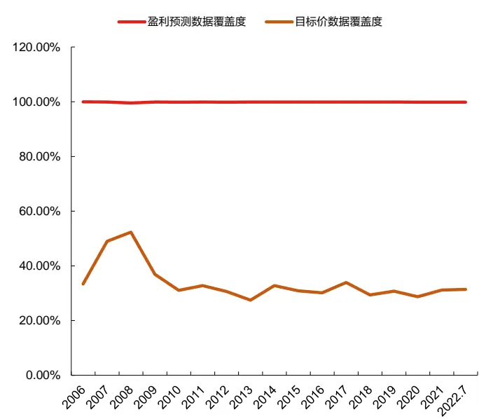
数据来源：东方证券研究所 & 朝阳永续

图 5：朝阳永续评级分类分年统计
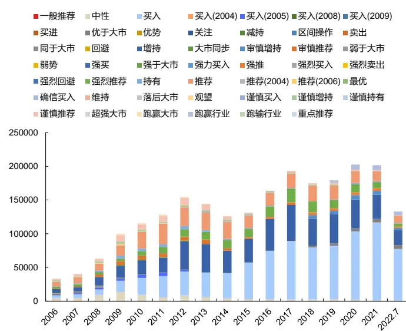
数据来源：东方证券研究所 & 朝阳永续

## 二、原始分析师覆盖度因子表现

常规的分析师覆盖度因子一般有两种计算方法：（1）使用过去一段时间分析师对标的公司出具的研报总数量；（2）使用过去一段时间针对标的公司出具过报告的机构数量。该因子反映了分析师群体对其时间精力的分配，基本面好、未来机会多、预期收益高的股票会有更多的分析师选择覆盖，因而分析师覆盖度因子可能包含不同于基本面和技术面的增量信息。

分析师覆盖情况与公司的基本面特征有关，有的行业更受分析师关注，市值大的公司对行业和指数的影响更大，分析师也会倾向于对这些公司进行研究分析，因而后续我们均考察行业市值中性化处理后的因子的选股表现。中性化之前，因子需要取根号进行正态化处理，缺失值均用 0填充。

从因子覆盖度来看：中证全指内，2017 年-2018 年分析师覆盖度下滑明显，过去 6 个月的分析师覆盖度因子在中证全指中的覆盖度由 2017 年初的 83%下降至 2018 年底的 57%，过去 3 个月的分析师覆盖度因子在中证全指中的覆盖度由 2017 年初的 75%下降至 2018 年底的 50%。这主要是由于2017-2018年大小盘分化严重，分析师将更多的精力放在大盘蓝筹股上。2019年开始分析师覆盖度情况趋于稳定。中证 800内的分析师覆盖度始终较为稳定，基本都在 80%左右。

图 6：分析师覆盖度因子在中证全指的覆盖度
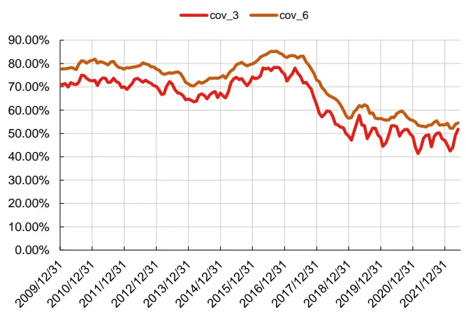
数据来源：东方证券研究所 & 朝阳永续 & Wind资讯

图 7：分析师覆盖度因子在中证 800的覆盖度
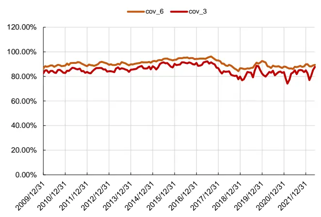
数据来源：东方证券研究所 & 朝阳永续 & Wind资讯

从各个样本空间的表现来看：考察报告数量和机构数量的因子效果差异不大，统一起见，后续均考察报告数量。3 个月和 6 个月回溯期下的因子表现差异也不大，考虑到因子覆盖度，后续均考察过去 6个月。

在中证全指中，分析师覆盖度因子虽然 IC 均值可达 4.4%，多空组合年化收益最高近 18%，但稳定性较差，ICIR1.6，多空组合夏普比 1.53，多空组合回撤较大，最大回撤均在 10%以上。

在中证 800 股票池中，分析师覆盖度因子表现相对较差，IC3.4%，ICIR 在 1.1，多空组合年化收益仅10%左右，最大回撤接近20%。这可能与中证800中分析师覆盖率普遍较高，分析师度覆盖因子对股票的区分程度相对较弱有关。

图 8：常规分析师覆盖因子表现（中证全指 & 中证 800）

| 回归法填充缺失值 | 中证全指 |  |  |  | 中证800 |  |  |  |
| --- | --- | --- | --- | --- | --- | --- | --- | --- |
|  | cov（过去6个月有覆盖 的机构数量，取根号） | cov（过去6个月报告 数量，取根号） | cov（过去3个月有覆盖 的机构数量，取根号） | cov（过去3个月报告 数量，取根号） | cov（过去6个月有覆盖 的机构数量，取根号） | 0V（过去6个月报 数量，取根号） | cov（过去3个月有覆盖 的机构数量，取根号） | coy（过去3个月报告 数量，取根号） |
| IC | 3.93% | 4.41% | 4.21% | 4.41% | 3.29% | 3.44% | 3.46% | 3.39% |
| IC_IR | 1.45 | 1.63 | 1.61 | 1.69 | 1.08 | 1.11 | 1.15 | 1.12 |
| tstat | 5.16 | 5.77 | 5.72 | 5.99 | 3.83 | 3.92 | 4.07 | 3.98 |
| long_short_r | 1.41% | 1.45% | 1.54% | 1.51% | 0.93% | 0.92% | 0.89% | 0.92% |
| long_short_win | 70.20% | 68.21% | 69.54% | 69.54% | 56.95% | 58.28% | 59.60% | 61.59% |
| long_short_sharp | 1.60 | 1.53 | 1.81 | 1.67 | 0.97 | 0.97 | 1.02 | 1.03 |
| long_short_drwandown | -11.24% | -15.90% | -10.95% | -12.64% | -24.77% | -18.76% | -18.84% | -22.55% |
| long_short_yearly | 17.50% | 17.86% | 19.28% | 18.71% | 10.79% | 10.65% | 10.53% | 10.87% |
| 2010/12/31 | 24.23% | 29.88% | 28.79% | 30.38% | 26.70% | 31.61% | 24.82% | 23.30% |
| 2011/12/30 | 7.12% | 8.43% | 8.51% | 7.75% | 2.26% | -0.92% | 1.33% | 4.06% |
| 2012/12/31 | 14.96% | 14.80% | 15.50% | 14.07% | 9.43% | 6.42% | 7.03% | 6.43% |
| 2013/12/31 | 15.06% | 16.62% | 15.32% | 20.00% | 2.92% | 1.24% | 0.56% | 2.82% |
| 2014/12/31 | -8.33% | -14.06% | -6.38% | -9.66% | -20.97% | -14.75% | -13.20% | -15.29% |
| 2015/12/31 | 46.58% | 43.37% | 45.33% | 40.06% | 26.51% | 25.26% | 17.98% | 11.29% |
| 2016/12/30 | 7.70% | 10.14% | 15.18% | 12.55% | 3.54% | 6.37% | 0.19% | 8.14% |
| 2017/12/29 | 28.08% | 30.37% | 30.02% | 33.82% | 33.90% | 37.15% | 32.48% | 35.14% |
| 2018/12/28 | 23.68% | 23.13% | 27.05% | 25.56% | 15.56% | 6.37% | 21.69% | 16.81% |
| 2019/12/31 | 29.92% | 32.38% | 32.12% | 33.63% | 30.07% | 33.71% | 29.53% | 33.08% |
| 2020/12/31 | 41.77% | 44.11% | 39.42% | 39.94% | 32.05% | 23.71% | 23.78% | 18.72% |
| 2021/12/31 | 8.41% | 6.10% | 6.27% | 2.50% | -4.97% | -5.81% | -3.90% | -1.55% |
| 2022/6/27 | -3.38% | -1.78% | -0.30% | 0.87% | -2.64% | 1.33% | 3.02% | 5.74% |

数据来源：东方证券研究所 & 朝阳永续 & Wind资讯

从分组收益来看，分析师覆盖度因子空头端收益更高，多头端超额仅为空头端的一半。中证全指内因子单调性较好，但因子值最大的四组收益基本相当，多头端单调性欠缺。中证 800 内因子单调性较差，因子值最大的一组并不是收益最明显的一组，因子值最大一组的年化收益仅2.8%，而因子值最小一组的年化收益近 8%。

图 9：常规分析师覆盖因子分组表现（中证全指 & 中证 800，按因子值大小从低到高等分 10组）
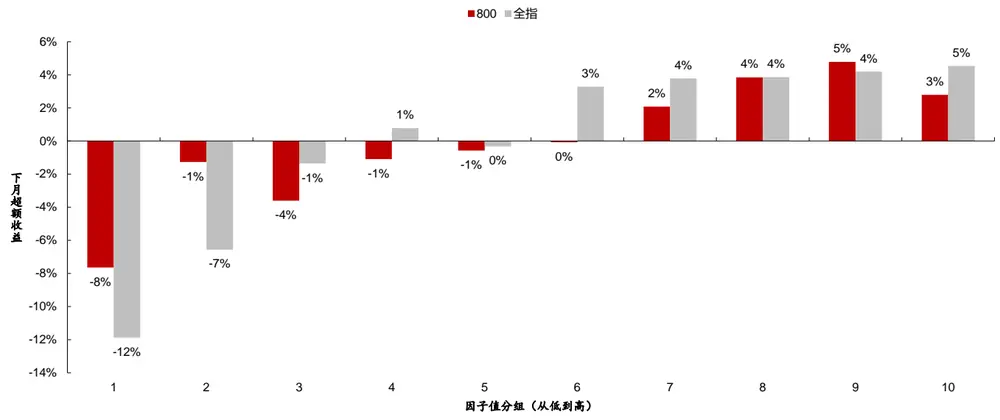
数据来源：东方证券研究所 & 朝阳永续 & Wind资讯

有关分析师的申明，见本报告最后部分。其他重要信息披露见分析师申明之后部分，或请与您的投资代表联系。并请阅读本证券研究报告最后一页的免责申明。

从历史净值表现来看，中证全指中 15 年之后因子表现显著提升，2020 年表现尤为突出，多空组合单年收益超 44%，多头组合单年收益超 22%。2021 年开始因子收益回撤较大，多空组合2021和2022年单年收益为6%和-2%。多头端表现更差，最近两年均为负收益，2021和2022年单年收益均在-6%左右。中证 800 成分内因子表现变化趋势相似，但因子表现波动更剧烈，回撤更大。

图 10：常规分析师覆盖因子多空净值及多头净值表现（中证全指）
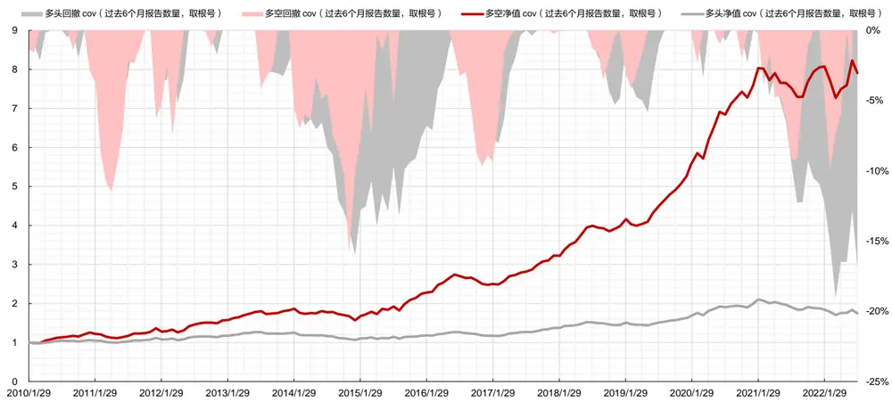
数据来源：东方证券研究所 & 朝阳永续 & Wind资讯

图 11：常规分析师覆盖因子多空净值及多头净值表现（中证 800成分内）
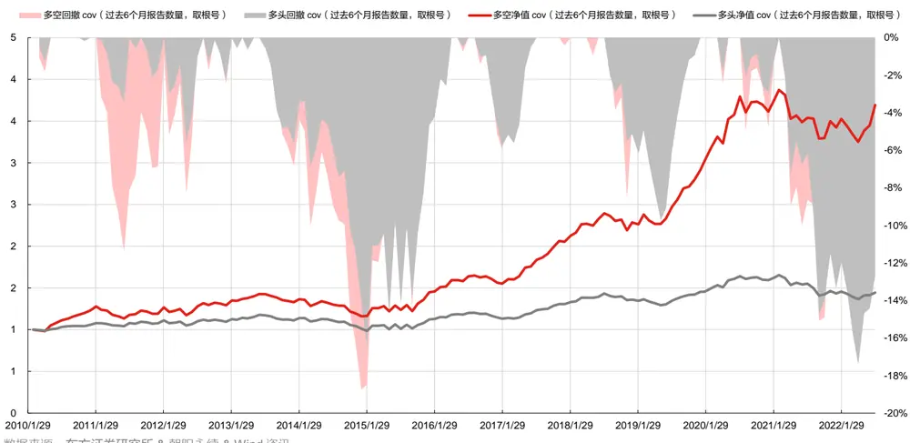
数据来源：东方证券研究所 & 朝阳永续 & Wind资讯
有关分析师的申明，见本报告最后部分。其他重要信息披露见分析师申明之后部分，或请与您的投资代表联系。并请阅读本证券研究报告最后一页的免责申明。

## 三、分析师覆盖度因子改进思路

本文我们从尝试从三个角度对分析师覆盖因子进行改进：

（1）公告后分析师覆盖度因子：上市公司发布的盈利数据是重要的基本面信息，公告前后的市场反应体现了投资者对这些信息的判断和预期差，分析师报告是市场反应的重要组成部分。多个股票的财报公告可能会在同一周甚至同一天发布，这时分析师需要决定优先对哪只股票撰写报告。公告后个股获得的分析师报告多，公告后首次覆盖的机构多，则说明公司此次公告业绩的关注度高，未来股票表现可能较好。

我们统计了每年财报公告（包括季报、快报、预告）后分析师撰写研报的滞后天数。可以看到，公告三天内的研报比例不断上升，滞后公告日 7 天以上的研报比例不断下降，说明分析师对公告数据的反应越来越及时。2021 年公告当天的研报比例接近 30%，滞后 3 天以内的研报比例达到 50%。滞后7天内的研报比例为 60%。

图 12：财报公告（包括季报、快报、预告）后分析师撰写研报的滞后天数占比分年统计
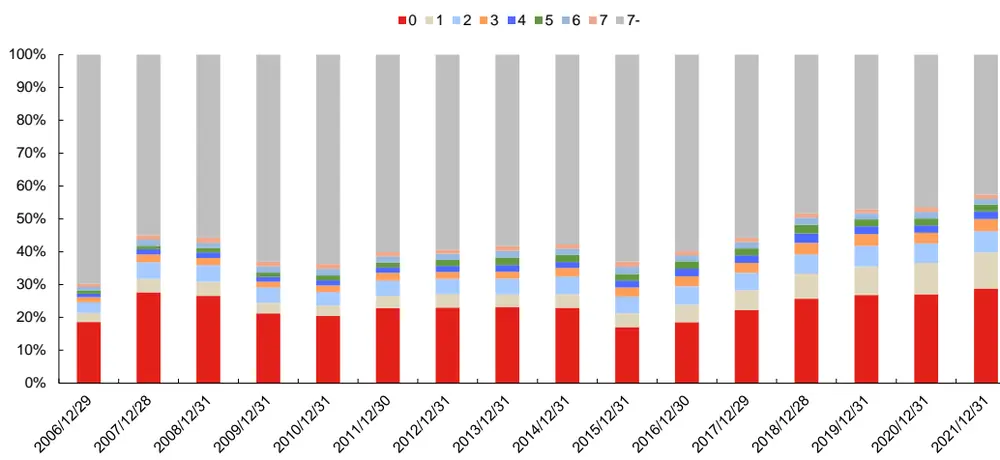
数据来源：东方证券研究所 & 朝阳永续 & Wind资讯

公告后分析师覆盖度因子计算方法如下：考虑到数据覆盖度问题，我们认为公告后 7 天内的分析师报告都可以看作是分析师对此次公告信息的反映。每月底回溯过去 6 个月，统计财报公告（包括季报、快报、预告）发布后 7 天内的研报总数量。因子需要取根号进行正态化处理。若过去 6 个月内有公告，但没有分析师报告，因子值用 0 填充。若过去 6 个月内没有公告，因子值用行业市值回归的方法进行填充（将股票池分为数据存在缺失的股票池 A，和不存在数据缺失股票池 B。首先在类别 B 的样本股中，将待填充的因子对行业虚拟变量和市值进行回归，得到回归系数，随后在股票池 A 中，将回归系数与其已有因子值进行相乘，反向求得其预估因子值进行填充）。

可以看到，过去 6 个月内有公告且 7 天内有至少一篇分析师报告的股票，在中证全指中占比平均在60%左右，在中证800成分内占比平均在80%左右。过去3个月内有公告且7天内有至少一篇分析师报告的股票，在中证全指中占比平均在40%左右，在中证800成分内占比平均在60%左右。由于公司公告主要集中在 3、4、8、10 月，如果只回溯三个月计算，那么 1-3 月，7-8 月公告信息较少，因子覆盖度仅在 20%左右。

图 13：公告后分析师覆盖度因子在中证全指中的覆盖度
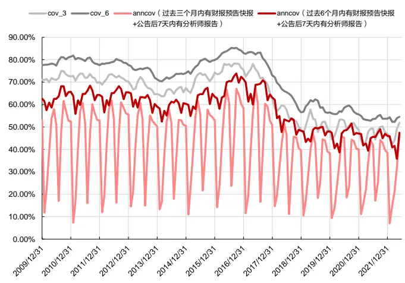
数据来源：东方证券研究所 & 朝阳永续 & Wind资讯

图 14：公告后分析师覆盖度因子在中证 800中的覆盖度
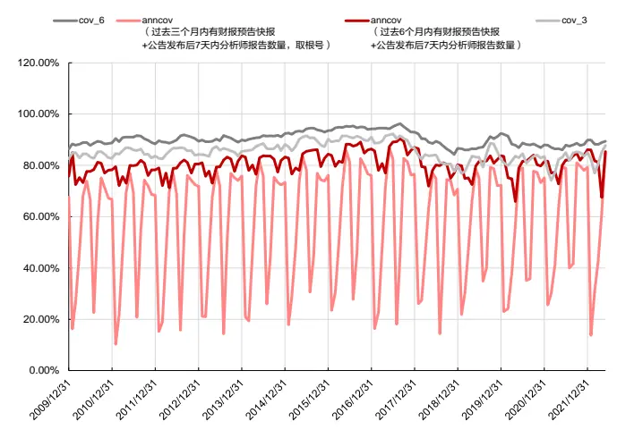
数据来源：东方证券研究所 & 朝阳永续 & Wind资讯

（2）分析师首次覆盖度因子：分析师覆盖股票存在机会成本，分析师倾向于将时间和精力放在有发展潜力的公司上。一般而言，分析师在研报中首次覆盖、长期未关注后重新覆盖、首次给予评级，都可能说明该公司基本面出现好转迹象或分析师看好公司未来的发展前景。考虑到数据覆盖度问题，我们后续所指的分析师首次覆盖度均包括三部分含义：1.首次评级：该机构对该股票之前有个股报告，但 Go-Goal 评级为“无”；2.首次关注：该机构对该股票之前没有个股报告；3.首份报告：该机构对该股票近一年出具的第一篇个股报告。三部分样本占比基本均衡。分析师首次覆盖度因子计算方法如下：每月底回溯过去 6 个月，统计首次覆盖的机构数量。因子需要取根号进行正态化处理。缺失值用 0填充。

过去 6个月内有机构首次覆盖的股票，在中证全指中占比平均在 50%左右，在中证800成分内占比平均在70%左右。过去3个月内有机构首次覆盖的股票，在中证全指中占比平均在35%左右，在中证 800成分内占比平均在 50%左右。

图 15：分析师首次覆盖度因子在中证全指中的覆盖度
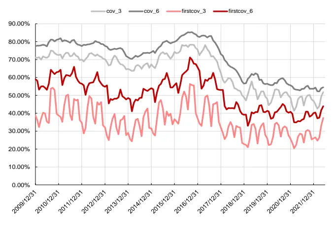
数据来源：东方证券研究所 & 朝阳永续 & Wind资讯

图 16：分析师首次覆盖度因子在中证 800中的覆盖度
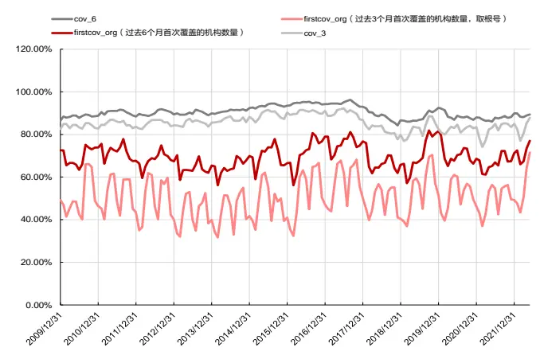
数据来源：东方证券研究所 & 朝阳永续 & Wind资讯

有关分析师的申明，见本报告最后部分。其他重要信息披露见分析师申明之后部分，或请与您的投资代表联系。并请阅读本证券研究报告最后一页的免责申明。

也可以计算公告后分析师首次覆盖度因子，即要求过去 6 个月内该公司有公告，进而计算 7天内分析师首次覆盖度报告的数量。过去 6 个月内有公告，且公告后 7 天内有机构首次覆盖的股票，在中证全指中占比平均在 30%左右，在中证 800 成分内占比平均在 43%左右。过去 3 个月内有公告，且公告后 7 天内有机构首次覆盖的股票，在中证全指中占比平均在 16%左右，在中证800成分内占比平均在 25%左右。鉴于该因子覆盖度过低，不建议作为选股因子使用。

图 17：公告后分析师首次覆盖度因子在中证全指中的覆盖度
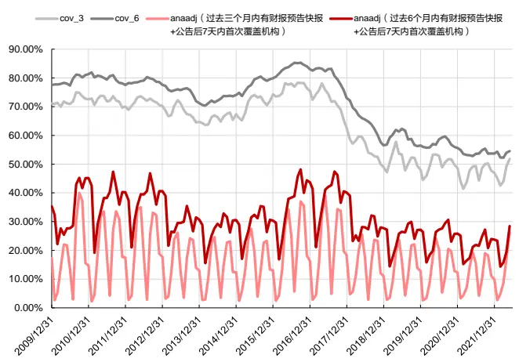
数据来源：东方证券研究所 & 朝阳永续 & Wind资讯

图 18：公告后分析师首次覆盖度因子在中证 800中的覆盖度
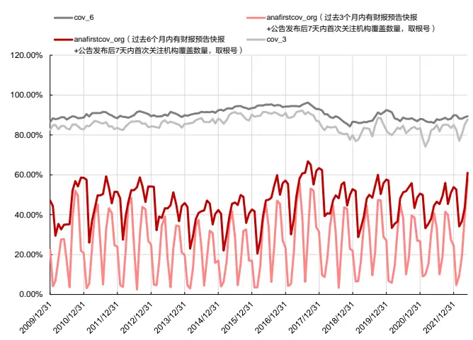
数据来源：东方证券研究所 & 朝阳永续 & Wind资讯

（3）不能被机构持仓占比解释的分析师覆盖度因子：一般来说，分析师对上市公司的跟踪程度与机构投资者的持股比例正相关。分析师会重点关注机构投资者重仓的股票，机构投资者也可能会根据分析师的建议进行投资。但也会存在例外的情况，有的股票分析师已经开始覆盖，但机构尚未重点关注，这种股票可能处于行情起步阶段，未来有可能有突出的表现。

我们尝试了两种因子构造方法：1、每月底，将常规的分析师覆盖度因子对最新机构持仓比例进行正交化。2、每月底，将常规的分析师覆盖度因子的排名分位数减去最新机构持仓比例的排名分位数。

我们基于半年报和年报的基金持股、券商的集合资管计划、前十大流通股中的保险、阳光私募、信托、社保和 QFII 持股、陆股通的持仓数据四个部分来测算每个股票的机构持仓占流通市值的比例。在统计的过程中没有考虑分类成一般法人和非金融公司持股的投资者的持股占比，以及前十大流通股的银行持股。对保险持股的数据进行了划分，去除了保险机构直接持股的部分，只保留保险机构产品的持股部分。

我们统计了 2007 -2022年全市场股票中的机构持仓占比情况。可以看到机构持股占流通市值比大于10%的股票数量从2006年底的357支（7.61%）增长到2016年底的790支（16.83%），但是从 2017 年以来，机构的抱团特征明显，高机构持股比的股票数量也逐年降低，至 2020 中报降低为 645 支（13.74%）。2020 年下半年以来，随着 A 股机构化进程加速，流入 A 股的机构资金增多，高机构持股比的股票数量又开始迅速增加，到 2022年中报达到 1207只（25.71%）。

图 19：机构持仓占比情况分年统计（中证全指）
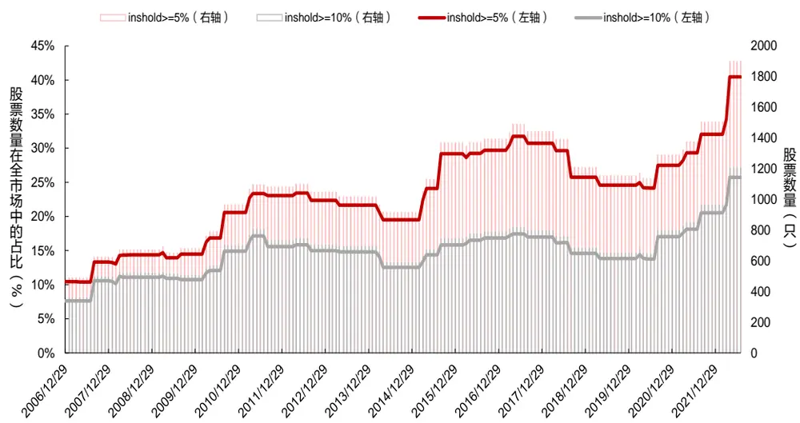
数据来源：东方证券研究所 & 朝阳永续& Wind资讯

此外，我们统计了不同股票池中的机构持仓占比情况。可以看到在沪深 300 和创业板指中机构持仓占比最高，机构持仓比例超过 5%的股票占到 70%以上，机构持仓比例超过 10%的股票占到 50%以上。其次是中证500和中证 1000。

图 20：机构持仓占比情况分年统计（中证 300内）
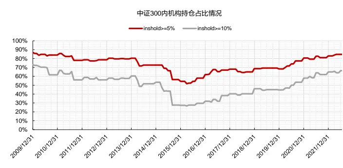
数据来源：东方证券研究所 & 朝阳永续 & Wind资讯

图 21：机构持仓占比情况分年统计（中证 500内）
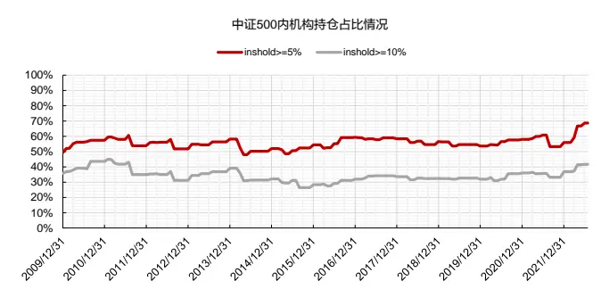
数据来源：东方证券研究所 & 朝阳永续 & Wind资讯

图 22：机构持仓占比情况分年统计（中证 1000 内）
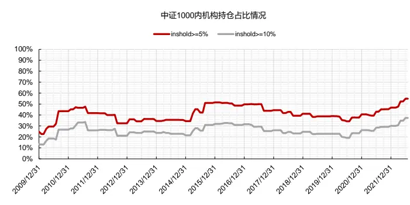
数据来源：东方证券研究所 & 朝阳永续 & Wind资讯

图 23：机构持仓占比情况分年统计（创业板指内）
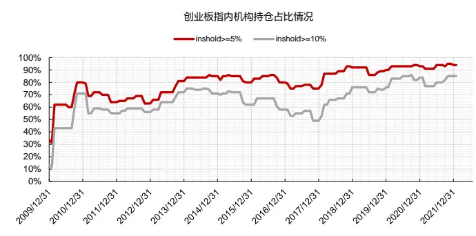
数据来源：东方证券研究所 & 朝阳永续 & Wind资讯

有关分析师的申明，见本报告最后部分。其他重要信息披露见分析师申明之后部分，或请与您的投资代表联系。并请阅读本证券研究报告最后一页的免责申明。

## 四、公告后分析师覆盖度因子表现

## （1）年报、快报、预告数据的影响

加入业绩预告、快报后，anncov因子表现进一步提升，并且因子效果都优于 cov因子。

图 24：公告后分析师覆盖度因子表现（行业市值中性化，中证全指，过去 6个月，不同信息源）

|  | 中证全指 |  |  |
| --- | --- | --- | --- |
| 回归法填充缺失值 | cov(过去6个月报告数量，取根号) | anncov (过去6个月内有财报 | anncov (过去6个月内有财报预告快报 |
| IC | 4.41% | +公告发布后7天内报告数量，取根号） 4.34% | +公告发布后7天内报告数量，取根号） 4.56% |
| IC_IR | 1.63 | 1.91 | 1.93 |
| tstat | 5.77 | 6.76 | 6.85 |
| long_short_r | 1.45% | 1.41% | 1.47% |
| long_short_win | 68.21% | 72.19% | 70.86% |
| long_short_sharp | 1.53 | 1.80 | 1.77 |
| long_short_drwandown | -15.90% | -11.37% | -11.59% |
| long_short_yearly | 17.86% | 17.47% | 18.23% |
| long_r | 0.40% | 0.41% | 0.45% |
| long_win | 56.29% | 55.63% | 54.30% |
| long_sharp | 62.85% | 69.85% | 72.88% |
| long_drwandown | -19.07% | -19.38% | -20.16% |
| long_yearly | 4.54% | 4.58% | 5.15% |
| short_r | -1.05% | -1.00% | -1.01% |
| short_win | 22.52% | 23.18% | 23.18% |
| short_sharp | -239.21% | -253.45% | -254.38% |
| short_drwandown | -79.71% | -78.46% | -78.69% |
| short_yearly | -11.88% | -11.38% | -11.50% |

数据来源：东方证券研究所 & 朝阳永续 & Wind资讯

## （2）计算周期的选择

相同计算周期下，anncov 因子表现均优于 cov 因子，多空组合及多头组合年化收益均有所提升。计算周期为 3 个月的因子表现普遍好于 6 个月的因子，多空组合收益和稳定性均有提升，但考虑到数据覆盖度问题，如果采用过去三个月的计算周期，只利用因子多头端更为恰当。

图 25：公告后分析师覆盖度因子表现（行业市值中性化，中证全指，不同计算周期）

| 回归法填充缺失值 | 中证全指 |  |  |  |
| --- | --- | --- | --- | --- |
|  | cov（过去6个月报告数量，取根号） | anncov (过去6个月内有财报预告快报 | cov（过去3个月报告数量，取根号） | anncov (过去3个月内有财报预告快报 |
| 行业市值中性化 |  | +公告发布后7天内报告数量，取根号） 4.56% | 4.31% | +公告发布后7天内报告数量，取根号） 4.18% |
| IC IC_IR | 4.41% 1.63 | 1.93 | 1.66 | 1.94 |
| tstat | 5.77 | 6.85 | 5.87 | 6.88 |
| long_short_r | 1.45% | 1.47% | 1.46% | 1.49% |
| long_short_win | 68.21% | 70.86% | 69.33% | 76.82% |
| long_short_sharp | 1.53 | 1.77 | 1.64 | 2.08 |
| long_short_drwandown | -15.90% | -11.59% | -12.64% | -7.48% |
| long_short_yearly | 17.86% | 18.23% | 18.13% | 18.59% |
| long_r | 0.40% | 0.45% | 0.43% |  |
| long_win | 56.29% | 54.30% | 57.33% | 0.56% |
| long_sharp | 62.85% | 72.88% | 67.61% | 60.26% |
| long drwandown | -19.07% | -20.16% | -20.11% | 101.41% |
| long_yearly | 4.54% | 5.15% | 4.81% | -12.81% |
| short_r | -1.05% | -1.01% | -1.04% | 6.56% |
| short_win | 22.52% | 23.18% | 20.00% | -0.92% 21.85% |
| short_sharp | -239.21% | -254.38% | -247.98% | -240.20% |
| short_drwandown | -79.71% | -78.69% | -79.16% | -75.34% |
| short_yearly | -11.88% | -11.50% | -11.79% | -10.51% |

数据来源：东方证券研究所 & 朝阳永续 & Wind资讯

## （3）股票池的影响

两因子均是在小票中表现更好，在大票中 anncov 因子相对 cov 因子的优势更为明显。在创业板指和沪深 300 中 anncov 因子的效果最好，多空组合年化收益相比 cov 因子均能提升近 2%。在中证500中anncov因子的多空组合年化收益提升1.2%。但在中证1000股票池中anncov因子表现略逊于 cov 因子。这可能是由于在大票中，常规分析师覆盖因子对股票的区分程度较弱。此外，在所有分组下 anncov 因子的多头组合的表现均优于 cov 因子。

图 26：公告后分析师覆盖度因子表现（行业市值中性化，不同宽基指数）
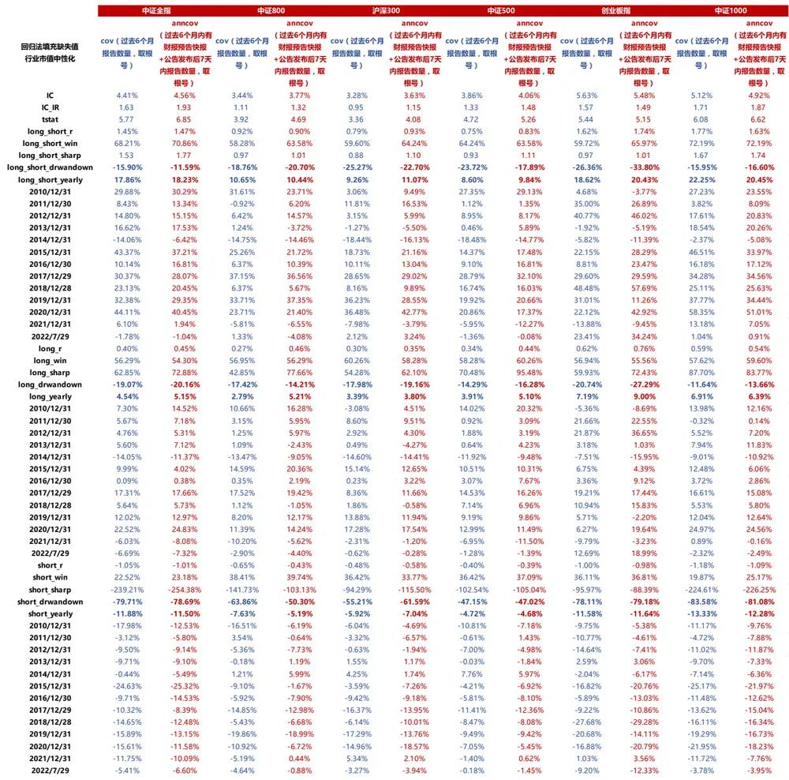
数据来源：东方证券研究所 & 朝阳永续 & Wind资讯

有关分析师的申明，见本报告最后部分。其他重要信息披露见分析师申明之后部分，或请与您的投资代表联系。并请阅读本证券研究报告最后一页的免责申明。

两因子均在高机构持仓占比的股票池中表现较差，在高持仓分组中 anncov 因子的优势更明显。在第五组中 anncov因子的多空组合年化收益相比 cov因子提高 5%，最大回撤也有所降低。在低机构持仓占比分组中anncov虽然多空组合收益略低，但组合夏普比更高，稳定性更好，回撤减半。此外，在所有分组下 anncov因子的多头组合表现均优于 cov因子。

图 27：公告后分析师覆盖度因子表现（行业市值中性化，中证全指内不同机构持仓分组）
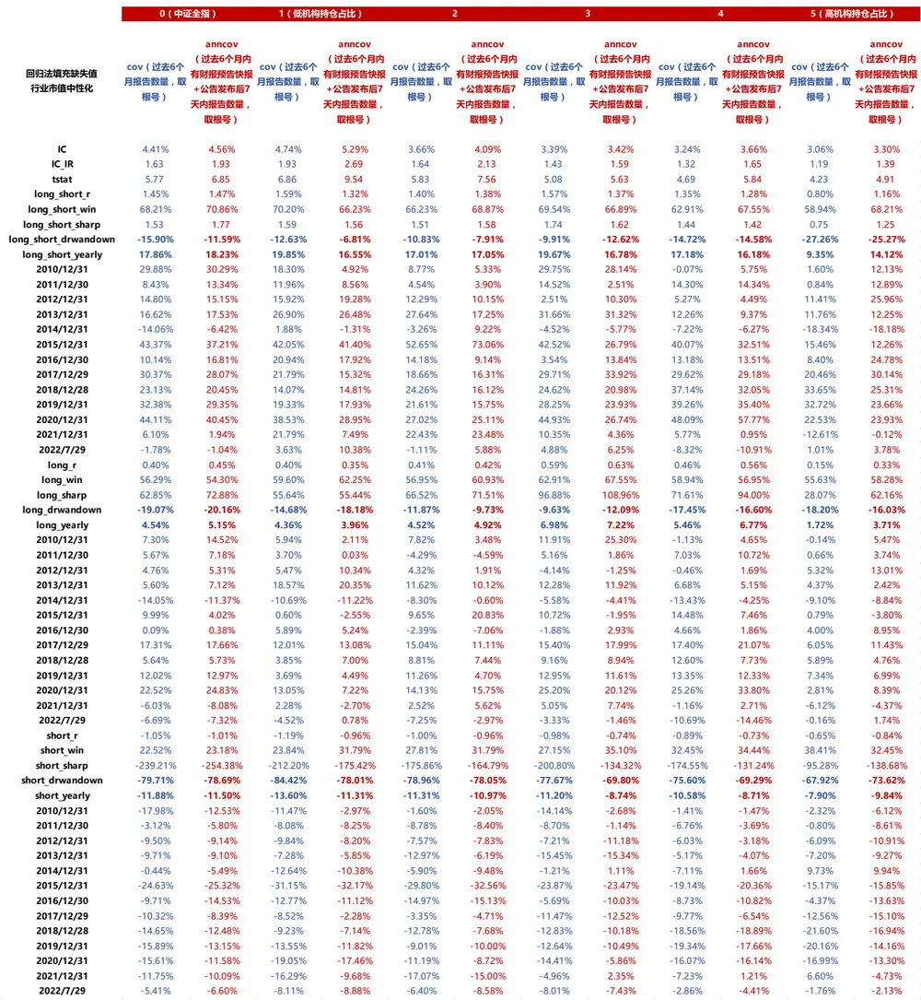
数据来源：东方证券研究所 & 朝阳永续 & Wind资讯

有关分析师的申明，见本报告最后部分。其他重要信息披露见分析师申明之后部分，或请与您的投资代表联系。并请阅读本证券研究报告最后一页的免责申明。

在下图所列出的热门行业中，anncov 因子的表现都优于 cov 因子。在食品饮料行业中优势尤为突出，多空组合年化收益提升 9%，多头组合年化收益提升 5%。在电力设备、国防军工行业中，多空组合年化收益可提升 2.4%。在医药生物、周期行业中，多空组合年化收益可提升 1.2%。

图 28：公告后分析师覆盖度因子表现（行业市值中性化，中证全指内不同行业）
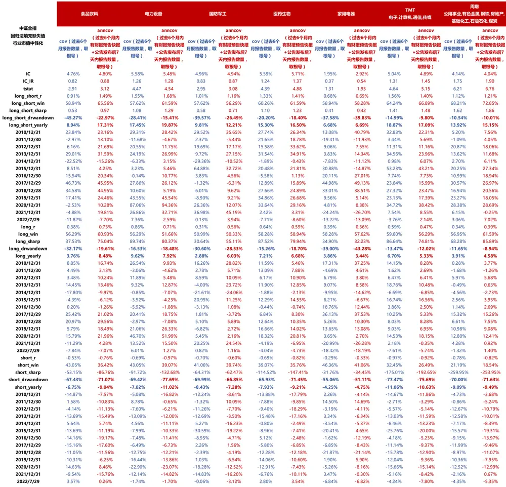
数据来源：东方证券研究所 & 朝阳永续 & Wind资讯

## （4）因子时间序列表现

在全指中 anncov 因子表现略优于 cov 因子。多空组合年化收益和多头组合年化收益均提升0.5%左右，多空组合稳定性提升，最大回撤也有明显降低。

图 29：cov、anncov因子多空组合净值&回撤（中性化，中证全指）
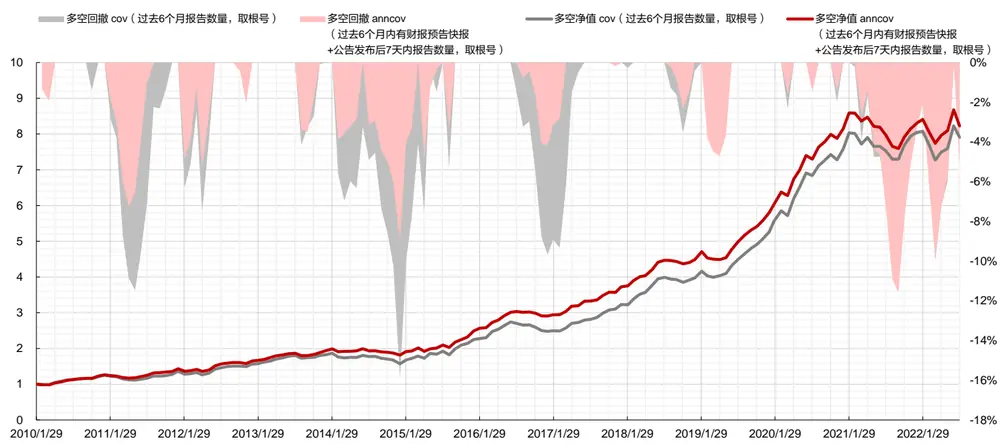
数据来源：东方证券研究所 & 朝阳永续 & Wind资讯

图 30：cov、anncov因子多头组合净值&回撤（中性化，中证全指）
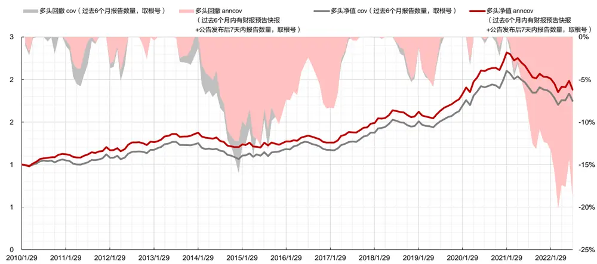
数据来源：东方证券研究所 & 朝阳永续 & Wind资讯

有关分析师的申明，见本报告最后部分。其他重要信息披露见分析师申明之后部分，或请与您的投资代表联系。并请阅读本证券研究报告最后一页的免责申明。

在中证 800成份股中 anncov因子的多空组合表现与 cov因子整体差异不大，但多头组合优势明显。anncov 因子的多头组合年化收益相比 cov 因子提升近 3%，稳定性也有所提升，回撤更低。

图 31：cov、anncov因子多空组合净值&回撤（中性化，中证 800）
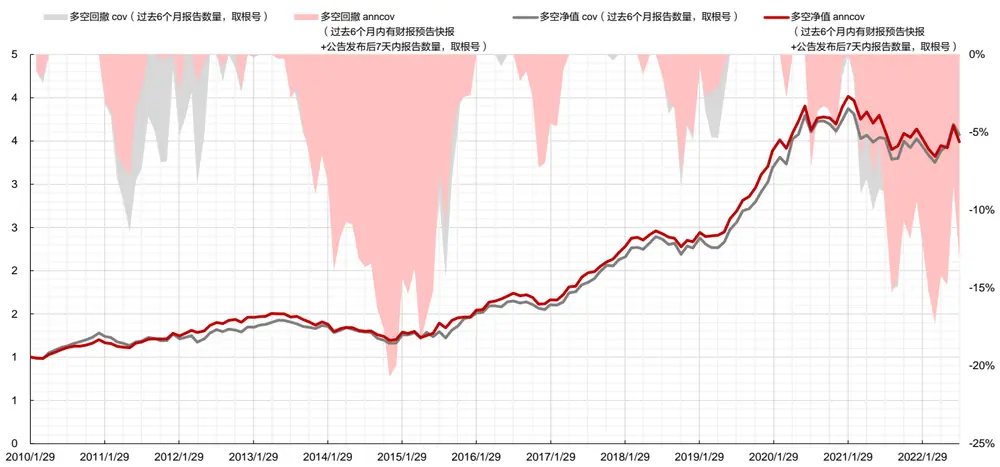
数据来源：东方证券研究所 & 朝阳永续 & Wind资讯

图 32：cov、anncov因子多头组合净值&回撤（中性化，中证 800）
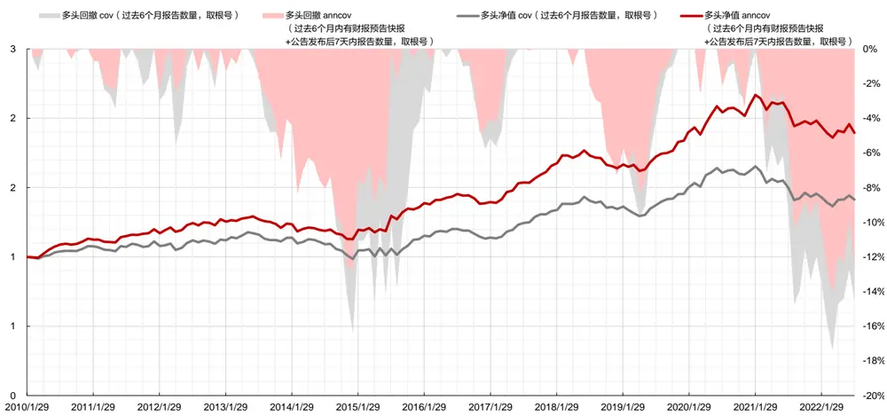
数据来源：东方证券研究所 & 朝阳永续 & Wind资讯

有关分析师的申明，见本报告最后部分。其他重要信息披露见分析师申明之后部分，或请与您的投资代表联系。并请阅读本证券研究报告最后一页的免责申明。

## （5）因子分组收益

在中证全指和中证 800股票池中，anncov因子的多头端收益均高于 cov因子。

在中证全指中，anncov 因子值最大的一组收益最明显，多头端年化收益 5.2%。而 cov 因子值最大的四组收益基本相当，多头端第十组年化收益 4.5%，多头端单调性较差。

在中证 800 成分内，两个因子的分组差距更加明显。cov 因子值最大的一组并不是收益最明显的一组，因子值最大一组的年化收益仅 2.8%，而因子值最小一组的年化收益为-8%。anncov因子仍然保持较好的单调性，因子值最大一组的年化收益最高，达到5.2%，多头端收益与空头端基本相当。

图 33：cov、anncov因子分组年化收益（中性化，中证全指，按因子值大小从低到高等分 10组）
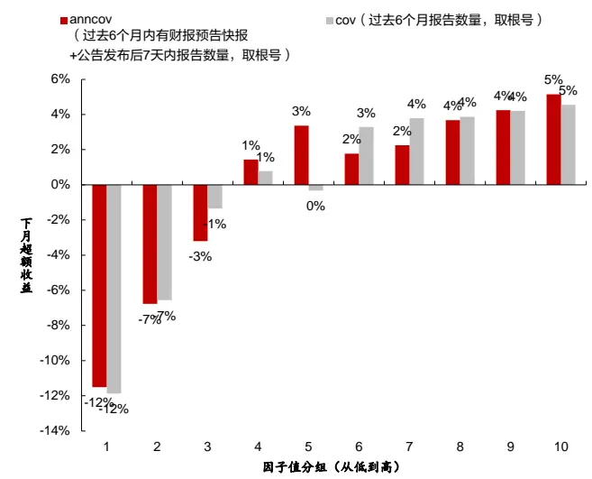
数据来源：东方证券研究所 & 朝阳永续 & Wind资讯

图 34：cov、anncov因子分组年化收益（中性化，中证 800内，按因子值大小从低到高等分 10组）
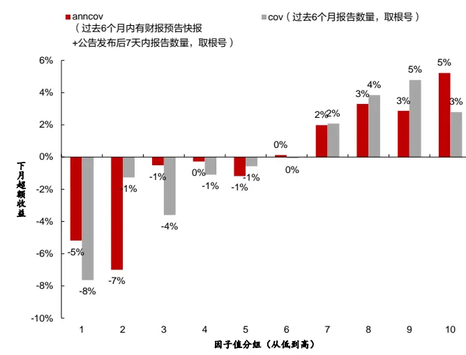
数据来源：东方证券研究所 & 朝阳永续 & Wind资讯

## （6）因子相关性

从因子原始值间的两两相关系数来看，cov 和 anncov 因子间相关性较高，和其他常见的大类因子相关性都不高。与盈利、分析师、公司治理、估值类因子存在 40%左右的正相关性，与非流动性、投机类因子负相关。

图 35：cov、anncov因子与常见大类因子的相关性
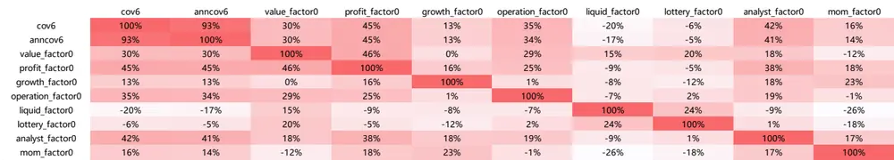
数据来源：东方证券研究所 & 朝阳永续 & Wind资讯
有关分析师的申明，见本报告最后部分。其他重要信息披露见分析师申明之后部分，或请与您的投资代表联系。并请阅读本证券研究报告最后一页的免责申明。

通过常见的截面回归方法进行正交化剔除后，可以看到：1.两因子互相正交化后的残差因子均失去了选股效力。2. 两因子剔除其他常见因子之后，选股效果均不显著。

| 图36：cov、anncov因子残差选股表现 |  |  |  |  |
| --- | --- | --- | --- | --- |
| 中证全指 | anncov6 | cov6 | anncov6 | cov6 |
| 回归法填充缺失值 | _ortho_cov6 | _ortho_anncov6 | _ortho_all | _ortho_all |
| 行业市值中性化 |  |  |  |  |
| IC | 0.30% | 0.66% | 0.26% | 0.35% |
| IC_IR | 28.94% | 53.00% | 16.15% | 20.70% |
| tstat | 102.32% | 187.38% | 57.29% | 73.20% |
| long_short_r | 0.08% | 0.21% | 0.29% | 0.32% |
| long_short_win | 54.00% | 50.67% | 54.97% | 60.00% |
| long_short_sharp | 14.48% | 34.45% | 64.97% | 72.28% |
| long_short_drwandown | -20.59% | -12.58% | -13.58% | -16.77% |
| long_short_yearly | 0.79% | 2.37% | 3.34% | 3.73% |
| 2010/12/31 | 0.08% | -0.76% | 6.93% | 4.62% |
| 2011/12/30 | 6.74% | -2.55% | 0.41% | 1.71% |
| 2012/12/31 | 5.92% | -2.58% | 3.79% | 4.85% |
| 2013/12/31 | 5.64% | 1.53% | -2.39% | 1.82% |
| 2014/12/31 | 0.66% | -6.88% | -9.58% | -13.04% |
| 2015/12/31 | -10.12% | 26.40% | 5.81% | 9.03% |
| 2016/12/30 | 5.79% | -1.58% | -1.42% | -1.89% |
| 2017/12/29 | 6.06% | 2.94% -1.00% | 10.09% | 11.72% |
| 2018/12/28 | 2.92% | 6.71% | 4.34% | 1.29% |
| 2019/12/31 | -3.90% 6.48% | -2.99% | 7.96% 17.10% | 8.70% |
| 2020/12/31 2021/12/31 | -12.32% | 13.44% | -2.88% | 18.78% |
|  | -2.08% | 0.54% | 4.78% | 2.08% |
| 2022/7/29 |  |  |  | 0.28% |

数据来源：东方证券研究所 & 朝阳永续 & Wind资讯

## 五、分析师首次覆盖度因子表现

## （1）计算周期的选择

相同计算周期下，firstcov 因子表现均优于 cov 因子，组合夏普比更高。考虑到数据覆盖度问题，后续还是使用过去 6个月的计算周期。

图 37：分析师首次覆盖度因子表现（行业市值中性化，中证全指，不同计算周期）

| 中证全指 anafirstcov org （过 |  |  |  |  |  |  |
| --- | --- | --- | --- | --- | --- | --- |
|  |  |  |  |  | anafirstcov_org（过 去3个月内有财报预告 |  |
| 回归法填充缺失值 行业市值中性化 | cov（过去6个月报告 数量，取根号） | firstcov (过去6个月首次覆盖 报告数量，取根号） | 去6个月内有财报预告 快报 +公告发布后7天内首 次关注机构覆盖数量， | cov（过去3个月报告 数量，取根号） | firstcov (过去3个月首次覆盖 报告数量，取根号） | 快报 +公告发布后7天内首 次关注机构覆盖数量， |
| IC | 4.41% | 3.44% | 取根号） 4.09% | 4.41% | 3.72% | 取根号） 2.74% |
| IC_IR | 1.63 | 1.49 | 2.88 | 1.69 | 2.26 | 1.63 |
| tstat | 5.77 | 5.27 | 10.23 | 5.99 | 8.03 | 5.80 |
| long_short_r | 1.45% | 1.51% | 1.24% | 1.51% | 1.40% | 0.97% |
| long_short_win | 68.21% | 66.89% | 74.83% | 69.54% | 72.85% | 72.19% |
| long_short_sharp | 1.53 | 1.85 | 1.83 | 1.67 | 1.89 | 1.44 |
| long_short_drwandown | -15.90% | -14.09% | -10.94% | -12.64% | -9.39% | -10.72% |
| long_short_yearly | 17.86% | 18.89% | 15.43% | 18.71% | 17.38% | 11.59% |
| long_r | 0.40% | 0.55% | 0.39% | 0.45% | 0.48% | 0.47% |
| long_win | 56.29% | 56.95% | 58.94% | 57.62% | 62.25% | 62.25% |
| long_sharp | 62.85% | 89.86% | 75.40% | 71.28% | 81.91% | 106.11% |
| long_drwandown | -19.07% | -16.26% | -12.67% | -19.49% | -12.44% | -9.47% |
| long_yearly | 4.54% | 6.43% | 4.68% | 5.14% | 5.54% | 5.59% |
| short_r | -1.05% | -0.97% | -0.85% | -1.05% | -0.93% | -0.50% |
| short_win | 22.52% | 22.52% | 30.46% | 19.87% | 27.15% | 37.75% |
| short_sharp | -239.21% | -242.91% | -143.39% | -250.37% | -180.05% | -79.46% |
| short_drwandown | -79.71% | -76.63% | -72.60% | -79.86% | -75.32% | -53.98% |
| short_yearly | -11.88% | -10.91% | -9.77% | -11.96% | -10.52% | -5.86% |

数据来源：东方证券研究所 & 朝阳永续 & Wind资讯

## （2）股票池的影响

两因子均是在小票中表现更好，在小票中 firstcov因子相对 cov 因子的优势更为明显。在中证 500和中证全指内中 firstcov因子的优势最明显，多空组合年化收益能提升 1%，多头组合年化收益能提升 2%。在中证 800、创业板指、中证 1000 中，虽然多空组合年化收益有所下降，但夏普比略有提高，多头组合年化收益也有所提升。在沪深300中firstcov因子的表现不如cov因子。

图 38：分析师首次覆盖度因子表现（行业市值中性化，不同宽基指数）
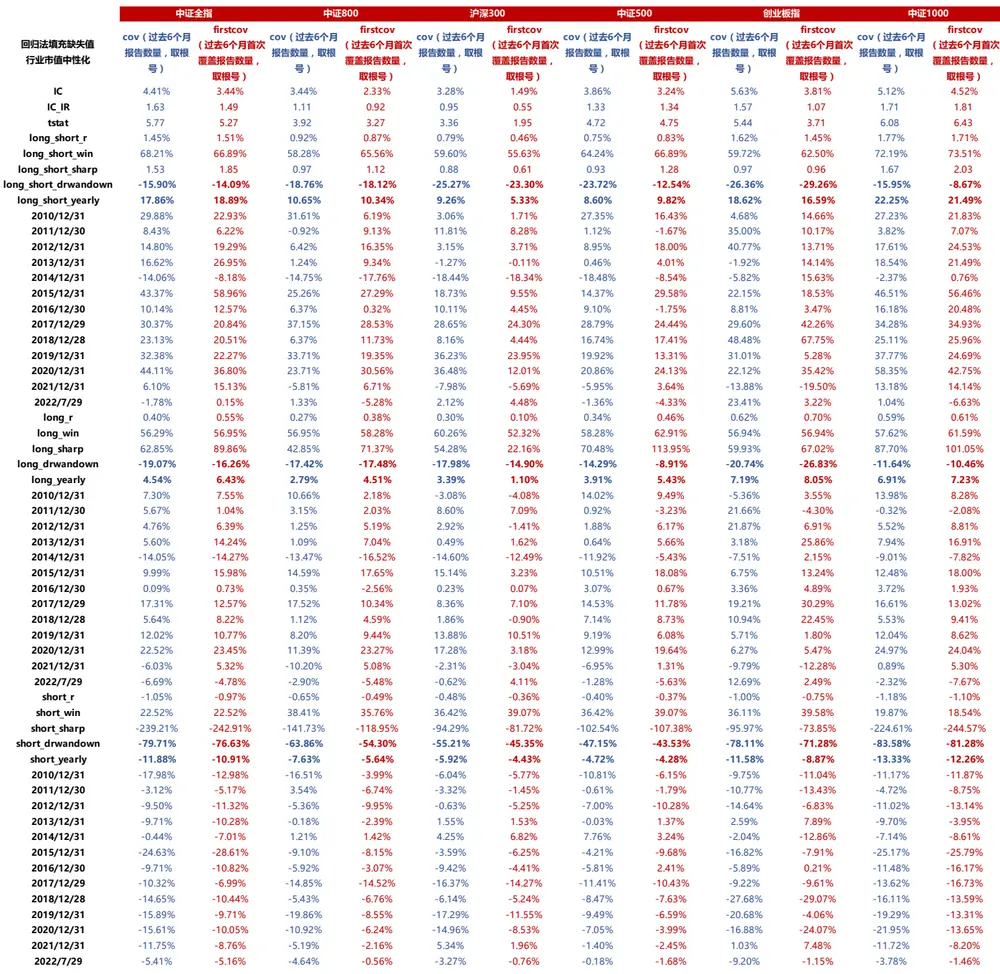
数据来源：东方证券研究所 & 朝阳永续 & Wind资讯

两因子均在高机构持仓占比的股票池中表现较差，在低持仓分组中 firstcov 因子的优势更明显。在第一组中 firstcov 因子的多空组合年化收益相比 cov 因子提高了 2.5%，最大回撤也有所降低。其次在第五组中其多空组合年化收益相比cov因子也提高2%，最大回撤大幅降低。在中间组中其表现略逊于 cov因子。此外在所有分组下 firstcov因子多头组合收益均高于 cov因子。

图 39：分析师首次覆盖度因子表现（行业市值中性化，中证全指内不同机构持仓分组）
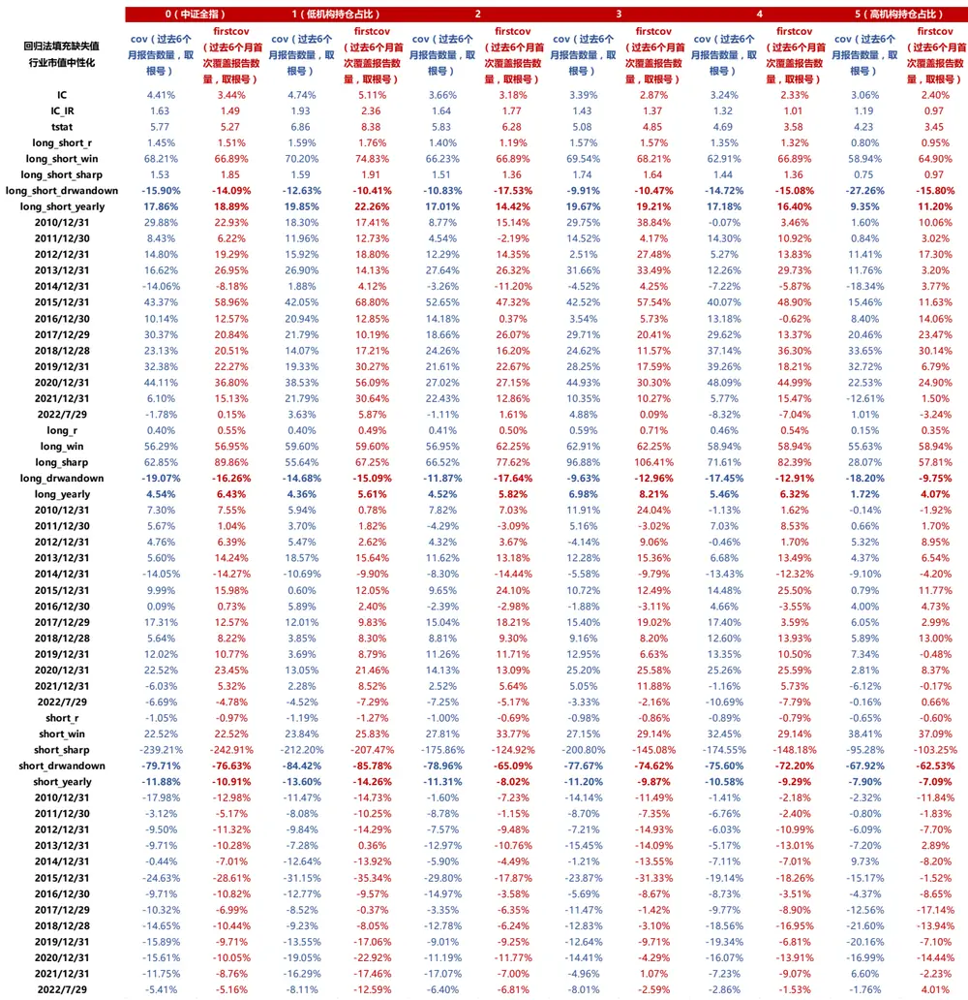
数据来源：东方证券研究所 & 朝阳永续 & Wind资讯

有关分析师的申明，见本报告最后部分。其他重要信息披露见分析师申明之后部分，或请与您的投资代表联系。并请阅读本证券研究报告最后一页的免责申明。

在食品饮料、周期、医药生物、TMT行业中，firstcov因子的表现优于 cov因子。在食品饮料行业中优势尤为突出，多空组合年化收益提升 2%，多头组合年化收益提升 4.5%。在周期行业中，多空组合和多头组合年化收益可提升 2%。在医药生物、TMT 行业中，多空组合夏普比有所提升，最大回撤降低。

图 40：分析师首次覆盖度因子表现（行业市值中性化，中证全指内不同行业）
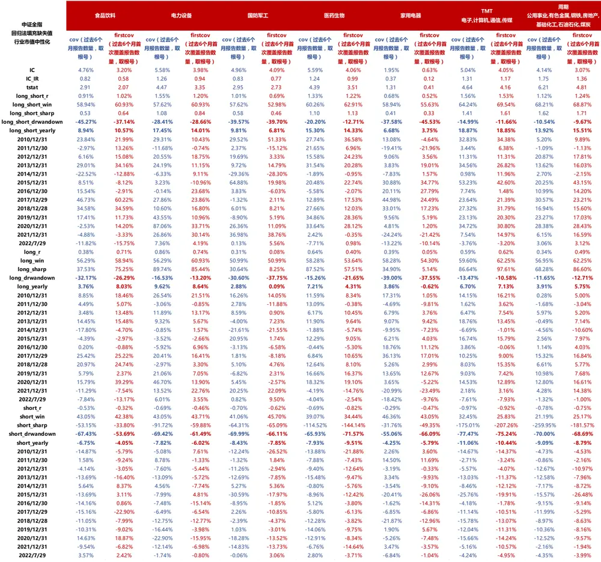
数据来源：东方证券研究所 & 朝阳永续 & Wind资讯

## （3）因子时间序列表现

在中证全指中 firstcov因子不管是多空组合还是多头组合，都明显优于 cov因子。多空组合年化收益均提升 1%，多头组合收益提升 2%。组合稳定性、最大回撤也有明显降低。2021 年以来 firstcov 因子表现优势明显，2021 年单年多空组合收益 15%，多头组合收益 5.32%，远高于cov因子的 6%和-6%。

图 41：cov、firstcov因子多空组合净值&回撤（中性化，中证全指）
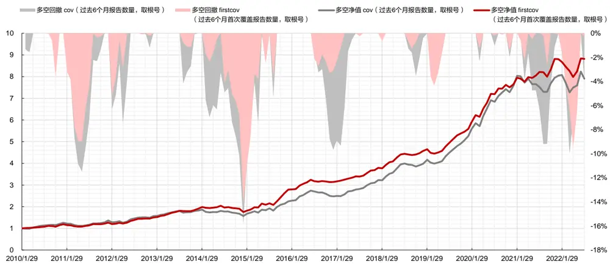
数据来源：东方证券研究所 & 朝阳永续 & Wind资讯

图 42：cov、firstcov因子多头组合净值&回撤（中性化，中证全指）
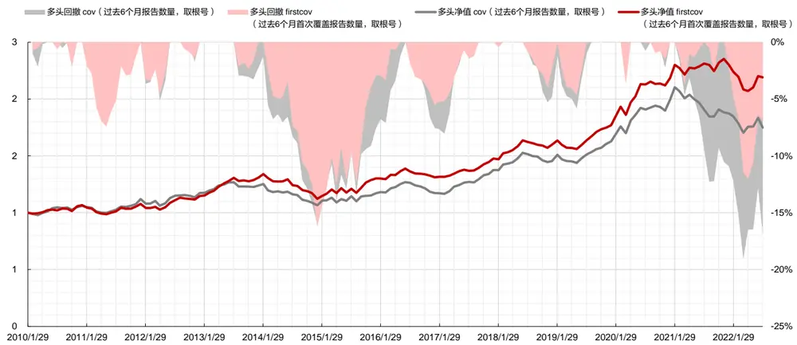
数据来源：东方证券研究所 & 朝阳永续 & Wind资讯

有关分析师的申明，见本报告最后部分。其他重要信息披露见分析师申明之后部分，或请与您的投资代表联系。并请阅读本证券研究报告最后一页的免责申明。

在中证800中 firstcov因子多空组合稳定性略优于 cov因子，整体差异不大，但多头组合自2020年开始优势明显。多头组合年化收益相比 cov因子提升近 2%。

图 43：cov、firstcov因子多空组合净值&回撤（中性化，中证 800）
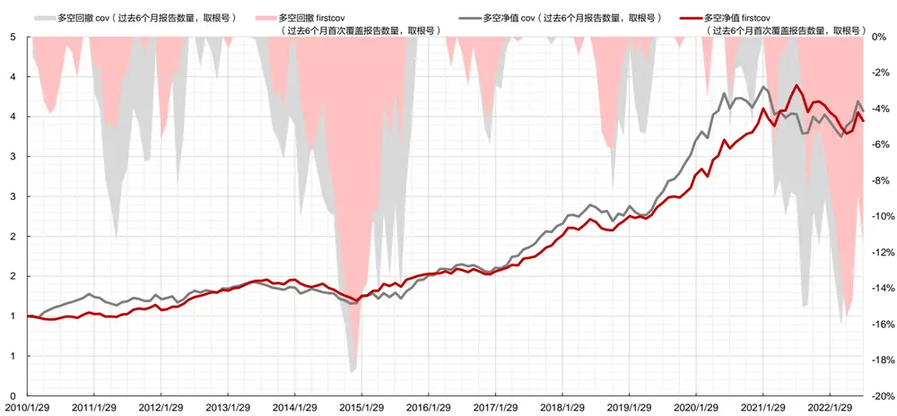
数据来源：东方证券研究所 & 朝阳永续 & Wind资讯

图 44：cov、firstcov因子多头组合净值&回撤（中性化，中证 800）
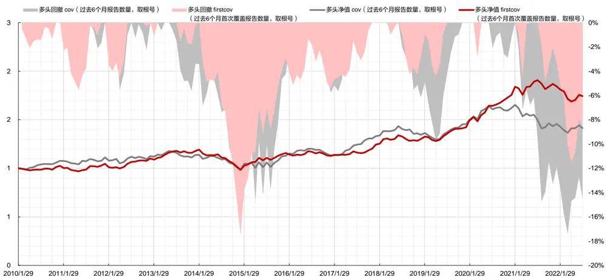
数据来源：东方证券研究所 & 朝阳永续 & Wind资讯

有关分析师的申明，见本报告最后部分。其他重要信息披露见分析师申明之后部分，或请与您的投资代表联系。并请阅读本证券研究报告最后一页的免责申明。

## （4）因子分组收益

在中证全指和中证 800股票池中，firstcov因子的多头端收益均高于 cov因子。

在中证全指中，firstcov 因子多头端单调性较好，因子值最大的一组收益最明显，多头端年化收益 6%。而cov因子值最大的四组收益基本相当，年化收益均为 4%左右，多头端单调性较差。

在中证 800 成分内，两个因子的分组差距更加明显。cov 因子值最大的一组并不是收益最明显的一组，因子值最大一组的年化收益仅 3%，而因子值最小一组的年化收益为-8%。firstcov 因子仍然保持较好的单调性，因子值最大一组的年化收益最高，达到 5%，多头端收益与空头端基本相当。

图 45：cov、firstcov因子分组年化收益（中性化，中证全指，按因子值大小从低到高等分 10组）
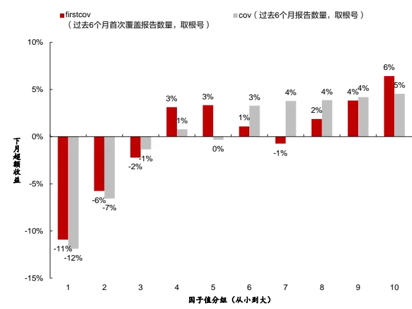
数据来源：东方证券研究所 & 朝阳永续 & Wind资讯

图 46：cov、firstcov因子分组年化收益（中性化，中证 800内，按因子值大小从低到高等分 10组）
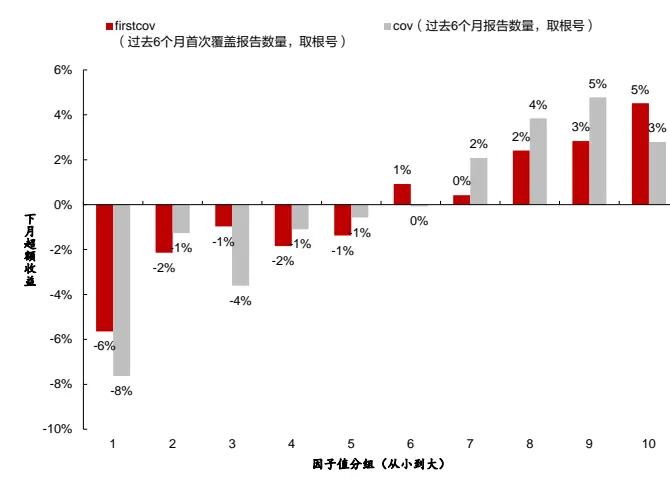
数据来源：东方证券研究所 & 朝阳永续 & Wind资讯

## （5）因子相关性

从因子原始值间的两两相关系数来看，cov和 firstcov因子间存在 78%相关性，和其他常见的大类因子相关性都不高。与盈利、分析师、公司治理类因子存在 30%左右的正相关性，与非流动性、投机类因子负相关。

图 47：cov、firstcov因子与常见大类因子的相关性
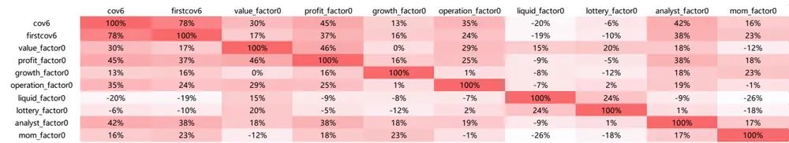
数据来源：东方证券研究所 & 朝阳永续 & Wind资讯

通过常见的截面回归方法进行正交化剔除后，可以看到：1.两因子互相正交化后的残差因子均保留了一定程度的选股效力。2. 两因子剔除其他常见因子之后，选股效果均不显著。

图 48：cov、firstcov 因子残差选股表现

| 中证全指 回归法填充缺失值 | firstcov6_ortho_cov6 | cov6 _ortho_firstcov6 | firstcov6_ortho_all | cov6 _ortho_all |
| --- | --- | --- | --- | --- |
| 行业市值中性化 |  |  |  |  |
| IC IC_IR | 0.82% 64.41% | 2.46% 202.84% | 0.49% 33.53% | 0.35% 20.70% |
| tstat | 227.73% | 717.16% | 118.54% | 73.20% |
| long_short_r | 0.53% | 0.40% | 0.25% | 0.32% |
| long_short_win | 62.67% | 58.00% | 59.33% | 60.00% |
| long_short_sharp | 93.67% | 83.33% | 90.73% | 72.28% |
| long_short_drwandown | -12.87% | -15.67% | -10.42% | -16.77% |
| long_short_yearly | 6.23% | 4.70% | 2.94% | 3.73% |
| 2010/12/31 | 6.43% | 7.83% | 2.20% | 4.62% |
| 2011/12/30 | -0.66% | 3.54% | -1.02% | 1.71% |
| 2012/12/31 | 10.67% | -4.07% | 5.86% | 4.85% |
| 2013/12/31 | 12.31% | 6.69% | 0.42% | 1.82% |
| 2014/12/31 | -2.13% | -5.78% | -8.32% | -13.04% |
| 2015/12/31 | 18.65% | 11.98% | 10.25% | 9.03% |
| 2016/12/30 | 2.14% | 10.53% | 2.82% | -1.89% |
| 2017/12/29 | 4.44% | 8.14% | 8.94% | 11.72% |
| 2018/12/28 | 7.33% | 6.87% | 4.24% | 1.29% |
| 2019/12/31 | 3.58% | 14.52% | 4.63% | 8.70% |
| 2020/12/31 | -1.47% | 8.29% | 8.20% | 18.78% |
| 2021/12/31 | 17.35% | -6.23% | 3.15% | 2.08% |
| 2022/7/29 | 3.22% | -0.30% | -2.76% | 0.28% |

数据来源：东方证券研究所 & 朝阳永续 & Wind资讯

## 六、不能被机构持仓占比解释的分析师覆盖度因子

## （1）股票池的影响

三 因 子 均 是 在 小 票 中 表 现 更 好 ， cov_ortho_inshold 因 子 的 表 现 均 优 于covrank_sub_insholdrank 因子。cov_ortho_inshold 因子的主要优势在于多空组合稳定性好，夏普比高，回撤小，多头组合收益高。除创业板指之外，在其他常见宽基指数中，cov_ortho_inshold 因子相比 cov 因子回撤都有明显降低，接近减半，多空组合夏普比均有较大提升。在中证 500 和中证 800 中因子的多空组合收益也高于 cov 因子，年化收益提升 1%以上。此外，在所有分组下因子的多头组合表现均优于 cov因子。

图 49：不能被机构持仓占比解释的分析师覆盖度因子表现（行业市值中性化，不同宽基指数）

|  | 回归法填充缺先值 | cov(过去6个 | coy orthe | sovrank suk | COV(过去6个 | coy orthe | covrank sub | cov(过去6 | cox erthe covrank sub |  |  | Cov(过去6 | coy erthe | covrank sub |  |  | cov(过去6个coy ortho |  | covrank sub | cov（过去6个 | coy ortho | coyrank sul |
| --- | --- | --- | --- | --- | --- | --- | --- | --- | --- | --- | --- | --- | --- | --- | --- | --- | --- | --- | --- | --- | --- | --- |
|  | 行业市值中性化 | 月报告数量， | _inshold | insholdrank | 月报告数量，inshold |  | insholdrank | 月报告数量 | _inshold _insholdrank |  |  | 月报告数量， | _inshold | _insholdrank |  |  | 月报音量，inshold |  | _insholdrank | 月报合数， | _inshold | _insholdran |
|  |  |  | 3.51% | 2.35% |  |  | 2.30% |  | 2.60% |  |  |  |  | 3.07% |  |  |  |  | 3.28% |  | 3.92% | 2.98% |
|  | tstat |  |  | 4.98 |  | 5.04 | 4.20 |  | 3.88 |  |  |  |  | 5.59 |  |  |  |  |  |  | 6.58 |  |
|  |  |  |  |  |  |  |  |  |  | -23.01% |  | -23.72% | -12.96% | -14.63% |  |  | -26.36% | -38.15% | -36.38% | -15.95% | -12.41% | -9.24% |
|  | 2010/12/31 | 29.88% | 14.38% | 16.98% | 31.61% | 11.61% | 24.29% | 3.06% | -0.57% | -1.55% |  | 27.35% | 13.51% |  | 19.38% |  | 4.68% | -6.70% | -7.98% | 27.23% | 22.10% | -2.35% |
|  | 2013/12/31 | 16.62% | 14.28% | 23.36% | 1.24% | 4.42% | 7.18% | -1.27% | -11.57% | -2.69% |  | 0.46% | 12.31% |  | 7.71% |  | -1.92% | 38.39% | 19.40% | 18.54% | 19.32% | 17.59% |
|  | 2015/12/31 | 43.37% | 31.56% | 30.54% | 25.26% | 20.13% | 18.32% | 18.73% | 4.47% |  | 6.59% | 14.37% | 19.13% |  | 18.92% |  | 22.15% | 7.64% | 2.17% | 46.51% | 35.26% | 23.32% |
|  | 2021/12/31 | 6.10% | 9.90% | 7.70% | -5.81% | -5.85% | -10.52% | -7.98% | -0.20% |  | 6.01% | -5.95% | -0.70% |  | -3.21% |  | -13.88% | 27.27% | -29.72% | 13.18% | 12.71% | 5.49% |
|  | long_r | 0.40% | 0.42% | 0.52% | 0.27% | 0.43% | 0.37% | 0.30% | 0.31% |  | 0.14% | 0.34% | 0.39% | 0 | .22% |  | 0.62% | 0.64% | 0.43% | 0.59% | 0.69% | 0.44% |
|  | long_win | 56.29% | 59.60% | 68.87% | 56.95% | 56.95% | 62.25% | 60.26% | 58.28% |  | 56.95% | 58.28% | 60.26% | 58 |  | .28% | 56.94% | 56.25% | 52.78% | 57.62% | 64.24% | 66.89% |
| lo | ng_drwandown | -19.07% | -13.13% | -6.21% | -17.42% | -16.00% | -7.71% | -17.98% | -9.47% |  | -11.37% | -14.29% | -10.49% | -7 |  | .94% | -20.74% | -18.52% | -21.75% | -11.64% | -11.17% | -6.85% |
|  | 2011/12/30 | 5.67% | 3.20% | 8.13% | 3.15% | 4.17% | 3.41% | 8.60% | 5.99% |  | 4.64% | 0.92% | 0.86% | -0. |  | 01% | 21.66% | -3.80% | 1.75% | -0.32% | -2.92% | 5.65% |
|  |  |  |  |  |  |  |  |  |  |  | 4.04% | 0.64% | 6.00% | 0.5 |  | 9% | 3.18% | 35.58% | 33.34% | 7.94% | 15.08% | 10.88% |
|  | 2014/12/31 | -14.05% | -8.91% | -2.51% | -13.47% | -8.44% | -2.69% | -14.60% | -5.13% |  | -8.85% | -11.92% | -1.23% | -0.9 |  | 5% | -7.51% | -10.60% | -12.68% | -9.01% | -7.18% | 0.59% |
|  | 2019/12/31 | 12.02% | 10.41% | 5.21% | 8.20% | 12.01% | 0.04% | 13.88% | 9.22% | 4.56% |  | 9.19% | 8.85% | 1.15% |  |  | 5.71% | 3.28% | -5.66% | 12.04% | 9.48% | 6.07% |
|  | 2022/7/29 | -6.69% | -5.22% | -2.58% | -2.90% | -2.29% | -2.37% | -0.62% | 0.68% | 1.16% |  | -1.28% | -0.84% | -3.73% |  |  | 12.69% | 15.64% | -0.03% | -2.32% | 3.54% | -1.48% |
|  | short_win | 22.52% | 20.53% | 31.79% | 38.41% | 34.44% | 42.38% | 36.42% | 41.06% | 38.41% |  | 36.42% | 31.13% | 33.77% |  |  | 36.11% | 38.89% | 44.44% | 19.87% | 29.14% | 34.44% |
|  | short_yearly | -11.88% | -9.62% | -6.41% -7.63% |  | -6.23% | -5.38% | -5.92% | -4.38% | -3.82% |  | -4.72% | -5.27% | -4.81% -11.58% |  |  |  | -7.71% | -6.90% | -13.33% | -9.20% | -6.14% |
|  | 2012/12/31 | -9.50% | -6.20% | -5.30% | -5.36% | -3.70% | -3.86% | -0.63% | 1.99% | -3.11% |  | -7.00% | -2.64% | -4.59% -14.64% |  |  |  | 0.41% | 1.55% | -11.02% | -6.30% | -2.58% |
|  |  |  |  |  |  |  |  |  |  |  |  |  |  |  |  |  |  |  |  |  | -3.65%-7.51% | -6.06%-5.05% |
|  | 2015/12/31 | -24.63% | -19.43% | -11.28% | -9.10% | -4.30% | -4.60% | -3.59% | 5.86% | 3.59% |  | -4.21% | -7.92% | -7.47% |  |  | -16.82% | -10.81% | 0.48% | -25.17% | -19.41% | -17.39% |
|  | 2017/12/29 | -10.32% | -6.86% | -8.27% | -14.85% | -12.32% | -11.51% | -16.37% | -14.79% | -12.73% |  | -11.41% | -8.84% | -10.23% |  |  | -9.22% | -4.73% | -4.68% | -13.62% | -9.32% | -6.97% |
|  | 2018/12/28 | -14.65% | -15.46% | -12.49% | -5.43% | -9.05% | -13.20% | -6.14% | -3.08% | -6.50% |  | -8.47% | -9.58% | -12.04% |  |  | -27.68% | -39.08% | -32.14% | -16.11% | -16.47% | -11.48% |
|  | 2020/12/31 | -15.61% | -3.56% | -11.36% -10.92% |  | -3.02% | -16.96% | -14.96% | -9.30% -14.89% |  |  | -7.05% -5.50% |  | -12.59% |  |  | -16.88% | 7.38% | -32.13% | -21.95% | -7.48% | -11.15% |
|  | 2021/12/31 | -11.75% | -11.50% | 0.61% -5.19% |  | -5.53% | 10.00% | 5.34% | -4.09% | -1.46% |  | -1.40% -5.21% |  | 1.85% |  |  | 1.03% | -18.43% | 20.97% | -11.72% | -5.10%-1.67% | 5.57%3.16% |
|  | 2022/7/29 | -5.41% | -8.18% | -0.53% -4.64% |  | -1.61% | 1.60% | -3.27% | -0.74% | 0.78% |  | -0.18% -5.86% |  |  |  |  |  |  |  |  |  |  |

数据来源：东方证券研究所 & 朝阳永续 & Wind资讯

两因子均在高机构持仓占比的股票池中表现较差，但在高持仓分组中 cov_ortho_inshold因子的优势更加明显。在 3-5组中 cov_ortho_inshold因子的多空组合年化收益均有所提升。此外，在所有分组下 cov_ortho_inshold因子的多头组合表现均优于 cov因子。

图 50：不能被机构持仓占比解释的分析师覆盖度因子表现（行业市值中性化，中证全指内不同机构持仓分组）

|  | 0（中证全指） |  | 1（低机构持仓占比） |  | 2 3 4 5（高机构持仓占比） |  |  |  |  |  |  |
| --- | --- | --- | --- | --- | --- | --- | --- | --- | --- | --- | --- |
|  | cov（过去6个 回归法填充缺失值 | cov_ortho | cov（过去6个 | cov_ortho | cov(过去6个 | cov_ortho | cov(过去6个 月报告数量， | cov(过去6个 cov_ortho | cov_ortho | cov（过去6个 | cov_ortho |
| 行业市值中性化 | 月报告数量， 取根号） | _inshold | 月报告数量， 取根号） | _inshold | 月报告数量， 取根号） | _inshold | _inshold 取根号） | 月报告数量， 取根号） | _inshold | 月报告数量， 取根号） | _inshold |
| IC | 4.41% | 3.51% | 4.74% | 3.05% | 3.66% | 3.63% 3.39% | 3.40% | 3.24% | 3.24% | 3.06% | 2.83% |
| IC_IR | 1.63 | 2.03 | 1.93 | 1.37 | 1.64 | 1.63 | 1.43 1.44 | 1.32 | 1.39 | 1.19 | 1.51 |
| tstat | 5.77 | 7.19 | 6.86 | 4.85 | 5.83 | 5.80 5.08 | 5.11 | 4.69 | 4.93 | 4.23 | 5.35 |
| long_short_r | 1.45% | 1.25% | 1.59% | 1.23% | 1.40% | 1.37% 1.57% | 1.61% | 1.35% | 1.43% | 0.80% | 0.78% |
| long_short_win | 68.21% | 72.19% | 70.20% | 63.58% | 66.23% | 68.21% 69.54% | 72.19% | 62.91% | 66.89% | 58.94% | 60.26% |
| long_short_sharp | 1.53 | 2.15 | 1.59 | 1.30 | 1.51 | 1.52 1.74 | 1.77 | 1.44 | 1.56 | 0.75 | 0.95 |
| long_short_drwandown | -15.90% | -6.30% | -12.63% | -17.05% | -10.83% | -9.28% | -9.91% -13.35% | -14.72% | -13.76% | -27.26% | -15.74% |
| long_short_yearly | 17.86% | 15.74% | 19.85% | 15.32% | 17.01% | 16.74% | 19.67% 20.36% | 17.18% | 18.05% | 9.35% | 9.61% |
| 2010/12/31 | 29.88% | 14.38% | 18.30% | 0.57% | 8.77% | 8.31% | 29.75% 27.95% | -0.07% | 11.04% | 1.60% | -9.61% |
| 2011/12/30 | 8.43% | 9.79% | 11.96% | 2.26% | 4.54% | 3.25% | 14.52% 15.78% | 14.30% | 18.44% | 0.84% | 1.97% |
| 2012/12/31 | 14.80% | 9.80% | 15.92% | 17.79% | 12.29% | 12.90% | 2.51% 3.70% | 5.27% | 3.22% | 11.41% | 12.83% |
| 2013/12/31 | 16.62% | 14.28% | 26.90% | 39.18% | 27.64% | 26.71% | 31.66% 33.12% | 12.26% | 8.29% | 11.76% | 1.25% |
| 2014/12/31 | -14.06% | -3.46% | 1.88% | 5.76% | -3.26% | -1.85% | -4.52% -8.96% | -7.22% | -9.06% | -18.34% |  |
| 2015/12/31 | 43.37% | 31.56% | 42.05% | 57.57% | 52.65% | 48.50% | 42.52% 45.26% | 40.07% | 49.60% | 15.46% | -4.69% 10.70% |
| 2016/12/30 | 10.14% | 13.91% | 20.94% | 13.73% | 14.18% | 14.55% | 3.54% 6.27% | 13.18% | 15.23% | 8.40% |  |
| 2017/12/29 | 30.37% | 26.57% | 21.79% | 16.72% | 18.66% | 15.77% | 29.71% 29.38% | 29.62% | 25.74% | 20.46% | 10.44% |
| 2018/12/28 | 23.13% | 27.42% | 14.07% | 13.08% | 24.26% | 19.81% | 24.62% 23.93% | 37.14% | 39.35% | 33.65% | 23.91% |
| 2019/12/31 | 32.38% | 22.63% | 19.33% | 17.05% | 21.61% | 20.76% | 28.25% 25.91% | 39.26% | 37.68% |  | 29.06% |
| 2020/12/31 | 44.11% | 24.22% | 38.53% | 25.69% | 27.02% | 26.74% | 44.93% 50.32% | 48.09% | 44.33% | 32.72% 22.53% | 14.83% |
| 2021/12/31 | 6.10% | 9.90% | 21.79% | 2.24% | 22.43% | 27.79% | 10.35% 12.57% | 5.77% | 11.27% |  | 15.41% |
| 2022/7/29 | -1.78% | 3.25% | 3.63% | -7.46% | -1.11% | 0.29% | 4.88% 6.32% | -8.32% | -11.17% | -12.61% | 6.65% |
| long_r | 0.40% | 0.42% | 0.40% | 0.43% | 0.41% | 0.40% | 0.59% 0.65% | 0.46% | 0.52% | 1.01% | 9.63% |
| long_win | 56.29% | 59.60% | 59.60% | 60.26% | 56.95% | 57.62% | 62.91% 67.55% | 58.94% | 58.28% | 0.15% | 0.27% |
| long_sharp | 62.85% | 81.89% | 55.64% | 65.86% | 66.52% | 65.26% | 96.88% 106.64% | 71.61% | 80.77% | 55.63% | 58.94% |
| long_drwandown | -19.07% | -13.13% | -14.68% | -14.95% | -11.87% | -11.77% | -9.63% -11.98% | -17.45% | -17.84% | 28.07% -18.20% | 51.50% |
| long_yearly | 4.54% | 4.91% | 4.36% | 4.98% | 4.52% | 4.44% | 6.98% 7.83% | 5.46% | 6.08% | 1.72% | -12.17% |
| 2010/12/31 | 7.30% | 3.41% | 5.94% | 5.94% | 7.82% | 8.17% | 11.91% 15.02% | -1.13% | 3.70% | -0.14% | 3.26% |
| 2011/12/30 | 5.67% | 3.20% | 3.70% | -0.41% | -4.29% | -6.40% | 5.16% 5.91% | 7.03% | 8.66% | 0.66% | -5.41% |
| 2012/12/31 | 4.76% | 3.12% | 5.47% | 10.68% | 4.32% | 4.20% | -4.14% -2.62% | -0.46% | 0.53% | 5.32% | 0.36% |
| 2013/12/31 | 5.60% | 7.38% | 18.57% | 23.20% | 11.62% | 13.50% | 12.28% | 15.34% 6.68% | 4.22% | 4.37% | 12.57% |
| 2014/12/31 | -14.05% | -8.91% | -10.69% | -4.29% | -8.30% | -7.93% | -5.58% | -8.19% -13.43% | -12.79% | -9.10% | 1.27% |
| 2015/12/31 | 9.99% | 6.92% | 0.60% | -1.63% | 9.65% | 9.56% | 10.72% | 9.99% 14.48% | 19.93% | 0.79% | -5.25% 5.61% |

数据来源：东方证券研究所 & 朝阳永续 & Wind资讯

有关分析师的申明，见本报告最后部分。其他重要信息披露见分析师申明之后部分，或请与您的投资代表联系。并请阅读本证券研究报告最后一页的免责申明。

在食品饮料、电力设备、周期行业中，cov_ortho_inshold因子的表现优于 cov因子。在食品饮料行业中优势尤为突出，多空组合年化收益提升 6%，多头组合年化收益提升 3%。在电力设备和周期行业中，多空组合和多头组合的夏普比有所提高，最大回撤降低。

图 51：不能被机构持仓占比解释的分析师覆盖度因子表现（行业市值中性化，中证全指内不同行业）

| 中证全指回归法填充缺失值 |  |  | 食品饮料 |  |  | 电力设备 |  | 国防军工 |  | 医药生物 |  | 家用电器 |  | TMT电子,计算机,通信,传媒 |  | 周期公用事业,有色金属,钢铁,房地产，基础化工，石油石化,煤炭 |  |  |
| --- | --- | --- | --- | --- | --- | --- | --- | --- | --- | --- | --- | --- | --- | --- | --- | --- | --- | --- |
|  |  |  | 行业市值中性化 |  | cov(过去6个月报告数量， |  | cov_ortho | cov（过去6个月报告数量， | cov_ortho | cov(过去6个月报告数量， | cov_orthoc | ov(过去6个月报告数量， | cov_orthoc | ov(过去6个月报告数量， | cov_ortho | cov(过去6个cov_ortho月报告数量， |  | cov(过去6个cov_ortho_月报告数量， |
|  |  |  | 取根号） |  | _inshold | 取根号） | _inshold | 取根号） | _inshold | 取根号） | _inshold | 取根号） | _inshold | _inshold取根号） |  | inshold取根号） |  |  |
|  | IC |  | 4.76% |  | 4.91% | 5.58% | 4.31% | 4.96% | 4.17% | 5.59% | 3.56% | 1.95% | 0.79% | 5.04% 2.93% |  | 4.14% 3.53% |  |  |
|  | IC_IR |  | 0.82 |  | 1.12 | 1.26 | 1.24 | 0.83 | 0.84 | 1.24 | 1.24 | 0.37 | 0.15 | 1.31 1.19 |  | 1.75 1.80 |  |  |
|  | tstat |  | 2.91 |  | 3.97 | 4.47 | 4.41 | 2.95 | 2.96 | 4.39 | 4.41 | 1.31 | 0.54 | 4.64 4.24 |  | 6.21 6.39 |  |  |
|  | long_short_r |  | 0.91% |  | 1.28% | 1.55% | 1.33% | 1.01% | 0.51% | 1.33% | 0.69% | 0.68% | 0.08% | 1.56% 0.99% |  | 1.12% 1.02% |  |  |
|  | long_short_win |  | 58.94% |  | 62.91% | 57.62% | 62.25% | 57.62% | 53.64% | 60.26% | 62.91% | 58.94% | 51.66% | 64.24% | 62.91% | 68.21% 70.20% |  |  |
| long_short_sharp |  |  | 0.53 |  | 1.02 | 1.08 | 1.17 | 0.58 | 0.35 | 1.10 | 0.92 | 0.41 | 0.05 | 1.41 | 1.34 | 1.62 1.66 |  |  |
| long_short_drwandown |  |  | -45.27% |  | -24.93% | -28.41% | -24.81% | -39.57% | -39.55% | -20.20% | -8.66% | -37.58% | -55.92% | -14.99% | -11.12% | -10.54% -6.73% |  |  |
| long_short_yearly |  |  | 8.94% |  | 15.14% | 17.45% | 15.84% | 9.81% | 4.67% | 15.30% | 8.03% | 6.68% | -1.10% | 18.87% | 12.03% | 13.92% 12.70% |  |  |
| 2010/12/31 |  |  | 23.84% |  | 34.16% | 29.31% | 12.99% | 29.52% | -35.08% | 27.74% | 2.95% | 13.08% | -8.88% | 32.83% | 16.26% | 5.20% 4.73% |  |  |
| 2011/12/30 |  |  | -2.97% |  | 31.03% | -11.68% | 8.85% | 2.37% | 8.12% | 21.65% | 6.33% | -19.41% | -11.81% | 3.44% | 2.45% | -1.09% 4.67% |  |  |
|  |  | 2012/12/31 | 6.16% |  | 42.91% | 20.55% | 9.57% | 19.69% | 26.32% | 15.58% | 12.48% | 9.06% | 1.84% | 11.31% | 3.27% | 20.87% 15.83% |  |  |
|  |  | 2013/12/31 | 29.01% |  | 5.62% | 24.19% | 13.63% | 9.72% | 32.18% | 31.54% | 12.70% | 3.83% | 0.62% | 34.56% | 8.70% | 13.62% 12.95% |  |  |
|  |  | 2014/12/31 | -22.52% |  | -5.91% | -6.33% | 11.28% | -29.36% | -13.59% | -1.89% | 2.78% | -7.83% | -18.62% | 0.98% | -0.72% | 2.70% 0.34% |  |  |
| 2015/12/31 |  |  | 8.51% |  | -6.27% | 3.23% | -3.92% | 64.88% | 22.19% | 20.48% | 1.20% | 30.88% | -19.80% | 53.23% | 22.24% | 20.25% 22.39% |  |  |
| 2016/12/30 |  |  | 15.54% |  | 15.32% | -0.14% | 4.81% | 3.83% | -12.21% | -5.58% | 4.62% | 20.11% | 8.29% | 7.74% | 2.78% | 10.99% 14.42% |  |  |
|  |  | 2017/12/29 | 46.73% |  | 41.46% | 27.86% | 23.83% | -1.32% | 1.62% | 12.89% | 8.15% | 44.98% | 27.34% | 23.64% | 16.58% | 30.57% 26.41% |  |  |
|  |  | 2018/12/28 | 34.58% |  | 14.38% | 10.60% | 17.41% | 6.01% | 9.95% | 27.66% | 18.08% | 33.01% | 24.05% | 27.32% | 22.69% | 16.94% 20.93% |  |  |
|  |  | 2019/12/31 | 17.41% |  | 14.94% | 43.55% | 27.34% | -8.90% | -7.47% | 34.86% | 10.64% | 9.56% | 13.32% | 23.13% | 22.04% | 23.27% 15.74% |  |  |
|  |  | 2020/12/31 | -2.53% |  | 9.16% | 87.06% | 47.67% | 26.36% | 4.37% | 33.64% | 18.45% | 4.81% | 17.56% | 34.72% | 29.77% | 28.38% 17.24% |  |  |
|  |  | 2021/12/31 | -4.88% |  | 2.29% | 26.86% | 31.49% | 36.98% | 42.86% | 2.42% | 5.21% | -24.24% | -26.00% | 7.54% | 9.44% | 6.15% 2.78% |  |  |
|  |  | 2022/7/29 |  | -11.82% | 5.97% | 7.36% | 6.32% | 0.13% | 6.19% | -7.71% | 0.65% | -13.22% | 1.09% | -3.76% | 2.59% | 3.06% 4.60% |  |  |
|  |  | long_r |  | 0.38% | 0.58% | 0.86% | 0.72% | 0.31% | 0.20% | 0.64% | 0.34% | 0.39% | -0.05% | 0.59% | 0.34% | 0.34% 0.35% |  |  |
|  |  | long_win |  | 56.29% | 58.94% | 56.29% | 60.26% | 50.99% | 53.64% | 58.28% | 60.26% | 58.28% | 53.64% | 59.60% | 55.63% | 56.95% 59.60% |  |  |
| l |  | ong_sharp |  | 37.53% | 69.37% | 89.74% | 89.99% | 30.64% | 22.47% | 87.52% | 59.31% | 34.90% | -4.51% | 86.64% | 62.18% | 68.28% 78.00% |  |  |
| long_drwandown |  |  |  | -32.17% | -23.26% | -16.53% | -13.09% | -30.60% | -27.65% | -15.26% | -16.48% | -39.00% | -41.19% | -13.47% | -14.57% | -11.65% -10.44% |  |  |
|  |  | long_yearly |  | 3.76% | 6.75% | 9.62% | 8.19% | 2.88% | 2.05% | 7.21% | 3.96% | 3.86% | -1.72% | 6.70% | 3.88% | 3.91% 4.17% |  |  |
|  |  | 2010/12/31 |  | 8.85% | 11.78% | 26.54% | 10.07% | 16.26% | -18.79% | 11.59% | 0.80% | 17.31% | 2.57% | 14.15% | 4.95% | 0.28% 1.81% |  |  |
|  |  | 2011/12/30 |  | 4.49% | 18.09% | -3.06% | 3.40% | 2.78% | 15.28% | 13.09% | 0.15% | -4.69% | -10.10% | 1.62% | -2.15% | -1.68% -0.07% |  |  |
|  |  | 2012/12/31 |  | 3.48% | 17.04% | 11.89% | 9.96% | 8.59% | 15.95% | 6.17% | 5.57% | 6.79% | -2.80% | 6.47% | 2.88% | 5.97% 3.53% |  |  |
|  |  | 2013/12/31 |  | 14.45% | 1.73% | 9.32% | 6.95% | -4.00% | 19.30% | 11.90% | 13.95% | 9.07% | 5.29% | 18.76% | 2.74% | -0.49% 3.58% |  |  |
|  |  | 2014/12/31 |  | -17.80% | -10.53% | -0.85% | 0.54% | -21.61% | -3.00% | -1.88% | -2.36% | -9.95% | -19.19% | -6.69% | -4.31% | -4.56% -3.51% |  |  |
|  |  | 2015/12/31 |  | -4.39% | -3.15% | -3.52% | 2.65% | 20.95% | 4.34% | 12.29% | 0.89% | 6.21% | -12.07% | 16.74% | 4.89% | 2.56% -0.90% |  |  |
|  |  | 2016/12/30 |  | 0.20% | 2.23% | -5.92% | -0.71% | -3.13% | -6.84% | -0.44% | 5.11% | 18.76% | 11.13% | 3.86% | -0.79% | 1.14% 3.44% |  |  |
|  |  | 2017/12/29 |  | 25.42% | 24.98% | 20.41% | 17.97% | 1.81% | -5.06% | 6.84% | 6.23% | 36.13% | 25.84% | 10.25% | 10.44% | 15.32% 17.52% |  |  |
|  |  | 2018/12/28 |  | 20.97% | 8.36% | -2.97% | 0.18% | 5.10% | 5.98% | 12.64% | 11.96% | 5.26% | 0.81% | 8.03% | 9.96% | 6.61% | 8.06% |  |
|  |  | 2019/12/31 |  | 5.79% | 11.55% | 21.06% | 13.17% | -6.82% | -11.56% | 16.66% | 4.07% | 13.65% | 11.73% | 9.03% | 10.22% | 10.98% | 9.15% |  |
|  |  | 2020/12/31 |  | 15.79% | 16.48% | 46.70% | 25.59% | 5.45% | -0.49% | 18.32% | 17.57% | 3.65% | 8.46% | 14.53% | 15.84% | 12.80% | 11.43% |  |
|  |  | 2021/12/31 |  | -11.29% | -7.06% | 13.52% | 19.09% | 20.25% | 14.72% | -4.19% | -10.07% | -20.99% | -21.79% | 2.18% | 3.03% | 4.28% | -0.72% |  |
|  |  | 2022/7/29 |  | -7.84% | -0.86% | 6.01% | 1.60% | 0.82% | 1.70% | -4.04% | -1.40% | -18.42% | -7.62% | -7.61% | -5.26% | -1.32% | 1.16% |  |
|  |  | short_r |  | -0.53% | -0.70% | -0.69% | -0.61% | -0.70% | -0.31% | -0.69% | -0.35% | -0.29% | -0.13% | -0.97% | -0.65% | -0.78% -0.67% |  |  |
|  |  | short_win |  | 43.05% | 36.42% | 43.05% | 34.44% | 41.06% | 40.40% | 39.07% | 39.07% | 46.36% | 44.37% | 32.45% | 33.77% | 21.19% | 23.84% |  |
|  |  | short_sharp |  | -53.15% | -86.78% | -91.72% | -93.82% | -64.31% | -32.00% | -114.52% | -69.25% | -31.76% | -15.51% | -175.01% | -151.93% | -259.95% | -207.27% |  |
| sho |  | rt_drwandown |  | -67.43% | -66.94% | -69.42% | -64.24% | -69.99% | -56.10% | -65.93% | -43.40% | -55.06% | -41.83% | -77.47% | -63.33% | -70.00% | -64.21% |  |
| s |  | hort_yearly |  | -6.75% | -8.38% | -7.82% | -7.39% | -8.43% | -4.11% | -7.93% | -4.12% | -4.25% | -1.93% | -11.06% | -7.62% | -9.09% | -7.82% |  |
|  |  | 2010/12/31 |  | -14.87% | -18.02% | -5.08% | -3.66% | -12.24% | 21.20% | -13.88% | -2.70% | 2.26% | 11.47% | -14.67% | -9.96% | -4.73% | -2.85% |  |
|  |  | 2011/12/30 |  | 1.58% | -11.55% | 8.78% | -5.38% | -1.32% | 3.49% | -7.88% | -6.05% | 14.50% | -0.40% | -2.71% | -4.79% | -0.86% -4.75% |  |  |
|  |  | 2012/12/31 |  | -4.14% | -19.39% | -7.60% | 0.03% | -11.26% | -9.51% | -9.40% | -6.72% | -3.19% | -5.33% | -5.57% | -0.69% | -12.67% -10.85% |  |  |
|  |  | 2013/12/31 |  | -13.69% | -4.96% | -13.09% | -6.14% | -12.69% | -11.80% | -15.48% | 0.54% | 3.34% | 4.15% | -13.03% | -5.66% | -12.58% -8.45% |  |  |
|  |  | 2014/12/31 |  | 5.64% | -5.51% | 4.56% | -10.41% | 5.27% | 9.63% | -0.80% | -5.40% | -3.54% | -0.88% | -8.46% | -3.82% | -7.17% -3.87% |  |  |
|  |  | 2015/12/31 |  | -13.69% | 1.83% | -7.99% | 4.45% | -30.59% | -16.20% | -8.96% | -0.72% | -20.41% | 3.51% | -25.76% | -15.24% | -15.57% -19.98% |  |  |
|  |  | 2016/12/30 |  | -14.16% | -12.95% | -7.48% | -6.26% | -8.95% | 4.86% | 5.12% | 0.26% | -1.62% | 1.78% | -4.18% | -3.68% | -9.15% -9.85% |  |  |
|  |  | 2017/12/29 |  | -15.16% | -12.09% | -6.49% | -5.35% | 2.26% | -7.36% | -5.80% | -1.99% | -6.85% | -1.50% | -11.14% | -5.43% | -11.99% -7.29% |  |  |
|  |  | 2018/12/28 |  | -11.05% | -6.08% | -12.75% | -15.16% | -2.39% | -4.44% | -12.28% | -5.43% | -21.87% | -19.69% | -15.78% | -10.86% | -8.97% -10.95% |  |  |
|  |  | 2019/12/31 -10.31% |  |  | -3.43% | -16.44% | -11.65% | 1.03% | -4.62% | -14.06% | -6.26% | 1.90% | -2.77% | -12.04% | -10.13% | -10.36% -5.89% |  |  |
|  |  | 2020/12/31 14.63% |  |  | 5.31% | -22.90% | -15.73% | -18.28% | -6.21% | -12.91% | -1.13% | -5.26% | -9.21% | -15.66% | -11.18% | -12.52% -5.09% |  |  |
|  |  | 2021/12/31 -9.54% |  |  | -10.22% | -12.14% | -10.79% | -14.83% | -21.09% | -6.76% | -14.69% | 3.47% | 5.23% | -5.16% | -6.12% | -2.16% -3.69% |  |  |
|  |  | 2022/7/29 3.57% |  |  | -6.62% -1.74% |  | -4.58% -0.06% |  | -4.52% | 2.80% | -2.16% -6.84% |  | -9.00% -4.24% |  | -7.72% -4.35% -3.29% |  |  |  |

数据来源：东方证券研究所 & 朝阳永续 & Wind资讯

## （2）因子时间序列表现

在中证全指中，cov_ortho_inshold因子多空组合收益低于 cov因子，但稳定性显著提高，最大回撤明显降低。2021 年开始因子多空组合表现明显占优，2021 年多空组合收益 10%，高于cov因子的 6%，2022年前 7个月多空组合收益 3%，高于 cov因子的-2%。多头组合收益略高于cov因子，最大回撤相比 cov因子也有明显降低。

图 52：cov、cov_ortho_inshold 因子多空组合净值&回撤（中性化，中证全指）
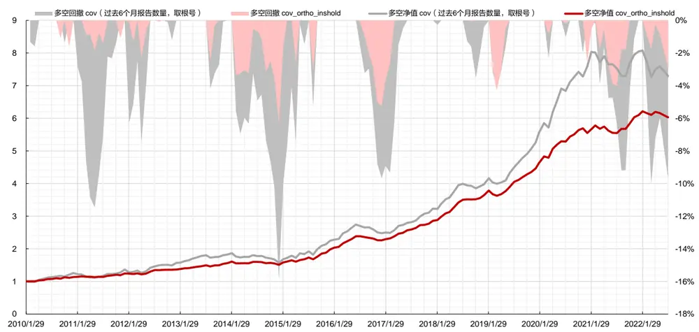
数据来源：东方证券研究所 & 朝阳永续 & Wind资讯

图 53：cov、cov_ortho_inshold 因子多头组合净值&回撤（中性化，中证全指）
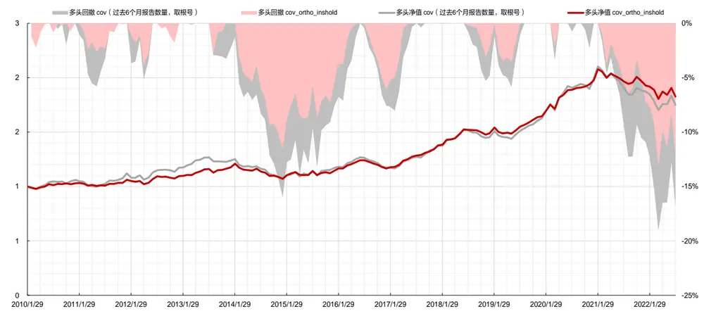
数据来源：东方证券研究所 & 朝阳永续 & Wind资讯

有关分析师的申明，见本报告最后部分。其他重要信息披露见分析师申明之后部分，或请与您的投资代表联系。并请阅读本证券研究报告最后一页的免责申明。

在中证 800 中 cov_ortho_inshold 因子表现明显优于 cov 因子，多空组合年化收益相比 cov因子提升 1%，多头组合年化收益提升 2%，组合稳定性也有明显提高，最大回撤显著降低。

图 54：cov、cov_ortho_inshold 因子多空组合净值&回撤（中性化，中证 800）
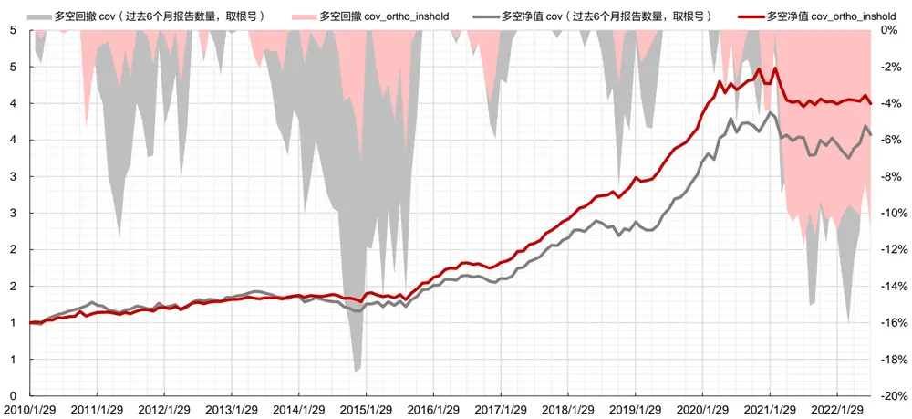
数据来源：东方证券研究所 & 朝阳永续 & Wind资讯

图 55：cov、cov_ortho_inshold 因子多头组合净值&回撤（中性化，中证 800）
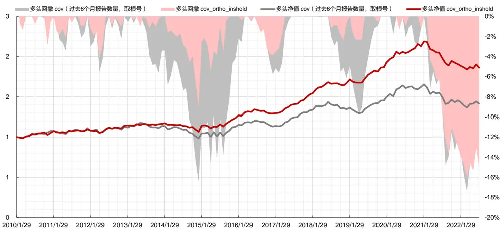
数据来源：东方证券研究所 & 朝阳永续 & Wind资讯

有关分析师的申明，见本报告最后部分。其他重要信息披露见分析师申明之后部分，或请与您的投资代表联系。并请阅读本证券研究报告最后一页的免责申明。

## （3）因子分组收益

在中证全指和中证800股票池中，cov_ortho_inshold因子的多头端收益均高于cov因子。

在中证全指中，cov_ortho_inshold 因子多头端单调性较好，因子值最大的一组收益最明显，多头端年化收益 5%。而 cov因子值最大的四组收益基本相当，年化收益均为 4%左右，多头端单调性较差。

在中证 800 成分内，两个因子的分组差距更加明显。cov 因子值最大的一组并不是收益最明显的一组，因子值最大一组的年化收益仅 3%，而因子值最小一组的年化收益为-8%。cov_ortho_inshold因子值最大一组的年化收益最高，达到 5%，多头端收益与空头端基本相当。

图 56：cov、cov_ortho_inshold 因子分组年化收益（中性化，中证全指，按因子值大小从低到高等分 10组）
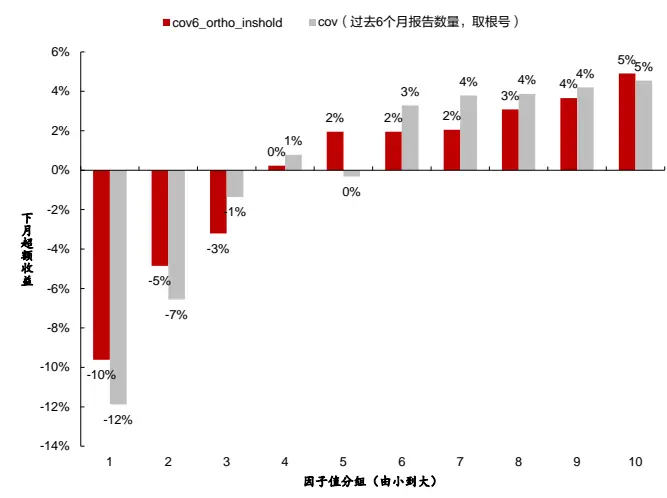
数据来源：东方证券研究所 & 朝阳永续 & Wind资讯

图 57：cov、cov_ortho_inshold 因子分组年化收益（中性化，中证 800内，按因子值大小从低到高等分 10组）
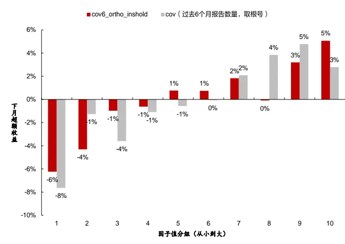
数据来源：东方证券研究所 & 朝阳永续 & Wind资讯

## （4）因子相关性

从因子原始值间的两两相关系数来看，cov和cov_ortho_inshold因子间存在82%相关性，和其他常见的大类因子相关性都不高。与盈利、分析师、估值、公司治理类因子存在 30%左右的正相关性，与非流动性、投机类因子负相关。

图 58：cov、cov_ortho_inshold 因子与常见大类因子的相关性
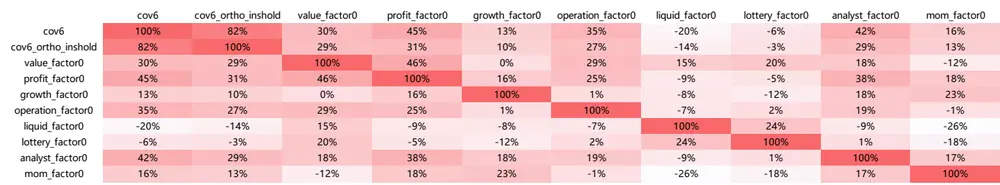
数据来源：东方证券研究所 & 朝阳永续 & Wind资讯

通过常见的截面回归方法进行正交化剔除后，可以看到：1.两因子互相正交化后的残差因子均保留了一定程度的选股效力。2. 两因子剔除其他常见因子之后，选股效果均不显著。

| 图 59：cov、cov_ortho_inshold 因子残差选股表现 |  |  |  |  |
| --- | --- | --- | --- | --- |
| 中证全指 回归法填充缺失值 | cov_ortho_inshold_ortho_cov6 | cov6_ortho_cov_ortho_inshold | cov_ortho_inshold_ortho_all | cov6 _ortho_all |
| 行业市值中性化 |  |  |  |  |
| IC | 0.59% | 2.26% | 0.45% | 0.35% |
| IC_IR | 45.28% | 124.68% | 31.44% | 20.70% |
| tstat | 160.08% | 440.82% | 111.16% | 73.20% |
| long_short_r | 0.30% | 0.49% | 0.37% | 0.32% |
| long_short_win | 60.00% | 58.00% | 64.67% | 60.00% |
| long_short_sharp | 52.35% | 61.24% | 110.88% | 72.28% |
| long_short_drwandown | -8.09% | -14.89% | -5.69% | -16.77% |
| long_short_yearly | 3.48% | 5.37% | 4.44% | 3.73% |
| 2010/12/31 | -6.41% | 22.52% | 2.45% | 4.62% |
| 2011/12/30 | 3.89% | 1.18% | -1.70% | 1.71% |
| 2012/12/31 | 1.02% | 11.77% | 6.14% |  |
| 2013/12/31 | 4.53% | 15.73% | 3.00% | 4.85% |
| 2014/12/31 | 3.45% | -14.45% | -0.97% | 1.82% |
| 2015/12/31 | 0.17% | 18.04% | 8.76% | -13.04% |
| 2016/12/30 | 3.82% | -0.03% | 0.40% | 9.03% |
| 2017/12/29 | 3.87% | 9.51% | 13.96% | -1.89% 11.72% |
| 2018/12/28 | 14.38% | -1.40% | 1.09% | 1.29% |
| 2019/12/31 | 2.72% | 10.82% | 8.19% | 8.70% |
| 2020/12/31 | 0.38% | 11.43% | 6.03% | 18.78% |
| 2021/12/31 | 5.69% | -3.49% | 6.02% | 2.08% |
| 2022/7/29 | 5.82% | -6.03% | 3.24% | 0.28% |
| 数据来源：东方证券研究所&朝阳永续&Wind资讯 |  |  |  |  |

## 七、总结

分析师覆盖度因子反映了分析师群体对其时间精力的分配，基本面好、未来机会多、预期收益高的股票会有更多的分析师选择覆盖，因而分析师覆盖度因子可能包含不同于基本面和技术面的增量信息。

常规的分析师覆盖因子在中证全指中虽然 IC 均值较高，但稳定性较差，多头端表现不佳。21 年开始因子收益出现较大回撤，多空组合 2021 年和 2022 年单年收益为 6%和-2%。因子多头端表现更差，最近两年收益均在-6%左右。在中证 800中因子整体表现更弱。

经过三种方案改进后的分析师覆盖因子效果均有不同程度的提高。

公告后分析师覆盖度因子（anncov）在大票和机构重仓股中优势更明显。在创业板指和沪深 300中 anncov因子的效果最好，多空组合年化收益相比 cov因子均能提升近 2%。在中证 500中 anncov 因子的多空组合年化收益提升 1.2%。在食品饮料、电力设备、国防军工、医药生物、周期等热门行业中均优于 cov因子。因子多头端表现在各股票池中均占优。

分析师首次覆盖度因子（firstcov）在小票和低机构持仓组中优势更明显。在中证 500 和中证全指内中 firstcov 因子的优势最明显，多空组合年化收益能提升 1%，多头组合年化收益能提升2%。在中证全指中因子多空组合年化收益相比 cov因子能提升 1%，多头组合提升 2%。2021 年以来因子表现优势明显，最近两年相比 cov 因子单年收益提升 10%。在食品饮料和周期行业中表现优于 cov因子。因子多头端表现在各股票池中均占优。

不能被机构持仓占比解释的分析师覆盖度因子（cov_ortho_inshold）的优势在于多空组合稳定性好，夏普比高，回撤小，多头组合收益高。除创业板指之外，在其他常见宽基指数中，cov_ortho_inshold 因子相比 cov 因子回撤都有明显降低，接近减半，多空组合夏普比均有较大提升。中证全指中 2021年开始因子多空组合表现明显占优，近两年相比 cov因子单年收益提升 5%。在高持仓分组中因子优势更加明显。在食品饮料、电力设备、周期行业中，因子表现优于 cov 因子。

图 60：分析师覆盖类因子多空组合净值（行业市值中性化，中证全指）
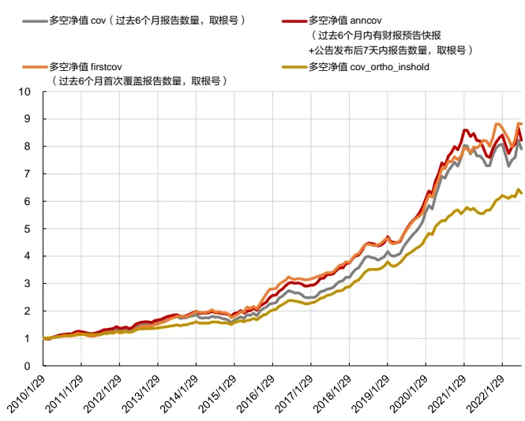
数据来源：东方证券研究所 & 朝阳永续 & Wind资讯

图 61：分析师覆盖类因子多头组合净值（行业市值中性化，中证全指）
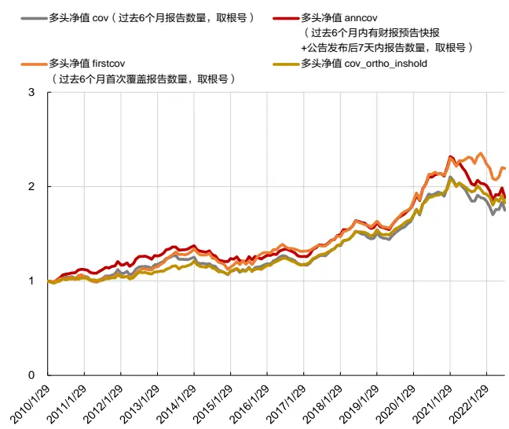
数据来源：东方证券研究所 & 朝阳永续 & Wind资讯

图 62：分析师覆盖类因子多空组合净值（行业市值中性化，中证 800成分内）
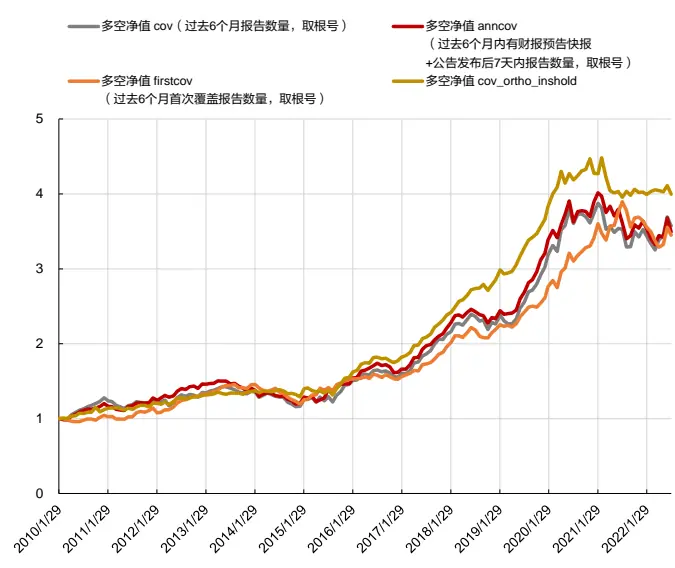
数据来源：东方证券研究所 & 朝阳永续 & Wind资讯

图 63：分析师覆盖类因子多头组合净值（行业市值中性化，中证 800成分内）
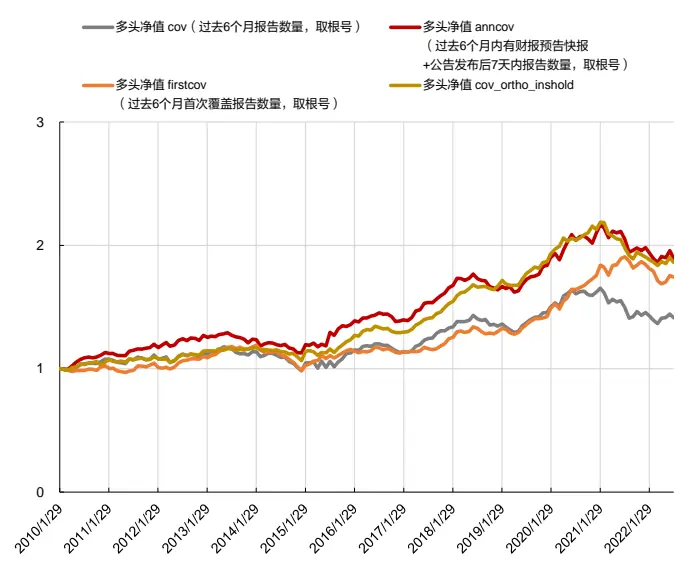
数据来源：东方证券研究所 & 朝阳永续 & Wind资讯

## 风险提示

1. 量化模型基于历史数据分析，未来存在失效风险，建议投资者紧密跟踪模型表现。

2. 极端市场环境可能对模型效果造成剧烈冲击，导致收益亏损。

## Tabl e_Disclai mer 分析师申明

每位负责撰写本研究报告全部或部分内容的研究分析师在此作以下声明：

分析师在本报告中对所提及的证券或发行人发表的任何建议和观点均准确地反映了其个人对该证券或发行人的看法和判断；分析师薪酬的任何组成部分无论是在过去、现在及将来，均与其在本研究报告中所表述的具体建议或观点无任何直接或间接的关系。

## 投资评级和相关定义

报告发布日后的 12个月内的公司的涨跌幅相对同期的上证指数/深证成指的涨跌幅为基准；

## 公司投资评级的量化标准

买入：相对强于市场基准指数收益率 15%以上；

增持：相对强于市场基准指数收益率 5%～15%；

中性：相对于市场基准指数收益率在-5%～+5%之间波动；

减持：相对弱于市场基准指数收益率在-5%以下。

未评级 —— 由于在报告发出之时该股票不在本公司研究覆盖范围内，分析师基于当时对该股票的研究状况，未给予投资评级相关信息。

暂停评级 —— 根据监管制度及本公司相关规定，研究报告发布之时该投资对象可能与本公司存在潜在的利益冲突情形；亦或是研究报告发布当时该股票的价值和价格分析存在重大不确定性，缺乏足够的研究依据支持分析师给出明确投资评级；分析师在上述情况下暂停对该股票给予投资评级等信息，投资者需要注意在此报告发布之前曾给予该股票的投资评级、盈利预测及目标价格等信息不再有效。

## 行业投资评级的量化标准：

看好：相对强于市场基准指数收益率 5%以上；

中性：相对于市场基准指数收益率在-5%～+5%之间波动；

看淡：相对于市场基准指数收益率在-5%以下。

未评级：由于在报告发出之时该行业不在本公司研究覆盖范围内，分析师基于当时对该行业的研究状况，未给予投资评级等相关信息。

暂停评级：由于研究报告发布当时该行业的投资价值分析存在重大不确定性，缺乏足够的研究依据支持分析师给出明确行业投资评级；分析师在上述情况下暂停对该行业给予投资评级信息，投资者需要注意在此报告发布之前曾给予该行业的投资评级信息不再有效。

## HeadertTabl e_Discl ai mer 免责声明

本证券研究报告（以下简称“本报告”）由东方证券股份有限公司（以下简称“本公司”）制作及发布。

。本公司不会因接收人收到本报告而视其为本公司的当然客户。本报告的全体接收人应当采取必要措施防止本报告被转发给他人。

本报告是基于本公司认为可靠的且目前已公开的信息撰写，本公司力求但不保证该信息的准确性和完整性，客户也不应该认为该信息是准确和完整的。同时，本公司不保证文中观点或陈述不会发生任何变更，在不同时期，本公司可发出与本报告所载资料、意见及推测不一致的证券研究报告。本公司会适时更新我们的研究，但可能会因某些规定而无法做到。除了一些定期出版的证券研究报告之外，绝大多数证券研究报告是在分析师认为适当的时候不定期地发布。

在任何情况下，本报告中的信息或所表述的意见并不构成对任何人的投资建议，也没有考虑到个别客户特殊的投资目标、财务状况或需求。客户应考虑本报告中的任何意见或建议是否符合其特定状况，若有必要应寻求专家意见。本报告所载的资料、工具、意见及推测只提供给客户作参考之用，并非作为或被视为出售或购买证券或其他投资标的的邀请或向人作出邀请。

本报告中提及的投资价格和价值以及这些投资带来的收入可能会波动。过去的表现并不代表未来的表现，未来的回报也无法保证，投资者可能会损失本金。外汇汇率波动有可能对某些投资的价值或价格或来自这一投资的收入产生不良影响。那些涉及期货、期权及其它衍生工具的交易，因其包括重大的市场风险，因此并不适合所有投资者。

在任何情况下，本公司不对任何人因使用本报告中的任何内容所引致的任何损失负任何责任，投资者自主作出投资决策并自行承担投资风险，任何形式的分享证券投资收益或者分担证券投资损失的书面或口头承诺均为无效。

本报告主要以电子版形式分发，间或也会辅以印刷品形式分发，所有报告版权均归本公司所有。未经本公司事先书面协议授权，任何机构或个人不得以任何形式复制、转发或公开传播本报告的全部或部分内容。不得将报告内容作为诉讼、仲裁、传媒所引用之证明或依据，不得用于营利或用于未经允许的其它用途。

经本公司事先书面协议授权刊载或转发的，被授权机构承担相关刊载或者转发责任。不得对本报告进行任何有悖原意的引用、删节和修改。

提示客户及公众投资者慎重使用未经授权刊载或者转发的本公司证券研究报告，慎重使用公众媒体刊载的证券研究报告。

## 东方证券研究所

地址： 上海市中山南路 318 号东方国际金融广场 26 楼

电话：021-63325888

传真：021-63326786

网址： www.dfzq.com.cn