# 基于财报的业绩超预期度量

# 因子选股系列之八十五

## 研究结论

⚫ 本文基于公司公告的财务信息，尝试从多角度对业绩超预期进行度量，选取的角度依次是传统业绩超预期的刻画、业绩预告的补充应用、公告前后的市场反应与时序网络的使用。

⚫对于传统业绩超预期的刻画，本文在“公告值减去预期值除以规模数”的框架下，应用随机游走模型对净利润、营业收入和毛利三个字段进行了因子构建。特别地，对于用新增字段毛利构建的 SUG 因子，它与常见的 SUE、SUR 的相关性较低、且RankIC更高。如不含漂移项的SUG1，其原始值在沪深300、中证全指里的RankIC分别为 6.51%和 4.16%，高于 SUE1 的 5.72%和 4.06%，也高于 SUR1 的 4.99%和3.53%。

对于业绩预告的补充应用，本文尝试了从两个方向对业绩预告加以利用，分别是把业绩预告视为定期财报数据和财报发出前的预期值。针对前者，我们构建了含预告的SUE因子，并发现改进后的SUE因子在多头收益、夏普率和月胜率等方面要优于原始 SUE 因子。针对后者，我们构建了业绩偏离度因子 EBIAS0 和 EBIAS1，虽然这两类因子的 RankIC不高，但它们胜在回撤小、相关性低。

业内普遍采用公告前后的开盘价/前收盘价、最低价/前收盘价用于捕捉公告的超预期信息，本文新增了公告前后的（早盘）大单买入占比和（早盘）大单涨跌幅用于刻画公告的超预期。从因子表现来看，两类大单因子在公告日附近的表现要优于最低前收、开盘/前收，如公告日前后三天的（早盘）大单买入占比因子，其原始值在沪深300和中证全指内的RankIC分别为4.09%和3.29%，且多空净值近期回撤较小。

传统的 SUE 系列因子从算法上看只是股票历史业绩序列的一种人为指定的时间序列整合方式，类似于量价序列数据，我们可以通过时序网络从股票历史业绩序列中学习对股票收益率的预测作为 alpha 因子。该因子原始值在沪深 300 和中证全指内的RankIC分别为5.69%和5.62%，多空最大回撤均控制在-20%以内。此外，其在中证全指上的多头年化超额收益为 14.21%，且近期波动小于传统SUE系列因子。

将上述各描述因子按类别等权合成大类因子后，我们发现 4 种大类因子间的相关性均在 70%以下。随后本文将上述大类因子进行等权合成，以充分利用基本面分析加市场反应“1+1>2”的效果。合成后的因子在沪深 300和中证全指内的 RankIC分别为 6.69%和 7.81%，且在中证全指上的多头年化超额收益为 18.53%。

## 风险提示

⚫ 量化模型失效风险

⚫ 市场极端环境的冲击

基于财报的业绩超预期综合因子（原始值）

|  | RanklC |  |  | 多空组合 |  |  |  |  |
| --- | --- | --- | --- | --- | --- | --- | --- | --- |
|  | IC月度均值 | IC_IR | t值 | 年化收益 | 夏普率 | 月胜率 | 最大回撤多头月换手 |  |
| 沪深300 | 6.69% | 1.68 | 4.03 | 20.52% | 1.25 | 69.57% | -26.07% | 39% |
| 中证500 | 8.67% | 2.54 | 6.1 | 35.09% | 1.94 | 73.91% | -22.22% | 38% |
| 中证800 | 8.00% | 2.29 | 5.5 | 32.91% | 1.9 | 75.36% | -22.82% | 36% |
| 中证1000 | 8.67% | 2.92 | 7.01 | 43.51% | 2.77 | 78.26% | -22.26% | 36% |
| 中证全指 | 7.81% | 2.94 | 7.06 | 35.54% | 2.54 | 84.06% | -17.34% | 35% |

报告发布日期

2022 年 10 月 25 日

王星星

021-63325888*6108

wangxingxing@orientsec.com.cn

执业证书编号：S0860517100001

栾张心怿 luanzhangxinyi@orientsec.com.cn

分析师覆盖度因子改进——因子选股系列 2022-08-23研究之八十四

多模型学习量价时序特征——因子选股系 2022-06-12列之八十三

超大单冲击对大单因子的影响——因子选 2022-05-20股系列之八十二

## 一、传统业绩超预期的直接度量

业绩超预期一般有两种度量方式，一种通过业绩公告值与预期值的预期差直接度量业绩超预期，一种通过业绩公告前后的投资者行为间接表征业绩超预期。前者的难点在于业绩预期值的估计，目前业内常用的产生业绩预期值的方式包括通过业绩历史序列生成、截面回归估计和分析师一致预期等，后者的难点在于找到合理的第三方代理变量，目前常用的是股票公告前后的市场行为（代表市场参与者整体）和卖方分析师行为（代表机构投资者）。受篇幅限制，本篇报告聚焦基于业绩历史时间序列的超预期直接度量和基于业绩公告前后市场反应的间接度量。

我们早在2018年5月的专题报告《业绩超预期类因子》中已经初步讨论过基于业绩历史序列的业绩超预期度量，本文在前序报告的基础上做了一些拓展。传统业绩超预期直接度量的因子化构建一般采用“公告值减去预期值除以规模数”的方式，下面将分别讨论产生预期值与规模数的不同算法，以及财报中可用于体现公司业绩的不同字段。

## 1.1 不同算法

在计算预期值与规模数时，常见的算法是对表示公司业绩的某财报字段构建季节性随机游走模型进行估计，如 Bartov 等（2000）和 Jegadeesh 等（2006）。以净利润字段为例，其标准化预期外盈利在公司 i、季度 t 上的取值可以表示为：

$$
SUE_{i,t}=\frac{\Delta Q_{i,t}-E(\Delta Q_{i,t})}{\sigma(\Delta Q_{i,t})}\tag{1}
$$

其中， $\Delta Q_{i,t}$ 表示公司财报公告的净利润单季同比增长， $E\left(\Delta Q_{i,t}\right)、\sigma\left(\Delta Q_{i,t}\right)$ 分别表示公告前的预测值和预测标准差。根据季节性随机游走模型是否含漂移项，我们可以得到两种不同的时间序列模型：

$$
$Q_{i,t}=Q_{i,t-4}+C_{i,t}+\varepsilon_{i,t}$(含漂移项)\tag{2}
$$

$$
$Q_{i,t}=Q_{i,t-4}+\varepsilon_{i,t}$(不含漂移项)\tag{3}
$$

在含漂移项的随机游走模型假设下， $E\left(\Delta Q_{i,t}\right)=\frac{\sum_{i=1}^{n}\Delta Q_{i,t-j}}{n},\quad\sigma\left(\Delta Q_{i,t}\right)=\sqrt{\frac{\sum_{i=1}^{n}\left(\Delta Q_{i,t-j}-\mu\right)^{2}}{n-1}}$ ；在不含漂移项的随机游走模型假设下， $E\left(\Delta Q_{i,t}\right)=0,\sigma\left(\Delta Q_{i,t}\right)=\sqrt{\frac{\sum_{i=1}^{n}\Delta Q_{i,t-j}^{2}}{n-1}}$ （n 默认取 8）。因此，在随机游走模型假设下，我们可以得到两类 SUE因子。

除去上文展示的算法外，我们还可以对 $\Delta Q_{i,t}$ 构建 AR（1）、MA（1）等时序模型等方法来计算超预期因子。但经测算，发现不同算法间因子的相关性较高，为避免冗余，我们只保留随机游走模型下的两类算法。

## 1.2 不同字段

学术界对业绩超预期的研究主要集中在净利润与营业收入这两个财报科目，并以此派生出对Earnings Surprise 和 Revenue Surprise 的系列研究，如 Kinney 等（2002）和 Manikas 等（2016）。

事实上，除去净利润与营业收入，毛利在利润表中也是一项重要科目。下面公式展示了营业收入、毛利与净利润在利润表中的简化勾稽关系1。其中，营业收入与毛利的主要区别在于是否包含营业成本，而净利润与毛利的主要区别在于是否包含销售、管理、研发、财务费用等。因此，毛利这个字段可以提供不同于净利润与营业收入的业绩信息、拓宽我们对于业绩刻画的角度。相对营业收入，毛利多了一些成本的考虑，相对净利润，毛利少了一些更容易操控的会计项目。

$$
营业收入-营业成本=毛利
$$

$$
毛利+投资收益-销售费用-管理费用-研发费用-财务费用=营业利润
$$

$$
营业利润+营业外收入-营业外支出-所得税=净利润
$$

综上，我们在业绩超预期因子“公告值减去预期值除以规模数”的框架下，分别采用了两种算法（是否含漂移项的随机游走模型）与三个字段（净利润、营业收入与毛利），总共构建了六类业绩超预期因子。为了表述方便，我们用 SUE0、SUE1表示两类净利润因子（0表示含漂移项、1表示不含漂移项，下同），用 SUR0、SUR1表示两类营业收入因子，用 SUG0、SUG1表示两类毛利因子。

图 1 刻画了六类因子在中证全指中的因子相关性，可以发现相同字段下的两个因子相关性较高，而不同字段间的因子相关性较低。特别地，对于我们新引入的毛利超预期因子 SUG，其与SUE、SUR的相关性较低，因此可以较好地补充我们对于业绩超预期版图的刻画。

图 1：六类业绩超预期因子的相关性（20091231-20220930）

| 中证全指 | SUEO SUE1 SURO SUR1 SUG0 SUG1 |  |  |  |  |  |
| --- | --- | --- | --- | --- | --- | --- |
| SUEO |  | 83.92% | 42.07% | 35.81% | 58.78% | 49.41% |
| SUE1 | 83.92% |  | 38.27% | 46.00% | 51.20% | 61.85% |
| SURO | 42.07% | 38.27% |  | 84.12% | 63.93% | 55.02% |
| SUR1 | 35.81% | 46.00% | 84.12% |  | 54.10% | 66.92% |
| SUGO | 58.78% | 51.20% | 63.93% | 54.10% |  | 83.79% |
| SUG1 | 49.41% | 61.85% | 55.02% | 66.92% | 83.79% |  |

数据来源：wind & 东方证券研究所

## 1.3因子测试

回测区间选为 2009.12.31-2022.09.30，我们对上述六类业绩超预期因子进行测试，发现：

（1）六类业绩超预期因子的原始值在大市值股票池中的选股效果要优于小市值股票池，行业市值中性化后该特征不再显著。如 SUG1、SUE1、SUR1 的原始值在沪深 300 中的RankIC分别为 6.51%、5.72%和 4.99%，三者在中证全指中的 RankIC分别为 4.16%、4.06%和 3.53%。

（2）从因子月度RankIC的取值来看，毛利SUG>净利润SUE>营业收入SUR，特别是不含漂移项的SUG1，其原始值在沪深300、中证500、中证800、中证1000和中证全指里的 RankIC 依次为 6.51%、5.38%、5.79%、4.48%和 4.16%。

（3）从在中证全指分组的多头超额收益来看，净利润 SUE>毛利 SUG>营业收入 SUR，其中 SUE0 和 SUE1 的多头超额年化收益分别为 11.42%和 10.30%。

（4）从多空组合净值的最大回撤角度来看，因子原始值中毛利 SUG 整体的回撤更小，其中SUG0 和 SUG1 是六类因子在沪深 300 中仅有的最大回撤优于-30%的因子。在因子行业市值中性化后，营业收入 SUR整体的回撤更优。

（5）从多头月均换手来看，毛利 SUG因子的多头换手最低，特别是 SUG1原始值在沪深300 中的多头月均换手为 17%，显著低于 SUE1 的 29%和 SUR1 的 27%。

图 2：SUE0在各个样本空间因子表现汇总
因子原始值

|  | RankIC |  |  | 多空组合 |  |  |  |  |
| --- | --- | --- | --- | --- | --- | --- | --- | --- |
|  | IC月度均值 | IC IR | t值 | 年化收益 | 夏普率 | 月胜率 | 最大回撤多头月换手 |  |
| 沪深300 | 4.95% | 1.61 | 5.73 | 13.01% | 0.98 | 62.75% | -30.74% | 30% |
| 中证500 | 4.78% | 2.02 | 7.23 | 16.51% | 1.45 | 70.59% | -28.97% | 31% |
| 中证800 | 4.83% | 2.12 | 7.56 | 16.35% | 1.46 | 69.28% | -28.15% | 30% |
| 中证1000 | 3.67% | 1.86 | 6.65 | 16.48% | 1.53 | 69.28% | -23.19% | 32% |
| 中证全指 | 3.89% | 2.44 | 8.7 | 18.94% | 2.12 | 78.43% | -19.32% | 29% |

行业市值中性

图 3：SUE1在各个样本空间因子表现汇总因子原始值

|  | RankIC |  |  | 多空组合 |  |  |  |  |
| --- | --- | --- | --- | --- | --- | --- | --- | --- |
|  | IC月度均值 | IC IR | t值 | 年化收益 | 夏普率 | 月胜率 | 最大回撤多头月换手 |  |
| 沪深300 | 5.72% | 1.46 | 5.2 | 14.51% | 0.93 | 64.71% | -30.86% | 29% |
| 中证500 | 5.39% | 1.69 | 6.04 | 17.39% | 1.27 | 66.67% | -32.00% | 30% |
| 中证800 | 5.37% | 1.68 | 5.99 | 16.55% | 1.25 | 64.05% | -29.88% | 29% |
| 中证1000 | 4.16% | 1.54 | 5.5 | 16.38% | 1.35 | 64.05% | -24.99% | 31% |
| 中证全指 | 4.06% | 1.67 | 5.97 | 16.70% | 1.59 | 67.97% | -20.35% | 28% |

|  | RankIC |  |  | 多空组合 |  |  |  |  |
| --- | --- | --- | --- | --- | --- | --- | --- | --- |
|  | IC月度均值 | IC IR | t值 | 年化收益 | 夏普率 | 月胜率 | 最大回撤多头月换手 |  |
| 沪深300 | 3.27% | 1.64 | 5.85 | 12.82% | 1.33 | 69.93% | -19.10% | 34% |
| 中证500 | 4.56% | 2.88 | 10.28 | 17.64% | 2.04 | 72.55% | -17.39% | 34% |
| 中证800 | 4.04% | 2.54 | 9.08 | 17.06% | 1.94 | 72.55% | -20.14% | 32% |
| 中证1000 | 4.02% | 2.74 | 9.78 | 16.35% | 1.84 | 69.93% | -15.57% | 33% |
| 中证全指 | 3.67% | 2.97 | 10.6 | 18.24% | 2.39 | 79.74% | -14.08% | 30% |

数据来源：wind & 东方证券研究所

行业市值中性

|  | RankIC |  |  | 多空组合 |  |  |  |  |
| --- | --- | --- | --- | --- | --- | --- | --- | --- |
|  | IC月度均值 | IC_IR | t值 | 年化收益 | 夏普率 | 月胜率 | 最大回撤多头月换手 |  |
| 沪深300 | 3.75% | 1.64 | 5.87 | 13.42% | 1.36 | 66.01% | -22.94% | 33% |
| 中证500 | 5.56% | 2.99 | 10.68 | 18.02% | 1.84 | 72.55% | -15.50% | 33% |
| 中证800 | 4.72% | 2.33 | 8.33 | 15.84% | 1.67 | 67.32% | -17.97% | 31% |
| 中证1000 | 5.29% | 2.98 | 10.65 | 17.67% | 1.81 | 70.59% | -16.80% | 33% |
| 中证全指 | 4.48% | 2.7 | 9.64 | 17.67% | 2.14 | 77.12% | -16.12% | 30% |

数据来源：wind & 东方证券研究所

图 4：SUE0在中证全指内选股表现（原始值）分组对冲年化收益
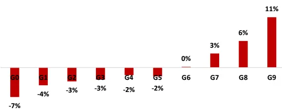

图 5：SUE1在中证全指内选股表现（原始值）分组对冲年化收益
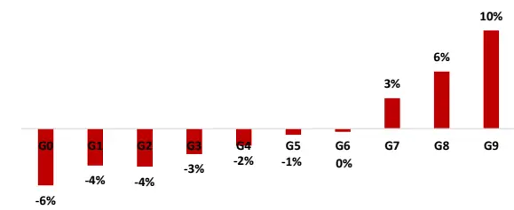

月度 RankIC 序列
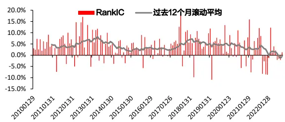

月度 RankIC 序列
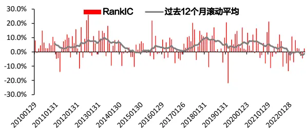

多空组合净值及回撤
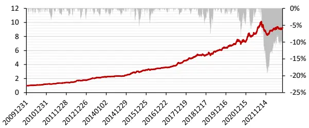
数据来源：wind & 东方证券研究所

多空组合净值及回撤
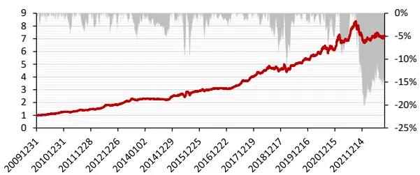
数据来源：wind & 东方证券研究所
有关分析师的申明，见本报告最后部分。其他重要信息披露见分析师申明之后部分，或请与您的投资代表联系。并请阅读本证券研究报告最后一页的免责申明。

图 8：SUR0在中证全指内选股表现（原始值）分组对冲年化收益
图 9：SUR1在中证全指内选股表现（原始值）分组对冲年化收益
图 6：SUR0在各个样本空间因子表现汇总因子原始值

|  | RankIC |  |  | 多空组合 |  |  |  |  |
| --- | --- | --- | --- | --- | --- | --- | --- | --- |
|  | IC月度均值 | IC_IR | t值 | 年化收益 | 夏普率 | 月胜率 | 最大回撤多头月换手 |  |
| 沪深300 | 4.21% | 1.52 | 5.42 | 14.27% | 1.14 | 69.28% | -30.38% | 28% |
| 中证500 | 4.05% | 1.82 | 6.49 | 13.02% | 1.23 | 66.67% | -22.26% | 30% |
| 中证800 | 4.18% | 1.94 | 6.94 | 13.89% | 1.42 | 71.24% | -20.80% | 28% |
| 中证1000 | 3.04% | 1.62 | 5.79 | 15.49% | 1.62 | 67.32% | -16.24% | 30% |
| 中证全指 | 3.34% | 2.22 | 7.93 | 14.04% | 1.81 | 71.90% | -15.91% | 27% |

行业市值中性

图 7：SUR1在各个样本空间因子表现汇总因子原始值

|  | RankIC |  |  | 多空组合 |  |  |  |  |
| --- | --- | --- | --- | --- | --- | --- | --- | --- |
|  | IC月度均值 | IC IR | t值 | 年化收益 | 夏普率 | 月胜率 | 最大回撤多头月换手 |  |
| 沪深300 | 4.99% | 1.37 | 4.91 | 15.75% | 1.07 | 65.36% | -31.79% | 27% |
| 中证500 | 4.71% | 1.58 | 5.63 | 13.42% | 1.1 | 62.75% | -21.79% | 28% |
| 中证800 | 4.72% | 1.58 | 5.66 | 14.96% | 1.31 | 66.01% | -20.38% | 27% |
| 中证1000 | 3.48% | 1.31 | 4.66 | 13.90% | 1.28 | 65.36% | -18.64% | 28% |
| 中证全指 | 3.53% | 1.51 | 5.38 | 13.76% | 1.49 | 69.93% | -17.51% | 26% |

行业市值中性

|  | RankIC |  |  | 多空组合 |  |  |  |  |
| --- | --- | --- | --- | --- | --- | --- | --- | --- |
|  | IC月度均值 | IC_IR | t值 | 年化收益 | 夏普率 | 月胜率 | 最大回撤多头月换手 |  |
| 沪深300 | 2.91% | 1.57 | 5.6 | 9.69% | 1.06 | 62.09% | -19.16% | 31% |
| 中证500 | 3.55% | 2.45 | 8.74 | 11.39% | 1.4 | 69.28% | -10.98% | 32% |
| 中证800 | 3.31% | 2.35 | 8.41 | 11.94% | 1.59 | 72.55% | -13.64% | 30% |
| 中证1000 | 3.16% | 2.5 | 8.94 | 14.82% | 2.03 | 70.59% | -14.32% | 31% |
| 中证全指 | 2.97% | 2.83 | 10.12 | 13.26% | 2.2 | 74.51% | -9.55% | 28% |

数据来源：wind & 东方证券研究所

|  | RankIC |  |  | 多空组合 |  |  |  |  |
| --- | --- | --- | --- | --- | --- | --- | --- | --- |
|  | IC月度均值 | IC_IR | t值 | 年化收益 | 夏普率 | 月胜率 | 最大回撤多头月换手 |  |
| 沪深300 | 3.52% | 1.64 | 5.84 | 11.45% | 1.07 | 66.01% | -16.60% | 30% |
| 中证500 | 4.53% | 2.57 | 9.17 | 13.18% | 1.42 | 67.97% | -14.79% | 31% |
| 中证800 | 4.04% | 2.22 | 7.92 | 12.45% | 1.44 | 67.97% | -13.75% | 29% |
| 中证1000 | 4.12% | 2.63 | 9.39 | 15.39% | 1.9 | 72.55% | -9.37% | 31% |
| 中证全指 | 3.74% | 2.39 | 8.52 | 14.36% | 2.05 | 77.78% | -7.56% | 27% |

数据来源：wind & 东方证券研究所

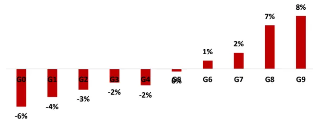

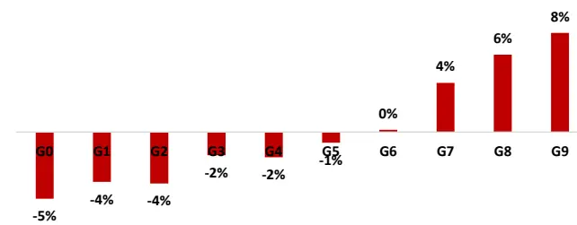

月度 RankIC 序列
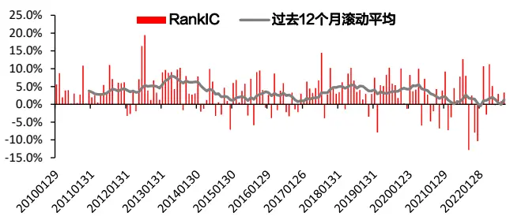

月度 RankIC 序列
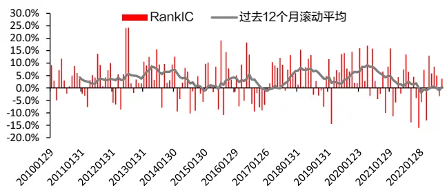

多空组合净值及回撤
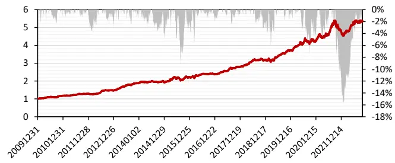
数据来源：wind & 东方证券研究所

多空组合净值及回撤
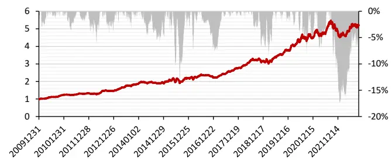
数据来源：wind & 东方证券研究所

有关分析师的申明，见本报告最后部分。其他重要信息披露见分析师申明之后部分，或请与您的投资代表联系。并请阅读本证券研究报告最后一页的免责申明。

图 10：SUG0在各个样本空间因子表现汇总
因子原始值

|  | RankIC |  |  | 多空组合 |  |  |  |  |
| --- | --- | --- | --- | --- | --- | --- | --- | --- |
|  | IC月度均值 | IC_IR | t值 | 年化收益 | 夏普率 | 月胜率 | 最大回撤多头月换手 |  |
| 沪深300 | 5.41% | 1.64 | 5.86 | 13.39% | 0.91 | 64.05% | -24.37% | 24% |
| 中证500 | 4.74% | 2.09 | 7.48 | 18.24% | 1.72 | 73.20% | -27.95% | 27% |
| 中证800 | 5.36% | 2.18 | 7.78 | 18.48% | 1.63 | 74.51% | -25.83% | 27% |
| 中证1000 | 4.08% | 1.93 | 6.9 | 16.92% | 1.55 | 71.24% | -18.36% | 28% |
| 中证全指 | 3.97% | 2.33 | 8.33 | 17.21% | 2.02 | 74.51% | -17.42% | 26% |

行业市值中性

图 11：SUG1在各个样本空间因子表现汇总
因子原始值

|  | RankIC |  |  | 多空组合 |  |  |  |  |
| --- | --- | --- | --- | --- | --- | --- | --- | --- |
|  | IC月度均值 | IC IR | t值 | 年化收益 | 夏普率 | 月胜率 | 最大回撤多头月换手 |  |
| 沪深300 | 6.51% | 1.73 | 6.16 | 17.75% | 1.06 | 64.71% | -24.87% | 17% |
| 中证500 | 5.38% | 1.69 | 6.04 | 17.86% | 1.52 | 67.97% | -22.06% | 25% |
| 中证800 | 5.79% | 1.79 | 6.39 | 16.99% | 1.47 | 71.24% | -24.34% | 21% |
| 中证1000 | 4.48% | 1.56 | 5.59 | 17.18% | 1.36 | 67.97% | -22.37% | 26% |
| 中证全指 | 4.16% | 1.64 | 5.85 | 15.36% | 1.58 | 69.93% | -18.32% | 23% |

|  | RankIC |  |  | 多空组合 |  |  |  |  |
| --- | --- | --- | --- | --- | --- | --- | --- | --- |
|  | IC月度均值 | IC_IR | t值 | 年化收益 | 夏普率 | 月胜率 | 最大回撤多头月换手 |  |
| 沪深300 | 3.25% | 1.59 | 5.68 | 13.33% | 1.26 | 66.01% | -24.09% | 30% |
| 中证500 | 4.26% | 2.86 | 10.21 | 17.85% | 2.28 | 79.08% | -16.16% | 29% |
| 中证800 | 3.85% | 2.51 | 8.95 | 16.33% | 2 | 75.82% | -18.41% | 27% |
| 中证1000 | 4.41% | 2.88 | 10.28 | 19.01% | 2.08 | 76.47% | -11.43% | 30% |
| 中证全指 | 3.63% | 2.85 | 10.19 | 16.42% | 2.31 | 78.43% | -12.79% | 26% |

数据来源：wind & 东方证券研究所

行业市值中性

|  | RankIC |  |  | 多空组合 |  |  |  |  |
| --- | --- | --- | --- | --- | --- | --- | --- | --- |
|  | IC月度均值 | IC IR | t值 | 年化收益 | 夏普率 | 月胜率 | 最大回撤多头月换手 |  |
| 沪深300 | 3.78% | 1.61 | 5.75 | 17.62% | 1.65 | 69.28% | -20.36% | 28% |
| 中证500 | 5.40% | 2.88 | 10.29 | 17.72% | 2 | 73.20% | -10.53% | 29% |
| 中证800 | 4.65% | 2.26 | 8.08 | 17.56% | 1.94 | 73.20% | -17.85% | 26% |
| 中证1000 | 5.30% | 2.99 | 10.66 | 21.55% | 2.1 | 74.51% | -11.07% | 29% |
| 中证全指 | 4.33% | 2.47 | 8.83 | 17.34% | 2.18 | 77.78% | -12.13% | 25% |

数据来源：wind & 东方证券研究所

图 12：SUG0在中证全指内选股表现（原始值）
分组对冲年化收益
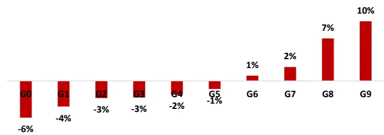

图 13：SUG1在中证全指内选股表现（原始值）
分组对冲年化收益
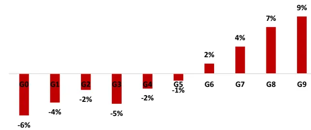

月度 RankIC 序列
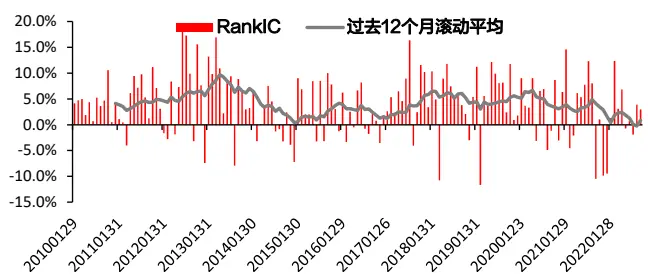

月度 RankIC 序列
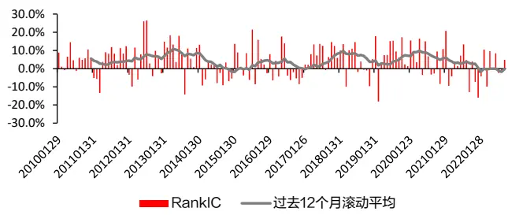
多空组合净值及回撤

多空组合净值及回撤
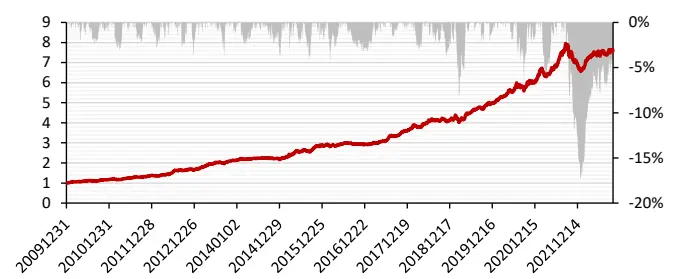
数据来源：wind & 东方证券研究所

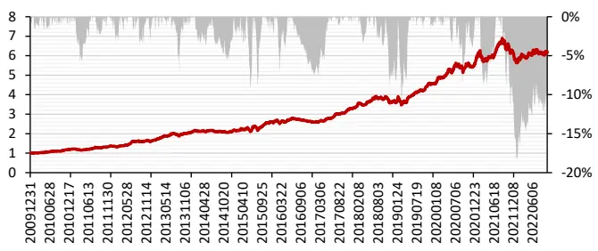
数据来源：wind & 东方证券研究所

有关分析师的申明，见本报告最后部分。其他重要信息披露见分析师申明之后部分，或请与您的投资代表联系。并请阅读本证券研究报告最后一页的免责申明。

## 二、业绩预告对业绩超预期度量的补充

在前文构建业绩超预期因子时，我们用到的公司公告类型主要是定期财务报告与业绩快报。除去定期财务报告与业绩快报，业绩预告也是一类重要的信息来源。关于业绩预告的披露细则可参阅之前的报告《上市公司业绩预告信息研究》。关于业绩预告在业绩超预期度量上的应用，大致有两种思路：一是将业绩预告视为真实的公司财报数据，将业绩预告加入到超预期因子中可以提高因子中财报更新的频率；二是将业绩预告视为财报公布前的预期值，比较财报真实值与该预期值可以反映出公司近期业绩情况。

## 2.1 业绩预告视为定期财报数据

将业绩预告视作真实财报数据，是指当业绩预告发出后，把预告净利润上、下限的均值作为最新的财报数据更新因子。由于业绩预告的内容主要针对净利润、未包含营业收入和毛利，所以此处我们只对 SUE0和 SUE1两因子进行增加业绩预告数据的改进。

本章因子测试的回测区间选为 2009.12.31-2022.09.30。从 RankIC角度来看，含预告的 SUE因子与原 SUE 因子相差无几，但含预告的 SUE 因子在多空组合的多头收益、夏普率和月胜率等方面比原SUE因子略胜一筹。如SUE0因子在加入业绩预告数据后，其原始值在中证全指内的月胜率由 78.43%提升至 83.01%，SUE1 因子的月胜率则是由 67.97%上升至 71.90%。

从图 14 中的因子相关性可以看出，加入业绩预告前后的两类 SUE 因子相关性维持在 80%左右。虽然相关性略高，但之前报告《上市公司业绩预告信息研究》中曾说明两类因子相互间具有独立信息，双方做截面回归后仍然具有额外的增量信息，因此含预告的SUE因子也有研究价值。

图 14：含预告前后 SUE 因子相关性（20091231-20220930）

| 中证全指 | SUEO SUE1 SUE0(含预告) SUE1(含预告) |  |  |  |
| --- | --- | --- | --- | --- |
| SUEO |  | 83.92% | 82.78% | 70.74% |
| SUE1 | 83.92% |  | 67.89% | 84.37% |
| SUEO(含预告) | 82.78% | 67.89% |  | 85.37% |
| SUE1(含预告) | 70.74% | 84.37% | 85.37% |  |

数据来源：wind & 东方证券研究所

图 15：业绩预告类因子的相关性（20091231-20220930）

| 中证全指 | SUE0(含预告) SUE1(含预告) EBIASO EBIAS1 |  |  |  |
| --- | --- | --- | --- | --- |
| SUEO(含预告) |  | 85.37% | 5.53% | 6.45% |
| SUE1(含预告)EBIASOEBIAS1 | 85.37% |  | 12.00% | 12.06% |
|  | 5.53% | 12.00% |  | 81.42% |
|  | 6.45% | 12.06% | 81.42% |  |

数据来源：wind & 东方证券研究所

图 16：SUG0(含预告)在各个样本空间因子表现汇总因子原始值

|  | RankIC |  |  | 多空组合 |  |  |  |  |
| --- | --- | --- | --- | --- | --- | --- | --- | --- |
|  | IC月度均值 | IC_IR | t值 | 年化收益 | 夏普率 | 月胜率 | 最大回撤多头月换手 |  |
| 沪深300 | 4.76% | 1.6 | 5.7 | 13.97% | 1.07 | 64.05% | -30.01% | 30% |
| 中证500 | 4.65% | 2.06 | 7.36 | 15.84% | 1.33 | 71.90% | -28.70% | 32% |
| 中证800 | 4.72% | 2.18 | 7.79 | 16.05% | 1.49 | 71.90% | -27.55% | 31% |
| 中证1000 | 4.32% | 2.22 | 7.93 | 20.18% | 1.95 | 76.47% | -23.44% | 33% |
| 中证全指 | 4.25% | 2.78 | 9.93 | 20.27% | 2.34 | 83.01% | -18.96% | 31% |

图 17：SUG1(含预告)在各个样本空间因子表现汇总因子原始值

|  | RankIC |  |  | 多空组合 |  |  |  |  |
| --- | --- | --- | --- | --- | --- | --- | --- | --- |
|  | IC月度均值 | IC_IR | t值 | 年化收益 | 夏普率 | 月胜率 | 最大回撤多头月换手 |  |
| 沪深300 | 5.68% | 1.46 | 5.21 | 15.76% | 1.06 | 64.71% | -29.42% | 30% |
| 中证500 | 5.26% | 1.72 | 6.13 | 17.33% | 1.3 | 71.90% | -31.10% | 31% |
| 中证800 | 5.32% | 1.73 | 6.17 | 16.43% | 1.3 | 71.24% | -29.65% | 30% |
| 中证1000 | 4.87% | 1.84 | 6.58 | 18.94% | 1.63 | 69.28% | -24.04% | 32% |
| 中证全指 | 4.51% | 1.96 | 6.99 | 18.23% | 1.84 | 71.90% | -19.96% | 30% |

行业市值中性

|  | RankIC |  |  | 多空组合 |  |  |  |  |
| --- | --- | --- | --- | --- | --- | --- | --- | --- |
|  | IC月度均值 | IC_IR | t值 | 年化收益 | 夏普率 | 月胜率 | 最大回撤多头月换手 |  |
| 沪深300 | 3.08% | 1.56 | 5.58 | 11.81% | 1.23 | 69.93% | -17.85% | 35% |
| 中证500 | 4.64% | 3.17 | 11.33 | 14.93% | 1.68 | 71.24% | -16.89% | 35% |
| 中证800 | 4.03% | 2.72 | 9.72 | 15.12% | 1.8 | 74.51% | -20.96% | 33% |
| 中证1000 | 4.75% | 3.22 | 11.49 | 19.32% | 2.28 | 78.43% | -16.14% | 34% |
| 中证全指 | 4.04% | 3.39 | 12.1 | 19.44% | 2.68 | 81.70% | -13.69% | 31% |

数据来源：wind & 东方证券研究所

行业市值中性

|  | RankIC |  |  | 多空组合 |  |  |  |  |
| --- | --- | --- | --- | --- | --- | --- | --- | --- |
|  | IC月度均值 | IC_IR | t值 | 年化收益 | 夏普率 | 月胜率 | 最大回撤多头月换手 |  |
| 沪深300 | 3.55% | 1.54 | 5.49 | 14.06% | 1.38 | 66.67% | -20.92% | 35% |
| 中证500 | 5.53% | 3.19 | 11.4 | 16.14% | 1.75 | 73.20% | -17.58% | 34% |
| 中证800 | 4.63% | 2.36 | 8.41 | 15.15% | 1.66 | 72.55% | -18.60% | 32% |
| 中证1000 | 6.00% | 3.5 | 12.5 | 20.92% | 2.22 | 79.08% | -17.00% | 34% |
| 中证全指 | 4.82% | 2.99 | 10.67 | 18.80% | 2.38 | 81.05% | -16.05% | 31% |

数据来源：wind & 东方证券研究所

图 18：SUG0(含预告)在中证全指内选股表现（原始值）分组对冲年化收益
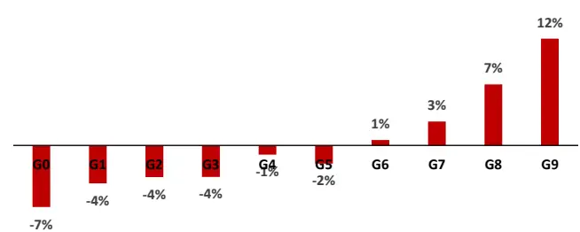
月度 RankIC 序列

图 19：SUG1(含预告)在中证全指内选股表现（原始值）分组对冲年化收益
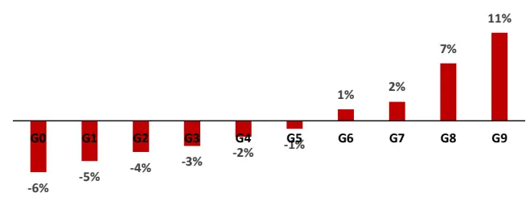

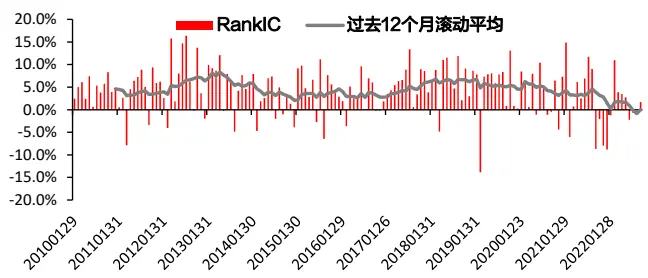
多空组合净值及回撤

月度 RankIC 序列
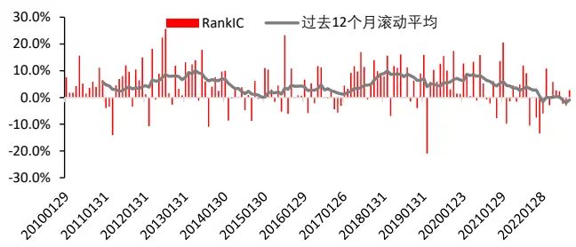

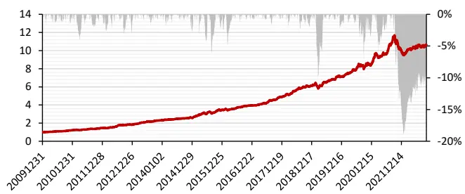
数据来源：wind & 东方证券研究所

多空组合净值及回撤
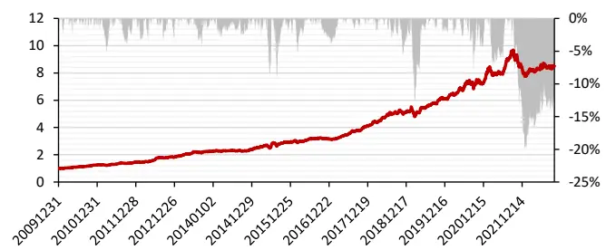
数据来源：wind & 东方证券研究所

## 2.2业绩预告视为财报发出前的预期值

业绩预告作为公司盈利情况的预测，自身也可以作为财报发布前的比较基准来加以利用。在报告《上市公司业绩预告信息研究》业绩预告均值偏离度因子的基础上，我们新增了财报净利润相对业绩预告上下限因子，并分别用 EBIAS0和 EBIAS1表示。

$$
\begin{aligned}&EBIAS_{0}=\frac{财报(单季)净利润-预告(单季)净利润上下限均值}{预告(单季)净利润上下限均值}\\&\\&EBIAS_{1}=\frac{财报净利润-预告净利润下限}{预告净利润上限-预告净利润下限}\\\end{aligned}
$$

从因子表现来看，虽然两类 EBIAS 因子的 RankIC 不高，但其在行业市值中性化后的回撤较低，如 EBIAS0和 EBIAS1自2010年起在中证全指内的多空组合最大回撤分别为-3.91%和-7.10%，显示了较好的因子稳定性。

图 20：EBIAS0在各个样本空间因子表现汇总
因子原始值

|  | RankIC |  |  | 多空组合 |  |  |  |  |
| --- | --- | --- | --- | --- | --- | --- | --- | --- |
|  | IC月度均值 | IC IR | t值 | 年化收益 | 夏普率 | 月胜率 | 最大回撤多头月换手 |  |
| 沪深300 | 2.33% | 0.59 | 2.1 | 2.56% | 0.24 | 55.56% | -31.13% | 27% |
| 中证500 | 1.14% | 0.5 | 1.79 | 4.49% | 0.44 | 54.90% | -33.59% | 28% |
| 中证800 | 1.52% | 0.55 | 1.96 | 2.06% | 0.22 | 57.52% | -30.01% | 27% |
| 中证1000 | 1.40% | 0.85 | 3.03 | 1.79% | 0.2 | 49.02% | -26.64% | 28% |
| 中证全指 | 1.15% | 0.67 | 2.4 | 3.33% | 0.42 | 64.05% | -29.51% | 23% |

行业市值中性

图 21：EBIAS1在各个样本空间因子表现汇总因子原始值

|  | RankIC |  |  | 多空组合 |  |  |  |  |
| --- | --- | --- | --- | --- | --- | --- | --- | --- |
|  | IC月度均值 | IC IR | t值 | 年化收益 | 夏普率 | 月胜率 | 最大回撤多头月换手 |  |
| 沪深300 | 1.22% | 0.31 | 1.11 | 0.26% | 0.09 | 50.98% | -51.70% | 27% |
| 中证500 | 1.11% | 0.55 | 1.97 | 4.27% | 0.52 | 57.52% | -19.65% | 26% |
| 中证800 | 1.30% | 0.5 | 1.78 | 2.92% | 0.37 | 58.82% | -19.34% | 24% |
| 中证1000 | 1.23% | 0.75 | 2.68 | 7.91% | 1.01 | 62.75% | -15.71% | 25% |
| 中证全指 | 0.80% | 0.46 | 1.66 | 6.22% | 1.1 | 66.01% | -8.81% | 22% |

行业市值中性

|  | RankIC |  |  | 多空组合 |  |  |  |  |
| --- | --- | --- | --- | --- | --- | --- | --- | --- |
|  | IC月度均值 | IC IR | t值 | 年化收益 | 夏普率 | 月胜率 | 最大回撤多头月换手 |  |
| 沪深300 | 2.18% | 1.31 | 4.68 | 6.51% | 0.73 | 57.52% | -23.18% | 25% |
| 中证500 | 1.49% | 0.98 | 3.48 | 5.02% | 0.66 | 56.21% | -10.11% | 24% |
| 中证800 | 1.62% | 1.27 | 4.55 | 5.49% | 0.93 | 65.36% | -8.45% | 23% |
| 中证1000 | 1.89% | 1.43 | 5.11 | 7.62% | 1.14 | 62.09% | -11.54% | 26% |
| 中证全指 | 2.00% | 1.73 | 6.19 | 6.79% | 1.68 | 66.67% | -3.91% | 22% |

数据来源：wind & 东方证券研究所

|  | RankIC |  |  | 多空组合 |  |  |  |  |
| --- | --- | --- | --- | --- | --- | --- | --- | --- |
|  | IC月度均值 | IC IR | t值 | 年化收益 | 夏普率 | 月胜率 | 最大回撤多头月换手 |  |
| 沪深300 | 1.12% | 0.75 | 2.66 | 5.91% | 0.7 | 54.90% | -13.21% | 24% |
| 中证500 | 1.68% | 1.34 | 4.8 | 4.64% | 0.65 | 57.52% | -11.29% | 25% |
| 中证800 | 1.56% | 1.56 | 5.56 | 6.00% | 1.08 | 63.40% | -8.32% | 23% |
| 中证1000 | 1.67% | 1.42 | 5.08 | 7.10% | 1.09 | 64.05% | -14.35% | 26% |
| 中证全指 | 1.46% | 1.89 | 6.74 | 7.98% | 1.84 | 72.55% | -7.10% | 22% |

数据来源：wind & 东方证券研究所

图 22：EBIAS0在中证全指内选股表现（原始值）
分组对冲年化收益
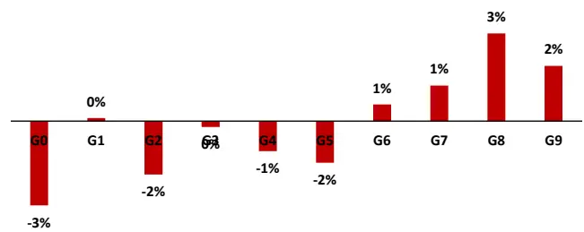

图 23：EBIAS1在中证全指内选股表现（原始值）
分组对冲年化收益
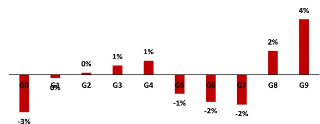

月度 RankIC 序列
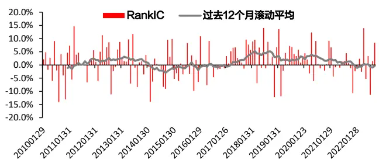

月度 RankIC 序列
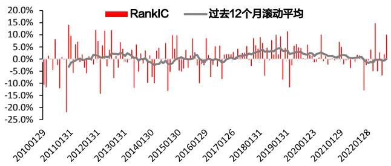

多空组合净值及回撤
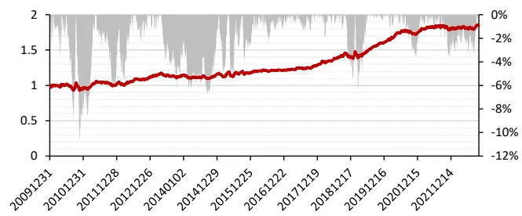
数据来源：wind & 东方证券研究所

多空组合净值及回撤
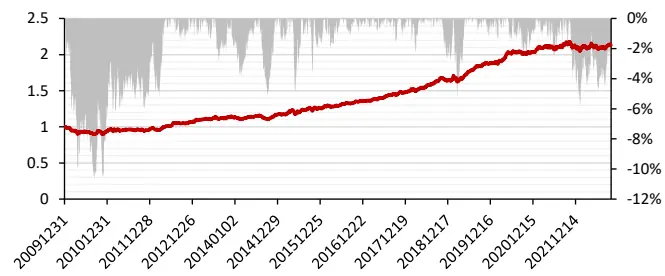
数据来源：wind & 东方证券研究所

有关分析师的申明，见本报告最后部分。其他重要信息披露见分析师申明之后部分，或请与您的投资代表联系。并请阅读本证券研究报告最后一页的免责申明。

## 三、财报公告前后的市场反应

除了基于业绩序列直接构建业绩超预期因子外，另外一种间接的方式就是采用业绩公告前后的市场反应间接表征业绩公告信息的好坏，比如 Chan等（1996）、Brandt等（2008）等采用业绩公告当天的市场反应作为业绩超预期度量，Zhou 等（2012）采用公告日前后三天的股价跳跃。

目前国内投资者普遍采用公告前后的开盘价/前收盘价与最低价/前收盘价这两个量价指标，本文首先借鉴了开盘涨跌幅和最低涨跌幅这两种常规算法，分别计算在公告当天、公告前后三天两个指标的取值。同时，考虑到公告日前后大单的买卖也会包含一定的交易信息，所以我们在上述两类量价指标的基础上增加了两个大单因子，分别是早盘大单买入占比因子与早盘大单涨跌幅因子（大单因子的具体定义方式可参考《基于大单的 alpha因子构建》）。因为大单数据自 2014年以后逐步完善，所以本章因子测试的回测区间选为 2013.12.31-2022.09.30。

## 3.1 财务公告前后的开盘（最低）涨跌幅

记公司发布财报的公告日期为 T，我们分别计算了公告日 T当天的开盘/前收、最低/前收，同时计算了[T-1,T+1]三天范围内的开盘/前收与最低/前收的因子均值，总共 4 个因子。其中，开盘/前收试图捕捉由于休市期间发布的公告产生的次日股价变化，例如财报大幅超预期往往带来次日开盘向上的跳空，从而产生一个较大的开盘/前收因子，反之亦然。最低/前收因子在考虑公告可能产生的跳空影响外，额外加入了波动率的考量，如最低/前收越高，可能意味着公告为利好且股价波动小，因此最低/前收与开盘/前收可从不同方面抓取公告内容与公告时点信息。

从图 24 的因子相关性分析中，也可以证实上述观点，即开盘/前收与最低/前收捕捉的公告信息不完全一致。如公告当天、公告前后三天两类因子的相关性分别为60.67%和54.20%，开盘/前收在公告当天与公告前后三天两类时间区间上的因子相关性为 65.80%，最低/前收在两类时间区间上因子取值相关性为 66.61%。

图 24：八类公告日前后因子的相关性（20131231-20220930）

| 中证全指 |  |  | 公告当天 |  |  |  | 公告前后三天 |  |  |
| --- | --- | --- | --- | --- | --- | --- | --- | --- | --- |
|  |  | 开盘/前收 最低/前收 早盘大单买入早盘大单涨跌幅 |  |  |  | 开盘/前收 最低/前收 早盘大单买入早盘大单涨跌幅 |  |  |  |
| 公告当天 | 开盘/前收最低/前收早盘大单买入早盘大单涨跌幅 |  | 60.67% | 29.93% | 25.77% | 65.80% | 39.66% | 17.47% 17.11% |  |
|  |  | 60.67% |  | 36.83% | 43.55% | 45.12% | 66.61% | 20.24% | 27.42% |
|  |  | 29.93% | 36.83% |  | 64.01% | 22.40% | 22.47% | 58.28% | 39.53% |
|  |  | 25.77% | 43.55% | 64.01% |  | 19.72% | 28.47% | 36.62% | 61.04% |
| 公告前后三天 | 开盘/前收最低/前收 | 65.80% | 45.12% | 22.40% | 19.72% |  | 54.20% | 22.42% | 21.22% |
|  |  | 39.66% | 66.61% | 22.47% | 28.47% | 54.20% |  | 25.95% | 38.25% |
|  | 早盘大单买入早盘大单涨跌幅 | 17.47% | 20.24% | 58.28% | 36.62% | 22.42% | 25.95% |  | 56.77% |
|  |  | 17.11% | 27.42% | 39.53% | 61.04% | 21.22% | 38.25% | 56.77% |  |

数据来源：wind & 东方证券研究所

图 25：公告当天的最低/前收在各个样本空间因子表现汇总因子原始值

|  | RankIC |  |  | 多空组合 |  |  |  |  |
| --- | --- | --- | --- | --- | --- | --- | --- | --- |
|  | IC月度均值 | IC IR | t值 | 年化收益 | 夏普率 | 月胜率 | 最大回撤多头月换手 |  |
| 沪深300 | 2.93% | 1.18 | 3.49 | 1.96% | 0.24 | 59.05% | -30.55% | 39% |
| 中证500 | 2.44% | 1.25 | 3.7 | 11.96% | 1.24 | 68.57% | -20.32% | 40% |
| 中证800 | 2.66% | 1.33 | 3.93 | 8.36% | 0.98 | 64.76% | -16.21% | 39% |
| 中证1000 | 3.81% | 1.9 | 5.63 | 16.11% | 1.67 | 73.33% | -13.60% | 43% |
| 中证全指 | 3.14% | 1.63 | 4.81 | 12.12% | 1.49 | 71.43% | -14.60% | 40% |

行业市值中性

图 26：公告当天的开盘/前收在各个样本空间因子表现汇总因子原始值

|  | RankIC |  |  | 多空组合 |  |  |  |  |
| --- | --- | --- | --- | --- | --- | --- | --- | --- |
|  | IC月度均值 | IC_IR | t值 | 年化收益 | 夏普率 | 月胜率 | 最大回撤多头月换手 |  |
| 沪深300 | 2.60% | 1.16 | 3.44 | 8.38% | 0.85 | 60.95% | -26.02% | 41% |
| 中证500 | 3.26% | 1.72 | 5.08 | 13.54% | 1.4 | 69.52% | -17.13% | 44% |
| 中证800 | 3.04% | 1.78 | 5.26 | 10.69% | 1.32 | 66.67% | -13.58% | 42% |
| 中证1000 | 4.52% | 2.76 | 8.15 | 18.91% | 1.42 | 77.14% | -21.53% | 49% |
| 中证全指 | 3.61% | 2.6 | 7.69 | 14.93% | 2.05 | 75.24% | -12.80% | 45% |

行业市值中性

|  | RankIC |  |  | 多空组合 |  |  |  |  |
| --- | --- | --- | --- | --- | --- | --- | --- | --- |
|  | IC月度均值 | IC_IR | t值 | 年化收益 | 夏普率 | 月胜率 | 最大回撤多头月换手 |  |
| 沪深300 | 2.33% | 1.31 | 3.88 | 4.38% | 0.52 | 56.19% | -16.42% | 44% |
| 中证500 | 2.52% | 1.53 | 4.54 | 8.18% | 1 | 65.71% | -18.30% | 47% |
| 中证800 | 2.59% | 1.85 | 5.48 | 9.03% | 1.29 | 65.71% | -11.27% | 43% |
| 中证1000 | 3.70% | 2.55 | 7.53 | 16.48% | 2.01 | 74.29% | -7.45% | 48% |
| 中证全指 | 3.26% | 2.6 | 7.7 | 14.54% | 2.56 | 80.95% | -8.97% | 44% |

数据来源：wind & 东方证券研究所

|  | RankIC |  |  | 多空组合 |  |  |  |  |
| --- | --- | --- | --- | --- | --- | --- | --- | --- |
|  | IC月度均值 | IC_IR | t值 | 年化收益 | 夏普率 | 月胜率 | 最大回撤多头月换手 |  |
| 沪深300 | 2.17% | 1.25 | 3.7 | 4.28% | 0.51 | 56.19% | -31.92% | 44% |
| 中证500 | 3.93% | 2.39 | 7.07 | 12.06% | 1.44 | 65.71% | -14.64% | 47% |
| 中证800 | 3.35% | 2.47 | 7.3 | 10.16% | 1.42 | 64.76% | -11.70% | 44% |
| 中证1000 | 4.62% | 3.74 | 11.06 | 20.29% | 2.79 | 80.95% | -7.65% | 47% |
| 中证全指 | 3.86% | 3.86 | 11.41 | 16.30% | 2.45 | 84.76% | -7.03% | 44% |

数据来源：wind & 东方证券研究所

图 27：公告当天的最低/前收在中证全指内选股表现（原始值）分组对冲年化收益
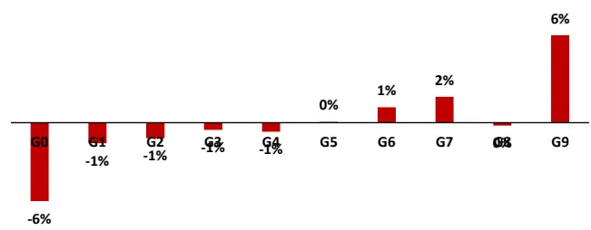

图 28：公告当天的开盘/前收在中证全指内选股表现（原始值）分组对冲年化收益
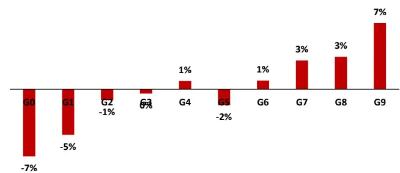

月度 RankIC 序列
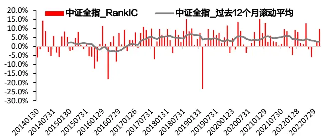

月度 RankIC 序列
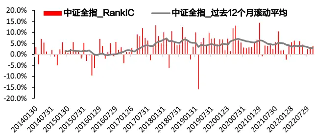

多空组合净值及回撤
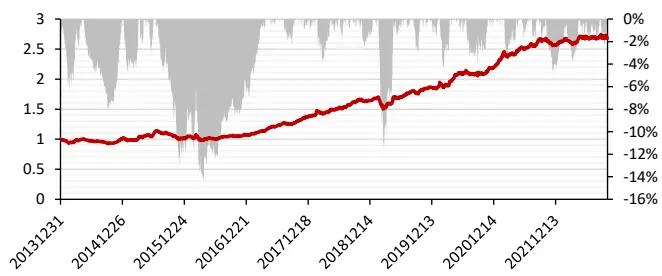
数据来源：wind & 东方证券研究所

多空组合净值及回撤
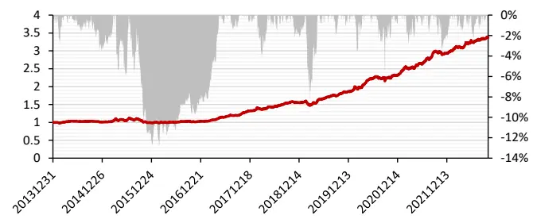
数据来源：wind & 东方证券研究所

有关分析师的申明，见本报告最后部分。其他重要信息披露见分析师申明之后部分，或请与您的投资代表联系。并请阅读本证券研究报告最后一页的免责申明。

图 29：公告前后三天的最低/前收在各个样本空间因子表现汇总因子原始值

|  | RankIC |  |  | 多空组合 |  |  |  |  |
| --- | --- | --- | --- | --- | --- | --- | --- | --- |
|  | IC月度均值 | IC IR | t值 | 年化收益 | 夏普率 | 月胜率 | 最大回撤多头月换手 |  |
| 沪深300 | 3.28% | 1 | 2.97 | 4.14% | 0.4 | 58.10% | -28.31% | 44% |
| 中证500 | 3.88% | 1.71 | 5.05 | 7.61% | 0.82 | 62.86% | -21.23% | 46% |
| 中证800 | 3.58% | 1.35 | 4.01 | 6.98% | 0.78 | 62.86% | -16.46% | 44% |
| 中证1000 | 4.10% | 1.71 | 5.04 | 12.35% | 1.18 | 65.71% | -22.62% | 48% |
| 中证全指 | 3.71% | 1.45 | 4.3 | 8.64% | 0.92 | 63.81% | -22.49% | 47% |

行业市值中性

图 30：公告前后三天的开盘/前收在各个样本空间因子表现汇总因子原始值

|  | RankIC |  |  | 多空组合 |  |  |  |  |
| --- | --- | --- | --- | --- | --- | --- | --- | --- |
|  | IC月度均值 | IC IR | t值 | 年化收益 | 夏普率 | 月胜率 | 最大回撤多头月换手 |  |
| 沪深300 | 1.93% | 0.83 | 2.46 | 7.54% | 0.71 | 56.19% | -22.43% | 41% |
| 中证500 | 3.32% | 1.75 | 5.19 | 11.97% | 1.31 | 64.76% | -15.13% | 44% |
| 中证800 | 2.70% | 1.48 | 4.38 | 10.02% | 1.18 | 65.71% | -13.22% | 42% |
| 中证1000 | 4.03% | 2.37 | 7.01 | 15.37% | 1.43 | 75.24% | -14.59% | 46% |
| 中证全指 | 3.21% | 2.06 | 6.08 | 13.23% | 1.7 | 68.57% | -16.05% | 43% |

行业市值中性

|  | RankIC |  |  | 多空组合 |  |  |  |  |
| --- | --- | --- | --- | --- | --- | --- | --- | --- |
|  | IC月度均值 | IC IR | t值 | 年化收益 | 夏普率 | 月胜率 | 最大回撤多头月换手 |  |
| 沪深300 | 2.51% | 1.36 | 4.02 | 3.52% | 0.46 | 53.33% | -14.96% | 51% |
| 中证500 | 3.48% | 2.11 | 6.24 | 5.29% | 0.7 | 55.24% | -15.46% | 50% |
| 中证800 | 3.23% | 2.18 | 6.44 | 5.89% | 0.9 | 64.76% | -12.71% | 48% |
| 中证1000 | 3.50% | 1.97 | 5.83 | 11.32% | 1.44 | 67.62% | -13.53% | 51% |
| 中证全指 | 3.63% | 2.26 | 6.68 | 11.22% | 1.86 | 74.29% | -11.07% | 48% |

数据来源：wind & 东方证券研究所

|  | RankIC |  |  | 多空组合 |  |  |  |  |
| --- | --- | --- | --- | --- | --- | --- | --- | --- |
|  | IC月度均值 | IC IR | t值 | 年化收益 | 夏普率 | 月胜率 | 最大回撤多头月换手 |  |
| 沪深300 | 1.42% | 0.8 | 2.36 | 1.81% | 0.24 | 52.38% | -21.68% | 46% |
| 中证500 | 3.50% | 2.2 | 6.5 | 12.54% | 1.42 | 65.71% | -11.87% | 48% |
| 中证800 | 2.72% | 1.92 | 5.69 | 8.42% | 1.14 | 64.76% | -15.49% | 45% |
| 中证1000 | 3.84% | 2.8 | 8.28 | 16.25% | 2.02 | 74.29% | -10.11% | 48% |
| 中证全指 | 3.30% | 3.05 | 9.02 | 14.02% | 2.25 | 78.10% | -6.01% | 44% |

数据来源：wind & 东方证券研究所

图 31：公告前后三天的最低/前收在中证全指内选股表现（原始值）分组对冲年化收益
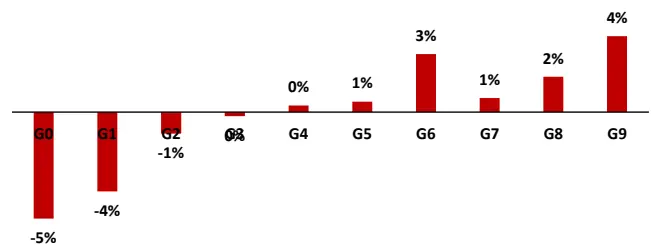
月度 RankIC 序列

图 32：公告前后三天的开盘/前收在中证全指内选股表现（原始值）分组对冲年化收益
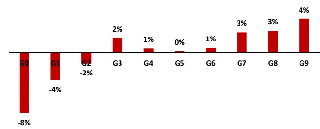

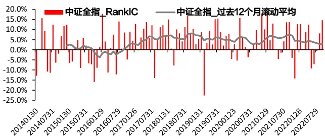

月度 RankIC 序列
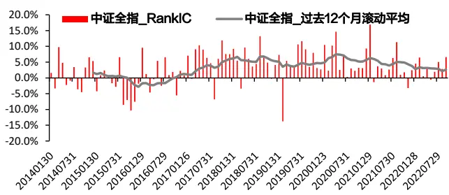
多空组合净值及回撤

多空组合净值及回撤
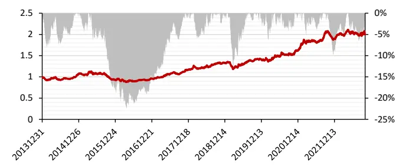
数据来源：wind & 东方证券研究所

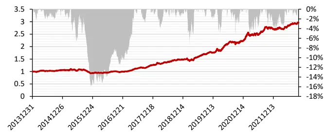
数据来源：wind & 东方证券研究所

有关分析师的申明，见本报告最后部分。其他重要信息披露见分析师申明之后部分，或请与您的投资代表联系。并请阅读本证券研究报告最后一页的免责申明。

从上述最低/前收、开盘/前收的因子测试结果来看，可以发现：

（1）两类因子在小市值股票池中的选股能力要略优于大市值股票池，如公告当天的最低/前收、开盘/前收中性值在沪深300中的月度RankIC均值为2.33%和2.17%，而在中证全指中的月度 RankIC 均值为 3.26%和 3.86%。

（2）对同一类因子而言，最低/前收在公告日前后三天的表现要优于公告日当天的因子表现，而开盘/前收恰好相反，其在公告日当天的表现要胜过自身在公告日前后三天的表现。这在一定程度上说明了开盘/前收因子受公告发出时点的影响较大，而非公告日对其增量影响弱。

（3）对相同的因子计算区间而言，公告日当天开盘/前收因子表现要优于最低/前收，而公告前后三天最低/前收因子表现要更优。

（4）从多空收益分组的单调性角度来看，公告当天的分组单调性要好于公告前后三天的分组单调性，且多、空组的超额收益较为均衡，最低/前收、开盘/前收的多头年化超额收益分别可以取到 6.27%和 7.05%。

（5）从因子 RankIC 的时序表现来看，两类因子的 RankIC 没有减弱的迹象，且近期回撤较小。

## 3.2 与公告日结合的大单因子

在之前的报告《基于大单的 alpha 因子构建》与《超大单冲击对大单因子的影响》中，我们曾详细讨论过两类大单因子：大单买入占比因子与大单涨跌幅因子，前者用于刻画大资金的买卖方向、后者用于描述大资金的买入强度，且两类因子均有不错的选股能力。大单因子构建的初衷就是想跟踪大单持有方的交易行为，因为大单背后往往是资金和信息都更有优势的投资者群体。受此启发，我们尝试将大单因子与公告事件相结合，计算公告日 T 与[T-1,T+1]三天范围内的（早盘）大单买入占比因子与（早盘）大单涨跌幅，试图通过公告前后大单的买卖方向和强度去捕捉业绩公告的超预期信息进而获得选股的 alpha。

从因子值相关性来看，公告日期间的大单因子与前文介绍的最低/前收、开盘/前收因子普遍相关性不高。公告当天、前后三天两类大单因子的相关性分别为 64.01%和 56.77%。

从因子测试的表现来看，与公告日结合的大单因子具有如下特点：

（1）与公告日结合的大单因子延续了大单因子本身的选股特点，即大单买入占比在大市值股票池中选股能力更强、大单涨跌幅因子的选股能力在各市值股票池中较为均衡。

（2）两类大单因子在公告日前后三天的表现均优于公告日单日的因子表现，说明大单背后的投资者会在公告前、后持续发力。

（3）无论是公告日当天还是前后三天，相比于 3.1 节中的最低/前收、开盘/前收，大单因子的选股能力都毫不逊色，说明公告期间大资金方的交易行为可以产生不错的 alpha。

（4）大单因子的分组收益单调性较好，且多、空组的收益较为均衡。因子 RankIC序列无衰减迹象，且因子回撤近期控制地较好，尤其是（早盘）大单买入占比因子。

图 33：公告当天的大单买入占比在各个样本空间因子表现汇总因子原始值

|  | RankIC |  |  | 多空组合 |  |  |  |  |
| --- | --- | --- | --- | --- | --- | --- | --- | --- |
|  | IC月度均值 | IC IR | t值 | 年化收益 | 夏普率 | 月胜率 | 最大回撤多头月换手 |  |
| 沪深300 | 4.02% | 1.52 | 4.5 | 9.65% | 0.98 | 65.71% | -19.29% | 36% |
| 中证500 | 3.45% | 1.89 | 5.58 | 11.95% | 1.4 | 60.95% | -15.71% | 38% |
| 中证800 | 3.58% | 1.9 | 5.61 | 10.62% | 1.33 | 63.81% | -14.80% | 36% |
| 中证1000 | 3.04% | 1.93 | 5.71 | 12.96% | 1.5 | 70.48% | -15.25% | 40% |
| 中证全指 | 2.82% | 1.91 | 5.66 | 10.54% | 1.46 | 69.52% | -12.28% | 38% |

行业市值中性

图 34：公告当天的大单涨跌幅在各个样本空间因子表现汇总因子原始值

|  | RankIC |  |  | 多空组合 |  |  |  |  |
| --- | --- | --- | --- | --- | --- | --- | --- | --- |
|  | IC月度均值 | IC IR | t值 | 年化收益 | 夏普率 | 月胜率 | 最大回撤多头月换手 |  |
| 沪深300 | 3.86% | 1.49 | 4.42 | 9.93% | 0.85 | 62.86% | -21.96% | 37% |
| 中证500 | 3.73% | 1.98 | 5.84 | 11.08% | 1.05 | 60.95% | -14.52% | 39% |
| 中证800 | 3.81% | 2.15 | 6.35 | 11.97% | 1.27 | 62.86% | -14.09% | 36% |
| 中证1000 | 3.88% | 2.23 | 6.6 | 15.89% | 1.57 | 73.33% | -15.93% | 40% |
| 中证全指 | 3.51% | 2.45 | 7.26 | 13.42% | 1.67 | 72.38% | -8.48% | 37% |

行业市值中性

|  | RankIC |  |  | 多空组合 |  |  |  |  |
| --- | --- | --- | --- | --- | --- | --- | --- | --- |
|  | IC月度均值 | IC IR | t值 | 年化收益 | 夏普率 | 月胜率 | 最大回撤多头月换手 |  |
| 沪深300 | 3.39% | 1.71 | 5.05 | 13.58% | 1.47 | 68.57% | -8.39% | 40% |
| 中证500 | 3.07% | 2.02 | 5.98 | 10.42% | 1.46 | 63.81% | -16.81% | 42% |
| 中证800 | 3.26% | 2.33 | 6.9 | 9.10% | 1.37 | 66.67% | -15.41% | 38% |
| 中证1000 | 3.03% | 2.54 | 7.53 | 14.26% | 1.98 | 73.33% | -10.79% | 42% |
| 中证全指 | 2.79% | 2.43 | 7.19 | 10.72% | 1.75 | 73.33% | -9.30% | 39% |

数据来源：wind & 东方证券研究所

|  | RankIC |  |  | 多空组合 |  |  |  |  |
| --- | --- | --- | --- | --- | --- | --- | --- | --- |
|  | IC月度均值 | IC IR | t值 | 年化收益 | 夏普率 | 月胜率 | 最大回撤多头月换手 |  |
| 沪深300 | 3.21% | 1.51 | 4.46 | 6.97% | 0.69 | 57.14% | -19.67% | 42% |
| 中证500 | 3.25% | 1.94 | 5.75 | 12.67% | 1.36 | 63.81% | -11.71% | 44% |
| 中证800 | 3.24% | 2.09 | 6.19 | 10.83% | 1.31 | 64.76% | -12.53% | 40% |
| 中证1000 | 3.42% | 2.44 | 7.2 | 14.79% | 1.58 | 72.38% | -21.96% | 43% |
| 中证全指 | 2.84% | 2.14 | 6.34 | 11.21% | 1.63 | 68.57% | -9.22% | 39% |

数据来源：wind & 东方证券研究所

图 35：公告当天的大单买入占比在中证全指内选股表现（原始值）分组对冲年化收益
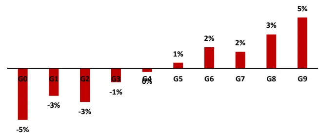

图 36：公告当天的大单涨跌幅在中证全指内选股表现（原始值）分组对冲年化收益
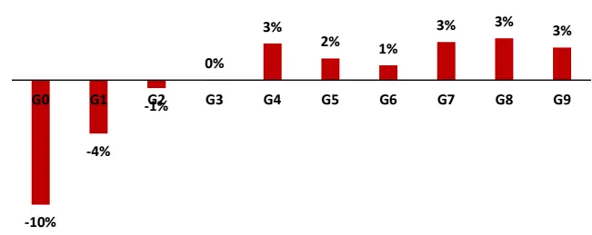

月度 RankIC 序列
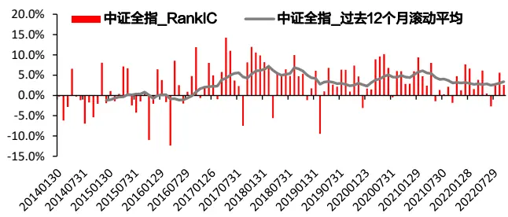

月度 RankIC 序列
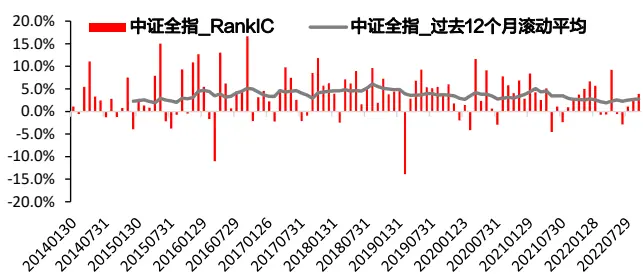

多空组合净值及回撤
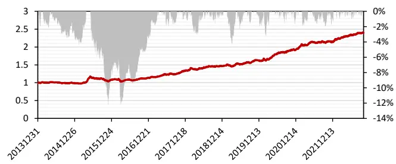
数据来源：wind & 东方证券研究所

多空组合净值及回撤
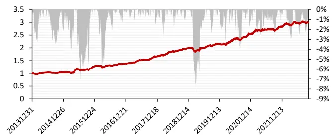
数据来源：wind & 东方证券研究所

有关分析师的申明，见本报告最后部分。其他重要信息披露见分析师申明之后部分，或请与您的投资代表联系。并请阅读本证券研究报告最后一页的免责申明。

图 37：公告前后三天的大单买入占比在各个样本空间因子表现汇总因子原始值

|  | RankIC |  |  | 多空组合 |  |  |  |  |
| --- | --- | --- | --- | --- | --- | --- | --- | --- |
|  | IC月度均值 | IC IR | t值 | 年化收益 | 夏普率 | 月胜率 | 最大回撤多头月换手 |  |
| 沪深300 | 4.09% | 1.34 | 3.96 | 12.32% | 1.06 | 55.24% | -18.59% | 37% |
| 中证500 | 3.87% | 1.93 | 5.72 | 13.20% | 1.53 | 64.76% | -12.26% | 38% |
| 中证800 | 3.82% | 1.75 | 5.18 | 11.64% | 1.38 | 66.67% | -14.09% | 37% |
| 中证1000 | 3.24% | 1.69 | 5.01 | 13.27% | 1.45 | 71.43% | -18.70% | 40% |
| 中证全指 | 3.29% | 1.92 | 5.68 | 11.27% | 1.74 | 75.24% | -12.69% | 37% |

行业市值中性

图 38：公告前后三天的大单涨跌幅在各个样本空间因子表现汇总因子原始值

|  | RankIC |  |  | 多空组合 |  |  |  |  |
| --- | --- | --- | --- | --- | --- | --- | --- | --- |
|  | IC月度均值 | IC IR | t值 | 年化收益 | 夏普率 | 月胜率 | 最大回撤多头月换手 |  |
| 沪深300 | 3.87% | 1.44 | 4.25 | 7.70% | 0.64 | 61.90% | -29.26% | 38% |
| 中证500 | 4.88% | 1.97 | 5.83 | 15.09% | 1.18 | 65.71% | -17.36% | 40% |
| 中证800 | 4.46% | 2.02 | 5.99 | 12.54% | 1.08 | 64.76% | -15.47% | 38% |
| 中证1000 | 4.78% | 2.28 | 6.74 | 20.65% | 1.83 | 77.14% | -14.50% | 40% |
| 中证全指 | 4.54% | 2.64 | 7.8 | 16.99% | 1.81 | 78.10% | -10.95% | 38% |

行业市值中性

|  | RankIC |  |  | 多空组合 |  |  |  |  |
| --- | --- | --- | --- | --- | --- | --- | --- | --- |
|  | IC月度均值 | IC IR | t值 | 年化收益 | 夏普率 | 月胜率 | 最大回撤多头月换手 |  |
| 沪深300 | 2.92% | 1.3 | 3.84 | 11.01% | 1.1 | 61.90% | -14.51% | 43% |
| 中证500 | 3.72% | 2.32 | 6.87 | 13.10% | 1.64 | 65.71% | -16.05% | 42% |
| 中证800 | 3.40% | 2.17 | 6.41 | 11.53% | 1.67 | 67.62% | -10.92% | 40% |
| 中证1000 | 3.15% | 2.22 | 6.57 | 13.44% | 1.65 | 70.48% | -12.33% | 42% |
| 中证全指 | 3.18% | 2.54 | 7.53 | 11.36% | 2.03 | 73.33% | -10.77% | 38% |

数据来源：wind & 东方证券研究所

|  | RankIC |  |  | 多空组合 |  |  |  |  |
| --- | --- | --- | --- | --- | --- | --- | --- | --- |
|  | IC月度均值 | IC IR | t值 | 年化收益 | 夏普率 | 月胜率 | 最大回撤多头月换手 |  |
| 沪深300 | 3.04% | 1.47 | 4.34 | 5.24% | 0.58 | 60.00% | -25.94% | 45% |
| 中证500 | 4.36% | 2.09 | 6.18 | 16.47% | 1.53 | 69.52% | -12.12% | 47% |
| 中证800 | 3.71% | 1.96 | 5.78 | 11.25% | 1.22 | 60.00% | -14.61% | 43% |
| 中证1000 | 3.97% | 2.16 | 6.39 | 18.20% | 1.9 | 78.10% | -16.06% | 45% |
| 中证全指 | 3.59% | 2.16 | 6.4 | 13.14% | 1.68 | 72.38% | -9.21% | 39% |

数据来源：wind & 东方证券研究所

图 39：公告前后三天大单买入占比在中证全指选股表现（原始值）分组对冲年化收益
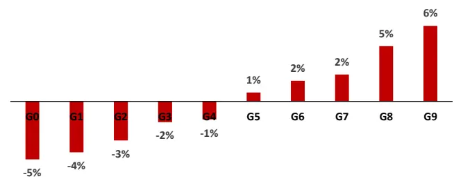
月度 RankIC 序列

图 40：公告前后三天大单涨跌幅在中证全指选股表现（原始值）分组对冲年化收益
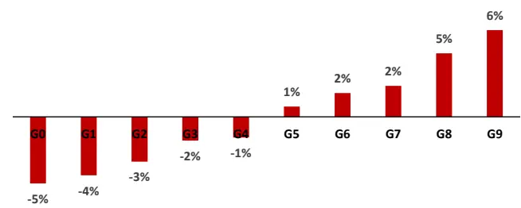

月度 RankIC 序列

多空组合净值及回撤

多空组合净值及回撤

数据来源：wind & 东方证券研究所

数据来源：wind & 东方证券研究所

有关分析师的申明，见本报告最后部分。其他重要信息披露见分析师申明之后部分，或请与您的投资代表联系。并请阅读本证券研究报告最后一页的免责申明。

## 四、机器学习捕捉财务时序的 alpha

## 4.1 基于时序网络的因子构建方法

前文中提出的 SUE、SUR、SUG 系列因子的计算公式本质上只是公司季度财务序列的一种时间序列整合方式，这种时间序列整合方式是人为的根据先验知识指定的，类似于量价序列，事实上我们也可以采用时间序列网络模型学习业绩时序的组合方式用于预测股票未来一段时间的收益率。本章节采用前序报告《周频量价指增模型》中的类似模型架构用于提取业绩时序中可以用于预测未来股票收益率的 alpha信息。

图 41：基于时序网络构建业绩超预期因子的过程

数据来源：东方证券研究所

如上图所示，我们首先采用一个时间序列网络（本文采用 AGRU）从股票当时可获得的历史业绩序列中提取一些低相关的 alpha 因子，最后利用一个树模型将时序模型生成的 alpha 因子合成一个综合打分用于最后的机器学习业绩超预期因子打分。时序网络每年训练一次，每次训练采用过去10年的数据作为训练集，过去一年的数据作为验证集，树模型每个月训练一次，取过去一年的数据作为训练集，无验证集。模型最终得分多次训练取平均。

## 4.2 基于时序网络的因子选股表现

本章因子测试的回测区间选为2016.12.30-2022.09.30。从因子表现来看，时序网络训练的因子原始值在各个股票池中的选股能力较为均衡，其在沪深 300 和中证全指内的 RankIC 分别为5.69%和5.62%，多空收益分别为25.46%和26.77%，最大回撤均控制在-20%以内。此外，该因子原始值在中证全指上的分组多头收益十分强势，多头年化超额收益为14.21%，虽然近期因子表现有所回落，但是相对人工构建的 SUE系列因子近期波动更小。

图 42：时序网络算法下的因子表现（20161230-20220930）
各样本空间因子表现汇总

|  | RankIC |  | 原始值 |  |  |  |  |  | RanklC |  |  |  | 多空组合 |  |  |  |
| --- | --- | --- | --- | --- | --- | --- | --- | --- | --- | --- | --- | --- | --- | --- | --- | --- |
|  | IC月度均值 | IC_IR | t值 | 年化收益 夏普率 |  | 月胜率 | 最大回撤多头月换手 |  |  | IC月度均值 | IC IR | t值 | 年化收益 夏普率 |  | 月胜率 | 最大回撤多头月换手 |
| 沪深300 | 5.69% | 1.45 | 3.48 | 25.46% | 1.41 | 62.32% | -19.12% | 52% | 沪深300 | 3.25% 1.36 | 3.27 | 15.66% | 1.27 | 62.32% | -18.58% | 54% |
| 中证500 | 6.40% | 1.89 | 4.52 | 31.03% | 182 | 66.67% | -17.97% 52% | 中证500 | 5.25% | 2.58 | 6.18 | 22.48% | 1.93 | 71.01% | -11.94% | 54% |
| 中证800 | 6.27% | 1.83 | 4.38 | 28.15% | 1.67 | 69.57% | -19.76% 52% | 中证800 | 4.65% | 2.09 | 5.02 | 24.06% | 1.97 | 69.57% | -10.89% | 53% |
| 中证1000 | 5.97% | 2.18 | 5.24 | 28.94% | 2.01 | 72.46% | -19.23% | 51% | 中证1000 5.81% | 3.29 | 7.89 | 26.81% | 2.67 | 79.71% | -14.64% | 54% |
| 中证全指 | 5.62% | 2.13 | 5.11 | 26.77% | 2.03 | 72.46% | -16.85% | 50% | 中证全指 5.04% | 2.81 | 6.74 | 24.30% | 2.51 | 81.16% | -10.89% | 51% |

分组对冲年化收益（中证全指，原始值）

月度 RankIC序列（中证全指，原始值）

多空组合净值及回撤（中证全指，原始值）

数据来源：wind & 东方证券研究所

## 五、基于财报业绩超预期的综合度量

至此，本文总共介绍了四类基于财报的业绩超预期度量角度。一是基于“公告值减去预期值除以规模数”框架下的传统超预期度量因子，而且我们在常规字段净利润和营业收入的基础上扩展了新字段毛利；二是我们介绍了业绩预告数据应用于业绩超预期度量的两种角度；三是将最低/前收、开盘/前收、两类大单因子分别与公告日相结合，具体计算了公告当天与公告前后三天的因子取值；四是应用时序网络捕捉财务数据时序上的 alpha。事实上，上述四个角度又可以进一步归纳为两个方向，即基本面加市场反应，例如SUE等因子试图刻画股票基本面的超预期情况，而公告日前后的大单因子又可以从市场交易角度反向印证基本面。因此，本章试图将上述四大类因子进行等权大类合成，以充分利用基本面分析加市场反应“1+1>2”的效果。

图 43：业绩超预期的综合度量框架

数据来源：东方证券研究所

对四种大类因子间的相关性进行分析发现，只有大类 1 和大类 2 的因子相关性略高，其他大类因子间的相关性均较低，特别是与公告日结合的大类因子 3。

图 44：各大类因子间的相关性（20161230-20220930）

| 中证全指 | 大类1 | 大类2 | 大类3 | 大类4 |
| --- | --- | --- | --- | --- |
| 大类1 |  | 62.14% | 20.81% | 50.09% |
| 大类2 | 62.14% |  | 23.55% | 42.56% |
| 大类3 | 20.81% | 23.55% |  | 16.66% |
| 大类4 | 50.09% | 42.56% | 16.66% |  |

数据来源：wind & 东方证券研究所

将四种大类因子等权后的因子进行测试，发现该因子原始值在各个股票池中的选股能力较为均衡，其在沪深 300 和中证全指内的 RankIC 分别为 6.69%和 7.81%，行业市值中性化后在沪深300 和中证全指内的 RankIC 分别为 4.95%和 7.36%。此外，该因子原始值在中证全指上的分组收益具有严格单调性且多头收益丰厚，具体地多头年化超额收益可达 18.53%，且 RankIC时序近期没有衰减的迹象。

图 45：大类加权算法下的综合因子表现（20161230-20220930）
各样本空间因子表现汇总

|  | RankIC |  |  | 原始值 多空组合 |  |  |  |  | RanklC |  |  | 多空组合 |  |  |  |  |
| --- | --- | --- | --- | --- | --- | --- | --- | --- | --- | --- | --- | --- | --- | --- | --- | --- |
|  | IC月度均值 | IC_IR | t值 | 年化收益 | 夏普率 | 月胜率 | 最大回撤多头月换手 |  |  | IC月度均值 | IC_IR | t值 | 年化收益 夏普率 | 月胜率 |  | 最大回撤多头月换手 |
| 沪深300 | 6.69% | 1.68 | 4.03 | 20.52% | 1.25 | 69.57% | -26.07% | 39% | 沪深300 | 4.95% | 2.16 5.19 | 23.44% | 1.8 | 71.01% | -17.01% | 39% |
| 中证500 | 8.67% | 2.54 | 6.1 | 35.09% | 1.94 | 73.91% | -22.22% | 38% 中证500 | 7.87% |  | 8.86 | 32.16% | 2.8 | 78.26% | -12.82% | 40% |
| 中证800 | 8.00% | 2.29 | 5.5 | 32.91% | 1.9 | 75.36% | -22.82% 36% | 中证800 | 6.97% | 3.7 3.03 | 7.27 | 29.93% | 2.48 | 81.16% | -14.59% | 39% |
| 中证1000 | 8.67% | 2.92 | 7.01 | 43.51% | 2.77 | 78.26% | -22.26% | 36% 中证1000 | 8.63% | 4.27 | 10.23 | 38.45% | 3.47 | 84.06% | -10.24% | 39% |
| 中证全指 | 7.81% | 2.94 | 7.06 | 35.54% | 2.54 | 84.06% | -17.34% | 35% 中证全指 | 7.36% | 3.8 | 9.11 | 33.67% | 3.13 | 85.51% | -12.44% | 37% |

分组对冲年化收益（中证全指，原始值）

月度 RankIC序列（中证全指，原始值）

多空组合净值及回撤（中证全指，原始值）

数据来源：wind & 东方证券研究所

## 六、结论

本文基于公司公告的财务信息，尝试从多角度对业绩超预期进行度量，选取的角度依次是传统业绩超预期的刻画、业绩预告的补充应用、公告前后的市场反应与时序网络的使用。

对于传统业绩超预期的刻画，本文在“公告值减去预期值除以规模数”的框架下，应用随机游走模型对净利润、营业收入和毛利三个字段进行了因子构建。特别地，对于用新增字段毛利构建的SUG因子，它与常见的SUE、SUR的相关性较低、且RankIC更高。如不含漂移项的SUG1，其原始值在沪深 300、中证全指里的 RankIC 分别为 6.51%和 4.16%，高于 SUE1 的 5.72%和4.06%，也高于 SUR1 的 4.99%和 3.53%。

对于业绩预告的补充应用，本文尝试了从两个方向对业绩预告加以利用，分别是把业绩预告视为定期财报数据和财报发出前的预期值。针对前者，我们构建了含预告的SUE因子，并发现改进后的 SUE 因子在多头收益、夏普率和月胜率等方面要优于原始 SUE 因子。针对后者，我们构建了业绩偏离度因子 EBIAS0和 EBIAS1，虽然这两类因子的 RankIC不高，但它们胜在回撤小、相关性低。

业内普遍采用公告前后的开盘价/前收盘价、最低价/前收盘价用于捕捉公告的超预期信息，本文新增了公告前后的（早盘）大单买入占比和（早盘）大单涨跌幅用于刻画公告的超预期。从因子表现来看，两类大单因子在公告日附近的表现要优于最低/前收、开盘/前收，如公告日前后三天的（早盘）大单买入占比因子，其原始值在沪深 300 和中证全指内的 RankIC 分别为 4.09%和 3.29%，且多空净值近期回撤较小。

传统的SUE系列因子从算法上看只是股票历史业绩序列的一种人为指定的时间序列整合方式，类似于量价序列数据，我们可以通过时序网络从股票历史业绩序列中学习对股票收益率的预测作为 alpha 因子。该因子原始值在沪深 300 和中证全指内的 RankIC 分别为 5.69%和 5.62%，多空最大回撤均控制在-20%以内。此外，其在中证全指上的多头年化超额收益为 14.21%，且近期波动小于传统 SUE系列因子。

将上述各描述因子按类别等权合成大类因子后，我们发现 4 种大类因子间的相关性均在 70%以下。随后本文将上述大类因子进行等权合成，以充分利用基本面分析加市场反应“1+1>2”的效果。合成后的因子在沪深 300 和中证全指内的 RankIC 分别为 6.69%和 7.81%，且在中证全指上的多头年化超额收益为 18.53%。

## 风险提示

1.量化模型基于历史数据分析得到，未来存在失效的风险，建议投资者紧密跟踪模型表现。

2.极端市场环境可能对模型效果造成剧烈冲击，导致收益亏损。

## 参考文献

[1] Ball, R., & Brown, P. (1968). An empirical evaluation of accounting income numbers. Journal of accounting research, 159-178.

[2] Bartov, E., Radhakrishnan, S., & Krinsky, I. (2000). Investor sophistication and patterns in stock returns after earnings announcements. The Accounting Review, 75(1), 43-63.

[3] Brandt, M. W., Kishore, R., Santa-Clara, P., & Venkatachalam, M. (2008). Earnings announcements are full of surprises. SSRN eLibrary.

[4] Chan, L. K., Jegadeesh, N., & Lakonishok, J. (1996). Momentum strategies. The Journal of Finance, 51(5), 1681-1713.

[5] Jegadeesh, N., & Livnat, J. (2006). Revenue surprises and stock returns. Journal of Accounting and Economics, 41(1-2), 147-171.

[6] Kinney, W., Burgstahler, D., & Martin, R. (2002). Earnings surprise “materiality” as measured by stock returns. Journal of Accounting Research, 40(5), 1297-1329.

[7] Latane, H. A., & Jones, C. P. (1977). Standardized unexpected earnings--a progress report. The Journal of Finance, 32(5), 1457-1465.

[8] Manikas, A. S., & Patel, P. C. (2016). Managing sales surprise: The role of operational slack and volume flexibility. International Journal of Production Economics, 179, 101-116.

[9] Zhou, H., & Zhu, J. Q. (2012). Jump on the post–earnings announcement drift (corrected). Financial Analysts Journal, 68(3), 63-80.

## Tabl e_Disclai mer 分析师申明

每位负责撰写本研究报告全部或部分内容的研究分析师在此作以下声明：

分析师在本报告中对所提及的证券或发行人发表的任何建议和观点均准确地反映了其个人对该证券或发行人的看法和判断；分析师薪酬的任何组成部分无论是在过去、现在及将来，均与其在本研究报告中所表述的具体建议或观点无任何直接或间接的关系。

## 投资评级和相关定义

报告发布日后的 12个月内的公司的涨跌幅相对同期的上证指数/深证成指的涨跌幅为基准；

## 公司投资评级的量化标准

买入：相对强于市场基准指数收益率 15%以上；

增持：相对强于市场基准指数收益率 5%～15%；

中性：相对于市场基准指数收益率在-5%～+5%之间波动；

减持：相对弱于市场基准指数收益率在-5%以下。

未评级 —— 由于在报告发出之时该股票不在本公司研究覆盖范围内，分析师基于当时对该股票的研究状况，未给予投资评级相关信息。

暂停评级 —— 根据监管制度及本公司相关规定，研究报告发布之时该投资对象可能与本公司存在潜在的利益冲突情形；亦或是研究报告发布当时该股票的价值和价格分析存在重大不确定性，缺乏足够的研究依据支持分析师给出明确投资评级；分析师在上述情况下暂停对该股票给予投资评级等信息，投资者需要注意在此报告发布之前曾给予该股票的投资评级、盈利预测及目标价格等信息不再有效。

## 行业投资评级的量化标准：

看好：相对强于市场基准指数收益率 5%以上；

中性：相对于市场基准指数收益率在-5%～+5%之间波动；

看淡：相对于市场基准指数收益率在-5%以下。

未评级：由于在报告发出之时该行业不在本公司研究覆盖范围内，分析师基于当时对该行业的研究状况，未给予投资评级等相关信息。

暂停评级：由于研究报告发布当时该行业的投资价值分析存在重大不确定性，缺乏足够的研究依据支持分析师给出明确行业投资评级；分析师在上述情况下暂停对该行业给予投资评级信息，投资者需要注意在此报告发布之前曾给予该行业的投资评级信息不再有效。

## HeadertTabl e_Discl ai mer 免责声明

本证券研究报告（以下简称“本报告”）由东方证券股份有限公司（以下简称“本公司”）制作及发布。

。本公司不会因接收人收到本报告而视其为本公司的当然客户。本报告的全体接收人应当采取必要措施防止本报告被转发给他人。

本报告是基于本公司认为可靠的且目前已公开的信息撰写，本公司力求但不保证该信息的准确性和完整性，客户也不应该认为该信息是准确和完整的。同时，本公司不保证文中观点或陈述不会发生任何变更，在不同时期，本公司可发出与本报告所载资料、意见及推测不一致的证券研究报告。本公司会适时更新我们的研究，但可能会因某些规定而无法做到。除了一些定期出版的证券研究报告之外，绝大多数证券研究报告是在分析师认为适当的时候不定期地发布。

在任何情况下，本报告中的信息或所表述的意见并不构成对任何人的投资建议，也没有考虑到个别客户特殊的投资目标、财务状况或需求。客户应考虑本报告中的任何意见或建议是否符合其特定状况，若有必要应寻求专家意见。本报告所载的资料、工具、意见及推测只提供给客户作参考之用，并非作为或被视为出售或购买证券或其他投资标的的邀请或向人作出邀请。

本报告中提及的投资价格和价值以及这些投资带来的收入可能会波动。过去的表现并不代表未来的表现，未来的回报也无法保证，投资者可能会损失本金。外汇汇率波动有可能对某些投资的价值或价格或来自这一投资的收入产生不良影响。那些涉及期货、期权及其它衍生工具的交易，因其包括重大的市场风险，因此并不适合所有投资者。

在任何情况下，本公司不对任何人因使用本报告中的任何内容所引致的任何损失负任何责任，投资者自主作出投资决策并自行承担投资风险，任何形式的分享证券投资收益或者分担证券投资损失的书面或口头承诺均为无效。

本报告主要以电子版形式分发，间或也会辅以印刷品形式分发，所有报告版权均归本公司所有。未经本公司事先书面协议授权，任何机构或个人不得以任何形式复制、转发或公开传播本报告的全部或部分内容。不得将报告内容作为诉讼、仲裁、传媒所引用之证明或依据，不得用于营利或用于未经允许的其它用途。

经本公司事先书面协议授权刊载或转发的，被授权机构承担相关刊载或者转发责任。不得对本报告进行任何有悖原意的引用、删节和修改。

提示客户及公众投资者慎重使用未经授权刊载或者转发的本公司证券研究报告，慎重使用公众媒体刊载的证券研究报告。

## 东方证券研究所

地址： 上海市中山南路 318 号东方国际金融广场 26 楼

电话：021-63325888

传真：021-63326786

网址： www.dfzq.com.cn