# 研报文本情感倾向因子

## 《因子选股系列研究之八十六》

## 研究结论

⚫ 分析师研报数据是相对独立的信息源，本报告基于朝阳永续的研报标题和摘要文本、盈利预测，用多种 NLP模型提取文本特征，判断研报的情感倾向。

文本的处理有多种多样的方式，文本特征具有稀疏的特性，本文通过正则匹配、同义映射、词向量映射三种方法对文本特征进行降维，在同样的特征维度中可以囊括更多的信息，提升因子表现的同时，增加了模型的可解释性。对降维后的特征用XGB和 RNN模型对研报盈利预测调整幅度进行回归训练。

## ⚫ 本文用多种处理方法和模型构建了如下 5个因子：

1. 词频因子 RPTF：统计训练窗口内的高频词，形成 log 词频矩阵，用 XGB 进行回归预测，全样本 Rank IC 3.4%，ICIR 1.3，年化收益率20%。缺点是单词特征并不能体现出情感倾向，如果“利润”“成本”“增加”三个词同时出现的话，逻辑上模型并不能知道是利润在增加还是成本在增加，于是衍生出 RPRF因子。

2.正则表达式因子 RPRF：人工提取研报中常见、并且具有情感倾向的表达，类似于((产能)|(规模)|(如期)).∗ ((达产)|(投放))，形成 regex 的 One-Hot 矩阵，用 XGB 进行回归预测，全样本 Rank IC 3.5%，ICIR 1.7，年化收益率19%。缺点是人工提取regex 费时费力且不全面，需要不断更新表达式以适应新的表达，于是衍生出 RPBF因子。

3.同义映射词组因子 RPBF：将分词用同义词进行映射降维，相邻两词组成一个词组，统计高频词组，形成词组频矩阵，用 XGB 进行回归预测，全样本 Rank IC3.5%，ICIR 1.5，年化收益率 19%。缺点是只包括了文本的离散特征而遗漏了文本的时序特征，于是衍生出 RPNN因子。

4. 循环神经网络因子 RPNN：将分词序列用词向量进行映射，形成词向量序列，用单层 GRU 进行训练预测，全样本 Rank IC 3.0%，ICIR 1.2，年化收益率 16%。缺点是比较消耗算力，只能对标题进行训练，且模型比较黑箱。

5. 合成因子 RPST：由前面四个因子等权合成，全样本 Rank IC 3.8%，ICIR 1.4，年化收益率 20%，中性化之后全样本 Rank IC 3.9%，ICIR 2.4，年化收益率 19%，各项回测指标都超过WFR，符合预期。

⚫ 本文分开使用标题文本和摘要文本提取体征，因为经过测试发现摘要文本中蕴含着大量增量信息，在 RPTF模型中摘要信息的加入能够提升一倍的多头年化收益率，从 5%提升到 11%。

前四个因子使用相同的文本数据和训练标签，但是彼此之间的因子相关性在 0.57-0.67，相关性并不算高，说明对于文本的不同特征抓取方式其实包含了不同的信息。将训练标签——盈利调整，按照同样的方式构建成因子，可以发现四因子和盈利调整均值的相关性在 0.42-0.55，说明模型从文本中学习到了额外的信息。

RPST在各个样本空间进行行业市值中性化之后，选股能力 RankIC在中证 1000中提升到了 4.5%，而在沪深300中下降到了 2.4%，这种现象在WFR因子中也同样存在，而在全样本中，中性化之后 ICIR和 Sharpe都有明显提升，MaxDD在各样本空间都显著下降，说明选股能力和盈利能力在剔除了行业市值的影响之后都变得更加稳定。

|  | RPST因子表现 |  |  |  |  |  |  |
| --- | --- | --- | --- | --- | --- | --- | --- |
|  | RankIC | ICIR | Turnover | Sharpe | AnnRet | Vol | MaxDD |
| 全样本 | 0.038 | 1.435 | 39.2% | 1.757 | 20.4% | 0.109 | -27.6% |
| 全样本中性化 | 0.039 | 2.369 | 42.5% | 2.312 | 19.4% | 0.078 | -16.3% |
| 沪深300 | 0.036 | 0.971 | 36.8% | 0.938 | 13.4% | 0.145 | -40.6% |
| 沪深300中性化 | 0.024 | 1.247 | 42.4% | 0.927 | 9.3% | 0.101 | -29.8% |
| 中证500 | 0.029 | 0.999 | 37.3% | 1.247 | 15.8% | 0.124 | -32.6% |
| 中证500中性化 | 0.035 | 2.078 | 41.1% | 1.979 | 17.7% | 0.084 | -13.4% |
| 中证800 | 0.032 | 1.049 | 35.2% | 1.329 | 16.4% | 0.119 | -27.7% |
| 中证800中性化 | 0.029 | 1.941 | 42.7% | 1.799 | 15.3% | 0.081 | -19.2% |
| 中证1000 | 0.028 | 1.236 | 38.2% | 1.788 | 19.5% | 0.103 | -22.4% |
| 中证1000中性化 | 0.045 | 3.461 | 38.9% | 2.396 | 18.7% | 0.073 | -10.9% |

## 风险提示 量化模型失效风险；市场极端环境冲击

报告发布日期

2022 年 12 月 06 日

王星星

021-63325888*6108

wangxingxing@orientsec.com.cn

执业证书编号：S0860517100001

薛耕 xuegeng@orientsec.com.cn

标题日期

更稳健易算的分析师盈利上调因子：——2021-03-09

《因子选股系列研究 之 七十三》

## 1. 概括

分析师报告拥有大量的非结构化信息，可以给结构化数据带来信息增量。同时分析师倾向于基本面向好或热门的股票，对于其他冷门股票倾向于不发表观点，且报告中对于负面信息的措辞也会较为委婉，需要通过文本挖掘的方式解析出来。对研报文本数据进行挖掘往往比公司财报更加及时，也提供了信息增量，且分析师情绪会传导到市场，影响股价，所以针对研报进行文本挖掘具有研究价值。

针对研报进行文本挖掘的现行研究有多种，根据模型类型分为两类：1）词序模型，用预训练的 Transformer模型对文本直接进行预测；2）词频模型，用经验或者统计来锁定关键词，统计这些词在测试集上的出现频率，对词频直接进行加总计分，或者用树模型进行学习。

本文用个股报告的文本对报告的情感倾向进行训练和预测，数据特征为个股报告的标题和摘要的分词序列，训练标签为分析师盈利预测调整，共采用四种模型，不同的数据处理方式和训练算法形成四个单因子，合成分析师情感倾向因子 RPST（Report-Sentiment）。本文的主旨是让模型学习文本中的情感表达，以期获得研报内容的情感倾向因子。

对文本进行情感建模的一项重要工作是人工给文本标记情感，并以此作为学习目标。然而人工打标签的模式费时费力，所幸分析师撰写研报本文的同时一般也会给出报告的盈利预测，无论是研报的文本信息还是盈利预测调整均是对覆盖标的的情感表达，因此盈利预测调整幅度是天然的研报文本标签。部分投资者可能会质疑为何不用盈利预测本身作为研报的情感因子，因为通过将图片和与其关联的评论文本放在一起做多模态学习有助于模型学习图片和文本的内部结构信息，类似的我们将分析师研报文本和盈利预测调整放在一起有助于模型从文本中提取信息，而这些信息在盈利预测调整中并不一定有所表达，本文实证结果中RPST的各项回测指标均超过WFR（盈余调整度量，Weighted Forecast Revision）在一定程度上也印证了上述想法。

## 2. 数据说明

## 2.1 个股报告

总体的个股报告有 200万篇，数据来源于朝阳永续，本文的研究样本只针对存在盈利调整的个股研究报告，限定时间区间为 2006 年 1 月 1 日到 2022 年 10 月 31 日，经过去重之后总共有500854 个样本。

图 1：个股报告示例

| 报告id 个股代码 券商 入库日期 报告期 利润调整（%） |  |  |  |  |  |  | 研报标题 | 研报摘要 |
| --- | --- | --- | --- | --- | --- | --- | --- | --- |
| 334113 | 300206 | 宏源证券 | 2011-08-22 | 20111231 | 0.00 | 理邦仪器：研发驱动未来盈利增长 |  | 成本增加，中报业绩增长…… |
| 568667 | 601318 | 国信证券 | 2013-10-28 | 20131231 | 0.42 | 中国平安：资产负债管理面临挑战 |  | 净利润同比增长45.1%，符合…… |
| 1194363 | 300014 | 国金证券 | 2019-09-01 | 20191231 | 29.28 |  | 亿纬锂能：电子烟和锂原电池支撑Q3业绩预告超预期 | 2019Q3，公司预计实现… |
| 572867 | 600337 | 中信证券 | 2013-10-30 | 20131231 | 0.00 | 美克股份：销售盈利齐向好，经营改革见成效 |  | 1-9月扣非后归属净利增…… |
| 1204485 | 002841 | 中信证券 | 2019-10-27 | 20191231 | 0.00 | 视源股份：高基数下收入阶段性放缓，盈利继续强劲 |  | 维持 2019-21 年归母净利… |

数据来源：朝阳永续，东方证券研究所

投资者在使用分析师预期数据时比较关心的一个问题是预期数据的覆盖率，图 2 可以看出2006 年-2011 年间个股报告及所覆盖的股票数量急剧增长，在 2011 年之后稳步增长，近年来报告数量维持在每年 4万篇左右，股票覆盖数量维持在 1500支左右。

有关分析师的申明，见本报告最后部分。其他重要信息披露见分析师申明之后部分，或请与您的投资代表联系。并请阅读本证券研究报告最后一页的免责申明。

在 2010 年之前研报标题存在不规范的问题，比如只有一句诗或是只有公司的名字，这对于模型的学习属于噪音样本，加上 2010 年之后研报数量才保持稳定，所以之后的训练样本从 2010年开始，第一个训练窗口为 2010-2012年，第一个预测窗口为 2013年。

图 3 中，研报覆盖的股票在各个指数成分中的占比稳定，在大市值中的占比始终高于小市值，沪深300覆盖率最高，中证500在80%，中证1000在60%-70%，显而易见的原因是大市值的股票投资者众多，所以分析师更愿意去覆盖这些股票。

图 2：个股报告数量以及股票覆盖数量
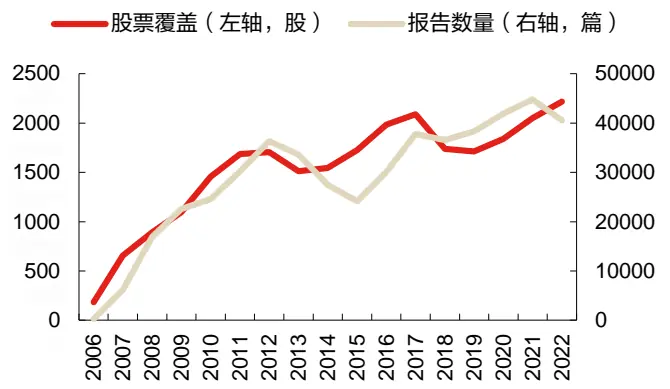
数据来源：朝阳永续，东方证券研究所

图 3：股票覆盖在各成分股中的占比
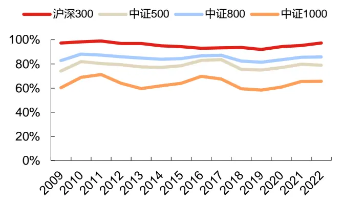
数据来源：朝阳永续，东方证券研究所

## 2.2 分词

词是自然语言处理的最小单位，中文词之间并没有空格，所以相比英文多出了分词这一步骤，Python 中文分词工具的选择有 SpaCy、Jieba、HanLP，其中 Jieba 的速度是最快的，故选用Jieba库作为分词工具。

2. 清洗：针对标题，需要剔除其中的公司名称，因为公司名字并不表达情感倾向；针对摘要，需要剔除其中“制表符”等特殊字符；

3. 使用 python 的 Jieba 库进行分词；

4. 保留有表达情感倾向的作用的词性：副词程度副词 d、动名词 vn、时间 t、动副词持续逆势vd、名形词 an、副形词 ad、普通动词 v、形容词 a、专有名词红利 nz、人名 nr、普通名词n。

图 4：分词流程
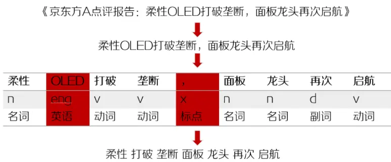
数据来源：朝阳永续，东方证券研究所

有关分析师的申明，见本报告最后部分。其他重要信息披露见分析师申明之后部分，或请与您的投资代表联系。并请阅读本证券研究报告最后一页的免责申明。

## 3. 词频因子 RPTF

该因子名称简略为 RPTF，意为 report-term-frequency。已有研究测算过高频词的词频作为特征的因子，表现不佳，而本因子的不同之处在于 1）对于“高频”范围的扩大，如果某个词出现在大部分的样本中，说明它不能表达出独特的情感倾向，所以扩大“高频”的范围，能够涵盖更多具有区分能力的词；2）用盈利预测调整作为训练标签，已有研究使用超额收益作为标签形成的因子选股能力不佳，可能的原因是用分析师文本去预测超额收益的信噪比比较差，毕竟股价涨跌的影响因素是很多元化的，而盈利调整可以很好的代表分析师看法，使用盈利预测调整作为标签具有更强的因果关系。

## 3.1 RPTF 模型框架

1. 滚动划分数据集：过去三年作为训练窗口，未来一年作为测试窗口，区间为2013年至2022年；

2. 提取特征X：统计标题和摘要出现频率最高的各1000个词，一共2000个标签，统计这些高频词未来一年内在个股报告中的词频，进行对数化。在未来一年的测试集中，不再重新统计高频词，而是保持和训练集的标签统一，计算对数词频矩阵；

3. 处理标签 Y：由于盈利调整大量集中在 0 附近，不服从正态分布，同时极值较多，所以本文使用累积分布函数的逆函数对标签进行正则化；

4. 训练模型：使用 XGBoost Regressor 默认参数进行训练；

5. 因子构建：用训练后的模型对未来一年的数据进行预测，针对每篇个股报告的对数词频矩阵进行预测打分，每月底调仓时保留每家券商在过去三个月内最后一次对某上市公司的覆盖，等权合成因子；

## 滚动划分数据集

每次滚动样本内以过去三年作为训练窗口，样本外以未来一年作为预测窗口，在最近的一个窗口中，作为训练窗口的 2019-2021样本量为 125025，预测窗口 2022样本量为 49086。

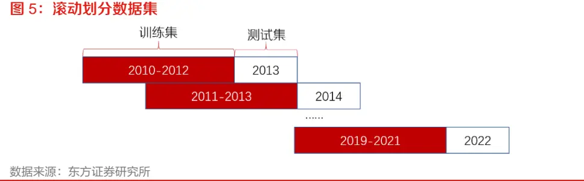

对每一篇个股报告进行分词之后，每一篇报告分为标题和摘要两个分词序列组成，对于训练集，遍历所有序列，找出分别在两个序列中出现频率最高的 1000 个词，统计这 2000 词在每一篇报告中的出现次数。

图 6：特征及标签样本

| 标题中的1000个高频词 |  |  |  |  |  | 摘要中的1000个高频词 |  |  |  | Y Label |
| --- | --- | --- | --- | --- | --- | --- | --- | --- | --- | --- |
| t 业绩 t_点评 |  | t_增长 | t_预期 | t_持续 | ………. | a_扩建 a_上限 | a_金属 | a_代表 | a_充电 | 利润调整 |
| 0 | 1 | 0 | 0 | 0 | …… | 0 | 0 | 0 | 0 0 | 0.43 |
| 0 | 1 | 0 | 0 | 0 | …… | 0 | 0 | 0 | 0 0 | -13.47 |
| 0 | 0 | 0 | 0 | 0 | …… | 0 | 0 | 0 | 0 0 | -0.67 |
| 0 | 0 | 0 | 0 | 0 | ……… | 0 | 0 | 0 | 0 0 | 0.00 |
| 0 | 0 | 0 | 0 | 0 | ……… | 0 | 1 | 0 | 0 0 | 0.00 |

数据来源：朝阳永续，东方证券研究所

用 $\begin{array}{r}{\dot{\mathbf{\eta}}=log(tf+1)}\end{array}$ 进行对数化，得到训练特征，比如在2019-2021三年训练窗口内提取的训练特征为125025 × 2000的矩阵。

高频词不一定是重要词，即使剔除了没有意义的衔接词，仍然存在许多对于情感判断没有帮助的词，比如“公司”“行业”等词。计算词频的方法有多种，其中一个解决方法是使用 TF-IDF（term frequency – inverse document frequency），这种词频计算方法为：

$$
\begin{array}{c}{{w_{i,j}=tf_{i,j}\times log\left(\displaystyle\frac{N}{df_{i}}\right)}}\\{{{}}}\\{{tf_{i,j}=\dot{z}\ddot{z}l\dot{\mathcal{Z}}\dot{\mathcal{X}}\dot{\mathcal{X}}j\stackrel{\mu}{\mathcal{Z}}\dot{\mathcal{Z}}\mathcal{H}\dot{\mathcal{H}}\dot{\mathcal{H}}\dot{\mathcal{H}}\dot{\mathcal{Z}}\dot{\mathcal{Z}}}}\\{{df_{i}=\dot{\mathcal{Z}}\dot{\mathcal{P}}\dot{\mathcal{P}}\dot{\mathcal{I}}\dot{\mathcal{I}}\dot{\mathcal{I}}\dot{\mathcal{Z}}\dot{\mathcal{X}}\dot{\mathcal{K}}}}\\{{N=\dot{\mathcal{X}}\dot{\mathcal{L}}\dot{\mathcal{L}}\dot{\mathcal{Z}}\dot{\mathcal{K}}}}\end{array}
$$

诸如“公司”这样的词在大部分文本中都出现，那么它的df会变大，使得它的数值变小，但这种方法的弊端是需要保证文本数量一致，在三年的训练窗口的情况下，测试集需要每日回滚过去 N 篇报告，增加的计算量很大，故舍弃，使用降低词频阈值的方法去囊括词频较低但是很重要的词作为标签。

## 处理标签 Y

在标签的选择上，Meursault V（2021）使用了市场的异常收益率作为分类标签，其做法是用公司业绩预告发布的前后两个交易日的股票累计超额收益作为异常收益率，在训练窗口内等分为三类，用 log词频进行回归。

但本文的目的是训练出一个能够识别个股报告情感倾向的模型，相比于研报本身的盈利调整，个股的市场表现和研报的情感倾向的因果关系并没有那么强，用研报的词频对研报的最终观点（盈利调整）进行学习，显得更加合理，故本文选择盈利调整作为学习目标。而研报本身并没有自带的离散值作为分类标签，所以本文用连续值——盈利调整作为回归模型的标签。

## 训练模型

XGBoost 是基于决策树的集成机器学习算法，它以梯度提升（Gradient Boost）为框架。决策树是易于可视化、可解释性相对较强的算法，在处理中小型结构数据或表格数据时，现在普遍认为基于决策树的算法是最好的，下图列出了近年来基于树的算法的演变过程：

图 7：近年来基于树的算法的演变过程
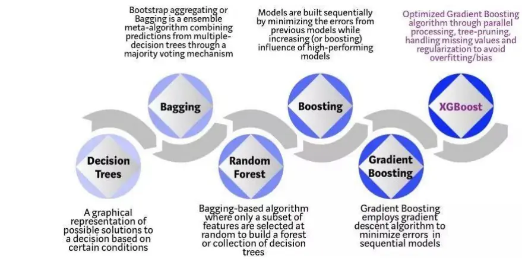
数据来源：towardsdatascience.com，东方证券研究所

## 因子构建

券商在短期内会针对某些股票进行多次覆盖，所以在月末调仓的时候，本文保留三个月内某券商对某股票的最后一篇报告的模型打分，各个券商的打分均值为最终的因子值，不加入时间衰减系数。

## 3.2 RPTF 因子表现

全市场中有个股报告的股票，在近年来样本数量维持在 1500 支的水平，下表中的各个成分股空间的表现皆未填充缺失值。选股回测中，将研报覆盖的股票根据因子值高低排序，每月底调仓时平均分为 10组，后文中的回测保持方法一致。

可以看出多空组合在近两年也受到市场 Beta 的影响，回撤较大，这可能和分析师报喜不报忧、热门股获得的关注较多、黑天鹅事件频发等因素相关；其中换手率在各个样本空间都很稳定，维持在每月 40%左右的水平；同样年化收益也在各个样本空间维持在 20%；在今年大盘普跌的趋势下，全样本多空收益的 4.6%主要来源于中小市值股票。

图 8：RPTF 各样本空间回测表现（20130101-20221031），年份列为多空收益
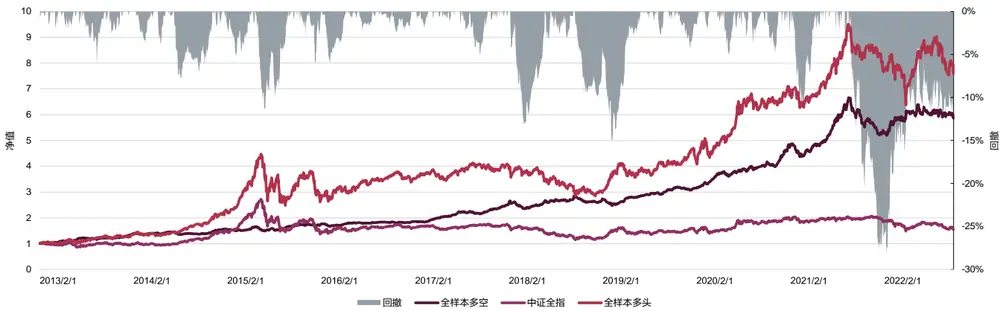

| RankIC | ICIR |  | Turnover Sharpe |  | AnnRet | Vol | MaxDD | 2013 | 2014 | 2015 | 2016 | 2017 | 2018 | 2019 | 2020 | 2021 | 2022 |
| --- | --- | --- | --- | --- | --- | --- | --- | --- | --- | --- | --- | --- | --- | --- | --- | --- | --- |
| 全样本 | 0.034 | 1.312 | 40.8% | 1.788 | 20.3% | 0.107 |  | -28.3% 28.0% 20.8% |  | 11.5% |  | 5.8% 31.8% | 10.2% | 17.5% | 41.4% | 25.0% | 4.6% |
| 沪深300 | 0.044 | 1.181 | 40.3% | 1.121 | 17.0% | 0.150 |  | -42.0% 36.2% 26.6% 25.1% |  |  | -6.5% 17.6% |  | -1.4% | 12.2% | 63.5% | 13.7% | -9.8% |
| 中证500 | 0.034 | 1.071 | 42.0% | 1.332 | 19.7% | 0.143 | -33.2% | 31.9% | 8.0% | 13.5% | 16.6% | 29.7% | 17.6% | 14.2% | 12.5% | 45.1% | 2.3% |
| 中证800 | 0.038 | 1.188 | 39.9% | 1.410 | 18.9% | 0.129 | -31.7% | 31.2% | 16.1% | 15.8% | 7.1% | 27.3% | 9.4% | 15.2% | 28.9% | 31.5% | 0.4% |
| 中证1000 | 0.036 | 1.255 | 43.5% | 1.675 | 23.1% | 0.129 | -40.0% | 31.3% | 34.3% | 9.4% | 5.5% | 26.3% | 4.5% | 17.1% | 59.2% | 25.6% | 13.5% |

数据来源：朝阳永续，东方证券研究所
有关分析师的申明，见本报告最后部分。其他重要信息披露见分析师申明之后部分，或请与您的投资代表联系。并请阅读本证券研究报告最后一页的免责申明。

图8可以看出在全样本空间内，因子选股能力一直保持稳定，但在2014年和2022年受Beta影响较大，图9可以看出因子分组较为单调，但同样多头端受Beta的影响较为显著，无法被空头端有效对冲，且第 9组和第 10组净值分离明显，说明多头部分具有较强的 Alpha。

图 9：RPTF 因子 IC 信息
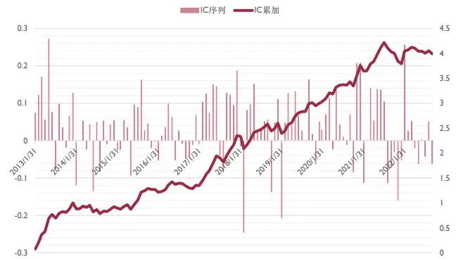
数据来源：朝阳永续，东方证券研究所

图 10：RPTF分组相对收益净值（颜色越深因子值越高）
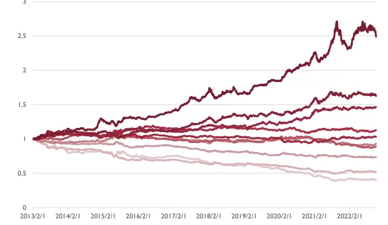
数据来源：朝阳永续，东方证券研究所

如果只针对标题进行学习的话，可以看出 IC 是不如加入摘要的，下图可以看出摘要对于多头有明显的增量信息，这是因为标题不一定完全地表达报告观点，一些负面信息或者细节可能在摘要中有所描述，所以加入摘要是有必要的，在多头端，摘要带来的收益甚至提升了一倍，在今年普跌的行情下，摘要带来的信息量可以将多空组合的负收益逆转为 4.6%。

图 11：RPTF中摘要所带来的年化收益增量
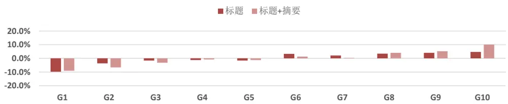

| RankIC Turnover Sharpe AnnRet |  |  |  |  |  |  | MaxDD 2013 2014 |  |  |  |  |  |  |  |
| --- | --- | --- | --- | --- | --- | --- | --- | --- | --- | --- | --- | --- | --- | --- |
| 标题+摘要 | 0.034 | ICIR 1.312 | 40.8% | 1.788 | 20.3% | Vol 0.107 | -28.3% |  | 2015 28.0% 20.8% 11.5% | 2016 2017 5.8% 31.8% | 2018 10.2% | 2019 2020 17.5% | 2021 41.4% 25.0% | 2022 4.6% |
| 标题 | 0.028 |  | 1.306 38.5% | 1.632 | 15.6% | 0.091 | -20.4% | 19.1% | 3.7% 15.3% | 4.1% | 27.4% 10.8% | 14.9% | 30.4% 26.5% | -0.9% |

数据来源：朝阳永续，东方证券研究所

下图展示了模型学习到的前 20 个重要的特征，“重要性”根据 XGBoost 中的树针对某特征分裂的次数决定，比如标题中的“业绩”，如果标题中提到业绩的话，说明该篇个股报告有很大可能表达了对该公司业绩的最新看法，“增长”“提升”“维持”等词的出现都有助于模型判别研报文本内容的情感倾向。

图 12：标题+摘要中的重要词
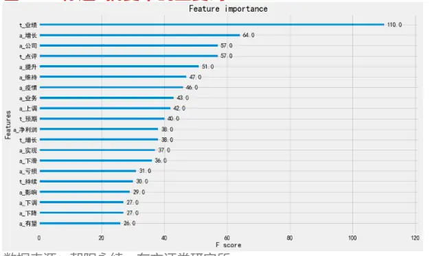
数据来源：朝阳永续，东方证券研究所

图 13：标题中的重要词
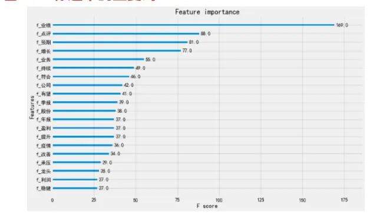
数据来源：朝阳永续，东方证券研究所

有关分析师的申明，见本报告最后部分。其他重要信息披露见分析师申明之后部分，或请与您的投资代表联系。并请阅读本证券研究报告最后一页的免责申明。

## 4. 正则表达式因子 RPRF

该因子名称简略为RPRF，意为report-regex-frequency。单词并不表达情感倾向，词组才能表达。比如“增加”一词，“利润增加”和“成本增加”是相反的情感倾向，该因子将常见的表达合成为正则表达式，合并同义词组的不同表达形式，其出现频率作为特征来让模型学习文本的情感表达，逻辑比 RPTF更强。

## 4.1 RPRF 模型框架

1. 滚动划分数据集：同 RPTF 因子一致，过去三年作为训练窗口，未来一年作为测试窗口，区间为 2013 年至 2022 年；

2. 总结正则表达式：人工总结归纳研报的情感表达范式，共 318个表达范式；

3. 提取特征 X：这 318 个表达范式分别对标题和摘要进行匹配，匹配成功则为 1，否则为 0，形成N × 636的 regex-frequency 的矩阵；

4. 处理标签 Y：同 RPTF因子一致，本文使用累积分布函数的逆函数对盈利调整进行正则化；

5. 训练模型：同 RPTF 因子一致，使用 XGBoost Regressor 默认参数进行训练；

6. 因子构建：同 RPTF 因子一致，每月底调仓时保留每家券商在过去三个月内最后一次对某上市公司的覆盖，等权合成因子；

## 总结正则表达式

本文根据人工经验总结出 318 个研报中常用的表达范式，将其改写为正则表达式，以下为 2个正面表达和 2个负面表达：

$$
((\Sigma^{\sharp}{\sharp}{\sharp}_{\sharp}^{\sharp})|({\sharp}{\mathbb D}{\sharp}_{\sharp}^{\sharp})|({\sharp}{\mathbb D}{\sharp}_{\sharp}^{\sharp})).*(({\ i}{\sharp}_{\sharp}^{\sharp})|({\sharp}_{\sharp}^{\wedge}{\sharp}))
$$

$$
((\mathbb{I}\mathbb{I}\big\vert\Xi)|(\vec{r}^{\perp}\underline{{\mathrm{e}}}\underline{{\mathrm{o}}})|(\hat{\mathfrak{i}}+\vec{\mathfrak{x}}\underline{{\mathrm{I}}}))|(\underline{{\mathsf{I}}}|\big\vert\big\vert\Pi)|(\dot{\mathtt{I}}\sharp\sharp\sharp\big)|(\dot{\vec{\kappa}}\underline{{\mathrm{I}}}\underline{{\mathrm{i}}}\sharp\underline{{\mathrm{i}}}))?.*(\dot{\vec{\mathtt{M}}}\dot{\mathtt{K}}\underline{{\mathrm{I}}}\mathsf{I}\mathsf{I})
$$

$$
((\sqrt{7}\frac{1+6}{15})|(\frac{\sqrt{25}}{15}\frac{1}{15}))?((\sqrt{10}\sqrt{15}/\frac{1+6}{15})|(\sqrt{15}\frac{1+6}{15}))((\frac{1+6}{15}\frac{15}{15})|(\frac{10}{15}\div\sqrt{11}\frac{1}{15}))?
$$

$$
((\sharp\sharp\sharp)|(\underline{{\mathsf{ul}}}|/\underline{{\mathsf{z}}}\underline{{\pm}}))(|\pm\mathcal{D})(|\pm\mathcal{D})((\jmath\pm)|(\ddagger\mathcal{D})|(\ddagger\mathcal{D}|))
$$

这 318 个正则表达式对研报文本的覆盖程度始终保持在 80%以上，近年保持在 90%以上，也就是说 90%的研报至少能够匹配 1个正则表达式。

图 14：表达式每年对研报的覆盖率
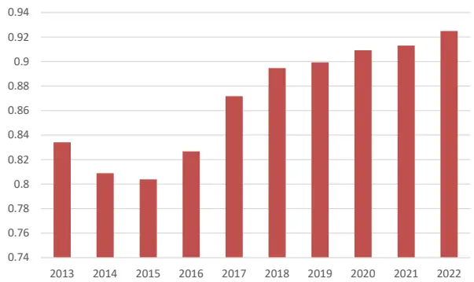
数据来源：朝阳永续，东方证券研究所

有关分析师的申明，见本报告最后部分。其他重要信息披露见分析师申明之后部分，或请与您的投资代表联系。并请阅读本证券研究报告最后一页的免责申明。

每一篇研报的标题和摘要，都对这318个regex遍历匹配一遍，匹配成功则为1，否则为0，形成N × 636的 regex-frequency 的独热码矩阵，作为训练特征。

图 15：RPRF 特征样式

| f_(出口).*((增长)(加速)) | f_(高)(分红) | f_(立足).*((行业)\|(长远))? |  | f_(加剧)(亏损) | f_(降低)(配量) | f_(存在)(不确定性) | 利润调整 |
| --- | --- | --- | --- | --- | --- | --- | --- |
| 0 | 0 | 0 | .…. | 0 | 0 | 0 | 0.00 |
| 0 | 0 | 0 |  | 0 | 0 | 1 | -9.09 |
| 0 | 0 | 0 |  | 0 | 1 | 0 | -18.05 |
| 0 | 0 | 1 |  | 0 | 0 | 0 | 0.52 |
| 0 | 1 | 0 |  | 0 | 0 | 0 | 1.20 |

数据来源：朝阳永续，东方证券研究所

## 4.2 RPRF 因子表现

可以看到 RPRF 在全样本的 Rank IC 高达 3.5%，Sharpe 也达到 2.0。虽然在沪深 300 内Rank IC 达到 3.2%，但是最大回撤高达 64.6%，仍然受市场 Beta 的影响较大，换手率和波动率在各个样本空间并无明显差别，在2022年普跌的行情下，全样本的多空收益主要来源于中小盘，在分十组的情况下，RPRF的对冲年化收益率和分组净值都非常单调。

图 16：RPRF 各样本空间回测表现（20130101-20221031）
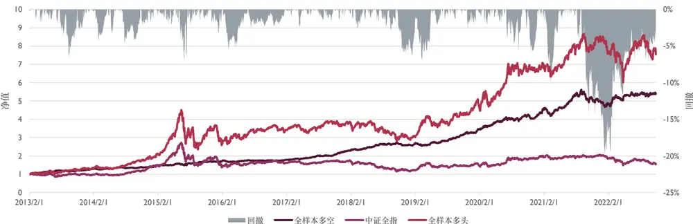

| RankIC Turnover Sharpe | ICIR |  |  |  | AnnRet | Vol 0.090 | MaxDD -20.4% | 2013 25.2% | 2014 12.1% | 2015 | 2016 | 2017 | 2018 | 2019 | 2020 | 2021 |  | 2022 |
| --- | --- | --- | --- | --- | --- | --- | --- | --- | --- | --- | --- | --- | --- | --- | --- | --- | --- | --- |
| 全样本 | 0.035 | 1.698 | 44.4% | 2.009 | 19.3% |  |  |  |  |  | 20.0% | 4.1% | 28.1% | 16.5% | 24.7% | 30.7% | 15.6% | 7.8% |
| 沪深300 | 0.032 | 1.019 | 44.3% | 0.913 | 11.6% | 0.130 | -64.6% | 39.9% | 0.3% | 14.8% |  | 3.0% | 27.1% | 4.6% | 21.9% | 39.4% | -7.8% | -18.2% |
| 中证500 | 0.020 | 0.803 | 42.1% | 1.388 | 15.0% | 0.105 | -17.9% | 31.1% | 1.7% |  | 19.6% | 4.7% | 27.3% | 11.7% | 14.9% | 8.6% | 9.9% | 15.0% |
| 中证800 | 0.027 | 1.070 | 41.4% | 1.598 | 16.4% | 0.098 | -23.2% | 39.5% | 5.1% | 20.7% |  | 8.5% | 29.9% | 12.8% | 21.1% | 22.1% | 2.6% | -1.6% |
| 中证1000 | 0.024 | 1.321 | 41.4% | 1.900 | 17.4% | 0.086 | -19.3% | 18.7% | 2.7% | 24.3% |  | 8.8% | 23.9% | 7.4% | 26.0% | 25.7% | 14.3% | 14.5% |

数据来源：朝阳永续，东方证券研究所

图 17：RPRF分组对冲年化收益
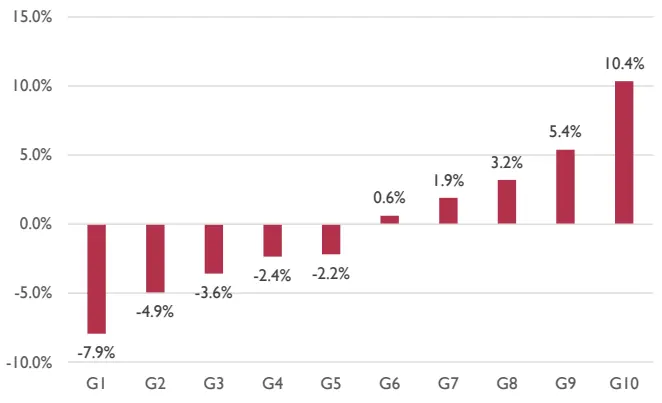
数据来源：朝阳永续，东方证券研究所

图 18：RPRF 分组净值
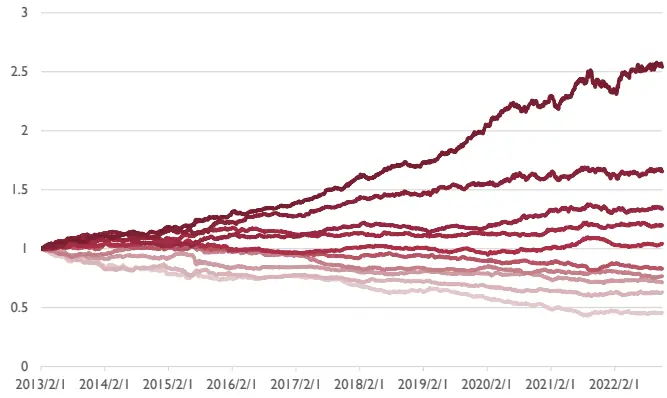
数据来源：朝阳永续，东方证券研究所

有关分析师的申明，见本报告最后部分。其他重要信息披露见分析师申明之后部分，或请与您的投资代表联系。并请阅读本证券研究报告最后一页的免责申明。

## RPRF的前五个重要的特征分别是

$$
\begin{array}{rl}&{\big((\frac{i\Xi}{{\Sigma^{3}}})|(\frac{i\Xi+\frac{i\Lambda}{{\mathcal{P}}}}{i\Xi})){\boldsymbol{1}}((\mp\Xi\frac{i\Lambda}{{\mathcal{P}}})|(\bar{z}\bar{\Xi}\bar{\Xi}\bar{\Xi})|(\bar{\Xi}\bar{z}\bar{\Xi})|(\bar{\mathcal{H}}\bar{\Xi}\bar{z}\bar{\Xi})|(\bar{\mathcal{H}}\bar{\Xi}\bar{z}\bar{\Xi})|(\bar{\mathcal{H}}\bar{\Xi}\bar{z}\bar{\Xi}))}\\&\big((\frac{i\Xi}{{\Xi\Xi}}\bar{\mathcal{H}}|)|(\bar{\Delta}\bar{\Xi}\bar{\Xi})|(\bar{\mathcal{H}}\bar{\Xi})|(\bar{\mathcal{H}}|)\bar{\Xi}|\big)|(\frac{(\mathrm{i}|l_{\mathcal{P}}^{\pm\Xi})|(\bar{\Xi}\bar{\Xi})|(\bar{\Xi}\bar{\Xi}|\bar{\mathcal{Y}})){\boldsymbol{2}}*(\bar{\mathcal{H}}\bar{\Xi}\bar{\Xi}){\boldsymbol{1}}*(\bar{\mathcal{H}}\bar{\Xi}\bar{\Xi})|(\bar{\Xi}\bar{\Xi}\bar{\Xi}))}\\&\big((\frac{i\Xi}{{\Sigma\Xi}}|\bar{\mathcal{H}}\big)|(\bar{\Lambda}\bar{\Xi}\bar{\Xi})|(\bar{\Lambda}\bar{\Xi})){\boldsymbol{1}}*((\bar{\Xi}\bar{\Xi}\bar{\Xi})|(\bar{\Xi}\bar{\Xi})|(\bar{\Xi}\bar{\Xi})|(\bar{\Xi}\bar{\Xi}|\bar{\Xi})|(\bar{\Xi}\bar{\Xi})|(\bar{\Xi}\bar{\Xi})|(\bar\end{array}
$$

图 19：RPRF特征重要性
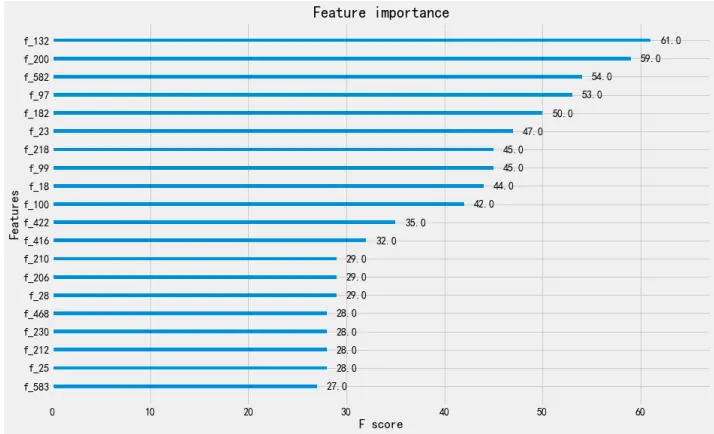
数据来源：朝阳永续，东方证券研究所

## 5. 同义映射词组因子 RPBF

该因子名称简略为 RPBF，意为 report-bigram-frequency，其中 bigram 意为由两个单词构成的词组。RPRF 的正则特征过于耗费人工，且会产生遗漏，为了批量得到正则表达式，可以使用同义词词典对分词进行降维，比如“增加”和“增大”都会映射为“增加”，相邻分词两两合并，形成同义映射词组，相比人工生成正则表达式更加全面和方便。

## 5.1 RPBF 模型框架

因为词频矩阵是稀疏矩阵，降维的过程就相当于一次特征选择，在同样的特征量下矩阵可以包含更多的信息，本文在 RPTF 中提到过，词频特征之间存在大量的同义词，所以我们使用《哈工大同义词词林》来对同义词进行聚类。另外在 RPGF 中，本文提炼出的正则表达式本质上就是2-3组同义词的组合，318个 regex也有不俗的表现，但是人工总结 regex费时费力，所以本章我们使用同义词映射+词组频的方法来构建训练数据。

1. 滚动划分数据集：同 RPTF 因子一致，过去三年作为训练窗口，未来一年作为测试窗口，区间为 2013 年至 2022 年；

2. 同义映射组成 Bigram：将分词用同义词进行映射，相邻的两个映射之后的分词作为一个词组；

3. 提取特征 X：同 RPTF 因子一致，统计标题和摘要出现频率最高的各 1000 个词组，形成一共 2000个标签的独热码。

4. 处理标签 Y：同 RPTF因子一致，本文使用累积分布函数的逆函数对盈利调整进行正则化；

5. 训练模型：同 RPTF 因子一致，使用 XGBoost Regressor 默认参数进行训练；

6. 因子构建：同 RPTF 因子一致，每月底调仓时保留每家券商在过去三个月内最后一次对某上市公司的覆盖，等权合成因子；

## 同义映射组成 Bigram

同义词的存在造成了词频矩阵中大量维度的重复，NLP 中常用的降维方法是用 Word2vec（详见 RPNN），但是它体现的是“共现词”而不是“同义词”，且较为黑箱，难以深究重要的特征变量，所以我们需要一个同义词词典来降低词频矩阵的维度。

《哈工大同义词词林》是一个汉语词的分类体系，其将77421个汉语词用五级分类进行编码，其中有 17807 个五级分类，4223 个四级分类，1425 个三级分类，95 个二级分类，12 个一级分类。

图 20：《哈工大同义词词林》编码举例
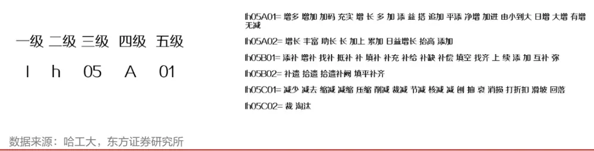
有关分析师的申明，见本报告最后部分。其他重要信息披露见分析师申明之后部分，或请与您的投资代表联系。并请阅读本证券研究报告最后一页的免责申明。

本文使用五级分类进行测试，也就是说“增多”和“增加”会归纳到一个维度，“增多”和“增长”是两个维度；将分词替换为同义词中的第一个词，“公司”和“企业”都会映射为“公司”。最直观地来看，RPTF 方法里，标题的 1000 个高频词可以映射到 550 个，维度减少了一半，另一方面，如果某个词没有同义词，那说明该词对情感倾向的判断也没有帮助，舍弃该词，也有助于降低维度。

图 21：对分词进行同义映射的过程举例
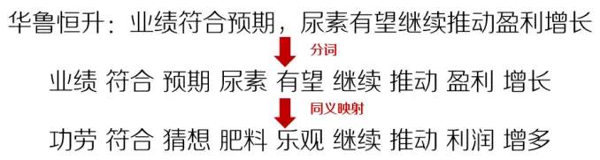
数据来源：朝阳永续，哈工大，东方证券研究所

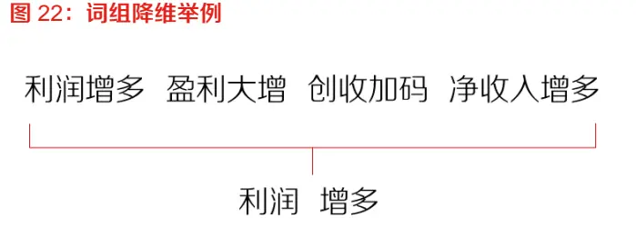
数据来源：朝阳永续，哈工大，东方证券研究所

该模型继承RPRF的想法，将同义映射之后的相邻分词两两组合，构成词组，形成词组序列进行统计，相同意思的多种表达会映射到同一个维度，这解决了人工总结 regex 费时费力的问题。

图 23：同义映射后的分词组成bigram的举例
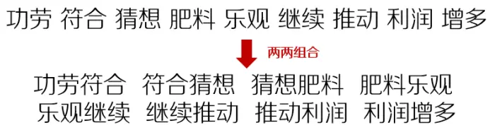
数据来源：朝阳永续，哈工大，东方证券研究所

## 5.2 RPBF 因子表现

可以看到 RPBF 在全样本的 Rank IC 高达 3.5%，Sharpe 也达到 1.7。在沪深 300 内 RankIC 达到 3.5%，但是最大回撤高达 44.4%，仍然受市场 Beta 的影响较大，换手率和波动率在各个样本空间并无明显差别。

图 24：RPBF 各样本空间回测表现（20130101-20221031）
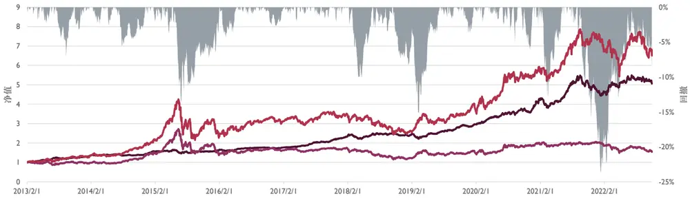

| RankIC | ICIR | Turnover |  | Sharpe | AnnRet | Vol | MaxDD | 2013 | 2014 | 2015 | 2016 | 2017 | 2018 | 2019 | 2020 | 2021 |  | 2022 6.2% |
| --- | --- | --- | --- | --- | --- | --- | --- | --- | --- | --- | --- | --- | --- | --- | --- | --- | --- | --- |
| 全样本 | 0.035 | 1.472 | 41.2% | 1.710 | 18.5% | 0.102 | -23.6% |  | 29.7% | 16.3% | 4.9% | 10.0% | 29.3% | 8.4% | 17.4% | 38.1% |  | 18.8% |
| 沪深300 | 0.035 | 0.968 | 40.1% | 0.904 | 12.8% | 0.145 | -44.4% | 50.5% | 14.6% |  | 7.2% | 3.7% | 20.1% | 4.1% | 5.4% | 33.7% | 3.0% | -9.9% |
| 中证500 | 0.029 | 1.067 | 40.2% | 1.589 | 19.3% | 0.115 | -29.3% | 44.5% | 6.3% | 30.4% |  | 5.9% | 35.9% | 8.7% | 13.0% | 26.5% | 16.5% | 1.6% |
| 中证800 | 0.032 | 1.117 | 37.4% | 1.347 | 15.7% | 0.113 | -27.7% | 44.7% | 15.6% | 8.9% |  | 6.3% | 32.0% | 6.5% | 9.2% | 24.0% | 11.1% | -3.3% |
| 中证1000 | 0.024 | 1.165 | 40.4% | 1.528 | 15.5% | 0.098 | -19.0% | 27.3% | 8.1% | 10.0% |  | 4.3% | 28.2% | 5.2% | 16.3% | 22.2% | 22.8% | 5.5% |

数据来源：朝阳永续，哈工大，东方证券研究所

有关分析师的申明，见本报告最后部分。其他重要信息披露见分析师申明之后部分，或请与您的投资代表联系。并请阅读本证券研究报告最后一页的免责申明。

图 25：RPBF分组对冲年化收益
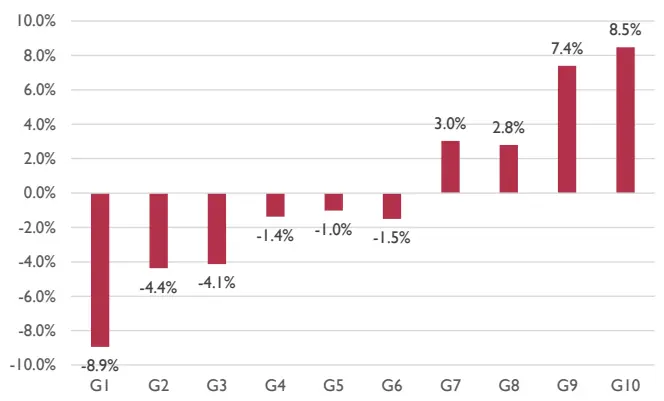
数据来源：朝阳永续，哈工大，东方证券研究所

图 26：RPBF 分组净值
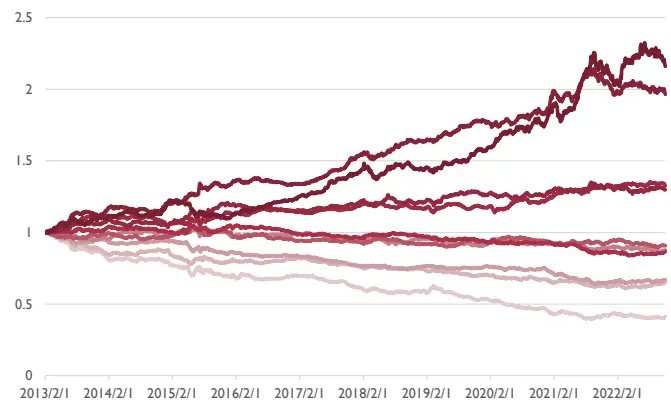
数据来源：朝阳永续，哈工大，东方证券研究所

下图是2019-2021三年的训练窗口中较为重要的模型特征，其中“调职商店”为“调整公司（评级）”等概念的降维表达，“超预期”“远超预期”等表达降维成“超过预料”，“中报点评”“年报评价”等表达降维成“日报影评”，“旱情影响”“疫情影响”等表达降维成“敌情反应”。

图 27：重要 bigram 特征举例
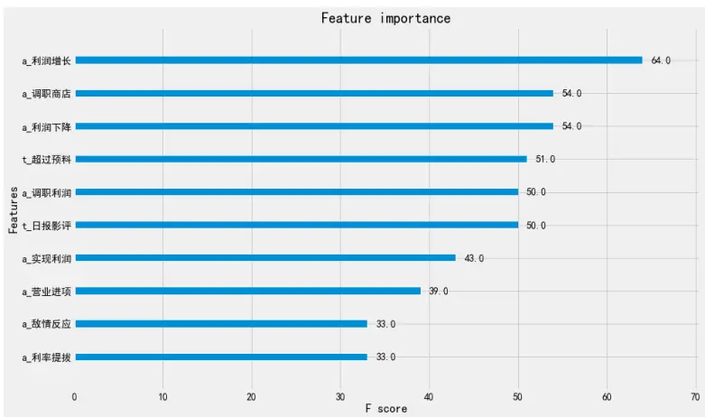
数据来源：朝阳永续，哈工大，东方证券研究所

## 6. 循环神经网络因子 RPNN

该因子名称简略为 RPNN，意为 report-neuro-network。前面三个单因子都是基于单词/词组的数量特征，并没有将句子的序列信息囊括，于是考虑使用机器翻译常用的RNN模型来对文本的整句信息进行学习，作为对前面三个因子的补充。

## 6.1 RPNN 模型框架

1. 滚动划分数据集：同 RPTF 因子一致，过去三年作为训练窗口，未来一年作为测试窗口，区间为 2013 年至 2022 年；

2. 词向量映射：使用腾讯 AI Lab 的 Word Embedding Dataset 对每篇研报的分词序列进行映射；

3. 提取特征 X：统一词向量矩阵的长度，作为 RNN网络的输入；

4. 处理标签 Y：同 RPTF因子一致，本文使用累积分布函数的逆函数对盈利调整进行正则化；

5. 训练模型：使用 RNN模型中的 GRU Layer对词向量矩阵进行训练；

6. 因子构建：同 RPTF 因子一致，每月底调仓时保留每家券商在过去三个月内最后一次对某上市公司的覆盖，等权合成因子；

## 词向量映射

NLP的第一步就是将文字转化为计算机能够理解的数字，

一种方法就是 one-hot，如果一个词典内有 5 个词，某个词在第 2 个出现，那么该词的向量就可以表示为[0,1,0,0,0]，但是这样的离散变量只代表了他们在字典中出现的序号，并无具体实际意义。

⚫ 另一种方法是 Word Embbeding，使用 Word2vec 模型 Embedding 层的参数矩阵作为词向量。Word2vec模型的任务是：

1. Skip-gram：给定句子中的当前词，预测周围的词；

2. CBOW：给定句子中的周围词，预测当前词；

所以在大量语料的训练之后，每一个词的词向量都代表了其在词空间中的位置，两个位置相近的词代表可以互相替换而句子依然通顺。

Word2vec模型最重要的部分就是Embedding层，相当于是一个Encoder，把每一个词都映射为固定维度的向量，比如100维，如果一个句子包含20个词，那么句子以表示为一个20×100的矩阵，有很多现成的词向量矩阵可供使用，其中业界最认可的是腾讯 AI Lab 的 EmbeddingDataset，本文选择它最小的矩阵（200 万词×100 维）进行后面的计算。

需要注意的是，Word2vec 的训练目标是共现词而不是同义词，所映射出来词向量是在词空间中的位置。比如“加快”“降低”共现频率很高，因为互相替换之后句子依然通顺，但却不是同义词，所以词向量映射出来的句子向量可以判断两个句子“是不是在说一件事”，而不能直接用于判断“观点是否一致”。

图 28：One-Hot 和 Word Embedding

| 增加 | 加大 | 增加 | 加大 |
| --- | --- | --- | --- |
| 0 | 0 | 0.13 | 0.11 |
| 1 | 0 | -0.03 | -0.12 |
|  |  | ………. | …. |
| 0 | 0 | -0.09 | -0.14 |
| 0 | 1 | -0.10 | -0.03 |

数据来源：朝阳永续，腾讯 AI Lab，东方证券研究所

| 图29：词空间中距离 “加大” 较近的词 |  |  |  |
| --- | --- | --- | --- |
| 词 | 近似程度 | 词 | 近似程度 |
| 加大 | 1.000 | 再加大 | 0.775 |
| 加快 | 0.819 | 减少 | 0.772 |
| 降低 | 0.807 | 减小 | 0.762 |
| 增加 | 0.796 | 扩大 | 0.757 |
| 加强 | 0.787 | 提高 | 0.753 |
| 增大 | 0.779 | 增强 | 0.739 |

数据来源：朝阳永续，腾讯 AI Lab，东方证券研究所

每个句子的长度不一样，需要设置一个最大长度，用 0 向量将句子填满到最大长度，每个句子都会格式化为固定长度。调整每一个句子的分词序列到固定长度 L，超过则截除，不足则补充为空值，然后将每个句子的每个分词从 Embedding Dataset 中映射为对应的词向量，空值对应V（d维），则每个句子都被映射为L×d 的矩阵，作为 RNN网络的输入。

图 30：词向量映射举例
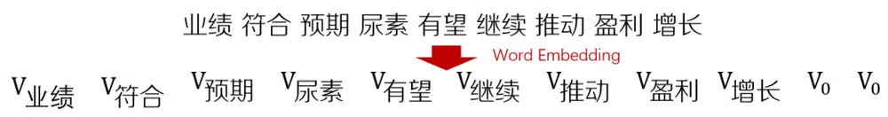
数据来源：朝阳永续，东方证券研究所

## 训练模型

模型我们使用Keras中的单层GRU Layer对Embedding矩阵进行训练，而且加入了Dropout，Pooling 来提升模型的泛化能力。

GRU（Gate Recurrent Unit）是循环神经网络（Recurrent Neural Network, RNN）的一种。和 LSTM（Long-Short Term Memory）一样，也是为了解决长期记忆和反向传播中的梯度等问题而提出来的。GRU 和 LSTM 在很多情况下实际表现上相差无几，GRU 的优势在于它的实验效果与 LSTM 相似，但是更易于计算。

## 6.2 RPNN 因子表现

因为神经网络在梯度下降的过程中会有随机变量产生，所以我们采用十次结果的均值作为最终的因子值，十次结果彼此之间的相关性在 0.92-0.93之间，说明运行结果较为稳定。

RPNN 在选股能力方面不如前面的三个因子，Rank IC 为 3.0%，但这是因为 RPNN 算力要求较高，所以只用了研报标题文本作为输入，相比前面三个因子是存在信息缺失的。和前面的因子类似，RPNN在大市值的选股能力较强，在小市值的盈利能力较强，2022年多空对冲收益主要来源于中小市值股票，在分组年化收益图中看出，RPNN的分组单调性不如前面三个因子。

图 31：RPNN 各样本空间回测表现（20130101-20221031）
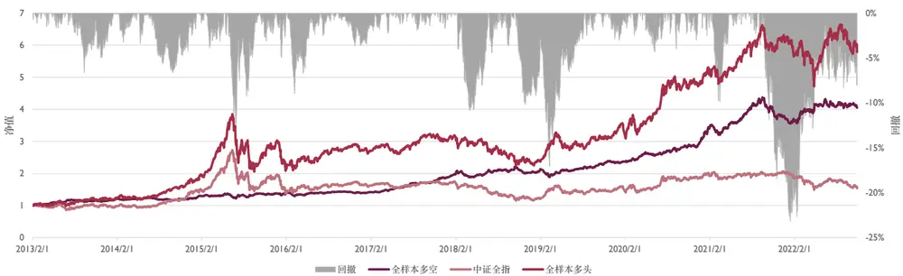

| RankIC | ICIR | Turnover |  | Sharpe | AnnRet | Vol 0.099 | MaxDD | 2013 | 2014 | 2015 | 2016 | 2017 | 2018 | 2019 | 2020 | 2021 |  | 2022 7.3% |
| --- | --- | --- | --- | --- | --- | --- | --- | --- | --- | --- | --- | --- | --- | --- | --- | --- | --- | --- |
| 全样本 | 0.030 | 1.244 | 38.0% | 1.517 | 15.7% |  | -23.2% | 17.0% |  | 5.5% | 10.5% | 2.5% | 34.7% | 9.5% | 14.5% | 31.5% |  | 19.1% |
| 沪深300 | 0.027 | 0.778 | 34.2% | 0.583 | 7.4% | 0.139 | -46.5% | 35.4% | -0.4% | 22.5% |  | -4.5% | 10.1% | -5.8% | 9.5% | 25.9% | -1.3% | -11.6% |
| 中证500 | 0.026 | 0.938 | 36.4% | 1.297 | 15.4% | 0.115 | -28.3% | 15.8% | 1.8% | 34.1% |  | -0.5% | 48.2% | 8.6% | 7.6% | 3.1% | 28.0% | 7.5% |
| 中证800 | 0.027 | 0.934 | 33.0% | 1.014 | 11.0% | 0.109 | -26.7% | 22.3% | 0.9% | 18.0% |  | -0.5% | 35.5% | 1.0% | 6.4% | 18.4% | 9.3% | -1.4% |
| 中证1000 | 0.022 | 1.087 | 37.7% | 1.595 | 15.9% | 0.096 | -21.8% | 17.9% | 12.4% | 1.9% |  | -0.7% | 26.2% | 9.5% | 19.6% | 35.0% | 23.8% | 9.3% |

数据来源：朝阳永续，腾讯 AI Lab，东方证券研究所

图 32：RPNN分组对冲年化收益
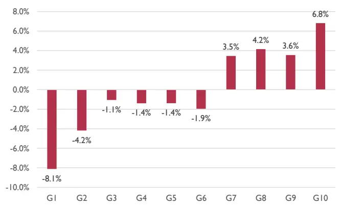
数据来源：朝阳永续，腾讯 AI Lab，东方证券研究所

图 33：RPNN 分组净值
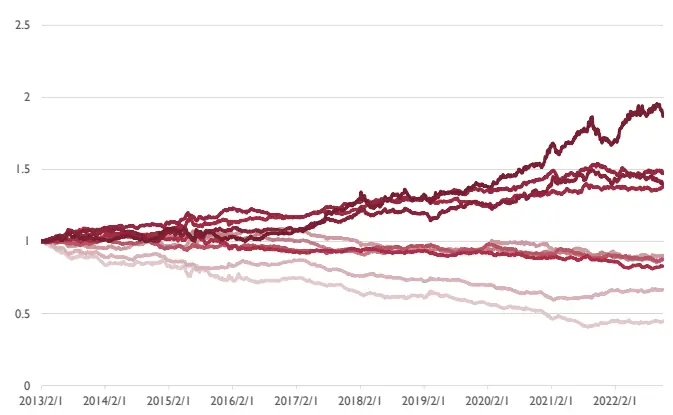
数据来源：朝阳永续，腾讯 AI Lab，东方证券研究所

## 7. 四因子合成 RPST

RPST 意为 report-sentiment，是词频因子 RPTF、正则表达式因子 RPRF、同义映射词组因子 RPBF、循环神经网络因子 RPNN的均值。

## 7.1 合成前后对比分析

由于四个因子的训练目标都是分析师的盈利调整，且原始数据都是研报的标题和摘要文本，在合成之前我们需要了解不同模型计算出的因子的相关程度，可以看到四个因子的相关性在0.57-0.67，相关性并不算高，说明对于文本的不同特征抓取方式其实包含了不同的信息。将训练目标——分析师盈利调整，按照三个月内均值的方式构建成因子，可以发现四因子和盈利调整均值的相关性在 0.42-0.55，相关性较低，说明研报中的文本包含了盈利调整之外的信息。

将四个因子等权合成为最终因子RPST，可以看出它和调整均值的相关性为0.55，WFR（盈余调整度量，Weighted Forecast Revision）同样是由分析师盈利预测调整幅度构建的因子，中证800 内 Rank IC 均值 3.5%（详情参见《分析师研报的数据特征与 alpha》），RPST 和 WFR 的相关性为 0.16，RPST和其他的超预期因子相关性均不高。

图 34：研报情感倾向因子和其他超预期因子的因子值相关性

|  | RPTF | RPRF | RPBF | RPNN | RPST | 调整均值 | wfr | sue0 | sue1 | sur0 | sur1 |
| --- | --- | --- | --- | --- | --- | --- | --- | --- | --- | --- | --- |
| RPTF | 1.00 | 0.57 | 0.67 | 0.66 | 0.85 | 0.55 | 0.17 | 0.35 | 0.46 | 0.27 | 0.33 |
| RPRF | 0.57 | 1.00 | 0.63 | 0.66 | 0.80 | 0.42 | 0.14 | 0.35 | 0.44 | 0.25 | 0.30 |
| RPBF | 0.67 | 0.63 | 1.00 | 0.65 | 0.86 | 0.49 | 0.14 | 0.38 | 0.51 | 0.26 | 0.33 |
| RPNN | 0.66 | 0.66 | 0.65 | 1.00 | 0.87 | 0.45 | 0.13 | 0.31 | 0.44 | 0.22 | 0.30 |
| RPST | 0.85 | 0.80 | 0.86 | 0.87 | 1.00 | 0.55 | 0.16 | 0.40 | 0.53 | 0.28 | 0.36 |
| 调整均值 | 0.55 | 0.42 | 0.49 | 0.45 | 0.55 | 1.00 | 0.27 | 0.37 | 0.44 | 0.23 | 0.26 |
| wfrsue0 | 0.17 | 0.14 | 0.14 | 0.13 | 0.16 | 0.27 | 1.00 | 0.11 | 0.14 | 0.08 | 0.12 |
|  | 0.35 | 0.35 | 0.38 | 0.31 | 0.40 | 0.37 | 0.11 | 1.00 | 0.84 | 0.41 | 0.34 |
| suel | 0.46 | 0.44 | 0.51 | 0.44 | 0.53 | 0.44 | 0.14 | 0.84 | 1.00 | 0.37 | 0.45 |
| sur0sur1 | 0.27 | 0.25 | 0.26 | 0.22 | 0.28 | 0.23 | 0.08 | 0.41 | 0.37 | 1.00 | 0.81 |
|  | 0.33 | 0.30 | 0.33 | 0.30 | 0.36 | 0.26 | 0.12 | 0.34 | 0.45 | 0.81 | 1.00 |

数据来源：朝阳永续，东方证券研究所

图 35：研报情感倾向因子和其他超预期因子的 IC序列相关性

|  | RPTF | RPRF | RPBF | RPNN | RPST | 调整均值 | wfr | sue0 | sue1 | sur0 | sur1 |
| --- | --- | --- | --- | --- | --- | --- | --- | --- | --- | --- | --- |
| RPTF | 1.00 | 0.58 | 0.69 | 0.69 | 0.85 | 0.55 | 0.08 | 0.25 | 0.32 | 0.17 | 0.19 |
| RPRF | 0.58 | 1.00 | 0.64 | 0.72 | 0.85 | 0.40 | 0.05 | 0.24 | 0.29 | 0.15 | 0.17 |
| RPBF | 0.69 | 0.64 | 1.00 | 0.69 | 0.87 | 0.47 | 0.05 | 0.26 | 0.34 | 0.17 | 0.19 |
| RPNN | 0.69 | 0.72 | 0.69 | 1.00 | 0.89 | 0.45 | 0.05 | 0.24 | 0.31 | 0.15 | 0.18 |
| RPST | 0.85 | 0.85 | 0.87 | 0.89 | 1.00 | 0.54 | 0.06 | 0.28 | 0.36 | 0.18 | 0.21 |
| 调整均值 | 0.55 | 0.40 | 0.47 | 0.45 | 0.54 | 1.00 | 0.15 | 0.28 | 0.33 | 0.16 | 0.16 |
| wfr | 0.08 | 0.05 | 0.05 | 0.05 | 0.06 | 0.15 | 1.00 | 0.04 | 0.04 | 0.02 | 0.02 |
| sue0 | 0.25 | 0.24 | 0.26 | 0.24 | 0.28 | 0.28 | 0.04 | 1.00 | 0.94 | 0.30 | 0.28 |
| sue1 | 0.32 | 0.29 | 0.34 | 0.31 | 0.36 | 0.33 | 0.04 | 0.94 | 1.00 | 0.30 | 0.32 |
| sur0 | 0.17 | 0.15 | 0.17 | 0.15 | 0.18 | 0.16 | 0.02 | 0.30 | 0.30 | 1.00 | 0.92 |
| sur1 | 0.19 | 0.17 | 0.19 | 0.18 | 0.21 | 0.16 | 0.02 | 0.28 | 0.32 | 0.92 | 1.00 |

数据来源：朝阳永续，东方证券研究所

在全样本空间中，合成后的 RPST 多空年化收益率 20%，Rank IC 3.8%相比四个单因子有了提高，略高于盈利调整均值，在今年 2022普跌的行情下仍有 4.7%的多空收益。

图 36：RPST、四因子、调整均值全样本空间回测表现（20130101-20221031）

| RankIC | ICIR |  | Turnover | Sharpe | AnnRet | Vol | MaxDD | 2013 | 2014 | 2015 | 2016 | 2017 | 2018 | 2019 | 2020 | 2021 | 2022 |
| --- | --- | --- | --- | --- | --- | --- | --- | --- | --- | --- | --- | --- | --- | --- | --- | --- | --- |
| RPST | 0.038 | 1.435 | 39.2% | 1.757 | 20.4% | 0.109 | -27.6% | 26.4% | 12.4% | 18.3% | 5.9% | 38.8% | 11.4% | 20.0% | 38.3% | 21.0% | 4.7% |
| RPTF | 0.034 | 1.312 | 40.8% | 1.788 | 20.3% | 0.107 | -28.3% | 28.0% | 20.8% | 11.5% | 5.8% | 31.8% | 10.2% | 17.5% | 41.4% | 25.0% | 4.6% |
| RPRF | 0.035 | 1.701 | 44.4% | 2.010 | 19.3% | 0.090 | -20.4% | 25.2% | 12.1% | 20.0% | 4.1% | 28.4% | 16.5% | 24.6% | 30.7% | 15.6% | 7.8% |
| RPBF | 0.035 | 1.472 | 41.2% | 1.710 | 18.5% | 0.102 | -23.6% | 29.7% | 16.3% | 4.9% | 10.0% | 29.3% | 8.4% | 17.4% | 38.1% | 18.8% | 6.2% |
| RPNN | 0.030 | 1.244 | 38.0% | 1.517 | 15.7% | 0.099 | -23.2% | 17.0% | 5.5% | 10.5% | 2.5% | 34.7% | 9.5% | 14.5% | 31.5% | 19.1% | 7.3% |
| 调整均值 | 0.037 | 1.621 | 40.3% | 1.730 | 18.2% | 0.100 | -31.3% | 15.4% | 34.7% | 4.4% | 6.6% | 29.0% | 15.9% | 10.8% | 37.3% | 24.6% | -0.5% |

数据来源：朝阳永续，东方证券研究所

有关分析师的申明，见本报告最后部分。其他重要信息披露见分析师申明之后部分，或请与您的投资代表联系。并请阅读本证券研究报告最后一页的免责申明。

## 7.2 RPST 因子表现

RPST在大市值股票中选股能力更强，Rank IC均值随着样本空间市值的下降而下降，RankIC 在沪深 300 成分股内选股效果较好，最大回撤 41%，Sharpe 和年化收益率随着市值的增加而减少，月均换手率在各个样本空间并无显著差异。

全样本因子每期大约覆盖 1500 支股票，其他指数成分股样本空间均用行业中值填充，未中性化。

图 37：RPST 各样本空间回测表现（20130101-20221031）
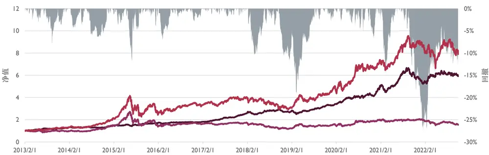

回撤 全样本多空 中证全指 全样本多头

| RankIC | ICIR | Turnover |  | Sharpe | AnnRet 20.4% | Vol 0.109 | MaxDD -27.6% | 2013 | 2014 | 2015 | 2016 | 2017 | 2018 | 2019 | 2020 | 2021 |  | 2022 |
| --- | --- | --- | --- | --- | --- | --- | --- | --- | --- | --- | --- | --- | --- | --- | --- | --- | --- | --- |
| 全样本 | 0.038 | 1.435 | 39.2% | 1.757 |  |  |  |  | 26.4% | 12.4% | 18.3% | 5.9% | 38.8% | 11.4% | 20.0% | 38.3% | 21.0% | 4.7% |
| 沪深300 | 0.036 | 0.971 | 36.8% | 0.938 | 13.4% | 0.145 | -40.6% | 46.4% | 8.5% |  | 12.4% | -3.2% | 25.2% | -0.5% | 11.7% | 35.3% | 15.2% | -12.4% |
| 中证500 | 0.029 | 0.999 | 37.3% | 1.247 | 15.8% | 0.124 | -32.6% | 26.5% | 10.1% | 27.5% |  | 2.4% | 35.5% | 9.6% | 15.2% | 7.7% | 14.5% | 4.6% |
| 中证800 | 0.032 | 1.049 | 35.2% | 1.329 | 16.4% | 0.119 | -27.7% | 36.5% | 10.9% | 20.7% |  | 2.8% | 34.4% | 5.6% | 15.0% | 25.2% | 12.8% | -3.2% |
| 中证1000 | 0.028 | 1.236 | 38.2% | 1.788 | 19.5% | 0.103 | -22.4% | 20.7% | 15.2% | 17.8% |  | 2.1% | 31.0% | 8.2% | 21.0% | 37.4% | 30.0% | 5.4% |

数据来源：朝阳永续，东方证券研究所

RPST 的训练目标为分析师的盈利预测调整，所以得出的因子本质上是分析师观点的汇总，因此多头实际上存在较大的Beta，从图39可以看出2021年下半年多头下跌的时候，空头并未在相反方向做出明显的对冲。

图 38：RPST分十组年化相对收益
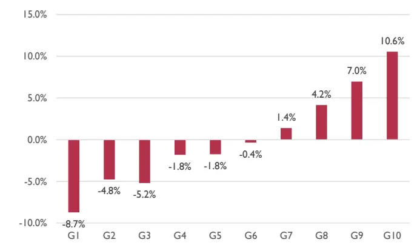
数据来源：朝阳永续，东方证券研究所

图 39：RPST分十组相对收益净值
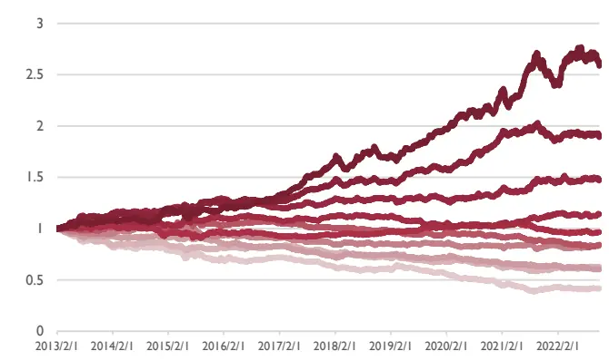
数据来源：朝阳永续，东方证券研究所

有关分析师的申明，见本报告最后部分。其他重要信息披露见分析师申明之后部分，或请与您的投资代表联系。并请阅读本证券研究报告最后一页的免责申明。

4.5%，而在沪深 300 中下降到了 2.4%，这种现象在 WFR 因子中也同样存在，而在全样本中，中性化之后 ICIR 和 Sharpe 都有明显提升，说明选股能力和盈利能力在剔除了行业市值的影响之后都变得更加稳定；MaxDD在各样本空间都显著下降。

图 40：RPST各样本空间中性化后的表现

| RankIC | ICIR |  | Turnover | Sharpe | AnnRet | Vol | MaxDD | 2013 | 2014 | 2015 | 2016 | 2017 | 2018 | 2019 | 2020 | 2021 |  | 2022 |
| --- | --- | --- | --- | --- | --- | --- | --- | --- | --- | --- | --- | --- | --- | --- | --- | --- | --- | --- |
| 全样本 | 0.038 | 1.435 | 39.2% | 1.757 | 20.4% | 0.109 | -27.6% |  | 26.4% | 12.4% | 18.3% | 5.9% | 38.8% | 11.4% | 20.0% | 38.3% | 21.0% | 4.7% |
| 全样本中性化 | 0.039 | 2.369 | 42.5% | 2.312 | 19.4% | 0.078 |  | -16.3% | 18.8% | 19.3% | 14.8% | 9.6% | 27.8% | 16.5% | 20.1% | 31.1% | 17.0% | 10.0% |
| 沪深300 | 0.036 | 0.971 | 36.8% | 0.938 | 13.4% | 0.145 | -40.6% | 46.4% |  | 8.5% | 12.4% | -3.2% | 25.2% | -0.5% | 11.7% | 35.3% | 15.2% | -12.4% |
| 沪深300中性化 | 0.024 | 1.247 | 42.4% | 0.927 | 9.3% | 0.101 |  | -29.8% 21.6% |  | 0.9% | 19.6% | -8.8% | 10.8% | 11.5% | 10.3% | 38.4% | -0.3% | -8.0% |
| 中证500 | 0.029 | 0.999 | 37.3% | 1.247 | 15.8% | 0.124 |  | -32.6% 26.5% |  | 10.1% | 27.5% | 2.4% | 35.5% | 9.6% | 15.2% | 7.7% | 14.5% | 4.6% |
| 中证500中性化 | 0.035 | 2.078 | 41.1% | 1.979 | 17.7% | 0.084 | -13.4% | 16.7% |  | 4.3% | 18.4% | 6.8% | 38.6% | 20.2% | 25.1% | 12.1% | 12.3% | 16.0% |
| 中证800 | 0.032 | 1.049 | 35.2% | 1.329 | 16.4% | 0.119 | -27.7% | 36.5% | 10.9% | 20.7% |  | 2.8% | 34.4% | 5.6% | 15.0% | 25.2% | 12.8% | -3.2% |
| 中证800中性化 | 0.029 | 1.941 | 42.7% | 1.799 | 15.3% | 0.081 | -19.2% | 16.9% | 5.8% | 22.0% |  | 5.2% | 28.2% | 14.6% | 22.0% | 22.9% | 8.7% | 1.2% |
| 中证1000 | 0.028 | 1.236 | 38.2% | 1.788 | 19.5% | 0.103 | -22.4% | 20.7% | 15.2% | 17.8% |  | 2.1% | 31.0% | 8.2% | 21.0% | 37.4% | 30.0% | 5.4% |
| 中证1000中性化 | 0.045 | 3.461 | 38.9% | 2.396 | 18.7% | 0.073 | -10.9% | 18.8% | 20.9% |  | 12.5% | 15.0% | 21.8% | 12.7% | 19.5% | 27.8% | 23.8% | 5.2% |

数据来源：朝阳永续，东方证券研究所

## 8. 标签的对比，以同义词组 RPBF为例

标签的选择多种多样，本文的根本目标是用文本信息识别研报的情感倾向，业界的研究采用过市场表现作为标签，但是收益率本身噪音过大且和文本内容因果关系不强，因为文本中的信息不一定使市场做出相应的反应，但文本中的信息一定导致了分析师盈利调整的产生，所以后者作为训练标签有更强的因果关系。从本质上来说，我们的目标是判别文本的情感倾向，盈利调整作为标签更贴合目标。

## 8.1 盈利调整与异常收益

分析师盈利调整作为分类标签时，超过半数研报的盈利调整都为零，也就是维持上次报告的预测，所以可以简单分为【上调、维持、下调】三类。

异常收益是指业绩预告发布前后 2 个交易日股票的超额收益，将其在窗口内等分为【上涨、震荡、下跌】三类作为分类标签。在训练阶段，根据原报告只囊括业绩预告发布后 5 个自然日的报告，即保留了不到 10%的报告训练样本，测试阶段保留全样本，因子合成时不考虑时间衰减。

本文用 Rank IC最高的“同义映射词组模型 RPBF”来对比两种标签的表现，采用的分类器为 XGB，发现盈利调整分类 Rank IC为 3.3%，异常收益分类 Rank IC为 2.7%，在分组年化收益上，盈利调整的分组更加单调，多头收益更高。

图 41：盈利调整与异常收益分类标签分组年化收益对比
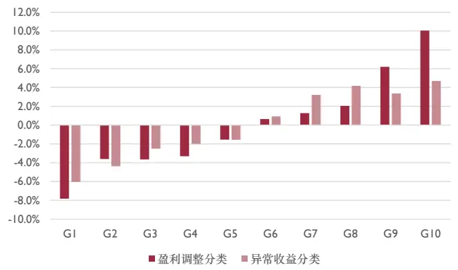
数据来源：朝阳永续，东方证券研究所

图 42：盈利调整与异常收益分类标签 IC累加对比
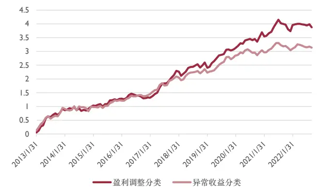
数据来源：朝阳永续，东方证券研究所

有关分析师的申明，见本报告最后部分。其他重要信息披露见分析师申明之后部分，或请与您的投资代表联系。并请阅读本证券研究报告最后一页的免责申明。

## 8.2 分类与回归

本文认为将连续值用阈值三分为分类标签，会造成信息损失，直接作为回归标签可以保留大部分信息，所以本小节用于对比回归模型和分类模型的区别。

同样，本小节用 Rank IC最高的“同义映射词组模型 RPBF”来进行对比，采用的回归器为XGB，发现回归标签 Rank IC为 3.5%，分类标签 Rank IC为 3.3%，在分组年化收益上，分类标签的分组更加单调，且分类标签的多头收益更高；在 IC累加图中可以看出二者同向变动，变动幅度相差无几，选股效果不分伯仲。

图 43：回归与分类标签分组年化收益对比
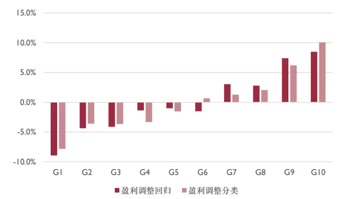
数据来源：朝阳永续，东方证券研究所

图 44：回归与分类标签 IC累加对比
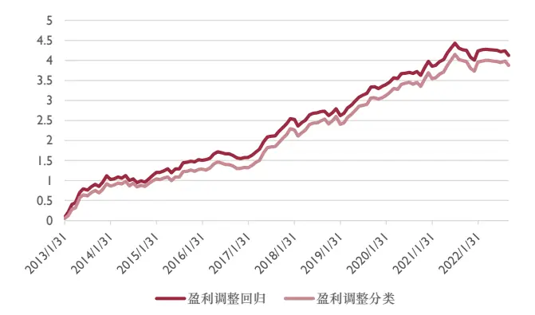
数据来源：朝阳永续，东方证券研究所

## 9. 总结

本文用个股报告的文本对报告的情感倾向进行训练和预测。

文本信息为个股报告的标题和摘要，分别进行分词之后用不同的方法进行降维处理，并采集文本特征，训练模型采用树模型和神经网络模型，前者使用局部特征，后者会加入时间序列特征。

情感倾向的标签使用分析师盈利预测的调整幅度，情感倾向可以用人工的方式打标签，较为准确但是费时费力，业界的研究采用过市场表现作为标签，但是噪音过大且和文本内容因果关系不强，所以本文使用盈利预测调整幅度作为标签进行回归。

对未来窗口的研报进行预测打分，在每月末回溯过去三个月内每个券商对每个个股的最后一次覆盖，取均值作为因子值。

本文所使用的四种文本处理方式和预测模型为：

1. RPTF：分词词频 + XGB 回归器

2. RPRF：正则表达式提取 + regex 匹配独热码 + XGB 回归器

3. RPBF：同义映射 + 两两分词组合 + 词组频 + XGB回归器

4. RPNN：词向量映射 + 循环神经网络 RNN

得到四个判断文本情感倾向的因子，Rank IC 在 3.0%-3.5%，等权合成最终因子 RPST，全样本Rank IC3.8%，全样本的多空年化收益率达到20%，行业中值填充后在中小盘股的表现好过大盘股，行业市值中性化之后 Rank IC 达到 3.9%，各项回测指标获得较大提升，其中 Sharpe 高达 2.3。

## 参考文献

Liang P J , Meursault V , Routledge B B , et al. PEAD.txt: Post-Earnings-Announcement Drift Using Text[J]. Working Papers, 2021.

## 风险提示

1. 量化模型基于历史数据分析得到，未来存在失效的风险，建议投资者紧密跟踪模型表现。

2. 极端市场环境可能对模型效果造成剧烈冲击，导致收益亏损。

## Tabl e_Disclai mer 分析师申明

每位负责撰写本研究报告全部或部分内容的研究分析师在此作以下声明：

分析师在本报告中对所提及的证券或发行人发表的任何建议和观点均准确地反映了其个人对该证券或发行人的看法和判断；分析师薪酬的任何组成部分无论是在过去、现在及将来，均与其在本研究报告中所表述的具体建议或观点无任何直接或间接的关系。

## 投资评级和相关定义

报告发布日后的 12个月内的公司的涨跌幅相对同期的上证指数/深证成指的涨跌幅为基准；

## 公司投资评级的量化标准

买入：相对强于市场基准指数收益率 15%以上；

增持：相对强于市场基准指数收益率 5%～15%；

中性：相对于市场基准指数收益率在-5%～+5%之间波动；

减持：相对弱于市场基准指数收益率在-5%以下。

未评级 —— 由于在报告发出之时该股票不在本公司研究覆盖范围内，分析师基于当时对该股票的研究状况，未给予投资评级相关信息。

暂停评级 —— 根据监管制度及本公司相关规定，研究报告发布之时该投资对象可能与本公司存在潜在的利益冲突情形；亦或是研究报告发布当时该股票的价值和价格分析存在重大不确定性，缺乏足够的研究依据支持分析师给出明确投资评级；分析师在上述情况下暂停对该股票给予投资评级等信息，投资者需要注意在此报告发布之前曾给予该股票的投资评级、盈利预测及目标价格等信息不再有效。

## 行业投资评级的量化标准：

看好：相对强于市场基准指数收益率 5%以上；

中性：相对于市场基准指数收益率在-5%～+5%之间波动；

看淡：相对于市场基准指数收益率在-5%以下。

未评级：由于在报告发出之时该行业不在本公司研究覆盖范围内，分析师基于当时对该行业的研究状况，未给予投资评级等相关信息。

暂停评级：由于研究报告发布当时该行业的投资价值分析存在重大不确定性，缺乏足够的研究依据支持分析师给出明确行业投资评级；分析师在上述情况下暂停对该行业给予投资评级信息，投资者需要注意在此报告发布之前曾给予该行业的投资评级信息不再有效。

## HeadertTabl e_Discl ai mer 免责声明

本证券研究报告（以下简称“本报告”）由东方证券股份有限公司（以下简称“本公司”）制作及发布。

。本公司不会因接收人收到本报告而视其为本公司的当然客户。本报告的全体接收人应当采取必要措施防止本报告被转发给他人。

本报告是基于本公司认为可靠的且目前已公开的信息撰写，本公司力求但不保证该信息的准确性和完整性，客户也不应该认为该信息是准确和完整的。同时，本公司不保证文中观点或陈述不会发生任何变更，在不同时期，本公司可发出与本报告所载资料、意见及推测不一致的证券研究报告。本公司会适时更新我们的研究，但可能会因某些规定而无法做到。除了一些定期出版的证券研究报告之外，绝大多数证券研究报告是在分析师认为适当的时候不定期地发布。

在任何情况下，本报告中的信息或所表述的意见并不构成对任何人的投资建议，也没有考虑到个别客户特殊的投资目标、财务状况或需求。客户应考虑本报告中的任何意见或建议是否符合其特定状况，若有必要应寻求专家意见。本报告所载的资料、工具、意见及推测只提供给客户作参考之用，并非作为或被视为出售或购买证券或其他投资标的的邀请或向人作出邀请。

本报告中提及的投资价格和价值以及这些投资带来的收入可能会波动。过去的表现并不代表未来的表现，未来的回报也无法保证，投资者可能会损失本金。外汇汇率波动有可能对某些投资的价值或价格或来自这一投资的收入产生不良影响。那些涉及期货、期权及其它衍生工具的交易，因其包括重大的市场风险，因此并不适合所有投资者。

在任何情况下，本公司不对任何人因使用本报告中的任何内容所引致的任何损失负任何责任，投资者自主作出投资决策并自行承担投资风险，任何形式的分享证券投资收益或者分担证券投资损失的书面或口头承诺均为无效。

本报告主要以电子版形式分发，间或也会辅以印刷品形式分发，所有报告版权均归本公司所有。未经本公司事先书面协议授权，任何机构或个人不得以任何形式复制、转发或公开传播本报告的全部或部分内容。不得将报告内容作为诉讼、仲裁、传媒所引用之证明或依据，不得用于营利或用于未经允许的其它用途。

经本公司事先书面协议授权刊载或转发的，被授权机构承担相关刊载或者转发责任。不得对本报告进行任何有悖原意的引用、删节和修改。

提示客户及公众投资者慎重使用未经授权刊载或者转发的本公司证券研究报告，慎重使用公众媒体刊载的证券研究报告。

## 东方证券研究所

地址： 上海市中山南路 318 号东方国际金融广场 26 楼

电话：021-63325888

传真：021-63326786

网址： www.dfzq.com.cn

东方证券股份有限公司经相关主管机关核准具备证券投资咨询业务资格，据此开展发布证券研究报告业务。

东方证券股份有限公司及其关联机构在法律许可的范围内正在或将要与本研究报告所分析的企业发展业务关系。因此，投资者应当考虑到本公司可能存在对报告的客观性产生影响的利益冲突，不应视本证券研究报告为作出投资决策的唯一因素。