# 分析师研报类 alpha增强

## 因子选股系列之八十七

## 研究结论

分析师预测净利润的准确度并不高。到第二年三月底，FY1仍然高估了 42% ，FY2高估了 156% ，FY3高估了 236%。分析师预期数据的价值主要体现在其时间序列上的动态变化和横截面上的相对差异。

分析师预期调整指标有三种构造方式，其中 FOM因子效果最好。全市场中性化 IC为 2.8%，ICIR超过 2。多空组合年化收益 12%。 FOM因子剔除WFR和 CFR因子后仍有显著的选股效果，WFR和 CFR因子剔除 FOM因子后便失去了选股效力。

我们构造了 FOM_123mean 因子，将 FOM_FY1，FOM_FY2，FOM_FY3 三因子非空部分取均值，综合衡量分析师对未来三个年度的盈利预测调整情况。FOM_123mean因子多空组合表现优于单因子，全市场中性化 IC为 2.8%，ICIR为超过 2，多空组合年化收益 15%。

⚫根据营收字段计算的 FOM_or因子也有效。对基于净利润的FOM因子正交化后，残差因子依然有效。FOM_or_123mean因子多空组合表现优于单因子，全市场中性化因子 IC为 2%，ICIR为 1.7，多空组合年化收益 11%。

分析师一致预期的股票盈利能力也可以用横截面模型来进行解释，模型残差即为分析师预期残差因子。全市场中性化的滚动 FYROE_resid_12mean 因子 IC为 3%，ICIR为 2.3，多空组合年化收益 11 %。

分析师预期估值滚动 EP_FY_12mean因子，表现优于单因子。全市场中性化因子IC 为 4.2%，ICIR 为 2，多空组合年化收益 17%。滚动 EP_FY_12mean 剔除当前估值 EP_TTM因子后仍然有很强的选股效果，说明分析师一致预期净利润的相对大小提供了额外的有用信息。

本文最终确定了 12个单因子，构成我们的分析师类选股因子库。在全市场中（1）改进后的分析师合成因子 IC由 5.93%提升到 6.45%，ICIR由 3.21 提升到 3.92。（2）多空组合收益和稳定性明显提升。年化收益达到 29%，提升 7%，最大回撤明显降低，仅为 3.7%，年化夏普比达到 3.6，月度胜率达到 85%。2010-2022这13年中，每年的多空收益均有提升。（3）多头组合收益和稳定性明显提升。年化收益达到 14%，提升5%，最大回撤明显降低，仅为 5%。

⚫ 分析师因子改进前后，中证 500对冲组合改进较明显，年化收益由原来的 15.33%提高到 17.44%，提升 2.1%，跟踪误差略有上升、最大回撤有所下降。

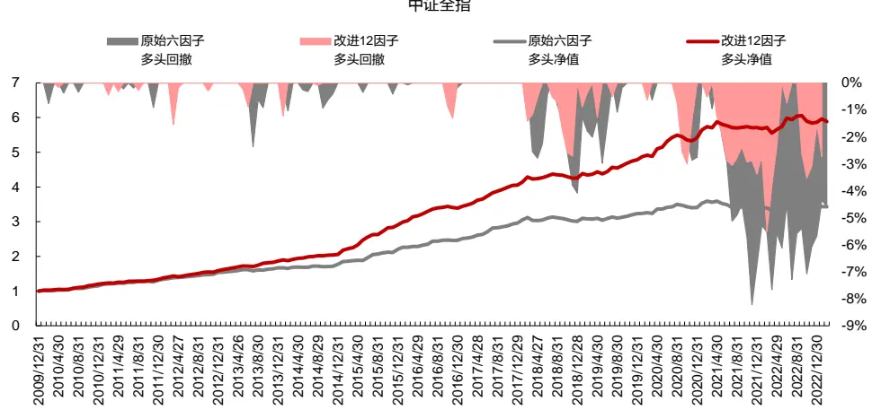

## 风险提示

1. 量化模型基于历史数据分析，未来存在失效风险，建议投资者紧密跟踪模型表现。

2. 极端市场环境可能对模型效果造成剧烈冲击，导致收益亏损。

报告发布日期

2023 年 02 月 17 日

刘静涵

021-63325888*3211

liujinghan@orientsec.com.cn

执业证书编号：S0860520080003

香港证监会牌照：BSX840

研报文本情感倾向因子：——《因子选股 2022-12-06系列研究之八十六》

基于财报的业绩超预期度量：——因子选 2022-10-25股系列之八十五

分析师覆盖度因子改进：——《因子选股 2022-08-23系列研究 之 八十四》

多模型学习量价时序特征：——因子选股 2022-06-12系列之八十三

超大单冲击对大单因子的影响：——因子 2022-05-20选股系列之八十二

周频量价指增模型：——因子选股系列之 2022-03-28八十一

收 益 率 的 非 对 称 分 布 与 尾 部 蕴 含 的 2021-12-25Alpha：——《因子选股系列研究之八十》

基于大单的 alpha 因子构建：—— 因子选 2021-10-27股系列之 七十九

存在于全市场范围内的稳健动量效应：— 2021-09-02—《因子选股系列研究 之 七十八》

基于委托订单数据的 alpha 因子：——因 2021-07-22子选股系列之七十六

在之前的报告《分析师研报的数据特征与 alpha》、《更稳健易算的盈利上调因子》中，我们对分析师研报数据中的 alpha 因子进行了挖掘。本篇报告我们继续对分析师数据的研究，并提供一个更新版的分析师因子库。

在前期报告《盈利预测与市价隐含预期收益》中我们曾指出，分析师预测净利润的准确度并不高，分析师预期数据的价值主要体现在其时间序列上的动态变化和横截面上的相对差异。

下面我们展示分析师对于 FY1，FY2，FY3 的一致预期净利润相比实际年报净利润的高估程度，即 MPE 指标。FY1 对应的报告期在 4 月 30 日集中更换至下一年。不使用实际公告数据来填充一致预期。

$$
\mathsf{MPE}=\frac{1}{N}\sum_{K=1}^{N}\frac{CON_{K}-ANN_{K}}{|ANN_{K}|}
$$

从覆盖度来看，一致预期 FY1> FY2> FY3。由于 FY1对应的报告期在 4月 30日集中更换至下一年，在 3月底有部分上市公司已经公布了上一年年报，因而 FY1的覆盖度在 3月底有所下滑。又由于朝阳永续的一致预期年度基准年在每年5月1日进行调整，假设当前为2022年4月30日，FY1 年度为 2022 年，FY2 年度为 2023 年，FY3 年度为 2024 年。此时上市公司 2021 年的年报还未全部发布，一致预期基准年仍为2020年，还没有2024年的一致预期数据，因而FY3在4月底没有数据。

从 MPE指标来看：分析师的一致预期净利润一直处于高估状态，且 MPE_FY3>MPE_FY2>MPE_FY1。由于 FY1对应的报告期在 4月 30日集中更换至下一年，因而在 4 月底时一致预期高估程度最高，FY1 平均高估 151% ，FY2 平均高估 232%。随着年报发布期的临近，高估程度降低，但到第二年三月底，FY1仍然高估了 42% ，FY2高估了 156% ，FY3高估了 236%。

图 1：分析师一致预期净利润在不同月份的平均覆盖度（2008.1.31-2022.3.31）
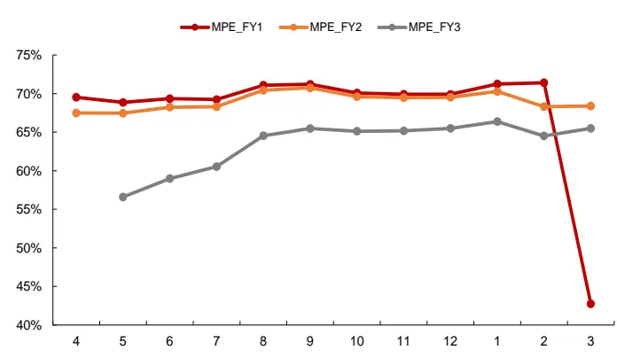
数据来源：东方证券研究所 & 朝阳永续 & Wind资讯

图 2：分析师一致预期净利润在不同月份的平均 MPE 指标（2008.1.31-2022.3.31）
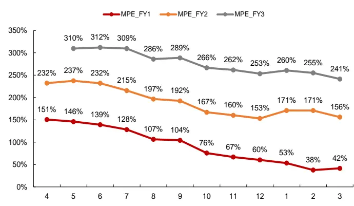
数据来源：东方证券研究所& 朝阳永续 & Wind资讯

## 一、 分析师预期调整因子

## 1. 因子构造

分析师预期数据在时间序列上的动态变化就是指分析师预期数据的调整。分析师预期的调整往往意味着新信息的到来，分析师对于不同股票的预期调整幅度可以反映出不同股票的边际改善差异和分析师对股票观点和推荐力度的变化。

分析师预期调整指标有三种构造方式：

（1） 分析师一致预期调整幅度（CFR）：计算当前的一致预期相对于过去一段时间之前的一致预期的变化率。测算发现使用过去三个月的变化率效果更好。为避免分母过小甚至为负，剔除上次一致预期净利润低于 100万元的样本。

（2） 单个分析师加权预期调整幅度（WFR）：计算过去三个月每个机构的最后一次预期调整幅度，再按照最新报告的撰写时间进行加权。对于近期的报告给予更大的权重而对于时间更早的报告给予小权重。调整幅度计算方法为：最新预期相对于 1 个月前 6 个月内的同报告期最新一次预测的百分比。为避免分母过小甚至为负，剔除上次预期净利润低于 100 万元的样本。留有一个月空档期主要是为了减少短期重复报告的影响。《分析师研报的数据特征与 alpha》报告中加权方式采用的是预测精度加权，测算发现用最新报告撰写时间加权也能实现相近效果，并且算法更加简单。

（3） 分析师预测上调的概率（FOM）：在《更稳健易算的盈利上调因子》报告中，我们提出了 FOM 因子。FOM 因子以所有分析师在时间序列上的预期为基础，旨在考察整体市场对于股票观点的时间序列变化。不仅只做同一分析师预期数据的对比，也做不同分析师预期的对比。具体做法是：将当前最新的分析师预期作为基准，与过去一段时间中的分析师预期进行对比，计算预期上调和下调的占比。此外，因子计算中还可以加入预告、快报、实际年报的净利润数据。如果当前有财报数据公布，则以财报公布的净利润作为基准，与过去一段时间里的分析师预期进行对比。

$$
\mathsf{FOM}=\left(\mathsf{K}\cdot\mathsf{M}\right)/\mathsf{N}
$$

N：分析师针对个股当期年报业绩给出的预测报告篇数+上市公司公告（年报的预告、快报、实际年报）篇数。仅纳入过去一年内的分析师报告，而且要求个股至少有 3篇报告覆盖（N>=3），否则视为缺失值。

K：比当前最新报告的净利润低的历史报告篇数。

M：比当前最新报告的净利润高的历史报告篇数。

因子计算中部分细节说明如下：

（1） 数据源：本文涉及的分析师数据均来自于朝阳永续。只采用年报预测数据，不限制研报类型，仅纳入朝阳永续计算一致预期时用到的机构的预测数据。朝阳永续的一致预期采用时间和机构双加权的方法构建，一致预期类型选择为加权计算和补充估算两种。

（2） 分析师预测年度：针对FY1。FY1对应的报告期在4月30日集中更换至下一年，即在 2022 年 3 月 31 日 FY1 对应的报告期为 2021 年，在 2022 年 4 月 30 日 FY1 对应的报告期为 2022年。

有关分析师的申明，见本报告最后部分。其他重要信息披露见分析师申明之后部分，或请与您的投资代表联系。并请阅读本证券研究报告最后一页的免责申明。

（3） 分析师预测字段：考察分析师预测归母净利润。

（4） 因子预处理：使用 boxplot 方法进行异常值处理，行业市值回归填充缺失值, 行业市值中性化，标准化。

从三类因子在全市场的覆盖度来看：CFR>FOM>WFR。CFR 对于中证全指的覆盖度目前接近 70%，WFR 为 44%，FOM 为 52%。

图 3：分析师预期调整因子覆盖度（CFR VS WFR VS FOM，20091231-20230112）
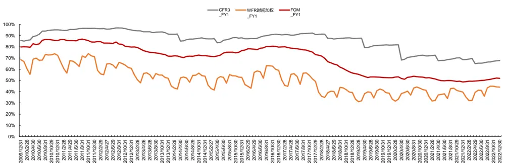
数据来源：东方证券研究所 & 朝阳永续 & Wind资讯

从三类因子在全市场的选股效果上看：FOM>WFR>CFR。具体来看：（1）CFR 因子依赖于一致预期的计算方法，忽略了各个分析师的特质性，一致预期净利润的变化可能完全是由于分析师 A 的预测被纳入分析师 B 的预测被剔除，而 B 比 A 一致性高估或者低估而导致的。（2）WFR因子考虑到了每个分析师的盈利预测调整情况，但容易受到单个分析师极端调整幅度的影响。（3）FOM 因子考察整体市场对于股票观点的时间序列变化，忽略预期调整幅度，仅考察预期值的相对大小，因子表现更加稳健。此外FOM因子中还可以加入财报公告信息，从而将公告业绩超预期纳入因子中，进一步提升因子效果。需要注意的是，FOM 因子并不满足正态分布，偏度大于0，分布为右偏，需要进行一定的正态化调整。由于FOM的取值范围为[-1,1]，可以进行log（2+x）或 sqrt（1+x）的转化。从因子效果来看，sqrt（1+x）的转化更优。全市场 sqrt（1+FOM_FY1）IC 为 2.81%，ICIR 为 2.16。多空组合年化收益 12.38%，最大回撤 5.15%。

图 4：分析师预期调整因子效果对比（CFR VS WFR VS FOM，20091231-20230112）

| 全市场 | 回归法填充缺失值 行业市值中性 | CFR3 _FY1 | CFR6 _FY1 | CFR12 _FY1 | WFR预测精度加权 _FY1 | WFR时间加权 _FY1 | FOM _FY1 | log(2+FOM) _FY1 | sqrt(1+FOM) _FY1 |
| --- | --- | --- | --- | --- | --- | --- | --- | --- | --- |
| IC | 均值 | 2.20% | 2.36% | 2.03% | 2.32% | 2.36% | 2.71% | 2.74% | 2.81% |
|  | IC_IR | 203.62% | 197.72% | 162.58% | 143.65% | 137.29% | 224.72% | 215.33% | 216.08% |
|  | tstat | 736.52% | 715.18% | 588.08% | 519.58% | 496.60% | 812.84% | 778.87% | 781.60% |
|  | 月均收益 | 0.74% | 0.66% | 0.56% | 0.94% | 0.93% | 0.99% | 1.00% | 1.01% |
| 多空组合 (top10%- | 胜率 | 66.88% | 64.97% | 65.61% | 75.80% | 75.80% | 75.16% | 72.61% | 72.61% |
| bottom10%) | 年化夏普比 | 144.77% | 124.11% | 104.59% | 181.01% | 206.49% | 222.80% | 221.31% | 214.50% |
|  | 最大回撤 | -10.44% | -7.33% | -9.95% | -7.29% | -6.41% | -5.77% | -5.99% | -5.15% |
|  | 年化收益 | 8.99% | 7.97% | 6.69% | 11.43% | 11.30% | 12.08% | 12.26% | 12.38% |

数据来源：东方证券研究所 & 朝阳永续 & Wind资讯

有关分析师的申明，见本报告最后部分。其他重要信息披露见分析师申明之后部分，或请与您的投资代表联系。并请阅读本证券研究报告最后一页的免责申明。

从正交化结果来看：FOM因子剔除WFR和CFR因子后仍然有显著的选股效果，IC达到2%以上，多空组合年化收益超过 10%。而相反 WFR 和 CFR因子剔除 FOM因子后便失去了选股效力，IC在 0附近，ICIR不到 1。

图 5：分析师预期调整因子正交化对比（CFR VS WFR VS FOM，20091231-20230112）

| 全市场 | 回归法填充缺失值 行业市值中性 | sqrt (1+fom_fy1) _ortho | wfr_fy1 _ortho | sqrt (1+fom_fy1) _ortho | cfr3_fy1 _ortho |
| --- | --- | --- | --- | --- | --- |
|  | 均值 | wfr_fy1 2.31% | _sqrt (1+fom_fy1) -0.90% | cfr3_fy1 2.94% | _sqrt (1+fom_fy1) -0.63% |
| IC | IC_IR | 155.78% | -83.32% | 229.99% | -84.18% |
|  |  | 563.48% | -301.36% | 831.89% | -304.48% |
|  | tstat 月均收益 | 1.01% | 0.23% | 0.97% | -0.12% |
|  | 胜率 | 77.71% | 59.24% | 73.89% | 47.77% |
| 多空组合 | 年化夏普比 | 215.95% | 74.18% | 217.19% | -38.28% |
| (top10%-bottom10%) | 最大回撤 | -6.00% | -6.71% | -5.16% | -22.91% |
|  | 年化收益 | 12.36% | 2.74% | 11.87% | -1.56% |

数据来源：东方证券研究所 & 朝阳永续 & Wind资讯

在 FOM 因子的构造中还存在很多细节，下面我们针对预测年度切换时间、预测年度选择、预测字段三个问题进行深入讨论。

## 2. 预测年度切换时间

一般而言分析师预测的最近一个报告期称为FY1，切换时间就是财报公告日。例如：2016年3月 10日某公司公告 2015年年度报告，那么 3月 10日之前预测的 FY1就是 2015年年报，3月10日及之后预测的FY1就是2016年年报。由于不同公司的年报公告日并不是同一天，所以在12月 31日和4月 30日之间不同公司的 FY1所指年度可能会不一致，在相关因子计算时如果严格按照 FY1 预测计算指标就可能导致不同公司的不可比问题。因而，我们需要指定一个预测年度的切换时间，通常有 1月 31号切换，2月 29号切换，3月 31号切换，4月 30号和 5月 31号切换等方案。

从因子表现结果来看，预测年度切换时间对于因子表现影响并不大，FOM因子在4月底切换效果更佳。我们在 FOM 因子计算中加入了财报公告信息（包括年度的预告、快报正式年报），当年公告信息一出，FOM因子就转变为衡量公告信息相比分析师预期的超预期程度。

图 6：FOM 因子预测年度切换时间对比（20091231-20230112）

| 全市场 | 回归法填充缺失值 行业市值中性 | fom _fy1 0131切换 | fom _fy1 0229切换 | fom _fy1 0331切换 | fom _fy1 0430切换 | fom _fy1 0531切换 |
| --- | --- | --- | --- | --- | --- | --- |
| IC | 均值 | 2.56% | 2.54% | 2.68% | 2.71% | 2.59% |
|  | IC_IR | 219.94% | 214.53% | 224.84% | 224.72% | 215.61% |
|  | tstat | 795.55% | 775.96% | 813.26% | 812.84% | 779.88% |
| 多空组合 | 月均收益 | 0.95% | 0.98% | 0.99% | 0.99% | 0.93% |
|  | 胜率 | 75.80% | 75.80% | 75.80% | 75.16% | 72.61% |
|  | 年化夏普比 | 216.40% | 222.97% | 223.42% | 222.80% | 216.59% |
|  | 最大回撤 | -5.77% | -5.77% | -5.77% | -5.77% | -6.56% |
|  | 年化收益 | 11.73% | 12.12% | 12.29% | 12.27% | 11.50% |

数据来源：东方证券研究所 & 朝阳永续 & Wind资讯

## 3. 预测年度选择

一般而言分析师会对多个报告期同时进行预测，预测的最近的一个报告期我们称为 FY1，后面依次为 FY2、FY3 等。分析师对不同年度的盈利预测调整都包含了有效信息。下面我们分别对比针对 FY1,FY2,FY3 的 FOM 因子表现。

从因子在全市场的覆盖度来看： FOM_FY1 和 FOM_FY2 对于中证全指的覆盖度很接近，目前为 52%，FOM_FY3覆盖度最低，这说明绝大多数分析师都会至少预测随后两年的公司业绩。由于预测年度切换时间为 4月30日，FOM_FY3因子在 4月底因子覆盖度最低，随后逐渐提高。

图 7：FOM 因子覆盖度（不同预测年度，20091231-20230112）
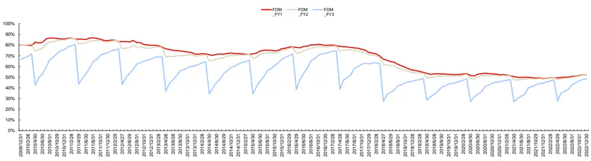
数据来源：东方证券研究所 & 朝阳永续 & Wind资讯

从因子效果来看：针对 FY1,FY2,FY3 的 FOM 因子均有效，FOM_FY1 表现最优，其次是FY2 和 FY3。同样由于因子并不满足正态分布，需要进行一定的正态化调整。三因子在进行互相的正交化剔除后，残差因子基本均有效，IC 在 1%以上，ICIR 在 1 以上。

图 8：FOM 因子预测年度选择对比（20091231-20230112）

| 全市场 | 回归法填充缺失值 行业市值中性 | fom _fy1 lag12M | sqrt(1+fom) _fy1 | fom _fy2 lag12M | sqrt(1+fom) _fy2 | fom _fy3 lag12M | sqrt(1+fom) |
| --- | --- | --- | --- | --- | --- | --- | --- |
|  |  |  |  |  |  |  | _fy3 lag12M |
| IC | 均值 | 2.71% | lag12M 2.81% | 2.60% | lag12M 2.63% | 1.65% | 1.67% |
|  | IC_IR | 224.72% | 216.08% | 221.06% | 200.38% | 145.31% | 128.78% |
|  | tstat | 812.84% | 781.60% | 799.59% | 724.80% | 525.60% | 465.82% |
|  | 月均收益 | 0.99% | 1.01% | 0.99% | 1.01% | 0.75% | 0.75% |
| 多空组合 | 胜率 | 75.16% | 72.61% | 78.34% | 78.98% | 72.61% | 75.16% |
| (top10%-bottom10%) | 年化夏普比 | 222.80% | 214.50% | 194.42% | 193.23% | 179.64% | 188.93% |
|  | 最大回撤 | -5.77% | -5.15% | -6.58% | -4.64% | -6.02% | -4.58% |
|  | 年化收益 | 12.08% | 12.38% | 11.98% | 12.43% | 9.08% | 9.16% |

| 全市场 | 回归法填充缺失值 行业市值中性 | fom_fy1_lag12M _ortho fom_fy2_lag12M | fom_fy1_lag12M _ortho | fom_fy2_lag12M _ortho | fom_fy3_lag12M _ortho fom_fy1_lag12M |
| --- | --- | --- | --- | --- | --- |
| IC | 均值 | 1.80% | fom_fy3_lag12M 2.16% | fom_fy1_lag12M 1.39% | 0.93% |
|  | IC_IR | 180.80% | 174.23% | 158.46% | 93.24% |
|  | tstat | 653.97% | 630.21% | 573.17% | 337.24% |
| 多空组合 (top10%-bottom10%) | 月均收益 | 0.47% | 0.88% | 0.31% | 0.41% |
|  | 胜率 | 63.06% | 73.89% | 59.87% | 64.33% |
|  | 年化夏普比 | 124.49% | 219.75% | 92.24% | 131.37% |
|  | 最大回撤 | -6.34% | -3.99% | -6.75% | -4.88% |
|  | 年化收益 | 5.56% | 10.85% | 3.63% | 4.87% |

数据来源：东方证券研究所 & 朝阳永续 & Wind资讯

有关分析师的申明，见本报告最后部分。其他重要信息披露见分析师申明之后部分，或请与您的投资代表联系。并请阅读本证券研究报告最后一页的免责申明。

因而我们尝试构造 FOM_123mean 因子，将 FOM_FY1，FOM_FY2，FOM_FY3 三因子非空部分取均值，综合衡量分析师对未来三个年度的盈利预测调整情况。同样由于因子并不满足正态分布，需要进行一定的正态化调整。可以看到，FOM_123mean 因子多空组合表现优于单因子，FOM_123mean 因子对 FOM_FY1 正交化后，残差因子 IC 依然大于 1%，ICIR 依然大于 1。

全市场中性化的 sqrt（1+FOM_123mean）因子 IC 为 2.82%，ICIR 为 2.11，多空组合年化收益 14.56%，最大回撤仅为 5.65%，月度胜率为 80%。多头组合表现突出，年化超额收益为8.52%，最大回撤仅为 6.86%。

图 9：FOM_123mean 因子绩效表现（20091231-20230112）

| 全市场 | 回归法填充缺失值 | fom_123mean | sqrt(1+fom_123mean) | fom_123mean _ortho fom_fy1 |
| --- | --- | --- | --- | --- |
|  | 行业市值中性 |  |  |  |
| IC | 均值 | 2.68% | 2.82% | 1.03% |
|  | IC_IR | 215.70% | 211.41% | 113.49% |
|  | tstat | 780.19% | 764.69% | 410.49% |
|  | 月均收益 | 1.15% | 1.17% | 0.33% |
|  | 胜率 | 78.34% | 80.25% | 63.06% |
| 多空组合 (top10%- bottom10%) | 年化夏普比 | 231.09% | 231.23% | 90.83% |
|  | 最大回撤 | -6.09% | -5.65% | -6.87% |
|  | 年化收益 | 14.18% | 14.56% | 3.98% |

数据来源：东方证券研究所 & 朝阳永续 & Wind资讯

图 10 ： FOM_123mean 因 子 多 空 净 值 （ 20091231-20230112）
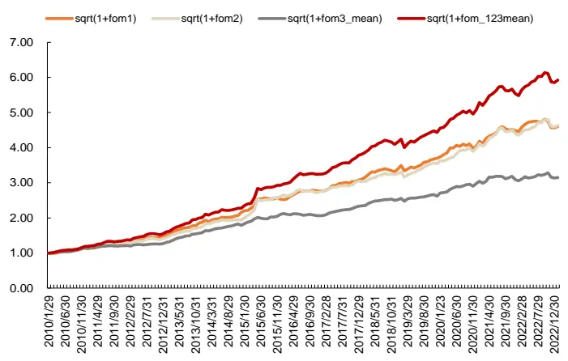
数据来源：东方证券研究所 & 朝阳永续 & Wind资讯

图 11 ： FOM_123mean 因 子 多 头 净 值 （ 20091231-20230112）
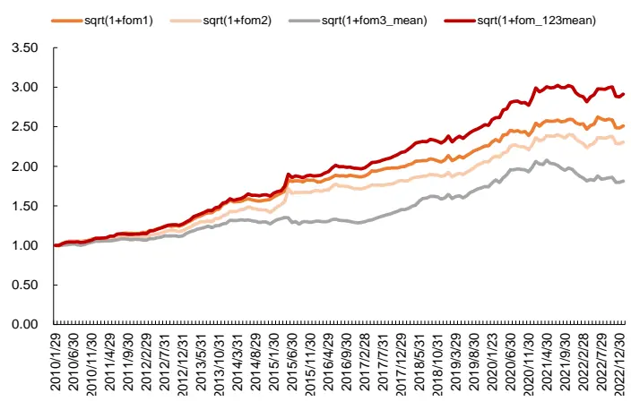
数据来源：东方证券研究所 & 朝阳永续 & Wind资讯

图 12：FOM_123mean 因子分组年化超额收益（20091231-20230112）
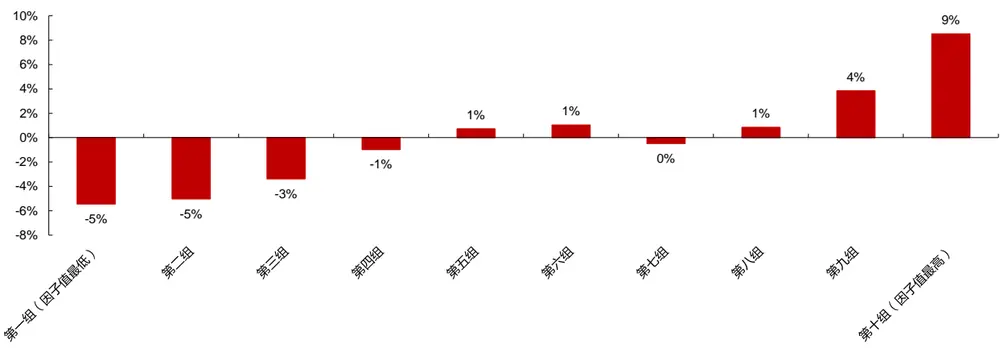
数据来源：东方证券研究所 & 朝阳永续 & Wind资讯
有关分析师的申明，见本报告最后部分。其他重要信息披露见分析师申明之后部分，或请与您的投资代表联系。并请阅读本证券研究报告最后一页的免责申明。

## 4. 预测字段选择

一般而言分析师会对多个字段给出预测，净利润和营收是其中两个主要字段。分析师对净利润和营收的预期调整情况可能不同。接下来我们对营收字段计算 FOM_FY1因子。

从因子在全市场的覆盖度来看：FOM >FOM_or，但近年来二者覆盖度基本趋同。

图 13：FOM 与 FOM_or 因子覆盖度（20091231-20230112）
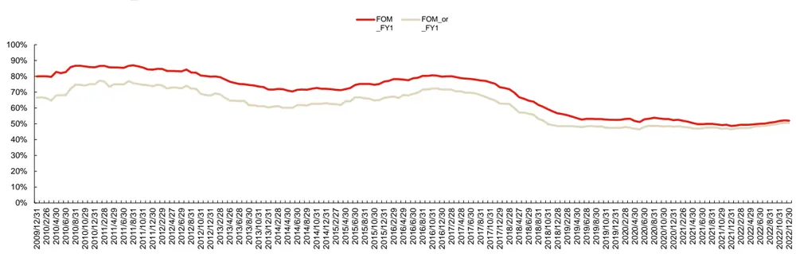
数据来源：东方证券研究所 & 朝阳永续 & Wind资讯

从因子在全市场的选股效果上看：FOM_or_FY1 因子也有效，全市场 IC 接近 2%，ICIR 接近 2，多空组合年化收益接近 10%，最大回撤仅为 3.7%。并且 FOM_or_FY1 因子对 FOM_FY1因子进行正交化后，残差因子依然有效，IC 超过 1%，ICIR 超过 1，说明分析师对于营收和净利润的预期调整中包含不同的信息。

图 14：FOM 与 FOM_or 因子表现对比（20091231-20230112）

| 全市场 | 回归法填充缺失值 行业市值中性 | fom _fy1 lag12M | sqrt(1+fom) _fy1 lag12M | fom_or _fy1 lag12M | sqrt(1+fom_or) _fy1 | fom_or_fy1 _ortho fom_fy1 | fom_fy1_ortho_fom_ or_fy1 |  |
| --- | --- | --- | --- | --- | --- | --- | --- | --- |
|  |  |  |  |  |  |  |  | lag12M |
| IC | 均值 | 2.71% | 2.81% | 1.88% | 1.97% | 1.27% | 2.31% |  |
|  | IC_IR | 224.72% | 216.08% | 191.53% | 181.87% | 143.93% | 185.61% |  |
|  | tstat | 812.84% | 781.60% | 692.78% | 657.85% | 520.61% | 671.38% |  |
|  | 月均收益 | 0.99% | 1.01% | 0.76% | 0.81% 75.80% | 0.43% | 0.79% |  |
| 多空组合 (top10%- bottom10%) | 胜率 | 75.16% 222.80% | 72.61% 214.50% | 75.80% 228.65% | 222.27% | 71.97% 161.55% | 73.25% 201.46% |  |
|  | 年化夏普比 |  |  |  |  |  |  |  |
|  | 最大回撤 | -5.77% | -5.15% | -3.71% | -3.77% | -2.45% | -6.44% |  |
|  | 年化收益 | 12.08% | 12.38% | 9.26% | 9.90% | 5.10% | 9.61% |  |

数据来源：东方证券研究所 & 朝阳永续 & Wind资讯

我们尝试构造 FOM_or_123mean 因子，将 FOM_or _FY1，FOM_or _FY2，FOM_or _FY3三因子非空部分取均值，综合衡量分析师对未来三个年度的营收预期调整情况。可以看到，FOM_or_123mean 因子多空组合表现优于单因子，FOM_or_123mean 因子对 FOM_123_mean正交化后，残差因子 IC 依然大于 1%，ICIR 依然大于 1。

全市场中性化的 sqrt（1+FOM_or_123mean）因子 IC 为 2%，ICIR 为 1.72，多空组合年化收益 10.6%，最大回撤仅为 4.13%，月度胜率为 78%。多头组合年化超额收益为 5.29%，最大回撤仅为 7.05%。

图 15：FOM_or_123mean 因子绩效表现（20091231-20230112）

| 全市场 | 回归法填充缺失值 行业市值中性 | sqrt(1+fom_or) _fy1 _lag12M | sqrt(1+fom_or) _fy2 _lag12M | sqrt(1+fom_or) _fy3 lag12M | sqrt(1+fom_or_123mean) | fom_or_123mean _ortho fom_123mean | fom_123mean ortho fom_or_123mean |
| --- | --- | --- | --- | --- | --- | --- | --- |
| IC | 均值 | 1.97% | 1.87% | 1.13% | 2.00% | 1.10% | 2.19% |
|  | IC_IR | 181.87% | 159.58% | 89.54% | 172.77% | 121.68% | 176.79% |
|  | tstat | 657.85% | 577.20% | 323.88% | 624.93% | 440.12% | 639.47% |
|  | 月均收益 | 0.81% | 0.84% | 0.56% 69.43% | 0.86% | 0.36% 64.33% | 0.97% 80.25% |
| 多空组合 (top10%- bottom10%) | 胜率 | 75.80% 222.27% | 77.07% 211.60% | 178.78% | 77.71% 238.74% | 142.19% | 235.00% |
|  | 年化夏普比 | -3.77% | -3.70% | -4.37% | -4.13% | -3.86% | -6.62% |
|  | 最大回撤 | 9.90% | 10.35% | 6.82% | 10.60% | 4.29% |  |
|  | 年化收益 |  |  |  |  |  | 11.80% |

数据来源：东方证券研究所 & 朝阳永续 & Wind资讯

图 16 ： FOM_or_123mean 因 子 多 空 净 值 （ 20091231-20230112）
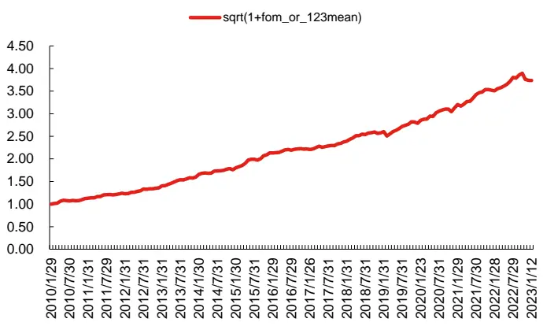
数据来源：东方证券研究所 & 朝阳永续 & Wind资讯

图 17 ： FOM_or_123mean 因 子 多 头 净 值 （ 20091231-20230112）
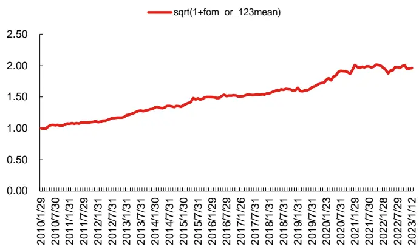
数据来源：东方证券研究所 & 朝阳永续 & Wind资讯

图 18：FOM_or_123mean 因子分组年化超额收益（20091231-20230112）
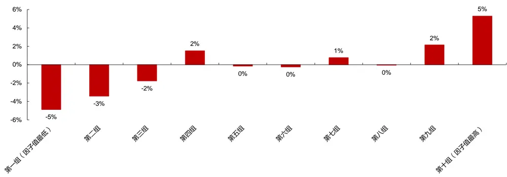
数据来源：东方证券研究所 & 朝阳永续 & Wind资讯

## 二、 分析师预期残差因子

## 1. 因子构造

后面两部分我们重点考察分析师预期数据的横截面相对差异的使用方法。分析师一致预期与公司当前基本面情况息息相关，单纯比较一致预期盈利能力指标可能会与现有基本面因子相关性过高。因而，我们尝试引入截面模型，考察分析师预期残差的选股效果。

在前期报告《盈利预测与市价隐含预期收益》中我们曾提出过预测公司盈利的横截面回归方法，可以用当期横截面上已知股票数据来预测下一期的股票盈利能力。同理，分析师一致预期的股票盈利能力也可以用横截面模型来进行解释，模型残差即为分析师预期残差因子。分析师基于当前获得的股票信息，作出盈利预测判断。盈利预测中能够被已知股票数据解释的部分，可能已经反映在股价中，盈利预测中不能被已知股票数据解释的部分，才是分析师盈利预测的核心增量，也是分析师个人综合判断能力的体现。假设 t时刻市场上有N只股票，横截面模型可以表示为：

$$
Y_{i}^{t}=f\bigl(X_{1,i}^{t},X_{2,i}^{t},...X_{K,i}^{t}\bigr)\qquad i=1,2,...N
$$

其中函数f通常取为线性形式。 $X_{K,i}^{t}$ 是 K 个用来解释分析师预测盈利能力的变量。Yt是分析师一致预期股票盈利能力的指标。

本文所用因变量为分析师一致预期 ROE。Hou(2012) 直接用公司净利润数值作为因变量，自变量用的是市值、总资产、分红等指标的数值。这样建模的问题是，上市公司规模大小分布不均，变量和样本数据的偏度和峰度会很大，显著偏离正态分布，线性回归 OLS估计量不能保证一致性。采用ROE可以在一定程度上缓解这一问题。此处所用的分析师一致预期数据默认为FY1。我们选择以当前时点所处的年份作为FY1，以日历年的跨越来切换预测年度。例如当前时点2023年1月31日，那么 FY1指的是 2023年。当前时点 2022年 12月 31日，那么 FY1仍为 2022年。后面我们会对预测年度切换时间和预测年度选择问题再进行详细讨论。

自变量包括：当期行业虚拟变量（中信一级）、对数市值、BP 估值、ROE(TTM)、总资产同比增长率、ROE 变动(当前 TTM 和一年前 TTM 比较)、股息率、过去 60 个交易日的收益率、$\mathbf{1}_{\{\mathbf{R0E<0}\}}*\mathbf{R0E},$ 。选择行业是因为不同行业的盈利能力天然存在差别。选择市值对数是因为大公司的盈利能力普遍强于小公司（Fama and French, 1995）。选择 BP估值是因为，BP高的公司通常未来的盈利能力较差。盈利能力和投资具有一定的持续性 (Penman 1991, Lakonishok, Shleifer,and Vishny 1994, Fama and French 1995)，往期盈利能力比较强的公司后期相应也会较好，往期资产增长较快的公司预期未来资产也会延续增长，持续投资，增加资本支出，从而会相应的减少利润。选择盈利能力变化主要用来捕捉盈利的均值回复特性（Fama and French, 2000），盈利水平较高会导致竞争的加剧最后恢复到正常水平。有分红的公司一般比不分红的公司盈利能力更强，分红比例高也是盈利能力较强的一种信息（Fama and French 2001）。Fama 和 French(2006)在估计盈利能力预期值时也尝试添加了股票历史收益率。加入 $1_{\{\mathrm{ROE<0}\}}$ ∗ROE是之前有研究发现亏损公司盈利均值回复的速度要比实现盈利的公司要快。

采用前期报告《东方 A 股因子风险模型（DFQ-2018）》中选择风险因子时提供的逐步Fama-Machbeth 回归方法，按照平均 Adjusted Rsquared 的增量大小，对除行业虚拟变量外的 8个自变量进行排序。可以看到，8 个因子均能被加入模型中，最终截面平均 Adjusted Rsquare可达到 67.22%，总体拟合效果较好。

图 19：横截面模型逐步回归的平均 Adjusted Rsquare（20080131-20221230）
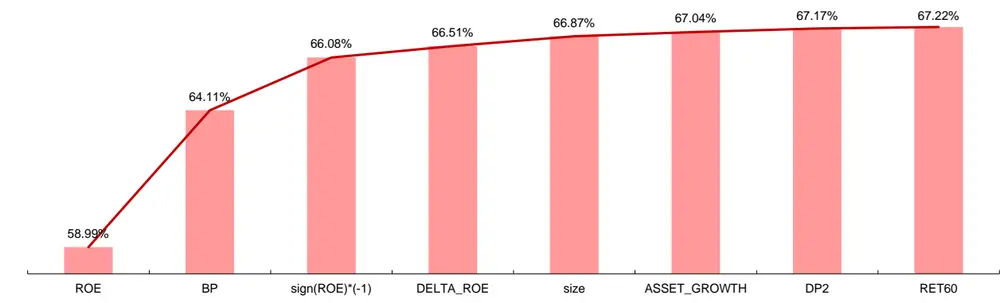
数据来源：东方证券研究所 & 朝阳永续 & Wind资讯

每个月横截面回归的 Adjusted Rsquared 如下图所示。之所以呈现周期变化的原因是因为我们使用了TTM的财务数据作为自变量，随着季报、半年报的发布，年报里的未知信息越来越少，回归方程的解释度随着年报临近越来越高。可以看到，每年 1-3 月底，横截面模型对当年分析师一致预期 ROE 的解释度最低，但 Adjusted Rsquared 也有 60%左右，到当年十二月份，AdjustedRsquared 可以升至 75%左右。

图 20：横截面模型 Adjusted Rsquared 变化（20080131-20221230）
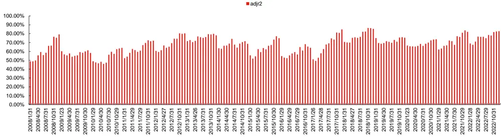

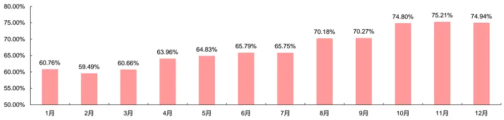
数据来源：东方证券研究所 & 朝阳永续 & Wind资讯

有关分析师的申明，见本报告最后部分。其他重要信息披露见分析师申明之后部分，或请与您的投资代表联系。并请阅读本证券研究报告最后一页的免责申明。

从各自变量的系数来看，ROE、BP、1{ROE<0} ∗ ROE、ROE 的变化量这四个自变量的回归系数在 10%的显著性水平下显著。具体来看，当前 ROE 回归系数显著为正 ，说明往年盈利能力强的企业未来盈利能力普遍也更好；BP回归系数显著为负，高估值的企业的盈利能力一般会更好；$1_{\{\mathrm{ROE<0}\}}$ ∗ROE回归系数显著为正，说明亏损公司盈利回复的速度要比实现盈利的公司要快；ROE 的变化量系数显著为负，也说明了盈利能力在年度上有均值回复的特征；此外，总资产增长率回归系数为负，说明资产快速膨胀的企业一般会带来未来盈利能力的下滑；市值、股息率、历史涨跌幅回归系数为正，说明大公司、分红多、之前涨幅高的公司未来盈利能力一般会更好。

图 21：横截面模型回归系数与 P 值（20080131-20221230）
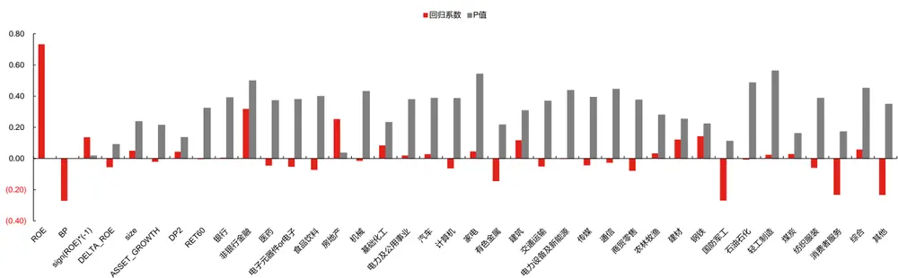
数据来源：东方证券研究所 & 朝阳永续 & Wind资讯

下面我们对预测年度切换时间和预测年度选择问题进行详细讨论，并展示因子表现。

## 2. 预测年度切换时间

我们对比了不同的分析师一致预期预测年度切换时间下的预期残差因子表现，测试了 1 月 31号切换，2 月 29 号切换，3 月 31 号切换，4 月 30 号切换等方案。如果是在 2 月之后切换，会出现有的上市公司 FY1 年报已公布的情况，分析师一致预期 FY1 的 ROE 失去意义。此时我们用分析师一致预期 FY2的 ROE对因变量进行填充。

从因子表现结果来看，预测年度切换时间对于因子表现影响并不大，FY1ROE_resid 因子在1月底切换效果更佳，也就是以日历年的跨越来切换预测年度。

图 22：FY1ROE_resid 因子预测年度切换时间对比（20091231-20230112）

| 全市场 | 回归法填充缺失值 行业市值中性 | fy1roe_resid 0131切换 | fy1roe_resid 0229切换 | fy1roe_resid 0331切换 | fy1roe_resid 0430切换 |
| --- | --- | --- | --- | --- | --- |
| IC | 均值 | 2.40% | 2.23% | 2.25% | 2.16% |
|  | IC_IR | 175.98% | 162.42% | 163.35% | 159.97% |
|  | tstat | 636.54% | 587.49% | 590.85% | 578.62% |
| 多空组合 | 月均收益 | 0.61% | 0.59% | 0.56% | 0.53% |
| (top10%- | 胜率 | 71.34% | 69.43% | 68.15% | 66.88% |
|  | 年化夏普比 | 131.56% | 127.77% | 123.31% | 116.91% |
|  | 最大回撤 | -6.89% | -6.89% | -6.89% | -7.32% |
|  | 年化收益 | 7.34% | 7.02% | 6.66% | 6.24% |

数据来源：东方证券研究所 & 朝阳永续 & Wind资讯

有关分析师的申明，见本报告最后部分。其他重要信息披露见分析师申明之后部分，或请与您的投资代表联系。并请阅读本证券研究报告最后一页的免责申明。

以日历年的跨越来切换预测年度还存在一个问题。假设时点是 2022年 4月 30号，那么 FY1指的是 2022 年。由于此时 2022 年度一季报已经公布，分析师对于 2022 年的一致预期数据中只有三个季度是有意义的，其余部分已经被市场反映了。因而，我们考虑根据当前时点，对 FY1 和FY2数据进行加权，得到分析师 FY1滚动一致预期 ROE。

$$
\mathrm{rollingFY1_{ROE}=FY1_{ROE}*\left(1-\frac{\it m}{12}\right)+\ FY2_{ROE}*\left(\frac{\it m}{12}\right)\qquad\it m=1,2,\dots12}
$$

而后我们对比了原始的 FY1ROE_resid 因子，滚动 FY1ROE 因子，以及以滚动 FY1ROE 为因变量的滚动 FY1ROE_resid 因子的表现。可以看到，滚动 FY1ROE_resid 因子更优。全市场IC达到 2.7%，ICIR达到 2.07，多空组合年化收益超 10%，最大回撤仅为 5.89%。

图 23：滚动 FY1ROE_resid 因子绩效表现（20091231-20230112）

| 全市场 | 回归法填充缺失值 行业市值中性 | fy1roe_resid 0131切换 | rollingfy1roe 0131切换 | rollingfy1roe_resid 0131切换 |
| --- | --- | --- | --- | --- |
| IC | 均值 | 2.40% | 1.92% | 2.70% |
|  | IC_IR | 175.98% | 108.57% | 207.00% |
|  | tstat | 636.54% | 392.72% | 748.75% |
|  | 月均收益 | 0.61% | 0.67% | 0.81% |
| 多空组合 | 胜率 | 71.34% | 57.32% | 73.25% |
| (top10%- | 年化夏普比 | 131.56% | 100.60% | 178.58% |
| bottom10%) | 最大回撤 | -6.89% | -14.45% | -5.89% |
|  | 年化收益 | 7.34% | 7.87% | 10.01% |

数据来源：东方证券研究所 & 朝阳永续 & Wind资讯

## 3. 预测年度选择

针对 FY2，我们也可以计算滚动 FY2ROE_resid 因子。从因子效果来看：针对 FY1,FY2 的滚动 FYROE_resid 因子均有效。

图 24：滚动 FYROE_resid 因子预测年度选择对比（20091231-20230112）

| 全市场 | 回归法填充缺失值 行业市值中性 | rollingfy1roe_resid 0131切换 | rollingfy2roe_resid 0131切换 | fyroe2_resid_ortho_fyroe1_resid |
| --- | --- | --- | --- | --- |
| IC | 均值 | 2.70% | 2.43% | 1.56% |
|  | IC_IR | 207.00% | 189.43% | 139.10% |
|  | tstat | 748.75% | 685.18% | 503.14% |
|  | 月均收益 | 0.81% | 0.91% | 0.57% |
| 多空组合 (top10%-bottom10%) | 胜率 | 73.25% | 74.52% | 66.88% |
|  | 年化夏普比 | 178.58% | 206.52% | 149.72% |
|  | 最大回撤 | -5.89% | -3.79% | -3.97% |
|  | 年化收益 | 10.01% | 11.29% | 6.94% |

数据来源：东方证券研究所 & 朝阳永续 & Wind资讯

我 们 尝 试 构 造 滚 动 FYROE_resid_12mean 因 子 ， 将 滚 动 FY1ROE_resid ， 滚 动FY2ROE_resid 两因子非空部分取均值。可以看到，FYROE_resid_12mean 因子表现优于单因子。全市场中性化的 FYROE_resid_12mean 因子 IC 为 2.9%，ICIR 为 2.26，多空组合年化收益11.15%，最大回撤仅为 4.19%，月度胜率为 71%。多头组合年化超额收益为 4.4%，最大回撤为8.14%。

图 25：滚动 FYROE_resid_12mean 因子绩效表现（20091231-20230112）

| 全市场 | 回归法填充缺失值 行业市值中性 | rollingfyroe_resid_12mean | rollingfyroe_resid_12mean_ortho_fyroe1_resid |
| --- | --- | --- | --- |
| IC | 均值 | 2.90% | 1.69% |
|  | IC_IR | 226.70% | 153.87% |
|  | tstat | 820.00% | 556.56% |
| 多空组合 (top10%-bottom10%) | 月均收益 | 0.90% | 0.55% |
|  | 胜率 | 70.70% | 64.33% |
|  | 年化夏普比 | 199.66% | 146.29% |
|  | 最大回撤 | -4.19% | -4.45% |
|  | 年化收益 | 11.15% | 6.75% |

数据来源：东方证券研究所 & 朝阳永续 & Wind资讯

图 26 ： 滚 动 FYROE_resid_12mean 因 子 多 空 净 值（20091231-20230112）
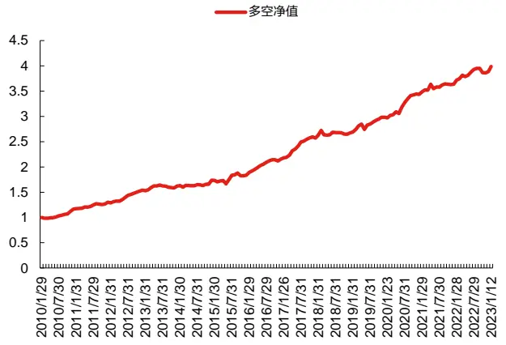
数据来源：东方证券研究所 & 朝阳永续 & Wind资讯

图 27 ： 滚 动 FYROE_resid_12mean 因 子 多 头 净 值（20091231-20230112）
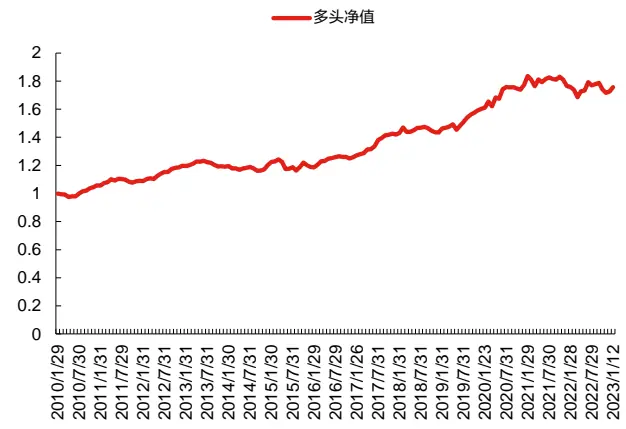
数据来源：东方证券研究所 & 朝阳永续 & Wind资讯

图 28：滚动 FYROE_resid_12mean 因子分组年化超额收益（20091231-20230112）
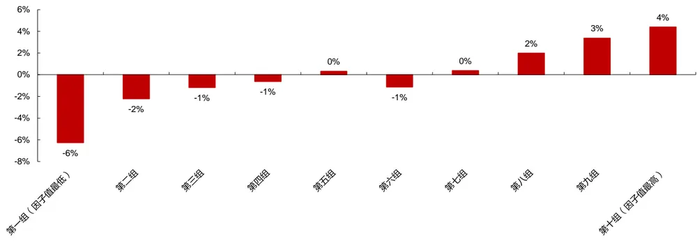
数据来源：东方证券研究所 & 朝阳永续 & Wind资讯

## 三、 分析师预期估值因子

至于一致预期数据横截面差异对选股的作用，我们也可以构造预期估值因子，即一致预期净利润/总市值，因子取值越大，预期估值越低。

我们同样对比了不同的一致预期预测年度切换时间下的预期估值因子表现，测试了1月31号切换，2 月 29 号切换，3 月 31 号切换，4 月 30 号切换等方案。从因子表现结果来看，预测年度切换时间对于因子表现影响并不大，EP_FY1 因子在 1 月底切换效果更佳，也就是以日历年的跨越来切换预测年度。此外我们也尝试了滚动 EP_FY1因子。可以看到，滚动 EP_FY1因子选股能力更强，全市场 IC 达到 3.98%，ICIR 达到 1.87，多空组合年化收益达到 16.17%，最大回撤为16.44%。

图 29：EP_FY1 因子预测年度切换时间对比（20091231-20230112）

| 全市场 | 回归法填充缺失值 行业市值中性 | ep_fy1 0131切换 | ep_fy1 0229切换 | ep_fy1 0331切换 | ep_fy1 0430切换 | rollingep_fy1 0131切换 |
| --- | --- | --- | --- | --- | --- | --- |
| IC | 均值 IC_IR tstat | 3.92% 182.73% 658.82% | 3.80% 177.53% | 3.86% 180.76% | 3.90% 183.84% | 3.98% 187.00% |
|  | 月均收益 | 1.26% | 640.10% 1.21% | 651.73% 1.20% | 662.84% 1.19% | 674.23% 1.30% |
| 多空组合 | 胜率 | 70.51% | 69.23% | 68.59% | 67.31% |  |
|  |  |  |  |  |  | 69.23% |
|  | 年化夏普比 | 140.81% | 135.61% | 135.59% | 134.13% | 142.62% |
| (top10%-bottom10%) |  |  |  |  |  |  |
|  | 最大回撤 | -16.34% | -18.78% | -20.25% | -18.02% | -16.44% |
|  | 年化收益 | 15.72% | 15.01% | 14.92% | 14.72% | 16.17% |

数据来源：东方证券研究所 & 朝阳永续 & Wind资讯

针对 FY2，我们也可以计算滚动 EP_FY2 因子。从因子效果来看：针对 FY1,FY2 的 EP_FY因子均有效。同样的我们将滚动 EP_FY1，滚动 EP_FY2 两因子非空部分取均值得到滚动EP_FY_12mean因子。可以看到，滚动EP_FY_12mean因子表现优于单因子。全市场中性化的滚动 EP_FY_12mean 因子 IC 为 4.2%，ICIR 为 2.01，多空组合年化收益 17.3%，最大回撤为17.22%，月度胜率为 69%。多头组合年化超额收益为 6.37%，最大回撤为 11.74%。

图 30：滚动 EP_FY 因子预测年度选择对比（20091231-20230112）

| 全市场 | 回归法填充缺失值 行业市值中性 | rollingep_fy1 0131切换 | rollingep_fy2 0131切换 | rollingepfy_12mean |
| --- | --- | --- | --- | --- |
| IC | 均值 | 3.98% | 3.80% | 4.20% |
|  | IC_IR | 187.00% | 182.17% | 200.97% |
|  | tstat | 674.23% | 656.83% | 724.59% |
| 多空组合 (top10%-bottom10%) | 月均收益 | 1.30% | 1.35% | 1.38% |
|  | 胜率 | 69.23% | 67.95% | 69.23% |
|  | 年化夏普比 | 142.62% | 150.41% | 150.56% |
|  | 最大回撤 | -16.44% | -16.84% | -17.22% |
|  | 年化收益 | 16.17% | 16.99% | 17.30% |

数据来源：东方证券研究所 & 朝阳永续 & Wind资讯

图 31：滚动 EP_FY_12mean 因子多空净值（20091231-20230112）
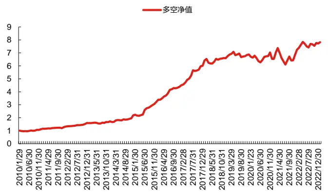
数据来源：东方证券研究所 & 朝阳永续 & Wind资讯

图 32：滚动 EP_FY_12mean 因子多头净值（20091231-20230112）
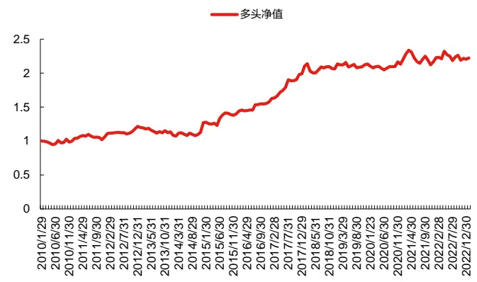
数据来源：东方证券研究所 & 朝阳永续 & Wind资讯

图 33：滚动 EP_FY_12mean 因子分组年化超额收益（20091231-20230112）
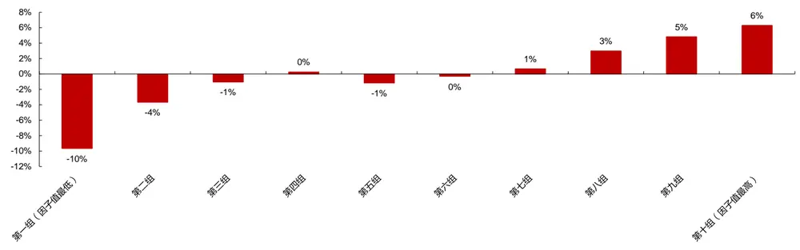
数据来源：东方证券研究所 & 朝阳永续 & Wind资讯

EP_FY 衡量分析师对于企业未来估值水平的估计，与当前估值水平 EP_TTM 会有较强的相关性。为此我们对比了滚动EP_FY_12mean和EP_TTM因子的表现，可以看到，用TTM净利润得到的 EP 因子选股效果更弱，并且剔除滚动 EP_FY_12mean 因子后失去了选股效果。而滚动EP_FY_12mean剔除EP_TTM因子后仍然有很强的选股效果，这说明EP_FY指标在横截面上的排序和 EP很不一样，分析师一致预期净利润的相对大小提供了额外的有用信息。

图 34：滚动 EP_FY_12mean 因子与 EP_TTM 因子的对比（20091231-20230112）

| 全市场 | 回归法填充缺失值 行业市值中性 | rollingepfy_12mean | ep_ttm | rollingepfy_12mean ortho_ep_ttm | ep_ttm _ortho_rollingepfy_12mean |
| --- | --- | --- | --- | --- | --- |
| IC | 均值 | 4.20% | 3.40% | 3.38% | 1.02% |
|  | IC_IR | 200.97% | 187.28% | 166.30% | 66.52% |
|  | tstat | 724.59% | 677.40% | 601.53% | 240.62% |
|  | 月均收益 | 1.38% | 0.75% | 1.11% | -0.07% |
| 多空组合 (top10%-bottom10%) | 胜率 | 69.23% | 63.06% | 64.33% | 49.04% |
|  | 年化夏普比 | 150.56% | 99.55% | 141.40% | -12.80% |
|  | 最大回撤 | -17.22% | -16.50% | -12.72% | -28.67% |
|  | 年化收益 | 17.30% | 8.92% | 13.54% | -1.03% |

数据来源：东方证券研究所 & 朝阳永续 & Wind资讯

有关分析师的申明，见本报告最后部分。其他重要信息披露见分析师申明之后部分，或请与您的投资代表联系。并请阅读本证券研究报告最后一页的免责申明。

## 四、 分析师类合成因子表现

在之前的报告《分析师研报的数据特征与 alpha》中，我们使用分析师覆盖度 COV，分析师分歧度 DISP、分析师预期估值 EP_FY1、加权盈余调整 WFR、目标价隐含收益率 TPER，一致预期评级 SCORE，一致预期 PEG，共 7 个 alpha 因子作为分析师大类。其中 DISP 因子在全指中覆盖率很低，且效果不佳，我们将这一因子去掉，取剩余 6 个因子作为原始的分析师大类因子。

在报告前面的章节里，我们对加权盈余调整 WFR 进行了优化，构建了 fom123_mean，fom_or123_mean 两个因子；对分析师预期估值 EP_FY1 因子进行了优化，构建了rollingepfy_12mean 因子；新增了分析师预期残差因子 rollingfyroe_resid_12mean。此外，我们还对所因子的差分效果进行了测算，最终确定了12个单因子，构成我们的分析师类选股因子库。

图 35：DFQ分析师类选股因子库

| 因子类别 | 原因子 | 新因子 | 因子含义 | 因子符号 |
| --- | --- | --- | --- | --- |
| 分析师预期调整 | WFR | fom123_mean | 分析师预测净利润上调的概率，取sqrt(1+x),FY1,FY2,FY3对应因子取均值 | 1 |
| 分析师预期残差 |  | fom_or123_mean rollingfyroe_resid_12mean | 分析师预测营业收入上调的概率，取sqrt(1+x)，FY1,FY2,FY3对应因子取均值 分析师滚动一致预期ROE残差，FY1,FY2对应因子取均值 |  |
| 分析师预期估值 | EP_FY1 | rollingepfy_12mean | 分析师滚动一致预期EP估值，FY1,FY2对应因子取均值 |  |
| 分析师覆盖度 | COV | rollingepfy_12mean_diff3 | rollingepfy_12mean相对三个月以前因子值的变化 |  |
|  |  | COV | 过去6个月有覆盖的机构数量，取根号 | 1 |
| 分析师目标价 | TPER | COV_diff6 | COV相对六个月以前因子值的变化 | 1 |
|  |  | TPER | 目标价隐含的收益率 | 1 |
|  |  | TPER_diff3 | TPER相对三个月以前因子值的变化 | 1 |
|  |  | PEG |  |  |
| 分析师PEG | PEG | PEG_diff6 | PE FY1/FY2隐含的利润增量率 PEG相对六个月以前因子值的变化 | -1 -1 |
| 分析师评级 | SCORE | SCORE | 分析师一致预期综合评级 | 1 |

数据来源：东方证券研究所

这 12 个因子的相关性都不强，因子原始值的相关系数基本均在 50%以下。fom123_mean，fom_or123_mean，SCORE，COV 这几个因子 IC 序列相关系数较高，在 50%以上。

图 36：DFQ 分析师类选股因子间的相关性（20091231-20230207）
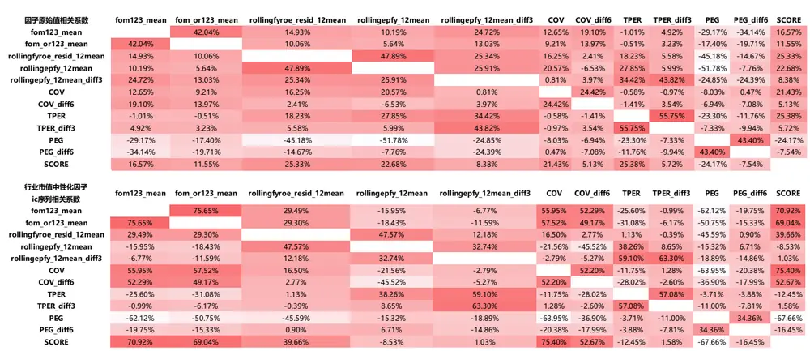
数据来源：东方证券研究所 & 朝阳永续 & Wind资讯

有关分析师的申明，见本报告最后部分。其他重要信息披露见分析师申明之后部分，或请与您的投资代表联系。并请阅读本证券研究报告最后一页的免责申明。

下图展示了这 12 个单因子在全市场中的绩效表现。所有单因子的 IC 绝对值超过 1%，ICIR绝对值超过 1，多空组合年化收益均在 10%以上，多头年化收益均在 4%以上。

图 37：DFQ 分析师类单因子绩效（全市场，20091231-20230207）

| 全市场 | 回归法填充缺失值 行业市值中性 | fom 123_mean | fom_or 123_mean | rollingfyroe_resid _12mean | rollingepfy _12mean | rollingepfy _12mean | COV | COV _diff6 | TPER | TPER _diff3 | PEG | PEG _diff6 | SCORE |  |
| --- | --- | --- | --- | --- | --- | --- | --- | --- | --- | --- | --- | --- | --- | --- |
|  |  |  |  |  |  |  |  |  |  |  |  |  |  | _diff3 |
| IC | 均值 | 2.80% | 1.96% | 2.79% | 4.19% | 4.20% | 4.10% | 1.75% | 2.54% | 2.93% | -2.89% | -3.10% | 2.05% |  |
|  | IC_IR | 210.36% | 169.18% | 217.40% | 201.28% | 261.74% | 152.03% | 132.46% | 150.91% | 183.20% |  | -171.50%-190.67% | 115.92% |  |
|  | tstat | 763.32% | 613.90% | 788.85% | 730.36% | 949.75% | 551.64% | 480.65% | 547.58% | 664.74% | -622.29% | -691.85% | 420.62% |  |
|  | 月均收益 | 1.15% | 0.85% | 0.89% | 1.36% | 1.58% | 1.44% | 0.84% | 1.04% | 1.12% | 1.05% | 1.07% | 0.85% |  |
| 多空组合 (top10%- bottom10%) | 胜率 | 79.75% | 77.22% | 70.25% | 68.99% | 78.48% | 72.15% | 66.46% | 68.99% | 72.78% | 77.22% | 77.22% | 68.35% |  |
|  | 年化夏普比 | 227.46% | 234.63% | 196.54% | 150.16% | 237.84% | 165.67% | 146.03% | 156.80% | 181.22% | 234.55% | 245.70% | 184.66% |  |
|  | 最大回撤 | -5.65% | -5.09% | -4.19% | -17.22% | -7.48% | -13.69% | -8.03% | -9.29% | -7.96% | -4.56% | -3.26% | -6.38% |  |
|  | 年化收益 | 14.47% | 10.47% | 10.94% | 16.88% | 20.22% | 17.95% | 10.19% | 12.79% | 13.85% | 13.11% | 13.41% | 10.45% |  |
|  | 月均收益 | 0.69% | 0.44% | 0.36% | 0.53% | 0.67% | 0.43% | 0.39% | 0.48% | 0.49% | 0.45% | 0.51% | 0.43% |  |
|  | 胜率 | 73.42% | 60.76% | 63.29% | 60.13% | 71.52% | 58.23% | 60.76% | 60.76% | 62.03% | 65.19% | 63.29% | 61.39% |  |
| 多头组合 (top10%- bench) 空头组合 | 年化夏普比 | 165.12% | 120.17% | 89.32% | 73.41% | 140.71% | 74.44% | 86.07% | 110.58% | 97.98% | 119.23% | 130.71% | 146.94% |  |
|  | 最大回撤 | -6.86% | -7.05% | -8.19% | -11.74% | -7.18% | -17.75% | -15.07% | -11.27% | -13.97% | -14.16% | -8.87% | -4.48% |  |
|  | 年化收益 | 8.46% | 5.29% | 4.21% | 6.10% | 8.17% | 5.03% | 4.64% | 5.69% | 5.80% | 5.41% | 6.17% | 5.17% |  |
|  | 月均收益 | -0.46% | -0.41% | -0.53% | -0.84% | -0.91% | -1.01% | -0.44% | -0.56% | -0.63% | -0.60% | -0.56% | -0.42% |  |
|  | 胜率 | 28.48% | 29.75% | 34.81% | 24.05% | 29.11% | 19.62% | 33.54% | 35.44% | 37.34% | 30.38% | 31.65% | 32.28% |  |
| ( bottom10%- bench) | 年化夏普比 | -168.02% | -156.47% | -129.30% | -162.41% | -176.39% | -245.08% | -133.33% | -115.09% | -127.12% | -164.62% | -133.29% | -141.37% |  |
|  | 最大回撤 | -52.60% | -49.03% | -57.67% | -74.53% | -76.92% | -80.11% | -50.92% | -60.02% | -63.83% | -62.27% | -59.72% | -50.02% |  |
|  | 年化收益 | -5.41% | -4.77% | -6.26% | -9.71% | -10.47% | -11.47% | -5.23% | -6.68% | -7.39% | -7.00% | -6.59% | -4.96% |  |

数据来源：东方证券研究所 & 朝阳永续 & Wind资讯

图 38：DFQ 分析师类单因子多空净值（全市场，20091231-20230207）
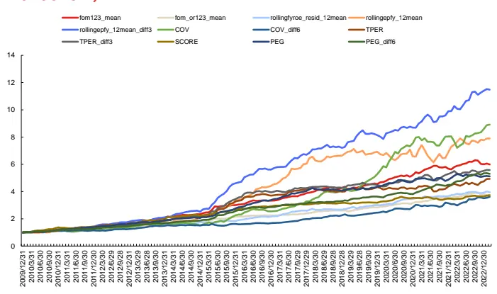
数据来源：东方证券研究所&朝阳永续&Wind 资讯

图 39：DFQ 分析师类单因子多头净值（全市场，20091231-20230207）
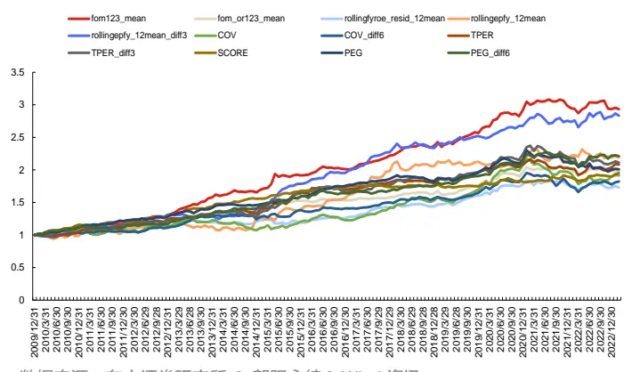
数据来源：东方证券研究所&朝阳永续& Wind资讯

图 40：DFQ 分析师类单因子分组年化超额收益（20091231-20230112）

| 多空组合年化收益 | 1(低) | 2 | 3 | 4 | 5 | 6 | 7 | 8 | 9 | 10(高) |
| --- | --- | --- | --- | --- | --- | --- | --- | --- | --- | --- |
| COV | -11.47% | -5.49% | -1.48% | -0.04% | 1.31% | 1.58% | 2.78% | 2.69% | 5.34% | 5.03% |
| COV_diff6 | -5.23% | -3.67% | -2.04% | -2.23% | 1.34% | 2.49% | 0.83% | 1.34% | 2.11% | 4.64% |
| PEG | 5.41% | 5.85% | 2.99% | -0.46% | -1.37% | -2.24% | -0.60% | 0.65% | -3.82% | -7.00% |
| PEG_diff6 | 6.17% | 6.12% | 3.54% | 1.75% | -2.36% | -2.50% | -1.89% | -1.43% | -3.46% | -6.59% |
| SCORE | -4.96% | -2.12% | -0.86% | -0.46% | 0.89% | -1.40% | -0.54% | 0.97% | 2.34% | 5.17% |
| TPER | -6.68% | -2.23% | -1.21% | -0.32% | 0.63% | -2.03% | 0.09% | 2.61% | 2.50% | 5.69% |
| TPER_diff3 | -7.39% | -2.58% | -2.20% | -1.52% | -1.38% | 0.13% | 2.98% | 2.88% | 2.37% | 5.80% |
| fom123_mean | -5.41% | -5.09% | -3.46% | -0.96% | 0.87% | 1.13% | -0.47% | 0.79% | 3.81% | 8.46% |
| fom_or123_mean | -4.77% | -3.39% | -1.90% | 1.61% | 0.13% | -0.18% | 0.74% | -0.22% | 1.93% | 5.29% |
| rollingepfy_12mean | -9.71% | -3.73% | -1.02% | 0.30% | -1.06% | -0.31% | 0.78% | 3.07% | 4.77% | 6.10% |
| rollingepfy_12mean_diff3 | -10.47% | -4.07% | -0.54% | -0.89% | -1.75% | 0.49% | 0.37% | 2.65% | 5.80% | 8.17% |
| rollingfyroe_resid_12mean | -6.26% | -2.33% | -1.15% | -0.56% | 0.50% | -1.05% | 0.31% | 2.07% | 3.33% | 4.21% |

数据来源：东方证券研究所 & 朝阳永续 & Wind资讯

有关分析师的申明，见本报告最后部分。其他重要信息披露见分析师申明之后部分，或请与您的投资代表联系。并请阅读本证券研究报告最后一页的免责申明。

我们将这12个因子等权，构造DFQ分析师类合成因子，并与原始的六因子进行对比。可以看到，改进效果较明显：在全市场中（1）改进后的分析师合成因子 IC 由 5.93%提升到 6.45%，ICIR由 3.21提升到 3.92。（2）多空组合收益和稳定性明显提升。年化收益达到 29%，提升 7%，最大回撤明显降低，仅为3.67%，年化夏普比达到3.6，月度胜率达到85%。2010-2022这13年中，每年的多空收益均有提升。（3）多头组合收益和稳定性明显提升。年化收益达到 14%，提升 5%，最大回撤明显降低，仅为 5.5%，年化夏普比达到 2.6，月度胜率达到 77%。

图 41：DFQ 分析师类合成因子绩效（全市场，20091231-20230207）

| 全市场 | 回归法填充缺失值 行业市值中性 | 原始六因子等权 | 改进12因子等权 |
| --- | --- | --- | --- |
| IC | 均值 | 5.93% | 6.45% |
|  | IC_IR | 3.21 | 3.92 |
| 多空组合 (top10%-bottom10%) | tstat 月均收益 | 11.65 1.68% | 14.21 2.17% |
|  | 胜率 | 79.11% | 85.44% |
|  | 年化夏普比 | 2.75 | 3.60 |
|  | 最大回撤 | -6.25% | -3.67% |
| 多头组合 (top10%-bench) | 年化收益 月均收益 | 21.73% 0.79% | 28.84% 1.14% |
|  | 胜率 | 71.52% | 76.58% |
|  | 年化夏普比 | 1.84 |  |
|  | 最大回撤 | -8.22% | 2.62 -5.50% |
| 空头组合 | 年化收益 月均收益 | 9.75% -0.89% | 14.32% |
|  | 胜率 |  | -1.03% |
|  |  | 25.32% | 15.19% |
|  | 年化夏普比 | (2.29) | (3.19) |
| (bottom10%-bench) | 最大回撤 | -76.10% | -80.70% |
|  | 年化收益 | -10.22% | -11.68% |

多空组合分年收益
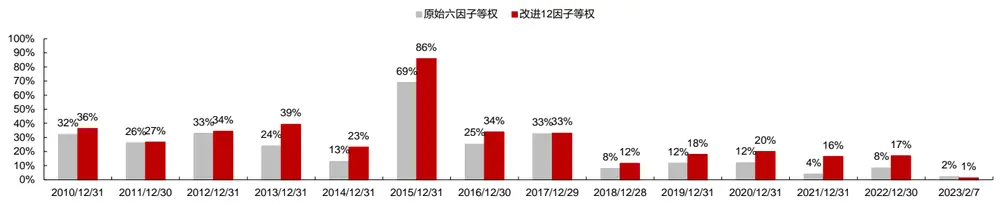
数据来源：东方证券研究所 & 朝阳永续 & Wind资讯

图 42：DFQ 分析师类合成因子多空净值&回撤（全市场，20091231-20230207）
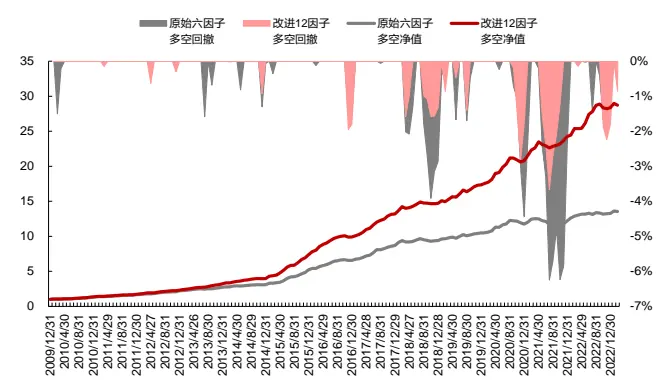
数据来源：东方证券研究所 & 朝阳永续 & Wind资讯

图 43：DFQ 分析师类合成因子多头净值&回撤（全市场，20091231-20230207）
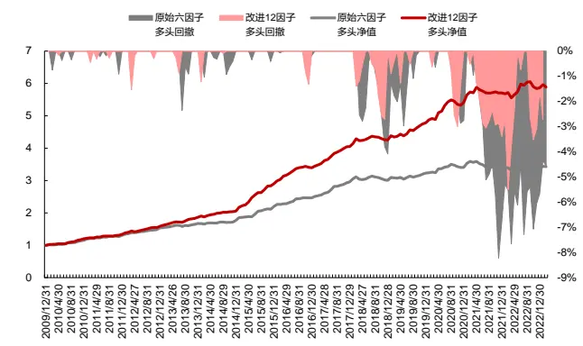
数据来源：东方证券研究所 & 朝阳永续 & Wind资讯
有关分析师的申明，见本报告最后部分。其他重要信息披露见分析师申明之后部分，或请与您的投资代表联系。并请阅读本证券研究报告最后一页的免责申明。

那么这些分析师类 alpha 因子超额收益的信息来源是否独立于现有的 alpha 因子，剔除其他因子之后，是否还有超额收益。从大类因子间的相关性来看，分析师类 alpha 因子与其他大类因子相关性都很低。因子原始值相关系数基本都在20%以下，行业市值中性化因子的IC序列相关系数略高，但也在 50%以下。

图 44：DFQ分析师类选股因子与其他大类因子间的相关性（20091231-20230207）

| 因子原始值 相关系数 | DFQ分析师 | 估值 | 盈利 | 成长 | 公司运营 | 非流动性 | 投机 |
| --- | --- | --- | --- | --- | --- | --- | --- |
| DFQ分析师 |  | 19.01% | 19.36% | 20.35% | 11.47% | -2.52% | 8.60% |
| 估值 | 19.01% |  | 23.71% | -4.44% | 20.30% | 17.69% | 17.21% |
| 盈利 | 19.36% | 23.71% |  | 16.78% | 23.85% | -7.27% | -4.54% |
| 成长 | 20.35% | -4.44% | 16.78% |  | 0.79% | -7.40% | -11.55% |
| 公司运营 | 11.47% | 20.30% | 23.85% | 0.79% |  | -5.40% | 0.73% |
| 非流动性 | -2.52% | 17.69% | -7.27% | -7.40% | -5.40% |  | 23.76% |
| 投机 | 8.60% | 17.21% | -4.54% | -11.55% | 0.73% | 23.76% |  |

数据来源：东方证券研究所 & 朝阳永续 & Wind资讯

| 行业市值中性化因子 ic序列相关系数 | DFQ分析师 | 估值 | 盈利 | 成长 | 公司运营 | 非流动性 | 投机 |
| --- | --- | --- | --- | --- | --- | --- | --- |
| DFQ分析师 |  | -0.23% | 47.91% | 47.11% | 21.94% | 3.19% | 16.51% |
| 估值 | -0.23% |  | -25.64% | -34.66% | 44.97% | 43.27% | 39.61% |
| 盈利 | 47.91% | -25.64% |  | 60.73% | 11.23% | -8.03% | -15.83% |
| 成长 | 47.11% | -34.66% | 60.73% |  | -14.76% | -3.35% | -33.04% |
| 公司运营 | 21.94% | 44.97% | 11.23% | -14.76% |  | 17.03% | 33.66% |
| 非流动性 | 3.19% | 43.27% | -8.03% | -3.35% | 17.03% |  | 21.32% |
| 投机 | 16.51% | 39.61% | -15.83% | -33.04% | 33.66% | 21.32% |  |

从大类因子表现来看，DFQ 分析师大类在全市场中的 IC 表现仅次于非流动性和投机，ICIR最高，多空组合和多头组合表现也是最佳的。DFQ分析师大类对其他大类因子正交化后，残差因子依然具有显著的选股效果。

图 45：DFQ分析师类选股因子与其他大类因子的绩效表现（20091231-20230207）

| 全市场 回归法填充缺失值 DFQ分析师对其他大类 |  |  |  | 估值 | 盈利 | 成长 | 公司运营 | 非流动性 | 投机 |
| --- | --- | --- | --- | --- | --- | --- | --- | --- | --- |
|  | 行业市值中性 | 正交化 | DFQ分析师 |  |  |  |  |  |  |
| IC | 均值 | 3.21% | 6.45% | 4.81% | 3.17% | 4.20% | 2.19% | 7.66% | 8.98% |
|  | IC_IR | 257.96% | 391.59% | 217.75% | 137.12% | 266.70% | 260.64% | 266.77% | 348.88% |
|  | tstat | 936.04% | 1420.90% | 790.12% | 497.56% | 967.74% | 945.77% | 968.01% | 1265.94% |
|  | 月均收益 | 1.46% | 2.17% | 0.91% | 0.76% | 1.41% | 0.50% | 2.13% | 2.12% |
| 多空组合 (top10%- bottom10%) | 胜率 | 77.85% | 85.44% | 62.03% | 60.76% | 74.05% | 67.09% | 72.78% | 77.85% |
|  | 年化夏普比 | 290.52% | 360.14% | 93.20% | 98.34% | 207.04% | 130.35% | 208.16% | 210.34% |
|  | 最大回撤 | -4.19% | -3.67% | -22.78% | -20.48% | -10.14% | -7.70% | -9.68% | -10.97% |
|  | 年化收益 | 18.61% | 28.84% | 10.68% | 8.98% | 17.85% | 6.03% | 27.66% | 27.61% |
|  | 月均收益 | 0.71% | 1.14% | 0.31% | 0.15% | 0.88% | 0.15% | 0.52% | 0.58% |
| 多头组合 (top10%- bench) 空头组合 | 胜率 | 69.62% | 76.58% | 53.80% | 51.27% | 71.52% | 56.33% | 64.56% | 62.66% |
|  | 年化夏普比 | 176.10% | 261.81% | 40.27% | 30.44% | 196.60% | 49.62% | 114.08% | 124.40% |
|  | 最大回撤 | -8.01% | -5.50% | -15.23% | -21.69% | -8.25% | -11.87% | -6.17% | -4.58% |
|  | 年化收益 | 8.71% | 14.32% | 3.30% | 1.67% | 10.90% | 1.70% | 6.18% | 7.00% |
|  | 月均收益 | -0.74% | -1.03% | -0.60% | -0.60% | -0.53% | -0.35% | -1.61% | -1.54% |
|  | 胜率 | 20.89% | 15.19% | 32.28% | 32.28% | 26.58% | 33.54% | 21.52% | 22.78% |
| (bottom10%- bench) | 年化夏普比 | -253.86% | -318.85% | -107.54% | -152.79% | -157.89% | -151.31% | -242.81% | -222.34% |
|  | 最大回撤 | -69.76% | -80.70% | -64.01% | -62.20% | -57.82% | -44.34% | -92.67% | -91.97% |
|  | 年化收益 | -8.58% | -11.68% | -7.18% | -7.08% | -6.23% | -4.19% | -17.90% | -17.22% |

数据来源：东方证券研究所 & 朝阳永续 & Wind资讯

图 46：DFQ 分析师类合成因子多空净值（全市场，20091231-20230207）
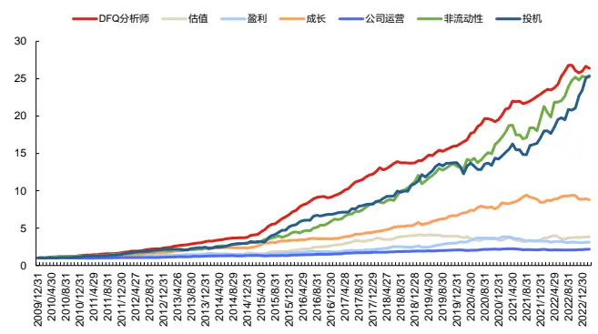
数据来源：东方证券研究所 & 朝阳永续 & Wind资讯

图 47：DFQ 分析师类合成因子多头净值（全市场，20091231-20230207）
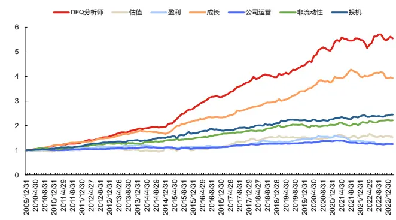
数据来源：东方证券研究所 & 朝阳永续 & Wind资讯
有关分析师的申明，见本报告最后部分。其他重要信息披露见分析师申明之后部分，或请与您的投资代表联系。并请阅读本证券研究报告最后一页的免责申明。

在中证 800 成分股中：（1）改进后的分析师合成因子 IC 由 5.25%提升到 5.84%，ICIR 由2.21 提升到 2.61。（2）多空组合收益和稳定性明显提升。年化收益达到 23.5%，提升 7%，最大回撤明显降低，仅为7.15%，年化夏普比达到2.6，月度胜率达到78%。（3）多头组合收益和稳定性明显提升。年化收益达到 10.79%，提升 3%，最大回撤明显降低，仅为 4%，年化夏普比达到 1.8，月度胜率达到 68%。

多空组合分年收益
图 48：DFQ 分析师类合成因子绩效（中证 800，20091231-20230207）

| 中证800成分股 | 回归法填充缺失值 行业市值中性 | 原始六因子等权 | 改进12因子等权 |
| --- | --- | --- | --- |
| IC | 均值 | 5.25% | 5.84% |
|  | IC_IR tstat | 2.21 8.04 | 2.61 9.46 |
| 多空组合 (top10%-bottom10%) | 月均收益 | 1.31% | 1.81% |
|  | 胜率 | 72.78% | 78.48% |
|  | 年化夏普比 | 1.80 | 2.57 |
|  | 最大回撤 年化收益 | -13.86% | -7.15% |
| 多头组合 (top10%-bench) | 月均收益 | 16.40% 0.64% | 23.49% 0.88% |
|  | 胜率 | 62.03% | 67.72% |
|  | 年化夏普比 | 1.20 | 1.84 |
|  | 最大回撤 年化收益 | -11.52% | -4.04% |
| 空头组合 (bottom10%-bench) | 月均收益 | 7.68% -0.67% | 10.79% -0.94% |
|  | 胜率 | 31.65% | 24.05% |
|  | 年化夏普比 | (1.53) | (2.48) |
|  | 最大回撤 年化收益 | -67.38% -7.87% | -78.19% |

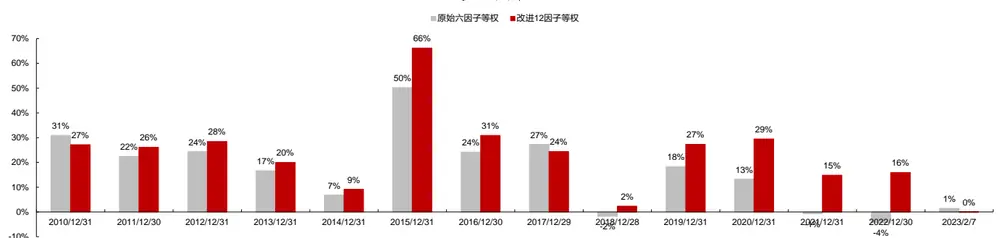
数据来源：东方证券研究所 & 朝阳永续 & Wind资讯

图 49：DFQ 分析师类合成因子多空净值&回撤（中证 800，20091231-20230207）
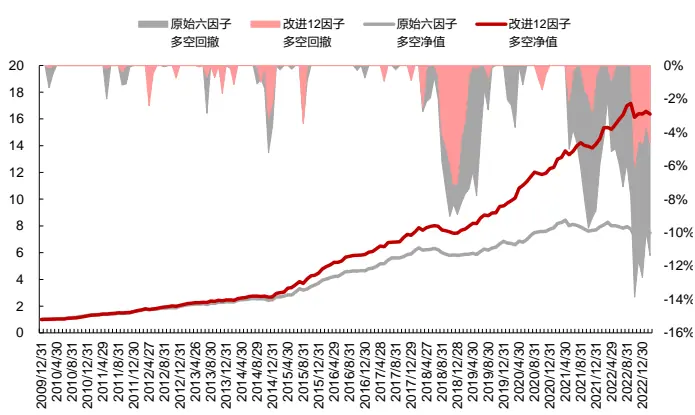
数据来源：东方证券研究所 & 朝阳永续 & Wind资讯

图 50：DFQ 分析师类合成因子多头净值&回撤（中证 800，20091231-20230207）
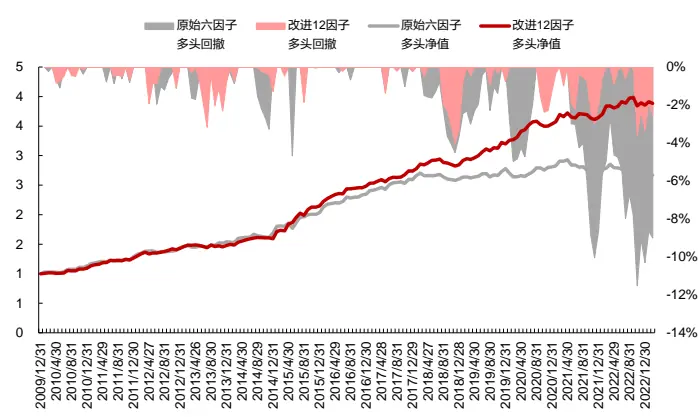
数据来源：东方证券研究所 & 朝阳永续 & Wind资讯
有关分析师的申明，见本报告最后部分。其他重要信息披露见分析师申明之后部分，或请与您的投资代表联系。并请阅读本证券研究报告最后一页的免责申明。

在中证 1000 成分股中：（1）改进后的分析师合成因子 IC 由 6.51%提升到 7.42%，ICIR 由3 提升到 4。（2）多空组合收益和稳定性明显提升。年化收益达到 32%，提升 7%，最大回撤明显降低，仅为 7.36%，年化夏普比达到 3.18，月度胜率达到 84%。（3）多头组合收益和稳定性明显提升。年化收益达到 17%，提升 3%，最大回撤明显降低，仅为 4%，年化夏普比达到 2.5，月度胜率达到 77%。

图 51：DFQ 分析师类合成因子绩效（中证 1000，20091231-20230207）

| 中证1000成分股 | 回归法填充缺失值 行业市值中性 | 原始六因子等权 | 改进12因子等权 |
| --- | --- | --- | --- |
| IC | 均值 | 6.51% | 7.42% |
|  | IC_IR | 3.07 | 4.04 |
|  | tstat | 11.15 | 14.64 |
| 多空组合 (top10%-bottom10%) | 月均收益 胜率 | 1.90% 78.48% | 2.37% |
|  | 年化夏普比 |  | 83.54% |
|  | 最大回撤 | 2.43 | 3.18 |
|  | 年化收益 | -11.94% 24.61% | -7.36% |
| 多头组合 (top10%-bench) | 月均收益 | 1.08% | 31.79% 1.34% |
|  | 胜率 | 73.42% | 76.58% |
|  | 年化夏普比 | 2.17 | 2.48 |
|  | 最大回撤 | -7.56% | -4.16% |
|  | 年化收益 | 13.52% | 16.95% |
| 空头组合 | 月均收益 | -0.81% | -1.04% |
|  | 胜率 | 25.95% | 25.32% |
|  | 年化夏普比 | (1.79) | (2.34) |
|  | 最大回撤 | -73.68% | -81.24% |
| (bottom10%-bench) | 年化收益 | -9.42% | -11.80% |

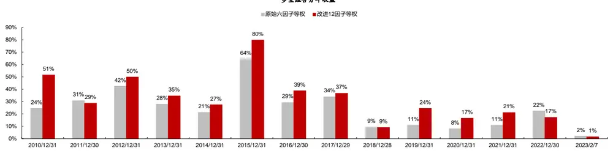
数据来源：东方证券研究所 & 朝阳永续 & Wind资讯

图 52：DFQ 分析师类合成因子多空净值&回撤（中证 1000，20091231-20230207）
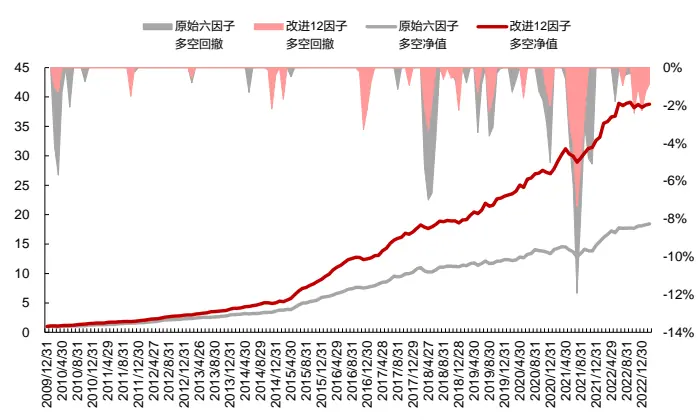
数据来源：东方证券研究所 & 朝阳永续 & Wind资讯

图 53：DFQ 分析师类合成因子多头净值&回撤（中证 1000，20091231-20230207）
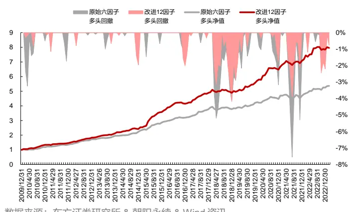
数据来源：东方证券研究所 & 朝阳永续 & Wind资讯
有关分析师的申明，见本报告最后部分。其他重要信息披露见分析师申明之后部分，或请与您的投资代表联系。并请阅读本证券研究报告最后一页的免责申明。

## 五、 指数增强组合增效

为了考察分析师因子改进前后对增强组合的边际贡献，我们比较了沪深 300 和中证 500 指数增强组合的表现。关于指数增强有如下技术细节需要说明：

（1）银行和非银单独建模，具体请参见因子专题报告《细分行业建模值银行内因子研究》和《细分行业建模值券商内因子研究》。

（2）含分析师大类的7个大类因子构建多因子模型，大类内部等权，大类间按照机构持股比例加权。

（3）行业因子相对暴露不超过 2%，市值因子相对暴露不超过 20%，厌恶系数取30。

（4）风险模型采用 DFQ2020 风险模型（具体内容参见报告：东方 A 股因子风险模型——DFQ-2020）

（5）测试区间：2009 年 12 月 31 日至 2023 年 2 月 7 日。

（6）组合月度调仓，假设以信号次日 vwap 交易。买卖手续费双边千三，停牌和涨停不能买入，停牌和跌停不能卖出。

图 54：DFQ alpha 模型

| 大类 | 因子简称 | 因子定义 | 因子符号 机构持股占比>=5%权重 |  | 机构持股占比<5%权重 |
| --- | --- | --- | --- | --- | --- |
| 估值 | BP EP2 | 账面市值比 扣非后的净利润TTM/总市值 | 1 | 0.000 | 0.167 |
|  |  |  | 1 1 |  |  |
|  | CFP | 经营性现金流TTM/总市值 |  |  |  |
|  | EBIT2EV | 息税前利润与企业价值之比 | 1 |  |  |
|  |  | 投资现金收益率 | 1 |  |  |
| 盈利 | RNOA | 净经营资产收益率 | 1 |  |  |
|  | ROE | 净资产收益率 | 1 |  |  |
|  | GPOA |  |  |  |  |
| 成长 | SUEO | 基于带漂移项随机游走模型计算的预期外的净利润，详见《业绩超预期类因子》 | 1 | 0.333 | 0.167 |
|  | SUE1 SURO | 基于不带漂移项随机游走模型计算的预期外的净利润，详见《业绩超预期类因子》 | 1 |  |  |
|  |  | 基于带漂移项随机游走模型计算的预期外的营业收入，详见《业绩超预期类因子》 | 1 |  |  |
|  | SUR1 | 基于不带漂移项随机游走模型计算的预期外的营业收入，详见《业绩超预期类因子》 | 1 |  |  |
|  | 运营 | MR | 高管薪酬前三之和的对数 | 1 | 0.000 |
| 流动性 | TO60 LNAMIHUD20 | 过去60个交易日的日均换手率对数 20日Amihud非流动性自然对数 | -1 1 | 0.167 | 0.167 |
| 动量 | mom_20d_180d | 过去180个交易日的收益率，剔除最近20日收益 | 1 | 0.167 | 0.000 |
|  | mom_60d_240d | 过去240个交易日的收益率，剔除最近60日收益 | 1 |  |  |
| 分析师 | fom123_mean | 分析师预测净利润上调的概率，取sqrt(1+x),FY1,FY2,FY3对应因子取均值 | 1 |  |  |
|  | fom_or123_mean | 分析师预测营业收入上调的概率，取sqrt(1+x)，FY1,FY2,FY3对应因子取均值 | 1 |  |  |
|  | rollingfyroe resid 12mean | 分析师滚动一致预期ROE残差，FY1,FY2对应因子取均值 |  |  |  |
|  | rollingepfy_12mean |  | 1 |  |  |
|  | rollingepfy_12mean_diff3 | 分析师滚动一致预期EP估值，FY1,FY2对应因子取均值 | 1 |  |  |
|  | COV | rollingepfy_12mean相对三个月以前因子值的变化 过去6个月有覆盖的机构数量，取根号 | 1 |  |  |
|  | COV_diff6 | COV相对六个月以前因子值的变化 | 1 1 |  |  |
|  | TPER | 目标价隐含的收益率 | 1 |  |  |
|  | TPER_diff3 | TPER相对三个月以前因子值的变化 | 1 |  |  |
|  | PEG |  | -1 |  |  |
|  |  | PE_FY1/FY2隐含的利润增量率 |  |  |  |
|  | PEG相对六个月以前因子值的变化 |  |  |  |  |
| PEG_diff6 SCORE |  |  |  |  |  |

数据来源：东方证券研究所

分析师因子改进前后，沪深 300 对冲组合年化收益由原来的 10.79%提高到 11.16%，提升0.4%，跟踪误差、最大回撤几乎没有变化。中证 500 对冲组合改进较明显，年化收益由原来的15.33%提高到 17.44%，提升 2.11%，跟踪误差略有上升、最大回撤有所下降。

图 55：沪深 300 全市场增强组合表现（20091231-20230207）

| 机构持仓分域 行业市值适当暴露 买卖手续费双边千三 | 常规组合 | 新组合 |
| --- | --- | --- |
| 信息比（年化） | 2.87 | 2.93 |
| 年化对冲收益 | 10.79% | 11.16% |
| 对冲收益最大回撤 | -5.21% | -5.34% |
| 对冲收益最大回撤出现时间点 | 20210107 | 20210107 |
| 跟踪误差（年化） | 3.59% | 3.63% |
| 单边换手率（年） | 3.16 | 3.37 |
| 持股数量 | 80.43 | 80.24 |
| 成分内股票占比 | 73.06% | 73.01% |

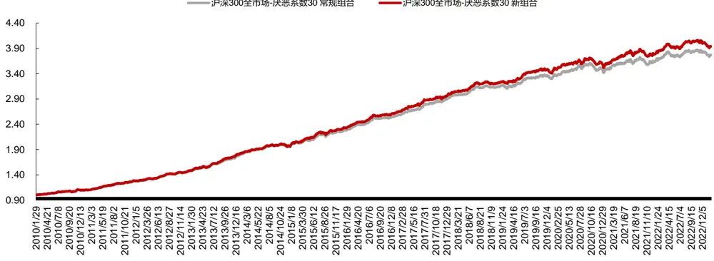

增强组合分年收益
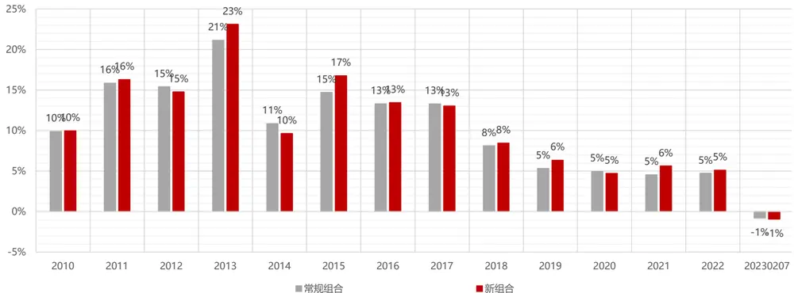
数据来源：东方证券研究所 & 朝阳永续 & Wind 资讯

有关分析师的申明，见本报告最后部分。其他重要信息披露见分析师申明之后部分，或请与您的投资代表联系。并请阅读本证券研究报告最后一页的免责申明。

图 56：中证 500 全市场增强组合表现（20091231-20230207）

| 机构持仓分域 行业市值适当暴露 买卖手续费双边千三 | 常规组合 | 新组合 |
| --- | --- | --- |
| 信息比（年化） | 2.59 | 2.64 |
| 年化对冲收益 | 15.33% | 17.44% |
| 对冲收益最大回撤 | -9.34% | -8.42% |
| 对冲收益最大回撤出现时间点 | 20211224 | 20211224 |
| 跟踪误差（年化） | 5.58% | 6.16% |
| 单边换手率（年） | 4.52 | 4.84 |
| 持股数量 | 121.88 | 121.61 |
| 成分内股票占比 | 31.30% | 31.25% |

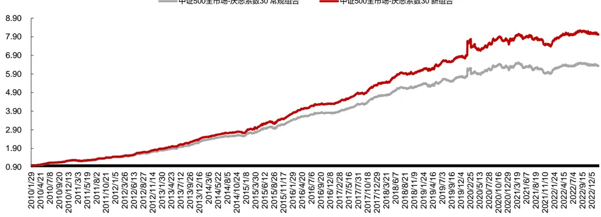

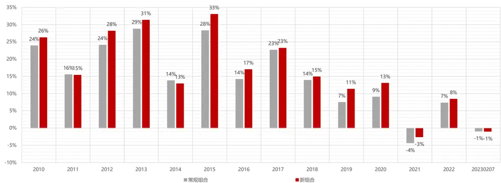
数据来源：东方证券研究所 & 朝阳永续 & Wind 资讯

有关分析师的申明，见本报告最后部分。其他重要信息披露见分析师申明之后部分，或请与您的投资代表联系。并请阅读本证券研究报告最后一页的免责申明。

## 六、 总结

分析师预测净利润的准确度并不高。分析师预期数据的价值主要体现在其时间序列上的动态变化和横截面上的相对差异。

分析师预期调整指标有三种构造方式，其中FOM因子效果最好。全市场中性化IC为2.8%，ICIR超过2。多空组合年化收益12%。FOM因子剔除WFR和CFR因子后仍有显著的选股效果，WFR和 CFR因子剔除FOM因子后便失去了选股效力。

预测年度切换时间对于预期调整因子表现影响并不大，FOM 因子在 4 月底切换效果更佳。分析师对不同年度的盈利预测调整都包含了有效信息。我们构造了 FOM_123mean 因子，将FOM_FY1，FOM_FY2，FOM_FY3 三因子非空部分取均值，综合衡量分析师对未来三个年度的盈利预测调整情况。FOM_123mean 因子多空组合表现优于单因子，全市场中性化 IC 为 2.8%，ICIR为超过 2，多空组合年化收益 15%。

分析师对净利润和营收的预期调整中包含的信息不同。根据营收字段计算的 FOM_or因子也有效。对基于净利润的 FOM 因子正交化后，残差因子依然有效。FOM_or_123mean 因子多空组合表现优于单因子，全市场中性化因子 IC为 2%，ICIR为 1.7，多空组合年化收益 11%。

分析师一致预期的股票盈利能力也可以用横截面模型来进行解释，模型残差即为分析师预期残差因子。分析师基于当前获得的股票信息，作出盈利预测判断。盈利预测中能够被已知股票数据解释的部分，可能已经反映在股价中，盈利预测中不能被已知股票数据解释的部分，才是分析师盈利预测的核心增量，也是分析师个人综合判断能力的体现。全市场中性化的滚动FYROE_resid_12mean 因子 IC 为 3%，ICIR 为 2.3，多空组合年化收益 11 %。

分析师预期估值滚动 EP_FY_12mean 因子，表现优于单因子。全市场中性化因子 IC 为4.2%，ICIR为2，多空组合年化收益 17%。滚动 EP_FY_12mean剔除当前估值 EP_TTM因子后仍然有很强的选股效果，说明分析师一致预期净利润的相对大小提供了额外的有用信息。

本文最终确定了 12个单因子，构成我们的分析师类选股因子库。在全市场中：（1）改进后的分析师合成因子 IC 由 5.93%提升到 6.45%，ICIR 由 3.21 提升到 3.92。（2）多空组合收益和稳定性明显提升。年化收益达到 29%，提升 7%，最大回撤明显降低，仅为 3.7%，年化夏普比达到 3.6，月度胜率达到 85%。2010-2022 这 13 年中，每年的多空收益均有提升。（3）多头组合收益和稳定性明显提升。年化收益达到 14%，提升5%，最大回撤明显降低，仅为 5%。

分析师因子改进前后，中证 500 对冲组合改进较明显，年化收益由原来的 15.33%提高到17.44%，提升 2.11%，跟踪误差略有上升、最大回撤有所下降。

## 风险提示

1. 量化模型基于历史数据分析，未来存在失效风险，建议投资者紧密跟踪模型表现。

2. 极端市场环境可能对模型效果造成剧烈冲击，导致收益亏损。

## Tabl e_Disclai mer 分析师申明

每位负责撰写本研究报告全部或部分内容的研究分析师在此作以下声明：

分析师在本报告中对所提及的证券或发行人发表的任何建议和观点均准确地反映了其个人对该证券或发行人的看法和判断；分析师薪酬的任何组成部分无论是在过去、现在及将来，均与其在本研究报告中所表述的具体建议或观点无任何直接或间接的关系。

## 投资评级和相关定义

报告发布日后的 12个月内的公司的涨跌幅相对同期的上证指数/深证成指的涨跌幅为基准；

## 公司投资评级的量化标准

买入：相对强于市场基准指数收益率 15%以上；

增持：相对强于市场基准指数收益率 5%～15%；

中性：相对于市场基准指数收益率在-5%～+5%之间波动；

减持：相对弱于市场基准指数收益率在-5%以下。

未评级 —— 由于在报告发出之时该股票不在本公司研究覆盖范围内，分析师基于当时对该股票的研究状况，未给予投资评级相关信息。

暂停评级 —— 根据监管制度及本公司相关规定，研究报告发布之时该投资对象可能与本公司存在潜在的利益冲突情形；亦或是研究报告发布当时该股票的价值和价格分析存在重大不确定性，缺乏足够的研究依据支持分析师给出明确投资评级；分析师在上述情况下暂停对该股票给予投资评级等信息，投资者需要注意在此报告发布之前曾给予该股票的投资评级、盈利预测及目标价格等信息不再有效。

## 行业投资评级的量化标准：

看好：相对强于市场基准指数收益率 5%以上；

中性：相对于市场基准指数收益率在-5%～+5%之间波动；

看淡：相对于市场基准指数收益率在-5%以下。

未评级：由于在报告发出之时该行业不在本公司研究覆盖范围内，分析师基于当时对该行业的研究状况，未给予投资评级等相关信息。

暂停评级：由于研究报告发布当时该行业的投资价值分析存在重大不确定性，缺乏足够的研究依据支持分析师给出明确行业投资评级；分析师在上述情况下暂停对该行业给予投资评级信息，投资者需要注意在此报告发布之前曾给予该行业的投资评级信息不再有效。

## HeadertTabl e_Discl ai mer 免责声明

本证券研究报告（以下简称“本报告”）由东方证券股份有限公司（以下简称“本公司”）制作及发布。

。本公司不会因接收人收到本报告而视其为本公司的当然客户。本报告的全体接收人应当采取必要措施防止本报告被转发给他人。

本报告是基于本公司认为可靠的且目前已公开的信息撰写，本公司力求但不保证该信息的准确性和完整性，客户也不应该认为该信息是准确和完整的。同时，本公司不保证文中观点或陈述不会发生任何变更，在不同时期，本公司可发出与本报告所载资料、意见及推测不一致的证券研究报告。本公司会适时更新我们的研究，但可能会因某些规定而无法做到。除了一些定期出版的证券研究报告之外，绝大多数证券研究报告是在分析师认为适当的时候不定期地发布。

在任何情况下，本报告中的信息或所表述的意见并不构成对任何人的投资建议，也没有考虑到个别客户特殊的投资目标、财务状况或需求。客户应考虑本报告中的任何意见或建议是否符合其特定状况，若有必要应寻求专家意见。本报告所载的资料、工具、意见及推测只提供给客户作参考之用，并非作为或被视为出售或购买证券或其他投资标的的邀请或向人作出邀请。

本报告中提及的投资价格和价值以及这些投资带来的收入可能会波动。过去的表现并不代表未来的表现，未来的回报也无法保证，投资者可能会损失本金。外汇汇率波动有可能对某些投资的价值或价格或来自这一投资的收入产生不良影响。那些涉及期货、期权及其它衍生工具的交易，因其包括重大的市场风险，因此并不适合所有投资者。

在任何情况下，本公司不对任何人因使用本报告中的任何内容所引致的任何损失负任何责任，投资者自主作出投资决策并自行承担投资风险，任何形式的分享证券投资收益或者分担证券投资损失的书面或口头承诺均为无效。

本报告主要以电子版形式分发，间或也会辅以印刷品形式分发，所有报告版权均归本公司所有。未经本公司事先书面协议授权，任何机构或个人不得以任何形式复制、转发或公开传播本报告的全部或部分内容。不得将报告内容作为诉讼、仲裁、传媒所引用之证明或依据，不得用于营利或用于未经允许的其它用途。

经本公司事先书面协议授权刊载或转发的，被授权机构承担相关刊载或者转发责任。不得对本报告进行任何有悖原意的引用、删节和修改。

提示客户及公众投资者慎重使用未经授权刊载或者转发的本公司证券研究报告，慎重使用公众媒体刊载的证券研究报告。

## 东方证券研究所

地址： 上海市中山南路 318 号东方国际金融广场 26 楼

电话：021-63325888

传真：021-63326786

网址： www.dfzq.com.cn