# 基于偏股型基金指数的增强方案

因子选股系列之八十八

## 研究结论

⚫ 对于885001.WI和930950.CSI两个偏股型基金指数，本报告对其进行了股票仓位的探测，并在此基础上构建了增强组合。

从编制方式来看，两个指数最大的差异在于如何对成分基金进行加权。不同于930950.CSI 按成分基金净值规模加权的方式，885001.WI 对其所有成分基金均按等权处理。由于基金规模与基金业绩的负相关关系，等权重计算的 885001.WI 收益更高且波动更低。

在确定指数的股票仓位时，我们共分两步完成，即先利用成分基金还原指数，然后再借助成分基金的股票持仓完成指数复制。对于仅用季报重仓股的方案 1 和包含最新一期中报或年报的方案 2，我们发现方案 2 的跟踪误差普遍低于方案 1，如885001.WI 模拟组合在方案 1、2 下的跟踪误差分别为 5.25%和 5.08%，930950.CSI模拟组合的跟踪误差分别为 4.14%和 3.57%。虽然两种方案都可以取得较小的跟踪误差，但模拟组合的年化收益均不及基准指数，如 885001.WI、930950.CSI 的模拟组合在方案 2下分别跑输基准指数 1.58%和 0.86%。

针对基金持仓复制指数出现的不足，我们围绕降低跟踪误差和缩小收益差距这两点进行了优化改进。具体地，我们每月底以最小化跟踪误差与组合尽量稀疏为优化目标，同时加入协方差矩阵的压缩处理，最终得到在跟踪误差和控制收益两方面均更优的组合。如 885001.WI 在 T=60、λ=0.5 下的优化组合年化跟踪误差 4.40%，年化收益仅跑输基准指数 0.05%。

最后，我们基于两类因子（基本面大类因子和量价时序因子）分别对两个指数进行了月度增强。其中，885001.WI 在基本面因子和量价因子增强组合下的年化超额收益分别为 3.8%和 7.4%（月单边换手约束为 30%，下同）、930950.CSI 在基本面因子和量价因子增强组合下的年化超额收益分别为 4.4%和 9.6%。从增强组合的分年收益来看，量价因子增强组合在 2019和 2020 年的相对收益较弱，而 2021和 2022年的相对收益较强，且近期没有衰减的迹象。

## 风险提示

⚫ 量化模型失效风险

⚫ 市场极端环境的冲击

885001.WI增强组合的超额收益表现（月度调仓，双边费率千三）

|  |  | 年化 | 2017 | 2018 | 2019 | 2020 | 2021 | 2022 | 2023 |
| --- | --- | --- | --- | --- | --- | --- | --- | --- | --- |
| delta=0.10 avgto=0.19 | 收益率 | 4.6% | -0.8% | -9.5% | 1.0% | -5.9% | 19.5% | 22.8% | 5.5% |
|  | 波动率 | 7.7% | 5.6% | 6.9% | 6.6% | 7.9% | 9.8% | 8.5% | 5.3% |
|  | 最大回撤 | -17.9% | -6.6% | -12.3% | -7.7% | -11.4% | -7.8% | -6.1% | -0.7% |
| delta=0.20 avgto=0.21 | 收益率 | 5.6% | 2.8% | -4.2% | -1.5% | -9.5% | 33.1% | 14.7% | 4.5% |
|  | 波动率 | 7.6% | 5.4% | 6.7% | 6.8% | 7.4% | 9.8% | 8.6% | 4.3% |
|  | 最大回撤 | -16.7% | -3.7% | -9.3% | -8.2% | -12.1% | -5.3% | -6.8% | -0.8% |
| delta=0.30 avgto=0.31 | 收益率 | 7.4% | 6.6% | 1.4% | -2.2% | -7.7% | 32.3% | 14.9% | 4.7% |
|  | 波动率 | 8.1% | 5.6% | 7.4% | 7.0% | 7.9% | 10.8% | 9.0% | 3.9% |
|  | 最大回撤 | -18.2% | -4.0% | -6.9% | -10.3% | -14.3% | -4.5% | -7.0% | -0.6% |
| delta=0.50 avgto=0.49 | 收益率 | 8.3% | 9.3% | -1.3% | 1.3% | -8.8% | 30.4% | 19.0% | 5.8% |
|  | 波动率 | 8.2% | 5.4% | 7.3% | 7.1% | 8.3% | 10.9% | 9.3% | 4.0% |
|  | 最大回撤 | -21.7% | -2.8% | -7.4% | -5.9% | -18.0% | -5.2% | -7.6% | -0.6% |

885001.WI增强组合走势（月单边换手约束 30%）

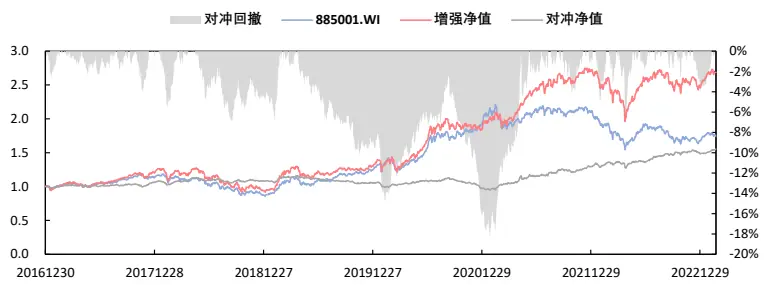

## 报告发布日期

2023 年 03 月 06 日

刘静涵

021-63325888*3211

liujinghan@orientsec.com.cn

执业证书编号：S0860520080003

香港证监会牌照：BSX840

栾张心怿 luanzhangxinyi@orientsec.com.cn

分析师研报类 alpha 增强——因子选股系 2023-02-17列之八十七

研报文本情感倾向因子——因子选股系列 2022-12-06研究之八十六

基于财报的业绩超预期度量——因子选股 2022-10-25系列之八十五

分析师覆盖度因子改进——因子选股系列 2022-08-23研究 之 八十四

## 一、基金指数简介

本文拟以偏股型基金指数作为研究的切入点，具体选取885001.WI（Wind偏股混合型基金指数）和930950.CSI（中证偏股型基金指数）作为比较基准。下面将对上述两个基金指数进行简要介绍。

## 1.1 编制方式

从编制方式来看，两个基金指数主要在样本空间和计算方式上存在差异。具体地，885001.WI 明确选取 Wind 二级分类下的偏股混合型基金为成分基金，且不同成分基金间权重相同；而 930950.CSI 则以股票投资范围下限≥ 60%的基金为成分基金，不同成分基金按净值规模加权。由于二者在加权方式的不同，等权重计算收益的 885001.WI 的业绩表现要明显优于按规模加权的 930950.CSI，相关业绩表现可参考图 3。

图 1：偏股型基金指数的编制方式

| 指数名称 | 万得偏股混合型基金指数 | 中证偏股型基金指数 |
| --- | --- | --- |
| 指数代码 | 885001.WI | 930950.CSI |
| 指数基日 | 2003/12/31 | 2007/12/31 |
| 指数基点 | 1000 | 1000 |
| 发布日期 | 2013/12/31 | 2017/4/27 |
| 发布机构 | 万得信息技术股份有限公司 | 中证指数有限公司 |
| 成分数量 | 3493 | 5452 |
| 样本空间 | (1) Wind二级分类为偏股混合型基金 (2) 基金成立满3个月 | (1) 基金合同中股票投资范围下限在60%以上 (2) 基金成立满3个月的开放式基金 |
| 计算方式 | 等权重计算 | 按基金净值规模加权 |
| 调样频率 | 不定期调整 | 定期调整(样本空间半年调整1次)+不定期调整 |

数据来源：wind，东方证券研究所
注：基金指数成分数量统计日期为 2023年 2月 24日。

## 1.2 挂钩产品

本文统计了以 885001.WI 或 930950.CSI 为主要比较基准的基金。我们采用的筛选方式为：（1）截至 2023年 2月 24日尚未到期的初始基金；（2）基金指数在比较基准中的权重≥ 50%。根据上述规则，我们最终得到了 14 只 FOF 基金（尚未有直接以两个基金指数为主要比较基准的股票型或混合型基金）。其中，以 885001.WI 为主要比较基准的基金仅有 1 只（011696.OF），该基金在 20210420-20230224 期间与 885001.WI 的年化跟踪误差约为 5.65%。

图 2：以 885001.WI 或 930950.CSI 为主要比较基准的基金（截至 20230224）

| 序号 基金代码 基金简称 |  | 成立日期 | 基金规模跟踪误差 |  | 比较基准 |
| --- | --- | --- | --- | --- | --- |
| 1 | 011696.OF 南方浩睿进取京选3个月持有A | 20210420 | 5.62亿 | 5.65% | 万得偏股混合型基金指数收益率*90%+上证国债指数收益率*10% |
| 2 | 501210.OF 交银智选星光A | 20211110 | 21.57亿 | 7.43% | 中证偏股型基金指数收益率*90%+中债综合全价指数收益率*10% |
| 3 | 015424.OF中金金选财富6个月持有A | 20220506 | 1.18亿 | 11.97% | 中证偏股型基金指数收益率*85%+中债综合(全价)指数收益率*15% |
| 4 | 501215.OF 兴证全球积极配置三年封闭运作A | 20211112 | 35.21亿 | 6.26% | 中证偏股型基金指数收益率*85%+中债综合(全价)指数收益率*15% |
| 5 | 006042.OF上投摩根尚睿A | 20180815 | 0.44亿 | 10.35% | 中证偏股型基金指数收益率*80%+中证债券型基金指数收益率*15%+活期存款利率(税后)*5% |
| 6 | 008145.OF 兴全优选进取三个月A | 20200306 | 31.51亿 | 9.15% | 中证偏股型基金指数收益率*80%+中债综合(全价)指数收益率*20% |
| 7 | 013089.OF 天弘旗舰精选3个月持有A | 20211221 | 0.06亿 | 12.64% | 中证偏股型基金指数收益率*75%+中债-新综合财富(总值)指数*20%+恒生指数收益率(使用估值汇率调整)*5% |
| 8 | 010267.OF 兴全安泰积极养老目标五年A | 20201216 | 10.08亿 | 12.20% | 中证偏股型基金指数收益率*70%+中债综合(全价)指数收益率*30% |
| 9 | 970194.OF 兴证资管金麒麟3个月A | 20220905 | 1.37亿 | 9.52% | 中证偏股型基金指数收益率*70%+中债-综合全价(总值)指数收益率*25%+银行活期存款利率(税后)*5% |
| 10 | 008754.OF泰康睿福优选配置3个月持有期(FOF)A 20200413 |  | 0.31亿 | 8.05% | 中证偏股型基金指数收益率*60%+中证普通债券型基金指数收益率*30%+恒生指数收益率*5%+金融机构人民币活期存款利率(税后)*5% |
| 11 | 016170.OF 中欧盈选平衡6个月持有A | 20221206 | 0.82亿 | 12.07% | 中证偏股型基金指数收益率*50%+中债综合财富(总值)指数收益率*50% |
| 12 | 017264.OF 兴证全球安悦平衡养老三年持有 | 20221220 | 3.70亿 | 12.17% | 中证偏股型基金指数收益率*50%+中债综合(全价)指数收益率*45%+恒生指数收益率(使用估值汇率折算)*5% |
| 13 | 006580.OF 兴全安泰平衡养老(FOF)A | 20190125 | 15.43亿 | 12.08% | 中证偏股型基金指数收益率*50%+中债综合(全价)指数收益率*50% |
| 14 | 006872.OF 长信颐天平衡养老(FOF)A | 20190926 | 0.11亿 | 12.00% | 中证偏股型基金指数收益率*50%+中证全债指数收益率*50% |

数据来源：wind，东方证券研究所
注：“跟踪误差”列计算的是自基金成立之日起至 2023 年 2 月 24 日，基金与其基准中出现的基金指数二者间收益率的年化跟踪误差。

有关分析师的申明，见本报告最后部分。其他重要信息披露见分析师申明之后部分，或请与您的投资代表联系。并请阅读本证券研究报告最后一页的免责申明。

## 1.3 指数表现

首先，我们比较了两个基金指数（885001.WI和930950.CSI）和三个股票指数（沪深 300、中证 500、中证 1000）在 20091231-20230224 期间的市场表现。从整体情况来看，相较于股票指数，两个基金指数具有收益更高、波动更低的特点。例如，885001.WI 的年化收益最高（7.3%）、同时年化波动最低（20.2%）。此外，从分年表现来看，基金指数和股票指数的分化主要集中在2019年和2020年，特别是2020年，基金指数普遍取得了股票指数两倍以上的收益。

图 3：885001.WI、930950.CSI 与股票指数的业绩对比（20091231-20230224）对比净值曲线
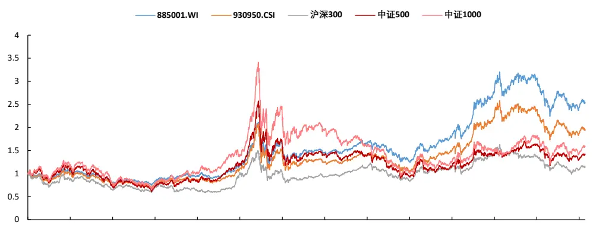
20091231 20110104 20111230 20121231 20140108 20150107 20160105 20170103 20171229 20181228 20191230 20201230 20211230 20221230

对比分年收益、分年波动

|  | 分年收益 |  |  |  |  | 分年波动 |  |  |  |  |  |
| --- | --- | --- | --- | --- | --- | --- | --- | --- | --- | --- | --- |
|  | 885001.WI930950.CSI 沪深300 |  |  | 中证500 中证1000 |  |  | 885001.WI 930950.CSI 沪深300 |  |  | 中证500 中证1000 |  |
| 2010 | 5.3% | 0.2% | -12.5% | 10.1% | 17.4% | 2010 | 18.9% | 20.7% | 24.7% | 28.2% | 28.6% |
| 2011 | -22.7% | -24.2% | -25.0% | -33.8% | -33.0% | 2011 | 15.6% | 17.5% | 20.3% | 23.8% | 24.8% |
| 2012 | 3.6% | 4.9% | 7.6% | 0.3% | -1.4% | 2012 | 15.1% | 17.2% | 20.1% | 24.1% | 25.5% |
| 2013 | 12.7% | 10.1% | -7.6% | 16.9% | 31.6% | 2013 | 17.0% | 18.7% | 21.8% | 22.6% | 23.5% |
| 2014 | 22.2% | 23.9% | 51.7% | 39.0% | 34.5% | 2014 | 15.1% | 16.4% | 18.9% | 19.3% | 20.9% |
| 2015 | 43.2% | 37.5% | 5.6% | 43.1% | 76.1% | 2015 | 37.2% | 40.2% | 38.7% | 43.9% | 45.6% |
| 2016 | -13.0% | -17.0% | -11.3% | -17.8% | -20.0% | 2016 | 25.1% | 26.1% | 21.8% | 29.8% | 32.4% |
| 2017 | 14.1% | 12.6% | 21.8% | -0.2% | -17.4% | 2017 | 11.3% | 11.2% | 10.0% | 14.5% | 16.0% |
| 2018 | -23.6% | -24.6% | -25.3% | -33.3% | -36.9% | 2018 | 19.5% | 20.9% | 21.0% | 23.7% | 24.5% |
| 2019 | 45.0% | 43.7% | 36.1% | 26.4% | 25.7% | 2019 | 17.2% | 18.2% | 19.5% | 23.0% | 24.5% |
| 2020 | 55.9% | 51.5% | 27.2% | 20.9% | 19.4% | 2020 | 21.7% | 23.0% | 22.4% | 25.2% | 27.0% |
| 2021 | 7.7% | 4.1% | -5.2% | 15.6% | 20.5% | 2021 | 18.4% | 19.6% | 18.3% | 15.2% | 18.8% |
| 2022 | -21.0% | -21.8% | -21.6% | -20.3% | -21.6% | 2022 | 19.2% | 20.1% | 20.0% | 21.5% | 24.8% |
| 2023 | 3.9% | 3.7% | 4.9% | 8.1% | 10.6% | 2023 | 12.0% | 12.7% | 14.5% | 11.3% | 13.0% |
| 全区间 | 7.3% | 5.2% | 1.0% | 2.7% | 3.5% | 全区间 | 20.2% | 21.7% | 22.1% | 25.1% | 26.7% |

数据来源：wind，东方证券研究所
注：各指数在 2023年的分年收益未年化。

图 4：885001.WI、930950.CSI 与主动权益类基金的业绩对比（20091231-20230224）
885001.WI 的对比结果

| 885001.WI | 2010 | 2011 | 2012 | 2013 | 2014 | 2015 | 2016 | 2017 | 2018 | 2019 | 2020 | 2021 | 2022 | 2023 |
| --- | --- | --- | --- | --- | --- | --- | --- | --- | --- | --- | --- | --- | --- | --- |
| 指数收益 | 5.3% | -22.7% | 3.6% | 12.7% | 22.2% | 43.2% | -13.0% | 14.1% | -23.6% | 45.0% | 55.9% | 7.7% | -21.0% | 3.9% |
| 跑赢指数的基金占比 | 42.3% | 37.6% | 57.2% | 56.4% | 51.1% | 55.0% | 44.7% | 53.7% | 46.5% | 49.3% | 56.1% | 47.2% | 49.1% | 49.5% |
| 跑赢指数的基金数量 | 112 | 118 | 210 | 233 | 226 | 273 | 269 | 352 | 362 | 456 | 632 | 722 | 1068 | 1290 |
| 主动权益类基金数量 | 265 | 314 | 367 | 413 | 442 | 496 | 602 | 656 | 778 | 925 | 1127 | 1529 | 2176 | 2605 |

930950.CSI 的对比结果

| 930950.CSI | 2010 | 2011 | 2012 | 2013 | 2014 | 2015 | 2016 | 2017 | 2018 | 2019 | 2020 | 2021 | 2022 | 2023 |
| --- | --- | --- | --- | --- | --- | --- | --- | --- | --- | --- | --- | --- | --- | --- |
| 指数收益 | 0.2% | -24.2% | 4.9% | 10.1% | 23.9% | 37.5% | -17.0% | 12.6% | -24.6% | 43.7% | 51.5% | 4.1% | -21.8% | 3.7% |
| 跑赢指数的基金占比 | 61.1% | 50.3% | 48.2% | 64.4% | 48.4% | 63.5% | 59.0% | 57.9% | 52.7% | 51.5% | 63.6% | 55.3% | 53.4% | 52.5% |
| 跑赢指数的基金数量 | 162 | 158 | 177 | 266 | 214 | 315 | 355 | 380 | 410 | 476 | 717 | 845 | 1161 | 1368 |
| 主动权益类基金数量 | 265 | 314 | 367 | 413 | 442 | 496 | 602 | 656 | 778 | 925 | 1127 | 1529 | 2176 | 2605 |

数据来源：wind，东方证券研究所

最后，我们将两个基金指数与主动权益类基金的业绩进行对比。在筛选主动权益类基金池时，我们使用的方法为：（1）Wind投资类型二级分类下的普通股票型、偏股混合型基金；（2）契约型开放式的初始基金；（3）成立时间至少满一年。从结果来看，两个基金指数的分年收益长期稳定在主动权益类基金 40%-60%的分位数水平，即中位数上下，其中 885001.WI 的分位数略领先于 930950.CSI。

## 二、基于基金持仓复制指数

在本章，我们将分两步复制基金指数：第一步先用指数的成分基金还原指数，第二步借助成分基金的股票持仓还原指数（未做特殊说明时，均假设模拟指数的股票仓位为 100%）。

## 2.1 成分基金复制指数

首先，我们仅用指数的成分基金复制指数，暂不穿透至基金持仓。复制过程遵循下述公式，其中 ${\mathbf{}}^{\mathsf{I}}N_{t}$ 表示第t日成分基金的数量， $r_{i,t}$ 表示基金i在第t日的复权收益率， $\omega_{i,t}$ 表示基金i在第t日的权重（885001.WI成分基金等权、930950.CSI成分基金按净值规模加权）。

$$
Index_{t}=Index_{t-1}\left(1+\sum_{i=1}^{N_{t}}\omega_{i,t-1}r_{i,t}\right)
$$

从模拟的结果来看，使用成分基金复制基金指数可以取得较低的跟踪误差。885001.WI 自基日（20031231）起的年化跟踪误差为 1.20%，930950.CSI 自基日（20071228）起的年化跟踪误差为 0.95%。但考虑到指数增强需要结合具体的股票仓位，所以我们将在下文基于基金的股票持仓复制指数。

图 5：用成分基金复制 885001.WI（20031231-20230224）净值曲线
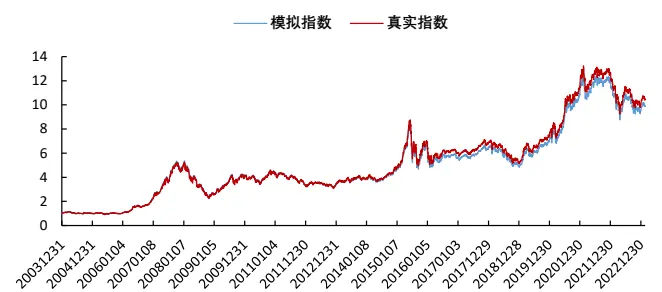
图 6：用成分基金复制 930950.CSI（20071228-20230224）净值曲线
跟踪误差

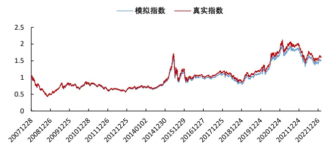

| 全区间 | 2004 | 2005 | 2006 | 2007 | 2008 | 2009 | 2010 | 2011 | 2012 | 2013 |
| --- | --- | --- | --- | --- | --- | --- | --- | --- | --- | --- |
| 1.20% | 0.85% | 0.27% | 0.40% | 0.47% | 0.98% | 0.61% | 0.55% | 0.58% | 0.53% | 1.26% |
| 2014 | 2015 | 2016 | 2017 | 2018 | 2019 | 2020 | 2021 | 2022 | 2023 |  |
| 1.55% | 4.13% | 1.36% | 0.39% | 0.63% | 0.28% | 0.37% | 0.43% | 0.08% | 0.03% |  |

跟踪误差
数据来源：wind，东方证券研究所

| 全区间 | 2008 | 2009 | 2010 | 2011 | 2012 | 2013 | 2014 | 2015 |
| --- | --- | --- | --- | --- | --- | --- | --- | --- |
| 0.95% | 1.00% | 0.68% | 1.07% | 0.55% | 0.52% | 0.67% | 0.52% | 2.50% |
| 2016 | 2017 | 2018 | 2019 | 2020 | 2021 | 2022 | 2023 |  |
| 0.82% | 0.56% | 0.85% | 0.53% | 0.78% | 0.87% | 0.48% | 0.38% |  |

数据来源：wind，东方证券研究所

## 2.2 基金持仓复制指数

基金持仓披露的形式主要有季报、中报和年报。其中，季报的优点是披露频次高（一年四次）、及时度强（季度结束后十五个工作日内），但缺点是仅披露基金的前十大重仓股。相较于季报，中报和年报会披露基金持有的全部股票明细，但不足之处是披露节点较为滞后。

本节我们将采用基金权重与股票权重相结合的方式来复制基金指数，相关细节说明如下：

（1）调仓频率：季频，在每季度结束后的第 15个交易日。

## （2）股票池的选择

- 方案 1：仅用所有成分基金的重仓股。

- 方案 2：用所有成分基金的重仓股+最新一期中报（或年报）的全部持仓。

## （3）股票权重的计算

- 记某调仓日（季度结束的第 15 个交易日）为T，确定T当天指数的所有成份基金以及对应的基金权重 $Q_{i}(\Sigma Q_{i}=1)$ 。

- 寻找所有成份基金在最新季报中披露的重仓股股票池 $\pmb{\mathrm{J}Pool_{1}}$ （若为方案2，还需找出最新一期中报（或年报）的全部股票持仓 $Pool_{2}$ ，且 $Pool_{2}$ 中要剔除 $:Pool_{1}\ ,$ ）。

- $\overrightarrow{\mathrm{l}}\overrightarrow{\mathrm{L}}R_{i,j}$ 表示基金i在股票j上的投资市值占基金股票总投资市值之比，则股票j在组合中的权重 $\begin{array}{r}{w_{j}=\frac{\sum_{i}Q_{i}R_{i,j}}{\lVert\exists-\lvert\mathscr{k}\Xi\stackrel{\ast\ast\{\}}{\leq}\mathscr{L}}\circ}\end{array}$

- 将w 乘以[季度末,T]区间内的股票收益并归一化，最终得到调仓日T下的股票权重 $w_{j}^{\prime}$ 。

我们以下图为例，简要说明测试流程。在调仓日2013.10.28，使用2013年三季报和2013年中报，确定方案2下的股票池在2013.09.30的权重 $w_{j}$ 。经收益率调整后，得到调仓日2013.10.28下的股票初始权重 $\mathbf{\dot{\Omega}}\mathbf{\Omega}^{\prime}$ ，并在下一个季度调仓日（2014.01.22）重新确定股票初始权重。

图 7：季度调仓所用数据示例
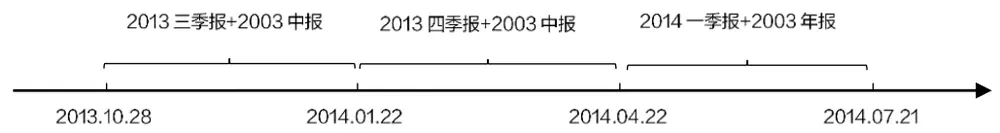
数据来源：东方证券研究所

对于 885001.WI 和 930950.CSI 两个指数，我们分别使用方案 1（仅季报重仓股）和方案 2（含中报或年报）进行指数的复制。为了方便对比，我们将测试区间统一调整为 20091231-20230224。观察股票组合的模拟结果，我们发现：

（1）方案 2（含中报或年报）的跟踪误差普遍低于方案 1（仅季报重仓股），如 885001.WI模拟组合在方案 2下的跟踪误差为 5.08%，小于方案1下的5.25%。

（2）虽然两种方案都可以取得较小的跟踪误差，但模拟组合的年化收益均跑输基准指数，如 885001.WI、930950.CSI 的模拟组合在方案 2 下分别跑输基准指数 1.58%和 0.86%。

（3）季度调仓下的股票换手率不高，各模拟组合的年化换手率均在1附近，并且885001.WI模拟组合的换手率略高于 930950.CSI模拟组合的换手率。

（4）方案 2 下的平均持股数量约在 1600 只左右，约为方案 1 平均持股数量的两倍，并且930950.CSI模拟组合的平均持股数量略高于 885001.WI的模拟组合。

图 8：基于基金持仓复制 885001.WI（20091231-20230224）模拟组合净值曲线
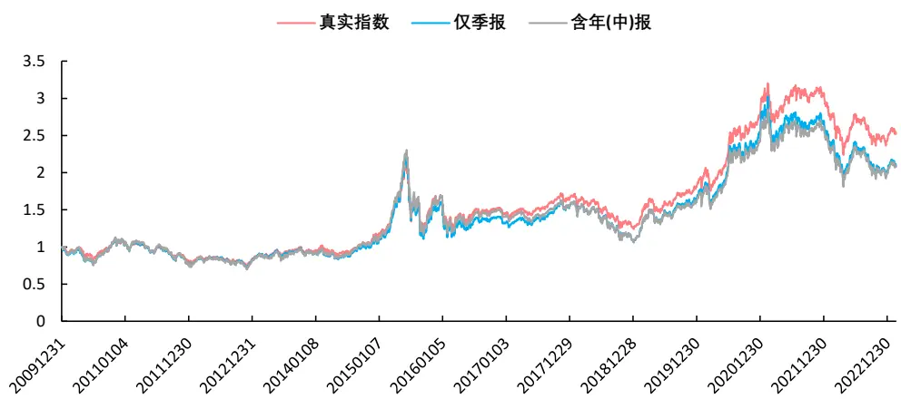
模拟组合指标对比

| 885001.WI | 年化超额收益 | 跟踪误差 | 年化换手率 | 平均持股数量 |
| --- | --- | --- | --- | --- |
| 仅季报 | -1.51% | 5.25% | 1.12 | 705 |
| 含年(中)报 | -1.58% | 5.08% | 1.03 | 1590 |

数据来源：Wind，东方证券研究所
注：年化超额收益指模拟组合年化收益减基准指数年化收益。

图 9：基于基金持仓复制 930950.CSI（20091231-20230224）模拟组合净值曲线
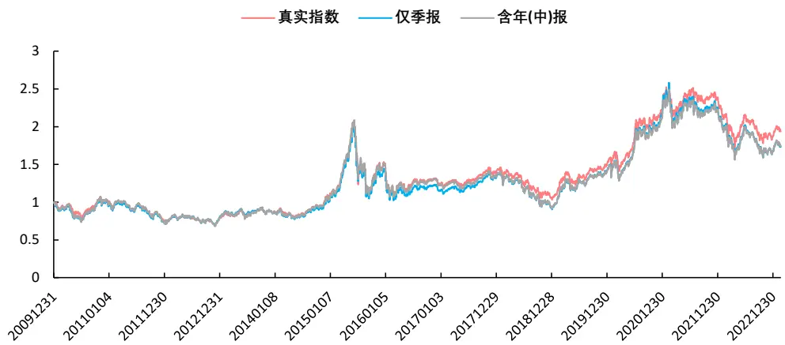

模拟组合指标对比

| 930950.CSI | 年化超额收益 | 跟踪误差 | 年化换手率 | 平均持股数量 |
| --- | --- | --- | --- | --- |
| 仅季报 | -0.89% | 4.14% | 0.88 | 881 |
| 含年(中)报 | -0.86% | 3.57% | 0.94 | 1691 |

数据来源：Wind，东方证券研究所
注：年化超额收益指模拟组合年化收益减基准指数年化收益。

## 三、基于基金持仓的优化算法

在本章，我们将在前文模拟组合的基础上进行优化，优化的方向将围绕降低跟踪误差和缩小收益差距两点展开，下面将介绍具体的优化算法与优化结果。

有关分析师的申明，见本报告最后部分。其他重要信息披露见分析师申明之后部分，或请与您的投资代表联系。并请阅读本证券研究报告最后一页的免责申明。

## 3.1 优化算法说明

记 $y_{t}$ 为第t日基金指数的收益率， $x_{1t},~x_{2t}\cdots x_{Nt}$ 为第t日N只成分股票的收益率， $\omega_{1}$ $\omega_{2}\cdots\omega_{N}$ 为N只成分股票权重，则过去T个交易日的跟踪误差可以表示为： $\begin{array}{r}{\sum_{t=1}^{T}(y_{t}-\omega_{1}x_{1t}-}\end{array}$ $\omega_{2}x_{2t}-\cdots-\omega_{N}x_{Nt})^{2}$ ，进一步可用矩阵形式表达为Tω̃′Σω̃。其中， $\widetilde{\omega}^{\prime}=(1\ -\omega_{1}\ -\omega_{2}\cdots-$ $\omega_{N}),\widetilde{r}_{t}^{\prime}=(y_{t}x_{1t}x_{2t}\cdots x_{Nt})$ 均为N +1维向量，N+1阶矩阵Σ是 $\widetilde{r_{t}}$ 的协方差矩阵。

因此，最小化过去 T日跟踪误差的问题可以转化为 $Min\widetilde{\omega}^{\prime}\Sigma\widetilde{\omega}$ 。考虑到模拟组合中股票数量较多，直接用样本协方差估计Σ会产生奇异矩阵不可逆、估计误差较大等问题。所以我们首先对协方差矩阵Σ进行压缩，具体采用的方法为 Chen 等人（2010）提出的 Oracle ApproximatingShrinkage（OAS）方法，在报告《适用 A 股不同股票池的统计风险模型》中我们曾用其估计股票收益率的协方差矩阵，这里我们对 OAS方法进行简单回顾。

记N阶矩阵S为N项资产收益率的样本协方差矩阵，则 $\begin{array}{r}{{\Sigma_{OAS}}=(1-\rho)\cdot S+\rho\cdot F}\end{array}$ ，其中 $F=$ $\textstyle{\frac{Tr(S)}{N}}$ I为压缩目标， $\begin{array}{r}{\rho=Min\left\{1,\frac{\left(1-\frac{2}{N}\right)Tr\left(S^{2}\right)+Tr^{2}(S)}{\left(T+1-\frac{2}{N}\right)\left[Tr\left(S^{2}\right)-Tr^{2}(S)/N\right]}\right\}}\end{array}$ 为压缩系数。

除了最小化跟踪误差外，我们还希望模拟组合中的股票权重尽量稀疏，所以在优化目标中加入了 L1范数惩罚项，最终我们选用如下优化问题。

$$
\begin{array}{c}{Min\displaystyle\sum_{t=1}^{T}\alpha_{t}(y_{t}-\omega_{1}x_{1t}-\omega_{2}x_{2t}-\cdots-\omega_{N}x_{Nt})^{2}+\lambda\|\omega\|_{1}}\\{s.t.\quad0\leq\omega\leq\omega_{0}+Max(0.5\omega_{0}+5\%)}\end{array}
$$

$$
\omega^{\prime}1=1
$$

其中， $\omega^{\prime}=(\omega_{1}\omega_{2}\cdots\omega_{N})$ 为优化目标， $\omega_{0}$ 为优化前的初始权重， $\alpha_{t}=e^{t/T}$ 为时间权重系数。优化节点设在每月月底，若优化节点为季报发布日（取季度结束后的第15个交易日）后的首个月底， $\omega_{0}$ 取基于最新季报计算得到的股票权重，否则 $\omega_{0}$ 取上月底优化后的结果。

图 10：月度优化下的初始权重 $\omega_{0}$ 对应关系示例
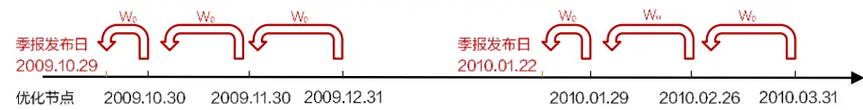
数据来源：东方证券研究所

## 3.2 优化结果

从 20091231-20230224期间的月度优化结果来看，我们发现：

（1）885001.WI的优化结果在跟踪误差和收益差距两方面均优于前文第二章中的模拟组合。如T = 60、λ = 0.5时，优化组合的年化跟踪误差为 4.40%，年化收益仅跑输基准指数 0.05%。换手率较先前略有提高， $\Re\Pi T=60\setminus\lambda=0.$ 5下的年化换手约为 3.75。

（2）对于 930950.CSI 的优化组合，难以找出在跟踪误差和收益差距两方面均优于前文结果的组合。如T = 20下的各组合年化收益与基准指数较为接近，但跟踪误差略高；而 $T=120$ 下的各组合虽然跟踪误差较低，但与基准指数的收益差距较大。

图 11：885001.WI 的优化结果（20091231-20230224）净值曲线
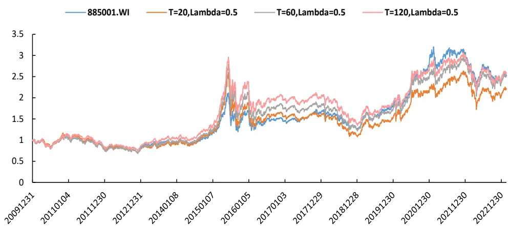

跟踪误差与年化超额收益

|  | 跟踪误差 |  |  |  | 年化超额收益 |  |  |  |
| --- | --- | --- | --- | --- | --- | --- | --- | --- |
|  |  |  |  |  | Lambda=0.1 Lambda=0.5 Lambda=1 Lambda=5Lambda=0.1 Lambda=0.5 Lambda=1 Lambda=5 |  |  |  |
| T=20 | 4.72% | 4.83% | 4.85% | 4.84% | -1.16% | -1.08% | -1.13% | -1.16% |
| T=60 | 4.35% | 4.40% | 4.42% | 4.33% | 0.14% | -0.05% | -0.56% | -0.63% |
| T=120 | 4.57% | 4.65% | 4.61% | 4.54% | -0.34% | 0.19% | -0.32% | -0.54% |

数据来源：wind，东方证券研究所
注：年化超额收益指模拟组合年化收益减基准指数年化收益。

图 12：930950.CSI 的优化结果（20091231-20230224）净值曲线
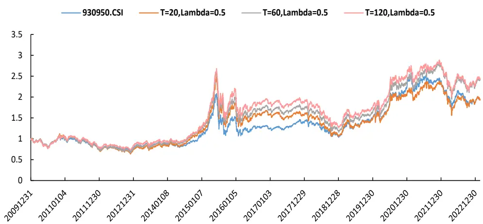

跟踪误差与年化超额收益

|  | 跟踪误差 |  |  |  | 年化超额收益 |  |  |  |
| --- | --- | --- | --- | --- | --- | --- | --- | --- |
|  |  |  |  |  | Lambda=0.1 Lambda=0.5 Lambda=1 Lambda=5Lambda=0.1 Lambda=0.5 Lambda=1 Lambda=5 |  |  |  |
| T=20 | 4.44% | 4.57% | 4.60% | 4.58% | -0.01% | -0.04% | -0.12% | -0.17% |
| T=60 | 3.64% | 3.66% | 3.68% | 3.65% | 1.80% | 1.76% | 1.64% | 1.70% |
| T=120 | 3.65% | 3.52% | 3.51% | 3.51% | 2.15% | 1.87% | 1.79% | 1.81% |

数据来源：wind，东方证券研究所
注：年化超额收益指模拟组合年化收益减基准指数年化收益。

有关分析师的申明，见本报告最后部分。其他重要信息披露见分析师申明之后部分，或请与您的投资代表联系。并请阅读本证券研究报告最后一页的免责申明。

## 四、偏股型基金指数的增强

## 4.1 组合测试说明

本章我们将基于两类因子构建增强组合。第一类因子是由估值、盈利、成长等七类因子合成的大类因子，相关因子计算细节可参考《分析师研报类 alpha 增强》；第二类因子是用 GRU、LSTM 等 5 个模型整合得到的量价因子，相关细节可参考《多模型学习量价时序特征》（需说明此因子暂不对外提供）。此外，在综合考量跟踪误差、年化收益等因素后，我们分别选取T =60、λ = 0.5下的优化组合为 885001.WI 的股票持仓、含中报或年报的股票持仓为 930950.CSI 的股票持仓。关于增强组合的测试，我们补充如下说明：

（1）增强组合月底调仓，假设以次日 vwap 成交，买入成本千分之一、卖出成本千分之二，涨停和停牌不能买入、跌停和停牌不能卖出；

（2）组合所用的风险模型参考自《东方 A 股因子风险模型（DFQ-2020）》，其中风格因子相对暴露不超过 0.5，行业因子相对暴露不超过 0.02；

（3）885001.WI和 930950.CSI 增强组合的跟踪误差约束均不超过 5%；

（4）增强组合测试区间为 20161230-20230224（年化列对应区间），2023 年收益截至20230224（收益未年化）。

## 4.2 885001.WI 的增强组合业绩

图 13：885001.WI的增强组合表现（基本面因子）
增强组合绝对收益

| 绝对收益 |  | 年化 | 2017 | 2018 | 2019 | 2020 | 2021 | 2022 | 2023 |
| --- | --- | --- | --- | --- | --- | --- | --- | --- | --- |
| 885001.WI | 收益率 | 9.5% | 14.1% | -23.6% | 45.0% | 55.9% | 7.7% | -21.0% | 3.9% |
|  | 波动率 | 18.1% | 11.3% | 19.5% | 17.2% | 21.7% | 18.4% | 19.2% | 11.8% |
|  | 最大回撤 | -30.2% | -6.9% | -27.0% | -11.8% | -15.2% | -16.4% | -26.2% | -3.3% |
| delta=0.10 avgto=0.21 | 收益率 | 14.3% | 20.8% | -17.4% | 49.1% | 48.9% | 13.3% | -13.8% | 4.9% |
|  | 波动率 | 19.6% | 13.5% | 21.6% | 20.2% | 23.4% | 18.0% | 20.4% | 11.7% |
|  | 最大回撤 | -27.2% | -8.0% | -27.2% | -12.2% | -13.8% | -10.8% | -24.5% | -2.8% |
| delta=0.20 avgto=0.22 | 收益率 | 12.5% | 26.2% | -19.3% | 47.2% | 41.5% | 10.6% | -16.3% | 5.2% |
|  | 波动率 | 19.7% | 14.0% | 22.6% | 19.9% | 23.0% | 17.5% | 20.6% | 11.8% |
|  | 最大回撤 | -28.1% | -8.9% | -26.0% | -11.9% | -13.8% | -9.9% | -24.2% | -2.7% |
| delta=0.30 avgto=0.31 | 收益率 | 13.6% | 29.4% | -20.6% | 49.5% | 47.7% | 10.0% | -16.6% | 5.4% |
|  | 波动率 | 19.7% | 14.2% | 22.4% | 19.7% | 23.3% | 17.3% | 20.7% | 11.5% |
|  | 最大回撤 | -27.7% | -9.4% | -27.1% | -12.2% | -13.7% | -10.3% | -24.6% | -2.8% |
| delta=0.50 avgto=0.44 | 收益率 | 13.2% | 28.1% | -22.0% | 51.6% | 48.7% | 8.4% | -16.9% | 5.4% |
|  | 波动率 | 19.7% | 14.0% | 22.4% | 19.7% | 23.4% | 17.3% | 20.8% | 11.4% |
|  | 最大回撤 | -29.4% | -10.0% | -29.4% | -12.2% | -13.8% | -10.5% | -24.9% | -2.8% |

图 14：885001.WI的增强组合表现（量价因子）
增强组合绝对收益

| 绝对收益 |  | 年化 | 2017 | 2018 | 2019 | 2020 | 2021 | 2022 | 2023 |
| --- | --- | --- | --- | --- | --- | --- | --- | --- | --- |
| 885001.WI | 收益率 | 9.5% | 14.1% | -23.6% | 45.0% | 55.9% | 7.7% | -21.0% | 3.9% |
|  | 波动率 | 18.1% | 11.3% | 19.5% | 17.2% | 21.7% | 18.4% | 19.2% | 11.8% |
|  | 最大回撤 | -30.2% | -6.9% | -27.0% | -11.8% | -15.2% | -16.4% | -26.2% | -3.3% |
| delta=0.10 avgto=0.19 | 收益率 | 14.4% | 13.0% | -31.3% | 46.0% | 46.6% | 29.5% | -3.4% | 9.7% |
|  | 波动率 | 20.4% | 13.5% | 23.6% | 20.0% | 23.6% | 17.8% | 22.9% | 11.8% |
|  | 最大回撤 | -34.2% | -10.2% | -32.2% | -15.2% | -14.3% | -11.9% | -25.8% | -2.9% |
| delta=0.20 avgto=0.21 | 收益率 | 15.5% | 17.3% | -27.2% | 42.7% | 40.8% | 44.1% | -9.7% | 8.6% |
|  | 波动率 | 20.2% | 12.8% | 23.2% | 19.2% | 23.8% | 18.3% | 22.5% | 11.2% |
|  | 最大回撤 | -32.2% | -7.8% | -32.2% | -13.7% | -15.4% | -13.0% | -28.0% | -2.6% |
| delta=0.30 avgto=0.31 | 收益率 | 17.4% | 21.7% | -23.1% | 41.5% | 43.6% | 43.4% | -9.6% | 8.8% |
|  | 波动率 | 20.5% | 12.7% | 23.9% | 19.4% | 24.3% | 18.0% | 23.0% | 11.9% |
|  | 最大回撤 | -28.7% | -7.4% | -27.7% | -14.6% | -15.0% | -10.9% | -27.5% | -2.8% |
| delta=0.50 avgto=0.49 | 收益率 | 18.4% | 24.7% | -24.9% | 46.5% | 41.7% | 41.4% | -6.4% | 10.0% |
|  | 波动率 | 20.5% | 12.7% | 23.2% | 20.0% | 24.8% | 17.9% | 23.0% | 11.8% |
|  | 最大回撤 | -30.0% | -6.7% | -30.0% | -16.0% | -15.5% | -10.4% | -26.3% | -2.7% |

增强组合相对收益（相对 885001.WI）

| 相对收益 |  | 年化 | 2017 | 2018 | 2019 | 2020 | 2021 | 2022 | 2023 |
| --- | --- | --- | --- | --- | --- | --- | --- | --- | --- |
| delta=0.10 avgto=0.21 | 收益率 | 4.4% | 6.0% | 8.4% | 3.1% | -4.4% | 4.7% | 9.1% | 0.9% |
|  | 波动率 | 7.3% | 5.7% | 6.5% | 7.0% | 7.3% | 9.1% | 7.6% | 6.0% |
|  | 最大回撤 | -14.5% | -4.1% | -5.3% | -5.7% | -11.4% | -7.4% | -6.0% | -1.9% |
| delta=0.20 avgto=0.22 | 收益率 | 2.8% | 10.8% | 6.0% | 1.7% | -9.2% | 2.1% | 6.0% | 1.2% |
|  | 波动率 | 7.4% | 6.0% | 6.7% | 7.1% | 7.1% | 9.5% | 7.7% | 5.9% |
|  | 最大回撤 | -17.3% | -3.8% | -5.9% | -7.4% | -13.5% | -6.5% | -6.3% | -2.1% |
| delta=0.30 avgto=0.31 | 收益率 | 3.8% | 13.6% | 4.2% | 3.3% | -5.2% | 1.4% | 5.6% | 1.4% |
|  | 波动率 | 7.6% | 6.2% | 6.9% | 6.8% | 7.4% | 9.5% | 8.0% | 6.5% |
|  | 最大回撤 | -16.9% | -4.2% | -5.8% | -6.4% | -13.1% | -7.4% | -6.7% | -2.1% |
| delta=0.50 avgto=0.44 | 收益率 | 3.4% | 12.4% | 2.4% | 4.8% | -4.6% | 0.0% | 5.3% | 1.4% |
|  | 波动率 | 7.6% | 6.2% | 6.9% | 6.7% | 7.7% | 9.5% | 8.1% | 6.5% |
|  | 最大回撤 | -18.5% | -4.8% | -6.6% | -5.7% | -14.6% | -8.6% | -6.6% | -2.0% |

月单边换手 30%下的组合走势

增强组合相对收益（相对 885001.WI）

| 相对收益 |  | 年化 | 2017 | 2018 | 2019 | 2020 | 2021 | 2022 | 2023 |
| --- | --- | --- | --- | --- | --- | --- | --- | --- | --- |
| delta=0.10 avgto=0.19 | 收益率 | 4.6% | -0.8% | -9.5% | 1.0% | -5.9% | 19.5% | 22.8% | 5.5% |
|  | 波动率 | 7.7% | 5.6% | 6.9% | 6.6% | 7.9% | 9.8% | 8.5% | 5.3% |
|  | 最大回撤 | -17.9% | -6.6% | -12.3% | -7.7% | -11.4% | -7.8% | -6.1% | -0.7% |
| delta=0.20 avgto=0.21 | 收益率 | 5.6% | 2.8% | -4.2% | -1.5% | -9.5% | 33.1% | 14.7% | 4.5% |
|  | 波动率 | 7.6% | 5.4% | 6.7% | 6.8% | 7.4% | 9.8% | 8.6% | 4.3% |
|  | 最大回撤 | -16.7% | -3.7% | -9.3% | -8.2% | -12.1% | -5.3% | -6.8% | -0.8% |
| delta=0.30 avgto=0.31 | 收益率 | 7.4% | 6.6% | 1.4% | -2.2% | -7.7% | 32.3% | 14.9% | 4.7% |
|  | 波动率 | 8.1% | 5.6% | 7.4% | 7.0% | 7.9% | 10.8% | 9.0% | 3.9% |
|  | 最大回撤 | -18.2% | -4.0% | -6.9% | -10.3% | -14.3% | -4.5% | -7.0% | -0.6% |
| delta=0.50 avgto=0.49 | 收益率 | 8.3% | 9.3% | -1.3% | 1.3% | -8.8% | 30.4% | 19.0% | 5.8% |
|  | 波动率 | 8.2% | 5.4% | 7.3% | 7.1% | 8.3% | 10.9% | 9.3% | 4.0% |
|  | 最大回撤 | -21.7% | -2.8% | -7.4% | -5.9% | -18.0% | -5.2% | -7.6% | -0.6% |

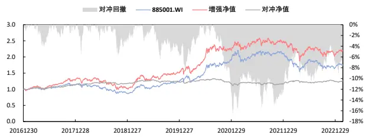
数据来源：wind，东方证券研究所
注：delta表示单边换手约束，avgto表示单边实际换手。

月单边换手 30%下的组合走势
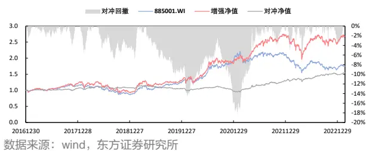
注：delta表示单边换手约束，avgto表示单边实际换手。
有关分析师的申明，见本报告最后部分。其他重要信息披露见分析师申明之后部分，或请与您的投资代表联系。并请阅读本证券研究报告最后一页的免责申明。

对于 885001.WI的增强组合表现，我们发现：

（1）在强换手约束（如delta=10%）下，基本面因子与量价因子的增强组合较为接近，年化超额收益均在4.5%左右。但在弱换手约束（如delta=30%）下，基于量价因子的增强效果要优于基本面因子的增强表现，前者年化超额大致为后者的两倍。

（2）随着 delta 的增大、即换手约束的放松，量价因子的增强组合收益呈递增趋势，但基本面因子的增强组合收益随delta的增大先下降后上升。其中，量价因子在delta=10%、20%、30%和 50%下的超额年化收益分别为 4.6%、5.6%、7.4%和 8.3%。

（3）从增强组合的分年相对收益来看，量价因子在 2018 至 2020 年期间的相对收益较弱，而在2021和2022年的相对收益较强，且近期没有衰减的迹象。基本面因子则是在2020与2021年收益较弱，在 2017年的超额收益较为突出。

（4）在月单边换手约束为 30%时，量价因子增强组合的近期对冲回撤略低于基本面因子，且二者均在 2021年初经历较大幅度的回撤。

## 4.3 930950.CSI 的增强组合业绩

图 15：930950.CSI的增强组合表现（基本面因子）
增强组合绝对收益

| 绝对收益 |  | 年化 | 2017 | 2018 | 2019 | 2020 | 2021 | 2022 | 2023 |
| --- | --- | --- | --- | --- | --- | --- | --- | --- | --- |
| 930950.CSI | 收益率 | 7.5% | 12.6% | -24.6% | 43.7% | 51.5% | 4.1% | -21.8% | 3.7% |
|  | 波动率 | 19.1% | 11.2% | 20.9% | 18.2% | 23.0% | 19.5% | 20.1% | 12.7% |
|  | 最大回撤 | -33.2% | -6.8% | -28.0% | -12.1% | -15.7% | -17.4% | -26.7% | -3.5% |
| delta=0.10 avgto=0.12 | 收益率 | 10.5% | 25.4% | -20.1% | 41.9% | 48.7% | 5.1% | -19.6% | 3.2% |
|  | 波动率 | 20.6% | 13.5% | 22.8% | 19.8% | 23.3% | 21.8% | 21.8% | 14.6% |
|  | 最大回撤 | -30.1% | -8.4% | -24.8% | -12.1% | -15.2% | -17.0% | -23.2% | -4.2% |
| delta=0.20 avgto=0.21 | 收益率 | 11.6% | 29.1% | -21.4% | 49.1% | 52.4% | 3.4% | -20.3% | 3.4% |
|  | 波动率 | 20.9% | 13.6% | 22.9% | 20.3% | 24.0% | 21.7% | 21.8% | 14.3% |
|  | 最大回撤 | -32.9% | -9.0% | -26.0% | -11.8% | -14.8% | -17.6% | -23.8% | -4.1% |
| delta=0.30 avgto=0.30 | 收益率 | 12.0% | 33.2% | -23.0% | 53.0% | 53.3% | 1.4% | -20.3% | 3.2% |
|  | 波动率 | 20.9% | 14.0% | 23.1% | 20.2% | 23.9% | 21.6% | 21.8% | 14.0% |
|  | 最大回撤 | -34.0% | -8.7% | -28.0% | -11.8% | -15.0% | -17.7% | -24.1% | -4.0% |
| delta=0.50 avgto=0.39 | 收益率 | 11.7% | 31.9% | -23.3% | 54.6% | 51.0% | 0.6% | -19.6% | 3.1% |
|  | 波动率 | 20.9% | 13.8% | 23.3% | 20.6% | 23.9% | 21.5% | 21.7% | 14.0% |
|  | 最大回撤 | -34.4% | -9.5% | -28.5% | -11.5% | -15.1% | -17.7% | -24.1% | -4.0% |

图 16：930950.CSI的增强组合表现（量价因子）
增强组合绝对收益

| 绝对收益 |  | 年化 | 2017 | 2018 | 2019 | 2020 | 2021 | 2022 | 2023 |
| --- | --- | --- | --- | --- | --- | --- | --- | --- | --- |
| 930950.CSI | 收益率 | 7.5% | 12.6% | -24.6% | 43.7% | 51.5% | 4.1% | -21.8% | 3.7% |
|  | 波动率 | 19.1% | 11.2% | 20.9% | 18.2% | 23.0% | 19.5% | 20.1% | 12.7% |
|  | 最大回撤 | -33.2% | -6.8% | -28.0% | -12.1% | -15.7% | -17.4% | -26.7% | -3.5% |
| delta=0.10 avgto=0.12 | 收益率 | 7.3% | 11.5% | -31.2% | 41.4% | 34.3% | 20.6% | -19.3% | 8.7% |
|  | 波动率 | 21.0% | 11.9% | 23.5% | 20.5% | 23.3% | 20.9% | 24.0% | 14.2% |
|  | 最大回撤 | -36.6% | -9.9% | -35.5% | -16.7% | -16.0% | -17.3% | -28.3% | -3.6% |
| delta=0.20 avgto=0.21 | 收益率 | 15.8% | 21.0% | -23.1% | 49.6% | 40.1% | 36.7% | -14.1% | 7.3% |
|  | 波动率 | 21.4% | 12.7% | 23.9% | 20.2% | 24.5% | 21.2% | 24.3% | 14.0% |
|  | 最大回撤 | -28.5% | -7.5% | -27.3% | -15.1% | -16.7% | -16.7% | -25.2% | -2.7% |
| delta=0.30 avgto=0.31 | 收益率 | 17.6% | 26.7% | -20.5% | 58.1% | 44.0% | 31.2% | -15.2% | 6.0% |
|  | 波动率 | 21.5% | 12.5% | 24.1% | 20.0% | 25.0% | 20.9% | 24.3% | 13.8% |
|  | 最大回撤 | -28.5% | -6.6% | -26.7% | -14.6% | -16.4% | -15.4% | -25.2% | -3.0% |
| delta=0.50 avgto=0.50 | 收益率 | 19.3% | 29.0% | -22.0% | 64.7% | 47.5% | 26.7% | -10.8% | 6.9% |
|  | 波动率 | 21.6% | 12.5% | 23.6% | 21.0% | 25.2% | 21.0% | 24.4% | 14.6% |
|  | 最大回撤 | -29.4% | -7.4% | -28.2% | -15.7% | -16.3% | -16.1% | -26.2% | -2.8% |

增强组合相对收益（相对 930950.CSI）

| 相对收益 |  | 年化 | 2017 | 2018 | 2019 | 2020 | 2021 | 2022 | 2023 |
| --- | --- | --- | --- | --- | --- | --- | --- | --- | --- |
| delta=0.10 avgto=0.12 | 收益率 | 2.9% | 11.4% | 6.3% | -1.2% | -1.9% | 1.2% | 3.0% | -0.4% |
|  | 波动率 | 5.8% | 5.4% | 5.1% | 5.2% | 6.0% | 7.1% | 5.8% | 5.4% |
|  | 最大回撤 | -9.7% | -2.7% | -4.0% | -6.6% | -7.5% | -6.0% | -7.2% | -2.1% |
| delta=0.20 avgto=0.21 | 收益率 | 4.0% | 14.8% | 4.5% | 4.0% | 0.6% | -0.4% | 2.0% | -0.2% |
|  | 波动率 | 6.0% | 5.6% | 5.3% | 5.5% | 6.4% | 7.0% | 6.2% | 5.7% |
|  | 最大回撤 | -7.7% | -3.3% | -5.0% | -6.6% | -4.4% | -7.2% | -6.5% | -2.2% |
| delta=0.30 avgto=0.30 | 收益率 | 4.4% | 18.5% | 2.4% | 6.7% | 1.2% | -2.4% | 2.1% | -0.5% |
|  | 波动率 | 6.1% | 5.8% | 5.8% | 5.2% | 6.3% | 7.0% | 6.3% | 5.6% |
|  | 最大回撤 | -8.4% | -3.3% | -6.5% | -5.0% | -5.7% | -8.4% | -6.2% | -2.3% |
| delta=0.50 avgto=0.39 | 收益率 | 4.0% | 17.3% | 2.1% | 7.9% | -0.3% | -3.2% | 2.9% | -0.5% |
|  | 波动率 | 6.1% | 5.6% | 5.8% | 5.5% | 6.3% | 6.9% | 6.2% | 5.6% |
|  | 最大回撤 | -9.1% | -3.7% | -6.5% | -4.6% | -6.1% | -9.1% | -5.5% | -2.3% |

增强组合相对收益（相对 930950.CSI）

| 相对收益 |  | 年化 | 2017 | 2018 | 2019 | 2020 | 2021 | 2022 | 2023 |
| --- | --- | --- | --- | --- | --- | --- | --- | --- | --- |
| delta=0.10 avgto=0.12 | 收益率 | 0.0% | -1.1% | -8.4% | -1.3% | -11.5% | 15.9% | 3.7% | 4.8% |
|  | 波动率 | 6.2% | 4.8% | 5.4% | 5.7% | 6.0% | 7.3% | 7.5% | 4.3% |
|  | 最大回撤 | -24.5% | -6.6% | -10.6% | -9.2% | -11.2% | -4.4% | -6.5% | -0.8% |
| delta=0.20 avgto=0.21 | 收益率 | 7.9% | 7.5% | 2.4% | 4.3% | -7.4% | 31.4% | 10.6% | 3.6% |
|  | 波动率 | 6.7% | 5.3% | 6.3% | 6.1% | 6.6% | 8.0% | 7.6% | 4.1% |
|  | 最大回撤 | -12.0% | -2.9% | -4.8% | -5.1% | -10.2% | -3.4% | -5.7% | -0.8% |
| delta=0.30 avgto=0.31 | 收益率 | 9.6% | 12.5% | 5.9% | 10.2% | -4.7% | 26.1% | 9.1% | 2.3% |
|  | 波动率 | 6.8% | 5.3% | 7.0% | 6.2% | 6.7% | 7.7% | 7.9% | 3.8% |
|  | 最大回撤 | -10.4% | -2.4% | -6.5% | -5.6% | -9.0% | -3.2% | -6.0% | -0.9% |
| delta=0.50 avgto=0.50 | 收益率 | 11.2% | 14.6% | 3.8% | 15.0% | -2.3% | 21.8% | 14.7% | 3.1% |
|  | 波动率 | 6.9% | 5.2% | 6.7% | 6.8% | 6.7% | 7.8% | 7.9% | 4.6% |
|  | 最大回撤 | -11.2% | -3.0% | -5.8% | -4.3% | -11.2% | -3.6% | -6.2% | -1.5% |

月单边换手 30%下的组合走势

月单边换手 30%下的组合走势
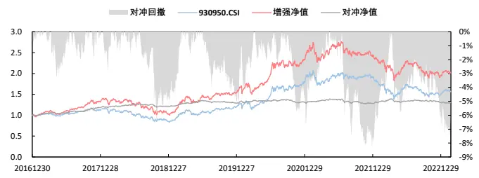
数据来源：wind，东方证券研究所
注：delta表示单边换手约束，avgto表示单边实际换手。

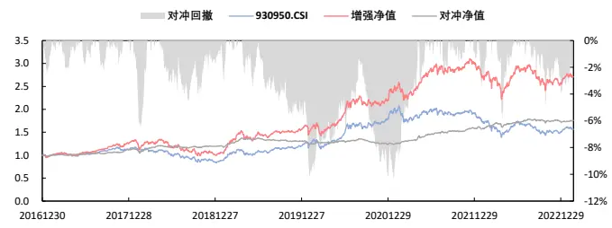
数据来源：wind，东方证券研究所
注：delta表示单边换手约束，avgto表示单边实际换手。

有关分析师的申明，见本报告最后部分。其他重要信息披露见分析师申明之后部分，或请与您的投资代表联系。并请阅读本证券研究报告最后一页的免责申明。

930950.CSI的增强组合呈现出的特点为：

（1）在强换手约束（如delta=10%）下，基本面因子的组合表现要优于量价因子，其中前者年化超额收益为 2.9%、后者仅为 0%。但在弱换手约束（如 delta=30%、50%）下，基于量价因子的增强效果要优于基本面因子的增强表现，前者年化超额大致为后者的两至三倍。

（2）随换手约束的减弱，量价因子的超额收益增幅无明显边际递减现象，其在delta=20%、30%和 50%下的年化相对收益分别为 7.9%、9.6%和 11.2%。而基本面因子的超额收益随换手约束的减弱变化不大。

（3）量价因子的增强组合在 2020 年相对收益较弱（-4.7%，月单边换手约束取 30%，下同），2021年相对收益较强（26.1%）。基本面因子增强组合在2020和2021两年的相对收益较弱，且 2023年表现不及量价因子。

（4）两因子在 930950.CSI 下的 2023 年超额收益均低于 885001.WI下的超额表现，如量价因子在 930950.CSI 下的 2023 年超额收益仅为 885001.WI 指数增强的二分之一。

## 4.4 增强组合与指数挂钩产品的业绩比照

最后，我们将上述增强组合的业绩与图 2 中展示的部分指数挂钩产品的业绩进行了简单比照，具体测算了自基金成立之日起至 20230224 期间的年化收益、年化波动和最大回撤等指标，相关结果可参照下图（增强组合均选用月单边换手 30%约束下的结果）。

从对比结果来看，基于量价因子或基本面因子的增强组合年化收益可以跑赢大多数挂钩产品，但是 FOF基金产品在年化波动以及最大回撤的控制上均优于上述增强组合。

图 17：指增组合与指数挂钩产品的业绩对比

|  | 研究对象 | 年化收益年化波动 |  | 夏普值 | 最大回撤 | 开始时间 |  | 年化收益年化波动 |  | 夏普值 | 最大回撤 |
| --- | --- | --- | --- | --- | --- | --- | --- | --- | --- | --- | --- |
| 20210420 | 885001.WI | -6.2% | 17.7% | -0.27 | -29.7% |  | 930950.CSI | 11.6% | 20.4% | 0.64 | -33.2% |
| (南方浩睿进取京 | 011696.OF | -10.1% | 15.2% | -0.63 | -27.4% | 20180815 | 006042.OF | 5.6% | 12.6% | 0.49 | -28.2% |
| 选3个月持有A) | 量价因子增强组合 | 16.3% | 20.2% | 0.85 | -28.7% | (上投摩根尚睿A) | 量价因子增强组合 | 22.0% | 22.8% | 0.99 | -28.5% |
|  | 基本面因子增强组合 | -3.4% | 18.7% | -0.09 | -27.7% |  | 基本面因子增强组合 | 12.3% | 22.2% | 0.63 | -34.0% |
| 20190125 | 930950.CSI | 14.9% | 20.3% | 0.79 | -33.2% | 20190926 | 930950.CSI | 10.0% | 20.2% | 0.57 | -33.2% |
| (兴全安泰平衡养 | 006580.OF | 11.4% | 9.1% | 1.24 | -12.8% | (长信颐天平衡养 | 006872.OF | 6.8% | 10.0% | 0.71 | -15.3% |
| 老(FOF)A) | 量价因子增强组合 | 26.2% | 22.8% | 1.14 | -28.5% |  | 量价因子增强组合 | 19.5% | 22.5% | 0.90 | -28.5% |
|  | 基本面因子增强组合 | 16.6% | 21.9% | 0.81 | -34.0% | 老(FOF)A) | 基本面因子增强组合 | 9.4% | 21.6% | 0.53 | -34.0% |
| 20200306 | 930950.CSI | 5.7% | 20.3% | 0.38 | -33.2% | 20200413 | 930950.CSI | 9.4% | 19.8% | 0.55 | -33.2% |
| (兴全优选进取三 | 008145.OF | 10.8% | 13.6% | 0.82 | -20.0% | (泰康睿福优选配 | 008754.OF | 3.7% | 13.1% | 0.34 | -26.0% |
| 个月A) | 量价因子增强组合 | 17.1% | 22.9% | 0.81 | -28.5% | 置3个月持有期 | 量价因子增强组合 | 22.2% | 22.3% | 1.01 | -28.5% |
|  | 基本面因子增强组合 | 4.8% | 21.7% | 0.32 | -34.0% | (FOF)A) | 基本面因子增强组合 | 7.9% | 21.2% | 0.46 | -34.0% |

数据来源：wind，东方证券研究所

## 五、结论

对于 885001.WI 和 930950.CSI 两个偏股型基金指数，本报告对其进行了股票仓位的探测，并在此基础上构建了增强组合。

从编制方式来看，两个指数最大的差异在于如何对成分基金进行加权。不同于 930950.CSI按成分基金净值规模加权的方式，885001.WI 对其所有成分基金均按等权处理。由于基金规模与基金业绩的负相关关系，等权重计算的 885001.WI收益更高且波动更低。

在确定指数的股票仓位时，我们共分两步完成，即先利用成分基金还原指数，然后再借助成分基金的股票持仓完成指数复制。对于仅用季报重仓股的方案 1 和包含最新一期中报或年报的方案 2，我们发现方案 2的跟踪误差普遍低于方案 1，如 885001.WI模拟组合在方案 1、2下的跟踪误差分别为 5.25%和 5.08%，930950.CSI 模拟组合的跟踪误差分别为 4.14%和 3.57%。虽然两种方案都可以取得较小的跟踪误差，但模拟组合的年化收益均不及基准指数，如 885001.WI、930950.CSI 的模拟组合在方案 2 下分别跑输基准指数 1.58%和 0.86%。

针对利用基金持仓复制指数出现的不足，我们围绕降低跟踪误差和缩小收益差距这两点进行了优化改进。具体地，我们每月底以最小化跟踪误差与组合尽量稀疏为优化目标，同时加入协方差矩阵的压缩处理，最终得到在跟踪误差和控制收益两方面均更优的组合。如 885001.WI 在T =60、λ = 0.5下的优化组合年化跟踪误差 4.40%，年化收益仅跑输基准指数 0.05%。

最后，我们基于两类因子（基本面大类因子和量价时序因子）分别对两个指数进行了月度增强。其中，885001.WI 在基本面因子和量价因子增强组合下的年化超额收益分别为 3.8%和 7.4%（月单边换手约束为 30%，下同）、930950.CSI 在基本面因子和量价因子增强组合下的年化超额收益分别为 4.4%和 9.6%。从增强组合的分年超额收益来看，量价因子增强组合在 2019 和2020年的相对收益较弱，而 2021和 2022年的相对收益较强，且近期没有衰减的迹象。

## 风险提示

1.量化模型基于历史数据分析得到，未来存在失效的风险，建议投资者紧密跟踪模型表现。

2.极端市场环境可能对模型效果造成剧烈冲击，导致收益亏损。

## 参考文献

[1] Chen Y , Wiesel A , Eldar Y C , et al. Shrinkage Algorithms for MMSE Covariance Estimation: IEEE, 10.1109/TSP.2010.2053029[P]. 2010.

## Tabl e_Disclai mer 分析师申明

每位负责撰写本研究报告全部或部分内容的研究分析师在此作以下声明：

分析师在本报告中对所提及的证券或发行人发表的任何建议和观点均准确地反映了其个人对该证券或发行人的看法和判断；分析师薪酬的任何组成部分无论是在过去、现在及将来，均与其在本研究报告中所表述的具体建议或观点无任何直接或间接的关系。

## 投资评级和相关定义

报告发布日后的 12个月内的公司的涨跌幅相对同期的上证指数/深证成指的涨跌幅为基准；

## 公司投资评级的量化标准

买入：相对强于市场基准指数收益率 15%以上；

增持：相对强于市场基准指数收益率 5%～15%；

中性：相对于市场基准指数收益率在-5%～+5%之间波动；

减持：相对弱于市场基准指数收益率在-5%以下。

未评级 —— 由于在报告发出之时该股票不在本公司研究覆盖范围内，分析师基于当时对该股票的研究状况，未给予投资评级相关信息。

暂停评级 —— 根据监管制度及本公司相关规定，研究报告发布之时该投资对象可能与本公司存在潜在的利益冲突情形；亦或是研究报告发布当时该股票的价值和价格分析存在重大不确定性，缺乏足够的研究依据支持分析师给出明确投资评级；分析师在上述情况下暂停对该股票给予投资评级等信息，投资者需要注意在此报告发布之前曾给予该股票的投资评级、盈利预测及目标价格等信息不再有效。

## 行业投资评级的量化标准：

看好：相对强于市场基准指数收益率 5%以上；

中性：相对于市场基准指数收益率在-5%～+5%之间波动；

看淡：相对于市场基准指数收益率在-5%以下。

未评级：由于在报告发出之时该行业不在本公司研究覆盖范围内，分析师基于当时对该行业的研究状况，未给予投资评级等相关信息。

暂停评级：由于研究报告发布当时该行业的投资价值分析存在重大不确定性，缺乏足够的研究依据支持分析师给出明确行业投资评级；分析师在上述情况下暂停对该行业给予投资评级信息，投资者需要注意在此报告发布之前曾给予该行业的投资评级信息不再有效。

## HeadertTabl e_Discl ai mer 免责声明

本证券研究报告（以下简称“本报告”）由东方证券股份有限公司（以下简称“本公司”）制作及发布。

。本公司不会因接收人收到本报告而视其为本公司的当然客户。本报告的全体接收人应当采取必要措施防止本报告被转发给他人。

本报告是基于本公司认为可靠的且目前已公开的信息撰写，本公司力求但不保证该信息的准确性和完整性，客户也不应该认为该信息是准确和完整的。同时，本公司不保证文中观点或陈述不会发生任何变更，在不同时期，本公司可发出与本报告所载资料、意见及推测不一致的证券研究报告。本公司会适时更新我们的研究，但可能会因某些规定而无法做到。除了一些定期出版的证券研究报告之外，绝大多数证券研究报告是在分析师认为适当的时候不定期地发布。

在任何情况下，本报告中的信息或所表述的意见并不构成对任何人的投资建议，也没有考虑到个别客户特殊的投资目标、财务状况或需求。客户应考虑本报告中的任何意见或建议是否符合其特定状况，若有必要应寻求专家意见。本报告所载的资料、工具、意见及推测只提供给客户作参考之用，并非作为或被视为出售或购买证券或其他投资标的的邀请或向人作出邀请。

本报告中提及的投资价格和价值以及这些投资带来的收入可能会波动。过去的表现并不代表未来的表现，未来的回报也无法保证，投资者可能会损失本金。外汇汇率波动有可能对某些投资的价值或价格或来自这一投资的收入产生不良影响。那些涉及期货、期权及其它衍生工具的交易，因其包括重大的市场风险，因此并不适合所有投资者。

在任何情况下，本公司不对任何人因使用本报告中的任何内容所引致的任何损失负任何责任，投资者自主作出投资决策并自行承担投资风险，任何形式的分享证券投资收益或者分担证券投资损失的书面或口头承诺均为无效。

本报告主要以电子版形式分发，间或也会辅以印刷品形式分发，所有报告版权均归本公司所有。未经本公司事先书面协议授权，任何机构或个人不得以任何形式复制、转发或公开传播本报告的全部或部分内容。不得将报告内容作为诉讼、仲裁、传媒所引用之证明或依据，不得用于营利或用于未经允许的其它用途。

经本公司事先书面协议授权刊载或转发的，被授权机构承担相关刊载或者转发责任。不得对本报告进行任何有悖原意的引用、删节和修改。

提示客户及公众投资者慎重使用未经授权刊载或者转发的本公司证券研究报告，慎重使用公众媒体刊载的证券研究报告。

## 东方证券研究所

地址： 上海市中山南路 318 号东方国际金融广场 26 楼

电话：021-63325888

传真：021-63326786

网址： www.dfzq.com.cn