# 分析师情感调整分数 ASAS

## 因子选股系列之八十九

## 研究结论

分析师情感调整分数（Analyst Sentiment Adjusted Score，ASAS）。该因子通过分析师的研报标题和摘要文本序列来捕捉他们对股票的看法，并结合盈利预测调整值作为标签来训练模型。使用双层 Transformer和一维卷积网络提取特征，并计算过去三个月内某只股票的情感打分均值作为量化选股因子，全样本 Rank IC 均值为 0.04，ICIR 为 2.0。

自然语言处理（NLP）旨在让计算机理解和处理人类语言。自 20 世纪中叶起，NLP 历经多次发展，涌现出 ELIZA、BoW 词袋模型、Word2Vec 等技术。2017年，基于多头自注意力机制的 Transformer 模型问世，开启了预训练语言模型（T-PTLMs）时代，包括 BERT、GPT-n 和 XLNet等，在各项自然语言处理任务中取得显著成绩。

相比于前一篇研究所使用的词袋模型，此次的研报情感打分，我们使用 500 词的长文本序列作为输入，使用 1228 万词的腾讯词库进行精准分词，并用 200 维的腾讯词向量作为词嵌入的预设权重，用逆概率密度函数（IPDF）对标签进行标准化，经过众多 NLP 模型的基线对比后，选定 Transformer作为基础模型。

我们采用双层 Transformer Encoder 和 一维卷积作为最终的训练模型结构，一维卷积在基线对比时就体现了极强的特征提取能力，配合多头注意力机制，能提炼出文本中的段落相关性，和微妙的情感表达。

ASAS 因子在沪深 300、中证 500、中证 1000 样本空间中的 Rank IC 分别为0.047、0.041、0.037，预测能力较为稳定，各个样本空间的 ICIR 均大于 1，因子稳定性较高。在中证 500、中证 800 和中证 1000 样本空间中表现出较高的超额年化收益率，尤其在中证 1000 样本空间中表现最优。此外，中证 1000 样本空间中，年化波动率相对较低，显示出较低的风险特征。

ASAS 因子在 IC 相关性上和标签、WFR 的 IC 相关性较高，标签的 Rank IC 均值为 0.035，ICIR1.4，WFR 的 Rank IC 均值为 0.029，ICIR1.3，ASAS 的Rank IC 均值为 0.040，ICIR2.0，说明模型的升级很好地修正了分析师的盈利预测调整，使得选股能力和稳定性同步提升。

|  | RankIC | ICIR | Sharpe | AnnRet | Vol | MaxDD | 2012 | 2013 | 2014 |
| --- | --- | --- | --- | --- | --- | --- | --- | --- | --- |
| 全样本 | 0.040 | 2.009 | 1.67 | 12.5% | 7.2% | -12.3% | 16.6% | 19.1% | 18.5% |
| 沪深300 | 0.047 | 1.341 | 1.03 | 10.5% | 10.1% | -30.6% | 9.0% | 22.1% | 35.5% |
| 中证500 | 0.041 | 1.545 | 1.57 | 15.6% | 9.5% | -17.4% | 22.5% | 38.0% | 4.3% |
| 中证800 | 0.044 | 1.644 | 1.36 | 12.3% | 8.8% | -17.5% | 16.0% | 22.0% | 22.8% |
| 中证1000 | 0.037 | 1.658 | 2.00 | 17.4% | 8.2% | -11.9% | 10.0% | 26.8% | 15.2% |

|  | 2015 | 2016 | 2017 | 2018 | 2019 | 2020 | 2021 | 2022 | 2023 |
| --- | --- | --- | --- | --- | --- | --- | --- | --- | --- |
| 全样本 | -5.7% | 14.0% | 6.0% | 2.1% | 18.7% | 21.5% | 25.9% | 3.3% | -0.8% |
| 沪深300 | -6.0% | 4.6% | 5.2% | -0.4% | 20.3% | 31.2% | 13.7% | -11.0% | -1.7% |
| 中证500 | 10.0% | 12.3% | 5.7% | 1.1% | 17.2% | 8.1% | 43.8% | 8.6% | 3.6% |
| 中证800 | -6.0% | 10.7% | 4.3% | 0.7% | 20.6% | 15.3% | 31.2% | -0.6% | 1.2% |
| 中证1000 | 12.1% | 17.5% | 5.9% | 13.3% | 15.6% | 32.7% | 29.7% | 12.8% | -1.2% |

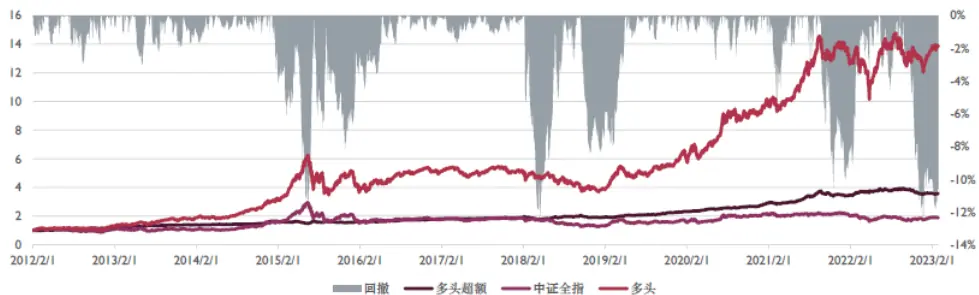

## 风险提示

量化模型失效风险、市场极端环境冲击

报告发布日期

2023 年 03 月 28 日

刘静涵

021-63325888*3211

liujinghan@orientsec.com.cn

执业证书编号：S0860520080003

香港证监会牌照：BSX840

薛耕 xuegeng@orientsec.com.cn

基于偏股型基金指数的增强方案：——因 2023-03-06子选股系列之八十八

分析师研报类 alpha 增强：——因子选股 2023-02-17系列之八十七

研报文本情感倾向因子：——《因子选股 2022-12-06系列研究之八十六》

## 1. NLP 综述

自然语言处理（NLP）的目的是让计算机能够理解和处理人类语言。自 20 世纪中叶以来，NLP历经了快速发展和挫折。在20世纪60年代，基于同义词抽取的对话程序ELIZA诞生，同时代诞生了 BoW 词袋模型，用词频表征文本，在文本分类任务上沿用至今，2013 年，Word2Vec诞生，使得每个词能在语料的词空间中使用连续值向量表示，而不是原来的 One-Hot 表示，赋能80年代发明的神经网络模型 RNN和 CNN在 NLP领域大放异彩，改变了原有技术。

2017 年，Google 在 Attention Is All You Need论文中引入了 Transformer 模型，它的诞生初衷是为了实现RNN和CNN的大一统，这个模型结合了多头自注意力机制和编码-解码结构，自推出以来，Transformer模型在各项深度学习任务中得到了广泛应用。

基于 Transformer 的预训练语言模型（T-PTLMs）在 NLP 领域非常受欢迎。其中，BERT、GPT-n 和 XLNet 等模型在各种自然语言处理任务中取得了卓越成果。BERT 同样由 Google 在2018年提出，是使用 Transformer最早的大模型；GPT-n模型由 OpenAI 提出，其中 GPT-3拥有大约1750亿参数，基于GPT模型开发的网页应用ChatGPT成为全球用户过亿最快的应用程序；XLNet模型由中国科学家杨植麟提出，是一种类BERT的模型，其自回归预训练方法被GPT所采用，在各种 NLP任务中超过了同期其他先进模型。

## 2. 数据说明

在《20221206 研报文本情感倾向因子》中，我们采用的方法为词袋模型，从标题和摘要中统计前 1000 个高频词的词频，对关键词的频率用 XGBoost 对盈利预测调整进行训练，这种方法忽略了词语之间的依赖关系，无视文本的语法和顺序，是 NLP中比较古老的文本表征方法。

本报告将使用合并标题摘要的文本序列作为输入，以分析师盈利预测调整作为训练标签，使得模型能够从原文中提取出分析师的态度，以期在前一篇报告的基础上有所提高。

图 1：个股报告示例

| 报告ID 股票代码 | 发布机构 | 入库时间 | 报告期 | 标题摘要合并 | 盈利预测调整% |
| --- | --- | --- | --- | --- | --- |
| 1524916603866 | 中信建投 | 20230112 | 20221231 | 桃李面包:Q4业绩短期受疫情影响，23年有望进入恢复 | -8.35 |
| 1527881688337 | 财通证券 | 20230131 | 20221231 | 普源精电：业绩超预期，自研芯片产品持续扩张。核心 | -12.02 |
| 1534825688697 | 广发证券 | 20230306 | 20221231 | 纽威数控：业绩符合预期，新增产能持续落地。核心观 | -0.38 |
| 1535807603515 | 海通证券 | 20230310 | 20221231 | 欧普照明公司公告点评：股权激励提振信心，业绩拐点 | -9.54 |
| 1527112603348 | 信达证券 | 20230126 | 20221231 | 文灿股份：海外业务计提预计负债，Q4业绩承压。事件 | -37.37 |

数据来源：朝阳永续，东方证券研究所
注：在标签处理时我们只保留对最近财年的盈利预测调整值

## 2.1分词

自然语言处理（NLP）分词是将连续的文本切分成有意义的词汇或短语的过程。分词是 NLP任务的基础预处理步骤，通过将文本拆分成更小的单元，便于计算机理解和分析语义，分词方法包括基于规则、基于统计和深度学习等。这里我们使用腾讯的词库，结合jieba分词模块进行分词，腾讯词库大小约为 1228万，能分出较为精准的词（图 2）.

## 图 2：分词精准度取决于词库

中国平安新银保团队：抒写寿险转型与零售财富和谐乐章。投资要点事件：近日平安银行召开2023年投资者开放日，平安银行行长特别助理兼保险金融事业部总裁方志男总就《新银保战略转型银保新战略，财富新引擎》分报告做主旨演讲，我们交流并思考如下：2021年10月，平安新银保团队正式成立，作为一支“高质量、高产能、高收入”懂保险的财富管理队伍旨在为私行及财富管理业务的可持续增长开拓新赛道。我们认为，新银保团队在提升银行中收、满足客户多元化资产配置需求、优化寿险渠道结构具有重要战略意义。

中国平安/新/银保/团队/抒写/寿险/转型/与/零售/财富/和谐乐章/投资要点/事件/近日/平安银行/召开/2023年/投资者开放日/平安银行/行长/特别助理/兼/保险金融/事业部总裁/方志/就/新银/保战略/转型/银保/新/战略/财富/新引擎/分报告/做/主旨演讲/我们/交流/并/思考/如下/2021年10月/平安/新/银保/团队/正式成立/作为/一支/高质量/高产能/高收入/懂保险/的/财富管理/队伍/旨在/为/私行/及/财富管理业务/的/可持续增长/开拓/新赛道/我们/认为/新/银保/团队/在/提升银行/收/满足客户/多元化资产配置/需求/优化/寿险/渠道结构/具有重要战略意义

数据来源：朝阳永续，东方证券研究所

分词后的序列长度分布如图 3 所示，有大量的样本长度小于 27 个词，这是因某些研报并未提供摘要，可以看到大部分序列都小于 500 词，所以我们在训练模型时，采用 500 作为序列最大长度对分词序列进行 Padding。

图 3：文本分词之后的词数分布
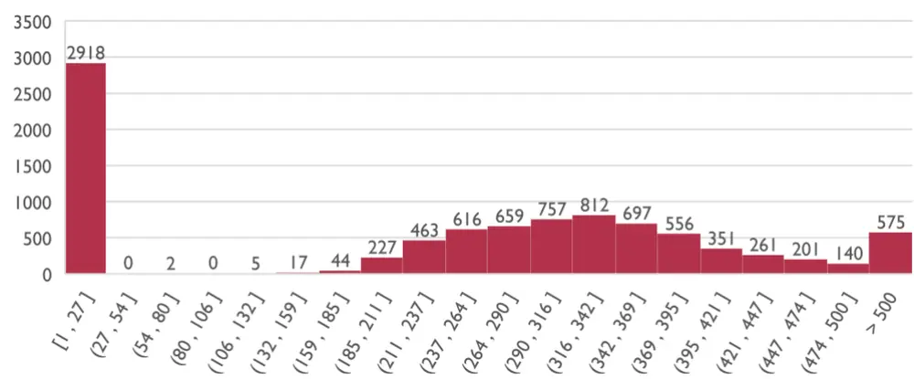
数据来源：朝阳永续，东方证券研究所

## 2.2 标签盈利预测调整

盈利预测调整计算方式为，同一机构针对某一公司的同一财年的净利润，会多次发布研报进行预测，某次预测相比上一次的变化率，称之为盈利预测调整，但一份研报会针对多个财年进行预测，在标签处理时我们只保留对最近财年的盈利预测调整值。

盈利预测调整反映了分析师对于公司现状的情感态度，如果分析师决定上调盈利预测，说明公司的基本面发生了积极的变化，而这种“变化”会以文本的形式反映在研报的标题摘要中，我们用盈利预测调整值所训练出来的模型，可以理解摘要中的正负面信息，从而给出更加客观的情感打分，所以本因子也取名为分析师情感调整打分（Analyst Sentiment Adjusted Score，ASAS）。

而盈利预测调整值存在较多的零值和极值，所以我们采用逆概率密度函数（IPDF）对其进行处理，使其尽量符合正态分布，在神经网络模型中更容易收敛。

有关分析师的申明，见本报告最后部分。其他重要信息披露见分析师申明之后部分，或请与您的投资代表联系。并请阅读本证券研究报告最后一页的免责申明。

注：累积分布函数（CDF）来计算随机变量小于或等于给定值的概率。逆概率密度函数（IPDF）则实现了相反的操作：给定一个概率，它计算出对应的随机变量的值。

图 4：原始盈利预测调整分布
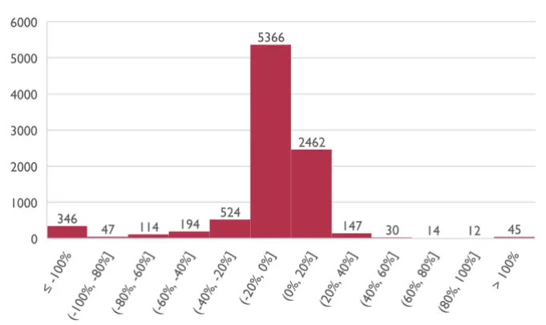
数据来源：朝阳永续，东方证券研究所

图 5：预处理盈利预测调整分布
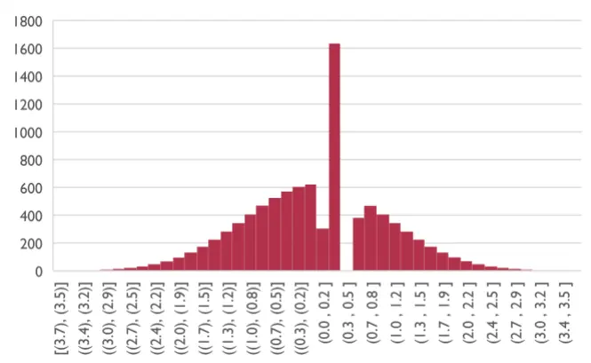
数据来源：朝阳永续，东方证券研究所

## 2.3词嵌入

Word2Vec 是一种用于生成词向量（词嵌入）的技术，它将自然语言中的单词转换为高维空间中的数值向量，使得具有相似意义的单词在空间中靠近。Skip-gram 是 Word2Vec 中的一种模型，通过预测给定单词的上下文来学习这些词嵌入，从而捕捉单词间的语义信息。有两个著名的中文单词嵌入数据集。其中一个数据集是腾讯人工智能实验室嵌入语料库，另一个数据集是中文单词向量 Chinese Word Vector。

图 6：CWV、腾讯的 Embedding 对比

|  | 训练算法 最大词库大小 最大维度 |  | 开发者 |
| --- | --- | --- | --- |
| Chinese Word Vector | SGNS | 128万 | 300 北师大、人大 |
| 腾讯词向量 | DSG | 1228万 | 200 腾讯AI实验室 |
| 数据来源：Tencent AI Lab，Github，东方证券研究所 |  |  |  |

腾讯 AI Lab 的词向量和 Chinese Word Vector 在以下几个方面存在差异：

⚫语料采集：腾讯AI Lab词向量的训练语料来自腾讯新闻、天天快报的新闻语料、互联网网页和小说，覆盖多种类型的词汇。相比之下，Chinese Word Vector 的训练语料来自各领域，如百度百科、维基百科、人民日报、知乎、微博等。

- 词库构建：腾讯AI Lab词向量使用了自动发现新词的算法，并计算新词之间的语义相似度。而 Chinese Word Vector则直接采用了北师大和人大研究者们开源的中文词向量语料库。

训练算法：腾讯 AI Lab 词向量采用自研的 Directional Skip-Gram (DSG)算法，考虑了词对的相对位置，以提高词向量语义表示的准确性。而 Chinese Word Vector 使用了 Skip-gramwith Negative Sampling (SGNS)作为训练算法，后者仅为一种提高训练速度的采样方法。

词库大小：腾讯 AI Lab 词向量的词库大小达到了 1228 万，而 Chinese Word Vector 的词库大小为 128 万。

有关分析师的申明，见本报告最后部分。其他重要信息披露见分析师申明之后部分，或请与您的投资代表联系。并请阅读本证券研究报告最后一页的免责申明。

⚫ 词向量维度：腾讯 AI Lab 词向量的维度为 200，而 Chinese Word Vector 的维度为 300。

覆盖率：腾讯 AI Lab 词向量在研报词汇覆盖率达到 91%，而 Chinese Word Vector 的覆盖率仅为 24%，较低的覆盖率会导致词嵌入时出现过多的零向量。

综上所述，腾讯AI Lab词向量在语料采集、词库构建、训练算法、词库大小和覆盖率等方面与 Chinese Word Vector存在较大差异，显示出较高的覆盖率和准确性。

## 3. 模型对比

## 3.1NLP 模型介绍

循环神经网络（RNN）在文本处理中被广泛采用，尤其是长短时记忆网络（LSTM）和门控循环单元（GRU）。它们的"门控机制"使其具备记忆功能，其中 LSTM 的"遗忘门"在长文本任务中表现出色。然而，GRU在多数情况下与LSTM性能相近，且参数较少、内存占用低且训练速度更快，因此也是一个理想的选择。

一维卷积神经网络（1D-CNN）和时序卷积网络（TCN）在部分自然语言处理（NLP）任务中胜过 RNN，例如文本分类和语音识别。融合 RNN 和 CNN 的网络，如 RCNN，在 Kaggle 比赛中得到广泛应用。利用 Conv1D 进行词向量特征提取并通过池化操作汇总，可以作为特征提取器。

Transformer 和循环神经网络（RNN）和都在文本处理任务中得到了广泛应用，但在某些方面，Transformer 展现出了优势。首先，由于它们具有并行计算能力，Transformers 可以在相同时间内处理更长的序列，而 RNNs 以逐词处理的方式进行计算，使得 RNNs 更适合处理较短的序列。其次，Transformers 能够更有效地捕捉长距离依赖关系。这是通过自注意力（Self-Attention）机制实现的，该机制允许每个词与序列中的其他所有词建立联系，而 RNNs 仅能关注序列中的前一个词，这限制了它们捕捉长距离依赖关系的能力。

BERT （ Bidirectional Encoder Representations from Transformers ） 模 型 是 一 种 基 于Transformer 架构的预训练自然语言处理模型，通过整合双向上下文信息来理解句子。然而，BERT 存在局限性。首先，其参数量庞大，导致在微调过程中容易出现过拟合现象。由于无法调整 BERT 内部的参数，例如 Dropout 比率，这对于连续值标签的情感分析任务可能会带来问题。其次，若不进行微调，BERT可能缺乏对专业领域词汇的理解。

## 3.2基线对比

我们采用 50 词的序列对 SimpleRNN、GRU、LSTM、Conv1D、Transformer Encoder、BERT 六个模型进行对比，这里的模型是 Naïve 的，也就是没有添加复杂的结构和参数进行优化，以期获得各个模型在数据集上的原始性能，来决定后续研究采用的模型，其中 Transformer 未经预训练，而是指单个TransformerEncoder。在评价各个模型的表现时，我们主要关注两个方面：收敛速度和过拟合程度。

收敛速度：从表格中可以看出，Transformer在训练集上的损失收敛速度最快，紧随其后的是 LSTM、GRU 和 Conv1D。SimpleRNN 和 BERT 的几乎不收敛。在测试集上，收敛速度的顺序与训练集基本一致，Transformer和 GRU依然表现出最快的收敛速度。

⚫ 过拟合程度：对于过拟合程度的评估，我们主要关注训练集和测试集损失之间的差距。从表格中可以观察到， Transformer在训练集和测试集上的损失差距较小，说明在这个任务上的过拟合程度较低。而 Conv1D、LSTM、GRU在训练集和测试集上的损失差距较大，表明这些模型在这个任务上可能存在一定程度的过拟合。

综合考虑收敛速度和过拟合程度，Transformer在这个任务上表现最好， LSTM、GRU的表现较为接近，但存在一定程度的过拟合，Conv1D的训练集收敛速度极快，但过拟合程度较高。后续的模型我们以 Transformer作为基础搭建。

图 7：各模型训练集损失
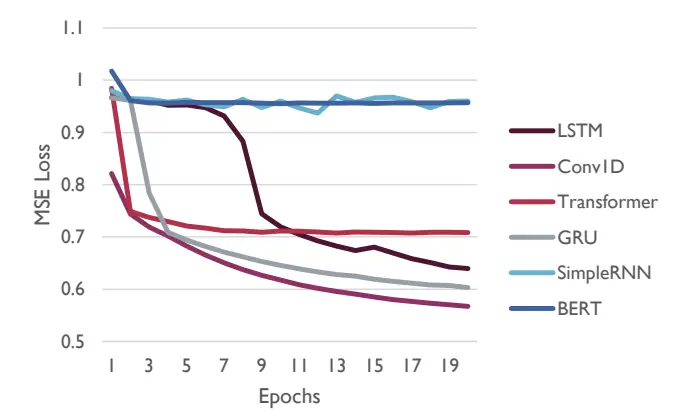
数据来源：朝阳永续，东方证券研究所

图 8：各模型测试集损失
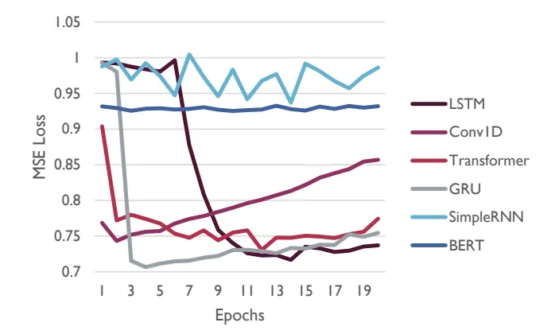
数据来源：朝阳永续，东方证券研究所

在实验中，为了使模型在结构上更贴近 Transformer，我们在双向门控循环单元（Bi-GRU）中引入了自注意力（Self-Attention）机制。然而，验证结果显示其性能依然不如原生的Transformer Encoder。

随着文本序列长度的增加，循环神经网络（RNN）的训练时间显著上升。在使用四块A4000显卡进行测试时，文本长度为 50 词时，RNN 与 Transformer 的训练时间差异不大，每个 epoch约 20秒；但当文本长度扩展至 500词时，Transformer每个 epoch的训练时间为 30秒，而 GRU却需要 6分钟，LSTM更高达 9分钟。

## 3.3 最终模型：双层 Transformer+一维卷积

最终设计的模型是一个混合结构的深度学习网络，结合了 Transformer 编码器和一维卷积神经网络 (1D-CNN)，模型结构概述：

⚫ 输入层：接收固定长度的文本序列（500个词）。

⚫ 嵌入层：将输入的词 ID转换为固定大小的词向量，这里使用预训练的词嵌入。

⚫ 两层 Transformer 编码器层：每个编码器包含多头自注意力机制和全连接前馈网络，实现NLP中的上下文建模。

⚫ 一维卷积层：提取局部特征和 n-gram模式，n-gram模式可以在两个词之间形成词组。

⚫ 全局平均池化和全局最大池化：从卷积层提取的特征进行池化操作，降维并捕获全局信息。

⚫ 连接层：将平均池化和最大池化的结果进行拼接。

⚫ Dropout层：用于减少过拟合。

有关分析师的申明，见本报告最后部分。其他重要信息披露见分析师申明之后部分，或请与您的投资代表联系。并请阅读本证券研究报告最后一页的免责申明。

⚫ 输出层：全连接层，使用 tanh激活函数，预测输入文本的情感得分。

图 9：模型结构
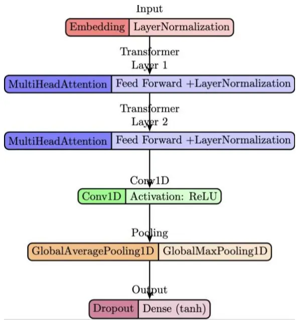
数据来源：东方证券研究所绘制

这种混合结构模型在情感分析任务上具有许多优点。首先，通过多头自注意力机制，Transformer 编码器可以捕捉长距离的依赖关系，提高模型对上下文信息的敏感性；其次，Transformer 编码器支持高度并行计算，有助于加快训练速度和提高模型性能；此外，一维卷积层可以有效地捕捉局部特征和n-gram模式，增强模型的表达能力；全局池化操作可以捕捉整个序列的全局信息，而连接层则允许模型同时利用全局平均池化和全局最大池化的结果，实现更丰富的特征表示；最后，这种混合结构可以轻松扩展到其他自然语言处理任务，具有较强的通用性。以下是进行滚动训练时使用的超参数。

图 10：优化后的超参数

| 超参数名称(英文名 / 中文名) | 数值 |
| --- | --- |
| Sequence Length (seqlen / 序列长度) | 500 |
| Number of Heads (num_heads / 头数) | 8 |
| Depth of Feed-Forward Network (dff / 前馈网络深度) | 96 |
| Number of Transformer Layers (num_transformer_layers / Transformer层数) | 2 |
| Number of Filters (filters / 卷积核数量) | 64 |
| Kernel Size (kernel_size / 卷积核大小) | 5 |
| Dropout Rate (dropout_rate / 丢弃率) | 0.5 |
| Learning Rate (learning_rate / 学习率) | 1.6E-05 |

数据来源：朝阳永续，东方证券研究所

## 4. 因子表现

我们采用滚动训练的方式（图 11），训练集为t−3~t，测试集为t~t+1，整个测试集区间为 20120131~20230228，每个月末采集过去三个月内某只股票每家券商最新报告的模型打分，取均值作为分析师情感调整分数 ASAS。在回测中，因为研报数据不会覆盖所有股票（图 12），所以在特定样本空间用行业中值对缺失值进行填充，全样本则是过去三个月内所有研报覆盖的股票，不进行填充。

图 11：滚动训练方式
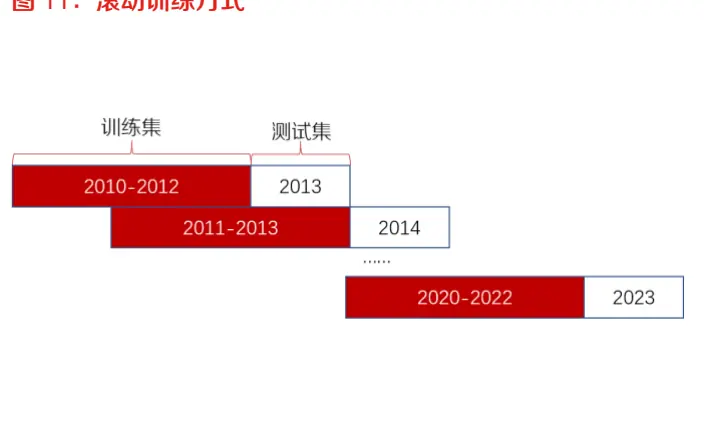
数据来源：朝阳永续，东方证券研究所

图 12：研报在各样本空间的覆盖率
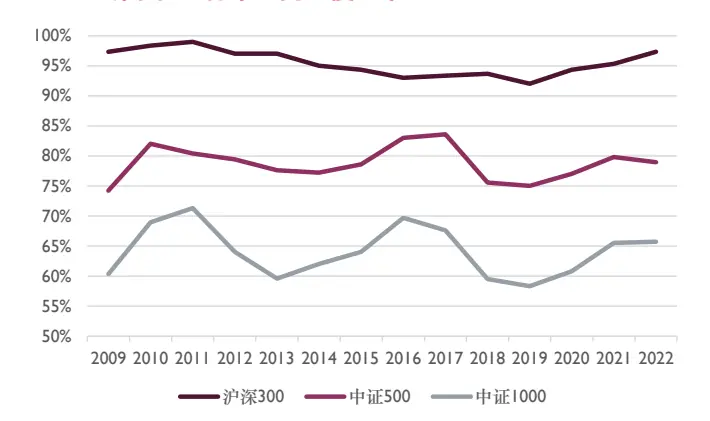
数据来源：朝阳永续，东方证券研究所

本章的回测指标中，所有和收益率相关的的指标，如无特别说明，均为超额收益，所有超额收益的基准均为样本内的平均收益。分组表现中，B1为因子值最小组，B10为因子值最大组。

## 4.1单因子表现

ASAS因子在所有样本空间中的 Rank IC均为正值，预测能力较为稳定。同时，各个样本空间的 ICIR 均大于 1，因子稳定性较高。在中证 500、中证 800 和中证 1000 样本空间中，该因子表现出较高的超额年化收益率，尤其在中证 1000 样本空间中表现最优。此外中证 1000样本空间中，年化波动率相对较低，显示出较低的风险特征。在中证1000样本空间中，最大回撤较低，表明该因子在该样本空间中的风险调整表现较为稳定。

ASAS 因子在沪深 300 样本空间中的超额年化收益率和年化波动率表现较差，最大回撤较高，说明该因子在大盘股中的风险较高。此外，2022 年和 2023 年的超额收益在全样本空间和各指数样本空间中普遍表现较差，可能受到市场环境的影响。

图 13：ASAS各样本空间综合表现

|  | RankIC | ICIR | Sharpe | AnnRet | Vol | MaxDD | 2012 | 2013 | 2014 |
| --- | --- | --- | --- | --- | --- | --- | --- | --- | --- |
| 全样本 | 0.040 | 2.009 | 1.67 | 12.5% | 7.2% | -12.3% | 16.6% | 19.1% | 18.5% |
| 沪深300 | 0.047 | 1.341 | 1.03 | 10.5% | 10.1% | -30.6% | 9.0% | 22.1% | 35.5% |
| 中证500 | 0.041 | 1.545 | 1.57 | 15.6% | 9.5% | -17.4% | 22.5% | 38.0% | 4.3% |
| 中证800 | 0.044 | 1.644 | 1.36 | 12.3% | 8.8% | -17.5% | 16.0% | 22.0% | 22.8% |
| 中证1000 | 0.037 | 1.658 | 2.00 | 17.4% | 8.2% | -11.9% | 10.0% | 26.8% | 15.2% |

|  | 2015 | 2016 | 2017 | 2018 | 2019 | 2020 | 2021 | 2022 | 2023 |
| --- | --- | --- | --- | --- | --- | --- | --- | --- | --- |
| 全样本 | -5.7% | 14.0% | 6.0% | 2.1% | 18.7% | 21.5% | 25.9% | 3.3% | -0.8% |
| 沪深300 | -6.0% | 4.6% | 5.2% | -0.4% | 20.3% | 31.2% | 13.7% | -11.0% | -1.7% |
| 中证500 | 10.0% | 12.3% | 5.7% | 1.1% | 17.2% | 8.1% | 43.8% | 8.6% | 3.6% |
| 中证800 | -6.0% | 10.7% | 4.3% | 0.7% | 20.6% | 15.3% | 31.2% | -0.6% | 1.2% |
| 中证1000 | 12.1% | 17.5% | 5.9% | 13.3% | 15.6% | 32.7% | 29.7% | 12.8% | -1.2% |

数据来源：Wind，朝阳永续，东方证券研究所

图 14：ASAS超额净值（全样本）
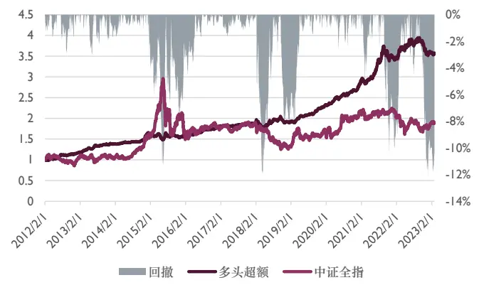
数据来源：Wind，朝阳永续，东方证券研究所

图 15：ASAS多头净值（全样本）
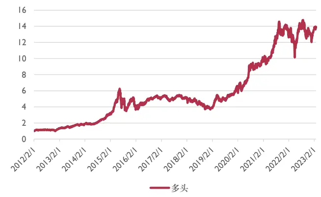
数据来源：Wind，朝阳永续，东方证券研究所

图 16：ASAS超额净值（沪深300样本空间）
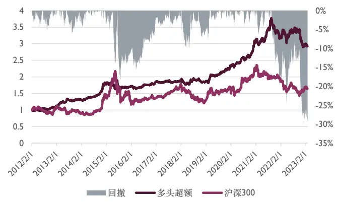
数据来源：Wind，朝阳永续，东方证券研究所

图 17：ASAS多头净值（沪深300样本空间）
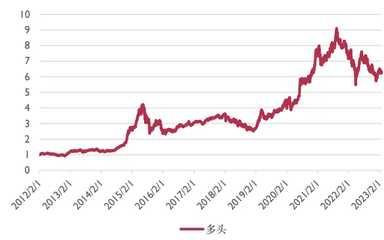
数据来源：Wind，朝阳永续，东方证券研究所

有关分析师的申明，见本报告最后部分。其他重要信息披露见分析师申明之后部分，或请与您的投资代表联系。并请阅读本证券研究报告最后一页的免责申明。

图 18：ASAS超额净值（中证500样本空间）
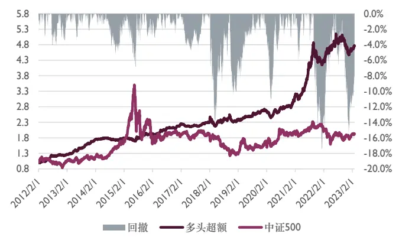
数据来源：Wind，朝阳永续，东方证券研究所

图 19：ASAS多头净值（中证500样本空间）
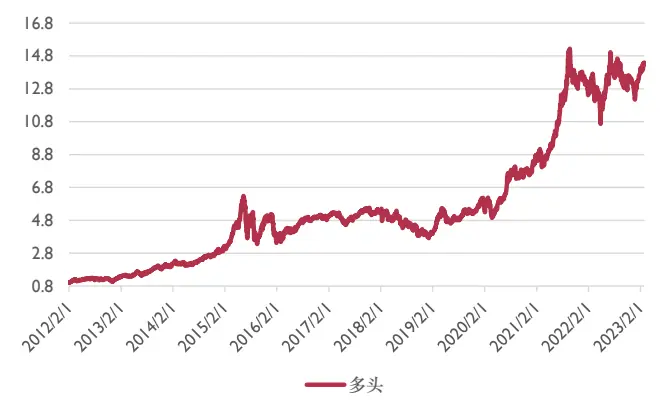
数据来源：Wind，朝阳永续，东方证券研究所

图 20：ASAS超额净值（中证1000样本空间）
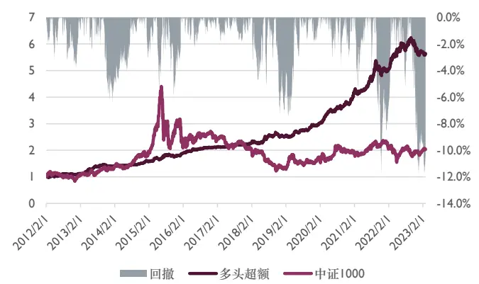
数据来源：Wind，朝阳永续，东方证券研究所

图 21：ASAS多头净值（中证1000样本空间）
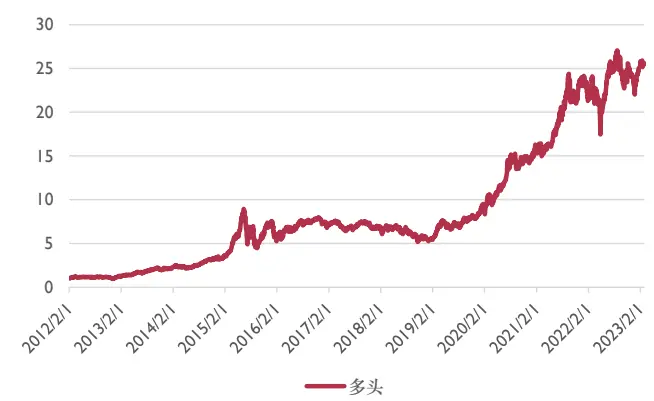
数据来源：Wind，朝阳永续，东方证券研究所

图 22：ASAS分组超额净值（全样本）
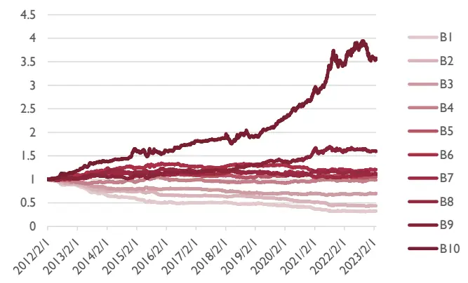
数据来源：Wind，朝阳永续，东方证券研究所

图 23：ASAS分组超额净值（沪深 300样本空间）
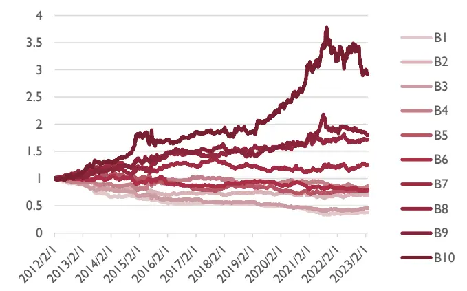
数据来源：Wind，朝阳永续，东方证券研究所

图 24：ASAS分组超额净值（中证 500样本空间）
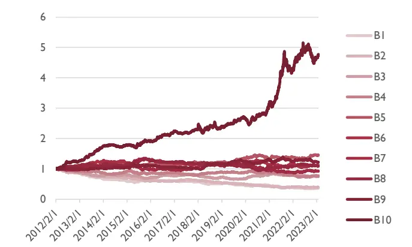
数据来源：Wind，朝阳永续，东方证券研究所

图 25：ASAS分组超额净值（中证 1000样本空间）
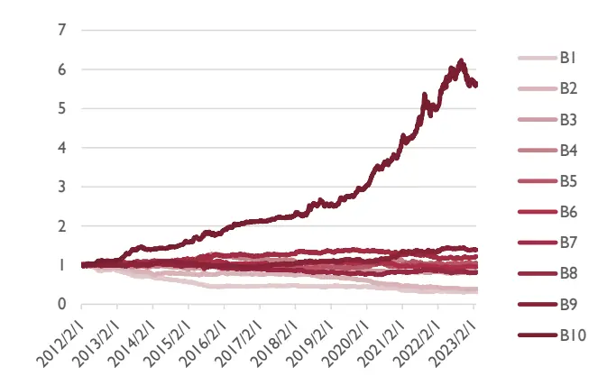
数据来源：Wind，朝阳永续，东方证券研究所

图 26：ASAS各样本空间分组年化超额收益
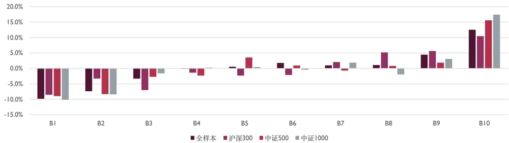
数据来源：Wind，朝阳永续，东方证券研究所

## 4.2因子相关性

预期外净利润（SUE）和营业收入（SUR）是基于季节性随机游走模型预测的净利润和营业收入计算的，用来度量业绩超预期的程度，根据模型是否带漂移项，我们计算了 SUE0、SUE1、SUR0 和 SUR1 共 4 个业绩超预期类指标，详情参考《20180518业绩超预期类因子》。WFR因子采用Accwt2方法对各个分析师的预测净利润相对于自己之前预测的调整比例进行加权，详情参考《20171203分析师研报的数据特征与 alpha》。

ASAS因子在 IC相关性上和标签、WFR的 IC相关性较高，标签的 Rank IC均值为0.035，ICIR1.4，WFR 的 Rank IC 均值为 0.029，ICIR1.3，ASAS 的 Rank IC 均值为 0.040，ICIR2.0，说明模型的升级很好地修正了分析师的盈利预测调整，使得选股能力和稳定性同步提升。

图 27：因子值相关性（右上半区），IC相关性（左下半区）

|  | ASAS | 标签 | SUEO | SUE1 | SURO SUR1 |  | WFR |
| --- | --- | --- | --- | --- | --- | --- | --- |
| ASAS |  | 0.45 | 0.29 | 0.39 | 0.23 | 0.28 | 0.41 |
| 标签SUEO |  | 0.70 |  | 0.37 | 0.43 | 0.23 | 0.26 |
|  | 0.59 | 0.73 |  | 0.86 | 0.47 | 0.42 | 0.35 |
| SUE1SUROSUR1 | 0.61 | 0.71 | 0.90 |  | 0.43 | 0.51 | 0.39 |
|  | 0.60 | 0.62 | 0.81 | 0.80 |  | 0.87 | 0.22 |
|  | 0.56 | 0.55 | 0.74 | 0.88 | 0.88 |  | 0.24 |
|  | WFR |  |  |  |  |  |  |

数据来源：Wind，朝阳永续，东方证券研究所

有关分析师的申明，见本报告最后部分。其他重要信息披露见分析师申明之后部分，或请与您的投资代表联系。并请阅读本证券研究报告最后一页的免责申明。

ASAS 是以分析师盈利预测调整作为标签训练得到的因子，意在从文本中获取遗漏的信息，从而对盈利调整值进行修正，为了检测是否达成此目标，我们用标准化后的盈利预测调整（标签），取三个月内的每家券商的最新研报作为样本，取平均值作为标签因子 ，回测发现其本身的选股能力也很突出，在ASAS对标签因子正交后，Rank IC仍然能够达到2.5%，说明ASAS确实达成了提取文本中额外信息的目标，与 WFR 正交之后能保留 3.7%的 Rank IC，说明文本特征相比于 Accwt2加权方式提供了额外的信息量。

图 28：剔除标签之后的因子表现

|  | RankIC | ICIR | Sharpe | AnnRet | Vol | MaxDD | 2012 | 2013 | 2014 |
| --- | --- | --- | --- | --- | --- | --- | --- | --- | --- |
| ASAS全样本 | 0.040 | 2.009 | 1.67 | 12.5% | 7.2% | -12.3% | 16.6% | 19.1% | 18.5% |
| 标签因子 | 0.035 | 1.431 | 1.59 | 9.6% | 5.9% | -22.5% | 13.2% | 8.2% | 24.2% |
| 与标签正交 | 0.025 | 1.249 | 1.04 | 5.3% | 5.0% | -25.0% | 10.2% | 3.7% | 18.5% |
| WFR | 0.029 | 1.320 | 1.12 | 6.5% | 5.8% | -21.5% | 9.0% | 1.3% | 19.2% |
| 与WFR正交 | 0.037 | 1.902 | 1.71 | 12.5% | 7.0% | -12.2% | 18.2% | 20.5% | 18.7% |

|  | 2015 | 2016 | 2017 | 2018 | 2019 | 2020 | 2021 | 2022 | 2023 |
| --- | --- | --- | --- | --- | --- | --- | --- | --- | --- |
| ASAS全样本 | -5.7% | 14.0% | 6.0% | 2.1% | 18.7% | 21.5% | 25.9% | 3.3% | -0.8% |
| 标签因子 | -1.1% | 7.2% | 13.0% | 5.4% | 11.4% | 13.6% | 14.2% | -2.0% | -0.9% |
| 与标签正交 | -0.6% | 4.1% | 12.1% | 3.7% | 5.3% | 5.0% | 4.7% | -6.2% | -1.8% |
| WFR | -0.9% | 1.0% | 8.6% | 2.3% | 10.2% | 13.7% | 11.4% | -1.6% | -1.9% |
| 与WFR正交 | -6.6% | 15.2% | 8.2% | -1.3% | 16.7% | 19.3% | 28.1% | 3.4% | -0.7% |

数据来源：Wind，朝阳永续，东方证券研究所

## 5. 风险提示

1. 量化模型基于历史数据分析得到，未来存在失效的风险，建议投资者紧密跟踪模型表现。

2. 极端市场环境可能对模型效果造成剧烈冲击，导致收益亏损。

## 6. 参考文献

Weizenbaum, J. (1966). ELIZA - A Computer Program For the Study of Natural Language Communication Between Man and Machine. Communications of the ACM, 9(1), 36-45.

Sahlgren, M. (2006). The distributional hypothesis. Italian Journal of Linguistics, 18(1), 33-53.

Mikolov, T., Chen, K., Corrado, G., & Dean, J. (2013). Efficient Estimation of Word Representations in Vector Space. In Proceedings of ICLR.

LeCun, Y., Bottou, L., Bengio, Y., & Haffner, P. (1998). Gradient-Based Learning Applied to Document Recognition. Proceedings of the IEEE, 86(11), 2278-2324.

Hochreiter, S., & Schmidhuber, J. (1997). Long Short-Term Memory. Neural Computation, 9(8), 1735-1780.

Vaswani, A., Shazeer, N., Parmar, N., Uszkoreit, J., Jones, L., Gomez, A. N., Kaiser, L., & Polosukhin, I. (2017). Attention Is All You Need. In Proceedings of the 31st Conference on Neural Information Processing Systems (NIPS 2017).

有关分析师的申明，见本报告最后部分。其他重要信息披露见分析师申明之后部分，或请与您的投资代表联系。并请阅读本证券研究报告最后一页的免责申明。

Devlin, J., Chang, M.-W., Lee, K., & Toutanova, K. (2019). BERT: Pre-training of Deep Bidirectional Transformers for Language Understanding. In Proceedings of the 2019 Conference of the North American Chapter of the Association for Computational Linguistics (NAACL).

Radford, A., Narasimhan, K., Salimans, T., & Sutskever, I. (2018). Improving Language Understanding by Generative Pre-Training. Retrieved from https://s3-us-west-2.amazonaws.com/openai-assets/research-covers/language
unsupervised/language_understanding_paper.pdf

Yang, Z., Dai, Z., Yang, Y., Carbonell, J. G., Salakhutdinov, R., & Le, Q. V. (2019). XLNet: Generalized Autoregressive Pretraining for Language Understanding. In Proceedings of the 33rd Conference on Neural Information Processing Systems (NeurIPS 2019).

Yan Song, Shuming Shi, Jing Li, and Haisong Zhang. Directional Skip-Gram: Explicitly Distinguishing Left and Right Context for Word Embeddings. NAACL 2018

Shen Li, Zhe Zhao, Renfen Hu, Wensi Li, Tao Liu, Xiaoyong Du, Analogical Reasoning on Chinese Morphological and Semantic Relations, ACL 2018.

Yuanyuan Qiu, Hongzheng Li, Shen Li, Yingdi Jiang, Renfen Hu, Lijiao Yang. Revisiting Correlations between Intrinsic and Extrinsic Evaluations of Word Embeddings. Chinese Computational Linguistics and Natural Language Processing Based on Naturally Annotated Big Data. Springer, Cham, 2018. 209-221. (CCL & NLP-NABD 2018 Best Paper)

Wu, X., Zhang, Y., & Sun, X. (2019). IPDF: A Novel Method for Deep Learning Label Preprocessing. In Proceedings of the International Conference on Computer Science and Artificial Intelligence (CSAI 2019)

Liang P J , Meursault V , Routledge B B , et al. PEAD.txt: Post-Earnings-Announcement Drift Using Text[J]. Working Papers, 2021.

## Tabl e_Disclai mer 分析师申明

每位负责撰写本研究报告全部或部分内容的研究分析师在此作以下声明：

分析师在本报告中对所提及的证券或发行人发表的任何建议和观点均准确地反映了其个人对该证券或发行人的看法和判断；分析师薪酬的任何组成部分无论是在过去、现在及将来，均与其在本研究报告中所表述的具体建议或观点无任何直接或间接的关系。

## 投资评级和相关定义

报告发布日后的 12个月内的公司的涨跌幅相对同期的上证指数/深证成指的涨跌幅为基准；

## 公司投资评级的量化标准

买入：相对强于市场基准指数收益率 15%以上；

增持：相对强于市场基准指数收益率 5%～15%；

中性：相对于市场基准指数收益率在-5%～+5%之间波动；

减持：相对弱于市场基准指数收益率在-5%以下。

未评级 —— 由于在报告发出之时该股票不在本公司研究覆盖范围内，分析师基于当时对该股票的研究状况，未给予投资评级相关信息。

暂停评级 —— 根据监管制度及本公司相关规定，研究报告发布之时该投资对象可能与本公司存在潜在的利益冲突情形；亦或是研究报告发布当时该股票的价值和价格分析存在重大不确定性，缺乏足够的研究依据支持分析师给出明确投资评级；分析师在上述情况下暂停对该股票给予投资评级等信息，投资者需要注意在此报告发布之前曾给予该股票的投资评级、盈利预测及目标价格等信息不再有效。

## 行业投资评级的量化标准：

看好：相对强于市场基准指数收益率 5%以上；

中性：相对于市场基准指数收益率在-5%～+5%之间波动；

看淡：相对于市场基准指数收益率在-5%以下。

未评级：由于在报告发出之时该行业不在本公司研究覆盖范围内，分析师基于当时对该行业的研究状况，未给予投资评级等相关信息。

暂停评级：由于研究报告发布当时该行业的投资价值分析存在重大不确定性，缺乏足够的研究依据支持分析师给出明确行业投资评级；分析师在上述情况下暂停对该行业给予投资评级信息，投资者需要注意在此报告发布之前曾给予该行业的投资评级信息不再有效。

## HeadertTabl e_Discl ai mer 免责声明

本证券研究报告（以下简称“本报告”）由东方证券股份有限公司（以下简称“本公司”）制作及发布。

。本公司不会因接收人收到本报告而视其为本公司的当然客户。本报告的全体接收人应当采取必要措施防止本报告被转发给他人。

本报告是基于本公司认为可靠的且目前已公开的信息撰写，本公司力求但不保证该信息的准确性和完整性，客户也不应该认为该信息是准确和完整的。同时，本公司不保证文中观点或陈述不会发生任何变更，在不同时期，本公司可发出与本报告所载资料、意见及推测不一致的证券研究报告。本公司会适时更新我们的研究，但可能会因某些规定而无法做到。除了一些定期出版的证券研究报告之外，绝大多数证券研究报告是在分析师认为适当的时候不定期地发布。

在任何情况下，本报告中的信息或所表述的意见并不构成对任何人的投资建议，也没有考虑到个别客户特殊的投资目标、财务状况或需求。客户应考虑本报告中的任何意见或建议是否符合其特定状况，若有必要应寻求专家意见。本报告所载的资料、工具、意见及推测只提供给客户作参考之用，并非作为或被视为出售或购买证券或其他投资标的的邀请或向人作出邀请。

本报告中提及的投资价格和价值以及这些投资带来的收入可能会波动。过去的表现并不代表未来的表现，未来的回报也无法保证，投资者可能会损失本金。外汇汇率波动有可能对某些投资的价值或价格或来自这一投资的收入产生不良影响。那些涉及期货、期权及其它衍生工具的交易，因其包括重大的市场风险，因此并不适合所有投资者。

在任何情况下，本公司不对任何人因使用本报告中的任何内容所引致的任何损失负任何责任，投资者自主作出投资决策并自行承担投资风险，任何形式的分享证券投资收益或者分担证券投资损失的书面或口头承诺均为无效。

本报告主要以电子版形式分发，间或也会辅以印刷品形式分发，所有报告版权均归本公司所有。未经本公司事先书面协议授权，任何机构或个人不得以任何形式复制、转发或公开传播本报告的全部或部分内容。不得将报告内容作为诉讼、仲裁、传媒所引用之证明或依据，不得用于营利或用于未经允许的其它用途。

经本公司事先书面协议授权刊载或转发的，被授权机构承担相关刊载或者转发责任。不得对本报告进行任何有悖原意的引用、删节和修改。

提示客户及公众投资者慎重使用未经授权刊载或者转发的本公司证券研究报告，慎重使用公众媒体刊载的证券研究报告。

## 东方证券研究所

地址： 上海市中山南路 318 号东方国际金融广场 26 楼

电话：021-63325888

传真：021-63326786

网址： www.dfzq.com.cn