# DFQ 遗传规划价量因子挖掘系统

## 因子选股系列之九十

## 研究结论

国内量化发展已有十余年，各家机构投资者的 alpha因子库已有较大规模，传统人工构建 alpha因子的方法已遇到瓶颈。为了对人工因子库进行补充，我们在传统alpha模型的体系下引入遗传规划方法，将挖掘因子的部分交给机器。

此次我们对遗传规划算法进行了全面升级，开发出了一套高效的 DFQ遗传规划价量因子挖掘系统。加入自定义的特征和算子，指定适应度指标，从一个随机种群出发，可以通过多代进化得到更优子代。挖掘过程可以重复多轮，从而可以得到多个适应度高、低相关、有显式表达式的选股因子。

⚫遗传规划算法在选股因子挖掘问题上有其难以被其他方法替代的独特优势，我们概括了 12点优势：有着直观易懂的底层逻辑，能够自动化特征生成与选择，可以融合人工先验信息，捕捉非线性和交互效应，生成的因子具有显式表达式，可解释性强，能够实现全局优化，对噪声较为鲁棒不易过拟合。算法内部透明白盒，可拓展空间大，自由度高。是一个可持续进行的因子挖掘工具。对计算性能要求相对低。应用广泛，既可以挖掘单因子使用，也可以将挖掘出的多个有效低相关的单因子进行合成，获得个股综合打分。还可以与其他机器学习模型结合，互相间并不冲突。

⚫ 由于在进化过程中缺乏明确的目标引导，常规的遗传规划算法进化效率低下。如何能提升进化效率，在有限的算力，有限的时间内，进化出更多、更好、更短、更低相关的因子，是算法的核心痛点，也是 DFQ模型的核心改进点。

DFQ模型主要有 7点改进：提升初始种群质量，提升每代种群质量，提升每代产生的有效公式数量，避免公式膨胀，动态调整每代进化参数，降低挖掘因子的相关性，避免无效运算。

DFQ 模型以 2012-2016 年为训练集，2017-2023 年作为样本外测试集。输入 47 个日度量价和日内分钟量价特征和 6个常数，配合 81个算子，以行业市值中性化 IC作为适应度，挖掘全市场月频价量因子。

DFQ模型挖掘效率较高，进行一轮 15代完整挖掘用时 5-24小时不等，一轮完成后可产生 20-50个适应度超过 5%，且互相间相关系数不超过 50%的单因子。我们在挖掘 3天后已找到 324个训练集适应度超过 5%，不重复，且与人工 18个价量因子相关性不高的单因子。其中只有 45个在12年以来全样本中性化 IC绝对值不到5%，样本外衰减率不到 14%。

结合挖掘出单因子样本内外的表现和逻辑性，我们精选了 10个单因子，均满足：12年以来中性化 IC绝对值达到 8%以上，中性化 ICIR绝对值达到年化 4以上；样本外未出现明显效果衰减，全样本 IC不大幅低于训练集适应度；12年以来十组多头超额收益达到 10%以上；单调性绝对值达到 99%以上；与18个人工因子最大相关系数低于 50%；因子原始值缺失率低于 6%；因子表达式长度低于 10。

在弹性网络模型下，DFQ合成因子 17年以来的月频 RankIC达到 12.72%，年化ICIR5.44。合成因子 20分组单调性较好，多头端分年表现也十分稳定，2017-2023年每年多头超额均超过 8%，17年以来多头超额年化 13.29%，年化夏普 2.42，最大回撤仅为 3.5%，月度胜率达到 74%，月均换手单边72%。20年以来多头表现不降反升，多头超额收益年化提高到 14.32%。

## 风险提示

1. 量化模型基于历史数据分析，未来存在失效风险，建议投资者紧密跟踪模型表现。

2. 极端市场环境可能对模型效果造成剧烈冲击，导致收益亏损。

报告发布日期

2023 年 05 月 28 日

杨怡玲 yangyiling@orientsec.com.cn

执业证书编号：S0860523040002

刘静涵021-63325888*3211

liujinghan@orientsec.com.cn

执业证书编号：S0860520080003

香港证监会牌照：BSX840

分析师情感调整分数 ASAS：——因子选 2023-03-28股系列之八十九

基于偏股型基金指数的增强方案：——因 2023-03-06子选股系列之八十八

分析师研报类 alpha 增强：——因子选股 2023-02-17系列之八十七

研报文本情感倾向因子：——《因子选股 2022-12-06系列研究之八十六》

基于财报的业绩超预期度量：——因子选 2022-10-25股系列之八十五

分析师覆盖度因子改进：——《因子选股 2022-08-23系列研究 之 八十四》

## 一、DFQ遗传规划价量因子挖掘系统概述

多因子选股体系主要包括alpha模型、风险模型、交易成本模型和组合优化四个模块。alpha模型负责对股票收益或 alpha的预测，对组合收益的影响相对更大，是量化研究的重中之重。

图 1：多因子选股体系
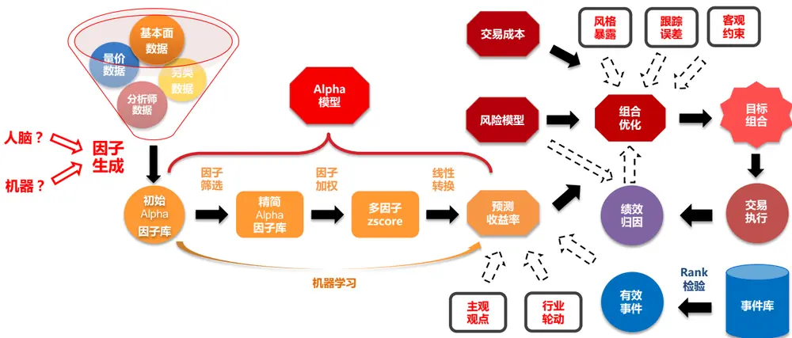
数据来源：东方证券研究所绘制

传统的因子生成过程更多依赖人工。国内量化发展已有十余年，各家机构投资者的 alpha 因子库已有较大规模。再靠人工发现一个新增的有效因子不易，因子挖掘的周期越来越长，传统人工构建 alpha 因子的方法已经遇到瓶颈。为了对人工因子库进行补充，我们在传统 alpha 模型的体系下引入遗传规划方法，将挖掘因子的部分交给机器。

在 alpha 因子构建中，可以引入的常见机器学习模型主要有两大类：遗传规划和神经网络。神经网络方法我们在之前的报告《神经网络日频 alpha 模型初步实践》、《周频量价指增模型》、《多模型学习量价时序特征》中已有介绍，近年来市场对于神经网络模型的探索层出不穷，不少模型的表现十分优异。但神经网络方法相对黑箱，无法知道得出的因子具体代表什么含义，并且神经网络相对容易过拟合，模型训练时间也较长。遗传规划算法近年来市场关注度不高。在之前的报告《机器因子库相对人工因子库的增量》中我们对遗传规划算法也已经进行了初步探索，但当时采用的模型相对简单基础，很多细节没有充分考虑到。市场对于遗传规划算法存在一些刻板印象，认为遗传规划没有目标引导，进化效率低。然而我们通过研究发现，通过对算法的优化改进，可以有效提升挖掘因子的效率，能够在尽量短的时间内挖掘出更多更好的因子。并且遗传规划方法得到的因子均有显性公式，随机化多样化的搜索策略也使得它相对不易过拟合，有其难以被替代的独特优势。

此次，我们对遗传规划算法进行了全面的升级，开发出了一套高效的 DFQ 遗传规划价量因子挖掘系统。加入了自定义的特征和算子，指定适应度指标，从一个随机种群出发，可以通过多代进化得到更优子代。挖掘过程可以重复多轮，从而可以得到多个适应度高、低相关、有显式表达式的选股因子。

图 2：DFQ遗传规划价量因子挖掘系统
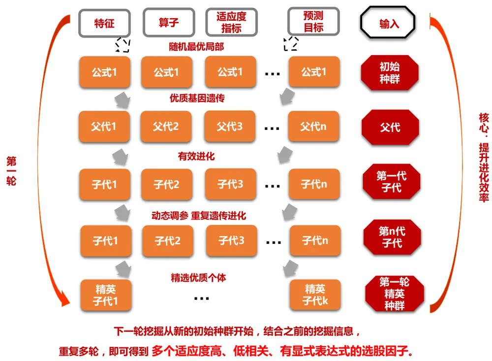
数据来源：东方证券研究所绘制

## 二、遗传规划算法介绍

## 2.1 算法原理

遗传规划算法（Genetic Programming，简称 GP）是一种遗传算法的特定类型，用于解决机器学习中的优化问题。遗传规划算法被广泛应用于特征选择，模型选择和超参数优化等多种任务中，也同样适用于选股因子挖掘问题。

首先，我们需要理解什么是遗传算法。遗传算法是一种搜索优化方法，灵感来自自然选择和达尔文的进化论，尤其是“适者生存”的原理。遗传算法中有一些关键概念，如“种群”，“交叉（杂交）”，“突变”和“选择”，均来源于进化论。种群是所有可能解的集合。交叉是一种方式，通过组合两个解的部分，产生新的解。突变是对解的随机更改，以增加种群的多样性。选择是保留适应度高的解的过程。

其次，我们需要理解什么是遗传规划。遗传规划是遗传算法的一个变种，它将这种进化的思想应用于程序（或函数）的创造和改进。遗传规划中的“个体”是计算机程序或数学函数，它们被设计为解决给定的任务。在机器学习中，这些程序可以是分类器，预测器或其他类型的模型。

遗传规划算法的原理可以概括为以下步骤：

1. 初始化：生成一个随机函数或程序的种群。

2. 评估：评估每个程序的适应度（即在给定任务上的性能），给出适应度评分。

3. 选择：根据其适应度评分选择程序，以用于下一代。适应度更高的程序有更高的被选中的概率。

4. 交叉：随机选取两个程序，然后从一个程序中选取一部分，与另一个程序的一部分交换，生成两个新的程序。

5. 突变：随机更改一部分程序，产生一个新的程序。

6. 迭代：重复第 2-5 步，直到满足停止准则，如达到最大的迭代次数，或者找到一个足够好的程序。

再次，我们需要理解为什么遗传规划可以用于选股因子挖掘问题。选股因子挖掘是一个典型的机器学习问题，其目标是发现能够预测股票未来表现的有效因子。遗传规划的核心在于生成一系列的程序（在某些情况下可以看作是函数或数学表达式），并通过模拟自然进化过程（包括交叉、突变和选择）对这些程序进行优化。每一个程序都是一个可能的解决方案，用于解决特定的问题。在选股因子挖掘的场景中，这些程序可以被设计为计算或组合股票特征的函数，目标是找到对股票表现有预测能力的函数。例如，你可能有两个特征：公司的市盈率（P/E）和市净率（P/B）。一个最简单的程序可能就是简单地将这两个特征相加，如 program = P/E + P/B。然而，更复杂的程序可能会包含更复杂的操作和组合，例如 program = log(P/E) * sqrt(P/B)。遗传规划就是通过模拟自然进化的方式，来寻找最优程序。

因此，通过使用遗传规划，可以自动化选股因子的发现和优化过程，提高选股的精度和效率。

## 2.2 算法优势

遗传规划在选股因子挖掘问题上有其难以被其他方法替代的独特优势：

1. 直观易懂的底层逻辑。遗传规划算法源于自然界的生物演化过程，这种模仿自然现象的方式使得算法的逻辑相对直观和易于理解。既符合我们对自然界规律的理解，又为我们提供了一种有效的问题解决方法。通过模拟生物进化过程中的选择、突变和交叉等现象，遗传规划可以自动地在问题解决方案的空间中进行搜索和优化。

2. 自动化特征生成与选择：在股票预测问题中，通常需要处理大量的特征，如公司的量价数据、财务数据等。遗传规划算法可以自动地创建和优化特征组合，比如将两个特征相加，或者对一个特征取对数等等，极大地节省了人工创建和测试新特征的时间和精力。

3. 融合人工先验信息。遗传规划算法的算子支持人工添加，自由度非常高。可以很好将已经通过人工发掘的有效算子纳入其中，实现与先验知识的融合。这为模型提供了额外的学习指导，进一步提高了模型的性能。

4. 捕捉非线性和交互效应：遗传规划算法可以自然地处理非线性和交互效应，这在股票预测问题中非常重要。一些看似无关的因子在相互作用时，可能会产生显著的预测效果，而遗传规划算法可以很好地捕捉这种复杂的因子交互关系。比如，两个因子单独看可能都对股票的未来表现没有预测能力，但是它们的交互可能有很强的预测能力。比如一个因子的值大于某个阈值时，另一个因子的影响就变得显著。

5. 生成的因子具有显式公式，可解释性强。遗传规划算法生成的因子具有清晰的公式形式，因子生成过程具有很强的可溯源性，易于解释因子逻辑。在遗传规划中，特征的组合和转换是明确的，我们可以清晰地看到每个特征在模型中的作用，从而理解模型的决策过程。这对于我们理解预测结果具有非常重要的价值，可以为决策者提供更多的洞见。并且样本内外持续表现优异的遗传规划因子如果还能有可解释的合理逻辑，就更加锦上添花，增强使用者的信心，可以被长期使用。但需要注意的是，遗传规划算法得到的因子都是先有公式，后找逻辑，公式的逻辑性与可解释性可遇不可求。在挖掘过程中，我们无法将公式的可解释性定量纳入适应度评价函数中，只能通过控制公式长度来适当提高可解释性。并且公式是否可解释、是否有明显的经济含义、是否有逻辑都是与人的主观判断有关，不同人的认知水平不同，可能挖掘出的公式有其逻辑，但我们还没有认识到。相比之下，神经网络模型中的权重参数往往难以直接理解，得到的打分不具有显性公式，会更加难以理解其生成原理。

6. 实现全局优化：遗传规划是一种全局优化技术，可以在整个解决方案空间中寻找最优解，而不只是局部最优解。神经网络的训练通常涉及到梯度下降等局部搜索技术，这可能会导致模型陷入局部最优。换句话说，如果函数的形状是多峰的（有多个局部最小值），梯度下降可能会在找到第一个局部最小值后就停止搜索，无法找到全局最小值。在局部最小值点，函数的梯度就已经为零，梯度下降算法无法得知其他可能的更低的函数值在哪里，只能按照当前梯度的方向移动。因而，遗传规划算法在处理多峰问题时更具优势。

7. 对噪声较为鲁棒，不易过拟合。股票市场的数据通常含有大量的噪声，遗传规划方法下因子挖掘过程和目标并不是直接关联对应的，进化步骤完全随机，不存在梯度下降的方向性。这种随机化多样化的搜索策略使得它对噪声较为鲁棒，有助于防止过拟合。并且在变异进化过程中我们也可以加入剪枝操作或修改适应度函数，让模型倾向于选择更简单的公式。这种"奥卡姆剃刀"原则也有助于避免过拟合。因而，通过遗传规划挖掘到的单因子样本外衰减相对不明显，因子稳定性和持久性相对较高，有被长期使用的可能性。而神经网络模型更加复杂，参数众多，这使得它们具有非常强的表示能力。理论上，一个足够大且深度足够的神经网络可以逼近任何复杂的函数。但同时也导致神经网络容易过拟合，可能被噪声中的误导性模式所迷惑。而在选股因子挖掘问题中，避免过拟合显得尤为重要。

8. 算法内部是透明白盒的，可拓展的空间大，自由度高。遗传规划算法的工作流程透明，可以很容易地理解和修改。这为我们提供了很大的调整和优化空间，可以根据具体问题的需求，调整遗传规划的各个部分，如种群大小、交叉和突变率等。相比之下，神经网络算法更像一个黑盒，调整和优化的空间相对较小，调整不直观，很难理解其内部的工作原理。

9. 是一个可持续进行的因子挖掘工具。大自然进化了上亿万年，物种变得越来越高级优秀，因子也是一样，只要给予时间，就可以不断挖出好的因子。这意味着遗传规划不仅可以解决现在的问题，也可以为未来的问题提供持续的解决方案。

10. 对计算性能要求相对低。遗传规划的运算主要涉及到一系列相对简单的运算，例如函数计算，逻辑运算，选择，交叉和突变等，并且每一代的遗传规划中，个体的评估通常是独立的。因此，遗传规划可以很好地适应并行化的CPU环境。相比之下，神经网络在训练过程中需要大量的矩阵运算，例如在前向传播和反向传播过程中的矩阵乘法。这些运算通常需要使用高度并行化的 GPU来加速，GPU配置的机器通常来讲价格更加高昂。

11. 应用广泛，既可以挖掘单因子使用，也可以挖掘多个有效且低相关的单因子进行合成，获得个股综合打分。遗传规划算法可以作为一个单因子挖掘的工具。其挖掘得到的单因子有明确表达式，我们可以人工筛选其中逻辑合理，样本内外持续表现优异的机器因子长期使用，对现有因子库进行补充；也可以将挖掘得到多个低相关的优秀因子进行合成，提取一个个股的综合打分评价。综合打分可以直接用于相对低频的横截面选股，也可以用来做指数增强组合，也可以和现有的低频 alpha因子结合使用。

12. 可以与其他机器学习模型结合，互相间并不冲突。遗传规划和深度学习都是强大的机器学习工具，在某些方面具有互补性。遗传规划在特征生成和选择方面表现优异，可以作为深度学习模型的前端特征工程工具，提供高质量的输入特征，进一步提高深度学习模型的性能。此外，遗传规划还可以将神经网络生成的因子取值作为拟合目标。旨在把不可解释的机器学习因子用显式公式进行表达，把黑盒白盒化。因此，遗传规划和深度学习可以一起使用，以实现更好的预测性能。其他结合方法也有待我们进一步发掘和尝试。

总结来看，遗传规划是一种极具潜力的工具，特别适合用于选股因子挖掘这种复杂的问题。虽然遗传规划会受到进化效率较低的批评，但这并不能掩盖其在解决复杂问题时所展现出的强大潜力和独特优势。通过研究和改进，遗传规划算法完全可以为我们提供更加高效精准的因子挖掘解决方案。

## 2.3 基本流程

基于遗传规划算法进行选股因子挖掘的基本流程如下：

1. 初始化种群：将因子的计算公式表示成树形结构，预先设置函数集和指标集，进行随机组合生成一系列因子表达式，作为第一代种群集合；

2. 计算适应度：按照一定的目标函数评估种群中个体的适应度；

3. 选择：从第一代种群集合中，选出适应度较优的一群个体作为下一代进化的父代；

4. 进化：被选择出的父代，通过表达式树结构的剪枝、交叉和叶节点突变等操作实现进化，生成子代表达式，然后继续选择子代中适应度较优的一群个体作为父代继续进化。重复选择与进化步骤，经历 N代后，最终寻找出适应度更优的公式群。

下面我们对遗传规划中涉及到的一些细节进行介绍：公式树、初始化参数、遗传、变异（交叉变异、子树变异、点变异、提升变异）。

1. 公式树：遗传规划算法中的因子表达式一般表示成公式树的形式，如下图所示。公式树的内部结点是函数，叶子是变量或者常数，具体取决于函数设置。公式树具有深度（depth）和长度（length）两个属性。深度是根结点到叶子结点的最远距离，只有一个值的公式树深度为0，只有一个算子的公式树长度是 1。长度是公式树中数学表达式元素的个数，等于总结点数。

图 3：遗传规划算法中的公式树示例（depth=3，length=7）
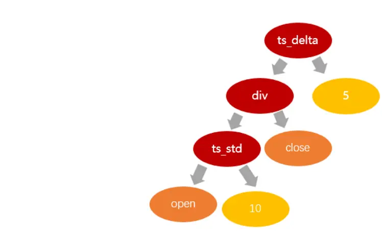
数据来源：东方证券研究所绘制

2. 初始化参数：遗传规划算法首先需要生成一群初始化种群，初始化需要考虑以下参数：

（1）init_depth：初始树的深度范围，深度产生的约束效果与初始化方法有关。

（2）population_size：初始化种群大小。

（3）generation：进化代数。

（4）init_method：初始化方法，有三种参数可选：'grow', 'full', 和 'half and half'。在'grow'方法中，每次可以随机从函数集和终端集中选择结点，这可能会出现比 init_depth 更小的树。在'full方法中，依次从函数集中选择结点，除非遇到最大深度，从终端集中选择一个作为叶子结点，这样生成的树比较拥挤和对称。默认为'half and half’方法，也就是一半概率'grow'，一半概率'full'。

3. 遗传：在有了初始种群后，我们需要决定哪些能进化到下一代。gplearn 是通过锦标赛(tournament)的方式，从种群中随机选择一个小子集彼此竞争，适应度最高的个体会获得变异进化机会。子集的大小由 tournament_size 参数决定：tournament_size 越大，越容易找到更合适的程序，进化也会越快收敛到某个解；tournament_size越小，越可以维持种群多样性，但进化效率也会变低，更加耗费时间。

4. 交叉变异(Crossover)：交叉是为了混合基因，是相对更容易产生优秀子代的变异方法。交叉变异操作需要执行两次 tournaments 找到两个赢家，第一个作为父代，第二个作为捐赠者，从父代中随机选择一个子树丢弃，并用捐赠者的随机子树代替。参数 p_crossover 决定交叉变异执行的概率。

5. 子树变异(Subtree Mutation)：子树变异是比较激进的变异方法。子树变异操作需要首先选择一个 tournaments 赢家，随机选择一个子树丢弃，替换上的新子树是随机生成的。由于变异的部分是完全随机的，子树变异也有益于提升种群多样性。参数 p_subtree_mutation 决定子树变异执行的概率。

6. 点变异(Point Mutation)：点变异和子树变异一样，也比较激进，会将没有使用的函数和运算符重新引入种群，同样也有益于提升种群多样性。点变异操作需要选择一个 tournaments 赢家，然后随机选择其中一些结点被替换。终端结点用终端集替换，函数结点用函数集替换。参数p_point_mutation 决定子树变异执行的概率。p_point_replace 决定了每个结点被替换的概率。

7．提升变异(Hoist Mutation)：提升变异是一种对抗膨胀的变异操作，相对也比较暴力，直接去除掉了父代的部分基因。提升变异操作需要首先选择一个 tournaments 赢家，然后从中选择一个随机子树，再选择该子树的一个随机子树，并将其“提升”到原始子树的位置以形成下一代。参数 p_hoist_mutation 决定提升变异执行的概率。

8. 重组(Reproduction) ：如果上述 4个遗传操作的概率之和小于 1，将不进行变异，而直接进行重组。锦标赛获胜者被克隆并进入下一代不进行修改。

## 三、DFQ 模型核心改进点：提升进化效率

由于在进化过程中缺乏明确的目标引导，常规的遗传规划算法进化效率低下。如何能提升进化效率，在有限的算力，有限的时间内，进化出更多、更好、更短、更低相关的因子，是算法的核心痛点，改进起来也极为困难。我们在这方面做了大量的探索实验工作，现总结如下。

图 4：DFQ遗传规划价量因子挖掘系统核心改进点
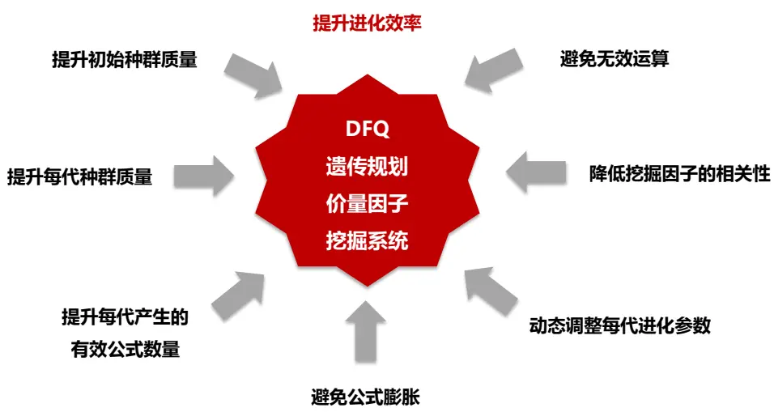
数据来源：东方证券研究所绘制

## 3.1 提升初始种群质量

好的开始是成功的一半，初始种群质量对后续进化影响非常大。初始随机生成的种群可能产生大量无效因子，从无效的因子出发更加难以进化出有效的因子。可以考虑先扩大搜索范围，再找精英种群，对表现较好的初始种群进行进化。

下面我们展示了 2000 个随机种群的适应度与公式长度分布。平均适应度仅为 1.3%，最优适应度达到 7.8%，个体间适应度差距很大。有 1136 个公式的 IC 不足 1%，超过半数。仅有 90 个公式的 IC 达到 5%，有 20 个公式出现重复。此外容易看出适应度低的个体长度普遍较长。1136个IC不足1%的个体平均长度达到11，最长可达64，可见过分堆叠公式长度于提升适应度无益。

图 5：2000个随机种群的适应度与公式长度分布
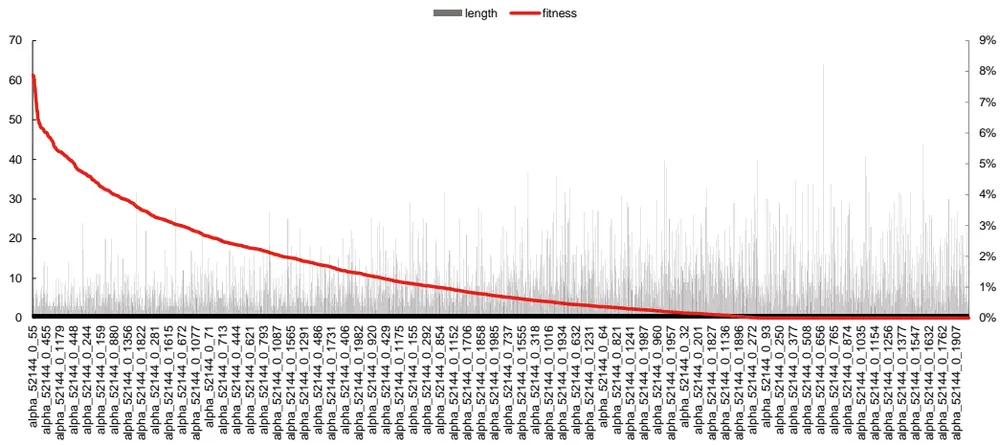
数据来源：东方证券研究所 & Wind资讯

有关分析师的申明，见本报告最后部分。其他重要信息披露见分析师申明之后部分，或请与您的投资代表联系。并请阅读本证券研究报告最后一页的免责申明。

## 3.2 提升每代种群质量

提升每一代的进化效果，做到一代更比一代强。遗传规划算法在每次变异的时候是没有引导，没有方向，随机发生的，可能变异出任何一个子代，可能变好也可能变差。我们希望能尽可能提升每一代种群质量，避免子不如父，越进化越差。可以考虑增加父子竞争机制，子不如父，优先保留父代。由于进化时挑选父代的逻辑是锦标赛法，并不是每个父代都能获得进化机会。如果这个父代本身很优秀，但未能被选中，就会在进化过程中被遗漏，较为可惜。可以考虑对未获得进化机会的父代进行额外的筛选保留。需要注意的是，本章节后续我们展示的均是示例数据，所用特征、算子、适应度等与最终模型并不一致，仅用来说明改进的必要性。

下面我们展示了不增加父子竞争机制的运行结果。可以看到每一轮中进化都不是逐代变优的。随机种子 1 和 2 中，第五代的平均适应度低于第四代；随机种子 3 中，第 7-9 代的平均适应度均低于第 6代。

图 6：不增加父子竞争机制的运行结果示例

| 随机种子 代数 |  | 平均公式长度 | 平均适应度 | 最优适应度的公式长度 | 最优适应度 |  |  |
| --- | --- | --- | --- | --- | --- | --- | --- |
| 1 0 |  | 10.62 | 0.56% | 9.00 | 4.21% |  |  |
| 1 | 1 | 7.75 | 1.74% | 9.00 | 4.21% |  |  |
| 1 | 2 | 9.19 | 3.24% | 12.00 | 4.22%4.22% |  |  |
|  | 3 | 9.50 | 3.62% | 12.00 |  |  |  |
|  | 4 | 11.40 | 3.94% | 15.00 | 4.22%4.22% |  |  |
|  | 5 | 11.80 | 3.62% | 15.00 |  |  |  |
|  | 0 | 10.97 | 0.60% | 17.00 | 2.52% |  |  |
|  | 1 | 7.25 | 1.40% | 3.00 | 3.42% |  |  |
|  | 2 | 5.51 | 2.26% | 3.00 | 3.42% |  |  |
|  | 3 | 3.33 | 3.34% | 3.00 | 3.42%3.42%3.42% |  |  |
|  | 4 | 3.32 | 3.36% | 3.00 |  |  |  |
| 2 | 5 | 3.23 | 3.27% | 3.00 |  |  |  |
| 3 | 0 | 10.16 | 0.51% | 5.00 | 3.45% |  |  |
| 3 |  | 4.79 | 2.05% | 6.00 | 3.64% |  |  |
| 3 |  | 5.16 | 3.01% | 5.00 | 3.79% |  |  |
| 3 |  | 5.52 | 2.86% | 8.00 | 4.28%4.28%4.28% |  |  |
| 3 |  | 7.35 | 3.35% | 8.00 |  |  |  |
| 3 | 5 | 8.07 | 3.50% | 8.00 |  |  | 4.28% |
| 3 |  | 8.34 | 3.75% | 8.00 |  | 4.28% |  |
| 333 | 789 | 8.08 | 3.36% | 8.00 |  | 4.28% |  |
|  |  | 8.018.06 | 3.43% | 8.00 |  |  |  |
|  |  |  |  | 8.00 |  |  |  |
|  |  |  |  |  |  | 4.28% |  |
|  |  |  | 3.33% |  |  |  |  |

数据来源：东方证券研究所 & Wind资讯

下面我们展示了不增加额外的父代筛选保留机制的运行结果。可以看到第三代的最优适应度3.65%的个体在后续进化过程中被遗漏，后面每代的最优个体适应度均低于 3.65%。

图 7：不增加额外的父代筛选保留机制的运行结果示例

| 随机种子 代数 | 平均公式长度 | 平均适应度 | 最优适应度的公式长度 | 最优适应度 |
| --- | --- | --- | --- | --- |
| 1 0 | 4.53 | 1.92% | 12.00 | 2.87% |
| 1 1 | 5.12 | 2.07% | 12.00 | 2.87% |
| 1 2 | 5.58 | 2.25% | 12.00 | 2.87% |
| 1 3 | 4.81 | 2.56% | 11.00 | 3.65% |
| 1 4 | 4.77 | 2.56% | 13.00 | 3.19% |
| 1 5 | 7.48 | 2.76% | 13.00 | 3.21% |
| 1 6 | 8.05 | 2.86% | 13.00 | 3.21%3.21% |
| 1 7 | 10.89 | 2.94% | 13.00 |  |
| 1 8 | 11.56 | 3.00% | 10.00 | 3.50% |
| 1 9 | 10.98 | 3.11% | 10.00 | 3.50% |
| 1 10 | 11.25 | 3.07% | 10.00 | 3.50% |
| 1 11 | 10.63 | 3.16% | 10.00 | 3.50% |
| 1 12 | 10.91 | 3.12% | 10.00 | 3.50% |
| 1 13 | 10.48 | 3.19% | 10.00 | 3.50% |

数据来源：东方证券研究所 & Wind资讯
有关分析师的申明，见本报告最后部分。其他重要信息披露见分析师申明之后部分，或请与您的投资代表联系。并请阅读本证券研究报告最后一页的免责申明。

## 3.3提升每代产生的有效公式数量

避免趋同进化，降低重复率。优秀的父代更容易被选中，基因更容易遗传下去，从而就会挤压其他父代的进化机会。其次，优秀的个体通过进化进一步提升表现相对也更困难，在父子竞争的模式下，同一父代会被重复保留，强势基因不断扩散，每一代会产生许多重复公式。这不仅对提升整体预测能力作用有限，还浪费大量算力，因而有必要对这种现象进行限制。我们期望能尽可能保持种群多样性，在一个随机种子的路径下，进化出更多不同的优秀子代。因此可以考虑减少父代被重复选中的概率，避免保留多次重复父代等。

下面我们展示了不增加降低重复率机制的运行结果。可以看到第15代中产生的144个子代中仅有 20个不重复公式，有的公式重复出现了 43次。

图 8：不增加降低重复率机制的运行结果示例
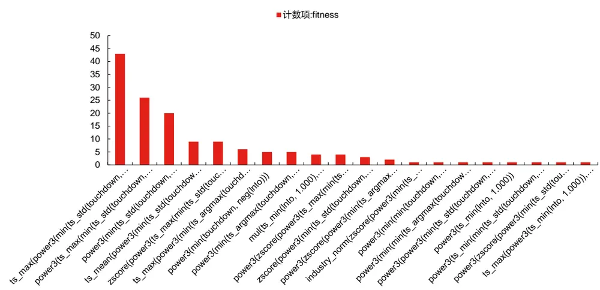
数据来源：东方证券研究所 & Wind资讯

## 3.4 避免公式膨胀

避免进化只变长不变好，但也要保留进化的多样性。过长的因子不仅难以解释其逻辑，过拟合的风险也更大。gplearn 中的默认参数’init_depth’只能控制初始种群的深度，无法对后期变异进化后的子代进行长度限制。如果仅靠初始种群这一步来挖掘有效因子，虽然可以控制公式长度但效率很低。只有当种群进化到下一代时，才体现出优胜劣汰，不断进化。所以遗传规划算法要想产生更优秀个体，一定要靠更多的代数不断进化变异。但高代数进化随之带来的就是公式膨胀问题：1. 几种变异都可能会让公式变长；2.大种群下长度和适应度有一定的正相关，大概率对公式堆叠长度会小幅提升因子表现，从而使得长公式更容易被保留。因此，我们需要避免只变长不变好这种无意义进化，可以考虑：对变异算法进行修改，降低明显拉长公式的变异过程出现的概率；在适应度加入适当的长度控制等。

下面我们列出了不加公式膨胀限制的遗传规划运行结果，可以看到已经出现了明显的公式膨胀情况。从第6代开始，种群的平均适应度上升已经非常缓慢，但平均长度仍在提升，到第19代，平均长度达到 156，第18代最优个体长度已达到 241。

图 9：不加公式膨胀限制的遗传规划运行结果示例

| 随机种子 | 代数 | 平均公式长度 | 平均适应度 | 最优适应度的公式长度 | 最优适应度 |
| --- | --- | --- | --- | --- | --- |
| 1000 | 0 | 11.73 | 0.29% | 5.00 | 2.25% |
| 1000 | 1 | 5.48 | 1.73% | 12.00 | 2.33% |
| 1000 | 2 | 5.54 | 1.98% | 14.00 | 2.52% |
| 1000 | 3 | 9.14 | 1.98% | 20.00 | 2.73% |
| 1000 | 4 | 14.05 | 2.26% | 14.00 | 2.91% |
| 1000 | 5 | 18.46 | 2.50% | 14.00 | 2.91% |
| 1000 | 6 | 16.34 | 2.55% | 20.00 | 3.00% |
| 1000 | 7 | 15.68 | 2.60% | 20.00 | 3.00% |
| 1000 | 8 | 19.65 | 2.73% | 33.00 | 3.02% |
| 1000 | 9 | 24.00 | 2.75% | 31.00 | 3.08% |
| 1000 | 10 | 36.44 | 2.86% | 56.00 | 3.14% |
| 1000 | 11 | 40.96 | 2.90% | 37.00 | 3.20% |
| 1000 | 12 | 53.26 | 3.01% | 81.00 | 3.20% |
| 1000 | 13 | 42.40 | 2.97% | 79.00 | 3.24% |
| 1000 | 14 | 57.95 | 3.01% | 72.00 | 3.26% |
| 1000 | 15 | 79.44 | 3.08% | 132.00 | 3.28% |
| 1000 | 16 | 80.89 | 3.13% | 89.00 | 3.29% |
| 1000 | 17 | 105.93 | 3.15% | 159.00 | 3.34% |
| 1000 | 18 | 123.59 | 3.18% | 241.00 | 3.36% |
| 1000 | 19 | 156.21 | 3.19% | 185.00 | 3.37% |

数据来源：东方证券研究所 & Wind资讯

## 3.5 动态调整每代进化参数

加入适当人工进化干预，动态调整进化过程和方向。一轮进化通常包括多代，可以考虑根据每一代的进化结果，调整下一代的进化参数，对每一轮的进化过程进行正确的干预，这样也能更快地收敛到我们想要的子代结果。

## 3.6降低挖掘因子的相关性

遗传规划算法的不同轮从不同随机种子出发，但仍可能进化出相似子代，造成算力浪费。因此，我们可以考虑在算法中加入对于相关性的考量：

（1）内部相关性惩罚：在适应度中对相关性进行惩罚。本文采用中位数相关性惩罚的模式，中位数惩罚相对力度小，能保留原有因子的进化机会。如果直接用最大相关性惩罚，就意味着因子库只要已有该因子，后面都不会挖掘类似因子，牺牲了一部分进化可能性。然而，当进行相关性考察的因子变多时，中位数易低估。因而，我们又额外加入了一条最大相关性筛选。如果因子和已有因子的相关性最大值超标，直接将该因子适应度归 0。

（2）外部相关性筛选：每轮结果后将已有轮次的所有挖掘结果进行合并，再按照适应度和相关性对因子库进行精简。具体做法是：把这一轮和之前轮次得到的所有符合阈值要求的因子放到一起。先选适应度最高的 f0 纳入因子库，再检测适应度次高的因子 f1，若 f1 跟 f0 相关性低于设定阈值，将 f1纳入因子库，否则 f1不入选。重复上述步骤，得到当前的可用因子库。

## 3.7 避免无效运算

遗传规划算法在公式生成时随机性强，特征和算子间会随机组合，形成各种意想不到的形式，这对算子和适应度的编写提出了很高的要求。如果不对算子进行优化，可能会花了很长时间来挖掘，结果一轮挖出后的因子大部分都是不合理的。因此，需要我们对特征、算子、适应度的算法进行优化，考虑到各种不合理输入的兼容性，避免无效运算，提升挖掘效率。

## 四、DFQ模型实验结果

遗传规划算法在实际使用时通常不需要我们自行实现，有很多开源的框架可以采用。在Python 环境中有许多可以直接调用的包，经过适当修改即可用于选股因子挖掘。本文我们以gplearn 为基础进行改进，使用 SymbolicTransformer 模块实现自动化特征工程的转换，即选股因子挖掘过程。

## 4.1数据说明

1. 股票池：剔除上市不满6个月及ST、*ST、PT、暂停上市等特别处理股票后的全部A股。

2. 采用 2012.1.1-2016.12.31 年 5 年数据作为训练集，17-23 年为样本外测试集。增大训练集样本会增加内存消耗。

3. 挖掘月频因子，考察因子预测未来20天股票收益时的表现。挖掘周频和日频因子同样可以操作，但会增加内存消耗，后续我们会继续进行尝试。

4. 挖掘价量因子。在前期报告《机器因子库相对人工因子库的增量》中，我们尝试过对财务因子的挖掘，但挖掘出的因子效果不如传统财务因子。财务数据由于更新频率低，且需逻辑支持，并不是很适合使用机器学习来进行因子生成。后续我们会继续进行尝试。

## 4.2 特征与算子

1. 特征：47个。包括日度量价特征和日内分钟量价特征。高质量的L2数据从2013年下旬才能够获取，所以我们此次并未加入 l2 特征。加入特征越多，内存占用越大，也需进行权衡。我们对部分特征进行了适当量纲调整。

2. 算子：81个。包括gplearn自带算子9个，自定义算子72个。自定义算子包括元素运算、截面运算和时序运算，算子内部需要充分考虑兼容性及运算效率。

3. 常数：1，5，10，20，40，60，表示时序算子的计算窗口期。由于我们只希望常数出现在算子的指定位置上，避免无意义运算，因而并不在默认参数 const_range 中设置常数，而是在底层代码中修改添加。

## 4.3适应度选择

本文的重点在于改进遗传规划算法本身，提升进化效率，目的是在任意一个适应度下，都能更高效地找到更多符合要求的因子。因而，此处我们没有对适应度指标进行详尽对比，而是选择业内最常见的行业市值中性化后的 rankIC 作为适应度，并加入适当的相关性和长度惩罚。IC 计算前我们进行异常值处理、缺失值填充、标准化、行业市值中性化操作。后续我们会继续尝试其他适应度指标。

## 4.4 模型运行效果

模型运行用时与随机公式的复杂度、随机算子的计算效率、cpu 性能有关，无法准确估计。从我们有限的测试来看，在一台 Intel Xeon Gold 6242R CPU3.10GHZ，80 线程，256G 内存的服务器中并行 36 个线程，进行一轮 15 代完整挖掘用时 5-24 小时不等，一轮完成后可产生 20-50个适应度超过5%，且互相间相关系数不超过50%的单因子。经历连续的的3-4轮，便可得到100个适应度超过 5%，且互相间相关系数不超过 50%的单因子。下面我们展示某次连续两轮挖掘的运行信息和运行结果。

从第一轮来看：（1）第 0 代初始种群的平均适应度达到 6.21%，最优公式适应度达到9.16%，说明我们对初始种群质量的提升有效；（2）随着代数增多，种群平均长度和平均适应度都在逐渐提高，进化在逐代变优，说明我们对每代种群质量的提升有效；（3）每代保留的适应度超过 5%的公式个数也在不断增多，到第 15代，我们已经可以获得 200+个适应度超过 5%的个体。表格展示的数字都是去重后的，不存在同代重复个体的影响。说明我们对每代产生有效公式数量的提升有效；（4）最优公式长度控制在10以内，说明我们对公式膨胀问题的处理有效；（5）15代进化总用时8.42h，第 0 代用时最长达到 4.87h，后面 15代平均用时 27min。

从第二轮来看：（1）由于第二轮是在第一轮的因子基础上挖掘与第一轮精选因子低相关性的新因子，要求更加严格，因此第二轮的第 15 代我们获得的适应度超过 5%的个体相比第一轮有所减少。（2）第二轮每代进化用时相比第一轮也都有增长，但需要注意的是，第二轮是从新的随机种子出发生成不同公式，里面不同算子的运行效率不同，运行时长有一定的随机性。此处展示的例子是目前测试下来一轮用时最长的。

图 10：运用遗传规划算法进行因子挖掘的执行信息（连续两轮）

| 随机种子 代数 |  |  |  | 平均公式长度 | 平均适应度 | 最优公式长度 | 最优公式适应度 | 适应度超过5%的公式个数 | 运行时间(h) |
| --- | --- | --- | --- | --- | --- | --- | --- | --- | --- |
| 521218 0 |  |  |  | 5.35 | 6.21% | 2 | 9.16% | 100 | 4.87 |
| 521218 |  |  | 1 | 5.90 | 6.32% | 4 | 9.42% | 113 | 0.27 |
| 521218 |  |  | 2 | 6.40 | 6.41% | 4 | 9.42% | 124 | 0.39 |
| 521218 3 |  |  |  | 6.43 | 6.67% | 4 | 9.42% | 136 | 0.38 |
| 521218 4 |  |  |  | 6.88 | 6.84% | 4 | 9.42% | 147 | 0.29 |
|  | 521218 |  | 5 | 6.89 | 6.96% | 5 | 9.52% | 159 | 0.37 |
|  | 521218 |  | 6 | 6.97 | 7.06% | 5 | 9.52% | 168 | 0.25 |
|  | 521218 |  | 7 | 6.97 | 7.21% | 5 | 9.52% | 178 | 0.14 |
|  | 521218 |  | 8 | 6.85 | 7.22% | 4 | 9.53% | 182 | 0.12 |
|  | 521218 |  | 9 | 6.73 | 7.38% | 4 | 9.53% | 192 | 0.13 |
|  | 521218 |  | 10 | 6.73 | 7.49% | 4 | 9.53% | 195 | 0.23 |
|  | 521218 |  | 11 | 6.66 | 7.59% | 4 | 9.53% | 207 | 0.32 |
|  | 521218 |  | 12 | 6.83 | 7.63% | 8 | 10.01% | 215 | 0.15 |
|  | 521218 |  | 13 | 6.95 | 7.66% | 8 | 10.01% | 225 | 0.12 |
|  | 521218 |  | 14 | 6.95 | 7.71% | 8 | 10.01% | 235 | 0.26 |
| 521218 15 |  |  |  | 6.93 | 7.78% | 8 | 10.01% | 240 | 0.12 |
|  | 521219 0 |  |  | 5.30 | 6.27% | 4 | 8.55% | 100 | 7.59 |
|  | 521219 | 1 |  | 5.50 | 6.39% | 4 | 8.55% | 117 | 0.90 |
|  | 521219 | 2 |  | 5.66 | 6.56% | 4 | 8.55% | 127 | 0.99 |
|  | 521219 | 3 |  | 5.86 | 6.69% | 4 | 8.55% | 139 | 0.87 |
|  | 521219 | 4 |  | 6.01 | 6.79% | 6 | 8.76% | 147 | 0.93 |
|  | 521219 | 5 |  | 6.06 | 6.89% | 7 | 8.98% | 158 | 1.01 |
|  | 521219 | 6 |  | 6.16 | 6.99% | 7 | 8.98% | 164 | 0.93 |
|  | 521219 |  | 7 | 6.25 | 7.14% | 8 | 9.00% | 172 | 0.86 |
|  | 521219 |  | 8 | 6.22 | 7.19% | 8 | 9.00% | 175 | 1.02 |
|  | 521219 |  | 9 | 6.21 | 7.32% | 6 | 9.06% | 182 | 0.85 |
|  | 521219 10 |  |  | 6.31 | 7.38% | 8 | 9.44% | 188 | 1.00 |
|  | 521219 11 |  |  | 6.39 | 7.36% | 8 | 9.44% | 193 | 0.86 |
| 521219 12 |  |  |  | 6.48 | 7.42% | 8 | 9.44% | 198 | 0.88 |
| 521219 13 |  |  |  | 6.51 | 7.50% | 8 | 9.44% | 201 | 0.89 |
| 521219 14 |  |  |  | 6.61 | 7.55% | 8 | 9.44% | 205 | 0.80 |
| 521219 15 |  |  |  | 6.65 | 7.60% | 8 | 9.44% | 211 | 0.86 |

数据来源：东方证券研究所 & Wind资讯

一轮挖掘后的第 15 代因子，在进行了外部的相关性筛选后，分别保留了 45 个适应度超过5%，且互相间相关性不超过50%的因子。公式适应度5%-10%，公式深度1-5，公式长度3-14。我们统计了这 45 个精选因子首次出现的代数，有 18 个是在初始种群就出现的，平均适应度达到6%，第 1-3 代分别通过变异进化出了 3-4 个新因子并被保留，第 4-13 代分别保留了 1-2 个新因子，第15代也保留了3个新因子。可见，多代进化是有必要的，每代都能进化出优秀且有差异化的因子。

有关分析师的申明，见本报告最后部分。其他重要信息披露见分析师申明之后部分，或请与您的投资代表联系。并请阅读本证券研究报告最后一页的免责申明。

图 11：运用遗传规划算法进行因子挖掘的执行结果（一轮）
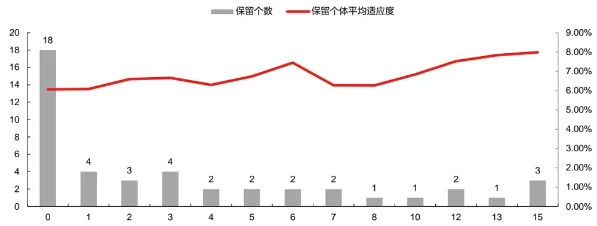
数据来源：东方证券研究所 & Wind资讯

两轮挖掘后，将对第一轮精选后的45个因子和第二轮第15代得到的适应度达到阈值的因子一齐进行相关性筛选。筛选后保留了64个适应度超过5%，且互相间相关性不超过50%的因子。其中 36个来自第一轮，28个来自第二轮。公式深度 1-5，公式长度 3-14。

图 12：运用遗传规划算法进行因子挖掘的执行结果（连续两轮）

| 因子名称 | 适应度 | 因子表达式 | 公式深度 | 公式长度 |
| --- | --- | --- | --- | --- |
| alpha_521218_final_9 | 10.01% | max(ts_max(power3(Into), 1), ts_wmean(touchup, 20)) | 3 | 8 |
| alpha_521218_final_28 | 9.50% | ts_max(sigmoid(mean2(demean(rank(amount)), ts_to_max(adjclose, 5))), 1) | 5 | 10 |
| alpha_521218_final_30 | 7.78% | curt(if then else(ts to ewm(zscore(ex Inopenret), 1), sqret, Into, zscore(ex Inopenret))) | 4 | 10 |
| alpha_521218_final_61 | 6.86% | scale(ts max(sigmoid(amihud), 5)) | 3 | 5 |
| alpha_521218_final_94 | 6.55% | ts_cov(rank(amount), sqrt(touchup), 10) | 2 | 6 |
| alpha_521218_final_97 | 7.83% | if_then_else(ts_to_ewm(umr(adjhigh, loser), 1), sqret, Into, sqrt(amount)) | 3 | 10 |
| alpha_521218_final_108 | 8.23% | umr(adjhigh, loser) | 1 | 3 |
| alpha_521218_final_129 | 7.33% | ts_cov(mul(ts_meanrank(Inhlret, 60), swing), ex_Inret, 20) | 3 | 8 |
| alpha_521218_final_144 | 6.80% | min(ts_meanrank(swing, 60), rank_mul(ts_cut_ewm(adjclose, Into, 10, 40), ts_std(tr, 60))) | 3 | 13 |
| alpha_521218_final_145 | 6.71% | ts_max_to_min(neg(ts_cov(ex_Inhighret, Inopenret, 20)), 5) | 3 | 7 |
| alpha_521218_final_148 | 6.84% | min(ts meanrank(ts max(power3(Into), 1), 40), ts product(Into, 10)) | 4 | 10 |
| alpha_521218_final_159 | 6.26% | ts_fxumr_50(if_then_else(adjvolume, Inret, zscore(adjvolume), curt(adjhigh)), adjlow, 40) | 3 | 10 |
| alpha_521218_final_164 | 6.51% | ts_fxcut_75(demean(amount), Inhighret, 40) | 2 | 5 |
| alpha_521218_final_166 | 6.60% | ts umr mean(rank(adjhigh), swing, 1, 1) | 2 | 6 |
| alpha_521218_final_178 | 7.09% | ts_max(if_then_else(ts_to_ewm(zscore(ex_Inopenret), 1), sqret, Into, ts_to_wm(ts_delta(cret, 20), 60)), 1) | 4 | 14 |
| alpha_521218_final_187 | 5.95% | ts_max(ts_fxcut_50(sqrvol, zscore(ex_Inret), 40), 5) | 3 | 7 |
| alpha_521218_final_188 | 5.04% | abs(ts_umr_ewm(neg(ts_max(rank(amount), 1)), min(lnopenret, adjvolume), 5, 5)) | 5 | 12 |
| alpha 521218 final 189 | 6.66% | ts to max(rank sub(tr. rank(amihud)), 60) | 3 | 6 |
| alpha_521218_final_191 | 5.78% |  |  | 7 |
| alpha_521218_final_193 | 6.19% | ts_mon(ts_to_ewm(umr(adjclose, Inhlret), 5), 60) | 3 |  |
| alpha_521218_final_199 | 6.37% | ts_fxumr_50(rank(vhhi), Inhighret, 10) | 2 | 5 6 |
| alpha_521218_final_202 | 7.12% | ts_max(ts_cov(sqrvol, ex_Inret, 20), 60) mean2(ts sum(lncoret, 60), demean(amount)) | 2 | 6 |
| alpha_521218_final_203 | 6.96% | mean2(Into, ts_to_wm(ts_ir(arpp, 10), 40)) | 2 3 | 7 |
| alpha_521218_final_208 | 5.60% | ts_fxzscore_75(power2(sigmoid(amihud)), industry_norm(power2(Inhlret)), 20) | 3 | 8 |
| alpha_521218_final_209 | 5.56% | mean3(ts_wmean(cret, 5), ts_meanrank(sqrkurt, 20), mean3(tr, winner, swing)) | 2 | 11 |
| alpha_521218_final_215 | 6.27% | power2(ts_std(Inhlret, 60)) | 2 | 4 |
| alpha_521218_final_219 | 6.29% | ts_umr_ewm(sigmoid(touchup), ts_umr_ewm(min(ex_Inopenret, winner), min(Inopenret, adjvolume), 5, 5), 1, 20) | 3 | 14 |
| alpha_521218_final_223 | 6.42% | demean(mean2(ts_cut_mean(lnhighret, apb, 1, 60), ts_umr_mean(touchup, sqret, 20, 60))) | 3 | 12 |
| alpha_521218_final_224 | 6.14% | ts std(ts to min(amount, 60), 40) | 2 | 5 |
| alpha_521218_final_226 | 6.08% | ts_to_min(ts_mean(rank_mul(amount, adjlow), 10), 10) | 3 | 7 |
| alpha_521218_final 227 | 5.82% | ts_to_ewm(ts_max_to_min(amount, 60), 60) | 2 | 5 |
| alpha_521218_final_229 | 5.54% | ts_mean(rank_add(swing, adjclose), 5) | 2 | 5 |
| alpha_521218_final_236 | 5.69% | log(ts fxcut 50(rskew, Inhighret, 40)) | 2 | 5 |
| alpha 521218 final 237 | 5.57% | ts_wmean(mean2(ts_fxcut_50(lncoret, ts_to_wm(ts_product(cret, 60), 40), 40), sqrt(amount)), 20) | 5 | 13 |
| alpha_521218_final_241 | 5.54% | rank(ts_umr_ewm(adjtwap, sqrvol, 40, 60)) | 2 | 6 |
| alpha_521218_final_243 | 5.48% | ts_cov(max(ex_Inopenret, Inopenret), curt(loser), 20) | 2 | 7 |
| alpha 521219 final 6 | 8.39% | power3(ts_max_to_min(neg(power3(mean2(Into, rvol), 10)) | 5 | 8 |
| alpha_521219_final_15 | 5.65% | ts_to_ewm(ts_max(ts_ewm(mul(rskew, winner), 1), 10), 20) | 4 | 9 |
| alpha_521219_final_22 | 7.13% | ts_max_to_min(ortho(umr(swing, sqrvol), ts_zscore(lnvwapret, 5)), 10) | 3 | 9 |
| alpha_521219_final_31 | 6.92% | ts_umr_mean(sqret, Inhighret, 1, 60) | 1 | 5 |
| alpha 521219 final 46 | 8.84% | ts max to min(rank div(ts delta(citic2index Inret, 40), ts ewm(lnto, 60)), 20) | 3 | 9 |
| alpha_521219_final_51 | 6.72% | ts_cov(sqrt(vvol), winner, 40) | 2 | 5 |
| alpha_521219_final_59 | 7.45% | ts_sum(min(rskew, apb), 10) | 2 | 5 |
| alpha_521219_final_60 | 7.49% | mul(ts sum(mul(rskew, winner), 10), sgrvol) | 3 | 7 |
| alpha_521219_final_71 | 8.27% | power3(inv(sqrt(ts_product(amount, 1)))) | 4 | 6 |
| alpha_521219_final_86 | 7.45% | mul(umr(ts_meanrank(Into, 10), sigmoid(sqret)), ts_ewm(ts_sum(mul(rskew, winner), 10), 10)) | 4 | 14 |
| alpha_521219_final_102 | 6.70% | mean2(if then else(adjlow, rjump, ex Inhighret, amihud), maxmin norm(rank(sqrt(rank mul(adjlow, adjvolume))) | 5 | 12 |
| alpha 521219 final 112 | 7.35% | ts fxumr 75(scale(umr(adilow, ex Inret)), maxmin norm(ts to max(loser, 60)). 1) | 3 | 10 |
| alpha_521219_final_125 | 6.85% | min(ts_ewm(rjump, 1), ts_max(sqrt(ts_product(amount, 1)), 10)) | 4 | 10 |
| alpha_521219_final_127 | 7.05% | ts_max_to_min(ts_ewm(touchup, 1), 10) | 2 | 5 |
| alpha_521219_final_128 | 6.63% | sgrt(ts max(cret. 10)) | 2 | 4 |
| alpha 521219 final 132 | 7.89% | clear_by_cond(ts_pctchg_abs(adjpreclose, 60), div(adjvolume, rkurt), adjvolume) | 2 | 8 |
| alpha_521219_final_135 | 6.62% | clear_by_cond(mean2(ovpct, ts_median(vhhi, 60)), adjvolume, adjvwap) | 3 | 8 |
| alpha_521219_final_165 | 6.51% | ts_rankcorr(ex_Inret, rank_sub(ts_argmax(inv(Inhlret), 10), mul(industry_norm(Inret), Into)), 10) | 4 | 12 |
| alpha_521219_final_167 | 6.07% | ts ewm(ts mean(ts max to min(ts sum(mul(rskew, winner), 10), 10), 10), 1) | 5 | 11 |
| alpha_521219_final_173 | 5.49% | umr(swing, sqrskew) |  | 3 |
| alpha_521219_final_177 | 6.06% | ts_fxcut_50(ex_Inhighret, sqrvol, 20) | 1 | 4 |
| alpha_521219_final_190 | 5.54% | ts_umr_ewm(vvol, ex_Inopenret, 20, 1) | 1 | 5 |
| alpha_521219_final_194 | 6.56% | ts_ewm(power3(ts_max(tr, 5)), 10) | 3 | 6 |
| alpha_521219_final_195 | 6.14% | inv(ts_ewm(rank_mul(sqrt(ts_max(Into, 5)), adjvolume), 10)) | 5 | 9 |
| alpha_521219_final_202 | 5.63% | ts_cut_ewm(rank(adjvwap), if_then_else(adjclose, amount, adjhigh, adjtwap), 40, 10) | 2 | 10 |
| alpha_521219_final_203 | 5.03% | power3(ts_fxumr_50(ex_Inret, vhhi, 10)) | 2 | 5 |
| alpha 521219 final 208 | 5.55% | ts_to_ewm(mean2(adjclose, ts_to_mean(Inlowret, 5)), 20) | 3 | 7 |
| alpha_521219_final 209 | 5.59% | div(ts_maxmin_norm(Inhighret, 20), rank_mul(ts_argmin(ts_argmax(Intwapret, 10), 1), Into)) | 4 | 11 |

数据来源：东方证券研究所 & Wind资讯

有关分析师的申明，见本报告最后部分。其他重要信息披露见分析师申明之后部分，或请与您的投资代表联系。并请阅读本证券研究报告最后一页的免责申明。

## 4.5 单因子展示

在算法优势的部分我们曾介绍过，遗传规划算法可以作为一个单因子挖掘的工具。其挖掘得到的单因子有明确表达式，可以人工筛选其中逻辑合理，样本内外持续表现优异的因子长期使用，对现有因子库进行补充。单因子更多需要长期有效，样本外衰减慢，因而我们列出的是因子在12-23 年全样本区间的表现，适应度指标仍指训练集。单调性使用十组超额收益和[1,2,3,4,5,6,7,8,9,10]这个序列的秩相关系数来表示，取值范围为[-1,1]。十组分档收益如果完全单调且 IC为正，则单调性指标取值为 1；完全单调且 IC为负，则单调性指标取值为-1。

首先我们列出了 18 个人工价量因子的效果进行对比。这 18 个人工因子中全样本中性化 IC绝对值基本均超过 5%，ICIR 绝对值基本均超过 2%，整体较强。因子单调性整体较好，有 7 个因子都是完全单调的。但多头表现一般且 2023年失效严重，仅有 2个因子 12年以来多头年化超额超过 10%。其中：1.ivol 因子 12 年以来的中性化 rankIC 最高，达到-10.38%。2.sdvvol 因子 12年以来的中性化 ICIR、10 组多头超额收益最高均为最高，年化 ICIR 达到-5.45，多头超额年化收益达到 10.29%。3.dwf因子 2023年以来10组多头超额收益最高，达到 11%。

图 13：18个人工价量因子列表

| 因子类别 | 因子名称 | 因子含义 | 参考报告 |
| --- | --- | --- | --- |
| 日线量价 | ret20 vol20 | 过去20个交易日的波动率 |  |
|  | ppreversal | 过去5日均价/过去60日均价-1 |  |
|  | maxret20 | 过去20日最大3个日收益均值 |  |
|  | ivol20 | 过去20个交易日的特质波动率 | 《低特质波动，高超额收益》 |
|  | ivr20 | 过去20个交易日的特异度 | 《投机、交易行为与股票收益(上)》 |
|  | Into_20d | 过去20个交易日日均换手率的对数 | 《非流动性的度量及其横截面溢价》 |
|  | Inamihud20 | 20日Amihud非流动性自然对数 | 《非流动性的度量及其横截面溢价》 |
|  | dwf_h20d | 涨幅榜单因子(榜单参数N=100，半衰期20个交易日） | 《A股涨跌幅排行榜效应》 |
| 日内量价 | idjump_20d | 过去20个交易日日内极端收益之和 | 《温和收益的动量与极端收益的反转》 |
|  | idmom_20d | 过去20个交易日日内温和收益、隔夜收益之和 | 《温和收益的动量与极端收益的反转》 |
|  | idskew_20d | 过去20个交易日的日内收益率偏度均值 | 《日内交易特征稳定性与股票收益》 |
|  | idkurt_20d | 过去20个交易日的日内收益率峰度均值 | 《日内交易特征稳定性与股票收益》 |
|  | sdrvol_20d | 过去20个交易日日内波动率的标准差除以均值 | 《日内交易特征稳定性与股票收益》 |
|  | sdrskew_20d | 过去20个交易日日内收益率偏度的标准差 | 《日内交易特征稳定性与股票收益》 |
|  | sdvvol_20d | 过去20个交易日日内成交量二阶矩的标准差除以均值 | 《日内交易特征稳定性与股票收益》 |
|  | apb_1d_20d | 基于日内行情计算的APB指标，20个交易日平滑 | 《基于量价关系度量股票的买卖压力》 |
|  | arpp_1d_20d | 基于1天周期计算的ARPP指标，20个交易日平滑 | 《基于时间尺度度量的日内买卖压力》 |

数据来源：东方证券研究所 & Wind资讯

图 14：18 个人工价量因子绩效表现（2012.1.1-2023.4.17）

| 表达式 | 原始 IC | 原始 IC_IR | 行业市值正交 IC | 行业市值正交 IC_IR | 10组多头 年化超额收益 | 10分组多头 10分组多头 | 10分组多头 10分组多头 10分组多头 |  |  |  |  |  |  |
| --- | --- | --- | --- | --- | --- | --- | --- | --- | --- | --- | --- | --- | --- |
|  |  |  |  |  |  |  | 超额收益 | 超额收益 | 超额收益 | 绝对收益 | 绝对收益 | 绝对收益 | 单调性 |
|  | -7.81% |  |  |  |  | (2012-) | (2017-) | (2019-) | (2023-) | (2017-) | (2019-) | (2023-) |  |
| sdvvol_20d |  | (4.44) | -7.48% | (5.45) | 10.29% 10.08% | 67.19% |  | 43.23% | 2.97% | 80.17% | 167.26% | 11.05% 8.38% | -100.00% |
| arpp_1d_20d | 6.68% | 3.15 | 5.74% | 3.95 |  |  | 47.31% | 11.86% | 0.19% | 61.77% | 111.22% |  | 98.79% |
| ivol20 | -10.73% | (2.79) | -10.38% | (3.82) | 8.46% |  | 31.87% | 18.94% | 5.81% | 44.47% | 124.99% | 14.07% | -100.00% |
| ivr20 | -8.96% | (3.83) | -8.17% | (4.56) | 7.99% |  | 55.71% | 38.66% | 3.73% | 67.78% | 158.93% | 11.74% | -100.00% |
| idskew_20d | -7.17% | (3.21) | -7.09% | (4.86) | 7.79% |  | 47.53% | 26.05% | -0.20% | 59.70% | 136.62% | 7.79% | -100.00% |
| sdrskew_20d idkurt_20d | -4.41% | (1.62) | -5.30% | (3.46) | 7.62% |  | 55.85% | 32.21% | -0.37% | 69.44% | 148.61% | 7.71% | -96.36% |
| sdrvol_20d | -3.08% | (0.85) | -4.50% | (1.99) | 7.26% |  | 62.89% | 40.99% | -0.93% | 76.00% | 163.62% | 7.09% | -96.36% |
|  | -6.67% | (2.48) | -6.91% | (3.73) | 7.13% |  | 59.14% | 33.12% | 1.18% | 72.79% | 150.17% | 9.30% | -100.00% |
| Into_20d | -8.78% | (1.72) | -10.05% | (3.01) |  | 6.94% | 37.52% | 19.55% | 1.68% | 52.21% | 128.43% | 9.72% | -98.79% |
| idjump_20d dwf_h20d | -10.11% -10.23% | (2.87) | -9.38% | (4.04) | 6.66% |  | 36.21% | 18.78% | 3.76% | 46.10% | 120.97% | 11.89% | -98.79% |
|  |  | (3.03) | -9.42% | (4.10) | 6.50% |  | 30.84% | 17.21% | 11.09% | 39.36% | 117.11% | 19.51% | -98.79% |
| apb_1d_20d | 8.14% | 3.84 | 7.52% | 5.22 | 6.19% |  | 10.71% | -4.64% | -1.27% | 19.07% | 77.84% | 6.71% | 100.00% |
| maxret20 | -9.40% | (2.29) | -9.42% | (3.36) | 4.34% |  | 9.26% | 3.80% | 4.42% | 19.96% | 96.23% | 12.60% | -91.52% |
| ret20 | -6.86% -8.17% | (1.78) | -6.82% | (2.59) | 3.50% |  | -1.35% | -5.58% | -2.35% | 4.19% | 73.41% | 5.19% | -84.24% |
| vol20 | 7.57% | (1.70) | -8.53% | (2.57) | 2.82% |  | 0.93% | 3.33% | 4.87% | 10.95% | 96.93% | 13.13% | -69.70% |
| Inamihud20 | 6.62% | 1.74 1.79 | 5.82% 5.80% | 2.64 2.21 | 2.28% 2.06% |  | -4.40% 25.89% | -14.73% 16.12% | 1.77% 4.05% | 4.89% 37.05% | 61.64% 118.24% | 9.74% | 84.24% |
| idmom_20d | -6.47% |  | -5.82% | (1.88) | 1.68% |  | -8.76% | -8.52% | -2.92% | -3.39% | 68.81% | 12.24% 4.65% | 66.06% |
| ppreversal |  | (1.47) |  |  |  |  |  |  |  |  |  |  | -81.82% |

数据来源：东方证券研究所 & Wind资讯
有关分析师的申明，见本报告最后部分。其他重要信息披露见分析师申明之后部分，或请与您的投资代表联系。并请阅读本证券研究报告最后一页的免责申明。

DFQ 模型挖出的单因子众多，在撰写这部分时我们进行了 3 天的挖掘，已找到了 324 个训练集适应度超过 5%，不重复，且与 18 个人工价量因子相关性不高的单因子。其中只有 45 个在12年以来全样本中性化 IC绝对值不到 5%，样本外衰减率不到 14%。仅有 27个因子全样本中性化 ICIR 绝对值不到 2，因子稳定性普遍较好。仅有 40 个因子单调性打分绝对值不到 80%，说明按照 IC 挖掘出的因子大部分单调性有保证。但单因子多头超额高的并不是很多，有 78 个单因子12 年以来十组多头超额达到 10%以上。由于本次挖掘我们仅以中性化 IC 作为适应度，未考虑其他因子评价标准，后续我们会尝试其他适应度指标，以期能够更加全面评价地因子表现。

图15：DFQ遗传规划挖掘324个单因子全样本中性化IC分布（2012.1.4-2023.4.14）
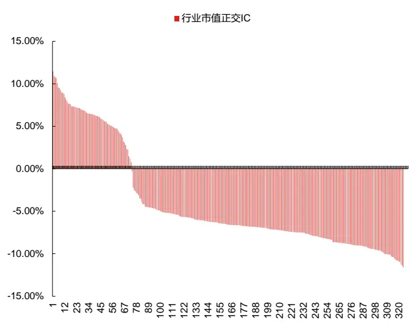
数据来源：东方证券研究所 & Wind资讯

图 16：DFQ 遗传规划挖掘 324 个单因子全样本中性化年化ICIR 分布（2012.1.4-2023.4.14）
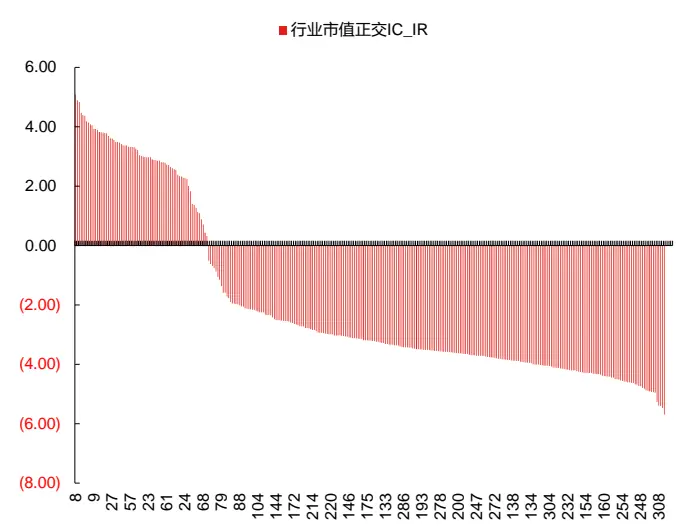
数据来源：东方证券研究所 & Wind资讯

图 17：DFQ 遗传规划挖掘 324 个单因子全样本单调性指标分布（2012.1.4-2023.4.14）
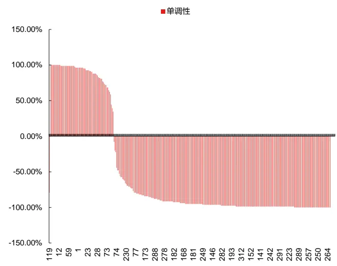
数据来源：东方证券研究所 & Wind资讯

图18：DFQ遗传规划挖掘324个单因子全样本10组多头超额收益分布（2012.1.4-2023.4.14）
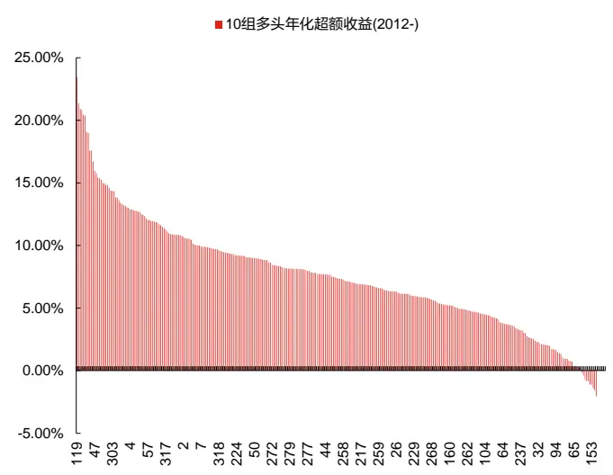
数据来源：东方证券研究所 & Wind资讯

有关分析师的申明，见本报告最后部分。其他重要信息披露见分析师申明之后部分，或请与您的投资代表联系。并请阅读本证券研究报告最后一页的免责申明。

由于篇幅有限，我们仅精选了几个单因子来展示。挖掘持续进行中，新因子不断出现，如需其他单因子，可联系报告作者。我们此次精选出的单因子均在多种因子表现衡量维度下表现优异：

1. 12年以来中性化 IC绝对值达到 8%以上，中性化 ICIR绝对值达到年化 4以上；

2. 样本外未出现明显效果衰减，全样本 IC 绝对值不大幅低于训练集适应度（由于适应度中还添加了相关系数和长度惩罚，会比训练集的 IC绝对值低）；

3. 12年以来十组多头超额收益达到 10%以上；

4. 单调性绝对值达到 99%以上；

5. 与 18个人工因子最大相关系数低于 50%；

6. 因子原始值缺失率低于 6%；

7. 因子表达式长度低于 10。

图 19：DFQ 遗传规划挖掘 10 个单因子绩效表现（2012.1.4-2023.4.14）

| 表达式 | 原始 IC | 原始 IC_IR | 行业市值正 行业市值 交 Ic | 政交 IC_IR | 年化超额收益 (2012-) | 超额收益 超额收益 (2017-) (2019-) | 超额收益 (2023-) | 绝对收益 (2017-) | 绝对收益 (2019-) |  | 绝对收益 (2023-) | 单调性 | 适应度 数值 相关系数 | 最大 | 最大相关系数 缺失值 对应人工因子 比例 |
| --- | --- | --- | --- | --- | --- | --- | --- | --- | --- | --- | --- | --- | --- | --- | --- |
| log(rank div(amount, apb)) | -10.75% | (3.56) | -9.35% | (4.54) | 15.13% | 50.88% | 28.33% 3.42% | 63.93% | 142.07% |  | 11.46% | -99% 8.28% | 38.31% | Into_20d | 3.77% |
| mul(mul(power3(max(rskew, Into)), swing), Into) | -8.97% | (2.20) | -9.15% | (4.01) | 14.33% | 81.56% 60.38% | 15.50% | 90.78% | 194.05% |  | 24.41% | -100% 9.55% | 34.02% | Into_20d | 4.35% |
| mul(ts_max(Incoret, 40), if_then_else(tr, amihud, sqrskew, Inhlret)) | -10.74% | (2.99) | -9.79% | (4.06) | 13.83% | 53.82% 46.21% | 11.99% | 63.47% | 169.87% | 20.52% | -99% | 7.85% | 48.01% | VOL20 | 4.76% |
| umr(max(inv(curt(ts_mean(power3(amount), 10))), Into), vhhi) | -8.80% | (2.15) | -10.22% | (4.08) | 13.80% | 82.61% 67.64% | 10.30% | 91.93% | 207.99% | 18.58% | -99% | 9.30% | 51.67% | Into_20d | 4.24% |
| scale(power3(rank mul(ts to wm(adjhigh, 20), Into))) | -7.33% | (1.91) | -9.02% | (4.94) | 13.01% | 55.70% | 42.72% 14.01% | 64.01% | 162.05% |  | 22.56% | -100% 8.51% | 40.84% | RET20 | 4.77% |
| industry_norm(if_then_else(arpp, Into, swing, cret)) | -8.85% | (3.39) | -9.60% | (4.01) | 12.67% | 74.76% | 50.20% 11.60% | 87.33% | 180.72% |  | 20.09% | -100% 7.63% | 41.22% | Into_20d | 4.35% |
| ts_max(ts_cov(sqrvol, ex_Inret, 20), 60) | -8.65% | (3.02) | -8.24% | (4.56) | 11.85% | 59.29% | 38.45% 9.27% | 69.37% | 157.59% |  | 17.79% -100% | 6.37% | 34.24% | idmom_20d | 5.65% |
| scale(mul(ts_sum(ts_cov(adjvolume, rank(adjvolume), 20), 1), rvol)) | -9.49% | (3.83) | -9.04% | (4.91) | 10.86% | 37.88% | 29.12% 10.21% | 47.71% | 140.86% |  | 18.71% -100% | 7.61% | 37.71% | sdwol_20d | 4.30% |
| mean2(ts_mean(Incoret, 60), ts_max_to_min(apb, 10)) | -9.45% | (2.98) | -9.33% | (4.42) | 10.85% | 49.01% | 30.04% 6.81% | 57.96% | 141.56% | 15.08% | -100% | 6.95% | 38.74% | MAXRET20 | 5.65% |
| rank_sub(amihud, ts_max(sqrt(power2(rank(amount))), 1)) | 10.76% | 2.63 | 9.93% | 4.12 | 10.33% | 39.97% | 19.27% 4.67% | 52.19% | 124.43% | 12.72% | 99% | 8.99% | 50.67% | Into_20d | 4.24% |

数据来源：东方证券研究所 & Wind资讯

下面我们分别介绍这几个因子的原始表达式，含义，并展示全样本多头超额收益净值以及分年超额收益。

1.log(rank_div(amount, apb))：该因子 12 年以来多头超额收益达到 15.13%，是我们目前挖到的因子中排名第一的。但 17 年之后因子多头表现有所衰减。与换手率因子相关性最高，达38%，但多头端表现和 icir均有显著提升。

因子表达式中涉及的算子均为截面运算，表示每日的个股成交额（amount）和个股买卖压力（apb，等权加权均价和成交量加权均价之比的对数）的截面排名之比，再取 log(abs(x))。因子值越大说明个股的 amount 截面排名高，并且 apb 截面排名低。apb 低反映股票的买压小，卖压大，对股票未来收益是负向影响，因此整体因子 IC负向。

2. mul(mul(power3(max(rskew, lnto)), swing), lnto)：今年以来多头表现突出，多头超额收益达到 15.5%，是我们目前挖到的因子中今年表现最好的。17 年以来以及 19 年以来多头超额收益也在我们目前挖到的因子中排名前三。与换手率因子相关性最高，达 34%，但多头端表现和icir均有显著提升。

由于日内收益率偏度（rskew）和日内对数换手率（lnto）量纲相近，因子可以理解为取rskew和 lnto最大值的立方，再乘上日内振幅（swing），再乘上 lnto。该因子属于复合型因子。

3. mul(ts_max(lncoret, 40), if_then_else(tr, amihud, sqrskew, lnhlret))：今年以来多头表现也不错，多头超额收益达到11.99%。与波动率因子相关性最高，达48%，但多头端表现和icir显著提升。

因子表达式为两部分相乘，第一部分为过去 40 个交易日的开盘-收盘对数收益率（lncoret）的最大值，第二部分为逻辑判断 if_then_else 算子，意思是比较日内真实波动率（tr）和非流动性（amihud）的大小，若 tr 获胜取日内偏度的平方（sqrskew），若 amihud 获胜取最高-最低对数收益率（lnhlret）。该因子属于波动率因子的变形。

4. umr(max(inv(curt(ts_mean(power3(amount), 10))), lnto), vhhi) ：今年以来多头超额收益达到 10.3%。17 年以来以及 19 年以来多头超额收益在我们目前挖到的因子中均排名第一。与换手率因子相关性最高，达 51.67%，但多头端表现和 icir均有显著提升。

公式相对较为复杂，但可以基本简化为umr(lnto,vhhi)。umr(x1,x2)是我们自定义的算子,表示(x1-mean(x1))*x2。lnto 表示当日对数换手率，vhhi 表示日内成交量的 HHI 指数，考察日内成交量在不同交易时间分布的离散程度。vhhi 指数越大，表示日内成交量集中程度越高。二者均为正数，且量纲大致相同，因而因子多头即为截面上换手率相对较高且 vhhi 高的过票，空头即为截面上流换手率相对较低且 vhhi高的股票。因子 IC负向，属于流动性类因子。

我们也挖到了相近形式的 umr(amihud, vhhi)、umr(amihud, power2(ts_ewm(swing, 60)))、umr(ts_sum(power2(max(rskew, lnto)), 1), vhhi)。这三个因子 12 年以来多头超额收益均在 13%以上。

5. scale(power3(rank_mul(ts_to_wm(adjhigh, 20), lnto)))：今年以来多头表现突出，多头超额收益达到 14.01%，在我们目前挖到的因子中排名前三。与反转因子相关性最高，达 41%，但多头端表现、ic、icir均有显著提升。

因子表达式可近似理解为两个元素排名相乘，第一个元素为过去 20 个交易日的复权最高价（adjhigh）/过去20个交易日最高价的线性衰减加权均值，第二个元素为 lnto。

6. industry_norm(if_then_else(arpp, lnto, swing, cret)) ：今年以来多头表现也不错，多头超额收益达到 11.6%，与换手率因子相关性最高，达 41%，但多头端表现和 icir显著提升。

该因子同样用到了逻辑判断 if_then_else 算子，比较日内买卖压力（arpp，时间加权均价的相对价格位置）和 lnto 的大小，若 arpp 获胜取日内振幅（swing），若 lnto 获胜取收盘价对数收益率（cret）。

7. ts_max(ts_cov(sqrvol, ex_lnret, 20), 60)：今年以来多头表现也不错，多头超额收益达到 9.27%，与 idmom因子相关性最高，达 34%，但多头端表现、ic、icir均有显著提升。

因子可以理解为日内波动率的平方（sqrvol）和个股超额收盘价对数收益率（ex_lnret）在过去 20个交易日的协方差，再取时序上 60个交易日的最大值。

8. scale(mul(ts_sum(ts_cov(adjvolume, rank(adjvolume), 20), 1), rvol)) ：今年以来多头表现也不错，多头超额收益达到 10.21%，与 sdvvol 因子相关性最高，达 38%，但 IC、多头端今年以来表现均有显著提升。

因子可以近似理解为过去 20 个交易日复权成交量（adjvolume）方差，乘上日内波动率（rvol）。

9. mean2(ts_mean(lncoret, 60), ts_max_to_min(apb, 10)) ：与 MAXRET20 因子相关性最高，达 39%，但多头端表现、ICIR 均有显著提升。

因子可以近似理解为过去 60个交易日开盘-收盘对数收益率（lncoret）均值，和过去 10个交易日 apb的最大值-最小值，二者取均值。

10. rank_sub(amihud, ts_max(sqrt(power2(rank(amount))), 1))：与换手率因子相关性最高，达 50.67%，但多头端表现和 icir显著提升。

因子大致等于非流动性（amihud）和过去2天成交额（amount）最大值的截面排名之差。

图 20：DFQ 遗传规划挖掘 10 个单因子多头超额收益净值（2012.1.4-2023.4.14）
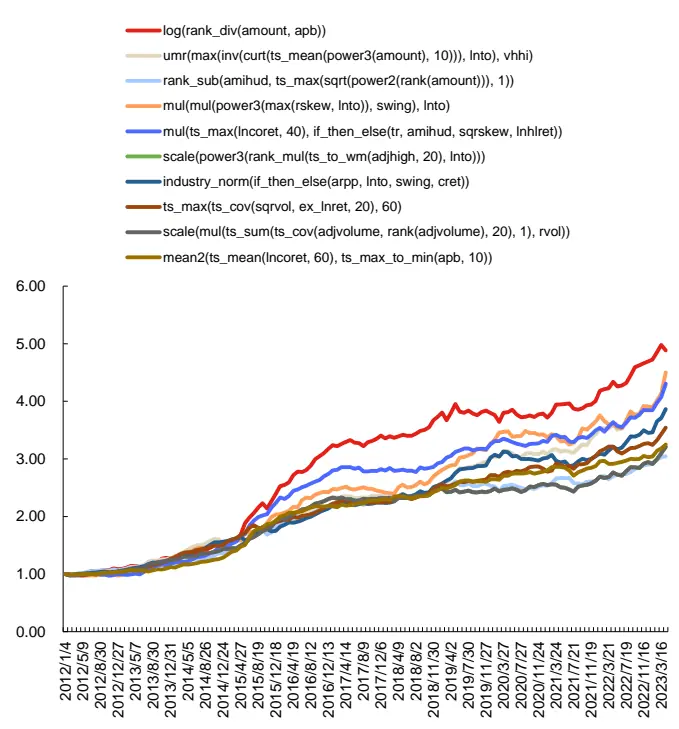
数据来源：东方证券研究所 & Wind资讯

图 21：DFQ 遗传规划挖掘 10 个单因子多头分年超额收益（2012.1.4-2023.4.14）
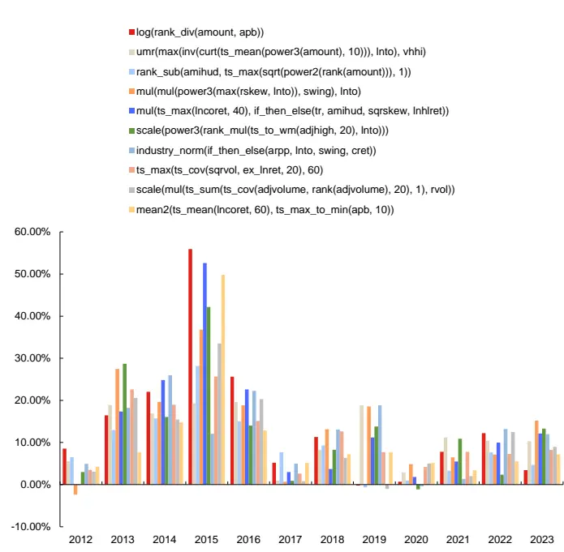
数据来源：东方证券研究所 & Wind资讯

## 4.6 多因子合成

在算法优势部分我们也提到过，同样可以将遗传规划算法挖掘得到的多个低相关的优秀因子后进行合成，提取个股的综合打分评价。综合打分可以直接用于相对低频的横截面选股，也可以用来做指数增强组合，也可以和现有的低频 alpha 因子结合使用。由于多因子合成结果与我们挖到的因子数量有关，目前仅展示基于现有挖掘成果得到的合成因子表现。挖掘持续进行中，感兴趣的投资者欢迎关注我们后期的更新结果。

首先我们将每次挖掘完成后，达到适应度阈值，且通过相关性筛选后保留的因子拼在一起，根据表达式进行去重。而后进行基本的异常值、缺失值、标准化、中性化处理。由于我们的因子挖掘在多台服务器同时进行，并不是持续不间断挖掘的，因此还需要再根据处理后的中性化单因子值计算训练集中的相关系数。目前在进行了 3 天的挖掘后，我们得到了 324 个有效单因子，将他们按照相关系数 0.5 过滤后，还剩下 152 个单因子。由于遗传规划方法挖掘因子具有很大的随机性，我们只能确保得到的因子在训练集上适应度达标，但无法确保其样本外不衰减，因而我们建议做因子合成时选取的单因子数量多一些，降低随机性的影响。这 152 个单因子全样本中性化IC绝对值均值达到 6.3%，仅有 31个因子全样本中性化IC绝对值低于 5%，样本外衰减率较低。仅有18个因子全样本ICIR绝对值不足2。仅有23个因子单调性指标绝对值小于80%。说明这些因子在样本内外表现普遍较好。

接下来我们将训练集（2012.1.1-2016.12.31）中挖掘到的这 152个单因子进行加权，测试样本外合成因子的表现，合成因子样本外回测区间为2017.1.11-2023.4.14。因子加权方式众多，并无广泛认可的最优方式，每种加权方法都有其适用的情况。并且低频因子的加权结果也相对随机，不同年份表现有所差异。我们无意探讨因子加权的问题，仅分别列出了 zscore 等权、线性回归模型下的弹性网络回归，这 2种方式下的 DFQ遗传规划合成因子和 18个人工合成因子的表现。

DFQ 模型的 152 个单因子，以及人工因子库的 18 个因子，他们的内部相关性并不高，因此zscore等权也是一个可行做法，我们重新计算训练集IC来确定因子符号。弹性网络回归（ElasticNet Regression）是一种结合了岭回归（Ridge Regression）和 lasso 回归（Lasso Regression）的线性回归模型，能够比较好的处理因子间的共线性问题，避免因子间的冗余和过拟合，是线性回归模型中表现较突出的做法。它通过同时惩罚绝对值和平方值来达到选择特征和拟合数据的目的，不仅可以像岭回归那样缩小系数，还可以像 lasso 回归那样选择特征。我们采用平行训练的做法，每个月取过去 48个月模型的预测均值作为预期收益率。L1_ratio设置 0.5，alpha设置 0.01，对参数进行网格搜索后生成的合成因子效果并无显著提升。

图 22：18个人工价量因子的原始值相关系数矩阵

| IVOL20 | IVOL20 IVR20 68% |  | LNAMIHUD20 MAXRET20 -12% |  | PPREVERSAL 35% |  | VOL20 Into_20d 86% |  | dwf_h20d 70% | apb_1d_20d -28% | arpp_1d_20d | idjump_20d idkurt_20d | idmom_20d | idskew_20d | sdrskew_20d |  | sdrvol_20d sdvvol_20d | 40% |
| --- | --- | --- | --- | --- | --- | --- | --- | --- | --- | --- | --- | --- | --- | --- | --- | --- | --- | --- |
|  | 68% |  | -11% | 83% 38% | 33% | 29% 29% | 28% | 57% 20% | 38% | -23% | -12% -15% | 55% 33% | 32% 24% | -43% -17% | 28% 17% | 34% 22% | 41% 32% | 31% |
| IVR20 LNAMIHUD20 | -12% | -11% |  | -10% | -11% | -3% | -7% | -14% | -12% | 9% |  |  |  | 28% | 2% | 23% | 15% | 2% |
| MAXRET20 | 83% | 38% | -10% |  | 45% | 49% | 87% | 55% | 65% | -30% | 10% -6% | -26% 63% | 37% 25% | -35% | 31% | 28% | 31% | 37% |
| PPREVERSAL | 35% | 33% | -11% | 45% |  | 73% | 23% | 13% | 22% | -25% | 9% | 48% | 4% | 1% | 17% | 2% | 6% | 14% |
| RET20 | 29% | 29% | -3% | 49% | 73% |  | 19% | 12% | 18% | -31% | 13% | 54% | 7% | 11% | 26% | 7% | 7% | 20% |
|  |  | 28% | -7% |  |  |  |  |  |  |  |  |  |  |  |  |  |  |  |
| VOL20 | 86% |  |  | 87% | 23% | 19% |  | 64% | 68% | -22% | -6% | 52% | 28% | -48% | 26% | 32% | 34% | 34% |
| Into_20d | 57% | 20% | -14% | 55% | 13% | 12% | 64% |  | 51% | -25% | -4% | 47% | 22% | -48% | 29% | 25% | 29% | 23% |
| dwf_h20d | 70% | 38% | -12% | 65% | 22% | 18% | 68% | 51% |  | -20% | -10% | 46% | 24% | -39% | 24% | 26% | 29% | 27% |
| apb_1d_20d | -28% | -23% | 9% | -30% | -25% | -31% | -22% | -25% | -20% |  | 48% | -37% | -16% | 18% | -30% | -20% | -20% | -29% |
| arpp_1d_20d idjump_20d | -12% 55% | -15% 33% | 10% -26% | -6% | 9% | 13% | -6% | -4% | -10% | 48% |  | 0% | -14% | 11% | -10% | -16% | -16% | -18% |
| idkurt_20d | 32% | 24% |  | 63% 25% | 48% | 54% | 52% | 47% | 46% | -37% | 0% |  | 16% | -70% | 52% | 18% | 23% | 22% |
| idmom_20d | -43% | -17% | 37% 28% | -35% | 4% 1% | 7% 11% | 28% | 22% | 24% | -16% | -14% | 16% |  | -15% | 42% | 87% | 59% | 25% -11% |
| idskew_20d | 28% | 17% | 2% | 31% | 17% | 26% | -48% | -48% | -39% | 18% | 11% | -70% | -15% |  | -41% | -17% | -23% | 25% |
| sdrskew_20d | 34% | 22% | 23% | 28% | 2% | 7% | 26% | 29% | 24% | -30% | -10% | 52% | 42% | -41% |  | 42% | 32% |  |
| sdrvol_20d | 41% | 32% | 15% | 31% |  |  | 32% | 25% | 26% | -20% | -16% | 18% | 87% | -17% | 42% |  | 54% | 33% |
|  | 40% | 31% |  |  | 6% | 7% | 34% | 29% | 29% | -20% | -16% -18% | 23% 22% | 59% | -23% | 32% | 54% |  | 43% |
| sdvvol_20d |  |  | 2% | 37% | 14% | 20% | 34% | 23% | 27% | -29% |  |  | 25% | -11% | 25% | 33% | 43% |  |

数据来源：东方证券研究所 & Wind资讯

有关分析师的申明，见本报告最后部分。其他重要信息披露见分析师申明之后部分，或请与您的投资代表联系。并请阅读本证券研究报告最后一页的免责申明。

可以看到：在不同加权方法下，DFQ 遗传规划合成因子的整体绩效表现均优于 18 个人工合成因子。在弹性网络方法下，DFQ遗传规划合成因子整体表现更突出。RankIC达到12.72%，年化 ICIR5.44，20分组多头超额收益 17年以来年化 13.29%，年化夏普 2.42，最大回撤仅为3.5%，月度胜率达到 74%，月均换手单边 72%。20年以来多头表现不降反升，年化收益提高到 14.32%。此外，在弹性网络回归的合成方法下，我们尝试将 18 个人工因子和 152 个遗传规划因子放在一起，考察合成因子的表现。可以看到合成因子表现相对于 152 个遗传规划因子单独合成，并无明显提升，多头端表现还略有下降。

图 23：DFQ 遗传规划挖掘合成因子 VS 18 个人工合成因子绩效表现-zscore 等权 VS 弹性网络回归（2017.1.11-2023.4.14）
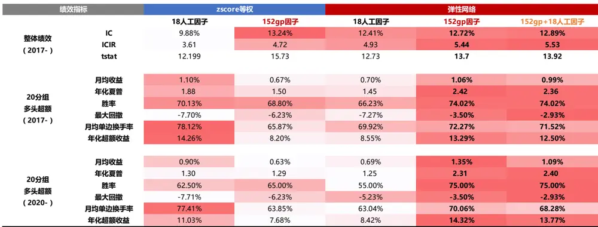
数据来源：东方证券研究所 & Wind资讯

下面我们详细展示按照弹性网络回归方法加权的152个DFQ遗传规划合成因子的分组表现。可以看到，20 分组单调性较好，多头端分年表现也十分稳定，2017-2023 年每年多头超额均超过8%，2023年以来超额达到 11%。

图 24：DFQ 遗传规划挖掘合成因子 20 组分年超额-弹性网络回归（2017.1.11-2023.4.14）

| 20分组 20分组2017- 2020- 2017年化超额收益 分年超额 |  |  |  |  |  |  |  |  |  |  |  |  |  |  |  |  |  |
| --- | --- | --- | --- | --- | --- | --- | --- | --- | --- | --- | --- | --- | --- | --- | --- | --- | --- |
|  |  |  |  |  |  |  |  |  |  |  |  | 2018 | 2019 | 2020 | 2021 | 2022 | 2023 |
| 0 | -34.24 | % | -31.82 | % 1 | -33.66% | -37.82% | -32.77% | -22.49% | -28.02% | -39.13% | -9.14% |  |  |  |  |  |  |
| 1 | -16.08 | % | -12.40 | % 2 | -21.23% | -24.68% | -9.75% | -14.24% | -1.57% | -11.76% | -5.46% |  |  |  |  |  |  |
| 2 | -10.36 | % | -8.05 | % 3 | -12.10% | -13.90% | -11.03% | -9.52% | -0.50% | -8.50% | -2.58% |  |  |  |  |  |  |
| 3 | -3.75 | % | -1.85% | 4 | -5.76% | -5.53% | -3.21% | 2.09% | -1.37% | 0.85% | -3.16% |  |  |  |  |  |  |
| 4 | -2.61 | % | -2.91第 | 5 | -3.14% | -1.21% | -0.92% | -1.50% | -0.73% | -3.34% | -2.84% |  |  |  |  |  |  |
| 5 | -3.75 | % | -4.53 | % 6 | -0.23% | -1.49% | -5.57% | -3.15% | -3.84% | -1.86% | -4.47% |  |  |  |  |  |  |
| 6 | -0.13 | % | -0.399 | % 7 | -0.55% | 0.48% | -0.11% | 3.18% | -2.46% | -0.97% | -3.28% |  |  |  |  |  |  |
| 7 | 0.96 | % | 0.21% | 8 | 6.48% | -3.92% | 3.79% | -0.34% | 2.35% | -1.62% | -1.15% |  |  |  |  |  |  |
| 8 | 2.51 | % | -1.16 | % 9 | 10.29% | 2.04% | 6.57% | -1.22% | -2.90% | 1.15% | -2.24% |  |  |  |  |  |  |
| 9 | 3.63 | % | 1.65% | 10 | 6.51% | 4.77% | 2.97% | 1.79% | -0.18% | 4.69% | -2.62% |  |  |  |  |  |  |
| 10 | 1.94 | % | 0.24% | 11 | 10.09% | 1.57% | -0.48% | -0.93% | -5.61% | 3.76% | 0.37% |  |  |  |  |  |  |
| 11 | 5.47 | % | 5.75% | 12 | 6.08% | 7.23% | 0.89% | 2.62% | 6.72% | 4.35% | 2.54% |  |  |  |  |  |  |
| 12 | 4.35 | % | 3.17% | 13 | 3.05% | 7.05% | 3.38% | 1.80% | 3.23% | 3.57% | -0.57% |  |  |  |  |  |  |
| 13 | 5.79 | % | 3.08% | 14 | 10.72% | 11.85% | 4.44% | 2.40% | 2.15% | 1.39% | 2.27% |  |  |  |  |  |  |
| 14 | 6.43 | % 7.46% |  | 15 | 6.10% | 5.29% | 3.43% | 6.68% | 5.23% | 6.83% | 1.64% |  |  |  |  |  |  |
| 15 | 8.53% | 7.99% |  | 16 | 5.98% | 10.37% | 9.42% | 9.69% | 1.71% | 11.58% | 1.60% |  |  |  |  |  |  |
| 16 | 10.48 | % 9.16% |  | 17 | 8.24% | 14.97% | 9.67% | 6.74% | 7.68% | 9.12% | 6.07% |  |  |  |  |  |  |
| 17 8.64% |  | 8.56% |  | 18 | 5.28% | 12.45% | 5.04% | 4.97% | 6.37% | 8.10% | 5.88% |  |  |  |  |  |  |
| 18 | 8.36 | % 8.25% |  | 19 | 1.68% | 9.20% | 13.95% | 5.49% | 4.90% | 7.56% | 7.14% |  |  |  |  |  |  |
| 19 13.29 |  | % 14.329 |  | 20 | 8.03% | 18.70% | 8.22% | 8.51% | 10.97% | 14.47% | 11.02% |  |  |  |  |  |  |

数据来源：东方证券研究所 & Wind资讯
有关分析师的申明，见本报告最后部分。其他重要信息披露见分析师申明之后部分，或请与您的投资代表联系。并请阅读本证券研究报告最后一页的免责申明。

图 25：DFQ 遗传规划挖掘合成因子 20 组超额净值-弹性网络回归（2017.1.11-2023.4.14）
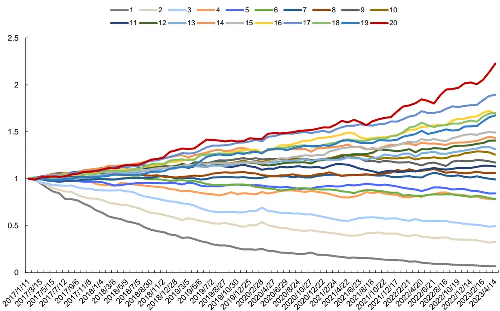
数据来源：东方证券研究所 & Wind资讯

我们统计了每月的弹性网络回归模型中，152个 DFQ遗传规划单因子的保留次数。其中仅有一个变量一次都没被选中，说明弹性网络对于输入的单因子进行了充分的利用。有61个变量的使用次数不足 10次，一个变量的最高出现次数是 37次。

图 26：DFQ遗传规划挖掘合成因子-弹性网络回归下自变量出现次数（2017.1.11-2023.4.14）
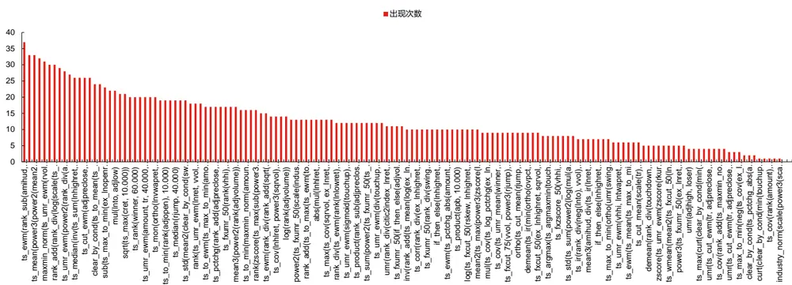
数据来源：东方证券研究所 & Wind资讯

有关分析师的申明，见本报告最后部分。其他重要信息披露见分析师申明之后部分，或请与您的投资代表联系。并请阅读本证券研究报告最后一页的免责申明。

为了更好地展示DFQ模型的信息增量，我们考察了DFQ遗传规划模型合成因子得分，18个人工因子合成得分，神经网络合成因子，三个因子两两回归后残差因子的选股表现。DFQ和人工因子均使用弹性网络回归进行加权，且参数保持一致。神经网络因子来自之前的研报《周频量价指增组合》，数据值更新到 2023.1.18。

从结果来看：（1）DFQ 遗传规划因子效果可完全替代 18 个人工因子。152 个 DFQ 合成因子对18个人工合成因子回归后，残差仍有显著选股效果，RANKIC超过5%，年化ICIR超过3。而 18 个人工合成因子对 152 个 DFQ 合成因子回归后，残差已无选股效力，RANKIC 不到 1%，年化 ICIR 仅为 0.5。（2）DFQ 遗传规划因子和神经网络因子间存在信息差异，互相之间都不能被完全解释，两两回归残差都具备选股效果。

图 27：合成因子回归残差绩效表现（2017.1.11-2023.4.14）

| 解释变量 | 被解释变量 | IC | ICIR | tstat |
| --- | --- | --- | --- | --- |
| 18合成 | 152合成 | 5.30% | 3.23 | 8.121 |
| 152合成 | 18合成 | 0.90% | 0.54 | 1.357 |
| 神经网络V0 | 152合成 | 4.64% | 1.90 | 4.727 |
| 152合成 | 神经网络V0 | 9.25% | 3.25 | 8.076 |

数据来源：东方证券研究所 & Wind资讯

## 五、总结

alpha模型负责对股票收益或alpha的预测，对组合收益的影响相对更大，是量化研究的重中之重。国内量化发展已有十余年，各家机构投资者的 alpha 因子库已有较大规模，靠人工构建alpha 因子的方法已经遇到瓶颈。为了对人工因子库进行补充，我们在传统 alpha 模型的体系下引入遗传规划方法，将挖掘因子的部分交给机器。

此次，我们对遗传规划算法进行了全面的升级，开发出了一套高效的 DFQ 遗传规划价量因子挖掘系统。加入自定义的特征和算子，指定适应度指标，从一个随机种群出发，可以通过多代进化得到更优子代。挖掘过程可以重复多轮，从而可以得到多个适应度高、低相关、有显式表达式的选股因子。

在 alpha 因子构建中，可以引入的常见机器学习模型主要有两大类：遗传规划和神经网络。两者各有优势。我们总结了 12 点遗传规划在选股因子挖掘问题上的独特优势：有着直观易懂的底层逻辑，能够自动化特征生成与选择，可以融合人工先验信息，捕捉非线性和交互效应，生成的因子具有显式公式，可解释性强，能够实现全局优化，对噪声较为鲁棒，不易过拟合。并且算法内部透明白盒，可拓展空间大，自由度高。是一个可持续进行的因子挖掘工具。对计算性能要求相对低。应用广泛，既可以挖掘单因子使用，也可以挖掘多个有效且低相关的单因子进行合成，获得个股综合打分。还可以与其他机器学习模型结合，互相间并不冲突。

由于在进化过程中缺乏明确的目标引导，常规的遗传规划算法进化效率低下。如何能提升进化效率，在有限的算力，有限的时间内，进化出更多、更好、更短、更低相关的因子，是算法的核心痛点，也是DFQ模型的核心改进点。我们提出了7点改进：提升初始种群质量，提升每代种群质量，提升每代产生的有效公式数量，避免公式膨胀，动态调整每代进化参数，降低挖掘因子的相关性，避免无效运算。

DFQ 模型挖掘效率较高，进行一轮 15 代完整挖掘用时 5-24 小时不等，一轮完成后可产生20-50个适应度超过5%，且互相间相关系数不超过50%的单因子。我们在挖掘3天后已找到324个训练集适应度超过 5%，不重复，且与人工 18 个价量因子相关性不高的单因子。其中只有 45个在 12年以来全样本中性化IC绝对值不到 5%，样本外衰减率不到 14%。

结合挖掘出单因子样本内外的表现和逻辑性，我们精选了 10 个单因子，均满足：12 年以来中性化 IC 绝对值达到 8%以上，中性化 ICIR 绝对值达到年化 4 以上；样本外未出现明显效果衰减，全样本 IC 不大幅低于训练集适应度；12 年以来十组多头超额收益达到 10%以上；单调性绝对值达到 99%以上；与 18 个人工因子最大相关系数低于 50%；因子原始值缺失率低于 6%；因子表达式长度低于 10。

我们将训练集中挖掘到的 152 个适应度超过 5%，且互相间相关系数不超过 50%的单因子进行加权，测试样本外合成因子的表现。在不同加权方法下，DFQ遗传规划合成因子的整体绩效表现均优于 18 个人工合成因子。在弹性网络模型下，DFQ合成因子 17年以来的月频 RankIC达到12.72%，年化 ICIR5.44。合成因子 20 分组单调性较好，多头端分年表现也十分稳定，2017-2023 年每年多头超额均超过 8%，17 年以来多头超额年化 13.29%，年化夏普 2.42，最大回撤仅为 3.5%，月度胜率达到 74%，月均换手单边 72%。20 年以来多头表现不降反升，多头超额收益年化提高到 14.32%。

## 风险提示

1. 量化模型基于历史数据分析，未来存在失效风险，建议投资者紧密跟踪模型表现。

2. 极端市场环境可能对模型效果造成剧烈冲击，导致收益亏损。

## Tabl e_Disclai mer 分析师申明

每位负责撰写本研究报告全部或部分内容的研究分析师在此作以下声明：

分析师在本报告中对所提及的证券或发行人发表的任何建议和观点均准确地反映了其个人对该证券或发行人的看法和判断；分析师薪酬的任何组成部分无论是在过去、现在及将来，均与其在本研究报告中所表述的具体建议或观点无任何直接或间接的关系。

## 投资评级和相关定义

报告发布日后的 12个月内的公司的涨跌幅相对同期的上证指数/深证成指的涨跌幅为基准；

## 公司投资评级的量化标准

买入：相对强于市场基准指数收益率 15%以上；

增持：相对强于市场基准指数收益率 5%～15%；

中性：相对于市场基准指数收益率在-5%～+5%之间波动；

减持：相对弱于市场基准指数收益率在-5%以下。

未评级 —— 由于在报告发出之时该股票不在本公司研究覆盖范围内，分析师基于当时对该股票的研究状况，未给予投资评级相关信息。

暂停评级 —— 根据监管制度及本公司相关规定，研究报告发布之时该投资对象可能与本公司存在潜在的利益冲突情形；亦或是研究报告发布当时该股票的价值和价格分析存在重大不确定性，缺乏足够的研究依据支持分析师给出明确投资评级；分析师在上述情况下暂停对该股票给予投资评级等信息，投资者需要注意在此报告发布之前曾给予该股票的投资评级、盈利预测及目标价格等信息不再有效。

## 行业投资评级的量化标准：

看好：相对强于市场基准指数收益率 5%以上；

中性：相对于市场基准指数收益率在-5%～+5%之间波动；

看淡：相对于市场基准指数收益率在-5%以下。

未评级：由于在报告发出之时该行业不在本公司研究覆盖范围内，分析师基于当时对该行业的研究状况，未给予投资评级等相关信息。

暂停评级：由于研究报告发布当时该行业的投资价值分析存在重大不确定性，缺乏足够的研究依据支持分析师给出明确行业投资评级；分析师在上述情况下暂停对该行业给予投资评级信息，投资者需要注意在此报告发布之前曾给予该行业的投资评级信息不再有效。

## HeadertTabl e_Discl ai mer 免责声明

本证券研究报告（以下简称“本报告”）由东方证券股份有限公司（以下简称“本公司”）制作及发布。

。本公司不会因接收人收到本报告而视其为本公司的当然客户。本报告的全体接收人应当采取必要措施防止本报告被转发给他人。

本报告是基于本公司认为可靠的且目前已公开的信息撰写，本公司力求但不保证该信息的准确性和完整性，客户也不应该认为该信息是准确和完整的。同时，本公司不保证文中观点或陈述不会发生任何变更，在不同时期，本公司可发出与本报告所载资料、意见及推测不一致的证券研究报告。本公司会适时更新我们的研究，但可能会因某些规定而无法做到。除了一些定期出版的证券研究报告之外，绝大多数证券研究报告是在分析师认为适当的时候不定期地发布。

在任何情况下，本报告中的信息或所表述的意见并不构成对任何人的投资建议，也没有考虑到个别客户特殊的投资目标、财务状况或需求。客户应考虑本报告中的任何意见或建议是否符合其特定状况，若有必要应寻求专家意见。本报告所载的资料、工具、意见及推测只提供给客户作参考之用，并非作为或被视为出售或购买证券或其他投资标的的邀请或向人作出邀请。

本报告中提及的投资价格和价值以及这些投资带来的收入可能会波动。过去的表现并不代表未来的表现，未来的回报也无法保证，投资者可能会损失本金。外汇汇率波动有可能对某些投资的价值或价格或来自这一投资的收入产生不良影响。那些涉及期货、期权及其它衍生工具的交易，因其包括重大的市场风险，因此并不适合所有投资者。

在任何情况下，本公司不对任何人因使用本报告中的任何内容所引致的任何损失负任何责任，投资者自主作出投资决策并自行承担投资风险，任何形式的分享证券投资收益或者分担证券投资损失的书面或口头承诺均为无效。

本报告主要以电子版形式分发，间或也会辅以印刷品形式分发，所有报告版权均归本公司所有。未经本公司事先书面协议授权，任何机构或个人不得以任何形式复制、转发或公开传播本报告的全部或部分内容。不得将报告内容作为诉讼、仲裁、传媒所引用之证明或依据，不得用于营利或用于未经允许的其它用途。

经本公司事先书面协议授权刊载或转发的，被授权机构承担相关刊载或者转发责任。不得对本报告进行任何有悖原意的引用、删节和修改。

提示客户及公众投资者慎重使用未经授权刊载或者转发的本公司证券研究报告，慎重使用公众媒体刊载的证券研究报告。

## 东方证券研究所

地址： 上海市中山南路 318 号东方国际金融广场 26 楼

电话：021-63325888

传真：021-63326786

网址： www.dfzq.com.cn