# 基于循环神经网络的多频率因子挖掘

# 因子选股系列之九十一

## 研究结论

前期报告《周频量价指增策略》利用 RNN 为主体模型搭建了 AI 量价模型框架，并将其应用于选股策略。本报告主要对该报告中数据预处理和 RNN 模型提取因子这两部分进行了复现和一些细节方面改进，包括最后一层增加 Batch-Norm层、使用的标签经过中性化和截面标准化等预处理。

通过讨论模型中一些参数的设置，我们认为：1）适当降低模型的学习率有助于梯度下降时寻找到验证集上表现更优的模型参数，但会大大增加模型训练时间；2）增加RNN 中丢弃率大小有助于增强模型的泛化能力，但会降低模型在验证集上的表现；3）验证集上模型性能随正交惩罚参数增大呈现先上升后下降的趋势；4）适当增加因子单元个数有利于控制生成各单因子间的低相关性，但会增加过拟合风险。

2017年以来，一元和多元RNN等权合成因子在中证全指、沪深300、中证500、中证 1000 四个指数成分股上双周频 RankIC 均值分别为 14.47%、10.05%、11.03%、14.45%和 14.63%、10.24%、11.15%、14.91%，数值均超过了 10%。这说明 RNN生成因子市值偏向性较低

RNN 在各数据集生成因子等权合成之后打分可直接应用于指数增强策略，成分股不低于 80%限制、周单边换手率约束为 20%约束下，一元模型打分在沪深 300、中证500 和中证 1000 增强策略上年化对冲收益率分别为 12.22%、13.79%和 23.63%，多元模型打分在沪深 300、中证 500和中证 1000增强策略上年化对冲收益率分别为12.52%、14.85%和 22.15%。

⚫根据各数据集上生成因子回测结果，我们认为 1）多元 RNN 生成因子单元中各单因子仍然有较好的选股能力且各单因子之间相关性较低，说明多元 RNN 挖掘因子能力较高；2）我们分钟特征数据集并没有完全表示分钟 k 线数据包含信息，分钟线特征有待进一步挖掘；3）我们 level2 特征数据集所包含的信息与日频及分钟特征数据集重叠度更低，进一步研究 level2特征将会给整个模型带来更多增量。

## 风险提示

⚫ 量化模型基于历史数据分析，未来存在失效风险，建议投资者紧密跟踪模型表现。

⚫ 极端市场环境可能对模型效果造成剧烈冲击，导致收益亏损。

## 报告发布日期

2023 年 06 月 06 日

证券分析师 杨怡玲

yangyiling@orientsec.com.cn

执业证书编号：S0860523040002

联系人陶文启

taowenqi@orientsec.com.cn

多模型学习量价时序特征：——因子选股 2022-06-12系列之八十三

周频量价指增模型：——因子选股系列之 2022-03-28八十一

## 引言

多因子策略是股票量化投资中比较经典的策略。多因子策略的核心出发点是，股票的下一期收益和本期的某些历史数据高度相关。通常这些历史数据取值越高，股票未来的收益越高的概率就越大，就越推荐持有数据取值高的这部分股票，并卖空取值低的另一部分股票。这种具有预测性的数据我们称之为因子。我们在做多因子策略时，希望通过底层量价或者基本面等数据挖掘出更多与股票未来收益有强相关性的因子，并通过特定的方式组合因子形成一个打分，从而得到一个对股票未来收益更准确的判断。因此如何从底层数据中挖掘有效的因子成为多因子策略研究的一个重要的议题。

传统的因子挖掘过程更多的是依赖于人工进行的，一些常见的挖掘思路已经被各家机构付诸实现，再试图通过人工发现一些能够带来增量的有效因子已经变得十分困难，传统人工挖掘因子的方法已经无法满足日益扩大的量化投资需求。

此外，挖掘因子问题大部分情况都是非线性的，面对这类问题时，线性回归、自回归移动平均等传统线性拟合性挖掘因子的方法往往会显得力不从心。

遗传规划（genetic programming & gp）挖掘因子的方法应运而生，gp 的核心思想是把一些已有因子通过加减乘除等算子组合成新的因子，理论上这种方法可以无限迭代且确实能够生成许多新的与原始因子低相关和未来收益率相关性较高的因子。但是这种方法褒贬不一，首先它能够生成大量因子，其中只有部分因子在样本外确实表现十分优异，但人们很难有一个较好的准则去从中筛选出有效因子。其次这种方法生成的许多因子是通过各种算子复合作用以后得到的，这些生成因子通常表达式复杂，且无法对这些因子给出一个直观合理的解释，且这些因子失效速度也较快。

近年来随着神经网络、决策树等非线性机器学习模型研究的不断发展，相关机器学习模型因其强大的拟合能力和能有效的处理各种复杂问题在量化交易领域受到广泛的关注。并且常见的神经网络的输出本身就可以作为因子直接应用到选股策略中，因而神经网络等模型非常适合挖掘因子、因子合成等任务。与其他应用问题不同，金融数据存在噪声大、有效数据量不足等诸多挑战。面对这些挑战，机器学习相关算法都能很好的解决，比如使用小样本学习算法（Few ShotLearning）能很好解决数据量不足等问题，dropout、early stopping、weight decay 等机制能够帮助机器学习模型很好的解决过拟合问题，对抗训练（Adversarialtraining）能够帮助机器学习模型提升模型鲁棒性。总而言之，机器学习相关模型在多因子策略研究领域的应用潜力巨大。

## 一、基于机器学习的 AI量价模型介绍

循环神经网络（RNN）作为神经网络中的一类因其强大的时序特征提取能力，在许多时间序列分析及预测问题上得到应用。对于量价选股问题，我们通常是给出股票池中个股历史量价时序信息，希望利用这些信息对未来个股的情况进行判断，而这正是一个典型的时序预测问题。因此前期报告《神经网络日频 alpha 模型初步实践》、《周频量价指增策略》、《多模型学习量价时序特征》利用 RNN 作为主体模型搭建了 AI 量价 alpha 模型框架，并将其应用于选股策略。这套AI 量价 alpha 模型框架主要分成三个部分，输入特征预处理、提取因子单元、因子加权，其具体流程如图 1所示。

图 1：AI量价模型框架
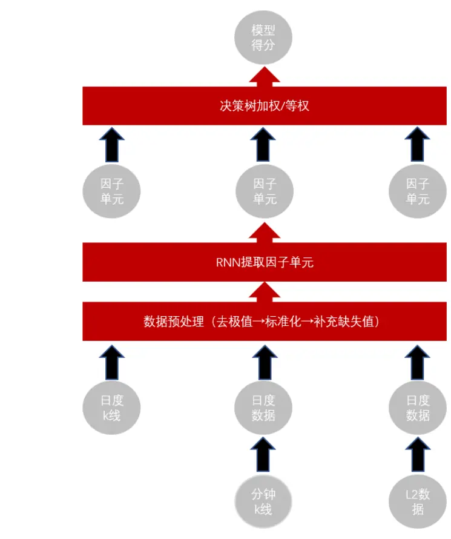
资料来源：东方证券研究所绘制

日度 k 线、分钟 k 线合成的日度数据集、l2 数据合成的日度数据集，我们分别称之为 day、ms、l2数据集，其中 day数据集包含 6个特征，ms包含 22个特征，l2包含 20个特征。

输入特征预处理主要包括去极值、数据标准化以及缺失值补充三个步骤。这里预处理后的特征输入RNN得到的一维和多维因子的输出，我们称之为因子单元。每个数据集上将生成一组因子单元。因子加权主要有决策树非线性加权以及等权方法，本文主要考虑等权这种加权方式。相关回测结果显示该策略在样本外有着显著的选股效果。

## 1.1 一元以及多元RNN模型概述

在整个 AI 量价 alpha 模型框架中，提取因子单元具体过程是将预处理好的量价时序信息输入到一个RNN模型中，RNN的输出则称之为因子单元（这里RNN是由一系列RNN cell 和一个NN层构成的，其结构如图 1所示）。

图 2：RNN模型结构
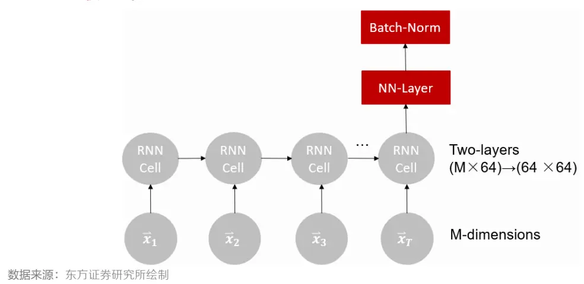

上图中 $({\vec{x}}_{1},{\vec{x}}_{2},{\vec{x}}_{3},\cdots,{\vec{x}}_{T})$ 代表一个时间序列数据， $\overrightarrow{\mathbfit{x}}_{j}$ 则代表时序数据在时间 j 对应的特征向量，其维数为 $\mathsf{M}_{\circ}$ 我们通常将最后一个时间步的输出（称为 RNN-output）通过一个 NN层得到整个 RNN最终的输出。

根据 RNN 输出的因子单元维数，我们又可将 RNN 划分为一元模型和多元模型。对于一元模型，每个时序数据的 RNN-output 是一维的。若每个时序数据的对应的因子单元是高维的（本文中我们选为 64维）我们则称之为多元 RNN。一元和多元 RNN的 NN层结构如下图所示：

图 3：一元 RNN的 NN层结构示意图
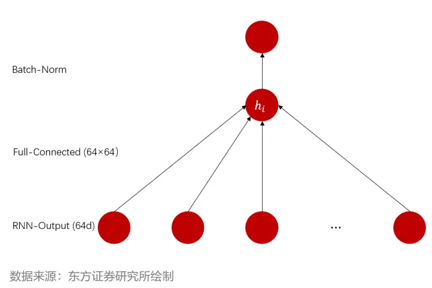

图 4：多元 RNN的 NN层结构示意图
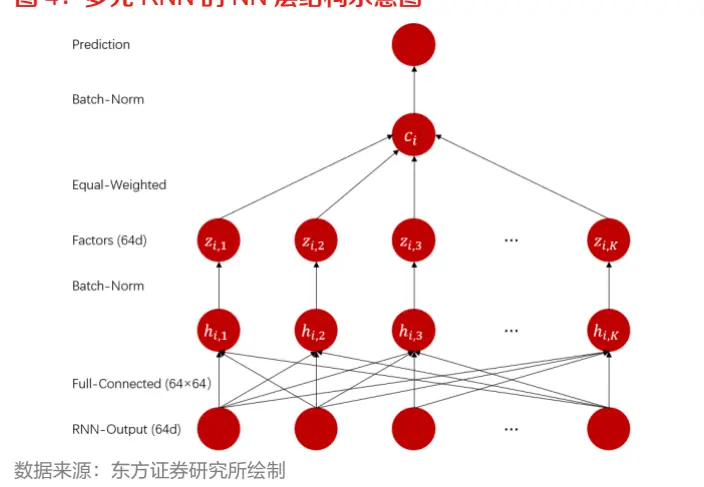

由于在训练的时候，我们通常是分批次进行训练的，因此对于一元模型我们将批次所有数据通过一个批标准化层得到最终模型的输出，再将这个输出与标准化后的真实标签计算MSE损失，通过极小化这个 MSE损失来训练一元模型，损失函数可由如下公式进行表达：

$$
Loss=\frac{1}{N}{\sum_{i}^{N}}(batchnorm(h_{i})-\hat{y}_{i})^{2}
$$

这里 $h_{i}$ 是一元 RNN 生成的因子，即批次中第 i 个数据对应的输出， $\hat{y}_{i}$ 表示第 i 个数据对应的真实收益率标签，N 表示批次对应的数据量。

对于多元模型，向量 $\left(z_{i,1},z_{i,2},\cdots,z_{i,K}\right)$ 中的每个元素我们称之为多元 RNN 对应于数据 i 生成的因子单元。在多元RNN的NN层，假设我们输出64维因子，我们先将这输出的64个因子分别进行批标准化，再将每个数据对应的64个因子求和，最终将这个求和后的结果再进行批标准化得到最终的输出，并将该输出与标准化后的真实标签计算MSE损失。与一元模型不同的是为了使得生成的 64 个因子之间相关性低，我们给损失函数还加了一项正交惩罚项即这 64 个因子相关系数矩阵 Frobenius范数，整个过程则可以由以下公式进行描述：

$$
z_{i,k}~=~batchnorm{\left(h_{i,k}\right)}
$$

$$
c_{i}=\frac{1}{K}\sum_{k}^{K}z_{i,k}
$$

$$
Loss=\frac{1}{N}\sum_{i}^{N}(batchnorm(c_{i})-\widehat{y_{l}})^{2}+\frac{\lambda}{NK^{2}}|\big(z_{i,k}\big)_{i,k}^{T}\big(z_{i,k}\big)_{i,k}|_{F}
$$

公式中：

$h_{i,k}$ 表示第 i 个时序数据对应 RNN-output 的第 k 个元素；

⚫ λ 表示正交惩罚项惩罚系数；

⚫ K 表示生成因子单元维数（本文中我们取 K = 64）；

$\left(z_{i,k}\right)_{i,k}^{T}$ 表示批数据所有因子排成的矩阵转置（该矩阵规模为 $K\times N)$ $\left(z_{i,k}\right)_{i,k}^{T}\left(z_{i,k}\right)_{i,k}$ 表示两个矩阵按矩阵乘法相乘（得到的矩阵规模为 $K\times K$ ，实际上对应着 K 个生成因子的相关系数矩阵的 $K^{2}\hbar\vec{\Xi}{\bf\Pi}){\bf\Pi},{\bf\Pi}|\cdot|_{F}$ 表示矩阵的 Frobenius 范数。

通过将预测标签和真实标签批标准化之后计算得到的 MSE 损失值和两者相关系数的相反数以及CCC（一致相关系数）损失等价，这种最后一层设置批标准化的做法可以很好的将三者统一起来。

## 1.2 模型训练与数据说明

输入特征预处理：主要包括去极值、数据标准化以及缺失值补充三个步骤，这三个步骤是对各个不同特征单独进行的。我们使用中位数±7 倍离差来进行去极值操作，接着使用均值和标准差对数据进行标准化，最后用0补充缺失值。这里中位数、离差、均值和标准差参数都是使用2016年以前数据进行估计的。

## 样本数据大小：

1. 样本内模型训练 day、ms 数据集涉及的输入数据开始于 20060101，而 l2 数据集则开始于20131231。每年滚动训练一个新的模型。

2. 对于 day、ms 这两个数据集样本内数据为过去十一年的数据，训练集和验证集按照时间顺序前十年作为训练集后一年作为验证集进行划分。

3. 对于 l2 数据集上训练的第 T 年预测模型，我们取 2013~T-1 年数据为样本内，按时间先后进行 9：1划分训练集和验证集，该做法是为了满足训练集样本量足够。

## 模型训练：

| 表1：模型训练设置 |  |
| --- | --- |
| Batchsize | 每个交易日所有个股 |
| 验证集评估函数 | 预测结果与真实收益率之间的 RankIC |
| 参数优化方法 | Adam算法+梯度剪裁操作(clip_value=3） |
| early stop | 20 个 epoch |
| RNN平行训练次数 | 3 |
| 预测目标 | 隔日未来十日收益率(T+1收盘~T+11收盘之间的收益率) |
| 标签 | 目标收益率中性化、截面标准化之后的结果 |

数据来源：东方证券研究所 & Wind资讯

1. 模型训练采取 early stop机制，迭代 20步内，若模型在验证集上预测结果与目标收益率之间的 RankIC 均值不再提升则停止训练。

2. 为防止神经网络训练的随机性，对于每个数据集每年的预测模型，我们训练 3个 RNN，并在样本外预测的时候将这三个模型的结果取平均作为最终模型的输出。

3. 不同结构的时序模型学习量价特征的输出具有差异性，因此在前期报告《周频量价指增策略》中，作者都分别使用 LSTM、GRU、AGRU 三种不同的 RNN 模型来学习 alpha 因子，在报告《多模型学习量价时序特征》中作者还使用了 Transformer 和 TCN 两种非 RNN 结构的时序模型来学习 alpha 因子，这种做法虽然能使生成的 alpha 因子有更显著的选股能力，但是需要巨大的计算代价。因此本文中只使用 GRU这一种模型来学习因子。

整个训练 RNN模型的过程如图 5所示。

图 5：模型训练示意图
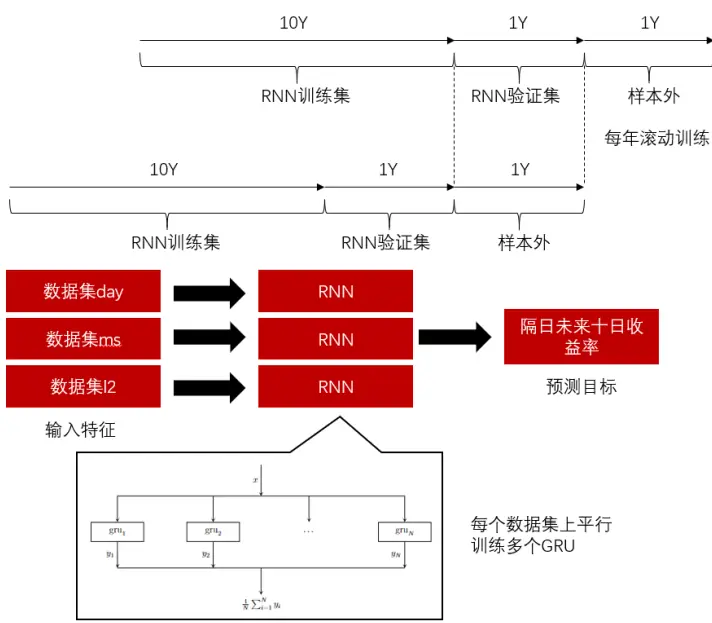
资料来源：东方证券研究所绘制

有关分析师的申明，见本报告最后部分。其他重要信息披露见分析师申明之后部分，或请与您的投资代表联系。并请阅读本证券研究报告最后一页的免责申明。

## 二、模型的参数设定

本章将对训练RNN模型时的一些参数的设定对结果的影响进行分析。为控制神经网络训练随机性对实验结果的影响，本章模型训练的结果都是固定随机种子，且在数据集 day 上进行实验的。

## 2.1 不同学习率（learning rate）的影响

首先我们讨论学习率的影响。我们固定 RNN 中丢弃率为 0.1，选取学习率分别为 1e-4和 1e-3来训练模型，并分别绘制训练集损失值与验证集RankIC均值随epoch数变化曲线如下图所示：

图 6：不同学习率训练集上损失函数变化情况
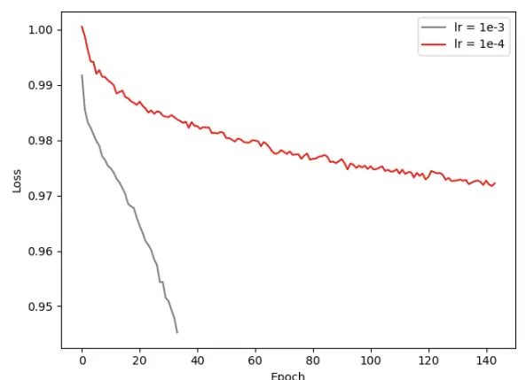
数据来源：东方证券研究所绘制

图 7：不同学习率验证集上 RankIC变化情况
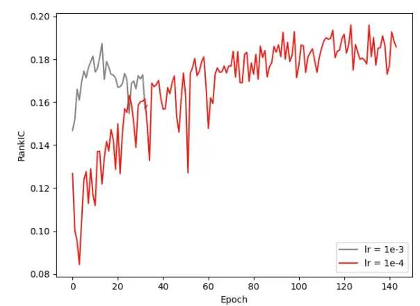
数据来源：东方证券研究所绘制

表 2：不同学习率训练 RNN表现结果

| 训练终止 epoch 数 |  | 验证集 RankIC |
| --- | --- | --- |
| Ir=1e-3 | 35 | 18.73% |
| Ir=1e-4 | 149 | 19.60% |

数据来源：东方证券研究所 & Wind资讯

这里训练集损失函数变化图中，学习率为 1e-3对应曲线是从第 2个 epoch 开始的而学习率为 1e-4对应曲线则是从第6个 eopch开始的。根据上述实验结果我们可以看出：

1. 随着学习率减小，RNN停止训练所需 epoch数将迅速上升。

2. 适当降低学习率将有助于训练时寻找到验证集上表现更优的参数。

3. 根据上述两张图我们可以看出训练集上损失函数处于持续下降的状态，甚至在停止训练的时候模型在训练集上损失值仍没有收敛的迹象，仍然在下降，而验证集上 RankIC 值随 epoch变化呈现出先增大后减小的形态，这说明使用量价特征在训练 RNN 的时候，存在过拟合现象，若没有 early stopping机制，RNN可能学到一组表现差的参数。这启发我们在训练 RNN时增加一些抗过拟合机制有助于训练出一个表现优异的模型。

考虑到时间成本，我们通常在训练模型的时候选取学习率为 1e-3。

## 2.2 不同丢弃率（dropout rate）的影响

接着我们讨论对 RNN-cell 神经元设定不同丢弃率的影响。我们固定训练 RNN 中学习率值为1e-3，选取丢弃率分别为 0、0.5、0.9 来训练模型，并分别绘制训练集上损失值与验证集上RankIC 均值随 epoch 数变化情况如下图所示（dr 表示 dropout rate）：

图 8：不同丢弃率训练集上损失函数变化情况
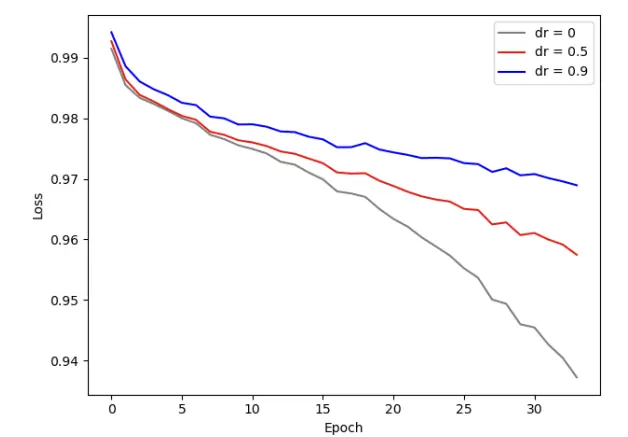
数据来源：东方证券研究所绘制

图 9：不同丢弃率验证集上 RankIC变化情况
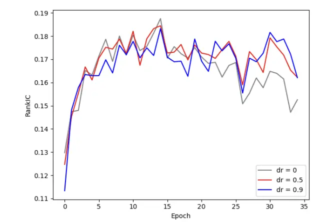
数据来源：东方证券研究所绘制

这里训练集损失函数变化图中，三组丢弃率对应曲线都是从第 2 个 epoch 开始的。我们还汇总了不同丢弃率训练终止所需 epoch数、以及模型最终在验证集上 RankIC的表现。

表 3：不同丢弃率训练 RNN表现结果

| 训练终止 epoch 数 | 验证集 RankIC |
| --- | --- |
| dr=0 35 | 18.76% |
| dr=0.5 35 | 18.45% |
| dr=0.9 35 | 18.32% |

数据来源：东方证券研究所 & Wind资讯

## 根据上述结果我们可以看出：

1. 丢弃率的选取可能并不会影响模型训练达到最优所需迭代 epoch 数。

2. 随着丢弃率减少，训练集 loss 值下降速度加快。而观察验证集上 RankIC 变化，我们可以看出三条曲线都呈现先上升后下降的形态。这说明适当增加丢弃率将有助于模型抗过拟合，但可能会降低模型在验证集上的表现。

因此在使用量价特征训练 RNN的时候，我们通常选取丢弃率为 0.1。

## 2.3 不同正交惩罚参数的影响

这一节，我们将讨论不同正交惩罚参数对多元 RNN训练的影响。首先我们固定训练 RNN 中学习率值为 1e-3，丢弃率 0.1，正交惩罚参数分别为 0.1、1、10、100 来训练模型，并将结果汇总如下表所示：

表 4：不同λ训练多元 RNN结果汇总

| 训练终止 epoch 数 | 验证集 RankIC | 验证集因子间相关系数 |
| --- | --- | --- |
| λ=0.1 35 | 19.12% | 0.55 |
| λ=1 | 19.14% | 0.28 |
| 51 λ=10 51 | 19.03% | 0.32 |
| λ=100 49 | 19.02% | 0.33 |

数据来源：东方证券研究所 & Wind资讯

根据上表我们可以得出：随着正交惩罚参数 λ越大，

1. 最终模型在验证集上 RankIC 值呈现出先上升后下降的趋势，说明挑选一个合适的 λ 有利于提升模型的性能。

2. 最终模型在验证集上生成因子之间的相关系数并没有呈现出直观想象中单调下降的趋势，这说明挑选合适的 λ对控制生成因子的低相关性也是十分重要的。

## 2.4多元RNN生成因子个数的影响

本节，我们将讨论生成因子个数对多元 RNN训练的影响。首先我们固定训练 RNN 中学习率值为 1e-3，丢弃率 0.1，正交惩罚参数为 20，之后分别设置最后一个全连接层输出维数为 16、64、256 来训练模型，并分别绘制训练集上损失值与验证集上 RankIC 均值随 epoch 数变化情况如下图所示：

图 10：生成不同因子数验证集上 RankIC变化情况
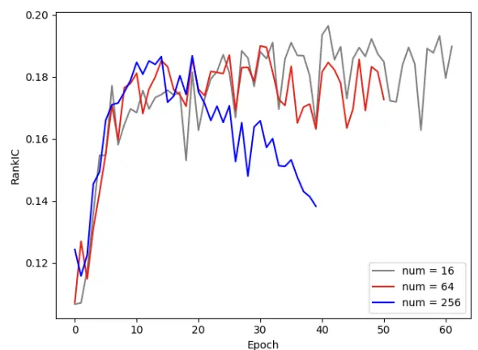
数据来源：东方证券研究所绘制

图 11：生成不同因子数验证集上因子平均相关系数变化情况
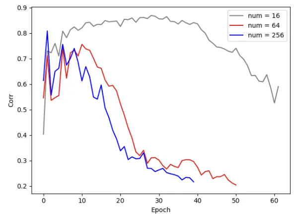
数据来源：东方证券研究所绘制

表 5：生成不同因子数训练多元 RNN表现结果

| 生成因子数 | 训练终止 epoch 数 | 验证集 RankIC | 验证集因子间相关系数 |
| --- | --- | --- | --- |
| 16 | 62 | 19.65% | 0.81 |
| 64 | 51 | 19.00% | 0.30 |
| 256 | 40 | 18.68% | 0.38 |

数据来源：东方证券研究所 & Wind资讯

有关分析师的申明，见本报告最后部分。其他重要信息披露见分析师申明之后部分，或请与您的投资代表联系。并请阅读本证券研究报告最后一页的免责申明。

根据上述结果，我们可以得出以下结论：

1. 随着生成因子数越大，训练终止所需 epoch 数将减少，这说明 RNN 拟合能力随生成因子数增加而变强。

2. 随着生成因子数增大，验证集上 RankIC 随 epoch 变化曲线在后期下降速度变快，且最终模型在验证集上 RankIC值逐渐降低，说明生成因子数过大容易造成过拟合。

3. 适当增加生成因子数有利于控制生成因子之间的低相关性。

综合上述结论，训练多元 RNN的时候，我们一般设置输出因子数为 64。

## 三、模型的因子分析结果

本章将讨论一元和多元模型分别生成因子的性能表现以及选股效果。

## 3.1 多元RNN生成因子单元中单因子的表现

首先我们评估多元 RNN 在数据集 day、ms、l2 生成因子单元中各单因子的表现。我们绘制了三个数据集上单因子 RankIC、RankIC_IR分布直方图及它们的汇总结果分别如下图表所示：

图 12：数据集 day上因子单元 RankIC分布
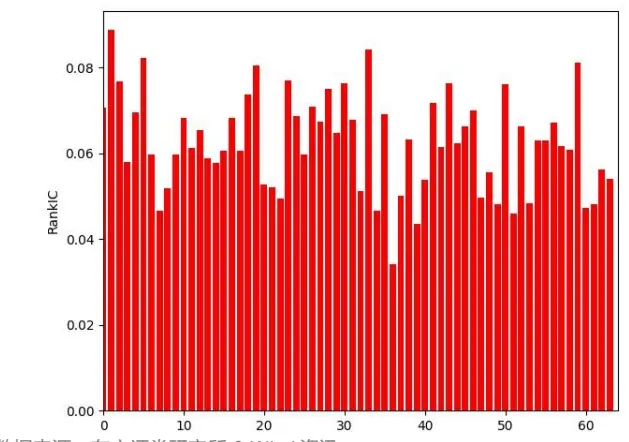
数据来源：东方证券研究所 & Wind资讯

图 13：数据集 day 上因子单元 RankIC_IR 分布
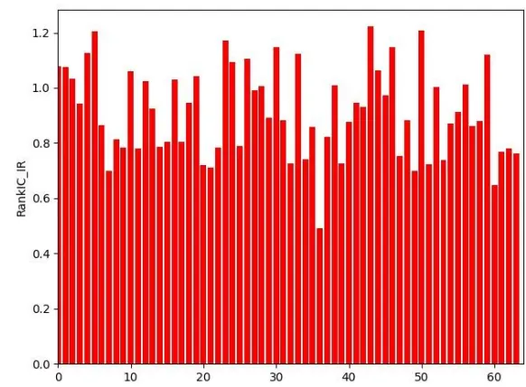
数据来源：东方证券研究所 & Wind资讯

图 14：数据集ms上因子单元RankIC分布
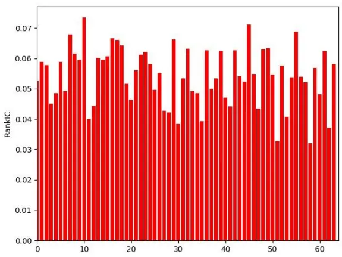
数据来源：东方证券研究所 & Wind资讯

图 15：数据集 ms 上因子单元 RankIC_IR 分布
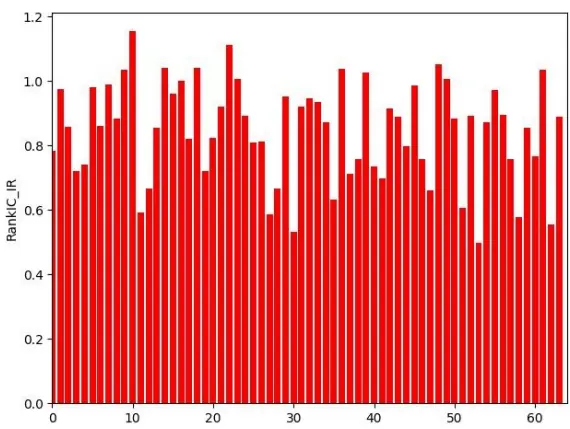
数据来源：东方证券研究所 & Wind资讯

有关分析师的申明，见本报告最后部分。其他重要信息披露见分析师申明之后部分，或请与您的投资代表联系。并请阅读本证券研究报告最后一页的免责申明。

图 16：数据集 l2上因子单元 RankIC分布
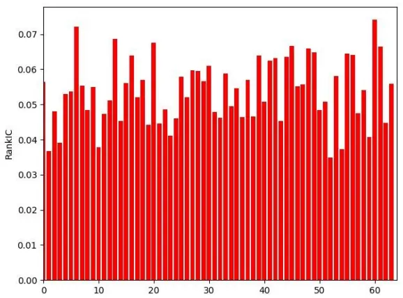
数据来源：东方证券研究所 & Wind资讯

图 17：数据集 l2 上因子单元 RankIC_IR 分布
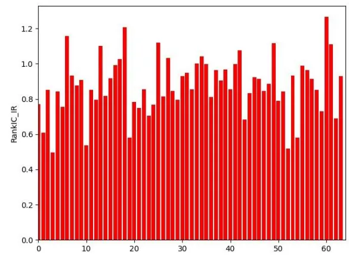
数据来源：东方证券研究所 & Wind资讯

表 6：各数据集上单因子表现汇总

| day | ms | 12 |
| --- | --- | --- |
| RankIC 均值 | 6.24% 5.43% | 5.38% |
| RankIC>5%因子数 | 53 43 | 40 |
| RankIC_IR 均值 | 0.91 0.85 | 0.88 |

数据来源：东方证券研究所 & Wind资讯

表 7：多元 RNN各数据集上因子单元之间相关系数（Pearson）

| day | ms 12 |
| --- | --- |
| seed0 0.34 | 0.21 0.21 |
| seed1 0.40 | 0.20 0.28 |
| seed2 0.31 | 0.21 0.24 |

数据来源：东方证券研究所 & Wind资讯

## 根据上述图表，我们可以得出以下结论：

1. 多元 RNN 在三个数据集上分别生成的 64 个因子 RankIC 普遍超过了 5%，RankIC_IR 均值超过了 0.85，说明多元 RNN挖掘出的因子质量较高体现了多元 RNN挖掘因子的优越性。

2. 样本外多元 RNN在数据集 day、ms、l2上各自生成的 64个因子之间相关系数数值总体偏低，数值都小于 0.4，这说明多元 RNN模型能够较好的替代传统方法进行因子挖掘。

3. 数据集 day上单因子的总体表现强于 ms和 l2数据集。

## 3.2 RNN 在各数据集上生成因子的表现

本节我们将讨论 day、ms、l2 三个数据集通过一元和多元模型分别生成最终因子的性能及选股效果。选股效果是通过分析回测期 RankIC 均值、IC_IR、RankIC>0 占比、top 组与 bottom 组相对股票池等权年化对冲收益等指标进行评估的，其结果如表 8所示。

表 8：各数据集因子表现（回测期 20170103~20230428）

|  | RankIC 均值 | IC_IR（未年化） | RankIC>0 占比 | top 年化对冲 | 夏普比率 | 最大回撤 | Bottom 年化对冲 |
| --- | --- | --- | --- | --- | --- | --- | --- |
| 一元 day | 13.42% | 1.41 | 90.85% | 32.09% | 4.00 | -5.08% | -54.07% |
| 多元 day | 13.28% | 1.42 | 91.50% | 31.72% | 4.02 | -5.62% | -57.85% |
| 一元 ms | 13.08% | 1.33 | 89.54% | 31.59% | 4.23 | -4.13% | -58.49% |
| 多元 ms | 13.46% | 1.42 | 92.81% | 33.58% | 4.68 | -5.72% | -58.55% |
| 一元12 | 10.95% | 1.27 | 89.54% | 19.84% | 3.41 | -6.39% | -54.27% |
| 多元12 | 11.21% | 1.29 | 88.89% | 20.66% | 3.09 | -8.47% | -55.69% |

数据来源：东方证券研究所 & Wind资讯

其中 RankIC 均值是当天因子与隔日未来十日收益率序列进行计算的，并且每隔十个交易日计算一次，最终将这个 RankIC序列取平均得到的。IC_IR 是根据 RankIC序列均值除以序列标准差计算得到的。而 top 组和 bottom 组对冲年化收益是将股票池分成 20 组，周度调仓，次日收盘价成交并且不考虑交易成本计算得到的。夏普比率和最大回撤则是根据 top 组对冲收益净值计算得到的。根据上表结果可以看出：

1. 数据集 ms对应的一元和多元因子总体表现并没有显著好于 day数据集，ms数据集对应日内分钟线数据其包含的信息应大于 day 数据集，这说明 ms 数据集使用的特征没有完全表示日内分钟线所包含的所有信息。因此我们认为 ms数据集特征有待进一步扩充。

2. 数据集 l2 的生成因子表现整体都弱于 day 和 ms 两个数据集，主要原因我们认为可能是由于l2数据集从2013年底才开始有导致训练集样本量较少，导致模型表现不佳。

我们还考察三个数据集对应的一元和多元因子以及它们等权合成因子（记为 avg）之间的相关关系如以下两张表所示。

表 9：一元 RNN各数据集生成因子间相关系数（左下 Spearman右上 Pearson）

| day |  | ms 12 |  | avg |
| --- | --- | --- | --- | --- |
| day | 1 | 0.76 | 0.50 | 0.88 |
| ms | 0.71 | 1 | 0.54 | 0.90 |
| 12avg | 0.41 | 0.47 | 1 | 0.80 |
|  | 0.85 | 0.88 | 0.73 | 1 |

数据来源：东方证券研究所 & Wind资讯

表 10：多元 RNN各数据集生成因子间相关系数（左下 Spearman右上 Pearson）

|  | day | ms 12 |  | avg |
| --- | --- | --- | --- | --- |
| day | 1 | 0.76 | 0.5 | 0.87 |
| ms | 0.72 | 1 | 0.6 | 0.91 |
| 12avg | 0.41 | 0.5 | 1 | 0.81 |
|  | 0.84 | 0.88 | 0.74 | 1 |

数据来源：东方证券研究所 & Wind资讯

根据上述表格，我们可以得出以下结论：

1. 三个数据集上生成的一元和多元因子之间相关系数较低均小于 77%，这说明三个数据集所包含的信息重叠度不高，同时使用三个数据集可以信息互补。

2. l2数据集与另外两个数据集之间的相关系数都没有超过 60%，说明 l2数据集中包含大量日线和分钟线数据难以获得的信息。进一步挖掘 l2 数据对应的特征有助于给整个量价模型带来更大的增益。

3. 数据集 ms 生成因子与等权合成因子之间的相关系数在三个数据集中最高，这说明在各数据集生成因子等权合成最终个股打分的时候数据集 ms生成因子的重要性最高。

因子衰减速度是评定因子有效性的一个重要指标，下面我们将展示三个数据集对应的一元和多元因子以及它们等权合成因子值滞后 N个交易日（记作 lag N）与未来十日收益率的 RankIC变化情况。

表 11：一元 RNN 各数据集生成因子衰减速度（回测期 20200101~20230428）

|  | avg | day | ms | 12 |
| --- | --- | --- | --- | --- |
| lag 0 | 13.72% | 12.75% | 12.85% | 9.51% |
| lag 5 | 9.98% | 9.07% | 8.63% | 7.79% |
| lag 10 | 7.68% | 6.10% | 6.54% | 7.02% |
| lag 15 | 7.26% | 5.84% | 6.04% | 6.80% |
| lag 20 | 5.62% | 4.16% | 4.62% | 5.69% |

数据来源：东方证券研究所 & Wind资讯

表 12：多元 RNN 各数据集生成因子衰减速度（回测期 20200101~20230428）

|  | avg | day | ms | 12 |
| --- | --- | --- | --- | --- |
| lag 0 | 13.70% | 12.66% | 12.71% | 10.15% |
| lag 5 | 9.96% | 8.60% | 8.64% | 8.41% |
| lag 10 | 8.02% | 6.11% | 6.60% | 7.88% |
| lag 15 | 7.69% | 5.83% | 6.21% | 7.51% |
| lag 20 | 6.21% | 4.28% | 5.02% | 6.39% |

数据来源：东方证券研究所 & Wind资讯

根据上述表格，我们可以得出以下结论：

1. RNN 生成因子的衰减速度取决于输入特征，并且三个数据集生成因子衰减速度有排序关系：数据集 l2 > 数据集 ms > 数据集 day。

2. 对于相同数据集，多元 RNN生成因子衰减速度低于一元 RNN。

## 3.3 RNN等权合成因子的表现

这一节我们将讨论 day、ms、l2 三个数据集上生成的一元、多元模型生成因子等权合成之后的表现。首先我们对合成因子在以中证全指、沪深300、中证500、中证1000指数成分股为股票池进行 RankIC分析，一元和多元模型对应结果分别如下表所示。

表 13：等权合成因子 RankIC 分析（回测期 20170103~20230428）

|  |  | RankIC 均值 IC_IR（未年化） | RankIC>0 占比 |
| --- | --- | --- | --- |
| 中证全指 | 一元 14.47% | 1.46 | 93.46% |
|  | 多元 14.63% | 1.46 | 92.16% |
| 沪深300 | 一元 10.05% | 0.75 | 76.47% |
|  | 多元 10.24% | 0.72 | 71.24% |
| 中证500 | 一元 11.03% | 0.95 | 85.62% |
|  | 多元 11.15% | 0.96 | 83.00% |
| 中证1000 | 一元 14.45% | 1.4 | 93.46% |
|  | 多元 14.91% | 1.47 | 94.77% |

数据来源：东方证券研究所 & Wind资讯

通过上表结果，我们可以看出：

1. 四个股票池上RNN生成因子对应RankIC均值均超过10%，这说明通过对收益率标签中性化后，RNN模型打分结果无论在大市值和小市值股票池上表现均较好，市值偏向性较低。

2. 多元RNN生成因子单元等权合成因子在四个股票池上RankIC均值等指标均略强于一元RNN生成单因子。

接着我们将讨论等权合成因子分层测试的表现，这里针对中证全指我们将股票池分成20组，而针对沪深300、中证500和中证1000我们则是将股票池分成5组，打分较高组称之为top组，反之称之为 bottom组。

分层测试主要考察 top 组和 bottom 组相对样本成分股等权为基准对冲年化收益率，以及根据top组对冲净值计算出的夏普比率、最大回撤和周均单边换手率这五个指标。一元和多元模型的结果分别如下表所示。

表 14：等权合成因子分层测试的结果（回测期 20170103~20230428）

|  |  | top 年化对冲 | 夏普比率 | 最大回撤 | top 周均单边换手 | bottom 年化对冲 |
| --- | --- | --- | --- | --- | --- | --- |
| 中证全指 | 一元 | 31.45% | 4.14 | -5.80% | 66.65% | -60.43% |
|  | 多元 | 32.61% | 4.28 | -7.84% | 66.10% | -61.98% |
| 沪深300 | 一元 | 24.33% | 3.50 | -6.18% | 50.66% | -24.27% |
|  | 多元 | 23.29% | 3.18 | -8.72% | 49.22% | -24.49% |
| 中证500 | 一元 | 16.68% | 2.93 | -6.91% | 49.33% | -25.36% |
|  | 多元 | 16.15% | 2.86 | -7.16% | 48.05% | -24.76% |
| 中证1000 | 一元 | 29.67% | 5.32 | -4.93% | 49.14% | -35.33% |
|  | 多元 | 30.17% | 5.39 | -4.37% | 48.06% | -36.01% |

数据来源：东方证券研究所 & Wind资讯

根据上表的结果我们可以看出在四个指数成分股中多元模型所对应的 top 组周均单边换手率都显著下降，在实践中这意味着调仓时交易费用将更低。相较于一元 RNN 模型，多元 RNN 模型生成多个因子能够更加有效的从原始特征中提取信息，并且能够有效的克服因子时变性问题。

## 3.4 等权合成因子与量价因子的相关性分析

这一节我们展示 RNN生成因子与一些常见量价因子之间相关系数矩阵。

表 15：等权合成因子与日频量价因子相关系数

| day |  | ms 12 |  | avg |
| --- | --- | --- | --- | --- |
| ret | -0.34 | -0.32 | -0.32 | -0.38 |
| vol | -0.30 | -0.19 | -0.31 | -0.31 |
| Into | -0.32 | -0.20 | -0.29 | -0.32 |
| ivol | -0.34 | -0.26 | -0.34 | -0.37 |
| ivr | -0.25 | -0.30 | -0.21 | -0.29 |
| Inamihud | -0.02 | 0.19 | 0.09 | 0.10 |
| apb_5d | 0.36 | 0.28 | 0.32 | 0.38 |

数据来源：东方证券研究所 & Wind资讯

表 16：等权合成因子与日内合成量价因子相关系数

| day |  | ms | 12 avg |  |
| --- | --- | --- | --- | --- |
| skew | -0.24 | -0.23 | -0.31 | -0.30 |
| kurt | -0.18 | -0.16 | -0.17 | -0.20 |
| jumpmomapb | -0.30 | -0.27 | -0.34 | -0.36 |
|  | 0.16 | 0.13 | 0.23 | 0.20 |
|  | 0.26 | 0.27 | 0.26 | 0.31 |
| sdvhhi | -0.15 | -0.11 | -0.18 | -0.17 |
| sdvvol | -0.26 | -0.21 | -0.25 | -0.28 |
| arpp | 0.13 | 0.18 | 0.11 | 0.17 |

数据来源：东方证券研究所 & Wind资讯

表 17：各常见量价特征含义

| ret | 过去60个交易日收益率 |
| --- | --- |
| vol | 过去60个交易日收益率的标准差 |
| Into | 过去60个交易日日均换手率的对数 |
| ivol | 基于过去60个交易日日行情计算的特质波动率 |
| lvr | 基于过去60个交易日日行情计算的特异度 |
| Inamihud | 基于过去60 个交易日计算的 Amihud非流动性的对数 |
| apb_5d | 基于 5 日日行情计算的 APB 指标 |
| skew | 过去60个交易日的日内收益率偏度均值 |
| kurt | 过去60个交易日的日内收益率峰度均值 |
| jump | 过去60个交易日日内极端收益之和 |
| mom | 过去60个交易日日内温和收益、隔夜收益之和 |
| apb | 基于日内行情计算的 APB 指标 |
| sdvhhi | 过去 60 个交易日日内成交量HHI指标的标准差 |
| sdvvol | 过去 60个交易日日内成交量HHI指标的标准差 |
| arpp | 基于 5 天周期计算的 ARPP 指标 |

数据来源：东方证券研究所 & Wind资讯

有关分析师的申明，见本报告最后部分。其他重要信息披露见分析师申明之后部分，或请与您的投资代表联系。并请阅读本证券研究报告最后一页的免责申明。

通过上述相关系数表格我们可以看出：

1. 这些常见量价特征与 RNN 生成因子之间相关系数绝对值普遍低于 40%且大部分因子与 RNN生成因子相关系数之间大小差异相对不大，这说明RNN在从原始量价特征中提取信息时没有过度依赖个别特征，生成因子所包含的信息比较全面。

2. 表 16 中 lnamihud 因子与 RNN 生成因子之间相关性显著低于其他日频因子，表 17 中 kurt、sdvhhi 等因子与 RNN 生成因子之间相关系数显著低于其他日内合成因子。这说明我们 RNN生成因子所反映的流动性和一些特征高阶矩方面的信息较少，这也启发我们在RNN输入特征中加入相关因子可能能对模型选股能力起到增量作用。

## 四、合成因子指数增强组合表现

## 4.1增强组合构建说明

本章展示了一元、多元模型在各数据集上生成因子等权合成得分在沪深 300 和中证 500 指数增强的应用效果，关于指数增强组合有如下说明：

1） 回测期 20170103~20230428，组合周频调仓，假设根据每周五个股得分在次日以 vwap 价格进行交易，股票池为中证全指；

2） 风险因子库dfrisk2020（参见《东方A股因子风险模型（DFQ-2020）》）的所有风格因子相对暴露不超过 0.5，所有行业因子相对暴露不超过 2%，中证 500 增强跟踪误差约束不超过 5%，沪深 300 增强跟踪误差约束不超过 4%，周单边换手约束限制为 20%。

3） 组合业绩测算时假设买入成本千分之一、卖出成本千分之二，停牌和涨停不能买入、停牌和跌停不能卖出。

## 4.2 沪深 300 组合增强

本小节将展示一元、多元模型在三个数据集上生成因子等权合成之后打分应用于沪深 300 指数增强策略表现情况：

表 18：沪深 300指增组合分年度表现（成分股不限制）

|  | 2017 |  |  |  |  |  |  |
| --- | --- | --- | --- | --- | --- | --- | --- |
|  | 一元 40.46% | 2018 -15.75% | 2019 35.68% | 2020 36.98% | 2021 9.74% | 2022 -6.59% | 2023 6.05% |
| 绝对收益 | 多元 37.93% | -11.22% | 40.22% | 36.30% | 11.70% | -8.39% | 5.04% |
|  | 一元 16.44% | 12.66% | -0.54% | 7.43% | 15.36% | 19.06% | 1.81% |
| 对冲收益 | 多元 14.33% | 18.69% | 2.78% | 6.90% | 17.50% | 16.82% | 0.87% |

数据来源：东方证券研究所 & Wind资讯

表 19：沪深 300指增组合汇总表现（成分股不限制）

|  |  | 年化收益率 夏普比率 | 最大回撤 | 周度胜率 |
| --- | --- | --- | --- | --- |
| 绝对净值 | 一元 14.82% | 0.85 | -24.49% | 60.49% |
|  | 多元 15.74% | 0.89 | -24.66% | 60.49% |
| 对冲净值 | 一元 11.26% | 2.25 | -8.40% | 62.61% |
|  | 多元 12.18% | 2.46 | -7.65% | 66.57% |

数据来源：东方证券研究所 & Wind资讯

表 20：沪深 300指增组合分年度表现（成分股不低于 80%）

|  | 一元 | 2017 36.93% | 2018 -13.31% | 2019 41.10% | 2020 37.23% | 2021 10.62% | 2022 2023 -5.90% |
| --- | --- | --- | --- | --- | --- | --- | --- |
| 绝对收益 | 多元 38.00% | -12.44% | 47.58% | 34.50% | 11.02% | -9.55% | 5.19% 6.25% |
| 对冲收益 | 13.54% | 16.02% | 3.54% | 7.75% | 16.33% | 19.96% |  |
|  | 一元 多元 14.41% | 17.12% | 8.21% | 5.53% | 16.84% | 15.37% | 0.99% 2.05% |

数据来源：东方证券研究所 & Wind资讯

表 21：沪深 300指增组合汇总表现（成分股不低于 80%）

|  |  | 年化收益率 | 夏普比率 | 最大回撤 | 周度胜率 |
| --- | --- | --- | --- | --- | --- |
| 绝对净值 | 一元 | 15.75% | 0.89 | -23.83% | 58.97% |
|  | 多元 | 16.06% | 0.90 | -24.21% | 59.88% |
| 对冲净值 | 一元 | 12.22% | 2.53 | -5.57% | 65.05% |
|  | 多元 | 12.52% | 2.62 | -6.65% | 65.65% |

数据来源：东方证券研究所 & Wind资讯

图 18：沪深 300指增对冲净值曲线（成分股不限制）
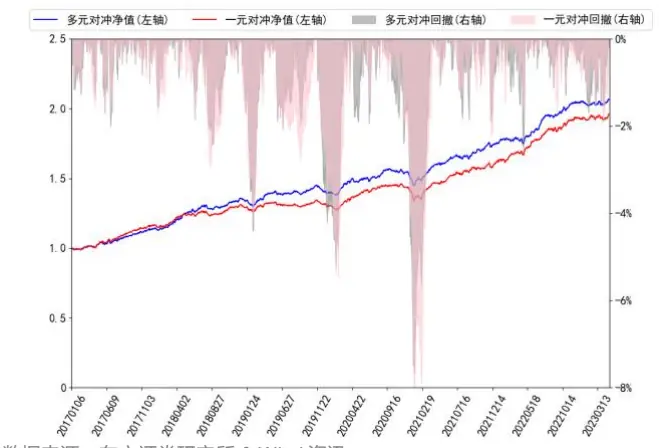
数据来源：东方证券研究所 & Wind资讯

图 19：沪深 300指增对冲净值曲线（成分股不低于 80%）
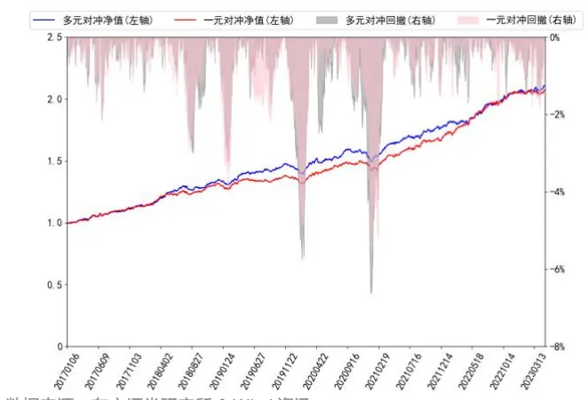
数据来源：东方证券研究所 & Wind资讯

上述结果可以看出一元和多元模型生成得分在应用于沪深 300 指数增强策略时表现良好，两者对冲收益净值整体单调向上，大部分年份年化对冲收益率均超过了 10%，对冲净值的周度胜率也都超过了 60%。并且多元模型生成得分整体表现显著好于一元模型。

有关分析师的申明，见本报告最后部分。其他重要信息披露见分析师申明之后部分，或请与您的投资代表联系。并请阅读本证券研究报告最后一页的免责申明。

## 4.3 中证 500 组合增强

本小节将展示一元、多元模型在三个数据集上生成因子等权合成之后打分应用于中证 500 指数增强策略表现情况：

表 22：中证 500指增组合分年度表现（成分股不限制）

|  |  | 2017 | 2018 | 2019 | 2020 | 2021 | 2022 | 2023 |
| --- | --- | --- | --- | --- | --- | --- | --- | --- |
| 绝对收益 | 一元 | 11.90% | -11.30% | 42.07% | 41.06% | 32.49% | -1.98% | 9.80% |
|  | 多元 | 10.23% | -8.05% | 43.06% | 42.25% | 31.05% | -5.17% | 7.60% |
| 对冲收益 | 一元 | 13.80% | 33.36% | 12.23% | 16.38% | 14.47% | 23.21% | 3.16% |
|  | 多元 | 12.11% | 38.07% | 12.88% | 17.14% | 13.13% | 19.15% | 1.08% |

数据来源：东方证券研究所 & Wind资讯

表 23：中证 500指增组合汇总表现（成分股不限制）

|  |  | 年化收益率 | 夏普比率 | 最大回撤 | 周度胜率 |
| --- | --- | --- | --- | --- | --- |
| 绝对净值 | 一元 | 17.97% | 0.89 | -30.53% | 57.75% |
|  | 多元 | 17.45% | 0.88 | -28.56% | 59.57% |
| 对冲净值 | 一元 | 18.28% | 2.83 | -7.95% | 66.26% |
|  | 多元 | 17.65% | 2.78 | -7.53% | 65.96% |

数据来源：东方证券研究所 & Wind资讯

表 24：中证 500指增组合分年度表现（成分股不低于 80%）

|  | 2017 | 2018 | 2019 | 2020 | 2021 | 2022 | 2023 |
| --- | --- | --- | --- | --- | --- | --- | --- |
| 绝对收益 | 一元 13.00% | -16.44% | 37.53% | 38.23% | 24.10% | -7.71% | 8.23% |
|  | 多元 13.94% | -11.53% | 39.20% | 34.70% | 27.75% | -7.68% | 6.42% |
| 对冲收益 | 一元 14.97% | 25.56% | 8.75% | 14.07% | 7.00% | 16.00% | 1.63% |
|  | 多元 15.73% | 32.85% | 9.87% | 10.91% | 10.04% | 16.01% | -0.05% |

数据来源：东方证券研究所 & Wind资讯

表 25：中证 500指增组合汇总表现（成分股不低于 80%）

|  |  | 年化收益率 | 夏普比率 | 最大回撤 | 周度胜率 |
| --- | --- | --- | --- | --- | --- |
| 绝对净值 | 一元 13.51% |  | 0.71 | -30.68% | 57.14% |
|  | 多元 | 14.67% | 0.77 | -29.83% | 67.45% |
| 对冲净值 | 一元 | 13.79% | 2.58 | -6.55% | 65.05% |
|  | 多元 | 14.85% | 2.68 | -7.47% | 66.87% |

数据来源：东方证券研究所 & Wind资讯

图 20：中证 500指增对冲净值曲线（成分股不限制）
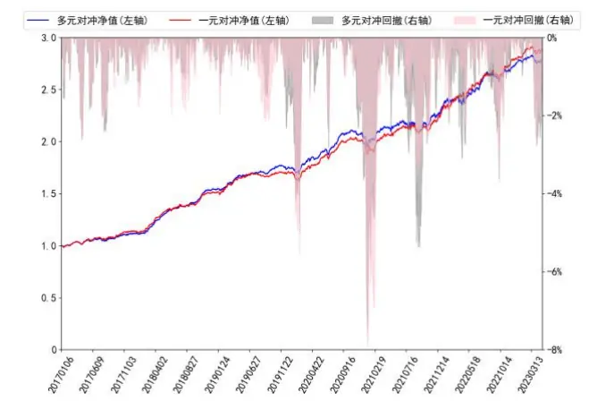
数据来源：东方证券研究所 & Wind资讯

图 21：中证 500指增对冲净值曲线（成分股不低于 80%）
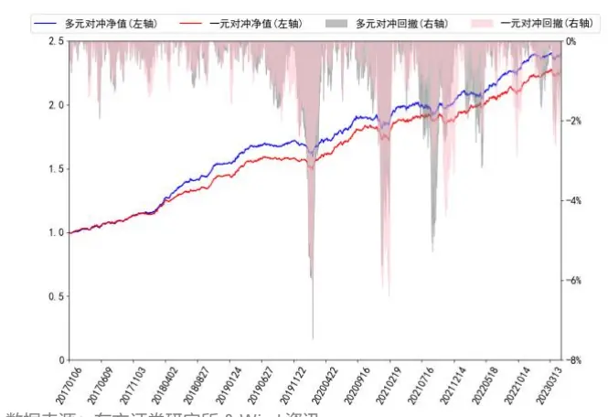
数据来源：东方证券研究所 & Wind资讯

上述结果可以看出：一元和多元模型生成得分在应用于中证 500 指数增强策略时对冲净值的表现整体强于沪深 300 指数增强结果，各年度年化超额收益率较为稳定，除 2023 年外各年份年化对冲收益率均超过了 10%，对冲净值的周度胜率也都超过了 65%。

## 4.4 中证 1000 组合增强

本小节将展示一元、多元模型在三个数据集上生成因子等权合成之后打分应用于中证1000指数增强策略表现情况：

表 26：中证 1000指增组合分年度表现（成分股不限制）

|  | 2017 | 2018 |  | 2019 | 2020 | 2021 | 2022 | 2023 |
| --- | --- | --- | --- | --- | --- | --- | --- | --- |
| 绝对收益 | 一元 | 5.17% | -7.42% | 44.97% | 43.32% | 32.69% | -1.70% | 10.01% |
|  | 多元 | 2.83% | -9.08% | 43.67% | 39.51% | 34.93% | -4.69% | 7.38% |
| 对冲收益 | 一元 | 28.78% | 47.16% | 15.16% | 19.44% | 9.64% | 25.69% | 2.75% |
|  | 多元 | 25.99% | 43.67% | 13.82% | 16.06% | 11.37% | 21.78% | 0.29% |

数据来源：东方证券研究所 & Wind资讯

表 27：中证 1000指增组合汇总表现（成分股不限制）

|  |  | 年化收益率 | 夏普比率 | 最大回撤 | 周度胜率 |
| --- | --- | --- | --- | --- | --- |
| 绝对净值 | 一元 18.40% |  | 0.85 | -30.50% | 57.75% |
|  | 多元 | 16.27% | 0.79 | -28.56% | 57.45% |
| 对冲净值 | 一元 | 23.00% | 3.64 | -6.88% | 69.60% |
|  | 多元 | 20.63% | 3.43 | -7.53% | 71.43% |

数据来源：东方证券研究所 & Wind资讯

表 28：中证 1000指增组合分年度表现（成分股不低于 80%）

|  | 2017 | 2018 | 2019 | 2020 |  | 2021 | 2022 | 2023 |
| --- | --- | --- | --- | --- | --- | --- | --- | --- |
| 绝对收益 | 一元 2.56% | -10.74% |  | 50.94% | 42.78% | 40.28% | -2.23% | 10.66% |
|  | 多元 | 3.22% | -9.84% | 48.54% | 45.35% | 35.03% | -5.80% | 9.19% |
| 对冲收益 | 一元 | 25.69% | 41.84% | 19.90% | 19.09% | 15.96% | 24.99% | 3.32% |
|  | 多元 | 26.48% | 43.01% | 17.80% | 21.09% | 11.50% | 20.48% | 1.96% |

数据来源：东方证券研究所 & Wind资讯

表 29：中证 1000指增组合汇总表现（成分股不低于 80%）

|  |  | 年化收益率 | 夏普比率 | 最大回撤 | 周度胜率 |
| --- | --- | --- | --- | --- | --- |
| 绝对净值 | 一元 | 18.99% | 0.88 | -31.58% | 58.97% |
|  | 多元 | 17.66% | 0.84 | -29.83% | 59.27% |
| 对冲净值 | 一元 | 23.63% | 4.00 | -5.79% | 73.86% |
|  | 多元 | 22.15% | 3.82 | -7.47% | 74.16% |

数据来源：东方证券研究所 & Wind资讯

图 22：中证 1000指增对冲净值曲线（成分股不限制）
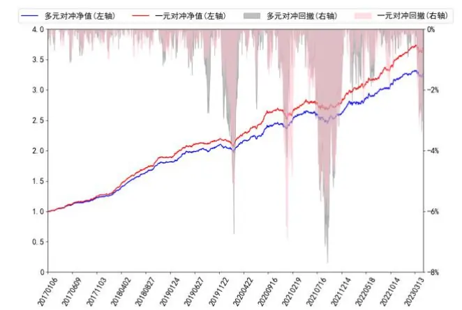
数据来源：东方证券研究所 & Wind资讯

图 23：中证 1000指增对冲净值曲线（成分股不低于 80%）
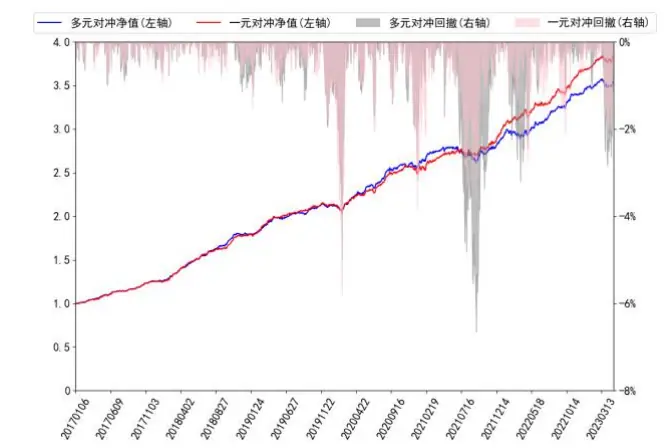
数据来源：东方证券研究所 & Wind资讯

上述结果可以看出：一元和多元模型生成得分在应用于中证1000指数增强策略时对冲净值的表现强于沪深 300 和中证 500 指数增强结果。在中证 1000 增强策略上，多元 RNN 表现略弱于一元RNN，可能的原因是训练多元 RNN的时候正交惩罚系数设置过大导致模型选股能力下降。

## 五、结论

随着人工智能学科的快速发展，一些经典的 AI 模型也在量化投资领域得到了广泛的应用。前期报告《周频量价指增策略》利用 RNN、决策树作为主体模型搭建了 AI 量价模型框架，并将其应用于选股策略。本报告主要对该报告中数据预处理和RNN模型提取因子这两部分进行了复现和一些细节方面的落实及改进，包括最后一层增加 Batch-Norm 层、使用的标签经过中性化和截面标准化等预处理。我们还讨论了模型中一些关键参数对结果影响：

1. 适当降低模型的学习率有助于梯度下降寻找到验证集上表现更优的模型参数，但会大大增加模型训练的时间。

有关分析师的申明，见本报告最后部分。其他重要信息披露见分析师申明之后部分，或请与您的投资代表联系。并请阅读本证券研究报告最后一页的免责申明。

2. 增加 RNN中丢弃率的大小有助于增强模型的泛化能力，但会降低模型在验证集上的表现。

3. 验证集上模型性能随正交惩罚参数增大呈现先上升后下降的趋势。

4. 适当增加因子单元个数有利于控制生成因子单元之间的低相关性，但会增加过拟合风险。根据各数据集上生成因子回测实验结果，我们认为：

1. 多元RNN在各数据集上生成因子单元中各单因子仍然有较好的选股能力且各单因子之间相关系数普遍低于 0.35，说明多元RNN在挖掘因子方面有着独特优势。

2. 数据集 ms并没有完全表示分钟 k线数据包含信息，分钟线数据对应特征有待进一步挖掘。

3. l2 数据集所包含信息与另外两个数据集重叠度更低，进一步研究 l2 数据对应特征将会给整个量价模型带来更多的增量。

等权合成因子回测实验结果显示，2017 年以来，一元和多元 RNN 等权合成因子在中证全指、沪深 300、中证 500、中证 1000 四个指数成分股上双周频 RankIC 均值分别为 14.47%、10.05%、11.03%、14.45%和 14.63%、10.24%、11.15%、14.91%，数值均超过了 10%。这说明 RNN 生成因子市值偏向性较低。

RNN在各数据集生成因子等权合成之后可应用于指数增强策略，成分股不低于80%限制、周单边换手率约束为 20%约束下，2017 年以来，一元模型打分在沪深 300、中证 500 和中证 1000增强策略上年化对冲收益率分别为12.22%、13.79%和23.63%，多元模型打分在沪深300、中证500 和中证 1000 增强策略上年化对冲收益率分别为 12.52%、14.85%和 22.15%。

## 风险提示

1. 量化模型基于历史数据分析，未来存在失效风险，建议投资者紧密跟踪模型表现。

2. 极端市场环境可能对模型效果造成剧烈冲击，导致收益亏损。

## Tabl e_Disclai mer 分析师申明

每位负责撰写本研究报告全部或部分内容的研究分析师在此作以下声明：

分析师在本报告中对所提及的证券或发行人发表的任何建议和观点均准确地反映了其个人对该证券或发行人的看法和判断；分析师薪酬的任何组成部分无论是在过去、现在及将来，均与其在本研究报告中所表述的具体建议或观点无任何直接或间接的关系。

## 投资评级和相关定义

报告发布日后的12个月内行业或公司的涨跌幅相对同期相关证券市场代表性指数的涨跌幅为基准（A 股市场基准为沪深 300 指数，香港市场基准为恒生指数，美国市场基准为标普 500 指数）；

## 公司投资评级的量化标准

买入：相对强于市场基准指数收益率 15%以上；

增持：相对强于市场基准指数收益率 5%～15%；

中性：相对于市场基准指数收益率在-5%～+5%之间波动；

减持：相对弱于市场基准指数收益率在-5%以下。

未评级 —— 由于在报告发出之时该股票不在本公司研究覆盖范围内，分析师基于当时对该股票的研究状况，未给予投资评级相关信息。

暂停评级 —— 根据监管制度及本公司相关规定，研究报告发布之时该投资对象可能与本公司存在潜在的利益冲突情形；亦或是研究报告发布当时该股票的价值和价格分析存在重大不确定性，缺乏足够的研究依据支持分析师给出明确投资评级；分析师在上述情况下暂停对该股票给予投资评级等信息，投资者需要注意在此报告发布之前曾给予该股票的投资评级、盈利预测及目标价格等信息不再有效。

## 行业投资评级的量化标准：

看好：相对强于市场基准指数收益率 5%以上；

中性：相对于市场基准指数收益率在-5%～+5%之间波动；

看淡：相对于市场基准指数收益率在-5%以下。

未评级：由于在报告发出之时该行业不在本公司研究覆盖范围内，分析师基于当时对该行业的研究状况，未给予投资评级等相关信息。

暂停评级：由于研究报告发布当时该行业的投资价值分析存在重大不确定性，缺乏足够的研究依据支持分析师给出明确行业投资评级；分析师在上述情况下暂停对该行业给予投资评级信息，投资者需要注意在此报告发布之前曾给予该行业的投资评级信息不再有效。

## HeadertTabl e_Discl ai mer 免责声明

本证券研究报告（以下简称“本报告”）由东方证券股份有限公司（以下简称“本公司”）制作及发布。

。本公司不会因接收人收到本报告而视其为本公司的当然客户。本报告的全体接收人应当采取必要措施防止本报告被转发给他人。

本报告是基于本公司认为可靠的且目前已公开的信息撰写，本公司力求但不保证该信息的准确性和完整性，客户也不应该认为该信息是准确和完整的。同时，本公司不保证文中观点或陈述不会发生任何变更，在不同时期，本公司可发出与本报告所载资料、意见及推测不一致的证券研究报告。本公司会适时更新我们的研究，但可能会因某些规定而无法做到。除了一些定期出版的证券研究报告之外，绝大多数证券研究报告是在分析师认为适当的时候不定期地发布。

在任何情况下，本报告中的信息或所表述的意见并不构成对任何人的投资建议，也没有考虑到个别客户特殊的投资目标、财务状况或需求。客户应考虑本报告中的任何意见或建议是否符合其特定状况，若有必要应寻求专家意见。本报告所载的资料、工具、意见及推测只提供给客户作参考之用，并非作为或被视为出售或购买证券或其他投资标的的邀请或向人作出邀请。

本报告中提及的投资价格和价值以及这些投资带来的收入可能会波动。过去的表现并不代表未来的表现，未来的回报也无法保证，投资者可能会损失本金。外汇汇率波动有可能对某些投资的价值或价格或来自这一投资的收入产生不良影响。那些涉及期货、期权及其它衍生工具的交易，因其包括重大的市场风险，因此并不适合所有投资者。

在任何情况下，本公司不对任何人因使用本报告中的任何内容所引致的任何损失负任何责任，投资者自主作出投资决策并自行承担投资风险，任何形式的分享证券投资收益或者分担证券投资损失的书面或口头承诺均为无效。

本报告主要以电子版形式分发，间或也会辅以印刷品形式分发，所有报告版权均归本公司所有。未经本公司事先书面协议授权，任何机构或个人不得以任何形式复制、转发或公开传播本报告的全部或部分内容。不得将报告内容作为诉讼、仲裁、传媒所引用之证明或依据，不得用于营利或用于未经允许的其它用途。

经本公司事先书面协议授权刊载或转发的，被授权机构承担相关刊载或者转发责任。不得对本报告进行任何有悖原意的引用、删节和修改。

提示客户及公众投资者慎重使用未经授权刊载或者转发的本公司证券研究报告，慎重使用公众媒体刊载的证券研究报告。

## 东方证券研究所

地址： 上海市中山南路 318 号东方国际金融广场 26 楼

电话：021-63325888

传真：021-63326786

网址： www.dfzq.com.cn