# 基于时点动量的因子轮动

# 因子选股系列之九十二

## 研究结论

市场在一些特殊时点存在“引爆点”式的动量效应。我们基于市场自身状态与外部事件催化，梳理了五类会形成这种动量效应的特殊时点，即下跌反弹、顶部切换、横盘突破、北向异常流入和宏观指标披露。在这些特殊时点领涨的行业/ETF 在未来一个月能够持续跑赢其他行业/ETF，即具有非常显著的行业轮动或 ETF轮动能力。

在这些特殊时点上行业和 ETF 上都存在动量效应，这引发我们思考 alpha 或风格因子在这些时点上是否也存在动量效应？我们以这些时点信号触发时因子的多头超额收益作为衡量因子时点动量的代理指标，并分别在alpha因子和风格因子中检验其是否具有因子/风格轮动能力。

⚫ 在 alpha因子的时点动量检验中我们发现时点动量确实具有显著的因子轮动能力：

（1）将时点动量用于因子分组，多头组的因子未来一个月的分组多、空收益明显强于空头组的因子，即时点信号触发时多头超额高的因子未来的多头超额持续保持较高水平；

（2）以时点动量加权的复合因子，股票多、空收益均显著强于传统等权或ICIR加权法；

（3）基于时点动量加权因子构建的全市场TOP50组合，自20130101至20230531相对中证 500的年化超额收益为 26.17%， 今年以来超额收益为10.64%；

（4）在中证500指数增强模型中，使用时点动量加权打分替换传统ICIR加权打分，可将基础版本的年化超额收益由 16.58%提升至 19.33%；放宽行业轮动中看多、看空行业的主动暴露可进一步提升至 20.94%。

⚫ 我们进一步将时点动量应用于风格因子，发现时点动量在风格因子中也具有非常显著的风格轮动能力：

（1）用时点动量对风格因子分组，强势风格打分下的股票多头收益明显高于股票空头；

（2）时点信号偏好 Beta、Size、Value、Volatility 等风格；

（3）加入风格轮动后的中证 500 指数增强模型在稳定性方面得到进一步提升，年化超额收益由 20.94%提升至 21.33%，信息比由 3.10 变为 3.15，最大回撤由-8.09%改善为-6.06%。

## 风险提示

⚫ 量化模型失效风险

⚫ 市场极端环境的冲击

时点动量在中证 500指数增强上的应用

| 基础版本 | 全样本期 |  |  | 2014 | 2015 36.82% | 2016 26.48% | 2017 15.00% | 2018 15.27% | 2019 13.52% | 2020 10.31% | 2021 14.35% | 2022 12.58% | 20230531 -1.79% |
| --- | --- | --- | --- | --- | --- | --- | --- | --- | --- | --- | --- | --- | --- |
|  | 超额收益 | 16.58% | 2013 23.73% 9.77% |  |  |  |  |  |  |  |  |  |  |
|  | 跟踪误差 | 4.63% | 4.12% | 3.73% | 7.81% | 3.34% | 3.11% | 3.70% | 4.16% | 4.95% | 5.29% | 3.99% | 4.40% |
|  | 最大回撤 | -6.16% | -1.57% | -2.59% | -3.31% | -0.78% | -1.49% | -1.91% | -2.60% | -3.54% | -6.16% | -3.04% | -3.13% |
|  |  | 全样本期 | 2013 | 2014 | 2015 | 2016 | 2017 | 2018 | 2019 | 2020 | 2021 | 2022 | 20230531 |
|  | 超额收益 | 19.33% | 8.70% | 14.16% | 36.60% | 35.06% | 21.43% | 24.48% | 16.46% | 2.69% | 25.26% | 17.57% | 3.17% |
| 只变因子 变因子 | 跟踪误差 | 6.46% | 4.97% | 4.45% | 10.44% | 6.91% | 4.30% | 5.18% | 6.15% | 6.79% | 7.14% | 6.39% | 5.13% |
|  | 最大回撤 | -7.85% | -2.87% | -2.06% | -6.05% | -1.76% | -1.42% | -1.93% | -4.45% | -7.85% | -5.68% | -6.01% | -2.57% |
|  |  | 全样本期 | 2013 | 2014 | 2015 | 2016 | 2017 | 2018 | 2019 | 2020 | 2021 | 2022 | 20230531 |
|  | 超额收益 | 20.94% | 10.64% | 16.93% | 38.67% | 36.17% | 23.23% | 24.92% | 18.29% | 1.15% | 28.13% | 19.84% |  |
|  | 跟踪误差 | 6.76% | 5.14% | 4.75% | 10.36% | 7.05% | 4.60% | 5.52% | 6.29% | 7.03% | 8.17% | 7.10% | 4.63% 5.13% |
| 变行业 变因子 变行业 | 最大回撤 | -8.09% | -2.74% | -2.28% | -5.60% | -1.26% | -1.79% | -2.06% | -4.55% | -8.09% | -5.68% | -5.46% | -2.59% |
|  |  | 全样本期 | 2013 | 2014 | 2015 | 2016 | 2017 | 2018 | 2019 | 2020 | 2021 | 2022 |  |
|  | 超额收益 | 21.33% | 12.71% | 18.78% | 41.42% | 34.88% | 19.62% | 25.70% | 12.40% |  | 27.23% |  | 20230531 |
|  | 跟踪误差 | 6.77% | 5.16% | 4.62% | 10.67% | 7.15% | 4.43% | 5.58% | 6.52% | 8.17% 6.85% | 7.89% | 22.36% 6.99% | 2.82% 5.17% |

## 报告发布日期

2023 年 06 月 28 日

证券分析师 杨怡玲

yangyiling@orientsec.com.cn

执业证书编号：S0860523040002

联系人栾张心怿

luanzhangxinyi@orientsec.com.cn

基于循环神经网络的多频率因子挖掘——2023-06-06因子选股系列之九十一

DFQ 遗传规划价量因子挖掘系统——因子 2023-05-28选股系列之九十

分析师情感调整分数 ASAS——因子选股 2023-03-28系列之八十九

基于偏股型基金指数的增强方案——因子 2023-03-06选股系列之八十八

## 一、时点动量研究框架

市场在某些特殊时点存在“引爆点”式的动量效应。如下图所示，在 2022 年 4月 27 日中证全指在经历了一波下跌后开始反弹，当日电力设备及新能源行业指数上涨 7.48%，涨幅位居所有中信一级行业榜首，且该行业在未来一段时间内持续跑赢市场，呈现出较强的“领头羊”属性。与此同时，当天带头反弹的 ETF（如电池 ETF）在未来 1-3 个月内的涨幅同样强于市场整体表现。基于上述现象，我们不禁思考：哪些特殊时点存在这种动量效应？哪些资产在这些特殊时点具备动量效应？

图 1：带头反弹行业的动量效应示意图
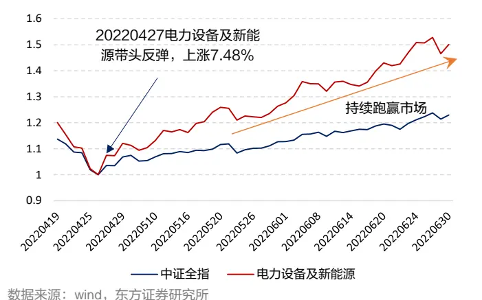

图 2：带头反弹 ETF的动量效应示意图
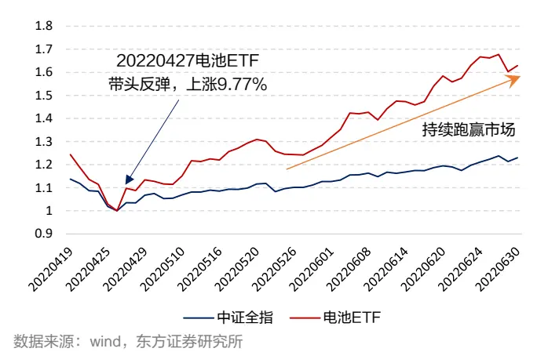

首先，针对第一个问题，我们认为当市场自身发生趋势突变或外部事件刺激市场形成趋势突变时，均有助于上述特殊时点的生成。最终，我们确定了五种存在动量效应的特殊时点，它们依次为：下跌反弹、顶部切换、横盘突破、北向异常流入和宏观指标披露。其次，由于以上时点信号均基于市场整体状态判断而来，因此这种动量效应可能会广泛存在于各类权益资产中，如行业、风格、因子、ETF 和基金等。本篇报告重点研究时点动量在因子以及风格轮动中的应用，具体过程将遵从以下三个步骤：

（1）确定时点动量的信号触发日；

（2）计算信号触发后，各资产的动量因子；

（3）将信号日的动量因子应用于资产轮动。

图 3：时点动量研究框架
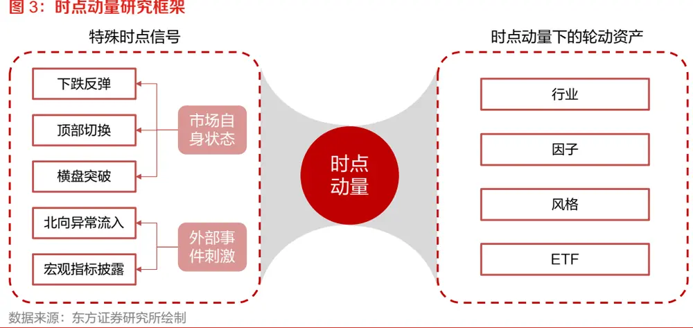
有关分析师的申明，见本报告最后部分。其他重要信息披露见分析师申明之后部分，或请与您的投资代表联系。并请阅读本证券研究报告最后一页的免责申明。

## 二、时点动量信号说明

本章将对五种时点动量信号的定义进行说明。其中，下跌反弹、顶部切换和横盘突破信号均源于市场自身状态的趋势突变，而北向异常流入和宏观指标披露均由外部事件催化而来。

## 2.1 下跌反弹

下跌反弹信号试图捕捉的动量效应为，当市场经历快速下跌并开启反弹行情时，反弹最强的板块、行业、股票、因子具有持续的动量效应。我们对下跌反弹信号的触发条件设定如下：

（1）过去一段时间中证全指的跌幅超过下跌阈值 D；

（2）下跌过程中的小幅回弹幅度低于反弹阈值 U；

（3）指数触底后的反弹幅度超过反弹阈值 U。

直观上，下跌反弹信号要求中证全指先后经历下跌与反弹阶段，且下跌过程未发生明显回弹。后文将用反弹区间指代最低点至信号日这一区间。

图 4：下跌反弹信号示意图
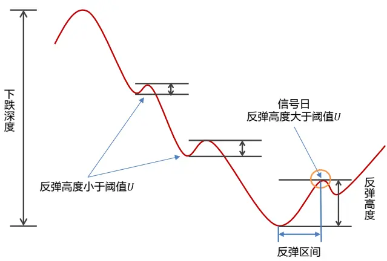
数据来源：东方证券研究所绘制

下跌反弹信号的阈值有两个，分别是下跌阈值 D 和反弹阈值 U。考虑到固定取值下的阈值会使信号数量分布不均，因此我们对 D U 加入了动态调整，即当市场波动较大时、放大阈值，而当市场波动较小时、缩小阈值。此处，我们借助 ATR（平均真实波动）来实现阈值的动态调整。ATR 可以反映过去一段时间内价格的真实波动情况。记 $H_{t}、L_{t}、C_{t}$ 分别为第 t 日的最高价、最低价和收盘价，则 ATR为：

$$
\begin{aligned}TR_{t}=\max\left(\frac{H_{t}-L_{t}}{C_{t-1}},&\frac{abs(H_{t}-C_{t-1})}{C_{t-1}},\frac{abs(C_{t-1}-L_{t})}{C_{t-1}}\right)\\&\quad ATR_{60,t}=\sum_{i=0}^{59}TR_{t-i}/60\end{aligned}
$$

图 5：中证全指的 ATR60（20130101-20230531）
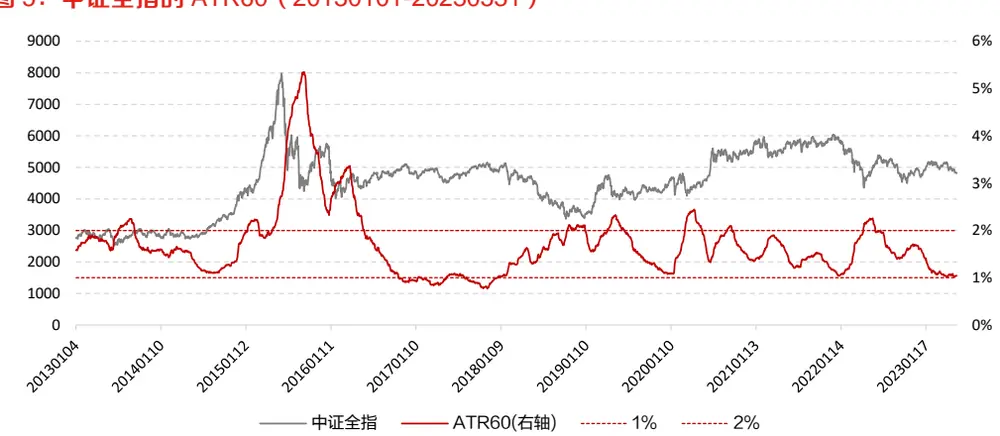
数据来源：wind，东方证券研究所

通过观察，我们发现中证全指 ATR60 的取值范围大多介于 1%-2%，在某些异常波动时期会超出该取值范围。因此，我们设定：

⚫ 当 ATR>2%时，U 和 D 同乘修正系数 ${\sqrt{ATR/_{2\%}}}$ ，放大阈值；

⚫ 当 ATR<1%时，U 和 D 同乘修正系数 ${\sqrt{ATR/_{1\%}}}$ ，缩小阈值；

⚫ 当 ATR介于 1%-2%时，阈值不变。

由于信号对阈值敏感性较低，在综合考虑信号数量等因素后，我们取下跌阈值 D 和反弹阈值U 的初值分别为-5%和 0.5%。

按上述规则搜寻下跌反弹信号，发现自 20130101 至 20230531，下跌反弹信号共计触发 48次，平均每年 4.4个，中位数4个，最新一期信号发生在 20230427。

图 6：下跌反弹信号数量统计（20130101-20230531）
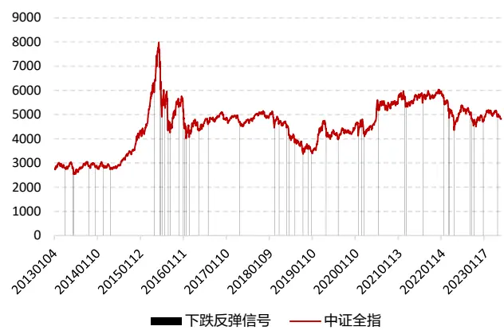
数据来源：wind，东方证券研究所

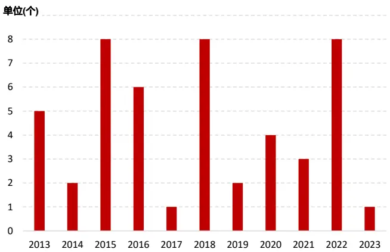

## 2.2 顶部切换

顶部切换信号描述的动量效应为，当市场处于见顶回落状态时，出现较大跌幅的板块、行业、股票和因子未来可能持续跑输。记顶部切换信号触发日为 T，则 T 应同时满足如下两个条件：

（1）T−1 日至少有 3 个中信一级行业创 52 周新高，且 T 日新高行业数量较 T−1 日至少减少 3个；

（2） T 日中证全指下跌，且跌幅超过 ATR60。

自 20130101 至 20230531，顶部切换信号共计触发 24 次，平均每年 2.2 个，中位数 1 个，最新一期信号发生在 20230509。

图 7：顶部切换信号数量统计（20130101-20230531）
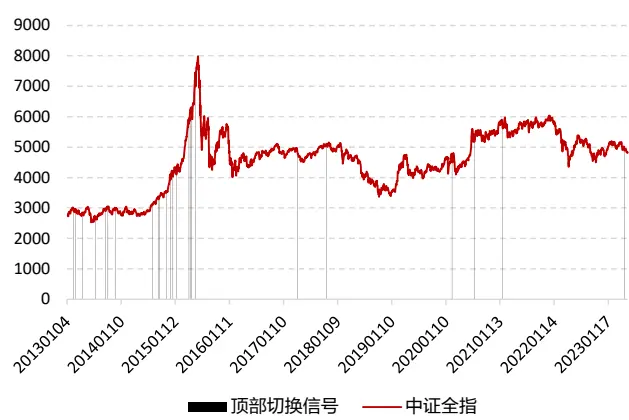
数据来源：wind，东方证券研究所

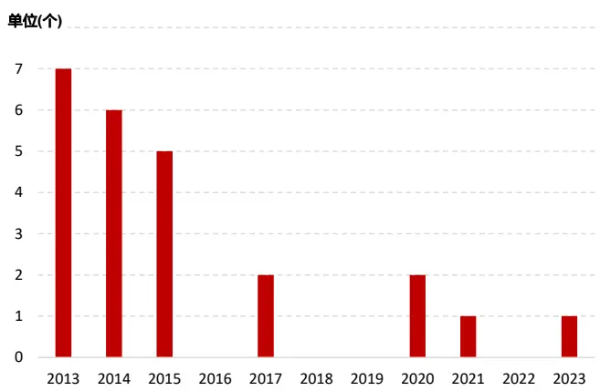

## 2.3 横盘突破

横盘突破信号存在动量效应的背后逻辑，是当市场在经历极度收敛并开启突破行情时，向上突破最强的板块、行业、股票、因子具有持续领涨的动量效应。记横盘突破信号的触发日为 T，则触发日 T 应同时满足如下三个条件：

（1）T−1 日的通道宽度< T−2日的通道宽度，通道宽度=滚动 5 日最高价的最大值 - 最低价的最小值；

（2）[T − 5, T − 1] 区间内，中证全指每日涨跌幅均介于 −1%~1%；

（3） T 日中证全指涨幅大于 1%。

自 20130101 至 20230531，横盘突破信号共计触发 20 次，平均每年 1.8 个，中位数 2 个，最新一期信号发生在 20230301。

图 8：横盘突破信号数量统计（20130101-20230531）
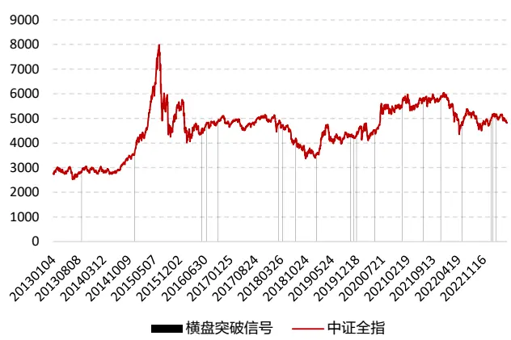
数据来源：wind，东方证券研究所

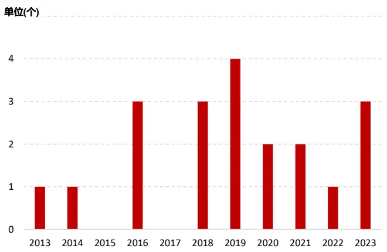

## 2.4 北向异常流入

由于北向资金具有“聪明钱”的称号，我们认为当北向资金大幅净流入时，涨幅较高的板块、行业、股票和因子具有持续的动量效应。

记北向异常信号的触发日为 T，则触发日 T 应同时满足：

（1）T 日北向资金净流入超过阈值（120日均值+2倍标准差）；

（2）T 日中证全指涨幅大于 1%。

鉴于深港通于 2016 年 12 月 5 日正式启动，我们从 2017 年初开始统计北向异常流入信号。截至 20230531，北向异常信号共计触发 30 次，平均每年 4.3 个，中位数 4 个，最新一期信号发生在 20230116。

图 9：北向异常信号数量统计（20170101-20230531）
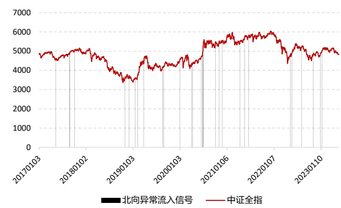
数据来源：wind，东方证券研究所

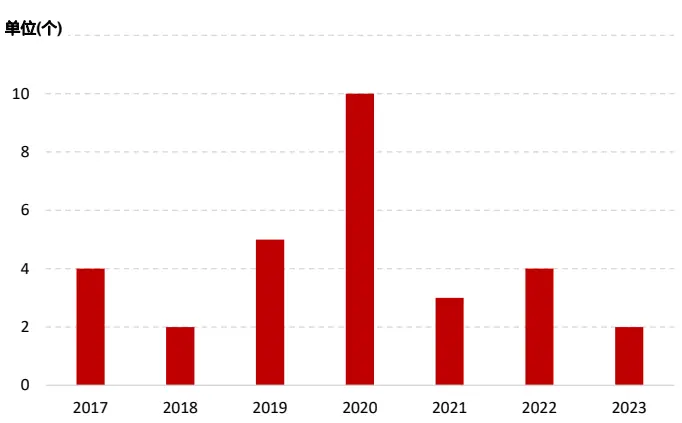

## 2.5 宏观指标披露

CPI和PPI通常由国家统计局在每月9号-12号左右披露，属于较早披露的宏观经济指标。我们取CPI和PPI同时低于Wind一致预期的发布日为宏观指标披露信号的触发日。自20130101至20230531，宏观指标披露信号共计触发 48 次，平均每年 4.4 个，中位数 4 个，最新一期信号发生在 20230511。

有关分析师的申明，见本报告最后部分。其他重要信息披露见分析师申明之后部分，或请与您的投资代表联系。并请阅读本证券研究报告最后一页的免责申明。

图 10：宏观指标披露信号数量统计（20130101-20230531）
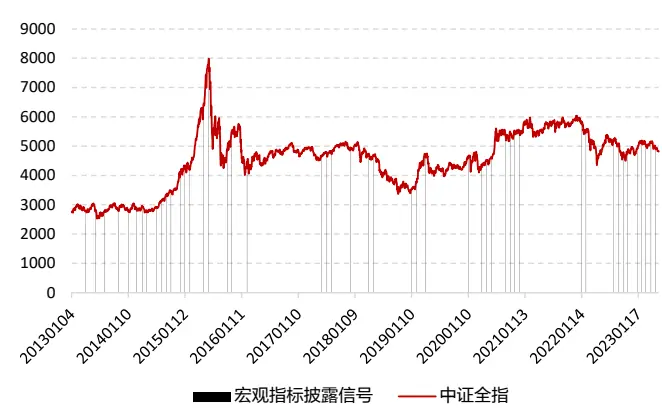
数据来源：wind，东方证券研究所

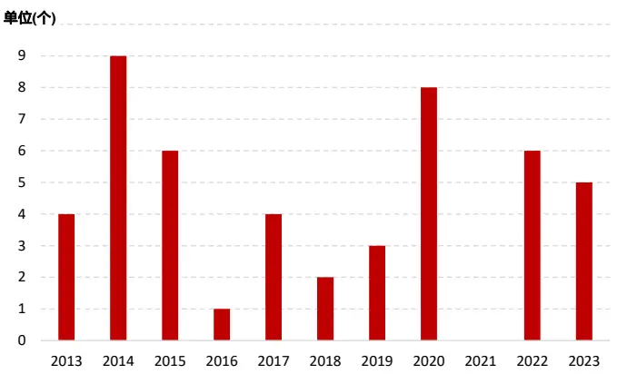

## 三、基于时点动量的行业轮动

本章将展示单信号和复合信号下的时点动量在行业轮动中的测试结果。关于行业在不同信号触发后的动量因子，我们有如下定义：

⚫ 下跌反弹信号：时点动量 = 反弹区间涨跌幅 - 最低点前 20日的日均涨跌幅

⚫ 其他信号：时点动量 = 信号当天行业涨跌幅

## 3.1 单信号下的行业轮动

我们使用不定期调仓即触发信号后立即调仓的方式进行单信号下的行业轮动，有关测试细节说明如下：

（1）剔除综合、综合金融两个行业后，按各信号触发后的时点动量把中信一级行业分为5组；

（2）在信号日当天按收盘价等权买入，持有 20 个交易日后卖出；若持有期间触发新信号，则将持仓调整为新信号下的结果（北向异常信号在信号日次日按收盘价买入）；

（3）基准取所有行业的平均收益；

（4）测试区间为自 20130101 至 20230531（北向信号自 2017 年测试），统计各行业分组的次均超额收益和多空累计收益。其中，多空累计收益只统计有信号覆盖的持有区间、不含空仓日。

从各单信号的表现来看，下跌反弹信号在行业轮动中的效果最为明显，多头、空头组的次均超额收益分别为 2.21%和-1.49%，而且多空累计收益较稳定。其次，顶部切换信号和横盘突破信号也有较好的轮动效果，多头组的次均超额收益分别为 1.87%和 2.33%。由外部事件催化衍生的两个信号中，宏观指标披露信号的效果整体略优于北向异常信号，北向异常信号的多空累计收益在近几年无明显增量。

图 11：单信号下的行业轮动测试结果（不定期调仓）
下跌反弹信号的分组次均超额收益
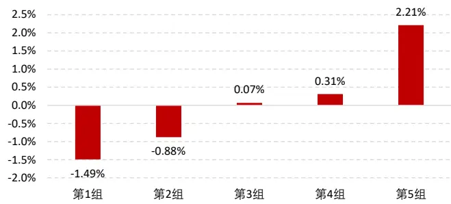
顶部切换信号的分组次均超额收益

下跌反弹信号的多空累计净值
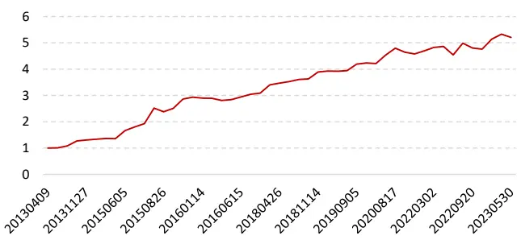
顶部切换信号的多空累计净值

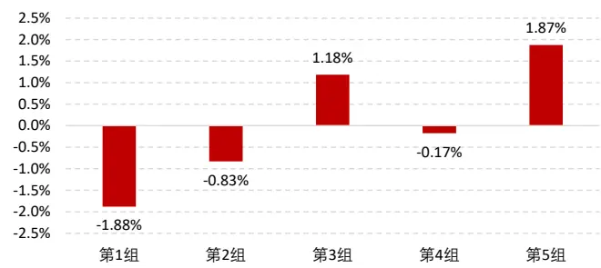
横盘突破信号的分组次均超额收益

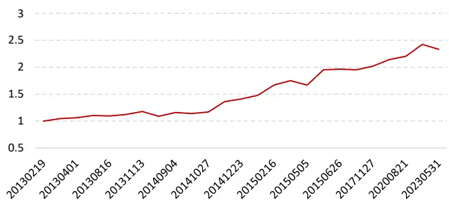
横盘突破信号的多空累计净值

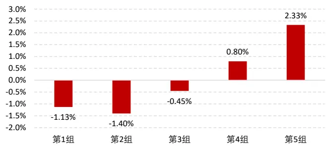
北向异常信号的分组次均超额收益

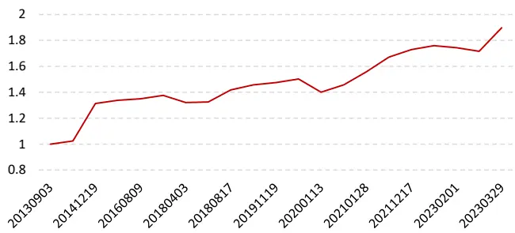
北向异常信号的多空累计净值

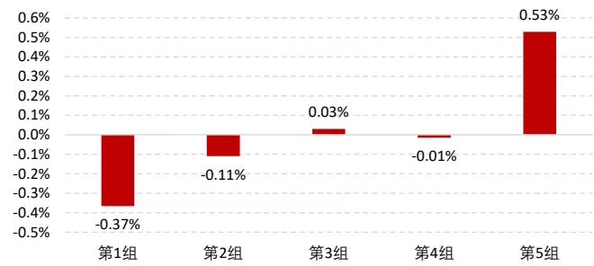

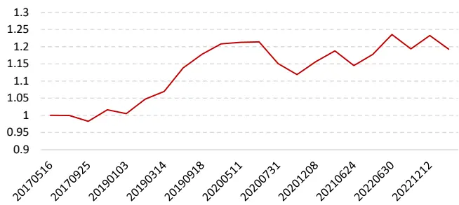

宏观指标披露信号的分组次均超额收益
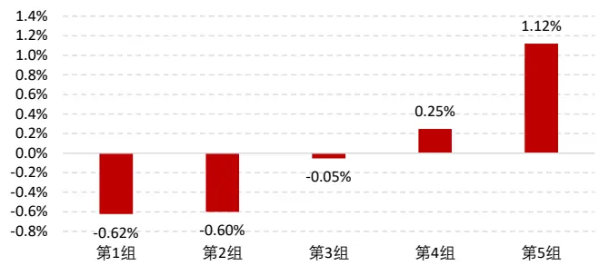
宏观指标披露信号的多空累计净值
数据来源：wind，东方证券研究所

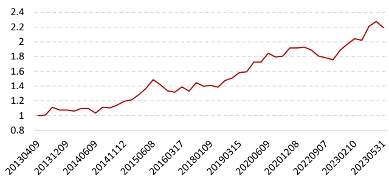
有关分析师的申明，见本报告最后部分。其他重要信息披露见分析师申明之后部分，或请与您的投资代表联系。并请阅读本证券研究报告最后一页的免责申明。

## 3.2复合信号下的行业轮动

## 3.2.1 不定期调仓

合并上述五类单信号的触发日，构成不定期调仓的时点信号。在 20130101 至 20230531 期间，共计产生 160 个信号日，平均每年有 15-16 个信号生成。考虑到相邻的多个信号会共同作用并且时点动量的超额收益也会随着时间衰减，因此每次有新信号触发时，我们采用半衰加权的方式将近期的多个信号进行复合，具体过程说明如下：

（1）记某单信号的触发日为 T，若过去 10日无其他信号生成，则直接取该时点动量信号；

（2）若过去 10 日内触发过其他信号，则先对各信号下的时点动量取截面 RANK，再半衰加权，各信号的权重系数 $w=2^{-\frac{n}{10}}$ ，n 为信号触发日距 T 日的交易日天数。

复合信号的不定期测试方法同 3.1 节的单信号不定期测试。从不定期调仓的结果来看，信号复合后的分组单调性比单信号更加稳定。由于复合信号触发频率更高，使得不定期调仓下的平均持有期变短（信号触发后的20天内若有新信号生成，则切换至新信号持仓），因此复合信号的多头、空头组的次均超额收益较单信号而言有所降低，分别有 1.03%和-0.78%，从累计多空收益来看显著好于任意一个单信号下的表现。

图 12：复合信号下的行业轮动测试结果（不定期调仓）
复合信号的分组次均超额收益
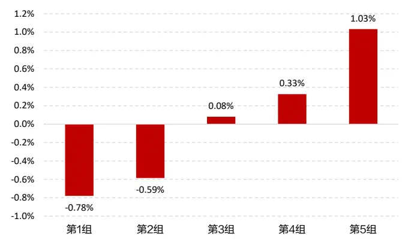
数据来源：wind，东方证券研究所

复合信号的多空累计净值
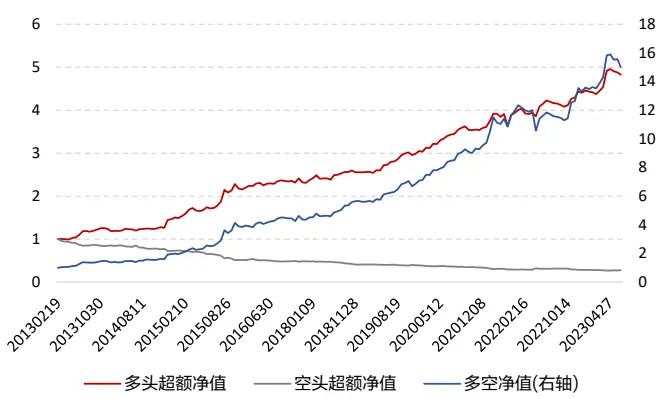

## 3.2.2 定期调仓

除去不定期调仓，我们还测试了月末定期调仓的模式。具体地，在每个月末回看过去10个交易日，若期间存在信号触发，则将同样以时间半衰加权的方式构造月末复合因子，按月底收盘价等权买入、持有 1个月后卖出；若期间无信号触发，则该月保持空仓。

在样本期的 125 个月份中，共有 65 个月份触发了定期复合信号，数量占比为 52%。在20130101 至 20230531 期间，多头、空头组的次均超额收益分别为 1.88%和-1.19%。

图 13：复合信号下的行业轮动测试结果（定期调仓）
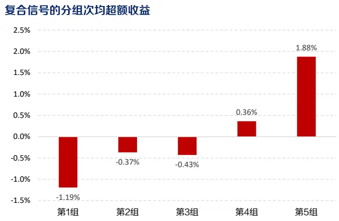
数据来源：wind，东方证券研究所

复合信号的多空累计净值
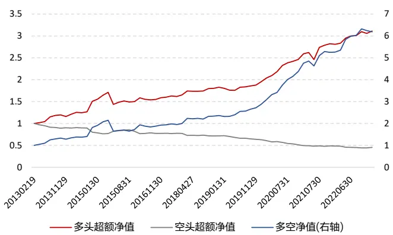

## 四、基于时点动量的因子轮动

上文中我们验证了时点动量具有显著的行业轮动效果，我们不禁思考时点动量是否在因子上也存在轮动能力。本章我们将从多角度展示时点动量在因子轮动中的效果。对于因子在不同信号触发后的时点动量，我们选用全市场分10组下的因子多头超额收益作为评价指标。各信号在多头超额收益的持有区间上存在差异，具体可参考以下说明：

⚫ 下跌反弹信号：时点动量 = 反弹区间的多头超额收益，多头按最低日的因子值分组而来；

⚫ 其他信号：时点动量 = 信号日当天的多头超额收益，多头按信号前一日因子值分组而来。

图 14：因子库说明

| 类别 | 因子简称 | 因子名称 | 因子计算方式 |
| --- | --- | --- | --- |
| 风格 | Beta Lncap | 股票Beta 市值对数 | 股票Beta 市值取对数 |
| 估值 | BP Quart_EP Quart_SP FEP_ROLL FPEG ROLL | 账面市值比 单季度市盈率倒数 单季度市销率倒数 一致预期市盈率倒数TTM | 净资产/总市值 单季度归母净利润/总市值 单季度营业收入/总市值 一致预期滚动PETTM倒数 |
| 成长 | Quart_OR_YOY SUE SUR UE PERC Net_Profit_YoY | 一致预期滚动PEG 单季度营业收入同比增速 标准化预期外盈利 标准化预期外收入 单季度净利润超预期幅度 单季净利同比增速 | 一致预期滚动PEG 单季度营业收入同比增长率 (单季度实际净利润-预期净利润)/预期净利润标准差 (单季度实际营业收入-预期营业收入)/预期营业收入标准差 单季度净利润/分析师预期单季度净利润-1 |
| 盈利 | Quart_ROE Quart_ROA Delta_ROE Delta_ROA | 单季度净资产收益率 单季度总资产收益率 单季度净资产收益率同比变化 单季度总资产收益率同比变化 | 单季净利同比增速 单季度归母净利润*2/(期初归母净资产+期末归母净资产) 单季度归母净利润*2/(期初归母总资产+期末归母总资产) 单季度净资产收益率-去年同期单季度净资产收益率 单季度总资产收益率-去年同期单季度中资产收益率 |
| 分析师预期 | ANA REC UD PCT FNP_CHANGE_3M | 分析师认可度 分析师上下调数量差占比 致预期滚动净利润环比 | 分析师认可度4因子复合 过去3个月(上调家数-下调家数)/总家数+总家数/10000 当前一致预期滚动净利润/3个月前一致预期滚动净利润-1 |
| 分红 | FROE_CHANGE_3M DIVIDEND_RATE AOG | 一致预期滚动ROE三个月环比 股息率 盈余公告次日开盘跳空超额 | 当前一致预期滚动ROE-3个月前一致预期滚动ROE 最近四个季度预案分红金额/总市值 |
| PEAD | ALG | 盈余公告次日最低价超额 | 盈余公告次日开盘跳空超额 盈余公告次日最低价超额 |
| 流动性 | TURNOVER_1M TURNOVER_3M | 一个月日均换手 三个月日均换手 | 过去20个交易日换手率均值 过去60个交易日换手率均值 |
| 波动 | IVR_1M ATR_1M | 特异度 一个月真实波动率 | 1-过去20个交易日Fama-French三因子回归的拟合度 过去20个交易日日内真实波幅均值 |
| 反转 | REVERSE_1M REVERSE_3M UMR_1M | 一个月反转 三个月反转 一个月UMR | 过去20个交易日涨跌幅 过去60个交易日涨跌幅 一个月UMR |
| UMR (统一动量反转) | UMR_3M UMR_6M UMR_12M | 三个月UMR 六个月UMR 十二个月UMR | 三个月UMR 六个月UMR 十二个月UMR |

数据来源：东方证券研究所绘制

有关分析师的申明，见本报告最后部分。其他重要信息披露见分析师申明之后部分，或请与您的投资代表联系。并请阅读本证券研究报告最后一页的免责申明。

在前文行业轮动中，我们已证实五类时点信号在行业上确实具有动量效应。若这种动量效应同样存在于因子中，则我们可以超配信号日多头超额收益更高的因子、低配信号日多头超额收益更低的因子，或基于时点动量加权后的综合打分构建TOP组合与指数增强。具体地，本章将从因子分组、因子加权、TOP 组合和指数增强四个角度进行测试。此外，本章测试用的因子库如上图所示，共包含常见基本面因子和量价因子在内的 33个因子。

## 4.1 时点动量在因子分组中的应用

根据各因子在信号触发后的多头超额收益，把因子库中的33个因子分为五组、组内因子等权，然后比较各组打分因子在股票池内的分组超额收益。相关测试细节说明如下：

（1）股票池：全市场剔除上市不满 3个月的新股和 ST股票；

## （2）调仓方式

⚫ 不定期调仓：信号触发后持有 20个交易日，若期间触发新信号，则切换至新持仓；

⚫ 定期调仓：月末定期调仓，若月末 10日内无信号触发，则该月空仓；

## （3）复合信号的时点动量

与行业轮动类似，我们同样考察复合信号的因子轮动能力。各信号日 T 对应的复合时点动量因子可按如下方式确定：

⚫ 若过去 10 日内无其他信号触发，则信号日 T 的复合因子即为该信号的取值，即该信号日各因子的多头超额收益；

⚫ 若过去 10日内存在其他信号，则对 10日内所有信号的多头超额收益做半衰加权，加权方式同行业轮动；

（4）测试区间：自 20130101 至 20230531。

## 4.1.1 不定期调仓

图 15：单信号下的因子分组表现（不定期调仓）

| 不定期 |  | 第1组 第2组 -1.46% -0.71% | 第3组 第4组 第5组 |  |  |  |  |  |  |  |  |  |  |
| --- | --- | --- | --- | --- | --- | --- | --- | --- | --- | --- | --- | --- | --- |
| 下跌反弹信号 | Group1 Group2 |  | -1.05% | -0.84% | L-0.41% -0.40% | 0.05% -0.32% | 0.04% 0.01% | 0.29% -0.07% | 0.31% 0.24% | 0.53% 0.75% | 0.68% 0.55% | 0.68% 112% | 64.58% 77.08% |
|  | Group3 |  |  |  |  |  |  |  |  | 0.65% |  |  |  |
|  |  |  | -1.76% | -0.92% | -0.63% | -0.26% | -0.11% | 0.10% | 0.58% |  | 1.01% | 1.34% | 81.25% |
|  | Group4 |  | -1.96% | -1.20% | -0.66% | -0.66% | 0.12% | 0.35% | 0.49% | 0.73% | 116% | 1.63% | 81.25% |
|  | Group5 |  | -2.04% | -1.14% | -0.92% | -0.49% | -0.04% | 0.37% | 0.61% | 0.74% | 1.27% | 1.63% | 79.17% |
|  | Group1 | -1.23% |  | -0.33% | -0.08% | -0.11% | 0.39% | 0.50% | 0.63% | 0.43% | 0.30% | -0.50% | 54.17% |
| 顶部切换信号 | Group2 |  | -1.38% | -0.45% | 0.06% | L-0.33% | 0.2% | 0.38% | 0.43% | 0.39% | 0.36% | 0.67% | 79.17% |
|  | Group3 |  | -1.89% | -0.87% | -0.61% | -0.31% | -0.06% | 0.31% | 0.25% | 0.66% | 0.92% | 1.60% | 87.50% |
|  | Group4 |  | -2.10% | -0.96% | -0.88% | -0.60% | -0.27% | 0.31% | 0.24% | 0.90% | 1.41% | 1.96% | 91.67% |
|  | Group5 |  | -1.98% | -1.37% | -1.08% | -0.45% | -0.39% | 0.10% | 0.43% | 0.65% | 1.39% | 2.69% | 91.67% |
|  |  |  | -0.30% | -0.37% | 0.00% | 09% |  |  |  |  |  |  |  |
|  | Group1 |  | -1.30% | -0.42% | L-0.25% | 0.04% | 0.27% 0.08% | 0.22% 0.18% | 0.10% 0.27% | 0.09% 0.20% | 0.12% | -0.04% 0.54% | 50.00% |
|  | Group2 Group3 |  | -1.25% | -0.71% | L-0.41% | 0.00% | -0.12% | 0.21% | 0.35% | 0.50% | 0.67% 0.52% | 0.91% | 65.00% 75.00% |
|  | 横盘突破信号 Group4 |  | -1.50% | -1.13% | -0.51% | -0.31% | -0.30% | -0.19% | 0.22% | 0.71% | 1.20% | 1.81% | 90.00% |
| 北向异常信号 | Group5 |  | -1.40% | -0.79% | -0.42% | -0.63% | -0.17% | 0.07% | 0.29% | 0.40% | 103% | 1.61% | 75.00% |
|  | Group1 |  | -0.95% | -0.12% | -0.01% | 0.24% | 0.19% | 0.09% | 0.48% | -0.06% | 0.15% | -0.02% | 57.14% |
|  | Group2 |  | -1.18% | -0.32% | 1-0.24% | -0.01% | 0.44% |  | 0.13% | 0.15% | 0.53% | 0.42% | 61.90% |
|  |  |  | -1.14% | -0.76% | L-0.34% | -0.31% | 0.17% | 0.07% 0.12% | 0.28% | 0.53% |  | 0.73% |  |
|  | Group3 |  |  |  |  |  |  |  |  |  | 0.72% |  | 71.43% |
|  | Group4 Group5 |  | -0.84% -1.88% | -0.45% -0.92% | -0.22% -0.68% | -0.21% -0.30% | -0.06% -0.36% | -0.08% 0.26% | 0.14% 0.56% | 0.42% 0.59% | 0.68% 111% | 0.60% 1.62% | 71.43% 80.95% |
| 宏观指标披露 | Group1 |  | -1.16% |  |  |  |  |  |  |  | 0.40% | 0.34% |  |
|  |  |  | -1.16% | -0.63% | L-0.41% | -0.05% | 0.08% | 0.43% | 0.43% | 0.56% |  |  | 52.08% |
|  | Group2 |  |  | -0.72% | -0.42% | L-0.38% | 0008% | 0.29% | 0.22% | 0.63% | 0.78% | 0.83% | 66.67% |
|  | Group3 |  | -1.55% | -0.87% | -0.54% | L-0.43% | -0.07% | 0.28% | 0.27% | 0.80% | 0.90% | 123% | 79.17% |
|  | Group4 Group5 |  | -1.54% -1.41% | -0.72% -0.91% | -0.65% -0.62% | L-0.37% -0.16% | -0.04% -0.11% | 0.16% -0.10% | 0.28% 0.25% | 0.55% 0.38% | 0.91% 0.98% | 1.41% 1.71% | 81.25% 75.00% |

数据来源：wind，东方证券研究所
有关分析师的申明，见本报告最后部分。其他重要信息披露见分析师申明之后部分，或请与您的投资代表联系。并请阅读本证券研究报告最后一页的免责申明。

我们用 Group1-Group5表示根据信号触发日因子的多头超额收益对因子进行排序并分组后的结果，其中多头超额收益最强的一组因子等权打分记为Group5。在截面完成因子分组后，我们将各组打分用于股票池分组，第 10 组对应股票多头。从各个单信号的表现来看，一方面 Group5（强势因子打分）股票分组收益的单调性更好，另一方面股票多头（第10组）超额收益随因子由弱变强也有逐步递增的趋势。

按照上文介绍的因子时点动量的复合方式，我们测试了复合信号在不定期调仓下的因子分组表现。首先，股票空头（第 1 组）和股票多头（第 10 组）均在 Group5（强势因子打分）中表现最好，且随着因子分组由弱变强、呈现出单调递增的趋势。其次，股票多头胜率在 Group1-Group5中也大致存在单调性。最后，不同强弱因子分组的多头超额净值与多空净值曲线在时序上的单调性也较为明显。

图 16：复合信号下的因子分组表现（不定期调仓）

| 不定期 |  | 第1组 |  | 第2组 | 第3组 | 第4组 | 第5组 | 第6组 | 第7组 | 第8组 | 第9组 | 第10组 | 多头胜率 |
| --- | --- | --- | --- | --- | --- | --- | --- | --- | --- | --- | --- | --- | --- |
| 多信号融合 | Group1 |  | 0.75% | L0.23% | 0.16% | 0.04% | 0.01% | 0.18% | 0.25% | 0.30% | 0.22% | 0.14% | 53.46% |
|  | Group2 |  | 0.92% | 0.51% | 0.24% | 0.21% | 0.00% | 0.13% | 10.19% | D43% | 048% | 0.64% | 69.81% |
|  | Group3 |  | 1.17% | 0.59% | D0.32% | L0.23% | 0.08% | 10.13% | 0.34% | D45% | 0.63% | 0.85% | 81.13% |
|  | Group4 |  | 1.25% | 0.70% | 0.46% | 0.30% | 0.10% | 0.08% | b.24% | D50% | 0.7% | 1.23% | 80.50% |
|  | Group5 |  | 1.29% | 0.84% | 0.52% | 0.31% | 0.11% | 0.04% | 0.31% | 48% | 0.87% | 1.37% | 81.13% |

复合信号下的多头超额净值_不定期调仓
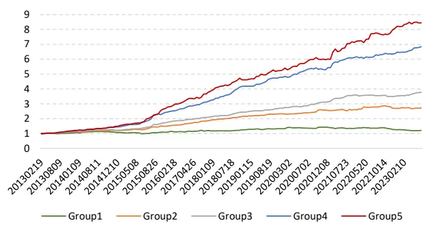
数据来源：wind，东方证券研究所

复合信号下的多空净值_不定期调仓
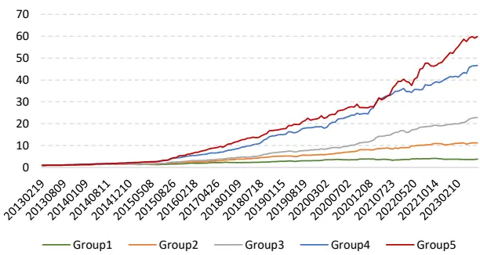

## 4.1.2 定期调仓

在月末定期调仓的模式下，在样本期的125个月份中，共有65个月份触发了月底的定期复合信号，数量占比为 52%。对于五种单信号而言，除北向异常和宏观指标披露信号外，其余信号普遍在 Group5（强势因子打分）下的股票多头（第 10组）超额收益更高。

图 17：单信号下的因子分组表现（定期调仓）

| 定期 | 第1组 第2 |  | 组 第3 | 组 第4组 第5组 第6组 第7 |  |  |  | 组 第8组 第9 |  | 组 第1 | 0组 多头胜率 |  |
| --- | --- | --- | --- | --- | --- | --- | --- | --- | --- | --- | --- | --- |
| Group1Group2下跌反弹信号 Group3Group4Group5 | 2 | .00% | 0.79% 0 | .31% | 0.00% | 0.00% | 0.45% | 0.61% | 0.52% | 0.62% | 0.91% 59.26% |  |
|  |  | 1.36% | 0.97% 0 | .46% 0 | .27% | 0.06% | 0.09% | 0.30% | 0.62% | 0.88% | 111% 81.48% |  |
|  |  | 1.70% | 0.99% 0 | .36% 0 | .34% 0 | .37% | 0.21% | 0.39% | 0.64% | 1.06% | 148% 81.48% |  |
|  |  | 2.33% | 1.08% 0 | .73% | -0.40% 0 | .10% | 0.25% | 0.60% | 0.71% | 121% | 1.88% 85.19% |  |
|  |  | 2.48% | 1.27% 1 | .09% 0 | .37% 0 | .08% | 0.12% | 0.72% | 134% | 1.44% | 1.66% 77.78% |  |
| Group1Group2顶部切换信号 Group3 | 1 | .67% | 0.93% L | 0.66% | 0.04% 0 | .65% | 1.05% | 0.28% | 0.85% 1 | 0.52% | 0.12% 57.14% |  |
|  |  | 1.25% | 1.11% | 10.40% 0. | 58% 0 | .38% | 0.10% | 0.37% | 0.70% | 0.98% | 0.83% 57.14% |  |
|  |  | 2.65% | 1.51% 10 | .93% | 0.17% 0 | .15% | 0.67% | 0.68% | 141% | b.64% | 2.02% 100.00% |  |
| Group4Group5 |  | 3.07% | 1.99% D | 0.75% | 0.84% 0 | .08% | 0.38% | 0.41% | 112% | 199% | 2.83% 100.00% |  |
|  | 2 | .70% | 1.92% 1 | .45% | 0.85% 0 | .34% | 0.05% 1 | 0.40% | 0.78% | 2.58% | 3.44% 92.86% |  |
| Group1Group2 |  | 0.07% | 0.05% | 0.25%10.34% | 0.09%0.10%0.21% | 0.10%0.13% | 0.31% | 0.05% | 0.10% | 0.01% 0 | .38% 33.33%0.78% 75.00% |  |
|  |  | 1.56% | 0.82% |  |  |  | 0.20% | 0.59% | 0.66% | 0.28% |  |  |
| 横盘突破信号 Group3Group4Group5 |  | 1.29% | 1.02% 0 | .52% |  | 0.03% | 0.04% | 0.60% | 10.38% | 0.82% | 0.76% 66.67% |  |
|  |  | 1.40% | 1.39% | 10.85% 0 | .80% 0.48% 0 | .45%.25% | 0.12%0.12% | 0.13%0.36% | 1.01% | 1.48% | 2.15% 100.00%2.29% 83.33% |  |
|  | 1 | .87% | 1.27% 0 | .80% 0 |  |  |  |  | 0.90% | 125% |  |  |
| Group1Group2北向异常信号 Group3Group4Group5 | 00 | .72% | 0.03% | 0.00% | 0.19% 0 | .35% | 0.10% 1 | 0.48% | 0.44% | 0.69% | 0.41% 55.56% |  |
|  |  | .44% L | 0.39% | 0.02% | 0.10% 0 | .13% L | 0.45% | 0.00% | 0.04% | 0.47% | 0.82% 66.67% |  |
|  | 0 | .57% | 0.00% 1 | -0.58% 0 | .36% 0 | .21% | 0.00% 0 | .36% | 0.22% | 0.82% | 1.05% 66.67% |  |
|  | 1 | .17% 0. | 91% L | 0.48% 0 | .56% 0 | .24% | 0.08% | 0.12% | 0.40% | 0.91% | 2.08% 100.00%119% 88.89% |  |
|  | 1 | .26% | 0.59% 0 | .38% 0 | .33% 0 | .19% 0 | .28% | 0.46% | 0.51% | 0.87% |  |  |
| Group1Group2宏观指标披露 Group3Group4Group5 | 10 | .79% 10.32% L | .83%0.39% | 0.000% 000303% | .61%0.00% | 0.36%00% | 0.03%0.07% L | 0.20%0.46% | 0.66%0.09% | 1.10%10.35% | 0.89% 66.67% |  |
|  |  |  |  |  |  |  |  |  |  |  | 0.54% 66.67% |  |
|  | 1 | .15% | 1.39% L | 0.53% -0 | .55% | 0.11% 1 | 0.49% 0 | .13% | 0.68% | 0.87% | 1.60% 83.33% |  |
|  | 0 | .09% | 0.16% 0 | .22% 0 | .51% 0. | 70% | 0.20% 0. | 68% | 0.08% | 0.75% | 118% 83.33% |  |
|  | 0 | .90% | 1.36% 0 | .48% 0 | .71% | 0.46% | 0.69% | 0.80% | 0.71% | 0.79% |  | 0.00%66.67% |

数据来源：wind，东方证券研究所

将信号复合后，不同强弱因子分组仍然呈现出良好的单调性。股票空头（第 1 组）和股票多头（第 10 组）均在 Group5（强势因子打分）中表现最好，且随着因子分组由弱变强、呈现出单调递增的趋势。股票多头胜率在 Group1-Group5中也大致存在单调性。并且不同强弱因子分组的多头超额净值与多空净值曲线在时序上的单调性也较为明显。

图 18：复合信号下的因子分组表现（定期调仓）

| 定期 |  | 第1组 |  | 第2组 | 第3组 | 第4组 | 第5组 | 第6组 | 第7组 | 第8组 | 第9组 | 第10组 | 多头胜率 |
| --- | --- | --- | --- | --- | --- | --- | --- | --- | --- | --- | --- | --- | --- |
| 多信号融合 | Group1 |  | 1.09% | 0.49% | 0.25% | 0.10% | 0.01% | 0.36% | 10.35% | 0.35% | 0.51% | 0.35% | 48.44% |
|  | Group2 |  | 1.36% | 0.97% | D0.36% | L0.19% | 0.16% | 0.01% | b.41% | 0.66% | D77% | 86% | 70.31% |
|  | Group3 |  | 1.55% | 0.89% | 0.52% | 0.30% | -0.25% | 0.37% | 0.40% | 0.60% | 88% | 1.26% | 84.38% |
|  | Group4 |  | 2.09% | 1.04% | 0.74% | 0.63% | 0.18% | 0.29% | 0.36% | 82% | 1.21% | 2.00% | 89.06% |
|  | Group5 |  | 2.12% | 1.36% | 1.07% | 0.52% | 0.30% | 0.12% | 0.47% | 0.95% | 1.48% | 2.33% | 84.38% |

复合信号下的多头超额净值_定期调仓
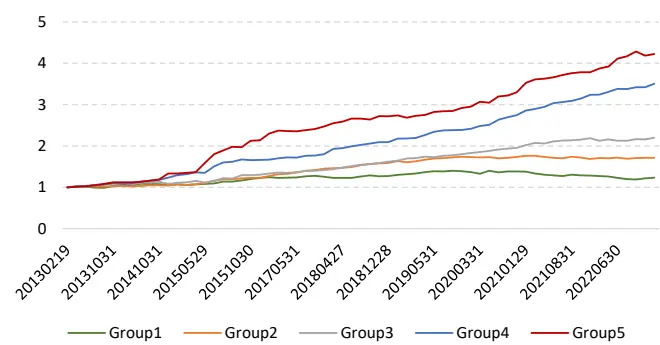
数据来源：wind，东方证券研究所

复合信号下的多空净值_定期调仓
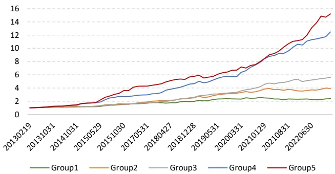

## 4.2 时点动量在因子加权中的应用

通过上文因子分组的测试，我们发现在时点信号触发时多头超额收益越高的因子，未来多头超额收益大概率也更强。受此启发，我们尝试以时点信号触发时因子的多头超额收益作为加权权重对因子库中的因子进行加权，并与传统的等权和 ICIR加权法做对比，以展示时点动量的有效性。

本节所采用的股票池、调仓方式、动量复合方式以及测试区间均同 4.1 节，对三种因子加权方式说明如下：

⚫ 等权：各因子等权配置；

⚫ ICIR：各因子按过去 12个月的 ICIR加权，逻辑反向的因子权重归零；

⚫ 时点动量：按因子时点动量（多头超额收益）加权，多头超额收益为负的因子权重归零。

## 4.2.1 不定期调仓

首先，我们测试了各单信号触发后三种因子加权方式下股票的分组超额收益。除下跌反弹信号外，其余信号均在时点动量加权方式下的股票多头（第10组）超额收益更高。例如顶部切换信号在等权和ICIR加权法下的股票多头超额收益分别是1.82%和1.99%，而在时点动量加权法下的股票多头超额收益是 2.76%。需要说明的是，由于不同信号的触发时间不同，所以尽管因子库相同，不同信号的等权、ICIR加权法的结果仍存在差异，这一现象同样存在于定期调仓测试中。

图 19：单信号下的因子加权表现（不定期调仓）

| 不定期 |  | 第1组 第2组 | 第3组 | 第4组 | 第5组 | 第6组 | 第7组 | 第8组 | 第9组 |  | 第10组 | 多头胜率 |
| --- | --- | --- | --- | --- | --- | --- | --- | --- | --- | --- | --- | --- |
| 下跌反弹信号 | 等权 | 2.21% | 1.44% | 0.81% | H0.41% | 0.19% | 0.32% | 0.52% | 095% | 1.40% | 1.87% | 95.83% |
|  | ICIR | 2.03% | 1.29% | 0.77% | L0.46% | 0.20% | 0.09% | 0.52% | 083% | 1.45% | 1.86% | 93.75% |
|  | 时点动量 | 2.35% | 1.47% | 1.01% | 0.55% | 0.02% | 0.45% | 0.67% | 101% | 1.45% | 1.83% | 85.42% |
|  | 等权 | 2.39% | 0.98% | 1.05% | 0.33% | 0.15% | 0.06% | 0.55% | 0.99% | 1.47% | 1.82% | 91.67% |
| 顶部切换信号 | ICIR | 2.11% | 1.13% | D0.75% | L0.50% | 0.51% | 0.10% | 0.43% | 095% | 1.54% | 1.99% | 100.00% |
|  | 时点动量 | 2.33% | 1.45% | 0.65% | 0.87% | 0.37% | 0.28% | 0.22% | d.61% | 1.80% | 2.76% | 87.50% |
|  | 等权 | 1.85% | L0.92% | 0.32% | 0.22% | 0.11% | 0.10% | 0.46% | 0.58% | 0.79% | 1.27% | 85.00% |
| 横盘突破信号 | ICIR | 1.63% | 1.13% | 0.18% | 0.41% | 0.06% | 0.22% | 0.37% | 0.51% | 087% | 1.45% | 95.00% |
|  | 时点动量 | 1.73% | 1.02% | 0.93% | 0.51% | 0.18% | 0.11% | 0.60% | 0.72% | 090% | 2.06% | 80.00% |
|  | 等权 | 1.98% | L0.48% | 0.22% | 0.16% | 0.14% | 0.25% | b0.33% | 0.62% | 079% | 0.72% | 80.95% |
| 北向异常信号 | ICIR | 1.77% | L0.55% | 0.27% | 0.15% | 0.14% | 0.01% | 0.40% | 0. 78% | 0.70% | 0.72% | 71.43% |
|  | 时点动量 | 2.12% | 1.12% | 0.78% | 0.62% | 0.39% | 0.44% | 0.45% | 101% | 1.45% | 1.70% | 80.95% |
|  | 等权 | 1.94% | 1.09% | L0.70% | L0.48% | 0.01% | 0.22% | 0.63% | 078% | 1.05% | 1.54% | 83.33% |
| 宏观指标披露 | ICIR | 1.99% | 1.15% | 0.57% | L0.56% | 0.18% | b.25% | 0.44% | 085%% | 1.29% | 1.63% | 83.33% |
|  | 时点动量 | 1.89% | 1.04% | 0.67% | 10.25% | H0.30% | 0.06% | 0.63% | 0.70% | 0.97% | 1.92% | 81.25% |

数据来源：wind，东方证券研究所

然后，我们将各单信号进行半衰加权得到复合时点动量。当复合信号触发时，基于复合时点动量加权的因子打分明显优于等权和ICIR加权法，三种方法的股票多头超额收益依次为1.52%、1.18%和 1.19%。从多头超额收益与多空净值曲线来看，复合时点动量加权的方式较等权或 ICIR可以带来明显的增量效果。

图 20：复合信号下的因子加权表现（不定期调仓）

| 不定期 |  | 第1组 | 第2组 | 第3组 | 第4组 | 第5组 | 第6组 |  | 第7组 第8组 |  | 第9组 | 第10组 | 多头胜率 |
| --- | --- | --- | --- | --- | --- | --- | --- | --- | --- | --- | --- | --- | --- |
| 多信号融合 | 等权 | 1.55% |  | -0.81% | -0.49% | H0.28% | 0.02% | 0.09% | 042% | 0.56% | 0.86% | 1.18% | 84.91% |
|  | ICIR | 1.46% |  | 0.81% | 0.42% | 0.36% | 0.07% | 0.14% | 35% | 0.54% | 0.91% | 1.19% | 89.31% |
|  | 时点动量 |  | 1.55% | 0.97% | -0.61% | 0.40% | 0.11% | 0.12% | 0 41% | 0.61% | 0.97% | 1.52% | 83.65% |

复合信号下的多头超额净值_不定期调仓
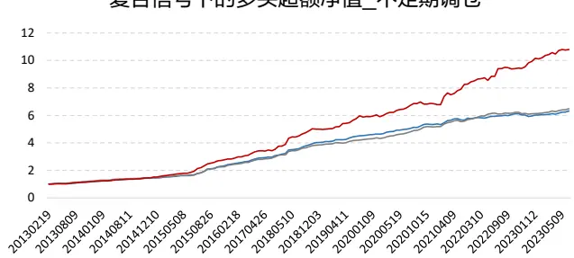
数据来源：wind，东方证券研究所等权

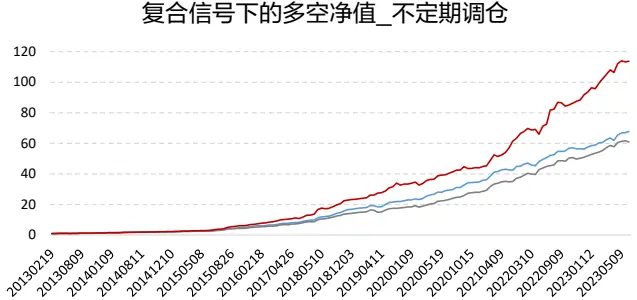
有关分析师的申明，见本报告最后部分。其他重要信息披露见分析师申明之后部分，或请与您的投资代表联系。并请阅读本证券研究报告最后一页的免责申明。

## 4.2.2 定期调仓

图 21：单信号下的因子加权表现（定期调仓）

| 定期 |  | 第1组 | 第2组 | 第3组 | 第4组 | 第5组 第6组 | 第7组 | 第8组 | 第9组 | 第10组 |  | 多头胜率 |
| --- | --- | --- | --- | --- | --- | --- | --- | --- | --- | --- | --- | --- |
| 下跌反弹信号 | 等权 | 2.76% | 1.44% | 0.77% | 0.42% | 0.08% | 10.40% | 0.58% | 0.93% | 1.52% | 2.03% | 88.89% |
|  | ICIR | 2.48% | 1.29% | 10.55% | 0.34% | 0.14% | 00002% | 0.55% | 0.94% | 147% | 1.82% | 92.59% |
|  | 时点动量 | 2.55% | 1.60% | 1.10% | -0.55% | 0.09% | 0.35% | 0.70% | 129% | 1.72% | 1.83% | 85.19% |
|  | 等权 | 3.38% | 1.99% | 1.07% | 0.35% | L0.54% | 0.52% | 0.72% | 127% | 1.86% | 2.97% | 100.00% |
| 顶部切换信号 | ICIR | 2.77% | 2.03% | 11.03% | 0.60% | 0.28% | 0.28% | 10.22% | 134% | 2.24% | 2.64% | 92.86% |
|  | 时点动量 | 3.19% | 2.12% | 1.46% | 0.77% | -0.34% | 0007% | 10.56% | 134% | 2.24% | 3.66% | 92.86% |
|  | 等权 | 1.93% | 1.38% | L0.49% | 0.57% | 0.13% | 0.24% | 0.65% | 0.95% | 1.11% | 129% | 91.67% |
|  | ICIR | 2.30% | 1.43% | 10.56% | 0.19% | 0.18% | 0.31% | 10.35% | 1.10% | 121% | 1.68% | 83.33% |
| 横盘突破信号 |  | 2.34% |  |  | 0.59% |  |  |  |  |  |  |  |
|  | 时点动量 |  | 1.43% | 10.95% |  | 0.55% | 0.01% | 0.77% | 0.63% | 1.60% | 2.86% | 100.00% |
|  | 等权 ICIR | 1.35% 0.83% | 0.66% | L0.50% | 0.24% | 0.22% | 0.14% | 0.20% | 0.27% | 0.91% | 130% | 77.78% |
| 北向异常信号 |  |  | 0.08% | 0.60% | 0.27% | 0.09% | 0.43% | 0.19% | 10.30% 1.06% | 0.64% 144% | 1.15% 1.84% | 66.67% 88.89% |
|  | 时点动量 | 2.15% | 1.04% | 0.75% | 0.66% | 0.21% | 0.23% | 0.24% 0.62% | 10.30% | 0.97% | 1.15% |  |
|  | 等权 | 1.40% | 0.32% | 0.64% | 0.64% | 0.21% | 0.16% |  |  |  |  | 83.33% |
| 宏观指标披露 | ICIR 时点动量 | 1.58% 1.14% | 0.29% 1.19% | L-0.44% 11.34% | 0.38% 0.65% | -0.74% | 0.06% 0.05% | 0.08% 0.31% | 0.24% 0.77% | 1.02% 1.68% | 2.03% 1.61% | 100.00% 83.33% |

数据来源：wind，东方证券研究所

定期调仓模式下，我们在月底10日内有信号覆盖的月份进行调仓，并持有1个月。对于单信号，时点动量加权方式在顶部切换、横盘突破和北向异常信号上的优势较为明显。而且在信号复合后，时点动量在股票多头超额收益和多头胜率上均优于其他两种加权方法。从多头超额收益与多空净值曲线来看，复合时点动量加权的方式较等权或 ICIR可以带来明显的增量效果。

图 22：复合信号下的因子加权表现（定期调仓）

| 定期 |  | 第1组 | 第2组 | 第3组 | 第4组 | 第5组 | 第6组 | 第7组 | 第8组 | 第9组 | 第10组 | 多头胜率 |
| --- | --- | --- | --- | --- | --- | --- | --- | --- | --- | --- | --- | --- |
|  | 等权 | 2.41% | 1.31% | 0.78% | L-0.45% | 0.12% | 0.27% | 0.59% | 0.83% | 1.40% | 1.99% | 89.06% |
| 多信号融合 | ICIR | 2.17% | 1.24% | -0.64% | L-0.37% | -0.24% | 0.04% | 0.34% | .88% | 1.45% | 1.95% | 89.06% |
|  | 时点动量 | 2.44% | 1.58% | 1.24% | 0.64% | -0.34% | 0.26% | 10.42% | 113% | 1.71% | 2.70% | 92.19% |

复合信号下的多头超额净值_定期调仓
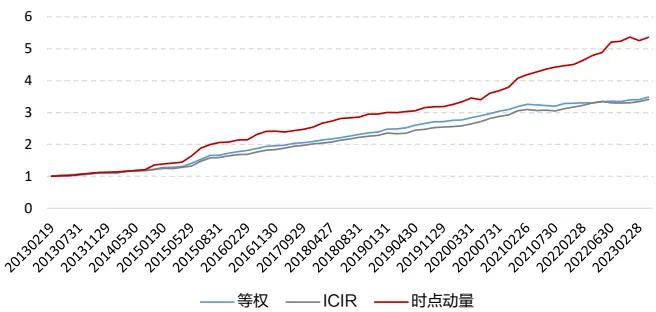
数据来源：wind，东方证券研究所

复合信号下的多空净值_定期调仓
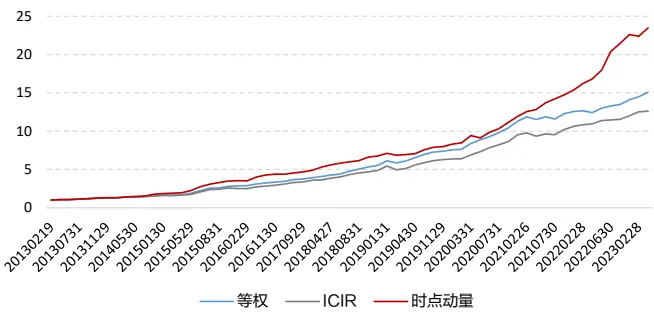

## 4.3时点动量在TOP组合中的应用

前文因子分组和因子加权的测试均表明，因子在特殊时点信号上确实存在动量效应。本节我们将基于复合时点动量加权后的综合打分用于构建TOP组合，以在选股层面检验时点动量的效果。有关测试细节说明如下：

（1）使用半衰加权后的复合时点动量（多头超额收益）对因子库中因子加权，逻辑反向的因子权重归零；

（2）采用不定期调仓，即在任意信号触发后持有 20 个交易日，若期间触发新信号，则切换至新信号下的持仓；

有关分析师的申明，见本报告最后部分。其他重要信息披露见分析师申明之后部分，或请与您的投资代表联系。并请阅读本证券研究报告最后一页的免责申明。

（3）比较基准选为中证 500，TOP组合在空仓日的收益用中证 500的日度收益填充；

（4）股票池：全市场剔除上市不满 3个月的新股和 ST股票；

（5）交易成本为买入0.1%、卖出0.2%，按信号当日的收盘价交易，不交易停牌、涨跌停的股票；

（6）测试区间：自 20130101 至 20230531。

我们在信号触发日选取复合得分最高的前 50 只股票等权构建 TOP50 组合，组合相对中证500的年化超额收益为26.17%、次均换手率约为71.62%。TOP50组合每年的收益均可大幅战胜基准，除2019年外、其余年份的超额收益均在10%以上，而且TOP50组合在今年的表现较好，截至20230531超额收益为10.64%。同时，我们也计算了不补全空仓日的组合收益，即从样本期中抹去空仓日，不含空仓日的组合年化超额收益达 40.33%。

图 23：复合时点动量加权下的TOP50组合表现

| TOP50 |  | 全样本期 | 2013 | 2014 | 2015 | 2016 | 2017 | 2018 | 2019 | 2020 | 2021 | 2022 | 20230531 |
| --- | --- | --- | --- | --- | --- | --- | --- | --- | --- | --- | --- | --- | --- |
| 补全空仓 | 超额收益 | 26.17% | 32.93% | 31.42% | 76.37% | 27.63% | 16.85% | 18.10% | 9.57% | 12.04% | 20.34% | 26.58% | 10.64% |
|  | 跟踪误差 | 10.35% | 7.76% | 6.49% | 13.02% | 7.93% | 7.65% | 8.45% | 10.34% | 11.35% | 12.19% | 14.88% | 6.66% |
|  | 最大回撤 | -12.36% | -2.97% | -2.62% | -9.54% | -3.52% | -4.88% | -4.24% | -8.41% | -11.09% | -7.20% | -9.66% | -4.60% |
|  | 不补全空仓 超额收益 | 40.33% | 37.91% | 41.96% | 90.25% | 26.45% | 15.69% | 16.48% | 12.81% | 15.35% | 24.72% | 27.28% | 11.16% |

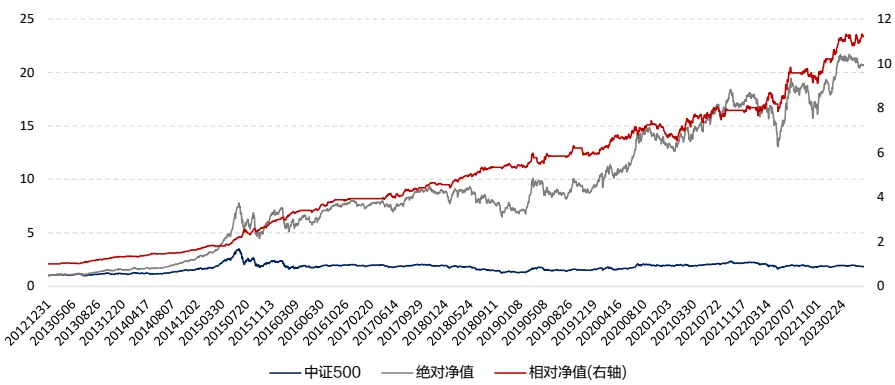
数据来源：wind，东方证券研究所

为了测试TOP组合对参数的敏感性，我们在全市场分别构建了TOP10、TOP30……TOP200组合。从各组合相对中证500的超额收益来看，组合年化超额收益随TOP组合数量基本呈现缓慢单调下降的趋势，TOP30组合的年化超额收益最高（26.54%）。此外，除去 TOP10，其余 TOP组合在 2023年的超额收益均较为显著。

图 24：TOP组合参数敏感性

|  | 全样本期 |  | 2013 | 2014 | 2015 | 2016 | 2017 | 2018 | 2019 | 2020 | 2021 | 2022 | 20230531 |
| --- | --- | --- | --- | --- | --- | --- | --- | --- | --- | --- | --- | --- | --- |
| TOP10 | 超额收益 | 26.10% | 35.76% | 34.33% | 28.91% | 19.08% | 15.07% | 10.13% | 37.67% | 22.85% | 27.37% | 51.49% | -3.56% |
|  | 跟踪误差 | 15.21% | 12.06% | 10.21% | 19.34% | 10.04% | 9.97% | 12.48% | 18.20% | 14.95% | 19.47% | 20.57% | 9.01% |
|  | 最大回撤 | -15.06% | -7.41% | -2.49% | -15.06% | -4.43% | -3.86% | -11.09% | -11.28% | -10.88% | -10.92% | -9.31% | -9.56% |
|  | 超额收益 | 26.54% | 34.41% | 31.89% | 80.42% | 25.14% | 16.99% | 14.71% | 6.50% | 20.77% | 18.50% | 30.93% | 8.02% |
| TOP30 | 跟踪误差 | 11.43% | 8.82% | 7.07% | 15.56% | 8.55% | 7.54% | 8.84% | 12.03% | 12.03% | 13.37% | 16.09% | 7.40% |
|  | 最大回撤 | -11.49% | -3.23% | -2.88% | -11.49% | -4.68% | -3.87% | -4.73% | -9.00% | -8.74% | -7.93% | -9.18% | -4.42% |
|  | 超额收益 | 26.17% | 32.93% | 31.42% | 76.37% | 27.63% | 16.85% | 18.10% | 9.57% | 12.04% | 20.34% | 26.58% | 10.64% |
| TOP50 | 跟踪误差 | 10.35% | 7.76% | 6.49% | 13.02% | 7.93% | 7.65% | 8.45% | 10.34% | 11.35% | 12.19% | 14.88% | 6.66% |
|  | 最大回撤 | -12.36% | -2.97% | -2.62% | -9.54% | -3.52% | -4.88% | -4.24% | -8.41% | -11.09% | -7.20% | -9.66% | -4.60% |
|  | 超额收益 | 21.66% | 30.19% | 31.10% | 65.86% | 22.09% | 6.49% | 13.27% | 3.41% | 13.76% | 20.83% | 16.92% | 10.99% |
| TOP100 | 跟踪误差 | 9.19% | 6.91% | 5.89% | 11.50% | 7.38% | 7.84% | 7.70% | 8.75% | 9.87% | 10.53% | 13.02% | 5.81% |
|  | 最大回撤 | -9.35% | -2.64% | -2.91% | -7.23% | -3.69% | -5.22% | -4.33% | -8.61% | -8.67% | -5.25% | -9.35% | -4.48% |
|  | 超额收益 | 19.32% | 26.52% | 24.04% | 63.65% | 21.38% | 5.71% | 17.62% | 2.53% | 9.89% | 15.51% | 14.49% | 8.73% |
| TOP200 | 跟踪误差 | 8.15% | 6.01% | 5.03% | 9.76% | 7.07% | 7.20% | 7.06% | 7.84% | 8.93% | 9.06% | 11.24% | 5.56% |
|  | 最大回撤 | -10.40% | -2.14% | -2.88% | -6.28% | -3.65% | -4.83% | -3.68% | -9.69% |  | -4.74% |  |  |
|  |  |  |  |  |  |  |  |  |  | -8.61% |  | -8.58% | -4.86% |

数据来源：wind，东方证券研究所
有关分析师的申明，见本报告最后部分。其他重要信息披露见分析师申明之后部分，或请与您的投资代表联系。并请阅读本证券研究报告最后一页的免责申明。

## 4.4 时点动量在指数增强中的应用

本节我们尝试把时点动量的信息融合到指数增强中，具体测试了三个不同版本的中证 500 指数增强，它们依次为：

⚫ 基础版本：因子库中因子对称正交、ICIR加权，月底定期调仓；

⚫ 只变因子：因子库中因子用复合时点动量加权（反向归零），不定期调仓，空仓日收益用基础版本结果填充；

⚫ 变因子变行业：在上述版本的基础上，把行业轮动中看多、看空行业的主动暴露由 0%分别调为 5%、-5%。

指数增强模型的其他参数设定如下：

（1）股票池：剔除上市半年内的新股、ST 股票、ST 摘帽不满 3 个月、退市前 1 个月的股票，调仓时非停牌、涨跌停的股票，过去 20个交易日日均成交额高于 1000万；

（2）成分股内权重约束：至少 80%、或不限制成分股内权重；

（3）中信一级行业主动暴露0%（最后1个版本除外）、市值主动暴露±0.3，个股相对成分股权重偏离上限 1%；

（4）交易成本为买入 0.1%，卖出 0.2%，以次日 vwap作为成交价格；

（5）回测区间：自 20130101 至 20230531。

图 25：中证 500成分股≥80%下的三个版本超额收益对比

| 基础版本 | 全样本期 |  |  | 2014 | 2015 |  | 2016 2017 |  | 2018 2019 | 2020 | 2021 | 2022 | 20230531 |
| --- | --- | --- | --- | --- | --- | --- | --- | --- | --- | --- | --- | --- | --- |
|  | 超额收益 | 16.58% | 2013 23.73% 9.77% |  | 36.82% | 26.48% | 15.00% | 15.27% | 13.52% | 10.31% | 14.35% | 12.58% | -1.79% |
|  | 跟踪误差 最大回撤 | 4.63% | 4.12% | 3.73% | 7.81% | 3.34% | 3.11% | 3.70% | 4.16% | 4.95% | 5.29% | 3.99% | 4.40% |
|  |  | -6.16% | -1.57% | -2.59% | -3.31% | -0.78% | -1.49% | -1.91% | -2.60% | -3.54% | -6.16% | -3.04% | -3.13% |
|  |  | 全样本期 | 2013 | 2014 | 2015 | 2016 | 2017 | 2018 | 2019 | 2020 | 2021 | 2022 | 20230531 |
|  | 超额收益 跟踪误差 | 19.33% | 8.70% | 14.16% | 36.60% | 35.06% | 21.43% | 24.48% | 16.46% | 2.69% | 25.26% | 17.57% | 3.17% |
| 变因子 变行业 | 最大回撤 | 6.46% -7.85% | 4.97% -2.87% | 4.45% -2.06% | 10.44% -6.05% | 6.91% -1.76% | 4.30% | 5.18% | 6.15% | 6.79% | 7.14% -5.68% | 6.39% | 5.13% |
|  |  | 全样本期 | 2013 |  |  |  | -1.42% | -1.93% | -4.45% | -7.85% |  | -6.01% | -2.57% |
|  |  |  |  | 2014 | 2015 | 2016 | 2017 | 2018 | 2019 | 2020 | 2021 | 2022 | 20230531 |
|  | 超额收益 | 20.94% | 10.64% | 16.93% | 38.67% | 36.17% | 23.23% | 24.92% | 18.29% | 1.15% | 28.13% | 19.84% | 4.63% |
|  | 跟踪误差 最大回撤 | 6.76% -8.09% | 5.14% -2.74% | 4.75% -2.28% | 10.36% -5.60% | 7.05% -1.26% | 4.60% -1.79% | 5.52% -2.06% | 6.29% -4.55% | 7.03% -8.09% | 8.17% -5.68% | 7.10% -5.46% | 5.13% -2.59% |

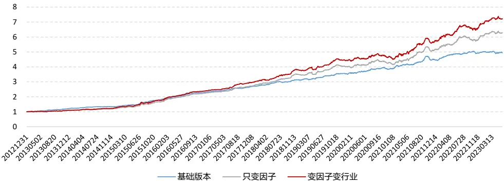
数据来源：wind，东方证券研究所

首先，在成分股内权重≥80%约束下，基础版本的年化超额收益为 16.58%。改变指数增强的收益预测模型后，可以把基础版本的年化超额收益提升 2.7pct 至 19.33%。进一步地，我们把行业轮动中看多、看空行业的主动暴露打开以后，年化超额收益可以提升至20.94%。此外，加入时点动量信息后的增强模型在今年的收益也明显好于基础模型。截至 20230531，基础模型在今年相对中证 500的超额收益为-1.79%，两个升级模型在今年的超额收益分别为 3.17%和 4.63%。

其次，我们不对中证 500 成分股内权重进行约束，同样比较了三个版本相对中证 500 的超额收益。基本模型的年化超额收益为 20.32%，只改变因子可以将年化超额收益提升至 23.76%，既变因子又变行业暴露可以使年化超额收益跃升至 25.59%。

上述结果表明，时点动量在因子与行业层面均可提供增量信息。从超额收益的增量来看，因子的变动对指增模型的收益贡献更为明显。

图 26：中证 500成分股不限制下的三个版本超额收益对比

| 基础版本 |  | 全样本期 2013 |  | 2014 |  | 2016 |  | 2017 2018 |  | 2019 2020 | 2021 | 2022 | 20230531 |
| --- | --- | --- | --- | --- | --- | --- | --- | --- | --- | --- | --- | --- | --- |
|  |  | 超额收益 | 20.32% 30.79% | 15.77% | 2015 43.18% | 29.16% | 13.61% | 21.24% | 14.69% | 19.03% | 15.36% | 14.64% | -1.61% |
|  | 跟踪误差 最大回撤 | 5.29% | 5.48% | 4.75% | 7.17% | 3.94% | 3.34% | 4.30% | 4.90% | 6.17% | 6.35% | 5.52% | 4.07% |
|  |  | -5.75% 全样本期 | -2.39% 2013 | -2.30% 2014 | -2.87% | -1.54% | -2.12% | -2.84% | -3.03% | -4.98% | -4.05% | -4.24% | -3.23% |
|  | 超额收益 | 23.76% | 20.17% | 18.44% | 2015 48.32% | 2016 39.39% | 2017 23.88% | 2018 32.54% | 2019 19.52% | 2020 4.52% | 2021 26.27% | 2022 22.16% | 20230531 -1.29% |
|  | 跟踪误差 | 7.26% | 5.92% | 5.35% | 9.65% | 7.88% | 4.67% | 6.19% | 7.01% | 7.62% | 8.50% | 8.77% | 5.10% |
| 变因子 变行业 | 最大回撤 | -9.72% | -3.34% | -2.89% | -5.34% | -2.21% | -1.96% | -1.89% | -3.92% | -8.56% | -5.18% | -9.72% | -5.37% |
|  | 超额收益 | 全样本期 | 2013 | 2014 | 2015 | 2016 | 2017 | 2018 | 2019 | 2020 | 2021 | 2022 | 20230531 |
|  |  | 25.59% | 26.14% | 19.86% | 48.60% | 41.62% | 24.71% | 31.58% | 21.02% | 3.67% | 27.00% | 25.00% | 2.92% |
|  | 跟踪误差 最大回撤 | 7.61% -10.82% | 6.32% -3.06% | 5.62% -2.80% | 9.65% -5.74% | 8.05% -1.97% | 4.95% -2.02% | 6.27% -2.58% | 7.06% -3.78% | 8.07% -9.31% | 9.12% -4.44% | 9.82% -10.82% | 5.68% -3.48% |

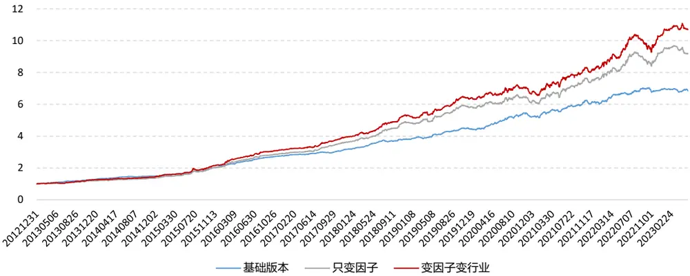
数据来源：wind，东方证券研究所

图 27：指数增强模型在改进前后的换手率对比
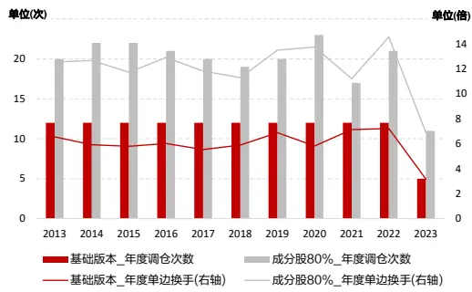
数据来源：wind，东方证券研究所

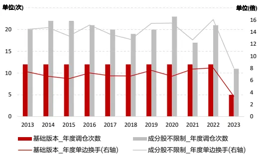

最后，我们对比了变因子变行业的增强模型与基础模型在分年调仓次数与单边换手上的差异。我们发现，无论是否对成分股权重占比进行约束，改进后的指增模型在调仓次数和单边换手率上均为基础模型的两倍。例如当成分股内权重≥80%时，基础模型平均调仓次数和单边换手率分别为 12次和6.4倍，而改进模型的平均调仓次数和单边换手率分别为 21次和12.95倍。

有关分析师的申明，见本报告最后部分。其他重要信息披露见分析师申明之后部分，或请与您的投资代表联系。并请阅读本证券研究报告最后一页的免责申明。

## 五、基于时点动量的风格轮动

在本章我们将探讨时点动量框架在风格轮动中的应用，并从因子分组和指数增强两个角度进行测试。风格因子的时点动量同第四章的定义方式，且风格因子源于《东方 A 股因子风险模型(DFQ-2020)》中的 10 个风险因子。

图 28：风格因子库说明
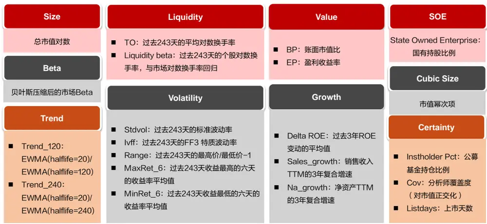
数据来源：东方证券研究所绘制

## 5.1 寻找强势风格

本节对风格因子的测试方法同 4.1 节，即按各信号触发后的多头超额收益把风格因子分组。考虑到因子数量，我们这里暂把风格因子分为强弱不同的三组，并进行不定期调仓测试。

图 29：单信号下的因子分组表现（不定期调仓）

| 不定期 |  | 第1组 |  |  |  |  |  |  |  |  |  |  |
| --- | --- | --- | --- | --- | --- | --- | --- | --- | --- | --- | --- | --- |
| 下跌反弹信号 | Group1 | 1.60% | 第2组 0.97% | 第3组 054% | 第4组 043% | 第5组 0.45% | 第6组 0.22% | 第7组 -0.30% | 第8组 -0.76% | 第9组 -1.17% | 第10组 -2.00% | 多头胜率 22.92% |
|  | Group2 | 0.41% | -0.11% | -0.20% | 0.07% | -0.06% | 0.15% | 0.02% | -0.25% | 0.10% | 0.01% | 45.83% |
| 顶部切换信号 | Group3 | -0.58% | 0.14% | 6.24% | 0.12% | 0.05% | 0.06% | 0.06% | 0.03% | 6.27% | 0.37% | 43.75% |
|  | Group1 | 1.03% | 0.99% | 0.84% | 0.80% | 0.75% | 0.08% | 0.15% | -0.64% | 1.53% | 2.48% | 29.17% |
|  | Group2 | 2.03% | 0.80% | 0.20% | -0.05% | -0.15% | 0.58% | 0.57% | 0.43% | 0.65% | 0.60% | 33.33% |
| 横盘突破信号 | Group3 | 0.29% | 0.17% | .27% | 0.05% | 0.16% | -0.18% | 0.32% | 0.07% | 0.30% | 0.38% | 50.00% |
|  | Group1 | 1.23% | 046% | 0.30% | 0.23% |  | 0.12% | 0.33% | -0.43% | -0.67% |  |  |
|  | Group2 | 0.30% | 0.29% | 0.10% | 0.31% | 0.17% | 0.08% | 0.09% |  |  | -1.08% | 30.00% |
| 北向异常信号 |  | -1.04% | -0.92% |  |  | 0.15% |  |  | 0.09% | 0.39% | -0.28% | 40.00% |
|  | Group3 |  |  | -0.72% | -0.82% | 0.44% | -0.10% | 0.05% | 0.51% | 0.86% | 2.61% | 60.00% |
|  | Group1 Group2 | 0.31% | 0.15% | 0.25% | 0.15% | 0.29% | 0.34% | 0.15% | -0.23% | 0.36% | -1.05% | 33.33% |
|  |  | 0.17% | -0.04% | 0.13% | 0.13% | 0.23% | 0.09% | 0.19% | -0.10% | 0.09% | 0.36% | 43.33% |
|  | Group3 | -0.79% | 0.57% | .26% | 0.46% | 0.19% | 0.29% | 0.06% | 0.17% | 0.77% | 1.55% | 63.33% |
|  | Group1 | 1.55% | 0.88% | 45% | 44% | 0.15% | -0.16% | 0.31% | -0.55% | -1.05% | 1.39% | 33.33% |
| 宏观指标披露 | Group2 | 0.10% | -0.28% | -0.10% | -0.11% | -0.05% | 0.11% | 0.02% | 0.15% | 0.05% | 0.40% | 45.83% |
|  | Group3 | 0.15% | -0.17% | 0.21% | -0.30% | -0.09% | 0.09% | 0.21% | -0.08% | 0.28% | 0.44% | 47.92% |
|  | Group1 | 077% | 047% | 030% | 026% | 022% | 009% | -007% | -029 | -063% | -111% | 28.31% |
| 多信号融合 | Group2 | 029% | 013% | 002% | 005% | -004% | -004% | -006% | -017% | -009% | -009% | 44.58% |
|  | Group3 | -026% | -024% | -022% | -019% | -015% | -006% | 007% | 009% | 031% | 063% | 52.41% |

数据来源：wind，东方证券研究所

我们用 Group1-Group3 表示风格因子多头超额收益由低到高的分组，Group3 代表多头超额收益最强的一组风格因子的等权打分。将截面的风格分组打分用于全市场股票分组，第10组对应股票多头。从单信号与复合信号的表现来看，Group3（强势风格打分）的股票多头收益明显高于股票空头，说明强势风格具有较好的动量效应；而由信号日多头超额收益最低的一组因子构成的Group1，在选股上却呈现完全相反的特性，说明时点动量对于强势风格的筛选较为有效。

此外，我们统计了各类信号触发以后，不同风格因子进入到Group3（强势风格分组）中的次数占比。我们发现，下跌反弹和横盘突破信号均偏好 beta 因子，与这两类信号更偏爱高弹性资产的特点较为吻合。在前文中我们对宏观指标披露信号的定义是 CPI 和 PPI 同时低于预期，而触发这样的事件往往会伴随市场的避险情绪，因而不难理解为何 value 估值因子会成为进入到该信号强势分组次数最多的风格因子。

图 30：各时点信号的风格偏好

| 下跌反弹 |  |  | 顶部切换 |  |  | 横盘突破 |  |  |
| --- | --- | --- | --- | --- | --- | --- | --- | --- |
| 因子类别 | 选入多头次数选入次数占比 |  | 因子类别 | 选入多头次数选入次数占比 |  | 因子类别 | 选入多头次数选入次数占比 |  |
| Beta | 28 | 58.33% | Size | 11 | 45.83% | Beta | 13 | 65.00% |
| Volatility | 23 | 47.92% | Value | 11 | 45.83% | Size | 9 | 45.00% |
| Certainty | 19 | 39.58% | SOE | 10 | 41.67% | Trend | 7 | 35.00% |
| Liquidity | 17 | 35.42% | Growth | 9 | 37.50% | Volatility | 7 | 35.00% |
| Trend | 17 | 35.42% | Certainty | 8 | 33.33% | Certainty | 6 | 30.00% |
| Value | 12 | 25.00% | Volatility | 8 | 33.33% | Liquidity | 6 | 30.00% |
| SOE | 9 | 18.75% | Trend | 6 | 25.00% | Value | 6 | 30.00% |
| Growth | 8 | 16.67% | Cubic size | 5 | 20.83% | Growth | 4 | 20.00% |
| Size | 8 | 16.67% | Beta | 2 | 8.33% | Cubic size | 1 | 5.00% |
| Cubic size | 3 | 6.25% | Liquidity | 2 | 8.33% | SOE | 1 | 5.00% |
| 因子类别 | 北向异常 |  |  | 宏观指标披露 |  |  | 多信号融合（复合信号) |  |
| 选入多头次数选入次数占比 |  |  | 因子类别 选入多头次数选入次数占比 |  |  | 因子类别 选入多头次数选入次数占比 |  |  |
| Beta | 23 | 76.67% | Value | 21 | 43.75% | Beta | 84 | 50.60% |
| Certainty | 12 | 40.00% | Volatility | 17 | 35.42% | Volatility | 71 | 42.77% |
| Liquidity | 12 | 40.00% | Liquidity | 16 | 33.33% | Certainty | 57 | 34.34% |
| Volatility | 12 | 40.00% | SOE | 16 | 33.33% | Trend | 53 | 31.93% |
| Size | 9 | 30.00% | Size | 16 | 33.33% | Value | 53 | 31.93% |
| Trend | 9 | 30.00% | Beta | 15 | 31.25% | Liquidity | 52 | 31.33% |
| Value | 6 | 20.00% | Growth | 15 | 31.25% | Size | 47 | 28.31% |
| Growth | 3 | 10.00% | Certainty | 12 | 25.00% | SOE | 38 | 22.89% |
| SOE | 3 | 10.00% | Trend | 12 | 25.00% | Growth | 31 | 18.67% |
| Cubic size | 1 | 3.33% | Cubic size | 4 | 8.33% | Cubic size | 12 | 7.23% |

数据来源：wind，东方证券研究所

## 5.2提升指数增强

本节在 4.4 节“变因子变行业”指数增强模型的基础上，加入风格轮动，即令多头风格正向暴露、空头风格负向暴露，其余风格的主动暴露为±0.5。指数增强模型的其他参数设定同 4.4 节。

图 31：中证 500成分股≥80%下的四个版本超额收益对比

| 基础版本 |  | 全样本期 | 2013 | 2014 | 2015 | 2016 | 2017 | 2018 | 2019 | 2020 | 2021 | 2022 | 20230531 |
| --- | --- | --- | --- | --- | --- | --- | --- | --- | --- | --- | --- | --- | --- |
|  | 超额收益 | 16.58% | 23.73% | 9.77% | 36.82% | 26.48% | 15.00% | 15.27% | 13.52% | 10.31% | 14.35% | 12.58% | -1.79% |
|  | 跟踪误差 最大回撤 | 4.63% -6.16% | 4.12% -1.57% | 3.73% -2.59% | 7.81% -3.31% | 3.34% -0.78% | 3.11% | 3.70% -1.91% | 4.16% | 4.95% | 5.29% | 3.99% | 4.40% |
| 只变因子 |  | 全样本期 | 2013 | 2014 | 2015 | 2016 | 2017 | 2018 | 2019 | -3.54% 2020 | -6.16% 2021 | -3.04% 2022 | -3.13% 20230531 |
|  | 超额收益 | 19.33% | 8.70% | 14.16% | 36.60% | 35.06% | 21.43% | 24.48% | 16.46% | 2.69% | 25.26% | 17.57% | 3.17% |
|  | 跟踪误差 | 6.46% | 4.97% | 4.45% | 10.44% | 6.91% | 4.30% | 5.18% | 6.15% | 6.79% | 7.14% | 6.39% | 5.13% |
|  | 最大回撤 | -7.85% | -2.87% | -2.06% | -6.05% | -1.76% | -1.42% | -1.93% | -4.45% | -7.85% | -5.68% | -6.01% | -2.57% |
|  |  | 全样本期 | 2013 | 2014 | 2015 | 2016 | 2017 | 2018 | 2019 | 2020 | 2021 | 2022 | 20230531 |
|  | 超额收益 | 20.94% | 10.64% | 16.93% | 38.67% | 36.17% | 23.23% | 24.92% | 18.29% | 1.15% | 28.13% | 19.84% | 4.63% |
| 变因子 变行业 | 跟踪误差 | 6.76% | 5.14% | 4.75% | 10.36% | 7.05% | 4.60% | 5.52% | 6.29% | 7.03% | 8.17% | 7.10% | 5.13% |
|  | 最大回撤 | -8.09% | -2.74% | -2.28% | -5.60% | -1.26% | -1.79% |  |  |  |  |  |  |
|  |  | 全样本期 | 2013 |  |  |  |  | -2.06% | -4.55% | -8.09% | -5.68% | -5.46% | -2.59% |
|  |  |  |  | 2014 | 2015 | 2016 | 2017 | 2018 | 2019 | 2020 | 2021 | 2022 | 20230531 |
|  | 超额收益 跟踪误差 | 21.33% 6.77% | 12.71% 5.16% | 18.78% 4.62% | 41.42% 10.67% | 34.88% 7.15% | 19.62% 4.43% | 25.70% 5.58% | 12.40% 6.52% | 8.17% 6.85% | 27.23% 7.89% | 22.36% 6.99% | 2.82% 5.17% |

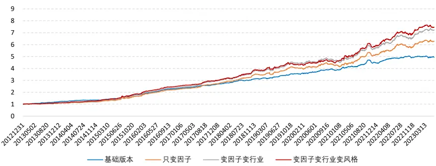
数据来源：wind，东方证券研究所
有关分析师的申明，见本报告最后部分。其他重要信息披露见分析师申明之后部分，或请与您的投资代表联系。并请阅读本证券研究报告最后一页的免责申明。

通过对比，我们发现加入风格轮动会使指数增强模型的稳定性明显提高。例如，当约束中证500成分股权重≥80%时，只变因子和行业的模型年化超额收益为20.94%、信息比3.10、最大回撤-8.09%，加入风格轮动后模型的年化超额收益为 21.33%、信息比 3.15、最大回撤-6.06%。当不限制中证 500成分股权重占比时，信息比可以由 3.36提升至 3.61，最大回撤由-10.82%改善至-7.97%。

图 32：中证 500成分股不限制的四个版本超额收益对比

| 基础版本 | 全样本期 2013 |  |  | 2014 2015 |  | 2016 |  | 2017 2018 | 2019 | 2020 | 2021 | 2022 20230531 |  |
| --- | --- | --- | --- | --- | --- | --- | --- | --- | --- | --- | --- | --- | --- |
|  | 超额收益 | 20.32% | 30.79% | 15.77% | 43.18% | 29.16% | 13.61% | 21.24% | 14.69% | 19.03% | 15.36% | 14.64% | -1.61% |
|  | 跟踪误差 | 5.29% | 5.48% | 4.75% | 7.17% | 3.94% | 3.34% | 4.30% | 4.90% | 6.17% | 6.35% | 5.52% | 4.07% |
|  | 最大回撤 | -5.75% | -2.39% | -2.30% | -2.87% | -1.54% | -2.12% | -2.84% | -3.03% | -4.98% | -4.05% | -4.24% | -3.23% |
|  |  | 全样本期 | 2013 | 2014 | 2015 | 2016 | 2017 | 2018 | 2019 | 2020 | 2021 | 2022 | 20230531 |
|  | 超额收益 | 23.76% | 20.17% | 18.44% | 48.32% | 39.39% | 23.88% | 32.54% | 19.52% | 4.52% | 26.27% | 22.16% | -1.29% |
| 只变因子 变因子 | 跟踪误差 | 7.26% | 5.92% | 5.35% | 9.65% | 7.88% | 4.67% | 6.19% | 7.01% | 7.62% | 8.50% | 8.77% | 5.10% |
|  | 最大回撤 | -9.72% | -3.34% | -2.89% | -5.34% | -2.21% | -1.96% | -1.89% | -3.92% | -8.56% | -5.18% | -9.72% | -5.37% |
|  |  | 全样本期 | 2013 | 2014 | 2015 | 2016 | 2017 | 2018 | 2019 | 2020 | 2021 | 2022 | 20230531 |
|  | 超额收益 | 25.59% | 26.14% | 19.86% | 48.60% | 41.62% | 24.71% | 31.58% | 21.02% | 3.67% | 27.00% | 25.00% | 2.92% |
|  | 跟踪误差 | 7.61% | 6.32% | 5.62% | 9.65% | 8.05% | 4.95% | 6.27% | 7.06% | 8.07% | 9.12% | 9.82% | 5.68% |
| 变行业 变因子 | 最大回撤 | -10.82% | -3.06% | -2.80% | -5.74% | -1.97% | -2.02% | -2.58% | -3.78% | -9.31% | -4.44% | -10.82% | -3.48% |
|  |  | 全样本期 | 2013 | 2014 | 2015 | 2016 | 2017 | 2018 | 2019 | 2020 | 2021 | 2022 | 20230531 |
|  | 超额收益 | 27.63% | 28.43% | 20.72% | 59.92% | 46.51% | 18.10% | 36.02% | 17.31% | 9.71% | 24.69% | 30.57% | 3.48% |
| 变行业 变风格 | 跟踪误差 最大回撤 | 7.65% | 6.06% | 5.22% | 10.29% | 8.51% | 5.56% | 6.41% | 7.11% | 7.57% | 8.40% | 10.00% | 5.81% |

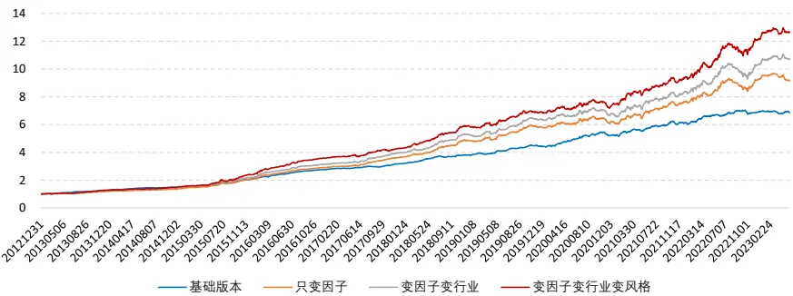
数据来源：wind，东方证券研究所

## 六、总结

市场在一些特殊时点存在“引爆点”式的动量效应。我们基于市场自身状态与外部事件催化，梳理了五类会形成这种动量效应的特殊时点，即下跌反弹、顶部切换、横盘突破、北向异常流入和宏观指标披露。在这些特殊时点领涨的行业/ETF在未来一个月能够持续跑赢其他行业/ETF，即具有非常显著的行业轮动或 ETF轮动能力。

在这些特殊时点上行业和 ETF 上都存在动量效应，这引发我们思考 alpha 或风格因子在这些时点上是否也存在动量效应？我们以这些时点信号触发时因子的多头超额收益作为衡量因子时点动量的代理指标，并分别在 alpha因子和风格因子中检验其是否具有因子/风格轮动能力。

在 alpha因子的时点动量检验中我们发现时点动量确实具有显著的因子轮动能力：

（1）将时点动量用于因子分组，多头组的因子未来一个月的分组多、空收益明显强于空头组的因子，即时点信号触发时多头超额高的因子未来的多头超额持续保持较高水平；

（2）以时点动量加权的复合因子，股票多、空收益均显著强于传统等权或 ICIR加权法；

（3）基于时点动量加权因子构建的全市场 TOP50 组合，自 20130101 至 20230531 相对中证 500的年化超额收益为 26.17%， 今年以来超额收益为 10.64%；

（4）在中证 500 指数增强模型中，使用时点动量加权打分替换传统 ICIR 加权打分，可将基础版本的年化超额收益由 16.58%提升至 19.33%；放宽行业轮动中看多、看空行业的主动暴露可进一步提升至 20.94%。

我们进一步将时点动量应用于风格因子，发现时点动量在风格因子中也具有非常显著的风格轮动能力：

（1）用时点动量对风格因子分组，强势风格打分下的股票多头收益明显高于股票空头；

（2）时点信号偏好 Beta、Size、Value、Volatility 等风格；

（3）加入风格轮动后的中证500指数增强模型在稳定性方面得到进一步提升，年化超额收益由 20.94%提升至 21.33%，信息比由 3.10 变为 3.15，最大回撤由-8.09%改善为-6.06%。

## 风险提示

1、量化模型基于历史数据分析得到，未来存在失效的风险，建议投资者紧密跟踪模型表现。

2、极端市场环境可能对模型效果造成剧烈冲击，导致收益亏损。

## Tabl e_Disclai mer 分析师申明

每位负责撰写本研究报告全部或部分内容的研究分析师在此作以下声明：

分析师在本报告中对所提及的证券或发行人发表的任何建议和观点均准确地反映了其个人对该证券或发行人的看法和判断；分析师薪酬的任何组成部分无论是在过去、现在及将来，均与其在本研究报告中所表述的具体建议或观点无任何直接或间接的关系。

## 投资评级和相关定义

报告发布日后的12个月内行业或公司的涨跌幅相对同期相关证券市场代表性指数的涨跌幅为基准（A 股市场基准为沪深 300 指数，香港市场基准为恒生指数，美国市场基准为标普 500 指数）；

## 公司投资评级的量化标准

买入：相对强于市场基准指数收益率 15%以上；

增持：相对强于市场基准指数收益率 5%～15%；

中性：相对于市场基准指数收益率在-5%～+5%之间波动；

减持：相对弱于市场基准指数收益率在-5%以下。

未评级 —— 由于在报告发出之时该股票不在本公司研究覆盖范围内，分析师基于当时对该股票的研究状况，未给予投资评级相关信息。

暂停评级 —— 根据监管制度及本公司相关规定，研究报告发布之时该投资对象可能与本公司存在潜在的利益冲突情形；亦或是研究报告发布当时该股票的价值和价格分析存在重大不确定性，缺乏足够的研究依据支持分析师给出明确投资评级；分析师在上述情况下暂停对该股票给予投资评级等信息，投资者需要注意在此报告发布之前曾给予该股票的投资评级、盈利预测及目标价格等信息不再有效。

## 行业投资评级的量化标准：

看好：相对强于市场基准指数收益率 5%以上；

中性：相对于市场基准指数收益率在-5%～+5%之间波动；

看淡：相对于市场基准指数收益率在-5%以下。

未评级：由于在报告发出之时该行业不在本公司研究覆盖范围内，分析师基于当时对该行业的研究状况，未给予投资评级等相关信息。

暂停评级：由于研究报告发布当时该行业的投资价值分析存在重大不确定性，缺乏足够的研究依据支持分析师给出明确行业投资评级；分析师在上述情况下暂停对该行业给予投资评级信息，投资者需要注意在此报告发布之前曾给予该行业的投资评级信息不再有效。

## HeadertTabl e_Discl ai mer 免责声明

本证券研究报告（以下简称“本报告”）由东方证券股份有限公司（以下简称“本公司”）制作及发布。

。本公司不会因接收人收到本报告而视其为本公司的当然客户。本报告的全体接收人应当采取必要措施防止本报告被转发给他人。

本报告是基于本公司认为可靠的且目前已公开的信息撰写，本公司力求但不保证该信息的准确性和完整性，客户也不应该认为该信息是准确和完整的。同时，本公司不保证文中观点或陈述不会发生任何变更，在不同时期，本公司可发出与本报告所载资料、意见及推测不一致的证券研究报告。本公司会适时更新我们的研究，但可能会因某些规定而无法做到。除了一些定期出版的证券研究报告之外，绝大多数证券研究报告是在分析师认为适当的时候不定期地发布。

在任何情况下，本报告中的信息或所表述的意见并不构成对任何人的投资建议，也没有考虑到个别客户特殊的投资目标、财务状况或需求。客户应考虑本报告中的任何意见或建议是否符合其特定状况，若有必要应寻求专家意见。本报告所载的资料、工具、意见及推测只提供给客户作参考之用，并非作为或被视为出售或购买证券或其他投资标的的邀请或向人作出邀请。

本报告中提及的投资价格和价值以及这些投资带来的收入可能会波动。过去的表现并不代表未来的表现，未来的回报也无法保证，投资者可能会损失本金。外汇汇率波动有可能对某些投资的价值或价格或来自这一投资的收入产生不良影响。那些涉及期货、期权及其它衍生工具的交易，因其包括重大的市场风险，因此并不适合所有投资者。

在任何情况下，本公司不对任何人因使用本报告中的任何内容所引致的任何损失负任何责任，投资者自主作出投资决策并自行承担投资风险，任何形式的分享证券投资收益或者分担证券投资损失的书面或口头承诺均为无效。

本报告主要以电子版形式分发，间或也会辅以印刷品形式分发，所有报告版权均归本公司所有。未经本公司事先书面协议授权，任何机构或个人不得以任何形式复制、转发或公开传播本报告的全部或部分内容。不得将报告内容作为诉讼、仲裁、传媒所引用之证明或依据，不得用于营利或用于未经允许的其它用途。

经本公司事先书面协议授权刊载或转发的，被授权机构承担相关刊载或者转发责任。不得对本报告进行任何有悖原意的引用、删节和修改。

提示客户及公众投资者慎重使用未经授权刊载或者转发的本公司证券研究报告，慎重使用公众媒体刊载的证券研究报告。

## 东方证券研究所

地址： 上海市中山南路 318 号东方国际金融广场 26 楼

电话：021-63325888

传真：021-63326786

网址： www.dfzq.com.cn