# 集成模型在量价特征中的应用

# 因子选股系列之九十三

## 研究结论

本研究旨在揭示量价特征与未来收益率之间的内在联系。我们运用了三个量价数据集，借助三种不同逻辑的模型进行训练，预测标签为未来收益率的五分类。为了处理标签噪音并寻找普适性的逻辑，我们采用了五分类作为标签，借助各类预测概率加权得到最终的量价合成因子。此研究尝试寻找更精细、全面的量价特征以预测未来收益，强调了使用多种时间维度数据和模型预测逻辑的重要性。

在本研究中，我们对日频、日内和 Level-2 三个特征集以及 SVM、XGBoost 和Transformer 三个模型进行了两两组合。对于每种特征，我们将三个模型的预测得分取平均以得到集成得分，最后我们将这三种特征的集成得分再次取平均，形成了所有量价特征的最终集成得分。这种集成方法深度挖掘了不同特征和模型的独特信息，提升了预测的准确性和稳健性。

测试采用滚动训练法，选用中证 800 为样本空间，以过去三年的数据作训练集，接下来一年的数据作测试集，预测目标是未来一周收益率的五分类标签，每类对应的权重分别是-2,-1,0,1,2。模型训练后，对每个测试样本的五类可能性进行加权求和，得出因子值。如某类可能性大，则加权结果将偏向该类对应的值。若五类可能性相似，则结果将接近 0。

所用到的三个数据集：日频特征集合了包括收益率、动量、波动率、换手率、特异度，涨跌幅榜单因子和买卖压力指标等 61 个多维度市场行为指标。日内特征融合了常见的日内特征及基于基于前期报告的日内特征，共 81 个，覆盖广泛的市场行为。Level-2 特征集基于委托订单数据和大单数据，包含 15 个日度特征，部分早期数据存在缺失，进行了零填充处理。

日频特征集，三者的信息系数相差不大，XGBoost 稍优于其他两个模型，XGBoost的 RankIC高达 8.7%，ICIR为 5.5，其在 15年牛市结束后的调整阶段仍保持稳定且较高的超额收益。因子均值合并后，IC均值提升至9.7%，年化超额收益为24%。相关性分析中，三种模型的因子值相关性在 53%-65%，IC相关性在 65%-80%。

日内特征集中， XGBoost 显示出最佳的预测能力和风险调整收益率，具有最高的ICIR5.5 和夏普比率 2.4。SVM 有最高的 IC 达到 8.9%，其在 2015 年超额收益表现突出，可能是因为牛市数据存在明显线性边界。使用集成模型，即各模型输出平均后，RankIC、ICIR 最高，达到 9.3%和 5.6，夏普比率 2.3 和年化超额收益 18.6%也表现良好。三种模型的因子值相关性在 58%-65%，IC相关性在 77%-82%。

Level-2特征集中，同样也是 XGBoost 表现出色，RankIC6.2%、ICIR5.1、年化超额收益17%、夏普比率2.5，均超过其他两个模型，预测稳定性较高。整合各模型预测结果的集成模型表现稳健，RankIC7.2%，再次说明多模型整合的重要性。三种模型的因子值相关性在 31%-63%，IC 相关性在 51%-78%。

总体集成模型的RankIC 10.8%，ICIR 6.0，夏普比率2.8，年化超额收益 24.3%，超过三个成分模型，揭示了利用多源数据预测结果集成可以增强预测的全面性，稳定性和准确性，印证了我们的想法。日频数据有最高的 RankIC 9.7%，日内数据表现和日频类似，Level-2 数据的集成模型虽在部分指标上略逊，但与其他两个模型的相关性较低，且在某些年份取得不错超额收益，对其他两个模型形成强有力的互补。

## 风险提示

量化模型失效风险、 市场极端环境冲击

## 报告发布日期

2023 年 06 月 30 日

证券分析师 杨怡玲

yangyiling@orientsec.com.cn

执业证书编号：S0860523040002

联系人薛耕

xuegeng@orientsec.com.cn

基于时点动量的因子轮动：——因子选股 2023-06-28系列之九十二

基于循环神经网络的多频率因子挖掘：— 2023-06-06—因子选股系列之九十一

DFQ 遗传规划价量因子挖掘系统：——因 2023-05-28子选股系列之九十

分析师情感调整分数 ASAS：——因子选 2023-03-28股系列之八十九

## 一、理论与假设

本文的主要目的是探寻量价特征和未来收益率所蕴含的底层联系，所用的三个数据集为日频特征、日内特征、Level-2 特征，进行训练的三个模型为 SVM、XGBoost、Transformer，预测标签为未来收益率的五分类标签，使用各类预测概率加权为最终的量价合成因子。

股票价格的形成是多方力量的共同合力，从价值投资到日内交易，再到毫秒级的算法交易，都从各种维度上推动了新价格的产生，交易者从不同逻辑上产生交易决定，在数据上留下了多种量价特征，从低频的动量，到日内波动，到高频的委托订单，特征所反映的细节在逐步深化，而本文希望能尽量全面地使用量价特征来预测未来收益，就需要考虑数据的多种时间维度和模型的多种预测逻辑。

从特征到标签的过程中，不存在某种模型能够涵盖所有的逻辑，就像物理学中至今仍未存在“大一统”模型来概括所有的物理现象，所以涵盖尽量多、尽量无关的模型，即使在同一个数据集中，也能够大幅提高预测的准确度。预测模型多种多样，文本选取了最有代表性的三种：线性模型、树模型、神经网络，而本文挑选了其中最有代表性的实现：LinearSVC、XGBoost、Transformer，这些模型会挖掘出不同的预测逻辑，合并之后的预测结果有更高的准确度和鲁棒性。

Huang (2005) 使用支持向量机（SVM）对股票市场的运动方向进行预测，利用了包括开盘价、最高价、最低价和收盘价等在内的日 K 特征，Patel (2015) 使用了机器学习技术对股票和股票价格指数的变动进行预测，涵盖了日 K 特征和分钟 K 特征。Kercheval (2015)使用支持向量机模型对高频限价订单（即 Level-2特征）的动态进行建模，以预测股票价格的变动。

处理噪音标签一直是业界研究的热点和难题。收益率作为标签含有大量噪声，通常我们会采用对数变换使其更接近正态分布，并通过模型进行回归预测。然而，实际观察中，我们发现具有大量参数的模型，例如 RNN 和 Transformer，当对噪声标签进行回归预测时，可能容易出现过度拟合的现象。这是因为这些模型在处理长期依赖关系或过度集中注意力时，可能会提取出仅存在于样本内部的规律。因此，在本研究中，我们采取了一个不同的策略：将未来收益率的五分类作为分类标签。这种方法从数据角度对模型进行了正则化约束，降低了对噪声样本的拟合程度，有助于我们寻找到更具普适性的逻辑和规律。

## 二、合成框架

在我们的研究中，我们对三个特征集和三个模型进行了全面的组合。例如，将日频特征输入SVM 模型后得到的测试集结果，我们将其称为"svm_daily"因子，即 SVM 模型针对日频特征的得分。我们将三个模型（SVM、XGBoost 和 Transformer）针对日频特征的得分取平均，得到日频特征的集成得分。同样，我们对日内率特征和 Level-2 特征进行相同的处理，得到对应的集成得分。最后，我们将这三个特征（日频、日内和 Level-2）的集成得分取平均，得到所有量价特征的最终集成得分。这种集成方法充分利用了不同特征和模型的独特信息，有助于提升预测的准确性和稳健性。

图 1：模型集成框架（L2指 Level-2，下同）
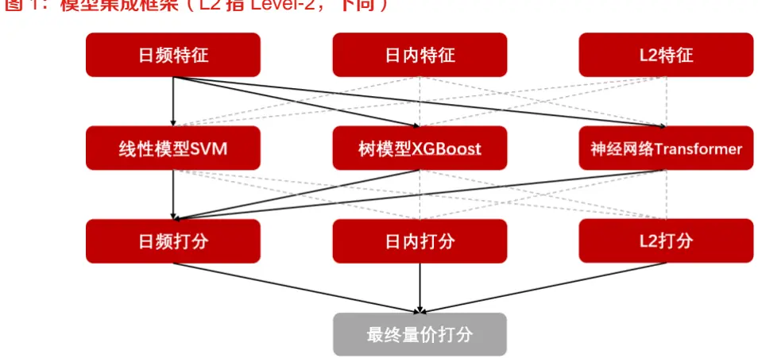
数据来源：东方证券研究所

在我们的研究中，我们使用了滚动训练的方法进行模型训练和测试。我们选择中证 800作为样本空间，并将时间段 t-3 到 t 设定为训练集，时间段 t 到 t+1 设定为测试集。这个测试集的时间区间从2013年1月4日延续至2023年6月1日，L2的开始日期是2016年1月4日。针对特定的数据集，我们选择过去三年的样本进行训练，并使用接下来一年的数据作为测试集，在这个过程中，我们采用了三种不同的模型进行训练和测试。

我们的预测目标是股票未来一周收益率的五分类标签，其中，第一类代表空头，第五类代表多头。训练完成的模型将为测试样本的每一类分别提供一种可能性，我们将这五类的权重分别设置为-2,-1,0,1,2，然后计算这五个可能性的总和，得出因子值。比如，如果测试样本属于第一类（空头）的可能性较大，那么加权结果将会是一个相对较小的值。若五类的可能性相差不大，那么最终值将会接近 0。

图 2：滚动训练示例
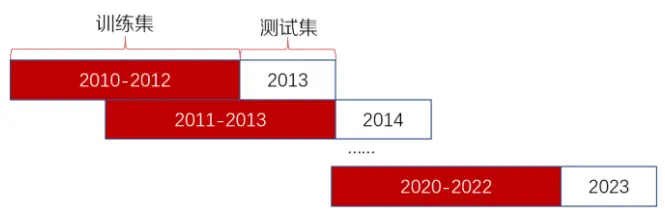
数据来源：东方证券研究所

图 3：分类预测概率加权示例
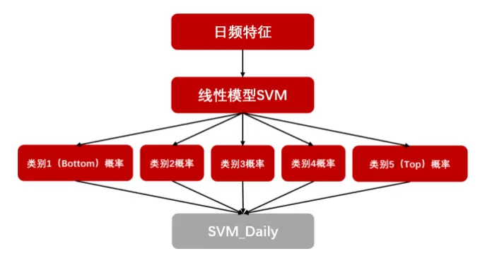
数据来源：东方证券研究所

## 三、不同细粒度的量价特征

## 日频特征集

日频特征集综合了常见的市场行为指标和先前报告中引用的特殊指标。这些特征反映了市场的各种维度，包括收益率、动量、波动率、换手率、特异度，以及涨跌幅榜单因子和买卖压力指标。

动量特征通过交易日的收益率ret_N以及剔除近日的收益率mom_M_N两种方式来衡量；波动性指标包括收益率的标准差 vol_N 以及特质波动率 ivol_N 和特异度 ivr_N；换手率则通过过去N 个交易日换手率的标准差除以均值（tovol_N）和过去 N 个交易日日均换手率的对数（lnto_N）两种方式进行衡量；市场的流动性指标 lnamihud、涨跌幅榜单因子包括涨幅榜单因子（dwf_N）和跌幅榜单因子（dlf_N），这两种因子是基于我们之前的研究《A 股涨跌幅排行榜效应》；买卖压力的代表指标为 APB 。

图 4：日频特征

| 特征ID | 特征名 | 解释 | 个数 |
| --- | --- | --- | --- |
| 1001-1004 ret_N |  | 过去N个交易日的收益率 | 4 |
| 1005-1010 mom_M_N |  | 过去N个交易日的收益率，剔除最近M日收益 | 6 |
| 1011_1015 vol N |  | 过去N个交易日收益率的标准差 | 5 |
| 1016-1020 tovol_N |  | 过去N个交易日换手率的标准差除以均值 | 5 |
| 1021-1026 Into_N |  | 过去N个交易日日均换手率的对数 | 6 |
| 1027-1033 ivol N |  | 基于过去N个交易日日行情计算的特质波动率 | 7 |
| 1034-1040 ivr_N |  | 基于过去N个交易日日行情计算的特异度 | 7 |
| 1041-1046 Inamihud_N |  | 基于过去N个交易日计算的Amihud非流动性的对数 | 6 |
| 1047-1050 dwf_N |  | 涨幅榜单因子，半衰期N个交易日，详见《A股涨跌幅排行榜效应》 | 4 |
| 1051-1054 dlf_N |  | 跌幅榜单因子，半衰期N个交易日，详见《A股涨跌幅排行榜效应》 | 4 |
| 1055-1061 apb_M_N |  | 基于M日日行情计算的APB指标，N个交易日平滑，详见《基于量价关系度量股票的买卖压力》 | 7 |

数据来源：Wind 资讯 & 东方证券研究所

## 日内特征集

我们的日内特征集合融合了常见日内特征和我们先前报告中提出的，基于分钟线构造的特征。这些特征总计达到 81个，涵盖了广泛的市场行为。

特征集合中包含了日内极端收益、日内温和收益、隔夜收益等日内动量特征，此外还包括了基于日内行情计算的 APB 指标（apb_1d_N），这是我们对过去 N 个交易日进行平滑计算的结果，另外还有日内波动率、收益率偏度、收益率峰度的标准差、日内成交量二阶矩的标准差与均值之比、成交量HHI的标准差，最后还有反映了市场在不同时间尺度下的买卖压力指标APB和ARPP。

图 5：日内特征

| 特征ID 特征名 | 解释 |  | 个数 |
| --- | --- | --- | --- |
| 1062-1068 idvol N |  | 过去N个交易日的日内波动率均值 | 7 |
| 1069-1075 | idskew N | 过去N个交易日的日内收益率偏度均值 | 7 |
| 1076-1082 | idkurt N | 过去N个交易日的日内收益率峰度均值 | 7 |
| 1083-1089 | idjump_N | 过去N个交易日日内极端收益之和，详见《温和收益的动量与极端收益的反转》 | 7 |
| 1090-1096 | idmom_N | 过去N个交易日日内温和收益、隔夜收益之和，详见《温和收益的动量与极端收益的反转》 | 7 |
| 1097-1103 | apb 1d N | 基于日内行情计算的APB指标，N个交易日平滑，详见《基于量价关系度量股票的买卖压力》 | 7 |
| 1104-1108 sdrvol N |  | 过去N个交易日日内波动率的标准差除以均值，详见《日内交易特征稳定性与股票收益》 | 5 |
| 1109-1113 | sdrskew_N | 过去N个交易日日内收益率偏度的标准差，详见《日内交易特征稳定性与股票收益》 | 5 |
|  | 1114-1118 sdrkurt N | 过去N个交易日日内收益率峰度的标准差，详见《日内交易特征稳定性与股票收益》 | 5 |
| 1119-1123 sdvvol N |  | 过去N个交易日日内成交量二阶矩的标准差除以均值，详见《日内交易特征稳定性与股票收益》 | 5 |
| 1124-1128 sdvhhi_N |  | 过去N个交易日日内成交量HHI指标的标准差，详见《日内交易特征稳定性与股票收益》 | 5 |
|  | 1129-1142 arpp 1d N | 基于1天周期计算的ARPP指标，N个交易日平滑，详见《基于时间尺度度量的日内买卖压力》 | 14 |
| 数据来源：Wind资讯 &东方证券研究所 |  |  |  |

有关分析师的申明，见本报告最后部分。其他重要信息披露见分析师申明之后部分，或请与您的投资代表联系。并请阅读本证券研究报告最后一页的免责申明。

## Level-2 特征集

Level-2 特征集主要基于两篇研究报告——《基于委托订单数据的 alpha 因子》和《基于大单的 alpha 因子构建》，其中包含了 15 个由 Level-2 数据生成的日度特征序列。然而，需要强调的是，高质量的 Level-2数据从 2013年下半年开始才有记录，这与分钟数据的可获取时间段存在差异。此外，部分 Level-2 特征的计算涉及逐笔委托数据，而这部分数据在上海证券交易所上自2021 年 5 月开始对外商业提供。因此，部分 Level-2 特征的早期数据在上海证券交易所的部分可能存在缺失，为了解决这个问题，我们在标准化处理后对缺失值进行了零填充操作。

## 四、不同底层逻辑的机器学习模型

## 线性模型：Linear SVC

线性 SVM 试图找到一个超平面，可以在尽可能大的间隔内正确分类数据。这个超平面被定义为决策边界，位于这个超平面一侧的数据点被分类为一类，位于另一侧的数据点被分类为另一类。对于超过两类的情况，会采用"one-vs-rest"或"one-vs-one"的方式来进行分类。

LinearSVC 是一种基于线性核的支持向量机分类器，但是 SVC 是一种硬分类，自身并不提供概率预测，需要通过CalibratedClassifierCV进行校准，校准分类器可以为每个类别提供一个概率预测，而不仅仅是硬分类，其中一种方法就是再训练一个逻辑回归模型。Scikit-learn 中默认使用"one-vs-rest"策略为每种类别都训练一个分类器，将这个类别的样本作为正类，其它所有样本作为负类，五分类问题则训练出 5个二分类器。

支持向量机 (SVM)优点是对于高维数据表现良好，使用支持向量进行边界切割，对异常值不敏感，鲁棒性较好。缺点则是对于大规模的数据集，训练时间可能会很长，而且模型本身不直接提供概率预测，需要通过校准器来映射为概率。

图 6：SVM原理示例
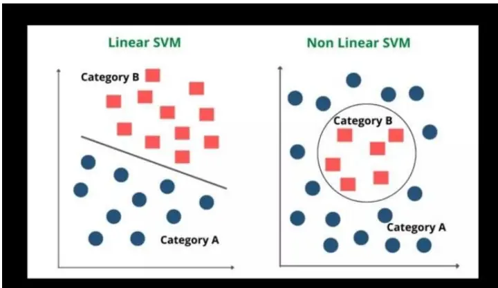
数据来源：copyassignment.com，东方证券研究所

## 树模型：XGBoost

XGBoost 的优点是基于树模型，可以处理非线性的关系；实践中弥久历新，尤其是在Kaggle 等竞赛中表现卓越；XGBoost内置了对过拟合的控制，如剪枝、正则化，以及各种对样本和特征的随机抽样等防止过拟合的策略。XGBoost 可以看作是一种投票制度。每棵树都在尝试修正前一棵树的错误，每棵树的预测结果都会被考虑进最终的预测。然而，与一般的投票制度不同

有关分析师的申明，见本报告最后部分。其他重要信息披露见分析师申明之后部分，或请与您的投资代表联系。并请阅读本证券研究报告最后一页的免责申明。

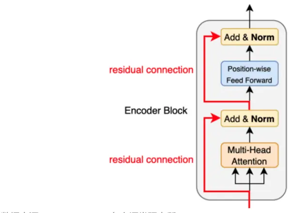
图 8：Transformer Encoder 原理示例
有关分析师的申明，见本报告最后部分。其他重要信息披露见分析师申明之后部分，或请与您的投资代表联系。并请阅读本证券研究报告最后一页的免责申明。

的是，每棵树的权重并不相同，而是根据其预测效果来决定的。这使得 XGBoost能有效地集成多个模型的预测结果，以提高整体模型的预测效果。

使用 XGBoost时，本文同样使用了"one-vs-rest”策略，相当于针对本文的五分类问题，训练了 5 个二分类器，采取这样的策略是因为某些特征对多头影响较大，而另一些特征对于空头影响较大，这种影响通常不是对称的，每个分类器只针对某一类进行针对训练，最后再综合结果。

图 7：XGBoost 原理示例
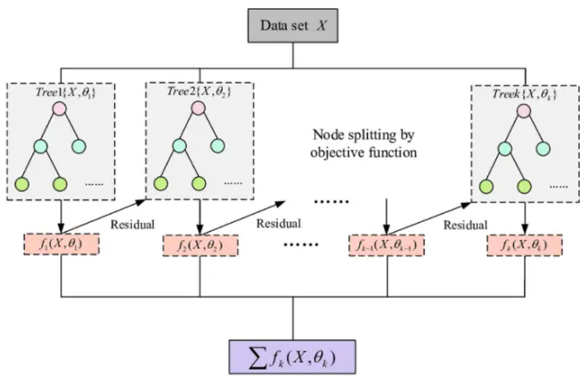
数据来源：researchgate.net，东方证券研究所

## 神经网络：Transformer Encoder

Transformer Encoder 的优点是通过自注意力机制可以捕获序列内各个元素之间的关系，且无论元素间的距离如何，模型都可以直接计算它们的交互，避免了传统 RNN 的长程依赖问题；而且可以进行并行计算，相比RNN 和LSTM，训练速度更快。缺点是需要大量的训练数据才能表现出其优势；而且模型参数众多，需要较大的计算资源和存储空间；而且自注意力机制可能会对一些不重要的信息过分敏感，即注意力会被分散。

其中值得注意的是，Transformer 的输入并不是截面数据，而是一个 multi-variate time series，这里我们采用时间窗口为 40 日，日频特征集中有 61 特征，所以训练中每一个 sample 的 X 的形状为(40,61)，Multi-Head Attention 会在 40 个时间点之间形成自注意力矩阵，后接的前馈网络会遴选 61 个隐变量形成时序特征。Transformer 在时间序列预测中近年表现突出，其提取的时序特征是前两个模型所提取的截面特征的有利补充。

数据来源：kikaben.com，东方证券研究所

## 五、因子表现

至此，我们已经完成了量价最终集成模型的打分。结合个股的样本外得分，我们在中证 800成分股内对因子打分进行回测。

回测框架的相关设定如下：

1. 回测时间区间为 2013 年 1 月 4 日到 2023 年 5 月 31 日

2. 样本空间分别每个月末的中证 800成分股

3. 构建组合时，选取中证 800内的成分股，然后按照集成模型打分分为 10组，构建10个等权组合，多空组合为做多第 10组，做空第 1组，基准为相应样本空间的等权组合。

4. 回测中的调仓频率为周频，以调整收盘价作为成交价格，不考虑费率

## 日频数据集表现

在对 SVM、XGBoost 和 Transformer 所产生的日频因子进行全历史选股能力分析后，我们发现各模型的表现具有一定的差异性。尽管这三者的表现在大致上接近，但 XGBoost 和Transformer总体上表现优于SVM。这主要表现在SVM在最大回撤-20.7%较大，而且在2017年和 2021 年的年度超额收益中，SVM 呈现出了负值，相比之下，其余两个模型在历史上的年度收益并未出现负值。

值得我们注意的是，在牛市结束后的调整阶段，如 2016 年、2017 年和 2018 年，尽管这些测试样本的训练样本包含了 2015 年的牛市数据，但 XGBoost 依然能够保持稳定且较高的超额收益。这可能说明 XGBoost学习到的逻辑是持续有效的，而非只适用于某种风格。这种稳健的性能可能归功于其内部的正则约束和投票机制，这也可能是 XGBoost 在 Kaggle 竞赛中能够持续领先的原因。

进一步地，当我们对这三个模型的因子进行均值合并后，IC 均值提高到了 9.7%，然而，年化超额收益 24.1%并未在 XGBoost 的基础上得到大幅度的提升。这可能是因为 SVM的表现在一定程度上拖累了整体的表现，特别是在最大回撤上已经被拉到了-14.6%。因此，我们在实际操作中，需要对多模型的集成方法进行精细化的权衡和考虑。

图 9：日频数据集各模型表现（中证 800，百分号为超额）

|  | RankIC | ICIR | Sharpe | AnnRet | Vol | MaxDD | 2013 | 2014 | 2015 |
| --- | --- | --- | --- | --- | --- | --- | --- | --- | --- |
| svm_daily | 0.082 | 4.541 | 1.95 | 18.6% | 8.9% | -20.7% | 41.1% | 2.7% | 73.6% |
| xgb_daily | 0.087 | 5.543 | 2.78 | 23.0% | 7.6% | -8.7% | 51.6% | 10.4% | 60.8% |
| tsfm_daily | 0.081 | 4.800 | 2.68 | 22.3% | 7.6% | -9.1% | 45.9% | 17.3% | 51.4% |
| daily_merged | 0.097 | 5.468 | 2.74 | 24.1% | 8.0% | -14.6% | 56.5% | 10.8% | 70.1% |

|  | 2016 | 2017 | 2018 | 2019 | 2020 | 2021 | 2022 | 2023 |
| --- | --- | --- | --- | --- | --- | --- | --- | --- |
| svm_daily | 20.4% | -0.8% | 17.1% | 5.9% | 30.8% | -2.0% | 14.3% | 2.7% |
| xgb_daily | 32.7% | 29.2% | 20.3% | 3.5% | 17.2% | 5.6% | 8.6% | 5.4% |
| tsfm_daily | 30.8% | 7.9% | 32.7% | 0.5% | 16.5% | 15.2% | 9.8% | 6.3% |
| daily_merged | 31.7% | 17.7% | 34.3% | 3.4% | 19.8% | 3.1% | 7.4% | 5.8% |

数据来源：Wind 资讯 & 东方证券研究所

图 10：日频集成模型 daily_merged净值（右轴为最大回撤）
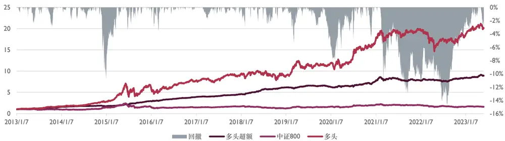
数据来源：Wind 资讯 & 东方证券研究所

相关性分析中，三种模型的因子值相关性在53%-65%，IC相关性在65%-80%，这对于日频特征数据集来说不算很高的相关性，其中 Transformer 和 XGBoost 的 IC 相关性较高，为 80%，但实际上二者不光逻辑不一样，输入的数据格式也不一样，前者是多变量的时间序列作为输入，后者是单一时间点的多变量，可以推测，当模型的参数量比较大的时候，较强的拟合能力可能会造成二者“殊途同归”，难以体现其原始特性，使用参数量较小的模型进行集成可能能更好地相互补充。

IC 相关性中（表格的左下部分），我们可以看到 XGBoost 和集成模型的 IC 相关性最高（0.94）。这说明在日频量价指标数据上，XGBoost 模型的预测结果与集成模型的预测结果高度一致。这可能是因为在集成过程中，XGBoost 模型因为其出色的性能而对最终结果产生了更大的影响。

图 11：日频模型相关性（右上为因子值相关性，左下为 IC相关性）

|  | svm_daily | xgb_daily | tsfm_daily | daily_merged |
| --- | --- | --- | --- | --- |
| svm_dailyxgb_dailytsfm_dailydaily_merged |  | 0.65 | 0.53 | 0.79 |
|  | 0.75 |  | 0.62 | 0.88 |
|  | 0.65 | 0.80 |  | 0.86 |
|  | 0.87 | 0.94 | 0.81 |  |

数据来源：Wind 资讯 & 东方证券研究所

## 日内数据集表现

XGBoost模型具有最高的 ICIR 5.5和夏普比率 2.4，表明其预测能力和风险调整收益率都相对较好。SVM 模型和 Transformer Encoder 模型的 ICIR 和夏普比率相对较低，但是，对于 SVM模型，它在 2015 年有显著的超额收益，这可能是因为 SVM在牛市的日内数据中找到了较明显的线性分类边界，从而使得 SVM模型在这一年表现突出。

虽然单一模型的表现各异，但当我们将这三种模型的输出进行平均，即使用集成模型时，我们得到的结果表现得相当出色。集成模型具有最高的 RankIC9.3%和 ICIR5.6，同时夏普比率2.3和年化超额收益率 18.6%也表现出色。这显示出集成方法能有效地结合不同模型的优点，提升预测性能和稳定性。

有关分析师的申明，见本报告最后部分。其他重要信息披露见分析师申明之后部分，或请与您的投资代表联系。并请阅读本证券研究报告最后一页的免责申明。

图 12：日内数据集各模型表现（中证 800，百分号为超额）

|  | RankIC | ICIR | Sharpe | AnnRet | Vol | MaxDD | 2013 | 2014 | 2015 |
| --- | --- | --- | --- | --- | --- | --- | --- | --- | --- |
| svm_intra | 0.089 | 5.268 | 1.98 | 16.2% | 7.7% | -23.5% | 33.5% | 6.8% | 61.0% |
| xgb_intra | 0.082 | 5.457 | 2.37 | 17.1% | 6.8% | -17.6% | 35.1% | 13.4% | 44.3% |
| tsfm_intra | 0.081 | 5.125 | 1.84 | 14.8% | 7.7% | -16.2% | 33.4% | 6.1% | 52.1% |
| intra_merged | 0.093 | 5.623 | 2.30 | 18.6% | 7.5% | -18.7% | 41.2% | 11.1% | 55.4% |

|  | 2016 | 2017 | 2018 | 2019 | 2020 | 2021 | 2022 | 2023 |
| --- | --- | --- | --- | --- | --- | --- | --- | --- |
| svm_intra | 26.8% | 6.0% | 16.2% | -0.3% | 16.1% | -2.5% | 7.2% | 5.1% |
| xgb_intra | 28.3% | 19.3% | 28.3% | -3.3% | 12.6% | -2.8% | 7.7% | 0.1% |
| tsfm_intra | 18.4% | 13.7% | 20.0% | 2.0% | 10.2% | 0.4% | -3.2% | 6.5% |
| intra_merged | 27.5% | 16.0% | 35.6% | -1.3% | 14.3% | -1.9% | 3.3% | 0.4% |

数据来源：Wind 资讯 & 东方证券研究所

图 13：日内集成模型 intra_merged净值（右轴为最大回撤）
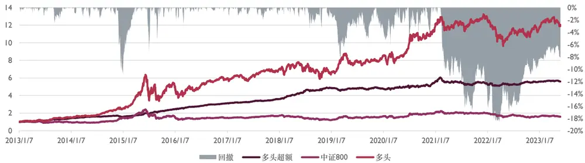
数据来源：Wind 资讯 & 东方证券研究所

对于单一模型来说，我们可以看到 SVM 模型和 XGBoost 模型之间的因子值相关性和 IC 相关性都不太高（分别为0.65和0.77）。这说明这两种模型提取的特征和预测收益率的方式可能存在较大的差异，反映出它们在模型结构和算法上的不同。SVM 是一个线性模型，而 XGBoost 是基于树的模型，它们对数据的处理和学习方式有很大的差别。

然后，我们看到 Transformer Encoder 模型的 IC 相关性普遍较高，说明 TransformerEncoder 模型的预测结果与其他模型更为一致。这可能因为 Transformer Encoder 模型能够自动学习时间序列数据的内在模式，使其预测更为稳定。

最后，我们注意到集成模型（intra_merged）的 IC 相关性都非常高（都超过 0.8），尤其是与XGBoost模型的相关性达到了0.95。这说明集成模型的预测结果在很大程度上受到了XGBoost模型的影响，这可能是因为在集成过程中，XGBoost 模型的预测准确度较高，因此对最终的集成结果影响更大。

图 14：日内模型相关性（右上为因子值相关性，左下为 IC相关性）

|  | svm_intra | xgb_intra | tsfm_intra | intra_merged |
| --- | --- | --- | --- | --- |
| svm_intraxgb_intratsfm_intraintra_merged |  | 0.65 | 0.59 | 0.77 |
|  | 0.77 |  | 0.58 | 0.90 |
|  | 0.79 | 0.82 |  | 0.82 |
|  | 0.87 | 0.95 | 0.86 |  |

数据来源：Wind 资讯 & 东方证券研究所

## Level-2 数据集表现

在这个数据集上，XGBoost的表现最为出色，其年化超额收益17%、夏普比率2.5和信息系数 RankIC 6.2%都是四个模型中最高的，预测稳定性 ICIR 高达 5.12，超越其他模型。特别是在2018 和 2019 年，其超额收益显著超过其他两个单模型。Transformer 尽管其 RankIC 和 ICIR 在四个模型中处于中等水平，但在 2020年，其超额收益达到了 24.3%，远高于其他模型。

最后，集成模型是通过整合多个模型的预测结果来提高预测的稳定性和准确性。在这个例子中，集成模型的表现整体上都很稳健，RankIC 7.2%相比于 XGBoost有所提高，但是其他指标均不如 XGBoost 模型。

图 15：L2数据集各模型表现（中证 800，百分号为超额）

|  | RankIC | ICIR | Sharpe | AnnRet | Vol | MaxDD | 2016 |
| --- | --- | --- | --- | --- | --- | --- | --- |
| svm_12 | 0.050 | 3.641 | 1.54 | 12.7% | 7.9% | -11.7% | 5.5% |
| xgb_12 | 0.062 | 5.122 | 2.54 | 17.0% | 6.3% | -5.1% | 4.1% |
| tsfm_12 | 0.059 | 3.603 | 1.44 | 11.4% | 7.7% | -9.8% | 4.1% |
| 12_merged | 0.072 | 4.792 | 2.09 | 16.6% | 7.5% | -8.7% | 6.7% |

|  | 2017 | 2018 | 2019 | 2020 | 2021 | 2022 | 2023 |
| --- | --- | --- | --- | --- | --- | --- | --- |
| svm_12 | 23.2% | 26.5% | 3.9% | 17.6% | 13.1% | -2.9% | -1.3% |
| xgb_12 | 18.7% | 29.4% | 22.3% | 15.6% | 10.0% | 8.6% | 3.3% |
| tsfm_12 | 9.3% | 21.5% | 1.7% | 24.3% | 2.6% | 3.4% | 7.2% |
| 12_merged | 18.2% | 32.2% | 13.9% | 20.2% | 15.7% | -1.0% | 4.2% |

数据来源：Wind 资讯 & 东方证券研究所

图 16：日内集成模型 l2_merged净值（右轴为最大回撤）
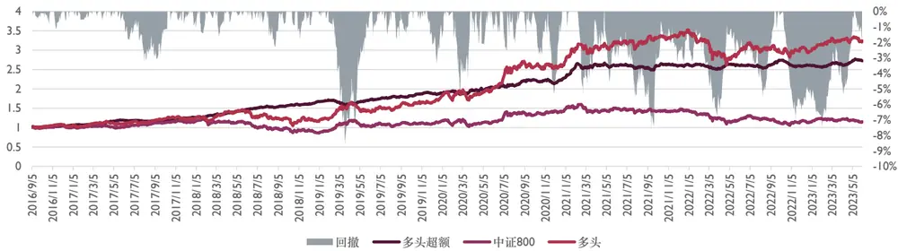
数据来源：Wind 资讯 & 东方证券研究所

有关分析师的申明，见本报告最后部分。其他重要信息披露见分析师申明之后部分，或请与您的投资代表联系。并请阅读本证券研究报告最后一页的免责申明。

三种模型的因子值相关性在31%-63%，IC相关性在51%-78%。这样的相关性相比于前两个数据集更低，在细粒度更高的特征中，Transformer 能更好地发挥它时间特征的提取优势，提取出更加不同于其他模型的特征。

从 IC 相关性（表格的左下角部分）来看，我们可以看到集成模型的 IC 相关性都非常高，其中与XGBoost的IC相关性最高，达到了0.92，这表明集成模型和XGBoost模型在预测时具有非常相似的稳定性和精确性。在其他模型之间，SVM和 XGBoost的 IC相关性达到了 0.78，表明这两个模型在 L2数据集上的预测能力具有一定的相似性。另外 Transformer和其他两个模型的相关性不是很高，其在该数据集上具有比较独立的预测逻辑。

图 17：L2模型相关性（右上为因子值相关性，左下为 IC相关性）

|  | svm_12 | xgb_12 | tsfm_12 | 12_merged |
| --- | --- | --- | --- | --- |
| svm_12xgb_12tsfm_1212_merged |  | 0.63 | 0.31 | 0.80 |
|  | 0.78 |  | 0.34 | 0.85 |
|  | 0.51 | 0.65 |  | 0.65 |
|  | 0.84 | 0.92 | 0.84 |  |

数据来源：Wind 资讯 & 东方证券研究所

## 集成因子的表现

这张表格展示了四个集成模型（最终集成模型，基于日频数据的集成模型，基于日内数据的集成模型，和基于 Level-2 数据的集成模型）的回测表现。从表格中我们可以看出，最终集成模型的 RankIC 10.8%， ICIR 6.0，夏普比率 2.79，年化超额 24.3%，其次是基于日频数据的集成模型表现最佳。这表明，将不同数据源的预测结果进行集成，能够更全面地挖掘信息，增加预测的稳定性和准确性。

具体来说，最终集成模型（total_merged）的夏普比率和年度回报率都是最高的，说明这个模型在处理多样化的数据源和复杂的市场情况下具有很强预测能力。基于日频数据的集成模型（daily_merged）的表现也十分出色，它的 Sharp 比率和年度回报率仅次于总体集成模型，而且其最大回撤要小于总体集成模型，说明它在风险控制方面做得更好。另一方面，基于 Level-2 数据的集成模型（l2_merged）虽然在年度回报率和 Sharp 比率上不如前两个模型，但它们的最大回撤更小，且在一些年份比如 2021年也取得了不错的超额收益。

图 18：各集成模型表现（中证800，百分号为超额）

|  | RankIC | ICIR | Sharpe | AnnRet | Vol | MaxDD | 2013 | 2014 | 2015 |
| --- | --- | --- | --- | --- | --- | --- | --- | --- | --- |
| total_merged | 0.108 | 6.025 | 2.79 | 24.3% | 7.9% | -17.8% | 61.4% | 13.2% | 69.5% |
| daily_merged | 0.097 | 5.468 | 2.74 | 24.1% | 8.0% | -14.6% | 56.5% | 10.8% | 70.1% |
| intra_merged | 0.093 | 5.623 | 2.30 | 18.6% | 7.5% | -18.7% | 41.2% | 11.1% | 55.4% |
| 12_merged | 0.072 | 4.792 | 2.09 | 16.6% | 7.5% | -8.7% |  |  |  |

|  | 2016 | 2017 | 2018 | 2019 | 2020 | 2021 | 2022 | 2023 |
| --- | --- | --- | --- | --- | --- | --- | --- | --- |
| total_merged | 35.2% | 21.6% | 36.6% | -2.5% | 20.6% | 3.3% | 4.6% | 2.5% |
| daily_merged | 31.7% | 17.7% | 34.3% | 3.4% | 19.8% | 3.1% | 7.4% | 5.8% |
| intra_merged | 27.5% | 16.0% | 35.6% | -1.3% | 14.3% | -1.9% | 3.3% | 0.4% |
| 12_merged | 6.7% | 18.2% | 32.2% | 13.9% | 20.2% | 15.7% | -1.0% | 4.2% |

数据来源：Wind 资讯 & 东方证券研究所

有关分析师的申明，见本报告最后部分。其他重要信息披露见分析师申明之后部分，或请与您的投资代表联系。并请阅读本证券研究报告最后一页的免责申明。

图 19：最终集成模型 total_merged净值（右轴为最大回撤）
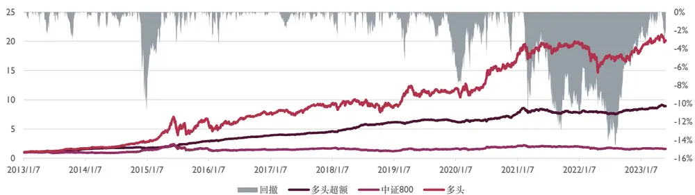
数据来源：Wind 资讯 & 东方证券研究所

我们可以看到集成模型在不同的分组（B1-B10）中的年化收益表现，B1 代表因子值最低的组别，而 B10 是因子值最高的组别。不论是从分组净值还是从分组年化中，我们都可以看到最终的打分是非常单调的。

对于相对收益来说，从 B1 到 B10 的年化收益呈现出单调增长的趋势，说明该集成模型在预测市场走势的时候具有很高的准确性。这也意味着该模型的预测在不同的信号等级（即B1到B10）之间存在明显的差异性。

而对于绝对收益来说，其表现更为优异，从 B5 开始，所有的分组都表现出了正的年化收益。最重要的是，B10 的绝对年化收益高达 34%，这表明当模型对某一资产或者投资组合给出强烈的正向预测信号时，在绝对收益的多头端甚至超过空头端，表现通常非常强势。

图 20：最终集成模型 total_merged分组超额净值对数
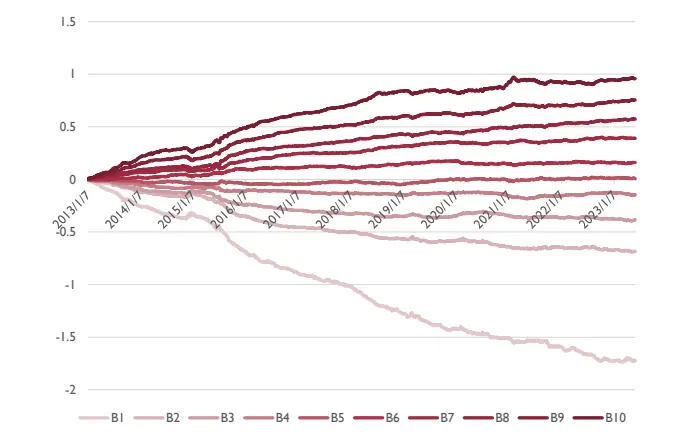
数据来源：Wind 资讯 & 东方证券研究所

图 21：最终集成模型 total_merged分组年化收益率
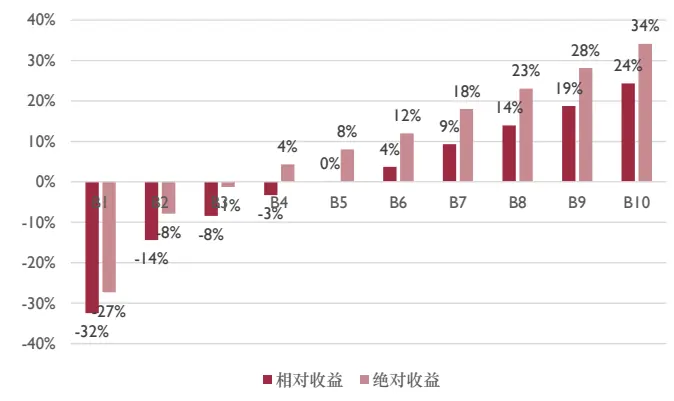
数据来源：Wind 资讯 & 东方证券研究所

## 六、指数增强

本篇报告采用如下组合优化模型来进一步构建指数增强组合：

$$
\begin{array}{rl}{max}&{{}f^{T}w}\end{array}
$$

$$
s.t.\quad s_{l}\leq X(w-w_{b})\leq s_{h}
$$

$$
h_{l}\le H(w-w_{b})\le h_{h}
$$

$$
w_{l}\le w-w_{b}\le w_{h}
$$

$$
b_{l}\le B_{b}w\le b_{h}
$$

$$
\ \mathbf{0}\leq w\leq l
$$

$$
\mathbf{\Omega}^{1^{T}}w=1
$$

该优化模型的目标函数为最大化预期收益，其中 f 为复合因子取值， $f^{T}w$ 为组合在复合因子上的加权暴露，w 为待求解的股票权重向量。模型的约束条件包括组合在风格因子上的偏离度、行业偏离度、个股偏离度、成分股权重占比控制、个股权重上下限控制等。

⚫ 第一个约束条件限制了组合相对于基准指数的风格暴露，X 为股票对风格因子的因子暴露矩阵， $w_{b}$ 为基准指数成分股的权重向量， $s_{l},s_{h}$ 分别为风格因子相对暴露的下限及上限；

⚫ 第二个约束条件限制了组合相对于基准指数的行业偏离，H 为股票的行业暴露矩阵，当股票i 属于行业j 时， $H_{ji}$ 为 1，否则为0； $h_{l},h_{h}$ 分别为组合行业偏离的下限以及上限；

⚫ 第三个约束条件限制了个股相对于基准指数成分股的偏离， $w_{l},w_{h}$ 分别为个股偏离的下限以及上限；

⚫ 第四个约束条件限制了组合在成分股内权重的占比下限及上限， $B_{b}$ 为个股是否属于基准指数成分股的 0-1向量， $b_{l},b_{h}$ 分别为成分股内权重的下限以及上限；

⚫ 第五个约束条件限制了卖空，并且限制了个股权重上限 l；

⚫ 第六个约束条件要求权重和为 1，即组合始终满仓运作。

上述模型中目标函数、风格偏离约束、个股权重偏离约束、成分股权重占比约束都可以转化成线性约束，因此可以通过线性规划来高效求解。

指数增强模型回测的具体参数如下：

⚫ 回测时间：2010 年 1 月-2023 年 5 月；

⚫ 交易成本：买入 0.1%，卖出0.2%；

⚫ 调仓频率：周频；

⚫ 股票池：中证 500 成分股；

⚫ 中证 500 成分股内权重约束：100%；

⚫ 行业、风格及个股权重偏离约束：中信一级行业暴露2%、市值相对暴露为0.5，个股相对于成分股权重偏离上限 1%，换手约束 20%；

可以看到，量价集成模型打分在中证 500 增强组合的年化绝对收益 20.1%，年化超额收益17.7%，收益回撤比为 1.48，这表明该增强策略的收益对风险（以最大回撤衡量）的承受度较好。此外，信息比（IR）为 2.87，远高于 1，表明策略取得的超额收益具有统计显著性。季度、月度、周度和日度胜率分别为 85.2%、78.3%、67.1%和 58.3%，也从侧面反映了该策略的成功率和稳健性。

图 22：中证 500增强组合分年回测指标
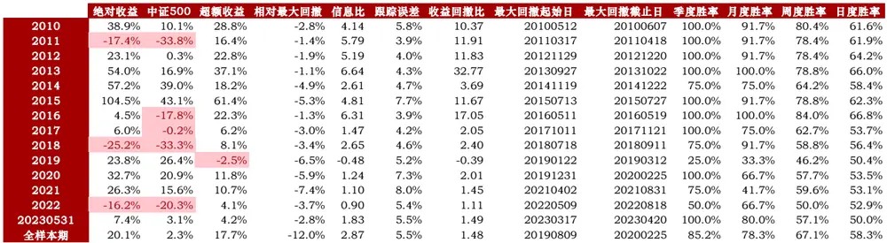
数据来源：Wind 资讯 & 东方证券研究所

图 23：中证 500增强组合净值
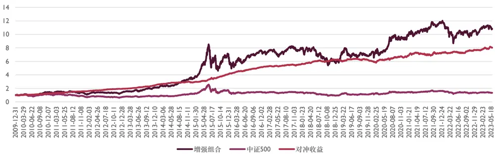
数据来源：Wind 资讯 & 东方证券研究所

## 七、总结

本研究的灵感来自于各类 Kaggle 获奖案例，很多经验丰富的参赛者会使用多种底层逻辑不同的模型分开训练，共同打分，这样既能提高准确率，也能增加鲁棒性。其原理在于每种模型所擅长挖掘的逻辑是不同的，包括线性与非线性、连续与离散、概率、树、神经网络、图、时序等诸多逻辑，而问题到现象的过程通常是多方力量的合力，所以合并多种逻辑不同的模型可以提高单一数据集的预测能力，这样的做法通常比在一个模型上死磕调参更加有效。

量价是一个热门且有效的研究领域，产生了众多的因子，而不同时间细粒度的量价数据所产生的因子又可以反映出不同交易频率的市场行为，让同样的因子公式代表了不同的市场维度。量价因子的挖掘变得越来越困难，所以本研究将目光放在模型端，数据只使用了“朴素的食材”。

日频、日内、Level-2 三个不同细粒度的数据集和 SVM、XGBoost、Transformer 三个不同底层逻辑的模型两两组合，在中证 800 成分股中滚动训练和测试，最后合并为一个量价集成模型打分，中证 800 内，RankIC 10.8%，ICIR 6.0， 夏普 2.8、年化超额 24.3%，超过任何一个单一模型或者单一数据集。研究过程并没有花费过多的时间调参，却得到了不错的结果，可以看出多模型打分这种方法的优势。

单模型的探索中，我们观察到几个现象：

1. XGBoost的夏普和ICIR在各个数据集中都优于其他两个模型，说明这个模型又很好的预测能力和稳定性，容易找到穿越市场的普适规律；这一点也体现在 15 年之后的三年内，XGBoost的多头超额仍然较高且持续，其并不会去学习“牛市”特有的逻辑；

2. Transformer和XGBoost在相同数据集的IC相关性在65%-82%，因子值的相关性却不高，虽然底层逻辑不同，但是产生的打分却相似，这可能和两个模型的参数量有关，参数量过大导致了二者“殊途同归”，更简单的模型也许能发挥它们的独特性能。

3.SVM和其他两个模型的IC相关性均不到80%，这是可以预见的，因为所用的“核”为线性核，它的回撤也较大，它的回测指标一般不如其他两个模型，但是会在一些年份一枝独秀，加上相关性不高，可以形成对最终模型的有利补充。

## 八、 风险提示

1. 量化模型基于历史数据分析得到，未来存在失效的风险，建议投资者紧密跟踪模型表现。

2. 极端市场环境可能对模型效果造成剧烈冲击，导致收益亏损。

## 九、参考文献

Huang, W., Nakamori, Y., & Wang, S. Y. (2005). Forecasting stock market movement direction with support vector machine. Computers & Operations Research, 32(10), 2513-2522.

Patel, J., Shah, S., Thakkar, P., & Kotecha, K. (2015). Predicting stock and stock price index movement using Trend Deterministic Data Preparation and machine learning techniques. Expert Systems with Applications, 42(1), 259-268.

Kercheval, A. N., & Zhang, Y. (2015). Modelling high-frequency limit order book dynamics with support vector machines. Quantitative Finance, 15(8), 1315-1329.

## Tabl e_Disclai mer 分析师申明

每位负责撰写本研究报告全部或部分内容的研究分析师在此作以下声明：

分析师在本报告中对所提及的证券或发行人发表的任何建议和观点均准确地反映了其个人对该证券或发行人的看法和判断；分析师薪酬的任何组成部分无论是在过去、现在及将来，均与其在本研究报告中所表述的具体建议或观点无任何直接或间接的关系。

## 投资评级和相关定义

报告发布日后的12个月内行业或公司的涨跌幅相对同期相关证券市场代表性指数的涨跌幅为基准（A 股市场基准为沪深 300 指数，香港市场基准为恒生指数，美国市场基准为标普 500 指数）；

## 公司投资评级的量化标准

买入：相对强于市场基准指数收益率 15%以上；

增持：相对强于市场基准指数收益率 5%～15%；

中性：相对于市场基准指数收益率在-5%～+5%之间波动；

减持：相对弱于市场基准指数收益率在-5%以下。

未评级 —— 由于在报告发出之时该股票不在本公司研究覆盖范围内，分析师基于当时对该股票的研究状况，未给予投资评级相关信息。

暂停评级 —— 根据监管制度及本公司相关规定，研究报告发布之时该投资对象可能与本公司存在潜在的利益冲突情形；亦或是研究报告发布当时该股票的价值和价格分析存在重大不确定性，缺乏足够的研究依据支持分析师给出明确投资评级；分析师在上述情况下暂停对该股票给予投资评级等信息，投资者需要注意在此报告发布之前曾给予该股票的投资评级、盈利预测及目标价格等信息不再有效。

## 行业投资评级的量化标准：

看好：相对强于市场基准指数收益率 5%以上；

中性：相对于市场基准指数收益率在-5%～+5%之间波动；

看淡：相对于市场基准指数收益率在-5%以下。

未评级：由于在报告发出之时该行业不在本公司研究覆盖范围内，分析师基于当时对该行业的研究状况，未给予投资评级等相关信息。

暂停评级：由于研究报告发布当时该行业的投资价值分析存在重大不确定性，缺乏足够的研究依据支持分析师给出明确行业投资评级；分析师在上述情况下暂停对该行业给予投资评级信息，投资者需要注意在此报告发布之前曾给予该行业的投资评级信息不再有效。

## HeadertTabl e_Discl ai mer 免责声明

本证券研究报告（以下简称“本报告”）由东方证券股份有限公司（以下简称“本公司”）制作及发布。

。本公司不会因接收人收到本报告而视其为本公司的当然客户。本报告的全体接收人应当采取必要措施防止本报告被转发给他人。

本报告是基于本公司认为可靠的且目前已公开的信息撰写，本公司力求但不保证该信息的准确性和完整性，客户也不应该认为该信息是准确和完整的。同时，本公司不保证文中观点或陈述不会发生任何变更，在不同时期，本公司可发出与本报告所载资料、意见及推测不一致的证券研究报告。本公司会适时更新我们的研究，但可能会因某些规定而无法做到。除了一些定期出版的证券研究报告之外，绝大多数证券研究报告是在分析师认为适当的时候不定期地发布。

在任何情况下，本报告中的信息或所表述的意见并不构成对任何人的投资建议，也没有考虑到个别客户特殊的投资目标、财务状况或需求。客户应考虑本报告中的任何意见或建议是否符合其特定状况，若有必要应寻求专家意见。本报告所载的资料、工具、意见及推测只提供给客户作参考之用，并非作为或被视为出售或购买证券或其他投资标的的邀请或向人作出邀请。

本报告中提及的投资价格和价值以及这些投资带来的收入可能会波动。过去的表现并不代表未来的表现，未来的回报也无法保证，投资者可能会损失本金。外汇汇率波动有可能对某些投资的价值或价格或来自这一投资的收入产生不良影响。那些涉及期货、期权及其它衍生工具的交易，因其包括重大的市场风险，因此并不适合所有投资者。

在任何情况下，本公司不对任何人因使用本报告中的任何内容所引致的任何损失负任何责任，投资者自主作出投资决策并自行承担投资风险，任何形式的分享证券投资收益或者分担证券投资损失的书面或口头承诺均为无效。

本报告主要以电子版形式分发，间或也会辅以印刷品形式分发，所有报告版权均归本公司所有。未经本公司事先书面协议授权，任何机构或个人不得以任何形式复制、转发或公开传播本报告的全部或部分内容。不得将报告内容作为诉讼、仲裁、传媒所引用之证明或依据，不得用于营利或用于未经允许的其它用途。

经本公司事先书面协议授权刊载或转发的，被授权机构承担相关刊载或者转发责任。不得对本报告进行任何有悖原意的引用、删节和修改。

提示客户及公众投资者慎重使用未经授权刊载或者转发的本公司证券研究报告，慎重使用公众媒体刊载的证券研究报告。

## 东方证券研究所

地址： 上海市中山南路 318 号东方国际金融广场 26 楼

电话：021-63325888

传真：021-63326786

网址： www.dfzq.com.cn