# UMR2.0—风险溢价视角下的动量反转统一框架再升级

因子选股系列之九十四

## 研究结论

## 动量和反转统一框架 2.0

高风险日获得的收益往往是承担风险带来的，其更多源于投资者过度自信导致的价格反应过度，因此未来更倾向于反转效应，而低风险日获得的收益并不源于承担高风险，因此未来更偏向于动量效应，我们以时序均值调整后的风险指标来加权个股每日的溢价，并以此构建统一的动量反转因子。

“高风险日可能更偏反转，低风险日可能更偏动量”，但是动量不一定都出现在低风险日，而反转也不一定都出现在高风险日，在一些特殊时点，例如盈余公告日、一字跌停日、反弹动量日当日的收益可能更偏动量，另外因子也会受到窗口中高风险日占比、高超额日占比的风格影响，因此我们引入特殊日期处理、风险因素剥离、分钟高频化等维度，以此构建动量和反转统一框架 2.0。

## 风险溢价下的统一动量反转因子——UMR因子

我们从股票日度的真实波动、换手率，大单买入均价偏离、小单主动买入金额占比、平均单笔成交量，早盘尾盘成交占比、分钟收益波动率、分钟收益偏度等维度刻画股票的日度风险并用以调整其每日超额收益，经过上述 2.0的框架调整，加权得到风险调整后的 UMR因子，每个调整后的因子都具有非常显著的选股能力，复合UMR 因子月度 IC 均值达到 0.116，年化 ICIR 达 5.56，IC 月度胜率 96%，月均多头超额 1.35%。并且不管是 1个月还是 1年的窗口下，因子都表现出持续同向的动量效应，并且选股效果衰减非常缓慢。

## UMR因子在指数增强中的应用

将 UMR因子加入现有的指数增强模型后，各指数增强组合年化超额收益和信息比均获得明显提升，且大部分年份的超额收益都能获得提高。沪深 300增强模型年化超额从 16.27%提升到 17.36%；中证 500 增强模型年化超额从 19.64%提升到20.86%；中证 1000 增强模型年化超额从 25.70%提升到 26.97% ；国证 2000 增强模型年化超额从 26.44%提升到 28.41%。

## 因子改进框架的泛化能力

我们将特殊时点调整以及影响因素剥离的调整方式应用到三个月反转因子上，因子的选股效果同样得到了大幅提升，月度 IC均值从-0.059提升到-0.07，年化 ICIR从-1.99 提升到-3.66，IC 胜率从 74%提升到 87%，月均多头超额从 0.43%提升到0.76%。

## 风险提示

1. 量化模型失效风险。

2. 极端市场环境可能对模型效果造成剧烈冲击，导致收益亏损。

报告发布日期

2023 年 07 月 13 日

证券分析师 杨怡玲

yangyiling@orientsec.com.cn

执业证书编号：S0860523040002

可转债多因子模型初探：——宏观固收量 2023-07-01化研究系列之（十）

集成模型在量价特征中的应用：——因子 2023-07-01选股系列之九十三

基于时点动量的因子轮动：——因子选股 2023-06-28系列之九十二

基于循环神经网络的多频率因子挖掘：— 2023-06-06—因子选股系列之九十一

DFQ 遗传规划价量因子挖掘系统：——因 2023-05-28子选股系列之九十

分析师情感调整分数 ASAS：——因子选 2023-03-28股系列之八十九

基于偏股型基金指数的增强方案：——因 2023-03-06子选股系列之八十八

## 一、风险溢价视角下的动量反转统一框架 2.0

A 股市场呈现出短期强反转与长期弱动量的价格效应，动量和反转的矛盾与统一是 A 股市场价格异象中经久不衰的研究方向。本文从风险溢价的视角对每个交易日股票的动量和反转的性质做出区分，并进而构建动量反转的统一框架。

## 1.1 风险溢价与动量反转

“高风险高收益”是萦绕在每个市场交易者耳边的话语，我们对这一现象做了一个简单的测试。我们以波动率作为股票价格波动风险的代理指标，在每个月末将股票按当月的日度收益波动率从低到高排序分为十组，检验各组内股票当月相对于市场的超额收益。从下面左图可以看到，波动率较高（第 10 组）的股票当月平均跑赢市场 11%，收益非常可观，这确实验证了高风险下能够获得高收益的现象，这可观的收益也解释了为什么很多短线交易者对于高波动股票的投机交易十分热衷。同时也可以看到，高风险的股票在下个月的收益情况，如上面右图所示。波动率较高的股票在下月平均跑输市场1.2%。这一现象告诉我们高风险下能够获得高收益，但是这种高收益往往是通过承担高风险带来的，因而其难以持续且未来呈现出强反转的特征。

图 1：波动率分组当月超额收益（2010-2023.2）
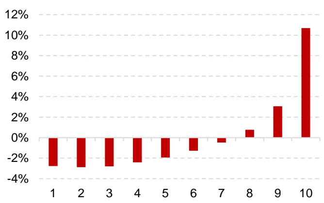
数据来源：Wind，东方证券研究所

图 2：波动率分组下月超额收益（2010-2023.2）
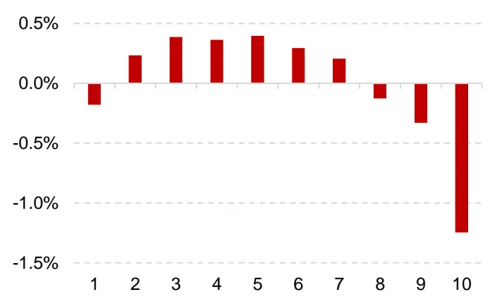
数据来源：Wind，东方证券研究所

## 1.2 风险溢价视角下的动量和反转统一框架

## 1.2.1 动量反转统一框架

反转因子和动量因子由每日的收益拼接组合而成，其中每个交易日都可能由于其风险水平的高低而体现出不同的动量或反转的效应，我们可以深入到每个交易日对其展开更细粒度的探索。我们设想高风险日获得的收益往往是承担风险带来的，其更多源于投资者过度自信导致的价格反应过度，因此未来更倾向于反转效应，而低风险日获得的收益并不源于承担高风险，因此未来更偏向于动量效应，所以我们可以用每日的风险水平相对高低来调整其日度收益，再重新合成得到一个统一的动量反转因子。

由于截面上不同股票的风险水平有时并不能直接比较，并且投资者往往会以股票当前风险相对其过去一段时间风险水平的相对高低来衡量实际的风险水平，这里我们对每只股票每天的风险指标R 以过去一段时间的平均水平来对其进行调整，得到时序相对风险作为调整后的风险系数：

$$
Risk_{t}=\frac{\sum_{i=t-d+1}^{t}R_{i}}{d}-R_{t}\tag{1}
$$

即用过去 $d$ 日风险指标的平均值来调整其取值。当股票的风险低于其过去一段时间的均值时，我们认为当日为低风险日，调整后取值为正，而当股票的风险高于过去一段时间的均值时，我们认为当日为高风险日，调整后取值为负。例如，我们以股票当日的换手率作为风险指标 $R_{i}$ 时，$Risk_{t}$ 取值即为股票过去一段时间的换手率均值减去其当日的换手率。我们可以用调整后的风险系数来对股票的历史收益溢价进行加权，我们认为低风险日的溢价有动量而高风险日的溢价为反转，因此历史溢价以风险系数加权后，可以得到统一的动量反转因子：

$$
\begin{array}{r}{f_{t}=\sum_{i=t-m+1}^{t}Risk_{i}\cdot(r_{i}-mkt_{i})}\end{array}\tag{2}
$$

即股票过去 m 日的日度超额收益的加权收益。其中 $r_{i},mkt_{i}$ 分别为股票和市场指数在 i 日的收益率。在相对低风险日，风险系数取值为正，因此表达了溢价的动量效应，而在相对高风险日，风险系数取值为负，因此表达了溢价的反转效应。并且由于 $Risk_{i}$ 是连续值，它还能同时表达反转和动量的强度。这里我们加权的收益为个股的日度超额收益，主要原因在于不同日期的收益率并不直接可比，因此需要以市场收益对其进行调整，这里我们以中证全指的日度收益作为市场收益。

考虑到距离当前时间较远日的数据对于当前因子取值的影响应该更小，而近期数据的影响应该更大，因此我们在加权收益上进行时间半衰的权重倾斜，得到最终的动量与反转因子的统一框架：

$$
f_{t}=\sum_{i=t-m+1}^{t}w_{i}\cdot Risk_{i}\cdot(r_{i}-mkt_{i})=\sum_{i=t-m+1}^{t}w_{i}\cdot\left(\frac{\sum_{j=i-d+1}^{i}R_{j}}{d}-R_{i}\right)\cdot(r_{i}-mkt_{i})\tag{3}
$$

其中 $w_{i}$ 为随时间衰减的系数，即 $w_{j}=2^{-\frac{m-j+1}{H}}/\Sigma_{j=1}^{m}2^{-\frac{j}{H}}$ ，H 为半衰期，d 为风险系数调整的窗口长度，m 为收益加权的窗口长度。

在这个框架下，我们只需要找到能够刻画股票每日风险程度的代理变量即可构建统一的动量反转UMR（Unified Momentum and Reversal）因子。下面我们将从相对风险来源、特殊时点动量、因子稳定性影响因素以及因子加权频率四个方面具体展开介绍我们的 UMR2.0框架。

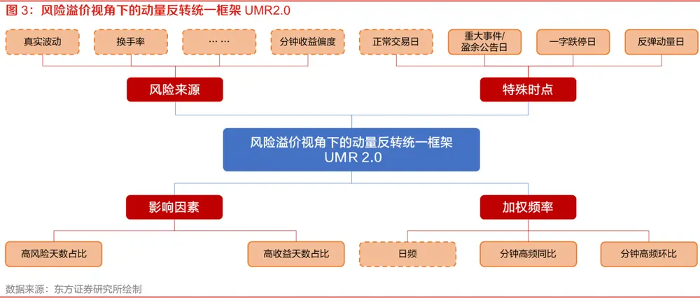

有关分析师的申明，见本报告最后部分。其他重要信息披露见分析师申明之后部分，或请与您的投资代表联系。并请阅读本证券研究报告最后一页的免责申明。

## 1.2.2 相对风险来源

从上述因子构建框架可以看到，通过寻找日度风险的代理变量，我们可以衍生出一系列的UMR因子。下表展示了我们构造的 8 个日度风险来源指标，这些指标构建的核心逻辑是能否刻画日度价格的反应过度。下文中我们会对这些风险代理变量构造的 UMR因子进行详细讨论。

表 1：日度风险代理变量

| 类型 | 风险指标 | 指标计算方式 |
| --- | --- | --- |
| 日度 | 真实波动 | 日度真实波动/前收盘价 |
| 日度 | 换手率 | 总成交量/流通股本 |
| 日内 | 大单买入均价偏离 | abs((大单买入金额/大单买入量)- VWAP)/ VWAP |
| 日内 | 小单主动买入占比 | 日内小单主动买入金额/总成交额 |
| 日内 | 平均单笔成交量 | sqrt(总成交量/日内成交笔数) |
| 分钟高频 | 早盘尾盘成交占比 | (开盘半小时成交额+尾盘半小时成交额）/流通市值 |
| 分钟高频 | 分钟收益波动率 | 剔除开盘 5 分钟的 5 分钟收益率的波动率 |
| 分钟高频 | 分钟收益偏度 | 剔除开盘5 分钟的 5 分钟收益率的偏度 |

数据来源：Wind，东方证券研究所

## 1.2.3 特殊时点动量

UMR因子的底层构建逻辑可以总结为“高风险日可能更偏反转，低风险日可能更偏动量”，但是动量不一定都出现在低风险日，而反转也不一定都出现在高风险日，如下图所示会存在一些日期高风险带上偏动量的例外，高风险与反转、低风险与动量之间并不完全是充要关系。“高风险日可能更偏反转，低风险日可能更偏动量”是正常交易日中以交易博弈行为占主导的日期才满足的规律，但是不以交易博弈行为占主导的日期，它的高风险就不一定体现出反转，而有可能体现出动量。

图 4：UMR因子逻辑的例外情况
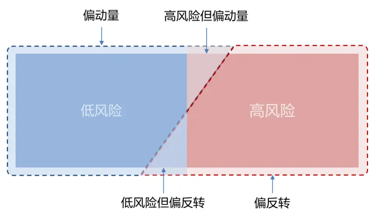
数据来源：东方证券研究所绘制

重大事件日第二天市场往往会对于公司最新发生的基本面变化做出同向的响应，例如盈余公告日第二天业绩好的公司往往伴随着股价大幅跳空高开、波动率提高、换手率放大等看似“高风险”的行为，但是这种价格行为往往是在反映市场对公司基本面动量的捕捉。下面左图展示了盈余公告次日开盘跳空超额因子的十组分档表现，可以看到盈余公告次日开盘跳空幅度越大的股票往往未来表现越好，即表现出明显的动量效应。另外，下面右图展示了几种重大事件发生后 1-10日的累计超额收益，可以看到重大重组等涉及股票基本面信息的日期，股价在未来10日内往往也体现出动量特征。因此，重大事件次日股价的反应可能更偏向于动量效应，即重大事件次日超额越高，其未来收益可能越高。

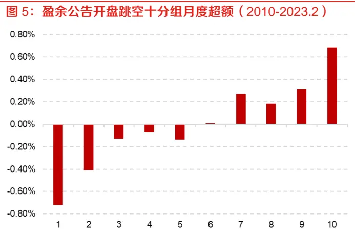
数据来源：Wind，东方证券研究所

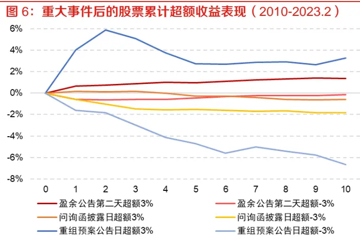
数据来源：Wind，东方证券研究所

A 股缺少做空机制，因此股价向上拉升更为容易，而向下寻底时往往效率较低，因此在公司基本面恶化或者股价经过大幅拉升后会形成股票一字跌停并持续下跌的状态，这种一字跌停和大幅下挫会表现为股票的高波动从而体现出“高风险”的特征，但是往往后续是倾向于延续这种下跌的动量特征而不是立即反转的状态。下图展示了一字跌停后 1-20日的累计超额收益，可以看到一字跌停的股票未来 6个交易日的超额呈现出持续下挫的动量状态。

图 7：股票一字跌停后未来的累计超额收益变化（2010-2023.2）
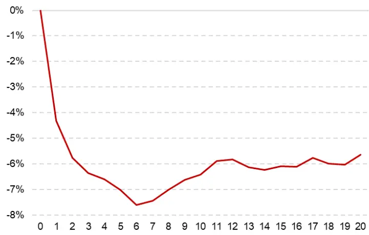
数据来源：Wind，东方证券研究所

在之前的研究《基于时点动量的因子轮动》（20230628）中我们发现，市场在一些特殊时点会形成类似于“引爆点”的动量效应，例如在市场经历一波快速下跌并开启反弹时，反弹最强的行业股票具有持续的动量效应。如下图左图所示，在 20220427 当天市场开启了一波下跌后的反弹，当日是电力设备及新能源行业带头反弹，可以看到该行业未来 2 个月持续跑赢了市场。我们在中证全指收盘价序列上取下跌深度-5%、反弹阈值 0.5%作为标准来筛选时点动量信号，平均每年触发 5 次信号，我们将触发日标记为动量触发日。在反弹动量触发日市场开启底部反弹，当日的反弹幅度对于未来收益具有显著的“动量”预测作用，因此该日的收益虽然伴随着“高波动”，但是我们更倾向于认为当日的收益具有“动量”而非“反转”趋势。

图 8：下跌反弹的时点动量示例
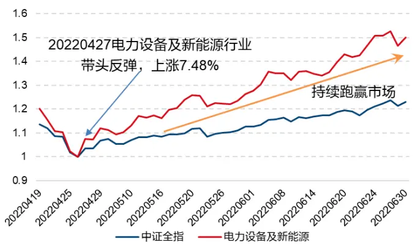
数据来源：Wind，东方证券研究所

图 9：反弹动量信号捕捉示意图
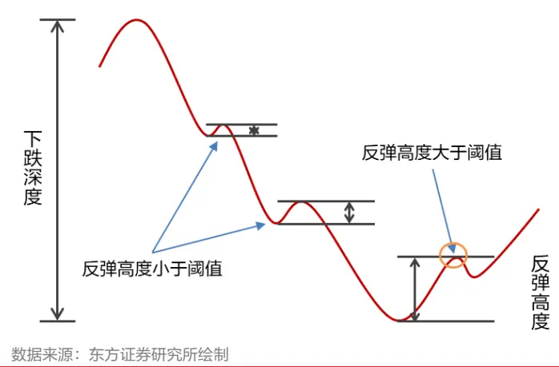

上述这些特殊的动量日往往会形成“高风险”的假象而被误判为偏向于反转，因此需要对于这些日期的“风险”进行纠偏调整，我们将这些特殊日期的风险替换为过去 d 日的最小值，即

$$
\widetilde{R}_{\iota}=\left\{\begin{array}{ll}{R_{i},}&{\quad\dot{\lambda}/\mathbb{Z}\neq i\boxed{H\Xi=I}\overline{{f\Xi}}\overline{{\mathcal{X}\mathcal{Z}}}\overline{{\mathcal{W}}}\mathcal{Q}}\\{ts_{-}\operatorname*{min}(R_{i},d)}&{\quad\dot{\mathcal{A}}/\mathbb{Z}\neq i\boxed{H\Xi=I\mathcal{H}\neq\xi\mathcal{H}\mathcal{H}\mathcal{I}\Sigma}}\end{array}\right.\tag{4}
$$

公式(3)中动量和反转因子统一框架可以修正为：

$$
f_{t}=\sum_{i=t-m+1}^{t}w_{i}\cdot\widetilde{Rlsk_{l}}\cdot(r_{i}-mkt_{i})=\sum_{i=t-m+1}^{t}w_{i}\cdot\left(\frac{\displaystyle\sum_{j=i-d+1}^{i}\widetilde{R}_{j}}{d}-\widetilde{R}_{\imath}\right)\cdot(r_{i}-mkt_{i})\tag{5}
$$

在特殊时点日期，将当日的风险调整为过去 d 日的最小值，因此数量级仍然是统一的，并且当日的风险系数 $\widetilde{R\imath sk_{\imath}}$ 为正值，表明当日的超额会偏动量。

## 1.2.4 因子稳定性影响因素

UMR因子的多头股票往往由下图两种典型的股票构成，一种是每日都跑输市场且波动幅度越来越大，另外一种是每日都跑赢市场且波动幅度越来越小。因子的多头组中这两大类的股票占比会随着时间而变化导致不稳定。我们的因子由每日相对风险作为系数来加权日度超额收益构成，如果多头的股票都是由风险系数为负占比100%或日度超额为负占比100%的股票组成，如果这类股票继续下跌，那因子多头就可能没有超额，所以这两个占比的“风格”会构成因子收益“不稳定”的重要影响因素。

为了使得因子收益更加稳健，我们在中性化时同时将因子对风险系数为负的天数占比和日度超额为负的天数占比进行剥离，即对下式回归取残差：

$$
f_{t}=\beta_{mv}\cdot MV_{t}+\Sigma_{j}\beta_{j}\cdot X_{t,j}+\beta_{risk.neg}\cdot P_{risk.neg}+\beta_{alpha.neg}\cdot P_{alpha.neg}+\varepsilon\tag{6}
$$

其中 $MV_{t}$ 和 $X_{t,j}$ 分别是股票的市值和行业哑变量， $P_{risk\_neg},P_{alpha\_neg}$ 分别是因子计算窗口内风险系数为负的天数占比以及日度超额为负的天数占比， $\beta_{mv},\beta_{j},\beta_{risk\_neg},\beta_{alpha\_neg}$ 均为回归的系数，ε 为回归后的残差。得到残差后再进行去极值标准化后得到影响因素调整后的因子。

图 10：UMR因子两种典型的多头股票
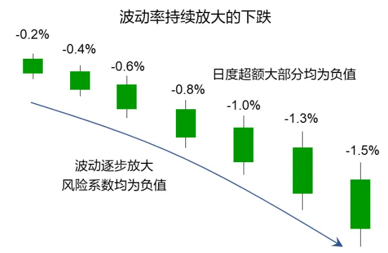
数据来源：Wind，东方证券研究所绘制

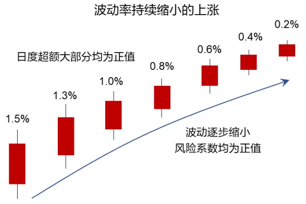

## 1.2.5 因子加权频率

前文中我们都是讨论日频 K 线角度下的动量和反转的统一框架，这里我们进一步拆分到更细粒度的分钟频率上来构建分钟高频下的 UMR因子。分钟高频下我们有两种构建高频 UMR因子的方法：

1. 分钟同比：认为日内不同时间段不可直接比较，因此抽取每日同一个时间段，例如抽取每日9:30-10:30的小时 K线，在同一个时间的分钟 K线上按 UMR因子的构建逻辑来计算因子，最后将最后一天的日内不同时间段构建的因子等权复合来构建因子。

2. 分钟环比：认为日内不同时间段可以直接比较，直接将每日的分钟 K 线串行拼接并按 UMR因子的构建逻辑来计算因子，取最后一根 K线的因子取值作为因子取值。

图 11：分钟高频同比和环比下的 UMR因子构建
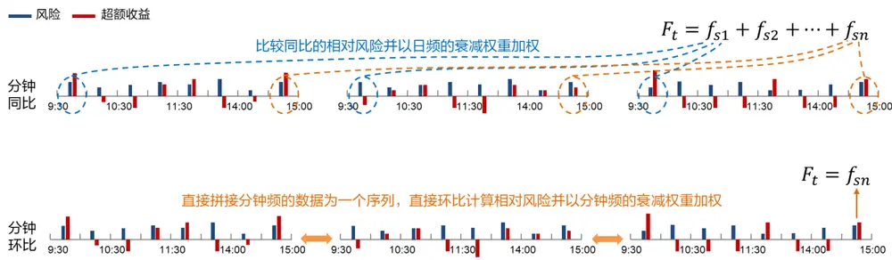
数据来源：Wind，东方证券研究所绘制

## 二、风险溢价下统一动量反转因子

上节中我们介绍了动量反转因子的统一框架，本节中我们具体介绍 8 个不同风险代理变量下的UMR因子，因子回测参数如下：

- 回测区间：2010 年 1 月-2023 年 2 月；

- 调仓频率：月频；

- 股票池：全市场股票剔除上市未满 3个月的新股、ST、ST摘帽 3个月以内的股票；因子参数如不做特殊说明：

- 以过去 10个交易日来衡量风险指标的平均水平；

- 以过去三个月(60 个交易日)的加权平均收益来构建因子；

- 以加权窗口的一半作为半衰期。

## 2.1 真实波动调整下的 UMR

## 2.1.1 TR_UMR 因子定义

我们认为低波动环境下股价表现出动量效应而高波动环境下股价表现出反转效应，由于我们直接考察每个交易日的风险高低，所以我们以个股日度的真实波动 (True Range) 作为代理变量：

$$
TR_{t}=\frac{max\big(high_{t}-low_{t},~abs(high_{t}-close_{t-1}),~abs(low_{t}-close_{t-1})\big)}{close_{t-1}}
$$

日度真实波动相对于前期平均水平越大，表明股价的波动风险在变大，此时获取的超额更多是通过承担高波动风险带来的，未来可能发生反转，而日度真实波动相对于前期平均水平越小，表明股价的波动风险相对收缩，此时获取的超额并不是通过承担高波动风险带来的，其未来动量效应更强。以个股每日的日度真实波动作为风险指标代入公式(1)，即可得到真实波动调整下的风险系数。当个股的真实波动相对过去均值偏小时风险系数取值为正，表明以动量来看待当日的超额收益，而当个股的真实波动相对于过去均值偏大时风险系数取值为负，表明以反转来看待当日的超额收益。以该系数加权日度超额收益即可得到日度真实波动调整下的 UMR因子。

图 12：TR调整下 UMR因子十组分档月度超额
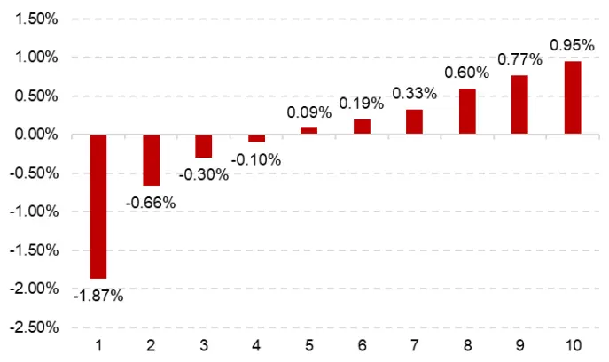
数据来源：Wind，东方证券研究所

图 13：TR调整下 UMR因子多空收益
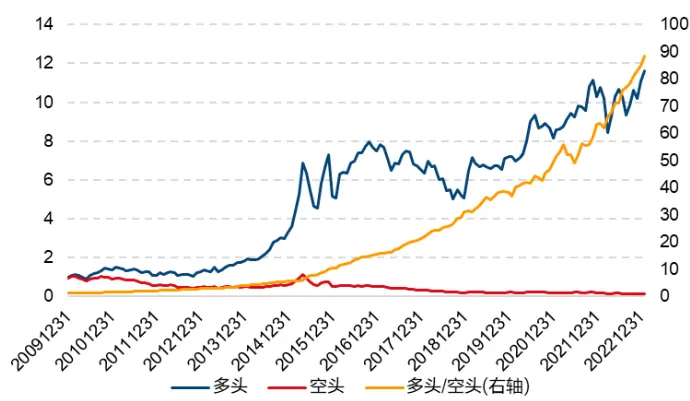
数据来源：Wind，东方证券研究所

有关分析师的申明，见本报告最后部分。其他重要信息披露见分析师申明之后部分，或请与您的投资代表联系。并请阅读本证券研究报告最后一页的免责申明。

上图首先展示了公式(3)下不经过任何调整的 UMR 因子的月度分组超额和多空收益表现。可以看到因子的十组分档收益非常单调，多头月均超额 0.95%，空头月均超额-1.87%，因子多空收益相对走势持续非常稳健。因子月度 IC均值为 0.105，年化ICIR达 4.94，IC月度胜率 92%。

## 2.1.2 特殊时点调整后的 TR_UMR

我们在此基础上根据公式(4)和(5)对特殊时点动量进行调整，得到特殊时点调整后的因子。下图展示了特殊时点调整后 TR_UMR 因子的月度分组超额和多空收益表现。可以看到因子的十组分档收益非常单调，多头月均超额 1.09%，空头月均超额-1.93%，因子多空收益相对走势持续非常稳健。因子月度 IC均值为 0.11，年化 ICIR达 5.43，IC月度胜率 94%。

图 14：特殊时点调整后 TR_UMR因子十组分档月度超额

数据来源：Wind，东方证券研究所

图 15：特殊时点调整后 TR_UMR因子多空收益
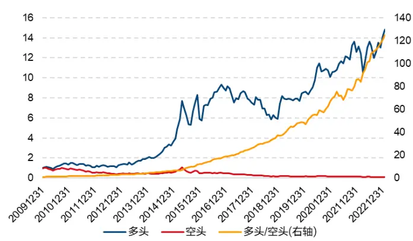
数据来源：Wind，东方证券研究所

## 2.1.3 剥离影响因素后的 TR_UMR

我们进一步根据公式(6)将该因子剥离风险系数为负占比和日度超额为负占比两个影响因素，得到风险剥离后的 UMR 因子。下图展示了剥离风险后 TR_UMR 因子的月度分组超额和多空收益表现。可以看到因子的十组分档收益非常单调，多头月均超额 1.12%，空头月均超额-1.90%，因子多空收益相对走势持续非常稳健。因子月度 IC 均值为 0.107，年化 ICIR 达 5.83，IC 月度胜率95%。

图 16：剥离影响因素后 TR_UMR因子十组分档月度超额
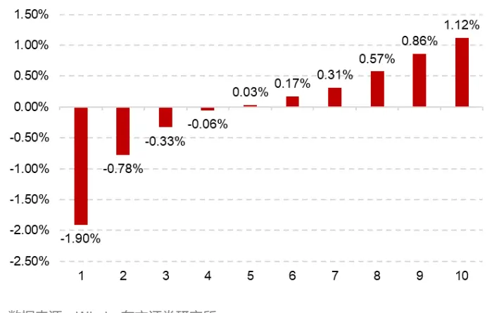
数据来源：Wind，东方证券研究所

图 17：剥离影响因素后 TR_UMR因子多空收益
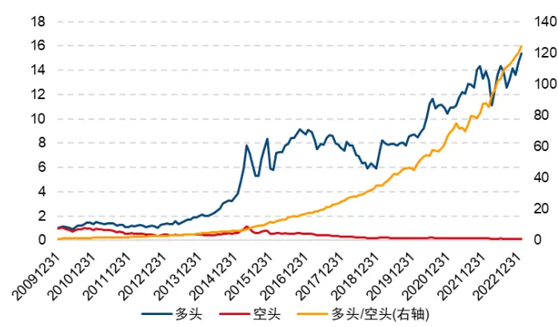
数据来源：Wind，东方证券研究所

有关分析师的申明，见本报告最后部分。其他重要信息披露见分析师申明之后部分，或请与您的投资代表联系。并请阅读本证券研究报告最后一页的免责申明。

对比三个因子的选股效果如下表。可以看到，通过特殊时点调整，因子的选股能力及多头收益有了明显的提高，而通过进一步剥离风险，因子选股能力的稳定性得到明显提升。

表 2：TR_UMR因子处理前后的选股能力对比

|  | IC 均值 | IC 标准差 | 年化ICIR | IC 胜率 | 月均空头超额 | 月均多头超额 | 月均多空收益 |
| --- | --- | --- | --- | --- | --- | --- | --- |
| 原始 | 0.105 | 0.073 | 4.94 | 92.4% | -1.87% | 0.95% | 2.82% |
| 特殊时点调整 | 0.110 | 0.070 | 5.43 | 93.7% | -1.93% | 1.09% | 3.02% |
| 时点调整+剥离风险 | 0.107 | 0.063 | 5.83 | 94.9% | -1.90% | 1.12% | 3.02% |

数据来源：Wind，东方证券研究所

## 2.1.4 分钟高频同比与环比下的 TR_UMR

我们进一步在前文1.2.5节中的分钟高频同比和环比模式下因子的表现。首先我们考察小时线上的分钟高频同比因子的表现。下图左图展示了将日内切分为四个小时 k 线并在其上构建小时同比因子的月度分组超额表现，以及将四个小时因子相加求和后的复合因子的分组表现。可以看到各小时下因子的十组分档总体单调，但是第 10 组多头表现相对一般。下图右图展示了各因子的累计IC，可以看到各因子都具有持续稳健的选股能力。

图 18：小时同比 TR_UMR因子十组分档月度超额
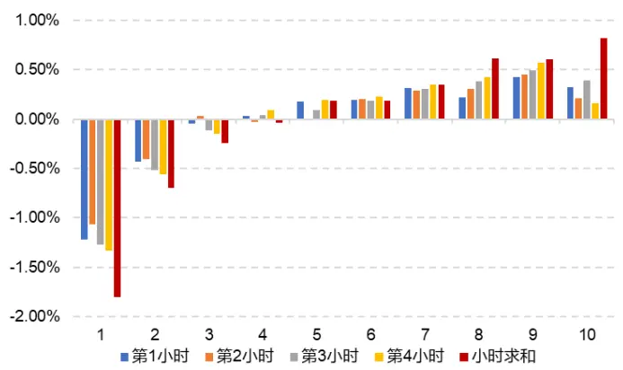
数据来源：Wind，东方证券研究所

图 19：小时同比 TR_UMR因子累计 IC
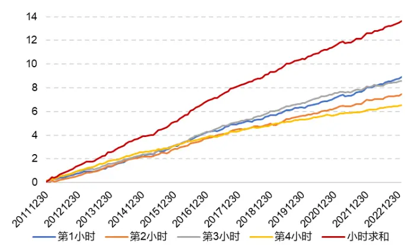
数据来源：Wind，东方证券研究所

下表展示了各小时因子及小时复合因子的选股能力，各因子的月度 IC 均值基本都在 0.05 以上，并且年化 ICIR 均在 3.4 以上，IC 胜率都超过 85%，都具有稳健显著的选股效果，虽然各小时因子的多头组超额表现一般，但是由于各小时因子的相关性在 0.2 以内，因此它们复合后的因子具有非常单调的选股效果，IC均值0.102，年化ICIR达4.97，IC胜率95%，月均多头超额0.83%。

表 3：小时同比 TR_UMR因子选股能力对比

|  | IC 均值 | 年化ICIR | IC 胜率 | 月均多头超额 | 月均空头超额 | 月均多空收益 | 和第1小时因子相关系数 | 和第2小时因子相关系数 | 和第3小时因子相关系数 | 和第4小时因子相关系数 |
| --- | --- | --- | --- | --- | --- | --- | --- | --- | --- | --- |
| 第1小时 | 0.067 | 3.66 | 87% | 0.32% | -1.22% | 1.54% | 1 | 0.18 | 0.17 | 0.01 |
| 第2小时 | 0.056 | 3.44 | 88% | 0.21% | -1.07% | 1.28% | 0.18 | 1 | 0.16 | 0.07 |
| 第3小时 | 0.064 | 4.34 | 90% | 0.39% | -1.27% | 1.66% | 0.17 | 0.16 | 1 | 0.07 |
| 第4小时 | 0.049 | 3.99 | 91% | 0.16% | -1.33% | 1.49% | 0.01 | 0.07 | 0.07 | 1 |
| 小时求和 | 0.102 | 4.97 | 95% | 0.83% | -1.80% | 2.63% | 0.81 | 0.43 | 0.44 | 0.26 |

数据来源：Wind，东方证券研究所

有关分析师的申明，见本报告最后部分。其他重要信息披露见分析师申明之后部分，或请与您的投资代表联系。并请阅读本证券研究报告最后一页的免责申明。

但同时我们也看到，小时复合后因子的多头表现略弱于图12中日频因子的效果。所以我们进一步考察不同分钟级别同比下的因子选股效果，观察这种变弱的迹象是否在其他分钟级别也存在。下面两图分别展示了日频、小时、半小时、5分钟级别同比下的因子分组收益及累计 IC。

图 20：不同时间级别同比 TR_UMR因子十组分档月度超额
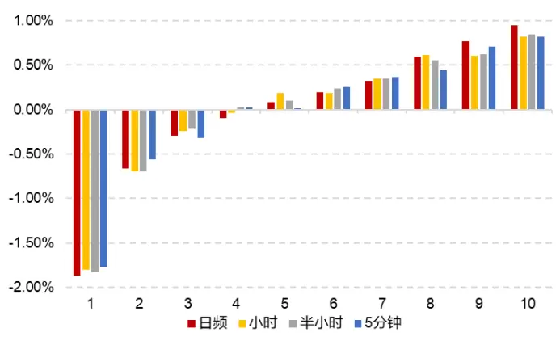
数据来源：Wind，东方证券研究所

图 21：不同时间级别同比 TR_UMR因子累计 IC
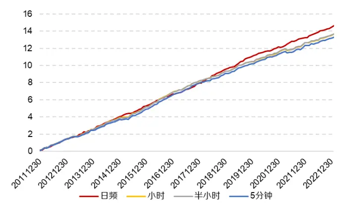
数据来源：Wind，东方证券研究所

随着时间级别越小，因子的分组超额以及累计 IC都呈现出一定程度上的下降趋势。我们分析主要原因可能是随着时间级别的缩小，k 线的实体长度越短，这时候随机扰动的相对占比会提高，在计算 k 线波动率时的可信度下降，从而导致整体选股效果呈现出下降趋势。但是从下表因子的相关性来看，5分钟级别和日线级别的因子相关性在 0.76左右，仍然可能存在一定的增量信息。

表 4：不同时间级别同比 TR_UMR因子选股能力对比

|  | IC 均值 | 年化ICIR | IC 胜率 | 月均多头超额 | 月均空头超额 | 月均多空收益 | 和日频因子相关系数 | 和小时因子相关系数 | 和半小时因子相关系数 | 和5分钟因子相关系数 |
| --- | --- | --- | --- | --- | --- | --- | --- | --- | --- | --- |
| 日频 | 0.105 | 4.94 | 92% | 0.95% | -1.87% | 2.82% | 1 | 0.88 | 0.84 | 0.76 |
| 小时同比 | 0.102 | 4.97 | 95% | 0.83% | -1.80% | 2.63% | 0.88 | 1 | 0.96 | 0.87 |
| 半小时同比 | 0.102 | 4.96 | 95% | 0.85% | -1.83% | 2.68% | 0.84 | 0.96 | 1 | 0.91 |
| 5分钟同比 | 0.099 | 4.79 | 92% | 0.82% | -1.77% | 2.59% | 0.76 | 0.87 | 0.91 | 1 |

数据来源：Wind，东方证券研究所

下面我们进一步观察不同时间级别环比模式下因子的表现。下面两图分别展示了日频、小时、半小时、5分钟级别环比下的因子分组收益及累计 IC。

图 22：不同时间级别环比 TR_UMR因子十组分档月度超额
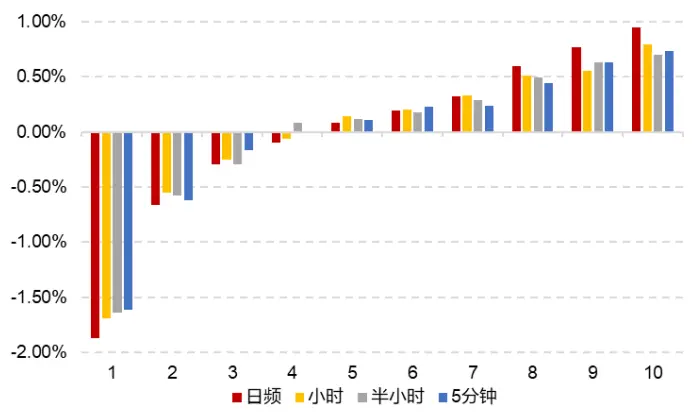
数据来源：Wind，东方证券研究所

图 23：不同时间级别环比 TR_UMR因子累计 IC
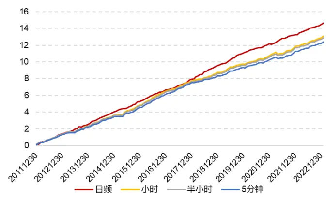
数据来源：Wind，东方证券研究所
有关分析师的申明，见本报告最后部分。其他重要信息披露见分析师申明之后部分，或请与您的投资代表联系。并请阅读本证券研究报告最后一页的免责申明。

可以看到随着时间级别越小，因子的分组超额以及累计 IC同样呈现出一定程度上的下降趋势。我们分析主要原因可能也是随着时间级别的缩小，随机扰动的相对占比提高。从下表因子的相关性来看，5分钟级别和日线级别的因子相关性在 0.72左右，仍然可能存在一定的增量信息。

表 5：不同时间级别环比 TR_UMR因子选股能力对比

|  | IC 均值 | 年化ICIR | IC 胜率 | 月均多头超额 | 月均空头超额 | 月均多空收益 | 和日频因子相关系数 | 和小时环比因子相关系数 | 和半小时环比因子相关系数 | 和5分钟环比因子相关系数 |
| --- | --- | --- | --- | --- | --- | --- | --- | --- | --- | --- |
| 日频 | 0.105 | 4.94 | 92% | 0.95% | -1.87% | 2.82% | 1 | 0.84 | 0.79 | 0.72 |
| 小时环比 | 0.098 | 4.47 | 92% | 0.79% | -1.69% | 2.48% | 0.84 | 1 | 0.96 | 0.85 |
| 半小时环比 | 0.096 | 4.48 | 90% | 0.70% | -1.64% | 2.34% | 0.79 | 0.96 | 1 | 0.90 |
| 5分钟环比 | 0.092 | 4.45 | 92% | 0.73% | -1.61% | 2.34% | 0.72 | 0.85 | 0.90 | 1 |

数据来源：Wind，东方证券研究所

我们将特殊时点调整并剥离风险后的日频因子与 5 分钟同比、环比级别因子进行复合，下图展示了复合因子的月度分组超额以及多空收益表现。月度 IC 均值从原始因子的 0.105 提升到 0.109，年化ICIR从4.94提升到5.77，IC胜率从92%提升到95%，月均多头超额从0.05%提升到1.15%，空头超额从-1.87%提升到-1.90%，月均多空收益从 2.82%提升到 3.05%。多空收益相比于图 13中原始因子的表现有非常明显的提升。

图 24：复合 TR_UMR因子十组分档月度超额
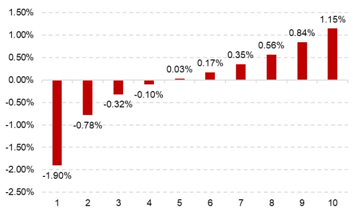
数据来源：Wind，东方证券研究所

图 25：复合 TR_UMR因子多空收益
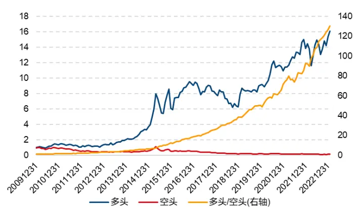
数据来源：Wind，东方证券研究所

## 2.1.5 不同窗口长度下的 TR_UMR

上文中我们检验了 60 天窗口加权下的 TR_UMR 因子的选股效果。下面我们进一步分析在不同加权窗口长度下该因子的选股能力，这里我们简单展示20、60、122、244日加权窗口下因子的选股效果，每个时间窗口下加权权重的半衰期均为窗口长度的一半。

从下图中的各窗口长度下的因子分组表现来看，随着收益加权窗口变长，不管是 1 个月（20 个交易日）还是 1 年（244 个交易日）的窗口下，因子都体现出完全同向的动量选股效果，并且选股能力边际下降非常缓慢，这也充分说明了我们这种因子构造方式确实非常好地统一了动量和反转。

图 26：不同窗口长度下复合 TR_UMR因子十组分档月度超额
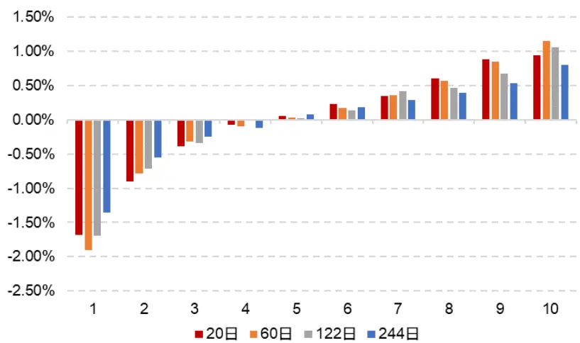
数据来源：Wind，东方证券研究所

下表也展示了不同窗口长度下因子的选股效果对比，可以看到因子的月度 IC 始终高于 0.08，ICIR 都在 4 以上，具有非常稳健的选股效果。

表 6：不同时间窗口下复合 TR_UMR因子选股能力

| 收益加权窗口 | IC均值 | 年化ICIR | IC 胜率 | 月均多头超额 | 月均空头超额 | 月均多空收益 | 月度自相关系数 |
| --- | --- | --- | --- | --- | --- | --- | --- |
| 20 | 0.097 | 5.82 | 95% | 0.93% | -1.68% | 2.61% | 0.09 |
| 60 | 0.109 | 5.77 | 95% | 1.15% | -1.90% | 3.05% | 0.62 |
| 122 | 0.100 | 5.20 | 94% | 1.06% | -1.70% | 2.76% | 0.80 |
| 244 | 0.084 | 4.23 | 88% | 0.80% | -1.36% | 2.16% | 0.91 |

数据来源：Wind，东方证券研究所

## 2.2 换手调整下的 UMR

当股票的日度换手相对于其前期平均水平越大，表明股票的筹码松动和价格冲击风险在变大，此时获取的超额更多是通过承担高风险带来的，未来可能发生反转，而日度换手相对于前期平均水平越小，表明交易者筹码惜售，此时获取的超额并不是通过承担高风险带来的，其未来动量效应更强。我们以个股日度的换手率作为筹码松动风险的代理变量，代入公式（4）和（5）构建换手调整下的 UMR因子。

图 27：复合换手_UMR因子十组分档月度超额
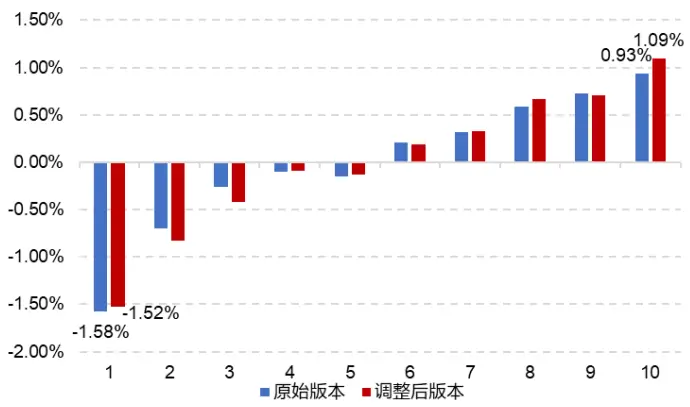
数据来源：Wind，东方证券研究所

图 28：复合换手_UMR因子多空收益
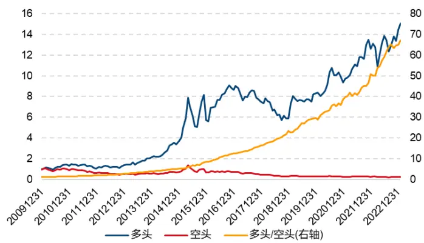
数据来源：Wind，东方证券研究所
有关分析师的申明，见本报告最后部分。其他重要信息披露见分析师申明之后部分，或请与您的投资代表联系。并请阅读本证券研究报告最后一页的免责申明。

上面左图展示了原始版本以及经过特殊时点和影响因素剥离后版本的分组收益对比，因子的月均多头超额从 0.93%提升到 1.09%，并且因子的月度 IC 均值从 0.101 提升到 0.106，年化 ICIR 从4.36 提升到 4.73，IC 月度胜率从 88%提升到 91%。从右图的多空收益来看，因子的选股能力持续稳健。

下表也展示了不同窗口长度下因子的选股效果对比，可以看到随着收益加权窗口变长，不管是 1个月（20个交易日）还是1年（244个交易日）的窗口下，因子都体现出完全同向的动量选股效果，并且选股能力边际下降非常缓慢，这也充分说明了我们这种因子构造方式确实非常好地统一了动量和反转。因子的月度 IC始终高于 0.08，ICIR 都在 4以上，具有非常稳健的选股效果。

表 7：不同时间窗口下复合换手_UMR因子选股能力

| 收益加权窗口 | IC 均值 | 年化ICIR | IC 胜率 | 月均多头超额 | 月均空头超额 | 月均多空收益 | 月度自相关系数 |
| --- | --- | --- | --- | --- | --- | --- | --- |
| 20 | 0.100 | 5.00 | 92% | 0.96% | -1.39% | 2.35% | 0.23 |
| 60 | 0.106 | 4.73 | 91% | 1.09% | -1.52% | 2.61% | 0.71 |
| 122 | 0.095 | 4.12 | 89% | 0.99% | -1.42% | 2.41% | 0.86 |
| 244 | 0.080 | 3.34 | 82% | 0.92% | -1.20% | 2.12% | 0.94 |

数据来源：Wind，东方证券研究所

## 2.3 大单均价偏离调整下的 UMR

前面我们从股票的日度波动和换手的角度构建了股票日度风险指标，下面我们从日内的交易行为中寻找刻画股票风险的代理变量。Wind根据level 2行情下每笔成交金额将成交单分为四种类型：

⚫ 超大单：单笔成交金额大于 100万元，对应“机构”；

⚫ 大单：单笔成交金额在 20万到 100万之间，对应“大户”；

⚫ 中单：单笔成交金额在 4万到20万之间，对应“中户”；

⚫ 小单：单笔成交金额小于 4万元，对应“散户”。

我们将Wind定义的超大单和大单合并为大单，并计算日内的大单买入均价：

$$
VWAP_{big}=\frac{i\overrightarrow{kg}\times\overrightarrow{4}\overrightarrow{x}\times\overrightarrow{4}\overrightarrow{x}+\overrightarrow{x}\overrightarrow{4}\overrightarrow{x}\times\overrightarrow{4}\overrightarrow{x}}{\overrightarrow{kg}\times\overrightarrow{4}\overrightarrow{x}\times\overrightarrow{kg}+\overrightarrow{x}\overrightarrow{4}\overrightarrow{x}\times\overrightarrow{kg}}
$$

超大单和大单往往能够决定股票的价格走势。如果股票日内没有大量投机盘参与，多空博弈较为均衡，那么大单买入均价应该和全天的成交量加权均价（VWAP）非常接近；而日内博弈和投机越多，尤其是在日内的顶部和底部位置的大单投机行为往往会使得顶部和底部位置的价格冲击较大形成反应过度，体现为大单买入均价偏离全天 VWAP。因此我们可以以 $VWAP_{big}$ 和 VWAP 的偏离程度来衡量股票日内博弈的风险程度，由此构建大单买入均价偏离指标作为日内博弈风险的代理变量：

$$
VWAP_{drift}=\frac{abs\big(VWAP_{big}-VWAP\big)}{VWAP}
$$

当一只股票的大单买入均价偏离相对于其前期平均水平越大，表明日内多空博弈不均衡，此时获取的超额未来可能发生反转，而大单买入均价偏离相对于前期平均水平越小，表明日内多空博弈越均衡，未来的动量效应可能更强。我们以股票每日的大单买入均价偏离作为风险代理变量，代入公式（4）和（5）构建大单均价偏离调整下的 UMR 因子。下图左图展示了原始版本以及经过分。其他重要信息披露见分析师申明之后部分，或请与您的投资代表联系。并请阅读本证券研究报告最后一页的免责申明。

特殊时点和影响因素剥离后版本的分组收益对比，因子的月均多头超额从 0.85%提升到 0.87%，因子的月度 IC 均值 0.078 没有明显变化，年化 ICIR 从 4.75 提升到 5.07，IC 月度胜率从 93%提升到 94%。从右图的多空收益来看，因子的选股能力持续稳健。

图 29：复合大单均价偏离_UMR因子十组分档月度超额
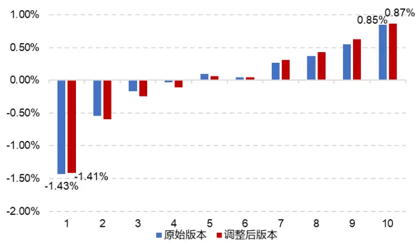
数据来源：Wind，东方证券研究所

图 30：复合大单均价偏离_UMR因子多空收益
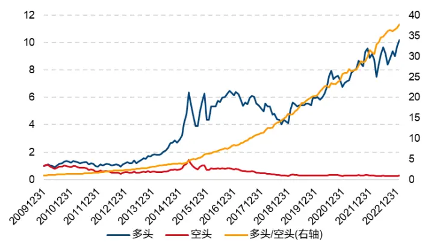
数据来源：Wind，东方证券研究所

下表也展示了不同窗口长度下因子的选股效果对比，可以看到随着收益加权窗口变长，不管是 1个月（20 个交易日）还是 1 年（244 个交易日）的窗口下，因子都体现出完全同向的动量选股效果，并且选股能力边际下降非常缓慢，这也充分说明了我们这种因子构造方式确实非常好地统一了动量和反转。因子的月度 IC始终高于 0.06，ICIR都在 3.8以上，具有非常稳健的选股效果。

表 8：不同时间窗口下复合大单均价偏离_UMR因子选股能力

| 收益加权窗口 | IC 均值 | 年化ICIR | IC 胜率 | 月均多头超额 | 月均空头超额 | 月均多空收益 | 月度自相关系数 |
| --- | --- | --- | --- | --- | --- | --- | --- |
| 20 | 0.070 | 5.27 | 94% | 0.79% | -1.44% | 2.23% | 0.09 |
| 60 | 0.078 | 5.07 | 94% | 0.87% | -1.41% | 2.28% | 0.62 |
| 122 | 0.073 | 4.46 | 91% | 0.84% | -1.28% | 2.12% | 0.81 |
| 244 | 0.066 | 3.86 | 89% | 0.74% | -1.18% | 1.92% | 0.90 |

数据来源：Wind，东方证券研究所

## 2.4 小单买入占比调整下的UMR

从前面大单小单的区别来看，如果一只股票日内小单的交易占比较高，说明其股价波动主要由“散户”交易而推动，股价经过日内充分博弈而并不会过多偏离其“价值”，即并不会发生反应过度，因为我们认为其动量可能延续，而如果大部分的交易是超大单、大单、中单而推动，则股价发生反应过度的可能性更大，未来更可能发生反转。因此我们以个股的小单主动买入金额（ActiveBuying of Small Orders）占比来衡量股票的日度风险，由于小单主动买入金额占比越高说明其博弈风险越小，因此我们反向调整其方向：

$$
ABSO=-\frac{1142\pm573\mp\lambda\pm877}{1515\pm877}
$$

当一只股票的小单主动买入占比相对于其前期平均水平越小，表明大部分交易由非小单主动买入而产生，股价的波动非小单买入而主导，此时获取的超额未来可能发生反转，而小单主动买入占比相对于其前期平均水平越大，表明日内大额投机行为较少，未来的动量效应可能更强。我们以该指标作为风险代理变量，代入公式（4）和（5）构建小单买入占比调整下的 UMR 因子。下图左图展示了原始版本以及经过特殊时点和影响因素剥离后版本的分组收益对比，因子的月均多头分。其他重要信息披露见分析师申明之后部分，或请与您的投资代表联系。并请阅读本证券研究报告最后一页的免责申明。

超额从 0.92%提升到 0.97%，因子的月度 IC均值 0.083没有明显变化，年化 ICIR从 3.88提升到4.32，IC月度胜率从 87%提升到 91%。从右图的多空收益来看，因子的选股能力持续稳健。

图 31：复合小单买入占比_UMR因子十组分档月度超额
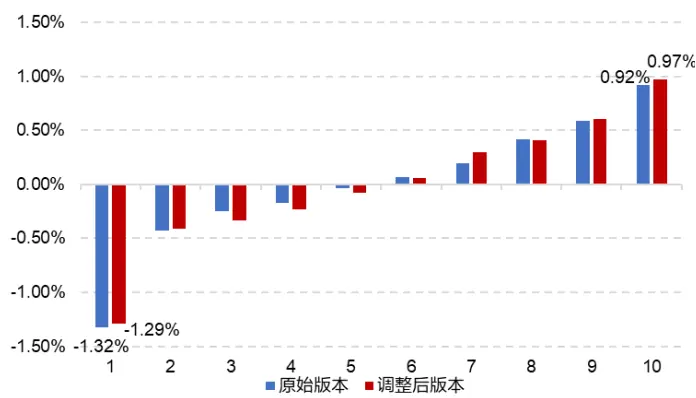
数据来源：Wind，东方证券研究所

图 32：复合小单买入占比_UMR因子多空收益
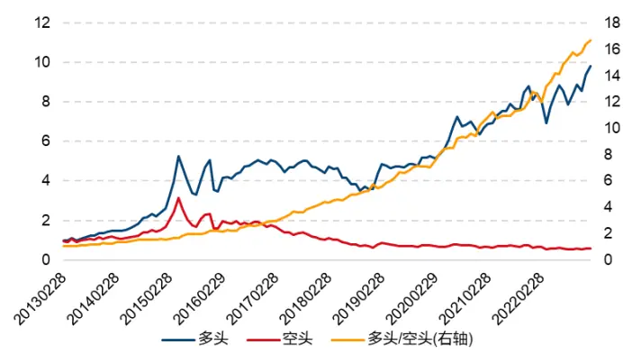
数据来源：Wind，东方证券研究所

下表也展示了不同窗口长度下因子的选股效果对比，可以看到随着收益加权窗口变长，不管是 1个月（20 个交易日）还是 1 年（244 个交易日）的窗口下，因子都体现出完全同向的动量选股效果，并且选股能力边际下降非常缓慢，这也充分说明了我们这种因子构造方式确实非常好地统一了动量和反转。因子的月度 IC始终高于 0.075，ICIR都在 3.2以上，具有非常稳健的选股效果。

表 9：不同时间窗口下复合小单买入占比_UMR因子选股能力

| 收益加权窗口 | IC 均值 | 年化ICIR | IC 胜率 | 月均多头超额 | 月均空头超额 | 月均多空收益 | 月度自相关系数 |
| --- | --- | --- | --- | --- | --- | --- | --- |
| 20 | 0.076 | 4.39 | 91% | 0.94% | -1.33% | 2.27% | 0.17 |
| 60 | 0.083 | 4.32 | 91% | 0.97% | -1.29% | 2.26% | 0.66 |
| 122 | 0.079 | 3.65 | 88% | 0.84% | -1.26% | 2.10% | 0.83 |
| 244 | 0.075 | 3.22 | 82% | 0.78% | -1.12% | 1.90% | 0.92 |

数据来源：Wind，东方证券研究所

## 2.5 平均单笔成交量调整下的 UMR

根据一只股票当日的总成交量和总成交笔数，我们可以计算当日的平均单笔成交量（AverageVolume of Transactions）。如果一只股票的平均单笔成交量相对前期平均水平在提高，那日内的价格冲击一定相对更大，股价可能反应过度，因而未来发生反转的可能更大。而如果平均单笔成交量在缩小，说明日内价格冲击可能较小，因而未来其动量可能延续。因此我们以平均单笔成交量来衡量日内价格冲击的代理变量：

$$
AVT=sqrt(\frac{\overbrace{\imath\omega}^{\varXi}}{\overbrace{\imath\omega}^{\varXi}})\overleftrightarrow{\imath\chi}\frac{\overleftrightarrow{\imath\omega}}{\overbrace{\imath\omega}^{\varXi}})
$$

当个股的平均单笔成交量相对过去均值偏小时风险系数取值为正，表明以动量来看待日度超额收益，而当个股的平均单笔成交量相对于过去均值偏大时风险系数取值为负，表明以反转来看待当日的超额收益。我们以该指标作为风险代理变量，代入公式（4）和（5）构建平均单笔成交量调整下的 UMR 因子。下图左图展示了原始版本以及经过特殊时点和影响因素剥离后版本的分组收益对比，因子的月均多头超额从0.56%提升到0.66%，因子的月度IC均值从0.07略提升到0.072，年化ICIR从4.11提升到4.29，IC月度胜率从89%提升到91%。从右图的多空收益来看，因子的选股能力持续稳健。

图 33：复合平均单笔成交量_UMR因子十组分档月度超额
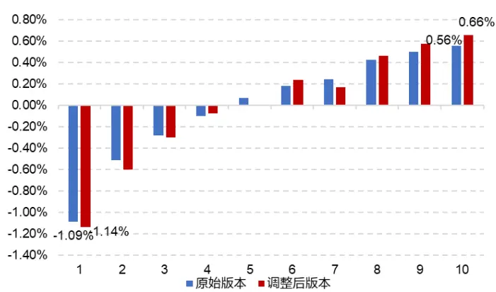
数据来源：Wind，东方证券研究所

图 34：复合平均单笔成交量_UMR因子多空收益
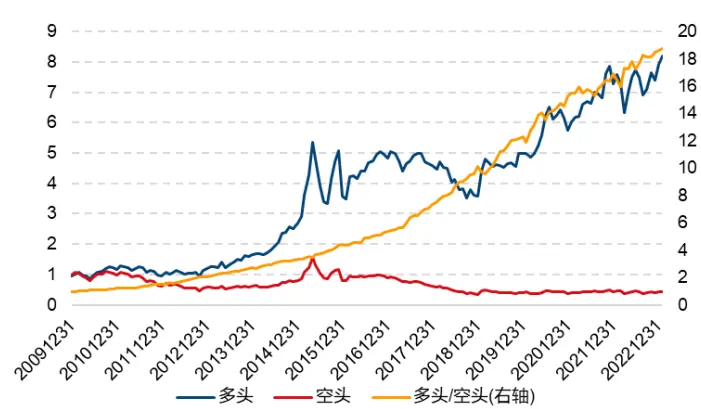
数据来源：Wind，东方证券研究所

下表也展示了不同窗口长度下因子的选股效果对比，可以看到随着收益加权窗口变长，不管是 1个月（20 个交易日）还是 1 年（244 个交易日）的窗口下，因子都体现出完全同向的动量选股效果，并且选股能力边际下降非常缓慢，这也充分说明了我们这种因子构造方式确实非常好地统一了动量和反转。因子的月度 IC始终高于 0.05，ICIR都在 2.7以上，具有非常稳健的选股效果。

表 10：不同时间窗口下复合平均单笔成交量_UMR因子选股能力

| 收益加权窗口 | IC均值 | 年化ICIR | IC 胜率 | 月均多头超额 | 月均空头超额 | 月均多空收益 | 月度自相关系数 |
| --- | --- | --- | --- | --- | --- | --- | --- |
| 20 | 0.065 | 4.43 | 91% | 0.70% | -1.18% | 1.88% | 0.11 |
| 60 | 0.072 | 4.29 | 91% | 0.66% | -1.14% | 1.80% | 0.63 |
| 122 | 0.065 | 3.56 | 87% | 0.60% | -0.96% | 1.56% | 0.81 |
| 244 | 0.054 | 2.75 | 83% | 0.51% | -0.73% | 1.24% | 0.90 |

数据来源：Wind，东方证券研究所

## 2.6 早尾盘成交占比调整下的 UMR

知情交易者及基本面事件驱动交易者往往在开盘前获取到个股的基本面信息而倾向于在早盘介入以获取更多的超额收益，而风险厌恶者不愿意承担开盘和日内的高波动更倾向于尾盘交易，这些主动交易行为都会造成个股早盘和尾盘的成交额放大。如果一只股票的早盘和尾盘成交额在放大，说明股票当天的收益可能受到更多交易冲击而反应过度，因而未来发生反转的可能更大。而如果早盘和尾盘的成交额在缩小，说明主动交易行为对股价的影响在降低，因而未来其动量可能延续。我们以开盘后半小时和收盘前半小时作为早盘和尾盘的时间区间。由于不同股票的成交额不能直接比较，因此我们以个股的流通市值对其进行调节，我们以早盘尾盘成交额占流通市值比（Opening and Closing Amounts to Cap）来衡量个股早盘尾盘异动的风险代理指标：

$$
OCAC_{t}=\frac{\sum_{i=9:35}^{10:00}amount_{t,i}+\sum_{i=14:35}^{15:00}amount_{t,i}}{float_{-}cap_{t}}
$$

当个股早盘尾盘成交占比相对过去均值偏小时风险系数取值为正，表明以动量来看待日度超额收益，而当相对于过去均值偏大时风险系数取值为负，表明以反转来看待当日的超额收益。我们以该指标作为风险代理变量，代入公式（4）和（5）构建早尾盘成交占比调整下的 UMR 因子。下面左图展示了原始版本以及经过特殊时点和影响因素剥离后的分组收益对比，因子的月均多头超额从 0.74%提升到 0.82%，因子的月度 IC均值从 0.09 略提升到 0.091，年化 ICIR从 4.78 提升到5.28，IC月度胜率从 91%提升到 94%。从右图的多空收益来看，因子的选股能力持续稳健。

图 35：复合早尾盘成交占比_UMR因子十组分档月度超额
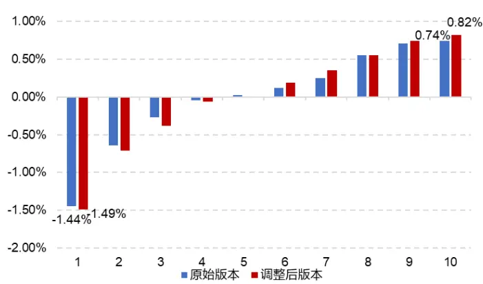
数据来源：Wind，东方证券研究所

图 36：复合早尾盘成交占比_UMR因子多空收益
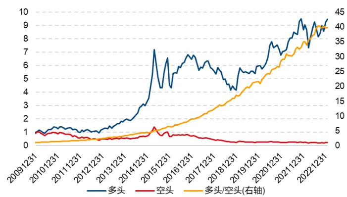
数据来源：Wind，东方证券研究所

下表也展示了不同窗口长度下因子的选股效果对比，可以看到随着收益加权窗口变长，不管是 1个月（20 个交易日）还是 1 年（244 个交易日）的窗口下，因子都体现出完全同向的动量选股效果，并且选股能力边际下降非常缓慢，这也充分说明了我们这种因子构造方式确实非常好地统一了动量和反转。因子的月度 IC始终高于 0.075，ICIR都在 3.5以上，具有非常稳健的选股效果。

表 11：不同时间窗口下复合早尾盘成交占比_UMR因子选股能力

| 收益加权窗口 | IC 均值 | 年化ICIR | IC 胜率 | 月均多头超额 | 月均空头超额 | 月均多空收益 | 月度自相关系数 |
| --- | --- | --- | --- | --- | --- | --- | --- |
| 20 | 0.081 | 5.44 | 93% | 0.59% | -1.40% | 1.99% | 0.11 |
| 60 | 0.091 | 5.28 | 94% | 0.82% | -1.49% | 2.31% | 0.63 |
| 122 | 0.087 | 4.56 | 90% | 0.84% | -1.41% | 2.25% | 0.81 |
| 244 | 0.076 | 3.59 | 86% | 0.75% | -1.11% | 1.86% | 0.91 |

数据来源：Wind，东方证券研究所

## 2.7 分钟收益波动率调整下的UMR

我们以股票的日内 5 分钟收益率的标准差来衡量股票日内的波动风险。如果股票日内投机行为较多，那么这种投机行为会体现在部分时间段的分钟 k 线上，因而造成股票的分钟收益率会呈现较大的波动，而如果日内投机行为较少，那么日内各时间段的分钟收益不会有太大的差异，即分钟收益的波动率较小。另外开盘时股票由于隔夜信息及集合竞价可能带来高波动，因此我们这里计算剔除开盘 5分钟的剩余5分钟 k线的收益波动率指标：

$$
STD_{-}5m={\sqrt{\frac{\sum_{i=9:40}^{15:00}(r_{i}-{\bar{r}})^{2}}{47-1}}}
$$

当一只股票的日内分钟收益波动率相对于其前期平均水平越大，表明日内投机行为更多，股价可能形成反应过度，此时获取的超额未来可能发生反转，而日内分钟收益波动率相对于前期平均水平越小，表明日内投机行为较少，未来的动量效应可能更强。我们以该指标作为风险代理变量，代入公式（4）和（5）构建分钟收益波动率调整下的 UMR 因子。下图左图展示了原始版本以及经过特殊时点和影响因素剥离后版本的分组收益对比，因子的月均多头超额从 0.82%提升到0.88%，因子的月度IC均值0.095没有明显变化，年化ICIR从5.19提升到5.63，IC月度胜率从94%提升到 96%。从右图的多空收益来看，因子的选股能力持续稳健。

图 37：复合分钟收益波动率_UMR因子十组分档月度超额
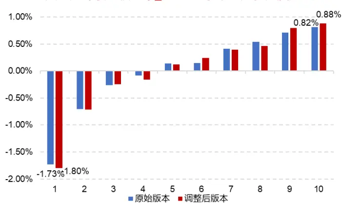
数据来源：Wind，东方证券研究所

图 38：复合分钟收益波动率_UMR因子多空收益
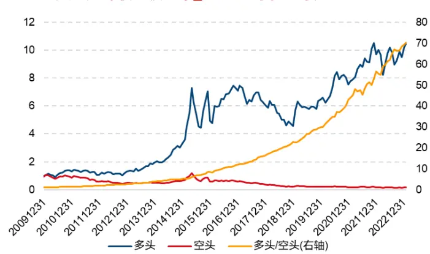
数据来源：Wind，东方证券研究所

下表也展示了不同窗口长度下因子的选股效果对比，可以看到随着收益加权窗口变长，不管是 1个月（20 个交易日）还是 1 年（244 个交易日）的窗口下，因子都体现出完全同向的动量选股效果，并且选股能力边际下降非常缓慢，这也充分说明了我们这种因子构造方式确实非常好地统一了动量和反转。因子的月度 IC始终高于 0.07，ICIR都在4以上，具有非常稳健的选股效果。

表 12：不同时间窗口下复合分钟收益波动率_UMR因子选股能力

| 收益加权窗口 | IC 均值 | 年化ICIR | IC 胜率 | 月均多头超额 | 月均空头超额 | 月均多空收益 | 月度自相关系数 |
| --- | --- | --- | --- | --- | --- | --- | --- |
| 20 | 0.089 | 5.60 | 94% | 0.64% | -1.63% | 2.27% | 0.11 |
| 60 | 0.095 | 5.63 | 96% | 0.88% | -1.80% | 2.68% | 0.62 |
| 122 | 0.089 | 5.13 | 92% | 0.84% | -1.61% | 2.45% | 0.80 |
| 244 | 0.073 | 4.10 | 89% | 0.56% | -1.29% | 1.85% | 0.90 |

数据来源：Wind，东方证券研究所

## 2.8 分钟收益偏度调整下的 UMR

如上文所述，如果日内的投机行为较多，这种投机行为会体现在部分时间段的分钟 k 线上，因而造成股票的分钟收益率的分布情况会形成“左偏”或“右偏”，因此从日内分钟收益率的偏度指标来看，偏度越大表明股票日内投机交易越多。由于开盘时股票由于隔夜信息及集合竞价可能带来高波动，因此我们这里计算剔除开盘 5分钟的剩余 5分钟k线的收益偏度指标：

$$
SKEW_{-}5m=\frac{\sqrt{47\cdot(47-1)}}{47-2}\frac{\frac{1}{47}\sum_{i=9:40}^{15:00}(r_{i}-\bar{r})^{3}}{(\frac{1}{47}\sum_{i=9:40}^{15:00}(r_{i}-\bar{r})^{2})^{1.5}}
$$

当一只股票的日内分钟收益偏度相对于其前期平均水平越大，表明日内投机行为更多，股价可能形成反应过度，此时获取的超额未来可能发生反转，而日内分钟收益偏度相对于前期平均水平越小，表明日内投机行为较少，未来的动量效应可能更强。我们以该指标作为风险代理变量，代入公式（4）和（5）构建分钟收益偏度调整下的 UMR 因子。下图左图展示了原始版本以及经过特殊时点和影响因素剥离后版本的分组收益对比，因子的月均多头超额从 0.69%提升到 0.75%，因子的月度 IC 均值从 0.083 略提升到 0.084，年化 ICIR 从 3.37 提升到 3.57，IC 月度胜率从 82%提升到 84%。从右图的多空收益来看，因子的选股能力持续稳健。

图 39：复合分钟收益偏度_UMR因子十组分档月度超额
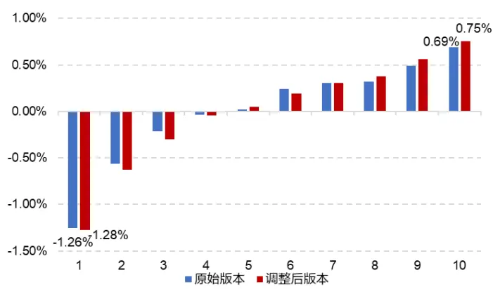
数据来源：Wind，东方证券研究所

图 40：复合分钟收益偏度_UMR因子多空收益
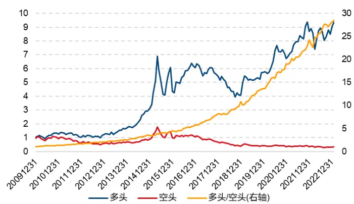
数据来源：Wind，东方证券研究所

下表也展示了不同窗口长度下因子的选股效果对比，可以看到随着收益加权窗口变长，不管是 1个月（20 个交易日）还是 1 年（244 个交易日）的窗口下，因子都体现出完全同向的动量选股效果，并且选股能力边际下降非常缓慢，这也充分说明了我们这种因子构造方式确实非常好地统一了动量和反转。因子的月度 IC始终高于 0.068，ICIR都在 2.7以上，具有非常稳健的选股效果。

表 13：不同时间窗口下复合分钟收益偏度_UMR因子选股能力

| 收益加权窗口 | IC 均值 | 年化ICIR | IC 胜率 | 月均多头超额 | 月均空头超额 | 月均多空收益 | 月度自相关系数 |
| --- | --- | --- | --- | --- | --- | --- | --- |
| 20 | 0.077 | 3.80 | 85% | 0.71% | -1.27% | 1.98% | 0.20 |
| 60 | 0.084 | 3.57 | 84% | 0.75% | -1.28% | 2.03% | 0.70 |
| 122 | 0.079 | 3.26 | 82% | 0.69% | -1.16% | 1.85% | 0.86 |
| 244 | 0.068 | 2.73 | 78% | 0.63% | -1.00% | 1.63% | 0.94 |

数据来源：Wind，东方证券研究所

## 2.9 复合 UMR 因子

这里我们将前文介绍的几种风险调整后的 UMR 因子进行复合，并检验其选股效果。下表展示了前文中风险调整后三个月 UMR 因子的相关系数，上三角为因子取值的相关系数，下三角为因子IC的相关系数。可以看到，大部分因子间取值相关系数在 0.4附近，IC相关系数在0.7左右。

表 14：三个月 UMR因子相关系数

| 因子相关系数IC 相关系数 | 真实波动UMR | 换手UMR | 大单均价偏离UMR | 小单买入占比 UMR | 单笔成交量UMR | 早尾盘占比 UMR | 分钟波动率UMR | 分钟偏度UMR |
| --- | --- | --- | --- | --- | --- | --- | --- | --- |
| 真实波动 UMR | 1 | 0.69 | 0.56 | 0.53 | 0.49 | 0.67 | 0.80 | 0.53 |
| 换手 UMR | 0.82 | 1 | 0.42 | 0.51 | 0.47 | 0.78 | 0.62 | 0.55 |
| 大单均价偏离 UMR | 0.85 | 0.79 | 1 | 0.78 | 0.32 | 0.36 | 0.53 | 0.43 |
| 小单买入占比 UMR | 0.76 | 0.87 | 0.40 | 1 | 0.65 | 0.49 | 0.42 | 0.51 |
| 单笔成交量 UMR | 0.69 | 0.70 | 0.73 | 0.81 | 1 | 0.47 | 0.65 | 0.42 |
| 早尾盘占比 UMR | 0.83 | 0.94 | 0.79 | 0.82 | 0.72 | 1 | 0.79 | 0.49 |
| 分钟波动率 UMR | 0.89 | 0.74 | 0.81 | 0.57 | 0.40 | 0.57 | 1 | 0.53 |
| 分钟偏度 UMR | 0.61 | 0.86 | 0.71 | 0.84 | 0.68 | 0.80 | 0.56 | 1 |

数据来源：Wind，东方证券研究所
有关分析师的申明，见本报告最后部分。其他重要信息披露见分析师申明之后部分，或请与您的投资代表联系。并请阅读本证券研究报告最后一页的免责申明。

由于因子间的相关性并不低，因此我们以上述因子在截面上进行对称正交处理来剔除因子间的多重共线性。我们将对称正交后因子等权复合得到复合后三个月 UMR 因子，复合后因子的选股能力如下表所示。

表 15：三个月 UMR因子选股能力对比

|  | IC均值 | 年化ICIR | IC 胜率 | 月均多头超额 | 月均空头超额 | 月均多空收益 | 月度自相关系数 |
| --- | --- | --- | --- | --- | --- | --- | --- |
| 真实波动 | 0.109 | 5.77 | 95% | 1.15% | -1.90% | 3.05% | 0.62 |
| 换手 | 0.106 | 4.73 | 91% | 1.09% | -1.52% | 2.61% | 0.71 |
| 大单买入均价偏离 | 0.078 | 5.07 | 94% | 0.87% | -1.41% | 2.28% | 0.62 |
| 小单主动买入占比 | 0.083 | 4.32 | 91% | 0.97% | -1.29% | 2.26% | 0.66 |
| 平均单笔成交量 | 0.072 | 4.29 | 91% | 0.66% | -1.14% | 1.80% | 0.63 |
| 早盘尾盘成交占比 | 0.091 | 5.28 | 94% | 0.82% | -1.49% | 2.31% | 0.63 |
| 分钟收益波动率 | 0.095 | 5.63 | 96% | 0.88% | -1.80% | 2.68% | 0.62 |
| 分钟收益偏度 | 0.084 | 3.57 | 84% | 0.75% | -1.28% | 2.03% | 0.70 |
| 复合 UMR | 0.116 5.56 96% 1.35% |  |  |  | -1.85% 3.20% 0.65 |  |  |

数据来源：Wind，东方证券研究所

复合 UMR 因子的月度 IC 均值达 0.116，年化 ICIR 达到 5.56，IC 月度胜率 96%，月均多头超额收益 1.35%，月均多空收益 3.20%，选股效果非常显著。相比于不经过特殊时点调整以及影响因素剥离的 1.0 版本，因子的月均多头超额从 1.25%提升到 1.35%，ICIR 从 5.04 提升到 5.56，改进效果也非常显著。

图 41：复合 UMR因子十组分档月度超额
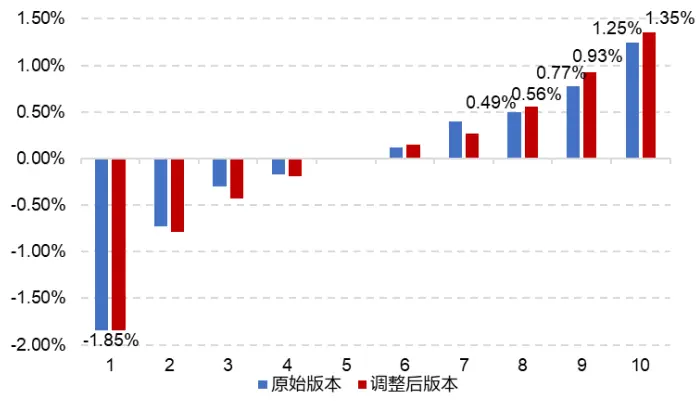
数据来源：Wind，东方证券研究所

图 42：复合 UMR因子月度 IC及累计 IC
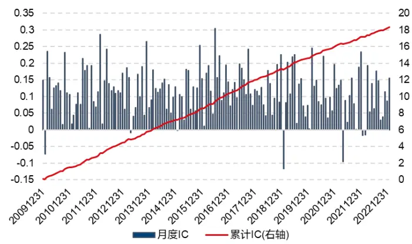
数据来源：Wind，东方证券研究所

复合三个月UMR因子的分组收益及月度IC表现如上右图所示，从累计IC来看因子的选股效果非常稳健。下图分别展示了因子多空收益走势以及各分组的超额累计单利。可以看到因子多空收益非常单调，从各分组的超额累计单利来看，各分组具有非常持续稳健的收益趋势。

图 43：复合 UMR因子多空收益
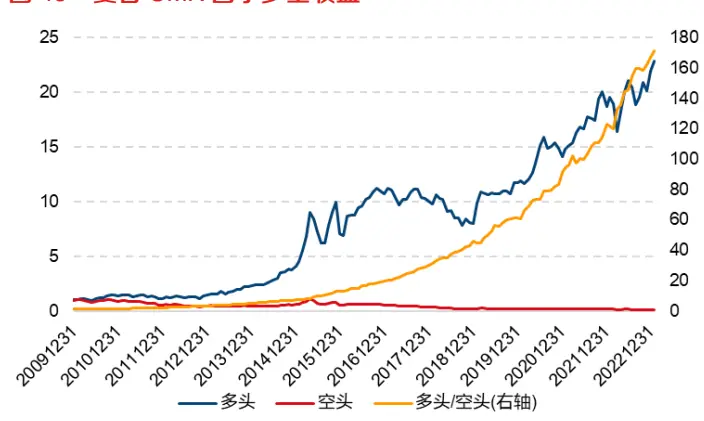
数据来源：Wind，东方证券研究所

图 44：复合 UMR因子十分组超额累计单利
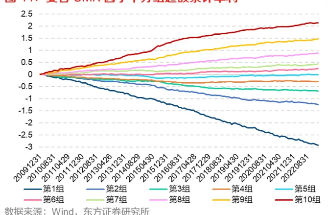
数据来源：Wind，东方证券研究所

下表展示了复合UMR因子在各年度的十分组及IC表现。可以看到，UMR因子在各年度的分组单调性都较好，并且因子也没有明显的走弱趋势。

表 16：复合 UMR因子各年分组表现
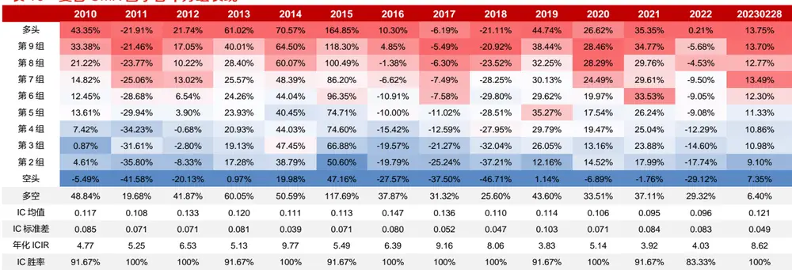
数据来源：Wind，东方证券研究所

上面是 3 个月窗口下复合 UMR 因子的选股表现。下面我们展示 1、3、6、12 个月的窗口下的复合 UMR 因子，因子的选股能力可见下表。可以看到，短期和长期窗口下的因子都具有非常显著的选股能力，IC均值保持在 0.09以上，ICIR持续高于 3.8，随着加权窗口长度的增加，因子的选股能力基本呈现缓慢下滑的趋势，且持续表现出正向的动量效应。

表 17：不同时间窗口下复合 UMR因子选股能力

| 收益加权窗口 | IC 均值 | 年化ICIR | IC 胜率 | 月均多头超额 | 月均空头超额 | 月均多空收益 | 月度自相关系数 |
| --- | --- | --- | --- | --- | --- | --- | --- |
| 20 | 0.109 | 5.92 | 96% | 1.23% | -1.79% | 3.02% | 0.15 |
| 60 | 0.116 | 5.56 | 96% | 1.35% | -1.85% | 3.20% | 0.65 |
| 122 | 0.106 | 4.79 | 94% | 1.21% | -1.71% | 2.92% | 0.82 |
| 244 | 0.090 | 3.89 | 89% | 1.04% | -1.41% | 2.45% | 0.92 |

数据来源：Wind，东方证券研究所

## 三、统一动量反转复合因子在指数增强中的应用

本节我们首先检验 UMR 因子在各宽基指数成分股内的选股效果，然后将其加入现有的指数增强模型中检验其是否能够带来增量。

## 3.1 各宽基指数内的选股效果

我们首先检验 UMR 因子在各宽基指数成分股内的选股效果，如下表所示。可以看到，在各个宽基指数内，不管是取一个月还是取一年的收益加权窗口，因子的IC都是同向的预测效果并且ICIR都较为显著，正说明了我们这种因子构造方式确实非常好地统一了动量和反转，在各宽基指数内都具有一致的预测能力。

以60日窗口为例，因子在沪深300指数成分股中的IC均值0.08，年化ICIR2.75，IC胜率77%，在中证 500指数成分股中的 IC均值 0.093，年化 ICIR3.62，IC胜率 87%，在中证 1000指数成分股中的 IC均值 0.116，年化 ICIR4.55，IC胜率 89% ，在国证 2000指数成分股中的 IC均值 0.126，年化ICIR5.42，IC胜率96%。从总体选股效果的对比来看，因子在偏中小市值的指数成分股中表现更加突出。

表 18：复合 UMR因子在各宽基指数成分股内的选股能力

| 指数 | 收益加权窗口 | IC 均值 年化ICIR |  | IC 胜率 月均多头超额 月均空头超额 月均多空收益 月度自相关系数 |  |  |  |  |
| --- | --- | --- | --- | --- | --- | --- | --- | --- |
| 沪深300 | 20 | 0.067 2.43 |  | 73% 0.62% |  | -0.85% 1.47% |  | 0.14 |
|  | 60 | 0.080 2.75 |  | 77% | 0.85% | -0.92% | 1.77% | 0.65 |
|  | 122 | 0.071 2.41 |  | 73% | 0.62% | -0.89% | 1.51% | 0.82 |
|  | 244 | 0.053 1.75 |  | 68% | 0.35% | -0.76% | 1.11% | 0.91 |
| 中证500 | 20 | 0.085 3.60 |  | 89% | 0.80% | -1.14% | 1.94% | 0.15 |
|  | 60 | 0.093 3.62 |  | 87% | 0.85% | -1.37% | 2.22% | 0.66 |
|  | 122 | 0.086 3.24 |  | 82% | 0.82% | -1.21% | 2.03% | 0.83 |
|  | 244 | 0.074 2.68 |  | 78% | 0.54% | -1.05% | 1.59% | 0.92 |
| 中证1000 | 20 | 0.106 4.52 |  | 90% | 1.10% | -1.78% | 2.88% | 0.16 |
|  | 60 | 0.116 4.55 |  | 89% | 1.14% | -1.92% | 3.06% | 0.66 |
|  | 122 | 0.110 4.11 |  | 92% | 1.08% | -2.02% | 3.10% | 0.83 |
|  | 244 | 0.097 | 3.40 | 89% | 0.87% | -1.82% | 2.69% | 0.92 |
|  | 20 | 0.121 | 5.74 | 95% | 1.14% | -2.02% | 3.16% | 0.16 |
| 国证 2000 | 60122 | 0.126 | 5.42 | 96% | 1.39% | -2.15% | 3.54% | 0.66 |
|  |  | 0.118 | 4.71 | 93% | 1.19% | -2.10% | 3.29% | 0.83 |
|  | 244 | 0.104 3.79 |  | 89% | 1.01% | -1.75% | 2.76% | 0.92 |

数据来源：Wind，东方证券研究所

由于传统的 IC及分组检验是一种较为简单的检验统计指标，并不能充分准确反应因子在构建指数增强组合时的贡献，因此我们以三个月 UMR 因子为例，进一步构建最大化单因子暴露的指数增强组合（Maximized Factor Exposure Portfolio，简称 MFE 组合）来考察 UMR 因子在指数增强模型中的真实效果。

我们采用如下组合优化模型来构建单因子 MFE组合：

$$
\begin{array}{rl}{max}&{f^{T}w}\\{s.t.}&{s_{i}\le X(w-w_{b})\le s_{h}}\\&{h_{i}\le H(w-w_{b})\le h_{h}}\\&{w_{i}\le w-w_{b}\le w_{h}}\\&{b_{i}\le B_{h}w\le b_{h}}\\&{\mathbf{0\le}w\le l}\\&{\mathbf{1}^{T}w=1}\\&{\chi|w-w_{1}|\le to_{h}}\end{array}
$$

该优化模型的目标函数为最大化单因子暴露，其中 f 为因子取值， $f^{T}w$ 为组合在因子上的加权暴露，w 为待求解的股票权重向量。模型的约束条件包括组合在风格因子上的偏离度、行业偏离度、个股偏离度、成分股权重占比控制、个股权重上下限控制、换手率等。

⚫ 第一个约束条件限制了组合相对于基准指数的风格暴露，X 为股票对风格因子的因子暴露矩阵， $w_{b}$ 为基准指数成分股的权重向量， $s_{l},s_{h}$ 分别为风格因子相对暴露的下限及上限；

⚫ 第二个约束条件限制了组合相对于基准指数的行业偏离，H 为股票的行业暴露矩阵，当股票i 属于行业j 时， $H_{ji}$ 为 1，否则为0； $h_{l},h_{h}$ 分别为组合行业偏离的下限以及上限；

第三个约束条件限制了个股相对于基准指数成分股的偏离， $w_{l},w_{h}$ 分别为个股偏离的下限以及上限；

⚫ 第四个约束条件限制了组合在成分股内权重的占比下限及上限， $B_{b}$ 为个股是否属于基准指数成分股的 0-1向量， $b_{l},b_{h}$ 分别为成分股内权重的下限以及上限；

⚫ 第五个约束条件限制了卖空，并且限制了个股权重上限 l；

⚫ 第六个约束条件要求权重和为 1，即组合始终满仓运作；

⚫ 第七个约束条件约束了组合的换手率， $w_{0}$ 为上一期的持仓权重， $to_{h}$ 为换手率上限。

上述模型中目标函数、风格偏离约束、个股权重偏离约束、成分股权重占比约束、换手率约束都可以转化成线性约束，因此可以通过线性规划来高效求解。

模型回测的具体参数如下：

⚫ 回测时间：2010 年 1 月-2023 年 2 月；

⚫ 交易成本：买入 0.1%，卖出 0.2%；

⚫ 调仓频率：月频；

股票池：剔除上市半年以内的新股、ST股票、ST摘帽不满 3个月、退市前 1个月的股票，调仓时非停牌、涨跌停的股票，过去 20个交易日日均成交额高于 1000万；

⚫ 约束条件：

- 成分股内权重至少 80%；

有关分析师的申明，见本报告最后部分。其他重要信息披露见分析师申明之后部分，或请与您的投资代表联系。并请阅读本证券研究报告最后一页的免责申明。

- 中信一级行业相对暴露为 0；

- 市值相对暴露为 0；

- 个股相对于成分股权重偏离上限 1%；

- 换手无约束；

⚫ 由于 A股停牌、涨跌停经常出现，考虑调仓时股票的可交易性，如遇到上期持仓股票停牌、涨跌停时，我们继续持有该股票，即保持该股票本期权重不变。

下图展示了各宽基指数下 UMR 因子构建的 MFE 组合的表现情况。可以看到在各宽基的基准下，UMR 因子的 MFE 组合均能持续稳健跑赢各基准指数，并且在国证 2000、中证 1000 上的表现更佳。在沪深 300基准上在 2020-2021年相对走平，其他时间表现均比较稳健。

图 45：各宽基指数下 UMR因子的 MFE组合表现
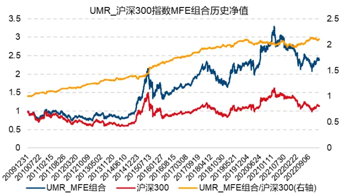

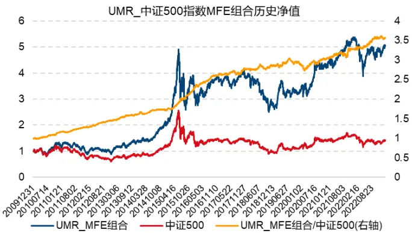

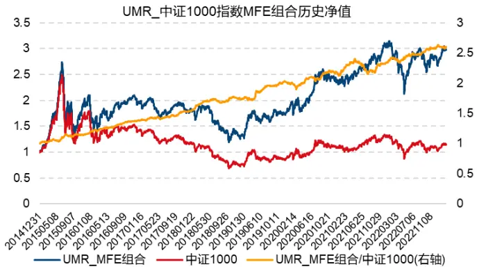

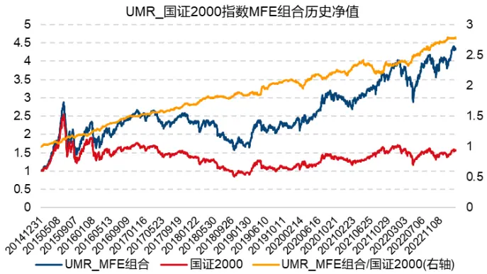
数据来源：Wind，东方证券研究所

下表展示了 UMR 因子 MFE 组合各年相对于各基准的超额收益和信息比情况。可以看到，在各宽基指数基准下构建的UMR单因子指数增强组合均能够显著跑赢基准，沪深300、中证500、中证1000、国证 2000 指数增强组合年化超额分别为 6.04%， 10.74%，12.95%，14.52%，市值越小的基准下增强效果越显著。

表 19：各宽基下 UMR因子的 MFE组合超额收益和信息比

| YEAR | 沪深300 |  | 中证500 |  | 中证1000 |  | 国证2000 |  |
| --- | --- | --- | --- | --- | --- | --- | --- | --- |
|  | 超额收益 | 信息比 | 超额收益 | 信息比 | 超额收益 信息比 | 超额收益 |  | 信息比 |
| 2010 | 9.15% | 2.99 | 17.28% | 3.02 |  |  |  |  |
| 2011 | 3.89% | 1.89 | 7.73% | 3.08 |  |  |  |  |
| 2012 | 8.07% | 2.43 | 13.56% | 3.18 |  |  |  |  |
| 2013 | 5.50% | 1.77 | 13.92% | 2.55 |  |  |  |  |
| 2014 | 1.79% | 0.29 | 5.89% | 1.02 |  |  |  |  |
| 2015 | 22.89% | 3.97 | 43.64% | 4.60 | 29.89% | 2.47 | 43.76% | 3.77 |
| 2016 | 7.30% | 2.56 | 15.39% | 4.45 | 14.21% | 3.63 | 20.94% | 5.09 |
| 2017 | 10.95% | 3.44 | 4.71% | 1.04 | 9.62% | 2.71 | 8.80% | 2.61 |
| 2018 | 2.66% | 1.22 | 1.75% | 0.65 | 8.67% | 2.92 | 6.05% | 2.10 |
| 2019 | 3.55% | 0.78 | 1.43% | 0.16 | 17.81% | 2.30 | 16.05% | 2.18 |
| 2020 | -1.01% | -0.28 | 7.06% | 0.95 | 8.68% | 1.06 | 5.92% | 0.76 |
| 2021 | -2.65% | -0.54 | 8.72% | 1.19 | 12.53% | 1.30 | 9.77% | 0.95 |
| 2022 | 5.91% | 2.04 | 7.97% | 2.13 | 8.30% | 1.92 | 15.22% | 3.11 |
| 20230228 | -0.89% | -1.94 | -1.35% | -2.53 | -1.28% | -2.15 | -0.50% | -1.14 |
| 全样本期 | 6.04% | 1.60 | 10.74% | 2.06 | 12.95% | 2.09 | 14.52% | 2.35 |

数据来源：Wind，东方证券研究所

## 3.2 指数增强中的表现

从前文我们知道 UMR 因子能够增强各宽基指数，这里我们进一步将其加入我们传统的指数增强模型中，看UMR因子是否能够带来增量。下表是我们现有的指数增强因子库，包括估值、成长、盈利、分析师预期、景气度、分红、公司治理、PEAD、流动性、波动率、反转、北向资金等维度。

表 20：因子库

| 类别 | 因子简称 | 因子名称 | 因子计算方式 |
| --- | --- | --- | --- |
| 估值 | BP | 账面市值比 | 净资产/总市值 |
|  | Quart EP | 单季度市盈率倒数 | 单季度归母净利润/总市值 |
|  | TTM_EP | 滚动市盈率倒数 | 归母净利润TTM/总市值 |
|  | Quart_SP | 单季度市销率倒数 | 单季度营业收入/总市值 |
|  | TTM_SP | 滚动市销率倒数 | 营业收入 TTM/总市值 |
|  | TTM_EP_PCT_1Y | EPTTM一年分位点 | 当前EPTTM 在过去一年的分位点 |
|  | TTM_FEP | 一致预期滚动市盈率倒数 | 一致预期滚动PE倒数 |
| 成长 | TTM_FPEG | 一致预期滚动 PEG | 一致预期滚动PE/个股滚动净利复合增长率 |
|  | YOY_Quart_NP | 单季度净利润同比增速 | 单季度净利润同比增长率 |
|  | YOY_Quart_OR | 单季度营业收入同比增速 | 单季度营业收入同比增长率 |
|  | YOY_Quart_OP | 单季度营业利润同比增速 | 单季度营业利润同比增长率 |
|  | SUE | 标准化预期外盈利 | (单季实际净利-预期净利)/预期净利标准差 |
|  | SUR | 标准化预期外收入 | (单季实际营收-预期营收)/预期营收标准差 |
|  | Delta_ROE | 单季净资产收益率同比变化 | 单季净资产收益率-去年同期净资产收益率 |
|  | Delta_ROA | 单季总资产收益率同比变化 | 单季总资产收益率-去年同期总资产收益率 |
|  | UE_PERC | 单季净利润超预期幅度 | 单季度净利润/分析师预期单季度净利润-1 |
|  | Quart_ROE | 单季度净资产收益率 | 单季净利润*2/(期初净资产+期末净资产) |
|  | TTM_ROE | 净资产收益率 TTM | 归母净利润TTM*2/（期初净资产+期末净资产） |
| 盈利 分析师 | Quart_ROA | 单季度总资产收益率 | 单季净利润*2/(期初总资产+期末总资产) |
|  | TTM_ROA | 总资产收益率 TTM | 归母净利润TTM*2/（期初总资产+期末总资产） |
|  | TTM_FROE | 一致预期滚动 ROE | 一致预期滚动净利润/一致预期滚动净资产 |
|  | ORGAN_NUM_3M | 分析师覆盖度 | 过去3个月撰写研报的机构数量 |
|  | ANA_REC | 分析师认可度 | (认可业绩分析师数-不认可业绩分析师数)/覆盖分析师数 |
| 预期 景气度 | UD_PCT | 分析师上下调数量差占比 | 过去3个月(上调家数-下调家数)/总家数+总家数/10000 |
|  | FNP_QOQ_PERC_3M | 预期滚动净利润环比增幅 | 当前一致预期滚动净利/3月前一致预期净利-1 |
|  | FROE_CHANGE_1M | 预期滚动 ROE一个月环比 |  |
|  | FROE_CHANGE_3M | 预期滚动 ROE 三个月环比 | 当前一致预期 ROE-1 个月前一致预期 ROE |
| 分红 | DIVIDEND RATE | 股息率 | 当前一致预期 ROE-3 个月前一致预期 ROE 最近四个季度预案分红金额/总市值 |
| 公司治理 | MANAGER_SALARY | 高管薪酬 | 公司前三高管的薪酬 |
| PEAD | AOG | 盈余公告次日开盘跳空超额 | 盈余公告次日开盘涨跌幅-中证500开盘涨跌幅 |
|  | ALG | 盈余公告次日最低价超额 | 盈余公告次日最低价超额 |
| 流动性 | TURNOVER_1M | 一个月日均换手 | 过去 20 个交易日换手率均值 |
|  | TURNOVER_3M | 三个月日均换手 | 过去60个交易日换手率均值 |
| 波动 | IVR_1M | 特异度 | 1-过去 20 日 Fama-French三因子回归拟合度 |
|  | ATR_1M | 一个月真实波动率 | 过去20个交易日日内真实波幅均值 |
| 反转 | ATR_3M | 三个月真实波动率 | 过去60个交易日日内真实波幅均值 |
|  | REVERSE_1M | 一个月反转 | 过去20 个交易日涨跌幅 |
| 北向资金 | REVERSE_3M | 三个月反转 | 过去60个交易日涨跌幅 |
|  | SHSC_PERC SHSC_PERC_CHANGE 北向持股环比变化 | 北向持股占比 | 北向持股占比 北向持股占比半年环比变化 |

数据来源：Wind，朝阳永续，东方证券研究所

对于每个因子我们对其进行去极值、标准化、行业市值中性化处理。在现有因子库基础上，我们加入 1、3、6、12 个月的 4 个 UMR 因子，通过对称正交剔除共线性后以滚动 12 期 ICIR 加权，对比加入因子前后复合因子选股能力。

下表对比了加入 UMR因子前后复合因子的选股能力对比，可以看到加入 UMR因子后复合因子的IC均值从 0.13提高到 0.14，年化 ICIR从 6.91提升到 6.99，月均多头超额从 1.59%提升到 1.73%。

表 21：加入 UMR因子前后复合因子的选股能力

|  | IC均值 | IC 标准差 | 年化ICIR | IC 胜率 | 月均多头超额 | 月均空头超额 | 月均多空收益 | 月度自相关系数 |
| --- | --- | --- | --- | --- | --- | --- | --- | --- |
| 原因子库 | 0.13 | 0.065 | 6.91 | 97% | 1.59% | -2.13% | 3.72% | 0.68 |
| 加入 UMR | 0.14 | 0.069 | 6.99 | 97% | 1.73% | -2.28% | 4.01% | 0.67 |

数据来源：Wind，朝阳永续，东方证券研究所

## 我们进一步构建指数增强模型，回测参数如下：

⚫ 回测时间：2010 年 1 月-2023 年 2 月；

⚫ 交易成本：买入 0.1%，卖出 0.2%；

⚫ 调仓频率：月频；

股票池：剔除上市半年以内的新股、ST股票、ST摘帽不满 3个月、退市前 1个月的股票，调仓时非停牌、涨跌停的股票，过去 20个交易日日均成交额高于 1000万；

⚫ 成分股内权重约束：至少 80%；

⚫ 行业、风格及个股权重偏离约束：

- 沪深 300：行业最大偏离 2%，银行非银行业偏离 0%，Beta 最大相对暴露 0.1，个股相对于成分股权重偏离上限 1.5%；

- 中证 500、中证 1000、国证 2000：中信一级行业偏离 0% ，市值最大相对暴露 0.3，个股相对于成分股权重偏离上限 1%。

下表展示了各宽基指数增强组合加入 UMR因子前后的收益表现。可以看到，加入 UMR因子后，各宽基指增的年化超额和信息比都有明显提升：

⚫ 沪深 300 指增的年化超额从 16.27%提升到 17.36%，信息比从 3.21 提升到 3.54；

⚫ 中证 500指增的年化超额从 19.64%提升到20.86%，信息比从 3.76提升到 4；

⚫ 中证 1000 指增的年化超额从 25.70%提升到 26.97%，信息比从 3.74 提升到 3.98；

⚫ 国证 2000 指增的年化超额从 26.44%提升到 28.41%，信息比从 3.44 提升到 3.85。

表 22：加入 UMR前后各宽基指数增强组合收益表现

| YEAR | 沪深300增强 |  |  | 中证500 增强 |  |  |
| --- | --- | --- | --- | --- | --- | --- |
|  | 原模型 |  | 加 UMR 因子 |  | 加UMR 因子 |  |
|  | 超额收益 信息比 | 超额收益 | 信息比 | 超额收益 信息比 | 超额收益 | 信息比 |
| 2010 | 11.65% 3.40 | 11.91% | 3.68 | 22.13% | 4.84 25.50% | 5.31 |
| 2011 | 14.22% 5.58 | 14.45% | 5.91 | 10.60% 4.81 | 11.69% | 4.96 |
| 2012 | 22.37% 5.32 | 23.31% | 5.55 | 19.06% 5.38 | 21.62% | 5.81 |
| 2013 | 18.99% 5.13 | 20.42% | 5.45 | 24.00% 4.45 | 27.88% | 5.20 |
| 2014 | 15.79% 2.83 | 11.89% | 2.22 | 14.67% 2.65 | 13.87% | 2.50 |
| 2015 | 30.15% 3.52 | 36.80% | 4.27 | 59.25% 4.07 | 56.21% | 4.01 |
| 2016 | 10.88% 3.07 | 12.16% | 3.29 | 23.98% 7.03 | 22.85% | 7.35 |
| 2017 | 25.81% 4.60 | 27.10% | 5.10 | 15.29% | 4.33 15.67% | 4.88 |
| 2018 | 10.80% 2.88 | 13.06% | 3.76 | 13.90% | 4.60 13.36% | 4.43 |
| 2019 | 24.39% 4.01 | 22.16% | 3.87 | 19.03% | 3.36 21.46% | 3.49 |
| 2020 | 21.60% 3.22 | 21.81% | 3.52 | 10.43% | 1.76 16.07% | 2.71 |
| 2021 | 6.24% 1.16 | 6.61% | 1.30 | 22.18% 3.31 | 20.64% | 3.07 |
| 2022 | 5.27% 1.22 | 7.61% | 1.77 | 7.53% | 2.20 11.69% | 3.33 |
| 20230228 | -0.98% | -1.55 -0.74% | -1.08 | 2.06% | 3.64 -0.19% | -0.37 |
| 全样本期 | 16.27% | 3.21 17.36% | 3.54 | 19.64% | 3.76 20.86% | 4.00 |

| YEAR | 中证1000增强 |  |  | 国证 2000 增强 |  |  |
| --- | --- | --- | --- | --- | --- | --- |
|  | 原模型 | 加 UMR 因子 |  | 原模型 | 加 UMR 因子 |  |
|  | 超额收益 | 信息比 超额收益 | 信息比 | 超额收益 信息比 | 超额收益 | 信息比 |
| 2015 | 59.74% 3.25 | 63.15% | 3.54 | 56.42% 2.75 | 64.15% | 3.38 |
| 2016 | 25.20% 6.15 | 26.21% | 6.44 | 25.93% 5.31 | 26.93% | 5.70 |
| 2017 | 23.62% 6.96 | 24.35% | 7.01 | 27.14% 6.36 | 26.12% | 6.56 |
| 2018 | 20.01% 6.16 | 19.32% | 6.07 | 21.47% 5.55 | 22.26% | 6.02 |
| 2019 | 25.69% 3.67 | 26.13% | 3.59 | 24.43% 3.45 | 24.92% | 3.42 |
| 2020 | 30.00% | 3.80 33.01% | 4.07 | 30.42% 3.68 | 34.15% | 4.12 |
| 2021 | 12.60% 1.41 | 15.28% | 1.77 | 6.84% 0.63 | 12.07% | 1.16 |
| 2022 | 14.44% | 2.89 15.74% | 3.21 | 17.08% 3.32 | 19.96% | 3.85 |
| 20230228 | 1.53% | 2.05 1.52% | 2.11 | 3.83% 6.66 | 1.92% | 2.99 |
| 全样本期 | 25.70% | 3.74 26.97% | 3.98 | 26.44% 3.44 | 28.41% | 3.85 |

数据来源：Wind，朝阳永续，东方证券研究所

## 四、因子改进框架的泛化能力

从前文中我们可以看到，通过引入特殊时点调整以及影响因素剥离，UMR因子的选股能力得到了非常明显的提升。这引发我们思考这两个调整方式是否对于其他量价因子也能带来改进。这里我们以三个月反转因子为例来检验这种调整方法的泛化能力。三个月反转因子的月度 IC及多空收益表现如下图所示。因子的月度 IC均值为-0.059，年化 ICIR为-1.99，IC月度胜率 74%。从多空收益走势来看，2016-2021年间因子表现相对一般。

图 46：三个月反转因子月度 IC和累计 IC
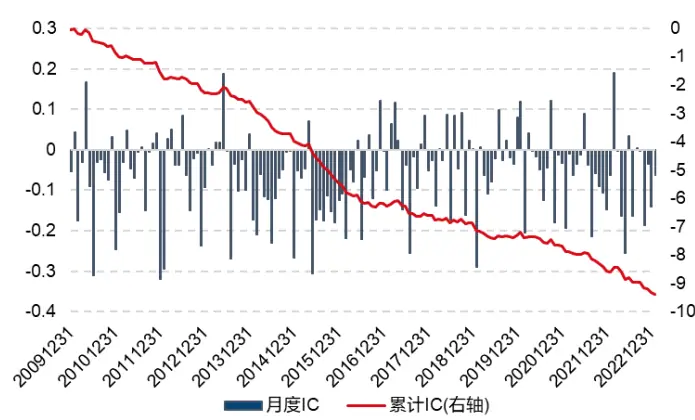
数据来源：Wind，东方证券研究所

图 47：三个月反转因子多空收益
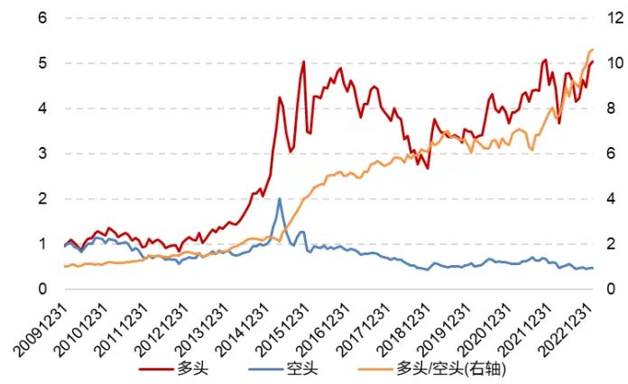
数据来源：Wind，东方证券研究所

从特殊时点调整角度来看，三个月反转因子表达的含义是过去三个月内每天的收益对未来呈现出反转的效果，而对于其中的一些例如盈余公告披露日，我们前文分析这些特殊日期是动量逻辑为主，因此在计算反转因子时同样应该以动量来刻画当日的作用，即正常日期权重为 1，而特殊时点日期的权重为-1，以此来计算特殊时点调整后的三个月反转因子。调整后因子的月度 IC 及多空收益表现如下图所示。可以看到因子的月度 IC 均值从原始的-0.059 提高到-0.069，年化 ICIR 从-1.99 提升到-2.75，IC 月度胜率从 74%提升到 80%，选股能力得到明显提升。从多空收益来看，因子的多空收益的稳定性也得到了非常明显的提升。

图 48：特殊时点调整后三个月反转因子月度 IC和累计 IC
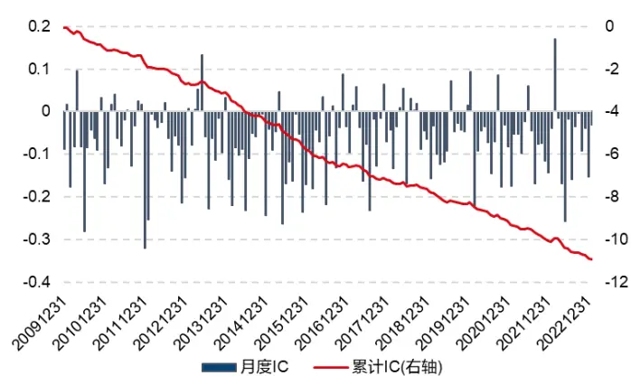
数据来源：Wind，东方证券研究所

图 49：特殊时点调整后三个月反转因子多空收益
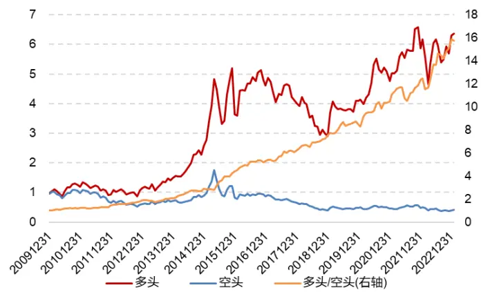
数据来源：Wind，东方证券研究所

进一步从影响因素的角度来看，我们可以考察三个月反转因子的多头中的两只股票，过去三个月中他们的下跌幅度接近，一只股票是某几天暴跌其他天横盘，而另外一只股票是每天阴跌，虽然区间跌幅一样但是下跌过程是完全不一样的，直接去比较这两类股票的区间跌幅并不合理，因此

有关分析师的申明，见本报告最后部分。其他重要信息披露见分析师申明之后部分，或请与您的投资代表联系。并请阅读本证券研究报告最后一页的免责申明。

我们也可以将三个月反转因子对过去三个月内日度超额为负的占比也进行剥离来降低下跌过程对于因子的影响。经过特殊时点调整和影响因素剥离后的三个月反转因子的月度 IC及多空收益表现如下图所示。可以看到因子的月度 IC均值进一步提高到-0.07，年化 ICIR进一步提升到-3.66，IC月度胜率进一步提升到 87%，选股能力得到明显提升。从多空收益来看，因子的多空收益的稳定性也得到了非常明显的提升。

图 50：剥离影响因素后三个月反转因子月度 IC和累计 IC
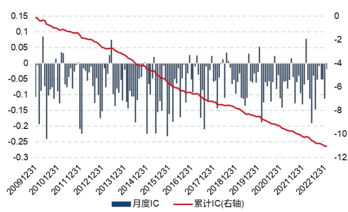
数据来源：Wind，东方证券研究所

图 51：剥离影响因素后三个月反转因子多空收益
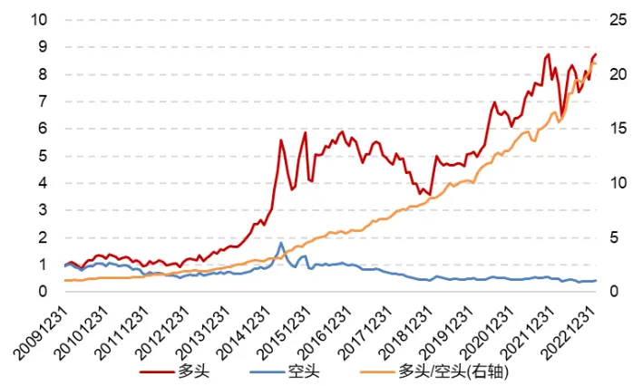
数据来源：Wind，东方证券研究所

下图展示了三种模式下因子的十组分档月度超额的对比。可以看到通过两步调整因子的分组收益单调性以及多头超额收益得到了持续的提升，月度多头超额从原因子的 0.43%分别提升到 0.56%，0.76%，提升效果非常显著。

图 52：三个月反转因子调整前后十组分档月度超额
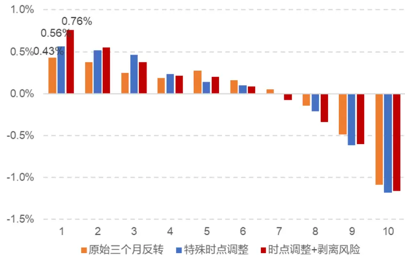
数据来源：Wind，东方证券研究所

## 五、总结

## 动量和反转统一框架 2.0

高风险日获得的收益往往是承担风险带来的，其更多源于投资者过度自信导致的价格反应过度，因此未来更倾向于反转效应，而低风险日获得的收益并不源于承担高风险，因此未来更偏向于动量效应，我们以时序均值调整后的风险指标来加权个股每日的溢价，并以此构建统一的动量反转因子。

“高风险日可能更偏反转，低风险日可能更偏动量”，但是动量不一定都出现在低风险日，而反转也不一定都出现在高风险日，在一些特殊时点，例如盈余公告日、一字跌停日、反弹动量日当日的收益可能更偏动量，另外因子也会受到窗口中高风险日占比、高超额日占比的风格影响，因此我们引入特殊日期处理、风险因素剥离、分钟高频化等维度，以此构建动量和反转统一框架2.0。

## 风险溢价下的统一动量反转因子——UMR因子

我们从股票日度的真实波动、换手率，大单买入均价偏离、小单主动买入金额占比、平均单笔成交量，早盘尾盘成交占比、分钟收益波动率、分钟收益偏度等维度刻画股票的日度风险并用以调整其每日超额收益，经过上述2.0的框架调整，加权得到风险调整后的UMR因子，每个调整后的因子都具有非常显著的选股能力，复合UMR因子月度IC均值达到0.116，年化ICIR达5.56，IC月度胜率 96%，月均多头超额 1.35%。并且不管是 1个月还是 1年的窗口下，因子都表现出持续同向的动量效应，并且选股效果衰减非常缓慢。

## UMR因子在指数增强中的应用

将 UMR 因子加入现有的指数增强模型后，各指数增强组合年化超额收益和信息比均获得明显提升，且大部分年份的超额收益都能获得提高。沪深 300 增强模型年化超额从 16.27%提升到17.36%；中证 500增强模型年化超额从 19.64%提升到 20.86%；中证 1000增强模型年化超额从25.70%提升到 26.97% ；国证 2000 增强模型年化超额从 26.44%提升到 28.41%。

## 因子改进框架的泛化能力

我们将特殊时点调整以及影响因素剥离的调整方式应用到三个月反转因子上，因子的选股效果同样得到了大幅提升，月度 IC 均值从-0.059 提升到-0.07，年化 ICIR 从-1.99 提升到-3.66，IC 胜率从 74%提升到 87%，月均多头超额从 0.43%提升到 0.76%。

## 风险提示

1. 量化模型基于历史数据分析，未来存在失效风险，建议投资者紧密跟踪模型表现。

2. 极端市场环境可能对模型效果造成剧烈冲击，导致收益亏损。

## Tabl e_Disclai mer 分析师申明

每位负责撰写本研究报告全部或部分内容的研究分析师在此作以下声明：

分析师在本报告中对所提及的证券或发行人发表的任何建议和观点均准确地反映了其个人对该证券或发行人的看法和判断；分析师薪酬的任何组成部分无论是在过去、现在及将来，均与其在本研究报告中所表述的具体建议或观点无任何直接或间接的关系。

## 投资评级和相关定义

报告发布日后的12个月内行业或公司的涨跌幅相对同期相关证券市场代表性指数的涨跌幅为基准（A 股市场基准为沪深 300 指数，香港市场基准为恒生指数，美国市场基准为标普 500 指数）；

## 公司投资评级的量化标准

买入：相对强于市场基准指数收益率 15%以上；

增持：相对强于市场基准指数收益率 5%～15%；

中性：相对于市场基准指数收益率在-5%～+5%之间波动；

减持：相对弱于市场基准指数收益率在-5%以下。

未评级 —— 由于在报告发出之时该股票不在本公司研究覆盖范围内，分析师基于当时对该股票的研究状况，未给予投资评级相关信息。

暂停评级 —— 根据监管制度及本公司相关规定，研究报告发布之时该投资对象可能与本公司存在潜在的利益冲突情形；亦或是研究报告发布当时该股票的价值和价格分析存在重大不确定性，缺乏足够的研究依据支持分析师给出明确投资评级；分析师在上述情况下暂停对该股票给予投资评级等信息，投资者需要注意在此报告发布之前曾给予该股票的投资评级、盈利预测及目标价格等信息不再有效。

## 行业投资评级的量化标准：

看好：相对强于市场基准指数收益率 5%以上；

中性：相对于市场基准指数收益率在-5%～+5%之间波动；

看淡：相对于市场基准指数收益率在-5%以下。

未评级：由于在报告发出之时该行业不在本公司研究覆盖范围内，分析师基于当时对该行业的研究状况，未给予投资评级等相关信息。

暂停评级：由于研究报告发布当时该行业的投资价值分析存在重大不确定性，缺乏足够的研究依据支持分析师给出明确行业投资评级；分析师在上述情况下暂停对该行业给予投资评级信息，投资者需要注意在此报告发布之前曾给予该行业的投资评级信息不再有效。

## HeadertTabl e_Discl ai mer 免责声明

本证券研究报告（以下简称“本报告”）由东方证券股份有限公司（以下简称“本公司”）制作及发布。

。本公司不会因接收人收到本报告而视其为本公司的当然客户。本报告的全体接收人应当采取必要措施防止本报告被转发给他人。

本报告是基于本公司认为可靠的且目前已公开的信息撰写，本公司力求但不保证该信息的准确性和完整性，客户也不应该认为该信息是准确和完整的。同时，本公司不保证文中观点或陈述不会发生任何变更，在不同时期，本公司可发出与本报告所载资料、意见及推测不一致的证券研究报告。本公司会适时更新我们的研究，但可能会因某些规定而无法做到。除了一些定期出版的证券研究报告之外，绝大多数证券研究报告是在分析师认为适当的时候不定期地发布。

在任何情况下，本报告中的信息或所表述的意见并不构成对任何人的投资建议，也没有考虑到个别客户特殊的投资目标、财务状况或需求。客户应考虑本报告中的任何意见或建议是否符合其特定状况，若有必要应寻求专家意见。本报告所载的资料、工具、意见及推测只提供给客户作参考之用，并非作为或被视为出售或购买证券或其他投资标的的邀请或向人作出邀请。

本报告中提及的投资价格和价值以及这些投资带来的收入可能会波动。过去的表现并不代表未来的表现，未来的回报也无法保证，投资者可能会损失本金。外汇汇率波动有可能对某些投资的价值或价格或来自这一投资的收入产生不良影响。那些涉及期货、期权及其它衍生工具的交易，因其包括重大的市场风险，因此并不适合所有投资者。

在任何情况下，本公司不对任何人因使用本报告中的任何内容所引致的任何损失负任何责任，投资者自主作出投资决策并自行承担投资风险，任何形式的分享证券投资收益或者分担证券投资损失的书面或口头承诺均为无效。

本报告主要以电子版形式分发，间或也会辅以印刷品形式分发，所有报告版权均归本公司所有。未经本公司事先书面协议授权，任何机构或个人不得以任何形式复制、转发或公开传播本报告的全部或部分内容。不得将报告内容作为诉讼、仲裁、传媒所引用之证明或依据，不得用于营利或用于未经允许的其它用途。

经本公司事先书面协议授权刊载或转发的，被授权机构承担相关刊载或者转发责任。不得对本报告进行任何有悖原意的引用、删节和修改。

提示客户及公众投资者慎重使用未经授权刊载或者转发的本公司证券研究报告，慎重使用公众媒体刊载的证券研究报告。

## 东方证券研究所

地址： 上海市中山南路 318 号东方国际金融广场 26 楼

电话：021-63325888

传真：021-63326786

网址： www.dfzq.com.cn