# DFQ 强化学习因子组合挖掘系统

# 因子选股系列之九十五

## 研究结论

传统的 Alpha模型往往单独挖掘每个因子，在挖掘过程中只关注每个因子自身的选股效力，忽略了单因子在应用中的组合需求。实际上我们更关注的是可以协同工作并产生综合效果的因子组合。

本文展示了一种新的因子组合挖掘框架，直接使用因子组合的表现来优化一个强化学习因子生成器，最终生成的是一组公式因子集合，这些因子协同使用具有较高的选股效力。这样做既能保留遗传规划算法公式化的优势，也能提升模型泛化能力，适应多种股票池，还能大幅提升运算效率。

基于强化学习的因子组合生成模型，由两部分组成：1) Alpha因子生成器：使用Maskable PPO模型生成动作，并以 token序列的形式生成公式化的 Alpha因子。2) Alpha 因子组合模型：组合 Alpha 因子，并给出奖励信号。这两部分互相依赖：因子生成器通过生成新因子提高因子组合的性能。因子组合模型的性能作为奖励信号来优化因子生成器。通过不断重复此交互过程，提升因子组合的选股效力。

DFQ强化学习模型分别在沪深 300、中证 500、中证 1000指数成分股内进行训练测试。采用 2015.1.1-2018.12.31 的数据作为训练集，2019.1.1-2019.12.31 为验证集。2020.1.1-2023.6.30为测试集。挖掘月频因子，考察因子预测未来 20天股票收益时的表现。对于每个股票池的预测模型，选取 5个不同的随机种子训练 5个模型，将 5个模型的合成因子值结果取平均作为最终模型的输出。

DFQ强化学习因子明显优于人工因子和遗传规划因子，在三个股票池中都有很强的选股效力，市值偏向性低。在沪深 300股票池中，测试集上rankic接近 8%，RANKICIR接近 1（未年化），5分组多头年化超额收益接近 15%。在中证500股票池中，测试集上 rankic 达到 8.5%，RANKICIR达到 1.15（未年化），5分组多头年化超额收益达到 8.22%。在中证 1000股票池中，测试集上 rankic达到 11.4%，RANKICIR达到 1.38（未年化），10分组多头年化超额收益达到 13.65%。

⚫DFQ强化学习因子可完全替代人工因子，在 300和 500股票池中可替代遗传规划因子。强化学习合成因子对人工因子和遗传规划因子分别回归后，残差仍有显著选股效果，RANKIC超过 5%，RANKICIR年化超过 1。强化学习因子和神经网络因子间存在信息差异，互相之间都不能被完全解释，两两回归残差都具备选股效果。

DFQ强化学习因子沪深 300top50组合：20年以来年化超额收益近 11%，单边年换手 8 倍，最大回撤 8%。2023年到 8.7 号超额收益达到 4.45%。中证 500 top50 组合：20年以来年化超额 16%，单边年换手 9倍，最大回撤 11%。2023年到 8.7号超额收益达到 9.45%。中证 1000中的 top50组合：20年以来年化超额 15%，单边年换手 10倍，最大回撤16%。2023年到 8.7号超额收益达到 4%。

DFQ强化学习因子沪深 300成分内指数增强组合：20年以来年化对冲收益近 8%，单边年换手 8倍，最大回撤 6%，每年均取得正超额，2023年到 8.7号对冲收益达5.28%。中证 500成分内指数增强组合：20年以来年化对冲收益超 11%，单边年换手 9倍，最大回撤 8%，每年均取得正超额，2023年到 8.7号对冲收益达 5.59%。中证 1000成分内指数增强组合：20年以来年化对冲收益超8%，单边年换手 10倍，最大回撤 11%，每年均取得正超额，2023年到 8.7号对冲收益达 1%。

## 风险提示

1. 量化模型失效风险。

2. 极端市场环境对模型的影响。

报告发布日期

2023 年 08 月 17 日

证券分析师 杨怡玲

yangyiling@orientsec.com.cn

执业证书编号：S0860523040002

证券分析师 刘静涵

021-63325888*3211

liujinghan@orientsec.com.cn

执业证书编号：S0860520080003

香港证监会牌照：BSX840

UMR2.0——风险溢价视角下的动量反转2023-07-13
统一框架再升级：——因子选股系列之九
十四

集成模型在量价特征中的应用：——因子 2023-07-01选股系列之九十三

基于时点动量的因子轮动：——因子选股 2023-06-28系列之九十二

基于循环神经网络的多频率因子挖掘：— 2023-06-06—因子选股系列之九十一

DFQ 遗传规划价量因子挖掘系统：——因 2023-05-28子选股系列之九十

分析师情感调整分数 ASAS：——因子选 2023-03-28股系列之八十九

基于偏股型基金指数的增强方案：——因 2023-03-06子选股系列之八十八

分析师研报类 alpha 增强：——因子选股 2023-02-17系列之八十七

## 一、DFQ强化学习因子组合挖掘系统概述

多因子选股体系主要包括 Alpha 模型、风险模型、交易成本模型和组合优化四个模块。Alpha 模型负责对股票收益或 Alpha 的预测，对组合收益的影响相对更大，是量化研究的重中之重。传统的 Alpha模型一般分为 Alpha因子库构建和 Alpha因子加权两个核心步骤。

图 1：多因子选股体系示意图
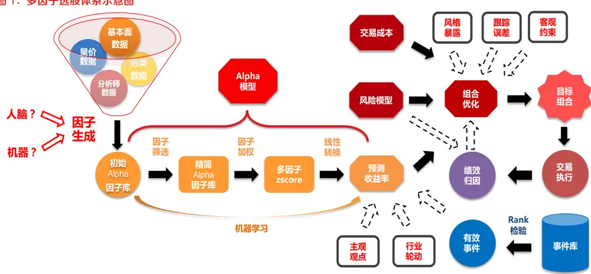
数据来源：东方证券研究所绘制

在 Alpha 因子构建中，可以引入的常见机器学习模型主要有两大类：遗传规划和神经网络，我们都有对应的研究成果。神经网络方法相关报告：《神经网络日频 alpha 模型初步实践》、《周频量价指增模型》、《多模型学习量价时序特征》、《基于循环神经网络的多频率因子挖掘》；遗传规划算法相关报告：《机器因子库相对人工因子库的增量》、《DFQ 遗传规划价量因子挖掘系统》。遗传规划和神经网络方法各有优劣，神经网络方法样本内拟合效果好，但模型黑箱，因子无显式公式，可解释性差，存在过拟合风险；遗传规划算法生成的因子具有显式公式，可解释性强，相对不易过拟合，对算力要求低，但模型泛化能力不强，在沪深 300 和中证 500 股票池中效果较差。在 Alpha 因子加权问题上，我们也有相应探索，可参考《机器的比拼》等报告。例如弹性网络等线性模型，决策树、神经网络等非线性模型也都有不错的应用效果。

在量化投资实践中，为了提升模型稳定性，我们通常会同时使用多个因子。传统的 Alpha 模型往往单独挖掘每个因子，在挖掘过程中只关注每个因子自身的选股效力。先选出一部分效果不错的单因子后再去进行加权组合。这样做将因子挖掘和因子加权割裂开来，在因子挖掘阶段忽略了单因子在应用中的组合需求。实际上我们更关注的是可以协同工作并产生综合效果的因子组合。

基于此， 我们展示了一种新的因子组合挖掘框架，直接使用因子组合的表现来优化一个强化学习因子生成器，最终生成的是一组公式因子集合，这些因子协同使用具有较高的选股效力。这样做既能保留遗传规划算法公式化的优势，也能提升模型泛化能力，适应多种股票池，还能大幅提升运算效率。本文参考了华为 & 中科院计算所的科学家在 2023 年发表的研究论文《Generating Synergistic Formulaic Alpha Collections via Reinforcement Learning》，并进行了修改优化工作。

## 二、强化学习算法介绍

## 2.1 强化学习

强化学习（Reinforcement Learning，RL）是一类机器学习方法，它的核心思想是训练一个智能体（agent），智能体能够在与环境（environment）交互的过程中不断学习，从而做出最优决策。在强化学习过程中，智能体与环境一直在交互：智能体在环境里面获取某个状态后，会利用该状态输出一个动作，然后这个动作会在环境之中被执行。接下来环境会根据智能体采取的动作，输出下一个状态以及当前这个动作带来的奖励。这样智能体就可以利用奖励信号来更新自己，使得下一次输出的动作能获得更高的奖励。强化学习的智能体一开始并不知道每一步正确的动作应该是什么，只能通过不停地试错探索来获取对环境的理解，发现最有利的动作，最大化奖励。

图 2：强化学习示意图
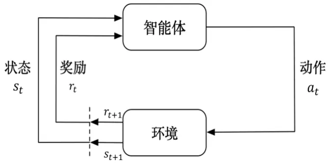
数据来源： 东方证券研究所 & Easy RL：强化学习教程

强化学习模型的这种不断适应环境，探索环境的特性，决定了它有非常大的潜力，可能可以获得超越人类能力的表现。近年来，强化学习已经在诸多领域展示了其强大的能力。在游戏领域，DeepMind的AlphaGo首次以4:1击败了世界围棋冠军李世石，展示了RL在复杂策略分析方面的能力。AlphaZero 不仅学会了围棋，还自主学习了国际象棋和将棋，并在各自的领域击败了世界级算法。AlphaStar 在星际争霸 II 中击败了人类职业选手。在金融领域，强化学习可以进行自动化交易。通过学习历史数据和实时市场动态，强化学习算法可以确定何时买入、卖出或持有特定资产。还可以进行投资组合优化，用于确定资产组合的最佳权重分配，以实现特定的风险/回报目标。但目前强化学习算法在 Alpha模型上的应用还比较少，这也是我们本次报告要解决的问题。

## 使用强化学习进行选股因子挖掘具有以下优势：

（1）适应性决策制定：与传统的预测模型不同，强化学习不仅仅预测市场动态，而是直接学习一个策略。随着市场的变化，强化学习模型可以持续地学习和调整策略，从而适应新的市场环境。

（2）端到端的学习：强化学习可以实现从原始输入到交易决策的端到端学习，避免了传统方法中的多个步骤和假设。

（3）探索与利用的平衡：强化学习算法自然地处理探索（尝试新的策略）与利用（沿用当前最佳策略）之间的平衡，使其能够在稳定性与性能之间找到最佳折衷。

（4）考虑交易成本和约束：强化学习可以直接在奖励函数中考虑交易成本、税费、市场冲击等实际约束，使策略更具实用性。

有关分析师的申明，见本报告最后部分。其他重要信息披露见分析师申明之后部分，或请与您的投资代表联系。并请阅读本证券研究报告最后一页的免责申明。

（5）多因子策略优化：强化学习可以更好地整合和平衡多个选股因子，从而形成一个综合的、更稳健的投资策略。

## 2.2 PPO 算法

近端策略优化（Proximal Policy Optimization，PPO）是一种深度强化学习算法，结合了深度学习和传统的强化学习技术，也是现在 OpenAI 默认的强化学习算法。PPO算法完全遵循强化学习的框架，使用状态、动作、奖励等概念，并通过与环境的交互来训练智能体。目标是找到一种策略（即动作选择机制），使得从环境中获得的奖励最大化。与此同时，PPO 算法使用深度神经网络来表示策略和价值函数，这允许算法处理高维、连续或复杂的观察和动作空间。

PPO算法是传统策略梯度算法（Policy Gradient，PG）的改进，属于同策略算法。在强化学习中，如果要学习的智能体和与环境交互的智能体是相同的，称之为同策略。在策略梯度算法中，智能体先去跟环境互动，收集经验。然后根据收集到的经验，按照策略梯度算法的方式更新策略网络的参数。但问题是，一旦我们更新了策略网络参数，那么之前收集到的经验就变的不能用了，所以策略梯度算法需要花很多时间来收集经验，于是就有了 PPO算法。PPO属于信任域（TrustRegion，TR）方法的一种，其核心思想是在每次更新策略的时候，不让新策略偏离老策略太远，这样基于老策略收集的经验仍然可以继续使用，避免在更新策略的过程中产生过大的震荡和不稳定。具体来说，PPO 算法是通过裁剪策略比率（新策略和旧策略的比值），确保策略更新是有界的，从而增加了训练的稳定性。

图 3：策略梯度算法 VS PPO算法示意图
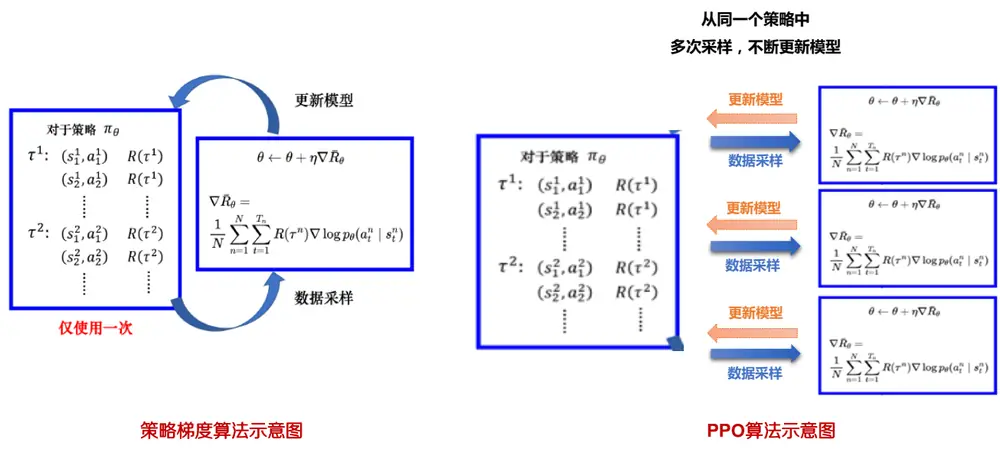
数据来源：东方证券研究所 & Easy RL：强化学习教程

## PPO 算法步骤如下：

1. 收集经验：执行当前策略来与环境交互并收集经验样本，包括状态、动作、奖励。而后从经验集中多次抽取样本进行学习，充分利用每批经验来不断更新网络。经验集个数由参数 n_steps 确定，每次训练都是从经验集中随机选择 batch_size 个样本，然后重复选择 n_epochs 次，根据每个样本更新策略。一个样本可能会被多次选中，进行多次学习。

2. 计算回报与优势：（1）优势：衡量在给定状态下采取某一行动相对于平均行动的优势。（2）回报：从当前步骤开始的未来折扣奖励的总和。

## 3. 计算损失函数：分为三部分：

（1）策略损失：策略损失是强化学习中关键的损失函数，其目的是优化智能体的策略，以便在与环境互动时选择更好的动作。通过优势和新旧策略的比率来计算策略损失，然后将比率剪裁以限制更新的幅度。

（2）值损失：值损失用于优化值函数，即状态值的估计。值函数在强化学习中用于估计从给定状态开始的预期回报，值损失利用值函数预测值和实际回报之间的均方误差来计算。通过最小化值损失，可以更准确地预测未来回报。

（3）熵损失：熵损失是一种鼓励探索的机制。通过增加策略的熵，来鼓励智能体采取更随机的动作，从而探索更多的状态空间。在训练智能体时，我们不仅想让它学习如何在已知环境中表现良好，还想让它探索新的可能性，以便在未知情况下也能做出好决策。将策略损失、值损失、熵损失三者加权作为损失函数，ent_coef 和 vf_coef 是熵损失和值损失的权重系数。这三种损失共同工作，以训练能够在多种环境中做出智能决策的智能体。

4. 优化损失函数：通过随机梯度下降（或其他优化器）来优化损失函数。默认使用 Adam算法。学习率是优化器的关键参数，它决定了每次梯度下降更新时参数更新的幅度。较高的学习率可能导致更快的收敛，但也可能造成不稳定。较低的学习率可能更稳定，但收敛速度可能会慢，容易陷入局部最优解。

5. 更新策略： 用优化后的参数更新策略。

6. 重复：重复以上步骤直到满足终止条件或达到指定的更新学习次数。

## 使用 PPO算法进行选股因子挖掘有多个潜在的优点：

（1）自动特征学习： PPO 中使用的深度学习模型能够自动从原始数据中学习和提取有意义的特征，减少了手工特征工程的需求。

（2）非线性关系捕获：深度神经网络在捕获非线性关系方面是非常有效的，这使得 PPO 在解决复杂的选股问题上可能比某些传统方法更有优势。

（3）训练稳定性高：PPO 通过限制策略更新的大小来增加训练的稳定性，这在金融市场这种高度噪音、非稳定的环境中是很有价值的。

（4）适应性强：PPO的策略迭代方法使其能够更好地适应不断变化的市场环境。

此外，PPO 算法可以与动作掩蔽机制结合，以确保在训练过程中仅选择合法动作，称为Maskable PPO算法。可以通过以下步骤实现：

1. 定义掩蔽向量：对于每个状态，定义一个掩蔽向量，其中合法动作的位置设为 True，非法动作的位置设为 False。

2. 修改策略网络的输出：将策略网络的输出（即动作概率分布）与掩蔽向量相结合，通过将非法动作的对数概率设置为一个非常大的负数来完成，这样对数概率进行 softmax 转换后会接近于 0，使得这些动作在采样中几乎不可能被选择，以消除非法动作的影响。

3. 重新归一化：由于消除了某些动作的概率，所以需要重新归一化概率分布，以确保其总和为 1。

4. 选择动作：根据修改后的概率分布选择动作。

5. 训练和优化：除了上述修改外，PPO的训练和优化过程与标准 PPO相同。

Python 中的 Stable Baselines 和 sb3_contrib 库提供了一系列强化学习算法的实现，sb3_contrib 是 Stable Baselines 3 的扩展库。我们使用的是 sb3_contrib 中的 ppo_mask。在ppo_mask 中使用了 TensorBoard 工具来监控训练过程，可以展示训练过程中的各种可视化统计数据，帮助我们更直观地理解训练过程，从而更有效地调试和优化模型。

## 三、基于强化学习的因子组合生成模型

## 3.1 模型概述

基于强化学习的因子组合生成模型，由两部分组成：

1) Alpha 因子生成器：使用 Maskable PPO 模型生成动作，并以 token 序列的形式生成公式化的 Alpha 因子。

2) Alpha因子组合模型：组合 Alpha因子，并给出奖励信号。

这两部分互相依赖： Alpha 因子生成器通过生成新因子来进一步提高 Alpha 因子组合模型的性能。Alpha 因子组合模型的性能作为奖励信号，用于优化 Alpha 因子生成器。这个框架的目的就是通过不断重复此交互过程，使得产生的因子组合的选股效力有所提高。

图 4：基于强化学习的因子组合生成模型示意图
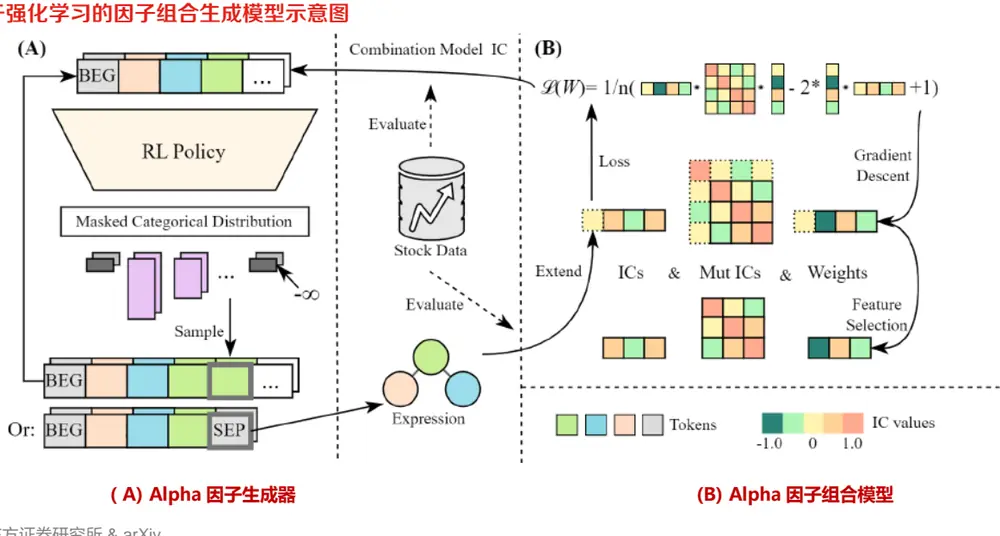
数据来源：东方证券研究所 & arXiv

## 3.2 公式化因子

公式化的 Alpha 因子有显式公式，可以用数学表达式的形式表示。因子表达式由以下几部分组成，每个元素都被称为 Token：

1. 算子：共 118 个。分为截面和时序两大类，截面算子根据需要的特征个数进一步分为四个小类：一元截面（Unary，30 个），二元截面（Binary，21 个），三元截面（Three，5个），四元截面（Four，8个）；时序算子根据需要的特征个数和窗口个数进一步分为6 个小类：一元时序（Rolling，35 个），二元时序（PairRolling，11 个），二元时序 2常数（PairRollingDiffDay2，4 个），二元时序 3 常数（PairRollingDiffDay3，2 个），三元时序（ThreeRolling，2 个）。算子内部需要充分考虑缺失值兼容性及运算效率。

2. 特征：共 70 个。包括日度量价特征 33 个，日内分钟量价特征 14 个，日内 l2 量价特征13 个，基本面特征（估值+分析师）10 个。特征选择的标准是数据更新频率高，在日度时序上有变化。我们对部分特征进行了适当量纲调整。涉及的最高价、最低价、开盘价、收盘价、成交量均进行后复权，避免使用前复权数据引入未来信息。

3.时间窗口（时序算子的参数）：共5个。包括5日，10日, 20日, 40日, 60日。强化学习模型是按照逆波兰表达式的形式生成因子，先产生操作数，再匹配操作符。我们选取的特征和时间窗口参数的数量差别较大，因而更容易产生特征。特征后续只能匹配截面算子进行截面的运算，匹配时序算子不合法，因而时序算子出现的概率会大大降低。基于此，我们将时间窗口的序列*10，扩展为 50 个，以提升时序算子出现的概率。由于我们只希望常数出现在算子的指定位置上，避免无意义运算，因而并未设置常数选项。

4. 特殊符号：BEG（序列开始）, SEP（序列结束）。

每个因子公式天然地与一棵表达式树等价，进而与一个逆波兰表达式（表达式树的后续遍历，Reversed Notation，RPN）等价，模型通过 token 序列的形式生成 RPN，从而生成因子。逆波兰表示法是一种没有括号、没有优先级规则的数学表达式表示方法。在这种表示法中，操作符位于其操作数之后。例如，表达式 add(5, volume) 的逆波兰表达式就是 5 volume add，表达式ts_sum(add(5, volume), 2) 的逆波兰表达式就是 5 volume add 2 ts_sum。逆波兰表示法可以使用简单的栈结构解析，易于计算机处理，执行效率高，在许多计算和编程应用中都显示出优势。

图 5：因子表达式&表达式树&逆波兰表达式
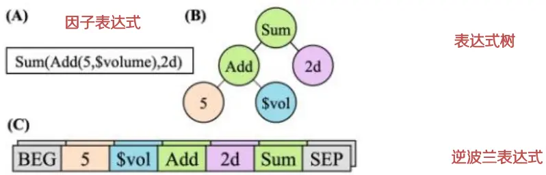
数据来源：东方证券研究所 & arXiv

## 3.3 Alpha 因子生成器

为了控制和评估有效表达式的生成过程，我们将 Alpha 因子的生成过程，建模为非平稳的马尔可夫决策过程（Markov decision process，MDP）。MDP 的各个组成部分如下：

图 6：Alpha 因子生成器
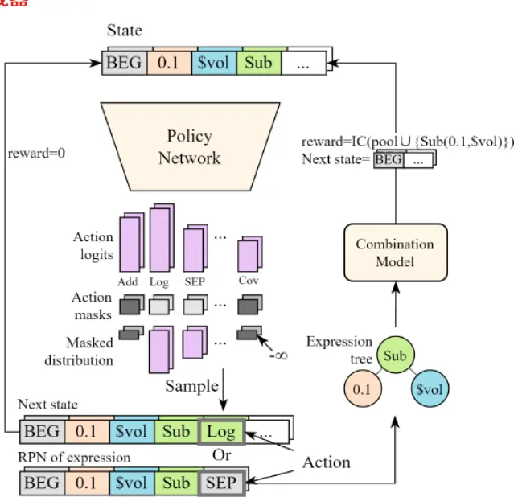
数据来源：东方证券研究所 & arXiv
有关分析师的申明，见本报告最后部分。其他重要信息披露见分析师申明之后部分，或请与您的投资代表联系。并请阅读本证券研究报告最后一页的免责申明。

1. 状态（State）：当前已经生成的 token 序列，例如[BEG,$adjclose,$volume]。有效状态始终以 BEG开始，后跟先前选择的 token序列。

2. 动作空间（action space）：动作的集合。随机生成的 token 序列不能保证是表达式的RPN，因而我们只允许模型输出符合运算规则的合法动作，以确保 RPN 序列的格式正确。不合法的动作将在动作空间中掩蔽，这就是后面的 Action Mask步骤。

3. 动作掩蔽（Action Mask）：根据当前状态判断动作空间中的动作是否合法，不合法的动作将被掩蔽，模型仅从合法动作集合中进行抽样得到下一个动作。每类 token 的合法性定义如下图。

4. 行动（Action）：将要添加到token序列尾部的下一个token，例如Sub。下一个行动是什么由策略网络从动作空间中选取生成。

5. 状态转移（Dynamic）：将动作对应的 token添加到状态的末尾。

6. 奖励（Reward）：智能体在特定状态下采取某一动作的即时效用。奖励是针对 Action的，MDP 不会为未完成的 token 序列给出即时奖励，仅在序列结束（出现 SEP 或长度达到阈值）时有非 0 的奖励。奖励设置为当前因子组合的合成 IC，因子组合和奖励均通过后续的 Alpha 因子组合模型得到。

如果当前的 token 序列是[BEG, $adjclose,$vol,Sub,Add]，那么序列未完成，当前动作Add 的奖励就是 0；如果当前的 token 序列是[BEG, $adjclose,$vol,Sub,SEP]，那么序列完成，当前状态有效，该状态将被解析为公式函数，末尾 action 的奖励即为加入新因子Sub(0.1,$vol)后因子组合的合成 IC。

由于过长的公式会降低解释性，我们将公式的长度阈值限制为20个token。长度超过20的表达式如果当前仍不完整，那么奖励将被强制设为-1（IC 的最小值），以降低后续再生成超长表达式的概率。此外，我们将出现连续重复一元截面运算符的因子（例如rank(rank($adjclose))）、单特征因子（例如$adjclose）、无法计算 IC（缺失率过高、标准差过小、截面不重复数值太少）的因子、与因子池中的已有因子的因子值相关系数超过 0.99的因子，奖励强制设为 0，降低不合理单因子出现的概率。

7. 价值（Value）：对给定状态下某一动作带来的未来回报的估计。由价值网络得到。

8. 优势（Advantage）：度量一个动作相对于平均动作的优势。可以使用广义优势估计（Generalized Advantage Estimation，GAE）来计算。

9. 回报（Return）：表示从当前步骤开始的未来折扣奖励的总和。结合了优势和当前步骤的价值估计来计算，满足关系：回报 = 优势 + 价值。

图 7：token的合法性定义

| token类型 |  | 合法性规则 |
| --- | --- | --- |
| 特征(FEATURE) |  | 前面没有token，或前面的token是特征 |
| 时间窗口(DELTA_TIME) |  | 前面至少有一个token |
| 算子(OPERATOR) | 一元截面(Unary） 二元截面（Binary） | 满足参数个数要求+前一个token是特征 |
|  | 三元截面(Three） | 满足参数个数要求+前2个token是特征 |
|  |  | 满足参数个数要求+前3个token是特征 |
|  | 四元截面(Four） 一元时序（Rolling） | 满足参数个数要求+前4个token是特征 |
|  |  | 满足参数个数要求+前1个token是时间窗口，倒数第二个token是特征 |
|  | 二元时序(PairRolling） | 满足参数个数要求+前1个token是时间窗口，倒数第二个和第三个token是特征 |
|  | 二元时序2常数(PairRollingDiffDay2） | 满足参数个数要求+倒数第一个和第二个token是时间窗口，倒数第三个和第四个token是特征 |
|  | 二元时序3常数(PairRollingDiffDay3） | 满足参数个数要求+倒数第1-3个token是时间窗口，倒数第4-5个token是特征 |
|  | 三元时序(ThreeRolling） | 满足参数个数要求+前1个token是时间窗口，倒数第2-4个token是特征 |

数据来源：东方证券研究所绘制

有关分析师的申明，见本报告最后部分。其他重要信息披露见分析师申明之后部分，或请与您的投资代表联系。并请阅读本证券研究报告最后一页的免责申明。

基于上述定义的 MDP，我们使用 Maskable PPO 模型不断生成动作。该模型接受状态作为输入，并输出动作分布，实际动作将从输出分布中抽样。

PPO 算法中用于学习环境的策略模型属于演员-评论家策略（MaskableActorCriticPolicy，MlpPolicy）。这个策略根据当前观察到的环境状态选择动作，评估动作的价值，并计算动作被模型选中的概率。智能体会根据策略做出动作，相当于演员，而价值函数会对做出的动作给出价值，相当于评论家。该方法可以看作基于价值的方法和基于策略的方法的交集，习惯上仍归入基于策略的方法。演员-评论家方法结合了基于策略的策略梯度算法的探索能力和基于价值的方法的稳定性和高效性，可以加速学习过程，通过同时学习策略（演员）和价值函数（评论家），算法可以相互引导和纠正，避免一些不稳定的学习动态。

演员-评论家策略需要价值网络和策略网络。策略网络根据当前策略和给定的状态，选择一个动作输出。价值网络用来评估在给定状态下采取特定动作的预期回报。这两个网络均使用深度神经网络来表示。策略网络的结构包括：一个特征提取器 (features_extractor)，一个多层感知机(mlp_extractor)，一个动作分布生成网络 (action_net)。价值网络的结构包括：一个特征提取器(features_extractor)，一个多层感知机 (mlp_extractor)，一个价值估计生成网络 (value_net)。

价值网络和策略网络共享一个基础的特征提取器(features_extractor)。该提取器将 token 序列转换为密集向量表示，得到的特征向量被送入 mlp_extractor，其目的是为后续的网络组件提供一个更简洁、更信息化的表示。这样的共享这不仅有助于减少模型复杂性，还有助于提高模型的学习效率和性能。特征提取器我们采用Transformer模型。Transformer模型最初是为了处理机器翻译任务而设计的，其中包括编码器和解码器。编码器处理源语言的句子，而解码器生成目标语言的句子。但是，在不涉及序列到序列映射的任务中通常只需使用 Transformer 的编码器部分。编码器可以有效地处理序列数据，提取其关键特征，并输出一个固定长度的向量。在我们模型中，只需要对观察序列进行编码以提取特征，因此只使用了编码器部分，并没有使用解码器。

与 LSTM模型相比，Transformer 有以下优点：（1）并行计算：并行处理序列中所有元素，提高计算效率。（2）长距离依赖关系：通过自注意力机制，直接捕获序列中的长距离依赖关系。（3）可解释性：自注意力机制的权重提供了序列元素之间关系的直观可视化。（4）灵活性：可以轻松扩展到多头注意力，从而捕获序列中不同层次的特征。实际测试发现，LSTM 模型运行速度更快，显存占用更低，但产生的合法有效因子数量少，合成因子效果不如 Transformer。在算力允许的情况下，使用 Transformer模型作为特征提取器应是更优选择。

图 8：Transformer模型下产生的合法因子数量
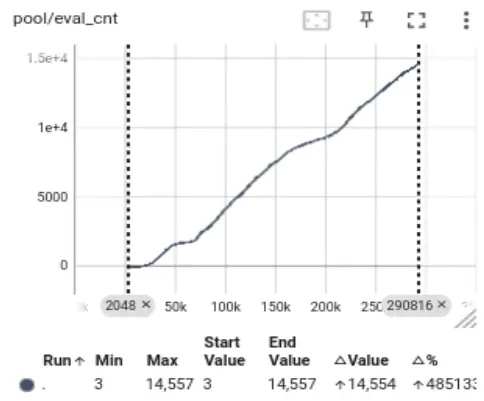
数据来源：东方证券研究所 & wind资讯

图 9：LSTM模型下产生的合法因子数量
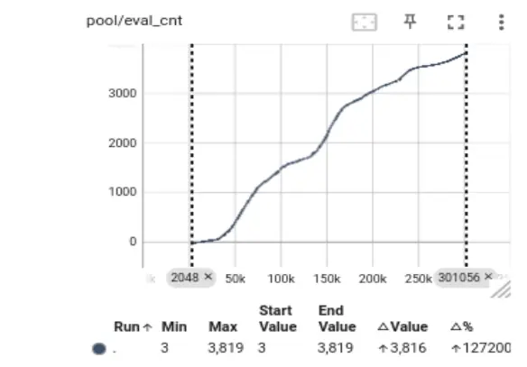
数据来源：东方证券研究所 & wind资讯

有关分析师的申明，见本报告最后部分。其他重要信息披露见分析师申明之后部分，或请与您的投资代表联系。并请阅读本证券研究报告最后一页的免责申明。

图 10：Transformer 模型下测试集因子表现
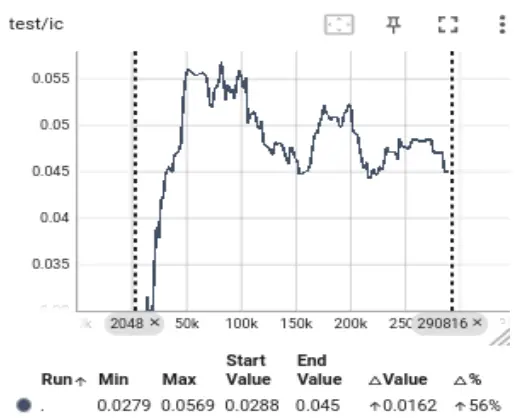
数据来源：东方证券研究所 & wind资讯

图 11：LSTM模型下测试集因子表现
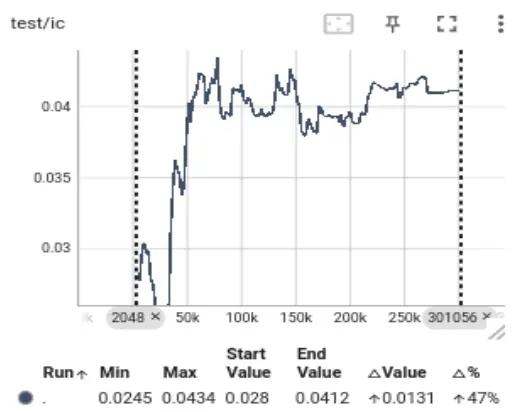
数据来源：东方证券研究所 & wind资讯

价值网络和策略网络均使用多层感知器（multilayer perceptron, MLP）网络来处理特征。MLP 进一步处理从 features_extractor 得到的特征，旨在得到更有意义、更高级的表示，为策略和价值网络提供适当的输入。MLP是一种由全连接层组成的前馈神经网络。每一层都与下一层完全连接，没有循环或卷积层。我们设置的 MLP均包含 2个隐藏层，每层 64个神经元。

动作分布生成网络 (action_net) 使用了一个单层全连接网络，用于生成动作分布。动作分布还将与动作掩蔽机制相结合，以确保非法动作不会被选中。价值估计生成网络 (value_net)也使用了一个单层全连接网络组成，用于将特征转换为单一的价值估计。

## 3.4 因子评价

我们将优化后因子组合的 IC，作为当前动作的奖励。因子组合的 IC 使用合成因子值和收益率来计算。合成因子值通过单因子值和单因子权重加权计算。

计算单因子 IC 时，收益率进行截面中性化和标准化，不进行缺失值填充。因子值进行标准化，并使用 0 来填充缺失值。计算合成因子 IC 时，因子值也进行标准化，并使用 0 来填充缺失值。收益率中性化专注于消除收益率与行业市值风格之间的关系，使得因子与收益率之间的关系更纯粹，同时收益率中性化只需要计算一次，不需要对每个因子都计算，能够大幅节省运算开销。

## 3.5 Alpha 因子组合模型

考虑到因子组合的可解释性和运算效率，我们使用线性模型来组合 Alpha。也可以根据模型最终得到的单因子集，在外部进行重新加权，考虑动态加权、非线性加权等方式，可能也可以获得更好的合成因子表现。

给定一组 k 个 alpha 因子 $\mathsf{F}=\{\mathsf{f}1,\mathsf{f}2,\cdots\cdots,\mathsf{f}\mathsf{K}\}$ }和它们的权重 $\mathsf{w}=(\mathsf{w}1,\mathsf{w}2,\cdots\cdots\mathsf{w}\mathsf{k})$ ，组合模型定义如下：

$$
\mathbf{c}(\mathrm{X};\mathrm{F},\mathrm{w})=\sum_{j=1}^{k}\omega_{j}f_{j}(X)=z,
$$

组合模型的损失设计如下，通过优化损失函数，可以找到最佳的因子权重：

$$
\mathrm{L}(\omega)=\frac{1}{n}(1-2\sum_{i=1}^{K}\omega_{i}\overline{\sigma}_{y}(f_{i})+\sum_{i=1}^{K}\sum_{j=1}^{K}\left|\omega_{i}\omega_{j}\right|\left|\overline{\sigma}\left(f_{i}(X),f_{j}(X)\right)\right|+0.5*\sum_{i=1}^{K}\sum_{j=1}^{K}\omega_{i}\omega_{j}\overline{\sigma}\left(f_{i}(X),f_{j}(X)\right))
$$

这里，我们引入了平均相关性的 符号σ̅ ，其中：∑ Ki=1 $\omega_{i}\bar{\sigma}_{y}(f_{i})$ 代表合成因子的 IC；∑ Ki=1 $\begin{array}{r}{\left|\sum_{j=1}^{K}\middle|\omega_{i}\omega_{j}\right|\left|\overline{{\sigma}}\left(f_{i}(X),f_{j}(X)\right)\right|}\end{array}$ ，为绝对值相关性和，因子间的高度负相关和正相关均会带来损失的增加。通过减小因子之间绝对值的相关性，减少因子之间的冗余和共线性，增加因子多样性；∑ ∑ Kj=1Ki=1 $\omega_{i}\omega_{j}\bar{\sigma}\left(f_{i}(X),f_{j}(X)\right)$ 考虑了相关性的正负号。一旦我们得到单因子 IC，以及两两相关系数，就可以使用这些项来计算损失，从而在每个梯度下降步骤中节省计算时间。

我们在损失函数中还加入了 L1 正则化项，以防止过拟合。L1 正则化通过在损失函数中添加一个与权重的绝对值成比例的项来工作，将倾向于产生稀疏权重向量，防止模型过于复杂，确保模型不会过度依赖单个因子，从而减少过拟合的风险。

梯度下降采用 Adam 算法。Adam（Adaptive Moment Estimation）算法是一种流行的随机优化方法，结合了动量和自适应学习率调整的优点，会比传统的随机梯度下降（SGD）更快地收敛。

考虑到时间和空间复杂性，将所有生成的 alpha 因子组合在一起不现实。计算 k 个因子间的相关系数就需要 O(k^2)的运算量。实际测试显示 100-200 个 alpha 因子对于实际使用来说就足够了，更多的 alpha 因子不会带来太多的性能增长，遵循收益递减法则。因而我们设置了因子池的规模上限为 200 个因子，当因子池达到 200个以后，每新增一个因子都需要相应去掉一个因子，以保持因子总数不变。

下面展示了增量组合模型优化算法的主要步骤：

输入：一个 Alpha 因子集合，包含 k 个 alpha 因子， $\mathsf{F}=\{\mathsf{f}1,\mathsf{f}2,\cdots\cdots\mathsf{f}k\}$ ，权重集合 $W=(w1$ w2,…… wk)，当前生成了一个新的 alpha 因子 fnew。

输出：优化后的 Alpha因子集合 F* 和对应的单因子权重集合 $W^{\star}$

算法流程：

(1) 添加新的 Alpha 因子: 检查新的 Alpha 因子 fnew 是否可以被添加到现有的 Alpha 集合 F中。若该因子出现连续重复一元截面运算符的因子（例如 rank(rank($adjclose))）、仅为单特征因子（例如$adjclose）、无法计算 IC（缺失率过高、标准差过小、截面不重复数值太少）的因子、与因子池中的已有因子的因子值相关系数超过 0.99 等情况，则不满足添加条件，跳过该因子。若满足添加条件，则为该因子分配一个初始权重，即为单因子 IC 值。

(2) 计算 Alpha因子与目标收益率的相关性，也就是 IC：对于集合 F 中的每一个 Alpha因子f ，计算或从缓存中获取他们与目标的平均相关性 ${\mathrm{i}}\bar{\sigma}_{y}(f_{i})$ ，也就是 IC均值。

(3) 计算 Alpha 因子之间的相关性：对于集合 F 中的每一个 Alpha 因子 f，遍历集合 F 中的其他所有 Alpha 因子，计算或从缓存中获取它们之间的平均相关性 $\bar{\sigma}\left(f_{i}(X),f_{j}(X)\right)$ ，也就是因子值的相关系数均值矩阵。

(4) 梯度下降优化因子权重：计算上述公式损失函数，使用梯度下降方法（Adam 算法）更新权重，迭代总次数设置 1万次。

(5) 移除权重最小的 Alpha 因子：如果当前 F 中的因子数量已经达到预先设定的容量上限，那么找出权重w 中绝对值最小的项的索引，从 Alpha集合F和权重集合w 中移除对应的Alpha因子和权重。

(6) 计算因子组合 IC：根据单因子值和权重，加权计算合成因子值，而后计算因子组合 IC。

由于每次添加新因子后，都需要计算出目前因子池中单因子的 IC和相关系数，用于优化权重，这将产生大量重复计算。因而我们将每次因子池中的因子表达式和因子值予以保存，每次计算 IC和相关系数之前，将首先从保存的数据中查找，如果因子之前已存在，因子值数据直接调用即可，无需重复计算。这将大幅提升运算效率，测试显示大概可以节省 10 倍的运算时间，原先在中证1000股票池中进行 30万步训练需要 24小时以上，修改后仅需 3-5小时。

此外，我们在初始加入了 20 个人工因子，相当于不断寻找跟人工因子具有协同效应的新因子。这些人工因子的表达式均可以用我们设置的特征和算子来表示。

图 12：人工因子列表

| 因子类别 | 因子名称 | 因子含义 | 因子表达式 |
| --- | --- | --- | --- |
| 日线量价 | Inamihud_20d Into_20d | 20日Amihud非流动性自然对数 过去20个交易日的日均换手率对数 | log(ts_mean(amihud,20)) |
|  |  |  | ts mean(Into,20) |
|  | vol_20d | 过去20个交易日的波动率 | ts_mean(Into,20) |
|  | ret_20d | 过去20个交易日的收益率 | ts_pctchg(adjclose,dd) |
|  | ppreversal | 过去5日均价/过去60日均价-1 | div(div(ts_sum(amount,5),ts_sum(adjvolume,5)),div(ts_sum(amount,60),ts_sum(adjvolume,60))) |
|  | hlcut | 收盘价切割振幅 | _ts_fxcut_75(adjclose,Inhlret,20) |
|  | tocut | 收盘价切割换手率 | _ts_fxcut_75(adjclose,Into,20) |
|  | trumr | 切割真实波动加权超额收益 | _ts_umr_ewm(tr,ex_Inret,10,60) |
|  | toumr | 切割换手率加权超额收益 | ts umr ewm(Into,ex Inret,10,60) |
|  | idskew_20d | 过去20个交易日的日内收益率偏度均值 | ts_mean(rskew,20) |
| 日内量价 | idkurt 20d | 过去20个交易日的日内收益率峰度均值 | ts mean(rkurt,20) |
|  | idjump_20d | 过去20个交易日日内极端收益之和 | ts_sum(rjump,20) |
|  | idmom 20d | 过去20个交易日日内温和收益、隔夜收益之和 | ts_sum(Inret-rjump,20) |
|  | sdrvol 20d | 过去20个交易日日内波动率的标准差除以均值 | div(ts std(rvol,20),ts mean(rvol,20)) |
|  | sdrskew_20d | 过去20个交易日日内收益率偏度的标准差 | ts_std(rskew,20) |
|  | sdvvol_20d | 过去20个交易日日内成交量二阶矩的标准差除以均值 | div(ts_std(vvol*adjvolume,20),ts_mean(vvol*adjvolume,20)) |
|  | arpp_1d_20d | 基于1天周期计算的ARPP指标，20个交易日平滑 | ts mean(if one nan(touchup-touchdown)*arpp,20) |
|  | apb_1d_20d | 基于日内行情计算的APB指标，20个交易日平滑 | ts_mean(apb,20) |
|  | rvolumr | 切割分钟收益波动率加权超额收益 | _ts_umr_ewm(rvol,ex_Inret,10,60) |
|  | rskewumr | 切割分钟收益偏度加权超额收益 | ts umr ewm(rskew,ex Inret,10,60) |

数据来源：东方证券研究所绘制

我们统计了在三个股票池中，模型最后得到的因子组合中人工因子的保留情况。均任取一个随机种子展示。可以看到，整体人工因子保留比例并不高，其中 sdrvol_20d 在三个股票池中都展现出了与其他因子很强的协同效应。

图 13：DFQ模型因子组合中人工因子的保留情况

| 沪深300 | 中证500 | 中证1000 |
| --- | --- | --- |
| sdrvol_20d | ts_mean(apb,20) | Into_20d |
| rvolumr | ppreversal | apb_1d_20d |
|  | sdrvol_20d | ppreversal |
|  | hlcut | sdrvol_20d |
|  | trumr | hlcut |
|  | rvolumr | toumr |

数据来源：东方证券研究所绘制

有关分析师的申明，见本报告最后部分。其他重要信息披露见分析师申明之后部分，或请与您的投资代表联系。并请阅读本证券研究报告最后一页的免责申明。

## 四、DFQ模型实验结果

## 4.1 数据说明

1. 股票池：分别在沪深 300、中证 500、中证 1000 指数成分股内进行训练测试。股票池越大，训练所需显存越高，基本线性增长。显存占用也与特征数量有关，在 70 个特征的情况下，300 中完成训练约需要 3000Mib，500 中约需要 5000Mib，1000 中约需要 10000Mib。测试所用服务器显存不足以进行全市场训练，感兴趣的投资者可自行尝试。

2. 训练集、验证集、测试集：采用 2015.1.1-2018.12.31 的数据作为训练集，2019.1.1-2019.12.31 为验证集。2020.1.1-2023.6.30 为测试集。（1）我们在特征集中使用到了 L2 数据，而高质量的 L2 数据从 2013 年下旬才能够获取，并且训练集增加也会增大显存占用，因而训练集设置从 2015 年开始。（2）验证集主要用于确定最优的训练迭代步数，从而确定合成因子形式。我们取验证集 IC 达到最高点的步数为最优迭代步数，取此时的因子组合作为最优因子组合。（3）测试集主要用来观察合成因子样本外的表现。（4）为提高运算效率，训练集中的IC均间隔20天计算，验证集和测试集由于时间较短，采用每天计算的方式，考虑不同调仓路径避免误差。（5）计算因子 IC时，收益率进行截面中性化和标准化，不进行缺失值填充。因子值进行标准化，并使用 0来填充缺失值。

3. 调仓频率：挖掘月频因子，考察因子预测未来20天股票收益时的表现。挖掘周频和日频因子同样可以操作，但会增加运算时间和显存占用。

4. 模型参数：模型涉及的主要参数设置如下：

图 14：DFQ模型主要参数设置

| 参数类别 | 参数符号 | 参数含义 | 参数取值 |
| --- | --- | --- | --- |
| 环境参数 | pool_capacity | Alpha池的容量，定义了可以同时存储的因子表达式的最大数量。 | 200 |
|  | steps | 训练过程中的总步数，定义了模型训练的迭代次数 | 30000 |
| 模型参数 | features_extractor_class | 特征提取器的类别 | Transformer |
|  | n_steps | 每个训练批次的步数 | 2048 |
|  | n_epochs | 每个训练批次的训练次数 | 10 |
|  | batch_size | 批处理大小，每个训练批次中的样本数量 | 256 |
|  | gamma | 折扣因子，用于计算未来奖励的折现 | 1 |
|  | gae_lambda | GAE(广义优势估计)的超参数，用于权衡偏差和方差之间的平衡 | 0.95 |
|  | clip_range | 用于裁剪代理损失的参数 | 0.2 |
|  | ent_coef | 熵系数，用于控制策略的探索性 | 0.1 |
|  | vf_coef | 损失计算中的值函数系数 | 0.5 |
|  | max_grad_norm | 梯度裁剪的最大值，用于防止梯度爆炸 | 0.5 |
|  | learning_rate | 学习率，控制策略模型每次梯度下降更新时参数更新的幅度 | 0.001 |
| Transformer参数 | n_encoder_layers | Transformer编码器中的层数。编码器层数决定了模型的深度 | 6 |
|  | d_model | 模型中每个层的维度。控制模型宽度 | 128 |
|  | n_head | 多头自注意力机制中的“头”的数量 | 4 |
|  | d_ffn | 隐藏层维度 | 2048 |
|  | dropout | 在模型训练过程中应用的丢弃率 | 0.1 |

数据来源：东方证券研究所绘制

由于我们已经设置了表达式长度阈值限制，无需惩罚表达式长度。因此，我们将折扣因子设置为 gamma=1（无折扣）。这将使得我们的模型试图去寻找那些可能更长但表现良好的 alpha因子表达式，而不是倾向于选择较短的表达式。由于搜索空间随着表达式长度的增加而指数级增长，这个选择有助于鼓励模型探索更复杂的解决方案。

5. 多种子训练：强化学习模型对随机数种子较敏感，各随机数种子得到的模型表现差距较大。因而对于每个股票池，我们都选取 5 个不同的随机种子训练 5 个模型。每个模型都将输出因子组合的单因子表达式和因子权重，可以根据表达式计算单因子值，根据权重加权计算合成因子值，再将 5个模型的合成因子值结果取平均作为最终模型的输出因子值。

6. 算力：测试所用服务器配置显卡，代码基于 Tensor结构处理数据，在 GPU上运行。如果一个运算操作可以被有效地并行化，并且涉及大量的数据访问，那么在 GPU 上使用 Tensor 结构通常会比在 CPU 上使用 NumPy 结构运行得更快。下图是 CPU-Tensor，GPU-Tensor 和 NumPy在计算 10000*10000 的相关系数矩阵的速度差异，不管是 CPU 还是 GPU 版本的 Tensor 都比NumPy快，GPU版本的是近百倍的加速。需要注意的是，在不同pytorch版本下，运算结果可能会出现差异，尤其是在一些涉及浮点运算的情况下，但总体差距不大，并不会显著影响模型结果。

7. 数据存储：将特征和股票池数据存储为 qlib 的二进制格式，二进制格式的数据读取速度通常远快于文本格式，特别是在处理大量数据时。

图 15： Tensor 和 NumPy 的性能差异
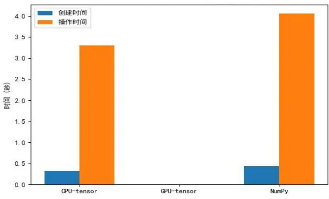
数据来源：东方证券研究所 & wind资讯

## 4.2 运算用时

我们展示三个股票池中的模型运算耗时，其中 fps 指一秒运行的步数，size 指当前因子池内的单因子个数。均随机选取一个种子。可以看到：三个股票池中 fps 最开始是 200 左右，而后随着因子池内单因子个数增多而迅速下降，当size达到200的上限后，fps趋于稳定，最终达到10-20 的稳定水平。需要注意的是，运行耗时有一定的随机性，不同种子得到的结果会有所差别。我们设置总步数为 30w步，运行总耗时大约在 3-6小时不等，远低于遗传规划模型。

图 16：沪深 300股票池：size（单因子个数）
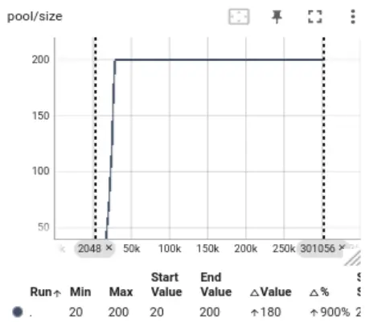
数据来源：东方证券研究所 & wind资讯

图 17：沪深 300股票池：fps（一秒运行的步数）
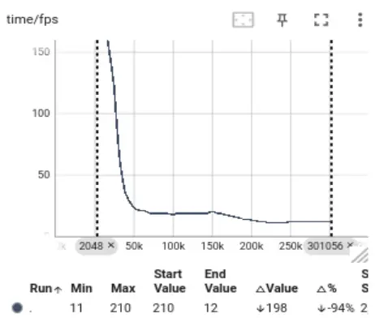
数据来源：东方证券研究所 & wind资讯
有关分析师的申明，见本报告最后部分。其他重要信息披露见分析师申明之后部分，或请与您的投资代表联系。并请阅读本证券研究报告最后一页的免责申明。

图 18：中证 500股票池：size（单因子个数）
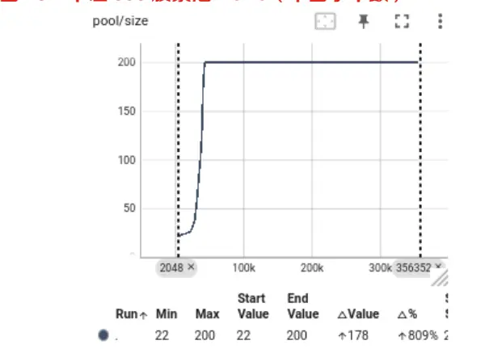
数据来源：东方证券研究所 & wind资讯

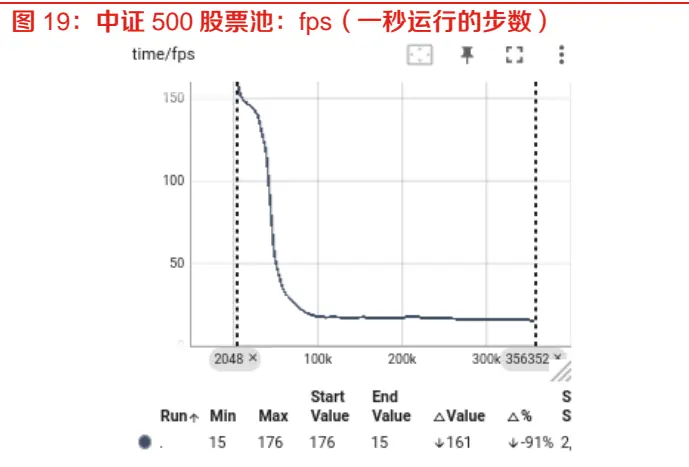
数据来源：东方证券研究所 & wind资讯

图 20：中证 1000股票池：size（单因子个数）
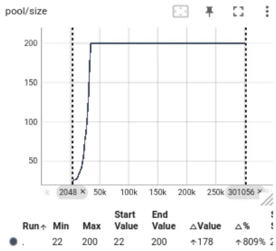
数据来源：东方证券研究所 & wind资讯

图 21：中证 1000股票池：fps（一秒运行的步数）
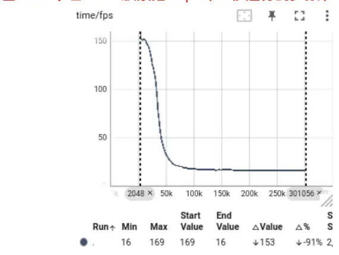
数据来源：东方证券研究所 & wind资讯

## 4.3 特征与算子出现频次

我们展示三个股票池中，最终得到的因子组合中 200 个单因子的表达式长度分布，以及所用到的特征与算子出现频次。均随机选取一个种子。可以看到：

（1）表达式长度：三个股票池中最终保留的单因子表达式长度平均 6-7，最长 19，最短 2，总体长度适中。

图 22：沪深 300：单因子表达式长度分布
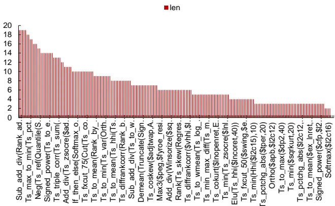
数据来源：东方证券研究所 & wind资讯

有关分析师的申明，见本报告最后部分。其他重要信息披露见分析师申明之后部分，或请与您的投资代表联系。并请阅读本证券研究报告最后一页的免责申明。

图 23：中证 500：单因子表达式长度分布
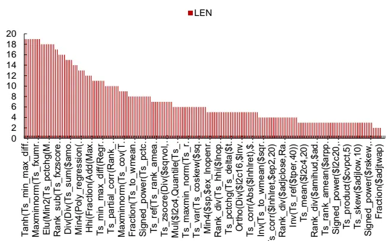
数据来源：东方证券研究所 & wind资讯

图 24：中证 1000：单因子表达式长度分布
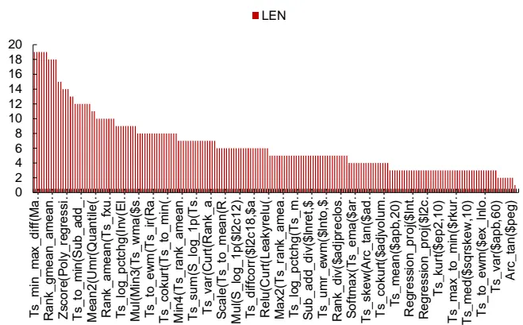
数据来源：东方证券研究所 & wind资讯

（2）特征出现频次：在沪深 300 和中证 500 股票池最终保留的单因子里，基本面类特征平均出现频次最高，其中沪深 300 中 EP2（扣非后的净利润 TTM/总市值）最易出现，中证 500 中TPER（目标价隐含的收益率）最易出现，说明大票中基本面特征能起到比较重要的作用；中证1000 中分钟特征出现频次最高，其中 vvol（日内成交量的波动率,除以当日成交量）因子最易出现，说明小票中高频量价特征能起到比较重要的作用。

图 25：沪深 300&中证 500& 中证 1000股票池：特征出现频次
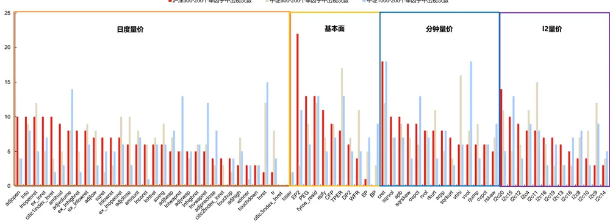
数据来源：东方证券研究所 & wind资讯

（3）算子出现频次：三个股票池最终保留的单因子里，时序算子和截面算子出现频次基本均衡。沪深 300 股票池中一元时序算子出现频次最高，其中 Ts_pctchg_abs（Ts_pctchg_abs）算子最容易出现。中证 500 股票池中一元截面算子出现频次最高，其中 Quantile（正态分布的分位数）算子最容易出现。中证 1000 股票池中一元时序算子出现频次最高，其中 Ts_var（过去 d天的方差）算子最容易出现。二元时序 2 常数、二元时序 3 常数、三元时序算子由于对于运算规则较为复杂，出现频次较低。

图 26：沪深 300&中证 500& 中证 1000股票池：算子出现频次
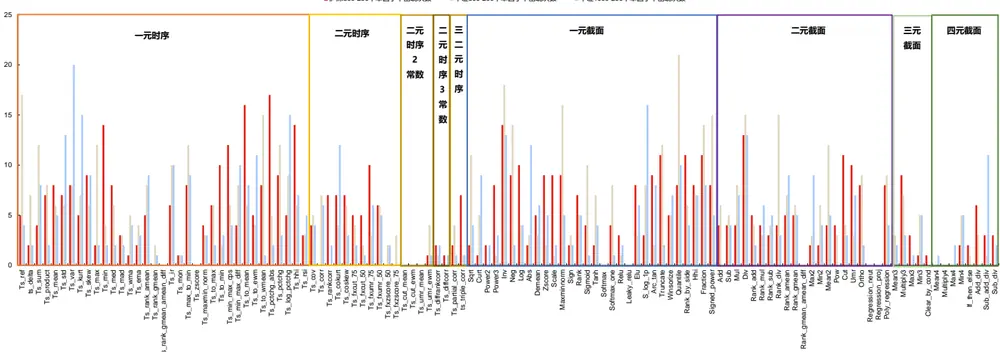
数据来源：东方证券研究所 & wind资讯

## 4.4 因子表现

## 4.4.1 单因子表现

首先我们展示三个股票池中，最终得到的因子组合中 200 个单因子的权重分布，以及每个因子与其他因子相关系数绝对值的最大值。均随机选取一个种子，并在训练集上计算单因子取值。可以看到：

（1）在三个300股票池中，通过强化学习模型构建的因子组合中，单因子权重比较分散，权重绝对值不超过 3%，均大于 0.01%。

（2）在三个 300 股票池中，单因子相关性整体较低，因子值相关系数平均值 1%。但可能出现某两个单因子间相关系数很高的情况，例如在中证 500 股票池中有两个因子相关系数达到 97%。

在传统的 Alpha 因子选择中，我们通常会剔除高相关的因子，以减少多重共线性的问题。例如在 DFQ 遗传规划模型中，我们将挖掘得到的单因子按照 50%的相关系数阈值进行了过滤。而在此次的强化学习模型中，我们并未严格限制相关性范围，单因子筛选仅通过损失函数自行完成。测试显示，添加严格的单因子相关性约束后，合成因子组合性能会下降。

实际上，相关性很高的两个单因子可能也具有的协同性，线性组合后能达到 1+1>2 的效果。例如在中证 500股票池中 a1和 a2两个因子的相关系数达到 97%，然而，a1和a2的线性组合的IC达到 6%，高于各自单独的IC（4%和 5%），显示了协同效应。

一个可能解释是：虽然这些 alpha 因子高相关，但他们的某些线性组合可能指向与原始方向完全不同的方向。假设线性空间中有两个单位向量，两个向量越相似，它们之间的差异向量就越接近垂直于原始向量。这意味着，即使两个 alpha 因子高度相关，它们的差异也可能指向一个全新的方向，这个方向可能包含有价值的信息。

图 27：沪深 300股票池：单因子权重分布
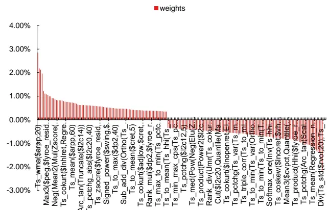
数据来源：东方证券研究所 & wind资讯

图 28：沪深 300股票池：因子相关系数绝对值的最大值分布
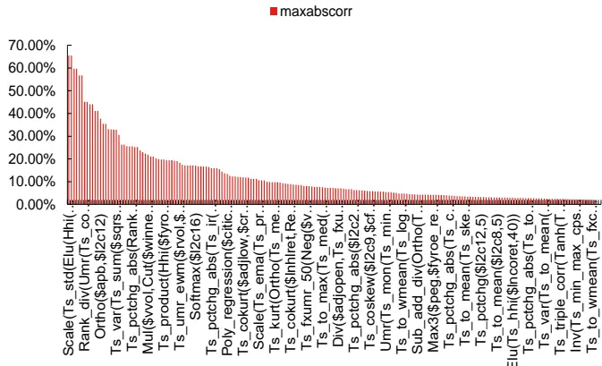
数据来源：东方证券研究所 & wind资讯

图 29：中证 500股票池：单因子权重分布
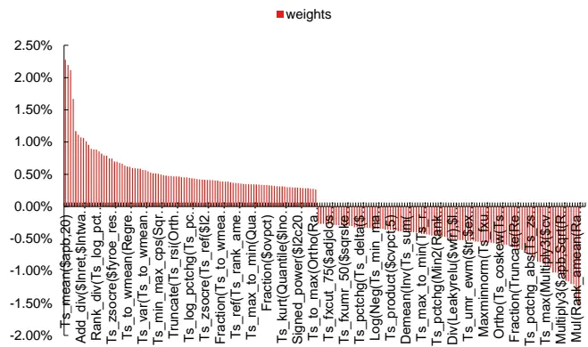
数据来源：东方证券研究所 & wind资讯

图 30：中证 500股票池：因子相关系数绝对值的最大值分布
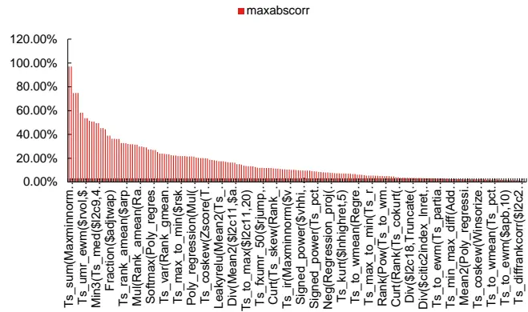
数据来源：东方证券研究所 & wind资讯

图 31：中证 1000股票池：单因子权重分布
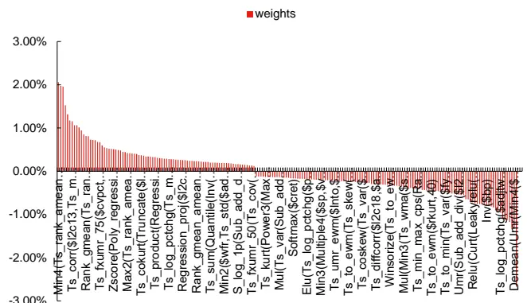
数据来源：东方证券研究所 & wind资讯

图 32：中证 1000股票池：因子相关系数绝对值的最大值分布
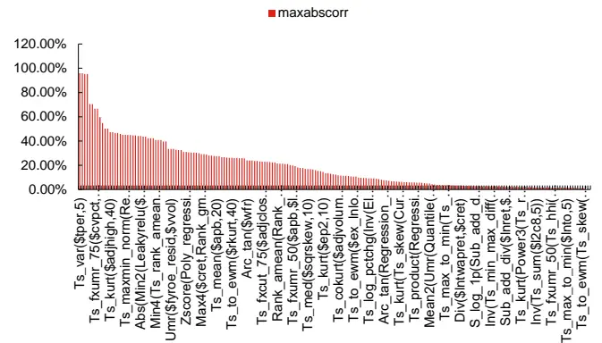
数据来源：东方证券研究所 & wind资讯

接下来我们展示三个股票池中，最终得到的因子组合中 200 个单因子在训练集中的 RANKIC、RANKIC_IR（未年化）分布。均随机选取一个种子，并在训练集上计算单因子取值。可以看到：单因子间的绩效表现差异较大。这主要是由于我们在挖掘因子的过程中，仅关注合成因子的 IC，未设置单因子 IC下限。测试显示，不加限制，可以在相同步数的情况下得到更优的合成因子组合。

图 33：沪深 300股票池：单因子训练集 RANKIC分布
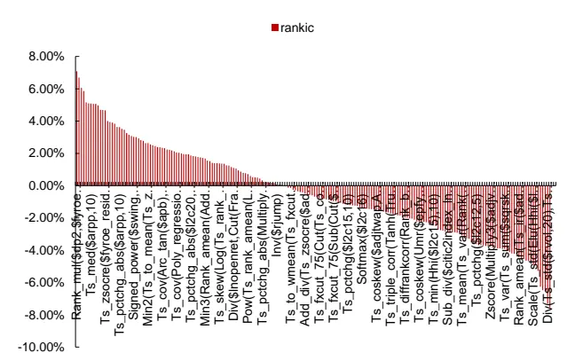
数据来源：东方证券研究所 & wind资讯

图 34：沪深 300 股票池：单因子训练集 RANKIC_IR（未年化）分布
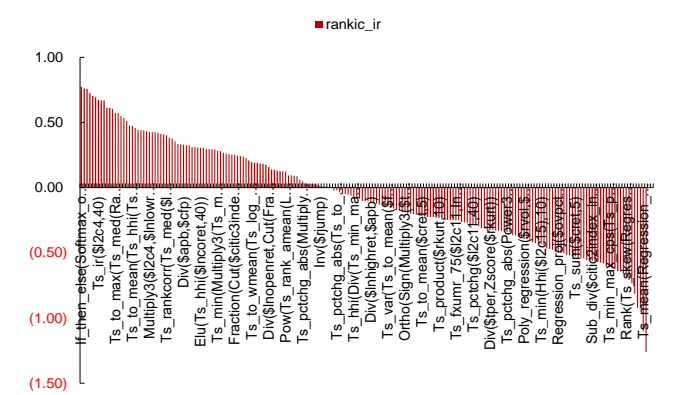
数据来源：东方证券研究所 & wind资讯

图 35：中证 500股票池：单因子训练集 RANKIC分布
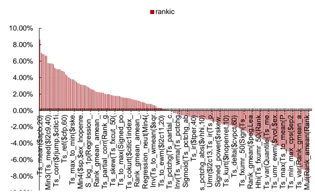
数据来源：东方证券研究所 & wind资讯

图 36：中证 500 股票池：单因子训练集 RANKIC_IR（未年化）分布
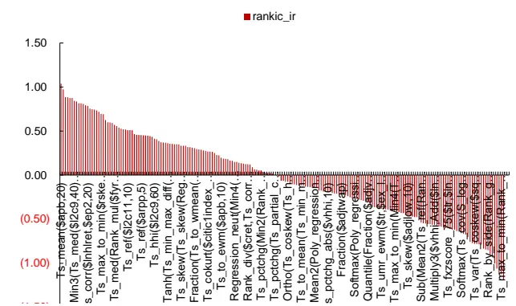
数据来源：东方证券研究所 & wind资讯

图 37：中证 1000股票池：单因子训练集 RANKIC分布
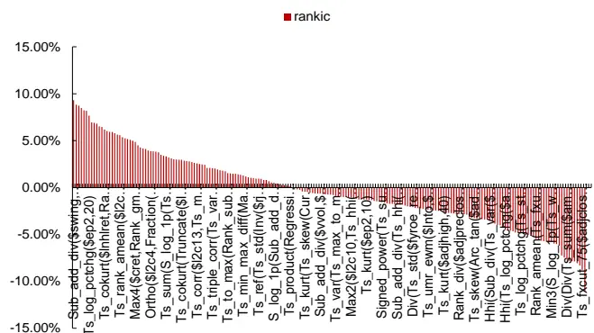
数据来源：东方证券研究所 & wind资讯

图 38：中证 1000 股票池：单因子训练集 RANKIC_IR（未年化）分布
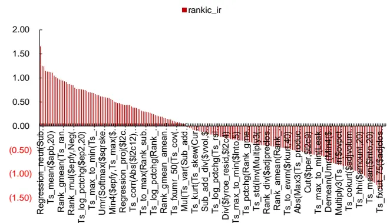
数据来源：东方证券研究所 & wind资讯

有关分析师的申明，见本报告最后部分。其他重要信息披露见分析师申明之后部分，或请与您的投资代表联系。并请阅读本证券研究报告最后一页的免责申明。

## 4.4.2 合成因子绩效表现

我们展示了三个股票池中强化学习合成因子与20个人工因子、遗传规划合成因子（152个单因子合成），在训练集、验证集、测试集的表现。为提高运算效率，训练集中的 IC 均间隔 20 天计算，验证集和测试集由于时间较短，采用每天计算的方式，考虑不同调仓路径避免误差。计算因子 IC 时，收益率进行截面中性化和标准化，不进行缺失值填充。因子值进行标准化，并使用 0来填充缺失值。在沪深 300、中证 500 股票池中采用 5 分组计算多头，在中证 1000 股票池中采用 10分组计算多头，此处的多头计算不考虑交易成本。

可以看出：强化学习因子明显优于人工因子和遗传规划因子，在三个股票池中都有很强的选股效力，市值偏向性低。在300和500中表现接近，在1000中表现优于300和500。（1）在沪深300股票池中，测试集上rankic接近8%，RANKICIR接近1（未年化），5分组多头年化超额收益接近 15%。（2）在中证 500 股票池中，测试集上 rankic 达到 8.5%，RANKICIR 达到 1.15（未年化），5分组多头年化超额收益达到8.22%。（3）在中证1000股票池中，测试集上rankic达到 11.4%，RANKICIR 达到 1.38（未年化），10 分组多头年化超额收益达到 13.65%。

图 39：沪深 300股票池合成因子绩效表现（原始 X，中性化 Y）

| RL | ic | icir | t_value | rankic | rankicir | rank_t | long_r | long_win | long_sharp | long_drawdown | long_yearly | turnover |
| --- | --- | --- | --- | --- | --- | --- | --- | --- | --- | --- | --- | --- |
| train | 31.61%3.54 |  | 25.02 | 29.44% | 3.72 | 26.02 | 3.66% | 100.00% | 5.78 | 0.00% | 50.66% | 64.31% |
| valid | 10.58% 0.91 |  | 14.27 | 11.23% | 1.19 | 18.58 | 0.52% | 76.92% | 0.96 | -2.70% | 5.47% | 61.95% |
| test | 5.77% | 0.66 | 19.21 | 7.49% | 0.91 | 26.41 | 1.07% | 72.09% | 1.60 | -5.86% | 14.62% | 63.01% |
| 人工20 | ic | icir | t | rank_ic | rank_icir | rank_t | long_r | long_win | long_sharp | long_drawdown | long_yearly | turnover |
| valid | 2.85% | 0.26 | 4.06 | 2.57% | 0.26 | 4.14 | -0.66% | 38.46% | (0.82) | -6.59% | -6.67% | 50.02% |
| test | 2.63% | 0.29 | 8.38 | 4.73% | 0.53 | 15.42 | 0.54% | 62.79% | 0.80 | -6.43% | 7.23% | 49.98% |
| 152GP | ic | icir | t | rank_ic | rank_icir | rank_t | long_r | long_win | long_sharp | long_drawdown | long_yearly | turnover |
| valid | 0.66% 0.05 |  | 0.78 | 0.93% | 0.08 | 1.21 | 0.34% | 53.85% | 0.60 | -4.42% | 5.09% | 57.82% |
| test | 3.04% | 0.29 | 8.45 | 4.04% | 0.39 | 11.46 | 0.09% | 48.84% | 0.17 | -13.80% | 1.44% | 51.41% |

数据来源：东方证券研究所 & wind资讯

图 40：中证 500股票池合成因子绩效表现（原始 X，中性化 Y）

| RL | ic | icir | t_value | rankic | rankicir | rank_t | long_r | long_win | long_sharp | long_drawdown | long_yearly | turnover |
| --- | --- | --- | --- | --- | --- | --- | --- | --- | --- | --- | --- | --- |
| train | 29.18% | 4.20 | 29.49 | 27.59% | 4.21 | 0.03 | 100.00% | 689.71% | 0.00 | 45.73% | 62.81% | 64.31% |
| valid | 11.83% | 0.98 | 15.33 | 12.12% | 1.10 | 17.21 | 0.34% | 76.92% | 0.83 | -1.82% | 2.21% | 57.98% |
| test | 6.00% | 0.72 | 21.06 | 8.53% | 1.15 | 33.58 | 0.71% | 62.79% | 1.61 | -4.72% | 8.22% | 57.70% |
| 人工20 | ic | icir | t | rank_ic | rank_icir | rank_t | long_r | long_win |  | long_sharp long_drawdown long_ yearly |  | turnover |
| valid | 4.85% | 0.46 | 7.26 | 5.72% | 0.60 | 9.38 | -0.28% | 46.15% | (0.75) | -5.48% | -3.57% | 57.64% |
| test | 2.72% | 0.35 | 10.09 | 6.49% | 0.88 | 25.34 | 0.17% | 54.76% | 0.26 | -9.45% | 3.38% | 54.58% |
| 152GP | ic | icir | t | rank_ic | rank_icir | rank_t | long_r | long_win | long_sharp | long_drawdown | long_yearly | turnover |
| valid | 5.98% | 0.43 | 6.70 | 6.67% | 0.50 | 7.84 | 0.23% | 61.54% | 0.70 | -1.34% | 4.23% | 56.48% |
| test | 3.98% | 0.39 | 11.19 | 6.93% | 0.72 | 20.77 | 0.41% | 52.38% | 0.80 | -5.62% | 4.95% | 49.94% |

数据来源：东方证券研究所 & wind资讯

图 41：中证 1000股票池合成因子绩效表现（原始 X，中性化 Y）

| RL | ic | icir | t_value | rankic | rankicir | rank_t | long_r | long_win | long_sharp | long_drawdown | long_yearly | turnover |
| --- | --- | --- | --- | --- | --- | --- | --- | --- | --- | --- | --- | --- |
| train | 24.83% 3.10 |  | 21.97 | 24.27% | 3.14 | 0.04 | 91.84% | 451.43% | (0.01) | 54.23% | 73.63% | 64.31% |
| valid | 14.93% 1.56 |  | 24.42 | 16.71% | 1.92 | 29.92 | 1.67% | 84.62% | 3.06 | -0.72% | 19.60% | 67.63% |
| test | 8.97% | 1.03 | 29.92 | 11.40% | 1.38 | 40.26 | 1.08% | 72.09% | 1.69 | -9.35% | 13.65% | 71.43% |
| 人工20 | ic | icir | t | rank_ic | rank_icir | rank_t | long_r | long_win | long_sharp | long_drawdown | long_yearly | turnover |
| valid | 8.96% | 1.05 | 16.46 | 11.87% | 1.42 | 22.12 | 0.18% | 53.85% | 0.28 | -2.87% | 0.59% | 66.08% |
| test | 5.60% | 0.63 | 18.22 | 9.53% | 1.07 | 31.11 | 0.49% | 54.76% | 0.64 | -12.33% | 6.85% | 64.37% |
| 152GP | ic | icir | τ | rank_ic | rank_icir | rank_t | long_r | long_win | long_sharp | long_drawdown | long_yearly | turnover |
| valid | 11.27% 1.08 |  | 16.86 | 13.14% | 1.27 | 19.91 | 0.85% | 69.23% | 2.05 | -1.18% | 10.10% | 61.17% |
| test | 7.39% | 0.69 | 20.02 | 10.31% | 1.04 | 29.99 | 0.78% | 61.90% | 1.49 | -5.01% | 9.93% | 60.85% |

数据来源：东方证券研究所 & wind资讯
有关分析师的申明，见本报告最后部分。其他重要信息披露见分析师申明之后部分，或请与您的投资代表联系。并请阅读本证券研究报告最后一页的免责申明。

接下来我们展示强化学习合成因子和 20 个人工因子、遗传规划合成因子（152 个单因子合成），在测试集上的分年表现。可以看到：样本外存在一定的衰减，但分年数据点少，结果也具有一定的随机性。滚动每年训练耗时较长，对算力要求较高，也并不一定比不滚动效果更好。

图 42：沪深 300股票池合成因子测试集分年表现

| RL | ic | icir | rank_ic | rank_icir | long_r long_win |  | long_sharp | long_drawdown | long_yearly | turnover |
| --- | --- | --- | --- | --- | --- | --- | --- | --- | --- | --- |
| 2020 | 8.86% | 0.89 | 11.23% | 1.27 | 1.49% 76.92% |  | 1.86 | -0.19% | 23.66% | 66.25% |
| 2021 | 5.03% | 0.64 | 6.05% | 0.82 | 0.90% | 69.23% | 1.74 | -1.43% | 10.28% | 63.16% |
| 2022 | 4.43% | 0.57 | 5.11% | 0.67 | 0.61% | 69.23% | 1.04 | -3.31% | 3.03% | 61.26% |
| 2023 | 3.62% | 0.46 | 7.65% | 1.07 | 0.72% 50.00% |  | 0.93 | -0.69% | 15.81% | 62.00% |
| 人工20 | ic | icir | rank_ic | rank_icir | long_r long_win |  | long_sharp | long_drawdown | long_yearly | turnover |
| 2020 | 1.03% | 0.11 | 2.70% | 0.27 | -0.21% 46.15% |  | (0.27) | -6.43% | -0.23% | 50.14% |
| 2021 | 2.36% | 0.33 | 4.79% | 0.71 | 0.77% | 76.92% | 1.06 | -5.61% | 10.45% | 51.21% |
| 2022 | 3.80% | 0.41 | 4.83% | 0.52 | 0.82% | 61.54% | 1.29 | -2.44% | 4.83% | 46.25% |
| 2023 | 4.11% | 0.37 | 8.62% | 0.99 | 0.52% 33.33% |  | 0.46 | -3.16% | 10.63% | 52.33% |
| 152GP | ic | icir | rank_ic | rank_icir | long_r long_win |  | long_sharp | long_drawdown | long_yearly | turnover |
| 2020 | 2.57% | 0.21 | 3.01% | 0.28 | 0.78% 69.23% |  | 1.59 | -1.18% | 11.76% | 83.55% |
| 2021 | 2.37% | 0.26 | 4.14% | 0.42 | 0.13% | 46.15% | 0.24 | -4.17% | 1.24% | 81.23% |
| 2022 | 3.52% | 0.40 | 3.63% | 0.38 | -1.19% | 46.15% | (1.39) | -12.19% | -9.75% | 124.38% |
| 2023 | 4.27% | 0.34 | 6.94% | 0.64 | 0.60% 83.33% |  | 0.63 | -5.14% | 5.42% | 66.94% |

数据来源：东方证券研究所 & wind资讯

图 43：中证 500股票池合成因子测试集分年表现

| RL | ic | icir | rank_ic | rank_icir | long_r long_win |  | long_sharp | long drawdown | long_yearly | turnover |
| --- | --- | --- | --- | --- | --- | --- | --- | --- | --- | --- |
| 2020 | 6.64% | 0.93 | 10.26% | 1.64 | 0.81% 69.23% |  | 2.28 | -0.79% | 8.57% | 59.92% |
| 2021 | 5.35% | 0.65 | 7.24% | 0.97 | 0.33% | 53.85% | 0.70 | -6.66% | 3.61% | 57.17% |
| 2022 | 6.22% | 0.68 | 7.54% | 0.89 | 0.39% | 53.85% | 0.67 | -3.95% | 0.03% | 58.83% |
| 2023 | 5.60% | 0.62 | 9.68% | 1.56 | 0.35% 50.00% |  | 0.55 | -2.58% | 6.38% | 58.60% |
| 人工20 | ic | icir | rank_ic | rank_icir | long_r long_win |  | long_sharp | long_drawdown | long_yearly | turnover |
| 2020 | 2.36% | 0.33 | 6.19% | 1.07 | -0.43% 38.46% |  | (0.56) | -4.86% | -0.46% | 56.06% |
| 2021 | 2.02% | 0.25 | 5.43% | 0.71 | -0.05% | 38.46% | (0.06) | -11.14% | 0.19% | 53.27% |
| 2022 | 3.37% | 0.44 | 5.88% | 0.73 | 0.54% | 61.54% | 0.92 | -3.17% | 3.11% | 52.69% |
| 2023 | 3.59% | 0.40 | 10.81% | 1.50 | 0.80% | 66.67% | 1.29 | -1.49% | 9.20% | 50.60% |
| 152GP | ic | icir | rank_ic | rank_icir | long_r | long_win | long_sharp | long_drawdown | long_yearly | turnover |
| 2020 | 3.15% | 0.28 | 6.66% | 0.61 | -0.13% 38.46% |  | (0.32) | -2.76% | -1.38% | 54.12% |
| 2021 | 3.91% | 0.39 | 6.37% | 0.70 | 0.24% | 46.15% | 0.64 | -3.02% | 2.96% | 57.23% |
| 2022 | 5.31% | 0.64 | 6.41% | 0.76 | -0.52% | 38.46% | (1.60) | -7.72% | -5.97% | 47.64% |
| 2023 | 3.07% | 0.26 | 9.92% | 1.01 | 1.05% 66.67% |  | 2.85 | -0.03% | 12.60% | 45.76% |

数据来源：东方证券研究所 & wind资讯

图 44：中证 1000股票池合成因子测试集分年表现

| RL | ic | icir rank_ic |  | rank_icir | long_r long_win |  | long_sharp | long_drawdown | long_yearly | turnover |
| --- | --- | --- | --- | --- | --- | --- | --- | --- | --- | --- |
| 2020 | 11.85% | 1.49 | 15.00% | 2.04 | 1.53% 76.92% |  | 2.91 | -0.91% | 20.42% | 73.00% |
| 2021 | 6.30% | 0.80 | 9.14% | 1.14 | 1.07% | 61.54% | 1.40 | -7.17% | 10.65% | 71.42% |
| 2022 | 9.99% | 1.09 | 10.69% | 1.20 | 1.27% | 69.23% | 2.05 | -4.33% | 13.55% | 70.83% |
| 2023 | 6.42% | 0.75 | 10.07% | 1.54 | 0.59% 50.00% |  | 0.63 | -4.39% | 1.82% | 66.00% |
| 人工20 | ic | icir | rank_ic | rank_icir | long_r long_win |  | long_sharp | long_drawdown | long_yearly | turnover |
| 2020 | 6.36% | 0.73 | 11.34% | 1.39 | 0.29% 53.85% |  | 0.45 | -1.59% | 7.11% | 67.18% |
| 2021 | 3.87% | 0.43 | 7.81% | 0.86 | 0.84% | 61.54% | 0.87 | -10.54% | 8.98% | 66.16% |
| 2022 | 7.60% | 0.87 | 9.50% | 1.04 | 1.03% | 53.85% | 1.50 | -3.62% | 9.48% | 68.25% |
| 2023 | 3.34% | 0.40 | 9.37% | 1.10 | -0.38% 66.67% |  | (0.49) | -6.59% | -7.14% | 64.40% |
| 152GP | ic | icir | rank_ic | rank_icir | long_r | long win | long_sharp | long drawdown | long_yearly | turnover |
| 2020 | 8.86% | 0.77 | 13.14% | 1.27 | 0.68% | 53.85% | 1.20 | -1.98% | 9.36% | 65.40% |
| 2021 | 4.74% | 0.49 | 8.43% | 0.90 | 0.67% | 61.54% | 1.61 | -3.25% | 8.06% | 67.01% |
| 2022 | 9.58% | 0.98 | 9.94% | 1.06 | 0.66% | 61.54% | 1.34 | -2.19% | 5.13% | 58.99% |
| 2023 | 4.97% | 0.42 | 8.95% | 0.84 | 1.83% 100.00% |  | 9.73 | 0.00% | 20.72% | 52.46% |

数据来源：东方证券研究所 & wind资讯

接下来我们展示强化学习合成因子，在测试集上的因子衰减速度。因子衰减速度是评定因子有效性的一个重要指标，使用滞后 N 个交易日的因子值（记作 lag N）与未来 20日收益率来计算。可以看到：因子整体衰减速度较慢，三个股票池中 RANKIC滞后 20天均衰减了30%左右。

图 45：沪深 300股票池测试集因子衰减速度

| RL ic icir rankic rankicir long_r | long_win long_sharp long_drawdown |  |  |  |  |  |  |  |  |  |
| --- | --- | --- | --- | --- | --- | --- | --- | --- | --- | --- |
| lago | 6.05% | 0.70 | 7.75% | 0.96 | 1.20% | 73.81% | 1.90 | -5.89% | long_yearly 14.46% | turnover 63.09% |
| lag1 | 5.36% | 0.63 | 7.16% | 0.89 | 0.59% | 69.05% | 1.19 | -8.13% | 6.72% | 62.52% |
| lag5 | 4.87% | 0.58 | 6.62% | 0.84 | 0.06% | 54.76% | 0.11 | -8.15% | 0.66% | 59.88% |
| lag10 | 4.61% | 0.56 | 6.41% | 0.82 | 0.22% | 57.14% | 0.37 | -8.42% | 2.77% | 62.72% |
| lag15 | 3.97% | 0.47 | 5.85% | 0.73 | 0.61% | 59.52% | 1.00 | -6.45% | 7.82% | 61.99% |
| lag20 | 3.73% 0.46 |  | 5.44% | 0.70 | 0.44% | 57.14% | 0.66 | -11.84% | 5.67% | 63.23% |

数据来源：东方证券研究所 & wind资讯

图 46：中证 500股票池测试集因子衰减速度

| RL | ic | icir | rankic | rankicir | long_r | long_win | long_sharp | long_drawdown | long_yearly | turnover |
| --- | --- | --- | --- | --- | --- | --- | --- | --- | --- | --- |
| lag0 | 6.09% | 0.73 | 8.62% | 1.17 | 0.69% | 61.90% | 1.57 | -4.59% | 8.55% | 57.71% |
| lag1 | 5.38% | 0.66 | 7.91% | 1.08 | 0.67% | 61.90% | 1.35 | -4.23% | 8.33% | 57.10% |
| lag5 | 4.56% | 0.59 | 7.19% | 1.01 | 0.34% | 54.76% | 0.80 | -4.78% | 4.29% | 57.22% |
| lag10 | 4.44% | 0.59 | 6.94% | 0.98 | 0.71% | 61.90% | 1.53 | -2.74% | 9.09% | 57.78% |
| lag15 | 4.32% | 0.58 | 6.70% | 0.93 | 0.94% | 71.43% | 1.97 | -3.27% | 12.48% | 56.92% |
| lag20 | 4.14% | 0.56 | 6.36% | 0.89 | 0.66% | 59.52% | 1.40 | -3.39% | 8.44% | 58.01% |

数据来源：东方证券研究所 & wind资讯

图 47：中证 1000股票池测试集因子衰减速度

| RL | ic | icir | rankic | rankicir | long_r | long_win | long_sharp | long_drawdown | long_yearly | turnover |
| --- | --- | --- | --- | --- | --- | --- | --- | --- | --- | --- |
| lago | 9.22% | 1.08 | 11.60% | 1.42 | 1.12% | 73.81% | 1.74 | -9.30% | 13.11% | 71.49% |
| lag1 | 8.13% 0.98 |  | 10.71% | 1.34 | 1.06% | 71.43% | 1.65 | -7.42% | 11.96% | 69.71% |
| lag5 | 6.78% | 0.85 | 9.51% | 1.23 | 0.76% | 66.67% | 1.17 | -8.86% | 8.59% | 69.71% |
| lag10 | 6.04% | 0.77 | 8.68% | 1.16 | 0.92% | 76.19% | 1.38 | -10.48% | 11.15% | 70.17% |
| lag15 | 5.61% | 0.74 | 8.01% | 1.12 | 1.35% | 76.19% | 1.97 | -8.28% | 16.78% | 71.52% |
| lag20 | 5.43% | 0.76 | 7.52% | 1.12 | 0.97% | 76.19% | 1.69 | -4.27% | 10.76% | 71.59% |

数据来源：东方证券研究所 & wind资讯

接下来我们展示了不同股票池中强化学习因子的原始值表现、中性化因子表现以及原始因子和中性化收益率之间的关系。可以看到，原始X+原始Y由于未剔除任何风格因素，表现最好。中性化 X+原始 Y剥离最彻底，表现最差。原始 X+中性化 Y 效果居中，能起到一定的剥离风格因素的作用，并且收益率中性化只需要计算一次，不需要对每个因子都计算， 能够大幅节省运算开销，也是我们在强化学习模型中采用的因子评价方法。

图 48：沪深 300股票池强化学习因子的原始值表现、中性化因子表现以及原始因子和中性化收益率之间的关系

| RL | ic | icir |  | rank_ic | rank_icir | rank_t | long_ | long_win | long_sharp | long_drawdown | long_yearly | turnover |
| --- | --- | --- | --- | --- | --- | --- | --- | --- | --- | --- | --- | --- |
| 原始X +原始Y | 6.69% 0.51 |  | 14.93 | 8.50% | 0.64 | 18.73 | 1.03% | 69.77% | 1.53 | -6.25% | 14.14% | 63.01% |
| 原始X +中性化Y |  | 5.77% 0.66 | 19.21 | 7.49% | 0.91 | 26.41 | 1.03% | 69.77% | 1.53 | -6.25% | 14.14% | 63.01% |
| 中性化X +原始Y | 5.32% 0.66 |  | 19.22 | 6.54% | 0.89 | 25.76 | 0.61% | 69.77% | 1.05 | -4.68% | 8.23% | 74.83% |

数据来源：东方证券研究所 & wind资讯
有关分析师的申明，见本报告最后部分。其他重要信息披露见分析师申明之后部分，或请与您的投资代表联系。并请阅读本证券研究报告最后一页的免责申明。

| RL | 人工20 152gp 神经网络 |  |  | 1000 | RL | 人工20 152gp 神经网络 |  |  |
| --- | --- | --- | --- | --- | --- | --- | --- | --- |
|  | 70% | 63% | 62% | RL |  | 77% | 73% | 68% |
| 70% |  | 61% | 58% | 人工20 | 77% |  | 73% | 65% |
| 63% | 61% |  | 61% | 152gp | 73% | 73% |  | 65% |
| 62% | 58% | 61% |  | 神经网络 | 68% | 65% | 65% |  |

图 49：中证 500股票池强化学习因子的原始值表现、中性化因子表现以及原始因子和中性化收益率之间的关系

| RL | ic | icir |  | rank_ic | rank_icir | rank_t | long_r | long_win | long_sharp | long_drawdown | long_yearly | turnover |
| --- | --- | --- | --- | --- | --- | --- | --- | --- | --- | --- | --- | --- |
| 原始X +原始Y |  | 6.54% 0.55 | 16.09 | 10.06% | 0.83 | 24.28 | 0.62% | 66.67% | 1.40 | -5.56% | 7.13% | 58.68% |
| 原始X +中性化Y |  | 6.00% 0.72 | 21.06 | 8.53% | 1.15 | 33.58 | 0.62% | 66.67% | 1.40 | -5.56% | 7.13% | 58.68% |
| 中性化X +原始Y | 5.67% | 0.72 | 20.83 | 8.17% | 1.17 | 33.90 | 0.41% | 50.00% | 0.92 | -3.32% | 4.30% | 71.97% |

数据来源：东方证券研究所 & wind资讯

图 50：中证 1000股票池强化学习因子的原始值表现、中性化因子表现以及原始因子和中性化收益率之间的关系

| RL | ic | icir |  | rank_ic | rank_icir | rank_t | long_r | long_win | long_sharp | long_drawdown | long_yearly | turnover |
| --- | --- | --- | --- | --- | --- | --- | --- | --- | --- | --- | --- | --- |
| 原始X +原始Y | 10.01% 0.81 |  | 23.64 | 12.68% | 1.01 | 29.33 | 0.98% | 69.05% | 1.55 | -9.72% | 12.45% | 71.91% |
| 原始X +中性化Y | 8.97% | 1.03 | 29.92 | 11.40% | 1.38 | 40.26 | 0.98% | 69.05% | 1.55 | -9.72% | 12.45% | 71.91% |
| 中性化X +原始Y | 8.84% | 1.03 | 29.94 | 10.58% | 1.31 | 38.22 | 0.82% | 66.67% | 1.54 | -7.30% | 10.53% | 71.62% |

数据来源：东方证券研究所 & wind资讯

## 4.4.3 不同随机种子的相关性

我们展示了不同随机种子得到的测试集因子值序列的相关性。可以看到：平均相关性排序为：中证 1000 股票池（80%）>中证 500 股票池（70%）>沪深 300 股票池（60%），小股票池中路径影响相对更大。

图 51：不同随机种子得到的测试集因子值序列的相关性

| 300 avg | avg | model1 | model2 | model3 | model4 | model5 |
| --- | --- | --- | --- | --- | --- | --- |
|  |  | 83% | 82% | 86% | 80% | 81% |
| model1 | 83% |  | 60% | 66% | 58% | 58% |
| model2 | 82% | 60% |  | 65% | 56% | 58% |
| model3 | 86% | 66% | 65% |  | 60% | 62% |
| model4 | 80% | 58% | 56% | 60% |  | 54% |
| model5 | 81% | 58% | 58% | 62% | 54% |  |

数据来源：东方证券研究所 & wind资讯

| 500 | avg model1 model2 model3 model4 model5 |  |  |  |  |  |
| --- | --- | --- | --- | --- | --- | --- |
| avg |  | 87% | 86% | 89% | 87% | 87% |
| model1 | 87% |  | 67% | 72% | 71% | 70% |
| model2 | 86% | 67% |  | 70% | 68% | 70% |
| model3 | 89% | 72% | 70% |  | 72% | 72% |
| model4 | 87% | 71% | 68% | 72% |  | 67% |
| model5 | 87% | 70% | 70% | 72% | 67% |  |

| 1000 avg | avg | model1 | model2 | model3 | model4 | model5 |
| --- | --- | --- | --- | --- | --- | --- |
|  |  | 92% | 94% | 93% | 92% | 93% |
| model1 | 92% |  | 83% | 81% | 81% | 82% |
| model2 | 94% | 83% |  | 84% | 83% | 84% |
| model3 | 93% | 81% | 84% |  | 81% | 83% |
| model4 | 92% | 81% | 83% | 81% |  | 82% |
| model5 | 93% | 82% | 84% | 83% | 82% |  |

## 4.5 与常见因子的相关性

我们展示了不同票池中，强化学习合成因子和20个人工因子、遗传规划合成因子（152个单因子合成）、神经网络合成因子，在测试集上的因子值相关性。可以看到：强化学习合成因子与其他常见量价合成因子相关性在 50-70%，存在一定差异。

图 52：与常见因子的测试集因子值相关系数矩阵

| 300 RL | RL | 人工20 | 152gp | 神经网络 | 500 |
| --- | --- | --- | --- | --- | --- |
|  |  | 62% | 50% | 51% | RL |
| 人工20 | 62% |  | 48% | 48% | 人工20 |
| 152gp | 50% | 48% |  | 41% | 152gp |
| 神经网络 | 51% | 48% | 41% |  | 神经网络 |

数据来源：东方证券研究所 & wind资讯

为了更好地展示强化学习因子的信息增量，我们考察了强化学习合成因子和20个人工因子、遗传规划合成因子（152 个单因子合成）、神经网络合成因子，在测试集上两两回归后残差因子的选股表现。从结果来看：（1）强化学习因子可完全替代人工因子，在 300 和 500 股票池中可替代 GP 因子。强化学习合成因子对人工因子和 GP 因子分别回归后，残差仍有显著选股效果，RANKIC 超过 5%，RANKICIR 年化超过 1。（2）强化学习因子和神经网络因子间存在信息差异，互相之间都不能被完全解释，两两回归残差都具备选股效果。

图 53：两两回归残差测试集表现

| 因变量 | 自变量 | ic | icir | rank_ic | rank_icir | long_r | long_win | long_sharp | long_drawdown | long_yearly | turnover |
| --- | --- | --- | --- | --- | --- | --- | --- | --- | --- | --- | --- |
| 神经网络 | 强化学习 | 5.66% | 63.82% | 6.07% | 72.25% | 0.63% | 53.49% | 108.59% | -6.13% | 8.68% | 72.89% |
| 强化学习 | 神经网络 | 2.09% | 26.53% | 3.13% | 41.46% | 0.57% | 62.79% | 94.87% | -5.00% | 6.06% | 70.62% |
| 遗传规划 | 强化学习 | -1.28% | -14.49% | -1.31% | -15.39% | -0.54% | 34.88% | -116.41% | -27.73% | -6.57% | 60.71% |
| 强化学习 | 遗传规划 | 5.60% | 69.71% | 6.77% | 89.31% | 0.84% | 69.77% | 137.64% | -6.39% | 11.55% | 63.71% |
| 人工因子 | 强化学习 | -0.75% | -8.48% | 0.56% | 6.46% | 0.14% | 58.14% | 24.19% | -10.73% | 1.44% | 55.99% |
| 强化学习 | 人工因子 | 5.27% | 62.04% | 5.89% | 71.95% | 0.92% | 74.42% | 217.61% | -1.94% | 11.63% | 68.85% |

| 因变量 | 自变量 | ic | icir | rank_ic | rank_icir | long_r | long_win | long_sharp | long_drawdown | long_yearly | turnover |
| --- | --- | --- | --- | --- | --- | --- | --- | --- | --- | --- | --- |
| 神经网络 | 强化学习 | 4.65% | 68.70% | 5.78% | 95.51% | 0.60% | 57.14% | 112.84% | -4.39% | 8.56% | 74.80% |
| 强化学习 | 神经网络 | 1.80% | 25.34% | 2.53% | 40.94% | 0.21% | 52.38% | 43.39% | -5.70% | 1.39% | 66.88% |
| 遗传规划 | 强化学习 | 0.25% | 2.76% | 1.51% | 18.17% | -0.15% | 42.86% | -29.19% | -15.89% | -1.26% | 59.30% |
| 强化学习 | 遗传规划 | 4.77% | 64.93% | 6.42% | 91.36% | 0.70% | 66.67% | 149.75% | -6.30% | 8.05% | 61.31% |
| 人工因子 | 强化学习 | -1.89% | -29.22% | 1.11% | 16.93% | -0.37% | 40.48% | -70.67% | -17.62% | -3.83% | 66.91% |
| 强化学习 | 人工因子 | 5.64% | 80.00% | 5.29% | 80.50% | 0.62% | 71.43% | 146.99% | -4.13% | 6.84% | 67.91% |

| 因变量 | 自变量 | ic | icir | rank_ic | rank_icir | long_r | long_win | long_sharp | long_drawdown | long_yearly | turnover |
| --- | --- | --- | --- | --- | --- | --- | --- | --- | --- | --- | --- |
| 神经网络 | 强化学习 | 7.09% | 140.80% | 7.52% | 153.74% | 0.57% | 59.52% | 97.32% | -5.21% | 7.77% | 85.08% |
| 强化学习 | 神经网络 | 1.60% | 23.44% | 2.66% | 42.63% | -0.32% | 42.86% | -49.14% | -15.98% | -4.40% | 80.30% |
| 遗传规划 | 强化学习 | 3.12% | 33.29% | 4.78% | 54.39% | -0.40% | 54.76% | -59.85% | -24.72% | -4.34% | 68.06% |
| 强化学习 | 遗传规划 | 6.42% | 89.08% | 7.78% | 109.07% | 1.13% | 69.05% | 166.42% | -5.56% | 13.43% | 72.49% |
| 人工因子 | 强化学习 | -2.02% | -31.21% | 1.24% | 17.54% | -0.70% | 30.95% | -105.42% | -21.78% | -7.61% | 77.99% |
| 强化学习 | 人工因子 | 7.29% | 111.56% | 6.67% | 98.37% | 0.83% | 66.67% | 120.38% | -4.80% | 8.89% | 77.36% |

数据来源：东方证券研究所 & wind资讯

## 五、top 组合表现

## 5.1 top 组合构建说明

为了展示强化学习因子多头端的选股效果，我们对比了三个股票池中月频 top 组合的业绩表现。关于多头组合构建有如下说明：

（1）回测期：20200123-20230807，组合月频调仓，假设根据每月末个股得分在次日以vwap 价格进行交易；

（2）考虑交易成本：假设买卖手续费双边千三，停牌涨停不能买入、停牌跌停不能卖出。

（3）考虑流动性：将成分股中过去 20个交易日日均成交金额小于 3千万的股票予以剔除。

## 5.2 沪深 300 top50 组合

在沪深 300 成分内的多头组合可以获得明显的超额收益。2020 年以来年化超额收益近 11%，单边年换手 8 倍，最大回撤 8%。2020-2023年，每年都能跑赢沪深 300 指数，2023 年到 8.7号绝对收益达到 7.8%，超额收益达到 4.45%。

图 54：沪深 300股票池 top50组合绩效表现

| 沪深300成分内 |  |  | rl |  |
| --- | --- | --- | --- | --- |
| 20200101-20230807 top50 | 沪深300指数 |  | 绝对收益 | 超额收益 |
| 绩效指标 | 夏普比 | 0.09 | 0.81 | 1.46 |
|  | 年化收益率 | -0.10% | 13.24% | 10.69% |
|  | 最大回撤 | -39.59% | -20.36% | -8.45% |
|  | 最大回撤出现时间点 | 20221031 | 20220426 | 20210112 |
|  | 年化波动率 | 19.41% | 17.25% | 7.13% |
|  | 单边换手率（年） |  | 8.22 |  |
| 分年收益 | 2020 | 30.16% | 45.64% | 3.50% |
|  | 2021 | -5.20% | 4.12% | 9.59% |
|  | 2022 | -21.63% | -5.33% | 19.58% |
|  | 2023 | 3.06% | 7.80% | 4.45% |

数据来源：东方证券研究所 & wind资讯

图 55：沪深 300股票池 top50组合净值
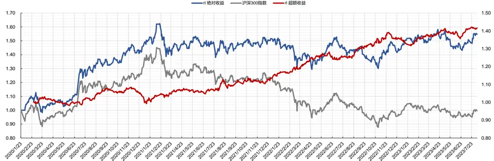
数据来源：东方证券研究所 & wind资讯

有关分析师的申明，见本报告最后部分。其他重要信息披露见分析师申明之后部分，或请与您的投资代表联系。并请阅读本证券研究报告最后一页的免责申明。

## 5.3 中证 500 top50 组合

在中证 500 成分内的多头组合可以获得明显的超额收益。2020 年以来年化超额 16%，单边年换手 9 倍，最大回撤 11%。2020-2023 年，每年都能跑赢中证 500 指数，2023 年到 8.7 号绝对收益达到 14%，超额收益达到 9.45%。

图 56：中证 500股票池 top50组合绩效表现

| 中证500成分内 |  |  | rl |  |
| --- | --- | --- | --- | --- |
| 20200101-20230807 top50 | 中证500指数 |  | 绝对收益 | 超额收益 |
| 绩效指标 | 夏普比 | 0.28 | 1.32 | 1.63 |
|  | 年化收益率 | 3.61% | 23.03% | 16.34% |
|  | 最大回撤 | -31.57% | -17.87% | -10.95% |
|  | 最大回撤出现时间点 | 20220426 | 20220426 | 20210125 |
|  | 年化波动率 | 19.86% | 16.76% | 9.55% |
|  | 单边换手率（年） |  | 8.82 | 8.82 |
| 分年收益 | 2020 | 18.40% | 48.95% | 18.57% |
|  | 2021 | 15.58% | 18.86% | 2.40% |
|  | 2022 | -20.31% | 2.67% | 26.46% |
|  | 2023 | 3.86% | 13.93% | 9.45% |

数据来源：东方证券研究所 & wind资讯

图 57：中证 500股票池 top50组合净值
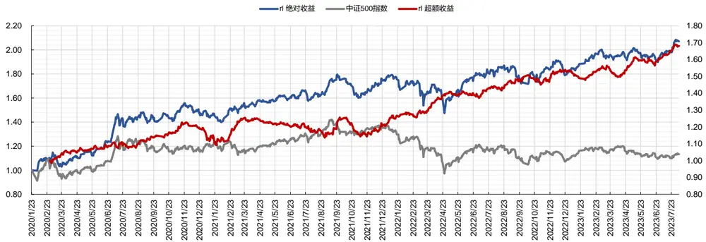
数据来源：东方证券研究所 & wind资讯

## 5.4 中证 1000 top50 组合

在中证 1000 成分内的多头组合可以获得明显的超额收益。2020 年以来年化超额 14.51%，单边年换手 9.8 倍，最大回撤 16%。2020-2023 年，每年都能跑赢中证 1000 指数，2023 年到8.7号绝对收益达到 7.5%，超额收益达到 4%。

图 58：中证 1000股票池 top50组合绩效表现

| 中证1000成分内 |  |  | rl |  |
| --- | --- | --- | --- | --- |
| 20200101-20230807 top50 | 中证1000指数 |  | 绝对收益 | 超额收益 |
| 绩效指标 | 夏普比 | 0.28 | 1.06 | 1.27 |
|  | 年化收益率 | 3.83% | 21.00% | 14.51% |
|  | 最大回撤 | -34.62% | -30.08% | -16.00% |
|  | 最大回撤出现时间点 | 20220426 | 20220426 | 20210915 |
|  | 年化波动率 | 22.46% | 19.90% | 11.18% |
|  | 单边换手率（年） | 9.83 | 9.83 | 9.83 |
| 分年收益 | 2020 | 16.63% | 38.96% | 12.36% |
|  | 2021 | 20.52% | 32.16% | 9.00% |
|  | 2022 | -21.58% | -1.10% | 25.02% |
|  | 2023 | 3.54% | 7.54% | 3.95% |

数据来源：东方证券研究所 & wind资讯

图 59：中证 1000 股票池 top50 组合净值
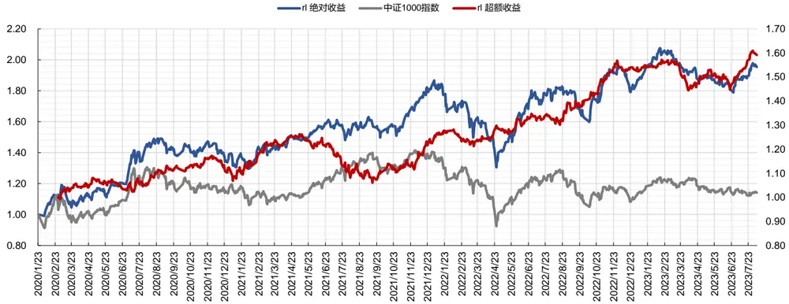
数据来源：东方证券研究所 & wind资讯

## 六、指数增强组合表现

## 6.1 增强组合构建说明

下面我们展示强化学习因子在沪深300、中证500 、中证1000指数增强组合中的应用效果。关于指数增强组合构建有如下说明：

（1）回测期：20200123-20230807，组合月频调仓，假设根据每月末个股得分在次日以vwap 价格进行交易。进行成分内增强。

（2）组合约束：风险因子库（参见《东方 A 股因子风险模型（DFQ-2020）》）中所有的风格因子相对暴露不超过 0.5，所有行业因子相对暴露不超过 2%。厌恶系数取 30。

（3）考虑交易成本：假设买卖手续费双边千三，停牌涨停不能买入、停牌跌停不能卖出。

## 6.2沪深300 指数增强组合

可以看到，沪深 300 成分内指数增强组合表现较好，20 年以来年化对冲收益近 8%，单边年换手 8倍，最大回撤 6%，每年均取得正超额，2023年到 8.7号对冲收益达到 5.28%。

图 60：沪深 300股票池指数增强组合绩效表现

| 行业暴露0.02风格暴露0.5厌恶系数30 买卖手续费双边千三 | 沪深300成分内增强组合 |
| --- | --- |
| 信息比（年化） | 1.37 |
| 年化对冲收益 | 7.72% |
| 对冲收益最大回撤 | -5.85% |
| 对冲收益最大回撤出现时间点 | 20210112 |
| 跟踪误差（年化） | 5.55% |
| 单边换手率（年） | 8.20 |
| 持股数量 成分内股票占比 | 43.40 100.00% |
| 分年收益 2020 |  |
| 2021 | 2.80% |
|  | 5.78% |
| 2022 | 12.73% |
| 2023 | 5.28% |

数据来源：东方证券研究所 & wind资讯

图 61：沪深 300股票池指数增强组合净值
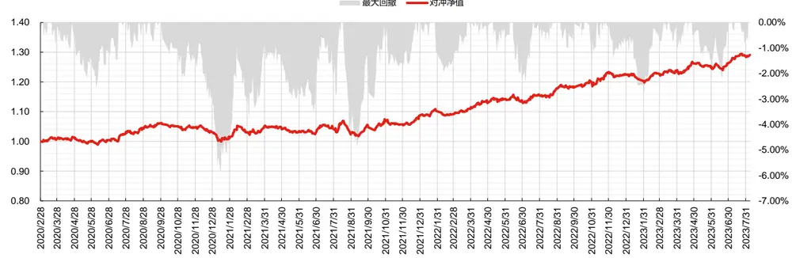
数据来源：东方证券研究所 & wind资讯
有关分析师的申明，见本报告最后部分。其他重要信息披露见分析师申明之后部分，或请与您的投资代表联系。并请阅读本证券研究报告最后一页的免责申明。

## 6.3中证500 指数增强组合

可以看到，中证 500 成分内指数增强组合表现优于 300，20 年以来年化对冲收益超 11%，单边年换手 9倍，最大回撤 8%，每年均取得正超额，2023年到 8.7号对冲收益达到 5.59%。

图 62：中证 500股票池指数增强组合绩效表现

| 行业暴露0.02风格暴露0.5厌恶系数30 买卖手续费双边千三 | 中证500成分内增强组合 |
| --- | --- |
| 信息比（年化） | 1.59 |
| 年化对冲收益 | 11.21% |
| 对冲收益最大回撤 | -8.02% |
| 对冲收益最大回撤出现时间点 | 20211109 |
| 跟踪误差（年化） | 6.83% |
| 单边换手率（年） | 9.29 |
| 持股数量 成分内股票占比 | 52.56 100.00% |
| 分年收益 |  |
| 2020 | 20.61% |
| 2021 | 0.92% |
| 2022 | 12.02% |
| 2023 | 5.59% |

数据来源：东方证券研究所 & wind资讯

图 63：中证 500股票池指数增强组合净值
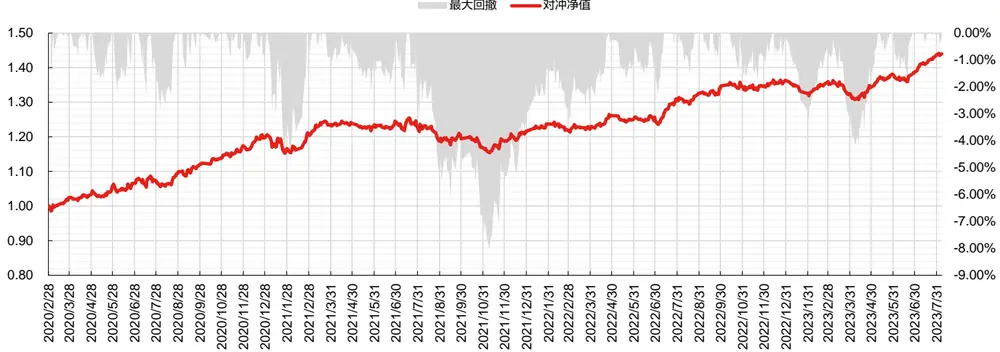
数据来源：东方证券研究所 & wind资讯

## 6.4中证1000 指数增强组合

可以看到，中证 1000 成分内指数增强组合表现优于 300，20 年以来年化对冲收益超 8%，单边年换手 10倍，最大回撤 11%，每年均取得正超额，2023年到 8.7号对冲收益达到 1%。

图 64：中证 1000股票池指数增强组合绩效表现

| 行业暴露0.02风格暴露0.5厌恶系数30 买卖手续费双边千三 | 中证1000成分内增强组合 |
| --- | --- |
| 信息比（年化） | 0.99 |
| 年化对冲收益 | 8.18% |
| 对冲收益最大回撤 | -11.34% |
| 对冲收益最大回撤出现时间点 | 20210922 |
| 跟踪误差（年化） | 8.30% |
| 单边换手率（年） | 10.18 |
| 持股数量 成分内股票占比 | 55.19 100.00% |
| 分年收益 |  |
| 2020 | 8.18% |
| 2021 | 9.52% |
| 2022 | 9.53% |
| 2023 | 0.91% |

数据来源：东方证券研究所 & wind资讯

图 65：中证 1000股票池指数增强组合净值
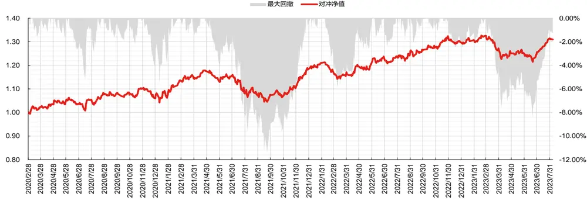
数据来源：东方证券研究所 & wind资讯

## 七、总结

本文展示了一种新的因子组合挖掘框架，直接使用因子组合的表现来优化一个强化学习因子生成器，最终生成的是一组公式因子集合，这些因子协同使用具有较高的选股效力。这样做既能保留遗传规划算法公式化的优势，也能提升模型泛化能力，适应多种股票池，还能大幅提升运算效率。

基于强化学习的因子组合生成模型，由两部分组成：1) Alpha 因子生成器：使用 MaskablePPO模型生成动作，并以 token序列的形式生成公式化的 Alpha因子。2) Alpha因子组合模型：组合 Alpha 因子，并给出奖励信号。这两部分互相依赖：因子生成器通过生成新因子提高因子组合的性能。因子组合模型的性能作为奖励信号来优化因子生成器。通过不断重复此交互过程，提升因子组合的选股效力。

DFQ 强化学习模型分别在沪深 300、中证 500、中证 1000 指数成分股内进行训练测试。采用2015.1.1-2018.12.31的数据作为训练集，2019.1.1-2019.12.31为验证集。2020.1.1-2023.6.30为测试集。挖掘月频因子，考察因子预测未来20天股票收益时的表现。对于每个股票池的预测模型，选取 5 个不同的随机种子训练 5 个模型，将 5 个模型的合成因子值结果取平均作为最终模型的输出。

DFQ 强化学习因子明显优于人工因子和遗传规划因子，在三个股票池中都有很强的选股效力，市值偏向性低。在沪深300股票池中，测试集上rankic接近8%，RANKICIR接近1（未年化），5 分组多头年化超额收益接近 15%。在中证 500 股票池中，测试集上 rankic 达到 8.5%，RANKICIR达到1.15（未年化），5分组多头年化超额收益达到8.22%。在中证1000股票池中，测试集上 rankic 达到 11.4%，RANKICIR 达到 1.38（未年化），10 分组多头年化超额收益达到13.65%。

DFQ强化学习因子可完全替代人工因子，在 300和 500股票池中可替代 GP因子。强化学习合成因子对人工因子和 GP 因子分别回归后，残差仍有显著选股效果，RANKIC 超过 5%，RANKICIR 年化超过 1。强化学习因子和神经网络因子间存在信息差异，互相之间都不能被完全解释，两两回归残差都具备选股效果。

DFQ强化学习因子沪深300top50组合：20年以来年化超额收益近11%，单边年换手8倍，最大回撤 8%。2023年到 8.7号超额收益达到 4.45%。中证500 top50组合：20年以来年化超额16%，单边年换手 9倍，最大回撤 11%。2023年到 8.7号超额收益达到 9.45%。中证 1000中的top50 组合：20 年以来年化超额 15%，单边年换手 10 倍，最大回撤 16%。2023 年到 8.7 号超额收益达到 4%。

DFQ强化学习因子沪深 300成分内指数增强组合：20年以来年化对冲收益近 8%，单边年换手 8 倍，最大回撤 6%，每年均取得正超额，2023 年到 8.7号对冲收益达 5.28%。中证 500 成分内指数增强组合：20 年以来年化对冲收益超 11%，单边年换手 9 倍，最大回撤 8%，每年均取得正超额，2023年到 8.7号对冲收益达 5.59%。中证 1000成分内指数增强组合：20年以来年化对冲收益超 8%，单边年换手 10 倍，最大回撤 11%，每年均取得正超额，2023 年到 8.7 号对冲收益达 1%。

## 参考文献

1. Yu S, Xue H, Ao X, et al. Generating Synergistic Formulaic Alpha Collections via Reinforcement Learning[J]. arXiv preprint arXiv:2306.12964, 2023.

2. Easy RL：强化学习教程

## 风险提示

1. 量化模型基于历史数据分析，未来存在失效风险，建议投资者紧密跟踪模型表现。

2. 极端市场环境可能对模型效果造成剧烈冲击，导致收益亏损。

## Tabl e_Disclai mer 分析师申明

每位负责撰写本研究报告全部或部分内容的研究分析师在此作以下声明：

分析师在本报告中对所提及的证券或发行人发表的任何建议和观点均准确地反映了其个人对该证券或发行人的看法和判断；分析师薪酬的任何组成部分无论是在过去、现在及将来，均与其在本研究报告中所表述的具体建议或观点无任何直接或间接的关系。

## 投资评级和相关定义

报告发布日后的12个月内行业或公司的涨跌幅相对同期相关证券市场代表性指数的涨跌幅为基准（A 股市场基准为沪深 300 指数，香港市场基准为恒生指数，美国市场基准为标普 500 指数）；

## 公司投资评级的量化标准

买入：相对强于市场基准指数收益率 15%以上；

增持：相对强于市场基准指数收益率 5%～15%；

中性：相对于市场基准指数收益率在-5%～+5%之间波动；

减持：相对弱于市场基准指数收益率在-5%以下。

未评级 —— 由于在报告发出之时该股票不在本公司研究覆盖范围内，分析师基于当时对该股票的研究状况，未给予投资评级相关信息。

暂停评级 —— 根据监管制度及本公司相关规定，研究报告发布之时该投资对象可能与本公司存在潜在的利益冲突情形；亦或是研究报告发布当时该股票的价值和价格分析存在重大不确定性，缺乏足够的研究依据支持分析师给出明确投资评级；分析师在上述情况下暂停对该股票给予投资评级等信息，投资者需要注意在此报告发布之前曾给予该股票的投资评级、盈利预测及目标价格等信息不再有效。

## 行业投资评级的量化标准：

看好：相对强于市场基准指数收益率 5%以上；

中性：相对于市场基准指数收益率在-5%～+5%之间波动；

看淡：相对于市场基准指数收益率在-5%以下。

未评级：由于在报告发出之时该行业不在本公司研究覆盖范围内，分析师基于当时对该行业的研究状况，未给予投资评级等相关信息。

暂停评级：由于研究报告发布当时该行业的投资价值分析存在重大不确定性，缺乏足够的研究依据支持分析师给出明确行业投资评级；分析师在上述情况下暂停对该行业给予投资评级信息，投资者需要注意在此报告发布之前曾给予该行业的投资评级信息不再有效。

## HeadertTabl e_Discl ai mer 免责声明

本证券研究报告（以下简称“本报告”）由东方证券股份有限公司（以下简称“本公司”）制作及发布。

本报告仅供本公司的客户使用。本公司不会因接收人收到本报告而视其为本公司的当然客户。本报告的全体接收人应当采取必要措施防止本报告被转发给他人。

本报告是基于本公司认为可靠的且目前已公开的信息撰写，本公司力求但不保证该信息的准确性和完整性，客户也不应该认为该信息是准确和完整的。同时，本公司不保证文中观点或陈述不会发生任何变更，在不同时期，本公司可发出与本报告所载资料、意见及推测不一致的证券研究报告。本公司会适时更新我们的研究，但可能会因某些规定而无法做到。除了一些定期出版的证券研究报告之外，绝大多数证券研究报告是在分析师认为适当的时候不定期地发布。

在任何情况下，本报告中的信息或所表述的意见并不构成对任何人的投资建议，也没有考虑到个别客户特殊的投资目标、财务状况或需求。客户应考虑本报告中的任何意见或建议是否符合其特定状况，若有必要应寻求专家意见。本报告所载的资料、工具、意见及推测只提供给客户作参考之用，并非作为或被视为出售或购买证券或其他投资标的的邀请或向人作出邀请。

本报告中提及的投资价格和价值以及这些投资带来的收入可能会波动。过去的表现并不代表未来的表现，未来的回报也无法保证，投资者可能会损失本金。外汇汇率波动有可能对某些投资的价值或价格或来自这一投资的收入产生不良影响。那些涉及期货、期权及其它衍生工具的交易，因其包括重大的市场风险，因此并不适合所有投资者。

在任何情况下，本公司不对任何人因使用本报告中的任何内容所引致的任何损失负任何责任，投资者自主作出投资决策并自行承担投资风险，任何形式的分享证券投资收益或者分担证券投资损失的书面或口头承诺均为无效。

本报告主要以电子版形式分发，间或也会辅以印刷品形式分发，所有报告版权均归本公司所有。未经本公司事先书面协议授权，任何机构或个人不得以任何形式复制、转发或公开传播本报告的全部或部分内容。不得将报告内容作为诉讼、仲裁、传媒所引用之证明或依据，不得用于营利或用于未经允许的其它用途。

经本公司事先书面协议授权刊载或转发的，被授权机构承担相关刊载或者转发责任。不得对本报告进行任何有悖原意的引用、删节和修改。

提示客户及公众投资者慎重使用未经授权刊载或者转发的本公司证券研究报告，慎重使用公众媒体刊载的证券研究报告。

## 东方证券研究所

地址： 上海市中山南路 318 号东方国际金融广场 26 楼

电话：021-63325888

传真：021-63326786

网址： www.dfzq.com.cn