# 基于残差网络的端到端因子挖掘模型

## 因子选股系列之九十六

## 研究结论

- 本文我们提出了一个基于残差网络的两阶段因子挖掘模型，通过构造数据图片并使用残差网络进行时间截面特征提取，之后再输入循环神经网络进行时序特征提取，这样能有效的捕捉长周期信息且不会付出较大的计算代价。

本文将原始日内分钟线和周度内日k线构造的数据图片集分别称之为msnew和week数据集，并将这两个数据集分别直接输入模型采用将原始数据直接作为输入来获取该数据集打分。这种做法完全实现端到端的模式可以有效的缓解信息丢失问题，并且也解决了人工筛选特征带来的过拟合问题。

数据集 msnew 与数据集 ms 生成的因子之间信息重叠度较高但仍然存在差异。主要原因在于数据集 msnew 使用的是半小时 k 线数据作为输入，而数据集 ms 则是根据五分钟 k线人工构建的日频特征，二者原始数据信息天然存在差异；

数据集msnew生成打分的选股能力整体略高于数据集ms。通过将数据集msnew生成的弱因子替代数据集 ms参与非线性加权得到的打分在四个股票池上表现并没有发生较大改变，这说明数据集 msnew 对数据集 ms有较好的替代性。

数据集 week 上生成因子选股能力显著好于数据集 day，说明更长时序作为输入对未来收益率的预测能力更强。并且通过引入 week数据集，非线性加权打分在各股票池上的各项选股指标均有显著的提升，说明数据集week能够对整体模型起到一个较大的增量作用。

我们提出的两种不同数据集组合 Model3 和 Model4 非线性加权打分在中证全指、沪深 300、中证 500、中证 1000 四个指数上十日 RankIC 均值分别为 14.97%、9.57%、11.29%、14.63%和 14.99%、9.36%、11.98%、14.57%，top 组年化超额分别为 41.48%、26.02% 、21.28% 、35.02%和 41.76%、25.58% 、21.67%、34.56%，打分市值偏向性较低。

⚫以上两个打分也可直接应用于指数增强策略，各宽基指数上均能获得显著的超额收益，在成分股不低于 80%限制、周单边换手率约束为 20%约束下，2018 年以来，Model3 打分在沪深 300、中证 500 和中证 1000 增强策略上年化超额收益率分别为14.49%、19.76%和 29.41%，Model4 打分在沪深 300、中证 500 和中证 1000 增强策略上年化超额收益率分别为 14.76%、20.15%和 28.72%。

## 风险提示

⚫ 量化模型失效

⚫ 极端市场造成冲击，导致亏损

报告发布日期

2023 年 08 月 24 日

证券分析师 杨怡玲

yangyiling@orientsec.com.cn

执业证书编号：S0860523040002

联系人陶文启

taowenqi@orientsec.com.cn

基于循环神经网络的多频率因子挖掘：— 2023-06-06—因子选股系列之九十一

多模型学习量价时序特征：——因子选股 2022-06-12系列之八十三

周频量价指增模型：——因子选股系列之 2022-03-28八十一

## 引言

近年来机器学习模型在量化投资领域得到了广泛的应用。基于机器学习模型良好的拟合和特征提取能力，前期报告《基于循环神经网络的多频率因子挖掘》利用RNN、决策树模型搭建了A量价模型框架并将其应用于选股。回测结果显示该策略在样本外有着十分显著的选股效果。

这套 AI 量价模型框架主要是基于多个不同频率数据集搭建的。整个框架分三部分，数据预处理、提取因子单元、因子加权。数据预处理主要是将各数据集中的不同特征分别进行去极值、标准化和补充缺失值等操作使各特征之间量纲可比且减少异常值带来的影响。提取因子单元则是利用RNN将预处理后的时序数据作为输入，输出含整个序列信息的因子单元。因子加权通常对提取的因子单元进行加权形成个股的打分，最终根据这个打分进行选股。整个框架可表示为下图形式：

图 1：AI量价模型框架
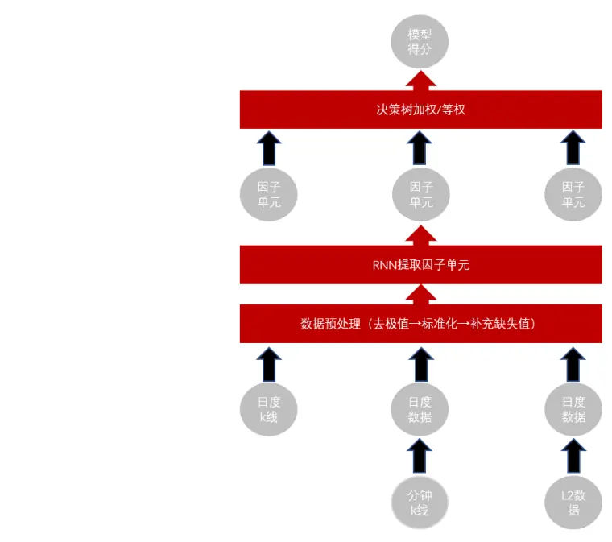
资料来源：东方证券研究所

注意到在我们之前的框架中存在着几个问题：

1. 原数据集时序数据仅包括过去 30 个交易日的量价信息，但一些基于长周期量价构建的 alpha因子也具有一定的选股效果。考虑到 RNN模型的串联结构，如果我们仅依靠延长数据集 day时序长度来捕捉长周期信息对硬件要求较高，计算成本较大。

2. 人工构建的ms数据集不能完整的反映分钟k线数据的全部信息。通过将原始分钟k线的数据通过神经网络来进行降频和特征提取有助于对信息挖掘的充分性起到一定的帮助。

基于以上两个角度，我们提出了一个基于 ResNet的端到端因子挖掘模型，该模型的优势在于：

1. 第一阶段我们对于时序数据不同时刻的数据图片使用 ResNet 进行截面特征提取过程相互独立，因此这一部分可以并行计算，这将大大缩短计算时间。

2. 相较于人工合成相应频率的特征，将原始数据直接作为模型的输入完全实现端到端的模式可以较好的缓解信息丢失等问题，并且也解决了人工筛选特征所带来的过拟合问题。

## 一、因子提取单元网络结构

## 1.1 残差网络（Residual Networks & ResNet）概述

在训练深度神经网络时，通常都是通过梯度下降的方式对参数进行优化，即从神经网络的输出层(output layer) 开始由后向输入层 (input layer) 递归计算每一层的梯度。当层数很多的时候，如果大部分层的梯度都是小于 1，梯度就会变得越来越小，最终会出现梯度消失的问题。当梯度无限接近于 0 的时候，神经网络的参数就没有办法更新学习了。为了解决这个问题，于是就有了残差连接（skip connection）的这个思路。残差连接的核心思想是在每一层输出上额外加上这一层的输入的连接路径，实际上这一层主路径在学习输入与输出之间的残差，而输入输出连接路径则缩短了反向传播距离，有效避免了梯度消失问题。

Skip connection 主要有两种方式分别是 addition 和 concatenation，Concatenation 方式则主要来源于 DenseNet [1]，其是将输入和主路径（称之为 Dense Block）的输出进行拼接得到最终的输出。Addition方式主要来源于ResNet [2]，其简单的将输入和主路径（称之为Residual Block）的输出直接相加作为残差连接的输出。数学上 Addition方式对应函数关系可以简单的表示为

$$
\pmb{x}_{l+1}=\pmb{x}_{l}+\mathcal{F}(\pmb{x}_{l})
$$

其中 $x_{l}$ 表示 ResNet 第 l 层输出， $\mathcal{F}$ 表示 Residual Block 对应的函数，其结构可表示为如下形式：

图 2：ResNet 层结构说明
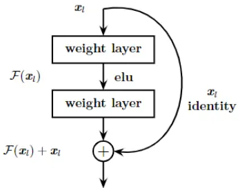

资料来源：东方证券研究所

神经网络特征提取过程可以看作是一个动力系统的衍化过程，因此对∀ $T>0$ ，如果引入时间分割$\varDelta t=T/L$ ，并且把第 l 层输出看成是一个关于时间的函数在时刻 $Tl/L$ 的值 $x(Tl/L)$ ，那么一个 L层的 ResNet 特征提取器可以表示为以下常微分方程(ODE) 具有时间步长 $\varDelta t$ 的向前欧拉离散 [3]：

$$
d{\pmb x}(t)=v({\pmb x}(t),t)dt,\quad t\in[0,T]
$$

这里 $v(\pmb{x}(t),t)$ 满足 $v(\pmb{x}(t),t)\Delta t=\mathcal{F}\big(\pmb{x}(t)\big)$ 。因此根据皮卡定理只要函数 $\mathcal{F}$ 满足李普希兹条件，无论多深的 ResNet 均具有可解性（随着深度增加 ResNet 将收敛到上述 ODE 的解），所以

ResNet在各方面性能优于传统深度神经网络。基于ResNet与ODE的联系，Chen提出了参数量更少性能更优的 Neural ODE [4]。总之，加上 skip connection将使得神经网络性能大幅提升。

## 1.2 数据图片以及数据集的构造

本模型中我们将输入数据拼接成矩阵的形式形成一张数据图片，其结构示意图如下所示：

图 3：数据图片

| Open(t-T+1) | Open(t-T+2) |  | Open(t-1) | Open(t) |
| --- | --- | --- | --- | --- |
| High(t-T+1) | High(t-T+2) |  | High(t-1) | High(t) |
|  |  |  | m | " |
| Turnover(t-T+1) | Turnover(t-T+2) | e | Turnover(t-1) | Turnover(t) |

资料来源：东方证券研究所

与真实图片不同的地方，数据图片虽然横向是连续变化的且相邻两个元素之间存在相关关系，但纵向不满足这种关系，即我们希望纵向打乱行向量输出将不发生改变，因此在进行数据图片卷积操作时，我们把纵向作为图片的通道，采用一维卷积（conv1d）横向对数据图片进行卷积操作。

对于 week 数据集，我们把过去 150 个交易日按照每五个交易日高开低收、vwap、turnover字段作为一张数据图片（字段预处理方法采用高开低收、vwap字段按照时序都除以最后一天收盘价，turnover不做处理），最终得到时序长度为 30的“图片”时序数据（此处含义是这个时序数据由三十张不同时间节点的数据图片构成）。即假设当前交易日为 t，t-5k+1 到 t-5k+5 交易日构成的数据图片对应时序数据中第 k 个时刻的特征（这里 k=1，2…, 30），此时数据图片大小为 6×5。

对于msnew数据集，我们把日内八个“半小时k线”对应的高开低收、amt字段作为一张数据图片（字段预处理方法采用高开低收价格分别除以前一天收盘价，成交额除以流通市值），把过去三十个交易日每天的数据图片拼成一个长度为30的“图片”时序数据。此时数据图片大小为5×8。

## 1.3 本文使用特征提取的网络架构

基于残差网络的思想，我们设计了一个端到端的因子挖掘的网络结构，首先将数据图片通过一个 ResNet 进行特征提取，接着将提取出来的特征对应的时间序列按照时间先后顺序依次输入到一系列 RNN Cell中，取最后一个 RNN Cell的输出经过一个 NN Layer得到最终的预测结果。这里 ResNet特征提取的过程如图 4所示，整个两阶段因子挖掘的过程如图 5所示。

图 4：ResNet特征提取示意图
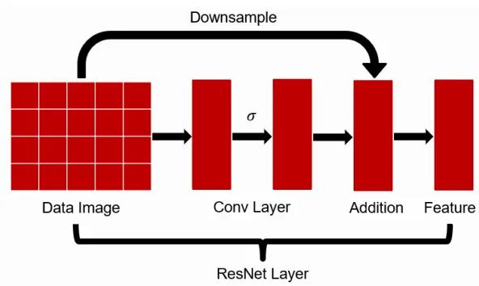
资料来源：东方证券研究所

ResNet 模型主要有两部分构成分别是 Downsample 变换和卷积层（Conv Layer），其输入是数据图片。ResNet 模型中卷积层主要是一维卷积变换和非线性激活函数（σ）组成，Downsample 变换则是将输入数据进行简单的裁剪和线性变换，其目的是保证其输出维数和卷积层输出维数相同，最后我们将两部分的输出相加得到最终 ResNet 模型提取出的特征（Feature）。

图 5：端到端因子挖掘网络结构
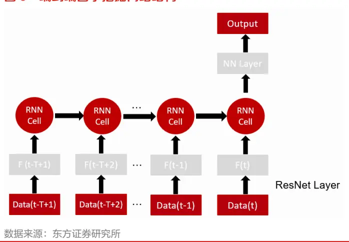

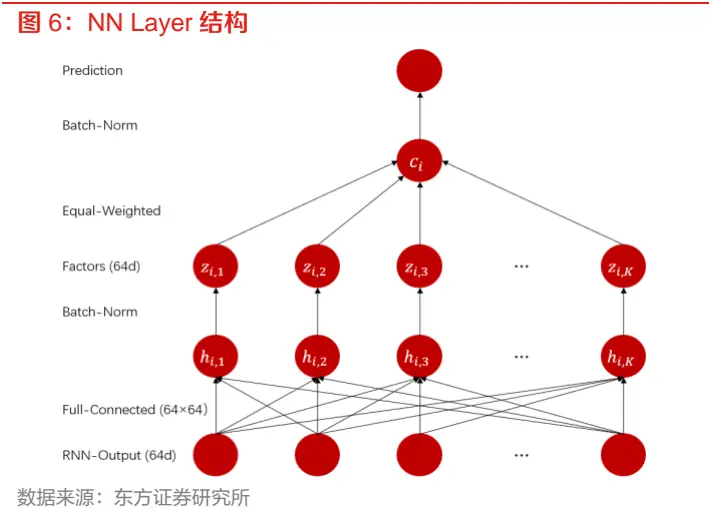

整个两阶段因子挖掘网络结构主要分成 ResNet截面特征提取和 RNN时序特征提取组成，我们首先将原始时序数据对应的数据图片 Data(t-T+1), …, Data(t) 分别通过 ResNet Layer 机器合成相应频率的特征 F(t-T+1), …, F(t)。接着将机器合成的时序特征 F(t-T+1), …, F(t) 按照时间先后依次输入到 RNN Cell中，之后取最后一个 RNN Cell的输出作为提取得到的时序特征，这个时序特征经过一个 NN Layer得到最终的输出。这里 NN Layer主要由一个多对多的全连接层构建，其结构示意图如图 6所示。而整个网络的损失函数可表示为如下形式：

$$
\begin{aligned}Loss=&\frac{1}{N}\sum_{i}^{N}(batchnorm(c_i)-\hat{y}_i)^2+\frac{\lambda}{NK^2}|\big(z_{i,k}\big)_{i,k}^T\big(z_{i,k}\big)_{i,k}|_F\end{aligned}
$$

这里λ 表示正交惩罚项惩罚系数，N 表示 batch 的大小， $\hat{y}_{i}$ 为标签；损失函数第二项表示弱因子$z_{i,k}$ 之间相关系数矩阵的 Frobenius范数。

## 二、因子分析

## 2.1 各数据集选股效果分析

本节我们将对比 week、msnew、day、ms、l2 五个数据集通过多元 RNN 模型生成最终因子的选股效果（这里day、ms、l2数据集分别是前期报告《基于循环神经网络的多频率因子挖掘》中提到的日度 k线、分钟 k线合成的日度数据集、l2数据合成的日度数据集）。

表 1：各数据集多元 RNN 因子 IC 分析（回测期 20170101~20230630）

|  | week | msnew | day | ms | 12 |
| --- | --- | --- | --- | --- | --- |
| RanklC | 13.17% | 13.32% | 11.94% | 13.52% | 11.50% |
| ICIR | 1.25 | 1.4 | 1.18 | 1.41 | 1.33 |
| RankIC>0 占比 | 90.45% | 89.81% | 89.81% | 91.72% | 88.54% |
| 周均单边换手 | 58.25% | 67.27% | 71.77% | 64.81% | 61.03% |

数据来源：东方证券研究所 & 上交所 & 深交所

图 7：各数据集多元 RNN 因子年化超额收益（回测期 20170101~20230630）

|  | week | msnew | day | ms |  | 12 |  |
| --- | --- | --- | --- | --- | --- | --- | --- |
| Top Grp1 Grp2 Grp3 |  | 32.85% | 32.57% | 27.0% | 31.85% |  | 22.30% |
|  |  | 29.73% | 28.39% | 26.52% | 28.62% |  | 19.641% |
|  |  | 26.5 1% | 23.6 67% | 22.65% | 24.74% |  | 19.57% |
|  |  | 19.5% | 20.48% 18.03% | 20.960% 17.57% | 21.15% |  | 17.82% |
| Grp4 Grp5 | 19.18% 16.51% | 16.99% | 15.300% | 17.14% |  | 17.72% |  |
| Grp6 | 15.19% | 14.23% | 13.53% |  | 15.960% 14.12% | 13.83% |  |
|  | 11.69% | 11.69% |  |  |  | 13.67% |  |
| Grp7 | 10.21% | 6.90% | 11.10% | 11.565% | 10.42% |  |  |
| Grp8 | 8.93% | 8.59% | 7.84%6 8.09% | 9.82% 9.33% |  | 10.6% |  |
| Grp9 Grp10 | 3.94% | 5.0296 | 6.28% |  | 8.28% | 8.00% |  |
|  |  | 1.56% |  |  |  | 8.33% |  |
| Grp11 | 1.47% | 2.08% | 2.18% | 2.99% |  | 5.06% |  |
| Grp12 | 0.20% | -1.8$% | -1.01% | 0.07% |  | 1.19% |  |
| Grp13 | -4.36% -6.30% | -4.60% | -3.32% -4.06% | -0.64% -4.46% |  | -0.40% |  |
| Grp14 Grp15 | -8.81% | -7.71% | -6.33% |  | -7.79% | -4.94% |  |
| Grp16 | -13D2% | -12.69% | -10.33% |  | -1473% | -7.23% -11.26% |  |
|  |  | -18.81% | -19.29% |  | -19.99% |  |  |
| Grp17 | -21.39% |  | -30.16% |  | -32.27% | -1759% -28.52% |  |
| Grp18 | -32.25% | 33.41% | -57.22% |  |  |  |  |
| Bottom | -57.19% | -58.19% |  |  | -60.18% | -55.72% |  |

资料来源：东方证券研究所 & 上交所 & 深交所

表 2：各数据集生成因子间 Pearson相关系数

|  | day |  |  |  |  |
| --- | --- | --- | --- | --- | --- |
|  |  | ms | 12 | msnew | week |
| day | 1.00 | 0.71 | 0.51 | 0.77 | 0.81 |
| ms | 0.71 | 1.00 | 0.60 | 0.84 | 0.66 |
| 12msnewweek | 0.51 | 0.60 | 1.00 | 0.55 | 0.48 |
|  | 0.77 | 0.84 | 0.55 | 1.00 | 0.69 |
|  | 0.81 | 0.66 | 0.48 | 0.69 | 1.00 |

数据来源：东方证券研究所 & 上交所 & 深交所

1. 数据集msnew与ms生成打分的相关系数仅0.84，这说明两者之间信息重叠度较高但仍存在差异。原因来自两个方面：第一数据集 msnew 使用的是半小时 k 线数据作为输入而数据集ms 则是根据五分钟 k 线构建的日频特征，频率不同；第二 msnew 数据集是使用 ResNet 直接从原始量价数据中进行信息提取，其反映信息可能较人工构建特征更加全面。数据集msnew与数据集 week、day打分相关性略高于数据集 ms，说明数据集 msnew 打分包含的日间信息相对占比更多，我们认为此现象的原因是数据集 msnew数据频率过低导致的。

2. 数据集 msnew生成打分 Top组超额收益率有了一个明显的提升。且数据集 msnew表现相对于日 k线数据集提升较为明显。这说明 ResNet对原始量价数据信息提取较为充分。

3. 注意到数据集 day、week分别使用了过去 30、150个交易日数据，而数据集 week上生成因子无论是 RankIC 还是 Top 组超额收益率均显著好于数据集 day，这说明较早期的数据对未来仍然具有预测能力，更长时序对未来收益率的预测能力更强。数据集 week 打分的 top 组单边换手率显著低于另外三个数据集，还说明周频特征对于降低单边换手率有着显著作用。

## 2.2 各数据集打分与常见量价因子相关性分析

本节我们将讨论各数据集生成因子与一些常见日频量价因子的相关性（因子含义参见附录）。

日内量价因子
图 8：各数据集打分与常见量价因子相关性分析

|  | day | ms | 12 | week | msnew |
| --- | --- | --- | --- | --- | --- |
| VOL20 | -0.29 | -0.43 | -0.35 | -0.30 | -0.38 |
| RET20 | -0.37 | -0.29 | -0.24 | -0.33 | -0.28 |
| PPREVERSAL | -0.27 | -0.22 | -0.16 | -0.26 | -0.20 |
| CGO60P2HIGH | 0.00 | 0.01 | 0.00 | 0.00 | 0.01 |
|  | -0.14 | -0.08 | -0.03 | -0.13 | -0.07 |
| AVGAMT_20_60 | -0.29 | -0.32 | -0.25 | -0.27 | -0.29 |
| DWFMAXRET20 | -0.47 | -0.52 | -0.45 | -0.45 | -0.47 |
|  | -0.39 | -0.47 | -0.38 | -0.38 | -0.43 |
| mom_20d_120d | -0.05 | -0.10 | -0.06 | -0.11 | -0.08 |

|  | day | 12 | week | msnew | ms |
| --- | --- | --- | --- | --- | --- |
| rvol | -0.33 | -0.30 | -0.31 | -0.32 | -0.37 |
| rskew | -0.10 | -0.14 | -0.08 | -0.11 | -0.14 |
| rkurt | -0.09 | -0.12 | -0.08 | -0.12 | -0.17 |
| vhhi | -0.07 | -0.06 | -0.04 | -0.07 | -0.08 |
| wolcvpct | -0.06 | -0.03 | -0.03 | -0.06 | -0.04 |
|  | 0.01 | 0.03 | 0.02 | -0.04 | -0.03 |
| rjump | -0.25 | -0.20 | -0.22 | -0.21 | -0.22 |
| ovpctcret | -0.15 | -0.21 | -0.14 | -0.20 | -0.22 |
|  | -0.11 | -0.03 | -0.10 | -0.13 | -0.11 |
| apb | 0.08 | 0.15 | 0.08 | 0.13 | 0.13 |
| arpp | -0.02 | 0.06 | 0.01 | 0.05 | 0.06 |

资料来源：东方证券研究所 & 上交所 & 深交所

1. 各数据集打分都倾向于寻找近期超跌且波动率较小的股票，而对长期是否超跌却并不敏感。

2. 数据集 msnew打分和日内量价因子的相关性与数据集 ms高度一致，说明本模型可直接从分钟线数据很好地提取相应信息，且 msnew与 ms数据集打分包含的信息相似度较高。

有关分析师的申明，见本报告最后部分。其他重要信息披露见分析师申明之后部分，或请与您的投资代表联系。并请阅读本证券研究报告最后一页的免责申明。

## 三、各数据集因子非线性加权结果分析

这一章我们将讨论不同数据集因子非线性加权的打分表现。为了考察数据集 msnew对 ms的替代作用及数据集 week对整体模型带来的增量作用，我们构建了以下几个数据集的组合方式：

Model1：数据集 day、数据集 ms 和数据集 l2。

Model2：数据集 day、数据集 msnew 和数据集 l2。

Model3：数据集 week、数据集 day、数据集 ms 和数据集 l2。

Model4：数据集 week、数据集 day、数据集 msnew 和数据集 l2。

首先我们对四个模型打分在中证全指上进行 RankIC分析和分组测试（分成 20组）：

表 3：中证全指选股汇总表现（回测期 20180101~20230630）

|  | Model1 | Model2 | Model3 | Model4 |
| --- | --- | --- | --- | --- |
| RankIC | 14.27% | 14.19% | 14.97% | 14.99% |
| ICIR | 1.47 | 1.49 | 1.52 | 1.53 |
| RankIC>0 占比 | 93.23% | 93.98% | 95.49% | 96.24% |
| Top 年化超额 | 38.14% | 41.35% | 41.48% | 41.76% |
| 年化波动率 | 7.03% | 7.01% | 7.46% | 7.38% |
| 最大回撤 | -5.55% | -7.06% | -5.24% | -5.43% |
| 周均单边换手 | 67.59% | 69.31% | 64.71% | 65.75% |

数据来源：东方证券研究所 & 上交所 & 深交所

图 9：非线性加权打分中证全指分组年化超额收益（回测期 20180101~20230630）

| Model1 |  |  |  | Model2 |  | Model3 |  | Model4 |  |
| --- | --- | --- | --- | --- | --- | --- | --- | --- | --- |
| Top 38.14% |  |  |  | 41.3 | 5% | 41.4 | 8% | 41.76 | % |
| Grp1 31.083% |  |  |  | 29.6 | 99% | 34.8 | 66% | 34.5 | 66% |
| Grp2 27.7% |  |  |  | 26.26 | 5% | 31.7 | 41% | 29.7 | 1% |
| Grp3 26.0 |  |  | 1% 22.7 |  | 2% | 26. | 4% | 29.8 | 9% |
| Grp4 22.2 |  |  | 4% | 22.6 | 4% | 21.7 | 0% | 21.7 | 8% |
| Grp5 |  | 20.0 | 6% | 17.7 | 3% | 20.54 | 1% | 18.7 | 7% |
| Grp6 |  | 14.0 | 7% | 15.92 | % | 18.6 | 5% | 16.6 | 9% |
| Grp7 |  | 13.04 | % 12.05 |  | % | 11.49 | % | 14.4 | 5% |
| Grp8 10.20 |  |  | % 7.98 |  | % | 9.75 | % | 9.03 | % |
| Grp9 | 6.4 |  | 4 7.16 |  | % | 9.03 | % | 8.24 | % |
| Grp10 | 5.87 |  | % 6.88 |  | % | 7.02 | % | 5.67 | % |
| Grp11 | 3.64 |  | 6 | 5.90 | % | 1.24 | % | 0.89 | % |
| Grp12 | 0.01 |  | % | 0.88 | % | -0.88 | % | -0.83 | % |
| Grp13 | -4.25 |  | % | -2.23 | % | -3.22 | % | -3.95 | % |
| Grp14 | -7.04 |  | % | -9.13 | % | -5.54 | % | -6.35 | % |
| Grp15 | -8.88 |  | % | -9.05 | % | -115 | 7% | -9.55 | % |
| Grp16 | -12.89 |  | % | -15.21 | % | -16.3 | 1% | -16.86 | % |
| Grp17 | -20.1 |  | 7% | -18.3 | 7% | -21.0 | 2% | -22.3 | 0% |
| Grp18 | -31.9 |  | 5% | 31.98 | % | -35.5 | 1% | -33.0 | 7% |
| Bottom | -64.93 |  | % | -64.29 | % | -65.10 | % | -64.97 | % |

资料来源：东方证券研究所 & 上交所 & 深交所

表 4：中证全指各年度选股表现（回测期 20180101~20230630）

|  | Model3 绝对 | Model3 超额 Model4 绝对 |  | Model4 超额 |
| --- | --- | --- | --- | --- |
| 2018 | 30.11% | 87.62% | 28.92% | 85.92% |
| 2019 | 78.80% | 38.03% | 78.75% | 37.95% |
| 2020 | 56.97% | 34.48% | 58.60% | 36.02% |
| 2021 | 65.18% | 32.90% | 67.52% | 34.72% |
| 2022 | 13.63% | 26.69% | 13.43% | 26.43% |
| 2023 | 22.19% | 12.93% | 22.86% | 13.54% |

数据来源：东方证券研究所 & 上交所 & 深交所

接着我们将四个打分在沪深300、中证500和中证1000上进行分组测试（分5组），结果如下：
表 5：沪深 300 选股表现（回测期 20180101~20230630）

|  | Model1 | Model2 | Model3 | Model4 |
| --- | --- | --- | --- | --- |
| RanklC | 8.41% | 8.05% | 9.57% | 9.36% |
| ICIR | 0.6 | 0.61 | 0.68 | 0.69 |
| RankIC>0 占比 | 74.44% | 73.68% | 75.94% | 77.44% |
| Top 年化超额 | 25.20% | 22.36% | 26.02% | 25.58% |
| 年化波动率 | 7.44% | 7.38% | 7.83% | 7.68% |
| 最大回撤 | -5.82% | -6.76% | -8.54% | -7.90% |
| 周均单边换手 | 48.50% | 48.94% | 46.48% | 46.61% |

数据来源：东方证券研究所 & 上交所 & 深交所

表 6：中证 500 选股表现（回测期 20180101~20230630）

|  | Model1 | Model2 | Model3 | Model4 |
| --- | --- | --- | --- | --- |
| RanklC | 10.65% | 10.86% | 11.29% | 11.98% |
| ICIR | 0.91 | 0.94 | 0.93 | 1.01 |
| RankIC>0 占比 | 79.70% | 84.21% | 83.46% | 86.47% |
| Top 年化超额 | 18.42% | 20.85% | 21.28% | 21.67% |
| 年化波动率 | 6.09% | 5.81% | 6.23% | 6.22% |
| 最大回撤 | -10.33% | -8.08% | -10.59% | -10.84% |
| 周均单边换手 | 48.90% | 49.73% | 46.48% | 47.15% |

数据来源：东方证券研究所 & 上交所 & 深交所

表 7：中证 1000 选股表现（回测期 20180101~20230630）

|  | Model1 | Model2 | Model3 | Model4 |
| --- | --- | --- | --- | --- |
| RanklC | 13.66% | 13.59% | 14.63% | 14.57% |
| ICIR | 1.32 | 1.34 | 1.40 | 1.40 |
| RankIC>0 占比 | 90.98% | 91.73% | 91.73% | 93.23% |
| Top 年化超额 | 30.59% | 29.84% | 35.02% | 34.56% |
| 年化波动率 | 5.42% | 5.27% | 5.42% | 5.37% |
| 最大回撤 | -4.91% | -3.70% | -2.95% | -3.27% |
| 周均单边换手 | 48.13% | 49.01% | 46.86% | 47.45% |

数据来源：东方证券研究所 & 上交所 & 深交所
有关分析师的申明，见本报告最后部分。其他重要信息披露见分析师申明之后部分，或请与您的投资代表联系。并请阅读本证券研究报告最后一页的免责申明。

图 10：非线性加权打分分组年化超额收益（回测期 20180101~20230630）
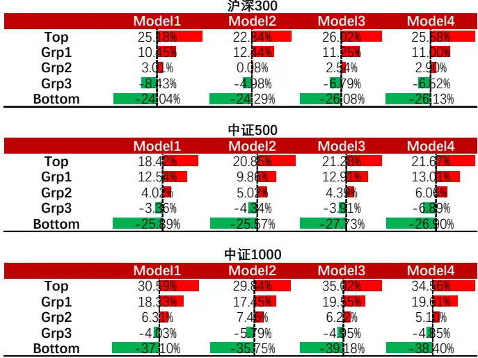
资料来源：东方证券研究所 & 上交所 & 深交所

1. 非线性加权之后生成的打分表现远好于任意一个数据集打分的选股表现。这说明多元 rnn 生成因子非线性加权方式优于等权方式。

2. 通过引入week数据集，在四个股票池上的RankIC、多头超额收益率等指标的表现均有显著的提升，并且有助于降低 Top 组合的换手率。且 Model1 和 Model2 打分在四个股票池上选股表现相近，这说明数据集 msnew对数据集 ms有较好的替代性。

## 四、合成因子指数增强组合表现

## 4.1增强组合构建说明

本章将展示了各数据集非线性加权得分在沪深300、中证500和中证1000指数增强的应用效果，关于指数增强组合有如下说明：

1） 回测期 20180101~20230630，组合周频调仓，假设根据每周五个股得分在次日以 vwap 价格进行交易，股票池为中证全指。

2） 风险因子库dfrisk2020（参见《东方A股因子风险模型（DFQ-2020）》）的所有风格因子相对暴露不超过 0.5，所有行业因子相对暴露不超过 2%，中证 500 增强跟踪误差约束不超过 5%，沪深 300 增强跟踪误差约束不超过 4%。

3） 指增策略组合构建时，限制指数成分股占比不低于 80%，周单边换手率限制为小于等于 20%。

4） 组合业绩测算时假设买入成本千分之一、卖出成本千分之二，停牌和涨停不能买入、停牌和跌停不能卖出。

## 4.2 沪深 300 指数增强

本小节将展示四个非线性加权生成打分应用于沪深 300 指数增强策略表现情况，首先我们展示四个模型各年度超额收益以及汇总的业绩表现：

表 8：沪深 300指增组合分年度超额收益率

|  | Model1 | Model2 | Model3 | Model4 |
| --- | --- | --- | --- | --- |
| 2018 | 23.97% | 23.62% | 25.32% | 23.88% |
| 2019 | 3.14% | 5.35% | 4.70% | 8.10% |
| 2020 | 9.83% | 10.80% | 11.51% | 13.33% |
| 2021 | 10.91% | 13.80% | 19.58% | 19.03% |
| 2022 | 14.65% | 16.12% | 16.59% | 14.60% |
| 2023 | 1.32% | 3.65% | 3.01% | 2.79% |

数据来源：东方证券研究所 & 上交所 & 深交所

表 9：沪深 300指增组合汇总表现

| 年化超额 | 年化波动 | 周度胜率 | 最大回撤 |
| --- | --- | --- | --- |
| Model1 11.41% | 4.71% | 64.46% | -6.65% |
| Model2 13.22% | 4.61% | 65.16% | -4.81% |
| Model3 14.49% | 4.63% | 67.60% | -4.92% |
| Model4 14.76% | 4.61% | 69.34% | -4.95% |

数据来源：东方证券研究所 & 上交所 & 深交所

总体来看，打分构建的沪深 300 指数增强策略组合相对于基准指数各年度均具有显著的超额收益，除 2019 年和今年以及 Model1 在 2020 年以外，四个打分各年度的年化超额收益率均超过10%，Model2、Model3、Model4 的超额收益对应最大回撤均控制在 5%以内，表现较好。接着我们展示了 Model3和 Model4两种数据集组合打分应用于沪深指数增强策略的绝对净值和超额净值曲线：

图 11：沪深 300指增净值走势（Model3）
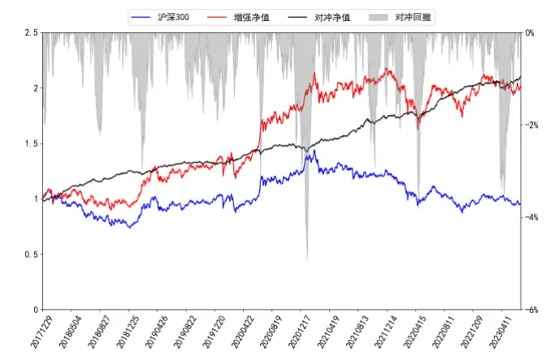
数据来源：东方证券研究所 & 上交所 & 深交所

图 12：沪深 300指增净值走势（Model4）
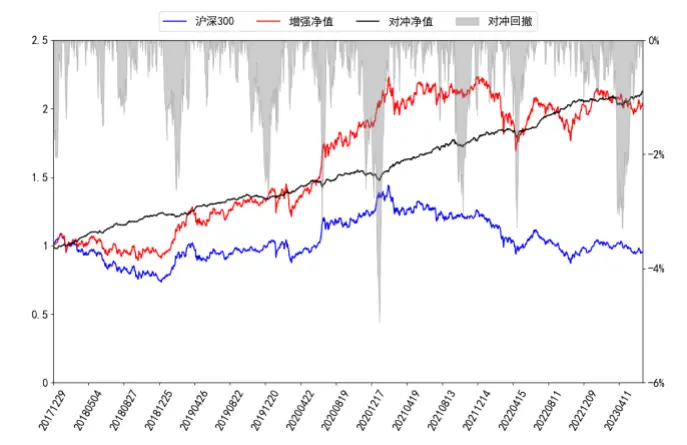
数据来源：东方证券研究所 & 上交所 & 深交所

## 4.3 中证 500 指数增强

本小节将展示非线性加权生成因子打分应用于中证 500 指数增强策略表现情况，首先我们展示四个模型各年度超额收益以及汇总的业绩表现：

表 10：中证 500指增组合分年度超额收益率

| Model1 |  | Model2 | Model3 | Model4 |
| --- | --- | --- | --- | --- |
| 2018 | 31.47% | 28.36% | 39.25% | 35.57% |
| 2019 | 12.29% | 13.31% | 15.83% | 13.19% |
| 2020 | 17.44% | 18.60% | 16.94% | 20.46% |
| 2021 | 20.16% | 16.40% | 20.87% | 23.65% |
| 2022 | 10.64% | 14.93% | 12.80% | 12.59% |
| 2023 | 3.36% | 5.20% | 4.56% | 6.38% |

数据来源：东方证券研究所 & 上交所 & 深交所

表 11：中证 500指增组合汇总表现

| 年化超额 | 年化波动 | 周度胜率 | 最大回撤 |
| --- | --- | --- | --- |
| Model1 17.15% | 5.19% | 69.34% | -4.27% |
| Model2 17.55% | 5.05% | 71.08% | -3.90% |
| Model3 19.76% | 5.08% | 72.47% | -5.37% |
| Model4 20.15% | 5.09% | 74.22% | -4.23% |

数据来源：东方证券研究所 & 上交所 & 深交所

总体来看，打分构建的中证 500 指数增强策略组合相对于基准指数各年度均具有显著的超额收益，除今年以外，四个打分各年度的年化超额收益率均超过 10%，Model1、Model3、Model4的超额收益对应最大回撤均控制在 5%以内，表现较好。接着我们展示了 Model3 和 Model4 两种数据集组合打分应用于中证 500增强策略的绝对净值和超额净值曲线：

图 13：中证 500指增净值走势（Model3）
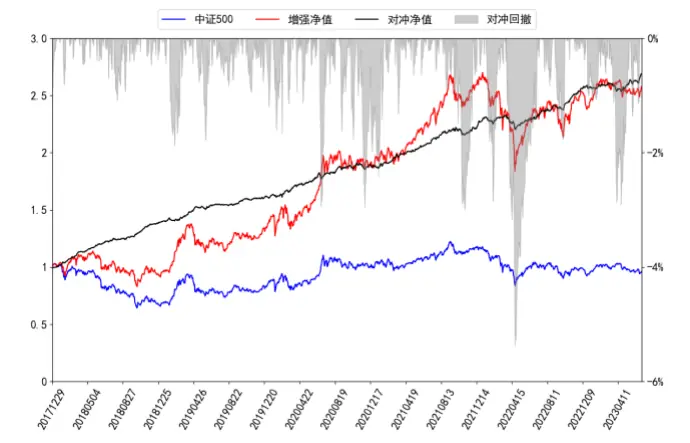
数据来源：东方证券研究所 & 上交所 & 深交所

图 14：中证 500指增净值走势（Model4）
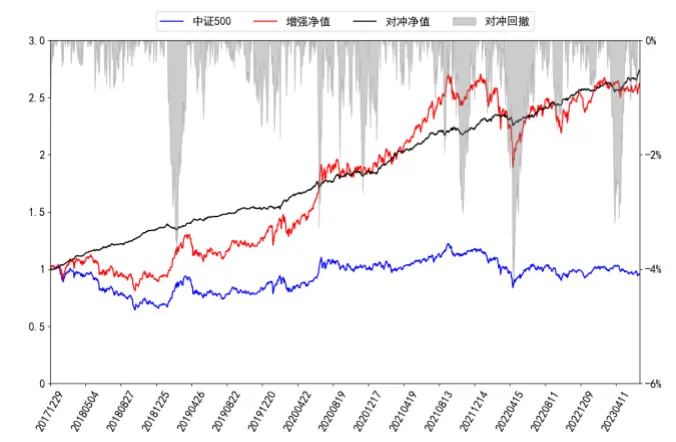
数据来源：东方证券研究所 & 上交所 & 深交所

## 4.4 中证 1000 指数增强

本小节将展示非线性加权生成因子打分应用于中证 1000指数增强策略表现情况：

表 12：中证 1000指增组合分年度超额收益率

|  | Model1 | Model2 | Model3 | Model4 |
| --- | --- | --- | --- | --- |
| 2018 | 49.13% | 48.83% | 58.19% | 54.01% |
| 2019 | 18.22% | 20.25% | 21.56% | 25.35% |
| 2020 | 25.40% | 24.48% | 27.13% | 26.65% |
| 2021 | 21.48% | 18.54% | 26.62% | 26.03% |
| 2022 | 20.97% | 21.11% | 20.17% | 21.14% |
| 2023 | 3.19% | 3.07% | 10.59% | 6.99% |

数据来源：东方证券研究所 & 上交所 & 深交所

表 13：中证 1000指增组合汇总表现

| 年化超额 | 年化波动 | 周度胜率 | 最大回撤 |
| --- | --- | --- | --- |
| Model1 24.67% | 5.69% | 72.82% | -3.53% |
| Model2 24.29% | 5.64% | 71.43% | -4.56% |
| Model3 29.41% | 5.70% | 74.22% | -3.88% |
| Model4 28.72% | 5.70% | 74.56% | -3.92% |

数据来源：东方证券研究所 & 上交所 & 深交所

图 15：中证 1000 指增净值走势（Model3）
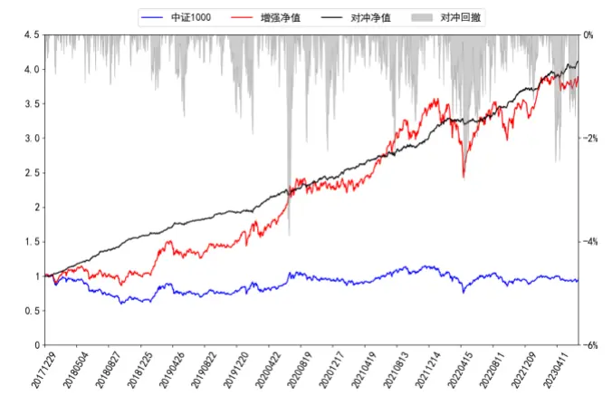
数据来源：东方证券研究所 & 上交所 & 深交所

图 16：中证 1000 指增净值走势（Model4）
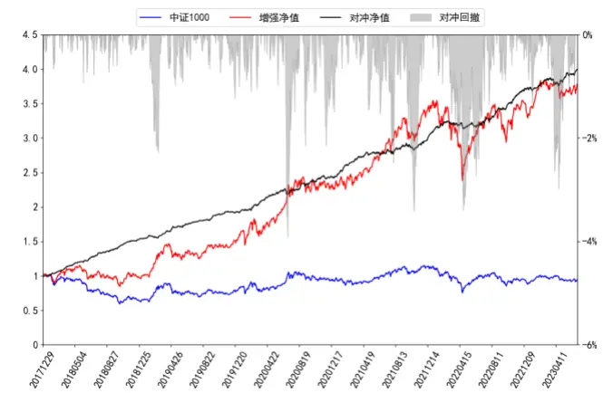
数据来源：东方证券研究所 & 上交所 & 深交所

1. 总体来看，通过使用 msnew数据集来替换数据集 ms，Model1和 Model2两种组合形成的打分在三个股票池上进行指数增强效果相当，这说明在指数增强任务上，msnew 数据集对模型整体的贡献也能替代 ms数据集。

2. 我们发现在 3 个股票池上进行指数增强任务，通过引入 week 数据集形成的打分效果有了一个显著的提升。这说明加入数据集 week能够对整体模型起到一个较大的增量作用。

## 五、结论

前期报告中，我们利用 RNN、决策树模型搭建了 AI 量价模型框架，并将其应用于选股策略。但这个框架存在一些不足：1. 我们使用的时序数据长度较短，一些长周期量价因子也具有一定的选股效果。如果我们仅依靠延长时序长度来捕捉长周期信息计算成本较大。2. 人工构建的 ms 数据集可能并不能完整的反映整个分钟 k线的全部信息。

基于以上两个角度，本文提出了一个基于 ResNet 的两阶段因子挖掘模型，该模型优势主要在于：

1. 第一阶段我们对时序数据不同时刻的数据图片使用 ResNet 进行时间截面特征提取过程相互独立，因此这一部分可以并行计算这将大大缩短计算时间。

2. 相较于人工合成相应频率的特征，将原始数据直接作为模型的输入完全实现端到端的模式可以较好的缓解信息丢失问题，并且也解决了人工筛选特征所带来的过拟合问题。

根据各数据集上生成因子非线性加权合成打分的回测结果，我们认为：

1. 数据集 msnew与数据集 ms生成的因子之间信息重叠度较高但仍然存在差异。主要原因在于数据集 msnew使用的是半小时 k线数据作为输入，而数据集 ms则是根据五分钟 k线人工构建的日频特征，二者原始数据信息天然存在差异；

2. 数据集 msnew 生成打分的选股能力整体略高于数据集 ms。通过将数据集 msnew 生成的弱因子替代数据集 ms 参与非线性加权得到的打分在四个股票池上表现并没有发生较大改变，这说明数据集 msnew对数据集 ms有较好的替代性。

3. 数据集week上生成因子选股能力显著好于数据集day，说明更长时序作为输入对未来收益率的预测能力更强。并且通过引入 week 数据集，非线性加权打分在各股票池上的各项选股指标均有显著的提升，说明数据集 week能够对整体模型起到增量作用。

我们提出的两种不同数据集组合Model3和Model4非线性加权打分在中证全指、沪深300、中证 500、中证 1000 四个指数上十日 RankIC 均值分别为 14.97%、9.57%、11.29%、14.63%和 14.99%、9.36%、11.98%、14.57%，top 组年化超额分别为 41.48%、26.02%、21.28%、35.02%和 41.76%、25.58%、21.67%、34.56%，打分市值偏向性较低。

以上两个打分也可以应用于指数增强策略，在各宽基指数上均能获得显著的超额收益，在成分股不低于 80%限制、周单边换手率约束为 20%约束下，2018 年以来，Model3 打分在沪深 300、中证 500 和中证 1000 增强策略上年化超额收益率分别为 14.49%、19.76%和 29.41%，Model4打分在沪深 300、中证 500 和中证 1000 增强策略上年化超额收益率分别为 14.76%、20.15%和28.72%。

## 附录

| 表14：因子说明 |  |
| --- | --- |
| VOL20 | 过去20个交易日的波动率 |
| RET20 | 过去20个交易日的收益率 |
| PPREVERSAL | 过去5日均价/过去60日均价-1 |
| CGO60 | 当前价/60日换手反推的持仓价-1 |
| P2HIGH | 当前价格除以过去243个交易日的最高价 |
| AVGAMT_20_60 | 过去20日日均成交额/过去60日日均成交额 |
| DWF | 涨幅榜单因子，榜单参数N=100，半衰期10个交易日 |
| MAXRET20 | 过去最大收益，过去20日最大3个日收益均值 |
| mom_20d_120d | 过去120个交易日的收益率，剔除最近20日收益 |
| rvol | 日内波动率 |
| rskew | 日内收益率偏度 |
| rkurt | 日内收益率峰度 |
| vhhi | 日内成交量的 HHI 指数 |
| vvol | 日内成交量的波动率除以当日成交量 |
| cvpct | 尾盘半小时成交量占比 |
| rjump | 日内极端收益 |
| ovpct | 早盘半小时成交量占比 |
| cret | 收盘半小时对数收益率 |
| apb | LOG(TWAP/VWAP)*1e3 |
| arpp | (TWAP-LOW)/(HIGH-LOW) |

数据来源：东方证券研究所

## 风险提示

1. 量化模型基于历史数据分析，未来存在失效风险，建议投资者紧密跟踪模型表现。

2. 极端市场环境可能对模型效果造成剧烈冲击，导致收益亏损。

## 核心参考文献

【1】 Huang, G., Liu, Z., Van Der Maaten, L., & Weinberger, K. Q. (2017). Densely connected convolutional networks. In Proceedings of the IEEE conference on computer vision and pattern recognition (pp. 4700-4708).

【2】 He, K., Zhang, X., Ren, S., & Sun, J. (2016). Deep residual learning for image recognition. In Proceedings of the IEEE conference on computer vision and pattern recognition (pp. 770-778).

【3】 Weinan, E. (2017). A proposal on machine learning via dynamical systems. Communications in Mathematics and Statistics, 1(5), 1-11.

【4】 Chen, R. T., Rubanova, Y., Bettencourt, J., & Duvenaud, D. K. (2018). Neural ordinary differential equations. Advances in neural information processing systems, 31.

## Tabl e_Disclai mer 分析师申明

每位负责撰写本研究报告全部或部分内容的研究分析师在此作以下声明：

分析师在本报告中对所提及的证券或发行人发表的任何建议和观点均准确地反映了其个人对该证券或发行人的看法和判断；分析师薪酬的任何组成部分无论是在过去、现在及将来，均与其在本研究报告中所表述的具体建议或观点无任何直接或间接的关系。

## 投资评级和相关定义

报告发布日后的12个月内行业或公司的涨跌幅相对同期相关证券市场代表性指数的涨跌幅为基准（A 股市场基准为沪深 300 指数，香港市场基准为恒生指数，美国市场基准为标普 500 指数）；

## 公司投资评级的量化标准

买入：相对强于市场基准指数收益率 15%以上；

增持：相对强于市场基准指数收益率 5%～15%；

中性：相对于市场基准指数收益率在-5%～+5%之间波动；

减持：相对弱于市场基准指数收益率在-5%以下。

未评级 —— 由于在报告发出之时该股票不在本公司研究覆盖范围内，分析师基于当时对该股票的研究状况，未给予投资评级相关信息。

暂停评级 —— 根据监管制度及本公司相关规定，研究报告发布之时该投资对象可能与本公司存在潜在的利益冲突情形；亦或是研究报告发布当时该股票的价值和价格分析存在重大不确定性，缺乏足够的研究依据支持分析师给出明确投资评级；分析师在上述情况下暂停对该股票给予投资评级等信息，投资者需要注意在此报告发布之前曾给予该股票的投资评级、盈利预测及目标价格等信息不再有效。

## 行业投资评级的量化标准：

看好：相对强于市场基准指数收益率 5%以上；

中性：相对于市场基准指数收益率在-5%～+5%之间波动；

看淡：相对于市场基准指数收益率在-5%以下。

未评级：由于在报告发出之时该行业不在本公司研究覆盖范围内，分析师基于当时对该行业的研究状况，未给予投资评级等相关信息。

暂停评级：由于研究报告发布当时该行业的投资价值分析存在重大不确定性，缺乏足够的研究依据支持分析师给出明确行业投资评级；分析师在上述情况下暂停对该行业给予投资评级信息，投资者需要注意在此报告发布之前曾给予该行业的投资评级信息不再有效。

## HeadertTabl e_Discl ai mer 免责声明

本证券研究报告（以下简称“本报告”）由东方证券股份有限公司（以下简称“本公司”）制作及发布。

。本公司不会因接收人收到本报告而视其为本公司的当然客户。本报告的全体接收人应当采取必要措施防止本报告被转发给他人。

本报告是基于本公司认为可靠的且目前已公开的信息撰写，本公司力求但不保证该信息的准确性和完整性，客户也不应该认为该信息是准确和完整的。同时，本公司不保证文中观点或陈述不会发生任何变更，在不同时期，本公司可发出与本报告所载资料、意见及推测不一致的证券研究报告。本公司会适时更新我们的研究，但可能会因某些规定而无法做到。除了一些定期出版的证券研究报告之外，绝大多数证券研究报告是在分析师认为适当的时候不定期地发布。

在任何情况下，本报告中的信息或所表述的意见并不构成对任何人的投资建议，也没有考虑到个别客户特殊的投资目标、财务状况或需求。客户应考虑本报告中的任何意见或建议是否符合其特定状况，若有必要应寻求专家意见。本报告所载的资料、工具、意见及推测只提供给客户作参考之用，并非作为或被视为出售或购买证券或其他投资标的的邀请或向人作出邀请。

本报告中提及的投资价格和价值以及这些投资带来的收入可能会波动。过去的表现并不代表未来的表现，未来的回报也无法保证，投资者可能会损失本金。外汇汇率波动有可能对某些投资的价值或价格或来自这一投资的收入产生不良影响。那些涉及期货、期权及其它衍生工具的交易，因其包括重大的市场风险，因此并不适合所有投资者。

在任何情况下，本公司不对任何人因使用本报告中的任何内容所引致的任何损失负任何责任，投资者自主作出投资决策并自行承担投资风险，任何形式的分享证券投资收益或者分担证券投资损失的书面或口头承诺均为无效。

本报告主要以电子版形式分发，间或也会辅以印刷品形式分发，所有报告版权均归本公司所有。未经本公司事先书面协议授权，任何机构或个人不得以任何形式复制、转发或公开传播本报告的全部或部分内容。不得将报告内容作为诉讼、仲裁、传媒所引用之证明或依据，不得用于营利或用于未经允许的其它用途。

经本公司事先书面协议授权刊载或转发的，被授权机构承担相关刊载或者转发责任。不得对本报告进行任何有悖原意的引用、删节和修改。

提示客户及公众投资者慎重使用未经授权刊载或者转发的本公司证券研究报告，慎重使用公众媒体刊载的证券研究报告。

## 东方证券研究所

地址： 上海市中山南路 318 号东方国际金融广场 26 楼

电话：021-63325888

传真：021-63326786

网址： www.dfzq.com.cn