# DFQ-TRA：多交易模式学习因子挖掘系统

# 因子选股系列之九十七

## 研究结论

针对股票收益率预测任务，采用 TRA 模型，用以识别不同的交易模式，直面“市场规律具有时变特性”这一核心问题。期望为每只股票，在每个时刻，都能找到与之相适应的股票收益率预测器或预测器组合，从而达到更优的预测效果。为了防止输出结果集中在个别预测器，借鉴了最优传输问题（OT）来指导路由器的学习。

- 多股票交易模式：现有的股票收益率预测方法通常假设股票数据独立同分布，采用单一模型对股票数据建模。但实际上：（1）股票数据通常会包含多种不同的分布。（2）市场存在不止一种交易模式。（3）交易模式存在时变特性。

- TRA：由股票收益率预测器和路由器组成。预测器用于建模不同的股票交易模式，路由器用于预测样本属于哪种交易模式。TRA 可以作为一个扩展模块来增强现有的股票预测模型，使其具有学习多种交易模式的能力。

- OT：为了防止输出结果集中在个别预测器，将样本到预测器的分配问题表述为一个最优传输问题，并通过一个正则化损失项来指导路由器的学习。

多输入：使用 alpha 因子和风险因子两类输入数据。不同输入得到的因子低相关，多输入模型进行等权合成，可以进一步提升模型效果。

- 特征提取：引入注意力机制，transformer模型为更优选择。

- 路由器输入：利用两种类型的信息作为路由器的输入，用于预测样本的交易模式。特征的潜在表示和预测器的预测误差对路由器都有价值。

- 多预测器：多个预测器比 1 个预测器好；预测器不应高度相关，应有差异；预测器应分散配置，不应一直只选择某一个预测器；预测器数量不需要太多。

- 端对端：TRA 是一个端对端模型，直接给出多因子的加权方案，并且对于每个时刻每个股票，加权方式都可以不一样，完全灵活。

合成因子绩效：在中证全指股票池中，TRA 模型合成因子得分在测试集（2020-2023 年）上 rankic16.38%，rankicir1.22（未年化），20 分组多头年化超额收益23.86%，月均单边换手仅57%。样本外未出现衰减，今年表现最好，2023年rankic达到 20.18%。因子整体衰减速度较慢，rankic 滞后 20 天仅衰减 30%左右。因子中性化后 rankic仍有13.88%。随机种子对全市场训练的的 TRA模型结果影响很小，5个路径下得到的因子值相关系数在 90%左右。

Top 组合绩效：在中证全指内，使用 TRA 模型构建的 top100 组合，2020 年以来年化超额收益达到 31.27%，单边年换手 8 倍，最大回撤 21.67%。2021-2023 年，每年相比中证全指的超额收益都在 20%以上，2023 年到 10 月 19 号绝对收益达到17%，超额收益达到 25%。

⚫ 沪深300指数增强组合：TRA模型在沪深300指增组合中表现突出，2020年以来信息比达到 1.87，年化对冲收益超 13%，单边年换手仅 6 倍。每年均取得正超额，2023 年到 10 月 19 号对冲收益达到 10.53%。

⚫ 中证 500 指数增强组合：TRA 模型在中证 500 指增组合中表现突出，优于 300 增强。2020 年以来信息比达到 1.85，年化对冲收益达 14%，单边年换手仅 8 倍。2020-2023 年每年超额都超过 10%，2023 年到 10 月 19 号对冲收益达 10%。

⚫ 中证 1000指数增强组合：TRA模型在中证 1000指增组合中表现突出，优于 300和500增强。2020年以来信息比达 2.35，年化对冲收益达18.47%，单边年换手仅 8.8倍。2020-2023 年每年超额都超过 10%，2023 年到 10 月 19 号对冲收益达 10%。

## 风险提示

1. 量化模型失效风险。

2. 极端市场环境对模型的影响。

报告发布日期

2023 年 11 月 14 日

杨怡玲 yangyiling@orientsec.com.cn

执业证书编号：S0860523040002

刘静涵021-63325888*3211

liujinghan@orientsec.com.cn

执业证书编号：S0860520080003

香港证监会牌照：BSX840

基于残差网络的端到端因子挖掘模型：— 2023-08-24—因子选股系列之九十六

DFQ 强化学习因子组合挖掘系统：——因 2023-08-17子选股系列之九十五

UMR2.0——风险溢价视角下的动量反转2023-07-13
统一框架再升级：——因子选股系列之九
十四

集成模型在量价特征中的应用：——因子 2023-07-01选股系列之九十三

基于时点动量的因子轮动：——因子选股 2023-06-28系列之九十二

基于循环神经网络的多频率因子挖掘：— 2023-06-06—因子选股系列之九十一

DFQ 遗传规划价量因子挖掘系统：——因 2023-05-28子选股系列之九十

## 一、模型概述

针对股票收益率预测任务，采用 Temporal Routing Adaptor（TRA）模型，用以识别不同的交易模式，直面“市场规律具有时变特性”这一核心问题。期望为每只股票，在每个时刻，都能找到与之相适应的股票收益率预测器或预测器组合，从而达到更优的预测效果。为了防止输出结果集中在个别预测器，借鉴了最优传输问题（OT）来指导路由器的学习。

TRA模型最早由微软亚洲研究院在 2021 年 6 月发布于 arXiv ，并被 2021 年 KDD国际数据挖 掘 与 知 识 发 现 大 会 接 收 。 原 模 型 代 码 已 经 封 装 在 QLib 里（/qlib/examples/benchmarks/TRA），感兴趣的投资者可以自行下载测试。本文在原模型基础上进行修改和优化。

## 1.1 多股票交易模式

股票收益率预测是量化投资中最为关键的任务。近年来，深度神经网络因其强大的表征学习能力和非线性建模能力，受到投资者关注。现有的预测方法通常假设股票数据符合独立同分布，采用单一模型有监督地对股票数据进行建模。但实际上：

（1）股票数据通常会包含多种不同的分布。已有的模型并不具备同时学习股票数据中多种分布的能力。例如动量和反转这两种分布形式同时存在于股票数据中。我们测算了机构持股比从低到高的 4 个区间中动量因子的表现。动量因子的形式为 MOM(12,1)，假设当前为 T0，那么MOM(12,1)表示 T0-12到 T0-1时间段股票的收益。从图 1可以看到，MOM(12,1)在机构持股比最高的分组中 rankic 有 2%，说明在机构持股比高的分组中确实存在一定的动量效应；而在机构持股比最低的分组中，动量因子方向为负，动量效应变成了反转效应，反映了非理性投资者参与较多的股票更容易产生过度反应特征。

图 1：不同机构持股比分组下的动量因子表现(2009.12.31-2023.9.15)

| 全市场按机构持仓占比等分四组 | rankic | rankicir(年化) | 多空年化 | 多空月最大回撤 | 多空月胜率 | 信息比 |
| --- | --- | --- | --- | --- | --- | --- |
| low | -3.90% | (1.22) | -8.24% | -71.51% | 44.85% | (0.23) |
| 2 | -2.02% | (0.56) | -4.17% | -57.62% | 50.30% | (0.08) |
| 3 | -0.42% | (0.10) | -1.08% | -51.67% | 52.12% | (0.00) |
| high | 1.88% | 0.36 | 5.15% | -43.92% | 52.73% | 0.11 |

数据来源：东方证券研究所 & Wind资讯

（2）市场存在不止一种交易模式。在现实世界中，大多数投资者会遵循特定的策略来买卖股票。当大量个体采用相同的投资策略时，就将形成一种交易模式。图 2 显示了三种最常见的投资策略的年化超额回报：规模（购买小市值股票）、价值（购买市净率最高的股票）和动量（购买过去 12 个月表现最佳的股票）。可以观察到，在不同的时期，不同的策略会占据主导地位。2007-2017年是规模策略占优，2019-2020年之后是动量策略占优。

（3）交易模式存在时变特性。当数据中存在多种模式时，单一模型不足以捕捉所有的模式，特别是当其中一些模式彼此矛盾时。图 3 使用市值排名（规模）、市净率排名（价值）和过去 12个月的总回报排名（动量）作为特征（x），下个月的股票回报排名作为标签（y），展示线性回归的系数。可以观察到，2009 年的动量系数为负，意味着股票的回报与它们过去的表现负相关。2013 年动量系数变为正数，这表明存在相反的模式。如果不引入不同的参数集来分别对这两种模式进行建模，将不可能同时模拟这两种模式。

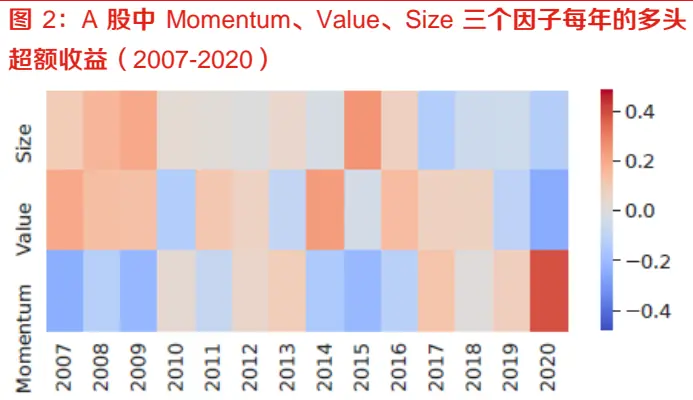
数据来源：东方证券研究所 & arXiv

图 3：A 股中 Momentum、Value、Size 三个因子的截面回归系数（2007-2020）
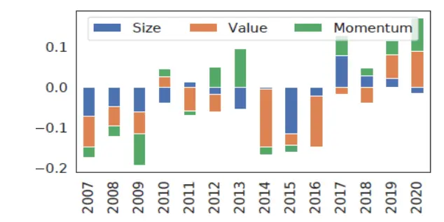
数据来源：东方证券研究所 & arXiv

## 1.2 TRA（时域路由适配器，Temporal RoutingAdaptor）

TRA 由股票收益率预测器和路由器组成。预测器用于建模不同的股票交易模式，路由器用于预测样本属于哪种交易模式。TRA 可以作为一个扩展模块来增强现有的股票预测模型，使其具有学习多种交易模式的能力。

（1）预测器的设计：最直接的方法应该是为不同的交易模式引入多个并行的预测模型，但模拟k个不同的交易模式，就需要引入k-1倍的参数，引入过多参数会使模型更容易出现过拟合。因此，我们将传统股票收益率预测模型中的输出层由一层增加为多层，增加的参数可以忽略不计。这种设计可以轻松地插入到现有的股票预测模型中，如果输出设置一层，即只保留一个预测器，那么 TRA将变成经典的股票预测模型，不会造成任何性能回退。

（2）路由器的设计：路由器利用从主干模型提取的输入特征的潜在表示，以及不同预测器的时间预测误差，通过门控架构（通常是全连接层）来确定样本的模式。门控层会输出一个概率分布，用于进行预测器分配。

图 4：TRA：预测器 + 路由器框架
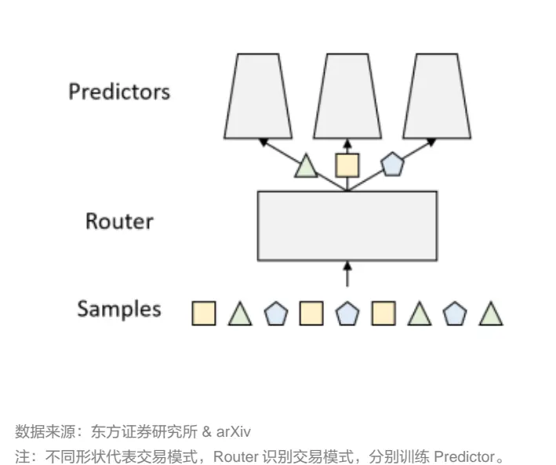

图 5：TRA网络架构示意图
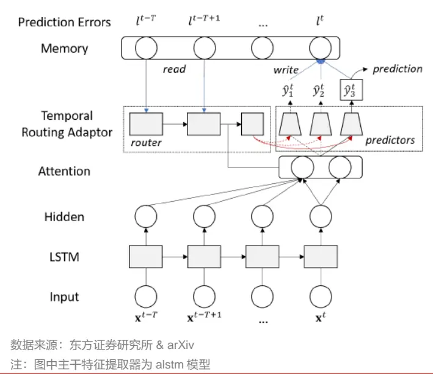

有关分析师的申明，见本报告最后部分。其他重要信息披露见分析师申明之后部分，或请与您的投资代表联系。并请阅读本证券研究报告最后一页的免责申明。

## TRA的网络架构构建方式如下：

1. 输入为因子特征时间序列 x ，首先通过 LSTM层提取特征的潜在表示 h 。

2. 不考虑 Attention的情况下，将 h 送至多个预测器，假设有 K 个预测器，可得到不同预测值 $\hat{1}\hat{y}_{1}、\hat{y}_{2}、\hat{y}_{3}、\ldots\ldots、\hat{y}_{k}$ （下标代表预测器）。

3. 计算各预测器的预测误差，每个样本 i （单只股票单个交易日）得到误差向量 $l_{i}$ （K 维向量），并存入内存中。每个样本取过去一段时间窗口的预测误差，构成误差矩阵 $\begin{array}{r}{\boldsymbol{\dot{e}}_{i}=\boldsymbol{e}_{i}(s,t)=}\end{array}$ [l(s, t − T), l(s, t − T + 1) … … l(s, t − ℎ)]，其中，T 是最大的回看窗口，ℎ 是一个额外的间隙以避免使用未来信息， $e_{i}$ 的维数为时间窗口长度× $K_{s}$

4. 对每个样本 i ，将特征的隐状态 $ih_{i}$ 和预测器的误差矩阵 $ie_{i}$ 合并，作为路由器的输入，路由器的输出记为 $a_{i}=\pi(h_{i},e_{i})$ ，归一化可得到每个样本 i 的标准化注意力系数 $\dot{q}_{i}$ 。以 $.q_{i}$ 为权重对ŷ 进行加权平均，得到每个样本 i的最终收益预测值 $\hat{p}_{i}$ 。

## 1.3 OT（最优运输， Optimal Transport）

如果对于路由器不加限制，可能会一直选择历史上表现最优的预测器，违背了最初的设计，易导致模型过拟合、泛化能力差。一个好的路由机制应该能够动态地选择当前最适当的预测器。为了防止输出结果集中在个别预测器，进一步保证多样化交易模式的发现，我们将样本到预测器的分配问题表述为一个最优传输问题，并通过一个正则化损失项来指导路由器的学习。OT 最早用于解决最优运输以及物资分配问题，近年来为机器学习领域关注，生成对抗网络的变式 WGAN就蕴含了 OT 的思想。

（1）最优传输问题设计：最优运输被用来求解满足特定比例约束下，如何分配样本能够最小化整体预测偏差这一问题，即在给定损失矩阵 L 的情况下，寻找最佳的传输计划（即样本分配矩阵 P），使得总体损失最小化，同时保持分配给特定预测器的样本数量与对应模式的相对份额$v_{k}$ 成比例。

$$
\begin{aligned}&\min_{P}<P,L>\\&\\s.t.\sum_{i=1}^{N}P_{ik}=v_{k}*N,\forall k=1\ldots K\\&\\\sum_{k=1}^{K}P_{ik}=1,\forall i=1\ldots N\\&\\P_{ik}\in\{0,1\},\forall i=1\ldots N,k=1\ldots K\\\end{aligned}
$$

损失函数中的 P 和 L 均为 N × K 矩阵， N 为样本数量， K 为预测器数量。 P 的 i 行 k 列元素 $P_{ik}$ 代表样本 i 分配到预测器 k 的概率， L 的 i 行 k 列元素 $L_{ik}{}^{\prime}$ 代表样本 i 在预测器 k 的损失值。目标函数为最小化总体损失：P 和 L 的 Frobenius 内积（矩阵对应元素相乘再相加）。第一个约束确保分配的样本与对应模式的相对份额成比例。不同模式的相对份额 $v_{k}$ 是未知的，我们将不同的模式视为具有相等的份额 $v_{k}=1/K$ ，引导不同模式均衡配置。第二、三个约束确保只选择一个预测器。

（2）最优传输问题求解：上述这个优化问题无法直接求解，因此我们使用 Sinkhorn 的矩阵缩放算法获得近似解。Sinkhorn-Knopp 算法中，通过对矩阵 L 依次进行多次“列-行归一化”，即可得到最优样本分配矩阵 $\mathsf{P}_{\circ}$ 。矩阵 P 满足每行之和为 1，每列之和为 N/K。每行之和为 1 表示对每个样本，所有预测器的权重之和为 1，符合概率分布的定义。每列之和为 N/K 表示每个预测器，获得的所有样本的权重之和为 N/K。也就意味着预测器要均匀分配，每个预测器都在一部分样本上发挥作用。通过行和列的双重归一化，Sinkhorn 算法实际上在寻找一种权衡，使得每个样本都能以某种平衡的方式使用多个预测器，同时每个预测器也能在所有样本中发挥均衡的作用。这样的平衡分配有助于模型更全面地捕捉数据中的多样性。

（3）使用最优传输问题指导路由器学习：在获得最优样本分配矩阵 P 后，我们进一步研究如何使用它来协助TRA模型的训练。需要注意的是，最优样本分配矩阵P的计算依赖于各预测器的预期损失矩阵 L，因此也依赖于未知标签，不能直接用于进行样本外测试阶段的样本分配。所以我们使用最优样本分配矩阵 P 来指导路由器的学习，帮助模型在训练阶段更好地学习如何分配样本。具体通过在损失函数中添加一个辅助正则化项进行，正则化项由交叉熵定义：

$$
\mathbf{reg}=\lambda\sum_{k=1}^{K}P_{ik}\log(q_{ik}),
$$

其中 q 为 TRA 模型预测的分配概率，p 为最优传输问题求解出的最优样本分配矩阵，也就是目标分布。交叉熵衡量了模型预测的概率分布与目标概率分布之间的差异。通过最小化交叉熵损失，模型会被激励去使每个预测器对应的概率接近于目标分配概率，即引导模型去学习与最优传输问题解相匹配的分配策略。

λ是一个控制正则化强度的超参数。在模型的训练过程中可以逐步减小正则化项的权重，从而允许路由器在训练后期更自由地探索和学习样本的最佳分配或模式份额，不一定要按照最优传输矩阵的指示对不同预测器进行均衡分配。

## 二、模型核心要点

## 2.1 多输入：alpha 因子+风险因子

输入端对于模型影响重大。我们尝试了三类输入：基础特征、alpha因子、风险因子。

（1）基础特征：包括原始日线行情、基于分钟线提取的日频特征、日度估值因子等 44个。

（2）alpha因子：来自于前期报告《DFQ遗传规划价量因子挖掘系统》提出的遗传规划模型， 共选取了 100个。

（3）风险因子：来自于前期报告《东方 A 股因子风险模型（DFQ-2020）》提出的风险模型，共 10个。风险因子可能在某些时期或市场条件下也表现为 alpha因子。例如，估值因子在全市场无显著选股效果，ic仅为 1.44%，但在低 certaity（信息确定性风险：分析师覆盖数量、公募基金持仓比例和上市时间长短三个指标）的股票中选股效果显著，ic达到4.51%，表现为alpha因子。将风险因子作为输入可以帮助模型捕捉到这些隐藏的 alpha信息。

图 6：全市场估值因子分域绩效表现(2020.1.1-2023.6.30)
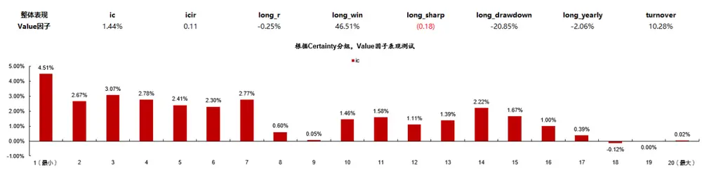
数据来源：东方证券研究所 & Wind资讯

结果显示：（1）不同输入得到的因子低相关；（2）用 GP 因子作为输入效果最好，其次是风险因子，基础特征表现最差，尤其是多头端。说明有效的特征工程还是必要的；（3）多输入模型等权合成，可以进一步提升模型效果。用 GP 和 RISK 两个模型等权的 tra2 因子多头更高，多头年化超额收益达到 23.64%，月单边换手不到 60%，月均 rankic接近 16%。

图 7：不同输入下 TRA 模型因子值 spearman 相关性(2020.1.1-2023.6.30)

|  | GP 100.00% | RISK 55.23% | RAW |
| --- | --- | --- | --- |
| GP RISK | 55.23% | 100.00% | 58.72% |
|  |  |  | 44.64% |
| RAW | 58.72% | 44.64% | 100.00% |

数据来源：东方证券研究所 & Wind资讯

图 8：不同输入下 TRA 模型绩效表现对比(2020.1.1-2023.7.21)

| 输入特征 | ic | icir | rank_ic | rank_icir | long_r | long_win | long_sharp | long_drawdown | long_yearly | turnover |
| --- | --- | --- | --- | --- | --- | --- | --- | --- | --- | --- |
| RAW | 9.99% | 1.09 | 13.75% | 1.49 | 0.81% | 62.79% | 0.98 | -11.21% | 10.59% | 59.05% |
| GP | 10.24% | 1.03 | 14.71% | 1.41 | 1.69% | 83.72% | 3.00 | -2.13% | 22.74% | 71.82% |
| RISK | 8.38% | 0.67 | 13.57% | 0.99 | 1.47% | 72.09% | 1.92 | -4.22% | 18.58% | 51.13% |
| tra3(RAW+GP+RISK) | 11.26% | 0.97 | 16.32% | 1.32 | 1.58% | 76.74% | 2.34 | -3.31% | 21.37% | 57.62% |
| tra2(GP+RISK) | 10.42% | 0.84 | 15.78% | 1.19 | 1.72% | 72.09% | 2.20 | -3.30% | 23.64% | 57.12% |

数据来源：东方证券研究所 & Wind资讯

有关分析师的申明，见本报告最后部分。其他重要信息披露见分析师申明之后部分，或请与您的投资代表联系。并请阅读本证券研究报告最后一页的免责申明。

## 2.2 特征提取：注意力机制的引入

特征提取是 TRA 模型的基础步骤。我们尝试了三种特征提取方式：lstm、alstm、transformer，分别对输入的时序特征数据进行编码。

alstm(attention lstm)是 lstm的一个扩展版本，添加了注意力机制，允许模型关注当前时间步以前的信息。具体地说，对于每个时间步，注意力机制都会根据当前的隐藏状态计算一个权重分布，该权重分布决定了模型应该关注输入序列的哪些部分。然后，这些加权的输入将与当前的隐藏状态结合，以产生输出。

transformer 完全摈弃了 RNN 的概念，使用编码器-解码器结构，核心是自注意力机制，即允许输入序列的每个元素与序列中的所有其他元素互相“关注”，不论它们在序列中的相对位置如何。这意味着，对于输入序列中的每个位置，模型都会产生一个权重分布，表示模型应该赋予序列中其他位置多大的重要性。这些权重然后用于加权输入序列，产生一个新的输入序列，其每个位置都是原输入序列的加权组合。这个新的输入序列再被送入后续的前馈神经网络层。

结果显示，transformer 模型为更优选择：

（1）Risk 输入下，各个指标均差别明显，lstm 弱于 alstm，弱于 transformer。

（2）GP 输入下，lstm 明显更差，但 alstm 和 transformer 差别并不明显。

图 9：不同特征提取方式下 TRA 模型绩效表现对比(2020.1.1-2023.7.21)

| 输入特征 | ic | icir | rank_ic | rank_icir | long_r | long_win | long_sharp | long_drawdown | long_yearly | turnover |
| --- | --- | --- | --- | --- | --- | --- | --- | --- | --- | --- |
| RISK_Istm | 7.31% | 0.53 | 12.45% | 0.82 | 1.09% | 67.44% | 1.32 | -6.18% | 13.96% | 49.81% |
| RISK_alstm | 7.80% | 0.62 | 12.75% | 0.90 | 1.22% | 67.44% | 1.57 | -6.06% | 14.88% | 53.02% |
| RISK_transformer | 8.38% | 0.67 | 13.57% | 0.99 | 1.47% | 72.09% | 1.92 | -4.22% | 18.58% | 51.13% |
| GP_Istm | 10.20% | 1.06 | 14.23% | 1.42 | 1.27% | 67.44% | 2.52 | -1.91% | 17.02% | 73.56% |
| GP_alstm | 10.69% | 1.09 | 14.78% | 1.46 | 1.59% | 83.72% | 3.06 | -2.21% | 21.42% | 71.51% |
| GP_transformer | 10.24% | 1.03 | 14.71% | 1.41 | 1.69% | 83.72% | 3.00 | -2.13% | 22.74% | 71.82% |

数据来源：东方证券研究所 & Wind资讯

## 2.3 路由器输入：特征潜在表示和预测器的预测误差

我们利用两种类型的信息来作为路由器的输入，用于预测样本的交易模式。

（1）来自主干特征提取器的潜在表示（hidden）：潜在表示是模型通过学习输入特征数据得到的一种新的数据表示，试图捕捉数据中更深层次、更抽象的特性和模式。本文我们采用Transformer 模型作为主干特征提取器。考虑到股票市场数据中的交易模式极其难以捕捉，仅使用潜在表示仍然不能提供足够的信息，因为我们利用第二种信息作为补充。

（2）不同预测器的预测误差（histloss）：投资者会根据模型最近的表现（相当于预测错误）调整他们的投资策略（相当于多个预测器），从一个转向另一个。因此，我们可以使用过去一段时间不同预测器的预测误差，来预测下一天应该选择哪个预测器。本文中我们使用一个 LSTM 模型来提取不同预测器的时间预测错误，并将这个输出向量与特征的潜在表示合并作为路由器的输入来预测样本的交易模式。

结果显示，特征的潜在表示和预测器的预测误差对路由器都有价值：

（1）Risk 输入下，仅使用 hidden 或 histloss 得到的因子各项指标表现均明显更弱。

（2）GP输入下，仅使用hidden或histloss得到的因子IC表现并不弱，但多头明显变差。

图 10：不同路由器输入下 TRA 模型绩效表现对比(2020.1.1-2023.7.21)

| 输入特征 | ic | icir | rank_ic | rank_icir | long_r | long_win | long_sharp | long_drawdown | long_yearly | turnover |
| --- | --- | --- | --- | --- | --- | --- | --- | --- | --- | --- |
| RISK_hidden | 7.92% | 0.65 | 12.68% | 0.93 | 1.15% | 69.77% | 1.62 | -4.95% | 14.70% | 47.73% |
| RISK_histloss | 8.07% | 0.62 | 13.32% | 0.93 | 1.20% | 67.44% | 1.47 | -6.82% | 15.71% | 57.28% |
| RISK_hidden+histloss | 8.38% | 0.67 | 13.57% | 0.99 | 1.47% | 72.09% | 1.92 | -4.22% | 18.58% | 51.13% |
| GP_hidden | 10.12% | 1.05 | 14.75% | 1.43 | 1.56% | 76.74% | 2.83 | -1.76% | 21.20% | 73.37% |
| GP_histloss | 10.16% | 1.07 | 14.45% | 1.42 | 1.49% | 74.42% | 2.49 | -3.56% | 20.34% | 73.02% |
| GP_hidden+histloss | 10.24% | 1.03 | 14.71% | 1.41 | 1.69% | 83.72% | 3.00 | -2.13% | 22.74% | 71.82% |

数据来源：东方证券研究所 & Wind资讯

## 2.4 多预测器：寻找不同股票不同时刻适合的预测器

## （1）多个预测器比 1个预测器好：

TRA 模型期望对于每只股票，在每个时刻，都能找到与之相适应的股票收益率预测器，从而达到更优的预测效果。如果只保留一个预测器，那么 TRA将变成经典的一元神经网络模型。

结果显示，多个预测器的确比 1 个预测器好：（1）RISK 输入下，多预测器模型各指标均明显占优； （2）GP输入下，多预测器模型的 icir和多头稳定性明显占优。

图 11：多预测器和单一预测器下的 TRA 模型绩效表现对比(2020.1.1-2023.7.21)

| 输入特征 | ic | icir | rank_ic | rank_icir | long_r | long_win | long_sharp | long_drawdown | long_yearly | turnover |
| --- | --- | --- | --- | --- | --- | --- | --- | --- | --- | --- |
| RISK_state1 | 7.97% | 0.63 | 12.59% | 0.88 | 1.27% | 67.44% | 1.58 | -4.59% | 16.85% | 45.13% |
| RISK_state5 | 8.38% | 0.67 | 13.57% | 0.99 | 1.47% | 72.09% | 1.92 | -4.22% | 18.58% | 51.13% |
| GP_state1 | 9.78% | 0.83 | 15.01% | 1.25 | 1.68% | 83.72% | 2.50 | -3.42% | 22.88% | 71.67% |
| GP_state5 | 10.24% | 1.03 | 14.71% | 1.41 | 1.69% | 83.72% | 3.00 | -2.13% | 22.74% | 71.82% |

数据来源：东方证券研究所 & Wind资讯

## （2）预测器不应高度相关，应采用差异化的预测器：

测试发现，若按照原文作者代码，得到 5 个预测器对应的因子值相关性高达 99%，实际根本没有预测器分配的必要。因而我们在损失函数中进行了修改，添加相关性惩罚，引导不同预测器差异化设置。可以看到，修改后 5个预测器对应的因子值相关性均低于 50%。

图 12 ： TRA 模 型原 版 5 个 预 测 器的 相 关性 (2020.1.1-2023.6.30)
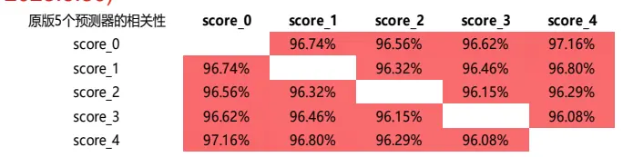
数据来源：东方证券研究所 & Wind资讯

图 13 ： TRA 模 型新 版 5 个 预 测 器的 相 关性 (2020.1.1-2023.6.30)

| 2023.6.30) |  |  |  |  |  |
| --- | --- | --- | --- | --- | --- |
| 新版5个预测器的相关性 | score_0 | score_1 | score_2 | score_3 | score_4 |
| score_0 |  | 4.66% | 31.28% | 0.79% | 16.21% |
| score_1 | 4.66% |  | 28.15% | 33.93% | 50.34% |
| score_2 | 31.28% | 28.15% |  | 33.72% | 38.33% |
| score_3 | 0.79% | 33.93% | 33.72% |  | 31.63% |
| score_4 | 16.21% | 50.34% | 38.33% | 31.63% |  |

数据来源：东方证券研究所 & Wind资讯

## （3）预测器应分散配置，不应一直只选择某一个预测器：

前面我们提到过，为了防止输出结果集中在个别预测器，进一步保证多样化交易模式的发现，我们利用了最优运输规则（OT）来指导路由器的学习。我们对比了添加OT机制前后TRA模型的效果，结果显示：（1）不加 OT：5个预测器效果差别大，单个预测器 rankIC最小值仅为 2.65%，最大值为 8.87%。最终预测器加权得分和单个预测器得分的相关性最高可达 70%，基本只选效果最好的预测器。合成因子表现也有所减弱。（2）加 OT：5 个预测器均有效，单个预测器的 IC最小值也达到 5%。最终预测器加权得分和单个预测器的相关性最高为 60%，预测器配置更加分散。说明 OT机制有助于引导预测器均衡配置，避免只优化和配置少数的预测器。

图 14：TRA 模型不加 OT 时 5 个预测器的表现(2020.1.1-2023.6.30)
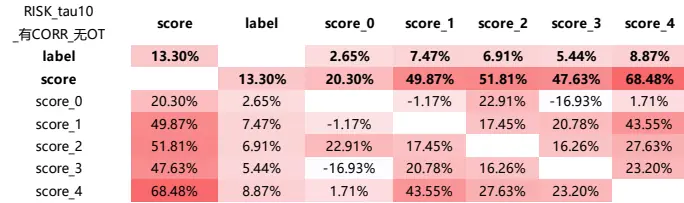
数据来源：东方证券研究所 & Wind资讯

图 15：TRA 模型加 OT 时 5 个预测器的表现(2020.1.1-2023.6.30)

| RISK_tau10 有CORR_有OT | score | label | score_0 | score_1 | score_2 | score_3 | score_4 |
| --- | --- | --- | --- | --- | --- | --- | --- |
| label | 13.42% |  | 4.95% | 7.74% | 7.76% | 6.38% | 8.61% |
| score |  | 13.42% | 37.72% | 55.61% | 59.67% | 55.28% | 62.71% |
| score_0 | 37.72% | 4.95% |  | 4.66% | 31.28% | 0.79% | 16.21% |
| score_1 | 55.61% | 7.74% | 4.66% |  | 28.15% | 33.93% | 50.34% |
| score_2 | 59.67% | 7.76% | 31.28% | 28.15% |  | 33.72% | 38.33% |
| score_3 | 55.28% | 6.38% | 0.79% | 33.93% | 33.72% |  | 31.63% |
| score_4 | 62.71% | 8.61% | 16.21% | 50.34% | 38.33% | 31.63% |  |

数据来源：东方证券研究所 & Wind资讯

图 16：加 OT 和不加 OT 下的 TRA 模型绩效表现对比(2020.1.1-2023.7.21)

| 输入特征 | ic | icir | rank_ic | rank_icir | long_r | long_win | long_sharp | long_drwandown | long_yearly | turnover |
| --- | --- | --- | --- | --- | --- | --- | --- | --- | --- | --- |
| RISK_state5_有OT | 8.38% | 0.67 | 13.57% | 0.99 | 1.47% | 72.09% | 1.92 | -4.22% | 18.58% | 51.13% |
| RISK_state5_没有OT | 8.25% | 0.65 | 13.46% | 0.97 | 1.35% | 69.77% | 1.71 | -4.00% | 16.91% | 51.63% |

数据来源：东方证券研究所 & Wind资讯

## （4）预测器数量不需要太多：

我们对比了 10 个预测器和 5 个预测器下的 TRA 模型表现，结果显示：（1）RISK 输入下，10个预测器效果明显变差；（2）GP输入下，10个预测器的 IC更高，但多头表现明显变差。

图 17：5 个预测器和 10 个预测器的 TRA 模型绩效表现对比(2020.1.1-2023.7.21)

| 输入特征 | ic | icir | rank_ic | rank_icir | long_r | long_win | long_sharp | long_drawdown | long_yearly | turnover |
| --- | --- | --- | --- | --- | --- | --- | --- | --- | --- | --- |
| RISK_state5 | 8.38% | 0.67 | 13.57% | 0.99 | 1.47% | 72.09% | 1.92 | -4.22% | 18.58% | 51.13% |
| RISK_state10 | 7.96% | 0.65 | 12.82% | 0.95 | 1.23% | 72.94% | 1.79 | -25.50% | 15.43% | 36.77% |
| GP_state5 | 10.24% | 1.03 | 14.71% | 1.41 | 1.69% | 83.72% | 3.00 | -2.13% | 22.74% | 71.82% |
| GP_state10 | 10.45% | 1.00 | 15.06% | 1.37 | 1.49% | 75.29% | 2.32 | -9.31% | 19.36% | 48.32% |

数据来源：东方证券研究所 & Wind资讯

## 2.5 端对端：直接给出多因子的加权方案

前期报告《神经网络日频 alpha 模型初步实践》中提到的循环神经网络多元因子单元方法，是直接利用RNN模型的输出，输出维度是隐藏状态个数，再接多对多全连接层和批标准化层，生成多个因子。在设计损失函数时，假设多个因子等权配置，将标准化因子等权得分的 IC相反数作为损失函数同时叠加正交惩罚一起训练模型，引导多个输出同时具备选股有效性和低相关性。在设计多元因子单元输出层时应用了一个关于 IC 的结论：相互正交的多个因子等权得分的 IC 正比于多个因子各自IC的平均。因此虽然我们只有一个学习目标，即最大化多个因子等权的IC，但这个学习目标会驱动各个因子的 IC最大化。最终输出的多元因子如何使用是通过另外的因子加权模型做的，在优化网络的过程中是等权。所以，多元因子单元不是端对端，实际只优化了单因子表现或者说优化了等权模型的表现。

TRA 模型中的多预测器是利用 transformer 进行特征提取，再接 1 个多层全连接，得到多个因子。通过路由器机制确定不同因子的权重，将多因子加权MSE作为损失函数同时叠加正交惩罚一起训练模型。这也就意味着 TRA模型会同时学习多因子的加权方式，多因子加权整合在模型中去优化。所以，TRA 是一个端对端模型，直接给出多因子的加权方案，并且对于每个时刻每个股票，加权方式都可以不一样，完全灵活。

## 三、模型说明

## 3.1 样本空间

样本空间为中证全指同期成分股。

## 3.2 数据区间

训 练 集 ： 2009.06.01 — 2018.06.30 ； 验 证 集 ： 2019.01.01 — 2019.09.30 ； 测 试 集 ：2020.01.01—2023.05.01。

数据集中额外的分割间隙是有意引入的，以避免特征和标签的泄露。对于训练集的最后一条样本，因子值对应 2018.06.30，标签对应后 20 个交易日，会用到 2018.06.30-2018.07.30 的收益率信息。对于验证集的第一条样本，因子值对应 2019.01.01，但会使用到过去 60 个交易日，即2018.09.30-2009.01.01 的特征信息。

训练集用于迭代训练模型，通过反向传播算法计算损失函数关于模型参数的梯度，然后按照这些梯度的方向更新模型参数。验证集用于在模型训练过程中评估模型的性能，便于选择最优的模型和参数。测试集用于观模型察样本外表现，在模型开发完成后评估模型的泛化性能。

## 3.3 解释变量和预测标签

解释变量 X：日度特征/因子；预测标签 Y：股票未来 20日收益率。

原作者使用16个因子：市值、市盈率、市净率、市销率、市现率、资产周转率、净利润率、应收账款周转率、每股收益增长、资产增长、股权增长、12个月动量、1个月反转、接近12个月最高点、接近 12 个月最低点和上个月的最大回报。本文使用 2 个输入数据集分别训练模型：100个 DFQ遗传规划算法挖出的单因子和 10个 DFQ2020风险因子。

## 3.4 数据处理

解释变量 X：截面异常值处理，标准化，填充缺失值；预测标签 Y：截面取排名分位数，标准化。

针对 Y 的多种处理方式，测试显示：（1）直接用原始收益率效果最差：用绝对收益作为预测目标，意味着还要预测整个市场股票的平均收益在时间序列上如何变化，难度增加，准确度下降。实际上我们只需要获得个股预测收益率的相对排名就可以用于大多数投资组合构建策略。（2）使用超额收益的 zscore 得分，或者绝对收益的排名分位数，效果均有明显提升，用 rankY的方式效果更佳。转为排名分位数可以在学习过程中减少异常收益带来的影响，并且百分位数是均匀分布的，不受市场波动影响，可以提升数据稳定性。

图 18：TRA 模型预测标签 Y 不同处理方式绩效表现对比(2020.1.1-2023.7.21)

| 输入特征 | ic | icir | rank_ic | rank_icir | long_r long_win long_sharp |  | long_drawdown long_yearly |  | turnover |
| --- | --- | --- | --- | --- | --- | --- | --- | --- | --- |
| RISK_rankY | 8.38% | 0.67 | 13.57% | 0.99 | 1.47% 72.09% 1.92 |  | -4.22% | 18.58% | 51.13% |
| RISK_原始Y | 5.10% | 0.65 | 7.73% | 0.88 | 0.69% 65.12% 1.06 |  | -6.58% | 8.76% | 60.41% |
| RISK_超额Yzscore | 7.87% | 0.65 | 12.12% | 0.92 | 1.28% 74.42% 1.69 |  | -7.20% | 16.67% | 60.14% |
| GP_rankY | 10.24% | 1.03 | 14.71% | 1.41 | 1.69% 83.72% 3.00 |  | -2.13% | 22.74% | 71.82% |
| GP_原始Y | 8.15% | 1.07 | 10.83% | 1.29 | 1.48% | 76.74% 1.99 | -8.27% | 20.04% | 75.43% |
| GP_超额Yzscore | 10.23% 1.15 |  | 13.61% | 1.55 1.71% |  | 79.07% 2.41 | -3.79% | 23.50% | 72.53% |

数据来源：东方证券研究所 & Wind资讯
有关分析师的申明，见本报告最后部分。其他重要信息披露见分析师申明之后部分，或请与您的投资代表联系。并请阅读本证券研究报告最后一页的免责申明。

针对 X 的多种处理方式，测试显示：X 不取排名分位数，仅进行截面异常值处理，标准化，填充缺失值处理，效果更好。

图 19：TRA 模型解释变量 X 不同处理方式绩效表现对比(2020.1.1-2023.7.21)

| 输入特征 | ic | icir | rank_ic | rank_icir | long_r | long_win | long_sharp | long_drawdown | long_yearly | turnover |
| --- | --- | --- | --- | --- | --- | --- | --- | --- | --- | --- |
| RISK_原始XrankY | 8.38% | 0.67 | 13.57% | 0.99 | 1.47% | 72.09% | 1.92 | -4.22% | 18.58% | 51.13% |
| RISK_rankXrankY | 7.99% | 0.63 | 12.74% | 0.92 | 0.99% | 65.12% | 1.25 | -6.23% | 13.63% | 54.75% |
| GP 原始XrankY | 10.24% | 1.03 | 14.71% | 1.41 | 1.69% | 83.72% | 3.00 | -2.13% | 22.74% | 71.82% |
| GP_rankXrankY | 9.91% | 1.00 | 14.68% | 1.40 | 1.54% | 72.09% | 2.64 | -1.80% | 20.73% | 73.22% |

数据来源：东方证券研究所 & Wind资讯

若对 X 或 Y 进行中性化，因子效果均变差，尤其多头表现下降较多。这可能是由于 TRA 模型本身已经在一定程度上适应了行业和市值的影响，例如不同行业适合的预测器不同，不同市值区间的股票适合的预测器可能不同。额外的中性化处理可能引入了不必要的复杂性，或删除了一些对预测有用的信息。

图 20：TRA 模型 X 和 Y 中性化前后绩效表现对比(2020.1.1-2023.7.21)

| 输入特征 | ic | icir | rank_ic | rank_icir | long_r | long_win | long_sharp | long_drawdown | long_yearly | turnover |
| --- | --- | --- | --- | --- | --- | --- | --- | --- | --- | --- |
| GP_原始XrankY | 10.24% | 1.03 | 14.71% | 1.41 | 1.69% | 83.72% | 3.00 | -2.13% | 22.74% | 71.82% |
| GP_原始X中性化Y | 8.97% | 0.90 | 13.67% | 1.29 | 1.29% | 74.42% | 2.30 | -2.17% | 17.67% | 73.48% |
| GP_中性化XrankY | 8.55% | 1.00 | 13.39% | 1.59 | 1.33% | 79.07% | 2.86 | -1.61% | 17.41% | 72.43% |

数据来源：东方证券研究所 & Wind资讯

## 3.5 损失函数设计

损失函数设计为：MSE 损失+相关性正则项+交叉熵正则项。

（1）MSE：衡量预测准确度，即为预测标签和真实标签的均方误差；

（2）相关性正则项：避免多个预测器高度相关。采用相关系数矩阵绝对值的平方均值的方式惩罚。

（3）交叉熵正则项：衡量模型预测的概率分布与目标概率分布之间的差异。通过最小化交叉熵，引导模型去学习与最优传输问题解相匹配的分配策略，防止输出结果集中在个别预测器。

## 3.6 对抗过拟合技巧

## （1）参数平均

在验证或测试时使用过去几轮模型参数的平均值，提高模型的泛化能力和稳定性。但这种参数平均是临时的，仅用于评估模型在验证集和验证集上的性能。再继续训练的时候，要进行参数恢复，从上一轮的真实状态开始，这样可以确保训练的连续性和稳定性。

## （2）早停机制

根据验证集 IC选择最优的模型参数。若连续 20个epoch验证集 IC无提高，则停止训练。

## （3）gumbel-softmax 加入 gumbel 噪声

gumbel-Softmax 在 softmax 函数的输入上添加 gumbel 噪声，加入的 gumbel 噪声是随机的。具体地，gumbel 噪声是从 gumbel 分布中独立同分布地抽样得到的。每次前向传播时，都会生成新的 gumbel 噪声，使得模型能够在训练过程中考虑到不同的随机性，从而提高模型的泛化能力。

我们对比了 gumbel-softmax和 softmax得到的因子表现差异，结果显示：在 RISK输入下，换成softmax得到的因子IC和多头效果均变差；在GP输入下，换成softmax得到的因子IC基本一致，但多头效果明显变差。

图 21：TRA 模型 gumbel-softmax 和 softmax 绩效表现对比(2020.1.1-2023.7.21)

| 输入特征 | ic icir |  | rank_ic | rank_icir | long_r | long_win | long_sharp | long_drawdown | long_yearly | turnover |
| --- | --- | --- | --- | --- | --- | --- | --- | --- | --- | --- |
| RISK_gumbel-softmax | 8.38% | 0.67 | 13.57% | 0.99 | 1.47% | 72.09% | 1.92 | -4.22% | 18.58% | 51.13% |
| RISK_softmax | 7.97% | 0.63 | 12.88% | 0.92 | 1.35% | 72.09% | 1.67 | -6.12% | 17.49% | 56.40% |
| GP_gumbel-softmax | 10.24% | 1.03 | 14.71% | 1.41 | 1.69% | 83.72% | 3.00 | -2.13% | 22.74% | 71.82% |
| GP_softmax | 10.39% | 1.09 | 14.74% | 1.43 | 1.56% | 76.74% | 2.90 | -2.14% | 20.90% | 73.07% |

数据来源：东方证券研究所 & Wind资讯

## （4）lstm 和 transformer 模型中使用 dropout

在训练期间，dropout 会随机“关闭”神经网络中的一些神经元，将它们的输出设置为 0，以此减少神经元间的依赖关系，从而提升模型的泛化能力。在测试或验证时，dropout不会关闭任何神经元，而是使用所有神经元进行前向传播。

lstm 模型仅在输入层使用 dropout，transformer 模型在三处应用 dropout：输入层的 dropout+位置编码中的 dropout+编码器层中的 dropout。1）输入层的 dropout：在输入层使用 dropout 可以减少模型对输入特征中某些特定特征的依赖。这样可以使模型更加稳健，即使在输入数据有噪声或某些特征缺失的情况下也能更好地进行预测。2）位置编码中的 dropout：在位置编码阶段使用 dropout 可以减少模型对特定位置编码的依赖，从而更好地捕捉序列中的全局信息，提高模型的泛化能力。（3）transformer 编码器层中的 dropout：在 transformer 编码器层的多头自注意力机制和前馈神经网络中使用 dropout 可以帮助减少模型在训练时对特定层的依赖，提高模型的泛化能力。

## （5）lstm 和 transformer 模型中使用噪声注入

添加高斯噪声（标准正态分布噪声）进行数据增强。添加噪声可以防止过拟合的原理可以从以下几个方面来理解：1）数据多样性：通过为输入数据添加噪声，我们实际上是在人为地增加训练数据集的多样性。这样可以使模型更加健壮，因为它需要学会在噪声干扰下仍能识别出基本的模式和特征。2）减少对特定样本的依赖：模型可能会对某些特定样本产生高度依赖，特别是如果这些样本包含一些独特的、非代表性的特征。通过添加噪声，我们可以打破这种依赖，使模型更加关注于学习更一般的、基本的特征，而不是某些特定样本的特定特征。3）正则化效应：噪声使得模型不能完全依赖于训练数据中的任何特定模式，从而起到一种正则化的效果。4）防止模型过于复杂：一个过于复杂的模型可能会试图学习训练数据中的每一个小细节（包括噪声和异常值），这会导致过拟合。通过添加噪声，我们可以防止模型过度专注于训练数据中的噪声和异常值。5）提高泛化能力：由于噪声的添加使模型在训练时遇到了更多的数据变体，这有助于提高模型在未见过的数据上的泛化能力。

## 3.7 模型参数

## 模型涉及的主要参数设置如下：

图 22：DFQ-TRA模型主要参数设置

| 参数类型 | 参数符号 | 参数设置 | 参数解释 |
| --- | --- | --- | --- |
| 数据参数 | seq_len | 60 | 每次前向传播的数据结构为过去60天 |
|  | horizon | 20 | 避免使用未来数据，与Y的计算区间匹配 |
| 训练参数 | n_epochs | 500 20 | 进行500次训练，不断迭代更新模型参数 |
|  | early_stop |  | 若20步验证集IC无提高，则提前停止学习训练 |
|  | max_steps_per_epoch | 100 | 每次训练按批次进行，一个epoch共训练100个批次 |
|  | batch_size | 4000 | 每批次训练输入一个大小为4000的batch |
|  | smooth_steps | 5 | 设置双端队列paramslist的最大长度，用于存储模型的最近状态(参数和缓存)，用于后续的参数平均或其他处理 |
|  | Ir | 0.0002 | 优化模型的adam算法的学习率 |
|  | lamb | 1 | 用于权衡正则化项与主损失之间的权重的λ参数 |
|  | rho | 0.99 | 衰减因子，随着训练步骤的增加逐渐减小正则化项的影响 |
| transformer参数 | input_size | 100, 10 | 输入特征的维度 |
|  | hidden_size | 128 | 隐藏层的大小 |
|  | num_layers | 2 | 神经网络的层数 |
|  | num_heads | 4 | 注意力头数量 |
|  | use_attn | TRUE | 是否使用注意力机制 |
|  | dropout | 0.1 | Dropout的比率 |
| tra模型参数 | num_states | 5 | 预测器个数 |
|  | hidden_size | 16 | 隐藏层的大小 |
|  | tau | 10 | 决定了输出概率分布的“锐度”，tau越小，输出的概率越不均衡 |

数据来源：东方证券研究所绘制

## 3.8 模型流程

## 模型总体流程如下：

（1）初始化：从数据集中提取出训练集、验证集和测试集，初始化如最佳得分、最佳周期、停止轮数等参数。设置用于存储特征提取模型和 TRA模块状态的双端队列，以及用于记录训练、验证和测试的评估结果的空列表。在开始训练循环之前，进行一次内存初始化。如果 TRA 模块有多个状态，则通过对训练集进行一次评估来“预热”模型的内存。

（2）训练：总共训练 n_epoch轮，可能早停。在每个 epoch的训练中，执行以下操作：

a. 训练：对训练集进行一轮训练。

b. 参数平均：在进入评估阶段之前，将当前特征提取模型和 TRA模块的状态添加到双端队列中，并计算参数的平均值，然后将这些平均参数加载回特征提取模型和 TRA模块。

c. 评估：对训练集、验证集和测试集（如果需要）进行评估，并将结果添加到 evals_result字典中。

d. 早停检查：根据验证集的 IC指标来检查当前分数是否是最佳分数。如果是，则更新最佳分数、最佳周期和最佳参数。如果不是，则增加停止轮数，并检查是否达到提前停止的条件。如果达到了提前停止的条件，则退出训练循环。

e.恢复参数：在每次训练结束时，从双端队列中恢复模型和 TRA 模块的最新状态，以保证训练的连续性和稳定性。

（3）输出：在训练循环结束后，加载最佳参数，对测试集进行最终评估，并保存模型、预测和配置信息到本地目录。

其中训练流程如下：

（1）初始化：将模型和 TRA 模块设置为训练模式。初始化一些变量来跟踪训练过程中的步数和损失。

（2）按批次训练：进入一个循环，共训练 max_steps_per_epoch 次，每次提取 batch_size个样本。在每个批次中，特征数据、标签和索引被从批次中提取出来。

a.数据预处理：从数据中提取特征和历史损失。

b.前向传播：使用特征提取模型来获取隐藏的特征表示。使用 TRA模块进行预测。

c.损失计算：计算预测和实际标签之间的平方误差损失，并添加相关性惩罚。

d.更新数据集：用新计算的损失更新数据集中的相关位置。

e.损失调整：使用 Sinkhorn 方法和一个 lambda 参数来计算一个正则化项，并将其添加到损失中。

f.反向传播和优化：计算损失关于模型参数的梯度。使用优化器更新模型的权重参数。

g.梯度清零：在进行下一次迭代之前清零梯度。

h.损失统计：累计损失，并在所有批次完成后计算平均损失。

i.返回平均损失：返回计算出的平均损失。

## 其中评估流程如下：

（1）初始化：将模型和 TRA 模块设置为评估模式。初始化用于存储预测和评估指标的列表。

（2）循环评估：进行一个循环，每天处理一批数据。

a.数据预处理：与train_epoch函数中的类似步骤一样，特征和历史损失被从批次中提取出来。

b.预测：使用特征提取模型和TRA模块进行预测，但不计算梯度。

c.损失计算和数据更新：计算预测和实际标签之间的平方误差损失，并将损失更新到数据集中。

d.评估和指标计算：使用预测和实际标签计算一些评估指标，如 MSE, MAE, IC和 ICIR。

e.返回结果：如果 return_pred 为 True，返回计算出的指标和预测结果。如果为 False，只返回计算出的指标。

## 四、模型结果

## 4.1 运算用时

运算用时与显卡性能有关，本文测试在 3090 显卡上进行。不同输入下模型的早停快慢有所不同，因此运算用时有所差别：（1）GP 输入下，模型很快达到早停，在第 40 个 epoch 左右停止，训练用时 1.5h。在中证全指成分股中训练的显存占用约为 10G；（2）RISK输入下，模型在第 120个 epoch左右停止，训练用时 5h。在中证全指成分股中进行训练，显存占用约为 8G。

图 23：TRA 模型 GP 输入下训练集和验证集中 IC、MSE、MAE、ICIR 变化
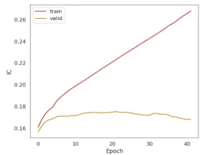

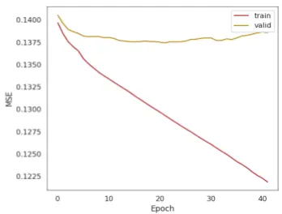

图 24：TRA 模型 RISK 输入下训练集和验证集中 IC、MSE、MAE、ICIR 变化
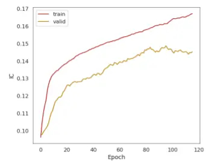

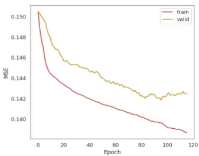

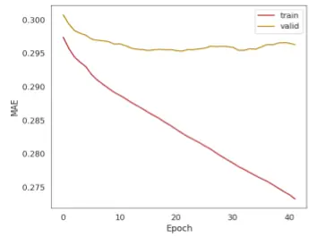
数据来源：东方证券研究所 & Wind资讯

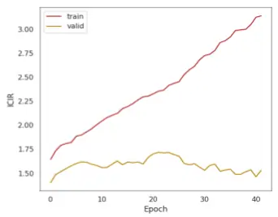

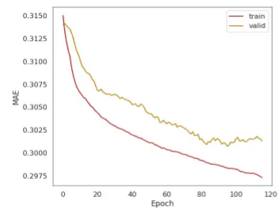
数据来源：东方证券研究所 & Wind资讯

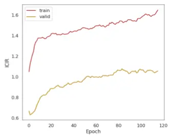

## 4.2 合成因子绩效

我们展示了TRA模型得到的合成因子得分和单输入下的因子得分，在中证全指、沪深300、中证 500、中证 1000 四个股票池中的表现，并与前期报告《DFQ 遗传规划价量因子挖掘系统》中的遗传规划合成因子、《DFQ强化学习因子组合挖掘系统》中的强化学习合成因子、《基于循环神经网络中的多频率因子挖掘》中的神经网络因子、《基于残差网络的端对端因子挖掘模型》神经网络_new因子进行对比。

本节测试区间为2020.1.1-2023.9.15。其中：神经网络和神经网络_new因子均为双周频训练。神经网络_new 因子作者未更新数据，因子数据仅到 2023.6.30。强化学习模型额外补充了中证全指的因子得分，考虑到显存占用，训练集修改为 2016-2018 年，其余均与前期报告所述相同。IC指标采用原始的因子得分和20日收益率标签计算得到，日度平均。在沪深300、中证500 股票池中采用 5 分组计算多头，在中证 1000 股票池中采用 10 分组计算多头，在中证全指股票池中采用20分组计算多头。此处的多头计算不考虑交易成本，但汇报了月均单边换手率。

## 结果显示：

（1）在中证全指股票池中，各模型均有效，但 TRA 模型合成因子得分各项表现均明显最强。测试集上 rankic 达到 16.38%，rankicir 达到 1.22（未年化），20 分组多头年化超额收益 23.86%，月均单边换手仅 57%，比神经网络模型的换手低 30%。GP 输入下的 TRA 模型优于 RISK 输入。

图 25：中证全指股票池各模型因子绩效表现（2020.1.1-2023.9.15）
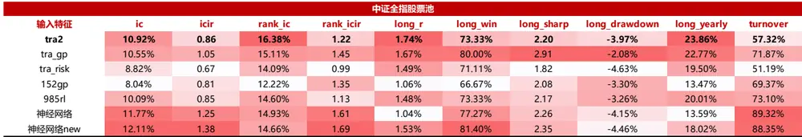
数据来源：东方证券研究所 & wind资讯

（2）在沪深 300 股票池中，TRA 模型合成因子得分表现略逊于神经网络和强化学习模型。测试集上 rankic 达到 10.72%，rankicir 为 0.51（未年化），5 分组多头年化超额收益 10.39%，月均单边换手仅 28%，比神经网络模型的换手低 60%。

图 26：沪深 300 股票池各模型因子绩效表现（2020.1.1-2023.9.15）

| 沪深300股票池 |  |  |  |  |  |  |  |  |  |  |
| --- | --- | --- | --- | --- | --- | --- | --- | --- | --- | --- |
| 输入特征 | ic | icir | rank_ic | rank_icir | long_r | long_win | long_sharp | long_drawdown | long_yearly | turnover |
| tra2 | 7.41% | 0.35 | 10.72% | 0.51 | 0.80% | 51.11% | 0.96 | -8.74% | 10.39% | 28.39% |
| tra_gp | 6.59% | 0.41 | 9.16% | 0.55 | 0.64% | 60.00% | 0.96 | -6.62% | 8.83% | 43.28% |
| tra_risk | 6.43% | 0.31 | 9.60% | 0.46 | 0.90% | 55.56% | 0.96 | -7.81% | 11.08% | 25.63% |
| 152gp | 1.86% | 0.16 | 3.28% | 0.28 | 0.09% | 53.33% | 0.18 | -13.75% | 1.47% | 51.13% |
| 300rl | 7.17% | 0.55 | 8.81% | 0.68 | 1.10% | 73.33% | 1.70 | -5.79% | 14.99% | 63.07% |
| 985rl | 6.32% | 0.37 | 9.41% | 0.54 | 0.80% | 60.00% | 1.15 | -5.20% | 10.97% | 49.47% |
| 神经网络 | 10.11% | 0.68 | 11.77% | 0.82 | 1.00% | 75.00% | 1.60 | -4.74% | 14.06% | 68.50% |
| 神经网络new | 9.95% | 0.70 | 10.39% | 0.76 | 1.12% | 72.09% | 1.47 | -6.81% | 12.24% | 68.88% |

数据来源：东方证券研究所 & wind资讯

（3）在中证 500 股票池中，TRA 模型合成因子得分表现略逊于神经网络模型。测试集上rankic 达到 11.26%，rankicir 达到 0.71（未年化），5 分组多头年化超额收益达到 9.89%，月均单边换手仅 42%，比神经网络模型的换手低 40%。

图 27：中证 500 股票池各模型因子绩效表现（2020.1.1-2023.9.15）

| 中证500股票池 |  |  |  |  |  |  |  |  |  |  |
| --- | --- | --- | --- | --- | --- | --- | --- | --- | --- | --- |
| 输入特征 | ic | icir | rank_ic | rank_icir | long_r | long_win | long_sharp | long_drawdown | long_yearly | turnover |
| tra2 | 6.49% | 0.43 | 11.26% | 0.71 | 0.80% | 64.44% | 1.35 | -4.92% | 9.89% | 42.19% |
| tra_gp | 6.56% | 0.56 | 10.25% | 0.83 | 0.81% | 68.89% | 1.58 | -3.02% | 10.73% | 52.67% |
| tra_risk | 4.74% | 0.30 | 9.25% | 0.57 | 0.85% | 68.89% | 1.27 | -7.56% | 9.44% | 39.44% |
| 152gp | 3.20% | 0.31 | 6.72% | 0.66 | 0.42% | 57.78% | 0.85 | -5.07% | 5.10% | 49.67% |
| 500rl | 6.89% | 0.59 | 10.39% | 0.87 | 0.75% | 66.67% | 1.74 | -4.67% | 8.78% | 57.98% |
| 985rl | 6.53% | 0.44 | 11.08% | 0.71 | 0.70% | 60.00% | 1.04 | -5.68% | 9.66% | 48.84% |
| 神经网络 | 8.55% | 0.74 | 11.41% | 1.02 | 0.79% | 75.00% | 1.65 | -2.39% | 11.34% | 71.89% |
| 神经网络new | 8.15% | 0.71 | 10.14% | 0.89 | 1.03% | 69.77% | 1.45 | -7.54% | 11.23% | 69.02% |

数据来源：东方证券研究所 & wind资讯

（4）在中证 1000 股票池中，TRA 模型合成因子得分的 rankic 最高，多头表现略逊于神经网络模型，但换手率大幅降低。测试集上rankic达到14.32%，rankicir达到0.99（未年化），10分组多头年化超额收益达到 16.29%，月均单边换手仅 59%，比神经网络模型的换手低 30%。

图 28：中证 1000 股票池各模型因子绩效表现（2020.1.1-2023.9.15）

| 中证1000股票池 |  |  |  |  |  |  |  |  |  |  |
| --- | --- | --- | --- | --- | --- | --- | --- | --- | --- | --- |
| 输入特征 | ic | icir | rank_ic | rank_icir | long_r | long_win | long_sharp | long_drawdown | long_yearly | turnover |
| tra2 | 10.19% | 0.74 | 14.32% | 0.99 | 1.24% | 71.11% | 1.80 | -8.31% | 16.29% | 58.80% |
| tra_gp | 9.85% | 0.95 | 12.99% | 1.23 | 1.45% | 73.33% | 2.57 | -3.13% | 19.33% | 67.19% |
| tra_risk | 7.96% | 0.54 | 12.24% | 0.78 | 0.95% | 68.89% | 1.20 | -14.36% | 11.32% | 51.96% |
| 152gp | 7.64% | 0.71 | 10.89% | 1.07 | 0.80% | 64.44% | 1.58 | -5.20% | 10.19% | 60.27% |
| 1000rl | 10.17% | 0.83 | 12.94% | 1.03 | 1.07% | 75.56% | 1.77 | -8.74% | 13.41% | 71.50% |
| 985rl | 9.93% | 0.75 | 13.31% | 0.97 | 1.11% | 64.44% | 1.67 | -7.70% | 14.53% | 64.61% |
| 神经网络 | 12.39% | 1.26 | 14.30% | 1.53 | 0.99% | 79.55% | 2.03 | -2.72% | 13.32% | 83.14% |
| 神经网络new | 12.20% | 1.30 | 13.63% | 1.48 | 1.62% | 81.40% | 2.74 | -3.71% | 21.05% | 82.13% |

数据来源：东方证券研究所 & wind资讯

有关分析师的申明，见本报告最后部分。其他重要信息披露见分析师申明之后部分，或请与您的投资代表联系。并请阅读本证券研究报告最后一页的免责申明。

## 4.3 合成因子分年表现

TRA模型在各股票池中，样本外（2020-2023）均未出现衰减，今年表现最好。2023年中证全指中 rankic 达到 20.18%，沪深 300 中 rankic 达到 17.68%，中证 500 中 rankic 达到 16.34%，中证 1000 中 rankic 达到 16.76%。

图 29：中证全指股票池各模型因子分年绩效表现（2020.1.1-2023.9.15）

| 中证全指股票池 |  |  |  |  |  |  |  |  |  |  |
| --- | --- | --- | --- | --- | --- | --- | --- | --- | --- | --- |
| tra2 | ic | icir | rank_ic | rank_icir | long_r | long_win | long_sharp | long_drawdown | long_yearly | turnover |
| 2020 | 8.92% | 0.71 | 14.13% | 0.99 | 1.06% | 69.23% | 1.28 | -2.25% | 17.65% | 59.15% |
| 2021 | 10.02% | 0.78 | 16.55% | 1.17 | 1.64% | 76.92% | 2.18 | -3.77% | 20.96% | 55.52% |
| 2022 | 12.12% | 1.26 | 16.07% | 1.67 | 2.11% | 76.92% | 3.42 | -1.40% | 21.21% | 55.05% |
| 2023 | 13.64% | 0.87 | 20.18% | 1.33 | 2.40% | 87.50% | 5.13 | -0.32% | 26.21% | 55.65% |
| 152gp | ic | icir | rank_ic | rank_icir | long_r | long_win | long_sharp | long_drawdown | long_yearly | turnover |
| 2020 | 7.60% | 0.70 | 11.92% | 1.17 | 0.18% | 46.15% | 0.38 | -3.30% | 2.79% | 74.67% |
| 2021 | 5.97% | 0.68 | 11.37% | 1.24 | 0.91% | 69.23% | 1.90 | -1.57% | 12.64% | 73.50% |
| 2022 | 9.61% | 1.20 | 11.49% | 1.90 | 0.64% | 53.85% | 1.28 | -3.22% | 4.90% | 67.47% |
| 2023 | 9.58% | 0.79 | 15.20% | 1.47 | 1.08% | 62.50% | 1.83 | -0.90% | 14.44% | 59.82% |
| 985rl | ic | icir | rank_ic | rank_icir | long_r | long_win | long_sharp | long_drawdown | long_yearly | turnover |
| 2020 | 10.50% | 0.92 | 14.83% | 1.17 | 0.59% | 61.54% | 0.99 | -1.23% | 10.65% | 74.60% |
| 2021 | 9.04% | 0.88 | 14.31% | 1.12 | 1.41% | 61.54% | 1.90 | -3.23% | 16.51% | 73.96% |
| 2022 | 11.81% | 1.15 | 14.90% | 1.49 | 1.55% | 76.92% | 2.50 | -1.12% | 12.61% | 74.36% |
| 2023 | 8.35% | 0.51 | 14.22% | 0.85 | 1.82% | 75.00% | 2.14 | -2.89% | 18.57% | 74.88% |
| 神经网络 | ic | icir | rank_ic | rank_icir | long_r | long_win | long_sharp | long_drawdown | long_yearly | turnover |
| 2020 | 12.18% | 1.25 | 16.40% | 1.69 | 1.23% | 76.92% | 2.62 | -0.85% | 17.62% | 89.35% |
| 2021 | 10.29% | 1.36 | 13.98% | 1.56 | 2.16% | 92.31% | 4.26 | -1.04% | 26.10% | 88.63% |
| 2022 | 13.83% | 1.53 | 15.90% | 1.98 | 0.84% | 69.23% | 1.37 | -4.67% | 10.13% | 88.10% |
| 2023 | 10.14% | 0.88 | 12.49% | 1.22 | 1.15% | 62.50% | 2.35 | -1.17% | 13.46% | 88.05% |
| 神经网络 new | ic | icir | rank_ic | rank_icir | long_r | long_win | long_sharp | long_drawdown | long_yearly | turnover |
| 2020 | 13.14% | 1.62 | 16.40% 11.89% | 2.07 | 2.48% 2.11% | 84.62% | 3.90 | -1.56% | 27.75% | 87.58% |
| 2021 | 9.97% | 1.68 | 15.70% | 1.79 | 0.97% | 76.92% | 2.97 | -1.69% | 20.06% | 89.84% |
| 2022 2023 | 14.22% 10.08% | 1.80 0.73 | 14.66% | 1.90 1.17 | 0.67% | 61.54% 83.33% | 2.19 1.90 | -2.25% -1.54% | 12.51% 4.20% | 86.69% 87.64% |

数据来源：东方证券研究所 & wind资讯

图 30：沪深 300 股票池各模型因子分年绩效表现（2020.1.1-2023.9.15）

| 沪深300股票池tra2 ic icir rank_ic long_r |  |  |  |  |  |  |  |  |  |  |  |
| --- | --- | --- | --- | --- | --- | --- | --- | --- | --- | --- | --- |
| 2020 |  | 5.51% | 0.34 | 8.43% | 0.51 | 0.95% | 46.15% | 1.03 | -3.29% | 14.37% | 28.47% |
| 2021 |  | 6.05% | 0.29 | 10.45% | 0.52 | 0.60% | 61.54% | 0.60 | -10.38% | 3.84% | 28.61% |
| 2022 |  | 6.96% | 0.30 | 8.88% | 0.36 | 0.55% | 69.23% | 0.49 | -7.88% | -1.54% | 29.86% |
| 2023 |  | 13.30% | 0.60 | 17.68% | 0.83 | 0.63% | 37.50% | 0.55 | -3.04% | 14.89% | 24.52% |
| 152gp |  | ic | icir | rank_ic | rank_icir | long_r | long_win | long_sharp | long_drawdown | long_yearly | turnover |
| 2020 |  | 4.95% | 0.45 | 7.26% | 0.75 | 0.51% | 69.23% | 1.28 | -0.71% | 8.22% | 56.89% |
| 2021 |  | -0.24% | (0.02) | 2.00% | 0.18 | -0.20% | 53.85% | (0.31) | -5.31% | -3.39% | 52.32% |
| 2022 |  | -1.57% | (0.14) | -1.75% | (0.14) | -1.04% | 30.77% | (1.92) | -11.28% | -8.77% | 50.50% |
| 2023 |  | 5.69% | 0.55 | 6.95% | 0.66 | 0.90% | 87.50% | 1.49 | -2.93% | 10.03% | 55.53% |
| 300rl2020 |  | ic | icir | rank_ic | rank_icir | long_r | long_win | long_sharp | long_drawdown | long_yearly | turnover |
|  |  | 9.37% | 0.70 | 11.05% | 0.77 | 1.46% | 76.92% | 1.86 | -0.11% | 23.16% | 66.39% |
| 2021 |  | 5.73% | 0.50 | 6.92% | 0.57 | 0.93% | 76.92% | 1.82 | -1.33% | 10.65% | 62.92% |
| 2022 |  | 7.47% | 0.61 | 8.28% | 0.65 | 0.57% | 69.23% | 0.95 | -3.31% | 2.53% | 61.25% |
| 2023 |  | 5.48% | 0.37 | 9.08% | 0.75 | 0.72% | 62.50% | 1.07 | -0.75% | 13.99% | 62.14% |
| 985rl |  | ic | icir | rank_ic | rank_icir | long_r | long_win | long_sharp | long_drawdown | long_yearly | turnover |
| 2020 |  | 3.86% | 0.23 | 5.93% | 0.32 | 0.21% | 61.54% | 0.29 | -1.84% | 6.33% | 52.78% |
| 2021 |  | 5.93% | 0.39 | 9.53% | 0.58 | 0.24% | 53.85% | 0.39 | -6.58% | 4.59% | 49.17% |
| 20222023 |  | 7.99% | 0.52 | 9.66% | 0.59 | 1.10% | 61.54% | 1.38 | -4.51% | 6.44% | 53.89% |
|  |  | 8.18% | 0.37 | 14.37% | 0.83 | 1.50% | 62.50% | 1.24 | -3.01% | 23.60% | 56.43% |
| 神经网络 |  | ic | icir | rank_ic | rank_icir | long_r | long_win | long_sharp | long_drawdown | long_yearly | turnover |
| 2020 |  | 9.83% | 0.64 | 11.86% | 0.74 | 1.45% | 76.92% | 1.77 | -1.84% | 24.60% | 68.05% |
| 2021 |  | 9.46% | 0.64 | 11.47% | 0.78 | 1.53% | 84.62% | 1.83 | -6.61% | 18.31% | 70.90% |
| 2022 |  | 12.87% | 1.02 | 12.56% | 0.96 | 0.73% | 69.23% | 1.38 | -1.61% | 6.73% | 68.33% |
| 2023 |  | 7.12% | 0.41 | 10.81% | 0.82 | 1.00% | 50.00% | 1.25 | -0.93% | 15.43% | 69.05% |
| 神经网络 new |  | ic | icir | rank_ic | rank_icir | long_r | long_win | long_sharp | long_drawdown | long_yearly | turnover |
| 2020 |  | 15.47% | 1.28 | 16.33% | 1.32 | 2.56% | 92.31% | 3.89 | -0.04% | 28.82% | 67.43% |
|  | 2021 | 5.70% | 0.46 | 5.23% | 0.42 | 1.33% | 61.54% | 1.51 | -5.54% | 13.22% | 69.93% |
|  | 2022 | 10.76% | 0.91 | 9.79% | 0.79 | 0.27% | 69.23% | 0.50 | -3.54% | 2.49% | 69.35% |
|  | 2023 | 5.67% | 0.27 | 10.03% | 0.60 | 0.16% | 50.00% | 0.22 | -2.07% | 6.27% | 69.09% |

数据来源：东方证券研究所 & wind资讯

有关分析师的申明，见本报告最后部分。其他重要信息披露见分析师申明之后部分，或请与您的投资代表联系。并请阅读本证券研究报告最后一页的免责申明。

图 31：中证 500 股票池各模型因子分年绩效表现（2020.1.1-2023.9.15）

| 中证500股票池 |  |  |  |  |  |  |  |  |  |  |
| --- | --- | --- | --- | --- | --- | --- | --- | --- | --- | --- |
| tra2 | ic | icir rank_ic |  | rank_icir long_r |  | long_win | long_sharp | long_drawdown long_yearly |  | turnover |
| 2020 | 5.41% | 0.42 | 10.69% | 0.74 | 0.52% | 69.23% | 1.12 | -2.91% | 6.67% | 40.25% |
| 2021 | 5.34% | 0.35 | 11.22% | 0.72 | 1.09% | 38.46% | 1.29 | -4.40% | 9.36% | 42.83% |
| 20222023 | 6.31% | 0.42 | 8.66% | 0.53 | 0.58% | 61.54% | 0.79 | -3.51% | 1.34% | 44.58% |
|  | 10.33% | 0.58 | 16.34% | 1.01 | 1.26% | 75.00% | 1.66 | -1.70% | 19.04% | 42.29% |
| 152gp | ic | icir | rank_ic | rank_icir | long_r | long_win | long_sharp | long_drawdown | long_yearly | turnover |
| 2020 | 2.16% | 0.18 | 6.52% | 0.59 | -0.16% | 38.46% | (0.39) | -2.95% | -1.71% | 54.13% |
| 2021 | 3.05% | 0.30 | 6.46% | 0.68 | 0.19% | 46.15% | 0.48 | -3.33% | 2.29% | 57.34% |
| 2022 | 2.84% | 0.34 | 3.74% | 0.41 | -0.52% | 38.46% | (1.72) | -7.36% | -6.02% | 47.60% |
| 2023 | 5.66% | 0.54 | 12.20% | 1.33 | 0.90% | 75.00% | 2.70 | -0.36% | 10.77% | 46.57% |
| 500rl | ic | icir | rank_ic | rank_icir | long_r | long_win | long_sharp | long_drawdown | long_yearly | turnover |
| 2020 | 7.39% | 0.68 | 11.99% | 0.96 | 0.84% | 69.23% | 2.32 | -0.61% | 8.87% | 59.92% |
| 2021 | 5.10% | 0.51 | 8.24% | 0.78 | 0.30% | 53.85% | 0.64 | -6.89% | 3.31% | 57.17% |
| 2022 | 7.98% | 0.72 | 9.98% | 0.86 | 0.39% | 53.85% | 0.67 | -3.65% | 0.04% | 58.83% |
| 2023 | 7.22% | 0.45 | 11.88% | 0.92 | 0.83% | 62.50% | 1.42 | -2.58% | 11.97% | 59.86% |
| 985rl | ic | icir | rank_ic | rank_icir | long_r | long_win | long_sharp | long_drawdown | long_yearly | turnover |
| 2020 | 5.25% | 0.38 | 9.50% | 0.59 | 0.04% | 53.85% | 0.07 | -1.22% | 4.22% | 52.25% |
| 2021 | 5.78% | 0.43 | 10.22% | 0.69 | 0.60% | 53.85% | 0.76 | -5.83% | 7.00% | 49.58% |
| 2022 | 8.61% | 0.67 | 11.46% | 0.79 | 0.97% | 69.23% | 1.22 | -3.78% | 4.91% | 48.75% |
| 2023 | 6.46% | 0.32 | 14.34% | 0.83 | 1.32% | 62.50% | 1.41 | -3.72% | 17.16% | 54.00% |
| 神经网络 | ic | icir | rank_ic | rank_icir | long_r | long_win | long_sharp | long_drawdown | long_yearly | turnover |
| 2020 | 7.91% | 0.67 | 12.38% | 1.00 | 0.71% | 76.92% | 1.10 | -2.10% | 13.82% | 73.27% |
| 2021 | 7.74% | 0.73 | 10.00% | 0.96 | 1.31% | 69.23% | 2.19 | -1.61% | 12.95% | 69.00% |
| 2022 | 10.89% | 1.13 | 12.05% | 1.19 | 0.47% | 76.92% | 0.90 | -3.33% | 5.28% | 71.47% |
| 2023 | 7.10% | 0.49 | 11.10% | 0.95 | 0.69% | 62.50% | 1.20 | -0.92% | 10.97% | 67.78% |
| 神经网络_new | ic | icir | rank_ic | rank_icir | long_r | long_win | long_sharp | long_drawdown | long_yearly | turnover |
| 2020 | 9.87% | 0.91 | 13.51% | 1.27 | 2.04% | 76.92% | 2.46 | -4.10% | 21.38% | 67.35% |
| 2021 | 7.92% | 0.92 | 8.40% | 0.95 | 1.23% | 76.92% | 2.20 | -2.66% | 11.66% | 69.48% |
| 2022 | 8.24% | 0.77 | 8.37% | 0.65 | 0.14% | 46.15% | 0.42 | -1.95% | 1.76% | 68.42% |
| 2023 | 4.90% | 0.28 | 10.45% | 0.83 | 0.81% | 83.33% | 1.58 | -2.23% | 8.81% | 67.73% |

数据来源：东方证券研究所 & wind资讯

图 32：中证 1000 股票池各模型因子分年绩效表现（2020.1.1-2023.9.15）

| 中证1000股票池tra2 |  |  |  |  |  |  |  |  |  |  |  |  |  |  |
| --- | --- | --- | --- | --- | --- | --- | --- | --- | --- | --- | --- | --- | --- | --- |
|  |  |  |  |  |  |  |  |  |  |  | rank_ic | rank_icir | long_r | long_win |
| 2020 | 10.47% | 0.85 | 15.19% | 1.14 | 1.03% | 69.23% | 1.69 -1.78% |  | 15.19% | 60.96% |  |  |  |  |
| 2021 | 9.18% | 0.63 | 13.95% | 0.88 | 1.14% | 61.54% | 1.13 -8.84% |  | 12.41% | 57.08% |  |  |  |  |
| 2022 | 10.16% | 0.81 | 12.24% | 0.93 | 1.29% | 69.23% | 1.76 | -0.86% | 8.98% | 58.33% |  |  |  |  |
| 2023 | 11.40% | 0.69 | 16.79% | 1.09 | 1.18% | 62.50% | 1.71 | -1.72% | 17.74% | 56.86% |  |  |  |  |
| 152gp | ic | icir | rank_ic | rank_icir | long_r | long_win | long_sharp | long_drawdown | long_yearly | turnover |  |  |  |  |
| 2020 | 7.59% | 0.66 | 11.47% | 1.06 | 0.69% | 53.85% | 1.24 | -1.73% | 9.56% | 65.50% |  |  |  |  |
| 2021 | 4.96% | 0.52 | 9.44% | 0.96 | 0.66% | 61.54% | 1.60 | -3.37% | 7.82% | 66.77% |  |  |  |  |
| 2022 | 8.98% | 0.99 | 9.24% | 1.05 | 0.56% | 61.54% | 1.18 | -2.13% | 3.99% | 58.67% |  |  |  |  |
| 2023 | 9.86% | 0.76 | 14.89% | 1.43 | 1.59% | 87.50% | 3.42 | -1.25% | 20.08% | 53.89% |  |  |  |  |
| 1000rl | ic | icir | rank_ic | rank_icir | long_r | long_win | long_sharp | long_drawdown | long_yearly | turnover |  |  |  |  |
| 2020 | 12.20% | 1.25 | 15.55% | 1.51 | 1.23% | 76.92% | 2.72 | -0.50% | 16.96% | 61.96% |  |  |  |  |
| 2021 | 7.77% | 0.77 | 11.51% | 0.98 | 0.99% | 61.54% | 1.63 | -5.64% | 10.41% | 58.29% |  |  |  |  |
| 2022 | 12.39% | 1.08 | 13.25% | 1.15 | 1.27% | 76.92% | 2.45 | -3.50% | 13.16% | 58.71% |  |  |  |  |
| 2023 | 7.25% | 0.41 | 10.57% | 0.63 | 0.95% | 75.00% | 1.23 | -4.51% | 7.78% | 57.07% |  |  |  |  |
| 985rl | ic | icir | rank_ic | rank_icir | long_r | long_win | long_sharp | long_drawdown | long_yearly | turnover |  |  |  |  |
| 2020 | 11.72% | 1.05 | 15.53% | 1.26 | 1.06% | 61.54% | 1.89 | -1.20% | 15.82% | 67.58% |  |  |  |  |
| 2021 | 7.95% | 0.71 | 12.30% | 0.93 | 1.13% | 61.54% | 1.17 | -7.63% | 11.24% | 66.00% |  |  |  |  |
| 2022 | 11.89% | 1.03 | 12.96% | 1.05 | 1.40% | 61.54% | 1.75 | -2.26% | 10.55% | 66.50% |  |  |  |  |
| 2023 | 7.14% | 0.37 | 11.94% | 0.66 | 1.39% | 75.00% | 1.39 | -4.02% | 16.11% | 59.71% |  |  |  |  |
| 神经网络 | ic | icir | rank_ic | rank_icir | long_r | long_win | long_sharp | long_drawdown | long_yearly | turnover |  |  |  |  |
| 2020 | 13.50% | 1.46 | 16.92% | 1.88 | 1.56% | 92.31% | 2.80 | 0.00% | 23.47% | 83.48% |  |  |  |  |
| 2021 | 10.57% | 1.55 | 12.88% | 1.66 | 1.47% | 84.62% | 3.88 | -1.13% | 17.06% | 82.65% |  |  |  |  |
| 2022 | 14.98% | 1.45 | 14.88% | 1.53 | 1.59% | 76.92% | 2.26 | -3.94% | 17.53% | 81.66% |  |  |  |  |
| 2023 | 9.33% | 0.74 | 11.42% | 1.08 | 0.78% | 62.50% | 1.61 | -1.79% | 9.74% | 80.40% |  |  |  |  |
| 神经网络_new | ic | icir | rank_ic | rank_icir | long_r | long_win | long_sharp | long_drawdown | long_yearly | turnover |  |  |  |  |
| 2020 | 14.89% | 1.92 | 16.96% | 2.32 | 2.39% | 76.92% | 3.97 | -0.75% | 32.54% | 79.38% |  |  |  |  |
| 2021 | 10.74% | 1.77 | 11.96% | 1.77 | 1.93% | 76.92% | 3.08 | -2.50% | 21.12% | 82.05% |  |  |  |  |
| 2022 | 12.96% | 1.35 | 12.92% | 1.26 | 1.01% | 76.92% | 2.63 | -2.04% | 11.64% | 79.73% |  |  |  |  |
| 2023 | 8.09% 0.56 11.68% 0.94 |  |  |  | 0.67% | 66.67% 1.41 -2.48% 3.42% |  |  |  | 79.53% |  |  |  |  |

数据来源：东方证券研究所 & wind资讯

## 4.4 合成因子衰减速度

因子衰减速度是评定因子有效性的一个重要指标，使用滞后 N 个交易日的因子值（记作 lagN）与未来 20 日收益率来计算。可以看到：TRA 模型因子整体衰减速度较慢，三个股票池中rankic 滞后 20 天仅衰减 30%左右。

图 33：中证全指股票池 TRA 模型因子衰减速度（2020.1.1-2023.9.15）

| 中证全指股票池 |  |  |  |  |  |  |  |  |  |  |
| --- | --- | --- | --- | --- | --- | --- | --- | --- | --- | --- |
| tra2 | ic | icir | rank_ic | rank_icir | long_r | long_win | long_sharp | long_drawdown | long_yearly | turnover |
| lag0 | 10.92% | 0.86 | 16.38% | 1.22 | 1.74% | 73.33% | 2.20 | -3.97% | 23.86% | 57.32% |
| lag1 | 10.46% | 0.83 | 15.73% | 1.17 | 1.65% | 70.45% | 2.12 | -3.34% | 22.56% | 57.30% |
| lag5 | 9.34% | 0.77 | 14.19% | 1.08 | 1.55% | 68.18% | 1.97 | -4.43% | 20.87% | 57.30% |
| lag10 | 8.53% | 0.74 | 13.00% | 1.02 | 1.50% | 75.00% | 1.93 | -4.11% | 20.67% | 57.18% |
| lag15 | 7.93% | 0.71 | 11.98% | 0.97 | 1.25% | 75.00% | 1.94 | -2.77% | 16.69% | 57.25% |
| lag20 | 7.52% | 0.70 | 11.22% | 0.93 | 1.18% | 68.18% | 1.64 | -4.64% | 15.16% | 57.25% |

数据来源：东方证券研究所 & wind资讯

## 4.5 中性化因子表现

TRA模型因子受行业市值风格的影响较小，因子中性化后表现依然很强，rankic略有降低，但因子稳定性明显提高。原始因子rankic达到16.38%，中性化后仍有13.88%。原始因子rankicir达到1.22（未年化），中性化后提高到1.56。原始因子20分组多头年化超额收益达到23.86%，中性化降低到 13.46%。

图 34：中证全指股票池各模型中性化因子绩效表现（2020.1.1-2023.9.15）

| 中证全指股票池 |  |  |  |  |  |  |  |  |  |  |
| --- | --- | --- | --- | --- | --- | --- | --- | --- | --- | --- |
| 输入特征 | ic | icir | rank_ic | rank_icir | long_r | long_win | long_sharp | long_drawdown | long_yearly | turnover |
| 原始tra2 | 10.92% | 0.86 | 16.38% | 1.22 | 1.74% | 73.33% | 2.20 | -3.97% | 23.86% | 57.32% |
| 中性化tra2 | 9.06% | 1.04 | 13.88% | 1.56 | 1.04% | 70.45% | 1.75 | -4.52% | 13.46% | 57.19% |
| 原始152gp | 8.04% | 0.81 | 12.22% | 1.35 | 1.06% | 66.67% | 2.08 | -3.30% | 13.47% | 69.37% |
| 中性化152gp | 8.09% | 0.82 | 12.26% | 1.35 | 0.98% | 70.45% | 1.83 | -4.28% | 12.53% | 68.74% |
| 原始985rl | 10.09% | 0.85 | 14.60% | 1.13 | 1.48% | 73.33% | 2.17 | -3.26% | 20.01% | 73.10% |
| 中性化985rl | 9.18% | 1.08 | 12.71% | 1.50 | 1.26% | 79.55% | 2.81 | -1.71% | 16.00% | 75.09% |
| 原始神经网络 | 11.77% | 1.25 | 14.93% | 1.61 | 1.04% | 77.27% | 2.26 | -4.15% | 13.59% | 89.32% |
| 中性化神经网络 | 10.89% | 1.53 | 13.17% | 2.08 | 1.14% | 75.00% | 2.40 | -3.37% | 13.59% | 87.20% |
| 原始神经网络new | 12.11% | 1.38 | 14.66% | 1.69 | 1.53% | 81.40% | 2.35 | -4.46% | 18.02% | 88.35% |
| 中性化神经网络new | 10.89% | 1.74 | 12.44% | 2.20 | 1.11% | 74.42% | 2.16 | -3.05% | 12.98% | 88.07% |

数据来源：东方证券研究所 & wind资讯

## 4.6 随机种子的影响

随机种子对全市场训练的的 TRA 模型结果影响很小，5 个路径下得到的因子值相关系数在90%左右。

图 35：中证全指股票池 TRA 模型 GP 输入下 5 个随机种子得到的因子值相关系数（2020.1.1-2023.9.15）

|  | score1 | score2 | score3 | score4 | score5 |
| --- | --- | --- | --- | --- | --- |
| score1 | 100.00% | 88.81% | 88.46% | 88.11% | 88.25% |
| score2 | 88.81% | 100.00% | 89.81% | 89.92% | 89.68% |
| score3 | 88.46% | 89.81% | 100.00% | 89.35% | 89.74% |
| score4 | 88.11% | 89.92% | 89.35% | 100.00% | 91.33% |
| score5 | 88.25% | 89.68% | 89.74% | 91.33% | 100.00% |

数据来源：东方证券研究所 & Wind资讯

图 36：中证全指股票池 TRA 模型 RISK 输入下 5 个随机种子得到的因子值相关系数（2020.1.1-2023.9.15）

|  | score1 | score2 | score3 | score4 | score5 |
| --- | --- | --- | --- | --- | --- |
| score1 | 100.00% | 93.36% | 93.04% | 93.62% | 92.31% |
| score2 | 93.36% | 100.00% | 93.03% | 93.64% | 91.47% |
| score3 | 93.04% | 93.03% | 100.00% | 92.94% | 92.98% |
| score4 | 93.62% | 93.64% | 92.94% | 100.00% | 92.03% |
| score5 | 92.31% | 91.47% | 92.98% | 92.03% | 100.00% |

数据来源：东方证券研究所 & Wind资讯

有关分析师的申明，见本报告最后部分。其他重要信息披露见分析师申明之后部分，或请与您的投资代表联系。并请阅读本证券研究报告最后一页的免责申明。

## 4.7 与其他常见量价因子相关性

我们展示了不同股票池中，各模型的因子值相关性和 rankic 相关性。可以看到：TRA 模型合成因子与其他常见量价合成因子相关性都不高，与神经网络_new 模型的相关性最低，在 50%以下。

图 37：中证全指股票池中各模型因子值相关性（2020.1.1-2023.6.30）

| 985因子值相关性 tra2 152gp 985rl |  |  |  |  |  |  |
| --- | --- | --- | --- | --- | --- | --- |
|  |  |  |  | tra2 | 152gp |  |
|  |  |  |  |  |  | 神经网络 神经网络new |
| tra2 | 100% | 67% | 71% | 56% | 41% |  |
| 152gp | 67% | 100% | 81% | 58% | 42% |  |
| 985rl神经网络神经网络new | 71% | 81% | 100% | 73% | 56% |  |
|  | 56% | 58% | 73% | 100% | 65% |  |
|  | 41% | 42% | 56% | 65% | 100% |  |

数据来源：东方证券研究所 & Wind资讯

图 38：中证全指股票池中各模型 rankic 相关性（2020.1.1-2023.6.30）

| 985rankic相关性 | tra2 | 152gp | 985rl | 神经网络 | 神经网络new |
| --- | --- | --- | --- | --- | --- |
| tra2 | 100% | 84% | 87% | 73% | 48% |
| 152gp | 84% | 100% | 83% | 72% | 44% |
| 985rl | 87% | 83% | 100% | 85% | 56% |
| 神经网络 | 73% | 72% | 85% | 100% | 66% |
| 神经网络new | 48% | 44% | 56% | 66% | 100% |

数据来源：东方证券研究所 & Wind资讯

图 39：沪深 300 股票池中各模型因子值相关性（2020.1.1-2023.6.30）

| 300股票池因子值相关性 | tra2 | 152gp | 300rl | 985rl | 神经网络 | 神经网络new |
| --- | --- | --- | --- | --- | --- | --- |
| tra2 | 100% | 40% | 48% | 60% | 44% | 21% |
| 152gp | 40% | 100% | 49% | 52% | 41% | 27% |
| 300rl | 48% | 49% | 100% | 78% | 51% | 27% |
| 985rl | 60% | 52% | 78% | 100% | 55% | 25% |
| 神经网络 | 44% | 41% | 51% | 55% | 100% | 54% |
| 神经网络new | 21% | 27% | 27% | 25% | 54% | 100% |

数据来源：东方证券研究所 & Wind资讯

图 40：沪深 300 股票池中各模型 rankic 相关性（2020.1.1-2023.6.30）

| 300股票池rankic相关性 | tra2 | 152gp | 300rl | 985rl | 神经网络 | 神经网络new |
| --- | --- | --- | --- | --- | --- | --- |
| tra2 | 100% | 18% | 75% | 85% | 65% | 16% |
| gp | 18% | 100% | 33% | 24% | 21% | 12% |
| 300rl | 75% | 33% | 100% | 85% | 71% | 24% |
| 985rl | 85% | 24% | 85% | 100% | 69% | 8% |
| 神经网络 | 65% | 21% | 71% | 69% | 100% | 41% |
| 神经网络new | 16% | 12% | 24% | 8% | 41% | 100% |

数据来源：东方证券研究所 & Wind资讯

图 41：中证 500 股票池中各模型因子值相关性（2020.1.1-2023.6.30）

| 500股票因子值相关性 | tra2 |  |  | 985rl | 神经网络 | 神经网络new |
| --- | --- | --- | --- | --- | --- | --- |
| tra2 | 100% | 65% | 58% | 70% | 56% | 38% |
| 152gp | 65% | 100% | 63% | 72% | 61% | 41% |
| 500rl | 58% | 63% | 100% | 86% | 62% | 41% |
| 985rl | 70% | 72% | 86% | 100% | 66% | 41% |
| 神经网络 | 56% | 61% | 62% | 66% | 100% | 66% |
| 神经网络new | 38% | 41% | 41% | 41% | 66% | 100% |

数据来源：东方证券研究所 & Wind资讯

图 42：中证 500 股票池中各模型 rankic 相关性（2020.1.1-2023.6.30）

| 500股票池rankic相关性 | tra2 | 152gp | 500rl | 985rl | 神经网络 | 神经网络new |
| --- | --- | --- | --- | --- | --- | --- |
| tra2 | 100% | 64% | 79% | 86% | 64% | 21% |
| 152gp | 64% | 100% | 52% | 62% | 48% | 15% |
| 500rl | 79% | 52% | 100% | 89% | 69% | 25% |
| 985rl | 86% | 62% | 89% | 100% | 68% | 19% |
| 神经网络 | 64% | 48% | 69% | 68% | 100% | 50% |
| 神经网络new | 21% | 15% | 25% | 19% | 50% | 100% |

数据来源：东方证券研究所 & Wind资讯

图 43：中证 1000 股票池中各模型因子值相关性（2020.1.1-2023.6.30）

| 1000股票因子值相关性 | tra2 | 152gp | 1000rl | 985rl | 神经网络 神经网络new |  |
| --- | --- | --- | --- | --- | --- | --- |
| tra2 | 100% | 73% | 68% | 73% | 62% | 48% |
| 152gp | 73% | 100% | 73% | 79% | 65% | 51% |
| 1000rl | 68% | 73% | 100% | 92% | 69% | 54% |
| 985rl | 73% | 79% | 92% | 100% | 69% | 52% |
| 神经网络 | 62% | 65% | 69% | 69% | 100% | 72% |
| 神经网络new | 48% | 51% | 54% | 52% | 72% | 100% |

数据来源：东方证券研究所 & Wind资讯

图 44：中证 1000 股票池中各模型 rankic 相关性（2020.1.1-2023.6.30）

| 1000股票池rankic相关性 | tra2 | 152gp | 1000rl | 985rl | 神经网络 | 神经网络new |
| --- | --- | --- | --- | --- | --- | --- |
| tra2 | 100% | 85% | 80% | 91% | 74% | 44% |
| 152gp | 85% | 100% | 65% | 78% | 62% | 35% |
| 1000rl | 80% | 65% | 100% | 94% | 82% | 57% |
| 985rl | 91% | 78% | 94% | 100% | 80% | 52% |
| 神经网络 | 74% | 62% | 82% | 80% | 100% | 67% |
| 神经网络new | 44% | 35% | 57% | 52% | 67% | 100% |

数据来源：东方证券研究所 & Wind资讯

为了更好地展示各模型的信息增量，我们考察了两两回归后残差因子的选股表现。

（1）在中证全指股票池中，TRA 模型剔除掉其他模型后，残差 rankic 仍有 8%以上，多头年化超额收益仍有 10%以上。而遗传规划模型剔除掉 TRA 模型后，残差完全失效。强化学习和神经网络模型剔除掉 TRA 模型后，残差表现相比原始因子下滑十分明显。神经网络_new 模型剔除掉 TRA模型后，残差仍有效，残差 rankic仍有 7%。

图 45：中证全指股票池中两两回归残差绩效表现（2020.1.1-2023.9.15）
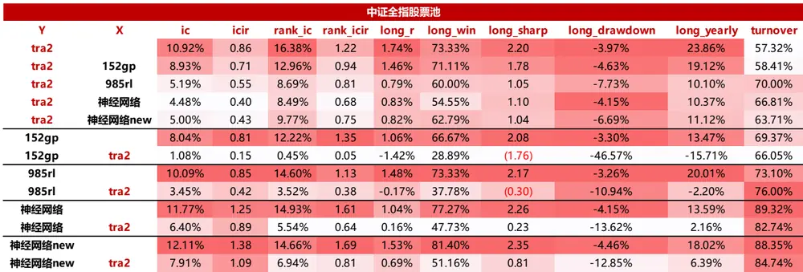
数据来源：东方证券研究所 & wind资讯

（2）在沪深 300、中证 500、中证 1000 股票池中，TRA 模型剔除掉其他模型后，残差rankic仍有5%以上。而遗传规划模型剔除掉TRA模型后，残差失效。强化学习模型剔除掉TRA模型后，残差表现相比原始因子下滑十分明显。两个神经网络模型剔除掉 TRA模型后，残差仍有效。

图 46：沪深 300 股票池中两两回归残差绩效表现（2020.1.1-2023.9.15）
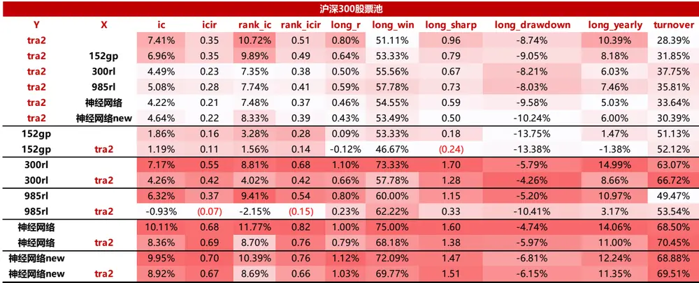
数据来源：东方证券研究所 & wind资讯

图 47：中证 500 股票池中两两回归残差绩效表现（2020.1.1-2023.9.15）
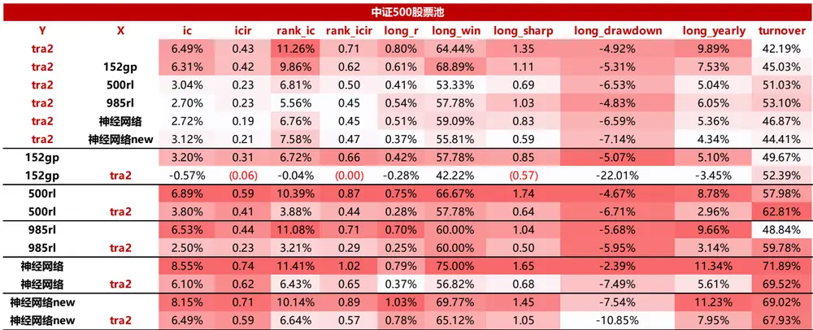
数据来源：东方证券研究所 & wind资讯

图 48：中证 1000 股票池中两两回归残差绩效表现（2020.1.1-2023.9.15）
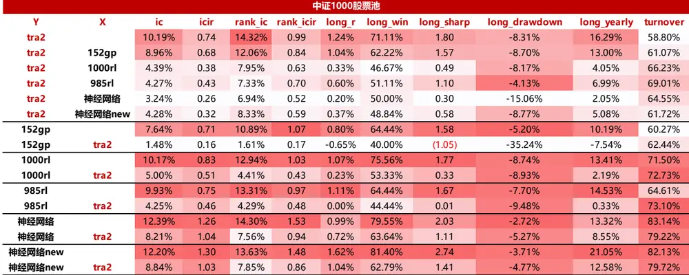
数据来源：东方证券研究所 & wind资讯

## 进一步，我们尝试将各模型等权结合，发现将多个有效且低相关的模型结合，增效显著：

（1）在中证全指股票池中，tra2 和神经网络_new 模型等权复合带来的增量最大。Tra2+神经网络_new，测试集上rankic达到18%，rankicir接近1.6（未年化），多头年化超额收益25%，月均单边换手仅 70%。再叠加强化学习和神经网络模型无法提升 rankic，但可以继续提升多头表现Tra2+985rl+神经网络+神经网络_new，多头年化超额收益可达26.39%，月均单边换手仅75%，多头最大回撤仅为 2.58%。

图 49：中证全指股票池中多模型结合绩效表现（2020.1.1-2023.9.15）

| 中证全指股票池 |  |  |  |  |  |  |  |  |  |  |
| --- | --- | --- | --- | --- | --- | --- | --- | --- | --- | --- |
|  | ic | icir | rank_ic | rank_icir | long_r | long_win | long_sharp | long_drawdown | long_yearly | turnover |
| tra2 | 10.92% | 0.86 | 16.38% | 1.22 | 1.74% | 73.33% | 2.20 | -3.97% | 23.86% | 57.32% |
| 152gp | 8.04% | 0.81 | 12.22% | 1.35 | 1.06% | 66.67% | 2.08 | -3.30% | 13.47% | 69.37% |
| 985rl | 10.09% | 0.85 | 14.60% | 1.13 | 1.48% | 73.33% | 2.17 | -3.26% | 20.01% | 73.10% |
| 神经网络 | 11.77% | 1.25 | 14.93% | 1.61 | 1.04% | 77.27% | 2.26 | -4.15% | 13.59% | 89.32% |
| 神经网络new | 12.11% | 1.38 | 14.66% | 1.69 | 1.53% | 81.40% | 2.35 | -4.46% | 18.02% | 88.35% |
| tra2+152gp | 10.67% | 0.90 | 16.11% | 1.32 | 1.84% | 77.78% | 2.51 | -3.03% | 25.05% | 61.02% |
| tra+985rl | 11.35% | 0.89 | 16.68% | 1.22 | 1.80% | 77.78% | 2.32 | -3.38% | 24.60% | 61.01% |
| tra2+神经网络 | 12.66% | 1.10 | 17.52% | 1.46 | 1.75% | 84.44% | 2.64 | -4.06% | 24.16% | 68.57% |
| tra2+神经网络_new | 13.33% | 1.20 | 18.08% | 1.57 | 1.85% | 82.22% | 2.77 | -3.44% | 24.82% | 70.21% |
| tra2+神经网络+神经网络_new | 13.54% | 1.26 | 18.08% | 1.66 | 1.91% | 80.00% | 2.95 | -2.85% | 25.96% | 76.06% |
| tra2+985rl+神经网络+神经网络_new | 12.70% | 1.10 | 17.37% | 1.44 | 1.92% | 79.07% | 2.86 | -2.58% | 26.39% | 75.00% |
| tra2+152gp+985rl+神经网络+神经网络_new | 11.47% | 1.00 | 16.37% | 1.40 | 1.91% | 76.74% | 3.13 | -2.14% | 25.64% | 73.57% |

数据来源：东方证券研究所 & wind资讯

（2）在沪深 300 股票池中，tra2 和神经网络_new 模型等权复合带来的增量最大。Tra2+神经网络_new，测试集上 rankic 达到 13.24%，rankicir 达到 0.71（未年化），多头年化超额收益为 14.20%，月均单边换手仅 50%。再叠加神经网络和强化学习模型可以继续提升 rankic 和多头表现。Tra2+300rl+神经网络+神经网络_new，测试集上 rankic 可达 14%， rankicir 达到 0.78（未年化），多头年化超额收益可达 16%。

图 50：沪深 300 股票池中多模型结合绩效表现（2020.1.1-2023.9.15）

|  | ic | icir | rank_ic | rank_icir | long_r | long_win | long_sharp | long_drawdown | long_yearly | turnover |
| --- | --- | --- | --- | --- | --- | --- | --- | --- | --- | --- |
| tra2 | 7.41% | 0.35 | 10.72% | 0.51 | 0.80% | 51.11% | 0.96 | -8.74% | 10.39% | 28.39% |
| 152gp | 1.86% | 0.16 | 3.28% | 0.28 | 0.09% | 53.33% | 0.18 | -13.75% | 1.47% | 51.13% |
| 300rl | 7.17% | 0.55 | 8.81% | 0.68 | 1.10% | 73.33% | 1.70 | -5.79% | 14.99% | 63.07% |
| 985rl | 6.32% | 0.37 | 9.41% | 0.54 | 0.80% | 60.00% | 1.15 | -5.20% | 10.97% | 49.47% |
| 神经网络 神经网络new | 10.11% | 0.68 | 11.77% | 0.82 | 1.00% | 75.00% 72.09% | 1.60 | -4.74% | 14.06% | 68.50% |
| tra2+300rl | 9.95% | 0.70 | 10.39% | 0.76 | 1.12% |  | 1.47 | -6.81% | 12.24% | 68.88% |
|  | 8.37% | 0.46 | 11.25% | 0.60 | 0.94% | 64.44% | 1.11 | -9.35% | 12.65% | 43.22% |
| tra+985rl | 7.69% | 0.37 | 11.14% | 0.53 | 0.84% | 53.33% | 1.04 | -7.65% | 11.02% | 33.05% |
| tra2+神经网络 | 9.84% | 0.49 | 12.77% | 0.63 | 0.96% | 64.44% | 1.29 | -6.28% | 12.98% | 37.73% |
| tra2+神经网络_new | 10.78% | 0.57 | 13.24% | 0.71 | 1.10% | 62.22% | 1.37 | -6.08% | 14.20% | 42.48% |
| tra2+神经网络+神经网络_new | 11.60% 11.14% | 0.63 0.64 | 14.01% 13.65% | 0.77 0.78 | 1.13% 1.17% | 66.67% 68.89% | 1.51 | -6.74% | 14.71% 15.98% | 48.83% 51.06% |
| tra2+300rl+神经网络+神经网络_new | 9.93% | 0.53 | 12.97% | 0.69 | 1.12% | 69.77% | 1.61 1.47 | -8.04% -7.77% | 14.84% | 48.48% |
| tra2+985rl+神经网络+神经网络_new tra2+152gp+300rl+神经网络+神经网络_new | 10.33% | 0.62 | 12.94% | 0.77 | 1.19% | 68.89% | 1.71 | -7.94% | 16.15% | 50.34% |
| tra2+152gp+985rl+神经网络+神经网络_new | 8.85% | 0.51 | 11.87% | 0.68 | 0.98% | 72.09% | 1.39 | -5.91% | 13.16% | 50.62% |

数据来源：东方证券研究所 & wind资讯

（3）在中证 500 股票池中，tra2 和神经网络_new 模型等权复合带来的增量最大。Tra2+神经网络_new，测试集上 rankic 达到 13.20%，rankicir 接近 1（未年化），多头年化超额收益达到15%，月均单边换手仅 55%。再叠加神经网络和强化学习模型还能小幅提升 rankic，但无法提升多头表现。Tra2+500rl+神经网络+神经网络_new，测试集上 rankic 可达 13.80%。

图 51：中证 500 股票池中多模型结合绩效表现（2020.1.1-2023.9.15）

| 中证500股票池 |  |  |  |  |  |  |  |  |  |  |
| --- | --- | --- | --- | --- | --- | --- | --- | --- | --- | --- |
|  | ic | icir 0.43 | rank_ic 11.26% | rank_icir 0.71 | long_r 0.80% | long_win 64.44% | long_sharp 1.35 | long_drawdown -4.92% | long_yearly 9.89% | turnover 42.19% |
| tra2 | 6.49% |  |  |  | 0.42% |  | 0.85 | -5.07% |  | 49.67% |
| 152gp | 3.20% | 0.31 | 6.72% | 0.66 |  | 57.78% |  |  | 5.10% |  |
| 500rl | 6.89% | 0.59 | 10.39% | 0.87 | 0.75% | 66.67% | 1.74 | -4.67% | 8.78% | 57.98% |
| 985rl | 6.53% | 0.44 | 11.08% | 0.71 | 0.70% | 60.00% | 1.04 | -5.68% | 9.66% | 48.84% |
| 神经网络 | 8.55% | 0.74 | 11.41% | 1.02 | 0.79% | 75.00% | 1.65 | -2.39% | 11.34% | 71.89% |
| 神经网络new | 8.15% | 0.71 | 10.14% | 0.89 | 1.03% | 69.77% | 1.45 | -7.54% | 11.23% | 69.02% |
| tra2+500rl | 7.51% | 0.54 | 12.16% | 0.82 | 0.98% | 73.33% | 1.74 | -5.73% | 12.40% | 46.43% |
| tra+985rl | 7.02% | 0.45 | 12.02% | 0.73 | 0.69% | 60.00% | 1.06 | -7.11% | 9.28% | 42.83% |
| tra2+神经网络 | 8.43% | 0.60 | 12.91% | 0.89 | 0.85% | 71.11% | 1.46 | -4.83% | 11.43% | 52.55% |
| tra2+神经网络_new | 8.87% | 0.66 | 13.20% | 0.99 | 1.28% | 73.33% | 2.43 | -2.79% | 15.44% | 55.53% |
| tra2+神经网络+神经网络_new | 9.42% | 0.72 | 13.63% | 1.05 | 1.06% | 75.56% | 2.12 | -3.40% | 13.83% | 59.82% |
| tra2+500rl+神经网络+神经网络_new | 9.32% 8.31% | 0.71 0.60 | 13.80% 12.84% | 1.04 0.91 | 1.06% | 77.78% 72.09% | 2.13 | -2.50% | 13.88% | 56.27% |
| tra2+985rl+神经网络+神经网络_new | 8.68% | 0.68 | 13.28% | 1.04 | 0.85% 0.89% | 71.11% | 1.47 1.77 | -2.83% -2.55% | 11.79% 12.02% | 56.05% |
| tra2+152gp+500rl+神经网络+神经网络_new | 6.94% | 0.51 | 11.66% | 0.86 | 0.65% | 67.44% | 1.16 | -2.94% | 9.09% | 55.20% 55.43% |
| tra2+152gp+985rl+神经网络+神经网络_new |  |  |  |  |  |  |  |  |  |  |

数据来源：东方证券研究所 & wind资讯

有关分析师的申明，见本报告最后部分。其他重要信息披露见分析师申明之后部分，或请与您的投资代表联系。并请阅读本证券研究报告最后一页的免责申明。

（4）在中证 1000 股票池中，tra2 和神经网络_new 模型等权复合带来的增量最大。Tra2+神经网络_new，测试集上达到 rankic 16.33%，rankicir 达到1.35（未年化），多头年化超额收益24.75%，月均单边换手仅 72%。再叠加遗传规划、强化学习和神经网络模型对于 rankic 的提升不明显，但可以继续提升多头表现。Tra2+152gp+1000rl+神经网络+神经网络_new，测试集上多头年化超额收益 26.66%，月均单边换手仅 80%。

图 52：中证 1000 股票池中多模型结合绩效表现（2020.1.1-2023.9.15）

| 中证1000股票池 |  |  |  |  |  |  |  |  |  |  |
| --- | --- | --- | --- | --- | --- | --- | --- | --- | --- | --- |
|  | ic | icir | rank_ic | rank_icir | long_r 1.24% | long_win | long_sharp | long_drawdown | long_yearly | turnover |
| tra2 | 10.19% | 0.74 | 14.32% | 0.99 |  | 71.11% | 1.80 | -8.31% | 16.29% | 58.80% |
| 152gp | 7.64% | 0.71 | 10.89% | 1.07 | 0.80% | 64.44% | 1.58 | -5.20% | 10.19% | 60.27% |
| 1000rl | 10.17% | 0.83 | 12.94% | 1.03 | 1.07% | 75.56% | 1.77 | -8.74% | 13.41% | 71.50% |
| 985rl | 9.93% | 0.75 | 13.31% | 0.97 | 1.11% | 64.44% | 1.67 | -7.70% | 14.53% | 64.61% |
| 神经网络 | 12.39% | 1.26 | 14.30% | 1.53 | 0.99% | 79.55% | 2.03 | -2.72% | 13.32% | 83.14% |
| 神经网络new | 12.20% | 1.30 | 13.63% | 1.48 | 1.62% | 81.40% | 2.74 | -3.71% | 21.05% | 82.13% |
| tra2+1000rl | 11.06% | 0.83 | 14.75% | 1.06 | 1.16% | 64.44% | 1.72 | -10.30% | 15.04% | 62.80% |
| tra+985rl | 10.78% | 0.77 | 14.76% | 1.00 | 1.22% | 66.67% | 1.67 | -9.64% | 15.94% | 58.14% |
| tra2+神经网络 | 12.57% | 1.02 | 15.90% | 1.26 | 1.53% | 77.78% | 2.55 | -6.76% | 20.48% | 70.06% |
| tra2+神经网络_new | 12.96% | 1.10 | 16.33% | 1.35 | 1.88% | 82.22% | 3.00 | -4.83% | 24.75% | 72.33% |
| tra2+神经网络+神经网络 new | 13.57% | 1.19 | 16.62% | 1.45 | 1.65% | 80.00% | 2.97 | -4.10% | 21.68% | 76.49% |
| tra2+1000rl+神经网络+神经网络_new | 13.27% | 1.10 | 16.38% | 1.34 | 1.60% | 77.78% | 2.69 | -6.17% | 20.87% | 72.59% |
| tra2+985rl+神经网络+神经网络_new | 12.76% | 1.03 | 15.90% | 1.26 | 1.54% | 81.40% | 2.56 | -5.03% | 20.38% | 72.20% |
| tra2+152gp+1000rl+神经网络+神经网络_new | 12.73% | 1.07 | 16.01% | 1.34 | 2.04% | 77.78% | 2.89 | -5.11% | 26.66% | 80.41% |
| tra2+152gp+985rl+神经网络+神经网络_new | 11.43% | 0.92 | 14.99% | 1.22 | 1.49% | 81.40% | 2.59 | -3.99% | 19.26% | 70.63% |

数据来源：东方证券研究所 & wind资讯

## 五、TOP 组合

## 5.1 top 组合构建说明

为了对比不同模型因子多头端的选股效果，我们展示了中证全指股票池中不同模型月频 top组合的业绩表现。关于多头组合构建有如下说明：

（1）回测期：20200123-20231019，组合月频调仓，假设根据每月末个股得分在次日以vwap 价格进行交易；

（2）考虑交易成本：假设买卖手续费双边千三，停牌涨停不能买入、停牌跌停不能卖出；

（3）考虑流动性：将成分股中过去 20个交易日日均成交金额小于 3千万的股票予以剔除。

## 5.2 top 组合业绩

在中证全指内，使用 TRA 模型构建的 top100 组合，优于遗传规划、强化学习和常规的神经网络因子，可获得明显的超额收益。2020 年以来年化超额收益达到 31.27%，单边年换手 8 倍，最大回撤 21.67%。2021-2023 年，每年相比中证全指的超额收益都在 20%以上，2023 年到 10月 19号绝对收益达到17%，超额收益达到 25%。

图 53：中证全指股票池 top100 组合绩效表现（2020.1.1-2023.10.19）

| 中证全指成分内月频 |  | 基准 | tra2 |  | 152gp |  | 985rl |  | 神经网络 |  | 神经网络_new |  |
| --- | --- | --- | --- | --- | --- | --- | --- | --- | --- | --- | --- | --- |
| 20200101-20231019 top100 |  | 中证全指 | 绝对收益 | 超额收益 | 绝对收益 | 超额收益 | 绝对收益 | 超额收益 | 绝对收益 | 超额收益 | 绝对收益 | 超额收益 |
| 绩效指标 | 夏普比 | 0.08 | 1.47 | 1.88 | 1.02 | 1.24 | 1.35 | 1.74 | 1.10 | 1.58 21.41% | 1.07 | 1.74 |
|  | 年化收益率 | -0.30% | 32.58% | 31.27% | 21.15% | 17.24% | 26.24% | 24.97% | 24.43% |  | 24.18% | 21.56% |
|  | 最大回撤 | -28.00% | -22.42% | -21.67% | -24.47% | -23.09% | -20.51% | -20.41% | -27.42% | -23.58% | -31.45% | -13.99% |
|  | 最大回撤出现时间点 | 20220426 | 20220428 | 20210210 | 20220426 | 20210210 | 20220426 | 20210210 | 20220426 | 20210210 | 20220426 | 20210210 |
|  | 年化波动率 | 18.87% | 20.66% | 15.14% | 20.98% | 13.62% | 18.53% | 13.37% | 22.11% | 12.78% | 22.60% | 11.62% |
|  | 单边换手率（年） | 7.79 | 7.79 | 7.79 | 9.14 | 9.14 | 9.90 | 9.90 | 11.17 | 11.17 | 10.53 | 10.53 |
| 分年收益 | 2020 | 25.23% | 53.16% | 14.82% | 43.88% | 0.13% | 37.80% | 3.94% | 48.30% | 4.91% | 51.98% | 8.13% |
|  | 2021 | 6.19% | 47.63% | 39.33% | 29.23% | 21.65% | 41.64% | 33.53% | 39.58% | 31.41% | 41.87% | 33.66% |
|  | 2022 | -20.32% | 7.80% | 34.22% | -2.21% | 22.37% | 7.34% | 33.45% | 0.50% | 26.51% | 2.04% | 29.12% |
|  | 2023 | -6.66% | 16.65% | 24.79% | 11.94% | 19.38% | 13.16% | 21.07% | 8.04% | 15.78% | 1.40% | 8.72% |

数据来源：东方证券研究所 & wind资讯

图 54：中证全指股票池 top100 组合超额净值与回撤（2020.1.1-2023.10.19）
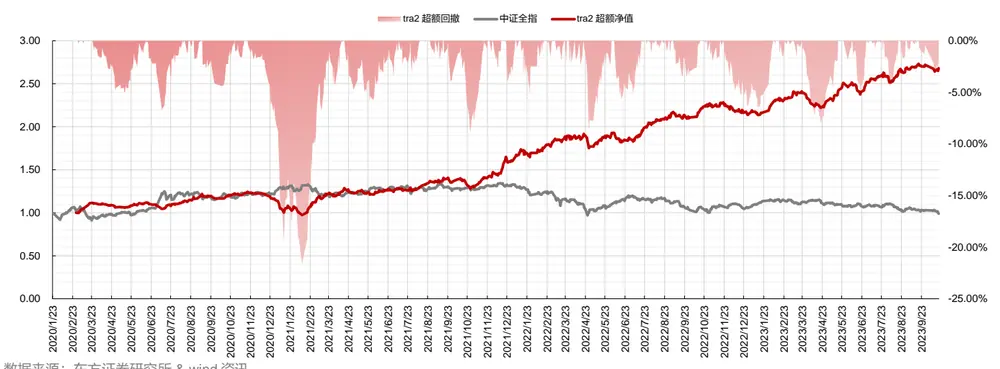
数据来源：东方证券研究所 & wind资讯

有关分析师的申明，见本报告最后部分。其他重要信息披露见分析师申明之后部分，或请与您的投资代表联系。并请阅读本证券研究报告最后一页的免责申明。

考虑到全市场 top100 组合稳定性不足、资金容量受限，我们也展示了 top300 组合的选股表现。相对 top100 组合，top300 的收益仅小幅回落、夏普比更高，因此部分资金规模大、组合稳定性要求高的投资者可以考虑持仓更多股票。TRA 模型下 top300 组合 2020 年以来年化超额收益达到30.07%，单边年换手6.54倍，最大回撤23.08%。2021-2023年，每年相比中证全指的超额收益都在 30%左右，2023年到 10月19号绝对收益达到19%，超额收益达到 27%。

图 55：中证全指股票池 top300 组合绩效表现（2020.1.1-2023.10.19）

| 中证全指成分内月频 |  | 基准 中证全指 | tra2 |  | 152gp |  | 985rl |  | 神经网络 |  | 神经网络_new |  |
| --- | --- | --- | --- | --- | --- | --- | --- | --- | --- | --- | --- | --- |
| 20200101-20231019 top300 |  |  | 绝对收益 | 超额收益 | 绝对收益 | 超额收益 | 绝对收益 | 超额收益 | 绝对收益 | 超额收益 | 绝对收益 | 超额收益 |
| 绩效指标 | 夏普比 | 0.08 | 1.51 | 1.98 | 1.06 | 1.44 | 1.26 | 1.64 | 1.19 | 1.83 | 1.17 | 2.08 |
|  | 年化收益率 | -0.30% | 31.98% | 30.07% | 20.91% | 18.24% | 23.30% | 21.52% | 25.13% | 22.22% | 25.54% | 23.27% |
|  | 最大回撤 | -28.00% | -20.93% | -23.08% | -23.34% | -20.13% | -19.89% | -21.62% | -25.70% | -21.96% | -28.59% | -10.82% |
|  | 最大回撤出现时间点 | 20220426 | 20220428 | 20210210 | 20220426 | 20210210 | 20220426 | 20210210 | 20220426 | 20210210 | 20220426 | 20210210 |
|  | 年化波动率 | 18.87% | 19.67% | 13.79% | 19.84% | 12.17% | 17.99% | 12.34% | 20.69% | 11.31% | 21.40% | 10.32% |
|  | 单边换手率（年） | 7.79 | 6.54 | 6.54 | 7.95 | 7.95 | 8.41 | 8.41 | 10.34 | 10.34 | 9.65 | 9.65 |
| 分年收益 | 2020 | 25.23% | 46.70% | 8.14% | 41.08% | 1.99% | 35.83% | 1.04% | 49.77% | 6.79% | 52.89% | 10.01% |
|  | 2021 | 6.19% | 43.71% | 35.61% | 32.36% | 24.61% | 35.03% | 27.15% | 36.26% | 28.35% | 43.09% | 34.82% |
|  | 2022 | -20.32% | 11.70% | 39.23% | -3.24% | 20.90% | 5.63% | 31.44% | 4.94% | 31.65% | 1.08% | 27.69% |
|  | 2023 | -6.66% | 18.70% | 26.95% | 11.85% | 19.41% | 12.15% | 19.97% | 7.14% | 14.64% | 5.03% | 12.69% |

数据来源：东方证券研究所 & wind资讯

图 56：中证全指股票池 top300 组合超额净值与回撤（2020.1.1-2023.10.19）
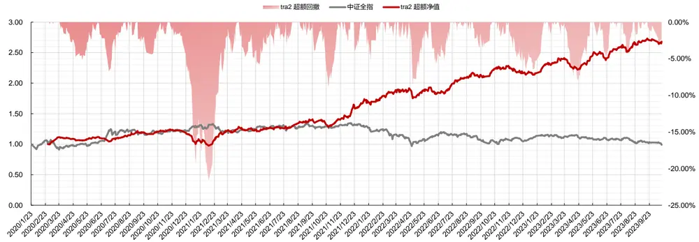
数据来源：东方证券研究所 & wind资讯

## 六、指数增强组合

## 6.1 指数增强组合构建说明

下面我们对比不同模型下沪深 300、中证 500 、中证 1000 指数增强组合的表现。关于指数增强组合构建有如下说明：

（1）回测期：20200123-20231019，组合月频调仓，假设根据每月末个股得分在次日以vwap 价格进行交易。进行成分内增强。

（2）组合约束：风险因子库（参见《东方 A 股因子风险模型（DFQ-2020）》）中所有的风格因子相对暴露不超过 0.5，所有行业因子相对暴露不超过 2%。沪深 300 增强跟踪误差约束不超过 4%，中证 500 和1000增强跟踪误差约束不超过 5%。

（3）考虑交易成本：假设买卖手续费双边千三，停牌涨停不能买入、停牌跌停不能卖出。

## 6.2沪深300 指数增强组合业绩

TRA 模型在沪深 300 指增组合中表现突出，2020 年以来信息比达到 1.87，年化对冲收益超13%，单边年换手仅 6 倍。2020-2023 每年均取得正超额，2023 年到 10 月 19 号对冲收益达10.53%。

图 57：沪深 300 股票池指数增强组合绩效表现（2020.1.1-2023.10.19）

| 20200101-20231019 300月频 | tra2 | 152gp | 985rl | 300rl | 神经网络 | 神经网络_new |
| --- | --- | --- | --- | --- | --- | --- |
| 行业暴露0.02 风格暴露0.5 跟踪误差5% 买卖手续费双边千三 | 沪深300全市场增强组合 80%成分内约束 | 沪深300全市场增强组合 80%成分内约束 | 沪深300全市场增强组合 80%成分内约束 | 沪深300成分内增强组合 | 沪深300全市场增强组合 80%成分内约束 | 沪深300全市场增强组合 80%成分内约束 |
| 信息比（年化） | 1.87 | 1.24 | 1.41 | 1.43 | 1.64 | 1.84 |
| 年化对冲收益 | 13.09% | 5.73% | 8.32% | 5.96% | 10.19% | 9.18% |
| 对冲收益最大回撤 | -7.34% | -4.92% | -8.87% | -5.17% | -12.50% | -4.12% |
| 对冲收益最大回撤出现时间点 | 20210902 | 20210113 | 20210113 | 20210113 | 20210112 | 20230424 |
| 跟踪误差（年化） | 6.72% | 4.60% | 5.78% | 4.12% | 6.03% | 4.84% |
| 单边换手率（年） | 6.13 | 7.29 | 8.27 | 7.71 | 9.25 | 8.34 |
| 持股数量 | 62.13 | 96.91 | 63.36 | 67.09 | 58.20 | 86.69 |
| 成分内股票占比 | 80.44% | 79.79% | 80.37% | 100.00% | 80.26% | 80.26% |
| 分年收益 |  |  |  |  |  |  |
| 2020 | 12.64% | 5.62% | 0.56% | 2.92% | -0.01% | 11.54% |
| 2021 | 6.02% | 9.99% | 5.13% | 5.66% | 14.57% | 9.75% |
| 2022 | 18.30% | 3.91% | 12.46% | 8.33% | 18.95% | 10.68% |
| 2023 | 10.53% | 1.36% | 12.35% | 4.69% | 4.31% | -0.43% |

数据来源：东方证券研究所 & wind资讯

图 58：沪深 300 股票池指数增强组合超额净值与回撤（2020.1.1-2023.10.19）
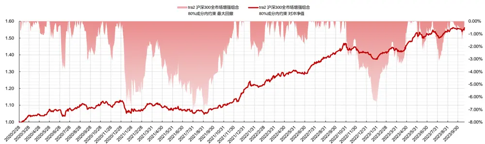
有关分析师的申明，见本报告最后部分。其他重要信息披露见分析师申明之后部分，或请与您的投资代表联系。并请阅读本证券研究报告最后一页的免责申明。

数据来源：东方证券研究所 & wind资讯

TRA 模型下的沪深 300 指增组合在市值、Beta、波动率、流动性、确定性、成长等维度具有一致的负向暴露，表明组合偏向小市值、低波动、低换手与低估值的公司。

图 59：沪深 300 股票池指数增强组合相对基准的风格暴露（2020.1.1-2023.10.19）
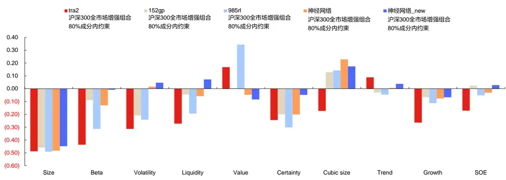
数据来源：东方证券研究所 & wind资讯

## 6.3中证500 指数增强组合业绩

TRA模型在中证 500 指增组合中表现突出，优于 300增强。2020年以来信息比达到 1.85，年化对冲收益达 14%，单边年换手仅 8倍。2020-2023年每年的超额都超过 10%，2023年到 10月 19号对冲收益达到 10 %。

图 60：中证 500 股票池指数增强组合绩效表现（2020.1.1-2023.10.19）

| 20200101-20231019 500月频 | tra2 | 152gp | 985rl | 500rl | 神经网络 | 神经网络_new |
| --- | --- | --- | --- | --- | --- | --- |
| 行业暴露0.02 风格暴露0.5 跟踪误差5% 买卖手续费双边千三 | 中证500全市场增强组合 80%成分内约束 | 中证500全市场增强组合 80%成分内约束 | 中证500全市场增强组合 80%成分内约束 | 中证500成分内增强组合 | 中证500全市场增强组合 80%成分内约束 | 中证500全市场增强组合 80%成分内约束 |
| 信息比（年化） | 1.85 | 1.01 | 1.27 | 1.49 | 1.34 | 1.40 |
| 年化对冲收益 | 13.97% | 5.72% | 8.61% | 8.45% | 9.09% | 9.37% |
| 对冲收益最大回撤 | -6.35% | -6.86% | -7.35% | -5.10% | -8.35% | -7.83% |
| 对冲收益最大回撤出现时间点 | 20200713 | 20210113 | 20211104 | 20211108 | 20201202 | 20201203 |
| 跟踪误差（年化） | 7.20% | 5.68% | 6.67% | 5.57% | 6.67% | 6.55% |
| 单边换手率(年) | 8.06 | 9.11 | 9.51 | 9.06 | 10.69 | 10.39 |
| 持股数量 | 64.82 | 97.67 | 80.60 | 78.47 | 69.44 | 85.33 |
| 成分内股票占比 | 80.04% | 79.39% | 80.18% | 100.00% | 80.02% | 79.76% |
| 分年收益 |  |  |  |  |  |  |
| 2020 | 13.95% | 1.48% | 6.26% | 11.00% | 6.73% | 11.76% |
| 2021 | 15.28% | 3.18% | 5.13% | 4.45% | 10.95% | 11.99% |
| 2022 | 11.11% | 5.85% | 13.56% | 9.50% | 13.34% | 5.05% |
| 2023 | 10.01% | 10.35% | 6.32% | 5.68% | 2.12% | 3.18% |

数据来源：东方证券研究所 & wind资讯

图 61：中证 500 股票池指数增强组合超额净值与回撤（2020.1.1-2023.10.19）
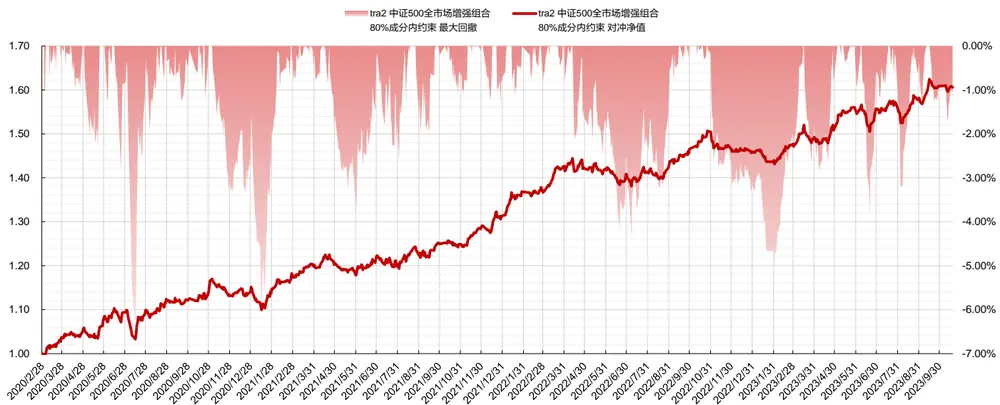
数据来源：东方证券研究所 & wind资讯

TRA 模型下的中证 500 指增组合在市值、Beta、波动率、流动性等维度具有一致的负向暴露，表明组合偏向小市值、低波动、低换手与低估值的公司。

图 62：中证 500 股票池指数增强组合相对基准的风格暴露（2020.1.1-2023.10.19）
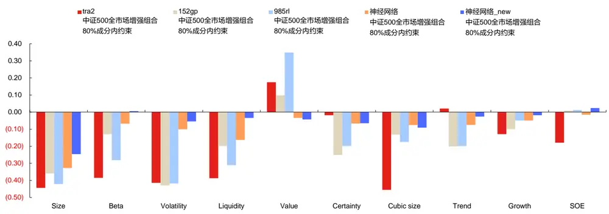
数据来源：东方证券研究所 & wind资讯

## 6.4中证1000 指数增强组合业绩

TRA 模型在中证 1000 指增组合中表现突出，优于 300 和 500 增强。2020 年以来信息比达到2.35，年化对冲收益达18.47%，单边年换手仅8.8倍。2020-2023年每年的超额都超过10%，2023年到 10月 19号对冲收益达到 10%。

图 63：中证 1000 股票池指数增强组合绩效表现（2020.1.1-2023.10.19）

| 20200101-20231019 1000月频 | tra2 | 152gp | 985rl | 1000rl | 神经网络 | 神经网络_new |
| --- | --- | --- | --- | --- | --- | --- |
| 行业暴露0.02 风格暴露0.5 跟踪误差5% 买卖手续费双边千三 | 中证1000全市场增强组合 80%成分内约束 | 中证1000全市场增强组合 80%成分内约束 | 中证1000全市场增强组合 80%成分内约束 | 中证1000成分内增强组合 | 中证1000全市场增强组合 80%成分内约束 | 中证1000全市场增强组合 80%成分内约束 |
| 信息比（年化） | 2.35 | 1.36 | 1.31 | 1.23 | 1.59 | 2.20 |
| 年化对冲收益 | 18.47% | 9.14% | 9.34% | 8.10% | 11.64% | 15.97% |
| 对冲收益最大回撤 | -7.31% | -10.28% | -6.65% | -8.33% | -7.37% | -5.76% |
| 对冲收益最大回撤出现时间点 | 20210915 | 20210915 | 20210113 | 20210915 | 20210708 | 20210601 |
| 跟踪误差（年化） | 7.33% | 6.58% | 7.04% | 6.52% | 7.08% | 6.86% |
| 单边换手率（年） | 8.82 | 9.43 | 9.99 | 9.63 | 11.13 | 10.82 |
| 持股数量 | 98.04 | 119.56 | 104.29 | 106.47 | 83.20 | 103.38 |
| 成分内股票占比 | 80.07% | 79.49% | 80.14% | 100.00% | 80.00% | 79.34% |
| 分年收益 |  |  |  |  |  |  |
| 2020 | 23.85% | 7.29% | 14.87% | 10.29% | 11.64% | 17.65% |
| 2021 | 13.53% | 0.99% | 7.63% | 12.48% | 9.96% | 14.84% |
| 2022 | 19.47% | 10.06% | 7.55% | 10.13% | 18.85% | 11.22% |
| 2023 | 10.01% | 15.12% | 3.92% | -2.95% | 2.14% | 10.24% |

数据来源：东方证券研究所 & wind资讯

图 64：中证 1000 股票池指数增强组合超额净值与回撤（2020.1.1-2023.10.19）
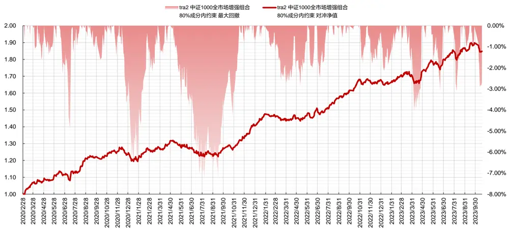
数据来源：东方证券研究所 & wind资讯

TRA 模型下的中证 1000 指增组合在市值、Beta、波动率、流动性等维度具有一致的负向暴露，表明组合偏向小市值、低波动、低换手与低估值的公司。

图 65：中证 1000 股票池指数增强组合相对基准的风格暴露（2020.1.1-2023.10.19）
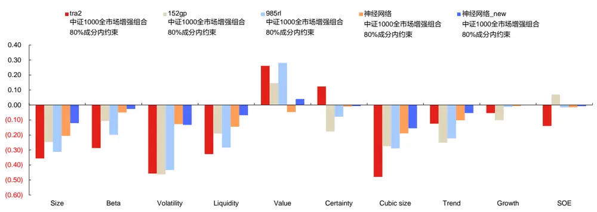
数据来源：东方证券研究所 & wind资讯

## 参考文献

1. Hengxu Lin, Dong Zhou, Weiqing Liu, and Jiang Bian. 2021. Learning Multiple Stock Trading Patterns with Temporal Routing Adaptor and Optimal Transport. In Proceedings of the 27th ACM SIGKDD Conference on Knowledge Discovery and Data Mining (KDD ’21), August 14– 18, 2021, Virtual Event, Singapore. ACM, New York, NY, USA, 10 pages. https://doi.org/10.1145/3447548.3467358

## 风险提示

1. 量化模型基于历史数据分析，未来存在失效风险，建议投资者紧密跟踪模型表现。

2. 极端市场环境可能对模型效果造成剧烈冲击，导致收益亏损。

## Tabl e_Disclai mer 分析师申明

每位负责撰写本研究报告全部或部分内容的研究分析师在此作以下声明：

分析师在本报告中对所提及的证券或发行人发表的任何建议和观点均准确地反映了其个人对该证券或发行人的看法和判断；分析师薪酬的任何组成部分无论是在过去、现在及将来，均与其在本研究报告中所表述的具体建议或观点无任何直接或间接的关系。

## 投资评级和相关定义

报告发布日后的12个月内行业或公司的涨跌幅相对同期相关证券市场代表性指数的涨跌幅为基准（A 股市场基准为沪深 300 指数，香港市场基准为恒生指数，美国市场基准为标普 500 指数）；

## 公司投资评级的量化标准

买入：相对强于市场基准指数收益率 15%以上；

增持：相对强于市场基准指数收益率 5%～15%；

中性：相对于市场基准指数收益率在-5%～+5%之间波动；

减持：相对弱于市场基准指数收益率在-5%以下。

未评级 —— 由于在报告发出之时该股票不在本公司研究覆盖范围内，分析师基于当时对该股票的研究状况，未给予投资评级相关信息。

暂停评级 —— 根据监管制度及本公司相关规定，研究报告发布之时该投资对象可能与本公司存在潜在的利益冲突情形；亦或是研究报告发布当时该股票的价值和价格分析存在重大不确定性，缺乏足够的研究依据支持分析师给出明确投资评级；分析师在上述情况下暂停对该股票给予投资评级等信息，投资者需要注意在此报告发布之前曾给予该股票的投资评级、盈利预测及目标价格等信息不再有效。

## 行业投资评级的量化标准：

看好：相对强于市场基准指数收益率 5%以上；

中性：相对于市场基准指数收益率在-5%～+5%之间波动；

看淡：相对于市场基准指数收益率在-5%以下。

未评级：由于在报告发出之时该行业不在本公司研究覆盖范围内，分析师基于当时对该行业的研究状况，未给予投资评级等相关信息。

暂停评级：由于研究报告发布当时该行业的投资价值分析存在重大不确定性，缺乏足够的研究依据支持分析师给出明确行业投资评级；分析师在上述情况下暂停对该行业给予投资评级信息，投资者需要注意在此报告发布之前曾给予该行业的投资评级信息不再有效。

## HeadertTabl e_Discl ai mer 免责声明

本证券研究报告（以下简称“本报告”）由东方证券股份有限公司（以下简称“本公司”）制作及发布。

。本公司不会因接收人收到本报告而视其为本公司的当然客户。本报告的全体接收人应当采取必要措施防止本报告被转发给他人。

本报告是基于本公司认为可靠的且目前已公开的信息撰写，本公司力求但不保证该信息的准确性和完整性，客户也不应该认为该信息是准确和完整的。同时，本公司不保证文中观点或陈述不会发生任何变更，在不同时期，本公司可发出与本报告所载资料、意见及推测不一致的证券研究报告。本公司会适时更新我们的研究，但可能会因某些规定而无法做到。除了一些定期出版的证券研究报告之外，绝大多数证券研究报告是在分析师认为适当的时候不定期地发布。

在任何情况下，本报告中的信息或所表述的意见并不构成对任何人的投资建议，也没有考虑到个别客户特殊的投资目标、财务状况或需求。客户应考虑本报告中的任何意见或建议是否符合其特定状况，若有必要应寻求专家意见。本报告所载的资料、工具、意见及推测只提供给客户作参考之用，并非作为或被视为出售或购买证券或其他投资标的的邀请或向人作出邀请。

本报告中提及的投资价格和价值以及这些投资带来的收入可能会波动。过去的表现并不代表未来的表现，未来的回报也无法保证，投资者可能会损失本金。外汇汇率波动有可能对某些投资的价值或价格或来自这一投资的收入产生不良影响。那些涉及期货、期权及其它衍生工具的交易，因其包括重大的市场风险，因此并不适合所有投资者。

在任何情况下，本公司不对任何人因使用本报告中的任何内容所引致的任何损失负任何责任，投资者自主作出投资决策并自行承担投资风险，任何形式的分享证券投资收益或者分担证券投资损失的书面或口头承诺均为无效。

本报告主要以电子版形式分发，间或也会辅以印刷品形式分发，所有报告版权均归本公司所有。未经本公司事先书面协议授权，任何机构或个人不得以任何形式复制、转发或公开传播本报告的全部或部分内容。不得将报告内容作为诉讼、仲裁、传媒所引用之证明或依据，不得用于营利或用于未经允许的其它用途。

经本公司事先书面协议授权刊载或转发的，被授权机构承担相关刊载或者转发责任。不得对本报告进行任何有悖原意的引用、删节和修改。

提示客户及公众投资者慎重使用未经授权刊载或者转发的本公司证券研究报告，慎重使用公众媒体刊载的证券研究报告。

## 东方证券研究所

地址： 上海市中山南路 318 号东方国际金融广场 26 楼

电话：021-63325888

传真：021-63326786

网址： www.dfzq.com.cn