# 基于抗噪的 AI 量价模型改进方案

## 因子选股系列之九十八

## 研究结论

⚫本文我们提出了一套对原量价模型框架抗噪性能提升的改进方案，该方案主要分成两个部分：第一，通过对抗训练的方法来降低神经网络模型对数据中噪声成分的敏感性。 第二，在原始数据上通过相关算法识别异常数据点，并将算法输出的异常信号因子作为 RNN 模型输入以辅助模型训练，降低异常数据对模型的影响。

⚫我们发现通过不同模型得到该数据是否属于异常的概率之间相关性较高，这意味着是否异常只与数据分布有关，而使用的模型只影响生成概率的准确度。本文新提出的异常信号经过二十个交易日滚动之后得到的因子本身均具有较好的选股表现，2010 年以来中证全指上基于振幅和换手率构建的 abn_tr20 和 abn_to20 因子 RankIC分别为7.90%和6.85%，分十组多头年化超额收益率分别为13.28%和9.25%，且这两个因子分组单调性也表现较好。

我们提出的抗噪方案下，各数据集非线性加权打分 2018 年以来在中证全指、沪深300、中证 500、中证 1000 四个指数上隔天十日 RankIC 均值分别为 15.71%、10.11%、11.82%、15.14%，RankICIR（未年化）分别为 1.52、0.69、0.96、1.43，分 20 组多头年化超额分别为 46.74%、28.74%、21.42%、34.25%，2020 年以来在中证全指、沪深 300、中证 500、中证 1000 四个指数上隔天十日 RankIC 均值分别为 13.88%、9.59%、9.94%、12.87%，RankICIR（未年化）分别为 1.38、0.72、0.85、1.25，分 20 组多头年化超额分别为 39.33%、29.53%、17.64%、26.47%，新模型打分在各不同宽基指数下均有优异的选股表现，市值偏向性较低。

以上两个打分也可直接应用于指数增强策略，各宽基指数上均能获得显著的超额收益，在成分股不低于80%限制、周单边换手率约束为20%约束下，2018年以来，新模型打分在沪深 300、中证 500 和中证 1000 增强策略上年化超额收益率分别为17.40%、21.39%和 31.52%，在成分股不限制、周单边换手率约束 20%约束下，2018 年以来，新模型在沪深 300、中证 500 和中证 1000 增强策略上年化超额收益率分别为 16.78%、27.20%和33.35%，整体表现较基准模型有较大幅度的提升。

根据单因子和指增策略回测结果，我们认为1）异常信号因子本身能捕捉到个股与市场交互作用，因此会给模型带来增量信息；2）通过对抗训练增加模型的鲁棒性，这将提升 RNN 模型在高信噪比数据中获取有效信息的能力，从而使 RNN 输出与自然训练方法产生差异性。

## 风险提示

⚫ 量化模型基于历史数据分析，未来存在失效风险，建议投资者紧密跟踪模型表现。

⚫ 极端市场环境可能对模型效果造成剧烈冲击，导致收益亏损。

报告发布日期

2023 年 12 月 24 日

杨怡玲

yangyiling@orientsec.com.cn

执业证书编号：S0860523040002

陶文启 taowenqi@orientsec.com.cn

基于残差网络的端到端因子挖掘模型：—2023-08-24—因子选股系列之九十六

基于循环神经网络的多频率因子挖掘：—2023-06-06—因子选股系列之九十一

## 引言

前期报告《基于循环神经网络的多频率因子挖掘》、《基于残差网络端到端因子挖掘模型》中，我们利用 RNN、ResNets 和决策树模型搭建了 AI 量价模型框架并将其该框架生成的因子应用于选股策略。回测结果显示该策略在样本外有着十分显著的选股效果。

这套 AI 量价模型框架主要是基于多个不同频率数据集搭建的，这些数据集分别是周度（week）、日度（day）、分钟线（ms）和Level-2（l2）数据集。其中周度和分钟线数据集我们分别是将每五个交易日日 K 线和每日半小时 K 线形成矩阵数据，然后将这些矩阵输入到一个残差网络（ResNets）中提取出相应时间频度的特征向量而形成的，而Level-2则是将原始数据通过人工合成降频成日频因子的方式形成的。

整个 AI量价模型框架分为三个部分，数据预处理、提取因子单元、因子加权。数据预处理主要是将各数据集中的不同特征分别进行去极值、标准化和补充缺失值等操作使各特征之间量纲可比且减少异常值带来的影响。接着我们利用RNN模型对四个数据集预处理之后得到的时序数据进行因子单元提取。最终我们利用一个决策树对四个不同频率数据集生成的因子单元进行因子加权，最终根据这个打分进行选股。整个流程如下图所示：

图 1：AI量价模型框架
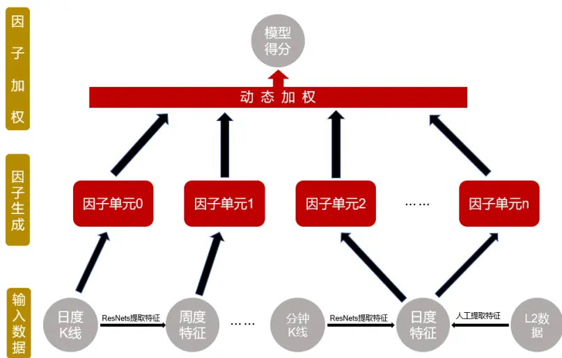
数据来源：东方证券研究所

这套框架除l2数据集使用了人工合成因子作为RNN模型的输入外，其余部分都是端到端的，即输入是原始 k 线数据经过简单的预处理之后完全通过机器的方式生成最终的因子。因此对于该模型来说输入数据信噪比、模型对噪声的敏感性以及模型自身的鲁棒性显得尤为重要。基于这个角度，比较自然的一些改进方法：

1. 在输入数据步骤中，通过去极值等预处理方法将原始数据进行平滑去除噪声。通过对原始数据加入扰动等数据增强的方法来改变RNN参数优化的方向从而增强模型鲁棒性。通过相关算法对原始数据异常值行检验，将生成异常信号作为特征输入辅助模型进行学习。

2. 在 RNN 生成因子阶段，通过改变 RNN 训练方法来提升 RNN 模型鲁棒性降低其对噪声的敏感性。或者对标签进行一定的预处理，从而减少标签的噪声含量，使得RNN模型能够更加有效地学习出输入输出的函数依赖关系（比如 KD、LS和小波变化方法）。

3. 因子加权阶段，通过决策树可解释性方法，对输入样本和输入特征赋予不同权重或者重采样来降低因子噪声对输出结果的影响（比如 double-ensemble方法）。

本报告设计了一套对原模型的改进方案，该方案主要从以下两个方面着手对整个 AI 量价模型框架的抗噪性能进行优化：

1. 通过对抗训练的方法来对数据进行增强，并且在原损失函数加入根据增强数据设计的损失函数正则项，以寻找到一组使得模型对扰动敏感性较低的模型参数。

2. 在原始数据上对异常数据进行检验，通过相关算法识别异常数据点以辅助模型训练，降低异常数据对模型的影响。

## 一、对抗训练（Adversarial Training）

## 1.1 对抗训练简介

深度神经网络模型以其强大的拟合能力和信息提取能力在诸多领域的实际应用中取得了巨大的成功。尽管拥有近乎完美的预测能力，但是最近的一些研究发现神经网络模型在面对对抗样本（adversarial example）【1】时它的预测能力表现的十分脆弱。给定一个能够被已经训练好的神经网络 f 准确预测的样本，给这个样本增加一些精心设计的微小扰动，这个扰动样本被称之为对抗样本，使得这个训练好的神经网络 f 对扰动样本的预测结果相较于对原始样本的预测结果发生巨大的改变。产生这个扰动的算法我们称之为对抗攻击（Adversarial Attack）算法。

比如下图所示，左图是一个原始图片（一个训练好的神经网络能够识别该图为熊猫的概率为60%即神经网络能够准确识别该图片类别），通过加入一些肉眼无法察觉的噪声之后得到下图右边的扰动图片。虽然肉眼上看原始样本和扰动样本没有任何区别，但此时神经网络识别扰动样本为长臂猿的概率为 99%，这意味着对于一个已经训练好的神经网络，且该神经网络预测能力足够强，我们仍然可以通过给原始数据加入一些扰动使得神经网络模型预测错误。

图 2：对抗样本生成示意图
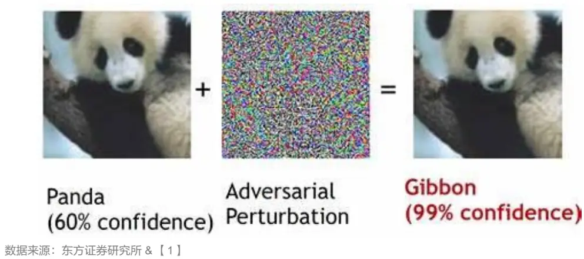
有关分析师的申明，见本报告最后部分。其他重要信息披露见分析师申明之后部分，或请与您的投资代表联系。并请阅读本证券研究报告最后一页的免责申明。

对抗样本的存在性意味着神经网络模型对于数据点的扰动可能十分的敏感，即神经网络模型的鲁棒性（Robustness）可能较弱。对于金融预测问题来说，金融数据有着噪声大、低信噪比等特性，不加处理地直接使用神经网络模型对金融数据进行预测可能会使得神经网络模型的性能大打折扣。于是一个很自然的问题如何才能使得神经网络模型更加鲁棒来应对数据信噪比低以及对抗样本的影响。文献【2】提出了 IFGSM（Iterative Fast Gradient Sign Method）方法。该方法的核心思想是通过求解以下优化问题来寻找神经网络模型参数 θ ：

$$
\min_{\boldsymbol{\theta}}\max_{\boldsymbol{\delta}\in B(\boldsymbol{0},\varepsilon)}L(f_{\boldsymbol{\theta}}(\boldsymbol{x}+\boldsymbol{\delta}),y)
$$

这里 L 表示损失函数比如 MSE 损失、x 表示原始数据点、δ 表示所加的扰动其位于一个以原点为心，ε 为半径的高维球内，y 为原始数据点对应标签。根据泰勒公式上述优化问题很容易转化为以下优化问题的形式：

$$
\min_{\boldsymbol{\theta}}\max_{\boldsymbol{\delta}\in B(\boldsymbol{0},\varepsilon)}L(f_{\boldsymbol{\theta}}(\boldsymbol{x}+\boldsymbol{\delta}),y)\approx\min_{\boldsymbol{\theta}}\left\{L(f_{\boldsymbol{\theta}}(\boldsymbol{x}),y)+\varepsilon\|\nabla_{\boldsymbol{x}}L(f_{\boldsymbol{\theta}}(\boldsymbol{x}),y)\|\right\}(2)
$$

通过上述近似不难看出优化问题（1）实际上是给损失函数添加了一项损失函数梯度的范数这个正则项。由于损失函数梯度范数的降低，这样能够使得在数据分布的底层流形上，对数据点做轻微扰动后，神经网络对应损失函数值发生的变化不会较大，从而降低神经网络 $f_{\theta}$ 对噪声的敏感性。

由于直接求解优化问题（1）或者（2）是十分困难的，IFGSM方法近似将上述问题转化为了求累次优化问题来求解，其具体过程可表示为：

$$
\begin{align*}\boldsymbol{x}^{m}&=Clip_{x,\varepsilon}\{\boldsymbol{x}^{m-1}+\alpha\cdot sign(\nabla_{\boldsymbol{x}}L(f_{\boldsymbol{\theta}}(\boldsymbol{x}^{m-1}),y))\},m=1,2,\cdots,M\left(3\right)\\\boldsymbol{x}^{m}&=Clip_{x,\varepsilon}\{\boldsymbol{x}^{m-1}+\alpha\cdot\nabla_{\boldsymbol{x}}L(f_{\boldsymbol{\theta}}(\boldsymbol{x}^{m-1}),y)/\|\nabla_{\boldsymbol{x}}L(f_{\boldsymbol{\theta}}(\boldsymbol{x}^{m-1}),y)\|\},m=1,2,\cdots,M\left(4\right)\end{align*}
$$

这里 $x^{0}$ 表示原始数据，M 表示寻找对抗样本所需迭代步数，sign 表示符号函数， $Clip_{x,\varepsilon}$ 表示将生成向量投影到以 x 为中心 ε 为半径的球内部。公式（3）、（4）分别表示无穷范数和 2 范数意义下的寻找对抗样本的攻击方法。该方法通俗地来说就是每次对参数迭代完一步之后，根据当前参数通过梯度上升极大化损失函数来寻找对抗样本，然后根据生成的对抗样本来计算损失函数从而继续下一步参数的更新。文献【3】则首次根据这种对抗训练的想法设计了一个鲁棒性损失函数，并将其引入到基于RNN模型股票趋势的预测的任务中去。结合该种想法我们设计了以下根据对抗样本计算的正则项损失函数来训练 RNN模型：

$$
\begin{aligned}Loss=&\frac{1}{N}\sum_{i}^{N}(f_{\boldsymbol{\theta}}(\boldsymbol{x}_{i})-\hat{y}_{i})^{2}+\frac{\lambda_{1}}{NK^{2}}|\big(z_{i,k}\big)_{i,k}^{T}\big(z_{i,k}\big)_{i,k}|_{F}+\frac{\lambda_{2}}{N}\sum_{i}^{N}\big(f_{\boldsymbol{\theta}}\big(\boldsymbol{x}_{i}^{adv}\big)-\hat{y}_{i}\big)^{2}\end{aligned}
$$

这里 $\lambda_{1}$ 和 $\lambda_{2}$ 表示正则项的两个超参数，N 表示 batch 的大小，K 表示生成弱因子的个数，损失函数第二项表示弱因子 $z_{i,k}$ 之间内积矩阵的 Frobenius范数， $x_{i}^{adv}$ 表示（3）或（4）迭代 M步最终生成的样本。用通俗的话来说在训练 RNN 的时候，我们不光希望 RNN 对原始数据预测的结果尽可能接近真实标签，我们也希望RNN对对抗样本预测的结果尽可能接近真实标签，而这两个目标分别对应损失函数第一和第三项。

## 1.2对抗训练效果测试

为了探索对抗训练对结果的提升，本节我们以数据集day为例，测试了相同三组seed下对抗训练与自然训练模型输出因子取平均之后在中证全指上的选股能力，RankIC 和 RankICIR 每隔十个交易日计算一次所得 RankIC 序列均值和序列均值除以标准差，多头超额收益率按照周度调仓分二十组，相对中证全指成分股等权为基准进行测算：

图 3：对抗训练与自然训练多头组合汇总结果（回测期 20170101~20231031）

|  | 自然训练 | 对抗训练 |
| --- | --- | --- |
| RanklC | 12.13% | 13.18% |
| ICIR | 1.21 | 1.26 |
| RankIC>0占比 | 88.48% | 88.48% |
| Top年化超额 | 28.40% | 32.52% |
| 年化波动率 | 7.89% | 7.33% |
| 最大回撤 | -9.74% | -6.38% |
| 周均单边换手 | 73.17% | 70.72% |

数据来源：wind、上交所、深交所、东方证券研究所

图 4：对抗训练与自然训练多头组合净值曲线（回测期 20170101~20231031）
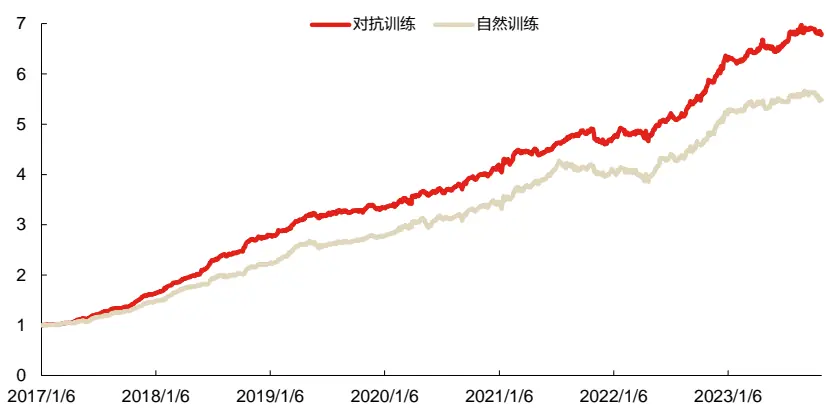
数据来源：wind、上交所、深交所、东方证券研究所

## 通过上述图表结果，我们可以看出：

1. 相较于自然训练所得打分的基准，对抗训练下模型生成因子在 RankIC、RankICIR 和多头超额等指标上均有较大幅度的提升。并且我们还发现对抗训练下模型生成因子多头组合周均单边换手率显著下降，这意味着模型输出因子换手率与训练模型的损失函数存在一定的关系；

2. 对抗训练和自然训练所得因子的相关系数仅只有87.57%，这意味着两种不同训练方式学出因子存在一定的信息差异，彼此之间可以信息互补。

3. 另外一方面对比两种训练方式的多头组合净值曲线，对抗训练组整体位于自然训练组的上方，并且 2021年 7月至 2022年 4月自然训练组因子出现失效，净值曲线整体向下倾斜，而在此段区间对抗训练组表现则相对较好。

综上我们认为对抗训练有助于模型从数据中更加充分地挖掘出有效信息，提升模型输出因子选股能力的稳定性，并且能一定程度降低模型输出因子的换手率。

有关分析师的申明，见本报告最后部分。其他重要信息披露见分析师申明之后部分，或请与您的投资代表联系。并请阅读本证券研究报告最后一页的免责申明。

## 二、基于半监督模型进行异常值检验

## 2.1异常信号生成简介

上一章，我们介绍了使用对抗训练的方法对数据进行增强，通过引入增强数据有关的损失函数正则项来降低神经网络模型对噪声的敏感性以及提升模型的鲁棒性来对抗数据信噪比较低的问题。另外一个角度，就是在原始数据上对数据噪声直接进行识别。

我们将每个交易日截面个股的振幅（即（最高价-最低价）/前收盘价）和个股的换手率作为输入，利用机器学习方法将每个交易日截面所有股票相应的数据作为输入进行半监督学习，根据机器学习模型的输出来判断该交易日个股是否属于异常，最终得到振幅和换手率对应的异常信号，我们将这两个信号分别简称为 abn_tr 和 abn_to。首先我们考虑使用 KNN、LOF（Local OutlierFactor）【4】和 iForest（Isolation Forest）【5】这三种方法生成信号。

- KNN方法是通过寻找与数据点最临近的k个样本点计算它们的平均距离，根据这个平均距离是否超过某个设定的阈值来判断是否属于异常；

⚫ LOF方法是通过寻找与数据点最临近的 k个样本点，通过量化指标来判定这 k个样本周围数据点分布密度来最终确定该样本点是否属于异常；

⚫ iForest方法则是将数据空间按照一定的准则进行切割，异常点在早期就会与大部分数据点分隔开，通过这种方法判断数据点是否属于异常。

我们将这三种方法生成信号每日计算相关系数然后回测区间取平均，得到相关系数矩阵：

图 5：不同模型异常信号相关系数（回测期 20100103~20231031）

|  | abn_tr |  |  |  | abn_to |  |  |
| --- | --- | --- | --- | --- | --- | --- | --- |
|  |  | KNN | LOF | iForest | KNN | LOF | iForest |
| abn_tr abn_to | KNN | 1.00 | 0.76 | 0.79 | 0.45 | 0.48 | 0.49 |
|  | LOF | 0.76 | 1.00 | 0.76 | 0.31 | 0.39 | 0.39 |
|  | iForest | 0.79 | 0.76 | 1.00 | 0.39 | 0.47 | 0.58 |
|  | KNN | 0.45 | 0.31 | 0.39 | 1.00 | 0.94 | 0.68 |
|  | LOF | 0.48 | 0.39 | 0.47 | 0.94 | 1.00 | 0.81 |
|  | iForest | 0.49 | 0.39 | 0.58 | 0.68 | 0.81 | 1.00 |

数据来源：wind、上交所、深交所、东方证券研究所

总体来看，对于同一个特征三种机器学习模型虽然寻找异常点逻辑不同但生成信号的相关性较高，这意味着是否异常是数据分布的固有属性，而使用的模型只影响识别异常的准确度。另外一方面对于振幅和换手率这两个特征相同模型生成的不同异常信号之间相关系数相对较低，说明这两个异常信号之间一定程度上可以信息互补。

经检验这两个信号因子在时序上进行滚动二十个交易日求平均，我们将这两个信号分别简称为 abn_tr20 和 abn_to20，它们本身具有较强的选股能力。下面我们列示了这通过不同模型生成的两个因子2010年1月3日至2023年10月31日，在中证全指上对未来十日收益率的预测能力（avg 因子表示三个模型生成的因子在每个交易日截面进行方向调整之后再标准化，最后等权平均的结果），RankIC 和 RankICIR 为每隔十个交易日计算一次 RankIC 所得序列均值和序列均值除以标准差，多头空头超额收益率按照周度调仓相对中证全指成分股等权基准进行测算。

图 6：不同算法生成异常信号因子选股表现（回测期 20100103~20231031）

|  | RanklC | RankICIR | RankIC胜率 | 多头超额 | 空头超额 |
| --- | --- | --- | --- | --- | --- |
| KNN abn_tr | 8.67% | 0.82 | 80.54% | 12.39% | -21.28% |
|  | LOF 6.14% | 0.91 | 82.93% | 10.24% | -18.19% |
|  | iForest 7.77% | 0.83 | 80.84% | 13.67% | -19.12% |
|  | avg 7.90% | 0.88 | 82.63% | 13.28% | -20.22% |
|  | KNN 7.78% | 0.58 | 73.65% | 8.21% | -22.37% |
|  | LOF 6.47% | 0.74 | 79.64% | 5.83% | -19.52% |
|  | iForest 6.65% | 0.71 | 77.25% | 9.86% | -18.26% |
| avg | 6.85% | 0.72 | 79.04% | 9.25% | -19.52% |

数据来源：wind、上交所、深交所、东方证券研究所

图 7：abn_tr20 因子周度 IC（20100103~20231031）
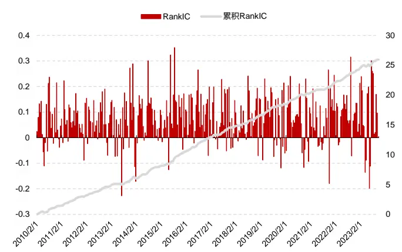
数据来源：wind、上交所、深交所、东方证券研究所

图 8：abn_to20 因子周度 IC（20100103~20231031）
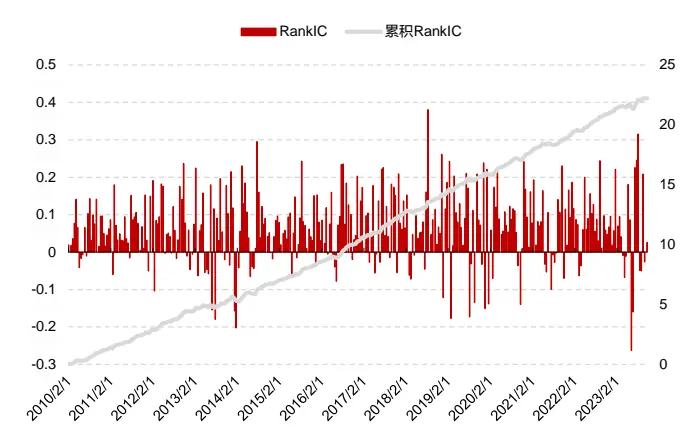
数据来源：wind、上交所、深交所、东方证券研究所

通过上述 RankIC 分析的结果来看，三个模型生成的 abn_tr20 和 abn_to20 这两个因子的选股能力较好，回测期间的表现都非常稳健，并没有出现在一段较长时间区间内出现失效风险的情况。更进一步的我们还对这两个因子进行分组测试：

图 9：abn_tr20 因子分组收益率（20100103~20231031）
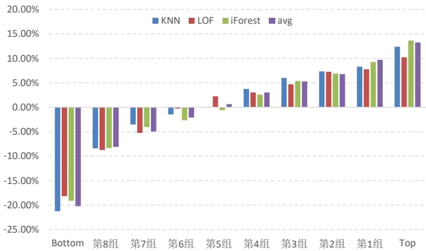
数据来源：wind、上交所、深交所、东方证券研究所

有关分析师的申明，见本报告最后部分。其他重要信息披露见分析师申明之后部分，或请与您的投资代表联系。并请阅读本证券研究报告最后一页的免责申明。

图 10：abn_to20 因子分组收益率（20100103~20231031）
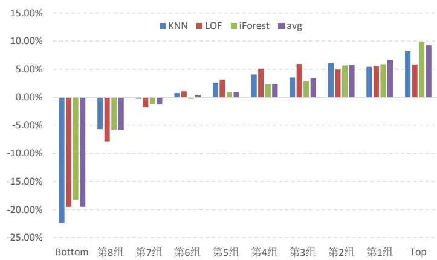
数据来源：wind、上交所、深交所、东方证券研究所

图 11：abn_tr20 因子分组收益（20100103~20231031）
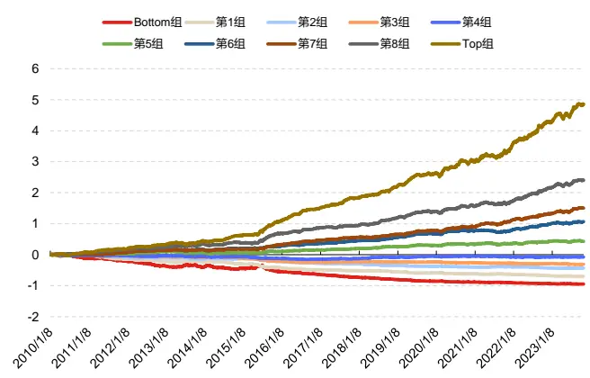
数据来源：东方证券研究所、上交所、深交所、东方证券研究所

图 12：abn_to20 因子分组收益（20100103~20231031）
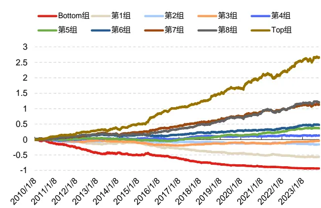
数据来源：东方证券研究所、上交所、深交所、东方证券研究所

单因子分组测试的结果来看，两个因子单调性较好，各分组收益具有持续且稳健的收益趋势，选股效果也十分显著。另外一方面我们也可以看出各模型生成因子选股表现相当，LOF 算法生成因子表现稍弱一些，对于 abn_tr20 因子 KNN 算法表现更优，而对于 abn_to20 因子 iForest 因子表现更优。

## 2.2加入异常信号因子选股效果测试

本节我们以数据集 day 为例，测试了相同三组 seed 取平均下 RNN 是否加入异常信号因子的输出在中证全指上的选股能力：

图 13：原始与加入异常信号数据集多头汇总结果（回测期 20170101~20231031）

|  | 原始 | 加入异常信号 |
| --- | --- | --- |
| RankIC | 12.13% | 12.78% |
| ICIR | 1.21 | 1.3 |
| RankIC>0占比 | 88.48% | 90.24% |
| Top年化超额 | 28.40% | 28.63% |
| 年化波动率 | 7.89% | 6.82% |
| 最大回撤 | -9.74% | -6.26% |
| 周均单边换手 | 73.17% | 72.20% |

数据来源：wind、上交所、深交所、东方证券研究所

通过上述图表结果我们可以看出：加入异常信号之后，模型输出因子选股能力的稳定性得到较大幅度提升，RankIC和 RankICIR显著上升，而年化波动率和最大回撤显著下降。

## 三、各数据集因子非线性加权结果分析

这一章我们将讨论不同设定下，各数据集因子非线性加权的打分表现。为了考察增加异常信号检验因子及对抗训练对整体模型带来的增量作用，我们构建了以下几个模型：

v0：基准模型，参见报告《基于残差网络端到端因子挖掘模型》中 Model4。

Model1：基准模型的基础上使用对抗训练算法。

Model2：Model1的基础上加入异常信号检验因子。

并将这几个模型生成的因子分别放入中证全指、沪深300、中证500和中证1000这四个股票池上进行回测。回测区间为 2018 年至 2023 年 10 月 31 日，RankIC 和 RankICIR 为每隔十个交易日计算一次 RankIC 所得序列均值和序列均值除以标准差，多头空头超额收益率按照周度调仓相对指数成分股等权为基准进行测算。

## 3.1中证全指上因子测试结果

首先我们对各模型生成因子在中证全指上进行 RankIC 分析和分组测试（分成 20 组），生成因子的绩效如下：

图 14：中证全指选股汇总表现（回测期 20180101~20231031）

|  | v0 | Model1 | Model2 |
| --- | --- | --- | --- |
| RankIC | 14.97% | 15.77% | 15.71% |
| ICIR | 1.54 | 1.54 | 1.52 |
| RankIC>0占比 | 94.33% | 95.00% | 95.00% |
| Top年化超额 | 42.29% | 45.52% | 46.74% |
| 年化波动率 | 7.22% | 7.37% | 7.45% |
| 最大回撤 | -5.32% | -4.96% | -5.69% |
| 周均单边换手 | 65.50% | 63.67% | 63.93% |

|  | v0 | Model1 | Model2 |
| --- | --- | --- | --- |
| RankIC | 13.01% | 13.99% | 13.88% |
| ICIR | 1.4 | 1.41 | 1.38 |
| RankIC>0占比 | 92.39% | 93.41% | 93.41% |
| Top年化超额 | 34.05% | 37.84% | 39.33% |
| 年化波动率 | 7.30% | 7.39% | 7.51% |
| 最大回撤 | -5.32% | -4.96% | -5.69% |
| 周均单边换手 | 64.57% | 62.63% | 62.75% |

数据来源：wind、上交所、深交所、东方证券研究所

有关分析师的申明，见本报告最后部分。其他重要信息披露见分析师申明之后部分，或请与您的投资代表联系。并请阅读本证券研究报告最后一页的免责申明。

图 15：中证全指分组年化超额收益 （回测期 20180101~20231031）

| v0 |  |  |  |  |  |  |  |
| --- | --- | --- | --- | --- | --- | --- | --- |
|  |  |  |  | Model1 |  | Model2 |  |
| Top 42.29% |  |  |  | 45.5 | 2% | 46.71% |  |
| 第18组 35.13% |  |  |  | 36.7 | 4% | 3%5%4%5%8%7% |  |
| 第17组 27.220% |  |  |  | 31.7 | 74% |  | 31.3 |
| 第16组 26.15% |  |  |  | 27.6 | 9%9 |  | 26.6 |
| 第15组 22.77% |  |  |  | 22.4 | 2% |  | 24.3 |
| 第14组 19.78% |  |  |  | 22.3 | 1% |  | 18.0 |
| 第13组 19.8 |  | 5% |  | 19.4 | 8% |  | 19.9 |
| 第12组 11.8 |  | 0% |  | 13.4 | 0% | 14.6 |  |
| 第11组 | 9.58 | % |  | 10.3 | 6% 11.0 |  |  |
| 第10组 7.56 |  | % | 7.31 |  | %6 7.67 |  |  |
| 第9组 3.93 |  | % | 4.8 |  | 2% 6.00 |  |  |
| 第8组 2.90 |  | % |  | 2.1 | %8 2.0q |  |  |
| 第7组 | -0.51 | 1% |  | -0.3 | 1% | -0.6 |  |
| 第6组第5组第4组第3组 | -3.0 | 3% |  | -4.8 | 4% | -4.2 |  |
|  | -5.9 | 7% |  | -6.3 | 9% | 8% |  |
|  | -11.49% |  |  | -12.7 | 2% | 9%8%6%3%3% |  |
|  | -16.08% |  |  | -18.0 | 3% |  | -16.9 |
| 第2组 | -21.84% |  |  | -224. | 46% |  | -23.9 |
| 第1组 | -34.08% |  |  | -34.0 | 7% |  | -34.9 |
| Bottom | -64.11% |  |  | -64.9 | 9% |  | -65.2 |

数据来源：wind、上交所、深交所、东方证券研究所

通过 RankIC 和分组测试结果来看，2018 年以来 Model1 和 Model2 较基准，RankIC 分别提升了 0.80%和 0.74%，多头年化超额分别提升了 3.23%和 4.45%，RankICIR 和 RankIC 胜率也都有所提高，说明异常信号因子和对抗训练算法对整个框架都有较大的增量作用。

图 16：中证全指各年度选股表现（回测期 20180101~20231031）

|  | 2018 | 2019 | 2020 | 2021 | 2022 | 2023 |
| --- | --- | --- | --- | --- | --- | --- |
| v0 | 28.00% | 78.56% | 67.64% | 69.40% | 17.31% | 32.46% |
| Model1 | 31.14% | 79.26% | 64.03% | 67.90% | 30.20% | 36.97% |
| Model2 | 31.90% | 79.28% | 62.38% | 74.12% | 32.58% | 36.65% |
| 超额收益 |  |  |  |  |  |  |
|  | 2018 | 2019 | 2020 | 2021 | 2022 | 2023 |
| v0 | 84.69% | 38.19% | 40.97% | 34.33% | 29.20% | 23.98% |
| Model1 | 88.78% | 38.36% | 37.93% | 33.07% | 43.50% | 28.16% |
| Model2 | 89.88% | 38.41% | 36.60% | 38.01% | 46.04% | 27.89% |

数据来源：wind、上交所、深交所、东方证券研究所

各模型多头组合分年度绩效表现来看，：

1. 过去六年中相对于基准Model1只有2020、2021年两年小幅跑输基准，其余四年均能大幅跑赢基准，这说明加入异常信号检验因子对全模型能够提供稳定的增量。

2. 相对于 Model1，Model2 仅有 2019、2023 年跑输外其余四年均有正向超额，这说明对抗训练带来的增量作用也较为稳定。

2018年以来

3. 相对于基准模型，Model1和Model2的多头组合周均单边换手率也有所下降，2018年以来分别下降了1.83%和1.57%，2020年以来分别下降了1.94%和1.82%。这意味着模型输出因子的换手情况可能与输入的因子以及模型训练的目标存在一定的关系。

4. 在过去四年中，无论 Model1还是 Model2生成因子多头的超额收益均在一个小范围内波动，这意味着 Model1和 Model2这两个模型生成因子没有出现明显的衰减趋势，获取超额收益的稳定性相对较好。

## 3.2各宽基指数上因子测试结果

本节我们对各模型生成因子在沪深300、中证500和中证1000上进行RankIC分析和分组测试（分成 5组），回测结果如下：

2020年以来
2020年以来
图 17：沪深 300 选股表现（回测期 20180101~20231031）

|  | vo | Model1 | Model2 |
| --- | --- | --- | --- |
| RanklC | 9.51% | 9.90% | 10.11% |
| ICIR | 0.65 | 0.67 | 0.69 |
| RankIC>0占比 | 74.47% | 72.34% | 72.34% |
| Top年化超额 | 27.43% | 27.75% | 28.74% |
| 年化波动率 | 7.60% | 7.45% | 7.50% |
| 最大回撤 | -5.94% | -6.42% | -6.52% |
| 周均单边换手 | 46.23% | 45.69% | 45.03% |

|  | v0 Model1 |  | Model2 |
| --- | --- | --- | --- |
| RanklC | 8.65% | 9.45% | 9.59% |
| ICIR | 0.64 | 0.69 | 0.72 |
| RankIC>0占比 | 70.65% | 71.74% | 69.57% |
| Top年化超额 | 26.65% | 28.49% | 29.53% |
| 年化波动率 | 8.15% | 7.87% | 7.90% |
| 最大回撤 | -5.94% | -6.42% | -6.53% |
| 周均单边换手 | 46.22% | 45.71% | 44.56% |

数据来源：wind、上交所、深交所、东方证券研究所

图 18：中证 500 选股表现（回测期 20180101~20231031）
2018年以来

|  | v0 | Model1 | Model2 |
| --- | --- | --- | --- |
| RankIC | 11.18% | 11.87% | 11.82% |
| ICIR | 0.93 | 0.98 | 0.96 |
| RankIC>0占比 | 82.27% | 82.27% | 82.27% |
| Top年化超额 | 21.47% | 21.88% | 21.42% |
| 年化波动率 | 6.14% | 6.11% | 6.10% |
| 最大回撤 | -9.36% | -8.53% | -9.22% |
| 周均单边换手 | 46.23% | 46.31% | 45.88% |

|  | vo | Model1 | Model2 |
| --- | --- | --- | --- |
| RankIC | 9.27% | 10.08% | 9.94% |
| ICIR | 0.83 | 0.9 | 0.85 |
| RankIC>0占比 | 80.43% | 79.35% | 78.26% |
| Top年化超额 | 18.39% | 19.05% | 17.64% |
| 年化波动率 | 6.45% | 6.43% | 6.64% |
| 最大回撤 | -9.36% | -8.53% | -9.22% |
| 周均单边换手 | 46.72% | 46.09% | 45.37% |

数据来源：wind、上交所、深交所、东方证券研究所

有关分析师的申明，见本报告最后部分。其他重要信息披露见分析师申明之后部分，或请与您的投资代表联系。并请阅读本证券研究报告最后一页的免责申明。

图 19：中证 1000 选股表现（回测期 20180101~20231031）
2018年以来

|  | v0 | Model1 | Model2 |
| --- | --- | --- | --- |
| RanklC | 14.58% | 15.07% | 15.14% |
| ICIR | 1.4 | 1.42 | 1.43 |
| RankIC>0占比 | 92.20% | 90.07% | 92.20% |
| Top年化超额 | 31.57% | 34.41% | 34.25% |
| 年化波动率 | 5.29% | 5.47% | 5.50% |
| 最大回撤 | -3.41% | -4.22% | -3.71% |
| 周均单边换手 | 47.58% | 46.31% | 46.25% |

2020年以来

|  | v0 | Model1 | Model2 |
| --- | --- | --- | --- |
| RankIC | 12.17% | 12.81% | 12.87% |
| ICIR | 1.21 | 1.25 | 1.25 |
| RankIC>0占比 | 90.22% | 86.96% | 90.21% |
| Top年化超额 | 23.82% | 26.10% | 26.47% |
| 年化波动率 | 5.47% | 5.70% | 5.71% |
| 最大回撤 | -3.41% | -4.22% | -3.71% |
| 周均单边换手 | 47.24% | 45.68% | 45.64% |

数据来源：wind、上交所、深交所、东方证券研究所

各模型生成因子在三个宽基指数成分股内多头组合汇总绩效表现来看，：

1. 在各个宽基指数池上，相较于基准模型，Model1 和 Model2 的 top 组周均单边换手率都显著更低，这意味着新模型有更高的低换手优势。

2. 从2018年以来和2020年有以来的回测结果来看，相较于基准模型，Model1和Model2在沪深 300和中证 1000指数池上选股的优势更为显著。

## 四、合成因子指数增强组合表现

## 4.1增强组合构建说明

本章将展示不同模型生成因子在沪深300、中证500和中证1000指数增强策略的应用效果，关于指数增强组合有如下说明：

1） 回测期20180101~20231031，组合周频调仓，假设根据每周五个股得分在次日以vwap 价格进行交易，股票池为中证全指。

2） 风险因子库dfrisk2020（参见《东方A股因子风险模型（DFQ-2020）》）的所有风格因子相对暴露不超过 0.5，所有行业因子相对暴露不超过 2%，中证 500 和中证 1000 增强跟踪误差约束不超过 5%，沪深 300 增强跟踪误差约束不超过 4%。

3） 指数增强策略组合构建时，限制指数成分股权重占比考虑不低于 80%和不限制两种情况，周单边换手率 delta限制设置为小于等于 10%、20%和30%三种情况。

4） 组合业绩测算时假设买入成本千分之一、卖出成本千分之二，停牌和涨停不能买入、停牌和跌停不能卖出。

## 4.2 沪深 300 指数增强

本节将展示沪深 300 指数增强策略应用，首先我们展示各年度超额收益以及汇总的业绩表现：

图 20：沪深 300指增组合分年度超额收益率（截至 20231031）
成分股80%限制

| delta=0.1 |  |  | delta=0.2 |  | delta=0.3 |  |
| --- | --- | --- | --- | --- | --- | --- |
|  | v0 | Model2 | v0 | Model2 | v0 | Model2 |
| 2018 | 20.77% | 21.99% | 30.31% | 32.05% | 31.92% | 32.84% |
| 2019 | 3.69% | 7.56% | 2.05% | 6.81% | 3.27% | 8.99% |
| 2020 | 12.38% | 8.44% | 16.64% | 11.65% | 15.91% | 12.81% |
| 2021 | 15.38% | 19.48% | 20.43% | 21.12% | 21.43% | 19.83% |
| 2022 | 15.07% | 20.89% | 16.30% | 21.29% | 13.98% | 19.97% |
| 2023 | 11.41% | 13.06% | 8.99% | 9.91% | 8.67% | 8.45% |

成分股不限制

| delta=0.1 |  |  | delta=0.2 |  | delta=0.3 |  |
| --- | --- | --- | --- | --- | --- | --- |
|  | v0 | Model2 | v0 | Model2 | v0 | Model2 |
| 2018 | 20.22% | 22.54% | 30.30% | 30.51% | 30.92% | 30.63% |
| 2019 | 3.98% | 7.13% | 3.24% | 7.65% | 3.09% | 7.92% |
| 2020 | 12.83% | 6.02% | 12.13% | 10.21% | 12.88% | 9.21% |
| 2021 | 18.40% | 18.01% | 21.50% | 19.32% | 20.95% | 19.90% |
| 2022 | 16.64% | 20.92% | 15.51% | 20.82% | 13.33% | 17.56% |
| 2023 | 10.52% | 12.08% | 8.65% | 10.46% | 8.00% | 9.10% |

数据来源：wind、上交所、深交所、东方证券研究所

图 21：沪深 300指增组合汇总结果（截至 20231031）
成分股80%限制

|  | 模型 | 年化超额 | 年化波动 | 周度胜率 | 最大回撤 |
| --- | --- | --- | --- | --- | --- |
| delta=0.1 | v0 | 13.43% | 4.67% | 64.59% | -4.16% |
|  | Model2 | 15.59% | 4.56% | 70.82% | -5.59% |
| delta=0.2 | v0 | 15.97% | 4.72% | 67.87% | -4.31% |
|  | Model2 | 17.40% | 4.73% | 68.20% | -4.59% |
| delta=0.3 | v0 | 16.03% | 4.78% | 71.15% | -4.43% |
|  | Model2 | 17.42% | 4.83% | 71.15% | -4.31% |

成分股不限制

|  | 模型 | 年化超额 | 年化波动 | 周度胜率 | 最大回撤 |
| --- | --- | --- | --- | --- | --- |
| delta=0.1 | v0 | 14.08% | 4.91% | 64.92% | -5.67% |
|  | Model2 | 14.74% | 4.75% | 67.87% | -7.43% |
| delta=0.2 | v0 | 15.39% | 4.95% | 67.54% | -5.01% |
|  | Model2 | 16.78% | 4.94% | 67.54% | -6.17% |
| delta=0.3 | v0 | 15.00% | 4.92% | 66.56% | -5.23% |
|  | Model2 | 15.97% | 4.99% | 70.49% | -5.40% |

数据来源：wind、上交所、深交所、东方证券研究所

沪深300增强分年度业绩表现来看，相较于基准模型，Model2在不同约束下构建的组合基本上都能跑赢基准模型。总体来看沪深300指增任务上，相较于基准模型，Model2都具有比较高的优势。我们还对 Model2在 2023年以来持仓的风格暴露和行业暴露进行了进一步的分析。

图 22：沪深 300指增组合风格暴露（2023年以来）
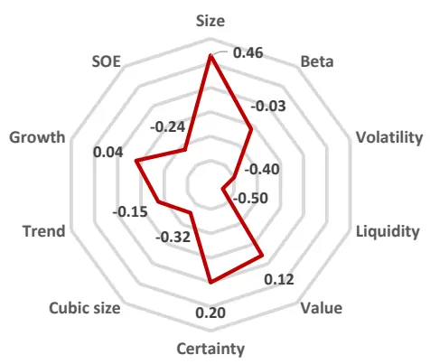
数据来源：wind、上交所、深交所、东方证券研究所

图 23：沪深 300指增组合行业暴露（2023年以来）
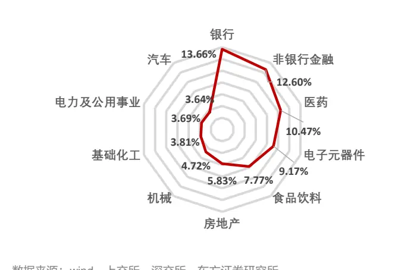
数据来源：wind、上交所、深交所、东方证券研究所

持仓的风格暴露来看，Model2对应沪深300增强组合在各种风格上的暴露都相对较低且比较均衡，组合整体风格略偏低波动低流动性。而行业暴露来看，组合在银行、非银金融和医药板块暴露较多。我们还绘制了 Model2 在周单边换手约束 20%，成分股占比不低于 80%约束下，对应沪深 300增强组合净值走势图如下：

图 24：沪深 300指增组合净值走势（Model2，净值左轴，回撤右轴）
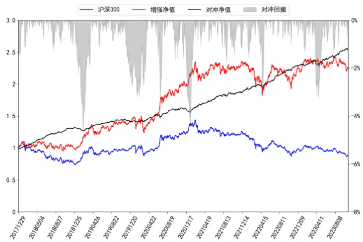
数据来源：wind、上交所、深交所、东方证券研究所

通过观察 Model2 净值曲线，我们可以看出，超额收益曲线在 2018 年年底和 2019 年底至2020 年初有一个相对较大的回撤外，最大回撤基本能控制在-3%以内，并且超额收益曲线总体趋势持续向上，组合获得超额回报的稳定性较好。

## 4.3 中证 500 指数增强

本小节将展示非线性加权生成因子打分应用于中证 500 指数增强策略表现情况。首先我们展示各个模型各年度超额收益以及汇总的业绩表现：

成分股不限制
成分股不限制
图 25：中证 500指增组合分年度超额收益率（截至 20231031）

|  | delta=0.1 |  | delta=0.2 |  | delta=0.3 |  |
| --- | --- | --- | --- | --- | --- | --- |
|  | v0 | Model2 | v0 | Model2 | v0 | Model2 |
| 2018 | 30.17% | 26.62% | 41.35% | 43.87% | 44.10% | 46.16% |
| 2019 | 13.18% | 14.12% | 14.71% | 17.61% | 14.42% | 18.48% |
| 2020 | 17.03% | 20.28% | 18.77% | 15.77% | 18.68% | 14.02% |
| 2021 | 20.62% | 17.58% | 23.54% | 19.08% | 23.38% | 24.48% |
| 2022 | 12.70% | 19.00% | 15.96% | 18.04% | 11.99% | 13.75% |
| 2023 | 12.07% | 10.23% | 12.38% | 12.21% | 13.51% | 12.65% |

|  | delta=0.1 |  | delta=0.2 |  | delta=0.3 |  |
| --- | --- | --- | --- | --- | --- | --- |
|  | v0 | Model2 | v0 | Model2 | v0 | Model2 |
| 2018 | 34.04% | 32.66% | 49.38% | 52.95% | 52.66% | 59.41% |
| 2019 | 14.13% | 18.07% | 16.09% | 19.58% | 14.09% | 19.66% |
| 2020 | 21.12% | 22.78% | 21.94% | 22.63% | 19.91% | 22.27% |
| 2021 | 26.59% | 22.14% | 24.20% | 24.96% | 22.54% | 20.98% |
| 2022 | 22.89% | 25.85% | 20.47% | 26.90% | 17.30% | 23.60% |
| 2023 | 16.19% | 15.79% | 14.25% | 14.02% | 14.87% | 17.44% |

数据来源：wind、上交所、深交所、东方证券研究所

图 26：中证 500指增组合汇总结果（截至 20231031）

|  | 模型 | 年化超额 | 年化波动 | 周度胜率 | 最大回撤 |
| --- | --- | --- | --- | --- | --- |
| delta=0.1 | v0 | 18.05% | 4.92% | 68.85% | -3.90% |
|  | Model2 | 18.47% | 4.93% | 71.15% | -4.62% |
| delta=0.2 | v0 | 21.47% | 5.27% | 74.75% | -4.44% |
|  | Model2 | 21.39% | 5.34% | 70.82% | -3.99% |
| delta=0.3 | v0 | 21.25% | 5.46% | 71.48% | -5.11% |
|  | Model2 | 21.79% | 5.51% | 71.80% | -5.33% |

|  | 模型 | 年化超额 | 年化波动 | 周度胜率 | 最大回撤 |
| --- | --- | --- | --- | --- | --- |
| delta=0.1 | v0 | 23.09% | 5.74% | 69.51% | -5.08% |
|  | Model2 | 23.55% | 5.71% | 75.08% | -4.12% |
| delta=0.2 | v0 | 24.71% | 6.16% | 69.18% | -4.37% |
|  | Model2 | 27.20% | 6.07% | 73.44% | -4.67% |
| delta=0.3 | v0 | 23.71% | 6.29% | 70.82% | -4.64% |
|  | Model2 | 27.42% | 6.20% | 73.44% | -4.57% |

数据来源：wind、上交所、深交所、东方证券研究所

在中证500指增任务上，对比基准模型，Model2在无成分股约束的限制下更具有优势，较基准模型表现提升更加明显，而在 80%成分股约束的限制下表现和基准模型相当。我们还展示了在2023年以来中证 500指增组合持仓的风格暴露和行业暴露进行进一步分析

图 27：中证 500指增组合风格暴露（2023年以来）
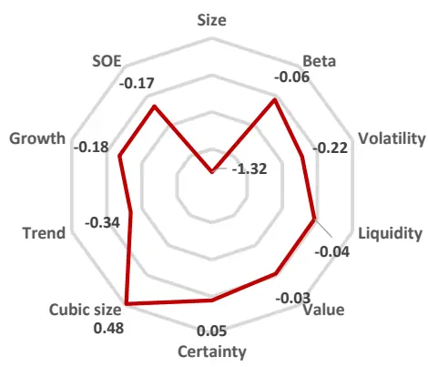
数据来源：wind、上交所、深交所、东方证券研究所

图 28：中证 500指增组合行业暴露（2023年以来）
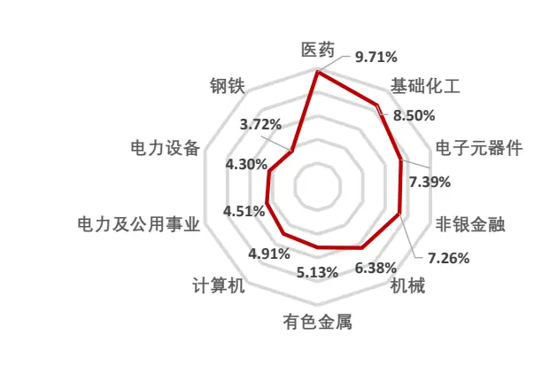
数据来源：wind、上交所、深交所、东方证券研究所

持仓的风格暴露来看，Model2对应中证500增强组合在各种风格上的暴露都相对较低且比较均衡，组合整体风格略偏反转和低波动风格。而行业暴露来看，组合在医药、基础化工和电子元器件板块暴露较多。

我们还绘制了在周单边换手约束 20%，成分股占比不低于 80%和不限制两种约束条件下，Model2 对应中证 500 增强组合净值走势图如下，超额收益曲线向上趋势明显，没有出现较大回撤，说明组合获得超额回报能力持续且稳定。

图 29：中证 500 指增组合净值走势（成分股 80%限制，净值左轴，回撤右轴）
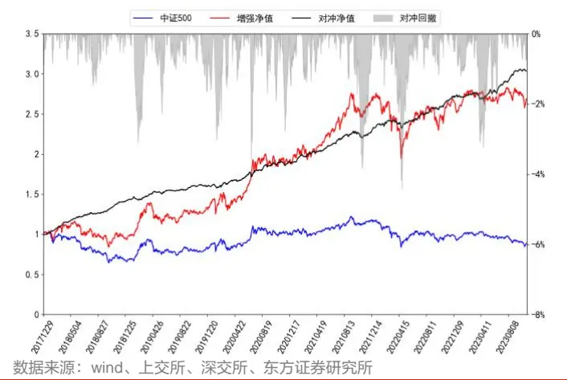

图 30：中证 500 指增组合净值走势（成分股不限制，净值左轴，回撤右轴）
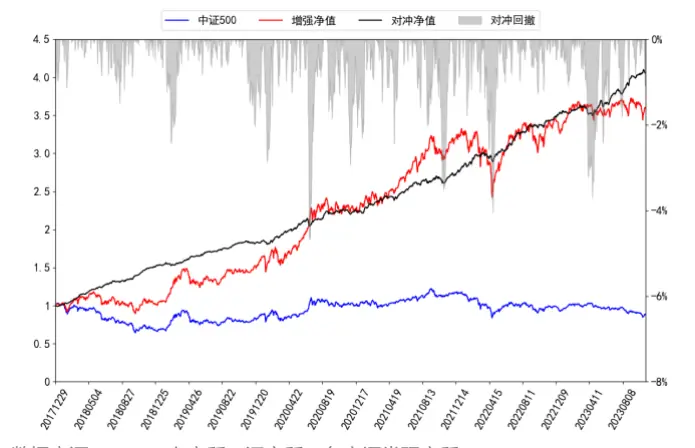
数据来源：wind、上交所、深交所、东方证券研究所

## 4.4 中证 1000 指数增强

本小节将展示基准模型和新模型生成因子打分应用于中证 1000指数增强策略表现情况：

图 31：中证 1000指增组合分年度超额收益率（截至 20231031）

| 成分股80%限制 |  |  |  |  |  |  |
| --- | --- | --- | --- | --- | --- | --- |
| delta=0.1 |  |  | delta=0.2 |  | delta=0.3 |  |
|  | v0 | Model2 | v0 | Model2 | v0 | Model2 |
| 2018 | 38.48% | 40.24% | 57.71% | 62.47% | 61.38% | 63.89% |
| 2019 | 18.62% | 21.19% | 26.56% | 26.09% | 26.41% | 29.67% |
| 2020 | 27.91% | 24.38% | 26.29% | 25.59% | 25.16% | 24.18% |
| 2021 | 31.93% | 31.63% | 30.22% | 30.25% | 27.19% | 28.51% |
| 2022 | 23.00% | 25.00% | 26.03% | 29.82% | 21.58% | 24.13% |
| 2023 | 10.45% | 12.43% | 11.98% | 13.23% | 10.79% | 14.65% |
| 成分股不限制 |  |  |  |  |  |  |
| delta=0.1 v0 |  |  | delta=0.2 v0 |  | delta=0.3 |  |
| 2018 | 43.37% | Model2 44.80% | 63.40% | Model2 67.22% | v0 67.03% | Model2 73.90% |
| 2019 | 18.41% | 19.38% | 20.49% | 24.03% | 19.69% | 26.40% |
| 2020 | 26.12% | 25.82% | 28.56% | 27.79% | 21.30% | 25.06% |
| 2021 | 25.30% | 27.62% | 21.62% | 29.23% | 25.97% | 25.57% |
| 2022 | 25.58% | 30.97% | 26.07% | 33.31% | 23.31% | 34.52% |
| 2023 | 14.53% | 18.92% | 14.64% | 16.88% | 14.83% | 16.48% |

数据来源：wind、上交所、深交所、东方证券研究所

图 32：中证 1000指增组合汇总结果（截至 20231031）

|  | 模型 v0 | 年化超额 25.59% | 年化波动 | 周度胜率 | 最大回撤 |
| --- | --- | --- | --- | --- | --- |
| delta=0.1 |  |  | 5.38% | 75.74% | -3.87% |
|  | Model2 | 26.41% | 5.46% | 76.39% | -4.69% |
| delta=0.2 | v0 | 30.14% | 5.91% | 76.72% | -4.28% |
|  | Model2 | 31.52% | 5.80% | 75.74% | -5.10% |
| delta=0.3 | v0 | 28.87% | 6.16% | 72.13% | -4.29% |
|  | Model2 | 31.06% | 6.02% | 75.08% | -4.63% |
| 成分股不限制 |  |  |  |  |  |
| delta=0.1 | 模型 | 年化超额 | 年化波动 | 周度胜率 | 最大回撤 |
|  | v0 | 26.12% | 5.68% | 73.44% | -4.34% |
|  | Model2 | 28.61% | 5.90% | 74.43% | -4.74% |
|  | v0 | 29.24% | 6.18% | 73.11% |  |
| delta=0.2 | Model2 | 33.35% | 6.16% | 74.43% | -4.25% |
|  | v0 |  |  |  | -4.67% |
| delta=0.3 |  | 28.62% | 6.44% | 72.46% | -4.63% |
|  | Model2 | 33.65% | 6.34% | 75.08% | -4.65% |

数据来源：wind、上交所、深交所、东方证券研究所

中证 1000增强分年度和汇总业绩表现来看，相较于基准模型， Model2的年化超额在不同约束条件下都都能大幅跑赢基准模型，且不同约束下大部分年份超额都显著高于基准模型，这说明在中证 1000增强任务上，Model2比基准任务更具有优势。

图 33：中证 1000指增组合风格暴露（Model2）
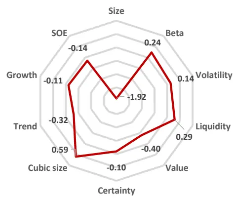
数据来源：wind、上交所、深交所、东方证券研究所

图 34：中证 1000指增组合行业暴露（2023年以来）
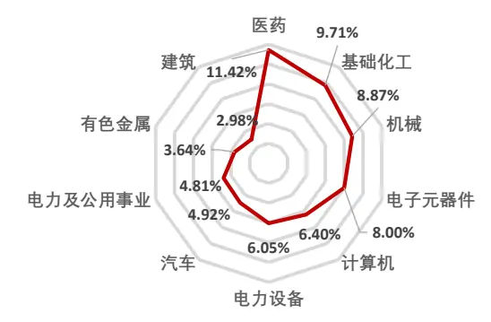
数据来源：wind、上交所、深交所、东方证券研究所

持仓的风格暴露来看，Model2 对应中证 1000 增强组合在各种风格上的暴露都相对较低且比较均衡，组合整体风格略偏反转、高流动性和高波动风格，走势与市场存在一定的正相关关系。而行业暴露来看，组合在医药、基础化工和机械板块暴露较多。

我们还绘制了 Model2对应中证 1000增强组合净值走势图如下，超额收益曲线走势较为平滑，没有出现长时间失效的问题。

图35：中证1000指增组合净值走势（成分股80%限制，净值左轴，回撤右轴）
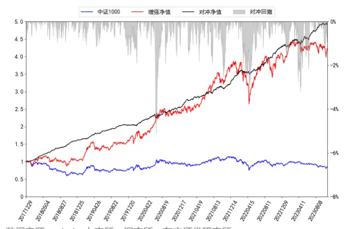
数据来源：wind、上交所、深交所、东方证券研究所

图 36：中证 1000 指增组合净值走势（成分股不限制，净值左轴，回撤右轴）
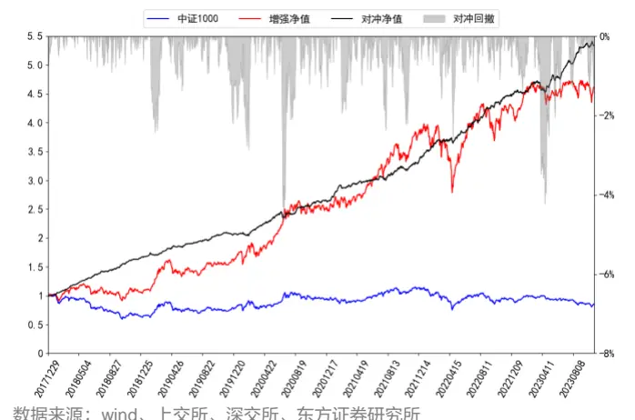
数据来源：wind、上交所、深交所、东方证券研究所

## 六、结论

随着人工智能学科的快速发展，一些经典的机器学习模型也在量化投资领域得到了广泛的应用。前期报告《基于循环神经网络的多频率因子挖掘》、《基于残差网络端到端因子挖掘模型》中，我们利用 RNN、ResNets 和决策树模型搭建了 AI 量价模型框架并将其该框架生成的因子应用于选股策略。回测结果显示该策略在样本外有着十分显著的选股效果。该模型是完全端到端的，即输入是原始 k 线数据经过简单的预处理之后完全通过机器的方式生成最终的因子。因此对于该模型来说输入数据信噪比和模型对噪声的敏感性显得尤为重要。

基于上述想法，本文我们提出了一套对原量价模型框架抗噪性能提升的改进方案，该方案主要由两个部分组成：第一，通过对抗训练的思想设计损失函数正则项，来降低神经网络模型对数据中噪声成分的敏感性，从而更好地提取有效信息。 第二，在原始数据上通过相关的机器学习算法来识别异常数据点，并将算法输出的异常信号因子作为RNN模型输入以辅助模型训练，以降低异常数据对模型的影响。

我们发现通过不同模型得到该数据是否属于异常的概率之间相关性较高，这意味着是否异常只与数据分布有关，而使用的模型只影响生成概率的准确度。本文新提出的异常信号经过二十个交易日滚动求均值之后得到的因子本身均具有较好的选股表现，2010年以来中证全指上基于振幅和换手率构建的 abn_tr20 和 abn_to20 因子 RankIC 分别为 7.90%和 6.85%，分十组多头年化超额收益率分别为 13.28%和 9.25%，且这两个因子分组单调性也表现较好。

我们提出的抗噪方案下，各数据集非线性加权打分2018年以来在中证全指、沪深300、中证500、中证 1000四个指数上隔天十日 RankIC均值分别为 15.71%、10.11%、11.82%、15.14%，RankICIR（未年化）分别为 1.52、0.69、0.96、1.43，分 20 组多头年化超额分别为 46.74%、28.74%、21.42%、34.25%，2020 年以来在中证全指、沪深 300、中证 500、中证 1000 四个指数上隔天十日 RankIC 均值分别为 13.88%、9.59%、9.94%、12.87%，RankICIR（未年化）分别为 1.52、0.72、0.85、1.25，分 20 组多头年化超额分别为 39.33%、29.53%、17.64%、26.47%。新模型打分在各个不同宽基指数下均有优异的选股表现，较基准模型有一定幅度的提升，且市值偏向性较低。

新模型生成的因子也可直接应用于指数增强策略，各宽基指数上均能获得显著的超额收益，在成分股不低于 80%限制、周单边换手率约束为 20%约束下，2018 年以来，新模型打分在沪深300、中证 500 和中证 1000 增强策略上年化超额收益率分别为 17.40%、21.39%和 31.52%，在成分股不限制、周单边换手率约束为 20%约束下，2018 年以来，新模型打分在沪深 300、中证500 和中证 1000 增强策略上年化超额收益率分别为 16.78%、27.20%和 33.35%，整体表现较基准模型有较大幅度的提升。

根据单因子和指增策略回测结果，我们认为 1）异常信号因子本身能捕捉到个股与市场交互作用，因此会给模型带来增量信息；2）通过对抗训练增加模型的鲁棒性，这将提升 RNN 模型在高信噪比数据中获取有效信息的能力，从而使 RNN输出与自然训练方法产生差异性。

## 风险提示

1. 量化模型基于历史数据分析，未来存在失效风险，建议投资者紧密跟踪模型表现。

2. 极端市场环境可能对模型效果造成剧烈冲击，导致收益亏损。

## 参考文献

【1】 Goodfellow, I. J., Shlens, J., & Szegedy, C. (2014). Explaining and harnessing adversarial examples. arxiv preprint arxiv:1412.6572.

【2】 Madry, A., Makelov, A., Schmidt, L., Tsipras, D., & Vladu, A. (2017). Towards deep learning models resistant to adversarial attacks. arxiv preprint arxiv:1706.06083.

【3】 Feng, F., Chen, H., He, X., Ding, J., Sun, M., & Chua, T. S. (2018). Enhancing stock movement prediction with adversarial training. arxiv preprint arxiv:1810.09936.

【4】 Nowak-Brzezińska, Agnieszka, and Czesław Horyń. "Outliers in rules-the comparision of LOF, COF and KMEANS algorithms." Procedia Computer Science 176 (2020): 1420-1429.

【5】 Liu, Fei Tony, Kai Ming Ting, and Zhi-Hua Zhou. "Isolation forest." 2008 eighth ieee international conference on data mining. IEEE, 2008.

## Table_Di sclaim er 分析师申明

每位负责撰写本研究报告全部或部分内容的研究分析师在此作以下声明：

分析师在本报告中对所提及的证券或发行人发表的任何建议和观点均准确地反映了其个人对该证券或发行人的看法和判断；分析师薪酬的任何组成部分无论是在过去、现在及将来，均与其在本研究报告中所表述的具体建议或观点无任何直接或间接的关系。

## 投资评级和相关定义

报告发布日后的12个月内行业或公司的涨跌幅相对同期相关证券市场代表性指数的涨跌幅为基准（A 股市场基准为沪深 300 指数，香港市场基准为恒生指数，美国市场基准为标普 500 指数）；

## 公司投资评级的量化标准

买入：相对强于市场基准指数收益率 15%以上；

增持：相对强于市场基准指数收益率 5%～15%；

中性：相对于市场基准指数收益率在-5%～+5%之间波动；

减持：相对弱于市场基准指数收益率在-5%以下。

未评级 —— 由于在报告发出之时该股票不在本公司研究覆盖范围内，分析师基于当时对该股票的研究状况，未给予投资评级相关信息。

暂停评级 —— 根据监管制度及本公司相关规定，研究报告发布之时该投资对象可能与本公司存在潜在的利益冲突情形；亦或是研究报告发布当时该股票的价值和价格分析存在重大不确定性，缺乏足够的研究依据支持分析师给出明确投资评级；分析师在上述情况下暂停对该股票给予投资评级等信息，投资者需要注意在此报告发布之前曾给予该股票的投资评级、盈利预测及目标价格等信息不再有效。

## 行业投资评级的量化标准：

看好：相对强于市场基准指数收益率 5%以上；

中性：相对于市场基准指数收益率在-5%～+5%之间波动；

看淡：相对于市场基准指数收益率在-5%以下。

未评级：由于在报告发出之时该行业不在本公司研究覆盖范围内，分析师基于当时对该行业的研究状况，未给予投资评级等相关信息。

暂停评级：由于研究报告发布当时该行业的投资价值分析存在重大不确定性，缺乏足够的研究依据支持分析师给出明确行业投资评级；分析师在上述情况下暂停对该行业给予投资评级信息，投资者需要注意在此报告发布之前曾给予该行业的投资评级信息不再有效。

## HeadertTabl e_Discl ai mer 免责声明

本证券研究报告（以下简称“本报告”）由东方证券股份有限公司（以下简称“本公司”）制作及发布。

。本公司不会因接收人收到本报告而视其为本公司的当然客户。本报告的全体接收人应当采取必要措施防止本报告被转发给他人。

本报告是基于本公司认为可靠的且目前已公开的信息撰写，本公司力求但不保证该信息的准确性和完整性，客户也不应该认为该信息是准确和完整的。同时，本公司不保证文中观点或陈述不会发生任何变更，在不同时期，本公司可发出与本报告所载资料、意见及推测不一致的证券研究报告。本公司会适时更新我们的研究，但可能会因某些规定而无法做到。除了一些定期出版的证券研究报告之外，绝大多数证券研究报告是在分析师认为适当的时候不定期地发布。

在任何情况下，本报告中的信息或所表述的意见并不构成对任何人的投资建议，也没有考虑到个别客户特殊的投资目标、财务状况或需求。客户应考虑本报告中的任何意见或建议是否符合其特定状况，若有必要应寻求专家意见。本报告所载的资料、工具、意见及推测只提供给客户作参考之用，并非作为或被视为出售或购买证券或其他投资标的的邀请或向人作出邀请。

本报告中提及的投资价格和价值以及这些投资带来的收入可能会波动。过去的表现并不代表未来的表现，未来的回报也无法保证，投资者可能会损失本金。外汇汇率波动有可能对某些投资的价值或价格或来自这一投资的收入产生不良影响。那些涉及期货、期权及其它衍生工具的交易，因其包括重大的市场风险，因此并不适合所有投资者。

在任何情况下，本公司不对任何人因使用本报告中的任何内容所引致的任何损失负任何责任，投资者自主作出投资决策并自行承担投资风险，任何形式的分享证券投资收益或者分担证券投资损失的书面或口头承诺均为无效。

本报告主要以电子版形式分发，间或也会辅以印刷品形式分发，所有报告版权均归本公司所有。未经本公司事先书面协议授权，任何机构或个人不得以任何形式复制、转发或公开传播本报告的全部或部分内容。不得将报告内容作为诉讼、仲裁、传媒所引用之证明或依据，不得用于营利或用于未经允许的其它用途。

经本公司事先书面协议授权刊载或转发的，被授权机构承担相关刊载或者转发责任。不得对本报告进行任何有悖原意的引用、删节和修改。

提示客户及公众投资者慎重使用未经授权刊载或者转发的本公司证券研究报告，慎重使用公众媒体刊载的证券研究报告。

## 东方证券研究所

地址： 上海市中山南路 318 号东方国际金融广场 26 楼

电话：021-63325888

传真：021-63326786

网址：www.dfzq.com.cn