# 基于异构图神经网络的股票关联因子挖掘

# 因子选股系列之九十九

## 研究结论

图神经网络（GNN）近年来成为图分析的主流工具，同样也是量化领域的研究热点，这种网络结构能够整合股票间复杂的关联信息。与传统的图聚类和中心性度量等方法相比，GNN 通过节点和邻边的特征传递机制，可以更深入地挖掘和利用图结构中的数据，如供应链关系和行业分类，以增强个股预测的准确性。

⚫异构图的多维度融合：本报告通过构建异构图神经网络（Heterogeneous GraphNeural Network）对股票市场进行建模，有效地融合了多种类型的节点和边。股票的量价因子作为节点特征，行业归属、基金共同持仓和分析师共同覆盖作为邻边特征，共同构成了一个多维度的异构图模型。这种融合方法不仅丰富了模型的信息维度，也提高了对未来收益率预测的准确性。

- 残差连接防止特征稀释：为了应对图神经网络中邻居特征聚合导致的中心节点特征稀释问题，本研究引入了残差连接。通过将中心节点的原始特征与聚合后的邻居特征结合，残差连接确保了中心节点的特征在传播过程中得以保留。这种设计有效地提高了模型处理大量邻居节点情况下的稳定性和性能。

XGBoost 的两阶段训练：本研究在 GNN 的全连接层后端采用了“因子单元”模块，并结合梯度提升算法 XGBoost 进行了二次训练。通过这种两阶段训练方法，模型能够更有效地提取和利用正交的弱因子，优化了股票预测打分的准确性。相比直接预测，这种方法展现了更强的泛化能力和更优的预测结果。

RNN 与 GNN 的融合：本报告同时考虑了循环神经网络（RNN）和图神经网络（GNN）的优势，结合了股票数据的时间维度（RNN）和空间维度（GNN）特征。通过这种融合，模型不仅能够分析股票的时序模式，还能捕捉股票间的相互关系。这种融合策略显著提高了因子的整体绩效，证明了时间和空间信息融合的有效性。

数据和训练：本文使用了 63个颗粒度为日的常见量价因子作为股票的原始特征，针对GNN模型，节点特征为量价因子的截面数据，邻边特征为同行业归属、基金共同持仓和分析师共同覆盖；针对RNN模型，数据格式为这些量价因子的时间序列。报告采用“5+1+1”的“训练-验证-测试”窗口，按年进行滚动训练，样本频率为月频，对后 20 日收益率（中性化）进行拟合。

回测结果：基于 GNN 二阶段模型的因子（月频）表现为：Rank IC 0.125，ICIR3.19，夏普值2.95，多头超额年化收益21.0%。将其与RNN结合之后，得到的综合因子绩效均有提升：RankIC0.131，ICIR3.36，夏普值 3.40，多头超额年化收益 25.4%

## 风险提示

量化模型失效风险、 市场极端环境冲击

报告发布日期

2024 年 01 月 02 日

杨怡玲 yangyiling@orientsec.com.cn

执业证书编号：S0860523040002

薛耕 xuegeng@orientsec.com.cn

执业证书编号：S0860523080007

基于抗噪的 AI 量价模型改进方案：——因 2023-12-24子选股系列之九十八

DFQ-TRA：多交易模式学习因子挖掘系 2023-11-14统：——因子选股系列之九十七

基于残差网络的端到端因子挖掘模型：— 2023-08-24—因子选股系列之九十六

DFQ 强化学习因子组合挖掘系统：——因 2023-08-17子选股系列之九十五

UMR2.0——风险溢价视角下的动量反转 2023-07-13统一框架再升级：——因子选股系列之九十四

集成模型在量价特征中的应用：——因子 2023-07-01选股系列之九十三

## 一、引言

目前基于深度学习的因子研究大部分都基于循环神经网络等时间序列模型来提取个股的因子特征并构建收益预测模型，这些时间序列模型都更注重于股票自身的个体信息，而忽略了股票间的关联，例如同行业的股票往往会同涨同跌，而这种股票间的关联信息并没有在模型中得到体现，因此模型很难学到这种关联特征并用于收益预测。股票间的关联信息本质可以用一个图模型来表示。

在传统的图分析中，有一些比较成熟的技术可以刻画这种关联

1. 图聚类方法，尤其是谱聚类，已经被广泛研究并应用于多种场景，如社交网络分析和生物信息学。谱聚类通过利用图的拉普拉斯矩阵的特性，将图聚类问题转化为矩阵特征向量的问题，使得可以通过计算拉普拉斯矩阵的特征值和特征向量来识别图中的社区结构（von Luxburg,2007）。社区检测算法，如基于模块度优化的方法，旨在将网络划分成模块度最大的社区。模块度是衡量一个网络划分质量的指标，反映了社区内节点的连接密度相对于随机连接的程度（Newman, 2006）。层次聚类是另一种方法，它通过不断合并节点或社区来形成更大的社区，这种方法能够揭示网络的层次结构（Clauset et al., 2004）。

2.中心性度量则是用于识别网络中最重要或最有影响力节点的一组指标。度中心性简单地衡量一个节点的邻居数，是最直接的中心性度量（Freeman, 1978）。接近中心性考虑了节点到网络中其他所有节点的平均距离，衡量节点的可达性（Bavelas, 1950）。介数中心性量化了一个节点在网络中所有最短路径上的出现频率，反映了节点在网络中的媒介作用（Freeman, 1977）。特征向量中心性则是基于这样的概念，即一个节点的重要性不仅取决于它自己的连接数，而且还取决于它连接节点的重要性（Bonacich, 1987）。

3. 图嵌入使用矩阵分解来生成节点的低维向量表示，是一种有效的节点表示学习方法。这种方法可以揭示节点的潜在特征和网络的全局结构（Koren et al., 2009）。

在以上的方法之外，图神经网络（Graph Neural Network，GNN）逐渐成为图分析的主流，在量化领域也逐渐成为研究热点，这种网络结构可以整合相关联的股票信息，将更宏观的信息集成到个股中，比如供应链上下游、同行业、分析师覆盖、共同持仓。这些数据的更新频率慢，且被多个股票共享，很难形成有效的选股因子，但可以被图神经网络所用，形成边的特征（EdgeFeature），个股被这样的边所连接，其自身的特征（NodeFeature）在边上传递，得到了来自邻居节点的增强。

本报告基于异构图神经网络建模多种类型的股票间关联信息来对股票自身信息进行增强，并和循环神经网络模型结合，同时囊括时间信息和空间信息，进一步提升因子表现。本文使用常见的量价因子作为节点特征，同行业、同分析师覆盖、基金共同持仓作为邻边特征，分别使用RNN 和 GNN 模型得到两个深度学习因子，二者复合后可同时整合股票的时间信息和空间信息，复合因子选股能力相比二者得到明显提升。

本文具备以下亮点：

1.异构图的多维度融合：本研究通过引入行业、分析师和基金重仓等三种关联信息来建模股票间的邻接特征，并采用异构图（Heterogeneous Graph）进行融合。这种方法有效整合了多类型节点和邻边特征，展现出优于单一维度分析的效果。异构图在处理复杂网络结构中的多元关系方面展现出宽泛的应用潜力，本文提出的新颖解决方案增强了对这些复杂数据关系的理解和分析能力。

2. 解决 GNN 的特征稀释问题：面对图神经网络（GNN）在多次聚合过程中可能出现的特征稀释问题，本研究引入了可控的残差连接。这种方法通过固定权重约束来保持单次聚合后节点自身特征的一定比例，有效解决了消息聚合过程中节点特征稀释的问题，从而提升了模型的稳定性和性能。

3.XGBoost 的两阶段训练优化：本文在全连接层的设计上采用了“因子生成模块”，结合均方误差和正交惩罚项作为损失函数，提取正交的弱因子。这些因子随后作为 XGBoostRanker 的输入，进一步优化股票的预测打分。我们发现，这种两阶段方法在回测表现上优于直接使用单一 GNN模型的预测，显示出模型在提高预测准确性和效率方面的优势。

4.RNN与GNN的融合增强模型：结合循环神经网络（RNN）和图神经网络（GNN）的特点，本研究创建了一个融合模型。RNN 专注于股票特征的时间维度分析，而 GNN则侧重于空间维度，即股票间的相互关系。这种融合模型充分利用了时间序列和网络空间的信息，其综合因子在绩效上优于单一模型，证明了融合时间和空间信息在股票市场分析中的有效性。

图 1：GNNXGB+RNNXGB 模型超额收益表现
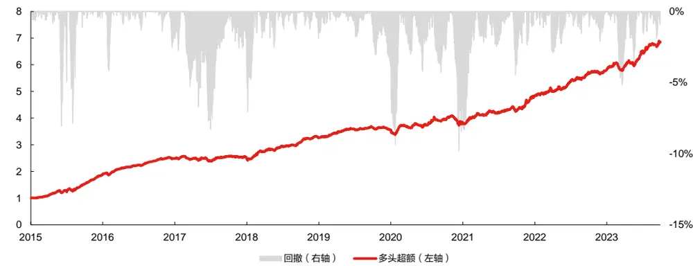
数据来源：东方证券研究所 & Wind 资讯 & 朝阳永续

图 2：子模型回测对比

|  | RankIC | ICIR | Sharpe | AnnRet | Vol | MaxDD | 2015 | 2016 |
| --- | --- | --- | --- | --- | --- | --- | --- | --- |
| XGB | 0.089 | 2.66 | 2.20 | 14.0% | 6.4% | -12.6% | 45.4% | 35.3% |
| GNN | 0.122 | 3.08 | 2.80 | 20.7% | 7.4% | -11.2% | 60.1% | 36.9% |
| GNNXGB | 0.125 | 3.19 | 2.95 | 21.0% | 7.1% | -10.1% | 59.1% | 35.7% |
| RNN | 0.123 | 3.35 | 3.05 | 21.8% | 7.1% | -10.6% | 69.9% | 38.6% |
| RNNXGB | 0.128 | 3.15 | 3.20 | 23.6% | 7.3% | -9.4% | 78.9% | 38.0% |
| GNNXGB+RNNXGB | 0.131 | 3.36 | 3.40 | 25.4% | 7.5% | -9.8% | 77.4% | 42.3% |
| XGB | 2017 | 2018 | 2019 | 2020 | 2021 | 2022 | 2023 |  |
|  | -3.7% | 14.1% | 5.6% | 5.2% | 7.1% | 8.9% | 8.6% |  |
| GNN | -2.8% | 22.5% | 9.8% | 5.6% | 15.1% | 22.2% | 16.8% |  |
| GNNXGB | -0.9% | 18.3% | 10.5% | 5.9% | 14.4% | 21.8% | 22.9% |  |
| RNN | -3.7% | 21.9% | 13.6% | 3.5% | 19.4% | 15.9% | 19.1% |  |
| RNNXGB | 0.8% | 27.4% | 13.3% | 8.6% | 17.2% | 21.3% | 17.4% |  |
| GNNXGB+RNNXGB | 1.0% | 26.8% | 12.9% | 7.7% | 16.8% | 23.0% | 21.4% |  |

数据来源：东方证券研究所 & Wind 资讯 & 朝阳永续

## 二、图神经网络

## 2.1 GCN

图卷积网络 GCN（Graph Convolutional Network） 的核心思想是在图结构上应用卷积操作，这种卷积和 CNN 中的卷积的目的是不一样的，CNN 用卷积核来提炼出更加容易被池化的特征，而 GCN 卷积提取的特征应当易于被邻居节点聚合，聚合方式可以是加总、平均、极大/小值，在CNN中，卷积核为固定值矩阵，而 GCN中的“卷积核”为可学习的参数。

下图左侧的公式则代表了一次聚合过程， $\pmb{h}_{i}$ 为聚合之后的某节点特征， $\pmb{h}_{j}$ 为这个节点的邻居节点的特征，W 则为“卷积核”，或者说所有节点共享的“权重矩阵”，在这个公式中聚合方式为加总。加总的聚合会导致邻居节点较多的节点所聚合的特征数值过大，所以在卷积层之后一般会跟进 Layer Norm 层进行归一化。在这个公式中的 $c_{ij}$ 代表了节点j 对节点 i 的聚合权重，这是一个可选项；另一个 σ 则代表了激活函数。

节点特征 ℎ（比如截面量价因子）进入GNN网络之后，会被卷积核 W 线性变化为更容易被聚合的特征Wℎ，这一步也称为特征嵌入，通过邻边矩阵（比如同行业的股票的连接）找到和中心节点 i 相连的邻居节点j，将邻居节点的特征 $W\mathrm{h_{j}}$ ，通过临边上的权重 $c_{ij}$ 进行加总并进行激活，得到中心节点的特征 $\ [h_{i},$ 。这便是一次完整的 GCN聚合过程。

图 3：GCN 示例
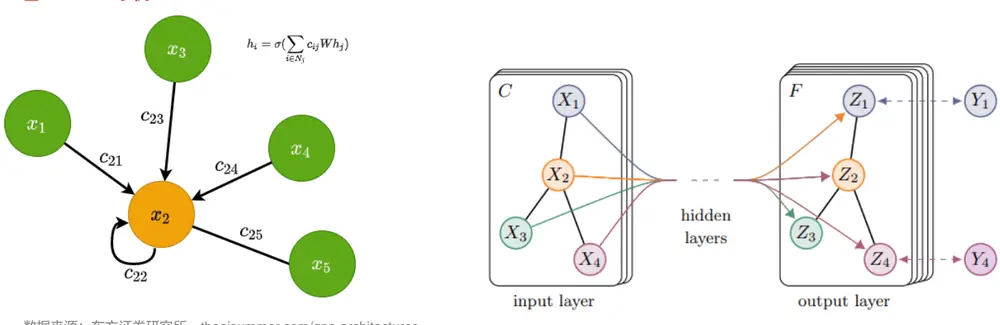
数据来源：东方证券研究所，theaisummer.com/gnn-architectures

## 2.2 节点特征

节点特征为常见量价因子，缺失采用零值填充。以下是因子定义。

图 4：因子列表

| 因子名 | 因子描述 |
| --- | --- |
| ret(N=5,10,20,60) | 过去N个交易日的收益率 |
| mom(N=20,60 M=120,180,240) | 过去M个交易日的收益率，剔除最近N日收益 |
| vol(N=20,60,120,180,240) | 过去N个交易日收益率的标准差 |
| tovol(N=20,60,120,180,240) | 过去N个交易日换手率的标准差除以均值 |
| Into(N=5,10,20,60,120,240) | 过去N个交易日日均换手率的对数 |
| ivol(N=20,60,120,240) | 基于过去N个交易日日行情计算的特质波动率 |
| ivol(N=25,36,50) | 基于过去N个周度行情计算的特质波动率 |
| ivr(N=20,60,120,240) | 基于过去N个交易日日行情计算的特异度 |
| ivr(N=25,36,50) | 基于过去N个周度行情计算的特异度 |
| Inamihud(N=5,10,20,60,120,240) | 基于过去N个交易日计算的Amihud非流动性的对数 |
| dwf_h(N=10,20,60,120) | 涨幅榜单因子，半衰期N个交易日 |
| dIf_h(N=10,20,60,120) | 跌幅榜单因子，半衰期N个交易日 |
| apb_5d(N=5,10,20,60,120,240) | 基于5日日行情计算的APB指标，N个交易日平滑 |
| umr(N=20,60) | N个交易日复合UMR |

数据来源：东方证券研究所 & Wind 资讯

## 2.3 邻边建模

我们从行业，分析师，基金等维度构造股票间的关联信息并建模为图模型的邻边。

## 2.3.1 行业邻边

行业邻边，即同一时间同属于一个行业的股票对，我们采用中信一级行业，作为行业邻边特征。在中信一级行业中一共有 29 个行业，截至 20231031，股票数量前三行业是机械行业、基础化工以及医药。

图 5：股票数量前十的中信一级行业（截至 20231031）
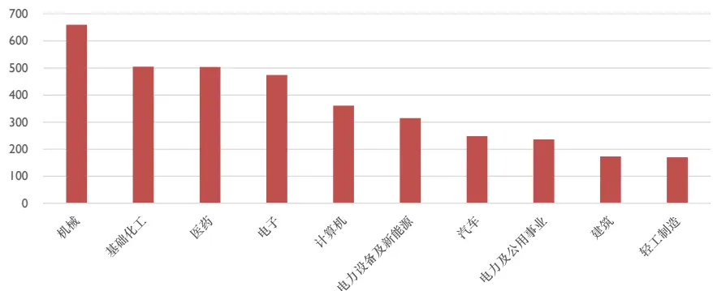
数据来源：东方证券研究所 & Wind 资讯

有关分析师的申明，见本报告最后部分。其他重要信息披露见分析师申明之后部分，或请与您的投资代表联系。并请阅读本证券研究报告最后一页的免责申明。

## 2.3.2 基金重仓邻边

基金重仓邻边是指如果两只股票同时被同一支基金持有，则产生两只股票的连接，但不像前一节中行业邻边为等权连接，基金重仓邻边存在权重 edge weight，由于我们的模型采用 GCN作为图神经网络，其可以接受邻边权重的输入，所以邻居节点特征会乘上归一化的权重再进行传播。

行业邻边在历史上几乎不会变动，只会增加新的节点，而基金重仓邻边是季度变化的，训练历史的拉长会对GCN这样的静态图神经网络带来挑战，为了更好地处理动态图，有更加专门的模型比如动态图卷积网络（DGCN），但是变动的邻边权重（共同被重仓次数，归一化），可以赋予 GCN对动态图的处理能力，可以一定程度上解决邻边变动的问题。

下面两张图为在 2023 年基金三季报中，被重仓次数最多的股票和被同时重仓次数最多的股票对，可以看到贵州茅台被800多只基金重仓，而被同时重仓最多的10对股票中，贵州茅台占了一半，邻边过多导致贵州茅台均匀地受到它众多邻居节点的影响，而自身的节点特征起到的作用过小，而这个缺点我们可以通过网络的残差连接进行克服，将单层GNN的输入和输出相加，作为下一层 GNN的输入，起码保证了自身特征有 50%的信息进入了下一次传播迭代。

图 6：单一股票被重仓最多（截至 20231031）
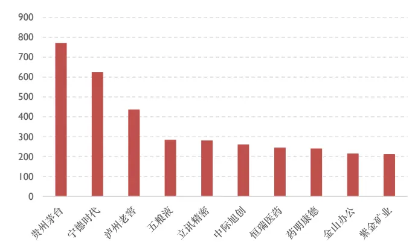
数据来源：东方证券研究所 & Wind 资讯

图 7：被同时重仓次数最多的股票对（截至 20231031）
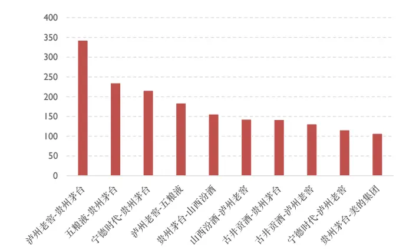
数据来源：东方证券研究所 & Wind 资讯

## 2.3.3 分析师覆盖邻边

分析师覆盖邻边是指在过去 6 个月内，被同一个分析师覆盖的两只股票节点产生的连接，而同时覆盖两只股票的分析师数量则作为邻边权重 edge weight，传入 GCN中，用来弥补图结构变动过快的问题。

分析师邻边，相比于基金重仓邻边，其更新频率更快，图结构更加稀疏，从最新一期的图网络中可知，只有5.5%的股票对产生了连接，全市场只有五分之三的股票存在对其他股票的至少一个连接。

从下图中我们看出，在2023年5月到10月这六个月内，贵州茅台是被覆盖得最多的股票，在前十名中，只有珀莱雅和爱美客不属于酒产业。而共同覆盖最多的股票对中，前十全是酒产业的股票。

图 8：单一股票被分析师覆盖最多（截至 20231031）
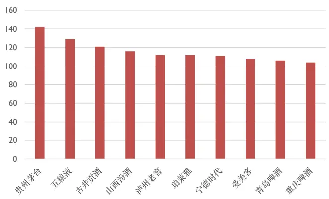
数据来源：东方证券研究所& 朝阳永续

图 9：被同分析师覆盖次数最多（截至 20231031）
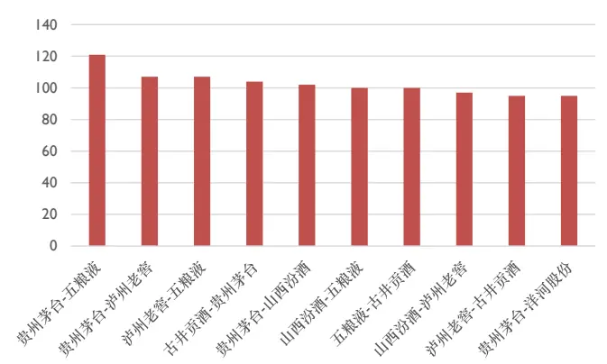
数据来源：东方证券研究所 & 朝阳永续

## 三、GNN模型及测试结果

股票池我们采用 A股的全市场股票，对 ST股以及上市未满一年的股票进行剔除。

对于同质图的测试，节点特征均为前文所示的量价因子，按照月频对下月收益率（中性化）进行训练和拟合。

模型采用滚动训练，以五年作为训练集，一年作为验证集，一年作为测试集，假设我们使用2017 年至 2021 年的五年作为训练集，2022 年为验证集，2023 年为测试集。考虑到随机初始化的影响，针对每个数据集，本文进行 10 次训练，取验证集得分最高的 5 个模型对测试集进行打分，打分结果取算术平均，得到最终的因子值。

图 10：训练测试框架
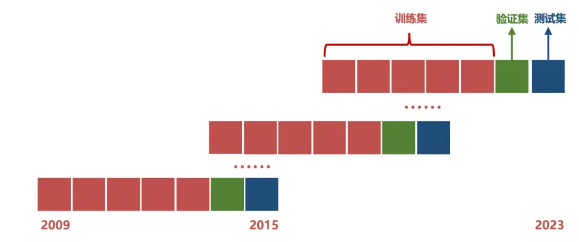
数据来源：东方证券研究所

## 3.1 不同邻边同质图模型测试

同质图（Homogeneous Graphs）是图论中的一个基本概念，指的是图中的所有节点和边都属于同一种类型或属性的图。在同质图中，节点之间的连接关系简单且统一，因此它们通常用来表示具有统一特性的实体集合及其相互关系。例如，社交网络中的朋友关系图、物理网络中的电路图都可以视为同质图，因为它们的节点（如人、电子元件）和邻边（如朋友关系、电路连接）都是单一类型的。

在下面的同质图模型当中，我们接受节点特征以及邻边特征作为输入。在一个 GCN 中，节点特征会根据邻边进行一次邻居节点特征的传播和聚合。经过激活函数、层归一化和 Dropout 之后，再一次和 GCN 的输入特征相加，进行残差连接，保证了这一次传播之后，仍然保留了 50%传播之前的节点信息，避免邻居过多而自身特征被稀释。

这样的聚合过程会重复多次，聚合更远的邻居信息。经过多次传播之后，节点特征会作为因子单元的输入，用于挖掘弱因子，最后弱因子加总得到最后的预测值，与标签计算损失。

图 11：同质图模型结构细节
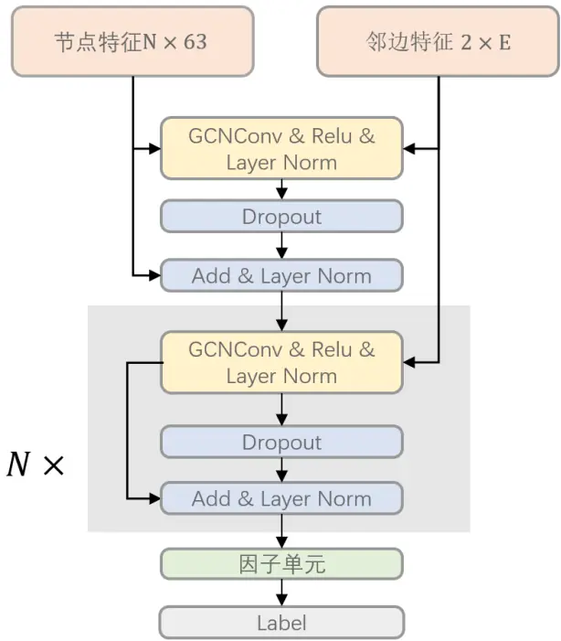
数据来源：东方证券研究所

这里我们对三种不同类型的邻边分开做同质图模型的测试。

我们以一级行业作为邻边，观察行业因子的选股表现和收益表现。从下方左图中，我们观察到行业邻边的 Rank IC 在历史上并没有较为大幅的变化，其 12 月均值呈现周期性的波动，2017年和 2020年的表现较差，2022年以及 2023年的 12月均值处于历史高点，说明近期的选股能力在历史中处于较好的水平。

从下方右侧的分组超额净值中，我们观察到多头（B10）的超额在 2015年和2016年的涨幅较快，2017年到2021年的涨幅并没有明显超过B7、B8、B9组，2022年之后的涨幅更是不如。反之 B1到 B6组和分组较为单调，说明选股能力较多地体现在了因子值较低的区域。

图 12：行业因子 Rank IC 表现
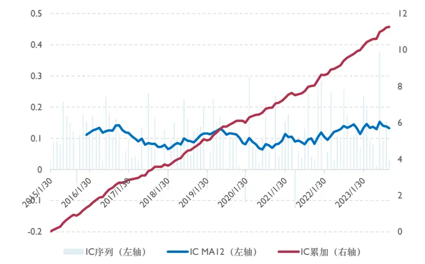
数据来源：东方证券研究所 & Wind 资讯

图 13：行业因子分组超额净值
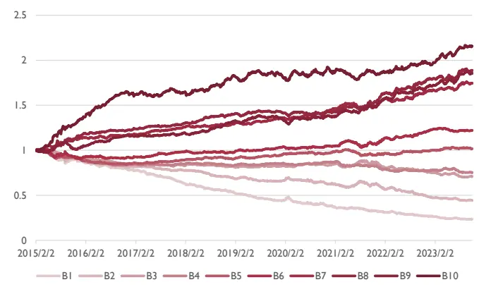
数据来源：东方证券研究所 & Wind 资讯

使用基金重仓作为邻边特征，我们将该因子命名为基金重仓邻边因子，从下面的左图中看出，其 Rank IC 的变化和行业邻边因子差异不大，但从右图中看出，这个因子的多头超额明显和其他组拉开差距，特别 2022 年和 2023 年，多头超额的涨幅明显超过其他组，Rank IC 均匀地体现在空头和多头。

图 14：基金重仓因子 Rank IC 表现
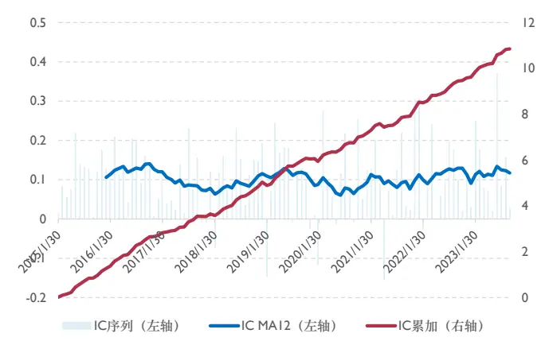
数据来源：东方证券研究所 & Wind 资讯

图 15：基金重仓因子分组超额净值
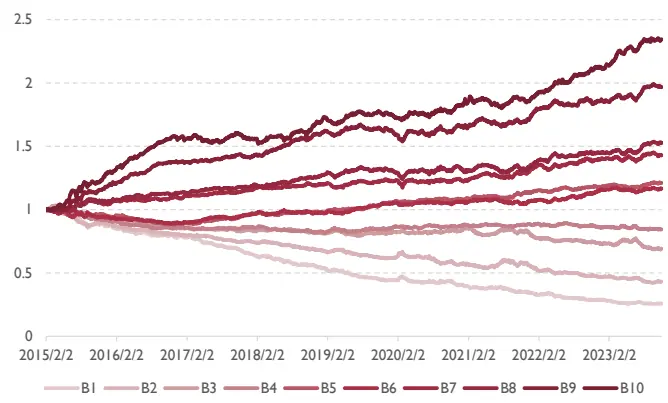
数据来源：东方证券研究所 & Wind 资讯

使用分析师覆盖邻边作为邻边特征，我们将该因子命名为分析师覆盖邻边因子，其 Rank IC的变化和的基金重仓邻边因子差异不大。

图 16：分析师覆盖因子 Rank IC 表现
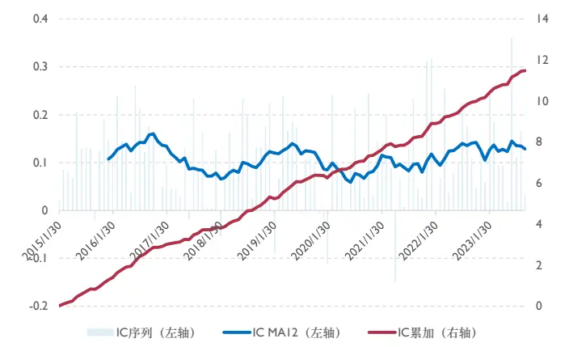
数据来源：东方证券研究所 & Wind 资讯 & 朝阳永续

图 17：分析师覆盖因子分组超额净值
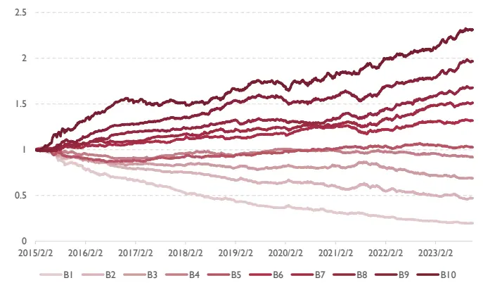
数据来源：东方证券研究所 & Wind 资讯 & 朝阳永续

这三种类型的邻边，由同质图产生的因子值相关系数如下所示。三种类型的因子值差异较小，截面标准化后的相关系数在 90%左右，有几个可能的原因。

首先是股票关联的稀疏性，大部分股票在这三种关系中，邻居节点都较为稀少，自身特征会在少量的邻边中传播，导致传播过后自身特征的占比过重，增量信息过少。其次，这三种类型的邻边数据从逻辑上存在因果关系，基金的重仓股和分析师覆盖的股票，有很大一部分也属于同一个行业。

图 18：各邻边因子相关性

|  | 行业因子 | 基金重仓因子 | 分析师覆盖因子 |  |
| --- | --- | --- | --- | --- |
| 行业因子基金重仓因子 |  | 89.9% | 92.0% |  |
|  | 子 | 89.9% |  | 90.8% |
| 分析师覆盖因子 | 92.0% | 90.8% |  |  |

数据来源：东方证券研究所 & Wind 资讯

## 3.2 异构图模型测试

在我们的图神经网络结构中，我们采用了异构图来整合多种灵活的信息。在下面的图示中，我们将消息传递次数限制为三次，也就是说，某个节点最多能整合到与它距离为三的邻居节点的信息。输入的节点特征为量价的截面数据，其中的 n 代表了当前的股票数量，即整个一个 batch的大小。特征数量为 63。

我们采用了GCN（图卷积网络）作为消息聚合。在GCN中，相比于GAT（图注意力网络），GCN 少了一组权重。GCN 的权重是可共享的，简单来说就是将节点的特征进行线性变化，这个线性变化的权重是共享的。线性变化之后的特征会聚合到中心节点上。在计算中，默认的聚合方

式是求和，因为是取的邻居节点特征之和。所以，对于邻边较多的节点，其输出值会变得特别大；
对于邻边较少的节点，输出值会变得特别小。因此，需要对每个节点的特征进行归一化。

在一次消息传递和聚合后，不同类型的邻居节点信息得到一个节点的三组特征。这三组特征进行加和，得到三种类型邻边特征的聚合。这就完成了一次异构图的消息传递和聚合过程。

我们的邻边特征不存在自环（self-loop），因为对于邻边较多的节点，它自身的节点特征会被稀释得非常严重。因此，在一次异构图的消息聚合过程中，我们不考虑节点对自己本身的影响。节点的特征会在异构图的消息聚合之后，通过残差连接的方式将自身信息汇集其中。在不考虑dropout 的情况下，残差连接后自身的特征占到了 50%，而三种类型的邻居节点聚合特征平分剩下的 50%。我们也尝试过使用线性层对这四种特征（原始特征及三种邻边聚合特征）进行可学习的权重分配，但是输出结果并没有固定权重来得稳定。而且，发现自身特征的权重控制在 30%到70%之间较为合适。

该模型是一个二阶段模型，神经网络中的因子单元挖掘出的因子会进入 XGBoost Ranker再进一步训练。

图 19：二阶段 GNN模型细节
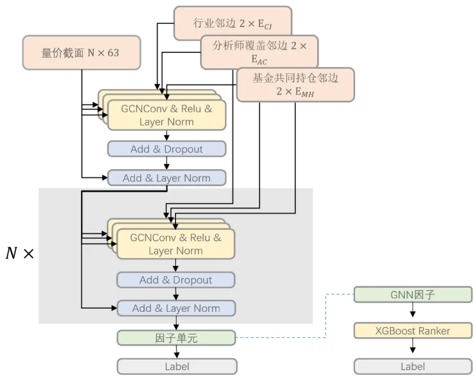
数据来源：东方证券研究所

以 2017 至 2021 年的月度数据作为训练集，2022 年的数据作为验证集所得到的训练损失值和评估指标（Rank IC）。以 20 个 epoch 的早停，在验证集上，Rank IC 在第 26 个 epoch 时模型已经收敛，可以看出该模型有着较快的收敛速度和较好的收敛效果。

图 20：GNN训练过程损失值变化
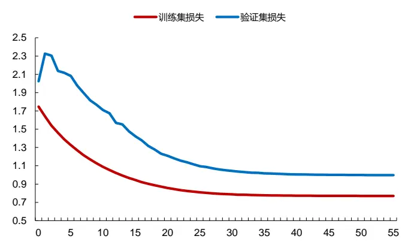
数据来源：东方证券研究所 & Wind 资讯 & 朝阳永续

图 21：GNN 训练过程 RankIC 变化
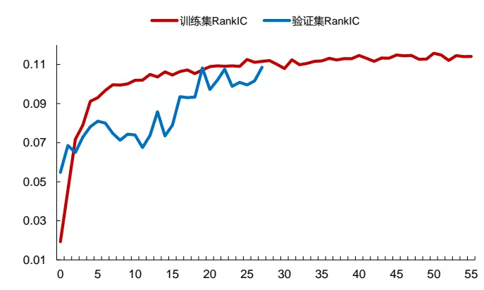
数据来源：东方证券研究所 & Wind 资讯 & 朝阳永续

因子单元挖掘到的彼此正交的弱因子，传入 XGBoost Ranker 进行训练。XGBoost Ranker使用 rank:pairwise 作为目标函数，在合理参数搜索范围内进行贝叶斯优化，每次优化持续 20 个trial，从中选取验证集得分最高的模型。由于前置模型 GNN 是从十次实验中选取验证集得分最高的五次打分。所以 XGBoost Ranker 也是从这五个打分的模型中，使用挖掘到的弱因子作为输入，得到五个打分，取平均作为 GNNXGB因子。

从下面的回测结果中，看到XGBoostRanker对于原始因子确实产生了一定的提升，RankIC从 0.122 提升到了 0.125，ICIR 从 3.08 提升到了 3.19，夏普值从 2.08 提升到了 2.95，多头超额年化收益率从 20.7%提升到了 21.0%，由此证明使用 XGBoost Ranker 来对弱因子进行进一步的学习，这样的两阶段结构确实能够提升原始因子的效果。

图 22：XGBoost Ranker 对 GNN 的增强效果

|  | RankIC | ICIR | Sharpe | AnnRet | Vol | MaxDD | 2015 | 2016 |
| --- | --- | --- | --- | --- | --- | --- | --- | --- |
| GNN | 0.122 | 3.08 | 2.80 | 20.7% | 7.4% | -11.2% | 60.1% | 36.9% |
| GNNXGB | 0.125 | 3.19 | 2.95 | 21.0% | 7.1% | -10.1% | 59.1% | 35.7% |
|  | 2017 | 2018 | 2019 | 2020 | 2021 | 2022 | 2023 |  |
| GNN | -2.8% | 22.5% | 9.8% | 5.6% | 15.1% | 22.2% | 16.8% |  |
| GNNXGB | -0.9% | 18.3% | 10.5% | 5.9% | 14.4% | 21.8% | 22.9% |  |

数据来源：东方证券研究所 & Wind 资讯 & 朝阳永续

GNNXGB 因子在各个月份上的 RankIC 的表现以及月度均值如下面左图所示。该因子的RankIC在 2017年之前的均值位于 0.2附近，在 2017年到了 0附近，失去了选股能力，2018年之后均值处于 0.1左右，2022年之后均值达到了 0.15的水平。

从下方右图中的分组超额收益来看，2022 年之前。第九组和第十组的收益差距并不算很大，但是到了 2022 之后，第十组的超额收益远远超过第九组，说明其分组能力在 2022 年之后有一个大幅的提升。

图 23：GNNXGB 因子 RankIC

图 24：GNNXGB因子分组超额净值

有关分析师的申明，见本报告最后部分。其他重要信息披露见分析师申明之后部分，或请与您的投资代表联系。并请阅读本证券研究报告最后一页的免责申明。

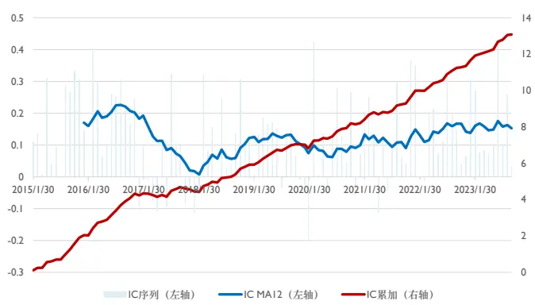
数据来源：东方证券研究所 & Wind 资讯 & 朝阳永续

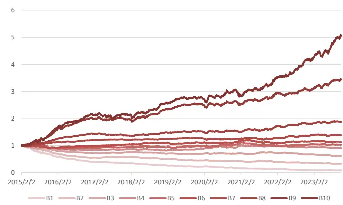
数据来源：东方证券研究所 & Wind 资讯 & 朝阳永续

下图的多头超额，是指分组测试中的第十组的收益均值，减去全市场股票收益均值。可以看到多头超额的最大回撤出现在 2017 年，净值呈现一个走平的状态，结合 RankIC，在 2017 年该因子出于失效状态。从全历史来看，多头超额仍然处于一个稳定上涨的水平，年化收益能够达到21%，最大回撤为 10.1%，出现在了 2017年的八月份。

图 25：GNNXGB因子多头超额净值
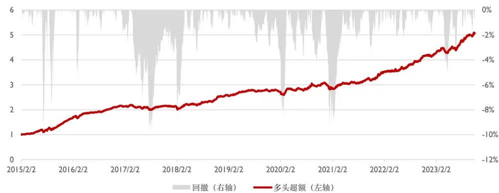
数据来源：东方证券研究所 & Wind 资讯 & 朝阳永续

## 四、GNN与 RNN的模型融合

GNN 模型在截面上聚合了关联股票的节点特征，从空间的维度上增强了自身的原始特征。在空间的维度之外，团队有多篇前序报告涉及 RNN，从时间的维度增强了截面因子的选股效果。本章节我们将 RNN因子和 GNN因子进行合并，来对结果进行进一步的增强。

RNN 模型的 X batch 形状为 $N\times L\times H$ ，N为当期股票数量，时间序列长度为L个交易日，最后一维代表有H个量价特征。GNN 模型的 X batch 分为两个部分，节点特征为形状 N ×H 的截面量价数据，每一种邻边特征形状为2×E ，代表第i种邻边类型在某个截面存在E条邻边，相当于是N×N的稀疏邻接矩阵的密集表示。

图 26：整体模型结构
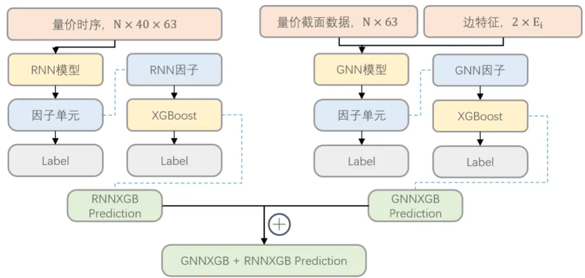
数据来源：东方证券研究所

## 4.1 RNN 模型

在循环神经网络部分，本文采用了双层 GRU（门控循环单元）结构。输入的形状是当期股票数量N，时间序列的长度设定L为 40 个交易日，输入隐状态H为因子数量，共 63 个。在测试过程中，我们发现双层 GRU 与三层或四层 GRU 的性能差异不大。然而，三层和四层 GRU 的参数量更多，导致实验过程中参数调整变得缓慢且复杂。与LSTM相比，GRU少了一个门结构，因此其收敛速度更快。取最后一个时间步的输出作为因子单元的输入，用作因子挖掘。经过网格搜索的调参，GRU Cell 以及因子单元中的隐藏层的维度为 32，dropout rate 为 0.5。

图 27：二阶段 RNN模型细节
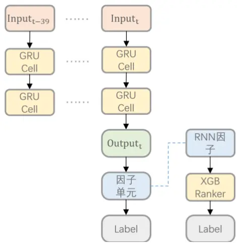
数据来源：东方证券研究所

下图展示的是，以 2017 至 2021 年的月度数据作为训练集，2022 年的数据作为验证集所得到的训练损失值和评估指标（Rank IC）。在训练过程中，模型采用了 20个epoch的早停（earlystopping）机制。从图中可以看出，在验证集上，Rank IC在第 16个epoch时模型已经收敛。这表明采用 GRU的模型具有较快的收敛速度。

图 28：GNN训练过程损失值变化
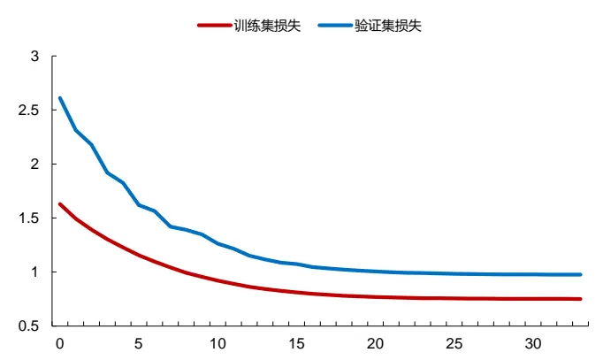
数据来源：东方证券研究所 & Wind 资讯

图 29：GNN 训练过程 RankIC 变化
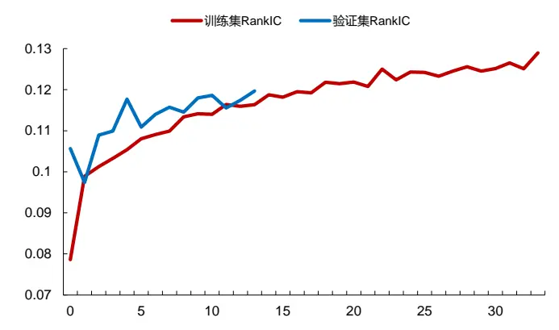
数据来源：东方证券研究所 & Wind 资讯

我们可以看到使用因子单元和XGBRanker之后因子的效果是有所提升的。RankIC从0.123提升到了0.128，夏普值从3.05提升到了3.20，多头超额年化收益从21.8%提升到了23.6%，所以使用二阶段模型对 RNN原始因子有一定程度的提升作用。

图 30：XGBoost Ranker 对 RNN 的增强效果

|  | RankIC | ICIR | Sharpe | AnnRet | Vol | MaxDD | 2015 | 2016 |
| --- | --- | --- | --- | --- | --- | --- | --- | --- |
| RNN | 0.123 | 3.35 | 3.05 | 21.8% | 7.1% | -10.6% | 69.9% | 38.6% |
| RNNXGB | 0.128 | 3.15 | 3.20 | 23.6% | 7.3% | -9.4% | 78.9% | 38.0% |
|  | 2017 | 2018 | 2019 | 2020 | 2021 | 2022 | 2023 |  |
| RNN | -3.7% | 21.9% | 13.6% | 3.5% | 19.4% | 15.9% | 19.1% |  |
| RNNXGB | 0.8% | 27.4% | 13.3% | 8.6% | 17.2% | 21.3% | 17.4% |  |

数据来源：东方证券研究所 & Wind 资讯

RNNXGB 在 2015、2016 两年保持着 0.2 的 RankIC，在 2017 年 IC 均值出现了比较大的下滑，当年的选股效果较差，但是从2018年开始IC均值上升到0.1左右，到了2022年之后均值保持在 0.15的水平。

从分组超额净值上看，和GNNXGB模型相比，RNNXGB在多头端同样有着不俗的表现却有着更优秀的分组能力。

图 31：RNNXGB 因子 RankIC
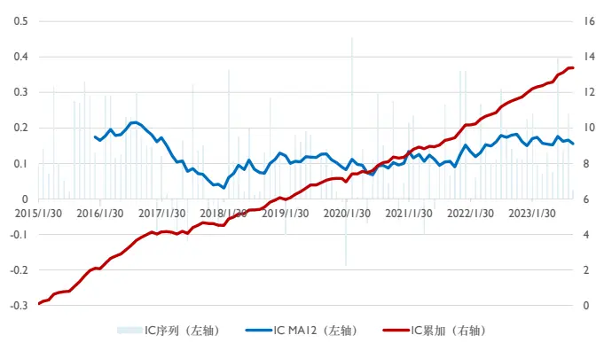
数据来源：东方证券研究所 & Wind 资讯

图 32：RNNXGB因子分组超额净值
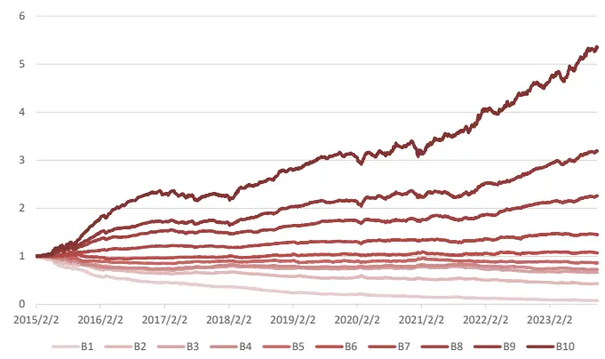
数据来源：东方证券研究所 & Wind 资讯

下图是 RNNXGB 模型在分组测试中第十组的超额收益。可以看到 2017 年同样出现了较大的回撤，但是全历史的最大回撤出现在2021年。从整个历史上看，多头超额净值仍然处于不断增长的态势。

图 33：RNNXGB因子多头超额净值
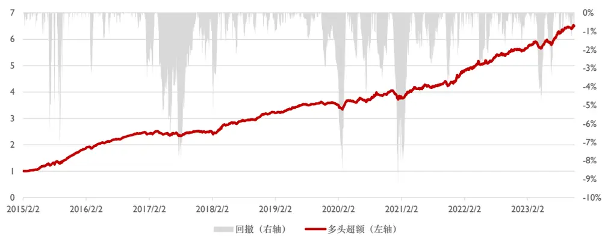
数据来源：东方证券研究所 & Wind 资讯

## 4.2 混合模型

前文我们得到了 GNNXGB 和 RNNXGB 两个模型。前者是利用空间里股票间的关系对量价因子进行增强，后者是利用时间序列的信息。我们同时还训练了一个 XGBoost Ranker 的模型，专门用于学习量价因子的截面信息。

由下图中我们可以看到，GNNXGB 因子对 RNNXGB 因子以及截面 XGB 取了线性回归残差之后，RankIC 仍然能够达到 0.049，ICIR 到了 1.81。RNNXGB 因子对 GNNXGB 因子以及截面XGB 取了线性回归残差之后，RankIC 能够达到 0.044，ICIR 能够达到 1.91。所以 GNNXGB 模型确实提取到了空间信息，在时序信息和截面信息之外仍然留存着不错的选股能力。

图 34：GNNXGB 与 RNNXGB 残差因子回测

|  | RankIC | ICIR | Sharpe | AnnRet | Vol | MaxDD | 2015 | 2016 |
| --- | --- | --- | --- | --- | --- | --- | --- | --- |
| GNNXGB-OLS(RNNXGB, XGB) RNNXGB-OLS(GNNXGB, XGB) | 0.049 | 1.81 | 0.55 | 4.1% | 7.5% | -13.5% | 25.3% | 8.7% 9.6% |
|  | 0.044 | 1.96 | 1.49 | 8.9% | 6.0% | -20.6% | 30.5% |  |
|  | 2017 | 2018 | 2019 | 2020 | 2021 | 2022 | 2023 |  |
| GNNXGB-OLS(RNNXGB, XGB) | -6.3% | 4.2% | 4.5% | -6.0% | 6.6% | -0.5% | 1.5% |  |
| RNNXGB-OLS(GNNXGB, XGB) | 14.4% | 14.6% | 5.0% | 9.7% | -2.9% | -3.6% | 1.9% |  |

数据来源：东方证券研究所 & Wind 资讯

所以我们将 GNNXGB 和 RNNXGB 进行标准化之后相加，得到了最终的模型打分。这个模型打分包含了时间信息，也包含了空间信息。

图 35：GNN 与 RNN 合并
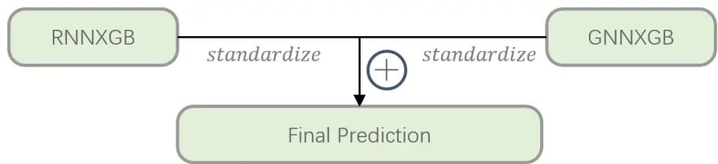
数据来源：东方证券研究所

各个子模型对比发现，时间和空间的信息加入，确实对截面因子进行了增强。而二阶段XGBoost Ranker 的加入，又进一步增强了 GNN 与 RNN。鉴于他们彼此取线性回归的残差之后仍有 alpha存在，所以最后把他们相加，效果进一步得到了增强。

图 36：各模型回测结果对比

|  | RankIC | ICIR | Sharpe | AnnRet | Vol | MaxDD | 2015 | 2016 |
| --- | --- | --- | --- | --- | --- | --- | --- | --- |
| XGB | 0.089 | 2.66 | 2.20 | 14.0% | 6.4% | -12.6% | 45.4% | 35.3% |
| GNN | 0.122 | 3.08 | 2.80 | 20.7% | 7.4% | -11.2% | 60.1% | 36.9% |
| GNNXGB | 0.125 | 3.19 | 2.95 | 21.0% | 7.1% | -10.1% | 59.1% | 35.7% |
| RNN | 0.123 | 3.35 | 3.05 | 21.8% | 7.1% | -10.6% | 69.9% | 38.6% |
| RNNXGB | 0.128 | 3.15 | 3.20 | 23.6% | 7.3% | -9.4% | 78.9% | 38.0% |
| GNNXGB+RNNXGB | 0.131 | 3.36 | 3.40 | 25.4% | 7.5% | -9.8% | 77.4% | 42.3% |
| XGB | 2017 | 2018 | 2019 | 2020 | 2021 | 2022 | 2023 |  |
|  | -3.7% | 14.1% | 5.6% | 5.2% | 7.1% | 8.9% | 8.6% |  |
| GNN | -2.8% | 22.5% | 9.8% | 5.6% | 15.1% | 22.2% | 16.8% |  |
| GNNXGB | -0.9% | 18.3% | 10.5% | 5.9% | 14.4% | 21.8% | 22.9% |  |
| RNN | -3.7% | 21.9% | 13.6% | 3.5% | 19.4% | 15.9% | 19.1% |  |
| RNNXGB | 0.8% | 27.4% | 13.3% | 8.6% | 17.2% | 21.3% | 17.4% |  |
| GNNXGB+RNNXGB | 1.0% | 26.8% | 12.9% | 7.7% | 16.8% | 23.0% | 21.4% |  |

数据来源：东方证券研究所 & Wind 资讯 & 朝阳永续

## 4.3 增强组合表现

本文构建了一个中证 1000 指数增强投资策略，从 2017 年 12 月 29 日开始至 2023 年 12月15 日结束，每月调整一次组合，以次日均价执行交易。在组合构建时，行业权重偏离不超过 2%，以控制行业风险；市值最大暴露 0.5 个标准差，成分股占比至少为基准的 80%，以保持一致性；个股权重偏离限制在 1%，设定买入成本为 0.1%，卖出成本为 0.2%。

图 37：指数增强参数

| 参数名 | 数值 |
| --- | --- |
| 基准指数 | 中证1000 |
| 策略起始日期 | 20171229 |
| 策略最大日期 | 20231215 |
| 调仓频率 | 月频 |
| 行业约束 | 2% |
| 市值约束 | 0.5 |
| 成分股占比 | 80% |
| 个股权重偏离 | 1% |
| 交易价格 | 次日均价 |
| 买入成本 | 0.1% |
| 卖出成本 | 0.2% |

数据来源：东方证券研究所

增强组合在考察的时间段内表现出了显著的超额收益能力，年化超额达到了 12.7%，并在多数时间里保持了对基准的相对优势。此外，组合在不同时间段的胜率表明其相对于基准的稳定性和适应性。

图 38：指数增强组合回测结果
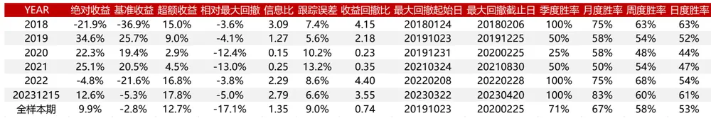
数据来源：东方证券研究所 & Wind 资讯 & 朝阳永续

图 39：指数增强组合净值
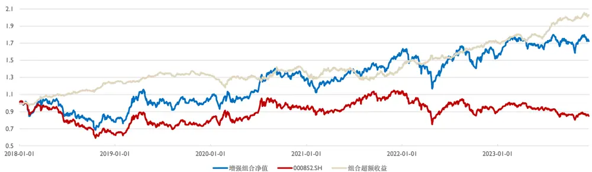
数据来源：东方证券研究所 & Wind 资讯 & 朝阳永续
有关分析师的申明，见本报告最后部分。其他重要信息披露见分析师申明之后部分，或请与您的投资代表联系。并请阅读本证券研究报告最后一页的免责申明。

## 五、总结与讨论

在我们的研究中，我们采用了一种创新的方法来分析股票市场，通过构建一个异构图神经网络（Heterogeneous Graph Neural Network）。这个网络能够融合多维度的数据，将股票的量价因子作为节点特征，同时利用行业归属、基金共同持仓和分析师共同覆盖作为邻边特征。这种多维度融合方法为我们提供了一个更加全面和深入的市场视角。为了解决在图神经网络中由于邻居特征聚合导致的中心节点特征稀释问题，我们引入了残差连接，确保中心节点的原始特征在特征传播过程中得以保留。此外，我们还采用了一种两阶段训练方法，结合了梯度提升算法 XGBoost，有效提取和利用了正交的弱因子，从而优化了股票预测打分的准确性。最后，我们将 RNN 与GNN 相融合，以捕捉股票数据的时间维度和空间维度特征。这种融合策略不仅分析了股票的时序模式，还揭示了股票间的相互关系，显著提高了因子的整体绩效。这种综合的分析方法，通过结合时间和空间信息，展现了对股票市场深度理解的强大潜力。

我们使用了63个日频的常见量价因子作为股票的原始特征。对于GNN模型，我们以量价因子的截面数据为节点特征，并融合了行业归属、基金共同持仓和分析师共同覆盖等邻边特征。同时，针对 RNN模型，我们采用了这些量价因子的时间序列格式。本研究采取“5+1+1”的滚动训练窗口方法，对后 20 日的收益率中性化标签进行拟合。在回测结果方面，基于 GNN 二阶段模型的因子显示出了优异的表现：Rank IC 为 0.125，ICIR为 3.19，夏普值为 2.95，年化多头超额收益率达到 21.0%。进一步将 GNN因子与 RNN因子结合后，综合因子的绩效有了显著提升，表现为 Rank IC 增至 0.131，ICIR 上升至 3.36，夏普值提高到 3.40，年化多头超额收益率增至 25.4%。

研究中存在以下可以改进的地方：

1. 图卷积网络（GCN）在邻居节点聚合时采用简单的加总方式。尽管GCN作为一种基础的图神经网络模型具有结构简单、训练高效的优点，它在聚合方式上的简化和邻边权重的固定是其局限性。对比更复杂的模型如图注意力网络（GAT）和 Graphformer，GCN 的这一不足可能影响模型性能。因此，尝试替换为更复杂的模型可能会带来更好的效果。

2.从数据角度来看，行业归属、基金重仓和分析师覆盖边的数据具有不同的滞后性。在实验中，这些不同类型的边的因子绩效也呈现出不同的强度。因此，考虑使用更新频率更高的数据作为边特征可能会提升模型性能。

3. 在异构图模型中，将三种不同类型的邻居信息简单加总意味着默认这些邻居具有相同的重要性。在残差连接中也是如此，将自身特征和邻居特征视为等同重要。然而，在异构图中，不同类型信息的聚合应当更加灵活和动态，这是一个值得改进的方向。

4. 尽管我们在因子层面结合了RNN和GNN，但在网络结构上并未实现这一融合。未来，结合 RNN和 GNN的框架，以同时包含时间和空间信息，是值得尝试的。

## 六、风险提示

1. 量化模型基于历史数据分析得到，未来存在失效的风险，建议投资者紧密跟踪模型表现。

2. 极端市场环境可能对模型效果造成剧烈冲击，导致收益亏损。

## 七、引用文献

[1] von Luxburg, U. (2007). A tutorial on spectral clustering. Statistics and computing, 17(4), 395- 416.

[2] Newman, M. E. J. (2006). Modularity and community structure in networks. Proceedings of the National Academy of Sciences, 103(23), 8577-8582.

[3] Clauset, A., Newman, M. E. J., & Moore, C. (2004). Finding community structure in very large networks. Physical review E, 70(6), 066111.

[4] Freeman, L. C. (1978). Centrality in social networks conceptual clarification. Social networks, 1(3), 215-239.

[5] Bavelas, A. (1950). Communication patterns in task ‐ oriented groups. The journal of the acoustical society of america, 22(6), 725-730.

[6] Freeman, L. C. (1977). A set of measures of centrality based on betweenness. Sociometry, 40, 35-41.

[7] Bonacich, P. (1987). Power and centrality: A family of measures. American journal of sociology, 92(5), 1170-1182.

[8] Koren, Y., Bell, R., & Volinsky, C. (2009). Matrix factorization techniques for recommender systems. Computer, (8), 30-37.

## Tabl e_Disclai mer 分析师申明

每位负责撰写本研究报告全部或部分内容的研究分析师在此作以下声明：

分析师在本报告中对所提及的证券或发行人发表的任何建议和观点均准确地反映了其个人对该证券或发行人的看法和判断；分析师薪酬的任何组成部分无论是在过去、现在及将来，均与其在本研究报告中所表述的具体建议或观点无任何直接或间接的关系。

## 投资评级和相关定义

报告发布日后的12个月内行业或公司的涨跌幅相对同期相关证券市场代表性指数的涨跌幅为基准（A 股市场基准为沪深 300 指数，香港市场基准为恒生指数，美国市场基准为标普 500 指数）；

## 公司投资评级的量化标准

买入：相对强于市场基准指数收益率 15%以上；

增持：相对强于市场基准指数收益率 5%～15%；

中性：相对于市场基准指数收益率在-5%～+5%之间波动；

减持：相对弱于市场基准指数收益率在-5%以下。

未评级 —— 由于在报告发出之时该股票不在本公司研究覆盖范围内，分析师基于当时对该股票的研究状况，未给予投资评级相关信息。

暂停评级 —— 根据监管制度及本公司相关规定，研究报告发布之时该投资对象可能与本公司存在潜在的利益冲突情形；亦或是研究报告发布当时该股票的价值和价格分析存在重大不确定性，缺乏足够的研究依据支持分析师给出明确投资评级；分析师在上述情况下暂停对该股票给予投资评级等信息，投资者需要注意在此报告发布之前曾给予该股票的投资评级、盈利预测及目标价格等信息不再有效。

## 行业投资评级的量化标准：

看好：相对强于市场基准指数收益率 5%以上；

中性：相对于市场基准指数收益率在-5%～+5%之间波动；

看淡：相对于市场基准指数收益率在-5%以下。

未评级：由于在报告发出之时该行业不在本公司研究覆盖范围内，分析师基于当时对该行业的研究状况，未给予投资评级等相关信息。

暂停评级：由于研究报告发布当时该行业的投资价值分析存在重大不确定性，缺乏足够的研究依据支持分析师给出明确行业投资评级；分析师在上述情况下暂停对该行业给予投资评级信息，投资者需要注意在此报告发布之前曾给予该行业的投资评级信息不再有效。

## HeadertTabl e_Discl ai mer 免责声明

本证券研究报告（以下简称“本报告”）由东方证券股份有限公司（以下简称“本公司”）制作及发布。

。本公司不会因接收人收到本报告而视其为本公司的当然客户。本报告的全体接收人应当采取必要措施防止本报告被转发给他人。

本报告是基于本公司认为可靠的且目前已公开的信息撰写，本公司力求但不保证该信息的准确性和完整性，客户也不应该认为该信息是准确和完整的。同时，本公司不保证文中观点或陈述不会发生任何变更，在不同时期，本公司可发出与本报告所载资料、意见及推测不一致的证券研究报告。本公司会适时更新我们的研究，但可能会因某些规定而无法做到。除了一些定期出版的证券研究报告之外，绝大多数证券研究报告是在分析师认为适当的时候不定期地发布。

在任何情况下，本报告中的信息或所表述的意见并不构成对任何人的投资建议，也没有考虑到个别客户特殊的投资目标、财务状况或需求。客户应考虑本报告中的任何意见或建议是否符合其特定状况，若有必要应寻求专家意见。本报告所载的资料、工具、意见及推测只提供给客户作参考之用，并非作为或被视为出售或购买证券或其他投资标的的邀请或向人作出邀请。

本报告中提及的投资价格和价值以及这些投资带来的收入可能会波动。过去的表现并不代表未来的表现，未来的回报也无法保证，投资者可能会损失本金。外汇汇率波动有可能对某些投资的价值或价格或来自这一投资的收入产生不良影响。那些涉及期货、期权及其它衍生工具的交易，因其包括重大的市场风险，因此并不适合所有投资者。

在任何情况下，本公司不对任何人因使用本报告中的任何内容所引致的任何损失负任何责任，投资者自主作出投资决策并自行承担投资风险，任何形式的分享证券投资收益或者分担证券投资损失的书面或口头承诺均为无效。

本报告主要以电子版形式分发，间或也会辅以印刷品形式分发，所有报告版权均归本公司所有。未经本公司事先书面协议授权，任何机构或个人不得以任何形式复制、转发或公开传播本报告的全部或部分内容。不得将报告内容作为诉讼、仲裁、传媒所引用之证明或依据，不得用于营利或用于未经允许的其它用途。

经本公司事先书面协议授权刊载或转发的，被授权机构承担相关刊载或者转发责任。不得对本报告进行任何有悖原意的引用、删节和修改。

提示客户及公众投资者慎重使用未经授权刊载或者转发的本公司证券研究报告，慎重使用公众媒体刊载的证券研究报告。

## 东方证券研究所

地址： 上海市中山南路 318 号东方国际金融广场 26 楼

电话：021-63325888

传真：021-63326786

网址： www.dfzq.com.cn