# DFQ-HIST：添加图信息的选股因子挖掘系统

# 因子选股系列之一百

## 研究结论

⚫ HIST 模型（sHare Information for Stock Trend forecasting，基于图的可通过挖掘概念共享信息进行股票趋势预测），由中山大学和微软亚洲研究院合作在 2022 年1 月发布于 arXiv。

⚫DFQ-HIST 模型在原文模型基础上进行修改和优化，是一种新的股票趋势预测框架，能够充分挖掘股票预定义概念和隐藏概念中的动态共享信息：（1）刻画股票联动现象；（2）引入人工预定义概念，并且考虑到了预定义概念的不完备性和动态变化性；（3）引入隐藏概念，进一步挖掘股票关联信息；（4）应用注意力机制，将个股信息和概念信息进行融合；（5）加入股票时序特征编码模块，融合股票自身的历史时序特征信息；（6）使用双重残差学习结构，处理不同模块的信息。（7）相比其他常见图模型，HIST模型效果最好。

⚫DFQ-HIST 模型中有几个关键步骤，对提升模型效果都有帮助：（1）多输入：使用基础特征和 alpha 因子两类输入；（2）多标签：使用未来 5 日、10 日、20 日收益率多个标签；（3）时序特征提取：GRU 模型效果最好；（4）融合图信息：添加图信息后可以显著提升多头表现；（5）预定义概念选取：使用公司行业及主营业务构成数据；（6）预定义概念修正：校正预定义概念的共享信息、挖掘缺失的股票概念以及减少不太重要概念的影响可以提升模型性能；（7）隐藏概念挖掘：模型可以挖掘出在预定义概念之外的股票关联；（5）双重残差结构：移除预定义概念模块、隐藏概念模块、移除个体信息模块，或取消残差结构都将降低模型性能。

合成因子绩效：在中证全指股票池中，HIST 模型合成因子得分各项表现均明显最强。测试集（2020-2023 年）上 rankic 达到 17%，rankicir 达到 1.34（未年化），20分组多头年化超额收益29.31%，月均单边换手73%。分组单调性好。因子受行业市值风格的影响较小，因子中性化后表现依然很强，优于其他模型。随机种子对全市场训练的模型结果影响不大，5个路径下得到的因子值相关系数在 90%左右。

⚫ 沪深 300 指数增强组合： 2020 年以来年化信息比达到 2.27，年化对冲收益11.55%，年化跟踪误差 4.87%，单边年换手 7.45倍。

⚫ 中证 500 指数增强组合： 2020 年以来年化信息比达到 2.09，年化对冲收益13.13%，年化跟踪误差 6%，单边年换手 9.67倍。

中证 1000指数增强组合： HIST模型在中证 1000指增组合中表现突出：（1）整体表现：2020 年以来年化信息比达到 3.6，年化对冲收益 25.55%，年化跟踪误差6.39%，单边年换手 10.06 倍。（2）回撤情况：超额收益净值曲线走势平滑，未出现长时间失效。超额收益最大回撤仅为 4.55%，出现在2023年 4月，且回撤持续时间很短。（3）分年表现：2020-2023每年均取得正超额，2023年对冲收益20%。

## 风险提示

1. 量化模型失效风险。

2. 极端市场环境对模型的影响。

报告发布日期2024 年 02 月 07 日

杨怡玲 yangyiling@orientsec.com.cn

执业证书编号：S0860523040002

刘静涵021-63325888*3211

liujinghan@orientsec.com.cn

执业证书编号：S0860520080003

香港证监会牌照：BSX840

基于异构图神经网络的股票关联因子挖 2024-01-02掘：——因子选股系列之九十九

基于抗噪的 AI 量价模型改进方案：——因 2023-12-24子选股系列之九十八

DFQ-TRA：多交易模式学习因子挖掘系 2023-11-14统：——因子选股系列之九十七

基于残差网络的端到端因子挖掘模型：— 2023-08-24—因子选股系列之九十六

DFQ 强化学习因子组合挖掘系统：——因 2023-08-17子选股系列之九十五

UMR2.0——风险溢价视角下的动量反转 2023-07-13
统一框架再升级：——因子选股系列之九
十四

集成模型在量价特征中的应用：——因子 2023-07-01选股系列之九十三

基于循环神经网络的多频率因子挖掘：— 2023-06-06—因子选股系列之九十一

DFQ 遗传规划价量因子挖掘系统：——因 2023-05-28子选股系列之九十

## 一、模型概述

HIST 模型（sHare Information for Stock Trend forecasting，基于图的可通过挖掘概念共享信息进行股票趋势预测），由中山大学和微软亚洲研究院合作在 2022 年 1 月发布于 arXiv。文章中提出了一种新的股票趋势预测框架，能够充分挖掘股票预定义概念和隐藏概念中的动态共享信息。作者在沪深 300 和中证 100 的数据上验证了该模型具有较好的预测效果。原模型代码开源（代码下载网址：https://github.com/Wentao-Xu/HIST），感兴趣的投资者可以自行下载测试。DFQ-HIST模型在原文模型基础上进行修改和优化，下面对模型框架进行介绍。

## 1.1 股票联动现象

股票趋势预测即是预测股票价格的未来趋势，在投资中起着至关重要的作用。现有研究大多假设不同股票的价格彼此独立，仅基于每只股票自身的信息构建股价预测模型，而忽略了股票间的关联。然而在实践中，如果两家公司是一个行业的、处于同一概念的、存在业务上的关联等，那么投资者对这些公司股票的预期和看法可能也会因此关联，这种关联就会反映在股价中，这些公司的股价也很可能相关性很高，这种股价齐涨齐跌的现象就叫做股票联动现象。例如，高科技概念股大多伴随信息技术的迅速发展而出现类似的牛市趋势；在 COVID-19 大流行爆发后，许多与医药概念相关的上市公司经历了股价暴涨。因此，在预测股票 A 未来表现时，把和它相关联的股票 B的信息加进来可能有帮助。

如何利用这些股票间的关联信息来预测股价呢？目前比较普遍的做法是基于股票共享的概念构建邻接矩阵，再结合图神经网络 （Graph Neural Network，GNN）来预测股价趋势。以往研究已经尝试引入人工预定义概念，挖掘预定义概念中的共享信息，但并未考虑到预定义概念的不完备性和动态变化，也忽略了其他可能存在的隐藏概念中蕴含的共享信息。

## 1.2 预定义概念的不完备性和动态变化性

股票市场的涨跌容易受到相关共同概念的影响，但人工预定义的概念可能存在信息不完备：（1）预定义概念的信息缺失问题：有些股票跟概念的关联可能并没能在预定义概念中呈现出来。有的股票虽然并不属于某概念，但其涨跌实际也受到了这一概念的影响；（2）预定义概念的信息过剩问题：虽然这只股票属于该概念，但其涨跌反而也没有受到这一概念的影响。此外，人工预定义的概念可能存在动态变化性：在不同时期，股票与概念间的关联可能也会发生变化。例如，亚马逊有两个预定义概念，与微软共享云计算概念，与eBay共享电子商务概念。在COVID-19大流行期间，亚马逊股价上涨主要是由于其与电子商务概念相关联，而不是云计算。但在其他期间，亚马逊股价变动可能主要是由于其与云计算概念相关联，而不是电子商务。

大多数现有的基于 GNN 的方法忽视了预定义概念的不完备性和动态变化性，HIST 模型添加了一个修正预定义概念的步骤，通过股票与概念的相似性解决这个问题。如果一个股票与某个概念相似性很高，但在预定义概念中，这个股票与这个概念并没有相连，那就可以视为缺失的关联。反过来，如果股票与某个概念间相关度不高，但在预定义概念中两者相连，那就可以视为过剩的关联。此外，在模型训练时，对每个 batch 的数据计算股票和概念的相似性，以刻画股票和概念的动态关联。

修正预定义概念这一步骤具体做法是：（1）计算股票的向量表示Xt,0和初始预定义概念的向量表示Et,0（该概念内所有股票向量表示的市值加权）之间的余弦相似度；（2）使用 softmax 函数对每个概念在所有股票上的相似度进行归一化，作为股票与预定义概念之间联系的权重αt,1；

（3）利用这个权重矩阵对股票的向量表示进行加权，得到修正后的预定义概念的向量表示Et,1。这种方法可以确保即使某个股票可能不被某个预定义概念所覆盖，也仍然能够从该概念中获取信息。

图 1：修正预定义概念示意图
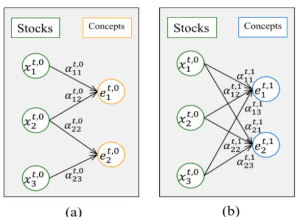
数据来源：东方证券研究所 & arXiv
图 a：初始化预定义概念的向量表示；图 b：修正预定义概念的向量表示。

## 1.3 预定义概念和隐藏概念

大多数现有研究仅利用人工预定义的概念，例如行业分类、主营业务、经营范围等，但人工预定义概念存在一定的局限性。但公司之间的关联是多种多样的，我们是没有办法来穷尽这些关联关系的，并且新兴主题概念也可能无法及时纳入建模。

HIST 模型添加了隐藏概念模块，进一步挖掘隐藏概念中的共享信息，与预定义概念互相补充。具体做法是：（1）初始化隐藏概念：直接把股票作为概念，有几个股票就有几个概念，并假设初始隐藏概念的向量表示即为股票的向量表示；（2）修正隐藏概念：计算股票的向量表示Xt,1与初始隐含概念的向量表示Ut,0之间的余弦相似度，作为股票与隐藏概念之间联系的权重γt,0。接下来对权重矩阵进行调整，每个股票保留与之相似度最高的 K 个隐藏概念的权重数据，其他位置的权重数据置为 0，得到修正后的权重矩阵γt,1。最后再使用这个权重矩阵对股票的向量表示加权，得到新的隐藏概念的向量表示Ut,1，并删除不与任何股票连接的隐藏概念。

图 2：隐藏概念示例
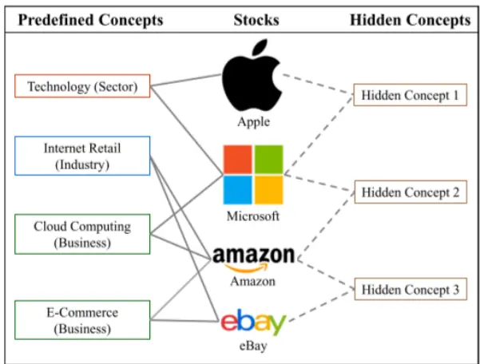
数据来源：东方证券研究所 & arXiv

图 3：隐藏概念示意图
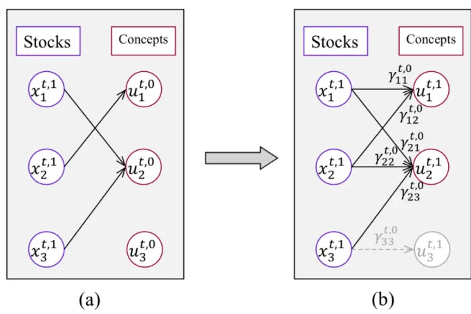
数据来源：东方证券研究所 & arXiv
图 a：初始化隐藏概念的向量表示；图 b：修正隐藏概念的向量表示。
有关分析师的申明，见本报告最后部分。其他重要信息披露见分析师申明之后部分，或请与您的投资代表联系。并请阅读本证券研究报告最后一页的免责申明。

## 1.4 个股信息和概念信息的融合

在之前的预定义概念和隐藏概念模块中，得到了预定义概念和隐藏概念的向量表示后，均需要将概念信息再聚合到每只股票中，所以两个模块中都有相似的个股信息和概念信息融合的步骤。

由于不同概念的共享信息对股票的重要性不同，某些概念可能具有较高的重要性，而其他概念可能具有较低的重要性，我们应用注意力机制来学习每个概念对股票的重要性。下图以预定义概念模块为例，阐述个股信息和概念信息的融合步骤，隐藏概念模块做法相同。具体来说：（1）计算初始股票的向量表示Xt,0与修正后概念的向量表示Et,1之间的余弦相似度；（2）使用 softmax函数对每只股票在所有概念上的相似度进行归一化，从而得到从概念到股票的聚合权重βt；（3）利用这个权重矩阵对概念的向量表示进行加权，得到融合了概念信息后的每只股票的向量表示Ŝt,0；（4）将加权聚合后的股票向量表示输入全连接层中，得到每只股票的中间输出。随后再经过一个两个不同的全连接层得到两个输出：一个用于最后对于股票收益率的预测（带LeakyReLU激活函数），一个用于计算下一层模型的输入。

图 4：个股信息和概念信息的融合示意图（预定义概念模块）
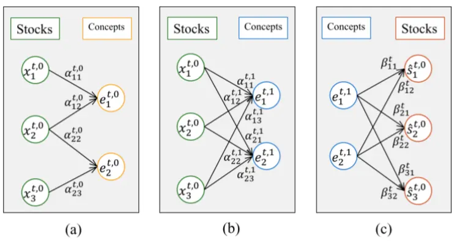
数据来源：东方证券研究所 & arXiv
图 a：初始化预定义概念的向量表示；图 b：修正预定义概念的向量表示；图 c：个股信息和概念信息的融合。

## 1.5 时序信息和图信息的结合

HIST 模型在预测股价时考虑到了股票间的关联，但股票自身的时序信息同样不可忽视。HIST模型加入了一个初始的股票时序特征编码模块，来融合股票自身的历史时序特征信息。再对编码后的股票信息融合图信息，对因子选股效果进行进一步的增强。具体做法是：输入数据为当前 t 时刻，n 只股票，过去 h 日，k 个特征的三维历史时序特征数据。选用 2 层 128 个隐藏层的GRU单元来进行编码。编码后，每只股票都用一个维度为 128的向量来表示。

## 1.6 双重残差学习结构

双重残差学习结构是一种深度神经网络的架构，它结合了残差连接和多层残差学习的概念，就像是一个信息筛选器，可以帮助我们更好地处理不同信息：

（1）残差连接：每一层的输入都是上一层学习后的残差，剔除上一个步骤的影响可以使下游模块的预测任务更加容易，并促进更流畅的梯度反向传播。

（2）多层残差学习：引入多个残差单元来构建更深的网络结构，保留每一层的输出，最终将所有模块得到的预测输出相加来得出最终的股票趋势预测。

下图展示了 HIST模型的框架，主要分三个步骤：

step1：股票时序特征编码模块。输出为每只股票的向量表示，记为Xt,0。

step2 ：股票间关联网络模块。该模块采用双重残差学习架构。将上一步得到的股票向量表示Xt,0，通过三个模块进行连续处理：1）预定义概念模块，根据预定义概念模块提取股票共享信息；2）隐藏概念模块，挖掘预定义概念所携带的共享信息之外的隐藏信息；3）个股信息模块，处理上述两种模块无法捕获的个体信息。

前两个模块的输出均包括两个部分：一部分用于最后对于股票收益率的预测，记为Ŷt,0和Ŷt,1；一部分用于得到融合概念信息后的股票向量表示，便于计算下一层模型的输入，记为X̂t,0和 X̂t,1。最后一个模块的输出只有一部分，就是对于股票收益率的预测，记为Ŷt,2。

第一个模块的输入为step1得到的股票向量表示Xt,0。第二个模块的输入为初始股票向量表示- 第一个模块输出的股票向量表示， $\sharp\lVert X^{t,1}=X^{t,0}-\hat{X}^{t,0}$ ，使得隐藏概念提取时不混杂预定义概念的信息。第三个模块的输入为初始股票向量表示 - 第一个模块输出的股票向量表示 - 第二个模块输出的股票向量表示，即 $X^{t,2}=X^{t,0}-\hat{X}^{t,0}-\hat{X}^{t,1}$ ，代表每只股票在预定义概念和隐藏概念之外的的独立信息。

step3：聚合模块。将 step2 三个模块提取出的股票信息加在一起，即 $Y^{t}=\hat{Y}^{t,0}+\hat{Y}^{t,1}+\hat{Y}^{t,2}$ 。再经过一个全连接层，得到预测个股收益率Pt。

图 5：HIST模型框架
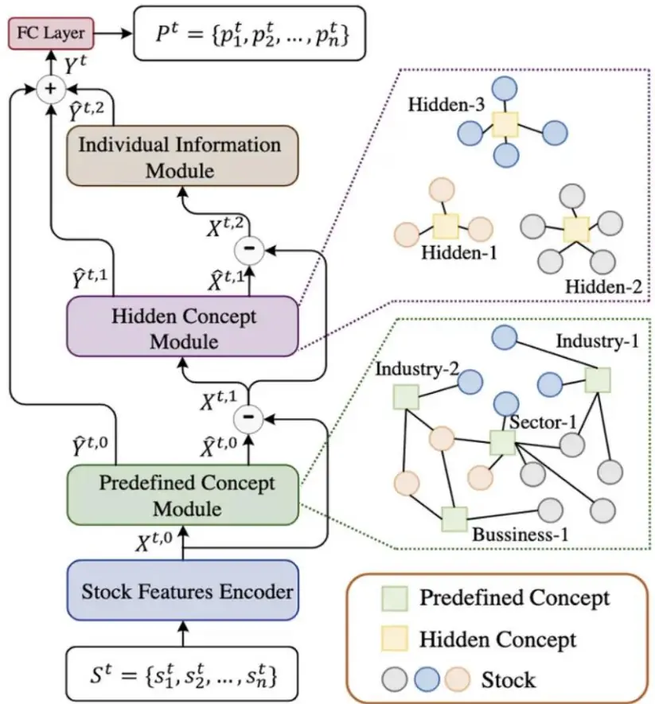
数据来源：东方证券研究所 & arXiv
有关分析师的申明，见本报告最后部分。其他重要信息披露见分析师申明之后部分，或请与您的投资代表联系。并请阅读本证券研究报告最后一页的免责申明。

## 1.7 不同图模型效果对比

除 HIST模型之外，我们还测试了一些其他的图模型：

（1）GAT：相对最简单，无残差结构，也不使用外部预定义概念。通过全局自注意力机制得到股票间的注意力得分，并通过 softmax 标准化得到注意力权重。根据注意力权重对股票向量加权以更新股票向量。该模型参考在微软 Qlib 平台提供的 GATs_ts模型。

（2）MTMD：在 HIST 模型基础上引入了“内存项”机制。该机制本质上实现了不同 Batch之间信息的共享，并通过额外一层的注意力机制提高序列信息的一致性以及消除极端信息影响，达到降噪处理的效果。该模型参考 2022 年发表的《MTMD: Multi-Scale Temporal MemoryLearning and Efficient Debiasing Framework for Stock Trend Forecasting》。

（3）HISTGAT： HISTGAT与 HIST均使用了相同的外部预定义概念和双重残差学习结构，但是概念的引入方式不同：HIST中对每个概念进行了向量化表示，并以股票与概念之间余弦相似度作为权重将概念信息聚合到股票之中，而 GATHIST 则是直接以股票之间的注意力作为权重，得到优化后的股票向量表示。

接下来我们对比不同图模型得到的因子打分的效果，不同模型的训练参数均保持一致。训练在中证全指股票池中进行，输入采用 60个基础特征，标签采用 20日收益率。

结果显示：

## （1）HIST 模型效果最好：

（2）GAT模型效果最差，并且显存占用较大，需40g显存。说明HIST模型中添加外部概念矩阵和残差结构的部分对于提升结果有帮助。

（3）MTMD模型效果不如 HIST模型，显存占用与 HIST接近，需 10g显存。说明内存项的引入并没能提升模型表现。

（4）HISTGAT模型效果不如HIST模型，并且显存占用也较大，需40g显存。说明HIST模型中对于概念信息的引入方式更合理。

（5）不同图模型得分的相关性很高，多模型结合意义不大。

图 6：不同图模型效果对比（2020.01.01-2023.09.15）

| 985股票池，60特征，20天标签 | 显存占用 | IC | ICIR | rank IC | rank ICIR | long_r | long_win | long_sharp | long_drawdown | long_yearly | turnover |
| --- | --- | --- | --- | --- | --- | --- | --- | --- | --- | --- | --- |
| HIST | 8g | 12.00% | 0.95 | 16.75% | 1.20 | 2.13% | 80.43% | 2.96 | -3.30% | 28.04% | 74.18% |
| MTMD | 12g | 11.99% | 1.04 | 16.21% | 1.26 | 1.98% | 76.09% | 2.70 | -3.77% | 26.07% | 77.42% |
| GAT | 43g | 12.24% | 1.09 | 15.91% | 1.31 | 1.79% | 82.61% | 2.52 | -6.98% | 23.20% | 73.89% |
| HISTGAT | 47g | 12.54% | 1.13 | 16.38% | 1.33 | 1.77% | 82.61% | 2.66 | -5.90% | 22.38% | 69.74% |

数据来源：东方证券研究所 & Wind资讯 & Tushare

图 7 ： 不 同 图 模 型 得 分 的 因 子 值 相 关 性 （ 2020.1.1-2023.9.15）

| HISTHISTMTMDGATHISTGAT | MTMD | GAT | HISTGAT |  |
| --- | --- | --- | --- | --- |
|  | 100.00% | 96.67% | 92.44% | 90.62% |
|  | 96.67% | 100.00% | 92.61% | 88.37% |
|  | 92.44% | 92.61% | 100.00% | 93.45% |
|  | 90.62% | 88.37% | 93.45% | 100.00% |

数据来源：东方证券研究所 & Wind资讯 & Tushare

图 8 ： 不 同 图 模 型 得 分 的 rankic 相 关 性 （ 2020.1.1-2023.6.30）

| HISTHIST |  | MTMD | GAT | HISTGAT |  |
| --- | --- | --- | --- | --- | --- |
|  |  | 100.00% | 99.22% | 97.65% | 97.83% |
| MTMDGATHISTGAT | 99.22% | 100.00% | 97.76% | 97.40% |  |
|  | 97.65% | 97.76% | 100.00% | 98.49% |  |
|  | 97.83% | 97.40% | 98.49% | 100.00% |  |

数据来源：东方证券研究所 & Wind资讯 & Tushare
有关分析师的申明，见本报告最后部分。其他重要信息披露见分析师申明之后部分，或请与您的投资代表联系。并请阅读本证券研究报告最后一页的免责申明。

## 二、模型核心要点

下面对 DFQ-HIST 模型中几个核心要点进行消融实验，以展示每个步骤的价值。在不特殊说明的情况下，本章节测试均在中证全指股票池中进行，IC、ICIR、rankIC、rankICIR 指标均计算原始因子得分和 20 日收益率标签的相关性，日度平均。ICIR 和 rankICIR 均不年化。多头绩效均展示超额收益的情况，超额收益计算基准为全市场等权组合，采用20分组计算多头。不考虑交易成本，但汇报了月均单边换手率，费后收益可以根据费前收益和换手率近似估算。

## 2.1 多输入

输入端对于模型影响重大。我们尝试了三类输入：基础特征、alpha因子、风险因子。

（1）基础特征：包括原始日线行情、基于分钟线提取的日频特征、基于level2数据提取的日频特征等 60个。

（2）alpha 因子：分为两部分，一部分来自于前期报告《DFQ 遗传规划价量因子挖掘系统》提出的遗传规划模型，共选取了 100个；另一部分来自于前期报告《DFQ强化学习因子挖掘系统》提出的强化学习模型，共选取了 200个。

（3）风险因子：来自于前期报告《东方 A 股因子风险模型（DFQ-2020）》提出的风险模型，共 10 个。

结果显示：（1）从单输入来看，用基础特征因子作为输入效果最好，其次是 alpha 因子，风险因子做输入表现最差，尤其是因子稳定性较差；（2）遗传规划和强化学习因子更适合作为一个整体输入，效果好于分开输入再进行等权合成；（3）基础特征和 alpha 因子更适合分开输入，再进行等权合成，效果优于作为一个整体输入；（4）多输入结合后，相比单输入的 rankic和 rankicir 均有提高。月均 rankic 可达 17.24%，rankicir 达 1.31，多头组合年化超额收益可以达到 28.23%，多头年化超额夏普达到 3.14。

图 9：不同输入下的模型效果对比（2020.01.01-2023.09.15）

| 985股票池 | IC | ICIR | rank IC | rank ICIR | long_r | long_win | long_sharp | long_drawdown | long_yearly | turnover |
| --- | --- | --- | --- | --- | --- | --- | --- | --- | --- | --- |
| HIST+f60 | 12.00% | 0.95 | 16.75% | 1.20 | 2.13% | 80.43% | 2.96 | -3.30% | 28.04% | 74.18% |
| HIST+gp100 | 9.37% | 0.73 | 14.68% | 1.08 | 1.52% | 78.26% | 2.16 | -3.17% | 20.75% | 73.79% |
| HIST+rl200 | 10.13% | 0.92 | 14.64% | 1.28 | 1.23% | 73.91% | 1.82 | -4.33% | 16.57% | 77.04% |
| gp100+rl200 等权重 | 10.46% | 0.84 | 15.78% | 1.20 | 1.38% | 71.74% | 2.00 | -3.82% | 18.69% | 70.98% |
| HIST+gprl300 | 10.66% | 0.97 | 15.41% | 1.42 | 1.77% | 82.61% | 3.16 | -2.51% | 23.99% | 77.53% |
| HIST+risk10 | 8.12% | 0.50 | 11.99% | 0.67 | 1.58% | 76.09% | 1.59 | -7.64% | 20.88% | 42.95% |
| HIST+fgprl360 | 10.56% | 0.94 | 15.04% | 1.30 | 1.25% | 69.57% | 2.00 | -5.33% | 16.57% | 75.21% |
| HIST+60+gprl等权重 | 12.11% | 0.98 | 17.24% | 1.31 | 2.07% | 80.43% | 3.14 | -3.19% | 28.23% | 71.54% |

数据来源：东方证券研究所 & Wind资讯 & Tushare

图 10 ： 不 同 输 入 下 模 型 因 子 值 spearman 相 关 性（2020.01.01-2023.09.15）

| f60 | f60 | gprl300 | rl200 | gp100 | risk10 | fgprl360 |
| --- | --- | --- | --- | --- | --- | --- |
|  | 100.00% | 68.40% | 65.88% | 72.18% | 50.46% | 73.49% |
|  | 68.40% | 100.00% | 87.07% | 77.63% | 40.41% | 85.32% |
| gprl300 rl200 | 65.88% | 87.07% | 100.00% | 69.53% | 34.06% | 84.06% |
| gp100 | 72.18% | 77.63% | 69.53% | 100.00% | 47.04% | 75.48% |
| risk10 | 50.46% | 40.41% | 34.06% | 47.04% | 100.00% | 32.67% |
| fgprl360 | 73.49% | 85.32% | 84.06% | 75.48% | 32.67% | 100.00% |

数据来源：东方证券研究所 & Wind资讯 & Tushare

图 11 ： 不 同 输 入 下 模 型 rankic 相 关 性 （ 2020.01.01-2023.09.15）

| f60 | f60 | gprl300 | rl200 | gp100 | risk10 | fgprl360 |
| --- | --- | --- | --- | --- | --- | --- |
|  | 100.00% | 89.69% | 86.58% | 90.83% | 81.41% | 86.54% |
| gprl300 | 89.69% | 100.00% | 96.53% | 92.01% | 68.32% | 95.68% |
| rl200 | 86.58% | 96.53% | 100.00% | 90.31% | 58.85% | 96.19% |
| gp100 | 90.83% | 92.01% | 90.31% | 100.00% | 75.42% | 90.19% |
| risk10 | 81.41% | 68.32% | 58.85% | 75.42% | 100.00% | 56.92% |
| fgprl360 | 86.54% | 95.68% | 96.19% | 90.19% | 56.92% | 100.00% |

数据来源：东方证券研究所 & Wind资讯 & Tushare

有关分析师的申明，见本报告最后部分。其他重要信息披露见分析师申明之后部分，或请与您的投资代表联系。并请阅读本证券研究报告最后一页的免责申明。

## 2.2 多标签

标签对于模型的影响同样很大。通常我们选择的预测标签会和调仓频率匹配，例如月频调仓策略我们会选择未来 20 日收益率作为预测标签来训练模型。此次我们尝试了三种不同频率的标签：未来 5日、10日、20日收益率。

结果显示：（1）单输入下，采用多标签分别训练，再进行等权结合的方式，相比单一标签，多头端表现有所提高。采用多标签相当于考虑了股票收益率的未来分布，如果预期未来 5 天、10天、20天股价都上涨，那实际未来20天股价上涨的可能性会更高；（2）多输入多标签结合后，月均 rankic 可达 17.28%，rankicir 达 1.36，多头组合年化超额收益可以达到 30%。

图 12：不同标签下的模型效果对比（2020.01.01-2023.09.15）

| 985股票池 | IC | ICIR | rank IC | rank ICIR | long_r | long_win long_sharp | long_drawdown |  | long_yearly | turnover |
| --- | --- | --- | --- | --- | --- | --- | --- | --- | --- | --- |
| HIST+f60_label20 | 12.00% | 0.95 | 16.75% | 1.20 | 2.13% | 80.43% | 2.96 | -3.30% | 28.04% | 74.18% |
| HIST+f60_label10 | 11.99% | 1.06 | 16.47% | 1.26 | 2.19% | 80.43% | 2.92 | -2.71% | 28.82% | 76.24% |
| HIST+f60_label5 | 11.83% | 1.25 | 15.30% | 1.36 | 2.13% | 86.96% | 3.17 | -4.41% | 28.58% | 80.57% |
| HIST+f60 标签等权重 | 12.21% | 1.08 | 16.56% | 1.28 | 2.26% | 82.61% | 3.16 | -3.02% | 30.06% | 76.33% |
| HIST+gprl300_label20 | 10.66% | 0.97 | 15.41% | 1.42 | 1.77% | 82.61% | 3.16 | -2.51% | 23.99% | 77.53% |
| HIST+gprl300_label10 | 10.65% | 0.99 | 15.38% | 1.38 | 1.78% | 89.13% | 3.60 | -1.67% | 24.04% | 78.22% |
| HIST+gprl300_label5 | 10.41% | 1.01 | 15.22% | 1.41 | 1.88% | 86.96% | 3.72 | -2.50% | 25.66% | 81.12% |
| HIST+gprl300 标签等权重 | 10.86% | 1.00 | 15.76% | 1.42 | 1.82% | 86.96% | 3.41 | -2.56% | 24.68% | 77.82% |
| HIST+60+gprl_label20，输入等权重 | 12.11% | 0.98 | 17.24% | 1.31 | 2.07% | 80.43% | 3.14 | -3.19% | 28.23% | 71.54% |
| HIST+60+gprl_label10，输入等权重 | 12.17% | 1.05 | 17.13% | 1.33 | 2.27% | 84.78% | 3.51 | -3.29% | 31.56% | 74.42% |
| HIST+60+gprl_label5，输入等权重 | 12.05% | 1.17 | 16.57% | 1.43 | 2.10% | 86.96% | 3.21 | -2.37% | 29.19% | 77.55% |
| 多输入多标签融合等权重 | 12.33% | 1.06 | 17.28% | 1.36 | 2.14% | 86.96% | 3.16 | -2.87% | 29.85% | 73.03% |

数据来源：东方证券研究所 & Wind资讯 & Tushare

## 2.3 时序特征提取的价值

HIST 模型通过加入初始的股票时序特征编码模块，来融合股票自身的历史时序特征信息。我们对比了 6 种时序特征提取模型：全连接、GRU、AGRU LSTM、ALSTM、Transformer。（1）全连接网络的结构相对简单，每一层的神经元与下一层的所有神经元都连接，但这种结构无法有效纳入序列信息。（2）LSTM 网络是一种循环神经网络，在每一层中加入了门控结构来控制信息的流动，可以有效地处理序列数据中的长距离依赖关系。（3）相较于LSTM网络的三个门控结构（遗忘门、输入门、输出门），GRU 网络只包含两个门控结构（重置门和更新门），结构更加简单，训练速度更快。（4）ALSTM和 AGRU 分别在 LSTM和 GRU的基础上增加了注意力机制，允许模型关注当前时间步以前的信息。（5）Transformer 摈弃了 RNN 的概念，使用编码器-解码器结构，核心是自注意力机制，允许输入序列的每个元素与序列中的所有其他元素互相“关注”。结果显示：在不同输入下，使用全连接进行特征提取效果均为最差，使用 GRU 模型进行特征提取模型效果均为最好。

图 13：不同时序特征提取方式的效果对比（2020.01.01-2023.09.15）

| 985股票池+60特征 | IC | ICIR | rank IC | rank ICIR | long_r long_win |  | long_sharp long_drawdown |  | long_yearly | turnover |
| --- | --- | --- | --- | --- | --- | --- | --- | --- | --- | --- |
| HIST+全连接 | 8.97% | 0.96 | 11.58% | 1.12 | 1.03% | 76.09% | 1.83 | -4.76% | 12.97% | 88.29% |
| HIST+GRU | 12.00% | 0.95 | 16.75% | 1.20 | 2.13% | 80.43% | 2.96 | -3.30% | 28.04% | 74.18% |
| HIST+AGRU | 12.32% | 0.98 | 16.75% | 1.22 | 1.84% | 78.26% | 2.59 | -4.38% | 24.81% | 75.08% |
| HIST+LSTM | 12.26% | 1.07 | 16.12% | 1.29 | 1.73% | 78.26% | 2.29 | -7.15% | 22.28% | 66.70% |
| HIST+ALSTM | 12.14% | 1.12 | 15.75% | 1.35 | 1.69% | 80.43% | 2.33 | -7.73% | 21.83% | 69.78% |
| HIST+Transformer | 11.20% | 1.02 | 15.10% | 1.26 | 1.41% | 73.91% | 2.09 | -4.64% | 18.89% | 67.65% |
| 985股票池+300gprl因子 | IC | ICIR | rank IC | rank ICIR | long_r | long_win | long_sharp | long drawdown | long_yearly | turnover |
| HIST+全连接 | 10.04% | 0.81 | 15.11% | 1.15 | 1.33% | 73.91% | 2.04 | -6.89% | 18.28% | 79.22% |
| HIST+GRU | 10.66% | 0.97 | 15.41% | 1.42 | 1.77% | 82.61% | 3.16 | -2.51% | 23.99% | 77.53% |
| HIST+AGRU | 10.51% | 0.93 | 15.28% | 1.37 | 1.56% | 80.43% | 2.78 | -2.84% | 20.87% | 76.28% |
| HIST+LSTM | 10.62% | 1.01 | 15.07% | 1.42 | 1.57% | 82.61% | 2.77 | -3.40% | 21.50% | 78.36% |
| HIST+ALSTM | 10.75% | 1.15 | 14.30% | 1.52 | 1.16% | 82.61% | 2.07 | -3.94% | 15.28% | 75.45% |
| HIST+Transformer | 10.70% | 0.92 | 15.62% | 1.35 | 1.56% | 80.43% | 2.64 | -2.41% | 21.35% | 74.25% |

数据来源：东方证券研究所 & Wind资讯 & Tushare

有关分析师的申明，见本报告最后部分。其他重要信息披露见分析师申明之后部分，或请与您的投资代表联系。并请阅读本证券研究报告最后一页的免责申明。

## 2.4 图信息的价值

我们比较了 GRU和 HIST模型的效果，结果显示：加了图信息后，多头端表现显著提高。

图 14：添加图信息前后的模型效果对比（2020.01.01-2023.09.15）

| 985股票池 | IC | ICIR | rank IC | rank ICIR | long_r | long_win | long_sharp | long_drawdown | long_yearly | turnover |
| --- | --- | --- | --- | --- | --- | --- | --- | --- | --- | --- |
| GRU(60特征) | 12.30% | 1.08 | 16.24% | 1.33 | 1.77% | 82.61% | 2.70 | -5.60% | 23.61% | 75.55% |
| HIST(60特征) | 12.00% | 0.95 | 16.75% | 1.20 | 2.13% | 80.43% | 2.96 | -3.30% | 28.04% | 74.18% |
| GRU(300gprl因子) | 10.63% | 1.08 | 14.51% | 1.48 | 1.37% | 82.61% | 2.69 | -3.06% | 18.30% | 78.99% |
| HIST(300gprl因子) | 10.66% | 0.97 | 15.41% | 1.42 | 1.77% | 82.61% | 3.16 | -2.51% | 23.99% | 77.53% |

数据来源：东方证券研究所 & Wind资讯 & Tushare

## 2.5 预定义概念选取

本文使用的预定义概念来自 Tushare数据库中的公司行业及主营业务构成数据，根据交易日动态更新概念。考虑到半年报、年报的公告滞后问题，每年从 5.1 和 9.1 开始才能使用新的概念数据。根据 2023 年半年报信息，全市场股票共涉及 1218 个概念，每个概念下平均 10 只股票，每个股票平均涉及 3个概念。

图 15：Tushare 预定义概念分布（2013.06.30-2023.06.30）
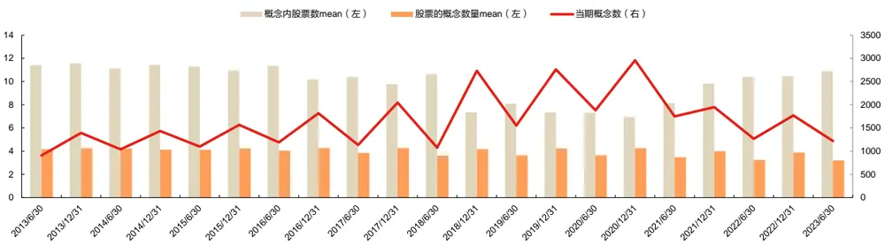
数据来源：东方证券研究所 & Tushare

我们对比了不同预定义概念下的模型效果，结果显示：仅使用年报概念，和同时使用半年报和年报概念，效果差别不大。使用中信一级行业、基金共同持仓作为预定义概念后，模型效果均变差，多头端表现下降明显。

图 16：不同预定义概念下的模型效果对比（2020.01.01-2023.09.15）

| 985股票池 | IC | ICIR | rank IC | rank ICIR | long_r | long_win | long_sharp | long_drawdown | long_yearly | turnover |
| --- | --- | --- | --- | --- | --- | --- | --- | --- | --- | --- |
| HIST(60特征)年报+半年报 | 12.00% | 0.95 | 16.75% | 1.20 | 2.13% | 80.43% | 2.96 | -3.30% | 28.04% | 74.18% |
| HIST(60特征)仅年报 | 11.92% | 0.94 | 16.66% | 1.20 | 2.10% | 76.09% | 2.94 | -3.03% | 28.13% | 74.96% |
| HIST(60特征)基金共同持仓 | 12.08% | 1.03 | 16.31% | 1.27 | 1.97% | 80.43% | 2.75 | -5.55% | 25.55% | 73.49% |
| HIST(60特征)中信一级 | 11.31% | 0.88 | 16.17% | 1.15 | 1.88% | 76.09% | 2.93 | -2.51% | 24.37% | 75.88% |

数据来源：东方证券研究所 & Wind资讯 & Tushare

## 2.6 预定义概念修正的价值

考虑到预定义概念的不完备性和动态变化性，DFQ-HIST 模型中有一个预定义概念修正的步骤，详见 1.2 节。结果显示：去掉预定义概念修正这一部分后，模型结果变差。说明校正预定义概念的共享信息、挖掘缺失的股票概念以及减少不太重要概念的影响可以提升模型绩效。

图 17：预定义概念调整前后的模型效果对比（2020.01.01-2023.09.15）

| 985股票池 | IC | ICIR | rank IC | rank ICIR | long_r | long_win | long_sharp | long_drawdown long_yearly turnover |  |  |
| --- | --- | --- | --- | --- | --- | --- | --- | --- | --- | --- |
| HIST(60特征) | 12.00% | 0.95 | 16.75% | 1.20 | 2.13% | 80.43% | 2.96 | -3.30% | 28.04% | 74.18% |
| HIST(60特征)取消预定义概念调整 | 12.11% | 1.07 | 16.14% | 1.30 | 2.02% | 80.43% | 3.01 | -4.86% | 26.59% | 76.72% |

数据来源：东方证券研究所 & Wind资讯 & Tushare

有关分析师的申明，见本报告最后部分。其他重要信息披露见分析师申明之后部分，或请与您的投资代表联系。并请阅读本证券研究报告最后一页的免责申明。

## 2.7 隐藏概念挖掘

HIST 模型添加了隐藏概念模块，进一步挖掘隐藏概念中的共享信息，与预定义概念互相补充。下面我们列出中证全指股票池，60个基础特征输入下，2020-2023年每期挖掘出的隐藏概念情况。当前全市场股票共涉及 4611个隐藏概念，每个隐藏概念下平均 21只股票。

图 18：隐藏概念分布（2020.01.01-2023.09.15）
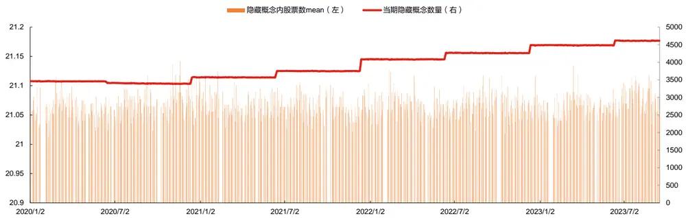
数据来源：东方证券研究所 & Tushare

我们以 2023.08.31 的中证 500 股票池为例，展示股票和隐藏概念之间的关联，来进一步分析挖掘出的隐藏概念。下图红圈中的 2 只股票（许继电气、特锐德），属于相同的隐藏概念，可能是智能电网概念；绿色圆圈中的 2 只股票（新天绿能、电投产融）可能属于同样的绿色电力概念；蓝色圆圈中的 3 只股票（中国西电、中国一重、中化国际）也可能属于同样的国企改革或一带一路概念。这些隐藏概念都没有涵盖在预定义概念中，通过模型可以“学”到更多人脑无法联想到的股票关联。

图 ：股票与隐藏概念的关联示意图（中证 股票池， ，横轴为股票在股票池中的序号，纵轴为隐藏概念序号）
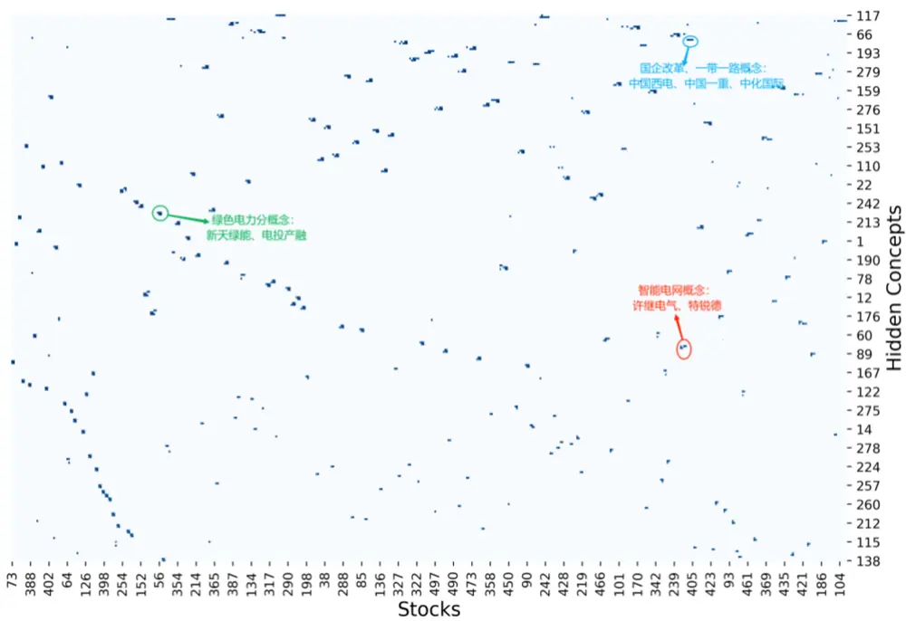
数据来源：东方证券研究所 & Wind资讯 & Tushare
有关分析师的申明，见本报告最后部分。其他重要信息披露见分析师申明之后部分，或请与您的投资代表联系。并请阅读本证券研究报告最后一页的免责申明。

## 2.8 双重残差结构的价值

DFQ-HIST 模型的股票间关联网络模块分为三个部分：预定义概念模块、隐藏概念模块、个股信息模块。三个模块都采用双重残差学习架构，每一层的输入都是上一层学习后的残差，同时保留每一层的输出，用三个模块的输出信息来预测股票价格的未来趋势。我们尝试了仅保留预定义概念模型、仅保留隐藏概念模块、仅保留预定义概念+隐藏概念模块、保留预定义概念+隐藏概念+个股信息模块，但不使用残差输入结构等四种方式。

结果显示：（1）移除预定义概念模块或隐藏概念模块都会让模型绩效表现变差，因此预定义和隐藏概念的共享信息都至关重要；（2）移除个体信息模块也将降低模型绩效，因此每只股票的个体信息对于股票趋势预测也是至关重要的；（3）不使用残差输入结构也将降低模型绩效，说明在输入中剔除上一个步骤的影响会使下游模块的预测任务更加容易。

图 20：双重残差结构中各环节效果对比（2020.01.01-2023.09.15）

| 60特征 | IC | ICIR | rank IC | rank ICIR | long_r | long_win | long_sharp | long_drwandown | long_yearly | turnover |
| --- | --- | --- | --- | --- | --- | --- | --- | --- | --- | --- |
| HIST(仅预定义概念) | 10.46% | 0.84 | 15.63% | 1.14 | 1.74% | 73.91% | 2.15 | -4.48% | 22.97% | 73.90% |
| HIST(仅隐藏概念) | 11.25% | 0.94 | 15.56% | 1.17 | 1.85% | 76.09% | 2.66 | -3.77% | 24.00% | 75.45% |
| HIST(仅预定义概念+隐藏概念) | 11.22% | 0.95 | 15.67% | 1.18 | 1.77% | 73.91% | 2.35 | -3.85% | 23.37% | 75.13% |
| HIST(预定义概念+隐藏概念+个股信息) | 12.00% | 0.95 | 16.75% | 1.20 | 2.13% | 80.43% | 2.96 | -3.30% | 28.04% | 74.18% |
| HIST(预定义概念+隐藏概念+个股信息，无残差结构) | 12.66% | 1.14 | 16.20% | 1.35 | 1.93% | 80.43% | 2.82 | -7.46% | 25.45% | 73.43% |
| 300gprl因子 | IC | ICIR | rank IC | rank ICIR | long_r | long_win | long_sharp | long_drwandown | long_yearly | turnover |
| HIST(仅预定义概念) | 9.60% | 0.75 | 15.77% | 1.17 | 1.68% | 73.91% | 2.20 | -4.63% | 22.79% | 69.25% |
| HIST(仅隐藏概念) | 9.97% | 0.76 | 15.18% | 1.09 | 1.48% | 71.74% | 2.12 | -5.87% | 19.70% | 74.66% |
| HIST(预定义概念+隐藏概念) | 9.72% | 0.77 | 15.60% | 1.19 | 1.60% | 71.74% | 2.14 | -3.27% | 21.56% | 65.14% |
| HIST(预定义概念+隐藏概念+个股信息) | 10.66% | 0.97 | 15.41% | 1.42 | 1.77% | 82.61% | 3.16 | -2.51% | 23.99% | 77.53% |
| HIST(预定义概念+隐藏概念+个股信息，无残差结构) | 10.54% | 0.96 | 14.97% | 1.36 | 1.29% | 82.61% | 2.29 | -4.12% | 17.31% | 76.30% |

数据来源：东方证券研究所 & Wind资讯 & Tushare

## 三、模型说明

## 3.1 数据说明

样本空间：中证全指同期成分股。

数据区间：（1）训练集 2014.01.01—2018.11.30；（2）验证集 2019.01.01—2019.11.30；（3）测试集 2020.01.01—2023.09.15。

数据集中额外的分割间隙是有意引入的，以避免特征和标签的泄露。训练集用于迭代训练模型，通过反向传播算法计算损失函数关于模型参数的梯度，然后按照梯度方向更新模型参数。验证集用于在模型训练过程中评估模型的性能，便于选择最优的模型和参数。测试集用于观察模型样本外的表现，在模型开发完成后评估模型的泛化性能。

数据处理方法：（1）解释变量X：截面异常值处理，标准化，填充缺失值。训练集、验证集、测试集相同处理；（2）预测标签 Y：截面取排名分位数，标准化。训练集、验证集相同处理。

针对 Y 的多种处理方式，测试显示：（1）直接用原始收益率效果最差：用绝对收益作为预测目标，还要预测整个市场股票的平均收益在时间序列上如何变化，难度增加，准确度下降，而且实际上只需要获得个股预测收益率的相对排名即可构建投资组合。（2）使用绝对收益的排名分位数，效果有明显提升，再取 zscore 标准化，效果还有提高。转为排名分位数可以在学习过程中减少异常收益带来的影响，并且百分位数是均匀分布的，不受市场波动影响，可以提升数据稳定性。对排名分位数再取 zscore 标准化可以扩大数据范围，更容易预测。（3）对 Y 进行中性化，效果变差。额外的中性化处理可能引入了不必要的复杂性，或删除了一些对预测有用的信息。

图 21：预测标签 Y 不同处理方式下的模型效果对比（2020.01.01-2023.09.15）

| 985股票池 | IC | ICIR | rank IC | rank ICIR long_r |  | long_win | long_sharp | long drawdown | long yearly | turnover |
| --- | --- | --- | --- | --- | --- | --- | --- | --- | --- | --- |
| HIST+f60+原始y | 6.70% | 0.91 | 6.04% | 0.69 | 1.56% | 78.26% | 2.22 | -5.10% | 16.75% | 86.55% |
| HIST+f60+ranky | 11.88% | 1.01 | 16.15% | 1.22 | 2.04% | 78.26% | 2.97 | -3.25% | 26.26% | 78.11% |
| HIST+f60+ranky+zscore | 12.00% | 0.95 | 16.75% | 1.20 | 2.13% | 80.43% | 2.96 | -3.30% | 28.04% | 74.18% |
| HIST+f60+中性化y | 10.76% | 1.09 | 13.91% | 1.29 | 1.32% | 73.91% | 1.96 | -3.74% | 17.64% | 78.00% |
| HIST+gprl300+原始y | 8.21% | 0.96 | 9.77% | 1.00 | 1.20% | 63.04% | 2.10 | -2.06% | 15.17% | 84.66% |
| HIST+gprl300+ranky | 10.18% | 0.97 | 14.59% | 1.29 | 1.52% | 82.61% | 2.62 | -2.50% | 19.62% | 76.57% |
| HIST+gprl300+ranky+zscore | 10.66% | 0.97 | 15.41% | 1.42 | 1.77% | 82.61% | 3.16 | -2.51% | 23.99% | 77.53% |
| HIST+gprl300+中性化y | 9.63% | 0.87 | 13.98% | 1.21 | 0.93% | 63.04% | 1.40 | -6.27% | 12.21% | 69.68% |

数据来源：东方证券研究所 & Wind资讯 & Tushare

## 3.2 对抗过拟合技巧

## （1）参数平均

在验证或测试时使用过去 5 轮模型参数的平均值，提高模型的泛化能力和稳定性。但这种参数平均是临时的，仅用于评估模型在验证集和验证集上的性能。再继续训练的时候，要进行参数恢复，从上一轮的真实状态开始，这样可以确保训练的连续性和稳定性。

## （2）早停机制

根据验证集 IC选择最优的模型参数。若连续 20个epoch验证集 IC无提高，则停止训练。

## （3）Dropout

在GRU模块训练过程中随机丢弃一部分神经元，减少神经网络的复杂度，有助于泛化能力。

## （4）优化算法中，添加权重衰减

在每次参数更新时，对参数进行一定比例的减小，这样可以使得模型的参数不会过大，从而防止过拟合，提高模型的泛化能力。

## 3.3 代码修改点

原模型代码开源（代码下载网址：https://github.com/Wentao-Xu/HIST），DFQ-HIST 模型在原文模型基础上进行修改和优化，下面对代码修改点进行说明。

## （1）数据加载

原代码的数据加载通过 Qlib实现。我们直接读取本地的 pickle文件，与 Qlib解耦，增加代码的可读性与灵活性。

## （2）数据预处理

原代码的数据预处理通过 Qlib 实现，对训练集和验证集首先剔除标签为缺失值的样本，再对标 签 取 rank 并 进 行 截 面 标 准 化 ； 对 测 试 集 的 处 理 为 首 先 对 特 征 进 行 标 准 化（RobustZScoreNorm），然后将缺失值填充为 0。我们在数据预处理部分进行了重新编写，与Qlib解耦，对所有的因子数据进行了截面标准化和异常值处理并填补空值为 0。

## （3）模型时序切片数据获取

原代码使用 Qlib 中的 alpha360 数据作为输入，可以通过矩阵维度变化，从 N*360 的矩阵数据直接转换为 N*60*6 的时序数据，从而获得时序切片，再代入 GRU 模型进行时序编码即可。我们设置输入数据为 N*K 格式，代表每个时间点每只股票的 K 个特征数据，便于节省内存。重新改写了 Dataloader 类，在训练时对当前 batch 的数据获取时序切片。最后在加载训练集的过程中原代码每个 epoch加载全部数据, 我们控制每个 epoch 只选取100个batch，也就是 100天数据。

## （4）节省显存占用

原代码设置 pin_memory=True，将输入数据全部放到显存中，并且输入数据已经包含了时序切片。当训练的股票池增大，或输入特征个数增多时，对于显存的占用会非常大。我们修改pin_memory=False，将输入数据存放到内存中，在训练时再将当前 batch 涉及的数据转移至显存上，但这样做可能也会牺牲一些运算效率。

## （5）概念动态更新

原代码使用了固定的概念信息（作者提供的 npy 文件），并未考虑到股票和概念的变化。我们选择了根据交易日动态更新概念。

## （6）预定义概念修正

原代码在预定义概念修正时并未计算余弦相似度而是使用的矩阵乘积作为权重，我们在此处使用余弦相似度计算权重，跟论文公式保持一致。

## （7）权重衰减

在优化算法中添加权重衰减，防止模型过拟合。

## 四、模型结果

## 4.1 运算用时

不同输入下模型的早停快慢有所不同，因此运算用时有所差别：（1）基础特征输入下，模型在第 40 个 epoch 左右停止，训练用时 1.5h。在中证全指成分股中训练的显存占用约为 8G；（2）alpha因子输入下，模型在第 10个 epoch左右停止，训练用时 1h。在中证全指成分股中进行训练，显存占用约为 10G。

图 22：基础特征输入下训练集、验证集、测试集中 IC、rankIC 变化（左图 IC，右图 rankIC）
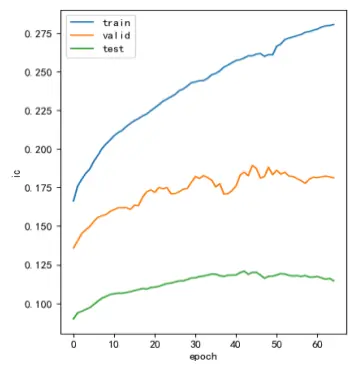
数据来源：东方证券研究所 & Wind资讯 & Tushare

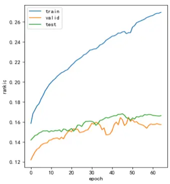

图 23 ：alpha 因子输入下训练集、验证集、测试集中 IC、rankIC 变化（左图 IC，右图 rankIC）
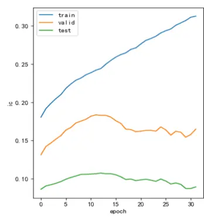

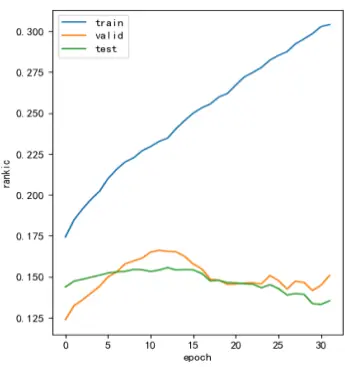
数据来源：东方证券研究所 & Wind资讯 & Tushare

## 4.2 合成因子绩效

本节展示DFQ-HIST模型得到的因子得分，在中证全指、沪深300、中证500、中证1000四个股票池中的表现，并与前期报告《DFQ 遗传规划价量因子挖掘系统》中的遗传规划合成因子gp152、《DFQ 强化学习因子组合挖掘系统》中的强化学习合成因子 985rl、《基于循环神经网络中的多频率因子挖掘》中的神经网络因子scores、《基于残差网络的端对端因子挖掘模型》神经网络因子 scores_v0 进行对比。测试区间为 2020.1.1-2023.12.31。其中：神经网络和神经网络_v0 因子均为双周频训练。IC 指标采用原始的因子得分和 20 日收益率标签计算得到，日度平均。在沪深 300、中证500 股票池中采用 5分组计算多头，在中证 1000股票池中采用 10分组计算多头，在中证全指股票池中采用20分组计算多头。此处的多头计算不考虑交易成本，但汇报了月均单边换手率，费后收益可以根据费前收益和换手率近似估算。

结果显示：（1）在中证全指股票池中，HIST 模型所得到的合成因子各项表现均明显最强。测试集上 rankic 达到 17%，rankicir 达到 1.34（未年化），20 分组多头年化超额收益 29.31%，多头年化超额夏普 3.16，多头超额最大回撤 2.87%，月均单边换手 73%。分组单调性好。分年表现有所衰减，2022和 2023年的多头表现整体不如 2020和 2021年。

图 24：中证全指股票池各模型因子绩效表现（2020.1.1-2023.12.31）

| 中证全指股票池 | IC | ICIR | rank IC | rank ICIR | long_r | long_win | long_sharp | long_drawdown | long_yearly | turnover |
| --- | --- | --- | --- | --- | --- | --- | --- | --- | --- | --- |
| gp152 | 8.08% | 0.83 | 12.35% | 1.39 | 1.12% | 70.83% | 2.17 | -3.77% | 14.27% | 69.07% |
| 985rl | 9.63% | 0.81 | 14.01% | 1.08 | 1.27% | 73.33% | 1.78 | -3.69% | 17.67% | 70.40% |
| tra2 | 10.73% | 0.86 | 16.36% | 1.24 | 1.69% | 75.00% | 2.22 | -3.95% | 23.21% | 56.97% |
| scores | 11.42% | 1.21 | 14.58% | 1.57 | 0.96% | 77.08% | 2.13 | -5.02% | 12.55% | 89.38% |
| scores_v0 | 13.01% | 1.47 | 15.76% | 1.71 | 1.95% | 83.33% | 2.89 | -3.77% | 24.54% | 85.37% |
| hist | 11.91% | 1.03 | 16.98% | 1.34 | 2.11% | 87.50% | 3.16 | -2.87% | 29.31% | 72.95% |

数据来源：东方证券研究所 & Wind资讯 & Tushare

有关分析师的申明，见本报告最后部分。其他重要信息披露见分析师申明之后部分，或请与您的投资代表联系。并请阅读本证券研究报告最后一页的免责申明。

图 25：中证全指股票池各模型分组年化超额收益（2020.1.1-2023.12.31）
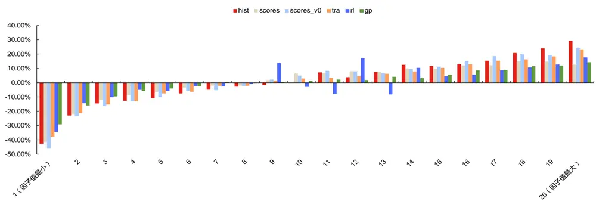
数据来源：东方证券研究所 & Wind资讯 & Tushare

图 26：中证全指股票池各模型分年绩效表现（2020.1.1-2023.12.31）

| 中证全指股票池各模型因子分年绩效表现 |  |  |  |  |  |  |  |  |  |  |
| --- | --- | --- | --- | --- | --- | --- | --- | --- | --- | --- |
| hist | IC | ICIR | rank IC | rank ICIR | long_r | long_win | long_sharp | long_drawdown | long_yearly | turnover |
| 2020 | 11.92% | 0.99 | 16.51% | 1.19 | 1.55% | 76.92% | 1.91 | -1.12% | 24.09% | 75.46% |
| 2021 | 12.06% | 1.13 | 17.41% | 1.31 | 1.96% | 76.92% | 2.82 | -1.68% | 27.33% | 72.62% |
| 2022 | 13.95% | 1.49 | 17.95% | 2.01 | 1.88% | 76.92% | 3.28 | -1.39% | 17.76% | 69.05% |
| 2023 | 9.52% | 0.70 | 15.94% | 1.16 | 1.67% | 83.33% | 3.59 | -0.31% | 17.81% | 76.50% |
| tra2 | IC | ICIR | rank IC | rank ICIR | long_r | long_win | long_sharp | long_drawdown | long_yearly | turnover |
| 2020 | 8.91% | 0.71 | 14.12% | 0.99 | 1.06% | 69.23% | 1.28 | -2.25% | 17.65% | 59.15% |
| 2021 | 10.02% | 0.78 | 16.55% | 1.17 | 1.64% | 76.92% | 2.18 | -3.77% | 20.96% | 55.52% |
| 2022 | 12.12% | 1.26 | 16.07% | 1.67 | 2.11% | 76.92% | 3.42 | -1.40% | 21.21% | 55.05% |
| 2023 | 11.98% | 0.85 | 18.90% | 1.38 | 2.01% | 91.67% | 4.77 | -0.32% | 22.71% | 55.08% |
| 985rl | IC | ICIR | rank IC | rank ICIR | long_r | long_win | long_sharp | long_drawdown | long_yearly | turnover |
| 2020 | 10.49% | 0.92 | 14.83% | 1.16 | 0.30% | 66.67% | 0.45 | -1.11% | 9.21% | 70.08% |
| 2021 | 9.04% | 0.88 | 14.31% | 1.12 | 1.14% | 66.67% | 1.45 | -4.11% | 13.65% | 70.04% |
| 2022 | 11.81% | 1.15 | 14.90% | 1.49 | 1.49% | 76.92% | 2.32 | -1.01% | 11.29% | 71.97% |
| 2023 | 6.95% | 0.47 | 11.82% | 0.75 | 1.44% | 75.00% | 2.08 | -2.86% | 15.12% | 76.76% |
| 152gp | IC | ICIR | rank IC | rank ICIR | long_r | long_win | long_sharp | long_drawdown | long_yearly | turnover |
| 2020 | 7.58% | 0.70 | 11.92% | 1.16 | 0.02% | 46.15% | 0.05 | -3.77% | 0.80% | 75.06% |
| 2021 | 5.97% | 0.68 | 11.37% | 1.24 | 0.88% | 69.23% | 1.81 | -2.03% | 12.14% | 73.70% |
| 2022 | 9.61% | 1.20 | 11.49% | 1.90 | 0.62% | 53.85% | 1.21 | -3.12% | 4.53% | 67.90% |
| 2023 | 9.26% | 0.86 | 14.82% | 1.63 | 1.00% | 66.67% | 1.84 | -1.09% | 13.19% | 59.26% |
| scores | IC | ICIR | rank IC | rank ICIR | long_r | long_win | long_sharp | long_drawdown | long_yearly | turnover |
| 2020 | 12.17% | 1.25 | 16.40% | 1.69 | 1.23% | 76.92% | 2.62 | -0.85% | 17.55% | 89.31% |
| 2021 | 10.29% | 1.36 | 13.98% | 1.56 | 2.15% | 92.31% | 4.19 | -1.17% | 25.93% | 88.55% |
| 2022 | 13.83% | 1.53 | 15.90% | 1.98 | 0.84% | 69.23% | 1.37 | -4.67% | 10.14% | 88.11% |
| 2023 | 9.15% | 0.86 | 11.76% | 1.20 | 1.30% | 72.73% | 2.82 | -1.15% | 15.80% | 89.97% |
| scores_v0 | IC | ICIR | rank IC | rank ICIR | long_r | long_win | long_sharp | long_drawdown | long_yearly | turnover |
| 2020 | 14.21% | 1.68 | 17.30% | 2.14 | 2.43% | 76.92% | 3.78 | -2.16% | 28.66% | 83.95% |
| 2021 | 11.38% | 1.61 | 13.69% | 1.60 | 3.03% | 92.31% | 4.34 | -0.35% | 32.65% | 88.15% |
| 2022 | 15.17% | 2.10 | 16.59% | 2.07 | 1.25% | 69.23% | 2.24 | -2.76% | 14.38% | 83.20% |
| 2023 | 11.09% | 0.96 | 15.44% | 1.34 | 1.10% | 91.67% | 3.20 | -1.57% | 11.80% | 86.27% |

数据来源：东方证券研究所 & Wind资讯 & Tushare

（2）在沪深 300 股票池中，HIST 模型所得到的合成因子多头表现略逊于神经网络模型。测试集上 rankic 达到 11.41%，rankicir 为 0.59（未年化），5 分组多头年化超额收益 11.47%，月均单边换手 50%。分组单调性好。分年 rankic未出现明显衰减，但多头表现不太稳定。

图 27：沪深 300 股票池各模型因子绩效表现（2020.1.1-2023.12.31）

| 沪深300股票池 | IC | ICIR | rank IC | rank ICIR | long_r | long_win | long_sharp | long_drawdown | long_yearly | turnover |
| --- | --- | --- | --- | --- | --- | --- | --- | --- | --- | --- |
| gp152 | 2.38% | 0.21 | 3.76% | 0.32 | 0.17% | 56.25% | 0.35 | -13.75% | 2.42% | 49.99% |
| 985rl | 5.93% | 0.35 | 8.87% | 0.51 | 0.72% | 58.33% | 1.03 | -5.20% | 9.80% | 49.75% |
| tra2 | 7.52% | 0.37 | 10.85% | 0.52 | 0.83% | 52.08% | 0.99 | -8.74% | 10.74% | 27.90% |
| scores | 9.50% | 0.64 | 11.11% | 0.77 | 0.87% | 68.75% | 1.42 | -4.74% | 12.18% | 68.98% |
| scores_v0 | 10.89% | 0.75 | 11.21% | 0.78 | 1.48% | 75.00% | 1.95 | -3.78% | 17.33% | 64.62% |
| hist | 9.13% | 0.49 | 11.41% | 0.59 | 0.85% | 68.75% | 1.15 | -7.16% | 11.47% | 50.57% |

数据来源：东方证券研究所 & Wind资讯 & Tushare

有关分析师的申明，见本报告最后部分。其他重要信息披露见分析师申明之后部分，或请与您的投资代表联系。并请阅读本证券研究报告最后一页的免责申明。

图 28：沪深 300 股票池各模型分组年化超额收益（2020.1.1-2023.12.31）
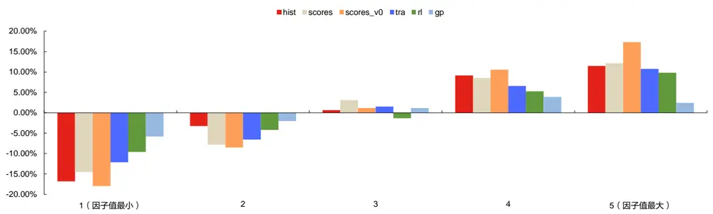
数据来源：东方证券研究所 & Wind资讯 & Tushare

图 29：沪深 300 股票池各模型分年绩效表现（2020.1.1-2023.12.31）

| 沪深300股票池各模型因子分年绩效表现 |  |  |  |  |  |  |  |  |  |  |
| --- | --- | --- | --- | --- | --- | --- | --- | --- | --- | --- |
| hist | IC | ICIR | rank IC | rank ICIR | long_r | long_win | long_sharp | long_drawdown | long_yearly | turnover |
| 2020 | 7.28% | 0.42 | 8.86% | 0.48 | 0.19% | 61.54% | 0.24 | -2.32% | 6.12% | 59.72% |
| 2021 | 9.80% | 0.54 | 12.44% | 0.63 | 1.15% | 61.54% | 1.22 | -5.88% | 16.03% | 48.06% |
| 2022 | 9.35% | 0.48 | 10.64% | 0.51 | 1.15% | 53.85% | 1.13 | -5.14% | 5.11% | 48.33% |
| 2023 | 10.18% | 0.55 | 13.92% | 0.81 | 0.36% | 66.67% | 0.52 | -3.52% | 7.85% | 49.55% |
| tra2 | IC | ICIR | rank IC | rank ICIR | long_r | long_win | long_sharp | long_drawdown | long_yearly | turnover |
| 2020 | 5.51% | 0.34 | 8.43% | 0.51 | 0.95% | 46.15% | 1.03 | -3.29% | 14.37% | 28.47% |
| 2021 | 6.05% | 0.29 | 10.45% | 0.52 | 0.60% | 61.54% | 0.60 | -10.38% | 3.84% | 28.61% |
| 2022 | 6.96% | 0.30 | 8.88% | 0.36 | 0.55% | 69.23% | 0.49 | -7.88% | -1.54% | 29.86% |
| 2023 | 11.93% | 0.59 | 16.08% | 0.82 | 0.76% | 50.00% | 0.80 | -3.03% | 14.17% | 27.58% |
| 985rl | IC | ICIR | rank IC | rank ICIR | long_r | long_win | long_sharp | long_drawdown | long_yearly | turnover |
| 2020 | 3.86% | 0.23 | 5.93% | 0.32 | 0.21% | 61.54% | 0.29 | -1.84% | 6.33% | 52.78% |
| 2021 | 5.93% | 0.39 | 9.53% | 0.58 | 0.24% | 53.85% | 0.39 | -6.58% | 4.59% | 49.17% |
| 2022 | 7.99% | 0.52 | 9.66% | 0.59 | 1.10% | 61.54% | 1.38 | -4.51% | 6.44% | 53.89% |
| 2023 | 5.94% | 0.30 | 10.53% | 0.61 | 0.79% | 58.33% | 0.78 | -3.01% | 12.33% | 55.61% |
| 152gp | IC | ICIR | rank IC | rank ICIR | long_r | long_win | long_sharp | long_drawdown | long_yearly | turnover |
| 2020 | 4.95% | 0.45 | 7.26% | 0.75 | 0.51% | 69.23% | 1.28 | -0.71% | 8.22% | 56.89% |
| 2021 | -0.24% | (0.02) | 2.00% | 0.18 | -0.20% | 53.85% | (0.31) | -5.31% | -3.39% | 52.32% |
| 2022 | -1.57% | (0.14) | -1.75% | (0.14) | -1.04% | 30.77% | (1.92) | -11.28% | -8.77% | 50.50% |
| 2023 | 6.72% | 0.66 | 7.87% | 0.76 | 0.70% | 83.33% | 1.34 | -2.98% | 7.90% | 48.91% |
| scores | IC | ICIR | rank IC | rank ICIR | long_r | long_win | long_sharp | long_drawdown | long_yearly | turnover |
| 2020 | 9.83% | 0.64 | 11.86% | 0.74 | 1.45% | 76.92% | 1.77 | -1.84% | 24.60% | 68.05% |
| 2021 | 9.46% | 0.64 | 11.47% | 0.78 | 1.53% | 84.62% | 1.83 | -6.61% | 18.31% | 70.90% |
| 2022 | 12.87% | 1.02 | 12.56% | 0.96 | 0.73% | 69.23% | 1.38 | -1.61% | 6.73% | 68.33% |
| 2023 | 5.45% | 0.35 | 8.26% | 0.62 | 0.86% | 54.55% | 1.25 | -1.00% | 12.80% | 69.72% |
| scores_v0 | IC | ICIR | rank IC | rank ICIR | long_r | long_win | long_sharp | long_drawdown | long_yearly | turnover |
| 2020 | 16.35% | 1.31 | 16.67% | 1.26 | 2.95% | 84.62% | 3.71 | -1.90% | 34.60% | 63.02% |
| 2021 | 7.44% | 0.54 | 6.90% | 0.49 | 1.45% | 61.54% | 1.35 | -6.26% | 12.43% | 62.14% |
| 2022 | 10.52% | 0.85 | 9.81% | 0.77 | 0.13% | 61.54% | 0.23 | -2.62% | 0.95% | 64.68% |
| 2023 | 9.08% | 0.52 | 11.48% | 0.75 | 1.03% | 75.00% | 1.15 | -2.34% | 16.30% | 63.64% |

数据来源：东方证券研究所 & Wind资讯 & Tushare

（3）在中证 500 股票池中，HIST 模型所得到的合成因子各项表现均明显最强。测试集上rankic 达到 12%，rankicir 达到 0.74（未年化），5 分组多头年化超额收益 16.11%，月均单边换手 54%。分组单调性好。分年rankic未出现明显衰减，但多头表现不太稳定。

图 30：中证 500 股票池各模型因子绩效表现（2020.1.1-2023.12.31）

| 中证500股票池 | IC | ICIR | rank IC | rank ICIR | long_r | long_win | long_sharp | long_drawdown | long_yearly | turnover |
| --- | --- | --- | --- | --- | --- | --- | --- | --- | --- | --- |
| 152gp | 3.18% | 0.31 | 6.66% | 0.66 | 0.42% | 60.42% | 0.87 | -5.07% | 5.04% | 49.01% |
| 985rl | 5.92% | 0.39 | 10.33% | 0.66 | 0.63% | 58.33% | 0.92 | -5.68% | 8.61% | 49.13% |
| tra2 | 6.39% | 0.42 | 11.05% | 0.70 | 0.76% | 64.58% | 1.26 | -4.92% | 9.33% | 42.37% |
| scores | 8.21% | 0.70 | 10.89% | 0.97 | 0.72% | 75.00% | 1.53 | -2.39% | 10.28% | 71.70% |
| scores_v0 | 9.37% | 0.84 | 11.22% | 0.99 | 1.29% | 77.08% | 2.27 | -4.87% | 14.60% | 66.24% |
| hist | 7.95% | 0.51 | 12.16% | 0.74 | 1.30% | 66.67% | 1.88 | -5.29% | 16.11% | 53.74% |

数据来源：东方证券研究所 & Wind资讯 & Tushare

有关分析师的申明，见本报告最后部分。其他重要信息披露见分析师申明之后部分，或请与您的投资代表联系。并请阅读本证券研究报告最后一页的免责申明。

图 31：中证 500 股票池各模型分组年化超额收益（2020.1.1-2023.12.31）
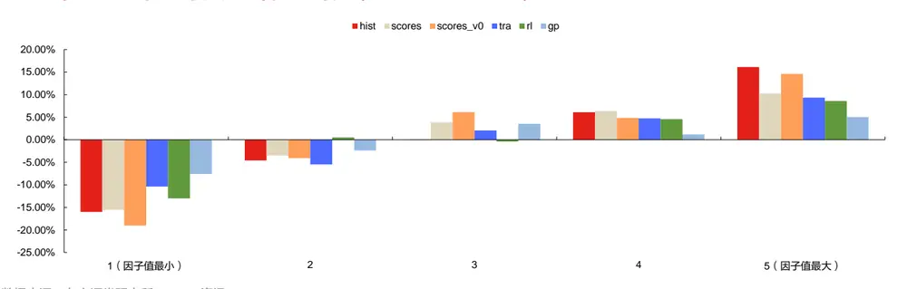
数据来源：东方证券研究所 & Wind资讯 & Tushare

图 32：中证 500 股票池各模型分年绩效表现（2020.1.1-2023.12.31）

| 中证500股票池各模型因子分年绩效表现 |  |  |  |  |  |  |  |  |  |  |
| --- | --- | --- | --- | --- | --- | --- | --- | --- | --- | --- |
| hist | IC | ICIR | rank IC | rank ICIR | long_r | long_win | long_sharp | long_drawdown | long_yearly | turnover |
| 2020 | 6.35% | 0.44 | 10.41% | 0.66 | 0.61% | 69.23% | 1.10 | -1.27% | 6.31% | 58.67% |
| 2021 | 8.24% | 0.55 | 12.09% | 0.72 | 1.15% | 69.23% | 1.29 | -5.65% | 15.47% | 51.17% |
| 2022 | 9.83% | 0.68 | 12.87% | 0.79 | 0.90% | 76.92% | 1.31 | -2.79% | 4.98% | 50.75% |
| 2023 | 7.35% | 0.40 | 13.38% | 0.78 | 0.80% | 50.00% | 1.25 | -2.64% | 10.25% | 52.82% |
| tra2 | IC | ICIR | rank IC | rank ICIR | long_r | long_win | long_sharp | long_drawdown | long_yearly | turnover |
| 2020 | 5.41% | 0.42 | 10.69% | 0.74 | 0.52% | 69.23% | 1.12 | -2.91% | 6.67% | 40.25% |
| 2021 | 5.34% | 0.35 | 11.22% | 0.72 | 1.08% | 38.46% | 1.29 | -4.40% | 9.36% | 42.83% |
| 2022 | 6.31% | 0.42 | 8.66% | 0.53 | 0.58% | 61.54% | 0.79 | -3.51% | 1.34% | 44.58% |
| 2023 | 8.70% | 0.51 | 13.85% | 0.86 | 0.85% | 58.33% | 1.28 | -2.10% | 12.40% | 42.14% |
| 985rl | IC | ICIR | rank IC | rank ICIR | long_r | long_win | long_sharp | long_drawdown | long_yearly | turnover |
| 2020 | 5.25% | 0.38 | 9.50% | 0.59 | 0.04% | 53.85% | 0.07 | -1.22% | 4.22% | 52.25% |
| 2021 | 5.78% | 0.43 | 10.22% | 0.69 | 0.60% | 53.85% | 0.76 | -5.83% | 6.96% | 49.58% |
| 2022 | 8.61% | 0.67 | 11.46% | 0.79 | 0.97% | 69.23% | 1.22 | -3.78% | 4.91% | 48.75% |
| 2023 | 3.88% | 0.20 | 10.11% | 0.57 | 0.82% | 58.33% | 1.01 | -3.72% | 10.25% | 52.82% |
| 152gp | IC | ICIR | rank IC | rank ICIR | long_r | long_win | long_sharp | long_drawdown | long_yearly | turnover |
| 2020 | 2.16% | 0.18 | 6.52% | 0.59 | -0.16% | 38.46% | (0.39) | -2.95% | -1.71% | 54.13% |
| 2021 | 3.05% | 0.30 | 6.46% | 0.68 | 0.19% | 46.15% | 0.48 | -3.33% | 2.29% | 57.34% |
| 2022 | 2.84% | 0.34 | 3.74% | 0.41 | -0.52% | 38.46% | (1.72) | -7.36% | -6.02% | 47.60% |
| 2023 | 4.80% | 0.47 | 10.22% | 1.12 | 0.56% | 66.67% | 1.69 | -1.15% | 6.58% | 44.85% |
| scores | IC | ICIR | rank IC | rank ICIR | long_r | long_win | long_sharp | long_drawdown | long_yearly | turnover |
| 2020 | 7.91% | 0.67 | 12.38% | 1.00 | 0.71% | 76.92% | 1.10 | -2.10% | 13.82% | 73.27% |
| 2021 | 7.74% | 0.73 | 10.00% | 0.96 | 1.31% | 69.23% | 2.19 | -1.61% | 12.95% | 69.00% |
| 2022 | 10.89% | 1.13 | 12.05% | 1.19 | 0.47% | 76.92% | 0.90 | -3.33% | 5.28% | 71.47% |
| 2023 | 6.07% | 0.42 | 8.93% | 0.77 | 0.50% | 54.55% | 0.97 | -1.17% | 7.83% | 68.27% |
| scores_v0 | IC | ICIR | rank IC | rank ICIR | long_r | long_win | long_sharp | long_drawdown | long_yearly | turnover |
| 2020 | 10.58% | 1.00 | 14.02% | 1.26 | 2.18% | 84.62% | 3.39 | -2.33% | 22.11% | 63.91% |
| 2021 | 9.51% | 0.90 | 10.22% | 0.90 | 1.60% 0.35% | 76.92% | 1.92 | -4.45% | 14.50% | 66.16% |
| 2022 2023 | 9.32% 7.94% | 0.98 0.58 | 9.18% 11.46% | 0.79 1.07 | 0.63% | 61.54% 66.67% | 0.64 1.91 | -2.96% -0.47% | 2.17% 8.69% | 65.87% 65.47% |

数据来源：东方证券研究所 & Wind 资讯 & Tushare

（4）在中证 1000 股票池中，HIST 模型所得到的合成因子各项表现均明显最强。测试集上rankic 达到 15%，rankicir达到 1.13（未年化），10分组多头年化超额收益 25%，月均单边换手68%。分组单调性好。分年表现有所衰减，2022和 2023年的多头表现整体不如 2020和 2021年。

图 33：中证 1000 股票池各模型因子绩效表现（2020.1.1-2023.12.31）

| 中证1000股票池 | IC | ICIR | rank IC | rank ICIR | long_r | long_win | long_sharp | long_drawdown | long_yearly | turnover |
| --- | --- | --- | --- | --- | --- | --- | --- | --- | --- | --- |
| 152gp | 7.53% | 0.71 | 10.75% | 1.09 | 0.81% | 66.67% | 1.63 | -5.20% | 10.29% | 59.90% |
| 985rl | 9.41% | 0.71 | 12.61% | 0.90 | 0.95% | 62.50% | 1.38 | -7.70% | 12.39% | 64.79% |
| tra2 | 9.73% | 0.70 | 13.80% | 0.96 | 1.17% | 70.83% | 1.73 | -8.31% | 15.29% | 59.12% |
| scores | 12.19% | 1.24 | 13.81% | 1.47 | 1.05% | 79.17% | 2.20 | -2.72% | 14.03% | 82.66% |
| scores_v0 | 12.96% | 1.32 | 14.23% | 1.49 | 1.77% | 79.17% | 2.79 | -4.33% | 22.02% | 79.32% |
| hist | 11.51% | 0.92 | 15.05% | 1.13 | 1.87% | 77.08% | 2.83 | -2.59% | 25.03% | 68.45% |

数据来源：东方证券研究所 & Wind资讯 & Tushare

## 图 34：中证 1000 股票池各模型分组年化超额收益（2020.1.1-2023.12.31）

有关分析师的申明，见本报告最后部分。其他重要信息披露见分析师申明之后部分，或请与您的投资代表联系。并请阅读本证券研究报告最后一页的免责申明。

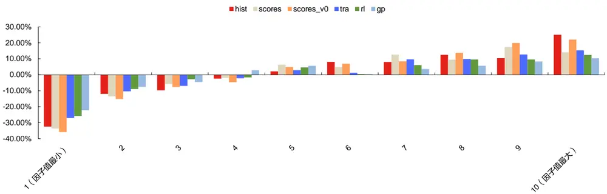
数据来源：东方证券研究所 & Wind资讯 & Tushare

图 35：中证 1000 股票池各模型分年绩效表现（2020.1.1-2023.12.31）

| 中证1000股票池各模型因子分年绩效表现 |  |  |  |  |  |  |  |  |  |  |
| --- | --- | --- | --- | --- | --- | --- | --- | --- | --- | --- |
| hist | IC | ICIR | rank IC | rank ICIR | long_r | long_win | long_sharp | long_drawdown | long_yearly | turnover |
| 2020 | 12.86% | 1.10 | 16.62% | 1.26 | 1.97% | 84.62% | 3.79 | -0.36% | 28.22% | 72.33% |
| 2021 | 11.16% | 1.06 | 15.36% | 1.20 | 1.94% | 61.54% | 2.45 | -2.29% | 24.14% | 67.33% |
| 2022 | 13.26% | 1.19 | 15.19% | 1.29 | 1.87% | 69.23% | 3.00 | -0.71% | 17.34% | 68.33% |
| 2023 | 8.49% | 0.53 | 12.82% | 0.83 | 1.13% | 75.00% | 2.09 | -1.50% | 13.23% | 64.91% |
| tra2 | IC | ICIR | rank IC | rank ICIR | long_r | long_win | long_sharp | long_drawdown | long_yearly | turnover |
| 2020 | 10.47% | 0.85 | 15.19% | 1.14 | 1.03% | 69.23% | 1.69 | -1.78% | 15.19% | 60.96% |
| 2021 | 9.18% | 0.63 | 13.95% | 0.88 | 1.14% | 61.54% | 1.13 | -8.84% | 12.41% | 57.08% |
| 2022 | 10.16% | 0.81 | 12.24% | 0.93 | 1.29% | 69.23% | 1.76 | -0.86% | 8.98% | 58.33% |
| 2023 | 9.04% | 0.57 | 13.81% | 0.93 | 0.87% | 58.33% | 1.45 | -1.93% | 12.60% | 56.91% |
| 985rl | IC | ICIR | rank IC | rank ICIR | long_r | long_win | long_sharp | long_drawdown | long_yearly | turnover |
| 2020 | 11.72% | 1.05 | 15.53% | 1.26 | 1.06% | 61.54% | 1.89 | -1.20% | 15.82% | 67.58% |
| 2021 | 7.95% | 0.71 | 12.30% | 0.93 | 1.13% | 61.54% | 1.17 | -7.63% | 11.24% | 66.00% |
| 2022 | 11.89% | 1.03 | 12.96% | 1.05 | 1.40% | 61.54% | 1.75 | -2.26% | 10.55% | 66.50% |
| 2023 | 5.79% | 0.32 | 9.35% | 0.55 | 0.99% | 66.67% | 1.18 | -4.02% | 11.26% | 62.64% |
| 152gp | IC | ICIR | rank IC | rank ICIR | long_r | long_win | long_sharp | long_drawdown | long_yearly | turnover |
| 2020 | 7.59% | 0.66 | 11.47% | 1.06 | 0.69% | 53.85% | 1.24 | -1.73% | 9.56% | 65.50% |
| 2021 | 4.96% | 0.52 | 9.44% | 0.96 | 0.66% | 61.54% | 1.60 | -3.37% | 7.82% | 66.77% |
| 2022 | 8.98% | 0.99 | 9.24% | 1.05 | 0.56% | 61.54% | 1.18 | -2.13% | 3.99% | 58.67% |
| 2023 | 8.69% | 0.73 | 13.04% | 1.38 | 1.20% | 75.00% | 2.73 | -1.25% | 14.93% | 53.77% |
| scores | IC | ICIR | rank IC | rank ICIR | long_r | long_win | long_sharp | long_drawdown | long_yearly | turnover |
| 2020 | 13.50% | 1.46 | 16.92% | 1.88 | 1.56% | 92.31% | 2.80 | 0.00% | 23.47% | 83.48% |
| 2021 | 10.57% | 1.55 | 12.88% | 1.66 | 1.47% | 84.62% | 3.88 | -1.13% | 17.06% | 82.65% |
| 2022 | 14.98% | 1.45 | 14.88% | 1.53 | 1.59% | 76.92% | 2.26 | -3.94% | 17.53% | 81.66% |
| 2023 | 9.42% | 0.81 | 10.20% | 1.03 | 0.86% | 63.64% | 1.81 | -1.79% | 10.70% | 80.69% |
| scores_v0 | IC | ICIR | rank IC | rank ICIR | long_r | long_win | long_sharp | long_drawdown | long_yearly | turnover |
| 2020 | 16.51% | 2.01 | 18.30% | 2.29 | 2.98% | 76.92% | 4.06 | -0.91% | 37.50% | 76.03% |
| 2021 | 11.87% | 1.74 | 12.98% | 1.61 | 2.50% | 84.62% | 3.83 | -0.45% | 26.02% | 80.31% |
| 2022 | 13.70% | 1.49 | 13.70% | 1.37 | 1.16% | 69.23% | 2.13 | -2.16% | 13.10% | 77.63% |
| 2023 | 9.44% | 0.72 | 11.72% | 1.08 | 0.43% | 75.00% | 2.96 | -0.32% | 4.72% | 80.17% |

数据来源：东方证券研究所 & Wind资讯 & Tushare

## 4.3 中性化因子表现

HIST 模型因子受行业市值风格的影响较小，因子中性化后表现依然很强，优于其他模型，仅 rankic 和多头收益略有降低，但因子稳定性明显提高，rankicir 提升，多头超额最大回撤降低。原始因子 rankic 达到 16.98%，中性化后仍有 14.41%。原始因子 rankicir 达到 1.34（未年化），中性化后提高到1.72。原始因子20分组多头年化超额收益达到29.31%，中性化降低到21.72%。

图 36：中证全指股票池各模型中性化因子绩效表现（2020.1.1-2023.12.31）

| 中证全指股票池 | IC | ICIR | rank IC | rank ICIR | long_r | long_win | long_sharp | long_drawdown | long_yearly | turnover |
| --- | --- | --- | --- | --- | --- | --- | --- | --- | --- | --- |
| 原始hist | 11.91% | 1.03 | 16.98% | 1.34 | 2.11% | 87.50% | 3.16 | -2.87% | 29.31% | 72.95% |
| 中性化hist | 10.27% | 1.27 | 14.41% | 1.72 | 1.61% | 83.33% | 3.15 | -1.49% | 21.72% | 75.00% |
| 原始tra2 | 10.73% | 0.86 | 16.36% | 1.24 | 1.69% | 75.00% | 2.22 | -3.95% | 23.21% | 56.97% |
| 中性化tra2 | 8.74% | 1.00 | 13.64% | 1.55 | 1.03% | 72.92% | 1.81 | -4.44% | 13.22% | 56.95% |
| 原始985rl | 9.63% | 0.81 | 14.01% | 1.08 | 1.27% | 73.33% | 1.78 | -3.69% | 17.67% | 70.40% |
| 中性化985rl | 8.90% | 1.05 | 12.41% | 1.48 | 1.28% | 79.17% | 2.91 | -1.68% | 16.26% | 74.13% |
| 原始152gp | 8.08% | 0.83 | 12.35% | 1.39 | 1.12% | 70.83% | 2.17 | -3.77% | 14.27% | 69.07% |
| 中性化152gp | 8.05% | 0.83 | 12.25% | 1.38 | 1.05% | 72.92% | 2.01 | -4.43% | 13.41% | 68.32% |
| 原始scores | 11.42% | 1.21 | 14.58% | 1.57 | 0.96% | 77.08% | 2.13 | -5.02% | 12.55% | 89.38% |
| 中性化scores | 10.68% | 1.50 | 13.03% | 2.07 | 1.10% | 75.00% | 2.34 | -3.53% | 13.14% | 86.83% |
| 原始scores_v0 | 13.01% | 1.47 | 15.76% | 1.71 | 1.95% | 83.33% | 2.89 | -3.77% | 24.54% | 85.37% |
| 中性化scores_v0 | 11.52% | 1.79 | 13.12% | 2.19 | 1.50% | 79.17% | 2.88 | -3.30% | 18.54% | 85.65% |

数据来源：东方证券研究所 & Wind资讯 & Tushare

## 4.4 随机种子的影响

随机种子对全市场训练的HIST模型结果影响不大，5个路径下得到的因子值相关系数在90%左右。

图 37：中证全指股票池 HIST模型基础特征输入下 5个随机种子得到的因子值相关系数（2020.1.1-2023.9.15）

|  | seed0 | seed10 | seed100 | seed500 | seed1000 |
| --- | --- | --- | --- | --- | --- |
| seed0 | 100.00% | 92.03% | 95.92% | 94.77% | 97.06% |
| seed10 | 92.03% | 100.00% | 89.86% | 86.83% | 91.09% |
| seed100 | 95.92% | 89.86% | 100.00% | 96.20% | 95.67% |
| seed500 | 94.77% | 86.83% | 96.20% | 100.00% | 95.05% |
| seed1000 | 97.06% | 91.09% | 95.67% | 95.05% | 100.00% |

数据来源：东方证券研究所 & Wind资讯 & Tushare

图 38：中证全指股票池 HIST模型 alpha因子输入下 5个随机种子得到的因子值相关系数（2020.1.1-2023.9.15）

|  | seed0 | seed10 | seed100 | seed500 | seed1000 |
| --- | --- | --- | --- | --- | --- |
| seed0 | 100.00% | 84.40% | 87.80% | 90.60% | 88.56% |
| seed10 | 84.40% | 100.00% | 88.42% | 87.15% | 84.14% |
| seed100 | 87.80% | 88.42% | 100.00% | 89.46% | 87.34% |
| seed500 | 90.60% | 87.15% | 89.46% | 100.00% | 89.56% |
| seed1000 | 88.56% | 84.14% | 87.34% | 89.56% | 100.00% |

数据来源：东方证券研究所 & Wind资讯 & Tushare

## 4.5 与其他量价模型相关性

HIST模型合成因子与 985rl因子的相关性最高，与 score_v0因子的相关性最低。

图 39：中证全指股票池中各模型因子值相关性（2020.1.1-2023.9.15）

| 985因子值相关性 | hist | tra | 985rl | 152gp | scores | scores_v0 |
| --- | --- | --- | --- | --- | --- | --- |
| hist | 100.00% | 75.17% | 80.82% | 70.38% | 69.01% | 54.64% |
| tra | 75.17% | 100.00% | 69.12% | 66.83% | 55.77% | 48.51% |
| 985rl | 80.82% | 69.12% | 100.00% | 72.51% | 64.64% | 48.15% |
| 152gp | 70.38% | 66.83% | 72.51% | 100.00% | 58.09% | 44.80% |
| scores | 69.01% | 55.77% | 64.64% | 58.09% | 100.00% | 68.47% |
| scores_v0 | 54.64% | 48.51% | 48.15% | 44.80% | 68.47% | 100.00% |

数据来源：东方证券研究所 & Wind资讯 & Tushare

图 40：中证全指股票池中各模型 rankic 相关性（2020.1.1-2023.6.30）

| 985rankic相关性 | hist | tra | 985rl | 152gp | scores | scores_v0 |
| --- | --- | --- | --- | --- | --- | --- |
| hist | 100.00% | 91.85% | 91.32% | 82.23% | 80.37% | 61.36% |
| tra | 91.85% | 100.00% | 85.59% | 82.35% | 72.32% | 61.46% |
| 985rl | 91.32% | 85.59% | 100.00% | 79.94% | 85.10% | 58.30% |
| 152gp | 82.23% | 82.35% | 79.94% | 100.00% | 71.19% | 49.95% |
| scores | 80.37% | 72.32% | 85.10% | 71.19% | 100.00% | 63.28% |
| scores_v0 | 61.36% | 61.46% | 58.30% | 49.95% | 63.28% | 100.00% |

数据来源：东方证券研究所 & Wind资讯 & Tushare

有关分析师的申明，见本报告最后部分。其他重要信息披露见分析师申明之后部分，或请与您的投资代表联系。并请阅读本证券研究报告最后一页的免责申明。

## 五、指数增强组合

## 5.1 指数增强组合构建说明

（1）回测期：20200123-20231231，组合月频调仓，假设根据每月末个股得分在次日以vwap 价格进行交易。

（2）组合约束：风险因子库（参见《东方 A 股因子风险模型（DFQ-2020）》）中所有的风格因子相对暴露不超过 0.5，所有行业因子相对暴露不超过 2%。沪深 300 增强跟踪误差约束不超过 4%，中证 500 和 1000增强跟踪误差约束不超过 5%。个股权重设置上限约束。限制指数成分股权重占比不低于 80%。

（3）考虑交易成本：假设买卖手续费双边千三，停牌涨停不能买入、停牌跌停不能卖出。

## 5.2沪深300 指数增强组合业绩

HIST 模型所得到的合成因子在沪深 300 指增组合中表现较好：（1）整体表现：2020 年以来年化信息比达到 2.27，年化对冲收益 11.55%，年化跟踪误差 4.87%，单边年换手 7.45 倍。（2）回撤情况：超额收益在 2020 年年底到 2021 年上半年有一个较大的回撤，其他时间点最大回撤基本能控制在 3%以内。（3）分年表现：2020-2023 每年取得 10%左右的正超额，2023 年对冲收益达 14%。（4）分月表现：2023 年仅 1 月跑输基准，其他月份均取得正超额。（5）组合优化约束影响：是否约束成分股占比对组合收益影响不大，但 2023 年对冲收益能提升到 16%。主要原因在于沪深 300 成分股的市值在样本空间内最大，市值约束的存在导致即使不做成分约束，增强组合持仓也大多数在成分股内；去掉组合的行业和风格暴露约束可以明显提升收益表现，年化对冲收益提高到13%，信息比提高到2.6，跟踪误差和回撤无明显变化，但2023年对冲收益下降到 13%；去掉跟踪误差约束可以明显提升收益表现，年化对冲收益提高到 14%，但跟踪误差和回撤都有大幅提升，信息比下降，2023年对冲收益可以提高到16%；去掉成分股、行业和风格暴露、以及跟踪误差约束后，年化对冲收益可以大幅提高到 33%，但跟踪误差和最大回撤也相应大幅提高，2023年对冲收益可以提高到 41%；收窄个股权重上限对于组合结果影响不大。

图 41：沪深 300 股票池指数增强组合绩效表现（2020.1.1-2023.12.31）

| 20200101-20231229 300月频 | 152gp | 985rl | tra2 |  |  | hist | hist |  |  | hist |
| --- | --- | --- | --- | --- | --- | --- | --- | --- | --- | --- |
| 买卖手续费双边干三 | 行业暴露0.02 风格暴露0.5 跟踪误差4% 80%成分内约束 | 沪深300全市场增强组合沪深300全市场增强组合 沪深300全市场增强组合 沪深300全市场增强组合沪深300全市场增强组合 沪深300全市场增强组合沪深300全市场增强组合 沪深300全市场增强组合沪深300全市场增强组合 80%成分内约束 |  | 80%成分内约束 | 80%成分内约束 | 无成分内约束 | 无暴露约束 | 无跟踪误差约束 | 无任何约束 | 个股权重上限收窄 |
|  | 信息比（年化） | 1.25 | 1.38 | 1.91 | 2.27 | 2.30 | 2.58 | 1.99 | 1.51 | 2.34 |
|  | 年化对冲收益 | 5.74% | 8.04% | 13.22% | 11.55% | 12.08% | 13.02% | 14.01% | 33.06% | 12.23% |
|  | 跟踪误差（年化） | 4.54% | 5.72% | 6.61% | 4.87% | 5.01% | 4.79% | 6.70% | 20.24% | 4.98% |
|  | 对冲收益最大回撤 | -4.92% | -8.87% | -7.34% | -9.89% | -11.05% | -9.28% | -12.05% | -31.61% | -10.10% |
|  | 对冲收益最大回撤出现时间点 | 20210113 | 20210113 | 20210902 | 20210113 | 20210113 | 20210113 | 20210113 | 20210210 | 20210113 |
|  | 对冲收益最大回撤恢复天数 | 70 | 173 | 89 | 149 | 159 | 153 | 140 | 126 | 153 |
|  | 单边换手率（年） | 7.29 | 8.29 | 6.07 | 7.45 | 7.43 | 7.29 | 8.07 | 10.12 | 7.07 |
|  | 持股数量 | 96.81 | 62.40 | 62.88 | 85.10 | 88.83 | 89.67 | 43.79 | 49.56 | 84.92 |
|  | 成分内股票占比 | 79.73% | 80.36% | 80.36% | 80.29% | 71.87% | 80.35% | 80.00% | 2.64% | 80.21% |
|  | 2020 | 5.62% | 0.56% | 12.64% | 9.36% | 6.93% | 12.55% | 4.82% | 12.27% | 8.11% |
| 分年收益 | 2021 | 9.99% | 5.13% | 6.02% | 9.69% | 10.80% | 10.43% | 18.90% | 46.57% | 10.86% |
|  | 2022 | 3.91% | 12.46% | 18.30% | 11.14% | 12.74% | 13.47% | 14.55% | 28.71% | 12.75% |
|  | 2023 | 2.59% | 13.12% | 13.92% | 14.05% | 15.90% | 13.34% | 15.78% | 41.07% | 15.16% |
|  | 202301 | -0.03% | -0.98% | -2.36% | -0.30% | -0.20% | -0.40% | -1.26% | 0.13% | -0.57% |
|  | 202302 | 2.35% | 2.28% | 2.65% | 1.62% | 1.47% | 1.10% | 2.11% | 7.46% | 1.94% |
|  | 202303 | 0.03% | 1.12% | 1.19% | 0.95% | 0.91% | 1.45% | 1.43% | 0.84% | 0.99% |
|  |  | -2.16% | 2.12% | 1.34% | 0.28% | 0.85% | 0.01% | 1.16% | -3.43% | 1.08% |
|  | 202304 202305 | 0.75% | 2.41% | 5.39% | 1.49% | 1.96% | 1.39% | 2.24% | 9.20% | 1.72% |
|  | 202306 | 0.89% | 1.04% | -0.56% | 1.82% | 2.24% | 1.95% | 1.35% | 0.68% | 1.34% |
|  | -0.57% | 1.20% | -0.66% | 2.70% | 2.52% | 3.12% | 2.18% | 1.72% | 2.95% |  |
| 202307 | 0.99% | 3.15% | 2.39% | 1.03% | 1.28% | 1.08% | 1.35% | 3.34% | 0.92% |  |
| 202308 | -0.84% | 0.47% | 0.54% | 0.91% | 0.56% | 0.84% | 1.39% | 2.96% | 1.12% |  |
| 202309 202310 | 0.52% | -0.85% | 0.59% | 0.65% | 0.70% | 0.47% | 0.79% | 3.84% | 0.51% |  |
| 202311 | 0.49% | 0.22% | 1.46% | 1.92% | 2.72% | 1.88% | 1.79% | 6.19% | 1.80% |  |
| 202312 | 0.36% | 0.55% | 1.24% | 0.11% | -0.30% | -0.27% | 0.27% | 0.25% | 0.31% |  |

数据来源：东方证券研究所 & Wind 资讯 & Tushare

有关分析师的申明，见本报告最后部分。其他重要信息披露见分析师申明之后部分，或请与您的投资代表联系。并请阅读本证券研究报告最后一页的免责申明。

图 42：沪深 300 股票池指数增强组合超额净值与回撤（2020.1.1-2023.12.31）
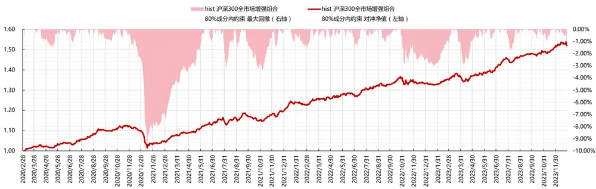
数据来源：东方证券研究所 & Wind资讯 & Tushare

## 5.3中证500 指数增强组合业绩

HIST 模型所得到的合成因子在中证 500 指增组合中表现较好：（1）整体表现：2020 年以来年化信息比达到 2.09，年化对冲收益 13.13%，年化跟踪误差 6%，单边年换手 9.67倍。（2）回撤情况：超额收益在 2020 年年底到 2021年上半年有一个较大的回撤，其他时间点最大回撤基本能控制在5%以内。（3）分年表现：2020-2023每年均取得正超额，2023年对冲收益7.51%。（4）分月表现：2023年1、3、4、9、10月跑输基准，其他月份均取得正超额。（5）组合优化约束影响：去掉成分股约束可以明显提升收益表现，年化对冲收益提高到 20%，信息比提高到2.8，跟踪误差无明显变化，但最大回撤有明显提高。2023 年对冲收益可以提高到 24%；去掉组合的行业和风格暴露约束对于结果影响不大；去掉跟踪误差约束可以明显提升收益表现，年化对冲收益提高到 21%，但跟踪误差和最大回撤也有明显提高，2023 年对冲收益可以提高到 20%；去掉成分股、行业和风格暴露、以及跟踪误差约束后，年化对冲收益可以大幅提高到 30%，但跟踪误差和最大回撤也大幅提高，2023年对冲收益可以提高到36%；收窄个股权重上限对于组合结果影响不大。

图 43：中证 500 股票池指数增强组合绩效表现（2020.1.1-2023.12.31）
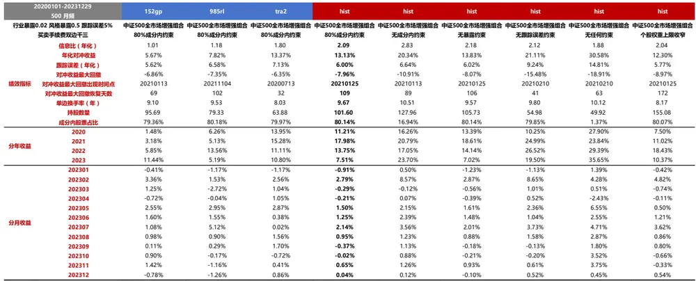
数据来源：东方证券研究所 & Wind资讯 & Tushare

有关分析师的申明，见本报告最后部分。其他重要信息披露见分析师申明之后部分，或请与您的投资代表联系。并请阅读本证券研究报告最后一页的免责申明。

图 44：中证 500 股票池指数增强组合超额净值与回撤（2020.1.1-2023.12.31）
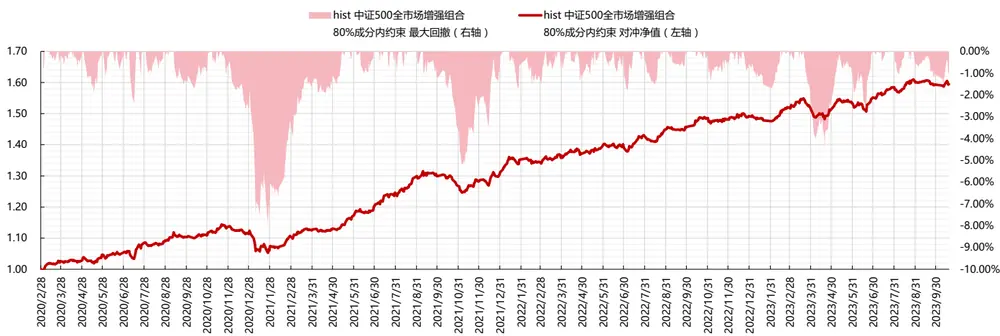
数据来源：东方证券研究所 & Wind资讯 & Tushare

## 5.4中证1000 指数增强组合业绩

HIST 模型所得到的合成因子在中证 1000 指增组合中表现突出：（1）整体表现：2020 年以来年化信息比达到 3.6，年化对冲收益 25.55%，年化跟踪误差 6.39%，单边年换手 10.06 倍。（2）回撤情况：超额收益净值曲线走势较为平滑，没有出现长时间失效的问题。超额收益最大回撤仅为 4.55%，出现在 2023年 4月，且回撤持续时间很短。（3）分年表现：2020-2023每年均取得正超额，2023 年对冲收益 20%。（4）分月表现： 2023 年 3、10 月跑输基准，其他月份均取得正超额。（5）组合优化约束影响：去掉成分股约束收益表现不佳，超额收益和信息比降低，最大回撤提高，但 2023 年对冲收益可以提高到 24%；去掉组合的行业和风格暴露约束对于结果影响不大；去掉跟踪误差约束可以大幅提升收益表现， 年化对冲收益提高到 28%，但跟踪误差和最大回撤有明显提高，2023年对冲收益可以提高到26%；去掉成分股、行业和风格暴露、以及跟踪误差约束后，年化对冲收益可以提高到30%，但跟踪误差和最大回撤有明显提高，2023年对冲收益可以提高到 34%；收窄个股权重上限对于组合结果有一定影响，超额收益和信息比降低，最大回撤提高，2023年对冲收益降低到 14%。

图 45：中证 1000 股票池指数增强组合绩效表现（2020.1.1-2023.12.31）

| 20200101-20231229 1000月频 |  | 152gp | 985rl | tra2 | hist | hist | hist | hist | hist | hist |
| --- | --- | --- | --- | --- | --- | --- | --- | --- | --- | --- |
| 买卖手续费双边千三 | 行业暴露0.02 风格暴露0.5 跟踪误差5% | 中证1000全市场增强组合 80%成分内约束 | 中证1000全市场增强组合 80%成分内约束 | 中证1000全市场增强组合 80%成分内约束 | 中证1000全市场增强组合 80%成分内约束 | 中证1000全市场增强组合 无成分内约束 | 中证1000全市场增强组合 无暴露约束 | 中证1000全市场增强组合 无跟踪误差约束 | 中证1000全市场增强组合 无任何约束 | 中证1000全市场增强组合 个股权重上限收窄 |
|  |  |  |  |  |  |  |  | 2.56 |  |  |
|  | 信息比（年化） | 1.40 | 1.31 | 2.37 | 3.60 | 3.17 | 3.51 25.10% | 28.27% | 1.93 29.52% | 2.90 |
|  | 年化对冲收益 | 9.29% 6.50% | 9.26% 6.95% | 18.46% | 25.55% 6.39% | 23.30% 6.69% | 6.45% | 9.94% | 13.94% | 19.86% |
|  | 跟踪误差（年化） | -10.28% | -6.65% | 7.27% -7.31% | -4.55% |  | -4.84% | -6.83% | -13.35% | 6.32% |
|  | 对冲收益最大回撤 | 20210915 | 20210113 | 20210915 | 20230420 | -7.49% | 20230420 | 20210125 | 20210113 | -5.85% |
|  | 对冲收益最大回撤出现时间点 |  |  |  |  | 20210113 |  |  |  | 20210107 |
|  | 对冲收益最大回撤恢复天数 | 257 9.39 | 43 10.00 | 62 | 27 | 40 | 29 | 28 | 55 | 48 |
|  | 单边换手率（年） 持股数量 | 117.88 | 102.27 | 8.81 95.31 | 10.06 125.02 | 10.63 136.81 | 9.97 129.40 | 10.34 55.79 | 10.12 49.81 | 9.03 |
|  | 成分内股票占比 | 79.49% | 80.14% | 80.04% | 80.11% | 33.35% | 80.11% | 79.87% | 5.16% | 179.46 80.04% |
|  | 2020 | 7.29% | 14.87% | 23.85% | 26.46% | 21.89% | 26.06% | 20.54% | 31.94% | 18.49% |
|  | 2021 | 0.99% | 7.63% | 13.53% | 30.48% | 24.22% | 30.67% | 30.85% | 18.18% | 19.27% |
|  | 2022 | 10.06% | 7.55% | 19.47% | 20.66% | 19.03% | 19.98% | 31.06% | 29.12% | 24.30% |
|  | 2023 | 17.85% | 5.59% | 13.94% | 20.11% | 23.81% | 19.33% | 25.59% | 33.82% | 13.97% |
|  | 202301 | 0.90% | -0.05% | 0.40% | 0.92% | 0.84% | 0.87% | 0.50% | 1.00% | 1.29% |
|  | 202302 | 3.97% | 0.39% | 2.06% | 9.41% | 6.34% | 9.62% | 11.74% | 3.16% | 4.11% |
|  | 202303 | 0.35% | -1.76% | -0.29% | -0.09% | 0.04% | -0.18% | 0.80% | 1.37% | 0.11% |
|  | 202304 | 1.06% | -1.34% | 1.53% | 0.17% | 0.40% | -0.13% | 0.30% | -1.76% | 0.18% |
|  |  | 2.89% | 3.18% | 2.62% | 2.46% | 3.19% | 2.40% | 2.14% | 5.85% | 2.10% |
|  | 202305 | 1.89% | 0.12% | 1.58% | 1.35% | 1.49% | 1.41% | 0.83% | 1.21% | 0.48% |
|  | 202306 | 2.88% | 4.21% | 2.46% | 3.62% | 4.22% | 3.60% | 5.59% | 7.50% | 4.80% |
|  | 202307 202308 | 0.99% | 1.61% | 1.22% | 1.37% | 1.66% | 1.03% | 2.03% | 3.45% | 0.97% |
|  |  |  |  |  |  |  |  |  |  | 0.06% |
|  | 202309 | 0.43% 0.47% | -0.03% -1.13% | 1.60% -1.95% | 0.37% -1.23% | 1.18% 0.33% | 0.49% -0.77% | 1.11% -1.74% | 1.37% 2.45% | -0.84% |
|  | 202310 | 0.95% | 0.35% | 1.25% | 0.44% | 1.19% | 0.03% | 0.06% | 2.16% |  |
| 202311 202312 |  | 0.74% | 1.58% | 0.55% |  |  |  | 0.93% |  | 0.15% 0.20% |

数据来源：东方证券研究所 & Wind资讯 & Tushare

有关分析师的申明，见本报告最后部分。其他重要信息披露见分析师申明之后部分，或请与您的投资代表联系。并请阅读本证券研究报告最后一页的免责申明。

图 46：中证 1000 股票池指数增强组合超额净值与回撤（2020.1.1-2023.12.31）
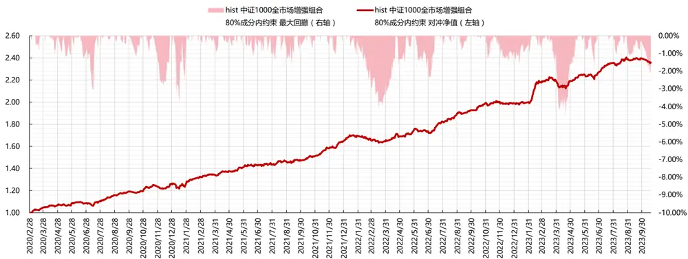
数据来源：东方证券研究所 & Wind资讯 & Tushare

## 参考文献

1. Xu W, Liu W, Wang L, et al. Hist: A graph-based framework for stock trend forecasting via mining concept-oriented shared information[J]. arXiv preprint arXiv:2110.13716, 2021.

2. Wang M, Zhang M, Guo J, et al. MTMD: Multi-Scale Temporal Memory Learning and Efficient Debiasing Framework for Stock Trend Forecasting[J]. arXiv preprint arXiv:2212.08656, 2022.

## 风险提示

1. 量化模型基于历史数据分析，未来存在失效风险，建议投资者紧密跟踪模型表现。

2. 极端市场环境可能对模型效果造成剧烈冲击，导致收益亏损。

## Tabl e_Disclai mer 分析师申明

每位负责撰写本研究报告全部或部分内容的研究分析师在此作以下声明：

分析师在本报告中对所提及的证券或发行人发表的任何建议和观点均准确地反映了其个人对该证券或发行人的看法和判断；分析师薪酬的任何组成部分无论是在过去、现在及将来，均与其在本研究报告中所表述的具体建议或观点无任何直接或间接的关系。

## 投资评级和相关定义

报告发布日后的12个月内行业或公司的涨跌幅相对同期相关证券市场代表性指数的涨跌幅为基准（A 股市场基准为沪深 300 指数，香港市场基准为恒生指数，美国市场基准为标普 500 指数）；

## 公司投资评级的量化标准

买入：相对强于市场基准指数收益率 15%以上；

增持：相对强于市场基准指数收益率 5%～15%；

中性：相对于市场基准指数收益率在-5%～+5%之间波动；

减持：相对弱于市场基准指数收益率在-5%以下。

未评级 —— 由于在报告发出之时该股票不在本公司研究覆盖范围内，分析师基于当时对该股票的研究状况，未给予投资评级相关信息。

暂停评级 —— 根据监管制度及本公司相关规定，研究报告发布之时该投资对象可能与本公司存在潜在的利益冲突情形；亦或是研究报告发布当时该股票的价值和价格分析存在重大不确定性，缺乏足够的研究依据支持分析师给出明确投资评级；分析师在上述情况下暂停对该股票给予投资评级等信息，投资者需要注意在此报告发布之前曾给予该股票的投资评级、盈利预测及目标价格等信息不再有效。

## 行业投资评级的量化标准：

看好：相对强于市场基准指数收益率 5%以上；

中性：相对于市场基准指数收益率在-5%～+5%之间波动；

看淡：相对于市场基准指数收益率在-5%以下。

未评级：由于在报告发出之时该行业不在本公司研究覆盖范围内，分析师基于当时对该行业的研究状况，未给予投资评级等相关信息。

暂停评级：由于研究报告发布当时该行业的投资价值分析存在重大不确定性，缺乏足够的研究依据支持分析师给出明确行业投资评级；分析师在上述情况下暂停对该行业给予投资评级信息，投资者需要注意在此报告发布之前曾给予该行业的投资评级信息不再有效。

## HeadertTabl e_Discl ai mer 免责声明

本证券研究报告（以下简称“本报告”）由东方证券股份有限公司（以下简称“本公司”）制作及发布。

。本公司不会因接收人收到本报告而视其为本公司的当然客户。本报告的全体接收人应当采取必要措施防止本报告被转发给他人。

本报告是基于本公司认为可靠的且目前已公开的信息撰写，本公司力求但不保证该信息的准确性和完整性，客户也不应该认为该信息是准确和完整的。同时，本公司不保证文中观点或陈述不会发生任何变更，在不同时期，本公司可发出与本报告所载资料、意见及推测不一致的证券研究报告。本公司会适时更新我们的研究，但可能会因某些规定而无法做到。除了一些定期出版的证券研究报告之外，绝大多数证券研究报告是在分析师认为适当的时候不定期地发布。

在任何情况下，本报告中的信息或所表述的意见并不构成对任何人的投资建议，也没有考虑到个别客户特殊的投资目标、财务状况或需求。客户应考虑本报告中的任何意见或建议是否符合其特定状况，若有必要应寻求专家意见。本报告所载的资料、工具、意见及推测只提供给客户作参考之用，并非作为或被视为出售或购买证券或其他投资标的的邀请或向人作出邀请。

本报告中提及的投资价格和价值以及这些投资带来的收入可能会波动。过去的表现并不代表未来的表现，未来的回报也无法保证，投资者可能会损失本金。外汇汇率波动有可能对某些投资的价值或价格或来自这一投资的收入产生不良影响。那些涉及期货、期权及其它衍生工具的交易，因其包括重大的市场风险，因此并不适合所有投资者。

在任何情况下，本公司不对任何人因使用本报告中的任何内容所引致的任何损失负任何责任，投资者自主作出投资决策并自行承担投资风险，任何形式的分享证券投资收益或者分担证券投资损失的书面或口头承诺均为无效。

本报告主要以电子版形式分发，间或也会辅以印刷品形式分发，所有报告版权均归本公司所有。未经本公司事先书面协议授权，任何机构或个人不得以任何形式复制、转发或公开传播本报告的全部或部分内容。不得将报告内容作为诉讼、仲裁、传媒所引用之证明或依据，不得用于营利或用于未经允许的其它用途。

经本公司事先书面协议授权刊载或转发的，被授权机构承担相关刊载或者转发责任。不得对本报告进行任何有悖原意的引用、删节和修改。

提示客户及公众投资者慎重使用未经授权刊载或者转发的本公司证券研究报告，慎重使用公众媒体刊载的证券研究报告。

## 东方证券研究所

地址： 上海市中山南路 318 号东方国际金融广场 26 楼

电话：021-63325888

传真：021-63326786

网址： www.dfzq.com.cn